# 为企业创建 Dialogflow 智能体

当您为企业工作，并希望创建一个安全且符合合规要求的 Dialogflow 智能体时，您可以像以前一样创建一个 Dialogflow 项目。但是，您需要将项目升级到（付费的）企业版。之后，您还需要在 Google Cloud 项目中启用 Dialogflow API。

首先，导航至 [Google Cloud 控制台](http://console.cloud.google.com)。使用 Google 身份登录。对于个人用户，这可以是 Gmail 地址；对于组织，这可以是绑定到您自己域名的 Google Cloud Identity 或 Google Workspace 实体。

首次使用 Google Cloud 的用户需要接受 Google Cloud 条款和条件页面，同时设置原籍国（见图 2-7）。

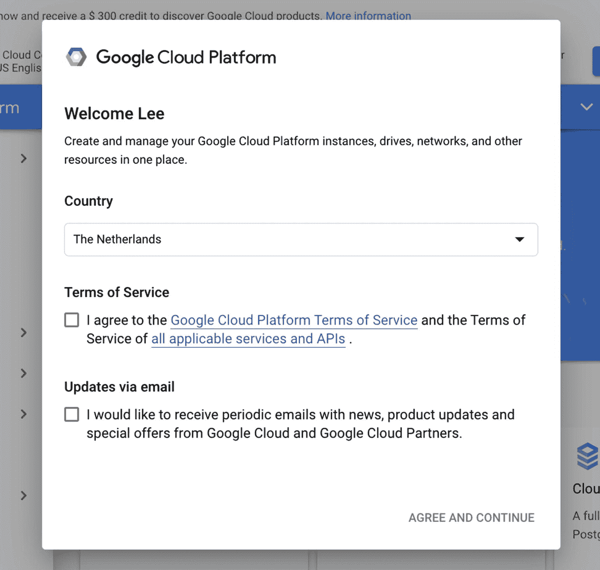

图 2-7 接受 Google Cloud 条款和条件

当您首次使用 Google Cloud 时，需要提供一个结算账户。Google Cloud 按使用量付费，即使它提供免费额度（对于构建聊天机器人来说绰绰有余），您也必须指定一种付款方式，例如信用卡。这将保护 Google Cloud 免受机器人滥用免费账户的影响。在左侧菜单中，您可以选择**结算** ➤ **创建账户**。您需要指定结算账户名称、组织名称和国家（货币将与之关联）。在下一个屏幕上，您可以输入付款地址和付款方式详细信息。

登录 Google Cloud 控制台并拥有有效的结算账户后，您需要创建一个项目。点击蓝色顶部栏中 Google Cloud 徽标旁边的**选择项目**按钮。（见图 2-8。）


图 2-8 Google Cloud 控制台中的 Google Cloud 项目选择器

在弹出的窗口中，点击**新建项目**，如图 2-9 所示。

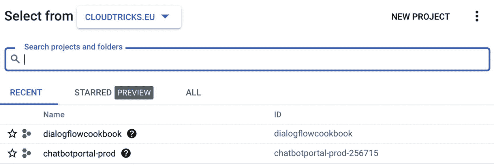

图 2-9 在 Google Cloud 控制台中创建一个新的 Google Cloud 项目

在创建项目页面中，您需要：

-   设置一个*项目名称*。

-   选择一个*结算账户*。此结算账户将用于对该项目进行计费。

点击**创建**。

下一步，让我们在另一个浏览器标签页中打开 Dialogflow 控制台：

[Dialogflow 控制台](http://console.dialogflow.com)

步骤将与上一节类似。但是，现在您可以在创建智能体页面中导入您新创建的 Google Cloud 项目。

点击**创建**。

最后一步是将您的 Dialogflow 套餐从试用版升级到企业版。在菜单中，点击**升级**按钮（见图 2-10）。

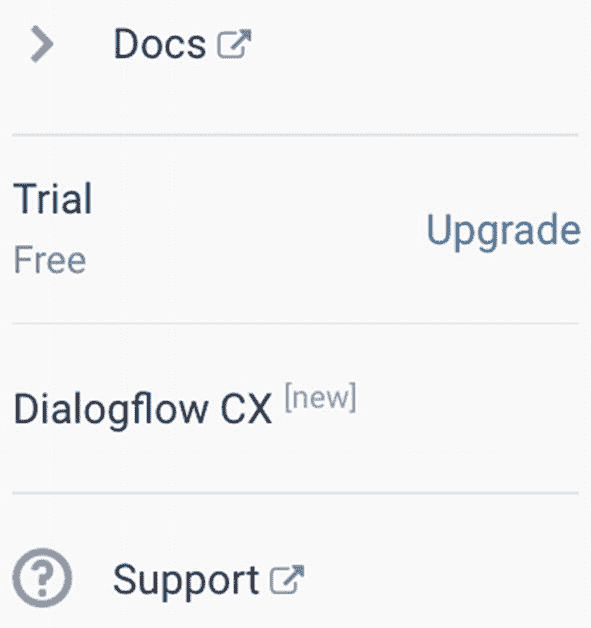

图 2-10 升级到 Dialogflow 按需付费

您将看到一个类似图 2-11 的弹出窗口，您可以选择一个套餐。有两个套餐可供选择：*试用版*和*基础版*。这两个套餐的主要区别在于，*基础版*套餐提供企业级功能，例如 Google Cloud 条款和条件、SLA、支持以及更高的配额。

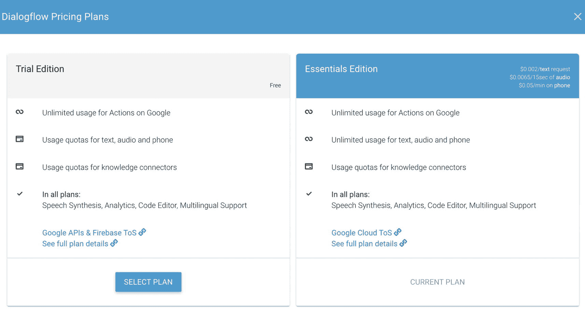

图 2-11 选择 Dialogflow 版本

选择基础版套餐，即表示您同意 Google Cloud（企业版）条款和条件。

设置企业版套餐后，您将在菜单中看到企业版套餐已为您的项目激活（注意图 2-12），并且您可以随时更改。

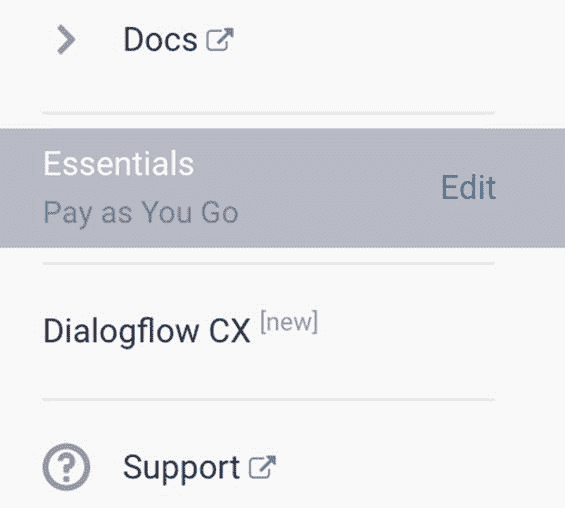

图 2-12 注意 Dialogflow 菜单中已选定的套餐

## 配额

除了云条款和条件、SLA 和支持之外，许多客户使用企业版的另一个原因是更高的调用配额。每次您与 Dialogflow 交互时，用户话语都将被视为一次 API/Dialogflow 智能体调用。试用版 Dialogflow 有 API 调用上限。试用版每分钟最多可进行 180 次文本聊天机器人调用，而企业版每分钟可进行 600 次请求。Google Cloud 有关于所有配额的文档，并且配额通常可以增加。要申请更高的配额，请在配额编辑表单中点击**申请更高配额**，以提交**Dialogflow 配额增加请求**（[Dialogflow 配额增加请求](https://console.cloud.google.com/apis/api/dialogflow.googleapis.com/quotas)）。

## 用户角色与监控

由于您使用的是 Google Cloud，企业可以通过 **Cloud Logging** 创建和查看自定义审计报告、日志记录和调试。

企业管理员可以通过 Cloud IAM 从 Google Cloud 控制台邀请和注册聊天机器人用户。可以设置用户和组权限，或设置安全和控制策略。他们还可以使用目录同步（例如 **Active Directory 同步**）来导入和注册公司用户。这可以通过 Cloud Directory Sync 和 Directory API 使用 Webhook 完成。

假设您与其他 Google Cloud 资源（如 Cloud Functions 或其他机器学习 API）进行了集成，并且您不想授予应用程序完整的项目访问权限。在这种情况下，您必须在 Google Cloud IAM 控制台中分配 Dialogflow API 角色（**管理员**、**客户端**或**读取者**）。当您在 Google Cloud 控制台中选择 **IAM 与管理**，并查找 Dialogflow 使用的服务账户时，可以找到此配置。（有关名称，请参阅 Dialogflow 中的设置面板。）

> **注意：** 开发者应避免同时处理同一个智能体。多个用户使用单个 Dialogflow 智能体在同时保存和训练智能体时可能会导致冲突。

Dialogflow 控制台向创建智能体的用户提供**所有者/管理员**角色。如果您想更改所有者/管理员、为一个智能体添加多个所有者/管理员，或移除一个智能体的所有者/管理员，您同样需要 Google Cloud 控制台中的 IAM 与管理功能。

### 使用 VPC 服务控制

VPC 服务控制可以帮助您降低 Dialogflow 数据泄露的风险。您可以创建一个服务边界，这是一种组织级方法，用于保护您在项目中指定的资源和数据。您可以保护智能体数据以及意图检测请求和响应。创建服务边界时，请将 Dialogflow（`dialogflow.googleapis.com`）作为受保护服务包含在内。

### 使用开发者功能

当开发者希望通过 SDK 使用 Dialogflow 时，需要先从云控制台启用 Dialogflow API。可以通过点击此链接 [启用 Dialogflow API](https://console.cloud.google.com/flows/enableapi?apiid=dialogflow.googleapis.com) 在 Google Cloud 控制台中启用，或者使用 Google Cloud 命令行工具 (`gcloud`) 执行以下命令：

```bash
gcloud services enable dialogflow.googleapis.com
```

有多种身份验证选项，但建议使用服务账号进行身份验证和访问控制。服务账号为应用程序（而非最终用户）提供凭据。项目拥有服务账号，您可以为单个项目创建多个服务账号。有关更多信息，请参阅服务账号。

## 配置您的 Dialogflow 项目

点击 Dialogflow 徽标正下方的齿轮图标，进入设置页面。

在此页面上，您可以添加其他语言、调整机器学习设置、与其他人共享项目或创建多个环境。

让我们逐一查看所有这些设置。

### 常规

如图 2-13 所示，在“常规”选项卡中，提供以下设置：

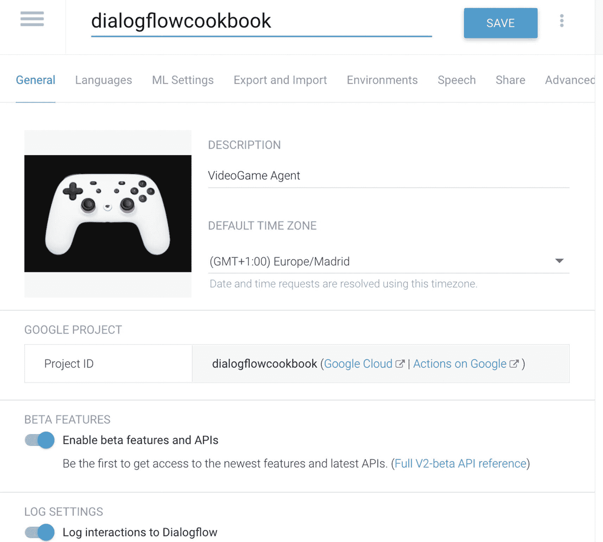

图 2-13 Dialogflow 设置面板

*   **描述**：智能体的描述。

*   **默认时区**：智能体的默认时区。

*   **Google 项目**

    *   **项目 ID**：与智能体关联的 Google Cloud 项目

    *   **服务账号**：Dialogflow 用于系统集成的服务账号

    *   **试用版或按量付费**

*   **Beta 功能**：切换以启用智能体的 Beta 功能。

*   **日志设置**

    *   **将交互记录到 Dialogflow**：您将能够使用 Dialogflow 中的“历史记录”和“训练”功能。

    *   **将交互记录到 Google Cloud**：仅当启用了**将交互记录到 Dialogflow** 时，此选项才可用。禁用 Dialogflow 的日志记录也会禁用此设置。它将使用 Google Cloud（以前称为 Stackdriver）中的日志记录功能。

*   **删除智能体**：完全删除智能体，且无法撤销。如果智能体已与其他用户共享，则必须先移除这些用户，然后才能删除智能体。

### 语言

“语言”选项卡是您可以为智能体添加其他语言的地方。如图 2-14 所示，Dialogflow Essentials 支持 21 种智能体语言；您可以从弹出窗口中选择多种语言。

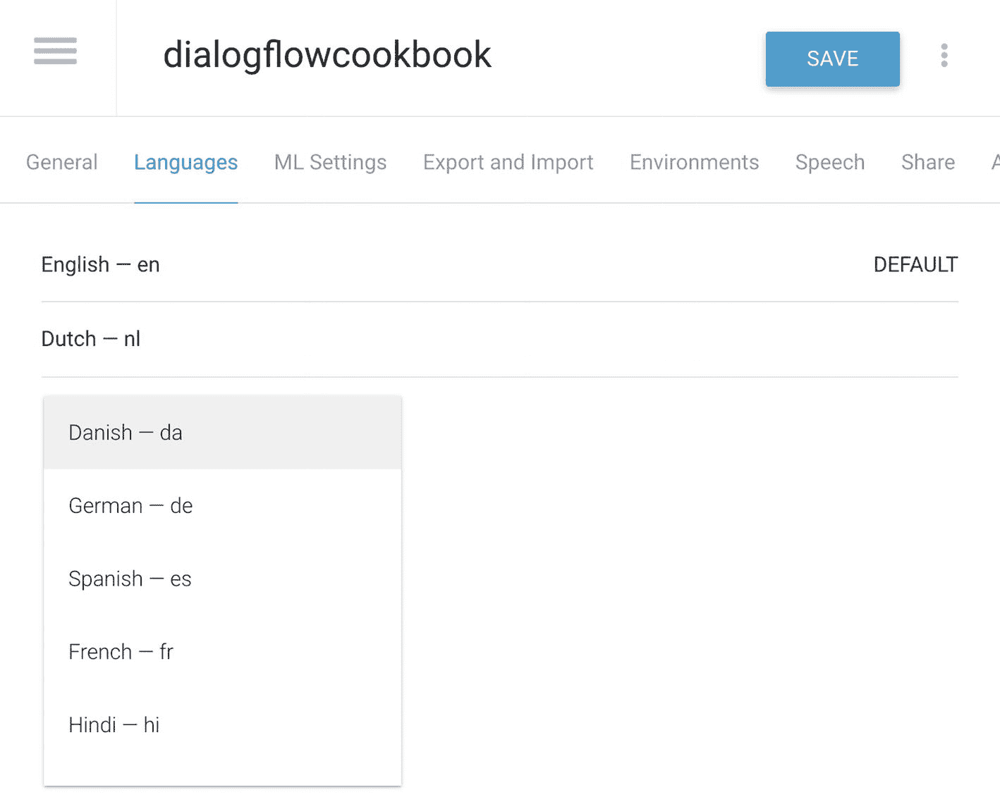

图 2-14 选择 Dialogflow 语言

### 机器学习设置

Dialogflow Essentials 的核心概念是**意图分类**。（第 3 章将详细介绍其工作原理。）对话设计师会将训练短语标记上意图名称。一旦聊天机器人投入生产，底层的 Dialogflow 机器学习模型就可以根据其训练过的训练短语，将用户话语与定义的意图进行匹配。有时，不同的意图包含相似的训练短语。一个意图可能比另一个意图更相关。特别是当您的智能体不断增长，并且会向智能体添加更多意图时，可能会发生匹配到错误意图的情况。解决此问题的通用方法是更改**机器学习分类阈值**。阈值就像一个置信度分数。如果返回值小于阈值，则会触发回退意图，或者如果没有定义回退意图，则不会触发任何意图。

您可以在**机器学习设置**选项卡下的设置部分找到机器学习分类阈值；见图 2-15。

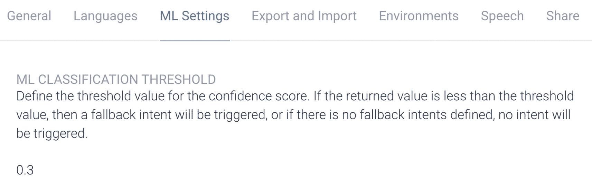

图 2-15 机器学习分类阈值，一个置信度分数

您可以在原始 API 响应中找到置信度级别；请注意图 2-16 中的以下行：

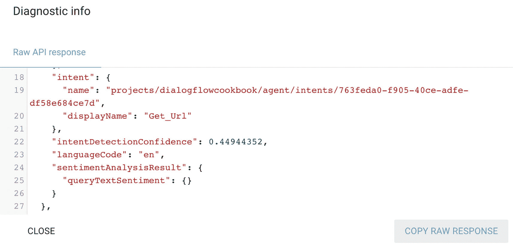

图 2-16 当您在模拟器中点击“诊断信息”按钮时，可以看到原始 API 响应，其中包含 `intentDetectionConfidence`

```json
"intentDetectionConfidence": 0.7057321,
```

有时，您可能不想在智能体级别而是在意图级别调整机器学习置信度。可能是因为某些意图比较特殊，所以可以更改每个意图的优先级。您可以给意图设置更高或更低的优先级。甚至可以忽略特定的意图，可能是因为您仍在处理它。

操作方法是从意图屏幕中选择该意图。

在意图屏幕的顶部，您可以点击蓝色圆点。这将显示一个小弹出窗口；请查看图 2-17 以找到此功能。

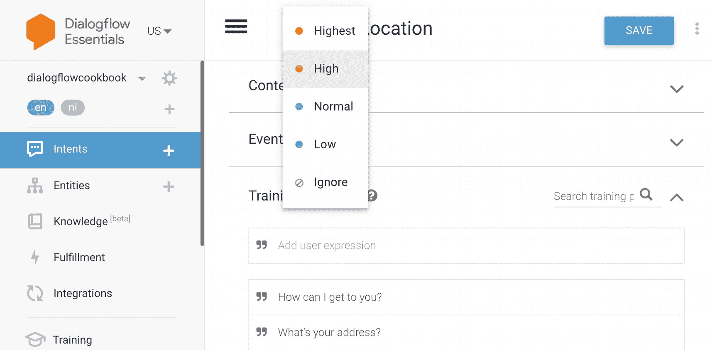

图 2-17 每个意图都可以有单独的优先级，以改进意图检测

#### 自动拼写纠正

如果启用此功能，并且用户输入存在拼写或语法错误，则意图将按照书写正确的方式（基于其训练短语和使用的实体）进行匹配。检测意图的响应将包含更正后的用户输入。这也适用于涉及系统和自定义实体的匹配。例如，“我想买一个 Swtch。”它将找出正确的意图并写下正确的参数，即“Switch”。

拼写纠正适用于 Dialogflow 支持的所有语言。

注意

如果拼写错误和更正后的用户输入匹配不同的意图，则选择匹配拼写错误用户输入的意图。

拼写纠正无法纠正 ASR（自动语音识别）错误，因此我们不建议为使用 ASR 输入的智能体启用此功能。自动语音适应可能会有所帮助；请参阅第 7 章。但这两个功能都不能与 Google 上的操作一起使用，因为 Google 上的操作使用自己的语音转文本/文本转语音层。

更正后的输入可能匹配错误的意图。您可以通过将常见的不匹配短语添加到负面示例中来修复此问题。

拼写纠正会略微增加智能体的响应时间。

### 自动训练

默认情况下，当添加或编辑意图或实体时，底层的机器学习模型会自动更新。您可以禁用或启用智能体的自动训练。例如，当您想测试机器学习模型的性能时，可以使用此功能。在第 13 章中，将讨论机器学习模型的健康状况。

### 智能体验证

默认情况下，每次您对智能体进行更改时，Dialogflow 都会对您的智能体运行一次智能体审查。如图 2-18 所示，您可以在设置部分禁用或启用智能体验证；更多信息请参阅第 5 章。

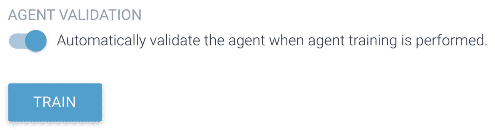

图 2-18 启用智能体验证

### 导出和导入

注意图 2-19；在此选项卡中，您可以导入和导出代理。**导出**意味着您将创建代理的备份。它将返回一个 zip 文件，其中包含


# 图 2-21 模拟器中的文本转语音

## 语音配置

注意图 2-22；使用以下设置在 V2 API 和电话集成中配置代理的合成语音：

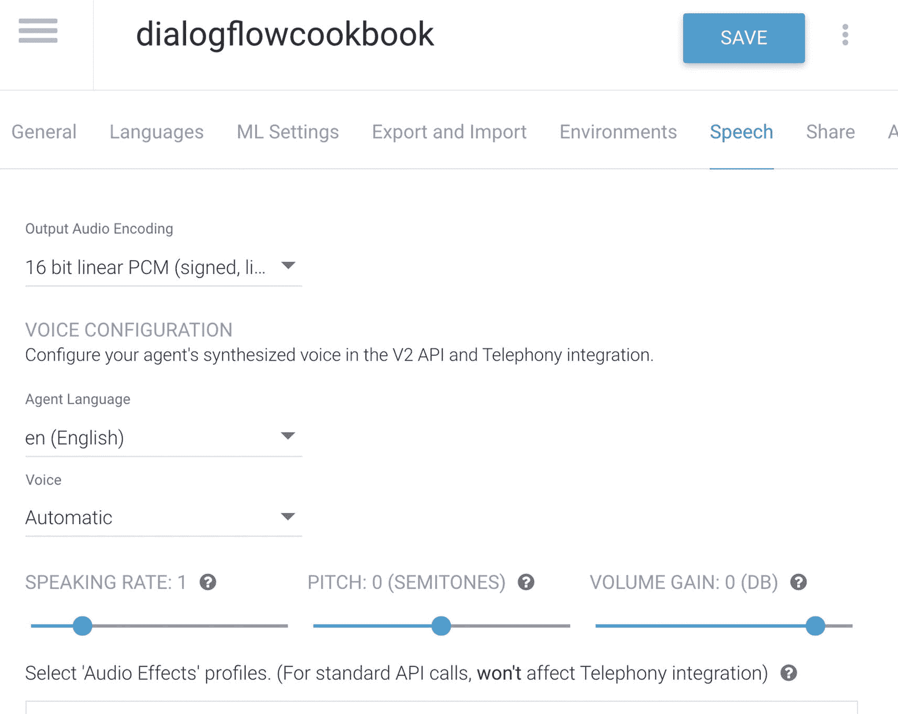

图 2-22 语音配置

*   **Agent Language**：选择语音合成的默认语言。
*   **Voice**：选择语音合成模型。
*   **Speaking Rate**：调整语音语速。
*   **Pitch**：调整语音音调。
*   **Volume Gain**：调整音频音量增益。
*   **Audio Effects Profile**：选择要应用于合成语音的音频效果配置文件。语音音频针对与所选配置文件关联的设备（例如，耳机、大型扬声器、电话通话）进行了优化。

有关调整文本转语音的更多信息，请参见第 7 章的 SSML 部分。

**注意**：所有这些设置都不包括 Actions on Google。因为 Google Assistant 使用其自身的语音转文本和文本转语音模型。

### 共享

注意图 2-23；**Share** 选项卡允许您与其他人共享您的 Dialogflow 代理。您可以添加一个电子邮件地址，并指定此用户的角色，可以是 **Reviewer** 或 **Developer**。

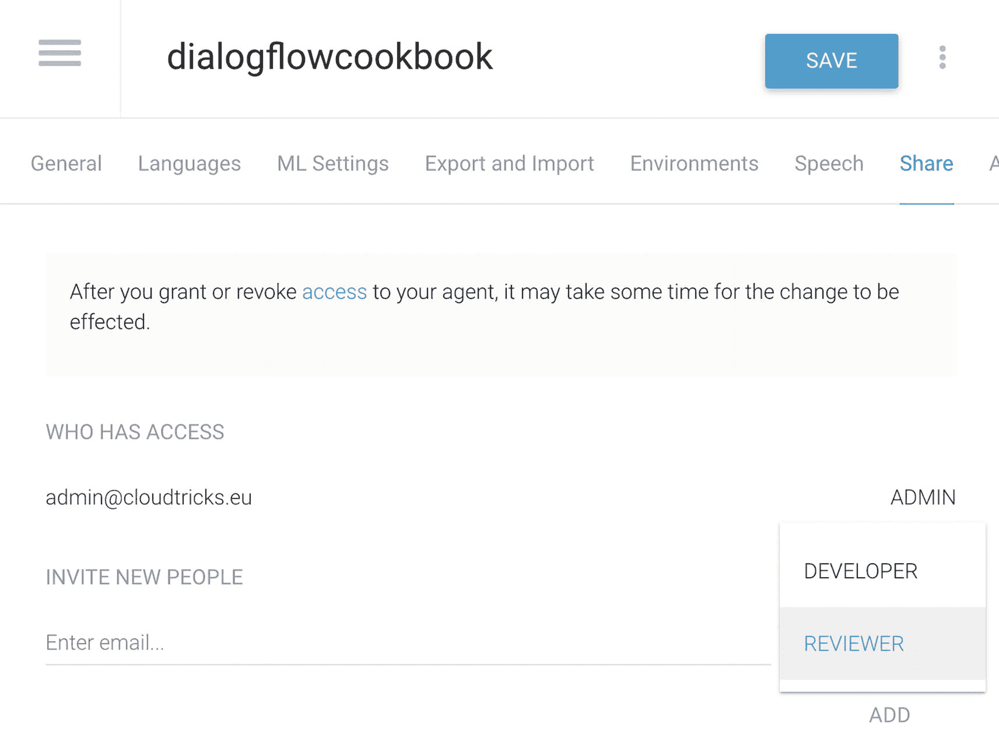

图 2-23 共享设置。别忘了点击保存！

Dialogflow 中的开发者角色映射到 Google Cloud Console 中的 IAM 角色：**Project** ➤ **Editor**。它授予需要对所有 Google Cloud 和 Dialogflow 资源具有编辑权限的项目编辑者：

*   使用 Cloud Console 或 API 对所有云项目资源的编辑权限
*   对 Dialogflow Console 的编辑权限以编辑代理
*   可以使用 API 检测意图
*   查看 IAM 原始角色定义

Dialogflow 中的**审查者**角色映射到 Google Cloud Console 中的 IAM 角色：**Project** ➤ **Viewer**。它授予需要对所有 Google Cloud 和 Dialogflow 资源具有读取权限的项目查看者：

*   使用 Cloud Console 或 API 对所有云项目资源的读取权限
*   对 Dialogflow Console 的读取权限
*   不能使用 API 检测意图

按下 **Add** 按钮，不要忘记点击 **Save** 按钮。

### 高级

在撰写本文时，在 **Advanced** 选项卡（图 2-24）中，只有一个设置可以控制：**Sentiment Analysis**。您可以为支持的语言启用情感分析。启用情感分析将在意图检测时返回一个分数和一个量级。

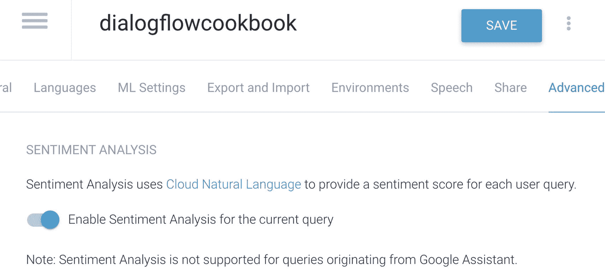

图 2-24 启用情感分析

情感检测的**分数**表示用户话语的整体情感。情感检测的**量级**表示用户话语中存在的情感内容量，该值通常与用户话语的长度成正比。

您可以在模拟器中测试它（图 2-25）。尝试输入“Thank you for helping me.”。它会返回一个介于 0 和 +1 之间的正面查询分数。接下来，在模拟器中输入“That didn’t work at all.”。您现在将看到一个介于 –1 和 0 之间的负面分数。

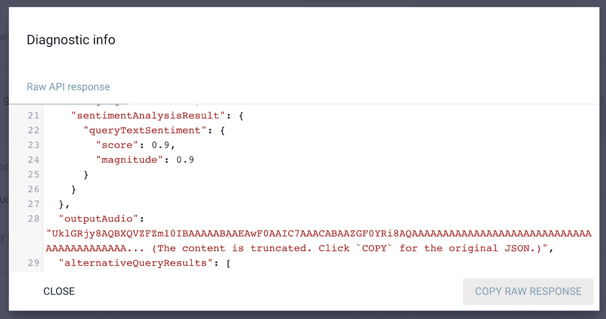

图 2-25 当用户说一些积极的话时，API 响应将产生积极的情感

**注意**：每个 Google Cloud 项目只能有一个 Dialogflow 代理。如果您的 Dialogflow 代理需要测试和开发版本，您可以使用 Dialogflow 中的 **versions** 功能。或者，您可以创建更多的 Google Cloud 项目，一个用于测试代理，一个用于开发代理。
