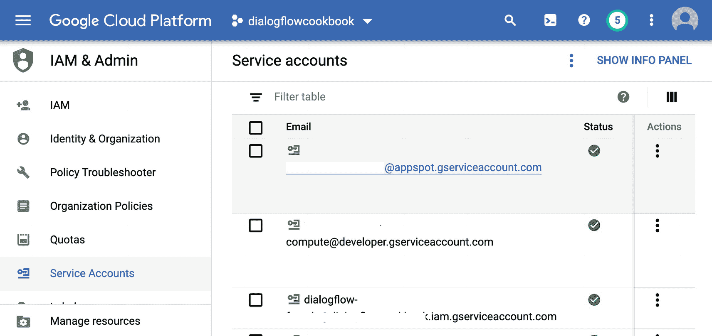
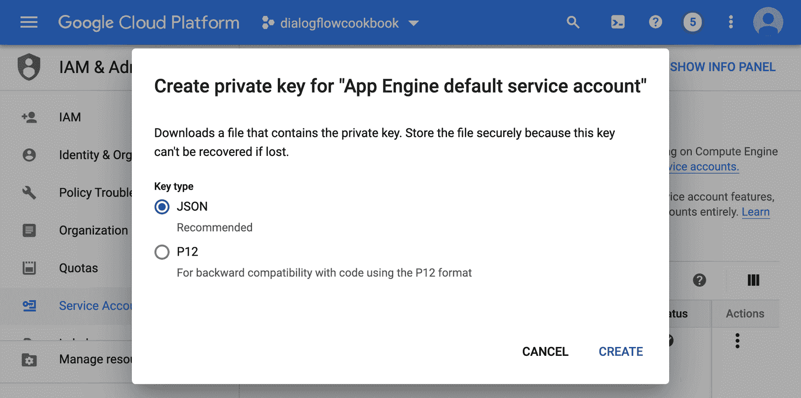

# 为开发者配置 Dialogflow

您是一名开发者，并且希望获得开发者访问权限。

选择 **IAM 与管理** ➤ **服务账号**。您将看到一个服务账号的电子邮件地址，如图 2-26 所示。



图 2-26

Google Cloud 控制台中的服务账号

如果您尚未下载此服务账号的服务账号密钥，请下载，并将 `GOOGLE_APPLICATION_CREDENTIALS` 环境变量设置为其路径。您可以通过点击 **操作** 列中的选项按钮并选择 **创建密钥** 来下载服务账号 JSON 密钥。在弹出的窗口中，您可以选择 **JSON** 并点击 **创建**。（见图 2-27。）



图 2-27

从服务账号创建私钥

它会将 JSON 文件下载到您的磁盘，您需要将其分配给一个名为 `GOOGLE_APPLICATION_CREDENTIALS` 的环境变量。

将密钥分配给环境变量 `GOOGLE_APPLICATION_CREDENTIALS`。

对于 Linux/MacOS 环境：

```
export GOOGLE_APPLICATION_CREDENTIALS=/path/to/service_account.json
```

对于 Windows 环境：

```
set GOOGLE_APPLICATION_CREDENTIALS=c:\path\to\service_account.json
```

## 总结

本章涉及以下任务：

*   您希望开始使用 Dialogflow 并设置一个 Dialogflow 试用版代理。
*   您为企业工作，希望创建一个符合合规性要求的安全虚拟代理；您可以创建一个 Dialogflow Essentials 按量付费代理。
*   您已创建了一个 Dialogflow 项目，现在希望对其进行配置。
*   您是一名开发者，并且希望获得开发者访问权限。

如果您想构建此示例，本书的源代码可通过本书的产品页面在 GitHub 上获取，网址为 [`www.apress.com/ISBN`](http://www.apress.com/ISBN)。请查找 `dialogflow-agent` 文件夹。

## 延伸阅读

*   比较 Dialogflow 版本
    [`https://cloud.google.com/dialogflow/docs/editions`](https://cloud.google.com/dialogflow/docs/editions)
*   Firebase 条款与条件
    [`https://firebase.google.com/terms/`](https://firebase.google.com/terms/)
*   Dialogflow Enterprise/Google Cloud 条款与条件
    [`https://cloud.google.com/terms/`](https://cloud.google.com/terms/)
*   Dialogflow 层级与定价
    [`https://cloud.google.com/dialogflow/pricing#es-agent`](https://cloud.google.com/dialogflow/pricing%2523es-agent)
*   Dialogflow 层级与配额
    [`https://cloud.google.com/dialogflow/quotas`](https://cloud.google.com/dialogflow/quotas)
*   关于在 BigQuery 中存储 Dialogflow 数据的博文
    [`https://cloud.google.com/blog/products/ai-machine-learning/simple-blueprint-for-building-ai-powered-customer-service-on-gcp`](https://cloud.google.com/blog/products/ai-machine-learning/simple-blueprint-for-building-ai-powered-customer-service-on-gcp)
*   Google Cloud 中的目录同步
    [`https://tools.google.com/dlpage/dirsync/`](https://tools.google.com/dlpage/dirsync/)
*   Google Cloud IAM
    [`https://cloud.google.com/resource-manager/docs/access-control-org`](https://cloud.google.com/resource-manager/docs/access-control-org)
*   Dialogflow 访问控制
    [`https://cloud.google.com/dialogflow/es/docs/access-control`](https://cloud.google.com/dialogflow/es/docs/access-control)
*   请求更高配额
    [`https://console.cloud.google.com/apis/api/dialogflow.googleapis.com/quotas`](https://console.cloud.google.com/apis/api/dialogflow.googleapis.com/quotas%253F_ga%253D2.114957573.345776091.1589188956-1503905642.1588942477)
*   VPC 服务控制
    [`https://cloud.google.com/vpc-service-controls/docs/service-perimeters`](https://cloud.google.com/vpc-service-controls/docs/service-perimeters)
*   服务账号
    [`https://cloud.google.com/docs/authentication#service_accounts`](https://cloud.google.com/docs/authentication%2523service_accounts)
*   以服务账号身份进行身份验证
    [`https://cloud.google.com/docs/authentication/production`](https://cloud.google.com/docs/authentication/production)
*   数据日志记录
    [`https://cloud.google.com/dialogflow/es/docs/data-logging`](https://cloud.google.com/dialogflow/es/docs/data-logging)

