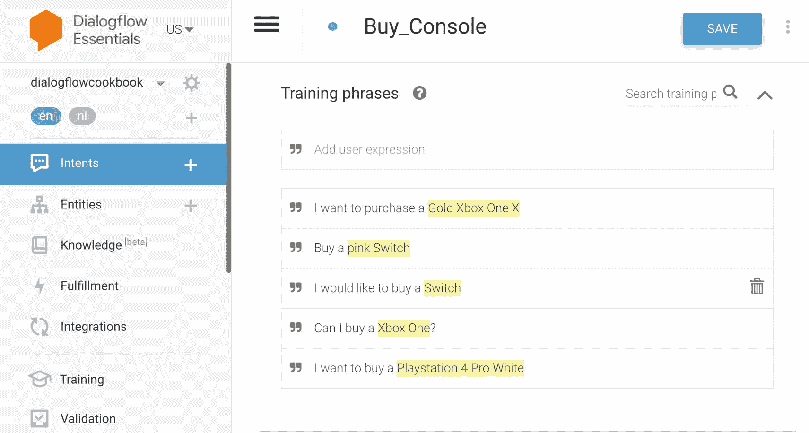
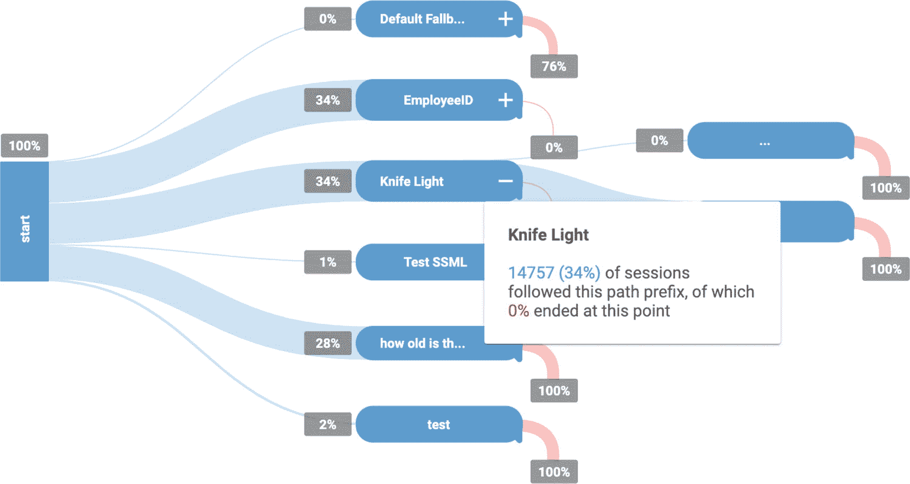
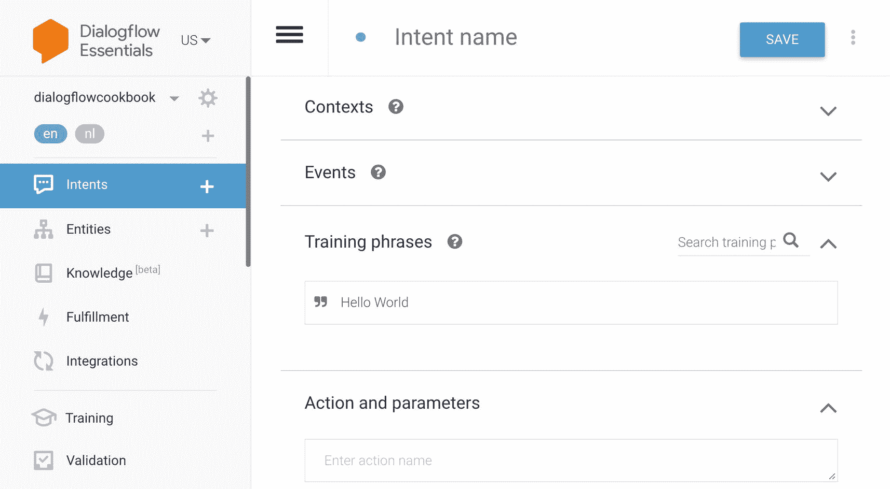
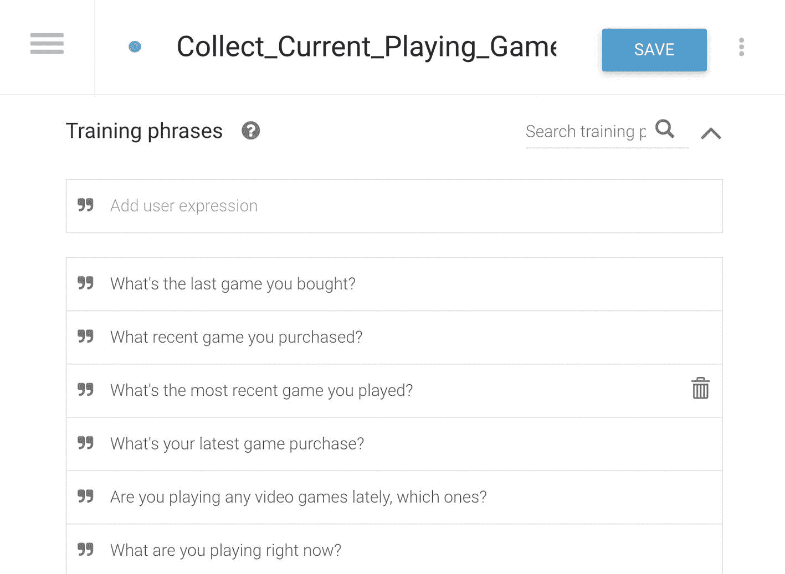
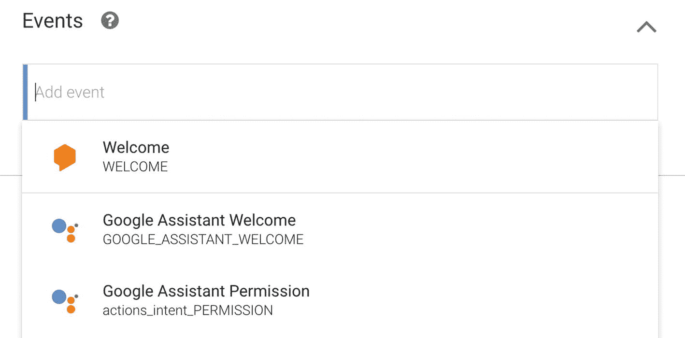

# 3. Dialogflow Essentials 概念

开发者或 UX 设计师可以通过 Dialogflow Web 控制台训练 Dialogflow Essentials 代理（机器学习模型）。它基于意图。一个意图对最终用户在单次对话轮次中的意图进行分类。您的 Dialogflow 代理将包含许多意图。每个意图都包含训练短语、上下文和响应。

本章将深入探讨训练 Dialogflow Essentials 代理的细节。它将涵盖意图如何工作以及如何创建意图。它讨论了实体和上下文的使用。在本章末尾，您将在 Dialogflow 模拟器中测试您的代理。

## 深入理解意图

例如，图 3-1 显示了购买视频游戏机的意图页面。

图 3-1 使用训练短语创建意图

当代理使用给定的带标签的训练短语数据集进行训练后，Dialogflow 可以理解人类对话的含义。

当用户通过书面文本或语音（用户表述）与聊天机器人通信时，Dialogflow 将进行意图分类。由于 NLP 引擎（会持续改进），用户表述的书写方式不同或包含拼写/语法错误都没有关系。它会理解所询问的内容，并通过检查添加到 Dialogflow 代理中的所有意图来进行匹配。一旦匹配到意图，它将返回意图的履行/响应。

Dialogflow 不会像 AlphaZero* 这样的目标驱动型 AI 那样进行自我学习。Google 不会披露底层技术（如 NLP 或语音转文本引擎）的所有实现细节（秘诀），仅仅是因为它们可能会快速变化，并导致文档过时。

**了解更多关于 AlphaZero 的信息，* [AlphaZero](https://en.wikipedia.org/wiki/AlphaZero)

### 设置意图

`intent`（意图）是一个描述操作的消息对象。当你将对话可视化为树状图的一部分（图 3-2）时，所有树的分支都是（后续）意图。

图 3-2 将对话可视化为树状图。每个节点都是一个意图。

让我们登录 Dialogflow Essentials 控制台。在浏览器中打开：[Dialogflow](https://dialogflow.cloud.google.com/)。

当你点击 `Intents` 菜单项，然后点击 `Create New Intent` 按钮时，可以创建新的意图。这将打开意图界面（图 3-3）。你需要指定意图名称、训练短语和响应。

图 3-3 创建一个新意图。

**提示**  

Dialogflow Essentials 没有用于意图的文件夹系统。因此，你需要在命名意图时发挥创意。我见过一些公司给意图分配数字 ID 范围，这很可能映射到数据库中的实现逻辑。我也见过一些公司通过命名意图来更好地分组：`UseCase.MainCategory.SubCategory`，例如：`webshop.console.order` 和 `webshop.videogame.cancelorder`。最终，你应该自行决定哪种方式最有效。如果是一个小型代理，这样的结构可能无关紧要，但要注意你的代理最终会扩展。

让我们构建一个很酷的聊天机器人，它可以提供诸如即将发布的游戏等视频游戏信息。同时，也应该能够与聊天机器人就视频游戏进行对话。如果你在现实生活中与朋友就这个话题进行对话，会是什么样子？大概是这样：

> *我：你最近在玩什么电子游戏？*  
> *朋友：哦，在任天堂 Switch 上，我玩《动物森友会》，在 PlayStation 上，我最近在玩最新的《星球大战》游戏。你呢？*  
> *我：我在玩《使命召唤》。*  
> *我：你最喜欢的电子游戏是什么？*  
> *朋友：我最喜欢的游戏是《暴雨》和《超凡双生》。我也很喜欢《神秘海域》系列。*  
> *我：《暴雨》？不就是那个无聊的快速反应事件冒险游戏吗？*  
> *朋友：我最喜欢单人游戏。我最喜欢的游戏是有故事的游戏。那些游戏的故事很棒。*  
> *我：哦。它是在哪个平台上发行的？*  
> *朋友：PlayStation 3 和 4。*  
> *我：我更喜欢多人游戏。你最喜欢的多人游戏是什么？*  
> *朋友：我偶尔玩《使命召唤》。但我玩得不太好。我觉得我更喜欢在 iPad 上玩《炉石传说》。*

当我们分析这段对话时，可以清楚地看到有三个对话主题：

- 收集用户当前正在玩的游戏信息

- 收集用户最喜欢的整体游戏

- 收集用户最喜欢的多人游戏

如果我们把这段对话拿到 Dialogflow 中进行训练，那么这三个训练主题就是意图。

`intent`（意图）对用户的意图进行分类。对于每个 Dialogflow 代理，作为用户体验设计师（代理建模者）或开发者的你，可以定义许多意图，这些意图组合起来可以处理完整的对话。通过定义意图，底层的机器学习模型将得到训练。

当最终用户在聊天机器人中写下或说出某些内容（称为 `user expression` 或 `utterance`）时，Dialogflow 会根据训练短语和内置的 NLP（即 Dialogflow 机器学习模型训练的基础）将表达式与你的 Dialogflow 代理的最佳意图进行匹配。匹配意图也称为 `intent classification`（意图分类）或 `intent matching`（意图匹配）。匹配到的意图可以返回响应、收集参数（`entity extraction`，实体提取）或触发 webhook 代码（`fulfillment`，实现逻辑）（例如，从数据库获取数据）。

Dialogflow 中的意图包含以下内容：

图 3-4 意图的训练短语。

- **上下文**：使用上下文，你可以在轮换发言时控制对话流程，例如，基于我们示例中的对话。在某个时刻，朋友（或聊天机器人）会提到他最喜欢的电子游戏。随后问了一个后续问题：“它是在哪个平台上发行的？”这指的是之前提到的最喜欢的电子游戏。我们将在本章后面讨论设置上下文。

- **训练短语**：见图 3-4。这是你用来训练每个单独意图的数据集。当用户说出某些内容时，它将与这些训练短语进行匹配。用户话语的拼写或表达方式不同并不重要。如果设置正确，Dialogflow 自然语言理解（NLU）很可能会理解其含义，并能够找出匹配的意图。

**提示**  

在提供训练短语时，一个好的做法是至少提供 15 到 20 个不同的示例，具体取决于意图的复杂程度。不要使这些短语过于相似。

假设我们要在 Dialogflow 中创建“收集用户当前正在玩的游戏信息”意图。训练短语可以是：

- *你最近在玩什么电子游戏？*

- *你现在在玩哪个游戏？*

- *你最近在玩哪些游戏？*

- *你最近在玩电子游戏吗？哪些？*

- *你现在在玩什么？*

- *你最近买了什么游戏？*

- *你最近玩过的游戏是什么？*

图 3-5 意图可以通过事件被调用。

- **事件**：（见图 3-5。）意图通常是在用户表达式与意图训练短语匹配时触发的。但是，你也可以使用事件来触发意图，这是一种在特定功能或操作后触发代码的机制，例如，`platform event`（平台事件），如 `Google Assistant Welcome` 事件，该事件会在 Google Assistant 操作启动时触发；或者 `custom welcome event`（自定义欢迎事件），当你的网页聊天机器人在页面加载时启动 Dialogflow 代理时触发。

**提示**  

一些 Dialogflow Essentials 用户使用自定义事件来使意图可重用。Dialogflow Essentials 本身不具备重用意图的功能。如果你将对话视为树状图，那么会有一些树分支（如登录流程或“是/否”流程）在对话的某些时刻重复出现。在使用事件时，你可以手动支持这一点。在实现逻辑代码实现中，你可以通过设置 `WebhookResponse` 的 `followupEventInput` 字段来触发自定义事件。你还可以选择设置 `followupEventInput.parameters` 字段来向意图提供参数。Dialogflow 意图可以配置为在返回响应之前监听这些事件。

- **操作**：此功能对于使用 Dialogflow SDK 的开发者最有意义。在 Dialogflow 控制台中，你可以为每个意图定义一个操作名称。当意图被匹配时，Dialogflow 会将操作名称提供给通过 SDK 集成 Dialogflow 代理的实现。

例如，如果我们创建一个新意图来获取特定月份的游戏发布信息，视频游戏结果不会硬编码在 Dialogflow 界面中。相反，开发者会调用一个带有数据库的 Web 服务，该服务将过滤并返回视频游戏结果。在 Dialogflow 中，我可以将操作名称设置为 `fetch_videogames`，这可以（取决于你的实现逻辑实现）触发你代码库中的一个函数。
