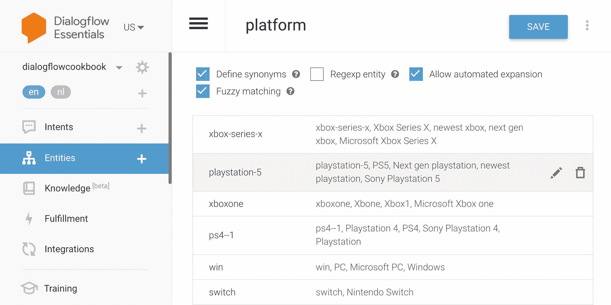
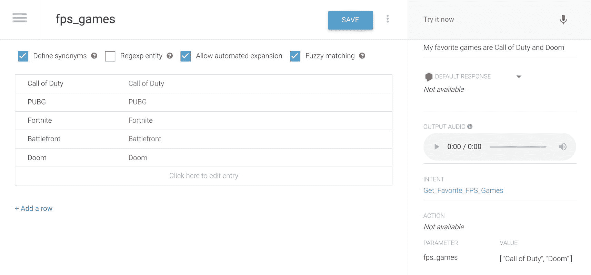
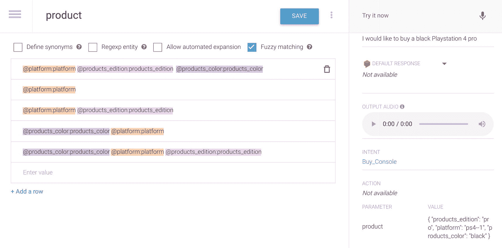
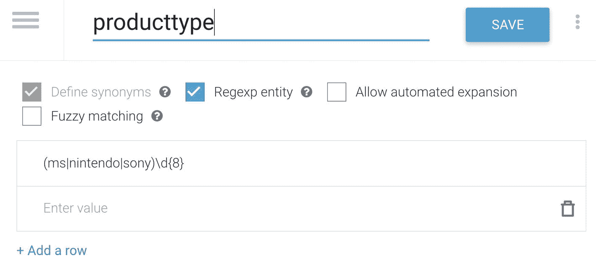
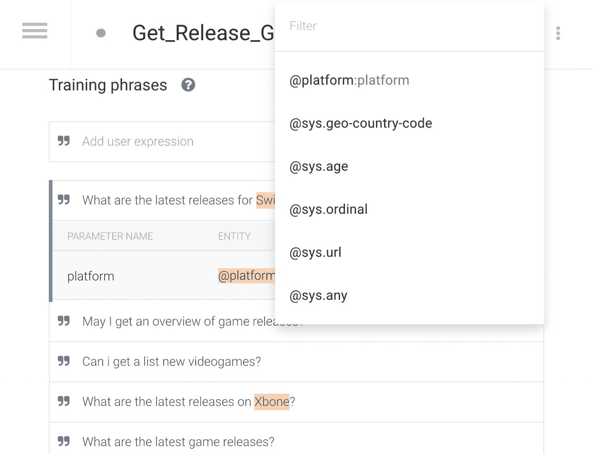

# 参数、响应与实现

- **参数**：当意图在运行时被匹配时，Dialogflow 会从用户表述中提取值作为*参数*，这些参数可发送至实现代码/后端代码。我们将在下一节详细讨论参数。

- **响应**：你可以定义返回给最终用户的文本、语音或视觉响应。这些响应可以为最终用户提供答案、向最终用户询问更多信息，或终止对话。

在我们的示例中，聊天机器人的响应可能是：*哦，在任天堂 Switch 上，我玩《动物森友会》，而在 PlayStation 上，我目前正在玩最新的《星球大战》游戏。*

可以指定多个不同的响应。Dialogflow 会轮流选择响应，因此你的回答每次都可能不同。另一种响应可以是：*我最近买了《死亡搁浅》游戏，但还没开始玩。*

响应还可以包含**自定义负载**。某些平台支持自定义负载响应，以处理非标准的高级响应。这些自定义负载以平台文档中定义的 JSON 格式提供。例如，你可以用此创建富卡片。根据你为 Dialogflow 启用的集成，你会看到不同的响应选项卡用于输入自定义负载。

响应还有一个**对话结束开关**。你可以指定该响应是否为对话的结束。它将停止对话。例如，在特定平台（如 Google Assistant）上，它会关闭该操作（应用）。

- **实现开关**：当此对话的答案未在 Dialogflow 中硬编码，而是来自其他系统时，应标记*为此意图启用 webhook 调用*。当意图在运行时被匹配时，Dialogflow 代理会持续从用户处收集参数，直到用户为所有必需参数提供了数据。此过程称为槽位填充。默认情况下，Dialogflow 在收集完所有必需数据之前不会发送实现 webhook 请求。如果为槽位填充启用了 webhook，则在槽位填充期间，Dialogflow 会为每次对话轮次发送实现 webhook 请求。

在实现界面中，你可以设置 webhook。我们将在第 10 章详细讨论实现。

当你启动一个新的 Dialogflow 项目时，你总会获得两个预定义的意图：一个*欢迎意图*，在开始对话时触发；以及一个全局*回退意图*，当 Dialogflow 完全无法匹配任何意图时激活。

一个 Dialogflow 代理可以处理 2k 个不同的意图。如果你需要更多意图，可以考虑使用超级代理功能；参见第 9 章。每个意图每种语言最多可以有 2k 个训练短语，或每个 Dialogflow 代理每种语言总计最多 100k 个。

## 深入理解实体

**实体**是一个（可变的）消息对象，用于执行操作。它就像一个参数，为特定键收集值。

在 Dialogflow 中，你可以创建**自定义实体**，或使用**系统实体**。自定义实体可以在 Dialogflow 代理中创建。Dialogflow 开箱即用地识别系统实体，例如月份名称、货币和国家名称。

### 创建自定义实体

要创建自定义实体，在菜单栏中点击*实体* ➤ *创建实体*。（见图 3-6。）

在此界面上，你可以为实体命名并列出可能的值。条目的第一个值将用于发送到后端；所有其他值选项（同义词）将用于识别该条目。你可以使用 Tab 键创建更多同义词。

创建自定义实体后，别忘了点击*保存*按钮。

我们的聊天机器人目前还没有包含那么多高级逻辑。完成之前的步骤后，你的聊天机器人只能与你进行简单的对话。想象一下，你还可以查询特定游戏机的最新发布日期，例如：

"这个月有哪些游戏在 **PlayStation 5** 上发布？"

PlayStation 5 是一个可变部分。我可以询问 PlayStation 5、Xbox Series X、Nintendo Switch 或 Windows，以返回不同的结果。PlayStation 5 是一个自定义实体。事实上，如果我将此对话连接到 web 服务，它会发送一个参数来过滤响应到后端系统，例如：

- `platform = PS5`

为了让 Dialogflow 理解 PlayStation 5 是一个实体，我们需要创建一个包含所有可能选项的实体 `platform`。



图 3-6

创建自定义实体

有一种更简单的方法来输入所有实体条目。点击保存按钮旁边的三个点（选项按钮），它允许你切换到原始模式。在这里，你可以以 JSON 或 CSV 格式输入条目。清单 3-1 展示了 JSON 格式的代码示例。

```
JSON:
[
{
"value": "xbox-series-x",
"synonyms": [
"xbox-series-x",
"Xbox Series X",
"newest xbox",
"next gen xbox",
"Microsoft Xbox Series X"
]
},
{
"value": "playstation-5",
"synonyms": [
"playstation-5",
"PS5",
"Next gen PlayStation",
"newest PlayStation",
"Sony Playstation 5"
]
},
{
"value": "xboxone",
"synonyms": [
"xboxone",
"Xbone",
"Xbox1",
"Microsoft Xbox One"
]
},
{
"value": "ps4--1",
"synonyms": [
"ps4--1",
"Playstation 4",
"PS4",
"Sony Playstation 4"
]
},
{
"value": "win",
"synonyms": [
"win",
"PC",
"Microsoft PC",
"Windows"
]
},
{
"value": "switch",
"synonyms": [
"switch",
"Nintendo Switch"
]
},
{
"value": "new-nintendo-3ds",
"synonyms": [
"new-nintendo-3ds",
"N3DS",
"3DS",
"Nintendo 3DS",
"New Nintendo 3DS"
]
}
]
清单 3-1
JSON 格式的实体示例
```

清单 3-2 展示了 CSV 格式的代码示例。

```
"xbox-series-x","xbox-series-x","Xbox Series X","newest xbox","next gen xbox","Microsoft Xbox Series X"
"playstation-5","playstation-5","PS5","Next gen playstation","newest playstation","Sony Playstation 5"
"xboxone","xboxone","Xbone","Xbox1","Microsoft Xbox one"
"ps4--1","ps4--1","Playstation 4","PS4","Sony Playstation 4"
"win","win","PC","Microsoft PC","Windows"
"switch","switch","Nintendo Switch"
"new-nintendo-3ds","new-nintendo-3ds","N3DS","3DS","Nintendo 3DS","New Nintendo 3DS"
清单 3-2
CSV 格式的实体示例
```

也可以从实体界面导入或导出实体。点击创建实体按钮旁边的选项（三个点）按钮。点击**上传实体**，选择上传包含实体的 JSON 或 CSV 文件。上传文件需要符合以下规则：

- 每个条目对应一行。
- 参考值和同义词之间用逗号分隔。
- 每个参考值和同义词应使用双引号括起来。
- 参考值应位于行首。
- 如果希望参考值被实体匹配，请将其包含两次。

通过编程方式也可以添加实体。如果你有一个需要从数据库自动导入的庞大实体列表，这将非常有用。

Dialogflow API 方法 `projects.agent.entityTypes.batchUpdate` 可以实现此功能。

一个 Dialogflow 代理可以处理 250 个不同的自定义实体。如果你需要更多实体，可以考虑使用超级代理功能；参见第 8 章。每个实体可以有 30K 个不同的条目，每个实体条目有 200 个同义词。一个 Dialogflow 代理最多有 100 万个实体值和同义词。


### 高级自定义实体

默认情况下，实体匹配要求与实体条目完全匹配。如果客户拼错了实体，例如，他们输入了 `PayStation 4` 而不是 `PlayStation 4`，很明显是出现了拼写错误。**模糊匹配**允许您识别实体的非精确匹配。只需选中 `Fuzzy Matching` 复选框，然后保存实体类型即可。

通过选中 `allow automated expansion` 复选框，您可以启用 Dialogflow 来提取自定义实体中未指定的其他参数。如果我们使用相同的 `video-game-platform` 实体，您会发现我们没有为“GBA / Gameboy Advanced”定义实体条目。启用自动扩展后，它会获取用户的精确输入，并将其用作 `video-game-platform` 参数。

还可以创建列表实体和复合实体。**列表实体**可以类比 HTML 中的选择框（下拉选择）。您可以从值列表中选择一个或多个。例如，我可以创建一个名为 `FirstPersonShooter Games` 的实体，其值包括：

- `Call of Duty`
- `PUBG`
- `Fortnite`
- `Battlefront`
- `Doom`

如图 3-7 所示，假设我告诉聊天机器人：“我最喜欢的游戏是 `Call of Duty`、`Fortnite` 和 `PUBG`。”那么获取了这些值的参数（将被发送到后端）看起来会像一个数组：



**图 3-7** 创建列表自定义实体。请注意模拟器中的值；它是一个值的数组！

```
fps_games = ["Call of Duty", "Fortnite","PUBG"]
```

**复合实体**是一个更高级的对象；复合实体可以由其他实体组合而成。假设我有一个名为 `@product` 的实体，它由其他自定义实体组成：

```
@platform @product_edition @product_color
```

如图 3-8 所示，假设我询问聊天机器人：“我想买一台 `PlayStation 4 Pro Black edition`。”那么获取了这些值的参数（将被发送到后端）现在看起来会像一个 JSON 对象：



**图 3-8** 创建复合实体，请注意模拟器中的值，它是一个对象！

```
product = {
platform: "Playstation 4",
product_color: "Black",
product_edition: "Pro"
}
```

要创建复合实体，您需要禁用同义词复选框，然后就可以使用 `@` 符号开始引用其他实体。

最后一个更高级的功能是实体中的正则表达式。

某些实体需要匹配模式而不是特定术语——例如，国民身份证号码、ID、产品编号、车牌号等。使用**正则表达式实体**，您可以提供用于匹配的正则表达式。

它使用 Google 的 RE2 引擎，这是一个通过有限状态机实现正则表达式的软件库。[一个](https://en.wikipedia.org/wiki/Finite-state_machine)[**有限状态机**](https://en.wikipedia.org/wiki/Finite-state_machine)（[FSM](https://en.wikipedia.org/wiki/Finite-state_machine)）是一种计算的数学模型。它是一种抽象机器，在任何给定时间只能处于有限数量的[*状态*](https://en.wikipedia.org/wiki/Finite-state_machine)之一。因此，它的工作方式与其他正则表达式引擎略有不同。您可以在“另请参阅”部分找到语法链接。

您需要**启用正则表达式**复选框；它会自动禁用同义词，然后您就可以开始编写正则表达式作为条目值（见图 3-9），例如：



**图 3-9** 创建正则表达式实体

- 固定单词，`Sony`、`Nintendo` 或 `MS`
- 数字
- 重复最后一项，八次

```
(MS|Nintendo|Sony)\d{8} 将匹配：MS12345678
```

本书的源代码可通过本书的产品页面在 GitHub 上获取，网址为 [`www.apress.com/978-1-4842-7013-4`](http://www.apress.com/978-1-4842-7013-4)。

我在这些示例中使用的实体是：

- `@fps_games`
- `@platform`
- `@product`
- `@products_color`
- `@products_edition`
- `@producttype`

## 在训练语句中使用实体创建意图

通常，当您想要创建新意图，并且这些意图需要提取您预定义的自定义实体时，您需要确保已首先创建这些实体。

然后，在您的意图训练语句中，您可以开始提供示例。Dialogflow 将根据实体中声明的内容自动注释变量对象。

当 Dialogflow 开始在训练语句中标记某些单词时（图 3-10），您就会知道提取成功了。否则，您可以从训练语句中选择单词，并通过弹出框将它们指向正确的实体来开始自行标记。



**图 3-10** 将鼠标悬停在训练语句中的某个单词上，并为其分配一个自定义或系统实体

标记的实体应分配给参数。当您启用 fulfillment 时，这就是您将在后端系统上收到的内容。在 Dialogflow 模拟器中，您可以在触发文本查询后单击 `Diagnostic Info` 按钮。

这将向您显示一个 RAW API JSON 响应，如清单 3-3 所示。

```
{
"responseId": "5c1ccce4-6445-42fc-be98-fa37f726d633-0f0e27e1",
"queryResult": {
"queryText": "Switch 有哪些最新发布？",
"parameters": {
"platform": [
"switch"
]
},
"allRequiredParamsPresent": true,
"fulfillmentMessages": [
{
"text": {
"text": [
""
]
}
}
],
"intent": {
"name": "projects/dialogflowcookbook/agent/intents/188fe06c-e630-494a-8fff-961d0d73866e",
"displayName": "Get_Release_Games"
},
"intentDetectionConfidence": 1,
"languageCode": "en"
}
}
```

**清单 3-3** RAW API JSON 响应，请注意 `parameters` 部分

参数分配通常在训练语句中注释实体后自动发生，但如果不起作用，您可以调整以下设置。请参见表 3-1，其中描述了所有实体设置。

**表 3-1** 实体设置

| 设置名称 | 描述 |
| --- | --- |
| `action name` | 您可以指定一个操作名称，该名称将显示在 (`queryResult`) API 响应中。 |
| `is required` 复选框 | 如果该实体是完成对话所必需的，则需要选中此框。 |
| `parameter name` | 参数键显示它在 API 响应中的显示方式。 |
| `entity name` | 它映射到的实体。这可以是系统实体。 |
| `value` | 从用户话语中提取的实体值。 |
| `is list` 复选框 | 如果这是一个列表实体，您需要启用此复选框才能将数组作为参数获取。 |
| `prompt` | 当选中“必需”复选框时，您可以输入一个后续问题来询问缺失的必需参数。 |


