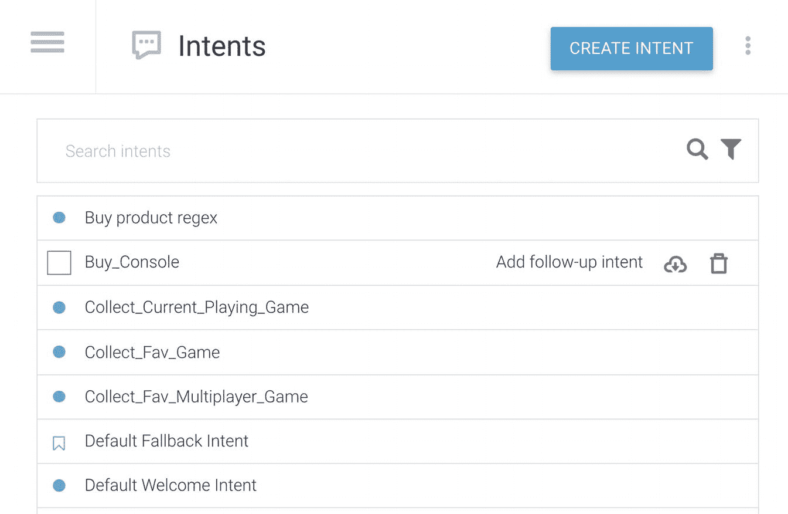
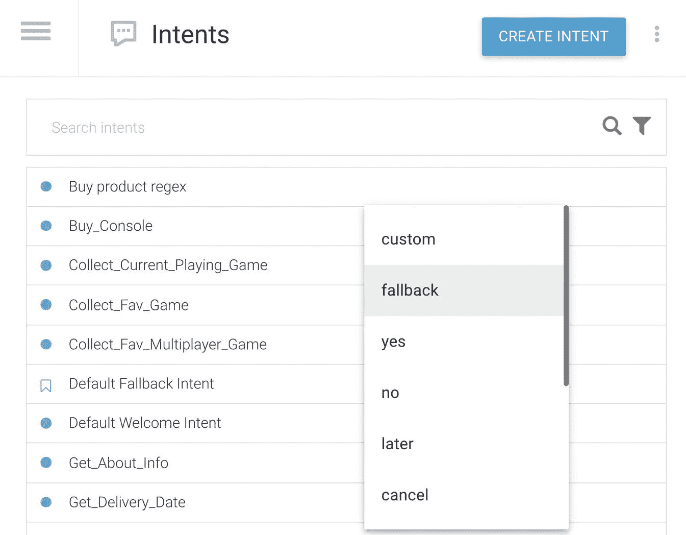
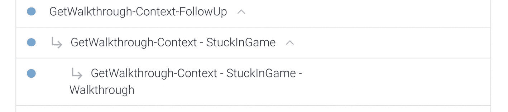
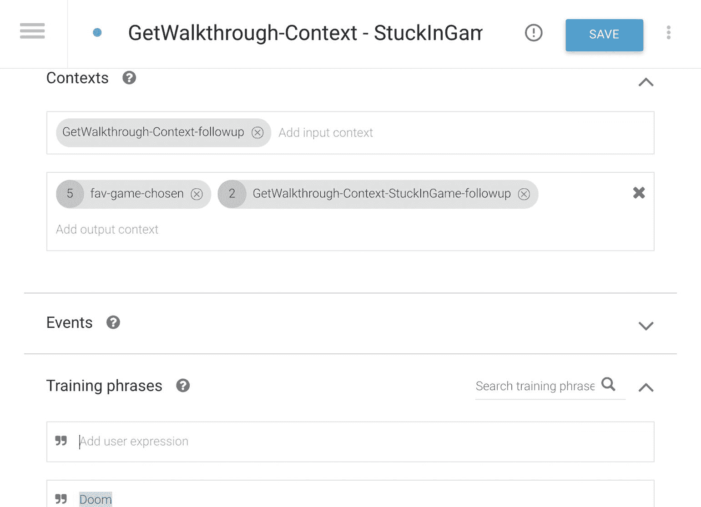
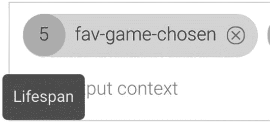
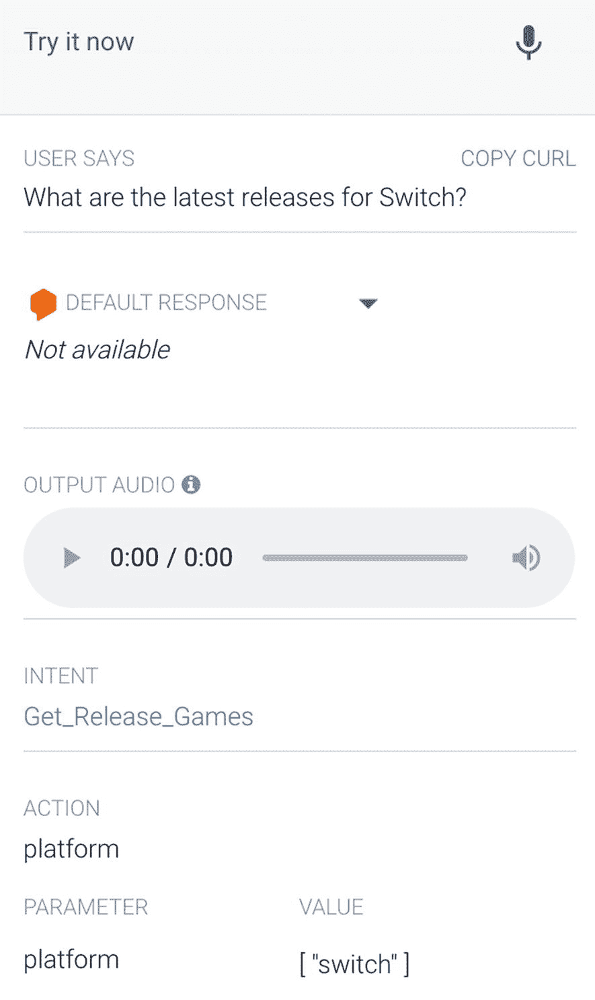
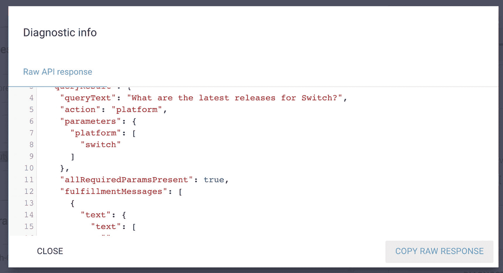

# 保持上下文

**上下文**代表随用户输入或 Dialogflow API 返回的意图一起包含的附加信息。

设置上下文有两种方式：通过后续问题，或通过手动设置输入和输出。

Dialogflow 可以记住上下文。例如，让我们思考以下流程：

> “我们再聊聊喜欢的游戏吧。”

> > “你最喜欢的游戏是什么？”

> “是《使命召唤：现代战争》。”

> > “哦，我玩过那个。你卡关了吗？需要帮助吗？”

> “你知道这个游戏第四关有什么好的攻略吗？”

> > “这里有一个《使命召唤：现代战争》第四关的 YouTube 视频攻略。”

在上述“谈论喜欢的游戏”场景中，上下文是通过后续问题来引导的。对话会经历各种转折；这些转折被自动化为对问题（来自 Dialogflow 或你的实现代码）的后续响应。对话会继续进行。

像人类一样，Dialogflow 可以记住在第二和第三个对话轮次中，“游戏”指的是`《使命召唤：现代战争》`。它可以追踪用户之前的表述。换句话说，上下文有助于区分可能含糊不清的用户输入。上下文也可以通过来自你应用程序的附加细节来设置，例如用户设置和偏好、用户在应用程序中的位置、地理位置等。

也可以在不引导对话的情况下，为其他对话意图设置上下文。你可以将参数暂存在上下文中，供稍后使用。这就是手动设置输入和输出的用途。考虑以下场景：

> “我玩的第一款游戏是《毁灭战士》。”

> > “啊，是的，我也玩过那个游戏。”

> ...（在此期间，可能已经问了其他类型的问题。）

> “我买的第一台视频游戏机是 Dreamcast。”

> > “你是在那上面玩的《毁灭战士》吗？”

每个意图最多可以有五个输入上下文，并且由于一个意图可以应用多个输出上下文，因此每个意图最多可以有三十个输出上下文。当一个意图被匹配时，任何应用于该意图的输出上下文都会变为激活状态。

## 设置后续意图

设置后续意图相当直接。你首先需要创建一个新意图。你需要确保你的响应以另一个问题结尾，以保持对话的进行。点击**保存**。

返回意图概览页面。

将鼠标悬停在之前创建的（新）意图上。（见图 3-11。）



图 3-11 设置后续意图

一个超链接，**添加后续意图**，将会出现。

当你点击**添加后续意图**链接时，会弹出一个窗口（图 3-12），其中包含所有后续意图选项。



图 3-12 使用预定义的后续意图

点击**自定义**。

你会看到一个新的子意图被创建，嵌套在你的第一个意图之下。（见图 3-13。）



图 3-13 后续意图的嵌套

你可以点击子意图，然后通过提供训练短语和响应来继续（并使用相同的过程进行更深层次的嵌套）。

打开这些子意图时，你会注意到输入和输出上下文已自动设置，并带有预定义的名称和默认的存活周期计数。（见图 3-14。）



图 3-14 后续意图中的预定义上下文

父意图中的输入上下文始终为空。子意图使用输入上下文来提供前一个（父）意图。如果对话没有输出上下文，则输出上下文可以是最后一个意图（见图 3-14）。

有多种预定义的后续问题可供选择。使用预定义后续问题的优势在于，它自带训练短语，开箱即用，支持所有 Dialogflow 语言。表 3-2 展示了各种后续意图的概览。

表 3-2 预定义的后续意图

| 后续类型 | 描述 |

| --- | --- |

| 自定义 | 编写你自己的自定义表达式。 |

| 回退 | 当没有其他表达式被触发时的回退。 |

| 是 | 用于捕获肯定回应的常见表达式。 |

| 否 | 用于捕获否定回应的常见表达式。 |

| 稍后 | 用于稍后执行操作的常见表达式。 |

| 取消 | 用于取消操作或退出的常见表达式。 |

| 更多 | 用于获取更多信息或管理列表的常见表达式。 |

## 在“普通”意图中手动设置输入和输出

除了使用后续意图，你也可以在“普通”意图中自己指定输入和输出。

如果某个意图需要将用户参数保存在上下文中供以后使用，则创建一个新意图。你可以在**输出**中指定一个名称。

当你创建另一个需要处理已存储上下文的意图时，你需要指定与之前相同的内容名称，但现在是在**输入**中。

意图中的输入上下文有一个主要功能：当上下文未激活时，它们会限制该意图被触发。

**注意**   如果你为一个意图应用了多个输入上下文，它们会按照“与”逻辑工作。这意味着，如果你希望触发此意图，则两个上下文都必须处于激活状态。

## 存活周期

上下文在聊天会话中并非永久激活；它们存在于特定的**存活周期**标准内：

*   当一个意图被匹配且上下文被检索到时，上下文会过期。

*   在达到由 `lifespan_count` 参数指定的 `DetectIntent` 请求次数后过期。

*   在 20 分钟内没有为 `DetectIntent` 请求匹配到任何意图时过期。

对于手动设置了输入和输出的普通意图，默认存活周期是五个对话轮次。对于后续意图，默认存活周期是两个对话轮次。你可以通过选择存活周期数字（图 3-15）并输入新的存活周期计数来覆盖默认值。



图 3-15 存活周期数字

当你退出聊天会话时，你的上下文将会丢失。如果你想为用户的下次访问保存上下文，你将需要后端的实现代码，通过 SDK 获取和设置上下文，并将其存储，例如存储在数据库中。这在处理用户登录时通常有效。

**注意**   关于命名上下文的一些最佳实践：

*   使用字母数字名称（例如 `mycontext1`）。

*   使用 `-` 或 `_` 代替空格（`my_context1`/`my-context1`）。

*   名称不区分大小写（`myContext123` 和 `mycontext123` 被视为等效）。

*   使用 API 时，所有上下文名称均为小写（`mycontext123`）。

### 通过 SDK 保持上下文

在实际应用中，你会在实现代码中通过 SDK 获取上下文参数。

事实上，回顾之前的场景，用户可能会先触发“游戏主机”意图。因此，第一个玩的游戏尚未在上下文中设置。当你在实现代码中使用 SDK 时，可以检查 `first-game-chosen` 的上下文是否已设置，如果已设置，你的回复内容将会有所不同。

如果你想通过 SDK 获取上下文，可以从 Sessions 类型的 `detectIntent` 调用中获取。它会包含一个字段 `queryResult.outputContexts`，该字段会提供所有活跃上下文的列表。

有时，你可能希望从实现代码中在运行时设置上下文，而不是在 Dialogflow 控制台中设计意图的上下文。例如，当用户与你的（实时）代理交互时，你可能想捕获设备位置。你只需发起一个 `detectIntent` 请求调用，并将 `queryParams.context` 指定为一个对象即可。

清单 3-4 展示了 `detectIntent` 请求的 JSON 格式。

```
POST https://dialogflow.googleapis.com/v2/{session=projects/*/agent/sessions/*}:detectIntent
{
"queryInput": {
"text": {
"languageCode": "en-US",
"text": "我想把披萨加入购物车。"
}
},
"queryParams": {
"contexts": [
{
"name": "projects/project-id/agent/sessions/session-id/contexts/product-chosen",
"lifespanCount": 5,
"parameters": {
"product": "Pizza",
"device-location" "@52.3377871,4.8698096,17z"
}
}
]
}
}
```

清单 3-4 — `detectIntent` POST 请求示例

然而，也可以在 Dialogflow 控制台中将上下文参数指向为硬编码的回复文本。其表示法如下：`#context-name.$parameter-name`。如果参数是在上一条回复中给出的（而非上下文中），你可以使用美元符号表示法来引用它：`$parameter-name`。

例如，这里有一个关于 `#fav-game-chosen.$fav-game` 级别的 YouTube 视频演示：`$level`。

### 在模拟器中测试

你可以随时在 Dialogflow 模拟器中通过语音或输入文本与你的 Dialogflow 代理进行对话（图 3-16）。这是一个测试代理是否按预期运行的有用工具。



图 3-16 — 在模拟器中测试

Dialogflow 模拟器位于屏幕右侧。

在顶部，你可以开始输入用户语句，或者通过语音输入。它内置了浏览器麦克风集成功能。首次使用时，当 Dialogflow 加载时，你需要允许麦克风权限弹出窗口。

“用户说”部分会返回使用麦克风功能时捕获的内置 Dialogflow 语音转文本模型的结果。否则，它会重复输入的文本查询。

一旦匹配到意图，“默认回复”模块将显示来自 Dialogflow 的回复或从实现代码返回的回复。

有一个“集成”下拉菜单；如果你启用了 Google Assistant 或任何其他集成，你将看到来自这些渠道的输出。（根据你在意图回复中的输入方式，这可能会有所不同。）

当文本转语音启用时（在**设置** ➤ **语音**选项卡中），某些语言可以自动生成音频回复；它会合成回复文本。你可以按播放按钮收听语音。如果你希望收听不同的语音或不同的语速，也可以在“语音”选项卡中调整语音。

再往下，你会看到匹配的意图，并带有一个打开 Dialogflow 意图页面的链接，方便你进行编辑。

在此之下，有一个包含“操作”和“参数”的模块。通过实体提取，如果启用了实现功能，收集到的值将作为键值对发送到后端。提取实体时，通常需要与实现功能配合使用。

这也是为什么有一个**诊断信息**按钮。点击此按钮，你将获得原始的 API JSON 响应（图 3-17）。这对于测试/调试很有用；当你的后端代码与 Dialogflow SDK 集成时，它应该期望收到这样的响应。



图 3-17 — 诊断信息 ➤ API 原始响应预览

## 总结

本章为你提供了关于 Dialogflow Essentials 概念的所有信息。

它涵盖了以下任务：

*   你想为 Dialogflow 代理添加对话部分，通过使用意图来训练 Dialogflow 模型。

*   你想创建自定义的预定义变量对象（实体）。

*   你想通过使用预定义实体从对话中提取变量对象。

*   你想在对话中实现话轮转换并保持上下文。

*   你想测试你的 Dialogflow 代理是否正常工作。

如果你想构建这个示例，本书的源代码可通过图书产品页面在 GitHub 上获取，网址为 [www.apress.com/978-1-4842-7013-4](http://www.apress.com/978-1-4842-7013-4)。请查看 `_dialogflow-agent` 文件夹。

我在意图示例中使用的意图有：

*   `Collect_Current_Playing_Game`

*   `Collect_Fav_Game`

*   `Collect_Fav_Multiplayer_Game`

我在实体示例中使用的意图有：

*   `Get_Release_Games`

*   `Get_Favorite_FPS_Games`

*   `Buy