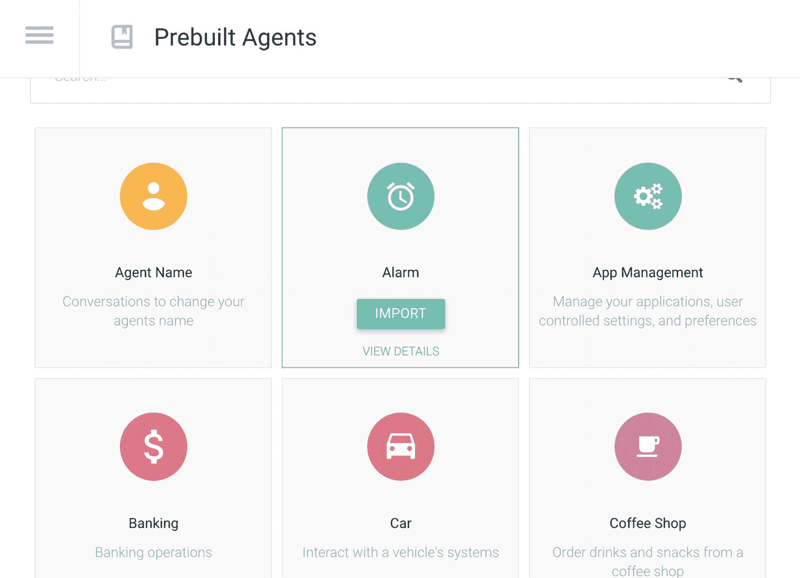
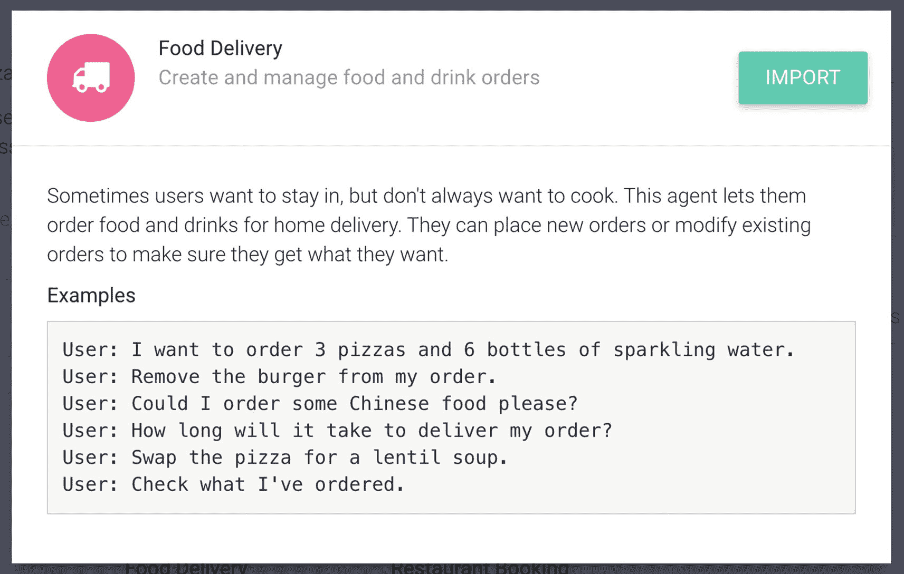

# 使用模板构建聊天机器人

有一些工具可以帮助快速构建智能体；它们类似于模板组件。有一些开箱即用的智能体可供启用（预构建智能体）；还可以启用闲聊功能，以支持非正式对话。此外，还可以通过知识库功能，从（私有）CSV 文件或公共网站导入常见问题解答。本章将涵盖所有这些内容。

## 创建预构建智能体

一个**预构建智能体**通常包含已配置好参数和实体的示例意图。它会针对多种语言进行配置，因此非常实用。它不包含 fulfillment webhook 逻辑，因为这需要 Cloud Function 或后端支持。但它对于快速启动一个包含多种语言示例的项目非常有用！

如图 4-1 所示，当你在 Dialogflow ES 菜单中点击**预构建智能体**时，你将看到所有预构建智能体的概览。这就像一个市场！有超过 40 个预构建智能体可供选择。例如货币转换器、银行、食品配送、航班等预构建智能体。

图 4-1：所有预构建智能体的概览

当你点击一个预构建智能体时，可以请求查看详情，详情会以弹出窗口的形式显示示例意图（图 4-2）。

图 4-2：一个预构建智能体的示例

将鼠标悬停在你想使用的预构建智能体上，然后点击**导入**。

选择**创建一个新的 Dialogflow 项目**，然后点击**确定**。

> **注意：** 你不能将预构建智能体添加到现有的 Dialogflow 智能体中。如果你想要那些意图，可以从设置界面导出/导入意图。

导入智能体后，你可能需要进入**设置**界面，为项目添加一个服务账号。如果需要，系统会提示你。

一旦你的智能体导入完成，你的 Dialogflow 项目中就会新增一个智能体，你可以在现有内容的基础上进行优化并添加新的意图。
