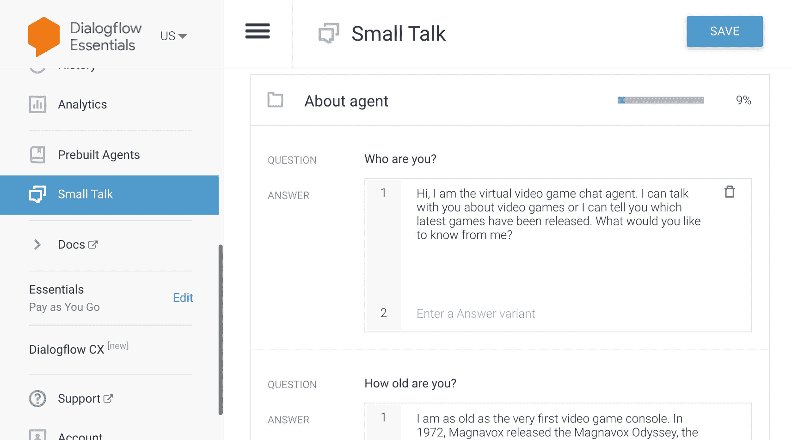
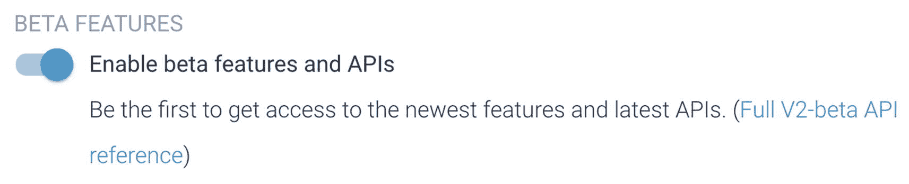
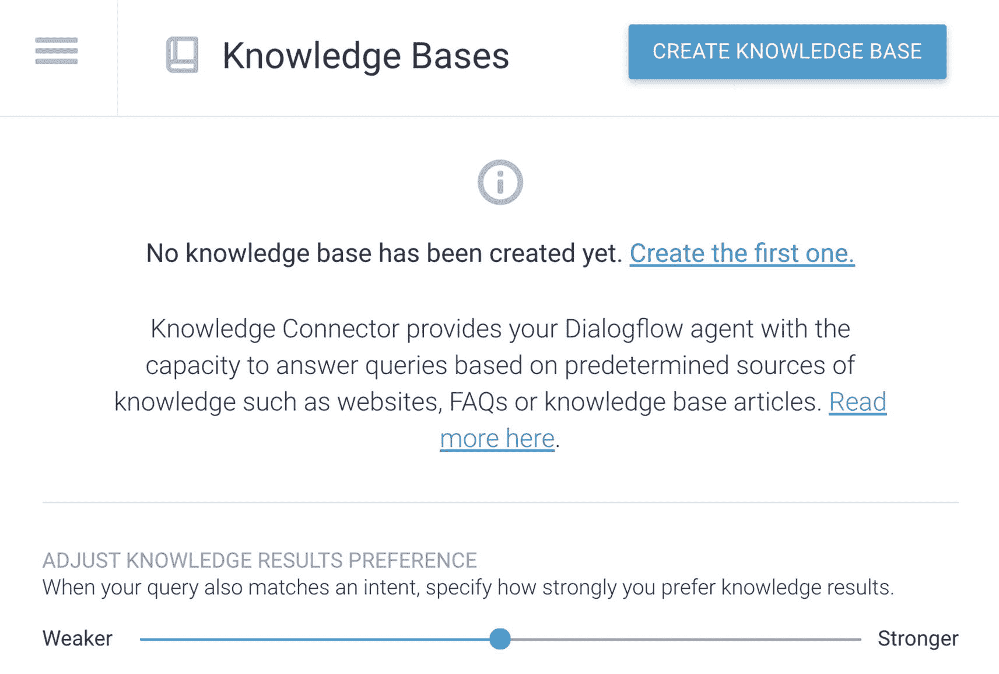
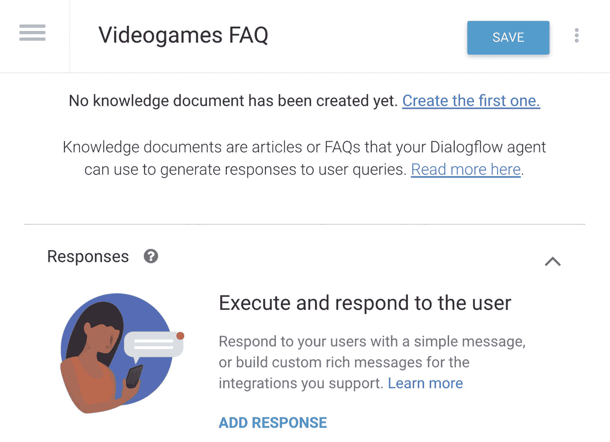
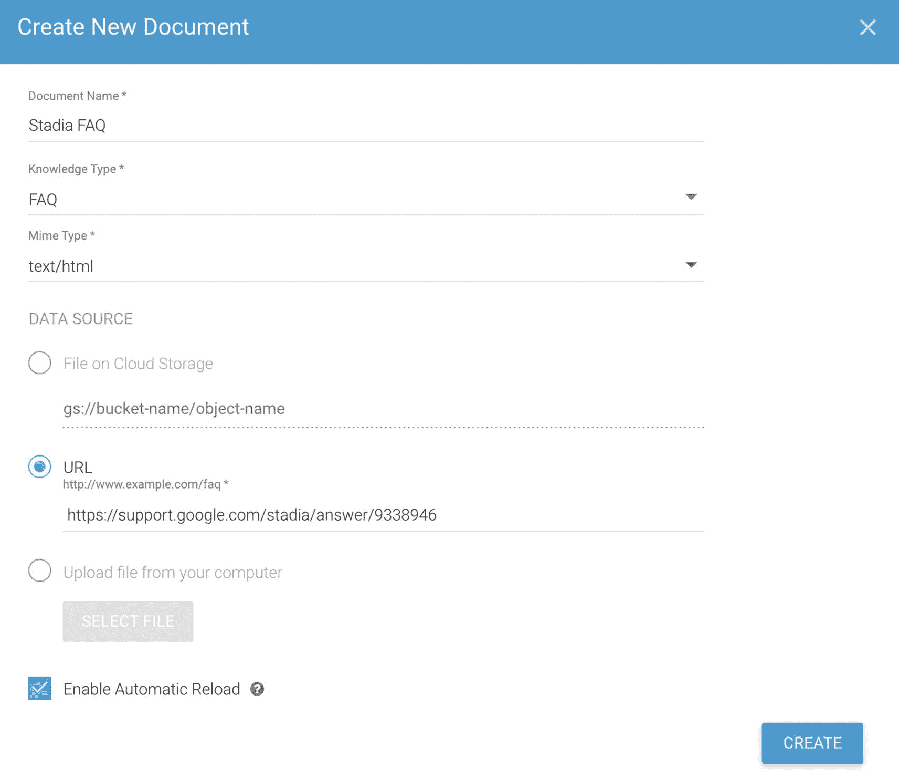
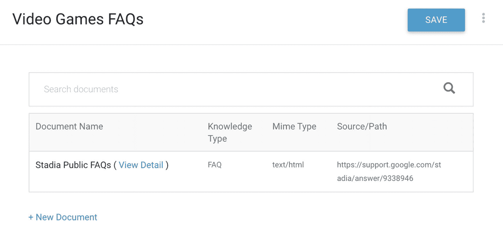
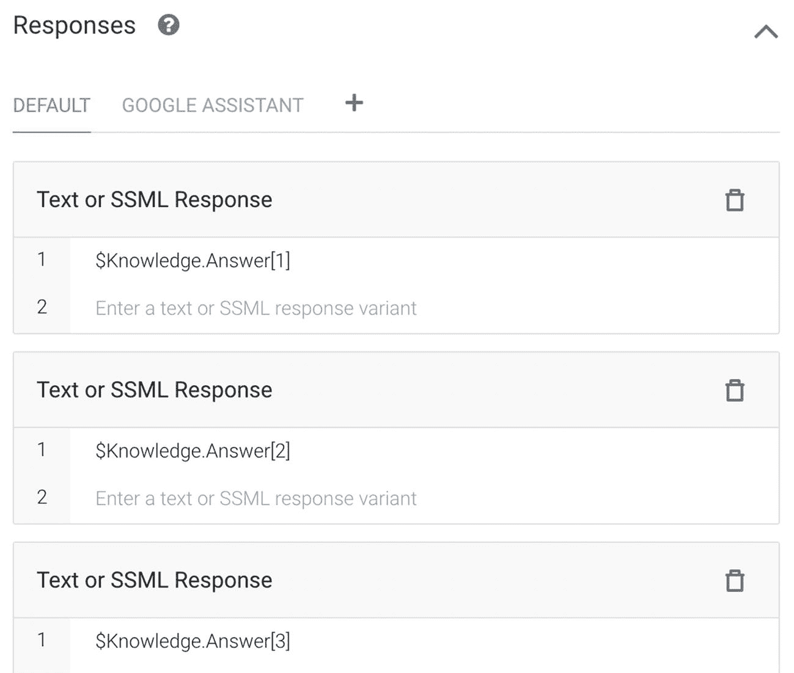
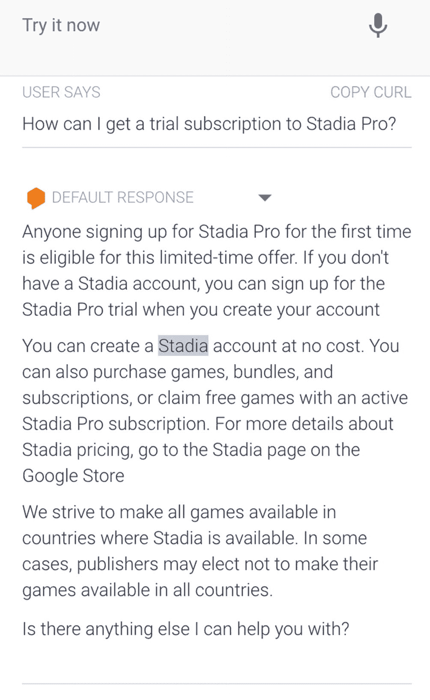
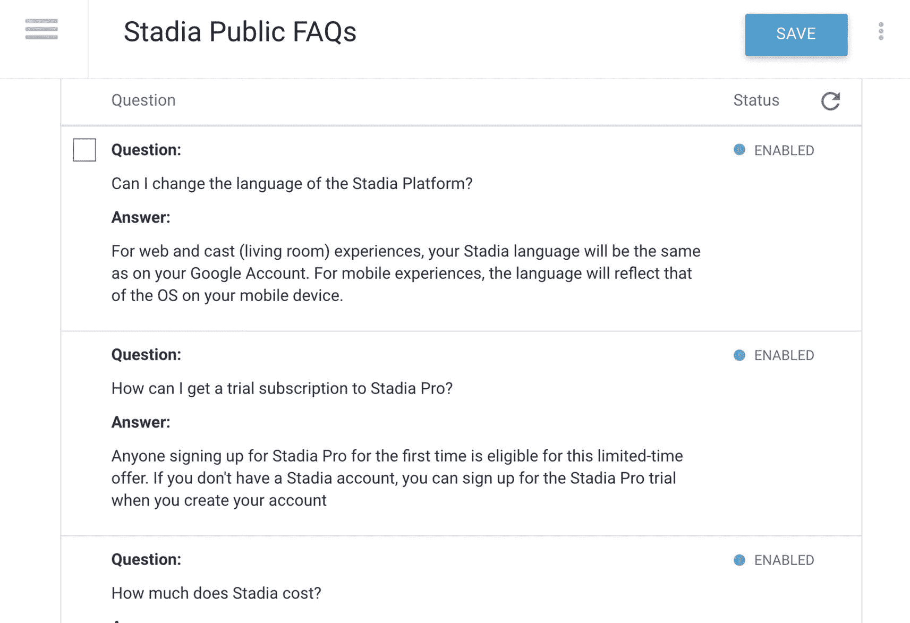

# 启用闲聊模块

**闲聊**是对您自定义意图的绝佳补充，尽管它们的工作方式与手动意图略有不同。通过意图，您可以提供训练短语，这意味着您可以训练聊天机器人以不同方式回答问题时也能正确回应。闲聊和常见问题知识库连接器（请参阅本章后续内容）不提供添加训练短语的选项。它们使用 Dialogflow 的自然语言理解来理解用户的问题。通常，这效果不错；例如，当您说“哈哈，你太搞笑了”时，闲聊句子“你真有趣”也会得到回应。但是，当您问“你存在吗？”时，它不会给出“你是真实的吗？”的答案。

即使您没有在闲聊自定义页面上提供答案，它也会使用现成的答案。自定义基本上意味着您覆盖了 Dialogflow 标准的闲聊答案。

**注意**

尽管在聊天机器人中创建类似人类的对话（作为自定义意图的补充）非常棒，但您必须小心处理特定的闲聊短语，例如确认短语，如“是”、“否”和“取消”。这些短语可能会得到“好的！”这样的回应，但它们不会执行现成的代码，也不会让对话继续下去。它们确实会设置一个 POST 动作，例如 `smalltalk.confirmation.yes`，因此您需要在您的实现代码或 webhook 中监听这些意图。

人们经常对一个问题回答“是”或“否”，而答案本身并不期望“是”或“否”。闲聊答案很可能不是用户所期望的。在这种情况下，每个提供后续问题或上下文的意图也必须提供适当的回退，这一点非常重要。

在撰写本文时，闲聊仅支持英语（`en`）、俄语（`ru`）、法语（`fr`）和意大利语（`it`），并且不适用于超级代理。

**注意**

根据 **Actions on Google** 政策，完全启用闲聊会导致您的操作被拒绝。

要为您的 Dialogflow 代理启用闲聊，您可以点击菜单项：**闲聊**。在闲聊设置页面上，您会找到一个开关来切换**启用**开关。这将启用所有闲聊主题。

点击您想要修改回复文本的主题之一。例如，点击**关于代理**；这将展开**问题**（用于匹配用户话语）和文本回复**答案**对。（见图 4-3。）

图 4-3

启用闲聊模块

点击**保存**。

## 创建常见问题知识库

**知识库**代表您提供给 Dialogflow ES 的知识文档集合。知识文档可以是常见问题或文本块。

**知识连接器**补充了已定义的意图。使用知识连接器的代理通常也会使用已定义的意图。与闲聊类似，知识连接器提供的回复精度和控制能力不如意图。它使用 Dialogflow 的自然语言理解来理解用户的问题。通常，这效果不错，但有时，特别是当您以非常不同的方式提问时，它可能找不到答案。您应该定义意图来处理复杂的用户请求，并让知识连接器处理简单的请求。

首先，点击代理标题旁边的齿轮图标，打开**设置屏幕**。

向下滚动到**测试版功能**，并翻转开关：**启用测试版功能和 API**。（见图 4-4。）点击**保存**。

图 4-4

为了使用知识库连接器，您需要从设置 ➤ 常规屏幕启用测试版功能和 API

点击**知识**菜单。

在顶部栏中，您可以点击**创建知识库**按钮，开始添加您的第一个知识库（图 4-5）。

图 4-5

创建知识库

为知识库命名，例如*电子游戏常见问题*，然后点击**保存**。

一个知识库可以包含多个文档。点击链接**创建第一个**（图 4-6）。

图 4-6

创建知识文档

在弹出的屏幕中（图 4-7），您可以添加以下信息：

图 4-7

文档设置弹出屏幕

*   您可以给文档命名，例如*内部电子游戏常见问题*或*来自 IGN.com 的公共电子游戏常见问题*。
*   您可以选择知识类型：
    *   **常见问题**：带答案的问题
    *   **扩展问答**：让 Dialogflow 基于文章/文本块理解问题
*   MIME 类型：
    *   `text/html`：如果您想从公共网站导入常见问题。
    *   `text/csv`（CSV 文件）：这可以是数据库导出文件。
*   作为数据源，您可以选择以下之一：
    *   **云存储上的文件**：用于存储在 Google Cloud Storage 中的私有 CSV 文件（安全）。
    *   **URL**：要从中导入常见问题的公共网站 URL。
    *   **从计算机上传文件**：从您的磁盘上传私有 CSV 文件。
*   有一个**启用自动重新加载**复选框，允许 Dialogflow 自动重新加载公共网站常见问题，以确保您获取到新增或更改的常见问题。

当您按下**创建**按钮时，Dialogflow 将开始爬取/导入问题和答案对。完成后，您将在知识库文档概览中看到该文档。（见图 4-8。）在此视图中，可以删除或添加更多文档。

图 4-8

知识文档概览

此时，您还没有完成。您需要告诉 Dialogflow 它应该返回什么答案。点击**添加回复**链接。它会预先为您填充一个答案 `$Knowledge.Answer[1]`，这意味着置信度最高的第一个答案（图 4-9）。

**图 4-9** 微调知识库文档的响应

但你可能希望针对不同的渠道集成来微调答案（例如，在 Google Assistant 中以卡片形式返回响应）。并且你可能希望以一个问题结尾，以保持对话的延续或引导对话方向。然后点击**保存**。

默认情况下，知识库会配置一个默认文本响应，其中填充了最佳匹配的知识答案：`$Knowledge.Answer[1]`。但知识响应可能包含多个答案，你可以在配置的响应中引用这些答案。`$Knowledge.Question` 和 `$Knowledge.Answer` 的索引从 `1` 开始，因此在添加更多响应时，请增加此索引。

在定义响应时，应考虑以下几点：

- 如果定义的响应数量大于知识连接器匹配的响应数量 N，则只会返回 N 个响应。
- 鉴于其准确性可能低于匹配明确定义的意图，我们建议在可能的情况下向用户返回三个或更多响应。

当你准备好导入所有问答后，可以在 Dialogflow 模拟器中测试知识连接器（图 4-10）。

**图 4-10** 在模拟器中测试知识库

Dialogflow Trial 和 Enterprise Essentials 版本允许文档总大小最大为 10MB，每月 1000 次请求，每天 100 次请求。当你选择 Dialogflow Enterprise Plus 层级时，所有这些限制都将解除。

回到知识库页面（当你在 Dialogflow 菜单中点击**知识**时），你会注意到一个调整滑块（图 4-11）。当最终用户的表述也与某个意图匹配时，你可以指定对知识库结果的偏好程度。将滑块从较弱（偏好意图）调整到较强（偏好知识）。

**图 4-11** 调整知识库的权重

## 最佳实践

为获得最佳效果，以下是一些最佳实践。

总体而言：

- CSV 文件必须使用逗号作为分隔符。
- 机器学习设置的置信度分数在常见问题解答和知识库文章之间未经校准，因此如果你同时使用常见问题解答和知识库文章，最佳结果不一定总是得分最高的。
- Dialogflow 在创建响应时会从内容中移除 HTML 标签。因此，最好避免使用 HTML 标签，并尽可能使用纯文本。
- Google Assistant 的每个聊天气泡有 640 个字符的限制，因此与 Google Assistant 集成时，长答案会被截断。
- 最大文档大小为 50MB。
- 使用 Cloud Storage 文件时，应使用公共 URI 或你的用户账户或服务账户有权访问的私有 URI。

**注意** 过去，我曾看到一些来自（我自己的）网页的公共知识库常见问题解答失败。通过对 Google 实现进行逆向工程，我发现公共常见问题解答网站需要允许 Google 机器人访问。你应该通过 Google Search Console 将公共常见问题解答网站添加到 Google 搜索引擎，并让搜索索引器抓取它，使其存在于搜索索引中。因此，像 `https://pages.github.com` 这样的网站将无法工作。

特定于常见问题解答：

- 你的 CSV 文件必须将问题放在第一列，答案放在第二列。此外，它不应包含标题行。
- 尽可能使用 CSV，因为 CSV 的解析最准确。
- 不支持包含单个问答对的公共 HTML 内容。
- 一个文档中的问答对数量不应超过 2000 个。
- 不支持具有不同答案的重复问题。
- 如果可能，请为问答使用有效的 HTML5 标记，并基于 FAQPage schema.org 表示法。

特定于抽取式问答：

- 内容密集的文本效果最佳。避免使用包含许多单句段落的内容。
- 不支持表格和列表。
- 一个文档中的段落数不应超过 2000 个。
- 如果文章较长（超过 1000 字），请尝试将其拆分为多个较短的文章。如果文章涵盖多个问题，可以将其拆分为涵盖各个问题的较短文章。如果文章只涵盖一个问题，则将重点放在问题描述上，并保持问题解决方案简短。
- 理想情况下，只应提供文章的核心内容（问题描述和解决方案）。其他内容如作者姓名、修改历史、相关链接和广告并不重要。

**注意** 在撰写本文时，抽取式问答仍处于实验阶段。它基于已在 Google 的搜索和 Assistant 等产品中尝试和测试过的类似技术。

### 将知识库问题转换为意图

可以将知识库问题转换为意图，从而允许你提供更多训练短语。当你在知识库文档概览中点击**查看详情**链接时，你将看到所有已导入的问答。

在此屏幕上，你可以禁用单个问题。也可以手动重新加载问题和答案。同样在此处，你可以选择单个问题并将其转换为真正的意图。（参见图 4-12。）

**图 4-12** 所有已导入常见问题解答的概览

## 总结

本章为你提供了从模板和知识库构建 Dialogflow 智能体的所有信息，以便无需创建意图即可快速构建 Dialogflow 智能体。本章涉及以下任务：

- 你想通过使用预构建智能体，从 Dialogflow 模板解决方案导入来快速创建一个 Dialogflow 智能体作为基础。
- 你想在 Dialogflow 智能体中启用闲聊功能。
- 你想通过导入私有 CSV 或使用知识库连接器从公共网站导入常见问题解答，为你的 Dialogflow 智能体添加额外的常见问题解答。

## 延伸阅读

- Dialogflow 关于预构建智能体的文档
  `https://cloud.google.com/dialogflow/es/docs/agents-prebuilt`
- Dialogflow 关于闲聊的文档
  `https://cloud.google.com/dialogflow/es/docs/agents-small-talk`
- Dialogflow 关于知识库的文档
  `https://cloud.google.com/dialogflow/es/docs/how/knowledge-bases`
- Google 站长工具
  `https://www.google.com/intl/en/webmasters`

