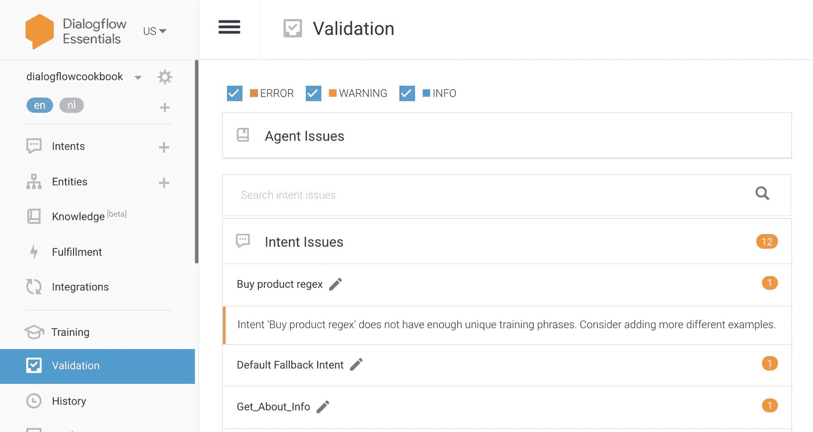
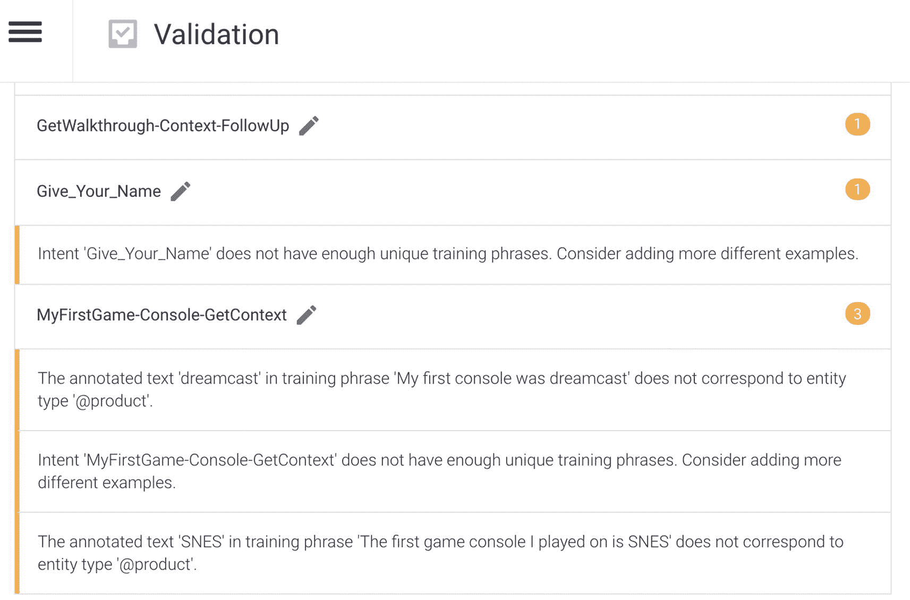

# 5. 机器人管理

Dialogflow 不仅为对话编写和机器人构建提供了出色的工具，还提供了机器人管理功能。`Agent Validation`（智能体验证）和 `Agent Training`（智能体训练）就是这样的功能。它们让在企业环境中构建复杂机器人的对话设计师的工作变得轻松许多。

`Agent Validation`（智能体验证）会开箱即用地审查你的智能体，而通过 `Agent Training`（智能体训练），你的智能体可以在对话过程中学习新知识。尽管意图训练是事先固定的，但你可以通过对先前捕获的用户表述进行点赞、点踩或重新分配意图，来影响意图分类的得分。

本章将向你展示如何启用验证、理解验证结果，以及如何根据用户数据影响你的机器人模型。

### 智能体验证

当你构建的聊天机器人变得稍微复杂一些时，你很容易就会拥有大量的意图和实体。也许，你甚至是在 Dialogflow 项目中与一个团队合作——多位 UX 设计师同时处理多个意图。只要有人工作，就难免会出错。当你在训练 Dialogflow 模型时，这可能会成为一个问题。

在 Dialogflow 中常见的错误包括：

- 意图中没有或没有足够的训练短语。
- 意图的训练短语彼此之间或与其他意图的训练短语过于相似。
- 训练短语中没有充分利用实体的变体。
- 文本在某些训练短语中被标注，但在其他训练短语中却没有。
- 回退意图没有负面示例。

好消息是，Dialogflow 在 Dialogflow 控制台和 API 中内置了一个自动验证功能，它可以针对这些常见错误进行验证。每当智能体训练完成时，结果即可用。

点击 **Validation**（验证）菜单。智能体验证功能默认是启用的。如果你找不到它，可以在 **Settings**（设置）➤ **ML Settings**（机器学习设置）选项卡中启用 `Agent Validation`（智能体验证）开关。

一旦你在 Dialogflow 菜单中点击 `Validation`（验证）（并且智能体已经过训练），你就会看到验证结果（如图 5-1 所示）。



图 5-1 开箱即用的验证

### 理解验证结果

每当智能体训练执行并完成后，验证结果会自动可用。你可以通过 Dialogflow 控制台或 API 访问验证结果。

验证结果提供了一个你应该修正的警告和错误列表，以提高智能体的质量和性能。它可以在（全局）智能体级别、意图或实体中发现错误。如果你的智能体有信息或警告，你可以选择忽略它们并启动你的智能体。

这仅供参考，但如果你不使用此功能，就会降低智能体的质量；基本上，这是 Dialogflow 智能体审查的开箱即用功能，而且是免费的！

问题可能代表不同的严重级别。在验证屏幕上仅显示 **Info**（信息）、**Warning**（警告）和 **Error**（错误）消息。**Critical**（严重）和 **Unspecified**（未指定）设置可在 SDK（或在特定的意图/实体页面上）中使用。它们都在表 5-1 中进行了描述。

表 5-1 各种严重级别

| 级别 | 描述 |
| --- | --- |
| INFO | 智能体未遵循最佳实践。 |
| WARNING | 智能体可能无法按预期运行。 |
| ERROR | 智能体可能会遇到部分故障。 |
| CRITICAL | 智能体可能会完全失败。 |
| SEVERITY UNSPECIFIED | 未指定。此值不应被使用。 |

图 5-2 展示了一些验证示例。



图 5-2 验证示例

在这个例子中，我重点指出了以下标准：

- `Give_Your_Name` 意图显示了一个警告，我需要添加更多包含多样化示例的训练短语来改进 NLU 模型。

- `MyFirstGame-Console-GetContext` 包含一个实体 `Dreamcast` 和 `SNES`，但这两个实体尚未在 `@product` 自定义实体中定义。除此之外，它还需要更多的训练短语。

前面的例子是警告的例子，你可以忽略它们。但是当你有错误时，最好立即修复它们。

注意

每次最多显示 5000 个问题。如果你有超过 5000 个问题，在问题数量减少到 5000 以下之前，你可能看不到计数减少。

除了验证屏幕，当你访问意图列表或实体列表页面时，任何带有验证错误的意图或实体都会在其名称旁边显示一个错误轮廓指示器（一个 `!` 图标）。

当你访问一个带有验证错误的特定意图或实体的页面时，在“保存”按钮附近会显示一个错误轮廓指示器。

点击此指示器会显示该意图或实体的错误列表。默认情况下，仅显示严重级别为 **CRITICAL**（严重）或 **ERROR**（错误）的错误。

### 通过 SDK 进行验证

你也可以通过 SDK（`ValidationResult`）从代码中运行验证。如果你正在构建自己的 CI/CD 管道，并且在将智能体投入生产之前，你可能希望先运行智能体验证，这会很方便。

以下是一个如何在 Node.js 中实现此功能的示例。

`ValidationResult` 响应可能如清单 5-1 所示。

```json
{
"validationErrors": [
{
"severity": "ERROR",
"entries": [
"projects/my-project/agent/intents/58b44b2d-4967-4a81-b017-12623dcd5d28/parameters/bf6fdf55-b862-4101-b5b1-36f1423629d0"
],
"errorMessage": "参数 'test' 的值为空。"
},
{
"severity": "WARNING",
"entries": [
"projects/my-project/agent/intents/271e3808-3c91-4e6b-89e8-47951abcec8d"
],
"errorMessage": "意图 'app.current.update' 没有足够的唯一训练短语。请考虑添加更多不同的示例。"
},
{
"severity": "ERROR",
"entries": [
"projects/my-project/agent/intents/26e64b1b-eaa7-4ce2-be46-631a501fccbe/trainingPhrases/a650375e-083c-4bb5-9794-ba9453e51282",
"projects/my-project/agent/intents/58b44b2d-4967-4a81-b017-12623dcd5d28/trainingPhrases/1d947780-22d3-4f80-8d7a-3f86efbf0be3"
],
"errorMessage": "多个意图共享过于相似的训练短语：\n — 意图 'app.notifications.open'：训练短语 'open all notifications settings'\n — 意图 'app.current.notifications.open'：训练短语 'open notifications settings'"
}
]
}
```

清单 5-1 云函数的实现

如你所见，Dialogflow 提供了一个开箱即用的智能体审查和验证功能。它默认是启用的，你可以通过 Dialogflow 控制台或 API 访问它。

这将为你提供错误和警告的概览，你应该修复这些问题以提高智能体的质量。

当发现大量问题时，你应该考虑根据相似性，小批量地修复这些问题。修复一个问题后，重新训练智能体可能会解决类似的问题。所以，现在你知道了。在将你的聊天机器人投入生产之前，始终检查验证页面！
