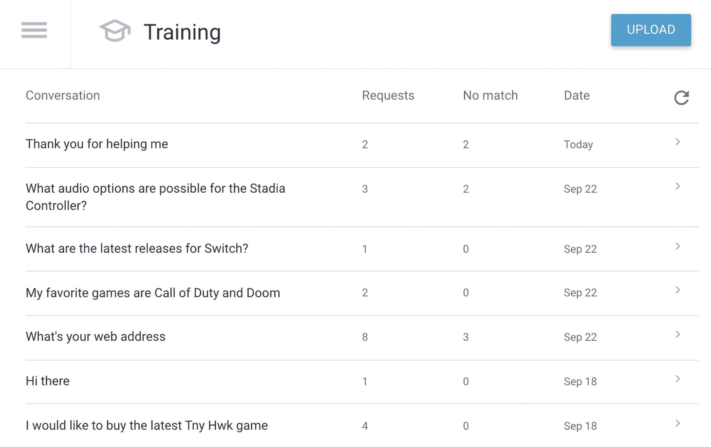
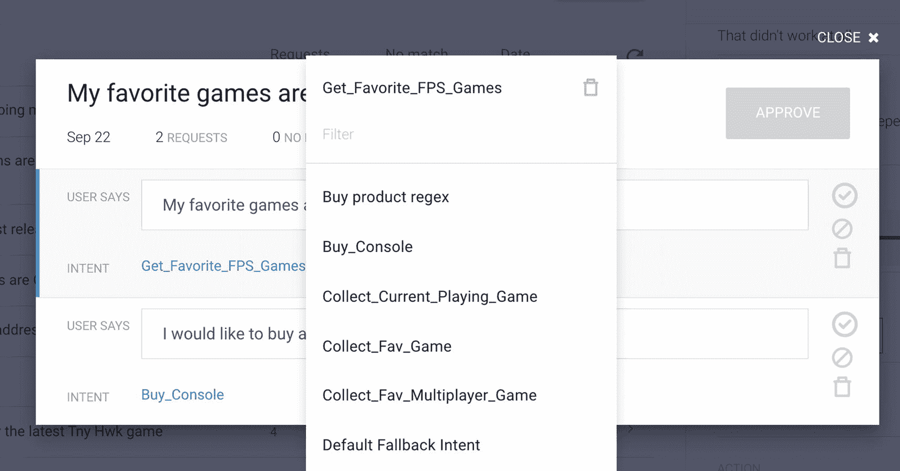

# 使用内置训练功能改进 Dialogflow 机器学习模型

Dialogflow 提供了一种训练工具，可用于改进您的 Dialogflow 机器学习模型。您可以对匹配的意图进行点赞、点踩或更改。Dialogflow 会根据之前见过的数据进行匹配，从而在下一次更好地处理对话。

在 Dialogflow 菜单中选择 **训练** 菜单项。

打开该工具时（见图 5-3），它会按时间倒序显示对话历史记录（最新的发言排在最前面）。

图 5-3 Dialogflow 内置训练

它将展示用户发言、请求次数（对话中的对话轮次）、未找到匹配的次数、对话发生的日期以及一个刷新按钮（当您对类似内容的训练过程进行覆写时，将使用此按钮）。

当您点击对话列表中的某一行时，它会在训练视图中打开该对话，如图 5-4 所示。训练视图显示一系列对话轮次，并提供将此数据添加到训练数据的控件。

图 5-4 Dialogflow 内置训练，改进检测

在这里，您可以执行以下操作：

*   您可以更改意图（或者，如果未匹配到意图，则分配一个意图），以便下次它知道该选择哪个意图。

*   您可以对意图匹配进行点赞，教导 Dialogflow 模型检测到的意图是正确的。

*   您可以对意图匹配进行点踩，教导 Dialogflow 模型检测到的意图是错误的。

*   您可以删除数据。可能是因为它是虚假数据，您不希望用它来训练模型。

*   您可以选择用户发言并标注特定词语，例如，当用户发言为：*我想订购最新的星球大战：前线游戏。* 您可以选择名称 *星球大战：前线*，并教导 Dialogflow 它实际上是实体 `@fps_games`。

您可以在智能体开发期间、在智能体发布或进行更改之前使用训练工具。在生产环境之后使用该工具来检查真实对话是否按预期进行也非常有用。

使用屏幕右上角的上传按钮，您可以将对话作为纯文本文件上传。一个 `.txt` 文件应每行包含一个用户发言短语（以换行符分隔）。可以上传多个（最多 10 个）`.txt` 文件，或者您可以上传一个包含 `.txt` 文件的 zip 压缩包，只要其大小不超过 3MB。

请求不会发送到 `detect intent` API。因此，不会激活任何上下文，也不会匹配任何意图。理想情况下，文件应仅包含可用作训练短语的数据。最终用户表达式的顺序并不重要。

您应该上传什么样的数据？考虑对话日志；也许您有人与人之间的聊天日志，或者来自电子邮件、论坛或常见问题解答的在线客户支持对话，基本上所有与聊天机器人相关的内容。也许您正在跟踪社交媒体（如 Twitter）以了解人们在问什么。或者，您可能有联络中心的音频录音，可以通过 Google Cloud 中的 `Speech-to-Text` API 将其转换为文本。但是，请尽量避免长篇的、非对话式的用户发言。并尽量避免最终用户未说过的内容（例如，人工客服的回复）。

> **注意**

> 训练工具使用智能体历史数据来加载对话，因此必须在设置面板中启用日志记录。默认情况下此功能是启用的，但与欧洲的银行和保险公司等受监管公司合作时，可能需要禁用此功能。

训练工具仅显示最终用户表达式。要查看客服和最终用户双方的对话数据，请参阅更完整的智能体历史记录。

## 总结

本章解释了如何通过验证您的智能体来审查您的 Dialogflow ES 智能体配置（例如意图和实体）。借助这个开箱即用的功能，您可以监控智能体的质量。我们还探讨了如何通过 SDK 运行验证；如果您正在构建自己的 CI/CD 管道，这可能会很方便。

本章的最后一部分解释了您的 Dialogflow 智能体如何持续从用户数据中学习，以及如何改进底层的机器学习模型。训练工具用于审查您的智能体与最终用户的对话，并改进您的训练数据。

## 延伸阅读

*   Dialogflow 关于智能体验证的文档

    [Dialogflow 关于智能体验证的文档](https://cloud.google.com/dialogflow/es/docs/agents-validation)

*   Dialogflow 关于最佳设计实践的文档

    [Dialogflow 关于最佳设计实践的文档](https://cloud.google.com/dialogflow/es/docs/agents-design)

*   SDK 中的验证结果对象

    [SDK 中的验证结果对象](https://cloud.google.com/dialogflow/docs/reference/rpc/google.cloud.dialogflow.v2beta1#google.cloud.dialogflow.v2beta1.ValidationResult)

*   Dialogflow 训练工具

    [Dialogflow 训练工具](https://cloud.google.com/dialogflow/es/docs/training)
