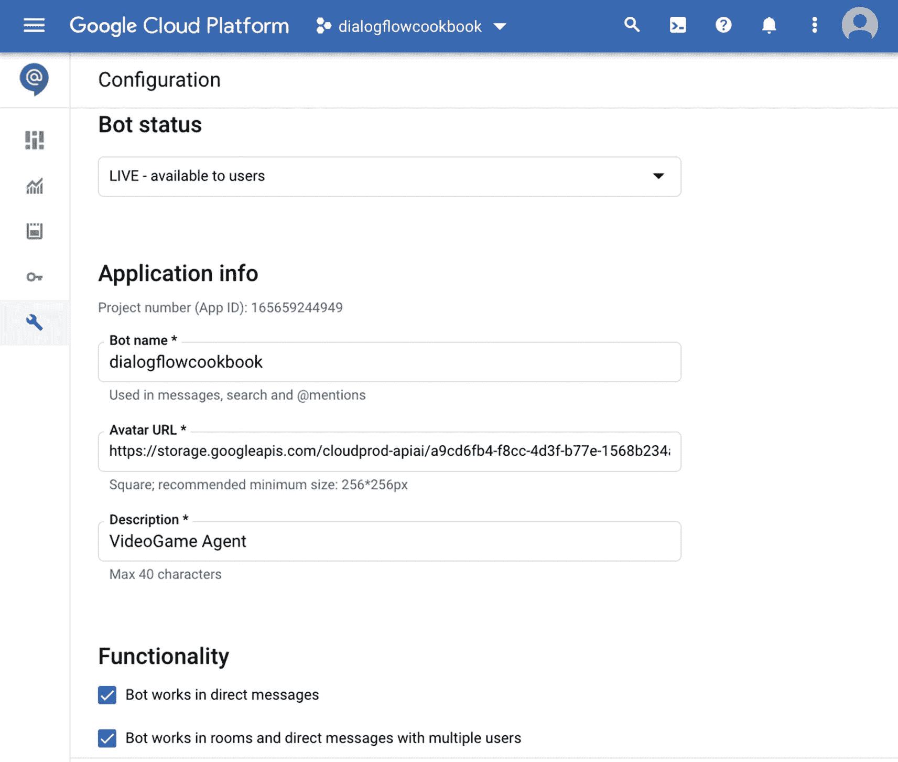
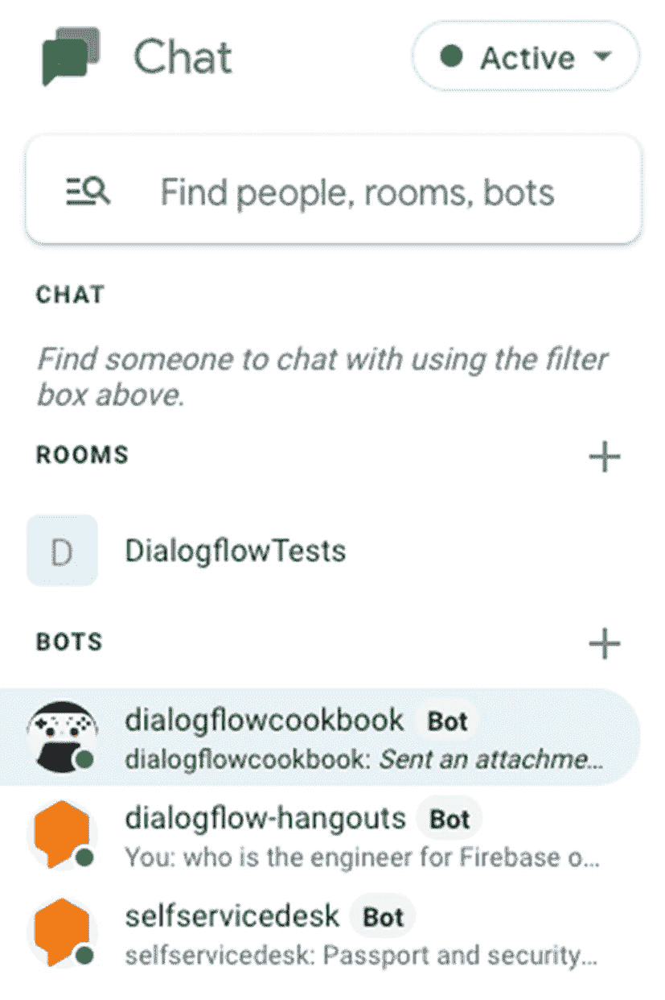
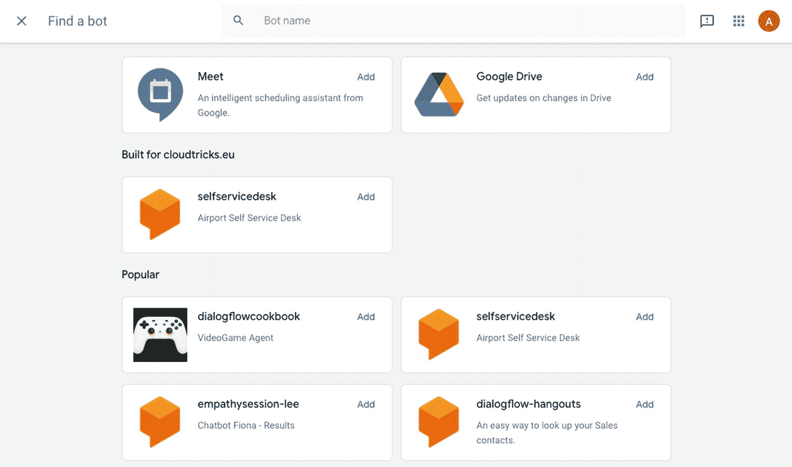
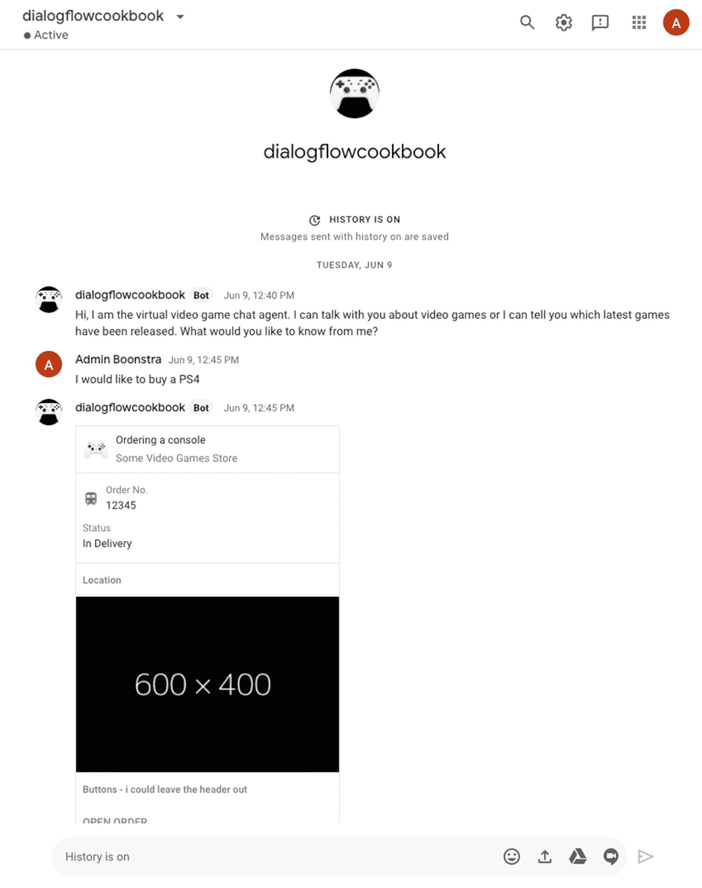
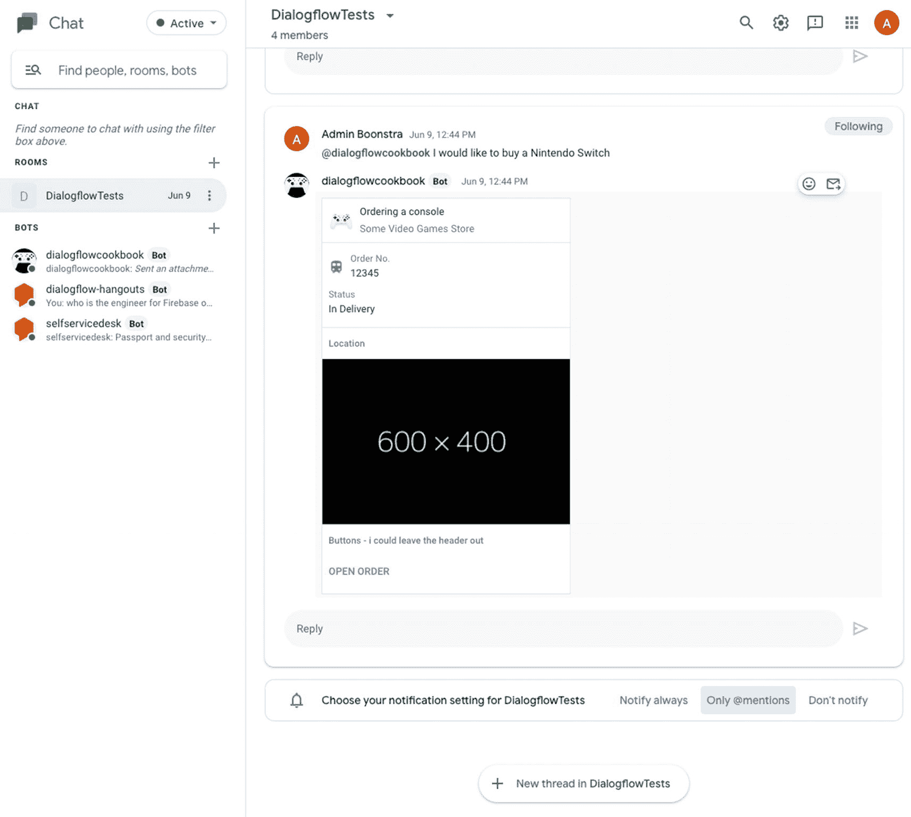
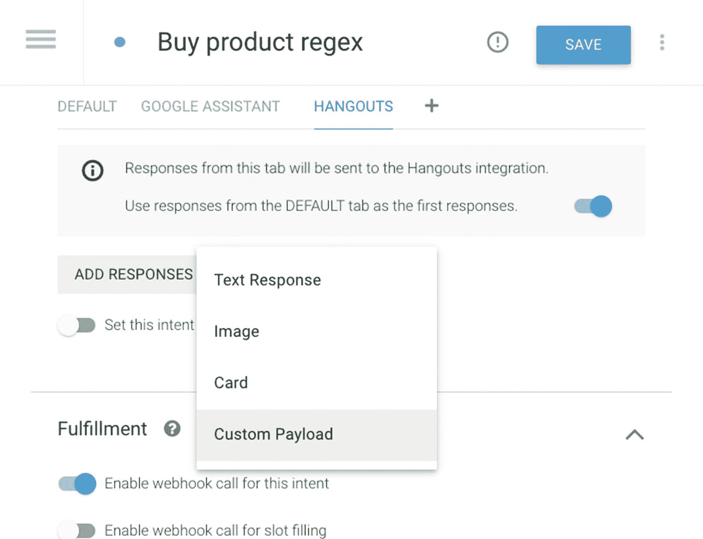
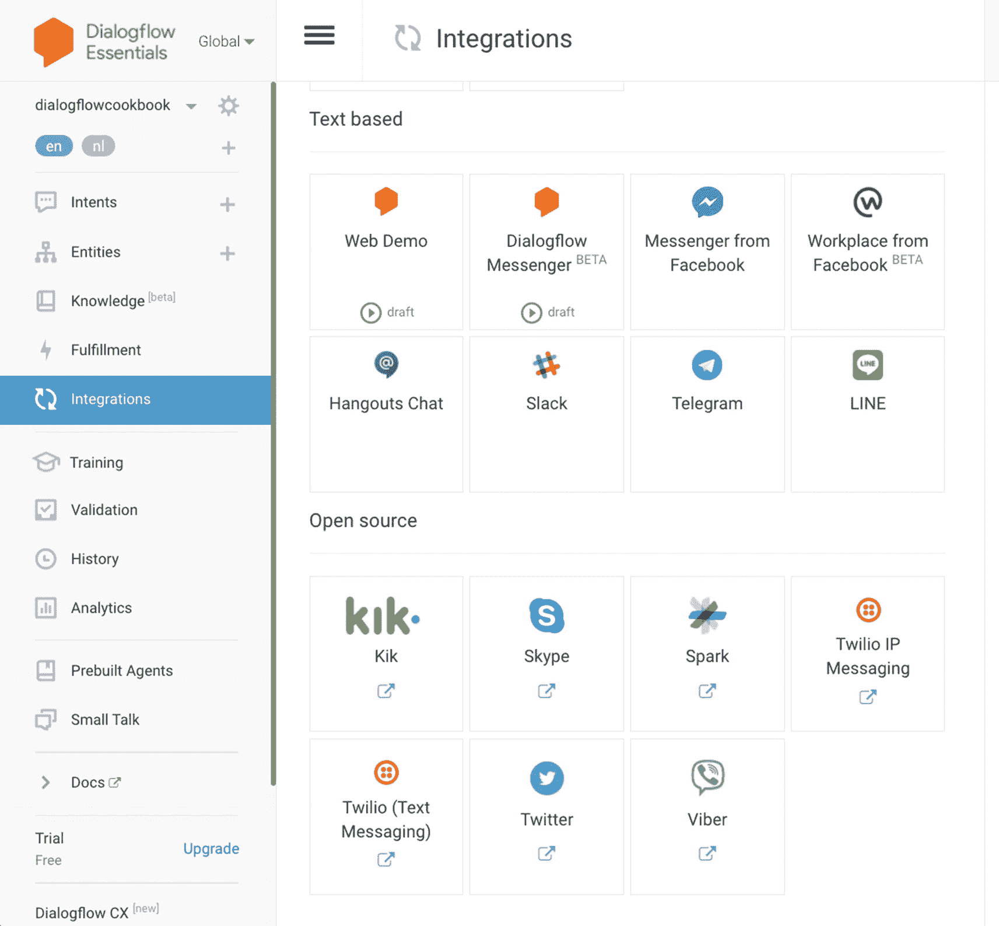

# 将您的智能体与 Google Chat 集成

Google Chat 是 Google 的通信软件，属于 Google Workspace 的一部分，专为团队打造。它与 Slack 类似，具备群组消息功能，并支持共享 Google Drive 内容。

在 Dialogflow 控制台中，点击 **集成** 菜单。

点击集成项：**Hangouts Chat**。

选择 **您域内的所有人**，以确保您 Google Workspace 域内的所有用户都能访问该聊天机器人。（可选地，选择智能体环境。）点击 **开始**。

接下来，点击 **配置机器人详细信息** 按钮；它将导航到 Google Cloud 控制台（`https://console.cloud.google.com`），如图 6-1 所示。（请确保您使用与 Dialogflow 相同的 Gmail/Google 账号登录。）



**图 6-1** Google Chat/Hangouts API 设置

如果一切正确，所有字段都已预先填好，但您可以修改这些字段。表 6-1 显示了所有设置的概览。

**表 6-1** Google Chat 设置

| 设置项 | 描述 |
| --- | --- |
| 机器人名称 | 用户与聊天机器人交互时看到的名称。 |
| 头像 URL | 指向方形图片（PNG 或 JPEG 格式）的 HTTPS URL，图片至少为 128x128 像素，将显示为聊天机器人的头像。 |
| 描述 | 对聊天机器人功能的描述。 |
| 功能 | 您希望与聊天机器人交互的方式： – 添加到聊天室 – 消息：直接与聊天机器人发送消息 |
| 连接设置 | 聊天机器人的端点。由于我们使用的是 Dialogflow，请选择 **Dialogflow**。 |
| 权限 | 可以安装您聊天机器人的权限；可以是您域内的所有人，或域内的特定人员/群组。 |

点击 **保存**。您可以关闭 Google Cloud 控制台。

## 在 Google Chat 中启用您的智能体

在聊天界面（`https://chat.google.com`）中，您可以点击机器人标题旁边的 **+** 按钮，将机器人添加到您的对话中。参见图 6-2。



**图 6-2** 在 Google Chat 中添加机器人

您将看到一个如图 6-3 所示的目录，从中您可以搜索您创建的 Dialogflow 聊天机器人。**添加** 按钮会弹出一个小的弹出窗口，供您选择交互方式。您可以通过 **添加到聊天室** 将机器人添加到聊天室，或者选择 **消息**。



**图 6-3** Google 聊天机器人目录

*作为消息的机器人* 意味着您直接与机器人对话；不需要聊天室。将机器人添加为消息，请注意在图 6-4 中，当双击左侧菜单中显示的机器人名称时，您将开始一次对话。



**图 6-4** 使用消息交互方式，您不需要聊天室；可以直接与机器人对话

当您将*机器人添加到聊天室*时，您可以与聊天室中的每个用户交谈，但当您将消息专门发送给机器人时，您需要使用 `@` 符号，例如 `@dialogflowcookbook`。参见图 6-5。



**图 6-5** 在 Google Chat 聊天室中使用 `@` 符号与机器人对话

### 富消息支持

要发送文本回复之外的 Google Chat 消息，您可以在 Dialogflow 控制台中针对特定意图使用 **Hangouts 响应选项卡** 中的 *自定义负载*。您首先需要将 Hangouts 添加为集成响应，可以通过点击意图响应部分的 `+` 选项卡，然后点击 **添加响应** 按钮来完成，如图 6-6 所示。



**图 6-6** 选择添加响应 ➤ 自定义负载，以在意图的 Hangouts 集成选项卡中启用富消息

Hangouts 自定义负载允许您创建更高级的消息类型，例如卡片。一张卡片可以有一个或多个部分。每个部分可以有一个标题。您可以查阅 Google Chat 文档中的 **Hangouts 消息格式卡片参考指南**，了解可以创建的各种组合。然而，使用自定义负载意味着您需要提供 JSON 格式。您可以在代码清单 6-1 中找到一个示例。

```json
{
"hangouts": {
"header": {
"title": "订购游戏机",
"subtitle": "某视频游戏商店",
"imageUrl": "https://lh3.googleusercontent.com/v8c6Jn1Aa7s6YO-5Qy6hM4yQ5K4onxgjYD0fzxpOKA7m1Z_0rqOJcXuncd17_W7CeqOcL6d6RfTAAUr1OuHl8uk=rw"
},
"sections": [{
"widgets": [{
"keyValue": {
"icon": "TRAIN",
"topLabel": "订单号",
"content": "12345"
}
},
{
"keyValue": {
"topLabel": "状态",
"content": "配送中"
}
}]
},
{
"header": "位置",
"widgets": [{
"image": {
"imageUrl": "https://dummyimage.com/600x400/000/fff"
}
}]
},
{
"header": "按钮 - 我可以省略标题",
"widgets": [{
"buttons": [{
"textButton": {
"text": "打开订单",
"onClick": {
"openLink": {
"url": "https://example.com/orders/..."
}
}
}
}]
}]
}]
}
}
```

**代码清单 6-1** Google Chat 自定义负载

**注意：** 当您将参考指南中的示例复制粘贴到 Dialogflow 的自定义负载框中时，需要注意以下几点：

* 第一个键不能命名为 `cards`，而必须命名为 `hangouts`。

* `hangouts` 键指向一个对象，而不是一个（卡片）数组。

* 确保编辑器中不包含任何 lint 错误。

* 您无法在 Dialogflow 模拟器中测试结果；您必须直接在 Hangouts Chat 中进行测试。

## 更多基于文本/开源集成选项

Dialogflow 还支持与 **Slack**、**Telegram**、**Line**、**Facebook Messenger**、**Facebook Workplace**、**Kik**、**Skype**、**Twitter**、**Viber**、**Spark** 和 **Twilio** 的集成。值得一提的是，与 Slack 的集成与 Google Chat 有些相似，因为这些应用程序非常类似。

在图 6-7 中，您将看到所有基于文本/开源集成的概览。Google 一直在不断添加新的集成。



**图 6-7** 基于文本的集成概览
