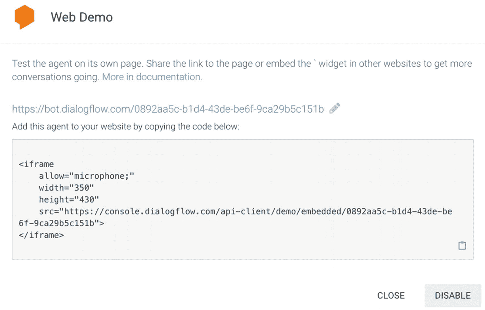
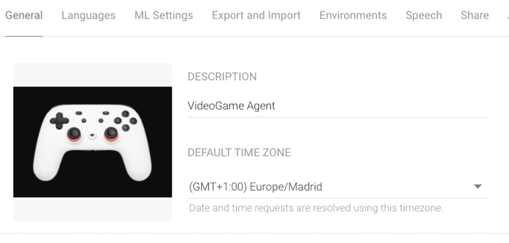

# 将您的智能体与网页演示集成

Dialogflow 网页演示是一个简单的组件，您可以将其放置在网站中，用于连接您的 Dialogflow 智能体。它支持文本和麦克风流输入。该组件的外观和风格是固定的，因此通常用于测试目的，而非部署在（企业）网站或网页应用中。

在 Dialogflow 控制台中，点击 `集成` 菜单。

点击集成项：`网页演示`。

此时会弹出一个窗口，如图 6-8 所示。



图 6-8

可供复制的网页演示 iframe 实现代码

弹出窗口将显示要嵌入您网站的 iframe 代码（列表 6-2）。您可以点击链接在浏览器中测试聊天机器人。准备就绪后，即可在网站上部署该 iframe 代码。

```
列表 6-2
iframe 示例
```

通常，网页开发者会将其放入网站弹窗中，该弹窗可通过网站底部的按钮打开。图 6-9 展示了聊天机器人在您网站上的显示效果。


图 6-9

网页演示示例

您可以通过 Dialogflow 的 `设置` 界面自定义顶部徽标以及 Dialogflow 智能体名称下方的描述。在此处（见图 6-10），您可以上传头像或修改智能体的描述。



图 6-10

网页演示组件使用了一些配置设置
