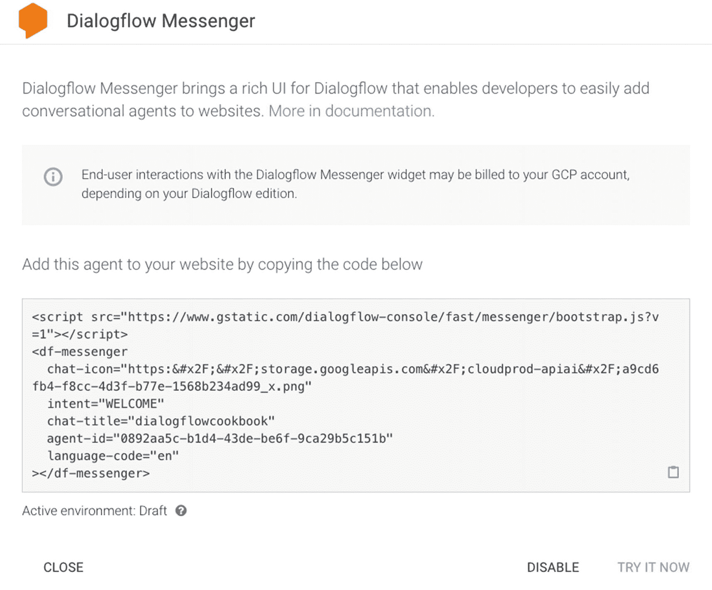
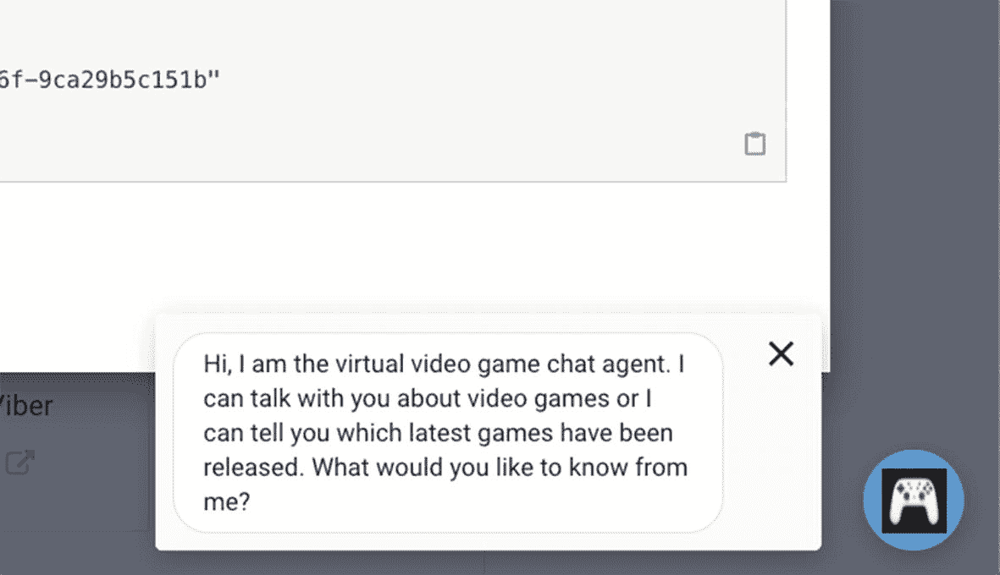
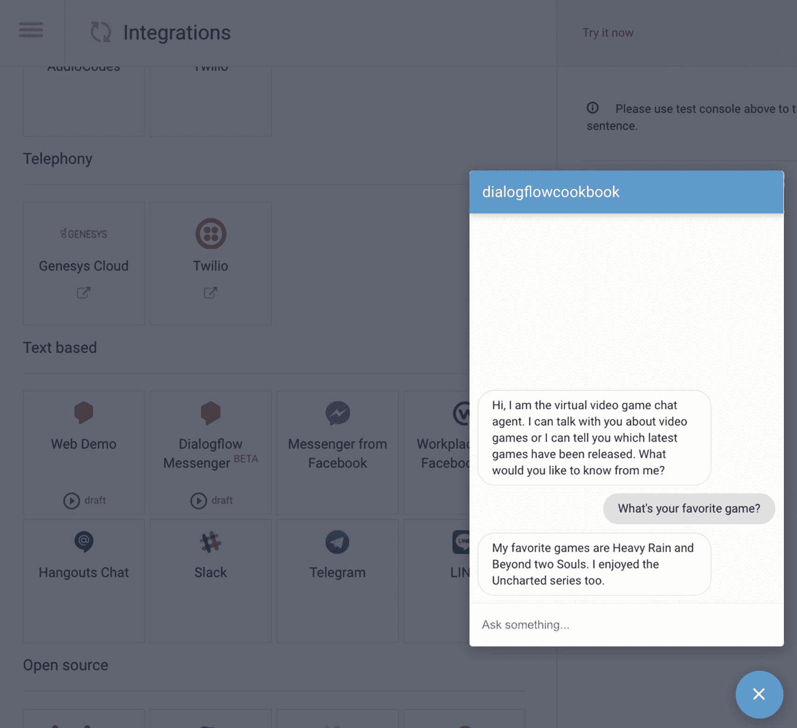
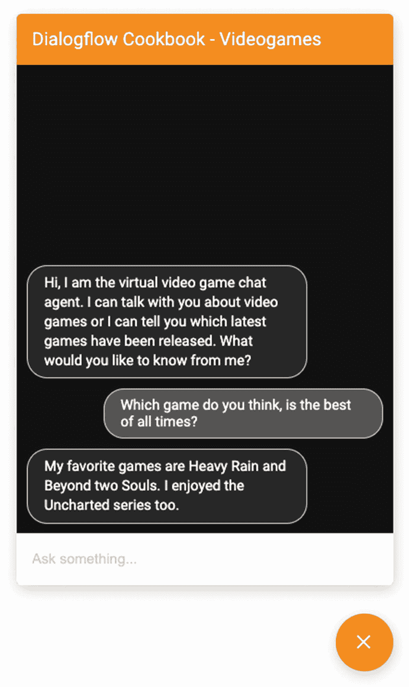
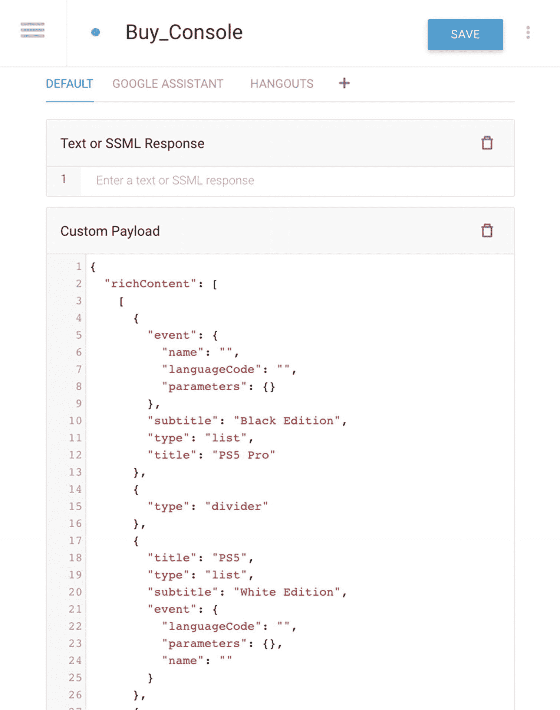
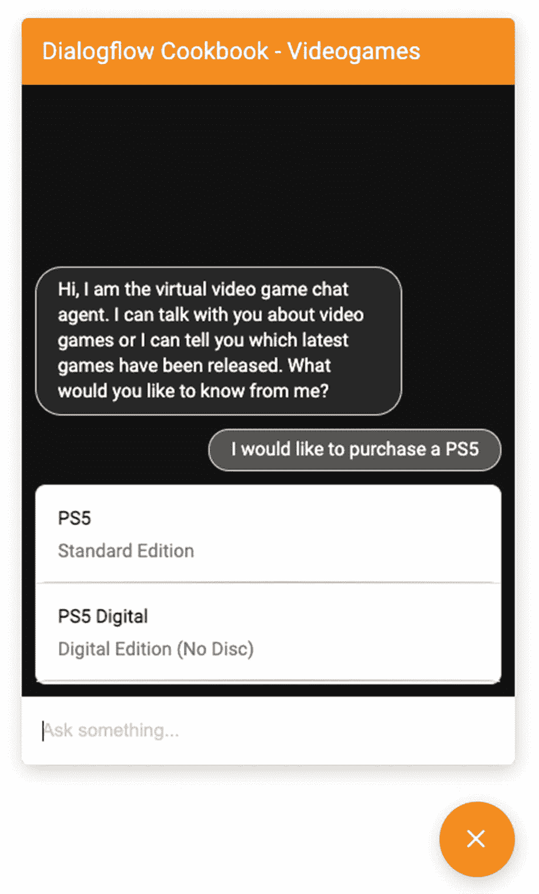

# 将您的智能体与 Dialogflow Messenger 集成

Dialogflow Messenger 集成是一个更高级的小部件，您可以将其放置在网站中，用于连接您的 Dialogflow 智能体。它仅适用于文本聊天。该组件的外观和风格是可定制的。虽然一些企业更倾向于自己构建 Web 集成（例如，以便连接到更多系统），但许多企业喜欢 Dialogflow Messenger 组件，因为它是与您的网站或 Web 应用集成的简单快捷方式。

在 Dialogflow 控制台中，点击 **集成** 菜单。

点击集成选项：**Dialogflow Messenger**。

将出现一个弹出窗口（图 6-11），其中显示一个（JavaScript）代码片段，您可以将其复制并粘贴到您的网站中。



图 6-11 Dialogflow Messenger 实现

当您点击弹出窗口中的 **立即尝试** 按钮时，您将看到实现的效果。它会在屏幕底部显示一个弹出按钮（图 6-12，带有在 Dialogflow 设置中设置的头像）。



图 6-12 Dialogflow Messenger 弹出按钮

此按钮将打开一个聊天弹出窗口（图 6-13），它实际上是一个 Web 组件（`df-messenger`）。



图 6-13 Dialogflow Messenger Web 组件

清单 6-3 显示了可以在您的网站上实现的 JavaScript 代码。将您之前复制的嵌入代码粘贴到您网站的一个网页中。`<script>` 和 `<df-messenger>` HTML 元素应位于您网页的 `<body>` 元素内。

```
清单 6-3
Dialogflow Messenger 实现示例，Web 组件
```

为了支持响应式布局，还需将以下内容添加到您的页面：

```
可以通过在 `df-messenger` 组件中设置 `expand="true"` 来展开 Web 组件，而无需点击按钮。
您还可以在加载网页时保持初始语音气泡关闭，通过设置 `wait-open="true"`。
```

Dialogflow Messenger 组件不支持语音。此外，它只能支持一种语言。但是，您可以使用一个 *超级智能体* 并创建多个不同语言的子智能体。

## 更改聊天机器人组件的外观和风格

Dialogflow Web 组件提供了广泛的设置来覆盖您聊天机器人的样式。您只需在 `<df-messenger>` 组件上方添加一个样式标签，并包含您选择的 CSS 变量，如清单 6-4 所示。

```
df-messenger {
--df-messenger-bot-message: #282828;
--df-messenger-button-titlebar-color: #ff9000;
--df-messenger-button-titlebar-font-color: #ffffff;
--df-messenger-chat-background-color: #121212;
--df-messenger-font-color: white;
--df-messenger-send-icon: #878fac;
--df-messenger-user-message: #535353;
--df-messenger-input-font-color: #000;
--df-messenger-input-placeholder-font-color: #cccccc;
--df-minimized-chat-close-icon-color: #ff9000;
}

清单 6-4
Dialogflow Messenger Web 组件的样式
```

图 6-14 显示了这些样式设置在浏览器中渲染聊天机器人后的效果。



图 6-14 具有自定义样式的 Dialogflow Messenger

### 富消息支持

您可以通过在 Dialogflow 的意图中的 **默认自定义负载** 框中添加代码来添加富消息响应，如图 6-15 所示。



图 6-15 Dialogflow Messenger 自定义负载

支持的富消息包括信息**响应**、**图片**、**列表**（如图 6-16 所示）、**手风琴**（可展开的框）、**按钮**和**建议芯片**。请注意可以包含数组的 `richContent` 字段。您可以在 Dialogflow 文档中找到实现示例。



图 6-16 Dialogflow Messenger 自定义负载示例

还有可用的 JavaScript 事件触发器，例如，用于渲染更多自定义富消息或使链接可点击。这些事件的事件目标是 `df-messenger` 元素（参见清单 6-5）或 `window` 全局变量。

要为 `df-messenger` 元素添加事件监听器，请添加以下 JavaScript 代码，其中 `eventType` 是清单 6-5 中描述的事件名称之一。

```
const dfMessenger = document.querySelector('df-messenger');
dfMessenger.addEventListener('eventType', function (event) {
// 处理事件
...
});
清单 6-5
Dialogflow Messenger 在 Web 组件上创建事件监听器
```

要为 `window` 添加事件监听器，请添加以下 JavaScript 代码（清单 6-6），其中 `eventType` 是描述的事件名称之一。

```
window.addEventListener('eventType', function (event) {
// 处理事件
...
});
清单 6-6
Dialogflow Messenger 在 window 元素上创建事件监听器
```

## 总结

本章描述了一些开箱即用的（基于文本的）集成，这些集成解决了以下任务：

* 您希望通过 Hangouts 集成将您的聊天机器人部署到 Google Chat。

* 您希望通过 Web 演示快速将您的聊天机器人部署到网站。

* 您希望通过 Dialogflow Messenger 快速将您的聊天机器人部署到网站并更改其外观和风格。

本书的源代码可通过本书的产品页面在 GitHub 上获取，网址为 [www.apress.com/978-1-4842-7013-4](http://www.apress.com/978-1-4842-7013-4)。请查看 `deploying-integrations-webcomponent` 和 `_dialogflow-agent`（**Buy_Console intent**）文件夹。

## 延伸阅读

* 允许机器人的 Google Workspace 文档

  [https://support.google.com/a/answer/7651360](https://support.google.com/a/answer/7651360)

* 关于 Google Chat 的 Dialogflow 文档

  [https://cloud.google.com/dialogflow/es/docs/integrations/hangouts](https://cloud.google.com/dialogflow/es/docs/integrations/hangouts)

* 关于 Google Chat API 的 Google 文档

  [https://developers.google.com/hangouts/chat](https://developers.google.com/hangouts/chat) 和 [https://developers.google.com/hangouts/chat/how-tos/bots-publish](https://developers.google.com/hangouts/chat/how-tos/bots-publish)

* Google Chat 卡片文档

  [https://developers.google.com/hangouts/chat/reference/message-formats/cards](https://developers.google.com/hangouts/chat/reference/message-formats/cards)

* 关于集成的 Dialogflow 文档

  [https://cloud.google.com/dialogflow/es/docs/quick/integration](https://cloud.google.com/dialogflow/es/docs/quick/integration)

* 关于 Dialogflow Messenger 的 Dialogflow 文档

  [https://cloud.google.com/dialogflow/es/docs/integrations/dialogflow-messenger](https://cloud.google.com/dialogflow/es/docs/integrations/dialogflow-messenger)

* 关于 Web 组件的更多信息

  [https://developers.google.com/web/fundamentals/web-components/shadowdom](https://developers.google.com/web/fundamentals/web-components/shadowdom)
