# 7. 构建语音智能体

让我们讨论一下语音机器人。通常，当我们想到语音聊天机器人时，我们会想到智能助手，例如 Google Assistant、Alexa 或 Siri。但实际上，还有另一个著名的商业案例可以使用虚拟智能体——联络中心和电话线路中的机器人。

由于 **Google Assistant** 和 Dialogflow 都是 Google 产品，因此将语音机器人部署到 Google Assistant 如此简单，您不会感到惊讶。

**Dialogflow 电话网关** 功能为您的智能体提供了电话接口。这对于创建绑定到服务号码的入站简单交互式语音响应非常有用，例如电话预订系统或简单的信息热线。

拨打该电话号码的用户将连接到 Dialogflow 语音智能体。通过语音转文本 (STT) 和文本转语音 (TTS) 技术，可以使用类似人类的声音非常自然地处理对话。

Google Cloud 有一个名为 **Contact Center AI** 的解决方案。这是一个用于电话联络中心的现成解决方案，它利用人工智能来自动化对话并实时帮助人工座席。无需机器学习专业知识，因为 Contact Center AI 将通过知名的电话合作伙伴（例如 Genesys、Avaya、Mitel、Twilio、Cisco、Five9 等）交付和启用。它使用了流行的 Google Cloud 组件，包括 Dialogflow、语音转文本和文本转语音。

本章将涵盖所有这些内容，包括如何改进您的语音机器人。

## 为类似 Google Assistant 的虚拟助手构建语音 AI

让我们从一个易于构建的语音 AI 解决方案开始，为 Google Assistant 构建一个语音 AI。两者都是 Google 产品，并且在使用 Dialogflow 时是开箱即用的集成。使其工作只需启用服务并为两个服务使用相同的 Google 用户帐户。一旦启用，您的 Dialogflow 智能体就可以作为一项操作（Google Assistant 应用）供 Google Assistant 使用。最终用户可以通过他们的唤醒词来调用该操作：*嘿 Google，与 <操作名称> 对话。* 在底层，它将打开您的 Dialogflow 智能体，让 Google Assistant 处理语音转文本和文本转语音。Dialogflow 将用于自然语言理解、意图匹配、实体识别和内容管理。参见图 7-1 中的图表。

```html
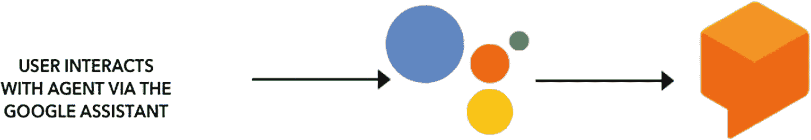
```

图 7-1 用户与 Google Assistant 交互，通过 Google 上的操作，Google Assistant 连接到 Dialogflow 智能体。这一切都是开箱即用的

```html
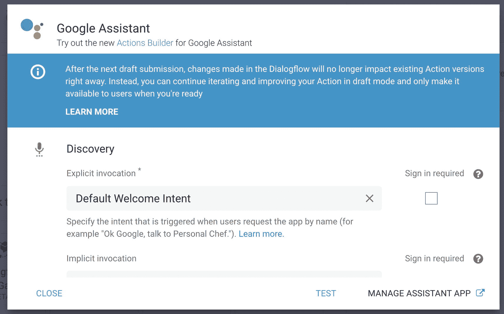
```

图 7-2 设置 Google Assistant 集成

1. 首先，点击 **集成** ➤ **Google Assistant** ➤ **集成设置**。这将打开一个弹出窗口；参见图 7-2。点击 **测试** 按钮。这将打开 Google 上的操作控制台 ([`https://console.actions.google.com/`](https://console.actions.google.com/))。请注意；您使用与 Dialogflow 相同的 Google 帐户登录到 Google 上的操作。如果这给您带来问题（通常是由于拥有多个 Google 帐户），请注销所有帐户，然后尝试重新登录。

```html
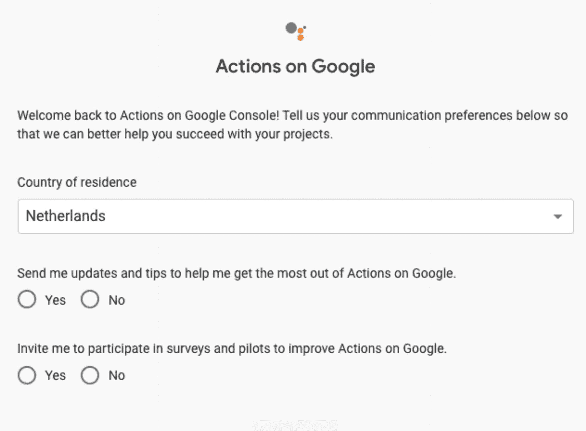
```

图 7-3 当您初次使用 Google 上的操作时，您必须填写此表单

2. 当您初次使用 Google 上的操作时，您需要填写一个表单以同意服务条款（参见图 7-3）。

3. 现在您进入了模拟器。确保模拟器设置为英语（美国），选择一个设备（例如，手机），然后点击 **与我的测试应用对话**。

*该操作将使用基本的 Dialogflow 默认意图向您打招呼。这意味着与 Google 上的操作的集成设置成功了！参见图 7-4。*

```html
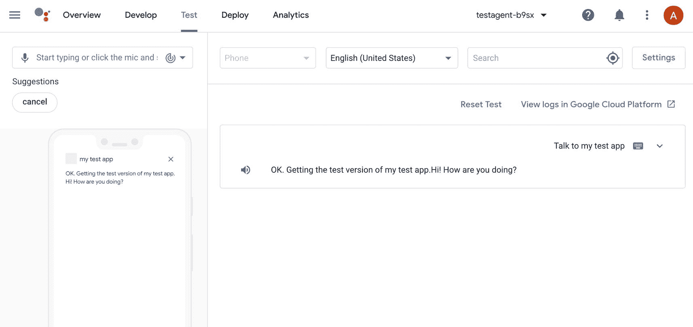
```

图 7-4 您的 Dialogflow 智能体在 Google 上的操作模拟器中运行 ([`https://console.actions.google.com`](https://console.actions.google.com))

### 富消息

当您为 Google Assistant 构建操作时，您可能希望使用 Google 上的操作提供的特定富消息。一旦您在 Dialogflow 中设置了 Google Assistant 集成，您会注意到您的意图响应块中有一个新选项卡（图 7-5）。

```html
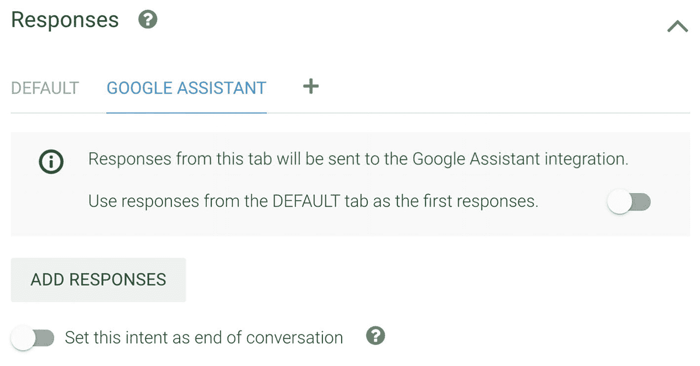
```

图 7-5 自定义 Google Assistant 响应

如果它不存在，您可以通过点击 **+** 选项卡轻松地将此选项卡添加到您的响应块中。

Google Assistant 选项卡中有三个主要设置：

1. 您可以选择不覆盖 *DEFAULT* 选项卡。例如，如果默认文本响应与 Google Assistant 文本响应相同，您可能希望启用第一个开关。

2. **添加响应** 按钮，用于向您的智能体添加富消息（自定义负载）。

3. 一个开关，用于在对话结束时设置意图。在 Google Assistant 上，这意味着您正在离开您操作的范围。例如，您可以创建一个再见意图并启用此开关。

当您点击 **添加响应**（图 7-6）按钮时，您可以在以下自定义负载响应之间进行选择：

```html
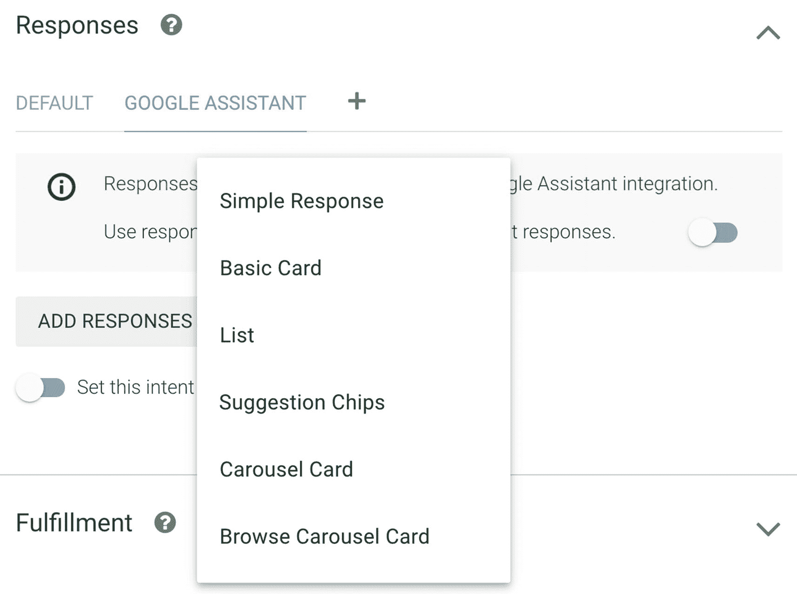
```

图 7-6 点击添加响应按钮以显示弹出窗口，用于在各种自定义 Google Assistant 响应之间进行选择

* **简单响应**：简单响应在视觉上采用聊天气泡的形式，并使用文本转语音 (TTS) 或语音合成标记语言 (SSML) 来生成声音。

* **基本卡片**：基本卡片主要用于显示目的。它们设计得简洁明了，用于向用户呈现关键（或摘要）信息，并允许用户选择了解更多信息（使用网页链接）。

* **列表**：单选列表向用户呈现多个项目的垂直列表，并选择一个项目。从列表中选择一个项目会生成一个包含列表项标题的用户查询（聊天气泡）。

* **建议芯片**：使用建议芯片来继续或转变对话；它们看起来像小按钮。

* **轮播卡片和浏览轮播卡片**：轮播是一种富响应，允许用户垂直滚动并在集合中选择一个磁贴。Dialogflow 有两种不同的轮播配置：轮播和浏览轮播。

* **链接建议**：链接到外部网站。

* **媒体内容**：媒体响应允许您的操作播放音频内容，其播放时长超过 SSML 的 240 秒限制。

* **表格卡片**：表格卡片允许您在响应中显示表格数据（例如，体育排名、选举结果和航班）。您可以定义助手需要在您的表格卡片中显示的列和行（最多各 3 个）。您还可以指定额外的列和行及其优先级。表格与垂直列表不同，因为表格显示静态数据并且不可交互，就像列表元素一样。

* **自定义负载**：您可以按照 Google 上的操作期望的格式编写 JSON，例如，当您希望在卡片中包含更多按钮或部分时。

### 履行和 Webhook

对于开发者来说，Google 上的操作有自己的客户端库；它在 Node 包管理器 (NPM) 中以 `actions-on-google-nodejs` 的名称提供。

该客户端库使得为 Google Assistant 创建操作变得容易，并支持 Dialogflow、Actions SDK 和 Smart Home 履行。您可以将代码部署在自己的服务器上，或使用 Dialogflow 内联编辑器。有关履行和 Webhook 的更多信息，请参见第 10 章。清单 7-1 显示了一个 Google 上的操作 Webhook 示例：

```javascript
const {
  dialogflow,
  Image
} = require('actions-on-google')
// 创建一个应用实例
const app = dialogflow();
// 为 Dialogflow 意图注册处理程序
app.intent('Default Welcome Intent', conv => {
  conv.ask('嗨，最近怎么样？')
  conv.ask(`这是一张猫的图片`)
  conv.ask(new Image({
    url: 'https://developers.google.com/web/fundamentals/accessibility/semantics-builtin/imgs/160204193356-01-cat-500.jpg',
    alt: '一只猫',
  }));
});
// Dialogflow 中名为 `Goodbye` 的意图，用于关闭操作
app.intent('Goodbye', conv => {
  conv.close('回头见！')
});
app.intent('Default Fallback Intent', conv => {
  conv.ask(`我没听明白。你能告诉我点别的吗？`)
});
```

在这段示例代码中，您可以看到 Dialogflow 将从 `actions-on-google` 库中加载。一旦您有了一个 Dialogflow 应用实例，您就可以注册监听 Dialogflow 中调用的意图的处理程序。

使用 `conv()` 对象，您可以返回内容。这可以是文本，它将被合成为语音，但它也可以包含丰富的 UI 响应，例如图片、基本卡片、列表等。

`actions-on-google` 库包含更多函数和辅助类，例如，用于请求位置、用户信息、帐户登录、检测屏幕等。

### 通过显式和隐式调用在 Google Assistant 上调用您的操作

当用户通过名称告诉 Google Assistant 使用您的操作时，就会发生**显式**调用，例如 *嘿 Google，与*（触发短语）→ *<我的操作名称>*（开发者指定的调用名称）→ *做 x y z*（开发者指定的调用短语）。参见图 7-7。可选地，用户可以在其调用的末尾包含一个调用短语，该短语将直接带他们到他们请求的功能。

```html

```

图 7-7 Google Assistant 显式调用

也可以选择一个或多个**隐式调用**意图。这是用户无需指定应用名称即可调用您的应用的方式。例如，如果您的应用可以定位附近的音乐会，用户可以这样说：“*好的，Google，我想找找附近的音乐会。*” Google Assistant 会尝试将用户的请求与适当的履行（例如操作、搜索结果或移动应用）进行匹配，然后向用户呈现推荐。为了找到匹配的操作，Google 使用信号，例如用户告诉 Assistant 执行类似于您配置的某个意图的调用短语的操作，或者当用户处于您的操作可能适用的上下文中时。

此交互过程如下：

1. 用户要求 Assistant 执行一项任务。

2. 推荐算法确定您的操作可以完成用户的任务。

3. Assistant 向用户推荐您的操作。

要设置显式和隐式意图，请点击 Dialogflow 中的 **集成** ➤ **Google Assistant** ➤ **集成设置** 链接（图 7-8）。并在两个发现下拉菜单中选择意图。

```html
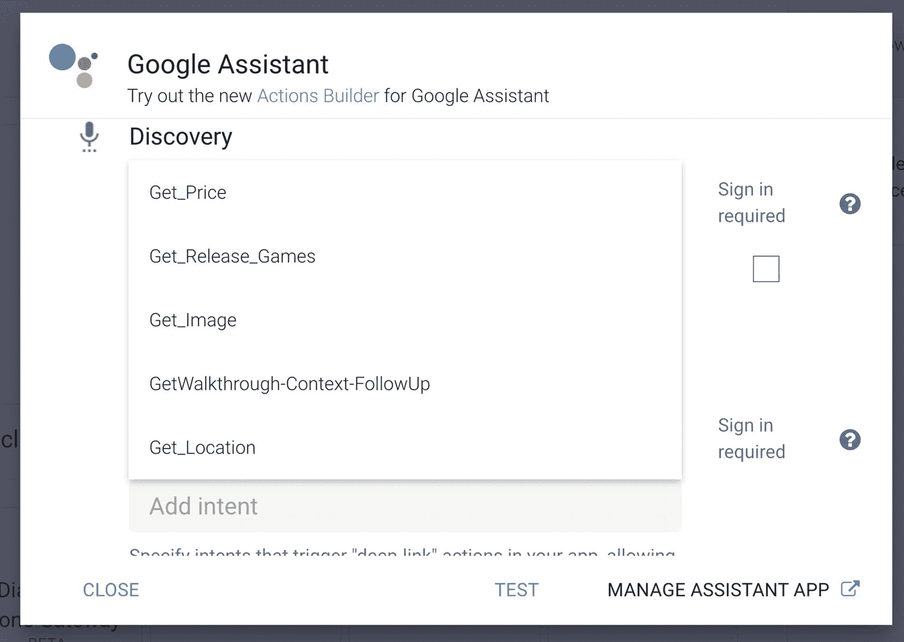
```

图 7-8 在 Dialogflow 中设置调用

### 通过 Google 上的操作提交操作

Google 有一个框架，包括 UI 工具包、SDK、模拟器和用于将您的操作部署到 Google Assistant 的工具。它被称为 ***Actions on Google***。

您可以使用 [`https://console.actions.google.com/`](https://console.actions.google.com/) 打开操作控制台。当您在 Dialogflow、Google 上的操作和您的 Google Assistant 设备上使用相同的 Gmail/Google 帐户登录时，您就可以在物理设备上开箱即用地测试您的应用程序。

在提交您的操作进行审批之前，我们建议您浏览一份发布前检查清单。使用检查清单可以捕获我们在审批过程中看到的许多问题，并提高您的项目获得批准的机会。每次您在提交后更新操作包时，都必须经过另一个审批周期。

> **提示**

> 使用 Dialogflow ES，可以创建智能体的不同版本，以便在提交操作之前创建 Dialogflow 智能体的不可变版本。这种方法使您能够创建 Dialogflow 智能体的多个版本，将它们发布到不同的环境，并在必要时回滚到以前的版本。

您可以从 Google 上的操作控制台的 **部署** 选项卡内部署您的操作。

### 使用 Actions SDK 构建操作

Google Assistant 上可用的所有操作中，百分之九十实际上是用 Dialogflow 构建的。这背后的原因很简单；两者都是 Google 产品，通过 Dialogflow 集成选项卡发布操作非常容易。您为什么要选择不同的方式呢？

还有另一种部署操作的方式，那就是通过 Actions SDK。这要复杂得多，因为您必须自己构建集成，但这样做有一些优点。您可能不希望让 Google 上的操作直接与 Dialogflow 对话，而是让 Google 上的操作连接到您自己的后端层，而后端层再连接到 Dialogflow；参见图 7-9。

```html
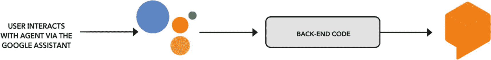
```

图 7-9 Google 上的操作连接到您的代码库，您的代码库连接到 Dialogflow 智能体以进行意图检测

正在构建支持多个渠道的大型客户体验平台的企业可能希望使用 Dialogflow 作为 NLU 意图检测层，该层将在单一位置编写和维护；所有渠道，包括 Google 上的操作，都将作为中间件。该中间件的唯一目的是捕获用户输入（键入的文本或转录为文本的语音音频），发送响应文本或音频，并以正确的格式呈现。例如，您合成的语音不应包含任何超链接，并且您可能还想支持 Google Assistant UI 小部件，例如卡片。架构将如图 7-10 所示。

```html
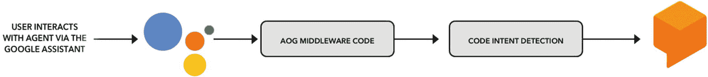
```

图 7-10 Google 上的操作连接到您的代码库，该代码库有一个用于处理 Actions SDK 并返回 SSML 或 Assistant 视图的中间件层，并且它有一个连接到 Dialogflow 智能体以进行意图匹配的脚本。其他渠道可以重用最后一部分

> **提示**

> 如果您使用的是 Dialogflow CX 而不是 Dialogflow Essentials，那么在撰写本文时，Actions SDK 解决方案是将您的对话带到 Google Assistant 的唯一方法。

通过使用 Actions SDK，您需要自带 NLU/意图检测。当您选择 Dialogflow（Essentials 或 CX）时，您将受益于快速的 Google 骨干网连接，因为 Google 上的操作和 Dialogflow 都是使用 Google 网络的 Google 产品，当然还有同样为 Google Assistant 提供支持的 Google 出色的 NLU。

### 使用 Actions SDK 解决方案

为了构建此集成，您需要使用 Actions SDK npm 库和 Dialogflow API。清单 7-2 将向您展示如何构建此集成的示例。

1. 导入库。

2. 创建一个 Google Assistant 应用实例。

3. 为 Actions SDK 意图注册处理程序。

4. 当操作启动时，将触发 `actions.intent.MAIN`。我们将通过传入事件名称 "`WELCOME`" 来获取默认欢迎意图。

5. 让 Google Assistant 说出 `fulfillmentText`。

6. 我们将使用 `actions.intent.TEXT` 作为捕获所有传入用户输入（由 Google Assistant 语音转文本转录的口语文本或书面文本）的通用意图，并在 Dialogflow 中进行文本意图检测。

7. 要创建 Dialogflow 会话客户端和会话路径，我们需要一个唯一 ID 和 Dialogflow 项目 ID。步骤 7 到 9，Dialogflow SDK 的使用，将在第 10、11 和 12 章中进一步解释。

8. 这是将使用文本对象或事件对象形成的请求。

9. 现在我们调用 `sessionClient` 的 `detectIntent` 方法，并传入请求。它将返回一个 promise；一旦 promise 完成，它将返回响应（履行文本）。
```


```javascript
// 1)
const { actionssdk } = require('actions-on-google');
const dialogflow = require('@google-cloud/dialogflow');
const uuid = require('uuid');
// 2)
const app = actionssdk();
// 3)
app.intent('actions.intent.MAIN', async (conv) => {
// 4)
var queryInput = {
  event: {
    name: 'WELCOME',
    languageCode: 'en'
  }
};
var response = await dialogflowDetection(queryInput);
// 5)
conv.ask(response.response.queryResult.fulfillmentText);
})
app.intent('actions.intent.TEXT', (conv, input) => {
// 6)
var queryInput = {
  text: {
    text: input,
    languageCode: 'en'
  }
};
var response = await dialogflowDetection(queryInput);
conv.ask(response.queryResult.fulfillmentText);
});
async function dialogflowDetection(){
// 7)
const sessionId = uuid.v4();
const sessionClient = new dialogflow.SessionsClient();
const sessionPath = sessionClient.projectAgentSessionPath(projectId, sessionId);
// 8)
const request = {
  session: this.sessionPath,
  queryInput: qInput,
  queryParams: null
};
// 9)
const [response] = await this.sessionClient.detectIntent(request);
return response;
}
```

清单 7-2 代码实现

Actions SDK 需要一个 *操作包文件* (`action.json`)，它是一种 JSON 清单文件，描述要“监听”的意图，并告诉 Google Assistant 一旦触发此类意图该做什么。参见清单 7-3。

```json
{
  "actions": [
    {
      "description": "默认欢迎意图",
      "name": "MAIN",
      "fulfillment": {
        "conversationName": "welcome"
      },
      "intent": {
        "name": "actions.intent.MAIN",
        "trigger": {
          "queryPatterns": ["与 CCAIDemo 对话"]
        }
      }
    },
    {
      "description": "Dialogflow 意图",
      "name": "TEXT",
      "fulfillment": {
        "conversationName": "dialogflow_intent"
      },
      "intent": {
        "name": "actions.intent.TEXT"
      }
    }
  ],
  "conversations": {
    "welcome": {
      "name": "welcome",
      "url": "https://www.leeboonstra.dev/webhook/"
    },
    "dialogflow_intent": {
      "name": "dialogflow_intent",
      "url": "https://www.leeboonstra.dev/webhook/"
    }
  },
  "locale": "en"
}
```

清单 7-3 action.json 文件将意图映射到履行

每个 Actions 项目都必须有一个欢迎意图，作为用户开始对话的入口点。当用户通过说出其名称（例如，“嘿 Google，与视频游戏智能体对话”）显式调用操作时，会触发欢迎意图。此欢迎意图使用 `actions.intent.MAIN` 意图名称标识。

您可以在操作包中创建其他条目，其中包含您自己定义的意图。但是，对于 Dialogflow 项目，您将需要 `actions.intent.TEXT` 意图，它将像一个通用捕获器一样工作。所有口头或键入的输入都作为 `actions.intent.TEXT` 意图发送。请注意清单 7-2 中的第 6 点以及清单 7-3 中的 `actions.intent.TEXT` 块。您可以简单地获取原始文本并将其转发到您的履行服务器。从那里，您可以使用 Dialogflow 处理文本并构建响应以发送回 Google 上的操作。

您可以忽略关于 Actions SDK 的其他几乎所有内容。但是，还有其他不错的功能，例如触发器。这允许用户通过说出操作名称和意图来调用特定功能（例如，“嘿 Google，与 ExampleAction 对话以查找一些鞋子”）。

在下一个清单，清单 7-4 中，请注意 `trigger` 块。`queryPatterns` 作为一个语音适应列表，带有提示，用于偏置语音转文本模型，以确保参数块中标记的正确参数被发送到您的 NLU 检测层。如果没有这些提示，STT 模型可能会听到类似“买一些蓝色运动鞋”而不是“买一些蓝色绒面革鞋”的内容。您的 NLU 层将无法理解“运动鞋”。

```json
{
  "description": "直接访问",
  "name": "BUY",
  "fulfillment": {
    "conversationName": "ExampleAction"
  },
  "intent": {
    "name": "com.example.ExampleAction.BUY",
    "parameters": [
      {
        "name": "color",
        "type": "org.schema.type.Color"
      }
    ],
    "trigger": {
      "queryPatterns": [
        "找一些 $org.schema.type.Color:color 运动鞋",
        "买一些蓝色绒面革鞋",
        "买跑鞋"
      ]
    }
  }
}
```

清单 7-4 在 action.json 文件中偏置 STT 模型

`conversations` 块充当路由器；它需要访问公共 HTTPS URL 以检索履行。您的后端履行接收来自 Assistant 的请求，处理请求并做出响应。您可以将此后端代码托管在任何您想要的地方——本地或 Google Cloud 中。第 10 章将讨论各种计算解决方案，只要您监听 POST 请求即可。

如果您使用 express 构建后端服务器，您的 POST 路由将如下所示：

```javascript
var assistant = actionssdk();
expressApp.post('/webhook/', assistant);
```

如果您想在本地运行它，您将需要一个像 **ngrok** 这样的工具来创建一个安全隧道。这是因为 Google Assistant 在云端工作，Dialogflow 也是如此。您的履行需要通过 HTTPS 上的非本地 URL 可用。第 10 章将更详细地讨论 ngrok。

Google 上的操作还提供了一个名为 **gactions** 的命令行工具。使用命令 `gactions init`，您可以生成样板代码，类似于清单 7-3。

### 部署您的操作

要上传您的操作包，您将需要 `gactions` 命令行工具并运行以下命令，将 `PACKAGE_FILE` 和 `PROJECT_ID` 替换为您的项目的相关值：

```sh
gactions update --action_package PACKAGE_FILE --project PROJECT_ID
```

## 使用电话网关构建呼叫机器人

Dialogflow ES 电话网关是为电话设置入站语音智能体的简单方法。您将获得一个免费电话号码；当您拨打该号码时，Dialogflow 智能体将与您通话。用例更适用于简单的电话机器人（如预订系统）或测试目的。如果您想将机器人集成到您的 IVR/联络中心中，或者已经拥有现有的联络中心（电话合作伙伴），那么通过 Contact Center AI（如下一节所述）启用 Dialogflow 对您来说将是更好的解决方案。

当您使用 Dialogflow 试用版时，您将无法访问免费电话号码。并且您将获得有限的配额，例如每分钟总通话分钟数为 3 分钟，每天 30 分钟通话，每月 500 分钟通话，并且电话号码仅保留 30 天。企业级套餐将包括每分钟 100 分钟通话。换句话说，Dialogflow 试用版非常适合测试电话网关，但您需要迁移到付费的企业级套餐才能在生产环境中使用它。当您在通话过程中遇到忙音或通话中断时，这意味着您已超出配额。

让我们启用电话网关。

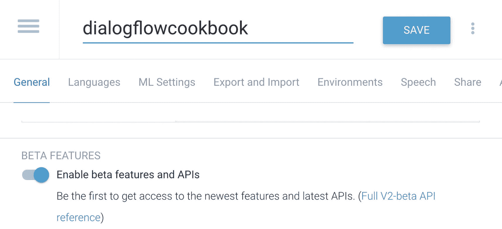

图 7-11 在设置面板中启用 Beta 功能和 API

1. 在撰写本文时，此功能处于 Beta 阶段。如果您在设置面板中找不到语音选项卡，您需要先启用 Beta 功能（参见图 7-11）。这可以在 **设置** ➤ **常规** 选项卡中找到。

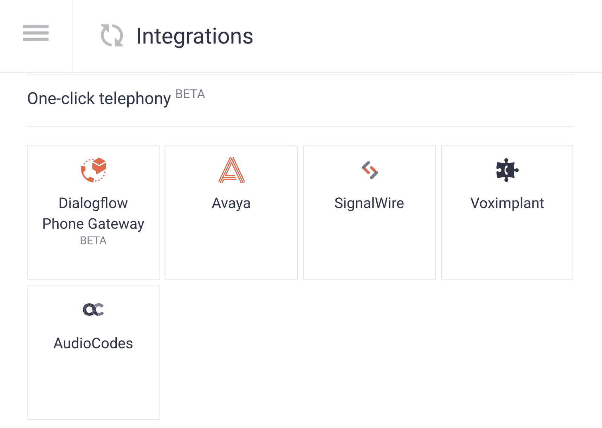

图 7-12 启用
```
