# 在容器启动时运行 Web 服务。

`CMD [ "npm", "start" ]`

清单 10-13：属于此示例的 Dockerfile，用于在 Cloud Run 中运行容器

`.dockerignore` 文件（清单 10-14）确保特定文件不会被复制到镜像中。例如，`node_modules` 文件夹将从 `package.json` 文件生成，无需复制所有这些大文件。

```
Dockerfile
README.md
node_modules
npm-debug.log
```

清单 10-14：Docker 忽略文件

通过以下命令行命令，我可以部署 Cloud Run 容器。

首先，启用容器注册表 API：

```
gcloud services enable containerregistry.googleapis.com
```

登录 gcloud：

```
gcloud init
```

构建容器，并为镜像指定一个标签名称：

```
gcloud builds submit --tag gcr.io/PROJECT_ID/dialogflow
```

使用镜像标签名称部署容器（使用托管平台，而非 Anthos）：

```
gcloud run deploy --image gcr.io/PROJECT_ID/dialogflow --platform managed
```

这将引导您完成一个向导。您可以选择一个区域。允许未经身份验证的调用以使 URL 公开可用。完成后，它将为您的 fulfillment 创建一个 HTTPS URL。这是您可以添加到 Dialogflow 控制台中 Webhook URL 字段的 URL：`https://<myapp>.a.run.app`

清单 10-15 显示了一个代码示例。

```
const express = require('express');
const bodyParser = require('body-parser');
// Dialogflow Fulfillment Code
const expressApp = express().use(bodyParser.json())
expressApp.post('/fulfillment', (request, response) => {
// Agent intent map
});
expressApp.get('/', (req, res) => {
// get the Dialogflow request
// do something
// return to the agent
res.send(`Hello from Google Cloud!`);
});
const port = process.env.PORT || 8080;
expressApp.listen(port, () => {
console.log('Dialogflow Fulfillment listening on port', port);
});
```

清单 10-15：使用 Express 的 Dialogflow fulfillment

## Google Cloud Logging

当使用 Google Cloud 产品时，日志记录是开箱即用的。参见图 10-12。

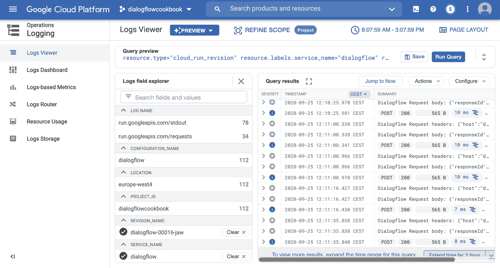

图 10-12：Google Cloud 控制台（以前称为 Stackdriver）中的 Fulfillment webhook 日志

## 构建多语言 Fulfillment Webhook

当处理不同语言时，您可能会处理其他数字格式、外币或日期/时间字符串。更多工具会派上用场：

- `moment.js`：用于在 JavaScript 中解析、验证、操作和显示日期和时间。
- `numeral.js`：一个用于格式化和操作数字的 JavaScript 库。

当您的 webhook 后端是 Node.js 后端时，有一些出色的框架可以帮助您更好地组织代码和本地化字符串。

此工具将帮助您：

- `i18n`：轻量级、简单的翻译模块，具有动态 JSON 存储。支持普通的 Node.js 应用。

Dialogflow 会随每个查询结果发送一个语言代码（例如，英语为 "en"，荷兰语为 "nl"）：

```
request.body.queryResult.languageCode;
```

您将使用它来初始化 `i18n` 库。然后，您可以通过以下调用引用这些多语言文本字符串：

```
i18n.__(KEY)
```

所有基于文本的字符串都可以存储在 JSON 文件中，例如：

- `locales/en-US.json`
- `locales/nl-NL.json`

内容如下所示：

```
en-US.json
{
"WELCOME_BASIC": "Hi, I am the virtual video game chat agent. I can talk with you about video games or tell you which latest games have been released. What would you like to know from me?"
}
nl-NL.json
{
"WELCOME_BASIC": "Hoi, ik ben de virtual video game chat agent. Ik kan over video games praten en ik kan je vertellen welke games net uit zijn. Wat wil je weten?"
}
```

**提示：** 由于 `i18n` 使用 JSON 文件存储语言字符串，您可以将这些 JSON 文件与代码一起存储，并使用例如 Cloud Run 在云中部署您的 webhook。如果您更愿意使用内联编辑器或 Cloud Functions，您可能希望将 JSON 文件存储在 Google Cloud Storage 中。

### i18n 代码示例

让我们看一个完整的代码示例，该示例实现了使用 Cloud Run 部署的多语言 webhook。

`package.json` 文件将包含这些额外的依赖项：

```
"i18n": "⁰.10.0",
"moment": "².27.0",
"numeral": "².0.6"
```

本地化的 JSON 文件将如清单 10-16 所示。请注意，某些字符串可以包含变量（`%s`）。

```
locales/en-US.json
{
"WELCOME_BASIC": "Hi, I am the virtual video game chat agent. I can talk with you about video games or tell you which latest games have been released. What would you like to know from me?",
"DELIVERY_DATE": "The date is %s.",
"PRICE": "It costs %s.",
"TOTAL_AMOUNT": "The total is: %s.",
"FALLBACK": "Oops, something went wrong. Would you like to try again?"
}
locales/nl-NL.json
{
"WELCOME_BASIC": "Hoi, ik ben de virtual video game chat agent. Ik kan over video games praten en ik kan je vertellen welke games net uit zijn. Wat wil je weten?",
"DELIVERY_DATE": "De datum is %s.",
"PRICE": "Het kost %s.",
"TOTAL_AMOUNT": "Het totaal is: %s.",
"FALLBACK": "Oeps, er ging iets mis. Kun je het opnieuw proberen?"
}
```

清单 10-16：您可以创建区域设置 JSON 文件以在 webhook 代码中使用

清单 10-17 展示了如何设置您的 webhook 代码以使用这些 JSON 语言文件。

1. 首先，我们将需要 `i18n` 库来处理多语言支持。我们需要配置它，以说明我们正在使用哪些区域设置、它们位于何处以及哪个区域设置将是默认设置。
2. 接下来，我们将需要 `moment.js` 来处理日期和时间对象。
3. 默认情况下，它适用于英语。所有其他区域设置都需要单独引入。
4. 然后我们需要 `numeral.js` 来处理货币和数字。为了使其与其他区域设置一起工作，我们必须注册区域设置并提供选项。例如，在欧洲表示法中，小数分隔符是 "." 而不是 ","。
5. 在这里，我们将 `i18n` 键分配给响应输出。`i18n` 框架将在区域设置文件中找到值（正确的翻译文本字符串）。
6. 我们将从 Dialogflow `queryResult` 对象中检索 `languageCode`。如您所见，`i18n` 使用 ISO 语言代码，符合 ISO 639-1 标准，并在相关时附带两个字母的国家/地区代码，例如（"nl-NL" 或 "en-US"），因此我们需要创建该映射。
7. 这些是利用多语言响应的意图。

```
'use strict';
const express = require('express');
const bodyParser = require('body-parser');
const { WebhookClient} = require('dialogflow-fulfillment');
//1
const i18n = require('i18n');
i18n.configure({
locales: ['en-US', 'nl-NL'],
directory: __dirname + '/locales',
defaultLocale: 'en-US'
});
//2
const moment = require('moment');
require('moment/locale/nl');
//3
const numeral = require('numeral');
numeral.register('locale', 'nl', {
delimiters: {
thousands: ',',
decimal: '.'
},
abbreviations: {
thousand: 'k',
million: 'm',
billion: 'b',
trillion: 't'
},
ordinal: function (number) {
var b = number % 10;
return (~~ (number % 100 / 10) === 1) ? 'th' :
(b === 1) ? 'st' :
(b === 2) ? 'nd' :
(b === 3) ? 'rd' : 'th';
},
currency: {
symbol: '€'
}
});
process.env.DEBUG = 'dialogflow:debug'; // enables lib debugging statements
//4
function welcome(agent) {
agent.add(i18n.__('WELCOME_BASIC'));
}
function fallback(agent) {
agent.add(i18n.__('FALLBACK_BASIC'));
}
function getPrice(agent) {
agent.add(i18n.__('PRICE', numeral(399).format('($0,0)')));
}
function getDeliveryDate(agent) {
agent.add(i18n.__('DELIVERY_DATE', moment().format('LL')));
}
function getTotalNumber(agent) {
agent.add(i18n.__('TOTAL_AMOUNT', numeral(1000).format('0,0')));
}
// Express Code
const app = express().use(bodyParser.json());
app.post('/fulfillment', (request, response) => {
const agent = new WebhookClient({ request, response });
console.log('Dialogflow Request headers: ' + JSON.stringify(request.headers));
console.log('Dialogflow Request body: ' + JSON.stringify(request.body));
//5
var lang = request.body.queryResult.languageCode;
var langCode;
if(lang === "nl") langCode = "nl-NL";
if(lang === "en") langCode = "en-US";
i18n.setLocale(langCode);
moment.locale(lang);
numeral.locale(lang);
//6
let intentMap = new Map();
intentMap.set('Default Welcome Intent', welcome);
intentMap.set('Default Fallback Intent', fallback);
intentMap.set('Get_Price', getPrice);
intentMap.set('Get_Delivery_Date', getDeliveryDate);
intentMap.set('Get_Total_Number', getTotalNumber);
agent.handleRequest(intentMap);
});
app.get('/', (req, res) => {
res.send(`OK`);
});
const port = process.env.PORT || 8080;
app.listen(port, () => {
console.log('Dialogflow Fulfillment listening on port', port);
});
```

清单 10-17：使用 `i18n` 库的 Dialogflow fulfillment 多语言 webhook 代码

图 10-13 和 10-14 将展示结果在模拟器中的样子。图 10-13 将显示英文示例。同时注意货币符号。

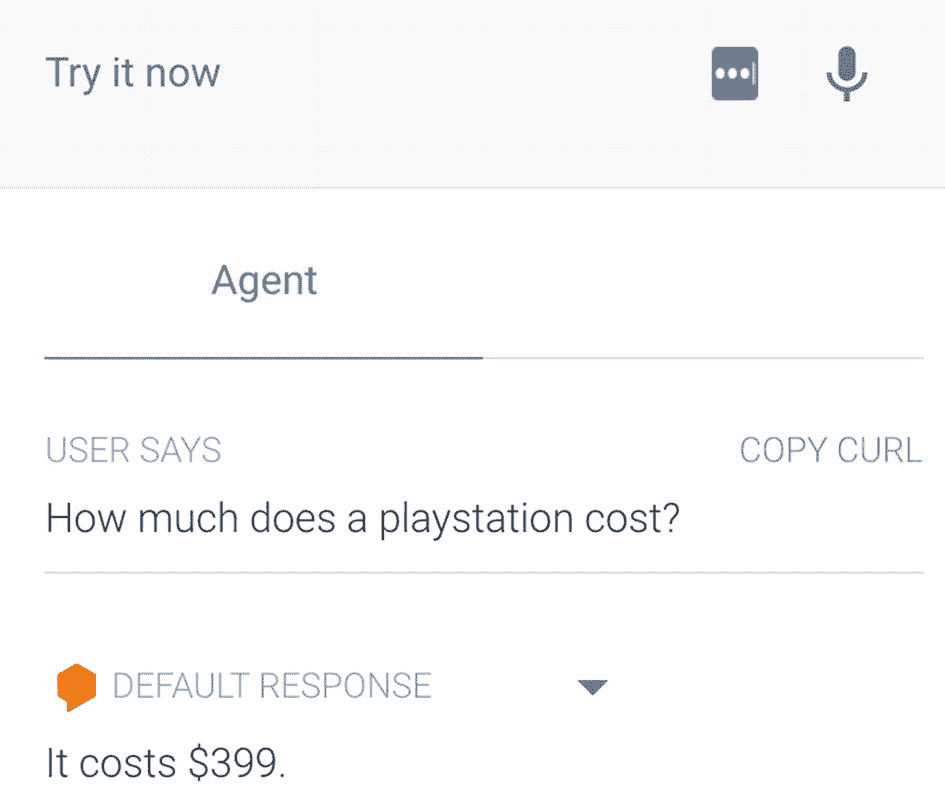

图 10-13：测试使用 fulfillment 的多语言机器人，英语

图 10-14 将显示荷兰语示例。同时注意货币符号。

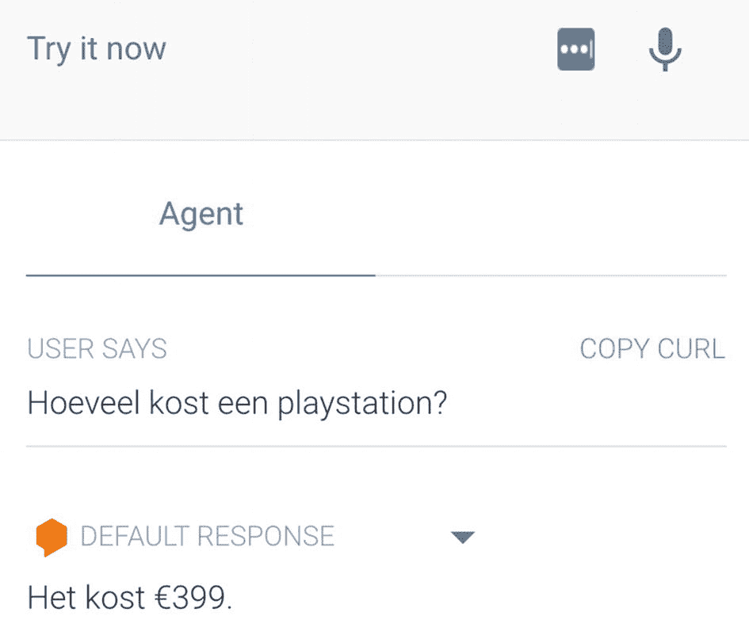

图 10-14：测试使用 fulfillment 的多语言机器人，荷兰语

## 使用本地 Webhooks

在开发期间，在本地运行您的 fulfillment 可能很方便，因为您无需部署解决方案。我们可以为此使用 `ngrok` 工具。您可以从 npm 下载它。

图 10-15 展示了其工作原理。用户与 Dialogflow 代理交互。一旦 Dialogflow 需要获取 fulfillment，它将连接到 `ngrok.io` 以执行您的本地 webhook 代码。

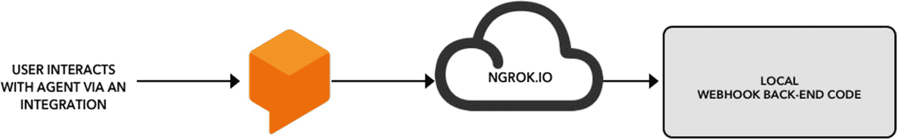

图 10-15：使用 `ngrok.io` 在本地测试 fulfillment

### Ngrok

`Ngrok` 允许您将本地机器上运行的 Web 服务器暴露到互联网。只需告诉 `ngrok` 您的 Web 服务器正在监听哪个端口。如果您不知道您的 Web 服务器正在监听哪个端口，它可能是端口 80，即 HTTP 的默认端口。

您可以从命令行在本地 fulfillment webhook 代码文件夹中运行以下命令来暴露您的 webhook：

```
ngrok http 80
```

当您启动 `ngrok` 时，它将显示您的隧道的公共 URL 以及通过您的隧道建立的连接的其他状态和指标信息：

```
Tunnel Status                 online
Version                       2.0/2.0
Web Interface                 http://127.0.0.1:4040
Forwarding                    http://92832de0.ngrok.io -> localhost:80
Forwarding                    https://92832de0.ngrok.io -> localhost:80
Connections                  ttl     opn     rt1     rt5     p50     p90
0       0      0.00    0.00    0.00    0.00
```

生成的转发 **HTTPS URL** 是您需要输入到 Dialogflow Fulfillment 页面 Webhook 部分的内容；参见图 10-16。

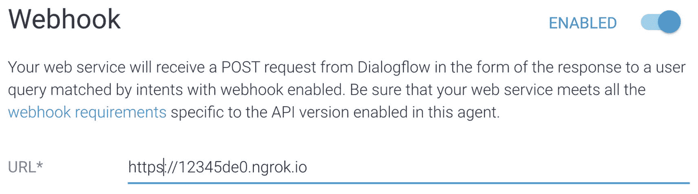

图 10-16：使用 `ngrok` 的 Webhooks

当您从本地应用代码文件夹运行 `ngrok` 命令时，它会连接到 `ngrok` 云服务，该服务在公共地址上接受流量，并将该流量中继到您机器上运行的 `ngrok` 进程，然后转发到您指定的本地地址。

**提示：** 在 `ngrok` 免费计划中，`ngrok` 的 URL 是随机生成且临时的。如果您希望每次都使用相同的 URL，则需要升级到付费计划，以便使用子域名选项获得稳定的 HTTP 或 TLS 隧道 URL，或使用远程地址选项获得稳定的 TCP 隧道地址。

## 无需 Dialogflow 和 ngrok 测试您的 Fulfillment

也可以在不连接到 Dialogflow 且不使用 `ngrok` 的情况下测试您的 webhook 代码。如果您只想测试本地代码，这在编写代码时会很方便。我们可以通过将存根 JSON 文件发布到您的 webhook（假装它是 Dialogflow）来实现这一点。

在 Dialogflow 控制台中，点击 **Fulfillments** ➤ **Diagnostic Info**。复制并粘贴 Fulfillment 请求选项卡的内容。将其存储在本地文件中：`stub.json`。此 JSON 代码对于您的代理是唯一的，因为它包含会话 ID、项目名称以及特定于您代理的意图和响应 ID。

一旦您有了 `stub.json` 文件，您可以从命令行发出 **Curl** POST 调用，该调用使用存根文件作为 POST 消息：

```
curl -X POST -H "Content-Type: application/json" -d @stub.json http://localhost:8080/fulfillment
```

这将执行您的本地代码。

## 保护 Webhooks

可以保护您的 fulfillment webhook，以便只有您或您的 Dialogflow 代理被授权发出请求。支持以下身份验证机制：

- 使用登录名和密码的基本身份验证
- 使用身份验证标头的身份验证
- 双向 TLS 身份验证

**注意：** Dialogflow 是一个用于 NLP、意图匹配和参数槽填充的对话工具。它不附带 CMS，因此不会有用户登录系统或 OAuth 实现。

### 基本身份验证

基本访问身份验证是一种 HTTP 用户代理（例如 Web 浏览器）在发出请求时提供用户名和密码的方法。在基本 HTTP 身份验证中，请求包含一个标头字段，格式如下：`Authorization: Basic <credentials>`，其中 credentials 是 ID 和密码通过单个冒号连接后的 Base64 编码。

它不为传输的凭据提供机密性保护。它们仅在传输过程中使用 Base64 编码，但未以任何方式加密或哈希。因此，基本身份验证通常与 HTTPS 结合使用以提供机密性。幸运的是，这两者在 Dialogflow 中都是开箱即用的。Dialogflow webhook 只允许 HTTPS URL。

您可以在 Dialogflow Fulfillment 页面设置 **Basic Auth**；参见图 10-17。除了 URL，您还需要指定用户 ID 和密码。

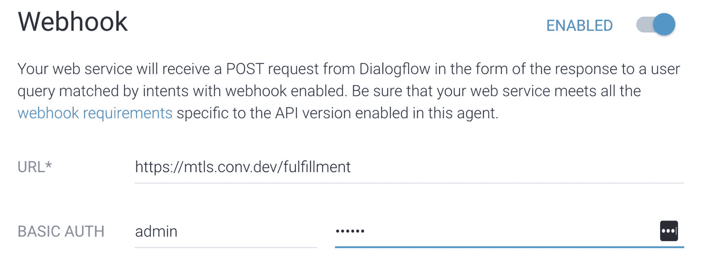

图 10-17：Dialogflow 中的安全 webhook

在 Dialogflow 中使用 Basic Auth 选项还要求您在 fulfillment webhook 中处理访问控制。假设您已经使用 Node.js 和 Express 构建了一个后端。Express 有一个基本身份验证中间件插件。该中间件将检查传入请求是否包含基本身份验证（Authorization）标头，解析它，并检查凭据是否合法。如果请求未授权，它将响应 HTTP 401 和一个可配置的主体（默认为空）。

在清单 10-18 中，中间件将检查传入请求是否与凭据 `admin:supersecret` 匹配，这些凭据已传递到 Dialogflow Webhook 的 Basic Auth 字段中。

```
const app = require('express')()
const basicAuth = require('express-basic-auth')
app.use(basicAuth({
users: { 'admin': 'supersecret' }
}));
```

清单 10-18：在您的 webhook 中进行基本身份验证

### 使用身份验证标头进行身份验证

HTTP 为访问控制和身份验证提供了一个通用框架。最常见的 HTTP 身份验证基于 "Basic Auth" 方案，如您在前一节中所见。但也有其他方案，例如 Bearer JWT 令牌或 Digest。Dialogflow 允许您指定自己的自定义标头，您可以将其用于身份验证，或者例如设置字符编码。

您可以在 Dialogflow Fulfillment 页面上设置自定义 **headers**。除了 URL，您还需要指定标头键和值。

清单 10-19 显示了一个检查 fulfillment webhook 代码中是否存在标头的示例。已在 Dialogflow 控制台中设置了一个键为 `x-auth`、值为 `true` 的自定义标头。此代码检查此标头是否存在；如果不存在，则发送 403 HTTP 错误，这意味着 webhook 代码理解该请求但拒绝授权。

```
app.use(function(req, res, next) {
if (!req.headers['x-auth']) {
return res.status(403).json({ error: 'No auth headers sent!'});
}
next();
});
```

清单 10-19：在您的 webhook 中进行标头身份验证

图 10-18 展示了如何配置 Dialogflow webhook 以配合清单 10-19 的代码工作。注意 `x-auth` 标头。

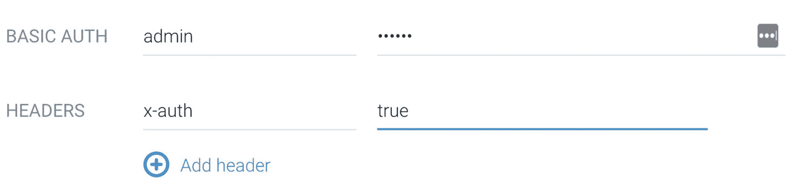

图 10-18：带有标头的安全 webhook

**提示：** 如果您想使用 Bearer JWT 令牌，您可能想知道如何设置标头，因为 JWT 令牌应该一直在变化。通常，标头看起来像 `Authorization - Token token='yourtokenhere'`。在 Dialogflow 控制台中设置这些没有太大意义。您可能希望以编程方式执行此操作。使用 Dialogflow SDK，可以调用 `updateFulfillment` 方法，该方法允许您传入一个带有 `GenericWebservice` 的 Fulfillment。您如何接收新的 JWT 令牌/重定向？也许通过将您的聊天机器人集成放在 Web 登录后面？这也意味着您的代码实现需要检查 JWT 令牌并提供 JWT 令牌，因为 Dialogflow 不会这样做。

### 双向 TLS 身份验证

Dialogflow 为 webhook 请求发起的网络流量是在公共网络上发送的。为了确保流量在双向都是安全且受信任的，Dialogflow 可选地支持双向 TLS 身份验证（mTLS）。使用 mTLS，客户端（Dialogflow）和服务器（您的 webhook 服务器）都在 TLS 握手期间出示证书，从而相互证明身份。

您无需在 Dialogflow 控制台中配置 mTLS，但您必须在 fulfillment webhook 服务器上进行配置。通常，您不会在 Node.js 应用代码中配置此功能，因为生产环境中的 Node.js 应用总是位于 Apache、NGINX 或云负载均衡器等服务器之后。那才是您配置服务器的地方，当 TLS 握手相互证明后，再将请求转发到不同端口（HTTP 上）的 Node.js 应用代码。

配置将满足以下要求：

- 您的应用代码需要一个有效的安全 SSL 证书。
- 您需要下载 Dialogflow 使用的根 CA。

#### 有效的安全 SSL 证书

通过 HTTPS 运行的网页和应用需要有效的 SSL 证书。有两种方法可以免费获得这些证书，但有一些注意事项：

- 您可以使用 **OpenSSL** 生成自签名证书请求；但是，CA 将不受信任。您可以将证书添加到您的浏览器或操作系统证书密钥链存储中，但每个使用此公共 IP 的人都必须执行这些步骤。有可能由受信任的机构（如 GlobalSign）签署您的证书；但这需要花钱。没有受信任的 CA，Dialogflow mTLS 将无法工作。
- 使用像 **Let's Encrypt** 这样的工具。它可以免费生成带有受信任 CA 的受信任证书；但是，您需要将一个域名连接到您的公共 IP。

图 10-19 展示了您的 SSL 证书安全时的样子。

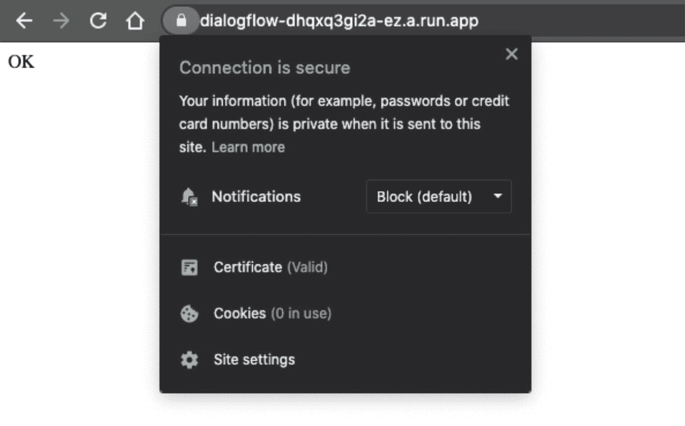

图 10-19：带有 SSL 证书的安全网站

### 根 CA

在命令行上运行以下两个命令以下载 Dialogflow 将使用的根 CA。这会将 `GTS101.crt` 和 `GSR2.crt` 添加到本地文件：`ca-crt.pem`：

```
curl https://pki.goog/gsr2/GTS1O1.crt | openssl x509 -inform der >> ca-crt.pem
curl https://pki.goog/gsr2/GSR2.crt | openssl x509 -inform der >> ca-crt.pem
```

以下是如何为 Apache2 启用 mTLS 的示例。这些设置属于 `ssl.conf`：

```
SSLVerifyClient require
SSLVerifyDepth 2
SSLCACertificateFile "ca-crt.pem"
```

这是访问控制，将确保只有 `Dialogflow.com` 可以调用 fulfillment webhook：

```
Require all denied
```

### 使用 Apache 进行 HTTPS 身份验证设置

与其在您的（Node.js）应用代码中设置 HTTP 身份验证，不如在服务器端解决这个问题。要密码保护 Apache 服务器上的目录，您需要一个 `.htaccess` 和一个 `.htpasswd` 文件。`.htaccess` 文件通常如下所示：

```
AuthType Basic AuthName "Access to the staging site"
AuthUserFile /path/to/.htpasswd Require valid-user
```

`.htaccess` 文件引用了一个 `.htpasswd` 文件，其中每一行包含一个用户名和一个密码，用冒号（":"）分隔。您看不到实际密码，因为它们已被加密（本例中为 md5）。请注意，如果您愿意，可以以不同方式命名您的 `.htpasswd` 文件，但请记住，此文件不应被任何人访问。（Apache 通常配置为阻止对 .ht* 文件的访问。）

例如：

```
admin:$apr1$ZjTqBB3f$IF9gdYAGlMrs2fuINjHsz.
```

### 设置双向 TLS 身份验证的完整示例

HTTPS 是 HTTP（超文本传输协议）的安全版本。HTTP 是您的浏览器和 Web 服务器用于通信和交换信息的协议。当数据交换使用 SSL/TLS 加密时，我们称之为 HTTPS。"S" 代表安全。

每当您使用 Web 浏览器连接到安全站点（`https://something`）时，您都在使用传输层安全性（TLS）。TLS 是 SSL 的继任者，它是一个具有许多功能的优秀标准。TLS 向客户端保证服务器的身份，并在服务器和客户端之间提供双向加密通道。

但对于像 Dialogflow 这样的 webhook 应用程序来说，这还不够，因为您的应用程序是服务器，而您想要确认客户端（Dialogflow）的身份。解决方案是什么？双向 TLS 来拯救！它是 TLS 的一个可选功能。它使服务器能够验证客户端的身份。

已部署的 Cloud Run 应用（HTTPS 或 gRPC）和无服务器云函数将提供受根 CA 存储信任的有效 "服务器证书"。Cloud Run 和 Cloud Functions 不支持自带证书。Cloud Run 的 `.run.app` URL 提供自己的有效 TLS 服务器证书。

假设您的 webhook 需要 mTLS 身份验证。在这种情况下，您可能需要考虑以下 Google Cloud 解决方案之一：Compute Engine（虚拟机）、Google Kubernetes Engine（容器）或 Anthos 上的 Cloud Run（GKE 上带有 Istio 的 Cloud Run 容器）。

以下是如何在 Compute Engine 上设置启用了 mTLS 的 Dialogflow fulfillment 虚拟机。

#### 在 Compute Engine 上创建 Node.js 虚拟机

通过以下步骤创建 Node.js 虚拟机：

从 Cloud Console 菜单中，选择 **Marketplace**。选择 **Node.js by Google Click to deploy image (VM)**（参见图 10-20）。

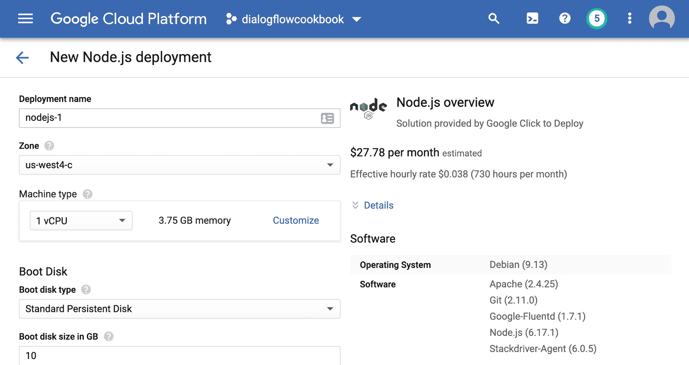

图 10-20：Google Cloud 中的 Node.js Compute 虚拟机

选择一个区域。确保选中 HTTP 和 HTTPS。

从 Cloud Console 菜单中，选择 **VPC Network** ➤ **Firewall** ➤ **Create a new firewall rule**（参见图 10-21）。

- 目标：**网络中的所有实例**
- 源 IP 范围：**0.0.0.0/0**
- 指定端口：**tcp > 3000**

点击 **Create**。

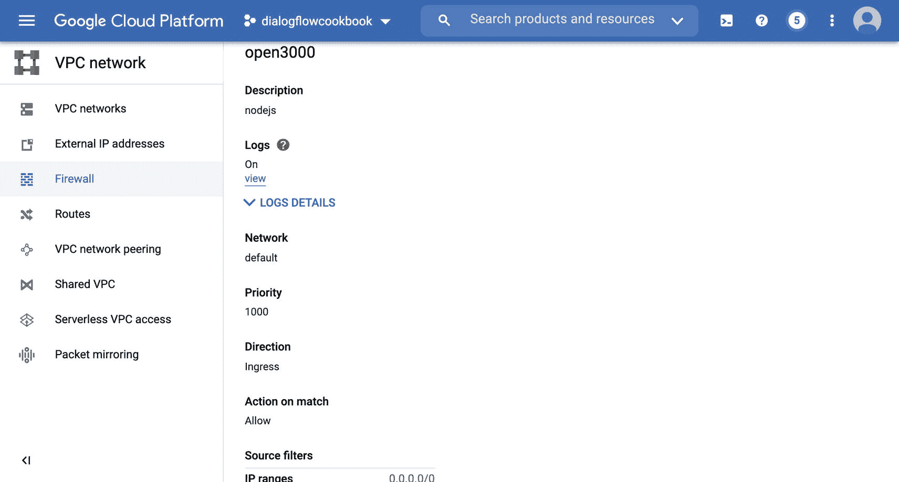

图 10-21：为端口 3000 打开防火墙

#### 将域名附加到您的虚拟机

从 Cloud Console 菜单中，选择 **VPC Networks** ➤ **External IP addresses**。您应该会看到您的新虚拟机实例。我们现在将保留一个静态 IP 地址，以便稍后可以将其绑定到域名。

将类型从临时设置为 **Static**。这将保留一个静态 IP 地址，这意味着在重启虚拟机后您不会丢失当前的 IP 地址。记下此地址。

为了使本教程有效，您需要一个由有效证书颁发机构提供的有效 SSL 证书。否则，Chrome 和其他应用程序（如 Dialogflow）将阻止您的网站；一旦您的网站被阻止，Dialogflow 就无法访问您的 fulfillment URL，即使它在 HTTPS 上可用。

我们将使用 Certbot 和 Let's Encrypt，这是一个免费工具，用于获取免费的、有效的 SSL 证书。但是，您需要一个可以附加到它的域名。如果您改为将证书附加到 IP 地址，则可以通过 OpenSSL 创建自签名证书；但是，您仍然需要一个有效的证书颁发机构，您可能需要订购。因此，我们将改用域名选项。

您可以通过 `https://domains.google.com/` 购买域名。

我在我的域名注册商 `mtls.conv.dev` 中使用了以下设置来创建子域名 `mtls`：

| Mtls | A | 1h | <外部计算 IP 地址> |

一旦链接完成，我们将返回 Google Cloud 控制台。从 Cloud Console 菜单中，选择 **Compute Engine** 并 **SSH** 进入新创建的虚拟机。

登录后，在命令行上运行此命令以安装 Certbot：

```
sudo apt-get install certbot python-certbot-apache
```

运行此命令以获取证书，并让 Certbot 自动编辑您的 Apache 配置以提供该证书，从而一步启用 HTTPS 访问：

```
sudo certbot --apache
```

重启 Apache 服务器：

```
sudo /etc/init.d/apache2 restart
```

现在打开一个新的浏览器标签页，测试您的域名。它应该会带您进入默认的 Apache 设置（参见图 10-22）。

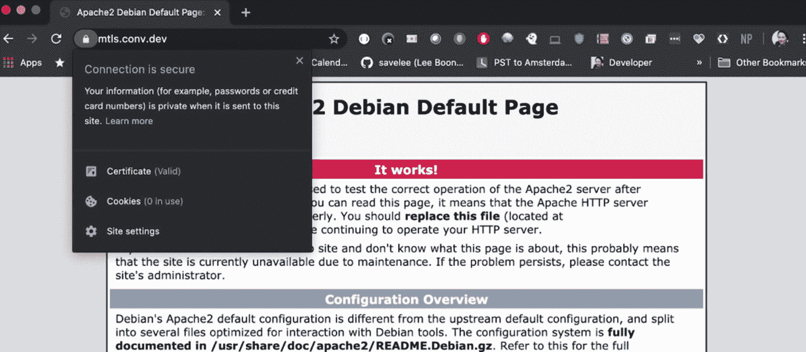

图 10-22：运行安全的 Apache

#### 设置您的 Node 应用程序

基础设施全部设置好后，让我们编写应用程序代码。如本章前面所述，我们将创建一个 Node.js Express 实现，就像我们之前做的那样。

```
sudo mkdir /var/www/projects
sudo chown $USER /var/www/projects
cd /var/www/projects
nano index.js
```

使用清单 10-20 的以下内容：

***清单 10-20.*** 设置 mTLS `index.js` 应用代码

```
'use strict';
const express = require('express');
const app = express();
const bodyParser = require('body-parser');
const basicAuth = require('express-basic-auth');
const fs = require('fs');
const { WebhookClient, Card, Suggestion } = require('dialogflow-fulfillment');
process.env.DEBUG = 'dialogflow:debug'; // enables lib debugging statements
// Dialogflow Fulfillment Code
function welcome(agent) {
agent.add('Welcome to my agent!');
}
function fallback(agent) {
agent.add('I didn't understand');
agent.add('I'm sorry, can you try again?');
}
function yourFunctionHandler(agent) {
agent.add('Ok. Buying product:');
console.log(agent.parameters);
agent.add(new Card({
title: agent.parameters.producttype,
imageUrl: 'https://dummyimage.com/300x200/000/fff',
text: 'This is the body text of a card.  You can even use line\n  breaks and emoji!',
buttonText: 'This is a button',
buttonUrl: 'https://console.dialogflow.com/'
})
);
agent.add(new Suggestion('Quick Reply'));
agent.add(new Suggestion('Suggestion'));
agent.context.set({ name: 'gamestore-picked', lifespan: 2, parameters: { gameStore: 'DialogflowGameStore' }});
}
app.post('/fulfillment', (request, response) => {;
const agent = new WebhookClient({ request, response });
console.log('Dialogflow Request headers: ' + JSON.stringify(request.headers));
console.log('Dialogflow Request body: ' + JSON.stringify(request.body));
// Run the proper function handler based on the matched Dialogflow intent name
let intentMap = new Map();
intentMap.set('Default Welcome Intent', welcome);
intentMap.set('Default Fallback Intent', fallback);
intentMap.set('Buy product regex', yourFunctionHandler);
agent.handleRequest(intentMap);
});
app.get('/', (req, res) => {
res.send('OK');
});
const port = process.env.PORT || 3000;
app.listen(port, () => {
console.log('Dialogflow Fulfillment listening on port', port);
});
```

```
nano package.json
```

使用清单 10-21 的以下内容：

```
{
"name": "dialogflow-fulfillment",
"description": "This is the default fulfillment for a Dialogflow agents using Compute with mTLS",
"version": "0.0.1",
"private": true,
"license": "Apache Version 2.0",
"author": "Lee Boonstra",
"engines": {
"node": "8"
},
"dependencies": {
"actions-on-google": "².5.0",
"body-parser": "¹.19.0",
"dialogflow-fulfillment": "⁰.6.1",
"express": "⁴.17.1",
"express-basic-auth": "¹.2.0"
}
}
npm install
```

清单 10-21：设置 mTLS `package.json`

我们将需要启用代理模块：

```
sudo a2enmod proxy
sudo a2enmod proxy_http
```

现在让我们修改 Apache 配置：

```
sudo nano /etc/apache2/sites-available/000-default-le-ssl.conf
```

使用以下 `000-default-le-ssl.conf`，这将为 Apache 使用以下配置。使用清单 10-22 的以下内容。


