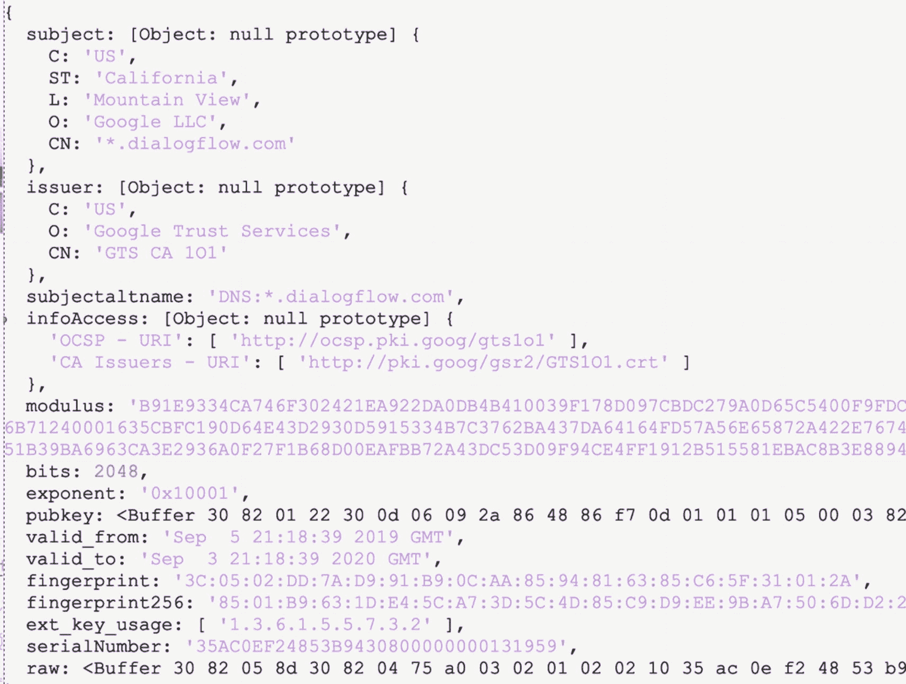
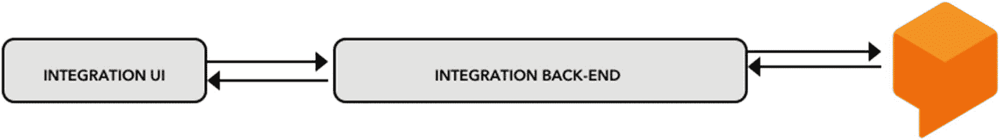
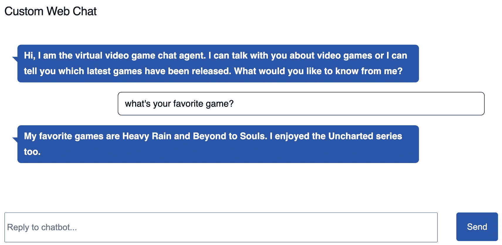
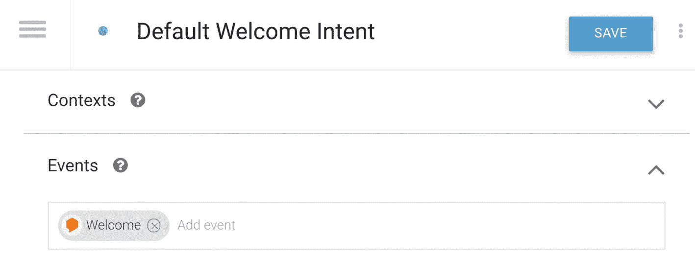
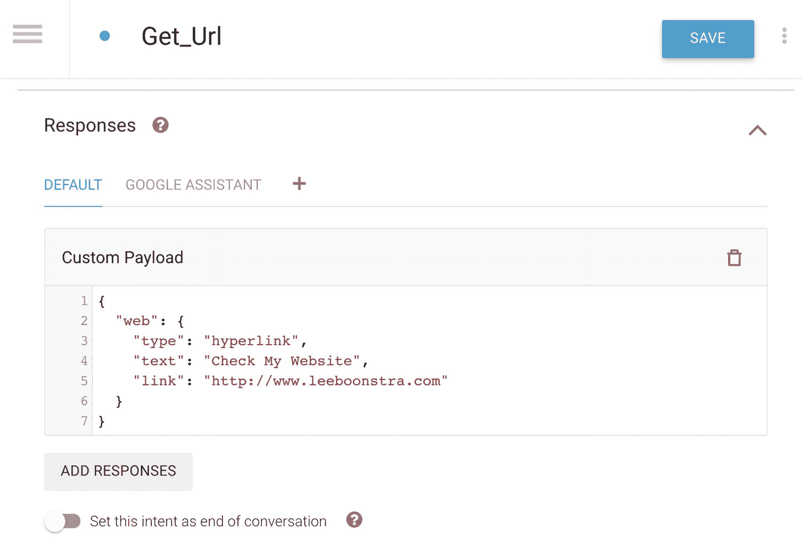
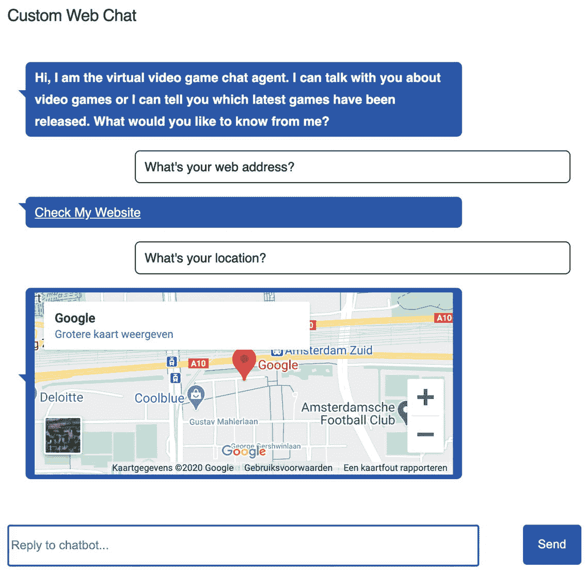
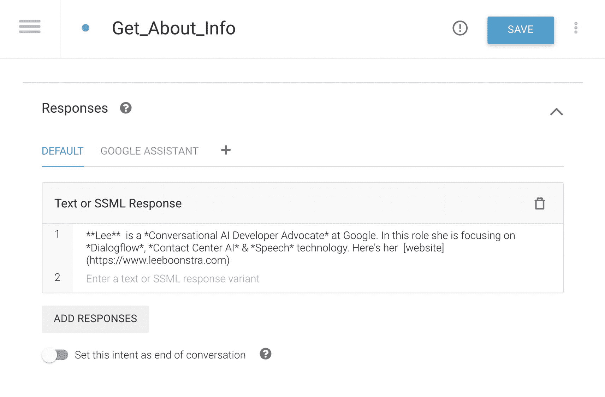
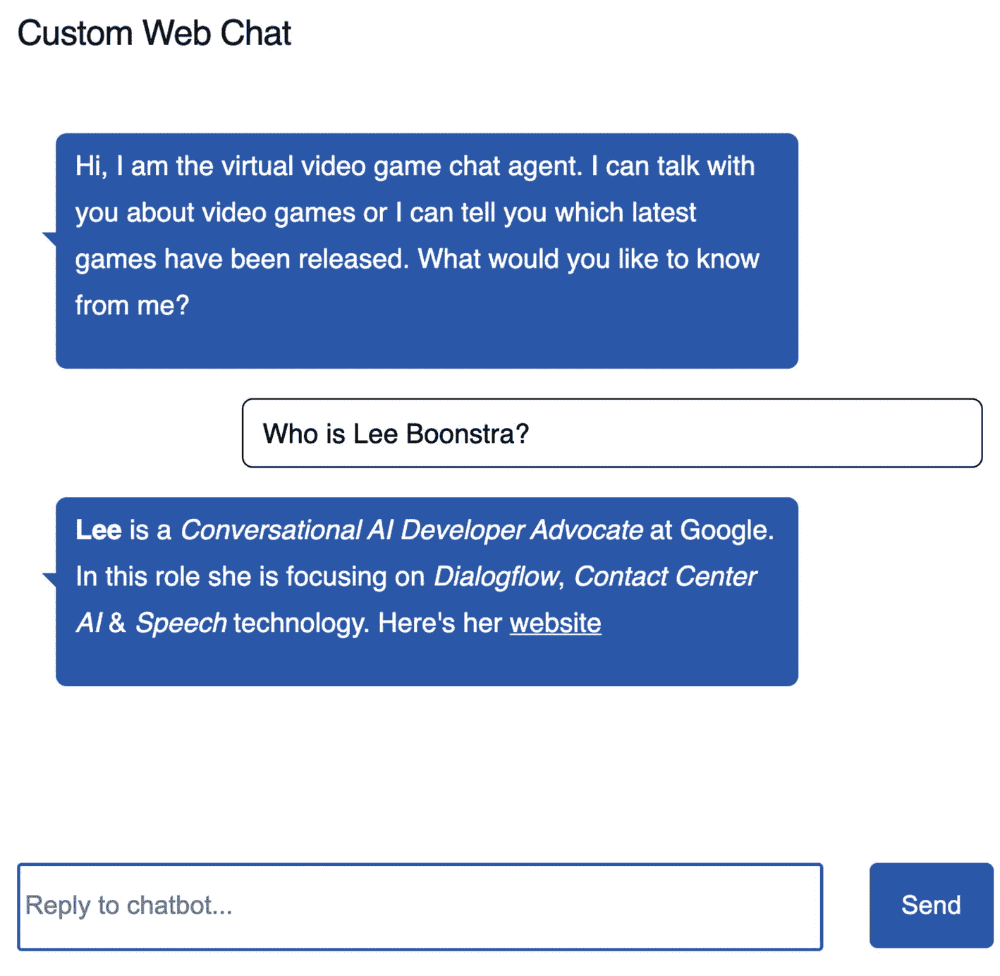
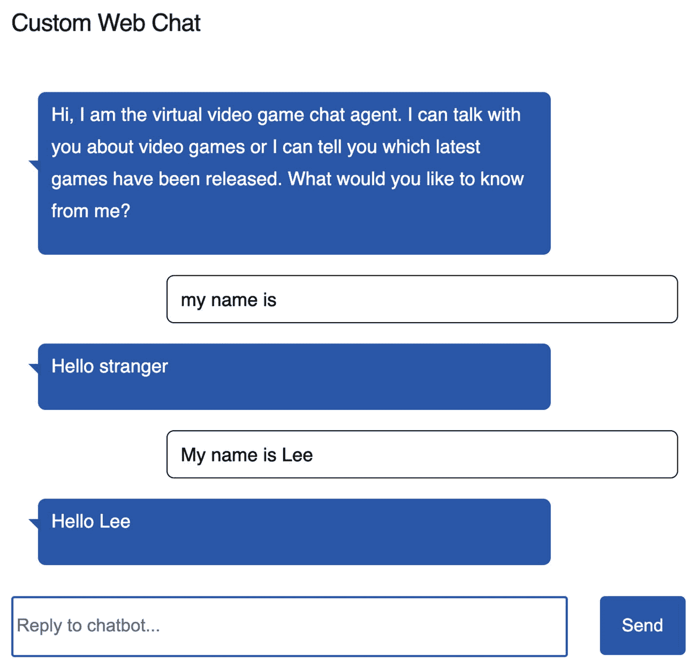

# sudo a2enmod proxy_http

`ProxyPass / http://localhost:3000/`

`ProxyPassReverse / http://localhost:3000/`

`清单 10-22`

`设置 mTLS 000-default-le-ssl.conf`

## 设置 mTLS

首先，确保在 Dialogflow 中，你已从 **fulfillments** 界面指向你的新虚拟机。

运行以下两个命令来下载 Dialogflow 将使用的根 CA。这会将 `GTS101.crt` 和 `GSR2.crt` 添加到本地文件 `ca-crt.pem` 中：

```
curl https://pki.goog/gsr2/GTS1O1.crt | openssl x509 -inform der >> ca-crt.pem
curl https://pki.goog/gsr2/GSR2.crt | openssl x509 -inform der >> ca-crt.pem
```

`/etc/apache2/sites-available/000-default-le-ssl.conf` 中的这些设置是专门用于设置 mTLS 的：

```
SSLVerifyClient require
SSLVerifyDepth 2
SSLCACertificateFile "/var/www/projects/ca-crt.pem"
```

这是访问控制，它将确保只有 Dialogflow.com 可以调用 fulfillment webhook：

```
Require all denied
```

现在你可以测试它。我们将只允许证书 CN 为 `*.dialogflow.com` 的 Dialogflow 通过以访问 fulfillment。当 Dialogflow 的 CA 与我们期望的 CA 不同时，Dialogflow fulfillment 状态将为 `UNKNOWN`。

Apache 的 `error.log` 显示（`tail error.log`）：

```
[Fri Jun 26 11:45:54.732961 2020] [authz_core:error] [pid 10152:tid 139735259326208] [client 64.233.172.238:36290] AH01630: client denied by server configuration: proxy:http://localhost:3000/fulfillment
```

否则，它将通过。你可以在 Dialogflow 模拟器中测试它。我使用了意图 **Buy product regex**，并输入用户话语：*Buy ms12345678* 来显示结果。（不相信？将访问控制 `000-default-le-ssl.conf` 中的 `!=` 改为 `==`，使其匹配除 `*.dialogflow.com` 以外的内容。）

图 10-23 展示了 Dialogflow CA 证书的截图。



**图 10-23** Dialogflow CA 证书

## 总结

本章包含关于 fulfillment 的信息。你将学习以下任务：

*   你想从 Web 服务获取数据，并在内置编辑器中编写 fulfillment 代码。

*   你想从 Web 服务获取数据，并在你自己的（云）环境（如 Cloud Run）中编写 fulfillment 代码。

*   你想从 Web 服务获取数据，但你的 Dialogflow 代理支持多语言，那么如何组织你的 webhook？

*   你想使用 `ngrok` 从本地数据源获取数据进行测试。

*   你想通过基本认证、认证标头和双向 TLS 来确保与 Dialogflow 之间流量的安全。

除此之外，你还看到了通过以下方式实现 fulfillment 的代码片段：

*   npm 包 `dialogflow-fulfillment`

*   Actions on Google 包

*   手动方式，不使用任何库

我在本章中使用的意图是：

*   `Buy product regex`

*   `Default Welcome Intent`

*   `Default Fallback Intent`

*   `Get_Price`

*   `Get_Delivery_Date`

*   `Get_Total_Number`

如果你想构建这个示例，本书的源代码可通过图书产品页面在 GitHub 上获取，网址为 [`www.apress.com/978-1-4842-7013-4`](http://www.apress.com/ISBN)。请查看 `webhook-fulfillment-lib`、`webhook-aog`、`webhook-manual`、`webhook-cloudrun`、`webhook-localized`、`secure-auth` 和 `secure-compute-mtls` 文件夹。

## 延伸阅读

*   Dialogflow 关于 fulfillment 的通用文档：[`https://cloud.google.com/dialogflow/es/docs/fulfillment-webhook`](https://cloud.google.com/dialogflow/es/docs/fulfillment-webhook)

*   Google Cloud 关于使用 Cloud Functions 的文档：[`https://cloud.google.com/functions/docs/quickstarts`](https://cloud.google.com/functions/docs/quickstarts)

*   Google Cloud 关于使用 Cloud Run 的文档

- [`https://cloud.google.com/run/docs/quickstarts`](https://cloud.google.com/run/docs/quickstarts)

- Dialogflow 文档中关于内联编辑器的实现部分

  [`https://cloud.google.com/dialogflow/es/docs/fulfillment-inline-editor`](https://cloud.google.com/dialogflow/es/docs/fulfillment-inline-editor)

- Dialogflow 文档中关于实现的一般说明

  [`https://cloud.google.com/dialogflow/es/docs/fulfillment-webhook`](https://cloud.google.com/dialogflow/es/docs/fulfillment-webhook)

- npm 包 `dialogflow-fulfillment`，内联编辑器默认使用该包

  [`https://www.npmjs.com/package/dialogflow-fulfillment`](https://www.npmjs.com/package/dialogflow-fulfillment)

- npm 包 `actions-on-google`，用于为 Google Assistant 构建实现

  [`https://www.npmjs.com/package/actions-on-google`](https://www.npmjs.com/package/actions-on-google)

- Actions on Google 规范

  [`https://actions-on-google.github.io/actions-on-google-nodejs/2.12.0/index.html`](https://actions-on-google.github.io/actions-on-google-nodejs/2.12.0/index.html)

- Actions on Google 富消息规范

  [`https://cloud.google.com/dialogflow/docs/reference/rest/v2beta1/projects.agent.intents#card`](https://cloud.google.com/dialogflow/docs/reference/rest/v2beta1/projects.agent.intents%2523card)

- `i18n` 库，用于处理翻译

  [`https://www.npmjs.com/package/i18n`](https://www.npmjs.com/package/i18n)

- Moment.js 本地化日期时间库

  [`https://momentjs.com/`](https://momentjs.com/)

- Numeral.js 库，用于格式化数字和货币

  [`http://numeraljs.com/`](http://numeraljs.com/)

- `ngrok` npm 包

  [`https://www.npmjs.com/package/ngrok`](https://www.npmjs.com/package/ngrok)

- 用于 Express 的 NPM 基本身份验证中间件

  [`https://www.npmjs.com/package/express-basic-auth`](https://www.npmjs.com/package/express-basic-auth)

- 用于手动设置标头的 Dialogflow SDK 方法

  [`https://cloud.google.com/dialogflow/docs/reference/rest/v2/projects.agent/updateFulfillment`](https://cloud.google.com/dialogflow/docs/reference/rest/v2/projects.agent/updateFulfillment%253Fhl%253Den) 和 [`https://cloud.google.com/dialogflow/docs/reference/rest/v2/Fulfillment`](https://cloud.google.com/dialogflow/docs/reference/rest/v2/Fulfillment%253Fhl%253Den)

- Dialogflow 文档中关于实现的 mTLS 说明

  [`https://cloud.google.com/dialogflow/docs/fulfillment-mtls`](https://cloud.google.com/dialogflow/docs/fulfillment-mtls)

- Google 关于传输中加密的安全入门指南

  [`https://cloud.google.com/security/encryption-in-transit/`](https://cloud.google.com/security/encryption-in-transit/)

- 通俗解释的相互 TLS

  [`https://codeburst.io/how-mutual-tls-work-aec3d91451ce`](https://codeburst.io/how-mutual-tls-work-aec3d91451ce)

- Google Maps 提供了关于 mTLS 的优质入门指南

  [`https://developers.google.com/maps/root-ca-faq`](https://developers.google.com/maps/root-ca-faq)

- 设置 Certbot

  [`https://certbot.eff.org/`](https://certbot.eff.org/)

- Google Domains

  [`https://domains.google.com/`](https://domains.google.com/)

## 11. 使用 Dialogflow SDK 创建自定义集成

在上一章中，我们介绍了 webhook；它们在意图匹配后执行意图以返回动态代码。你可以使用 Dialogflow 实现库来执行此操作，或者直接从发布的 Dialogflow 请求中检索结果。它执行你自己的（后端）代码。在 Dialogflow 集成完成意图检测后，你无需手动调用 `detectIntent` 方法。

Dialogflow 还提供了一个 SDK，当你想要构建自己的集成，而不是使用 Dialogflow 中现成的集成时，这会非常方便。例如，在你自己的移动应用中、自己的硬件上实现聊天机器人，并将其集成到你自己的网站中。这意味着你将需要手动调用/提供以下步骤（参见图 11-1）：



**图 11-1**  

自定义集成的架构。从 UI 实现到与 Dialogflow SDK 通信的后端应用程序

- 集成的 UI 实现（前端）通常包含一个用于显示响应的 `textarea` 字段和一个用于输入话语的输入字段。

- 集成的后端实现，集成了 Dialogflow SDK，用于：

  - 会话管理

  - 身份验证

  - 意图检测（`detectIntent`）

  - 返回响应

  - 在实现的 UI 中呈现富响应。

您的用户与您的集成 UI（例如，您的网站前端）进行对话。UI 将输入的聊天机器人消息（或传入的音频流）传递给后端集成。后端集成与 Dialogflow SDK 通信。Dialogflow 将答案返回给后端代码，后端代码再将其发送回 UI，以便 UI 在屏幕上显示聊天机器人的响应。采用这种方法的另一个优点是，它也不会将您的服务帐户（身份验证密钥）暴露给前端，这是您应该避免的，因为黑客可以轻松读取并使用您的密钥。

## 在您的网站前端实现自定义聊天机器人，设置

要实现自定义集成，例如在网站上，您需要确保已启用 Dialogflow API：

```
gcloud services enable dialogflow.googleapis.com
```

它还需要您将 Dialogflow 集成服务帐户下载到硬盘，并将其分配给 `GOOGLE_APPLICATION_CREDENTIALS` 环境变量。

之后，您需要确保已通过命令行工具登录到正确的项目：

```
gcloud init
```

如果您不执行这些步骤，将会收到以下错误：

```
(node:95119) UnhandledPromiseRejectionWarning:
Error: 7 PERMISSION_DENIED: IAM permission 'dialogflow.sessions.detectIntent' on 'projects/project-id/agent' denied.
```

有关如何配置 Dialogflow 项目的更多信息，请参阅第 1 章。

## UI 实现

清单 11-1 展示了一个包含 Dialogflow 聊天机器人 UI 的 HTML 页面示例。在实际应用中，您可能希望使用诸如 Angular 之类的客户端框架，但为了保持此演示的简洁性，我们让它保持良好且紧凑。


# 自定义网页聊天

## 重要规则

- 不要修改正文内容的语义
- 不要删减有价值的信息
- 确保输出是标准Markdown格式
- 只返回处理后的内容，不要重复输出原文，也不要添加额外说明

## HTML 聊天机器人代码示例

```html
<!DOCTYPE html>
<html>
<head>
    <title>自定义网页聊天</title>
    <script src="/socket.io/socket.io.js"></script>
    <link rel="stylesheet" type="text/css" href="style.css">
</head>
<body>
    <h1>自定义网页聊天</h1>
    <form id="chatForm">
        <ul id="messages"></ul>
        <input type="text" id="queryText" placeholder="输入您的消息...">
        <button id="submit">发送</button>
    </form>
    <script>
        //a) 加载 socket io
        const socketio = io();
        //b) 一旦 socket.io 与服务器应用程序建立连接，
        // 执行此代码块
        const socket = socketio.on('connect', function() {
            console.log('connected');
            //c) 当服务器响应 fulfillment 时运行此代码块
            socketio.on('returnResults', function (data) {
                var objDiv = document.getElementById("ca");
                console.log(data);
                //d) 如果有 queryResults，则动态
                // 创建列表项以追加到消息列表。
                if(data[0].queryResult){
                    var agent = document.createElement("li");
                    agent.className = 'balloon agent';
                    agent.innerHTML = data[0].queryResult.fulfillmentText;
                    messages.appendChild(agent);
                    objDiv.scrollTop = objDiv.scrollHeight;
                }
            });
            //欢迎
            socketio.emit('welcome');
        });
        //e) 创建指向其他 HTML 元素的指针
        const textarea = document.getElementById('textarea');
        const textInput = document.getElementById('queryText');
        const submitBtn = document.getElementById('submit');
        const messages = document.getElementById('messages');
        //f) 在提交用户话语时，
        // 创建列表项以追加到消息列表。
        submitBtn.onclick = function(e) {
            e.preventDefault();
            socketio.emit('message', textInput.value);
            var user = document.createElement("li");
            user.className = 'balloon user';
            user.innerHTML = textInput.value;
            messages.appendChild(user);
            textInput.value = "";
        }
    </script>
</body>
</html>
```

## 清单 11-1

一个 HTML 聊天机器人 UI 示例

查看此代码时，有几个关键点需要注意：

1.  在头部，我从 CDN 加载了一个 JavaScript 文件：`socket.io.js`。Socket.IO 支持实时、双向和基于事件的通信。它适用于每个平台、浏览器或设备，同样注重可靠性和速度。

2.  样式表 `style.css` 将加载一些漂亮的样式，使用户和代理文本看起来像文本气泡。

3.  在 HTML 文档的主体中，我创建了一个表单元素。此表单元素将包含一个聊天机器人消息列表。这些是用户消息和 Dialogflow 代理消息。

4.  该表单还包含一个带有提交按钮的输入文本字段；这允许用户向聊天机器人输入问题。

5.  现在有一些客户端 JavaScript 要运行：

    1.  首先，加载 Socket.IO JavaScript 对象。

    2.  一旦 Socket.IO 与服务器应用程序建立连接，执行此代码块。

    3.  当服务器响应 fulfillment 时运行此代码块。

    4.  如果有 `queryResults`，则动态创建列表项以追加到消息列表。

    5.  创建指向其他 HTML 元素的指针。

    6.  在提交用户话语时，创建列表项以追加到消息列表。

## 后端实现

现在让我们继续看后端代码。这是一个 Node.js Express 应用程序。

对于此项目，我们将使用清单 11-2 中的 npm 库。

```json
{
    "name": "dialogflow-custom-integration",
    "version": "1.0.0",
    "author": "Lee Boonstra",
    "license": "Apache-2.0",
    "description": "使用 Dialogflow SDK 的自定义网页集成",
    "engines": {
        "node": ">=10.9.0 <=12.18.3"
    },
    "scripts": {
        "start": "node app.js"
    },
    "private": true,
    "dependencies": {
        "cors": "^2.8.5",
        "dialogflow": "^0.14.1",
        "dotenv": "^8.2.0",
        "express": "^4.17.1",
        "socket.io": "^2.3.0",
        "uuid": "^3.3.3"
    }
}
```

## 清单 11-2

后端 `package.json`，包含所有库

以下是运行聊天机器人后端集成的代码。

1.  这些系统变量可以通过命令行设置

```javascript
//1) 这些系统变量可以通过命令行设置，使用 --PROJECT_ID、--PORT 和 --LANGUAGE
const projectId = process.env.npm_config_PROJECT_ID;
const port = ( process.env.npm_config_PORT || 3000 );
const languageCode = (process.env.npm_config_LANGUAGE || 'en-US');
//2) 加载此应用所需的所有库
const socketIo = require('socket.io');
const http = require('http');
const cors = require('cors');
const express = require('express');
const path = require('path');
// 这些库是 Dialogflow 专用的
const uuid = require('uuid');
const df = require('dialogflow').v2beta1;
//3) 创建一个 Express 应用
const app = express();
//4) 设置 Express，并加载静态文件和 HTML 页面
app.use(cors());
app.use(express.static(__dirname + '/../ui/'));
app.get('/', function(req, res) {
res.sendFile(path.join(__dirname + '/../ui/index.html'));
});
//5) 创建服务器并监听 PORT 变量
server = http.createServer(app);
io = socketIo(server);
server.listen(port, () => {
console.log('正在端口 %s 上运行服务器', port);
});
//6) Socket.IO 监听器，一旦客户端连接到服务器套接字，
// 则执行此代码块。
io.on('connect', (client) => {
console.log(`客户端已连接 [id=${client.id}]`);
client.emit('server_setup', `服务器已连接 [id=${client.id}]`);
//7) 当客户端发送 'message' 事件时，
// 则执行此代码块
client.on('message', async function(msg) {
//console.log(msg);
//8) 一个用于意图匹配的 Promise
const results = await detectIntent(msg);
console.log(results);
//9) 将意图匹配后的 Dialogflow 结果返回给客户端 UI。
client.emit('returnResults', results);
});
});
/**
* 设置 Dialogflow 集成
*/
function setupDialogflow(){
//10) Dialogflow 需要一个会话 ID
sessionId = uuid.v4();
//11) Dialogflow 需要一个 DF 会话客户端
// 这样每个 DF 会话都是唯一的
sessionClient = new df.SessionsClient();
//12) 从会话客户端创建一个会话路径，
// 该路径是 projectId 和 sessionId 的组合。
sessionPath = sessionClient.sessionPath(projectId, sessionId);
//13) 这些对象位于 Dialogflow 请求中
request = {
session: sessionPath,
queryInput: {}
}
}
/*
* 基于文本的 Dialogflow 意图检测
* @param text - 字符串
* @return 响应 Promise
*/
async function detectIntent(text){
//14) 从 UI 获取用户话语
request.queryInput.text =  {
languageCode: languageCode,
text: text
};
console.log(request);
//15) Dialogflow SDK 的意图检测方法。
// 它返回一个 Promise，一旦完成数据到达，该 Promise 将被解析。
const responses = await sessionClient.detectIntent(request);
return responses;
}
//运行此代码。
setupDialogflow();
```

## 清单 11-3

与 Dialogflow SDK 通信的后端集成代码

1.  加载此应用所需的所有库，最后几个是 Dialogflow 专用的。

2.  创建一个 Express 应用。

3.  设置 Express 并加载静态文件和 HTML 页面。

4.  创建服务器并监听 `PORT` 变量。

5.  Socket.IO 监听器，一旦客户端连接到服务器套接字，则执行此代码块。

6.  当客户端发送 'message' 事件时，则执行此代码块。

7.  其中包含一个用于意图匹配的函数。

8.  一旦结果返回，将其返回给客户端 UI。

9.  Dialogflow 需要一个唯一的会话 ID：`--PROJECT_ID`、`--PORT` 和 `--LANGUAGE`。

10. Dialogflow 需要一个 Dialogflow 会话客户端，以使此会话对其用户唯一：`sessionId = uuid.v4();`

11. 从会话客户端创建一个会话路径，该路径是 `projectId` 和 `sessionId` 的组合。现在该会话将仅属于您的 Dialogflow 代理：`sessionClient = new df.SessionsClient();`

12. 这些对象位于 Dialogflow 请求中：

    ```
    request = {
      session: sessionPath,
      queryInput: {
        text: {
          languageCode: languageCode
        }
      }
    }
    ```

13. 从 UI 获取用户话语。

3.  这是用于意图检测的 Dialogflow SDK 方法。它返回一个 promise，该 promise 将在获取到 fulfillment 数据后被解析：

```
sessionPath = sessionClient.sessionPath(projectId, sessionId);
```

```
await sessionClient.detectIntent(request);
```

图 11-2 展示了其效果。



**图 11-2** 在网页浏览器中运行的自定义聊天集成

要运行本书 GitHub 仓库中的这个示例，你需要 `cd` 进入 `back-end` 文件夹。

然后，安装所需的库：

```
npm install
```

启动 Node 应用：

```
npm --PROJECT_ID=[your-google-cloud-project-id] run start
```

在浏览器中访问 `http://localhost:3000`。

## 欢迎消息

我经常从实现自己集成的用户那里收到一个常见问题：如何确保我的聊天机器人在打开聊天时向用户打招呼？这并不难；我们可以向 Dialogflow 触发事件，并且我们会在 Socket.IO 与客户端建立正确连接后（这发生在页面加载完成后）立即执行此操作。请注意清单 11-4。

在 `index.html` 的 connect 监听器中添加：

```
socketio.emit('welcome');
```

然后，在你的后端 `app.js` 中，在 connect 监听器内，我们将监听从 UI 发送的欢迎消息。

```
client.on('welcome', async function() {
const welcomeResults = await detectIntentByEventName('welcome');
client.emit('returnResults', welcomeResults);
});
```

**清单 11-4** 监听欢迎消息

清单 11-5 中的下一个新函数与清单 11-3 中的 `detectIntent` 调用非常相似，但我们将使用**事件名称**，而不是传递文本查询输入。

```javascript
async function detectIntentByEventName(eventName){
request.queryInput.event =  {
languageCode: languageCode,
name: eventName
};
const responses = await sessionClient.detectIntent(request);
//移除事件，这样欢迎事件就不会再次被触发
delete request.queryInput.event;
return responses;
}
```

**清单 11-5** 通过事件名称检测意图

使用哪个事件名称？欢迎事件，因为我们的欢迎意图附加了该事件，你可以在图 11-3 中看到。



**图 11-3** Dialogflow 中的欢迎事件

## 创建富响应消息

当你想在实现中使用富响应消息时，你需要手动构建这些消息。这是合理的，因为你控制着 UI。

让我们在集成中构建一些富响应消息。

### 超链接组件、谷歌地图和图片组件

首先，创建一个带有训练短语（如“你有网址吗？”）的新意图。

你不需要指定文本响应。相反，你将创建一个新的**自定义负载**，它使用我们自定义的 JSON，如图 11-4 所示：



**图 11-4** 自定义超链接富消息的自定义负载

```json
{
"web": {
"type": "hyperlink",
"text": "查看我的网站",
"link": "http://www.leeboonstra.com"
}
}
```

在你的后端集成中，运行 `detectIntent` 方法后，你需要遍历 `queryResult.fulfillmentMessages` 数组。它应该包含一个对象，其 `message` 设置为**负载**。

```json
fulfillmentMessages: Array(1)
0:
message: "payload"
payload:
fields:
platform: {stringValue: "custom-web", kind: "stringValue"}
web: {structValue: {...}, kind: "structValue"}
__proto__: Object
__proto__: Object
platform: "PLATFORM_UNSPECIFIED"
__proto__: Object
length: 1
__proto__: Array(0)
fulfillmentText: ""
```

> **提示：** 你是否注意到负载对象有些奇怪？它并不包含你在 Dialogflow 控制台中输入的相同 JSON 对象。这是因为 Google gRPC API 使用了协议缓冲区（`google.protobuf.Struct`）。协议缓冲区是 Google 用于序列化结构化数据的语言无关、平台无关、可扩展的机制。你需要将 protobuf 转换为 JSON。在我为此示例提供的 GitHub 中，我包含了一个简单的转换脚本。

你的后端代码应将结果返回给 UI。你的客户端 JavaScript 将遍历所有结果，并使用自定义样式在屏幕上呈现结果。图 11-5 展示了其效果。



**图 11-5** 支持富消息的自定义集成示例

### 实现

让我们看看超链接、谷歌地图和图片的富消息的完整实现。我们已经看到了一个超链接自定义负载的示例；清单 11-6 展示了一些图片和谷歌地图的示例。

```json
{
"web": {
"type": "image",
"alt": "Lee Boonstra",
"src": "https://www.leeboonstra.com/images/profile.jpg"
}
}
{
"web": {
"link": "https://www.google.com/maps/embed?pb=!1m18!1m12!1m3!1d2437.7995043017927!2d4.869772751476948!3d52.33778327968087!2m3!1f0!2f0!3f0!3m2!1i1024!2i768!4f13.1!3m3!1m2!1s0x47c60a05af168f5b%3A0x3e5bfe6e0b2ce441!2sGoogle+Amsterdam!5e0!3m2!1sen!2snl!4v1520965060384",
"type": "map"
}
}
```

**清单 11-6** Dialogflow 控制台中的自定义负载

在 `detectIntent` promise 之后，你可以立即调用一个名为 `getRichContent()` 的新方法，该方法将已解析的 promise 响应传递给它。

```javascript
const responses = await sessionClient.detectIntent(request);
let data = getRichContent(responses);
return data;
```

`getRichContent` 方法如下所示；请参见清单 11-7。

```javascript
function getRichContent(responses){
const result = responses[0].queryResult;
let messages = [];
if(result.fulfillmentMessages.length > 0) {
for (let index = 0; index < result.fulfillmentMessages.length; index++) {
const msg = result.fulfillmentMessages[index];
if (msg.payload){
let data = structJson.structProtoToJson(msg.payload);
messages.push(data.web);
} else {
messages.push(msg.text.text);
}
}
return messages;
}
}
```

**清单 11-7** `getRichContent` 方法从 protobuf 中获取对象

它首先检查 `fulfillmentMessages` 是否包含一个至少有一个元素的数组。可能存在多个 fulfillment 消息，例如，一条文本消息和两条富消息，因此我们需要遍历它们。如果消息包含自定义负载，我们需要获取数据并将 protobuf 转换为 JSON。否则，我们可以将文本版本添加到新的消息数组中。这个数组将被发送到 UI。从技术上讲，你也可以在此处创建 HTML 标记，但在前端执行此操作会更好，这样你的前端 UI 代码就能与后端代码很好地解耦。

我使用这个小型转换器脚本来处理协议缓冲区。我可以从 JSON 转换为 Struct，或者从 Struct 转换为 JSON。你可以在本书的 GitHub 仓库中找到这个脚本。我们需要的最后一个函数是：`structProtoToJson(data.web)`。

不要忘记在你的 `app.js` 后端代码顶部包含该文件：

```javascript
const structJson = require('../back-end/structToJson');
```

以下是我们将在 UI 中使用的代码。一旦通过 Socket.IO 接收到数据，我的 `index.html` 将包含以下代码块。请查看清单 11-8。

```javascript
socketio.on('returnResults', function (data) {
console.log(data);
//d) 如果有查询结果，则动态
// 创建列表项并追加到消息列表中。
for (let index = 0; index < data.queryResult.queryResults.length; index++) {
const e = data.queryResult.queryResults[index];
if (e.type == 'hyperlink') {
var balloon = document.createElement("li");
balloon.className = 'balloon agent';
balloon.innerHTML = `<a href="${e.link}" target="_blank">${e.text}</a>`;
console.log(`${e.text}`);
messages.appendChild(balloon);
} else if (e.type == 'map') {
var balloon = document.createElement("li");
balloon.className = 'balloon agent';
balloon.innerHTML = `<iframe src="${e.map}" width="400" height="300"></iframe>`;
messages.appendChild(balloon);
} else if (e.type == 'image') {
var balloon = document.createElement("li");
balloon.className = 'balloon agent';
balloon.innerHTML = ``;
messages.appendChild(balloon);
} else {
var balloon = document.createElement("li");
balloon.className = 'balloon agent';
balloon.innerHTML = e;
messages.appendChild(balloon);
}
}
});
```

*清单 11-8* 遍历结果以查找自定义负载类型，并直接在屏幕上显示

它会检查消息类型。如果类型是超链接，则使用 Dialogflow 控制台中自定义负载提供的链接和链接文本创建一个锚点标签。如果类型是图片，则使用 Dialogflow 控制台中自定义负载提供的图片源和替代文本创建一个图片标签。如果是地图，则使用一个包含 Google 地图 URL 的 iframe，该 URL 由 Dialogflow 控制台中的自定义负载提供。可能性是无限的。如果你想创建自定义卡片，它可能包含一些 div 元素，但需要配合自定义样式表代码使其看起来美观。

## 在 Dialogflow 响应中使用 Markdown 语法和条件模板

当与大型团队合作时，用户体验设计师或文案撰稿人通常负责维护 Dialogflow 控制台对话。他们希望控制文本的样式，而不在文本中使用 HTML 标记，例如，突出显示某些单词或显示超链接。当你构建自己的自定义集成时，集成对 Markdown 的支持实际上非常简单。

只需确保你的 UI `index.html` 包含一个 Markdown 库，例如 `Marked`。

现在，你的意图响应可以包含 Markdown 语法，如图 11-6 所示：



*图 11-6* 在 Dialogflow 响应文本字段中使用 Markdown 文本

```markdown
**Lee** 是 Google 的 *对话式 AI 开发者倡导者*。在这个角色中，她专注于 *Dialogflow*、*Contact Center AI* 和 *Speech* 技术。这是她的 [网站](https://www.leeboonstra.com)
```

图 11-7 显示了这将如何在屏幕上呈现。



*图 11-7* 导入 Marked 库后，自定义集成可以处理 Markdown

## 对话分支

除了 Markdown，还可以在 Dialogflow 控制台中使用模板和条件分支。可以想到 `Jinja`（适用于 Python 或 Java 开发者）、`Smarty`（PHP）或 `Jade`/`Pug`、`Handlebars` 和 `Mustache`（适用于 JavaScript 开发者）。这里有一个使用 `Pug.js` 库（以前称为 Jade）的示例。它运行得非常好。

这里的技巧是利用**自定义负载**响应设置并使用模板库，这样你就可以提供可读的模板和可注入的变量。请注意清单 11-9。

```json
{ "custom":
{
"locals": {
"username": "$username"
},
"pug": [ "if username\n", " | Hello $username\n", "else\n", " | Hello stranger" ]
}
}
```

*清单 11-9* 在 Dialogflow 控制台中以自定义负载形式进行分支的示例

属于此示例的训练短语是

```plaintext
My name is: Lee
```

`locals` 对象的值是作为用户名传入的参数值。在 pug 对象中，我编写了一个包含 if-else 分支的多行字符串模板。使用 Pug 时，行缩进至关重要。请注意换行符 `\n` 代码和用于纯文本的 `|`。

我的集成后端代码需要包含 pug 库：

```javascript
const pug = require('pug');
```

一个自定义函数，可以从自定义负载中获取模板，并使用传入的变量进行编译。请参见清单 11-10。

```javascript
function templateHelper(payload) {
var str = payload.custom.pug;
if(Array.isArray(payload.custom.pug)) {
str = payload.custom.pug.join("");
};
var fn = pug.compile(str);
var text = fn(payload.custom.locals);
return text;
}
```

*清单 11-10* 用于编译 Pug 的模板辅助函数

检测到意图后，你只需要使用负载调用 `templateHelper` 方法。请参见清单 11-11。

```javascript
io.on('connect', (client) => {
console.log(`Client connected [id=${client.id}]`);
client.emit('server_setup', `Server connected [id=${client.id}]`);
client.on('message', async function(msg) {
const results = await detectIntent(msg);
var responseMsg = results[0].queryResult.fulfillmentText;
var payload = results[0].queryResult.fulfillmentMessages[0];
let data = structJson.structProtoToJson(payload.payload);
console.log(data);
if (data && data.custom){
client.emit('returnResults', templateHelper(data));
} else {
client.emit('returnResults', responseMsg);
}
});
});
```

*清单 11-11* 调用 `templateHelper` 方法

一旦收到消息，我们将像往常一样检测意图，但需要检查匹配的意图数据是否包含自定义负载。请注意，这是一个 protobuf，需要先转换为 JSON 对象。此脚本可以在本书附带的 GitHub 仓库中找到。基于此自定义负载，我们将调用 `templateHelper` 并传入负载数据。否则，我们将只返回 `fulfillmentText` 作为响应消息。结果见图 11-8。



*图 11-8* 通过 Dialogflow 控制台在自定义 UI 中进行对话分支

## 使用 Flutter 构建集成以在原生移动 Android 或 iOS 应用中运行 Dialogflow 代理

前面的部分向你展示了如何通过创建前端 UI 和后端服务器，将 Dialogflow 集成到你的网站或 Web 应用程序中。如果你让这个网站对移动设备友好，那么它就可以在移动设备上运行。但是，你可能对将 Dialogflow 代理集成到原生移动应用中感兴趣。这就是 Google 的技术 Flutter 的用武之地。

`Flutter` 是 Google 创建的一个开源 UI 软件开发工具包。它用于从单个（Dart 代码）代码库为 Android、iOS、Linux、Mac、Windows 和 Web 开发应用程序。使用 Flutter，你可以快速开发应用，因为它可以在保存代码时热重载更改。Flutter 附带了一组丰富的可定制小部件，可以创建具有原生性能的原生最终用户体验，因为它使用 Dart 的原生编译器编译为原生 ARM 机器代码。就像 Node.js 的 `npm` 一样，Dart 和 Flutter 有自己的包管理器 `pub.dev` 包管理，允许你下载预构建的 Flutter 包并将其集成到你的应用中。
