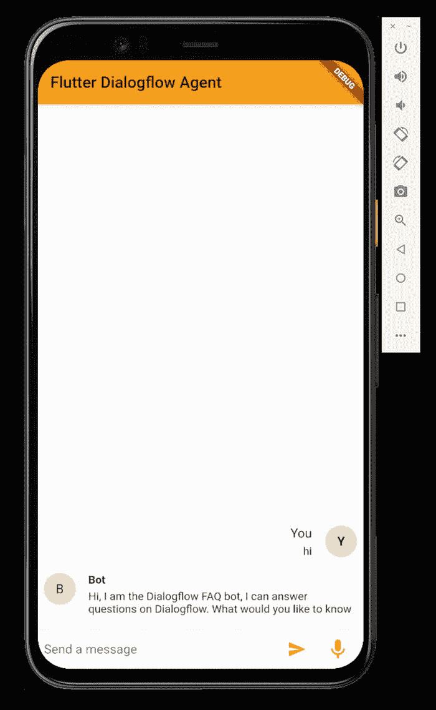
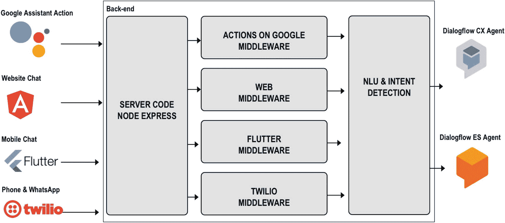

# Flutter 集成 Dialogflow SDK

```yaml
flutter:
  uses-material-design: true
  assets:
    - assets/credentials.json
```

清单 11-12  

`pubspec.yaml`

在你的代码中导入此包。加载你的服务账号，并创建一个 `DialogflowGrpc` 实例；参见清单 11-13。

```dart
import 'package:dialogflow_grpc/v2beta1.dart';
import 'package:dialogflow_grpc/generated/google/cloud/dialogflow/v2beta1/session.pb.dart';
import 'package:dialogflow_grpc/dialogflow_auth.dart';

final serviceAccount = ServiceAccount.fromString(
  '${(await rootBundle.loadString('assets/credentials.json'))}');
DialogflowGrpc dialogflow = DialogflowGrpc.viaServiceAccount(serviceAccount);
```

清单 11-13  

加载服务账号

通过下面这行代码，你可以基于文本输入检测意图：

```dart
var data = await dialogflow.detectIntent(text, 'en-US');
print(data.queryResult.fulfillmentText);
```

清单 11-14 展示了如何基于音频流检测意图。集成音频流需要在你的 Flutter 应用中配合麦克风组件使用。通常，`pub.dev` 上会有各种可用的开源麦克风组件。请记住，Flutter 的麦克风库是对原生硬件组件的封装。因此，不同设备（Android、iOS、Web、macOS 或 Windows）上的实现可能会有所差异。

1.  你可以创建一个语音识别偏置列表，以提升某些词语的识别权重。当你的语音模型似乎无法理解你时，这很有用。（有关语音适配的更多详细信息，请参见第 7 章。）

2.  在此处注释你的音频配置，这取决于你所使用设备的硬件。例如，你的手机可能使用 `AUDIO_ENCODING_LINEAR_16` 编码和 16000 赫兹。你还需要指定你正在监听的语种，以及是否要检测单次话语。默认情况下（设置为 `false`），识别不会停止，直到客户端关闭流。如果设置为 `true`，识别器将检测输入音频中的单次口语话语。最后，你需要指定偏置列表。

3.  使用指定的 `InputConfig` 和音频流调用 `streamingDetectIntent`。你可以从麦克风组件获取这样的音频流。

```dart
// 1)
var biasList = SpeechContextV2Beta1(
  phrases: [
    'Dialogflow CX',
    'Dialogflow Essentials',
    'Action Builder',
    'HIPAA'
  ],
  boost: 20.0
);

// 2)
var config = InputConfigV2beta1(
  encoding: 'AUDIO_ENCODING_LINEAR_16',
  languageCode: 'en-US',
  sampleRateHertz: 16000,
  singleUtterance: false,
  speechContexts: [biasList]
);

// 3)
final responseStream = dialogflow.streamingDetectIntent(config, _audioStream);
responseStream.listen((data) {
  print(data);
});
```

清单 11-14  

将音频流式传输到 Dialogflow

下一章将更详细地讨论将音频流式传输到 Dialogflow。

图 11-9 展示了一个包含 Flutter UI 组件的 Flutter 应用示例，该应用在你的应用程序中集成了 Dialogflow gRPC 包。Flutter gRPC 包附带了一个完整的、适用于移动设备的音频流应用工作演示。



图 11-9  

一个在 Flutter UI 应用中集成了 Dialogflow gRPC 包的演示应用

## 一个与后端 Dialogflow SDK 应用通信的 Flutter 应用

当你构建一个需要支持多个渠道（或全渠道体验，即聊天消息可以在各种集成中传输）的机器人平台时，构建如图 11-10 所示的架构可能更有意义。



### 图 11-10

一个支持多渠道的机器人平台架构示例

如前述架构所示，该方案包含多种集成渠道，例如移动应用、Google Assistant、Angular Web 应用、电话和 WhatsApp。这些渠道均与同一个后端服务器通信。后端服务器以服务器组件的形式存在。例如，在 `Node.js` 应用中，服务器可使用 `Express` npm 库。Google Assistant 可向 `https://www.example.com/app/googleassistant` 发送 `POST` 请求；Flutter 应用可向 `https://www.example.com/app/mobile` 发送 `POST` 请求；以此类推。服务器可将所有传入的（Ajax）消息路由至渠道中间件。该中间件负责集成各种 SDK。例如，Google Assistant 中间件将与 Actions on Google 集成，电话和 WhatsApp 中间件将与 Twilio 集成，Angular 网站和 Flutter 应用将创建视图并手动返回。所有这些集成中间件层都将连接到与 Dialogflow SDK 集成的代码，如本章第一节所示。其优势在于，你只需在一个地方设置 Dialogflow。这部分负责与 Dialogflow Agent 通信。它不应包含任何富消息、UI 组件或 SSML 文本，仅包含纯 NLU 和意图检测。在构建此类架构时，别忘了创建分析数据管道架构。第 13 章将介绍如何实现。

## 总结

本章包含关于构建自定义集成的信息。你将学习以下任务：

-   你想通过使用 Dialogflow SDK 和 WebSockets 在自己的网站上创建一个聊天机器人。

-   你想在自定义 Web 聊天集成中集成富响应，例如卡片、图片、超链接或 Google 地图。

-   你想在聊天机器人集成中使用 Markdown 语法并进行分支处理。

-   你想在移动应用中通过 Flutter 集成 Dialogflow SDK，以构建原生 Android、iOS、Windows、MacOS 或 Web 聊天应用。

-   你想通过构建后端集成来创建一个多渠道机器人平台。

如果你想构建此示例，本书的源代码可通过图书产品页面在 GitHub 上获取，地址为 `www.apress.com/978-1-4842-7013-4`。请查看 `custom-integration-web`、`custom-integration-markdown` 和 `custom-integration-rich-messages` 文件夹。

## 延伸阅读

-   用于检测意图的 Dialogflow SDK 方法  

  `https://cloud.google.com/dialogflow/es/docs/reference/rest/v2/projects.agent.sessions/detectIntent`

-   Dialogflow SDK 中 QueryInput 的说明  

  `https://cloud.google.com/dialogflow/es/docs/reference/rest/v2/QueryInput`

-   一个集成到网站中的聊天机器人的实际应用示例  

  `https://github.com/savelee/kube-django-ng`

-   关于 QueryResults 的 SDK 文档  

  `https://cloud.google.com/dialogflow/es/docs/reference/rest/v2/DetectIntentResponse#queryresult`

-   关于 Protocol Buffers 的更多信息  

  `https://developers.google.com/protocol-buffers`

-   用于在自定义 Web 集成中支持 Markdown 语法的 MarkedJS 库  

  `https://github.com/markedjs/marked`

-   用于在自定义 Web 集成中支持条件模板的 Pug.js 库  

  `https://www.npmjs.com/package/pug`

-   Flutter  

  `https://flutter.dev`
