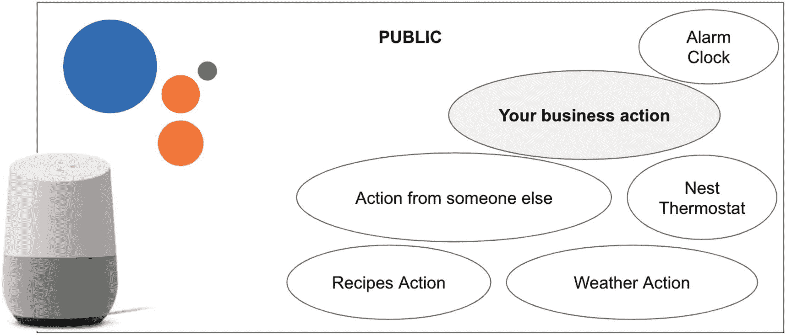
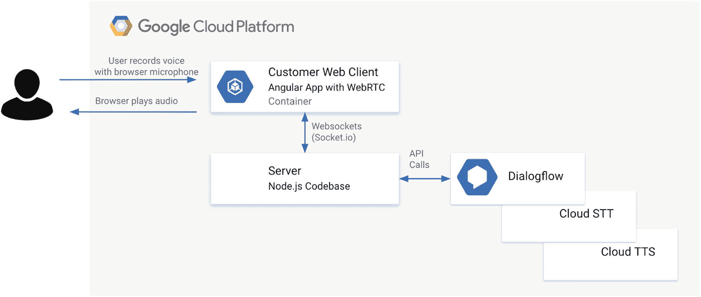
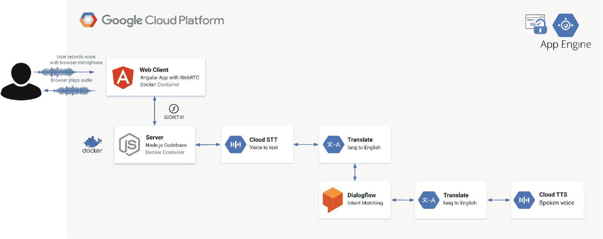

# Dialogflow gRPC 包

[`https://pub.dev/packages/dialogflow_grpc`](https://pub.dev/packages/dialogflow_grpc)

- 了解如何集成 gRPC 并构建你自己的 Flutter 包

[`https://www.leeboonstra.dev/apis/dialogflow_flutter_grpc/`](https://www.leeboonstra.dev/apis/dialogflow_flutter_grpc/)

## 使用 SDK 在网站或应用中实现 Dialogflow 语音代理

2019 年新冠疫情爆发时，许多企业意识到客户不愿触碰公共键盘和触摸界面——这些容易滋生细菌的源头。例如，人们开始偏好商店里的非接触式支付，也不愿触碰机场、火车站或商店中的自助服务终端设备。因此，在硬件设备和应用中构建语音 AI 是一个绝佳的解决方案。

本章内容并非关于 Google Assistant，而是关于如何将你的 Dialogflow 语音代理集成到网站或应用中。这需要几个步骤，将按本章各节内容展开：

- 构建客户端应用和用户体验，使其能够使用麦克风
- 构建后端应用，使其能够使用 Google Cloud 机器学习 API 来理解语音输入并返回合成语音
- 在（浏览器）应用中播放生成的音频流

但在继续之前，我们先来关注一下为什么在这种特定场景下不应选择 Google Assistant。

### 不选择 Google Assistant 的原因

我经常与客户交流，他们的愿望是将 Google Assistant 集成到他们的商业网络应用中。除非你是电视盒子或耳机制造商，否则我总会回答：“这真的是你想要的吗？还是说你希望用对话式 AI 来扩展你自己的应用？”

假设你有一个或多个以下需求。在这种情况下，你可能希望直接使用 Google Cloud Speech 和 Dialogflow API，而不是将你的语音 AI 打包成 Google Assistant 中的操作，或将开源的 Google Assistant SDK 封装到你自己的应用中。

不选择 Google Assistant 而自行构建语音 AI 的原因：

- 此应用不应公开可用。
- 此应用无需在 Google Assistant/Nest Home 上可用。
- 你不想用唤醒词“嘿 Google，和<我的应用>对话”来启动应用。
- 此应用无需回答 Google Assistant 的原生问题，例如“阿姆斯特丹的天气如何”。
- 此应用有特定的技术要求，例如麦克风开启时间超过 30 秒。
- 此应用只能使用企业版 Google Cloud 条款和条件，而不能与 Google Assistant 的消费者条款和条件结合使用。

与 Google Assistant 相比，通过使用上述工具手动将对话式 AI 扩展到你的应用中，你就不再是 Google Assistant 生态系统的一部分了。如果你正在构建消费者或活动应用（语音操作），并且所有人都能通过 `<嘿 Google，和我的应用对话>` 的调用方式来发现它们，那么这个生态系统非常出色。但如果你是企业用户，整个生态系统可能就大材小用了。图 12-1 展示了 Google Assistant 生态系统；如图所示，该生态系统包含数百万个需要被调用的操作。如果你想用语音扩展你的自定义 AI，Google Assistant 生态系统可能过于复杂。



**图 12-1** Google Assistant 生态系统可能大材小用

你是否确信要通过集成语音 AI 功能来扩展你自己的（移动）网络应用？本章将解释如何从网络应用实现语音流传输到语音转文字、Dialogflow 和文字转语音。


图 12-2 将向你展示此语音集成架构的外观。



**图 12-2** 用户将通过浏览器 Web 应用程序中的麦克风进行语音输入。该前端 Web 应用程序会将音频流传输到后端服务器，后端服务器将调用 Dialogflow、语音转文本和文本转语音服务。

## 构建从浏览器麦克风向服务器传输音频的客户端 Web 应用程序

你将在浏览器中使用 `getUserMedia()` WebRTC JavaScript 方法来捕获麦克风音频流。为确保其在所有现代浏览器中都能正常工作，你可以使用像 `RecordRTC` 这样的库。`RecordRTC` 是一个用于音频/视频以及屏幕活动录制的 WebRTC JavaScript 库。它支持 Chrome、Firefox、Opera、Android 和 Microsoft Edge。平台：Linux、Mac 和 Windows。

> **注意：** 在 iOS 设备上运行你的应用程序时，可能会遇到各种问题。首先，iOS 仅在 Safari 浏览器中支持 JavaScript 的 `getUserMedia` 和 WebRTC 方法。当在非移动 Safari 的 iOS 浏览器上打开时，你可以显示一个弹出警告。要使用 `getUserMedia()` WebRTC 方法，你需要允许权限弹出窗口，该窗口仅在通过 HTTPS 运行时才会出现。iOS 上仍有一个关键限制：Web Audio 在用户激活之前处于静音状态。要在 iOS 上播放和录制音频，需要用户交互（例如触摸开始）。

一旦我们捕获了音频，就需要将流发送到后端服务器。这样后端服务器就可以与 Google API（如 Dialogflow）集成。为此，你可以使用 WebSockets 或像 `Socket.IO` 这样的库。`Socket.IO` 支持基于事件的实时双向通信。对于通过 `Socket.IO` 进行的二进制流传输，我使用了 `Socket.io-Stream` 模块。

### 构建前端

首先，你的客户端应用程序/HTML 页面至少需要一个（或两个）按钮来停止和启动浏览器麦克风。参见代码清单 12-1。你还可以显示一个文本区域字段用于演示目的，稍后可以显示返回的文本结果。

```
开始录制
停止录制
```

**代码清单 12-1** 构建自定义语音 AI 所需的 HTML 元素

确保在你的页面上加载 `RecordRTC` 和 `Socket.IO` 库。

然后，你需要一段 JavaScript 代码来处理麦克风录制并将音频对象流式传输到后端服务器。

1.  首先，我将创建指向开始和停止按钮的指针。
2.  接下来，我实例化 `Socket.IO`，并打开一个连接。
3.  我创建了两个事件监听器，分别用于开始和停止录制。开始按钮的 `onclick` 事件将禁用开始按钮，这样你就不能按两次按钮，从而避免录制两次音频。
4.  `navigator.getUserMedia()` 是代码的重要组成部分。它是一组 WebRTC API 的一部分，这些 API 提供了访问用户本地摄像头/麦克风流的方法。在我们的案例中，我们只使用麦克风（`audio: true`）。这使我们能够访问该流。
5.  现在，我使用 `RecordRTC` 库。我本可以选择自己编写这部分代码。但 `RecordRTC` 解决了许多复杂问题，例如转换缓冲区（从 Float32 到 Int16）、跨浏览器支持等。
6.  `RecordRTC` 接受两个参数。第一个参数是来自 `getUserMedia()` 调用的 `MediaStream`。第二个参数是一个配置对象，其中包含用于优化流的设置。我进行了一些必要的设置，这些设置应与稍后在服务器端代码中的设置保持一致（Dialogflow 中的 `InputAudioConfig` 或 STT 中的 `RecognitionConfig` 的文档）：
    *   将 MIME 类型设置为 `audio/webm`——当在 Dialogflow 或 STT 中使用 `AUDIO_ENCODING_LINEAR_16` 或 `LINEAR16` 作为 `AudioEncoding` 配置时，这是一个正确的设置。
    *   `sampleRate` 是以赫兹为单位的输入采样频率。我将其重新采样为 16000Hz（`desiredSampleRate`），这样网络上的消息大小会更小，并且与我 Dialogflow 或 STT 调用中的采样赫兹设置相匹配。
    *   此外，Dialogflow 和 STT 需要单声道声音，这意味着我应该将 `numberOfAudioChannels` 设置为 1。`RecorderType StereoAudioRecorder` 允许我将音频通道数从 2 更改为 1。

```
//1)
const startRecording = document.getElementById('start-recording');
const stopRecording = document.getElementById('stop-recording');
let recordAudio;
//2)
const socketio = io();
const socket = socketio.on('connect', function() {
startRecording.disabled = false;
});
//3)
startRecording.onclick = function() {
startRecording.disabled = true;
//4)
navigator.getUserMedia({
audio: true
}, function(stream) {
//5)
recordAudio = RecordRTC(stream, {
type: 'audio',
//6)
mimeType: 'audio/webm',
sampleRate: 44100,
// used by StereoAudioRecorder
// the range 22050 to 96000.
// let us force 16khz recording:
desiredSampRate: 16000,
// MediaStreamRecorder, StereoAudioRecorder, WebAssemblyRecorder
// CanvasRecorder, GifRecorder, WhammyRecorder
recorderType: StereoAudioRecorder,
// Dialogflow / STT requires mono audio
numberOfAudioChannels: 1
});
recordAudio.startRecording();
stopRecording.disabled = false;
}, function(error) {
console.error(JSON.stringify(error));
});
};
```

**代码清单 12-2** 处理麦克风录制并将音频对象流式传输到后端服务器应用程序

## 短语音与流式传输

通常有两种方法可以将语音集成到你的应用程序中：

1.  **短语音/检测意图**：这意味着你的最终用户按下录制按钮并说话，当他们按下停止时，我们收集音频流以返回结果。在你的代码中，这意味着一旦客户端 Web 应用程序收集完完整的音频录制，它就会将其发送到服务器，以调用 Dialogflow 或语音转文本 API。
2.  **流式传输长语音/在流中检测意图**：这意味着你的最终用户按下录制按钮，说话，并实时看到结果。在检测意图时，这可能意味着一旦你说了更多内容，它将检测到更好的匹配。在你的代码中，这意味着客户端开始建立双向流，并将数据块流式传输到服务器，通过传入数据上的事件监听器进行调用，因此它是实时的。当有意图匹配时，我们可以通过呈现文本来在屏幕上显示结果，或者通过将音频缓冲区流式传输回客户端来合成（读出）结果，该缓冲区将通过 WebRTC `AudioBufferSourceNode`（或音频播放器）播放。

## 录制单次语音

短语音意味着你的最终用户按下录制按钮并说话，当他们按下停止时，我们收集音频流以返回结果。在你的代码中，这意味着一旦客户端 Web 应用程序收集完完整的音频录制，它就会将其发送到服务器，以调用 Dialogflow 或语音转文本 API。对于此用例，关键在于停止按钮的 `onclick` 事件监听器。

1.  当你单击停止时，它将首先重置按钮，然后停止录制。在停止录制的同时，它将在回调函数中请求 `audioDataURL`，这是 `RecordRTC` API 的一部分。这将返回一个字符串 `dataURL`，其中包含一个 Base64 字符串，该字符串包含你的音频流。这个长字符串看起来像这样：`data:audio/wav;base64,UklGRiRgAgBXQVZFZm10IBAAAAABAAEARKwAA`


2. 我们可以从它创建一个对象，该对象也会设置音频类型，然后通过`Socket.IO`将其发送到服务器：`socketio.emit('message', files);`。我们将设置一个名称。一旦服务器连接到这个`socket`，它将查找`'message'`事件名称进行响应，并接收`files`对象。

3. 脚本的最后部分将在服务器调用`Dialogflow`/`Speech API`并通过`WebSockets`回调将结果返回给服务器时运行。在此示例中，我只是将结果打印到一个`textarea`框中。对于`Dialogflow`，`fulfillmentText`是`queryResult`的一部分。

```
// 1)
stopRecording.onclick = function() {
// recording stopped
startRecording.disabled = false;
stopRecording.disabled = true;
// stop audio recorder
recordAudio.stopRecording(function() {
// after stopping the audio, get the audio data
recordAudio.getDataURL(function(audioDataURL) {
//2)
var files = {
audio: {
type: recordAudio.getBlob().type || 'audio/wav',
dataURL: audioDataURL
}
};
// submit the audio file to the server
socketio.emit('message', files);
});
});
};
// 3)
// when the server found results send
// it back to the client
const resultpreview = document.getElementById('results');
socketio.on('results', function (data) {
console.log(data);
// show the results on the screen
if(data[0].queryResult){
resultpreview.innerHTML += "" + data[0].queryResult.fulfillmentText;
}
});
Listing 12-3
Recording single utterances in the front end
```

## 录制音频流

录制流意味着最终用户按下录音按钮，开始说话，并实时看到结果。当使用`Dialogflow`检测意图时，这可能意味着一旦你说了更多内容或收集了多个结果，它将检测到更准确的匹配。在你的代码中，这意味着客户端开始建立一个双向流，并将数据块流式传输到服务器，通过传入数据的事件监听器进行调用，从而实现实时处理。

你可能会选择这种方法，因为你期望的音频很长。或者，在`Dialogflow`的情况下，你可能希望在说话时实时在屏幕上显示中间结果。在这种情况下，你不需要`stopRecording`回调函数来将`base64` URL 字符串发送到服务器。相反，它会实时将流发送到服务器！

```
// 1)
timeSlice: 4000,
// 2)
// as soon as the stream is available
ondataavailable: function(blob) {
// 3
// making use of socket.io-stream for bi-directional
// streaming, create a stream
var stream = ss.createStream();
// stream directly to server
// it will be temp. stored locally
ss(socket).emit('stream', stream, {
name: 'stream.wav',
size: blob.size
});
// pipe the audio blob to the read stream
ss.createBlobReadStream(blob).pipe(stream);
}
// 4 ...
Listing 12-4
Recording full audio streams in the front end
```

这里的魔法在于`RecordRTC`对象和`ondataavailable`事件监听器：

1.  首先，你需要设置一个`timeSlice`——`timeSlice`设置了创建音频块的间隔。对于`Dialogflow`，你可能不希望每秒都检测意图（因为你可能还没说完一句话），而是内置一个计时器。`timeSlice`以毫秒为单位设置，所以我使用的是`4000`（4 秒）。

2.  然后是`ondataavailable`事件监听器，一旦有数据可用，它就会被触发，并包含音频块（音频缓冲区），在我的例子中，每 4 秒触发一次。

3.  这就是`socketio-stream`发挥作用的地方。我使用双向流（我每 4 秒发送一个包含数据块的流，但我也可能希望在期间从服务器接收结果）。所以我创建了流，它将临时存储在我的本地驱动器上，通过`ss(socket).emit()`发送。我将其流式传输到服务器，同时将音频缓冲区通过管道传输到流中。`stream.pipe()`的目的是将数据缓冲限制在可接受的水平，这样不同速度的源和目的地就不会耗尽可用内存。

如果你想看一个端到端的示例，请查看机场自助服务亭演示；你可以在“进一步阅读”部分找到链接。

> **注意**
>
> 我在网上看到过一些解决方案，麦克风直接流式传输到`Dialogflow`，中间没有服务器。`REST`调用直接在`Web`客户端中使用`JavaScript`进行。我认为这是一种反模式。你很可能会在客户端代码中暴露你的服务帐户/私钥。任何熟悉`Chrome Dev`工具的人都可以窃取你的密钥，并通过你的帐户进行（付费）`API`调用。更好的方法是让服务器处理`Google Cloud`身份验证。这样，服务帐户就不会暴露给公众。

## 构建接收浏览器麦克风流以检测意图的 Web 服务器

以下是创建一个集成`Dialogflow SDK`的`Node.js Express`应用程序的步骤。如前一节所述，你需要一个工作的前端应用程序，以便从`HTML5`麦克风实时获取`AudioBuffer`。

通常，服务器端代码将包含以下部分：

*   导入所有必需的库
*   加载环境变量
*   设置带有`Socket.IO`监听器的`Express`服务器
*   `Google Cloud API`调用：`Dialogflow Audio DetectIntent`和`DetectStream`调用

本节将使用一个`Node.js`服务器，该服务器将提供静态内容（如`HTML`页面）并连接到`Dialogflow SDK`。你也可以使用任何其他编程语言。所有`Google Cloud`服务都有各种客户端`SDK`（如`Node.js`、`Java`、`Python`、`Go`等）以及`REST`和`gRPC`库。
我连接的`Dialogflow`代理应包含一些示例意图、实体或`FAQ`知识库。
或者，你还可以包含`Google Cloud Speech-to-Text StreamingRecognize`和`Google Cloud Text-to-Speech synthesize`调用。如果你想在将传入的语音发送到`Dialogflow`之前对其进行修改，例如翻译传入的语音调用、`Text-to-Speech synthesize`调用（用于朗读结果），这会很方便。图 12-3 是整个解决方案的架构图。

要查看此示例的运行情况，请查看“进一步阅读”部分，并使用指向`SelfServiceKiosk`演示的链接。



**图 12-3** 使用流行的云 AI 工具（如`Speech-to-Text AI`、`Translate API`、`Dialogflow`和`Text-to-Speech API`）构建你自己的语音 AI 的示例架构


