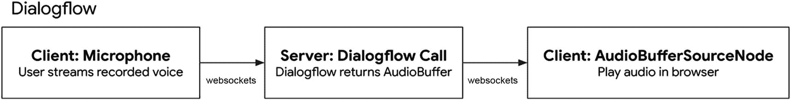

# Dialogflow 与 Text-to-Speech API 及 Speech-to-Text API 对比

虽然我们许多人会通过文本输入来使用 Dialogflow，用于网页或社交媒体聊天机器人，但也可以使用语音作为音频输入来进行意图匹配。它甚至可以将口语文本（TTS）作为音频结果返回。

Dialogflow 的语音检测和输出功能与 Google Cloud Speech-to-Text API (`STT`) 和 Google Cloud Text-to-Speech (`TTS`) 存在重叠。API 调用看起来相似，这是因为 Dialogflow 在底层使用了 Google Cloud Speech-to-Text。

然而，这些服务是不同的，并且被用于不同的场景。例如，Dialogflow 用于需要获取答案/结果的对话场景，而 Google Cloud Text-to-Speech 通常用于转录目的。（想想生成字幕或做笔记。）

## Speech-to-Text API

Google Cloud `Speech-to-Text (STT)` 将口语转换为书面文本。当你想要生成视频字幕、从会议中生成文本记录等场景时，这非常有用。你也可以将其与 Dialogflow 聊天机器人结合使用（从文本记录中检测意图），以合成聊天机器人的回答。然而，`STT` 不像 Dialogflow 那样进行意图检测。`STT` 非常强大，其 API 调用响应会返回置信度最高的书面转录文本，并返回一个包含备选转录选项的数组。

> **注意**
>
> Speech-to-Text 的 `StreamingDetectIntent` 传入音频流按 15 秒间隔计费。如果静音持续 15 秒，语音识别器将超时。理想情况下，如果出现静音，不应等待整整 15 秒。

## Text-to-Speech API

使用 Google Cloud `Text-to-Speech (TTS)`，你可以发送文本或 SSML（带语音标记的文本）输入，它将返回音频字节，你可以用这些字节创建 mp3 文件或直接流式传输到音频播放器（在你的浏览器中）。

到目前为止，你已经了解了如何构建一个 Web 应用程序，该应用程序将本地设备麦克风的音频通过浏览器流式传输到后端应用程序，从 Dialogflow 获取结果，并在用户界面中显示。如果浏览器能够播放音频流，那就更好了。这正是下一章要讲的内容！

## 构建后端

由于我的示例应用程序使用了 Node.js 和 npm，我需要下载外部的 Node 库。本章必不可少的 npm 包叫做 `dialogflow`。它将用于与 Dialogflow 交互并进行（语音）意图匹配。

出于演示目的，我不会讨论如何设置带有 Express 服务器的 Node.js 应用程序。但作为参考，你可以查看我的 `简单服务器代码`，该代码已用于简单的 `客户端示例`，你也可以查看 `机场自助服务亭` 端到端示例的代码。相关链接可以在本章的“延伸阅读”部分找到。

当你浏览这些代码清单时，你将能够看到 Express 服务器。它们都通过 Socket.IO 进行通信，如清单 12-5 所示。

1. 实例化 Socket.IO 后，我可以监听 `connect emit`。一旦 Socket.IO 客户端连接到服务器，此代码将执行。

2. 当连接到套接字，并且客户端触发了 `message` 事件时，执行此代码。它将检索停止 WebRTC 记录器时设置的数据。回顾上一章，我创建了一个包含子对象的对象，该子对象包含 MIME 类型 (`audio/webm`) 和 `audioDataURL`，后者是包含音频录制的 Base64 字符串。让我们获取该 Base64 字符串并将其转换为 Node.js 文件 Buffer。

3. 有了这个 `fileBuffer`，我可以调用自定义的 Dialogflow `DetectIntent` 实现，这将在本章后面解释。

```javascript
const results = await detectIntent(fileBuffer);
client.emit('results', results);
```

这将是一个异步调用，并返回一个包含结果的 Promise。这些结果将被发送到客户端应用程序。客户端可以像这样监听套接字发射：

```javascript
socketio.on('results', function (data) {
    console.log(data);
});
```

4. 这是客户端触发的第二个事件的示例，在本例中是一个流式事件。现在，我将在 WebRTC 记录器在 `ondataavailable` 监听器中流式传输音频数据块时检索数据。请注意，客户端套接字被包装了 `socket.io-stream` 以进行二进制数据传输。

我正在检索音频块以及附加数据，例如流名称（一个字符串）。这可用于在服务器上存储临时音频文件，我可以将传入的音频流通过管道传输到该文件中。它被用作一个容器来激活我的自定义 Dialogflow 实现。

5. 就像本章后面解释的 `DetectIntentStreaming` 实现一样：

```javascript
detectIntentStream(stream, function(results){
    client.emit('results', results);
});
```

在此调用中，我传入流和一个回调函数，该函数在结果返回时执行。这些结果将被发送到客户端应用程序。

客户端可以像这样监听套接字发射：

```javascript
socketio.on('results', function (data) {
    console.log(data);
});
```

```javascript
//1
io.on('connect', (client) => {
    //2
    client.on('message', async function(data) {
        const dataURL = data.audio.dataURL.split(',').pop();
        let fileBuffer = Buffer.from(dataURL, 'base64');
        //3 ...
    });
    // 4
    ss(client).on('stream', function(stream, data) {
        const filename = path.basename(data.name);
        stream.pipe(fs.createWriteStream(filename));
        //5 ...
    });
});
```

*清单 12-5* 使用 Socket.IO 将音频流从前端发送到后端

### 对 Dialogflow 的 API 调用

我将使用 Dialogflow Node.js 客户端 SDK，基于完成的音频缓冲区和传入的音频流手动检测意图。

```javascript
const df = require('dialogflow');
```

让我们首先准备客户端和请求。稍后，我可以通过添加音频输入来修改请求：

```javascript
// 1)
sessionId = uuid.v4();
// 2)
sessionClient = new df.SessionsClient();
sessionPath = sessionClient.sessionPath(projectId, sessionId);
// 3)
request = {
    session: sessionPath,
    queryInput: {
        // 4)
        audioConfig: {
            sampleRateHertz: sampleRateHertz,
            encoding: encoding,
            languageCode: languageCode
        },
        singleUtterance: singleUtterance
    }
}
```

*清单 12-6* 准备语音请求

1.  Dialogflow 需要一个会话 ID。让我们使用 UUID 生成一个随机的 [RFC4122 ID](https://www.ietf.org/rfc/rfc4122.txt)，格式如 `1b9d6bcd-bbfd-4b2d-9b5d-ab8dfbbd4bed`。

2.  之后，让我们创建一个 Dialogflow 会话路径。会话路径可以从 Dialogflow 会话客户端对象创建。它需要一个会话 ID 来使 Dialogflow 会话唯一。它还需要 Google Cloud 项目 ID，该 ID 指向一个包含可用 Dialogflow 代理的 Google Cloud 项目。

3.  让我们先设置一个请求对象，该对象将用于每次 Dialogflow API 调用。如果此请求用于流式音频，则此请求将用作初始请求。这意味着它首先在没有音频流的情况下连接到 SDK，但使用它可以使用的音频配置来准备 API。之后，音频块将流式传入。它需要有一个 `sessionPath`（现在将指向一个客户端会话和一个特定的 Dialogflow 代理）。即使没有音频输入，我也可以先设置好 `queryInput`。

4.  由于此应用处理语音，我需要设置 `audioConfig` 对象。`audioConfig` 对象需要指定采样率赫兹（此数值必须与客户端代码中的 `desiredSampleRateHertz` 一致）。它还需要一个 `languageCode`，用于指定语音文本的语言，且该语言必须在 Dialogflow 中已设置。此外，还需要指定编码方式，该编码也必须与客户端使用的编码一致。在我的自助服务终端代码演示中，我使用的是来自 `.env` 文件的配置。

现在，让我们来看看 `DetectIntent` 和 `StreamingDetectIntent` 这两个调用。

## `DetectIntent`

在 Dialogflow 检测到意图后，后端应用会在所有音频发送并处理完毕后收到意图匹配结果。我创建了一个异步函数，该函数接收 `AudioBuffer` 并将其添加到请求中。接着，我通过传入请求来调用 `detectIntent`。它会返回一个 promise，该 promise 支持链式调用。

```
async function detectIntent(audio){
request.inputAudio = audio;
const responses = await sessionClient.detectIntent(request);
return responses;
};
```

*清单 12-7* 使用 Socket.IO 将音频流从前端发送到后端

### `StreamingDetectIntent`

`StreamingDetectIntent` 执行双向流式意图检测：在发送音频的同时接收结果。此方法仅通过 gRPC API（而非 REST）可用。

1.  我创建了一个异步函数，该函数接收 `AudioBuffer` 并将其添加到请求中，回调函数的名称将在 API 获取结果后执行。

2.  执行 `streamingDetectIntent()` 调用。

3.  有一个 `on('data')` 事件监听器，在音频块流入时执行。你可以在此处创建一些条件逻辑；如果响应中存在 `data.recognitionResult`，则识别出中间转录文本。否则，很可能已检测到意图（或者，如果没有匹配项，则触发了回退意图）。我通过执行回调函数来返回结果。

4.  当请求出现问题时，你还可以监听 `error` 事件。或者，当流向 Dialogflow 的流停止时，你可以监听 `end` 事件。

5.  其工作原理是，我们将告知 Dialogflow API 将有一个 `streamingDetectIntent` 调用，其中包含可从请求中检索到的所有 `queryInput` 和 `audioConfigs`。之后，所有传入的其他消息将通过 `inputAudio` 包含音频流。

6.  让我们使用一个名为 `pump` 的小型 node 模块，它将流管道连接在一起，并在其中一个流关闭时销毁所有流。

7.  在这里，我将对流进行转换，以便请求现在也包含带有 `audioBuffer` 流的 `inputAudio`。

```
// 1)
async function detectIntentStream(audio, cb) {
// 2)
const stream = sessionClient.streamingDetectIntent()
.on('data', function(data){
// 3)
if (data.recognitionResult) {
console.log(
`中间转录文本:
${data.recognitionResult.transcript}`
);
} else {
console.log(`检测到意图:`);
cb(data);
}
})
// 4)
.on('error', (e) => {
console.log(e);
})
.on('end', () => {
console.log('流结束');
});
// 5)
stream.write(request);
// 6)
await pump(
audio,
// 7)
new Transform({
objectMode: true,
transform: (obj, _, next) => {
next(null, { inputAudio: obj, outputAudioConfig: {
audioEncoding: `OUTPUT_AUDIO_ENCODING_LINEAR_16`
} });
}
}),
stream
);
};
```

*清单 12-8* 基于音频流检测意图

这将返回一个 `StreamingIntentResponse`。它包含一个 `queryResult`。如果你在 `StreamingDetectIntentRequest` 中传入了输出音频配置，你将能够检索到根据 `queryResult.fulfillmentMessages` 字段中的默认平台文本响应值生成的音频数据字节。如果存在多个默认文本响应，生成音频时会将它们拼接起来。如果没有默认平台文本响应，则生成的音频内容将为空。

## 从 Dialogflow 检索音频结果并在浏览器中播放

当你进行文本转语音调用时，无论是使用 Google Cloud Text-to-Speech API 还是 Dialogflow 内置的语音返回功能，它都会返回音频字节数据。Cloud TTS 和 Dialogflow 都可以从服务器端代码调用。为了在浏览器中流式传输并播放这些音频，你可以使用 WebSockets。一旦 `AudioBuffer`（在浏览器的 JavaScript 代码中为 `ArrayBuffer`）返回给客户端，就可以使用 WebRTC 方法进行播放。

图 12-4 是一个使用 Dialogflow 的浏览器流程示例。在此示例中，用户对着麦克风说话（类似于前面的示例），但 Dialogflow 返回一个 `AudioBuffer` 作为结果。



**图 12-4** 用户将语音从客户端应用流式传输到连接到 Dialogflow 的服务器应用。一旦 Dialogflow 匹配到意图，结果音频流将被发送回客户端应用，以便在浏览器中播放

现在，是时候关注最后一部分了：确保我们从 Dialogflow 获取到作为检测结果的音频缓冲区，通过 Socket.IO 将其流式传输回客户端，并确保它能自动播放。

Dialogflow 在检测到意图后也可以返回 `AudioBuffer`。你只需要在 Dialogflow 的 `DetectIntentRequest` 中指定一个 `outputAudioConfig`，即可在响应中同时获得一个 `AudioBuffer`：

```
outputAudioConfig: {
audioEncoding: `OUTPUT_AUDIO_ENCODING_LINEAR_16`,
},
```

检测意图请求的响应类型是 `DetectIntentResponse`。通常，当你使用文本内容检测意图时，它会填充 `queryResult` 中的 `fulfillmentMessages` 字段。但是，当你提供语音音频作为内容时，`DetectIntentResponse.outputAudio` 字段会根据 `DetectIntentResponse.queryResult.fulfillmentMessages` 字段中的默认平台文本响应值填充音频。如果存在多个默认文本响应，生成音频时会将它们拼接起来。如果没有默认平台文本响应，则生成的音频内容将为空。

## 用于播放音频的客户端代码

在你的客户端应用中，你需要确保再次加载 `socket.io` 和 `socket.io-stream`。Socket.IO 是一个实时的、基于双向事件的通信库。它使用的传输方式之一是 WebSockets，但它也提供其他传输方式（XHR/JSONP），不仅作为回退方案，也适用于不支持/不需要/不想要 WebSockets 的情况。

你可以从 CDN 加载它。

```
清单 12-9
从 CDN 加载 Socket.IO
```


一旦客户端连接到服务器，就可以开始监听服务器触发的事件。在本例中，该事件是`'results'`事件。当浏览器从服务器端检索到数据后，该事件将触发。这将调用自定义的`playOutput`方法，稍后将展示该方法。

```javascript
const socketio = io();
const socket = socketio.on('connect', function() {});
socketio.on('results', function (data) {
  console.log(data);
  playOutput(data);
});
// 清单 12-10：当结果发送回客户端后，播放音频
```

清单 12-11 展示了在浏览器中通过设备扬声器播放输出的代码。

1.  这是`playOutput`函数，它接收从后端代码获取的`arrayBuffer`。在这里，可以创建一个新的`AudioContext`对象。`AudioContext`接口表示一个由音频模块链接而成的音频处理图，由`AudioNode`表示。音频上下文控制着它所包含的音频节点的创建以及音频处理或解码的执行。

2.  现在，让我们从`ArrayBuffer`为 Web Audio API 创建一个音频源。解码后的`AudioBuffer`会被重新采样到`AudioContext`的采样率，然后传递给回调函数。

3.  用户代理可能会阻止自动播放，因此首先运行`audioContext.resume`作为技巧。之后，创建一个新的`AudioBufferSourceNode`连接到`audioContext`的目标，在本例中即设备扬声器。`AudioBufferSourceNode`接口的`buffer`属性提供了使用`AudioBuffer`作为声音数据源来回放音频的能力。最后，播放音频。

```javascript
// 1)
function playOutput(arrayBuffer){
  let audioContext = new AudioContext();
  let outputSource;
  try {
    if(arrayBuffer.byteLength > 0){
      // 2)
      audioContext.decodeAudioData(arrayBuffer,
        function(buffer){
          // 3)
          audioContext.resume();
          outputSource = audioContext.createBufferSource();
          outputSource.connect(audioContext.destination);
          outputSource.buffer = buffer;
          outputSource.start(0);
        },
        function(){
          console.log(arguments);
        });
    }
  } catch(e) {
    console.log(e);
  }
}
// 清单 12-11：如何在浏览器中播放音频流
```

> **注意**

> 请注意在流式音频上使用 Dialogflow 的`detectIntent`。当使用非流式的简单`detectIntent`调用时，会停止麦克风，并播放 TTS 音频缓冲区。然而，当进行流式处理时，麦克风保持开启状态。你不希望陷入无限循环，即语音合成器根据通过麦克风的 TTS 响应录制新的流。:-)

`AudioBufferSourceNode`有一个`onended`事件处理程序，当`AudioBufferSourceNode`停止播放音频时，该处理程序将运行。如果你想解决上述问题，可以设置一个布尔标志`isPlaying`，当它设置为`true`时，应阻止录音器向后端发送流。

恭喜！通过阅读本章，你现在知道了如何构建一个端到端的解决方案，用于将麦克风的音频流式传输到服务器，并在浏览器中流式传输和播放音频结果！

## 总结

本章包含关于在你的网站或应用中构建自定义语音 AI 与使用虚拟助手（如 Google Assistant）的信息。

它涉及以下任务：

*   你想通过将浏览器麦克风的音频流式传输到 Web 服务器，在自己的网站或应用中创建语音 AI。

*   你想在自己的 Web 服务器中集成语音 AI，并检测从浏览器麦克风接收到的音频流中的意图。

*   你想在自己的网站中集成语音 AI，并在浏览器中播放音频结果。

本书各章节对应的完整工作示例可在此处找到：

[`https://github.com/dialogflow/selfservicekiosk-audio-streaming`](https://github.com/dialogflow/selfservicekiosk-audio-streaming)

你可以通过此 URL 运行演示并进行体验：

[`http://selfservicedesk.appspot.com/`](http://selfservicedesk.appspot.com/)

## 延伸阅读

*   RecordRTC 库

    [`https://github.com/muaz-khan/RecordRTC`](https://github.com/muaz-khan/RecordRTC)

*   Socket.IO 库

    [`https://www.npmjs.com/package/socket.io`](https://www.npmjs.com/package/socket.io)

*   Socket.io-Stream 模块

    [`https://www.npmjs.com/package/socket.io-stream`](https://www.npmjs.com/package/socket.io-stream)

*   关于如何构建 SelfServiceKiosk 的博客文章

    [`https://medium.com/google-cloud/building-your-own-conversational-voice-ai-with-dialogflow-speech-to-text-in-web-apps-part-i-b92770bd8b47`](https://medium.com/google-cloud/building-your-own-conversational-voice-ai-with-dialogflow-speech-to-text-in-web-apps-part-i-b92770bd8b47)

*   SelfServiceKiosk 演示代码库

    [`https://github.com/dialogflow/selfservicekiosk-audio-streaming/blob/master/client/src/app/microphone/microphone.component.ts`](https://github.com/dialogflow/selfservicekiosk-audio-streaming/blob/master/client/src/app/microphone/microphone.component.ts)

*   关于如何构建 SelfServiceKiosk 的博客文章

    [`https://medium.com/google-cloud/building-your-own-conversational-voice-ai-with-dialogflow-speech-to-text-in-web-apps-part-i-b92770bd8b47`](https://medium.com/google-cloud/building-your-own-conversational-voice-ai-with-dialogflow-speech-to-text-in-web-apps-part-i-b92770bd8b47)

*   Self Service Kiosk 演示代码库

    [`https://github.com/dialogflow/selfservicekiosk-audio-streaming/blob/master/client/src/app/microphone/microphone.component.ts`](https://github.com/dialogflow/selfservicekiosk-audio-streaming/blob/master/client/src/app/microphone/microphone.component.ts)

*   可用于本章的`package.json`文件示例

    [`https://github.com/dialogflow/selfservicekiosk-audio-streaming/blob/master/examples/package.json`](https://github.com/dialogflow/selfservicekiosk-audio-streaming/blob/master/examples/package.json)

*   体验并测试 Service Kiosk 演示

    [`http://selfservicedesk.appspot.com/`](http://selfservicedesk.appspot.com/)

*   Dialogflow npm 包

    [`https://www.npmjs.com/package/dialogflow`](https://www.npmjs.com/package/dialogflow)

*   SimpleServer 示例

    [`https://github.com/dialogflow/selfservicekiosk-audio-streaming/blob/master/examples/simpleserver.js`](https://github.com/dialogflow/selfservicekiosk-audio-streaming/blob/master/examples/simpleserver.js)

*   客户端示例

    [`https://github.com/dialogflow/selfservicekiosk-audio-streaming/tree/master/examples`](https://github.com/dialogflow/selfservicekiosk-audio-streaming/tree/master/examples)

*   AudioConfig 文档

    [`https://cloud.google.com/dialogflow/es/docs/reference/rpc/google.cloud.dialogflow.v2#google.cloud.dialogflow.v2.InputAudioConfig`](https://cloud.google.com/dialogflow/es/docs/reference/rpc/google.cloud.dialogflow.v2#google.cloud.dialogflow.v2.InputAudioConfig)

*   DetectIntentResponse 文档

    [`https://cloud.google.com/dialogflow/es/docs/reference/rpc/google.cloud.dialogflow.v2#google.cloud.dialogflow.v2.DetectIntentResponse`](https://cloud.google.com/dialogflow/es/docs/reference/rpc/google.cloud.dialogflow.v2#google.cloud.dialogflow.v2.DetectIntentResponse)

*   StreamingDetectResponse 文档

    [`https://cloud.google.com/speech-to-text/docs/reference/rpc/google.cloud.speech.v1#google.cloud.speech.v1.StreamingRecognizeResponse`](https://cloud.google.com/speech-to-text/docs/reference/rpc/google.cloud.speech.v1#google.cloud.speech.v1.StreamingRecognizeResponse)

*   Dialogflow 中 DetectIntentRequest 的文档
