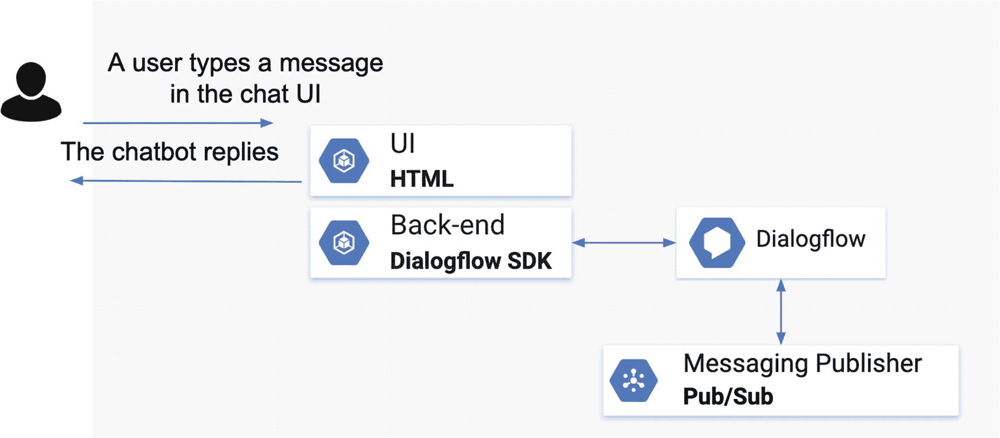
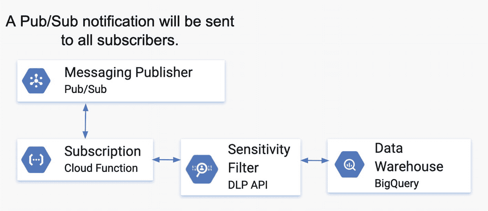
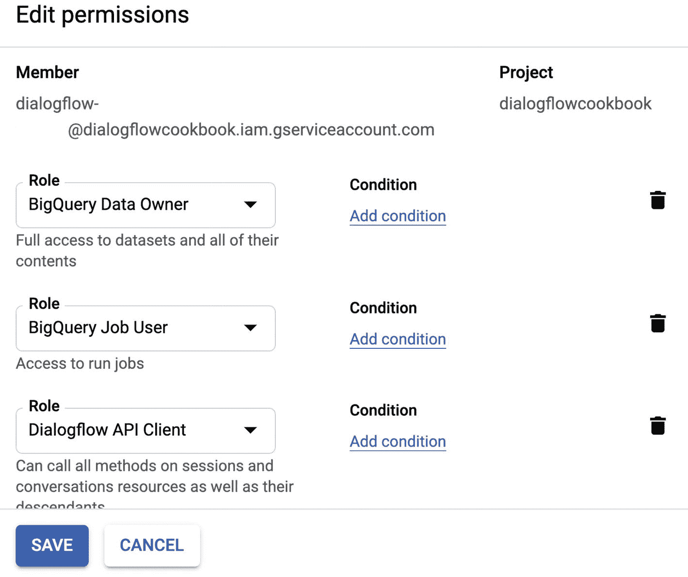
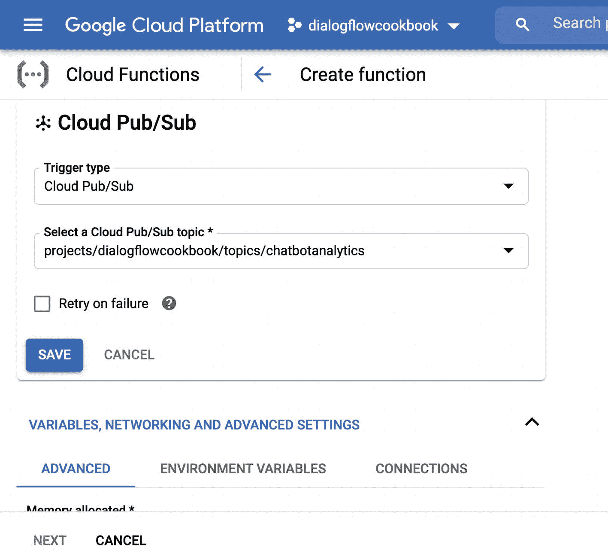
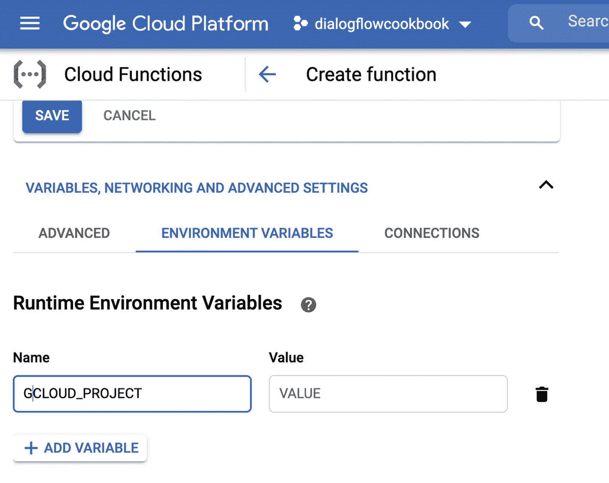
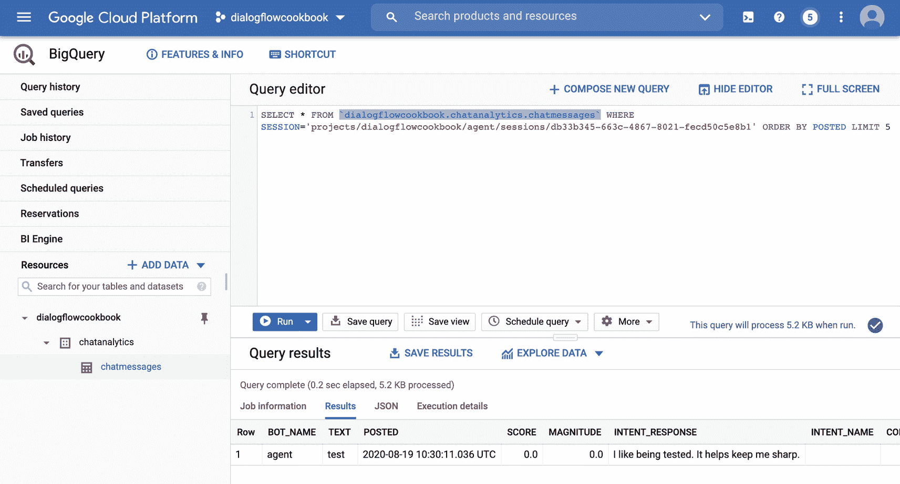
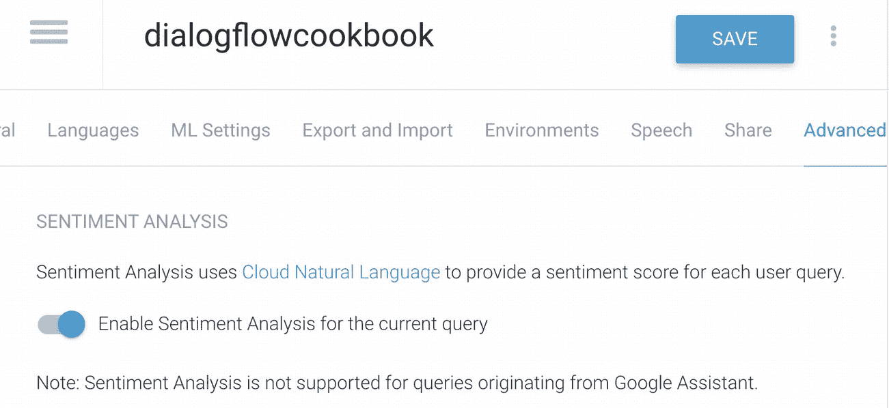
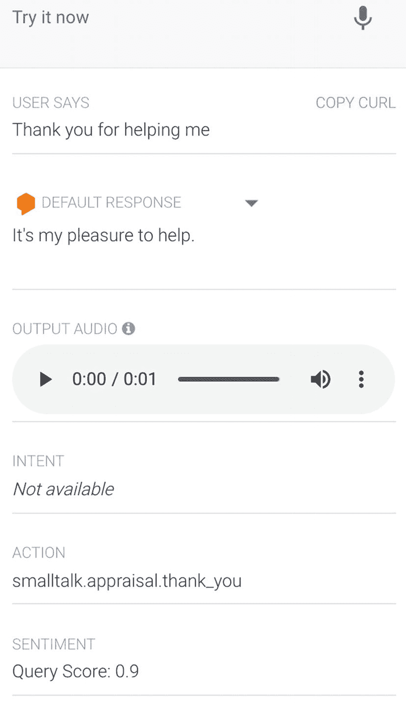
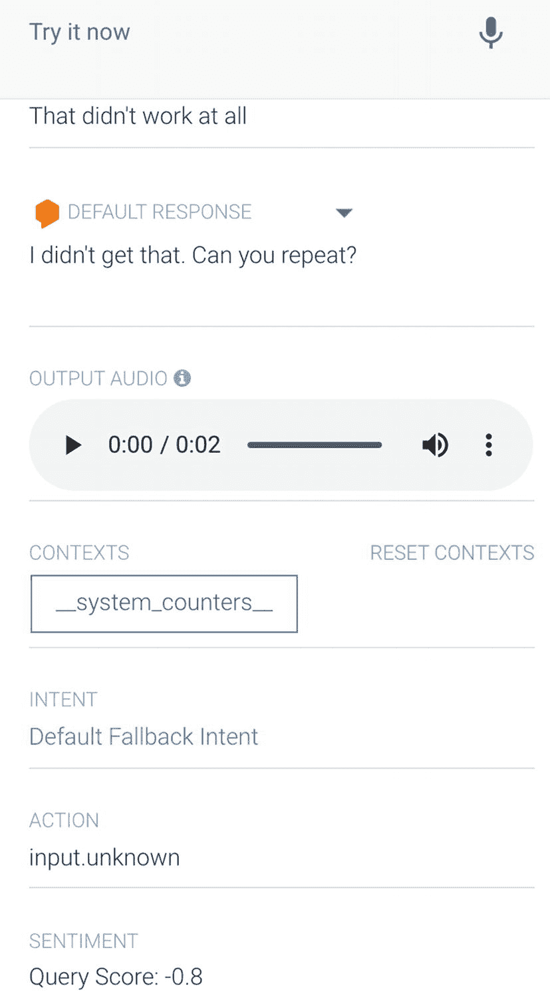
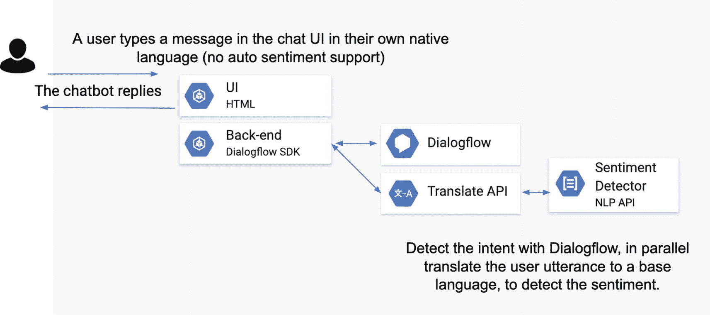

# 意图检测

当 Dialogflow 检测到您的意图时，它可能包含各种有价值的信息，您也希望将这些信息存储在数据仓库中。例如，这将帮助您在记录中判断机器人是否返回了错误的答案。

您可能想要存储以下数据点：`检测到的意图名称`、`置信度阈值`（Dialogflow 进行意图匹配所依据的置信水平）、是否为`回退意图`，以及是否为`交互结束`（用于检测流程是否结束）。

在 Dialogflow 中，您可以从 `detectIntentResponse` 的 `queryResult.intent` 中检索检测到的意图名称：

```javascript
queryResult.intent.displayName
```

在 Dialogflow 中，您可以从 `detectIntentResponse` 的 `queryResult.intent` 中检索一个布尔值，判断是否为回退意图：

```javascript
queryResult.intent.isFallback
```

在 Dialogflow 中，您可以从 `detectIntentResponse` 的 `queryResult.intent` 中检索一个布尔值，判断是否为交互结束：

```javascript
queryResult.intent.endInteraction
```

在 Dialogflow 中，您可以从 `detectIntentResponse` 的 `queryResult` 中检索置信度阈值。


`queryResult.intentDetectionConfidence`

## 解决方案

在本节中，我将介绍三种收集指标的流行解决方案。

### 构建用于捕获对话相关指标并编辑敏感信息的平台

要构建用于捕获对话相关指标的解决方案，您需要使用以下 Google Cloud 服务：

- `Dialogflow Essentials`（按需付费层级）
- `BigQuery`
- `Pub/Sub`（消息传递通道）
- `DLP API`（用于在存储数据前编辑信息）
- `Cloud Functions`（将在事件触发时执行的代码）

让我们看一下如图 13-1 所示的架构。

当客户在聊天机器人中输入文本或与语音代理对话时，`Dialogflow` 代理会匹配答案（使用 `detectIntent` 方法）。这包括用户话语、`Dialogflow` 响应、匹配的意图等信息，但更关键的是还包括会话 ID。我们可以实时将数据推送到消息传递通道（`Pub/Sub`），以便其他软件组件可以注册并监听传入的数据（通过基于事件的 `Cloud Function`）。



**图 13-1** 使用 `Pub/Sub` 架构创建数据管道（第 1 部分）

云函数订阅了 `Pub/Sub` 通道。请注意图 13-2；每当有消息传入时，该消息将被传递给 `DLP API`，以在将数据存储到 `BigQuery` 之前移除敏感信息。



**图 13-2** 使用 `Pub/Sub` 架构创建数据管道（第 2 部分）

一旦数据存储在 `BigQuery` 中，您就可以运行查询来获取，例如，导致回退或用户情绪为负面的前 10 条用户话语。您还可以运行查询来找出哪个意图最受欢迎。或者，如果您有会话 ID，则可以查询以检索完整的聊天记录。

首先，我们需要启用以下 API。我们可以通过命令行执行此操作：

```
gcloud services enable bigquery-json.googleapis.com \
cloudfunctions.googleapis.com \
dlp.googleapis.com
```

之后，我们需要确保拥有正确的权限。我们将运行一个脚本，该脚本可以在 `BigQuery` 中创建数据集和表；我们需要在 **IAM & Admin** 面板中修改用户权限。转到 **IAM** 页面。找到 `Dialogflow` 使用的 `Dialogflow` 服务帐户。（您可以在 **Dialogflow** ➤ **设置** ➤ **常规页面**上找到服务帐户（电子邮件地址）。）在 IAM 页面上，编辑 `Dialogflow` 正在使用的服务帐户（见图 13-3）。

为您的服务帐户授予以下权限：



**图 13-3** 为您的 IAM 帐户分配正确的角色

- `BigQuery Data Owner`
- `BigQuery Job User`
- `Pub/Sub Admin`

然后，我们需要创建将监听消息传递通道的 `Cloud Function`。点击 **Cloud Functions** ➤ **创建函数**。

指定以下设置；将 `[project_id]` 替换为您自己的 Google Cloud 项目 ID，如图 13-4 所示。



**图 13-4** 在数据管道中准备 `Cloud Function`

- 名称：`chatanalytics`
- 分配的内存：`256MB`
- 触发器：`Cloud Pub/Sub`
- Pub/Sub 主题：`projects/[project_id]/topics/chatbotanalytics`
- 要执行的函数：`subscribe`

点击环境变量选项卡以添加以下环境变量（见图 13-5）：



**图 13-5** 在 `Cloud Function` 中设置环境变量

- 环境变量：`GCLOUD_PROJECT - [project_id]`

清单 13-1 显示了用于导入 `BigQuery` 和 `DLP` 库的 `package.json` 内容。

```
{
"name": "chatanalytics",
"version": "1.0.2",
"dependencies": {
"@google-cloud/bigquery": "⁵.0.0",
"@google-cloud/dlp": "¹.2.0"
}
}
```

**清单 13-1** `package.json`

`Cloud Function` 的 `index.js` 代码将如清单 13-2 所示。

```
//1)
const { BigQuery } = require('@google-cloud/bigquery');
const DLP = require('@google-cloud/dlp');
//2)
const projectId = process.env.GCLOUD_PROJECT;
const bqDataSetName = 'chatanalytics'
const bqTableName = 'chatmessages';
const bq = new BigQuery();
const dlp = new DLP.DlpServiceClient();
// 使用名为 chatanalytics 的数据集
const dataset = bq.dataset(bqDataSetName);
// 使用名为 chatmessages 的 BigQuery 表
const table = dataset.table(bqTableName);
//3)
var detectPIIData = async function(text, callback) {
// 返回匹配所需的最低可能性
const minLikelihood = 'LIKELIHOOD_UNSPECIFIED';
//4)
// 要匹配的信息类型
const infoTypes = [
{name: 'PERSON_NAME'},
{name: 'FIRST_NAME'},
{name: 'LAST_NAME'},
{name: 'MALE_NAME'},
{name: 'FEMALE_NAME'},
{name: 'IBAN_CODE'},
{name: 'IP_ADDRESS'},
{name: 'LOCATION'},
{name: 'SWIFT_CODE'},
{name: 'PASSPORT'},
{name: 'PHONE_NUMBER'},
{name: 'NETHERLANDS_BSN_NUMBER'},
{name: 'NETHERLANDS_PASSPORT'}
];
// 构建转换配置，用其信息类型替换敏感信息。
// 例如，"Her email is xxx@example.com" => "Her email is [EMAIL_ADDRESS]"
const replaceWithInfoTypeTransformation = {
primitiveTransformation: {
replaceWithInfoTypeConfig: {},
},
};
// 构建编辑请求
const request = {
parent: dlp.projectPath(projectId),
item: {
value: text,
},
deidentifyConfig: {
infoTypeTransformations: {
transformations: [replaceWithInfoTypeTransformation],
},
},
inspectConfig: {
minLikelihood: minLikelihood,
infoTypes: infoTypes,
},
};
// 运行字符串编辑
try {
//5)
const [response] = await dlp.deidentifyContent(request);
const resultString = response.item.value;
console.log(`编辑后的文本: ${resultString}`);
if (resultString) {
callback(resultString);
} else {
callback(text);
}
} catch (err) {
console.log(`deidentifyContent 中的错误: ${err.message || err}`);
callback(text);
}
}
//6)
//在 BigQuery 中插入行
var insertInBq = function(row){
console.log(row);
table.insert(row, function(err, apiResponse){
if (!err) {
console.log("[BIGQUERY] - 已保存。");
} else {
console.error(err);
}
});
};
//7)
exports.subscribe = (data, context) => {
const pubSubMessage = data;
const buffer = Buffer.from(pubSubMessage.data, 'base64').toString();
var buf = JSON.parse(buffer);
var bqRow = {
BOT_NAME: buf.botName,
POSTED: (buf.posted/1000),
INTENT_RESPONSE: buf.intentResponse.toString(),
INTENT_NAME: buf.intentName,
IS_FALLBACK: buf.isFallback,
IS_END_INTERACTION: buf.isEndInteraction,
CONFIDENCE: buf.confidence,
PLATFORM: buf.platform,
SESSION: buf.session,
SCORE: buf.score,
MAGNITUDE: buf.magnitude
};
//8)
detectPIIData(buf.text, function(formattedText) {
bqRow['TEXT'] = formattedText;
insertInBq(bqRow);
});
};
```

**清单 13-2** `index.js`

这段代码执行以下操作：

1.  导入 `BigQuery` 和 `DLP` 库。
2.  设置常量以指向数据集和表名。
3.  `detectPIIData` 方法设置要查找的信息类型，例如护照号码、电话号码或人名。
4.  要查找的信息类型列表。
5.  实际的 `DLP` 请求 `dlp.deidentifyContent(request)` 以开始编辑。


6.  `insertInBQ()`方法运行 BigQuery 方法`table.insert()`，该方法会在后台启动一个任务，将一行数据插入数据仓库。

7.  `exports.subscribe = (data, context) => {}`是 Pub/Sub 订阅方法，用于监听传入的消息。它从缓冲区中获取数据，并准备一个可插入 BigQuery 的对象。

8.  最后一部分是调用`detectPIIData`函数，并将回调链式连接到`insertInBQ`方法。

回顾图 13-1 所示的架构，我们需要一个与 Dialogflow SDK 集成的后端脚本。在代码清单 13-3 中，你将看到完整的后端脚本：`app.js`。

```javascript
//1)
const analytics = require('../back-end/analytics');
const structJson = require('../back-end/structToJson');
const projectId = process.env.npm_config_PROJECT_ID;
const port = ( process.env.npm_config_PORT || 3000 );
const languageCode = (process.env.npm_config_LANGUAGE || 'en-US');
const socketIo = require('socket.io');
const http = require('http');
const cors = require('cors');
const express = require('express');
const path = require('path');
const uuid = require('uuid');
const df = require('dialogflow').v2beta1;
//2)
const sessionId = uuid.v4();
const app = express();
app.use(cors());
app.use(express.static(__dirname + '/../ui/'));
app.get('/', function(req, res) {
res.sendFile(path.join(__dirname + '/../ui/index.html'));
});
server = http.createServer(app);
io = socketIo(server);
server.listen(port, () => {
console.log('Running server on port %s', port);
});
io.on('connect', (client) => {
console.log(`Client connected [id=${client.id}]`);
client.emit('server_setup', `Server connected [id=${client.id}]`);
client.on('welcome', async function() {
const welcomeResults = await detectIntentByEventName('welcome');
client.emit('returnResults', welcomeResults);
});
//3)
client.on('message', async function(msg) {
const results = await detectIntent(msg);
const result = results[0].queryResult;
const timestamp = new Date().getTime();
const platform = "web";
const botName = "agent";
var messages = [];
if(result.fulfillmentMessages.length > 0) {
for (let index = 0; index < result.fulfillmentMessages.length; index++) {
const msg = result.fulfillmentMessages[index];
if (msg.payload){
let data = structJson.structProtoToJson(msg.payload);
messages.push(data.web);
} else {
messages.push(msg.text.text);
}
}
}
var obj = {
text: result['queryText'],
posted: timestamp,
platform: platform,
botName: botName,
intentResponse: messages,
language: result['languageCode'],
platforms: result['intent'].defaultResponsePlatforms,
intentName: result['intent'].displayName,
isFallback: result['intent'].isFallback,
isEndInteraction: result['intent'].endInteraction,
confidence: result['intentDetectionConfidence'],
session: sessionPath,
score: result['sentimentAnalysisResult'].queryTextSentiment.score,
magnitude: result['sentimentAnalysisResult'].queryTextSentiment.magnitude
};
console.log(obj);
try {
//console.log(obj);
console.log(analytics);
analytics.pushToChannel(obj);
} catch (error) {
console.log(error)
}
client.emit('returnResults', results);
});
});
/**
* Setup Dialogflow Integration
*/
function setupDialogflow(){
sessionClient = new df.SessionsClient();
sessionPath = sessionClient.sessionPath(projectId, sessionId);
request = {
session: sessionPath,
queryInput: {}
}
}
/*
* Dialogflow Detect Intent based on Text
* @param text - string
* @return response promise
*/
async function detectIntent(text){
request.queryInput.text =  {
languageCode: languageCode,
text: text
};
console.log(request);
const responses = await sessionClient.detectIntent(request);
return responses;
}
/*
* Dialogflow Detect Intent based on an Event
* @param eventName - string
* @return response promise
*/
async function detectIntentByEventName(eventName){
request.queryInput.event =  {
languageCode: languageCode,
name: eventName
};
const responses = await sessionClient.detectIntent(request);
//remove the event, so the welcome event wont be triggered again
delete request.queryInput.event;
return responses;
}
//Run this code.
setupDialogflow();
Listing 13-3
app.js
```

让我解释一下代码清单 13-3 的功能。首先，它引入了分析脚本（稍后我们会深入探讨）和一个用于将 protobuf 转换为 JSON 的转换器脚本。

```javascript
//1)
const analytics = require('../back-end/analytics');
const structJson = require('../back-end/structToJson');
```

`sessionId`应为一个全局常量变量，它将从一个名为`uuid`的 npm 包中获取生成的唯一标识符：

```javascript
//2)
const sessionId = uuid.v4();
```

神奇之处始于注释`//3`处的`client.on('message', async function(msg) { })`监听器。

这部分会遍历所有 Dialogflow 结果，并将其添加到一个新对象中，使云函数更容易收集数据。然后，它通过传入该对象来调用分析脚本：

```javascript
analytics.pushToChannel(obj);
```

我们使用的分析脚本可以在代码清单 13-4 中找到。该脚本会将对象写入 BigQuery。

1.  首先，引入 BigQuery 和 Pub/Sub 库。
2.  实例化 PubSub 和 BigQuery 对象。
3.  设置常量。这些名称应与`cloudfunctions/index.js`中设置的名称保持一致。
4.  创建 BigQuery SQL 模式以存储所有数据。
5.  从这里开始定义自定义的 Analytics 类。
6.  在构造函数中，我们将在首次启动此脚本时设置 BigQuery 和 PubSub。
7.  `setupBigQuery`方法会创建数据集（如果不存在），并创建表（如果不存在）。它将采用预定义的 SQL 模式。
8.  `setupPubSub`方法会创建一个 Pub/Sub 主题；云函数将订阅此主题。每当 Pub/Sub 有订阅（在我们的场景中即收到新的聊天消息）时，云函数就会运行。
9.  `queryBQ(SQL)`方法会执行 BigQuery 查询。如果你正在构建自己的仪表板（例如，显示最消极的聊天机器人消息前十名），可能会用到此方法。本演示未使用自定义仪表板，而是直接在 BigQuery 控制台中运行查询。此类仪表板可以在 Web 应用中构建，或使用 Google Data Studio 实现。
10. `pushToChannel()`方法接收 Dialogflow 结果对象，并将其推送到 PubSub 订阅。我们已在`app.js`文件中调用了此方法。


```javascript
//1)
const { BigQuery } = require('@google-cloud/bigquery');
const { PubSub } = require('@google-cloud/pubsub');
//2)
const pubsub = new PubSub({
projectId: process.env.npm_config_PROJECT_ID
});
const bigquery = new BigQuery({
projectId: process.env.npm_config_PROJECT_ID
});
//3)
const id = process.env.npm_config_PROJECT_ID;
const dataLocation = 'US';
const datasetChatMessages = 'chatanalytics';
const tableChatMessages = 'chatmessages';
const topicChatbotMessages = 'chatbotanalytics';
//4)
// tslint:disable-next-line:no-suspicious-comment
const schemaChatMessages = `BOT_NAME,TEXT,POSTED:TIMESTAMP,SCORE:FLOAT,
MAGNITUDE:FLOAT,INTENT_RESPONSE,INTENT_NAME,CONFIDENCE:FLOAT,
IS_FALLBACK:BOOLEAN,IS_END_INTERACTION:BOOLEAN,PLATFORM,SESSION`;
//5)
/**
* 用于在 BigQuery 中存储聊天机器人分析数据的分析类。
*/
class Analytics {
//6)
constructor() {
this.setupBigQuery(datasetChatMessages,
tableChatMessages, dataLocation, schemaChatMessages);
this.setupPubSub(topicChatbotMessages);
}
//7)
/**
* 如果数据集不存在，则创建一个。
* 如果表不存在，则创建一个。
* @param {string} bqDataSetName BQ 数据集名称
* @param {string} bqTableName BQ 表名称
* @param {string} bqLocation BQ 数据位置
* @param {string} schema BQ 表模式
*/
setupBigQuery(bqDataSetName, bqTableName, bqLocation, schema) {
const dataset = bigquery.dataset(bqDataSetName);
const table = dataset.table(bqTableName);
dataset.exists(function(err, exists) {
if (err) console.error('ERROR', err);
if (!exists) {
dataset.create({
id: bqDataSetName,
location: bqLocation
}).then(function() {
console.log("dataset created");
// 如果表不存在，我们就创建它。
// 注意我们将传入的模式。
table.exists(function(err, exists) {
if (!exists) {
table.create({
id: bqTableName,
schema: schema
}).then(function() {
console.log("table created");
});
} else {
console.error('ERROR', err);
}
});
});
}
});
table.exists(function(err, exists) {
if (err) console.error('ERROR', err);
if (!exists) {
table.create({
id: bqTableName,
schema: schema
}).then(function() {
console.log("table created");
});
}
});
}
//8)
/**
* 如果主题尚未创建，请创建。
* @param {string} topicName PubSub 主题名称
*/
setupPubSub(topicName) {
const topic = pubsub.topic(`projects/${id}/topics/${topicName}`);
topic.exists((err, exists) => {
if (err) console.error('ERROR', err);
if (!exists) {
pubsub.createTopic(topicName).then(results => {
console.log(results);
console.log(`Topic ${topicName} created.`);
})
.catch(err => {
console.error('ERROR:', err);
});
}
});
}
//9)
/**
* 在 BigQuery 中执行查询
* @param {string} sql SQL 查询
* @return {Promise}
*/
queryBQ(sql) {
return new Promise(function(resolve, reject) {
if (sql) {
bigquery.query(sql).then(function(data) {
resolve(data);
});
} else {
reject("ERROR: Missing SQL");
}
});
}
//10)
/**
* 推送到 PubSub 频道
* @param {object} json JSON 对象
* @return {Promise}
*/
async pushToChannel(json) {
const topic = pubsub.topic(`projects/${id}/topics/${topicChatbotMessages}`);
let dataBuffer = Buffer.from(JSON.stringify(json), 'utf-8');
try {
const messageId = await topic.publish(dataBuffer);
console.log(`Message ${messageId} published to topic: ${topicChatbotMessages}`);
} catch(error) {
console.log(error)
}
}
}
module.exports = analytics = new Analytics();
清单 13-4
analytics.js
```

为了测试我们是否以正确的方式收集了所有数据，在网站中创建 UI 仪表板之前，我们可以先在 BigQuery 中自行测试。转到 BigQuery：[`https://console.cloud.google.com/bigquery`](https://console.cloud.google.com/bigquery)。点击（在资源下方）**项目** ➤ **chatanalytics** ➤ **chatmessages**。点击**预览**，然后从某个预览行中复制一个会话 ID，稍后可在 SQL 查询中使用。

使用此查询来查询记录，并将 `[project_id]` 替换为你的 Google Cloud 项目 ID，将 `[session_id]` 替换为存储在 BigQuery 表中的会话 ID。请注意图 13-6。

```
SELECT * FROM `[project_id].chatanalytics.chatmessages` WHERE SESSION='[session_id]' ORDER BY POSTED LIMIT
```

你可以在我的 GitHub 仓库中运行这些示例来体验一下。



图 13-6 在 BigQuery 中捕获数据

## 检测用户情感

你可能希望检测情感，以判断用户与你的智能体交互体验是好是坏。

要构建一个用于检测情感的解决方案，你需要以下 Google Cloud 服务：

*   Dialogflow（按需付费层级）
*   （可选）Cloud Translation API
*   （可选）Cloud Natural Language API

情感分析会检查用户输入，并将用户的态度判定为正面、负面或中性。在发出检测意图请求时，你可以指定执行情感分析，响应将包含情感分析值。当返回非常负面的情感时，或许可以考虑将不满意的用户转接给人工客服。

> **注意**  
> 此功能目前仅适用于 Dialogflow Essentials 按需付费版本的用户。

情感分析仅支持以下语言：

*   中文（简体与繁体）
*   英语
*   法语
*   德语
*   意大利语
*   日语
*   韩语
*   葡萄牙语
*   西班牙语

在底层，Dialogflow 使用 Natural Language API 来执行此分析。

要为所有查询启用情感分析：



图 13-7 在 Dialogflow 中启用情感分析

1.  点击智能体名称旁边的**设置**按钮。
2.  选择**高级**选项卡（见图 13-7）。
3.  为当前查询打开**启用情感分析**开关。

你可以通过 Dialogflow 模拟器与智能体交互并接收情感分析结果。输入“Thank you for helping me.”

查看模拟器底部的“情感”部分。它应该会显示一个正面情感分数 0.9，如图 13-8 所示。



图 13-8 模拟器中的正面情感分数

接下来，在模拟器中输入“It didn’t work at all.”

查看模拟器底部的“情感”部分。它应该会显示一个负面情感分数 –0.8，如图 13-9 所示。



图 13-9 模拟器中的负面情感分数

如果你希望为聊天机器人提供情感分析，但 Dialogflow 不支持该特定语言的情感分析（实际上，该语言不受 Google Cloud Natural Language API 支持），那么你可以通过并行调用 Translate API 来构建自定义解决方案，以使用 Google Cloud NLP API 手动检测情感。这种方法对于需要支持比 Dialogflow 支持的语言更多的聊天机器人用例，或者对于记录用户使用多种语言对话的用例，也很有用。

尽管使用机器学习 API 提供的翻译服务可能返回并非 100% 正确翻译的结果，但对于情感分析而言，这种方法通常效果不错。是的，将消息翻译成另一种语言会丢失一些信息，但通常你仍然可以判断消息是正面的还是负面的。图 13-10 展示了这种架构可能的样子。




**图 13-10** 自定义情感检测架构

## 主题挖掘

另一种流行的解决方案是主题挖掘。其思路是从每次对话中收集通用的关键词/主题。例如，用户是在谈论“购买电子游戏”、“攻略”还是“发布日期”？一旦将其存储在 `BigQuery` 的单独列中，你就可以查询所有关于“购买电子游戏”且情感倾向积极的最新对话。

要构建主题挖掘解决方案，你需要以下 Google Cloud 服务：

- `BigQuery`
- `AutoML Natural Language`

Google Cloud 有一个可用于主题挖掘的工具，名为 `AutoML Natural Language`。其工作原理是通过上传大量已标记的数据（例如，“购买电子游戏”、“攻略”、“发布日期”或“其他”）来训练你自己的自定义 NLP 模型。该工具会自行训练并返回一个机器学习模型，该模型可通过 API 调用。一旦此 API 准备就绪，你就可以请求获取主题，并将其与对话内容一同存储在 `BigQuery` 中。

## 收集客户评分指标

上一节可以回答你关于客户说了什么、何时说以及在哪说的所有问题。本节则聚焦于客户**认为**什么，即收集评分和意见。通常，你会通过调查问卷向最终用户询问这些信息。与其在客户与品牌互动后发送邮件，不如直接在聊天会话中提出这类问题。这样，你可能会收到更多回复（尽管答案可能更极端）。

> **注意**
> 请注意，回复有时可能会有些偏差。通常，当你收集关于（虚拟）助手帮助效果的反馈时，人们也可能对解决方案感到不满。例如，当有人就前一天刚结束的折扣活动联系你的客服时，他可能会对与你的聊天（机器人）体验给出低分。这并不能说明聊天机器人的表现如何。此外，不满的人可能会给出更极端的评分，而对服务满意的人甚至可能不回复调查。这就是为什么使用机器学习工具收集情感分数可能比评分指标更有效的原因。

以下是你可以包含的三个指标。

### 净推荐值 (NPS)

净推荐值是一种用于计算客户忠诚度的管理评分。它基于对单一问题的回答来计算：*您向朋友或同事推荐我们公司/产品/服务的可能性有多大？* 在结束 `Dialogflow` 中的流程/会话之前，你可以创建这个后续问题。该答案的评分通常基于 0 到 10 的等级。你可以将其存储在 `BigQuery` 中。

评分在 9 到 10 之间的回答者被称为**推荐者**，他们被认为更有可能表现出创造价值的行为，例如购买更多产品、保持更长的客户关系以及向其他潜在客户进行更积极的推荐。评分在 0 到 6 之间的回答者被标记为**贬损者**，他们被认为不太可能表现出创造价值的行为。评分在 7 和 8 之间的回答者被标记为**被动者**，其行为介于推荐者和贬损者之间。NPS 的计算方式如下：

- **NPS = 推荐者百分比 – 贬损者百分比**

结果不是百分比，而只是一个分数。例如，10% – 60% = –50 NPS。需要根据行业来判断该分数是高于还是低于平均水平。

> **注意**
> 在联络中心，通话结束后会发送一份调查问卷。问卷包含关于客户整体体验的问题。如果引入虚拟助手后 NPS 上升，仍然很难量化其影响，因为这是联络中心内实施的众多举措累积效应的结果。

### 客户满意度 (CSAT)

客户满意度评分 (CSAT) 是衡量客户对品牌产品和服务满意度的基本指标。它通常基于客户在对话或工单解决后、结束 `Dialogflow` 会话前填写的一份简短调查问卷。该调查问卷形式多样，但其核心是要求客户按照从好/极好到差的等级来评价他们的体验。

例如，你可以问：“您如何评价与我们的互动体验？” 随后提供一个从 1 到 5 的等级，其中 1 表示非常差，5 表示非常好。CSAT 的计算方式如下：

- **CSAT = 投票为 4 或 5 的积极回复数量 / 总回复数量 × 100%**

CSAT 与 NPS 不同，因为 CSAT 衡量的是客户对产品或服务的满意度，而 NPS 衡量的是客户对组织的忠诚度。

### 客户努力度评分 (CES)

客户努力度评分 (CES) 是一种衡量用户对产品或服务体验的客户服务指标。客户按照从“非常困难”到“非常容易”的七点等级来评价他们的体验。例如，在结束 `Dialogflow` 中的流程/会话之前，你可以创建这个后续问题：“在 1 到 7 的等级中，1 表示非常困难，7 表示非常容易，您购买这款电子游戏花费了多少精力？” 你可以将该值存储在 `BigQuery` 中。

CES 的计算方式如下：

- **CES = 投票为 5、6 或 7 的用户总数 / 所有用户总数 × 100%**

客户努力度评分没有明确的行业标准。然而，客户努力度评分是按数字等级记录的，因此较高的分数代表更好的用户体验。对于标准的七点等级，5 分或以上的回复被认为是良好分数。

## 使用 Dialogflow、Chatbase 或 Actions on Google 监控聊天会话和漏斗指标

**漏斗** 是最终用户在达成转化之前需要经历的一系列步骤。想想网店的漏斗。访客在购买产品之前需要经历几个步骤。他们必须访问网店、浏览所有产品、将产品加入购物车等等。谈到聊天机器人时，聊天漏斗可以是在结束流程或完整聊天会话之前的步骤/轮次。

**会话** 代表用户每次与你的助手交互。无论是完整对话还是不完整对话（用户停止回复），都会被记录并计入与会话相关的指标。

**会话流程** 是一种可视化图表，映射了用户通过你的机器人的最常见旅程。

### 需要监控的指标

以下是一些你可能想要监控的、特定于聊天漏斗和会话流程的指标。

#### 总使用量

有多少人使用了你的虚拟助手？

#### 匹配意图的用户百分比

假设你是一家保险公司，在你的网站上有一个语音虚拟助手或聊天机器人。这个聊天机器人的主要功能是帮助填写申报表。它也可以回答关于保险公司的其他一般性问题。你可能会关注有多少人与你的虚拟助手互动，以及其中有多少人进入了“申报”会话流程并触发了正确的意图。

#### 完成率

考虑前面保险公司的用例。你的用户进入了“申报”会话流程。你可能会想知道他们是否完成了整个流程。**完成率** 是指完成整个流程（包括所有后续问题）的最终用户的百分比。


