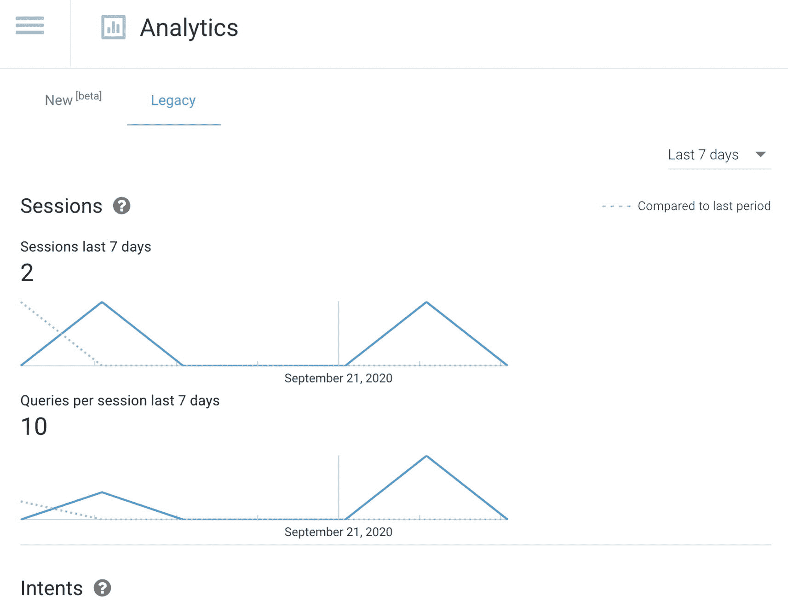
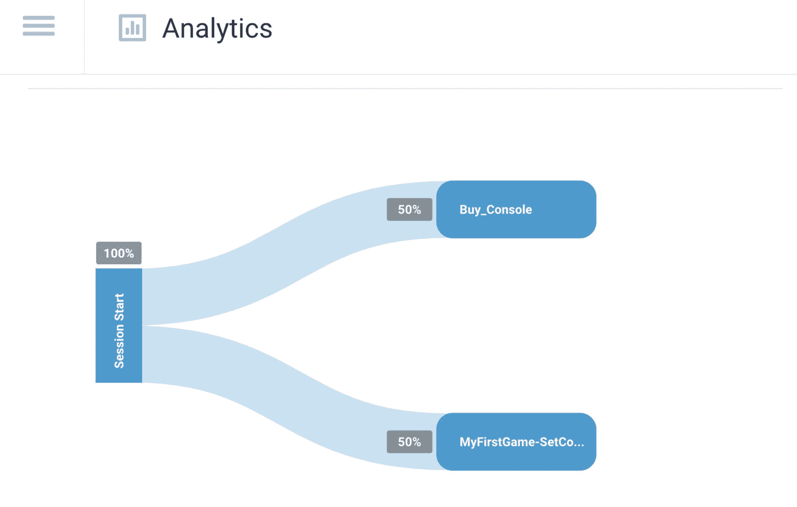
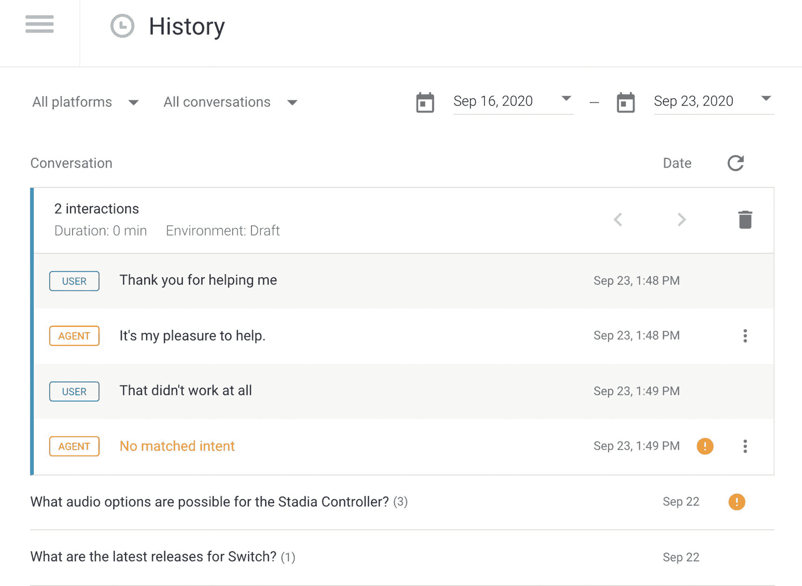
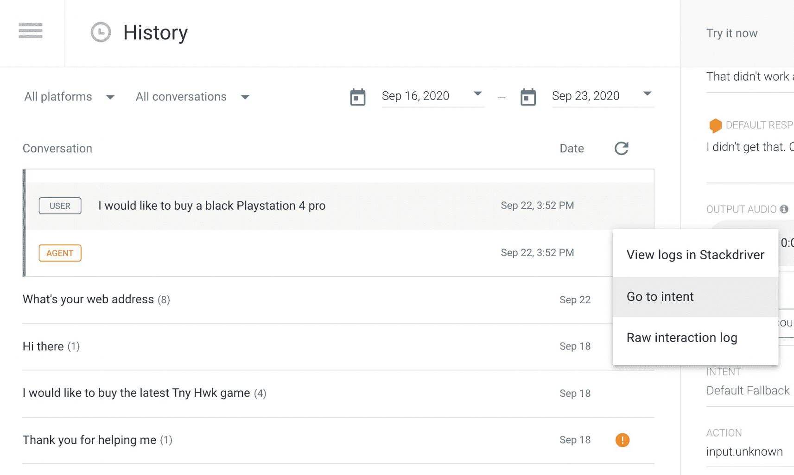

# Dialogflow 内置分析

Dialogflow 可以直接从“分析”选项卡提供指标。点击 **旧版** ➤ **探索**。此页面显示使用情况和 NLU 数据的洞察信息。**会话**（图 13-11）代表用户每次与您的智能客服互动。无论是完整对话还是不完整对话（用户停止响应），都会被记录并计入与会话相关的指标。

这将显示最近的总会话数。您可以按“昨天”、“过去 7 天”或“过去 30 天”进行筛选。

**图 13-11** Dialogflow 内置分析

**意图概览**将显示最常用意图的概览。它会显示意图名称、匹配到该意图的会话数、所有会话中该意图被使用的总次数，以及退出百分比，该百分比显示用户在特定意图中离开对话的会话比例（取自匹配到同一意图的总会话数）。

向下滚动，您将看到会话流程（图 13-12）。您可以点击每个意图来展开其后续意图。

您可以将光标悬停在意图名称（蓝色框）上，查看以下信息：

**图 13-12** Dialogflow 内置分析，会话流程

- 意图名称
- 匹配到该意图的用户百分比
- 匹配到该意图的请求数
- 处于该意图时的流失率

**历史记录**页面（图 13-13）显示了您的智能客服所参与对话的简化版本。您可以点击某个事件或用户表述，查看按时间顺序排列的对话记录。

**图 13-13** Dialogflow 历史记录文本

您可以点击智能客服回复的选项菜单（图 13-14）。这将允许您跳转到 **Cloud Logging** 以在 Google Cloud 控制台中进行高级日志记录，或直接浏览到该意图（这在需要修复问题时非常方便）。或者，您也可以查看原始 API 响应。

**图 13-14** Dialogflow 历史记录文本，跳转到意图

> **注意**  
> 历史记录页面仅显示默认回复。其他回复，如富媒体消息或 Actions on Google 的简单回复，则不可见。请看上面的截图。“你的网址是什么？”触发了自定义负载，因此日志中不可见。如果您也想捕获这些内容，则必须手动构建日志记录解决方案，例如使用 BigQuery。

