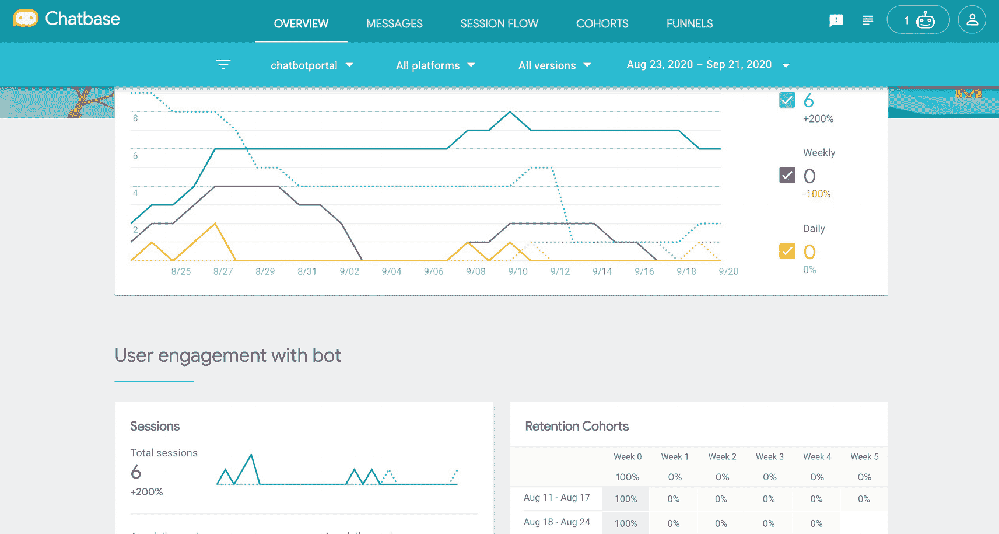
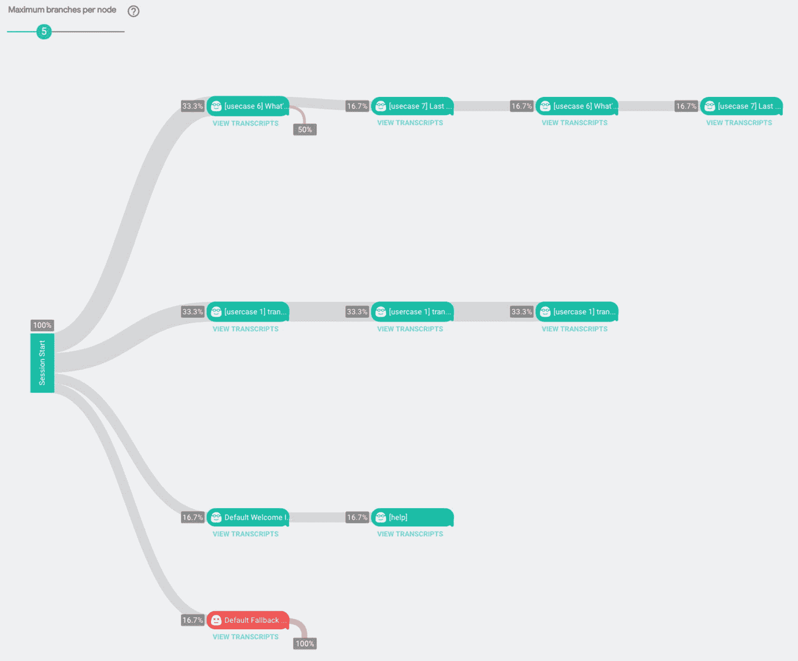
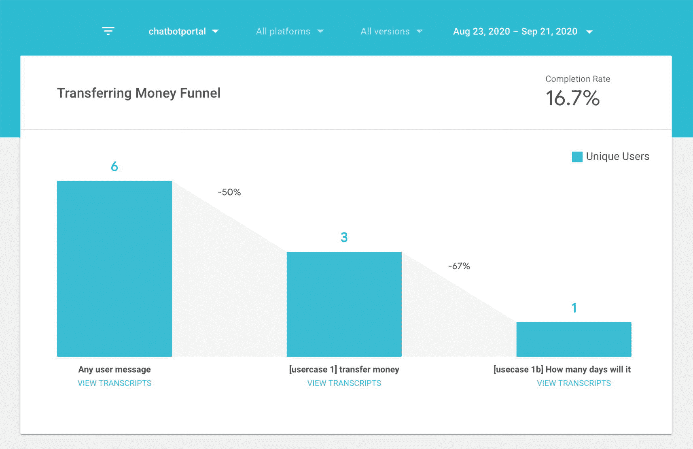
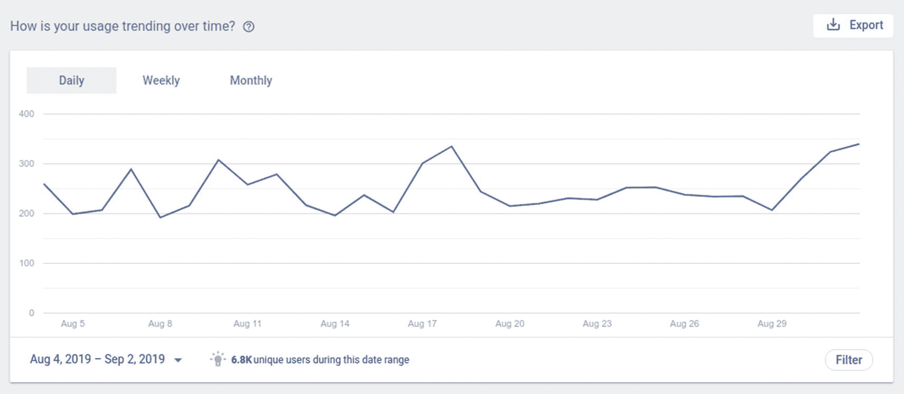
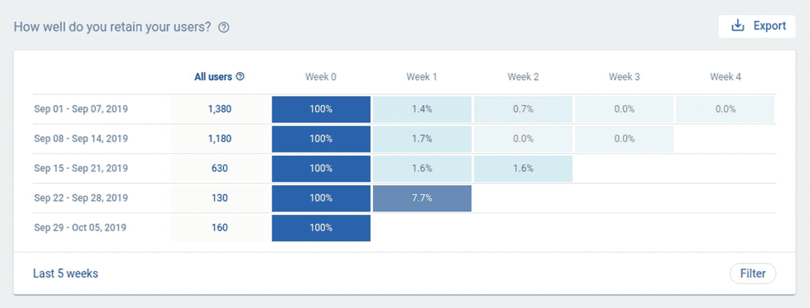
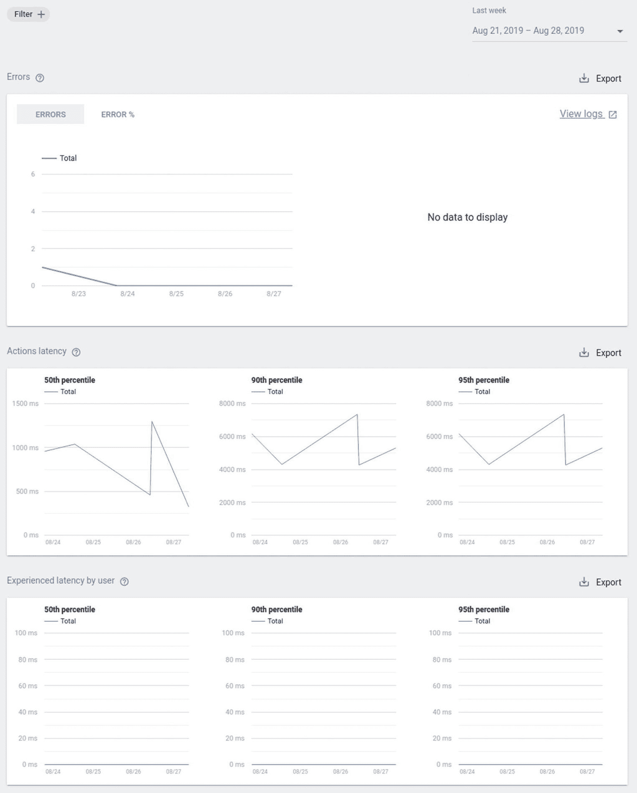
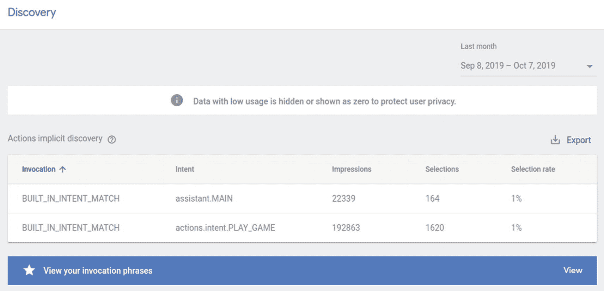

# 使用 Chatbase 监控指标

或者，您也可以使用 Google 工具 **Chatbase**（图 13-15）来监控会话和漏斗；它会提供更详细的概览，除了“昨天”、“过去 7 天”或“过去 30 天”的筛选条件外，还可以按“今天”或“本季度至今”进行筛选。

**图 13-15** Chatbase 中的分析

事实上，Dialogflow 底层使用了 Chatbase。**留存队列**模块将显示用户随时间变化的留存情况。

使用 **会话流程** 标签页查看会话流程（图 13-16）；与在 Dialogflow 中一样，您可以向下钻取以查看每个意图的详细信息：

**图 13-16** Chatbase 中的会话流程

- 意图名称
- 匹配到该意图的用户百分比
- 匹配到该意图的请求数
- 处于该意图时的流失率

Chatbase 有一个漏斗报告工具，它提供了一种通过创建最多包含六个后续意图的自定义工作流来跟踪客户成功的方法。点击 **漏斗** 标签页（图 13-17）。您可以创建一个新的漏斗来记录意图并将其分配到轮次步骤中。创建漏斗后，您将获得更好的漏斗可视化效果，包括流失率以及**完成率**。

**图 13-17** Chatbase 漏斗

## Google 操作分析

例如，当你为 Google 助理构建语音机器人时，你也可以监控一些指标。登录你的 Google 操作控制台。一个额外的好处是，你甚至可以将这些指标导出到 BigQuery，以便在更长时间内捕获这些数据。

点击**分析** ➤ **使用情况**。

**使用情况**页面（图 13-18）显示了三个图表，它们与你的操作随时间变化的使用数据相关。

**图 13-18** Google 操作使用情况

它还可以显示**用户留存**（图 13-19）。

**图 13-19** Google 操作用户留存

Google 操作可以向你展示的另一个额外好处（因为它也了解你的 Google 助理集成的洞察）是**健康信息**（图 13-20）。

**图 13-20** Google 操作健康信息

- **错误**：你的操作云端点在给定日期返回的错误数量。如果错误数量很大，你可能需要查看日志以确定是什么导致你的端点崩溃或出现意外行为。
- **操作延迟**：你的操作端点的延迟。如果延迟非常高或经常出现峰值，你的用户在与你的操作交互时可能会遇到延迟。
- **用户感知延迟**：用户每次请求你的操作时所感受到的延迟。此指标说明了用户在与你的操作交互时的体验。

点击**分析** ➤ **发现**。

发现页面显示了一个表格，列出了哪些短语导致 Google 推荐你的操作（图 13-21）。

**图 13-21** Google 操作分析发现

发现表格中的列如下：

- **调用**：导致 Google 推荐你的操作的用户查询。除了实际的用户查询外，此列表还包括以下值：
  - `BUILT_IN_INTENT`：此条目表示你的操作是通过内置意图调用的。
  - `AUTO_MATCHED_BY_GOOGLE`：此条目表示使用了隐式调用。
  - `ACTION_LINK`：此条目表示你的操作是通过操作链接调用的。
- **意图**：用户查询匹配到的意图。
- **展示次数**：此短语导致 Google 推荐你的操作的次数。
- **选择次数**：用户在 Google 推荐后调用你的操作的次数。此数字不能超过此短语的展示次数。
- **选择率**：导致选择的展示次数的百分比。低百分比表示许多用户选择为此特定查询使用其他操作，而高百分比则表示你的操作在此查询中很受欢迎。

## 捕获聊天机器人模型健康指标以测试底层 NLU 模型质量

对话指标和聊天漏斗指标侧重于从最终用户收集数据以监控和改善体验，而机器人模型指标则侧重于机器人构建过程，并可能使用测试验证数据（基于实时数据）来提高底层 NLU 模型的质量。

像 Dialogflow 这样的现代聊天机器人/虚拟助手构建工具利用了机器学习。对于每个虚拟代理，作为 UX 设计师（代理建模者）或开发人员，你可以定义许多意图。**意图**对用户的意图进行分类。你组合的意图可以处理完整的对话。这将训练一个底层的机器学习模型。

当最终用户在聊天机器人或虚拟助手中输入或说出某些内容时，我们称之为**用户表达**或**话语**。Dialogflow 根据内置的 NLU（自然语言理解）以及底层机器学习模型所训练的示例短语，将表达与机器人构建器中匹配度最高的意图进行匹配。匹配意图也称为**意图分类**或**意图匹配**。

一旦你构建了虚拟代理，最重要的问题就出现了：你的虚拟代理在底层使用的机器学习模型有多好？

你可以使用一系列指标来测试虚拟代理的质量。

通常，在使用测试数据时，UX 设计师或内容作者会创建一个验证数据集。他们通过将其作为用户短语输入来训练 Dialogflow 代理模型。为了创建无偏见的测试数据集，请使用来自聊天/联络中心/虚拟助手的日志，并将其与用于训练模型的意图训练短语分开。当用户数据包含敏感的 PII 数据时，你应该对其进行匿名化或脱敏处理。

如你所见，这些是测试底层机器学习模型的绝佳指标。一旦你将所有这些变量存储在数据仓库中，就可以轻松创建仪表板来预览这些洞察。开发人员可以创建单元测试，将验证数据作为用户话语传入，并针对机器人构建器 API（在 Dialogflow 中，这将是 `detectIntent()` 方法）进行测试。检测到的意图和置信度分数可以与你的验证数据集进行评估。

### 真正例——正确匹配的意图

真正例是指聊天机器人正确检测到正确（正）意图的结果。例如，当你的虚拟代理有一个名为“薪资意图”的意图，并且它使用训练短语进行训练：

“我的工资到账了吗？”

而用户的话语是

“我收到工资了吗？”

Dialogflow 应检测到以下意图：“薪资意图”。

我可以编写一个单元测试，类似于你在软件工程中编写单元测试的方式。我可以针对之前的场景创建测试数据，用户话语为：“我的工资，什么时候能收到？”我期望它是薪资意图。你可以使用 Dialogflow API，Dialogflow 也会检测到薪资意图。所以这是一个真正例。匹配是正确的。

你可以将其存储在 BigQuery 中，这样每次通过 Dialogflow API 对你的代理进行更改时，都可以重新运行该场景。你需要收集的数据字段包括“用户话语”、“预期意图名称”、“检测到的意图名称”和“结果”，即 TP。

