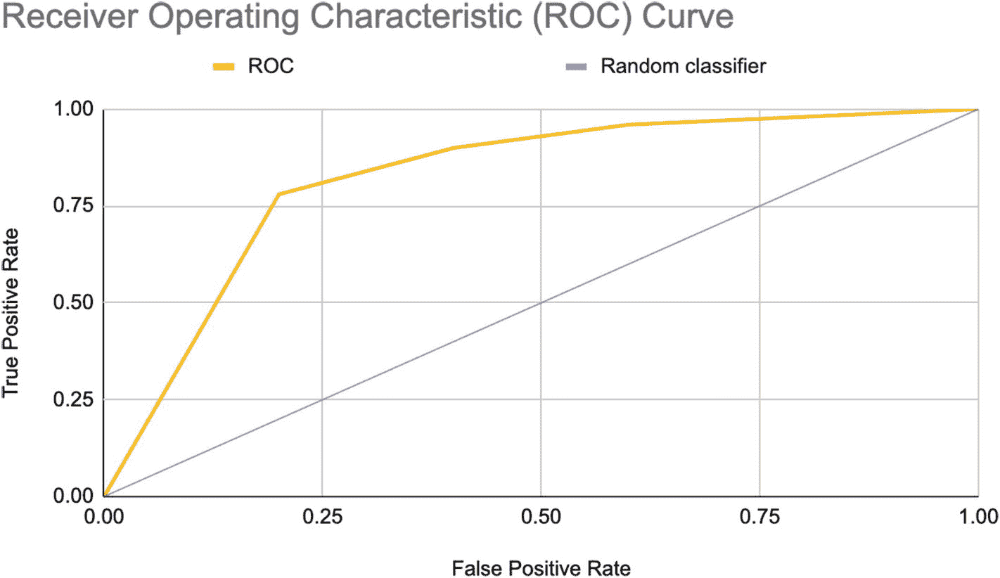

# ROC 曲线

**ROC（接收者操作特征）曲线**是一种图形化表示，它告诉我们模型在根据检测概率区分给定意图方面的表现如何。利用这些信息，你可以决定如何设置 Dialogflow 智能助手的置信度阈值，以定义意图匹配所需的分类分数。

你需要计算**真阳性率**和**假阳性率**，以便在图表中绘制。你需要基于各种 Dialogflow ML 设置阈值来完成此操作。

例如，我们在 Dialogflow 中将置信度阈值设置为 0.80，这将用户话语映射为两种选项：匹配意图或无意图匹配。我们假设任何大于或等于 0.80 的概率都视为意图匹配，否则视为回退。

**ROC 曲线**绘制了两个参数：

- 真阳性率（召回率/敏感性比率）
- 假阳性率（误报率/误警比率）

图 13-22 中的蓝色对角线反映了曲线下面积为 0.5 的随机猜测。这意味着虚拟助手正确识别了一半的预期意图。通常，目标是最大化敏感性和最小化误报。换句话说，ROC 曲线（黄色线）越陡峭，效果越好。

图 13-22 ROC 曲线

