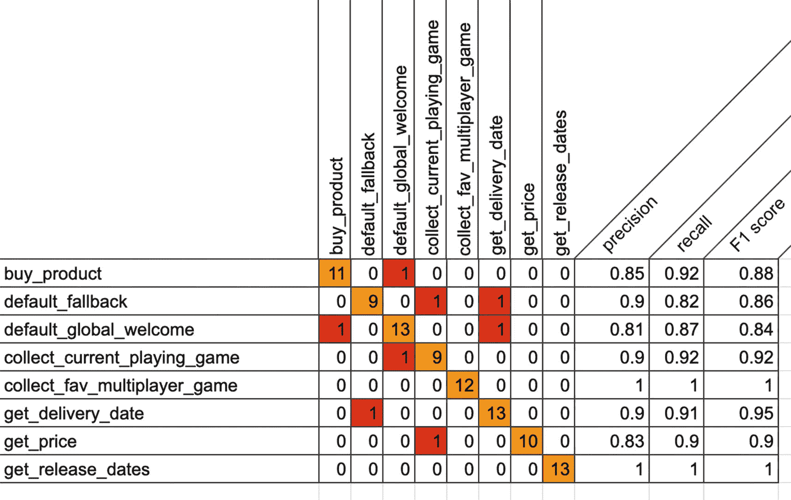

# F1 分数

**F1 分数**是精确率和 TPR 的加权平均分数。

因此，该分数同时考虑了假正例和假负例。直观上，它不如准确率容易理解，但 F1 通常比准确率更有用，尤其是在类别分布不均匀的情况下。当假正例和假负例的成本相似时，准确率效果最佳。如果假正例和假负例的成本差异很大，则最好关注精确率和 TPR。

- `F1 分数 = 2*(TPR * 精确率) / (TPR + 精确率)`

你可以将类似上述的测试用例存储在 `BigQuery` 中，这样每次对智能体进行更改时，都可以重新运行该场景。你需要从数据仓库中请求总召回率和精确率。同时，你还需要存储 `f1 score`，以便日后在报告中检索这些数据。

## 混淆矩阵

在机器学习领域，`混淆矩阵`（也称为误差矩阵）是一种特定的表格布局，用于可视化算法的性能（在我们的案例中，即虚拟智能体底层机器学习模型的性能）。矩阵的每一行代表预期的意图，而每一列代表 `Dialogflow API` 实际匹配到的意图。其名称源于它能直观地显示智能体是否混淆了两个类别（即经常将一个类别错误地标记为另一个类别）。当你拥有大量测试用例时，可以将所有分数呈现在一个大型矩阵中。

如图 13-23 所示，每个意图都包含所有 TP 的总和。这应该会形成一条从顶部到底部的对角线（橙色）。红色方块是所有 FP 的总和；例如，在下方的矩阵中，你可以看到一个测试用例（用户话语）预期应匹配到 `get_price` 意图，但实际上却匹配到了 `collect_current_playing_game` 意图。

**图 13-23** 混淆矩阵示例

## 总结

本章包含关于收集和监控智能体洞察与分析的信息。内容分为以下几类：

- **对话相关指标**  

  用户说了什么、何时说的、在哪里说的？你可以捕获对话相关指标，并将其存储在像 `BigQuery` 这样的数据仓库中。

- **客户评分指标**  

  用户对你的品牌有何看法？如何通过 `Dialogflow` 收集评分？

- **聊天会话与漏斗指标**  

  用户与你的智能体交互所走的路径。如何通过 `Dialogflow` 和 `Chatbase` 监控聊天会话与漏斗指标？

- **机器人模型健康指标**  

  如何捕获聊天机器人模型健康指标，以测试底层机器学习模型的质量，从而调整 `Dialogflow` 机器学习阈值。

如果你想构建这个示例，本书的源代码可通过图书产品页面在 GitHub 上获取，网址为 [www.apress.com/978-1-4842-7013-4](http://www.apress.com/978-1-4842-7013-4)。请查看 `advanced-agent-insights` 文件夹。

## 延伸阅读

- Dialogflow 关于历史记录的文档  

  [https://cloud.google.com/dialogflow/es/docs/history](https://cloud.google.com/dialogflow/es/docs/history)

- Dialogflow 关于分析的文档  

  [https://cloud.google.com/dialogflow/es/docs/analytics](https://cloud.google.com/dialogflow/es/docs/analytics)

- Dialogflow 关于训练智能体的文档  

  [https://cloud.google.com/dialogflow/es/docs/training](https://cloud.google.com/dialogflow/es/docs/training)

- Google Cloud 关于 BigQuery 的文档  

  [https://cloud.google.com/bigquery/docs](https://cloud.google.com/bigquery/docs)

- Google Cloud 关于 Pub/Sub 的文档  

  [https://cloud.google.com/pubsub/docs/](https://cloud.google.com/pubsub/docs/)

- Google Cloud 关于 Cloud Functions 的文档  

  [https://cloud.google.com/functions/docs/](https://cloud.google.com/functions/docs/)

- 支持内置情感分析的语言  

  [https://cloud.google.com/dialogflow/es/docs/reference/language](https://cloud.google.com/dialogflow/es/docs/reference/language)

- 一个集成到网站中的聊天机器人的实际应用示例  

  [https://github.com/savelee/kube-django-ng](https://github.com/savelee/kube-django-ng)

- Dialogflow 关于情感分析的文档  

  [https://cloud.google.com/dialogflow/es/docs/how/sentiment](https://cloud.google.com/dialogflow/es/docs/how/sentiment)

- AutoML Natural Language  

  [https://cloud.google.com/automl?hl=en](https://cloud.google.com/automl%253Fhl%253Den)

- Google Cloud 关于 AutoML 情感分析的文档  

  [https://cloud.google.com/natural-language/automl/docs/features](https://cloud.google.com/natural-language/automl/docs/features)

- 关于如何构建人工转接的代码示例  

  [https://github.com/dialogflow/agent-human-handoff-nodejs](https://github.com/dialogflow/agent-human-handoff-nodejs)

- `queryResult.languageCode`

  [https://cloud.google.com/dialogflow/es/docs/reference/rpc/google.cloud.dialogflow.v2beta1#google.cloud.dialogflow.v2beta1.QueryResult](https://cloud.google.com/dialogflow/es/docs/reference/rpc/google.cloud.dialogflow.v2beta1%2523google.cloud.dialogflow.v2beta1.QueryResult)

- `queryResult.intent.displayName`

  [https://cloud.google.com/dialogflow/es/docs/reference/rpc/google.cloud.dialogflow.v2beta1#google.cloud.dialogflow.v2beta1.Intent](https://cloud.google.com/dialogflow/es/docs/reference/rpc/google.cloud.dialogflow.v2beta1%2523google.cloud.dialogflow.v2beta1.Intent)

- `queryResult.intent.isFallback`

  [https://cloud.google.com/dialogflow/es/docs/reference/rpc/google.cloud.dialogflow.v2beta1#google.cloud.dialogflow.v2beta1.Intent](https://cloud.google.com/dialogflow/es/docs/reference/rpc/google.cloud.dialogflow.v2beta1%2523google.cloud.dialogflow.v2beta1.Intent)

- `queryResult.intent.endInteraction`

  [https://cloud.google.com/dialogflow/es/docs/reference/rpc/google.cloud.dialogflow.v2beta1#google.cloud.dialogflow.v2beta1.Intent](https://cloud.google.com/dialogflow/es/docs/reference/rpc/google.cloud.dialogflow.v2beta1%2523google.cloud.dialogflow.v2beta1.Intent)

- `queryResult.intentDetectionConfidence`

  [https://cloud.google.com/dialogflow/es/docs/reference/rpc/google.cloud.dialogflow.v2beta1#google.cloud.dialogflow.v2beta1.QueryResult](https://cloud.google.com/dialogflow/es/docs/reference/rpc/google.cloud.dialogflow.v2beta1%2523google.cloud.dialogflow.v2beta1.QueryResult)

- 用于构建交互式仪表盘的 Google Data Studio  

  [https://datastudio.google.com/c/u/0/navigation/reporting](https://datastudio.google.com/c/u/0/navigation/reporting)

- Google Analytics  

  [https://analytics.google.com](https://analytics.google.com)

- Google Search Console  

  [https://search.google.com](https://search.google.com)

## 索引

### A

- AdLingo
- Agent Validation
  - 结果
  - SDK
- 人工智能 (AI)
- 人工语言互联网计算机实体 (ALICE)
- 自动语音识别 (ASR)
- AutoML Natural Language

### B

- BigQuery

### C

- 聊天机器人集成
  - 后端集成
  - 自定义载荷
  - 实现
  - 自定义载荷
  - 履行消息
- 聊天机器人运行状况指标
  - 准确率
  - 混淆矩阵
  - Dialogflow
  - 假阴性
  - 假阳性
  - FPS
  - 精确率
  - ROC 曲线
  - TPR
  - 真阴性
  - 真阳性
- 聊天机器人
  - AI
  - 部署
  - 驱动因素
  - 历史
- 聊天会话与漏斗指标
  - 操作
  - 发现页面
  - Google 使用情况
  - 健康信息
  - 用户留存
  - 需监控的特定渠道指标
- Chatbase
  - 分析
  - 漏斗
  - 留存队列模块
  - 会话流程
- Dialogflow
  - 内置分析
  - 历史页面
  - 意图
  - 意图概览
  - 会话流程
  - 需监控的指标
- 客户端 Web 应用
  - 前端
  - 客户语音 AI
  - 麦克风录音/流式传输
  - `navigator.getUserMedia()` 方法
  - iOS 设备
  - 录制音频流
  - RecordRTC
  - 录制单次话语
  - Socket.IO
- Cloud Console
- Cloud Logging
- 复合实体
- 混淆矩阵
- 联络中心 AI (CCAI)
  - 架构
  - 洞察
- 上下文
  - 生命周期
  - SDK
- 对话式 AI 技术
  - Actions Builder
  - Actions on Google
  - AdLingo
  - Chatbase
  - Duplex
  - Google Assistant
  - LaMDA
  - Meena
- 对话相关指标
  - BigQuery
  - 数据仓库
  - 主题挖掘
- 自定义实体
- 客户努力度评分 (CES)
- 客户管理的加密密钥 (CMEKs)
- 客户评分指标
  - 客户努力度评分 (CES)
  - 客户满意度评分 (CSAT)
  - 净推荐值 (NPS)
- 客户满意度评分 (CSAT)
- 自定义集成
  - 架构
  - 后端实现
  - UI 实现
  - 欢迎消息

### D

- 数据治理
