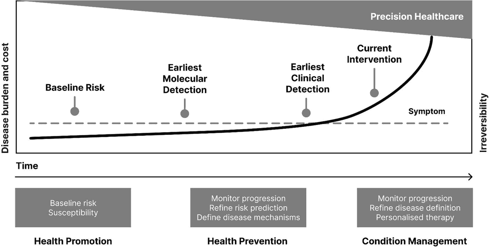
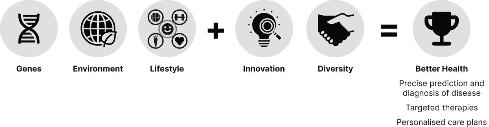
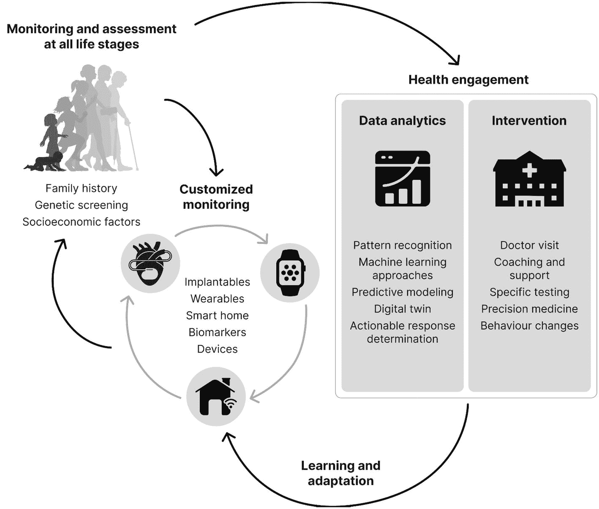
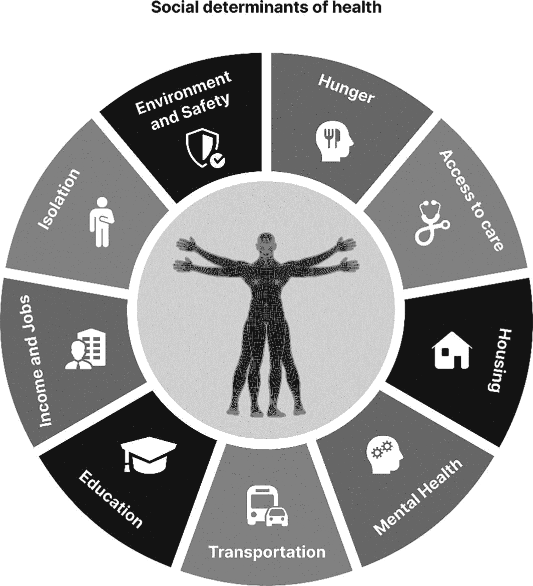

# 排版后的文本

持续血糖监测以优化胰岛素剂量和行为。通过利用血糖监测传感器的实时数据，持续血糖监测系统提供了一系列益处，包括指导胰岛素给药、鼓励积极的健康行为、预防并发症，以及实现与临床团队共享实时健康数据。重要的是，与通常每六个月进行一次的传统`HbA1c`检测相比，精细的血糖数据更能反映用户的健康状况和行为。

提供行为改变和慢性病管理支持的智能手机应用程序。健康应用程序监测健康和行为，鼓励患者坚持治疗和健康行为，提供指导，并提醒患者按时就诊和接受筛查。

精准健康与主要源自中国和印度文化的东方医学相融合，如同个性化医学和系统医学一样，东方医学将人体生物系统视为一个有机整体。^(⁵) 东方医学将人体视为一个器官和谐共存的整体实体，并从这个框架出发来探讨健康。图 1-1 展示了如何使用精准健康工具在疾病的各个阶段（或反之，在健康状态下）提供护理。

一幅插图展示了疾病从各个阶段的进展。精准健康时间线从基线风险易感性开始，然后监测进展并定义疾病机制，最后以个性化治疗结束。

**图 1-1** 精准健康时间线上的疾病进展

现在想象一个在伦理和道德上乌托邦式的社会：一旦有人出生，就会进行常规的基因组筛查检测。你在出生时就接受了基因组筛查，结果显示存在某些生物标志物，使你患心脏病的风险更高。由于你存在患心脏病的家族和遗传风险，你会收到一个智能贴片，用于测量心率、血压和`SpO2`。随着年龄增长，作为常规自愿参与治疗计划的一部分，你每周都会接受心电图检查，并更换智能贴片。你所有的数据都会被发送到一个基于云的生态系统，你的临床团队和近亲都可以看到。第二天，你收到临床医生的短信，他实时得知你的健康状况正在恶化，并邀请你预约就诊。你担心会收到什么消息。

就诊时，你被告知汗液中存在特定的电解质，这使你面临心力衰竭的风险。你手机上的活动数据会与你的食物日记应用程序一起被评估，以便根据你的健康和近期行为进行风险评估。你的临床医生给你开了每周服用一次的药，如果心力衰竭症状持续存在，这种药会排泄出一种可在尿液中检测到的化合物，同时你被鼓励改善生活方式。

为了支持活动和营养方面的改善，你被纳入一个量身定制的行为改变计划，该计划通过一个健康应用程序来促进和监测你的行为。你的智能家居会监测你的体温和睡眠时间，你与一个语音激活助手交流，它确认你的感受并实时分析你的声音以检测任何潜在异常。你每月使用家用检测套件检测一次尿液，该套件几乎能立即给出结果，并直接通过专用`5G`网络将结果数据（包括任何紧急升级需求）分享给你的临床团队。

上述场景中提到的任何部分都并非遥不可及。然而，我们距离实现精准健康的承诺仍然相当遥远，这需要以前所未有的规模进行跨学科合作。回报是什么？是精准健康带来的益处。目前实践的医学是经验性的，证据基础不足，且依赖于个体医疗提供者的知识和经验，这导致了护理质量参差不齐，效果欠佳。

精准健康能够实现以患者为中心、个性化的护理，大规模地根据患者特征进行定制，从而提供患者层面和人群层面的健康益处。其目标是采用统一的方法，将全方位的促进、预防、诊断和治疗干预措施与健康的基本且可操作的决定因素相匹配——不仅要解决症状，还要直接针对健康的遗传、生物、环境、社会和行为决定因素。图 1-2 从高层次概述了精准健康如何实现更好的健康。

一幅插图解释了精准健康实现更好健康的方法。基因、环境、生活方式加上创新和多样性，等于更好的健康。

**图 1-2** 通过精准健康方法实现更好的健康

精准健康的核心目标是精确地预防、预测、治疗和治愈疾病。

话虽如此，精准健康也带来了前所未有的挑战，必须加以解决，以确保精准健康和人工智能能够安全、有益地影响医疗保健。

### 为什么是精准健康？为什么是现在？

世界人口寿命更长，但健康状况更差，全球经济也陷入危机。

随着肥胖症、心血管疾病、2 型糖尿病和癌症等非传染性疾病本身已成为大流行病，医疗保健系统捉襟见肘，并转向基于价值和激励的护理。鉴于现代环境、行为和职业的性质，这些非传染性疾病的根源主要在于生活方式和环境因素，而这些因素很难改变。而这还是在 COVID-19 疫情之前的情况。

#### 从数量到价值的范式转变

当前的医疗交付模式是基于数量的。根据医疗服务提供者所提供的服务或程序数量来支付报酬，被称为*数量导向型医疗*或*按项目付费*。虽然这是一种直观的报销结构方式，但它几乎无法确保医疗系统的必要性或影响力。

价值导向型医疗以患者为中心。医疗质量通过患者体验和结果来评估，这持续地塑造着医疗服务的给予和接受方式。通过技术与医学的融合，价值导向型医疗推动了大量持续改善生活的创新。价值导向型医疗为医疗保健提供了一个令人耳目一新的视角。

设想一个医院场景：医院的报酬不是基于接诊的患者数量，而是基于健康状况良好的患者数量和可用的空床数量。医疗服务提供者的重点从患者入院时间，转向预测未来风险并利用预防策略提前应对。

价值导向型医疗系统正在改变医疗服务的交付方式：

- 从治疗患者疾病转向管理健康与福祉
- 从一刀切方案转向精准健康解决方案
- 从被动反应的医疗系统转向整体、预测性的医疗系统
- 从关注寿命长度转向关注一生的生活质量

鉴于医疗系统面临的财务压力，价值导向型医疗是一种亟需的方法。对结果的关注要求建立质量管理流程，包括数据生成、测量、收集和评估，这反过来又促进了护理和效率的提升。

随着价值导向型医疗系统的发展，它们产生的数据也在增长。价值导向型医疗通过医患协作关系得以实现，在这种关系中，数据在获得同意后被共享或关联，以便跨学科协调和审查护理。这种方法不仅能推动更好的医疗保健，还能减少重复护理及其相关成本。图 1-3 展示了一个互联的健康生态系统如何提供精准医疗。

一个图示流程图解释了患者云如何提供精准医疗。它从处于各个阶段的患者开始，然后进入健康参与环节，例如数据分析和干预。接着，它指向学习和适应过程，然后共享健康和医疗记录。

**图 1-3** 患者云如何支持精准健康

在价值导向型医疗系统中，一个患非酒精性脂肪肝风险较高的患者会尽早被告知其风险，并获得支持以鼓励积极的健康行为和进行自我健康管理。帮助可能以营养师支持的烹饪课程形式出现，以促进和鼓励更健康的行为。定期的诊断检测和监测将确定相关的生物标志物及其向推荐目标的进展。

健康数据、可穿戴设备数据和电子病历数据在各部门和组织之间共享，以制定个性化的营养和活动计划。通过提供教育、同伴支持、指导以及食谱和按需运动课程等资源的数字化项目，患者被支持实现行为改变。通过采用类似健康伴侣的方法，重点变成了预防性护理，而不是提供被动、按需就诊的护理。

随着医疗资源面临越来越大的压力，以及生活方式、行为和环境因素占疾病风险的 90%，价值导向型医疗强调了生活方式作为药物的作用，使健康和预防成为关键支柱。^(⁶)

#### 健康的社会决定因素

精准健康要求理解健康的社会决定因素，即个人出生、成长、生活和衰老的环境。社会经济地位、教育、邻里和物理环境、就业、社会支持以及医疗服务的可及性都是健康社会决定因素的例子。图 1-4 展示了健康的社会决定因素。

一个图表解释了健康的社会决定因素。一个人体插图位于中心，周围环绕着从顺时针方向排列的方块，如饥饿、医疗可及性、住房、心理健康、交通、教育、收入和就业、孤立、环境与安全。

**图 1-4** 健康的社会决定因素

研究表明，健康的社会决定因素对个人健康的影响比医疗干预更大。与医疗服务相比，健康的社会决定因素对健康结果负有双倍的责任。^(⁷)

大量研究表明，在患者层面的护理中，性别、种族和邻里环境仍然对获得医疗服务和实现积极的健康结果有着最显著的影响。随着对数字工具的更大依赖，存在一种风险，即加剧了那些拥有数字工具技能和获取途径的人与没有这些的人之间的健康不平等。精准健康与健康的社会决定因素在改善人口健康的目标上相互交织，但它们被认为是不同的概念。

由于数字素养和互联网连接涉及所有健康的社会决定因素，它们已被标记为“超级健康社会决定因素”。^(⁸) 毫无疑问，你会熟悉，用于驾驶、就业、住房或其他国家或政府支持的应用程序，每一项都可能影响个人的健康状况，这些应用越来越多地可以在线获取，并且常常是唯一的途径。在新冠疫情期间，许多服务只能在线获取。赋予一个人使用互联网能力的资源和时间成本，远低于治疗健康问题所产生的成本。因此，提高数字素养技能并赋予公民互联网连接能力，可以提供减少差距的宝贵工具。

在农村和社会经济贫困社区以及老年人中，互联网的使用存在显著差距。根据研究，超过 60% 的 65 岁以上老人和 30% 的收入低于 3 万美元的人拥有智能手机，许多低收入家庭共用设备，这给数据纯粹主义者带来了可及性和隐私方面的担忧。^(⁹) 了解所服务社区中医疗保健可及性的复杂性，可以帮助医疗系统实施更具包容性的政策，以确保没有患者被落下。

虽然尚不清楚哪些健康的社会决定因素与临床和社区健康干预措施最相关、关联最强，但人工智能被视为两者之间的沟通桥梁。患者的社会决定因素可以与患者的特定健康信息合并，并利用人工智能生成和绘制治疗方案，个体健康的总和更接近国家的整体人口健康。

解决健康的社会决定因素是实现公平健康可及性和结果的首要重点。当所有人，无论其社会地位或环境如何，都有机会实现其全部健康潜力时，健康公平就得以实现。

### 为何多样性对精准健康至关重要

我踏入精准健康领域的旅程始于 2002 年，当时我在伦敦帝国理工学院攻读人工智能本硕连读学位。

第一学期末，我的祖父阿努帕姆因心脏病发作突然住院，并需要紧急进行四重心脏搭桥手术。出院后，他被诊断出患有 2 型糖尿病，并被嘱咐要遵循健康均衡的饮食。由于不知道如何以适合他孟加拉-印度生活方式的方式来管理病情，祖父向我询问该吃什么。我当然也不知道，他同样不清楚，于是我们上网搜索。显而易见的问题是，缺乏适用于像我祖父这样的人，特别是来自少数族裔社区人群的相关内容。他不需要被告知三明治和早餐麦片的替代品，而是需要知道该用什么来替代他的 roti（印度薄饼）、naan（馕饼）和米饭。正是在这时，我创立了一个面向长期健康问题患者的全球社区。那一刻，一次关于祖父该吃什么来控制新诊断疾病的偶然对话，演变成了一种通过数据驱动、循证的数字健康创新来赋能人们的热情。我的角色让我对长期健康问题患者群体、他们的家人和护理人员，以及其中包含的多元文化和种族有了无与伦比的洞察。截至 2022 年，少数族裔社区在医疗保健领域中的代表性严重不足。如今，作为 DDM Health 的创始 CEO，我有幸领导一个团队，提供基于证据的精准数字疗法，以 19 种母语为七个国家的超过 180 万人提供护理，旨在赋能*每一个人*。

基于我自身和家人的经历，我深受启发，致力于确保代表性不足的社区能够在数字健康领域中被代表、参与其中并从中受益。利用数字技术提供了一个机会，通过根据个人的期望（无论是文化、语言、社会规范还是其他方面）来个性化他们的体验，从而吸引人们参与。通过与临床医生和患者共同参与和合作开发创新，我们开发出了可扩展、有吸引力且有效的解决方案，这些方案为所有背景的人们（而不仅仅是少数族裔社区）进行了个性化定制。

为什么这很重要？因为实现全民精准健康的目标需要持续评估使我们与众不同的因素。多样性在任何地方都值得庆祝，尤其是在医疗保健领域，因为它是通往一个更具包容性、更公正、更有效的医疗体系的途径。通过人类多样性的背景来理解疾病至关重要，这不仅关乎遗传背景，也关乎不同人群如何应对疾病及其环境。人们的生活经验同样是数据和专业知识，而多样性使我们能够接触和理解其他文化和世界观。这不仅克服了许多偏见——人类偏见、智力偏见、机器偏见和数据偏见——还能激发灵感、推动创新和改善结果，从而实现精准健康的目标。如果数字健康服务不能公平地提供，偏见就会内化，坦率地说，这对每个人来说都是一个问题。同样，很明显，医疗保健服务需要一个伦理和道德框架，我们有责任参与其中——去提供、保护和维护它。

## 总结

精准健康在改善医疗保健的各个方面都拥有巨大的潜力。其中一些益处已经以临床决策工具、数字疗法和组学技术的形式得以实现，但一个互联互通的生态系统仍需数十年才能建成。从儿科到姑息治疗，精准、个性化的医疗保健只有在技术、数据集和通信手段无处不在时才能实现。在此之前，精准健康仍将各自为政，并只会赋能特定社区。因此，精准健康需要所有利益相关者积极承担责任并发挥领导作用，以确保其益处能被所有人共享。

脚注 1 2 3 4 5 6 7 8 9

