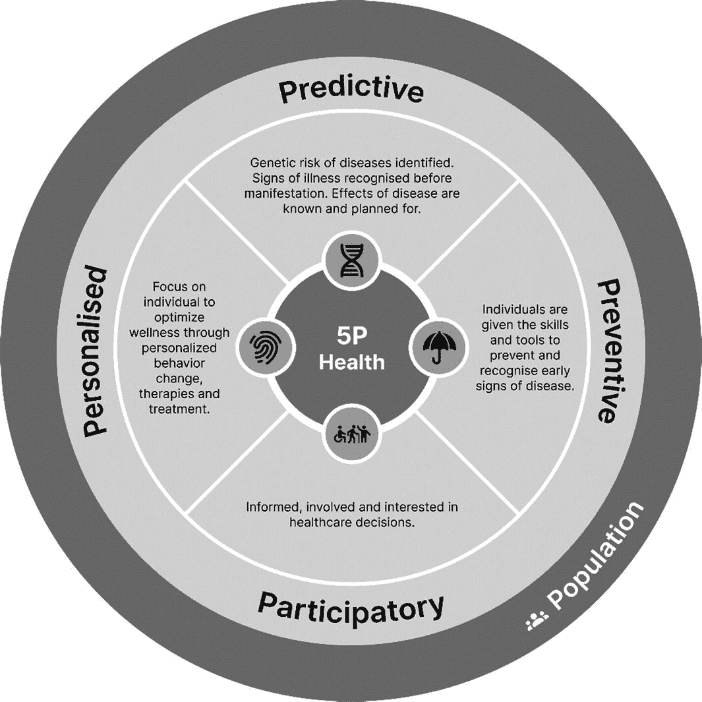
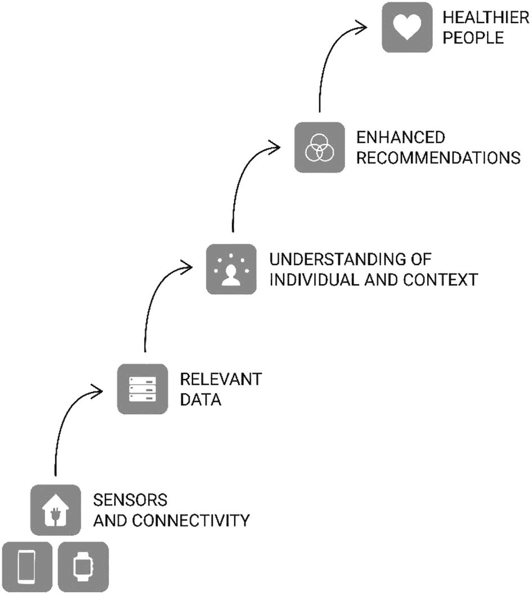

# 2. 什么是精准健康？

精准健康是一种整体性的医疗保健方法，它整合了众多生物学数据点，包括纵向的分子、细胞和表型生物标志物以及个体基因组序列。排除遗传因素的作用，研究表明有四大广泛因素影响我们的健康。^(¹⁰)

* 社会和经济环境：40%
* 健康行为：30%
* 临床护理：20%
* 物理环境：10%

虽然这些权重在个体之间可能有所不同，但精准健康的概念旨在通过人类健康的新时代来优化健康的各个方面，这使我们能够做到以下几点：

* **预测** 在疾病可以有效控制和逆转时的风险。
* **预防** 通过在所有层面实施有效的、基于证据的干预措施，来预防疾病发展及其相关风险因素。
* 在患者的**参与**下提供护理。
* 通过更具体的疾病表型定义来提供**个性化**治疗，从而鼓励选择最佳疗法和新的生化干预靶点。
* 为**人群**健康提供精准方法。将医学通常被动的重点转向主动的、预防性的生态系统，在疾病发生前关注健康，这增强了无疾病个体和长期疾病患者的健康理念。

平均而言，患者每年与医疗保健系统互动的时间约为 10 小时。^(¹¹) 努力使医疗保健更具预测性、预防性、个性化、参与性，并惠及个体和人群（即 P5 医疗保健，如图 2-1 所示），将显著改善整个健康连续谱上的健康与福祉，这是人类健康的一个新时代。

一个图表，中心是“5P 健康”模块，周围按顺时针方向环绕着“预测性”、“预防性”、“参与性”和“个性化”，这些共同惠及人群和个体。

**图 2-1** 精准健康的五个 P

精准健康时代始于 2003 年科学家们对人类基因组 92% 的测序完成。^(¹²) 数字健康作为一个概念于 2007 年随着首批健康和保健应用程序的推出而诞生。^(¹³) 与此同时，随着亚马逊网络服务（`AWS`）和弹性计算云（`EC2`）技术的推出，网格或云计算的概念取得了巨大进步，这首次将软件开发与服务器托管和管理分离开来。

精准健康的支柱，即五个 P，是由系统生物学研究所创始人勒罗伊·胡德提出的一个概念，指的是一种新兴的医学模式，该模式“侧重于最大化每个个体的健康，而不仅仅是治疗疾病。”

## 精准健康的五个 P

精准健康有五个核心支柱。

* 预测与预防
* 治疗个性化
* 参与性
* 人群

让我们逐一详细探讨。

### 预测与预防

未来，需要医疗干预可能越来越被视为预防的失败，这是可行的。精准预防通过多种机制（基因检测、消费技术及数据分析）能够改善整体健康状况并优化医疗资源的使用。

相较于仅依赖家族病史，“组学”技术可提供关于个体基因构成、生化过程及特定疾病风险的详细数据。^(¹⁴)

基因筛查检测可用于评估遗传性乳腺癌和卵巢癌综合征、林奇综合征、遗传性结直肠癌和子宫癌、家族性高胆固醇血症（遗传性高胆固醇）等疾病的风险。了解潜在健康风险使临床医生和患者能够遵循个性化治疗方案，支持行为改变及临床指南，以应对已识别的风险。

以下是组学技术：

- *基因组学*：基因，遗传易感性信息
- *转录组学*：RNA，基因活性/表达信息
- *蛋白质组学*：蛋白质，控制细胞生物学的关键分子信息
- *代谢组学*：细胞代谢物，酶活性及细胞生化过程信息

精准预防的潜力巨大，仅受限于可用的数据和计算能力。

随着“多组学”数据融入临床实践，以及通过连接更广泛的人、流程、数据和事物网络实现万物互联，我们对生物系统和健康状态的理解将更加全面。监测健康状态将使预防从“一种疾病、一种检测”的方法，转向新治疗领域的风险预测。整合由智能互联设备和通信驱动的基因组学、表型组学及行为数据，将提供丰富的数据挖掘集，并开启疾病预测与预防的新时代。

一个重大挑战是在生物网络复杂性的背景下整合数据，并构建既具预测性又可操作（换言之，对患者和临床医生均有益）的健康模型。

数据整合的复杂性在肥胖预测因素的呈现中最为明显，这些因素是多方面的：

- 遗传因素，如基因及基因表达
- 个体生活方式因素，如饮食摄入、运动习惯、看电视模式及收入
- 环境因素，如距杂货店的距离、步行环境及食品广告
- 学校相关因素，如含糖饮料的可及性、距快餐店的距离及学校健康教育
- 行业因素，如餐厅和包装食品的份量标准；国家政策及食品营销监管
- 国家食品分配计划及对各类农产品的支持
- 生命历程因素，如母乳喂养史、孕产妇健康及父母肥胖情况^(¹⁵)

出生时的基因检测将使人类能够通过生活方式优化自身健康，基于可用数据预防疾病并发现对特定疾病的易感性。需要数据分析来推动有意义的成果，并提供最佳参与和行为改变机会。换言之，精准健康实现了从出生到死亡的数据驱动医学。

数字表型，即利用智能设备通过人类与物理硬件和软件的交互，从可用传感器收集数据以推断个体行为，只有在大数据集变为海量数据集时才会变得更加具体。简单的社交媒体行为已与不良心理健康相关联，因此利用数字表型以数字指征的形式从可用数据中理解健康与福祉，有望开启一个潜力宝库。^(¹⁶)

### 治疗的个性化

个性化医疗与健康计划能够实现定制化治疗，减轻疾病负担，改善生活质量，提高生存率，并降低护理成本。许多健康措施已根据年龄和性别等特征实现个性化。然而，借助基因、环境、生物医学及生活方式数据，医疗保健将能更深入地理解基因组、干预措施及治疗方法。

例如，大多数药物通过临床试验开发，并针对按疾病组分类的患者，假设这些组别对治疗会有相似反应。^(¹⁷) 从传统的疾病分类转向利用生物标志物辅助区分不同病症的类型和亚型，将通过临床研究实现更好的个性化治疗。

根据患者偏好（如首选语言、信仰及可及性需求）个性化预防性治疗和医疗保健，将显著改善许多人的参与度和长期结果。个性化通过解决参与医疗保健的一些关键惰性，也有助于减少健康不平等。从提供母语处方标签到交付针对可及性需求定制的健康计划，个性化可贯穿医疗保健全谱系，以提升参与度和健康结果。

肥胖是非传染性疾病的重要风险因素，也是全球经济负担的成因。在基于价值的医疗保健方法下，饮食与营养是人群能够实现精准个性化影响的关键领域。营养基因组学领域专注于根据基因型，通过定制饮食计划为每个个体提供最佳饮食。患者可使用精准行为改变工具获得鼓励并保持依从性。图 2-2 展示了如何利用个体层面数据来增强人群健康。

一个流程示意图从底部的传感器连接开始，导向相关数据、对个体及背景的理解，并最终指向增强型建议，以提升人群健康。

**图 2-2** 通过理解个体来增强人群健康

## 参与

`参与`将患者的角色从被动的照护接受者转变为处于其照护中心、负责任、积极主动且信息充分的患者。患者（或在患者无法提供同意时由照护者）参与其照护的各个方面，包括支持性决策、自我监测、健康自我管理、目标设定和行为改变。`参与`是一种全系统的方法，旨在让患者参与进来，更重要的是，支持临床医生让患者参与到其健康管理中。长期以来，临床医生的冷漠态度已被证明是患者参与使用数字工具的关键障碍。^(¹⁸) 精准健康旨在确保为每位患者做出正确的临床决策，而不仅仅是在正确的时间为正确的患者提供正确的治疗。

使患者成为其照护的积极参与者的例子主要由技术驱动。例如，无需反复前往实验室进行检测，通过邮寄的诊断检测使更广泛的患者群体能够参与试验和研究。

社区论坛和成员小组贡献了大量非结构化数据。诸如 `Diabetes.co.uk` 之类的应用程序为患者提供了一个讨论其健康状况和药物、分享个人经验的平台。参与此类社区鼓励了临床实践的新方式，并影响了医疗保健范式。研究表明，`Diabetes.co.uk` 是一个早期平台，它收集了 2 型糖尿病患者关于低碳水化合物饮食益处的信息和经验，并支持了临床和患者社区对 2 型糖尿病及其潜在治疗方法的认知转变。^(¹⁹,) ^(²⁰) 医疗保健提供者可以利用不断增长的数据池来定义和完善精准健康体验。

数字参与的一个关键方面是访问模式。支持多平台参与可确保为多样化及鲜少发声的社区提供最大程度的可及性。例如，英国 65 岁以上的人群中有 60%没有智能手机，这意味着数字技术和健康项目需要多模式访问和数字包容支持，以确保可及性和公平性。^(²¹)

尽管如此，智能家居有潜力使整个社区摆脱数字排斥，并支持智能生活、健康老龄化和长寿。智能家居足以满足家庭医疗保健服务的需求，因为技术可以改善成本效益并提高独立性。用不了多久，住宅将通过一个虚拟助手来控制，该助手管理家中的闹钟、温度和太阳能电池板，并通过无人机接收包裹递送。人们的生活习惯和行为正越来越多地被追踪，以提供数据，从而获得智能洞察。例如，支持蓝牙的水瓶可以确认老年人摄入了多少水分。随着住宅配备物联网设备的能力越来越强、成本越来越低，医疗保健将自然而然地让参与者融入日常生活，支持优化每时每刻的健康状态。

### 人群

第五个 P，即人群视角，是实现精准健康理念所必需的。理由充分：精准健康使人群健康能够实现其赋能所有人、消除差异的目标。人群视角将精准健康整合到健康的生态模型中。该方法将人群筛查的原则应用于预防医学，并利用循证实践来个性化医疗服务的提供。随后，治疗将恰当地在公共卫生的三个核心职能中实施：健康促进、疾病预防和健康保护。

通过将互补的个体和公共卫生方法应用于医疗保健和疾病预防，人群健康有望得到改善。然而，这需要关注健康的社会和环境决定因素，以解决健康不平等问题。实施个体和人群层面干预措施的平衡策略可以最大化健康收益、最小化伤害，并避免不必要的医疗成本。随着对人群层面数据的细微差别、偏见以及支持接触更难触及社区的认识不断提高，五 P 照护的潜在收益仅受限于可用数据。

## 精准健康的考量

尽管精准健康前景广阔，但仍需注意几个考量因素。

### 成本

精准健康的成本是双重的：金钱和时间。虽然基因组测序和基因检测的成本正在下降，但这些技术仍然高昂的成本是实现精准健康的关键障碍。^(²²) 疾病并发症的概率也会影响精准健康干预措施的成本效益。例如，晚期胰腺癌患者可能从精准健康干预中受益。然而，由于患者可能获得的潜在收益和健康结果较低，其成本效益也会较低。医疗保健提供者在出生时和疾病早期阶段进行检测，以使基因检测具有成本效益并促进早期治疗，这是可行的。

提供精准健康的临床医生和接受精准照护的患者都必须了解如何使用各自的技术。所有临床利益相关者都需要接受关于新技术、流程和政策的培训，以提供精准医疗保健。同样，通过数字应用程序和设备接受照护的患者需要了解如何使用其照护中涉及的技术。医疗保健提供者期望精准健康工具的开发者提供这两种类型的培训。额外的软件许可和设备也代表了相关但常被忽视的成本。

精准健康商业化的好处包括定价透明且非禁止性。以数量为基础的照护所产生的误导性激励，被以结果为基础的模式所取代，这种模式重新激励了提供者。例如，像 `DDM Health` 这样的数字健康公司在大规模部署精准健康自我管理工具时采用了以结果为基础的模式。^(²³) 该模式是非禁止性的，并支持可扩展的模式，从而实现基于价值的照护原则。

### 基因只是起点

根据患者的基因图谱定制的医疗保健，在药物基因组学、日常行为改变和健康生活方面极大地改善了健康结果。出生时的基因检测无疑可以支持这些每时每刻的医疗保健优化。然而，基因检测的潜在后果，包括歧视、痛苦和意外后果，在很大程度上尚未被探索。

医疗保健的基因组学时代迫切需要建立一个精准公共卫生伦理框架，该框架应整合精准医学和传统公共卫生的关键道德承诺和伦理要求。

### 健康公平

患者在治疗疾病过程中所接受的医疗服务，对其整体健康结果的影响只占一小部分。精准医疗借助数字工具，能够提供更易获取的解决方案，从而改善那些通常难以触及的社区的可及性。尽管这可能很复杂，但与服务提供者和服务使用者共同设计技术，对于减轻不平等现象至关重要。诸如`Gro Health`之类的应用程序，以 19 种语言提供以患者或公民为中心的心血管代谢及心理健康干预措施，与白人群体相比，在少数族裔社区中显示出更高的接受度。^(²⁴)

数字排斥是精准医疗中的一个突出议题。被数字排斥的人群可能缺乏使用数字工具的技能、信心和动力，同时也无法获得合适的设备和网络连接。数字排斥可能由多种原因造成，利益相关者可以通过分析健康的社会决定因素来识别这些原因。虽然针对视力障碍、听力障碍、行动不便人群以及非英语使用者群体的不平等现象正在得到缓解，但被数字排斥的人群仍占总人口的十分之一，且他们通常有着更昂贵的医疗需求。^(²⁵) 尽管这一群体正在缓慢减少，但新冠疫情几乎将所有人都推向了线上，而诸如私有 5G 网络等新技术，使得联网设备能够在农村地区使用。在许多农村地区，相关举措侧重于将普适通信嵌入社区，并在此基础上叠加健康与社会照护服务。^(²⁶)

### 数据未竟之力

临床系统的分布式特性意味着患者数据是碎片化的，且医疗服务提供者之间缺乏协调。例如，从边境地区转来的患者通常不得不在无法获取相同患者信息的临床服务机构重新注册。患者数据的统一需要一些时间才能实现。尽管如此，借助`FIHR`、`API`和`SSO`等技术，数据连接正在取得积极进展，这些技术促进了数据共享、存储和通信的协议与标准。

让患者能够存储并控制自己的数据（即任何关于或提及患者的数据）是精准健康领域数据治理的巅峰，它让患者掌握控制权，并将责任从医疗服务提供者身上转移开。精准健康持续追踪数据，并将其主动应用于当下，以便更早地发现疾病、进一步个性化治疗并预防健康状况恶化。对分析工具的可及性和理解，以利用所收集数据产生的洞察，将进一步促进服务优化和效率提升。

虽然数据连接主要侧重于结构化的医疗数据源，但非结构化数据，如电子邮件、短信、WhatsApp 消息、语音备忘录、Facebook 帖子、Twitter 推文以及其他社交媒体帖子，是信息和洞察的宝库，这些已被证明是

# P5 医疗保健连续体（P5H）模型

一个图表将 P5H 的两个组成部分（即干预水平和健康阶段）进行分类，重点关注健康。健康阶段包含动态平衡、动态负荷模型和多种共病。干预水平有四个层级，即全球和国家层面、社区层面、个人和家庭单位层面以及系统特定层面。医疗保健从被动模式向主动模式的转变体现在底部。

**图 2-3** 旨在优化健康（P）的 P5 医疗保健连续体（P5H）模型

P5H 连续体的两个核心组成部分包括健康阶段和干预水平，其主要目标是优化患者的福祉或健康。

P5H 框架侧重于促进健康、检测和逆转疾病转变，以及维持最佳的健康状态。

### 健康阶段

在 P5H 框架内，可以通过动态平衡和动态负荷模型来理解一个人的健康状态。*动态平衡*指的是通过改变特定压力刺激来实现平衡的能力，本质上是指适应日常经历并通过变化达到体内平衡的过程。

通过动态平衡模型，慢性病的路径以及从健康状态向慢性病的转变可以分为四类。

*动态*负荷和超负荷是指在经历有害压力时身心发生的变化，这种压力可能导致通常促进体内平衡的介质功能失调和调节紊乱，最终导致疾病。不良的健康行为，如久坐不动的生活方式和吸烟，会加剧动态负荷和超负荷。

尽管现代医学取得了进步，但许多出现症状的个体仍会转变为确诊的慢性病。一旦达到 D 阶段并确诊慢性病，通常会有某种程度的永久性生理损伤或功能障碍。例如，心脏病发作、中风、癌症或其他长期疾病会留下永久性损伤和功能障碍，通常需要终身治疗和自我管理。然而，并非所有情况都如此，例如 2 型糖尿病，在经历了显著的长期功能障碍后，已成功逆转或进入缓解期。

#### A 阶段

A 阶段指的是健康的个体，表现出健康的生活方式特征，如定期体育锻炼、不吸烟、营养饮食、无酒精滥用，并拥有关键的健康生物标志物，如血糖、血压和血脂均在正常范围内。随着分子评估对更广泛人群的普及，A 阶段“表面健康”的定义和特征将变得更加精确和详细。

从动态平衡过渡到慢性病前期状态（B 阶段）通常是在慢性病风险迹象变得迫在眉睫时才被注意到。

通过压力源或动态负荷的累积，一个人从 A 阶段进入 B 阶段。组学技术在 A 阶段有助于在动态负荷迹象和临床生物标志物显现之前确定疾病的遗传易感性。

#### B 阶段

压力源表现为疾病的明显迹象或生物学表达。诊断测试可以检测到早期疾病和生物功能障碍指标，但个体通常对此毫无察觉。例如，血糖水平升高（即糖尿病前期）、高血压和高胆固醇。慢性炎症是疾病风险的一个重要标志。在这种方法中，生活方式习惯，如运动量低于正常水平和体重超标，将被视为慢性病风险增加的迹象。

B 阶段的患者可以从预防性干预中受益，以消除压力源并使个体恢复到 A 阶段。如果没有这种干预，患者的健康状况将日益恶化。

#### C 阶段

当今提供的医疗保健通常是在患者出现疾病症状（即 C 阶段）时才开始，常常治疗疾病的症状，而非其根本原因和导致功能障碍的机制。按量计费的医疗保健延续了这种被动循环，在没有直接干预的情况下，症状通常会恶化，直到动态超负荷达到阈值并被诊断为慢性病。

#### D 阶段

在 D 阶段，慢性病被确诊，并开始治疗。传统医疗保健通过药物治疗、手术、行为改变和其他用于管理慢性病的干预措施来提供和升级。即使在这个健康阶段，精准健康模式下的患者也可以改善其预后、临床状态和生活质量。环境和行为因素是可改变的风险因素，直接影响健康。^(³⁴)

### 跨阶段优化

精准健康连续体的功能在于优化健康状态，个体甚至有可能逆转其健康状况。A 至 D 阶段是动态且全方位的，直接受到遗传、健康、物理与社会环境以及行为的影响。

虽然并非所有疾病都能复制这一模式，但 2 型糖尿病便是一个例子：它曾被视为慢性且进行性的疾病，如今却被认为具有可逆性。在 B、C、D 阶段实施的生活方式与行为干预，已证明能够将糖尿病前期（2 型糖尿病的前兆）和 2 型糖尿病逆转至正常血糖水平。一款名为`Low Carb Program`的数字健康应用，因帮助一位确诊 2 型糖尿病超过 23 年的老年患者实现逆转而受到全球关注。该数字平台为患者提供结构化的糖尿病教育与行为改变支持，以帮助其采纳营养饮食并增加体力活动，成功支持一位 67 岁男性在 12 周内逆转病情。^(³⁵) 对于任何患者，在`P5H`框架的任何阶段，都可以做出正确的临床决策，以优化其健康状态。

### 干预层级

在`P5H`连续体中，存在四个干预层级。

#### 第一层级

`第一层级`的干预措施在全球或国家层面实施，也被理解为公共卫生。世界卫生组织是一个以公共卫生为重点的典型组织，在国家层面开展工作，以提升健康认知与参与度。各国政府及国家组织根据本地需求制定各自的健康主题，其最终目标是优化本国人口的健康状况并预防慢性疾病。

#### 第二层级

地方社区通常具有相似的需求与行为。`第二层级`的干预措施旨在创造健康环境，使地方社区中的个体能够便捷地获得营养且价格合理的食物。同时，提供体育活动和心理健康的机会，将烟雾和污染控制在最低水平，提供关于维持健康和预防慢性疾病的信息与资源，并在医疗保健系统中鼓励健康的生活方式行为。这些干预措施可以在个体生活、工作或使用公共服务（如学校）的任何场所进行推广。

#### 第三层级

干预措施只有在个体参与其中时才能成功。`第三层级`的干预措施提供健康的生活方式干预，包括促进体育活动、维持健康体重，以及提供营养学、心理健康或戒烟支持。

这些干预措施针对个体，以行为改变为主要焦点。提供健康指导的数字应用正越来越多地提供直接的干预支持，将个体置于一个健康的数字环境中，使其意识到健康生活方式的重要性，并提高患者遵循护理计划的能力和可能性。实际上，可负担性和可及性是健康环境的关键组成部分，也是造成最大变革惯性的因素。

#### 第四层级

特定的、针对系统的干预措施聚焦于功能失调的生理系统。例如，为确诊为病态肥胖的患者进行减重手术，或为高血压患者提供药物干预。处于`第四层级`干预中的大多数患者处于健康的 C 或 D 阶段。最终，评估精准医疗成功与否的方法，很可能包括该方法能够支持多少人从一开始就避免进入健康的 C 和 D 阶段。

针对处于健康 A 和 B 阶段的个体实施的`第四层级`干预措施，侧重于优化行为、收集和反馈数据以及预防疾病状态，推广一种消费者导向的健康与保健方法，这将不断演进并提升提供精准健康的能力。

无论个体进入`P5H`连续体模型时处于哪个健康阶段或需要哪个层级的干预，其目标都是预防未来的疾病风险与不良事件，治疗根本原因，并改善生活方式行为。因此，所有干预层级都可以且应该在所有健康阶段实施。

## 总结

医疗保健正从反应式模式向主动式模式转变，以应对日益增长的慢性疾病负担、整体健康问题以及疾病的社会影响。使医疗保健更具预测性、预防性、个性化、参与性，并能在人群层面进行推广的努力，正在显著改善整个健康连续体中的健康与福祉。

精准生活方式医学是成功预防和控制高成本慢性病、改善人口健康以及消除健康差距的基础。与此同时，系统层面的精准健康方法正在改变我们理解常见疾病、它们为何及如何相互关联的方式，同样也改变着我们如何通过遗传、环境或行为来逆转部分（若非全部）疾病。`P5H`连续体提供了这样一个框架，将健康与干预措施划分为四个不同的层级。这种方法不仅鼓励维持体内平衡，还促进了健康与长寿——这正是精准健康的焦点。

脚注 1-26
