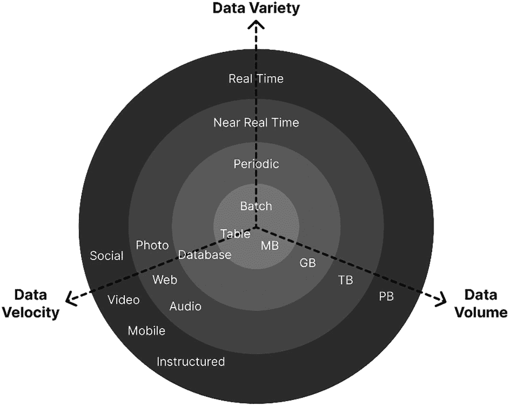
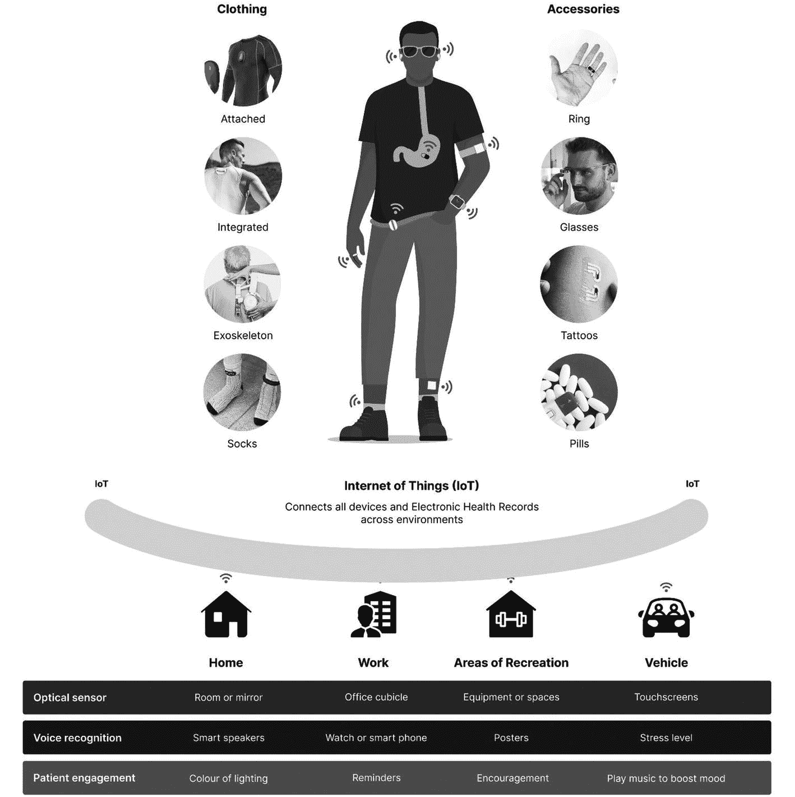
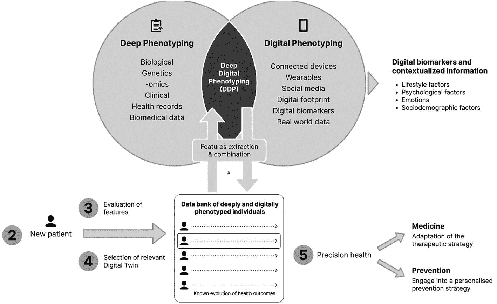
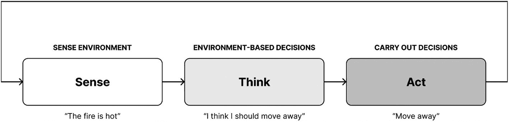
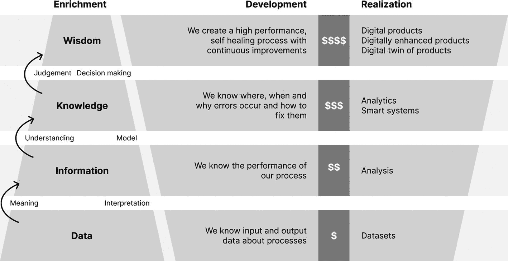

# 3. 数据与数字表型

为了在医疗保健连续体的各个阶段改善个体的健康状态，治疗方案必须围绕可用数据，为患者提供尽可能精准的护理。生成、关联和利用的数据集越多，精准护理的准确性就越高。数据收集的范围超越了遗传学，延伸至各种通常不被认为与健康和疾病相关的、分散且互不关联的数据源。

数据是实现精准健康愿景的基本要求，可以理解，患者和医疗保健专业人员都对此前景感到兴奋。2022 年对一组超过 4000 名患有长期疾病的患者进行的一项研究发现，三分之一的患者乐意与他们的医疗保健专业人员共享数据。^(³⁶) 在目前的形式下，精准健康是由大数据和人工智能的巨大潜力驱动的。收集大量带有健康状况和诊断临床确认的数据，能够支持复杂的算法，提高正确诊断的几率，并可能降低凸显精准健康关键成果的成本。

## 数据的形式与类型

要完全理解数据的本质，我们必须首先掌握其特性。数据可以通过形式和类型来表征。

### 形式

数据可以采取多种形式，例如字符、文本、词语、数字、图像、声音和视频，并且它分为两类：结构化和非结构化。结构化数据通常指存储在数据库或电子表格中、遵循某种模型或模式结构的数据。

来自嵌入式传感器、智能手机、智能手表和物联网设备的读数都是结构化数据的形式——无论是提供血糖读数、步数、消耗的卡路里、心率还是血压。非结构化数据则指其他所有数据。病历记录、通讯和社交媒体上的笔记是非结构化数据的一些例子，它们蕴含着巨大的前景。缺乏预定义的模型或模式结构使得数据编译和解释成为一项耗费时间和精力的资源密集型任务。

尽管如此，将非结构化数据整合到个性化医疗体验中，提供了无限的可能性宝库。每 24 小时内，Twitter 上有超过 6.5664 亿条推文被分享，Facebook 上有 7.344 亿条评论被发布，WhatsApp 上发送了 1000 亿条消息。^(³⁷) 虽然我们知道社交网络可以通过影响我们的健康行为来促进积极的健康结果，但我们的互动和通讯是一个尚未被完全实现的数据挖掘领域。

### 类型

数据有几种类型。大数据是人工智能和医疗保健领域的同义词，指的是用于发现和分析的大量传统和数字数据源的集合。大数据有三个核心关键特征：体量、多样性和速度。换句话说，就是数据量很大。通过大数据分析，人们可以发现隐藏的模式、未知的关联、趋势、偏好以及其他有助于做出更好、更明智决策的信息。图 3-1 展示了大数据的三个 V。

一个展示大数据三个特征的同心圆图。它们是通过 XYZ 平面格式区分的：数据多样性、数据体量和数据速度。数据体量的数据量从原点开始依次为 MB、GB、TB 和 PB。数据多样性包括批处理、周期性、近实时和实时。

**图 3-1** 数据的三个 V

机器学习和人工智能提供了许多技术，数据科学家可以将其应用于数据集以实现这一目的。相反，小数据指的是 N 等于 1 的数据单元，这些数据是可访问的、信息丰富的且可操作的。小数据可以包括患者被送入急诊的次数，或者他们是否参加了预定的预约。虽然数据量可能很小，但它并不缺乏价值。过去几年里，已经出现了一种转向，即纳入小数据分析以改进临床和行政流程，并识别成本节约。精准健康旨在大规模地提供 N 等于 1 的护理。

## 数据来源

实现个体化护理所需的数据驱动理解来自各种数据集，包括临床资料库、电子健康记录、基因组库、交易数据以及来自结构化和非结构化来源的数据。虽然数据类型会分为异构或非结构化数据，但两者都有许多来源。无论来源如何，数据通常属于五种类型之一。

-   **生物识别数据**：指纹、遗传学、组学、来自应用程序和可穿戴设备的生物标志物
-   **网络和社交媒体数据**：点击、历史记录、行为、健康论坛
-   **机器对机器数据**：传感器、可穿戴设备、环境
-   **人类生成数据**：电子邮件、纸质文档、电子病历、行为
-   **交易数据**：健康索赔数据、账单数据

精准健康利用来自各种来源的数据来了解人体的状态。除了组学数据之外，互联网的普及和智能手机的广泛使用增加了丰富的临床和生物学数据，可以显著增强对个体的理解。临床数据得到行为和社会数据的支持。生活方式、环境、医疗记录和医疗保险数据都可以用于实现精准健康。考虑到一名 2 型糖尿病患者与临床医生相处的时间为 3 小时，其余时间都在自我管理病情，更全面的数据源所带来的潜在机遇是不言而喻的。^(³⁸) 例如，谷歌地图基于避开促进肥胖的餐厅或向需要体重管理支持或表现出饮食失调的人投放广告来提供步行路线，这不存在任何不道德的理由。关于纳入新数据源的问题是道德问题，而非相关性问题。

随着可穿戴设备和传感器的创新持续进行，它们在临床医疗保健中的实施和应用也在不断发展。表 3-1 探讨了一些常见的数据类型和来源。在精准健康中，从可穿戴设备中最大化临床价值的关键在于将其整合到更广泛的数据生态系统中，以及纳入数据的理由。

**表 3-1** 常见数据类型和来源

| 数据类型 | 来源 | 示例 | 特征 |
| --- | --- | --- | --- |
| 生物识别 | 基因检测、生物标志物检测 | 基因居家检测 (23andme) | 结构化数据。由患者拥有。 |
| 网络和社交媒体 | 患者健康、行为和情绪 | 社交媒体、智能手机、网络论坛、社区、患者登记处、健康应用 | 大多数数据是非结构化或半结构化的。 |
| 机器对机器数据 | 患者健康数据 | 传感器、血糖仪、智能手机、健身追踪器、图像、健康应用 | 由设备报告的结构化数据。软件通常使用标准协议。传感器数据具有高速度。 |
| 人类生成数据 | 临床数据、制药和研发数据 | 电子健康记录、患者登记处、临床数据、血液检测、图像（扫描等） | 本质上是结构化的。由提供者拥有。 |
| 交易数据 | 事件和交易日志 | 健康信息交换、索赔数据、费用数据 | 本质上是结构化的。可能需要预处理才能成为有用的数据。 |

### 传感器

智能传感技术能够为临床服务提供巨大价值，并深入了解个体的健康状况。传感器分为两类：可穿戴传感器与非可穿戴传感器。

目前超过 40%的美国消费者拥有可穿戴设备。^(³⁹) 可穿戴技术正变得越来越普及、经济且精密，已超越时尚配饰和活动追踪的范畴。可穿戴传感器在地理定位和健康信号方面具有更高的准确性；然而，它们通常比非可穿戴传感器更具侵入性，后者侵入性较低，且能在家庭、工作、休闲区和交通等环境中监测活动，而不会干扰个体的日常生活。

随着传感器变得更小、可嵌入、可生物降解并保持持续连接，它们在患者护理中扮演着日益关键的角色。其结构化数据非常适合研究、机器学习和分析，如图 3-2 所示。

一幅插图展示了物联网如何在精准医疗中得到广泛应用。顶部是一个佩戴可穿戴传感器的人体示意图。底部展示了物联网的示例，例如互联的家庭、工作和车辆。

**图 3-2** 精准健康中的智能传感器应用

5G 通信的普及正在推动智能护理的发展。家庭、工作场所、交通和城市区域内的传感器可以捕获并传输数据，包括行为、位置、互动和通信。虽然这也会让人联想到奥威尔式的未来，但利用实时健康和 behavioral 数据来优化个人健康状态的力量不仅具有革命性，而且正逐渐成为现实。

### 数字表型

当可用的健康和行为数据与社交平台及其他互动相结合时，通过一个支持精准健康以及健康（反之亦然，疾病）数字表型的数据密集型环境，可以更全面地理解行为和社会领域。

由于为社交媒体拍摄食物照片日益流行，营养师现在可以利用来自健康应用或社交媒体的食物图片，比食物日记或标准化问卷更精确地了解饮食习惯。同样，社交平台的使用已被用于预测焦虑和抑郁的风险。

来自非传统领域的数据使用使数字医疗能够更好地理解人类健康及行为的影响，尽管这些数据有时并不能完全反映实时的健康状况。例如，心率变异性（`HRV`）作为压力的标志物，可通过可穿戴设备收集，并用于优化药物摄入。

数字表型是指通过个体与电子硬件和软件互动所产生的数字数据来推断其行为的过程。^(⁴⁰,) ^(⁴¹) 当被确定为具有临床相关性时，数据的力量可以提供对个体生活方式、社会人口学特征、心理和环境的洞察。这种形式的数字表型已在精神病学和 2 型糖尿病领域被证明是成功的。图 3-3 以图表形式展示了深度数字表型。

该图展示了深度数字表型的关系。底部，过程从新患者开始，分类为特征评估和相关数字孪生的选择，通过生成的数字数据，最终导向精准健康。数字表型包括可穿戴设备、社交媒体和数字生物标志物，而深度表型则包括生物学、遗传学、临床和健康记录。

**图 3-3** 深度数字表型

### 数字孪生

许多行业已使用仿真和 3D 建模来开发和测试新产品。例如，汽车行业很少再进行物理碰撞测试，因为这些测试现在主要在虚拟环境中进行。然而，在医疗保健领域，使用需要提供患者情况完整图像的 2D 图像仍然是常见做法。由于现在有更多数据以数字形式可用，将当前标准转换为 3D，使得其他行业行之有效的做法得以应用：数字孪生。

医疗保健行业正在采用数字孪生来改善个性化医疗、医疗机构绩效以及新药和器械的研发。IBM 将数字孪生定义为“跨越对象或系统整个生命周期的虚拟表示，它通过实时数据更新，并利用仿真、机器学习和推理来辅助决策。”^(⁴²)

对自然对象和过程的数字映射允许对身体部位、单个器官或整个人体进行虚拟分析。当今的数字孪生可以由基于可穿戴设备信息、临床数据、组学数据和行为的模型组成，为患者和临床医生提供赋能反馈。此外，通过使用真实患者数据训练模型，可以在与实体对象相同的条件下模拟结果。虽然数字孪生在医疗保健领域仍是一个相对较新的概念，但随着数据连接、人工智能和 AR/VR 的进步，数字孪生领域正在迅速扩展。意识到“一刀切”的医疗方法效率低下，人们越来越支持将数字孪生从孤立的研究项目扩展到大规模个性化，正如当今客户数据和广告平台所熟悉的那样。

数字孪生将是一个虚拟患者，其与临床就诊时遇到的新患者具有相似或接近的特征，并且其健康状况、并发症风险和疾病进展是已知的。在不久的将来，每位患者都将拥有一个数字孪生，这是通过深度数字表型获得的，由其最接近聚类组的平均特征所代表。我们正在从通过`HbA1c`和空腹血糖水平来代表糖尿病患者，转向实时数据分析，从而能够区分糖尿病的亚临床类型。用不了多久，我们就能拥有个体的深度数字表型，其中包含数百万个数据点，涵盖临床、生物学、遗传学、社会学、心理学、通信和真实世界数据，这将彻底改变我们理解健康和疾病的方式。

计算机科学、行为心理学、生物信息学和流行病学是核心主题。从多组学方法到无监督深度学习算法，再加上适当的计算能力，我们现在拥有了合适的工具来处理信息的多样性和数量，并从粗略分层的群体转向由众多特征定义的精细小群体。

## 数据挑战

如今，有越来越多可靠、实用且可操作的健康行为、心理健康、患者偏好和健康社会决定因素的衡量标准，这些可以扩展有价值数据的范围，以构建信息更全面的个性化健康治疗方案。

通过收集并基于这些因素快速总结关键结果，患者和医疗服务提供者可以就医疗保健方案做出更共同知情、更个性化的决策。要实现这一点，仍需克服若干关键惯性阻力。

### 测量与完整性

必须考虑可用数据的完整性、自我报告数据中的不准确性和不精确性，这些因素可能在个体和群体层面显著扭曲结果。数据缺失是系统内偏倚的潜在入口。

此外，直到最近，患者报告的测量指标在现实医疗中仍被视为不科学或难以实际应用。然而，近期研究表明，临床医生可以高效收集患者报告的健康行为、心理健康和偏好数据，且与临床收集的数据偏差极小。^(⁴³)

### 健康社会决定因素数据缺失

健康的社会决定因素对患者是否参与医疗保健有着巨大影响。研究表明，健康社会决定因素对医疗可及性和结果的影响大约是医疗干预的两倍。^(⁴⁴,) ^(⁴⁵) 随着大规模医疗健康数据的获取成为可能，确保将健康的社会和环境决定因素（如种族、性别、教育、合并症、收入、就业、识字率和居住社区）的数据与生物医学数据相关联，将显著改善人群和个体的医疗保健水平。

解决社会决定因素的技术示例包括针对种族、性别、民族、宗教和语言的行为改变平台和健康计划。尽管在解决健康社会决定因素方面出现了积极迹象，但挑战仍然在于可用数据的稀缺性。

### 隐私与安全

收集和使用健康数据及非标准数据（例如通过社交媒体或 GPS 监测进行的即时生态评估）引发了严重的隐私、安全和伦理问题。疫情期间，许多医疗服务迅速数字化以维持护理的连续性。自疫情开始以来，数据收集和传播为抵御新冠病毒传播提供了关键支持。然而，公众对数据使用、隐私和安全的态度和看法仍需进一步了解。

2022 年一项旨在更好了解人们分享数据意愿的最新研究收到了 4,764 份回复，显示了公众对此话题的关注。^(⁴⁶) 更多人愿意分享匿名数据而非个人身份信息。人们表示愿意分享能够惠及他人的数据；如果分享个人身份信息的目的被认为有益于他人健康，66%的人会愿意分享；63.9%的人会同意向政府或卫生当局分享个人敏感健康数据。尽管如此，人们对数据使用仍存在严重担忧。

超过四分之一的受访者表示不信任任何组织能保护他们的数据，54%的受访者担心分享个人信息的影响。令人担忧的是，近三分之二的受访者担心缺乏旨在防止数据滥用并在数据滥用时追究组织责任的适当立法。数据所有者（服务使用者）在数据安全、隐私和信任相关的伦理与监管方面变得越来越重要。

在安全地聚合和匿名化数据的同时，保留其中存在的所有多维统计属性和关系是一项挑战。无论如何，隐私必须优先于组织间的数据共享与交换。隐私可以采取例如合成数据或匿名数据的形式，研究人员可以自由共享这些数据，以及保护个体身份识别的算法。学术界、组织、政府和监管机构需要做更多工作，让公众参与到合乎伦理且透明的数据共享中来。

随着数字表型分析超越传统数据源，并消耗大量针对广泛多样化人群的大数据，需要开展透明的研究，包括知情同意、共同开发的患者和临床医生解决方案，以及在产品生命周期的每个阶段让利益相关者参与，以建立信任。该领域法律指导的初步性表明，需要在疫情期间等救灾行动中制定数据责任的人道主义指南，并让公众参与其制定过程。

### 成本

精准医疗强调关注传统上与健康和疾病无关的数据，同时也关注遗传学。然而，无论医疗系统如何，资源成本都必须被视为精准医疗中的一个重要变量。健康监测可能很快变得昂贵，因此必须在整个护理连续过程中识别并实施具有成本效益的策略。

例如，虽然存在静态生物标志物（如特定的遗传变异），但其他标志物会随时间变化，需要定期评估。理想情况下，许多标志物可以高精度预测未来的健康状况；研究人员应确定一组具有成本效益的标志物，以最小的负担保证相同的性能。可以合理推测，在未来的某个时间点，将存在足够的数据，仅需遗传和生活方式数据就能提供个体近乎完整的精准健康图景。挑战在于如何在不产生过高成本的情况下实现这一目标。

### 与数据脱节

虽然人们可以通过`Apple Health`或`Google Fit`等服务访问其可穿戴设备和设备数据，但他们仍然无法控制自己的医疗数据。电子健康记录系统和数据存储库相互孤立，未能利用互联护理的优势。

### 通用数据模型采用有限

数据协调是一项巨大的数字挑战，未来的标准必须继续促进共同理解，以实现精准护理。需要统一的结构和语义表示以及数据模型，以促进健康生态系统之间的互操作性和连通性。然而，目前尚不存在完全统一的模型，各国、各供应商和国际上使用的数据模型和术语范围广泛，部分组织甚至没有数据标准。

`OpenEHR`是一个标准数据模型在大型医疗服务中被初步采用的绝佳示例。该平台提供了一种产品和中立供应商的结构化方法，用于定义健康数据、数据内容和术语，从而支持护理参与、协调和协作。

### 超越定性数据

精准健康领域的大多数发展都集中在组学和设备驱动的历史数据上，这些数据用于训练预测算法。精准健康已成为定量研究的代名词，而定性健康数据在精准健康研究中几乎未被利用。排除定性数据（主要是非结构化数据）可能会遗漏关于人类行为、观点、个体细节以及其他背景因素中最精确、信息量最大的数据。

## 数据驱动的行动范式

收集数据是为了采取行动。这可以通过“感知、思考、行动”范式来建模。无论是人类、人工智能体还是混合体来执行思考，数据价值创造的区别在于如何利用这些方面来交付有意义的价值，从而吸引其生态系统、优化运营，并创造新的效率和机遇。图 3-4 展示了一种被称为“感知、思考、行动”的数字化转型方法。

感知、思考、行动范式的框图。每个环节都附有一个示例。

图 3-4

数字化转型的感知、思考、行动范式

**感知**指的是从多个来源实时持续收集数据。**思考**指的是对数据进行聚合、分析，并从中提炼信息和知识。**行动**指的是在了解数据源所提供的背景环境后，由执行活动的智能体所采取的行动。正是通过这些行动，才能采取措施将信息转化为价值。

### 将数据转化为信息、知识和智慧

IBM 报告称，每天产生的数据超过 1TB，但其中被使用的数据不足 1%。^(⁴⁷) 数据的价值体现在将其转化为信息的能力上，这些信息可以驱动可执行的洞察，进而引导行为和流程。数据分析是数据科学中的一个主题，旨在从原始数据源中提取信息。实时分析支持在决策点进行敏捷的洞察发现和分析。

然而，数据并不等同于知识。要用于决策过程，数据必须经历一个包含六个步骤的转化过程：

*   收集
*   组织
*   处理
*   集成
*   报告
*   利用

如果解读正确，数据会被转化为能够产生知识的信息。数据、信息、知识、智慧（DIKW）金字塔是思考数据转化和价值创造的常用模型。图 3-5 是对 DIKW 模型的改编，展示了数据如何与数字化转型相关联。

数据转化为信息、知识和智慧的示意图。左侧是一个金字塔，从下到上依次是数据、信息、知识和智慧。右侧是关于改进方面的价值开发与实现。

图 3-5

利用数据赋能信息、知识和智慧

数据丰富化是将数据转化为信息、知识和智慧的过程。**价值开发**指的是通过应用这些转化来开发某个机会的价值。**价值实现**指的是在产出、产品、服务和成果方面的价值开发。

随着数据规模和重要性的增加，从数据产生到获得洞察并采取行动之间的时间需要缩短。缩短从检测到事件到自动响应之间的时间具有巨大的经济价值，这可以识别欺诈交易、在患者准备出院时立即腾出床位以提高服务能力，以及在灾难发生前发现健康状况恶化的迹象。

## 总结

要充分实现我们现在能够生成的大数据所蕴含的潜力，就必须改变我们的工作方式。创建协作网络、共享数据和模型比以往任何时候都更加重要，并且这一过程越来越需要与工程学、计算机科学和行业等非传统协作专业领域进行衔接。

虽然数据收集和分析可以提供重要的洞察，但数字表型分析是评估个体健康状况和研究更广泛的公共卫生趋势的有力工具。

当利益相关者根据数字系统生成的洞察和知识采取行动时，他们将能够更好地与患者和临床医生互动，提供更好的产品和服务，并开发精准健康的新应用。充分利用大数据将是一个挑战，但潜在的回报则更为显著。在下一章中，我们将探讨人工智能的基础及其在精准健康中的应用。

脚注 1 2 3 4 5 6 7 8 9 10 11 12

