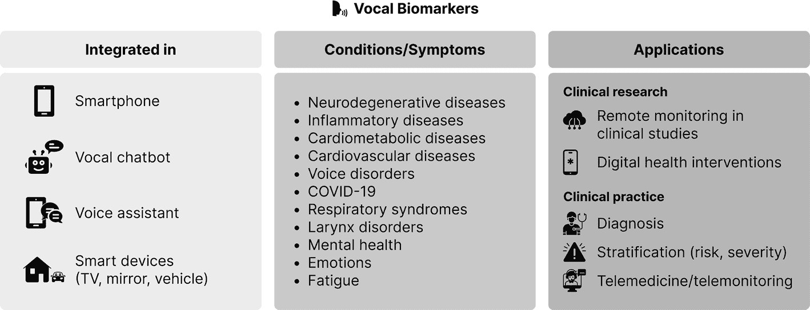

# 4. 精准健康中的人工智能与机器学习

人工智能（AI）指非人类主体展现出的任何认知能力。其五大基本要素为：学习、推理、问题解决、感知和语言理解。在执行学习、视觉和逻辑推理等任务时，人工智能已超越人类能力。机器学习是人工智能的一个子集，通过训练计算机模型随时间推移从自身行为和环境中学习以进行改进。深度学习是机器学习的子集，它利用人工神经网络模拟人脑的学习过程。

自然语言处理（NLP）是系统分析、理解和生成人类语言的能力。整合人工智能方法和技术，以应对数据可扩展性和高维度的挑战，并将其转化为可操作的知识，正成为精准医学的基础。智能手机和可穿戴设备等基于传感器的技术的普及，开启了一个健康人工智能的新时代，能够根据生命体征、环境和行为做出实时决策。

## 人工智能的三种类型

### 弱人工智能

弱人工智能（ANI）擅长执行单一任务，例如语音识别、垃圾邮件过滤、自动驾驶汽车、电影推荐以及支持面部识别的软件。

### 通用人工智能

通用人工智能（AGI）或强人工智能，是指一种具有通用智能的类人主体，能够学习并运用其知识和经验来解决问题。

### 超级人工智能

超级人工智能（ASI）目前是一个理论概念，它超越了模仿人类智能和行为的范畴。

## 机器学习简介

机器学习体现了数据挖掘的原理，但也能推断相关性并从中学习，以应用于新的算法。机器学习任务可以是监督学习、无监督学习以及半监督学习。

### 机器学习框架

典型的人工智能或机器学习工作流程通常包含数据准备、训练、测试、传播和部署等步骤。

### 软件与工具包

`Scikit-learn`、`NLTK`、`Genism`、`Scrapy`、`TensorFlow`、`Keras` 和 `PyTorch` 等工具包支持机器学习。

## 可解释人工智能

可解释人工智能涉及理解特定人工智能驱动的决策是如何做出的。提高人工智能的信任度和透明度不仅有益于最终用户，也有助于提升不断发展的系统的整体准确性和泛化能力。

## 人工智能辅助精准健康在实践中的应用

### 临床决策支持

人工智能主导的临床决策支持系统能够基于生物医学影像数据预测特定医疗结果的发生概率或特定疾病的风险。

### 行为改变干预与生活方式医学

数字疗法与更通用的健康和健身应用程序的区别在于其临床分类、明确的目标受众、经过验证的研究成果以及实际影响。

### 新疗法、疾病定义与干预切入点

庞大的科学与患者数据网络将使研究人员能够发现新知识和重要的疾病洞见。

### 数字孪生

数字孪生实例及其聚合体能够通过确保目标人群在相应的数字孪生表征中得到充分体现，从而支持新假设的提出与检验。

### 健康促进聊天机器人

健康促进聊天机器人通过提供具有更高互动性和可持续性的个性化按需支持，克服了数字远程医疗的局限性。

### 语音识别

语音识别算法处理来自人类语音的原始声波，以识别语音的基本要素和更复杂的语音特征。

# 语音识别在健康领域的应用

语音识别已成功用于检测对语音有明显影响的疾病，如慢性咽炎，以及对语音影响不那么明显的疾病，如阿尔茨海默病、帕金森病、重度抑郁症、创伤后应激障碍和冠状动脉疾病。这些临床应用采用了相同的通用语音识别策略。不过，最终分类步骤所针对的结果是一种疾病表型，通常与语音特征（语调、语速、音高等）相关，而非语言内容。为了安全地使用语音监测健康相关结果，必须根据金标准对声音生物标志物进行验证。

## 语言和口音的影响

在大规模使用语音技术或声音生物标志物时，考虑语言和口音也至关重要。否则，它们可能会对来自某些地区、具有不同背景或带有各种口音的人群产生系统性偏见，并加剧现有的数字和社会经济鸿沟。为了减少对代表性不足人群的偏见，语音技术或声音生物标志物必须依赖于在多样化数据集上训练的算法。研究人员还必须提高处理和理解自然语言的能力，以及语音助手回答的相关性和准确性。

## 声音生物标志物的应用

图 4-4 给出了声音生物标志物如何在健康领域应用的示例。

一个三列图表解释了健康行业的声音生物标志物。列标题从左到右分别是：集成于、状况或症状以及应用。

**图 4-4 声音生物标志物在健康领域应用概览**

## 视频和图像的加入

从音频到视频，这个领域正在发展。将图像添加到语音数据中，可以更好地描述患者、情绪和其他健康特征。使用面部识别和智能手机摄像头等新技术，结合声音生物标志物，使得远程健康监测更加精确和可靠。随着 5G 网络及未来更新的引入，以及配备语音助手的智能手机和家用设备数量的增加，大规模语音样本的收集和处理将变得更加容易。

俗话说，一图胜千言；而一视频胜千图。

## 总结

从对健康数据的客观和全面分析，到识别新的长期模式和风险因素以辅助诊断，机器学习作为人工智能的一个分支，为增强医学和医疗保健提供了无数机会。此外，在商业化健康系统中使用人工智能，为以患者为中心的个性化医疗和健康治疗提供了解决方案。然而，机器学习在数字健康领域的应用主要局限于狭窄的领域。但传感器和物联网的最新进展意味着，我们现在可以比以往任何时候都更多地收集用户更广泛的身体和情绪状态数据。

正如本章所讨论的，在期望人工智能在核心医疗服务中得到更广泛采用之前，还有许多挑战需要克服，包括显著提高可解释性和透明度。尽管如此，持续的人工智能在数字健康领域的研究将有助于推动数字健康和人工智能的整体发展，为现代社会带来巨大价值。

脚注 1 2 3 4 5 6 7 8 9 10 11 12
