# 人工心理学导论

# 前言


## 你不知道统计学吗？不要害怕，进来吧

在科学中，我们试图建立一个世界的图景。随着科学的进步，不确定性日益孤立，黑云笼罩其美丽和辉煌，圣杯的确定性被颠倒。科学家们努力将确定性从数学的核心中推出。这种努力并不十分成功，科学的进步不仅增加了人类对现象的认识，也扩展了我们对科学知识的局限性的认识。

它动摇了某些科学原则的基础，世界表征工具的使用也显示出问题。

直到20世纪，科学才处理了亚里士多德逻辑的确定性。现在有一个世界，其中某物可以同时是A和非A。因此，这个主导了2000年的亚里士多德思想的丧钟响起，科学不再通过绘制固定和唯一的地图来对世界进行全面描述，这些地图与日常世界和谐一致，而是制作了一组不同的地图，这些地图不同，但能够灵活地理解世界。

科学正在后现代世界中崛起，在这个世界中，科学阅读不是一个固定的机器，而是创造性和动态的，读者根据自己的思考或生活经验在心中创造意义。因此，作者不再是作品的最终参考和避难所，也不是唯一的真正创造者。读者不再在被动的沉默中遭受信息的无情浪潮，而是给予文本生命的人。数据是沉默和模糊的，读者的思维点燃并与之对话。在这个新的科学世界观中，我们不是现象的中立观察者，这既不可能也不可取，而是成为世界的参与者。

玻尔，量子物理学伟大思想家之一，认为测量问题了世界，而问题改变了答案。所以我们看到的不是现象，而是物理学的天才，正如海森堡所说。我们看到的不是现实，而是与研究方法交织在一起的现实。所以我们可以说，我们看到的是测量科学的产物。换句话说，认识一个现象的过程会导致它发生，但到什么程度呢？我们不知道。从这个观点来看，确定性在科学世界中逐渐消退，而不确定性在思考之上升。心理科学家们擅长跨越科学和脑活动的界限，也无法幸免于这种剧变。他们发现行为不足，并采用了一种定性方法来捕捉难以捉摸、动态而有意义的现象。随着我们接近现实，精确度减少，反之亦然。

尽管这个群体具有灵活性和科学广度的组合，但这种混合并没有继承确定性，这种方法导致了现象的固有不确定性，精确性和现实之间的斗争仍在继续。

David Appelbaum写了一本名为《The Stop》的精美书籍，在书中他提出了一个微妙的观点，我们在这里表达。在这本书中，他将盲人通过触摸感受和检查事物的速度进行了比较。尽管盲人看不见，但他说这种不看也有其优势，因为盲人看到了一个看得见的人看不到的东西，因为他小心翼翼地、缓慢地移动，结果通过不同的触摸和方法穿越障碍物并获得了新的理解。感知是隐藏意义的痕迹；感知经常加深，尽管缓慢。因此，可以说，尽管快速理解的方法有其优势，但站立和静静地观察和演化的感知也很重要。应该更加关注新方法的发展和现有方法的扩展。因此，希望心理研究人员、心理学家和所有具有研究思维的人都能使用多面方法。

因此，行为科学家在依赖和观察心理现象时有一个可靠的基础来把握真理的真谛，但对真理的本质存在疑问。 从经典（19世纪）的确定性到现在的不确定性的转变是理解进化的必要条件。

这个转变并不是一帆风顺的，但使我们更接近真理。在定量和定性研究中发展理论是本书的主要目的。

我们知道研究者的推断涉及概率和不确定性，因此我们谈论感知真理的衰变。应该说，概率是对现象存在与否的不确定性，而本书所研究的是另一种类型的不确定性，即对现象存在与否的确定程度，而不是天真地假设现象不存在。

然而，大多数人对于心理学研究结果的可能性都存在相同的不确定性。我们知道研究结果，但并不总是相信它们对心理问题的真正理解。然而，目标并不是以任何方式降低它们的价值。因为不确定性无处不在！

推理被创造出来来模拟人类思维，以便通过使用近似和模糊推理获得更动态和一致的真实结果。心理学的科学充满了需要一种近似、无限和模糊的方法来处理的语言变量，以免陷入研究这些多方面概念的心理现象时出现模仿模型。 这些多方面概念可以以不同的方式进行解释和研究，这是可以接受的。然而，令人讨厌的是特定方法或特定思维方式的主导地位及其在研究数据推理中的应用。

在本书中，我们从理论和实践的角度考虑了心理研究中的近似推理方法论。定量变量导向的方法和定性案例导向的方法都用于解释我们称之为模糊心理学的集合导向方法。正如本书开头所述，如果你对数学或统计学不太了解也没关系，因为统计和数学直觉在这里是关键，它们将通过实践学习。重要的是要理解这种方法及其在新的、动态和难以捉摸的现象中的应用。

最后，对于这本书的评论非常欢迎，请不要犹豫与我们分享。

最后，记住蒙田的短而深刻的名言：“我们知道什么？”人类世界确实充满了不确定性，我们无法定义和解释它的美。

# 致谢

我们要感谢Springer Nature团队在完成这本书方面的支持。 我们要感谢Megan McManus在最初阶段对我们的想法的支持，并提出了进一步的探讨主题， Pradheepa Vijay对内容的审查和对书籍布局的重要评论， Tessy Priya在最后编辑校对方面的鼓励和帮助，以及Brian Halm对协调和解释出版程序给予我们的支持。


# 关于作者

Hojjatollah Farahani于1978年9月23日出生于伊朗，他是Tarbiat Modares University (TMU)的助理教授。他于2009年从伊斯法罕大学获得博士学位，并在澳大利亚维多利亚大学（2014-2015年）担任模糊推理的博士后研究员，在那里他开始在Yuan Miao教授的指导下研究模糊认知图（FCMs）。他是150多篇研究论文的作者或合著者，并在许多科学期刊上担任审稿人。他在心理科学中指导和建议了许多论文和论文。他的研究兴趣和方向包括心理测量学、高级行为统计学、模糊心理学、人工智能和心理学中的机器学习算法。电子邮件：h.farahani@modares.ac.ir

Marija Blagojević是克拉古耶瓦茨大学技术科学学院信息技术系的副教授。她出生于1984年，于2007年获得硕士学位，2014年获得技术科学博士学位。她目前的研究兴趣包括数据挖掘、人工神经网络、电子学习和编程。在教学和研究活动方面有15年的经验，她是80多篇研究论文、专利和技术解决方案的作者或合著者，并在许多科学期刊上担任审稿人。她还是项目和学习计划的审稿人，并且是Tempus和Erasmus项目的合作大学的成员。她曾是几个会议的组织和科学委员会成员，并且是该学院自我评估委员会的成员。她曾是一项技术转移领域创新项目的项目协调员。

Parviz Azadfallah在健康心理学方面获得了博士学位，并在神经心理学和心理动力学等多个国际学术课程中取得了资格。他从1999年开始在Tarbiat Modares University (TMU)的心理学系进行科学活动。他从1999年到现在主持了许多研究项目，并指导了45个博士论文和50多个硕士论文。

2023年。 他是250多篇研究论文的作者或合著者。 他还是一些书籍的作者，他的最新书《具身自我》采用发展性方法来解释心身整合。 他于2017年创立了TMU的神经心理学实验室。 他自2019年起也是TMU认知神经科学系的成员。 他的大部分研究项目都基于实验设计。 另一方面，他进行了许多旨在通过基础性的定性和文化相关研究进行知识构建的项目。

彼得·沃森拥有三个数学统计学学位，包括博士学位（曼彻斯特）。 自1994年以来，他一直在剑桥大学的认知与脑科学单位（以及其前身应用心理学单位）为研究提供各种统计支持（之前在曼彻斯特的MRC年龄和认知表现研究中心担任类似角色）。 他是100多篇论文的合著者，并在剑桥大学讲课。 他是几个期刊的统计审稿人，包括《BMJ Open》和《情感障碍杂志》。 他还是每年接待超过10万次访问的在线CBSU统计维基网页的主要贡献者。 自1996年以来，他还担任剑桥统计讨论组的秘书，并自2001年起担任SPSS用户组（ASSESS）的主席和会议组织者，还是阿尔茨海默病研究英国临床试验咨询小组的成员。

**Forough Esrafilian**是Tarbiat Modares大学的助理教授。 她的兴趣包括心理病理学、文化和跨文化心理学以及发展性认知心理学。

**Sara Saljoughi**出生于1995年3月1日。 她在伊朗科学技术大学获得了电气工程学士学位。之后，她发现自己对认知科学有着强烈的热情，因此改变了自己的学术方向并追随了自己的热情。 现在，她正在完成认知心理学硕士学位的最后阶段，并期待继续在博士项目中深造。 她的研究兴趣包括计算神经科学、连接性、生物标志物和脑网络。 她热衷于通过机器学习方法发现精神疾病和心理障碍的脑网络和生物标志物。

# 第一章 寻找一种方法


IN SEARCH OF A METHOD

## 1.1 什么是人工心理学？


人工心理学（AP）是心理学中一门高度多学科的研究领域。AP试图解决心理学研究中出现的问题，并需要一种强大的分析方法。传统的统计方法存在根深蒂固的局限性。这些方法在理论上很好，但往往无法对现实世界进行建模。心理学研究人员一直试图通过简化所研究的模型来克服这一问题。这种立场最近并没有得到太多实际的关注。

推动和改进人工智能有助于心理学研究人员找到心理模型的整体模型。这一发展通过使用多个视角和多个数据集以及交互式和现实的模型来实现这一目标。这种全面、整体和交互式的观点可能会在不久的将来引领一条新的研究路线。AP可以为临床心理学家到理论心理学家打开一个新的视野，找到一个更加现实的模型。这个视野根植于一种多学科的方法，随着相关科学的发展更新我们的观点，从而在旧的数据集和模型中找到新的结果。AP有一些假设。满足这些假设有助于人工心理学家找到更精确和更深入的建模方式。

这里讨论了人工心理学的假设。首先，我们假设心智充满了不确定性。这种不确定性是我们在现实世界中所付出的代价。我们通常试图通过将最确定的事实视为真理来应对这种不确定性。需要注意的是，不确定性不仅存在于自然界，而且几乎存在于所有人造系统中。其次，我们假设心智是连续的。换句话说，我们假设意识是连续的，大脑以整体方式行动，并以离散方式输出行为（Huette等，2012）；因此，情绪和认知之间没有明确的分界线。大脑是一个由灰质构成的器官，它构建了不以实线分隔的心理系统。心理研究人员正试图通过使用统计模型。 第三个假设是心智是一个复杂的系统；人类的心理是由复杂的系统组成的。 即使是最简单的系统和现象也是复杂的。 这种复杂性可以通过动态模型来捕捉和解释。 第四个假设是心智和数据之间总是存在一个代理。

直接研究心理活动是不可能的。 大脑数据需要与一些心理构造和行为相连接。 因此，我们需要同时在单个模型中使用多个数据源。 传统的统计技术使用严格的数学模型。 这些模型需要全面和完整的数据进行分析和预测。 在现实世界中，我们面临着大量不完美测量的数据以及复杂系统中的非线性关系。

第五个假设是大脑数据是高维数据。 这意味着即使在小样本量中，数据集也具有许多特征。 这个问题通常在心理研究中出现，特别是在临床、认知心理学和神经科学中，我们需要处理 p > n 的情况。

总之，心理学家需要新的分析模型来帮助他们建模复杂的心理系统。 人工心理学使用满足这些假设的智能模型（图1.1）。

应用计算中的一种技术是模拟涉及智能系统或问题解决模型的策略。 智能模型与人类思维和解释方式相关。 这些模型可以单独或同时使用模糊逻辑、人工智能和遗传算法。

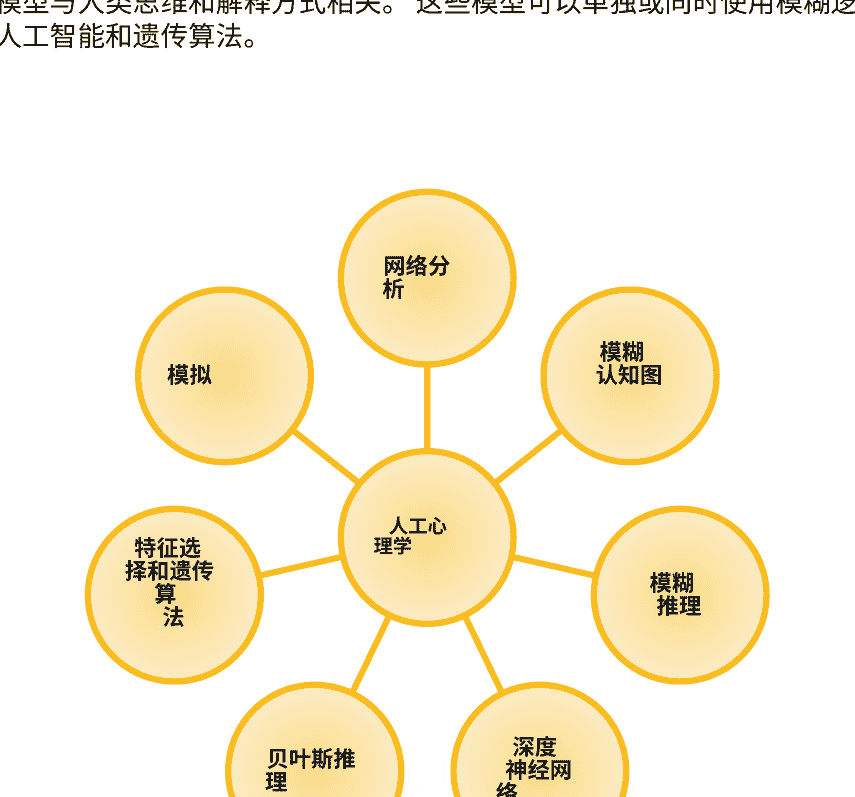

## 1.2 寻找方法

科学的目标是系统地澄清概念，其核心是可复制性。周围世界充满了概念，其中一些是可确定的或几乎可确定的，例如国家边界和人均收入。然而，其他一些在社会和行为科学中更为突出和研究的概念是不同的，例如抑郁、痛苦、悲伤、爱和选择性注意力。


这些概念有一个无限集合，并且它们非常模糊、分散和难以捉摸，并且呈现高度多样化的交织形式。研究人员设计的模型是为了对这些概念进行近似理解的努力，代表了科学对其进行澄清的努力。模型是对现实的近似简化理解，不直接处理现实。模型始终是现实之外的近似。这些模型测试了关于不同概念的理论和假设。

如果心理现实是模糊和难以捉摸的，那么应该如何进行研究呢？这样的现实无法通过单一方法很好地理解。因此，研究方法必须像其他科学一样发展，并且在更准确地接近概念时，使用多种方法，有时候还可以使用其他学科的方法。

也许现有方法和未来方法的原则和假设可能需要修订，甚至包括本书介绍的方法。一种特定方法的主导和霸权是非常令人担忧和危险的。

应该记住，方法不是实现现实的唯一手段，但它们是现实的容器，研究结果也是从中产生的。此外，这些方法得出的结果有时会变得极端，令一些研究人员感到恼火。

值得注意的是，本书并不试图丢弃、忽视或贬低过去或现有的方法，而是要克服超越它们的恐惧。研究心理学家们共同的恐惧可能会导致创新。目标是找到一种让研究人员更清楚地理解难以捉摸的概念的方法。


我们知道，错误的答案比随机的答案更具有害性，因为错误的、非随机的答案会系统性地误导科学并产生重大影响。

从西格蒙德·弗洛伊德1856年出生到本书写作时（2022年），地球已经旋转了60590次，研究方法也需要跟上变化。我们知道，心理学并不是从弗洛伊德的出生开始的，但由于他被称为科学革命者之一，所以引用了他。

## 1.3 从 p 值到 p 战争

统计显著性在科学研究中起着重要的作用，通过将数据与假设测试相联系，这一概念从20世纪中期后期开始被广泛应用（Gigerenzer等，1990年）。目前，在科学研究中最常用的统计量是p值（Lyu等，2020年），尽管它的使用受到了很多批评。尽管在心理研究中广泛使用p值，但各种研究表明大多数研究人员和学生都对p值进行了错误解读。这种错误解读根源于p值的误用，包括统计显著性假设（Ziliak和McCloskey，2008年）和p-hacking。这些是自信危机的主要原因。

心理学研究中的再现性危机。效应大小和置信区间（CIs）可以被视为P值的替代品。尽管CIs可以用于改进统计解释和推断，但研究人员和用户对其概念也存在误解（Lyu等，2020年；Harrison等，2020年；Greenland等，2016年；Lyu等，2018年；Morey等，2016年；Cumming，2013年）。

吕等人（2020）对中国各领域的1479名研究人员和学生进行的研究发现，无论他们的学位和职业阶段如何，都很难正确解释p值和CIs。也就是说，其中89%的人在p值解释上至少犯了一个错误，93%的人在CIs解释上至少犯了一个错误。在显著和非显著的p值以及CIs是否包含零的解释中，误解的程度增加了。此外，值得注意的是，受访者对自己（错误的）判断普遍有信心。

这些结果表明，研究人员对这些推理统计学的关键指标存在误解。这种误解导致研究人员在使用经典统计方法进行解释时出现错误（假设我们对p值满意！），而这些解释从不同的渠道流入心理研究的海洋中（Harrison等人，2020）。

这些解释包括以下内容：

### 1.3.1 p-值作为证据来确认或否定零假设

这个问题被称为吉格伦泽的研究中的确定性幻觉（2004年，2018年），因为它可能引发对心理研究结果的信心危机，鼓励研究人员将 ≤0.05的 p-值作为存在“效应”的证据。这个危机的主要原因之一是出版偏见。

这种偏见源于科学期刊欢迎统计显著结果（p-值 ≤ 0.05）。

张等人（2019年）指出，p-值是在假设零假设为真的情况下，获得与样本数据中效应至少一样极端的效应的概率。在经典统计学中考虑p-值，尽管在单个研究和荟萃分析中的统计功效较低，可能导致对心理研究实际结果的不信任。考虑到已发表研究中的统计功效，这些研究中统计显著性的频率异常高（Francis，2014年）。

Schmidt和Oh (2016) 声称90%的研究报告是显著的，而平均总功率为0.4。他们发现这是这些研究可疑的强有力证据。直到1962年，测试功率在可疑研究实践中才增加，当时科恩强调了“低功率”问题。这种强调的原因是什么？

我们知道，在经典统计学中，p值是效应大小和样本大小的函数，样本大小严重影响功率增加：

```
p值(          )=f效应大小，样本大小(          (
```

低功率导致不显著的结果。不显著的结果和显著的结果一样重要，但它们的不显著性使得研究人员难以发表论文。这种出版偏见被称为“文件抽屉问题”，不太可能拒绝零假设的研究最终未发表。因此，研究人员一直在努力提高他们的研究功率。Maxwell（2004）对这个问题进行了详细阐述。然而，并不总是能够获得足够的样本大小，所以也许这就是为什么研究人员进行可疑研究的原因。换句话说，他们进行可疑的研究以获得显著的结果，以避免由于低统计功率而导致大量不显著的结果（Harrison等，2020年）。

### 1.3.2 反向解释的p值

误解p值的另一个后果是复制幻觉，正如Lyu（2020）所述。许多研究人员避免贝叶斯思维，因为经典的基于p值的统计学是经典推断的基础。反向解释的p值是将1 - p值视为结果成功复制的概率。

尽管存在这些问题，缺乏统计思维和仪式性使用p值的潜在后果在心理研究结果中很少被提及，除了近年来的一些研究（Lyu等，2020）。Farahani等人（2021a，b，c）对伊朗100名研究生和博士心理学学生的样本进行的研究表明，95.7%的学生在解释p值时对确定性幻觉和复制幻觉产生错误。

p值并不被很好地理解，大多数研究人员对此持有错误的心态和观念。p值表示研究者的数据在零假设下出现的可能性。这是通过计算从研究者的数据中获得的检验统计量的可能性来获得的（Indrayan，2019）。

需要注意的是，p值是一个比率和百分比。p值是假设零假设正确的情况下，至少与从数据中获得的检验统计量一样大的概率。

Harison等人（2020）总结了使用NHST（p值）的缺点如下:

-   1. 在不考虑效应大小和置信区间的情况下使用p值是没有信息量的。
-   2. 有可能通过操纵数据和分析来故意降低p值，从而进行“p hacking”。
-   3. 将p值简单地解释为显著或非显著的二元解释是过于简化的。
-   4. 错误地将p > 0.05解释为没有效果。
-   5. 错误地将统计显著性解释为临床或实际意义。
-   6. 在不调整准则p值的情况下进行多个统计检验会导致多重性问题。

改进p值解释的一种方法是使用临床解释、实际解释或实际意义。除了统计显著性外，还应使用效应大小进行实际解释。另一个观点是，在文章中报告不确定结果和零结果并不是有害的，而是有价值的，并且加强了科学理论的范围，但应记住，本章开头所说的世界并非非黑即白，鼓励研究人员选择另一种方式来获得准确而又接近现实的结果。

为了设计一个不同的研究模型，需要一个新的概念框架，其中包含不同的测量方法，这将在第二章中详细讨论。

# 第二章 人工心理学


## 2.1 人工心理学

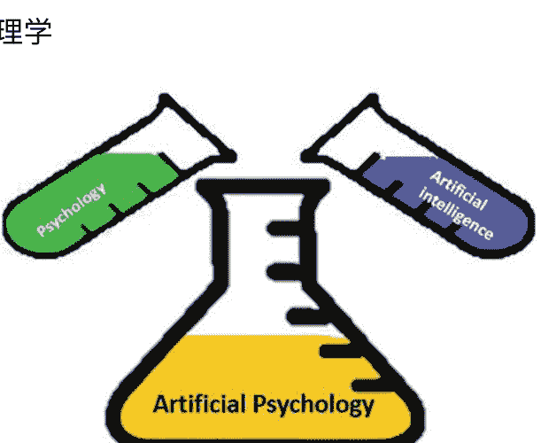

人工心理学最初由丹·柯蒂斯在1963年提出作为一门理论学科。人工心理学是心理学和人工智能的结合。作为一个综合的定义，心理学可以被称为研究个体心理过程和行为的科学。

人工智能也有各种各样的定义，可能无法提供一个包含其所有维度的综合定义；然而，它是一门涉及设计智能机器和系统的科学；这些系统能够执行需要人类智能的任务（Crowder & Friess, 2010年）。

在这里，我们回到了人工心理学。截至2022年，心理学和人工智能的发展已经满足了研究者的需求。在这里，人工心理学有一个理论框架，或者简单地说，是本书所依赖的一个理论，用来观察心理学的世界。换句话说，人工心理学使用人工智能在心理学的背景下设计、训练、测试和最终部署方法论模型。人工心理学的这种表示如图2.1所示。这个理论框架借鉴了心理学、人工智能和相关的心理背景特征。作为人工心理学的基础，这个理论在人工智能心理学中是可解释和可解释的。

本书中的人工心理学应用依赖于上述理论进行预测和分类，以提供稳健、可解释和可解释的模型。在这里，人工心理学指的是对这一理论的科学应用。

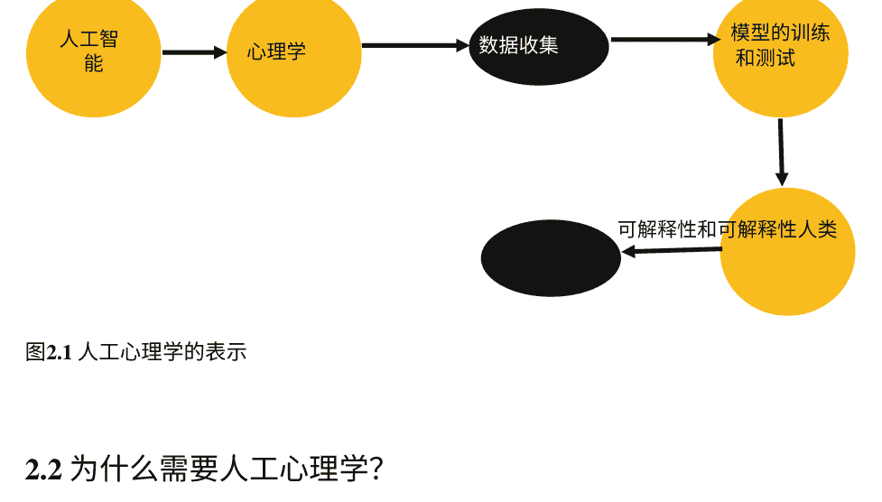

图2.1 人工心理学的表示

## 2.2 为什么需要人工心理学？

我们在这里需要解决的问题是为什么人工心理学如此重要，因为它的应用越来越普遍。

从数据分析的角度来看，心理学主要旨在创建模型，以推断人类行为已有大约一个世纪的历史。行为科学研究人员使用零假设检验来得出结论并找到人类行为的因果关系和潜在机制。


近二十年来，机器学习作为人工智能的一个分支，在学术研究中受到越来越多的关注（Lipkova等，2022年）。机器学习是人工智能的一部分，也是人工心理学中最重要和实用的部分。关于机器学习有很多定义，但是1959年Samuel给出的定义被视为工作定义（Buchanan，2005年）。

机器学习是一门研究使计算机能够在没有明确编程的情况下学习的学科。这个定义中最突出的部分可能是“没有明确编程。”在明显编程的情况下，软件接收输入数据，并根据程序员定义的具体规则生成输出（图2.2）。

我们知道这些规则保证了系统的可解释性和透明性，因为我们可以准确地理解这些规则（算法）的运行方式。因此，对算法的了解回答了模型中的“为什么”，“什么”，“如何”，从而实现了可解释性。我们将在后面回到可解释性的话题。算法时代已经让位于数据时代。图2.3显示了机器学习的简短历史。机器学习旨在设计模型以高准确度预测未知数据。推理统计学的粉丝们不必绝望。

推理统计学仍然可以用来检验零假设。这些方法被使用

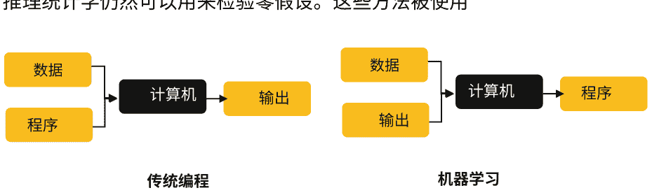

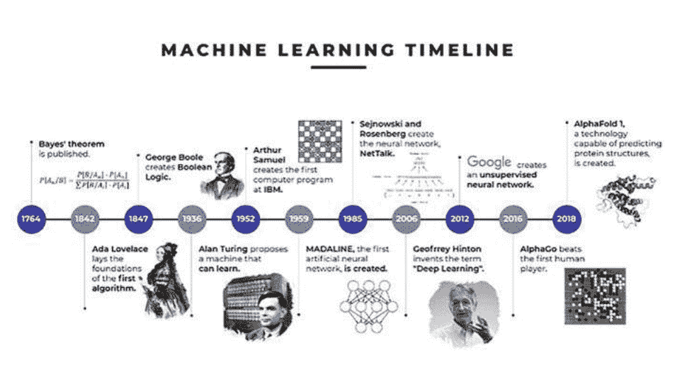

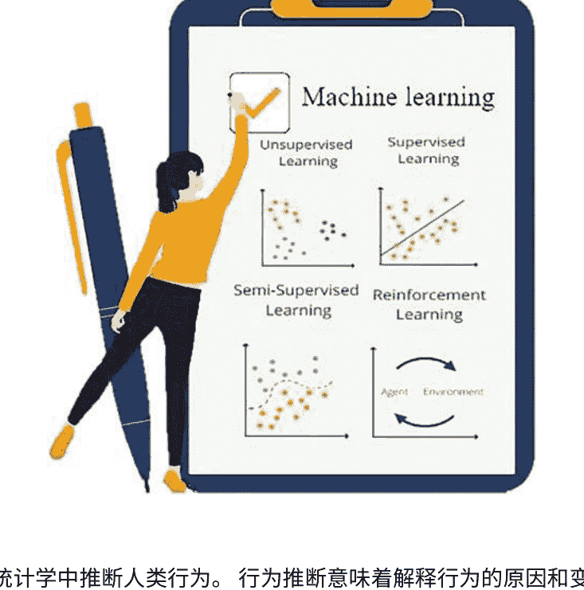

在推理统计学中推断人类行为。行为推断意味着解释行为的原因和变量之间的关系，并获得对人类行为的最佳洞察。这些方法有一些限制性假设。最显著的限制是模型的普适性值得怀疑。

在行为科学和心理学中，统计推断主要基于对聚合数据的统计检验。这些统计检验的基本假设是从群体中估计的结果可以推广到个体。将基于群体的结果推广到单个案例水平是可以解释的，只要研究的过程是遍历的。遍历性表明研究的效应在个体之间是均匀的，并且随时间保持恒定（Oliveira & Werlan，2007）。

然而，心理构建在个体中随时间组织，对于个体异常情况，基于群体的普适性是不遍历的。

另一方面，推断模型用于样本和变量规模较小至中等的情况。缺乏多重共线性是另一个假设。Yarkoni和Westfall（2017）认为，在心理学中选择经典推断统计方法的一个原因是对能够成功预测的工具的理解不足，以及这些工具在创建后部署速度缓慢。

数据和人工智能（Artificial Intelligence）科学家能够针对经典推断统计的局限性进行针对性的改进，如大量假设、泛化能力、复杂性、输入变量数量较少和预测能力较差。近年来的发展主要针对经典统计的局限性。

用于预测的模型创建了包含先进统计和概率方法的系统。这些方法通过学习数据来检测和提取

为了预测未见或样本外的数据，人工智能心理学应用模糊集理论和深度机器学习来发现隐藏的模式。这些基于人工智能的预测模型被称为机器学习（ML）。机器学习在统计推断模型上具有显著优势。机器学习摆脱了推断统计学的繁琐假设。这些假设在理论上很好，但在现实生活中，通常无法满足数据要求。

机器学习基于最小的先验假设。在机器学习中，不需要选择变量，因为在经典推断统计学中，多重共线性是一个破坏性的问题。

机器学习可以用于高维数据，其中数据集的行数少于列数。在认知和临床心理学以及神经科学中，高度相关的变量和样本量小是常见问题。例如，考虑基于临床抑郁症患者的脑电图特征来预测疾病。大样本和提取脑特征是耗时且昂贵的过程。

即使输入变量超出个体范围，机器学习也能提供良好的预测。这意味着基于机器学习的模型可以在新数据（未见过的数据）上表现良好。

心理科学研究和理论模型的一个问题是它们的复杂性。这种复杂性在建模中引发了严重的问题。复杂模型涉及选择和使用许多变量。心理现象和心理障碍主要是复杂的，因为它们包含了情绪、认知、记忆、行为和生物等子系统（模型）。机器学习使得能够构建和测试这样的模型。机器学习使得预测模型能够对个体进行建模，而不仅仅是群体。

机器学习的高级部分，称为深度学习，允许人们研究复杂的模型和系统。以下是对机器学习类型的简要描述。

机器学习使得在多个变量、小样本和复杂甚至未知的非线性变量之间进行预测成为可能，以发现隐藏的模式。发现隐藏模式。这些独特的特点在机器学习中引发了一个新的问题：这些复杂性对解释性提出了严峻的挑战，需要解释这些模型的专业知识。

统计和定量的准确性排除了定性和深入解释，因此，即使在机器学习中进行的预测模型的准确性高于经典推断统计学，结果仍然可能是可疑的。例如，如果我们打算在基于图像的深度神经网络中识别抑郁的人，而在这些图像中，抑郁的人穿着冬装，非抑郁的人穿着夏装，那么他们所属类别的预测准确率为100。然而，冬装与抑郁无关。这表明高准确性不一定是一个好的结果。谚语说

> > “好形状的苹果不一定更好吃”

在这里适用！近年来，为了克服机器学习中的不可解释性问题，人工智能和机器学习领域发展了一个新的领域，称为可解释的人工智能或机器学习（XAI或XML）。XAI的最终目标是提供模型以增加解释性、透明度和公平性。

可解释的模型通过最小化加权均方根误差（RMSE）等成本函数进行训练。值得注意的是，在机器学习中要实现可解释的模型，应该尽量将成本函数最小化，同时考虑复杂性和保真度指标的限制。保真度可以被认为是可解释模型能够逼近原始模型的程度。让我们更仔细地看看这些特点。

可解释的人工智能（XAI）及其结果可解释的机器学习（XML），这本书所讨论的人工心理学就是基于这些概念的，具有不同的特点，旨在试图解决机器学习的固有特性，即黑盒子问题，以更好地理解决策过程。

Adadi和Berrada（2018）指出，如果人类理解其操作，可解释的系统也是可解释的。这个定义表明，可解释性与解释性的概念密切相关，尽管Gilpin等人（2018）认为可解释性和准确性是解释模型的重要组成部分。

他们认为一个好的解释应该对人类可理解（可解释性）并准确描述整个特征空间中的模型行为。可解释性可能包含透明度和简洁性等特征。透明性表明解释不含糊，而简洁性意味着解释以简单、简洁的方式呈现（Rudin, 2019; Zhou & Chen, 2018）。准确性具有完整性和可靠性的特征（Zhou等, 2021）。完整性表示给定的解释描述了ML模型的整体动态，而可靠性表示解释的正确性和可靠性（图2.4）。该模型基于Markus等人（2021）。

Velez和Kim（2017）定义了机器学习环境的可解释性为“以人类术语解释或呈现的能力。”这个定义可能有点模糊。让我们通过一个例子来澄清它。

假设随着焦虑的增加，数学测试中个体的表现首先提高，然后保持稳定，最后下降。参见图2.5。

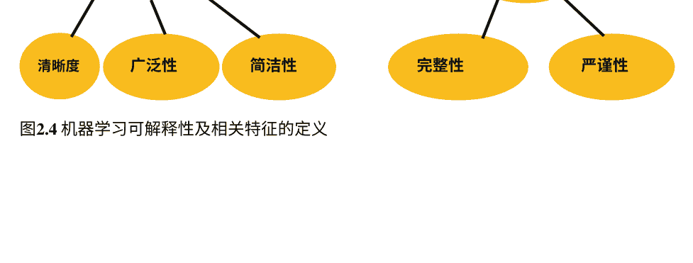

图2.5 测试焦虑与数学测试表现之间的非线性关系

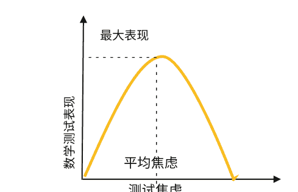

图2.6 激活与记忆表现之间的关系

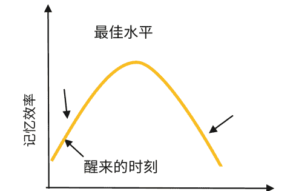

图2.5显示了测试焦虑和数学测试成绩之间的非线性关系。这种关系是一个倒U函数。

在这个例子中，可解释性可以理解为机器学习系统通过增加压力分数来预测测试成绩。这个模型的可解释性是指它基于类似Yerkes-Dadson定律的理论。这种一般理解与知识发现相关（图2.6）。简而言之，可解释性可以被认为是理解机器学习模型机制的可能性。

图2.6显示了Yerkes-Dadson定律展示了唤醒和记忆性能之间的倒U关系。

Gianfagna和Di Cecco（2021a, b）揭示了在实践中，关于机器学习模型的可解释性，我们正在寻找如果在数据中没有的特征中放入不同的值，输出将如何改变。

可解释性要求检查机器学习模型是否在有偏差的数据集上训练。这个特性是公平性，与模型验证相关。此外，研究模型必须进行调试以生成和发现知识。

模型调试确保可靠性和稳健性。这种调试是通过检查模型来显示幕后发生的事情。输入数据的微小变化不应导致输出的显著变化。这种检查有助于模型的稳定性和稳健性。

## 2.2 为什么需要人工心理学？

应牢记的是，机器学习模型最复杂的功能是获取和增加对心理过程、事件和系统的清晰理解，这些是心理科学研究中研究的对象。如前所述，发现心理知识是可解释的人工心理学的主要目的，不能仅通过预测和准确分类这些模型在心理科学中的应用来解释。科学知识的提取并不完全依靠预测。人工心理学需要创造具有可解释性和可解释性的结果。此外，在数据时代出现的另一个观点是相关性和因果关系之间的明确界线正在消失。相关性涉及两个或多个变量的关系，它们一起变化，即它们具有共同的方差，但这种相关性并不表示因果关系。在因果关系中，一个变量导致另一个变量（因果关系）。

在一个城镇中，随着鹳鸟数量的增加，婴儿数量也增加了。这种随机关联不应被视为相关性，因为虚假的相关性导致了它的存在，通过去除变量，这种关系也将被消除。此外，更严重的错误是从这种现象中得出因果推断，意味着鹳鸟把婴儿带到了城镇！

正如注意到的那样，这是一个荒谬的解释。因此，可解释性和可解释性可以通过创建有效的、经过调试的模型来发现科学知识，起到重要的作用。因此，它测试了在具有深层、混合和多层心理学的模型中应用人工智能的能力，这是本书的主要目的，并实现了模型的可解释性（表2.1）。

可解释性作为XAI理论框架的另一部分，可以在可解释的机器学习建模过程的三个阶段中进行。这个特性可以以三种类型或阶段的形式观察到（Aslam等，2022）（图2.7）。

表2.1 解释类型的总结

| 最重要的问题 | 类型 |
| --- | --- |
| (1) 模型是如何工作的？ | (1) 全局解释 |
| (2) 模型为什么对特定输入进行预测？（这个预测是否涉及数据中的特定特征或特定算法？） | (2) 局部解释 |
| (3) 模型为什么对特定数据进行某种预测而不是其他预测？（为什么是X而不是Y？） | (3) 对比解释 |
| (4) 通过调整数据和模型参数，输出如何变化？ | (4) 假设解释 |
| (5) 如何通过对模型进行最小改变来实现期望的结果？（不考虑理解其内部结构） | (5) 反事实解释 |

### 1. 预模型阶段

这种类型的可解释性与模型无关，是在模型实施之前通过数据函数实现的，通常通过数据可视化和探索性数据挖掘（如探索性因子分析）来实现。这种数据可解释性是在可解释的机器学习模型的制定和实施之前实现的，并在确定模型时起着关键作用。这种类型的可解释性与特征工程相关。

心理学家熟悉其中一些方法，以描述性统计的形式存在。

### 2. 内在阶段

这种可解释性指的是通过其内部结构加强自然可解释性的自解释模型。内在模型包括基本模型，如决策树、广义线性模型、逻辑模型和聚类模型。值得注意的是，自然可解释性与成本有关，取决于模型的准确性。

### 3. 事后模型解释阶段

这种解释性可以用于所有黑盒模型，无需了解内部结构。这种解释性甚至可以用于内在模型。

简而言之，图2.8描述了人工智能、机器学习和可解释的人工智能之间的关系（图2.9）。

让我们回到人工心理学的核心，即机器学习分类。机器学习系统通常分为三类，可以如下定义。这种划分的基础是训练类型。

- **1. 监督学习**
在这种类型的机器学习中，系统使用数据进行主动学习，将输入映射到输出。之所以将这种学习称为监督学习，是因为存在一个解决方案。解决方案被称为目标变量，在心理研究中被称为准则（依赖）变量。这个变量在数据中有一个特定的标签（例如，一百个患有注意力缺陷多动障碍的男孩和一百个非注意力缺陷多动障碍的男孩），并且有一些特征作为预测因素，基于这些因素进行预测；例如，孩子的年龄、出生率和每天的咖啡因摄入量。在这个例子中，由于目标变量有一个单独的标签并且已知，所以在数据训练中使用监督算法，如线性回归、随机树、提升树和神经网络（ANNS）。这种学习是心理科学中最广泛使用的机器学习类型（Vélez, 2021a, b）。

Farahani等人（2011年）在他们的研究中使用了一种监督学习算法。

- **2. 无监督学习**
在这种类型的学习中，训练数据没有标签。换句话说，解决方案尚不存在，系统学习寻找数据中的隐藏模式（例如PCA、K-means和自编码器聚类算法）。在这种算法中，目标变量（准则）未确定。机器学习的这一部分更多关注于通用人工智能。Grazioli等人（2021年）在儿童ADHD个性化治疗方面使用聚类算法的研究中可以找到一个例子。

- **3. 强化学习**
这种算法与前两种算法及其交集不同（图2.10）。在这种算法中，没有对可用数据进行机器训练。这里有一个代理在环境中执行动作并接收奖励，其目标是找到一种策略以最大化奖励。

在这里应考虑深度学习算法，它们不适合这三个部分。深度学习是一种机器学习类型，它运行在多个隐藏层上，并产生最成功的发现和操作。

如上所述，机器学习和深度学习系统中有三种类型的学习算法，并没有单一的解决方案或一套规则来告诉哪个类别需要更多的可解释性。可解释性与该类别中算法的可解释性相关。

根据图2.11，人工智能的各个领域存在横向和新兴的需求。换句话说，尽管数据驱动的预测和建模是人工智能的新领域，但应记住机器学习中预测的主要基础是相关性（Zhou等，2018年）。此外，当这些预测、分类和聚类被解释时，知识就会产生。

总之，人工心理学旨在应用可解释和可解释的人工智能，更准确地说是可解释和可解释的机器学习，来发现知识。这个新的研究领域的目的是使用基于可解释和可解释的人工智能模型来研究理论模型，以便能够从人类的角度理解内部运作。这种可读性模型将准确性与透明度结合起来，它基于ML或AI改进模型的弱点。因此，通过使用XAI、基于规则的系统和贝叶斯模型，人工心理学在减少模型的歧义性方面将非常有帮助。

重要的是要注意，为了减少使用基于规则的系统和使用在测量结构中最常用的语言变量时的歧义，可以应用模糊推理系统（FIS）。

此外，贝叶斯网络分析（BNA）是一种基于先前知识和信息的可解释和可解释的模型。这些先前的知识有助于增加模型的透明度和准确性，从而提高其可解释性和可解释性。

这是人工心理学的目标之一。图2.12展示了人工心理学的子领域。
图2.12 XML结构

除了理论知识外，为了更加熟悉本书中的人工心理学子领域，有必要掌握使用R软件、Python和偶尔MATLAB运行每个算法的必要代码。

我们知道本书不是一本软件指南，但它的目的是介绍人工心理学及其子领域，并提供示例。

### R软件

三十多年来，R（www.r-project.org）和Python（www.python.org）一直为每个人提供了使用ML算法的便利，因为它们是免费且开源的。最近，Julia（www.julialang.org）已经成为一个强大而有效的替代品。自1995年以来，R一直是一种具有各种功能的语言和环境，统计和图形方法用于经典统计学、机器学习、聚类和预测模型，并且具有很高的可扩展性。在R中有几个免费的ML、FIS、FCM和BNA软件包。请参阅综合R存档网络（CRAN）获取更多信息。

### Python软件

Guido Van Rossum于1991年开发了Python软件。它是一种广泛使用的软件，具有高级、面向对象的编程语言。有各种各样的Python软件包用于ML、FIS、FCM和BNA。该实践在下面进一步解释。我们不在椰子岛上寻找椰子！目标是提供一种新颖的观点、新颖的功能和新颖的心理研究中的发现。

### 建模现象的主要方法

首先，人工心理学研究人员必须设计他们的模型来预测或分类目标变量。在这一步骤中，研究人员试图通过检查理论和研究背景来实现所需的模型。

为什么选择它们？什么是测量工具？什么是工作创新？这种方法在本书中被称为基于知识或基于模型的方法。事实上，在这种方法中，通过多种来源设计初始的假设模型，包括文献综述、领域经验以及对目标和专家群体的访谈，使用定性分析（主题分析和内容分析）（图2.13）。

第二种方法，也称为数据驱动或科学驱动的方法，使用数据作为模型的灵感来源。现在被称为数据时代。尽管大数据一直存在，但现在记录的是大数据。

有多种方法可以记录大数据。在心理学中，数据可以从多个来源获取，包括使用脑电图、反应时间、基因和组学数据的调查和临床测试（Velez, 2021a, b）。通过互联网、国家网络和智能手机记录数据导致了数据爆炸，可能会引起混乱。在这种情况下，人工心理学家试图基于数据驱动模型来达到可解释和可解读的模型。我们知道，人工心理学家可以为特定目的收集数据，并使用收集到的数据来设计最终的模型，一个可解释和可解读的模型。下图详细展示了数据驱动模型的过程（图2.14）。

需要知道模型基于和数据驱动方法的可解释性和可解释性特别重要。值得注意的是，在监督模型中，可解释性和可解释性相对更直接，因为它们发生在一个标签绑定的环境中。此外，白盒算法（如线性回归、决策树和逻辑回归）的可解释性和可解释性并不重要，因为它们的算法非常清晰。

接下来，将详细解释人工心理学中基于知识和数据驱动模型的可解释性和可解释性。

## 2.4 在基于知识的方法中的可解释性和可解释性

如图2.15所示，这种可解释的人工心理学方法是非常重要的，它是这本书的承诺地。

在这种方法中，模型是基于先前的知识设计的，在定量研究中，使用了基于可解释的机器学习的现代方法，这是可解释的人工智能的一部分。值得注意的是，在这种方法中，基于规则的模型，包括贝叶斯网络分析、模糊推理系统（FIS）、模糊认知图（FCM）和自适应神经模糊推理系统（ANFIS），都是基于通过理论基础、文献综述和专家意见或原始数据获得的规则。先前的知识是它们的基础。因此，它们被认为是白盒子，是可解释和可解释的。然而，我们希望将模糊逻辑模型和模糊集称为灰盒子，因为模糊逻辑将灰色土地视为其承诺之地！因此，得到的模型是可解释的（内部可解释性）。监督和黑盒算法需要可解释和可解释。模型的可解释性是执行计算方法的一个重要标准。

已经提出了各种方法来解释黑盒机器学习产生的模型。根据Jaganathan等人（2022）的说法，这些方法可以分为两种类型：基于模型可解释性和基于实例可解释性的方法。相关文献中的基于模型和基于实例的可解释性分别被称为全局解释和局部解释。另一方面，这些解释方法可以是特定于模型的或模型无关的（不可知的）。

鉴于第二种方法中解释性和可解释性的监督算法，可以根据相关来源的摘要提出几种方法。该模型可以基于无监督算法从数据中提取出来，采用数据驱动的方法。然后，可以使用白盒算法（例如，逻辑回归或决策树）或其他监督黑盒算法或专家的意见来解释目标变量。例如，可以通过运行随机森林和/或支持向量机（SVM）以及SHAP或特征选择来给出结果的可解释性。

图2.17表示这个过程。
总之，在人工心理学中，测试模型是通过两类监督和无监督算法（本书不讨论半监督和强化算法）进行提取和解释的。可预测性和可解释性与准确性、精确性和人类可读性是心理学研究领域的主要目标。

## 2.5 心理学中的阿喀琉斯之踵

近年来，一些学者声称心理学的理论基础不稳固（Fielder等，2017年；Erone n和Bringmann，2021年）。他们认为心理学理论总体上质量较低。因此，研究人员应该将重点放在发展更好的理论上，而不是改进统计方法。换句话说，理论危机是心理学的阿喀琉斯之踵，而理论危机比复制危机更为重要。他认为，尽管心理学家对于发展新理论感兴趣，但这些理论并没有以一致的方式呈现。它们没有经过测试、证明或证伪。它们只是“存在”，直到被遗忘或搁置。

有人认为这种理论化和理论退化导致了可重复性危机。

无疑，理论是心理研究者最强大的科学工具，无论是像弗洛伊德的大理论（关于人类的革命性观点）还是小的理论丰富的泡沫。可以说，理论通常是由一小群理论家开发的。这个问题被米歇尔（2008年）称为“牙刷问题”，即心理学家将理论视为牙刷：没有人（通常）使用别人的牙刷。需要提到的是，这并不意味着心理学缺乏必要的理论。这意味着心理科学缺乏理论化和方法论。

研究人员主要集中于基于演绎法发展假设，然后通过收集数据和使用归纳（统计）方法来测试这些假设。换句话说，科学方法是基于演绎和归纳方法的混合。

演绎是指必须存在的东西，归纳是指正在进行的东西。换句话说，理论是假设-演绎过程的结果，这个过程依赖于科学通过不断的科学测试来发展的假设。这是心理学大部分书籍的基本假设。使用演绎、归纳和统计是非常有价值的，没有人会贬低它们的重要性和作用；然而，这种方法是有限和机械的，理论化的过程不仅仅是程序步骤。

本卷的目标是实际实施一种方法，通过使用大数据、学者的观点以及可解释和可解释的人工智能，鼓励心理学家发展理论。希望本书提出的方法能够作为演绎方法的输入，用于生成理论。

希望这本书中提出的方法能够作为产生理论的归纳方法的输入。

也许这可以被称为心理科学历史上的第四范式（图2.18）。

归纳可以被看作是从不可信的可解释性到可信的可解释性的过渡，因此可信度是主要的标准。在演绎和归纳中，有效性和不确定的现实分别被认为是主要的标准。因此，在人工心理学中，使用XAI从网络中提取出稳健的模式，然后使用归纳方法在理论构建过程中使用这些模式。例如，心理学家假设所有抑郁症状都可以在自闭症儿童中检测到。然后，在参加特定教育中心的20名自闭症儿童中，有一个孩子似乎没有抑郁症状，而是快乐的。

假设我们的20个孩子样本是有效的样本，我们可以归纳地说并非所有自闭症儿童都有抑郁症状，并且演绎地说所有自闭症儿童都有抑郁症状。快乐的自闭症儿童在人群中是一个异常，这可能引发一些关于归纳方法的问题：这个孩子真的是自闭症吗？他/她是否患有不同类型的自闭症？他/她可以被分类到光谱的另一部分吗？这个孩子是否患有其他疾病？

让我们来看另一个例子。假设有人想要使用多层感知器神经网络（甚至深度学习）来预测自杀企图，通过使用情绪模式、认知模式和本体模式等特征。在数据收集和模型准备之后，输出将表示这些特征在分类中的重要性。然后，通过使用SHAP和LIME等必要的模式，这些特征变得可解释和因果关系。这些派生的模式可以用作使用演绎方法进行理论化的输入（图2.19）。

大数据是人工心理学的新限制吗？如何在人工心理学中使用小样本并希望进行发展？

互联网、数字化以及在不同数字平台上存储数据的能力使得大数据更加可获取。大数据一直存在，但我们没有大数据的记录，这使得第四范式，数据探索，成为现实。在心理研究中，纸质问卷已经变成了可以轻松分发给参与者并通过智能设备在线访问的超链接。随着技术的快速发展，大数据似乎变得更加可获取。另一方面，有人可能会说，小样本研究不适合理论发展，因为这些研究可能不透明，其结果可能无法复制（Aguinis & Solarino, 2019; Pratt等, 2019）。

那么，我们能相信结论吗？应该说，在实践中，有可能使用相对较小的样本在人工心理学中找到稳健的模式。与依赖假设检验的经典统计方法（或归纳方法）不同，机器学习的主要关注点是过拟合，这可以通过本书中介绍的方法轻松克服。对机器学习文献的综述，本书的核心内容显示，已经有100多篇学术论文使用了“鸢尾花数据”。这个数据集包含150个观察案例，涉及五个特征（Dua & Graff, 2017）。我们知道，在某些心理科学领域，数据是相当昂贵的。然而，有研究专注于这些问题和困难，并试图解决小样本研究的问题。

# 第三章 模糊集理论与心理学

## 3.1 模糊集理论与心理学：理论观点

心理学是对个体的心理过程和行为进行科学研究的学科。模糊思维是一种研究心智的方法。这种方法假设大脑是一个模糊推理引擎，心智是一组内卷的模糊微地图。

模糊性、不确定性和重叠是这种心智的主要特征，在经典心理学中通常是缺少甚至很少见的。心理学是一门科学，因此心理学家试图正确观察真实的心理系统或心理现象，测量和评估数据，使用定量和定性方法进行分析，并解释结果。如果结果具有可复制性和可靠性的特征，他们会建立原则，然后引入经验理论。也就是说，为了研究现实世界的系统或现象，我们将它们与理论结构和基础相连接（Seising，2008年）。

这是科学的核心，因为如果不接受这个假设，我们就无法研究现实。正如沃尔夫冈·布拉泽（1982年）所认为的，我们在现实和理论之间建立了这种联系，并假设这是可能的。如果没有这个重要的假设，谈论经验科学就是没有意义的。这种方法的主要目标是在上述假设下引入新的概念和方法来研究心灵和心理现象。

## 3.2 心灵的灰色世界

我们不是生活在世界中，而是世界生活在我们内心。这种说法并不新鲜，而是可以追溯到很多年前。公元前11世纪的佛陀认为，现象不是完全黑或白的，没有什么是固定或永恒的，变化总是可能的。基于这种观点，问题本身并不是问题；相反，我们对问题的反应才是我们的问题。

不确定性或模糊性是人类经验、语言和感知的一个广泛部分。人类感知充满了不准确性。现实世界不是一个抽象的概念；它不能被感知、定义明确和精确计算（Wierman，2010年）。模糊和不确定性作为不确定状态通常被认为是我们对世界的信念和表征无法准确预测未来环境事件的一种认识（Mushta等，2011年）。重要的是要注意，不确定性可以以多种形式存在。不确定性是生活在现实世界中所付出的代价（Wierman，2010年）。回顾相关文献发现，个体差异影响我们对不确定性的处理（Mushta等，2011年）。有许多不确定性的来源可能会影响这个领域的研究。这种不确定性存在于临床决策、疾病诊断和心理构建的测量中。值得注意的是，不确定性是由心理研究者和参与者对数据收集的贡献所引起的，因为心灵可以被视为不确定的。在心理研究中，存在许多处理不确定性的数学方法。这些方法中的一类较新的方法被称为非概率方法。在这些方法中，我们重点关注模糊集理论的方法。这种心理研究方法扩展了对心灵的经典观点（图3.1）。更正式地说，这些理论系统被称为独立系统（Blazer，1982年）。这意味着研究者收集数据并建立一个模型，作为对真实系统的一个非常简单的描述。虽然在科学工作中足够，但这种简化导致了对世界的黑白、扭曲和静态的描述。换句话说，研究者正在寻找一个简单明了的现象图像，但是图3.1 本书在心理学中的定位

图3.2 从现实到模型

图3.3 从现实到模糊微地图

这个观点无法捕捉到一个动态而难以捉摸的心理过程。因此，现实与这些理论系统之间存在着差距（图3.2）。在这里出现的主要问题是差距是什么，以及如何与现实建立联系。在这个观点中被忽视的是我们对现实的感知，它位于经验层面和理论层面之间。总结起来，对真实系统和对这些实体的感知之间的区别导致了对结构主义方法的修改，这涉及到经验层面。利用模糊集理论可以实现这种修改。这种新方法可以改变以前研究心理过程的模型（见图3.3）。

在这个新的视角中，保留了真实层，但以前的经验层被模糊层取代。我们同意Seising（2008）的观点，他认为模糊层是一种主观结构，是观察者感知所强加的。这个模糊层意味着我们对现实的感知是模糊的、模棱两可的和不确定的。

模糊层导致了一个被“模糊微观地图”覆盖的心灵。模糊微观地图是个体对心理事件的感知。模糊心理学家试图通过与个体进行详细访谈来捕捉这张地图。模糊心理学家通过分析个体讲述的故事来绘制这张地图。这个领域的主要目标是引入方法来收集模糊微观地图，然后将它们组合和聚合成为模糊组合地图，并使用模糊集理论进行推理。换句话说，“我们观察到的不是自然本身，而是自然暴露在我们提问的方法下。”这是海森堡在科学史上最重要的陈述之一。基于这个观点，研究心灵的研究结果受到了发展它们的特定思维的污染。我们对现象的感知是由那种思维所强加的。这种思维被称为模糊层，它是这种方法的基础。模糊层产生了不精确和不完美的信息，但这些信息更具动态性、合理性，并与现实世界更一致。这个模型的主要组成部分是模糊层和模糊微观地图；模糊推理系统是通过应用模糊集理论产生的，并且它导致了一些基于它们的创新的模糊推理方法。这是这种方法的一个一致特征。

## 3.3 心理学视角下的模糊逻辑

在经典的心理学观点中，我们很容易看到心理学作为一门科学必须描述、解释和预测心理现象。实现这一最终目标并不总是容易的。为了实现这一目标并保持心理现象的科学性，通常采用统计方法或费舍尔统计学。尽管这些方法对这门科学产生了影响，但它们没有考虑到心智是一个重叠、动态和综合的映射。简而言之，在这种方法的假设下，心智是一组模糊的集成重叠的模式或映射。它们之间的边界并不清晰；它们更像是蜘蛛网一样模糊和含糊不清。模糊推理系统依赖于这些假设。换句话说，这些困难根源于人类思维的本质。心理并不由不同的部分组成，而是一个动态、灵活和复杂的整体。

心理过程及其状态的信息不完整性和不确定性和有争议性导致了心理学、诊断、研究、治疗、预测和分类以及理论构建方面的挑战。

对心理状态和特征的最佳和最精确的描述是由个体的语言术语进行的。这些术语不精确且模糊。同一种障碍可能会因其强度和患者的个体特征而表现出不同的方式。一个症状也可能对应于不同的障碍（Torres & Nieto, 2006）。另一方面，一些障碍被认为是非特异性的，例如需要开发新的理论来建模混合情绪。例如，一些证据表明人们可以同时感到快乐和悲伤（Larsen & McGraw, 2011；参见Fang等人, 2018a, b）。基于经典观点，正常（非疾病）和异常（疾病）是互斥的，甚至可能是相反的。这个观点源于亚里士多德逻辑，在人类推理、知识和科学领域影响了大约2000年。一切事物要么是，要么不是。在给定的主题、给定的方面和给定的时间内，谓词要么属于给定的主语，要么不属于。那要么是A，要么是¬A。上述规则的现代表述是∀x(A(x) ∨ ¬A(x))。

根据这种无情的分类观点，每个命题或状态只有两个逻辑值：真或假（1或0）。然而，在现实世界中，并不是所有事物都可以被归类为黑或白；相反，现实世界被我们的感知所染色。因此，大部分时间，我们对世界的看法是灰色的。让我们通过一个简单的心理学例子来演示这一点，使用明尼苏达多相人格测验（MMPI）的一项陈述。这个测试及其不同版本是心理学环境和研究中最常用和重要的测试之一。陈述：“我认为很多人夸大自己的不幸以获得他人的同情和帮助。”这部分是真实的，部分是错误的，取决于个体的状态和情况。

考虑这个陈述作为另一个例子：“我是一个有名的人。”如果你是一个超级大国的总统，这是真的，但如果你是一个小边缘村庄的牧羊人，那就是假的。我们在这里谈论的是两种人的相对名声。每个人都在某种程度上是众所周知的（W），也在某种程度上是未知的（N）。如果你是有名的，W=1，而且每个人都有一定程度的声誉，那么W<1。

W + N = 1

W + I + N = 1

(I) 在W+I+N=1中表示为“我不知道。”

让我们注意一下《精神障碍诊断与统计手册》（DSM-5）中强迫症的诊断标准。标准A指出强迫症、强迫行为或两者的存在由两个因素确定：首先，反复出现的、持久的思维或冲动，在干扰期间的某个时间被体验为侵入性和不受欢迎的，并且在大多数数人中引起明显的焦虑或困扰；其次，个体试图忽视或抑制这些思想、冲动或形象，或者用其他思想或行为来中和它们（即进行强迫行为）。强迫行为的定义如下：

+ 1. 重复行为（例如洗手、整理、检查）或心理行为（例如祈祷、数数、默默重复单词），这些行为使个体感到被迫执行，以应对强迫观念或必须严格遵守的规则。
+ 2. 旨在预防或减少焦虑或困扰，或预防某种可怕的事件或情境的行为或心理行为；然而，这些行为或心理行为与其设计的中和或预防的目标没有实际联系，或者过度。注意：年幼的孩子可能无法表达这些行为或心理行为的目的。标准B指出，强迫观念或强迫行为耗时（例如，每天超过1小时）或在社交、职业或其他重要功能领域引起临床上显著的困扰或损害。标准C指出，强迫症状不可归因于物质的生理效应（例如，滥用药物、药物）或其他医学状况。标准D指出，这种障碍不能更好地解释为另一种心理障碍的症状（例如，过度担忧，如广泛性焦虑障碍，对外貌的过分关注，如身体畸形障碍，难以丢弃或分离财物，如囤积障碍，拔发头发，如拔发障碍（拔发头发障碍），挑皮肤，如剥皮（挑皮肤）障碍，刻板动作，如刻板性运动障碍，仪式化的进食行为，如进食障碍，对物质或赌博的过分关注，如物质相关和成瘾障碍，对患病的过分关注，如疾病焦虑障碍中的性冲动或幻想，如性偏好障碍中的冲动，如破坏性冲动控制和行为障碍中的内疚反思，如重度抑郁障碍中的思维插入或妄想占据，如精神分裂谱系和其他精神障碍中的思维插入或妄想占据，如自闭症谱系障碍中的重复行为模式）。多年来，这种障碍属于一个更大的焦虑障碍类别，但在2012年重新分类。显然，这种障碍的本质并没有改变，而是定义发生了变化，这种变化可能在将来也会发生。这个例子暗示了心理构造之间的界限并不明确，而是模糊和模糊的。

这意味着我们面临着类别的部分包含（至少有两个类别）。根据Wierman (2010)，这是模糊思维的关键组成部分。尽管模糊集理论在科学的许多领域已经成功应用了50多年，但在心理学领域中，只有少数研究作品，主要是文章，使用了这个理论。虽然现有的方法没有考虑到心理学家可以轻松使用的实际方面或软件代码，但它们可以被视为在心理学中应用模糊集理论的理论起点，例如Smithson (1982)，Zelenyi (1988)，Smithson和Oden (1999)，Ragin (2000)，Smithson和Verkuilen (2006)，和Arfi (2010)。心理学中模糊集理论的一些最新例子包括以下内容：

- 感知的模糊逻辑模型（参见Oden & Massaro, 1978; Massaro, 1989; Massaro & Cohen, 2000; Martínez-Jiménez等, 2018年）
- 基于模糊集的记忆和注意力理论 (Perfilieva & Vajgl, 2015年; Terziyska等, 2015年)
- 模糊决策（参见Khefacha & Belkacem, 2015年)
- 模糊精神病理学（参见Horowitz & Malle, 1993年; Mosoiu等, 2010年; Ekong等, 2013年; Reinertsen等, 2017年; Ashish等, 2018年)
- 模糊意识（参见Huette & Spivey, 2012年)
- 模糊测量和测试（参见Stoklasa等人, 2011年; Farahani等人, 2018年, 2019年)
- 模糊方法学（参见Sugeno和Yasukawa, 1993年; Stoklasa等人, 2014年)
- 模糊认识论（参见Seising, 2008年)
- 模糊临床诊断（参见Baig等人, 2011年; Erin和Abiyev, 2019年)

## 3.4 为什么模糊逻辑理论？

根据文献，可以合理地认为模糊逻辑及其衍生物对处理结构不明确和定义不明确的心理现象的心理学家是有帮助的。由于其本质，许多心理构造并不明确。例如，将患者分为两个明确的群体通常是困难的，因为重叠和部分包含是不可能的。我们的思维是连续的，充满了重叠的模糊微地图。因此，可能会面临许多情况，可能属于至少两个类别。在软科学中，找到心理概念之间的明确而清晰的界线非常困难。心灵的连续性意味着我们的心灵更类似于在雨天日落时重叠的云块，而不是海岸上明显的沙粒。当我们离阈值太近时，分类变得更加困难。实际上，许多心理特征，如情绪、认知和障碍，都是混合的且具有不同程度。例如，一个外向的人可能有一些内向的程度，反之亦然。抑郁的人可能在某些症状上得分很高，在其他症状上得分可能处于中等或低水平。阶段的概念在皮亚杰或弗洛伊德的旧心理理论以及认知心理学和神经科学中都在建立和扩展的新理论中都很重要。

这些阶段并不是彼此独立和分离的，而是重叠的。这种连续性可以通过模糊心理学的观点来解释。心理数据和语言数据是相同的，模糊逻辑理论是量化语言数据的强大工具。在心理学中，通过标准化测试或面试收集个体的信息；因此，信息是用文字提供的。这些文字充满了不精确的信息，需要进行量化。一个概念对不同的人可能有不同的意义。例如，当两个人在对“我对我的生活感到满意”这个项目的回答中都选择了“非常高”，他们可能对非常高有不同的心态，尽管选择了相同的答案。“非常高”并不代表一个普遍的标准，而是根据个体而变化的。你可能觉得它值得评为5分，而你的朋友可能是10分，尽管对你们两个人来说都是非常高的。

定量心理研究主要依赖于经典统计学，其中测试零假设是必要的。零假设直接进行测试，而备择假设或研究假设则间接进行测试。在零假设检验中，p值是对接受（真实）或拒绝（错误）该零假设进行统计决策的标准。大多数心理研究人员分析他们获得的定量数据，直到观察到小于0.05的p值；这可能导致第一类错误的增加。许多科学家批评p值（例如，Simmons等人，2016年；Cumming，2011年），他们认为p-hacking在科学界普遍存在（Head等人，2015a，b），在这里我们增加了“仅仅是显著结果”的显著性（Leggett，2013年）。这意味着心理研究者，像其他研究者一样，只对发布显著结果感兴趣，我们观察到p值的激增和文件抽屉效应。这意味着统计上不显著的结果被忽视和隐藏（参见Lakens，2015年）。

这些具有挑战性的问题威胁着科学知识的稳健性。在模糊推理系统中，替代假设的程度被直接测试。这有助于我们捕捉心理事件、过程和现象的更真实的图景。

模糊推理系统旨在重新思考心理理论，寻找新的结果，并试图解决心理研究中所谓的“信心危机”。这个问题引起了贝叶斯统计学家的关注（参见Marsman和Wagenmakers，2017；Wagenmakers等，2018）。临床决策是心理学中的关键活动；我们如何使用模糊逻辑在临床环境中做出决策？模糊推理系统关注临床心理学家如何建立临床模型并做出模糊决策。基于这种方法，心理学家能够考虑诊断障碍或确定心理治疗的效果和有效性的许多因素。总之，模糊推理系统的主要目标是基于定性和定量研究捕捉反映在语言概念中的心理概念。

这种方法将定性研究的深度与定量研究的精确性联系起来。这种桥梁在心理学中很有趣且有用。正如我们已经提到的，二值逻辑无法充分地模拟模糊系统。发展和关注模糊思维和理论的历史悠久且有趣。这个过程代表了模拟的尝试的发展。在科学史上，“模糊性”是一个模糊的概念。我们在这里的目标是展示在研究心灵和需要模糊推理系统方面拥有这种观点的必要性。

模糊推理是否是心理学的一个合理领域？回顾文献表明，已经有很多关于认知和情绪的研究。其中许多研究都是基于经典统计学的，因此只能测试简单的模型。例如，我们可以发现认知系统具有一个基础的交互网络（Stephen & Mirman, 2010; Spence等, 2004），具有有意义的噪声条件，这对计算（Kello等, 2008; Kello & Van Orden, 2009）和自上而下的感知处理的约束（Motter, 1993; Spivey & Spirn, 2000; Gandhi等, 1999; Ito & Gilbert, 1999; Lamme & Roelfsema, 2000）非常有用。尽管这些研究尝试是重要且有启发性的，让我们认识到许多复杂的现象，但值得注意的是，仍然有理由开发和扩展模糊推理系统作为一个主要的研究方向。几乎所有这些研究都基于线性假设，这种条件简化了世界，可能为我们提供了一个现实和稳健的模型。然而，Huette和Spivey（2012）认为，过渡到对意识进行描述和准确建模的最困难的部分是放弃线性因果关系。模糊推理系统使用模糊逻辑来更接近地表示人类思维，不做线性关系的假设。Huette和Spivey（2012）提取了一些基于对意识研究文献的回顾，存在共同点。他们还创造了“模糊意识”这个术语。这些共同原则包括以下内容：(a) 意识的日常体验是嘈杂的，不完美的，最多只能获得部分信息。大部分时间都是通过概念、感知和情绪的空间移动，从未完全以无上下文的方式达到任何纯粹的概念。这意味着在任何给定的时间，意识是由自然环境中的成千上万个环境输入、与先前学习经验相关的数十亿个神经元的约束以及配备高维感觉和运动参数的框架所定义的。所有这些变量的组合形成了所报告的意识。(b) 应考虑所有相关变量。这是基于线性假设和经典统计学。即使考虑了所有变量，在某个特定时间，我们可能会面临一些不寻常的思想和行为。例如，假设Shannon是一名研究生，她被告知她提交给一家期刊的论文昨天被拒绝了，她必须尽快修改并提交到另一家期刊。她离婚了，孤独无助，她的母亲病得很重，她的父亲去年去世了。你看到她独自坐在大学门口的咖啡馆里抽烟，你发现她感到沮丧。她的这些意识状态是可以预料的，但你也可能看到莎娜突然开始笑起来。这不是她意识的预期状态，因为她感到沮丧，但有可能她在一瞬间记起了一个笑话。根据像休特和斯皮维（2012）这样的研究者，我们相信模糊意识可以解释这种令人惊讶的行为。应提供模糊意识的证据。这个新理论是一个非线性和模糊系统（休特和斯皮维，2012）。心灵的连续性，这是斯皮维等人（2005）所争论的，是一种新的观点，可以省略心灵的清晰边界。简单来说，心灵是连续的，但对于外部观察者来说，一个特定的行为可能被看作是离散的，孤立的。

有哲学证据支持模糊心理学的重要性和必要性；例如，泰勒（2022）提出了一个新的哲学观点，认为知觉是一个混乱的群集，由不总是有效的机制支持。非知觉和知觉之间存在模糊的过渡。这是一个完全全新的关于知觉的思考方式，在哲学中完全未被探索。有一些神经学证据支持对心理学的模糊观点的必要性。在神经学研究中并没有太多关于模糊性的证据被考虑，尽管Raya n等人（2015）指出，在患有情绪障碍（MDD和BD）的患者中，认知控制方面存在共享的表现障碍，相对于健康对照组。他们还表明，由于更大更多样化的独立群体，这些看似共享的损害维度的神经生物学基础并不像我们希望的那样清晰明确。

模糊逻辑的本质与现实世界非常接近，因为它可以量化语言变量，我们用它来表达情感、认知推理、判断和决策。由此可见，模糊推理系统帮助我们解决心理研究中的“信心危机”，这是由于经典统计学忽视了更复杂的关系。模糊推理系统的一个重要假设是模糊层。我们可以将这一层视为我们的感知。重要的是要注意，感知是认知和情绪的核心。毛（2018）认为，一个实体并不简单，而是复杂的，并与其他事物相互关联。换句话说，现实是事物的状态，无论它们是否可观察或可理解，无论过去还是现在。感知是基于我们可能对刺激的经验进行解释。这意味着大脑是构建我们感知的积极参与者。大脑创造的感知是接收到的信号与其所做的相互作用的结果。为了理解感知和通过感知获得的知识，我们必须不仅探究大脑接收到的信号的性质，还要探究大脑的贡献以及其特性对知识获取的限制（康德，1908年；叔本华等，1859年；如引自泽基，2001年）。泽基（2003）认为，大脑作为一种灵活的工具，进化出来用于获取关于明确和模糊条件的知识。模糊条件并不罕见；相反，我们经常遇到它们。模糊条件是存在两个或多个解释的条件，每个解释都具有相等的有效性。然而，我们在任何给定时刻只能意识到一种解释（泽基，2003年）。这表明我们的感知是我们所称的模糊层。根据毛（2018年）的观点，通常一个事物（T）是多边的或复杂的，因此对其现实性的把握对人类来说是困难的，世界的复杂性意味着对一个事物（T）的认知系统本身就是复杂的，即由许多可能相互作用的组件组成的系统。最近的一些研究暗示我们可以体验到混合情绪（参见方等，2018a，b；凯尔特纳等，2019年）。范德海德等（2011年）指出，人类可以体验到（1）情绪的混合和/或（2）情绪的冲突，毛（2018年）在数学框架中描述了这种模糊性。在模糊推理中，我们通过应用模糊集理论及其衍生物来构建这样一个框架。

让我们以一个典型的例子来说明认知系统的复杂性。这是一个众所周知的寓言故事：“盲人摸象”。这是佛教中的一个著名故事，意味着整体大于部分，但我们总是倾向于关注部分。在这个故事中，有六个盲人。

### 心理系统的模糊建模

> 神经症是无法容忍模糊性的（西格蒙德·弗洛伊德）。

他们被要求通过触摸大象的不同部位来确定大象的样子。这些人分别触摸了大象的腿、尾巴、鼻子、耳朵、肚子或者象牙，并声称它像柱子、绳子、树枝、扇子、墙壁或者实心管。

同样，鲁米（1207-1273）也在其著作中包含了这个故事。在他的重新讲述中，“黑暗中的大象”，一些人把一只大象带到一个黑暗的房间里展览。许多人在黑暗中触摸大象，并描述他们碰到的任何东西。这个寓言故事与沃纳·海森堡（1901-1976）的著名陈述非常接近。他说自然科学并不仅仅是描述和解释自然。它实际上是自然与我们之间相互作用的一部分。在这个著名的寓言故事中，人们对大象的部分感知类似于“模糊微地图”。尽管在模糊文献中有一个称为认知地图的术语，它是通过专家调查影响现象的因素而捕捉到的地图。

模糊微地图是从一个认知中获得的网络。在模糊推理系统中，认知是一个产生他或她对现象的模糊微地图的人。他或她对现象的感知是相同的模糊层，感知过程的理论结构作为输出是模糊微地图。模糊心理学家试图从认知的角度使用数据收集方法收集模糊微地图。在我们的大象例子中，每个模糊微地图是上述提到的大象部分的名称；因此，所有的模糊微地图需要组合成一个最终可测试的地图。值得注意的是，模糊微地图是从认知提供的数据中获得的。正如我们所见，认知是一个拥有系统信息和经验的人（每个人都触摸大象的一部分）。任何人都可以成为一个认知。数据是通过包括认知的讲故事、记录详细访谈的转录、MRI、EEG、QEEG和EMG等方法获得的。模糊微地图是一个认知的可读心智地图。在提供所有的模糊微地图后，模糊心理学家使用专家小组将它们组合起来，并提供一个最终地图。这个最终地图将成为模糊推理的基础。因此，模糊映射帮助我们找到一个难以捉摸现象的真实模型。模糊地图比传统方法具有更高的灵活性，能够捕捉更多重要的复杂关系，并具有更强的泛化能力。

心理学研究的主要目的是对心智进行建模，并定义正常和异常，而这些通常并不明确分离。心理学研究中的大多数样本都是小规模且非随机的；因此，统计推断并不是一种推广结果的强大方法。在心理学研究中，将P值作为零假设检验的核心已经受到了严厉的批评。贝叶斯统计要求对先验分布进行明确定义，这并不容易。定性研究可能是一个合适的替代方法。尽管这种方法可能有用，但其精确性还是有些模糊的。另一方面，模糊推理系统是一种捕捉和解释心智及其过程的强大方法。这种方法桥接了定性研究的深度和定量研究的广度，并通过使用不同的信息源并将它们整合起来进行推理，更接近于心智的推理方式，从而解决了许多困难。

根据模糊逻辑，一个概念很少是完全真实或完全错误的，而是介于这两个极端之间。

这种差异的一个简单例子在图3.4中显示，其中不是使用一个确定的数字来定义数字x，而是引入了相似度（或真实度或隶属度）的概念，由隶属函数（mf）A x: μ()来定义。模糊集合的解释源于对经典集合的概念的推广，以包括模糊概念和不清晰的边界。一个元素x是否属于集合A并不总是清楚的。因此，它的隶属度可以通过一个常被称为隶属度的度量来衡量，该度量取自单位区间。

因此，一个模糊集A在论域X上被函数μA定义，该函数将论域的每个元素与其隶属度匹配到集合A

```
μA(X) : X→[0, 1]
```

其中，μA(X)=0表示元素x明确不属于模糊集A，μA(X)=1表示x毫无疑问是模糊集A的成员。 μA(X)的较高值表示元素x对模糊集A的隶属度较高。每个模糊集由一个隶属函数定义。一个隶属函数将普通集合X的每个元素映射到[0, 1]区间的实数上。需要强调的是，普通集合X始终是一个确定的集合。一个模糊集可以被定义为一组有序对：

```
A = { (X, μA(X)) | x ∈ X ∧ μA(X) ∈ [0, 1] }
```

当通用集合是有限的时，可以通过计算元素及其相应的隶属度来构建在该通用集合上的模糊集：

```
A = μA(X1)/X1 + μA(X2)/X2 + ... + μA(Xn)/Xn
```

### 模糊集的性质

在本节中，我们将讨论与后续章节相关的性质。首先，我们定义标量和相对标量基数。对于任何定义在有限全集X上的模糊集A，我们通过以下公式定义其标量基数

```
|A| = Σ μA(x)
```

模糊集的标量基数是经典基数的一种推广。普遍集合的元素属于具有不同隶属度的模糊集，因此我们不能计算集合A的元素个数，但应该将它们各自的隶属度相加。一些作者将| A|称为A的sigma计数 (Dubois和Prade, 2005)。

相对标量基数由以下公式定义：

```
A = card(A) / card(X)
```

其中card(A)在Dubois和Prade (2005) 中定义，card(X)表示集合X中元素的数量。这些基数广泛应用于诸如语言摘要等领域。第三种基数是模糊基数，表示为有序对，定义为当通用集合为有限集时，属于特定α截集的元素数量。基数被仔细研究；例如，模糊集的标量基数可以表示为模糊集的隶属函数和x轴所围成的面积。这种方法在梯形模糊集上进行演示（Dubois和Prade，2005）。

#### 支持
模糊集合A的支持是具有以下特性的有限集合：

supp A(\Omega) = \{ x \in X \mid \mu_A(x, \Omega) > 0 \} \quad (3.6)

#### 核心
模糊集合A的核心是具有以下特性的集合：

core A(\Omega) = \{ x \in X \mid \mu_A(x, \Omega) = 1 \} \quad (3.7)

在模糊集合文献中，核心一词被用作核心的同义词。

#### 高度
高度是所考虑的模糊集合A中所有元素的隶属度的最高值：

hA(\Omega) = \sup\{\mu_A(x, \Omega) \mid x \in X\} \quad (3.8)

#### 归一化模糊集合
如果至少一个元素的隶属度等于1，则模糊集合A是归一化的，即：

\exists x \in X. \mu_A(x) = h(x) = 1 \quad (3.9)

#### 交叉点
模糊集合A的元素xcp的隶属度等于0.5，表示交叉点，即

xcp = \{ x \in X \mid \mu_A(x) = 0.5 \} \quad (3.10)

#### α-割和强α-割
模糊集合中使用的重要概念之一是α-割。割A(α)及其限制性变体强割A(α+)的定义如下：

```
A(\alpha) = \{ x \in X \mid \mu_A(x) \geq \alpha \} \quad (3.11)
```

```
A(\alpha+) = \{ x \in X \mid \mu_A(x) > \alpha \} \quad (3.12)
```

在α为∈且[0,1]的范围内。模糊集A的α-割是一个包含集合X中所有在A中的隶属度大于或等于指定的α值的元素的集合。这个属性在许多领域中使用，例如与模糊集中的元素一起工作。

模糊并集 (OR) \( A \vee B : \max\{\mu_A(x), \mu_B(x), x \in X\} \)
模糊交集 (AND) \( A \wedge B : \min\{\mu_A(x), \mu_B(x), x \in X\} \)
带补集的模糊并集 \( X \neq A \vee \bar{A} : \max\{\mu_A(x), 1 - \mu_A(x), x \in X\} \)
带补集的模糊交集 \( \emptyset \neq A \wedge \bar{A} : \min\{\mu_A(x), 1 - \mu_A(x), x \in X\} \)

\( If\ C = A \vee B\ and\ D = A \wedge B,\ then \begin{cases} D \subset C \\ A \subset C\ and\ B \subset C \\ D \subset A\ and\ D \subset B \end{cases} \)

图3.5 模糊集的逻辑运算。阴影区域表示运算的结果。
(Klir和Yuan, 1995a, b)

具有高隶属度可能性的模糊集。如果且仅如果一个模糊集是凸的 (Pourabdollah等人, 2020)

\( \mu_A(\lambda x + (1-\lambda)y) \geq \min\{\mu_A(x), \mu_A(y)\} \)

对于所有的\(x\)和\(y\)属于\(X\)，以及所有的\(\lambda\)属于\([0, 1]\)。凸和非凸模糊集在图3.5中绘制。

### 模糊集的类型（隶属函数）

隶属函数分为两个主要组：线性和高斯或曲线。本节中解释的所有隶属函数都是归一化的模糊集，即具有一个隶属度为1的元素 (Hasan & Sobhan, 2020)。

三角模糊集由其下限a、上限b和模态（最高）值m定义

```
\mu A(x) = \begin{cases} 1 & \text{对于} x = m \\ \frac{x-a}{m-a} & \text{对于} a < x < m, \\ \frac{b-x}{b-m} & \text{对于} m < x < b \\ 0 & \text{对于} x \leq a \lor x \geq b \end{cases}
```

高斯模糊集由模态值（中心）m 和宽度 k 定义为

```
\mu A(x) = e^{(-k(x-m)^2)}
```

高斯函数的钟形取决于值 k。如果值 k 较小，则钟形较窄。

梯形模糊集由其下限 a、上限 b 和表示最高高度值（3.16）的线段 [m1, m2] 定义为

```
\mu A(x) = \begin{cases} 1 & \text{对于} m_1 \leq x \leq m_2, \\ \frac{x-a}{m_1-a} & \text{对于} a < x < m_1 \\ \frac{b-x}{b-m} & \text{对于} m_2 < x < b \\ 1 & \text{对于} x \leq a \lor x \geq b \end{cases}
```

#### 使用R的实际示例

R编程语言始于1992年，旨在创建一种专用语言，用于统计应用。二十多年后，这种语言已经发展成为统计学家、数据科学家和商业分析师广泛使用的最流行的语言之一。R之所以迅速受到欢迎，有几个原因。首先，它作为一种免费的开源语言，由一群致力于开发的社区开发。这种方法打破了过去依赖专有商业软件的分析工具的模式，这种软件通常超出许多个人和组织的财务能力。R之所以继续受到欢迎，还因为它被机器学习方法的创造者采用了这种方法。几乎任何新的机器学习技术今天创建的都很快可以在R用户中使用，以可再分发的形式提供在全球流行的R代码存储库CRAN上的开源代码。图3.6显示了随着时间的推移CRAN上可用的包数量的增长。正如您所看到的，过去十年间增长显著。还有一点很重要，R是一种解释性语言，而不是编译语言。在解释性语言中，您编写的代码存储在一个称为脚本的文档中，这个脚本是直接由处理代码的系统执行的代码。在编译语言中，开发人员编写的源代码通过一个称为编译器的专门程序运行，该编译器将源代码转换为可执行的机器语言。

假设我们需要使用模糊集来展示多发性硬化症（MS）样本中抑郁程度的程度（表3.1）。我们考虑抑郁程度的数量，以每个语言术语的三角模糊数表示，例如，临床医生评估抑郁的各个方面的响应（在表中表示为a、b和c）在一个个体中。

抑郁的非常低到非常高的模糊集参数根据表3.1，我们将为每个模糊集元素（从非常低到非常高）定义一个三角分布，并确定各种数字的隶属度。您可以在RStudio中看到以下R代码（清单3.1）。RStudio是R的附加界面。

#### 表3.1 语言术语的模糊集参数

| 语言术语（模糊集） | 一 | 二 | 三 |
| :--- | :---: | :---: | :---: |
| 非常低 | 0 | 1 | 2 |
| 低 | 2 | 3 | 4 |
| 中间 | 3 | 5 | 6 |
| 高 | 6 | 8 | 9 |
| 非常高 | 9 | 10 | 11 |

#### 清单3.1 R代码用于定义每个模糊集元素的三角数

```
r
library(FuzzyNumbers)
Verylow <- TriangularFuzzyNumber(0, 1, 2)
low <- TriangularFuzzyNumber(2, 3, 4)
middle <- TriangularFuzzyNumber(3, 5, 6)
high <-TriangularFuzzyNumber(6, 8, 9)
veryhigh <- TriangularFuzzyNumber(9, 10, 11)
```

使用plot函数（非常低，xlim = c(0,2)），提供了非常低模糊集的三角形分布图（图3.6）。使用以下代码，我们可以在同一图中显示模糊集的所有元素的隶属度分布（列表3.2）。

#### 列表3.2中的R代码用于绘制所有模糊集的图形

```
r
plot(veryhigh, add=TRUE, col=5, lty=2)
plot (verylow, xlim=c (0,2))
plot (low, add=TRUE, col=2, lty=2)
plot (verylow, xlim=c (0,11))
plot (low, add=TRUE, col=2, lty=2)
plot (middle, add=TRUE, col=3, lty=2)
plot (high, add=TRUE, col=4, lty=2)
plot (veryhigh, add=TRUE, col=5, lty=2)
```

图3.7中的R结果显示了所有模糊集元素的绘图。

图3.8中的代码结果用于中间值。

通过简单的代码，可以访问支持度和核心值。非常高的支持度为9和11，有两个核心值，分别为10和10（图3.7）。

```
> supp(veryhigh)
[1] 9 11
```

```
> core(veryhigh)
[1] 10 10
```

用于确定α-割只需需要用于每个模糊集A。您可以看到中间值的代码结果（图3.8）。

```
cuts <- alphacut(middle, c(0, 0.5, 0.8))
cuts
```

假设有一位患有多发性硬化症的患者，在抑郁量表上得分为7分。我们希望确定该患者属于每个模糊集元素的程度。让我们确定从1到10的所有分数（包括7）的隶属度。为了做到这一点，我们使用evaluate()函数编写了一个简单的代码（清单3.3）。

#### 清单3.3中的R代码用于评估模糊隶属函数

```
> evaluate(verylow, c(0:10))
 0  1  2  3  4  5  6  7  8  9 10
 0  1  0  0  0  0  0  0  0  0  0
> evaluate(low, c(0:10))
 0  1  2  3  4  5  6  7  8  9 10
 0  0  1  0  0  0  0  0  0  0  0
> evaluate(middle, c(0:10))
 0  1  2  3  4  5  6  7  8  9 10
0.0 0.0 0.0 0.0 0.5 1.0 0.0 0.0 0.0 0.0 0.0
> evaluate(high, c(0:10))
 0  1  2  3  4  5  6  7  8  9 10
0.0 0.0 0.0 0.0 0.0 0.0 0.0 0.5 1.0 0.0 0.0
> evaluate(veryhigh, c(0:10))
 0  1  2  3  4  5  6  7  8  9 10
 0  0  0  0  0  0  0  0  0  0  1
```

正如你所看到的，对于得分为7的情况，只有高度为0.5，其他情况为0。这表明，在抑郁量表上得分为7的人被临床医生评定为“高”等级的概率为50%。我们可以计算每个抑郁分数（1到10之间）的隶属度，这些分数被临床医生评定为极有可能患有抑郁症的人。

```
> evaluate(high, seq(1, 10))
 1  2  3  4  5  6  7  8  9 10
0.0 0.0 0.0 0.0 0.0 0.0 0.5 1.0 0.0 0.0
```

### 模糊集合组合

在模糊逻辑中，解释“AND”或连接词（合取）的一个合适工具是三角范数（或简称t-范数）（Nguyen & Walker，1977）。有关t-范数的相关数学方面在（Nguyen & Walker，1977）中进行了深入讨论。从理论上讲，存在无限数量的t-范数。下面给出了四个基本且常用的t-范数（Wanga等，2022）。

- 最小值：tm μA1 x() μA2 x() ) = min μA1 x() μA2 x() ((
- 乘积：tp μA1 x() μA2 x() ) = μA1 x() · μA2 x()
- Łukasiewicz t – norm: $t_L(\mu_{A1}(x), \mu_{A2}(x)) = \max(0, \mu_{A1}(x) + \mu_{A2}(x) - 1)$ (3.19)
- Drastic product: $t_d(\mu_{A1}(x), \mu_{A2}(x)) = 0$ 对于 $\mu_{A1}(x) \cdot \mu_{A2}(x) = 0$，否则 $\min(\mu_{A1}(x), \mu_{A2}(x))$ (3.20)

其中 $\mu_{Ai}(x), i=1,2$，表示元素 $x$ 在第 $i$ 个模糊集 $A_i$ 中的隶属度。一个有趣的t-范数是零幂最小t-范数，定义为

- 零幂最小t-范数: $t_{Nm}(\mu_{A1}(x), \mu_{A2}(x)) = 0$ 对于 $\mu_{A1}(x) + \mu_{A2}(x) \leq 1$，否则 $\min(\mu_{A1}(x), \mu_{A2}(x))$ (3.21)

s-范数或t-范数函数定义了一类一般的析取运算符。以下s-范数函数对应于前述的t-范数 (3.22) –(3.25):

- 最大值 : $s_m(\mu_{A1}(x), \mu_{A2}(x)) = \max(\mu_{A1}(x), \mu_{A2}(x))$
- 代数和 : $s_a(\mu_{A1}(x), \mu_{A2}(x)) = \mu_{A1}(x) + \mu_{A2}(x) - \mu_{A1}(x) \cdot \mu_{A2}(x)$ (3.23)
- Łukasiewicz s – norm: $s_L(\mu_{A1}(x), \mu_{A2}(x)) = \min(1, \mu_{A1}(x) + \mu_{A2}(x))$ (3.24)
- Drastics – norm: $s_d(\mu_{A1}(x), \mu_{A2}(x)) = \mu_{A2}(x)$ for $\mu_{A1}(x) \in [0,1]$，否则 $\max(\mu_{A1}(x), \mu_{A2}(x))$

其中，$\mu_{Ai}(x), i=1,2$，表示元素 $x$ 属于模糊集 $A_i$ 的隶属度。

#### 3.10.1使用R的实际示例

我们可以通过一个例子来说明这些模糊集的术语。假设我们有两位专家对一个多发性硬化症患者进行了访谈，并评估他/她的病情为高和非常高。如果我们想要量化这些语言术语，并基于模糊逻辑进行组合，我们可以使用FuzzyR库中的以下代码（清单3.4）。

清单3.4中的R代码用于描述语言术语并基于模糊逻辑进行组合。

我们可以使用下面的代码进行去模糊化。

```
> Crisp_value = defuzz(1:10, c(1,3, 5), "centroid")
```

这段代码基于三角形模糊数使用“质心”将分数去模糊化为1到10之间的值。为了将专家的意见按照t-范式进行聚合，我们可以编写以下代码：

```
> p1 <- c(2,5,8)
> p2 <- c(3,6,8)
> trimf1 <- genmf ("trimf",p1)
> trimf2 <- genmf ("trimf",p2)
> trimf3 <- fuzzy.tconorm("max",trimf1,trimf2)
> x <- 1:10
> y <- trimf3(x)
> y
[1] 0.0000000 0.0000000 0.3333333 0.6666667 1.0000000 1.0000000 0.5000000 0.0000000
[9] 0.0000000 0.0000000
```

我们得出结论，最普遍的分数在3到7之间。

## 3.11 Mamdani模糊推理系统

Mamdani系统已被证明是一种非常有用的函数逼近和控制工具（Cao等，2001）-这一方面在社会科学中也有有趣的潜在应用，我们在这里不讨论。在本节中，我们分析了它们作为逻辑演绎推理工具的潜在用途，通过模拟研究模型的后果和行为，该模型通过IF-THEN规则定义。

Mamdani系统通常被归类为近似推理的一种形式，这被定义为从一组不精确的前提中推导出可能的不精确结论的过程（Pal & Mandal，1991）。这种分类，以及Mamdani系统的核心组件是一组IF-THEN规则，很容易让人误以为Mamdani系统可以提供用于构建它们的规则集的逻辑蕴涵，即使只是近似地。不指出任何特定的例子，很容易在文献中找到似乎默认或明确接受这种假设的情况。具体而言，人们可能会认为在Mamdani系统中，前提的联合真实性保证了结论的真实性。在允许部分真实度的逻辑中，这种期望会认为如果系统的输入在某种程度上是真实的（即，它们在一定程度上满足规则的前提条件），那么系统的输出也应该至少在同样程度上是真实的（即，它们应该满足规则的结论至少在同样程度上）。将Mamdani系统错误地解释为保持真实性的推理机器当然不是每个人都共享的，但是这种错误的解释相当普遍，并且渗透到许多模拟应用中的技术。

为了明确起见，Mamdani系统在上述意义上并不保持真实性；如果嵌入其中的IF-THEN规则被解释为适当的逻辑蕴涵，则可能导致与所获得的结果非常不同。这个事实在模糊逻辑的专业文献中已经得到了很好的确认，如下面的引用所示，但可以说，在许多实际应用中，这似乎并不那么显眼。

> Mamdani系统使用的推理规则“不是逻辑推理，即通过使用形式推导规则从其他已知事实中推导出新事实的过程。没有逻辑蕴涵在内，因此，没有进行推理的方式。”（Klawonna & Novák，1996）

本节通过几个例子说明了为什么Mamdani方法不适合探索一组IF-THEN蕴涵前提的逻辑演绎结果。关于我们在本文中所阐述的一些方面的更多技术讨论也可以在文献中找到（Bodenhofer等，2007；Dubois & Prade，1996；Hájek，2013；Klawonna & Novák，1996；Novák，1994）。Mamdani模糊系统最初设计用于模拟负责控制某些工业过程的人类操作员的性能（Mamdani，1974；Mamdani & Assilian，1975）。目的是总结操作员的经验转化为一组（语言的）IF-THEN规则，可以由机器自动控制该过程。具体来说，使用这样一组IF-THEN规则。Mamdani模糊系统定义了一个函数$f$，它从（通常是数值的）输入值$x$生成数值输出$y = f(x)$。在这里，我们提供了该方法的简化和简化的阐述。要获得更完整和详细的介绍，请参阅Zimmermann（2011）的11.4.1和11.4.2节，或Klir和Yuan（1995a，b）的11.4节和第12章。

Mamdani系统由形式为“IF X是A THEN Y是B”的IF-THEN规则组成，例如“IF PRESSURE是HIGH THEN VOLUME是LOW。”IF部分“X是A”被称为规则的前提部分，而THEN部分“Y是B”被称为规则的结论部分。为了简化方法和示例的阐述，让我们假设X和Y（在上面的示例中分别是压力和体积）是定义在实数区间上的数值变量。我们提供的示例可以轻松适应其他输入和输出空间、多个输入或模糊输入。因此，从现在开始，假设变量X定义在一个称为输入区间的实数区间上，而变量Y定义在一个称为输出区间上的实数区间上。让我们用小写字母x和y来表示变量X和Y的具体值。

符号$A$和$B$（在上面的示例中分别是高和低）表示模拟为定义在输入和输出区间上的模糊集的语言术语。模糊集$A$由一个成员函数$\mu_A$定义，该函数将输入区间中的每个元素$x$分配给0和1之间的实数值$\mu_A(x)$。$\mu_A(x)$的值被称为元素$x$在模糊集$A$中的隶属度，并且可以解释为元素$x$属于模糊集$A$的程度。如果模糊集$A$表示某个概念（例如“高”），$\mu_A(x)$也可以解释为命题“$X$是$A$”在$X=x$时的真值（例如，当压力等于$x$时，命题“压力很高”的真值，表示为真值（其中$X$是$A$的一部分，$X$等于$x$）。同样，模糊集$B$由一个隶属函数$\mu_B$定义，该函数将输出区间中的每个实数$y$分配一个介于0和1之间的实值。大多数情况下，Mamdani系统由多个IF-THEN规则组成。自然地，每个规则（我们用下标$k$索引）可以使用不同的模糊集$A_k$和$B_k$。前提和结论也可以是包含逻辑连接词AND或的组合命题。标准的Mamdani系统使用以下操作来计算组合命题的真值：

```
真值($X$是$C$ OR $X$是$D$ | $X = x$) = max(真值($X$是$C$ | $X = x$), 真值($X$是$D$ | $X = x$)) = max $\mu_C(x), \mu_D(x)$
真值($X$是$C$ AND $X$是$D$ | $X = x$) = min(真值($X$是$C$ | $X = x$), 真值($X$是$D$ | $X = x$)) = min $\mu_C(x), \mu_D(x)$
(3.26)
```

在标准的Mamdani系统中，逻辑否定的实现如下：

> 真值($X$是 NOT A | $X = x$) = 1 - 真值($X$是 A | $X = x$) = 1 - $\mu_A$ (3.27)

在我们的讨论中，暂不考虑可能的模糊化步骤，Mamdani系统用于计算数值输出y从数值输入 $X = x$ 的算法如下所示：“如果 $X$ 是 $A_k$ 那么 $Y$ 是 $B_k$”，包括以下步骤：

- 1. 计算观察（输入）与每个规则前提之间的一致性程度。在这一步中，我们评估给定输入时每个IF-THEN规则的前提条件满足的程度。输入或观察$X$与前提条件“$X$是$A$”之间的一致性程度简单地是$X$在模糊集$A$中的隶属度，即$\mu_A(x)$。这一步的结果是对于每个规则“IF $X$是$A_k$ THEN $Y$是$B_k$”，即输入与每个规则的前提条件之间的一致性程度，得到一个数值$\mu_{A_k}(x)$。如果$\mu_{A_k}(x) > 0$，则对应的规则$k$被称为“激活的”。
- 2. 在每个规则的结论中截断模糊集。这一步的结果对于每个规则“如果$X$是$A_k$，则$Y$是$B_k$”是在水平$\mu_{A_k}(x)$处截断的模糊集$B_k$，即一个集合$\mu_{output_k|x}$，使得

> $\mu_{output_k|x}(y) = \min(\mu_{B_k}(y), \mu_{A_k}(x))$ (3.28)

- 3. 聚合所有截断的模糊集。在这一步中，与每个规则对应的截断的模糊集被聚合成一个单一的模糊集$\mu_{Mamdani|x}$，由成员函数定义：

> $\mu_{Mamdani|x}(y) = \max_k[\mu_{output_k|x}(y)] = \max_k \min(\mu_{B_k}(y), \mu_{A_k}(x))$

上面的方程清楚地显示了为什么Mamdani模糊系统有时被称为最大-最小模糊系统。

- 4. 对聚合的模糊集进行去模糊化。去模糊化步骤将聚合的模糊集$\mu_{Mamdani|x}$转化为一个单一的确定性数字。标准的Mamdani系统使用重心（COG）去模糊化方法。该方法返回$\mu_{Mamdani|x}$的隶属函数下面区域的重心在水平轴上的投影。如果某些输入值没有触发任何规则，那么无法计算$\mu_{Mamdani|x}(y)$的重心。在这种情况下，可以考虑一些默认的输出值，或者可以通过修改模糊集$A_k$或包含新规则来重新调整系统以避免这种情况。

## 3.11 Mamdani模糊推理系统

图3.9 Mamdani模糊推理系统

考虑到去模糊化步骤对系统提供的最终函数有很大影响，我们还将考虑其他两种替代的去模糊化方法（Van Leekwijck & Kerre, 1999）：

- I. 最大值法。该方法返回使得隶属函数$\mu_{Mamdani|_x}$取得最大值的最小值$y$。
- II. 最大值法。该方法返回使得隶属函数$\mu_{Mamdani|_x}(y)$取得最大值的最大值$y$（Izquierdo & Izquierdo, 2017）（图3.9）。

### 3.11.1 Mamdani模糊系统步骤

Mamdani模糊系统包括不同的步骤，下面将对其进行解释。

步骤1根据研究背景和研究者的理论基础确定案例变量。

步骤2：通过专家访谈、理论逻辑或已进行的研究背景来确定模糊集。根据研究者的意见，确定模糊集，如高、中、低或非常高、高、中、低、非常低等适合所需变量的模糊集。模糊集是语言术语。

步骤3：根据前一步骤确定每个模糊集的模糊隶属函数。在这个领域中，你可以再次向专家寻求帮助；模糊隶属函数是在前几节中讨论过的不同函数。三角形、梯形和高斯函数是其中的一些函数。每个函数都有特定的参数，这些参数根据变量测量分数的范围来确定，根据研究者的意见。

#### 步骤4：定义IF-Then规则。

这些是前提关系的规则，它们指定了结果。有两种方法来确定规则；一种方法是基于专家的意见，他们根据自己的工作经验制定规则，例如，一个健康心理学家根据他的研究和专业经验得出这个规则。“如果抑郁程度高，压力敏感度平均，预期寿命平均，则生活质量接近平均。”……“高”，“平均”，“接近平均”是相同的模糊集合；根据它们的类型确定模糊隶属函数。第二种方法是根据数据集以探索性的方式解释规则。在这种情况下，可以使用自适应神经模糊推理系统（ANFIS）或其他算法，如遗传合作分类学习（GCCL）。下面将详细解释这个问题。

#### 步骤5：加权模糊规则，

研究人员可能有兴趣为模糊规则分配权重。权重表示这些规则的重要程度。通常情况下，给所有规则赋予相同的权重，即1。根据模糊系统中每个规则的重要性，可以确定并赋予不同的权重给这些规则。权重可以通过不同的方式获得。其中一种方法在与模糊认知图相关的示例中给出（参见FCM示例部分）。

#### 步骤6：

在这一步中，将前面步骤中获得的所有截断模糊集进行聚合。实际上，在这一步中，与规则相关的缩短的模糊集与其他模糊集进行聚合，以提供一个单一的模糊集。为此，使用了各种方法。常常使用最大值和最小值运算符；这就是为什么Mamdani类型的模糊推理系统有时被称为最大-最小模糊系统的原因。

#### 第7步最后一步是对聚合模糊集进行去模糊化。

在这一步中，将聚合模糊集转换为一个单一的确定性数字。有不同的去模糊化方法；常用的是重心法（COG）方法。不同的去模糊化方法会影响系统提供的最终函数。因此，研究人员的意见很重要，他必须在这个问题上做出决定。

| 变量 | 模糊集 | 隶属函数 | 参数 |
| :--- | :--- | :--- | :--- |
| 心理安全（MS） | 低 | 三角形 | (0, 10, 20) |
| | 中等 | 梯形 | (10, 20, 30, 40) |
| | 高 | 三角形 | (30, 40, 50) |
| 绝望（HL） | 是 | 三角形 | (0, 18, 20) |
| | 否 | 三角形 | (20, 40, 50) |
| 自信心（SA） | 低 | 三角形 | (0, 10, 20) |
| | 中等 | 三角形 | (10, 25, 40) |
| | 高 | 三角形 | (30, 40, 50) |
| 网络羞耻（CS） | 低 | 三角形 | (0, 10, 20) |
| | 中等 | 梯形 | (10, 25, 30, 40) |
| | 高 | 三角形 | (30, 40, 50) |

### 3.11.2 使用R的实际示例

例子3.1人工心理学家试图基于心理安全和绝望、自信心和心理灵活性来识别网络羞耻，使用Mamdani类型的模糊推理系统（FIS）。心理学家首先根据专家意见形成模糊隶属函数的参数矩阵。变量、模糊集、隶属函数和参数在表3.2中进行了演示（列表3.5和3.6）。

#### 清单3.5 R代码用于Mamdani模糊推理系统

```
r
library(frbs)
varinp.mf <- matrix(c(2, 0, 10, 20, NA, 4, 10, 20, 30, 40, 3, 30, 40, 50, NA,
                     2, 0, 18, 20, NA, 3, 20, 40, 50, NA,
                     2, 0, 10, 20, NA, 1, 10, 25, 40, NA, 3, 30, 40, 50, NA,
                     2, 0, 10, 20, NA, 4, 10, 20, 30, 40, 3, 30, 40, 50, NA),
                   nrow = 5, byrow = FALSE)

num.fvalinput <- matrix(c(3, 2, 3, 3), nrow=1)
mentalsecurity <- c("low", "medium", "high")
hopelessness <- c("yes", "no")
selfassertiveness <- c("low", "medium", "high")
mentalflexiblity <- c("low", "medium", "high")
names.varinput <- c(mentalsecurity, hopelessness, selfassertiveness, mentalflexiblity)
range.data <- matrix(c(0, 50, 0, 50, 0, 50, 0, 50, 0, 50), nrow = 2)
type.defuz <- "WAM"
type.tnorm <- "MIN"
type.snorm <- "MAX"
type.implication.func <- "ZADEH"
name <- "Artificial Psychologist"
newdata<- matrix(c(15, 30, 25, 5, 45, 25, 38, 30), nrow = 2, byrow = TRUE)
colnames.var <- c("mental security ", " hopelessness ", " self-assertiveness ", " mental flexibility ", "cyber shame")
num.fvaloutput <- matrix(c(3), nrow = 1)
varoutput.1 <- c("low", "medium", "high")
names.varoutput <- c(varoutput.1)
varout.mf <- matrix(c(2, 0, 10, 20, NA, 4, 10, 25, 30, 40, 3, 30, 40, 50, NA),
                   nrow = 5, byrow = FALSE)
```

#### 清单3.6 R代码用于Mamdani模糊推理系统（续）

```
27 type.model <- "MAMDANI"
28 rule <- matrix(
29   c("low", "and", "yes", "and", "low", "and", "low", "->", "high",
30     "medium", "and", "no", "and", "low", "and", "low", "->", "medium",
31     "high", "and", "no", "and", "medium", "and", "high", "->", "low"),
32   nrow = 3, byrow = TRUE)
33 object <- frbs.gen(range.data, num.fvalinput, names.varinput,
34                    num.fvaloutput, varout.mf, names.varoutput, rule,
35                    varinp.mf, type.model, type.defuz, type.tnorm,
36                    type.snorm, func.tsk = NULL, colnames.var, type.implication.func, name)
37 plotMF(object)
38 summary(object)
39 res <- predict(object, newdata)$predicted.val
```

图3.10展示了R输出中变量之间的规则。例如，第一个规则如下：

图3.10是Mamdani模糊推理系统的R绘图

图3.11是Mamdani模糊推理系统的R结果

图3.12是Mamdani模糊推理系统的R结果（续）

> “如果心理安全性低且绝望是肯定的且自我主张低且心理灵活性低，则网络羞耻感高。”

图3.11和图3.12显示了成员函数的形式。

#### 例子3.2：一个人工心理学家旨在基于童年创伤经历和情感障碍来建模疼痛感（PF），使用模糊推理系统（FIS）（图3.13）。

在仔细审查文献后，评估了不同的变量，并选择了CT和ALX。人工心理学家采访了PF专家并添加了其他变量。事实上，仔细的文献回顾和与专家和CT的访谈。目标人群（有身体疼痛的人）是设计和开发假设模型（图3.14）的三个主要来源。

在这里，研究人员可以使用来自目标群体或专家群体的样本来获取变量的值。 在这项研究中，人工心理学家准备了具有足够有效性和可靠性的CT和ALX问卷调查。

PF在0-30之间测量。 假设CT和ALX量表的范围在0-10之间，PF在0-30之间，前两种情况的范围由分数确定，骨骼PF由相关研究人员的意见确定。

确定了这些范围后，人工心理学家根据研究人员和专家意见确定模糊集（表3.3）。

然后，人工心理学家确定适合的模糊隶属函数用于模糊集。选择和使用众多模糊隶属函数需要实践和理论洞察力。三角形模糊隶属函数通常适用于使用1、3和5点李克特量表的心理学研究。如前所述，三角形函数有三个参数，即a、b、c；梯形函数也因其与三角形函数的相似性而被使用，但不同的是，梯形函数在x轴上不仅有一个值的隶属度为1，而是一段数字的隶属函数为1，因此梯形函数有四个参数，即a、b、c、d。表3.3显示了变量、分数范围、模糊集和隶属函数参数。

图3.16、3.17和3.18展示了运行R代码后的隶属函数。在模糊集、隶属函数和它们的参数之后，下一步是模糊基于规则的推理系统（FRBIS）。这个例子使用了Mamdani类型的模糊推理系统。由于规则的数量可能很大，

#### 表3.3 变量、分数范围、模糊集和隶属函数参数

| 变量 | 分数范围 | 模糊集 | 隶属函数 | 参数 |
| :--- | :--- | :--- | :--- | :--- |
| CT | 0-10 | 低/中/高 | 三角形/三角形/三角形 | (0,1,2)<br>(2,3,7)<br>(4,6,10) |
| ALX | 0-10 | 轻度/中度/严重 | 梯形/梯形/梯形 | (0,1,2,2)<br>(2,3,3,4)<br>(5,8,10,11) |
| 骨骼PF | | 少/容忍/多 | 三角形/三角形/三角形 | (0,3,8)<br>(8,13,18)<br>(18,23,30) |

#### 表3.4 模糊推理规则

| 规则 | 平均重要性 | 权重 |
| :--- | :--- | :--- |
| 1 | 4 | 0.75 |
| 2 | 5 | 1 |
| 3 | 2.5 | 0.4 |

- 规则1。如果CT低且ALX轻度，则PF为少（0.75）
- 规则2。如果CT中等，则PF为可容忍（1）
- 规则3。如果CT高或ALX中度，则PF为多（0.4）

#### 表3.5 调查专家以确定每条规则的相对重要性

| 编号 | 规则 | 重要性 |||||
| :--- | :--- | :--- | :--- | :--- | :--- | :--- |
| | | 非常低（1） | 低（2） | 中等（3） | 高（4） | 非常高（5） |

模糊推理系统可以分为几个阶段实施，也被称为分层模糊模型。

在这个例子中，一个人工心理学家使用自己的逻辑设计规则，并组建了一个专家小组。这些规则可以被视为复合假设，并在以下示例（表3.4）中呈现。表3.4显示了Mamdani类型模糊推理系统的规则。

规则的重要性权重也可以确定。通过一组五个专家在5点Likert量表上（非常低：1），（低：2），（平均：3），（高：4），（非常高：5）进行评估，人工心理学家旨在确定每条规则的重要性，并取其平均值（表3.5），并将其归一化为标准权重。
有不同的方法来归一化得到的平均值，下面的方程是一个简单的解决方案：

```
x = \frac{X - \min}{\max - \min}
```

专家调查确定每个规则的重要性和权重如下：

确定规则后，需要人工心理学家指定研究的去模糊化方法。 如前所述，有各种去模糊化方法。 在这里，人工心理学家采用中心法将得到的模糊数转换为一个确定的数。 图3.6显示了所有阶段的R代码。

图3.15显示了输出，包括模糊系统的具体规格。 为了评估模型，假设一个经历过骨骼疼痛的人对情绪性述情障碍和童年经历量表的得分分别为4和5。 根据Mamdani类型的模糊推理模型，肌肉疼痛得分将为12.997。 对于一个抑郁的个体，ALX和CT的得分分别为5和7，肌肉疼痛将为16.997。

表面图表明CT和ALX较高会增加骨骼PF的概率。 该图表显示规则设计得当（列表3.7）。

#### 图3.16：疼痛感觉的三角形模糊隶属度

#### 图3.17：童年创伤经历的三角形模糊隶属度

#### 列表3.7: Mamdani模糊推理系统的R代码（续）

```
library(FuzzyNumbers)
library(sets)
library(FuzzyR)
fis= newfis('Artificial Psychologist')
fis= addvar(fis, 'input', 'Childhoodtraumaexperience', c(0,10))
fis= addvar(fis, 'input', 'Alexithymia', c(0,10))
fis= addvar(fis, 'output', 'Painfeeling', c(0,30))
fis= addmf(fis, 'input', 1, 'low', 'trimf', c(0,1,2))
fis= addmf(fis, 'input', 1, 'middle', 'trimf', c(2,3,7))
fis= addmf(fis, 'input', 1, 'high', 'trimf', c(4,6,10))
fis= addmf(fis, 'input', 2, 'mild', 'trapmf', c(0,1,2,2))
fis= addmf(fis, 'input', 2, 'moderate', 'trapmf', c(2,3,3,4))
fis= addmf(fis, 'input', 2, 'severe', 'trapmf', c(3,8,10,11))
fis= addmf(fis, 'output', 1, 'little', 'trimf', c(0,3,8))
fis= addmf(fis, 'output', 1, 'tolerable', 'trimf', c(8,13,18))
fis= addmf(fis, 'output', 1, 'much', 'trimf', c(18,23,30))
rules= rbind(c(1,1,0.75,1), c(2,0,2,1,2), c(3,2,3,0.4,2))
fis= addrule(fis, rules)
showfis(fis)
showrule(fis)
evalfis(c(4,5), fis)
evalfis(rbind(c(4,5), c(5,7)), fis)
gensurf(fis)
plotmf(fis, "output", 1)
plotmf(fis, "input", 2)
plotmf(fis, "input", 1)
```

```
> evalfis(rbind(c(4,5), c(5,7)), fis)
          [,1]
[1,] 12.99757
[2,] 16.97906
```

- 1. If (Childhoodtraumaexperience is low) and (Alexithymia is mild) then (Painfeeling is little) (0.75)
- 2. If (Childhoodtraumaexperience is middle) then (Painfeeling is tolerable) (1)
- 3. If (Childhoodtraumaexperience is high) or (Alexithymia is moderate) then (Painfeeling is much) (0.4)

## 3.12 模糊规则挖掘的方向

基本上，构建模糊规则系统（FRBSs）有两种不同的方法，包括分类（FRB CSs）和回归系统（FRBRSS），具体取决于信息。一种方法或策略是从人类专家那里获取信息。在这种策略中，知识由人工心理学家通过采访领域专家来提取和表示他们的知识。 尽管这种方法最常用，但有时由于缺乏知识而不可行。 第二种策略是在FRBSs中应用学习方法从数据中提取知识。其中一些策略用于FRBRSS，另一些策略用于FRBCSs。在本节中，我们尝试讨论其中一些策略（图3.18和3.19）。

一个模糊规则基于分类系统（FRBCS）或模糊规则基于回归系统由两个主要概念元素组成：（a）模糊规则库（FRB）和（b）模糊推理方法（FRM）。 第一个元素提供了一个关联模式特征空间和结果类别或目标空间之间的关联。第二个元素提供了一个机制，基于第一个部分（Jiao等，2015）对给定的模式或值进行分类或预测。

在分类中，输出被归类。因此，在这个模型中，前提部分是语言变量，而结果部分是来自预先指定的类集C={C1,...,CM}的类C_j，在回归任务中，目标输出是定量的值（Riza等人，2015年）。

### 3.12.1 自适应基于网络的模糊推理系统（ANFIS）

神经模糊推理系统是由J.S. Roger Jang于1993年开发的。如果我们可以将Mamdani和Takagi-Sugeno-Kang或Sugeno类型（TSK）模糊推理系统称为确认性系统，那么这种方法可以被视为一种探索性模糊推理系统。下面将讨论该系统。自适应基于网络的模糊推理系统（ANFIS）由一个Takagi-Sugeno-Kang或TSK-FRBS模型组成，该模型是由一个五层网络架构构建而成。ANFIS的架构中同时使用了人工神经网络和模糊逻辑（Avci, 2008；Avci和Akpolat, 2006；Avci等, 2005）。“ANFIS”是一个包含前向和后向过程的学习算法。前向阶段包括以下层次（图3.20）。

- 第一层是模糊化过程，使用高斯函数（或其他模糊隶属函数）将清晰值转化为语言值，作为隶属函数的形状。
- 第二层是使用t-范数运算符（AND运算符）进行推理阶段。
- 第三层是计算规则强度的比率。
- 第四层是计算后件部分的参数。
- 第五层是将所有输入信号的总和作为整体输出计算。

第一层接收输入并使用隶属函数将其转化为模糊值。第二层将从第一层获得的模糊信号相乘，并提供规则的强度。第三层是规则层，对来自第二层的所有输出进行归一化。第四层提供规则的推理，并将所有信号转化为清晰值。最后一层总结所有信号，并提供输出的清晰值（Cvetković等，2020年）。

反向阶段是一个估计数据库的过程。该数据库包括前提部分的隶属函数参数和结论部分的线性方程系数（输出不是一个值，就像Mamdani推理系统一样）。由于高斯函数是该方法中的隶属函数，因此期望均值和方差作为该函数的两个参数进行优化。在这一步骤中，最小二乘法用于执行参数学习。对于预测阶段，该方法执行TSK模型的正常模糊推理（Lala Septem Riza等，2015年）。

Takagi-Sugeno模糊模型是一种类型3的模糊推理系统，其中规则输出是输入的线性组合加上常数，类似于回归，最终输出是每个规则输出的加权平均。对于第一阶的TSK模糊模型，一个典型的基于模糊if-then规则的规则集可以表示为：如果x是A1且y是B1，则f1 = p1x + q1y + c1（Avcı，2008年；Avcı等，2005年，2007年）。

描述了一个两输入Takagi-Sugeno (TSK)系统的IF-THEN规则如下：

- 规则₁：如果x是A₁，y是B₁，则f₁ = p₁x + q₁y + c₁；
- 规则₂：如果x是A₂，y是B₂，则f₂ = p₂x + q₂y + c₂
- 规则₃：如果x是A₃，y是B₃，则f₃ = p₃x + q₃y + c₃

其中x，y是输入的确定值集合，Ai，Bi是语言术语，pi，qi是结果参数，f₁，f₂，f₃是输入的线性组合以及常数(c₁，c₂，c₃)。

总结一下，ANFIS由IF-THEN规则、输入-输出对和神经网络的学习算法组成（Avcı，2008；Avcı等，2005年，2007年；Jang，1993年；Turkoglu和Avcı，2008年）。在前向阶段，当输入提供给模型时，更新后的结果参数，初始参数保持不变；使用最小二乘估计，在第4层更新结果参数，并相应地计算最终输出。在计算最终输出后，立即开始后向阶段。在这个阶段，错误向后传播到第1层，初始参数被更新。结果参数保持不变（Chopra等，2021年）。

标准的ANFIS有一些假设。该系统是零阶或一阶Sugeno类型推理系统。输出的隶属函数是相同的，无论它们是常数还是线性的。每个规则都有一个特定的成员函数用于每个输出变量，并且所有规则的权重都为1（Cvetković等，2020)（图3.21）。

正如前面提到的，ANFIS基于TSK系统。在本节中，我们进一步讨论Sugeno方法。Sugeno类型方法（或Takagi-Sugeno-Kang）由模糊输入和一个清晰的输出（输入的线性组合）组成。它在计算上是高效的，并且适用于优化和自适应技术（Sugeno和Kang，1988）。Sugeno方法根据给定的输入-输出数据库提供模糊规则。它通过输入变量的函数（方程）改变Mamdani规则的结果部分。T-S风格的模糊规则是：如果x是A且y是B，则z是f（x，y），其中x，y和z是语言变量，A和B是定义域X和Y上的模糊集，f（x，y）是一个数学函数（Du和Zhang，2008）。Sugeno类型FIS使用加权平均值来计算清晰的输出，而Mamdani类型FIS使用模糊输出的去模糊化技术。模糊推理过程的前两个部分，模糊化输入和应用模糊运算符，是相同的（Du和Zhang，2008）。主要区别在于Sugeno输出隶属函数要么是线性的，要么是常数的（Du和Zhang，2008）。图3.22显示了不同类型的模糊系统。类型二是基于整体模糊输出的Mamdani FIS，而类型三是Takagi-Sugeno模糊推理。

#### 使用R的实际示例

一个人工社会心理学家旨在基于责任心和外向性来研究焦虑，使用模糊建模。有两个目标：（1）测量模糊模型的预测能力和（2）提取模糊规则。他们想知道焦虑、责任心和外向性之间可能存在的模糊规则。在启发式模糊模型中，心理学家实际上是基于来自大样本高中学生的数据来提取规则。为此，贝克焦虑量表和NEO_AC是针对861名学生（ANFF文件）计算的，并且使用ANFIS测量模型的准确性，同时提取三个变量的模糊规则。

列表3.7描述了ANFIS实现的R代码。在这项研究中，人工社会心理学家使用500人和361人作为测试样本来训练模型。模糊集在5次迭代中具有5个程度（非常小、小、中等、大和非常大），模糊隶属度为高斯，蕴含函数为ZADGH。

根据图3.23，隶属函数揭示了两个变量的责任心和外向性。

图3.24展示了训练模型与测试数据的评估结果，以及覆盖了361人样本的真实数据的测试模型。由于均方误差（MSE）、均方根误差（RMSE）和对称平均绝对百分比误差（SMAPE）的值分别为202.4、14.22和1.91，可能不满足研究者的要求，可以增加模糊集的数量和样本大小，甚至改变模糊隶属函数。图3.25显示了ANFIS实现的R输出。图3.26展示了提取的模糊规则（列表3.8和3.9）。

#### 图3.23 责任心和外向性的隶属函数

#### 图3.24 训练模型的评估结果

#### 图3.19：Mamdani模糊推理系统的R输出

| 编号 | 属性 | 值 |
| :--- | :--- | :--- |
| 1. | Name | Artificial Psychologist |
| 2a. | Type | mamdani |
| 2b. | mfType | t1 |
| 3. | Inputs/Outputs | [ 2 1 ] |
| 4. | NumInputMFs | [ 3 3 ] |
| 5. | NumOutputMFs | [ 3 ] |
| 6. | NumRules | 3 |
| 7. | AndMethod | min |
| 8. | OrMethod | max |
| 9. | ImpMethod | min |
| 10. | AggMethod | max |
| 11. | DefuzzMethod | centroid |

## 3.12 模糊规则挖掘的方向

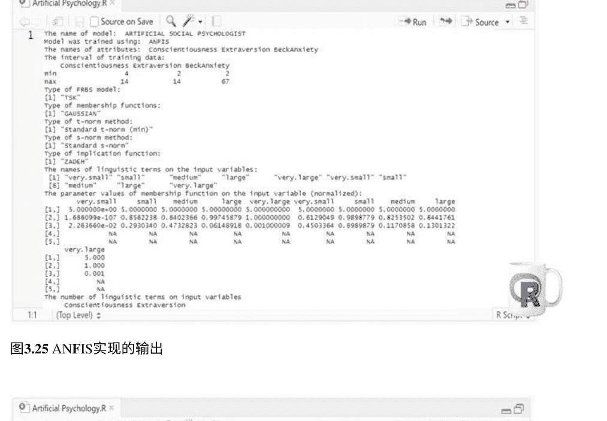

图3.25 ANFIS实现的输出

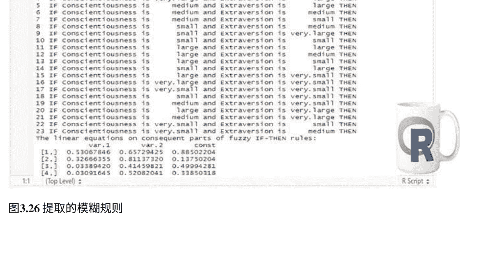

图3.26 提取的模糊规则

### 清单3.8 ANFIS实现的R代码

```r
library(frbs)
library(haven)
ANF <- read_sav("ANF.sav")
ANF=data.frame(ANF)
ANFBeckAnxiety=as.factor(ANF$BeckAnxiety)
ANFshuffled <- ANF[sample(nrow(ANF)),]
ANFshuffled[,3] <- unclass(ANFshuffled[,3])
tra.ANF <- ANFshuffled[1:500,]
data.fit <- tra.ANF[, 1 : 2]
tst.ANF <- ANFshuffled[501:nrow(ANFshuffled),]
real.ANF <- matrix(ANFshuffled[501:nrow(ANFshuffled),3], ncol = 1)
range.data=matrix(c(14,2,14,2,67), nrow=2)
method.type <- "ANFIS"
control <- list(num.labels = 5, max.iter = 5, step.size = 0.01, type.tnorm = "MIN",
typ.mf=4,type.snorm = "MAX", type.implication.func = "ZADEH", name = "ARTIFICIAL SOCIAL PSYCHOLOGIST")
object <- frbs.learn(tra.ANF, range.data, method.type, control)
objPMML <- frbsPMML(object)
write.frbsPMML(objPMML, file = "ANFIS ARTIFICIAL SOCIAL PSYCHOLOGIST")
object.pmml <- read.frbsPMML("ANFIS ARTIFICIAL SOCIAL PSYCHOLOGIST.frbsPMML")
res.fit <- predict(object.pmml, data.fit)
res.test <- predict(object.pmml, tst.ANF)
y.pred <- res.fit
y.real <- tra.ANF[,3]
bench <- cbind(y.pred, y.real)
colnames(bench) <- c("pred. val.", "real. val.")
print("Comparison ANFIS Vs Real Value on ANFIS ARTIFICIAL SOCIAL PSYCHOLOGIST")
print(bench)
residuals <- (y.real - y.pred)
MSE <- mean(residuals^2)
RMSE <- sqrt(mean(residuals^2))
SMAPE <- mean(abs(residuals)/(abs(y.real) + abs(y.pred))/2)*100
err <- c(MSE, RMSE, SMAPE)
names(err) <- c("MSE", "RMSE", "SMAPE")
```

### 清单3.9 ANFIS实现的R代码（续）

```r
print("Error Measurement: ")
library(caret)
print(err)
op <- par(mfrow = c(2, 1))
x1 <- seq(from = 1, to = nrow(res.fit))
result.fit <- cbind(tra.ANF[, 1], res.fit)
plot(x1, result.fit[, 1], col= red , main = "(( the training data(red) Vs Sim. result(blue))",
type = "l", ylab = "Anxiety")
lines(x1, result.fit[, 2], col= blue )
result.test <- cbind(y.real, y.pred)
x2 <- seq(from = 1, to = nrow(result.test))
plot(x2, result.test[, 1], col= red , main = " ((Real Data(red) Vs Sim. result(blue))",
type = "l", ylab = "Anxiety")
lines(x2, result.test[, 2], col= blue , type = "l")
par(op)
par(op)
plotMF(object)
summary(object)
```

### 3.12.2 遗传合作-竞争学习（GCCL）

该方法基于Ishibuchi等人（1999）使用遗传合作-竞争学习（GCCL）处理分类问题。在该方法中，每个语言IF-THEN规则使用整数作为其前件部分的表示。在模糊规则的后件部分，采用启发式方法自动生成类别。评估是针对每个规则计算的，这意味着性能不是基于整个规则集。该方法的工作步骤如下：

- 1. 生成模糊规则的初始种群。
- 2. 评估当前种群中的每个模糊规则。
- 3. 通过遗传算子生成新的模糊规则。
- 4. 用新生成的规则替换当前种群的一部分。
- 5. 如果满足停止条件，则终止算法；否则，返回步骤2（Lala Septem Riza等，2015年）。

遗传合作-竞争学习（GCCL）算法（Ishibuchi等，1999年）在固定数据库的情况下使用遗传算法来优化规则库。因此，可以使用遗传模糊系统进行规则归纳过程，从而获得具有可解释规则库的计算有效的分类器。模糊系统在不同应用领域中解决各种问题方面显示出其有用性。在模糊系统设计中使用进化算法（EAs），尤其是遗传算法（GAs），使我们能够为其提供学习和适应能力。模糊逻辑和遗传算法之间的这种混合导致了遗传模糊系统（GFSs）（Throckmorton等，2015年）的产生。

任何GFS中最有影响力的方面是解决方案的遗传表示。在这个意义上，专业文献中的提议遵循两种方法来对个体群体中的规则进行编码（Throckmorton等，2015年）。“染色体=规则集合”也被称为匹兹堡方法，其中每个个体代表一个完整的规则集。Thrift在Chen等人（2017年）中提出了一种遵循这种方法的方法。在“染色体=规则”方法中，有三种通用的提议：密歇根方法，IRL（迭代规则学习）和GCCL（遗传合作竞争学习）方法，其中完整的个体群体或其子集编码规则库。

这种方法需要引入一种机制来保持种群的多样性，以避免种群中的所有个体收敛到搜索空间的同一区域。

#### 使用R的实际示例

人工认知心理学家试图探索模糊规则，以基于三个变量（神经质、外向性和谎言）预测一个类别（以责任导向或效用为导向）。规则是使用GFS-GCC和SLAVE算法获得的。

这种模糊规则挖掘的不同形式如下图所示。

图3.10展示了运行这两个算法的R代码。

```r
library(frbs)
library(haven)
gcc <- read_sav("gcc.sav")
NE=data.frame(gcc)
NE$DILEMADIRECT=as.factor(NE$DILEMADIRECT)
NEShuffled <- NE[sample(nrow(NE)),]
NEShuffled[,4] <- unclass(NEShuffled[,4])
tra.NE <- NEShuffled[1:100,]
tst.NE <- NEShuffled[101:nrow(NEShuffled),1:3]
real.NE <- matrix(NEShuffled[101:nrow(NEShuffled),4], ncol = 1)
range.data<-matrix(c(0,12,0,11,1,12), nrow=2)
method.type3 <- "GFS.GCCL"

control3 <- list(popl.size = 5, num.class = 2, num.labels = 5, persen_cross = 0.9,
                 max.gen = 2, persen_mutant = 0.3,
                 name="Artificial psychologist")
object3 <- frbs.learn(tra.NE, range.data, method.type3, control3)
res.test3 <- predict(object3, tst.NE)
plot(res.test3)
summary(object3)
```

根据R软件的输出结果，人工认知心理学家根据任务将人们分为两类：倾向于责任导向的人和倾向于效用导向的人（效用导向：类别1，责任导向：类别2）。然后，使用有效可靠的量表对外向性、谎言和神经质进行测量。

然后，使用GFS_GCCL进行软三角模糊隶属函数（乘积）、标准s-范数和ZADEH蕴含函数，以及5个模糊集（非常小、小、中等、大和非常大）。每一代创建的种群有5个成员，交叉概率为0.9，变异概率为0.3。在本研究中，遗传算法的最大迭代次数为2，以便于运行。根据该程序，样本容量的80%（125人中的100人）是训练样本，20%（245人）是测试样本。

图3.27显示了模糊分类规则。例如，在规则5中：如果神经质很大，外向性很小，谎言很大，那么直接困境是以效用为导向的（类别1）。

根据图3.27，规则的确定性因子表示确定性为规则1为85%，规则5为67%。

确定性因子表示基于规则的系统中对规则的信任。

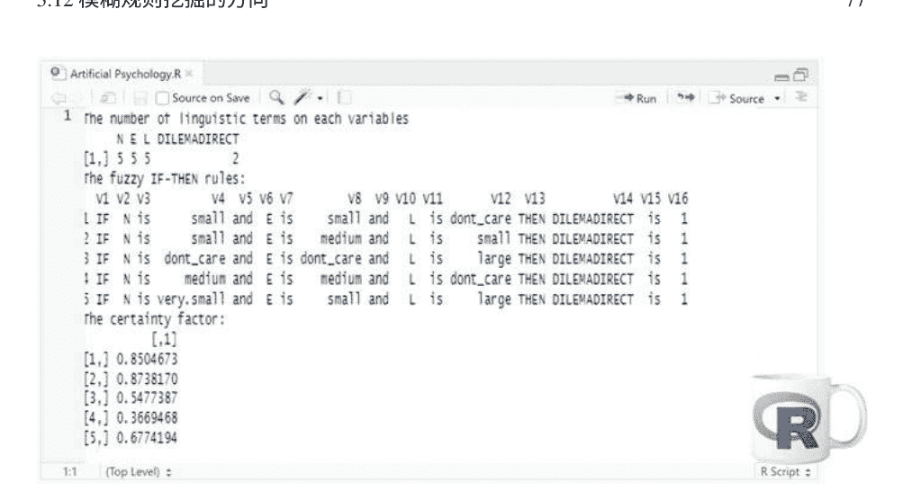

图3.27 模糊分类规则和确定性因子

### 3.12.3 无限环境下的结构学习算法（SLAVE）

SLAVE（模糊环境中的结构学习算法）是一种归纳学习算法，最初由González等人（1994）提出，后来在González和Perez（1999）中得到发展。SLAVE学习算法的基本元素是其规则。如果X1是A且Xn是An，则Y是B，其中每个变量Xi具有参考集Ui，并在有限域（术语集）Di中取值，i=1,......n。Y的参考集是V，其域是F。变量Y的值是B，其中B属于F，变量Xi的值是Ai，其中Ai属于P(Di)，P(Di)表示Di的子集集合。

从奴隶算法使用迭代方法发现模糊关联规则。SLAVE算法是1994年后开发的模糊规则学习算法之一。它被用作基准新算法（Ishibuchi等，1999年）。自1996年实施以来，该算法已经多次修改。当SLAVE算法于1994年首次执行时，几乎没有用于模糊规则学习的算法。Wang等人提出了重要的建议。这两个算法都集中在控制规则学习（回归问题）上。为了在受噪声影响的框架中工作，发现了SLAVE方法，在某些情况下现有的学习方法无法分配预期的输出（Tsai & Chen，2010年）。该算法可以定义描述系统的规则（特征选择）从所有提出的变量中。SLAVE算法主要使用迭代方法。Gonzalez和Perez提出了一种修改的初始迭代方法，用于SLAVE（Blake，1998年）。在这个过程中，他们的想法是将更多的数据合并到学习一个单一规则中。这些数据被合并到迭代方法中，通过一种替代的微积分提案来确定规则的正向和负向指导。引入了一个新的函数和额外的遗传算子。

还提出了可以减少学习所需时间并开发所获得规则的理解能力。冈萨雷斯和佩雷斯进一步研究了SLAVE算法。后来，他们减少了学习处理所需的时间，以在每次迭代中获得完整的规则（Wang等，2015年）。

#### 使用R的实际示例

人工认知心理学家使用SLAVE算法重复了这项研究。这个算法与GFS_GCCL非常相似，具有0.9的交叉概率，5个模糊集，5次迭代，最多3代，0.3的变异概率，0.25-0.75的噪声阈值间隔，以及0.1的epsilon。Epsilon是一个介于0和1之间的数字，表示覆盖因子。

清单3.11展示了实施该方法的R代码。图3.28显示了该方法的R输出，用于提取10条规则。第10条规则说明：

> 如果神经质很大，外向性不在乎，谎言很小，那么直接的困境是以责任为导向的（类别2）。

因此，这两种方法可以用于分类-模糊规则挖掘。

#### 清单3.11 SLAVE实现的R代码

```r
library(frbs)
library(haven)
gcc <- read_sav("gcc.sav")
NE=data.frame(gcc)
NE$DILEMADIRECT=as.factor(NE$DILEMADIRECT)
NEshuffled <- NE[sample(nrow(NE)),]
NEshuffled[,4] <- unclass(NEshuffled[,4])
tra.NE <- NEshuffled[1:100,]
tst.NE <- NEshuffled[101:nrow(NEshuffled),1:3]
real.NE <- matrix(NEshuffled[101:nrow(NEshuffled),4], ncol = 1)
range.data<-matrix(c(0,12,0,11,1,12), nrow=2)
method.type2 <- "SLAVE"
control2 <- list(num.class = 2, num.labels = 5,
                 persen_cross = 0.9, max.iter = 5, max.gen = 3, persen_mutant = 0.3,
                 k.lower = 0.25, k.upper = 0.75, epsilon = 0.1, name="Artificial Psychologist")
object2 <- frbs.learn(tra.NE, range.data, method.type2, control2)
res.test2 <- predict(object2, tst.NE)
plot(res.test2)
summary(object2)
```

```
The number of linguistic terms on each variables
N E L DILEMADIRECT
[1,] 5 5 5 2
The fuzzy IF-THEN rules:
V1 V2 V3 V4 V5 V6 V7 V8 V9 V10 V11 V12 V13 V14 V15 V16
1 IF N is medium and E is small and L is large THEN DILEMADIRECT is 1
2 IF N is dont_care and E is medium and L is dont_care THEN DILEMADIRECT is 1
3 IF N is large and E is dont_care and L is small THEN DILEMADIRECT is 1
4 IF N is dont_care and E is very_small and L is medium THEN DILEMADIRECT is 1
5 IF N is dont_care and E is small and L is very_large THEN DILEMADIRECT is 1
6 IF N is medium and E is medium and L is medium THEN DILEMADIRECT is 2
7 IF N is large and E is medium and L is medium THEN DILEMADIRECT is 2
8 IF N is large and E is very_small and L is large THEN DILEMADIRECT is 2
9 IF N is medium and E is large and L is medium THEN DILEMADIRECT is 2
10 IF N is very_large and E is dont_care and L is small THEN DILEMADIRECT is 2
```

图3.28 SLAVE的R输出和提取的规则

# 第4章 模糊认知图

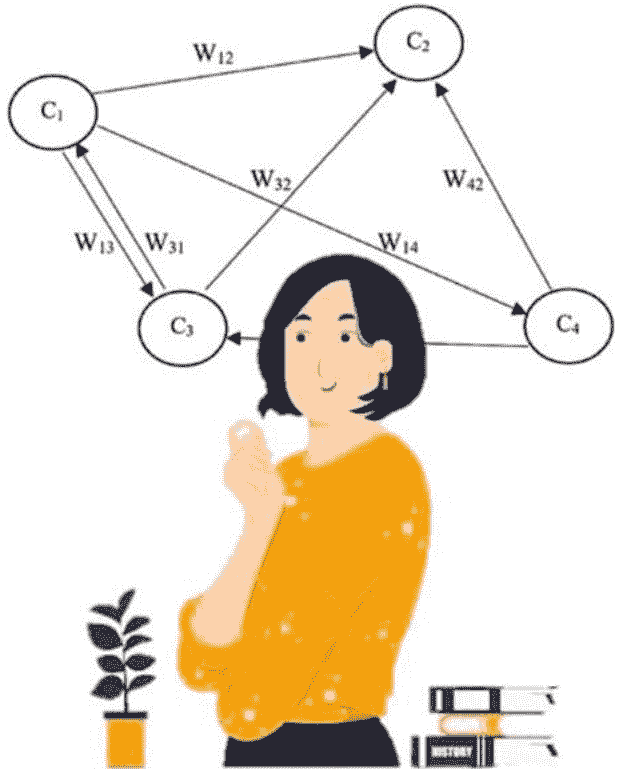

## 4.1 人类知识的模糊建模：走向心理学中的模糊认知图

心理学是对人类的研究，更深层次上是对心灵和心理过程的研究，充满了实现目标和愿望的许多思想。个体在各种情况下获得宝贵的经验，这对于确定相关决定因素非常有帮助。那些在关系中失败的人，参加减肥班的人，自闭症儿童的母亲，LGBTQ社群的成员以及多年来与多发性硬化症共同生活的人都对这些经历的基本机制非常熟悉。定量研究通常关注因素或预测变量，或者关注变量之间关系的统计推断；很少有人要求个体估计变量的影响。例如，研究试图确定影响成瘾潜力的因素，并使用推断统计学（如回归）来衡量这些影响的显著性。然而，这些影响并没有被量化。也许弗洛伊德的支持者心理学家认为询问个体估计变量的影响是不合适的。他们认为个体无法做出准确的估计，因为人们受到无意识的强烈影响。

然而，其他理论持相反观点。研究表明，个体可以准确估计变量如何相互影响，基于复杂系统的内部模式（Hayes & Andrews, 2020）。

为了获得对人类经验的了解，人们被要求分享他们的知识；他们被要求分享他们的经验，而不是专注于单一经验。

可以说，个体在被要求创建他们的经验模型时，有意识或无意识地简化复杂性；这个过程可以避免信息过载，从而减少心理努力（Vennix, 1996）。多项研究表明，这种简化是独立于专业知识的（Axelord, 1974），并已经开发出解决这一挑战的解决方案（Papageorgiou等，2020；Apostolopoulos等，2021）。

心理学家倾向于提出简单的解决方案！最简单的解决方案是收集数据集而不是个人的经验。研究表明，数据集也容易受到偏见，并不一定会导致更准确的结果（Vennix, 1996）。

Delphi方法在1960年代引入，用于收集群体回应。尽管它在很大程度上导致了准确的回应，但仍然需要解决三个主要挑战：

- 1. 由于使用多数规则，参与者之间的冲突影响了Delphi方法。
- 2. 关系具有不同的权重，该过程侧重于系统中最有影响力的关系；然而，用语言术语表达因果关系（例如，非常高或高）存在模糊性。
- 3. 语言术语并不明确！这是词语的固有属性。

## 4.2 基于心理学知识的建模

3. 人类知识存在不确定性。不确定性是生活在这个世界上的代价。没有免费的午餐！一切都有代价，不确定性是我们理解真实世界的代价；一个不太能承受的代价！

因此，个体的答案包含不确定性，他们试图根据自己的知识以可靠的程度表达关系。模糊认知图（FCMs）提供了一种处理这种挑战的技术。FCM是一个数学模型，旨在解决这些问题，使用模糊集理论来收集参与者的经验。

FCM的发展是为了数学地表示不确定性和模糊性，为处理现实世界问题中的印象主义提供了规范化工具（Li等，2006年）。FCM包括语言术语，并帮助参与者分享他们的经验。例如，参与者可能会说：“我与我的母亲的关系强烈地影响我的情感体验。”对于不同的人来说，“强烈影响”这个术语有不同的含义。它是基于重叠成员函数的模糊集理论定义的。

语言术语通过规则集成到FCM中。例如，如果50个alpha女性中有35个说：“我与我的母亲的关系对我的情感体验有很强的影响”，而剩下的15个说：“我与我的母亲的关系对我的情感体验有强烈的影响”，那么“很强”和“强”的置信因子分别计算为0.7和0.3。这在FCM的发展中被讨论为模糊蕴涵规则。置信因子表示不确定性，在量化参与者的一般经验中起关键作用。

为了建模变量之间的关系，引入了几种方法。结构方程模型（SEM）不能使用语言变量和情景和反馈分析。系统动力学方法需要一个中介者来解决参与者之间的模糊、不确定性和冲突。贝叶斯网络允许在不确定性下进行推理，但在反馈研究中经典方法存在缺陷。

这些缺点需要在FCMs中得到解决。

心理学研究者在心理学文献中的心理知识是人工智能心理学建模引擎的来源。

心理学文献中所需的知识是通过定性和定量方法获得的。心理学研究者试图使用定性模式来探索目标群体的心态，通常使用内容分析、主题分析、扎根理论和现象学的非指导性深度访谈。例如，目标群体可能包括专家、患者、母亲和夫妻，他们可以提供构建模型所需的知识。

研究人员就像一只有目的地坐在一座塔上的蜜蜂，吸食花蜜并产生蜂蜜。研究人员寻求对现象进行深入、定性的评估，这些现象并不精确，但概念丰富。他们在被访者的思想中寻找事实的黄金。在对目标群体进行访谈后，使用转录对访谈进行编码，提取主题和类别。一旦主题和类别的提取完成，并评估了结果的可信度，就可以基于所得的概念模型使用定性方法开发FCM。

此外，通过问卷、量表、标准测试、观察清单、智能设备和存档的患者记录等定量方法，可以获得大量的心理知识。在这些方法中，在实施统计模型之前，可以通过查阅文献来提取概念和变量。然后，可以使用得到的系数创建加权矩阵用于FCM的构建。因此，可以开发两个FCM模型：（1）基于主题树的FCM（TTBFCM）和（2）基于结构方程模型的FCM（SEMBFCM）。

TTBFCM可以被称为定性或基于专家的模型（在更一般的意义上是主题树模型）。主题是从与目标群体进行的非指导性深入访谈中提取出来，并使用定性方法进行编码。

然而，心理学家意识到定性模式必须与心理学相一致才能提取主题。

一旦主题提取和主题的可靠性评估完成，就会创建一个主题树。下面将讨论这作为主要FCM模型的基础。

主题树以草稿形式创建，并呈现给专家小组（至少十位专家），以基于概念（节点）或主题、它们之间的因果关系、反馈和循环进行最终确定。还要求专家们用语言表达他们对因果关系的看法（例如，非常高或高）。模型的箭头被标记。图4.1展示了作为FCM的主要模型，用于评估女性青少年自我伤害后的调整。

领域专家对模型概念有时存在不同观点。在这种情况下，每个因果矩阵必须通过添加新的列和行，并用零填充额外的概念。通过这种方式，所有的因果矩阵具有相同的维度，FCM的整合可以提供对单个FCM的全面描述。例如，专家1和专家2提出了工作记忆的FCM1和FCM2。然后，可以得到一个整合的FCM（图4.2）。

图4.2 两个专家的整合FCM

FCM的重要性可以通过下表确定。

| 组名 | 重要 | 非必要但有用 | 非必要 | 评论 |
|------|------|--------------|--------|------|
|      |      |              |        |      |
|      |      |              |        |      |
|      |      |              |        |      |

然后，计算CVR如下：
$$CVR = (N_e - N/2) / (N/2) \quad (4.1)$$

其中，$N_e$是认为节点必要的专家数量，而$N$是总专家数量（本例中为10）。将每个节点的CVR与Lawshe表进行比较，CVR高于Lawshe表的节点保留在模型中（Ayre & Scally，2013年）。

SEMBFCMs也是一种从问卷、量表、测试、智能工具和观察清单或脑数据（例如脑电图）中提取知识的技术。可以通过查阅文献、领域专业知识和专家意见来开发模型。定量技术用于在较大范围上定量测量模型；然后可以使用SEM来拟合模型。对于小样本，将使用偏最小二乘（PLS）（Hair等，2022年）。标准化路径系数被假设为FCM矩阵的权重。

然而，在SEM中不存在统计反馈，可以从专家的角度获得（模型的结构和关系修改）。图4.3展示了设计SEMBFCM模型的过程。下面更详细地解释了FCMs。

Axelord（1976）提出了认知映射理论（CMT）来建模社会科学知识。然后，Kosko（1986）引入了FCMs作为CMT的扩展，用于建模和分析复杂系统。FCMs可以被视为一种基于知识的方法论，模拟动态系统。它整合了模糊逻辑、神经网络（将在下一章中解释）和认知地图。

表示对于特征不确定性、因果关系和复杂过程的系统的知识（Papageorgiou，2013）

FCM在结构上是一个模糊有向图，包含由节点组成的反馈和节点之间的因果关系，称为加权有向边。通过在离散模拟步骤中模拟其行为来测试这类系统的动力学。通常，FCM可以基于领域专家的输入、系统数据或专家和数据的混合来设计（即基于专家、数据驱动和混合的FCM）。

节点的概念是基于激活程度确定的。激活程度是指FCM中相应概念（节点）对其他节点的影响程度。概念之间的关系被定义为正、负或零。在这里，$W_{ij}$表示概念（节点）$C_i$和$C_j$之间的关系。它可以是正、零或负。它的符号（正或负）表示效应的方向，而其绝对值表示关系的强度。

图4.4 一个简单的FCM，包括边缘和节点

近年来，尤其是在过去30年中，FCMs在各个领域的研究人员中引起了极大的兴趣。它们相对于传统模型具有独特的优势，包括能够清晰地表示概念（节点）之间的关系和研究节点之间的潜在模式（关系）。此外，它们的因果语义可以用于分析、模拟和测试参数的效果，并估计系统的行为（图4.4）。

如前所述，FCM设计有三种方法，即基于专家、数据驱动和混合方法。然而，由于可解释性和可解释性是AI心理学的核心（本书的标题），基于专家的方法被认为是主导的FCM设计方法。

该模型基于专家意见进行设计，然后将具有因果关系的模型交给专家来确定关系，使用语言术语（例如，非常强，强，中等，弱，非常弱）。然后，使用模糊逻辑将语言术语或评级转换为数值权重（Mkhitaryan等，2022年）。这些步骤简单且可以由AI心理学家执行。将语言评估转换为数值权重的步骤有四步：

- **步骤1：定义模糊隶属函数**
  模糊隶属函数或数字（例如三角形、梯形和高斯）被用来将语言术语转化为具体的数值区间或论域。在负因果可能的情况下，FCMS中的论域范围为（-1，1）；否则，范围为（0，1）。
  要定义一个隶属函数，必须确定其形式。如前所述，有各种各样的隶属函数；然而，三角形隶属函数是最常用的。三角形隶属函数有一个上界、一个中点和一个下界（图4.5）。

- **步骤2：应用模糊蕴涵规则**
  为了确定表示某些节点之间关系的语言变量的激活程度，需要确定参与者对语言术语的验证程度。通过语言术语确定前因对后果的因果效应程度。然后，应用模糊蕴涵规则来激活隶属函数。在这种情况下，常常使用Larsen的乘积和Mamdani的最小值。
  基于Mamdani的规则，成员函数在验证水平处被截断（公式（4.2）和图4.6）。基于Larsen的规则，成员函数被重新缩放（公式（4.3）和图4.7）。

表4.1 集成成员函数的技术

| 方法 | 选项 | 描述 | 方程 |
|------|------|------|------|
| 方法 | "Algsum" | 代数和 | $x + y - xy$ |
|      | "Esum" | Einstein和 | $\frac{x + y}{1 + x y}$ |
|      | "Hsum" | Hamacher和 | $\frac{x + y - z \cdot y}{1 - x \cdot y}$ |

Mamdani的最小值：
$H(R_x, y) = \min(A_{Hx}, HB(y))$

Larsen的产品：
$H_R(x, y) = A_H(x) \cdot H_B(y)$

在应用规则的百分比重要性后，下一步是聚合。

第三步：整合模糊成员函数
激活的模糊成员函数被整合。已经提出了几种整合成员函数的技术（表4.1）。其中$x$和$y$是在前一步中激活的语言术语的成员值。

FCM的最后一步是整合成员函数的常规去模糊化。

第四步：去模糊化
引入了许多去模糊化方法，包括重心法。去模糊化用于将模糊的FCM值转换为清晰的数字。Python中有几种可用的去模糊化方法，如表4.2所示。

模拟是FCM的一个重要方面。通过在离散模拟步骤中模拟其行为来确定FCM的动力学。在模拟中使用推理方法更新概念值。FCM专家必须使用以下推理规则：

表4.2 去模糊化方法

| 参数 | 选项 | 描述 |
| :--- | :--- | :--- |
| 方法 | "质心" | 质心 |
|      | "双分点" | 双分点 |
|      | "Mom" | 最大平均值 |
|      | "Som" | 最大最小值 |
|      | "Lom" | 最大最大值 |

Kosko

Kosko的自记忆激活规则（修改后的Kosko）重新缩放的激活规则

在步骤i中，节点j的值为$a_j$，$W_{ij}$是概念（节点）j对概念i的因果效应，$f(x)$是一个传递函数。传递函数用于使值落在一定范围内，例如sigmoid函数和双曲正切函数分别落在(0, 1)和(-1, 1)范围内。有五个传递函数：

- Sigmoid: $f(x) = \frac{1}{1+e^{-\lambda x}}$，其中$x$是去模糊化的值，$\lambda$是Sigmoid函数的陡峭度参数
- 饱和函数
- 双值的
- 三值的
- 双曲线的

模拟运行直到满足两个不连续性标准之一：（1）概念在两个连续步骤中的差异小于阈值差异，使得网络收敛到一个固定点，或者（2）预定义的最大迭代次数已完成。

存在$A^{t+1}, A^{t}, ..., A^1$的 $$||A^{t+1} - A^t|| < \text{阈值} \quad (4.4)$$

在FCM推理和模拟中，FCM专家定义了一个初始状态向量，其中概念的值由FCM专家确定。还需要一个FCM加权矩阵，即连接或邻接矩阵。一旦初始状态向量和FCM加权矩阵相乘，系统将更新，直到满足两个终止条件之一。

## 4.3 FCM中的优化

基于专家的FCM可能会收敛到不理想的位置，这是一个缺点。因此，这些模型只能预测极端值。研究人员提出了许多技术来规避这个缺点（Lavin等，2018年）。

已经提出了主动Hebbian学习（AHL）和非线性Hebbian学习（NHL）方法。它们基于Hebbian学习规则。在这里，机器学习（ML）和FCM方法被整合在一起。这些算法旨在修改初始权重矩阵，使得所选节点在预定义区域内收敛。这些节点被称为DOCs。尽管人类知识在FCM设计中是一个强大的工具，但在某些情况下可能缺乏专家意见或过于主观和不准确（Papageorgiou, 2011年）。此外，可能存在太多的变量/组件。学习算法是解决这些挑战的一种机制。这些算法提高了权重的准确性，并减少了权重对专家意见的依赖，通过创建一个学习的权重矩阵来改善FCM的性能（Papakostas等，2011年；Papageorgiou, 2011年）。总的来说，学习算法解决了FCM的收敛问题，并实现了可靠的决策（Papageorgiou等，2004年）。

学习算法类似于模拟。然而，学习算法在每个时间步更新概念（节点）的值，而模拟只改变概念（节点）（Papageorgiou等，2004年）。AHL根据激活模式序列异步地更新节点和权重。它不仅优化现有的连接，还创建可能不理想的节点之间的新权重。

基于这样的优化算法，学习过程将继续，直到满足两个终止条件之一：（1）每个DOC的适应度函数$F_1$在每个时间步骤中减小，或者（2）DOCs落在预定义范围内。计算DOC的适应度函数（方程（4.5））。对于第二个条件，重要的是确定DOC是否固定（$F_2$）。定义了一个阈值，应为（0.001, 0.005）。一旦达到该阈值，过程终止。只要满足两个终止条件之一，学习过程就会终止。否则，执行预定义的迭代次数。

$F_1 = \sqrt{DOC_j^k - \frac{(DOC_j^{\text{min}} - DOC_j^{\text{max}})^2}{2}}$

$F_2 = DOC_j^{k+1} - DOC_j^k < e$

要实现AHL和NHL算法，必须确定初始权重矩阵、初始概念值和DOCs。此外，学习率、衰减系数和Sigmoid函数的系数应作为超参数确定。通常将NHL和AHL的斜率和衰减率以及学习率设置为[0.9, 1001]、(0.99, 1)、(0.01, 0.1)和(0.00, 0.1)。值得注意的是，存在基于群体搜索方法的FCMs学习用于优化权重和斜率（Mkhitaryan等，2022年）。

## 4.4 FCM中的情景分析

情景分析及其对模型的影响是FCM的优势。情景可以被假设为一个新的FCM因素，其对目标概念（节点）的因果效应被测量（连续干预），或者改变概念（节点）的基础值为目标概念（节点）的值（一次性干预）。

要在Python中评估连续干预，必须确定干预的名称、概念（节点）、目标以及节点对彼此的影响。另一方面，对于一次性短期干预，必须确定干预的名称和新的初始状态。还建议在（0，1）范围内评估给定干预的有效性，其中1是最大有效性。干预的强度（强度）是预期的，并且干预后的实际变化值（增加或减少）可以简单确定（Mkhitaryan等，2022年）。

实际效果由干预引起 = 预期效果 * 干预后的效果量。

为了评估可解释性，即可解释的人工智能心理学的主要目标，使用图表来衡量每次干预后的变化。

### 4.4.1 使用R的实际例子

一位人工心理学家试图基于FCM模型来解释网络沉迷。他根据相关研究背景进行了深入审查，得出了一个初始的概念模型。在这个模型中，他具体说明了与目标变量（网络沉迷）相关的两个重要变量（智能手机成瘾 = C1）和（孤独感 = C2）。然后，他与一支在网络心理学领域工作的研究团队进行了咨询。他们还提出了压力变量，最终的模型如下所示，其中C3、压力和C4是目标变量，即网络沉迷（图4.6）。

假设的模型呈现给两位在心理健康和健康心理学领域工作的专家，他们被要求在一个11个类别的标度中指定每条路径（边）的标签。

表4.3显示了模糊集、模糊隶属度类型、参数、方向（符号）和大小（每个变量的影响程度）。

然后专家被要求在假设模型中为每个边指定是否认为每个模糊集合适。图显示了专家1对路线的意见。

然后，使用软件中的必要代码以模糊逻辑的形式进行聚合，并形成权重矩阵或邻接矩阵（表4.4）。

图4.6是模糊认知图的假设模型。

表4.3 模糊集、模糊成员类型和参数

| 模糊集 | 模糊成员函数的类型 | 参数 |
| --- | --- | --- |
| 非常高的负面（ −VH） | 三角形 | (−1,−0.75,−0.5) |
| 高负面（ −H） | 三角形 | (−1,−0.75,−0.70) |
| 负面平均（ −M） | 三角形 | (−0.75,−0.5,−0.25) |
| 负面底部（ −L） | 三角形 | (−0.5,−0.25,0) |
| 非常低的负面（ −VL） | 三角形 | (−0.25,0,0) |
| 不知道（NA） | 三角形 | (−0.001,0,0.001) |
| 非常低的正面（+VL） | 三角形 | (0,0.25,0.5) |
| 低正面（+L） | 三角形 | (0.25,0.75,0.8) |
| 中等正面（+M） | 三角形 | (0.5,0.75,1) |
| 高正面（+H） | 三角形 | (0.57,1,1) |
| 非常高的正面（+VH） | 三角形 | (0.75,1,1) |

表4.4 FCM的邻接矩阵

|   | C1 | C2 | C3 | C4 |
|---|---|---|---|---|
| **C1** | 0 | 0.75 | 0.28 | 0.92 |
| **C2** | 0 | 0 | 0.79 | 0.89 |
| **C3** | 0 | 0 | 0 | 0.90 |
| **C4** | 0 | 0 | 0 | 0 |

图4.7 基于专家意见的FCM模型

图4.8 在表4.4中显示的模糊成员函数

经过5次迭代，C3=压力=0.71和目标变量=网络沉迷=0.84。图4.7给出了该图表。在FCM中，由人工心理学家确定的变量C1和C2的初始值称为初始向量或激活向量。该向量包含与概念或主节点相关的值，每个值通过分配数字1或介于0和1之间的数字来激活。权重矩阵或邻接矩阵实际上显示了概念或变量之间的归一化关系，通常放置在距离（0和1）或（-1和+1）之间。迭代次数是指模拟后获得的值不再变化超过一定限制（阈值）的次数。对于基于FCM的模糊推理，需要确定规则。一般而言，Dikopoulou等人（2018）提出了六种不同的模糊推理规则：（1）Kosko规则，（2）修改的Kosko规则，（3）重新缩放规则，（4）Kosko clamped规则，（5）修改的Kosko clamped规则，（6）重新缩放clamped规则。作为预先选择的默认值，推理规则通常设置为Kosko规则。在这个例子中，如R代码中所指定的，人工心理学家使用了Kosko的规则进行推理。

由于权重矩阵中的向量乘积的输出可能是一个非模糊数（0和1之外的数或-1到+1之间的数），为了将该数转换为在0到1或-1到+1范围内的数，使用了转换函数。这些函数是二值的（b），三值的（r），Sigmoid函数（s）或双曲正切函数（t）。从Sigmoid函数中使用了s。为了停止迭代，使用了epsilon（e）的值，它表示迭代产生的概念之间的最小差异。默认情况下，这些值为0.001。在本例中，考虑了e=0.001（图4.8和4.9）。

#### 图4.9 迭代步骤的绘图

| iteration | C1    | C2        | C3        | C4        |
|-----------|-------|-----------|-----------|-----------|
| 1         | 0.5   | 0.7000000 | 0.0000000 | 0.0000000 |
| 2         | 0.5   | 0.5926666 | 0.7197052 | 0.7470613 |
| 3         | 0.5   | 0.5926666 | 0.7022858 | 0.8368818 |
| 4         | 0.5   | 0.5926666 | 0.7022858 | 0.8347304 |
| 5         | 0.5   | 0.5926666 | 0.7022858 | 0.8347304 |

#### 图4.10 收敛FCM在iter5

如前一节所述，由于权重矩阵或邻接矩阵可能错误地收敛，因此使用AHL和NHL方法。这两个算法的目的是修改初始权重矩阵，使节点在首选区域内收敛，并且不会达到错误和过早的收敛。可以使用Python软件获得调整后的矩阵，并运行AHL和NHL，然后将其导入R进行计算。

图4.10显示了AHL的输出。在Python软件中，有一个非常好的FCM实现库，超出了本书的范围。基于此，可以通过这种方法获得更多样化和有趣的发现。模糊集及其参数已经得到专家的认可；请参阅R代码以绘制此表格的形状及其输出，见列表4.1和4.2。

#### 清单4.1 FCM的R代码

```
library(fcm)
library(reshape2)
library(ggplot2)
act.vec <- data.frame(.5,.7,0,0)
colnames(act.vec) <- c("C1","C2","C3","C4")
C1=c (0,0.75,0.78,0.92)
C2=c (0,0,0.79,0.89)
C3=c (0,0,0,0.90)
C4=c (0,0,0,0)
w.mat <- matrix (c (C1,C2,C3,C4), nrow = 4, ncol=4, byrow = TRUE)
colnames(w.mat) <- c("C1","C2","C3","C4")
w.mat <- as.data.frame(w.mat)
w.mat
output <- fcm.infer(act.vec,w.mat,50,"k","s")
iteration <- as.numeric(rownames(output$values))
df <- data.frame(iteration,output$values)
df2 <- melt(df,id="iteration")
ggplot(data=df2, aes(x=iteration,y=value,group=variable,
colour=variable))+theme_bw()+geom_line(size=0.7)+geom_point(size=2)
print(df)
```

#### 清单4.2 FCM的R代码（续）

```
library(FuzzyNumbers)
A <- TriangularFuzzyNumber(-1, -0.75, -0.50)
B <- TriangularFuzzyNumber(-1, -0.75, -0.70)
plot(A, xlim=c(-1,1))
plot(B, add=TRUE, col="red", lty=1)
C <- TriangularFuzzyNumber(-0.75, -0.5, -0.25)
plot(C, add=TRUE, col="black", lty=1)
D <- TriangularFuzzyNumber(-0.5, -0.25, 0)
plot(D, add=TRUE, col="green", lty=1)
E <- TriangularFuzzyNumber(-0.25, 0, 0)
plot(E, add=TRUE, col="blue", lty=1)
F <- TriangularFuzzyNumber(0, 0.25, 0.50)
plot(F, add=TRUE, col="yellow", lty=1)
G <- TriangularFuzzyNumber(0, 0.25, 0.70)
plot(G, add=TRUE, col="brown", lty=1)
K<- TriangularFuzzyNumber(0.25, 0.75, 0.80)
plot(K, add=TRUE, col="orange", lty=1)
L<- TriangularFuzzyNumber(0.5, 0.75, 1)
plot(L, add=TRUE, col="violet", lty=1)
M<- TriangularFuzzyNumber(0.75, 1, 1)
plot(M, add=TRUE, col="gray", lty=1)
```

## 4.4 FCM中的情景分析

|    | C1       | C2       | C3       | C4       |
|----|----------|----------|----------|----------|
| C1 | 0.000000 | 0.603612 | 0.638776 | 0.728636 |
| C2 | 0.036480 | 0.000000 | 0.638334 | 0.041642 |
| C3 | 0.040496 | 0.047455 | 0.000000 | 0.046261 |
| C4 | 0.037046 | 0.043394 | 0.048412 | 0.000000 |

图4.11 AHL的输出

图4.12 FCM模拟的结果

图4.11展示了AHL的输出。在Python软件中，有一个非常好的用于FCM实现的库，超出了本书的范围。基于此，使用这种方法可以获得更多样化和有趣的发现。

最终的概念向量为C(5)=[0.50, 0.59, 0.71, 0.84]。决策概念的最终值为stress=0.71和cyberloafing=0.84（图4.12）。

Farahani等人（2021a, b, c）使用FCM研究心理幸福感。在本文中，你可以找到一些计算细节。

## 第5章 网络分析在AP中

### 5.1 AP中的网络分析

AP被引入以提高分析心理模型的质量。心理现象并不是独立的，因为意识是一个动态而连续的现象。然而，人类行为可能看起来是离散和单一的，但实际上并不是。因此，为了理解一个现象，应该将其作为一系列复杂而相互关联的特征来研究，将它们视为心理网络。在这个意义上，AP可以被称为心理网络的科学，复杂而相互关联的变量的网络。这些网络可以是小的或大的，简单的或复杂的，可见的或不可见的，动态的或静态的。网络中的心理特征可以包括不同类型的因素：显示因果关系的因素，环境因素，与性格相关的因素，以及心理或物理因素。特征之间的关系可以是负面的或正面的，有方向的，单向的或互惠的。

Borgatti等人（2009）认为网络已经影响了人类心理的各个方面。在过去的十年中，网络分析被视为心理研究中的一个重要分析方法（Hevey，2018）。网络分析在该领域有着悠久的历史，近年来已经从潜在变量的方法转向网络方法，以解释变量之间的相关性。

在这种方法中，通过互惠模型可以解释相关性的观察模式，其中特征具有加强和互惠关系。在网络分析模型中，变量之间的关系代表了心理现象（De Schryver，2015）。

因此，从概念上讲，网络是心理现象的可接受模型，可以进行精确分析，从统计上讲，它是同时研究变量之间关系的一种方法。

心理构建本质上是复杂的，因此研究人员多年来一直致力于将研究的现象限制在显著变量上。这种还原主义导致我们对整体现象的认识受到限制（Barabasi等，2011年）。

人工心理学中的网络方法侧重于多变量数据，以实现多个目标的推进。Borsboom等人（2021a，b）对这些目标进行了详细阐述。首先，它们可以用于在没有强有力的先前理论的情况下探索高维数据的结构。其次，在这些分析中，心理测量网络分析可以补充现有的探索性分析技术。

心理数据，如探索性因子分析（旨在表示由少数潜在变量引起的共享方差）和多维缩放（旨在表示低维度量空间中对象之间的相似关系）。心理测量网络分析的独特重点在于数据中存在的成对条件依赖关系的模式。

网络表示可以有效地传达多变量依赖模式，因为它们提供了强大的统计关联模式可视化。换句话说，它能够发现共同结构。第三，网络模型可以用于生成因果假设，因为它们代表可能提供因果动态线索的统计结构。正如Pearl（2000）、Spirtes等人（2000）和Haslbeck等人（2021）所述，表示条件独立关系的网络形成了将相关性连接到因果关系的入口。

许多人仍然认为因果关系是从理论而不是数据中得出的。为了说明网络分析，可以使用图5.1。

## 5.2 心理网络的结构分析

在抽象层面上，网络指的是由变量组成的各种结构。这些变量被称为节点，节点之间的关系被称为边。尽管在社交网络中，人与人之间的关联是直接可观察的（例如朋友和敌人），但心理网络中的边依赖于统计分析和节点之间的偏相关性，这些节点代表它们之间的关联强度。在网络的可视化表示中，绿色（或蓝色）的边表示正向关联，红色的边表示负向关联。每条边的粗细显示了关联的强度（Jones等人，2018年）。边可以是加权的或非加权的。加权边反映了节点之间的方向和强度。或者，边可以是非加权的，仅表示关系的存在与否。

节点可以表示来自一个量表、子量表或综合量表的单个项目。选择节点取决于提供最合适和有用的问题理解的数据类型。这与可解释性和可解释性一起，是AP的基础。边可以表示不同类型的关系，例如心理疾病的共病性、症状或态度之间的相关性 (Hevey, 2018)。Farahani等人 (2021a, b, c) 研究了网络分析在捕捉心理障碍的共病结构中的应用。

一般来说，网络中可以存在两种类型的边：(1) 有向/定向边：节点之间存在单向影响，或者 (2) 无向/非定向边：节点之间存在相互关系。

有向网络可以是循环的。也就是说，我们可以沿着有向边从给定节点出发，最终回到该节点，或者是非循环的；即，你不能从一个节点出发，沿着有向边回到该节点。

Pearl (2000) 认为有向网络可以表示因果结构，因此不能是循环的，肯定是非循环的 (Epskamp等人, 2018)。然而，在现实世界中，循环假设是站不住脚的。此外，有向网络存在问题，即许多等价模型可以解释数据中发现的关系模式（Bentler & Satorra，2010）。尽管网络中存在许多因果心理病理症状路径的合理性，但需要建立更强的理论基础来证明这些关系的因果性（Fried和Cramer，2017）。关于时间，网络可以是横断面数据或时间序列数据。

## 5.3 网络分析的步骤

### 估计网络

要形成一个网络，首先需要确定边缘。在经典统计学中，有几种方法可以研究变量之间的关系，例如相关性、协方差、偏相关、回归系数、比值比和因子载荷。然而，在网络分析中，估计方法取决于网络的类型。无向网络在心理学中经常出现，而估计这种无向网络的常用模型是成对马尔可夫随机场（PMRF），它是一类广泛的统计模型。

PMRF模型的特点是节点之间有无向边，表示节点之间的条件依赖关系。缺少边意味着给定网络中的所有其他节点，两个节点之间是有条件独立的。边表示在网络中给定所有其他节点的条件依赖关系。

边的估计取决于数据的类型。如果连续数据是多变量且服从正态分布的，可以使用高斯图模型（GGM）分析偏相关性是合适的（Costantini & Perugini，2016）。如果连续数据不服从正态分布，则可以在分析之前进行转换（Liu等，2009）。对于有序数据，使用多项式相关性（Epskamp等，2018）。

如果所有数据都是二进制的，则可以使用Ising模型（van Borkulo等，2014）。所有这些模型都可以在R中编码。当数据包含混合的分类和连续变量时，可以使用混合图模型来估计PMRF（Haslbeck & Waldorp，2018）。

网络复杂性需要考虑。简洁原则在这里非常重要。被检查的节点数量越多，需要估计的边的数量就越多，因此网络就越复杂。例如，在一个有10个节点的网络中，估计了45条边。此外，在Ising模型的情况下，估计的数量更多。此外，由于混淆变量的存在，其中一些相关性可能是虚构的，并且节点数量的增加可能导致过度拟合和非常不稳定的估计（Babyak，2004年）。

这种虚假关系的数量，以及从理论背景中受益，经常使用统计正则化技术。“最小绝对收缩和选择算子”（LASSO）就是一种正则化技术，由Friedman、Hastie和Tibshirani于2008年引入。研究人员通过设置调整参数来估计偏相关网络。

研究（Wu等，2013）表明LASSO在偏相关网络的估计中表现良好。LASSO将一些较小的弱边缘估计值减少到零，从而得到一个稀疏网络（Tibshirani, 1996）。换句话说，LASSO通过减少节点之间的连接数量，得到一个更简洁的模型，只反映数据中最重要的经验关系。因此，缺少一条边并不意味着这条边实际上确实为零（Epskamp等，2017）。需要注意的是，使用LASSO时也存在忽略实际关系的风险。

在众多LASSO的变体中，图形LASSO（Friedman等，2008）通常用于网络分析，因为它在软件中易于实现，并且在数据类型方面具有灵活性（Epskamp & Fried, 2018）。使用LASSO需要调整参数λ。λ值越高，从网络中删除的边越多，直接影响网络结构。一种常见的方法是在不同的λ下估计多个网络。这些不同的网络范围从完全连通的网络到没有边的网络。LASSO估计产生了一系列网络，需要选择最优的网络模型。通常通过最小化扩展贝叶斯信息准则（EBIC）来进行优化。EBIC对Ising模型和GGM都很有效（Foygel & Drton, 2010）。EBIC已经在心理网络中使用，并且提高了网络的准确性（Tibshirani, 1996; Isvoranu等, 2017）。

λ在EBIC中是一个超参数，由研究人员确定，通常设置在0和0.5之间。在几乎所有情况下，其默认值为0.5。可解释性和可解释性在这里非常重要。研究人员应确定哪些生成的网络更符合理论基础。

在估计网络之后，需要回答的重要问题是，哪个节点最重要？网络的全局结构是密集还是稀疏？网络是否稳定？节点是否包含社区还是单个节点？

## 5.4 网络的描述性统计

中心性指数用于研究网络描述。中心性指数（CI）表示节点在网络中相对于其他节点的相对重要性（Borgatti, 2005）。

中心性指数之一是节点强度。一个节点与其他节点直接连接的强度基于该节点的加权连接数和强度之和相对于所有其他节点。

另一个指标是亲近度，它通过考虑节点与网络中所有其他节点的间接连接来量化节点的关系。亲近度高的节点会受到网络任何部分的变化影响，并且能够迅速影响网络其他部分的变化（Borgatti，2005）。此外，还有一个介数指标。介数指标定义了一个节点在两个其他节点之间的最短路径上出现的频率。换句话说，这个指标显示了哪些节点是桥梁。

聚类用于解释心理网络。整个网络可能包含多个社区。每个社区是节点之间高度相互连接且与该社区外的节点连接较差的聚类（Havey，2018）。检测社区有助于研究人员解释网络。发现节点（社区）的聚类有助于解释节点的多样性。

Fried介绍了一些识别社区的方法。潜变量模型和“探索性因子分析”是常见的方法。事实上，社区就是因子。还有更复杂的方法，包括Spinglass算法。这个算法的问题是每次运行时往往会产生不同的结果，并且它只允许节点属于一个社区。另一种方法是Walktrap算法。这个算法提供了更一致的结果，但只允许节点属于一个社区。

最后，我们有Clique Percolation Method (CPM)，它允许节点属于多个社区，并且适应心理研究的需求。这个方法应用在本卷中（Epskamp & Fried, 2018）。

## 5.5 网络准确性

确定网络分析的准确性非常重要。在心理研究中，样本量较小，这可能限制准确性。因此，关注节点中心性和边强度的准确性是重要的。估计边缘权重准确性的最常见方法是通过计算置信区间（例如，95% CI）。Epskamp等人（2018）开发了一种使用自助法（Efron，1992）的方法。在这种方法中，模型在采样或模拟数据下被重复估计，然后估计所需的统计量。自助法样本越多，结果越一致。可以对边缘权重应用参数自助法或非参数自助法（Bollen & Stine，1992）。非参数自助法可以应用于任何类型的数据，因此Epskamp等人（2018）建议使用一种用于LASSO正则化边缘的无偏估计方法。

## 5.6 中心性指数的准确性

可以使用不同的方法来检查中心性指数的准确性。目标是确定在重新估计具有较少案例或节点的网络之后，中心性指数的顺序是否保持不变。因此，应用一种删除案例子集的自助法来评估敏感性。

在这种方法中，计算相关稳定性。将基于完整数据的原始中心性指数的相关性与代表不同百分比的数据子集得到的相关性进行比较。如果相关性发生显著变化，则中心性估计存在问题。研究人员建议，原始完整样本估计和子集估计之间的相关稳定性系数（CS）至少为0.7，这是一个有用的阈值进行检查（Epskamp等，2021年）。

应该记住，CS系数显示可以删除的最大案例比例，以便以95%的概率原始中心性指数和子集之间的相关性高于一个阈值。

Borsboom等人（2021a，b）建议为了确保指数的准确性，CS应该为0.25或者更好地为0.5。

## 5.7 心理学中的网络科学

我们生活在一个互联的世界中，被复杂的网络系统所包围。Blanken等人（2021）断言，如果有人想要用一句话总结所有关于人类过程和行为的当代研究，他们会说：“这很复杂。”

神经元之间的连接，心理状态和社会关系之间的相互关系，以及症状和心理障碍之间的联系都可以被视为网络。网络分析并不是一种新的科学方法，但在心理学中被认为是一种新方法。在最近的研究中，Borsboom尝试将这种新方法应用于心理学研究中。在心理学中应用网络分析的文献非常广泛（例如，参见Fonseca-Pedrero，2018；Bringmann等人，2022年）。

## 5.8 认知心理学和神经科学中的网络科学

### 5.8.1 复杂系统

这些系统的特点既不完全随机也不完全规则，而是显示出相当复杂的组织。在我们的周围，这些系统包括社会、经济、生态系统、基础设施系统、数据处理网络以及生物体内的分子相互作用。

尽管神经科学近年来取得了重大突破，但大脑的复杂功能仍然存在许多未知。网络神经科学是一门跨学科的科学，旨在更好地理解这些问题。在这个领域中有两个一般的程序：（1）使用新的实验工具和全面的地图，记录分子、神经元、脑区和社会系统的动态模式；（2）使用现代网络科学的理论和计算工具。

如今，神经科学面临着大规模神经数据。“大数据”通常表示包含关系或连接的网络，连接了大规模神经生物系统的许多元素。这些数据包括蛋白质相互作用和基因调控网络、脑区之间的突触连接和解剖投射、神经信号的动态模式以及与自发和任务诱发脑活动相关的通信，以及行为过程中脑系统和环境之间的相互作用。这些数据具有不同的领域和类型（例如，解剖和功能连接、基因模式和疾病状态，以及与行为表型相关的分布式脑区活动）（Bullmore & Sporns，2009; Medaglia等，2015）。

### 5.8.2 大脑作为一个复杂系统

大脑是人类所知最复杂的网络。人脑由大约1000亿（10^11）个神经元组成，这些神经元通过大约100万亿（10^14）个突触相互连接，这些突触在不同的空间尺度上解剖组织，在不同的时间尺度上进行功能交互。这个庞大的系统是生物硬件，我们所有的思想、感觉和行为都源自于这个系统（Fornito等，2016年）。

网络神经科学涉及分析许多不同的网络，这些网络处于不同的时间和空间尺度。这些研究从最小的元素开始，以找到基因和生物分子之间关系中编码的数据之间的联系，并继续到更高的层次。网络神经科学旨在更深入地了解神经元水平的过程如何影响大规模电路、神经系统和整个大脑的结构和功能。

然而，网络神经科学不仅仅停留在大脑上，它还探究中枢神经系统中这些相互连接的模式如何指导和相互作用于行为模式：感知和行动如何相互关联，大脑与环境的相互作用如何影响认知。下图显示了这些空间和时间尺度（Bassett & Sporns，2017）（图5.2）。

研究表明，少数突变或风险因素无法完全解释某些精神疾病的生物学基础。相反，这些精神疾病涉及生物网络中的障碍。

在神经科学中，结构和功能数据中使用局部和全局特征的描述性度量。这些分析依赖于非随机的拓扑特征，如高聚类和短路径长度，以及由高度连接的中心节点连接的网络社区（模块），这些节点又密集连接，形成一个整合的核心或富俱乐部。下面将对图和脑网络中的描述性度量进行检查。

### 5.8.3 大脑连接组

连接组的概念最初由Olaf Sporns、Giulio Tononi和Rolf Kotter引入，并且独立存在（Sporns等，2005年）。图5.3描述了获得大脑功能矩阵的最初尝试。连接组的概念最初代表了关于大脑细胞布线图的知识。

| From \ To | V1 | V2 | V3 | VP | V3A | V4 | VOT | V4t | MT | FST | PIt | PItv | CITd | CIT | CITv | AITd | AITv | STPp | STP | STPa | TF | TH | MSTd | MSTl | PO | PIP | LIP | VIP | MIP | MDP | DP | 7a | FEF | 46 |
|---|---|---|---|---|---|---|---|---|---|---|---|---|---|---|---|---|---|---|---|---|---|---|---|---|---|---|---|---|---|---|---|---|---|---|---|
| V1 | + | + | + | . | + | + | NR | + | . | . | . | . | . | . | . | . | . | . | . | . | . | ? | + | + | . | . | . | . | . | . | . | . | . | . |
| V2 | + | . | + | + | + | + | + | + | + | . | . | . | . | . | . | . | + | + | + | . | + | + | . | . | + | . | . | . | . | . | . | . | ? | . |
| V3 | + | + | . | + | + | + | . | + | + | + | . | . | . | . | . | . | . | . | . | . | + | + | + | + | . | . | . | . | . | . | . | . | ? | . |
| ... | ... | ... | ... | ... | ... | ... | ... | ... | ... | ... | ... | ... | ... | ... | ... | ... | ... | ... | ... | ... | ... | ... | ... | ... | ... | ... | ... | ... | ... | ... | ... | ... | ... | ... |

图5.3是最早尝试系统地创建大脑连接矩阵的一种方法（Felleman和Van Essen，1991年），显示了涉及猕猴视觉功能的32个新皮层区域之间的连接。

然而，在过去十年的发展中，这一概念已经扩展到涵盖更一般的概念。事实上，连接组包括大脑区域之间和神经元之间的解剖连接矩阵，以及通过MRI（低频率，<0.1 Hz）或EEG（高频率，>500 Hz）获得的功能矩阵。

进一步的研究表明，一个人的连接组是独特的，并且类似于指纹。机器学习可以利用这些基于神经影像的生物标志物来构建诊断或预测工具。可视化和解释这些模型可以补充统计分析，以深入了解大脑疾病中静息状态模式的功能异常。

### 5.8.4 大脑网络分析的各种尺度

不幸的是，没有一种单一的技术可以在所有生物尺度上测量大脑网络。这意味着考虑到多个尺度的连接组学必然需要考虑几种不同的测量方法。然而，图论并不考虑尺度和测量方法，并提供了一个全面的语言来理解大脑网络拓扑。

连接组学通常区分三个空间尺度来确定节点：微观、中观和宏观，并且在每个尺度上使用的特殊技术限制了节点和边的定义方式。

- 微观：微观尺度指的是只能通过显微技术来检测的特征。换句话说，网络由神经元和突触组成。神经组织非常密集 - 粗略估计表明，在人类皮层的1平方毫米内，大约有9万到10万个神经元，约10亿个突触，以及数公里的轴突和树突。

因此，要找到神经结构非常困难，成像设备必须具有足够的准确性来检查这种结构。从生物学的角度来看，这个层次非常重要，但由于其巨大的复杂性，很难进行研究。

- 中观：中观尺度弥合了微观和宏观尺度之间的差距，并结合了两种方法来精确地理解整个大脑或其大部分的连接。

- 宏观：与微观模式不同，这个尺度不需要微观技术。事实上，这个尺度包括通过EEG、MRI或MEG获得的神经元群体中的结构和功能相互作用的分析。在下面，将研究这个尺度上的宏观方法、图论和机器学习（Fornito等，2016年）。

### 5.8.5 大脑中的网络

构建一个大脑网络需要定义节点和边。设计基于功能连接的预测模型的常用方法有三个主要步骤：大脑分割、定义分割之间的相互作用，最后将这些脑分割之间的连接应用为特征，使分类器能够预测行为特征、情绪度量和其他变量（Fornito等，2016年）。定义的分割作为网络节点，它们之间的连接被视为边。

一些分割技术基于将解剖学或功能性图谱映射到个体的大脑上，而其他技术则更加数据驱动，试图根据数据中的共同特征获得分割（Fornito等，2016年）。第一种方法被称为硬分割，其中包括使用脑图谱，而第二种方法使用统计方法，如独立成分分析（ICA），这是无监督的。（无监督方法将在下面的章节中讨论。）

该方法考虑来自不同脑区的节点，并使用时间序列分析来创建功能网络中使用的边。这种方法被广泛使用。然后，使用它们的时间序列之间的相关性创建一个功能矩阵。有许多方法可以获得脑区之间的相关性或协方差。尽管相关矩阵很容易计算，但它是一个完全相关和密集的矩阵，其中所有节点倾向于相互连接，这会创建一个过于密集、聚类和模块化的网络，而这些依赖关系没有解剖学基础。尽管偏相关可以在一定程度上防止这个问题，但最终数据解释是困难的（Pervaiz等，2020年）。

通常，大脑连接有三个类别：结构连接、功能连接和有效连接。

结构连接指的是神经元之间的解剖连接，例如微观水平的轴突和突触，或者大规模或宏观连接的不同皮层区域之间的连接。在每个层次上，通常使用独特的方法：微观水平使用电子显微镜方法，中等水平使用轴突径迹追踪，宏观水平使用扩散磁共振成像。由于每个轴突都有一个源和一个目的地，这种连接本质上是有向的（Bullmore & Sporns，2009）（图5.4）

功能连接指的是独立神经元之间的统计依赖关系，确定了大脑的哪些部分相互协作，哪些部分独立工作。它们的解释取决于所分析的记录类型。这些连接可以是有向的或无向的。

## 5.8 网络科学在认知心理学和神经科学中的应用

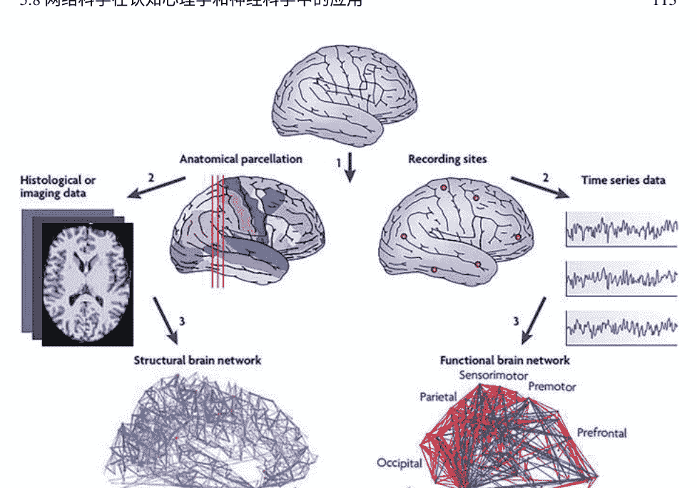

> 图5.4表示创建大脑结构和功能网络的阶段。
(Bullmore & Sporns, 2009)

功能连接性是使用神经时间序列之间的统计依赖度量来衡量的，这些时间序列可以是离散的或连续的。在这个层面上，神经元被认为是神经系统的基本元素。因此，可以合理地得出结论，细胞尺度是研究脑连接的自然尺度。 这个理论支持了首次重建线虫*C. elegans*的神经元和突触水平的连接组的尝试。 这种分析尺度可以产生准确的节点和边的绘图，看起来非常有用。 然而，它也有一些缺点，如计算负担重、数据获取和处理工作繁重，以及对大型神经系统的可扩展性差。

事实上，脑部在fMRI中检测到的BOLD信号表明在没有任何外部刺激的情况下存在自发的振荡。Biswal等人观察到在静息状态下双侧运动区之间的自发神经活动具有很高的相关性。自那时以来，认知神经科学研究进入了功能连接分析的新时代。 由于其简单的实验设计、易操作以及对患有神经精神障碍的患者的易接受性，静息态功能磁共振成像在人脑功能研究中具有独特的优势。 功能连接性仅显示了空间上分离的脑区之间神经活动的同步性。 研究人员提出了一系列功能连接性分析方法。

这些方法包括线性相关分析、独立成分分析（ICA）、主成分分析（PCA）、相干性分析和聚类分析。基于节点的分析是线性相关分析中最常见的方法。首先，根据先前的知识选择感兴趣区域（ROIs）作为节点区域，然后计算Pearson相关系数作为给定节点区域和脑中体素之间功能连接性的度量。通过将整个大脑划分为几个区域（或定义一些ROIs），可以获得区域间的功能连接性，从而构建整个大脑的功能连接网络。还有一种方法不需要考虑单个节点或ROI，可以在整个大脑层面上进行网络分析（Hu和Zeng，2019）（图5.5）。

### 有效连接

有效连接最初用于理解神经元尖峰活动的一致性，并被定义为能够重现观察到的信号一致性的最小神经回路模型。有效连接检查不同组件之间是否存在流动。与功能连接不同，这些连接的方向也是明确的且一致的。主要检查这种连接以找到不同脑区之间的因果关系，并帮助研究人员找到神经动力学的基本机制（Bullmore & Sporns，2009）。

### 5.8.6 大脑图的定义

网络科学研究系统中相互连接的元素的宏观行为复杂性。鉴于高质量数据集的可用性，可以考虑与图论量相关的数据。换句话说，尽管具有完全不同的微观特征，复杂系统显示出共同的宏观特征。在许多研究中，这些重要特征之一，即小世界性，在人类和其他生物的功能和结构网络中以不同的维度被观察到。

在网络科学中，复杂系统的其他拓扑特征，如模块化、层次结构、中心性和网络中枢的分布，可以进行定量化。

可以通过图论研究大脑的结构和功能网络，具体步骤如下：

- 一、使用成像技术定义节点。
- 二、通过谱相干或Granger因果性测量两个脑磁图传感器之间的连续连接大小、通过个体扩散张量成像数据集中两个区域之间的连接概率，或通过磁共振成像测量大脑皮层厚度或体积的区域间相关性来估计节点之间的连续连接大小。
- 三、连接所有节点之间的连接，并创建一个连接矩阵，在该矩阵的每个元素上应用阈值，以创建一个二进制邻接矩阵或无向图。
- 四、分析和计算大脑网络的网络参数，并与随机网络群体的等效参数进行比较（Bullmore & Sporns, 2009年）。

#### 大脑中的图分析指标

##### 1. 节点度、分布度和同配性

节点的度是它与网络中其他节点的连接数。这是网络中最基本的指标之一，其他网络指标也与之相关。在随机网络中，所有连接的可能性都是相等的，导致高斯和对称的度分布。复杂系统的网络通常具有非高斯的度分布，往往朝着具有高度数节点的节点呈长尾分布。无标度网络的度分布遵循幂律分布。同配性是连接节点度数之间的相关性。正聚类表明高度数节点倾向于连接。下面将更详细地解释同配性及其应用。

##### 2. 聚类系数和模式

如果一个节点的最近邻节点也相互连接，则形成一个聚类。聚类系数是一个节点的最近邻节点之间的连接数。邻居相对于最大可能连接数的数量。 随机网络具有较低的聚类平均值，而复杂网络具有较高的聚类（与信息传输的高局部效率和鲁棒性有关）。

网络的拓扑模式是基本构建块，其中小的三个或四个节点之间的连接在网络中以大于随机的频率重复。

##### 3. 路径长度和效率

路径长度是从一个节点到另一个节点时要跳过的最小边数。 随机和复杂网络具有较短的平均路径长度（高全局信息传输效率），而正常网络具有较长的平均路径长度。 效率与路径长度呈负相关。

##### 4. 连接密度或成本

连接密度是图中实际边的数量与可能边的总数的比率。 它是网络物理成本的最简单估计器。例如，在制造计算机芯片时，如果假设每个逻辑门是一个节点，用于连接它们的导线的数量应该尽量减少，以减少热噪声和额外成本（Fornito等，2016年）。

##### 5. 中心节点、中心性和鲁棒性

中心节点是具有高度或高中心性的节点。 一个节点的中心性衡量了网络中通过它的所有节点对之间的最短路径的数量。 因此，具有高中心性的节点对于高效的通信至关重要。通过移除一个节点并估计结果网络的效率，可以评估一个单独节点对于网络效率的重要性。鲁棒性可以指网络在节点或边缘移除后的结构完整性，或者指干扰对局部或全局网络状态的影响。

##### 6. 模块化

许多复杂网络由许多模块组成。有各种算法用于网络模块化估计，其中许多算法基于分层聚类。每个模块包括几个密集连接的节点，不同模块之间的连接相对较少。省级中心通常连接到其自己模块的节点，而连接中心则连接到其他模块的节点。

在大多数情况下，使用相关性、相干性和互信息来创建无向图，并使用相关性、相干性和互信息方法来创建有向图。

MRI测量结果表明，中心性和模块化组织可以成为神经学和精神病学早期诊断和预测临床结果的重要生物标志物（Fornito等，2016年）。

##### 7. 随机、无标度和小世界网络

在随机图中，每对节点具有相等的概率p连接，并且服从高斯分布，但大多数真实世界的描述性图与随机图模型有所偏离。

“小世界”特征在网络的节点之间具有高水平的局部聚类和全局连接所有网络节点的短路径。事实上，在一个大系统中，所有节点通过相对较少的步骤连接在一起。小世界特征介于随机网络和规则网络之间。对遗传学、信号传导、通信、计算和神经网络的研究为此提供了证据。

这些研究揭示了自然和技术系统中几乎所有网络都具有非随机/不规则或小世界结构，这一特征反映了它们的特定性能 (Bullmore & Sporns, 2009)。

### 5.8.7 图中的脑网络识别和分析

在脑网络分析中使用图论可以追溯到“人类连接组”的引入 (Sporns等, 2005)。 在这里，有一个N*N矩阵 (也称为连接矩阵或连接矩阵)，其中0或非零值表示两个区域之间是否存在连接。 在获得该网络中提到的度量标准后，可以进行人类或其他动物的脑网络分析。

一般来说，连接性识别中有两种计算方法：功能连接性和有效连接性。 如前所述，功能连接性提供了有关远距离区域之间时间上的一致性的信息，而有效连接性是区域之间直接影响的结果。

功能连接性研究可以分为两类：基于模型和无模型。 基于模型的方法使用交叉相关、相干分析和统计参数映射等方法，而无模型的方法使用基于分解的分析、聚类和互信息方法。

基于模型的方法将大脑的某个区域作为种子，检查该区域是否与其他区域相关。 这种方法需要背景知识来正确选择种子和相关区域。 换句话说，需要一个假设，并通过实验进行验证。 同时，这种方法可能会忽略研究者忽视的通信中的有用信息，从而破坏并无法检查这些信息。

与此同时，无模型模式不选择任何特定的区域或种子，并且在没有假设的情况下考虑整个大脑及其连接。

如前所述，对大脑图进行检查可以有两种类型的标准：全局标准和局部标准 (Fornito等, 2016年)。

#### 全局标准

全局标准旨在寻找功能分离、大脑中的信息流动、功能整合、寻找小世界特征以及检查网络对故障的韧性 (Sporns, 2014年)。

事实上，分离意味着将大脑中的每个元素分配给人群的程度。 在这种情况下，聚类系数和模块化标准提供了关于分离的有用信息。 在大脑网络中，解剖上相邻的区域被称为模块，并且使用这种模式进行分析显示了大脑网络中的小世界特征。 此外，整合提供了对整个大脑中信息连接的效率的洞察，并且可以将信息的长度作为区域之间路径的度量。

一般来说，小世界特性代表着网络之间的隔离和整合之间的平衡。

关于韧性特性，可以将同质性标准与故障相对比。事实上，网络中的互连中心性导致了特定中心的故障覆盖，这个标准在研究大脑网络中也是必不可少的（图5.6）。

#### 本地标准

在网络科学中，对网络产生重大影响的中心节点被称为中心。根据其参与率，中心节点分为连接中心和枢纽中心两种类型。连接中心具有较高的参与率，而枢纽中心则相反。换句话说，连接中心负责连接大脑的不同模块，而枢纽中心负责模块内部的连接。网络的节点度标准是寻找中心的最简单标准之一。其他标准，如中心性、介数和接近度也属于这个类别。

### 5.8.8 大脑的重要网络

第一个已知的大脑网络是布洛卡和韦尼克在19世纪发现的语言网络。相互连接的两个独立部分网络负责语言的单一活动。总的来说，大脑中已经确定了许多不同尺度的网络。大尺度上有七个基本的大脑网络：

#### 感觉运动网络

该网络接收来自全身各部分的感觉信息，并将其转化为大脑中的电信号。该网络的职责分为几个类别：处理大脑的外部物理信号、内部信号，检查感觉并产生运动反应。该网络与其他网络密切相关，如听觉网络、视觉网络、边缘网络（用于嗅觉和味觉）、显著性网络和默认模式网络（DMN）。它被认为是大脑中的传感器（ten Donkelaar等，2020年）。

#### 视觉系统

这个网络可以被视为一个旁观者，负责视觉和与视觉相关的处理。这个系统非常复杂，因为它将光转化为可识别的东西。尽管最初认为这个任务是在一个区域完成的，但后来发现有一个负责这些过程的系统。这些过程包括视觉图像增强和处理，以及检测运动、模式、面孔、地点等等（Poggio等，1988年）。

#### 边缘系统网络

作为大脑中最古老的网络之一，这个系统调节许多大脑功能，如记忆、情绪、学习和行为。这个网络对气味、声音和光等刺激作出反应。它还负责行为、反应和相关感受，以及对经验或任何类型的学习的记忆（Sullivan，2022年）。

#### 中央执行网络（CEN）

作为任务和决策的责任者，这个网络在高认知水平上运作，被认为是最重要的大脑网络之一。它的责任范围包括记忆、处理、控制和整合来自其他区域和网络的信息，根据内部动机、心理偏好和选择组织行为。这个高级网络接收和整合来自其他网络的输入，处理各种信息，包括灵活性、工作记忆、启动和抑制，先前被认为有不同的网络（Dosenbach等人，2007年）。

#### 默认模式网络

这是最著名的脑网络之一，在休息、幻想或思考新想法时被激活。这个网络在睡眠和休息时活跃起来，在内心思考时更加活跃。这些内心的思考可以是关于回忆童年记忆、计划下一个假期或饥饿和排便等，这些都表明了一个活跃的默认模式网络。鉴于对自己和世界的无意识分析和思考，它被认为是最活跃和稳定的脑网络之一。许多生物标志物的研究使用了这个网络（Sambataro等人，2010年）。

#### 显著性网络

这个网络准确地考虑外部世界，并确定大脑对刺激的反应。这个网络作为从执行网络到默认模式网络的切换装置。换句话说，它在内部和外部过程之间切换。这个网络存在的原因是，在健康的大脑中，默认模式网络和中央执行网络不会同时激活；这个调节由显著性网络处理（Elton和Gao，2014年）。

#### 背侧注意网络

该网络监督人类的注意力，是双向且一致的，以保持专注。DAN通常与大脑中的其他活跃网络同时激活。DAN将注意力引导到最显著和活跃的网络（或网络）。人脑持续接收感官输入，无法始终对所有感觉信号保持一致的关注。相反，DAN将大脑的注意力集中在给定时刻最重要的感觉输入上（Corbetta等，1995年）。

### 5.8.9 图在认知和行为科学中的应用

认知涵盖导致思考、感受或体验的神经活动，包括问题解决、注意力、记忆、执行功能和推理（Farahani等，2019年）。

智力是大脑网络与认知之间的一个研究领域。人类智力涉及各种功能，包括逻辑推理、快速学习和思考，研究人员对大脑的结构和功能网络进行的研究表明了这些网络与智力之间的联系。例如，van den Heuvel等人（2009年）、Langer等人（2012年）和Hilger等人（2017年）提到了智力与大脑内在网络中的小世界准则之间的关系。这些研究结果揭示了智力表现与前额叶和顶叶之间显著性和整合网络中特征路径的短程性和中心性值之间的相关性。此外，Wu等人（2013年）表明智商与与注意力相关的网络中的节点特征呈正相关，与默认模式、情绪和语言系统中的节点特征呈负相关。尽管这些研究表明普通智力深受空间分布区域的功能整合的影响，但它们并未提供关于人类智商与大脑模块化结构之间是否以及如何相关的足够信息。

另一个图研究领域涉及到大脑在生命过程中的变化。人脑从出生到成年经历了许多功能性变化。关于这个主题的众多研究表明，健康人的局部效率和富人俱乐部系数在成年时增加，然后随着年龄的增长而减少。与此同时，无论出生后的最初几年如何，全局效率保持不变（Gao等，2011年）。此外，短连接和长连接之间的反向路径表明大脑功能网络的逐渐变化，这同样会导致个体的行为和认知变化。

还有关于工作记忆和大脑网络之间关系的研究。Stanley等人（2015年）表明，局部效率与更好的工作记忆关联较小，而全局效率与年轻人表现提高和老年人表现不足相关。

另一个有趣的课题是在自然环境中检查人的日常功能的变化，基于这一基础，大脑功能在常规环境中被测量。例如，Petro等人（2018年）表明，精神疲劳与大脑拓扑结构的变化有关，如小世界特征和全局效率的降低，以及前顶叶-顶叶网络和丘脑和纹状体等连接区域的功能变化。

这门科学最重要的应用之一是在生物标志物和心理障碍的诊断中。这些标准和检查适用于许多疾病，包括癫痫、阿尔茨海默病（AD）、多发性硬化症（MS）、自闭症谱系障碍（ASD）、注意力缺陷/多动障碍（ADHD）、精神分裂症、帕金森病、失眠、重度抑郁症、强迫症（OCD）、边缘人格障碍（BPD）和双相情感障碍，在许多疾病中，大脑功能连接的生物标志物可以很容易地被识别出来。

### 5.8.10 机器学习在静息态fMRI（Rs-fMRI）数据分析中的应用

机器学习在rs-fMRI数据分析中的大多数应用与无监督学习方法相关。与任务驱动的研究相反，对静息态活动的建模并不直接，因为没有受控的刺激来证明和驱动这些波动。因此，用于描述任务驱动fMRI中观察到的时空模式的分析方法通常不适用于rs-fMRI（Khosla等，2019年）。

#### 无监督学习

考虑到fMRI数据的众多维度，主要的分析方法基于分解或聚类技术，以提供对空间和时间数据的更好描述。无监督学习方法，如ICA，加速了所谓的静息态网络或RSN的发现。它还在静息态脑映射中得到了发展，其主要目标是创建脑分区，即功能上一致的脑部体素的最佳分组。这些地图有助于更好地理解大脑的网络和连接。此外，它们还作为统计分析或监督机器学习的特征降维技术。文献表明，静息态下的功能连接在典型的rs-fMRI扫描过程中发生了显著变化，这有趣地展示了大脑网络的动态。无监督学习技术表明，静息脑网络模式在多个状态之间发生变化，表明了多样的心理过程（Khosla等，2019年）。

无监督学习方法采用k-means、高斯混合模型、层次聚类和基于图的聚类方法，以及潜变量模型、分解方法、独立成分分析（ICA）、主成分分析（PCA）和隐马尔可夫模型。

无监督算法在静息态功能磁共振成像数据中的应用包括以下几个方面：大多数无监督学习方法旨在将大脑分割为离散的功能子单元，类似于脑图。与使用脑图的方法不同，这些分割是由功能数据驱动的。

这些应用的第二个集合是对脑网络动态的探索。最近，无监督学习已被应用于动态功能连接组的分析，并取得了有希望的结果。

与此同时，正如前面提到的，机器学习在静息态功能磁共振成像中的一个应用是在临床领域。这些有监督的机器学习应用用于个体水平的预测。作为疾病的敏感生物标志物，许多研究人员对“连接组”产生了兴趣，并且许多研究进一步表明，类似于指纹，这些连接和连接组对每个个体都是独特的。鉴于深度学习的重要性，还开发了几种新的基于神经网络的方法来分析静息态功能磁共振成像数据。这些方法中，大多数提取个体级别的连接组特征进行预测。深度学习算法（Tzourio-Mazoyer等，2002年）将在下一章中更详细地探讨。

#### 监督学习

这种学习方法处理具有特征、预测和标签的问题，旨在学习输入和目标之间的映射关系。这使得系统能够估计以前未见过的输入数据点。一个例子是通过rs-fMRI相关性预测自闭症。由于内在的FC反映了认知相关功能网络之间的相互作用，有一个假设认为静息态模式的系统性变化可能与病理或认知特征相关。使用rs-fMRI的监督算法具有很高的诊断准确性，这是支持这一假设的有力证据。这种方法还使用了岭回归、LASSO回归、弹性网络回归、逻辑回归、支持向量机、随机森林和深度学习等方法。

这种方法正在积极发展，并在许多研究中进行了讨论。例如，使用rs-fMRI数据进行监督机器学习来研究脑发育和衰老。在这个背景下，Dosenbach等人使用RSFC来预测青少年的脑成熟度。因此，这些活动可以作为预测健康神经发育的有价值工具。这种方法还可以用于识别与正常衰老相关的异常神经发育变化（Abraham等，2017年）。

如前所述，在这个领域中，机器学习方法也可以用于识别精神障碍的生物标志物。精神障碍的生物基础尚不清楚，目前完全依靠行为评估进行诊断。rs-fMRI已经成为一种用于诊断精神障碍的强大成像方法，用于提取生物标志物。使用RSFC的监督学习算法在多种精神障碍中，包括精神分裂症、抑郁症、自闭症谱系障碍、注意力缺陷多动障碍、社交焦虑症、创伤后应激障碍和强迫症等方面展示了有希望的分类或预测症状严重程度的结果。

它在认知能力和人格特质领域也受到了极大关注。功能连接性分析可以预测认知和行为的个体差异。由于其不受控制的特性，静息态成像涵盖了广泛的内在认知状态。目前，机器学习模型已被用于从基于RSFC的生物标志物预测一些个体特征，如流体智力、持久注意力、记忆表现和语言成绩。此外，一些研究还使用这些模型来识别个性特征，如神经质、外向性、宜人性和开放性。

另一个重要的应用涉及对睡眠和意识波动水平的研究。然而，很少有研究使用机器学习来预测静息态功能磁共振成像期间的意识水平，并对意识水平进行分类。

许多研究还使用这种方法来研究遗传和遗传传承。理解遗传对大脑结构和功能的影响一直是神经科学的长期目标。在机器学习框架下，遗传和环境的研究也在持续进行中。例如，Miranda-Dominguez等人将SVM分类器应用于双胞胎功能连接，取得了成功预测静息态功能磁共振成像中家庭关系的可行性，并通过独特的遗传或环境因素形成功能连接的方面（Khosla等，2019年）。

## 5.9 设计概念网络

使用网络模型或任何模型的首要步骤是选择应包含在模型中的变量。在网络分析中，这些变量被称为节点。换句话说，网络分析从网络设计开始，网络设计从定义和描述网络中的变量（节点）开始（Bringmann等，2022年）。

为了将变量定义为网络的节点，Bringmann等人（2022年）建议进行节点有效性的过程，其中包括两个步骤。第一个是节点选择，第二个是节点评估。

节点可以是任何心理变量，但研究人员的理论或临床假设在选择节点时起着关键作用。也就是说，选择的节点应该是最小完备的。这意味着网络中应包含用于建模预期现象的所有必要节点，同时排除多余的节点。这个特征在不同的情境下会有所不同。

研究人员的洞察力非常重要。节点也应该足够独特，特别是如果研究人员的假设是随意的。为了足够独特，节点应该是

- (a) 可以单独识别的（即，至少在理论上，它们可以独立评估）。
- (b) 可独立操纵的（即，至少在理论上，可以在不干预其他节点的情况下对一个节点进行干预）。

更重要的是，应该评估所选节点的有效性和可靠性。

请记住，本书中的网络分析是横断面的，在心理学中的大部分网络分析都是这种类型（Robinaugh等，2020年）。

这些网络的主要目的是研究个体间的差异，有时也旨在生成关于个体内动态的假设。我们知道，横断面分析不能在统计上将个体间的变异性（例如，通常是稳定的特质样特征）与个体内变异性（例如，状态样特征）分开。因此，基于横断面数据的分析可能导致网络中存在反映个体间和个体内效应混合的边。横断面数据通常可以直接用于识别个体内的过程。

如果产生了平稳性，那么动力学就会发生变化。这种特定情况被称为遍历性（Molenaar，2004年）。这需要个体是独立的，并且相同的数据生成过程适用于所有个体（同质性）。此外，数据的统计特征，如均值、方差以及自动和交叉验证，在时间上不会发生变化。换句话说，数据中不能检测到趋势。

我们知道，在许多情况下，这些假设并不成立，因此基于时间序列数据进行网络分析。这种分析称为时间网络分析，在本卷中不讨论。

总之，网络科学提供了工具，通过这些工具可以明显看出不同网络结构之间的差异。这些发现导致了人工心理学研究者之间形成了一个假设：网络过程本质上是动态的。

网络科学在认知心理学特别是心理科学中至少有三个方面非常有用。Siew等人（2019年）总结了这三个方面：

1.  网络科学提供了一种定量的方法来表示认知系统。网络科学提供了一种建模多个认知和心理网络的方法，例如语言、语义记忆、特质和语言环境。它使得微观、中观和宏观网络分析成为可能，从而对心理网络的结构有了新的理解。
2.  网络科学促进了对人类认知的更深入理解，使研究人员考虑网络结构和作用于网络结构的过程如何相互作用以产生行为现象。
3.  网络科学提供了一个框架来模拟认知系统在多个尺度上的结构变化。网络科学使得研究认知和心理系统的发展成为可能。因此，研究人员可以更深入地了解人类生命的早期和晚期阶段，并研究随时间变化的结构变化。网络科学有助于量化认知系统的结构和动态变化。

### 网络分析中的样本大小

在心理学进展中，准确估计心理网络结构的进展已经被考虑进去（William & Rast, 2020年）。准确估计网络参数的一个关键因素是样本大小（Epskamp et al., 2018年）。在参与者数量有限且采用方便抽样方法的心理研究中，样本大小非常重要（Shen et al., 2011年），因为如果节点增加，需要估计的参数数量也会增加（Ryan et al., 2022年）。

Ryan等人（2022年）引入了一种基于蒙特卡洛方法的新方法来确定网络分析中的样本大小。他们使用了类似于G*power软件的R软件来进行样本大小建议。本章提供了一些示例。在这种情况下，通过利用节点数量、假设密度、统计值（类似于统计功效）和测量值等必要因素，可以估计进行网络分析所需的样本大小。这里使用了名为powerly的R软件包。

### 调节心理网络分析

应该记住，人工心理学家是一种通过人工智能方法深化分析的心理学家。在心理研究中，比较不同组和子组是重要的。换句话说，调节变量是重要的。许多研究人员对研究网络结构是否随着调节变量的不同而改变的问题感兴趣。他们还可能问男性和女性的心理网络中认知参数是否不同。回答这些问题对认知和进化心理学家可能很有兴趣。在估计网络之后，可以比较心理网络。这些比较为人工心理学开启了新的大门。这种针对横断面数据的分析称为调节心理网络分析。

在R软件中，有名为networktoolbox和bootnet的库，可以进行这种类型的分析。下面提供一个示例。

### 5.11.1 使用R的实际例子

例子5.1
一个人工心理学家首先尝试定义三个网络。这种方法可以被认为是网络分析的确认性模式。我们称之为临时网络分析。这个定义是基于理论基础的。他/她定义了三个网络：

#### EBICglasso Network for Artificial Psychologist

图5.7 三个网络（A、B和C）的网络图

网络A包括节点A1、A2、A3和A4，显示为粉色。网络B包括节点B1、B2、B3和B4，网络C包括节点C1和C2。R软件输出图中的网络B标记为绿色，网络C标记为蓝色。临时网络分析的R代码在列表5.1中。

列表5.1展示了用于网络分析的R代码（临时网络分析）

```r
library(bootnet)
library(qgraph)
library(haven)
Groups
Book2 <- read_sav("Book2.sav")
Model <- estimateNetwork(Book2, default = "EBICglasso", corMethod="cor_auto")
Model$graph
plot(Model, edge.labels=TRUE,
title="EBICglasso Network for Artificial Psychologist", groups=Groups, palette='pastel')
centralityPlot(Model, include="all")
resboot1 <- bootnet(Book2,
default = c("EBICglasso"), tuning=.5,corMethod="cor_auto",
nBoots = 1000, nCores = 8, type = c("nonparametric"))
plot(resboot1, labels = TRUE, order = "sample")
resboot2 <- bootnet(Book2,
default = c("EBICglasso"), tuning=.5, corMethod="cor_auto", nBoots = 1000,
nCores = 8, type = c("case"))
plot(resboot2, labels = TRUE, order = "sample")
corStability(resboot2)
plot(resboot1, "strength", plot = "difference", order = "sample")
plot(resboot1, "edge", plot = "difference", onlyNonZero = TRUE, order = "sample")
bootnet_case_dropping <- bootnet(Model, nBoots = 2500,
type = "case",
statistics = c('strength',
'expectedInfluence',
'betweenness',
'closeness'))
plot(bootnet_case_dropping, 'all')
corStability(bootnet_case_dropping)
```

在网络分析图中，蓝色边表示正向关系，红色边表示负向关系，每条边的粗细表示其强度。

图5.8中对该网络的分析结果显示，节点B1和B2具有最高的强度，对网络产生最大影响，同时显示B4是连接网络B和网络A的桥接节点，C1是连接网络B和C的节点，C2是连接网络C和A的节点。

在图5.9中，网络A中最强的正向连接是A1和A2之间的连接，网络B中最强的负向连接是B3和B4之间的连接，而网络B中最强的正向关系是B1和B2之间的关系。图5.9还检查了网络的稳定性。该图显示了通过自助法从1000个样本中获得的样本结果与网络分析中使用的主要样本结果，并显示边的稳定性。红色点的路径（来自原始样本）和黑点表示引导法中节点之间的平均边，与图中两条线的灰色区域表示引导法得出的95%置信区间相对应。正如你所看到的，一些边的权重，特别是中间的那些绝对值较小的边，比其他边更准确。此外，该图显示大多数边接近于零；也就是说，它们大多与引导法样本中的0点相交。

#### 图5.9 网络稳定性

图5.10显示了原始样本与1000个引导样本之间每个中心性指标的平均相关性。通过观察四个中心性指标之间的平均相关性是否在减少样本量时保持相同且恒定，可以看出这个图展示了这些相关性的稳健性。该图表明平均相关性对样本量具有稳健性。

图5.10显示了四个中心性指数之间的平均相关性和节点之间的相关性的R结果（红色方块表示负节点，蓝色方块表示正边）。图5.11显示了节点之间边的负向或正向连接。

为了避免通过肉眼观察图形产生主观误差，Epskamp等人（2018）发明了一个称为相关稳定性系数（c-s）的统计指标，该指标在本章的前几节中已经解释过。该指标显示了样本中可以丢弃的平均百分比，以保持样本的中心指数与从案例丢弃的自助法得到的中心指数之间的特定相关性，例如r=0.7。r=0.7不是一个固定的数字，可以更改。如果从主样本中丢弃大量案例后，中心性指数之间的相关性仍然很高，可以说网络节点不受样本特征的影响，并且可以相信它们在总体中会表现稳定。这个系数不应该低于0.25，最好在0.5以上（Epskamp等，2018年）。可以说，这个分析的结果表明了中心性指标的有利解释，特别是对于预期的影响力和强度。

图5.12显示了R软件输出中每个节点的邻接矩阵。这个图表示节点的协方差，被认为与邻接矩阵相同（图5.13）。

#### === Correlation Stability Analysis ===

| nPerson | Drop% | n |
| :--- | :--- | :--- |
| 1 | 62 | 75.2 | 98 |
| 2 | 82 | 67.2 | 110 |
| 3 | 101 | 59.6 | 116 |
| 4 | 121 | 51.6 | 90 |
| 5 | 140 | 44.0 | 101 |
| 6 | 160 | 36.0 | 91 |
| 7 | 179 | 28.4 | 95 |
| 8 | 199 | 20.4 | 97 |
| 9 | 218 | 12.8 | 103 |
| 10 | 238 | 4.8 | 99 |

Maximum drop proportions to retain correlation of 0.7 in at least 95% of the samples:

edge: 0.752 (cs-coefficient is highest level tested)
- For more accuracy, run bootnet(..., caseMin = 0.672, caseMax = 1)

strength: 0.596
- For more accuracy, run bootnet(..., caseMin = 0.516, caseMax = 0.672)

图5.13 R的相关性稳定性结果。

```
> perm.1$result
          part1 part2 p-value
C1  0.85 0.78  0.718
C2  0.67 0.85  0.413
C3  0.72 0.83  0.532
C4  1.04 1.07  0.914
C5  1.13 1.23  0.566
C6  0.63 0.55  0.675
C7  1.07 0.90  0.363
C8  1.47 1.22  0.263
C9  0.81 1.01  0.357
C10 0.62 0.91  0.273
```

```
> perm.hyb$result
          part1 part2 p-value
C1  0.667 0.375  0.328
C2  0.306 0.500  0.510
C3  0.708 0.389  0.253
C4  0.625 0.625  1.000
C5  0.764 0.944  0.349
C6  0.375 0.444  0.769
C7  0.792 0.667  0.709
C8  0.556 0.389  0.513
C9  0.278 0.597  0.258
C10 0.333 0.708  0.173
```

图5.14 R的排列测试结果。

通过相关稳定性系数（c-s）显示的相关性，在接近度和强度这两个指标的情况下高于0.5，只有介数的情况下低于0.5。在这些指标中，最重要的相关稳定性系数（c-s）是强度的系数（图5.14）。

排列测试用于找出全局网络和使用中心性指数的测量之间是否存在差异。为此，需要两个样本。在这个例子中，被调查的样本（n=250）被随机分成两部分。最好从同一个社区选择两个不同的样本。相同社区的样本。然后，人工心理学家决定使用1000次自助法迭代比较正在研究的最重要指标（即强度）在两个群体中的差异。p值表示样本的两个部分之间在这个指标上的差异。结果显示，在样本的两个部分中，强度的测量没有显著差异。在这个例子中，被调查的网络有10个节点，命名为C1到C10（列表5.2）。

#### 列表5.2排列测试的R代码

```
perm.1 <- network.permutation(part1, part2, iter = 1000, network = "glasso",
measure = "strength", alternative = "two.tailed", ncores = 2)
perm.1$result
perm.hyb <- network.permutation(prev.perm = perm.1, measure = "hybrid", ncores = 2)
perm.hyb$result
```

#### 例子5.2

一位人工心理学家决定使用网络分析来研究不同节点之间的关系。她研究了许多认知变量。为此，她测量了青少年的注意力、认知控制和情绪调节的组成部分。她测量了包括注意力和反应速度在内的认知变量。表5.1显示了它们的缩写和一般描述。

#### 表5.1 变量的缩写和一般描述

| 缩写 | 描述 |
| :--- | :--- |
| AAQ | 警觉、专注和速度的组合（听觉） |
| VAQ | 警觉、专注和速度的组合（视觉） |
| QVIA | 警觉 通过两种不同类型的遗漏错误来衡量注意力不集中（听觉） |
| QVIV | 警觉 通过两种不同类型的遗漏错误来衡量注意力不集中（视觉） |
| QFOCA | 测试期间所有正确反应的心理处理速度的总变异性（听觉） |
| QFOCV | 测试期间所有正确反应的心理处理速度的总变异性（视觉） |
| QMNA | 所有正确反应的平均反应时间（听觉） |
| QMNV | 所有正确反应的平均反应时间（视觉） |
| SAAQ | 在低需求条件下准确、快速、可靠地对刺激作出反应的能力的整体测量（听觉） |
| SVAQ | 在低需求条件下准确、快速、可靠地对刺激作出反应的能力的整体测量（视觉） |
| ARCQ | 谨慎、一致性和耐力的组合（听觉） |
| VRCQ | 谨慎、一致性和耐力的组合（视觉） |
| QPRA | 冲动性的测量（听觉） |
| QPRV | 冲动性的测量（视觉） |
| QCONA | 保持任务并持续可靠努力的能力的测量（听觉） |
| QCONV | 保持任务并持续可靠努力的能力的测量（视觉） |

#### 清单5.3 R代码用于事后网络分析

```
library("NetworkToolbox")
library("bootnet")
network <- estimateNetwork(Book1,default = "EBICglasso", corMethod = "spearman")
network$graph
Layout <- averageLayout(network)
plot(network,layout = Layout, title = "EBIC glasso",edge.labels=TRUE,label.cex = 0.7,
label.color = black,label.prop = 1.5, negDashed = FALSE,legend.cex = 0.8,
legend.mode = 'style2', font = 4)
network
bootnet_nonpar <- bootnet(network,  nBoots = 1000,  nCores = 8)
plot(bootnet_nonpar, labels = FALSE,  order = "sample")
centralityPlot(network, include = "all", orderBy = "ExpectedInfluence")
bootnet_case_dropping <- bootnet(network, nBoots = 2500, type = "case",
nCores = 8, statistics = c('strength', 'expectedInfluence', 'betweenness','closeness'))
plot(bootnet_case_dropping, 'all')
differenceTest(bootnet_nonpar,"ARCQ", "VAQ", measure = "strength")
```

在R软件中，有名为networktoolbox和bootnet的库，可以进行这种类型的分析（清单5.3）。我们将其称为探索性网络分析，也称为事后网络分析。然后，她使用EBicglasso算法估计网络，该算法使用LASSO方法生成一个简洁的网络（图5.15）。图5.16显示了每个节点与其他节点的关系。图5.17显示了中心性指标。三列分别显示了网络中每个节点的接近度、中介度和预期影响。如图所示，VAQ和AAQ在网络中具有最高的强度。VAQ和AAQ还与其他节点之间有较多的粗边连接。最低的强度与QPRA相关。

这位对人工心理学感兴趣的研究人员决定比较基于青少年性别的两个网络。因此，有必要为男性青少年设计一个网络，为女性青少年设计一个单独的网络。然后，可以使用R代码中的比较中心性命令（Listings 5.4和5.5）来比较男孩和女孩的网络的中心性指标。如图5.18所示，女孩（虚线图）和男孩（实线图）之间存在差异。

#### AP中的网络分析图5.16:

每个节点的中心性指标

#### 图5.17：按性别分类的网络的R结果

#### Listing 5.4：比较两个网络分析的R代码

```
1 book$gender %<>% factor(levels = 1:2, labels = c("Male", "Female"))
2 network_male <- estimateNetwork(Y %>% 
3 filter(gender == "Male") %>% select(-gender), 
4 default = "EBICglasso", corMethod = "spearman")
5 network_female <- estimateNetwork(Y %>% 
6 filter(gender == "Female") %>% 
7 select(-gender), default = "EBICglasso", 
8 corMethod = "spearman")
9 compareCentrality <- function(net1, net2, include = c("Strength", 
10 "Closeness", "Betweenness", 
11 "ExpectedInfluence", "all", "All"), orderBy = c("Strength", 
12 "Closeness", "Betweenness", "ExpectedInfluence"), 
13 decreasing = T, legendName = '', net1Name = 'Network 1', 
14 net2Name = 'Network 2'){
15   library(ggplot2)
16   library(forcats)
17 
18   if(include == "All" | include == "all"){include = c("Strength", "Closeness", 
19   "Betweenness", "ExpectedInfluence")}
20   df <- centralityTable(net1, net2) %>% filter(measure %in% include)
21   df %>% 
22   mutate(graph = case_when(graph == 'graph 1' ~ net1Name, 
23   graph == 'graph 2' ~ net2Name), 
24   graph = as.factor(graph), 
25   node = as.factor(node)) %>% 
26 
27   mutate(node = fct_reorder(node, value)) %>% 
28 
29   ggplot(aes(x = node, y = value, group = graph)) + 
30   geom_line(aes(linetype = graph), size = 1) +
```

#### Listing 5.5（续）：比较两个网络分析的R代码

```
#continued codes
geom_line(aes(linetype = graph, size = 1) +
    labs(x = '', y = '') +
    scale_linetype_discrete(name = legendName) +
    coord_flip() +
    facet_grid(~measure) +
    theme_bw())
compareCentrality(network_male, network_female,
                   include = "all",
                   legendName = "Networks by Gender",
                   net1Name = "Male",
                   net2Name = "Female")
```

#### 图5.18：用于发现社区的网络分析的R结果

网络分析的一个有趣特点是基于节点之间的关系找到社区。这是一种探索性的方法。正如软件的输出所显示的那样，已经提取出了三个社区，其中没有共享节点，这意味着创建了一些相互独立的社区（列表5.6）。

#### 使用网络分析发现社区的R代码清单5.6

```
library(CliquePercolation)
n1 <- estimateNetwork(Book1, default="EBICglasso")

w <- qgraph(n1$graph)
thresholds <- cpThreshold(w, method = "weighted", k.range = 3, I.range = c(seq(0.20, 0.01, by = -0.01)),
threshold = c("largest.components.ratio", "chi")); thresholds
threshold2 <- cpThreshold(w, method = "weighted", k.range = c(3,3),
I.range = seq(0.3, 0.09, -0.01), threshold = "entropy")
thresholds.permute <- cpPermuteEntropy(w, cpThreshold.object = threshold2)
thresholds.permute
results <- cpAlgorithm(w, k = 3, method = "weighted", I = 0.3)
summary(results)
results1 <- cpColoredGraph(w, list.of.communities = results$list.of.communities.labels,
layout = "spring", edge.labels = TRUE)
```

- 社区1: AAQ, qVSI, qFOCA, qMNA, SAA, ARC, qCONA.
- 社区2: VCR, qPRV, qCONV.
- 社区3: VAQ, qVIV, qFOCA, qMNV, SVA.

在这个基于节点连接提取社区的探索性分析中，只有一个单独的节点与其他节点不同，即QPRA（图5.19）。在网络图中，社区1以蓝色标记，社区2以绿色标记，社区3以粉色标记，单独的孤立节点以白色显示在图中（图5.20）。

| k | Intensity | Number.of.Communities | Number.of.Isolated.nodes | Ratio.Threshold | Chi.Threshold |
|---|-----------|-----------------------|--------------------------|-----------------|---------------|
| 1 | 0.20      | 3                     | 1                        | 1.000000        | 5.628118      |
| 2 | 0.19      | 3                     | 0                        | 1.142857        | 5.628118      |
| 3 | 0.18      | 3                     | 0                        | 1.142857        | 2.470204      |
| 4 | 0.17      | 2                     | 0                        | 1.571429        | NA            |
| 5 | 0.16      | 1                     | 0                        | NA              | NA            |
| 6 | 0.15      | 1                     | 0                        | NA              | NA            |
| 7 | 0.14      | 1                     | 0                        | NA              | NA            |

#### 图5.19使用网络分析发现社区的结果

为了在加权网络中运行团簇渗透算法，我们首先需要优化k和I。为了做到这一点，可以使用cp阈值函数。默认情况下，该函数将社区、共享节点和孤立节点的标签作为节点的标识符。正如我们所看到的，结果表明发现了三个社区，其中qPRA作为一个孤立节点。我们使用k等于3和I取值从0.20到0.01，步长为0.005来运行这个分析。没有共享节点。也可以使用数字作为节点的标识符，或者限制输出。I值的范围是基于网络的平均边权重选择的，在生成网络时设置为0.3。因此，I=0.40应该能够在人工网络中找到各种社区大小的范围。

然而，Farkas等人（2007年）建议通过将I的最高测试值设置为网络中的最大边权重来开始分析。

#### 例子5.3

一位人工心理学家将确定实施网络分析的样本大小。基于初始网络，他知道网络有10个节点，并假设密度为0.4。网络密度意味着网络中影响所需样本大小的存在的比例（Constantin等人，2021年）。他包括等于0.6的测量值。这个测量值类似于效应大小。我们使用0.8的统计值。这个测量值类似于统计功效。

列表5.7显示了用于分析具有10个节点和密度为0.4的GGM网络的适当样本大小的R代码。

#### 列表5.7 R代码用于分析GGM网络的适当样本大小

```
r
library(powerly)
results <- powerly(
  range_lower = 150,
  range_upper = 800,
  samples = 30,
  replications = 50,
  measure = "sen",
  measure_value = 0.6,
  statistic = "power",
  statistic_value = 0.8,
  model = "ggm",
  nodes = 10,
  density = 0.4)
summary(results)
```

更高的密度值意味着网络中会有更多这些成对连接。图5.21显示了结果。

图5.21 表示使用powerly软件包确定适当样本大小的结果

#### Monte Carlo Replications (50)

#### Computed Statistics

图5.22 表示箱线图和统计值的结果

水平的红色虚线表示统计指标的目标值（0.8），垂直的红色虚线表示中位数样本大小（497）的自助法统计的平均值（0.8）。水平的蓝色虚线表示基于95%置信区间的下限和上限样本大小。置信区间是基于10,000次自助法构建的，采用百分位数法（Diciccio & Romano, 1988）。

箱线图提供了性能指标随每个样本大小的变化情况的表示，这是基于进行的复制次数。

图5.22显示了从蒙特卡洛复制中获得的性能指标值（箱线图），曲线表示计算在性能指标值上的统计值以及用于在整个候选样本大小范围内插值统计值的单调样条。根据上述两个图，建议使用约500的样本大小。

# 第6章 深度神经网络

## 6.1 深度神经网络（DNN）

1981年，Teach和Shortliffe强调了在决策系统中解释决策的重要性。近年来，XAE变得越来越受欢迎。解释和解读的目标是减少黑盒模型的不透明性，并改善预测和分类模型的推理感知。这种推理先于预测。这使得在基于AI/ML的模型中促进透明度的解释和解读成为可能；因此，人们将对这些系统更有信心。首先，本章分析了人工神经网络（ANNs）。

## 6.2 神经网络

神经网络或人工神经网络是一种受人类神经系统启发的数据处理系统。它们也可以被视为大脑的电子模型。与学习机制类似，这些模型也是经验性的。然而，这些模型和问题使用不同的方法。该系统使用称为神经元的较小互连处理器创建一个通过训练算法进行训练的网络（Lawrence，1993）。

这种技术利用人脑及其结构的原理来开发数据处理策略。这种方法的本质在于数据的并行处理。训练过程中使用的方法是训练算法。通过这个过程，突触的权重被系统地改变，以达到网络的期望性能。

- 神经网络的特性（Milan Milosavljević，2019）：
  - 非线性性。
  - 输入-输出映射。
  - 适应性-改变突触连接强度的能力。
  - 证据性反应。
  - 上下文信息。
  - 故障抗性。
  - 在VLSI（超大规模集成）技术中的实现可能性。
  - 分析和综合的一致性。
  - 神经生物学类比。

## 6.3 神经元

如前所述，生物体中的神经网络和人工神经网络都是基于神经元的。在其自然状态下，神经元具有由树突、轴突和细胞体组成的生物结构（图6.1）。树突是细胞的通信附属物，负责与周围环境的信号进行通信和接收，最终在细胞中心的细胞体中进行处理。然后轴突将输出信号发送给其他神经元。尽管与自然神经元模型相比，这个简单的计算模型更为复杂，但这个模型是人工神经网络的主要基础（McCulloch & Pitts，1943年）。

在人工神经元的数学模型中，处理单元或神经元可以表示如下（图6.2）。

人工神经元是神经网络的基本元素。这些神经元包含以下内容（Pamučar，2010）：
- 输入 - $x_i$
- 突触（输入权重因子） - $w_i$
- 激活状态 - $z$
- 输出函数 - $f$
- 单一输出 - $o$
- 阈值 - $T$

在这里，作为树突的输入被视为问题的特征。在这些模型中，输入信号与权重值相乘（每个输入都有自己的权重）。因此，所有输入可以被视为输入向量，相应的权重是权重向量。这些权重通常在训练阶段进行调整。还可以添加到该集合的另一个值是偏置参数。

在训练过程中进行调整。最后，根据φ激活函数将实际输出应用于输入。

最简单的激活函数是二进制函数。如果输入的总值超过阈值，神经元会激活并输出函数变为1，否则为0。

```
φ(x) = 1 if wx + b > threshold, otherwise 0
(6.1)
```

神经元网络：神经网络被认为是一个神经元网络。一行神经元被认为是一层，神经网络中有三层：输入层、输出层和隐藏层。网络可以具有不同的结构，层数和神经元数量可能会有所变化（图6.3）。神经网络包括以下内容（Pamučar，2010）：
- 网络的架构（拓扑结构），即神经元连接方案。
- 神经元的传输函数。
- 学习规律。

人工神经网络的架构通过神经元的具体排列和连接形式来表示。根据神经元层数的不同，神经网络的架构也不同。通常，每一层从前一层接收输入，并将其输出发送到下一层。第一层被称为输入层，最后一层被称为输出层，其他层被称为隐藏层。最常见的神经网络架构之一是三层网络。第一层（输入层）是唯一一层从环境接收信号的层。第一层将信号传递给下一层（隐藏层），隐藏层处理这些数据，并从接收到的信号中提取特征和模式。被认为重要的数据被发送到网络的输出层，即最后一层。最终的处理结果在神经元的输出处获得。

更复杂的神经网络可以有多个隐藏层，反馈循环和时间延迟元素。

学习神经网络归结为从示例中学习，示例应尽可能多，以使网络行为更精确。

## 6.4 人工神经网络 (ANN)

一些人类的发明受到了自然的启发。 事实上，自然界充满了灵感，那些比其他人更有准备的人将从直觉中受益。

神经网络是基于人脑的概念模型，由近100亿个神经元和60万亿个突触组成 (Shepherd & Koch，1990年)。

人脑被认为是一个非常复杂的非线性并行信息处理系统。

因此，科学家们尝试模仿神经元的行为模式，并设计了一种称为感知器的人工神经元。 本章不打算回顾感知器的历史，而是旨在介绍其在本书中呈现的可解释的人工心理学中的应用。 1943年Pitts和McCulloch提出的想法被用作人工神经网络（ANNs）的基础。

人工神经网络（ANN）包含大量非常简单的相互连接的处理器，称为神经元。 这些人工神经元类似于生物神经元。 它们接收输入并提供输出。

在人工神经网络中，神经元通过连接进行连接，每个连接都被赋予一个数值权重。 这些权重在人工神经网络中充当长期记忆。它们代表每个输入神经元的强度或重要性。 在人工神经网络中，学习意味着不断调整这些权重的迭代过程。

表6.1对生物神经网络和人工神经网络进行了简要比较。

表6.1 生物神经网络和人工神经网络之间的简要比较

| 生物神经网络 | 人工神经网络 |
| :--- | :--- |
| 细胞体 | 神经元 |
| 树突 | 输入 |
| 轴突 | 输出 |
| 突触 | 权重 |

图6.4展示了人工神经元作为人工神经网络的计算元素。正如已经提到的，人工神经网络的主要思想是基于1943年Pitts和McCulloch提出的种子。他们简要指出输入的加权和将通过一个称为神经元的数学公式计算，其输出将与阈值（θ）进行比较。如果最终值小于阈值，则神经元输出为-1；然而，如果最终值大于或等于阈值，则输出为+1。这些集合中有一个激活函数，计算如下：

$$
Y = \mathrm{Sign} \left[ \sum_{i=1}^{n} a_i w_i - \theta \right]
$$
(6.2)

$$
y = \begin{cases} 
\phantom{-}1 & x \geq \theta \\
-1 & x < \theta
\end{cases}
$$
(6.3)

然而，符号函数并不是唯一的激活或传递函数。有几个活动函数，其中只有有限数量的函数是实际可应用的。

$$
f(n) = \begin{cases} 
1, & n < 0 \\
0, & n \geq 0
\end{cases}
$$
(6.4)

### 图6.5 阈值函数

### 图6.6 Sigmoid函数 - 1

这是人工神经网络中广泛使用的函数。以下是这些函数的两个示例，它们被广泛使用，因为它们是可导的、递增的和连续的（图6.5）。

$$\phi(n)=\text{logsig}(n)=\frac{1}{1+e^{-n}}$$ (6.5)

$$\phi(n)=\text{tansig}(n)=\frac{2}{1+e^{-2n}}-1$$ (6.6)

这个函数使用简单的$y=x$方程进行线性逼近。它的图表显示在图6.6、6.7和6.8中。

### 图6.7 Sigmoid函数-2

### 图6.8线性活动函数

$$\phi(n) = \text{tribas}(n) = 
\begin{cases} 
1 - |n|, & -1 \leq n \leq 1 \\
0, & \text{O.W} 
\end{cases}
\quad (6.7)$$

级别和符号函数也被称为硬限制函数，常用于模式识别和分类。此外，Sigmoid函数可以接受从-∞到+∞的任何输入值，并将其转换为0到1之间的值。这个激活函数通常用于反向传播网络（图6.9）。

1958年，弗兰克·罗森布拉特提出了一种训练算法，可以被认为是简单人工神经网络的第一个训练方法。他将这个简单的单神经元网络命名为感知器，它由一个可调节的突触权重和一个硬限制器组成。这个模型基于Pitts和McCulloch的思想。随着时间的推移，这个单神经元人工神经网络发展起来，多层神经网络（MLNNs）在科学领域中出现。

分类在心理研究中非常常见，这充分证明了可解释人工智能在心理科学中使用机器学习神经网络的应用。

### 图6.9 三角形活动函数

多层感知器神经网络（MLPNN）是一种MLNN，其中输入信号（即输入数据）按层次向前传播。该模型由输入层、中间或隐藏层和输出层组成。

在MLPNN中，每个层都有自己特定的功能。来自外部世界的输入信号被送入输入层，然后重新分配给隐藏层的所有神经元。输入层要么没有计算神经元，要么很少有；因此，该层不进行任何处理。输出层接收隐藏层的输出信号，并创建整个网络的输出模式。

隐藏层的神经元识别一些特征，并且神经元的权重被视为隐藏层的特征，这被称为隐藏层，因为它隐藏了感兴趣的输出。换句话说，隐藏层确定了它的期望输出。可以增加隐藏层的数量。当网络具有多个隐藏层时，就实现了深度学习。每个隐藏层中的神经元数量可以从10到1000个不等。虽然可以任意增加隐藏层的数量，但这会增加计算负载。

学习在MLNNs和深度学习中非常重要。网络学习有100多种不同的算法。最常见的算法是反向传播方法。多层网络中的学习类似于感知器。网络计算输出模式。如果存在错误（即任意输出模式与实际输出模式之间的差异），则调整权重以减小此错误。

这个学习算法的目标是最小化平方误差的总和。如果学习集中的平方误差或者在一个时期中的平方误差之和足够小，那么网络被认为已经收敛。

此外，在MLNN中学习并不能完全模拟生物神经元的行为，因为这些神经元没有反向传播机制。

## 6.5 训练类型

有三种类型的训练（Andelković，2022）：
- 监督训练 - 输入数据和期望的输出数据被呈现给网络。
- 评估训练 - 网络不会被呈现期望的输出数据，而是在一段时间后被呈现之前工作的评估结果。
- 自组织训练 - 只有输入被呈现给网络。

最初，神经网络被用来模拟生物神经系统。如今，神经网络被应用于以下领域：
- 形状识别。
- 手写识别。
- 语音识别。
- 金融和经济模型。
- 预测市场价格走势。
- 系统管理。
- 生产过程管理。
- 电路分析。
- 精神病评估。
- 数据压缩。
- 石油研究。
- 犯罪学研究。
- 医学测试分析。
- 脑电图和心电图信号检查。
- 寻找最优解。
- 机器人管理。
- 在热解和光谱学中分析数据。
- 在生物计算机系统中。
- 天气预报在其他地区也适用。

神经网络已成功应用于监督和无监督学习。神经网络技术属于所谓的非线性技术，可以建模复杂函数。一般来说，它们应用于预测、分类或控制等领域。

神经网络的一个关键特点与通过网络训练过程学习输入和输出参数之间的关系有关。

网络训练用于学习行为模式，训练的主要目标是找到确定全局最小值的神经元之间的一组权重。“误差函数。”该过程包括根据训练迭代次数进行决策，即训练停止的点（Andelković，2022年）。

最著名的训练算法被称为反向传播。在训练阶段，训练数据位于输入层。在该算法中，隐藏层中的每个节点都从输入层的每个节点接收输入，然后进行乘法运算并求和。隐藏节点的输出是结果总和的非线性变换。类似地，输出层中的每个节点都从隐藏层的所有节点接收输入，然后进行乘法运算并求和。

然后，将得到的输出值与目标输出值进行比较。目标输出值是神经网络试图教授的那些值。
然后，计算获得的输出值与目标值之间的误差，并将其反馈到隐藏层。这个过程被称为通过隐藏层的反向过程。误差被用来校正节点之间的连接强度和输入层与隐藏层之间的权重，从而更新隐藏层和输出层。

## 6.6 神经网络的使用

神经网络模型可以用于以下方面：
- 分类 -如果对象应该与现有的预定义组或类之一相关联。
- 预测 -如果预测到一个不属于现有类别集合的对象。

在使用包含神经网络技术的软件之前，有必要确定所获得结果的可靠性。可靠性通过以下程序来确定：
- 验证（该程序回答了以下问题：“是否制作了适当的产品？”）
- 验证（该程序回答了以下问题：“产品是否以正确的方式制作？”）

验证是一个过程，在该过程中根据使用模型的目的确定模型表示的准确度（AIAA G-077-1998 2002）。

验证提供了模型准确性的评估。此外，验证过程分析测试结果并提供衡量系统可靠性的结果。验证是确定模型实现是否准确表示模型概念描述作为其解决方案的过程。

验证和验证过程包括使用真实数据进行模型评估。为了成功应用神经网络于实际情况中，需要评估测试结果。

验证确保完整的规范，并确保模型实现中没有错误。然而，验证并不能确保模型解决问题，并准确表示发生的真实过程。

有几种方法可以获取通过数据分析模型获得的信息质量（模型验证）：
- 使用统计指标
- 将数据集分为两部分：一部分用于训练和测试
- 与专家咨询并审查所获得的结果，以确定在特定用例中发现的行为模式是否有意义

此过程是为了确定所创建模型的以下特征的实现
- 准确性
- 可靠性
- 有用性

## 6.7 人工神经网络结构

网络中神经元和层的排列代表神经网络的结构。人工神经网络包括一层或多层神经元。由于它不参与计算，第一层不被视为神经元层。下面将讨论人工神经网络的参数和神经元行为。从层数的角度来看，神经网络分为两种类型。
1.  单层网络。
    该网络包括一层带有加权连接的神经元，其中n表示输入的数量，m表示输出的数量。
2.  多层网络。
    这些人工神经网络在输入层和输出层之间包括一个或多个隐藏层。与单层网络相比，多层网络可以解决更复杂的问题，但训练起来更加困难。

因此，层数是神经网络的一个重要效率参数。选择太少的层数可能导致网络无法提供良好的解决方案，而选择太多的层数可能显著增加网络的复杂性和训练时间。每层中的神经元数量是另一个重要参数，需要仔细选择，因为选择错误的神经元数量会产生与层数相同的后果。

## 6.8 建模一个人工神经网络

正如前面提到的，人工神经网络的元素包括激活函数、权重和偏差。通常情况下，由于网络的激活函数被假定为不可改变和恒定的，变量是权重和偏差。因此，神经网络可以被一般地认为是具有w和b参数的函数（如图6.12所示）：

图6.12 建模一个ANN

图6.13 诊断过程和ANN

$$ y = f(x) * W + B \tag{6.8} $$

现在，使用神经网络来建模一个过程（任何过程，例如心理学家对心理障碍的诊断）如图6.13所示。

在这里，Y是输出，Ŷ是网络旨在模拟的共享输入中的输出。理想情况下，Y应该等于Ŷ，并且建模应该准确。然而，自然和真实的问题已知有许多无法完全建模的参数。例如，月亮的大小和与地球的角度对确定一个人的情绪或活动是否相关？尽管它对问题似乎无关，就像月亮的引力影响海洋和海洋的潮汐一样，它也会影响人体中的水分量并影响人体和情绪。尽管如此，这些参数在不知道它们的存在或应用和测量在模型中的情况下被忽略。因此，在正常问题中，Y不会等于Ŷ。在这种情况下，目标是最小化两个输出之间的误差（图6.14）：

因此，这是一个优化问题。为了找到最佳模型，应确定偏差和权重值，使得误差值e或其等效值e²或MSE最小化。因此，问题如下：

$$ \text{最小化} e^2 = (Y - \hat{Y})^2 \tag{6.9} $$

由于 \(\hat{Y} = f(x; W, B)\)，我们有

最小化 \(e^2 = (Y - f(x;W,B))^2\) (6.10)。在这里，我们追求正确的 \(W\) 和 \(B\) 值，分别是权重和偏差。

现在，如果输入是多个数字，并且数据涵盖了多个患者，则应考虑误差的总和，这会导致MSE问题：

\(\min \frac{1}{N} \sum_{i=1}^{N} e_i^2\) (6.11)

请注意，这里所有的输入值都相同；如果它们不同，可以对它们应用权重。

因此，这是一个需要两种常规优化方法（Agatonovic-Kustrin & Beresford, 2000）的优化问题：

### 6.8.1 经典优化方法

尽管这个分类包括众多方法，但最著名的可能是梯度下降法。它是最广泛使用的回归和分类方法和算法之一。反向传播方法也使用这种方法，并依赖于优化函数的一阶导数来确定如何改变权重以最小化函数。它的优点包括计算、解释和实现的简便性，但它需要很大的内存，并且可能陷入局部最小值。

在神经网络的验证过程中使用了几种度量方法。最常用的度量方法如下：

- 平均绝对误差（MAE）。
- 均方根误差（RMSE）。
- 相对误差（MARE）。
- 相关系数（R2）。

均方根误差（RMSE）：

RMSE (Harper, 2022)

RMSE = \sqrt{\frac{1}{n} \sum_{i=0}^{n-1} (t_i - o_i)^2} \quad (6.12)

其中，\(t_i\) 是网络提供的计算输出，\(o_i\) 是期望的（实际的）输出，\(n\) 是样本中的案例数。误差根据输出变量的数量和样本中的案例数进行平均。

除了上述的度量，分类率也被用作网络验证中的分类问题的度量。分类率显示了正确分类的案例的百分比或比例。

### 6.8.2 智能优化方法

这些方法使用智能算法，如遗传算法、PSO、ISA和DE。元启发式算法可以用来确定神经网络中边缘和偏差的权重。

## 6.9 机器学习算法中的数据类型

数据在机器学习算法中非常重要，它们实际上从现有数据中提取关系。在机器学习算法中，数据可以分为三类。

1. 训练数据
用于构建模型的数据，这些数据对模型有已知的输出，被称为学习或训练数据。

2. 测试数据
这些数据用于模型评估，它们的类别状态对模型来说是未知的。应用数据后，将其类别状态与预测的类别状态进行比较，以评估模型的效率。

3. 验证数据
这些数据用于在监督学习中测试各种训练好的模型。它们是从训练数据中提取出来，在返回给模型之前用于模型评估。测试数据是在假设算法已经使用一系列问题进行训练的情况下使用的，包括问题和正确答案，用于测试训练是否完成。在这种情况下，验证测试就像教育中的期中考试，展示了进步的情况。然而，有时这些数据并不被考虑，只被分为测试和训练组 (Bonaccorso, 2017) （图6.15）。

## 6.10 基本概念

学习率

作为神经网络中最重要的超参数之一，学习率有助于对神经网络进行适当的调整。 它表示网络训练中每次迭代中每个步骤的大小，直到成本函数最小化。

这个概念通常用α表示，取值范围在0到1之间。 寻找最佳的操作学习率是困难的。 如果学习率过高，即步长过大，算法操作速度更快，但有可能丢失成本函数的最小值，因为权重更新得太快。 如果学习率过低，计算会变慢，结果会较晚产生；如果学习率过低，有可能陷入局部最小值。 因此，学习率的大小应该介于这两种状态之间，取决于数据和网络结构。 这个概念在下图中展示（Bengio, 2012）（图6.16）。

同时，在机器学习和深度学习中，当数据集非常大且无法一次性输入模型时，会使用诸如时期、批量大小或迭代等概念。 因此，数据必须被分割（Wang，2017）。

时期：时期是指所有数据在网络上向前或向后移动一次的时候。 时期数是与网络中的前向和后向移动相关的超参数，较大的数值意味着更高的准确性，但也意味着更长的训练时间和可能的网络过拟合。 一个时期是每个样本改变内部参数的机会。 时期的数量通常被认为很高，以便模型持续进行直到误差最小化。
（数字可以是0到无穷大，甚至大于100或1000。）如果epoch太大无法一次给模型，它将被分成小批次。（Wang, 2017）。

批次：一个时期由一个或多个批次组成（批次大小也是一个超参数，决定样本数量）。通过这种方法，模型分批次接收数据，而不是一次性接收所有数据。

迭代：迭代是完成一个时期所需的批次数；也就是说，每个时期的迭代次数就是批次数（Wang, 2017）。

### 网络操作模式

过拟合：这是机器学习表现不佳的一种模式之一。在过拟合中，模型从训练数据中使用了过多的细节和噪音，这对模型及其未来的预测产生了负面影响。在这种情况下，模型对训练数据的误差较小，但对测试和新数据的误差较大，导致了泛化问题。过拟合模型通常是非线性和非参数化的。图6.17清楚地说明了过拟合的概念。

欠拟合：与过拟合类似，它提供了一个不合适的模型，应该避免。该模型不适用于训练数据和测试数据。在这种情况下，应该测试不同的学习模型，找到最适合该问题的模型，如图6.18所示（Brownlee, 2016）。

良好拟合：从统计学上讲，它表示模型能够逼近和建模目标函数的质量。机器学习算法包括用于此目的的方法，例如在监督算法中找到残差错误。理想情况下，模型应该介于过拟合和欠拟合之间，这是一个具有挑战性的目标（Brownlee, 2016）（图6.19）。

图6.17 过拟合的示意图

图6.18 欠拟合的示意图

图6.19：好的说明

模型误差可以用于分析。理想情况下，在训练网络时，训练和测试数据的误差应该同时减少。现在，如果训练时间过长，模型会过于关注细节和噪音，导致过拟合并增加测试数据的误差（Brownlee，2016）（图6.20）。

交叉验证：如前所述，模型需要估计和检查参数以进行性能评估（例如，避免过拟合）。在机器学习算法中，通过交叉验证来实现输入的泛化特性非常重要。此外，网络参数过多介绍了模型性能评估中的困难，并需要交叉验证。交叉验证易于实施和理解，比其他方法具有更少的偏差，并且有不同的方法，如留出法、留一法、留P法和k折交叉验证法（Russell, 2010）。

## 6.11 人工神经网络的类型

有各种不同应用的人工神经网络，都受到人类神经系统的启发。对人脑学习的仔细观察揭示了一种类似的过程，即通过加强或削弱脑细胞或神经元之间的连接。在数学中，这些变化被称为权重。

下面将讨论一些神经网络（图6.21）。

多层感知器（MLP）神经网络被认为是最基本的人工神经网络之一，通常由输入层、一个或多个隐藏层和输出层组成。这种神经网络考虑了人类的网络行为，也被称为前馈网络。在这里，神经元之间接收、处理和传递信号，最终产生结果。该网络使用均方误差（MSE）作为效率指标（Marques等，2014年）。

### 前馈神经网络

这也是较早的神经网络之一，具有几个主要规则，例如所有节点的互连性，从输入层到输出层的激活，以及输入和输出之间的隐藏层。

深度前馈神经网络具有多个隐藏层，这非常耗时不实际。

### 径向基函数神经网络

尽管与MLP在结构上相似，但该网络具有不同的神经元处理方式。它采用逻辑函数作为激活函数。由于其更简单的设置，该网络提供更快的训练速度，并适用于分类。然而，在回归方面表现不佳。

### 循环神经网络

在这些网络中，神经元具有循环状态。基本上，当“上下文”很重要且之前的迭代或样本决策可能影响当前示例时，会使用循环神经网络。

### 深度学习

一般来说，人工神经网络中的层数和神经元数量越多，网络越深，模型越复杂。在人工神经网络中，超过三层的网络被称为深度网络，用于深度学习。事实上，深度学习是一个具有大量隐藏层的人工神经网络。

然而，深度学习和神经网络的区别在于深度学习是一种学习模式，而神经网络是机器学习算法 (Dangeti, 2017)。

## 6.12 多层神经网络与回归的比较

如果一个人工神经网络没有隐藏层，但有一个sigmoid激活层，那么这个神经网络等同于逻辑回归。如果它有一个线性激活函数，那么它等同于线性回归。

设计用于输出层分类的人工神经网络具有类别标签。

近年来，神经网络已经以深度学习的形式重新设计，通常会带来更好的结果（Goodfellow等，2016年）。

机器学习（ML）的目标是开发能够自动从数据中推断隐藏模式的计算算法或统计模型。在最新的ML和AI技术浪潮中，深度学习方法旨在开发一种端到端机制，能够直接将输入原始特征映射到输出，并在它们之间放置一个多层网络结构来捕捉隐藏模式的输入。

有各种各样的深度学习（DL）策略。本章仅讨论深度前馈神经网络。

正如前面提到的，人工神经网络的目标是模仿人脑的工作方式。从数学角度来看，一个人工神经元被视为一个非线性变换单元，它捕捉所有输入的加权集，并将结果馈送给激活函数（例如，sigmoid、rectifier（relu）和双曲正切）。

最简单的人工神经网络是一个前馈神经网络，按层次堆叠神经元，以前向模式进行。第一层是输入层。每个单元获得数据向量的一个维度。最后一层是输出层，输出概率。它还将个体分配给不同的类别。中间层是隐藏层。通常有几个隐藏层，这就是为什么网络被称为深度网络的原因。

在设计深度人工神经网络（DANNs）时，输入特征被视为输入层。隐藏层主要选择为密集或全连接，每个神经元分配给前一层或后一层的另一个神经元。

然后训练网络以找到数据模式。这个过程会产生一个模型，可以用来预测新的未经训练的特征中的分数或类别（这里是类别）。在每个训练过程中，都有一个时期。时期是模型更新自身的次数。更新意味着计算错误并在前面的层中反向传播其梯度。类别权重是网络中非常重要的参数，因为它减少了总误差中假阴性的相对权重。

重要的是操纵这个参数，因为研究人员经常需要处理假阳性。因此，必须谨慎选择这个比率。通常选择的比率是1:4，因为这通常是可接受的（Bailey等人，2021年）。

网络训练完成后，应该测试其适用性。为此，必须使用未用于训练网络的数据。
从心理学角度来看，测试所有模型将是对未经训练的泛化的测试。
为了测试模型，原型被分为两部分：70%用于训练，30%用于测试。

### 6.12.1 使用R的实际示例

例子6.1 在这项研究中，一个使用DNN人工神经网络的人工心理学家试图基于其他两个变量来预测情绪能力（EE）。该模型展示了DNN回归的应用。DNN的R代码在列表6.1和6.2中。在这个例子中，为了确保结果，除了将主样本分为两个训练样本和测试样本之外，研究人员还进行了K=10的交叉验证。他还对预测变量进行了标准化。

清单6.1 R代码用于DNN实现

```r
library(openintro)
library(tidyverse)
library(rsample)
library(dplyr)
library(doParallel)
library(caret)
library(forecast)
library(lime)
library(haven)
library(Shapleyvalue)
A <- na.omit(A)
EE <- A %>% select(c("F", "EE", "IS", "SYG", "COG", "DIS", "Age")) %>% na.omit
EE_split <- initial_split(EE, prop = 0.7)
EE_train <- training(EE_split)
EE_test <- testing(EE_split)
cl <- makePSOCKcluster(detectCores())
registerDoParallel(cl)
modelnnet <- caret::train(
  EE ~ .,
  data = EE_train,
  method = "nnet",
  preProcess = c("center", "scale"),
  metric = "MAE",
  trControl = trainControl(method = "cv", number = 10),
  tuneLength = 10,
  linout = TRUE,
  trace = FALSE
)
modelnnet$results %>% arrange(MAE) %>% round(5) %>% slice(1:10)
modelnnet$bestTune
EE_sd <- EE_train %>% summarise(sd(EE)) %>% round(2)
(summarise(modelnnet$results, min(MAE)) / EE_sd) %>% round(2) %>%
  str_c("MAE / EE_SD: ", .) %>% print
```

清单6.2 R代码用于DNN实现（续）

```r
predictor <- Predictor$new(modelnnet, data = EE_train)
imp <- FeatureImp$new(predictor, loss = "mae", compare = "ratio")
plot(imp)
imp$results
pdp <- FeatureEffects$new(predictor,
                            features = predictor$model$cofnames[1:6],
                            method = "pdp+ice")
plot(pdp)
min_val <- predictor$model$trainingdata[,predictor$model$cofnames] %>%
    summarize_each(min) %>% as.numeric
for(i in 1:length(min_val)) {pdp <- FeatureEffects$new(predictor,
    features = predictor$model$cofnames[i],
    method = "pdp+ice", center.at = min_val[i])$plot()}
ale <- FeatureEffects$new(predictor,
                            features = predictor$model$cofnames[1:6],
                            method = "ale")
plot(ale)
interact <- Interaction$new(predictor)
plot(interact)
shapley_f <- function(x.interest){
    shapley <- Shapley$new(predictor,
                           x.interest = x.interest)
    plot(shapley) + theme(axis.text = element_text(size = 10))
}
shapley_f(x.interest = EE_train[1,]) + shapley_f(x.interest = EE_train[2,]) +
shapley_f(x.interest = EE_train[3,]) + shapley_f(x.interest = EE_train[4,])
lime_f <- function(x.interest){
    lime <- LocalModel$new(predictor,
                           x.interest = x.interest,
                           k = ncol(EE_train)-1)
    plot(lime)
}
lime_f(x.interest = EE_train[1,]) + lime_f(x.interest = EE_train[2,]) +
lime_f(x.interest = EE_train[3,]) + lime_f(x.interest = EE_train[4,])
```

表6.2显示了变量标签及其名称。在这个分析中，成本函数是损失函数，并且已经被MAE使用。图6.22显示了特征的中位数重要性。

这个图显示了IS变量在预测EE中的相对重要性最高，而COG的重要性最低。

该图提供了关于模型行为的摘要信息。有不同的模型用于解释特征（变量）。其中一种方法是由Friedman在2001年提出的部分依赖图（PDP），它显示了训练模型中变量对因变量的边际效应（清单6.3）。PD显示了模型中变量值变化时预测值的变化程度。

表6.2 变量的缩写名称和描述

| 变量名称 | 变量标签 |
| :--- | :--- |
| 内化羞耻 | IS |
| 童年创伤 | T |
| 认知灵活性 | COG |
| 痛苦容忍度 | DIS |
| 情感障碍 | SYO |
| 情绪能力 | EE |
| 年龄 | 年龄 |## 图6.22 中位数重要性

2015年，Goldstein等人引入了个体条件期望（ICE）绘图。该图显示了一个拟合模型的预测如何随着变量的改变而改变，与其他变量相比。其中一个条件是其他变量基于样本的值被固定。

列表6.3显示了绘制PDP和ICE的R代码。结果显示在图6.23中。在这个PDP图中，它们被绘制为黄色曲线，ICE曲线被绘制为黑色，每个变量的分布显示为X轴上的短线。可以看出，像IS和T这样的下降线与EE呈负相关关系，而像SYO这样的变量则呈非线性关系。

2016年，Apley引入了一种新的绘图方法，称为累积局部效应（ALE）图。ALE图计算预测变量对模型预测的平均效应。它比PDP更快、更无偏。即使变量相关，该图也包括变量之间的交互作用。图6.24显示了与DNN回归模型相关的ALE图。

图6.24表明预测变量与EE之间存在非线性关系，这在PDP中很难观察到。

图6.25显示了特征之间的交互作用。该图展示了两个特征之间的交互强度。这个值是由Friedman和在0和1之间变化。零（0）表示两个变量之间没有交互作用，而1表示观察值的所有影响都是由交互作用引起的。如图6.26所示的交互作用图，变量IS和COG与其他变量之间的交互作用最多，而T最少。

如前所述，LIME和Shapley值用于局部解释。在这个例子中，我们没有使用LIME，因为这个案例中使用的软件包没有使用LIME，但我们将在下一个例子中讨论它。在这个例子中，我们使用Shapley值。

在使用黑盒机器学习进行解释性和可解释性研究时，人工心理学家应该牢记重要性。Shapley值是基于博弈论于1953年开发的，实际上显示了预测变量在预测中的相对贡献。在R中可用的IML软件包中，这个指标是基于Strumberg等人在2014年提出的蒙特卡洛抽样逼近。

图6.26显示了平均预测值与实际预测值的比较。使用Shapley值，可以比较数据子集甚至单个数据点的实际和平均预测。

## 6.13 超参数调优

模型训练过程涉及参数的使用。根据数据和问题类型，参数来自不同的数据集。

然而，超参数是由研究人员决定的。例如，它们指的是DNN中的隐藏层数或随机森林中的树的数量。总体上，该过程旨在通过减少错误或成本函数并提高准确性来优化模型。在确定超参数时，人工心理学应考虑两种方法：（1）手动方法和（2）自动方法。前者基于先前的知识。

有时候，人工心理学家知道当基于知识的模型确定超参数时会获得更好的结果。然而，第二种方法不需要先前的知识。DNN中有各种参数。它们可以直接操作。这会改变模型架构或学习率（Yang & Shami, 2020）。

超参数包括隐藏层中的神经元数量、迭代次数、隐藏层数量、小批量数量、激活函数、损失函数、学习率和正则化方法（Koutsoukas等人, 2017年）。

第一种方法包括一些推荐和近似技术，可以用来确定超参数并观察其对模型的影响。

- 1. 训练集。
- 2. 验证集。

训练集用于训练模型，而验证集仅用于检查模型的准确性。

准确性分析是在验证集上进行的，而不是测试集上进行的，以防止过拟合。最佳模型是通过在验证集上进行超参数调整来确定的。

随机搜索交叉验证可以用于自动化方法。当没有先验知识时，可以使用这种方法来解决参数正则化的不透明性。在这种方法中，为超参数确定了一组值范围，然后随机选择并评估其中的一些值。在这种方法中，最重要的参数控制迭代次数（n_iter）和测试的不同组合的数量（通常认为是100）。无疑，增加这两个参数的数量将减少过拟合；然而，需要很长时间来拟合模型。

因此，通常在实施随机搜索交叉验证时可以获得最佳的训练后超参数。这被认为是一个重大的成就，因为它有助于访问更小范围的超参数值。然后，使用网格搜索交叉验证对所有结果组合进行分析，而不是随机抽样。CV随机搜索用于减少超参数空间，而CV网格搜索用于确定最佳参数。

在模型训练和验证完成后，会使用新样本来检查其泛化能力。换句话说，30%未用于模型训练的原型现在被使用。

有时候数据可能不足（即样本较小）。在这种情况下，可以使用交叉验证。为了做到这一点，将一个数据集分成两个或更多近似相等的数据集。它们被称为折叠，并表示为“k”，通常取10。在这种情况下，算法在k-1个折叠上训练模型，然后在剩余的折叠上进行测试，称为留存集。在交叉验证中，折叠的数量通常被认为是10。

## 6.14 DNN的评估

混淆矩阵用于评估DNNs以分类目标变量。该矩阵有助于确定模型中的分类和误分类率。传统上，通过准确性来确定效果和性能。混淆矩阵中有一些组件（表6.3）。

表6.3 混淆矩阵布局。对于正类，“1”表示

|    | 1  | 0  |
|----|----|----|
| 0  | TN | FP |
| 1  | FN | TP |

TN真阴性，FP假阳性，FN假阴性，TP真阳性

以下四个指标用于评估分类模型的性能：

- 1. 准确率：该指标表示被正确分类的个体的总百分比。
```
全局准确率 = \frac{TP}{N} \quad (6.13)
```
- 2. 精确率：该指标表示预测具有某个特征的个体中实际具有该特征的百分比。
```
精确率 = \frac{TP}{TP + FP} \quad (6.14)
```
- 3. 召回率：该指标表示实际具有某个特征的个体中被正确预测具有该特征的百分比。
```
召回率 = \frac{TP}{TP + FN} \quad (6.15)
```
- 4. F-度量或F-分数：该指标是精确率和召回率的综合，表示召回率相对于精确率的重要性。如果 B = 1，则它们具有相同的重要性。
```
F-度量 = (1 + \beta^2) \times \frac{\text{精确率} \times \text{召回率}}{\beta^2 \text{精确率} + \text{召回率}} \quad (6.16)
```

接收者操作特性（ROC）曲线是分析分类模型性能的另一工具。ROC曲线下的面积（AUC）用于性能分析。在ROC曲线中，真正例率（TPR）绘制在假正例率（FPR）上。

最常见的指标之一是R2，即模型解释的方差比例。较高的R2值表示较高的准确性。当残差方差（即公式中的“残差平方和”）为零时，模型进行完美预测，R2=1。如果残差之和等于总方差（在分母中），则模型是无用的，预测均值同样准确，R2=0。其他指标关注平均残差大小（而不是像R2那样的残差比例），较小的残差表示较高的预测准确性。最常见的是平均绝对误差（MAE）；负残差被移除，均方根误差（RMSE）残差被平方。

MAE – 1/n × ∑ |yi – ŷi| (6.17)

RMSE – √(∑ (yi – ŷi)² / n) (6.18)

## 6.15 DNN中的可解释性和可解释性

首先，区分解释和说明是至关重要的。实际上，解释是指模型解释输入-输出关系的能力，而说明则表示以人类语言解释模型输出的能力。

随着模型变得越来越复杂，它变得越来越难以内省和理解模型是如何做出特定预测的。有许多方法来解释黑盒模型。这些方法通常从它们的范围、模型依赖性或独立性以及运行时来采用。

人工心理学家知道DNN是一个黑盒模型。尽管它具有准确的输入和输出，但它必须分析这些结果以确定在哪里找到特征的含义以及如何解释和解释结果。LIME是一种新的现代化工具，用于模型无关技术。它可以应用于任何模型，使结果可解释和可证明。LIME首次由Marco Tulio Riberio、Sameer Singh和Carlos Guestrin于2016年提出，代表局部可预测的模型无关解释。他们在一篇名为“为什么我应该相信你？解释任何分类器预测的论文中提出了这种方法。根据该方法的开发者报告的结果，

- 1. 预测的解释应该是可理解的；在各个方面都应该是可解释的。
- 2. 应该能够进行个体预测，这被称为局部保真度。
- 3. 解释模型应适用于所有模型，这被认为是模型无关的。
- 4. 模型应能够提供一个总体解释，这意味着全局视角。

因此，可以得出结论，解释非常重要，因为我们需要相信模型的预测是正确的（信任），模型的行为被正确地感知（控制），解释的迹象是充分的，并且数据符合预期（预测评估），以及如何改进和增强分类（改进和增强）（图6.27、6.28、6.29和6.30）。

在LIME中，人工心理学希望通过训练一个更可解释的模型（例如从与原始输入略有不同的样本中得出的线性模型）来感知特定样本的特征与该模型的预测之间的关系。

可以从线性模型中超过阈值的特征的系数中提取解释。这种推理背后的直观逻辑是，线性模型的这些特征在解释和预测该模型时具有最重要的作用。因此，这些局部示例可以用来评估每个特征在结果解释和预测中的贡献。换句话说，LIME创建包含扰动样本的新数据集。因此，LIME在这些新数据上训练一个可解释的模型。然后，通过分析样本中取样样本的接近程度对该模型进行加权。

对于机器学习，可训练模型可能是对局部预测的很好近似，但不一定具有全局性。

解释深度神经网络预测的另一种新方法是使用Shapley加法解释，简称SHAP。

事实上，SHAP是一种从复杂模型中获得个体预测的新方法。SHAP的目标是计算每个特征在预测中的份额，以确定每个输入的影响。SHAP技术的起源根植于合作博弈理论，其原则被用于计算Shapley值。

由于博弈论旨在分析一些玩家的联盟如何影响结果，SHAP使用相同的方法来确定特征对模型输出的贡献。在博弈论中，特定的玩家在结果中起着关键作用。

同样，一些特征在人工神经网络的模型预测中起着重要作用；因此，它们更加重要。

如前所述，SHAP中计算Shapley值。这是所有联盟的所有边际贡献的平均度量。在SHAP中，与特征相关的数据在一个实例中充当联盟的成员，并且Shapley值的解释以线性模型的加法方法形式表达。

Shapley值不仅确定特征的相关性，还表明该特征对预测有正面还是负面影响。

## 6.16 LIME和SHAP之间的区别

在LIME中，获得了一组重要特征。然而，这些特征在模型中的作用大小没有输出。换句话说，LIME不能确定在预测纤维肌痛病人的疼痛严重程度时，精确的压力量的归因。它只能表明一个特征在预测纤维肌痛病人的疼痛严重程度时是否重要。

然而，在SHAP中，输出被归因于一组测量特征的组合。实际上，SHAP可以被视为将模型输出统计归因于一组输入。例如，对于这些患者，预测出了总疼痛严重程度的4个等级，然后将其归因于20度的压力严重程度。

### 6.16.1 使用R的实际示例

例子6.2 一个人工心理学家试图使用四个情绪变量（A1、A2、A3和A4）来预测群体成员的概率。他使用了一个多层感知机人工神经网络。

由于模型中只有一个隐藏层，所以这个例子不被归类为深度学习。为此，他调查了194名10-12岁的小学男孩，其中97名有高度的多动症状，97名有低度的多动症状。他测量了一个孩子的压力水平=A1，孩子的焦虑水平=A2，母亲的压力 = A3，母亲的焦虑 = A4。然后，他将总样本的80%作为训练样本，20%作为测试样本组。为了方便起见，他还考虑了执行时间一次。此外，他使用CV方法验证模型，并在必要时更改模型的超参数以找到最佳模型。他使用网格搜索方法来调整他的模型。此外，模型中必须更改大小和衰减。大小是隐藏层节点的数量，衰减参数控制改变权重的衰减量。在反向传播模型中，权重会发生变化。在这种情况下，可以说模型在学习。衰减参数的取值范围为0.001到0.1，具体取决于模型。他将衰减量考虑在0-0.1的范围内。人工神经网络中的权重类似于回归系数。使用Garson算法确定每个变量在预测中的相对重要性。

在模型中，对于一个变量相关的所有权重进行汇总和缩放的过程会创建一个取值范围在0到1之间的单一值，用于评估该变量在预测中的相对重要性。

根据Garson算法生成的图表按照重要性递减的顺序显示了A4、A3、A1和A2是最重要的预测变量（图6.31）。

图6.32显示了神经网络图中的输入是A1到A4，其中隐藏层有两个神经元。事实或因素是输出变量（组成员归属）。他使用LIME解释了模型。

#### 图6.32 MLP的网络图

LIME是一种解释性不可知方法。不可知性与黑盒概念相关，指的是它可以用于揭示未知或无法得知的过程。这种方法用于解释复杂模型。该方法创建了输入和响应变量（组成员归属）之间的定性链接。在LIME算法中，使用explain()函数来处理新的观测数据（例如，儿童编号21-23）。在这个图表中，case指的是数据集中的人员编号，label指的是该人员在目标变量上的观测值。概率指的是该标签的预测概率，解释的i指数衡量了解释中使用的模型的质量。

在图中标记为蓝色的特征（变量）是支持其标签的变量，图中的条的长度表示特征的权重比例。一个分面热图样式的图显示了案例21至23的特征组合（图6.33）。

个体编号可见于水平轴（X），已分类的特征可见于垂直轴（Y）。基于大小和衰减运行模型的结果如图6.34所示。

可以看出，当大小为2.0，衰减为0.1时，模型的准确性达到最大值，为0.674。

图6.35是三个选定案例的所有案例-特征组合的分面热图样式可视化。案例编号显示在水平轴上，分类特征显示在垂直轴上。

#### 例子6.3 一个人工网络心理学家试图根据他认为对研究背景有效的13个早期不适应模式来预测对网络成瘾的倾向（低-高）。由于准则变量或目标是二进制的，他试图预测群组成员资格（分类）。他使用了一个多层感知机人工神经网络（MLP），它使用了两个隐藏层。

他认为每个隐藏层包含10个神经元。隐藏层的数量和神经元的数量是超参数。通过增加隐藏层的数量和神经元的数量，预测模型的准确性会增加。

#### 图6.33 LIME用于案例21-23

| 序号 | size | decay | Accuracy | Kappa | AccuracySD | KappaSD |
|------|------|-------|----------|-------|------------|---------|
| 1    | 2    | 0.000 | 0.6084211| 0.2171782| 0.08327145| 0.1553832|
| 2    | 2    | 0.001 | 0.6589474| 0.3113958| 0.08534687| 0.1725749|
| 3    | 2    | 0.010 | 0.6686842| 0.3326997| 0.10544903| 0.2130580|
| 4    | 2    | 0.100 | 0.6736842| 0.3426910| 0.12341329| 0.2496476|

#### 图6.34 模型的大小和衰减

（分类回归）增加，但模型变得复杂，执行时间变长。R代码在清单中。在该模型中，高组被视为代码1。首先，定量预测变量（在本例中全部为定量变量）被标准化，网络成瘾变量用AD符号标记，并设置为准则或目标变量。为了实施该模型，研究人员需要NE.net中的必要规格。当然，这些规格可以更改。混淆矩阵用于检查分类准确性。该分析的R输出显示在图6.36中。

在这个图中，可以看到模型的准确度等于0.55，p值等于0.31，kappa系数等于0.10，敏感度等于0.53，特异度等于0.58，这表明模型准确度较低。

图6.37显示了网络图。输入层的神经元数量等于预测变量的数量，即12个变量（研究人员确定的与网络成瘾最相关的12个主要不适应模式）。隐藏层的数量为2层，每层有10个神经元，最后是输出层，表示对网络成瘾的倾向（高或低）。

正如本章详细讨论的那样，在使用这些模型时，可解释性和可解释性是两个非常重要的特征，应该予以考虑。SHAP算法已被用于此目的。在这个图中，可以看到每个点都是基于测试样本的。在下一个例子中，我们将以更清晰的方式来检查这个问题。

如前所述，心理学家使用一个具有两个隐藏层的多层感知器神经网络进行分类。为此，从194名参与者中，他选择了155人（80%）作为训练样本，39人（约20%）作为测试样本（列表6.3和6.4）。

```
> confusionMatrix(predicted, test$AD)
Confusion Matrix and Statistics

          Reference
Prediction High Low
      High   10   8
      Low     9  11

               Accuracy : 0.5526
                 95% CI : (0.383, 0.7138)
    No Information Rate : 0.5
    P-Value [Acc > NIR] : 0.3136

                  Kappa : 0.1053
 Mcnemar's Test P-Value : 1.0000

            Sensitivity : 0.5263
            Specificity : 0.5789
         Pos Pred Value : 0.5556
         Neg Pred Value : 0.5500
             Prevalence : 0.5000
         Detection Rate : 0.2632
   Detection Prevalence : 0.4737
      Balanced Accuracy : 0.5526

       'Positive' Class : High
```

## 图6.36 深度MLP分类器的R输出### 列表6.3 深度MLP的R代码

```r
library("neuralnet")
library("NeuralNetTools")
library("ggplot2")
library("GGally")
library("caret")
library(gmodels)
NE <- read_sav("NE.sav")
NE=data.frame(NE, stringsAsFactors = TRUE)
colname=c("AD","QA","QB","QC","QD","EA","EB","CE","ED","EF","EI","EJ","D")
colnames(NE)=colname
summary(NE)
sapply(NE, class)
NESAD<-as.factor(ifelse(NE$AD==1, "High", "Low"))
NE$QA=as.numeric(NE$QA)
NE$QB=as.numeric(NE$QB)
NE$QC=as.numeric(NE$QC)
NE$QD=as.numeric(NE$QD)
NE$EA=as.numeric(NE$EA)
NE$EB=as.numeric(NE$EB)
NE$CE=as.numeric(NE$CE)
NE$ED=as.numeric(NE$ED)
NE$EF=as.numeric(NE$EF)
NE$EI=as.numeric(NE$EI)
NE$EJ=as.numeric(NE$EJ)
NE$D=as.numeric(NE$D)

levels(NESAD)
index = createDataPartition(NESAD, p = .8, list = FALSE, times = 1)
train =NE[index,]
test= NE[-index,]
CrossTable(NESAD)
CrossTable(train$AD)
CrossTable(test$AD)
model = as.formula(AD ~ .)
```

#### 列表6.4 深度MLP的R代码（续）

```r
NE.net <- neuralnet(model, data=train, hidden=c(10,10),
                   rep = 5,
                   act.fct = "logistic",
                   err.fct = "ce",
                   linear.output = F,
                   lifesign = "minimal",
                   stepmax = 1000000,
                   threshold = 0.001)

plotnet(NE.net, alpha.val = 0.8,
        circle_col = list('purple', 'green', 'brown'),
        bord_col = 'black')
NE.prediction <- compute(NE.net, test)

idx <- apply(NE.prediction$net.result, 1, which.max)

predicted <- as.factor(c('High', 'Low')[idx])
confusionMatrix(predicted, test$AD)
```

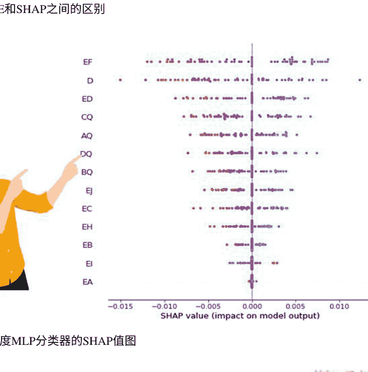

#### 图6.38 深度MLP分类器的SHAP值图


#### 图6.39 模型的力量图

每一行的每个点都是测试数据集的记录。特征按重要性从上到下排序。我们可以看到EF是最重要的特征。该特征的SHAP值越高且越正，对目标分类准确性的影响越大。该值越负，变量对分类准确性的重要性越低（图6.38）。

我们可以绘制一个非常有用的图，称为力量图。力量图是基于SHAP值的特征重要性解释。力量图显示了每个特征对当前预测的影响。红色的值可以被视为对预测有正向影响的值，将值推高到没有任何变量的情况下的平均值以上（基线），而绿色的值对预测有负向影响，将预测推低于基线预测（图6.39）。

# 第7章 特征选择在人工心理学中的应用


## 7.1 特征选择问题

在大多数现实世界的问题中，样本特征的很大一部分是无用的，并且对模型性能有负面影响。因此，在机器学习中，识别对模型准确性有影响的好特征是很重要的。特征选择方法的目标是找到最小的特征子集，这个子集对于确定目标是必要且充分的。事实上，所选特征的分布应该接近于主要类别的分布（Dash & Liu, 1997）。

由于这是一个优化问题，选择正确的特征选择方法本身就是一个改进过程。

### 特征选择的优势

特征选择有几个优点：

-   更好的分类器：由于大多数冗余特征会产生噪音并影响模型的准确性，特征选择的主要优势是提高准确性。
-   更好的知识发现：特征选择还可以提供对数据的洞察。将重要和有影响力的特征与无用的特征分离开可以提供很多信息。
-   降低数据收集成本：在数据收集成本高昂的情况下，识别出用于分类的最小特征集可以节省金钱。
-   计算成本：识别出适当的特征子集简化了模型并降低了计算和实现成本。
-   维度：现有理论表明，特征数量的增加会指数级增加构建分类器所需的数据量（Cunningham等人，2021年）。

## 7.2 特征分类

一般来说，特征被分为三个子组：

1.  相关特征：这些特征直接影响输出和目标，并且不能被其他特征替代。
2.  无关特征：这些特征与输出无关，并在样本中创建随机值。
3.  特征冗余：在这种情况下，一个特征替换另一个特征。因此，这些特征不提供任何额外的信息。

根据这些定义，特征选择应该识别具有高相关性的特征，同时尽可能删除冗余特征（Dash & Liu, 1997）。

## 7.3 特征选择的一般过程

通常，特征选择过程中有四个阶段和功能，它们在下图中相互关联。

1.  生成过程。
2.  评估函数。
3.  停止准则。
4.  验证过程 (Tang et al., 2014) （图7.1）。

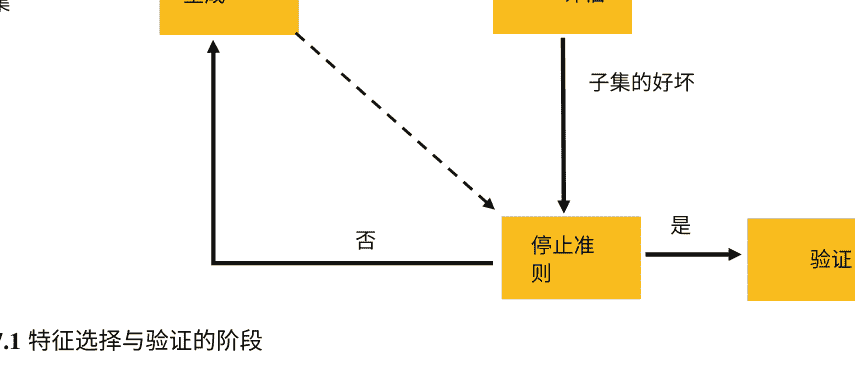

### 图7.1 特征选择与验证的阶段

### 生成过程

生成器函数实际上是一个搜索函数，它生成各种子集，并通过评估函数进行检查。 在这种情况下，它可以从初始的无特征状态开始，带有一组特征，或者带有一个随机子集。

### 评估函数

在生成后，使用不同的方法评估特征子集。 在这个阶段，检查集合的好坏，并将新的子集与旧的子集进行比较。如果更好，就替换旧的子集。在这种情况下，找到一个合适的特征子集直接取决于所使用的评估函数，因为如果评估函数不能提供一个合适的子集，特征子集将永远无法找到最优值。

### 停止准则

结束和停止算法所需的准则可以是以下之一：

1.  一定数量的特征。
2.  一定数量的迭代。
3.  当添加或删除一个特征不会得到更好的子集时。
4.  当基于评估函数达到最佳子集时。

### 验证函数

尽管这个函数不是特征选择的一部分，但它检查子集的有效性。 数据的结果可以基于先前的知识进行评估（Ansari，2021年）。

## 7.4 特征选择方法

在许多研究中，特征选择方法分为三类（Ansari，2021年）：

1.  包装器方法：这种方法被认为是一种预测方法，其性能对于子集选择至关重要。在每个阶段，根据所选特征的子集，评估机器学习算法的性能，并将性能结果用于特征选择。
2.  嵌入式方法：这种方法同时使用机器学习算法和模型拟合进行特征选择。
3.  过滤方法：该方法在没有机器学习算法的情况下衡量特征的重要性。在该方法中，选择与输入相关的特征以获得输出。过滤方法通常采用排名方法。

不同的特征按其可接受性排序。由于其简单性，排名策略可以应用于任何应用。在特征进入分类阶段之前，它们会被排名，即被过滤。不兼容的元素被过滤成兼容的元素。每个排名的元素必须具有唯一的特征来识别该类别。与打包方法相比，该方法更快，但如果数据没有正确相关，则可能产生较差的结果。当特征的空间维度较大且包装方法的计算成本较高时，这些方法也被用于经济上更划算地使用过滤方法（图7.2）。

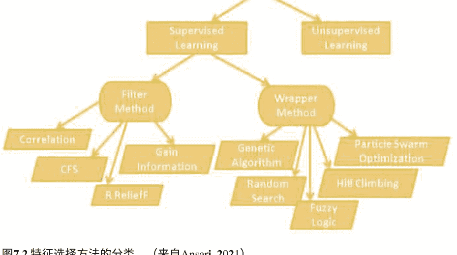

图7.2 特征选择方法的分类。（来自Ansari，2021）

### 7.4.1 使用R的实际示例

遗传算法是一种包装器方法，将在下面详细讨论。本节将首先介绍遗传算法及其特征选择阶段的基础知识。

一个人工心理学家试图实现一个分类模型，但他意识到预测变量的数量可能会降低模型的准确性。这意味着一些变量可能是噪声变量；因此，他决定选择特征选择功能来确定最重要的变量子集。在这个模型中，他决定首先使用特征选择算法确定预测组成员身份最重要的特征。他想确定13个变量A、B、C、D、E、F、G、K、L、M、N、P和Q中哪些是最重要的变量。他使用了Boruta方法。这是一种基于随机森林算法的包装器方法。随机森林本身是基于决策树算法的。决策树是在训练阶段执行的一系列步骤。随机森林是一组决策树算法的集成。随机森林算法训练了数百棵决策树，每棵树只能访问数据（变量）中的一组随机列。

Boruta是一种将这种随机化推进得更远的技术。基于这种方法，它捕捉到与目标变量相关的数据中的所有特征(Kursa & Rudnicki, 2010)。

清单7.1中的R代码用于特征选择实现

```r
1 library(Boruta)
2 library(Rcpp)
3 library(haven)
4 E <- read.sav("E.sav")
5 E$GR = as.factor(E$GR)
6 E <- na.omit(E)
7 Boruta.E <- Boruta(GR ~ ., data = E, doTrace = 2, ntree = 500)
8 Boruta.E
9 plot(Boruta.E)
10 Boruta.Short <- Boruta(GR ~ ., data = E, maxRuns = 12)
11 Boruta.Short
12 TentativeRoughFix(Boruta.Short)
13 getConfirmedFormula(Boruta.E)
14 attStats(Boruta.E)
```

清单7.1展示了使用Boruta算法实现的特征选择的R代码。结果显示在图7.4中。该图显示了变量M、Q、B、N、C和L分别是确定群组成员资格的最重要变量。


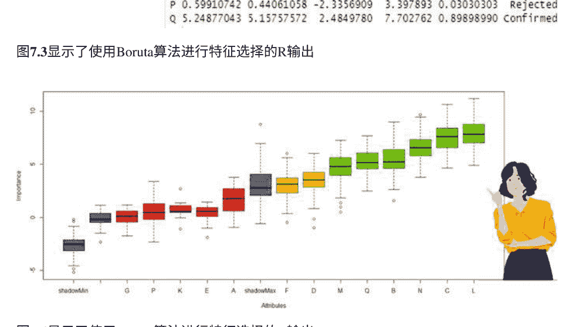

图7.3显示了R输出，其中meanIMP显示了平均重要性，即每个预测变量的最高平均重要性，以显示它与群组分类的关系。最后一列是关于对模型中保留哪个变量或删除哪个变量做出决策。该列有三个选项：确认、拒绝和暂定，最后一个选项包括需要进一步调查的变量(Fig. 7.4)。

> 例子7.1 一位人工心理学家想要根据变量A1到A10来预测后冠状病毒抑郁率（y）。他使用R中的DALEX包基于随机森林算法进行特征选择，并准备了必要的代码（清单7.2）。这是一个强大的包。通过使用函数variable-dropout()，该函数根据丢失的丢失量确定变量的重要性，即通过删除一个变量对模型造成的损失有多大。

#### 清单7.2 使用随机森林进行特征选择的R代码实现

```r
library(randomForest)
library(DALEX)
rf_mod <- randomForest(Y ~ ., data=S, ntree=100)
rf_mod
explained_rf <- explain(rf_mod, data=S, y=S$Y)
varimps <- variable_importance(explained_rf, type='raw')
print(varimps)
plot(varimps)
```

如图7.5和7.6所示的重要性图和软件输出显示，变量A5、A7、A4、A2和A10是特征选择中最重要的五个变量。

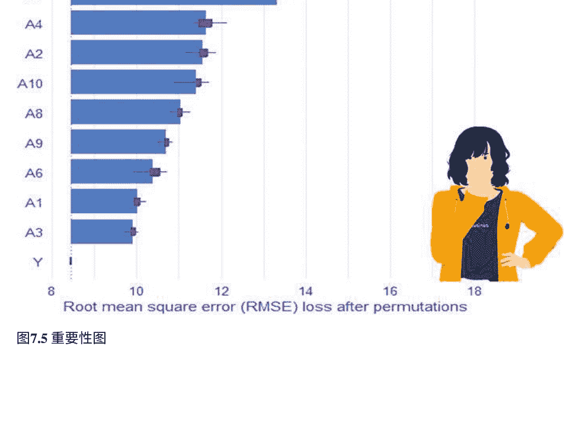

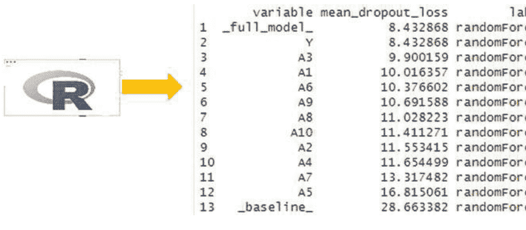

#### 图7.6 每个变量的平均丢失量

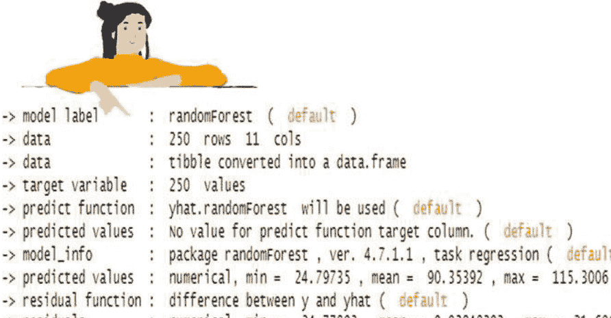

#### 图7.7 模型摘要

图7.6显示，如果将变量A5从模型中删除，则平均损失最大。这个丢失量是10个预测变量中最高的值，等于16.81。

如图7.7所示，使用这个随机森林模型的平均预测误差为0.038。

## 7.5元启发式算法

一般来说，优化算法分为两类：精确算法和近似算法。精确算法能够提供准确的最优解，但解决时间指数级增长。在近似算法中，另一方面，解决方案接近最优解，并且在处理困难问题时所需时间较少。

因此，精确算法似乎不适用于许多问题。有三种类型的近似算法，即启发式算法、元启发式算法和超启发式算法。在本书中，我们将讨论遗传算法，这是一种元启发式算法（Fraser，1957年）。

在元启发式算法中，行为是随机的，即搜索解和最优值从一个随机点开始（即从绝对无知到知识）。概念上简单的元启发式算法可以轻松灵活地实现。换句话说，这些算法可以根据问题的需要进行简单修改。元启发式算法的主要特点是能够防止算法过早收敛（Golberg, 1989）。

这些算法已成功应用于各种工程和科学问题，例如电气工程（寻找发电的最优解）、工业（规划、交通、车辆路径规划、位置确定）、土木工程（桥梁和建筑设计）、通信（雷达和网络设计）、数据挖掘（分类、预测、聚类、系统建模）以及心理学和认知科学（在问卷调查中减少特征维度和从脑成像中获取特征）（Engelbrecht, 2007）。

元启发式算法分为以下两个主要类别：基于单一解的元启发式算法：在这些技术中，问题通常从一个解开始，并在迭代中进行更新。问题在于陷入局部优化的陷阱，没有充分探索搜索空间。基于群体（多个）解的元启发式算法：这些算法生成一组解，并开始优化过程。群体根据代数或迭代次数进行更新。这些算法不会遭受基于单一解的算法的问题，即它们不会陷入局部最优解，因为多个解互相帮助，并且在搜索空间中进行多次搜索。此外，基于群体的算法被用于解决大多数实际问题。

由于上述特性，元启发式算法受到了广泛关注。这些算法根据其行为被分类为四类，即基于进化的算法、基于群体智能的算法、基于物理的算法和与人类相关的算法（Agrawal等，2021）（图7.8）。


基于进化的算法受自然进化的启发，从随机解的种群开始。它们通过变异、组合和选择最佳种群来创建新的个体。

基于达尔文进化的遗传算法（GA）是最流行的算法。该类别还包括其他算法，如进化策略、遗传编程、禁忌搜索和差分进化（Agrawal等，2021年）。

基于群体智能的算法受昆虫、动物、鱼或鸟类的社会行为启发，例如鸟类的群体行为以及它们在搜索空间中飞行并找到最佳位置。其他群体智能算法包括蚁群优化、蜜蜂群优化算法、猴子优化等（Agrawal等，2021年）。

基于物理学的算法：这些算法受到世界上的物理法则的启发，包括模拟退火算法（Goldberg & Richardson，1987）、和谐搜索算法（Higashi & Iba，2003）等等。
基于人类行为的算法：这些算法纯粹受到人类行为的启发。人类在各种活动中采取的方法会影响他们的表现。流行的算法包括基于教学学习的优化算法（TLBO）、联赛冠军算法等等（Agrawal等，2021）。

正如前面提到的，元启发式算法模仿自然进化的原则来寻找最优解。遗传算法是一种根植于达尔文进化理论的元启发式算法。根据这个理论，更好的一代通常是由染色体的组合产生的。与此同时，可能的突变可以改善或恶化一代。下面详细解释遗传算法。

## 7.6 遗传算法简介

许多人类发明都受到自然的启发，因为它在长时间的演化过程中总是提供最佳和最优的解决方案和过程。鉴于我们周围环境的不断变化，改变和适应条件对于任何生物的生存都是必要的。自然选择、繁殖、突变和共生等现象都参与了这种适应和进化。生物体还依赖化学元素来存储有关每个生物体的信息。DNA包含了生物体复制所需的所有信息，是遗传信息的已知调节因子。事实上，遗传学是自然界的字母表。遗传因素和个体特征存在于染色体上。人体通常有四种碱基

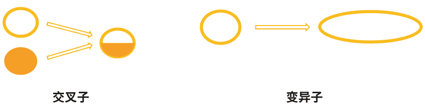

用于从DNA制造染色体，即碱基A¹，C²，G³和T⁴。DNA在DNA中还有四种组合，即TA，AT，GC和CG，可以产生不同的表型。因此，每个生物体与其基因序列之间存在一一对应的关系，这被称为编码。

遗传算法是一类基于进化概念的“计算模型”，它的基础是生存优胜和优胜者繁殖。这个在人工智能领域的研究受到了自然生物进化的启发。遗传算法基于适者生存和优胜者繁殖的原则。它通常被认为是一种“函数优化器”，用于解决问题中的目标函数优化。然而，事实上，它还有其他应用（图7.9）。

## 7.7 遗传算法的基础知识

基因的定义：在遗传算法中，基因是问题的一个参数，基因型被视为具有固定长度的位串。长度在优化之前必须指定，它表示问题的维度，有时可以被视为变量或向量（Wang & Jiang，1994年）。

染色体的定义：包含所有已经被赋值的基因的集合，代表了问题的一个可能解。答案，无论是合适的还是不合适的，实际上都是一串或一系列的比特，它们在染色体中充当自然基因。比特编码可以是二进制或n进制。在自然界中，染色体是一条长而复杂的字符串，被称为“脱氧核糖核酸”或DNA。

遗传种群：遗传种群是一组染色体。遗传算法不仅仅关注一个点或一个染色体，而是在具有比上一阶段更多期望特征的染色体种群上进行操作。种群大小表示一代中的染色体数量。如果种群大小太小，算法表现不佳；如果太大，速度会变慢。种群大小通常在20到## 进化算子

在遗传学中，进化算子包括繁殖、突变和选择

繁殖：这是染色体之间遗传信息的繁殖，意味着染色体之间的信息共享 在这个算子中，子代继承父母的特征，然后再繁殖出更好的一代 繁殖通常发生在一对染色体之间，但也可以发生在多个父母之间 在这种情况下，超过两个父母的特征传递给子代 这个算子改善了适应度，其实施与染色体编码有关

突变：突变操作生成并引入新的遗传物质，为种群的多样性做出贡献，可以通过添加随机值来实现。在自然界中，突变通常不会产生好的结果，但它对于持续进化是必要的，最终的结果可能包括一个有利的结果。

选择：选择是选择父代和理想促进良好基因的阶段。在选择最佳个体时，所有个体都根据优点包含在种群中，并标记并选择具有更高适应度的个体进入下一代。

## 7.8 遗传算法的初始设计

现在我们已经解释了基本原理，是时候实施遗传算法了。
首先，根据问题引入变量，即编码的染色体。然后，根据目标函数考虑染色体的适应度函数。该算法首先生成一组染色体（初始种群是随机选择的）。
然后，检查并根据以下阶段选择每个染色体的适应度。

第一阶段：根据它们的适应度选择适当数量的染色体对用于下一阶段。

第二阶段：选择父母并繁殖以产生子代种群。
在这个阶段，应用繁殖算子。染色体通过繁殖过程发生变化。通过交叉过程随机交换父染色体。因此，子代具有一些父代的特征。

第三阶段：选择种群成员应用突变并创建突变种群。如前所述，还存在改变生物特征的突变过程。例如，在染色体复制过程中可能会出现错误的有丝分裂。通常，突变会摧毁生物体，但从长远来看，它们会创造出新的更好的物种。突变经常产生在繁殖中绝对不可能的特征。换句话说，这是引入新信息的方式。

第四阶段：将原始种群与子代和突变体的种群合并，创建一个新的原始种群。
现在计算新子代的适应度。

在第五阶段，如果停止条件未满足，则从第二阶段开始重复该过程，并将新种群作为初始种群进入下一个阶段。
在这种情况下，评估生成的数据结构（染色体）。能更好地代表问题的最优解或目标的染色体比其他染色体更有繁殖机会；即它们被赋予更多机会。

### 停止条件

- 为成本函数考虑一个阈值或最优值。
- 还有一个与迭代次数或时间相关的标准。

如果停滞迭代超过限制，则停止迭代。在这种情况下，当变化小于指定水平且结果不好时，过程停止并从另一点开始（Sahdra等，2016）（图7.10和7.11）。

### 图7.10 遗传算法实现的图示

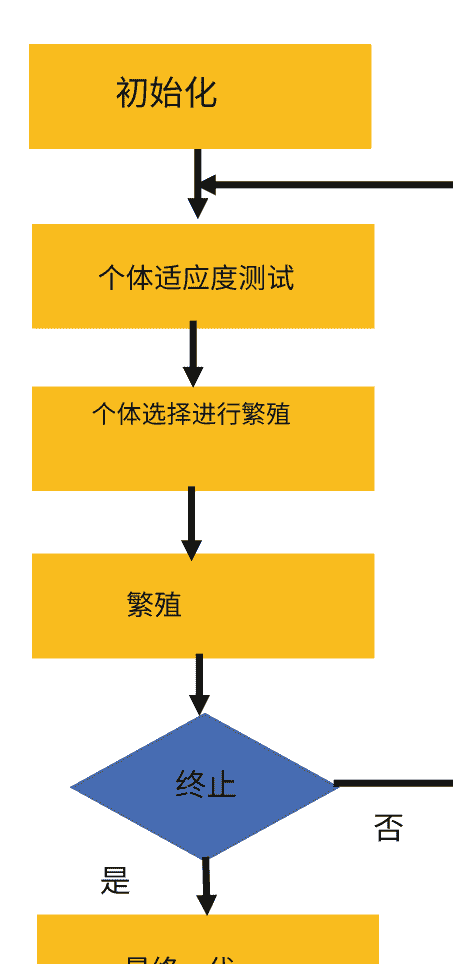

### 图7.11 遗传算法实现的输出

```
Iter = 334  | Mean = 0.275287 | Best = 0.2438558
Iter = 335  | Mean = 0.2719858 | Best = 0.2438558
Iter = 336  | Mean = 0.2702471 | Best = 0.2438558
Iter = 337  | Mean = 0.2716116 | Best = 0.2438558
Iter = 338  | Mean = 0.2786182 | Best = 0.2438558
Iter = 339  | Mean = 0.2914065 | Best = 0.2438558
Iter = 340  | Mean = 0.2977796 | Best = 0.2438558
Iter = 341  | Mean = 0.2917912 | Best = 0.2438558
Iter = 342  | Mean = 0.2822553 | Best = 0.2438558
Iter = 343  | Mean = 0.2734095 | Best = 0.2438558
Iter = 344  | Mean = 0.2689914 | Best = 0.2438558
Iter = 345  | Mean = 0.2651342 | Best = 0.2438558
```

## 7.10 遗传算法在人工心理学中的应用

自我报告标准是心理学中常见的评估形式。尽管由于社会期望偏差、任意标准和对这些报告的干扰，这些报告并不完全准确和适当，但它们非常常见、简单且廉价。同时，许多问卷调查又长又耗时，导致人们无法准确和忠实地完成问卷调查。相比之下，使用简短的问卷调查，人们更有可能诚实地填写。在一项元分析中，相同的简短和长问卷调查被随机分发给人们，研究人员发现接收到较短问卷调查的参与者有更高的回复率（Rolstad等，2011年）。另一项研究发现问卷长度与回复率呈负相关（Fan和Yan，2010年）。

此外，较短的问卷调查可以通过描述、预测和因果推断来推动科学发展。事实上，较少的变量在预测理论和检验因果关系方面非常有用。因此，尽管简短的问卷调查更有趣，在许多情况下它们并不符合心理测量标准。

事实上，缩短问卷的传统方法需要仔细考虑竞争因素。这种方法需要找到具有高自相关性、低交叉负荷、低相关唯一性、低缺失机会、高构造覆盖面的面部效度和高内部一致性的项目。

将15项问卷缩减为6项会产生超过2500种可能的排列组合，必须加以考虑。由于这种复杂性，研究人员必须依赖于常常导致性能不佳的非书面启发式方法。

一种高效的方法是使用机器学习来找到解释最大差异的项目。遗传算法最近被用于缩短问卷在几个领域中的应用，包括人格（Yarkoni，2010），价值观（Sandy等，2014），精神病态（Eisenbarth等，2015），经验回避（Sahdra等，2016）和身体形象接受度（Basarkod等，2018）。在算法中，项目类似于基因，构成一个量表的项目集类似于染色体。如上所述，算法首先生成一组由整体中的随机子量表组成的染色体样本。然后，这些染色体竞争适应度。缩短问卷的适应度尺度包括解释完整问卷中更多变异性的染色体。然后，选择算子用于从基因池中删除适应度最低的染色体，并繁殖适应度最高的染色体（通常是前5%），以创建一组新的染色体（Yarkoni，2010）

正如遗传算法的阶段中所提到的，染色体也会发生突变和基因交叉。突变会替换染色体中的随机元素。在繁殖过程中，一个物品的基因会与另一个物品的基因进行交换。突变和繁殖之后，根据适应度函数生成新的染色体集合，并进行评估。这个过程会重复进行，直到算法找到一个稳定的解。

算法会找到一个稳定的解。通过遗传算法缩短的物品往往具有与传统心理测量方法得出的分数一样有效的结果。

### 7.10.1 使用R的实际示例

人工心理学家尝试从一个包含20个物品和两个10个物品子量表的心理量表中，基于遗传算法选择最佳的物品。使用心理测量技术的经典心理学家可以根据修正后的物品总分相关性、因子载荷和每个物品与标准的相关性，或者使用项目反应理论中的判别系数来选择最佳的物品。虽然这种方法有效，但人工心理学家希望通过遗传算法选择重要的物品，以使成本函数最小化。在这种情况下，成本函数由Yarkoni（2010）提出，并在本章的前几节中进行了解释。遗传算法迭代地尝试选择和交配强壮的个体（解决方案），这些个体更有可能生存下来。

列出7.3号R代码来实现遗传算法

```
r
library(GAabbreviate)
scales = cbind(rowSums(MA[,1:10]),
               rowSums(MA[, 11:20]))
MA <- as.data.frame(sapply(MA, as.integer))
MA <- matrix(as.integer(unlist(MA)), nrow=nrow(MA))
MA_GA = GAabbreviate(items = MA,
                     scales = scales,
                     itemCost = 0.01,
                     maxItems = 3,
                     maxIter = 1000,
                     run = 200,
                     crossval = TRUE)
MA_GA$measure
onlineshopingAdiction <- which(MA_GA$measure$key[,1]==1)
offlineshopingAdiction <- which(MA_GA$measure$key[,2]==1)
MA_GA$measure$items[onlineshopingAdiction]
MA_GA$measure$items[offlineshopingAdiction]
MA_GA$measure$alpha
plot(MA_GA)
```

Listing7.3展示了运行遗传算法的R代码。项目成本表示每个项目的成本，默认为0.05。最大项目数是我们希望在每个子量表或因子中保留的最大项目数。在这个例子中，人工心理学家认为应该是3个项目，maxIter表示最大迭代次数，本例中设置为1000个项目，如果这个函数无法找到解决方案，可以增加它的数量。交叉验证也是为了保持无偏性而进行的。如果遗传算法在达到最大迭代次数之前找到了最优解，它将自动停止；否则，迭代将继续直到达到最优解。图7.12显示了哪些项目属于因子或尺度的哪个维度。在输出中用$符号标记。

```
$Items
[1] 6

$Key
     [,1] [,2]
[1,]    1    0
[2,]    1    0
[3,]    1    0
[4,]    0    1
[5,]    0    1
[6,]    0    1

> MA_GA$measure$Items[OnlineShoppingAdiction]
x2  x5  x7
 2   5   7

> MA_GA$measure$Items[OfflineShoppingAdiction]
x14 x15 x19
 14  15  19

scale1  scale2
alpha 0.7677823 0.7142635
```

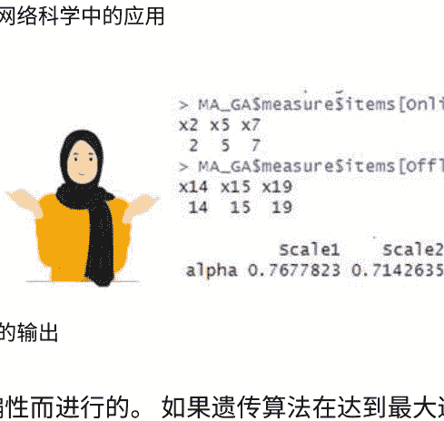

#### 图7.12 遗传算法实现的输出

如图7.12所示，该算法在迭代次数为0.24时达到了最优解，并且遗传算法缩写函数终止。

该方法的输出显示选择了项目2、5、7、14、15和19（每个子量表选择3个项目）（图7.12）。

图7.13展示了使用绘图函数的搜索过程的可视化摘要。诊断图表，即左侧的三个图表，显示了在搜索过程中总成本、量表长度和R²的平均值如何变化。本示例中最佳解的R²的中间图表显示了解释方差的百分比，即每个子量表的R²非常好，接近0.9。

最后，右侧图表显示了搜索过程中选择的项目。最终选择的项目是2、5、7、14、15和19。你可以在这个图表中轻松地看到它们（Kursa & Rudnicki，2010）。

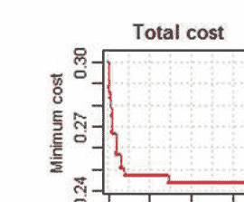

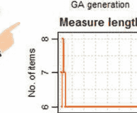

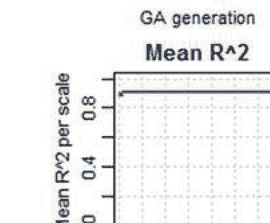

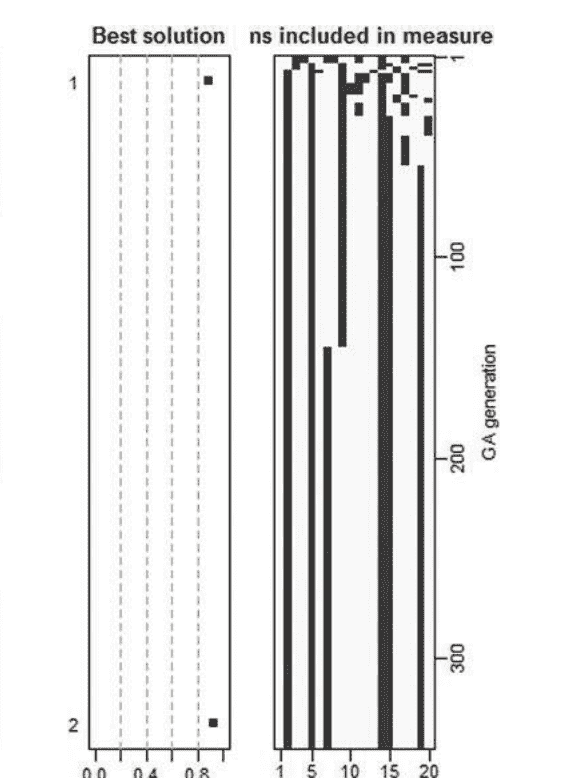

#### 图7.13：搜索过程的绘图

但特征空间的高维度在分类和分析中带来了几个挑战。因此，特征选择被认为是生物标记检测中的一个关键问题。

特征选择旨在降低维度、加速操作、提高分类算法的准确性，并更好地理解结果。

通过映射大脑的功能连接，可以确定不同脑区之间的功能和时间序列的相关性。脑功能连接矩阵（FCM）是基于区域之间的相关系数确定的。例如，在这里，大脑被划分为116个区域。作为一种元启发式优化算法，遗传算法在每次迭代中考虑一组特征子集，并可以找到最优或接近最优的特征子集。

如前所述，使用遗传算法来降低数据维度包括染色体编码、选择、复制和突变。每个染色体表示一个由零和一组成的数组，即特征的总数（长度为1×116）。值0和1分别表示在FCM计算中相应区域的缺失和存在（Sadeghian等，2021）（图7.14）。创建一组初始种群，并根据适应度函数评估种群的适应度。例如，在这里，KNN分类器的准确性基于所选区域的准确性可以被视为适应度函数。复制应用于一对父母。在生成新种群的成员之后，一些基因会随机突变，从而可以搜索整个特征空间并逃离局部最优解。最后，遗传算法在特定的迭代次数后停止，具有最高分类准确率的解决方案确定最终的特征子集。该方法已被用于区分自闭症患者和健康个体，通过去除49个区域来提高遗传算法的诊断准确性9%。

图7.14 染色体的二进制编码。(Sadeghian等，2021)


GAabbreviate使用GA软件包（Scrucca，2013）来高效实现Yarkoni（2010）的量表缩写成本函数：

```
$$ 成本 = Ik + \sum_{i=1}^{s} w_i (1 - R_i^2) \quad (7.1) $$
```

其中I表示用户指定的固定项目成本，k表示GA在任何给定迭代中保留的项目数量，s是测量中的子量表数量，wi是与每个子量表相关联的权重（默认情况下wi = 1），R_i^2是可以通过个体项目得分的线性组合来解释第i个子量表的方差量。增加或减少的值会导致更长或更短的测量结果。当每一代中保留的每个个体项目的成本超过解释方差的损失成本时，GA会产生相对较短的测量结果。当每个个体项的成本较低时，GA会产生相对较长的测量结果，最大化解释方差（Yarkoni, 2010）。

# 第8章 人工心理学中的贝叶斯推断和模型


## 8.1 人工心理学中的贝叶斯推断和模型

贝叶斯推断包括贝叶斯参数估计和贝叶斯假设检验。 近年来，这种方法被提出作为经典统计学中估计和假设检验的有吸引力的替代方法。

在经典的费舍尔或频率主义统计学中，置信区间和p值被用于估计和假设检验（Wagenmakers等，2018年）。


心理研究的背景充满了p值报告（Farahani和Azadfallah，2020）。可以说，p值的使用导致了对心理研究结果的信心危机，这些研究主要使用经典统计学进行；换句话说，p值破坏了心理研究的结果。大量研究人员从不同的角度反复批评了零假设统计检验（NHST）中频繁使用p值的做法（Wagenmakers等，2018）（图8.1）。

```
p c | X =) p x | c * p x | c * ) .. x p x | c * p(c) 8.1)
```

## 8.2 贝叶斯统计学简介

快速了解贝叶斯统计学可能有助于减轻本节和本章其他部分的概念。假设一个人工心理学家检查了100个有注意力缺陷多动症的男孩，并发现其中43个是家庭中的第一个孩子。因此，一个男孩是家庭中第一个孩子的概率等于p第一次出现 = ( ) 43/100 = 43%. 在这里，我们可以谈论概率中的另外两个术语，它们是相关和独立概率。如果一个现象的发生或不发生对另一个现象的发生或不发生没有影响，那么这两个现象是独立的，即p(A∩B)=0，例如，一个有注意力缺陷多动症的孩子是家庭中的第一个孩子的概率和在夏威夷的汉纳莱河捕捉到一条大金鱼的概率。

表8.1患者的记忆问题根据性别在多发性硬化症患者中

| 记忆问题 | 女性 | 男性 |
| :--- | :--- | :--- |
| 严重 | 8 | 12 |
| 轻度 | 32 | 48 |

这两个现象完全独立于彼此，因为在夏威夷的汉纳莱河捕捉到一条大金鱼对一个孩子作为家庭中的第一个孩子的概率没有影响，反之亦然。如果在那条夏威夷的河流中捕捉到一条大金鱼的概率为10%，那么这两个概率必须相乘以计算巧合的概率。

```
$$P(A) \times P(B) = 钓鱼 \quad B( )和\quad ADHD \text{ 儿童成为第一个儿童 } \quad A( ) \\ 4.3\% = 10\% \times 43\% \tag{8.2}$$
```

如果两个现象被认为是相关的，则使用不同的方法来计算概率。请注意这个例子：假设人工心理学家检查了100名多发性硬化症患者，他还检查了这100人的记忆和性别。结果显示在表8.1中。根据这个表格，$P =0.2 \ 12/60( A|B )=其中(A =严重，B =男性)可以被划分为问题的交集，具有严重记忆的$A$和患者的性别为男性的情况。

```
$$P(A|B) = \frac{p(A \cap B)}{p(B)} \tag{8.3}$$
```

同样地，

```
$$P(B|A) = \frac{p(A \cap B)}{p(A)} \tag{8.4}$$
```

贝叶斯规则，用于朴素贝叶斯，可以被视为将这两个表达式相除的结果。因此，贝叶斯规则可以如下考虑：

```
$$A|B) = \frac{p(A \cap B)}{p(B)} \tag{8.5}$$
```

在这个公式中，$P(证据|结果)$是从训练数据中获得的。

```
$$P(B|A) = \frac{p(A \cap B)}{p(A)} \tag{8.6}$$
```

在这个公式中，$P(结果|证据)$是被检查的，用于预测测试数据。

### 贝叶斯规则

$$P B|A = \frac{pA|B \quad ) * pB \quad )}{pA \quad )}$$ (8.7)

$$( \quad 结果|证据 \quad ) = \frac{证据的似然性 \times 证据的先验}{概率}$$ (8.8)

在上述公式中，左侧部分称为后验概率或简称后验，第一个项称为证据的似然性，实际上是特定类别的条件概率，假设预测变量是独立的，可以将它们全部相乘。似然值是从训练数据中确定的$Y=c$（一个特定组）的值，第二部分先验显示了$y=c$的整体概率，其中$c$是$Y$的一个类别。

$$先验 = \frac{频率 y = c( \quad )}{n}$$ (8.9)

通过这个介绍，你可以对NB中的必要术语有一个总体了解，比如条件概率、贝叶斯规则、独立和依赖概率以及后验、先验和似然。

NB中最重要的设计参数是平滑方法。平滑的想法可以追溯到被称为克伦威尔法则的努力，基于此，如果概率的估计值等于零，则不应在概率推理中使用，因为如前所述，要组合概率，我们将它们相乘，所以如果其中一个概率为零，不论其他变量的概率如何，结果都将为零。平滑的最常见形式被称为拉普拉斯平滑，在该平滑中，将期望的情况数（K）作为试验尝试次数n的期望比率（k+1）/（n+1）而不是k/n。

经典统计学家认为平滑是一种正则化形式，而贝叶斯统计学家认为平滑是一种先验。

## 8.3 对p值的使用进行批评

如上所述，经典的或费舍尔统计量依赖于p值在测试假设中的核心。使用常规软件如SPSS可以轻松获得p值。然而，解释p值是具有挑战性的。得出$p < 0.05$的结论保证了零假设（$H_0$）的拒绝，从而支持了备择假设（$H_1$）的接受，这是一种错误的解释。让我们更具体一点。

p值表示获得至少与该结果一样大的概率观察结果，前提是零假设是正确的。因此，p值无法识别在H0下数据异常的事实也可能在H1下异常。然而，心理学家仍然对p值感兴趣。其中一些原因是大多数心理学家像其他人一样，对自己的信念上瘾，所以他们倾向于教别人他们所学到的东西，并且不会改变他们的统计知识。此外，解释p值和p<0.05足以拒绝H0并确认H1似乎是不正确的。心理学家可能还担心使用新方法会降低发表研究文章的机会。也许这些原因为什么对p值的新统计方法存在抵制的一般原因（Sharpe，2013）的原因。

本书旨在打破这种抵抗。为了克服p值的弱点，研究人员已经努力寻找替代方法。其中一种尝试是用p值替代置信区间（CI）。置信区间也受到了批评，比如它将真实值估计为固定值的事实。

效应的95%置信区间（CI）表明，如果从数据中重复计算置信区间，有95%的概率使得所需的效应或参数在给定范围内。这种解释有点违反直觉。在贝叶斯统计学中，类似于置信区间，有一个可信区间，它表明根据观察到的数据，有95%的概率使得所需的效应落在这个范围内。通过研究贝叶斯推断的好处，可以说这种方法在高维数据中比传统统计方法更有用，信息更可靠。在存在噪声数据和样本较小的情况下，贝叶斯方法更准确。贝叶斯推断提供了两种将先验知识结合到最终分析中的可能性。贝叶斯分析还提供了直观、简单明了的结果。贝叶斯推断包括一种证据度量，即数据对H0与H1的支持程度，贝叶斯因子。与p值不同，它对H0没有严重的偏见。

总结起来，可以说经典统计学与贝叶斯统计学相比，主要关注零假设（NHST）的统计检验和p值的误解，这种极端关注引起了对心理研究结果的严重批评和缺乏信任。

贝叶斯统计学的理论框架基于贝叶斯理论。在本书中，我们的目标不是关注读者可以在其他地方学习的理论基础。贝叶斯统计学的理论框架考虑的内容与经典统计学的理论框架不同。在经典统计学的理论框架中，重点是假设检验和p值，假设效应是固定且未知的，数据是随机的。也就是说，假设未知参数是一个独特的值，研究者试图使用从样本中获得的数据来估计它。

在贝叶斯统计学的框架中，不是估计真实效应，而是根据从样本中获得的数据计算不同效应的概率，这本身导致了后验分布，即参数可能值的分布。在贝叶斯统计学中，计算后验分布的中位数和包含95%最可能值的值范围，即95%可信区间，来模拟估计参数的不确定性。在经典统计学中，计算点估计和置信区间。在经典统计学中，计算点估计和置信区间。

在贝叶斯统计中，使用贝叶斯抽样算法（稍后将解释），从与观察数据相容的效应中获得可能的（后验）分布。

因此，在贝叶斯分析中，基于所得数据和有时基于先验信念或分布，使用贝叶斯抽样算法产生可能的分布，称为后验分布。例如，假设我们假定情感金属化与心理健康之间的相关性在100人样本中等于0.54。根据这个分布，贝叶斯分析告诉我们最可能的效应（相关性）是0.54，但数据与0.74-0.85的相关性一致，每个相关性都有具体的的概率。在贝叶斯分析中，确定效应的显著性不需要p值，尽管在经典统计学中常常使用p值，而是足以描述该效应的后验分布。其中一个非常重要的指标是可信区间。可信区间是贝叶斯推断和分析中的关键概念，其目的是提供关于估计参数的不确定性的摘要。在贝叶斯统计中，可信区间是包含可能的效应幅度的后验分布范围，并具有一定的概率。在贝叶斯统计中，与经典统计学中常见的95%置信区间不同，McElreath（2020）建议在指定可信区间范围时使用89%的阈值。

Kruschke在2014年指出，具有89%覆盖率的可信区间比具有95%覆盖率的可信区间更稳定，并且要计算具有95%区间的可信区间，贝叶斯抽样中的样本数量至少需要为10,000，这通常是默认值。在大多数贝叶斯统计软件包中使用的后验样本通常只使用4000个样本。

在贝叶斯分析中，就像经典统计分析一样，在报告结果时应考虑描述性和分析性指标。
总体而言，中位数比均值更具鲁棒性。
MAP是最大后验概率估计（MAP）。后验分布中的MAP指数表示具有最高概率的值。后验分布的峰值可以被视为后验分布的模式。
中位数比这个指数更具鲁棒性，但如果分布具有极端偏斜性，MAP比中位数更合适。
95%或98%的可信区间（CI）也表示不确定性。通常，CI是基于最高密度区间（HDI）计算的。最高密度区间（HDI）产生一个包含具有最高概率密度的值的区间，并且始终包含与模式对应的参数值的最可能值。

### 8.3.1 网络的显著性或存在性

在贝叶斯分析中，没有p值指标，但有一个更易解释的指标，更直接。它被解释为描述效应的存在。这个概率指标被称为方向概率（Pd），并指示效应的最可能方向（正向或负向）。在解释这个指标时，可能会有一个类似于p值的截断点。Pd大于97%表示可能存在一个效应，Pd大于99%表示可能存在一个效应，Pd大于99.9%表示该效应肯定存在。实际等效区域（Rope）是一个表示参数估计值的区域，例如结果的变化量，对应于几乎没有效应。

该指标显示参数是否与结果的显著变化相关，例如，一个非可忽略的变化。

该指数是一个连续的显著性指数。可以说，如果Rope覆盖了最高密度区域（HDI）的99%，即Rope覆盖了大部分可信值，那么可以接受H0。如果Rope覆盖了HDI的97.5%，那么拒绝零假设的机会可能是微不足道的。如果Rope覆盖了HDI的2.5%至97.5%，则无法得出关于显著性的结论。如果Rope覆盖了HDI的2.5%以下，那么可以安全地拒绝零假设，而如果Rope覆盖了HDI的1%以下，可以拒绝H0。

贝叶斯因子（BF）指数是一个多功能指数，可用于比较不同的模型。BF是一个比率，它提供了关于在两个比较的模型下观察到的数据的概率的信息（具有效果的模型）与（没有效果的模型）。其解释取决于BF是具有效果的模型的后验概率与没有效果的模型的后验概率之比，或者反之亦然。

BF可以在显著性和效应存在的情况下使用。根据Jeffreys（1998）的标准解释BF，这是R软件包中默认使用的标准，可以说3 < BF ≤ 10表示中等证据，10 < BF ≤ 30表示强证据，30 < BF ≤ 100表示非常强的证据，BF > 100表示极端证据。

### 8.3.2 使用R的实际例子

一个人工心理学家想知道内向（Class = 1）和外向（Class = 2）学生的平静连续水平是否不同。在一项测试中，他测量了平静持久性（学生在面对非常困难的问题时的耐心）。通过使用t检验，使用贝叶斯统计方法比较了两个独立样本。相关代码如图8.2所示。


图8.2贝叶斯 t检验总结

BF可以在显著性和效应存在的情况下使用。

贝叶斯t分析的结果在表中给出。 如图所示，后验分布的中心指标中位数等于12.5。群体成员资格（外向性-内向性）显示中位数关联概率为正，概率为1（Pd =100）（清单8.1）。

#### 清单8.1
贝叶斯t检验的R代码。

```
r
#t test
library(rstanarm)
library(bayestestR)
library(rstanarm)
library(bayestestR)
library(insight)
library(ggplot2)
library(datawizard)
library(ggplot2)
library(haven)
library(see)
BT <- read_sav("BT.sav")
resultt <- BayesFactor::ttestBF(formula = C~ group, data = BT)
describe_posterior(resultt)
```

Rope支持与中位数为零相关的值对应的区域，表明它覆盖了极小的可能值。 BF的观察结果表明，内向性与平稳连续性有中等证据支持（BF = 7.37）。

## 8.4 朴素贝叶斯分类器

朴素贝叶斯模型是一类机器学习模型，试图根据一组特征将数据分类到具有更高或最高后验概率的组中。这些模型利用伯努利分布（将数据分类为两组）和多项式分布（将数据分类为多于两组）等分布。

我们使用交叉验证方法，使用80%的数据来获得分类模型，剩下的20%用于评估其对新数据的分组能力。

人工认知心理学家试图使用情绪调节（E）和内向性（I）基于朴素贝叶斯来检查功利主义-责任导向群体成员的概率，并了解一个个体在假设功利主义（1）的情况下，具有高情绪调节和高内向性的可能性有多大。已经提到过，预测变量的数量应该很大且独立。在这里，为了说明目的，预测变量的数量为2，并且它们被假设为相互独立。在这项研究中，他调查了125个人，并根据认知任务将94个人分为功利主义者和31个人分为任务导向者。

他还使用拉普拉斯平滑方法（R代码显示在图中）。
此外，80%的样本被选为训练样本，20%被选为测试样本。这个分析的先验概率基于原始数据（列表8.2），分别为75%（以效用为导向）和25%（以任务为导向）。

#### 列表8.2
朴素贝叶斯分类器的R代码。

```
1 library(e1071)
2 library(caret)
3 library(haven)
4 library(gmodels)
5 library(bayesrules)
6 library(dplyr)
7 BookG <- read_sav("NB.sav")
8 BookG=data.frame(BookG)
9 BookG$DILEMADIRECT=as.factor(BookG$DILEMADIRECT)
10 split <- sample.split(BookG , splitRatio = 0.8)
11 train_data <- subset(BookG, split == "TRUE")
12 test_data <- subset(BookG, split == "FALSE")
13 train_scale <- scale(train_data[, 1:2])
14 test_scale <- scale(test_data[, 1:2])
15 classifier_naive <- naiveBayes(DILEMADIRECT~ ., data = train_data)
16 classifier_naive
17 summary(classifier_naive)
18 y_pred <- predict(classifier_naive, newdata = test_data)
19 test_label = test_data[,3]
20 Crossstable(x=test_label, y=y_pred )
21 conf_mat <- table(test_data$DILEMADIRECT,y_pred)
22 print(conf_mat)
23 confusionMatrix(conf_mat)
24 ggplot(BookG, aes(x =E, fill = DILEMADIRECT)) + 
25 geom_density(alpha= 1.7) + geom_vline(xintercept = 5, linetype = "dashed")
26 ggplot(BookG, aes(x =I, fill = DILEMADIRECT)) + 
27 geom_density(alpha= 1.7)+geom_vline(xintercept = 80, linetype = "dashed")
28 ggplot(BookG,aes(x = E, y = I,color=DILEMADIRECT)) + geom_point()
29 dilema <- data.frame(E = 8, I = 55)
30 predict(classifier_naive, newdata = dilema, type = "raw")
31 predict(classifier_naive, newdata = dilema)
32 cv_model <- naive_classification_summary_cv(
model = classifier_naive, data = BookG, y = "DILEMADIRECT", k = 10)
33 cv_model$cv
```


```
Naive Bayes Classifier for Discrete Predictors

Call:
naiveBayes.default(x = x, y = y, laplace = laplace)

A-priori probabilities:
Y
         1         2 
0.746988 0.253012 

Conditional probabilities:
E
            [,1]      [,2]
Y 1 3.870968 3.021691
  2 6.238095 2.791142

I
            [,1]       [,2]
Y 1 98.62903 17.95918
  2 85.04762 14.00170

Accuracy : 0.7143              
 95% CI : (0.5542, 0.8428)
 No Information Rate : 0.8095
 P-Value [Acc > NIR] : 0.9557

Kappa : 0.1544

Mcnemar's Test P-Value : 0.7728

Sensitivity : 0.7941
Specificity : 0.3750
Pos Pred Value : 0.8438
Neg Pred Value : 0.3000
Prevalence : 0.8095
Detection Rate : 0.6429
Detection Prevalence : 0.7619
Balanced Accuracy : 0.5846

'Positive' Class : 1
                   1         2
[1,] 0.3479066 0.6520934
```


#### 图8.3 朴素贝叶斯分类器的总结。

结果显示，该分析的准确率为71%，Kappa系数为0.15，这是一个较小的值。当然，这只是一个例子。

该分析的敏感性和特异性分别为0.79和0.38。基于得到的模型（也经过十折交叉验证），对于一个情绪调节为8、内向性为55的人来说，他属于功利主义群体的预测概率为0.66，属于以任务为导向群体的预测概率为0.34（图8.3）。

图8.4中的图表显示了基于后验分布的两个功利主义和任务导向群体中变量E和I的密度。

最后一个图表显示了基于职责导向和功利主义群体的变量E和I之间关系的形状。功利主义群体用小红圆圈标记，职责导向群体用小蓝圆圈标记。需要注意的是，这里的目的仅仅是在分类中使用朴素贝叶斯。显然，样本量还不够大，需要更多的数据（图8.5）。

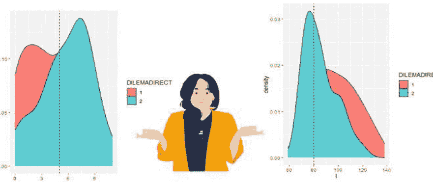

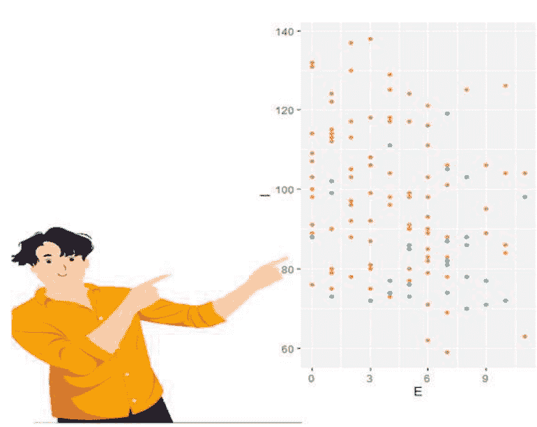

## 8.5 交叉验证

模型的准确率为71.14%， kappa系数比较预测的群体成员与实际群体成员，弱，McNemar's检验不显著，表明分类率较差。

尽管留出法在获得有效模型方面非常重要，但可能会导致过拟合或欠拟合；因此，我们应该使用其他方法来达到这个目的。

重复的$k$折交叉验证
将数据分成$k$个折叠的过程可以重复多次。这是当数据被分成$k$组时，$k-1$组用于估计机器学习模型，剩余的一组用于评估其预测准确性。这个过程对每个$k$组都重复进行，并称为重复的$k$折交叉验证。最终模型准确性是重复次数的平均值（清单8.3）。

### 8.5.1 使用R的实际示例

- 清单8.3
使用CV和LOOCV的朴素贝叶斯分类器（NBC）的R代码。

```
r
library(klaR)
control1 <- trainControl(method="repeatedcv", number=10, repeats=3)
model1 <- train(DILEMADIRECT~. , data=BookG , trControl=control1, method="nb")
print(model1)
control2 <- trainControl(method="LOOCV")
model2 <- train(DILEMADIRECT~. , data=BookG, trControl=control2, method="nb")
print(model2)
```

该模型的平均准确率为76.84%。预测组与实际组之间的kappa系数较低（图8.6）。

#### 留一法交叉验证

留一法交叉验证，或LOOCV，是交叉验证技术中的一种，其中折叠的大小为1，其中k被设置为数据中的观测次数。当训练数据的大小有限且要测试的参数数量不高时，这种验证方法非常有用（图8.7）。

图8.6 NBC使用CV的R输出

| usekernel | Accuracy | Kappa |
|-----------|-----------|-------|
| FALSE     | 0.7683425 | 0.3047329 |
| TRUE      | 0.8147656 | 0.4280415 |

图8.7 NBC使用LOOCV的R输出

| usekernel | Accuracy | Kappa |
|-----------|-----------|-------|
| FALSE     | 0.7730956 | 0.3244702 |
| TRUE      | 0.8136143 | 0.4243703 |该模型的平均准确率为77.31%。在留出验证方法中，准确率为71.14%（清单8.4）。

#### 清单8.4

NBC的ROC曲线的R代码。

```r
library(ROCR)
nb <- NaiveBayes(DILEMADIRECT~., data = train_data)
nbprediction = predict(nb, test_data, type='raw')
#Plot Roc Curve
score = nbprediction$posterior[, 2]
actual.class = test_data$DILEMADIRECT
pred = prediction(score, actual.class)
nb.prff = performance(pred, "tpr", "fpr")
plot(nb.prff,main ="ROC curve -- Naive Bayes Classifier")
```

图8.8显示曲线高于50%，这意味着分类准确率高于随机猜测。好的分类显示在ROC曲线上，曲线达到左上角，但在这个例子中并非如此。

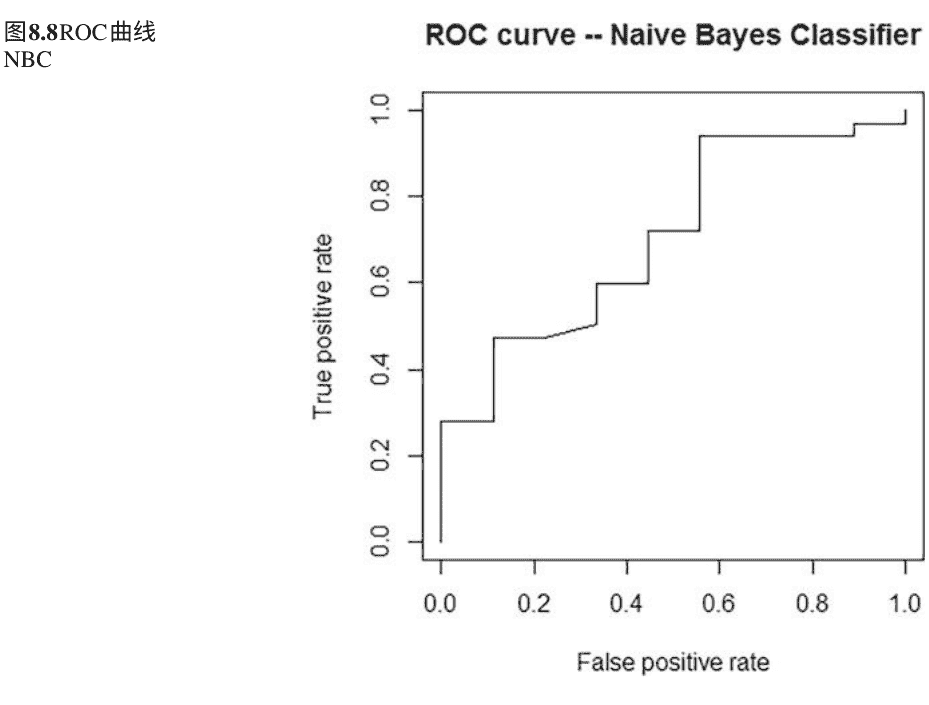

## 8.6 贝叶斯二元逻辑回归

我们可以在逻辑回归模型中使用先验信息来指定模型参数，例如在R中使用贝叶斯逻辑回归程序MCMClogit中的user.prior.density子命令。然后，这些先验分布与原始数据的信息相结合，得到模型参数的后验分布。在R中，这些模型的拟合是通过从后验分布（蒙特卡洛）中进行采样来完成的，这是基于马尔可夫链的，可以将其视为一组路径的网络，其中每条路径将模型中的参数（节点）与彼此和结果变量相关联。

贝叶斯回归和贝叶斯逻辑回归基于贝叶斯理论，该理论的核心包含条件概率。无论数学基础和统计细节如何，传统的最大似然模型（如逻辑回归）和基于贝叶斯理论的模型（如贝叶斯回归）之间最重要的区别可以总结如下：

1.  回归模型具有斜率、截距和标准差参数，每个参数都有一个相关的先验分布。
2.  估计的参数服从正态分布，而在经典或频率主义模型中，估计的参数是固定的，并且具有基于相同概率分布函数的概率分布函数。
3.  在逻辑回归中，每个参数是独立的，并由不同的分布描述。
4.  在贝叶斯回归分析中，后验分布由先验分布和似然构成。后验分布的均值或其他中心指标被认为是所考虑变量的系数 of interest。
5.  在逻辑回归分析中，当后验分布高度偏斜、双峰或多峰时，使用等尾可信集，其被定义为后验分布的外部0.025分位数。可信区间表示有95%的概率该可信区间包含后验均值或后验分布的真实后验均值。
6.  最后一个主要的区别是存在额外或先前的信息。贝叶斯分析中用于估计参数的后验分布可以与额外或初始信息相结合，这是我们对变量或参数的初始知识，与分析中使用的数据分开。

贝叶斯分析中使用的主要公式如下：

```
$$p(\theta | x) = \frac{p(x | \theta) p(\theta)}{p(x)}$$ (8.10)
```

在这个公式中，$p(x|\theta)$ 是似然函数，$p(\theta)$ 表示先验分布。分数的分母表示 $p(x)$ 是 $x$ 的概率在所有 $x$ 中的概率。

从减法的情况可以看出，概率和初始分布相乘。通常，分数的分母，即归一化项，在计算中被省略，这样后验分布或预测模型就包括了似然和先验的乘积。如前所述，每个预测变量之间的后验变量可以有自己的后验分布。如果人工心理学家发现在获得的数据之外没有重要的信息对先验变量产生影响，那么通常会考虑使用均匀先验，在这种情况下，可以说分析中的先验是非信息性的。

需要注意的是，如果我们将先验分布视为均值为零和非常高方差的正态分布，贝叶斯分析是非信息性的，如果模型中的所有预测变量都是非信息性的，那么结果就是基于最大似然的传统逻辑回归，其结果与使用贝叶斯回归几乎相同。事实上，先验分布的目的是反映样本中不存在的信息，因此，如果先验信息较弱，对贝叶斯分析的影响不大。

需要注意的是，先验信息不仅可以提供重要的定量信息，还代表了一个带有参数的分布，与后验概率分布相结合。马尔可夫链蒙特卡洛（MCMC）方法用于获得后验结果。MCMC是一组用于优化、动态模拟和抽样等各种目的的算法。由于实现简便和数值稳定性，统计学家更喜欢MCMC方法，尽管有些人认为它是抽样和后验估计的黑盒子（Brooks等，2011年）。在20世纪90年代贝叶斯方法在应用问题中的普及之后，从感兴趣的后验分布中创建近似样本的主要思想被马尔可夫链扩展了。

MCMC有两种传统方法，分别称为吉布斯采样（GS）和Metropolis-Hastings（MH）算法。可以说吉布斯采样算法是MH的一个特例，只能在某些条件下使用，例如离散分布或正态分布，而MH算法适用于广泛的分布，并基于所提议的样本分布的可能候选值。为了从后验分布中使用MCMC进行有效推断，MCMC链必须收敛。

### 8.6.1 使用R的实际示例

一位人工心理学家试图根据情绪调节（E）和网络内向性（I）来预测婚姻不忠的概率。他选择了一个包括两组人（一组有婚姻不忠经历的31人和一组没有经历的94人）的样本，并对他们进行了情绪调节（E）和虚拟内向性（I）的问卷调查，然后他决定通过检查变量的分布来确定先验分布。他得出结论，可以认为这两个变量的先验分布是相似的正态分布（列表8.5）。

#### 列表8.5

贝叶斯逻辑回归的R代码。

```r
library(MCMCpack)
library(boa)
NBR <- read.sav("NBR.sav")
NBR=data.frame(NBR)
table(NBR$MI)
NBR$E <- NBR$E - mean(NBR$E)
NBR$I <- NBR$I - mean(NBR$I)
mymc1 <- MCMClogit(MI~I+E, burnin = 5000, mcmc = 100000, data=NBR)
plot(mymc1)
summary(mymc1)

#### multivariate normal prior
mymc2 <- MCMClogit(MI~I+E, burnin = 5000, mcmc = 100000, data=NBR,
                  b0=0, B=0.001)
plot(mymc2)
summary(mymc2)

#### user-defined independent Cauchy prior
logpriorfun <- function(beta){sum(dcauchy(beta, log=TRUE))}

mymc3 <- MCMClogit(MI~I+E, burnin = 5000, mcmc = 100000, data=NBR,
                  user.prior.density=logpriorfun,
                  logfun=TRUE)
plot(mymc3)
summary(mymc3)
geweke.diag(mymc3, frac1=0.1, frac2=0.5)
geweke.plot(mymc3, frac1 = 0.1, frac2 = 0.5)
```

在这个例子中，结果是用柯西先验分布解释的。先验分布可以类似于正态分布或t分布来考虑。结果显示情绪调节和网络内向性这两个变量显著预测群体成员资格，95%的内部可信度对于这两个变量都是显著的（图8.9）。R代码在列表8.2中。

```
The Metropolis acceptance rate was 0.41014

> plot(mymc3)
> summary(mymc3)

Iterations = 5001:105000
Thinning interval = 1 
Number of chains = 1 
Sample size per chain = 1e+05 

1. Empirical mean and standard deviation for each variable,
   plus standard error of the mean:
             Mean     SD Naive SE Time-series SE
(Intercept)  1.34220 0.25519   8.070e-04      0.0027289
I            0.04585 0.01522   4.812e-05      0.0001637
E           -0.16400 0.07828   2.476e-04      0.0008267

2. Quantiles for each variable:
             2.5%    25%    50%    75%   97.5%
(Intercept) 0.86524 1.1677 1.33351 1.5080 1.86319
I           0.01722 0.0353 0.04537 0.0558 0.07691
E          -0.32146 -0.2156 -0.16267 -0.1109 -0.01304
```

#### 图8.9 贝叶斯逻辑回归的R输出

上述图给出了参数值从后验分布的2.5%到97.5%分位数，为每个变量提供了95%的可信区间。内向性（I）和外向性（E）的参数值分别为0.04585和-0.16400（图8.9），在5%的显著性水平上是显著的，因为它们的95%可信区间不包含零，这表示它们之间存在关系。

该指数是具有与其中位数相同符号的后验分布的比例。该指数与经典统计学中的p值非常相似，被称为最大效应概率（MPE）。该方法在模型中特别有用，其中变量数量较多且分类输入变量具有大量状态和值。这是一种简单而有趣的方法，它在训练阶段记住了每个变量与结果的关系，然后通过乘以每个变量的效应来进行预测。

为了更容易理解这种方法，让我们考虑一个非统计和直观的例子；假设我们想根据一个人的教育水平、依恋风格和情感心智化来预测他是否心理健康。在朴素贝叶斯中，这种逻辑被颠倒过来，提出一个问题：如果一个人心理健康，他的情感心智化健康和依恋安全的概率是多少？

简而言之，这里的问题是基于我们拥有的特征，一个具有这些特征的人属于某个特定群体的概率是多少？朴素贝叶斯在一个非常大胆的朴素假设下回答了这个问题，这个假设是所有预测变量彼此独立。当然，在现实世界中，这样的假设很难验证；使用朴素贝叶斯显著降低了模型的复杂性。正如我们所知，朴素贝叶斯也是基于贝叶斯定理的。贝叶斯概率在本章的不同部分进行了讨论。简而言之，贝叶斯统计是基于概率的乘积。

需要注意的是，统计推断方法的选择不是口味问题，而是人工心理学家试图回答的问题的直接结果。如果他担心统计结果对数据和建模过程的变化敏感，他应该使用频率统计学；但如果他担心统计结果对需要建模的未知数量的可能变化敏感，他应该在贝叶斯统计框架中采取措施。

人工心理学家使用了dCauchy函数。d是密度指标。Geweke诊断可以用来评估参数估计是否收敛，并将重复抽样过程中后验分布的起始值与结束值进行比较，绝对值小于2的z值表示没有差异。如果这些值没有差异，参数估计是稳定的并且被认为已经收敛。输出结果显示，内向性（I）和外向性（E）变量的回归斜率都具有|z| < 2（图8.10）。Geweke的Z值小于2，表示这些估计的MCMC后验分布已经收敛（图8.11）。

网络内向性的概率方向（pd）为99.92%，情绪调节的概率方向为98.35%（图8.12）。

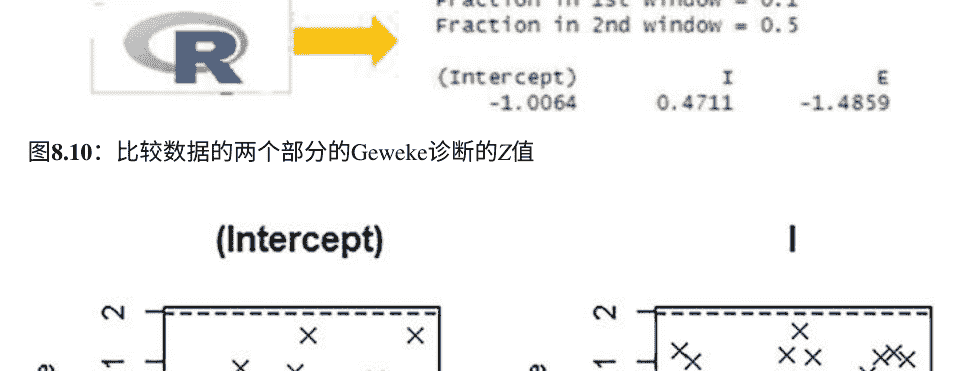

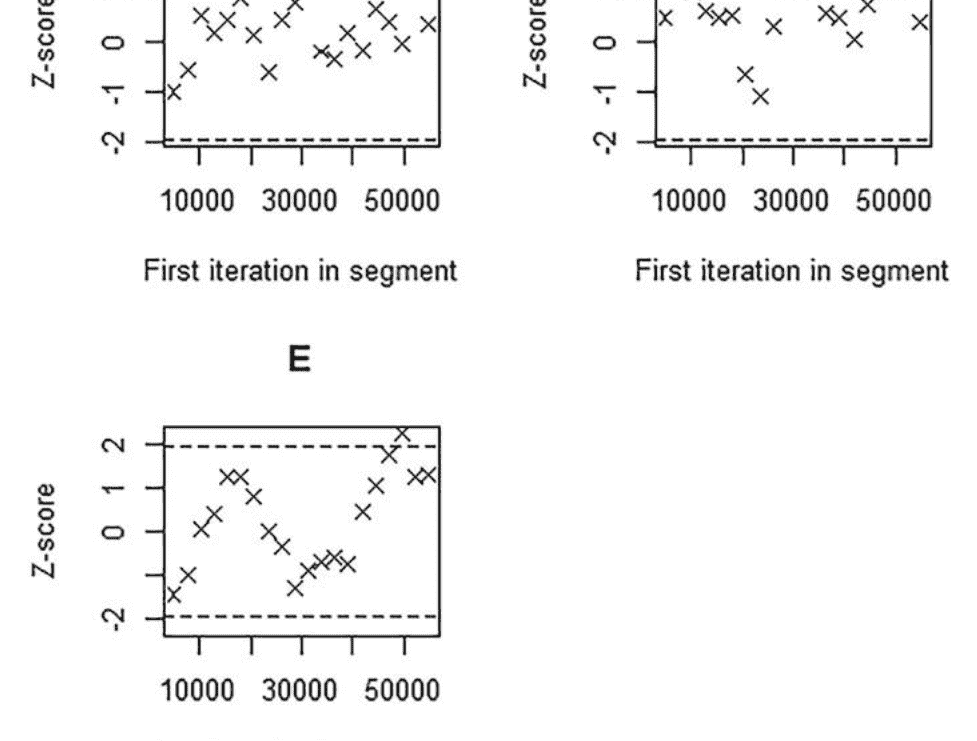

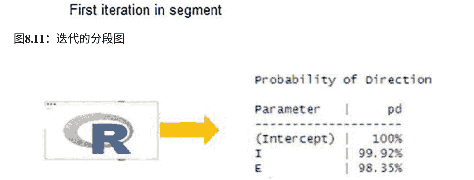

## 8.7 贝叶斯网络分析

贝叶斯网络模型是一种概率图模型，通过图表示一组变量及其条件依赖关系。图中的边表示变量（节点）之间的方向和关系程度。

输出的网络是基于将变量连接到网络中的所有可能网络的平均值（图8.13和8.14）。

本书的网络分析章节介绍了网络分析作为一种高级方法的最重要概念。本章介绍了使用贝叶斯统计进行网络分析及其应用。

贝叶斯网络是网络结构（具体而言是有向无环图）和与之相关的概率分布的组合。因此，贝叶斯网络是一种通过图形结构检查带有边缘的节点的图形方法或模型。

节点可以被视为心理变量、精神障碍症状等，通过边缘或箭头表示概率依赖关系。

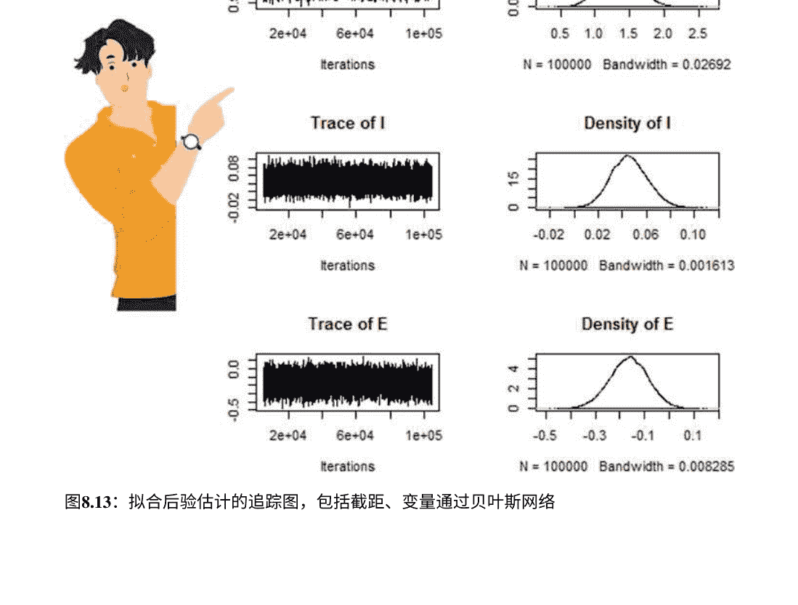

### 图8.14: I和E的后验图

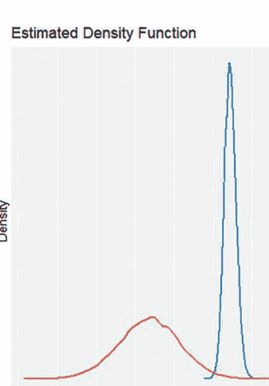

### 图8.15: 一个简单的贝叶斯网络

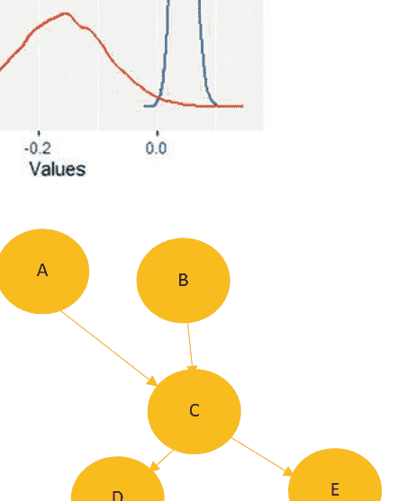

图形结构G=(V,A)是一个有向无环图的贝叶斯网络，其中V是一个节点，A是一条弧（或边）。有向无环图可以被视为联合概率分布（节点）的分解。简单来说，贝叶斯网络由三个组成部分构成：（1）节点（可以是无限状态），（2）有向边（连接两个节点），（3）每个变量或节点的条件概率。

节点和边界定义了网络的结构，即贝叶斯网络的结构。箭头的方向（A→B）表示两个变量之间的因果关系。紧邻节点的节点称为父节点，位于节点之后的节点称为子节点。

在图8.15中，A和B是C的父母，D和E是C的孩子。

在图8.15中，A和B是C的父母，D和E是C的孩子。先前的信息和专家信息可以用来构建贝叶斯网络。在贝叶斯网络分析中，第一步是确定网络结构，我们称之为结构学习，下一步是确定贝叶斯网络结构的参数，我们称之为参数学习。

贝叶斯网络中的结构学习方法可以是基于约束的或基于评分的。接下来，将对这两类算法进行更详细的研究。正如已经提到的，贝叶斯网络的主要理论核心是基于贝叶斯定律，该定律由托马斯·贝叶斯于1720年提出，因此被称为贝叶斯网络。贝叶斯网络这个术语是由Pearl于1988年提出的，并且自那时以来在各个领域广泛使用。

在贝叶斯网络中，如果每个节点与网络中的所有其他节点都有连接，则称为完全贝叶斯网络，贝叶斯网络的主要特征是每个子节点都与其父节点匹配，而非子节点和子节点是独立的。

贝叶斯网络中结构学习的目标是以匹配可用数据并在复杂性方面最优的方式找到最佳结构。如前所述，这种学习可以是基于约束的或基于评分的。

Verma和Pearl于1991年引入了基于约束的算法。该算法为因果模型的结构学习提供了理论框架。需要三个步骤：

#### 第一步

在这一步中，学习网络的主体部分，包括无向图，通常为了实现马尔可夫毯的便利，马尔可夫毯是一组包含彼此完整信息的节点。它用于每个节点，包括父节点、子节点和具有共同子节点的共节点。贝叶斯网络的这种结构称为有向无环图的骨架。通常，在这个阶段，为了确定边的位置，会使用条件独立性测试，如X²和Fisher独立性测试。

#### 第二步

在下一步中，从上一步得到的边被定向。为了达到这个目的，使用了不同的算法，如快速增量关联（fast.iamb）、增量关联（iamb）、增减（gs）和交错增量关联（inter.iam）。最后，使用最大-最小父母和子女算法（MMPC）来识别网络中的父母和子女。

在本书中，解释了最后一个算法MMPC。该算法是一种基于在前几次迭代中选择的节点子集中获得的最小关联值的最大化的邻域删除的前向选择方法。该算法教授了贝叶斯网络学习的基本结构。所有的rcs都是无方向的，并且没有试图将它们定向。

需要注意的是，如果样本很小或者有很多缺失数据，使用面向限制的算法会导致很多错误，这些方法无法直接指定一些边。在这些情况下，建议使用基于评分的算法。在这些方法中，使用一种度量来确定网络与可用数据的匹配程度，以寻找与数据最匹配的网络。这种方法也分为两个步骤。

在第一步中，指定了一种搜索方法来生成有向无环图（DAG），以便了解所有可能的DAG结构，然后在下一步中，确定并评估每个结构与现有数据的匹配程度。这两个步骤会一直进行，直到没有更好匹配的可能结构为止。基于评分的算法中的一个重要算法是贪婪搜索算法，称为爬山算法（HC），它贪婪地搜索有向图的空间（Daly & Shen, 2007）。

PC结构学习算法是最早和最流行的算法之一，由Spirtes等人引入（2000年）。它利用数据中观察到的独立性（通过经典独立性检验确定）来推断生成它们的结构。

另一个算法是禁忌搜索，Glover在1990年引入。这个算法是一个修改过的HC算法，它不会在第一个DAG之后停止，而是继续进行，直到任何添加、删除和反转都不能改善分数。

贝叶斯网络的结构可能在学习算法的多次执行过程中发生变化。因此，在横断面数据中，有必要检查网络结构的稳定性，即获得一组稳健的边缘和方向。

对于偏相关网络，可以使用自助法来评估网络估计的稳定性（参见网络分析章节）。这种方法可以用来检查贝叶斯网络中结构学习的稳定性。因此，贝叶斯网络从自助法获得的大量样本中学习结构，并基于标准（Briganti等人，2022a, b）来确定在超过85%的网络中可见的边缘，其方向在超过50%的网络中出现，并且它们保留在网络中。

第一个标准称为强度，第二个标准称为最小方向。建议在自助法中样本数量为100-200个样本。还可以报告贝叶斯网络中边缘出现的次数的比例（Briganti等人，2022a, b）。请记住，在学习结构之后，需要通过参数估计来确定边缘的强度。参数学习的目的是估计网络参数。如果网络的结构已知且所有变量都是可观测的，则可以使用最大似然（ML）、最大后验（MAP）和后验均值（PM）估计来估计网络。

### 8.7.1 使用R的实际示例

研究人员试图基于与婚姻满意度相关的变量来建模探索性贝叶斯网络。他使用有效可靠的问卷测量安全感（AAIS）、回避（AAIV）、矛盾（AAIAM）、积极情感（PANASP）、消极情感（PANASN）和婚姻满意度（GRIMS）。他的样本是450名已婚男女。在这项研究中，他首先使用200个样本的自助法构建稳定的网络，然后使用结构学习PC算法、Tabu和HC分析贝叶斯网络，并最终使用边缘的平均强度来估计参数。第33个清单和图表显示了实施贝叶斯网络和最后一步自助法的R代码，以及基于不同网络学习方法的贝叶斯网络图和边缘强度。

实现贝叶斯网络的R代码在列表8.6中。表8.2显示了运行贝叶斯网络所需的变量名称和标签。

#### 列表8.6

贝叶斯网络实现的R代码。

```r
library("bnlearn")
library("qgraph")
BN <- read_sav("BNN.sav")
BST <- boot.strength(BN, R = 200, algorithm = "tabu",
                      debug = TRUE,
                      cpdag = TRUE)
avgnet1 <- averaged.network(BST, threshold = 0.85)
astr1 <- arc.strength(avgnet1, BN, "bic-g")
plot(avgnet1)
BST2 <- boot.strength(BN, R = 200, algorithm = "pc.stable",
                       debug = TRUE,
                       cpdag = TRUE)
avgnet2 <- averaged.network(BST2,
                            threshold = 0.85)
astr2 <- arc.strength(avgnet2,
                       BN, "bic-g")
plot(avgnet2)
BST3 <- boot.strength(BN, R = 200, algorithm = "hc",
                       debug = TRUE,
                       cpdag = TRUE)
avgnet3 <- averaged.network(BST3, threshold = 0.85)
plot(avgnet3)
astr3 <- arc.strength(avgnet3, BN, "bic-g")
print(astr1)
print(astr2)
print(astr3)
par(mfrow = c(1, 2))
qgraph(astr1, layout="circle", posCol="blue", negCol="orange")
qgraph(astr2, layout="circle", posCol="blue", negCol="brown")
qgraph(astr3, layout="circle", posCol="blue", negCol="red")
```

引导重采样也可以用于估计学习到的边的置信水平。在这种情况下，可以从每个引导样本中学习一个网络，并将得到的PDAGs聚合成加权PDAG（WPDAG），其中每条边的置信度估计为引导样本的比例。

#### 表8.2 变量的名称和标签
| 变量名称 | 变量标签 |
| :--- | :--- |
| AAIS | 安全依恋风格 |
| AAIAv | 回避依恋风格 |
| AAIAn | 矛盾依恋风格 |
| PANASN | 负性情绪 |
| PANASP | 正性情绪 |
| GRIMS | 婚姻满意度 |

其中边缘可以被学习。 Bnstruct还可以推断一些变量的估计概率分布，给定其他观察到的变量的值的证据。 在这种情况下，使用联合树。 还实现了期望最大化算法，利用BN结构从具有缺失值的数据集中迭代估计条件概率，以填补这些缺失值。

如图8.16所示，AAIS和AAIAv之间的边缘具有最强的负连接，GRIMS和PANAS之间的边缘具有最弱的负连接，这是基于使用禁忌搜索（图8.17）获得的贝叶斯网络。

```
bootstrap replicate 200 .
learning bayesian network structure.

Bayesian network learned via constraint-based methods

model:
[AAIS][AAIAm][PANASP][AAIAv|AAIS:AAIAm][PANASN|AAIAm:PANASP][GRIMS|AAIS:PANASP:PANASN]
nodes:                  6
arcs:                   7
  undirected arcs:      0
  directed arcs:        7
average markov blanket size:    3.67
average neighbourhood size:     2.33
average branching factor:       1.17

learning algorithm:     PC (Stable)
conditional independence test:  Pearson's correlation
alpha threshold:        0.05
tests used in the learning procedure: 89
```

#### 图8.18 使用基于约束的算法（PC）学习贝叶斯网络结构

#### 图8.19 贝叶斯网络的节点和边缘（使用PC）

如图8.18所示，AAIs对使用PC获得的网络中的AAIAv有最强烈的影响（图8.19和8.20）。如图8.21所示，AAIs对使用爬山算法获得的网络中的AAIAv有最强烈的影响。

## 8.8 贝叶斯模型平均

贝叶斯模型平均（BMA）计算与不同特征子集组成的竞争线性回归模型相关的后验概率，并对其进行聚合，具有具有最高后验概率的特征模型在给出与预测因素与生活满意度相关的参数估计的加权平均时最具影响力。

```
* bootstrap replicate 200 .
* learning bayesian network structure.

Bayesian network learned via score-based methods

model:
  [partially directed graph]
nodes:                          6
arcs:                           8
  undirected arcs:              3
  directed arcs:                5
average markov blanket size:    3.67
average neighbourhood size:     2.67
average branching factor:       0.83

learning algorithm:             Hill-climbing
score:                          BIC (Gauss.)
penalization coefficient:       3.054624
tests used in the learning procedure: 55
optimized:                      TRUE
```

### 图8.20 使用基于得分的爬山算法学习贝叶斯网络结构

### 图8.21 使用基于得分的爬山算法的贝叶斯网络的节点和边

数据分析和建模中最重要的一点是找到选择更好模型的方法。标准统计分析忽略了模型不确定性。在数据分析中，通常从一类模型中选择一个模型，这导致了模型选择的不确定性。因此，这种方法导致了过度自信的推断。BMA在推导参数估计时考虑了模型不确定性的机制。因此，简而言之，该方法通过对模型的后验概率的近似估计对最重要的模型进行平均，从而提供了变量选择问题中存在的模型的不确定性。为此，在该方法中，通过两个指标来检查竞争模型以选择最佳模型（最合适的模型）。其中一个指标是贝叶斯信息准则。

BIC（贝叶斯信息准则）由Schwarz于1978年提出，另一个是每个模型的后验概率。最合适的模型是具有最低BIC和最高后验概率的模型。当有大量预测变量（例如20、30或40个）用于预测结果时，这种方法非常适用。在这种方法中，计算每个模型中每个变量的P! = 0。请参考示例中R软件的输出。P！= 0表示在生成的模型中，任何特定预测变量的回归系数非零的可能性有多大。此外，在“EV”列中，呈现了每个系数的后验分布的平均值，并且SD表示每个系数的后验分布的标准差。准确地说，只呈现了最佳的五个模型。在每个BIC模型的输出中，呈现了后验概率、每个模型中的变量数量、P！= 0和R2。

BMA被用来计算每个变量的相对重要性。从上面可以看出，贝克焦虑、情绪处理和情绪表达的后验密度都偏离零，并且在回归模型中具有最高的后验概率（0.60）和最低的贝叶斯推断准则（BIC），最低的BIC值最好。剩下的四个模型几乎具有相同的后验概率和BIC，这表明这些竞争模型之间只有微小的差异。

EV列显示了模型系数的平均值。值得一提的是，如果只选择一个模型，那么模型的不确定性将无法被证明。通过计算后验概率的加权和，并在p！=0列中提到的所有模型的系数的平均值，可以考虑到这种不确定性。贝克焦虑、情绪处理和情绪表达的p！=0都等于100，显示了与生活满意度非常高的相关性。

### 8.8.1 使用R的实际例子

一位人工心理学家试图确定哪个变量（外向性、责任心、宜人性、开放性、情绪稳定性、焦虑、情绪识别、情绪处理、情绪追踪和情绪表达）能够预测生活满意度。他使用了447名男性和女性学生的样本，并通过相应的量表回答了这些变量；然后，使用列表8.7中的R代码拟合了BMA模型。

### ## 列表8.7 BMA实现的R代码

```
r
call:
bicreg(x = x, y = y, strict = FALSE, OR = 20)

7 models were selected
Best 5 models (cumulative posterior probability = 0.9351 ):

p!=0      EV         SD        model 1   model 2   model 3   model 4   model 5
Intercept           100.0   -21.779540 8.71250   -20.8294  -24.9205  -22.0153  -22.2798  -22.7192
Extraversion        0.0      0.000000  0.00000   .         .         .         .         .
Agreeableness       4.3      0.005295  0.03726   .         .         .         0.1220    .
Conscientiousness   19.4     0.446017  1.04828   .         2.3049    .         .         .
Emotionalstability  3.5     -0.018866  0.18936   .         .         .         .         .
Openness            6.2      0.077725  0.39247   .         .         1.2511    .         .
BeckAnxiety         100.0   -5.112318  1.20655   -5.1864   -4.8123   -5.1653   -5.0095   -5.2578
Emotionrecognition  3.0     -0.020347  0.35180   .         .         .         .         .
Emotionprocessing   100.0    10.502802 1.31917   10.6450   9.9807    10.2590   10.5579   10.3361
Emotiontracing      3.6      0.029759  0.28331   .         .         .         .         0.8369
Emotionexpression   100.0    4.164647  0.96144   4.1687    4.1655    4.1092    4.1403    4.2062

nvar                                3         4         4         4         4
r2                                 0.293     0.300     0.296     0.295     0.294
BIC                              -136.9818  -134.7171  -132.4447  -131.7278  -131.3287
post prob                          0.600     0.194     0.062     0.043     0.036
```

考虑到较低的BIC和较高的后验概率，可以说第一个模型是适当的模型，其中选择了三个变量，解释了29.3%的生活满意度方差（图8.22）。图8.22表明，焦虑、情绪处理和情绪表达能够预测模型I中的生活满意度，这是最适合的模型。观察p! =0，这个例子中所有三个变量的系数都非零的模型百分比为100%。EV列显示了每个变量系数的后验分布均值，SD显示了每个EV系数均值的标准差。

通过检查图表可以看出，在密度图中，每个变量在零点处都有一个峰值，这些变量对结果的影响最小；例如，在图表中可以看到外向性、宜人性、情绪稳定性、开放性、情绪识别和情绪追踪在零点处都有一个峰值，并且影响最小。这些变量的系数很可能为零，而焦虑、情绪处理和情绪表达的变量以及回归方程的常数值在结果模型中起着重要作用（图8.23）。

正如我们所见，根据使用的贝叶斯网络学习算法的不同，不同路径的强度存在差异。但在所有三种贝叶斯网络算法中，安全依恋样式与非常强烈的回避之间的路径是负向的，而矛盾性和负面情绪之间的路径在使用Tabu搜索时是相反的方向。

## 8.8 贝叶斯模型平均

```
call:
bicreg(x = x, y = y, strict = FALSE, OR = 20)

7 models were selected
Best 5 models (cumulative posterior probability = 0.9351 ):
```

| | p!=0 | EV | SD | model 1 | model 2 | model 3 | model 4 | model 5 |
| :--- | :---: | :---: | :---: | :---: | :---: | :---: | :---: | :---: |
| Intercept | 100.0 | -21.779540 | 8.71250 | -20.8294 | -24.9205 | -22.0153 | -22.2798 | -22.7192 |
| Extraversion | 0.0 | 0.000000 | 0.00000 | . | . | . | . | . |
| Agreebleness | 4.3 | 0.005295 | 0.03726 | . | . | . | 0.1220 | . |
| Conscientiousness | 19.4 | 0.446017 | 1.04828 | . | 2.3049 | . | . | . |
| EmotionalStability | 3.5 | -0.018866 | 0.18936 | . | . | . | . | . |
| Openness | 6.2 | 0.077725 | 0.39247 | . | . | 1.2511 | . | . |
| BeckAnxiety | 100.0 | -5.112318 | 1.20655 | -5.1864 | -4.8123 | -5.1653 | -5.0095 | -5.2578 |
| Emotionrecognition | 3.0 | -0.020347 | 0.35180 | . | . | . | . | . |
| Emotionprocessing | 100.0 | 10.502802 | 1.31917 | 10.6450 | 9.9807 | 10.2590 | 10.5579 | 10.3361 |
| Emotiontracing | 3.6 | 0.029759 | 0.28331 | . | . | . | . | 0.8369 |
| Emotionexpression | 100.0 | 4.164647 | 0.96144 | 4.1687 | 4.1655 | 4.1092 | 4.1403 | 4.2062 |
| nvar | | | | 3 | 4 | 4 | 4 | 4 |
| r2 | | | | 0.293 | 0.300 | 0.296 | 0.295 | 0.294 |
| BIC | | | | -136.9818 | -134.7171 | -132.4447 | -131.7278 | -131.3287 |
| post prob | | | | 0.600 | 0.194 | 0.062 | 0.043 | 0.036 |

图8.22BMA示例的R输出

图8.23变量的密度

算法和PC算法。在前者中，矛盾的依恋风格受到负性情绪的影响（PANAS N→AAIAm），而在后者中，这条路径相反（AAIAm→PANAS N）。这些模型之所以可接受，是因为它们有理论基础，并且能够对结果进行理论解释。我们不应忘记，统计结果支持研究者的理论。

Farahani等人在2022年使用BMA方法预测社交情绪能力，基于童年创伤、内化羞耻、残疾/羞耻方案、认知灵活性、痛苦耐受力和情感障碍。

## # 参考文献

Abraham, A., Milham, M. P., Di Martino, A., Craddock, R. C., Samaras, D., Thirion, B., &Varoqu aux, G. (2017). 从多站点静息态数据中推导出可重复的生物标志物：以自闭症为例。Ne uroImage, 147, 736–745.

Adadi, A., & Berrada, M. (2018). 窥探黑盒子：可解释人工智能（XAI）的调查。IEEE Access, 6, 52138–52160.

Agatonovic-Kustrin, S., & Beresford, R. (2000). 人工神经网络（ANN）建模的基本概念及其在制药研究中的应用。药物和生物医学分析杂志, 22(5), 717–727.

Agrawal, P., Abutarboush, H. F., Ganesh, T., & Mohamed, A. W. (2021). 特征选择的元启发式算法：十年研究回顾（2009–2019）。IEEE Access, 9, 26766–26791.

Aguinis, H., & Solarin, A. (2019). 透明度和可复制性在定性研究中的应用：以精英访谈为例。战略管理, 40(8), 1291–1315。 https://doi.org/10.1002/smj.3015

美国航空航天学会。(1998)。计算流体动力学模拟的验证和验证指南，AIAA-G-077-1998。

Andelković, B.使用神经网络和模糊逻辑研发夹持电路计算的新方法。 [https://view.officeapps.live.com/op/view.aspx?src=http%3A%2F%2Fwww.hm.co.rs%2Fstatistika%2FPrincipi_fazi_i_neuro_modeliranja1.doc&wdOrigin=BROWSELINK](https://view.officeapps.live.com/op/view.aspx?src=http%3A%2F%2Fwww.hm.co.rs%2Fstatistika%2FPrincipi_fazi_i_neuro_modeliranja1.doc&wdOrigin=BROWSELINK)。最后访问日期: 2022年10月01日。

Andrews, M., & Baguley, T. (2013). 先批准：贝叶斯方法在心理学中的增长。英国数学和统计心理学杂志, 66(1), 1–7。

Ansari, N. (2021). 使用进化算法的特征选择技术调查。伊拉克科学杂志, 2796–2812。

Apostolopoulos, I. D., Groumpos, P. P., & Apostolopoulos, D. J. (2021). 先进的模糊认知图：冠状动脉疾病检测的状态空间和基于规则的方法。生物医学物理与工程快报, 7(4), 045007。

Arfi, B. (2010)社会科学中的语言模糊逻辑方法(Vol. 253). Springer. Ashish, K., Dasar i, A., Chattopadhyay, S., & Hui, N. B. (2018). 用于评估抑郁症的遗传神经模糊系统。应用计算与信息学, 14(1), 98–105。

Aslam, N., Khan, I. U., Mirza, S., AlOwayed, A., Anis, F. M., Aljuaid, R. M., & Baageel, R. (2022). 可解释的机器学习模型用于恶意域名检测，使用可解释的人工智能（XAI）。可持续性, 14, 7375。 https://doi.org/10.3390/su14127375

# 参考文献

- Avci, E. (2008). 使用小波包熵自适应网络模糊推理系统的纹理分类小波族比较。 应用软计算, 8(1), 225–231。

- Avci, E., & Akpolat, Z. H. (2006). 基于小波包自适应网络的模糊推理系统的语音识别。 Expert Systems with Applications, 31(3), 495–503。

- Avci, E., Turkoglu, I., & Poyraz, M. (2005, 六月). 基于小波自适应网络的模糊推理系统的智能目标识别。 在伊比利亚模式识别和图像分析会议上 (pp. 594–603). Springer。

- Avci, E., Hanbay, D., & Varol, A. (2007). 基于小波自适应网络的模糊推理系统的专家离散数字调制识别。 Expert Systems with Applications, 33(3), 582–589。

- Ayre, C., & Scally, A. J. (2013). Lawshe的内容效度比的临界值: 重新审视原始计算方法。 Measurement and Evaluation in Counseling and Development, 47(1), 79–78。 https://doi.org/10.1177/0748175613513808

- Babyak, M. A. (2004). 你看到的可能不是你得到的：关于回归模型中过拟合的简要、非技术性介绍。 Psychosomatic Medicine, 66(3), 411–421。

- Baig, F., Khan, M. S., Noor, Y., Imran, M., & Baig, F. (2011). 模糊逻辑医学诊断控制系统的设计模型。 International Journal on Computer Science and Engineering, 3(5), 2093–2108。

- Bailey, J. D., Baker, J. C., Rzeszutek, M. J., & Lanovaz, M. J. (2021). 用于补充行为评估的机器学习。 行为科学的观点, 1–15。

- Barabási, A. L., Gulbahce, N., & Loscalzo, J. (2011). 网络医学：一种基于网络的人类疾病方法。 Nature Reviews Genetics, 12(1), 56–68。

- Basarkod, G., Sahdra, B., & Ciarrochi, J. (2018). 身体形象 - 接受和行动问卷 - 5：使用遗传算法的缩写。 行为疗法, 49(3), 388–402。

- Bassett, D. S., & Sporns, O. (2017). 网络神经科学。 Nature Neuroscience, 20(3), 353–364。

- Bengio, Y. (2012). 深度架构基于梯度的训练的实际建议。 神经网络：行业内的技巧：第二版, 437–478。

- Bentler, P. M., & Satorra, A. (2010). 测试模型嵌套和等价性。 心理方法, 15(2), 111。

- Blake, C. (1998). UCI机器学习数据库存储库。 http://www.ics.uci.edu/~mlearn/MLRepository.html

- Blanken, T. F., Bathelt, J., Deserno, M. K., Voge, L., Borsboom, D., & Douw, L. (2021). 在临床神经科学中连接大脑和行为：一种网络方法。 神经科学与生物行为评论, 130, 81–90。

- Blazer, D. G. (1982). 社会支持与老年社区人口的死亡率。 美国流行病学杂志, 115(5), 684–694。

- Bodenhofer, U., De Baets, B., & Fodor, J. (2007). 一本模糊弱序的汇编：表示和构建。 模糊集与系统, 158(8), 811–829。

- Bollen, K. A., & Stine, R. A. (1992). 在结构方程模型中引导拟合度量的自助法。 社会方法与研究, 21(2), 205–229。

- Bonaccorso, G. (2017). 机器学习算法。 Packt Publishing Ltd。

- Borgatti, S. P. (2005). 中心性和网络流。 社会网络, 27(1), 55–71。

- Borgatti, S. P., Mehra, A., Brass, D. J., & Labianca, G. (2009). 社会科学中的网络分析。 科学, 323(5916), 892–895。

- Borsboom, D., van der Maas, H. L., Dalege, J., Kievit, R. A., & Haig, B. D. (2021a). 理论构建方法论：心理学理论构建的实用框架。 关于心理科学的观点, 16, 756–766。

- Borsboom, D., Deserno, M. K., Rhemtulla, M., Epskamp, S., Fried, E. I., McNally, R. J., et al. (2021b). 心理科学中多变量数据的网络分析。 自然评论方法概论, 1(1), 58。

- Briganti, G., Decety, J., Scutari, M., McNally, R. J., & Linkowski, P. (2022a). 使用贝叶斯网络研究心理构建：以共情为例。 Psychological Reports, 00332941221146711。

- Briganti, G., Scutari, M., & McNally, R. J. (2022b). 心理病理学研究者的贝叶斯网络教程。 Psychological methods。

- Bringmann, L. F., Albers, C., Bockting, C., Borsboom, D., Ceulemans, E., Cramer, A., et al. (2022). 心理病理网络：理论、方法与实践。 行为研究与治疗, 149, 104011。

- Brooks, S., Gelman, A., Jones, G., & Meng, X. L. (Eds.). (2011). 马尔可夫链蒙特卡洛方法手册。 CRC Press。

- Brownlee, J. (2016). 掌握机器学习算法：从头开始了解它们的工作原理和实现方法。 美国：机器学习掌握。

- Buchanan, B. G. (2005). 人工智能的（非常）简要历史。 AI杂志, 26(4), 53–53。

- Bullmore, E., & Sporns, O. (2009). 复杂的脑网络：结构和功能系统的图论分析。 自然神经科学评论, 10(3), 186–198。

- Camuñas-Mesa, L. A., Linares-Barranco, B., & Serrano-Gotarredona, T. (2019). 神经形态学的脉冲神经网络及其基于忆阻器CMOS的硬件实现。 材料, 12(17), 2745。

- Cao, S. G., Rees, N. W., & Feng, G. (2001). Mamdani类型的模糊控制器是通用的模糊控制器。 模糊集与系统, 123(3), 359–367。

- Chang, M., Balser, J., Roach, J., & Bliss, R. (2019). 现代临床试验的创新策略、统计解决方案和模拟。 CRC出版社/泰勒和弗朗西斯集团。

- Chen, Y. J., Wu, C. H., Chen, Y. M., Li, H. Y., & Chen, H. K. (2017). 年度报告中叙述性欺诈检测的增强。 会计信息系统国际期刊, 26, 32–45。

- Chopra, S., Dhiman, G., Sharma, A., Shabaz, M., Shukla, P., & Arora, M. (2021). 现代工程科学中自适应神经模糊推理系统的分类。 计算智能和神经科学, 2021。

- Constantin, M., Schuurman, N. K., & Vermunt, J. (2021). 在网络模型背景下进行样本量分析的一般蒙特卡洛方法。 https://doi.org/10.31234/osf.io/j5v7u

- Corbetta, M., Shulman, G. L., Miezin, F. M., & Petersen, S. E. (1995). 在空间注意转移和视觉特征结合过程中，优越顶叶皮层激活。 科学, 270(5237), 802–805。

- Costantini, G., & Perugini, M. (2016). 责任感的网络。 人格研究杂志, 65, 68–88。

- Crabbe, & Schaar. (2022). 第39届国际机器学习会议论文集, PMLR 162, 2022。

- Crowder, J., & Friess, S. (2010). 人工神经情感和情感记忆。 Ic-Ai, 373–378。

- Cumming, G. S. (2011). 社会-生态系统的空间弹性。 Springer Science & Business Media。

- Cumming, G. (2013). 新统计学：原因和方法。 心理科学, 25, 7–29。

- Cunningham, P., Kathirgamanathan, B., & Delany, S. J. (2021). 带有Python示例的特征选择教程。 arXiv预印本arXiv, 2106.06437。

- Cvetković, J., Ivanović-Kovačević, S., Cvetković, M., & Cvetković, S. (2020). 通过Paykel的生活事件和自适应神经模糊方法评估压力在乳腺癌和抑郁症患者中的作用。 脑与行为, 10(4), e01570。

- Daly, R., & Shen, Q. (2007). 加速贝叶斯网络结构学习的方法。 在2007年英国计算智能研讨会论文集中。 帝国理工学院。

- Dangeti, P. (2017). 机器学习的统计学。 Packt Publishing Ltd。

- Dash, M., & Liu, H. (1997). 用于分类的特征选择。 智能数据分析, 1(1-4), 131–156。

- De Schryver, T. (2015). 文本挖掘的非技术介绍。 在SWI秋季会议，2015年11月17日中。 SWI秋季会议。

- Diciccio, T. J., & Romano, J. P. (1988). 一篇关于自助法置信区间的综述。 Journal of the Royal Statistical Society: Series B (Methodological), 50(3), 338–354。

- Dikopoulou, Z., Papageorgiou, E., Jetter, A., & Bochtis, D. (2018). R语言中用于估计模糊认知图在环境决策中推理的开源工具。 国际环境建模与软件大会, 84。 https://scholarsarchive.byu.edu/iemssconference/2018/Stream-C/84

- Dosenbach, N. U., Fair, D. A., Miezin, F. M., Cohen, A. L., Wenger, K. K., Dosenbach, R. A., et al. (2007). 人类适应性和稳定任务控制的不同脑网络。 Proceedings of the National Academy of Sciences, 104(26), 11073–11078。

- Doshi-Velez, F., & Kim, B. (2017). 走向可解释机器学习的严谨科学。 arXiv预印本arXiv, 1702.08608。

- Du, H., & Zhang, N. (2008). 应用进化的Takagi-Sugeno模糊模型进行非线性系统识别。 应用软计算, 8(1), 676–686。

- Dua, D., & Graff, C. (2017). UCI机器学习库。 https://archive.ics.uci.edu/ml/index.php

- Dubois, D., & Prade, H. (1996). 什么是模糊规则以及如何使用它们。 模糊集与系统, 84(2), 169–185。

- Dubois, D., & Prade, H. (2005). 模糊集中的模糊元素。 国际模糊系统协会世界大会, 2005年7月, pp. 55–60。 ffhal-03367408f。

- Edwards, S. F. (1965). 具有排除体积的聚合物的统计力学。 物理学会议, 85(4), 613。

- Efron, B. (1992). Bootstrap方法：对jackknife的另一种看法 (pp. 569–593)。 Springer。

- Eisenbarth, H., Lilienfeld, S. O., & Yarkoni, T. (2015). 使用遗传算法缩写Psychopathic Personality Inventory – Revised (PPI-R)。 心理评估, 27(1), 194。

- Ekong, V. E., Ekong, U. O., Uwadiae, E. E., Abasiubong, F., & Onibere, E. A. (2013). 用于预测抑郁风险水平的模糊推理系统。 非洲数学与计算机科学研究杂志, 6(10), 197–204。

- Elton, A., & Gao, W. (2014). 执行控制和显著性网络的不同任务相关功能连接。 Cortex, 51, 56–66。

- Engelbrecht, A. P. (2007). 计算智能：介绍。 Wiley。

- Epskamp, S., & Fried, E. I. (2018). 关于正则化偏相关网络的教程。 心理方法, 23(4), 617。

- Epskamp, S., Kruis, J., & Marsman, M. (2017). 估计心理病理网络：小心你所期望的。 PLoS One, 12(6), e0179891。

- Epskamp, S., Borsboom, D., & Fried, E. I. (2018). 估计心理网络及其准确性：教程论文。 行为研究方法, 50, 195–212。

- Erin, B., & Abiyev, R. H. (2019年1月). 使用Type-2模糊系统诊断常见疾病。 在第3届国际机器学习和软计算会议论文集中 (pp. 239–243)。

- Eronen, M. I., & Bringmann, L. F. (2021). 心理科学展望, 16(4), 779–788。 https://doi.org/10.1177/1745691620970586

- Fan, W., & Yan, Z. (2010). 影响网络调查响应率的因素：系统综述。 人类行为中的计算机, 26(2), 132–139。

- Fang, X., Van Kleef, G. A., & Sauter, D. A. (2018a). 从不断变化的情绪表达中的人物感知：首要性、最近性还是平均效应？ 认知与情绪, 32(8), 1597–1610。

- Fang, X., Sauter, D. A., & Van Kleef, G. A. (2018b). 看到混合情绪：跨文化中从静态和动态面部表情中感知情绪的特异性。 跨文化心理学杂志, 49(1), 130–148。

- Farahani, H. (2020). 比较线性回归与收缩回归算法 (RR, Lasso, Elnet) 在创伤后应激障碍患者数据中的应用。 应用心理研究杂志, 11(3), 193–206。

- Farahani, H. A., Kazemi, Z., Aghamohamadi, S., Bakhtiaryrand, F., & Ansari, M. (2011). 在伊朗使用Facebook的学生中研究心理健康指标。 Procedia-Social and Behavioral Sciences, 28, 811–814。

- Farahani, H., LeighPiotr, L., & Piotr, O. (2018). 模糊矩阵模型作为一种新的方法来寻找心理测试的最佳诊断准确性点。 欧洲数学心理学小组。

- Farahani, F. V., Karwowski, W., & Lighthall, N. R. (2019). 应用图论来识别大脑网络中的连接模式：一项系统综述。 神经科学前沿, 13, 585。

- Farahani, H., & Azadfallah, P. (2020). P-Value is Hacking Psychological Results: A New Method or Meta-Analysis on “Null Findings” Using Bayesian Statistics。 International Conference on Mathematical Psychology and Psychometrics。 https://doi.org/10.34171/ICMPP.33.151

- Farahani, H., Azadfallah, P., Chesli, R. R., Pourmohamadreza-Tajrishi, M., Esrafili, F., Lavasani, F. F., & Chiniforoushan, F. (2021a). 询问心理治疗失败的方法论：临床实践者和研究者的实用指南。 心理治疗, 7, 01。

- Farahani, H., Azadfallah, P., Watson, P., & Blagojević, M. (2021b). 贝叶斯假设检验在线性模型中的应用：一个预测心理健康的案例研究。 https://doi.org/10.13140/RG.2.2.32071.37283

- Farahani, H., Nápoles, G., & Azadfallah, P. (2021c). 模糊认知图在心理研究中的影响评估：心理健康案例研究。 在第3届现代人文与社会科学国际会议（ICMHS）上。

- Farkas, I., Ábel, D., Palla, G., & Vicsek, T. (2007). 加权网络模块。 New Journal of Physics, 9, 1–18。 https://doi.org/10.1088/1367-2630/9/6/180

- Felleman, D. J., & Van Essen, D. C. (1991). 灵长类动物大脑皮层中的分布式分层处理。 大脑皮层 (纽约, 纽约州: 1991), 1(1), 1–47。

- Fielder, E., Von Zglinicki, T., & Jurk, D. (2017). 神经元中的DNA损伤反应：通过凋亡死亡或在类衰老状态中存活？ 阿尔茨海默病杂志, 60(s1), S107–S131。

- Fonseca-Pedrero, E. (2018). 心理学中的网络分析。 心理学论文, 39(1), 1–12。

- Fornito, A., Zalesky, A., & Bullmore, E. (2016). 脑网络分析基础。 学术出版社。

- Foygel, R., & Drton, M. (2010). 用于高斯图模型的扩展贝叶斯信息准则。 神经信息处理系统的进展, 第23卷。

- Francis, G. (2014). 心理科学文章中过度成功的频率。 Psychonomic Bulletin & Review, 21(5), 1180–1187。

- Fraser, A. S. (1957). 通过自动数字计算机模拟遗传系统I. 引言。 澳大利亚生物科学杂志, 10(4), 484–491。

- Fried, E. I., & Cramer, A. O. (2017). 前进：心理病理网络理论和方法的挑战与方向。 心理科学的观点, 12(6), 999–1020。

- Friedman, J., Hastie, T., & Tibshirani, R. (2008). 使用图形套索进行稀疏逆协方差估计。 生物统计学, 9(3), 432–441。

- 甘地, S. P., 希格尔, D. J., 和博因顿, G. M. (1999). 空间注意力影响人类初级视觉皮层的脑活动。 国家科学院院刊, 96(6), 3314–3319。

- 高, W., 吉尔莫尔, J.H., 吉奥瓦内洛, K. S., 史密斯, J.K., 申, D., 朱, H., 和林, W. (2011). 生活的头两年中，大脑网络拓扑的时间和空间演化。 PLoS One, 6(9), e25278。

- Giabbanelli, P. J., 和Crutzen, R. (2014). 在随机对照试验中创建具有类似预期行为反应的群体：一种模糊认知图方法。 BMC医学研究方法学, 14(1), 1–19。

- Gianfagna, L., & Di Cecco, A. (2021a). 模型无关的XAI方法。 在Python中解释AI（第81-113页）。 Springer。

- Gianfagna, L., & Di Cecco, A. (2021b). 使用Python解释AI（第1-202页）。 Springer。

- Gigerenzer, G., Swijrink, Z., Porter, T., Daston, L., & Kruger, L. (1990). 机会的帝国：概率如何改变科学和日常生活（第12卷）。 剑桥大学出版社。

# 参考文献

Gilpin, L. H., Bau, D., Yuan, B. Z., Bajwa, A., Specter, M., & Kagal, L. (2018, October). 解释解释：机器学习可解释性概述。在2018年IEEE第5届数据科学与高级分析国际会议（DSAA）中 (pp. 80–89). IEEE.

Golberg, D. E. (1989). 遗传算法在搜索、优化和机器学习中的应用。Addison Wesley, 1989 (10 2), 36.

Goldberg, D. E., & Richardson, J. (1987年7月). 用于多模态函数优化的遗传算法与共享。在遗传算法及其应用：第二届国际遗传算法会议论文集 (Vol. 4149) 中。Lawrence Erlbaum.

González, A., & Perez, R. (1999). 基于迭代方法的遗传学习系统。IEEE Transactions on Fuzzy Systems, 7 (2), 176–191.

González, A., Pérez, R., & Verdegay, J. L. (1994). 学习模糊规则的结构:一种遗传方法。Fuzzy Systems and Artificial Intelligence, 3 (1), 57–70.

Goodfellow, I., Bengio, Y., & Courville, A. (2016). 深度学习。MIT Press.

Graziosi, S., Rosi, E., Mauri, M., Crippa, A., Tizzoni, F., Tarabelloni, A., 等 (2021年). 对ADHD儿童甲基苯丙胺治疗的反应模式：通过聚类分析的个体化医学方法。儿童，8 (11), 1008。

Greenland, S., Senn, S. J., Rothman, K. J., Carlin, J. B., Poole, C., Goodman, S. N., & Altman, D. G. (2016年). 统计检验，P值，置信区间和功效：误解指南。European Journal of Epidemiology, 31, 337–350.

Hair, J. F., Hult, G. T. M., Ringle, C. M., & Sarstedt, M. (2022).偏最小二乘结构方程建模（PLS-SEM）入门（第三版）。Sage。

Hájek, P. (2013).模糊逻辑的元数学（第4卷）。Springer Science & Business Media。

Harper, G. 人工神经网络在移动医疗保健中的可行性。https://www.theseus.fi/bitstream/handle/10024/28868/Harper_Gavin.pdf?sequence=1。最后访问日期：2022年10月1日。

Harrison, A. J., McErlain-Naylor, S. A., Bradshaw, E. J., Dai, B., Nunome, H., Hughes, G. T. G., Kong, P. W., Benedicte Vanwanseele, J., VilasBoas, P., & Fong, D. T. P. (2020). 关于涉及零假设显著性检验的统计分析的建议。运动生物力学，19(5), 561–568。https://doi.org/10.1080/14763141.2020.1782555

Hasan, M. F., & Sobhan, M. A. (2020). 描述模糊隶属函数并使用数据的五数概括检测异常值。美国计算数学杂志，10, 410–424。https://doi.org/10.4236/ajcm.2020.103022

Haslbeck, J. M., & Waldorp, L. J. (2018). 网络模型对观察结果的预测能力如何？网络模型中可预测性的重要性。行为研究方法，50, 853–861。

Haslbeck, J., Ryan, O., Robinaugh, D. J., Waldorp, L. J., & Borsboom, D. (2021).建模心理病理学：从数据模型到形式理论。心理方法。

Hayes, A. M., & Andrews, L. A. (2020). 研究心理治疗变化的复杂系统方法。BMC Medicine, 18, 1–13.

Head, M. L., Holman, L., Lanfear, R., Kahn, A. T., & Jennions, M. D. (2015a). v. 科学中p-hacking的程度和后果。PLoS Biology, 13 (3), e1002106.

Head, M. L., Holman, L., Lanfear, R., Kahn, A. T., & Jennions, M. D. (2015b). p-hacking在科学中的程度和后果。PLoS Biology, 13 (3), e1002106.

Heaton, J. (2015).人工智能对人类的影响，第3卷：深度学习和神经网络。Heaton Research, Inc.

Hevey, D. (2018). 网络分析：简要概述和教程。Health Psychology and Behavioral Medicine, 6 (1), 301–328. https://doi.org/10.1080/21642850.2018.1521283. PMID: 34040834; PMCID: PMC8114409.

Higashi, N., & Iba, H. (2003, 四月). 带有高斯突变的粒子群优化.在2003年IEEE群体智能研讨会论文集。SIS '03 (Cat. No. 03EX706) (pp. 72–79). IEEE.

Hilger, K., Ekman, M., Fiebach, C. J., & Basten, U. (2017). 智能大脑中的高效中心：显著网络中的中心区域的节点效率与智力相关。智力，60, 10–25.

Horowitz, L., & Malle, B. (1993). 模糊概念在心理疗法研究中的应用.心理疗法研究, 3 (2), 131–148.

Hu, D., & Zeng, L. L. (2019).人类连接组的模式分析. Springer Singapore.

Huette, S., & Spivey, M. (2012). 模糊意识. 在时间中存在：现象体验的动力学理论(pp. 149–164). John Benjamins Pub. Co.

Huette, S., Winter, B., Matlock, T., & Spivey, M. (2012). 处理语言中暗示的运动：在观察过程中的眼动差异。 认知处理, 13(1), 193–197。

Indrayan, A. (2019). P值的困境：统计学上的显著性是不可避免的，但也需要医学上的显著性。生物统计学和流行病学杂志, 5(4), 259–267。

Ishibuchi, H., Nakashima, T., & Murata, T. (1999). 模糊分类器系统在多维模式分类问题中的性能评估。 IEEE Transactions on Systems, Man, and Cybernetics, Part B (Cybernetics), 29(5), 601–618。

Isvoranu, A. M., van Borkulo, C. D., Boyette, L. L., Wigman, J. T., Vinkers, C. H., Borsboom, D., & Group Investigators. (2017). 精神病学的网络方法：童年创伤与精神症状之间的路径。精神分裂症公报, 43(1), 187–196。

Ito, M., & Gilbert, C. D. (1999). 注意力调节警觉猴子的主视觉皮层中的背景影响。 神经元, 22(3), 593–604。

Izquierdo, S., & Izquierdo, L. R. (2017). 用于建模和仿真的Mamdani模糊系统：一项关键评估。可在SSRN上获得, 2900827。

Jaganathan, K., Rehman, M. U., Tayara, H., & Chong, K. T. (2022). XML-CIMT：用于预测化学诱导的线粒体毒性的可解释机器学习（XML）模型。分子科学国际杂志, 23, 15655。 https://doi.org/10.3390/ijms232415655

Jang, J. S. (1993). ANFIS: 自适应基于网络的模糊推理系统。IEEE交易系统，人类和控制论, 23(3), 665–685。

Jeffreys, H. (1998).概率论. OuP牛津.

焦李成, Pan, Q., Denoeux, T., Liang, Y., & Feng, X. (2015). 基于信念规则的分类系统: 在信念函数框架中的FRBCS扩展.信息科学, 309, 26–49.

Jones, P. J., Mair, P., & Mcnally, R. J. (2018). 可视化心理网络: R教程. 心理学前沿, 9, 1742.

康德, I. (1908). 纯粹理性批判. 1781. 在现代古典哲学家中, (pp. 370–456). 霍顿 · 米夫林.

Kello, C. T., & Van Orden, G. C. (2009). 传感器运动功能的软组装.非线性动力学, 心理学和生命科学, 13(1), 57.

Kello, C. T., Anderson, G. G., Holden, J. G., & Van Orden, G. C. (2008). 1/f 缩放在语音中的普遍性反映了认知的亚稳基础。 认知科学, 32(7), 1217–1231.

Keltner, D., Sauter, D., Tracy, J., & Cowen, A. (2019). 情绪表达：基本情绪理论的进展。 非语言行为杂志, 43(2), 133–160。

Khefacha, I., & Belkacem, L. (2015). 使用模糊集理论概念建模创业决策过程。 全球创业研究杂志, 5, 1–21。

Khosla, M., Jamison, K., Ngo, G. H., Kuceyeski, A., & Sabuncu, M. R. (2019). 机器学习在静息态fMRI分析中的应用。磁共振成像, 64, 101–121.

Klawonna, F., & Novák, V. (1996). 在模糊系统框架中推理和插值之间的关系。 Fuzzy Sets and Systems, 81(3), 331–354.

Klir, G. J., & Yuan, B. (1995a).模糊集和模糊逻辑：理论与应用。 Prentice-Hall.

Klir, G., & Yuan, B. (1995b).模糊集和模糊逻辑（第4卷，第1–12页）。 Prentice hall.

Koutsoukas, A., Monaghan, K. J., Li, X., & Huan, J. (2017). 深度学习：研究深度神经网络的超参数，并将其性能与浅层方法进行比较，以建模生物活性数据。Journal of Cheminformatics, 9(1), 1–13.

Kruschke, J. (2014).进行贝叶斯数据分析。 使用R，JAGS和Stan的教程。

Kruschke, J. K., Aguinis, H., & Joo, H. (2012). 时机已到：组织科学中的贝叶斯数据分析方法。组织研究方法, 15(4), 722–752。

Kursa, M. B., & Rudnicki, W. R. (2010). 使用Boruta包进行特征选择。统计软件杂志，36(11)，1-13。https://doi.org/10.18637/jss.v036.i11

Lakens, D. (2015). 关于从接近0.05的p值中得出结论的挑战。PeerJ, 3, e1142.

Lamme, V. A., & Roelfsema, P. R. (2000). 前馈和递归处理提供的不同视觉模式。神经科学趋势，23(11), 571–579。

Langer, N., Pedroni, A., Gianotti, L. R., Hänggi, J., Knoch, D., & Jäncke, L. (2012). 功能性大脑网络效率预测智力。人类脑成像，33(6), 1393–1406。

Larsen, J. T., & McGraw, A. P. (2011). 进一步证据支持混合情绪。人格与社会心理学杂志，100(6), 1095。

Lavin, E. A., Giabbanelli, P. J., Stefanik, A. T., & Steven, A. (2018). 我们应该模拟心理模型来评估它们是否一致吗？在Gray & R. Arlinghaus (Eds.)的《年度模拟研讨会论文集》中，第1–12页。

Lawrence, J. (1993).神经网络简介。加利福尼亚科学软件。

Leggett, D. J. (Ed.). (2013). 确定形成常数的计算方法。Springer科学与商业媒体。

李，J.，高，X.，&田，C. (2006年)。基于FCM的大数据集聚类算法集成。在模糊系统与知识发现：第三届国际会议，FSKD 2006年，西安，中国，2006年9月24日至28日。第3页（第559至567页）。Springer。

Lipkova, J., Chen, R. J., Chen, B., Lu, M. Y., Barbieri, M., Shao, D.,等 (2022年)。人工智能在肿瘤学中的多模态数据集成。癌细胞，40 (10)，1095-1110。

刘，H.，Lafferty, J., & Wasserman, L. (2009年)。非超自然：高维无向图的半参数估计。机器学习研究杂志，10 (10)。

Lyu, Z., Peng, K., & Hu, C.-P. (2018). P值，置信区间和统计推断：一个新的误解数据集。《心理学前沿》，9, 868。

Lyu, X.-K., Xu, Y., Zhao, X.-F., Zuo, X.-N., & Hu, C.-P. (2020). 超越心理学：不同领域中P值和置信区间误解的普遍性。《太平洋沿岸心理学杂志》，14。https://doi.org/10.1017/prp.2019.28

Ma, S., & Ji, C. (1999). 性能和效率：监督学习的最新进展。《IEEE会议录》，87(9), 1519-1535。

Mamdani, E. H. (1974). 模糊算法在简单动态系统控制中的应用。IEEE会议论文集，121, 1585–1588。

Mamdani, E. H., & Assilian, S. (1975). 使用模糊逻辑进行语言合成的实验控制器。国际人机研究杂志，7(1), 1–13。

Mao, Y., Wong, C. S., Tao, X., & Jiang, C. (2018). 情感对组织公正感知的影响：情感渗透模型的测试。管理与组织学杂志，24(6), 893–916。

Markus, A. F., Kors, J. A., & Rijnbeek, P. R. (2021). 解释能力在创建可信赖的医疗人工智能中的作用：术语、设计选择和评估策略的综合调查。生物医学信息学杂志，113, 103655。

Marques, D. B., Barradas Filho, A. O., Romariz, A. R., Viegas, I. M., Luz, D. A., Barros Filho, A. K.,等 (2014年)。关于生物柴油质量的统计和神经网络工具的最新发展。国际计算机科学与应用杂志，3(3), 97–110。

Marsman, M., & Wagenmakers, E. J. (2017年)。JASP的贝叶斯益处。欧洲发展心理学杂志，14(5), 545–555。

Martínez-Jiménez, M. A., Ramirez-GarciaLuna, J. L., Kolosovas-Machuca, E. S., Drager, J., & González, F. J. (2018年)。使用热成像扫描预测烧伤创面治疗方式的算法的开发和验证：前瞻性队列研究。PLoS One, 13(11), e0206477。

Massaro, D. W. (1989). 在TRACE模型和模糊逻辑语音感知模型之间的测试认知心理学，21(3), 398–421。

Massaro, D. W., & Cohen, M. M. (2000). 在模糊逻辑感知模型框架内测试听觉-视觉整合效率 美国声学学会杂志, 108(2), 784–789。

Maxwell, J. A. (2004). 因果解释，定性研究和教育中的科学探究 教育研究员, 33(2), 3–11。

McCulloch, W. S., & Pitts, W. (1943). 神经活动中国有思想的逻辑演算 数学生物物理学公报, 5, 115–133。

McElreath, R. (2020). 统计重新思考：一个贝叶斯课程，以R和Stan为例。 Chapman and Hall/CRC.

Medaglia, J. D., Lynall, M. E., & Bassett, D. S. (2015). 认知网络神经科学认知神经科学杂志, 27(8), 1471–1491。

Mehran, K. (2008). 用于过程控制的高田川一营野模糊建模工业自动化，机器人技术和人工智能 (IEEE8005), 262, 1–31。

Milosavljević, M. (2019). 人工智能。

Minsky, M., & Papert, S. (1969). 感知机：计算几何的一篇论文. MIT Press.

Mischel, W. (2008). 牙刷问题.APS Observer, 21.

Mkhitaryan, S., Giabbanelli, P., Wozniak, M. K., Nápoles, G., De Vries, N., & Crutzen, R. (2022). FCMpy：一个用于构建和分析模糊认知图的Python模块。PeerJ计算机科学, 8, e1078 。https://doi.org/10.7717/peerj-cs.1078

Molenaar, P. C. (2004). 关于心理学作为个体科学的宣言：将个体重新引入科学心理学，这一次永远。测量, 2(4), 201–218。

Morey, R. D., Hoekstra, R., Rouder, J. N., & Wagenmakers, E.-J. (2016). 对置信区间的持续误解 ：对Miller和Ulrich的回应。Psychonomic Bulletin & Review, 23, 131–140。

Mosoiu, C., Sumedrea, A. G., Burtea, V., & Ifteni, P. (2010年6月). 模糊系统方法在精神分裂症 症状中的应用。在第11届WSEAS国际神经网络会议和第11届WSEAS国际进化计算会议 和第11届WSEAS国际模糊系统会议论文集中(pp. 268–272)。

Motter, B. C. (1993年). 在竞争刺激存在的情况下，焦点注意力在视觉皮层区域V1、V2和V 4中产生空间选择性处理。神经生理学杂志, 70(3), 909–919.

Mushta, F., Bland, A. R., & Schaefer, A. (2011年). 不确定性和认知控制。《心理学前沿》, 2, 249。

Nguyen, T. H., & Walker, E. (1977). 模糊逻辑的第一门课 CRC出版社。

Noetel, M., Ciarrochi, J., Sahdra, B., & Lonsdale, C. (2019). 使用遗传算法缩写运动中的正念清单：一个实质性方法论综合。运动与运动心理学, 45, 101545。

Novák, V. (1994). 从逻辑角度看模糊控制模糊集与系统, 66(2), 159–173。

Oden, G. C., & Massaro, D. W. (1978). 在语音感知中整合特征信息。 心理评论, 85(3), 172。

Oliveira, C. R, & Werlan, T. (2007). 经典统计力学中的遍历假设。

Pal, S. K., & Mandal, D. P. (1991). 模糊逻辑和近似推理：概述。IETE 研究杂志, 37(5-6), 548–560.

Pamučar, D. (2010). 应用模糊逻辑和人工神经网络在交通支持机构的决策过程中。

Papageorgiou, E. (2011). 学习算法用于模糊认知图的回顾研究。IEEE 系统、人类和控制论交易，第C部分（应用和评论），42(2), 150–163.

Papageorgiou, E. I. (2013). 应用科学和工程的模糊认知图：从基础到扩展和学习算法, 54, Springer Science & Business Media.

Papageorgiou, E. I., Stylios, C. D., & Groumpos, P. P. (2004). 主动赫比安学习算法来训练模糊认知图。国际近似推理杂志, 37(3), 219–249.

# 参考文献

Papageorgiou, K., Carvalho, G., Papageorgiou, E. I., Bochtis, D., & Stamoulis, G. (2020). 使用模糊认知图技术进行光伏太阳能行业发展的决策过程。能源，13(6), 1427。

Papakostas, G. A., Polydoros, A. S., Koulouriotis, D. E., & Tourassis, V. D. (2011). 使用Hebbian学习算法训练模糊认知图的比较研究。在2011年IEEE模糊系统国际会议上(pp. 851–858)。IEEE。

Pearl, J. (2000). 无需反事实推断的因果推断：评论。美国统计协会杂志，95(450), 428–431。

Perfilieva, I., & Vajgl, M. (2015年6月). 基于模糊偏序的自联想模糊蕴涵记忆。在2015年国际模糊系统协会和欧洲模糊逻辑与技术学会(IFSA-EUSFLAT-15)会议上 (第1598–1603页)。Atlantis Press.

Pervaiz, U., Vidaurre, D., Woolrich, M. W., & Smith, S. M. (2020). 优化功能磁共振成像网络建模方法。NeuroImage, 211, 116604.

Petrus, V. A., Mückschel, M., & Beste, C. (2018). 关于前额叶皮质在疲劳对认知灵活性影响中的作用：一种系统神经生理学方法。Scientific Reports, 8(1),1–13.

Poggio, G. F., Gonzalez, F., & Krause, F. (1988). 猴子视觉皮层中的立体机制：双眼相关性和差异选择性。神经科学杂志，8(12), 4531–4550。

Pourabdollah, A., Mendel, J. M., & John, R.I. (2020). 在基于规则的系统中用于去模糊化的Alpha-cut表示。模糊集与系统，399(15), 110–132. [https://doi.org/10.1016/j.fss.2020.05.008](https://doi.org/10.1016/j.fss.2020.05.008)

Pratt, M. G., Lepisto, D., & Dane, E. (2019). 信任的隐藏面：支持和维持消防员的信任飞跃。行政科学季刊，64, 398–434。

Ragin, C. C. (2000). 模糊集社会科学。芝加哥大学出版社。

Rayan, F., Nanjayan, S. K., Quah, C., Ramoutar, D., Konan, S., & Haddad, F. S. (2015). 前交叉韧带重建中隧道位置演变的回顾。世界骨科杂志，6(2), 252。

Reinertsen, K. V., Engebraaten, O., Loge, J. H., Cvancarova, M., Naume, B., Wist, E., et al. (2017). 乳腺癌治疗期间和治疗后的疲劳--一项前瞻性研究。疼痛和症状管理杂志，53(3), 551-560。

Riza, L. S., Bergmeir, C., Herrera, F., & Benítez, J. M. (2015). frbs: R中用于分类和回归的模糊规则系统。统计软件杂志，65, 1-30。

Robinaugh, D. J., Hoekstra, R. H., Toner, E. R., & Borsboom, D. (2020). 网络方法在心理病理学中的应用：2008年至2018年文献综述和未来研究议程。Psychological Medicine, 50(3), 353–366。

Rolstad, S., Adler, J., & Rydén, A. (2011). 回应负担和问卷长度：是否越短越好？一项综述和荟萃分析。Value in Health, 14 (8), 1101 – 1108。

Rudin, S. (2019). 停止解释高风险决策中的黑盒子机器学习模型，改用可解释的模型。Nature Machine Intelligence, 1, 206 – 215。

Russell, S. J. (2010). 人工智能：现代方法。Pearson Education, Inc.

Ryan, O., Bringmann, L. F., & Schuurman, N. K. (2022). 使用网络模型生成因果假设的挑战。结构方程建模：一份多学科期刊，29 (6), 953 – 970。

Sadeghian, F., Hasani, H., & Jafari, M. (2021). 基于遗传算法的特征选择在自闭症障碍的fMRI诊断中。Caspian Journal of Neurological Sciences, 7 (2), 74 – 83。

Sahdra, B. K., Ciarrochi, J., Parker, P., & Scrucca, L. (2016). 使用遗传算法在一个大型全美代表性样本中缩写多维体验回避问卷。Frontiers in Psychology, 7, 189。

Sambataro, F., Murty, V. P., Callicott, J. H., Tan, H. Y., Das, S., Weinberger, D. R., & Mattay, V. S. (2010). 年龄相关的默认模式网络变化：对工作记忆表现的影响。Neurobiology of Aging, 31 (5), 839 – 852。

Sandy, C. J., Gosling, S. D., & Koelkebeck, T. (2014). 心理测量学中自动化与理性方法的量表缩写的比较。个体差异杂志，35，221。

Schmidt, F. L., & Oh, I. S. (2016). 心理学研究结果的信心危机：复制不足是真正的问题吗？还是有其他原因吗？科学心理学档案，4(1)，32。

Schopenhauer, A., Frauenstädt, J., & Hübischer, A. (1859). Die Welt als Wille und Vorstellung (Vol. 2). Brockhaus.

Scrucca, L. (2013). GA: R中遗传算法的包。统计软件杂志，53(4)，1–37。 https://doi.org/10.18637/jss.v053.i04

Seising, R. (2008). 关于严格边界的缺失——哲学、科学和医学中的模糊性和模糊性。应用软计算，8(3)，1232–1242。

Sellke, T., Bayarri, M. J., & Berger, J. O. (2001). 用于测试精确零假设的ρ值校准。The American Statistician, 55(1), 62–71。

Sharpe, D. (2013). 为什么对统计创新抵制？弥合沟通差距。心理方法，18(4)，572。

Shen, B., Wang, Z., & Liu, X. (2011). 一种用于传感器网络中分布式H∞滤波的随机采样数据方法。IEEE Transactions on Circuits and Systems I: Regular Papers, 58(9), 2237–2246。

Shepherd, G. M., & Koch, C. (1990). 神经突触电路的介绍。在G. M. Shepherd (Ed.)的《大脑的突触组织》中。牛津大学出版社。

Siew, C. S., Wulff, D. U., Beckage, N. M., & Kenett, Y. N. (2019). 认知网络科学：通过网络表示、过程和动态的研究综述。复杂性，2019。

Simmons, J. P., Nelson, L. D., & Simonsohn, U. (2016). 虚假积极心理学：在数据收集和分析中未披露的灵活性使得任何事物都可以被呈现为显著。心理科学，22，1359。

Smithson, M. (1982). 模糊集概念在行为科学中的应用。数学社会科学，2(3)，257–274。

Smithson, M., & Oden, G. C. (1999). 模糊集理论及其在心理学中的应用。在模糊技术的实际应用中（第557-585页）。Kluwer Academic。

Smithson, M., & Verkuilen, J. (2006). 模糊集理论：社会科学中的应用（第147卷）。

Spence, C., Driver, J., & Driver, J. C. (Eds.). (2004). 跨模态空间和跨模态注意力。牛津大学出版社。

Spirtes, P., Glymour, C. N., Scheines, R., & Heckerman, D. (2000). 因果关系、预测和搜索。MIT Press。

Spivey, M. J., & Spirn, M. J. (2000). 选择性视觉注意力调节直接倾斜后效应。感知与心理物理学，62(8)，1525-1533。

Sporns, O. (2014). 认知神经科学中网络模型的贡献和挑战。自然神经科学，17 (5)，652–660。

Sporns, O., Tononi, G., & Kötter, R. (2005). 人类连接组：人脑的结构描述。PLoS计算生物学，1(4), e42。

Stanley, M. L., Simpson, S. L., Dagenbach, D., Lyday, R. G., Burdette, J. H., & Laurienti, P. J. (2015). 脑网络效率和工作记忆表现在衰老中的变化。PLoS One, 10(4), e0123950。

Stephen, D. G., & Mirman, D. (2010). 相互作用主导视觉认知的动态。认知，115 (1), 154–165。

Stoklasa, J., Talašová, J., & Holeček, P. (2011). 学术人员绩效评估-模型的变体。Acta Polytechnica Hungarica, 8(3), 91–111。

Stoklasa, J., Talášek, T., & Musilová, J. (2014). 模糊方法-心理学方法论的新篇章？Human Affairs, 24(2), 189–203。

Sugeno, M., & Kang, G. (1988). 模糊模型的结构识别。Fuzzy Sets and Systems, 28(Oct. 1988), 15–33。

Sugeno, M., & Yasukawa, T. (1993). 一种基于模糊逻辑的定性建模方法。IEEE Transactions on Fuzzy Systems, 1(1), 7–31.

Sullivan, E. D. (2022). 神经发育因素对物质使用和心理疾病的贡献（达特茅斯学院博士学位论文）。

Tang, J., Alelyani, S., & Liu, H. (2014). 特征选择用于分类的综述。数据分类：算法与应用，37。

Taylor, S. (2022). 流行病心理学。临床心理学年度综述, 18, 581–609。

ten Donkelaar, H. J., ten Donkelaar, H. J., Broman, J., & van Domburg, P. (2020). 体感系统。在临床神经解剖学：脑电路及其疾病中（第171–255页）。

Terziyska, M., Doukovska, L., & Petrov, M. (2015). 基于半模糊神经网络模型的隐式GPC。在智能系统’ 2014（第695–706页）。Springer。

Throckmorton, C. S., Mayew, W. J., Venkatachalam, M., & Collins, L. M. (2015). 使用声音、语言和金融线索进行金融欺诈检测。决策支持系统, 74, 78-87。

Tibshirani, R. (1996). 神经网络模型的一些误差估计比较。神经计算, 8(1), 152-163。

Torres, A., & Nieto, J. J. (2006). 医学和生物信息学中的模糊逻辑。生物医学和生物技术杂志, 2006。

Tsai, C. F., & Chen, M. Y. (2010). 基于关联规则的多媒体点播客户流失预测的变量选择。应用专家系统, 37(3), 2006-2015。

Turkoglu, I., & Avci, E. (2008). 小波支持向量机和小波自适应网络基于纹理分类的比较。数字信号处理, 18(1), 15 – 24。

Tzourio-Mazoyer, N., Landeau, B., Papathanassiou, D., Crivello, F., Etard, O., Delcroix, N., et al. (2002). 使用宏观解剖学对SPM中的激活进行自动解剖标记，使用MNI MRI单个受试者大脑的解剖分区。NeuroImage, 15(1), 273 – 289。

Van Borkulo, C. D., Borsboom, D., Epskamp, S., Blanken, T. F., Boschloo, L., Schoevers, R. A., & Waldorp, L. J. (2014). 一种从二进制数据构建网络的新方法。Scientific Reports, 4(1), 1 – 10。

Van Den Heuvel, M. P., Stam, C. J., Kahn, R. S., & Pol, H. E. H. (2009). 功能性大脑网络的效率和智力表现。神经科学杂志, 29(23), 7619–7624。

Van Der Heide, A., Sánchez, D., & Trivino, G. (2011, 八月). 情感和模糊逻辑的计算模型。在第七届欧洲模糊逻辑和技术学会会议论文集中。

Van Leekwijck, W., & Kerre, E. E. (1999). 去模糊化：标准和分类。模糊集和系统, 108(2), 159–178。

Velez, F., & Kim, B. (2017). 走向可解释机器学习的严谨科学。arXiv: 机器学习

Vélez, J. I. (2021a). 机器学习心理学：倡导数据驱动方法。国际心理研究杂志, 14(1), 6–11 。 https://doi.org/10.21500/20112084.5365

Vélez, J. I. (2021b). 基于机器学习的心理学：倡导数据驱动方法。国际心理研究杂志, 14(1), 6–11。

Vennix, J. A. M. (1996). 群体模型构建。使用系统动力学促进团队学习。

Wagenmakers, E. J., Marsman, M., Jamil, T., Ly, A., Verhagen, J., Love, J., Selker, R., Gronau, Q. F., Šmira, M., Epskamp, S., Matzke, D., Rouder, J. N., & Morey, R. D. (2018). 心理学的贝叶斯推断。第一部分：理论优势和实际影响。Psychonomic Bulletin & Review, 25(1), 35 – 57. https://doi.org/10.3758/s13423-017-1343-3.

Wang, X. (2017). 优化用于训练深度模型。

Wang, L., & Jiang, T. (1994). 多序列比对的复杂性。Journal of Computational Biology, 1 (4), 337 – 348。

Wang, L., Dong, J. Y., & Li, S. L. (2015). 基于定量关联规则的模糊推理算法。 Procedia Computer Science, 61, 388 – 394.

Wang, H., Yang, B., & Li, W. (2022). 模糊t-范数和模糊t-范数的一些性质。 https://doi.org/10.48550/arXiv.2205.09231

Wierman, M. J. (2010). 不确定性数学的介绍。 Creighton大学, 149–150.

Williams, D. R., & Rast, P. (2020). 回归基础：重新思考偏相关网络方法。英国数学与统计心理学杂志, 73(2), 187-212.

Wu, K., Taki, Y., Sato, K., Hashizume, H., Sassa, Y., Takeuchi, H., et al. (2013). 健康儿童功能性脑网络的拓扑组织：与年龄、性别和智力的差异。 PLoS One, 8(2), e55347.

Xin, Y., Kong, L., Liu, Z., Chen, Y., Li, Y., Zhu, H., Gao, M., Hou, H., & Wang, C. (2018). 机器学习和深度学习方法在网络安全中的应用。 IEEE Access, 6, 35365-35381。

Yang, L., & Shami, A. (2020). 关于机器学习算法的超参数优化：理论与实践。神经计算, 415, 295-316。

Yarkoni, T. (2010). 人格的缩写，或者如何用200个项目测量200个人格量表。研究人格杂志, 44 (2) , 180-198。

Yarkoni, T., & Westfall, J. (2017). 在心理学中选择预测而不是解释：从机器学习中得到的教训。心理科学观点, 12 (6) , 1100-1122。

Zeki, S. (2001). 意识视觉中的本地化和全球化。神经科学年度评论, 24 (1) , 57-86。

Zeki, S. (2003). 意识的不统一。认知科学的趋势, 7(5), 214–218。

Zétényi, T. (Ed.). (1988). 心理学中的模糊集。Elsevier。

Zhou, J., & Chen, F. (2018). 人类和机器学习：可见、可解释、可信赖和透明；人机交互系列。 Springer; ISBN 978-3-319-90402-3。

Zhou, B., Sun, Y., Bau, D., & Torralba, A. (2018). 可解释的基础分解用于视觉解释。 在欧洲计算机视觉会议论文集中的论文(pp. 119–134)。

Zhou, J., Gandomi, A. H., Chen, F., & Holzinger. (2021). 评估机器学习解释的质量：方法和度量的调查。电子学, 10, 593。 https://doi.org/10.3390/electronics10050593

Ziliak, S., & McCloskey, D. N. (2008). 统计显著性的崇拜：标准误差如何让我们失去工作、正义和生命。密歇根大学出版社.

Zimmermann, H. J. (2011). 模糊集理论—及其应用. 斯普林格科学与商业媒体.

# 索引

## A

- 人工智能 (AI), 2, 3, 10, 12-15, 17, 19-21, 25, 28, 83, 88, 92, 145, 152, 166, 197
- 人工神经网络 (ANN), 68, 145, 146, 148-152, 156-159, 164-167, 178-180
- 人工心理学 (AP), 2, 3, 10-12, 15, 17, 19, 21-26, 126, 127, 137, 149, 172, 177, 201-203, 207

## B

- 贝叶斯推断，207, 211, 212, 233
- 贝叶斯线性回归，231
- 贝叶斯逻辑回归，220, 222
- 贝叶斯模型平均（BMA），231–236
- 介数，106, 119, 134, 137
- 自助法，106, 107, 131, 132, 135, 144, 228, 229
- 脑连接组，110–111

## C

- 中心性指数，214
- 交叉验证，126, 163, 164, 167, 173, 202, 215-219

## D

- 深度神经网络（DNN），164
- 去模糊化，53, 56-58, 64, 70, 89-90
- 德尔菲法，82
- DOCs, 91

## E

- 边缘，87, 88, 92, 101-104, 106, 111-113, 116, 125, 127, 129, 130, 132, 133, 137, 142, 160, 225-232
- 专家意见，59, 62, 86, 88, 91
- 可解释性，12, 16, 17, 20, 21, 24-26, 28, 88, 92, 101, 104, 172, 176, 182

## F

- 特征选择，26, 77, 187-194, 199, 203, 204
- 模糊认知图（FCMs），22, 25, 58, 82-83
- 模糊推理系统（FIS），25, 34, 39, 40, 42, 54-66, 68-73
- 模糊映射，41-42
- 模糊成员资格，51, 57-59, 62, 65, 67, 68, 71, 76, 88, 89, 92-94
- 模糊集，31-34, 37, 41, 43-53, 55-59, 62, 63, 70, 71, 76, 78, 83, 92, 93, 95

## G

- 遗传算法（GA），3, 75, 76, 160, 191, 195-205
- 群体分类，192

## H

- 假设检验，5, 29, 38, 42, 207, 211

## I

- 可解释性, 14–21, 24–26, 88, 101, 104, 172, 176, 177, 180

## L

- 语言, 21–23, 32, 47, 48, 111, 120, 122, 124, 126, 175
- 最小绝对收缩和选择算子 (LASSO), 104, 106, 124, 137
- LIME, 28, 171, 175, 177–182, 185

## M

- 机器学习 (ML), 12, 14–23, 25, 29, 48, 91, 111, 123–125, 160–163, 165, 166, 172, 176, 177, 187, 190, 199, 201, 215, 218, 228
- Mamdani系统, 54–56
- 元启发式算法, 194–196
- 模型拟合, 190
- 多层, 28, 152, 153, 156, 157, 164, 166, 171, 178, 180, 182

## N

- 朴素贝叶斯, 215-216
- 网络分析, 21, 22, 25, 99-104, 106, 108, 111, 114, 118, 125-129, 135, 136, 139-142, 225-231
- 神经网络, 14, 20, 28, 69, 86, 117, 146, 148-150, 152-161, 164-172, 178, 182, 203-205
- 节点, 85-88, 90-92, 94, 95, 101-104, 106, 107, 109, 111-117, 119, 125-130, 132, 133, 135, 137, 138, 141, 142, 154, 155, 164, 179, 220, 225-227, 231, 232

## O

- 优化, 70, 90–91, 158–160, 187, 194–197, 199, 204, 221

## P

- 后验分布, 212, 214, 216, 220, 221, 223, 233, 234
- P值, 5–8, 38, 39, 42, 135, 182, 207, 208, 210–213, 223

## Q

- 问卷数据, 229

## R

- 随机森林算法, 191, 192

## S

- Shapley加性解释 (SHAP), 25
- S范数, 52, 76
- 统计推断, 13, 14, 42, 82, 223

## T

- T范数, 51, 52, 68

## U

- 不确定性, 2, 32, 83, 87, 212, 232, 233