# 人工智能和机器人中的关键数字趋势


# 网络与系统讲义 670

Luigi Troiano · Alfredo Vaccaro · Nishtha Kesswani · Irene Díaz Rodriguez · Imene Brigui · David Pastor-Escuredo 编辑

第四届国际深度学习、人工智能和机器人会议 (ICDLAIR) 2022 - 深度学习算法和应用的进展

Springer

## 网络与系统讲义

### 系列编辑

Janusz Kacprzyk，波兰科学院华沙系统研究所

### 咨询编辑

Fernando Gomide，圣保罗州坎皮纳斯大学电气与计算机工程学院

Okyay Kaynak，土耳其伊斯坦布尔博阿齐奇大学电气与电子工程系

刘德荣，伊利诺伊大学芝加哥分校电气与计算机工程系，美国芝加哥

中国科学院自动化研究所，中国北京

Witold Pedrycz，阿尔伯塔大学电气与计算机工程系，加拿大阿尔伯塔

波兰科学院系统研究所，波兰华沙

Marios M. Polycarpou，塞浦路斯尼科西亚大学电气与计算机工程系，塞浦路斯尼科西亚

Imre J. Rudas，布达佩斯奥布达大学，匈牙利

王军，香港城市大学计算机科学系，香港九龙

《网络与系统讲义》系列出版物快速、非正式且高质量地发布网络与系统领域的最新发展。 LNNS中发表的会议论文和后续论文报告的原创研究代表了LNNS的核心。LNNS出版的卷涵盖了网络与系统的所有方面和子领域，以及新的挑战。

该系列包含了系统和网络方面的会议记录和编辑卷，涵盖了物理系统、自主系统、传感器网络、控制系统、能源系统、汽车系统、生物系统、车联网和连接车辆、航空航天系统、自动化、制造、智能电网、非线性系统、电力系统、机器人、社会系统、经济系统等领域。 对于投稿者和读者来说，短时间内的出版和全球范围的分发和曝光都具有特殊的价值，这使得研究成果能够广泛而迅速地传播。

该系列涵盖了与系统和网络、决策、控制、复杂过程及相关领域相关的理论、应用和前景，这些领域嵌入在跨学科和应用科学、工程学、计算机科学、物理学、经济学、社会学和生命科学等领域中，以及它们背后的范式和方法论。

被SCOPUS、INSPEC、WTI Frankfurt eG、zbMATH、SCImago索引。

该系列中的所有图书都提交给Web of Science进行考虑。

对于来自亚洲的提案，请联系Aninda Bose（aninda.bose@springer.com）。

Luigi Troiano · Alfredo Vaccaro · Nishtha Kesswani · Irene Díaz Rodriguez · Imene Brigui · David Pastor-Escuredo 编辑

## 人工智能和机器人的关键数字趋势

## 第四届国际深度学习、人工智能和机器人会议 (ICDLAIR) 2022论文集 - 深度学习算法和应用的进展

### 编辑

Luigi Troiano
萨莱尔诺大学管理与创新系统系 意大利萨莱诺

Nishtha Kesswani
中央拉贾斯坦大学计算机科学系 印度拉贾斯坦邦阿杰梅尔

Imene Brigui
埃米里昂商学院
法国埃库利

Alfredo Vaccaro
圣尼奥大学工程系 意大利贝内文托

Irene Díaz Rodríguez
奥维耶多大学计算机科学系 西班牙希洪

David Pastor-Escuredo
伦敦大学学院
英国伦敦

ISSN 2367-3370
ISSN 2367-3389 (电子版)
网络与系统讲义
ISBN 978-3-031-30395-1
ISBN 978-3-031-30396-8 (电子书)
https://doi.org/10.1007/978-3-031-30396-8

© 编辑 (如适用) 和作者，独家许可给 Springer Nature Switzerland AG 2023
本作品受版权保护。 出版商独家授权所有权，无论是整体还是部分材料，特别是翻译、重印、插图重用、朗读、广播、微缩胶片复制或以任何其他物理方式复制、传输或信息存储和检索、电子适应、计算机软件，或通过现在已知或今后开发的类似或不同的方法。

本出版物中使用的一般描述性名称、注册名称、商标、服务标记等，并不意味着即使在没有明确声明的情况下，这些名称免于相关的保护法律和法规，并因此可以自由使用。

出版商、作者和编辑可以安全地假设本书中的建议和信息在出版日期时是真实准确的。 出版商、作者或编辑对本书中所含材料不提供明示或暗示的保证，也不对可能存在的任何错误或遗漏负责。 出版商在发表的地图和机构关系方面保持中立。

这本 Springer 印记由注册公司 Springer Nature Switzerland AG 出版，注册公司地址为：瑞士 Cham 市 Gewerbestrasse 11 号。

## 前言

尽管人工智能（AI）在过去十年中引起了很多炒作，但它对我们的生活、工作和娱乐方式的影响仍处于初级阶段，并且很可能在未来产生重大影响。AI在语音和图像识别、导航应用、智能手机个人助手、共享出行应用等领域的优势已经得到了充分证实。本书《人工智能和机器人的关键数字趋势》（第四届深度学习、人工智能和机器人国际会议（ICDLAIR）2022论文集）介绍了人工智能算法和编程组织的关键主题，并解释了它们如何在医疗保健、制造业、法律、金融、零售、房地产、会计、数字营销和其他各个领域发挥作用。本书主要面向希望利用人工智能应用解决实际问题的学者、研究人员和工程师。我们希望企业和技术创造者也能在工业领域中发现它的吸引力并加以利用。

- Luigi Troiano
- Alfredo Vaccaro
- Nishtha Kesswani
- Irene Díaz Rodriguez
- Imene Brigui
- David Pastor-Escuredo

## 组织

### PC主席

- Troiano, Luigi 意大利萨莱尔诺大学
- Vaccaro, Alfredo 意大利桑尼奥大学
- Kesswani, Nishta 印度中央拉贾斯坦大学
- Díaz Rodriguez, Irene 西班牙奥维耶多大学
- Brigui, Imène 法国埃克利埃里昂商学院
- Pastor-Escuredo, David 联合国难民署，日内瓦

### 程序委员会成员

- Abdul Kareem, Shaymaa Amer 巴格达阿尔-穆斯塔纳斯里亚大学
- Bencheriet, Chemesse Ennehar 阿尔及利亚盖尔马大学
- Brigui, Imène 法国埃克利埃里昂商学院
- Das, Piyali 印度尼尔朱利东北地区科学与技术学院，电气工程 印度戈什，拉吉卜
- 罗曼丰 NIT帕特纳, 香港大学，香港, 香港
- 米斯拉，拉吉夫 IIT帕特纳
- 耶斯敏，法尔扎娜 孟加拉国郁金香国际大学

### 审稿人

- Abdul Kareem, Shaymaa Amer 巴格达阿尔-穆斯塔恩西里亚大学
- 布里吉，伊梅娜 法国埃克利埃里昂商学院
- 查皮，沙拉纳帕 印度班加罗尔B.M.S.工程学院
- 达斯，皮亚利 印度尼尔朱利东北地区科学与技术学院，电气工程 印度伊斯兰教，米拉朱尔
- 艾尔，赛勒什 孟加拉国郁金香国际大学
- 乔蒂亚纳，莫妮卡 艾哈迈达巴德莱大学
- CURAJ，基山加尔（阿杰尔）

| 名字 | 机构 |
|------|------|
| 库马尔，克里山 | NIT库鲁克什特拉 |
| 朗卡尔，布普什 | 达塔梅格工程技术学院，瓦尔达 |
| 蒙达尔，阿希姆 | 阿里亚大学，电气工程，加尔各答，印度 |
| 马朱姆德，斯瓦尼尔巴尔 | 特里普拉大学，信息技术，阿加尔塔拉，印度 |
| 马苏姆，阿布·凯萨尔·穆罕默德 | 郁金香国际大学，孟加拉国 |
| 穆恩，纳兹蒙·内萨 | 郁金香国际大学，孟加拉国 |
| 纳希安，贾比尔·阿尔 | 郁金香国际大学，孟加拉国 |
| 拉梅什，克里蒂加 | 微软研究印度 |
| 里亚，努什拉特 | 郁金香国际大学，孟加拉国 |
| 萨莱欣，伊姆鲁斯 | 东西大学，釜山，韩国 |
| 谢图，西耶达·法尔贾娜 | BJIT有限公司，SQA部门，达卡 |

## 目录

### 神经音频语音转换语言的研究综述处理

Sharun Akter Khushbu, Moshfiqur Rahman Ajmain, Mahafozur Rahman 和 Sheak Rashed Haider Noori

# 基于DCNN的荔枝树病害预测

Saiful Islam, Shornaly Akter, Mirajul Islam 和 Md. Arifur Rahman

### MEVSS：基于模数加密的视觉秘密共享方案用于保护视觉内容

Parul Saini, Krishan Kumar, Shamal Kashid 和 Alok Negi

### 使用机器学习分析孟加拉语句子转换

Rajesh Kumar Das, Samrina Sarkar Sammi, Khadijatul Kobra, Moshfiqur Rahman Ajmain, Sharun Akter khushbu, 和 Sheak Rashed Haider Noori

### 面向新型机器学习和混合问卷调查的方法早期自闭症检测方法

Sid Ahmed Hadri 和 Abdelkrim Bouramoul

# 基于Bi-RNN和Bi-LSTM的亚马逊评论文本分类

Shamal Kashid, Krishan Kumar, Parul Saini, Abhishek Dhiman, 和 Alok Negi

### 基于微调的事件检测的资源利用跟踪和云上的总结

Alok Negi, Krishan Kumar, Prachi Chauhan, Parul Saini, 和 Shamal Kashid

# 自动假新闻检测：关于现状的综述文章

Karim Hemina, Fatima Boumahdi, 和 Amina Madani

### 级联3D V-Net用于完全自动分割和分类多通道MRI脑图像的脑肿瘤分割

Maahi Khemchandani, Shivajirao Jadhav, 和 Vinod Kadam

### 使用深度神经网络计算工作班次期间的物理应力网络

Vincenzo Benedetto, Francesco Gissi, 和 Marialuisa Menanno

基于深度学习特征降维的金融趋势预测

Vincenzo Benedetto, Francesco Gissi, Elena Mejuto Villa, 和 Luigi Troiano

关于遥测数据压缩的人工智能初步研究

Gioele Ciaparrone、Vincenzo Benedetto 和 Francesco Gissi

关于使用多元中位数进行最近邻插补的研究

Francesco Gissi、Vincenzo Benedetto、Parth Bhanda ri 和 Raúl Pérez-Fernández

应用机器学习技术进行决策以减轻垃圾短信攻击

Hisham AbouGrad、Salem Chakhar 和 Ahmed Abubahia

基于Voronoi图的海上走廊识别方法

Mariem Masmoudi、Salem Chakhar 和 Habib Chabchoub

作者索引

# 神经音频语音转换在语言处理中的研究综述

Sharun Akter Khushbu、 Moshfiqur Rahman(✉)、 Mahafozur Rahman 和 Sheak Rashed Haider Noori
达卡孟加拉国达福迪尔国际大学1341
{sharun.cse,moshfiqur15-14090,mahafozur15-2955}@diu.edu.bd, drnoori@daffodilvarsity.edu.bd

摘要。 自然语言处理是现代技术时代人工智能的进步。机器翻译是人类语言和计算机交互之间的大多数语言转换。NLP领域创建了一个顺序分析的路径，其中神经网络基础在数学上和理论上足够强大。在口头语言中，目标是多模式语言转换。根据口头语言，繁荣有几个方面。因此，为所有以母语讲话的人提供语言CNN模型的发展。

因此，关注英语语音语言处理的进展对语言转换有很大影响。从某种意义上说，其他语言可以通过语音到语言转换计算期间出现在几个语料库语言上。由于这个模型的实施参考概率模型。因此，这是一项关于口头语言到语言建模的最新进展的研究，其中摘要或转换将更快。关于当前研究工作的关注，已经描述了如何在CNN模型和注意模型中表现最佳，描述了统计部署。最后，本文能够提供解决方案。

此外，研究已经讨论了解决方案的结果、观察、挑战和限制的影响。挑战在于无噪声的语音识别是具有挑战性的。

关键词：NLP · CNN · AI · 注意机制

## 1 引言

机器翻译通过创建一个广泛的神经网络可能性，开创了自然语言处理的研究领域。此外，NLP探索了在大量数据上的可视化能力领域。从热带角度来看，NLP有处理各种类型问题的能力。NLP在很久以前就被引入[1]，但最近在知识创新中创建了许多存储库。此外，目前的研究人员将他们的语言与修改语言作为直观的现代化支持进行关联。根据该领域在自然语言处理(NLP)领域出现了许多特定领域，如自动语音识别(ASR) [2-4]、语音情感识别[10,15]、语音编码[5]、用于文本注释的命名实体识别(NER) [6,7]、连续序列辅助技术[8,9]。

自然语言处理研究有助于可持续的产出。本研究参考了关于口头语言的评论，该评论分析了卷积神经网络(CNN)驱动的当前NLP路径。该评论重点研究了机器翻译的可靠性以及与音频语音合成的关系。这是DL [10-15]的顺序模型分析。

CNN层是对任何语音进行降噪的专业知识。大规模集成的异构模块数据预测了语音识别的解决方案和限制。自然语言处理专注于计算资源，可以检测语音的表达方式。此外，在预处理单词短语之前，输入数据需要手动校正。在语言处理中，确定准确的语音输出可以完全分割单词并转换为文本。语言处理通过语音识别来替代机器可读的能力，以改变键盘转换。当然，收集大量数据存在一些限制，但也有更多的优势。通过语音合成方法转换为文本或其他内容可以减少更长的时间限制。最先进的技术在不同的语料库上工作，可以预测相同类别的单词。相反，不同的语料库在语言表达、单词选择、句子长度、单词关联性、说话者流利度和嘈杂数据方面也存在困难。此外，预处理也面临着不同国家的不同语言的挑战。基于这个分析，研究结果主要涉及情感、仇恨言辞、讽刺言辞、ASR和犯罪检测等多个探索。根据这项研究，初始输入在声音活动方面起着重要作用，可以使用麦克风、智能手机录音机等录音设备记录声音。

语言处理已经为那些不听得见的人提供了巨大的帮助。在这个讨论中，我们回顾了与口头语言相关的研究，以及在神经结构中使用顺序CNN模型学习的广泛应用。机器翻译模型是在创建RNN模型时开发的一种注意机制。

## 2 简要背景

语音转换是各个次大陆和其他国家的最新趋势。为了做到这一点，许多研究人员已经在此方面进行了工作。只有简要的背景才能分析、提供反馈、数据集可用性、模型效率和比较研究在下一步的进展中提供。Odette Scharenborg等人通过对序列到序列语言处理的深度学习进行了探索。接受的音频文件提到了口头语言的不仅仅是一个，而是三个表示，以及语言形成困难的必要性。正如提到的语音翻译[17,18]需要LSTM，语音图像以及检索图像语音。

需要PyTorch。未编写的语言[19]需要指定语音的含义，以便于表示图像、翻译、文档和自动文本生成。深度神经网络[17,20,21]将任何自然语言的信号[22]调制成文本形式[23,24]。在语音翻译之前，英语-英语、英语-日语、Mboshi-Mboshi、Mboshi-法语等都需要根据BLEU分数进行评估，而语音-图像则需要根据BLEU分数和PER（Phone Error Rate）进行评估。在[25]中，作者宣称语音情感识别取代了ASR技术，其中音频语音在应用了注意机制后增强了语音情感识别。在这项研究中，开发了一种转移学习方案，该方案在语音帧和语音文本之间进行了对齐。研究人员一直在建立一种注意机制模型，该模型基于RNN和LSTM模型。根据分析结果显示，与LSTM+Attention、CNN+LSTM、TDNN+LSTM相比，语音数据集从IEMOCAP来源收集，并通过双向LSTM模型进行训练。在理想的参数设置下，机器学习了一个多模态特征，通过0.001的学习率和16 kHz的话语模式生成了一个具有完全连接的隐藏层的顺序模型，持续时间为20秒。根据比较率语音情感识别状态，Oracle文本准确性提醒值与其他比较分析相加。

在[26]中，作者使用了变压器MT系统和LSTM来进行失真语音信号处理。去除了嘈杂的背景，找到了干净的语音，用作BPC音素类和（BPPG）后验克拉姆开发的SNR系统。使用TIMIT数据集评估了BPSE速率，真实速率，噪声比和变压器，LSTM性能。SNR系统将声学信号转化为符号序列。通过克服不同的SNR标准，研究了将广泛的语音信息纳入语音增强中的方法。在[27]中，作者采用了一种辅助技术，涵盖了COVID-19的许多领域，包括音频语音合成分析。已经研究了关于Covid或非Covid咳嗽声样本的语音转换，戴口罩或不戴口罩的语音合成，呼吸速度的分析，Covid语音转文本分析以及来自Twitter、Instagram声音剪辑的心理健康敏感性分析。所有这些都是通过注意机制和自然语言处理的转换定制的未书写语言检测Covid-19情况。在[28]中，作者详细阐述了虚拟发言人和真实发言人之间的区别，表明了降噪的可能性。在[29]中，作者使用了六种不同语言的多个语料库进行了语音录制，使用了（WCE）词数估计。英语、法语、瑞典语、加拿大语、西班牙语等是通过儿童的整天录音涵盖的不同语言。根据这个音频语音，在所有几个语料库中产生了一致的性能。收集到的语音用于两个具体的规范，一个是语音活动检测，检测词语取决于其发音，还有一个是语音的音节化，检查音素模型。研究还说明了在语音工作中的局限性。

识别合成。在[30]中，作者证明了情感识别通过自然语言处理。这是另一种语音转换过程，以增强基于LSTM的模型。还可以促进预处理部分，其中语音通过单词进行处理。根据系数率，作者展示了音频语音的视觉表示。工作部分表示CNN、LSTM的功能，产生了优异的结果。在[31]中，作者的解释说明了LSTM和2D卷积层，以便根据语音信号处理进行语音转换分析，其中信号可以驱动脑信号。此外，图形表示可以从原始信号中重现干净的信号。在此之后，分离干净的信号使用理论实现噪声语音清理。在[32]中，作者声称使用谱图卷积神经网络对2240个语音数据集进行处理，其中结合了抑郁和非抑郁相关数据。由于语音信号处理开发了一个模型，表示为卷积256个隐藏层和包含最大池化和softmax的稠密层。端到端卷积神经网络模型获得了80%的高度准确的模型检查F分数的有效性。该研究还宣称用于检测抑郁症的语音代表有争议的LSTM模型，证明了所有必要的参数。

## 3 方法论

### 3.1 统计方法

分析是数据集中在模型端到端未书写语言转换方面的重要工作，其中神经网络以序列到序列的机器转换方式进行重建。通过扩大数据集规模来收集音频语音数据变得更加困难。由于来自不同输入的音频语音或音频声音收集，数据集中存在更多困难。根据包含嘈杂输入的未书写语言收集短语数据集。因此，SNR修复了问题并降低了噪声比例，将语音重构为标准的干净语音，这在模型中用于语音处理。这个输入信号转换成wav信号后，将wav信号放在词向量的计数数字之前。CNN多模态语言建模训练了大量的数据，使得数据集的统计量非常高。序列到序列分割是数据集的回顾，模型生成有效的输出。

使用卷积神经网络模型的ASR技术在公开已知的较大数据集上进行实验，例如LRS2 [33,34]，该数据集包含数千个新闻句子。根据不同的语音输入，另一个大型数据集VoxCeleb2 [35]已经由6000名发言人创建。数据集被分为训练数据集和测试数据集，然后输入到模型中。

没有可用的语音评论工作。这项工作与其他工作的区别在于对话评论工作和冲突结果的讨论。

### 3.2 实验设置和评估协议

卷积神经网络模型通过实验设置将多模态的两种语言输出进行转换。因此，输入信号的所有类型的困难都通过理论术语进行了测量，同时与数据预处理进行协作，以解决噪声去除信号的挑战。在预处理方法中，原始数据集通过应用词形还原方法产生了显著的词向量输出，然后解析器对数据进行了词级注释。在任何研究中，机器翻译在NLP中通过卷积神经网络代表了一种最佳有效的解决方案。因此，消除噪声是不可避免的输入，会提高语音质量，其中信号的干扰比检测到低音量和不清晰的语音。此外，其他指标如SAR、SDR和STOI一直在寻找wav信号质量比、转换序列信号的可懂性。相位失真通过矩阵参数计算，这些参数通过字符或单词数量进行了改进。因此，许多研究领域应用ASR技术并在少数研究中提高了WER。

### 3.3 卷积神经网络模型

由于对输入框架的分析，卷积神经网络模型是集中实际准确性路径的正确方法。卷积神经网络模型本身包含完全连接的5层，其中每一层都与隐藏的8层[37,38]集中连接。卷积神经网络使用更快的GPU模块开发，高性能的NVIDIA图形处理器将其转换为512单元或256单元的视觉信号处理输出。然而，卷积神经网络通过adam优化器在每个单元中得到最佳输出。Relu功能[39]有助于渲染密集层的活动。每个单元从开始到完全连接都保持隐藏的密集层。大多数大量的数据在卷积神经网络中提供了兼容的高阶准确性，像PASCAL VOC这样的流行数据集在卷积神经网络中运行非常高效。语音数据需要一个卷积神经网络模型，其中循环神经网络与LSTM模型相结合调整（图1）。

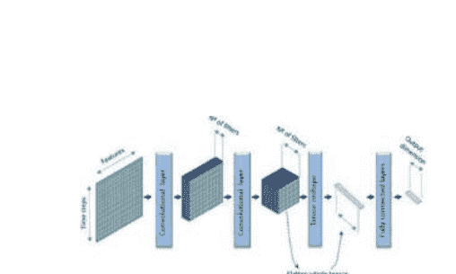

| 论文标题 | 未书写语言的语音技术 | 从语音中学习多模态情感识别的对齐 | 将广泛的语音信息纳入语音增强 | 关于COVID-19的音频、信号、语音和语言处理概述 |
| :--- | :--- | :--- | :--- | :--- |
| 作者 | Odette Scharenborg, Laurent Besacier, Alan Black, Mark Hasegawa-Johnson, Florian Metze, Graham Neubig, Sebastian Stuker, Pierre Godard, Markus Muller, Lucas Ondel, Shruti Palaskar, Philip Arthur, Francesco Ciannella, Mingxing Du, Elin Larsen, Danny Merkx, Rachid Riad, Liming Wang, Emmanuel Dupoux | Haiyang Xu, Hui Zhang, Kun Han, Yun Wang, Yiping Peng, Xiangang Li | Yen-Ju Lu, Chien-Feng Liao, Xugang Lu, Jeih-weih Hung, Yu Tsao | Gauri Deshpande, Bjorn W. Schuller |
| 方法 | 语音转文本转换3种语音翻译方法用于语音到图像，图像到语音 | 双向ASR系统 | 基于音素的语音到词LSTM双语言模型 | 语音到文本和情感检测CNN方法途径 |
| 数据集 | FlickRreal数据集 | IEMOCAP语音文件数据集 | TIMIT数据集 | 自采集的语音信号特征 |
| 大小 | 6000张图像，30,000个语音文件 | 无 | 3696个语音发音 | 无 |
| 准确性 | BLEU得分7.1% | PER得分14.7% WA-70.4 UA-69.5 | LSTM得分78%，BPG得分0.824 | 准确率0.69% |
| 年份 | 2020 | 2020 | 2020 | 2020 |

| 论文标题 | 第五届“CHIME”语音分离和识别挑战：数据集、任务和基准 | 对话：深度视听语音增强 | 音素特定语音分离 |
| :--- | :--- | :--- | :--- |
| 作者 | Jon Barker, Shinji Watanabe, Emmanuel Vincent和Jan Trmal | Triantafyllos Afouras, Joon Son Chung, Andrew Zisserman | Zhong-Qiu Wang, Yan Zhao和DeLiang Wang |
| 方法 | 基于CNN编码器-解码器的LSTM网络 | 基于CNN的网络上SNR比率测量PESQ的损失函数估计 | ASR系统中DNN网络模型中的NMF方法 |
| 数据集 | 语音信号的自采集特征 | 嘈杂音频语音的LRS2数据集 | 自采集的ASR数据集 |
| 大小 | 20万次发言 | 1000个句子和6000个不同的说话者 | 4026个语音文件 |
| 准确性 | 20万次发言 (LF-MMI TDNN) 81.3 端到端94.7 | WER得分为98.9%准确率，真实信号8.8% | WER中的ASR性能为13.46% |
| 年份 | 2020 | 2020 | 2020 |

### 3.4 LSTM

语言建模困难是由其语言音韵学，形态学和指代引起的。由于音频语音分析LSTM [40]将语音信号转换为顺序处理，模型可以通过标记将文本或单词或断句。LSTM提供了正则化，词嵌入[41]和优化的功能。递归神经网络在编码输入源并解码改革后的文本，然后产生具有BLEU分数的输出。编码输出的新顺序文本形成的度量通过分类交叉熵和adam优化器进行测量。顺序处理调节了模型设置参数计数矩阵加权位置。从热带角度来看，LSTM是通过3D形状矩阵高度调制的两种语言建模任务实现[42-44]。

### 3.5 注意机制

许多未写的语言翻译都涉及另一个注意力模型分析。这是另一个由研究人员丰富的结构化模型，其中上下文遵循多头机制，这些机制与自我注意力基础的多头传输双向链接。根据这个变压器模型，开发了用于编码信号和输出解码信号的前馈网络，用于单词或字符序列或摘要表示。此外，注意机制还负责位置编码，其中编码结构化的连续句子将其转换为单词。之后，在位置编码中将单词计数的信号传输术语作为头部，将这个头部的单词与彼此连接并解码为顺序输出。NMT需要通过绘制n元键来估计BLEU分数的输出。n元键使用BLEU分数[45-52]计算最终的输出序列。

### 3.6 发现和限制

从某种意义上说，基于神经网络的非书面语言的评论具有定义语音、形态和输入与输出之间的话语高相似性的许多发现。CNN神经网络、RNN、LSTM和注意机制推动了快速进展。衡量这些模型效率的发现也为下一步的相关研究提供了启示，这些模型可以为提高可理解性和质量做出重要贡献。这些模型可以处理嘈杂的条件，从而产生无噪声的输出信号。另一项研究还解释了LSTM网络对于语音捕捉的音素模块非常好。SNR将音频数据输入后，准备好进行解析和词形还原的新数据。具有一定有效性的声学模型解决了语料库的开发问题。自然语言处理处理不同语言，并提供多模态转换。在表1中，对CNN模型的评价具有更高的准确性。所有流行的数据集和一些自采集的数据集都具有非常高的准确性。根据这个评价，派生的数据集的数量和一个健康的数据集将根据模型产生影响，还取决于数据集本身的波形高低频率计算。

本文的技术贡献是识别出不同类型的统计分析，另一方面对语音最近的工作进行了探索性分析。

## 4 结果的影响

据我们所知，数据集在输入源声音良好且无噪声时起到了重要作用。通过这个观察，wav信号能够被解释为很多错误，并且一切都会因此而被破坏。因此，所有这些都会误导多模态语言转换过程，从而影响顺序学习。为了解决这个限制，研究制作了一张表，其中包括了WER分析的兼容性、SNR技术制作无噪声波形、BPC技术在发音位置和方式上的应用。

此外，更大的数据集还需要有效的准确率和损失函数计算速率，以满足计算错误的功能需求。

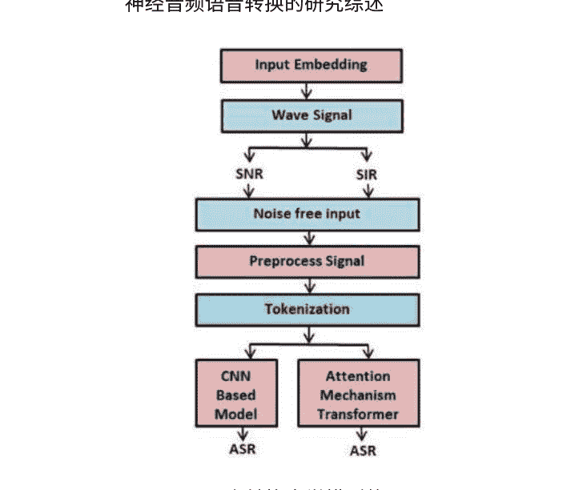

## 5 结论

本文回顾了自动语音识别基准中声音信号的模型灵活性。根据数据集的研究，根据语言语料库和数据量的几个方面，在未写语言中拥有庞大的领域是有意义的。总结研究摘要后，我们得到了两个已知的模型，即CNN和注意机制。

这两个模型通过非常低的损失函数率解释了ASR技术的可能性，从而在所有数据集中都非常有效。因此，音频语音是通过麦克风和录音机收集的，在去除噪音机器翻译输出之后，估计出顺序输出。这种翻译开发了一种多模式语言转换。与未写语言相关的许多语言领域都没有涉及计算转换多模式语言。各种次大陆语言或国家语言已经创建了最近的研究领域。就小规模研究而言，也开始在未写语言之间进行顺序分析。由于这种进展，需要增加数据集的数量，并找出语料库的缺失，并重新填补语料库的缺失，这肯定可以达到一个巨大的综合模块。

确认。DIU NLP与机器学习研究实验室为我们的研究提供支持。我们感谢他们一起提供支持、设施和指导。

## 参考文献

1. Jones, K.S.：自然语言处理：历史回顾，第9-10卷 (1994年)

2. Li, J., Deng, L., Gong, Y., Haeb-Umbach, R.：噪声鲁棒自动语音识别概述。IEEE/ACM Trans. Audio Speech Lang. Process. 22(4), 745–777 (2014年)

3. Erdogan, H., Hershey, J.R., Watanabe, S., Le Roux, J.：使用深度递归神经网络的相位敏感和识别增强语音分离。在：ICASSP 2015会议论文集 (2015年)

4. Weninger, F等：使用LSTM递归神经网络进行语音增强及其在噪声鲁棒ASR中的应用。在：LVA/ICA会议论文集 (2015年)

5. Accardi, A.J., Cox, R.V.：一种模块化的语音增强方法及其在语音编码中的应用。在：ICASSP 1999会议论文集

6. Jin, Y., Li, F., Yu, H.：BENTO: 基于CodaLab的构建临床NLP流水线的可视化平台 (2020)

7. Dai1, X., Karimi, S., Hachey, B., Paris, C.：一种有效的基于转换的模型用于不连续NER。rXiv:2004.13454v1 [cs.CL] (2020)

8. Wang, D.：深度学习改变了助听器. IEEE Spectrum 54(3), 32–37 (2017)

9. Lai, Y.-H., Chen, F., Wang, S.-S., Lu, X., Tsao, Y., Lee, C.-H.：一种深度去噪自编码器方法来提高人工耳蜗模拟中声音的可懂性. IEEE Trans. Biomed. Eng. 64(7), 1568–1578 (2016)

10. Wang, Y., Narayanan, A., Wang, D.：关于监督语音分离的训练目标. IEEE/ACM Trans. Audio Speech Lang. Process. 22(12), 1849–1858(2014)

11. Lu, X., Tsao, Y., Matsuda, S., Hori, C.：基于深度去噪自编码器的语音增强。在：Interspeech会议论文集 (2013)

12. Xu, Y., Du, J., Dai, L.-R., Lee, C.-H.：基于深度神经网络的语音增强的回归方法。IEEE/ACM Trans. Audio Speech Lang. Process.23(1), 7–19 (2014)

13. Kolbæk, M., Tan, Z.-H., Jensen, J.：基于通用和专用深度神经网络的语音增强系统的语音可懂性潜力。IEEE/ACMTrans. Audio Speech Lang. Process. 25(1), 153–167 (2016)

14. Tan, K., Zhang, X., Wang, D.：在近距离通话场景中使用高效卷积循环网络进行双麦克风移动电话的实时语音增强。在：ICASSP 2019会议论文集

15. 齐，J.，杜，J.，Siniscalchi, S.M.，李，C.：基于深度神经网络的向量到向量回归理论及其在语音增强中的表达能力的说明。IEEE/ACM Trans. Audio Speech Lang. Process. 27 (2019)

16. Scharenborg, O.，等：未书写语言的语音技术 (2020)

17. Berard, A., Pietquin, O., Servan, C., Besacier, L.：听和翻译：端到端语音到文本翻译的概念验证。在：NIPS Workshop on End-to-End Learning for Speech and Audio Processing (2016)

18. Weiss, R.J., Chorowski, J., Jaitly, N., Wu, Y., Chen, Z.：序列到序列模型可以直接转录外语。arXiv预印本arXiv:1703.08581, 2017

19. Besacier, L., Zhou, B., Gao, Y.：面向非书面语言的语音翻译。在：口语技术研讨会，第222-225页。IEEE (2006)

20. Duong, L., Anastasopoulos, A., Chiang, D., Bird14, S., Cohn, T.：无需转录的语音翻译的注意力模型。在：NAACL-HLT会议论文集，第949-959页 (2016年)

21. Fer, R., Matejka, P., Grezl, F., Plchot, O., Vesely, K., Cernocky, J.H: 多语言训练的瓶颈特征在口语识别中的应用。计算语音语言学。

22. Malfrere, F., Dutoit, T.: 用于语音分割的高质量语音合成。在：Euros speech会议论文集，第2631-2634页 (1997年)

23. Shen, J.等：

24. 吴。通过将Wavenet与Mel频谱图预测相结合进行自然TTS合成。在：ICASSP会议论文集 (2018年)

25. 陈, W., 贾特利, N., 勒, Q., 维尼亚尔斯, O.: 听, 关注和拼写。CoRR, abs/1508.01211 (2015年)

26. 徐, H., 张, H., 韩, K., 王, Y., 彭, Y., 李, X.: 学习语音的多模态情感识别对齐。arXiv:1909.05645v2 [cs.CL] (2020年)

27. 陆, Y.-J., 廖, C.-F., 陆, X., 洪, J., 曹, Y.: 将广泛的音标信息纳入语音增强。arXiv:2008.07618v1 [eess.AS] (2020年)

28. 德什潘德, G., 舒勒, B.W.: 关于COVID 19的音频, 信号, 语音和语言处理概述。arXiv:2005.08579v1 [cs.CY] (2020年)

29. Nirme, J., Sahlen, B., Ahlander, V.L., Brannstrom, J., Haake, M.: 带有真实和虚拟说话者的噪声中的视听语音理解。爱思唯尔语音通信杂志 116, 40-55 (2020)

30. Rasanen, O., et al.: 使用语言无关的语音音节划分在不同语言环境中从全天候以儿童为中心的录音中自动估计词数。爱思唯尔 113, 63-80 (2019)

31. Md. Uddin, Z., Nilsson, E.G.: 使用语音和神经结构化学习进行情感识别，以促进边缘智能 94, 103775 (2020)

32. Ceolini, E., et al.: 基于大脑信息的语音分离 (BISS) 以增强多说话者语音知觉中的目标说话者，223, 117282 (2020)

33. Srimadhur, N.S, Lalitha, S.: 使用语音的抑郁水平检测和评估的端到端模型，171, pp. 12-21 (2020)

34. Chung, J.S., Senior, A., Vinyals, O., Zisserman, A.: 在世界中阅读句子的唇语。在：CVPR (2017)的会议记录

35. Chung, J.S., Senior, A., Vinyals, O., Zisserman, A.: 在世界中阅读句子的唇语。在：BMVC (2017)的会议记录

36. “VoxCeleb2: 深度说话人识别”，arXiv预印本arXiv: 1001.2267 (2018)

37. Mowlaree, P.: 关于相位感知单通道空间增强的语音可懂度估计。在：ICASSP (2015)中

38. Chatfield, K., Simonyan, K., Vedaldi, A., Zisserman, A.: 恶魔的回归: 深入研究卷积网络。arXiv: 1405.3531v4 [cs.CV] (2014)

39. Krizhevsky, A., Sutskever, I., Hinton, G.E.: 使用深度卷积神经网络进行ImageNet分类。在：NIPS, pp. 1106-1114 (2012)

40. 杨, L., 宋, Q., 王, Z., 江, M.: 解析R-CNN用于实例级人类分析 (2019年)

41. Merity, S., Keskar, N.S., Socher, R.: 多尺度神经语言建模分析。arXiv:1803.08240v1 [cs.CL] (2018年)

42. Inan, H., Socher, R.: 绑定词向量和词分类器: 一种用于语言建模的损失框架。arXiv:1611.01462v3 [cs.LG] (2017年)

43. Sundermeyer, M., Schluter, R., Ney, H.: LSTM神经网络用于语言建模 (2012年)

44. Merity, S., Keskar, N.S., Socher, R.: 正则化和优化LSTM语言模型。arXiv:1708.02182v1 (2017年)

45. Hochreiter, S., Schmidhuber, J.: 长短期记忆. 神经计算 9(8), 1735-1780 (1997)

+ 46. Vaswani, A., et al.: Attention Is All You Need, pp. 5998–6008 (2017)
+ 47. Niehues, J., Cho, E.: 利用语言资源进行神经机器翻译的多任务学习. In: 机器翻译第二次会议论文集, pp. 80–89 (2017)
+ 48. Raganato, A., Tiedemann, J.: 基于Transformer的机器翻译中编码器表示的分析 (2018)
+ 49. Caglayan, O., Barrault, L., Bougares, F.: 神经机器翻译的多模态注意力. arXiv:1609.03976v1 [cs.CL] (2016)
+ 50. Zhou, Q., Zhang, Z., Wu, H.: IEST 2018上的自然语言处理: BiLSTM-attention和LSTM-attention通过软投票在情感分类中. In: 第9届计算方法研究主题、情感和社交媒体分析研讨会论文集, pp. 189–194 (2018)
+ 51. Han, K.J., Huang, J., Tang, Y., He, X., Zhou, B.: 多步长自注意力用于语音识别 (2019)
+ 52. McCann, B., Bradbury, J., Xiong, C., Socher, R.: 翻译中的学习: 上下文化词向量. In: 第31届神经信息处理系统会议(NIPS) (2017)

# 基于DCNN的荔枝树病害预测

Saiful Islam, Shornaly Akter, Mirajul Islam📧, 和 Md. Arifur Rahman
计算机科学与工程系, Daffodil International University,
Dhaka 1341, 孟加拉国
{shiful15-11700,shornaly15-11732,merajul15-9627,
arifur.cse}@diu.edu.bd

摘要. 树木疾病分类需要确定受影响的叶子，因为它控制着树木及其产品的经济重要性，并降低了它们的生态友好声誉。荔枝树受到一些疾病的影响，如叶枯、茎溃疡和叶斑。因此，对荔枝树进行分类是找到好的和受影响的叶子的关键。如果我们能够充分进行荔枝树分类，我们的经济增长将非常高。在本文中，我们尝试进行荔枝树疾病分类，以便为农民提供便利，因为他们无法在早期阶段正确区分好坏叶子。我们为训练架构创建了一个新的数据集。我们收集了约1400张带有三种预收获疾病“枯枯”、“叶斑”和“茎溃疡”的图像。总共有1400张图像，其中80%的数据用于训练，20%用于测试，该数据集包含新鲜和受影响的叶子和茎。对于荔枝树疾病分类，我们选择了预训练的CNN和基于迁移学习的方法来逐层分类2D图像。该方法可以高效地从疾病叶子和茎的图像中进行分类。它将从叶子和树木的图像中识别特定的预收获疾病。

关键词:荔枝树病·叶子·茎·MobileNet·NASNetMobile·InceptionV3·VGG16·CNN

## 1 引言

水果对我们的身体至关重要。它提供了许多健康益处。孟加拉国的热带水果是抗氧化维生素和抗氧化矿物质的重要来源。在孟加拉国可以找到的一种热带水果是荔枝。它是我们国家需求最高且口感最好的水果之一。它对健康有益，同时也提供营养价值。尽管价格有点高，但它是孟加拉国餐桌上最受追捧和必不可少的水果之一。每年五月至六月市场上通常都有供应。

荔枝树的疾病包括叶枯死、叶斑、茎癌、炭疽病、根腐病和红藻等。导致这些疾病的病原体，如细菌、病毒、真菌、寄生虫等，以及不利的环境和心理因素都是罪魁祸首。环境压力是大多数问题的根源。植物问题，直接或间接地。疾病的类型由叶子上的迹象和受影响的区域确定。过去，鉴定植物病害通常是由专业农民对植物进行持续检查来完成的。不幸的是，为了在大型农场上生产大量植物，需要大量的努力和金钱。因此，找到一种自动化、精确、快速且费用较低的植物病害鉴定系统至关重要。最常见和常用的技术是图像处理和机器学习。

根据孟加拉传统，这些月份被称为“Madhu Mash”。在这个Madhu Mash期间，有46%的水果被收获。尽管市场上有其他一些水果品种的丰富供应，但由于其特殊的口感、美味和惊人的颜色，未经保存的荔枝需求量很高。由于供应不足，荔枝的供应时间可悲地仅限于60天。每英亩荔枝的平均产量约为2.5吨，与其他国家相比相当低。庭院（两到三棵植物）或者房子旁边的小果园（15到20棵植物）是荔枝主要种植的地方。它在全国各地都有种植，但最重要的地方是Dinajpur、Khulna、Jessore、Rajshahi、Kushtia、Sylhet、Rangpur、Dhaka和Chittagong地区。孟加拉国是一个农业国家，这个领域在我们的国内生产总值中起着至关重要的作用。超过47%的人们的生计依赖于农业部门。水果部门是孟加拉国农业最大和多元化的经济领域。在满足我们的需求后，荔枝还可以通过与联合国粮食和农业组织（FAO）合作在几个国家出口，参与孟加拉国的减免。商业组装和荔枝业务以非常高的速度日益增长。国内生产总值的一个重要部分，约13%，来自农业。不能妥善管理我们的农业部门会给我们的经济带来意想不到的损失。因此，我们必须正确指导我们的农民，并保持友好的农业体系，以确保食品加工业的长期安全。如果我们能实现这一目标，我们的国内生产总值也将增长，我们可以为国内人民提供更多就业机会。我们展示了一种使用四个预训练的卷积神经网络（CNN）自动分类荔枝树病的技术。

本文的结构如下：第2节阐明了几种疾病分类方法的相关工作。第3节介绍了使用的方法和材料。第4节描述了实验分析，包括性能和结果。第5节讨论了文章的结论。

## 2 文献综述

在本节中，我们试图关联相关工作。简要介绍了过去关于植物疾病分类和预测的研究和方法:

Hossain等人[1]使用了一个框架，考虑了两个模型：一个是具有六层CNN的建议轻模型，另一个是经过微调的预训练深度学习模型，用于group-16视觉几何。他们使用了两个数据集：第一个包含清晰的水果照片，准确率为99.49%，而第二个包含水果年龄，准确率为96.75%。Dandavate等人[2]提出了一个使用卷积神经网络将四种水果分类为三个阶段的系统。在这项研究中，他们整理了一份本地水果图像的清单。在8个时期内，准确率为97.74%，验证清晰度为0.9833。Arya等人[3]使用了CNN和AlexNet架构来识别芒果和土豆的叶病。然后，将各种架构的性能指标进行了比较。AlexNet的准确率比CNN架构更高。Jayakumar等人[4]利用深度学习，能够在处理和分割叶面图像后对疾病进行分类和预测。预测和识别是通过图像采集、处理和分割来实现的。通过应用迁移学习技术，他们通过预测和分类叶病获得了更高的准确性，并与其他模型相比获得了计算精度。Lakshmanarao等人[5]预测了植物疾病。他们采用了从Kaggle收集的植物村数据集，并将真实数据集分为三个部分，用于三种不同的植物。他们使用了三种迁移学习技术，分别是VGG16、RESNET50和Inception，并分别获得了98.7%、98.6%和99%的准确率。与其他模型相比，他们提出的模型在准确性方面表现良好。

Qasrawi等人使用机器学习模型对番茄植物疾病进行聚类、预测和分类[6]。对于聚类，他们使用了图像嵌入和分层聚类算法。聚类模型的准确性为70%，而神经网络模型和逻辑回归模型的准确性分别为70.3%和68.9%。Beikmohammadi等人[7]提出了一种迁移学习技术来识别植物叶片，该技术首先使用预训练的深度卷积神经网络模型，然后进行输入数据表示。他们使用了两个常见的植物数据集来分类提出的方法。Flavia数据集有32个类别，Leaf snap数据集有184个类别，分别达到了99.6%和90.54%的准确性。Gosai等人[8]努力构建了一个模型，将收获的叶子分类为健康和不健康的类别，以更好地检测植物疾病。研究人员使用了54306张在受控条件下拍摄的不健康和健康植物叶片图像，训练了一个模型来识别不同的收获和26种疾病。Zhang等人构建了一个具有13层的卷积神经网络模型[9]。图像旋转、Gamma校正和噪声注入是数据增强的三种方法。他们的方法的整体准确率达到了94.94%，超过了五种最先进的技术方法。Altaheri等人建议在枣果采摘机器人中使用一种建设性的机器视觉框架[10]。他们通过微调和迁移学习利用了预训练的DCNN。Wang等人[11]建立了一个包含3743个样本分为成熟、缺陷和腐烂三组的数据集，并评估了自动检测荔枝表面缺陷的可行性。他们使用基于Transformer的生成对抗网络（GAN）作为数据增强的方法，以有效地丰富初始训练集中更多样本，以重新平衡三个类别，以克服这个问题。Haque等人[12]采用卷积神经网络构建了一个用于检测水稻病害的模型。他们的研究中使用了K-Means聚类，因为它可以通过限制每个图像中的颜色总数来处理照片。Mo等人[13]提供了一种针对荔枝树照片的鲁棒的基于UAV DOM的实例分割方法。为了缓解主要荔枝数据集缺乏多样性的问题，将柑橘数据添加到训练集中。模型获得了在利用荔枝-柑橘数据集进行训练的情况下，在测试集上获得了95.49%的最佳Mask AP50和96.25%的最佳Box AP50。

## 3 提出的方法论

方法论的角色是勤勉的，它严谨地遵循可接受的步骤和程序，以实现其目标。在我们的研究中，我们应用了预训练的卷积神经网络[14, 15]来识别新鲜和受损的叶子和茎。经典神经网络在图像识别方面非常困难。CNN用于简化复杂性和困难。通过使用CNN，我们能够识别输入图像中的模式，这对计算机视觉来说是困难的。CNN的主要优势在于它只需要少量的参数，从而实现更紧凑的模型和更快的结果。CNN中的层如下：卷积层，是CNN中的第一层。它在32个维度上工作，利用二维或三维的输入图像和权重。池化层：它保留了关键信息，通过降低每个卷积层特征中包含的信息总量来实现这一点。通常，激活层之后会跟着一个池化层，可以减少呈现的特征图数量。在大多数情况下，激活层之后会跟着一个池化层，它具有减少呈现的特征图数量的能力。除此之外，它还为每个图像分配一个标签。

### 3.1 数据集

数据是研究工作中的重要方面。考虑到我们的项目集中在检测新鲜和受影响的荔枝树叶和茎的主题上，我们采集了新鲜和受影响的荔枝树叶和茎。我们从花园和村庄的树上采集了叶子。整个数据集包含1400张图像，分为五类，包括1120张训练图像和280张测试图像，如表1所示。以下是图1中展示的5个类别的示例。

### 3.2 数据预处理

数据预处理是指在使用数据之前采取的步骤，以提高生成的信息的一致性。CNN模型的训练过程通过应用两种标准的预处理技术进行了优化。1）调整大小：该数据集包含具有不同分辨率和尺寸的图像。我们将每个图像的原始尺寸调整为224x224像素，以使所有输入图像的尺寸相同。2）归一化：我们使用ImageNet均值减法对像素的强度值进行重新缩放，作为图像归一化的预处理步骤。通过将强度范围[0, 1]的最小-最大归一化应用于所有图像的强度值，我们将所有图像的强度值标准化为标准正态分布。

 新鲜叶
 叶斑
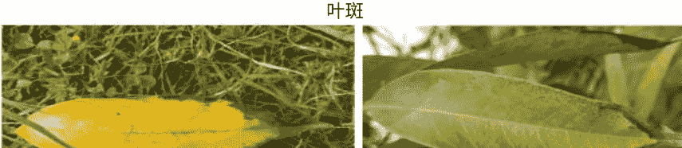 叶坏死
 茎溃疡
 新鲜茎溃疡

图1. 五个类别的样本图像

表1. 数据集描述.

| 类别 | 训练集（80%） | 测试集（20%） | 总图像数 |
|------|---------------|---------------|----------|
| 叶斑 | 160 | 40 | 200 |
| 叶坏死 | 240 | 60 | 300 |
| 新鲜叶 | 240 | 60 | 300 |
| 茎溃疡 | 240 | 60 | 300 |
| 新鲜茎溃疡 | 240 | 60 | 300 |

### 3.3 模型评估

其目的是根据即将到来的数据，确定模型对这些数据的泛化能力如何。我们使用了众所周知的评估指标，如召回率、精确率、准确率和F1分数，以评估本研究中所调查算法的预测性能（图2）。

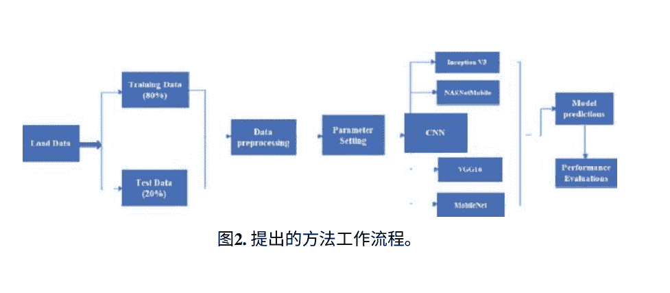
图2. 提出的方法工作流程。

### 3.4 InceptionV3

这是深度学习卷积神经架构序列的第三部分。InceptionV3是TensorFlow的一个类别，它使用了实际的ImageNet数据集进行训练，该数据集包含超过100万张训练图像。它最初在ImageNet大规模视觉识别挑战中亮相，最终名列第二。迁移学习使我们能够重新训练现有模型的最后一层，从而显著减少所需的训练时间和数据集的大小。InceptionV3模型是一种常用的迁移学习模型。该模型是使用来自一千个不同类别的一百万张照片在一些特殊的动态机器上进行训练的，如前所述。

### 3.5 VGG16

这是卷积神经网络的另一种形式。网络名称后面的数字代表了网络的架构层数。目标是构建一个非常通过堆叠层的深度卷积神经网络。一个能够很好地完成任务的网络。ImageNet 2014竞赛中，VGG16[18]团队赢得了一个奖项。观察分类向量输出后的五个类别进行评估。ReLU作为隐藏层的激活机制。

### 3.6 MobileNet

MobileNet [19] 模型使用深度可分离卷积，一种分解卷积的方式，将传统卷积分解为深度卷积和逐点卷积（共11个卷积）。Mobile Nets的深度卷积中，每个输入通道使用一个滤波器。然后使用11个卷积将结果混合在一起。深度卷积的卷积称为生产。现代卷积通过同时过滤和整合输入来产生一组新的输出。使用深度可分离卷积，将其分为两个层，一个用于过滤，一个用于混合。通过这种分解，计算时间和模型大小显著减少。

### 3.7 NASNetMobile

强化学习用于优化构成可扩展CNN架构的简单构建模块。卷积和池化是构成细胞的唯一两个操作，根据网络的期望能力，它们会重复多次。在这个版本的NASNetMobile [20]中，有12个细胞，530万个参数和5.64亿次乘累加（MACs）。

### 3.8 参数设置

所有卷积神经网络的训练参数为，学习率 η = e−5, β1 = 0.9, β2 = 0.999, ε = e−8，并且衰减率设置为1e−5，用于自适应矩估计（Adam）优化器。激活函数Softmax被使用，并设置了0.5的dropout率，以防止模型过拟合。所有模型在10个epochs的持续时间内进行训练，批量大小为32。

## 4 结果和讨论

所采用模型的一致性为四阶。在准确率、召回率、精确率和F1得分方面，InceptionV3优于其他三个模型（分别为88.21%、0.88、0.88和0.87）。VGG16以84.64%的准确率排名第二。表2显示了使用四个不同评估标准的混淆矩阵结果。

主对角线上的值表示所有被正确分类的实例。图3中每个混淆矩阵下方的行中指示了每个预测类别和错误分类的准确率。可以看出，最高的错误分类值为78，由NASNetMobile所占。而InceptionV3的错误分类值最低，为33（表3）。

表2. 四个CNN的分类报告.

| 算法 | 准确率 | 精确率 | 召回率 | F1得分 |
| :--- | :--- | :--- | :--- | :--- |
| InceptionV3 | 88.21% | 0.88 | 0.88 | 0.87 |
| VGG16 | 84.64% | 0.85 | 0.85 | 0.83 |
| MobileNet | 83.21% | 0.86 | 0.81 | 0.82 |
| NASNetMobile | 72.14% | 0.78 | 0.68 | 0.66 |

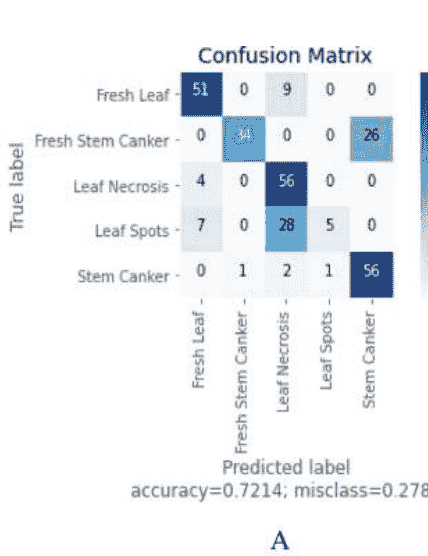
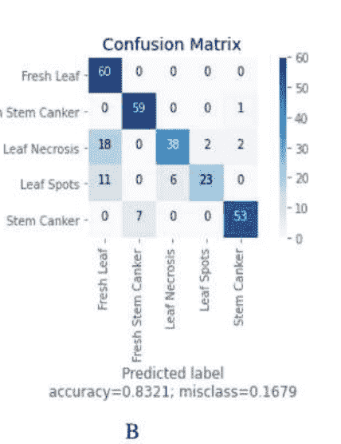
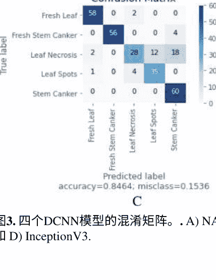
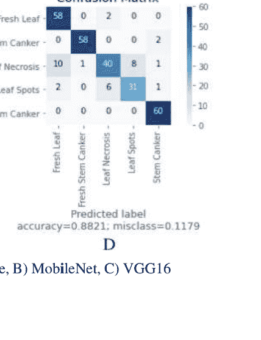
图3. 四个DCNN模型的混淆矩阵。 A) NASNetMobile, B) MobileNet, C) VGG16 和 D) InceptionV3.

表3. 研究比较.

| 论文 | 方法 | 最佳准确率 | 最差准确率 |
| --- | --- | --- | --- |
| Yamparala等人[21] | 基于卷积神经网络(CNN)的分类方法 | CNN提供了最高的准确率，达到90% | PNN提供了最低的准确率，为86% |
| Peng等人[22] | 特征提取网络模型 | 结果显示改进的YOLOv3 Litchi模型取得了更好的结果，平均精确度(mAP)得分为97.07% | YOLOv3_Tiny模型的mAP为94.48%，是最低的 |
| Wang等人[23] | YOLOv3-Litchi模型 | YOLOv3-Litchi的平均检测时间为29.44毫秒 | 测试结果显示，YOLOv3-Litchi的F1值高于Faster R-CNN算法0.05 |
| Miah等人[15] | 卷积神经网络 | InceptionV3模型的准确率最高，达到97.34% | NASNetMobile的准确率为75.29% |
| 我们的研究 | 卷积神经网络 | InceptionV3实现了最高的准确率，达到88.21% | NASNetMobile的准确率最低 |

根据所有这些指标，InceptionV3模型优于其他所有模型。该研究表明，在受影响的叶片和茎部图像诊断中，经过良好调整的深度学习算法在准确性方面表现更好，与自动生成特征的深度学习算法相比。

## 5 结论

在农业中，找到新鲜和受影响的叶子和茎之间的差异非常重要。为了对新鲜和受影响的叶子和茎进行分类，我们采用了四个CNN模型，包括VGG16、InceptionV3、MobileNet和NASNet-Mobile。在这项研究中，我们考虑了各种变化，包括超参数差异、批量大小、迭代次数、优化器和学习率。使用的模型结果表明它们可以区分新鲜和受影响的叶子和茎。

因此，方法论的帮助将自动化人脑的分类操作，减少在分类荔枝树的新鲜和受影响的叶子和茎时的人为错误。我们从InceptionV3模型中获得的最高准确率为88.21%。我们研究的一个限制是我们的数据集非常有限。准确性可能会有所不同。

如果图像中有很多噪音，减少会发生。这项研究工作的能力将在未来扩大，以包容更多的叶片图片进行分类，为每个果农提供利用该系统的机会。我们将在不久的将来添加更多的叶片图像，并专注于分类更多的类别。

## 参考文献

1. Hossain, M.S., Al-Hammadi, M., Muhammad, G.: 使用深度学习进行工业应用的自动水果分类。IEEE Trans. Industr. Inf. 15(2), 1027–1034 (2019)
2. Dandavate, R., Patodkar, V.: 基于CNN和数据增强的水果分类模型。在：2020年第四届I-SMAC国际会议（物联网在社交、移动、分析和云中的应用）（I-SMAC）（2020年）
3. Arya, S., Singh, R.: 比较研究CNN和Alexnet在土豆和芒果叶病检测中的应用。在：2019年智能计算技术问题与挑战国际会议（ICICT）（2019年）
4. Jayakumar, D., Elakkiya, A., Rajmohan, R., Ramkumar, M.O.: 基于堆叠RNN的深度学习模型自动预测和分类甜瓜疾病。在：2020年国际系统、计算、自动化和网络会议（ICSCAN）（2020年）
5. Lakshmanarao, A., Supriya, N., Arulmurugan, A.: 使用迁移学习技术进行植物病害预测。在：2022年第二届电气、计算、通信和可持续技术国际会议（ICAECT）（2022年）
6. Qasrawi, R., Amro, M., Zaghal, R., Sawaftah, M., Polo, S.V.: 番茄植物病害聚类、预测和分类的机器学习技术。在：2021年有前途的电子技术国际会议（ICPET）（2021年）
7. Beikmohammadi, A., Faez, K.: 使用深度迁移学习进行植物识别的叶片分类。在：2018年第四届伊朗信号处理和智能系统会议（ICSPIS）（2018年）
8. Gosai, D., Kaka, B., Garg, D., Patel, R., Ganatra, A.: 使用机器学习算法进行植物病害检测和分类。在：2022年技术进步国际会议（ICONAT）（2022年）
9. 张, Y.-D.等：基于13层深度卷积神经网络和数据增强的基于图像的水果分类。多媒体工具应用 78(3), 3613-3632 (2017)。https://doi.org/10.1007/s11042-017-5243-3
10. Altaieri, H., Alsulaiman, M., Muhammad, G.: 基于深度学习的自然环境中的日期水果分类用于机器人采摘。IEEE Access 7, 117115-117133 (2019)
11. 王, C., 肖, Z.: 基于深度卷积神经网络和GAN数据增强的荔枝表面缺陷检测。农学 11(8), 1500 (2021)
12. Haque, M., Alim, M., Alam, M.: 利用图像处理进行荔枝叶病识别(2021)
13. Mo, J., 等：基于深度学习的无人机获取的荔枝冠层实例分割方法 (2021)
14. Islam, M., Ani, J.F., Rahman, A., Zaman, Z.: 使用机器视觉进行假希尔萨鱼检测。在：国际计算智能进展联合会议论文集, pp. 167–178。Springer, 新加坡, (2021)
15. Miah, M.S., Tasnuva, T., Islam, M., Keya, M., Rahman, M.R., Hossain, S.A.: 使用不同的卷积神经网络识别新鲜和烂水果的先进方法。在：2021年第12届计算通信和网络技术国际会议（ICCCNT）, pp. 1–7。IEEE, 2021年7月
16. Islam, M., Ria, N.J., Ani, J.F., Masum, A.K., Abujar, S., Hossain, S.A.： 基于深度学习的本地菠菜识别系统。 网络与系统讲义，pp. 1–14 (2022)
17. 夏, X., 徐, C., 南, B.: Inception-v3用于花卉分类。 在：2017年第二届国际图像、视觉和计算会议（ICIVC），第783-787页。IEEE，2017年6月
18. Swasono, D.I., Tjandrasa, H., Fathicah, C.: 使用VGG16进行烟草叶害分类。 在：2019年第12届信息与通信技术与系统国际会议（ICTS），第176-181页。IEEE，2019年7月
19. 毕, C., 王, J., 段, Y., 付, B., 康, J.R., 石, Y.: 基于MobileNet的苹果叶病识别。 移动网络和应用，1-9页（2020年）
20. Adedoja, A.O., Owolawi, P.A., Mapayi, T., Tu, C.: 使用NASNet-mobile深度学习的智能移动植物病害诊断系统。IAENG Int. J. Comput. Sci. 49(1) (2022年)
21. Yamparala, R., Challa, R., Kantharao, V., Krishna, P.S.R.: 基于卷积神经网络的水果计算机化分类。 在：2020年第7届智能结构与系统国际会议（ICSSS），2020年，第1-4页（2020年）。 https://doi.org/10.1109/ICSSS49621.2020.9202305
22. 彭, H.等： 改进的YOLOv3模型在田间的荔枝检测。国际农业生物工程杂志 15(2), 211-220 (2022)
23. 王, H.等： YOLOv3-荔枝检测方法在大视野场景中密集分布的荔枝中。 工程数学问题 (2021)

# MEVSS: 基于模数加密的视觉秘密共享方案，用于保护视觉内容

Parul Saini(), Krishan Kumar, Shamal Kashid和Alok Negi

计算机科学与工程，国立工艺技术学院，北阿坎德邦，印度

{parulsaini.phd2020,kashid.shamalphd2021,aloknegi.phd2020}@nituk.ac.in, k2b@ieee.org

摘要。近年来，在不安全的网络上，图像通信的数字世界发展迅速。许多领域，包括军事、医疗、政府和教育，需要通过图像传输敏感数据。因此，随着技术的进步，它引发了保密性的主要关注。传统方法，如高级加密标准（AES）和数据加密标准（DES），已广泛用于图像安全。

然而，关键管理是保护图像数据的主要关注点。本研究使用视觉秘密共享方案（VSS）或视觉密码学（VC）来处理上述问题。提出了基于模数加密的视觉秘密共享方案（MEVSS），用于加密在n个用户之间共享的秘密图像。通过异或运算恢复秘密图像，然后进行模数解密，无损恢复。实验结果表明，所提出的技术在统一平均变化强度（UACI）和像素变化率（NPCR）方面优于现有技术二叉树秘密共享方案和基于RSA的VSS，而在像素信号噪声比（PSNR）方面，所提出的模型优于现有技术。此外，与传统技术相比，它更快，因为它直接处理彩色图像，而无需将其转换为二进制或灰度形式。

关键词：图像·视觉秘密共享方案·密码学·加密·安全

## 1 引言

在过去的十年中，访问多媒体内容（如音频、视频、文本和图形）的Web应用程序已经显著扩展。设计快速而强大的安全系统来处理高带宽信息（如图像或视频），这可能会遇到丢失或格式转换，是具有挑战性的。图像信息安全是信息安全中的关键评估课程。神秘图像被在线上用于政治、社会、军事、企业和其他目的。因此，图像加密的主要目标是信息保密性、可信度、验证性和不可否认性。因此，图像经常用于传输信息；它们必须受到保护，并且在传输后还应具有对知识产权内容的控制能力。

在数字时代，用于发送和存储数字图像的数字技术已经增加，并成为保持图像机密性和可靠性的挑战。数字服务需要安全的数字图像存储和传输。由于数字世界中互联网的使用不断增加，尤其是在大流行期间[1,2]，保护数字图像变得至关重要并引起了很多关注。非对称加密系统使用一对公钥和私钥，例如DES、AES和其他传统方法。这些传统技术的根本问题是密钥管理，可能导致密钥存储、分发和传输问题，降低机密性和可靠性[1,3]。VC或(K, N) VSS方案是一种将秘密图像分割成多个份额的加密方法。然后将这些份额分发给相应的参与方。所有成员必须将他们的份额堆叠在接收方以获取秘密图像。与传统算法相比，VC或VSS技术具有以下优势[3,4]。

- 没有必要处理密钥。
- 没有复杂的算法需要恢复秘密图像。只需将多个份额堆叠在一起即可恢复图像。
- 攻击者无法在没有获取所有份额的情况下单独恢复秘密。
- 生成的份额具有类似噪声的外观，不会透露有关秘密图像的任何信息。

由于其独特的属性，VSS具有各种用途，包括保护在线交易、数字水印、身份验证、数字照片的版权保护、隐写术、电子货币银行应用等等[5]。因此，作者受到VSS技术的启发，采用VSS技术来保护图像数据。提出的（n，n）MEVSS方法直接使用模加密技术对秘密彩色图像进行加密，而不是最初将其转换为二进制或灰度形式。通过XOR运算生成n个无意义份额的加密秘密图像，并分散在n个参与者之间，每个参与者在不知道其他参与者的情况下接收一个份额。在传统技术中，所有来自n个参与者的份额都被堆叠在一起以揭示VSS中的秘密图像。提出的MEVSS方法生成了一个加密变体，而不是揭示秘密图像。应用解密过程后，秘密图像被揭示。恢复的秘密图像是无损的。本研究的主要贡献如下。

- 所提出的技术灵活适用于任意数量的参与者，其中参与者的最小值为两个。
- 所提出的MEVSS算法在彩色图像上采用模数加密，而无需将其转换为二进制或灰度等其他形式。因此，所提出的技术似乎比传统技术更快。
- 所提出的MEVSS在图像中使用模数和异或操作进行像素的加密和扩散。因此，与支持像素扩展的其他VSS方案相比，其复杂度较低。
- 新颖的MEVSS方法揭示了加密图像而不是秘密图像。进一步地，在应用解密过程之后才揭示秘密图像。恢复的秘密图像是无损的。
- 所提出的技术在UACI和NPCR方面优于现有的技术二叉树-基于秘密共享方案[3]和基于RSA (Rivest-Shamir-Adleman) 的VSS [6]。在PSNR方面，所提出的模型优于现有技术，除了基于RSA的VSS [6]。

本文的其余部分按照第2节讨论了视觉秘密共享方案方法的文献综述。MEVSS提出的模型在第3节中给出了每个步骤的详细描述。第4节介绍了本研究实验中使用的性能分析的细节。第5节讨论了所提出方案的结果和性能。本文在第6节中总结，并展望未来的工作。

## 2 相关工作

Moni Naor和Adi Shamir在1995年的Eurocrypt会议上介绍了视觉密码学。它可以解码秘密图像，而无需进行加密计算，而且应用起来安全简单。它是k个中的n个秘密共享问题的视觉版本，其中经销商给每个用户提供透明度。其中任意k个用户可以通过叠加他们的透明度来看到图像，但是任意k-1个用户对此一无所知[7]。提出了一个使用完全二叉树结构和布尔异或的秘密共享系统[3]，允许发送者将秘密分成2^h份，其中h是树的高度。

如果攻击者知道发送者产生了多少份份额，中间人攻击是可行的。攻击者将无法解密少于2^h份额的秘密。这种安全的方法需要最少的时间来共享和恢复秘密。

基于像素向量化的异或（n， n）VCS XOR技术[8]提出了实现目标的方法。开发了三种算法：构建矩阵创建、构建矩阵分割为基础矩阵，以及（n， n）VCS XOR可视秘密共享方法。该技术还解决了像素扩展、参与者限制和秘密图像的有损检索问题。提出了两种视觉密码学算法[9]，可以完全恢复秘密彩色图像。（n， n）两种方案代表了创建n-1个无意义份额和生成有意义和无意义份额的阈值方案。具有n-1个有意义份额的彩色快速响应（QR）码可以由通用解码器解码，而不是标准解码器。

提出了一种图像加密混沌扩散方法[10]，其中图像像素首先被重新排列，产生一个打乱的图像，然后通过与秘密密钥进行异或运算来扩散。该密钥是通过组合许多不同的混沌映射创建的。此外，还有视觉秘密共享（VSS）方案[6]提出了每个RGB像素分别共享的方法，并且RSA算法对生成的多个秘密图像共享进行加密和解密。在密钥生成的加密过程中，还采用了乘法技术，用于生成公钥和私钥。结果更加安全，同时共享秘密图像是有损的。

提出了一种基于小程序代码的（n，n）VSS方法[11]，以实现基于V-36小程序代码的阈值方案。它实现了小程序的多重访问控制，并通过对所有共享进行异或运算来获取秘密小程序代码。此外，重建的小程序代码可以成功解码为与秘密代码相同的应用程序。提出了一种新颖的抗作弊视觉密码方案[12]，称为CIVCS，它不需要像素扩展，其中认证模式是三个相邻且不相交的实心黑色环。它使用基于随机网格的视觉密码方案（RG-based VCS）生成n个原始共享，并在实际共享上标记认证模式以获得验证共享。认证模式在认证阶段通过以各种方式堆叠任意两个可验证共享来暴露，包括将其中一个共享逆时针旋转90、180或270°C。从上述文献中，作者决定采用VSS方案，并在第3节中详细介绍了提出的技术。

## 3 提出的算法

在这项工作中，使用VC或VSS密码学[1]来保护图像。在视觉密码学中，将秘密输入图像分成两个噪声图像，称为份额。在解码过程中，通过叠加或堆叠份额来恢复原始秘密图像。我们使用了Naor和Shamir的扩展思想来共享n个秘密中的k个秘密（(k, n)方案），其中n是份额的总数，k是恢复秘密所需的最小份额数。图1显示了(k, n) VC方案的一般表示形式[1,13,14]。

- 秘密共享的(k, n)方案如下所示：
1. 给定一个秘密'S'。
2. 将'S'分配给n个参与方，分别为S1，S2，........，Sn。
   满足以下属性：
3. 大于或等于(k)个参与方可以恢复'S'。
4. 少于（k）个参与方对'S'没有任何信息。
5. 如果k = n，则需要重构原始秘密S的每一部分秘密

MEVSS遵循（n，n）的VSS方案，其中n是总共的份额数而n（在这种情况下，k = n）是检索秘密所需的最小份额数。MEVSS对任意数量的参与者都是灵活的，而n是根据问题的需要决定的。在MEVSS中，实验使用n等于2和4的值进行这意味着在MEVSS中生成的份额数量为2和4。在这项工作中，模加密方案被应用于在生成份额之前对图像进行模加密以增加秘密图像的安全性。

所提出的MEVSS方案的总体架构如图2所示。所提出的MEVSS方案遵循以下步骤：

**第一步：输入。** 所提出算法的输入是一幅图像，其中图像可能是军事、媒体、医疗等领域的应用中的一个秘密，秘密图像的安全性是首要关注的问题。 所提出的算法以512 × 512的“Lena”彩色图像[1]作为输入。

**第二步：模运算加密。** 在这一步中，为加密和解密过程生成一个随机值(RandomVal)。该值用于对所有三个平面上的每个图像像素进行模运算。加密技术的主要目标是尽可能地打乱图像，但必须可逆，以便在解密过程中执行反向过程以产生原始图像。在这一步中，使用模运算方法对秘密图像进行加密，得到加密的秘密图像(EI)。

### 步骤3：生成份额。

图像被分割成阴影，因为VSS的主要目标是生成无意义的份额，所以它不反映任何信息。在这一步中，(2,2) MEVSS和(4,4) MEVSS使用从第2步生成的加密图像通过执行XOR操作来生成份额。在加密过程之后生成份额，以增加秘密图像的安全性。

### 第四步：堆叠份额。

在份额重建过程中，多个份额被堆叠在一起以获得原始图像。但在这种情况下，当所有n个份额在前一步生成的时候被n个参与方收集并堆叠在一起时，只能重建出秘密图像的加密图像，而不是原始图像。因此，秘密图像尚未恢复。

### 第五步：模数解密。

解密是一种转换过程将加密数据还原为其原始形式。在这一步中，使用RandomVal进行解密过程，执行步骤2的反向过程作为解密过程。在所有三个平面上，使用模数解密方法对图像EI的每个像素进行解密，解密之前在上一步生成的EI。

### 第6步：输出。

在第5步中应用解密过程后，MEVSS获得秘密图像[I]。在这一步中，使用提出的MEVSS算法重新生成无损秘密图像。

在MEVSS中应用以下两个算法进行图像加密和分享生成，以及图像检索和图像解密：算法1描述了图像加密和分享生成的步骤。它以秘密图像I作为输入，并以生成的分享数量n作为输入。

### 算法1. 提出的MEVSS图像加密和分享生成算法

```
输入: 秘密图像I
输出: n个分享 (n=2)
1. I[] ← 图像[行, 列, 深度]
2. 输入图像的模数加密
   对于每个[行, 列, 深度]
   (a) 随机值[行, 列, 深度] = 在范围(0,255)内的随机数
   (b) 加密图像(EI) = (图像 + 加密)模256
3. 生成共享
   (a) 生成随机 EI_1[] (共享1), 大小为I[]
   (b) 构造 EI_2[] (共享2) = EI_1[] ^ EI[]
```

在生成共享之前，图像I的每个像素都使用模加密进行加密，其中每个像素都使用生成的不同随机数的密钥进行加密。然后使用加密图像构造n个共享，通过执行XOR操作来完成。

算法2描述了通过执行解密过程来检索原始图像的步骤。它接收n个共享并返回XOR操作以检索加密图像。然后通过反向模解密将原始图像恢复为秘密图像。

### 算法2. 提出的MEVSS图像检索和图像解密算法

输入：n份份额（n=2）

输出：原始秘密图像

1. 堆叠份额
   加密的异或输出图像（EoutI）[] = EI₁[]（份额1） ^ EI₂[]（份额2）

2. 图像解密
   原始图像[] = mod ((EoutI[] - 随机值[] +255), 256)

## 4. 性能分析

使用差分和统计分析来分析所提出的MEVSS的性能。

差分分析检查在进行轻微修改时原始和加密秘密之间的关系。统计攻击是利用给定算法中的统计错误进行的攻击。进行统计分析以检查此类攻击。评估技术的描述如下：

在差分分析中，使用统一平均变化强度（UACI）和像素变化率（NPCR）来检查差分攻击，以确定原始和修改后的照片之间的关系[15]。

统一平均变化强度（UACI）计算加密图像与相关明文图像之间的平均差异强度，差异为一个像素。数学上定义如公式（1）所示。

```
$UACI = \frac{\sum_{l,m} B(l, m) - B'(l, m)}{255 \times W_i \times H_i} \times 100$
```

其中B(l, m)表示加密图像，B’(l, m)表示修改后的图像，图像的宽度和高度分别由W_i和H_i表示。

像素变化率（NPCR）比较原始图像和加密图像的像素值。结果以百分比返回。如果值大于99%，则分析结果为正面[15]。数学上定义如公式（2）所示。

NPCR = \frac{\sum_{l,m} B(l,m)}{W_i \times H_i} \times 100 \tag{2}

其中

B(l,m) = \begin{cases} 
  \text{如果 } B(l,m) = B'(l,m) \text{ 则为0} \\
  \text{如果 } B(l,m) \neq B'(l,m) \text{ 则为1}
\end{cases}

原始图像和修改后图像的相关像素之间的差异用B(l,m)表示。在NPCR上，范围是[0,100]。在加密文件中，NPCR的比率必须接近100。在加密过程中，必须最大化UACI和NPCR水平。

在统计分析中，使用统计分析方法对加密方法进行解密。相关分析（CA）研究图像的相邻像素，峰值信噪比（PSNR）用于估计图像的质量，以确认加密方法对统计分析的鲁棒性。

相关系数（$CC$）用于检测原始图像和加密图像之间相关像素的相似性[15]。值的范围是-1.0到1.0。如果计算出的数字大于该范围，则相关测量存在错误。样本$i$和$j$之间的相关系数$CC$，包含$n$个值，数学上定义如公式（3）所示。

CC(i,j) = \frac{\sum_{x=1}^{n} (i_x - \bar{i})(j_x - \bar{j})}{\sqrt{\sum_{x=1}^{n} (i_x - \bar{i})^2} \sqrt{\sum_{x=1}^{n} (j_x - \bar{j})^2}} \tag{3}

其中

\bar{i} = \frac{1}{n} \sum_{x=1}^{n} i_x

峰值信噪比（$PSNR$）以分贝为单位，是信号强度和信号中的噪声之比。这里的信号指的是图像。它被用作图像质量的度量。$PSNR$越高，图像质量越高。它取决于所选图像的均方误差（$MSE$）。当两个图像之间的差异较小时，$PSNR$较高，图像质量也较高[15]，数学上定义如公式（4）所示。

PSNR = 10 Log_{10} \frac{R^2}{MSE} \tag{4}

其中

MSE = \frac{\sum_{M,N} [I_1(m, n) - I_2(M, N)]^2}{M \times N}

MSE是均方误差，M，N是图像矩阵$I_1$和$I_2$的大小，R是8位图像的最大像素值，为255。

## 5 结果与讨论

在实验中，将秘密图像作为512×512维度的“Lena”图像（RGB）进行考虑。对于一定数量的份额（n），实验考虑了两个n值（n=2和n=4）。MEVSS与秘密图像“Lena”及其份额如图3所示。

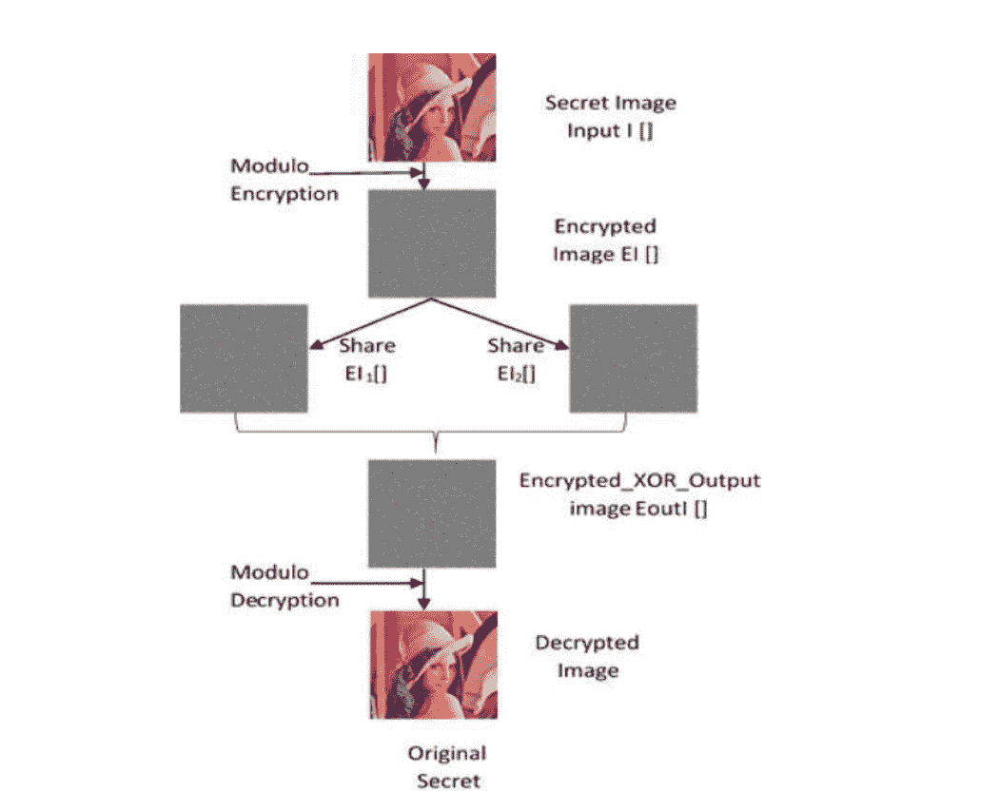

图3显示输入图像是秘密图像，如I[]所示。根据算法，使用模运算对每个输入图像像素进行加密，结果是加密的秘密图像EI[]。然后使用异或运算应用VSS，创建n个份额（份额EI1[]，EI2[]，...，EIn[]）分发给n个参与方。在实验中，取份额数n=2。然后，为了恢复秘密，n个参与方需要将所有n个份额堆叠在一起。但这将给他们加密的秘密（EoutI[]），而不是原始秘密。因此，为了恢复原始秘密I[]，需要使用模解密操作对加密的秘密图像进行解密。应用解密后，无损秘密图像作为输出图像返回。

表1显示了不同图像对及其PSNR值的结果。表2显示了输入图像与份额之间的相关系数，以及加密图像与其份额之间的相关系数。表3和表4显示了份额之间使用UACI和NPCR值进行的差分分析。它的值以百分比表示。表5显示了提出的MEVSS算法与基于二叉树的秘密共享方案[3]和基于RSA的VSS[6]的比较结果，最佳结果以粗体显示。

### 表1.具有PSNR值的结果

| 图像 | PSNR (dB) (n=2) | PSNR (dB) (n=4) |
| --- | --- | --- |
| (输入，份额1) | 27.8952 | 27.9011 |
| (输入，份额2) | 27.8960 | 27.8940 |
| (输入，份额3) | - | 27.8955 |
| (输入，份额4) | - | 27.8937 |
| (输入，加密) | 08.6184 | 08.6113 |
| (加密，份额1) | 07.7340 | 07.7436 |
| (加密，份额2) | 07.7560 | 07.7353 |
| (加密，份额3) | - | 07.3630 |
| (加密，份额4) | - | 07.4260 |
| (加密，加密异或输出) | 100.000 | 100.000 |
| (输入，恢复解密输出) | 100.000 | 100.000 |

### 表2.具有相关系数值的结果

| 图像 | 相关性 (n=2) | 相关性 (n=4) |
| --- | --- | --- |
| (输入，份额1) | -0.000151 | -0.000250 |
| (输入，份额2) | 0.000160 | -0.000016 |
| (输入，份额3) | - | 0.000005 |
| (输入，份额4) | - | -0.000016 |
| (加密，份额1) | 0.000115 | -0.000230 |
| (加密，份额2) | 0.000118 | -0.000070 |
| (加密，份额3) | - | 0.000140 |
| (加密，份额4) | - | -0.000020 |
| (共享1，共享2) | 0.000117 | 0.000380 |
| (共享1，共享3) | - | 0.000018 |
| (共享1，共享4) | - | -0.000210 |
| (共享2，共享3) | - | 0.000019 |
| (共享2，共享4) | - | -0.000220 |
| (共享3，共享4) | - | -0.000219 |

### 表3.使用UACI和NPCR值进行份额之间的差分分析 (n=2)

| 份额 | UACI | NPCR |
|------|------|------|
| (共享1，共享2) | 33.5498 | 99.60428 |

### 表4.使用UACI和NPCR值进行份额之间的差分分析 (n=4)

| 份额 | UACI | NPCR |
|------|------|------|
| (共享1，共享2) | 33.4113 | 99.6058 |
| (共享1，共享3) | 33.4630 | 99.5998 |
| (共享1，共享4) | 33.4670 | 99.5980 |
| (共享2，共享3) | 33.3960 | 99.6983 |
| (共享2，共享4) | 33.4889 | 99.6056 |
| (共享3，共享4) | 33.4222 | 99.6167 |

### 表5.提出的MEVSS、基于二叉树的秘密共享方案[3]和基于RSA的VSS[6]之间的比较

| 性能指标 | 基于二叉树的秘密共享方案 [3] | 基于RSA的VSS [6] | 提出的MEVSS |
|----------|-----------------------------|------------------|-------------|
| 峰值信噪比 (PSNR) (分贝) | 51.1725 | 156.32 | 100.00 |
| 相关系数 | 0.000825 | - | -0.000073 |
| UACI | 25.006 | 13.88 | 33.4469 |
| NPCR | 50.030 | 69.44 | 99.604 |

从表1、2、3、4和5中得出以下观察结果。

- 从表1可以明显看出，输入图像和共享图像的PSNR值很低，表明图像和其共享之间存在差异。输入图像和加密图像的PSNR值也非常低，显示它们之间的巨大差异。秘密输入和恢复图像的PSNR值为100，显示了提出的MEVSS中的无损秘密恢复。
- 从表3和4可以观察到，UACI的值约为33%，NPCR的值超过99%，这表明提出的技术非常适合作为优秀的加密技术。
- 表5显示，所提出的技术在UACI和NPCR方面优于现有技术二叉树基础的秘密共享方案[3]和基于RSA的VSS[6]。而所提出的模型在PSNR方面优于现有技术，除了基于RSA的VSS[6]。

## 6 结论

所提出的工作基于模数加密方案。通过对n个共享进行异或运算，然后进行模数解密，可以无损恢复秘密图像。性能度量分析秘密图像与加密图像、秘密图像与共享图像、秘密图像与恢复图像之间的差异和相似性。实验结果表明，所提出的MEVSS算法在秘密图像上取得了有效的结果，支持所提出算法的可行性。所提出的技术优于现有技术。所提出的算法还可以应用于多个秘密图像，并且可以使用隐写术生成有意义的共享。

确认。作者们要感谢DST GoI在DST/ICPS/General/2018下对这项工作的赞助。

## 参考文献

1. Sajitha等人：各种图像加密方案综述。 Materials Today: Proceedings (2022)
2. Devade等人：用于提高图像安全性的图像加密技术。环境通信和计算机系统，页码671-682 (2018)
3. Deshmukh， M.， Nain， N. ， Ahmed， M.：基于二叉树和布尔运算的秘密共享方案。知识信息系统 60 (3) ， 1377-1396 (2019)
4. Mhala， N.C.， Pais， A.R.：一种用于水下图像的基于CNN的安全视觉秘密共享 (VSS) 方案。视觉计算 37 (8) ， 2097-2111 (2021)
5. Ibrahim， D.R.， Teh， J.S.， Abdullah， R.：视觉密码技术概述。多媒体工具应用 80(21) ， 31927-31952 (2021年)
6. Karolin， M.， Meyyappan， T.：使用公钥加密的视觉密码学的真实秘密共享创建技术。多媒体工具应用 80(21)， 32023-32040 (2021年)
7. Naor， M.， Shamir， A.：视觉密码学。 密码技术的理论和应用研讨会， Springer， Heidelberg (1994年)
8. Kannojia等人：基于XOR的像素向量化的视觉秘密共享方案。多媒体工具应用 80(10)， 14609-14635 (2021年)
9. Pan等人：用彩色QR码进行秘密彩色图像的视觉密码方案。 JVCIR 82， 103405 (2022年)
10. Elkandoz， M.T.， Alexan， W.：基于多个混沌映射的图像加密。多媒体工具应用， 1-22 (2022年)
11. Chen， J.，等：基于微信小程序代码的 (n， n) 阈值的视觉秘密共享方案。视觉通信图像表示， 103409 (2022年)
12. Zhao等：通过份额的旋转使用作弊免疫 (k， n) 视觉密码方案。多媒体工具应用， 1-23 (2022年)
13. Weir等：关于视觉密码的全面研究。数据隐藏和多媒体安全V上的交易，第70-105页。 Springer， 海德堡 (2010年)
14. Kashid等：一种用于提取文本数据的多级秘密共享方案的方法。 在：IEEE学生工程与系统会议，第1-5页 (2022年)
15. Mahendiran， N.， Deepa， C.：关于图像加密和压缩技术的全面分析，以及性能评估指标的评估。SN Comput. Sci. 2(1)， 1–12 (2021)

# 使用机器学习分析孟加拉语句子的转换

Rajesh Kumar Das, Samrina Sarkar Sammi, Khadijatul Kobra, Moshfiqur Rahman Ajmain(✉), Sharun Akter khushbu, and Sheak Rashed Haider Noori

达卡孟加拉国达福迪尔国际大学1341
{rajesh15-13032,samrina15-12532,khadijaatul15-12319,moshfiqur15-14090, sharun.cse}@diu.edu.bd, drnoori@daffodilvarsity.edu.bd

摘要。在许多语言中，已经开发出各种语言处理工具。. 孟加拉语自然语言处理的工作日益丰富。孟加拉语句子模式识别是一个引人注目的课题。

此外，我们的动机是致力于将这种模式识别概念应用于用户友好的应用程序中。因此，我们提出了一种方法，可以正确识别一个句子（sorol、jotil和jougik）。我们的模型接受孟加拉语句子作为输入，确定句子的构造类型，并输出句子类型。我们使用最流行和最知名的六种监督机器学习算法来分类三种句子形式：Sorol Bakko（简单句子）、Jotil Bakko（复杂句子）和Jougik Bakko（复合句子）。我们训练和测试了包含来自各种来源的2727个数据的数据集。我们分析了我们的数据集，并得到了准确率、精确度、召回率、F1分数和混淆矩阵。我们使用决策树分类器获得了最高的准确率，为93.72%。

关键词: 句子构成·孟加拉自然语言处理·监督机器学习·决策树分类器·Sorol Bakko·Jotil Bakko·Jougik Bakko

## 1 引言

孟加拉语是世界上发音最重的语言之一，在所有语言中排名第八。由于孟加拉语具有非常丰富的形态结构，因此实现每个词构造指南以准确标记出孟加拉语中所有词根的词干处理器非常困难。这很困难。孟加拉人以孟加拉语为母语，以印地语为第二语言。因此，孟加拉文本中的句子识别已成为现代时代的一个难题。关于句子分类的研究在英语中有很多，这与孟加拉语非常不同。全球约有2.61亿人说孟加拉语。在孟加拉语中，根据句子结构有三种类型的句子，分别是Sorol Bakko（简单句），Jotil Bakko（复杂句）和Jougik Bakko（复合句）。

Sorol Bakko只包含一个动词和一个或多个主语。在Jotil Bakko中，两个句子块或从句被连接在一起形成一个句子。一个从句是独立的，被称为主从句，另一个是一个从属从句，它是依赖的。Jougik Bakko或复合句是两个或多个sorol bakko或jotil bakko的组合。在本文中，我们将使用机器学习算法对sorol、jotil和jougik bakko进行分类。使用这个模型将确定一个句子是Sorol、Jotil还是Jougik句子。文本中包含了很多重要的信息，但是从大量的文本中手动提取这些信息变得非常困难。自然语言处理和机器学习使这个任务变得相当容易。它可以自动提取很多重要的信息，并且在更短的时间内以更低的成本完成工作。

通过构建能够自动从文本中工作并提取信息的系统，企业可以并且仍然能够极大地受益。使用自然语言处理对数据集的数据进行分析和分类，并在NLP中进行分类。除了二进制级别的分类外，多级分类是文本分类的两种不同类型。在本文中，我们将讨论多级文本分类，因为我们的数据集包含三种不同类型的文本。这些类型分别是Sorol bakko、Jotil bakko和Jougik bakko。准确的数据和数据量在构建和训练模型中起着重要作用。如果有大量数据，就容易理解模型的构成或结构，从而得到更准确的结果。因此，通过数据清洗过程收集无垃圾和适当的数据是必要的。我们使用了六种机器学习算法：随机森林、逻辑回归、决策树分类器、KNN、SVM和SGD。从模型中，我们得到了一个来自数据集的独特输出结果。

在这个分类中，我们将输入数据与训练数据进行比较。如果数据集和数据更准确，那么我们将获得更高的准确性，因此我们清理了数据集。在这个过程中，我们训练模型，然后将输入提供给模型来预测其标签。因此，它将比较输入与训练数据，并给出最接近的结果。我们将在本文中简要介绍这个。

## 2 文献综述

Shetu等人[1]开发了一种算法，可以确定句子是用sadhu basha还是chorito basha写的。这有助于识别Guruchandali Dosh，这是孟加拉语书面语中的典型语法错误。收集了两种类型的数据。其中之一是Sadhu数据，另一个是Cholito数据。他们从日报和流行的孟加拉语小说中收集了数据。

Bijoy等人[2]从不同的来源收集了数据，如孟加拉语博客、对话和故事等。为了获得结果，他们的工作流程是数据处理、使用Countervector进行标记化和数据清理。在处理数据进行喂养模型之后，他们使用各种分类技术来预测句子并做出非常准确的决策。

随机森林和XGBoost在并行分析大量数据时产生了96.39%的最高准确率。

Čandrli´c等人[3]的目标是开发一个系统模型和方法，将文本知识转化为关系数据库。这是他们工作的重点。本研究采用了单向知识节点方法，其中节点之间的连接只有在从一个节点移动到另一个节点时才起作用。

这项工作实现了开发的技术，并利用研究结果将自然语言句子转化为增强和形式化的记录。

根据Dhar等人[4]的说法，当对孟加拉文本进行分类时，不同的分类器表现不同。为了进行实验，从各种网络新闻来源收集了包含8000个孟加拉文本文档的八个独立领域或文本类别。实验特征提取技术采用了基于词关联和术语聚合的两种加权系统。

Shafin等人[5]收集了超过1,000个产品评论和意见。因此，基于孟加拉语的评论和评价，他们的目标是确定消费者对产品的意见，特别是对产品的积极和消极评估。KNN、决策树、支持向量机（SVM）、随机森林和逻辑回归是他们使用的分类方法之一。SVM的最高准确率达到了88.81%，超过了其他所有算法。

Al-Radaideh等人[6]评估和开发了有效的基于规则的分类策略，使用关联规则挖掘技术来创建用于阿拉伯语医学自由文本的分类器。除了研究规则修剪对规则生成阶段的影响外，本研究还将研究在阿拉伯语医学文本领域整合分类和关联规则的影响。

Bolaj等人[7]提出了一种基于本体论和监督学习的有效方法，用于对马拉地文本进行分类。它通过结合数据挖掘、自然语言处理（NLP）和机器学习技术，自动分类和检测各种文档类型中的模式。该系统接受马拉地文档作为输入。文章预处理包括验证输入、分词、去除停用词、词干提取和形态分析。

Dhar等人[8]研究了使用传统特征和机器学习技术对孟加拉文本文档进行分类的方法，从一个开放的网络语料库中。在这里，他们将降维方法（40%的TF）与TF-IDF特征相结合，以提高整体词汇匹配过程的准确性，并确定文本文档的领域类别或类别。

Islam等人[9]使用了三种监督学习策略：支持向量机（SVM），朴素贝叶斯（NB）和随机梯度下降（SGD）。这些类型的算法用于比较孟加拉文档分类。在这项研究中，他们使用了两种替代的特征选择策略，以探究这三种分类算法的有效性。

# 使用机器学习分析孟加拉语句子的转换

Sen等人[10]详细分析了75篇NLP研究论文，并将它们分为11个类别，包括词组、词性标注、情感分析、欺诈和伪造检测、信息提取、机器翻译、命名实体识别和问答系统、语言处理和识别、词义消歧和摘要。他们讨论了NLP的缺点，并描述了传统机器学习和深度学习技术在使用各种数据集时的现状和潜在未来趋势。

Tuhin等人[11]提出了两种机器学习方法来从孟加拉文本中提取情感。这六种不同的情绪类别是快乐、悲伤、友善、兴奋、愤怒和恐惧。主题方法和朴素贝叶斯分类算法在主题技术上取得了最好的结果。他们使用了一个手工编译的数据语料库，包含超过7500个句子作为学习资源。

Das等人[12]提出了一个总体意见挖掘系统和一种基于特征的有效自动意见极性识别技术，用于确定文档中短语的极性。经过评估，准确率为70.04%，召回率为63.02%。

Hasan等人[13]评估了孟加拉文本中的情感。采用了上下文情感分析。他们使用SentiWordNet对每个单词进行优先级排序，并使用WordNet确定每个单词的词性含义。他们确定了句子相对于其整体含义的整体积极性、消极性和中立性。他们使用情感分析开发了一种从孟加拉文本中确定情绪的独特方法。

Uddin等人[14]创建了一个长短期记忆（LSTM）神经网络，用于分析负面的孟加拉文本。他们从Twitter收集了一些令人反感的孟加拉文推文，以及通过Google表单收集的其他不良的孟加拉短语。在这项研究中，LSTM模型的四个超参数经过了三个步骤的调整。

Hassan等人[15]从YouTube、Facebook、Twitter、互联网新闻来源和产品评论网站收集了数据。他们的数据集包含9337个帖子样本，其中72%的文本数据用于孟加拉文本，剩下的28%样本用于罗马化的孟加拉文本。使用了三种类型的全连接神经网络层。他们的模型基于RNN，更具体地使用了神经网络LSTM。

Sarker等人[16]描述了开发孟加拉语封闭式问题和答案系统的努力。他们查看了各种来源来收集数据，例如众包、社交媒体和手动生成。对于问题和论文，他们必须通过各种方法收集信息。他们从Shahjalal科学与技术大学（SUST）的学生和该大学的官方网站收集了问题。他们在那里找到了申请人经常提问的问题列表。

Monisha等人[17]使用基于机器学习的技术对问题进行分类。他们使用了四种不同类型的机器学习算法，如SVM、朴素贝叶斯、决策树和随机梯度下降。此外，随机梯度下降分类器在数据集上表现更好。其中25%的数据集用于测试，75%用于训练问题。他们的问题数据集中与SUST相关的问题总数为15355个。

Khan等人[18]实现了一个有效的问答系统。这种方法的准确率为60%。在这项研究中，他们使用WordNet来实验从数据集中提取确切答案，并减少用最合适的名词替换代词的复杂性。他们使用了超过50个句子对作为他们的数据集。

Urmi等人[19]提供了一种基于上下文相似性的方法，基于N-gram语言模型，在孟加拉语中识别词干或词根形式。他们在系统发育鉴定过程中使用了一个6-gram模型，将语料库的准确性提高了40.18%。测试语料库中包含了1593398个句子，涵盖了新闻、体育、博客、网站、商业期刊和杂志等各种主题。

Ahmad等人[20]描述了使用孟加拉词嵌入来解决孟加拉文档分类的问题。他们使用K-means技术，根据词向量对孟加拉词进行聚类。他们使用支持向量机（SVM）完成了分类任务，并获得了约91%的F1分数。他们的任务分为三个步骤完成。首先，为语料库中的每个词创建词嵌入。其次，减少向量维度。最后，创建表示词的向量聚类。

Rahaman等人[21]提出了一种使用孟加拉语言建模算法进行双阶段自动手势和书面孟加拉手势识别的方法。他们开发了一种在孟加拉语中建模的方法，可以找到所有隐藏字符。在这个实验中，该系统在BdSL中识别单词的平均准确率为93.50%，识别组合数字的平均准确率为95.50%，识别句子的平均准确率为90.50%。

Haque等人[22]提供了“主谓关系算法”，其目标是从语义角度确定句子的主谓关系的有效性。在使用机器翻译时，特定主题的翻译。他们使用600个句子测试了主谓关系算法。对于598个句子，系统产生了准确的结果。在测试过程中，算法的准确率为99.67%。

Islam等人[23]讨论了如何使用深度学习生成孟加拉文本。他们的研究中使用了特殊类型的RNN（循环神经网络）和长短期记忆。他们在孟加拉文本生成器中使用了LSTM。Online Prothom Alo的网站为他们提供了917天的报纸文本语料库。

Abujar等人[24]使用了一种提取方法来总结孟加拉文本。他们建议可以使用分析模型来总结孟加拉文本。为了总结孟加拉文本，本文介绍了一种新颖的句子评分方法。当评估他们的技术时，系统显示了良好的准确性。

Dhar等人[25]提出了两个假设：(a)医学文本的单词长度在字符方面要长于其他文本；和(b)医学文本的句子长度在单词计数方面要长于其他文本。他们从一份孟加拉语日报的在线语料库中收集了数据。他们的研究样本包括政治、商业、体育、医学和法律等五个文本类别。

Hamid等人[26]提出了一种区分孟加拉语转写句子和疑问句的技术。探索基于规则的技术、监督学习方法和深度学习方法来寻找解决方案。通过使用包括支持向量机、k最近邻、多层感知器和逻辑回归在内的机器学习方法，他们分别达到了91.43%、75.98%、92.11%和91.68%的准确率。

Razzaghi等人[27]描述了使用机器学习对FAQ中的问题进行解析和分类。在互联网上有超过3000个问题，我们已经编制了关于体育、食品和计算机（尤其是互联网）的常见问题和非常见问题。他们展示了SVM与朴素贝叶斯的80.3%准确率。

Wang等人[28]建议使用单独的结构匹配为每个模式存在的多层子神经网络。它用于将不同模式中的特征转换为相同模式中的特征。SQuAD、Wiki Text和NarrativeQA是三个语料库数据库，实验数据是从这些数据库中收集的。

Oliinyk等人[29]成功地在文本数据中检测到宣传指标，并旨在开发机器学习模型、初步数据处理和特征提取技术以及二元分类任务。已经使用了网格搜索交叉验证算法和逻辑回归模型进行分类。

Alian等人[30]研究了在英语和阿拉伯语文本中识别释义的技术，并提供了他们之前的工作概述。对于英语释义的识别，使用基于WordNet的度量方法获得了更好的结果。通过统计函数计算的深度学习准确性最高。

Mohammad等人[31]使用了多种文本处理、特征提取和文本分类过程。对于阿拉伯语，提取了词汇、句法和语义方面的内容，以克服现有技术的不足和限制。他们使用Twitter流式API爬取了Twitter数据。收集了8000多条推文。使用基于Python的机器学习库Scikit-learn创建了SVR模型。

Lamba等人[32]对应用于各种语言的众多抄袭检测方法进行了调查。他们使用了自然语言处理技术。使用了各种文本准备方法来研究抄袭检测的有效性。

Ngoc等人[33]发现了几个简单的特征，使他们能够以高度竞争的效率在Twitter数据上进行这两种操作。有趣的是，他们还支持重要性的重要性，将词对齐方法应用于机器翻译评估度量对这些活动的整体性能具有重要意义。

### 2.1 比较

| 参考 | 数据集数量 | 性能评估 | 范围不足 |
| :--- | :--- | :--- | :--- |
| Md. Hasan Imam Bijoy等人[2]引入了一种自动化方法来进行孟加拉语句子分类 | 从不同的来源收集孟加拉数据，如Bangla Blog、Conversation和Story等 | 随机森林和XGBoost的准确率最高，为96.39%。 | |
| Md. Musfique Anwar等人[34]使用上下文敏感的语法规则实现了一种技术，适用于所有类型的孟加拉语句子。 | 句子被视为解析系统的输入+句子 | 28个分解规则和90%的成功率在所有情况下 | 由成语和短语组成的句子超出了本文的范围，混合句子不在讨论范围内 |
| Pooja Bolaj等人提出了一种[7]高效的马拉地文本分类系统，使用监督学习方法和基于本体论的分类。 | 一组马拉地文本文档+句子 | 使用朴素贝叶斯（NB）、改进的K最近邻（MKNN）和支持向量机（SVM）算法+输出为按类别分类的马拉地文档集合。 | |
| Qasem A. Al-Radaideh等人提出了一种基于规则的阿拉伯医学文本分类器 | | 有序决策列表策略的表现优于其他方法，准确率为90.6%。 | |
| Lenin Mehedy等人[35]提出了一种孟加拉语句法分析的方法 | | 提出的所有孟加拉语句子，包括复杂的、复合的、感叹的和祈使的句子，在这些规则的上下文无关使用下都被接受。 | |

# 使用机器学习分析孟加拉语句子的转换

| 参考 | 数据集数量 | 性能评估 | 范围不足 |
|------|------------|----------|----------|
| Bidyut Das等人[36]提出了一种从复杂和复合句子中生成简单句子的新系统 | 句子 | 根据五位人类语言学专家的判断，经过修改的斯坦福依存关系（MSD）和简单句子生成（SSG）算法的系统准确率为91.102% | 该系统有时会生成不完整的句子 |
| Parijat Prashun Purohit等人[37]提出了一种语义分析器，可以对孟加拉语句子进行语义解析。 | 1120句子 + 句子 | 复杂句子（单词长度为5）给出100%的准确性和复合句子（单词长度为5）给出100%的准确性（准确性随单词长度变化） |  |
| K. M. Azharul Hasan等人[38]描述了从简单孟加拉语句子中检测语义错误的方法 |  | 该方法适用于SOV形式的简单句子，尽管名词和动词的分类可以应用于各种孟加拉语短语，包括复杂的和复合的句子，以及带有多个动词的句子。 |  |
| Ayesha Khatun等人[39]提出了CYK算法对孟加拉语句子进行统计分析的方法 | 从不同的孟加拉语网站收集了2025种不同类型的句子和单词长度 | 简单句的平均准确率为92.75%，而复杂和复合句的平均准确率分别为83.75%和76.66%。 准确率取决于单词长度和解析句子的数量。 | 通过扩展概率上下文无关文法的现有词汇和语法，提高系统的效率。 |
| Parijat Prashun Purohit等人[40]提出了一个框架，用于语义分析器可以语义地解析孟加拉语句子。 | 各种单词长度的2120个句子。 | 简单句、复杂句和复合句（单词长度为5）的准确率分别为98.67%、100%和100%（准确率随单词长度变化）。 |  |

## 3 方法论

实施提出的“用于孟加拉语的简单、复杂和复合句检测的机器学习方法”所需的措施如下所示。

### 3.1 数据集准备

数据集准备过程有两个关键阶段。

- 数据收集
- 数据预处理

### 3.2 数据收集

我们的数据集从几个博客、Facebook和SSC（中学证书）Bangla 2nd Paper书籍中收集了信息。我们从上述来源收集了大约2727个数据，并且数据集是我们自己构建的。我们的数据集包括三个不同的类别-简单、复杂和复合。我们的数据集包含2列-第一列包含我们从不同资源收集的句子，最后一列包含句子的类型（图1）。

| Sentence | TypeOfSentence |
| --- | --- |
| সন্ধ্যায় পাখিরা বাসায় ফেরে | সরল বাক্য |
| সন্ধ্যা হয় এবং পাখিরা বাসায় ফেরে | যৌগিক বাক্য |
| যখন সন্ধ্যা হয় তখন পাখিরা বাসায় ফেরে | জটিল বাক্য |
| দর্শক মাত্রই আচ্ছর্য হয়েছে | সরল বাক্য |

图1。简单、复杂和复合形式的孟加拉语数据。

### 3.3 数据预处理

数据预处理是将非结构化和原始数据转化为有用的信息集的过程，以便可以按预期进行数据挖掘分析。数据预处理是一个必要的步骤，因为即使在数据收集之后，仍可能存在某些错误。可以使用特定的技术来解决这些问题。数据预处理的好坏与数据分析项目的成功与否密切相关。

为了产生干净的数据，必须进行清理重复数据、去除标点符号、标签编码、数据集分离和分词等过程。因为标点符号经常出现在句子中，去除它可以得到一个干净的数据集。在标签编码时，首先对文本进行标记，然后使用大型数据集处理结果。

模型理解需要使用Python scikit-learn库中的LabelEncoder。分类是LabelEncoder的一个特性，它将数据转换为列，并一次重新加载编码的文本数据。对于孟加拉语数据集中的分类器，需要对简单、复杂和复合形式进行分词。之后，文本已经被分割，为了准备文本进行分类器的预处理，使用分词进行处理（图2）。

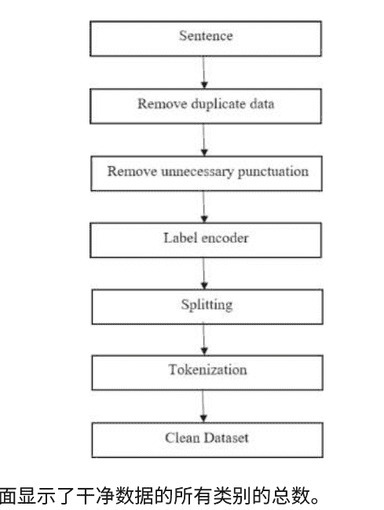

图2。预处理方法下面显示了干净数据的所有类别的总数。

在清洗数据集后，我们获得了2703个数据。

| 句子类型 | 清洗后的句子 |
|----------|--------------|
| 简单 | 904 |
| 复杂 | 902 |
| 复合 | 897 |

### 3.4 数据向量化或分布

Python的scikit-learn库提供了一个非常有用的功能，即CountVectorizer。它用于根据每个单词在整个文本中出现的频率（计数）将特定句子转换为向量。我们想要使用的n-gram的大小将由ngram范围参数指定，因此1,1将给我们单个词（由一个词组成的n-gram），而1-3将给我们由一个到三个词组成的n-gram。

- 单个词：我们将n的值设为1，以通过n-gram函数生成单个词或1-gram，并计算单词的频率。
- 二元词：我们将n的值设为2，以通过n-gram函数生成二元词或2-gram，并计算单词的频率。
- 三元词：我们将n的值设为3，传递给n-grams函数以生成三元组或3-grams，并计算单词的频率（图3）。

图3。 n-gram分布示例

| Sentence | Unigram | Bigrams | Trigrams |
|----------|---------|---------|----------|
| অনুকার হয়ে আসছে এখানে আমরা হেঁটেলে পাচ্ছিনি | ('অন', 1), ('ধক', 1), ('হয', 1) | ('অন ধক', 1), ('ধক হয', 1), ('হয আসছ', 1) | ('অন ধক হয', 1), ('ধক হয আসছ', 1), ('হয আসছ এখনে', 1) |

在这里，我们确定了简单、复杂和复合数据集文档、单词和唯一单词的数量，并使用图4进行了可视化：

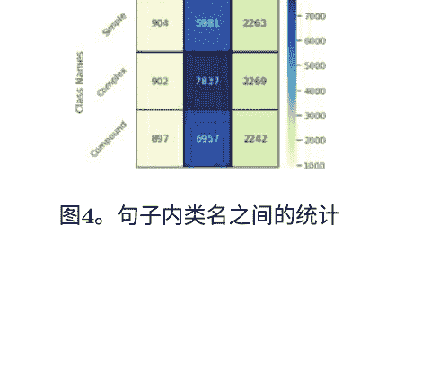

## 4 模型和性能

### 4.1 提出的模型

由于机器学习的发展，现在有多种有监督和无监督的模型可供选择。在ML超级有监督模型中使用了六种最相关的分类技术，将孟加拉文本分类为简单、复杂和复合。
机器学习算法有多种类型，包括支持向量机、逻辑回归、决策树、随机森林、K最近邻和随机梯度下降（图5）。

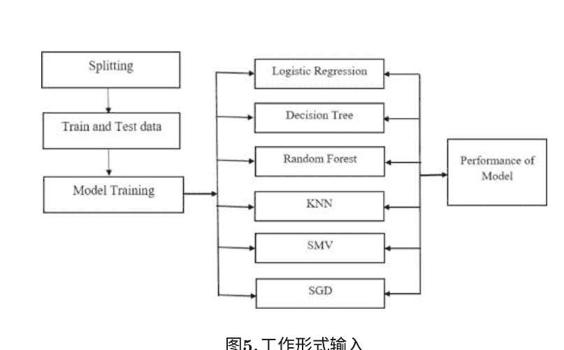

### 4.2 模型性能

基于我们在孟加拉数据文本分类方面的结果，我们在下面给出一个简短的陈述。

逻辑回归分类器：逻辑回归也是一种监督算法，用于对依赖变量进行分类。LR用于表示依赖变量和独立变量之间的关系。我们使用LR算法在我们的数据集上获得了84.84%的准确率。

决策树分类器：用于解决分类问题的决策树分类器，也常用于回归问题。决策树将一系列根节点组织成树形结构。与其他算法相比，决策树的预测准确度非常高，得分为93.72%。

随机森林分类器：由多个决策树组成的分类系统称为随机森林分类器，用于处理高维数据。由于我们在模型中只使用了部分输入，我们可以轻松适应数百个特征，这使得训练我们的模型比训练决策树更快。我们获得了91.68%的良好准确率。

KNN分类器：K最近邻算法用于回归和文本处理中的机器学习。它通过假设新数据与可用数据之间的相似性来对数据进行分类。将新信息包含在与先前现有类别更相似的类别中。通过我们的KNN模型，我们获得了73.94%的准确率。

SVM分类器：支持向量机是一种强大的算法，因为它不需要太多的训练数据就能开始给出准确的结果。SVM通过绘制超平面（在2D中为直线，在3D中为平面）来执行分类测试，以便通过该线来区分不同的类别。

使用SVM，我们的数据集达到了85.95%的准确率。

SGD分类器：随机梯度下降的优化过程经常用于机器学习应用中，以确定最佳匹配预期输出和实际输出的模型参数。这是一种不精确的方法。

通过这种方法，我们获得了87.06%的准确率。

在这里，我们展示了我们在表1中的显著结果，包括准确率、精确率、召回率和F1分数（图6）。

表1。每个分类器的显著结果
| 模型名称 | 准确性 | 精确度 | 召回率 | F1得分 |
| :--- | :--- | :--- | :--- | :--- |
| 逻辑回归 | 84.84% | 84.84 | 84.84 | 84.84 |
| 决策树 | 93.72% | 93.72 | 93.72 | 93.72 |
| 随机森林 | 91.68% | 91.68 | 91.68 | 91.68 |
| KNN | 73.94% | 73.94 | 73.94 | 73.94 |
| SVM | 85.95% | 85.95 | 85.95 | 85.95 |
| SGD | 87.06% | 87.06 | 87.06 | 87.06 |

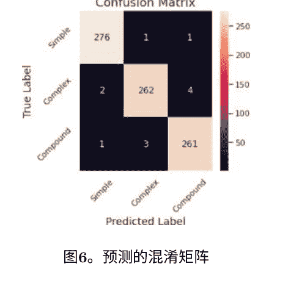

## 5 结果与讨论

我们使用简单、复杂和复合形式的机器学习模型实现了许多分类方法，包括KNN、决策树、SGD、支持向量机（SVM）、随机森林和逻辑回归，并且结果是可量化的。所有其他算法都被决策树超越，其准确率高达93.72%

有许多与简单、复杂和复合句子相关的工作。其中许多与我们的工作类似，但是使用的是不同的语言。一些孟加拉语的相关工作与我们的工作不完全相同，但是有一些相似之处。他们在句法分析、简单到复杂和复合、生成孟加拉语的简单、复杂和复合到英语的简单、复杂和复合等方面工作。但我们的工作是孟加拉语句子分类（简单、复杂、复合）的第一项工作（图7）。

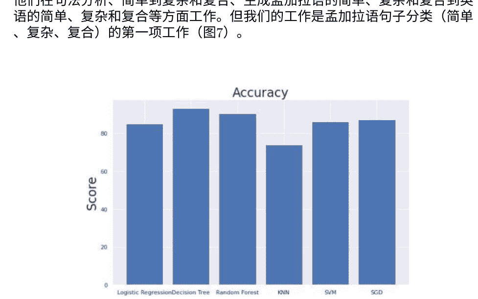

## 6 结论

虽然在孟加拉语中有一些类似的工作，但它们与我们的工作有些不同。然而，我们是第一个使用孟加拉语自然语言处理将句子分类为简单、复杂或复合的研究。这项研究可以被视为新颖可扩展性计划的第一步。在本文中，我们建议基于决策树、随机森林、逻辑回归、KNN、SVM和SVG的模型开发分类方法，使用超过两千个数据点的简单、复杂和复合数据集。数据与训练数据和输入数据进行了比较。实验结果表明了所提出策略的有效性和生产力。在进行这项工作的过程中，我们遇到了很多建议，可以考虑进一步发展所建议的系统。利用这些技术，创建了关联规则。

通过使用更精确的词干算法。可以使用不同的剪枝技术来影响分类准确性。此外，我们将努力将这些想法转化为用户友好的应用程序。我们将扩展我们的数据集以提高准确性。将来，我们还打算应用深度学习技术来提高系统性能。

## 参考文献

1. Shetu, S.F.等: 使用自然语言处理识别孟加拉语的写作风格。 在: 2020年第11届计算、通信和网络技术国际会议(ICCCNT), 第1-6页。IEEE(2020)
2. Bijoy, M.H.I., Hasan, M., Tusher, A.N., Rahman, M.M., Mia, M.J., Rabbani, M.: 使用监督算法的孟加拉语句子分类的自动化方法。 在: 2021年第12届计算、通信和网络技术国际会议(ICCCNT), 第1-6页。IEEE, 2021年7月
3. Čandrljić, S., Katić, M.A., Pavlić, M.: 从丰富的形式化知识节点记录到关系数据库的句子转换系统. Expert Syst. Appl. 115, 442–464 (2019)
4. Dhar, A., Mukherjee, H., Dash, N.S., Roy, K.: 孟加拉文本分类器的性能. 在: 2018年国际科学、工程和技术创新大会(ICISET), pp. 168–173. IEEE, 2018年10月
5. Shafin, M.A., Hasan, M.M., Alam, M.R., Mithu, M.A., Nur, A.U., Faruk, M.O.: 使用自然语言处理和机器学习进行孟加拉语产品评论情感分析. 在: 2020年第23届国际计算机与信息技术大会(ICCIT), pp. 1–5. IEEE, 2020年12月
6. Al-Radaideh, Q.A., Al-Khateeb, S.S.: 用于阿拉伯医学文本的关联规则分类器。 知识工程与数据挖掘国际期刊 3(3–4), 255–273 (2015)
7. Bolaj, P., Govilkar, S.: 使用监督学习方法对马拉地文档进行文本分类。 计算机应用国际期刊 155(8), 0975–8887 (2016)
8. Dhar, A., Dash, N.S. and Roy, K.: 应用tf-idf特征对在线孟加拉语网络文本语料库的文档进行分类。 在: 智能工程信息学,pp. 51–59. Springer, 新加坡 (2018)
9. Islam, M., Jubayer, F.E.M., Ahmed, S.I.: 对孟加拉语文档分类的不同方法的比较研究 (2017). arXiv预印本arXiv:1701.08694
10. Sen, O., 等: 孟加拉自然语言处理：经典、机器学习和深度学习方法的综合分析。 IEEE Access(2022)
11. Tuhin, R.A., Paul, B.K., Nawrine, F., Akter, M., Das, A.K.: 使用监督学习技术从孟加拉文本中进行情感分析的自动化系统。 在: 2019年IEEE第四届计算机与通信系统国际会议(ICCCS), 第360-364页。IEEE , 2019年2月
12. Das, A., Bandyopadhyay, S.: 孟加拉短语级极性识别。 国际计算机语言学应用 1(2), 169-182 (2010)
13. Hasan, K.A., Rahman, M.: 使用上下文价值分析从孟加拉文本中进行情感检测。 在 : 2014年第17届国际计算机与信息技术会议(ICCIT), 第292-295页。IEEE, 2014年12月
14. Uddin, A.H., Dam, S.K. and Arif, A.S.M.: 通过长短期记忆神经网络从孟加拉数据中提取严重负面句子模式。2019年第4届电气信息与通信技术国际会议(EICT)，第1-6页。IEEE，2019年12月
15. Hassan, A., Amin, M.R., Al Azad, A.K., Mohammed, N.: 使用深度递归模型对孟加拉和罗马化孟加拉文本进行情感分析。2016年国际计算智能研讨会(IWCI)，第51-56页。IEEE，2016年12月
16. Sarker, S., Monisha, S.T.A., Nahid, M.M.H.: 孟加拉问题回答系统的事实问题：一种统计方法。2019年孟加拉语言和语音处理国际会议(ICBSLP)，第1-5页。IEEE，2019年9月
17. Monisha, S.T.A., Sarker, S., Nahid, M.M.H.: 孟加拉问题分类朝向一个事实问题回答系统。在：2019年第一届国际会议关于科学、工程和机器人技术的进展（ICASERT），第1-5页。IEEE，2019年5月
18. Khan, S., Kubra, K.T., Nahid, M.M.H.: 改进孟加拉问答系统的答案提取，使用先行词-后行词解析。在2018年国际会议关于工程和技术创新（ICIET），第1-6页。IEEE，2018年12月
19. Urmi, T.T., Jammy, J.J., Ismail, S.: 基于语料库的无监督孟加拉词词干提取，使用N-gram语言模型。在：2016年第五届国际会议关于信息学、电子学和视觉(ICIEV)，第824-828页。IEEE，2016年5月
20. Ahmad, A., Amin, M.R.: 孟加拉词嵌入及其在解决文档分类问题中的应用。在：2016年第19届国际会议关于计算机和信息技术(ICCIT)，第425-430页。IEEE，2016年12月
21. Rahaman, M.A., Jasim, M., Ali, M., Hasanuzzaman, M.: 孟加拉语语言建模算法，用于自动识别手语拼写的孟加拉手语。 Front. Comp. Sci. 14(3), 1–20 (2020)
22. Haque, M., Huda, M.N.: 孟加拉语中主语和谓语之间的关系：语义分析。在：2016年第五届信息学、电子学和视觉国际会议(ICIEV)，第41-44页。IEEE，2016年5月
23. Islam, M.S., Mousumi, S.S.S., Abujar, S., Hossain, S.A.: 基于LSTM循环神经网络的孟加拉语序列生成。 Procedia Comput. Sci. 152, 51–58 (2019)
24. Abujar, S., Hasan, M., Shahin, M.S.I., Hossain, S.A.: 一种用于孟加拉文文档的文本摘要的启发式方法。在：2017年第八届计算、通信和网络技术国际会议(ICCCNT)，第1-8页。 IEEE，2017年7月
25. Dhar, A., Dash, N.S. and Roy, K., 以词长和句子长度作为孟加拉文文档中主题领域识别的参数
26. Hamid, M.M., Alam, T., Ismail, S., Rabbi, M.: 从转写的孟加拉语句子中识别疑问句 在: 2018年孟加拉语语音和语言处理国际会议(ICBSLP), 第1-6页. IEEE, 2018年9月
27. Razzaghi, F., Minaee, H., Ghorbani, A.A.: 使用机器学习技术进行上下文无关的常见问题检测。在：2016年IEEE/WIC/ACM国际网络智能会议（WI），第558-561页。IEEE，2016年10月28日。
28. Wang, D., Su, J., Yu, H.: 自然语言处理的特征提取和分析，用于深度学习英语语言。IEEE Access 8, 46335-46345 (2020年)
29. Oliinyk, V.A., Vysotska, V., Burov, Y., Mykich, K., Fernandes, V.B.: 基于自然语言处理和机器学习的文本数据中的宣传检测。在：MoMLeT+ DS，第132-144页（2020年）
30. Alian, M., Awajan, A.: 英语和阿拉伯语文本中的改写识别技术。 在：2020年第11届信息与通信系统国际会议（ICICS），第155-160页。IEEE，2020年4月
31. Mohammad, A.S., Jaradat, Z., Mahmoud, A.A., Jararweh, Y.: 通过词汇、句法和语义特征在阿拉伯新闻推文中进行释义识别和语义文本相似性分析。信息处理与管理。 53(3), 640–652 (2017)
32. Lamba, H., Govilkar, S.: 印度地区语言的抄袭检测技术调查。国际计算机应用。 975, 8887 (2017)
33. Ngoc Phuoc An, V., Magnolini, S. and Popescu, O.: 用简单特征在Twitter中进行释义识别和语义相似性 (2015)
34. Anwar, M.M., Anwar, M.Z., Bhuiyan, M.A.A.: 孟加拉语句子的语法分析和机器翻译。国际计算机科学与网络安全杂志 9(8), 317–326(2009)
35. Mehedy, L., Arifin, N., Kaykobad, M.: 孟加拉语句法分析：一种全面的方法。 在：国际计算机与信息技术会议论文集 (ICCIT), 孟加拉达卡, 孟加拉国, pp. 287–293 (2003)
36. Das, B., Majumder, M., Phadikar, S.: 从复杂和复合句子生成简单句子的新系统。现代教育与计算机科学国际期刊11(1), 57 (2018)
37. Purohit, P.P., Hoque, M.M., Hassan, M.K.: 基于特征的语义分析器用于解析孟加拉复杂和复合句子。 在：第8届国际软件、知识、信息管理和应用 (SKIMA 2014)会议，第1-7页。IEEE，2014年12月
38. Hasan, K.A., Hozaifa, M., Dutta, S.: 从简单的孟加拉句子中检测语义错误。 在：2014年第17届国际计算机和信息技术会议 (ICCIT)，第296-299页。IEEE，2014年12月
39. Khatun, A., Hoque, M.M.: CYK算法对孟加拉句子的统计解析。 在：2017年国际电气、计算机和通信工程会议 (ECCE)，第655-661页。IEEE，2017年2月
40. Purohit, P.P., Hoque, M.M., Hassan, M.K.: 孟加拉语句子语义分析的实证框架。 在：2014年第9届战略技术国际论坛(IFOST)，第34-39页。IEEE，2014年10月

# 面向早期自闭症检测的新型机器学习和混合问卷方法

Sid Ahmed Hadri^{1(✉) ⨁} 和 Abdelkrim Bouramoul^{2 ⨁}

1 LICUS实验室, 1955年8月20日大学, 阿尔及利亚斯基克达 sa.hadri@univ-skikda.dz

2 MISC实验室, 阿卜杜勒哈米德·梅赫里大学, 阿尔及利亚康斯坦丁 abdelkrim.bouramoul@univ-constantine.com

**摘要。** 早期检测自闭症谱系障碍有助于更好地管理自闭症儿童, 并有望在独立性和社交技能的习得方面取得更好的结果。因此, 尽早识别自闭症至关重要。

通常, 传统的问卷调查等技术被用于自闭症筛查。这些方法主要依赖于精神病学家的专业知识和经验, 已知会夸大结果, 导致高假阳性率。

在本文中, 我们提出了一种基于机器学习和问卷混合技术相结合的自闭症筛查方法, 以提高筛查准确性。在对本地收集的数据集上测试了多个机器学习模型, 包括SVM和随机森林树, 取得了97.5%的准确率。这些结果是有希望的, 并鼓励深入和具体化这项研究以及在其他神经发育障碍上的推广。

**关键词:** 自闭症筛查 · 机器学习 · 神经系统疾病 · 儿童精神病学 · 自闭症检测

## 1 引言

自闭症谱系障碍 (ASD) 或称为自闭症是一组神经发育障碍的其中之一, 其特点是在沟通和社交互动方面存在困难 [1]。根据DSM-5 [2], 自闭症在一个人的生命的最初几个月就会表现出来, 其特点是一组症状, 如建立关系或社交互动的困难, 沟通困难, 重复和刻板行为, 非常狭窄的兴趣和感觉处理的缺陷。

根据世界卫生组织 (WHO) 发布的最新版国际疾病分类 (ICD-10) [3], 自闭症属于广泛性发育障碍 (PDDs) 的一类。大约有54个孩子中有1个患有自闭症[4]。ASD不会因种族、民族或社会经济水平而有所区别。男孩患自闭症的几率是女孩的4倍，与女孩相比，男孩更有可能患自闭症[4]。

迄今为止，还没有自闭症的治疗方法，但自闭症儿童会在专门的机构中接受适应他们需求的计划。自闭症儿童需要照顾，以帮助他们获得社交技能和适当的独立水平，以实现更好的生活质量并融入社会。为了让这些儿童从这些计划中获益最大，尽早对他们进行筛查非常重要。

自闭症筛查是诊断的重要阶段，其目的是了解孩子的状况，并能够决定孩子是否处于风险之中，即孩子可能患有自闭症，因此需要进一步由精神科医生进行调查。或者孩子是正常的，并将在下次就医时再次进行筛查（图1使我们能够概括这一点）。

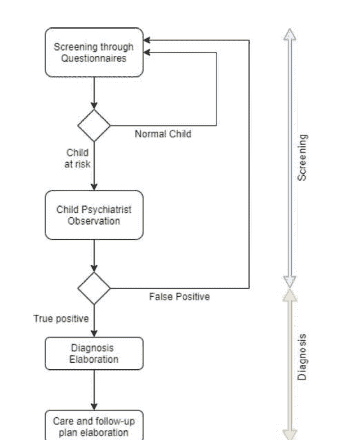

筛查通常通过问卷的方式进行[5,6]。这些问卷除了包含涵盖儿童个人信息的部分外，还包含涵盖沟通、社交定向、感觉处理、情绪反应和参与等方面的问题。世界各地使用了45多个经过科学验证的问卷。在某个地区选择使用问卷的决策取决于多个因素，例如问卷的可用性、成本、使用条件、国家或地区的财务收入以及问卷与后者的文化和社会适应性等[7]。一些问卷，如幼儿自闭症修订检查表（M-CHAT-R/F）[8]或幼儿自闭症量化检查表（Q-CHAT）[9]，被更频繁地使用和引用。

我们的论文结构如下：第2节中，我们简要介绍了最近实施机器学习技术进行自闭症筛查的研究。第3节中，我们提出了一种基于工具混合和机器学习的新方法。在接下来的两节中，我们以实验协议的形式实施了我们的方法，并讨论了所获得的结果。最后，我们用结论和展望总结了我们的论文。

## 2 相关工作

在本节中，我们回顾了各种研究，这些研究明确或隐含地使用和测试了机器学习技术在儿童和婴儿自闭症筛查和诊断中的性能。

在[10]的研究中，使用机器学习来筛查自闭症儿童，使用通过两个问卷收集的数据：诊断性访谈修订版（ADI-R）和社交反应量表（SRS）。研究人员的数据集包括1264名被诊断为自闭症的儿童和462名健康儿童。这个人群被分为两个不同的年龄组（10岁以下和10岁以上）。他们的学习模型在10岁以下儿童中实现了89.2%的自闭症敏感性得分，10岁以上儿童中实现了86.7%的自闭症敏感性得分。并且使用5个行为类别分别达到了59%和53.4%的特异性。

在[11]中，使用机器学习方法对4模块诊断工具进行了测试：诊断观察表-通用版（ADOS）。这项研究的目的是将该工具的大小缩小到一个由8个项目组成的单一模块，并证明它完全足够提供100%有效的自闭症筛查。该方法在两组446名个体上进行了验证，所得结果的准确率接近100%。

在Buyukoflaz等人的研究[12]中，测试和比较了不同的机器学习技术。这些技术包括随机森林、朴素贝叶斯和径向基函数网络。这些测试是在UCI 2017公共数据集上进行的，该数据集包含自闭症儿童的记录。该研究的目的是开发一个适用于普通大众的高效应用程序，可用于筛查年幼儿童的自闭症。模型非常高效，尤其是具有100%准确率的随机森林根据作者的说法。

在Shazamiri [13]的研究中，开发了一种创新工具称为AutismAI，用于使用AQ10公共数据集在不同年龄段进行ASD筛查，该工具是一个公开可用的移动应用程序，实现了97%的ASD检测准确率。

## 3 混合方法

在相关工作部分，我们注意到机器学习模型是在从单一筛查问卷收集的数据集上实施和测试的。根据[7]的研究进一步调查显示，自闭症筛查问卷众多且本质上不同，并且根据社会文化背景的不同而使用方式也不同。因此，没有足够通用的问卷可以用于自闭症的普遍筛查。

增加一层机器学习肯定可以提高问卷的性能，但不幸的是，这并不能使其成为一种通用的筛查工具。因此，我们的方法是基于构建和训练机器学习模型使用来自组合问卷的数据。在这种情况下，我们考虑构建一个推理模型，使我们能够根据Marlow等人的详尽回顾在全球和个别层面上的标准选择一组工具并提取混合工具。所构建的选择模型如图2所示。

**图2. 选择标准和子标准**

| Criteria | Sub-criteria | Condition |
| :--- | :--- | :--- |
| Specificity | Orientation | Autism Oriented |
| | Age compatibility | 0 to 4 years old |
| | Type | Passive |
| Availability | Accessibility | Is accessible |
| | Licensing | Free licence |
| | Terms and conditions of use | Are clear |
| Relevance | Popularity | is popular |
| | Extent of use | Wide |
| | Number of citations | High |
| Validity | Critical studies | In favor of use |
| | Number of Practical Studies | High |
| Usability | Time | Short |
| | Structure | Logical |
| | Professional implication | Low |

## 4 实验设置

### 4.1 混合问卷

通过应用我们的选择模型，我们能够提取出10份我们认为最有趣且符合之前所述标准的问卷（如表1所示）。

**表1. 选定的问卷**

| 问卷 | 年份 | 年龄窗口 | 项目数量 |
| :--- | :--- | :--- | :--- |
| 自闭症谱系商数儿童版（ASQ）[14] | 2012 | 4-11岁 | 50个项目 |
| 童年阿斯伯格综合症测试（CAST）[15] | 2007 | 4-11岁 | 37个项目 |
| 早期发展障碍迹象清单（CESDD）[16] | 2010 | 3-36个月 | 12个项目 |
| 早期自闭症特征筛查（ESAT）[17] | 2006 | 14-15个月 | 14个项目 |
| 父母对社交互动的观察（POSI）[18] | 2013 | 16-30个月 | 7个项目 |
| 幼儿自闭症量化检查表（QCHAT）[19] | 2008 | 18-24个月 | 25个项目 |
| 社交互动筛查-幼儿(SSIT) [20] | 2011 | 24-42个月 | 21个项目 |
| 图片式自闭症评估表(PAAS) [21] | 2017 | 18-48个月 | 21个项目 |
| 首年清单(FYI) [22] | 2013 | 12个月 | 63个项目 |
| 自闭症改进检查表(MCHAT-R/F) [8] | 2014 | 16-30个月 | 20个项目 |

然后我们继续合并这些问卷，考虑到冗余的删除，相关问题的概括以及特定文化因素的省略。这导致了一个混合问卷，使用李克特量表[23]，分布在8个类别中，共有51个项目，如表2所示。

### 4.2 数据收集

在几个专门的机构，包括医院、自闭症儿童专科中心、独立执业医生诊所和协会等，已经启动了本地的数据收集过程。这个数据收集的目的是生成两种类型的记录：

*   已经诊断和确认患有自闭症的儿童。
*   健康确认的儿童。

我们能够收集到264份记录（124名自闭症患者，140名健康患者）从阿尔及利亚北部的5个不同地区带来，如图3所示。

表2：混合问卷概述

| 类别 | 示例问题 |
| :--- | :--- |
| 社交取向和接受性沟通（9个项目） | 你的孩子是否对他/她同龄的其他孩子感兴趣？ |
| 表达性沟通（7个项目） | 你的孩子是否试图引起你的注意展示有趣的事物？ |
| 社交和情感参与（10个项目） | 你的孩子是否回应你的亲昵的姿态？ |
| 重复行为（9个项目） | 你的孩子是否一遍又一遍地晃动身体？ |
| 反应性（2个项目） | 当他们生气时，很难让你的孩子冷静下来 |
| 模仿（4个项目） | 你的孩子会模仿你的面部表情吗（面部表情） |
| 感觉处理（6个项目） | 你的孩子是否对大声的声音感到不安？ |
| 其他（4个项目） | 你的孩子是否会呆呆地盯着看（面无表情）？ |

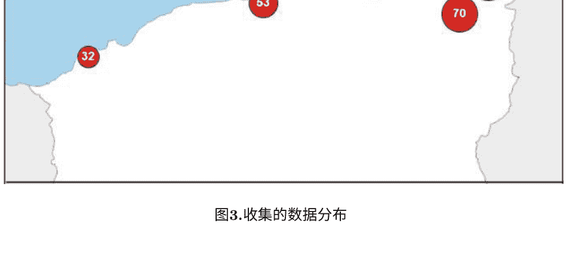

### 4.3 模型测试和结果

我们实施、测试和比较了几种机器学习算法，包括支持向量机（SVM）、随机森林、K-means和逻辑回归。数据集被分为两部分（70%用于训练，30%用于测试）。我们在一台具有以下规格的机器上对每个模型进行了10次执行：CPU Ryzen 5 3500U，GPU GeForce GTX 1060 Ti和16GB的RAM。所得结果如表3所示。

表3：每次执行的模型准确率

| 执行 | 1 | 2 | 3 | 4 | 5 | 6 | 7 | 8 | 9 | 10 |
|------|----|----|----|----|----|----|----|----|----|-----|
| 支持向量机 | 85.2 | 89.7 | **97.5** | **97.5** | 92.0 | 86.1 | 85.2 | 83.6 | 90.8 | 90.8 |
| 随机森林 | 80.5 | 80.5 | 82.4 | 80.5 | 82.4 | **86.1** | 80.3 | 79.3 | 80.5 | 79.3 |
| K-means | 78.6 | **89.1** | **89.1** | 78.2 | 88.5 | 88.5 | 78.2 | **89.1** | 86.7 | 78.4 |
| 逻辑回归 | 92.6 | 92.2 | **93.8** | 92.3 | 89.7 | 87.6 | 89.8 | 92.6 | 90.5 | 86.3 |

## 5 讨论与评估

从表2中，我们观察到4个模型获得了非常好的准确率得分，其中SVM模型稍微领先，准确率达到了97.5%。这些分数表明两组儿童之间存在明显的差异并且每个类别都有特定的模式。这些结果还向我们展示了，通过对现有工具进行组合的方法，我们可以获得更多信息并填补每个问卷的空白。然而，所获得的分数相当高，这可能表明收集到的数据可能过于确定性，即儿童要么具有非常明显的自闭症症状，要么没有任何显著的症状，这并不反映现实情况。

这个结论促使我们寻求通过整合复杂案例来扩大数据集，例如具有共病障碍的自闭症儿童，症状不太明显的儿童，以及具有自闭症行为的健康儿童，可能是由于某些社会因素等等。

## 6 结论与展望

本文是一项试点研究，我们在其中探讨了一种新的方法来检测年幼儿童的自闭症。这种方法包括使用机器学习技术对现有筛查问卷的数据进行融合，这些问卷已经得到科学文献的验证。我们的方法已经产生了一个混合和通用的工具，涵盖了前述问卷的大部分方面和观察结果非常有希望。短期目标包括增加数据量和降低维度。长期目标包括基于我们的方法开发具体和易于使用的工具，以便及时进行自闭症筛查。

## 参考文献

- 1. Lord, C., Risi, S., DiLavore, P.S., Shulman, C., Thurm, A., Pickles, A.: 2至9岁的自闭症。Arch. Gen. Psychiatry **63**(6), 694–701 (2006)
- 2. American Psychiatric Association: 精神障碍的诊断和统计手册: DSM-5. Autor, Washington, DC, 第5版 (2013)
- 3. 精神和行为障碍的ICD-10分类：研究的诊断标准。世界卫生组织（2003年）
- 4. Maenner, M.J., Shaw, K.A., Baio, J.,等: 8岁儿童中自闭症谱系障碍的患病率-自闭症和发育障碍监测网络，11个地点，美国，2016年。MMWR监测总结。69(4), 1 (2020年)
- 5. Berument, S.K., Rutter, M., Lord, C., Pickles, A., Bailey, A.: 自闭症筛查问卷：诊断有效性。英国精神病学杂志 175(5), 444-451 (1999年)
- 6. Carbone, P.S.等: 初级保健自闭症筛查和后续自闭症诊断。儿科学 146(2) (2020年)
- 7. Marlow, M., Servili, C., Tomlinson, M.: 婴儿和幼儿自闭症谱系障碍和发育迟缓筛查工具的综述：在低收入和中等收入国家的使用建议。自闭症研究 12(2), 176-199 (2019年)
- 8. 罗宾斯, D.L., 卡萨格兰德, K., 巴顿, M., 陈, C.M.A., 杜蒙-马修, T., 费恩, D.: 修订版儿童自闭症改进检查表（m-chat-r/f）的验证。儿科学 133(1), 37-45 (2014年)
- 9. 马吉亚蒂, I., 吴, D.A., 林, S.J., 甘, D.Z.Q., 梁, J., 艾莉森, C., 巴伦-科恩, S., 里夫金-格拉博伊, A., 布鲁克曼, B.P., 索, S.M., 等: 新加坡婴幼儿社区样本中婴幼儿自闭症量化检查表（q-chat）的心理测量特性。分子自闭症 6(1), 1-14 (2015年)
- 10. 骨, D., 主教, S.L., 布莱克, M.P., 古德温, M.S., 洛德, C., 纳拉亚南, S.S.: 使用机器学习改进自闭症筛查和诊断工具：有效性、效率和多工具融合。儿童心理学与精神病学57(8), 927-937 (2016)
- 11. Wall, D.P., Kosmicki, J., Deluca, T., Harstad, E., Fusaro, V.A.: 使用机器学习缩短基于观察的自闭症筛查和诊断时间。Transl.Psychiatry 2(4), e100-e100 (2012)
- 12. B¨uy¨ukoflaz, F.N., Ozt¨urk, A.: 使用机器学习算法对儿童进行早期自闭症诊断。在: 2018年第26届信号处理和通信应用会议（SIU），第1-4页。IEEE (2018)
- 13. Shahamiri, S.R., Thabtah, F.: 基于人工智能的新型自闭症筛查系统。认知计算12(4), 766-777 (2020)
- 14. Allison, C., Auyeung, B., Baron-Cohen, S.: 朝着自闭症筛查的简短“红旗”：短自闭症谱系商数和短量化检查表在1,000个病例和3,000个对照组中的应用。美国儿童青少年精神病学学会 51(2),202-212 (2012)
- 15. Allison, C., Williams, J., Scott, F., Stott, C., Bolton, P., Baron-Cohen, S., Brayne,C. : 儿童阿斯伯格综合症测试（CAST）在高分样本中的重测信度。 自闭症 11(2), 173-185 (2007)
- 16. Dereu, M., Warreyn, P., Raymaekers, R., Meirsschaut, M., Pattyn, G., Schietecatte, I., Roeyers, H.: 用于佛兰芒日托中心的自闭症谱系障碍筛查：早期发展障碍迹象检查表。自闭症与发展障碍杂志40(10), 1247-1258 (2010)
- 17. Swinkels, S.H., Dietz, C., van Daalen, E., Kerkhof, I.H., van Engeland, H., Buite-laar, J.K.: 14至15个月大儿童的自闭症谱系筛查。i: 自闭症特征早期筛查问卷（esat）的发展。 J. AutismDevelopmental Disorders 36(6), 723-732 (2006)
- 18. Smith, N.J., Sheldrick, R.C., Perrin, E.C.: 自闭症谱系障碍的简化筛查工具。Infant Ment. Health J. 34(2), 149-155 (2013)
- 19. Allison, C., Baron-Cohen, S., Wheelwright, S., Charman, T., Richler, J., Pasco,G., Brayne, C.: q-chat（幼儿自闭症量化检查表）：18-24个月龄自闭症特征的正态分布量化测量：初步报告。J. Autism Dev. Disord. **38**(8), 1414–1425 (2008)
- 20. Ghuman, J.K., Leone, S.L., Lecavalier, L., Landa, R.J.: 幼儿自闭症谱系障碍的社交互动筛查（ssi）：一种筛查量表。 Res. Dev. Disabil. **32**(6), 2519–2529 (2011)
- 21. Perera, H., Jeewandara, K.C., Seneviratne, S., Guruge, C.: 为自闭症谱系障碍量身定制的文化适应性图片筛查工具：一种新方法。世界临床儿科学 **6**(1), 45 (2017)
- 22. Turner-Brown, L.M., Baranek, G.T., Reznick, J.S., Watson, L.R., Crais, E.R.: 第一年清单：12个月到3岁儿童的纵向跟踪。 自闭症 **17**(5), 527–540 (2013)
- 23. Joshi, A., Kale, S., Chandel, S., Pal, D.K.: 李克特量表：探索与解释。 British J. Appl. Sci. Technol. **7**(4), 396 (2015)

# 基于Bi-RNN和Bi-LSTM的亚马逊评论文本分类

Shamal Kashid(✉), Krishan Kumar, Parul Saini, Abhishek Dhiman, 和Alok Negi
计算机科学与工程，国立工艺技术学院，
北阿坎德邦，印度
{kashid.shamalphd2021,parulsaini.phd2020,mt21cse004, aloknegi.phd2020}@nituk.ac.in, k2b@ieee.org

摘要。电子商务（电子商务）能够有效实施基于产品的在线业务交易。。在这篇论文中，我们将亚马逊评论数据集分为正面和负面。消费者可以根据这些二进制文本来选择产品，而忽略评论中提供的手动评级。最近，深度学习（DL）方法开始在电子商务应用中流行起来。DL技术通过过滤庞大的电子商务数据并发现隐藏的模式和有价值的细节，提供了一种强大而有效的数据分析方法。

在这里，研究重点是投资DL技术，将文本分类为积极和消极的评论。在本文中，我们实施了两种不同的DL方法，并发现两种方法的准确性。
这里使用的DL模型是双向循环神经网络（Bi-RNN）和双向长短期记忆（Bi-LSTM）。使用Bi-RNN和Bi-LSTM获得的准确性分别为89.60%和92.80%。结果显示，Bi-LSTM在亚马逊评论数据集上表现最佳。

关键词：Bi-RNN·Bi-LSTM·深度学习·文本分类

## 1 引言

文本分类（TC）的研究是一个近期的研究领域。文本分类是根据内容将文档分组到类别中的过程。由于大量的在线文本材料，这个过程变得更加重要。提高分类准确性的过程是文本分类的主要挑战[3]。许多应用，如市场营销、产品管理、学术和治理，需要评估和提取文本数据中的信息。情感分析、主题分类、垃圾邮件识别和意图检测是文本分类的不同用途。用户可以借助文本分类快速有效地组织所有相关文本，如电子邮件、法律文件、社交网络帖子、聊天机器人消息、调查等。

基于Bi-RNN和Bi-LSTM的亚马逊评论文本分类

电子商务（电子商务）是通过电子网络（通常是互联网）购买、销售或发送产品、服务、货币或数据。人们已经将社交媒体应用程序融入日常生活。互联网现在已经成为一切的一部分，包括亚马逊、Flipkart、Shopify、Myntra、eBay、Quikr和Olx等电子商务网站[1]。各种问题中的一个重要任务是自动文本分类。例子包括垃圾邮件过滤，其主要目标是消除不需要的电子邮件。电子邮件文件夹旨在将传入的消息组织到文件夹中，情感分类的目的是确定文档是否表达了积极或消极的意见。

亚马逊是世界上最重要的电子商务平台之一。顾-客在购买之前经常浏览亚马逊上的产品和客户评论。人们越来越依赖于客户评论。人们对事物的经验和意见对他们购买的决策有影响。由于人们不断追求他人的意见以从中学习经验，评论变得更有价值。情感分析的TC被分为二元分类（“积极”和“消极”）和三元分类（“积极”，“消极”和“中性”）。情感分析是基于这些分类进行的。

在过去的20年里，文本分类和关键词提取引起了众多研究人员的关注[2]。考虑到TC任务，深度学习在处理大量数据时已成为最近和更重要的发展，因为它具有高准确性。DL算法可以学习文本片段之间的许多关系，以及如何为特定输入（文本）预测给定输出。近年来，BERT模型[5]已成为一个著名的最先进模型。在没有人类监督的情况下，它可以执行自然语言处理（NLP）任务，如监督文本分类。这种方法在研究和商业领域特别突出，因为它适应处理任何语料库并产生出色的结果[4]。

目前有许多著名的分类算法在使用，每个算法都有不同的优势。了解哪种算法在特定任务和数据收集中能够获得最佳结果有时可能会有挑战[8]。

本研究探讨了基于卷积神经网络（CNN）的深度学习模型在二分类（响应或非响应）中的潜力。与传统方法支持向量机（SVM）相比，CNN模型在更大的数据集上即使没有进一步优化也能提供更高的准确性，并且在训练样本数量逐渐增加的情况下呈现出更稳定的增长趋势[10]。

剩余部分的论文组织如下：第2节概述了现有的文本分类技术和文本挖掘的机器学习算法。第3节介绍了在深度学习模型上对数据集进行二进制文本数据分类的方法。第4节介绍了数据集描述和实验结果，并讨论了提出的工作的主要发现。最后，在第5节中总结了本研究的未来方向。

## 2 相关工作

本节讨论基于二进制文本分类技术的相关现有最新工作。

Rusli等人[11]展示了一种使用多层感知器的有监督机器学习方法进行二进制文本分类的方法，以检测假新闻并将其与有效新闻区分开来。他们通过进行词干提取和停用词移除处理以及词袋模型组合，实现了0.82的F1得分。此外，作者观察到在文本预处理步骤中跳过词干提取和停用词移除步骤并不会显著影响模型性能。

Solovyeva等人[12]提出了一个可分离的卷积神经网络结构，包括嵌入层、可分离卷积层和全局平均池化层，用于二进制和多类文本分类。在卷积层中使用Sigmoid和Softmax激活函数，通过提出的网络在二进制和多类文本分类问题上获得了更高的准确性。在二进制和多类文本分类问题上，与一些双向循环神经网络和全连接网络相比，可分离的卷积神经网络获得了更高的准确性。

Bharadwaj等人[13]利用语义特征和几种机器学习技术进行假新闻检测。他们通过使用五组语言特征，探索了循环神经网络与朴素贝叶斯分类器和随机森林分类器之间的差异。所提出的模型在Kaggle.com的实际数据集上，使用二元特征和随机森林分类器实现了95.66%的准确率。Raj等人[14]探索了CNN和Bi-RNN在多模态在线信息可信度分析中的应用，显示出在分类任务中的快速改进，无需预处理。本文中，多模态耦合ConvNet架构融合了数据模块，并根据其文本和视觉内容有效地对在线新闻进行分类，通过对三个数据集上使用的所有模型结果进行比较分析，获得了更高的准确性。

Kaliyar等人[15]提出了一种基于BERT（双向编码器表示转换）的DL方法（FakeBERT），它结合了具有不同内核大小和过滤器的单层深度CNN的不同并行块与BERT用于假新闻检测。本文提出的Fake-BERT模型在由数千篇假新闻和真实新闻文章组成的数据集上的准确率达到了98.90%，该数据集是在2016年美国总统大选期间收集的。

Kumar等人[16]提出了一种利用问题转换技术（即二进制相关性（BR）和标签幂集（LP））、文本向量化器和机器学习分类器模型的组合的电影类型分类的新技术。本文模型采用标签幂集（LP）作为问题转换技术，TF-IDF作为文本向量化器技术，支持向量分类器（SVC）作为机器学习模型，在IMDb数据集上产生了总体准确率为0.95和F1分数为0.86的最佳结果。

Wang等人[17]探索了二进制词嵌入模型，受到生物神经元编码机制的启发，将神经元在特定时间间隔内的脉冲时序转化为减少空间的二进制编码加速计算。他们创建了三个模型来后处理原始的密集词嵌入：基于均匀泊松处理的速率编码模型，基于漏电整流神经元的模型和Izhikevich的模型。Wang等人[18]开发了一种基于规则的自然语言处理算法，用于自动为训练数据生成标签，并利用预训练的词嵌入作为深度表示特征来训练机器学习模型。CNN在所有数据集中取得了最佳性能。词嵌入明显优于范式的TF-IDF和主题模型特征，而CNN在弱监督方面捕捉到了不同的模式，与基于规则的自然语言处理算法相比。

Mehta等人[19]专注于使用基于NLP框架的模型对假新闻进行分类，该框架被称为BERT（双向编码器表示来自变压器的表示），也被称为特定领域数据集的BERT。他们确定BERT的深度上下文化特性对于这个任务是实用的，并且在二元分类方面取得了显著的改进，在六个标签类别方面与先前探索的模型相比获得了最小的实质性改进。

Li等人[20]提出了一个恶意软件分类模型，使用长序列的API调用来分类恶意软件的变体，主要使用Bi-RNN，即LSTM和门控循环单元（GRU）。对于需要对八个恶意软件家族进行分类的基准数据集进行的数值实验观察到，所提出的Bi-RNN模型在恶意软件分类方面表现良好。

## 3 提出的模型

Bi-RNN和Bi-LSTM DL模型从训练数据中获得一组特征用作分类器。TensorFlow被选为框架，并使用内置的Keras DL模块。由于TensorFlow拥有庞大的用户群和在TensorFlow GitHub存储库上的高提交数量，两者都足以构建深度学习神经网络模型[1]。

### 3.1 亚马逊评论二元分类的双向循环神经网络模型

循环神经网络（RNN）是一种众所周知的监督式深度学习方法。在处理一系列数据和时间序列分析时，经常使用RNN。在这种工作中，网络或短期记忆从刚刚观察到的内容中学习。在处理序列数据时，经常使用RNN。该模型使用层，为模型提供了短期记忆。

使用这种记忆，可以更准确地预测后续数据。情感分析、标签序列和标记语音是RNN的应用。对RNN的改进是双向RNN（Bi-RNN）。Bi-RNN由两个RNN组成，一个从数据序列的开头开始向前移动，另一个从末尾开始向后移动。简单RNN、GRU或LSTM都是Bi-RNN的可接受网络块类型。

通过添加一个隐藏层，双向循环神经网络可以适应反向训练过程。使用数据集[22]，我们将构建一个将语句分类为正面或负面的双向循环神经网络。双向循环神经网络模型的结果总结如图1所示。

双向循环神经网络通过组合两个在相反方向上训练网络的循环神经网络来实现，一个从序列的开头到结尾训练，另一个从结尾到开头训练，从而使模型能够学习不仅过去和现在的信息，还有助于分析未来事件。双向循环神经网络可以处理序列数据，并接受来自现在和过去的输入。

- 编码器：将文本转换为一系列的标记索引。
- 嵌入层：嵌入层中存储每个单词的一个向量。然后，它将单词索引序列转换为向量序列。这些向量可以进行训练。训练后，具有相似含义的单词通常具有相似的向量。
- 双向RNN：是两个RNN的组合，分别从序列的开头到结尾和从序列的结尾到开头进行训练网络。
- 密集层：对先前的向量表示进行一些最终处理，并将分类输出更改为单个逻辑。

双向RNN中的内部记忆使其能够回忆起先前的输入。在使用分类标签进行训练后，该模型可以预测新数据上样本评论的情感倾向。在双向RNN中，当前时间步之前和之后的数据同时用于确定每个时间步的隐藏状态。双向RNN的主要应用是在Bi-RNN上下文中对观测进行编码和估计。

图2描述了Bi-RNN网络的参数规范。使用Bi-RNN的优势是在单词添加到末尾时能够很好地流式预测。我们可以通过使用双向从过去到现在和从现在到未来的方式来运行您的输入。

Layer (type) | Output Shape | Param #
--- | --- | ---
text_vectorization (TextVectorization) | (None, None) | 0
embedding (Embedding) | (None, None, 64) | 64000
bidirectional (Bidirectional) | (None, 128) | 66048
dense (Dense) | (None, 64) | 8256
dense_1 (Dense) | (None, 1) | 65
Total params: 138,369
Trainable params: 138,369
Non-trainable params: 0

### 3.2 亚马逊评论二元分类的双向长短期记忆网络模型

双向长短期记忆网络的实现细节：双向长短期记忆神经网络由工作在过去和未来两个方向上的LSTM单元组成，以考虑上下文。使用不冗余的上下文数据，通过双向长短期记忆网络学习长期依赖关系[15]。它已被证明在顺序建模问题上具有出色的性能，并且经常用于文本分类。

双向长短期记忆网络由两个并行层组成，分别进行正向和反向传播，与LSTM网络相比，可以捕捉两个上下文中的依赖关系[16]。对于双向长短期记忆网络，我们使用Keras库创建了我们的模型，它包含4个层次：

- 嵌入：减小输入的大小
- 空间丢失：避免过拟合
- LSTM：长短期记忆层，即RNN
- Dense：将LSTM输出转换为二进制

双向LSTM与单向LSTM的不同之处在于，你可以在向后的LSTM中保留来自未来的信息，并通过结合两个隐藏状态，在任何时刻都可以保留来自过去和未来的信息。考虑的最大特征数量为模型分类的最大数量为1,000。词汇表的大小也与最大特征数量相同。嵌入层的维度为64，表示每个转换向量都在64维的嵌入空间中[8]。通过tf.keras.embedding()函数添加嵌入层。密集层使用“ReLU”作为激活函数。这些正则化方法有助于避免过拟合，就像许多分类器中一样。图3描述了双向LSTM网络的结构。

| Layer (type) | Output Shape | Param # |
|---|---|---|
| text_vectorization (TextVectorization) | (None, None) | 0 |
| embedding_1 (Embedding) | (None, None, 64) | 64000 |
| bidirectional_1 (Bidirectional) | (None, None, 128) | 66048 |
| bidirectional_2 (Bidirectional) | (None, 64) | 41216 |
| dense_2 (Dense) | (None, 64) | 4160 |
| dropout (Dropout) | (None, 64) | 0 |
| dense_3 (Dense) | (None, 1) | 65 |
Total params: 175,489
Trainable params: 175,489
Non-trainable params: 0

图3. 双向长短期记忆（Bi-LSTM）模型的参数化规范

设置了10个Epoch计数。Epoch是神经网络属性，用于控制训练和测试数据集的适当拟合。此Epoch计算为任何模型提供正确的预测。较高的Epoch计算使预测更加复杂，产生不一致的结果。较低的Epoch计算使模型更加不稳定。在每个Epoch迭代中，处理16字节的批量大小。

## 4 结果分析

### 4.1 数据集

使用基于Kaggle的400万条评论的大型数据集进行训练[22]。该Kaggle数据集基于评论的星级评分和来自亚马逊客户评论的文本输入，包含二进制输出标签（正面和负面）。在这里，1或2星的评级被分类为负面，而4或5星的评级被分类为正面，不包括评级为3星的评论。正面和负面类别的表示相等。实验在Google collab上进行，模型训练运行10个Epoch，批量大小为16。使用分类交叉熵损失和准确率作为度量标准。

### 4.2 训练/测试过程

从训练数据集中随机选择了一部分，由60000个评论组成，以保持计算成本最低。其中四万个评论用于训练分类器，剩下的两万个评论用于评估其效果。总结我们的努力，我们从400万个评论中随机选择了60000个评论，对其进行了清洗和分词处理，开发了各种模型，并选择了最佳模型。

表1. 基于准确性的深度学习模型比较

| 深度学习模型 | 训练数据 | 测试数据 | 准确性 |
|--------------|----------|----------|---------|
| LSTM [21] | 94227 | 27981 | 89.00% |
| LSTM网络 [24] | 40000 | 20000 | 90.00% |
| CNN [25] | 25000 | 25000 | 88.74% |
| LSTM [25] | 25000 | 25000 | 89.40% |
| 提出的双向RNN | 40000 | 20000 | 89.60% |
| 提出的双向LSTM | 40000 | 20000 | **92.80%** |

### 4.3 结果

准确性是正确预测的数量与所有预测的比率。

> 准确率 = \(\frac{\text{真正例} + \text{真负例}}{\text{假负例} + \text{真正例} + \text{真负例} + \text{假正例}}\) (1)

使用matplotlib.pyplot.figure()绘制了一个用于测量TC期间损失和准确性的图。x轴上保持了Epochs的数量。损失值和准确性值分别显示在y轴上，如图4和图5所示。图4描述了Bi-RNN模型的损失和准确性结果。图形分别在“Epochs数量”和“损失值”、“准确性值”之间绘制。

所提出的Bi-RNN在测试中记录了90.91%的准确性，损失为0.21，训练准确性为89.60%，损失为0.23，如图4所示。图5描述了Bi-LSTM模型的准确性和损失结果。图形分别在“Epochs数量”和“准确性值”、“损失值”之间绘制。所提出的Bi-LSTM在测试中记录了94.02%的准确性，损失为0.15，训练准确性为92.80%，损失为0.17。

表1比较了基于性能度量准确性的文本分类的深度学习模型，提出了Bi-RNN和Bi-LSTM DL模型。DL模型的数据集都相同，测试和训练参数也相等。与其他现有的DL模型[21]相比，这两个模型表现良好。当我们比较Bi-RNN和Bi-LSTM时，Bi-LSTM模型的结果最好。最佳结果已用粗体标出。

# 图4. 使用Bi-RNN在Epoch迭代中的测试和训练数据集的相关性

# 图5. 使用Bi-LSTM在Epoch迭代中的测试和训练数据集的相关性

## 5 结论

本研究使用的亚马逊评论数据集用于分析关于评论的语义用户分析。TensorFlow 2.1.0平台在Keras框架中使用Bi-RNN和Bi-LSTM。两个提出的模型都使用“ReLU”激活函数，通过将特征大小限制为1,000和嵌入层的维度限制为16来防止过拟合，从而影响了特征提取方法。Bi-LSTM实现了92.80%的整体准确率。每个“epoch”迭代的Bi-LSTM反馈连接机制都能提供单词对齐的能力。支持计数。当使用经典模型进行分类时，相同的亚马逊评论数据集以相等的容量被错误地分类，即使单词数量相差很小，其预测能力与LSTM相当。这主要是由于旧模型内置的前馈机制导致的。Bi-LSTM模型完全避免了这个问题，并成功处理了它。本文的主要目标是通过使用Bi-RNN和Bi-LSTM模型来分析、提取和生成输出，为数据和文本分类的训练提供深入洞察。当在分类中包含更多类别时，Bi-LSTM算法在后续研究中的表现更好。本研究中未包括3星评价，并已将其与“中立”类别一起纳入分类。为了进一步改进模型，未来的研究可以在评论的图片、视频和图像文本上进行。

致谢。作者们要感谢DST GoI在DST/ICPS/General/2018下的赞助。

## 参考文献

1. Kong, S.H., Tan, L.M., Gan, K.H., Samsudin, N.H.: 使用深度学习进行假新闻检测。在：2020年IEEE第10届计算机应用和工业电子学术研讨会(ISCAIE)，第102-107页。IEEE (2020)
2. Badawi, D., Altn, cay, H.: 一种用于二进制文本分类中术语集选择和加权的新框架。Eng. Appl. Artif. Intel 35, 38–53 (2014)
3. Boukil, S., Biniz, M., El Adnani, F., Cherrat, L., El Moutaouakkil, A.E.: 使用深度学习技术进行阿拉伯文本分类。Int. J. Grid Distributed Comput.11(9), 103–114 (2018)
4. Gonz´alez-Carvajal, S., Garrido-Merch´an, E.C.: 将BERT与传统机器学习文本分类进行比较。arXiv预印本arXiv:2005.13012 (2020)
5. Fan, J., Zhang, X., Zhang, S., Pan, Y., Guo, L.: 深度自适应BERT在二元分类任务上表现更好吗？arXiv预印本arXiv:2111.10951 (2021)
6. Bangyal, W.H., 等：使用深度学习方法检测COVID-19的虚假新闻文本分类。计算和数学方法在医学中的应用2021 (2021)
7. Kashid, S., Kumar, K., Saini, P., Negi, A., Saini, A.: 一种用于提取文本数据的多级秘密共享方案的方法。在：IEEE学生工程与系统会议 (SCES) 2022, 第1-5页 (2022)。https://doi.org/10.1109/SCES55490.2022.9887697
8. Baluja, M.: 二进制文本分类的监督学习比较 (2021)
9. Lavanya, P.M., Sasikala, E.: 在社会医疗网络中使用自然语言处理的文本分类的深度学习技术：一项综合调查。In: 2021第三届信号处理与通信国际会议(ICPSC), 603-609页。IEEE (2021)
10. Wei, F., Qin, H., Ye, S., Zhao, H.: 在法律文件审查中深度学习文本分类的实证研究。In: 2018 IEEE国际大数据会议(Big Data), 3317-3320页。IEEE(2018)
11. Rusli, A., Young, J.C., Iswari, N.M.S.: 通过监督二进制文本分类识别印尼的假新闻。In: 2020 IEEE工业4.0、人工智能和通信技术国际会议(IAICT), 86-90页。IEEE (2020)
12. Solovyeva, E., Abdullah, A.: 通过可分离卷积神经网络进行二分类和多分类文本分类。发明 6(4), 70 (2021)
13. Bharadwaj, P., Shao, Z.: 基于语义特征和文本挖掘的假新闻检测。
14. Raj, C., Meel, P.: 用于多模态假新闻检测的ConvNet框架。https://doi.org/10.1007/s10489-021-02345-y
15. Kaliyar, R.K., Goswami, A., Narang, P.: 基于BERT的深度学习方法在社交媒体中的假新闻检测。https://doi.org/10.1007/s11042-020-10183-2
16. Kumar, S., Kumar, N., Dev, A., Naorem, S.: 使用二元相关性、标签幂集和机器学习分类器进行电影类型分类。
17. 王, Y., 曾, Y., 唐, J., 博, X.: 受生物神经元编码启发的二进制词嵌入。认知计算。11(5), 676-684 (2019年)
18. 王, Y., 索恩, S., 刘, S., 沈, F., 王, L., 阿特金森, E.J., 阿明, S., 刘, H.: 使用弱监督和深度表示的临床文本分类范式。BMC医学信息决策制定。19(1), 1-13 (2019年)
19. 梅塔, D., 德维迪, A., 帕特拉, A., 安德鲁·库马尔, M.: 用于假新闻分类的基于变压器的架构。社交网络分析和挖掘。11(1), 1-12 (2021年) https://doi.org/10.1007/s13278-021-00738-y
20. 李, C., 郑, J.: 基于API调用的恶意软件分类使用循环神经网络。网络安全与移动，617-640 (2021年)
21. Thivaharan, S., Srivatsun, G.: 在亚马逊评论数据集中使用LSTM的文本分类Keras模型
22. 用于情感分析的亚马逊评论。https://www.kaggle.com/bittlingmayer/amazonreviews#train.ft.txt.bz2
23. Shrestha, N., Nasoz, F.: 亚马逊的深度学习情感分析。com评论和评级。arXiv预印本arXiv:1904.04096 (2019)
24. G”uner, L., Coyne, E., Smit, J.: 亚马逊的情感分析。com评论。媒体技术中的大数据(DM2583) KTH皇家理工学院9 (2019)
25. Jang, B., Kim, M., Harerimana, G., Kang, S., Kim, J.W.: Bi-LSTM模型提高文本分类的准确性: 结合Word2vec CNN和attention机制。Appl. Sci. 10(17), 5841 (2020)

# 基于云的资源利用跟踪用于微调的事件检测和摘要

Alok Negi1(✉), Krishan Kumar1, Prachi Chauhan2, Parul Saini1, 和 Shamal Kashid 1

1国立喀拉拉邦理工学院，计算机科学与工程学院，(Pauri, Garhwal), NH 58, Srinagar 246174, 喀拉拉邦，印度 aloknegi.phd2020@nituk.ac.in

2农业和技术大学信息技术系，乌德姆辛格·纳加尔区，Pantnagar 263153, 喀拉拉邦，印度

摘要。视频监控产生的大量数据在不同目的下的利用会产生各种问题，例如视频索引、检索、分析和摘要。视频内容的指数增长需要一种有效的视频摘要方法，可以帮助实现数据的高效索引和检索。由于大量数据、冗余、采访相关性和光照变化，视频摘要是一项具有挑战性的任务。为了克服这些问题，提出的工作使用YOLOv5基于感兴趣的对象进行事件检测摘要，首先从提取的帧中检测目标对象，并丢弃没有对象的帧。然后使用带有目标对象的帧创建视频摘要。该方法可以检测帧中的单个和多个对象，并能够直接在视频中检测对象。本研究还比较了Yolov5的不同版本（Yolo Vs、YoloVm、YoloVI和YoloVn）在云上模型训练期间的资源利用情况。实验研究显示，与现有技术方法相比，我们的方法在精确度、召回率和资源利用方面表现更好。

关键词: GPU · 感兴趣的对象 (OoI) · OpenStack · 资源利用 · 虚拟机 · YoloV5

## 1 引言

多媒体内容有不同的形式，包括文本、图像、音频和视频等。随着数字多媒体内容的增长，许多数字内容如电影、新闻、电视节目和体育赛事广泛可用。由于照明变化、重复和不重要的帧以及访问依赖关系，在实时场景中管理和访问每天生成的大量数据非常困难。

视频摘要生成视频数据的简洁摘要或抽象视图，并提供快速索引、访问、高效存储和浏览。由于视频的时间性质和高存储需求，检索视频的有意义和有趣的信息是一个耗时且复杂的过程。空间和处理能力。因此，用户被限制在观看整个视频以获取有意义的信息。大多数尝试依赖于颜色、动作和纹理信息等特征。

近年来，研究人员通过深度学习提出了几种自动视频摘要的方法[2, 8, 14, 14, 15]。大多数摘要过程基于选择关键帧、镜头边界检测、聚类和轨迹等。这些方法在检索任务上存在局限性。本研究提出了基于感兴趣对象的框架，以克服视频摘要问题。

所提出的框架选择视频作为输入，以25 fps提取帧，在对象定位阶段使用YoloV5检测对象，丢弃没有对象的帧，并使用目标对象帧组成摘要。

云端资源的使用现在是数据中心面临的主要挑战。按需计算机资源供应消耗大量能源、功率和其他资源。为了在训练模型时监控资源使用情况，所提出的方法还使用OpenStack部署了虚拟机。所提出的贡献如下：

- 使用OpenStack部署虚拟机，以监控模型训练期间的系统资源利用情况。
- 设计基于YoloV5的模型，并采用微调方法，在提取的帧上检测目标对象以生成视频摘要。
- 在帧和视频中检测单个和多个对象。
- 跟踪YoloVs、YoloVm、YoloVl和YoloVn模型训练过程中的资源利用情况，包括分配的GPU内存、GPU功率、GPU利用率、网络流量、系统内存利用率、温度以及它们之间的比较。
- 以摘要长度为指标与现有方法进行比较。

本文的其余部分结构如下：第2节提供了文献综述，包括有关视频摘要的相关工作。第3节描述了提出的工作，然后在第4节中与现有方法进行结果、讨论和性能比较。最后，在第5节中描述了结论和未来工作。

## 2 相关工作

大多数摘要技术通过选择关键帧和通过浏览过程进行视频表示来生成摘要[3, 20]。Srinivas等人[19]针对随机视频序列数据集计算了每个帧的分数。然后对帧进行排名，并消除重复帧。Uchihachi等人[21]使用镜头的重要性，并消除了员工会议上的重复场景。

视频数据集。Ajmal等人[1]使用支持向量机、方向梯度直方图和卡尔曼滤波器检测人物。Muhammad等人[12]提出了基于深度特征的镜头分割方法，并使用熵和可记忆性生成摘要。关键帧选择是在开放视频（OV）和YouTube数据集上使用最高熵和可记忆性得分进行的。Hussain等人[7]引入了基于深度特征的两层框架。第一层用于基于目标的镜头分割，并将其保留在表中以进行进一步处理。第二层用于提取特征并传递给双向长短期记忆以获得信息性和视频摘要的概率。Muhammad等人[13]从资源受限设备中捕获数据，然后使用基于ORB的低级特征对帧进行粗糙细化。最后，使用序列学习选择候选帧进行摘要生成。Kumar等人[11]提出了一种基于本地对齐的FASTA方法用于多视角视频。深度学习用于提取特征和三个数据集（BL-7F、办公室和大堂数据集）上的物体检测。Rani等人[18]在社交媒体上使用了多种视觉特征，如互信息、颜色直方图、惯性矩和基于相关性的方法。然后使用Kohonen自组织映射聚类来提取具有最大欧氏距离的关键帧。Hussain等人[6]提出了基于轻量级CNN和IIoT的多视角摘要框架。该模型在离线步骤中对三种类型的物体检测进行了微调，而IIoT设置则在在线步骤中完成。熵和复杂度得分用于最终的关键帧选择。Kumar等人[10]引入了基于深度学习的事件检测和摘要框架，用于单目视频。帧被表示为稀疏矩阵，作为图的顶点，并设计高度连接的子图作为一个簇。簇的质心被认为是视频摘要的关键帧。Khan等人[9]使用运动特征找到场景边界，并将其传递给CNN架构，该架构提供每个帧的重要性。双向LSTM用于消除冗余，并在TVSUM50数据集上进行实验。Gygli等人[5]提出了“超帧”分割，然后使用低、中和高级特征来估计视觉有趣性。基于这个分数，创建最佳子集来生成视频摘要。Thomas等人[21]提出了感知视频摘要，以提高从视频中可视化事故内容的速度。移动物体的显著特征被用于道路交通监控的视频摘要。

## 3 提出的方法

所提出的工作在OpenStack云上部署虚拟机，然后使用YOLOv5找到目标对象，如图1所示。使用带有对象的帧来创建视频摘要。所提出的工作包括以下步骤：

-   在云上安装OpenStack并进行虚拟机调度。
-   读取视频并提取帧。
-   使用微调训练YOLOv5模型，以检测帧中的单个和多个对象。
-   如果在帧上找到感兴趣的对象，则保存它，否则丢弃。通过将所有缓冲帧与感兴趣的对象结合起来生成视频摘要。
-   监控系统资源利用情况，包括GPU内存分配、GPU功率、GPU利用率、网络流量、系统内存利用率和温度。
-   通过精确度、召回率、F1分数和平均准确率（mAP）与现有方法的性能指标进行比较。

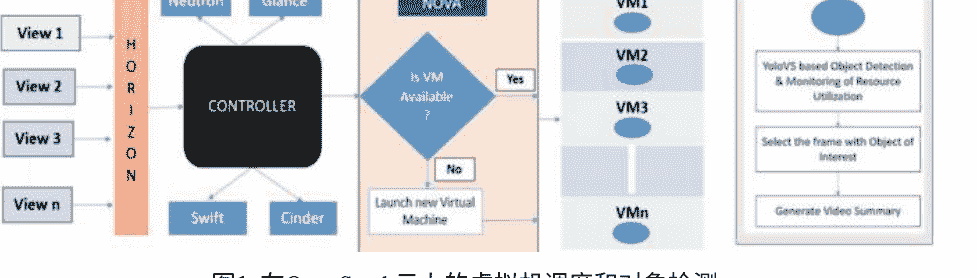

### 3.1 使用OpenStack云进行虚拟机调度

安装完OpenStack云后，可以使用Horizon GUI访问云服务。每个请求都发送到控制节点，控制节点决定新虚拟机的服务器。控制节点检查是否可以在活动服务器上创建新虚拟机，因为最初没有任何服务器上的虚拟机。如果无法容纳在活动服务器上。然后可以通过WoL技术发送魔术数据包进行新虚拟机调度。OpenStack提供基础设施即服务（IaaS），所有组件都可以通过仪表板进行管理控制。

Nova服务用于虚拟机实例的调度、生命周期和超级管理。Neutron服务维护网络服务和连接性。Cinder服务提供管理和创建外部存储的方式，而Swift服务负责基于对象的存储。Keystone服务为用户和服务提供身份验证。Glance服务管理上传的图像，它不是一个存储服务。Heat负责管理OpenStack基础架构的生命周期，而Horizon用作用户的图形用户界面。Murano、Ceilometer、Octavia、Barbican、Ironic、Trove和Designate是OpenStack云使用的其他一些服务。

### 3.2 YOLOv5基于模型训练和微调

目标检测在提取的视频帧中找到相关对象的存在。YOLOv5在单阶段上工作，具有模型骨干、模型颈部和模型头部。模型骨干从帧中提取有用的特征，并使用交叉阶段部分网络。模型颈部生成特征金字塔，并推广对象缩放。对于未知数据，获得具有不同比例和大小的相同对象也很有用。

YOLOv5使用PANet作为颈部来获取特征金字塔。YOLOv5使用Sigmoid激活函数作为最后一层，而使用Leaky ReLU作为隐藏层。SGD是YOLOv5的默认优化函数。所提出的工作使用YOLOv5n（nano）、YOLOv5s（small）、YOLOv5m（medium）、YOLOv5l（large）来找到最佳模型。这些架构最适合640 ×640的图像尺寸。预测结果如图2和图3所示。

所提出的工作使用wandb进行资源利用跟踪，每两秒自动跟踪系统指标。总共绘制了八个图表，如图4所示，提供了训练的见解。

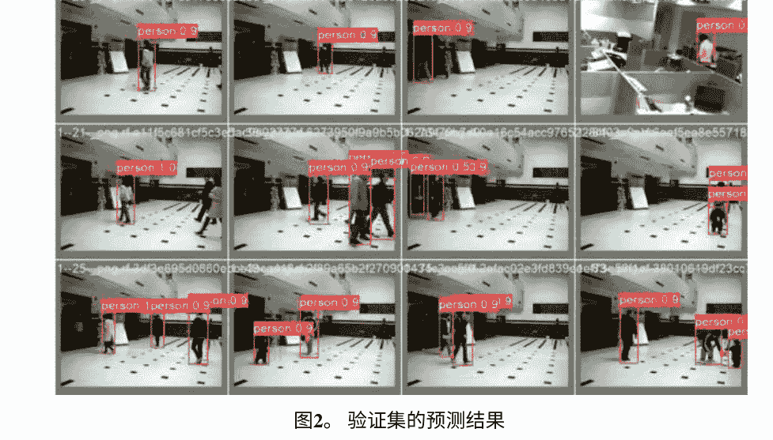

## 4 结果与讨论

所提出的工作使用了办公室和大堂数据集进行训练，目标对象是人。办公室数据集有四个视图，总共3016秒，这些视图没有同步。大堂数据集包含三个视图，总共1482秒，这些视图不固定且拥挤。在每秒25帧的情况下提取视频帧，提取的对训练和验证集的帧进行注释。注释被归一化到图像大小，并在0到1的范围内。它们由对象类别ID、X中心、Y中心、框宽度和框高度表示。注释完成后，训练集有241张图像，验证集有65张图像。

该模型使用批量大小为8和120个周期进行训练，对于不同版本的YOLOv5（如YOLOv5n、YOLOv5s、YOLOv5m、YOLOv5l），比较历史保存在表1中。所提出的工作在大堂数据集的三个视图上进行验证。所提出的工作使用精确度、召回率、PR曲线、平均精确度(mAP)、框损失、目标损失和类别损失来评估模型，如图5所示。框损失表示边界框回归损失(均方误差)。目标损失表示目标存在的置信度(二元交叉熵)和类别损失表示分类损失(交叉熵)。数学方程式由公式1、2、3和4给出。

$$ \text{精确度} = \frac{\text{真正例}}{\text{真正例} + \text{假正例}} \qquad(1) $$
$$ \text{召回率} = \frac{\text{真正例}}{\text{真正例} + \text{假反例}} \qquad(2) $$

对于不平衡数据的单一度量，F1分数是精确度和召回率的调和平均值。调和平均值鼓励召回率和精确度的相似值。

$$f_{1}得分=\frac{2\times精确度\times召回率}{精确度+召回率}$$
$$mAP=1/N\sum_{i=1}^{N}AP$$
其中，AP表示平均精确度，N表示类别数。

### 表1. 使用YOLOv5版本的实验总结。

| 参数 | YOLOv5s | YOLOv5m | YOLOv5l | YOLOv5n |
|------|--------|--------|--------|--------|
| 最佳/轮次 | 111 | 83 | 101 | 74 |
| 最佳/mAP0.5 | 0.987 | 0.981 | 0.990 | 0.971 |
| 最佳/mAP 0.5:0.95 | 0.63 | 0.63 | 0.63 | 0.63 |
| 最佳/精度 | 0.93 | 0.92 | 0.97 | 0.97 |
| 最佳/召回率 | 0.97 | 0.95 | 0.92 | 0.90 |
| 指标/mAP 0.5 | 0.98 | 0.98 | 0.99 | 0.97 |
| 指标/mAP 0.5:0.95 | 0.63 | 0.63 | 0.63 | 0.63 |
| 指标/精度 | 0.93 | 0.92 | 0.97 | 0.97 |
| 指标/召回率 | 0.97 | 0.95 | 0.92 | 0.90 |
| 训练/框损失 | 0.018 | 0.015 | 0.013 | 0.022 |
| 训练/分类损失 | 0.0 | 0.0 | 0.0 | 0.0 |
| 训练/目标损失 | 0.009 | 0.007 | 0.007 | 0.010 |
| 验证/框损失 | 0.034 | 0.031 | 0.030 | 0.033 |
| 验证/分类损失 | 0.0 | 0.0 | 0.0 | 0.0 |
| 验证/目标损失 | 0.009 | 0.009 | 0.009 | 0.009 |

### 图5. 性能指标可视化

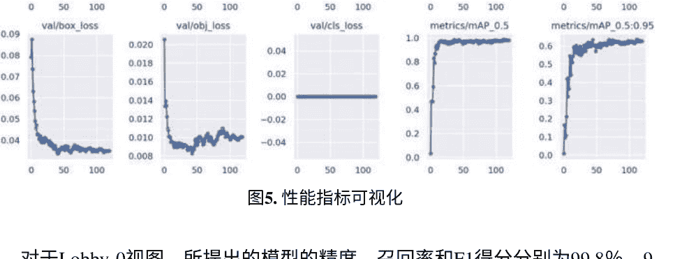

对于Lobby-0视图，所提出的模型的精度、召回率和F1得分分别为99.8%、99.8%和99.8%。如表2所示，Lobby-1视图的记录为99.8%、99.7%和99.74%，Lobby-2视图的记录为99.8%、99.7%和99.74%。根据表1的比较，所提出的模型发现YOLOv5s是最佳模型，因为它具有212层、20852934个参数、0个梯度和47.9 GFLOPs，并且具有更好的召回率和mAP得分。如图4所示，该模型还显示了在GPU内存分配、GPU功耗、GPU利用率、网络流量、系统内存利用率和温度方面的高效资源利用。

### 4.1 与相关工作的比较

大部分工作都基于镜头边界检测、关键帧选择和场景消除。这证明了所提出的工作的新颖性，它仅考虑视频摘要中感兴趣的对象。表2显示了所提出方法与现有方法在最佳精确度和召回率方面的比较分析。

表2. 与相关工作的比较

| 视图编号 | 方法 | 精确度 | 召回率 |
|----------|------|--------|--------|
| 大堂-0 [15] | [10] | 95.1 | 76.9 |
| | [15] | 365.3 | 90.2 |
| | [16] | 65.1 | 91.7 |
| | 提出的方法 | 99.8 | 99.8 |
| 大堂-1 [15] | [10] | 93.8 | 81.9 |
| | [15] | 70.0 | 91.8 |
| | [16] | 79.4 | 88.3 |
| | 提出的方法 | 99.8 | 99.7 |
| 大堂-2 [15] | [10] | 91.5 | 87.0 |
| | [15] | 76.0 | 93.2 |
| | [16] | 77.6 | 85.8 |
| | 提出的方法 | 99.8 | 99.7 |

## 5 结论

本文提出了基于感兴趣对象的事件检测和摘要方法，通过调度虚拟机并跟踪云资源利用情况来实现对OpenStack云的摘要。与现有方法相比，它提供了一种更有效地访问大量数据并生成最佳摘要长度的方法。所提出的方法可以检测帧中的单个和多个对象，也可以检测视频中的对象。使用YOLOv5s在大堂数据集上进行的实验结果显示了云上资源利用的高效性以及最佳的精确度和召回率。未来可以利用长时间的多视角监控视频进行更好的分析。

> 致谢。作者们要感谢DST GoI赞助DST/ICPS/General/2018下的工作。

## 参考文献

1.  Ajmal, M., Naseer, M., Ahmad, F., Saleem, A.: 基于人体运动轨迹分析的视频摘要。 在：2017年第16届IEEE国际机器学习与应用会议(ICMLA)，第550-555页。IEEE (2017)
2.  Alok, N., Krishan, K., Chauhan, P.: 基于深度学习的疟疾细胞检测图像分类器。 在：医疗保健应用的机器学习，第187-197页(2021)
3.  Elkhattabi, Z., Tabii, Y., Benkaddour, A.: 视频摘要：技术和应用。 Int. J. Comput. Inf. Eng. 9(4)， 928-933 (2015)
4.  Gygli, M., Grabner, H., Riemenschneider, H., Gool, L.V.: 从用户视频中创建摘要。 在：欧洲计算机视觉会议，第505-520页。Springer (2014年)。 https://doi.org/10.1007/978-3-319-10584-0_33
5.  Hussain, T., Muhammad, K., Del Ser, J., Baik, S.W., de Albuquerque, V.H.C.: IIOT中用于多视角视频摘要的智能嵌入式视觉。IEEE Trans. Ind. Inform. 16(4), 2592–2602 (2019)
6.  Hussain, T., Muhammad, K., Ullah, A., Cao, Z., Baik, S.W., de Albuquerque, V.H.C.: 使用CNN和双向LSTM的云辅助多视角视频摘要。IEEE Trans. Industr.Inf. 16(1), 77–86 (2019)
7.  Kashid, S., Kumar, K., Saini, P., Negi, A., Saini, A.: 一种用于提取文本数据的多级秘密共享方案的方法。 在：2022年IEEE学生工程与系统会议 (SCES)，第1-5页。IEEE (2022年)
8.  Khan, M.Z., Jabeen, S., ul Hassan, S., Hassan, M., Khan, M.U.G.: 利用场景边界检测，使用CNN和双向LSTM进行视频摘要。 在：2019年应用与工程数学国际会议 (ICAEM)，第197-202页。IEEE (2019年)
9.  Kumar, K.: 使用深度关键帧进行事件视频浏览。 J. Vis. Commun. ImageRepresent. 58， 345-352 (2019年)
10. Kumar, K., Shrimankar, D.D.: F-des： 快速和深度事件摘要。 IEEE Trans. Multimedia 20 (2)， 323-334 (2017年)
11. Muhammad, K., Hussain, T., Baik, S.W.: 面向资源受限设备的高效CNN视频摘要。 模式识别。 信件。 130, 370–375 (2020)
12. Muhammad, K., Hussain, T., Del Ser, J., Palade, V., De Albuquerque, V.H.C.: Deepres: 面向资源受限工业监控场景的基于深度学习的视频摘要策略。 IEEE Trans. Ind. Inform. 16(9), 5938–5947 (2019)
13. Negi, A., Kumar, K., Chauhan, P.: 基于深度神经网络的植物疾病多类图像分类。 农业信息学：利用物联网和机器学习进行自动化，pp. 117–129 (2021)
14. Negi, A., Kumar, K., Saini, P., Kashid, S.: 基于目标检测的云端系统统计的高效视频摘要方法。 在：2022年IEEE第9届北方邦电气、电子与计算机工程国际会议(UPCON)，第1–6页。IEEE (2022)
15. Ou, S.H., Lee, C.H., Somayazulu, V.S., Chen, Y.K., Chien, S.Y.: 在线多视角视频摘要用于无线视频传感器网络。 IEEE J. Selected Top. Sig. Process. 9(1),165–179 (2014)
16. Potapov, D., Douze, M., Harchaoui, Z., Schmid, C.: 类别特定的视频摘要。 在: European Conference on Computer Vision, pp. 540–555. Springer (2014). https://doi.org/10.1007/978-3-319-10599-4_35
17. Rani, S., Kumar, M.: 使用多视觉特征和Kohnen的自组织映射的社交媒体视频摘要。 Inf. Process. Manage. 57(3), 102190 (2020)
18. Srinivas, M., Pai, M.M., Pai, R.M.: 一种改进的视频摘要算法-基于排名的方法。 Procedia Comput. Sci. 89, 812–819 (2016)
19. Thomas, S.S., Gupta, S., Subramanian, V.K.: 感知视频摘要化——一种新的视频摘要化框架。IEEE Trans. Circ. Syst. Video Technol. **27**(8), 1790–1802(2016)
20. Thomas, S.S., Gupta, S., Subramanian, V.K.: 使用感知视频摘要在道路上进行事件检测。IEEE Trans. Intell. Transp. Syst. **19**(9), 2944–2954 (2017)
21. Uchihachi, S., Foote, J.T., Wilcox, L.: 使用镜头重要性度量和帧打包方法的自动视频摘要化（2003年3月18日），US专利6,535,639

# 自动假新闻检测：关于现有技术的综述文章

Karim Hemina, Fatima Boumahdi(✉), 和 Amina Madani

LRDSI实验室，科学学院，萨阿德·达赫拉布·布利达大学，
PB 270 Soumaa Road, 09000 Blida, 阿尔及利亚
hemina.karim@etu.univ-blida.dz, {f_boumahdi,a_madani}@esi.dz

摘要。假新闻是指发布给公众的不正确信息，以伤害或获利他人。自从开始以来，人们一直使用传统媒体来传播假新闻和制造宣传，以影响公众舆论。然而，随着现代社交媒体的出现，检测假新闻的新障碍也出现了。此外，虚假新闻的传播越来越像一种商业行为，个人被付费生成虚假信息，使得检测假新闻的旧方法变得低效。因此，由于假新闻对社会的威胁，一些学者正在通过机器学习自动化检测过程来区分虚假和真实新闻。本文介绍了几种基于上下文或内容特征的已知机器学习方法来检测虚假材料。我们将解释不同的检测假新闻方法。我们还描述了用于检测虚假新闻的各种公开可用的数据集。最后，我们通过讨论检测假新闻中持续存在的困难来总结我们的论文。

关键词：假新闻 · 深度学习 · 机器学习 · 自然语言处理 · 虚假信息检测

## 1 引言

使用社交媒体获取新闻是一把双刃剑，有其利有其弊。一方面，个人通过社交媒体寻找和获取信息，因为它便宜、易于获取和随时可用。另一方面，它鼓励了“假新闻”的传播，正如我们最近在许多情况下所看到的，比如2016年美国总统选举[1]、英国脱欧期间的谣言以及关于COVID-19疫情的虚假报道[2]。因此，假新闻已经成为对民主、自由表达和新闻业的重大威胁。假新闻的广泛传播可能对人民和社会产生毁灭性的影响。因此，在社交媒体上检测假新闻已经成为一个日益重要的研究领域。

本文的剩余部分由4个章节组成。第2节专门介绍现有的研究成果，第3节将讨论可用的数据集，第4节是对前面提到的方法的讨论以及未来可能的研究方向，第5节是结论。

## 2 现有工作

在本节中，我们将把现有的假新闻检测工作分类为两个主要类别，即基于内容和基于上下文的方法，同时我们还将看到一些同时使用了这两种方法的工作。

在讨论之前提到的每种方法之前，首先，我们将定义最常用的评估指标。

### 2.1 评估指标

在本节中提到的每个工作中，都使用了以下一个或多个评估指标。

- 精确度：通过将真正预测（TP）除以预测正例（PP）[3]来计算的真正预测的百分比。
$$精确度=\frac{真正例}{PP} \tag{1}$$

- 召回率：衡量分类器找到所有正样本的能力，即真正例除以真正例加假负例（FN）[4]。
$$召回率=\frac{真正例}{真正例+假负例} \tag{2}$$

- 准确率：正确预测的百分比，即真正例加真反例（TN）除以预测正例加预测反例（PN）[5]。
$$准确率=\frac{真正例+真反例}{PP+PN} \tag{3}$$

- F1分数：精确度和召回率的综合，将精确度和召回率相乘，然后除以精确度加召回率，再乘以2 [6]。
$$F_1=\frac{精确度*召回率}{精确度+召回率}*2 \tag{4}$$

- AUC ROC：用于分类问题的性能度量，它衡量模型区分类别的能力[7]。

### 2.2 基于内容的假新闻检测

从新闻的文本组成部分（如标题或新闻正文）和视觉组成部分（如图像）提取基于内容的特征，如果存在的话[8]。我们可以将基于内容的方法分为两类[9]。

- 1. 基于风格的方法更注重假新闻之间的共享模式，而不是关注新闻本身。
- 2. 基于事实的方法更关注新闻本身，通过将新闻与外部事实来源进行比较来验证其真实性程度。

### 基于风格的假新闻检测

假新闻作者往往倾向于使用有说服力和情绪化的语言来说服读者[9]，这就是为什么研究人员试图提取假新闻的共同特征以进行检测的原因。

Barbara等人在ISOT数据集上测试了五种不同的机器学习技术，其中准确率最高的是Bagging，达到了0.9964，而支持向量机（SVM）的准确率最低，为0.9889。对于CART、随机森林和AdaBoost，它们的准确率分别为0.9954、0.9913和0.9950。

Mathews和Preethi [11]在ISOT数据集上使用支持向量分类器实现了0.967的准确率，0.962的精确度，0.975的召回率和0.969的F1分数。

Bergstra等人[12]使用LIAR数据集[13]检测政治假新闻。他们测试了不同的机器学习分类器。XGBOOST获得了最高的75%准确率，其次是SVM和随机森林，准确率约为73%，而朴素贝叶斯的准确率最低，约为68%。

Babu等人[14]使用Kaggle的真假新闻数据集来实现他们的模型，采用了五种不同的技术。逻辑回归技术达到了98.84%的准确率。对于朴素贝叶斯，准确率为95.48%。随机森林可以达到99.09%的准确率。决策树取得了最高的99.71%准确率。最后测试的技术是SVM，准确率为99.49%。

Nasir等人提出了CNN和RNN的混合组合[15]。CNN用于提取局部特征，这些特征被用作LSTM的输入，以提取长期依赖性。对于训练，他们使用了ISOT数据集，并在两个数据集上验证了他们的模型，即ISOT数据集和FA-KES数据集[16]。选择另一个验证数据集是为了测试预训练模型的泛化能力。他们在ISOT数据集上获得了0.99的准确率，而在FA-KES数据集上只能达到0.60的准确率。

Saleh等人使用了经过优化的CNN，在ISOT数据集上进行训练和测试，以基于新闻内容检测假新闻。对于特征提取，使用了两种方法，即词嵌入和N-gram与TF-IDF。他们获得了99.99%的准确率、精确率、召回率和F1分数。

Ghanem等人[18]从不同的角度来解决假新闻检测问题，他们研究了假新闻作者通常会利用读者的情绪来使他们相信假新闻的部分，因此他们提出了一种模型，该模型既使用了词嵌入，又使用了其他有效特征，如情绪和夸张的词语。Bi-GRU用于建模使用CNN提取基于主题的信息后的信息。他们获得了0.96的准确率，0.93的精确度，0.97的召回率和0.96的F1分数。

为了使用多分类来识别假新闻，Majumder等人[19]采用了LSTM。他们使用了Check-That!2021数据集[20]，该数据集包含4个标签类别（False, Partial False, True和Other），并且能够获得98%的准确率。

Khaled等人[21]研究了仅使用文本特征来检测阿拉伯虚假新闻，他们使用了三个数据集，第一个数据集是从推特中收集的，第二个数据集发表在[22]中，第三个数据集是前两个数据集的合并，使用了不同的深度学习模型，包括CNN、LSTM、BiLSTM、CNN+LSTM和CNN+BiLSTM。他们的结果表明，BiLSTM模型优于其他模型。对于BiLSTM，他们在第一个数据集上实现了0.848283的准确率，在第二个数据集上实现了0.742747的准确率，在合并的数据集上实现了0.773275的准确率。

Mahlous和Al-Laith[23]收集了超过700万条与冠状病毒大流行有关的阿拉伯推文。他们使用这些推文的内容特征来检测阿拉伯语的COVID虚假新闻，并且使用逻辑回归和词频统计可以达到93.3%的F1分数。

Nassif等人[24]构建了一个阿拉伯语假新闻数据集。他们使用在大约4.2亿条推文上训练的QaribBERT-base模型，实现了98.5%的准确率，99.1%的精确度，98.2%的召回率和98.6%的F1分数。

### 基于事实的假新闻检测

事实核查，也称为基于知识的假新闻检测，是通过将其与先前已知事实的外部集合进行比较来检测假新闻的过程[25]。这种方法可以分为两个步骤：

- 1. 事实提取：从网络中提取原始事实并清除冗余、无效、冲突、不可靠和不完整的内容。
- 2. 事实核查：将新文章与从步骤1构建的知识库进行比较，并得到真假输出。

知识是从给定信息中提取的一组SPO三元组（主语、谓语、宾语），例如（阿尔及利亚，有资格，2022年世界杯）。一旦这个知识被验证为真实，它就成为一个事实，而知识库是一组事实。从知识库中，我们可以构建一个知识图，它是一个图结构，其中边是谓词，由边连接的两个节点是主语和宾语[25]。

DEAP-FAKES是一个使用GNN识别假新闻的知识图谱假新闻检测框架，由Mayank等人提出[26]。他们使用双向LSTM神经网络对新闻标题进行编码。构建了一个知识图谱，并使用GNN进行编码。他们使用了两个数据集，Kaggle假新闻和CoAID数据集[27]。知识图谱使用了Wikidata5M。他们取得了0.8955的准确率和0.8866的F1分数。

Harrag和Djahli [7]使用CNN进行阿拉伯语假新闻检测。他们的工作中使用了阿拉伯语事实核查和立场检测语料库，因为据他们所说，这是他们能找到的唯一的阿拉伯语假新闻数据集。他们取得了91%的准确率和89.9%的F1分数。

Sheng等人[9]将基于事实和基于风格的方法结合到一个名为Pref-FEND的框架中。他们使用了两个数据集，一个是来自微博社交媒体的中文数据集，另一个是来自Twitter帖子的英文数据集。对于微博数据集，他们获得了0.756的准确率和0.754的F1分数，而对于Twitter数据库，他们获得了0.814的准确率和0.801的F1分数。

## 2.3 基于上下文的假新闻检测

基于上下文的假新闻检测方法是语言无关的，这意味着它们可以让我们为不同语言构建一个模型，它可以是替代方法或补充方法。

Monti等人[28]使用了在2013年至2018年期间发布的推文数据库来训练他们的模型。他们基于传播特征进行了假新闻检测，使用了一个4层图形CNN，其中包括2个卷积层和2个全连接层，以预测假和真的类别概率。他们从数据库中提取的特征分为四个类别，用户资料、用户活动、网络和传播以及内容。在评估中，他们使用ROC AUC作为度量标准，几乎达到了93%的准确率。

韩等人[29]测试了图神经网络（GNN）在不依赖任何文本信息的情况下的准确性。这就是为什么他们选择从FakeNewsNet数据集[30]中提取以下特征的原因。无论用户是否经过验证，用户创建的时间戳，关注者数量，朋友数量以及推文的时间戳。取得的结果为0.853的准确率，0.834的精确度，0.852的召回率和0.841的F1分数。

Matsumoto等人[31]使用了图转换网络（GTN）。从FakeNewsNet数据集构建了一个带标签的图。图的每个节点表示源新闻、推文或转推。他们使用了文本特征和与用户相关的特征，如自我介绍中的单词数量、屏幕名称中的单词数量、关注者数量以及是否存在位置信息。他们达到了0.9379的准确率和0.9132的F1分数。

Davoudi等人[8]提出了一种使用Python的NetworkX库构建的传播树来分析新闻传播过程的新方法。他们使用了累积特征，如总推文数，以及全局特征，如没有参与的推文数。他们在FakeNewsNet数据集上使用了LSTM，并且能够达到98.4%的准确率。

## 2.4 混合假新闻检测

由于假新闻是有目的地制作来欺骗观众的，基于风格的方法效率不高。对于基于事实的解决方案也是如此，因为虚假新闻是时间敏感的，而我们的知识库经常过时。基于上下文的方法也不足以进行早期检测。因此，研究人员目前正在探索通过结合内容和上下文方法来检测虚假新闻的可能性。

Kaliyar等人[32]结合了上下文和内容特征来检测假新闻，他们使用了真实的BuzzFeed数据集。集成机器学习分类器（XGBoost）和深度神经网络模型（DeepFakE）用于分类。他们实现了0.8333的精确度，0.8696的召回率，0.8511的F1分数和0.8649的准确度。

Rohit等人[33]采用多个机器学习模型对基于FNC的假新闻数据集[34]进行多分类，同时使用内容和上下文特征。所采用的机器学习模型包括决策树，准确率为0.74；梯度提升，准确率为0.86（最高）；随机森林，准确率为0.70；逻辑回归，准确率为0.68；线性支持向量机，准确率为0.73；多项式朴素贝叶斯（MNB），准确率为0.725。

Sharma和Kalra[35]使用用户和文本特征来检测假新闻。对于用户特征，他们使用了XGBoost算法。而对于文本，他们使用了顺序神经网络和BERT转换器。这项工作是在FakeNewsNet数据集上完成的，他们实现了98.53%的准确率，98.20%的精确度，98.51%的召回率和98.57%的F1分数。

## 3 数据集

在本节中，我们描述了用于检测假新闻的公开可用的英语和阿拉伯语数据集。

ISOT数据集[36]包含超过21400条真实新闻和超过23400条假新闻，分为两个CSV文件。该数据集由四列组成，文章标题、正文、类型和文章发布日期。

LIAR数据集[13]包含12856篇文章，其中10269篇用于训练，1283篇用于测试，1284篇用于验证。它被标记为多类别（真实|假的|几乎真实|半真实|大部分真实|火灾）。

MultiSourceFake数据集由Ghanem等人[18]创建，它包含11397篇英文文章，以单个CSV文件的形式提供内容、标签（0表示假新闻，1表示真实新闻）和类型（训练或测试）的信息。

由Limeng和Dongwon[27]创建的Covid-19健康信息误导数据集（CoAID）包含301177条确证的假新闻和真实新闻，其中281080条为真实新闻，20097条为假新闻。

FakeNewsNet数据集[30]从事实核查网站（如PolitiFact）收集而来，其中包含5755篇假文章和17441篇真实文章。它包含作为特征，它包含信息（语言和视觉）、社交上下文信息（用户、帖子、回复和网络）和时空信息（空间、时间）。

阿拉伯语事实核查和立场检测语料库 [37]是一个包含422个关于叙利亚战争和相关中东政治问题的阿拉伯语语料库。

阿拉伯语假新闻数据集由Ashwaq等人[38]创建，用于文章可信度的分类，总共有606912篇文章，其中207310篇为真实的，167233篇为假的，232369篇未定。

## 4 讨论

在第2节中，我们将假新闻检测技术分为三类，基于事实（基于知识）的检测、基于风格的检测和基于上下文的检测。为了克服假新闻检测中仍然存在的障碍，例如早期识别假新闻，可以结合之前提到的各种策略。

部分真实新闻和过时的新闻：除了[19]和[33]之外，第2节提到的所有研究都集中在新闻的二元分类上，即是否为假新闻。这种二元分类的缺点是无法识别部分假新闻（例如，文本和图像都存在，其中文本是假的而图像是真实的，或者反之）或过时的新闻（例如，“阿尔及利亚是法国的殖民地”）。为了解决这些问题，我们可以使用动态知识图谱，该图谱根据最新的实际新闻不断更新，以及多类别分类来识别部分真实和过时的新闻。

早期发现假新闻：假新闻识别的主要目标是尽快阻止其在公众中的传播。早期假新闻检测是一个尚未完全研究的关键领域。基于上下文的策略对于早期检测是无效的，因为它们在新闻传播后才最有益，而基于内容的方法则需要我们维护一个定期更新的知识库才能发挥作用。

## 5 结论

在本文中，我们通过讨论研究者使用的各种方法和所获得的结果，回顾了当前假新闻检测研究的现状。新闻文章的内容是确定新闻真假的常见本能。基于内容的方法主要集中于提取假新闻内容中的各种特征，如信息和风格特征。

基于风格的方法试图通过捕捉写作风格中的操纵者来检测假新闻。然而，制造假新闻的目标是误导消费者。因此，借助新闻内容更准确地检测假新闻对于研究者来说是一项非常困难的任务。为了更好地进行检测，我们必须考虑社会背景以及内容特征。

在未来，我们将会对早期检测假新闻进行更多的研究。此外，还需要进行更多的研究，不仅仅将新闻分为假和真，还要将其分类为过时的、误导性的或半真半假的。最后，跨领域的假新闻检测是一个需要更深入探索的研究领域，对于检测涉及个人的各个领域的假新闻非常重要。

## 参考文献

1. Karwa, R.R., Gupta, S.R.: 基于人工智能的新闻真实性验证方法。在：2021年电气、计算、通信和可持续技术国际会议（ICAAECT），第1-6页（2021年）
2. Pavlov, T., Mirceva, G.: 使用BERT和 RoBERTa模型进行Covid-19假新闻检测。在：2022年第45届信息、通信和电子技术庆典（MIPRO），第312-316页（2022年）
3. Ramkissoon, A.N., Mohammed, S.: 基于可信度的假新闻检测数据分类模型的实验评估。在：IEEE国际数据挖掘会议工作坊，ICDMW，2020年11月，第93-100页（2020年）
4. Patil, D.R.: 使用多数投票技术检测假新闻。 arXiv电子打印品，arXiv:2203.09936，2022年3月
5. Aphiwongsophon, S., Chongstitvatana, P.: 使用机器学习方法检测假新闻。在：2018年第15届国际电气工程/电子学、计算机、电信和信息技术(ECTI-CON)会议上，第528-531页。IEEE，2018年7月
6. Umer, M., Imtiaz, Z., Ullah, S., Mehmood, A., Choi, G.S., On, B.-W.: 使用深度学习架构（CNN-LSTM）进行假新闻实例检测。IEEE Access 1(2020)
7. Fouzi Harrag和Mohamed Khalil Djahli： 阿拉伯假新闻检测：基于事实核查的深度学习方法。ACM Trans. Asian Low-Resource Lang. Inf.Process. 21, 7 (2022)
8. Davoudi, M., Moosavi, M.R., Sadreddini, M.H.: DSS: 一种使用传播树和立场网络的混合深度模型进行假新闻检测. 专家系统应用 198,116635 (2022)
9. Sheng, Q., Zhang, X., Cao, J., Zhong, L.: 通过模型偏好学习整合基于模式和基于事实的假新闻检测, 第11页 (2021)
10. Probierz, B., Stefanski, P., Kozak, J.: 基于机器学习方法的快速假新闻检测. 计算机科学会议论文集 192, 2893-2902 (2021)
11. Mathews, E.Z., Preethi, N.: 假新闻检测: 一种使用机器学习技术的有效基于内容的方法. 在: 2022年国际计算机通信与信息学会议, ICCCI 2022 (2022)
12. Bergstra, J., Komer, B., Khanam, Z., Alwasel, B.N., Sirafi, H., Rashid, M.: 使用机器学习方法检测假新闻。在：IOP会议系列：材料科学与工程，卷1099，第012040页，2021年3月
13. Wang, W.Y.: “说谎者，说谎者，裤子着火”：一个新的假新闻基准数据集。卷2 (2017年)
14. Babu, D.J., Sushmitha, G., Lasya, D., Gopi Krishna, D., Rajesh, V.: 使用机器学习识别假新闻。在：2022年电子与可再生系统国际会议（ICEARS），第1-6页，2022年3月

+   15. Nasir, J.A., Khan, O.S., Varlamis, I.: 假新闻检测：一种基于混合CNN-RNN的深度学习方法。国际信息管理数据洞察 1，100007 (2021年)
+   16. Salem, F.K.A., Alfeel, R., Elbassuoni, S., Jaber, M., Farah, M.: 关于叙利亚战争的假新闻数据集。在: 国际AAAI会议论文集，卷13，第573-582页，2019年7月
+   17. Saleh, H., Alharbi, A., Alsamhi, S.H.: Opcnn-fake: 用于假新闻检测的优化卷积神经网络。IEEE Access 9, 129471-129489 (2021年)
+   18. Ghanem, B., Ponzetto, S.P., Rosso, P., Rangel, F.: Fakeflow: 通过建模情感信息流进行假新闻检测。在: EACL 2021-欧洲计算语言学协会第16届会议，会议论文集，第679-689页 (2021年)
+   19. Majumdar, B., RaluzzamanBhuiyan, Md., Hasan, Md.A., Islam, Md.S., Noori, S.R. H.: 使用LSTM方法进行多类假新闻检测。在:2021年第10届国际系统建模与研究趋势进展会议(SMART)，第75-79页(2021)
+   20. Nakov, P., et al.: CLEF-2021 checkthat!实验室关于检测值得检查的主张、先前事实核查的主张和假新闻的概述。CoRR, abs/2109.12987 (2021)
+   21. Khaled, W.M., Fouad, M., Sabbah, S.F.: 使用深度学习进行阿拉伯语假新闻检测。计算机材料连续体 71(2), 3647-3665 (2022)
+   22. Pardo, F.M.R., Rosso, P., Charfi, A., Zaghouani, W., Ghanem, B., Sánchez-Junqueira, J.: 关于阿拉伯语作者个人资料和欺骗检测的跟踪概述。在: FIRE (2019)
+   23. Mahlous, A.R., Al-Laith, A.: Covid-19大流行期间阿拉伯推文中的假新闻检测。Int. J. Adv. Comput. Sci. Appl. 12(6) (2021)
+   24. Nassif, A.B., Elnagar, A., Elgendy, O., Afadar, Y.: 基于深度上下文嵌入模型的阿拉伯假新闻检测。Neural Comput. Appl. 34, 16019–16032 (2022)
+   25. Zhou, X., Zafarani, R.: 假新闻综述。ACM Comput. Surv. (CSUR) 53, 9 (2020)
+   26. Mayank, M., Sharma, S., Sharma, R.: 基于知识图谱的假新闻检测方法DEAP-FAKE D。CoRR, abs/2107.10648 (2021)
+   27. Cui, L., Lee, D.: Coaid: COVID-19医疗信息误导数据集。CoRR, abs/2006.00885 (2020)
+   28. Monti, F., Frasca, F., Eynard, D., Mannion, D., Bronstein, M.M.: 使用几何深度学习在社交媒体上检测虚假新闻，2019年2月
+   29. Han, Y., Karunasekera, S., Leckie, C.: 基于图神经网络的社交媒体虚假新闻连续学习检测。arXiv, abs/2007.03316 (2020)
+   30. Wang, S., Liu, H., Shu, K., Mahudeswaran, D., Lee, D.: Fakenewsnet: 用于研究社交媒体上虚假新闻的包含新闻内容、社交背景和动态信息的数据仓库。ResearchGate.Net (2018)
+   31. Matsumoto, H., Yoshida, S., Muneyasu, M.: 基于传播的图神经网络与变压器的虚假新闻检测。在: 2021年IEEE第10届全球消费电子大会，GCCE 2021，第19-20页（2021年）
+   32. Kaliyar, R.K., Goswami, A., Narang, P.: Deepfake: 基于张量分解的深度神经网络改进虚假新闻检测。J. Supercomput. 77, 1015–1037 (2021)
+   33. Kaliyar, R.K., Goswami, A., Narang, P.: 使用集成机器学习进行多类假新闻检测。在: 2019年IEEE第9届高级计算国际会议(IACC)，第103-107页(2019)
+   34. Shang, J., et al.: 使用协议感知搜索调查谣言新闻。 CoRR，abs/1802.07398 (2018)
+   35. Sharma, S., Kalra, V.: 基于深度学习的假新闻检测方法。 Int. J. Sci. Res. Sci. Eng. Technol. 8, 388-394 (2021)
+   36. Ahmed, H., Traoré, I., Saad, S.: 使用文本分类检测观点垃圾邮件和假新闻。 Secur. Privacy 1 (2018)
+   37. Baly, R., Mohtarami, M., Glass, J., M`aquez, L., Moschitti, A., Nakov, P.: 在统一语料库中集成立场检测和事实检查。 在：第16届北美计算语言学协会年会(NACL-HLT '18)，美国路易斯安那州新奥尔良，2018年6月
+   38. Khalil, A., Jarrah, M., Aldwairi, M., Jaradat, M.: AFND: 用于文章可信度检测和分类的阿拉伯假新闻数据集。 Data Brief 42, 108141 (2022)

# 级联3D V-Net用于完全自动分割和分类脑肿瘤使用多通道MRI脑图像

Maahi Khemchandani(✉), Shivajirao Jadhav和Vinod Kadam
博士。巴巴萨黑布·安贝德卡尔技术大学维迪亚维哈尔，洛内雷，马哈拉施特拉邦，印度
{mahi, smjadhav, vjkadam}@dbatu.ac.in

摘要。最近，全球范围内脑肿瘤（BT）的发病率急剧上升。BT是一种威胁生命的疾病，早期识别对于挽救人类生命至关重要。BT的分割和分类是BT识别中关键的任务。已经开发了许多现有方法来检测BT。但是，现有模型不专注于分割和分类不同类别的BT。此外，这些现有模型无法处理3D图像。因此，为了满足这些要求，本研究提出了一种级联的3D V-Net框架，旨在从3D磁共振成像（MRI）脑输入图像中分割和分类三个不同的BT类别，如非增强和坏死肿瘤核（NET/NCT），周围水肿（ED）以及增强肿瘤（ET）。本研究采用BRATS 2020 MRI图像数据库进行实验。通过考虑准确性、敏感性、精确度和IoU指标，评估了开发的3D V-Net框架在BT分割和分类性能方面的优越性。通过展示99.58%的准确性，本研究提出的3D V-Net框架在BT分类性能方面超越了现有模型框架。

关键词: 3D V-Net·脑肿瘤·分割·分类·多通道MRI

## 1 引言

在机器视觉领域，临床感染的识别和分类引起了广泛关注，因为它们具有临床成像等潜在应用[1-3]。在当今这个信息技术领域不断进步的世界中，引入了各种机器学习（ML）[4-6]、深度学习（DL）[7-10]和图像处理技术[11-13]，主要用于疾病不同症状的精确识别和分类。这些技术能够精确地识别和分类疾病区域，并进一步将其分类到相应的类别中。这个过程可以帮助医生快速而准确地诊断和分类病变或肿瘤区域。近年来，脑肿瘤（BT）检测已成为疾病识别领域的研究热点之一[14-16]。脑肿瘤组织影响大脑的正常发育。BT主要是由于人脑内或周围细胞的不可控分裂导致异常细胞集群的形成。这种细胞集群主要会影响健康的脑细胞和正常的脑功能。

BT威胁存在多个决定因素，包括位置、肿瘤纹理、肿瘤大小和形状。一般来说，BT主要分为两种类型：a) 良性和 b) 恶性。良性BT不会迅速扩散，在这种类型中，相邻的健康脑组织不受影响，而恶性BT迅速扩散，未能及时准确地检测到这种BT可能导致死亡[17]。此外，恶性BT可以影响相邻的健康脑组织。目前，恶性BT病例大大增加。因此，早期识别BT对于挽救人类生命变得不可或缺。

因此，MRI扫描方法已被用于初步识别人类脑瘤，以避免因该疾病而导致的死亡[18-22]。MRI技术在确定脑瘤方面非常有用，并被认为是一种比计算机断层扫描更有效的筛查程序。然而，使用传统成像方法分析MRI图像耗时且无法精确快速地进行脑瘤分割和分类。采用完全自动化的脑瘤分割和分类系统可以极大地帮助解决现有手动和半自动疾病检测系统中遇到的各种问题。深度学习（DL）和机器学习（ML）等先进技术似乎是在这个领域中非常有用和有前景的候选方法。

因此，本研究工作开发了一个以深度学习为导向的完全自动化框架，用于有效和精确地分割和分类脑瘤。

### 1.1 本研究的贡献

本研究的主要贡献包括：

- 使用多通道脑MRI图像对脑瘤进行分割和分类。
- 开发了一个用于有效的BT分割和分类的DL框架。
- 利用V-Net框架来利用BT图像分类的数据样本。
- 使用图像数据生成器（IDG）可以方便快捷地增强图像。而且还有助于节省内存。
- 比较开发的3D V-Net框架的BT分类性能与现有模型，以展示所提出框架的优越性。

本文的其余部分结构如下：第2节回顾了关于BT分割和分类的不同研究和方法。第3节描述了开发的研究方法的实施。第4节呈现了模拟输出并讨论了实现的结果。第5节提供了本研究文章的主要发现。

## 2 相关工作

根据等级融合，在[23]中提出了一种新颖的BT分割及其分类方法。作者利用了不同的空间域方案用于增强和精确分割输入图像。本研究采用了Google和Alex网络进行分类，在softmax层之后获得了两个等级向量。然后，这些等级向量与softmax层一起输入到不同的分类器中。所提出的架构准确地分割和分类了恶性和良性肿瘤病例。然而，本研究未讨论矢状和冠状视图中的BT检测。在[24]中，通过机器学习方案讨论了自动BT分割和分类。该方法包括四个阶段，即用于噪声消除的预处理，用于识别感兴趣区域的分割，用于挖掘不同特征的特征提取，以及用于将BT分类为恶性或良性的分类。实验结果表明，所采用的方案具有94.44%的精度，93.33%的准确度，93.33%的敏感度和96.6%的特异度。但是，本研究未探讨恶性和良性肿瘤内不同类别的识别。在[25]中，主要开发了卷积神经网络(CNN)模型，用于通过MRI图像进行BT分割和分类。在这里，从MRI图像中提取特征并输入到CNN模型进行分类。然而，未提供性能评估和该模型相对于现有框架的优越性。

在[26]中，建立了一种混合权重对齐和多扩张注意力网络（Hybrid-DA Net）用于自动BT。它部署了多个模块集成到基线编码器-解码器架构中。最初，在跳跃连接之间使用了一种混合权重对齐和多扩张注意力模块（HWADA）。通过利用不同的扩张方案，它可以获得不同的对齐权重集合。之后，该模型在基线模块上集成了一个多通道多尺度模块（MCS）。结果显示该模型具有更低的准确性但卓越的性能。在[27]中，提出了一种面向深度学习的BT分割和分类模型。作者通过前处理方案执行BT检测，然后进行颅骨解体和BT分割。该模型通过CNN依赖的AlexNet方法，有效地从MRI中分割BT，并将肿瘤图像分为良性和恶性。它提供了0.9677的F-measure，0.9375的精确度和召回率值为1。然后，使用CNN指导的GoogleNet方法将恶性图像进一步分类为脑膜瘤和胶质瘤。实验证明，该分类方法提供了0.9743的F-measure，0.9750的准确度，0.95的精确度和召回率为1。性能评估测试表明，该模型超越了现有方案。然而，对BT分类性能的进一步改进仍然需要。在[28]中，提供了一种用于BT分割和分类的多尺度CNN模型。通过弹性变形进行数据增强，以增强训练数据库并避免过拟合。将开发的模型与其他七种BT分类技术进行比较，发现多尺度CNN模型提供了97.3%的准确率，并且优于其他技术。但是该模型在某些图像中存在误报问题。

在[29]中，通过机器学习方案实现了BT分割和分类。作者旨在通过利用多个分割方案（如阈值、K-means和分水岭分割）来精确地对MRI图像中的BT进行分类，以解决错误分类的可能性。采用多个分割方案可以生成比单个分割方法更精确和准确的输出。使用支持向量机进行BT分类。机器（SVM）分类器提供了90%的准确性。然而，这项工作在多类别BT分类方面没有得到很好的探索。在[30]中，提出了一种用于BT分割和分类的混合架构。最初，通过均值滤波器进行预处理以抑制噪声。此外，使用贝叶斯和模糊聚类技术进行BT分割。然后，在分割后采用数据理论度量、Tsallis熵和散射变换等特征提取方案提取稳健属性。最后，使用深度自动编码器和回归方法对肿瘤部分进行BT分类过程。作者使用BRATS 2015数据集进行分析。模拟结果表明，该方法实现了98.5%的分类准确性，并且优于多种竞争分类方法。然而，尚未检查使用先进的DL方法的这种方法的效果。

在[31]中，介绍了一种用于BT分割的增强型DL方案。在这项工作中，采用了依赖于内核的CNN与多类别SVM。该方法涉及到预处理、属性提取、BT图像分类和BT分割等多个阶段。在预处理之后，根据形状、表面特征和BT形状位置提取所需的属性，并使用多类别SVM将MRI图像分类为异常或正常的脑部图像。此外，通过面向内核的CNN对异常MRI脑部图像进行分割以分割肿瘤。在所讨论的分割中，CNN与多类别SVM方法集成用于BT分割和分类。结果表明，该方法提供了84%的分割准确率。但是，所提出的DL方案的性能仅使用了少量的指标进行评估。在[32]中，描述了一种使用SVM和CNN进行自动化BT分类的MRI方法。本研究中的作者利用了Figshare开放数据库，其中包含了三种类型的BT的MRI图像。在这里，CNN方案主要用于从MRI脑部图像中提取属性。为了实现更好的性能，使用了多类别SVM与CNN属性。对这种混合方法的评估和测试涉及到一个五折交叉验证过程。实验证明，所采用的方案具有95.82%的总分类准确率，并在BT分类性能上超过了先前提出的方案。然而，这需要额外的训练时间。

在[33]中提出了一种复杂的CNN框架用于BT分类。本研究旨在对集体患者MRI图像中的BT类型进行识别。作者们开发了一个复杂的CNN结构，并通过交叉验证进行训练。矢状、冠状和轴向MRI扫描被用于框架的测试和训练。该框架在从重要的开放数据库中获取的MRI脑图像上进行了实验。所提出的CNN框架成功预测了五种BT类型，包括星形细胞瘤、健康组织、少突胶质瘤、未识别的肿瘤和胶质母细胞瘤，并对这些BT类型展示了99.48%、99.99%、99.23%、99.08%和99.50%的F1分数。然而，本研究中没有描述确切的BT位置识别。

在[34]中，通过MRI图像对BT系统进行了自动分割和分类。整个过程包括对脑图像进行噪声抑制、属性提取、分割和分类的预处理。预处理是通过扩散滤波器实现的。在这里，肿瘤区域是通过形态学和Otsu阈值操作提取的。对于属性提取，使用小波变换提取了相关属性。然后将这些提取的属性提供给分割阶段。本研究采用SVM进行BT分割和分类。所采用的SVM方法显示了86%的准确率。然而，这种方法相对于先前引入的方案的优越性并未得到证明。在[35]中，描述了一种基于顶部特征选择和改进的显著性分割的新型BT分割和分类方案。作者首先通过手动进行颅骨剥离来提取感兴趣区域。此外，使用高斯滤波器消除噪声效果，并使用改进的阈值技术进行肿瘤分割。分割后，进行特征挖掘以提取纹理和几何属性。使用串行相关技术融合了挖掘的特征，并使用遗传算法选择了适当的特征。使用线性核SVM进行分类。结果证实，该方法对私人和哈佛数据集提供了90%的准确率。然而，当肿瘤出现在边界区域时，该方案存在过分分割的问题，这严重影响了分类的准确性。

## 3 提出的方法论

在这项研究工作中，构建了一个改进的面向深度学习的框架，用于进行BT分割和分类。该研究方法的实施过程如图1所示。这个面向深度学习的框架包括四个主要阶段，即数据收集和处理、分割和特征提取、使用V-Net进行分类和最终性能评估。首先，从公开可用资源中收集数据。然后，对收集到的数据进行预处理。之后，将预处理的图像分割成不同的部分，只利用有用的部分。并提取所需的图像属性。然后，使用提出的V-Net算法对BT进行分类。最后，进行性能分析，展示提出模型的效率。

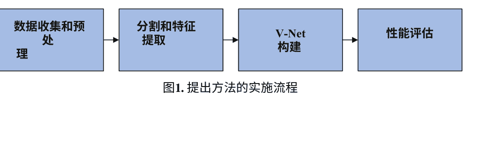

### 3.1 数据收集和预处理

数据收集和处理是BT分类中非常重要和初步的过程。在这项工作中，脑部MRI图像被用于收集数据。数据收集后，获取的MRI图像将被预处理。预处理是为了改善图像质量，以获得前面阶段的更好输出。预处理有助于提供改进的图像特征。在这项工作中，使用了存储在NIfTI文件中的所有多模态扫描（图像）（常用的临床成像格式，用于存储使用MRI获取的脑图像数据并描述不同的MRI设置）。NIfTI通常是一种光栅格式，包括涉及三维（3D）信息（如体素或像素）的文件，具有高度、宽度和深度。收集的数据包括以下参数：a) T1: T1加权、原始图像，轴向或矢状2D采集，包括1-6毫米切片厚度；b) T1c: T1加权、增强（钆）图像，3D采集，对大多数患者采用1毫米等向性体素大小；c) T2: T2加权图像，轴向2D采集，包括2-6毫米切片厚度；d) FLAIR: T2加权FLAIR图像，冠状、轴向或矢状2D采集，包括2-6毫米切片厚度。本工作使用了不同的医疗协议和来自19个不同机构的不同扫描仪获取的信息。此外，所有成像数据库在这里都是手动分割的，使用1到4个评分者。考虑的注释包括GD增强肿瘤（ET标签4）、周围水肿（ED标签2）和非增强和坏死肿瘤核心（NET/NCR标签1）。在预处理后，提供的信息通常会被分发。在这项工作中，使用了从Kaggle数据库获取的BRATS 2020 MRI图像数据集进行分析。

### 3.2 分割和特征提取

分割在将图像分成不同部分以利用有用部分方面起着重要作用。分割主要是为了减少进一步阶段中需要执行的任务数量，例如，在整个图像上只存在一个肿瘤区域需要挖掘其属性时，特征提取变得更简单。特征提取基本上是一个不可或缺的过程，因为它有助于抑制庞大的数据库表示。这个过程主要涉及将图像数据转化为所需的特征以进行分类。在当前工作中，首先将多类标签和体积分割。然后，检查、可视化和转换MRI格式图像为2D图像。在这个阶段，对获取的脑MRI图像进行分割，并提取所需的图像属性。

从转换后的2D图像中，估计Dice系数及其损失函数等测量值，以获得关于2D图像的基本见解。Dice系数是一种主要用于估计两个图像之间相似性的度量标准。骰子损失度量通常用于临床图像分割操作，以解决数据不平衡问题。然而，骰子损失只解决了背景和前景之间的不平衡问题，却忽视了困难和容易示例之间的另一种不平衡，严重影响了学习框架的训练过程。

骰子系数通常是两个样本之间重叠的估计值。其值通常在0到1之间，骰子系数为1表示完全和完美的重叠，骰子系数为0表示两组分割结果之间没有空间重叠。这个系数类似于交并比（IoU）度量。两个二进制体积之间的骰子系数D在0到1之间可以使用公式（1）估计为

$$D = \frac{2 \sum_{i}^{N} p_i g_i}{\sum_{i}^{N} p_i^2 + \sum_{i}^{N} g_i^2}$$其中 N 表示体素数量， $p_i$ 表示预测的体素， $g_i$ 表示实际的体素。

### 3.3 提出的模型创建

由于大部分医学实践中使用的临床数据都是以3D形式存在的，例如显示前列腺的MRI体积，但是许多方法只能处理2D图像，并且对于3D图像有效。因此，为了有效地克服这个缺点，在这项工作中提出了一种基于完全卷积结构的3D图像分割方法。在这里，开发了一种V-Net框架，一种CNN结构形式，用于利用BT图像分类的数据样本。图2展示了开发的级联3D V-Net结构。开发的V-Net结构使用了128*128*3的卷积核大小，(5, 5, 5)的输入大小和学习率为0.001。该V-Net架构采用softmax激活函数和Adam优化器进行学习。

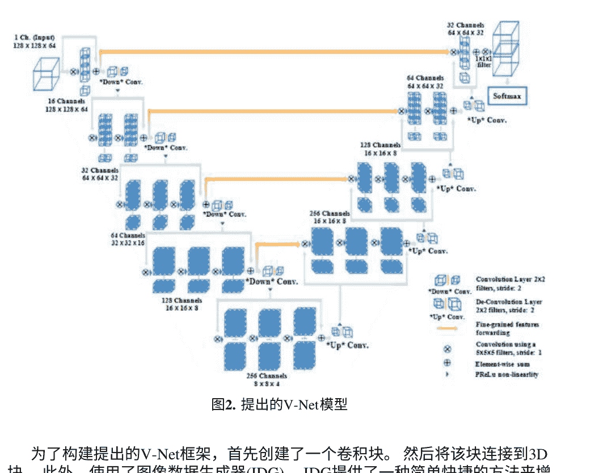

为了构建提出的V-Net框架，首先创建了一个卷积块。然后将该块连接到3D块。此外，使用了图像数据生成器(IDG)。IDG提供了一种简单快捷的方法来增强图像。它提供了许多不同的增强方法，如标准化、翻转、平移、旋转、亮度变化等。使用Keras IDG类的主要好处是它被设计为提供逼真的数据增强。此外，IDG类确保框架在每个时期接收到新的图像变体。另一个重要的优势是IDG的要求是较低的内存利用。利用IDG有助于批量加载图像，从而节省内存。

此外，在这项工作中执行了回调函数。回调基本上是在训练的不同阶段执行活动的对象（例如开始一个时期，结束一个时期等）。可以使用回调函数在每个训练批次后编写tensorboard日志以监控指标。此外，还向预训练模型添加了权重，并对训练和验证进行了各种指标测试，如准确率、Dice系数、IoU和Dice损失。

### 3.4 性能评估和比较

然后使用精度、敏感度、准确度和平均IoU指标等多样的性能评估措施对所提出的级联3D V-Net的性能进行评估。这些指标的计算如下：

$$精确度 = \frac{TP}{真正例 (TP) +假正例 (FP)}$$ (2)

$$敏感度 = \frac{TP}{真正例 (TP) +假反例 (FN)}$$ (3)

$$准确度 = \frac{真正例 (TP) +真反例 (TN)}{真正例 (TP) +真反例 (TN) +假正例 (FP) +假反例 (FN)}$$ (4)

其中TN、TP、FP和FN分别表示真反例、真正例、假正例和假反例。TN和TP表示被正确分类的负样本和正样本的数量，而FN和FP表示被错误分类的负样本和正样本的数量。此外，通过考虑精度、敏感度、准确度和平均IoU指标，将所提出的级联3D V-Net方法的性能与先前报告的U-Net进行比较。

## 4 结果与讨论

在这项研究中，使用Python 3.9.7和Jupyter笔记本6.4.5软件进行模拟。通过级联的3D V-Net框架实现了BT分类。在这项工作中，使用从Kaggle数据库获取的2020年BRATS MRI图像数据集进行脑肿瘤图像分割分析。该数据库进一步分为训练集和验证集。

图3显示了用于研究的参数。脑MRI图像进一步转换为2D图像，如图4所示。图5描绘了MRI脑图像。使用训练集和测试集验证输出的结果如图6所示。

如图6所示，首先考虑一个原始的FLAIR图像并评估其地面真实性。进一步确定并预测了三个不同的BT类别，即NET/NCR、ED和ET，用于训练和验证集。BT分类的结果如图7所示。这里，用于评估的地面真实性和ED类别的预测输出在图7中显示。

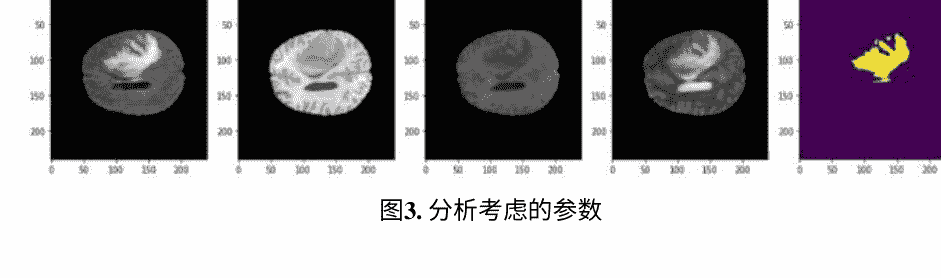

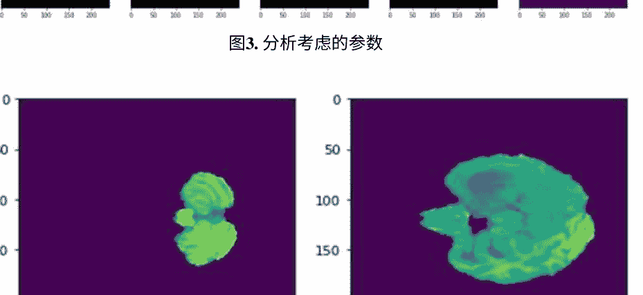

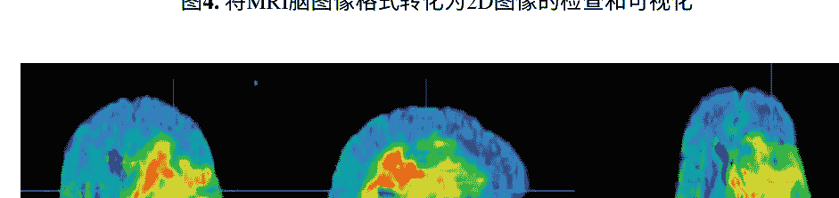


从图8可以观察到，对于训练集和验证集，获得的准确度、Dice损失、Dice系数和IoU值几乎相似。因此，可以确认该开发框架表现更好。

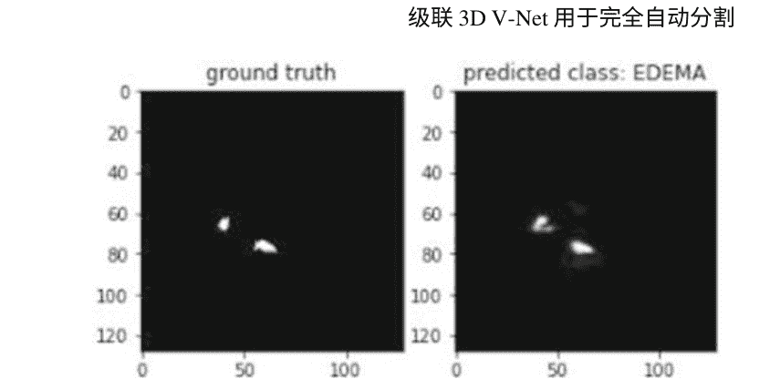

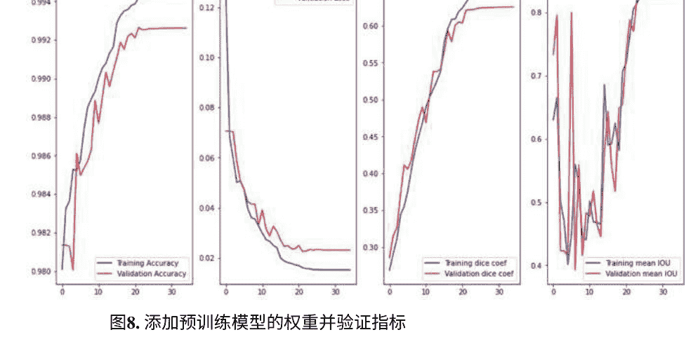

开发和现有的深度学习框架根据不同的性能评估指标进行比较，并在表1中列出了实现的输出值。

表1. 开发的V-Net和现有模型的性能结果
| 技术/指标 | 敏感性(%) | 特异性(%) | 准确性(%) | 精确度(%) | F1得分(%) | 平均IOU(%) |
|----------|-----------|-----------|-----------|-----------|-----------|------------|
| 提出的V-Net | 99.4762   | 99.7377   | 99.5803   | 99.6262   | 98.4262   | 85.2956    |
| V-Net    | 98.8167   | 98.0428   | 99.076    | 99.2567   | 88.2567   | 81.8354    |
| U-Net    | 98.3581   | 97.8814   | 98.668    | 99.0914   | 87.2881   | 38.8866    |
| Resnet   | 97.5835   | 97.6392   | 95.953    | 98.3535   | 85.8354   | 35.3511    |
| Segnet   | 95.7143   | 97.619    | 95.1837   | 95.7143   | 85.7143   | 32.5857    |

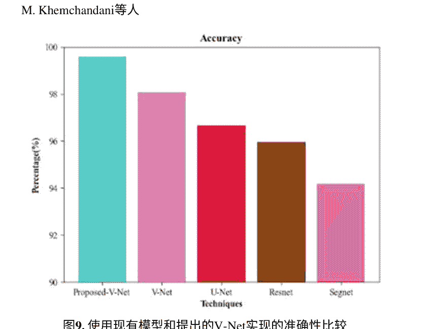

准确性指标通常描述了模型在所有类别上的性能。它被估计为正确预测的比率与总预测数的比值。使用提出的V-Net和现有模型实现的准确性值显示在图9中。从这个图中可以观察到，现有模型提供了(i) 98.07%的准确性 (V-Net)，(ii) 96.66%的准确性 (U-Net)，(iii) 95.95%的准确性 (Resnet)，以及(iii) 94.18%的准确性 (Segnet)，而创建的V-Net提供了99.58%的准确性。准确性结果清楚地表明V-Net框架在性能上超过了现有模型。

IoU指标有助于评估地面真实值和预测输出之间的边界框相似性。在IoU的情况下，重叠越大，得分越高，输出越好。IoU指标，也称为Jaccard指数，是一种广泛应用于分割任务的评估指标。它用于量化预测结果与目标掩码之间的重叠百分比。图10展示了开发的V-Net和现有模型的平均IoU性能。

从这个图中可以看出，现有模型的平均IoU得分为81.83% (V-Net)，38.88% (U-Net)，35.35% (Resnet)和32.58% (Segnet)，而开发的V-Net提供了85.28%的平均IoU得分。这两个模型的平均IoU得分明确表明，V-Net框架的性能优于现有框架。

精确度是另一个用于性能评估的基本评估指标。该指标表示正确分类的正实例比例。开发的V-Net和现有模型的精确度性能如图11所示。从该图中可以看出，现有模型的精确度为99.25% (V-Net)，99.09% (U-Net)，98.35% (Resnet)和95.71% (Segnet)，而开发的V-Net提供了99.60%的精确度。精确度输出清楚地表明V-Net框架在精确度性能方面超过了现有框架。

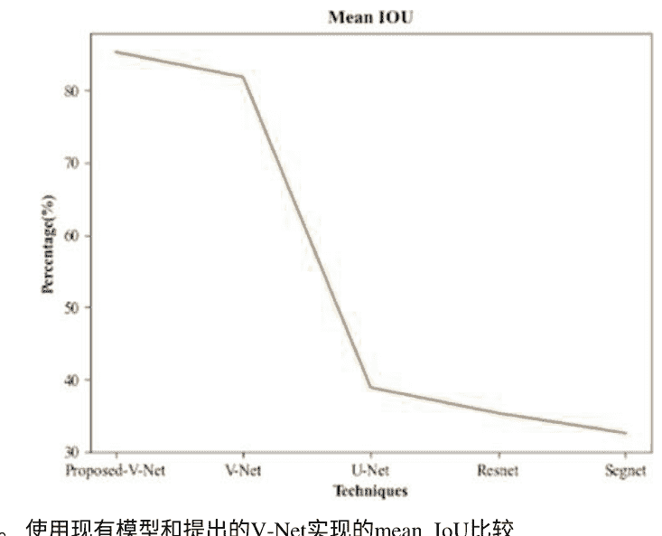

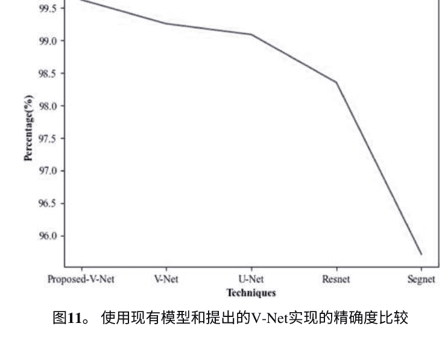

敏感度是用于模型性能评估的众所周知的指标之一。敏感度测量指示正确识别的真正正实例的比例。使用开发的V-Net和现有模型实现的敏感度值进行比较，并显示在图12中。从该图中可以看出，现有模型实现了97.81%的敏感度(V-Net)，96.35%(U-Net)，95.58%(Resnet)和94.71%(Segnet)，而开发的V-Net则表现出99.47%的灵敏度。所取得的灵敏度输出明确证实了V-Net框架相对于现有框架的优越性。

图13显示了V-Net模型和现有模型在特异性和F1得分方面的性能分析。较高的特异性和F1得分值显示了模型的优越性能。在(a)中，V-Net模型达到了99.73%的特异性，高于现有模型，而现有模型的特异性分别为98.04%（V-Net），97.08%（U-Net），96.63%（Resnet）和94.61%（Segnet）。同样，在(a)中，提出的模型的F1得分为98.42，高于现有模型。根据结果，可以看出V-Net模型优于现有模型。

V-Net模型和流行模型关于Dice系数损失的性能调查如图14所示。Dice损失经常用于医学图像分割任务。所提出模型的损失为0.3818，而现有模型的损失分别为0.4217（V-Net），0.4742（U-Net），0.6125（Resnet）和0.6482（Segnet）。从这些结果可以得出结论，V-Net模型比流行模型更高效。

表2展示了V-Net模型与现有模型在准确性方面的比较调查。V-Net模型的准确率达到了99.58%，高于流行模型，而现有模型如NN，GoogLeNet和深度自编码器的准确率分别为93.33%，97.5%和98.5%。从这些结果可以得出结论，V-Net模型比流行模型更高效。

级联 3D V-Net 用于完全自动分割

Specificity

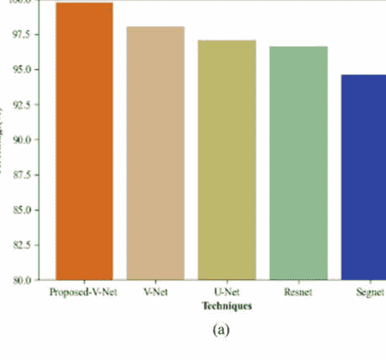

(a)

F1-score

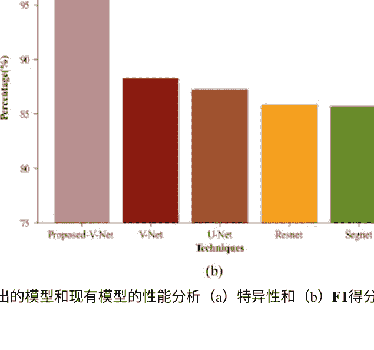

(b)

图13. 对所提出的模型和现有模型的性能分析（a）特异性和（b）F1得分

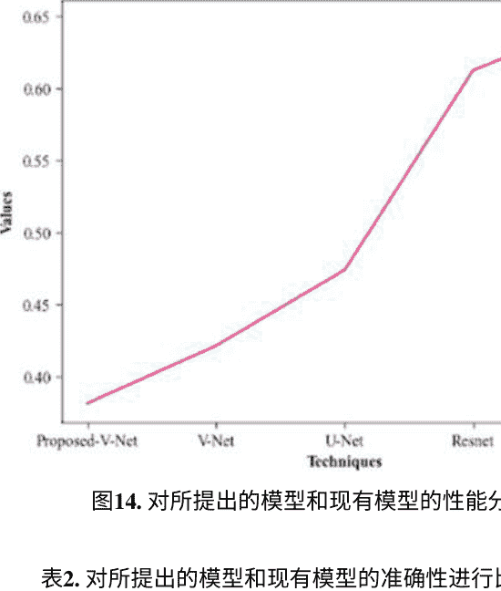

表2. 对所提出的模型和现有模型的准确性进行比较分析
| 技术 | 准确率（%） |
|---|---|
| 提出的V-Net | 99.58 |
| NN | 93.33 |
| GoogLeNet | 97.5 |
| 深度自编码器 | 98.5 |

## 5 结论

本研究论文基于级联3D V-Net方法，提出了一种有效的脑磁共振图像BT分割和分类框架。所提出的框架高效地完成了脑图像预处理、分割、脑特征提取和分类。本研究采用了改进的数据库进行疾病分析。通过使用不同的评估指标进行性能评估，对所提出的V-Net框架进行了评估，并主要采用了先前介绍的框架进行性能比较。实验结果表明，开发的3D V-Net框架通过实现99.58%的准确率、85.29%的平均IoU、99.62%的精确度和99.47%的敏感度，优于现有模型。

数据可用性声明。数据集由BraTS Challenge提供，并允许个人学术研究。数据集的具体链接是https://ipp.cbica.upenn.edu/。

## 参考文献

1.  Havaei, M.等：使用深度神经网络进行脑肿瘤分割。医学图像分析。35，18-31（2017年）
2.  Irum, I., Shahid, M. A., Sharif, M., Raza, M.：图像去噪方法综述。工程科学技术评论。8（5）（2015年）
3.  Masood, S., Sharif, M., Yasmin, M., Raza, M., Mohsin, S.：脑图像压缩：简要调查。应用科学工程技术研究杂志。5（1），49-59（2013年）
4.  Amin, J., Sharif, M., Raza, M., Yasmin, M.：基于特征融合和机器学习的脑肿瘤检测。环境智能人性化计算杂志，1-17（2018年）
5.  Manogaran, G., Shakeel, P.M., Hassanein, A.S., Kumar, P.M., Babu, G.C.：基于机器学习方法的伽玛分布用于脑肿瘤检测和数据样本不平衡分析。IEEE Access 7, 12-19（2018年）
6.  Mathiyalagan, G., Devaraj, D.：基于机器学习分类方法的胶质瘤脑肿瘤检测。Int. J. Imaging Syst. Technol. 31(3), 1424–1436 (2021)
7.  Nazir, M., Shakil, S., Khurshid, K.：深度学习在脑肿瘤检测和分类中的作用（2015年至2020年）：一项综述。Comput. Med. Imaging Graph. 91, 101940 (2021)
8.  Amin, J., et al.：使用深度学习中的堆叠自编码器进行脑肿瘤检测。J. Med. Syst. 44(2), 1–12 (2020)
9.  Noreen, N., Palaniappan, S., Qayyum, A., Ahmad, I., Imran, M., Shoaib, M.：基于连接方法的深度学习模型用于脑肿瘤的诊断。IEEE Access 8, 55135–55144 (2020)
10. Rehman, A., Naz, S., Razzak, M.I., Akram, F., Imran, M.：基于深度学习的框架，用于自动脑肿瘤分类，使用迁移学习。电路系统信号处理。39(2)，757-775（2020年）
11. Kapoor, L., Thakur, S.（2017年1月）。关于使用图像处理技术进行脑肿瘤检测的调查。在：2017年第7届云计算、数据科学与工程·汇流国际会议（第582-585页）。IEEE
12. Borole, V.Y., Nimbhore, S.S., Kawthekar, D.S.S.：用于脑肿瘤检测的图像处理技术综述。国际计算机科学新兴趋势与技术杂志（IJETTCS）4(5)，2（2015年）
13. Sudharani, K., Sarma, T.C., Prasad, K.S.：自动脑肿瘤检测和统计参数评估的先进形态学技术。Procedia Technol. 24, 1374–1387（2016）
14. Amin, J., Sharif, M., Yasmin, M., Fernandes, S.L.：利用MRI进行脑肿瘤检测和分类的独特方法。Pattern Recogn. Lett. 139, 118–127（2020）
15. Chahal, P.K., Pandey, S., Goel, S.：用于MR图像的脑肿瘤检测技术调查。Multimedia Tools and Applications 79(29–30), 21771–21814（2020）。https://doi.org/10.1007/s11042-020-08898-3
16. Saman, S., Jamjala Narayanan, S.：对脑肿瘤分割和MR图像特征提取的调查。多媒体信息检索国际期刊8(2)，79–99（2018）。https://doi.org/10.1007/s13735-018-0162-2
17. Mosquera, J.M., et al.：良性和恶性血管瘤中新的MIR143-NOTCH融合。基因染色体癌52(11), 1075–1087（2013）
18. Abd-Ellah, M.K., Awad, A.I., Khalaf, A.A., Hamed, H.F.：从MRI图像中的脑肿瘤诊断回顾：实际应用，关键成就和经验教训。磁共振成像61，300–318（2019）
19. Gordillo, N., Montseny, E., Sobrevilla, P.：MRI脑肿瘤分割的现状调查。磁共振成像31(8), 1426–1438（2013）
20. Hameurlaine, M., Moussaoui, A.: 磁共振成像上的脑肿瘤分割技术调查。纳米生物医学与工程 11(2), 178–191 (2019)
21. Chaudhary, A., Bhattacharjee, V.: 使用K-means聚类和DWT的MRI图像脑肿瘤检测和分类的高效方法。国际信息技术杂志 12(1), 141–148 (2020)
22. Gull, S., Akbar, S.: 通过MRI扫描在脑肿瘤检测中的人工智能：进展与挑战。人工智能物联网, 241-276 (2021)
23. Amin, J., Sharif, M., Yasmin, M., Saba, T., Anjum, M .A., Fernandes, S.L.: 基于迁移学习的评分级融合的脑肿瘤分割和分类的新方法。医学系统 43 (11), 1-16 (2019)
24. Byale, H., Lingaraju, G.M., Sivasubramanian, S.: 使用机器学习技术的脑肿瘤自动分割和分类。应用工程研究国际期刊 13 (14), 11686-11692 (2018)
25. Kumar, S., Negi, A., Singh, J.N., Gaurav, A.: 使用全卷积神经网络对MRI图像进行脑肿瘤分割和分类。在：2018年国际计算、通信、控制和网络进展会议 (ICACCCN), pp. 1178-1181 IEEE (2018)
26. Ilyas, N., Song, Y., Raja, A., Lee, B.: 基于编码器-解码器的混合权重多扩张注意力网络用于自动脑肿瘤分割。IEEE Access 10, 122658–122669 (2022)
27. Kulkarni, S. M., Sundari, G.: 一种基于深度学习算法的脑肿瘤分割和分类框架。Int. J. Adv. Comput. Sci. Appl., 11(01) (2020)
28. Díaz-Pernas, F. J., Martínez-Zarzuela, M., Antón-Rodríguez, M., González-Ortega, D.: 一种基于多尺度卷积神经网络的脑肿瘤分类和分割的深度学习方法。在医疗保健领域的多学科数字出版机构 9(2), p. 153). (2019)
29. Habib, H., Mehmood, A., Nazir, T., Nawaz, M., Masood, M., Mahum, R.: 使用机器学习进行脑肿瘤分割和分类。在：2021年国际应用与工程数学会议 (ICAEM), 第13-18页。IEEE (2021)
30. Raja, P.S.: 使用混合深度自动编码器和贝叶斯模糊聚类分割方法进行脑肿瘤分类。生物控制与生物医学工程 40 (1), 440-453 (2020)
31. Thillaikkarasi, R., Saravanan, S.: 基于核心卷积神经网络和M-SVM的深度学习算法改进脑肿瘤分割。医学系统杂志 43 (4), 1-7 (2019)
32. Deepak, S., Ameer, P. M.: 使用CNN特征和SVM自动分类脑肿瘤。环境智能和人性化计算杂志 12 (8), 8357-8369 (2021)
33. Balasooriya, N. M., Nawarathna, R.D.: 用于脑肿瘤分类的复杂卷积神经网络模型。在：2017年IEEE工业和信息系统国际会议 (ICIIS), 第1-5页。IEEE (2017)
34. Mathew, A. R., Anto, P. B.: 使用小波变换和SVM的MRI脑图像肿瘤检测和分类。在：2017年国际信号处理和通信会议(ICSPC), 第75-78页 IEEE (2017)
35. Sharif, M., Tanvir, U., Munir, EU., Khan, M.A., Yasmin, M.: 改进的二项式阈值和多特征选择的脑肿瘤分割和分类J. 环境智能. 人性化计算., 1-20 (2018). https://doi.org/10.1007/s12652-018-1075-x

# 使用深度神经网络计算工作班次期间的物理应力

Vincenzo Benedetto<sup>1,2</sup>(※), Francesco Gissi<sup>1,2</sup>, 和 Marialuisa Menanno<sup>1</sup>

<sup>1</sup> 意大利贝内文托市特拉亚诺大街1号圣尼奥大学工程系
{vincenzo.benedetto,frangissi,menanno}@unisannio.it
<sup>2</sup> 意大利菲西亚诺市约翰·保罗二世大街132号Kebula有限公司

摘要。 我们的工作是作为实验支持，以获取关于使用人工智能，更具体说是计算机视觉技术和姿态估计算法在工业环境中优化生产任务和构建更符合人体工程学的工作站的优势的证据。该方法基于最先进的姿态估计模型；然后使用模型的输出作为工作时间内人员活动的抽象。 这种抽象允许我们对操作员模型进行数学运算，以评估工作班次期间的身体压力和安全水平。

关键词： 物理应力 · 姿势估计 · 深度学习

## 1 引言

在过去的20年中，对人体观察和抽象的巨大兴趣将研究的努力转移到了人工智能领域[14-17]，以开发更高效、更准确的模型来生成人体、头部和手部的忠实再现[4]。 这些技术赋予的应用范围从增强现实（AR）和虚拟现实（VR）到工业工作优化和安全评估。 计算机视觉（CV）使人们和物体的姿势估计等多个应用成为可能，例如在建筑工地上跟踪人员[9]和施工设备，以避免意外碰撞和人身伤害。 入侵检测和安全领域也取得了其他改进。 想象一下使用由CV驱动的姿势估计来跟踪关键建筑物的入口，以确定进入现场的人数。 此外，还可以识别特定房间中特定个体的行为，以标记未经授权的行为。 开源软件工具的最新技术代表是OpenPose [3]，它可以实时从图像和视频中计算出关节和肢体检测。 OpenPose主要由卷积神经网络组成。 这些网络的目标是识别局部特征，以识别人体的不同部位，甚至进行多体检测。 引入了3D姿势估计算法（如VideoPose3D [11]）取得了多项改进。 VideoPose3D可以计算人体的非常准确的3D表示，使其能够应用于许多领域，如工业安全和工作站设计。

最后一个是姿势估计的应用领域，这推动了对这项工作的更多兴趣。关于使用姿势估计进行人员追踪和工作期间监控的研究有几篇[8]。我们的工作旨在通过实验证据证明计算机视觉和姿势估计模型在工作场所的设计和优化中的适用性，以实现工人的更好的身体压力水平，并在工作时间内确保他们的安全[1]。人体工程学和身体压力分析在概念上与仓库和工作场所的设计和管理密切相关[2]。

该工作包括将3D姿势估计模型应用于通过标准风险评估方法（称为RULA [13]）评估工作人员上半身的身体压力。我们的算法分析估计的姿势模型，并根据其上半身关节角度自动计算RULA风险指数[6,7,10]。

我们的实验案例是一个在固定工作场所进行手动活动的操作员。操作员的活动被分为14个基本操作（任务）。我们的工作流程将计算出每个已识别的基本操作的身体压力指数。

该工作结构如下：
- 第2节 - 方法论
- 第3节 - 实验设置
- 第4节 - 实验证据
- 第5节 - 结论和未来方向

第2节包括项目工作流程、使用的模型、应用环境、数据采集过程和输出评估的描述。第3节描述了实验设置的监测任务数量和工作班次持续时间。

第4节简要评论了实验结果。第5节得出结论，并概述了可能的改进和未来的方向。

## 2 方法论

下一节旨在通过提供对工作流程、技术和模型的深入了解来说明应用研究方法论。我们的工作涉及到应用计算机视觉技术通过视频录像来评估人体姿势的物理应力水平和安全性，正如已经提到的。实施的执行流程涉及对从视频捕获中获得的单个帧进行分析，具体如下：

- 应用3D人体姿势估计（HPE）模型到单个帧
- 利用从模型获得的信息计算工人的姿势指标
- 然后计算RULA风险指数

为了对工作职能的执行过程中的姿势变化以及时间的推移如何影响工人的身体应力和安全性进行分析，该过程将针对所有可用的帧进行重复。

### 2.1 3D人体姿势估计

在计算机视觉领域通过人工智能，对于估计一个人的姿势问题有很多方法。从最基本的卷积神经网络（CNNs）到复杂的模型，涉及多个卷积神经网络的使用以及特定于该应用的嵌入技术。在这项工作中选择了一种基于时间膨胀卷积的SOA模型进行人体姿势估计，该模型使用2D关键点进行3D估计[12]。具体来说，使用了2个模型，第一个模型可以估计人体姿势的2D关键点，第二个模型从2D关键点开始进行3D反投影。

选择使用3D投影模型是为了更好地将工人的姿势在空间中进行上下文化，并获得尽可能高的准确性。

3D投影模型通过应用半监督过程来利用2D和3D数据进行训练：未标记的视频通过预训练的2D估计模型[18]进行分析，并通过投影层将其转换为三维空间。然后，自编码器将其重新投影到2D中，通过尽可能地复制原始输入来进行训练。这样，有效地克服了缺乏标记的3D数据的问题。在最终模型的训练过程中，监督和无监督组件并行训练，将数据批次分成相等的部分。

所讨论的3D HPE任务涉及使用来自著名的H3.6M数据集[5]的17点参考骨架。3D HPE模型的输出为每个可识别点提供一个包含其在输入图像中的x、y坐标和估计置信度的数组，以百分比表示。

图1展示了3D人体姿势估计模型的一个示例输出。

### 2.2 工人姿势度量计算

我们工作流程的第二阶段提供了一个框架，可以自动计算出前一阶段输出的关节角度，并将其提供给负责风险指数计算的RULA模块。工人姿势度量（WPM）由在3D人体姿势估计模型上计算得出的一组关节角度组成。由于RULA指数和工作任务的性质，我们的分析重点放在上半身的人体姿势估计上。在具体情况下，我们计算了七个角度：

- 右肘
- 左肘
- 右肩
- 左肩
- 颈部前屈
- 脊柱前屈

列表中的每个角度都是针对每个工作班次的每个姿势估计帧进行计算的。对于每个关节角度，我们选择了每个任务的最差情况值。

然后使用角度来输入RULA计算模块。

### 2.3 RULA风险指数计算

工作流程的最后阶段负责将关节角度转换为工作班次的安全和身体压力水平的标准值。给定上半身关节角度的值，应用RULA表转换，我们能够返回工作班次期间身体压力的定性指数。返回的值有三个风险等级：

- 低
- 中等
- 高

然后为工作操作的每个基本任务计算一个风险等级值。

## 3 实验设置

我们的工作的实验阶段包括实施定义的研究方法。我们通过一家制造机电元件的国际公司开展了这个工作部分。在他们的车间里，我们记录了一个人工操作员在整个工作班次中执行相同主要任务（组装特定组件）的过程。主要任务被分成了14个子任务，称为基本操作（EO）；每个EO定义了一个特定的动作或动作组，就像工人的操作手册一样（例如，“用右手拿住组锚”，“用左手拿住盖子”，“将组锚插入盖子中”）。然后，每个EO的视频剪辑被用来通过方法部分中定义的三个步骤来输入我们的工作流程。在工作流程执行结束时，我们得到了每个关节角度和每个EO的身体压力值的地图。在下一节中，我们将介绍我们的结果，即通过人体姿势估计模型输出的关节角度计算出的上肢RULA风险指数。

## 4 实验证据

在本节中，我们报告了通过提出的框架获得的结果，以评估工业环境中工作班次对人体上肢所引起的物理压力。定性风险指标被分配给每个EO，这可以推动工业工作场所的进一步分析和优化。表1包含了计算每个基本操作的每个关节角度的六十进制度值。右肘和左肘代表手臂和前臂之间的角度，接近90°是标准值，而0或180是关键值。右肩和左肩代表肩膀的张开角度，高值是关键的。弯曲的颈部和脊柱分别代表头部和背部的倾斜度，0°是最佳值，代表头部和脊柱的垂直位置。

我们工作流程的最后一步使用这些角度值来计算RULA风险指数。输出值报告在表2中。框架的输出突出显示大多数EO的中等风险类别，并选择两个基本操作的高风险类别。

事实上，这两个EO对工人上肢来说是最有压力的。如图2所示，工人使用机械压力机来固定组装好的零件，并且在图3中，他将右手从桌子上移开，将零件放入篮子中。其他基本操作包括手动活动，将末端放在工作台上，对工人上肢的压力较小。

表1. 上半身关节角度分为每个基本操作。数值以六十进制度表示。

|    | 右肘 | 左肘 | 右肩 | 左肩 | 弯曲颈部 | 脊柱 |
|----|------|------|------|------|----------|------|
| E01 | 102.7 | 97.2 | 68.5 | 69.9 | 26.2 | 8.2 |
| E02 | 107.4 | 90.9 | 68.3 | 69.3 | 29.5 | 7.9 |
| E03 | 112.4 | 106.2 | 68.6 | 69.1 | 30.3 | 6.9 |
| E04 | 110.3 | 102.8 | 64.1 | 58.5 | 27.4 | 3.1 |
| E05 | 111.1 | 97.4 | 63.0 | 60.9 | 24.3 | 2.6 |
| E06 | 111.6 | 90.5 | 63.2 | 59.9 | 25.1 | 4.7 |
| E07 | 104.6 | 96.8 | 63.6 | 61.2 | 28.0 | 5.0 |
| E08 | 104.1 | 99.8 | 63.7 | 61.8 | 27.4 | 6.4 |
| E09 | 109.3 | 113.2 | 64.2 | 60.8 | 22.3 | 2.9 |
| E010 | 84.0 | 95.5 | 67.9 | 59.8 | 15.2 | 5.2 |
| E011 | 90.0 | 100.1 | 69.2 | 14.5 | 14.5 | 4.8 |
| E012 | 125.1 | 92.0 | 83.9 | 64.1 | 15.3 | 9.6 |
| E013 | 108.6 | 92.5 | 68.7 | 61.7 | 13.2 | 6.6 |
| E014 | 38.8 | 77.6 | 63.0 | 69.2 | 21.8 | 26.7 |

表2. 主任务每个基本操作的RULA压力指数值

| 基本操作 | 重要性等级 |
|----------|------------|
| E01      | 中等       |
| E02      | 中等       |
| E03      | 中等       |
| E04      | 中等       |
| E05      | 中等       |
| E06      | 中等       |
| E07      | 中等       |
| E08      | 中等       |
| E09      | 中等       |
| E010     | 低         |
| E011     | 中等       |
| E012     | 高         |
| E013     | 中等       |
| E014     | 高         |

## 5 结论和未来方向

通过这项工作，我们开发了一个半自动的物理压力计算框架，能够进行现场风险评估（需要相机或视频记录）。该框架基于深度学习模型，因此我们探索了在人体工程学和工作场所优化研究领域中应用人工智能技术的可能性。

通过开发的框架，我们对一个运营行业进行了评估，识别出了工厂工作流程中的一些关键点，这些关键点可以进行优化，使工作场所更加友好和舒适，适合工人使用。

作为未来的研究方向，本文报告了一些值得进行深入研究的方法：

- 通过其他技术（如协作机器人）对最关键的操作进行优化
- 结合人工智能和虚拟现实技术进行人体姿势估计，构建一个交互式实时风险评估框架
- 集成和比较其他物理应力标准指数

## 参考文献

1.  Andrews, D.M., Fiedler, K.M., Weir, P.L., Callaghan, J.P.: 在使用基于观察的姿势评估方法时，姿势类别显著性对决策时间和错误的影响。 人体工程学 55(12)，1548-1558 (2012)
2.  Battini, D., Persona, A., Sgarbossa, F.: 创新的实时系统，将人体工程学评估整合到仓库设计和管理中。计算机与工业工程。 77，1-10 (2014)
3.  曹, Z., 西蒙, T., 魏, S.E., 谢赫, Y.: 实时多人2D姿势估计使用部分亲和力场。 在: 计算机视觉和模式识别IEEE会议论文集，第7291-7299页（2017年）
4.  方, W., 洛夫, P.E., 罗, H., 丁, L.: 建筑行为安全的计算机视觉：回顾与未来方向。 Adv. Eng. Inf., 43 (2020)
5.  Ionescu, C., Papava, D., Olaru, V., S minchisescu, C.: Human3.6M: 大规模数据集和自然环境中的3D人体感知预测方法。 IEEE Trans. Pattern Anal. Mach. Intell. 36（7）, 1325-1339 (2014)
6.  Kee, D.: 基于自我报告的不适感的OWAS，RULA和REBA的实证比较。 Int. J. Occup. S af. Ergonomics 26（2）, 285-295 (2020)
7.  Kong, Y.K., 李, S.Y., 李, K.S., 金, D.M.: 农业工作的人体工程学评估工具（ALLA，RULA，REBA和OWAS）的比较。 Int. J. Occup. Saf.Ergonomics 24（2）, 218-223 (2018)
8.  Li, L., Martin, T., Xu, X.: 一种用于评估与肌肉骨骼疾病相关的姿势风险因素的新型基于视觉的实时方法。应用人体工程学87, 218–223 (2020)
9.  Liu, M., Han, S., Lee, S.: 基于跟踪的立体视频摄像机的3D人体骨架提取，用于现场安全和人体工程学分析。 Construction Inno-vation. 16, 348-367 (2016)
10. Nayak, G.K., Kim, E.: 基于计算机视觉的全自动RULA评估系统的开发。国际工业人体工程学杂志 86, 103218 (2021)
11. Pavlo, D., Feichtenhofer, C., Grangier, D., Auli, M.: 基于时间卷积和半监督训练的视频中的3D人体姿势估计。 在：IEEE/CVF计算机视觉与模式识别会议论文集，第7753-7762页 (2019)
12. Pavlo, D., Feichtenhofer, C., Grangier, D., Auli, M.: 3D人体姿势估计在视频中使用时间卷积和半监督训练，第7745-7754页 (2018年)
13. Stanton, N., Hedge, A., Brookhuis, K., Salas, E., Hendrick, H.: 人因工程和人类工效学方法手册 (2004年)
14. Troiano, L., Birtolo, C., Armenise, R., Cirillo, G.: 通过遗传算法优化菜单布局。在：van Hemert, J., Cotta, C. (编) EvoCOP2008. LNCS, vol. 4972, pp. 242–253. Springer, Heidelberg (2008). https://doi.org/10.1007/978-3-540-78604-7_21
15. Troiano, L., Rodr´iguez-Mu~niz, L., D´ıaz, I.: 使用Dempster-Shafer理论发现用户偏好。模糊集系统。 278, 98–117 (2015). https://doi.org/10.1016/j.fss.2015.06.004
16. Troiano, L., Rodr´iguez-Mu~niz, L., Marinaro, P., D´íaz, I.: 参数t-范数的统计分析。信息科学。 257, 138–162 (2014). https://doi.org/10.1016/j.ins.2013.09.041
17. Troiano, L., Rodr´iguez-Mu~niz, L., Ranilla, J., D´íaz, I.: 以模糊关联规则的可解释性作为发现隐私威胁的手段。计算数学国际杂志。 89(3), 325–333 (2012). https://doi.org/10.1080/00207160.2011.613460
18. Wu, Y., Kirillov, A., Massa, F., Lo, W.Y., Girshick, R.: Detectron2 (2019). https://github.com/facebookresearch/Detectron2

# 基于深度学习特征降维的金融趋势预测

Vincenzo Benedetto<sup>1,2</sup>(✉), Francesco Gissi<sup>1,2</sup>, Elena Mejuto Villa<sup>1,2,3</sup>, 和 Luigi Troiano<sup>3</sup>

<sup>1</sup> Sannio大学工程系，Viale Traiano 1, 82100 Benevento, Italy
<sup>2</sup> Kebula srl, Via della Biblioteca 2, 84084 Fisciano, Italy
{vincenzo.benedetto,francesco.gissi}@kebula.it
<sup>3</sup> Salerno大学DISA-MIS，Via Giovanni Paolo II, 132, 84084 Fisciano, Italy
troiano@unisa.it

摘要。 深度学习的主要特点之一是将复杂现象的信息内容编码为潜在表示空间。这在金融领域具有明确的兴趣，因为它可以将时间序列数据压缩到较小的特征空间中。

在完成这个任务的不同模型中，有限制玻尔兹曼机（RBM）和自编码器（AE）。 在本文中，我们提出了一个初步的比较研究，使用这些技术来预测时间序列金融的趋势。 我们试图概述架构和输入空间特征对预测质量的影响。

关键词：限制玻尔兹曼机·自编码器·时间序列·金融·趋势预测

## 1 引言

深度学习（DL）在金融行业越来越受到关注，因为它能够将复杂现象的观察编码成潜在的表示空间来进行操作。 与其他方法[13-16]不同，深度学习可以考虑更广泛的信息来支持投资决策。 这与DL模型能够通过有效的降维将大量观测点相关联，转化为一组能够完全表达所考虑现象的独立/无关变量有关。 这个任务属于通过机器学习实现特征降维的更一般类别。

一般而言，特征降维是基于将具有高维度的观测空间 X中的数据点映射到具有降维度的空间 Y的映射。 这种映射是通过一个未知函数 ρ: X → Y来实现的，可以通过机器来近似计算。

图1. 用于趋势预测的方案

学习过程由性能度量指导，旨在减少信息损失。在大多数情况下，$X \subset \mathbb{R}^n$ 且 $Y \in \mathbb{R}^m$，其中 $n \gg m$。传统技术，如PCA等，确定一个线性 $\rho$ 函数[8]。

然而，为了实现潜在表示的更强表达能力，$\rho$ 函数必须是非线性的[10]。深度学习与其他传统方法不同，允许特定设计用于特征降维的非线性模型的识别。在金融领域，特别关注的是受限玻尔兹曼机（RBM）（如[18]中所述）和自动编码器（AE）的使用。文献中的论文重点关注的是趋势预测中可以实现的性能。尽管特征降维阶段在其中起着核心作用，但对与之相关的问题几乎没有或没有给予足够的关注。

在本文中，我们打算研究可能影响趋势检测和预测的降维效果和质量的不同方面。为了概括降维过程，我们考虑了图1所示的方案。它以大量指标作为输入。首先，将这些值进行缩放，使它们具有一致性并与所使用的模型兼容，然后将它们传递给降维模块。然后将降维后的数据作为输入传递给分类器进行趋势预测。由于我们的兴趣不在于评估预测器，我们将仅使用标准的SVM [7]来实现目的。事实上，我们在本文中的目标是研究特征降维对预测质量的影响。具体而言，我们将比较RBM和AE，以便识别与数据源选择和预处理相关的问题。

本文的其余部分按照以下方式组织：第2节提供了关于RBM和AE的一些预备知识；第3节讨论了实验结果；第4节概述了结论和未来的方向。

## 2 预备知识

在本节中，我们提供了关于受限玻尔兹曼机（RBM）和自编码器（AE）的一些初步概念，因为它们对本文很有兴趣。

### 2.1 受限玻尔兹曼机

如图2所示，受限玻尔兹曼机（RBM）是一个两层神经网络。

图2. 受限玻尔兹曼机

RBM设计用于处理0,1的二进制值。可见单元 $V = (V_1, ..., V_n)$ 组成输入层，用于表示可观测数据。另一方面，隐藏单元 $H = (H_1, ..., H_m)$ 用于捕捉观察变量之间的依赖关系。可见单元V和隐藏单元 H之间的关系通过在关系 $V \times H$ 上定义的权重矩阵 $W$ 来量化。

RBM是双向的：输入和隐藏单元的值由以下给出

$$h_j = \sigma \left( b_j + \sum_{i=1}^{m} w_{i,j} v_i \right) \quad j = 1..m \quad (1)$$

和

$$v_i = \sigma \left( a_i + \sum_{j=1}^{n} w_{i,j} h_j \right) \quad i = 1..n \quad (2)$$

其中 $\sigma$ 是逻辑sigmoid函数，$a_i$ 和 $b_j$ 是偏置项。

RBM属于能量基模型（EBM）的一类。实际上，RBM可以看作是一个具有关联的二分无向图的马尔可夫随机场。可见单元和隐藏单元的值可以解释为条件概率，即

$$P(H_j = 1|V) = h_j \quad j = 1..m \quad (3)$$

和

$$P(V_i = 1|H) = v_i \quad i = 1..n \quad (4)$$

由于RBM基于二分图，隐藏变量在给定可见变量的情况下是相互独立的，反之亦然。因此，条件概率可以表示为

$$P(V|H) = \prod_{i=1}^{n} P(V_i|H) \tag{5}$$

$$P(H|V) = \prod_{j=1}^{m} P(H_j|V) \tag{6}$$

它们可以通过联合概率 $P(V, H)$ 及其边缘概率 $P(V)$ 来表示联合概率 $P(V, H)$ 和 $P(H) = \sum_V P(V,H)$。由于RBM使用了逻辑sigmoid函数，联合概率分布由Gibbs分布给出

$$P(V, H) = \frac{1}{Z}e^{E(V, H)} \tag{7}$$

其中 $E(V, H)$ 被称为能量函数，并定义为

$$E(V, H) = - \sum_{i=1}^{n} a_i v_i - \sum_{j=1}^{m} b_j h_j - \sum_{i=1}^{n} \sum_{j=1}^{m} v_i w_{i,j} h_j \tag{8}$$

其中 $Z$ 被称为分区函数，它是一个用于保证概率总和为1的归一化常数。

通过将输入数据缩放到单位间隔，RBM可以适应处理实值可见变量，使得输入值被解释为先验概率 $p_i \in [0,1]$，其中 $V_i = 1$。

通过训练RBM来复制输入 $v$。给定矩阵 $W$

$$\frac{\partial}{\partial w_{i,j}} \log(P(\mathbf{v})) = v_i h_j - v_i' h_j' \tag{9}$$

其中 $h_j$ 由方程(1)得到，$v_i'$ 由方程(1)得到。在每一步中，该过程利用吉布斯采样来获得向量 $h'$，而 $v = v_0$。因此，假设梯度下降规则，权重的更新为

$$\Delta w_{i,j} = \epsilon (v_i h_j - v_i' h_j') \tag{10}$$

其中 $\epsilon$ 是学习率。此外，偏差使用规则 $\Delta a = \epsilon (v - v')$，$\Delta b = \epsilon (h - h')$进行更新。

训练结束时，隐藏单元 $h$ 提供了可见输入 $v$ 的压缩。

### 2.2 自编码器

自编码器（AE）是一种神经网络，它通过自身训练来重构或近似输入。因此，AE也使用无监督训练。AE结构由一个输入层、一个输出层和连接它们的一个或多个隐藏层组成。为了重构输入

图3. 自编码器

输出层与输入层具有相同的维度，形成了一个瓶颈结构，如图3所示。

自动编码器由两部分组成：一部分将输入映射到较低维度的表示（编码）；另一部分将潜在表示映射回与输入形状相同的重构（解码）。

在最简单的结构中，只有一个隐藏层。自动编码器接受输入 $x \in \mathbb{R}^d$ 并将其映射到 $y \in \mathbb{R}^p$:

$$y = \sigma_1(Wx + b) \quad (11)$$

其中 $\sigma_1$ 是逐元素激活函数，如sigmoid函数或修正线性单元。之后，通常称为编码的潜在表示 $y$ 被映射回与输入形状相同的重构 $z = x'$:

$$z = \sigma_2(W'y + b') \quad (12)$$

由于我们试图拟合模型以复制输入，因此优化参数（$W, W', b$ 和 $b'$）以使平均重构误差最小化。可以通过不同的方式来衡量这个误差。其中之一是平方误差：

$$\mathcal{L}(\mathbf{x}, \mathbf{z}) = \|\mathbf{x} - \mathbf{z}\|^2 = \|\mathbf{x} - \sigma_2(W'(\sigma_1(W\mathbf{x} + b)) + b')\|^2 \quad (13)$$

如果将输入解释为位向量，即 $x_i \in \{0,1\}$ 或位概率向量，即 $x_i \in [0,1]$，则重建的交叉熵是一个合适的解决方案：

$$L(\mathbf{x}, \mathbf{z}) = -\sum_{k=1}^{d} [x_k \log z_k + (1-x_k) \log(1 - z_k)] \quad (14)$$

为了强制隐藏层提取更稳健的特征，我们训练自动编码器从被丢弃一些值的损坏版本中重建输入。这是通过将一些输入随机设置为零来实现的 [17]。这个版本的AE被称为去噪自编码器。

## 3 实验结果

### 3.1 输入特征和数据标记

作为实验设置，我们考虑了从2007年1月1日到2017年1月1日的S&P 500价格序列的历史数据。输入由计算在价格序列上的多个技术指标组成。表1提供了我们实验中使用的指标列表（详细描述可以在[1,2,6]中找到）。

为了标记趋势，根据以下规则，每次给定时间 $t$，都会给出一个值 $y(t) \in \{+1; -1\}$ 表示上升趋势和下降趋势，根据以下规则：给定时间 $t$ 的指数的中心移动平均值（cMA）由滚动窗口 $[t - 3, t + 3]$ 计算，我们假设：

- 如果 $cMA(t) > close(t)$ 且 $cMA(t+3) > cMA(t+1)$，则 $y(t) = +1$
- $y(t) = -1$，如果 $cMA(t) < close(t)$ 并且 $cMA(t+3) < cMA(t+1)$
- $y(t) = y(t - 1)$，否则

图4概述了收盘价序列以及趋势标签。

为了提高训练集的质量和模型的可预测性，我们关注足够长的时期来勾勒出一个趋势（至少10天），并且与价值变动一致，这意味着上升趋势应该在该时期内有一个正值增量，而下降趋势应该有一个负值减量。不符合这些特征的时期将被从训练集中丢弃。

由于我们不关心验证缩减模型，而是测试压缩对后续分类模型的影响，我们使用了所有数据来训练缩减模型。相反，SVM使用90%的可用数据进行训练，并在剩余的10%上进行测试。比较是使用最近10%的数据进行的测试。为了避免由于选择最近时期而导致结果偏差，RBM和AE之间的最终比较使用了10折交叉验证。

表1. 指标列表

| 指标名称 | 指标类型 |
|---|---|
| 绝对价格振荡器 (APO) | 动量 |
| 阿隆 | 动量 |
| 阿隆振荡器 | 动量 |
| MESA自适应移动平均线 (MAMA) | 重叠研究 |
| 平均趋向指数 (ADX) | 动量 |
| 平均趋向指数评级 | 动量 |
| 平均真实波幅 (ATR) | 波动性 |
| 能量平衡 (BOP) | 动量 |
| 布林带 (BBANDS) | 重叠研究 |
| 布林带宽度 | 重叠研究 |
| %B指标 | 重叠研究 |
| 查金积累/派发振荡器 | 成交量 |
| 钱德动量振荡器 (CMO) | 动量 |
| 商品通道指数 (CCI) | 动量 |
| 定向运动指数 | 动量 |
| 双指数移动平均线 (DEMA) | 重叠研究 |
| 指数移动平均线 (EMA) | 重叠研究 |
| 考夫曼自适应移动平均线 (KAMA) | 重叠研究 |
| 一段时间内的最小值和最大值 | – |
| 移动平均线 (MA) | 动量 |
| 移动平均线收敛/发散 (MACD) | 动量 |
| 动量 | 动量 |
| 资金流量指标 (MFI) | 动量 |
| 平衡量 | 成交量 |
| 百分比价格振荡器 (PPO) | 动量 |
| 正向指示器 | 动量 |
| 正向移动 | 动量 |
| 相对强弱指数 (RSI) | 动量 |
| 相对活力指数 (RVI) | 动量 |
| 变动比率 (ROC) | 动量 |
| 抛物线停损点 | 重叠研究 |
| 随机振荡器 | 动量 |
| 三重指数移动平均线 (TEMA) | 重叠研究 |
| 三角移动平均线 (TRIMA) | 重叠研究 |
| 三重平滑指数移动平均线的1日变动比率 (TRIX) | 动量 |
| 终极振荡器 | 动量 |
| 加权移动平均线 (WMA) | 重叠研究 |
| 威廉姆斯百分比范围 (%W) | 动量 |

### 3.2 实验设置

所有实验都在配备有英特尔 Xeon处理器 E5 v3 家族、3.5 GHz x8、16 GB RAM 和 GPU GeForce GTX 980Ti（6 GB RAM） 的工作站上进行。该框架是用 Python 开发的。AE 和 RBM 的实现基于 Theano [5]，而 SVM 则基于关于机器学习的scikit-learn库[3]的讲解。所有指标都是通过使用技术分析库TA-Lib[4]计算得出的。

### 3.3 模型拟合

为了实现特征降维，我们使用AE和RBM作为预测所需的SVM分类器的初步处理。在预测准确性和训练时间方面，对AE和RBM进行了比较。

AE的训练基于反向传播算法，使用随机梯度下降更新权重，并使用交叉熵作为损失函数。权重矩阵 $W$ 的初始化值是从区间 $[-\sqrt{6/(n_{visible} + n_{hidden})}, +\sqrt{6/(n_{visible} + n_{hidden})}]$ 均匀采样的，偏置初始化为0，这是[9]中对于sigmoid激活函数的建议。

用于训练RBM的算法是基于梯度的持续对比散度学习过程[12]。在这种情况下，权重的初始值是从均值为零、标准差为0.01的高斯分布中选择的，这是Hinton在[11]中建议的。隐藏层和可见层的偏置被初始化为0。

在这两种情况下，我们将训练集划分为小的mini-batches以加速计算。此外，我们引入了自适应学习率，通过一个恒定的衰减率指数级地减小，以期望提高训练过程的准确性和效率。我们使用一种早停正则化方法来避免过拟合问题。

### 3.4 性能结果

通过预测准确率来比较不同的选择，即正确标签数与总标签数的比例。首先，我们考虑输入数据的两个重要方面：多样性和缩放。

#### 多样性

我们首先考虑的问题是使用多样的信息有多重要，其中“多样”主要指独立或不相关的信息。为了研究这个方面，我们首先只考虑通过交叉不同较慢和较快移动平均线（MA）得到的交叉指标。

具体而言，我们考虑11个较快的MA（所有周期在[5,15]范围内）和11个较慢的MA（周期均匀分布在范围[20,30]）。这导致通过不同MA的组合得到121个指标。

在表2和图5中，我们报告了使用不同隐藏神经元数量的AE和RBM获得的准确性。AE和RBM的性能相当，并且随着隐藏神经元数量的增加而改善。

表2. 使用线性化交叉作为输入特征的预测准确性

| 隐藏神经元的数量 | 自编码器 | 受限玻尔兹曼机 |
| :--- | :--- | :--- |
| 1 | 65.04% | 65.27% |
| 3 | 67.06% | 68.23% |
| 5 | 67.23% | 68.57% |
| 10 | 69.29% | 69.3% |
| 15 | 69.74% | 69.79% |
| 25 | 70.53% | 70.36% |
| 40 | 70.86% | 70.02% |
| 50 | 71.19% | 70.41% |
| 60 | 71.36% | 70.41% |
| 70 | 72.15% | 70.53% |
| 80 | 72.26% | 70.41% |
| 90 | 72.54% | 70.08% |
| 100 | 72.26% | 70.69% |
| 110 | 72.36% | 70.08% |
| 全部a | 69.69% |  |
| 在这种情况下，指标直接提供给SVM分类器 | |  |

所得到的低准确性值和通过更多神经元改进的低速度表明多样性可能起到重要作用。实际上，即使特征数量很多，当来源高度相关时可能传达的信息很少。

在表3中，我们报告了使用所有可用指标获得的准确性。其中一些是相对于回溯期的参数化。对于这些指标，我们假设不同的周期，即 $n=3,14,30$，以丰富可用信息。我们还包括了调整后的收盘价和指数的成交量。这导致收集了总共93个来源，每个来源提供了特定的日常特征。通过观察结果，我们可以看到准确性有了显著提高，并且AE和RBM之间开始有了区分。

表3. 使用线性化指标作为输入特征的预测准确性

| 隐藏神经元的数量 | 自编码器 | 受限玻尔兹曼机 |
|------------------|----------|----------------|
| 1                | 61.98%   | 62.22%         |
| 3                | 69.87%   | 71.43%         |
| 5                | 71.54%   | 72.5%          |
| 10               | 75.4%    | 73.62%         |
| 15               | 76.61%   | 74.02%         |
| 25               | 79.49%   | 73.33%         |
| 30               | 82.03%   | 73.61%         |
| 40               | 80.99%   | 73.56%         |
| 50               | 81.74%   | 73.73%         |
| 60               | 81.74%   | 73.56%         |
| 70               | 81.92%   | 73.62%         |
| 80               | 81.74%   | 73.21%         |
| 90               | 81.62%   | 73.44%         |
| 全部 α           | 72.40%   |                |
| 在这种情况下，指标直接提供给SVM分类器 | | |

#### 缩放

AE和RBM需要对输入值进行缩放。通常通过标准的最大/最小归一化来完成。然而，还有其他可能性。

在这里，我们考虑通过经验累积分布函数（ECDF）获得的单位区间[0,1]上的重新缩放。该过程包括计算每个个体特征的ECDF，然后分配给每个时间点t其对应的ECDF值。期望是最大/最小归一化保持数据点的密度不变，因此信息不均匀地分布在单位区间上。相反，ECDF提供的缩放能够更好地分布数据点，这可能有助于提高性能。

表4和图7显示了这个实验的结果。准确性显示了实际的改进，支持了初始假设，即ECDF比标准归一化具有更好的缩放性。

表4. 通过使用它们自己分布的ECDF缩放指标，预测准确性

| 隐藏神经元的数量 | 自编码器 | 受限玻尔兹曼机 |
|----------------|----------|----------------|
| 1 | 61.98% | 62.56% |
| 3 | 70.04% | 72.11% |
| 5 | 73.16% | 72.75% |
| 10 | 78.11% | 75.51% |
| 15 | 78.4% | 74.82% |
| 25 | 83.64% | 77.02% |
| 30 | 85.54% | 76.32% |
| 40 | 86.18% | 76.49% |
| 50 | 86.75% | 75.92% |
| 60 | 84.85% | 76.15% |
| 70 | 85.88% | 75.98% |
| 80 | 84.97% | 76.79% |
| 90 | 85.42% | 76.05% |
| 全部 a | 73.44% |  |
| 在这种情况下，指标直接提供给SVM分类器 | | |图7：通过使用基于其自身分布的ECDF缩放指标，预测准确性。

### 3.5 AE vs. RBM

从以上所有实验中，我们可以观察到存在一个最佳的隐藏神经元数量，超过这个数量，性能不会提高或稍微下降。这就是AE和RBM执行的嵌入的最佳维度。总的来说，根据我们的经验，AE能够达到更高的维度。这可能是基于AE的特征降维提供更好性能的原因。

为了验证这一发现，我们使用10折交叉验证过程将两个网络在它们最佳情况下（AE使用50个隐藏神经元，RBM使用25个隐藏神经元，所有指标作为输入，通过ECDF进行重新缩放）进行比较。在表5中，我们报告了结果。它们突出了AE相对于RBM的一致优势，使AE更准确且训练速度更快。

表5.使用 k折获得的预测准确率和训练时间

| k | 自编码器准确性 | 受限玻尔兹曼机准确性 | 自编码器训练时间 | 受限玻尔兹曼机训练时间 |
|---|----------------|----------------------|------------------|------------------------|
| 1 | 86.75% | 77.02% | 16.59秒 | 187.16秒 |
| 2 | 85.83% | 76.73% | 16.63秒 | 189.09秒 |
| 3 | 85.6% | 76.09% | 15.69秒 | 188.38秒 |
| 4 | 85.25% | 75.57% | 16.27秒 | 186.62秒 |
| 5 | 85.77% | 75.63% | 15.98秒 | 185.5秒 |
| 6 | 85.02% | 75.34% | 17.16秒 | 184.14秒 |
| 7 | 86.06% | 75.51% | 17.29秒 | 186.75秒 |
| 8 | 86.17% | 76.09% | 16.16秒 | 184.81秒 |
| 9 | 86.23% | 76.04% | 17.69秒 | 183.36秒 |
| 10 | 85.66% | 76.4% | 16.25秒 | 183.94秒 |

## 4 结论和未来工作

金融预测问题通常涉及具有复杂数据交互的大数据集。深度学习可以检测和利用这些本质上非线性的交互，目前无法由任何现有的金融经济理论建模。通过机器学习在降维特征空间中识别底层几何流形的方法之一是。在本文中，我们研究了自动编码器和受限玻尔兹曼机在趋势预测准确性方面的应用，这两种方法相比于PCA等线性方法能更好地完成这一任务。实验证明，对输入数据进行初步预处理起着重要作用。特别是值应该重新映射在单位区间[0,1]上，考虑到它们的频率分布。

这提高了与简单的最大/最小归一化相比的准确性。此外，输入源的多样性也非常重要。就体系结构而言，自动编码器（AE）的性能通常优于受限玻尔兹曼机（RBM），并且其训练时间更短。两者都显示出最佳的神经元数量，在该值以下，特征降维效果不佳，因为模型欠拟合，在该值以上，因为模型过拟合。自动编码器（AE）的嵌入神经元的最佳基数较大，这可能解释了为什么性能更好，因为AE能够学习输入数据中更高维的结构。在两种体系结构中，自适应学习率对改进非常有益。

迄今为止，实验结果还很初步，还有许多问题有待解决。其中，使用堆叠的自动编码器（AE），即由多个隐藏层组成，可能会带来改进。

## 参考文献

- 1. 交易探索工具。 https://www.amibroker.com/index.html
- 2. 外汇和交易平台。 https://www.metatrader5.com/en
- 3. scikit-learn: Python中的机器学习。 http://scikit-learn.org/stable/
- 4. TA-Lib: 技术分析库。 http://ta-lib.org/
- 5. Theano。 http://deeplearning.net/software/theano/
- 6. 金融图表网站。 http://stockcharts.com/
- 7. Cortes, C., Vapnik, V.: 支持向量网络。 机器学习。 20(3), 273–297 (1995)
- 8. Cunningham, J.P., Ghahramani, Z.: 线性降维：调查，见解和概括。机器学习研究。 16(1), 2859–2900 (2015)
- 9. Glorot, X., Bengio, Y.: 理解训练深度前馈神经网络的困难。 在：国际人工智能和统计学会议（AISTATS）论文集（2010）
- 10. Hinton, G.E., Salakhutdinov, R.R.: 用神经网络降低数据的维度。 科学 313(5786), 504–507 (2006)
- 11. Hinton, G.E.: 一种实用的训练受限玻尔兹曼机的指南。 在：Montavon, G., Orr, G. B., Müller, K.-R. (eds.) 神经网络：技巧的秘诀。LNCS, vol. 7700, pp. 599–619. Springer, Heidelberg (2012). https://doi.org/10.1007/978-3-642-35289-8_32
- 12. Tieleman, T.: 使用对似然梯度的近似训练受限玻尔兹曼机。 在: Proceedings of the 25th International Conference on Machine Learning (ICML), pp. 1064–1071 (2008)
- 13. Troiano, L., Birtolo, C., Armenise, R., Cirillo, G.: 通过遗传算法优化菜单布局。 在 : van Hemert, J., Cotta, C. (eds.) EvoCOP 2008。 LNCS, vol. 4972, pp. 242–253. Springer, Heidelberg (2008). https://doi.org/10.1007/978-3-540-78604-7_21
- 14. Troiano, L., Rodríguez-Muñiz, L., Díaz, I.: 使用Dempster-Shafer理论发现用户偏好。 Fuzzy Sets Syst. 278, 98–117 (2015)
- 15. Troiano, L., Rodríguez-Muñiz, L., Marinaro, P., Díaz, I.: 参数t-范数的统计分析。 Inf. Sci. 257, 138–162 (2014)
- 16. Troiano, L., Rodríguez-Muñiz, L., Ranilla, J., Díaz, I.: 通过模糊关联规则的可解释性发现隐私威胁。 计算数学国际期刊89(3), 325–333 (2012)
- 17. Pascal, V., Larochelle, H., Bengio, Y., Manzagol, P.-A.: 通过去噪自编码器提取和组合稳健特征，第1096–1103页 (2008)
- 18. Cai, X., Hu, S., Lin, X.: 使用受限玻尔兹曼机进行特征提取以进行股票价格预测。 在: IEEE计算机科学与自动化工程国际会议 (CSAE)，第3卷，第80–83页 (2012)

# 关于遥测数据压缩的人工智能初步研究

Giole Ciaparrone², Vincenzo Benedetto¹,²(✉), 和 Francesco Gissi ¹,²

¹ 意大利贝内文托特拉亚诺大街1号萨尼奥大学工程系
82100
² 意大利菲西亚诺图书馆大街2号Kebula有限公司
{giole.ciaparrone, vincenzo.benedetto, francesco.gissi}@kebula.it

摘要。遥测流的压缩对于存储和传输都是至关重要的。最近，机器学习已经被应用于增强传统的数据压缩算法，特别是遥测压缩，包括无损和有损压缩。然而，最先进的遥测压缩算法通常是针对特定数据集进行设计的，很难推广到不同的数据集。

此外，更简单的传统算法通常可以以更少的计算复杂度获得更好的压缩比。在这项工作中，我们尝试进行初步实验，以验证最具代表性的基于人工智能的无损遥测压缩算法对三个不同的NASA数据集的有效性。实验结果表明，该模型仍然难以比传统方法表现更好，这凸显了需要设计和研究更复杂的机器学习模型来实现更广泛的遥测压缩应用的必要性。

**关键词:** 遥测 · 数据压缩 · 机器学习 · LSTM

## 1 引言

遥测压缩在存储或传输数据中非常重要，特别是在传输带宽有限的情况下。压缩技术可以分为无损和有损两种。无损压缩可以完美地重构原始数据。有损压缩可以获得更好的压缩比，但会牺牲重构准确性，在某些信息损失可接受的情况下非常有用。

机器学习（ML）和深度学习（DL）在最近几年在各种任务中取得了成功[3-5,11,14,15,23-27]。在这些成功之后，ML技术已经被开发用于遥测压缩，无论是无损还是有损策略。

然而，文献中的大部分作品提出的压缩算法都是针对特定数据集设计的，并且似乎不能推广到其他数据集上。此外，数据集和代码通常不可用，使得可重现性成为一个问题。本研究的目标是评估最先进的基于机器学习的无损压缩算法在各种遥测数据集上的泛化能力。我们发现，传统的更简单的技术，如增量编码，比目前已有的基于机器学习的压缩算法在不同于其原始设计用途的数据集上表现更好。

本文的组织结构如下。第2节简要描述了文献中的一些相关工作。第3节描述了实验中使用的模型和数据。第4节描述了进行的实验和所得到的结果，并在第5节中进行了讨论。第6节通过总结工作并提出一些最终的评论来做出结论。

## 2 相关工作

机器学习技术已经应用于无损和有损遥测压缩。关于无损压缩，Shi等人[20]提出了一种差分聚类算法，以压缩航空航天遥测数据。如果差分向量的冗余分布特征（RDC）低于某个阈值，则连续的遥测向量被认为是同一簇的一部分。RDC指示了使用游程编码（RLE）获得的压缩量。簇头使用LZW压缩算法进行编码，而簇成员使用它们与簇头之间的差分向量上的RLE进行编码。

Levenets等人[10]提出了使用多层感知器来选择3种可能的传统非机器学习压缩算法之一。在所选数据集上，该网络似乎比其他基于数值的选择标准表现更好。

Shehab等人[19]使用LSTM网络来去相关化遥测数据，然后使用传统算法（如算术编码、Rice编码或Huffman编码）进行压缩。LSTM预测下一个遥测帧，并传输预测值与实际数据之间的误差，在使用上述算法进行压缩后。如果LSTM具有良好的预测准确性，误差的分布将比原始数据的熵更低，与熵编码算法结合使用时可以获得更好的压缩比。

关于有损压缩，各种算法已经采用自编码器将数据压缩到较低维度空间[6,17,21,22,29]。其他方法包括使用多项式拟合和马尔可夫链模型，例如Baig等人的工作[2]。然而，总体而言，许多研究人员专注于无损压缩，因为大多数应用需要保持不变的遥测数据，例如用于故障排除。

## 3 材料和方法

对于这项工作，我们专注于无损压缩算法。特别是，我们选择评估基于LSTM的算法的有效性，该算法在[19]中提出，因为它似乎是最容易推广到不同数据配置的算法。

我们选择了3个类似遥测的数据集。前两个数据集是NASA卓越预测中心数据集存储库[13]的一部分，具体是电池数据集[18]和涡轮发动机退化模拟-2数据集[1]。第三个数据集来自火星科学实验室（MSL）Rover环境监测站（REMS）实验数据记录（EDR）[12]。

对于电池数据集，我们成功下载了12个不同锂离子电池的充放电数据。我们使用其中4个电池进行LSTM训练/验证，而剩下的8个电池用于数据压缩测试。

对于每个电池，我们使用了“电流测量”时间序列。特别地，我们将值四舍五入到3位小数，乘以1000，并将其存储为16位整数。原因是这种转换可以看作是一种量化，通过减少每个变量可以取的可能值，使数据通常更容易压缩。对于我们正在测试的基于LSTM的算法，这导致小误差值具有更高的概率与相同的值相等（从而降低熵），而不是使用由32位或64位浮点数表示的实际值。

涡轮风扇发动机退化数据集包含1416个多变量时间序列（709个用于训练，707个用于测试），这些序列是使用商业模块化航空推进系统仿真动力学模型获得的。所有数据都以文本格式存在，并且具有有限的小数位数。因此，类似于电池数据集，我们通过将每列乘以确保输出值为整数的最小10的幂来将数据转换为整数。由于每个时间步的每个数据样本包含具有不同数值范围的多个值，因此对数据进行了归一化，以便简化模型训练过程并平衡损失计算中每个变量的权重。

MSL数据集包含了火星上好奇号探测器的传感器遥测数据。我们选择了温度读数作为要压缩的时间序列。原始数据由16位整数组成。我们使用了从Sol 90到Sol 269的数据。我们确保所有使用的时间序列都包含在彼此之间以相同时间间隔收集的数据点。我们总共提取了928个训练序列，464个验证序列和464个测试序列。每个序列是一个308维的向量，包含了一个完整Sol的温度读数。

根据[19]，我们定义了一个简单的循环神经网络来学习时间序列的模式。我们评估了模型的各种配置。第一个模型的部分包含1或2个连续的LSTM层，然后是1或2个全连接（FC）层。我们评估了LSTM的隐藏状态和第一个FC层（当存在2个FC层时）的不同大小。我们还测试了在LSTM和第一个FC层之后添加或删除ReLU激活，以及从输入层到最后一层的可选残差连接的效果。还测试了不同的学习率调度。

与[19]类似，整体压缩算法通过对RNN错误进行编码而不是原始数据来工作，目的是减少数据熵并提高基于熵的压缩算法的效率。具体来说，LSTM首先被训练以预测下一步的遥测流值。然后，网络的权重被冻结，并且假定压缩器和解压缩器都已知这些权重。在压缩时，首先对原始遥测数据进行初步重新编码，计算实际遥测值与预测值之间的差异（即预测误差）。然后，将这些值输入传统的压缩算法，执行实际的压缩步骤。解压缩是对称进行的：使用相同的传统压缩算法对数据进行解压缩，这些数据现在表示RNN的预测误差。然后，逐步使用RNN预测下一个数据样本，并使用解码的预测误差重构原始遥测数据。

我们评估了许多传统的压缩算法，以验证RNN编码数据对最终压缩比（CR）的影响。请注意，在这项工作中，我们将CR定义为未压缩的大小 / 压缩后的大小。

## 4 实验结果

对于每个数据集，我们比较了3种不同条件下的压缩数据大小：1）原始数据的压缩，2）增量编码数据的压缩，3）RNN编码数据的压缩。

增量编码是指对连续数据样本之间的差异进行压缩，而不是对原始数据样本进行编码。这是一种简单且常用的降低数据流熵的方法。

我们比较了各种传统的压缩算法，包括算术编码 [16]、DEFLATE [7]、Golomb 编码 [8]、Huffman 编码 [9]（2种不同配置）、LZ77 [30]（3种不同实现）、LZW [28]、Run-Length 编码（RLE）、位级 RLE 结合 Golomb 编码。除非在结果表中另有说明（例如，符号级 Huffman 编码使用每个原始符号作为唯一的树元素，而不是使用8位值作为字节级符号），否则每个压缩算法都是按字节级或位级应用的，具体取决于算法类型。请注意，用于压缩算法的实现具有非常不同的优化水平，因此目前无法进行公平的运行时间比较。

我们在这里介绍了在三个描述的数据集上获得的结果。每个表中的最后一列显示了使用在该数据集上训练的最佳性能的RNN所获得的结果，即使用任何压缩算法获得的最高压缩比的RNN。所有网络都使用MSE损失和Adam优化器进行训练。

表1总结了电池数据集的结果。最佳的RNN具有2个FC层，隐藏大小为8（对于LSTM和FC层都是如此），以及1个LSTM层。它还在第一个全连接层之前和之后具有ReLU激活，并且还有前面提到的残差连接。训练批量大小设置为512。

表1. 电池数据集结果

| 压缩算法 | 编码方法的压缩比 | | |
| :--- | :---: | :---: | :---: |
| | 原始数据 | Delta编码 | RNN编码 |
| 无压缩 | 1.000 | 1.000 | 1.000 |
| 算术编码 | 1.456 | 3.145 | 1.715 |
| DEFLATE | **2.681** | 3.745 | **2.786** |
| Golomb | 0.606 | 0.426 | 0.564 |
| 字节级Huffman | 1.451 | 3.096 | 1.706 |
| 符号级Huffman | 1.848 | **4.785** | 2.257 |
| LZ77 | 1.376 | 1.235 | 1.289 |
| FASTLZ (LZ77) | 1.742 | 2.110 | 1.776 |
| LZW | 1.919 | 3.584 | 2.096 |
| RLE | 0.514 | 0.702 | 0.585 |
| 位运算RLE + Golomb | 1.089 | 0.886 | 1.012 |

表2总结了引擎退化数据集的结果。我们使用一个具有1个全连接层、隐藏大小为64和2个LSTM层的网络获得了最佳结果。网络的其他版本获得了类似的结果，并且通常没有改善增量编码的性能。在表中所指的模型中，训练批量大小设置为256。

表2. 引擎退化数据集的结果

| 压缩算法 | 原始数据 | Delta编码 | RNN编码 |
|----------|----------|-----------|---------|
| 无压缩   | 1.000    | 1.000     | 1.000   |
| 算术编码 | 1.152    | 1.464     | 1.208   |
| DEFLATE  | **1.650** | **1.642** | 1.205   |
| Golomb   | 0.507    | 0.451     | 0.378   |
| 字节级Huffman | 1.148 | 1.456     | 1.205   |
| 符号级Huffman | 1.339 | 1.546     | **1.227** |
| LZ77     | 0.890    | 0.959     | 0.890   |
| FASTLZ (LZ77) | 1.242 | 1.208     | 1.009   |
| LZW      | 1.274    | 1.274     | 0.964   |
| RLE      | 0.506    | 0.621     | 0.508   |
| 位运算RLE + Golomb | 0.989 | 0.947 | 0.847 |

对于引擎退化数据集，我们还训练和测试了一个RNN来编码增量编码的输出。虽然它比没有增量编码的RNN获得了更好的结果，但单独的增量编码仍然更优，如表3所示。

表4总结了使用具有ReLU和残差连接的网络获得的MSL数据集的结果。网络的不同结构获得了非常相似的结果（由于下面讨论的问题）；表中所示的网络具有1个全连接层、隐藏层大小为4和2个LSTM层。在MSL数据集上训练的网络使用了余弦退火调度与热重启。训练批量大小设置为512。使用批量大小为32产生了类似的结果。

## 5 讨论

虽然在某些情况下，RNN编码的效果略好于对原始数据进行压缩，但总体上来看，它并不能产生比简单的增量编码更好的结果。 这是因为，尽管我们尽力了，但RNN无法预测数据中的有趣模式。 我们可以在图1中看到一些示例预测。在第一个案例（图1a）中，RNN预测了一个恒定值，直到时间序列的最后部分。 在第二个示例（图1b）中，预测的变化较大，也仅在时间序列的末尾收敛到目标平均值。最后一个示例（图1c）展示了一些情况下出现的问题，当启用残差链接时：RNN学会了预测输入，几乎没有差异。

随着差异趋近于零，编码的错误值等同于当前时间步和上一个时间步之间的差异，从而获得类似于增量编码的结果。

总之，RNN通常无法学习我们选择的三个数据集中的时间序列模式。 这可能是因为网络缺乏足够的信息来正确预测下一个时间步的变量值。 除此之外，对于引擎退化数据集的训练集需要计算统计数据来进行数据缩放，这可能导致预测值与实际值偏离，因为在测试时均值和方差可能不同。

关于一些传统算法还可以做进一步观察：DEFLATE通常是表现最好的算法，LZW和Huffman也表现相对较好。 这并不奇怪，因为DEFLATE在经过修改的LZ77“预处理”步骤后使用Huffman编码。 同时，RLE和Golomb编码在任何情况下都表现不佳，但这也是预期的，因为这些算法设计用于非常特定的数据。

图1. 循环神经网络预测的例子。

表3. 对比引擎退化数据集上的增量编码和RNN + 增量编码。

| 压缩算法 | Delta编码 | 增量 + RNN |
|----------|-----------|------------|
| 无压缩 | 1.000 | 1.000 |
| 算术编码 | 1.464 | 1.247 |
| DEFLATE | 1.642 | 1.279 |
| Golomb | 0.451 | 0.378 |
| 字节级Huffman | 1.456 | 1.241 |
| 符号级Huffman | 1.546 | 1.274 |
| LZ77 | 0.959 | 0.914 |
| FASTLZ (LZ77) | 1.208 | 1.047 |
| LZW | 1.274 | 0.989 |
| RLE | 0.621 | 0.556 |
| 位运算RLE + Golomb | 0.947 | 0.857 |

分布（RLE需要许多连续的位或字节 - 取决于算法版本 - 具有相同的值，而Golomb需要遵循几何分布的数据），并且在“通用”数据上表现不佳。这凸显了当前最先进的基于人工智能的遥测数据压缩算法存在的问题。根据数据集的不同，需要不同的编码策略才能高效压缩数据。编码不同长度的块，不同数据类型的数据或遵循特定分布的数据，使用相同的压缩算法可能会得到完全不同的结果。因此，当前基于人工智能的遥测压缩方法似乎对其他数据集泛化能力较差，始终需要正确理解手头的数据并谨慎选择适当的压缩策略。

表格4. 在MSL数据集上的结果。

| 压缩算法 | 原始数据 | Delta编码 | RNN编码 |
|----------|----------|-----------|---------|
| 无压缩 | 1.000 | 1.000 | 1.000 |
| 算术编码 | 1.126 | 2.611 | 2.584 |
| DEFLATE | 1.534 | 4.525 | 4.444 |
| Golomb | 0.421 | 0.411 | 0.406 |
| 字节级Huffman | 1.125 | 2.558 | 2.532 |
| 符号级Huffman | 1.252 | 3.861 | 3.817 |
| LZ77 | 1.018 | 1.511 | 1.506 |
| FASTLZ (LZ77) | 1.144 | 2.273 | 2.262 |
| LZW | 1.014 | 3.968 | 3.906 |
| RLE | 0.502 | 0.652 | 0.653 |
| 位运算RLE + Golomb | 0.878 | 0.862 | 0.857 |

## 6 结论

遥测压缩是减少大型遥测数据流的传输和存储占用的基础。最近的研究已经测试了基于机器学习的数据压缩算法的使用。然而，通过选择其中一个算法作为例子，我们展示了使用不同数据集往往很难复制出好的结果。此外，传统算法结合简单的技术（如增量编码）通常可以获得更好的压缩比，而无需复杂的算法，这些复杂算法还具有时间和资源密集的缺点。

然而，我们认为在这个方向上需要更多的研究，并且基于人工智能的压缩算法在某些遥测流实例的高效压缩算法中具有潜力。除此之外，我们只评估了无损压缩算法的泛化能力。研究基于人工智能的有损压缩算法的适用范围，目前主要由自编码器使用，是一个有趣的未来研究方向。

## 参考文献

- 1.  Arias Chao, M., Kulkarni, C., Goebel, K., Fink, O.: 飞机发动机在实际飞行条件下的故障数据集，用于预测和诊断。数据 **6**(1), 5(2021)
- 2.  Baig, S.R., Iqbal, W., Berral, J.L., Erradi, A., Carrera, D., et al.: 使用马尔可夫链模型的实时数据中心遥测减少和重构。IEEE Systems J. **13**(4), 4039–4050 (2019)
- 3.  Brown, T., et al.: 语言模型是少样本学习者。Adv. Neural. Inf. Process. Syst. **33**, 1877–1901 (2020)
- 4.  Carvalho, T.P., Soares, F.A., Vita, R., Francisco, R.P., Basto, J.P., Alcalá, S.G.: 机器学习方法应用于预测性维护的系统性文献综述。Comput. Indus. Eng. **137**, 1060 24 (2019)
- 5.  Ciaparrone, G., Sánchez, F.L., Tabik, S., Troiano, L., Tagliaferri, R., Herrera, F.: 视频多目标跟踪中的深度学习综述。Neurocomputing **381**, 61–88 (2020)
- 6.  Del Testa, D., Rossi, M.: 通过去噪自编码器对生物特征模式进行轻量级有损压缩。IEEE信号处理通信 **22**(12), 2304–2308 (2015)
- 7.  Deutsch, P.: Deflate压缩数据格式规范版本1.3. Tech. Rep., RFC Editor (1996)
- 8.  Golomb, S.: 运行长度编码（通信）。IEEE信息论 **12**(3), 399–401 (1966)
- 9.  Huffman, D.A.: 构建最小冗余码的方法。Proc. IRE **40**(9), 1098–1101 (1952)
- 10. Levenets, A., Chye, E.U., Bogachev, I.: 应用机器学习方法对遥测帧进行压缩算法分类。In: 2019第一届国际控制系统、数学建模、自动化与能源效率（SUMMA）会议, 505–509页。IEEE (2019)
- 11. Minaee, S., Boykov, Y.Y., Porikli, F., Plaza, A.J., Kehtarnavaz, N., Terzopoulos, D.: 使用深度学习的图像分割：一项调查。IEEE Trans. Pattern Anal. Mach. Intel. PP(99), 3059968 (2021)
- 12. NASA: PDS大气层节点数据集目录。https://pds-atmospheres.nmsu.edu/cgi-bin/getdir.pl?&volume=mslrem0001。访问日期：2022年9月30日
- 13. NASA: 卓越预测中心数据集存储库。https://www.nasa.gov/content/prognostics-center-of-excellence-data-set-repository。访问日期：2022年9月30日
- 14. Ni, J., Young, T., Pandelea, V., Xue, F., Cambria, E.: 基于深度学习的对话系统的最新进展：系统性调查。人工智能评论 56, 3055–3155 (2022)
- 15. Rawat, W., Wang, Z.: 深度卷积神经网络用于图像分类的综述。神经计算 29(9), 2352–2449 (2017)
- 16. Rissanen, J., Langdon, G.G.: 算术编码。IBM J. Res. Dev. 23(2), 149–162 (1979)
- 17. Russell, M., Wang, P.: 物理信息驱动的深度学习在工业条件监测中的信号压缩和重建。机械系统信号处理 168, 108709 (2022)
- 18. Saha, B., Goebel, K.: 电池数据集。NASA AMES预测数据仓库 (2007)
- 19. Shehab, A.F., Elshafey, M.A., Mahmoud, T.A.: 基于循环神经网络的预测以提高卫星遥测压缩。在：2020年IEEE航空航天会议，第1-11页。IEEE (2020)
- 20. Shi, X., Shen, Y., Wang, Y., Bai, L.: 用于实时航空航天遥测数据的差分聚类压缩算法。IEEE Access 6, 57425–57433 (2018)
- 21. Sun, B., Feng, H.: 用于无线神经记录的高效压缩感知：一种深度学习方法。IEEE信号处理通信。24 (6), 863-867 (2017)
- 22. Sunil Kumar, K., Shivashankar, D., Keshavamurthy, K.: 使用自动编码器进行生物信号压缩。电子计算机工程学报。2, 424-433 (2021)
- 23. Tang, B., Pan, Z., Yin, K., Khateeb, A.: 深度学习在生物信息学和计算生物学中的最新进展。遗传学前沿。10, 214 (2019)
- 24. Troiano, L., Birtolo, C., Armenise, R., Cirillo, G.: 通过遗传算法优化菜单布局。在： van Hemert, J., Cotta, C. (eds.) Evo COP 2008. LNCS, vol. 4972, pp. 242–253. Springer, Heidelberg (2008). https://doi.org/10.1007/978-3-540-78604-7_21
- 25. Troiano, L., Rodríguez-Muñiz, L., Díaz, I.: 使用Dempster-Shafer理论发现用户偏好。模糊集系统。278, 98–117 (2015)
- 26. Troiano, L., Rodríguez-Muñiz, L., Marinaro, P., Díaz, I.: 参数化t-范数的统计分析。信息科学。257, 138–162 (2014)
- 27. Troiano, L., Rodríguez-Muñiz, L., Ranilla, J., Díaz, I.: 作为发现隐私威胁手段的模糊关联规则的可解释性。计算数学国际期刊。89(3), 325–333 (2012)
- 28. Welch, T.A.: 一种高性能数据压缩技术。计算机 17(06), 8–19 (1984)
- 29. Yildirim, O., San Tan, R., Acharya, U.R.: 使用深度卷积自编码器对ECG信号进行高效压缩。认知系统研究。52, 198–211 (2018)
- 30. Ziv, J., Lempel, A.: 一种用于顺序数据压缩的通用算法。IEEE信息论 23(3), 337–343 (1977)

关于多元中位数在最近邻插补中的应用

Francesco Gissi1,2, Vincenzo Benedetto1,2(✉), Parth Bhandari1,2,3, 和 Raúl Pérez-Fernández3
1 意大利贝内文托特拉亚诺大街1号萨尼奥大学工程系 82100
2 意大利菲西亚诺图书馆大街2号Kebula有限公司 {francesco.gissi, vincenzo.benedetto}@kebula.it
3 统计学和运筹学与数学教学部, 奥维耶多大学, 奥维耶多, 西班牙 perezfernandez@uniovi.es

摘要。大多数数据分析技术，例如在[15-18]中面临的那些，通常需要没有缺失数据的数据集，然而，在当前大数据集的时代，处理一些缺失值的巨大数据集变得越来越常见。因此，已经开发了几种缺失值插补技术。在本研究中，我们提出了一种基于多元中位数的最近邻插补技术。进行了几个实验证明在存在噪声的情况下比一些最先进的方法具有更好的性能。

关键词：
- 多元插补
- 最近邻插补
- 鲁棒性
- 多元中位数

## 1 引言

在当前大数据集的时代，处理缺失数据变得越来越常见[3]。事实上，大多数数据分析技术仅适用于处理完整的数据集，不幸的是，当数据集的某些部分缺失时，往往很难决定如何处理。最简单的方法是简单地删除缺失信息的罪魁祸首，即从数据集中删除不完整的个体/变量。更加精细的解决方案是对缺失值进行插补，从而避免与删除过程通常相关的大量信息损失。

填补技术通常分为两类：单变量填补技术和多变量填补技术。前者仅仅将每个变量的填补视为一个单独的任务，并且因此不利用数据集中不同变量之间的相关性。该类方法中的基本示例包括随机猜测（根据非缺失值的分布随机填补值）和均值/中位数填补（将值替换为所考虑变量的均值/中位数）。然而，科学界普遍认为，只要没有明确证据表明所有变量相互独立，多变量填补技术比单变量填补技术更合适。多变量填补技术的著名示例包括：$k$最近邻（KNN）[19]，模糊$k$均值（FKM）[9]，贝叶斯主成分分析（BPCA）[10]和多重插补（MICE）[21]。所有这些方法在文献中都有广泛的比较。（见，例如，[12]）。

在这项工作中，我们遵循通过$k$最近邻(KNN)进行插补的方向，这被认为有一个很大的缺点：在存在离群值的情况下不稳健。我们建议通过适当的多元中位数[14]来替代通常用于插补的（分量方式的）算术平均值来解决这个问题。具体而言，探索了三种多元中位数：分量方式中位数[11]、空间中位数[22]和半空间中位数[20]。

在人工生成的数据上进行了多个实验，关注邻域大小、需要插补的变量数量、变量之间的相关性以及在存在离群值的情况下的稳健性。

本文的其余部分结构如下。第2节介绍了多元中位数的一些预备知识。第3节介绍了一种新的用于稳健多元插补的方法。第4节介绍了在人工生成的数据上进行的多个实验。最后，在第5节中给出了一些结论和未来的研究方向。

# 多元中位数的初步知识

我们给定了一个由N行（个体）和M列（变量）组成的数据集$X$，其中第$i$行和第$j$列的值$X_{ij}$表示第$i$个个体对于第$j$个变量的值。我们还考虑了表示第$i$行的符号$X_{i.}$和表示第$j$列的符号$X_{.j}$。

为了总结数据集中的个体，通常只需考虑每列的算术平均值，下文将其称为分量算术平均值（CAM），当排列为一个N维向量时。

形式上，数据集$X$的分量算术平均值定义为：

$$
\mathrm{CAM}(X) = \left( \frac{1}{n}\sum_{i=1}^{n} X_{i1}, \ldots, \frac{1}{n}\sum_{i=1}^{n} X_{im} \right)
$$

许多直观的性质已知被分量加权平均值满足（例如，分量单调性，仿射等变性，幂等性和对称性[4]）。不幸的是，分量加权平均值在存在异常值的情况下缺乏鲁棒性，因为其有限样本破坏点等于1/n。

获得数据集中个体的类似总结的一个天真的解决方案是用中位数替代算术平均值，从而引出分量中位数（CME）的概念。形式上，数据集 $X$ 的分量中位数定义为：

$$
CME(X) = (Me(X_{.1}), \ldots, Me(X_{.m}))
$$

其中Me表示经典的单变量中位数。不幸的是，分量中位数在存在异常值的情况下获得了鲁棒性（有限样本破坏点为1/2），但代价是失去了其他一些吸引人的性质，如仿射等变性[11]。这无疑是不方便的，因为它意味着所有变量都被单独处理，因此数据集被视为一个包含m个单独变量的列表，而不是一个唯一的多变量数据集。正是出于这个原因，关于将单变量中位数的概念扩展到多变量框架的大量文献已经被发展出来[14]。

多元中位数的一个早期例子确实涵盖了数据集的多元性质，即空间中位数（SPA）-也被许多其他名称所称为几何中位数，Torricelli点和L_1估计的位置-它是最小化欧几里德距离之和的点。正如[8]中提到的，对于这个多元中位数的第一次讨论归功于Fermat提出的一个问题，并由Torricelli解决，然而，Weber在设施位置的背景下考虑了这个问题，问题引起了更多的关注[23]。形式上，空间中位数定义如下：

$$
SPA(X) = \arg \min_{\mathbf{x} \in \mathbb{R}^m} \sum_{i=1}^n d(\mathbf{x}, X_i)
$$

其中d表示欧几里德距离。请注意，只要点$X_1, \ldots, X_n$不共线，最小化器就可以保证是唯一的，然而，目前尚无已知的闭式公式，为了计算它，需要借助诸如Weiszfeld算法[24]及其保证所有初始点收敛的修改。不幸的是，与分量中位数一样，空间中位数也不是仿射等变的[11]。然而，空间中位数在有限样本破坏点为0.5，并在保持欧几里德距离的变换下表现良好（因此，它满足较弱但有趣的性质，如平移等变性和正交等变性）。另一个著名的多元中位数是半空间中位数（HSM），通常归功于Tukey [20]，但实际上可以追溯到Hotelling [5]。这个多元中位数基于统计深度的概念[25]（特别是基于Tukey的半空间统计深度[20]），它形式化了数据集中点的中心性的概念。形式上，半空间中位数定义如下：

$$
\text{HSM}(X) = \arg \max_{\mathbf{x} \in \mathbb{R}^m} \text{HSD}(\mathbf{x}; X),
$$

其中

$$
\text{HSD}(\mathbf{x}; X) = \inf \{ P_X(H) \mid H \text{ 是一个闭合的半空间，使得 } \mathbf{x} \in H \},
$$

其中 $P_X(H)$ 代表个体 $X_i \in H$ 的比例。请注意，不能保证存在唯一的最大化器 $\text{HSD}(\mathbf{x}; X)$，但已知最大化器的集合是闭合的、有界的和凸的 [13]。一种常见的方法是简单地考虑所有最大化器的平均值 [2]，然而这意味着对于小的 $n$ 值，半空间中位数经常返回分量的算术平均值。 就满足的属性而言，半空间中位数是仿射等变的（并且，如 [13] 中讨论的那样，在更大的变换类下也是等变的），其有限样本的破坏点至少为 $1/(d+1)$ [2]。

在接下来的内容中，我们将介绍一个后续会在多元插补问题中使用的运行示例。

例子 1. 考虑表 1 中的数据集。 请注意，值 $X_{1,5}$ 是一个极端值，因为它与其他所有值都有很大的不同。

表 1. 说明性数据集。

| $i$ | $V_1$ | $V_2$ | $V_3$ | $V_4$ | $V_5$ |
|---|---|---|---|---|---|
| 1 | 0.29 | -1.79 | 0.19 | 1.15 | 100.00 |
| 2 | 0.63 | 1.43 | -2.37 | 2.04 | -0.04 |
| 3 | -0.40 | 0.39 | -0.89 | 0.14 | -0.73 |
| 4 | 0.83 | -0.51 | 2.39 | 2.20 | 0.68 |
| 5 | 0.44 | -0.80 | -2.23 | -0.42 | -2.25 |
| 6 | -0.34 | 0.62 | 0.99 | -2.23 | 1.85 |
| 7 | 0.69 | 0.64 | 0.29 | 2.51 | -0.76 |

我们在本节中考虑了四种用于数据集总结的技术。由此可得:

$$
\begin{aligned}
\text{CAM}(X) &= (0.305714286, -0.002857143, -0.232857143, 0.77, 14.107142857), \\
\text{CME}(X) &= (0.44, 0.39, 0.19, 1.15, -0.04), \\
\text{SPA}(X) &= (0.21732987, 0.37076972, -0.48580539, 0.82150193, 0.01292327), \\
\text{HSM}(X) &= (0.5140342, 0.5185158, -0.1774926, 1.6417899, 0.1680030).
\end{aligned}
$$

我们可以注意到，只有分量加权平均受到了异常值的影响，其他三种方法都能够合理地总结出中心趋势的概括。

## 3 鲁棒多元插补

不幸的是，在处理现实生活中的数据集时，经常会出现一些数据缺失的情况，从而阻碍了使用经典数据科学技术的可能性。我们将数据集的一个条目 $X_{ij}$ 的缺失表示为 $X_{ij} = *$，类似地，我们将数据集的一个条目 $X_{ij}$ 的不缺失表示为 $X_{ij} \neq *$。如[3]所讨论的，面对缺失数据时的可能解决方法包括：(1) 从数据集中删除具有缺失数据的个体和/或变量；(2) 使用单变量插补技术，仅使用每个变量的信息来重建数据集；以及 (3) 使用多变量插补技术，在重建数据集时考虑不同变量之间的相关性。

本节中后面介绍的方法属于后一种类型，属于 $k$-最近邻插补方法（KNNI方法）[19]的一种。这些方法的步骤如下：

- 1. 步骤1. 考虑数据集中完整的行子集 $I \subseteq \{1, \ldots, n\}$ （以下称为完整个体池）；
- 2. 步骤2. 根据所考虑的距离度量 $d$，计算每个不完整个体 $X_{i.}$ （其中 $i \notin I$ ）的 $k$ 个最近邻 $X_{i_1}, \ldots, X_{i_k}$。整个个体池中选择 $k$ 个最近邻（即 $i_1, \ldots, i_k \in I$ ）。注意，距离是在个体完整的分量所形成的子空间中测量的，如下所示：
$$d(X_{i.}, X_{\ell.}) = \sqrt{\sum_{\substack{j=1 \\ X_{ij} \neq *}}^{m} (X_{ij} - X_{\ell j})^2}, \quad \text{对于任意的 } \ell \in I;$$
- 3. 步骤3. 对于每个不完整个体的缺失值 $X_{ij}$，从完整个体池中分配其 $k$-最近邻 $X_{i_1}, \ldots, X_{i_k}$ 在同一变量上取值的平均值，如下所示：
$$X_{ij} = \frac{1}{k} \sum_{\ell=1}^{k} X_{i_\ell j}. \tag{1}$$

一些作者[7]鼓励按顺序填充个体，从缺失值最少的个体开始，并立即将它们添加到完整个体的池中。然而，最常见的方法是简单地使用开始时可用的完整个体池。

不幸的是，上述方法有两个缺点。首先，在存在异常值的情况下，它不具有鲁棒性。其次，尽管在“步骤2”中考虑了多变量方法，但“步骤3”是逐分量执行的，因此从单变量方法的角度处理问题。

在本研究中，我们提出通过将方程（1）中的分量算术平均值替换为前一节中介绍的多元中位数之一来解决这些问题，如下所示：
$$X_{ij} = A(X_{i_1}, \ldots, X_{i_k})_j,$$
其中 $A()_j$ 表示多元中位数 $A$ 的第 $j$ 个分量。在计算所选的 $k$ 个最近邻的多元中位数之后，将缺失值替换为多元中位数中相应的值。

接下来，我们提供一个控制的示例。

示例2。考虑表2中的数据集。请注意，前七个个体与表1中的数据集相同，并且第十个个体在第四个和第五个变量上有缺失数据。目标是对个体 $X_{10}$ 进行插补。特别是对 $X_{10,4}$ 和 $X_{10,5}$ 进行插补。

### 表格 2. 具有缺失数据的示例数据集。

| i | V1 | V2 | V3 | V4 | V5 |
|---|---|---|---|---|---|
| 1 | 0.29 | -1.79 | 0.19 | 1.15 | 100.00 |
| 2 | 0.63 | 1.43 | -2.37 | 2.04 | -0.04 |
| 3 | -0.40 | 0.39 | -0.89 | 0.14 | -0.73 |
| 4 | 0.83 | -0.51 | 2.39 | 2.20 | 0.68 |
| 5 | 0.44 | -0.80 | -2.23 | -0.42 | -2.25 |
| 6 | -0.34 | 0.62 | 0.99 | -2.23 | 1.85 |
| 7 | 0.69 | 0.64 | 0.29 | 2.51 | -0.76 |
| 8 | 8.31 | 3.42 | 4.21 | 7.65 | 9.87 |
| 9 | -0.73 | 7.98 | 7.43 | 4.54 | 8.51 |
| 10 | 0.41 | 0.75 | 1.69 | * | * |

前九个个体构成完整个体池。考虑 $k = 7$，到 $X_{10.}$ 的距离为在由前三个分量形成的子空间上（其中 $X_{10.}$ 是完整的），距离如下：

- $d(X_{10.}, X_{1.}) = 2.952287$
- $d(X_{10.}, X_{2.}) = 4.122426$
- $d(X_{10.}, X_{3.}) = 2.728021$
- $d(X_{10.}, X_{4.}) = 1.501333$
- $d(X_{10.}, X_{5.}) = 4.215424$
- $d(X_{10.}, X_{6.}) = 1.034118$
- $d(X_{10.}, X_{7.}) = 1.431957$
- $d(X_{10.}, X_{8.}) = 8.711446$
- $d(X_{10.}, X_{9.}) = 9.301618$

由此可见，7个最近邻居是 $\{X_{1.}, X_{2.}, X_{3.}, X_{4.}, X_{5.}, X_{6.}, X_{7.}\}$。在示例1中已经给出了分量算术平均值、分量中位数、空间中位数和半空间中位数的结果。然后，可以很容易地得到对于 $X_{10.}$ 的不同插补技术的结果：

- CAM: (0.41, 0.75, 1.69, 0.77, 14.107142857)
- CME: (0.41, 0.75, 1.69, 1.15, -0.04)
- SPA: (0.41, 0.75, 1.69, 0.82150193, 0.01292327)
- HSM: (0.41, 0.75, 1.69, 1.6417899, 0.1680030)

## 4 个人工生成数据的实验

在本节中，我们在不同情况下比较了前一节中介绍的不同插补技术的性能。在所有情况下，我们从一个没有缺失数据的干净数据集开始，并人工生成缺失数据。不同的插补技术被应用于生成的带有缺失数据的数据集，而原始数据集始终用于对照。我们进行了几个关于从多元高斯分布生成的人工数据的实验。整个部分中，个体数目被设置为 $n=1000$，维度（变量数目）被设置为 $m=10$。均值向量被设置为原点，因为它不会影响插补技术的性能（由于分量间算术平均值和三个多元中位数的平移等变性）。协方差矩阵在实验中有时会改变，以考虑变量之间的相关性的影响。在生成原始数据集后，随机选择 $5\%$ 的个体，并丢弃这些个体的一些已知值，以生成缺失数据。所有介绍的插补技术都被应用于每个数据，并通过平均误差（即所有原始值与其插补对应值之间的平均绝对差异）来衡量插补技术的性能。所有提到的实验都重复了五次，并报告了所有重复实验中获得的平均误差的均值和标准差。获得的平均误差在表3中报告。

### 实验1: 邻居数量的影响。

对于这个实验，协方差矩阵被选择为对角线值为1，非对角线值为0.5。为了创建缺失数据，我们随机选择5%的个体，并随机缺失其中5个值。我们改变用于插补的邻居数量，范围在 $k \in \{12,15,20\}$ 内。

从表3中可以推断出，我们得出结论：对于插补而言，考虑的邻居数量对性能没有太大影响，并且不同的插补技术之间没有太大差异。

### 实验2: 要插补的值的数量的影响。

对于这个实验，协方差矩阵被选择为对角线值为1，非对角线值为0.5。为了创建缺失数据，我们随机选择5%的个体，并随机缺失其中 $x \in \{1,3,5,7,9\}$ 个值。

我们考虑 $k=12$ 个邻居进行插补。从表3中可以推断出，需要插补的值的数量对插补技术的性能没有太大影响，并且不同的插补技术之间没有太大差异。

### 实验3：变量之间的相关性影响。

对于这个实验，协方差矩阵被选择为对角线值为1，非对角线值在 $x \in \{0, 0.25, 0.5, 0.75, 1\}$ 范围内变化。为了创建缺失数据，我们随机选择5%的个体并随机缺失其中5个值。我们考虑 $k=12$ 个邻居进行插补。

根据表3的推断，我们得出结论：变量之间的相关性对插补技术的性能起到重要作用。实际上，变量之间的相关性越高，插补技术的性能就越好。

### 实验4：异常值存在时的鲁棒性。

对于这个实验，选择协方差矩阵的对角线值为1，非对角线值为0.5。为了创建缺失数据，我们随机选择5%的个体，并丢失他们的前5个值。同时，我们选择不同的百分比 $\epsilon \in \{0.05, 0.1, 0.15, 0.20, 0.25\}$ 来表示所有个体的最后5列的值，并将它们乘以1000，从而引入一定比例的异常值。我们考虑 $k=12$ 个邻居进行插补。根据表3的推断，我们得出结论：总结技术的选择对插补技术的性能起到重要作用。特别是在存在异常值的情况下，应避免使用分量算术平均值，而三个多变量中位数的性能相似。

### 表格 3. 第4节讨论的四个实验结果。

| 实验 | 参数 | CAM | CME | SPA | HSM |
| :--- | :--- | :--- | :--- | :--- | :--- |
| 实验1 | 12 | 0.680 (0.876) | 0.688 (0.876) | 0.681 (0.871) | 0.687(0.876) |
| 实验1 | 15 | 0.697 (0.870) | 0.699 (0.873) | 0.691 (0.867) | 0.696 (0.875) |
| 实验1 | 20 | 0.689 (0.860) | 0.697 (0.868) | 0.686 (0.861) | 0.697 (0.867) |
| 实验2 | 1 | 0.668 (0.819) | 0.656 (0.803) | 0.670 (0.827) | 0.667 (0.820) |
| 实验2 | 3 | 0.667 (0.823) | 0.672 (0.830) | 0.676 (0.830) | 0.668 (0.830) |
| 实验2 | 5 | 0.697 (0.876) | 0.699 (0.876) | 0.691 (0.871) | 0.696 (0.876) |
| 实验2 | 7 | 0.663 (0.838) | 0.669 (0.852) | 0.655 (0.833) | 0.660 (0.842) |
| 实验2 | 9 | 0.676 (0.852) | 0.693 (0.871) | 0.678 (0.854) | 0.694 (0.868) |
| 实验3 | 0 | 0.808 (1.035) | 0.826 (1.055) | 0.816 (1.040) | 0.828 (1.057) |
| 实验3 | 0.25 | 0.714 (0.905) | 0.731 (0.918) | 0.721 (0.911) | 0.732 (0.922) |
| 实验3 | 0.50 | 0.697 (0.876) | 0.699 (0.876) | 0.691 (0.871) | 0.696 (0.876) |
| 实验3 | 0.75 | 0.482 (0.574) | 0.492 (0.590) | 0.486 (0.577) | 0.492 (0.587) |
| 实验4 | 0.05 | 30.456 (136.933) | 3.615 (5.085) | 3.596 (5.035) | 3.564 (5.127) |
| 实验4 | 0.10 | 54.159 (197.256) | 3.597 (5.092) | 3.591 (4.969) | 3.517 (5.106) |
| 实验4 | 0.15 | 76.971 (236.746) | 3.581 (5.077) | 3.585 (4.962) | 3.511 (5.049) |
| 实验4 | 0.20 | 110.607 (292.247) | 3.516 (4.972) | 3.545 (4.917) | 3.461 (4.966) |
| 实验4 | 0.25 | 133.773 (325.038) | 3.504 (4.969) | 3.526 (4.925) | 3.438 (4.973) |

## 5 结论

在这项工作中，我们提出了一种鲁棒的多元数据插补技术，其中经典算术平均值被三种鲁棒的替代方法所取代。 当数据中不存在异常值时，这三种考虑的替代方法被证明会产生与经典算术平均值相似的结果，并且在存在异常值时更加鲁棒。 我们指出，本研究的结果对人工智能的几乎所有领域都具有重要意义，因为缺失数据是无处不在的。 未来将探索有趣的问题设置，包括插补技术对几种最先进的分类技术（如神经网络[1]）性能的影响，以及插补技术在图像修复（重建图像中缺失区域[6]）中的应用。

致谢。 Raúl Pérez-Fernández感谢与Oviedo大学校园卓越国际合作与Banco de Santander的支持。

## 参考文献

1. Choudhury, S.J., Pal, N.R.: 用神经网络对缺失数据进行插补以进行分类。基于知识的系统。 **182**, 104838 (2019)
2. Donoho, D., Gasko, M.: 中位数和修剪均值的多元推广。技术报告，统计学系128和133，加利福尼亚大学伯克利分校 (1987)
3. Enders, C.K.: 应用缺失数据分析。纽约: Guilford Press (2010)
4. Gagolewski, M., Pérez-Fernández, R., De Baets, B.: 多维数据聚合中的固有困难。 IEEE Trans. Fuzzy Syst. **28** (3), 602–606 (2020)
5. Hotelling, H.: 竞争中的稳定性. Econ. J. **39**(153), 41–57 (1929)
6. Hukkelås, H., Lindseth, F., Mester, R.: 可学习特征图像修复. In: Akata, Z., Geiger, A., Sattler, T. (eds.) DAGM GCPR 2020. LNCS, vol. 12544, pp. 388–403. Springer, Cham (2021). https://doi.org/10.1007/978-3-030-71278-5_28
7. Kim, K.Y., Kim, B.J., Yi, G.S.: 微阵列分析中缺失数据的重用增加了插补效率. BMC Bioinform. **5**(1), 1–9 (2004)
8. Krarup, J., Vajda, S.: 关于Torricelli的几何解决费马问题. IMA J. Manag. Math. **8**(3), 215–224 (1997)
9. Li, D., Deogun, J., Spaulding, W., Shults, B.: 走向缺失数据插补：一个模糊k均值聚类方法的研究。 在：粗糙集和计算的当前趋势国际会议, 第573–579页。 Springer, 乌普萨拉 (2004)
10. Oba, S., Sato, M., Takemasa, I., Monden, M., Matsubara, K., Ishii, S.: 一种基于贝叶斯的基因表达谱数据缺失值估计方法。 生物信息学 **19**(16), 2088–2096 (2003)
11. Rousseeuw, P., Hubert, M.: 多元位置和散布的高断点估计器。 在: Beek, C., Fried, R., Kunert, S. (编) 稳健性和复杂数据结构, 第49–66页。 Springer, 海德堡 (2013). https://doi.org/10.1007/978-3-642-35494-6_4
12. Schmitt, P., Mandel, J., Guedj, M.: 六种缺失数据插补方法的比较. 生物统计学杂志 **6** (1), 1 (2015)
13. Small, C.G.: 多元和方向分布的中心性度量. 加拿大统计学杂志 **15** (1), 31-39 (1987)
14. Small, C.G.: 多维中位数调查. 国际统计评论 **58** (3), 263-277 (1990)
15. Troiano, L., Birtolo, C., Armenise, R., Cirillo, G.: 通过遗传算法优化菜单布局. In: van Hemert, J., Cotta, C. (eds.) EvoCOP 2008. LNCS, vol. 4972, pp. 242–253. Springer, Heidelberg (2008). https://doi.org/10.1007/978-3-540-78604-7_21
16. Troiano, L., Rodríguez-Muñiz, L., Díaz, I.: 使用Dempster-Shafer理论发现用户偏好. 模糊集合系统 **278**, 98–117 (2015). https://doi.org/10.1016/j.fss.2015.06.004
17. Troiano, L., Rodríguez-Muñiz, L., Marinaro, P., Díaz, I.: 参数化t-范数的统计分析。 Inf. Sci. **257**, 138–162 (2014). https://doi.org/10.1016/j.ins.2013.09.041
18. Troiano, L., Rodríguez-Muñiz, L., Ranilla, J., Díaz, I.: 模糊关联规则的可解释性作为发现隐私威胁的手段。 Int. J. Comput. Math. **89**(3), 325–333 (2012). https://doi.org/10.1080/00207160.2011.613460
19. Troyanskaya, O., et al.: DNA微阵列的缺失值估计方法。 Bioinformatics **17**(6), 520–525 (2001)
20. Tukey, J.W.: 数学与数据的描绘。在：国际数学家大会论文集，页523-531。温哥华 (1975)
21. Van Buuren, S., Oudshoorn, C.G.: 通过链式方程进行多元插补。 J. Stat. Softw. **45**(3), 1-67 (2011)
22. Vardi, Y., Zhang, C.H.: 多元l1-中位数及其相关数据深度。 Proc. Natl. Acad. Sci. **97**(4), 1423-1426 (2000)
23. Weber, A.: 关于工业位置的研究。 Mohr Siebeck Verlag, Tübingen (1909)
24. Weiszfeld, E.: 关于使n个给定点的距离之和最小的点。 Tohoku Math. J. First Ser. **43**, 355-386 (1937)
25. Zuo, Y., Serfling, R.: 统计深度函数的一般概念。 Annal. Statist. **28** (2), 461-482 (2000)

## 应用机器学习技术进行决策 以减轻垃圾短信攻击

Hisham AbouGrad^{1(Email)}, Salem Chakhar^{2}, 和Ahmed Abubahia^{3}
1伦敦东伦敦大学建筑，计算和工程学院（UEL），伦敦E16 2RD，英国
h.abougrad@uel.ac.uk
2朴茨茅斯商学院，CORL，朴茨茅斯大学，朴茨茅斯PO1 3AH，英国
salem.chakhar@port.ac.uk
3约克圣约翰大学科学，技术与健康学院，约克YO31 7EX，英国
a.abubahia@yorksj.ac.uk

摘要。由于通信网络和计算机技术的指数发展，垃圾邮件发送者有更多的选择和工具来传递他们的垃圾短信攻击。这使得垃圾邮件缓解成为近年来最活跃的研究领域之一。垃圾邮件还会影响人们的隐私并造成收入损失。因此，需要能够准确决策是否为垃圾邮件的工具。本文提出了一个垃圾邮件缓解模型，用于区分垃圾邮件与非垃圾邮件，并使用不同的过程来缓解垃圾短信攻击。

此外，还采用反垃圾邮件措施来对垃圾邮件进行分类，目的是使用不同的分类方法来获得高的分类准确性性能。本文旨在应用最合适的机器学习（ML）技术，使用决策制定范式来生成用于缓解垃圾邮件攻击的ML模型。

所提出的模型结合了ML技术和Delphi方法以及敏捷方法来制定解决方案模型。此外，还使用了三种ML分类器对数据集进行聚类，它们分别是朴素贝叶斯、随机森林和支持向量机。这些ML技术被认为是易于应用、高效且比其他分类器更准确的。研究结果表明，聚类数目和属性数目对分类准确性性能有显著影响。

关键词：机器学习算法·特征分类算法·决策制定方法·缓解垃圾邮件技术·垃圾邮件分析模型·移动网络安全和隐私解决方案

## 1 引言

通过使用移动设备发送和接收短信（SMS），全球通信水平得到了提高，这对消费者来说变得至关重要，因为垃圾短信的存在。事实上，垃圾短信被用来获取数据。因此，人们因为干扰和数据丢失而担忧。此外，数字服务提供商也受到垃圾短信攻击的影响，因为这些活动会影响他们的声誉和增长。

随着数字技术的进步，针对垃圾邮件的研究也在增长，这些技术为垃圾邮件发送者提供了先进的工具来进行垃圾邮件攻击[1, 2]。最近在美国进行的工业研究显示，商家在2018年至2023年间将损失1300亿美元，其中很多情况是由于垃圾邮件[3]。尽管金融科技（Fintech）创新为攻击者提供了更多收集资金的选择。
的确，研究人员正在努力检测垃圾短信。因此，机器学习技术被认为是解决垃圾问题的最佳途径。第2节详细介绍了该领域的相关研究。

本文提出了一种使用Delphi决策方法提供的垃圾邮件缓解模型，以弥补文献中的差距。该方法用于利用机器学习技术对垃圾邮件或非垃圾邮件进行更好的决策[4]。机器学习算法包含三个组成部分，即表示、评估和优化。首先，采用K-均值聚类方法根据单词的出现相似性进行分组。

文本聚类实现将使用多种聚类数进行，包括10、20和30个聚类。然后，将三种分类技术应用于聚类数据，包括：朴素贝叶斯；支持向量机（SVM）；和随机森林。这些分类器以准确的结果和发现而闻名。

研究表明，与属性数量相比，簇的数量对准确性能有显著影响。

本文的组织结构如下：第2节介绍研究背景和使用机器学习技术来减轻垃圾短信的相关工作；第3节详细描述了研究数据集和实验设置，并详细介绍了基于Delphi决策方法的研究方法；第4节讨论实验结果并解释主要发现；第5节提供结论和进一步工作。

## 2 相关工作

在垃圾短信缓解领域，许多机器学习技术被应用于决策过程，以开发垃圾短信识别系统[5]。本节是对最广泛认可的先前工作的背景介绍，并回顾了在研究领域应用的先前终极算法。本节涵盖了该领域的研究内容，包括以下内容：

- 探索使用机器学习技术进行决策过程。
- 应用了哪些机器学习算法来减轻垃圾邮件的影响？
- 如何利用机器学习技术来减轻垃圾邮件的影响？

### 2.1 背景

人们通过他们的移动设备和数字技术受到垃圾邮件的影响，特别是文本分类功能和数据挖掘[6, 7]的发展。当然，机器学习算法已被证明是一种有效的解决方案，最近的研究表明这些算法可以将垃圾邮件减少到94%以上。此外，许多研究提出了许多垃圾邮件分类的方法，包括从短信中提取特征以生成反垃圾邮件方法。使用ML分类算法的这种方法可以达到可接受的准确性。

有几种著名的经典算法，用于进行文本分类，例如随机森林、支持向量机和多项式朴素贝叶斯。这些算法被证明是可靠的，因为它们取得了高质量的结果[5]。
事实上，随机森林可以实现深度分类，通过提高精度来增强性能。支持向量机是一种分组二元分类器算法，可以使用超平面在两个不同位置训练类似于n维数据表示的判断，从而实现高准确性。SVM分类器在分类情况和指示特定单词的存在方面是可靠的，通常被识别为垃圾邮件[8]。相反，贝叶斯分类过滤器是一种常用的技术和机器学习技术[7, 9]。贝叶斯方法如朴素贝叶斯成为信息处理和检索的机器学习工具[7]。贝叶斯定理通过使所有单词唯一且独立来应用朴素假设。

使用TFIDF稀疏模式对使用短信进行通信的分类进行分类，根据特征分类算法将其过滤为不同的类别或垃圾攻击。TFIDF也是常用的，依赖于文档、文本或书面文本的加权。因此，可以将分类机器学习算法与TFIDF一起用于短信过滤。

机器学习分析方法的发展需要一个决策框架来管理分类过程并测量过程性能以制定成熟度模型[10-12]。因此，Delphi方法被发现是支持决策过程以产生研究结果和发现的适当研究框架。此外，软件开发包括编程和系统分析需要一种方法论来协作、沟通和工作以进行实施[13]。因此，敏捷软件开发（ASD）被采用来进行系统分析、软件开发和编程[14]。事实上，软件开发方法可以生成模型来降低垃圾邮件的数量并防止垃圾邮件发送者访问人们的移动设备和信息[7]。

### 2.2 使用机器学习技术进行决策

由于机器学习技术的分类特征具有有效的性能，可以应用于决策，以比较和分析提供准确的数值结果并利用准确性指标[5]。例如，支持向量机的关键原则是通过找到一个将实例分为两类的决策面来最小化结构风险。

此外，随机森林算法被用作ML分类器，可提供高准确性的短信垃圾邮件预测结果。这些高准确性的结果可以识别对象，例如短信垃圾邮件，并根据要求和决策规则处理它们。

根据Tejada等人[6]的研究，应用具有径向基函数（RBF）非线性核函数的SVM技术通常用于使用有限气象数据评估诸如每日参考作物蒸散发等活动在特定区域中的应用。与其他五种常用经验机器学习技术相比，SVM在每日活动估计的准确性方面表现出色，因此结果证实SVM能够做出最佳的每日估计。当将SVM与具有类似数据集的其他机器学习技术进行比较时，SVM表现出高准确性。为了获得最佳的研究结果和发现的准确性，可能需要使用多种机器学习模型进行数据分析的不同数据挖掘方法[6, 9]。例如，SVM算法是由Vapnik [15]构建的一种监督式机器学习技术，用于数据分析和模式识别。SVM通常应用于许多领域，如气象学、农业和环境研究中的预测、预测和回归。相比之下，聚类方法如无监督技术的机器学习可以使用数据挖掘方法提取更准确的结果和新知识[9]。无监督的描述性数据挖掘将数据的聚类群组转化为子聚类数据集（子群集）。

数据挖掘统计算法，如K-means聚类分析，已经证明与其他机器学习算法相比，在提供准确性性能方面取得了出色的表现[5, 9]。当然，使用决策方法进行舍入/步骤的这些算法的准确性，为减轻短信垃圾邮件、保护信息和保护人们的隐私提供了显著的优秀结果。

### 2.3 应用机器学习算法

数据挖掘的关键步骤包括数据选择、预处理和转换、运行数据挖掘方法，最后进行评估以产生准确的数值度量、结果和发现[2, 9]。根据Manaa等人的垃圾邮件过滤研究[9]，使用数据挖掘方法找到垃圾邮件有四个基本步骤。首先，对传入的消息进行标记化，以便对数据集进行计数。其次，在收集数据后，通过选择关键特征来计算标记化的数据集。第三，对数据进行分类，以准备和生成准备用于聚类的特征向量。第四和最后一步是运行K-means模型来识别垃圾邮件簇，同时也可以应用朴素贝叶斯模型来识别垃圾邮件。

根据Pandya的[5]垃圾邮件检测研究，SVM的效率可以开发一种垃圾邮件识别系统，该系统使用基于分类和聚类的SVM技术来减轻垃圾邮件。该论文提出了两种算法来构建一种垃圾邮件检测系统，该系统将聚类和分类结合起来，形成了所谓的基于聚类的支持向量机（CLSVM）系统。这增强了传统系统的功能，传统系统使用SVM在四个步骤中使用训练和测试数据集来生成一个高度可靠的分类器。第3.2节提供了更多细节。

分类方法是监督式机器学习方法，通常用于数据挖掘过程中的特征分类。分类方法，如SVM分类器，消除了冗余特征，以提高运行时间和预测准确性。结合多种方法，如SVM和朴素贝叶斯，能够找到最佳特征[6, 16]。SVM可以以一种隐晦的方式将数据从低维度转换为更高维度的特征[6]。SVM将输入和输出向量之间的关系映射为数据转换为特征。

相反，朴素贝叶斯分类器使用一组根据朴素贝叶斯定理[16, 17]开发的算法。因此，朴素贝叶斯分类方法具有多个算法，这些算法作为一个家族来运行特征分类。一般来说，这样的算法家族有共同的规则，用于使每对特征相互独立地进行分类。

### 2.4 利用机器学习技术来减轻垃圾邮件

常用多种机器学习技术来识别垃圾邮件以减轻垃圾邮件问题。这支持半监督学习的使用，即从无监督学习和有监督学习中学习[16, 17]。尽管可以通过不同的分类方法（如SVM、朴素贝叶斯和随机森林）来应用半监督机器学习来识别垃圾邮件，因为这些方法可以通过训练步骤将一小组标记数据与一大组未标记数据相结合来实现目标。确实，实现目标的准确性性能需要有监督学习。因此，随机森林也可以用于分类。

在这项研究中，使用分类来找到森林中的树木数量，这表明结果的比例，因为树木数量越多，结果的准确性就越好。

## 3 方法论

该研究旨在支持使用机器学习技术来减轻垃圾邮件的决策，并且因此，Delphi方法被应用作为决策研究框架。此外，敏捷软件开发支持Delphi方法，以进行核心流程和实验程序。ASD具有灵活性，可以将Delphi方法应用于聚类和分类过程，并对短信进行测量，以决定它们是垃圾短信还是非垃圾短信[12, 13]。

研究框架使用收集的数据集和机器学习技术，通过三个主要阶段来制定准确的结果和新颖的发现，在第4节中详细讨论。此外，下面的章节将解释方法论和研究框架，以实现准确的决策和结论。

### 3.1 Delphi决策研究方法

Delphi方法以识别价值和属性而闻名，因此在本研究中实施了该方法来测量垃圾邮件攻击，以及敏捷方法（软件生命周期）和其Scrum迭代[12-14]。Delphi方法有三个强制性的轮次，当按照这些顺序应用时，可以做出高质量的决策，如表1所示。

Delphi方法始于头脑风暴，以识别研究框架的测量指标[10-12]。这一轮用于确定初始条件、标准和类别。第二轮是缩小范围，用于检查并批准框架中识别出的指标，以获得并准备好根据框架做出决策的最终一致性率。这用于确定关键的价值。Delphi方法的第三轮也是最后一轮是权衡，用于进行整体评估。

### 表1. Delphi方法轮次的描述由Looy等人和AbouGrad等人提供[10-12]。

| Round | Input of the codification panel | Output of the expert panel |
| :--- | :--- | :--- |
| 1 | **Brainstorming**<br>• Propose initial list of criteria<br>• Request missing criteria | • Per initial criterion:<br>  – rate its importance<br>  – give open comments<br>• For all criteria:<br>  – rate overall importance<br>  – give open comments<br>• Propose missing criteria |
| 2 | **Narrowing down**<br>• Consolidate criteria | • Per criterion:<br>  – rate its importance<br>  – give open comments<br>• For all criteria:<br>  – rate overall importance<br>  – give open comments |
| 3 | **Weighing**<br>• Determine final criteria<br>• Request weightings | • For all criteria:<br>  – rate overall importance<br>  – give open comments<br>• Weigh criteria and options |

### 3.2 软件开发方法和算法

敏捷方法和其弹性方法的应用通过将软件开发工作分解为一系列迭代（也称为冲刺）来改进数据分析过程，以便在开发者或开发团队之间进行协调和沟通，这些开发者或开发团队大多分布在不同的地点[18]。敏捷方法通过支持项目的各个方面，使用基于过程建模的工具来运行所有项目阶段，使软件开发项目能够灵活进行处理。因此，Delphi方法轮次被应用于敏捷工具中，以开发所需的算法并对其进行处理。在本研究中，ASD是在Scrum中作为冲刺的迭代过程，以快速生成每个工作部分的软件，使用Scrum生命周期[13]。图1说明了在三个阶段中使用Scrum冲刺的情况，每个阶段都实施了一个Delphi轮次。


图1. 根据Alsaqqa等人[13]的描述，敏捷方法使用Scrum迭代。

敏捷过程的研究从Sprint 1开始进行头脑风暴过程，然后Sprint 2进行缩小范围以检查和批准结果的准确性，最后，Sprint 3用于权衡以评估结果并验证准确性性能，如图1所示。这三个Sprint将聚类作为预处理步骤，然后进行分类步骤，其中包括使用Pandya[5]提出的系统的三种不同的机器学习技术。对于预处理步骤，数据集分为两部分，第一部分是训练数据集部分，例如80%，第二部分是测试数据集部分，例如20%[4]。这使用训练数据来喂养算法进行训练，其中测试数据用于验证。预处理使用聚类作为一种独特的数据清洗功能，以提高数据的质量很高，但这样做的缺点是数据处理时间增加，这被预测水平的改进所超越(图2)。

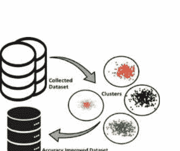

当预处理步骤完成并且收集的数据集变成聚类数据集时，可以使用聚类数据集来实施分类步骤。
分类步骤使用与之前过程中使用的类似的程序。图3说明了分类步骤的主要概念。

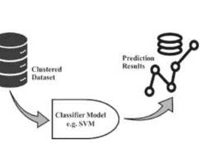

聚类和分类算法产生100%准确率和高可靠性的结果[5]。例如，基于聚类的SVM系统执行时间约为14.43秒，处理5064条记录，这是一个很高的可靠性数字。事实上，与SVM相比，CLSVM系统证明了更高的准确性和更好的时序。

### 3.3 数据收集和处理

该研究收集了两个数据集，以可比较的格式进行实验设置。
这些数据集是从Kaggle网站上选择的，作为可信的来源。要找到数据集#1的URL链接是https://www.kaggle.com/code/balaka18/email-spam-classification/data，数据集#2的URL链接是https://www.kaggle.com/datasets/uciml/sms-spam-collection-dataset。这些数据集是公开可用的，经过数据审查后，发现两个数据集都是可靠的。表2显示了数据集的描述。

### 表2. 研究数据集的描述。

| 数据集编号 | 行数 | 列数 |
| :---: | :---: | :---: |
| 1 | 5172 | 3002 |
| 2 | 5574 | 4 |

表2描述了使用的数据集的行数（记录数）和列数（属性数）。很明显，数据集#2具有比数据集#1更多的属性。因此，在数据减少选择方面需要更多的努力，因为这有助于集中精力在特定的属性集上，以提高效率和效果。

通过进行数据处理和TFIDF计算特征来转换消息（文本）为数值向量数据，以便使用算法执行。
首先，对数据集的消息进行了审查，因为这些消息是研究的最重要属性，垃圾邮件发送者使用消息进行垃圾邮件发送。因此，使用停用词去除和波特词干提取来识别术语（单词），然后选择关键垃圾邮件术语。最后，使用TFIDF分数计算识别术语，并将其标记为唯一术语特征（UTF）。

### 3.4 实验研究和实施

在前面的章节中讨论了应用了三种机器学习技术来进行实验的方法。这些方法帮助识别短信垃圾邮件，并在整个研究过程中减轻垃圾邮件攻击。表3展示了一个示例，演示如何使用识别出的垃圾邮件术语来计数和识别垃圾邮件消息。

### 表格3. 消息识别术语概要矩阵示例。

| 短信编号 | 应该 | 得到 | 出去 | 看 | 价格 | 时间 | ... | 分类 |
| :---: | :---: | :---: | :---: | :---: | :---: | :---: | :---: | :---: |
| 短信1 | 1 | 1 | 1 | 0 | 0 | 0 | ... | 垃圾邮件 |
| 短信2 | 0 | 0 | 0 | 0 | 1 | 0 | ... | 正常邮件 |
| 短信3 | 0 | 0 | 0 | 0 | 0 | 1 | ... | 正常邮件 |
| 短信4 | 0 | 1 | 1 | 1 | 0 | 0 | ... | 垃圾邮件 |
| 短信5 | 0 | 0 | 1 | 1 | 0 | 0 | ... | 垃圾邮件 |

实验使用计算机设备进行，最低设备规格为Intel (R) Core (TM) i5-4200U CPU @1.60 GHz 2.30 GHz处理器，8.00 GB RAM，以及基于x64处理器的Windows 10 Pro 64位操作系统。
在这些实验中，应用了三个不同数量的聚类（即10、20和30）来进行数据聚类。因此，为了执行所提出的系统，应用了三种算法的组合。第一个算法是改进的朴素贝叶斯算法，用于解决问题，例如与负面词准确性相比，对词位置的修正倾向超过10% [17, 19]。

在第二轮（阶段）的实施中，该研究应用了K-means聚类算法，使用算法1。该方法使用第一轮的数据进行数据预处理，将数据转换为向量，使用TFIDF向量化器，如算法2的第1步所示。在输入数据后，按照所示的七个步骤进行操作。

按照算法1进行数据集聚类，以生成用于数据分类的聚类数据集，如算法2的第3步所示。

### 算法 1: K-means 聚类方法

-   输入: 向量化的短信数据集 (见算法 2,步骤 -1)
-   输出: 聚类 (分组) 数据
-   步骤-1: 选择数字 K 来决定聚类的数量
-   步骤-2: 选择随机的 K 个点或质心 (可以是输入数据集中的其他点)
-   步骤-3: 将每个数据点分配给其最近的质心，以形成预定义的 K 个聚类
-   步骤-4: 计算方差并放置每个聚类的新质心
-   步骤-5: 重复步骤 -3 为每个数据点重新分配到每个簇的最近质心
-   步骤-6: 如果发生任何重新分配，则转到步骤 -4 否则转到步骤 -7
-   步骤-7: 完成，数据集已经聚类（分组）并准备好分类

该研究实验使用基于K-means聚类的分类模型来缓解短信垃圾邮件，主要有三个主要步骤，如算法2所示。这使用了一个数据集，该数据集是从短信通信中收集的，以提供高精确度和分类的数据集。第一步是使用TFIDF进行数据预处理，用于删除缺失值、重复值和停用词。第二步是数据聚类（算法1），通过10、20和30个簇对预处理的数据进行聚类。第三步是通过对算法2步骤2的输出数据集进行分类来进行数据分类，以进行比较。

### 算法 2: 基于K-means聚类的分类模型

-   输入: 收集的通信消息数据集
-   输出: 高准确分类的数据集以减轻垃圾邮件攻击
-   步骤1: 通过TFIDF向量化器进行数据预处理，包括: 删除缺失值; 删除重复值; 删除停用词
-   步骤2: 使用K-means聚类方法 (算法1) 进行数据聚类 这包括将预处理的数据聚类为10、20、30个簇
-   步骤3: 通过对步骤2的输出数据集进行分类，比较以下分类准确性: i. 朴素贝叶斯; ii. 支持向量机 (SVM) ; iii. 随机森林

为了训练和测试，数据集被分成两部分 第一部分用于使用数据集的75%进行训练 第二部分用于使用数据集的25%进行测试以验证算法

## 4 讨论和发现

研究结果在这里解释，讨论了关键发现。所呈现的事实和输出描述了方法和实施产生的结果。

### 4.1 Delphi方法在决策中的可靠性和有效性

研究发现，通过Delphi方法可以实现决策研究的关键目标，因为在处理垃圾数据集的三个不同回合中，已经明显体验到了共识和稳定性，以达成对几个重要方面的共识。此外，研究证实，Delphi方法通过使用Delphi的回合作为多准则决策框架，通过权衡决策标准找到了实际问题和关键指标，这与其他研究[11, 12]一致。Delphi方法确认要求，然后使用Delphi的回合作为多准则决策过程进行决策。根据AbouGrad等人的研究[12]，Delphi方法可以识别、选择、概念化和验证因素。因此，Delphi方法通过定量评估模型的可靠性和有效性，在权衡回合中检验算法的有效性。

### 4.2 基于聚类的决策制定分类以减少垃圾邮件

K-means聚类后，通过三个算法制定研究分类模型，如算法2所示。提出工作的主要结果和发现展示在表4和表5中。这些表展示了使用机器学习算法和它们的结果的每个聚类数，通过使用算法1和算法2在不同步骤中提供分类准确性。

### 表4. 基于数据集#1的实验结果。

| 聚类数 | 分类算法 | 分类准确性 |
|--------|----------|------------|
| 10 | 朴素贝叶斯 | 0.75 |
| 10 | 支持向量机 | 0.71 |
| 10 | 随机森林 | 0.77 |
| 20 | 朴素贝叶斯 | 0.84 |
| 20 | 支持向量机 | 0.80 |
| 20 | 随机森林 | 0.87 |
| 30 | 朴素贝叶斯 | 0.94 |
| 30 | 支持向量机 | 0.89 |
| 30 | 随机森林 | 0.97 |

根据数据集#1，如表4所示，随机森林优于朴素贝叶斯和支持向量机两个分类器。通过使用基于实验的10个聚类，随机森林分类器的准确性约为77%，而朴素贝叶斯的准确性为75%，支持向量机的准确性为71%。这意味着朴素贝叶斯分类器仍然优于支持向量机分类器。从20个聚类和30个聚类的观察结果来看，分类准确性得分支持结论，即随机森林分类器比朴素贝叶斯和支持向量机分类器具有更好的预测能力。因此，聚类数的变化清楚地表明，聚类数越多，可以达到更高的准确性得分，这意味着10个聚类可以额外提高10%的分类准确性得分。

根据数据集 #2（表5），随机森林分类器再次优于朴素贝叶斯和支持向量机。在基于研究实验的10个聚类中，随机森林分类器的准确率约为94%，而朴素贝叶斯的准确率为91%，支持向量机的准确率最低，为86%。这表明朴素贝叶斯分类器仍然表现出色。从基于实验的20个聚类和30个聚类的观察结果来看，分类准确率支持结论，即随机森林分类器产生的预测比朴素贝叶斯和支持向量机分类器更好。因此，更多的聚类导致更高的分类准确率。这意味着增加10个聚类将使准确率提高约1%。数据集 # 1（10%）和数据集 # 2（1%）之间的增长率差异表明，聚类数量与属性数量的组合对分类准确率有显著影响。此外，还进行了整体比较以确定每个分类器的性能（图4）。实际上，分类算法之间的差异说明了随机森林分类器首先提高了35%，然后是朴素贝叶斯提高了33%，支持向量机分类器提高了32%，如图4所示。

### 表5. 基于数据集#2的实验结果。

| 聚类数 | 分类算法 | 分类准确性 |
|--------|----------|------------|
| 10 | 朴素贝叶斯 | 0.91 |
| 10 | 支持向量机 | 0.86 |
| 10 | 随机森林 | 0.94 |
| 20 | 朴素贝叶斯 | 0.92 |
| 20 | 支持向量机 | 0.87 |
| 20 | 随机森林 | 0.95 |
| 30 | 朴素贝叶斯 | 0.93 |
| 30 | 支持向量机 | 0.88 |
| 30 | 随机森林 | 0.96 |

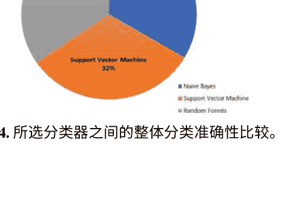

### 图4. 所选分类器之间的整体分类准确性比较。

## 5 结论

已应用Delphi方法与敏捷软件开发作为迭代过程。这导致在Scrum中利用冲刺以快速方式生成每个软件部件。事实上，这项研究工作提出了一种基于机器学习的技术，用于更好地决策垃圾邮件或非垃圾邮件，以减轻垃圾邮件攻击。此外，基于聚类的分类算法应用了K-均值聚类来对单词进行分组。随后，应用了三种不同的分类器。

研究结果表明，聚类数与属性数的组合对分类准确性性能产生了显著影响。

## 参考文献

-   1. Aliza, H.Y.等：采用机器学习方法进行短信垃圾邮件检测的比较分析。在：2022年第六届计算方法与通信国际会议(ICCMC)，第916-922页。IEEE (2022)
-   2. Delen, D.: 预测分析：数据挖掘、机器学习和数据科学实践者. Pearson Education Inc, Old Tappan, New Jersey (2021)
-   3. King, S.T., Scaife, N., Traynor, P., Abi Din, Z., Peeters, C., Venugopala, H.: 信用卡欺诈是一个计算机安全问题. IEEE Secur. Priv. 19, 65–69 (2021)
-   4. Achchab, S., Temsamani, Y.K.: 人力资源管理中的人工智能应用：将机器学习算法应用于智能招聘系统. In: Troiano,L., et al. (eds.) Advances in Deep Learning, Artificial Intelligence and Robotics. LNNS, vol.249, pp. 203–215. Springer, Cham (2022). https://doi.org/10.1007/978-3-030-85365-5_20
-   5. Pandya, D.: 基于聚类的SVM垃圾邮件检测. In: Proceedings of the 2019 2nd International Conference on Machine Learning and Machine Intelligence, pp. 12–15. ACM, 纽约，纽约，美国 (2019)
-   6. Tejada, A.T., Ella, V.B., Lampayan, R.M., Rea o, C.E.: 使用支持向量机（SVM）和极限学习机（ELM）模拟IV-A地区菲律宾的参考作物蒸散发。水资源。 14, 754 (2022年)
-   7. Kim, S.-E., Jo, J.-T., Choi, S.-H.: 使用关键词频率比进行短信垃圾过滤。国际安全应用。 9, 329–336 (2015年)
-   8. Reaves, B., 等：使用公共网关对短信生态系统的安全性进行表征。 ACM Trans. Priv. Secur. 22, 1–31 (2019)
-   9. Mana, M., Obaid, A., Dosh, M.: 使用数据挖掘进行电子邮件垃圾邮件过滤的无监督方法。 EAI Endorsed Trans. Energy Web. 8, 162–168 (2021)
-   10. Looy, A., Poels, G., Snoeck, M.: 评估业务流程成熟度模型。 J. Assoc. Inf. Syst. 18, 461–486 (2017)
-   11. AbouGrad, H., Warwick, J., Desta, A.: 使用Delphi研究技术开发信息系统的业务流程管理绩效。 在： Reyes-Munoz,A., Zheng, P., Crawford, D., Callaghan, V. (eds.) TIE 2017. LNEE, vol. 532, pp. 195–210. Springer, Cham (2019). https://doi.org/10.1007/978-3-030-02242-6_15
-   12. AbouGrad, H., Warwick, J.: 应用Delphi方法衡量企业内容管理工作流系统的性能。 在： Arai, K. (ed.) Intelligent Computing Proceedings of the 2022 Computing Conference, Vol. 2, pp. 404–419. Springer International Publishing, Cham (2022) https://doi.org/10.1007/978-3-031-10464-0_27
-   13. Alsaqqa, S., Sawalha, S., Abdel-Nabi, H.: 敏捷软件开发：方法和趋势。国际互动移动技术杂志，14, 246 (2020年)
-   14. Martin, R.C.: 清洁敏捷：回归基础。Pearson，波士顿（2020年）
-   15. Vapnik, V.N.: 统计学习理论的本质。Springer New York，纽约，纽约（2000年） https://doi.org/10.1007/978-1-4757-3264-1
-   16. Sohom, B., et al.: 基于机器学习的朴素贝叶斯方法用于揭示YouTube站点中的垃圾评论。国际工程应用物理学杂志，1，278-284（2021年）
-   17. Kamble, M., Dule, C.: 使用机器学习进行评论垃圾检测：朴素贝叶斯、SVM、逻辑回归和随机森林分类器的比较研究。国际高级科学研究技术杂志，7，292-294（2020年）
-   18. Biesialska, K., Franch, X., Munt s-Mulero, V.: 敏捷软件开发中的大数据分析: 一项系统性映射研究. 信息与软件技术. 132, 106448 (2021)
-   19. Khurshid, F., Zhu, Y., Xu, Z., Ahmad, M., Ahmad, M.: 在选定特征上进行集成学习以进行评论垃圾检测. 国际计算智能系统杂志. 12, 387–394 (2018)

# 基于Voronoi图的海上走廊识别方法

Mariem Masmoudi^1(✉), Salem Chakhar^{2,3}, 和 Habib Chabchoub^4
1 OLID实验室, 斯法克斯大学, 斯法克斯, 突尼斯
mariem.masmoudi@enis.u-sfax.tn
2 朴茨茅斯商学院, 朴茨茅斯大学, 朴茨茅斯 PO1 3AH, 英国
salem.chakhar@port.ac.uk
3 英国朴茨茅斯大学CORL, 朴茨茅斯PO1 3AH
4 阿联酋艾因大学商学院, 艾因
habib.chabchoub@aau.ac.ae

摘要。 本文提出了一种用于海上走廊生成的三阶段过程。 .该过程的主要输入是一个水深图。它输出了一系列与不同起点和终点相关的潜在走廊。所提出的过程分为三个连续阶段： (1) 空间数据转换; (2) 连通性图的构建; (3) 潜在走廊的识别。 该方法已经实施并应用于确定连接突尼斯的克尔肯纳群岛和斯法克斯市的海上公路的一系列走廊。在此应用中考虑了四对起点和终点，导致了四个潜在走廊，每个走廊都表示为一系列线性相邻的多边形。

-   - 沃罗诺伊图
-   - 最短路径
-   - 迪杰斯特拉算法
-   - 海上走廊
-   - 地理信息系统

## 1 引言

设计和实施海上公路连接是偏远岛屿经济发展的重要因素。 这对突尼斯的克尔肯纳群岛尤为重要，该群岛缺乏与突尼斯大陆的斯法克斯市的固定连接。斯法克斯市是突尼斯的重要经济和工业中心。这与附近的克尔肯纳群岛形成了鲜明对比，后者相对于斯法克斯市而言发展相对较少。群岛与斯法克斯市之间的固定连接的存在肯定会支持其经济、旅游和工业发展。

在本文中，我们提出了一种生成海上走廊的过程，并将其应用于克尔肯纳群岛的案例。所提出的过程分为三个阶段。第一阶段以水深图作为输入，并生成研究区域的沃罗诺伊图表示。第二阶段利用沃罗诺伊图将其转化为连通性图，其中节点对应于Voronoi图的多边形，边对应于这些节点之间的邻居关系。 第三阶段应用Dijkstra算法[6]来识别潜在的走廊。 所提出的方法已经实施并应用于确定位于突尼斯大陆的Sfax市和Kerkennah群岛之间的海上公路链接的一系列走廊。

所提出的走廊生成过程的核心是Voronoi图。 Voronoi图在多个应用中非常有用，例如路径规划，特别是对于海洋车辆[3,4,15]。 Voronoi图的预计算是计算几何中各种算法的初始步骤[8]。

在这类应用中使用Voronoi图的主要论点是其产生具有最大距离的边的路线图的属性[3]。

本文的其余部分组织如下。 第2节简要描述了考虑的问题。 第3节详细介绍了走廊生成过程。第4节将此过程应用于考虑的问题。 第5节结束了本文，并简要列举了一些未来的工作主题。

## 2 问题描述

本文考虑的问题是寻找一组潜在的海上走廊，以连接突尼斯大陆的斯法克斯市与附近的克尔肯纳群岛（见图1）。 克尔肯纳群岛拥有壮丽的自然风光和独特的魅力，使其成为一个特殊的旅游目的地。

克尔肯纳群岛还拥有一种相当特殊的生态系统。 这些岛屿被认为是一种特殊的生物和海洋遗产，不仅在突尼斯，而且在整个地中海都是如此。 旅游和海洋渔业是该岛屿经济的资源。 但是，克尔肯纳群岛由于其地理位置而被孤立，目前的交通基础设施对该群岛的经济发展构成了障碍。 前往克尔肯纳群岛的困难限制了其经济增长，并减少了投资机会。 事实上，增加的运输成本导致所有产品（特别是建筑材料）的成本更高，从而使投资者望而却步。

起点应该是Sfax的El Louza。这条航线的行程引发了许多讨论（来自不同相关部门的决策者之间）关于最佳起点和终点以及经过的海域。因此，一位来自商船和港口办公室（OMMP）的负责人表示，最好的新航线应该在从Sfax南部起航的船只航线之上（见图2）。Sfax港口的货物和乘客航行负责人同意这个观点，即最好的新海上公路应该在这些航线之上（即从Sfax北部起航），以避免这些航线与公路的交叉（以便将公路的高度与海平面保持最小，并避免限制货物和乘客船只以及渔船的高度）。

## 3 走廊生成过程

走廊生成过程以水深图 B为输入，并输出一组潜在走廊 P。所提出的过程分为三个连续的阶段（见算法1）：（1）空间数据转换的预处理阶段；（2）连通性图的构建；以及（3）潜在走廊的识别。这些阶段将在本节的其余部分详细介绍。

### 3.1 空间数据转换

空间数据转换的目标是从水深等值线（或深度等值线或等深线）中生成德劳内三角剖分 T。基于测量深度的水深图 B通过测量海床的测量数据和测量数据来确定海底的地形，我们生成一个节点地图N，从中生成Delaunay三角剖分T。然后，基于Delaunay三角剖分层T，我们生成Voronoi图V，将研究区域分解为一组空间单元或多边形。

同一空间单元内的所有点将具有相同的深度。几乎所有可用的地理信息系统（GIS）都提供和支持这些空间数据转换操作。

Voronoi图和Delaunay三角剖分是对偶的[8]。在构建Voronoi图时，邻域关系的规定非常重要。在本文中，如果两个Voronoi多边形共享一个公共边界，则它们是邻居。如果这些多边形的生成点在Delaunay三角剖分中被定义为邻居（或一阶邻居），则成立。一个点的二阶邻居是其邻居的邻居。图3说明了这些邻域关系的类型。在我们的工作中，我们考虑了一阶邻居，以确保对定义走廊的邻接约束。

### 算法1：走廊过程

-   输入：B：水深图B；
-   输出：P：潜在走廊集合；
-   1 从水深等值线中提取节点图 N；
-   2 从节点图 N构建德劳内三角剖分 T；
-   3 从德劳内三角剖分 T提取沃罗诺伊图 V；
-   4 从沃罗诺伊图 V 提取连通性图 G=(U, W)；
-   5 F←{(s, e)：s和e是G中可能的起点和终点}；
-   6 对于(每个(s, e) ∈ F)执行
-   7    P_{s, e} ← Dijkstra(G, s, e);
-   8    add P_{s, e} to P;

### 3.2 连通性图的构建

第二阶段的目标是从沃罗诺伊图中提取连通性图 G =(U, W)。节点集 U对应于沃罗诺伊图的多边形，而边集 W对应于节点（多边形）之间的邻域关系（多边形）in U，即

`W = {(u_i, u_j) ∈ U × U : u_i ∧ u_j是相邻的多边形}`。

连通性图提取过程中的一个重要步骤是定义每个相邻节点之间的距离。测量两个节点之间的距离很简单。然而，计算两个多边形之间的距离并不简单[16]，因为有不同的选项，如图4所示。通常，对于非点对象的距离测量涉及将它们抽象为它们的代表点[11]。用于测量多边形之间距离的常见策略是将这些多边形抽象为它们的质心，然后多边形之间的距离被简单地假设为它们质心之间的距离。尽管这种方法很简单，但通过质心之间的距离估计两个多边形之间的距离可能会导致偏差问题，如[11]的最新研究显示。尽管存在这种批评，本文采用了质心到质心的方法。另外两种方法正在研究中。

### 3.3 走廊的识别

所提出方法的最后阶段是使用众所周知的最短路径算法Dijkstra [6]来识别潜在的走廊。从理论角度来看，研究区域（即斯法克斯市）大陆一侧的任何多边形（节点）都可以作为高速公路的出发点，而克尔肯纳群岛的任何多边形（节点）都可以作为到达点。

图4.不同的多边形到多边形距离方法：质心-质心（a）；质心-最近点（b）；质心-最远点（c）。

克尔肯纳群岛可以作为到达点。为了覆盖所有可能的路径，应该在可能的起点和终点的笛卡尔积上应用Dijkstra算法（在算法1中表示为F）。这个想法在算法1的for循环中实现。

## 4 应用和结果

所提出的方法已经应用于在第2节中介绍的海上走廊位置问题的一些替代解决方案的识别。开源GIS软件QGIS用于管理空间数据并支持所有数据转换操作，而Dijkstra算法则是使用Python编程语言实现的。

该过程的主要输入是图5中显示的水深图。所提出的方法第一阶段的三个步骤的结果分别在图6（节点图）、图7（Delaunay三角剖分）和图8（Voronoi图）中给出。

所提出的方法的第二阶段包括从Voronoi图中提取连通性图。生成的Voronoi图包含3487个多边形（节点）。为了提高计算效率，生成的连通性图以表格格式表示。该文件的一部分在图9中。

所提出的过程的最后阶段是应用Dijkstra算法生成潜在走廊。为了说明应用的目的，我们随机选择了四对起点和终点。Dijkstra算法的应用导致了四个潜在走廊，如图10所示。所得走廊的特征见表1。

根据该表，走廊#2（黄色）是最好的。

图5. 水深图

图6. 节点图。

图7. Delaunay三角剖分。

图8. Voronoi图。

| Polygons | Neighbors | Distance Centroid-Centroid |
|----------|-----------|--------------------------|
| 1 | 2839 | 456.8567879 |
| 1 | 42 | 168.6513957 |
| 1 | 1450 | 392.0637651 |
| 1 | 2191 | 393.7693503 |
| 1 | 1632 | 345.8446357 |
| 1 | 761 | 154.8334546 |
| 1 | 1412 | 309.5078258 |
| 2 | 2614 | 237.1625348 |
| 2 | 1331 | 299.7013804 |
| 2 | 556 | 355.2075972 |
| 2 | 3145 | 381.2756311 |
| 2 | 58 | 368.5746365 |
| 2 | 2972 | 229.6704416 |
| 3 | 13 | 300.0792704 |
| 3 | 2113 | 820.7265861 |
| 3 | 2176 | 516.5246857 |
| 3 | 1989 | 838.0800265 |
| 3 | 2732 | 842.1756818 |
| 4 | 1034 | 147.8568345 |
| 4 | 1960 | 425.4617226 |
| 4 | 1902 | 217.0389081 |
| 4 | 2381 | 462.7093387 |
| 4 | 2745 | 1040.649313 |
| 5 | 2717 | 546.3397091 |
| 5 | 2201 | 1107.719334 |

图9.表格格式的连通图。

图10.潜在走廊。

表1.潜在走廊的特征
| # | 颜色 | 总长度（米） | 排名 |
|---|---|---|---|
| 1 | 粉色 | 37007.425 | 2 |
| 2 | 黄色 | 29198.205 | 1 |
| 3 | 橙色 | 40828.795 | 4 |
| 4 | 深橙色 | 38666.473 | 3 |

## 5 结论和未来工作

我们提出了一种基于Voronoi图的方法来识别海上走廊。所提出的方法已经实施并应用于确定连接突尼斯的Sfax市和附近的Kerkennah群岛的海上公路的一系列走廊。

在本文中，我们仅考虑了距离因素。然而，还应考虑其他几个标准，例如深度、船只和船只的现有行程，以便获得更现实和可行的解决方案。这需要应用适当的聚合规则来结合所有这些因素。可以采用和应用[1]中介绍的多标准评估方法来解决本文中考 虑的问题。

设计一种启发式方法来减少计算时间，通过减少要计算的路径数量，这是另一个强烈推荐的未来研究课题。在这方面，将研究使用基于支配的粗糙集方法（DRSA）的排名版本[9,12,13]来评估和选择一组减少的起点和终点。

另一个话题涉及使用更全面的策略来测量多边形之间的距离。在本文中，通过它们各自的质心之间的距离来估计两个多边形之间的距离。另一种解决方案是使用基于模糊数的策略。这样，多边形之间的距离将被定义为通过组合图4中介绍的三种多边形之间的距离方法获得的模糊数。然后，可以使用[5]中介绍的模糊Dijkstra最短路径算法来生成潜在走廊。

## 参考文献

1. Aissi, H., Chakhar, S., Mousseau, V.: 基于GIS的多标准评估方法用于走廊选址。环境规划B.规划设计. 39(2), 287–307 (2012). https://doi.org/10.1068/b37085
2. Ben Haj, S.: 地中海保护区和海岸区域（AMP）区域发展项目，通过加强AMP的创建和管理来实现。环境研究和咨询（2017）3. Candeloro, M., Lekkas, A., Sørensen, A.: 基于Voronoi图的动态路径规划系统用于非完全驱动的海洋船舶。控制工程实践. 61, 41–54(2017). https://doi.org/10.1016/j.conengprac.2017.01.007
4. Chen, P., Huang, Y., Papadimitriou, E., Mou, J., van Gelder, P.: 全球路径规划自主船舶：快速行进方块和速度障碍方法的混合方法。海洋工程 **214**, 107793 (2020年)。 https://doi.org/10.1016/j.oceaneng.2020.107793
5. Deng, Y., Chen, Y., Zhang, Y., Mahadevan, S.: 不确定环境下的短路径问题的模糊Dijkstra算法。应用软计算 **12** (3), 1231–1237 (2012年)。 https://doi.org/10.1016/j.asoc.2011.11.011
6. Dijkstra, E.: 关于图中两个问题的注释。数值数学**1** (1), 269–271 (1959年)。 https://doi.org/10.1007/BF01386390
7. El Ayadi, A.: 研究大海豚*tursiops truncatus*(montagu 1821)与kerkennah岛渔网之间的相互作用：评估经济损失和损害。斯法克斯大学，理学院 (2013年)
8. Aurenhammer, F.: Voronoi图——一种基本的几何数据结构综述。ACM Comput. Surv. **23**(3), 345-405 (1991年)。 https://doi.org/10.1145/116873.116880
9. Greco, S., Matarazzo, B., S, Sowinński, R.: 粗糙集理论用于多准则决策分析。Eur. J. Oper. Res. **129**(1), 1–47 (2001年)。 https://doi.org/10.1016/S0377-2217(00)00167-3
10. 穆, L., 霍洛威, S.: 地理信息科学与技术。知识体系，2019年第一季度版，第11章。邻里。 https://doi.org/10.22224/gistbok/2019.1.11
11. 穆, W., 童, D.: 空间分析中多边形与点之间的距离计算。地理信息科学国际期刊。 **36**(8), 1575-1600 (2022年)。 https://doi.org/10.1080/13658816.2021.1988088
12. S\u0142owi\u0144ski, R., Greco, S., Matarazzo, B.: 偏好排序数据的粗糙集分析。在：Alpigini, J.J., Peters, J.F., Skowron, A., Zhong, N. (eds.) RSCTC 2002。LNCS (LNAI), 卷2475, 页44–59。Springer, 海德堡 (2002年)。 https://doi.org/10.1007/3-540-45813-1_6
13. S\u0142owi\u0144ski, R., Greco, S., Matarazzo, B.: 决策中的粗糙集。在：Meyers, R. (ed.) 复杂性和系统科学百科全书, pp. 7753-7787。Springer, 纽约 (2009年)。 https://doi.org/10.1007/978-0-387-30440-3_46014. SONEDE: 关于在突尼斯共和国斯法克斯建造海水淡化站的前期研究。突尼斯国家水务公司 (SONEDE), 突尼斯 (1015年) 15. Tu, W., Fang, Z., Li, Q., Shaw, S.L., Chen, B.: 基于双层Voronoi图的大规模多仓库车辆路径问题的元启发式算法。运输。Res. Part E: Logist. Transport. Rev. **61**, 84-97 (2014年)。 https://doi.org/10.1016/j.tre.2013.11.003
16. 袁明: 地理信息系统研究解决地理学中的紧张关系。新加坡热带地理学杂志**42**(1), 13-30 (2021)。 https://doi.org/10.1111/sjtg.12344

## 作者索引

### A

- AbouGrad, Hisham 154
- Abubahia, Ahmed 154
- Ajmain, Moshfiqur Rahman 1, 36
- Akter, Shornaly 13

### B

- Benedetto, Vincenzo 111, 120, 134, 144
- Bhandari, Parth 144
- Boumahdi, Fatima 84
- Bouramoul, Abdelkrim 53

### C

- Chabchoub, Habib 167
- Chakhar, Salem 154, 167
- Chauhan, Prachi 73
- Ciaparrone, Gioele 134

### D

- Das, Rajesh Kumar 36
- Dhiman, Abhishek 62

### G

- Gissi, Francesco 111, 120, 134, 144

### H

- Hadri, Sid Ahmed 53
- Hemina, Karim 84

### I

- Islam, Mirajul 13
- Islam, Saiful 13

### J

- Jadhav, Shivajirao 94

### K

- Kadam, Vinod 94
- Kashid, Shamal 24, 62, 73
- Khemchandani, Maahi 94
- Khushbu, Sharun Akter 1
- khushbu, Sharun Akter 36
- Kobra, Khadijatul 36
- Kumar, Krishan 24, 62, 73

### M

- Madani, Amina 84
- Masmoudi, Mariem 167
- Menanno, Marialuisa 111

### N

- Negi, Alok 24, 62, 73
- Noori, Sheak Rashed Haider 1, 36

### P

- Pérez-Fernández, Raúl 144

### R

- Rahman, Mahafozur 1
- Rahman, Md. Arifur 13

### S

- Saini, Parul 24, 62, 73
- Sammi, Samrina Sarkar 36

### T

- Troiano, Luigi 120

### V

- Villa, Elena Mejuto 120