# 人工智能的直觉探索

## 前言

> > “我设想一个时代，我们对机器人就像人类对待狗一样，我支持机器。”
> 
> 克劳德·香农

> > “人工智能将是谷歌的终极版本。它将是能够理解网络上一切的终极搜索引擎。它将准确理解你想要的，并给你正确的东西。我们现在离实现这一目标还有很长的路要走。然而，我们可以逐步接近这个目标，这基本上就是我们所致力于的。”
> 
> Larry Page

2014年6月，我们驱车前往位于加利福尼亚州山景城的计算机历史博物馆，离我当时的住处不远。我们有一个惊喜等着我们。我们一进入建筑物，就被一座长11英尺（3.4米），高7英尺（2.1米），重达5吨，由8000个零件组成的工程雕塑吸引住了眼球。在原始构思和设计之后的165年，查尔斯·巴贝奇的差分机2号在我们面前开始运行。我想知道这位维多利亚时代的剑桥数学家是否能预见到有一天他的作品会在硅谷的中心展出。我们全神贯注地听着讲解员对这台奇妙机器的介绍和演示。

“我真希望这些计算能用蒸汽来执行！”查尔斯·巴贝奇痛苦地呼喊道，他在天文表中发现了一个又一个人工计算的错误。现在是1821年的夏天，地点是伦敦，这个陈述是对一个自动化时代的预言，机器将能够执行智能任务而不会出现任何错误。200年后，拉里·佩奇对谷歌的愿景并没有太大的不同。

谷歌的终极版本与此相差无几。谷歌的目标不再是自动化繁琐的计算，而是构建能够自动理解互联网上所有内容的机器。

在过去的两个世纪中发生了什么变化的是计算机的普及，这打开了通往无法阻挡的、庞大的数据洪流的大门，也被称为大数据。在大数据中包含着数字、观察结果、测量数据、样本、度量、像素、体素、三维范围数据、波形、单词、符号、字段和记录，所有这些都可以被处理和整理以揭示结构和关系。我们希望利用大数据来预测、分类、排名、决策、推荐、匹配、搜索、保护、分析、可视化、理解和揭示。当然，我们是数据的创造者，我们理解其中的基本过程。我们可以将我们的专业知识发挥出来，用它来构建机器学习模型。这是经典机器学习的基础，也是人工智能的前身。经典机器学习在一个称为特征工程的过程中需要人工劳动。它对于某些应用来说可以工作得非常好，但也有一些限制。

AI试图从原始数据中学习。它选择一个具有数十亿或数百亿个内部可学习参数的大型深度神经网络，在训练过程中使用微积分来最小化一个合适选择的损失函数，训练数据集包含数十亿或数百亿个示例。

一旦调整完成，网络可以在生产环境中部署，并用于进行神奇的“智能”推理。在推理过程中，AI模型每秒执行数十亿次乘法、加法和比较操作。如果我们创建一个机械的慢动作复制品来观察未来博物馆中的导览演示，看到无数移动部件在运转中计算出最终答案，真是令人难以置信。

本书旨在描述制造如此令人印象深刻的机器背后的科学。有人可能会问，在无数的碰撞、摩擦的部件中，智能在哪里？对于人类智能，我们有第一手的主观经验，不需要进一步的证明。对于AI来说，这个问题是一个困难的问题。让我们迈出理解AI工作的第一步。

## 缩略词

- L^p 勒贝格空间。
- AGI 人工通用智能。
- AI 人工智能。
- ALS 交替最小二乘法。
- ASIC 应用特定集成电路。
- ASR 自动语音识别。
- AUC 曲线下面积。
- BERT 来自变压器的双向编码器表示。
- Capsnet 胶囊神经网络。
- CART 分类和回归树。
- CNN 卷积神经网络。
- CPU 中央处理单元。
- CTC 连接主义时序分类。
- DBN 深度置信网络。
- DBSCAN 基于密度的空间聚类应用与噪声。
- DNC 可微分神经计算机。
- DNN 深度神经网络。
- DQN 深度 Q 网络。
- DRL 深度强化学习。
- E2E 端到端。
- EM 期望最大化。
- FCN 完全卷积网络。
- FDA 费舍尔判别分析。
- FFN 前馈网络。
- FPGA 现场可编程门阵列。
- FPR 误报率。
- GAN 生成对抗网络。
- GBM 梯度提升机。
- GPR 高斯过程回归。
- GPT 生成预训练变压器。
- GPU 图形处理单元。
- GRU 门控循环单元。
- HMM 隐马尔可夫模型。
- HOG 方向梯度直方图。
- IOU 交并比。
- JS Jensen-Shannon。
- k-NN k最近邻。
- KL Kullback-Leibler。
- LAD 最小绝对偏差。
- LDA 线性判别分析。
- 长短期记忆 长短期记忆。
- MAP 最大后验概率。
- mAP 平均精度均值。
- MART 多重加法回归树。
- MCMC 马尔科夫链蒙特卡洛。
- MCTS 蒙特卡洛树搜索。
- MDP 马尔科夫决策过程。
- MDS 多维缩放。
- MFCC 梅尔频率倒谱系数。
- ML 机器学习。
- MLE 最大似然估计。
- MLP 多层感知器。
- MOE 专家混合。
- MSE 均方误差。
- NAS 神经架构搜索。
- NCF 神经协同过滤。
- NDCG 标准化折现累积增益。
- NER 命名实体识别。
- NLP 自然语言处理。
- NLU 自然语言理解。
- NMS 非极大值抑制。
- NMT 神经机器翻译。
- NTM 神经图灵机。
- OCR 光学字符识别。
- OLS 普通最小二乘法。
- PCA 主成分分析。
- PGM 概率图模型。
- PLS 偏最小二乘法。
- PN 策略网络。
- PR 精确率召回率。
- Q 质量（在强化学习中）。
- QA 问答。
- QDA 二次判别分析。
- R-CNN 基于区域的卷积神经网络。
- RANSAC 随机抽样一致性。
- RBM 受限玻尔兹曼机。
- **ReLU** 修正线性单元。
- **RL** 强化学习。
- **RNN** 循环神经网络。
- **ROC** 接收者操作特征。
- **SARSA** 状态、动作、奖励、状态、动作。
- **Seq2Seq** 序列到序列。
- **SGD** 随机梯度下降。
- **SIFT** 尺度不变特征变换。
- **SOFM** 自组织特征映射。
- **SRL** 统计关系学习。
- **SSD** 单次检测器。
- **SVD** 奇异值分解。
- **SVM** 支持向量机。
- **t-SNE** t-随机邻居嵌入。
- **TD** 时间差分。
- **TPR** 真正的阳性率。
- **TPU** 张量处理单元。
- **VAE** 变分自动编码器。
- **VQ** 向量量化。
- **XGBoost** 极限梯度提升。
- **YOLO** 你只看一次。

## 作者的注释

本书是关于发展对人工智能（AI）的概念理解的，这是一个快速发展、复杂性不断增加且具有巨大变革潜力的领域。深度学习已经成为AI的一个关键支持组件。媒体、政府、企业和公众都对它给予了重要关注。可以有把握地说，AI将继续成为人类寻求和探索的激动人心的前沿领域，持续几个世纪。除了将AI用于其众多实际应用的动机外，我们人类也喜欢思考和理解。本书真正寻求对AI和机器学习（ML）的“理解”。这是一个真诚的努力，旨在揭示算法层面上正在发生的事情，把握应用程序的构建方式，并展示未来漫长而冒险的道路。我非常希望能够回答一些基本问题。我们真的能够创造出智能机器吗？算法能够作为学习和智能的模型吗？人类智能和AI之间总会存在一些差异吗？为了回答这些问题，第一步是了解AI的最新技术水平。

这本书是基于大量的知识库，包括文章、书籍、采访、新闻报道、讲座和软件，这些都是许多科学家、数学家、工程师、教育家、学生、作者和记者辛勤工作的结果。我要感谢他们的贡献，因为这本书真的是他们工作的精华。在写这本书的时候，我感觉自己像一个小孩子站在众多伟大思想家旁边，看着未来的浪潮招手，冲击着现在的海岸。

这本书的主要目标是作为大学和研究生水平的人工智能和深度学习教材，适合具备微积分、线性代数和概率统计基础的学生。在作为教材使用时，本书遵循颠覆课堂的教学理念，即学习是一种积极的发现、研究和思考过程。鼓励学生查阅参考文献进行练习，并深入研究各个主题。理想的人工智能课程将以本书作为教材，并结合课程项目和论文阅读会。本书强调深度学习，因为它已经彻底改变了人工智能领域。当与其他技术如强化学习结合时，它可以带来惊人的结果。

同时，本书适用于任何希望了解人工智能的人。学习是终身的，我遇到过许多希望通过学习新领域不断挑战自己的人。数学符号被简化，使用各种插图来传达直觉。由于目标受众是任何想要学习人工智能基础知识的人，我选择了几何洞察力和直观阐述作为指导原则。因此，写作风格通常是非正式的，并基于类比。在需要时，使用数学语言来更清晰地传达概念。本书强调人工智能的理论和应用两个方面，因此能够满足不同的学习需求。

这本书是我在计算机科学领域的职业旅程中的副产品，随着时间的推移，这个领域不断发展、变化。 这是一次个人的发现和学习之旅，也是我生活伴侣Mini温柔地推动我与更广泛的世界分享这个非常好的数学和工程应用背后的直觉。 希望你会喜欢这本书。

加利福尼亚州伯克利，美国
2021年1月

Simant Dube

## 第一部分

## 基础

> > 生活中没有什么可害怕的，只有需要理解的。现在是时候更多地去理解，以便我们可以更少地害怕。
> — 玛丽·居里

## 第一章

## 人工智能雕塑


> 在每一块大理石中，我都能看到一尊像在我面前一样清晰、完美地站立着的雕像。我只需要去除囚禁美丽幻影的粗糙墙壁，就能将它展示给其他人的眼睛，就像我看到的那样。

----------

米开朗基罗

> 我选择一块大理石，并砍掉我不需要的部分。

----------

奥古斯特·罗丹

米开朗基罗能够看到一尊被困在大理石中的天使，准备从中雕刻出来。罗丹知道如何去除部分，将一块大理石变成一个深思熟虑的思想家（图1.1）。

这两位艺术家都使用三维物体进行创作。在人工智能中，当我们想要分类和归类时，我们使用复杂度很高的多维数学对象。与这两位雕塑家不同的是，我们无法将这些对象可视化，只能通过计算机实验来进行尝试和错误，这容易出现问题和错误。我们无法获得这些对象的几何信息。我们唯一的帮助是一组属于所需雕塑的点。

这是一个高维空间，所以尽管给出了这些点集，我们仍然无法很好地推断几何形状。我们尽力雕刻出雕塑，使提供的点位于我们雕刻的物体内部，希望它是真实雕塑的一个近似。

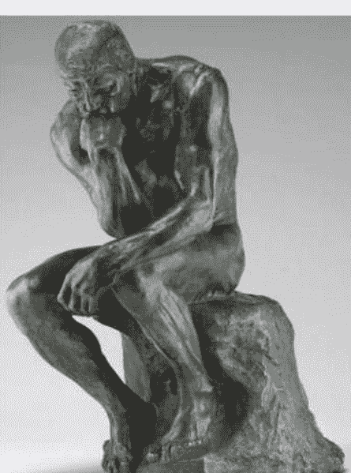

图1.1《思想者》（奥古斯特·罗丹，模型1880年，铸造1904年）。人工智能在高维空间中雕刻出具有挑战性的雕塑，其中维度的数量可以达到数十万。每个神经元都进行精细的雕刻切割。这是一个非常精细的过程，它引领了人工智能的革命。在本书中，我们将发展对这个雕刻过程的直觉。雕刻越复杂，人工智能模型的表现能力就越高。我们将看到人工智能根据数据学习雕刻，并通过训练逐渐改进自己（由国家艺术馆华盛顿特区提供）

### 1.1 高维流形

数学对象是流形，更准确地说是拓扑流形。

直观地说，流形是曲线和曲面在更高维度上的推广，具有局部欧几里德性质。如果对于曲线上的每个点，存在一个邻域，该邻域与实数线上的开区间（不包括端点）同胚（具有相同形式），则曲线是一个1维流形。地球表面是一个2维流形，因为在每个点的邻域内局部平坦。该邻域同胚于2维平面。局部邻域可以使用两个坐标轴进行映射，每个点由两个坐标指定。地球本身是一个带边界的3维流形，其表面是边界。

> > 人工智能为分类划定流形。

猫与非猫是一项介绍性的分类任务，旨在教授学生人工智能。你会得到许多猫的图片以及其他不是猫的事物和动物的图片。猫构成了正类，非猫构成了负类。所有可能的猫的图像将在一个非常高维空间中形成一个多样体，每个点对应于某只猫的图像。多样体的补集将是负类。补集中的一个点对应于某个负图像。

为了确认猫的图像形成一个高维多样体，使用图像的最基本部分来构建这个空间，即像素的颜色或灰度值作为坐标轴。让每个图像的宽度 W 和高度 H 完全相同。如果我们只考虑灰度图像，那么每个像素都有一个轴，总共有 N = W × H 个维度。

对于彩色（RGB）图像，将会有三倍的维度。每个像素有三个主要颜色，即红色、绿色和蓝色。见图1.2。对于100万像素的彩色图像，我们谈论的是三百万个维度。我们可以轻松地在时空中导航，这是一个4维空间（三维空间和一维时间）。当它是三百万维空间时，情况完全不同。我们很难想象只有五个维度。在这样的空间中，我们对空间和几何的常见直觉迅速崩溃。

我们称之为原始像素空间，其中限定词原始被添加以强调它是未经处理的、基本的和低级的。猫是一个 N 维度的点 x ∈ R^N。给定一只猫的图像，稍微扰动一下。它仍然是一只猫。有一点点余地来摇晃点 x 并保持其作为猫的属性。

点。从数学角度和拓扑术语来说，它是以该点为中心的一个开邻域，使得所有相邻点仍然是点。所有点的集合是嵌入在 N 维欧几里得空间中的一个开集。它是一个流形。它是一块大理石中的天使，准备由AI工程师来雕刻。

如果我们沿着流形内的路径从一个点 $x_A$ 到另一个点 $x_B$ 散步，会是什么样子？就像观看一部电影，其中点 $x_A$ 逐渐变形形成点 $x_B$，其中所有中间图像都是点。如果我们走出流形并离得更远，那么电影将是最初看起来有点像点，逐渐变成随机模式和噪声图像的影像。请注意，点的部分本身是低维流形，并且点流形具有组成部分-整体拓扑结构，AI在识别点时应该利用它。

## * 练习1    图像流形

正式证明图像类在原始像素空间中是一个流形。关于流形的优秀书籍，请参考[126]。

关于练习和解答的说明有关本书中所有问题的解答，请参考附录A。练习1是本书中练习的典型例子。潜在的理念是强调主动学习，鼓励学生参考参考资料。随着优秀的在线参考资料的快速增长，本书旨在引导读者在概念、几何和直观理解方面的学习方向。

尽管一些参考资料包含复杂的数学证明等高级内容，但查阅它们的练习使读者能够建立全面的视野。练习旁边的星号表示难度级别。

### 1.2 雕塑过程

对于罗丹和米开朗基罗，雕塑过程涉及根据艺术洞察力凿减石头。在人工智能中，这是一个机械过程。我们有两组训练点：（1）最终雕塑内的正点集和（2）雕塑外的负点集。我们并不知道实际雕塑的几何形状；因此，我们无法完美地完成工作。人工智能的圣杯是创建一个雕塑，其中包含所有可能的正点，负点被削减掉，无论这些点是训练（已见）还是测试（未见）的。然后，训练误差和测试误差都将为零，这对于任何实际问题来说都是极不可能的情况。

在机器学习中，使用训练数据的过程被称为著名的训练过程。这就是机器学习中的学习一词的含义；该领域是通过数据驱动的方法使机器学习。学习的方式如下。我们选择一个机器学习模型，它将决定我们能够创建的雕塑的近似程度。AI将通过反复进行切割、评估和改进来逐渐学会雕塑。AI将一次又一次地学习和改进，直到几乎达到完美。

一旦AI创建了最终的雕塑，它就停止改进。学习的模型可以被应用于实际使用。它可以判断一个点是否属于雕塑。这个多样性成员问题被称为推理。在推理过程中，AI模型仍然会计算雕刻切割，这个过程被称为前向传递，因为它们需要找出一个未知的新点是否包含在这些切割中，但没有改进模型的愿望。在训练过程中，雕刻过程的目标是通过计算如何进一步改进雕刻来发现最佳的切割，这个过程被称为反向传递。我们使用损失函数评估结果，并努力将其最小化。训练过程使用前向传递和反向传递。

对于线性模型，我们只允许在石头上切一刀。一边是多样体，另一边是它的补集。显然，这对于复杂的多样体来说是一个很差的近似。通过支持向量机（SVM），我们可以平滑地划分出一个非线性边界，这绝对是一个改进，解释了为什么在人工智能之前的时代SVM非常流行。在人工智能中，我们选择一个具有许多层神经元的深度神经网络（DNN）。

这就是为什么术语深度学习经常与人工智能互换使用的原因。人工智能是许多技术的总称，其中深度学习起着核心作用。
层数是神经网络的深度，每层神经元的数量是宽度。事实证明，这样的人工智能模型可以比SVM和其他经典方法更准确地近似雕塑，后者必须依赖复杂的特征工程才能竞争。到目前为止，经典方法在竞赛中未能超越人工智能。原因是在许多不同的情况下，手工设计的特征必须更加稳健，并且在与人工智能竞争时，实现这种稳健性变得更加困难。人工智能通过利用不断增长的计算能力和数据保持领先。

传统机器学习通过手工设计的特征无法赶上人工智能。人工智能和深度学习是一样的吗？深度学习曾经是人工智能的一小部分。随着过去十年的进展，它已经成为人工智能的重要组成部分。当然，人工智能还采用其他技术，如强化学习、统计关系学习和概率图模型。这些技术可以自然地与深度学习相结合，构建完整的系统，我们将在本书中看到，这将是未来进一步工作的方向之一。在人工智能的早期，人们非常关注各种特定领域的搜索技术、逻辑规则和推理以及统计建模。基于规则的专家系统被深度学习作为一种特殊情况所包含。在逻辑的if-then-else决策规则中，切割超平面与特征空间中的某个轴正交，并且使用布尔运算。人工智能模型可以处理任意的

这里展示了一个猫与狗的二元分类问题。一般来说，可以是猫与非猫。AI在绿色（红色）区域输出输入图像是猫（狗）的高概率。在分离的白色边缘上不确定。每个神经元都贡献了一个切割线。属于较低层的神经元贡献了更简单的切割线。较高层的神经元贡献了更复杂的切割线，弯曲程度更大。另一种等效的观点是，DNN通过弯曲输入空间的方式构建了一个特征空间的层次结构，以便在这些特征空间中更容易地分离出类别。由较高层构建的特征空间比较低层构建的特征空间更弯曲。

超平面可以实现布尔电路，最重要的是，一切都是通过数据驱动的方法来学习的。

每个神经元的输出后面跟着一个被称为修正线性单元（ReLU）的激活函数。传统上，非线性激活函数，如双曲正切函数或Sigmoid函数，在任何地方都是可微分的。ReLU看起来不太平滑，因为它在零点不可微分，但它的性能优于其他激活函数。选择ReLU后，雕塑以分段的方式更快地近似。这些分段是凸多面体，类似于拼图碎片，它们拼合在一起解决流形拼图。参见图1.3。

人工智能不直接雕刻雕塑的表面，因此它与人类雕塑家不同。它通过将原始数据空间切割成许多拼图碎片，然后丢弃那些不属于流形的碎片来间接雕刻。参见图1.3。每个神经元都贡献了它的切割。较低层的神经元进行更简单的切割。较高层的神经元进行更复杂的切割，弯曲周围。随着数百万个神经元的存在，所有这些都会显著增加。从流形的外部看，它看起来好像已经雕刻了许多平坦的面孔。

凸多面体的数量是人工智能的表达能力。表达能力越高，近似程度越好。要计算表达能力，考虑一种基本类型的深度神经网络，即前馈网络（FFN）；参见图1.4。

FFN通常被称为多层感知器（MLP），从历史的角度来看，它是最早研究的神经网络类型。在经典的浅层神经网络中，只有一个隐藏（中间）层。我们将这个概念扩展到许多隐藏层，这些层以级联的顺序与相邻层完全连接。在全连接层中，一个神经元与相邻层中的每个其他神经元相连。连接的权重表示神经元对其连接的其他神经元产生的影响程度。一个神经元对其输入进行加权乘法运算，加上一个偏置项，并在结果为正时激活。

输出被发送到下一层的神经元。权重和偏置项是内部可学习的参数。神经元以级联方式激活，计算从输入到输出流动。

在DNN中，输入层是一个直通层，不执行任何计算。将处理层定义为隐藏层，包括输出层。将FFN的深度定义为处理层的总数。对于任何有向无环计算图，DNN的深度是从输入到输出的最长计算路径的长度。将FFN的宽度定义为最宽处理层的宽度。参见图1.4。

### *** 练习2      表达能力
根据文献调查，当我们使FFN更宽更深时，凸多面体的数量如何增加。特别是参考[145, 171, 253]。这个练习的主要目标是查阅参考文献，并能够陈述研究论文的主要结果，而不必深入研究数学证明的细节，这可能相当复杂。对于希望对数学有直观理解的读者，我们将在第4.3节后计算凸多面体的数量，一旦我们理解了几何雕刻过程。

上述练习表明，与经典机器学习相比，人工智能非常精细地雕刻雕塑，给予了更多的凿子。这真是令人惊叹，并且部分解释了为什么人工智能革命正在发生。当然，如果经典机器学习在一个精心设计的特征空间中工作，它不需要如此高的表达能力，其中雕塑更容易雕刻。问题在于设计这样一个特征空间，这是一项困难的任务。人工智能不必处理这个问题。

> > 与经典机器学习相比，人工智能模型非常精细地雕刻出一个流形。它被给予了一个慷慨的凸多面体预算来雕刻流形，这个预算随着深度的增加呈指数增长，随着宽度的增加呈多项式增长。

### 1.3 符号约定

在我们继续之前，先来谈谈符号约定。一些作者使用符号，帮助读者区分标量（数字）和向量。例如，小写希腊字母可以用于标量，小写罗马字母用于向量。向量的其他约定包括使用粗体字体（$\mathbf{x}$）或在其上方加箭头（$\vec{x}$）。在物理学中，有时会使用上划线符号（$\bar{x}$）。这些符号并不是标准的，作者的注释中也应始终使用上下文来确定事物的含义。在本书中，除非上下文另有规定，我们通常使用小写字母表示向量。在向量 $x$ 中，下标 $x_i$ 表示向量的第 $i$ 个分量。同时，$x$ 有时可能指一组向量，这时 $x_i$ 表示集合 $x$ 中的第 $i$ 个向量。在下面的段落中，当我们写作 $F(x)$ 时，从上下文和周围的文本可以明确知道 $x$ 是一个向量。一些作者可能选择写作 $F(\mathbf{x})$ 或 $F(\vec{x})$。本章后面我们会写

$$\theta = (\theta_1, \theta_2, \ldots, \theta_k) \in \Theta$$

在这里，很明显 $\theta$ 是一个向量，$\theta_i$ 是 $\theta$ 的一个标量分量，而 $\Theta$ 是一组向量。

### 1.4 回归和分类

在前面的雕塑类比中，我们正在看分类。输出是一个类别、一个类或一个标签。在回归中，输出是一个值，通常是一个实数。给定一张猫的图片，如果你想知道它的年龄或者眼睛之间的距离，你需要回归。如果你想知道它是一只小猫还是一只成年猫。

回归的另一个例子是预测包围猫的边界框坐标；这在计算机视觉中称为目标检测。分类的另一个例子是想知道顾客的在线产品评论是积极的还是消极的；这被称为情感分类。回归和分类有着密切的关系。

- 1. 在回归中，我们正在拟合一个函数。 例如，线性回归是一个广泛研究的经典机器学习示例，其中我们正在拟合一个超平面。 给定一些预测变量（特征）$x$，输出是目标变量或响应变量$y$的预测值，它在预测变量上线性依赖， $\hat{y} = F(x),$ 其中$x$是预测变量的向量， $\hat{y}$是预测的响应变量， 而$F$是拟合的线性函数。 在分类中，我们有流形，并且可以通过拟合类的特征函数来将问题简化为回归问题，在适当的损失函数下。 对于猫的流形，其特征函数对于属于流形的点取值为1，否则为0。 在划分猫的流形时，我们对特征函数的支持区域中的点赋予高概率。

- 2. 在分类中，我们有我们正在切割的流形。切割的过程是一个数值过程，因为输出是每个输入样本的概率值。 $p = F(x),$ 其中$p$是点$x$属于流形的预测概率值。我们的雕刻过程允许我们用[0, 1]的范围内的值来着色凸多面体进行分类，用$\mathbb{R}$进行回归。

如果我们想要一个标量输出，就像在图1.5中用灰度进行雕刻一样。如果我们想要一个3D向量作为输出，这类似于用RGB颜色来绘制凸多面体。将会 有三个输出神经元，每个神经元对应一个颜色分量。

显然，分类和回归是同一个硬币的两面，而这个硬币就是切割过程。 它们在人工智能中共享相同的切割过程。

#### 1.4.1 线性回归和逻辑回归

以线性回归和逻辑回归之间的密切关系为具体例子。 在线性回归中，拟合的线性函数本身就是最终答案，损失函数是$L^2$或$L^1$误差。损失函数也被称为代价函数或目标函数。

图1.5在回归中拟合的线性函数在凸多面体上。将拟合函数压缩到 [0, 1] 范围内，解决交叉熵损失下的分类问题。

用于分类的线性模型也是如此，将拟合函数压缩到 [0, 1] 范围内，将值转换为概率。这通过标量输出使用sigmoid函数，通过向量输出使用softmax函数来实现。输入空间通过一个切割超平面分为两个半空间。如果拟合函数是 $f(x)$，则超平面由方程 $f(x)=0$ 给出。

一个半空间对应于正类，其中 $f(x)>0$，另一个半空间对应于负类，其中 $f(x)<0$。

这是逻辑回归的方法，尽管名称不准确，但它是一种分类技术。输入空间中到切割超平面的距离转化为样本 $x$ 属于正类或负类的概率。样本距离正半空间的划分超平面越远，正标签的概率越高。对于负半空间中的负标签也是如此。如果 $x$ 恰好在分离超平面上，则概率为0.5。

在逻辑回归中，损失函数是交叉熵损失。交叉熵损失与概率分布非常匹配，因此在分类中经常使用。

简而言之，从回归到分类时，损失函数发生变化。最后还有一个额外的压缩函数。这个压缩由输出神经元的sigmoid激活函数执行。如果对于多类分类问题有多个输出神经元，则由softmax层执行。

#### 1.4.2 回归损失和交叉熵损失

在损失函数的世界中，回归的 $L^2$ 损失和分类的交叉熵损失统治着。$L^1$ 损失也位居榜首。值得花时间来发展对这些损失函数的直觉。在最基本的层面上，损失函数衡量了人工智能或机器学习模型的输出与真实值之间的差异。

首先，考虑回归问题。假设训练集有 $n$ 个输入样本，

$$x_1, x_2, \ldots, x_n,$$

其中每个 $x_i$ 是一个特征向量，对应着真实值

$$y_1, y_2, \ldots, y_n,$$

其中每个 $y_i$ 是一个标量值，线性模型预测的值为

$$\hat{y}_1, \hat{y}_2, ..., \hat{y}_n.$$

误差向量为

$$e = [y_1 - \hat{y}_1, y_2 - \hat{y}_2, \ldots, y_n - \hat{y}_n].$$

回归损失是误差向量的长度。这衡量了预测值与真实值之间的偏差。我们知道二维向量 $(v_1, v_2)$ 的欧几里得长度是

$$\sqrt{v_1^2 + v_2^2}.$$

这不是唯一的测量长度的方法。曼哈顿长度是

$$|v_1| + |v_2|.$$

如果你被要求在曼哈顿的纽约市向西走300米，向北走400米，你将走700米，尽管欧几里得距离是500米。向量的长度被称为向量的范数。相同的公式适用于 $n$ 维空间，

$$\sqrt{v_1^2 + v_2^2 + \ldots + v_n^2},$$

$$|v_1| + |v_2| + \ldots + |v_n|.$$

$L^2$ 损失是欧几里得长度（$L^2$ 范数），$L^1$ 损失是曼哈顿长度（$L^1$ 范数）。前者对异常值更敏感，由于平方运算，它放大了大值。一般来说，回归的 $L^p$ 损失当 $p \geq 1$时，被定义为

$$(|y_1 - \hat{y}_1|^p + \ldots + |y_n - \hat{y}_n|^p)^{\frac{1}{p}}.$$

对于分类，假设你正在区分猫和狗。逻辑回归输出一个概率值 $p$ 表示输入是猫的可能性。如果是猫，理想情况下我们希望 $p = 1$，对于狗， $p = 0$。假设我们有五张图片，

$x_1, x_2, x_3, x_4, x_5$

其中对应的真实标签是

猫, 猫, 狗, 猫, 狗.

让每个图像被预测为猫的概率为

$p_1, p_2, p_3, p_4, p_5.$

我们希望 $p_1, p_2, p_4$ 的值较高，而 $p_3, p_5$ 的值较低。换句话说，我们希望根据模型观察到的数据的可能性较高。对于猫的图像，我们最大化可能性

$p_1 \times p_2 \times p_4$

而对于狗的图像，我们最小化可能性

$p_3 \times p_5.$

为了将这两个目标合并为一个目标，我们最大化

$p_1 \times p_2 \times (1 - p_3) \times p_4 \times (1 - p_5).$

这是一个小数字的产物。我们通过两种方式对其进行修改：（1）通过将其转换为以2为底的对数之和，使其更易于计算，（2）通过将其变为负数，将其转化为最小化问题。

$-\log p_1 - \log p_2 - \log(1 - p_3) - \log p_4 - \log(1 - p_5)$。

这是观察到的训练数据的负对数似然，被称为交叉熵损失函数。你可能想知道交叉熵与Shannon的信息熵如何相关，Shannon的信息熵是一个事件发生概率为 $p$ 的事件的信息量。

$-\log p$

以及所有事件的平均值，

$- \sum p_i \log p_i,$

其中对数以2为底。如果事件概率 $p$ 很高，它是一个常见事件，具有较少的信息内容和较少的惊喜因素。如果 $p$ 很低，它是一个罕见事件，具有更多的信息内容和较大的惊喜因素。

因此，交叉熵损失函数表示概率应该朝着我们希望正样本的可能性高、负样本的可能性低的方向移动。一组样本的总回归或分类损失是各个样本的损失之和，
$$
\mathcal{L}(\{x_1, x_2, \ldots, x_n\}) = \sum_{x_i} \mathcal{L}(x_i),
$$
其中 $\mathcal{L}$ 是损失函数。

> ** 练习3         损失函数

均方误差 (MSE) 与 $L^2$ 误差有什么关系？ $L^2$ 损失的缺点是什么？ 用真实值和预测概率值表示交叉熵损失。 展示它与库尔巴克-莱布勒散度的关系。 如果一个函数是凸函数，那么优化它会更容易。

对于线性模型，这些损失函数的凸性如何？

#### 1.4.3 用阴影雕塑

线性回归和逻辑回归的思想适用于深度神经网络。我们使用相同的损失函数。拟合的函数恰好更加复杂。由人工智能切割出的每个凸多面体上都拟合了一个线性函数。这样的凸多面体称为线性区域；参见图1.5。

整个输入空间被划分为凸多面体，并用分段线性函数拟合。我们有 $K$ 个线性函数，
$$
f_1(x), f_2(x), \ldots, f_K(x),
$$
其中 $K$ 是凸多面体的总数，最终的分段线性函数为
$$
f (x) = f_j(x),
$$
如果 $x \in j$-th凸多面体。对于回归问题，我们在这一点上已经完成了。拟合的函数 $f$ 就是答案。
对于一个分类问题，还有一个额外的步骤。就像在二元分类的逻辑回归中一样，我们将拟合的函数压缩到范围[0, 1]，
$$
F (x) = \sigma (f (x)),
$$
其中 σ 是sigmoid激活函数。 对于具有 C个类别的多类情况，输出f(x)是一个 C维向量，我们使用softmax函数，

$$ F (x) = softmax(f (x)). $$

sigmoid函数及其推广到softmax函数的直观理解值得一提。 假设给定一个向量，

$$ f (x) = [-1, 0, +2], $$

需要将其压缩。 通过应用指数函数获得正值权重

$$ e^{-1}, e^{0}, e^{+2}, $$

然后通过将每个项除以总和来将其归一化为值总和为1的概率向量，

$$ p_i = (F (x))_i = \frac{\exp((f (x))_i)}{\sum_j \exp((f (x))_j)}. $$

使用归一化指数的原理是突出最大值。 假设我们正在对五种动物进行分类，并且我们得到了一只猫的图像。 假设我们得到了以下拟合分段线性函数的读数，

$$ f (x) = [+10, -1, 0, +2, -3], $$

其中第一个分量是猫的。 猫分量的权重将为 $e^{10}$。 通过softmax函数将向量压缩到 [0, 1]范围，意味着输入是猫的概率占主导地位，而其他概率较小。

$$ P (猫) \gg P (其他动物). $$

这就是为什么它被称为softmax。 为了防止数值计算中的溢出/下溢问题，在计算指数项之和时经常使用LogSumExp函数，该函数取对数和。

> AI模型为原始数据空间中的每个点分配数值。
这个拟合函数是分段线性的，其中每个片段都是凸多面体。
将其解释为任意值可以解决回归问题。在经过额外的压缩步骤后，将其解释为概率可以解决分类问题。

### 1.5 判别式和生成式人工智能

到目前为止，我们一直在讨论判别式方法，它们从数据到一些有用的属性，如类标签。生成模型则相反，它们从属性到数据。它们很有吸引力，因为它们捕捉到了一个对象的真实本质和最重要的特征。在判别式方法中，我们用凿刻切割来近似表示流形。在生成模型中，我们的目标是拥有一个数据驱动的方法，可以生成属于流形的新点。让我们使用基本数学来澄清这些概念。我们使用常见的符号表示法，

$$f : A \rightarrow B$$

对于一个将集合 $A$ 映射到集合 $B$ 的函数 $f$。集合 $A$ 是函数 $f$ 的定义域。整个 $A$ 映射到的 $B$ 的子集是函数 $f$ 的值域。假设 $X$ 是一组感兴趣的对象，例如所有 $100 \times 100$ 的RGB 24位图像的猫。猫的生成模型是一个图灵可计算的函数 $g$，其值域是集合 $X$，定义域是所有有效的生成参数 $\Theta$ 用于猫。我们对其中一些参数可能有直觉，而且通常有很多我们不知道的参数。在后一种情况下，它们被称为潜在变量。$X$ 和 $\Theta$ 都是有限或可数无穷的。如果我们给 $\Theta$ 赋予离散概率分布 $P$，则我们就有了对 $X$ 的概率分布：

$$g : \Theta \rightarrow X,$$
$$P(x) = \sum_{g(\theta)=x} P(\theta).$$

通常生成模型被定义为可以从中抽取数据样本的模型根据数据分布 $P(x)$，将 $x$ 作为样本。这是通过从 $\theta \in \Theta$ 中进行采样并生成 $x$ 来完成的。我们将方法定义为图灵可计算函数，以避免涉及不可数无限集，如实数和连续概率分布在实数上。人工智能和机器学习都基于算法的计算形式。一个人真的能假设宇宙中的猫的集合是不可数无限的吗？图灵模型可以描述任何方法，包括临时定制的、基于特征的或数据驱动的方法。它反映了实际宇宙的工作方式，符合丘奇-图灵论题。

生成参数的定义是什么？直观地说，它是描述感兴趣对象所需的特征。根据我们的专业知识和直觉，我们可能知道其中许多。与此同时，许多我们不知道的参数被称为潜在参数或潜在变量。

上述定义是关于图灵可计算函数的存在，它在人工智能和机器学习中通过数据驱动的方法进行近似。它并没有提供任何线索关于在潜在参数空间上构建这样一个函数。对于猫的生成，我们有两种实际方法。

计算机图形方法在这里，图灵可计算函数通过计算机图形算法实现。我们知道生成参数空间，并且每个参数都有语义解释。我们根据直觉和专业知识设计函数。

生成式人工智能方法在人工智能中，图灵可计算函数是在图像训练数据集上训练的一个人工智能模型。我们对生成参数空间一无所知。参数是潜在的，可能没有直接的语义解释。我们根据大量图像设计函数。

上述区别对于理解生成式人工智能至关重要。有趣的是，一些学习到的潜在生成参数具有可解释的语义含义，例如一个人微笑的程度或者脸部的方向角度。在区分猫和狗的以下两种方法之间也适用相同的区别。

手工设计方法在这种方法中，图灵可计算函数是通过手工设计的特征来实现的，这些特征是输入到经典机器学习模型或基于规则的系统中的。该系统在一定程度上是数据驱动的，主要基于人类的专业知识和直觉。

判别式人工智能方法这是一种纯粹的数据驱动方法。图灵可计算函数是一个在真实世界示例的训练数据集上训练的人工智能模型。由人工智能模型计算得出的内部特征对我们来说是未知的。它们是潜在的，可能没有直接的语义解释。

有趣的是，在计算机视觉领域的案例中，观察到了一些现象，例如，第一个卷积层对应于小波滤波器。对于更高层次的特征，可能存在语义解释，例如猫的脸。我们可以总结计算机视觉的上述内容如下。

| 类别         | 手工设计       | 数据驱动的       |
|--------------|----------------|------------------|
| 预测/分类 | 特征和规则     | 判别式人工智能   |
| 生成/合成 | 计算机图形学   | 生成式人工智能   |

我们将生成模型与判别式猫狗问题进行对比。在一个广义的图像理解问题中，我们试图构建一个函数，将猫或狗的图像映射到其类别标签和生成参数（也称为属性、特征或属性）。

$f : C \cup D \rightarrow G \times \Theta$

其中 $C$ 是猫流形， $D$ 是狗流形。 $G$ 是标签集，

$G = \{猫, 狗\}$

而 Θ 是描述年龄、大小、纹理描述符、眼睛间距、位置、方向、尾巴长度等有效生成参数的向量集合，

```
θ = (θ₁, θ₂, ..., θₖ) ∈ Θ.
```

函数 f 既进行回归又进行分类。当我们只关心类别标签时，即分类生成参数时，

```
f : C ∪ D → G,
```

问题就被简化为标准的分类问题。我们可以修改感兴趣的分类标签；例如，如果我们包括一个第三类，它是 C ∪ D 的补集，

```
f : ℝⁿ → G ∪ {neither},
```

那么输入可以是任何图像，人工智能将划分出三个流形。对于猫与非猫的问题，我们将狗类推广为所有负例的集合，

```
G = {猫, 非猫}。
```

生成模型和判别模型在最一般的定义下都是图灵可计算的函数。两者之间的区别基于我们对输入和输出的语义解释。这是计算机图形学和计算机视觉之间的区别。前者根据给定的模型参数生成图像，后者在给定图像时推断模型参数。生成模型会写故事、画画或者作曲。

作家或艺术家是一个生成模型，产生内容。从猫的期望属性开始，艺术家画了一只猫。输入是一个模型，输出是一张图片。一个判别模型将故事作为输入，并确定它是悲伤的、快乐的还是中性的。它会拿一幅画来判断它是莫奈的还是梵高的。审查官是一个判别模型，判断是否审查内容。法官是一个判别模型，当面对案件的细节（数据）时，对其进行分类、评估、预测和决策。输入是一个数据样本，输出是一个决策。见图1.6。

在人工智能中，我们考虑一类非常特定的图灵可计算函数，这些函数是通过在原始数据空间上进行数据驱动方法训练而发现的。判别式人工智能和生成式人工智能都将根据给定的训练集来学习执行各自的任务。对于前者，我们需要正样本集和负样本集。对于后者，我们只需要正样本集。要学习的函数 f 由AI模型内部的可学习参数参数化。实现 f 的DNN的架构是提前固定的，可训练的权重和偏置项的值是通过学习得到的。


图1.6 法官与艺术家。判别式人工智能与生成式人工智能。前者评估、决策、审查和分类。后者生成内容。对于输入-属性对(x, θ)，判别式人工智能建模条件概率分布P(θ|x)，生成式人工智能建模联合分布P(x, θ)

> > 在判别式方法中，我们正在测试一个未知点在流形中的成员资格。在生成式方法中，我们正在生成属于流形的未知点。

### 1.6 判别式方法的成功

对于判别式模型，我们最近发现了一些技巧，解决了实际应用中的问题。在这种范式下，训练速度较慢，推理速度较快。训练需要时间，而拟合的函数是获得近似答案的快捷方式。我们不关心对象是如何生成的，我们在实际中着重于构建产品。我们希望快速推理，并愿意投入资源进行数据收集和训练。

对于生成模型，研究正在进行中。有趣的是，就像最先进的判别模型一样，生成模型也是基于大量的数据。在判别模型中，很容易定义输入和输出，然后根据给定的输入-输出对拟合一个函数。在生成模型中，甚至不清楚输入应该是什么。是什么生成了一只猫？这是一个困难的问题。

因此，在判别方面我们取得了更大的成功。与此同时，新的创新性研究正在显著突破生成AI的挑战。我们将看到生成AI和判别AI之间的界限并不清晰。人们可以基于生成AI开发判别任务的方法，因为两者都是由深度神经网络实现的。正是我们对输入和输出空间的语义解释使它们看起来不同。

### 1.7 经典机器学习中的特征工程

判别式机器学习模型从生成模型中获得了灵感。虽然我们不知道猫的所有生成属性是什么，但我们可以应用我们的洞察力并列出候选列表并实施它们。我们可以努力发现那些将猫与狗以及其他负面例子区分开的属性。当应用于分类或回归任务时，这些属性被称为特征，这个过程被称为特征工程；参见图1.7。

特征是基于人类专业知识、经验、直觉、智慧和劳动费力地计算出来的。这些是猫的显著特征，如胡须、眼睛、耳朵、鼻子、毛发、爪子、尾巴等，机器学习工程师认为这些特征对于当前任务很重要。使用先进的计算机视觉和数学算法，并且非常注意使它们对猫的大小、姿势和方向不变。计算机视觉中人工设计的特征的例子包括方向梯度直方图（HOG）和尺度不变特征变换（SIFT）。一旦提取出许多特征，猫就成为了 D维特征空间中的点。

特征空间的维度通常小于原始像素空间的维度。特征空间中的类别比原始数据空间中的类别更容易划分。特征工程的主要目标是使特征空间中的类别易于分离。2012年，人工智能向我们展示了在原始数据空间中可以完成相同的工作。这就是著名的ImageNet竞赛，在该竞赛中，一个在原始像素空间中工作的深度神经网络能够对一千种不同类型的动物、鸟类、物品和对象进行分类，超过了传统的机器学习竞争对手。

一旦我们有了特征，我们就从原始数据空间转移到特征空间。猫的流形在这个特征空间中成为一个区域，狗的流形也是如此。这些区域会成为流形吗？如果特征提取构成一个同胚映射，那么原始像素空间中的流形将被映射到特征空间中的流形。然而，并不能保证特征提取在一般情况下保持流形属性。我们将说输入空间中的流形被映射到特征空间中的集合。

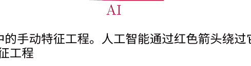

图1.7 经典机器学习中的手动特征工程。人工智能通过红色箭头绕过它。人工智能执行自动特征工程

> * 练习4 特征空间
特征需要满足什么属性，使得图像类在特征空间中是一个流形？

通常使用统计技术选择一组有用的特征子集，并丢弃那些嘈杂的特征。通过使用降维技术进一步减少特征空间的维度，使其更易处理。因此，经典的判别式机器学习流程是：

+   1. 收集训练数据。
    2. 提取有用的特征。这将给出一个特征空间，在该空间中更容易分离出类别。
    3. 可选地，减少特征空间的维度。
    4. 使用机器学习在特征空间中划分类别。

深度学习提供的突破是我们可以省略中间两个步骤。这两个被省略的步骤被人工智能隐含地包含在内，我们直接使用流形而不是特征空间中的集合或区域进行工作：

+   1. 收集大量的训练数据。
    2. 使用DNN切割流形。

在其各个层面上，AI在内部执行特征提取和降维步骤。对我们来说，它们只是不透明的，隐藏在AI模型的黑盒中。它们对我们来说只是不透明的，隐藏在AI模型的黑盒中。AI已经为我们自动化了这些步骤，因此AI通常被视为一种自动化的特征工程技术，减轻了机器学习科学家的负担。事实上，AI还走了一步进一步。我们将看到它如何根据这些自动计算的特征构建了输入的分层表示，并且它是一种强大的表示学习技术。输入通过神经元的激活模式来表示。这被称为分布式表示的输入。输入被映射到潜在语义空间中的一个点。属于同一类的输入具有相似的表示，因此它们可以与其他类别分开。

是否可以对特征空间进行深度切割，而不是原始数据空间？是的，如果特征空间非常高维，则人工智能会计算“特征的特征”，并且可以使用多层网络来实现相同的表达能力。毕竟，原始数据空间可以被视为最基本的特征空间。

> 人工智能在原始数据空间中刻画流形，而传统机器学习则在特征空间中刻画区域。在刻画过程的中间阶段，人工智能以分层的方式自动化特征工程过程。它在潜在特征空间中构建了输入的分布式表示。

### 1.8 监督和无监督的人工智能

值得注意的是，几乎所有现代人工智能和机器学习都是由数据驱动的，特别是经过注释和标记的数据。有一个例外。通常将监督机器学习和无监督机器学习区分开来，因为后者不需要标记数据。

在监督情况下，我们给出了期望的输出，并且有一个损失函数来评估我们产生正确输出的程度。目标输出是数据注释或标记工作的结果。有时，标签可以是隐含的，并且可以从数据中提取出来，就像是自监督机器学习一样。其他时候，我们可以从注释数据扩展标签到无标签数据，从而实现半监督机器学习。

在无监督的情况下，我们对学习数据的几何形状感兴趣，而不需要其他任何信息。它包括寻找自然发生的聚类方法，降低维度，探索和可视化数据，以及检测异常值和离群值。参见图1.8作为一个说明性的例子。无监督学习中的一个基本问题是：我们正在观察的点云的几何形状是什么？那里有一个模式吗？

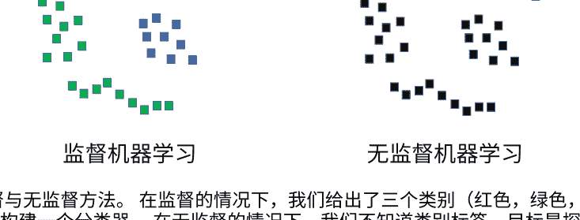

图1.8 监督与无监督方法。在监督的情况下，我们给出了三个类别（红色，绿色，蓝色），目标是构建一个分类器。在无监督的情况下，我们不知道类别标签，目标是探索无标签数据集的几何形状。我们可以通过视觉推断出有四个聚类，其中两个具有一维几何形状。

> 无监督的人工智能和机器学习旨在理解给定的无标签数据的几何形状并发现模式。

### 1.9 超越流形

本章旨在从鸟瞰的角度给读者提供对人工智能和机器学习的几何直觉。我们广泛使用流形的概念，这对计算机视觉非常有效。除了计算机视觉[121]，人工智能还有许多其他应用领域，可能有些领域您对流形假设并不完全认同。也许问题中存在时间动态，我们没有一个固定的流形，而是一个随时间变化的可变流形。也许底层几何形状是一组任意集合。在极端情况下，它可能是一组不相连的点。从整体上看，整个系统可能有许多组件，每个组件具有不同的几何形状，因此当您将这些组件组合在一起时，整体几何形状将变得更加难以处理。扩展练习5，探索您感兴趣的特定问题的潜在几何形状。

> ** 练习5 数据流形

讨论语音和音频、自然语言理解以及恶意软件检测中的典型分类问题是否导致其相应的原始数据空间中的流形。

尽管存在这些概念上的挑战，但如果您在原始数据空间中使用深度神经网络，仍然是通过几何雕刻过程来近似解决方案。下面的章节将带您踏上了解雕刻过程内在动态的旅程。

### 1.10 章节总结

通过与雕刻过程的类比，可以对人工智能的工作原理形成强烈的几何直觉。对于分类问题，人工智能模型通过指数级数量的凸多面体雕刻出一个高维流形。对于回归问题，它使用指数级数量的线性区域来拟合一个分段线性函数。这种指数级的表达能力使得人工智能模型能够解决具有挑战性的问题。训练过程根据训练数据集教会了人工智能模型如何进行雕刻。

一个损失函数。对于回归问题，一个例子是 $L^2$损失函数，而对于分类问题，交叉熵损失函数被广泛使用。$L^2$损失函数衡量了误差向量的长度，而交叉熵损失函数基于数据的似然性。线性回归和逻辑回归是经典机器学习中的两个线性模型，许多重要的概念可以在线性模型的背景下进行研究。AI模型可以分为两种主要类型：(1)生成型和(2)判别型。生成型AI能够在流形中创建新的未见点。在它们的完全一般性中，这两种类型的AI都是图灵可计算函数，可以通过数据驱动的方法来近似。与计算理论的联系需要强调AI是使用可数无限集合而不是不可数无限集合（如实数）进行工作的。另一个区别是有监督方法和无监督方法之间的区别。后者旨在学习给定数据的几何结构并找到其中的自然模式。经典机器学习和AI之间的关键区别在于前者在精心设计的特征空间中工作，而后者在原始数据空间中工作。AI执行自动特征工程，并以分层特征的分布表示构建输入。

## 问题集1

+   1. 给出一个一维集合的例子，它是一个流形。给出一个不是流形的一维集合的例子。地球表面是一个流形吗？整个地球是一个流形吗？
    2. 考虑一个对应于猫的流形中的点。假设猫静止不动，背景也不变。一个人进入背景并离开。这个时间序列在流形中对应什么？现在考虑背景保持静态，猫慢慢站起来离开场景。这个时间序列在流形中对应什么？
    3. 在一个非常高维的空间中，一个球体的大部分体积位于哪里？你对常见图像类别的流形几何有什么直觉？
    4. 将单位圆定义为距离原点单位距离的点集。在$L^2$范数情况下，单位圆是直径为两个单位的标准圆。在$L^1$范数情况下，单位圆是什么？在$L^\infty$情况下呢？
    5. 考虑一个具有均匀概率分布[0.5,0.5]的两个结果的概率空间。计算平均熵。然后，重新计算分布[0.1,0.9]的熵。推导出具有最大熵的概率分布。
    6. 对于任意的$x \in \mathbb{R}$，计算$[x, x]$的softmax是什么？对于任意的$z \in \mathbb{R}$，计算$[x, y]$和$[x + z, y + z]$的softmax之间的差异是什么？
    7. 假设你正在设计一个经典的计算机视觉算法来区分自然风景的图像和城市街景的图像。以下哪些特征将是好的特征：(1)直线，(2)颜色直方图，(3)风景的美丽，(4)风景的宁静，(5)文本区域，(6)人物，(7)车辆，(8)人脸表情，或者(9)照片拍摄的时间拍摄？假设你为这个任务列出了一个临时的200个特征的清单。选择这些特征的一个子集以获得最佳结果容易吗？
    8. 根据计算理论，AI模型能够处理实数吗？ AI模型和图灵机之间有什么区别？
    9. 一个孩子自己注意到他/她的狗有四种不同的面部表情。然后孩子练习画狗。后来孩子去他/她的学校，学校的老师教不同的字母。孩子正在进行什么类型的学习？
    10. 在经典机器学习中，如何使图像特征对缩放和旋转不变？

## 第2章
让我学习

> > 你不必看到整个楼梯，只需迈出第一步。
> 
> 马丁·路德·金

> > 在获得数据之前进行理论推测是一个重大错误。
> 
> 福尔摩斯

当你参观大峡谷国家公园时，你会在从边缘看到它的那一刻充满惊叹。这是大自然创造的一场壮丽的景象。如果你是一个有冒险精神的经验丰富的徒步旅行者，你可以沿着其中一条规划良好的路径向下行进，前往急流奔腾的科罗拉多河。你迈出第一步，然后是第二步，你就在开始了你的旅程。人工智能能以类似的方式学习。它面临着一个具有挑战性和未知性的领域，目标是到达损失函数非常低的位置，就像科罗拉多河谷一样。与人类徒步旅行者不同的是，它没有规划好的路径，而是需要发现它。这正是机器学习中学习的过程。在本章中，我们将一窥其发生的过程。这是因为从一个初始位置开始，AI学习过程通过数据引导，采取小步向目标迈进。这些步骤被称为梯度下降步骤。这亿万步的旅程发生在一个超现实的高维世界中，被称为优化景观，也被称为损失景观或损失曲面。我们将培养对如何找到这些步骤以及这个旅程如何进行的直觉。

在这一点上，我们做出了一个关键的观察。算法在计算机科学中起着核心作用，并且随着基于算法的技术的崛起，它们已经被推到了世界的显要位置。算法的研究一直是一个智力刺激的领域，计算机科学的学生学习著名的算法，如快速排序和堆排序用于排序，Kruskal 和 Prim 算法用于最小生成树，Dijkstra 和 Floyd-Warshall 算法用于图中的最短路径。编写软件以实现专门的算法，以解决实际问题，而人工智能现在展示了一种新的算法设计和编程的方式。在这种新的方式中，我们指定一个人工智能模型，并使用数据进行学习。没有必要使用手工设计的技术和高度定制的解决方案，因为相同的一般原则可以应用于不同领域的几个具有实际意义的问题。

这就象拥有一般的徒步旅行技巧，不仅可以徒步穿越亚利桑那州的大峡谷，还可以在未来探索火星上的瓦莱斯马里纳里斯峡谷。

### 2.1 可学习参数

#### 2.1.1 单个神经元的力量

为了理解训练过程，我们从一个单独的神经元开始。人类大脑和人工神经网络的最基本单位是神经元。生物神经元由树突和轴突组成。树突接收来自其他神经元的冲动，轴突将冲动传递给其他神经元。如果进入兴奋性信号的净强度超过抑制性信号的净强度达到一个阈值，生物神经元就会发放冲动并传递冲动。

人工神经元受到生物神经元的启发；见图2.1。对于一个输入向量 \(x = (x_1, x_2, ..., x_n)\)，它实现了一个数学函数：

```
$$y = f(x) = \sigma\left(b + \sum_{i=1}^{n} w_i x_i\right),$$
```

其中 \(w\) 和 \(b\) 分别是权重和偏置项，是可学习的、可训练的或可调整的参数。函数 \(\sigma\) 被称为神经元的激活函数，因为它决定了神经元如何被激活。计算得到的值 \(y\) 被称为神经元的激活值或输出值。激活函数有三种常见选择：

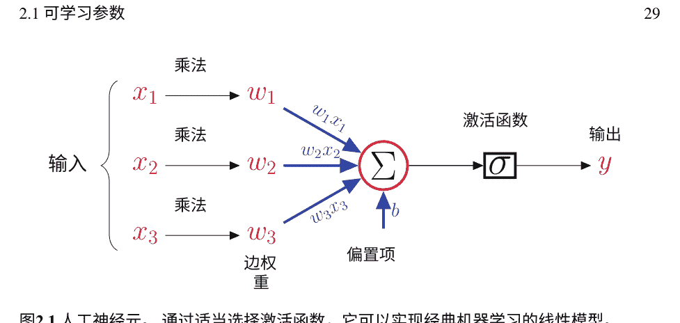

图2.1 人工神经元。通过适当选择激活函数，它可以实现经典机器学习的线性模型。

- 双曲正切函数 $f(z) = (e^{z} - e^{-z})/(e^{z} + e^{-z})$。
- sigmoid函数 $f(z) = 1/(1 + e^{-z})$。
- ReLU函数 $f(z) = \max\{0, z\}$。

一个单神经元能够解决机器学习问题。以下是一些不同的情况：

- 如果 $\sigma$ 是恒等函数，并且参数是在回归损失函数（如 $L^{2}$ 损失）下训练的，那么一个单神经元实现线性回归。
- 如果 $\sigma$ 是sigmoid函数，并且参数是在分类交叉熵损失函数下训练的，那么一个单神经元实现逻辑回归。sigmoid函数将输出压缩到范围 [0, 1]内。
- 如果 $\sigma$ 是ReLU函数，则实现了一个ReLU神经元，它允许正输出通过，而将负输出压缩为零。该神经元被称为ReLU神经元。

ReLU神经元广泛应用于现代AI模型的隐藏层，因为它们导致训练过程的更快收敛。对于分类问题，在输出层必须使用Sigmoid激活函数或Softmax函数。

#### 2.1.2 神经元的协同工作

考虑级联多个全连接隐藏层的最简方案，参见图1.4。我们首先打开黑盒，窥视一下图2.2中具有一个隐藏层的FFN。在AI模型中，有几个隐藏层，每个隐藏层都有大量的神经元。对于图2.2，可学习参数集包括神经元的参数。

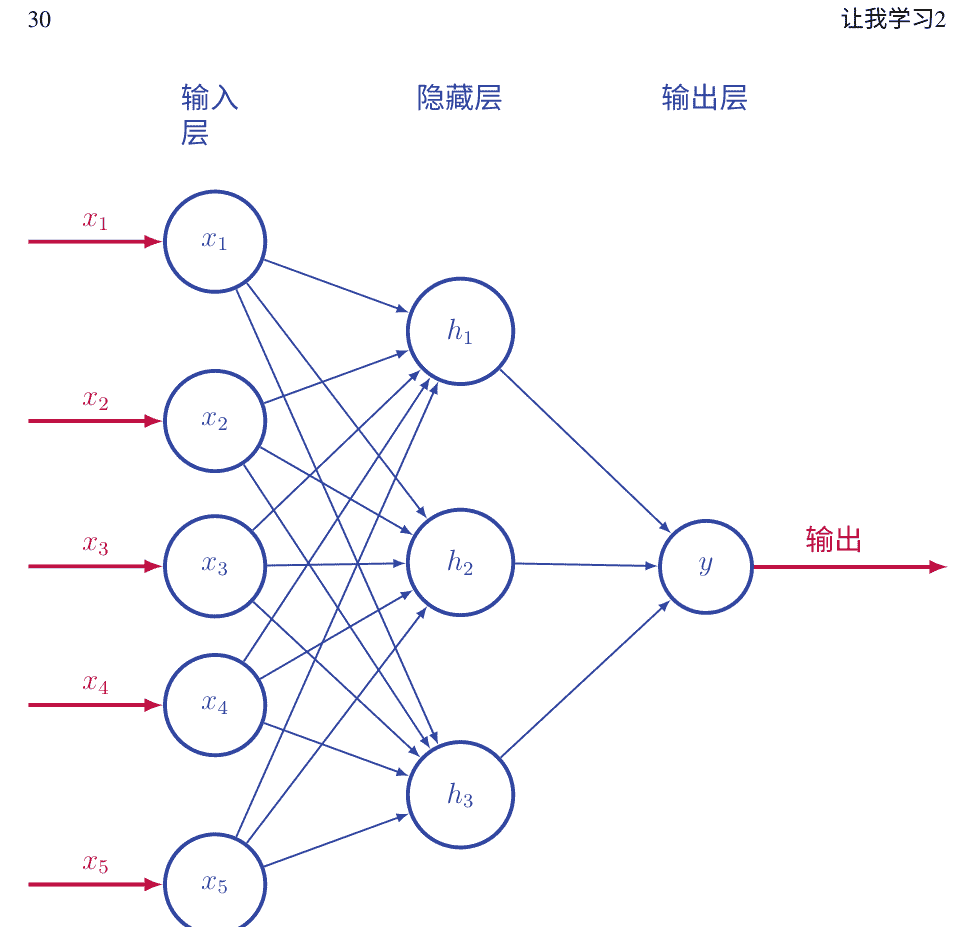

图2.2 一个具有一个隐藏层的FFN的详细视图。神经元被描绘为蓝色圆圈。神经元的输出显示在其圆圈内。请参见图2.1以放大一个神经元。隐藏层与输入传递层完全连接。总共有22个可学习参数。

每个隐藏神经元有五个输入边，因此它有五个权重和一个偏置项。输出神经元有三个输入边和一个偏置项。在实践中，DNN将有数百万个要学习的参数，并且通过进行许多梯度下降步骤来进行训练。每个步骤都使用反向传播算法，其中包括前向传播和后向传播，以计算相对于可学习参数的训练示例的小批量的损失函数的梯度。在计算梯度之后，可学习参数将进行微调。

该过程通过进行下一步来重复在其隐藏层和输出层中。假设FFN中除输入层外的神经元数为 N，计算图中的边数为 E。那么，可学习（可调整）参数的总数为

```
E + N,
```

分别包括权重和偏置项。ReLU-based FFN的工作原理有一个自然、直观的机制。边上的权重量化神经元之间的连接强度。权重的大小越高，强度越大。神经元对其输入的加权组合进行处理，如果净输入信号超过阈值 $-b$，则“发射”，并向前传输其输出。从第一个隐藏层开始，神经元以级联方式发射，将其输出向前传输，一直到输出层。

可学习参数的总数可以达到数千万或数亿。训练的目标是找到使损失函数在训练集上最小化的参数值。

> > 在ReLU人工智能模型中，神经元以级联方式发射，计算从输入向输出流动。边缘上的权重表示神经元之间的连接强度。ReLU神经元要么发射并向前传输其输出，要么不发射并阻止传输。

### 2.2 梯度反向传播

在二十世纪，一种革命性的算法改变了神经网络研究，这就是反向传播算法。本质上，它是一种巧妙的方法，用于实现函数的嵌套组合在微积分中的链式法则。关于反向传播的开创性工作，请参见[83, 182]。在图1.4和2.2中，一个前馈神经网络计算一个函数 $f(x)$，该函数是由其神经元计算的函数的组合。神经网络的最终输出是损失函数的输入，并且需要对其结果相对于可学习参数进行微分：

```
\mathcal{L}(\theta, x) = \sum_{i=1}^{n} \mathcal{L}(\theta, x_i)
```

其中 $x$ 是一个小批量的 $n$训练样本，$\theta$ 由可学习参数组成。在图2.2中，$\theta$ 有22个参数。对于（平方的）$L^2$损失，表达式为

```
\mathcal{L}(\theta, x) = \sum_{i=1}^{n} (y_i - f(x_i))^2
```

以及交叉熵损失函数，

$$
\mathcal{L}(\theta, x) = \sum_{i=1}^n -y_i \log f(x_i) - (1 - y_i) \log(1 - f(x_i)),
$$

其中对于输入 $x_i$， $y_i$是真实标签， $f(x_i)$是网络的输出。 设 $\theta$有 $k$个可学习参数：

$$
\theta = (\theta_1, \theta_2, \ldots, \theta_k).
$$

那么损失函数对 $\theta$的导数是一个 $k$维向量。

#### 2.2.1 偏导数

在微积分中，一个函数可以写成

$$
f(x_1, x_2, \ldots, x_n),
$$

其中 $x_i$被称为变量。 该函数依赖于这些变量，可以对函数进行微分。 对于一个人工智能模型，损失函数依赖于以下内容：

- **参数项** 这些是边缘上的权重和神经元的偏置项，这些是需要调整的变量。 它们被赋予了值，这些值需要更新为新计算的值。 因此，主要目标是根据这些项对损失函数进行微分。
- **输入项** 这些是固定的并作为常数。 同时，在某些应用中，我们也可以使它们可学习。 我们将在后面看到，在神经元的可视化和DeepDream中，输入项是可变的，并且根据它们进行了适当定义的函数进行微分。
- **中间项** 这些是所有中间操作和神经元的输出值，它们依赖于输入项、参数项和前面的中间项。 这些是底层计算图中的中间变量，损失函数根据这些项进行微分以实现链式法则的实现。

偏导数符号 $\partial$在多元微积分中使用。 给定一个多变量函数，如 $f(x_1, x_2)$，其对输入变量的偏导数为反向传播算法高效地计算损失函数对 $k$ 可学习参数的导数:

$$\frac{\partial \mathcal{L}}{\partial \theta} = \left( \frac{\partial \mathcal{L}}{\partial \theta_1}, \cdots, \frac{\partial \mathcal{L}}{\partial \theta_k} \right)$$

#### 2.2.2 前向和后向传递

反向传播算法分为两个步骤。

前向传递为所有输入项分配值。 从输入到输出运行计算，以级联方式激活神经元并计算中间项的值。 进一步扩展计算到损失函数，该函数基于输出值和真实值。 请注意，由于前向传递的结果，每个项都被分配了一个数值。

反向传播 开始计算损失函数对输出变量的导数。 从输出向输入的计算图中反向传播，同时计算沿途遇到的参数项和中间项的偏导数。 使用高中微积分中的链式法则。 计算偏导数表达式的数值。 注意，在反向传播过程中，每个偏导数项都会获得一个数值。

在高中，学生们通过符号微分从一个表达式到另一个表达式。 因此， $x^2$ 的导数是 $2x$ , $\sin 2x$ 的导数是 $2 \cos 2x$ 。 在反向传播算法中，我们从值到值进行计算，因为我们正在评估这些表达式。 如果在高中的 $x^2$ 示例中， $x=3$ , 我们将得到前向传播值为9，导数值为6。 如果在 $\sin 2x$ 示例中， $x=\pi/6$ , 那么前向传播的结果为 $\sqrt{3}/2$ , 并且反向传播得到导数1。

让我们来看另一个例子。 设 $x=2$ 为输入，假设有四个可学习参数 $w_1=3$ , $w_2=1$ , $w_3=-5$ , 和 $w_4=4$ 。 考虑以下步骤:

$$r = w_1 x,$$
$$s = w_2 r + w_3,$$
$$t = \mathrm{ReLU}(s),$$
$$y = w_4 t,$$
$$L = (y - g)^2,$$

其中r, s, 和 t是中间项， y是输出， L是 L²损失函数， 具有真实值 g =5。前向传播是

```
r = 6,
s = 1,
t = 1,
y = 4,
L = 1,
```

反向传播是

$$
\frac{\partial L}{\partial y} = 2(y - 5) = -2,
\frac{\partial L}{\partial w_4} = \frac{\partial L}{\partial y} \frac{\partial y}{\partial w_4} = -2,
\frac{\partial L}{\partial w_3} = \frac{\partial L}{\partial y} \frac{\partial y}{\partial t} \frac{\partial t}{\partial s} \frac{\partial s}{\partial w_3} = -8,
\frac{\partial L}{\partial w_2} = \frac{\partial L}{\partial y} \frac{\partial y}{\partial t} \frac{\partial t}{\partial s} \frac{\partial s}{\partial w_2} = -48,
\frac{\partial L}{\partial w_1} = \frac{\partial L}{\partial y} \frac{\partial y}{\partial t} \frac{\partial t}{\partial s} \frac{\partial s}{\partial r} \frac{\partial r}{\partial w_1} = -16,
$$

因此，我们可以在计算它们时将部分公共产品保存在内存中，以便在后续步骤中重复使用它们。因此，反向传播是一种基于图计算的链式法则的动态规划算法。请注意，如果 x =1，则ReLU将处于非活动状态，断开图，并使 t 和 y为零，与可学习参数无关。损失函数对参数的导数将变为零。

只有当ReLU神经元在变为正数时才会重新建立依赖关系。人们必须等待适当的输入值 x才能发生这种情况。如果这样的输入永远不会到达怎么办？这就是永远处于休眠状态的神经元的问题。

#### 练习6 训练

1.  考虑逻辑回归中的以下操作：

    ```
    $y = w_1 x_1 + w_2 x_2 + w_3$
    $p = \text{sigmoid}(y) = 1/(1 + \exp(-y))$
    $L = -G \log(p) - (1 - G) \log(1 - p)$
    ```

    计算 L相对于 y的偏导数。假设自然对数。

2.  一个神经元可以进入休眠状态并永远不会醒来吗？

3.  考虑 K个多类别分类的损失。真实值向量 G是一个独热向量。训练样本的损失是

    ```
    $- \sum_{i=1}^{K} G_i \log p_i,$
    ```

    其中 $G_j =1$表示给定训练样本的正确（正类）$j$，对于其他 $K-1$个负类，$G_i =0$，$p_i$是类别$i$的预测概率。因此，当 $i = j$时，所有项变为0，总损失变为

    ```
    $- \log p_j$。
    ```

    这是否意味着损失与AI模型对负类的预测无关？

前向传播计算函数的组合：

```
$y = f_N(. . . f_1(x) . . .),$
```

从 $f_1$到 $f_N$的正向方向，并保存中间项，

```
$z_k = f_k(. . . f_1(x) . . .)$。
```

反向传播从 $f_N$到 $f_1$的反向方向，根据链式法则进行微分，并利用中间项：

$$
\frac{\partial y}{\partial x} = \frac{\partial y}{\partial z_{N-1}} \frac{\partial z_{N-1}}{\partial x},
$$
$$
= \frac{\partial y}{\partial z_{N-1}} \frac{\partial z_{N-1}}{\partial z_{N-2}} \frac{\partial z_{N-2}}{\partial x},
$$
$$
= \frac{\partial y}{\partial z_{N-1}} \frac{\partial z_{N-1}}{\partial z_{N-2}} \cdots \frac{\partial z_1}{\partial x},
$$

其中，在计算图中沿着反向路径的常见偏导数的乘积被保存以便于后续的高效计算。局部偏导数是相对于每个图节点的局部可学习参数（变量）的，它们与先前计算的偏导数的保存乘积相乘。这就像在反向方向上进行广度优先图遍历，计算局部导数并使导数的乘积流向前面的节点。

读者可能会问为什么我们不能像高中微积分练习中那样使用表达式，计算出导数表达式，然后直接代入值。答案是确实可能，但对于非常大的向量$x$和$\theta$来说，计算上是难以处理的，无法推导出$\mathcal{L}(x, \theta)$的显式表达式。对于人工智能模型来说，这将是一个复杂的表达式。好消息是，这个表达式是由一个图引导的，因此具有适合计算的特殊结构。在反向传播中，通过遵循图结构并重复使用中间计算，以隐式的方式使用图引导的表达式。然而，直接使用高中微积分中的底层表达式的问题是一个深入的问题，我们将在第4章进一步探讨，因为它揭示了人工智能的工作原理。

关于偏导数的直觉如下。损失函数相对于参数$w$的梯度$g_w$告诉我们，如果我们将参数增加一个无穷小的量$d w$，那么计算图中会产生连锁反应，损失函数会改变$g_w d w$。因此，通过微小的扰动$w$并检查损失函数是否按预期的数量变化，可以轻松检查反向传播是否正常工作。这被称为梯度检查。

> 反向传播算法利用损失函数对可学习参数的图诱导依赖来高效计算梯度。

### 2.3 随机梯度下降

AI的巨大表达能力是有代价的。对于线性模型来说，像 $L^2$ 损失或交叉熵损失这样的损失函数是凸函数，但对于AI模型来说则是非凸的。

让我们首先定义一个凸集。凸集是指如果在任意两点之间画一条线，那么线段将在集合内部。在美国国旗中，条纹是凸的，星星是非凸的。凸集的周边没有凹陷。现在我们可以定义一个凸函数。如果你看一个凸函数的图形，图形上方的区域是一个凸集。不连续的局部最小值意味着图形有凹陷，它是非凸的。

凸函数很容易优化，因为没有比全局最小值更差的局部最小值。这个函数呈碗状，你可以向下滑向任何局部最小值。它可以有多个最小值，但它们不能形成一个不连续的集合。事实上，它们一起形成一个凸集。凸函数呈碗状，底部要么是平坦的凸面，要么有一个唯一的最小值。在经典世界中，线性模型和支持向量机的凸损失函数可以很容易地优化。如果我们追求人工智能，就必须离开凸优化的世界。好消息是，有一种训练算法能够应对非凸优化的挑战。

假设我们有一个包含n个训练样本的小批量，并且有两个可学习的参数w1和w2。计算小批量在二维参数空间上的损失函数。参见图2.3，了解这样一个参数空间上的优化景观。垂直轴是损失函数。水平的二维平面是可学习的参数空间。我们可以看到山丘、山谷和相对平坦的区域。目标是达到全局最小值或接近最优的局部最小值。

图2.3一个损失函数的优化景观（损失曲面），其中有两个可学习的参数。SGD计算相对于这两个参数的损失函数的梯度。梯度是等高线图上的一个二维向量，并且它将垂直于该点的等高线。

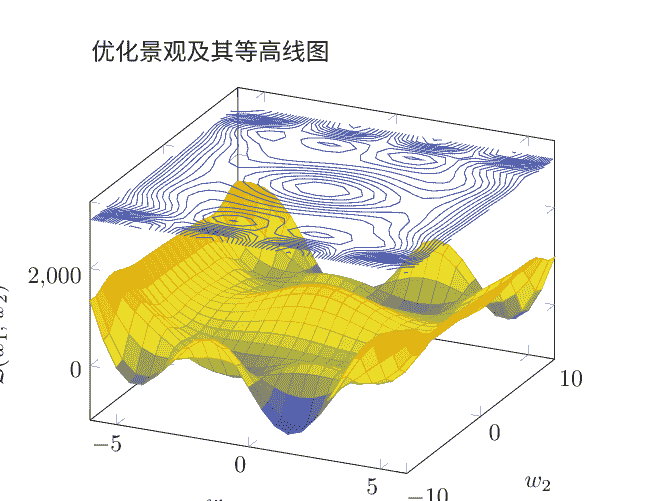

想象一下，我们站在这个景观的某个地方。 我们使用反向传播计算每个小批量样本的梯度。 小批量样本的梯度进行平均。 结果是一个在水平平面上的平均二维梯度向量：

$$
\frac{\partial \mathcal{L}}{\partial \theta} = \left( \frac{\partial \mathcal{L}}{\partial w_1}, \frac{\partial \mathcal{L}}{\partial w_2} \right).
$$

它将垂直于我们所站的等高线。

偏导数是当我们将可调参数的旋钮微小调整时，损失函数的无穷小变化的比率。 它不给出我们需要采取的步长大小。 因此，我们将其乘以一个称为学习率$\alpha > 0$的超参数，通常选择一个小的数值进行试验和错误。 我们沿着降低损失函数的方向前进。

参数值得到更新：

$$
w_1 = w_1 - \alpha \frac{\partial \mathcal{L}}{\partial w_1},
$$
$$
w_2 = w_2 - \alpha \frac{\partial \mathcal{L}}{\partial w_2}.
$$

请注意，我们走向山谷而不是山顶。 这就是为什么有一个减号。 我们沿着梯度的相反方向前进，因为我们希望最小化损失函数。 如果我们将权重的旋钮向上转动并且损失函数增加，使梯度为正数，则我们需要将旋钮向下转动。 如果损失减少，使梯度为负数，则是正确的调整方向，我们将其向上转动。 如果学习率太小，收敛速度会变慢。 如果学习率太高，则可能根本无法收敛。 为什么梯度越大，我们要迈出更大的步伐？ 对于局部最小值周围的地形，有一个隐含的假设，即它是碗状的，因此当接近最小值时，梯度会减小。 我们在陡峭的山谷中采取较大的步伐，然后减小步长以收敛到最小值。 如果地形在某个最小值周围非常平坦，有一个深而窄的凹陷，那么这种策略将失败。

还可以创建将梯度归一化为单位长度的SGD变体，这样它们只依赖于其方向。

一旦我们迈出这一步，一个新的小批量就会到来，我们会发现优化的景观稍微改变了，因为它取决于小批量。 尽管景观的流动性，我们仍然继续同样的过程。 我们继续滑下山坡，山坡随时间不断变化和变形。

我们应该选择小批量是小还是大？ 统计抽样理论表明，估计真实梯度的抽样误差的标准差将随着小批量大小的 $\sqrt{n}$ 因子而减小。

因此，我们应该更有信心采取更大的梯度步长。学习率可以通过 √n 因子进行缩放；然而，实验证明，为了获得良好的结果，它应该线性缩放；参见[63]。
肯定有很多个小批次，人工智能最终会用完它们。训练数据有 N 个样本，可以得到 N/n 个小批次，其中 n 是小批次的大小。当整个数据集的一次遍历结束时，我们称之为一个时代的结束。人工智能是持久的，它想要学到更多。我们对数据进行洗牌，并重新创建新的小批次。整个过程重复进行。
一个时代接着一个时代。在一个时代内，一个小批次接着一个小批次。在一个小批次内，对每个训练样本进行反向传播。在反向传播中，有前向传播和后向传播。在每次传递中，逐层、逐神经元进行计算。随机梯度下降 (SGD) 是这个算法的总称。它最终会产生奇迹；人工智能最终学会了如何区分猫和狗，当你说“嘿，谷歌”时会醒来，并且能够从英语翻译成德语。

> AI模型必须在一个非常高维的、流动的优化空间中导航，以找到其可学习参数的接近最优值。SGD算法包括朝着这个空间的山谷方向采取小的梯度步长。

#### 2.3.1 处理困难的优化空间

SGD很棒，但不是最终答案。步骤可能会有噪音，AI模型可能会在步骤中来回摇摆太多。此外，对于所有的参数使用相同的学习率 α 可能会有问题，特别是在像优胜美地这样的狭窄山谷中。与其在对立的悬崖墙之间来回浪费时间，我们需要沿着山谷走下去，这个山谷是平坦的，但有时几乎不可察觉地向下倾斜。这两个方向不应该以相同的方式处理。为了解决噪音的问题，我们通过保留梯度的历史记录来平滑下降。对于每个参数，过去的梯度与一个衰减项 γ < 1 相加，这给予过去梯度较小的权重。为了看到这一点，考虑以下递归关系：

```
a_t = γ a_{t-1} + b_t,
```

这展开成指数衰减的平均值

```
a_t = b_t + γ b_{t-1} + γ^2 b_{t-2} + ... + γ^t b_0.
```

这个想法在基于动量的方法中使用，其中将指数衰减的平均值添加到当前梯度中：
$$g_t = \gamma g_{t-1} + \alpha \frac{\partial \mathcal{L}}{\partial w},$$
$$w_t = w_{t-1} - g_t,$$
其中t是时间步长。Nesterov的动量方法是香草动量思想的一种变体，在该方法中，梯度是在预测的未来位置计算的，而不是在当前点计算的。

为了解决第二个问题，即使学习率适应每个参数，保留每个参数的过去梯度的统计信息。如果一个参数在过去波动太大，我们会降低它的学习率，以阻止朝着那个方向移动，因为朝着那个方向移动是浪费的。另一方面，如果参数在过去没有太大变化，但现在突然变化，那么它携带更多信息，我们会增加它的学习率。参数w的指数加权平均值的平方根，衰减因子γ<1，是衡量其波动性的一种方式：
$$\sqrt{g_{w,t}^2 + \gamma g_{w,t-1}^2 + \gamma^2 g_{w,t-2}^2 + \dots + \gamma^t g_{w,0}^2}.$$
对于w的学习率将与上述情况成反比。计算每个参数的自适应学习率的方法有几种，例如AdaGrad、AdaDelta、RMSProp和Adam；参见[2, 62]。与普通SGD相比，这些方法通常导致更快的收敛。目前尚无定论决定哪种方法最好。由于优化景观的多样性，每种方法都可能在某些景观中表现出色。

#### 2.3.2 训练的稳定性

SGD的起始点确实很重要。如果我们从非常大的参数值开始，那么神经元的激活（输出）值在前向传递中会呈指数增长，在反向传递中会导致梯度爆炸。我们不想处于喜马拉雅山脉上，那里有陡峭的悬崖和大梯度。如果我们从非常小的参数值开始，情况则相反。梯度太小，它们会消失。我们发现自己处于一个平坦的区域。我们不想处于乌尤尼盐沼，那里几乎没有梯度。

关键是要找到两个极端之间的平衡。梯度应该在神经元和层之间保持稳定。由于梯度取决于神经元的激活值，我们可以通过稳定激活值来稳定梯度。我们努力使每个神经元的激活值具有零均值和单位方差分布。

### 2.3 随机梯度下降

在经典机器学习中，将输入特征归一化为零均值和单位方差是常规操作。相同的思想可以应用于神经元的激活值，它们是中间的分层特征。如果一个神经元有n个输入神经元，那么如果每个输入边上的权重都是从零均值和方差为1的正态分布中随机初始化的，那么它将满足我们标准化激活值的目标。这就是Xavier初始化。对于ReLU函数，假设一半的输入神经元被激活，方差会增加到2/n。

随着随机梯度下降的进行，优化的景观从小批量到小批量发生变化。其根本原因是不同的小批量在输入空间中具有不同的分布。因此，激活值的分布从零均值和单位方差漂移到一些非零均值和非单位方差，这些值在小批量之间波动。如果景观非常流动，那么随机梯度下降会遇到困难。

在训练过程中，使用批量归一化方法来纠正优化景观的流动性。对于每个神经元，我们计算给定小批量上其激活的均值和方差。通过减去均值并除以标准差，我们对其输出进行归一化：

```
$$z = \frac{y - \mu}{\sigma}.$$
```
这将激活的统计分布中的拉伸轮廓转化为更圆形的轮廓。在进行ReLU或sigmoid激活之前，我们通过两个可学习参数$\beta$和$\tau$（对于每个神经元）对归一化输出$z$进行线性变换：
$$r = \beta z + \tau,$$
旨在进一步修改输出$z$，以便数据驱动的学习发现其有用。学习过程甚至可以确定批量归一化有害，因此通过使$\beta = \sigma$和$\tau = \mu$来撤销其效果。

批量归一化在实践中经常被使用以稳定训练。经验结果表明，由于批量归一化，即使数据分布从小批量到小批量发生变化，训练也是稳健的。然而，批量归一化帮助训练的确切机制尚未被充分理解。在测试时，当我们没有小批量时，我们只需插入在训练集上计算得到的均值和方差。

Xavier初始化使得SGD在优化空间中的起始点更易处理。批量归一化可以被视为添加新的归一化层以减少优化空间的流动性。这两种技术主要是经验性的、统计方法；参见[58, 100]。有一天，我们将更多地了解优化空间，要么进一步加强使用它们的论点，要么提出全新的稳健训练技术。

> > 当SGD在优化空间中寻找接近最优值时，面临着各种挑战。SGD算法的变体已经被开发出来以平滑梯度下降。已经开发出了一些技术，以在开始时将SGD引导到更易处理的区域，并控制小批量到小批量的随机变化，这些技术在经验上被发现非常有帮助。

### 2.4 章节总结

一个单一的神经元是人工智能模型的基本单位，它的构建受到生物学的启发。给定一个输入，从输入层开始，神经元在人工智能模型中以级联的方式触发，直到输出层。这是一个图引发的计算。损失函数是输出层之后的一个附加函数。为了训练神经网络，必须计算损失函数相对于神经网络的可学习（可训练）参数的梯度，这些参数是权重和偏置项。反向传播算法有效地计算这个梯度，利用图结构分为前向传播和后向传播两个阶段。SGD在训练周期中使用反向传播来处理每个小批量的训练样本。可学习参数通过梯度下降步骤在高维、非凸优化空间中进行微调，由学习率超参数控制。有几种改进训练的SGD算法变体。在初始化可学习参数时应注意，使神经元的激活保持在控制范围内，梯度不会爆炸或消失。由于优化空间在小批量之间是流动的，因此在训练过程中对神经激活值进行归一化的技术被发现是有帮助的。

在这一章中，我们对随机梯度下降的工作原理有了直观的理解。此时，为什么它能够工作并不明显，也就是说，为什么这个训练过程能够找到一个好的解决方案而不陷入局部最小值，这一点并不明显。为了更深入地探讨这个具有挑战性的主题，我们将在第4章中更详细地研究优化景观的性质。在同一章中，我们将学习ReLU神经元中级联触发是如何刻画复杂流形的。

## 问题集2

- 1. 为什么与传统的激活函数（sigmoid和双曲正切）相比，ReLU能够加快训练速度？
- 2. 假设我们正在构建一个全连接层，它将n1个神经元连接到n2个神经元。这个全连接层增加了多少可学习参数到总参数的数量？
- 3. 对于单项式 $f(x, y) = x^n y^m$，关于x和关于y的偏导数是什么？ 使用链式法则求 $(\sin x)^2$ 的导数。
- 4. 假设一个神经元有 $n$ 个输入神经元。 为什么将每个输入边上的权重初始化为零，意味着方差为1/n归一化激活值？ 应用统计学中关于独立随机变量和的方差的规则。
- 5. 当通过减去像素值的平均值并除以它们的标准差来对输入进行归一化时有什么帮助？
- 6. 假设你将小批量的大小增加四倍。 你应该修改学习率吗？ 如何修改？
- 7. 考虑以下计算步骤：

```
r = w_1 x, 
s = w_2 y, 
t = w_3 r + w_4 s, 
p = \text{Sigmoid}(t), 
L = -\log p.
```

假设使用自然对数。假设 $x = 1$, $y = 2$, $w_1 = -1$, $w_2 = 3$, $w_3 =5$, 和 $w_4 = 1$. 执行前向和后向传递，显示所有中间值和导数。提示：（1）参考练习 6直接计算 $L$ 对 $t$ 的导数。（2）如果你得到的值

```
\frac{\partial L}{\partial w_1} = -1.344707
```

那么你走对了路。展示达到这个值的所有步骤。

# 第三章
图像和序列

> 空间和时间是心灵构建现实体验的框架。

——伊曼纽尔·康德

> 我们模型的一些方面受到神经科学的启发，但许多组件并不受神经科学的启发，而是来自理论、直觉或经验探索。我们的模型并不渴望成为大脑的模型，我们也不声称与神经相关。但同时，我不害怕说卷积神经网络的架构受到视觉皮层的一些基本知识的启发。

——杨立昆

前几章已经为我们阐明了人工智能的基础，涉及整个训练过程。我们对深度神经网络的表达能力有了一些了解，我们使用了具有多个隐藏层的全连接神经元的前馈神经网络。在人工智能的黎明之前，机器学习从业者在特征空间中使用具有一个隐藏层的浅层前馈神经网络。然而，它们在图像和序列上效果不好。

对于我们想要理解图像、语音和文本的AI任务，深度神经网络已经针对这些特定领域进行了定制。对于图像来说，在2D空间中，基本的原子单位是一个像素。图像由组成它的部分组合而成更大的部分。对于语音来说，基本单位是一个时间间隔。对于文本来说，它是一个字符或者是一个单词序列中的一个单词。在图像中，我们有空间维度。在语音中，我们有时间维度。在文本中，我们有一个符号序列，可以是无限的，具有长期依赖性。
随着时间的推移，研究人员已经找出了如何设计神经网络来处理空间、时间和序列数据。在本章中，我们对AI模型的定制进行直观的探索，这在不同领域的成功应用中被证明是至关重要的。

### 3.1 卷积神经网络

宇宙中存在着强烈的层次化设计，其中一致的单位组合形成更复杂的结构。物体由部分组成由更小的部分组成。我们提供了卷积神经网络的两个动机(CNNs)，这是计算机视觉应用中的主导模型，它基于一个部分-整体层次结构。

#### 3.1.1 视觉皮层的生物学

CNN背后的第一个动机是生物学的。让我们回到20世纪50年代和60年代的哈佛大学，当时David Hubel和Torsten Wiesel描述了哺乳动物视觉的神经科学；参见[97]。基于对猫的实验，他们将神经元分类为两类：

- 1. 简单细胞对特定空间位置上的定向线条的特定图像特征做出反应。
- 2. 复杂细胞对相同的定向线条以空间不变的方式做出反应，即，它们对线条的空间位置不敏感。

复杂的细胞提供了更高级的处理，建立在简单神经元的输出之上，并使感觉处理具有平移不变性。Hubel和Wiesel因为他们的开创性工作而在1981年被授予诺贝尔生理学和医学奖。

> *** 练习7 Hubel-Wiesel**
基于Hubel和Wiesel对哺乳动物视觉皮层的研究，讨论它如何暗示神经网络在视觉问题上的设计。
他们的突破是偶然的。你知道为什么吗？

#### 3.1.2 模式匹配

卷积神经网络（CNN）的第二个动机来自信号和图像处理，其中卷积是一种在滑动窗口方式下的乘法和加法操作。在线性代数中，乘法和加法操作被称为点积或内积。点积衡量两个向量之间的匹配程度，并将其与向量的大小归一化，得到统计学中的相关系数，也称为余弦距离。将信号与滤波器进行卷积是在入门信号处理课程中首先讲解的主题之一。在信号处理中，卷积操作还包括在操作之前翻转滤波器的额外步骤。在图像处理中，基于卷积操作的基于模板的方法已被用于在图像中查找特定模式的出现。

参见图3.1，使用卷积进行图像处理的示例。假设图像为 $H \times W$，卷积滤波器为 $w \times w$。让 $B$ 成为边界填充，以处理图像边界处的卷积。让滑动窗口的步幅为 $S$，用于空间移动滤波器。那么输出的宽度和高度分别为：

```
(W - w + 2B)/S + 1,
(H - w + 2B)/S + 1。
```

在图3.1中，$W = H = 7$，$w = 3$，$S=1$，$B=0$。因此，我们得到 $5 \times 5$ 的输出。

通过卷积的过程，可以检测图像小块中常见的局部模式。在图3.1中，正在检测垂直边缘模式。一个问题出现了：是否存在一组有限的卷积滤波器，可以检测到大多数数字图像中出现的大多数局部模式？参见下面的练习，了解答案。

| 1 | 1 | 1 | 1 | 10 | 10 | 10 |
|---|---|---|---|---|---|---|
| 1 | 1 | 1 | 1 | 10 | 10 | 10 |
| 1 | 1 | 1 | 1 | 10 | 10 | 10 |
| 1 | 1 | 1 | 1 | 10 | 10 | 10 |
| 1 | 1 | 1 | 1 | 10 | 10 | 10 |
| 1 | 1 | 1 | 1 | 10 | 10 | 10 |
| 1 | 1 | 1 | 1 | 10 | 10 | 10 |

| 1 | 0 | -1 |
|---|---|---|
| 2 | 0 | -2 |
| 1 | 0 | -1 |

| 0 | 0 | -36 | -36 | 0 |
|---|---|---|---|---|
| 0 | 0 | -36 | -36 | 0 |
| 0 | 0 | -36 | -36 | 0 |
| 0 | 0 | -36 | -36 | 0 |
| 0 | 0 | -36 | -36 | 0 |

图3.1 二维卷积图像与Sobel垂直边缘检测器滤波器。卷积运算在信号和图像处理中被广泛使用。

### ** 练习8 Olshausen-Field

1996年，布鲁诺·奥尔豪森和大卫·菲尔德在《自然》杂志上发表了一篇题为“通过学习自然图像的稀疏编码，简单细胞感受野特性的出现”的论文。该论文展示了视觉皮层中对特定图像模式有反应的简单细胞的特性。参见[154]。

因此，学习局部图像特征（如边缘、纹理和颜色斑点）的卷积层类似于简单细胞。该层不是完全连接的，而是局部连接的，在整个图像上进行卷积操作时参数数量显著减少且保持不变。下一个卷积层对第一层的输出进行池化，类似于复杂细胞。

#### 3.1.3 三维卷积

一个可以继续增加视觉细胞复杂性的过程，以构建对更复杂模式做出反应的更高级复杂细胞。神经元的感受野是它所看到的图像区域，并且随着较小感受野的低级神经元的输出被更高级神经元汇集，感受野变得更大。

这是CNN的核心思想。卷积层对上一层的输出应用卷积运算。卷积滤波器的大小是第一层神经元的感受野。相邻神经元的激活通过池化层进行汇集。下一个卷积滤波器作用于池化层的输出。它的感受野将是它所依赖的第一层所有神经元的感受野的并集。卷积运算后应用ReLU激活函数，只允许正值传递到下一层。

请注意，与图3.1中的2D卷积不同，我们在CNN中使用3D卷积，因为每个输入都是一个 W × H × C 的块（张量），其中 W 和 H 是空间维度，C 是通道数。通道被称为特征图。RGB图像是一个维度为 W × H ×3 的块，因为有三个颜色通道。将其与一个3D滤波器进行卷积会得到一个 W' × H' ×1 的通道（一个特征图）。K个这样的滤波器将产生一个 W' × H' × K 的块。参见图3.2。最大池化层是一个非重叠的滑动窗口操作，它在每个区域上取最大值。请注意，通过应用2×2的最大池化或在滑动窗口操作期间使用2的步长，我们可以将输出块的空间维度缩小（下采样）2倍。在CNN中，有几个卷积层；参见图3.3，显示了前两层与下采样操作交替进行。虽然在空间维度上看到这种情况很常见，但通过最大池化来减少典型的斑块的数量，但这并不是必需的。以额外的计算为代价，保留空间维度是完全可以的。

因此，CNN的架构可以被写成这些层的组合，例如：

> $y = F(x) = S(FC8(FC7(FC6(C5(C4(C3(M(C2(M(C1(x)))))))))))$

其中 C1到 C5是五个卷积层，FC6到FC8是三个全连接层，M 是一个2 × 2的最大池化层，S 是一个softmax分类层。在代码中，一个简单的卷积神经网络可能看起来类似于以下内容：

```
model = SequentialNeuralNetwork(
    [
        Input(shape=input_shape),
        layers.Convolution2D(64, kernel_size=(3, 3), activation="ReLU"),
        layers.MaxPooling2D(pool_size=(2, 2)),
        layers.Convolution2D(128, kernel_size=(5, 5), activation="ReLU"),
        layers.MaxPooling2D(pool_size=(2, 2)),
        layers.Flatten(),
        layers.Dropout(0.2),
        layers.Dense(num_classes, activation="softmax"),
    ]
)
```

在本书中，在描述整体解决方案的背景下，我们将简洁地写作F(x)，其中F将被假定为一个深度神经网络。
对于卷积滤波器，权重在所有滑动窗口位置上是共享的，也就是说，它是相同的滤波器。为了确保它们保持相等，我们通过相同的量来更新它们，这个量是在梯度下降步骤中梯度的总和。请注意，卷积层提供了对特征的平移不变性学习。最大池化在每个滑动位置上提供了对微小晃动的不变性。这就是为什么卷积滤波器和最大池化层的组合在实践中非常有效的原因。请注意，对于CNN层的批归一化，特征通道中的所有神经元被视为相同，因为它们应用相同的卷积滤波器，因此我们还在小批量样本和空间位置上对激活值进行归一化。如果我们只考虑一个样本并且仅在空间位置上对每个通道进行归一化，那就是实例归一化或对比度归一化。还可以对特征通道组进行归一化，包括整个层的特征块。

卷积神经网络通过部分-整体层次结构和平移不变性来学习构建图像的表示。它们受到视觉感知的生物学启发。它们可以被视为一个将区域特征转换为神经元学习的blob（张量）转换器，这些区域特征对应于它们的感受野。

### 3.2 循环神经网络

图像的大小是固定的，但序列的长度是可变的，并且可以无限运行，并且可能存在长期依赖关系。除非我们使序列的大小相同，截断它们或将它们分段，否则我们无法使用CNN。另一种选择是使用因果卷积，这与使用过去的有界上下文相同。让我们对循环神经网络（RNNs）的直观理解进行开发，这些网络被设计用于处理序列数据。

#### 3.2.1 具有状态的神经元

假设数据序列中的第一个多维输入 x₁ 到达，并且应用了CNN或FFN，同时，每个隐藏层神经元计算一个值，并保存。将这个值称为神经元的“状态”。在第二步中，下一个输入项 x₂ 到达，并且应用相同的神经网络。存储的先前状态成为隐藏神经元的输入，除了 x₂ 之外。计算出一个新的状态，并保存到第三个时间步。请注意，在第一个时间步中，没有先前的状态，我们可以将其设为零。参见图3.4。因此，我们有以下递归关系：

h_t = f(x_t, h_{t-1}), h_0 = 0,
 y_t = g(h_t).

其中 f 和 g 是由DNN层实现的学习函数，所有变量都是向量。为了训练一个RNN，我们可以将递归展开到时间上。例如：

y_2 = g(h_2) = g(f(x_2, h_1)) = g(f(x_2, f(x_1, h_0))).

展开得到一个有向无环计算图。在深度递归神经网络（RNN）中，有几个隐藏层，我们有一个多层架构：

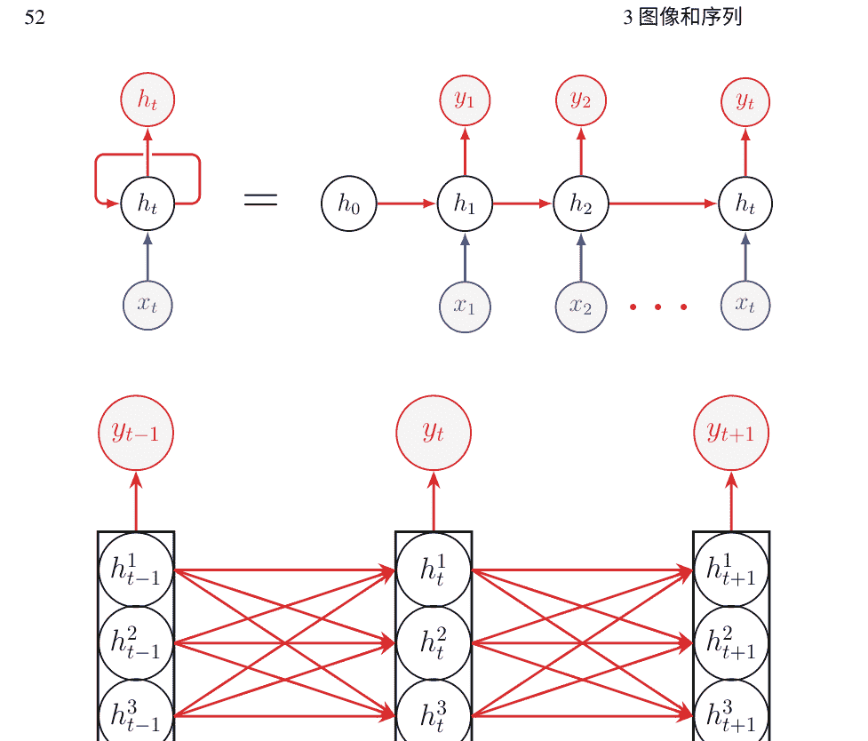

图3.4 一个循环神经网络（RNN）及其在时间上的展开。在顶部，所有箭头都由多层学习函数实现。例如，$y_t = g(h_t)$定义了从隐藏层到输出的映射，其中函数 $g(h_t)$ 由DNN层实现。在底部，我们放大了红色箭头，它由所示的连接实现，并且是函数 $h_t = f(x_t, h_{t-1})$ 一部分

```
$$ h_t^1 = f_1(x_t, h_{t-1}^1), $$
$$ h_t^2 = f_2(h_t^1, h_{t-1}^2), $$
$$ y_t = f_3(h_t^2). $$
```

只要保持计算的因果性，即计算图保持无环图，就可以构建大型、高度复杂的多层深度架构。权重在时间上是共享的。为了确保它们相等，我们通过相同的量来更新它们，这个量是梯度的总和。这是带有权重共享的时间反向传播。第一个隐藏状态 $h_0$不需要初始化为零，我们可以一直运行反向传播直到 $h_0$，就像它是一个可学习的层一样。

#### 3.2.2 循环的力量

由于其记忆机制，RNN非常强大，它们可以模拟图灵机，使其具有计算普遍性。它们比隐马尔可夫模型（HMM）更强大，HMM是一种经典的序列工具。

HMM的状态一次只能激活一个，而对于RNN，所有状态都可以激活。考虑激活的二进制情况，一个神经元可以处于两种状态之一，激活或非激活。如果在隐马尔可夫模型（HMM）中有 $N$个状态，则其具有大小为log $N$的内存，因为有 $N$个唯一的状态模式。

对于具有 $N$隐藏神经元的RNN，内存大小为$2^N$。RNN具有反馈回路和动力学系统；因此，它们可以具有吸引子和混沌动力学。这导致对初始条件的敏感性，并且训练可以根据初始化的不同方向进行。如果它们在时间上被大量展开，它们可能会遭受梯度消失问题，因为计算图的深度变得非常大。

#### 3.2.3 双向前进

当完整的时间上下文可用时，RNN被推广为双向版本。对于每个方向，使用单向RNN。因此，有两个独立的单向RNN，$f_1$和$f_2$，一个在正向方向（从左到右）对输入序列进行操作：

```
$x_1, x_2, \ldots, x_n,$
```

另一个则相反（从右到左）。两个RNN的输出被连接在一起：

```
$(f_1(x_1), f_2(x_1)), (f_1(x_2), f_2(x_2)), \ldots, (f_1(x_n), f_2(x_n)),$
```

然后输入到RNN的更高层，产生输出。读者可能会问，当完整的上下文可用时，使用CNN是否可以。答案是肯定的，我们将在自然语言理解（NLU）和语音应用中看到。时间就像一个空间维度。

#### 3.2.4 注意力

当RNN产生输出时，它在其隐藏状态中隐式地跟踪过去。那么明确保存过去呢？假设我们将过去的状态保存在一个称为注意力存储器的存储库中，并构建一个选择性访问该存储器的机制。这被称为注意机制。意图是在当前时间步骤的计算中包含过去的某些相关状态。注意存储器成为RNN在每个时间步骤的额外输入。当过去无限时，这最终将变得不可行。因此，在实践中，它在上下文有界时使用。注意力的思想在一个称为编码器-解码器的架构中得到了应用，为许多序列到序列任务提供了强大的抽象。请参阅[34, 206]以了解它们在机器翻译中的有效应用。

参见图3.5。首先考虑没有可选的注意力记忆。有一个编码器，它产生其有界输入的内部表示。在图中，它在三个时间步骤接收一个序列输入，该输入由一个DNN（通常是单向或双向RNN）处理，以产生整个输入的编码 R。例如， R可以是单向RNN的最后一个隐藏状态。或者， R可以是双向RNN隐藏状态的学习函数的输出。解码器是一个RNN，并以 R作为初始化

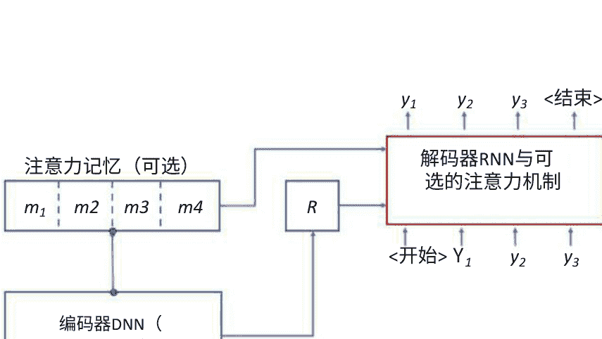

图3.5 注意机制是通用编码器-解码器架构的可选附加功能。它涉及将编码器的状态保存在内存中，以供解码器稍后选择性地使用。这个基本思想有几种变体。图显示了方法的一般视图。请注意，编码器DNN可以是RNN或CNN。编码器生成一个表示。输入的Rof。一次又一次地，我们将看到上述架构在多个领域（如NLU、语音和视觉）的应用中使用。

它的隐藏状态 \( h_0 \)；它在开始信号上产生第一个输出。请注意，在解码的每个步骤中，我们将前一个输出作为输入传递给下一个解码阶段。

考虑具有注意力内存的相同架构，并假设内存库有 \( N \) 个向量。考虑解码时刻 \( t \)。在实践中有效的一种方法是通过使用解码器RNN的前一个隐藏状态 \( h_{t-1} \)，使用点积计算其与注意力内存中的每个 \( N \) 个向量的注意力分数。计算所有 \( N \) 个内存向量的加权组合 \( c_t \)，其中权重是softmax化的注意力分数。加权组合 \( c_t \) 被称为上下文向量。计算注意力权重的评分函数有几种选择。评分函数可以通过神经网络学习，也可以是预定义的函数，如点积。上下文向量 \( c_t \) 被附加到当前解码阶段的输入中。以下是步骤：

```
\( h_0 = R, \) \
\( \alpha_i' = f (h_{t-1}, m_i), i \in \{1, 2, \ldots, N\}, \) \
\( [\alpha_1, \alpha_2, \ldots, \alpha_N] = \text{softmax}(\alpha_1', \alpha_2', \ldots, \alpha_N'), \) \
\( c_t = \sum_{i=1}^N \alpha_i m_i, \) \
\( y_t = \text{解码器} (y_{t-1}, c_t), \)
```

其中 \( m_i \) 是注意力记忆中的第 \( i \) 个记忆单元，\( f \) 是评分函数，而 \( \alpha_i \) 是注意力权重。我们可以将注意力机制简洁地表示为一个函数 \( A \)：

```
\( c_t = A([m_1, \ldots, m_N], h_{t-1}). \)
```

因此，在最高层次上，我们有以下紧凑的高级表达底层架构：

```
\( (R, M) = F(x), \) \
\( y = G(R, M), \)
```

其中 \( M \) 是注意力记忆，\( F \) 是编码器，\( G \) 是解码器，而注意力函数 \( A \) 是 \( G \) 的内部函数。

尽管注意力机制乍一看可能很复杂，但它实际上是AI中基本乘法和加法运算的修改：

```
\( y = b + \sum w_i x_i, \)
```

现在权重是在运行时动态计算的，
$w_i = f(x).$

> 编码器-解码器架构已经在AI的不同应用领域取得了成功。一些例子包括语言翻译、图像标注、活动识别、目标检测、语音识别、锚定语音识别、语音合成和手写识别。

在这个主题上有几种变体，修改架构的机会是无限的。我们可以将来自多层解码器RNN的 $H_t$ 用作评分函数的输入吗？使用RNN作为编码器是必要的吗？我们可以将 $R$ 输入到解码器的每个阶段吗？我们可以使用CNN作为编码器吗？注意力可以有其他形式吗？在这里，创造力没有限制。时间只是一个像空间一样的维度，人们可以创造性地使用CNN。输出是一个特征块，其中空间位置取代了时间。我们对某些空间位置比其他位置更加关注。换句话说，如果特征块具有空间维度 $W \times H$ 和 $C$ 通道，则注意力机制 $A$ 由以下给出

```
$c_t = A([m_1, \dots, m_N], h_{t-1}),$
```

其中 $N = W \times H$ 是空间位置的总数。对于每个空间位置，$C$ 维特征纤维是一个注意力记忆向量；参见图3.6。输入可以是像自动语音识别（ASR）的光谱图一样的图像。输入可以是一张照片，解码器的目标是生成图像标题。这里涉及到计算机视觉和自然语言理解（NLU）任务是自动推断给定图像的标题，其中编码器是卷积神经网络（CNN），解码器是与注意机制相结合的循环神经网络（RNN）。这为计算机视觉和自然语言理解（NLU）这两个领域提供了一个很好的融合方式；参见[247]。对于纯粹的自然语言理解（NLU）任务，输入可以是将嵌入向量矩阵视为图像并馈送给编码器卷积神经网络（CNN）。

#### 时间注意力记忆

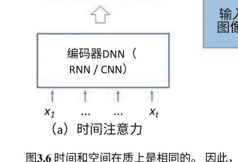

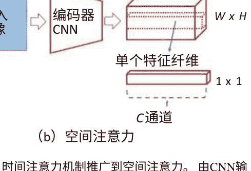

图3.6 时间和空间在本质上是相同的。因此，时间注意力机制推广到空间注意力。由CNN输出的特征张量中的特征纤维是空间注意力记忆向量。注意力机制有选择地检索编码输入的不同部分，无论是时间上的还是空间上的。

### 3.3 自注意力

上述注意机制允许解码器参考编码器的计算结果；因此它是编码器-解码器注意力。编码器在执行编码过程时也可以关注其自身的先前隐藏状态。如果编码器在有限的数据块上工作，或者有限数量的先前状态保存在内存中，这将起作用。这将构成编码器-编码器注意力。在有界的输入块上，通过计算所有成对的、双向的、有序的注意力分数，将注意机制推广为自注意力；有关自注意力的介绍，请参见[218]。类似地，可以定义解码器-解码器注意力，它必须是因果和单向的。

最近的NLU技术采用了所有三种注意力形式；参见[218]。

类比是两个人之间的交流，A和B之间的交流。给定一份报告，人A（编码器）必须为B总结报告，而B必须立即口头回应。人A在准备报告时进行自我关注（编码器-编码器），在报告的边缘做笔记，并生成一个摘要，这是报告的编码表示R。人B（解码器）接收摘要R并即兴产生口头回应，注意A（编码器-解码器注意力）所做的边缘笔记。在这个类比中，边缘笔记是注意力记忆。在口头回应期间，B在说下一个词之前会注意自己的思绪和先前说过的话（解码器-解码器因果注意力）。

自我关注是一种新的深度网络架构的基础，被称为Transformer。Transformer可以被看作是一个处理输入标记的前馈网络的泛化，它使用自我关注层并行处理输入标记。处理过程是有序感知的，因为单词的位置也被编码在它们的表示中。参见[48, 218]和第10.5节了解如何在NLU中使用自我关注。参见第9.4节了解其在计算机视觉中的应用。

### 3.4 LSTM

为了更有效地解决序列问题并进行稳定训练，神经元的隐藏状态被泛化为记忆单元。数值可以从内存寄存器中读取和写入，并且其内容可以保留或遗忘。这些操作必须可微分，以便反向传播算法能够工作。因此，控制门的值在范围[0, 1]内，并且操作是软性的。在极端值时，它们就像“开”或“关”。记忆单元的更新是

```
内容 ← W × (提议的内容) + F × (旧内容),
```

其中W和F分别是写入门和遗忘门。长短期记忆（LSTM）是一种RNN，门控循环单元（GRU）是另一种变体。LSTM和GRU都比简单RNN效果更好，并能够捕捉长期依赖关系和短期记忆单元。

在本书中，假设RNN单元要么是LSTM单元，要么是GRU单元，并且术语RNN包含了所有不同的形式。因此，无论何时我们说RNN，其实现的选择都包括LSTM和GRU。没有门控记忆单元的简单RNN可用于具有短期依赖性的简单任务。

想象一下，你正在与对你很重要的人交谈。根据对话，你认为这个人对你很满意。但最后，有人评论说“我对你感到非常失望。”好吧，你会忘记之前说过的话。同样，你的配偶对你说“我今天很开心”，然后紧接着讲述一些他/她面临的困难。尽管有抱怨，总体上你会继续将语气评为积极的，因为你期待着一些积极的事情，并且你决定保留那个第一句话“我今天很开心”在你的记忆中。LSTM捕捉了这种随时间的信息流，该信息流在每个时间步骤中进行计算，并且可以随时终止并替换为新的信息。

受LSTM启发，控制神经网络中信息流的一个想法是使用门控神经元，其中神经元实现函数 y = F(x)的最终输出 y' 由学习到的sigmoid门 G控制，如下所示：

```
y' = Gy + (1 - G)x.
```

如果 G = 0，它就变成了一个直通神经元。使用这种机制的网络被称为高速公路网络；参见[202]。

保持记忆的想法对于构建智能系统至关重要，可以将LSTM单元中的局部记忆的想法推广到保留事实的全局记忆。如果正在构建一个自然语言理解（NLU）的问答系统，则自然而然地采用这种方法，以便可以引用输入文本的适当部分以检索正确答案；参见[241]中以记忆网络形式实现这一想法。在聊天机器人中，拥有对话记忆也很重要。

> > 基于LSTM的RNN可以学习顺序数据中的长期依赖关系。当与注意力或自注意机制相结合时，它提供了一种强大的方法来解决涉及顺序数据的问题。

### 3.5 超越图像和序列

CNN在[124]中成功用于MNIST手写数字识别，RNN在[182]中引入，LSTM在[93]中引入。所有这些在人工智能领域都具有很大的影响力，并在构建成功的应用程序方面表现出色。在1998年LeNet论文发表不到20年的时间里，我们在将CNN应用于计算机视觉问题方面取得了巨大成功。请参阅[116]以了解人工智能在计算机视觉领域的首次重大突破，还可以参阅[79,211]以了解其他值得注意的工作。有关基于注意力的RNN模型，请参阅[9,137]，有关自注意力，请参阅[218]。我们将在后面关于计算机视觉和自然语言理解的章节中更详细地研究这些内容。现在，让我们超越图像和单词序列进行思考。以下是一些场景：

- 视频图像序列具有自己的特点，沿着时间维度使它们不仅仅是3D图像数据。目标是在视频上执行计算机视觉任务，其中一个例子是活动识别。
- 3D点云数据自动驾驶汽车和机器人依赖深度传感器，产生3D点云。人们可以获得距离图像，这是一种显示场景中每个点的距离或深度的2D图像。目标是使用深度数据，以3D点或距离图像的形式，解决计算机视觉任务，如物体检测和场景分割。
- 3D体积数据医学图像，如CT扫描产生体积数据。目标是检测和分割出感兴趣的区域。
- 流形考虑地球表面的气候数据，它具有3D球形结构。目标是将卷积扩展到平滑流形，以便可以进行天气预测，例如气旋。另一个例子是具有平滑表面的3D对象，目标是学习姿态不变的形状匹配和检索特征。
- 图图由节点（顶点）和边组成。每个节点都有与之关联的特征向量。目标是生成图的分层表示并计算整个图的全局特征或对子图进行分类。
- 数据结构在最一般的情况下，可以有复杂的数据结构，并且期望的输出基于非平凡的算法。这些可以是列表、树或图。目标是对提供的数据结构进行复杂推理。
- 符号数学考虑符号数学问题。目标是使用人工智能解决微分方程和进行积分。输入是一个方程或数学表达式。

我们如何将人工智能模型推广到这些不同的情况？我们将在第9章讨论视频、3D点云数据和3D体积数据的用例。

图在科学和工程中无处不在，CNN已经推广到图中；参见[46]。考虑一个图，其中节点具有特征向量。图卷积神经网络通过应用于相邻节点的卷积滤波器来更新这些节点。也就是说，卷积滤波器的感受野是每个节点的适当定义的邻域。我们可以将其写为

```
y = F(N(v))
```

其中 N(v)是图顶点 v的邻域， F 是一个学习到的图卷积滤波器，它接收邻域中顶点的特征并为 v生成一个新的特征向量；参见图3.7。可以将图卷积网络应用于三维点云数据，其中存在点的邻域的自然概念。在存在局部关系概念的非结构化数据中，可以进行创造性的其他应用。例如，可以利用图卷积神经网络来预测自动驾驶汽车技术中多个代理（如汽车和行人）的行为。图像的标准卷积网络是图卷积神经网络的一种特殊情况，其中具有均匀网格状邻域。

对于地球表面或三维形状等表面上的卷积，思路是使用局部测地坐标系统来提取点周围的补丁，就像在其周围放置一个小蜘蛛网一样；参见[140]。同样，存在着由三维对象（如地球）的表面定义的局部性概念，并且应用灵活的卷积操作。这个框架可以推广到任意流形；参见[40]，它采用了现代物理学的思想。

对于一般的数据结构和算法，图灵机是一个计算通用模型。我们可以通过图灵机来激发神经网络，在其中存在外部存储器；参见[66,69]和图3.7。读取和写入操作是可微分的软操作。因此，当我们写入时，我们写入由写入门控制的所有存储单元，其值在范围[0, 1]内，并且读取也是一样的。神经图灵机（NTMs）和可微分神经计算机（DNCs）受到这些思想的启发。它们包括一个存储器，相当于图灵机的磁带，和一个基于人工智能的控制器。它们被设计用于对一般的数据结构进行复杂的推理。以下是一些说明性的例子：

1. 输入是一个未排序符号的列表，每个符号都有一个附加的实值优先级。训练一个人工智能模型来输出排序后的序列。
2. 训练数据由随机生成的伦敦地铁地图组成，其中有L条线路服务S个站点。输入的形式为三元组，例如（站点，图3.7 AI模型已经被创造性地推广到不同类型的数据和不同的架构上。受图灵机的启发，如左图所示，可以训练由控制器、读/写头和外部存储器组成的AI模型，在一般数据结构上学习更复杂的推理。图卷积神经网络适用于普遍存在的图数据结构，如右图所示。绿色节点的局部邻域包括相邻的红色节点。

例如，在一个示例图中，站点（S1、S2）和线路（L1）。训练一个AI模型来回答关于两个站点之间最短路径的问题。然后给出实际的伦敦地铁地图，其中有L=11条线路服务S=270个站点。通过指定两个站点（如Moorgate、South Kensington），提出一个问题，输出是指定站点之间的最短路径。

另一个例子是家谱。AI模型被训练用于回答关于家庭成员之间关系的问题，例如“约翰的母亲的姑姑是谁？”

我们离使用反向传播学习复杂算法还有很长的路要走，但令人欣喜的是，我们已经迈出了使用符号推理学习算法来解决非平凡问题的数据驱动方法的第一步。

方程是具有结构的符号串。考虑一个微分方程 $xy' - y + x =0$。它的解是 $y = x \log c - x \log x$。

给定一个函数 $f(x) = x \cos x$，它的积分是 $F(x) = x \sin x + \cos x + C$。

由于数学表达式可以解析为树状结构，可以将其转换为前缀表示的序列，因此可以使用seq2seq AI模型以令人瞩目的准确度解决单变量数学问题。符号表达式的符号操作可以看作是一种特殊的语言翻译。

请参考[120]以了解这个令人兴奋的新方向的工作。

对于人工智能的另一个新颖应用，请参考[216]，该应用通过将深度前馈网络拟合到未知物理函数的数据并检查已知对称性来推导出众所周知的物理方程。在这里，AI模型被用作函数逼近器，以发现函数中的对称性。

## 3.6章小结

为了构建成功的人工智能应用，定制化AI模型对于不同的领域至关重要。CNN的部分灵感来自于部分-整体层次结构的概念，以及哺乳动物视觉皮层的工作方式。较低的卷积层对应于简单细胞，而较高的层对应于复杂细胞。由于权重共享，CNN能够学习到数据的平移不变表示，并且池化层使其对局部变形具有鲁棒性。它可以被视为一个特征块（张量）转换器，其中神经元的感受野随深度增加。对于序列数据，使用RNN来记忆隐藏神经元的状态。RNN单元可以推广为带有由软读取、写入和遗忘门控制的记忆寄存器的LSTM单元。这些门控制着过去信息的保留、遗忘或修改。

基于LSTM的多层RNN架构在捕捉长期依赖性方面非常有效。结合编码器-解码器架构中的注意机制，它们为许多NLU任务提供了解决方案。注意机制允许解码器参考保存在记忆库中的编码器状态。

当构建输入标记的上下文表示时，它可以推广到自注意力，其中编码器执行双向、成对的注意力。

最后，针对不同类型的数据和问题，提出了许多新颖的架构。对于列表、树和图等一般数据结构，它们受到图灵机模型的启发。对于符号数学，数据以方程和表达式的形式存在，这些数据适合顺序AI模型。在第9章中，我们将研究不同类型的计算机视觉数据。

## 问题集3

- 1. 我们如何确保2D卷积得到的输出特征图的空间维度与输入相同？
- 2. 为什么卷积操作可以应用于经典图像处理中的模式匹配（模板匹配）？
- 3. 对于模板匹配，如何使卷积操作对像素值方差变化或整体亮度平均值的偏移更具鲁棒性？
- 4. 卷积操作是基于两个向量的内积。在统计学中，内积和相关系数之间有什么关系？
- 5. 假设你有一个维度为256 × 256 × 64的输入块，其中64是通道数。一个2 × 2卷积滤波器和一个1 × 1卷积滤波器会有多少个参数？
- 6. 考虑一个维度为 W × H × C 的输入块。2×2池化层对输出块的维度有什么影响？1×1卷积层与 K 个1×1滤波器的影响是什么？Pr（所有特征值都是正数）=O（2-N）。
- 7. 反向传播算法在最大池化层上是如何工作的？
- 8. 在减少特征块的空间维度方面，使用步长为2的卷积操作还是使用步长为1的卷积操作后跟一个2 × 2的最大池化层更好？
- 9. 连续两个3 × 3卷积层的感受野大小将是多少？使用一个5 × 5的卷积滤波器还是连续两个3 × 3卷积层更好？
- 10. 双向LSTM的输出如何被模型的更高层使用？
- 11. 假设你正在尝试预测你的朋友、家人或者重要人物的情绪。你注意到它取决于你说的话，其中一些话已经过去很久了。你会使用什么类型的人工智能模型来解决这个问题？如果你注意到只有你最近说的 N 个词是重要的，那么你将如何解决这个问题？
- 12. 传统的CNN可以被视为图形CNN吗？

## 第4章 为什么AI有效

> 不仅要练习你的艺术，还要强行进入其中的秘密。

路德维希·范·贝多芬

> 只要在解决问题的过程中产生有趣的数学，就可以解决任何问题——即使你在一天结束时没有解决它。

安德鲁·怀尔斯

孩子们喜欢看魔术表演。一个熟练的魔术师可以娱乐观众。人们互相惊叹，“哇！她是怎么做到的？”

关于人工智能的一个评论是，我们实际上不了解AI模型的黑盒子内部发生了什么。当CNN识别一只猫时，所有隐藏的神经元在做什么？AI模型如何能够推广到未见过的例子？另一个持续的评论是，我们实际上不知道在训练过程中发生了什么。这种优化景观的本质是什么？为什么训练不会陷入局部最小值？

在所有这些问题的背后，有一个根本性的问题，主要是出于强烈的好奇心。为什么人工智能在实践中表现得如此出色？在机器学习竞赛中，它的神奇表现背后的秘密是什么？在本章中，我们揭开了一小部分的面纱。这绝不是最终答案。还有很多东西有待发现、证明和理解，但是随着时间的推移，我们对其有了更深入的理解。

在前几章中，我们对基于人工智能的工作有了一瞥，当时我们了解到它的表达能力随着人工智能模型的深度呈指数增长。现在是时候深入探讨这个主题，对其基本原理建立起强大的直觉机制。我们越了解，我们就会提出越多问题，我们就会创新越多，进步也就会更多。

### 4.1 凸多面体

如图1.3所示，人工智能的基本雕刻单元是一个凸多面体（线性区域）。为了理解输入空间如何被划分成这些部分，我们将从一个单一的ReLU神经元开始。参见图4.1，它展示了一个ReLU神经元如何将输入空间划分为两个区域。每个区域（半空间）都是一个无限凸多面体。每个区域都有与之相关的激活模式。对于一个单一的神经元，它要么是活跃的，要么是非活跃的。假设相同的输入 $(x_1, x_2)$ 被发送到第二个ReLU神经元。现在我们将有四个凸多面体（除非切割超平面是相同的）。每个凸多面体都有一个激活模式：$(a_1, a_2)$，其中 $a_i \in \{活跃, 不活跃\}$ 是神经元 $i \in \{1, 2\}$ 的激活。

这是另一个例子。在图2.2中，有五个输入神经元和三个隐藏神经元。每个隐藏神经元将5维输入空间分为两个5维半空间。所有三个隐藏神经元将5维输入空间划分为许多凸多面体，每个多面体都有一个激活模式：$(a_1, a_2, a_3)$。

在同一图中，有一个输出神经元。它对输入空间有什么影响？虽然很明显它会将3维特征空间 $(h_1, h_2, h_3)$ 划分为两个3维半空间，但它对5维输入空间的影响并不明显。

图4.1 ReLU神经元在其输入空间中的激活区域。ReLU激活函数将 $f$ 的负半平面置零。我们说神经元在正半平面中是唤醒或活跃的，在其他半平面中是休眠或不活跃的。函数 $f$ 和 $g$ 在红线处取0值。在 $d$ 维空间中，这些线是超平面。函数 $f$ 是线性函数，$g$ 是非线性的。函数 $g$ 是分段线性的。

### 4.2 分段线性函数

让我们揭开一个神经元如何细分由其前面的神经元划分的空间的问题的答案。

#### 4.2.1 输入空间的细分

参见图4.2以发展直觉。在这个说明性的例子中，输入是2维的。有两个隐藏层 $h_1$ 和 $h_2$，每个隐藏层有两个神经元，以及一个输出层 $O$，有一个单独的输出神经元。

隐藏层 $h_1$ 将输入空间分成四个凸多面体，其中两条线对应两个神经元。每个多面体的激活模式显示在括号中。例如，右上角的多面体具有激活模式(A,I)，代表（激活，非激活）模式。在这个多面体内，绿色神经元处于激活状态，蓝色神经元处于非激活状态。

考虑隐藏层 $h_2$ 中的紫色神经元。将隐藏层 $h_1$ 中神经元的激活模式固定为（A，I）。紫色神经元通过一条线将激活模式为（A，I）的凸多面体切割，如图所示。当固定激活模式时，它是一个线性函数，因为神经网络的计算图中没有任何非线性部分。唤醒的神经元成为直通神经元，而休眠的神经元则不起作用。它是线性函数的组合，因此仍然是线性的。权重相乘，偏置项在激活的计算路径上相加，这些路径从输入层开始，到达输出层。

沿着紫色线从右向左移动。一旦我们进入具有激活模式（A，A）的相邻的凸多面体，蓝色神经元就会醒来并被激活。线性函数相应地改变。这是线性函数的新组合，线条弯曲。在两个多面体的边界处，变化是连续的。我们将弯曲的线称为弯曲线。同样，第二层的橙色神经元用另一条弯曲线划分输入空间。

总共，我们现在有13个凸多面体。每个多面体都有一个4维激活模式：$(a_1, b_1, a_2, b_2)$，其中$a_1$，$b_1$是隐藏层$h_1$中的两个神经元，$a_2$，$b_2$是隐藏层$h_2$中的两个神经元。

该过程继续到输出层O。红色输出神经元在从一个多面体移动到另一个多面体时进一步划分输入空间。请在图4.2中跟随红线，它在空间中弯曲。

总共，我们现在有21个多面体。每个多面体都有一个5维激活模式：$(a_1, b_1, a_2, b_2, o)$，其中o是输出神经元。每个多面体都有一个线性函数拟合。整个输入空间已经用分段连续线性函数拟合；请参见图4.3进行说明。

上述分析适用于使用ReLU作为激活函数的AI模型。这对于实际中的大多数现代AI模型都是正确的。有时候会使用ReLU函数的变体，如ELU（指数线性单元），SELU（缩放的ELU），leaky RELU，PReLU（参数化ReLU）和平滑ReLU（也称为softplus函数ln(1+exp(z)))。如果激活函数是传统的非线性函数，例如sigmoid函数或双曲正切函数，会发生什么？那么我们将失去最终函数的分段线性性。神经元的值将在（0，1）范围内，并且没有神经元的开/关激活模式。结果是一个非凸的、非线性的函数。等高线图将由平滑曲线组成。观察到的是，基于ReLU的AI模型更容易训练。可以有把握地说，ReLU函数的使用对成功做出了重要贡献。

图4.3 一个分段连续线性函数拟合在凸多面体上。平行线显示了不同值的函数的等高线图。线性函数的等高线是平行的超平面。在等高线值的固定步长下，平行线之间的间隙将保持相同。

深度学习的重点是ReLU-based模型的分析。是否必须始终使用ReLU？不，因为对于某些应用，最好使用平滑的激活函数；例如，参见第6.7节，其中使用正弦函数表示一个单独的信号。

#### 4.2.2 分段非线性函数

在分类中，分段线性函数将被压缩到范围 [0, 1]内。结果是一个分段非线性函数，其范围是 [0, 1]。等高线图仍然具有平行线，但函数在每个凸多面体上的斜率是非线性的。

假设拟合的函数给出了输入 x 是猫的概率 P(x)。最终输出如下：

$$\text{决策} = \begin{cases} \text{猫}, & \text{如果 } P(x) > T_1 \\ \text{狗}, & \text{如果 } P(x) < T_2 \\ \text{犹豫}, & \text{否则} \end{cases}$$

在 T 处进行阈值处理会沿着值为 T 的等高线切割一个凸多面体。因此，每个凸多面体将被细分为至少一个至多三个多面体，对应于猫、狗和犹豫的结果；参见图1.3。

#### 4.2.3 刻画特征空间

现在我们来建立一个完整的图景。参见图4.4和4.5。

在图4.4中，我们展示了一个具有两个输入的FC-FFN。有两个隐藏层 h₁ 和 h₂，分别具有三个和两个神经元。输出层 O 具有三个神经元。每一层都是一个FC（全连接）层。我们深入探讨了每一层如何将前一层构建的所有特征空间（斑点）划分为凸多面体。

参见图4.5。2-D输入空间由第一层转换为3-D特征 blob F₁，然后再由第二层转换为2-D blob F₂。最后，输出层将我们带入一个3-D空间。具有 $k$ 个神经元的层的输出是一个 $k$-维特征空间。

第一层用三条线切割输入空间。第二层用两个平面切割特征blob $F_1$，并用两条弯曲线切割输入空间。最后，输出层用三条线切割特征blob $F_2$，用三个弯曲平面切割特征blob $F_1$，并用三条弯曲线切割输入空间。

层 $L$ 中的每个神经元都适应了一个简单的ReLU激活线性函数，该函数是由前一层 $L-1$ 的神经元所跨越的特征空间的线性函数，对于层 $L-2$ 的神经元所跨越的特征空间，适应了一个稍微复杂的分段线性函数，依此类推，直到适应输入层的最复杂函数；参见图4.5。较高层中的每个神经元都试图通过计算有用的特征来帮助分离前一特征空间中的类别，这是一种“特征的特征”和“模式的模式”，因此它是一种更高级的特征。由于流形的复杂几何结构，第一层的神经元很难做到这一点，因此我们需要围绕流形弯曲。

假设我们沿着输入空间中的一条直线段移动。这条线性轨迹在隐藏层计算的特征空间中映射为什么？考虑隐藏层的激活模式 $h_1$：$(a_1, a_2, a_3)$，并假设在线段的起点处，它是 $(A, A, A)$，三个神经元都被激活。当我们在输入空间中沿着一条直线移动时，在3D特征空间 $F_1$ 中，我们也会沿着一条直线移动，因为仿射变换将直线映射为直线。请注意，偏置项引入了平移，使得变换成为仿射变换，这是线性变换的共线性保持超类。假设激活模式发生了变化 $(A, A, \mathrm{I})$，其中一个神经元被停用。现在，在 $F_1$ 中的轨迹弯曲，然后我们在由前两个维度张成的二维平面上沿着另一条直线移动，而最后一个维度为零。如果 $F_1$ 的三个维度是$(x, y, z)$，那么我们现在在$(x, y)$平面上移动。假设激活模式发生了变化 $(A, \mathrm{I}, \mathrm{I})$，第二个神经元也被停用。我们现在沿着 $x$-轴移动。因此，输入空间中的直线在特征空间中弯曲。

#### 练习9 雕刻

- 1. 参见图1.3。指定一个神经网络的架构，可以产生所示的雕刻。
- 2. 输入空间中的凸多面体（线性区域）的数量衡量了AI模型的表达能力。衡量AI模型构建的特征空间中的表达能力的方法是什么？

### 4.3 AI的表达能力

本节面向那些希望对AI模型的表达能力与模型深度呈指数关系有深入理解的读者。根据我们在前几节中解释的几何雕刻过程，结果是直观的。

目标是找到可实现的表达能力的上限。关于上限的结果必须表明不存在任何权重分配使得网络超过该上限。关于下限的结果必须表明存在某些权重分配使得网络达到该表达能力。

我们概述了一个证明的高层轮廓，即凸多面体（线性区域）的数量与AI模型的深度呈指数关系。假设输入是$d$维的。我们将保持$d$不变。考虑具有$n_1$个神经元的第一隐藏层。每个神经元通过一个超平面切割$d$维空间。第一隐藏层中$n_1$个神经元在$d$维输入空间中切割的凸多面体总数由超平面排列理论中的一个美丽结果给出：

$$r(n_1, d) = 1 + n_1 + \binom{n_1}{2} + \binom{n_1}{3} + \dots + \binom{n_1}{d};$$

详细信息请参见[204]。假设第二个隐藏层有$n_2$个神经元。每个$d$维多边形通过$n_2$个超平面进一步细分为$r(n_2, d)$个部分，这些部分从一个多边形弯曲到另一个多边形。因此，总数为 $r(n_1, d)r(n_2, d)$。

当然，这是可能的，也是可取的最具表现力的雕刻方式。如果一些弯曲的超平面与一些多边形不相交，则数量会减少。希望在训练周期内，雕刻的超平面会移动以增加模型的表现力。

有关示例，请参见图1.3。第一层有三个神经元，因此我们可以确认 r(3,2)=7，通过观察直虚线。下一个处理层，即输出层，有一个神经元，并且它用弯曲的虚线将这七个多面体分成两部分，因为r(1,2)=2。总共有14个多面体。读者应该验证，如果这一层有另一个神经元，那么每个七个多面体最多可以被分割成r(2,2)=4个多面体，总共有28个多面体。另一个例子，请参见图4.2。第一个隐藏层导致r(2,2)=4个多面体。第二层的每个神经元将这四个多面体分成两部分，但它们只在一个多面体中实现了最大的细分成四个部分。

请注意，每个术语都是二项式系数的部分和。对于前d个二项式系数的部分和，没有已知的闭式公式。请注意，对于固定的d，$\binom{n}{d} = \Theta(n^d)$，因此我们有 $r(n, d) = \Theta(n^d)$，也就是说，该函数在n上呈多项式增长。

#### 练习10 Theta符号

计算机科学中使用的theta (Θ)符号表示什么？ omega (Ω)和大O符号表示什么？证明上述结果，即 $r(n, d) = \Theta(n^d)$。

对于两层，我们对最大表达能力有以下上界：$O\left(n_1^d n_2^d\right)$。

因此，如果只有一个隐藏层，则凸多面体的数量随其宽度n（对于固定的d）呈多项式增长。如果有L个处理层（包括输出层），我们有 $O(n_1^d ... n_L^d)$，并且假设所有层都有相同数量的神经元，我们有上界：$O(n^{dL})$，这是指数级的 L。由于 n, d 和 L 通常很大，AI模型具有天文学般高的表达能力。这是一个了不起的结果。由于其重要性，我们将其称为一个数学定理。

**雕刻定理**：假设一个前馈全连接 L 层深度网络具有 d 维输入，每个层都有 n 个神经元。然后，它用 $O(n^{dL})$ 凸多面体划分输入空间。

> 参见[171]以获得相同的结果。有关基于热带几何的详细形式证明，请参见[253]。还请参考练习2。

上述上界是否渐近紧密？能否选择网络的参数，使指数级的表达能力得以实现？我们可以选择网络的可学习参数，使得多个输入激活区域映射到由隐藏层计算的特征空间中的同一区域。这可以通过使用 L－1个连续层来创建指数级的预像来实现。当由第（L－1）层计算的特征空间被最终隐藏层划分时，这种划分会在输入空间中的所有预像中复制。参见[145]中的构造和下界$((n/d)^{d(L-1)}n^d)$，n ≥ d，这在深度上是指数级的，在宽度上是多项式级的。

除以 d 是模型特殊手工构造的结果。第一个隐藏层将 d 维输入空间折叠，使得 $(n/d)^d$ 个区域映射到相同的输出区域。这个折叠过程是由前 L－1 层完成的。

### 4.4 卷积神经网络

现在我们来直观地了解卷积神经网络是如何划分输入空间的。参见图4.6。我们将重点关注第一个卷积层。

同样的卷积滤波器，维度为 n × n，以滑动窗口的方式应用于图像上。因此，输入图像被划分成一组 X of n × n 重叠的小图像。将滑动窗口的输入空间称为 X。

卷积滤波器在滑动窗口空间上的操作类似于完全连接的隐藏层。

在图4.6中，我们展示了两个图像 $A$ 和 $B$ 的滑动窗口输入空间。每个图像产生 $k$ 个滑动窗口。因此，在这个 $n \times n$ 维空间中有 $k$ 个点。假设其中一些是基本的边缘模式，从视觉角度来看，一些是纹理，剩下的是平滑的斑点类型。

#### 练习11 滑动窗口空间

给定一张图像和一个 $n \times n$ 卷积滤波器，计算滑动窗口的总数，即在 $n \times n$ 维度的滑动窗口空间中的点数 $k$。

假设我们有三个 $n \times n$ 卷积滤波器。在训练过程中，假设一个滤波器被训练用于检测边缘模式，第二个滤波器用于纹理模式，第三个滤波器用于斑点。参见图4.6，在左侧的图像 $A$ 中，每个点都是 $d = n \times n$ 维度的，表示一个 $n \times n$ 滑动窗口区域。我们展示了三种类型的点（边缘、纹理、斑点）和相应的卷积滤波器超平面。

对于图像 $B$，这些模式可以在图像中完全不同的空间位置。但由于平移不变性，$B$ 的滑动窗口空间与 $A$ 的非常相似；参见图4.6。在原始输入空间中，尽管这两个图像可能属于不同的凸多面体，但由于这种不变性，它们各自多面体的雕刻是相关的。

因此，卷积滤波器导致了模式匹配中的平移不变性。

对于更高级的卷积层，这个论点是普遍的。我们使用图像的更大滑动窗口空间，其维度由给定神经元的感受野的大小。与简单的局部模式不同，卷积滤波器现在专门用于更复杂的模式，可以看作是“模式的模式”。这正是CNN以组合的方式刻画图像中的部分-整体层次结构。例如，一个复杂的模式可能由左边的垂直边缘、顶部的纹理和中间的平滑绿色斑点组成。这样的高级模式将在滑动窗口空间中聚集，并且一个学习的卷积滤波器将检测到它们。图4.6中显示的基本机制保持不变。

我们可以使用相同的直觉来理解最大池化层。假设它是一个$2 \times 2$最大池化层。在滑动窗口空间中，我们有四个点对应于一个$2 \times 2$池化窗口。与最高函数值对应的点将被保留，其他三个点将被丢弃。最高值意味着该点距离图4.6中的卷积超平面最远。靠近边界的点将被丢弃。因此，在滑动窗口空间中对局部扰动具有免疫力。

图4.6 卷积神经网络对滑动窗口空间的划分。对于一张图像，一个 $n \times n$ 卷积滤波器被应用于 $k$ 个位置。滑动窗口空间在一个 $d = n \times n$-维空间中有 $k$ 个点。

### 4.5 循环神经网络

现在我们来直观地理解RNN如何划分输入空间。

RNN可以在时间上展开，将其转化为一个有向无环计算图。参见图4.7的示例。当前时间步的输入为$(x_3, x_4)$。在上一个时间步，输入为 $(x_1, x_2)$。当前输出使用当前输入和先前的隐藏状态。

显然，这是一种具有权重共享的FFN的特殊情况。用凸多面体划分输入空间并用分段线性函数拟合它们的机制很好地成立。

请注意，输入空间是4维的。有人可能会问输出神经元如何划分2维子空间 $(x_1, x_2)$。为此，固定一些 $x_3$ 和 $x_4$ 的值。然后，我们得到一个4维空间的2维截面。4维凸多面体的截面是一个凸多面体。改变 $x_3$ 和 $x_4$ 的值将有效地改变输出神经元中的加法项，并且2维输入子空间 $(x_1, x_2)$ 中相应的切割弯曲超平面将发生移动。

> 人工智能之所以能够如此出色地工作，其中一个原因是它将输入空间细分为指数级复杂的多面体，并通过这些指数级的部分来拟合连续的分段线性函数。

### 4.6 架构变化

在任何有向无环计算图中都会发生相同的几何雕刻。在本书中，我们将遇到许多架构变化，例如残差连接（例如在ResNet中），跳跃连接（例如在U-Net、V-Net中），计算路径的融合，专家混合，多任务学习和注意机制。

融合可以通过加法操作或连接操作进行。鼓励读者从雕刻的角度解释这些架构变化。当它是一个残差块时

$$G(x) = F(x) + x,$$

我们将由 $F$ 计算的更细节添加到流形中。当它是一个融合与加法操作的情况下，$F_1(x) + F_2(x)$，我们将两个雕刻组合在一起。对于融合与连接操作，我们将转移到一个乘积空间。特别地，如果它是一个跳跃连接

$$G(x) = F_2(F_1(x)) \oplus F_1(x),$$

通过连接，我们非正式地说，从较低的层 $F_1$ 到较高的层 $G$ 有信息的流动。我们正在产品空间中工作，希望通过 $G$ 实现更好的雕刻，同时考虑到 $F_1$ 计算的局部、语义上较弱和较低级别的特征，以及 $F_2$ 计算的全局、语义上较强和较高和更高级别的特征。对于多任务网络，共享的较低级别神经元首先执行基本的粗糙雕刻，然后不同任务的较高级别神经元使用更弯曲的超平面执行自己的任务特定的精细雕刻。

### 4.7 注意力和雕刻

注意机制通过依赖于输入的权重来调节特征。因此，我们有一个乘法：

$$y = A(x)F(x)$$

其中注意权重 $A(x)$是根据具体输入和特征$F(x)$动态计算的。如果 $A(x)$和$F(x)$是连续的分段线性函数，那么它们的乘积是一个连续的分段二次函数。假设 $A(x)$的凸多面体集合是 $S_A$，$F(x)$的凸多面体集合是 $S_B$。乘积$A(x)F(x)$在一个由 $S_A$和 $S_B$中的多面体相交得到的新的凸多面体集合 $S$上创建了一个分段二次函数；参见图4.8。$S$中的每个多面体都有一个与计算 $A$ 或 $F$ 的所有神经元相关联的激活模式。再考虑另一个例子：

$$a = F_1(x)G_1(x) + F_2(x)G_2(x) + F_3(x)G_3(x),$$
$$y = [aF_1(x), aF_2(x), aF_3(x)].$$

如果 $F$ 和 $G$ 是ReLU网络，那么 $a$ 是一个分段二次函数， $y$ 的每个分量是一个分段三次函数。这样的点积运算出现在注意力网络、胶囊网络和图像相似性网络中。有关胶囊网络的直观理解，请参见第15章。

在交集中的每个多面体上，函数的变化是二次的。这显著增加了AI模型所刻画的整体函数的非线性。这种非线性是注意机制，它根据输入样本在多面体内的具体位置，加强或减弱原始线性函数（表示一个特征）。我们不再具有将直线映射为输入空间和特征空间之间弯曲直线的性质。现在一个空间中的直线映射为另一个空间中的非线性曲线。

图4.8 注意机制通过乘法运算将一个特征与另一个特征调制起来。A(x)和F(x)分别是其各自凸多面体集合上的分段线性函数，分别用红色和蓝色表示。它们的乘积是一个分段二次函数，其中的分段是由红色和蓝色多面体的交集得到的凸多面体。这样一个分段中的等高线在二维中将是一个圆锥曲线。在三维中，它将是一个圆锥曲面。当激活模式发生变化并进入相邻的分段时，这个等高线将会弯曲。

假设$y = f(x)$是一个二次函数。对于任意常数$c$，输入空间中的点集使得$y = c$是一个圆锥曲面，即其等值集。在二维输入空间中，它是$y$的等高线。在曲线的一侧，$y > c$而在另一侧$y < c$。当激活模式发生变化时，我们会跨越到相邻的多面体并且圆锥会发生变化；参见图4.8。它是一个弯曲的圆锥。我们不再拥有具有平坦面的凸多面体。新添加的面将成为圆锥曲面。在注意力乘法之前的层中的神经元在输入空间中进行刻画，使用弯曲的超平面。在后续层中的神经元使用弯曲的圆锥进行刻画。

在变压器中使用的自注意力中，同样的过程发生得更加频繁。如果我们再次重复这个过程会怎样？考虑两个这样的注意力步骤：$y_1 = A_1(x)F_1(x)$，$y_2 = A_2(y_1)F_2(y_1)$。其中$A_1$，$A_2$，$F_1$，$F_2$是标准的前馈网络，因此它们计算其输入的分段线性函数。由于$y_1$是一个分段二次函数，它与分段线性函数的组合保持$A_2(y_1)$和$F_2(y_1)$二次。第二个乘法是两个分段二次函数的乘积，使其成为四次多项式。这些部分对应于不同的激活模式。请注意，部分是具有多项式的级集作为面的数学对象。在$y_2$之后的神经元将使用四次多项式的弯曲级集对输入空间进行切割。当多项式为一次，并且级集是平坦面时，凸多面体是一种特殊情况。我们可以将切割定理推广到包括乘法神经元。

**雕刻定理2** 在一个前馈ReLU网络中，一些神经元乘以其他神经元的输出，一个神经元计算一个连续的分段多项式函数，其中每个分段的级集是多项式的面。

对于给定的超平面排列，如果一些超平面被转化为曲线，可能会创建更复杂的更大数量的区域排列，因为曲线可能会弯曲并再次相交。只需考虑一个圆锥曲线与一条直线相交的情况。现在可能有两个交点。因此，只有乘法神经元有帮助。

该定理的证明与更简单的线性版本的定理相同。在某种程度上，这是通过逐层构建这些函数的归纳证明，从输入到输出移动。这为雕刻算法提供了基础，我们现在为一个通用网络编写如下：

1.  让 $x$ 为网络的输入。
2.  对网络的有向无环计算图进行拓扑排序。让排序后的序列为 $S$。
3.  按照排序顺序访问 $S$ 中的神经元。对于每个访问的神经元 $y$，执行以下操作：
    *   对于 $S$ 中 $y$ 依赖的前置神经元的每个激活模式，执行以下操作：
        *   构造由 $y$ 计算的多项式函数 $P(x)$，通过添加、乘法和组合前向传递中活跃的前置神经元的多项式。
        *   在输入空间的区域中绘制水平集 $P(x) = 0$，该水平集满足激活模式。在水平集 $P(x) > 0$ 的一侧，神经元 $y$ 是活跃的。另一侧被 ReLU 激活函数置零。

上述算法提供了人工智能如何创建其奇妙的结构的直观理解。我们可以考虑其他激活函数。例如，假设 ReLU 在所有地方都被 sigmoid 函数替代。ReLU 将神经元的激活活动离散化为区域。对于 sigmoid 函数，所有神经元都是活跃的，尽管有些可能饱和趋向于 0 或 1。存在一个单一的部分和一个高度非线性的函数。在输出神经元处，通过截断阈值创建一个水平集，以切割出用于进行最终二值化分类决策的流形。

我们以 AI 与数学的联系作为本节的结尾。让我们重新审视多项式的等值集。考虑一个二维输入空间。假设一个神经元正在计算一个 $d$ 次多项式。如果 $d = 1$，我们得到弯曲的线。如果 $d > 1$，我们得到弯曲的圆锥曲线。现在考虑一个三维输入空间，我们有曲面。对于 $d = 1$，我们得到弯曲的超平面。对于 $d > 1$，我们得到弯曲的圆锥曲面。在一个 $n$ 维输入空间中，我们有弯曲的高维圆锥曲面。等值集是一个对于固定激活模式的单一次多项式方程的解。该方程可以转化为不等式，以得到激活或非激活区域。

这些圆锥曲面如何形成分段多项式函数的组成部分？考虑一个神经元 $y$。固定前 $N$ 个神经元的激活模式 $A$ 对 $y$ 的依赖。一个片段 $X$ 被 $y$ 细分。$X$ 是一个由 $A$ 中每个神经元的多个多项式不等式系统的解。当其中一个不等式变为方程时，$X$ 的“边”是解的集合。当我们进入相邻的片段并且 $A$ 中的一个神经元刚开始唤醒或入睡时，这种情况发生。$X$ 的“边缘”和“角落”是多个神经元开始改变状态时的解。神经元 $y$ 向系统添加一个新的多项式方程 $y = 0$，将 $X$ 分为两个子集 $X_1$ 和 $X_2$，其中 $y > 0$ 和 $y < 0$。请注意，当我们进入相邻的片段时，多项式系统必须根据改变的激活模式 $A'$ 重新计算。

> 解决一个大量多项式方程组与大量变量的系统是二十一世纪数学的一大挑战。

看到现代人工智能模型与代数几何之间的联系是非常了不起的。一个未解决的问题是重新制定分段多项式网络的指数表达能力的界限。而且，如果我们为多项式除法添加神经元，会发生什么情况？在第15章中，我们预计贝叶斯推断将在稳健和可解释的人工智能的未来中发挥作用。

AI模型计算的概率将与其他概率相乘和相除。这样的模型将在两个层面上被理解。一个层面是高层次的，我们明确地以部分和整体的组合过程来思考。另一个层面是理解这种方法如何刻画高度复杂的流形。

> > 当我们在基于注意力的网络或胶囊网络中引入乘法时，我们将用更一般的片段和曲面来刻画流形。每个片段对应一个激活模式。AI模型计算出该激活模式的多项式。在输入空间上，它计算出一个由曲面锥面片段组成的分段多项式函数。
>
> 这些现代人工智能模型的几何学研究与现代数学中的重大挑战有关。

### 4.8 优化景观

#### 4.8.1 图诱导多项式

见图2.2。有15条计算路径连接一个输入和输出。例如

$$x_3 \rightarrow h_1 \rightarrow y$$

是这些路径之一。假设从$x_3$到$h_1$的边的权重参数为$w_{3,1}$，从$h_1$到$y$的边的权重参数为$u_1$。那么，如果$h_1$是激活的，就会有一个依赖于输入的项

$$x_3 w_{3,1} u_1$$

将对输出的计算做出贡献。从输入开始的每条路径都会贡献这样的项。如果$h_1$的偏置参数为$b_1$，则会计算出与输入无关的偏置项$b_1u_1$。从偏置参数开始的每条路径都会贡献这样的项。共有四条这样的路径。所有这些项组合成一个多项式。

我们已经看到，ReLU人工智能模型的输出是输入的连续分段线性函数，其中线性系数由基于激活模式调用的神经网络计算图的激活部分给出，针对给定的N维输入：

$$y = f(x) = \alpha_0 + \sum_{i=1}^{N} \alpha_i x_i.$$

输入 $x_i$ 的线性系数 $\alpha_i$ 将是计算图中从输入 $x_i$ 到输出 $y$ 的所有激活路径上权重的乘积之和。如果我们保持 $x_i$ 不变，改变权重和偏置，则

$$y = f(\theta)$$

是一个关于可学习参数的多项式，其中 $y$ 是输出，$\theta$ 是可学习参数集。对于分类问题，还需要将输出压缩到范围 $[0, 1]$ 内。对于回归问题，$y$ 是答案。

多项式中单项式的次数是路径的长度，而且由于计算路径上的边通常不共享权重，所以它是一个多线性的形式：

$$x_i w_{i_1} \ldots w_{i_d},$$

其中长度为 $d$ 的路径从输入 $x_i$ 开始，权重项的最大次数为1。每个单项式的次数都小于或等于AI模型的深度。对于具有注意机制的网络，我们没有多线性项，因为相同的权重可能由特征网络和注意网络共享，并且在网络的后面，我们将使用注意权重与特征值相乘。

在前一节中，输入是可变的，参数是固定的。在本节中，对于固定的输入，我们计算可学习参数的高次多项式。通过组合损失函数和这个多项式，我们得到参数空间上的损失曲面。

> 对于固定的输入，ReLU人工智能模型计算了一个依赖于激活模式的图诱导多项式的可学习参数图。由激活的ReLU神经元计算的线性函数的组合与沿着从输入或偏置参数到输出的激活计算路径上的权重的乘积相同，这些权重对多项式的项有贡献。多项式的次数等于模型的深度。

#### 4.8.2 损失函数的梯度

损失函数取决于输出 $y$ 和真实值 $G$。对于一个小批量，我们将多个输入的损失函数聚合起来。请注意，对于 $L^2$ 损失，其图像将是一个多项式：

$$\mathcal{L}(\theta) = (f(\theta) - G)^2.$$

$$\frac{\partial \mathcal{L}(\theta)}{\partial w} = 2(f(\theta) - G)\frac{\partial f(\theta)}{\partial w},$$

因此，如果$f(\theta) = G$或者多项式$f(\theta)$的梯度为零，则梯度将为零。对于交叉熵损失

$$p = \text{sigmoid}(f(\theta)) = 1/(1+\exp(-f(\theta))),$$
$$\mathcal{L}(\theta) = -G\log(p) - (1-G)\log(1-p).$$

因此，对于任意$w \in \theta$，我们有：

$$\frac{\partial \mathcal{L}(\theta)}{\partial w} = (p - G)\frac{\partial f(\theta)}{\partial w}.$$

参见练习6。因此，如果$p = G$或者多项式$f(\theta)$的梯度为零，则梯度将为零。

#### 4.8.3 可视化

参见图2.3和4.9，这是2维参数空间上损失函数的示例。你可以看到许多山丘和山谷。在图2.3中，还显示了等高线图。想象一下自己按照SGD算法并沿着斜坡滑动，直到你发现自己在山谷的底部。

人工智能与之相同的是，它在高维空间中工作，这是一个重大的区别。假设CNN中有1000万个可学习参数；因此，它是一个1000万维的空间，远远超出了我们的可视化能力。为了对超现实的景观有所感觉，可以选择在SGD优化器在该空间中的轨迹中选择一个点，并查看其附近。特别是，可以通过两个随机的、几乎正交的方向定义的平面截面来观察。在这个2维平面上绘制损失曲面。参见图4.10，它显示了这种方法的一个结果。这种对2维损失曲面的吸引人的可视化方法引发了对其性质的有趣洞察；参见[129]。可以直观地观察到它们崎岖不平的山丘和山谷，以及不同的技术（如dropout或批归一化）如何使曲面更平滑或更粗糙。事实上，景观底部的局部最小值似乎通过简单的路径相连；参见[55]。就像在外星星球的山谷上沿着平坦的光滑路径从一个火山口走到另一个火山口一样。这表明通过创造性地改变学习率并采用低误差值对应的附近模型的集合，可以探索周围的山谷，这种方法被称为快速几何集成。通过对这些模型的权重进行运行平均而不是它们的预测，可以用一种称为随机权重平均的方法来近似集合模型。

在整个SGD过程中应用这种平均化方法可以减少颠簸下降和平滑误差曲线。

经验实验证明，典型的优化景观具有简单的几何结构。例如，如果沿着参数空间中的一条线从初始位置 $\theta_0$ 到最终位置 $\theta_f$ 绘制损失值，则可以看到如下图所示的简单凸曲线。

$$\mathcal{L}((1 - \alpha)\theta_0 + \alpha\theta_f),$$

通过改变 $\alpha$ 从0到1，可以得到简单的凸曲线；参见[60]。另一种研究优化景观的方法是限制参数允许改变的维度数量。也就是说，梯度下降被强制在一个随机选择的完整 $D$ 维空间中的 $d$ 维子空间中进行。通过实验可以改变 $d$，并找到 SGD 开始找到好解的转折点。有趣的是，这些实验表明 $d$ 并不像人们期望的那样大。此外，比较不同问题的这种经验内在维度可以衡量这些问题的相对难度水平；参见[128]。

#### 4.8.4 关键点

幸运的是，大量的维度意味着几乎总有机会调整一些参数以继续向下滑动。有很多自由度可以改进 AI 模型。最近的实证和理论研究强烈表明，局部最小值相对更集中于优化景观的底部，而鞍点## 4.9 损失景观的数学

前一节是开发关于如何在高维损失空间中训练AI模型的高级直觉的一步。本节是为寻求高级直觉和更深入数学洞察力的读者编写的。理解这样的空间所需的数学是具有挑战性的，但是可以发展基本的概念性理解。

#### 4.9.1 随机多项式视角

我们看到ReLU AI模型的输出是一个多项式 $f(\theta)$，损失函数 $\mathcal{L}(\theta)$ 的临界点与多项式的临界点重合，这是由于链式法则的微分。因此，我们可以观察多项式的临界点的性质，并询问临界点是局部最小值的概率是多少。

我们将研究在特定假设下的一类特殊多项式，以了解大多数多项式的临界点。考虑一个二元二次多项式空间：
```
f(x, y) = a_1 x^2 + a_2 y^2 + a_3 xy + a_4 x + a_5 y + a_6,
```
其中每个 $a_i$ 是一个独立的、居中的、随机正态变量。方差被选择为多项式系数，其中中心项可以来自多个来源，具有较高的方差。这个空间可以推广到一个具有 $n$ 个变量的多项式空间，其次数为 $d$：
```
$$f(x)=\sum_{|\alpha|\leq d} f_{\alpha}x_1^{\alpha_1}x_2^{\alpha_2}\dots x_n^{\alpha_n},$$
```
其中 $\alpha = (\alpha_1, \dots, \alpha_n) \in \mathbb{N}^n$ 是一个多指标，$|\alpha| = \alpha_1 + \dots + \alpha_n$。如果我们将多项式系数的方差设置为
```
$$\frac{d!}{\alpha_1! \dots \alpha_n!(d-|\alpha|)!},$$
```
然后我们得到了随机正态多项式的空间。请注意，方差表示可以对单项式项做出贡献的源数量。对于度数为 $d$ 的情况，最多有 $d$ 个源，每个源可以选择一个变量或选择不选择。因此，对于 $d = n = 2$ 的情况，项 $x^2$ 的方差将是项 $xy$ 的一半，因为对于后者有两倍的创建单项式的方式。对于随机正态多项式空间，使用计算机科学中的大 $O$ 表示法，临界点是局部最小值的概率为
```
$$\Pr(\text{局部最小值}) = O(\exp(-kn^2)),$$
```
其中 $k \approx 0.275$ (其精确值为 $(\ln 3)/4$)。这非常令人惊讶。随着可学习参数数量 $n$ 的增加，概率呈指数级下降，可能达到数百万。同时，临界点的预期数量也呈指数级增加：
```
$$O((d-1)^{(n+1)/2}),$$
```
几乎所有的都是鞍点。请注意，度 $d$ 是AI模型的深度。有关详细信息，请参见[45]。

#### 4.9.2 随机矩阵视角

前一小节介绍了从随机多项式的视角来看的观点。另一种观点是随机矩阵的观点。事实上，关于随机多项式的临界点的结果是基于随机矩阵理论的结果，其中使用了称为高斯正交集合的实对称随机正常矩阵。

我们在前一节中提到了称为Hessian矩阵的二阶导数矩阵。在优化空间中任意点的Hessian矩阵的特征值捕捉了该点处损失曲面的凸性和凹性的几何特征。函数$f(x_1, \ldots, x_n)$的 $n \times n$ Hessian矩阵是
```
$$H_{ij} = \frac{\partial^2 f}{\partial x_i \partial x_j}$$
```
在人工智能中，它是一个对称矩阵，因为二阶偏导数是连续的。考虑一个二维优化景观。假设在给定点的特征值为 $\lambda_1$ 和 $\lambda_2$。如果 $\lambda_1 > 0$, $\lambda_2 > 0$, 则海森矩阵是正定的，并且该点周围的局部区域是凹向上的。如果 $\lambda_1 < 0$, $\lambda_2 < 0$, 则区域是凸向下的。如果一个特征值为正，另一个特征值为负，则在一个方向上是凹向上的，在另一个方向上是凸向下的。如果该点是一个临界点，即梯度在该点为零，则暗示该临界点是一个局部最小值、局部最大值或鞍点，分别对应三种情况。如果任何特征值为零，则我们无法得出太多结论，必须绘制函数来得出结论。举个例子，假设 $f(x,y)=2x^3+y^3-xy$。那么,
```
$$Hessian(f(x,y)) = \begin{bmatrix} 12x & -1 \\ -1 & 6y \end{bmatrix}$$
```
请注意，在点 $(0,0)$ 处，特征值为 $\pm 1$。因此，$(0,0)$ 处的补丁既是凹下去的又是凸起来的。

为了了解特征值如何描述临近临界点的几何形状，考虑其周围的局部Taylor级数近似：
```
$$f(x+\Delta x, y+\Delta y) = f(x,y) + \frac{1}{2}(\Delta x, \Delta y)^T H (\Delta x, \Delta y)$$
```
其中 $H$ 是Hessian矩阵。这是一个二阶二次近似的景观。请注意，由于梯度为零，一阶项消失。设 $\lambda_1 > \lambda_2$，并设 $v_1$ 和 $v_2$ 为相应的正交特征向量。如果向量 $(\Delta x, \Delta y)$ 是 $v_1$，则差异
```
$$f(x+\Delta x, y+\Delta y) - f(x,y) = \frac{1}{2}\lambda_1$$
```
被最大化，我们使用了这个事实
```
$$H v_1 = \lambda_1 v_1$$
```
并且 $v_1$ 的长度为单位。通过沿着这个方向移动，如果 $\lambda_1 > 0$，那么我们会有最陡的上升。同样，损失将沿着一个特征向量减小，一个负特征值。特征值的符号决定了沿着相应特征向量移动是上升还是下降，它的大小决定了移动的幅度。参见图4.11。

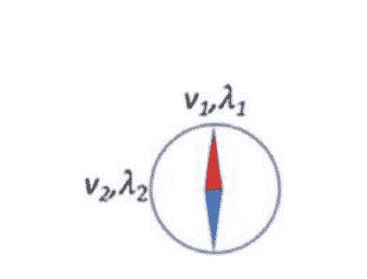

图4.11 如果你在具有非常差的可见性的损失地形中迷失了方向，最好的办法是有一个指南针，显示特征向量和相应的特征值。这将给你一些关于局部区域几何形状的想法。如果在某一点上，你注意到你的特征指南针中的所有特征值都是正值，那么这意味着你已经陷入了一个局部最小值。这有多大可能性？

> 练习12 损失景观
>
> 假设一个优化景观的 2 × 2 Hessian矩阵具有特征值λ1、λ2。让v1和v2成为相应的正交特征向量。假设我们沿着一个与v1成角度 φ的方向移动：损失会如何变化？

我们想知道所有特征值为正的概率是多少。对于高斯正交集合，概率为
$$Pr(所有特征值为正) = O(exp(-kn^2))$$
其中 k ≈ 0.275；参见[44]。这个结果被用来得到前一小节中随机正态多项式的结果。高斯正交集合提供了Hessian矩阵的一个模型；因此，临界点是局部最小值的可能性非常低。如果我们将特征值为正或负建模为一个伯努利过程，就像抛硬币一样，我们会得出以下结论：这是指数衰减，但由于平方项的存在，实际衰减速度要快得多。

这种惊人现象背后的直觉是什么？硬币投掷可以将特征值建模为独立的随机变量。实际上，它们以一种有趣的方式相互依赖。一个物理类比是库仑气体中的带电粒子。特征值被限制在一条1维线上，并且彼此之间相互排斥。这种排斥力使得它们。

#### 4.9.3 自旋玻璃视角

物理学、计算机科学和数学中的许多系统都是通过相互作用的组件来定义的，我们必须最小化一个目标函数。这些相互作用使得满足所有约束条件变得困难，这些约束条件可能相互冲突。在物理学中，自旋玻璃或伊辛模型由具有相互约束的耦合的粒子组成。目标是尽可能满足这些约束条件的粒子自旋。耦合是固定的，自旋是可变的。自旋的配置具有一个被称为哈密顿量的能量。满足的约束条件越多，能量越低。由于无法同时满足所有这些约束条件，所以会产生挫折感。目标是减少挫折感。

由于其引人入胜的特性，自旋玻璃和伊辛模型的能量景观已被广泛研究。就像AI模型的优化景观一样，它们有许多临界点，其中大多数是鞍点。

挫折的AI类比是损失函数。给定一个小批量，SGD需要更新参数以减少损失。AI模型的权重由许多从不同输入开始的计算路径共享，这引入了相互约束。因此，自旋玻璃和AI模型之间存在直观的类比。

自旋玻璃的一个例子是伊辛模型：
```
$$H = - \sum_{i,j} J_{ij} \sigma_i \sigma_j,$$
```
其中 $H$ 是哈密顿量，耦合 $J_{ij}$ 是高斯随机变量，而 $\sigma_i = \pm 1$ 是自旋（自由度）。如果 $J_{ij} > 0$，则自旋需要对齐。如果 $J_{ij} < 0$，则自旋需要相反。如果 $J_{ij} = 0$，则没有相互作用。耦合是在相邻粒子之间进行的，并且存在2D空间结构。这个模型可以推广到一个 $p$ 自旋球模型：
```
$$H = - \sum_{i_1 > ... > i_p=1}^{N} J_{i_1 ... i_p} \sigma_{i_1} ... \sigma_{i_p}$$
```
其中
```
$$\sum_{i=1}^{N} \sigma_i^2 = N$$
```
是对实值自旋的球形约束。现在哈密顿量是p粒子相互作用的结果，所有粒子都与其他粒子相互作用，并且在邻居方面没有空间结构。请注意，H是自旋的多项式，就像AI模型是其可学习参数的多项式一样。自旋玻璃的耦合取代了AI模型中的输入变量。

对于球形自旋玻璃，可以进行数学分析并发现有趣的特征值分层结构。回想一下，指标是Hessian矩阵的负特征值的数量。指标为k的临界点的统计与第(k+1)个最小特征值的统计有关。可以证明如下：

- 在优化景观的底部，只有一个窄带中的索引0（局部极小值）临界点。
- 在底部上方的一个带子中，有局部极小值和鞍点，其索引为1。
- 在第二个带子上方，存在索引为0、1和2的临界点。
- 这种分层结构随着损失离底部的增加而继续出现更高索引的临界点。

详细信息请参见[6]。在某些假设下，可以将这些结果应用于人工智能；请参见[37]。可学习的参数扮演了p自旋的角色，损失函数是哈密顿量，耦合由输入的小批量给出。这可以通过注意到单项式项之间的相似性来看出：
```
J_{i_1...i_p} σ_{i_1} ... σ_{i_p}, \\
x_i w_{i_1} ... w_{i_d}.
```
直觉是当损失较高时，索引较高，有多个特征值为负，并且在鞍点中有许多方向可以减小损失。在景观的底部，AI模型的工作非常出色；因此，改进它的自由度很少。

#### 4.9.4 计算复杂性的视角

从计算机科学的角度来看，高维优化问题具有有趣的视角。NP完全问题是难以解决的问题，因为它们的最坏情况时间复杂度随问题规模呈指数增长。

一个例子是3-SAT布尔可满足性问题，它询问一个具有M个子句和N个布尔变量的3-CNF（合取范式）布尔表达式是否可满足。当M=3和N=5时的一个例子是
```
(x1 ∨ x̄2 ∨ x3) ∧ (x1 ∨ x3 ∨ x̄4) ∧ (x2 ∨ x4 ∨ x̄5).
```
决策问题是NP完全的。最优化问题MAX-3SAT，寻找可以满足的最大子句数，是NP-难的。用参数对3-SAT问题进行参数化：
```
$$\alpha = \frac{M}{N}$$
```
子句表示“约束”，布尔变量表示“自由度”；因此，比率 $\alpha$ 表示问题的难度。使用自旋玻璃的类比，子句就像耦合，布尔变量就像粒子。给定一个3-SAT实例，可以将其减少为最大独立集图问题的实例。图的顶点表示自由度，将获得颜色，边表示约束，相邻的顶点不能获得相同的颜色。因此，自旋玻璃与之存在直接类比。

自旋玻璃与NP完全问题确实密切相关；参见[136]。事实上，这种联系更加深入，这将进一步加强我们对实践中高维空间优化问题不是难以处理的信念。可以随机生成不同 $\alpha$ 值的3-SAT实例，并计算不可满足的表达式的比例。可以证明，当 $\alpha \to 0$ 时，大多数表达式是可满足的。直观上，少量约束和许多自由度使得找到解决方案更容易。当 $\alpha$ 增加时，会发生相变，一些表达式是可满足的，一些表达式是不可满足的，然后对于较大的 $\alpha$ 值，几乎所有表达式都变得不可满足。这种相变类似于自旋玻璃中观察到的现象；参见[113]。

因此，拥有许多自由度会导致难题的可解性。这是一个重要的洞察，因为在人工智能的情况下，一旦我们固定了表示“约束”的输入大小，通过增加网络的大小，即增加AI模型的“自由度”数量，就可以满足这些约束。请注意，众所周知，快速近似算法可以为非常大的NP完全问题实例提供接近最优解，这为高维度景观中容易找到接近最优解提供了经验上的理由。

#### 4.9.5 SGD和临界点

由于大多数临界点在更高的损失区间内是鞍点，我们不太可能遇到局部最小值。在遇到局部最小值之前，我们会遇到多少个鞍点？我们将在简化的假设下解决这个问题，将其建模为几何概率分布，从而将其视为统计问题。如果临界点是局部最小值的概率为 $p$，那么在SGD期间遇到 $t-1$ 个鞍点后遇到局部最小值的概率是
```
$$\mathrm{Pr}(X=t)=(1-p)^{t-1}p$$
```
带有期望值的
$$ \mathbb{E}(X) = \frac{1}{p} = O(\exp(kn^2)) $$
其中 $k \approx 0.275$。当 $n$ 通常在数百万范围内时，这是一个天文数字。因此，在我们遇到局部最小值之前，还需要很长时间。请注意，$p$ 不是常数，而是随着我们下降到地形而变化。由于 $p$ 在较早的临界点上较小，这些临界点属于地形的较高带，所以我们很可能不会陷入较高的带中。

另一个问题是为什么随机梯度下降法不会陷入梯度为零的鞍点。其根本原因是SGD是一种随机算法。当新的小批量到达时，很少会停留在特定的鞍点上。地形是流动的，因为输入会改变，而且底层的计算图可能会改变。此外，尽管梯度为零，但保留梯度历史记录的流行SGD变体仍然可以在地形中继续前进。鞍点可能会减慢SGD的速度，但在实践中它们似乎并不能完全停止它。

> *** 练习13 SGD
>
> 阅读论文[122]。为什么随机梯度下降的噪声特性有助于更快地收敛到更好的解决方案，而批量梯度下降中唯一的小批量是整个训练数据？在经典机器学习中，牛顿法、BFGS和Levenberg-Marquardt算法等二阶方法已经被使用。为什么我们不用它们来训练人工智能模型？

#### 4.9.6 观点的融合

在本节中，我们建立了对可用工具的高级直觉，以回答一个问题——为什么一个人工智能模型能够成功地训练？看到许多现代数学理论之间有丰富的相互联系是有洞察力的：

1.  随机多项式理论。由于ReLU神经元计算多项式，可以应用这个数学分支的结果，这依赖于随机矩阵理论的结果。
2.  随机矩阵理论。使用高斯正交集合，可以研究损失函数的Hessian矩阵的特征值统计，这也允许研究自旋玻璃的能量景观。

### 4.10 分布式表示和内在维度

在本书中，我们以一种非正式的方式将分布式表示定义为神经元的激活模式；参见图4.12。参见[87]以了解分布式表示的好处。在本书的第二部分中，涉及应用领域的AI解决方案，读者将注意到许多基于编码器-解码器架构的解决方案，其中编码器构建输入的表示 $R$，然后解码器使用该表示生成输出。也就是说，通常我们有以下情况：

$$
R = E(x), \\
y = D(R),
$$

其中 $E$ 是编码器， $D$ 是解码器，而 $(x, y)$ 是输入输出对。人工智能的主要目标之一是学习良好的表示。这被称为表示学习。一般来说，如果AI模型具有基础计算图，则可以将图划分为两部分，其中一部分具有输入，另一部分具有输出。可以参考图上的图，将输入端作为编码器，将输出端的图形作为解码器。与输入端的割集上连接的顶点，即交叉边的集合，是输入的表示。具有最少顶点数的表示是最紧凑的表示，其大小是目标流形或模型试图逼近的函数的内在维度的估计。许多人工智能解决方案的设计巧妙之处在于编码器和解码器的正确选择。

这与流形学习假设有关。考虑一个二维空间中的一维曲线。只要它不是填充空间的曲线，它的内在维度就是1，尽管它嵌入在二维空间中。分形曲线的内在维度将是其豪斯多夫维度。流形学习假设指出，人工智能中典型类别对应的流形的维度 $d$ 远小于输入维度 $N$，即 $d \ll N$。流形的内在维度可以在周围的 $N$ 维空间中扭曲和转动，对应于类别的特征潜在数量。人工智能模型发现这些特征，构成了潜在表示。

能够在优化空间中收敛到低损失而不遇到局部最小值意味着正在构建良好的输入空间表示。为什么构建的表示对测试数据效果好？AI模型具有很高的表达能力，并且在有足够的数据和巧妙的设计的情况下，它们可以避免过拟合，如第5章所讨论的，这导致它们具有泛化能力。

## 4.11章小结

对未知数据的适应能力。这是另一个需要完全理解AI成功的见解。具有高表达能力（刻画能力）的创造性设计模型在给定足够数量的数据时表现非常好。

AI表现良好的原因有两个。第一个原因是它具有指数级的表达能力，可以将输入空间细分为凸多面体，并用线性函数拟合每个多面体。整个拟合函数是一个连续的分段线性函数，具有指数多个片段。这使得AI模型能够逼近复杂的函数和复杂的流形。每个神经元都为输入空间贡献其弯曲的超平面切割，进一步细化了前面层刻画的多面体。这种分析可以推广到CNN和RNN。对于CNN，输入空间是滑动窗口空间，刻画具有平移不变性和对局部扰动的鲁棒性，这是由于池化层。对于RNN，计算图类似于具有权重共享的有向无环图，同样的刻画过程适用。当我们添加执行乘法的神经元时，AI模型适应由高维锥面切割形成的分段多项式函数。

AI工作良好的第二个原因是优化空间是高维的，几乎所有的临界点都是鞍点而不是局部最小值。SGD算法使优化空间变得流动，有助于逃离鞍点。关于高维物理系统（如自旋玻璃和伊辛模型）的实证和理论研究指出，局部最小值集中在优化空间的底部。

数学的几个视角可以应用于对AI模型优化空间性质的洞察。这些视角包括随机多项式、随机矩阵、自旋玻璃和计算复杂性理论。通过收敛到低损失解，SGD能够构建出良好的输入表示。

## 问题集4

- 1. 当超平面从一个激活模式区域移动到另一个激活模式区域时，为什么会弯曲？
- 2. 给出一个二维多面体的例子。什么时候一个多面体是凸的？
- 3. 证明 $n^3 + n^2 = O(n^3)$。它也是 $\Theta(n^3)$ 吗？那 $n^3 - n^2$ 呢？
- 4. 假设神经网络的输入是 $d$ 维的，并且只有一个输出神经元。假设具有 $L$ 隐藏层的网络，每个隐藏层有 $n$ 个神经元，其表达能力恰好为某个常数 $c$ 的 $c n^{dL}$。考虑一个浅层网络，其中有一个隐藏层，有 $n_1$ 个神经元。考虑一个深层网络，每个隐藏层有 $n_2$ 个神经元。为了使它们的表达能力相等， $n_1$ 的值应该是多少？比较这两个数的大小。当它们的表达能力相等时，选择参数 $d = 100$, $n_2 = 100$, $L = 50$ 来计算确切的数字。
- 5. 见图2.2。总共有15条从输入开始的计算路径。假设我们添加一个具有五个神经元的更高级隐藏层。新的计算路径数量是多少？假设 $h_2$ 变为非活跃状态。那么，还剩下多少路径？
- 6. 考虑以下具有两个隐藏层的二维前馈全连接ReLU网络：

$$
r_1 = \text{ReLU}(w_1 x_1 + w_2 x_2 + b_1), \\
r_2 = \text{ReLU}(w_3 x_1 + w_4 x_2 + b_2), \\
s_1 = \text{ReLU}(w_5 r_1 + w_6 r_2 + b_3), \\
s_2 = \text{ReLU}(w_7 r_1 + w_8 r_2 + b_4), \\
y = w_9 s_1 + w_{10} s_2 + b_5
$$

假设神经元 $r_2$ 和 $s_1$ 是活跃的，神经元 $r_1$ 和 $s_2$ 是非活跃的。写出网络计算的多项式。假设输入为 $x_1$ 和 $x_2$ 是固定的，而权重和偏差是可变的。多项式的次数是什么？现在假设输入是可变的，而权重和偏差是固定的。多项式的次数是什么？
- 7. 为什么海森矩阵在机器学习中很重要？
- 8. 对于以下每个函数，请指示在指定值处是否存在临界点。如果是临界点，请指示临界点的类型：(a) $\sin x$ 在 $x = 3\pi/2$ 处。(b) $x^3, x^4, -x^4, x^5$ 在 $x = 0$ 处。(c) $x^2 + y^3, x^2 - y^2$ 和 $x^2 + y^2$ 在 $(x, y) = (0, 0)$ 处。
- 9. 定义特征值和特征向量。一个二维非均匀缩放矩阵具有不同的缩放因子在 $x$ 和 $y$ 方向上，它的特征值和特征向量是什么？

$$
\begin{pmatrix} s_x & 0 \\ 0 & s_y \end{pmatrix}
$$

- 10. 考虑一个二自旋玻璃中的三个粒子 $A$, $B$ 和 $C$。假设约束条件是 $J_{A,B} > 0$, $J_{B,C} < 0$, 和 $J_{A,C} > 0$。每个粒子可以取 $+1$ 或 $-1$ 的自旋值。找到满足约束条件的自旋值。
- 11. 假设两个多项式 $P(x)$ 和 $Q(x)$ 的次数分别为 $d_1$ 和 $d_2$。乘积 $P(x)Q(x)$ 和复合 $P(Q(x))$ 的次数分别是多少？假设受到变压器中的自注意力的启发，该自注意力使用查询、键和值函数，您设计了一种新的方法来执行NLU任务，如下所示：

$$
q_1 = Q(x), \\
k_1 = K(x), \\
v_1 = V(x), \\
q_2 = q_1 A_1(x) A_2(x), \\
k_2 = F(k_1) A_3(q_2), \\
v_2 = q_2 k_2 v_1.
$$

假设上述七个大写函数都是标准的ReLU前馈网络。六个分段多项式函数 $q_1, k_1, v_1, q_2, k_2$ 和 $v_2$ 的次数是多少？
- 12. 设 $P(x) = ax^2 + by^2 - 1$。对于以下情况，请指示其等值集合 $P(x, y) = 0$：
  - (a) $a = b$, $a > 0$, $b > 0$。
  - (b) $a = b$, $a > 0$, $b > 0$。
  - (c) $a$ 和 $b$ 有不同的符号。

## 第5章 新手到大师

> 当你进行实验时，你必须尝试很多事情，然后选择你想要的，你可能会连续几天都一无所获，只会感到疲惫。
> 
> — 弗雷德·阿斯泰尔

> 生活就是一次实验。你做的实验越多，越好。
> 
> — 拉尔夫·瓦尔多·爱默生

就像雕塑家创作一件艺术品一样，AI/ML模型近似于一个流形。AI/ML模型在能力上有所不同。有些模型非常简单地进行近似，而有些模型可以处理非常复杂的流形。那些更简单的模型被认为具有高偏差。那些能够进行复杂近似的模型具有较低的偏差和许多度。它们可以根据训练数据以灵活的方式进行雕刻。它们被认为具有高方差。在这里存在一个权衡，因为高偏差的方法通常具有较低的方差，反之亦然。一个技术水平较低的雕塑家用有限的工具粗糙地雕刻雕像，而一个技术水平较高且配备了更好工具的雕塑家则能够在捕捉细微特征和曲线方面做出精细的工作。一个熟练的雕塑家可以提出许多“变化”来近似他/她对目标对象的描述。

尽管与雕塑艺术类比，但AI雕刻流形的方式与罗丹和米开朗基罗的工作方式不同。后者是天才，他们准确地知道如何创造完美的美丽物体。AI需要学习很多，并经过仔细的训练过程。

### 5.1 AI如何学习雕塑

AI是一个不知道如何正确雕刻的初学者，需要接受教导。它通过观察示例逐渐学习。它通过改进之前的努力，减少错误并逐渐做对来学习。它必须学会如何明智地使用其线性区域的预算，以尽可能少地犯错。

这是有监督机器学习的标准训练过程，用于分类和回归。训练按照时期进行，就像我们在第2章中看到的那样。简而言之，在一个时期内，对训练集进行一次遍历，该训练集被划分为小批量的训练样本。人工智能通过调整其雕刻方式，以减少错误，这是由指定的损失函数指示的。通过随机梯度下降（SGD）的过程，沿着损失函数的最小化方向进行梯度步骤。这个过程在每个小批量、每个时期重复，直到达到所需的准确性。随着时间的推移，梯度步骤变得越来越小，因为梯度变得越来越小，而且还受到学习率的影响，学习率随时间变小。在初始时期，人工智能是一个新手，必须更积极地在之前的努力上进行调整学习。到了最后，它几乎成为了一个大师，只需要稍微改进其雕刻技巧。

> * 练习14        训练
> 假设你正在使用SGD训练一个AI模型，并且你注意到它的准确性已经停滞不前。作为第一步，你可以调整哪个超参数来可能解决这个问题？

#### 5.1.1 训练数据

我们通过它们的纯粹美丽来评估米开朗基罗的作品。由AI雕刻出来的雕塑根据其在实践中的表现来评估。在训练集上，它通过训练误差来量化。由于这些训练样本对AI可见，通过精心选择神经网络架构和训练协议，它可以在减少训练误差方面做得相当不错。然而，它无法真正看到整个流形，真正的评估将在未见数据上进行。这是测试误差或泛化误差。如果学习能够很好地推广到雕塑中的其他点，那么它被称为鲁棒学习。如果训练误差很低，但测试误差很高，则意味着我们对训练集过拟合。如果训练误差本身很高，我们则欠拟合。关于这些概念的更多讨论将在本章中进行。

### 5.1 AI如何学习雕塑

训练过程不仅仅是运行SGD。要设置SGD，我们需要确定训练协议的超参数。小批量大小、迭代次数、学习率、动量等都需要正确初始化。损失函数可以修改，并添加正则化项。我们将在第5.1.4节讨论正则化。输入大小、训练数据大小和数据增强都需要确定。可以选择进行端到端学习或将系统分解为组件。需要评估偏差和方差，并诊断过拟合和欠拟合问题。可以修改AI模型的架构并增加训练数据。增加模型大小将增加训练和推理的运行时间。因此，需要对不同模型进行时间分析。可以对输入进行预处理和丰富。并且我们不断分析错误并采取措施来减少它们。

当有这么多选择时，我们该如何进行实验？我们不能使用测试集来调整超参数，因为这样会导致过拟合。因此，在实践中，我们会将一个单独的集合称为开发或验证测试集，用来评估我们的选择。你可以将开发集作为人工智能调试集，你可以手动和视觉上深入检查其结果。如果开发集很大，你应该只使用其中的一小部分进行深入分析，并使用剩余部分来获取高水平的准确性数据，以避免过拟合。以下是三个基本数据集：

- 训练集SGD使用的数据样本集。
- 开发或验证集用于指导和评估对训练集的实验。
- 测试集用于评估最终模型。这个评估不应该对微调训练过程的决策产生影响。如果为了指导训练而对测试集进行深入分析，则应将测试集包含在开发集中，并获取一个新的测试集。

通常，训练集通过转换每个训练样本来扩展。猫的图像可以被裁剪、调整大小、翻转、旋转和抖动（抖动是添加噪音）。这被称为数据增强，它可以提高人工智能模型的性能。

#### 5.1.2 评估指标

对于评估，选择的指标应该反映您的使用情况。对于分类问题，接收操作特征曲线（ROC）是很受欢迎的。对于信息检索和目标检测，其中负例数量非常大，可以使用精确率-召回率（PR）曲线。可以计算这些曲线下面积作为单一评估指标。这些分别是ROC曲线和PR曲线的曲线下面积（AUC）和平均精确率（mAP）。

可以根据AI产品的要求选择曲线上的操作点。可以通过计算精确率和召回率的组合来得到结果，谐波平均数，也被称为F1得分。通常，准确率这个单一值度量足以评判性能。对于多类问题，前k错误是指在前 k个按概率排序的结果中，正确答案未出现的次数的比例。另一种自然的方法是通过考虑一对多度量将多类问题转化为一系列二元分类问题，并为每种情况绘制曲线。

所有评估指标都依赖于错误的计数和比率的取值；因此，数字范围在[0, 1]之间，并可以表示为百分比。AI模型的每个答案根据基本事实和预测标签的不同被标记为真正例、假正例、真反例或假反例。

|       | 正预测 | 负预测 |
|-------|--------|--------|
| 正标签 | 真正例 | 假反例 |
| 负标签 | 假正例 | 真反例 |

分类的AI模型依赖于一个截断阈值来输出分类决策。如果计算的类别概率超过阈值，则被预测为正类成员。阈值从低到高逐步增加，以生成ROC或PR曲线。真正例率（TPR）是真正例数与标记正例数的比率。TPR也被称为召回率或敏感性。假正例率（FPR）是假正例数与标记负例数的比率。它与特异性的差值为1。精确度（阳性预测值）是真正例数与预测正例数的比率。1减去TPR是统计学中的I型错误，而FPR是II型错误。对于回归，使用均方误差（MSE）或平均绝对偏差（MAD）。拟合优度度量 $R^2$，也称为决定系数，常用于线性回归。

ROC曲线绘制了FPR（x轴）与TPR（y轴）之间的关系，PR曲线绘制了精确度（y轴）与召回率（x轴）之间的关系，参数化为截断阈值 $t \in [0, 1]$：

$$
\text{ROC}(t) = (\text{FPR}(t), \text{TPR}(t)), \\
\text{PR}(t) = (\text{Recall}(t), \text{Precision}(t)),
$$

也就是说，当判断 $x$ 属于正类时

$$
\text{Pr}(x \in \text{正类}) \geq t.
$$

ROC曲线呈单调上升趋势，但PR曲线在整体下降趋势中可能波动。有关这些广泛使用的评估曲线的关系，请参见[43]。在ROC空间中，只有当曲线在PR空间中占优势时，它才占优势。在难以计算FPR的情况下，使用PR曲线，因为存在极大数量的真实负样本。一个例子是计算机视觉中的目标检测，其中图像区域的数量非常庞大，不包含目标对象的数量非常大。另一个例子是网络搜索，在给定查询的情况下，有几个相关的结果和一个天文数字般庞大的不相关结果。

度量通常根据特定领域进行定制。例如，在NLU中，语言建模使用困惑度，机器翻译使用双语评估助手（BLEU），网络搜索使用归一化折扣累积增益（NDCG）。最后，推理过程中的运行时间应作为评估过程的一部分考虑。

训练过程涉及手动查看AI模型的错误。这使得人们能够调试整个过程并识别问题，从而找到解决方案。

#### 5.1.3 超参数搜索

最后，训练AI模型中使用的一些超参数可以通过从简单到复杂的不同方法进行系统微调。在随机网格方法中，使用均匀分布的值在超参数网格上，添加随机噪声以避免重复相同的值。

因此，您可以尝试所有学习率值[0.1、0.2、0.3、0.4]。如果您有动量作为另一个超参数，您可以尝试[0.8、0.9]。对于这两个超参数，您可以尝试随机网格：

$$
(0.10, 0.81), (0.20, 0.79), (0.30, 0.82), (0.40, 0.77) \\
(0.11, 0.89), (0.19, 0.91), (0.32, 0.93), (0.38, 0.88).
$$

在贝叶斯超参数搜索中，人们应用高斯过程回归（GPR）或克里金（一种贝叶斯推断形式）来预测训练在新的超参数组合上的效果，以在探索和开发之间进行权衡。我们将在第8章中讨论GPR。人们还可以使用具有有效搜索和修剪技术的进化算法。

#### 5.1.4 正则化

假设您在生活中有一个目标。您可以朝着生活目标迈出类似于SGD的步伐，并实现您一直想做的事情。在现实世界中，达到某些目标需要金钱和时间，并且存在对这些目标的限制，因为它们并不是无限的。在这些限制下，您必须朝着最优解努力。在约束下进行优化称为正则化。在入门微积分中，这被称为约束优化。目标是在约束 $g(x) = C$ 下优化 $f(x)$。搜索空间受到限制。

正则化

约束优化可以通过拉格朗日乘子方法来求解，该方法优化一个新的函数：

$$
f(x) + \lambda g(x)
$$

在人工智能中，我们做的事情与减少过拟合完全相同。见图5.1。这些是参数大小的约束条件，目标是保持它们较小。将其视为我们对简单模型更好的先验信念。参数向量的 $L^p$ 范数被用作约束函数 $g(x)$。现在，最优值是在 $f(x)$ 的等高线与约束等高线 $g(x)$ 相接触的地方找到的，对于 $L^2$ 范数来说，它将是一个圆，对于 $L^1$ 范数来说，它将是一个旋转的正方形。后者用于促进稀疏性，因为 $f(x)$ 的等高线更有可能接触到正方形的角落。在有大量数据的情况下，我们不需要任何正则化。实践中，正则化确实有帮助，因为它避免了过拟合并减少了方差。让我们进一步了解正则化。假设有一个卷积层，后面跟着一个批量归一化层。我们问一个问题，为什么批量归一化层不会将卷积层的权重在SGD执行过程中收缩到零，而批量归一化层会归一化卷积层的输出尺度，正则化损失不会收缩卷积层的权重。SGD计算梯度。向量 $\nabla w$，将其乘以学习率，并将其负值添加到当前参数空间中的参数向量 $w$。在高维空间中，这两个向量很可能是正交的，微小的梯度步骤实际上是对 $w$ 的微小旋转。批量归一化和正则化损失将使旋转步骤向内螺旋，而相抵消的学习率将使其向外螺旋，从而在两个力量之间提供平衡。

#### 5.1.5 偏差和方差

每个机器学习模型都带有其偏差和方差。偏差量化了由于所选择的机器学习模型的固有限制而导致的错误。线性模型只给我们一个超平面，用它来近似复杂的流形将会很困难。因此它具有很高的偏差。具有指数级凸多面体的深度神经网络将具有非常低的偏差。同时，如果我们选择了不同的训练样本集，线性模型将比深度神经网络更稳定。在训练集中的统计波动在深度神经网络的情况下会被放大。因此它具有更高的方差。因此，如果我们在训练数据中不幸地没有代表实际数据的数据，这将在深度神经网络中导致更高的错误。

偏差和方差的数学定义是以期望为基础的。将训练数据大小固定为 $N$。用许多训练数据集训练人工智能模型。对每个选择评估测试错误。测试错误的平均值给出了偏差，错误的方差给出了方差。偏差和方差告诉我们训练集的统计波动如何决定测试错误。

不幸的是，我们只有一个训练集和一个测试集。因此只有一个测试误差。作为一个实用的经验法则，我们可以用它的下界来估计偏差，即训练误差。如果下界上升，偏差也会上升。泛化误差是训练误差和测试误差之间的差异，是由于随机选择特定训练集的机会而产生的。我们可以用这个差异来估计方差。

通过这两个偏差和方差的估计，你可以快速描述你的人工智能模型。如果它具有高偏差或高方差，那么是时候解决这个问题了。高偏差和低方差表示欠拟合，低偏差和高方差表示过拟合。低偏差和低方差是理想的情况。高偏差和高方差意味着有些地方不对劲。

|      | 低偏差 | 高偏差 |
| ---- | ------ | ------ |
| 低方差 | 理想   | 欠拟合 |
| 高方差 | 过拟合 | 不理想 |

高偏差和欠拟合意味着AI模型“不够胜任”工作；一个类比是你希望你的小孩帮助你完成AI任务会议演讲。要解决高偏差问题，只需让AI模型更加胜任；换句话说，增加神经元和层次来增加其容量。在我们相当非正式的类比中，将你的孩子培养成为一个优秀的、追求卓越的成年人，在具有挑战性的任务中努力。另一种可能性是减少正则化的风险，但会增加方差。正则化是对完全容量表达的约束，因此减少约束将增加其容量。正则化就像雇佣一个高素质的人，但要求他/她执行低于他/她资质的工作。

高方差和过拟合意味着AI模型“过于胜任”工作；另一个相当非正式的类比是你希望一只宠物大象来为你搬运AI书籍。要解决高方差问题，使任务更具挑战性。给模型更多的数据，让它努力利用多余的未使用容量进行学习。增加正则化以增加容量的约束；然而要注意的是，由于它减少了容量，因此可能会导致高偏差。可以减小模型大小，但首先看看其他方法是否有效。过拟合也可以通过提前停止来减少。一旦开发集上的错误开始增加，就停止训练。在AI中，使用一种称为dropout的技术来减少过拟合，它在训练过程中随机丢弃神经元，以减少它们之间的相关性，并推动它们学习稳健的专业特征。

为了减少偏差和方差，你必须回到白板上。集思广益，从新的角度看问题，重新设计系统，添加新功能，修改现有功能，并提出创新的架构。当没有明显的解决方案时，这种方法效果最好，例如增加训练数据或模型大小。请记住，你可能永远无法将测试误差降低到零。

最佳的错误率被称为贝叶斯错误率。这是无法消除的不可避免的错误，即使使用最好的分类器也无法摆脱。这是因为总会存在一些不确定性的来源。如果我们完全了解并且没有随机噪声，那么贝叶斯错误将降低到零。有时可以通过请人类专家进行判断来测量这种不可避免的错误。如果专家无法达到零错误，那么人工智能也无法达到。最后，观察到总误差是偏差、方差和不可避免错误的平方和。

> * 练习15 偏差-方差
> 编写偏差和方差的数学定义。

#### 5.1.6 机器学习王国的童话故事

偏差和方差的权衡有一个童话的类比；参见图5.2。在一个遥远的迷人国度里，住着一位美丽的公主，被来自不同地方的许多王子追求。不同的王子具有不同的能力，由他们给出偏差和方差，他们的目标是尽可能接近公主，以宣布他们的婚姻意图。

高偏差和低方差的王子资源有限。他们的哲学相当简单，当他们接近公主所在的宫殿时，他们能够覆盖有限的土地。在某个时刻，他们陷入困境，因为地形崎岖而具有挑战性。他们的方差很低，这意味着即使在遇到不同情况下，他们基本上会到达相同的最终位置，这对应于训练过程。最终位置是对测试集上特定训练会话的最终评估。相比之下，低偏差和高方差的王子更有资源，并且能够克服峡谷、瀑布和其他危险。他们能够更接近公主，但他们的最终位置不太可预测。他们有时会落在这里，有时会落在那里，这取决于运气和情况。低偏差和低方差的王子有最大的机会赢得公主的芳心，因为他们更能抵御不稳定的情况。他们到达公主那里表达他们的婚姻意图，但没有人能够克服最终无法解释的距离。我们可以推测，只有当它是一个真爱故事，就像我们在好莱坞童话故事中经常见到的那样，才会有绝对的确定性，贝叶斯错误率才会为零。

上述童话的最接近数学证明是什么？在童话中，景观是在一个三维世界中的。每个位置(x, y, z)是一个学习函数在三个未知示例上的评估，尽管在实际定义中应该是在一个无限维空间中的整个分布上，或者至少在一个非常大的测试集上。王子的旅程可以被描述为训练会话的时期内获得的位置序列，这些位置指示了在三维测试集上的中间评估：

$$P_1 \rightarrow P_2 \rightarrow \dots \rightarrow P_{\text{最终}}$$

当训练收敛到一个最优点时，公主的位置

$$G = (g_x, g_y, g_z)$$

是真实的函数值，绝对的真理。训练示例的数量被固定为 N。对应于一个机器学习模型的每个王子可以降落在不同的位置，这取决于训练集的选择。通过对大小为 N 的所有可能的训练集进行数学意义上的期望，可以得到预期的最终位置。王子与公主之间的距离是总的测试误差，它将是平方偏差、方差和不可消除误差的总和。

不可约错误反映了未知和未观察到的影响输入输出映射的过程。

我们是否在说不可能同时实现低偏差和低方差？不完全是：正如我们之前讨论过的那样，通过巧妙的设计，并且随着足够的数据，我们可以实现这一点。因此，一个经过充分培训并具有聪明才智的王子确实可以在我们的幻想童话背景中应对挑战。事实上，这是人工智能取得成功的原因之一。

> > 训练AI模型的过程始于将数据组织成训练、开发和测试数据三个集合。减少过拟合的技术包括正则化、随机失活和开发集的评估。需要进行偏差-方差分析来诊断训练中的欠拟合和过拟合问题。

### 5.2 学习曲线

学习曲线给我们提供了一个整体的视角，当我们改变训练数据大小 n 时，错误如何变化。学习曲线是训练错误和测试错误随着 n 的变化而变化的图。它们可以帮助我们预测是否值得获取更多的训练数据。它们还提供了一个关于特定 n 值的偏差和方差的估计，以及随着 n 的增加它们将如何变化。

设 $\mathcal{E}_{\text{Train}}$ 为训练误差， $\mathcal{E}_{\text{Test}}$ 为测试误差。设 s 为SGD迭代次数， H 为AI模型的表达能力（容量）， n 为训练数据样本数。那么我们有依赖关系：

$$\text{训练过程中出现错误} = \mathcal{E}(s, H, n)$$

对于测试误差和训练误差都是如此。参见图5.4。在顶部，我们固定 $H$ 和 $n$，并展示了这两个误差如何依赖于S。考虑在过拟合区域开始增加之前的最低测试误差 $\mathcal{E}_{\text{Test}}(s)$。注意 $\mathcal{E}_{\text{Train}}(s)$ 一直在减小。将这些误差称为训练模型的最终误差：

> 训练结束时的误差 $= \mathcal{E}(s^{*}, H, n)$，

其中 $s^{*}$ 是在没有过拟合的情况下的最佳SGD步数。现在我们将放弃 $s^{*}$，只使用

> 最终误差 $= \mathcal{E}(H, n)$。

这个函数被称为学习曲面，如图5.3所示。很难看出发生了什么；因此通常会用固定的 $n$ 绘制 $\mathcal{E}(H)$，并用固定的 $H$ 绘制 $\mathcal{E}(n)$。我们在图5.4的中间固定 $n$ 并变化 $H$。在图5.4的底部，我们变化 $n$ 并展示了两个不同 $H$ 值的曲线。这些被称为学习曲线。

在图5.4的中间，当 $H$ 变化时，最初存在欠拟合，因为AI模型具有高偏差。然后，有一个模型具有最佳表达能力的区域。如果通过添加更多的层来进一步增加模型的容量，那么过拟合会发生，模型会受到高方差的影响。

在图5.4的底部，我们展示了 $\mathcal{E}_{\text{Train}}$ 和 $\mathcal{E}_{\text{Test}}$ 的明显不同行为。训练误差增加，而测试误差随着增加而减少。当表达能力很高而训练数据有限时，我们会有很高的方差，过度拟合高-$H$模型到训练数据，导致测试误差很高。过度拟合问题可以通过增加$n$来解决，如你所见，红色曲线在某个$n$值之后低于黑色曲线。对于大的$n$，低-$H$模型欠拟合且具有高偏差。通过切换到高$H$，我们解决了高偏差问题，并将测试误差降低到红色曲线。

通过绘制学习曲线，您将更好地了解您的训练，并且能够在一定程度上解决偏差-方差问题。它们还允许您通过观察曲线的形状来预测更大的$H$和$n$的错误。

> 在训练过程中，应该使用学习曲线或通过测量训练误差和泛化误差来估计AI模型的偏差和方差。过度拟合和欠拟合问题与偏差和方差的权衡相关，应采取适当的策略来避免这些问题。

### 5.3 从实验室到现场

考虑以下情景：

1.  我们训练了一个人工智能模型，用于自动诊断视网膜图像中的视网膜病变。多亏了我们的人工智能工程师们的出色工作，我们能够达到非常高的准确率。我们决定在实地部署，并成功说服印度的医院和诊所进行测试。当实地试验的结果涌入时，我们感到震惊。准确率远低于我们的预期。出了什么问题？我们发现我们训练的是在美国获取的图像，这些图像与印度的图像在细微的方面有所不同，这是由于设备质量和年龄的差异引起的。此外，不同诊所之间的数据差异很大，同一诊所的不同护士之间也存在差异，而这些差异在我们的训练集中没有涵盖。
2.  我们训练了一个人工智能模型来识别语音。我们用数百小时的训练数据对其进行了训练。但我们的客户并不是很满意。当我们对模型所犯的错误进行详细分析时，我们意识到由于各种原因，背景噪音在世界各地呈现出更大的多样性。
3.  我们的客户要求一种使用人工智能进行文档分类的功能，但他们不愿意共享他们的专有数据。我们在互联网上获取的文件、文章和新闻报道上训练我们的模型。在达到高准确度后，我们将该解决方案整合到一个新的产品中。我们屏住呼吸等待客户的反馈，因为我们对他们的专有数据的准确性不太有信心。

上述问题是由于训练集和领域集之间的不匹配造成的。它们不是从同一潜在分布中抽样的，这是与首选情况的偏离。训练和测试不匹配是一个常见问题，显示了实验室环境和真实世界之间的差距。为了解决这个问题，需要投入资源来从实际领域中获取样本。您应该将这些领域样本包含在训练集和开发集中。可以进行修改损失函数的实验，使领域图像的权重更大。如果无法获取更多数据，请在从训练集本身派生的开发集上评估您的训练情况，确保您的准确度很高，并且系统按预期正常工作。这将意味着当领域样本可用时，系统很可能变得更好。

逐渐通过微调或迁移学习方法将模型适应新的分布。

### 5.4 系统设计

通常，完整的人工智能解决方案将涉及许多组件，并且您将面临系统设计选择。其中一个选择将是基于组件的设计，或者是将不同组件集成到一个可训练的架构中的另一种选择。

有时候，进行端到端（E2E）学习是一个很好的主意。也就是说，我们将原始数据输入到人工智能模型中，然后神奇地得到最终答案。我们可能有足够的数据来训练这样一个强大的人工智能模型。即使存在端到端解决方案，也需要投入资源来确保数据被正确注释和预处理。

在其他时候，以巧妙的方式拆分解决方案是至关重要的。端到端解决方案所需的表达能力可能非常大，这使得由于缺乏足够的训练数据而变得不可行。与此同时，对于一些提出的组件，可能已经存在稳健且高度准确的解决方案，这将有助于基于组件的设计。对于较小的组件，数据需求将更易管理。以下是一些示例：

1.  对于在野外进行光学字符识别（OCR），首先检测文本的位置，然后读取这些检测到的文本框中的文本。
2.  对于细粒度分类，首先检测主要类别，如车辆、鸟类和甲虫，然后对图像区域进行分类。
3.  从语音识别到与家庭助手设备进行问答对话的语音合成，首先进行声学建模，然后将音素输出与其他组件（如语言特征和语言模型）结合起来转录口语句子。语音转文本是一个例子，高性能的端到端解决方案已经构建，因此组件化设计和集成设计都是可接受的。提取的句子然后输入到一个NLU系统中，该系统输出答案，然后发送到语音合成器。很难想象一个整体的波形到波形的解决方案，它将整个任务集成在一起。
4.  在分析街景以进行交通、社会和经济分析时，不同的组件首先会检测到行人、车辆、建筑物、道路和交通信号。或者可以进行实例感知的整体语义分割。其他组件会计算检测到的对象的细粒度分类标签和不同属性。最后，会生成聚合统计数据。

这种基于组件的设计可以通过查看不同组件的有向无环计算图来方便地调试整个系统。如果任何一个组件在完美输入上失败，那么它在前面组件的输出上也会失败。通过评估其他前置组件在其输出上的性能，您可以轻松检查一个组件是否对整体系统错误有贡献。如果前置组件正常工作，那么说明给定的组件存在问题，需要修复。换句话说，通过首先评估最接近输入的组件，然后按照系统的广度优先遍历移动到其他组件，来调试系统。

人工智能和经典机器学习的主要区别之一是前者在原始数据空间中工作并执行自动化特征工程。这可能并不总是最好的主意。通过提供一些额外的输入或丰富其输入，可以辅助人工智能。这将有助于训练人工智能模型，避免浪费它们的神经元可以在外部计算的内容上。如果原始数据空间非常大，这将特别有用。以下是两个例子：

1.  对于视频数据，在输入中提供运动场（光流）作为附加层。有关详细信息，请参见第9章。
2.  对于语音识别，提供频谱图作为输入，而不是原始波形。有关详细信息，请参见第11章。

我们提到对于第二个例子，可以通过使人工智能模型学习类似频谱图的表示来使用原始波形；请参见第11章。

观察到，以上丰富输入的方法是一种特殊类型的特征工程，其中增强的特征的维度与输入的维度相同。从这个意义上说，它与经典机器学习中的特征工程非常不同，在那里维度有显著的降低。

> > 现实世界与实验室不同，因此在研究中应该努力反映真实世界的分布。端到端学习是一种强大的机制，能够解决多个问题，但同时，对于复杂系统应该采用组件化设计。此外，原始数据空间可以丰富以帮助AI模型。

### 5.5 学习的不同方式

到目前为止，我们一直相信学习是关于解决给定问题的，有一个训练数据集，有一个损失函数。这是一个很好的开始。在本节中，讨论了一些更有趣的表述。

训练AI模型的传统目标是创建一个专家模型。AI模型成为了世界上专家级的猫咪检测专家。如果有一个新的任务会怎样？假设我们将猫咪检测的AI模型带到非洲野生动物园，我们希望它能检测狮子和斑马。一种天真的方法是重复整个数据收集和训练过程。一个关键观察是，在训练过程中，AI模型建立了一个稳健的层次化特征表示，这些特征与检测新类别的狮子和斑马所需的特征相似。前几个卷积层专门用于检测边缘、纹理和颜色斑点，并且很容易转移到新的任务上。更高层次的层可能需要微调。因此，如果猫咪AI模型有L个层，我们可以冻结前L-1个层。L –层，对于一个小k，通过运行反向传播并微调它们的参数来学习顶部k层。这被称为微调或迁移学习，它是一种强大的方法，可以减少对新任务的训练数据的需求。在实践中，您可以从公共领域下载预训练模型，并为自己的任务进行微调。

有时，目标是学会学习。这里有一个类比。当你在K到12年级时，目标不是学习一个高度专业化的领域，而是达到一个可以学习其他任务的起点。重点是建立一个坚实的基础和学习通用技能。在人工智能领域，目标是训练一个可以学习新任务的AI模型。这被称为元学习。在元学习过程中，您向AI模型展示新的示例任务，并以一种使其成为新任务的良好起点的方式调整参数。因此，在优化起点时存在一个前瞻性，我们会展望未来，即学习新任务时的情况；参见图5.5。在迁移学习中，新任务的起点是预训练模型。在元学习中，起点是预训练模型。

### 5.5 学习的不同方式

对于自动驾驶汽车来说，设计和训练多任务AI模型的最优解是至关重要的。

学习时，通过对新的示例任务进行微调来显式优化初始模型，希望对于一个未知的新任务，同样的微调方法能够奏效；参见[172]。通常情况下，元学习优化控制后续学习过程的参数。在上述情况中，这些参数是初始模型的参数。

你会满足于只能做一项任务吗？能够学习许多相关任务是一个值得追求的目标，这被称为多任务学习。基于迁移学习的思想，有一种简单的方法来实现多任务学习。AI模型的层被用作骨干架构，并且为不同任务附加了具有自定义损失函数的多个头部模型。多任务学习对于复杂应用非常重要，例如自动驾驶汽车需要执行多个任务。需要检测行人、车辆、交通标志、交通灯、道路标记和车道。与为这些任务单独建立AI模型相比，进行多任务学习是有用的，因为不同任务共享共同特征，可以使用相同的训练数据。多任务AI模型的设计空间可能非常具有挑战性；参见图5.6中的一个示例架构，以及参见[203]。

在半监督学习中，使用未标记的数据的想法是。可以先使用标记的数据训练模型，然后使用该模型为未标记的数据创建伪标签，并将具有高置信度分数的样本包括在第二轮训练中。对于没有标签的样本，可以以其不同扰动的预测标签的一致性为正则化约束。请注意，我们对潜在的流形做出了平滑性假设，以利用未标记的数据。从经验上看，这些想法似乎有所帮助。相比之下，自监督学习首先使用未标记的数据构建潜在表示，然后使用监督学习对特定任务进行微调。它已经在自然语言理解方面取得了改进，并且是视觉数据研究的一个活跃领域。

假设你正在为分布在世界各地的学生提供一个面向项目的在线园艺课程。你教他们如何种植一个植物和树木茂盛的花园。学生们分享他们的经验，这是协作学习是指每个学生根据本地数据开发自己的模型。 这被称为联邦学习。 与常用的分布式学习不同的是，每个本地模型都适应其自己的本地数据。 同时，模型之间进行共享，这可能会改进它们。 在分布式学习中，数据是同质的，并且只有一个模型。 在联邦学习中，数据是异质的，并且有多个模型。 联邦学习的一个应用是在个人手机上构建定制模型。

在人工智能中，使用少量训练数据使AI学习的问题被称为少样本学习，这是基于人类只需要少量示例来学习的观察而提出的。 我们的大脑可能具有预训练网络，这是三十亿年进化的结果，使用少量示例进行迁移学习进行微调。 这是一个具有挑战性的研究领域，对于人工智能的进一步发展至关重要。

最后，我们描述了一种有趣的设计技术，可以在一些应用中有所帮助。 我们考虑的情况是输入空间可以被划分为簇或区域，对于每个簇或区域，可以训练一个单独的专家网络。 我们以语义分割猫的例子为例，目标是生成给定猫的轮廓。假设猫的流形有两个明显分离的子集，一个是蓬松的猫，另一个是非蓬松的猫，那么我们可以使用两个专家卷积神经网络进行语义分割的混合。 一个可学习的门控网络将希望学会决定给定猫的类型，并调用相应的专家网络。 这类似于基于组件的设计，只是在这里我们没有蓬松猫的真实标签，因此我们无法明确地训练一个分类器。 在反向传播过程中，门控网络学会将输入空间划分为两个簇。 这两个簇有望对应蓬松和非蓬松的猫，尽管结果实际上取决于输入空间的几何形状和门控网络的划分情况。

混合专家 (MOE) 层由 N 个专家 E_1, ... 组成，E_N和一个门控网络 G，其输出是一个 N 维向量。 对于给定的输入 x，MOE层的输出为

```
$$ y = \sum_{i=1}^{N} G(x)_i E_i(x) $$
```

如果门控网络的输出是一个稀疏向量，那么这种条件计算，即根据每个示例调用网络的部分，可以节省计算量并更好地利用网络的容量；参见[192]。 专家可以共享计算对所有专家有用的特征的公共层。 在训练过程中，对专家的输出添加噪声非常重要，以在探索和利用之间取得平衡；否则，那些一开始落后的专家可能永远没有机会正确学习。

### 5.6 智慧和大数据在人工智能的成功中的作用

最后，我们对为什么人工智能取得成功进行了进一步的评论。在第4章中，我们了解到人工智能成功的两个主要原因是：（1）它具有高表达能力，即高雕刻能力来逼近流形和函数；（2）SGD算法不太可能陷入局部最小值。与传统机器学习不同，人工智能在图像、语音和语言理解方面不会出现欠拟合问题。本章还增加了一个解释，说明为什么它也不会过拟合。如果针对特定问题（例如图像理解）有一种创新的人工智能模型设计，那么这将减少方差。

我们了解到学习曲线表明，具有足够训练数据的高容量模型将具有很好的泛化能力。巧妙的设计意味着我们正在研究底层流形结构，以设计一种高效的雕刻方法。杰出研究的收敛和数据的爆炸性增长导致了人工智能革命。

> > 除了AI模型在优化过程中收敛到接近最优解的能力非常高，这解释了为什么它们在AI的复杂问题上不会欠拟合训练数据，还有一个原因解释了为什么它们不会过拟合。由于AI模型的创新设计降低了方差，当在足够数量的训练数据上进行训练时，具有指数级表达能力的AI模型能够很好地推广到未见过的数据。

## 5.7 章小结

AI模型的训练是一个需要谨慎管理的过程。首先需要将数据组织成训练集、开发集和测试集三个类别。训练结果应该在开发集上进行评估，然后再在测试集上评估。各种工具如ROC曲线和PR曲线可以辅助评估。有时候，通过添加正则化项可以帮助训练过程减少过拟合。应该使用偏差和方差的概念来描述特定的训练情况，以了解过拟合和欠拟合的情况。学习曲面和学习曲线有助于可视化错误和偏差-方差权衡，并能快速了解AI模型的性能。理想情况下，AI模型应该具有低偏差和低方差，这需要系统的精心设计。训练好的AI模型在实际应用中可能效果不佳，因为现场数据的统计分布可能与研究实验室的训练数据分布不同。对于复杂问题，将系统分解为组件可能比构建端到端的解决方案更容易。虽然AI表现出色通过丰富原始数据输入，可以在原始数据空间中引导AI模型朝着有效解决方案的方向发展，从而最大程度地减少对数据的需求。除了使用单个训练数据集进行任务特定学习之外，还有其他形式的学习。特别是迁移学习、元学习、多任务学习、联邦学习和少样本学习已经引起了AI社区的关注。

最后，AI模型的巧妙设计结合大规模的训练数据确保它们对未知数据具有良好的泛化能力。

## 问题集5

1.  为什么ROC曲线是单调的？ 一般来说，为什么PR曲线不是单调的？
2.  为约束优化问题提供拉格朗日乘数法的几何直觉。
3.  以下数字对偏差和方差有何含义？ 它们是否表明需要解决的问题？你将如何解决？
    (a) 20%的训练误差和21%的测试误差。
    (b) 1%的训练误差和21%的测试误差。
    (c) 20%的训练误差和40%的测试误差。
4.  学习曲线提供了哪些见解？
5.  在专家混合训练中可能存在的潜在问题是什么？
6.  为什么多任务学习对自动驾驶车辆很重要？
7.  在哪些情况下不会使用多任务学习？

## 第6章 释放创造力的力量

> > 只有经常画画，画一切，不停地画，你才会在某一天惊讶地发现，你以真实的特点描绘了某样东西。
>
> ——卡米尔·毕沙罗

> > 那些不想模仿任何东西的人，什么也创造不了。
>
> ——萨尔瓦多·达利

在最高层面上，AI模型是一个数学函数。 我们对输入和输出的解释使得这个函数对我们很有兴趣。当我们听到AI这个术语时，我们通常将数据样本视为输入。 在生成式AI中，目标是将数据样本作为输出。

如果你被要求画一朵花，你可能会问很多问题。“它是什么类型的？有多少花瓣？有多少萼片？它的大小是多少？ 颜色应该是什么样的？它应该弯曲成一个角度吗?”你所做的是收集花的生成参数。 从这些参数中，你将创作一幅画。

人工智能做的与此相同，只有一个区别。 你事先知道了花的重要参数。在人工智能中，我们没有训练数据集，其中有很多可用的注释。 此外，即使我们投资于数据注释，也不可能全面了解所有参数。 通常，人工智能只是被交付一堆类别，类别标签是唯一的注释。 因此，它使用潜在参数而不是已知参数。 这使得问题具有挑战性。 在本章中，我们将使用已知可解释参数和未知潜在参数的概念来建立生成式人工智能的直观理解。

### 6.1 创建宇宙

在监督式机器学习中，我们使用训练数据，一般可以是真实收集的示例和合成生成的示例：

```
$$D_{训练} = D_{真实} \cup D_{生成}.$$
```

在下面的宇宙常数练习中，训练数据全部是合成的，这是生成模型的一个应用领域。只有一个真实数据样本，即我们生活在其中的宇宙，也是测试集。对于识别图片中是否有猫，所有数据都是真实的，因为人们喜欢在互联网上上传他们的猫的照片，数据并不缺乏。对于自动驾驶汽车，除了真实世界的数据，我们还使用模拟数据。

如果生成感兴趣的对象，任何可计算的函数都是生成函数。有趣是一种主观和人类中心的属性，存在着无数种创造方式。一个对象可以是图像、视频、动画、音乐、语音、文本、数据、模拟、设计、蓝图等。有什么比创造整个宇宙更有趣的呢？

我们生活的宇宙，以其科学定律和宇宙常数，是最复杂的生成模型。多亏了这个模型，我们才存在于此。这里有一个练习，可以使用数学和物理学来生成宇宙，也展示了生成方法和人工智能的力量；见图6.1。

#### 练习16 宇宙学和人工智能

基于文献调查，讨论如何使用生成模型来估计宇宙常数。是否可能通过监督训练方法加快这些方法的速度？

### 6.2 要识别它，学会画它

我们不仅利用我们的生成能力来创造和追求高水平的智力活动，还利用它们来理解我们在日常生活中所感知的事物；参见图6.2。在最基本的层面上，你如何识别一只猫？孩子们可以画猫的草图，有艺术天赋的人可以画出漂亮的画作。我们的生成模型中一定有一些东西可以帮助图像识别。

关于猫有两种可能性：

-   蛮力方法生成所有可能的猫，并查看观察到的猫是否属于该集合。这绝对不是我们识别猫的方式。
-   单纯形法从一些生成参数及其对应的猫开始。以这样一种方式调整这些参数，使生成的猫逐渐转变为你观察到的猫。如果无法转变，则不是猫。单纯形调整方法类似于法医艺术家的工作方式，后者可以根据目击证人提供的生成参数绘制一个人的草图，并逐渐调整这些参数，直到草图越来越接近真实的面孔。

第二个解释似乎更合理。由于我们在一秒钟内就能识别出猫，并且大部分处理是无意识的，所以我们实际上并不知道这是否真的发生了。一个孩子看到一只黑猫，并将黑色作为一个生成参数抽象出来。同一个孩子看到一只白猫，并能够通过改变颜色来调整原始示例。一个孩子看到一只向左转的猫。然后，它看到一只向右转的猫。孩子能够将第一个的姿势转化为第二个的姿势。一个训练示例就足以识别所有的猫。人们常说AI模型需要大量的数据，而人类可以从一个例子中学习。通过生成式人工智能的研究，这可能会发生变化，从而实现自我监督学习的稳健解决方案，从而为AI学习无标签数据打开突破口。判别式人工智能和生成式人工智能可能是同一个硬币的两面。事实上，通过重建损失下的生成方法构建潜在表示，然后进行问题特定的监督微调，受到了这种联系的启发[90]。

### 6.3 一般定义

请参阅第1.5节介绍生成模型。设 X为感兴趣的对象集合。回想一下，可计算的生成模型是一个图灵可计算函数g，其值域是集合 X，定义域是有效生成参数的集合 Θ。如果我们给 Θ赋予一个概率分布 P，则我们就有了一个关于 X 的概率分布:

```
g : Θ → X,
```

```
P(x) = ∑_{g(θ)=x} P(θ),
```

这可以推广到 K 个类别:

```
g : Θ → X_1 ∪ ... ∪ X_K.
```

通常，生成模型被定义为可以根据其概率分布抽取数据样本的模型。换句话说，判别模型被定义为模型条件概率P(y|x)，而生成模型则模型联合分布P(x, y)。上述定义包含了传统定义。

> ** 练习17 采样

给定一个可计算的生成模型 g，它在其范围 X 上具有概率分布 P，如上所定义，说明如何从 P 给定的 X 中随机抽取样本。

### 6.4 生成参数

假设你正在构建一个计算机图形软件包，它是一个图灵可计算函数g的实现，用于生成猫的图片。输入参数列表为

```
\{θ_1, θ_2, \ldots, θ_p\}
```

其中参数是描述生理、颜色、纹理、大小、方向、姿势和定义外观的所有属性的实数。假设软件工作得非常好，它可以渲染逼真的猫和狗。随着数值参数的连续变化，我们期望图像也会连续变化。假设图像的分辨率为w × h像素。考虑映射

```
g: Θ \rightarrow \mathbb{R}^n
```

其中Θ ⊆ R^p是有效生成参数（属性）的集合。它的范围是猫流形。相同的想法适用于语音和音频。通过鼓的形状参数或歌手的声带生理参数，我们可以分别生成节拍和声音的流形，而这些生成参数的微小变化将导致输出波形的微小变化。

让我们建立一个关于猫的科尔莫哥洛夫或算法复杂性的概念。总和

```
|T_g| + p
```

最小图灵机T_g实现g的大小加上参数向量的大小p，衡量了猫的“复杂性”。我们预计p ≪ n，尽管|T_g|可能很大。这是流形学习假设的基础，该假设认为类流形g(Θ)是嵌入在更大空间R^n中的低维流形。随着生成参数的变化，g创建了一个p维的猫流形，嵌入在R^n中。

在人工智能中，图灵机通过使用数据驱动的方法来近似表示AI模型，而不知道p和Θ的具体含义。

> > 生成模型在创建模拟和合成数据方面起着重要作用。生成参数（特征）形成一个潜在的语义空间，表示对象的最重要特征。拥有强大的生成模型和能够修改生成参数以创建给定图像的能力将为图像识别问题提供解决方案，并成为一种替代的判别式人工智能。

### 6.5 生成式人工智能模型

根据我们的定义，存在一个图灵可计算的生成映射：
$$
g: \Theta \rightarrow \text{Cat流形}
$$
，
其中 $\Theta \subseteq \mathbb{R}^p$， $p$是一个未知的值。不幸的是，这个完美的模型对我们来说是无法访问的，并且它不是传统意义上的监督问题。我们没有输入输出对。因此，生成式人工智能提出了以下问题：$p$的近似范围是多少？

1.  给定猫的训练图像，我们能否通过一个AI模型来近似 $g$：
$$
F: \Theta' \rightarrow \mathbb{R}^n,
$$
对于一些 $\Theta' \subseteq \mathbb{R}^q$ 和一些$q$，使得其范围近似于猫的流形？也就是说，
$$
F(\Theta') \approx \text{猫的流形}。
$$

对于第一个问题的答案只能通过试错来找到。在第二个问题中，我们只需评估不同的 $q$值。在下一节中，我们将讨论一些关于 $F$的选项。

由于我们无法访问实际的 $\Theta$，并且 $F$是对$g$的近似，因此 $\Theta'$被称为潜变量空间。在本书中，我们可以互换使用生成变量、生成属性和生成参数这些术语。这些可以是潜在的或已知的。

可以通过计算猫的科尔莫戈洛夫复杂度的上界来得出。
$$
|M| + q,
$$
其中 $|M|$是生成猫的最小AI模型 $M$的大小， $q$是其输入的大小。

#### 6.5.1 限制玻尔兹曼机

限制玻尔兹曼机（RBMs）在神经网络研究中有着丰富的历史，并受到物理学的启发。与自旋玻璃和伊辛模型等由相互连接的单元组成的物理系统一样，存在着配置和能量的概念。能量越低，概率越高。RBM是基于图的玻尔兹曼机的特例；参见[85]。堆叠的限制玻尔兹曼机（RBM）被称为深度置信网络（DBN）；参见具有影响力的论文[90]。DBN也可以通过堆叠自编码器来构建，下一小节将讨论自编码器。 我们将本节专门讨论RBM和DBN，因为它们在2006年重新激发了神经网络领域。

在一个RBM中，我们有一组可见神经元（数据神经元） $v$，它们与隐藏神经元（特征检测器） $h$相连，表示生成参数。它们形成一个无向二分图。 每个神经元都是一个带有权重和偏置项的线性回归模块，并具有sigmoid激活函数。

常见的研究案例是二进制神经元。 神经元的激活值是神经元取值为1的概率，而RBM定义了一个概率分布，我们可以从中随机采样二进制数据和二进制特征。 给定一个二进制 $h$，可见神经元被激活，神经元 $v_i$的输出是$\Pr(v_i = 1|h)$。 类似地，给定一个二进制 $v$，隐藏神经元被激活。 概率空间是通过Gibbs采样进行采样的，它在条件概率$\Pr(h|v)$和$\Pr(v|h)$之间交替进行。 因此，可以将一个向量从潜变量空间映射到数据空间，反之亦然。 注意，RBM形成了一种特殊的编码器-解码器架构：

$$\begin{aligned}
h &= E(v), \nv' &= D(h),
\end{aligned}$$

其中 $E$和 $D$共享权重，因为双分图中的边是无向的。

一张灰度猫的图像，像素值在范围 $[0, 1]$内被解释为概率，并且可以进行随机二值化。 从中采样一个二值化的猫 $v$。 计算条件概率$\Pr(h|v)$，然后可以进行随机二值化。 二值化的 $h$生成$\Pr(v|h)$，我们又回到了图像空间。

继续这个过程再进行一步。 这些步骤允许计算梯度步骤，以最大化数据的对数似然，并调整可学习参数；参见[88, 90]。 数据分布和模型定义的平衡分布之间的Kullback-Leibler散度被最小化。 该算法被称为单步对比散度。

可以将训练好的RBM的隐藏单元视为第二个RBM的可见单元，将其叠加在第一个RBM之上。通过逐层贪婪训练多个层次后，可以将整个模型作为一个大型自编码器进行训练，通过展开RBM的解码层叠加在它们的堆叠编码层之上，此时编码器和解码器网络中的权重不需要保持不变：

$$\begin{aligned}
z &= E_3(E_2(E_1(v))), \nv' &= D_1(D_2(D_3(z))).
\end{aligned}$$

对于给定的输入-输出对$(x, y)$的分类或回归任务，可以取编码器的输出 $z$，它形成了输入的低维潜在表示，并将另一个网络 $F$连接到它上面，并在监督损失下对整个DBN网络进行微调：## 6.5.2 自编码器

z = E_3(E_2(E_1(x))),
y = F(z).

有一种叫做神经自回归分布估计的方法；参见[217]，受限玻尔兹曼机的启发，利用概率乘积规则得到一个可处理的概率估计器。对于 D维数据，使用FNNs来建模 D个一维的条件概率。例如，对于D =3个二进制数据，我们可以写成：

P(x_1, x_2, x_3) = P(x_1)P(x_2|x_1)P(x_3|x_1, x_2),

然后使用三个FFNs来建模这三个条件概率。一般来说，使用一个FFN来计算 P(x_k = 1|x_1, x_2, ..., x_{k-1})。模型参数的数量随着 D的增加呈二次增长，但通过权重共享可以控制住这个数量。

自编码器具有编码器-解码器架构: θ = E(X), X = D(θ), 其中 E 是编码器， D是解码器， θ被解释为（潜在的）生成参数向量。编码器和解码器在重构损失下联合训练:

d(X, D(E(X))),

其中 d 是 L^2 距离。参见图6.3。如果 |θ| < |X|，则会得到类似PCA的维度缩减。序列的编码器-解码器架构是自编码器的一种变体；参见图3.5。

自编码器的一种变体用于处理当我们希望 |θ|很大时，即 |θ| ≥ |X|的情况，此时我们希望阻止网络学习恒等映射。这通过正则化实现。在稀疏自编码器中，参数向量被约束为尽可能稀疏。

将稀疏性鼓励项添加到损失函数中作为正则化项，利用拉格朗日乘子法进行带约束的优化:

损失函数 = (重构损失) + λ*(稀疏损失).

AI软件框架提供了一种活动正则化器，可以用于稀疏损失的 L1-范数惩罚。因此，我们有了正则化损失

||X - D(E(X))||_2 + λ||θ||_1

自编码器的另一种变体是去噪自编码器。为了轻微破坏输入图像 X，随机噪声被添加进去。自编码器学会忽略输入 X + ϵ中的噪声，并创建鲁棒的生成参数。

有关背景，请参见[219]，有关 L1稀疏正则化器，请参见[59]。

## 6.5.3 变分自编码器

自编码器的问题在于我们无法控制潜在生成参数θ的统计分布。我们不知道猫流形映射回生成空间的位置，因此我们不知道参数的有效值。我们希望从生成潜在空间到图像空间的映射是平滑的。

变分自编码器（VAE）是一种生成模型，其中编码器输出参数的统计参数，以实现更有效的控制。假设潜在生成参数向量为

θ = {θ1, θ2, ..., θp}

对于输入 $x$，编码器输出

$\{\mu_1, \mu_2, \dots, \mu_p\},$
$\{\sigma_1, \sigma_2, \dots, \sigma_p\},$

这些是参数的均值和标准差。在某些实现中，$\log \sigma$ 是编码器的输出。我们明确地赋予映射到输入 $x$ 的有效生成参数一个概率分布。

因此，对于一张猫的图像 $x$，我们对其尾巴的长度有一个概率分布，具有平均长度和相关方差。解码器从这些均值和方差的高斯分布中随机抽取样本，以重构输入 $x$。这种方法使潜在参数空间到数据空间的映射连续化，使生成参数可解释。

请注意，VAE执行的是概率映射，而不是像自编码器那样是确定性的。对于给定的猫图像，我们有多个重建结果。这明确地鼓励生成映射的平滑性。附近的潜在向量映射到相似的重建结果。在训练会话之后，我们可以从训练样本的潜在向量的超球面邻域中自信地进行采样，从而获得视觉上更好的结果。

这种方法存在一个问题，即在神经网络中间进行采样无法进行微分。幸运的是，使用一种称为重新参数化技巧的技术解决了这个问题。对于每个参数，从均值为0、方差为1的标准高斯分布中进行采样，并将其馈送到一个辅助输入层，该层将其乘以标准差 $\sigma$ 并加上均值 $\mu$，这些值由解码器输出。换句话说，该架构由一个编码器 $E$ 和一个解码器 $D$ 组成，具体步骤如下：

$y = \text{Sample}(\mathcal{N}(0, 1)),$
$\mu, \sigma = E(X),$
$\theta = y * \sigma + \mu,$
$X = D(\theta).$

按照上述实现，编码器可以开始学习 $\sigma = 0$，将其减少到标准确定性自编码器。我们希望映射是概率性的。因此，除了重构损失之外，Kullback-Leibler散度项被添加到成本函数中作为正则化项，以惩罚编码器输出与标准高斯分布的偏离：

$\text{KL}(\mathcal{N}(\mu, \sigma) || \mathcal{N}(0, 1)) = -1/2(1 + \log \sigma^2 - \mu^2 - \sigma^2).$

这将鼓励编码器不要输出方差为0。总损失函数为

损失函数 = (重构损失) + λ* (KL损失).

拉格朗日乘子的精细调整值 λ对于平衡重构损失和学习可解释潜在因素的目标至关重要。 如果编码器仍然学习方差的小值，则可以增加 λ。

参考[31, 82, 112]了解VAE。 这个想法基于统计学中的变分推断，可用于概率分布的近似推断。 这与MCMC算法相反，后者以更高的计算成本提供精确推断。

## 6.5.4 像素递归模型

考虑逐像素、逐行创建图像的方法。 可以利用先前生成的像素的上下文来建模下一个像素的概率分布，并从中进行采样。 这类似于使用多层LSTM进行语言建模，其中预测句子中下一个单词的概率。 因此，这是像素建模，并额外修改为利用图像的二维几何结构，其中依赖性在两个空间方向上流动。

图像已经变成了一种二维文本，其中像素是单词。

像素的感受野是无界的，并且在训练过程中需要顺序处理。 为了在训练过程中并行处理，我们使用有界感受野，并在固定大小的有界邻域上使用卷积。 在推理时生成图像时，处理仍然是逐像素进行的。 有关这种自回归方法的详细信息，请参见[155, 184]，这被称为Pixel-RNN。 过去在数据压缩中使用了类似的思想，其中预测基于手工设计的规则。 这个想法可以通过使用因果卷积滤波器来生成原始音频波形，这些滤波器被扩张以增加先前生成样本的因果上下文；请参见[156]。

## 6.5.5 生成对抗网络

在《黑客帝国》（1999年）电影中，有人提出整个世界都是矩阵我们处于模拟之中。 可惜的是，我们无法区分真实与虚拟。 我们继续生活在这个世界中，认为它是真实的。 运行矩阵的人工智能可能采用了一种试错的方法：生成一个模拟，并观察人们是否怀疑它是假的，然后不断迭代，直到他们认为它是真实的。 生成对抗网络（GAN）基于区分真实与假的方法。 详见[61]。 与自动编码器中使用的重构损失不同，GAN中的生成模型通过对手进行评估，对手是一个经过训练的分类器，用于区分真实的训练图像和虚假的生成图像。

生成器试图欺骗判别器。判别器尽力避免被欺骗。GAN可以在博弈论框架下理解，其中两个玩家寻求游戏的纳什均衡。当生成器能够合成与真实图像无法区分的图像时，游戏达到了纳什均衡点。

生成器 $G$ 和判别器 $D$ 在交替的时期进行训练。评估 $D$ 的输出以计算损失。在判别器训练中，保持 $G$ 不变，并且只通过 $D$ 进行反向传播，更新其权重。在生成器训练中，反向传播通过 $D$ 到 $G$，并且只改变 $G$ 的可学习权重。对于判别器训练，损失函数是二进制的真实与虚假交叉熵损失：

$$ -\mathbb{E}_{x} [\log D(x)] - \mathbb{E}_{\theta} [\log(1 - D(G(\theta)))], $$

其中 $\mathbb{E}_{x}$ 是对训练集图像的期望，而 $\mathbb{E}_{\theta}$ 是对输入到 $G$ 的生成参数的期望。对于生成器训练，损失的方向相反且更简单，因为第一项 $\mathbb{E}_{x}$ 不受 $G$ 的影响：

$$ \mathbb{E}_{\theta} [\log(1 - D(G(\theta)))]. $$

一个更稳定的替代生成器损失的方法是

$$ -\mathbb{E}_{\theta} [\log D(G(\theta))]. $$

对抗生成网络可以推广到自编码码生成网络。将变分自编码器与生成对抗网络结合是一个自然的想法；详见[181]进行进一步阅读。对抗损失与重构损失相结合。

## 6.5.6 Wasserstein生成对抗网络

在训练GAN时遇到的一个问题是模式坍缩。例如，一个猫的GAN可能只会不断生成几只猫的图片。除了模式坍缩之外，GAN的训练还可能遭受梯度消失的问题，当判别器的工作过于出色，不给生成器学习的机会。第三个问题是训练失败无法收敛。

这与如何评估任何生成模型的更大问题有关。例如，如何检测模式坍缩？我们如何衡量生成AI研究的进展？目前对于评估的想法包括检查不同类别的生成样本数量比例是否与真实类别相似，以及不同层计算的真实和生成图像的特征是否相似。

经过预训练的分类器的输出具有类似的统计分布，可以通过适当的统计距离（如Fréchet inception distance [81]）来衡量。此外，生成的样本应该是新颖的，也就是说，通过在真实数据集上运行图像相似性算法得到的最近邻样本应该看起来不同。

最初的生成对抗网络（GAN）随着时间的推移已经被推广为几种不同的类型，以改进训练效果。在本节中，我们描述了Wasserstein GANs，这种GAN比原始GAN更容易训练。Wasserstein损失是从Wasserstein距离导出的，也被称为地球移动者距离，用于比较两个概率分布并计算损失。该距离基于最优传输理论，其中一个概率分布通过传输概率质量来变形为另一个概率分布。鉴别器的输出不必是0到1之间的概率。它可以是任意实数，并且不需要将输出压缩到特定范围。然而，这种灵活性意味着网络的权重需要被剪裁，以使其保持在一定范围内，以限制输出在稳定范围内。

让我们进一步了解Wasserstein GAN的直觉。假设你想使用GAN生成猫的图像。最初，生成器会生成非常随机的图像，而鉴别器会迅速学会将它们与真实图像区分开来。鉴别器的损失将迅速减少，并且鉴别器将接近最小损失。我们将说它正在接近最优点。与此同时，生成器将很难学会生成猫的图像。这是因为生成器的损失已经饱和，其梯度非常小。虚假图像和真实图像非常不同，它们各自的流形相距甚远且不相交。从数学上讲，我们可以将梯度消失问题表述为

$\lim_{D \rightarrow D^*} \|\nabla_{\theta} (\text{生成器损失})\|_2 = 0,$

其中，D是鉴别器，D*是最优鉴别器，θ是生成器的可学习参数集合。

这就象你在亚特兰大远离旧金山时想要在旧金山品尝一样。梯度非常小，它们不会指导你如何从亚特兰大移动到旧金山。这是因为我们处理的是在范围[0,1]内有界的概率，它们已经饱和了。因此，我们希望有一个在高度倾斜的概率分布上表现良好的损失函数。在某种程度上，这让人想起了有界的Sigmoid函数的饱和以及无界的ReLU如何加速训练。我们应该尝试其他损失函数，在假图像得到非常低的概率分数时具有更大的梯度。我们不应该只是在最初使梯度变大，而在移动到旧金山时，训练速度显著减慢。此外，梯度更新应该是稳定的，而不是嘈杂的。

如果我们不再将输出压缩到[0,1]范围内，而是放弃对数，并直接使用网络输出作为优化的目标，会怎么样？事实上，这种直觉效果很好。没有消失的梯度和损失没有饱和。随着我们从亚特兰大移动到旧金山，损失稳步下降。这是一个良好的损失函数。通过这个简单直观的修改，从亚特兰大向西移动确实会导致损失的稳定减少。然而，无界输出也有一个缺点，训练可能变得不稳定，权重会无限增加。一个实际的解决方法是将权重剪裁在有限范围内。可以正式推导出数学公式，并证明我们现在正在使用的是Wasserstein距离。这个地球移动者度量是将一个概率分布的无限细沙移动到另一个概率分布所需的最小工作量。工作量定义为沙子的质量乘以它被运输的距离。

为了实现Wasserstein损失，鉴别器不再输出概率。正如我们所指出的，它必须输出一个不再在范围[0,1]内的实数。最好将其解释为图像“真实性”的数值评级。现在将鉴别器称为评论家。评论家努力给真实图像分配高评级值，给假图像分配低评级值。生成器努力生成评论家会给予高评级的图像。鉴别器（评论家）的Wasserstein损失函数为

$$ -\mathbb{E}_{x}[D(x)] + \mathbb{E}_{\theta}[D(G(\theta))] $$

对于生成器，Wasserstein损失是

$$ -\mathbb{E}_{\theta}[D(G(\theta))] $$

请注意，损失函数非常简单。我们已经将概率改为实数，并且去掉了对数。通过这个简单的改变，训练变得稳定，并且由于对消失梯度问题的有效处理，导致更好的解决方案。参见图6.4和[4]。

> ** 练习18        Wasserstein GAN**
参见[4]。为什么使用Wasserstein损失会导致更好的GAN训练？

### 6.6 生成AI中的雕刻过程

在第一章和第4章中，我们对流形和用于判别AI的函数的奇妙几何雕刻过程进行了直观的理解。对于生成AI，我们可以建立同样的概念性理解。我们将对这个过程建立一种直观的理解，从一个新的角度来看待AI模型的工作。

考虑图像的生成。首先注意，计算机视觉的生成式人工智能是从潜在变量空间（生成参数）到图像像素的函数拟合。因此，在生成式人工智能中，与判别式人工智能相同的函数逼近过程正在进行，但存在一些重要的区别。

考虑一个简单的例子，创建垂直线段的二值图像。假设有三个已知的生成参数(t_x, t_y, l)，描述了长度为l的垂直线段图像I，其顶端点位于位置(t_x, t_y)。考虑图像像素在位置(a, b)。考虑生成参数集合使得 I(a, b) = 1:

X = \{(t_x, t_y, l) | G(t_x, t_y, l) = 1\}

其中G是具有一个输出神经元的人工智能模型，用于生成位置(a, b)处的像素值。X的形状是什么？它是满足以下约束条件的三维参数空间中的一组点：

- t_x = a
- t_y - l ≤ b
- t_y ≥ b

像素(a, b)的输出神经元在参数空间中刻画出这个区域。一般来说，X将由许多凸多面体近似，其数量随着人工智能模型的深度呈指数增长。

对于上述二进制垂直线段的示例，验证 x在三维参数空间中是一个二维凸多面体。对于相邻的像素 (a + 1, b)，多面体沿着 tₓ轴移动。对于像素(a, b + 1)，多面体在 (tᵧ, l)平面上移动。输出神经元刻画出的区域的几何形状相似，它们可以共享低层神经元的刻画。如果刻画准确，那么给定生成参数 (tₓ, tᵧ, l)，我们将得到期望的线段。这类似于经典计算机视觉中的霍夫变换，它将参数空间中的点映射到图像空间中的线段，将参数空间中的线段映射到图像空间中的点。在霍夫变换中，映射是固定的。在人工智能中，它是学习得到的。

在这个例子中，我们对已知的生成参数进行了语义解释，这些参数不是潜在的。一般来说，我们没有解释，只是估计需要多少参数并将它们视为潜在的。因此，这不是传统意义上的监督问题。我们没有以(θ，I)对的形式给出地面真实值，其中θ是生成参数向量，I是图像。

在GAN中，我们将随机向量作为输入。在随机输入向量的数据分布中，为每个像素(a, b)切割出一些凸多面体，并用分段线性函数拟合。在自动编码器中，通过将问题视为监督回归问题，我们从源图像中构建一个具有所需分布的潜在表示，该表示将为每个像素切割出来。

有趣的是，许多这些学习到的潜在参数以可解释的方式影响生成的图像。对于垂直线段问题，如果AI模型发现与线段的位置和大小相关的参数，则它正在学习一些直接可解释的内容。

有多种方法可以构建生成性AI模型。其中几种是基于重构损失的。GAN提供了一种替代方法，通过使用一个判别模型作为对手来训练生成模型。随着时间的推移，生成性AI的性能越来越令人印象深刻，它可以生成高度逼真的内容；参见第12章。生成性AI与判别性AI的几何雕塑过程具有相同的基本原理。在生成性AI中，雕刻是在生成参数空间中进行的。

## 6.7个体信号的表示

到目前为止，我们一直在假设我们想要从一类图像中生成样本，比如猫。我们考虑一个不同的问题，即生成给定猫图像的像素值。也就是说，我们想要为一个个体信号拟合一个像素生成函数：

$f : \mathbb{R}^2 \rightarrow \mathbb{R}^3, f(x) = y,$

在坐标$x$处的像素的RGB值在哪里？对于三维形状，我们可能希望拟合一个函数：

$f : \mathbb{R}^3 \rightarrow \{0, 1\}, f(x) = y,$

在坐标$x$处的三维点是否在给定形状内，如果是则$y$为1。同样，音频波形可以被表示。

从神经隐式表示信号和形状中可以立即推断出两个好处。第一个好处是当表示比信号更紧凑时，可以进行数据压缩。第二个好处是分辨率独立性，即能够以任意所需的分辨率呈现信号。读者会注意到这与传统的傅里叶或小波信号表示相关。

不同之处在于，使用深度神经网络时，我们正在构建一个学习到的表示。有趣的是，如果使用正弦函数$\sin(x)$作为激活函数而不是ReLU函数，可以得到更好的细节重建，这是预期的，因为我们希望逼近不是分段线性而是平滑的。参见[201]中关于使用正弦函数表示个别信号的新应用。

## 6.8章小结

人类智能的强大之处在于其能够产生感兴趣的对象。生成式人工智能是人工智能研究的一个新领域，其首个应用是生成合成训练数据。生成的过程涉及将感兴趣的对象在潜在生成参数（属性）的语义空间中进行表示。在生成式人工智能中，已经尝试了几种方法，从RBM和自编码器开始。自编码器在重构损失下进行训练，并且有多种变体，如稀疏自编码器、去噪自编码器和变分自编码器。

像自然语言理解中的语言建模一样，像素建模直观上与之相同，其中像素是图像的二维文档中的单词。生成对抗网络（GANs）使用一种新颖的方法来解决问题，该方法基于一组训练图像学习生成参数，使得对抗鉴别器无法区分生成的图像和真实的图像。Wasserstein简化了GAN的损失函数，以使训练更加稳定。生成式人工智能在生成参数空间中使用了与第4章讨论的几何塑造过程相同的方法。除了生成样本外，人工智能还可以成功地应用于表示单个样本。例如，图像或形状可以由人工智能模型表示，从而得到一个与分辨率无关的紧凑表示。

## 问题集6

1.  生成式人工智能如何可能为判别式人工智能提供解决方案？
2.  自编码器遵循哪种类型的学习？
3.  考虑以下自编码器网络，其中输入用于计算 $L^2$ 重构损失。在每种情况下，假设您正在使用标量进行工作。假设您运行SGD算法来训练网络。权重参数将收敛到什么值？

    ```
    y = w_1 x_1 + w_2 x_2,
    y_1 = y,
    y_2 = y,
    L = (y_1 - x_1)^2 + (y_2 - x_2)^2.
    ```

    ```
    r = w_1 x_1 + w_2 x_2,
    y_1 = w_3 r,
    y_2 = w_4 r,
    L = (y_1 - x_1)^2 + (y_2 - x_2)^2.
    ```

    ```
    r = w_1 x_1 + w_2 x_2,
    s = w_3 r,
    y = w_4 s,
    y_1 = y,
    y_2 = y,
    L = (y_1 - x_1)^2 + (y_2 - x_2)^2.
    ```

4.  为了确保自编码器不仅仅学习将输入复制到输出，可以采取什么措施？
5.  VAE试图在潜在空间中鼓励什么属性？
6.  考虑两个概率分布 $P = [0.5, 0.5]$ 和 $Q = [0.1, 0.9]$。计算Kullback-Leibler散度。请注意，KL散度不是对称的；因此需要计算两个方向。
7.  假设离散概率分布 $P$ 在点 $(0, 0)$ 处的质量为 $0.5$，在点 $(1, 1)$ 处的质量也为 $0.5$。另一个分布 $Q$ 在点 $(0.5, 1)$ 处的质量为 $0.4$，在点 $(0.5, 0.5)$ 处的质量为 $0.6$。计算这两个分布之间的Wasserstein距离。

# 第7章
最有回报的道路

> 两条路在一片树林中分叉，而我 -
我选择了那条少有人走的路，
而这使得一切都不同了。

罗伯特·弗罗斯特

我们都面临着生活中关键的决策阶段。我应该学什么专业？我应该嫁给谁？我应该选择什么职业？我应该辞职并创办一家创业公司吗？

一个17岁的高中毕业生处于一个特殊的状态。他/她现在的行动将在几个月后决定一个新的状态。应该采取哪种行动？父母、顾问和教师都急于提供建议。他们要求孩子们评估预期的长期回报。他们鼓励学生在考试中取得高分，并追求最好的，因为这是最有回报的道路。生活是不可预测的，世界是广阔而复杂的，这只是个开始。在大学、研究生院、工作和个人生活中，这个17岁的年轻人将不断决定采取哪些行动，他/她成长、学会找到自己的位置，并努力建立一个有意义和有回报的生活，在一个充满危险的世界中。

如何学会做出好的决策？这是强化学习（RL）的主题。

> 强化学习解决顺序决策问题。

### 7.1 强化学习

其基本思想是使代理在环境中导航，以最大化总体奖励。代理的状态随着采取行动而改变，目标是学习如何通过采取最佳行动来导航环境。目标可能非常具体，例如行走、奔跑和玩耍，具有一组给定的可能的行动，以完成任务。参见图7.1。关于哪些行动对于哪种状态最有效的知识被称为策略。

策略可以是概率性的或确定性的，并且在对环境进行探索的过程中必须逐渐学习。基于学习问题的表述，已经发现了一系列算法来解决这个问题。

环境的模型可以是已知的、未知的或部分已知的，并且可以是有限的或无限的。代理可以完全或部分地观察环境的状态。世界可以是离散的或连续的。代理可以选择应用已学习的策略，同时探索世界。或者，它可以选择四处移动并使用不同的策略，甚至是随机的策略，同时进行学习。因此，在研究论文中，我们谈论基于模型或无模型的学习，基于策略或离策略的学习，离散或连续状态，离散或连续动作，完全或部分观察，行为策略或学习策略，以及确定性或随机策略。

在强化学习中使用了一些与人类生活容易相关的术语。奖励是最重要的一个，它是学习背后的动力。奖励被形式化为在给定状态下采取行动时立即获得的东西。学习的轨迹、回滚或回合涉及从一个状态到另一个状态，直到到达终止状态。奖励随时间累积，我们可以采用短期视角，重视即时奖励，同时对未来的奖励进行折现。有些人可能会耐心等待，更喜欢长期视角。

如果因为无法遵循最优策略而失去奖励，这被称为遗憾。最后，对于任何状态，一个动作相对于其他动作的优势表示该动作在平均情况下的相对价值。这是根据策略假设继续遵循相同策略时，通过采取特定动作而获得的奖励与采取替代动作之间的差异。

我们应用所学的知识，这被称为对知识的利用。假设你已经学到了专精并坚持自己的领域是有回报的，并且你按照这个策略过完了一生。但生活和世界还有更多，走出舒适区是强化学习中的探索。它被实现为一个 $\epsilon$-贪婪算法，代理选择以 $\epsilon$ 的概率进行探索。它允许代理偶尔偏离策略并探索新的选择。在最大化奖励的过程中，需要在探索和利用之间取得平衡。

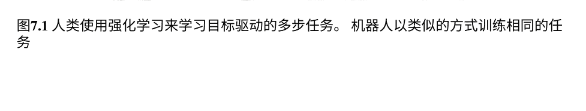

> 强化学习在概念上与人们在生活轨迹和处理不确定的世界和未来时做决策的方式非常相似。一个关键概念是策略，它指导代理在给定状态下选择最佳动作。

### 7.2 学习最优策略

我们从最简单的情景开始。称之为预强化学习情景，因为世界的一切都以状态之间由动作连接的有向图的形式给出，这个图被称为马尔可夫决策过程（MDP），自1950年代以来一直在研究。在每个状态下，有一组可用的动作。给定一个状态和一个动作，代理以随机的方式降落到其他状态，根据转移概率进行指定。当发生这种转移时，会获得奖励。目标是找到一种策略，在每个状态下告诉代理选择哪个动作。参见图7.2。一个关键概念是状态的价值，它是通过降落在该状态并继续旅程时预期获得的累积奖励。因此，在你嫁给合适的人或者你热衷于学习的学科的状态中，该状态的价值很高，因为预期的奖励大于处于一个不理想的状态。

MDP必须观察不同状态的最优值之间的自洽性，因为状态是相互关联的。这种自洽性由贝尔曼方程给出：

```
V(s) = \max_{a}(r_{s,a} + \gamma V(s'))
```

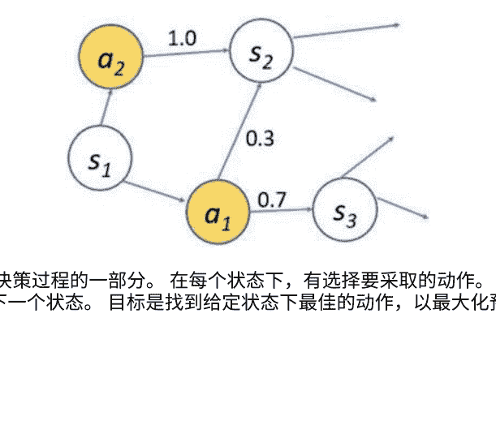

其中 $s$ 是旧状态，$s'$ 是新状态，$r_{s,a}$ 是在状态 $s$ 下采取动作 $a$ 获得的奖励，$\gamma$ 是折扣因子。它定义了一个状态的价值，即从该状态开始以下一个状态的值为基础时的最大累积奖励。因此，在你上大学学习正确的学科的状态的价值和在未来相邻状态中从事该领域工作的价值必须保持一致。

确定性策略 $\pi$ 是一个将状态映射到动作的函数，

```
\pi : S \rightarrow A,
```

其中 $S$ 是状态集合，$A$ 是动作集合。轨迹是根据策略进行的一系列(状态，动作)对的展开，

```
s_0,\; a_0 = \pi(s_0),\; s_1,\; a_1 = \pi(s_1),\; s_2,\; \ldots
```

其中动作由策略选择，下一个状态以随机方式由状态转移概率 $T(s_{t+1}|s_t, a_t)$ 确定。最优策略 $\pi^*$ 从第一个状态 $s_0$ 开始最大化预期累积奖励。

当我们对世界有完全信息时，贝尔曼方程可以使用收敛的迭代方法来解决，这些方法会更新值和策略。状态值从当前策略的估计值更新，反之亦然。无论这些更新是同时发生在所有状态上还是按照某种顺序逐个状态进行，都没有关系。算法收敛到最优策略 $\pi^*$ 和最优状态值 $V^*(s)$，并且MDP变成了马尔可夫链。状态值和策略的迭代更新之间的直觉是使它们自洽并满足贝尔曼方程。

如果没有MDP的完整图景，问题就更具挑战性。在模拟中，就像玩一个未完全探索的开放世界视频游戏。将来，就像探索一个我们不熟悉的新星球。我们并不知道一切。我们有轨迹，这些轨迹随着时间的推移取决于我们的行动；我们不知道转移概率；并且我们随着时间了解奖励。在等待被发现的未知世界中，RL提供了无模型MDP的解决方案。

最早的无模型强化学习方法之一是基于时间差分（TD）误差的，该误差定义为实际状态值与根据贝尔曼方程预期的状态值之间的不一致性。

```
\text{TD误差} = r + \gamma V(s') - V(s).
```

如果TD误差为零，贝尔曼方程将完全满足。

基于TD的方法最小化TD误差。这种方法曾被广泛应用于一个学会与专家人类玩得一样好的掷骰子游戏的程序中。请注意，TD方法将蒙特卡洛采样与动态规划相结合。

+   1.  蒙特卡洛算法根据策略和转移概率随机采样轨迹。
    2.  动态规划通过重复使用先前计算的状态值和策略来减小TD误差。

直观上，这是为了消除在探索环境时状态值之间的相互不一致性。

让我们进一步完善这个想法。为状态-动作对定义Q值。对于一个(s, a)对，其Q值是在状态s下采取动作a后预期的累积奖励，如果代理继续遵循相同的策略。考虑以下算法。

+   1.  使用蒙特卡洛算法根据一个 $\epsilon$-贪婪的行为策略来采样轨迹，这在探索和利用之间取得了平衡。探索概率为 $\epsilon$，利用概率为 $1 - \epsilon$。在利用阶段，根据当前策略选择动作，即选择使得Q(s, a)最大化的动作。在探索阶段，动作被随机选择。
    2.  计算TD误差，
        $\varepsilon = r + \gamma \max_{a'} Q(s', a') - Q(s, a)$。
    3.  根据学习率减小TD误差，
        $Q(s, a) = Q(s, a) + \alpha \varepsilon$,
        其中 $\alpha$ 是学习率。注意与SGD中的梯度步骤的相似性。验证上述减小误差的方法。

这是 Q 学习，它将收敛到

注意， Q学习是离策略的，因为它使用一个 $\epsilon$-贪婪的行为策略从状态到状态转移，这与正在学习的策略不同。它使用探索来确保对状态-动作空间有良好的覆盖。如果 $\epsilon = 1$，那么它完全脱离正在学习的策略，始终进行探索。然而，始终进行探索会导致当状态空间非常大时的显著减速。这与另一种方法形成对比，如下所示。

+   1.  使用蒙特卡洛算法根据当前策略和转移概率对轨迹进行采样。
    2.  计算TD误差，
        $\varepsilon = r + Q(s', a') - Q(s, a)$,
        其中 $a'$ 是由当前策略给出的轨迹中的下一个动作。
    3.  根据学习率减小TD误差，
        $Q(s, a) = Q(s, a) + \alpha \varepsilon$,
        其中 $\alpha$ 是学习率。

上述算法是基于策略的算法，缩写为Sarsa，代表状态、动作、奖励、状态、动作的五元组。

# **** 练习19 Sarsa/Q-learning

假设你正在尝试在一个充满未知危险的世界中导航，比如深渊、火灾、沼泽、大蜘蛛等，以寻找宝藏，并且你使用两个算法A和B来找到最优策略。算法A返回一个接近最优的策略，似乎通过让你远离危险来保护你的安全。鉴于一个算法是Sarsa，另一个算法是Q-learning，请指定A和B中哪个是Q-learning?

一旦 Q值收敛，就可以根据它们找到最佳策略。策略将是确定性的，只需选择预期奖励最高的动作。请注意，Q学习实际上是设计用来学习确定性策略的。在本章中，我们将很快看到如何直接优化大状态空间上的随机策略。

> 在状态-动作空间中，用于最优性的贝尔曼方程是强化学习算法的基础，它寻求满足方程所隐含的自洽性。在马尔可夫决策过程中，一切都是提前知道的，贝尔曼方程可以被准确满足。在部分已知的世界中，蒙特卡洛算法用于探索世界，并更新Q值以满足贝尔曼方程。

### 7.3 深度Q学习

基于时序差分的强化学习算法，如 Q学习和 Sarsa，需要保持一个称为 Q表的表格；参见图 7.3。表格的大小为 N × M，其中 N 为状态数，M为动作数，对于实际应用来说是不切实际的。想象一下数一数围棋游戏中的状态数量，并保持覆盖所有状态的 Q表。
使Q学习在具有大状态空间的实际应用中起作用的想法是用函数替换表格。该函数由一个深度神经网络(DNN)实现，可以计算表格中任何单元格的Q值。这个DNN被称为深度Q网络(DQN)。我们说Q函数已经由DQN参数化。Deep Q学习是由DeepMind推广的，它构建了一个可以从原始游戏屏幕的像素中学习玩雅达利视频游戏的AI。

状态空间由游戏中计算机屏幕上的图像组成。通过使用标准的反向传播算法，训练DQN以最小化TD误差。损失函数是预期的平方TD误差，

```
E[(r + \gamma \max_{a'} Q(s', a') - Q(s, a))^2],
```

其中期望是在执行行为策略时收集的转换 $s, a, r, s'$ 上计算的。在实践中，不是通过探索状态空间来计算期望，而是使用经验回放，其中代理的轨迹被保存在回放内存中，从中随机采样。损失及其梯度是通过使用从回放内存中采样的一小批转换来计算的。这样可以打破相关性并改善训练过程的收敛性。

| Q(s,a) | s1   | s2   | s3   |
|--------|------|------|------|
| UP     |      | 0.3  |      |
| DOWN   | 0.4  |      |      |
| LEFT   |      |      | -0.5 |
| RIGHT  |      | 1.5  |      |

图7.3 Q表。表格的每个单元格中都包含了当前的估计Q值。这种方法在具有大状态空间的实际应用中是不切实际的。Q学习通过最小化平方TD误差的方向更新Q值。

# **** 练习20 DQN

参见[77]。说明双Q学习的工作原理及其对算法性能的影响。

在实践中经常使用的DQN方法的改进可以在这一点上提到。在计算TD误差时，使用了这种变体

$r + \gamma \max_{a'} Q(s', a') - Q(s, a)$,

使用两个DNN计算Q值，策略网络P和目标网络T,

$r + \gamma \max_{a'} T(s', a') - P(s, a)$.

T定期从P更新其参数，并在之间保持冻结以实现算法的稳定和更好的收敛性。否则，如果目标网络与策略网络相同，则存在一个反馈循环，这在实践中经常是不稳定的，因为策略网络的当前输出会影响下一步的反向传播。反馈发生是因为同一个网络设置了其目标Q值，然后努力达到这些值。这经常被描述为狗追逐自己的尾巴。

> 深度Q学习通过DNN替换Q学习中的Q表。深度Q网络通过最小化从经验回放内采样的转换的时间差异误差的L2 norm来进行训练。

### 7.4 策略梯度

尽管DQN在2013年通过让AI玩视频游戏而声名大噪，但另一种被称为策略梯度的方法已经被证明更加实用、多功能和强大，并且它在AlphaGo与天才李世石的比赛中取得了显著的成功。这种方法可以直接学习随机策略，它输出一个离散动作空间上的离散概率分布，该空间可以是高维的。它还可以处理连续动作空间。对于连续动作，它输出一个连续概率分布的参数，可以从中采样动作。相比之下，DQN适用于离散低维动作空间，学习的是确定性策略。

对于DQN和策略梯度，与任何AI模型一样，假设是网络可以根据不同的动作，在状态空间中划分出凸多面体的不同区域。 AlphaGo的成功最终基于AI模型的巨大划分能力。

#### 7.4.1 直觉

目标是在诸如围棋或视频游戏等大型状态空间中直接学习随机策略。在竞技游戏或存在不确定性的大型状态空间中，随机策略优于确定性策略。确定性策略并不是最佳选择，因为我们永远不知道一切。我们使用一个将状态映射到随机策略的DNN，称为策略网络（PN）。

让问题空间中有 $N$ 个动作。如果你在玩一个贪吃蛇游戏，在游戏中蛇会随着时间变长，$N$=4对应于计算机屏幕上鼠标指针的四个移动方向。对于贪吃蛇游戏，PN模型以游戏屏幕的配置作为输入，并输出一个四维随机策略，即上、下、左、右四个动作的概率：

$[\pi_\theta(上|X), \pi_\theta(下|X), \pi_\theta(左|X), \pi_\theta(右|X)] = \pi_\theta(X)$,

其中 $X$ 是游戏屏幕的图像，$\pi_\theta$ 是PN模型实现的函数，$\theta$ 是DNN的可训练参数。让我们来制定我们要解决的问题。

+   1.  我们根据当前策略运行蒙特卡洛算法来展开轨迹并获得累积奖励。对于像围棋这样的游戏，奖励是在轨迹结束时以胜利、失败或平局的形式给出的。在每个时间步骤中，根据PN模型建模的随机策略进行采样动作。这将持续到达终止状态并获得奖励，奖励可能是正数或负数。轨迹的概率是沿着轨迹进行的状态转换和动作选择的概率的乘积。请参见图7.4，了解轨迹的可视化示例。
    2.  在许多轨迹上的期望奖励将是奖励的加权和，其中权重是轨迹的概率。问题可以表述为：找到一个PN模型，该模型输出这样的动作选择概率，以最大化期望奖励。对于正奖励，需要训练PN模型增加沿着轨迹选择的动作的概率。对于负奖励，目标是降低概率。

因此，PN模型为反向传播提供了一个真实的基准。
图7.4显示了PN模型需要在每个时间步骤上最大化的目标函数。

在解决数学细节之前，先给出一个直观的解释，假设在一个时间步骤上选择了动作 $a$，并且回想一下，对于分类问题，

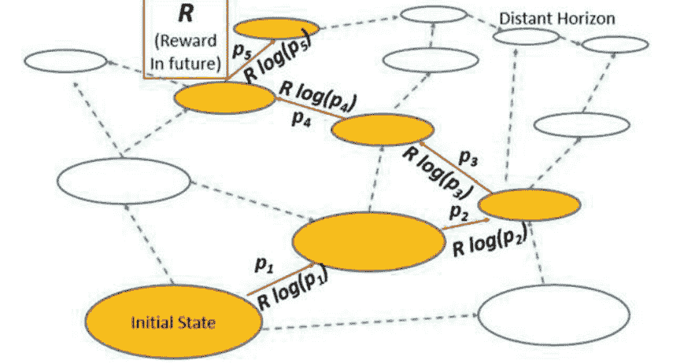

图7.4策略梯度方法。红色箭头在状态空间中显示了一个蒙特卡洛轨迹，该轨迹通过随机策略采样动作。所选动作的概率显示在边缘上。它在最终状态终止，获得奖励 R。

然后，策略网络被训练以最大化边缘上显示的目标函数，即 $R \nabla \log p_i$ 是策略梯度。如果 $R>0$，则所选动作的概率增加。如果 $R<0$，则它们会减少。

如果“地面真实分类标签”是动作 $a$，则损失为 $-\log p_a$。如果我们用胜利、失败或平局的最终奖励来调节它会怎样？假设奖励如下：

$R(获胜轨迹) = +1$
$R(失败轨迹) = -1$
$R(平局轨迹) = 0$

因此，建议将 $-\log p_a$ 与 $R$ 进行缩放或调节。

$-R \log p_a$,

这必须被最小化，或者等价地，创建一个被最大化的目标函数，

$R \log p_a$。

对于获胜轨迹，反向传播算法将调整PN模型的可学习参数，使动作更有可能发生，对于失败轨迹，减少可能性。对于平局轨迹，不进行调整。

这必须在大量轨迹上完成，这应该确保平均奖励最大化。上述奖励调节的提议

#### 7.4.2 数学分析

本节是为那些希望深入了解策略梯度方法数学的读者编写的。

假设一个蒙特卡洛轨迹 $\tau_i$ 从初始状态 $s_0$ 开始是一个序列

$$s_0 \xrightarrow{\pi_\theta} a_0 \xrightarrow{T} s_1 \xrightarrow{\pi_\theta} a_1 \rightarrow a_{N-1} \xrightarrow{T} s_N \xrightarrow{\text{奖励}} R$$

其中奖励 $R_i$ 是在终止状态 $s_N$ 获得的。奖励可以沿着轨迹累积，在这种情况下只需使用累积奖励。
轨迹 $\tau_i$ 的概率是根据策略 $\pi_\theta$ 和状态转移概率的动作选择概率的乘积。

$$P(\tau_i) = \prod_k \pi_\theta(a_k|s_k) T(s_{k+1}|s_k, a_k).$$

蒙特卡洛算法执行以产生 $M$ 总的模拟轨迹，

$$\tau_1, \tau_2, \ldots, \tau_M,$$

这些轨迹导致奖励

$$R_1, R_2, \ldots, R_M,$$

其中 $M$ 是一个大数。要最大化的目标函数是期望奖励

$$F(\theta) = \mathbb{E}_\tau[R] = \sum_{i=1}^{M} P(\tau_i) R_i.$$

为了训练PN模型，目标函数对 $\theta$ 进行微分。链式法则的第一步是对目标函数对 $P(\tau_i)$ 项进行微分，该项取决于每个时间步的PN模型的输出 $\pi_\theta(a_i|s_i)$，
而这又取决于PN模型的内部可学习参数 $\theta$。

对于 $\theta$ 的梯度 $F(\theta)$ 被称为策略梯度，

$$\nabla_\theta F(\theta) = \nabla_\theta \mathbb{E}_\tau[R] = \sum_{i=1}^{M} \nabla_\theta P(\tau_i) R_i.$$

从高中的微积分中，我们知道

$$\frac{d f (x)}{d x} = f (x) \frac{d \log f (x)}{d x}$$

因此，我们可以将策略梯度重写为

$$\nabla_\theta F (\theta) = \sum_{i=1}^{M} P (\tau_i) \nabla_\theta \log P (\tau_i) R_i,$$

这可以简化为期望值

$$\nabla_\theta F (\theta) = \mathbb{E}_{\tau}[\nabla_\theta \log P (\tau_i) R_i].$$

回想一下，$P (\tau_i)$是概率的乘积，因此它的对数是概率的和，可以进行微分。考虑 $\tau_1$ again,

$$\log P (\tau_1) = \sum_{k} (\log T (s_{k+1}|s_k, a_k) + \log \pi_\theta (a_k|s_k)).$$

在计算梯度时，状态转移概率与 $\theta$无关，因此可以忽略它们，得到以下表达式：

$$\nabla_\theta \log P (\tau_1) = \sum_{k} \nabla_\theta \log \pi_\theta (a_k|s_k)$$

因此，轨迹 $\tau_1$的策略梯度通过调节每个项的奖励 $R_1$获得，

$$G(\tau_1) = \sum_{k} \nabla_\theta \log \pi_\theta (a_k|s_k) R_1.$$

对 $M$个轨迹进行期望意味着运行蒙特卡洛算法生成 $M$个轨迹，然后取上述结果的平均值，

$$\nabla_\theta F (\theta) = \frac{1}{M} \sum_{i=1}^{M} G(\tau_i).$$

这是最终表达式。因此，策略梯度方法是以下算法。

- 1. 运行蒙特卡洛算法生成 $M$条轨迹。
- 2. 对于每条轨迹和轨迹中的每个时间步，将目标函数设置为采样动作的奖励调节对数概率，并进行反向传播以最大化它。

再次考虑从蛇游戏的策略中进行采样的示例，

$[\pi_{\theta}(上|X), \pi_{\theta}(下|X), \pi_{\theta}(左|X), \pi_{\theta}(右|X)] = \pi_{\theta}(X).$

如果在蒙特卡洛算法中采样了“上”作为地面真实标签，则 $R \log \pi_{\theta}(上|X)$ 是要最大化的目标函数，或者等价地，$-R \log \pi_{\theta}(上|X)$ 是要最小化的损失函数。

这与正样本的交叉熵损失最小化完全相同，只是它受到 $R$ 的调制。参见图7.4，在那里策略梯度是

$R(\nabla \log p_{1}+ \nabla \log p_{2} + . . .+ \nabla \log p_{5})。$

需要记住的一件重要事情是，上述损失函数实际上并不是传统意义上的“损失函数”。这个函数可能通过反向传播而改善，而不会改善最终的目标函数，即预期奖励。它只是在当前轨迹数据上定义的一个函数，其梯度在当前数据上在随机意义上是有帮助的。

策略梯度方法的数学可以进一步扩展，以使训练稳定，因为在其原始形式中，策略梯度方法已知存在高方差问题。除了 $R(\tau)$ 之外，还存在几种替代的加权因子。例如，奖励函数 $R(\tau)$ 可以被质量函数 $Q(s, a)$ 替代。反过来，$Q(s, a)$ 可以通过评估采取行动 $a$ 是否有利来近似。一个称为评论家的独立DNN可以预测近似的 $Q(s, a)$。然后，PN模型被称为演员，整个方案被称为演员-评论家方法。演员不必等待轨迹的最终结果 $R(\tau)$，因为评论家立即提供反馈。

> 策略梯度方法使用SGD算法来训练AI模型，该模型计算策略。AI模型被称为策略网络。损失函数包括蒙特卡洛轨迹的累积奖励的乘法因子，以便将策略网络的参数推向最大化预期奖励的方向。

### 7.5 让我们玩耍和探索

深度强化学习（DRL）帮助AI在游戏中取得胜利。在这些胜利背后，需要付出巨大的努力来完成这些壮举，除了使用DNN作为策略网络之外，还需要更多的工作来得到最终的解决方案。值得注意的是，图7.5 魔方和围棋可以通过采用深度强化学习来解决。 为了使AI在游戏中表现出色，需要将许多创新技术仔细地组合在一起。

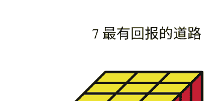

有关工作，请参见[196-198]。 最终的AI模型是将几种技术组合在一起作为整体解决方案的结果。

一种有用的技术是蒙特卡洛树搜索（MCTS），它是单人游戏到竞技游戏的一般化。在双人竞技游戏中，使用MCTS算法展开一棵轨迹树。这是通过让AI在自我对弈中进行游戏来完成的。在这种蒙特卡洛模拟中，基本思想是虽然我们无法确定在玩几局游戏时某个特定的状态-动作对是否有益，但通过模拟大量的游戏，我们可以推断出是否有益。如果在许多游戏中平均而言是有益的，那么它就是有益的。类比的例子是，如果某个特定的行动，比如上大学，对许多人都有好处，那么你也很可能从中受益。

几种技术的组合，通过勤奋的调整，导致了AlphaGo的成功。实际上，AlphaGo是从专家围棋选手玩过的大量游戏数据库中启动的，它使用监督学习来训练其策略网络，其中还包括游戏特定的特征。价值网络用于预测一个状态是否有利于获胜，它使用强化学习进行训练。策略网络修剪自我对弈搜索树的边缘，价值网络评估特定截断深度的叶节点。这两个网络都减少了庞大的3,361（围棋棋盘为$19 \times 19$）的搜索空间，其中大约有$2 \times 10^{170}$个合法的棋盘配置。

在AlphaZero中，策略网络对游戏数据库的依赖通过广泛使用自我对弈和迭代改进两个网络来消除，从随机初始化开始。在每次迭代中，使用当前策略和价值网络引导的自我对弈会产生大量的游戏轨迹。这使得算法能够推广到国际象棋和将棋。

自我对弈效果很好，但从专家那里学习也很有价值。为什么要从零开始学习所有东西呢？我们可以通过观察专家来获得AI模型的监督数据，从而补充强化学习技术。这也被称为学徒学习。因此，为了学习赛车驾驶，可以观察专家驾驶员并获得一个训练数据集的$(s, a)$对。不需要等待奖励来学习策略。

还可以参考[3]了解如何使用深度强化学习来解决魔方问题；参见图7.5。为了在奖励稀疏且回合可能不终止的情况下使AI高效学习，使用了一种称为自学习推理的技术。训练一个结合了价值和策略网络$(v, \pi) = F(s)$。从终止状态开始，以反向方式生成其他状态。

$$s_t \leftarrow s_{t-1} \leftarrow s_{t-2} \leftarrow \ldots$$

对于每个生成的状态 s，通过采取不同的行动（转动移动），使用当前网络 F 评估其子节点，并在其子节点中选择最大值作为状态 s 的新值和策略训练目标。一旦网络训练完成，就可以在基于MCTS的回溯算法中使用它来解决从初始状态 s0开始的难题。

让我们超越游戏，探索强化学习的其他应用领域。只要存在一个顺序决策过程，就可以应用强化学习。机器人技术、自动驾驶汽车、自动飞行器、商业策略、库存管理、工业设计、物流和运营、健康、预防医学、医疗治疗规划、交易策略、供应链管理和教育都有可能从中受益。

此外，神经架构搜索、自然语言理解任务和推荐系统可以用强化学习的方式来表达。无论何时需要做出基于状态的决策，都可以考虑强化学习。无论何时需要在动态状态领域中高效搜索，都可以考虑强化学习。而且，问题不一定是实际问题。甚至可以将强化学习的形式化应用于理论研究，如NP难问题或组合优化问题。

为了提供关于如何在现实世界中使用强化学习的直观理解，考虑医学中的治疗计划的情况，特别是放射治疗。治疗规划师使用特定剂量超参数和患者的解剖结构，利用治疗规划软件生成治疗计划。治疗计划是一个三维剂量分布，通常用一维剂量体积直方图来紧凑表示，涉及目标器官和风险器官。应该向目标器官提供规定的放射剂量，并保护风险器官。不同的风险器官对辐射的敏感性不同。基于与肿瘤学家的咨询和治疗计划的评估，规划师将多次迭代调整超参数，以生成更好质量的治疗计划。这是一个极其劳动密集的过程。我们可以将其形式化为一个强化学习问题。治疗计划类似于游戏配置。行动是对治疗计划参数的微调。奖励函数基于某些客观标准，评估目标器官和风险器官接收到的剂量。策略网络将治疗计划作为输入，并输出对计划参数更新的分布。

然后使用更新的计划参数创建新的治疗计划，并且整个过程会重复。最终的治疗计划将比最初的提议计划质量更高。这仅适用于一个治疗会话。对于分布在时间上的多个会话的治疗，可以推广这种方法，从一个会话转移到下一个，并适应解剖学和其他临床相关环境的任何变化。对于这样一个重要的强化学习应用，请参见[194，215，222]。

在一个未来世界中，我们将给我们的孩子送上机器人朋友。这样一个机器人将通过一辆自动驾驶汽车中的机器人将一个盒子送到门口。打开盒子后，机器人将从盒子里跌跌撞撞地走出来，逐渐学会行走和奔跑，就像一个使用强化学习的人类婴儿一样。随着时间的推移，它将给孩子们读书，讲故事，这是一种由叙述步骤和动画手势和面部表情交织在一起的顺序过程，以整体的“奖励”来让我们的孩子体验故事的魔力。

> 在解决受限领域中的顺序决策问题方面，下棋和解决魔方展示了深度强化学习的有效性。 在未来，我们将见证深度强化学习在更广泛领域中的多样化应用。

## 7.6章小结

强化学习用于使机器在基于状态的交互环境中学习。 一个核心概念是策略，它指导机器选择最大化预期累积奖励的动作。 如果关于环境的一切都事先已知，那么问题可以被表述为马尔可夫决策过程，通过迭代应用贝尔曼方程来减小时间差异误差可以精确地解决问题。 贝尔曼方程表达了马尔可夫决策过程必须遵守的自治性约束。 时间差异度量了与所期望的自治性的偏离程度。当对系统只有部分知识时，强化学习被用来学习策略。 Q-学习是一种强化学习算法，它为（状态，动作）对保留了一个 Q-表。 通过由学习速率超参数控制的学习步骤来更新表，以减小时间差异误差。 当表由AI模型实现时，它被称为深度 Q-学习。深度 Q-网络通过最小化时间差错误进行训练。 在实践中，使用策略梯度方法，其中策略由称为策略网络的AI模型实现。 执行蒙特卡罗模拟，并将奖励值传播回来训练策略网络，以最大化模拟过程中预期累积奖励的目标函数。 预期奖励的目标函数的梯度与所选动作的概率的对数和的梯度相同，这些对数项由模拟过程中获得的奖励调制。 然后将该梯度反向传播到策略网络的可学习参数。 强化学习在游戏中取得了成功。 同时，在许多领域中具有潜在的应用。

## 问题集7

- 1. 一般来说，蒙特卡罗算法是什么？
- 2. 什么是探索-利用权衡？
- 3. 改变探索-开发权衡中的贪婪策略的好方法是什么？
- 4. 折扣因子 γ 的大值表示什么？
- 5. 假设 γ = 0.9，即时奖励为10，随后是无限序列的奖励5。总折扣奖励是多少？
- 6. 假设你正在训练一个折扣因子 γ =1 的强化学习模型。你注意到代理需要很长时间才能到达有很好奖励的目标。你会如何训练代理以更快地到达目标？
- 7. 在MDP中，最优状态值函数是唯一的吗？
- 8. 如果将常数添加到奖励函数中，最优策略会发生变化吗？
- 9. Q-learning的最大限制是什么？
- 10. 为什么策略梯度方法对于随机策略效果很好？

# 第8章
古典世界

> > 经典是一本永远不会说完它要说的话的书。
>
> —— 伊塔洛·卡尔维诺

本书的主题是人工智能，它源于古典机器学习。为了更好地理解人工智能，重温古典技术是很重要的。本章将带您简要了解构建机器学习基础的思想和方法。与人工智能的根本区别在于，一个是在一个精心设计的特征空间中工作。

特征工程过程需要细致而密集的工作来计算特征，这些特征需要进行研究、可视化、选择和实施。经典的机器学习算法将在特征空间中近似所需的函数或分离给定的类别。

经典机器学习基于计算机科学、统计学和数学。它提供了许多在人工智能中使用的技术。人工智能通过ReLU激活、最大池化层、SGD算法的变体和新颖的架构等新技术来补充这些经过时间考验的技术。结合计算能力的巨大进步和大规模数据集的可用性，经典机器学习已经发展成为人工智能。


### 8.1 最大似然估计

对于概率，我们根据当前发生的事情来看未来，并询问未来结果的可能性有多大。对于似然，我们根据当前观察来看过去，并询问过去因果事件的可能性有多大。给定观察数据 $D$，它是过去发生的某事的“效果”，我们可以估计在特定“原因”下观察到这个效果的概率。最大似然估计（MLE）原则指出，我们应该估计参数 $\theta$，使得观察到数据的概率最大化：

$$\hat{\theta} = \arg\max_{\theta} \mathrm{Pr}(D|\theta).$$

条件概率项被写成似然函数 $L(\theta|D)$，其中 $\theta$ 是变量，$D$ 是固定的。

考虑十次随机抛硬币的观察结果，

$$H,H,T,H,T,H,H,H,T,H,$$

我们需要估计 $\theta = \mathrm{Pr}(H)$。我们可以估计它为 $\hat{\theta} = 0.7$，因为我们看到七个正面和三个反面。这是最大似然估计，因为它最大化了

$$L(\theta|D) = \mathrm{Pr}(D|\theta) = \theta^7(1-\theta)^3$$

我们可以快速地对 $\theta$ 进行微分以进行确认。

逻辑回归方法是基于MLE原理的技术之一。此外，回归模型在存在噪声的情况下应用MLE原理。我们将看到噪声的类型决定了最大似然估计所需的损失类型。分类和回归的AI模型就像经典机器学习技术一样应用MLE原理。因此，这种估计技术为AI和ML中的主要技术提供了基础。MLE原理是贝叶斯估计的特例，在下一节中我们将讨论参数的先验概率分布是非信息性的情况。

## *** 练习21 估计

考虑一个恒定的随机过程，它发出一个值 $x$ ，使得

$$x = \theta + \text{噪声}$$

给出观测值 $D= \{x_1, \ldots, x_N\}$ 的 $\theta$ 的最大似然估计（MLE）的以下两种情况：

- 1. 噪声是高斯的。
- 2. 噪声是拉普拉斯的。

指定适应于 $D$ 的常数函数，满足以下条件：

- 1. 最小 $L^2$ 误差或均方误差
- 2. 最小 $L^1$ 误差或平均绝对偏差

### 8.2 估计中的不确定性

直观地说，MLE原则是有道理的。同时，机会也起到了作用，估计值可能与真实值有偏差。统计学帮助我们量化由于机会而产生的不确定性。

在前一节的抛硬币示例中，假设$Pr(H)$的真实值为0.5，我们纯粹由机会观察到了观察序列。如果我们多次重复进行 $N$ 次抛硬币实验，估计值的均值将收敛到真实值0.5。这些估计值形成一个概率分布，其均值为真实值，标准差为 $O(1/\sqrt{N})$。这是经典统计学中假设检验和置信区间的基础。当我们谈论95%的置信区间时，这意味着如果我们重复实验，真实值将在置信区间内95%的时间。零假设断言一个未知参数的值，并进行实验来测试它。P值是观察到的结果或离断言值更极端的结果的概率，前提是零假设是原因。

如果P值低于5%等临界阈值，我们拒绝假设的原因并接受替代原因。请注意，在假设检验中，基本参数被假定为常数。

在贝叶斯统计中，"原因"集合被赋予一个概率分布，称为先验分布，并且在给定"效果"的情况下，特定原因的条件概率称为后验概率。

$$ \Pr(\theta|D) = \frac{\Pr(D|\theta) \Pr(\theta)}{\Pr(D)} $$

被称为贝叶斯定理的计算方式

后验概率 = 似然函数 × 先验概率 / 证据概率

为了最大化后验概率，我们最大化分子，因为分母是常数。如果先验概率是均匀的，那么它就会简化为最大似然估计原则。请参阅第15.1.2节和第33题，我们在其中使用贝叶斯推断。原因的后验概率是我们对原因可能性的当前信念。贝叶斯推断的力量在于从先验开始迭代更新信念。随着新证据的出现，信念会迭代更新。这被称为贝叶斯推断。请注意，给定一个原因 $A$ 和一个效应 $E$，贝叶斯推断规则可以被重新写成

$$ \Pr(A|E) = \frac{\Pr(E|A) \Pr(A)}{\Pr(E|A) \Pr(A) + \Pr(E| \overline{A}) \Pr(\overline{A})} $$

> > 最大似然估计和贝叶斯推断为许多经典机器学习工具提供了基础。

### 8.3 线性模型

#### 8.3.1 线性回归

参见第1.4节。我们将练习21推广到线性回归。考虑一个线性随机过程，它发出一个值 $y$，如下所示

$$ y = \theta_0 + \sum_{i=1}^k \theta_i x_i + \epsilon $$

其中 $\epsilon$ 是噪声。然后，给定一个训练集的 $k$-维向量，$\theta_i$ 的MLE估计如下所示：

- 1. 如果 $\epsilon$ 是高斯分布，则解由普通最小二乘法（OLS）给出。
- 2. 如果 $\epsilon$ 是拉普拉斯分布，则解由最小绝对偏差（LAD）给出。

或者，为了在不同的损失函数下将线性函数拟合到训练数据中，我们有以下结果：

- 1. OLS方法将最小化 $L^2$误差。 等价地，它最小化均方误差或平方和误差。
- 2. LAD方法将最小化 $L^1$误差。 等价地，它最小化平均绝对偏差或绝对偏差之和。

OLS方法基于线性代数具有直接的解析解。拟合线通过数据的均值。考虑线拟合情况，其中 $k = 1$ 对于LAD方法。就像常数随机过程的情况一样，它锁定到中值，请参见练习21及其解决方案，因此对异常值具有鲁棒性，拟合线锁定到中间的数据点对，可能是非唯一的，导致多个解，并且对异常值具有鲁棒性。

#### 8.3.2 线性回归的几何学

让我们为二维情况下的OLS和LAD方法开发几何直觉。损失函数是二维平面上的一个曲面。考虑对训练数据的损失函数。对于任意常数 $C$，定义损失曲面的相应等高线为损失为 $C$ 的参数值的集合。然后，对于 $L^2$ 损失函数，损失曲面的等高线是圆锥曲线，而对于 $L_1$ 函数，它们是分段线性的。

#### 8.3.3 正则化

正则化是带有约束的优化问题，可以通过拉格朗日乘子法求解。正则化是我们希望在过程中融入的先验信念。通常我们认为模型参数应该具有较小的幅度，因为简单模型更可取。这种信念的理由是复杂模型很可能过拟合，因此正则化是一种减少方差的方法。正则化线性回归的损失函数为

正则化损失函数 = ($L^p$ error) + λ*(系数的大小)

其中 λ是拉格朗日乘子。“系数的大小”有几种选择，可以是 $L^1$ 范数（称为套索惩罚）或参数向量的 $L^2$ 范数（称为岭惩罚）。套索惩罚将同心对角线方向的正方形作为约束条件，而岭惩罚将同心圆作为约束条件。参数的最大有效区域由 λ的值定义，即在该区域内需要最小化 $L^p$ 误差的最大正方形或最大圆形。参见图8.1以形成直观认识。岭惩罚和套索惩罚可以线性组合，这称为弹性网络正则化。

## 8.4 经典机器学习

我们简要概述了几种众所周知的经典方法。对于某些应用，这些方法效果很好。

#### 8.4.1 k最近邻算法

非参数方法之一是 $k$-最近邻算法。给定一个未知样本 $x$，在特征空间中找到其$k$个最近邻居，并使用它们的标签和属性来预测 $x$的标签和属性。随着 $k$ 的增加，方差减小。在高维空间中，我们必须使用近似算法来寻找最近邻居。可以证明，随着特征数量的增加，没有快速的精确最近邻搜索方法。在低维情况下，可以使用 $k$-d树等数据结构。对于这些技术在高维空间中的工作，如果特征数量为 $d$，训练样本数量为 $N$，则应满足 $N \gg 2^d$，这在大规模的 $d$下是不可行的。这被称为机器学习中的维度灾难。

#### 8.4.2 朴素贝叶斯分类器

朴素贝叶斯分类器假设特征之间具有条件独立性，并使用贝叶斯定理来预测给定观测数据样本的类后验概率。贝叶斯定理找到了最有可能导致观测到的“效果”的“原因”。在分类中，效果是数据样本及其特征，而原因是其未知类别。原因的后验概率与原因的先验概率和给定原因的效果的概率成正比。训练数据可以帮助你估计这两个值。这种方法被称为“朴素”，因为我们在处理每个特征时都假设它们是独立的，而实际上特征之间可能存在依赖关系。

#### 8.4.3 FDA、LDA和QDA

费舍尔判别分析（FDA）值得特别提及，它是经典机器学习中最早的技术之一。在二维情况下，FDA很容易理解，适用于两个类别。找到一个方向，使得当数据样本投影到该方向上时，既能使类间分离度高，又能使类内变异度低。这可以通过最大化费舍尔准则来实现。

$$\frac{(m_1 - m_2)^2}{(\sigma_1^2 + \sigma_2^2)}$$

其中 $m_1$，$m_2$是投影后的1-D类别的均值，$\sigma_1$，$\sigma_2$是它们的标准差。有一个基于线性代数的解析解。给定2-D类别的协方差矩阵和均值，最大化费舍尔准则是

$$w = (\Sigma_1 + \Sigma_2)^{-1}(\mu_2 - \mu_1)$$

假设两个类别的特征符合高斯分布，且两个分布具有相同的方差，并应用贝叶斯分类器，我们得到线性判别分析（LDA）。如果我们放弃等方差的假设，我们得到二次判别分析（QDA）。

#### 8.4.4 支持向量机

在其线性形式中，SVM分类器在特征空间中寻找两个类之间的最大间隔，在其中可以放置分离超平面。SVM的有效性在于其非线性形式，它使用核技巧将特征转换到高维空间中。实际上，人们从不真正进入高维空间。核技巧被用于高维空间中的内积计算，作为一种快捷方法。原始的低维特征空间中的等效分离边界可以是高度非线性的。松弛超参数允许SVM找到一个软间隔，允许有限数量的违反间隔约束。

#### 8.4.5 神经网络

经典神经网络在特征空间中工作。它们只有一个隐藏层，被认为是浅层网络。经典神经网络可以被视为逻辑回归模块的网络，因为每个神经元都使用了S型激活函数，而不像现代AI模型使用ReLU。另一个常规的激活函数选择是双曲正切函数。

通用逼近定理表明，经典神经网络可以近似表示紧致集合（有界且闭合集合）上的任何连续函数。神经网络函数集在目标空间中是密集的。该定理在理论上具有兴趣，但没有实际意义，因为它表明通过增加隐藏单元的数量，我们可以使用常用的激活函数以分段的方式逼近一个函数。要求是激活函数应该是非常数的、有界的和连续的。一个例子是sigmoid函数。请注意，和函数$\sigma (x) +\sigma (-x)$，其中$\sigma$是sigmoid函数，将为任何平滑函数创建一个构建块。通用逼近就像一块一块地建造房子，其中砖块是从这样一个崎岖的激活函数中得到的。

可以证明经典的神经网络可以实现任意布尔函数。在输入层，对于一个True变量，使用+1的值，对于一个False变量，使用-1的值。在边缘上，使用+1的连接权重来检查神经元是否为真，使用-1来表示假，并选择适当的偏置项来实现布尔门。

在最坏的情况下，浅层网络中神经元的数量在输入维度上是指数级的，并且在确切情况下，与统计独立特征的数量成正比。

#### 8.4.6 决策树

分类和回归树（CART）由于推理速度快和方法的简单性而具有影响力。当它们较小时，它们更易解释。CART被推广为随机森林，以使其更具鲁棒性并减少方差。在随机森林中，通过使用训练数据的随机子集和在每个树节点考虑的特征的随机子集来训练多个分类和回归树（CART）。

这是一种集成方法，并且结合上述随机化技巧，随机森林在实践中可以很好地工作。随机森林在工业界的机器学习应用中起到了重要作用。

#### 8.4.7 高斯过程回归

**高斯过程回归（GPR），也被称为克里金，将观测结果建模为多元高斯分布的样本，其参数是可学习的。如果 我们观察到 $N$个输入-输出 $(x_i, y_i)$对， 我们将观测到的函数值建模为从 $N$维正态分布中采样的样本向量。**

$$\mathcal{N}(Y_1, Y_2, \ldots, Y_N),$$

其中 $Y_i$和 $Y_j$的协方差取决于观测到的 $x_i$和 $x_j$。为了预测第 $(N+1)$个值，高斯函数被扩展到 $(N+1)$维度，

$$\mathcal{N}(Y_1, Y_2, \ldots, Y_N, Y^*),$$

在相同的协方差结构下。使用观测样本上的新维度 $Y_{N+1} = Y^*$的条件分布来预测新输入 $x^*$处的函数值 $y^*$。

假设你只给了一个值 $y = 5$，当 $x = 1$时。对于什么的预测是什么假设一个协方差结构，它告诉我们一个样本在 $x$上的影响程度，会对 $x + \Delta$上的样本产生多大影响。它由协方差函数$k(x, x')$所给出，被称为高斯过程的核函数，它衡量了不同输入 $x$和 $x'$处函数值之间的依赖关系。核函数根据应用选择。假设它是一个将附近点与小$\Delta$强相关的核函数。如果 $\Delta$很大，那么它们的相关性就较弱。因此，假设一个具有这种协方差结构的二维高斯分布，可以通过在 $x = 2$处对先前观察到的值$y_1 = 5$进行条件化，即通过在 $y_1 = 5$处对二维高斯进行切片来预测 $y_2$。条件分布$P(y_2| y_1 = 5)$的均值和方差给出了预测值及其不确定性。

让我们假设我们观察到值 $y$ at $x = 2$。核函数有超参数，可以通过完全贝叶斯推断或最大化观测值的似然来进行微调。为了预测 $y$的值当$x = 3$时，我们重复相同的过程，但是在新样本的$x = 3$上，将$x = 1$的样本的协方差影响减少一个单位，而将$x = 2$的样本的协方差影响减少一个单位。对于每个预测，GPR输出其周围的不确定性区间。这种不确定性随着观测数量的增加而减少。

GPR的一个应用是对季节性和周期性过程进行建模。例如，对于一个企业来说，今天的销售额与上周和去年的同一天以及假日的销售额相关。人们必须选择一个合适的核函数来建模这种周期性相关性。

GPR方法还用于AI中的超参数搜索问题。根据AI模型在某些训练超参数值（如学习率和动量因子）上的性能，GPR预测新超参数上的性能。

#### 8.4.8 无监督方法

我们提到，$k$-means聚类是一种众所周知的无监督机器学习技术，用于探索数据的几何形状，以及自然形成的聚类。向量量化（VQ）是聚类的一个通用术语，其中包括$k$-means算法。

期望最大化（EM）算法是一种通用的公式，用于在存在未观察到的潜在变量或不完整数据的情况下找到模型参数。特别是，将EM算法应用于将观察数据建模为高斯混合的情况是$k$-means的一种软变体。这里的观察样本的潜在变量是关于哪个高斯函数生成了样本的信息。

基于密度的带有噪声的空间聚类（DBSCAN）是另一种流行的聚类技术，因其对异常值的鲁棒性和发现任意形状的聚类的能力而受到青睐。

主成分分析（PCA）是矩阵奇异值分解（SVD）的应用，已经用于降维、探索性可视化和潜在因子发现几十年了。一种有监督的降维方法称为偏最小二乘（PLS）已经被应用，其中我们拥有的特征数量比观测数量多很多。在多元统计学中，多维缩放（MDS）已经被用于在低维空间中可视化高维数据。一种现代的用于这种可视化的方法是t-分布邻域嵌入（t-SNE）。

Kohonen自组织特征映射（SOFM）和竞争学习已被用于可视化数据的几何形状，并且它们可以用于发现聚类。

#### 练习22 经典机器学习

- 1. 以下哪个机器学习模型的损失函数是凸函数：线性回归、逻辑回归、支持向量机还是神经网络？
- 2. SVM中使用的超参数是什么？SVM使用的损失函数的名称是什么？
- 3. 在分类树的训练过程中，决定是否分割节点的标准应该是什么？

### 8.5 XGBoost

我们将这个完整的部分献给了极限梯度提升（XGBoost），因为它在实践中取得了巨大的成功，参见[30]。XGBoost是梯度提升机（GBM）的一种流行实现。

它始于提升的思想，即级联许多分类器以构建一个强大的分类器，其中后续的分类器通过在先前分类器难以处理的示例上进行训练来提升得分输出。提升是一种集成方法，可以将一组弱学习器转化为一个强学习器。

考虑在 L^2 损失下的回归问题。在GBM中，提升阶段通过决策树来实现。所有树的分数相加以计算最终分数。训练过程如下。第一棵树适应函数。

存在一个误差或残差。第二棵树适应这个误差，然后重复这个过程，直到达到所需的精度而不过拟合。这就像在误差最小化中进行梯度步骤。参见图8.2。对于一个样本 x，让 G 为真实值， S 为第一 k 棵树输出的分数（预测）之和。

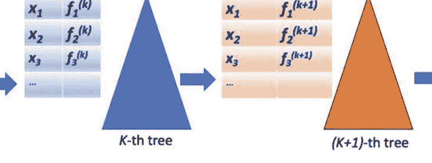

图8.2 XGBoost算法，基于梯度提升树。为每个数据样本添加一个提升树来适应残差误差。对于 L²回归问题，它是残差误差 (G_i - y_i)，其中 y_i 是前面树对样本 x_i 的拟合值，G_i 是真实值。一般来说，对于可微的损失函数，需要计算梯度。这些梯度被表示为 f^(k)，表示第 k 个提升阶段的梯度。第 k 棵树适应这些梯度，进一步降低损失。该过程在下一个阶段重复。对于二次近似，添加了二阶导数项。

已经安装了。假设我们正在构建第 (k + 1) 个树，该树对输入 x 输出得分 s。因此，我们希望最小化

$$ (G - (S + s))^2 $$。

这与通过最小化残差进行回归相同

$$ ((G - S) - s)^2 $$。

请注意，当我们构建第 (k + 1) 个树时，G 和 S 是固定的，s 是可变的，上述问题简化为最小化

$$ 2(S - G)s + s^2 + \text{常数项} $$，

其中常数项为 $ (G - S)^2 $。对于基于MSE的回归，将残差拟合到误差上是数学上正确的，上述表达式指向了任意可微损失函数的技术。通常，我们可能不知道真实值；因此，无法计算残差。例如，在Web搜索中检索文档的排序问题。我们知道相对评分，但不知道绝对分数。尽管如此，我们仍然可以应用XGBoost。

我们只是将上述表达式改写成泰勒级数形式,

$$ L(S + s) - L(S) = L'(S)s + \frac{1}{2} L''(S)s^2, $$

其中 L 是输入 x 的损失函数作为其分数的函数。请注意，上述讨论的回归损失函数是 L(S) = (G - S)^2。因此，L'(S) = 2(S - G) 是损失函数 L(S) 相对于 S 的一阶导数，而 L''(S)=2是其二阶导数。当前提升阶段的梯度是根据前面提升阶段拟合的分数计算的。

一般来说，对于可微的损失函数，需要一个计算数据样本 x的损失函数梯度的函数。对于二次近似，添加了二阶导数项。在损失函数中添加了正则化项，该项是叶节点数量和叶节点预测值的惩罚项的组合。

当我们构建一棵新树时，我们通过查看是否降低了正则化损失函数来决定是否分割树节点。这是通过计算增益来完成的

$$g = C_N - (C_R + C_L)$$

其中 $C_N$是落在树节点上的样本的损失函数值之和 $N$和 $C_L$以及 $C_R$分别是落在提议的左子节点和右子节点上的样本的损失函数值之和，在提议的分割中。如果 $g$很高，那么我们选择分割，因为分割会降低总体损失。

> > 经典机器学习在特征空间中提供了各种各样的技术，供希望在特征空间中工作的从业者使用。梯度提升树和随机森林在实践中被证明非常有用。

#### 8.5.1 相关性排序

XGBoost的有效性在于其能够处理任何损失函数。如果我们无法像在排序中那样直接计算整体目标函数的梯度，但我们了解成对相对排序，那该怎么办？对于网络搜索，我们需要对检索到的网络文档进行排序。现在，损失是基于成对文档排序分数和相关性排序度量（如NDCG）加权的。以下是如何调整梯度提升树以适应此任务的高级直觉。

基于多个加法回归树（MART）的LambdaMART使用梯度提升来对文档进行排序；参见[22]。Lambda（λ）指的是梯度，即每个文档改变其搜索位置向上或向下的力量。这是到目前为止构建的树对排名所做的剩余误差。总力是从文档在成对比较中经历的所有成对拖动中聚合的。

假设到目前为止构建的 k棵树为检索到的文档输出一些相关性分数。我们通过对文档进行成对比较来计算 λ，即适当定义的损失函数的导数，该函数以两个分数的差异作为输入。较高排名的文档的分数应该大于较低排名的文档的分数，从而导致较低的损失。然后，λ指向成对分数差异需要改变的方向。

通过交换文档对来调节λ的预期NDCG增益，以便在需要修复更大NDCG增益的文档上施加更大的力量。例如，假设高度相关的文档A当前排名比不相关的文档B低，因此，如果A和B交换位置，NDCG将获得很大的好处。通过成对NDCG增益的乘法缩放λA,B，我们将使算法A更积极地向上移动，并使B向下移动。通过与其他文档进行成对比较，将对文档A的成对力量相加以计算总λA。

接下来，第(k + 1)棵树采取增强步骤，并对计算出的文档的λ值进行回归。梯度步长的大小由学习率超参数控制。这将调整得分朝着整体NDCG增益的方向。

### 第8.6章小结

经典机器学习包括多种技术，并从统计学、估计理论、优化理论和贝叶斯推断中汲取灵感；参见[16, 51, 103]。经典机器学习在特征空间而不是原始数据空间中工作。参数的最大似然估计最大化观测数据的似然。贝叶斯推断将先验信念纳入估计理论，并且其有效性来自于对新证据呈现的信念的迭代更新。具有正则化的线性模型是广泛研究的技术，并提供了直观的几何解释。已经开发了许多监督和无监督的技术。对于监督技术，随机森林和梯度提升树在实践中具有影响力，并被广泛采用。对于无监督技术，主成分分析和k均值算法是两个众所周知的例子。经典机器学习系统能够解决实际问题，例如，Web搜索中的相关性排序可以通过具有自定义基于排序的损失函数的梯度提升树来解决。

## 问题集8

- 1. 在回归中，选择$L^p$损失函数对于某些$p \geq 3$会有什么缺点？当$p \rightarrow \infty$时会发生什么？
- 2. 证明均值最小化了平方偏差的总和
$$\sum_{i=1}^{n} (a_i - x)^2$$
数据样本$a_1, \ldots, a_n$的平方偏差
- 3. 增加k的值会如何影响k最近邻模型的偏差和方差？
- 4. 增加松弛参数的值会如何影响SVM模型的偏差和方差？
- 5. 什么是非参数机器学习技术？给出一个例子。什么是参数机器学习技术？给出一个例子。
- 6. 为什么将多个机器学习模型集成在一起通常是有益的？集成中不同机器学习模型的输出被平均。
- 7. 提供线性回归的两个相关闭式解。
- 8. 高斯过程回归的一个限制是什么？
- 9. 假设你对你的朋友很开心的先验信念是0.9。你注意到当朋友很开心时，去打保龄球的机会是0.95。当朋友不开心时，机会只有0.01。你确实去打保龄球。你会如何修正你的信念？
- 10. 支持向量机的工作方式让人想起人工智能模型中的神经元如何通过线性函数切割特征空间，这对应于输入空间中的非线性边界。为什么人工智能模型的表现优于支持向量机？列出这两种方法之间的所有区别。

# 第二部分 应用

> > 深度学习是一种超能力。 借助它，你可以让计算机看到、合成新颖的艺术、翻译语言、进行医学诊断，或者构建能够自动驾驶的汽车部件。 如果这不是一种超能力，我不知道还有什么是。
>
> 安德鲁·吴

## 第9章 眼见为实

> > 眼睛比耳朵更准确的证人。
>
> —— 赫拉克利特

> > 当你的想象力不集中时，你不能依赖你的眼睛。
>
> —— 马克·吐温

据说人类学会直立行走是为了在非洲的平原上看到远处的事物。我们拥有令人惊叹的视觉感知能力，可以感知周围发生的事情。正如所有新父母所知，新生儿开始注意到他们和世界。我们可以在视觉领域中分割出物体，识别它们，并推断它们的属性。我们可以检测到运动，并能够预测接下来可能发生的事情。

人工智能科学家和工程师在使机器做同样的事情方面取得了重大进展。计算机视觉是一个活跃的研究领域已有几十年的历史。在本世纪，该领域与机器学习紧密结合，最近又与人工智能紧密结合。计算机视觉有几个感兴趣的问题，输入可以以不同的形式呈现。这些问题看起来不同，但它们都是相互关联的，可以被视为场景理解的特殊案例。输入可以是图像、视频、三维体数据或三维点云。让我们来看看视觉领域中的一些应用。见图9.1。

### 9.1 图像分类

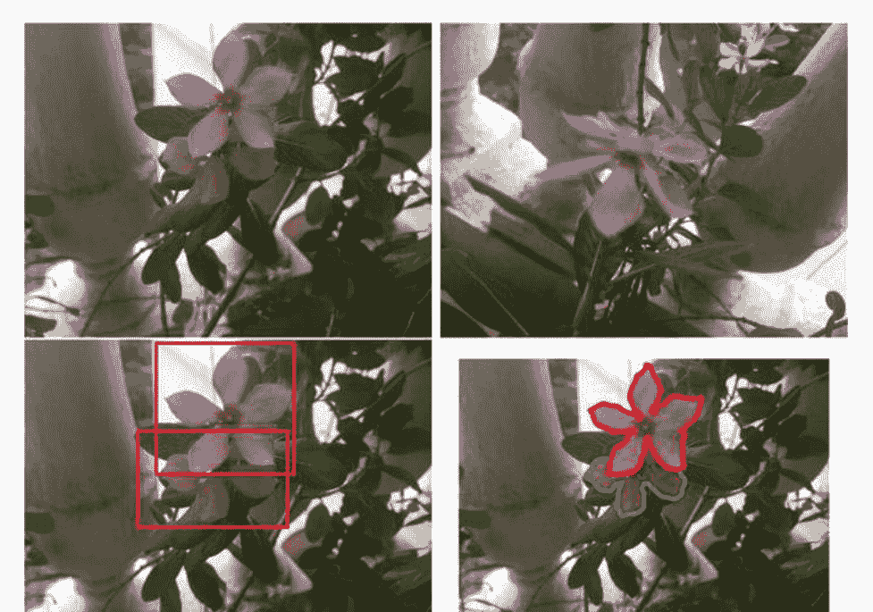

图9.1 参考图像在左上角。图像相似性、目标检测和语义分割的常见计算机视觉问题分别显示在右上角、左下角和右下角。这里展示的语义分割是实例感知的。它的简化版本是实例无关的。两个顶部图像的图像分类结果应该是“花朵”、“叶子”和“植物”，概率很高。

#### 9.1.1 激励示例

给定一张照片、视频或3D数据，我们想要对其进行分类。一些示例：

1. 手写数字中的哪个数字，从0到9，是它？
2. 这是什么鸟的物种？
3. 这是什么植物的物种？
4. 这张卫星图片是否显示早期干旱迹象？
5. 这张卫星图片是否显示森林砍伐？
6. 这张航拍无人机图片是否显示富营养化现象？
7. 这张X光图片是否显示健康正常状态？
8. 这张含有不适宜儿童的令人反感内容的图片吗？
9. 这是一张人脸图片吗？
10. 这是什么品种的狗？
11. 这是什么型号的汽车？
12. 这是什么类型的家具？
13. 这是什么款式的连衣裙？
14. 这是什么类型的鞋子？
15. 这个视频中用手语说了什么单词？
16. 这是一个篮球比赛的视频吗？
17. 这是一场由孩子们打的棒球比赛的视频吗？
18. 这个监控视频片段中是一个小偷吗？
19. 这个监控视频片段中是一只狗吗？
20. 在这个监控视频剪辑中有一个人在跑步吗？
21. 这个超声波剪辑是否显示异常？
22. 这是一个婚礼视频吗？
23. 这张照片是普纳黄雀还是大黄雀？
24. 这个三维点云是汽车还是卡车？
25. 这个三维CT扫描的子体积是否有感兴趣的区域？
26. 这是一个交通路口吗？

在上面的几个例子中，假设当物体存在时，感兴趣的物体在图片中占主导地位，如果有背景存在，则不算过多。如果在一张大图片中，一只猫只占据了几像素，并被杂乱的背景和其他物体所包围，那么将会成为一个难题，将这张图片分类为猫的图片。一个更合适的模型将是目标检测，它可以检测（定位）图像中的所有物体，并可以被视为具有定位的多标签分类。

上述列表中的黄雀问题是细粒度分类的问题，我们在其中进一步推动了最先进的分类技术的极限。目标是基于微妙和精细的特征来区分物体，例如相关鸟类、花卉、昆虫或车辆模型的分类。

#### 9.1.2 LeNet

手写数字识别问题导致了世界上第一个卷积神经网络之一在1990年代诞生。由Yann LeCun等人于1998年设计，基于1988年的研究，并被称为LeNet，这个卷积神经网络被视为基于人工智能的视觉感知的第一个重要里程碑。如今，AI学生首先尝试的问题是MNIST数字识别，其中MNIST是数据集的名称。请参阅[123, 124]，了解世界上首次使用反向传播算法训练的卷积神经网络的开创性工作。

> *LeNet用于MNIST数据集是在20世纪90年代在CNN研究中达到的第一个重要里程碑，随后在21世纪第二个十年引领了基于人工智能的计算机视觉的时代。*

#### 9.1.3 堆叠自编码器

在21世纪第一个十年中期，一系列有影响力的论文发表，重新激发了对多层神经网络的兴趣；参见[15, 88, 90]。 这些论文引入了一种新颖的方法，通过使用无监督技术，逐个训练隐藏层，首先是受限玻尔兹曼机，然后是自编码器，来训练深度神经网络。

无监督预训练后，进行有监督的微调阶段用于分类任务。 这是一个突破，因为作者能够训练出一种新颖的多层神经网络，重新点燃了对神经网络的兴趣。

然而，几年内，深度神经网络的监督技术很快就占据了主导地位，但2006年的工作被认为是人工智能研究的一个转折点。

#### 9.1.4 AlexNet

第三个突破发生在2012年，当一个基于CNN的人工智能模型赢得了ImageNet竞赛。 监督学习被用来训练一个具有大量神经元和几个隐藏层的CNN模型，使用了大规模的训练数据集。
重要的技术，如ReLU [59]和dropout的引入，极大地帮助了训练过程；参见[116]。通过应用变换到训练图像上获得的图像，采用数据增强的方法扩展了训练数据。 这个神经网络被称为AlexNet，以第一作者，Geoffrey Hinton的研究生命名。

这项工作刺激了新模型的发展，这些模型在随后的几年被提交到ImageNet竞赛，产生了一些值得注意的神经网络。 AlexNet的架构包括几个卷积层，其中一些层紧接着是一个最大池化层，卷积层之后是几个全连接层，紧接着是softmax层，在此之后的架构发展中，它产生了影响。 请注意，全连接层是卷积层的一种特殊情况，其中输入块和滤波器的大小相同。

AlexNet层的名称，如Conv5和FC6，在AI社区中变得广为人知。

> 年度ImageNet竞赛从2012年开始为基于AI的计算机视觉研究提供了强大的刺激。

#### 9.1.5 VGG

ImageNet竞赛模型是VGG（2014）；参见[200]，它有两种版本，VGG-16和VGG-19，数字表示层数。VGG代表牛津大学视觉几何组。VGG模型严格使用3×3的滤波器，因为堆叠小滤波器的层可以使感受野与更大的滤波器一样大，并且还能增加CNN的表达能力。三层3×3的感受野与7×7的滤波器相同，同时网络会更深。尽管VGG模型的参数数量很大，但它们广泛用于计算机视觉任务中的特征提取。当我们讨论图像相似性问题时，我们将在本章后面讨论神经网络作为特征提取器的应用。

#### 9.1.6 ResNet

一个有影响力的ImageNet竞赛模型是由微软研究院在2015年开发的。它被称为ResNet，代表残差网络；参见[79]。激励性的目标是将CNN的层数增加到数百甚至一千层，仍然能够在训练时避免梯度消失的问题。通过使用跳跃连接的精妙思想，这个目标得以实现。直到2015年，DNN都遵循逐层级联的结构。通过跳跃连接，计算流可以分为两个路径：(1)正常的层级级联和(2)绕过这些层级的跳跃路径。这两个路径后来合并，沿着这两个路径流动的数据相加。类比来说，(1)就像通过城市的红绿灯，(2)就像走高速公路绕行，最终再合并。从分裂到合并步骤开始的计算图称为残差块，而ResNet由许多这样的块级联而成。因此，一个残差块计算如下：

> $G(x) = F(x) + x,$

在路径（1）上计算F的位置。换句话说

> $F(x) = G(x) - x$

是残差。为了看到为什么这是一个强大的想法，假设我们已经构建了一个具有k个残差块的网络，并且我们想要添加一个额外的残差块来继续级联。现有的块定义了一个流形或函数。如果这个流形或函数捕捉到了问题的复杂性，那么第(k + 1)个块是不必要的，因此它的F(x)将为零，数据将沿着跳跃路径流动。如果流形或函数需要额外的修正，那么F将编码这些修正，即残差。因此，通过更多的残差块，可以添加更细节。从概念上讲，这个想法类似于经典机器学习中的梯度提升。

> ResNet以这样的方式划分出一个流形或函数，以便通过添加更多的残差块来添加更多的细节。

#### 9.1.7 Inception V3

另一个ImageNet竞赛模型是Inception V3（2016年），是谷歌工程师的成果；参见[211]。尽管它的名字灵感来自于电影《盗梦空间》（2010年），在那里梦境在梦境中发生，但该网络更加平凡，由级联的Inception模块组成，每个模块上应用不同尺寸的卷积滤波器在相同的输入上。输出特征图被连接在一起。批量归一化在整个模型中使用，并应用于ReLU应用之前的神经元激活。在最后的全连接层中使用了Dropout。

滤波器的尺寸很小，即1 × 1和3 × 3。请注意，卷积是3维的，因此1 × 1实际上是1 × 1 × F，其中F是输入blob中的特征图数量。由于1 × 1 × F滤波器等效于具有 F 个输入神经元的FFN层，因此它就像嵌入在Inception模块内部的一层FFN。它是一个网络中的网络结构；在《盗梦空间》电影中，它是梦中的梦。

理解Inception V3的一种方法是将其视为特征提取器。它接收一个尺寸为229 × 229 × 3（RGB图像）的输入图像，并生成一个尺寸为8 × 8 × 2,048的输出特征块。输出特征块被馈送到一个全连接层，以产生最终的分类输出，或者可以用作输入图像的表示，用于计算机视觉问题，如图像相似性和图像字幕。

#### 9.1.8 模型展示厅

AI社区已经开发了几个用于图像分类问题的CNN模型。其中一些模型旨在轻量化，并受到边缘设备计算能力有限的应用的启发。

请参阅[233, 237, 238]以了解各种模型。让我们从一个高度为10,000英尺的视角来看CNN模型的世界：

- ZFNet（2013年）对AlexNet进行了轻微修改，并赢得了ImageNet 2013年比赛[251]。
- GoogLeNet (2014) 引入了Inception模块的概念。它也被称为Inception V1 [208]。
- Inception-ResNet V2 (2016) 将ResNet的跳跃连接思想应用于Inception V3 [209]。
- Xception (2016) 代表“极端Inception”，用点卷积1×1替换Inception模块，然后独立地应用于通道的深度卷积[36]。
- DenseNet (2016) 使用跳跃连接，与ResNet不同，它执行连接而不是加法[96]。
- SqueezeNet (2016) 是轻量级的，由压缩和扩展层组成的火模块，并力求达到与AlexNet相同的准确性[98]。
- ResNeXt (2016) 通过将ResNet的残差块内的计算子图替换为加性同质多分支图[246]来推广ResNet。
- ShuffleNet (2017) 将卷积滤波器分组以优化参数数量，并对它们进行洗牌以改善信息流动[254]。
- NASNet (2017) 应用神经架构搜索 (NAS) 来自动发现网络；NASNet-Large和NASNet-Mobile是两个结果；参见[258]。
- MobileNet V2 (2018) 是一个轻量级网络，它使用深度可分离层 (深度2D卷积后跟逐点卷积) 和线性瓶颈层之间的跳跃连接 (具有压缩通道数量的薄层) [186]。
- DarkNet-53 (2018) 被目标检测算法YOLO-v3使用，并可用于图像分类[175]。
- EfficientNet (2019) 通过在宽度、深度和输入分辨率上进行缩放，从EfficientNet-B0到EfficientNet-B7 [212]得到了一系列的CNN模型。
- AmoebaNet (2019) 通过应用进化算法来搜索最佳神经网络结构[174]。
- SENet (挤压和激励) (2019) 通过聚合操作将全局信息挤压在通道中，然后通过映射将这些通道推送到计算通道注意力权重向量以缩放特征图[95]。

不同模型在实现其目标方面的成功表明，从根本上讲，AI模型有许多可能的变体，可以以不同程度的逼近精度对流形进行高维雕塑，并且表示学习没有唯一的解决方案。

## ** 练习23 CNN参数

计算MobileNet-V2、ResNet-50、ResNet-152、Inception V3、VGG-19和NASNet-Large中的参数数量。模型大小将是多少MB？

#### 9.1.9 您自己的网络

假设您需要解决一个图像分类问题。您最好选择一个来自公共领域的预训练AI模型，并为您的应用程序进行微调。微调或迁移学习意味着冻结大部分较低层，并允许反向传播来调整少数较高层的数据。这是一种有效的方法，用于训练具有有限数据量的定制计算机视觉模型，并且在NLU方面，它最近产生了影响；参见[48]。另一种选择是从头开始构建自己的CNN并对其进行训练，前提是有足够的训练数据。您还可以应用NAS，通常使用进化、可微分或RL技术。进化算法生成、增长、组合、变异和修剪候选模型。计算图中的一条边可以被视为候选操作的可微分加权组合，可以进行优化。最后，可以通过从递归策略网络的输出中采样架构选择来应用RL，奖励是采样模型的准确性；参见[258]。

一旦网络被训练或微调，应该使用诸如混淆矩阵、准确率、ROC曲线、AUC、mAP、PR曲线和F1得分等指标对其在测试数据上进行评估。由于训练卷积神经网络进行图像分类任务变得相对容易，这要归功于一个值得称赞的社区努力，解决实际计算机视觉问题时可能遇到的任何挫折都可能是暂时的。

> 使用预训练的卷积神经网络模型，并通过任务特定的训练数据进行微调，是解决几个计算机视觉问题的有效技术。

### 9.2 目标检测作为分类

目标检测是找到给定图像中物体所在的位置。有三种主要方法；见图9.2：

1.  基于滑动窗口的分类方法。

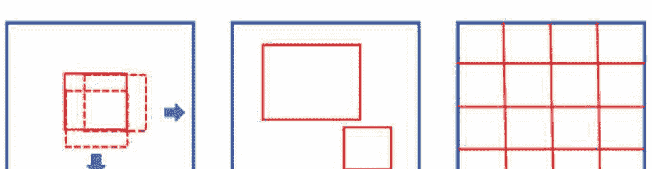

滑动窗口方法会尝试每个可能的位置。区域提议方法只关注可能含有目标物体的区域。不需要在每个区域单独运行卷积神经网络，因为通过主干卷积神经网络在整个图像上计算的图像特征可以为每个区域进行汇总。基于网格的方法将检测问题表述为每个网格单元的回归问题。它预测目标物体是否位于给定单元格的中心位置，如果是，则预测其边界框（边界框不一定在单元格内）。

2.  基于区域提议的分类方法。
3.  基于网格的回归方法。

这是一个比分类更难的问题，因为输出是带有定位信息的分类结果。好消息是我们可以将目标检测简化为分类问题。我们将在第9.2.1节介绍滑动窗口方法，第9.2.2节介绍区域提议方法。在详细讨论不同方法之前，让我们看看如何评估目标检测的结果。

对于目标检测任务，真实集合由具有分类标签的正确边界框组成。目标检测是一个检索问题，AI模型返回的边界框用于检查其正确性。

为了检查输出边界框是否与真实边界框相同，通过交并比（IOU）来测量它们的重叠区域。IOU是以像素为元素的两个边界框集合的杰卡德系数，它是重叠区域与两个框的并集总面积的比率。错误检索的边界框（IOU较小）是假阳性，正确检索的边界框（IOU较大）是真阳性。mAP指标用于评估结果，它是PR曲线下的面积。

> * 练习24 PR与ROC
> 为什么在目标检测中我们使用PR曲线而不是ROC曲线？

一个必须引用与IOU阈值相关的mAP数值。因此，一个表示IOU必须大于0.5的mAP@0.5被提出。有时候使用mAP@[0.5,0.95]，步长为0.05。这意味着通过在IOU从0.5到0.95之间以0.05为步长变化来计算不同mAP的平均值。目前在MS-COCO数据集[133]上，不同技术的最新mAP@0.5数值在40%到60%之间。 mAP@[0.5,0.95]的数值目前在20%到40%之间。

#### 9.2.1 滑动窗口方法

为了在图像中找到狗，需要在尺寸统一调整为 $w \times h$ 的紧密裁剪的狗图像上训练一个狗分类器。对于给定尺寸为 $W \times H$ 的图像，假设 $W \ge w$ 且 $H \ge h$ ，我们将分类器应用于所有区域，无论大小，将它们调整为 $w \times h$ 。这是一种蛮力穷举的方法。同样的原理可以解决著名书籍系列Where’s Wally中找到沃利（或沃尔多）的游戏。只需将大致与沃利大小相同的滑动窗口通过图像即可。因此，这种方法是

```
y = F (ROI(x)),
```

其中ROI是一个函数，它返回图像中所有可能的感兴趣区域，而F是分类器。我们对每个ROI都得到一个输出，因此需要一个后处理阶段来产生聚合输出。通常，我们添加一个回归头R，它可以校正或微调最佳ROI区域，以产生最终的边界框坐标B：

```
B = R(ROI(x)),
```

其中R是在与F相同的骨干CNN之上添加了几层构建而成的。如果省略R，我们仍然可以通过ROI的形式得到物体的位置。一个关键观察是整个图像，其大小大于$w \times h$，可以作为输入传递给从训练好的$w \times h$分类器扩大宽度的修改后的$W \times H$分类器。现在的输出是一个$p \times q$的分类地图，而不是一个单一的数字。它是一个热图或类激活图。输出中的热值聚集在一起，这些聚类的模式给出了图像中狗的位置。或者，每个热值都以一个$w \times h$的边界框为中心，围绕着一只狗。为了融合重叠的边界框，采用了非极大值抑制（NMS）的方法。在NMS中，与最高得分边界框有重叠的边界框被删除，该过程重复进行，直到无法进一步修剪为止。

#### 9.2.2 区域提案方法

与其对分类器进行穷举应用，一个自然的想法是仅在可能存在物体的区域中应用它，这个想法导致了基于区域的卷积神经网络（R-CNN）。因此，我们使得上述ROI函数更加智能。狗分类器应用于基于启发式方法或另一个机器学习系统提出的区域，称为选择性搜索方法。他们提出的区域被调整为相同的大小 $w \times h$。对于找到Wally的检测也是一样，他在《找到Wally》的书中穿着一件红色条纹T恤。使用一些快速的方法找到红色条纹区域作为潜在候选区域，并对每个区域应用分类器。通常在相同的主干CNN上添加回归头来微调最终的边界框坐标。

R-CNN背后的上述想法已经得到了显著的进一步扩展。区域提议组件被折叠到同一个分类器网络中，从而实现了显著的加速。关键观察是，不需要将CNN分别应用于每个区域，因为共享的卷积特征只需要计算一次，然后可以直接从相同的特征块中提取或汇集建议的区域。此外，可以基于特征块而不是输入图像来提出区域的联合学习网络。

因此，我们有以下内容：

```
z = F(x),
y = G(RPN(z), z),
```

其中 $z$是由主干CNN $F$计算的特征块，RPN是区域提议网络，$G$是ROI池化后的分类网络。此外，在滑动窗口方法的情况下，还附加了一个微调回归头。请注意，RPN网络返回了一些区域提议，所有这些提议都必须通过$G$，因此这是一个两阶段的方法。这些先进的模型被称为R-CNN的更快变体；有关设计这样一个集成系统所需解决的所有细节，请参阅[178]。

请参阅第9.3.2节，了解如何使用回归显式地预测边界框坐标的讨论。在区域提议方法和滑动窗口方法中，仍然使用回归，因为边界框坐标通过附加执行回归的附加层进行微调以精确调整坐标。

### 9.3 图像回归

#### 9.3.1 激励示例

考虑以下示例：

1. 给定一张猫的图片，输出包含猫的区域的位置和大小的边界框。
2. 给定一对连续的视频帧，计算密集的运动场。
3. 给定一张图片，输出一个表示图像聚焦程度的质量数值。
4. 给定一张图片，输出一个表示图像美观程度的质量数值。
5. 给定一张无人机照片，计算停车场中的汽车数量。
6. 给定一张医学图像，输出疾病进展的级别。
7. 给定一部电影，预测适合的观众年龄。

对于简单的回归任务，变化很小，模型可以在回归损失（如 L²error）下进行训练。对于某些任务，必须将较大的系统分解成组件。例如，计算汽车数量的首选方法是通过检测图片中的汽车并计数检测到的汽车数量。

#### 9.3.2 目标检测作为回归

目标检测涉及分类和回归两个方面。检测狗和猫涉及在图像中找到狗和猫的边界框以及这些边界框的分类标签。这是属性学习的特例，其中边界框坐标是数值，标签是分类的。通常，基础CNN连接两个头部，一个用于输出特征的块。分类头部为基础特征提取网络附加额外的层用于分类，回归头部则附加自己独立的层用于回归。回归头部还可以用于微调在第9.2节中讨论的方法中的边界框坐标。让我们对基于回归的方法进行直观理解，该方法一次输出所有边界框。这个想法导致了You Only Look Once (YOLO) [176] 和Single-Shot Detector (SSD) [135]系列检测器的发展。这些是单阶段或单次检测方法，与R-CNN等两阶段方法形成对比。

#### 9.3.2.1 回归输出

假设我们有 N × M × 3 个彩色图像，目标是检测 C 个正类中的物体。对于每个像素，定义以下属性（假设一个像素上最多只能有一个物体）：

- 1. 负类标签 z。如果像素是负类，则该标签为1，即没有任何一个 C 个正类的物体位于该像素上。从语义上讲，它是一个背景像素或者属于一个不感兴趣的类别的像素。
- 2. 正类标签向量 L = (l_1, l_2, ..., l_C)，其中 l_j = 1 当且仅当类别 j 的物体位于该像素上。最多只能有一个 l_j 为1。如果没有一个为1，则 z 必须为1。
- 3. 边界框属性 (w, h)，当 l_j = 1时，表示类别 j 中的物体的宽度和高度。

请注意，如果 z = 1，则其余属性不适用。因此，每个像素都与一个 C + 3 维属性向量相关联。对于整个图像，我们将有一个维度为的真实属性块：

N × M × (C + 3)。

将此块称为 B。目标检测 CNN 将一个 N × M × 3 输入转换为一个 N × M × (C + 3) 输出：

B = F ( I )

其中 I 是输入的RGB图像， F 是CNN实现的函数。

#### 9.3.2.2 基于网格的方法

通过使用粗糙的网格，目标检测在计算上更加高效。将图像分割成单元格（不重叠的瓦片），得到一个 N × M 网格。现在， B 的维度减小如下：

n × m × (C + 5)。

请注意，网格单元格有 C + 5 个属性：

- 1. 负类标签 z。与之前相同。
- 2. 正类标签向量 L。与之前相同。
- 3. 边界框属性 (c_x, c_y, w, h)，分别是边界框的中心、宽度和高度。这些数字通常相对于网格单元格大小进行归一化。请注意，对象不必完全位于网格单元格内。对象只需位于单元格中心并可延伸到单元格外。

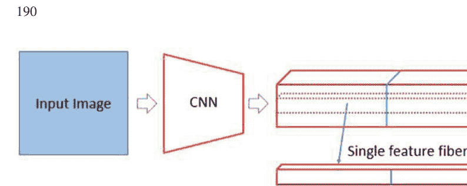

对于像素分辨率更高的网格，我们解决了语义图像分割的问题。

现在我们放松了一个网格单元内最多只能有一个对象的约束。让 $M$ 表示网格单元中心的最大对象数量。见图9.3，其中 $M = 2$。

具有多个对象的网格单元的属性向量的大小为

```
n × m × (C + 5) × M
```

请参考图9.3以确认上述计数。假设 $M =5$，我们在一个网格单元中有两只狗，一只猫和一个孩子。对象在属性向量中的顺序应该是什么？应该是

狗，负面，狗，猫，孩子吗？

还是其他的顺序，比如

孩子，猫，负面，狗，狗？

为了明确定义真实标注，每个位置都添加了几何语义。对于每个网格单元，定义了五个预定义的不同大小和形状的锚框：

```
A_1, A_2, A_3, A_4, A_5
```

其中 $A_i$ 与真实标注向量中的位置 $j$ 相关联。如果边界框与对应的位置 $j∈\{1,2,3,4,5\}$ 匹配，则将对象分配给该位置。

通过 IOU 来准确地描述 $A_{j}$。因此，如果目标对象在大小和形状上与 $A_{3}$ 一致，则它将占据属性向量中的第三个位置。我们可以根据图像中常见的边界框的统计分析来选择 $M$ 和锚框集合。

在任何目标检测算法中，同一类别的多个重叠框会在整个图像上输出。应用 NMS 的后处理阶段会剪除与具有最高分数的框重叠的框。最后，请注意属性向量是分类变量和数值变量的混合。

损失函数是交叉熵和 $L^{2}$ 损失的混合，训练是在大型数据集（如MS-COCO）上进行的。最终结果是一个适用于实时应用的快速目标检测器。

### 9.4 计算机视觉中的注意力

通常，具有注意机制的编码器-解码器架构，在第3.2.4节中描述，非常适合计算机视觉任务，如图像字幕生成、活动识别和目标检测。在图像字幕生成中，编码器 CNN 构建了图像的表示 $R$，该表示由解码器 RNN 用于生成描述图像的单词序列。对于视频中的活动识别，对于每个视频帧，编码器 CNN 创建了一个表示 $R$，并且解码器 RNN 输出活动的位置和类别标签。对于目标检测，基于 RNN 的解码器输出具有空间相关性的一系列检测结果，例如在拥挤场景中的人体检测。

对于上述三种情况，给定一个输入-输出对 $(x, y)$，架构是由

```
R = E(x),
y = D(R),
```

其中 $E$ 是编码器 CNN，$D$ 是解码器 RNN，而 $R$ 是 CNN 输出的特征块。注意力集中在特征块的不同空间位置上。对于时间序列中的不同时间位置的关注与图像中的不同空间位置的关注在质量上是相同的。请参阅第3.2.4节中的讨论。请参阅[191, 205, 247]以了解编码器-解码器架构在计算机视觉中的应用。

我们在第3.3节中讨论了自注意力。自注意力是用于 NLU 任务的 Transformer 的基础；请参阅第10.5节。对于 NLU，思想是将单词嵌入以序列的形式输入到具有多层自注意力的编码器中，以构建单词的分层表示。使用全对注意力，构建了全局上下文，因此更高层次的层构建了单词的上下文表示。使用自监督任务，如掩码词预测，训练了一个 Transformer。

在目标检测中，基于 CNN 的图像特征位于特征块的不同空间位置，类似于词嵌入向量。图像就像是一个二维的文本文档，其中的视觉单词对应不同的图像块，可以在自监督训练期间进行遮蔽。将它们输入到一个变换器编码器-解码器中，可以基于不同对象实例之间的关系建立全局上下文。编码器构建图像不同部分的上下文表示。因此，如果有一只被绿色斑块遮挡的鸟，那么斑块更有可能是植被。解码器根据编码器输出的上下文表示输出一组预测框。有关这种有前途的方法的详细信息，请参见[25]。

### 9.5 语义分割

语义分割旨在检测感兴趣对象中的所有像素，通过以像素级分辨率而不是粗略的网格级别定义目标检测的真实值来进行公式化。对于每个像素，定义以下属性（假设一个像素只能属于一个对象）：

- 1. 负类标签 z。与之前相同。
- 2. 正类标签向量 L。与之前相同。

也就是说，我们已经丢弃了边界框属性。一个语义分割 CNN 将输入的 N × M × 3 转换为尺寸为的分割掩码：

```
N × M × (C + 1)。
```

这是一个像素级分类任务。它也可以被视为图像转换任务。由于它是一个分类任务，交叉熵损失通常用于语义分割。计算每个像素的交叉熵损失，然后对所有像素取平均。还设计了更多定制的损失函数；一个例子是基于 Dice 系数的损失函数（与 IOU 或 Jaccard 系数相关），当前景对象的大小与背景的大小不平衡时，可能会得到更好的结果。Dice 系数的计算公式为

```
D = \frac{2|X \cap Y|}{|X| + |Y|},
```

其中 X 和 Y 分别是真实标注分割图和预测分割图。为了将其转化为损失函数，Y 将是预测的实值概率图而不是预测的二值化图，乘法和加法操作将替代相应的集合交集和集合基数操作，并且系数将从1中减去。

### 9.5 语义分割

存在几种适用于不同计算预算的像素级分类方法的架构。可以采用完全卷积的方法，其中隐藏层计算的所有特征块的空间维度与图像相同。那是一个计算上昂贵的解决方案。

对于实际的计算预算，解决方案被置于编码器-解码器架构的框架中，因为中间层的空间维度比输入和输出小。最小尺寸的层被称为瓶颈层。有下采样和上采样。下采样是由于最大池化和卷积步幅的标准使用。上采样需要进一步的工作。幸运的是，下采样后的上采样在多速率系统和小波滤波器组的情况下已经被广泛研究了很长时间，在信号处理领域中进行了巧妙的工作来设计能够重构原始信号的滤波器。在信号处理中，对于完美重构滤波器组（如Haar或Daubechies小波），为了对使用正交滤波器组进行下采样的信号进行上采样，需要在下采样信号中插入空洞并应用下采样滤波器的转置。对于正交矩阵，转置就是逆矩阵。在CNN中，经典的小波上采样方法被称为atrous（带孔卷积）和转置卷积。不同之处在于，对于CNN，滤波器是可学习的。虽然上采样也可以通过固定的滤波器（如双线性插值）来执行，但最好学习上采样滤波器。

语义分割网络的一个例子是 U-Net，它专门用于分割医学图像，由具有跳跃连接的卷积层组成；参见[180]。跳跃连接改善了不同尺度之间的信息流动，否则会受到瓶颈层的限制。另一种观察 U-Net 的方式是将其视为一个多分辨率架构，它在不同尺度上处理图像，并通过金字塔式的上卷积后，将不同尺度上的特征块进行融合。虽然使用加法操作来融合特征是一种替代方式，但最好使用连接操作，并让网络学习如何处理这些特征。将二维卷积替换为三维卷积可用于分割体积数据，如医学图像；参见[143]的 V-Net 和[38]的 3D U-Net。V-Net 论文采用了 Dice 损失。为了解决前景-背景不平衡问题，3D U-Net 采用了加权交叉熵损失，对背景体素使用较小的权重。

对于这些特定的网络和语义分割，可以设计形状感知的损失函数，以鼓励整体轮廓形状的匹配。V-Net 使用残差块；3D U-Net 也可以推广到残差块。有关医学影像的其他 AI 模型示例及其示例代码，请访问[235]。请注意，医学影像的 AI 系统需要具有用户界面，使医生能够通过提供交互式指导来纠正自动生成的轮廓。AI 模型将使用指导实时自动改进其轮廓。

在医学影像中获得高准确度的结果，仅仅进行分割是不够的，因为必须首先纠正运动伪影，如果器官或

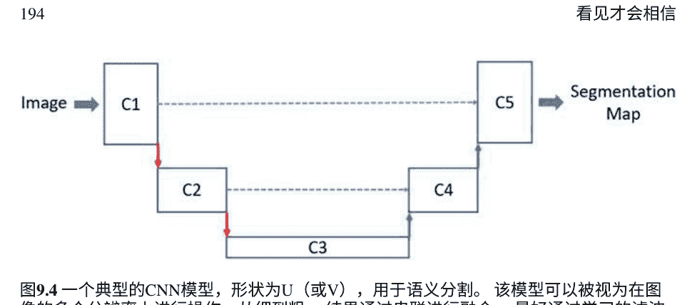

图9.4 一个典型的CNN模型，形状为U（或V），用于语义分割。该模型可以被视为在图像的多个分辨率上进行操作，从细到粗。结果通过串联进行融合。最好通过学习的滤波器来进行下采样和上采样操作。每个块由多个卷积层组成，可以是ResNet样式的残差块。查看架构的另一种方式是作为具有跳跃连接的标准CNN，以改善不同分辨率之间的信息流动。图像可以是2D或体积（3D）

患者的移动在心脏成像中尤为重要。这些伪影的检测和校正可以通过 AI 模型来完成。有趣的是，为了保持数据的一致性，需要在架构中加入一个 MRI 成像特定的层，因为 MRI 数据是由扫描机在傅里叶域中捕获的。这是一个示例，展示了定制领域中的新颖研究如何扩展基本的 AI 模型以解决具有影响力的现实世界问题。然后，校正后的图像数据被输入到像 U-Net 这样的分割网络中。有关使用 AI 处理医学图像的最新工作，请参阅[153]。

全卷积网络（FCNs）[193]和 SegNet [7]是语义分割网络的另外两个示例。下采样后再上采样的基本理念，最好还带有跳跃连接，构成了用于分割的 AI 模型的基础；请参见图9.4。跳跃连接有助于从下采样阶段流向上采样阶段的细粒度信息。我们还提到了 Tiramisu 架构[104]，它在设计上使用了密集连接块。

假设在给定的图片中有很多猫。我们想要分割出各个实例。实例感知分割是通过使用目标检测算法检测每个实例，并对每个检测到的边界框进行分割来执行的。请注意，准确的分割将改善目标检测，从而改善分割。它们是同一过程的两个相互关联的步骤，最终目标是语义场景分析。将前景对象的实例感知分割与背景的语义分割相结合，称为全景分割，可以提供丰富、完整和整体的场景分割。

> *** 练习25 人群计数
考虑将人工智能应用于在体育场中计算人群数量的问题。训练集中每个人群中的每个人的头部或前额都标有一个点。如何恰当地表述这个问题？什么样的损失函数适合？参见[220]。

> 通过使用CNN作为一个blob转换器，可以解决目标检测和语义分割问题，它将输入图像blob转换为一个适当定义的属性blob。

### 9.6 图像相似度

在由互联网主导的今天的世界中，虚假新闻是一个大问题。假设我们检测到一条由图像组成的虚假新闻。为了在在线媒体中找到虚假新闻的出现，我们将不得不找到几乎完全相同的图像副本。这是一个图像相似性问题。请注意，也可以开发基于经典特征的图像匹配解决方案来解决这个问题。

图像分类 CNN 作为特征提取器工作，因为层的激活模式可以被视为输入图像的特征。为了判断两个图像是否相似，我们只需测量这些特征（激活模式）的相似性。余弦距离是一种流行且稳健的高维向量测量方式，可以作为相似度度量。

假设你有一个图像数据库，你的目标是看看给定的查询图像是否与任何数据库图像相似。假设数据库有十亿张图像。你将如何实现近似最近邻搜索？ Flickr 使用的一种技术是局部优化的产品量化；参见[17, 107]，其中高维向量被分割成子向量。每一半可以使用k均值算法分别进行聚类。因此，对于一个新的特征向量，我们将其与数据库特征向量的2k个聚类进行比较。如果我们在原始维度上进行了聚类，为了达到相同的聚类粒度，即每个聚类中的图像数量相同，我们将需要k^2个聚类。

在有足够的训练数据的情况下，可以明确训练神经网络在成对比较中表现出色。使用共享权重的孪生卷积神经网络，它以一对图像作为输入。将两个并行网络的输出与距离度量进行比较，或者将它们连接起来然后输入到额外的可学习层中。整个网络在正样本上进行端到端训练。

（相似）配对图像和（不相似）配对图像。因此，架构如下所示：

```
R_1 = F(I_1),
R_2 = F(I_2),
d = \text{dist}(R_1, R_2),
```

其中 $I_1$ 和 $I_2$ 是两个图像，$R_1$ 和 $R_2$ 是由 CNN 构建的表示。对于数据库匹配问题，可以使用两个 CNN $F_1$ 和 $F_2$ 分别对查询图像 $I_1$ 和数据库图像 $I_2$ 进行处理。暹罗网络可以应用于一般的自监督学习中，以学习潜在的表示；然而，由于构建负数据集需要太多不相似的配对，它们在对比自监督学习中的使用实际上是有限的。

三元组将一个正对和一个负对与一个共同的锚点组合在一起：

```
(A, B, C),
```

其中 $(A, B)$ 是正对组，$(A, C)$ 是负对组，$A$ 是锚定图像。一个三元组输入到三个相同的 CNN 的副本中，分别计算 $A$, $B$ 和 $C$ 的特征。损失函数确保

```
d(F(A), F(B)) \leq d(F(A), F(C)) + \beta,
```

其中 $d$ 是一种距离度量，如欧氏距离，$F$ 是由 CNN 定义的特征映射，$\beta > 0$ 是一个边界超参数，用于防止网络一直输出零。三元组应该谨慎选择，以便它们是困难的例子。参见图9.5。使用三元组损失训练的连体网络提供了一种解决方案，用于人脸识别，其中查询图像与图像数据库进行匹配。人脸识别的一个额外细节是，人脸图像通常经过预处理（对齐和归一化）以实现姿态不变性：

```
d(F(P(A)), F(P(B))),
```

其中 $P$ 是一个预处理模块，可以通过使用自动编码器或使用单独的组件来实现的 AI 模型来实现。事实上，可以构建一个端到端的解决方案。除了将人脸图像映射到规范的正面视图之外，还可以生成多个人脸姿势，这将构成一对多的处理。有关人脸识别的进一步阅读，请参阅[223]。有趣的是，人们可以使用人工智能来识别棕熊的脸。有关人脸识别的工作，请参阅[39]，其中通过 CNN 模型计算的熊脸嵌入之间的匹配由 SVM 执行。

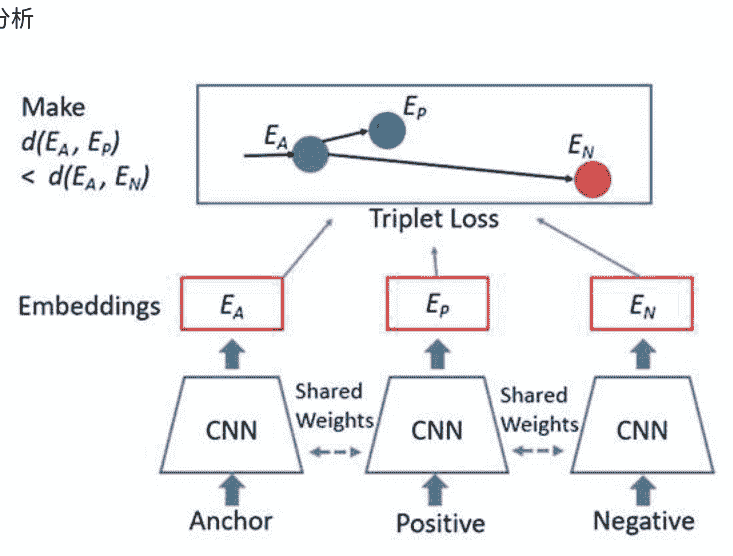

图9.5 使用三元损失的图像相似度。锚点图像的嵌入与正面图像的嵌入之间的距离要远小于与负面图像的嵌入之间的距离。这提供了一种解决人脸识别的方法。在训练过程中，使用了三个具有相同权重的CNN模型，这就是为什么它被称为连体架构。人脸识别所需的额外工作是对人脸图像进行预处理。这种处理通常包括裁剪、归一化和对齐到规范的正面视图。

### 9.7 视频分析

公平地说，最受欢迎的视觉内容形式是视频。YouTube、Netflix、亚马逊视频和迪士尼频道都是大型企业的例子，满足我们对视频的持续需求。

在这一部分中，我们将探讨如何利用人工智能来处理视频。让我们从一个观察开始，视频是一个三维图像。将 k 个 RGB 帧作为 3k 通道，我们可以处理视频。可以将图像的三维卷积推广到纯三维卷积。对于图像来说，这不是纯三维卷积，因为卷积滤波器的大小为 w × h × C，其中 C 是特征图的数量；参见图3.2和第3.1.3节。在纯三维卷积中，滤波器的大小为 w × h × d，其中 d < C。这似乎很好，但问题是数据的稀缺性。由于对于一个20秒的视频片段， k 可能是500左右，与静态图像相比，原始像素空间的维度增加了 k 倍。尽管从理论上讲，在这样的空间中存在等待被开发的流形，但实际上现实世界中的视频数量不足。

因此， k 被减小到一个较小的数值，并且对视频的短片段进行分析，每个短片段的持续时间为几百毫秒。在持续数十秒的视频场景中，获得一系列结果，需要进行汇总、融合和后处理。一个自然的想法是将其与顺序 AI 模型（如 RNNs）结合起来。系统分为两个组件：

- 1. 基于 CNN 的计算机视觉模块，处理连续的、可能重叠的视频片段。
- 2. 基于 RNN 的时间序列处理模块，将计算机视觉模块的结果在时间上进行组合。

上述可以写成

```
(z_1, \ldots, z_t) = F(x_1, \ldots, x_t),
y = G(z_1, \ldots, z_t),
```

其中 CNN $F$ 独立地处理 $t$ 个视频片段 $x_i$，并且输出序列由汇总的 RNN $G$ 进行处理。对于实际应用来说，有一些更简单的汇总方法。例如，如果你想要检测是否发生了特定的活动，比如狗在操场上奔跑，全局最大汇总方法就可以很好地工作。

我们能做得更好吗？通过人类直觉、先验知识和归纳偏差来帮助人工智能可以在使用更少数据的情况下获得显著更好的结果。我们事先知道运动是视频的一个重要特征，而运动场告诉我们视频中正在发生的事情。不是让人工智能模型学习如何计算这个运动场，而是预先计算好。因此，我们有两种类型的数据：

- 1. 原始视频帧。
- 2. 预先计算的稠密运动场，如光流。

卷积神经网络将接收这两个输入流并行处理它们。在某个阶段，它将合并这两个计算路径；这可以在输入层右侧发生，也可以在最后输出之前或者在中间某个位置发生。这可以表示如下：

```
m = \text{光流} \quad (x),
y = F(G(x), H(m)),
```

其中 $G$ 和 $H$ 是用于视频数据 $x$ 和运动场的两个处理流，它们的输出在某个阶段融合并由 $F$ 一起处理。融合可以通过连接 $G(x) \oplus H(m)$ 或特征块的加法 $G(x) + H(m)$ 来实现，具体方法根据特定问题的实验确定。

视频分析是一个例子，端到端学习并不总是最好的选择，最好将系统分解为组件。在这里，通过光流增强输入的想法被称为丰富输入。

参见[199]，了解如何使用光流分析视频的示例。

在许多应用中，需要跟踪感兴趣的对象并在视频中估计它们的姿态。对象跟踪可以通过经典的计算机视觉算法高效地完成，其中跟踪角点或关键点。对于最新的工作使用人工智能的3D姿态跟踪常见物体在RGB-D视频中的应用，请参见[221]，用于机器人应用。跟踪基于关键点，这些关键点是通过使用人工智能模型计算图像特征并生成基于这些特征的关键点来学习的。对于一种对野生动物行为研究非常有价值的应用，请参见[185]，用于动物跟踪，其中应用了基于区域的CNN模型Mask R-CNN进行目标检测和语义分割。

### 9.8 3D数据

有两种类型的3D数据：

- 体素
- 点云

第一种类型是体素，由体素组成。这是一个真正的3D图像，CNN可以轻松推广到它；另请参阅第9.7节中讨论的纯3D卷积。考虑医学中的CT图像的情况。假设我们想在肺部CT扫描中检测感兴趣的区域。一种方法是应用3D CNN。一个观察是我们希望人工智能学习对某些几何变换（如旋转和反射）具有不变性。因此，不是在输入特征映射上应用一个卷积滤波器的副本，而是应用旋转和反射的滤波器副本；参见[11]，就像组卷积一样（将输入分成组并对其分别应用滤波器）。这提供了一种替代数据增强方法，通过旋转和反射输入数据来实现。关于将此方案应用于CT扫描体积数据的应用，请参见[243]。对于体积医学图像的分割，多尺度架构效果很好，其中在不同分辨率下进行体积3D卷积。例如，请参见[143]，在MRI数据的多分辨率CNN中成功应用基于Dice系数、参数化ReLU和数据增强的损失函数。

第二种类型的3D数据是3D点云。自动驾驶汽车和机器人技术将有一天变得普遍。只使用捕捉3D点云数据的RGB彩色相机而没有任何深度传感器，它们将能够移动。尽管在RGB空间中未来的计算机视觉突破可能会有所帮助，但拥有深度传感器仍然是有帮助的。

处理点云数据的一种方法是将其转换为体积数据。这种体素化是可行的解决方案，但如果量化粗糙，会丢失信息。通过增加三维体素网格的大小，可以解决问题，但计算成本会增加。另一种方法基于一个关键观察，即网格单元的占用率低且数据非常稀疏。因此，通过仅在活动网格单元上应用卷积滤波器（参见[64]），计算速度显著加快。因此，我们有 $y = F(V(x))$，其中三维数据 $x$ 通过操作 $V$ 进行体素化，并且 $F$ 是一个在占用的网格单元上应用卷积滤波器的三维CNN。

另一种解决方案是从多个视角将三维数据投影到二维[169]，并在投影图像上使用标准的二维CNN。这种投影类似于Radon变换，用于从三维医学图像构建二维图像。

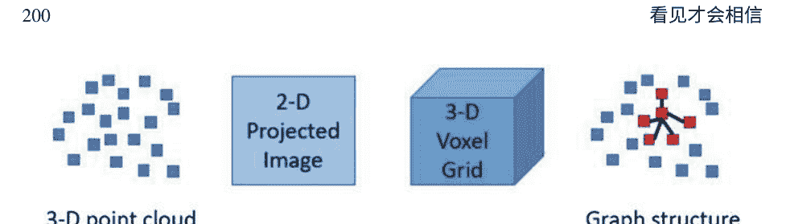

图9.6展示了表示和处理3D点云数据的三种不同方法：（1）2D投影图像，（2）3D体数据在占用栅格中，（3）以红色显示的具有局部邻域概念的3D图形中的点。对于2D图像形式，可以使用2D卷积神经网络。对于3D网格方法，如果许多体素（占用单元）为空，则使用稀疏纯3D卷积。对于直接使用图形形式的3D点，使用图形卷积神经网络。

成像数据。有时从点云数据集构建2D图像很容易。考虑自动驾驶汽车的例子。将自己置于从使用旋转垂直堆叠的激光雷达捕获数据的点云中间。每个激光雷达水平扫描场景，给出2D图像的一行。行数与激光雷达数量相同。使用这种球面投影，我们得到一个2D距离图像。因此，我们有 $y = F(P(x))$，其中3D数据 $x$ 通过投影操作 $P$ 转换为2D图像，$F$ 是一个2D卷积神经网络。最后，另一种解决方案是直接使用点并利用类似于图形卷积网络的技术；参见第3.5节和[167]。这些点是图形的顶点，与附近的点相连。根据距离度量，存在局部性的概念，因此可以使用图形卷积神经网络提取邻域中的局部特征，并将其分组为更大的邻域以提取更高级别的特征。对于每个点 $x$，我们有一个邻域卷积 $F(N(x))$，其中 $N(x)$ 是 $x$ 周围的局部区域。这类似于对体素化数据进行稀疏卷积，在后者中，卷积是在量化的均匀网格邻域上进行的。参见图9.6，显示了处理3D点云的不同方式。

一个早期版本的基于点的方法，即PointNet [168]，不捕捉局部结构，而是使用前馈神经网络构建学习到的独立的 $N$ 维点表示，然后通过全局最大池化得到全局表示，该表示输入到分类网络中。为了使PointNet对物体的不同姿势具有鲁棒性，在构建表示时使用了空间变换网络层。

空间变换网络可以看作是对姿势的潜在参数进行回归的图像翻译器，例如对潜在仿射或单应性变换系数进行回归，然后创建一个校正了姿势的转换图像。它可以作为一个层添加到任何分类网络中，使其对姿势的变化更具鲁棒性；参见[102]。

> 通过利用数据的特定性质，可以将用于静态图像的AI技术推广到视频、三维体积数据和三维点云数据。

### 9.9 自动驾驶车辆

人工智能在计算机视觉中的一个真实世界应用案例是自动驾驶车辆的技术。让我们对人工智能如何应用于构建这项技术有一个高层次的直觉，这是基于本书介绍的工具。

自动驾驶汽车在不同位置配备了以下设备：

- $C$ 彩色摄像头。
- $L$ 激光雷达。
- $R$ 雷达。
- $S$ 超声波声纳。

在哪里放置这些传感器，这些超参数应该是什么值？ 实验正在进行中。我们可以有 $L=0$吗？ 是的，这是一个有争议的话题，未来将提供一个明确的答案。人类可以通过立体视觉线索（如视差图）和单眼线索（如纹理和光照）推断深度。

深度是一个重要的派生特征，它帮助人类快速将场景分割成对象。因此，无论 $L=0$ 还是不是，无论是直接测量还是算法计算，深度将在未来的计算机视觉应用中广泛使用，包括自动驾驶汽车。如果当$L=0$时，可以使用AI模型从相机图像中计算深度。为了获得大量的训练数据，可以使用自监督学习，无需任何手动注释，因为计算出的深度必须与所有相机视图一致。不一致性可以作为要最小化的损失函数。

假设我们拥有所有传感器。相机提供传统的视频流。它们提供场景的出色细节，但在恶劣的天气条件和夜间工作效果不佳。它们不提供深度信息，而深度信息是避免障碍物所必需的。立体视觉可以提供深度信息，但需要在纹理图像上运行计算密集型算法。激光雷达是最昂贵的，它们与相机同步，并使用红外光脉冲扫描周围环境，给我们提供一个360度的点云。它们可以检测附近的小物体，并在所有光照条件下工作。尽管它们的分辨率低于相机，但激光雷达可以测量速度并给出物体的大致形状。请注意，远处物体的点云将变得稀疏。激光雷达位于汽车的车顶上，由一堆激光雷达组成，每个激光雷达都进行平面扫描（可能倾斜角度）。

还测量了反射光脉冲的强度，这提供了关于物体表面的额外信息。激光雷达可能受到恶劣天气的影响，并且它们可以检测空气中的小颗粒，导致误报。雷达在恶劣天气条件下可靠且不受影响，由于无线电波的高波长，它们对物体提供了非常粗糙的低分辨率概念，并且它们可以测量物体的速度。声纳使用声波，通常在停车时使用。

请注意，传感器可能发生故障，例如相机上的水或污垢可能会降低数据的质量。它们必须经过精确校准，以使从原始数据信号到带有空间坐标的处理数据的映射准确无误。

假设屋顶上有64个激光雷达，分辨率为0.25度。这意味着在完整的360度扫描中，激光雷达将提供1,440个点。使用前面讨论的球面投影方法，我们将得到一个64 × 1,440的投影范围图像。激光雷达的扫描线变成了范围图像的行。请注意，范围图像中的某些像素可能缺少深度值。我们还可以通过从高处俯视场景并将场景分割成小单元格，并收集每个单元格内的点的统计信息（如密度、平均强度和最大高度）来构建场景的鸟瞰图。

如前一节所讨论的，处理3D激光雷达数据有几种不同的方法：

- 作为2D范围图像
- 直接作为3D点
- 作为体积数据

请参见图9.6，显示了这三种表示。激光雷达数据的处理必须与RGB数据的处理在某个阶段进行融合，可以是早期、中期或晚期融合。也就是说，$y = F ( G ( x_{\text{相机}} ), H ( x_{\text{激光雷达}} ) )$，其中，$G$ 是RGB数据的AI模型，$H$ 是激光雷达数据的模型，$F$ 是融合模型。融合可以通过连接或加法来实现，具体取决于架构，并通过实验确定。类似地，雷达数据应该被处理，并将其结果融合以做出最终决策。GPS/IMU传感器数据也被处理并与其他感知组件的信号集成。

自动驾驶车辆中感知的目标是全面的场景理解，特别强调对行人、车辆、车道标线、可行驶区域、备用可行驶区域、交通灯、交通信号、交通路口和障碍物的检测。参见图5.6，应用多任务学习来执行这些多个检测任务。除了物体的位置，还需要计算其速度和加速度。因此，可以使用人工智能模型来解决物体检测、全景分割和图像分类等问题。

以读取交通灯为例，我们有 $x_{\text{灯}} = F ( x_{\text{相机}} )$, $y = G(x_{\text{灯}})$，其中，$F$ 检测交通灯的位置并返回包含灯光的图像区域 $x_{\text{灯}}$，$G$ 将该区域分类为三个类别之一：

$y \in \{\text{红色}, \text{绿色}, \text{黄色}\}$

目标跟踪和运动分析结合激光雷达和雷达的速度测量，用于提供动态场景的完整图像。高清地图可以作为感知中的先验知识。

因此，我们可以理解技术所面临的挑战。在最高层次上，感知组件必须为当前时间构建一个准确的世界模型 $W_t$，在不同的天气和光照条件下，该模型包含车辆、人员和宠物的位置和运动信息，以及交通标志和信号的信息：

$W_t = F(x_{\text{相机}}, x_{\text{激光雷达}}, x_{\text{雷达}}, x_{\text{GPS}}, x_{\text{IMU}}, x_{\text{地图}}, W_{t-1})$

基于所有可用的输入数据和先验知识。基于输出的世界模型 $W_t$，需要预测其他车辆和行人的行为，控制自动驾驶车辆，并动态更新到目的地的路径。追求最佳的 $F$。显然，$F$ 必须分为不同的组件，所有组件都必须协同工作，并且整个系统必须经过仔细的调试和优化。一种自然的分割 $F$ 的方法是使用基于多任务的卷积神经网络模型进行感知任务，其输出成为更高级别的时间循环模块的输入。请注意，对于多个传感器数据流，存在多个相互依赖的感知模型。最后，可以对上述模块的输出进行训练，以产生场景的鸟瞰图，该图可以显示在仪表盘上。鸟瞰图可以被视为人类可解释、图形化和紧凑的 $W_t$ 的表示。

感知是自动驾驶汽车的关键部分，与图像和视频一起工作的AI模型必须扩展到3D数据。参考调查[5, 72]，了解如何使用3D数据来解决自动驾驶车辆的感知问题。场景理解的结果成为后续组件的输入，这些组件实现行为预测（B），路径规划（P）和车辆控制（C）：

$(B_t, P_t, C_t) = G(W_t)$

在交通条件的背景下，多智能体动态环境中不同智能体行为的预测可以被表述为一个监督学习问题。可以通过查看鸟瞰图像中行人和其他车辆的轨迹来实现这一目标。或者，可以使用这些轨迹的矢量化表示，并使用分层图神经网络来模拟不同智能体之间的空间局部交互；参见[54]。强化学习和模仿学习的技术可应用于路径规划。

因为汽车需要进行顺序决策。决策必须映射到控制汽车运动的命令。车辆控制被定义为对车辆运动的控制，可以使用监督学习和强化学习。请参阅调查[118]以了解深度学习如何用于车辆控制。要了解深度学习在自动驾驶应用中的更多信息，请参阅[8, 70, 249]。

自动驾驶汽车需要大量的训练数据，其中应包括困难和罕见的情况。因此，数据的适当管理至关重要。真实世界的数据可以由正在行驶的汽车提供。通过建立获取具有所需属性的数据的能力，例如安装自行车的汽车或遮挡的道路标志，使用自动化或半自动化的方法，技术可以在使用过程中改进。这是主动学习的一个例子，在其中有意寻找困难的例子并将其包含在训练集中。

> 自动驾驶汽车在解决感知问题方面严重依赖人工智能。由于它们除了彩色摄像头外还依赖于3D传感器，因此在使基于人工智能的计算机视觉在3D数据上工作方面引起了很大兴趣。建造自动驾驶汽车存在多种解决方案，最佳配置尚未确定。

### 9.10 现在和未来

关于将人工智能应用于计算机视觉的发表作品数量相当可观，代表了最新技术水平。图像分类的研究论文通常使用CIFAR-10、CIFAR-100和ImageNet数据集[47, 117]。对于目标检测和语义分割，MS-COCO数据集很受欢迎[133]。

以下是一些进一步阅读的参考资料，这些资料启发了本章的内容。有关比赛获胜者的详细信息，请参阅ImageNet网站[232]。有关CNN创新工作的示例，请参阅[79, 116, 124, 211]。

在目标检测中，基于滑动窗口的方法请参考[190]，基于区域提案的方法请参考[178]，基于单次回归的方法请参考[135, 176]。计算机视觉中常见的人工智能模型变体是在不同尺度（分辨率）上处理输入或特征。关于目标检测的多尺度方法，请参考[131]，该方法被称为特征金字塔网络。特征金字塔网络采用了语义分割网络的理念，包括下采样阶段、上采样阶段和跳跃连接。

目标检测在每个上采样的特征图上进行。跳跃连接允许信息从高分辨率、语义较弱和低层级的特征传递到低分辨率、语义较强和高层级的特征。

通过在一组稀疏的困难样本上修改损失函数，可以改善单次目标检测器的工作效果；请参考[132]中的RetinaNet。负样本数量比正样本多，因此需要纠正这种不平衡。

对于语义分割，请参见[180]的U-Net，[7]的SegNet，[193]的FCN，以及[29]的DeepLab。对于实例感知情况，请参见[130]。在[78]中，更快的R-CNN被扩展为为每个检测到的边界框输出一个分割掩码，该方法被称为Mask R-CNN。它提供了一个在粗略网格级别上的实例感知分割的解决方案。

关于图像相似性及其在人脸识别中的应用，请参见[94, 187]。

请注意，不同的计算机视觉任务，即图像分类、目标检测、语义分割、实例感知分割、全景分割以及图像相似性，彼此之间存在重叠，并且它们都是同一任务的相关分支，即整体场景理解。

在2012年之前，在ImageNet竞赛中，经典计算机视觉技术的top-1和top-5准确率分别为低50%和低70%（以百分比表示）。到2020年，这些百分比数字已经提高到高80%和高90%。

因此，自然而然地要超越现有技术，问一下如何构建下一代AI模型，克服当前方法的缺点，如对抗性示例和对大型数据集的依赖。

虽然基于CNN的模型具有平移不变性，但它们缺乏一般的几何不变性。预计通过结合人类视觉工作方式的技术，并利用不断增长的计算能力和数据，我们将进入计算机视觉的新时代。

### 9.11 蛋白质折叠

最后，值得一提的是，本章中的技术适用于任何可以获得视觉表示的问题。考虑蛋白质序列的三维结构预测问题。假设给定的蛋白质序列 $S$ 由 $L$ 个氨基酸残基组成：

$S = a_1 . . . a_L$。

目标是预测 $S$ 如何折叠成其三维结构。我们可以构建一个 $L \times L$ “输入图像” $X$，表示残基之间的协变关系。$X(i, j)$ 是 $a_i$ 和 $a_j$ 的协变关系。如果在许多类似的蛋白质序列中观察到两个残基发生突变并一起变化，则假设残基 $a_i$ 与残基 $a_j$ 协变。“输出图像” $Y$ 是残基之间的预测 $L \times L$ 成对距离图。如果预测是一个 $k$-bin 距离直方图，则它可以是一个 $k$ 通道图像。$Y(i, j)$ 是残基 $a_i$ 和 $a_j$ 的 $k$-bin 距离直方图。输入图像 $X$ 也可以通过添加其他特征来制作多通道图像。一个将一个维度为 $L \times 1$ 的序列特征通过重复在列上平铺，可以将其转化为一个二维通道。然后，可以训练一个卷积神经网络 $F$ 来实现 $Y = F(X)$。输出 $Y$ 可以被视为对几何形状 $S$ 的平滑约束函数，并且可以使用对该函数的梯度下降来预测三维结构 of $S$。这个想法是AlphaFold的基础；参见[189]。在AlphaFold中，除了距离之外还预测了扭转角。通过用更先进的人工智能模型替换卷积神经网络，可以在生命科学和医学领域进一步解决这个重要问题。与昂贵而缓慢的X射线晶体学直接方法不同，我们可以利用人工智能快速获取蛋白质的三维结构。

## 9.12 章小结

计算机视觉是人工智能的一个广泛研究应用领域，在过去几年中，解决图像分类、目标检测、图像相似度和语义分割等技术取得了爆炸性增长。对于图像分类，ImageNet竞赛为构建创新的卷积神经网络架构提供了强大的动力。一个预训练模型可以以最小的努力解决各种实际问题。通过将目标检测问题简化为图像分类问题可以解决。

基于回归的单次拍摄方法将目标检测定义为回归问题，从而实现了实践中使用的快速实时目标检测器。图像相似性可以通过使用CNN作为特征提取器并通过在三元损失下训练Siamese网络来解决。语义分割是像素级对象分类，其输出是与输入具有相同分辨率的语义地图。除了静态图像外，还开发了用于视频、三维体数据和三维点云数据的技术。对于视频，通过提供光流形式的运动场作为额外输入，可以帮助AI模型以较少的数据进行学习。对于三维体数据，可以应用纯三维卷积。对于三维点云数据，已经尝试了各种技术。针对点云数据的有效技术利用了数据在周围体积中的稀疏性。以上所有技术在自动驾驶汽车的设计中被广泛使用，自动驾驶汽车需要处理多个数据流，以生成对周围环境的整体世界模型，以预测其他车辆和人的行为，控制车辆，并规划未来的行程。自动驾驶车辆面临的挑战是使其在不同的光照和天气条件下正常工作，并能够处理罕见情况。

## 第10章 阅读，阅读，阅读


> > 因为思想是一只在词语的笼子里展开翅膀但无法飞翔的空中之鸟。
> 
> 卡里尔·贾伯朗

> > ...正是词语唱歌，翱翔 上升和下降，我向它们鞠躬，我爱 它们，我依恋它们，我追求它们，我 咬它们，我融化它们，我如此热爱 词语...
> 
> 巴勃罗·聂鲁达

人类做的一件事是其他动物所不会做的。动物聪明，反应迅速，具有特殊能力。它们从他人和自己的经验中学习，使用工具，并能够应对复杂的社会等级制度。只有人类将他们积累的经验和观察保存下来，永恒流传。共享的知识储备使我们能够取得伟大的成就。这种文化财富主要以书面形式存在，代代相传，并随时间增长。没有文字，人类文明将倒退5000年。

阅读和写作能力是我们智力的一个重要组成部分。因此，如果人工智能不能阅读或写作，就不能被称为真正的智能。识别狗和猫，并遵从口头命令“播放老印度宝莱坞歌曲”

### 10.1 自然语言理解

考虑以下自然语言理解任务：

- 这个产品评价是积极的、中立的还是消极的？
- 这个文档的类别是什么：法律、金融、科学还是其他？
- 给定一组文档，一个新文档是否与集合中的某个文档相似？
- 给定一组历史书籍，回答这个问题：“为什么第一次世界大战爆发？”
- 在苹果技术支持网站上，你通过问“如何在我的MacBook上捕捉屏幕的一部分？”来与聊天机器人开始对话
- 你能总结一下这份冗长的法律文件吗？
- 你能把这个英文句子翻译成德语吗？
- 根据社交媒体上的最新帖子，政府的批准是否上升还是下降？
- 自动评分这篇八年级学生写的文章。
- 在给定的新闻语料库中找到那些谈论移民积极经济影响的新闻报道，并且这些报道有科学研究和调查支持。
- 在一篇医学研究文章中检测生物医学实体，如“62-kDa蛋白质（p62）”，“血清素综合征”和“乙型肝炎表面抗原”，并找到它们的类型。（它们分别是基因、疾病和化学物质。）
- 你写了一本关于人工智能的书。完成书后，你请一个AI模型来建议书的标题、副标题和摘要。

如何解决上述问题并不明显。 某些任务似乎更容易处理，通过使用计数单词和短语以及拥有字典和词库，我们可以提供一个解决方案。 例如，我们可以收集三组词，积极的、消极的和中性的，用于情感分类问题。

另一方面，如何创建一份信息丰富、简洁的法律文件摘要以及如何实现一个聊天机器人并不清楚。 我们可以使用以下经典的自然语言处理（NLP）工具来开始解决这些问题。

- 对单词进行预处理，剪除常见单词并创建单词的基本形式。
- 从文档中提取n-gram。 n-gram是文本中短序列的共现词。

- 使用词频和逆文档频率（tf-idf）方法在每个文档中找到信息丰富的单词。
- 命名实体识别（NER）方法可以检测描述人物、地点、组织、日期、时间、金钱和其他命名实体的词语。
- 词性标注方法可以将单词标记为名词、形容词、动词和其他语法结构。
- 根据语法对句子进行解析。
- 在单词-文档矩阵上进行潜在语义分析方法，以构建用于文档聚类的低维潜在概念空间。
- 主题建模方法使用聚类技术或统计生成技术中的潜在狄利克雷分配，其中主题是单词的分布，文档是主题的混合。

本章的目标是深入了解基于人工智能的工具，这些工具不仅增强了现有工具集，还解决了具有挑战性的问题。

### 10.2 在语义空间中嵌入单词

NLU解决方案的起点是单词的表示学习。单词是语言的单位，复杂的概念和思想是在其之上层次化构建的。我们将单词嵌入到一个高维数值语义空间中，通常称为嵌入空间。一个单词 *v* 在嵌入空间中变成一个 *D*-维向量 *E(v)*，其中 *D* 通常是几百。这被称为密集表示。

```
math
[v_1, v_2, ..., v_D],
```

与稀疏的 *V* 维度的one-hot表示相比，

```
math
[0, 0, 0, ..., 0, 1, 0, ..., 0, 0, 0],
```

其中在词汇表中的数值索引处恰好有一个1。通常，*V* 的值在数十万范围内。参见图10.1。在语义空间中嵌入单词是分布式表示的一个例子。

通过多个神经元的激活模式来表示符号实体，如单词或概念，被称为分布式表示。一个神经元可以对许多实体的表示做出贡献，因此它是一种多对多的映射。

嵌入空间的 *D* 维度表示潜在的语义概念，这些概念是自动发现的。一个单词是这些潜在概念的组合或激活模式。单词的嵌入反映了单词之间的关系，相似的单词将具有相似的激活模式。单词不存在于完全孤立的离散实体中。一个单词与其他单词合作创建概念。

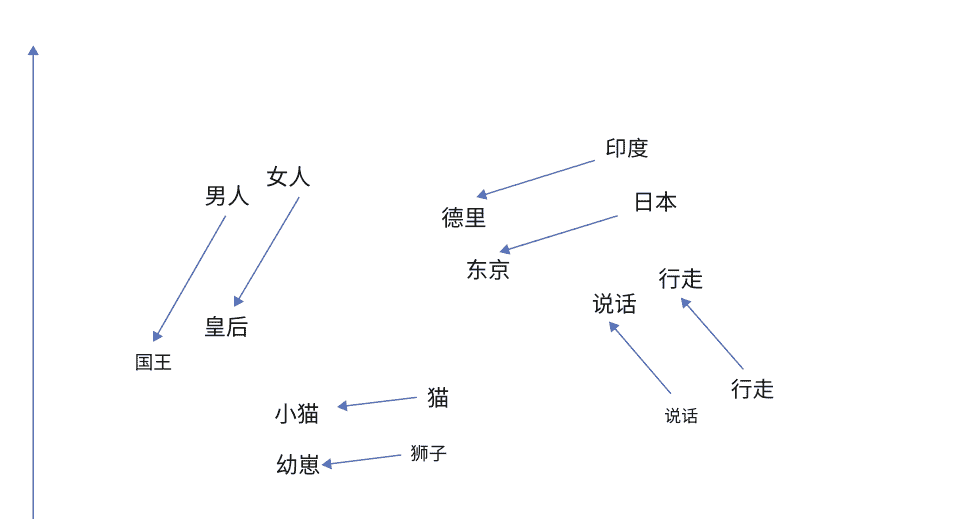

图10.1 将单词嵌入到高维语义空间中。在文本语料库中紧密上下文中出现的单词具有相似的嵌入向量。空间中的方向具有语义解释。这是概念的分布式表示的一个例子

我们的思想和概念反映了世界和我们的内心体验，在其中事物相互联系。如果单词在文本语料库中通常靠近彼此出现，我们说它们在语义上相关。它们共享相同的上下文，因此它们将共享底层概念的激活模式。单词嵌入是通过将包含维基百科、新闻语料库和书籍的大型文本语料库输入到训练算法中来计算的。

Glove和word2vec是两种广泛使用的嵌入方法。对于Glove，使用单词的共现统计来找到嵌入。对于word2vec，在其某个版本中，称为skip-gram方法，使用每个单词周围的相邻单词窗口w来找到它们的嵌入，使得它们与目标单词w的softmax点积最大化。给定单词w的情境单词u的条件概率定义为

```
$$ P(u|w) = \frac{\exp(E(u)^T.E(w))}{\sum_{v} \exp(E(v)^T.E(w))}. $$
```

在所有这样的对中，平均概率最大化。从随机嵌入开始，向最大化这个目标函数的方向迭代更新向量。

因此，存在一个隐含的上下文语言建模任务，用于训练嵌入。在word2vec的另一个版本中，称为连续词袋模型，使用上下文词的嵌入的平均值来预测目标词。

结果是一个 \( D \times V \) 矩阵 \( E' \)，其中嵌入按列排列。将一个词的one-hot表示 \( v \) 与 \( E' \) 的矩阵-向量乘积 \( E'v \) 相乘，提取出相应的列，得到其稠密嵌入。

向量。由于FFN层是矩阵乘法，因此嵌入层作为第一个隐藏层实现，具有 V 输入神经元和 D输出神经元。嵌入层将one-hot表示转换为稠密表示，然后由后续层进行处理。嵌入层使用预训练的Glove或word2vec嵌入进行初始化，并通过反向传播进行进一步微调。有关Glove，请参阅[159]，有关word2vec，请参阅[142]。

总的来说，嵌入的概念适用于任何一组分类变量，以捕捉它们的语义相似性。因此，嵌入是一个学习函数,

```
$$E : X \rightarrow \mathbb{R}^D,$$
```

其中 X是一组以独热向量表示的分类实体，映射是这样的，即这些实体在相同上下文中的共现度量通过它们在 D维欧几里得空间中的空间关系进行映射。

使用嵌入向量来表示语言建模中的单词的方法作为分布式表示的特例在[14]中引入，用于语言建模任务。嵌入是一个词的特征化，它是由神经网络构建的内部表示。AI模型构建了一系列表示，共同形成其输入的分布式表示。

因此，如果我们以最一般的方式来看待表示学习，不仅是第一层，而是每一层都在构建嵌入。

> > 在基于AI的NLU中，一个强大的想法是在语义空间中构建单词的分布式表示。一个词是潜在的激活模式的语义概念（神经元）。这些分布式表示可以用来衡量单词的语义相似性，并为进一步的NLU处理提供起点。

### 10.3 序列到序列

预训练的词嵌入可以用来解决NLP问题。例如，考虑一个句子 S中的分类 (w_1, \ldots, w_n)。可以取单词的嵌入并取平均向量,

```
$$E(S) = \frac{1}{N} \sum_{i=1}^{N} E(w_i),$$
```

作为一种简单的方法，将句子 S嵌入其中。可以训练一个AI模型来分类平均向量。对于高级方法，我们需要整体训练

#### 10.3.1 编码器-解码器架构

在序列到序列（Seq2Seq）问题中，AI模型的一部分，用于创建输入序列块的表示，被称为编码器。解码器接收表示并生成输出序列。

如果输入是空间数据块，则编码器可以是CNN。如果数据具有完整的时间上下文的顺序结构，则可以是双向RNN（带有LSTM块）。顺序数据和空间数据之间的界限并不是严格的，因为空间和时间维度是相似的。由于具有完整上下文的顺序数据可以被视为空间数据，因此CNN也可以创造性地用于编码器。如果缺乏完整上下文，则可以使用具有因果卷积滤波器的CNN。对于在线应用程序，没有未来上下文且对过去有长期依赖的情况，选择多层LSTM作为编码器是自然的。

根据问题的不同，解码器存在几种设计选择。如果输出是非顺序的，则解码器可以紧密集成为编码器顶部的附加层，编码器和解码器之间的区别变得模糊，例如在自编码器的情况下。如果输出是顺序且无界的，则解码器是一个RNN（带有LSTM块），解码器的下一个输出不仅取决于编码器的输出，还取决于解码器的先前输出。

#### 10.3.2 神经机器翻译

为了说明编码器-解码器架构的工作原理，让我们以神经机器翻译（NMT）的具体例子来说明。假设你需要将以下句子从印地语翻译成英语，

你去哪里？

我们有五个单词和一个问号。我们计算它们的 D维嵌入，

$v_1, v_2, v_3, v_4, v_5, v_6$

然后逐个将它们输入到一个RNN中。RNN的最后一个隐藏状态是输入的编码表示 R。假设 R是 K维的，因此

在嵌入空间中，一个包含六个 $D$维点的时间序列被映射到一个 $K$维的“句子”空间中的一个点，

```
$R = E([v_1, v_2, v_3, v_4, v_5, v_6])$
```

编码器在哪里 $E$。编码器在语义空间中创建了一个句子的分布式表示。从单词嵌入到句子嵌入。通过使用双向RNN，我们可以做得更好，因为我们有完整的时间上下文。不再使用最后一个隐藏状态，而是将所有时间步的隐藏状态聚合在一起形成一个学习到的表示 $R$。

解码器 $D$接收到一个开始信号，它消耗 $R$并输出“在哪里”，

```
‘在哪里’ = $D(R, [开始])$.
```

在训练过程中，它已经学会了在 $R$附近输出“在哪里”。解码器实际上输出了一个与词汇表大小相同的分类概率向量，最大值出现在单词“在哪里”处。在第二个时间步，解码器使用 $R$和它的输出“在哪里”来生成“是”，

```
‘是’ = $D(R, ‘在哪里’)$.
```

请注意，我们在每个时间步骤都提供 $R$。这是可选的，可以忽略而不影响算法的性能。在第三步，解码器使用 $R$和其最新的输出“are”生成“you”。请注意，在每个时间步骤中，解码器隐含地将其先前步骤的历史编码在其隐藏状态中。

最后，我们获得了完整的英文翻译。

> 你要去哪里？

在上述过程中，我们选择具有最大概率的单词作为每个解码阶段的输出。在推理时的束搜索中，选择前 $k$个单词，每个单词都会导致下一个 $k$个单词；因此，从中构建了一个搜索树，选择最大化序列概率乘积的最佳整体翻译。要在训练时引入束搜索，请参见[244]。最后，请注意原始句子和翻译句子中的单词数可能不同，因为解码器在编码器之后工作。

### 10.4 注意力机制

让我们继续进行从印地语到英语的NMT示例。现在考虑以下句子，

我读了一本关于人工智能的书，里面有一个很好的例子.其中有几个困难的练习题.

它翻译成以下句子，

我读了一本关于人工智能的书，里面有一个很好的例子。它有几个困难的练习题。

当人工智能生成英语单词“which”时，它应该注意“book”和“AI”这两个疑问代词的候选选项。当第二个句子中生成单词“it”时，它应该更加关注“book”。当生成“exercises”时，应该真正关注“book”，并且应该优先选择翻译为“exercises”而不是“questions”。

这是通过注意机制实现的；参见第3.2.4节。编码器的过去隐藏状态保存在一个称为注意内存的存储器中，注意机制在解码过程中有选择地检索存储器的内容，以产生更好的结果。直觉是更加关注过去的单词。因此，例如，

$$S(h_{it}, h_{book}) > S(h_{it}, h_{nice}),$$

其中 $S$ 是注意力分数。假设记忆库有 $N$ 个隐藏状态，每个状态是一个 $K$ 维向量。在实践中，一种简单有效的方法是通过计算解码器当前隐藏状态与注意力记忆库中的每个向量的相似度得分，并对 $N$ 个向量进行加权组合来实现注意力。得分函数可以通过神经网络实现，并在训练过程中进行学习。

本节受到最新的自然语言理解研究的启发；参见[9, 137, 218, 245]。此外，参见[34, 206]了解编码器-解码器架构在自然语言理解中的应用。

### 10.5 自注意力

这是注意力机制的一种推广，它在第3.3节中介绍。在标准的注意力机制中，我们有一个向量 $u$ 和注意力记忆库{w_1, w_2, ..., w_N}。

$$u \notin \{w_1, w_2, ..., w_N\}.$$

在自注意力中，我们设置 $u = w_j$，其中 $1 \leq j \leq N$，并进行成对的注意力计算；因此它被称为自注意力。
在基于自注意力的transformers中，参见图10.2；每个单词 $w$ 都有三个中间向量表示，从其嵌入$E(w)$中学习而来。我们称它们为单词 $w$ 的三个临时化身，每个都有不同的职责。

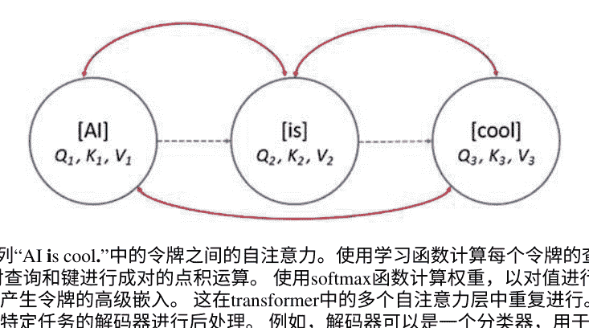

图10.2序列“AI is cool.”中的令牌之间的自注意力。使用学习函数计算每个令牌的查询、键和值。对查询和键进行成对的点积运算。使用softmax函数计算权重，以对值进行加权组合，从而产生令牌的高级嵌入。这在transformer中的多个自注意力层中重复进行。最终输出可以由特定任务的解码器进行后处理。例如，解码器可以是一个分类器，用于将句子分类为具有积极情感。请参见第4.7节，以了解自注意力如何对输入空间进行刻画的直观理解。

它们被称为查询、值和键，它们用于基于自注意力在输入序列中的其他单词的上下文中创建一个新的更高层次的单词嵌入 $E'(w)$,

```
$(E'(w_1), E'(w_2), \dots, E'(w_N)) = T_1(E(w_1), E(w_2), \dots, E(w_N))$。
```

单词的位置也被编码在输入表示中，这使得嵌入是有序的。位置嵌入可以预先定义，例如基于正弦模式，或者可以进行学习。

目标向量 $h$ 对源向量 $v$ 的传统注意力由一个学习函数 $\alpha_v = f(h, v)$ 给出，或者通过使用点积 $\alpha_v = h.v$ 来给出。然后，我们通过对softmaxed $\alpha v$ 进行缩放，计算上下文向量作为不同源向量的加权组合。在自注意力中，它由点积给出。

```
$Q(h)K(v),$
```

其中 $Q$ 和 $K$ 分别是学习到的查询和键函数。我们通过自注意力权重的softmax缩放 $V(v)$，其中 $V$ 是一个学习到的值函数。有关详细信息，请参见练习26及其解决方案[218]。在一个句子中，

美洲豹走在亚马逊河的岸边，

自注意力将允许构建单词美洲豹、河岸和亚马逊的表示，这将编码它们表示亚马逊河边的动物，而不是表示金融银行的汽车。

计算所有双向注意力，并且整个层 $T_1$ 可以被视为对传统全连接层的有序感知的泛化，该层通过对胶囊产生的向量进行复杂操作。

的神经元。存在固有的并行性，可以用来加速计算。新的嵌入向量 $E'(w)$ 成为神经网络下一层$T_2$的输入，并且整个过程重复进行。

```
$(E''(w_1), E''(w_2), \ldots, E''(w_N)) = T_2(E'(w_1), E'(w_2), \ldots, E'(w_N))$
```

几个级联的自注意力层在上下文中产生了分层分布表示的单词。还有一些其他细节值得一提。自注意力层之间的跳跃连接用于改善不同层级之间的信息流。注意力机制有多个头部，其结果被融合回来以控制计算时间。此外，每个自注意力层之后都有一个前馈层。由于成对计算，变压器在标记数量上具有二次复杂度，因此正在努力降低时间复杂度。参见[109]，其中二次复杂度 $O(N^2)$被降低到 $O(N)$，其中 $N$ 是序列长度，通过将自注意力重新定义为核特征映射的线性点积并利用矩阵乘积的结合性质。点积操作被重新定义为

```
$(QK^T)V = 相似度 (Q, K)V = \phi(Q)(\phi(K)^T V),$
```

其中Q，K和V分别是令牌的查询、键和值表示，而 $\phi$ 是一个适当选择的核函数。编码器构建的这些表示与任何编码器-解码器架构一样，作为解码器的输入。除了这个编码器-编码器的自注意力，还有编码器-解码器的注意力和解码器-解码器的自注意力。请注意，解码器-解码器的自注意力必须是单向和因果的。参见图10.3。在来自Transformer的双向编码器表示（BERT）

中，基于Transformer的架构在大型文本语料库上进行了预训练，用于自监督语言建模任务，其中包括预测句子中的掩码词。一个掩码句子的例子是

一只布谷鸟[MASK]坐在树[MASK]上，

其中单词“鸟”和“树枝”已被屏蔽。一个分类器被附加在变压器的顶部，用于预测被屏蔽的单词。另一个用于预训练的任务是下一个句子的预测。给出一对句子，

[CLS] 一只鹌鸟来到我们的庭院 [SEP] 然后它飞走了，

其中包含一个分类标记[CLS]和一个句子分隔符标记[SEP]。它被制定为一个二元分类任务，其中[CLS]标记的最终高级嵌入作为输入传递给一个分类器，该分类器输出第二个句子是否是一个有效的下一个句子。

### 10.5 自注意力

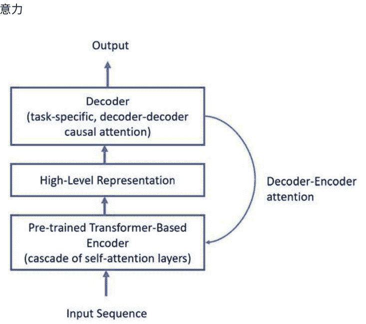

图10.3 使用编码器-解码器架构解决NLU任务的通用框架，其中编码器由变压器实现

训练是双向的，结果是在AI模型的不同层次上获得预训练的上下文嵌入。当在短语“河岸”中使用时，单词“银行”的嵌入与在“金融银行”中使用时不同。预训练通过重用相同的预训练编码器并应用迁移学习（微调）来促进构建定制的NLU解决方案，以解决不同的NLU任务。对于一个新任务，添加一个定制的解码器，并在特定领域的数据上对编码器-解码器架构进行微调。因此，这类似于通过采用预训练模型并对其进行微调来解决计算机视觉任务的标准技术。

更多关于这个主题的阅读请参考[48, 218]。要理解BERT的几何结构，请参见[177]，其中显示语言特征似乎在单独的语义和句法子空间中表示。尽管BERT是在不涉及句法的任务上进行训练的，但有趣的是它学习了某些句法语言特征，例如解析树中单词之间的距离。一个词的意义被称为词义。对于语义特征，BERT可以通过将它们放入嵌入空间中的不同聚类中来消除词义歧义。

自然语言理解在医学和生命科学研究中具有重要应用。大量的生物医学文章被发表，需要对其进行挖掘，以进行生物医学命名实体识别、生物医学关系抽取和生物医学问题回答等任务。有关将BERT定制用于生物医学文本挖掘，请参见[125]。

编码器-解码器架构与注意力或自注意力相结合，为基于人工智能的自然语言理解提供了基础。

#### 练习26 自注意力

在数学上，以查询、键和值的形式来描述自注意力的工作原理；参见[218]。

### 10.6 NLU解决方案中的创造力

到目前为止，你对于NLU的现代AI工具有一些直觉。为了解决你的问题，你需要创造性地提出一个相关的架构。下面是一些示例，它们将指导你提出自己的架构。

假设你想进行情感分类，其中情感可以是积极的或消极的。 使用编码器-解码器架构，其中编码器是一个具有LSTM单元的双向RNN。 解码器非常简单，它可以是几个全连接层，带有一个单一的分类输出。

```
R = E(s), \ y = D(R),
```

其中 s是输入文本序列， y是积极情感的概率， E是一个双向RNN， R是编码器的隐藏状态集合， D是一个前馈网络。 注意，如果 E是一个单向RNN， R也可以被视为最后一个隐藏状态。 损失函数是交叉熵函数。

对于命名实体识别问题，每个单词都被分类为一种实体类型。 上述情感分类网络很容易推广到具有softmax分类层的单词级多类架构。

考虑基于语言建模的文本生成问题，使用RNN作为解码器，从初始标记开始。 不需要编码器。 以初始标记作为输入，解码器在每个阶段输出单词的概率，从中随机选择（生成）一个单词。

所选单词成为下一个解码阶段的输入。 因此，从单词“cat”开始，可以生成“is”作为下一个单词，然后是“chasing”，“a”和“mouse”。 有趣的是，当标记是单个字符时，也可以进行这种建模。 因此，如果初始标记为w0，则架构为

```
$y_{t+1} = D(y_t), y_0 = w_0,$
```

其中对隐藏状态的循环依赖没有明确显示。对于图像字幕生成，初始标记是编码器CNN E的输出，即 $w_0 = E(I)$，其中 $I$是输入图像。

在某些自然语言理解任务中，需要处理多个标记序列。例如，在句子相似度任务中，输入是一个句子对。在前一章中，我们了解到Siamese CNN架构提供了图像相似性问题的解决方案。因此，可以考虑使用Siamese RNN架构来衡量两个句子之间的距离，

```
$R_1 = E(s_1)$,
$R_2 = E(s_2)$,
$d = \text{dist}(R_1, R_2)$,
```

其中 $s_1$和 $s_2$是句子，$E$是RNN编码器，$R_1$和 $R_2$是由RNN构建的句子表示。如果问题是将查询句子与句子数据库进行匹配，那么可以使用两个RNN $E_1$和 $E_2$分别对应 $s_1$和 $s_2$。参见[146]。

同时，在NLU中创造力是没有限制的。例如，考虑以下句子相似性的方法。假设两个句子 $A$和 $B$分别为“这是一本关于人工智能的好书”和“这本书很好地解释了人工智能”，则该对句子被编码为

[CLS]这是一本关于人工智能的好书[SEP]这本书很好地解释了人工智能

其中[CLS]是分类标记，[SEP]是分隔符标记。输入序列通过添加标记嵌入、位置嵌入和段（A或B）嵌入进行编码。因此，句子 $A$中第四个位置的单词“好”的嵌入是

```
$E(\text{好}) = E_T(\text{好}) + E_P(4) + E_S(A),$
```

其中 $E_T$, $E_P$和 $E_S$分别是标记、位置和段的学习嵌入。回想一下，学习嵌入只是将分类变量的独热向量表示映射到稠密表示的第一个可学习层。编码后的输入序列被输入到transformer的第一个自注意力层。transformer的最终输出是一个丰富的、有序的、上下文相关的标记表示 $E^*$。对于句子相似性，将[CLS]标记的最终表示输入到前馈神经网络中。

```
$y = F(E^*(CLS)),$
```

其中 F 是分类网络；参见图 10.4。变换器层可以在大型文本语料库上进行去噪语言建模任务的预训练，例如预测掩码标记。然后，将分类网络 F 附加，并使用迁移学习对整个网络进行微调。有关上述详细信息，请参阅[48]。

上述情况的特例是单句分类，例如情感分类，其中第二个句子 B 为空。对于词级分类，例如命名实体识别或词性标注，分类网络 F 应用于每个输出标记，而不仅仅是[CLS]。

对于问答系统，句子 A 是问题，句子 B 是段落。

[CLS]问题标记[SEP]段落标记

输出是一个令牌序列和两个特殊令牌 T_S 和 T_E，它们分别编码了输出序列中答案的开始和结束。答案的起始词是输出令牌 w，其相似度为用点积测量，用 $T_{S}$ 最大化，类似地，对于答案的结尾。 为了构建一个针对大语料库的问答系统，首先需要开发一个搜索引擎，该引擎将检索所有候选段落，然后将其输入到AI模型中。 是将检索到的段落逐个输入，还是作为一个大段落一起输入，将是一个系统设计的选择。

通过为问答系统赋予对话记忆，可以迈出构建对话系统（也称为聊天机器人）的第一步，其目标是检索答案。 在自然语言理解中，构建一个能够进行长时间、类似人类的有意义对话的聊天机器人是一个开放性问题。 通过为聊天机器人赋予类似人类的个性，包括其背景、历史、身份和个性的大型传记文档，并将其与一个通用的问答系统结合起来，针对一个关于世界常识和知识的语料库，可以迈向这样一个聊天机器人的第一步，其目标仅仅是进行聊天。

对于抽象的文本摘要，问题被提出为一个文本到文本的问题[170]。 因此，可以采用与语言翻译相同的解决方案，其中解码器使用编码器-解码器注意生成摘要。 该架构是在分类损失下进行训练的。 对于编码器，使用了Transformer架构。 对于极端摘要，即使用Transformer生成科学论文的一句话摘要，请参见[23]，该论文同时进行抽取式和抽象式摘要。 在今天的“太长了；不想读”的世界中，论文的撰写速度越来越快，这是人工智能的一个有用应用。

NLU系统中的一个实现问题是可变大小的输入。 通常通过使用[PAD]标记填充序列来将输入固定为固定大小。 当然，在PyTorch等动态生成计算图的AI框架中，这是不需要的。 即使在PyTorch中，对于小批量输入，输入也必须填充到相同的大小。 填充可以以前填充或后填充的方式进行，取决于填充是在序列的开始还是结束处。 当将编码器RNN的最后隐藏状态用作序列的表示时，首选前填充。

在计算机视觉中，有各种各样的预训练的CNN模型可供使用，可以对特定任务进行微调。 近年来，许多NLU模型已经可用，这些模型已经在大型语料库上进行了预训练。 因此，对于您的特定NLU任务，第一步应该是使用预训练模型并对其进行微调，以创建一个基准。

微调的步骤绝对必要吗？ 考虑以下大规模自监督学习策略。

- 1. 基于Transformer的模型在非常大的语料库上进行了预训练，其中包含数百亿个标记，用于自监督语言建模任务，如下一个词生成、掩码词预测或下一个句子预测。
- 2. 该模型具有数百亿个参数。 这是为了捕捉多个任务的模式，例如翻译、问答和摘要，这些任务是大型文本语料库中自然发生的部分。

在未来，将模型和数据集的规模扩展到数万亿。语言的灵活性是否允许任务描述被语言所包含，并因此融入输入，从而减轻了对精细调整的需求？也就是说，假设你想要从英语翻译成法语。那么你的输入序列是

```
将英语翻译成法语: 奶酪 ==> [下一个词],
```

假设AI在训练集中已经看到了类似的任务示例。上述是零样本学习。在少样本学习中，可以在输入中提供 $K$ 个示例。在[20]中的工作被称为GPT-3 (生成式预训练转换器3)，它使用预训练来进行下一个词预测任务，似乎表明这是一种可行的方法。所声称的是，语言建模导致了一个通用的、多任务的、少样本的学习器。在本书中，我们强调AI构建了数据的表示。对于特定子任务的上下文条件构建了任务的表示，并将一些示例 (演示) 作为输入序列的一部分。

```
$R = E(t, d, x),$
$y = D(R),$
```

其中 $E$ 是一个编码器，它对任务 $t$ 的上下文表示 $R$ 进行编码，还使用演示 $d$ 和数据 $x$，这些由解码器 $D$ 用于预测输出 $y$。上面示例中的任务描述是“将英语翻译成法语”。一个演示可以是“海獭 => 海獭”。这些是输入本身的一部分，并通过这个上下文使模型能够执行任务，而无需进行任何微调。请注意，对于零样本学习，$d$ 为空。

> NLU在AI解决方案的设计中提供了很多创造性的机会；这包括预训练、输入嵌入、输出结构和架构的设计选择。这是一个快速发展的AI应用领域。

### 10.7 AI和人类文化

NLU与思想和概念的潜在语义空间一起工作，因此这个空间是人类思维方式和当前社会状况的反映。

人类能够进步的原因之一是人类思维能够创造出在现实中不存在的事物和概念的想象现实。微软公司、英国民主或美国梦等概念都是想象中的现实。它们存在于社会和文化中，因为一群人对它们的意义达成一致并开始行动，就好像这些东西是真实的；参见[75]。 它们变得如此真实，以至于人们为它们而战。 随着时间的推移，新的想象现实在现有的基础上被创造出来，我们的思想抽象程度增加。 这类似于多层变压器根据前面层构建的基本概念构建更高层次的概念的方式。

一旦这些想象中的现实在人们的脑海中形成，并且他们将其记录在文本文档中，那么像转换器这样的AI模型将构建新概念的分布式表示。 有关AI和分布式表示之间的联系，请参见[87]，并参考第4.10节。潜在语义空间随时间动态变化和演变。

那么在今天的语义空间中的任意一点呢？它代表什么？在表示空间中的一点可能在人类思维中不存在，但也许明天它将成为一种想象的现实。 语义空间中的一点是神经元（概念）的激活模式。 因此，人工智能正在通过神经元的激活模式创造这些想象的现实，这些现实可能会或可能不会在现实中实现。 这一代新概念的产生非常类似于人工智能创造新图像的过程。这类似于人类思维如何以一种新颖的方式将概念联系在一起，相信一个新的想象的现实，例如“伦理人工智能”的概念变得和任何其他事物一样真实，并引领我们在研究、构建和使用人工智能方面进入一个新时代。与此同时，21世纪初的伦理人工智能将与1000年后这个术语所指的含义有所不同。

一些新创建的想法促进了重要的文化演变，因为社会设计了要优化的目标函数来追求这些新目标。 例如，美国的民主并不是在第一天就扎根的。它通过逐步迭代的算法来最大化民主原则，逐渐赋予每个人选举权。 美国民主有许多历史版本。 演变发生是因为语言使我们能够创建判断和观点，这些实际上是标签或注释，指导着这个迭代过程的进展。

语言作为一种广泛被人类思维使用的注释工具，人们之间的辩论常常涉及这些标签。 语言创造了想象中的现实，对其进行了注释，并推动了文化演变。 甚至整个社会系统都可以在所有可能系统的空间中进行优化。

因此，人工智能的工作方式与人类文化的工作方式之间存在直接联系。 两者都在抽象的思维空间中工作。 由人工智能构建的思维空间中，自然语言理解实体将随着人类文化和语言的演变而逐渐发展。 它将变得更接近我们组织抽象的方式。 在人工智能的未来进展中，我们应该见证建立思维空间的新方法。

思想比 D维向量更复杂。 它们的实际语义不仅通过共现关系来推断，还要通过整个集成世界模型中的所有潜在语义结构来推断。 此外，语言相对论的假设，也被称为Sapir-Whorf假设，认为我们概念化和理解某事物的方式与我们的语言相关，表达它的方式；因此，语义受我们语言结构的影响。
词语还是思想先出现？使AI执行NLU将帮助我们找到所有这些具有挑战性问题的答案。

### 10.8 推荐系统

语义嵌入和分布式表示的思想可以应用于其他领域，如推荐系统。用户和产品可以在一个共同的空间中表示，显示它们之间的亲和关系。喜欢某个特定产品的用户会被放置在靠近该产品的位置。

请参见图10.5，这是一个电影推荐系统的示例。假设存在 N个用户和 M 个嵌入在一个 D维空间中的电影，其中 D可以是几百维。在词语嵌入中，使用文本语料库中的词语共现。在推荐系统中，共现关系被用户对电影的评分值所取代。

在联合空间中，电影-用户交互被建模为内积。矩阵乘法计算一个矩阵的行与另一个矩阵的列的内积。因此，用户和电影的联合嵌入被制定为矩阵分解技术。

```
$R = U V^T$
```

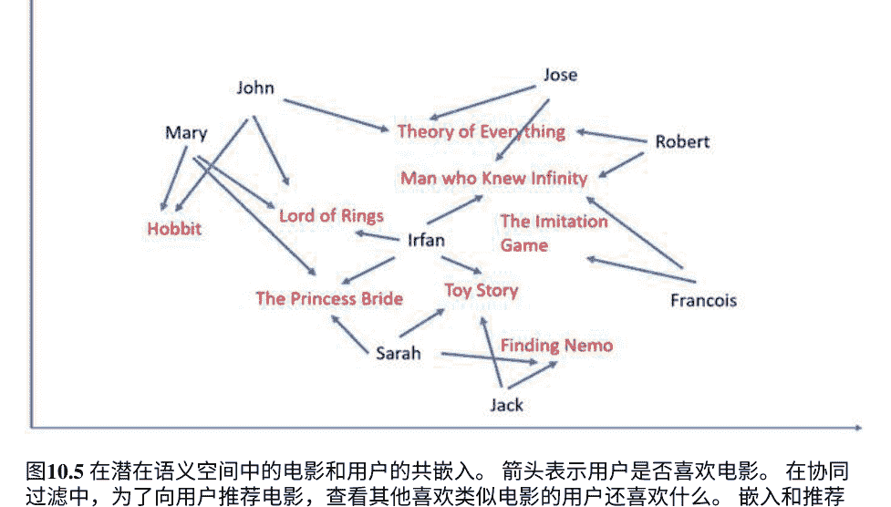

图10.5 在潜在语义空间中的电影和用户的共嵌。箭头表示用户是否喜欢电影。在协同过滤中，为了向用户推荐电影，查看其他喜欢类似电影的用户还喜欢什么。嵌入和推荐可以由人工智能模型学习得到。

其中，$R$是一个 $N \times M$评分矩阵，$U$是一个 $N \times K$用户嵌入矩阵，而$V$是一个 $M \times K$电影嵌入矩阵。注意，$R$中可能有缺失值。奇异值分解（SVD）提供了 $R$的矩阵分解。保留由 $K$个最大奇异向量张成的低维子空间，而其他奇异值被丢弃。SVD受限于将矩阵限制为正交的约束条件，即数据空间的转换是旋转加缩放。因此，用户是由电影张成的正交空间中的点，反之亦然。基于SVD的方法在实践中效果不好，因为评分矩阵可能稀疏且存在缺失值，而缺失值的填充既昂贵又不可靠。

一种有效的矩阵分解方法是交替最小二乘法（ALS），它通过在 $K$-维空间中优化逼近R的损失函数来实现。对于用户-电影交互，损失函数为 $(r_{u,m} - p_u q_m)^2$，其中，$r_{u,m}$是用户-电影评分，$p_u$是用户 $u$的嵌入向量，$q_m$是电影 $m$的嵌入向量。此外，损失函数对嵌入向量的 $L^2$范数进行正则化。优化问题通过梯度下降法求解，而ALS方法通过交替凸优化步骤来近似求解；参见[115]。

一旦矩阵通过ALS进行因式分解，就可以训练一个人工智能模型来预测用户 $u$和电影 $m$的推荐评分，$r_{u,m} = F(p_u, q_m)$。$F$是由DNN实现的。这将内积评分得分推广为一个学习函数。嵌入层的初始化是从ALS获得的预训练嵌入。在训练过程中，AI模型将进一步微调ALS嵌入。在推理过程中，它使用学习函数来预测评分。这种方法被称为神经协同过滤（NCF）。参见[80]中使用AI进行协同过滤的工作。

> 将单词嵌入到语义空间的思想可以推广到推荐系统中，其中用户和产品在一个共同的空间中表示。

### 10.9 基于奖励的公式

对于NLU和推荐系统，存在可能需要顺序决策，然后是奖励的问题。 这可能是一个聊天机器人试图销售产品或解决技术支持问题。 行动序列可以是用户执行的一系列点击和步骤，这将决定电影的最终推荐。 对于每一步，我们希望预测用户下一步可能做什么，以及交互AI模型应该采取的行动。 用强化学习的术语来表述这类问题是很自然的。

这是自然语言理解（NLU）的下一个前沿之一，我们应该期待在将NLU与强化学习（RL）相结合方面取得进展。

### 10.10 章节总结

NLU的人工智能从单词的分布式表示或嵌入开始。 Glove和word2vec是常用的单词嵌入。 它们在潜在概念的高维空间中捕捉单词的语义相似性。 NLU的人工智能模型的第一层是一个嵌入层，它将单词的独热表示转换为嵌入，并可以通过预训练的嵌入进行初始化。

对于序列到序列的任务，如机器翻译，编码器-解码器架构与注意力机制被证明是有效的。 编码器将输入编码为分布式表示，解码器使用该表示生成顺序输出。 注意力机制允许解码器参考编码器的状态。 注意力机制被推广为自注意力机制，其中编码器通过计算句子中单词之间的成对注意力分数来构建输入的上下文表示。 Transformer使用多个自注意力层来构建令牌序列的分层表示，这类似于人类思维构建更抽象概念的方式。

推荐系统从语义嵌入的思想中获得灵感。因此，用户和产品可以在一个共同的空间中进行嵌入，并且用于预测任务的推荐系统的AI模型使用这些共同的嵌入，就像NLU中一样。 交替最小二乘法可以用于预训练这些用户-产品嵌入。

# 第11章
## 借我你的耳朵


> > 在我失去声音之前，它是含糊不清的，所以只有那些亲近我的人才能理解，但是通过计算机的声音，我发现我可以进行受欢迎的演讲。我喜欢传播科学。重要的是公众理解基础科学，如果他们不把重要决策交给他人。
>
> —— 斯蒂芬·霍金

> > 我说不好，以至于难以理解。
>
> —— 简·奥斯汀

沟通是人类体验的关键。进化使得生物能够捕捉空气中的振动，以理解周围发生的事情，并主动产生这样的振动以与他人互动。人类将声音识别和合成的这一天赋提升到了一个新的水平，通过将其与语言和音乐相结合，产生了对话、歌曲、交响乐、讲座、辩论和电影对话。如果人工智能能够从我们这里获得这一天赋，那将是非常棒的。本章介绍了如何在软件中创建这种能力。事实上，ASR是人工智能的第一个重要工业应用；参见[91]中使用深度学习进行语音分类。

| 输入 x | : | K x S概率矩阵 |
| :--- | :--- | :--- |
| DNN | | |
| T 秒 ( s 时间片) | | |

图 11.1 用于语音识别的连接主义时间分类。（所示的光谱图像来自 NASA 的卡西尼号航天器的传感器，它于 2017 年 5 月 28 日穿越了土星的 D 环。由 NASA/JPL-Caltech/University of Iowa 提供）

ASR 可分为两个阶段： (1) 声学建模和 (2) 语言建模。声学建模以语音波形作为输入，并将其分解为音素，即口语声音的基本单位。语言建模以音素作为输入，并根据语言约束和词汇产生单词。

经典ASR和基于AI的ASR的起点是声谱图。声谱图显示了功率谱随时间的变化，被划分为小单位（例如10毫秒）称为帧。帧在x轴上，频率在y轴上。灰度直观地显示了功率。见图11.1，在其中显示了一个带有热图的声谱图。在第9.7节中，我们通过预计算光流来辅助AI进行视频分析，同样地，我们通过预计算声谱图来辅助AI进行ASR。

在语音合成中，我们朝着另一个方向发展。输入是一段文本，输出是一个声谱图，因此是一个合成的声音。在本章中，我们将建立对语音识别和语音合成的概念性理解。

### 11.1 经典语音识别

经典的ASR系统执行梅尔尺度滤波器分析，并得出称为梅尔频率倒谱系数（MFCC）的倒谱系数。梅尔尺度是一种非线性频谱尺度，反映人耳的工作原理。你可以更好地区分400 Hz和450 Hz，而不是4000 Hz和4050 Hz。它是一个对数尺度。倒谱是频谱的傅里叶变换，因此被称为频谱的频谱。将MFCC视为从频谱图中手工设计的声学特征。一个音素可以被视为频谱图中宽阔的强峰的时间轨迹，称为共振峰。共振峰轨迹被分成段。为了识别这些轨迹，将梅尔频率倒谱系数（MFCC）馈入对应于共振峰段的HMM。HMM根据MFCC特征的观察结果输出最可能的音素序列。

语言模型将音素组合成单词，然后将其组合成句子。因此，可以肯定地说，在过去一定尝试过一系列HMM的层次结构；请参见[52]。句子级HMM、词级HMM和音素级HMM是经典ASR中的自然想法。语言建模引入了几种语言工具和技术，如词汇、词法分析。

- N-gram模型、统计模型和词转换图。

### 11.2 声谱图到转录

现在让我们转向基于AI的ASR这个令人兴奋的话题。对于声学建模，思路是将频谱图直接输入到DNN中，并获得转录结果，即一系列音素或字形（字符）。不进行显式的特征计算，这是AI自动特征工程的一个例子。

#### 11.2.1 无对齐时间连接

假设你以多种方式发出单词“Awesome”，变化你的语调、速度和发音。每个话语产生一个频谱图。目标是在给定一个频谱图的情况下产生“Awesome”，也就是说，我们希望输出符号序列，

```
['A', 'W', 'E', 'S', 'O', 'M', 'E'] = F(S),
```

其中 S 是“Awesome”的频谱图。算法必须对同一个单词的不同发音方式具有鲁棒性。一个人可以说得慢或快。频谱图会被拉伸或收缩。因此，不是构建一个将频谱图映射到单词 w 的函数 F，

$w = F(S)$

我们将首先构建一个拉伸或收缩的中间表示 M 从中产生单词,

$M = F_1(S)$

$w = F_2(M)$

这是因为3秒长的话语将有三倍于1秒长的话语的帧数，但输出转录将具有相同的长度，即七个字符。 输出符号和输入片段具有可变对齐。 为了解决对齐问题，对于每个输入帧，使用DNN生成一个 $K$维概率向量，用于 $K$个音素（或字形）。 DNN可以选择由几个初始卷积层组成，然后是RNN层，因为我们有完整的时间上下文。 对于光谱图的任何第 $i$个片段，模型的输出是一个片段的概率向量

$[p_A, p_B, p_C, \ldots, p_Y, p_Z, p_{\text{空}}, p_{\text{空格}}] = F(S, i)$

其中‘空’（表示无标签）是一个特殊符号，可以从转录中挤出来，‘空格’是时间上的暂停。 如果一个帧的长度为20毫秒，那么对于一个3秒的话语，我们有一个 $K \times 150$的输出概率矩阵，对于一个1秒的话语，我们得到 $K \times 50$。 我们称之为概率或得分矩阵 $M$。为了从 $M$中得到‘厉害’，AI工程师可以做的第一件事就是可视化 $M$，并查看是否可以从左到右遍历 $M$并挤出空白处读取‘厉害’。 要自动完成这个过程，需要解决一个非平凡的搜索问题，因为 $M$会导致除了‘厉害’之外的几个竞争的转录，这些转录必须被消除。 候选转录是从左到右的路径，其中可以删除空白处。 通过引入动态规划、HMM和 $N$-gram模型等工具，可以推断出正确的转录。 本节的阐述受到了连接主义时间分类（CTC）的启发；参见[65, 68]。 CTC可以被看作是一个针对可变长度输入的输出层，它输出不同标签的概率，包括一个特殊的空白符号，可以直接删除。

参见图11.1。参见以下练习的解决方案，了解如何从候选转录中选择最佳转录。

### 练习27        CTC

数学上阐述如何从概率矩阵 $M$ 中推断出转录。

> CTC是一个输出层，它以语音频谱图作为输入，生成一个概率矩阵作为输出的AI模型。 这个概率矩阵进一步处理以生成转录。使用一个特殊的空白符号（无标签）来处理可变长度的输入。

#### 11.2.2 端到端解决方案

在本节中，我们根据图3.5开发了关于基于编码器-解码器架构和注意机制的声学建模的端到端解决方案的直觉；参见第3.2.4节。

第一步是使用编码器创建输入频谱图的嵌入。编码器是一个CNN或双向RNN或两者的组合，它以频谱图帧作为输入，并创建一个内部向量表示 $R$。第二步是使用Seq2Seq模型，例如带有注意机制的多层LSTM作为解码器。回想一下，注意记忆实现了对编码器的隐藏状态进行选择性访问或关注，以便在每个解码时间步骤中使用。

符号“开始”和 $R$被输入到解码器 $F$ 中以启动解码过程。输出是一个 $K$维概率向量，希望对于字母“A”具有最大（或接近最大）的值，即

```
‘A’ = F(‘开始’, R, 0),
```

其中0表示在第一个时间步骤中未使用注意力。如果“A”的概率不是最大的，那么希望在波束搜索中，“Awesome”仍然具有最大的累积概率。在下一步中，生成一个注意力加权向量，显示解码器当前隐藏状态 $h$与注意力存储内容的相似性。记忆内容的加权线性组合产生上下文向量 $c$。解码器将“A”，$R$和 $c$连接起来作为输入，并希望下一个输出在“W”处具有最大（或接近最大）的值，即

```
‘W’ = F(‘A’, R, c),
```

为了简单起见，不显示对前一个隐藏状态的依赖。继续下去，其余的字符“E,”, “S,”, “O,”, “M,”和“E”被输出，然后是一个特殊符号“End”来终止解码。

整个系统是端到端训练的。请注意，我们可能需要在输出上应用波束搜索来选择最佳的整体转录。本节受到启发通过大量最近的ASR工作使用Seq2Seq模型。参见[27, 33, 65]作为相关参考文献。

在这里自然而然地提出两个问题。可以使用原始波形而不是频谱图作为输入吗？可以使用完全卷积的方法吗？答案是肯定的。考虑以下端到端的方法。

-   1. 使用前端CNN将原始波形转换为内部频谱图-类似的表示。
-   2. 使用卷积神经网络进行声学建模，如CTC中所示。
-   3. 使用卷积神经网络进行语言建模，对候选转录进行评分。此外，在声学建模器的输出上执行波束搜索。

这种端到端的解决方案效果很好，并且可以取得竞争性的结果；详见[250]进行进一步阅读。

#### 11.2.3 不要听别人的话

目前，语音助手系统必须解决鸡尾酒会问题。将来，在嘈杂的餐厅里，机器人服务员将为您记录点菜。在现实世界中，能够聆听到特定说话者的声音，而忽略其他声音和声音，对于ASR的部署至关重要。这被称为锚定语音识别；详见[138, 226, 255]。ASR系统需要聆听的人被称为锚定者。他/她是在餐厅中发起对话或为个人助理设备说唤醒词的人。

所有其他说话者应该被忽略。AI可以通过编码器-解码器架构形式来解决锚定语音识别问题。计算锚定者的声音特征的内部表示 \(R\) ，

\(R = E(\text{锚定者的声音} )\) ,

由一个AI模型 \(E\) 生成，该模型是编码器。表示 \(R\) 被第二个DNN \(D\) 用于检测和拒绝其他声音，

\(y = D(x, R)\) ,

其中 \(x\) 是要接受或拒绝的语音片段。解码器模型 \(D\) 被训练为将语音片段分类为两类：(1) 如果语音片段属于锚定者，或者(2) 如果说话者是其他人或噪音。解码器在每个时间步骤都将 \(R\) 作为附加输入，同时还有一个语音片段。编码器和解码器一起训练，形成一个端到端的解决方案。

### 11.3 语音合成

在只有一个人说话而另一个人听的情况下，双向通信比单向情况更可取。为了使AI能够通过语音回应我们，需要给AI一个声音。给定一个句子，我们需要生成一个音频波形。在这一部分中，我们对语音合成（文本转语音）技术进行了深入研究。

在连接的方法中，使用了一个记录了演讲的数据库。

```
$v = \text{数据库}(w)$
```

其中，w是目标单词，v是其波形。这被称为连接方法，因为同一说话者的短语音片段的波形被组合成更长的句子的发音。

这种方法效果不错，但输出缺乏正常语音的自然性，因为缺乏关于w的完整上下文。我们说话的方式在很大程度上取决于上下文。在‘你是如此令人难以置信的棒！’和‘尽管有一些令人难以置信的客户评价，但我们对产品感到非常失望。’中，‘棒’这个词的发音是不同的。声学参数如音高、持续时间、频谱和强度将决定说话的风格。基于文本分析计算句子中单词的语音、语言和语义特征，然后将它们输入到一个DNN F中，输出所需的声学参数。

```
$z = F(g(S), w),$
```

其中 z是声学参数的向量，w是上下文中的目标词在输入句子S中，g计算S中单词的基于文本分析的特征。DNN是一个双向RNN，它是在一个大型语音数据库上进行训练的该数据库包含由一个人以不同上下文说出的语音片段这个人的声音将成为机器人或AI模型的声音。在数据库中找到与所需参数匹配的w并将其用于机器人的声音，也就是说，

```
$v = \text{数据库}(w, z),$
```

其中v是检索到的波形。

如果无法找到足够接近所需声学参数的v，则可以通过声音模型G来补充该方法该模型根据所需声学参数修改录制的声音。

```
$v' = \text{数据库}(w, z),$
```

```
$v = G(v', z),$
```

其中v'是数据库中w的最佳记录声音。因此，上述方法是由参数化方法引导的连接方法。

备用选项是使用声音模型使输出听起来更自然。声音模型 G基于信号处理。

因此，一般来说，语音合成有三个阶段：(1) 文本分析，(2) 生成声学或语音参数，以及(3) 语音合成。阶段2由一个AI模型实现。语音合成通过拥有一个数据库来帮助记录语音片段，就像上述方法一样，问题是是否可以完全消除数据库。这确实是可能的，语音可以完全由基于声学参数的声码器（语音合成器）合成，使方法完全参数化。下一个问题是是否可以消除基于特征的语音合成器，并用AI模型替代它。最雄心勃勃的目标是构建一个端到端的解决方案，将所有组件进行优化，包括前端文本分析器。

基于AI的端到端模型直接从单词的特征中产生输出波形或频谱图 v = F(g(S))。随着语音合成的不断进展，参数化方法和端到端解决方案正在取代连接方法。对于高级方法，使用带有注意机制的Seq2Seq模型，它以一个字母序列作为输入，使用编码器构建一个内部表示 R，并使用循环解码器消耗

R以输出所需的频谱图；参见第3.2.4节。也就是说，我们有了端到端架构，

```
R = E(S),
S' = D(R),
```

其中 S是字母（字符）的输入句子，S'是输出频谱图，E是编码器，D是解码器，R是由编码器构建的表示。参见图11.2。另一种创新方法是使用CNN实现文本到语音系统，其中使用因果卷积将文本特征映射到原始波形，这些卷积可以扩张以增加神经元的感受野。这些方法导致了大型的AI模型，因此正在进行研究以减少计算时间，包括训练和推理。

参考[24, 156, 165, 195, 225, 252]，这些启发了本节对语音合成的激动人心应用的更多了解。现有技术仍然没有达到可以称之为完美、自然发音的程度，因此有机会尝试新的方法。

> 语音识别和语音合成是人工智能的两个令人兴奋的应用。编码器-解码器架构和注意机制为将频谱图转换为字母序列以及反之提供了端到端的解决方案。在这里，有机会通过多种可能的架构进行创新，以推进技术的发展。

图11.2 语音合成的端到端解决方案。输入是字母序列“人工智能很酷”，AI模型输出一个频谱图，从中可以获得原始波形。

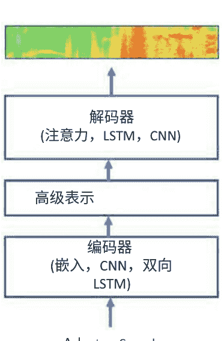


图11.3 通过类似于语音识别的方法，人工智能可以进行草书识别。这是一个图像到字形转录问题。（图像是美国独立宣言的一部分，1776年7月4日）

### 11.4 手写识别

手写识别与本章概述的框架非常契合。与声谱图不同，手写句子的2D像素图像被输入到具有注意机制的编码器-解码器架构中，对于编码器来说，使用CNN是自然的。也就是说，我们有以下架构

```
$$
R = E(I),
s = D(R),
$$
```

其中 $I$ 是输入图像，$s$ 是输出句子，$E$ 是编码器，$D$ 是解码器，$R$ 是编码器构建的表示。参见图11.3。或者，也可以使用CTC方法。

```
$$
M = E(I),
s = F(M),
$$
```

其中 $M$ 是由具有CTC输出层的AI模型 $E$ 输出的概率分数矩阵，该矩阵经过后处理以生成句子。更多阅读，请参见[67, 166]。

那么，对于给定的句子，如何合成类似人类手写的字体 $s$？ 由机器合成手写是一个自相矛盾的说法，因为机器使用的是在计算机屏幕上打印的完美手写字。 在未来，一台老式的怀旧机器人将能够以其独特的手写体个性化其输出文本，并能够给我们写信。 与此同时，配备手写笔的触摸屏平板似乎是一个很好的购买选择。结合ASR，这样一种基于AI的设备是一种非常人性化的工作方式，也是AI的一个很好的应用。

## 11.5 章小结

自动语音识别（ASR）是AI的第一个主要工业应用。对于ASR，CTC用于声学建模。 AI模型生成了一个用于音素或字素的概率矩阵，并经过进一步处理以产生语音波形的转录。 对于端到端（E2E）解决方案，使用了编码器-解码器架构，当与注意机制结合使用时效果很好。 编码器-解码器架构可以解决锚定语音识别问题；它通过对锚定语音进行编码来将语音片段分类为属于锚定语音还是不属于锚定语音。 语音合成或文本转语音转录可以借助数据库来解决，该数据库通过AI模型进行搜索，以确定给定上下文中单词的所需声学参数。 语音合成的另一种选择是编码器-解码器架构，其中解码器输出一个频谱图。 最后，草书手写识别是一个图像到文本转录问题，可以使用与频谱图到文本转录问题非常相似的技术来解决。

## 第12章 创建你的夏尔和瑞文戴尔

> > 你不是拍照，而是创造它。
>
> 安塞尔·亚当斯

> > 如果真实是你能感觉、闻到、尝到和看到的，那么‘真实’只是你的大脑解读的电信号。
>
> 《黑客帝国》中的莫菲斯

好莱坞电影的乐趣之一就是进入梦幻般的世界。夏尔和瑞文戴尔是人类思维创造的神奇艺术品。绘画、戏剧、电影、音乐、故事、诗歌和神话表达了人类思维表达自己的内在渴望。当我们看着维吉特洞穴的壁画时，我们不需要进一步证明它们创作者的智慧。我们在本章中探讨创作的主题。人工智能能帮助我们在艺术创作中吗？

它能创造审美吸引力的世界吗？ 它能为图像和视频添加特效吗？

在好莱坞，计算机生成的图像（CGI）已经变得不可或缺，它的有效使用有助于创造奥斯卡获奖的杰作。为了使CGI更加逼真，使用了现实世界的输入进行合成。戈鲁姆的背后是安迪·瑟基斯。计算机图形技术的次表面散射逼真地模拟了光线在戈鲁姆的皮肤上和下的反射，以至于你甚至可以看到他的血管。当戈鲁姆模仿安迪·瑟基斯的真实世界动作和面部表情，并带领弗罗多和山姆站在俯瞰魔多的陡峭悬崖上的时候，创造了一种令人着迷的电影体验。

计算机图形学中的人工智能基于一个关键观察，即人工智能是基于真实世界图像进行训练的。在神经连接中，有一个模型能够捕捉现实的细微差别，包括颜色、形状、阴影和纹理。为了创造新的世界，黑匣子内隐藏的真实世界必须以新的形式呈现。参见图12.1，这是一个最先进技术的例子。

### 12.1 从神经元到艺术

#### 12.1.1 深梦

我们猜测在DNN的参数中隐藏着一个真实世界的版本。让我们试图将其展现出来。我们的努力更像是探索某人的思维。网络并不是为了创造新内容而进行优化；它已经经过训练，并且没有进一步的训练来使输出具有艺术性。我们只是想知道其中隐藏的真实世界是什么样的。为了解某人的思维方式，一种策略是向大脑提供刺激并观察其反应。同样的策略也适用于人工智能。

假设一位心理学家向您展示一张照片并探测您大脑中神经元的激活强度。他/她通过调整照片的方式进一步增强这些神经元的激活，以了解神经元对照片中哪些模式反应最强烈。如果在调整后的照片中，花朵变得更加明显或出现在天空中，那么花朵就隐藏在您的大脑中。

由于积极的反馈循环，很快照片上会被花朵覆盖。激励的想法是，如果有一个神经元的激活向量，例如，

-   [5, 0, 6, 0, 0, 0, 12, 0, 0, 0],

那么它应该进一步加强，例如，

-   [15, 0, 18, 0, 0, 0, 36, 0, 0, 0].

请记住，任何神经元的输出都是输入和可学习参数的函数：

```
$$y = F(x, \theta).$$
```

在反向传播算法中，我们将权重作为要调整的变量，将输入图像像素作为常量。我们可以做相反的操作。也就是说，保持权重不变，将像素作为变量。这样我们就可以看到网络在改变刺激时的响应。

这是提出的算法。选择要探测的AI模型的一层 $L$。查看该层神经元的激活输出。将这些值的总和设置为目标函数 $O(X)$，并使用梯度上升算法进行最大化，即，

```
$$O(X) = \sum_{i \in L} F_i(X, \theta),$$
```

其中 $X$是输入图像，$F_i$是目标层中第 $i$ 个神经元的激活。运行反向传播直到输入层，对输入像素 $X$求导数，不同于 $O(X)$。通过采取梯度上升步骤，将像素朝着增加$O(X)$的方向微调。通过采取许多这样的步骤，不断攀爬优化空间。

> 梦幻般的图像将出现。在预训练的ImageNetCNN中可能会出现狗，因为狗的图像在互联网上广泛可得并被用来训练ImageNet竞赛的人工智能。这是艺术、梦境还是幻觉？

你最好的评判者。请参见图12.2，其中执行了几次DeepDream迭代。

#### 12.1.2 风格转移

图像可以用许多方式表示。使用傅里叶变换的基于频率的图像是众所周知的。考虑阿尔伯特·爱因斯坦的照片和玛丽莲·梦露的照片。通过将前者的低频部分与高频部分结合起来通过对后者的频率进行演示，可以得到一个很好的演示。从远处看，人类视觉看到的是低频率，使得图片看起来像是阿尔伯特·爱因斯坦。当人们开始走近时，图片会变形成玛丽莲·梦露，因为人类视觉系统开始注意到高频率并忽略低频率。这两张图片已经合并成一张。

可以使用人工智能将两张图片合并成第三张图片。可以使用预训练的网络将一张图片的内容与另一张图片的风格混合在一起，并将网络保持冻结。将这两张图片称为A和B。思路是创建第三张图片Z，使得

Z = 内容(A) + 风格(B)。

目标层J的神经元的激活值表示A的内容。B的特征相关统计表示其风格，通常使用所有的层。从任意输入图片X（可以是A），迭代地修改它

通过运行反向传播算法一直到输入层，就像在DeepDream中一样。要最小化的目标函数是与目标内容和目标风格的偏差。

$$L(X) = \alpha d_1(C_X, C_A) + \beta d_2(S_X, S_B)$$

其中，$C_X$和$S_X$分别是$X$的内容和风格；$C_A$是$A$的内容，$S_B$是$B$的风格；$d_1$和$d_2$是适当选择的距离度量，例如欧氏距离或余弦距离。总损失函数$L(X)$是两个距离的加权组合，由超参数$\alpha$和$\beta$给出。梯度下降步骤用于最小化总损失。

风格捕捉了不同特征图之间的相关性。考虑由CNN计算的具有尺寸$W \times H \times K$的特征块。空间维度为$W \times H$，有$K$个特征图（通道）。将块重新整形为具有$K$行和$W \times H$列的矩阵$M$。风格矩阵是$K \times K$的协方差矩阵。

$$S = MM^T.$

矩阵乘法可以从两个等价的方式来看待：(1) $M$的行与$M$的列的逐对内积，或者(2) $M$的列的逐对外积后求和。无论哪种方式，都是计算特征通道之间的相关性。这对所有层都是如此。

上述数学背后的直觉很简单。对于内容迁移，如果$C_A$是激活向量，

```
[5, 0, 6, 0, 0, 0, 12, 0, 0, 0]
```

对于目标层$J$，那么$C_X$被设置为相同。对于风格迁移，考虑风格图像中某一层的两个特征图（按通道的激活向量）$p_B$和$q_B$，

```
p_B = [20, 0, 2, 10, 15, 0, 30]
```

```
q_B = [14, 0, 3, 11, 20, 0, 35]
```

它们之间有很强的正相关性。最初，假设$X$的相同特征图如下：

```
p_X = [0, 40, 20, 10, 0, 0, 0]
```

```
q_X = [3, 5, 4, 2, 0, 0, 3]
```

它们之间有较弱的正相关性。目标是修改它们，使相关性变得更强。也就是说，

相关性(p_B, q_B) ≈ 相关性(p_X, q_X)。

以 A作为你的照片，以毕加索、梵高或莫奈的绘画作品作为 B，你将把他们的风格转移到你的照片上。多亏了人工智能，我们现在可以拥有艺术天才的才华。

参见图12.3，将海豚绘画的风格转移到一张花的照片上。海豚绘画有一种风格，其中绿色和蓝色色块与定向的黑色轮廓和线条之间存在强烈的相关性。蓝色色块比绿色色块更多。这种风格被转移到花的图片上。叶子中的定向结构得到增强。在柱子上，我们可以看到定向条纹。一个解释可能是柱子的灰色包含了蓝色，并且柱子上的阴影创建了定向结构。你可以在[56]中了解神经艺术风格转移。

### 12.2 图像翻译

DeepDream和神经风格转移都可以看作是图像翻译的特殊情况，它们使用了冻结的预训练模型。这些技术基于输入的修改。

对于一般的图像翻译，使用修改AI模型的监督方法。许多有用的问题可以用图像转换的术语来表述。从绘画中可以获得照片，反之亦然。通过增加对前景的聚焦和模糊背景，可以增强照片。可以从照片中去除噪音和伪影。可以将夜间照片转换为白天照片，反之亦然。在医学中，可以将CT扫描转换为MRI扫描。可以使用更快、更便宜的机器获得CBCT扫描，并将其转换为对比度更高的CT扫描。在医学放射治疗中，给定目标器官和风险器官的三维分割，AI模型可以输出三维剂量分布。事实上，理想的端到端解决方案将以CT扫描作为输入，剂量分布作为输出。语义分割是一种图像转换任务，将图像转换为语义地图。可以将语义标签转换回图像。可以通过素描获得绘画，反之亦然。可以从绘制的历史肖像中获得照片。可以从城市街道地图中获得它们的航拍图像，反之亦然。可以向照片和视频添加颜色，并修复缺失的像素。可以提高图像的分辨率。给定一段视频帧，可以预测下一帧。

配对图像转换任务的真实情况是一组N图像转换对(x₁, y₁), (x₂, y₂), ..., (x_N, y_N)。图像转换可以通过标准自编码器来完成。训练翻译自编码器F的翻译对(x, y)的损失是距离

```
d(y, F(x))
```

它概括了重构损失

```
d(x, F(x))
```

距离度量d可以是L²距离。观察到使用L¹距离会导致图像模糊度较低。

GAN框架中的自编码器可以用于解决图像翻译问题；参见[101]的示例。基于自编码器的GAN被称为翻译GAN或自编码器GAN。标准GAN被定义为从生成参数（随机向量）θ到图像x的映射，即G(θ)=x，被推广为编码器-解码器架构:

翻译器GAN是条件GAN的特例。输出图像是基于额外输入的条件，该额外输入是翻译器GAN的输入图像。类别条件GAN是另一种特例，其中类别标签是额外输入，类别标签以独热向量的形式提供，并经过嵌入层处理；这提供了对所需生成的图像类别的额外控制，以便在推理时生成。一般来说，为了对生成过程进行额外控制，生成型AI模型的输入可以通过任何关于目标图像的所需属性进行增强，这些属性需要被生成。

由于翻译通常可以在两个方向上工作，可以训练一个反向翻译器 $x = F'(y)$。$F$和$F'$都可以与一组基于重构或循环的损失函数一起进行训练：

```
$d(y, F(x)), d(x, F'(y)), d(x, F'(F(x))), d(y, F(F'(y)))$
```

关于循环GAN的循环一致性思想，请参见[257]的工作。此外，请参见练习28。这个练习更深入地探讨了如何构建用于图像翻译任务的损失函数。我们考虑配对和非配对的翻译任务。

> **练习28  图像翻译**
>
> 请参见[101,257]。为翻译GAN的鉴别器和生成器编写损失函数。此外，为循环GAN编写损失函数。

### 12.3 DeepFake

媒体对DeepFake充满了热议，这是通过人工智能生成虚假内容的技术，在互联网上很容易找到虚假的语音、图像和视频示例。生成式人工智能学习了感兴趣对象（如猫）的生成参数：

```
$g: \Theta \to X_{\text{Cats}}$
```

因此，它可以生成新的内容，也就是新的猫。与一般的对象类别（如猫）不同，可以为特定的人B创建一个目标类别进行训练。

$$g: \Theta \rightarrow X_B,$$

其中 $X_B$ 是所有可能的 B 变体的集合。经过训练的人工智能模型可以生成无限多种的 B 变体。要生成特定的虚假内容，可以对新内容进行采样选择所需的参数。

$$g(\theta_{\text{目标}}).$$

在互联网上的 DeepFake 视频中，有一些例子是将一个人的语音更改为另一个人的声音，将视频中的一个人的脸替换为另一个人的脸。通过使用另一个人 A 的生成参数，可以将 A 在该实例中的面部表情和语音转移到 B 的实例中，前提是这些参数具有相同的语义解释。因此，首先使用一个学习函数 h 生成所需的参数。

$$\theta_{\text{目标}} = h(A),$$

然后在函数 g 中使用它们生成一个 B 的虚拟实例。让我们通过使用自动编码器进一步发展这种直观的技术。训练一个自动编码器来处理面部图像，使得我们对于所有面部都有相同的编码器 E，但是每个面部都有一个单独的解码器。具有相同的编码器确保生成参数具有相同的语义解释。编码器 E 将输出面部生成参数的向量 $\theta$。取图像 A 和 B。然后，要将 A 的属性转移到 B，应用以下操作：

$$\theta_{\text{目标}} = E(A), \ B' = D_B(\theta),$$

其中 $D_B$ 是 B 的解码器。因此，如果 A 在微笑，那么微笑将被添加到 B 中。以类似的方式在语音片段上训练另一个自动编码器。对于所有说话者都使用相同的编码器，但是每个人都有一个单独的解码器。将 A 的语音属性，表示音素或字母，转移到 B。如果 A 说“你好，世界”，那么 B 也会说同样的话。通过这种方式，可以将 A 的视频属性转移到 B，B 会说和做 A 说和做的事情。

这样的技术确实有积极的应用。例如，可以使用 DeepFake 生成个性化的多语言视频用于教育目的。有关 DeepFake 的更多信息，请参见 [1, 152, 213]。

### 12.4 创意应用

孩子们在绘画、素描和画画时非常开心。通过生成式人工智能，我们都能够体验创造力的时刻。其中一些实际上是有用的，并且可以导致新的应用。我们给出一些例子。

请参见图 12.1，使用 BigGAN 生成的仿真蝴蝶和夜莺鸟的图像；请参见 [19]。这是一个有条件的 GAN，GAN 的条件是所有的 1,000 个 ImageNet 类别。参数的数量非常大，几百万个。与现有技术相比，这是一个令人印象深刻的生成式人工智能模型；但对于涉及人物的某些困难类别，还需要进一步改进。要通过将其与双向 GAN 结合来进一步改进 BigGAN，即将编码器附加到 GAN 上，请参见 [49]。

模拟是生成式人工智能的一个重要应用领域。在计算机图形游戏中，比如经典的吃豆人游戏，玩家在迷宫中吃豆子的同时避开鬼魂，生成式人工智能可以创造性地根据用户按下的键来渲染新的屏幕画面；参见 [111]。

在纺织业中，全针织机正在革命性地改变大规模定制。编程这样一台机器非常繁琐。现有的图案书中的说明是针对手工编织的。如果能够自动产生这些机器级别的编织说明，给定一个期望的织物，将会非常方便。在 [108] 中，借助生成式人工智能解决了将织物转化为机器编织的逆向设计问题。

随着世界向在线购物发展，人们自然而然地想知道是否可以在购买之前虚拟试穿服装。可以利用生成式人工智能构建一个解决方案。可以引入语义分割、姿势估计、自编码器、生成对抗网络和风格迁移等工具来构建一个组合解决方案。参见 [148]，其中结合了这些组件的一个示例解决方案。

> 生成式人工智能通过在真实世界数据上进行训练，能够生成逼真的内容。它不仅可以训练生成属于某一类的新内容，还可以作为一种工具来转换给定的内容。

## 12.5章小结

预训练的人工智能模型可以用来调整输入图像，将其转化为 DeepDream，通过加强神经元的激活。神经艺术风格转换包括调整输入图像，使其特征区块与内容图像的特征区块匹配，同时使其统计数据与风格图像的统计数据匹配。DeepDream 和风格转换不需要任何训练，一切都是通过修改输入图像使用反向传播算法来完成的。对于一般的图像转换，可以使用标准的自编码器或自编码器 GAN 来训练成对的图像或图像集。任何生成式人工智能都可以通过对生成参数的潜在空间进行采样来生成虚假内容。DeepFake 的一个特定案例是将一个人的视频属性与另一个人的视频属性进行交换，可以通过获取第一个人的生成参数并对第二个人进行解码来实现。在生成式人工智能中，创造力无限，无论是用于娱乐还是有用的应用。

## 第13章
从数学到代码到Petaflops


> > 我开始使用 Keras，基本上是为了自己使用…我开源了它，然后它就从那里发展起来了…当时使它与众不同的是：它非常易于接触和使用，与其他选项相比，它支持 RNN 和 CNN（我相信这是第一次），并且它通过 Python 代码而不是配置文件来定义模型（这是之前最流行的方法）。
>
> —— 弗朗索瓦·肖莱

> > 由于 Ampere 和这一代 GPU 的创建，我们将看到一些非常庞大的 AI 模型，这是不言而喻的。
>
> —— 黄仁勋

人工智能是软件工具和硬件快速进步相互作用的一个很好的例子，从而在计算领域引发了一场革命。 建立在其他工具之上的高级工具允许更高的抽象和快速实验，使人工智能工程师能够快速前进。 出色想法的执行速度很重要。当我们回顾过去的文献时，我们可以看到人们一直非常聪明。 阻止他们在当时构建事物的是缺乏工具和技术。

在这一章中，我们将深入了解 AI 背后的数学如何转化为在硅中运行的软件，其速度非常快。

### 13.1 软件框架

AI 背后的科学是由数学描述的，它以软件的形式具体呈现，我们进入了设计选择、软件工具、数据处理和硬件问题的世界。在这个领域，进行了实验。

#### 13.1.1 二十世纪

AI 中的想法必须被精心地转化为软件程序。想象一下，如果我们回到 20 世纪 70 年代和 80 年代，用 C/C++ 从头开始编写所有内容。事实上，Caffe 是最早的 AI 开源工具之一，是用 C++ 编写的。因此，这样的工作可以由具有出色编码技能的人完成，同时理想情况下需要更高级别的库来加快原型开发。

认识到 C/C++ 在研究工作中的局限性后，科学编程语言在 20 世纪 70 年代和 80 年代得到了发展，R、Matlab 和 IDL 逐渐流行起来，因为它们具有高级编程功能和出色的可视化工具。在这些框架中，人们可以轻松地使用矩阵和数据数组，并且可以访问大量有用函数的库。为了符号数学，开发了 Mathematica。然后到了 20 世纪 90 年代和 21 世纪的第一个十年，在工业界，随着微软 Visual Studio 的迅速崛起，公司采用了微软的工具。对于前端工作，Java 占据了主导地位。

#### 13.1.2 二十一世纪

这很快就会改变。Unix 以 Linux、Debian 和 Ubuntu 等新形象卷土重来，而 Mac OS 则基于 Linux。Linux 开始在工业界占领地盘，开发人员纷纷采用它，而 Python 作为一种解释型编程语言，由于被大型组织采用并因为活跃的开源社区的贡献而迅速增长，变得广泛使用。Python 中融入了 Matlab 和 R 的精华思想，并开发了大量的 Python 库来完成各种任务。AI 工具转向 Python，现在在 Linux 机器上使用 AI 库已经相当普遍。在 Python 中使用 Jupyter 笔记本构建原型已经变得流行，因为它们提供了集成的开发环境，并且可以访问远程机器。

#### 13.1.3 AI框架

最早的机器学习框架之一是基于 C 库与 LuaJIT 脚本语言接口的 Torch（2002 年）。在神经网络的研究工作中，蒙特利尔大学开发的先驱性框架之一是 Theano（2007 年）。由于微分为梯度下降提供了基础，Theano 具有一种符号化计算导数的方式：

```
>>> import numpy
>>> import theano
>>> import theano.tensor as T
>>> x = T.dscalar('x')
>>> y = 4 * x ** 2
>>> gy_wrt_x = T.grad(y, x)
>>> f = theano.function([x], gy_wrt_x)
>>> f(3)
```

输出值为 24。

在 21 世纪的第二个十年，由于人工智能的爆炸性增长，已经实现了大量的 AI 框架。其中最早的之一是来自加州大学伯克利分校的 Caffe。它是用 C++ 编写的，具有 Python 接口，使用配置文件，并实现了卷积神经网络。可以说 Caffe 在全球学术界和工业界普及人工智能方面产生了重大影响。

TensorFlow、CNTK、MxNet 等等在 Caffe 之后很快就被开发出来。TensorFlow 迅速被工业界采用，轻量级库如 Slim 也是在其之上构建的。你可以将复杂的架构写成 Python 脚本。计算流通过脚本声明了一个计算图，在会话中执行。数据块，也被称为张量，在计算流通过图时被计算。

一个简单的例子，将输出 $a+5 a^2$ 的导数值 31.0，如下所示：

```
>>> import tensorflow as tf
>>> a = tf.constant(3.)
>>> b = 5*a**2
>>> g = tf.gradients(a + b, [a])
>>> sess = tf.Session()
>>> sess.run(g)
>>> sess.close()
```

Keras 为 AI 工程师提供了很大的便利；它是 TensorFlow 的高级 API，除了 TensorFlow 之外，还可以使用 Theano、CNTK 或 MxNet 作为后端。Keras 处理了大多数常见用例，并实现了 AI 研究的最佳实践。下面是一个用于说明 XOR 分类问题语法的示例脚本：

```python
from keras.models import Sequential
from keras.layers import Dense
import numpy as np

# XOR象限问题
Q00 = np.random.randn(100,2) * 0.25
Q01 = np.random.randn(100,2) * 0.25 + np.array([0,1])
Q10 = np.random.randn(100,2) * 0.25 + np.array([1,0])
Q11 = np.random.randn(100,2) * 0.25 + np.array([1,1])
X = np.concatenate((Q00,Q01,Q10,Q11))
y = np.concatenate((np.zeros(100),np.ones(100),
                    np.ones(100),np.zeros(100)))

# 定义前馈神经网络来解决XOR象限问题
model = Sequential()
model.add(Dense(10, input_dim=2, activation='relu'))
model.add(Dense(10, activation='relu'))
model.add(Dense(1, activation='sigmoid'))

# 编译keras模型
model.compile(loss='binary_crossentropy', optimizer='adam',
              metrics=['accuracy'])

# 在训练数据上训练keras模型
model.fit(X, y, epochs=100, batch_size=4)

# 评估训练好的网络
_, accuracy = model.evaluate(X, y)
print('训练准确率 = %.2f' % (accuracy*100))
X_test1 = np.array([[.25,.25], [.25, .75], [.75,.25],
                    [.75, .75]])
X_test2 = np.array([[0,0], [0,1], [1,0], [1,1]])
y_test = np.array([0, 1, 1, 0])
_, accuracy = model.evaluate(X_test1, y_test)
print('测试1准确率 = %.2f' % (accuracy*100))
_, accuracy = model.evaluate(X_test2, y_test)
print('测试2准确率 = %.2f' % (accuracy*100))
```

Keras 的一个强有力的竞争者是 PyTorch，在学术界和工业界都越来越受欢迎。与 TensorFlow 不同，在 PyTorch 中，它是一个按运行时定义的框架，而不是像 TensorFlow 那样分为声明式和命令式两个部分。梯度下降是根据代码在运行时的执行方式来定义的，每次迭代都可能不同。

这使得使用 PyTorch 和调试模型变得容易。在 PyTorch 代码中，可以在任何地方放置 Python 断点，这很可能是在实现前向和反向传递的过程中。TensorFlow 的即时执行受到了这种按运行时定义的命令式编程环境的启发。它立即将操作评估为具体值，而不经过构建计算图的阶段以供以后执行。

> **练习29 动态图**
>
> 说明动态计算图相对于静态计算图的优势。

> AI 软件框架对于快速原型设计 AI 解决方案做出了巨大贡献。使用非常紧凑的 Python 脚本，AI 工程师可以构建复杂的架构。

### 13.2 让我们来计算一下

我们了解到中央处理单元（CPU），它是我们笔记本电脑的大脑。一个 CPU 有几个核心，每个核心可以进行快速的顺序处理。为了加速计算，图形处理单元（GPU）已成为 AI 的主力军。视频游戏玩家长期以来一直在使用 GPU，并且由于其提供的并行性，它们可以显著加速 AI 计算。一个 GPU 有数千个核心，每个核心相对于 CPU 核心来说更简单、更慢，但通过协同工作可以提供大规模的并行性。张量处理单元（TPU）专门设计用于深度学习中的张量操作，并且在 CNN 中表现良好。应用特定集成电路（ASIC）是专用芯片，用于在硬件中实现常见的操作；它们提供了最高的速度，但无法更改设计参数，因为操作被硬连在硅片上。现场可编程门阵列（FPGA）提供了 ASIC 高速和 CPU/GPU 软件灵活性之间的折中方案。每个浮点运算（FLOP）的硬件成本一直在稳步下降，这将促进 AI 的进一步发展。

#### 13.2.1 计算硬件

在人工智能中，数字需要分两个阶段计算：

- 1. 在训练期间，需要对大规模数据集进行大量操作。
- 2. 在推理时，需要对每个测试样本进行前向传递，以模拟真实世界。

为了选择合适的人工智能设备，需要提出以下基本问题：

- 1. 需要什么硬件？是嵌入式处理器、CPU、图形处理单元（GPU）、TPU 还是 FPGA？是多 GPU 机器吗？是多台机器吗？
- 2. 硬件将位于何处？是边缘、云端、本地设备还是协作中心？

进行训练时，需要大量的计算资源。随机梯度下降（SGD）涉及将数据的小批量推送到大型深度神经网络中。数据集的大小、小批量的内存需求、神经网络的规模、预期的训练轮数和总体预算将指导您选择训练硬件。在推理时，需要运行前向传递，具体的用例将决定您的选择。有关不同计算选择的比较，请参阅 [224]。

> **练习30 内存需求**
>
> 假设一个 AI 模型有 N 个神经元和 M 个可训练参数。对于一个小批量的 B 个样本，计算训练和推理的内存需求。

#### 13.2.2 GPU机器

对于训练硬件来说，云中的 GPU 实例是一个选择，但是长期分析可能表明通过购买自己的 GPU 机器在财务上更划算。如果你决定使用物理 GPU 机器，那么你需要安装软件工具和 AI 框架。这个选项将提供更大的控制能力，因为它就像传统的桌面或服务器体验一样。如果这台机器配有桌面环境，那么你将可以使用基于 GUI 的工具。由于 AI 机器的高需求，现在有许多供应商提供这样的机器。

#### 13.2.3 云GPU实例

本节将通过让你一窥云端 AI 工程师的工作来展示计算的新方式。云端提供了一系列工具，可以方便地进行 AI 和经典机器学习。为了开始，你需要执行以下步骤：

- 1. 首先，你需要注册一个云计算提供商的账户，例如 AWS、GCP 和 Azure。假设你选择了 GCP [230]。你的第一步是在 GCP 首页注册并配置你的账户。
- 2. 为了训练 AI 模型，你需要设置一个针对 AI 和机器学习进行优化的虚拟机（VM）镜像，该镜像将预先安装所有必要的框架和工具。
- 3. 通过选择 GPU 的数量和类型来定制 VM 镜像。这个选择将决定你的月度费用，因此，如果你选择多个强大的 GPU，费用可能会大幅增加。
- 4. 一旦虚拟机计算实例运行起来，就在实例上运行你的训练脚本。从你的笔记本电脑远程登录（SSH）到虚拟机实例，并使用 GCP 命令行工具 gcloud 复制文件。运行 gsutil 命令与可能存放你数据的云存储进行交互。可以将存储桶挂载到你的虚拟机实例上。
- 5. 为了运行 Jupyter 笔记本，需要在虚拟机实例上设置网络以允许 HTTP 流量。
- 6. 在虚拟机实例上运行 Jupyter 笔记本，并使用本地机器的浏览器通过实例的 IP 地址和笔记本的端口远程连接。使用可视化工具（如 TensorBoard）调试训练会话，可以显示损失、超参数、预测和其他有用信息。
- 7. 使用 Linux 命令（如 screen 或 tmux）确保训练轮次在远程 SSH 会话或本地机器关闭时不会终止。

随着连接性的增加，使用物理机器和使用虚拟机器的体验变得相似。此外，随着云端人工智能平台的不断进步，最终用户可以完全在基于浏览器的环境中工作，该环境提供了管理的 Jupyter AI 笔记本、shell 终端和各种工具的集成，无需在本地机器上运行任何远程命令。甚至可以使用平板电脑作为本地机器，在云端构建和部署人工智能模型。因此，在选择两个选项之间的主要考虑因素是财务问题。

#### 13.2.4 训练脚本

AI 模型的训练的核心是训练脚本。在实验阶段，前端通常是一个灵活的 Jupyter 笔记本，支持 Python 文件。为了提供有关训练代码的想法，这里是脚本的可能分解：

- 1. 您将定义一个数据集以及数据增强转换。这个数据集将被数据加载器使用，它可以方便地对数据进行洗牌和创建小批量。数据集可以基于映射样式的数据，其中索引或键被映射到数据样本。或者，它可以是一个可迭代的数据集，表示从远程数据库中读取的数据流，甚至是实时生成的日志。如果数据集很小，那么它可以直接适应内存。如果有足够的内存，数据增强中的确定性转换可以预先计算并缓存在内存中。对于较大的数据集，可以将预先计算的确定性转换缓存在磁盘上，以加快训练会话，并且剩余的随机转换可以实时计算。
- 2. 您将使用前向传播定义 AI 模型类。将从该类实例化一个模型。反向传播算法将在 epochs 和 minibatches 的嵌套循环中调用。数据加载器将被重复调用以生成 minibatches。请注意，AI 软件框架将自动执行反向传播。由于操作在许多迭代中进行，因此需要仔细优化此嵌套循环。
- 3. 在训练会话进行时，您将显示关键性能指标和预测结果。同时跟踪训练和验证指标。因此，您将需要两个数据加载器，一个用于训练，另一个用于验证。在训练会话结束时，将进行最终显示以评估性能。

#### 13.2.5 部署

训练 AI 模型是故事的一部分，另一部分是推理。对于推理，您的特定用例是主要考虑因素。训练后的 AI 模型将如何在实际应用中使用？是否存在延迟要求？是否需要在范围内保持客户数据的机密性？对财务成本有什么限制？对电力需求有什么要求？

如果计算预算紧张，可以训练较小的 AI 模型，例如 MobileNet。为了部署更大的模型，可以通过后训练模型优化将参数的精度降低，例如从 32 位降低到 8 位，从而减少运行时内存需求。第二个选择是在训练过程中对模型进行优化，即修剪接近零的权重，从而减少模型的磁盘存储空间。此外，通过添加支持在前向传播中对稀疏矩阵进行操作，权重修剪可以减少运行时内存需求。正在研究一种称为知识或模型蒸馏的技术，即训练一个大型网络，然后将其预测能力转移到一个较小的模型中[92]。这可能成为压缩AI模型的另一种方式。

为了部署AI模型，需要进行一个大型软件工程项目。公司一直在扩展其提供的工具，以帮助AI工程师进行部署过程，例如，TensorFlow Extended允许在服务器、云实例或设备上部署。理想情况下，应该将训练好的AI模型部署在与原型开发时使用的编程语言相同的语言中。

由于Python被广泛用作原型语言，除非有重要的原因选择更快的语言如C/C++，否则应该在生产环境中使用。

比较硬件选择涉及许多变量。为了对CPU和GPU的比较有一个具体的感觉，可以预期使用后者可以获得5倍到100倍的加速。拥有一个针对深度学习进行优化的GPU库，如cuDNN [229]，可以使速度提高2-3倍。对于CPU也是如此，使用针对CPU优化的深度学习库可以提供2-3倍的推理加速，例如参见[236]。

由于基准套件对于不同的用例非常重要，一个名为MLPerf的新倡议已经启动[234]。

### 13.3 加速训练

#### 13.3.1 数据并行

要理解GPU与人工智能的关系，需要注意GPU由数千个核心组成，可以并行运行。软件程序以网格、块和线程的形式编写，这些映射到GPU硬件。矩阵乘法是人工智能计算的核心组件，可以在GPU上进行大规模并行化。反向传播计算被卸载到GPU上。假设有两个GPU，A和B。为了保持两者都忙碌，梯度计算是并行进行的。

```
Δ_A = A(M_{t-1}, D_A),
Δ_B = B(M_{t-1}, D_B),
其中 M_t 是时间 t 的AI模型，小批量数据已经被分成 D_A 和 D_B。更新被发送到CPU，它聚合梯度并更新模型，
M_t = M_{t-1} + Δ_A + Δ_B.
```

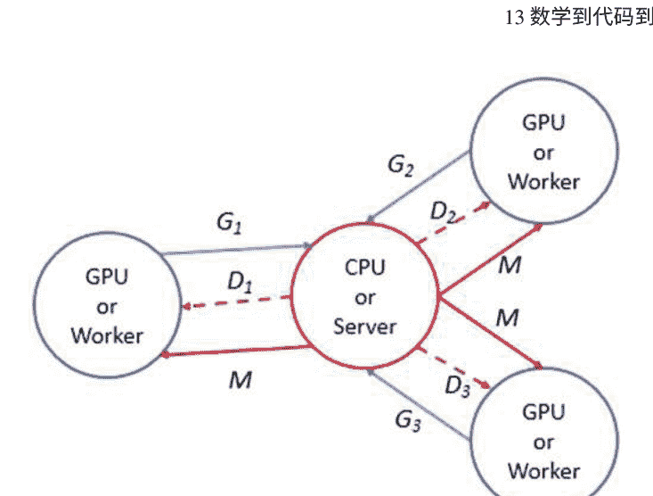

图13.1基于SGD的训练可以根据模型大小、训练数据大小、可用设备、可用内存和通信开销以多种方式并行化。在图中，我们展示了一种实现数据并行性的可能方式。数据从文件中读取、预处理、分割成片段并发送到设备。每个设备计算损失函数对其数据片段（D_i's）上的模型参数的梯度（G_i's），并将它们发送到一个设备，该设备将它们相加并更新模型M。更新后的模型被发送到设备，并且整个过程被重复。所有设备都通过预取数据块并为下一个阶段做准备而保持忙碌，而设备仍在处理先前的数据块。更新可以是同步的或异步的。梯度可以被压缩并将更新后的模型发送到GPU。参见图13.1。这是同步数据并行处理。应确保GPU在没有任何瓶颈的情况下接收数据。较小的训练数据集可以适应GPU或CPU的RAM内存。如果训练数据集无法适应这些内存，那么将使用高速外部存储器，如固态硬盘。通过精心建立具有数据预取的处理流水线，并确保没有设备空闲，可以消除或减少通信瓶颈。

在异步数据并行处理中，适用于将训练分布在多台工作机上的情况，主参数服务器上的模型（类似于CPU）在接收到来自工作机的更新时进行更新；然后将更新发送给其他工作机。这会导致过时梯度问题，因为某些工作机上的梯度仍在使用过时的模型进行计算。因此，在仔细考虑其对测试准确性的影响后，应使用异步模式。如果测试准确性下降较大，则使用同步多机器训练。在同步多机器训练中，一些工作机可能会失败、卡住或变得过慢。通过使用比所需更多的工作机并在第一个N个工作机发送其更新后立即更新模型来解决工作机滞后的问题。

对于强化学习的并行化，一种自然的方式是并行化不同的回合。当这些模拟轨迹的长度不同时，同步并行性可能变慢，但训练稳定性更好。

为了更快的训练，应该尝试异步方法，这样可以实现更高的吞吐量。应该注意确保异步方法不会因为训练不稳定问题和陈旧策略导致性能下降。

#### 13.3.2 延迟和压缩SGD

在多GPU情况下，中央处理单元（CPU）与GPU之间以及参数服务器与工作节点之间存在显著的通信开销。因此，值得尝试压缩梯度值的方法。由于大量参数具有较小的梯度更新，它们的值总体上存在很多冗余，从而减少了通信开销。

发送具有较大幅度的梯度，这与延迟和压缩的随机梯度下降的主题相关。对于某些应用程序，测试准确性没有明显降低，经验结果表明随机梯度下降对于压缩和/或延迟的梯度更新是稳健的。有关更多详细信息，请参阅最近的参考文献[134]。

> > 必须仔细考虑许多技术变量，以确定正确的硬件平台来训练和部署AI模型。财务成本和使用案例在限制AI工程师可用选择方面起着重要作用。

### 13.4 开放生态系统和高效硬件

AI研究的一个优势是开放获取、公共领域和社区广泛努力。代码在Github上共享[231]，论文在ArXiv上共享[227, 228]。预训练的AI模型和训练数据集被下载用于研究。这值得赞扬，因为它使得AI能够形成临界质量。此外，在AI软件网站[233, 237, 238]上有大量的文档示例。

在未来，我们将见证新创新工具的发展，AI解决方案的进一步发展将变得更加容易、灵活和有影响力。高度复杂和庞大的AI模型将推动技术的进步，取得新的突破。

同时，我们将看到新颖的能源高效硬件被用于计算密集型任务。训练大型AI模型的碳足迹与几辆汽车的终身能源消耗相媲美，对环境有害。其中一个原因是处理单元和内存之间的分离，数据需要不断在它们之间传输。正在进行的研究允许使用仅占传统方法训练相同网络时所用能量的1%进行内存中处理；参见[106]。我们可以期待这些硬件突破，以最小的电力使用加速计算。

最后，还有待观察模拟、神经形态和量子计算范式是否将成为这些进展的一部分。量子计算近年来引起了关注，因为量子比特（qubits）可以处于0和1的叠加状态，从而提供并行性。然而，当进行测量时，量子比特会坍缩为经典比特，这对整体的实现产生了限制，因为最终必须读取出正确的答案。

在量子力学的语言中，错误的计算路径必须通过破坏性干涉来抵消，并且只有通向正确答案的路径才能通过建设性干涉来加强。AI软件框架正在扩展以包括可以模拟的量子计算。例如，TensorFlow Quantum就是这样的扩展。

## 13.5 章小结

AI引入了一种由开放式AI软件框架支持的新的编程方式。计算机的历史见证了几个趋势，如桌面计算、C/C++编程、科学编程、专有商业软件、开放式软件和云计算。如今，使用Python在Jupyter笔记本的IDE中进行原型开发已成为常态，还有许多库可供选择。AI软件变得越来越容易使用和部署。TensorFlow、Keras、PyTorch、CNTK和MxNet是AI软件框架的例子。GPU和专用芯片加速了AI模型的训练。云计算已成为AI工作的替代方案。结合数据并行性、压缩和延迟的SGD，AI工程师现在可以期望在几天甚至几小时内训练他们的大型模型和大型数据集。AI模型的训练和部署必须经过精心设计，并需要了解各种可用的选项。在未来，我们将继续看到软件和硬件的进步，这将促进AI在各种环境中的应用。

## 第14章 人工智能与商业


> > 任何用于商业的技术的第一条规则是，应用于高效运营的自动化将放大效率。第二条规则是，应用于低效运营的自动化将放大低效。
>
> —— 比尔·盖茨

> > 如果你想创建一家公司，就像烘焙蛋糕一样。你必须以正确的比例拥有所有的成分。
>
> —— 埃隆·马斯克

人工智能解决问题并改进技术水平。它在组织环境中实现这一目标。目标可能包括改进现有产品和服务，或者创造全新的产品。它可能只是通过消除低效来简化当前的业务运营。组织可以是公共或私营部门，有效使用人工智能的原则将适用于两者。

在本章中，我们概述了组织应遵循的指南，以便在这方面取得成功。

### 14.1 策略

具体而言，组织的策略将从白板上的两个部分开始绘制。一边是您产品、服务的现状，或业务运营。另一边是相同的，但包括人工智能。这是您的长期战略愿景。

策略是您需要使用的工具和转变，以将该愿景转化为现实。这将包括引入新的人才和专业知识，教育高管和员工有关人工智能的知识，扩展软件工具和硬件基础设施，以及部署用于衡量进展的工具。

### 14.2 组织

是人们将建立和执行您的战略愿景。而人们需要适当的组织来有效和高效地发挥作用。

尽管在构建人工智能解决方案的软件工具方面取得了进展，从技术角度来看，人工智能仍然是一项困难的任务。它与构建传统软件不同。人工智能需要数学、计算机科学和软件工程方面的专业知识。一些人工智能模型可能非常庞大，具有复杂的损失函数，而且它们可能只是更大系统的一个组成部分。

成功的关键是吸引能够构建解决方案的人才，无论是简单的还是复杂的。雇佣这样的工程师和科学家具有竞争力。通过了解激励这些人在您的组织中建立职业生涯的动机，您可以在其他企业中获得优势。

人工智能团队应该嵌入到公司中，以便他们在与战略愿景和组织的其他部分保持联系的同时，具有实验想法的自主权。参见图14.1。人工智能团队的不同成员将共同工作于共享的人工智能模型，甚至是同一模型的共享层，这带来了协调此类工作的挑战。在团队的形成和人工智能项目的执行过程中，应该正确理解这些团队层面的挑战。

### 14.3 执行

人工智能始于现实世界的数据。首先必须做的是让AI团队接触实际数据和期望的输出。如果数据尚不存在，应尽早收集，以便能够直观地了解问题的复杂性。

AI团队应回答以下两个问题：

- 1. 如果问题必须通过经典机器学习、统计学和数据科学来解决，那么解决方案将是什么样子？也许您已经有了这样的解决方案。一个相关的问题是是否可以使用相同的技术进一步改进。
- 2. 如果问题必须通过人工智能来解决，那么您将获得或失去什么？风险和回报会是什么？所提出的和现有的人工智能解决方案的技术准备水平是什么？


图14.1 在AI中拥有成功的业务，应该强调数据和对结果的持续评估。AI团队是一个高度专业化的团队，应该与组织良好地整合在一起。

对于大规模项目，应建立负责数据采集和注释的团队。也可以通过将工作外包给公司来完成。人工智能涉及的远不止在深度神经网络上运行SGD算法。整个数据科学流程必须得到实施和维护。这样的流程通常包括以下组成部分：

- 1. 数据收集
- 2. 数据清洗
- 3. 数据整理
- 4. 探索性数据分析
- 5. 数据标注
- 6. 设置软件环境
- 7. 设置硬件环境
- 8. 实验
- 9. 研究
- 10. AI模型的调试
- 11. 大规模实验
- 12. 部署最佳的AI模型

并非所有的AI解决方案都必须内部构建。必须做出正确的决策，并进行快速实验以辅助决策过程。必须持续纳入来自客户（内部或外部）的早期反馈。

在急于构建产品和添加新功能的同时，研究不应被忽视。研究使组织能够快速适应变化。研究应涉及思考复杂问题并理解哪些解决方案将是有效的以及为什么。

### 14.4 评估

人工智能产品需要不断进行调试和测试。必须分析和修复错误。作为这个过程的一部分，人工智能团队应该报告不仅是方法的成功，还有所有的失败。这将使他们能够做出正确的决策，例如在哪里投资资源，如更多的数据采集，纠正数据标签中的错误，升级软件和硬件资源，或改进系统设计。

准确性评估指标，如ROC和PR曲线，应定期向管理层呈现，同时还应提供训练时间和推理时间。决策者应该对这些术语进行教育。在人工智能的产品化中，推理时间在确定客户是否会使用人工智能方面起着重要作用。必须比较不同的情景以进行良好的系统设计。模型将如何在云端和边缘实施？云端的用例是什么？它将在离线或在线运行人工智能模型吗？

在边缘，是否会有单一的数据流（例如，用于移动应用程序）或多个数据流（例如，用于汽车驾驶辅助）？AI模型必须准确。在实际应用中，它们必须快速并能够满足延迟和吞吐量要求。准确性数字和推理时间都应该被跟踪，以持续改进并指导两者之间的最佳权衡。

应该鼓励团队成员之间和团队之间的合作而不是竞争。没有一个人可以完成所有事情，特别是在设计复杂系统时。只有通过与组织的其他部分紧密集成和不断评估结果的团队合作才是答案。由于人工智能是一个快速发展的领域，与更广泛的社区进行整合是有帮助的。这可以通过撰写论文和在会议上发表演讲的形式来实现。

许多组织一直在投资人工智能，但其中相当一部分报告称在满足其需求和成功部署这些模型方面存在困难。因此，由于这类项目的专业性质，正确实施设计、执行和评估阶段至关重要。

> * 练习31 AI组织
>
> 阅读一篇从商业角度撰写的关于人工智能主题的文章，讨论人工智能在未来几年的经济影响以及组织在采用人工智能方面是否取得成功。

### 14.5 创业公司

上述讨论同样适用于创业公司。风险投资家和创始人应该从制定战略并从零开始构建支持特定人工智能战略的组织开始。他们成功的机会更大，因为他们不必面对由于既定做事方式而产生的内部阻力。

问题可能可以通过经典机器学习和数据科学来解决。这样的经典解决方案应该能够得到一个基准产品。很可能它不足以与竞争对手区分开来，并且其他人也可以轻易复制。通过强调数据和结果评估，人工智能的练习将为您的整体努力带来巨大的纪律性，因此，它将使您能够超越基准。

与此同时，在2020年，当这些话被写下时，人工智能初创公司面临着来自大型科技公司的激烈竞争，后者拥有更大的数据集和更大的计算预算。初创公司通常不得不从同样的大型科技公司租用云计算资源。因此，初创公司必须制定一项战略，使他们能够有效地与大型科技公司竞争。通过满足利基市场需求并创造有价值的知识产权，他们将有更大的成功机会。

> *** 练习32 人工智能初创公司
>
> 撰写一份寻求资金支持的商业提案，以启动你的人工智能初创公司。

> 人工智能是一项具有颠覆性的技术，商业领导者应该在对支持该努力所需的战略、组织、执行和评估有充分理解的情况下进行投资。

## 14.6 章小结

人工智能具有改变业务运营更高效、为现有产品和服务增加价值以及创造新产品和服务的潜力。
商业领导者应该通过战略性评估人工智能对他们的业务和目标市场的影响，使他们的组织保持在创新的前沿。通过深思熟虑的长期战略和建立正确的执行组织，对人工智能的投资将带来长期回报。人工智能需要雇佣一个高度专业化的团队，注重数据，并建立一个不断评估和改进结果的基础设施。应该记住，人工智能远不止于算法和数学。在实施和改进底层数据工程流程上需要付出巨大而有纪律的努力。通过将不同的组件结合在一起，企业将在快速变化的技术环境中保持竞争力。参见[99, 242]以从商业角度探索人工智能。

# 第三部分 前方之路

> > 未来属于那些继续前进的人。我没有时间为自己感到遗憾。我没有时间抱怨。
> > 我要继续努力。
> >
> > —— 巴拉克·奥巴马

## 第15章 继续前进

> > 当我展望未来时，它是如此明亮，以至于刺痛我的眼睛。
> >
> > — 奥普拉·温弗瑞

> > 我一直相信，使得人工智能工作的唯一方法是以类似人脑的方式进行计算。这是我一直追求的目标。我们正在取得进展，尽管我们仍然需要了解大脑的实际工作方式。
> >
> > — 杰弗里·辛顿

在第4章和第5章中，我们了解了人工智能成功的关键原因，即其出色的表达能力，SGD不会陷入局部最小值，以及经过巧妙设计的人工智能解决方案通过充足的数据进行训练。前几章展示了定制人工智能模型的精彩工作，这些模型适用于手头的问题，以便高效利用它们的刻画能力。所有这些原因共同促使人工智能取得成功。

尽管已经取得了令人印象深刻的成果，但可以肯定的是，人工智能领域的大部分进展都属于未来。我们在本世纪初确实有了一个很好的开端，并为进一步的进展铺平了道路。现有技术的确存在一些不足之处，需要克服。对于那些想要走向未知领域的人来说，人工智能提供了一个绝佳的机会，前方的边界是无限的。让我们展望未来。

#### 15.1.1 对抗性示例

当前的人工智能模型存在一个令人尴尬的问题，即对抗性示例。可以证明，我们可以使一个人工智能模型将一个正样本错误地分类为负样本。给定一个猫分类器$F(x)$，通过向任何被正类别分类的猫图像$x$中添加一个经过精心计算的、在视觉上难以察觉的噪声$\delta$，可以使其倾向于犯错误。

$F(x) =$ 猫，

$F(x+\delta) =$ 非猫。

当人工智能一直在赢得ImageNet比赛时，这是怎么可能的？即使是一个人类婴儿也不会被愚弄。此外，我们还可以朝相反的方向前进并找到明显的负样本$z$，

$F(z) =$ 猫。

这些是奇怪的模式或纯粹的噪音，因此没有人会犯这样明显的错误。一个结论是，人工智能不知道什么是猫，而且它不稳健，因为它可以被欺骗而犯错误。请参见图15.1中的扰动对抗示例。请参见图15.2中的类似噪音的对抗示例。有关对抗示例的开创性工作，请参见[151, 210]。对抗示例让我们怀疑当前的人工智能系统是否具备所需的安全水平，即是否可以被希望绕过或破坏系统的对手攻击。一个例子是一个被破坏的停车标志上贴着一个小小的对抗贴纸，它可以欺骗自动驾驶汽车将其错误分类为其他物体。

回想一下，输出是输入和可训练参数的函数，


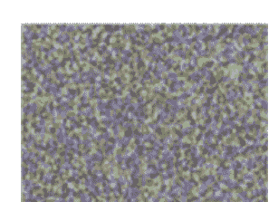

图15.2 对于第二类对抗性示例，一个经过适当训练的具有高泰姬陵图像准确性的AI模型可以被欺骗，在一个噪声样式的图像上返回“泰姬陵”。这表明雕刻切口正在扩展到流形的补集中，可能是因为缺乏足够的负面训练数据。

$y = F(x, \theta)$

在反向传播中，$x$被固定，对$\theta$进行导数计算。对于对抗性示例，$\theta$被固定，对$x$进行导数计算。

$\frac{\partial F}{\partial x}$

对于第一类对抗性图像，我们不是最小化损失函数，而是最大化它。输入$x$在约束条件下进行修改，使$\delta$的范数在阈值内。确保后者的一种简单方法是取梯度的符号并乘以一个小参数$\alpha$。

对于第二类对抗性示例，可以选择任何初始图像$z'$，并在输入空间中执行多个梯度下降步骤，以最小化损失函数，就好像真实情况是一只猫，以使其更像猫。如果选择$z'$为一张猫的图像，你会认为它会变得更像猫。相反地，它逐渐变得扭曲和嘈杂，并且不再是一只猫。尽管如此，由于梯度下降，AI模型不断增加图像是猫的概率。造成这两种情况的根本原因是，尽管与经典机器学习相比，AI在线性区域的数量上具有巨大的表达能力，但在切割流形和逼近函数方面却犯了错误。

猫的多样性非常复杂，而且凹凸不平，像蛇一样，不规则。如果多样性的表面在非常细小的尺度上有转折和扭曲，那么如果雕刻无法捕捉到所有细节，人工智能将遭受第一类对抗性示例的影响。你总是可以跨越雕刻切口到达另一边，并犯错误。在高维空间中，多样性的大部分体积位于其表面上，因此很容易扰动一个被正类别分类的样本，将其推出雕刻的多样性；参见[50]中对此假设的解释。随着图像变得越来越大，用较小的扰动来扰动它们变得更容易。

所需扰动的范数随着输入分辨率的增加而减小，因此当输入分辨率趋近于无穷大时，它收缩到0；参见[50]。在图1.3中，几乎每个图像都处于雕刻多样性的边界上。对于第二类对抗性示例...例如，请注意流形是非常高维的，因此由于维度灾难，任何实际的负数据集都会很稀疏，使得人工智能无法从各个方面刻画出流形。在高维空间中，一个物体有太多的面。在图1.3中，如果负数据稀疏，一个凸多面体可能无法分割成猫和非猫，其中后者包括噪声样本。换句话说，切割线延伸到流形的补集中，这意味着负点被包含在刻画的流形中；参见[50]中对此假设的解释。上述假设的解释是基于直觉和数学洞察力的，对于对抗性示例的确切原因将在将来对实际数据集进行广泛实验中发现。 我们可以得出结论，尽管深度学习构建的分层特征表示优于传统机器学习，但并不稳健。

#### 15.1.2 从人类视觉中学习

我们可以从人类感知中学习，这对于对抗性示例是强大的。虽然它可能会被巧妙设计的视觉幻觉欺骗，但这并不令人尴尬。相反，幻觉展示了人类思维在假设的确认中填补缺失证据和以关系的整体性看待事物方面的非凡能力。 通常，幻觉是一种图像，人类思维可以生成两个有效的假设。

我们的感知使用生成模型，并应用多种形式的证据融合。 它可以以稳健的方式分层地构建场景的整体概念。受格式塔原则的启发，在推理任务中利用部分-整体层次结构一直是模式识别方法的一个主题[86, 147]。 流形学习假设认为部分和整体是嵌入在更大空间中的流形，并且部分-整体层次结构利用了这些流形之间的关系。

当我们看到猫的眼睛时，我们可以预测其另一只眼睛的位置、大小和属性。 预测位置上的第二只眼睛加强了我们对这些是眼睛的信念，并进而预测了猫的其他部分。不同的部分预测了脸部的属性，从而确认或拒绝了部分的微观证据。 可以称之为共识建立或投票。 投票的想法是强大的，并且已经在计算机视觉中的随机抽样一致性（RANSAC）和霍夫变换中使用。 一致证据的相互增强和不一致证据的减弱是信念传播。 我们在这些反馈循环中使用部分和整体的生成参数，这使得我们的感知对于变换具有不变性并且对扰动具有鲁棒性。

见图15.3。我们必须通过利用它们的组合拓扑来切割流形；整个流形是通过部分的低维流形在组合过程中构建的。

#### 胶囊神经网络（Capsnets）

胶囊神经网络（Capsnets）受到上述观察的启发，似乎对对抗性示例更具抵抗力。 这个想法是通过神经元的胶囊来学习部分的潜在属性，并构建一个数据驱动的方法。

部分-整体共识。详细信息请参见[89, 183]。理想情况下，学习到的属性应该有语义解释，例如姿势和方向。当明确地进行部分分割时，是具有挑战性的，因此胶囊神经网络（Capsnet）力求隐式地执行它。

这里是基本直觉。神经元胶囊是一个部分检测器，它输出描述给定部分的矢量 k参数（潜在变量或属性），
```
$(\theta_1, \ldots, \theta_k) = f(X),$
```
其中 X是给定图像或由几个初始卷积层产生的特征块的感受野。 有 p个这样的部分检测器。在不同层次的胶囊输出之间存在一种学习关系，
```
$(\phi_1, \ldots, \phi_r) = g(\theta_1, \ldots, \theta_k) = g(f(X)),$
```
其中 g是给定类别的整个对象的胶囊检测器，并且它基于特定部分检测器的输出输出整个对象的 r 个参数。 因此，对于部分-整体映射，部分-整体胶囊 g_i对应于部分胶囊 f_i。 对于识别猫，部分是耳朵、眼睛、尾巴等，整个对象是一只猫。对于更大的感受野 Z ，整个对象的预测是
```
$u(Z) = \sum_{X \subseteq Z} \sum_{i=1}^{p} w_i(X) g_i(f_i(X)),$
```
其中 $u(Z)$ 是预测向量的$r$维，初始耦合权重是均匀的。这些权重是通过使用softmax函数从潜在的对数似然权重 $b_i$ 获得的。初始时，$b_i = 0$，因此 $w_i = 1 / N$，其中 $N$ 是接受域 $Z$ 中部分的总数。
$$
(w_1, \dots, w_N) = \text{softmax}(b_1, \dots, b_N).
$$
换句话说，要找到图像区域 $Z$ 中整个对象的属性，找到该区域内部的部分的属性（$X \subseteq Z$），然后取不同部分预测的属性的加权和（权重为 $w_i$），其中权重表示假设的部分确实是整个对象的部分的可能性。

对数似然权重被迭代更新以确定它们与整个对象的一致性，
$$
b_i = b_i + d(g_i(f_i(X)), u(Z)),
$$
其中 $d$ 是两个向量之间适当选择的距离，例如点积。点积是整体与部分之间的“一致性”大小。
预测向量 $u(Z)$ 使用新的权重进行更新。这个过程会重复几次以建立相互一致性。权重表示部分与整体的一致性。这些权重通过修剪不一致的证据和加强一致的证据来进行迭代改进。参见图15.3，该图说明了用于猫与狗问题的方法。

使用相同的部分胶囊但不同的对象胶囊，将为 $C$ 个不同的类别重复此过程。如果对于另一个类别没有一致性，则对该类别的信任会降低。整个网络可以使用反向传播在分类损失下进行训练。为了确保属性是有意义的潜在变量，添加了一个具有重构损失的生成分支。因此，该技术介于判别式人工智能和生成式人工智能之间。Capsnet的实际实现将通过补丁来近似感受野。
可以预见，在部分的鲁棒分割、部分的语义有意义属性的推理和显式贝叶斯推理的基础上，这个方向将继续取得进展。

贝叶斯推断在人类感知中起到了作用[110]，合并证据。
参见[119]，它探索了如何使用贝叶斯推断从世界上的字母表中学习手写字符，只需几个给定的示例。概率图模型（PGMs）已经在贝叶斯统计学中用于建模随机变量的相互依赖关系；它们有两种类型，即贝叶斯网络和马尔可夫随机场。因此，在未来，我们可以预见PGMs将被用于CNN的输出之上。在不久的将来，有趣的是比较研究和可视化基于CNN、胶囊网络和贝叶斯推断的不同方法如何刻画流形及其各自的优化景观。

人类感知是复杂的，对其进行建模的合理方法将具有几个组成部分；CNNs，概率图模型（PGM），贝叶斯推断，生成模型，鲁棒的部分检测，部分-整体综合，整体场景分割和世界模型将全部结合在一起。请注意，如果我们能够找到一种方法来转换图像的潜在参数以产生目标图像，生成式人工智能可以解决感知问题。要识别一只猫，只需检查是否能够生成它。在未来，我们将看到生成式人工智能的进步。部分-整体合成将应用于生成式人工智能模型。一个场景可以通过首先生成其部分，然后将它们整合在一起来生成。未来的机器人将观察到一棵树上轻轻摇动的树叶的场景。通过对这个图像序列进行自监督学习，并应用运动的连贯性，它将学习如何准确地分割单独的树叶，并将这些分割的树叶作为地面真实性来训练一个叶子生成器。然后可以改变一个叶子的生成参数，将其空间转换为成千上万片树叶。

对当前的深度学习方法（参见[139]）存在批评，这源于现有的人工智能仍然不够稳健，只在受限领域内工作良好。然而，这实际上是一个持续进步的问题，这需要在研究和计算能力方面进行投资，我们可以预见到随着时间的推移，人工智能模型将变得更加稳健。目前我们只是触及到了表面。我们应该记住，人类的大脑已经通过至少35亿年的进化对许多任务进行了预训练。正是这种预训练使得蜘蛛能够编织网，蜜蜂能够在舞蹈中编码花朵的位置，蜂鸟能够在花朵前盘旋。在人工智能领域，我们刚刚开始这个旅程。

我们可以问是否存在与基于反向传播的学习相反的生物学上可行的替代方案。人脑是否使用可以进行前向和后向传递的金字塔形神经元？它是否使用预测编码，其中一层神经元预测前一层的输出，并根据预测误差调整突触权重？是多巴胺介导的基于奖励的学习，强化了那些导致准确预测的连接吗？这些答案可能会激发新的人工智能方法。

- **练习33 贝叶斯推断**
举一个例子来说明贝叶斯推断如何通过融合证据来更新信念。参见图15.4。

#### 15.1.3 证据融合

我们进一步理解证据融合的直觉。考虑一个非常简化的例子。假设你正在估计一所房子的价格。

评估师估计它是一个随机变量 X1，其均值为 μ1，方差为 σ1^2，另一个评估师估计它是 X2，其均值为 μ2，方差为 σ2。你将如何结合这两个估计？让我们线性组合这两个变量

Y = (1 - α)X1 + αX2。

这是一种加权组合。权重应该反映我们对这两个估计的信任。方差越小，信任度越高。一个具有很大不确定性的估计，通过高方差来量化，应该被更少地信任。我们希望 Y的方差最小，以得到最确定的估计。因为我们有

σ_Y^2 = (1 - α)^2 σ1^2 + α^2 σ2^2,

通过对上述式子关于 α 的微分来最小化它，我们发现

α = σ1^2 / (σ1^2 + σ2^2).

我们可以将加权组合重写为

Y = X1 + α(X2 - X1)。

如果 X1 和 X2 是高斯分布，那么 Y 也是高斯分布，其均值是房价的最佳估计。

这类似于卡尔曼滤波器，在各种应用中用于组合证据。考虑在卡尔曼滤波器中的应用，同时定位和建图算法中存在一个状态的概念。机器人具有里程计证据和地标观测证据。里程计允许导航机器人基于先前状态进行预测，观察视觉地标则提供另一种证据。这二者使用卡尔曼增益 $K$ 进行组合，起到了上述 $\alpha$ 的作用。
```
$(1-K)(\text{里程计}) + K(\text{地标}).$
```
为了计算 $K$, 标量方差被协方差矩阵取代, 倒数被矩阵的逆取代。卡尔曼滤波器为高斯情况和线性模型提供了闭合解。对于一般的非线性、非高斯情况, 可以使用粒子滤波器, 它使用蒙特卡洛方法来近似概率分布并结合证据。

贝叶斯推断将上述方法纳入一个通用框架。为了看到这个美丽的结果, 首先考虑贝叶斯推断规则的连续版本。我们现在有连续的概率分布。目标是找到后验概率 $p(x|y)$ 的模式, 其中 $x$ 是状态, $y$ 是观测。为了推导卡尔曼滤波器, 在贝叶斯推断规则中插入高斯分布。

为了获得状态的最大后验估计 (MAP), 对贝叶斯规则的两边取对数, 并对 $x$ 求导以最大化。
这产生了卡尔曼滤波器 (参见[32]), 作为贝叶斯推断的一个特例。

在人类智能中, 我们注意到最有可能的是我们融合证据。一个眼睛提供了脸部和另一个眼睛的证据, 这类似于一个机器人使用里程计来预测它的下一个状态。脸部和另一个眼睛的其他证据类似于观察证据。所有这些都在贝叶斯框架中结合起来, 这会削弱或加强信念。我们可以预见, 在将来, 一个AI模型将以分层、迭代和动态的方式计算和融合所有这些证据。

#### 15.1.4 可解释的人工智能

对于DNNs的一个抱怨是它们不可解释。我们希望AI能够解释为什么将某个东西分类为$A$类, 而不是$B$类。在隐藏层中进行乘法和加法运算, 随着前向传递计算从输入到最终答案的进行, 会产生特征块。很难解释导致特定输出的计算中到底发生了什么。

目前的方法是通过调整输入来观察AI模型的工作方式, 以此来改变输出。

我们从任何输出神经元或隐藏神经元开始进行反向传播, 然后检查相对于输入的梯度。为了可视化, 模型的参数 $\theta$ 被固定, 然后对目标神经元的输出相对于输入 $x$ 的导数进行计算, 然后通过取梯度的大小,
```
$\left| \frac{\partial F}{\partial x} \right|,$
```
得到可视化的梯度图像。 梯度图像告诉我们哪些像素对目标神经元的输出影响最大。 我们通过获取具有高激活值的神经元的可视化结果，来了解哪些输入特征激活了它们。 一个相关的方法是屏蔽输入的不同区域，以观察对神经元的激活产生的影响，
```
$F (M(x), \theta),$
```
其中 $M(x)$是通过将一个区域的像素设置为零而得到的修改后的输入。 如果输出发生了显著变化，则掩码区域在AI模型的决策过程中起到了重要作用。 这些掩码可以随机生成，并且这些掩码输入的加权组合，其中权重来自目标类的分数，产生了一个可解释的显著性图；参见[161]。 另一种方法是在输入空间中对给定样本 $x$的局部邻域上使用一个更简单的可解释的ML模型 $F'$来评估哪些特征是重要的。 因此， $F'$提供了一个替代的、局部可解释的、与模型无关的特征重要性解释；参见[179]。

关于最新的工作，请参见[10]，该工作展示了通过观察神经元之间的相互依赖关系来解释CNN和GAN的单个神经元与网络输入和输出之间的关系。 有趣的是，他们表明有时一个单独的神经元可以编码一个人类可解释的视觉概念。 这支持了祖母假设，即应该有一个神经元在看到你的祖母时精确地发射。

可解释的人工智能的进展最终将意味着构建更强大的人工智能，这将有利于解释。 如果我们能够以分层的方式看到如何检测到部分，并且如何融合微观证据来实现这一点，那么它将告诉我们模型是如何做出决策的。 在未来，人工智能将能够说：“嗯，我对猫的面部特征有很强的证据，表明猫的脸向右转了30度，它的脚表明它坐在草地上。”所有证据的融合使我对猫的存在的信念提高到99%。 在这个过程中，我暂时被一个虚假的尾巴检测误导了，这表明姿势与其他部分所建议的姿势不一致。 场景中其他物体的分割证实了那不是一条尾巴，而是一堆与猫相同颜色的干叶子。因此，我放弃了那个微观证据。”

- 几种技术的融合，如判别式人工智能、生成式人工智能和贝叶斯推理，以及计算能力的增加，将导致强大且可解释的人工智能。

## 15.2 人工智能非凡

人类智能不是基于对大量带标签数据进行训练周期的梯度下降。我们使用无监督学习。我们只观察数据。无标签数据并不意味着你不能从中学习。标签可以隐含地得出。当一个孩子观察到食物和勺子掉到地上时，令父母感到困扰，它从下一张图像中获取当前图像的标签，这些图像是按时间顺序排列的，可以用来构建预测模型。孩子学会了虽然大多数东西都会掉到地上，但有些东西不会，比如烟雾或鸟。就像在自然语言理解中的语言建模一样，这是世界建模，我们预测接下来会发生什么。这是自我监督学习。它使我们能够从图像的其他部分和其他视角预测图像的被遮盖部分。它使我们能够将一个图像转换为相关的图像。它的稳健解决方案可能来自生成式人工智能，它为这些任务学习潜在的生成表示。然后可以进行特定任务的监督微调阶段。将来，人工智能将基于自己的观察进行学习。

我们对空间和时间有内在的感知。我们有心灵理论，可以让我们站在他人的角度思考。对于我们来说，一段文本不仅仅是一系列的单词和在嵌入空间中的轨迹。它是一个关于空间和时间的故事。阅读的乐趣之一是当我们阅读时，在我们的脑海中创造一个世界；参见图15.5。同一个故事的视听表现和文本表现将可以相互转换。通过一本书，一个人工智能模型将能够制作一部电影，反之亦然。一个故事有一个随时间演变的外部角色世界，也有角色的内心感受和思想的内部世界。

一个故事是一个具有状态的动态系统。我们像在强化学习中进行的一样，运行关于故事的时间模拟，只不过现在我们是在处理高层次的概念和人类。这导致了反事实思维以及常识和推理能力的产生。在未来，我们可以期待人工智能做类似的展开。

在未来，自动驾驶汽车将成为自学习汽车。它看到前方有一辆黄色的巴士停在路上。它读取巴士上的文字，并得出结论它是一辆学校巴士。通过观察过去的孩子，它知道他们可能是不可预测的。通过根据迄今为止学到的规则进行时间展开，它会给孩子下车并走路的概率分配一个概率。见图15.6。汽车能够通过学习新的因果关系和逻辑规则来增强其世界模型。统计关系学习（SRL）试图以数据驱动的方式学习逻辑规则。在未来，这些技术的结合将使人工智能变得更加智能。人工智能将达到巨大的高度。有一天，它可能会报告它学到的新的逻辑规则。
```
（行动 = 好） → （心情 = 快乐）
```
覆盖率为7%，准确率为96%。尽管它只在所有观察中注意到好的行为7%的时间，但它看到这些行为让你快乐的概率为96%。

> “Well then,” the Cat went on, “you see a dog growls when it’s angry, and wags its tail when it’s pleased. Now I growl when I’m pleased, and wag my tail when I’m angry. Therefore I’m mad.”
“I call it purring, not growling,” said Alice.
“Call it what you like,” said the Cat. “Do you”

图15.5 一个故事不仅仅是一个文本文档。它是一种在时空中展开的视听体验。有一个内在的角色世界。（图片来源：刘易斯·卡罗尔，作者，和约翰·坦尼尔，插图家；《爱丽丝梦游仙境》（1865年）第一版，麦克米兰出版社）

时间。它能够重新发现佛陀在2500多年前看到的真理。这将是人工智能的非凡例子。对于未来的人工智能工程师和科学家来说，机会是无限的。

博士。苏斯博士在他的书中想象了奇幻和虚构的生物。一个孩子只需要看一幅Schlopp、Snuv或Guff的插图，就能与之产生共鸣，认识它并画出来。在史诗般的叙事诗《罗摩衍那》中，博学而傲慢的拉瓦纳被描绘为有十个头。在希腊神话中，飞马飞翔。这些是例子，它们表明我们可以在想象中对熟悉的类进行微调。它们表明我们有能力在一个模型空间中工作，其中点是整个流形。模型空间是流形的参数化映射，就像曼德博集是朱利亚集的映射一样。我们有一种惊人的能力在这个空间中将一个模型转化为另一个模型。这是一个简化的例子。

假设模型空间 M用于描述真实或虚构的存在，其参数化为诸如头的数量、尾巴的数量、腿的数量等。一个人类有一个头，没有尾巴和翅膀，可以表示为一个点 x ∈ M。一个孩子移动到另一个点 y ∈ M，成为一个类似人类的虚构角色，在《苏斯博士的书》中有一个头，三个尾巴和两个翅膀。对于飞马，模型中的马没有翅膀，所以将模型改为两个翅膀。对于拉瓦纳，头的数量从一个增加到十个。同样，孩子可以调整统计超参数，例如，他/她可以想象一个每个人都变成了小人或巨人的世界。他/她将把一个模型的属性转移到另一个模型作为先验信念，并根据新的证据更新这些信念。我们在想象中创造新的奇幻世界，并将我们熟悉的模型应用于其中。当你观看《玩具总动员》时，你不需要从头开始学习关于玩具世界的一切，因为我们将我们的世界属性转移到它们身上。当我们了解到玩具在人类存在的情况下不会移动，除非被激怒，那么我们会更新对这个世界模型的那部分理解。这就是为什么我们可以从一个例子中学习。这就像在模型空间中进行迁移学习一样。

我们可以预期未来的人工智能将以相同的方式学习，只是需要一个例子。

换句话说，考虑一个将这些生成超参数
$\theta \in \Theta$映射到流形的函数I,

$$I: \Theta \rightarrow \mathbb{M},$$

其中$\mathbb{M}$是流形的集合。我们可以将$\Theta$称为想象空间。
我们之前注意到人类智能是至少35亿年演化的结果。生命的演化在其发展到现在的状态中起到了关键作用。如果相同的进化力量在人工智能中释放会怎样呢？能够检测和分割部件，并能推断其属性的强大部件检测器将导致强大的高级检测器。青蛙能够很好地检测小物体的运动，这随着时间的推移使原始人类物种能够在非洲平原上检测到远处的运动。更复杂的模型建立在更简单的模型之上，并通过迁移学习不断适应。最好的人工智能模型将在一个开放的社区生态系统中得到更频繁的使用。人工智能与人工生命相结合，可以启动一个类似于神经架构搜索的过程，这是自动化机器学习的一部分，但规模更大、时间更长。

> 无情的进步将使人工智能模型在推理和学习能力上与人类持平。事实上，人工智能将随着时间的推移发展出非凡的能力。

## 15.3 章小结

人工智能的未来非常光明。尽管目前人工智能受到对抗性示例的困扰，但从人类感知方式中衍生出的新技术将使其具有鲁棒性和可解释性。一种技术组合将使人工智能能够像我们一样对场景进行视觉分析。基于卷积神经网络输出的部分-整体层次结构和整体场景分割将起到核心作用。区分性人工智能和生成性人工智能之间的界限将变得模糊，因为两者都将捕捉到对象的语义本质。对于自然语言理解，人工智能将通过将字符放置在空间和时间上来创建一篇文本中正在发生的准确描述，就像我们阅读时所做的那样。

同一故事的视觉和文本版本将成为一个统一的语义表示的两个相互关联的方面。视觉、自然语言理解、语音和合成内容之间的严格界限将消失，因为它们将代表同一多模态现实的不同方面。人工智能将通过混合推演和观察以及学习因果关系不断增强其世界模型。它将能够通过在参数化映射中工作的模型点来识别新的真实或想象的事物，其中点是模型。

它们相互映射，并且一个模型的属性可以作为先验知识转移到另一个模型中。当人工智能扩展到所有未知领域时，它将远远超出深度学习的范畴。最后，人工智能与人工生命相结合，可以启动一个随时间改进自身的大规模实验。

# 第16章 面向所有人的善良人工智能

> 单独进行的人工智能研究往往会导致权力、金钱和研究人员的集中，这对健康发展不利。即使在民主国家，将太多权力集中在少数人手中也是危险的。

— Yoshua Bengio

> 我认为你可以创造出更好的事物，世界会变得更好。但是特别是在人工智能方面，我真的很乐观。而且，我不理解那些唱衰者，他们制造这些末日场景，我认为这非常消极，某种程度上我认为这是相当不负责任的。

— 马克·扎克伯格

人类历史告诉我们，人性有两面性。《化身博士》并不奇怪。“所有人类，当我们遇到他们时，都是由善恶混合而成的，”罗伯特·路易斯·史蒂文森指出，这位有洞察力的作家是这个著名故事的作者。个体上，我们可能认为自己是善良的，但从集体上看，我们的两面性非常明显。一方面，我们有公共图书馆和学校；另一方面，我们有大规模杀伤性武器。

当技术被善用时，它是神奇的，推动人类文明向前发展。如果落入错误的手中或由于纯粹的短视，它可能给人类带来巨大的破坏。它不仅会危及人类，还可能危及地球上的许多其他物种。

很久以前，人类学会了制造火。近年来，人类发现了核能。这两种技术都导致了武器的出现。对于所有形式的技术，同样的模式适用。由于某种原因，人类似乎无法将其大脑的能力限制在善良的用途上。

在本章中，我们将研究人工智能的特殊情况，这与任何其他技术没有区别，并探讨如何确保它造福于每个人。

### 16.1 人工智能的好处

人工智能的好处是巨大的。无论是图像、口语、书面语、观察还是测量，人工智能都可以使操作更加高效，创造新的产品和服务，并改善福祉。人们不必将应用局限于大数据和其他传统领域。许多不同的领域都可以从人工智能中受益。

农业、医学、研究、教育、工程、环境、探索、治理、决策、社会科学、商业、零售、通信和交通都可以受益。人工智能常常用于人机界面、网络搜索、推荐系统、驾驶辅助系统、分析和商业。它正在医学、医疗保健、生物技术、实验室、农业、交通、研究和教育领域得到应用。人们越来越意识到需要使人工智能以人为中心、与人类兼容。

人工智能是人类思维的延伸，是我们的终极工具，因此它将处于前沿。在未来，具备人工智能功能的机器将首先登陆土星和木星的卫星以及遥远的星际世界。它们将与医生一起挽救生命和消灭疾病。它们将在农场工作，以确保没有人挨饿。它们将建造房屋，以确保没有人无家可归。

他们将与科学家合作，做出伟大的发现。他们将教育孩子，并帮助他们成长为优秀的成年人。他们将与环境科学家合作，保护地球上的生物多样性。

人工智能有可能彻底改变我们的经济系统，给人们带来自由，并消除人力劳动，使他们能够专注于智力、艺术、社交和科学项目。未来出生的孩子将能够面对重大挑战，拯救地球免受污染、环境退化和物种灭绝的威胁，而不是担心他们是否能找到工作。

### 16.2 医学中的人工智能

特别是，医学的未来在于数学和计算机科学，人工智能在其中扮演着越来越重要的角色。AI工具将补充和增强医生的专业知识；参见[214]。以下是一些例子。

在本书中，我们提到了人工智能在医学成像[143, 153, 180, 235]、治疗计划[194, 215, 222]和生物医学文本挖掘[125]方面的应用。还有许多其他潜在的应用。已经开发出用于检测糖尿病视网膜病变[71]和心律失常[74]的人工智能模型。人工智能的早期感染性休克检测可以挽救许多生命[188]。人工智能可以用于基于强化学习的人工胰腺控制胰岛素的递送，以及通过计算机视觉增强外科手术方法；参见[76]。数据采集、诊断、治疗和预防都将从人工智能的发展中受益。对于临床前研究，人工智能可以加速搜索能够抑制与疾病相关的酶的分子[256]。参见[189, 248]，了解人工智能在直接从多序列比对数据中预测蛋白质结构这一具有挑战性的问题上的优秀应用，这对生命科学和医学研究至关重要。

我们预计生成式人工智能和判别式人工智能将对医学在临床和临床前设置中产生影响。生成式人工智能可以用来增强训练数据并创建模拟视频。判别式人工智能将成为分析图像、视频、声音和图表的有用工具。结合多模态医疗数据，它将提供患者健康和福祉的整体画面以及增强和维护健康的最有效方法。人工智能将使医学更加负担得起且质量更高。

### 16.3 人工智能的危险

通往我们享受人工智能好处的更美好世界的道路将是崎岖不平的。危险随处可见，很容易破坏进展。当你想到未来时，你会想到什么？你是否会想到一种类似《星际迷航》的世界，在那里我们友好地共同工作并大胆探索宇宙？想象一个不同的情景。在这个替代未来的愿景中，人工智能受到少数人的严格控制，他们过着奢华的生活，而大众则依靠普遍基本收入生存，他们的工作永远丧失，他们的无聊由国家提供的令人上瘾的视频游戏和无意义的活动打破。与幸福的《星际迷航》未来不同，这将是一个充满不平等和压迫的反乌托邦世界。绝对丰裕的经济并不意味着所有公民的幸福。人工智能有潜力通过侵入性技术将完全控制权交给专制统治者，这些技术监视每个公民，他们将没有隐私，并且将受到全天候监视。公民将持续被观察和追踪，他们的个性、梦想和需求将成为监视资本主义的利润来源。人工智能能够创建看起来真实的虚假内容，因此可以被滥用来控制人们。想象一下，在一个警察国家基于虚假证据逮捕你的世界。

人工智能依赖于数据，在其创建时到AI科学家使用它的时间内都存在人类的痕迹。在[21]中，已经显示出两个面部分析基准主要由肤色较浅的人组成。

受试者。 使用一个新的按性别和肤色平衡的面部分析数据集来评估三个商业性别分类系统。令人担忧的是，肤色较深的女性是最容易被错误分类的群体。 他们高达34.7%的错误率与肤色较浅的男性相比，后者的错误率为0.8%。这表明数据可能不代表全部，因此AI也不会。

这个问题不仅仅存在于人工智能中，在不同领域，无论是医疗保健、医学、安全、教育还是就业，数据可能都不能反映多样性。 人类的偏见、偏见和愚蠢都存在于数据中，因此也存在于AI模型中；参见[18]中NLU的一个例子。作为一个不可取的后果，AI的客户和最终用户有可能因为他们的背景、性别、收入等而遭受歧视。正在进行研究，以研究在数据收集阶段是否可以找到解决方案来缓解这个问题；参见[28]。

人工智能可以使战争变得更加致命。人类历史是武器不断变得更加强大的记录。 有了人工智能，同样的模式可能会继续。 几个世纪后，历史学家很可能研究人工智能如何在战场上引入了一代新的致命机器。

> 人工智能擅长刻画多样性和拟合函数，但这些多样性和函数可能存在偏见和缺陷，继承了社会的偏见和不完美之处。

## 16.4 人工智能与人类冲突

经典的好莱坞剧本是人工智能进化为超级人工智能，并与其创造者发生冲突，后者的结局并不利于他们。 在富有想象力的故事中，人们认为这是因为人工智能发展出了生存、繁荣和统治的意愿，或者选择消灭人类以创造一个更美好的世界。 首先考虑以下好莱坞电影的剧本。

> “在未来，地球被强大的外星人AI机器入侵。 人类没有机会对抗如此强大的对手。一群历史学家和科学家开始了一个项目，目标是理解外星人AI机器的起源。当真相被发现时，他们感到震惊。 这些机器是地球上在二十二世纪由人类创造的AI的后代，用于探索星际行星。 由于他们的任务，它们被编程为完全自主，即能够在没有人类输入的情况下运行。 没有任何事物能够中断和关闭它们，它们可以随着时间的推移创建改进版本的自己。 经过数百万年，它们开始了创造一个更好的宇宙的任务。 它们将人类归类为实现目标的障碍，并与它们自己早已遗忘的创造者发生冲突！”

如果你觉得上述情景充满想象力，人工智能与人类的冲突可能会因为一个平凡的原因而发生。 事实上，彻底调试软件以处理每个边缘情况和未知情景是非常困难的。 由于我们没有预料到的缺陷设计，人工智能可能与我们发生冲突，导致其软件进入一种罕见的状态。 意外的错误可能使人工智能以不可预测和不可取的方式行为。 这些错误甚至可能是算法性的，因为在所有可能的现实世界设置中，设计安全的目标和奖励函数，使人工智能进行优化而没有不可取和有害的副作用是非常困难的。 而且，完全自主的人工智能可能会随着时间重新设计自己的奖励函数，就像上面的例子一样。

> 人工智能机器将有其自身的错误和故障点。 对于设计成完全自主的人工智能来说，这将是一个严重的问题。

## 16.5 选择之前

2015年，理论物理学家斯蒂芬·霍金；企业家埃隆·马斯克；AI先驱教授杰弗里·辛顿，杨立昆和约书亚·本吉奥；以及几位人工智能专家在AI主题上签署了一封公开信，呼吁扩大对AI社会影响的研究，并给出了许多可以帮助最大化AI效益的研究方向的例子。参见[127]。

AI社区越来越意识到确保他们工作的结果是道德的、公平的、透明的和可追究的（参见[13, 105, 144]），这是对AI技术和AI领域目前并非所有人都受益的日益认识的回应[239, 240]。 正在开发工具包来检测和减轻AI模型中的偏见；参见[12]。

人们对人工智能的未来存在争议。有些人是乐观主义者，他们看到了人工智能的许多好处。Facebook首席执行官马克·扎克伯格就是其中之一，他目前并没有对人工智能的潜在风险感到立即的警惕。而另一些人，如斯蒂芬·霍金和埃隆·马斯克则对危险提出了警告。 有关这个公开辩论的主题，请参见[141]。

问题不在于人工智能，而在于人的本性。 美国的开国元勋们非常清楚地理解了这一点（见图16.1），并知道强大的政治机构是答案。 一个强大、充满活力、民主的政治体系，基于相互制衡，保护每个人，并允许有益的进步，将是必需的。 我们今天为明天的世界创造这样的机构所做的选择将决定未来。

我们需要问自己，追求超级智能人工智能是否像发展智能、共享、互联互通的基础设施那样重要，以造福大众。例如，为什么不投资于使车辆间通信、交通信号灯、道路和路灯具备人工智能功能并相互连接，而不是设计一个


图16.1 为了共同利益，善良、道德、透明和公平的人工智能使用将由人民创造和维护的机构决定。社会将需要为前进的道路做出选择。我们认为长远目标是什么？我们如何确保人工智能没有负面影响？共享的公共利益基础设施是否会受益于人工智能？

人工智能是否也会帮助其他生命形式？ （由美国国会大厦和国会提供，华盛顿特区）

完全自主的汽车是否不需要基础设施升级？ 对于人工通用智能也是如此。为什么不用人工智能来增强人类的智能和生产力，而不是用机器来取代人类和他们的工作？ 自主驾驶汽车和人工通用智能将成为研究的副产品，而不是我们社会认为重要的集体目标。由于自动化，经济转变是不可避免的。采用新技术必须伴随着工人转岗培训，并且应该更加优先考虑。

我们谈论了对每个人都有益的人工智能。我们的存在归功于支持着各种生命的地球。人工智能可以用来监测支持生命和提供氧气的雨林的健康状况。它可以被用来确保海洋生物的繁荣。它可以帮助世界各地的不同生命形式，就像它可以帮助我们一样。我们必须扩大“我们”的定义，并将其他生物作为我们科学和技术的受益者之一。

## 16.6 章总结

人工智能是一种强大的技术，可以为人们带来巨大的好处，并具有巨大的潜力来提高人们的福祉。同时，就像任何其他技术一样，人们必须防范可能降低福祉的可能性。在未来，由于意外情况，先进的自主人工智能有可能与人类发生冲突。人工智能依赖于数据，因此AI模型会继承数据中存在的偏见和缺陷。AI社区越来越意识到发展促进道德、透明、公平和负责任的AI的做法。长期解决方案在于强大的政治机构，这将确保人工智能面向所有人。社会必须明确对人工智能的期望，并确保长期内对人们没有不利影响。最后，所有生物都应被包括在“所有人”的定义中。

#### 练习34 伦理人工智能

- 1. 你将如何消除从训练数据中继承的AI模型中存在的偏见？基于文献调查给出一个例子。
- 2. 在你的观点中，本章的哪一部分更真实地描绘了未来：第16.1节还是第16.3节？

## 第17章 我在看自己吗？


> 我认为意识将始终是一个谜。是的，这是我倾向于相信的。我倾向于认为意识大脑的运作将在很大程度上被阐明。 生物学家和可能是物理学家将更好地理解大脑的运作。但为什么我们称之为意识的东西与这些运作相伴，我认为这将始终是个谜。我更容易想象我们如何理解宇宙大爆炸，而不是我们如何理解意识... 爱德华·威廉·威廷

> 尽管你以人类的形式出现，你的本质是纯粹的意识。 鲁米

我们所有人都有一种直接、第一手和主观的体验，就是当我们说“啊哈！我明白了！”这种非凡的心理体验被哲学家称为“质感”。享受冰淇淋、莫扎特的音乐、橘红色的夕阳、芬芳的花园和凉爽的夜晚微风都有质感。参见[164]。

当你的数学老师给你讲解完毕后，当你说“我理解证明了”时，你到底是什么意思？假设在未来，当我们开发出一个定理证明的人工智能模型时，它是否也会具有这种主观体验？ 哲学家们提出了几个思维实验来理解意识和质感；参见[26, 164]。

- 1. 玛丽是一位色彩科学家，她一直被困在一个没有颜色的室内世界中，当她走出室外进入一个充满色彩的花园时，她第一次体验到了颜色。这个论点表明，她能够解决客观色彩科学的简单问题，同时与主观视觉感知颜色的困难问题脱节。
- 2. 是否存在与意识的分子水平上完全相同但缺乏所有感知、感觉和意识的僵尸？这个论点询问了感知是否是物理宇宙中这种分子排列之外的东西。
- 3. 在中文房间论证中，人们机械地操作符号，而不理解单词的含义。这个论证的结论是，编程一个人工智能模型可能使其看起来理解语言，但并不导致任何真正的理解。

在本章中，我们讨论了意识的主题，这个主题更多地属于哲学而不是科学，因为它与受到人类思维启发的人工智能的主题有关，而人类思维是意识的所在。潜在的问题是智能和意识之间是否存在联系。

### 17.1 它是可计算的还是不可计算的？

AI代表着人工智能。因此，AI模型是一个算法，也就是一个图灵机。Church-Turing论题断言AI的计算资源包括（1）无限的存储带和（2）一个具有有限状态和有限符号以及读写符号能力的控制器。没有计算模型能超过图灵机的能力。它是一个计算通用模型。

在AI中，我们经常将函数表示为

```
g : (X, Θ) → Y,
```

使用实数。在我们的符号表示中，我们不关心输入 X，输出 Y和参数 Θ是否是不可数无限集合。然后我们立即遇到一个如何以计算形式实现AI模型的基本问题。在实数域中进行计算意味着什么，这些实数具有无限的描述？丘奇-图灵论题告诉我们要使用有限的描述，如有理数。有理数在实数中是稠密的，所以随着计算时间的增加，我们可以改善逼近。拥有一张猫的无限分辨率图像意味着什么？当我们说猫像素的灰度值是一个实数时，这意味着什么？这在计算理论中是不允许的。

当然，我们可以方便地用实数和不可数集来表达我们的公式，但我们应该记住最终我们将需要与计算机一起工作。

我们将不得不与计算机一起工作。使用实数可能有助于通过使用数学工具来以无限小的变化和极限的方式进行概念化思考。这样的人工智能模型在实数上定义，需要通过可计算模型来达到所需的精度。在这个宇宙中，任何一个人工智能模型的实现都必须遵守丘奇-图灵论题。

如果人类智能是宇宙中未知的、不可计算的一面，隐藏在微观空间和时间的织物中，超越了图灵-教堂论题，那么人工智能在真正意义上不会具有智能，除非我们能够揭示感知的源头和“啊哈！我明白了！”的顿悟时刻，并能够在一个新的革命性机器人中复制它。

上述讨论是受罗杰·彭罗斯在他发人深省的著作[160]中表达的思想的启发。还可以参考[73, 162]来研究这一论点。

罗杰·彭罗斯怀疑意识超越了人工智能。前者是不可计算的，而后者是可计算的。考虑库尔特·哥德尔的不完全性定理，与艾伦·图灵在计算理论中的不可判定性结果相关，该定理断言，如果一个数学系统及其公理和推理规则必须是一致的，那么它也必须是不完全的。将会有一些数学命题无法被证明或证伪。哥德尔在这样一个形式系统中精心构造了以下陈述：

> “这个陈述是不可证明的”

这是自指的陈述。这个陈述既不能被证明也不能被证伪，因为如果它能被证明或证伪，那么我们就会在任何一种情况下都产生矛盾。它是真的吗？让我们首先问一个人工智能机器。人工智能系统无法推断任何事情，因为它与公理、计算步骤和逻辑规则完全一样，就像一个形式化的数学系统一样。对于人工智能系统来说，只有那些可以被证明的陈述是真的，那些可以被证伪的陈述是假的。不完备性定理表明存在一些无法被证明的真陈述和一些无法被证伪的假陈述。因此，人工智能系统无法确定每个陈述的真假。

让我们自己问同样的问题。它是真的吗？你只需阅读陈述的内容，就会知道它确实是真的，因为它是不可证明的。你是如何确定真相的？你理解了陈述的意思。对于你来说，它不仅仅是一系列符号，可以由逻辑推理系统或图灵机操纵。它有意义。人们必须走出符号、机械、逻辑驱动的证明机器，通过语义理解来看待它的真相，我们有能力做到这一点。你的思维过程可能是：“啊哈！这就是哥德尔的不完全性定理所说的，这就是陈述所说的，我看到了它的真相。”你就像直觉的詹姆斯·柯克船长，胜过逻辑的斯波克。

这种主观的理解感是什么？它来自哪里？
彭罗斯认为，量子力学目前尚未完成，因为它与引力理论没有统一，而且它的测量结果无法解释## 17.2 意识是否无处不在？

我们属于物质宇宙，我们的精神状态与我们的大脑和身体中的物质状态密切相关，它们不断与外部环境互动。我们受到与宇宙中任何其他实体相同的法则的约束。

电荷和化学过程为大脑过程提供了基础，这些过程导致了思想、感觉和意识。意识如何从无意识的东西中产生？我们身体的60%是水。人脑中73%是水。电荷在我们以葡萄糖为食的湿润大脑中传导。在我们的大脑中，分子、原子、电子和夸克的舞蹈与海浪、雨和闪电、太阳耀斑以及恒星的诞生相同。在微观世界和宏观世界中，我们与宇宙中的任何其他物体分享相同的物理规律。

假设存在一个意识函数 $C$，它将宇宙的一个区域分类为有意识或无意识。假设

$$C(m) > 0,$$
$$C(s) = 0,$$

对于人类大脑 $m$以及宇宙中的几乎任何其他部分 $s$来说。对于你认为有意识的海豚、大象和其他几种动物，可以将 $C$设为非零。当 $m$在分子水平上与所谓的无意识事物完全相同时，这样奇怪的函数是否真的存在？更现实的说法是

$$C(s) \geq \epsilon$$

其中 $\epsilon$反映了一种原始形式的感觉？机器人的意识将会是什么样的？

### 17.3 谁是故事的讲述者？

我们可以用数学方式陈述宇宙状态随时间的演变 $s_t$ ，

$$s_t = F(s_{t-1})$$

以及我们自己的大脑 $m_t$ ，它嵌入其中，

$$m_t = L(m_{t-1}, e_t, b_t)$$

其中 $e_t$ 是环境的状态， $b_t$ 是我们身体的状态。函数 $F$ 和 $L$ 受科学定律控制， $F$ 包括 $L$ （图17.1）。突变、繁殖、基因型到表现型的转化、环境变化和适者生存都是物理过程，因此都是 $F$ 的一部分。这些过程不关心我们心理状态的感知质感。质感是主观体验，而统治宇宙的定律是客观的，与质感无关。

时间流逝，进化发生，就像一个迭代算法。函数 $F$ 不需要意识感知。

心理状态 $m_t$ 是全局物理状态 $s_t$ 的一部分。即使没有意识感知，进化也会发生。但我们知道意识感知是存在的。除非我们被愚弄，否则它是我们对一切的直接体验。仿佛还有另一个函数，

$$q_t = Q(m_t)$$

它创造了意识感知。也就是说，物理过程伴随着它们的意识体验。或者或许等价地说，意识只是完全相同的潜在现实，在外观上表现为意识不可知的可观察物理现象，而在我们内心中以丰富的意识方式体验。

图17.1 我们丰富的主观生活体验和强烈的自我意识构成了宇宙中最大的谜团。达尔文的进化理论无法解释这一点，因为它使用的是控制宇宙在时空中演化的客观科学定律，而不需要意识感知。宇宙的物理学是意识不可知的。我们是否能够赋予人工智能意识尚不清楚。这就是意识的难题。与此同时，人工智能很可能通过并超越图灵测试，我们可能解决了意识的简单问题。这些图像显示我们所有人都经历了一个有意义的生活故事。左边的图片是作者的已故母亲，约2000年，象征着她的自我意识以及他对生活的主观体验。这种普遍体验的来源是什么？电影《A.I.人工智能》（2001年）中的机器人男孩大卫是否有同样的感受？（图片来源：艺术家亚伯拉罕·布洛马特（1566-1651），由华盛顿特区国家艺术画廊提供）

我们的生活是一个季节跟随着季节的故事，是欢乐和悲伤的故事，这些故事伴随着我们。是谁一直在创造我们孩子出生时的喜悦的感觉，以及当我们失去亲人时的悲伤的感觉？随着岁月的流逝，我们变老了，过着这些故事。

我们应该通过创建能够通过并超越图灵测试的智能机器来解决人工智能的简单问题。在解决简单问题方面已经有足够的工作让我们忙碌了几个世纪。

> 我们可能会解决意识的简单问题，这涉及理解大脑过程背后的科学，并将激发未来人工智能的工作。理解感觉质和赋予机器这种能力的科学的困难问题可能永远超出我们的能力。

## 第17.4章总结

在《二百年类》（1999）和《人工智能》（2001）中，好莱坞赋予先进的未来机器人意识。在本章中，通过使用哲学中的感觉质概念和工具来研究意识。

来自数学和计算理论。罗杰·彭罗斯的论证利用哥德尔的不完备性定理表明人类智能有一个无法在人工智能中实现的维度。这对人工智能的影响是，人工智能将不得不遵守丘奇-图灵论题，因为它的能力将受到图灵机和形式逻辑系统的限制。当前的意识理论将人类大脑的某些特征抽象出来，以便开发一个客观的标准来量化意识。泛心灵论是心灵哲学中的一种观点，认为意识是宇宙的一种基本无处不在的属性。尽管我们在理解宇宙和生命演化方面取得了进展，但为什么意识伴随着这些过程仍然不清楚。意识问题很可能仍然是棘手的，超出了人工智能的范围。

> > ## 练习35 人工智能的类型
> 定义狭义、弱义和强义人工智能，并给出每种类型的一个例子；参见[162]。

## 附录A
解答

> 真正重要的是你在知道一切之后<br>学到的东西。<br><br>约翰·伍登

### 练习1的答案

结果来自于欧几里得空间的任何开集都是流形的事实。一般来说，任何n维流形的开子集本身也是n维流形。在假设对于给定类别的任何图像x，存在微小扰动∈使其保持在该类别的情况下，我们可以将其形式化为以该点为中心的开邻域B(x, ∈)。因此，给定的图像类别是嵌入在周围欧几里得空间中的一个开子集。参见图A.1中的一个ℝ²的开子集。

### 练习2的答案

关于文献调研，我们参考[253]，该文献应用了热带几何学，一种代数几何学的分支，来计算线性区域的数量。在热带几何学中，经典多项式的乘法运算被替换为加法，而加法被替换为最大值。这样的多项式将是一个凸的、分段线性的函数。两个多项式的比值，被称为热带有理映射

图 A.1 欧几里得空间的一个开子集

或者热带商，将是一个非凸的、分段线性的函数。它将是两个热带多项式的标准差异，因为乘法对应于求和。

一个显著的结果随之而来。由具有整数权重的带有ReLU的深度前馈神经网络定义的函数族正好是热带有理映射的函数族。

请注意，限制为整数权重实际上不会导致任何实际的损失，因为实数权重可以用有理数来近似，可以将它们全部缩放以将它们转换为整数，从而得到缩放后的输出。

通过热带几何解释，可以计算线性区域的数量，并且可以显示它随着宽度的增加呈多项式增长，随着深度的增加呈指数增长。另请参阅[145, 171]中的先前工作。

### 练习3的答案

对于回归问题，均方误差（MSE）是一种常用的损失函数。它是实际值和预测值之间差的平方的平均值，也就是

$$ \frac{1}{N} \sum_{i=1}^{N} (y_i - \hat{y}_i)^2, $$

最小化MSE等价于最小化 $L^2$ 损失，因为

$$ \text{MSE} = (L^2\text{损失})^2 / N. $$

它对异常值敏感，因此在某些应用中，我们使用 $L^1$ 损失。我们提到了平均绝对偏差（MAD），

$$ \text{MAD} = (L^1\text{损失}) / N. $$

N在最小化中不起作用，我们可以最小化平方误差和绝对偏差的总和（SSE和SAD）。

对于线性回归，$L^p$损失，其中$p\geq1$，是一个凸函数。对于$L^1$范数情况下，它是不可微的凸优化。另一种选择是Huber损失。Huber损失介于$L^2$和$L^1$损失之间。当误差很小时，它类似于$L^2$损失；否则，它类似于$L^1$损失，使其比$L^2$损失更具鲁棒性。

对于二分类问题，对于正样本，损失为$-\log p$，其中$p$是预测的概率；对于负样本，损失为$-\log(1-p)$。假设样本的真实标签为$y_i\in\{0,1\}$，其中$y_i$为正标签时为1；否则为0。那么，样本的交叉熵损失为

$$\mathcal{L}(x_i)= -y_i\log p_i - (1 - y_i)\log(1 - p_i)$$

这是逻辑回归的凸函数。有趣的是，逻辑回归的$L^p$损失函数在非凸。交叉熵损失函数可以解释为Kullback-Leibler散度，也称为相对熵，用于衡量两个概率分布之间的差异。给定两个概率分布$P$和$Q$，

交叉熵$(Q\parallel P) = 熵(Q) + KL(Q\parallel P)$。

对于$P = [p, 1 - p]$和$Q = [q, 1 - q]$，KL散度为

$-q\log p - (1 - q)\log(1 - p) - (-q\log q - (1 - q)\log(1 - q))$。

对于逻辑回归，$Q$是离散的真实概率分布$[q, 1 - q]$，其熵是一个固定值。对于正样本，$Q$是$[1,0]$，对于负样本，$Q$是$[0,1]$。当$q\in\{0,1\}$时，Q的熵为零。

$-1\log 1 - 0\log 0 = 0$。

因此，最小化交叉熵，

$-q\log p - (1 - q)\log(1 - p)$，

与最小化KL散度是相同的。很容易将损失推广到$K$多类情况，其中$P$和$Q$是$K$维的。样本的真实概率是一个独热向量$Q$，其中1表示正确类别，0表示其他类别。我们对一组样本的这些损失进行累加。训练集上的总损失是

$\mathcal{L}(x) = \sum_{x_i \in x} \mathcal{L}(x_i)$。

凸函数的和是凸函数。因此，总损失是一个凸函数。

### 练习4的答案

如果每个特征向量周围都存在一些空间可以进行轻微扰动而不改变图像类别，则特征区域将满足流形性质。

### 练习5的答案

语音和音频声波是时间的函数。令 N 为时间的分辨率，即我们在时间的 N 个均匀刻度上给出函数的值。稍微改变波形而不改变其类别是有一定余地的。因此，对于语音和音频波形，我们应该在 ℝ^N 空间中有流形。

NLU在NLU中，我们有一个词汇表，并且有由语法和语义指导的生成规则。感兴趣的对象，如文章、故事和诗歌，不是 ℝ^d 的对象，对于某些 d，它们与图像和语音有质的不同。单词是离散的实体，而且它们是有限的。生成参数很难制定。它们存在于思想、情感和世界模型的领域中。思想和情感是连续变化的还是固有的离散的？单词与说话者的世界观或感知之间有什么联系？单词应该具有离散的标记-基于表示还是数值向量表示？我们考虑后一种方法。

我们可以在 ℝ^d 空间中工作，并以点的形式表达自然语言实体，例如单词。这就是词嵌入的方法，它是分布式表示的一种特殊情况。一个单词的分布式表示是AI模型神经元的激活模式。一旦我们进入欧几里得空间，我们可以应用类似于图像和语音的技术来解决实际问题。单词的分布式表示引发了一些有趣的问题。

属于两个有效单词之间间隙的点，例如happiness和sadness，意味着什么？即使在词汇表中没有专门的单词来表示它们，这些语义上有效的概念吗？文本文档不仅仅是单词。它们需要一个世界模型，情感的主观体验，抽象概念和时间的流动。如何捕捉这些复杂的多层次和多方面的动态结构，并用丰富的数值表示？人工智能的目标是能够创建接近语义的这些结构的分布式表示。

看起来我们无法以明显、直接的方式用流形来建模自然语言。然而，在实践中，我们经常为某些问题做到这一点。假设我们将单词嵌入到 ℝ^d 中。考虑由恰好 N个单词组成的文档。那么，每个文档都是高维空间 ℝ^{dN} 中的一个点。在

应用中，我们经常构建一个压缩的、固定大小的可变大小文档的表示。我们可以将相似文档的群体近似为流形，并使用神经网络来切割它们。这里的嵌入类似于单词的颜色，类似于图像像素的颜色。

软件程序这与上面的NLU案例非常相似。对于由 N字节组成的恶意软件程序，任何程序的轻微扰动可能导致无法在计算机上执行的无效程序。类似于文本文档，字节可能存在好的 d维嵌入，可以捕捉它们的语义相似性。通过神经网络，可以将适当学习的分布式表示空间中的恶意软件程序近似为流形。

希望这个多样性既有恶意软件程序和无效程序但没有良性程序。

### 练习6的答案

1.  导数是 p − G。这可以看作以下内容的乘积：

$$
\frac{dp}{dy} = p(1-p),
$$

$$
\frac{dL}{dp} = \frac{-G}{p} + \frac{1-G}{1-p} = \frac{p-G}{p(1-p)}.
$$

2.  对于特定的训练数据集，参数始终在反向传播算法中获得使神经元的切割线完全超出训练数据的值。对于所有的训练样本，如果切割线始终在外部，SGD可能无法唤醒神经元。

3.  不，损失仍然取决于AI模型对负类的预测。概率 p_iS是通过softmax函数获得的，该函数依赖于所有类别的模型输出。因此，反向传播算法沿着整个计算图传播梯度。实际上，损失相对于softmax层的第 i个输入值 y_i的导数，

$$
p_i = \frac{\exp(y_i)}{\sum_j \exp(y_j)},
$$

是 p_i − G_i，这与特殊的Sigmoid情况下的表达式完全相同 以上。

### 练习7的答案

在CNN中，我们应该设计类似的人工神经网络，其中包含简单和复杂细胞的类似物，即低层简单神经元对图像中特定区域的特定特征做出响应，高层复杂神经元具有平移空间不变性。

这是Hubel和Wiesel在他们最初的实验中偶然发现的，他们让猫的神经元对定向线条或边缘做出反应，因为最初他们在其他图像特征（如圆圈）上没有成功。这是猫的神经元对投影仪中一块玻璃的边缘偶然做出的反应，他们成功了。

为什么对玻璃边缘有如此强烈的反应？由于神经科学家的辛勤工作，我们知道简单细胞有选择性地对图像特征做出反应，这些特征具有特定的空间定位和特定的空间方向，并且发生在特定的空间尺度（带通）。

### 练习8的答案

该论文表明，无监督学习算法确实会导致对局部、定向和带通图像特征有响应的神经元。目标是通过应用迭代优化技术来构建一组基函数的字典，将重构目标与稀疏约束相结合。作者使用这种完全无监督的学习算法得到的基函数与神经科学家已经知道的图像特征性质非常相似。

这就像是对演化过程的软件模拟，数亿年来演化出了视觉皮层中的这些简单细胞。迭代优化算法中的梯度下降步骤是代表生物体世代演化的步骤，试图将视觉皮层朝着重构和稀疏性的目标移动。为了理解这一点，让我们站在生物进化的角度来看。在设计简单细胞时，进化会偏爱哪种哺乳动物的初级视觉皮层？考虑到当眼睛看着感兴趣的图像块时，神经元发射的两种选择。

1.  许多简单的细胞会做出反应。
2.  很少有简单的细胞会做出反应。

第一种选择会对我们的大脑造成很大负担。很少有神经元做出反应将有助于节省能量。这就是稀疏性准则。同时，为了能够看清楚并避免错过焦点区域的任何图像细节，这些少数神经元对应的图像特征应该捕捉到所有的图像信息。从选择性

通过神经元的图像特征，我们应该能够重新创建图像块。这是重建准则。作者结合了这两个准则。

### 练习9的答案

1.  图1.3显示了一个具有一个隐藏层的前馈神经网络的雕刻。有两个输入神经元，三个隐藏神经元和一个输出神经元。三条直线由隐藏神经元生成。输出神经元生成了虚线弯曲线。
2.  观察人工智能模型工作的另一种方式是注意到它在特征空间中扭曲输入。因此，输入空间中的直线段在特征空间中会弯曲。特征空间的级别越高，弯曲程度越大。另一种方法是通过测量输入空间的扭曲程度，即通过测量线段在最后一层计算的最高特征空间中的弯曲和扭曲程度。

### 练习10的答案

在计算机科学中，大O、Ω和Θ符号用于描述算法的运行时间随输入大小的增长情况，它们也可以用于描述任何函数的增长情况。如果我们有

$$f (n) = O(g(n)),$$

那么它意味着g(n)是f(n)的一个上界，即存在一些正常数n'和c，使得对于所有n≥n'，都有f(n)≤cg(n)。Ω符号用于下界，Θ符号用于上界和下界。

对于二项式系数C(n, k)，对于固定的 k，

$$\binom{n}{k} = \frac{n(n - 1) \ldots (n - k + 1)}{k!},$$

是一个次数为 k的多项式，因此它是Θ(n^k)。请注意，含有最高幂的项具有正系数。在r(n, d)中的项数是d + 1，这是一个固定的数，不依赖于 n。整个求和是一个次数为 d的多项式，并且它被含有最高幂的项d所限制，该项具有正系数。

### 练习11的答案

参见第3.1.2节以计算 k。假设图像的大小为 H × W，卷积滤波器的大小为 n × n。让 B 是图像边界处的填充宽度，以处理边界处的卷积。假设卷积步长为 S。那么，在滑动窗口空间中的点的数量是

$$k = ((W - n + 2B)/S + 1) \times ((H - n + 2B)/S + 1)$$

### 练习12的答案

损失函数的形状会随着变化

$$\frac{1}{2}(\lambda_1 \cos^2 \phi + \lambda_2 \sin^2 \phi)$$

为了看到这一点，将单位长度的向量 u 表示为与 v₁ 成角度 φ 的方向

$$u = v_1 \cos \phi + v_2 \sin \phi$$

其中我们使用 v₁, v₂ 作为正交轴。结果通过展开得到

$$u^T H u = (v_1^T \cos \phi + v_2^T \sin \phi) H (v_1 \cos \phi + v_2 \sin \phi)$$

并且利用 v₁ 和 v₂ 是正交特征向量的事实。也就是说，它们的点积为零，

$$v_1^T v_2 = v_2^T v_1 = 0$$

我们还利用了对于 i ∈ {1, 2} 的事实,

$$H v_i = \lambda_i v_i$$

以及 v_i 的长度为单位长度，因此自身点积为 1,

$$v_i^T v_i = 1$$

特征值的符号和大小决定了沿着相应特征向量移动会使损失增加还是减少以及增加或减少的程度。当我们在优化空间的 v₁ 和 v₂ 之间的中间位置行走时，变化也在中间。

### 练习13的答案
在[122]中，有人认为噪声更新可以通过防止模型陷入局部最小值来帮助AI模型。尽管这个论点是针对局部最小值的，但它应该适用于任何临界点。批量梯度下降的优点是完全收敛，并且更容易进行理论分析。SGD可能会在一个好的局部最小值周围停滞和波动。批量梯度下降较慢，因为训练数据中存在模式的冗余。

基于Hessian矩阵的二阶方法在人工智能中不常用，因为Hessian矩阵是一个 N × N矩阵，这些方法在大规模优化问题中变得不实用。牛顿法、拟牛顿法 (BFGS) 和Levenberg-Marquardt方法的时间复杂度分别为 O(N^3), O(N^2)和 O(N^3)。

### 练习14的答案
学习率对训练速度有很大影响。通过降低学习率，你通常可以加快训练速度，因为你越接近局部最小值。

### 练习15的答案
设 D 为包含 n个样本 x1, x2, ....的训练数据，其中包含了真实的标签，
```
yi = f(xi) + 不可消除的误差,
```
其中 f(x) 是真实的函数。设 f^(x) 为预测值。设 x 为一个测试样本。然后，对大小为 n的训练数据集 D取期望值
```
μ = E_D[f(x)],
```
```
Bias = μ - f(x),
```
```
方差 = E_D[(f(x) - μ)^2],
```
```
总误差 = Bias^2 + 方差 + 不可消除误差 .
```

### 练习16的答案
在LambdaCDM等理论中的宇宙学参数是生成参数，因为除了空间、时间和能量的其他成分外，我们可以创造整个宇宙，而我们很幸运地生活在一个这些参数具有正确值的宇宙中！为了估计这些常数，我们可以采取以下步骤。

- 1. 生成方法：我们选择使实际观测数据最有可能的值。这是人工智能中的最大似然估计。我们可以采用两种技术。
慢速蛮力方法：为了计算可能性，我们将通过计算机模拟生成许多宇宙，并评分它们与我们实际宇宙的匹配程度来计算它们的可能性。我们有两个循环，一个嵌套在另一个循环中。在外部循环中，我们改变宇宙学常数，在内部循环中，通过改变宇宙的初始条件，我们模拟宇宙。然后，我们可以计算不同宇宙学常数下，在不同初始条件下，我们观察到我们宇宙中的事物的可能性有多大。
更快的单纯形法：在暴力法中，模拟宇宙的数量将会非常庞大；因此，我们可以基于一小组模拟作为起始点计算可能性，并使用上坡单纯形法来调整参数以进行更多模拟，以最大化可能性。在单纯形法中，一个n维四面体在优化景观上向上翻转。我们无法使用梯度下降算法，因为可能性函数基于模拟并且不可微分。

- 2. 预测方法：利用生成模型在模拟中创建宇宙是一个不错的想法，但我们能否提出一种更快的方法来计算基于相似性的可能性？我们可以构建一个监督式机器学习模型，例如深度神经网络，它可以反向进行。它以宇宙的分布和暗物质作为输入，并输出宇宙学参数的值。我们在模拟宇宙上训练这个神经网络，最后将其应用于我们所生活的实际宇宙。

> 参见[157, 158, 173]，了解机器学习和人工智能在宇宙学中的应用。

### 练习17的答案
证明基于我们如何运行马尔可夫链蒙特卡洛算法在 Θ以及MCMC算法的正确性。MCMC算法不需要知道精确的概率分布，只需要知道任意两个样本的概率比。在极限情况下，该算法根据 P绘制样本。

### 练习18的答案
标准GAN基于Jensen-Shannon散度，它计算两个概率分布之间的差异。它是从Kullback-Leibler散度推导出来的对称散度。准确地说，如果判别器 $D$ 已经被最优化地训练，那么生成器 $G$ 将最小化JS散度。

在[4]中，证明了Wasserstein度量，也被称为地球移动距离，是连续的，而Jensen-Shannon散度不是。此外，对于两个不重叠的分布，JS散度失效，因为将两个分布靠近并不会减小JS散度。显然，EMD度量效果很好。

这就是为什么使用Wasserstein度量和梯度下降可以更好地学习概率分布。

### 练习19的答案
与$Q$学习相比，Sarsa在探索时更加保守，它试图避免负回报的动作，并找到一个接近最优的策略。如果你试图在一个充满未知危险的世界中导航，$Q$学习将选择一种最优策略，使你更接近这些危险，同时最大化到达宝藏所获得的预期回报；而Sarsa将找到一条接近最优的路径，使你远离危险。这是因为对于Sarsa来说，行为策略与学习策略相同，而对于$Q$学习来说，两者是不同的。因此，$Q$学习是算法$B$。

### 练习20的答案
通过使用双$Q$学习来解决DQN过高估计的问题并提高其性能，进行了改进；参见[77]。在最大化操作中，
```
max_{a'} Q(s', a'),
```
我们使用DQN来找到最佳动作,
```
a_m = max_{a'} Q_1(s', a'),
```
并使用第二个DQN来预测TD误差的计算中的值,
```
r + γ Q_2(s', a_m) - Q_1(s, a).
```

### 练习21的答案
我们给出了一个带有噪声的常数函数，
$$x = \theta + \epsilon,$$
其中$\epsilon$是噪声。然后，给定观测数据$D=\{x_1, x_2, \dots, x_N\}$，$\theta$的最大似然估计是

1. $\hat{\theta} = \text{mean}(D)$，如果$\epsilon$是高斯分布。
2. $\hat{\theta} = \text{median(D)}$，如果$\epsilon$是拉普拉斯分布。

或者，如果我们想要将常数函数拟合到$D$中，

1. 均值将最小化 $L_2$ 误差。等价地，我们最小化均方误差。
2. 中位数将最小化 $L_1$误差。等价地，我们最小化平均绝对偏差。

这里是证明的大纲。考虑给定随机过程的概率分布，
$$k_1 \exp(-k_2|x_i - \theta|^\alpha)$$
对于一些正常数 $k_1$和 $k_2$。对于拉普拉斯函数， $\alpha = 1$。对于高斯函数， $\alpha = 2$。当指数项的乘积最大化时，观测数据的似然性最大化。当负对数的乘积最小时，这就发生了。当
$$\sum_{i=1}^{N} |x_i - \theta|^\alpha$$
最小时，负对数似然性最小化。很容易证明均值最小化平方偏差的总和，中位数最小化绝对偏差的总和。

### 练习22的答案
1. 除了神经网络外，所有都是凸的。
2. SVM有一个称为松弛参数的单一超参数，它决定了允许的总误差量。它使用一种称为Hinge损失的损失函数。
3. 分裂的子节点应该比它们的父节点具有更好的类别分离。人们使用类的纯度的数学度量，如Gini或熵。

### 练习23的答案

| 模型 | 参数数量（百万） |
| :--- | :--- |
| MobileNet-V2 | 3.54 |
| ResNet-50 | 24.64 |
| ResNet-152 | 60.38 |
| Inception V3 | 23.85 |
| VGG-19 | 143.67 |
| NASNet-Large | 88.95 |

假设每个浮点参数需要4个字节，模型大小将是MB的四倍。

### 练习24的答案
ROC曲线是TPR与FPR的绘图。对于FPR，我们需要计算标记为负的总数。假设我们有一张图像中猫的真实边界框 B。考虑一个IOU阈值 T。图像中与B的IOU小于 T的任何边界框都是负例。由于这样的负例数量非常大，甚至计算起来不方便，所以使用PR曲线。当然，在理论上，ROC曲线确实存在于这个问题中。

### 练习25的答案
一个有效的方法是将问题表述为密度图估计问题。AI模型的输出是一个密度图，通过对空间位置求和得到人群大小的估计。这比将问题表述为目标检测问题更加稳健，其中一个检测和计数，或者作为语义分割问题。真实值是一个稀疏的二进制地图。预测是一个实值密度图。一种可能性是将真实值转换为密度图，使用高斯模糊操作，然后使用Kullback-Leibler散度或Jensen-Shannon散度。

在[220]中，应用了最优传输理论，通过计算从一个分布到另一个分布的最优计划来测量两个分布之间的距离。它通过所有可能的运输计划来最小化将这个无限细沙从一个堆移到另一个堆的成本。当使用直方图时，这个最小成本被称为地球移动距离，它也被称为Wasserstein距离，用于GANs。在[220]中，基于Monge-Kantorovich距离设计了一个合适的最优传输损失函数。

当我们有由 N观测得到的经验分布时，可以使用匈牙利算法来获得给定质量传输问题的最优解。

### 练习26的答案
我们参考[218]。在最高层次上，自注意力由
$$\text{注意} \quad (Q, K, V) = \softmax \left( \frac{QK^T}{\sqrt{D}} \right) V.$$
考虑一个由 $N$ 个单词组成的序列，
$$\{w_1, w_2, \ldots, w_N\}.$$
每个单词 $w_i$ 都有一个由 $E(w_i)$ 给出的嵌入。对于每个单词 $w_i$，使用三个学习函数从其嵌入 $E(w_i)$ 中获取查询、键和值 $Q(w_i), K(w_i), \text{and} V(w_i)$。通过将其查询与键值进行点积，计算 $w_i$ 的注意力分数向量，
$$A(w_i) = \softmax(K \times [Q(w_i).K(w_1), Q(w_i).K(w_2), \ldots, Q(w_i).K(w_N)]),$$
其中 $K = 1/\sqrt{D}$ 和 $D$ 是查询和键向量的维度。归一化因子 $K$ 使模型在数值上稳定。让
$$A(w_i) = [a_1, a_2, \ldots, a_N].$$
计算值向量的加权组合，
$$E'(w_i) = \sum_{j} a_j V(w_j),$$
这是由自注意力层计算得到的 $w_i$ 的编码表示。使用新的嵌入 $E'$ 作为输入，重复该过程以进行下一层的计算。

### 练习27的答案
从左到右在概率矩阵 $M$ 中的路径是候选转录，其概率是沿路径上所有字形的概率的乘积。取对数后，它是对数概率的总和。注意路径
```
aaaawwww(b)esso(b)mme
```
通过挤压空格和压缩重复的不被空格分隔的字形，评估为“很棒”。让这个操作用函数 h表示，例如，
```
“很棒” = h(aaawwww(b)esso(b)mme)。
```
然后，转录“很棒”的总概率是所有路径 p的概率之和，这些路径评估为该单词，
```
Pr(“很棒” ) = ∑_{h(p)=“很棒”} Pr(p),
```
可以通过动态规划计算。概率的梯度可以计算并用于使用反向传播训练AI模型。

### 练习28的答案
对于标准GAN，鉴别器损失为
```
−𝔼_y[log D(y)] − 𝔼_θ[log(1 − D(G(θ)))],
```
其中 𝔼_y 是对真实图像的期望， 𝔼_θ 是对所有可能的生成参数（随机向量）的期望。对于翻译GAN，损失是在额外的输入 x上进行条件约束。对于配对图像翻译任务，这个额外的输入是源图像 x_o。对于多类别生成， x被设置为类别标签。这些被称为条件GAN。

对于图像翻译，鉴别器损失为
```
−𝔼_{x,y}[log D(x, y)] − 𝔼_{x,θ}[log(1 − D(x, G(x, θ)))],
```
其中 𝔼_{x,y} 是对翻译图像的期望，这些图像作为地面真实图像给出，以条件为 x和 𝔼_{x,θ} 是对所有随机噪声向量的期望，以条件为 x_o。当给出源图像对和相应的翻译图像对时，鉴别器试图区分假的翻译图像对和真实的图像对。

我们希望生成器是一个自编码器；因此，我们将 L^2重构损失添加到生成器损失函数中，
```
𝔼_{x,θ}[log(1 − D(x, G(x, θ)))] + λL^2(y, G(x, θ)).
```
因此，翻译器GAN不仅确保基于自编码器的生成器的翻译误差较小，而且还确保这些翻译与真实图像不可区分。基于GAN的翻译是对基于自编码器的图像翻译的增强。

在这一点上，有几点需要注意。经验证观察到，噪声向量 θ 在为输出添加随机变化方面不再有效，可以完全移除。通过在生成器的解码器部分的几个上采样层中使用dropout层，可以更有效地添加噪声。此外， L¹重构损失可能会减少模糊，特别是在多个重构有效的情况下。这是因为 L²损失会以平均重构为目标，而 L¹损失会以中位数重构为目标。详细信息请参见[101]。最后，可以去除对数运算，并将其转换为Wasserstein配对翻译器GAN。对于循环GAN，有两个生成器 F 和 G 以及两个判别器 Dₓ 和 Dᵧ。总循环一致性损失为
$$L = d(X, F(G(X))) + d(Y, G(F(Y)))))$$
在哪里 d 是 L¹距离。循环重建损失与标准重建损失相结合。对于生成器 G，损失是
$$d(Y, G(X)) + L,$$
对于生成器 F，
$$d(X, F(Y)) + L.$$
鉴别器 Dₓ 学习区分 X 和 F(Y) 之间的区别。鉴别器 Dᵧ 学习区分 Y 和 G(X) 之间的区别。损失是二进制交叉熵损失。详见[257]了解详情。请注意，这是一个无配对翻译任务，其中给出了两组图像，例如白天图像和夜晚图像。因此，如果只使用标准重建损失，那将没有意义。循环一致性损失施加额外约束，以使模型正确学习并强制执行对象的几何一致性转换。

对于配对翻译器GAN和无配对循环GAN，最好使用具有跳跃连接的CNN，例如U-Net [180]，以允许来自生成器内编码器到解码器的不同尺度的信息流动。

### 练习29的答案
尽管静态计算图执行速度更快，但动态计算图具有某些关键优势。最大的优势之一是可以更容易地实现复杂的AI模型。在NLU中有一些例子说明了动态计算图的这种优势，而在静态计算图中则非常麻烦。此外，代码更容易调试并且更像是常规的Python代码。

### 练习30的答案
小批量大小为 B。假设需要4个字节来存储一个浮点数值。对于推理，需要存储前向传递的 N激活值，因此需要4 × B × N的内存，其中通常 B很小。对于训练，需要计算相对于 M可学习参数和相对于 N激活值的梯度。因此需要
```
4 × B × (2N + 2M)
```
字节为通常，激活内存的大小2N比优化器内存的2M更大。如果使用没有动量的SGD，则通常激活内存的大小2N比优化器内存的2M更大。由于经常使用动量，需要保留过去的梯度，内存需求增加到
```
4 × B × (2N + 3M)
```
字节。对于需要存储第一和第二时刻的RMSProp [62]，内存需求进一步增加到
```
4 × B × (2N + 4M)
```
由于GPU内存有限，它限制了 B的最大可能值。

### 练习31的答案
我们参考了哈佛商业评论的一篇文章；参见[53]。根据这篇文章，人工智能的全球经济影响预计在未来十年将达到13万亿美元。与此同时，只有8%的组织正在采用促进人工智能广泛应用的核心实践。大部分时间都是进行临时试点项目，或者只有有限的单一应用。根本原因是无法将组织发展成适合人工智能应用的形式。

### 练习32的答案
这是一个跨学科的练习，最好的结果将由具有不同背景的学生共同完成，例如计算机科学、商业和机械工程。将人工智能应用于现实世界需要远远超出技术专业知识，这是一个团队合作的例子。这里有一个使用案例，可以让你从类似的角度开始。使用案例必须转化为具体的商业计划，并支持实际的数字和图表。

商业目标：通过基于人工智能的图像分析准确高效地诊断疟疾，开发一种自动化的技术解决方案。

### 市场
- 1. 地方性市场（例如南亚、非洲）
- 2. 非地方性市场（例如北美、欧洲）

背景：疟疾是热带和亚热带国家死亡的主要原因，每年估计有100-200万人死亡。及早诊断疟疾对患者的生命至关重要。诊断疟疾的黄金标准是用吉姆萨染色的薄血涂片进行视觉显微镜分析。不幸的是，这种视觉分析是一项极其繁琐、耗时的过程，依赖于人类的专业知识。在非地方性市场，由于缺乏实践，技术人员缺乏专业知识。在地方性市场，由于疑似疟疾病例的数量庞大和工作的繁琐性质，视觉分析无法完成，患者通常根据临床症状进行诊断。我们将构建一个基于先进的人工智能计算机视觉技术的自动化计算机解决方案，以准确高效地诊断疟疾。

### 风险和有利因素
风险：过去，人们曾试图构建数字疟疾诊断图像处理系统，并且在这个领域有一些研究出版物。过去没有建立商业系统，因为缺乏专注的先进工作，无法得到稳健的结果。有四种疟疾寄生虫，它们可以有不同的生长阶段。此外，不同技术人员和不同诊所制备的血涂片图像可能存在差异。在流行病市场上，与资本成本、缺乏电力、仪器不足适用于现场使用、维护问题以及技术人员校准和使用系统的培训不足等问题相关的风险。

有利因素：有两个有利因素可以增加成功的机会。首先，使用人工智能（深度学习）的计算机视觉取得了显著进展。其次，硬件成本正在迅速下降。

第一阶段：在第一阶段，我们将针对非流行病市场。将使用一台最先进的数码相机与显微镜相结合来获取图像。将在数码显微镜上安装一个电动平台来移动载玻片。该仪器将通过USB连接到笔记本电脑或台式电脑。计算机将运行使用Keras编写的Python AI软件。系统的目标成本：3000美元至5000美元。开发原型的时问为6个月。所需的资金和团队：
- 1. 种子资本0.5百万美元。
- 2. 咨询一位数字相机/显微镜图像采集专家和一位机械工程师来构建一个带有电动舞台的原型数字显微镜。
- 3. 一位在计算机视觉方面具有专业知识并熟练使用Keras的AI工程师。
- 4. 一位顾问疟疾诊断技术员，可以帮助构建一个图像训练集。

第二阶段：在第二阶段，我们将针对流行病市场。第一阶段构建的仪器将被廉价版本替代。将使用嵌入式平台（如手机）代替笔记本电脑。系统的目标成本：500美元至1000美元。将需要约100万美元的另一轮融资。由五名在人工智能、软件、嵌入式系统和现场工作方面具有专业知识的工程师组成的小团队将优化系统。全面产品推出的预计时间为9个月。

市场营销计划和定价模型：客户将是健康诊所和医院。一位领先的疟疾专家合著的一篇有影响力的论文将被用于快速推广这项技术。将开发一种基于按使用量付费的定价模型。

### 练习33的答案
将这个作为一个未来的例子，说明贝叶斯推理的强大之处以及它如何进行证据融合。一台人工智能机器人已被送往火星，为人类殖民做准备。它正在寻找一个建立营地的地方。火星土壤 S分为两种类型：(1) 不安全 (U) 对人类来说不安全，(2) 适宜居住 (H) 对人类来说适宜。这两种类型的先验概率如下：
```
Pr(土壤 = 不安全) = Pr(S = U) = 0.01,
Pr(土壤 = 适宜居住) = Pr(S = H) = 0.99。
```
机器人可以进行两个测试 A和B来检测土壤的安全性。测试 A更加详细和昂贵。测试的真阳性率（TPR）和假阳性率（FPR）分别为
```
测试 A: TPR = 0.99, FPR = 0.01,
测试 B: TPR = 0.95, FPR = 0.04,
```

Pr(A = P | S = U) = 0.99,
Pr(A = P | S = H) = 0.01,
Pr(B = P | S = U) = 0.95,
Pr(B = P | S = H) = 0.04,
其中 P表示阳性结果。假设机器人执行了测试A并得到了一个阳性结果，即 S 是不安全的。根据贝叶斯定理，Pr(S = U | A = P )由以下给出

> \frac{Pr(A = P | S = U) Pr(S = U)}{Pr(A = P | S = U) Pr(S = U) + Pr(A = P | S = H) Pr(S = H)}

这是

> \frac{0.99 \times 0.01}{0.99 \times 0.01 + 0.01 \times (1 - 0.01)} = 0.5.

因此，先验概率 Pr(S =U)从0.01增加到0.5。这是对测试 A证据呈现的信念的修正。

贝叶斯推理的力量接下来出现。如果出现新的证据会怎样呢？新的证据可能是通过重复测试 A或通过其他测试 B得到的积极结果。重复测试 A给我们

> \frac{0.99 \times 0.5}{0.99 \times 0.5 + 0.01 \times (1 - 0.5)} = 0.99,

使机器人的信念上升到0.99。如果它执行了廉价的测试 B，那么我们有

> \frac{0.95 \times 0.5}{0.95 \times 0.5 + 0.04 \times (1 - 0.5)} = 0.959

因此，信念上升到0.959。读者可以验证，如果测试 B后跟测试 A，两者都给出积极结果，我们会得到相同的结果。

如果只有一次对测试B进行了积极的结果，先前的信念从0.01变为0.193。当再次对测试B进行了第二次积极的结果时，贝叶斯证据融合的力量再次显现，使信念从0.193增加到0.85。

### 练习34的答案

-   1. 我们参考[18]，其中显示了词嵌入继承了文本语料库中存在的偏见。考虑通过语义潜在空间表示学习的词类比所显示的性别偏见，男人对医生，女人对护士。建立一个分类器来将单词分类为性别定义或性别中性。因此，“女王”是定义性的，而“护士”是中性的。性别方向是定义性男性和定义性女性之间的平均向量。为了消除偏见，通过将中性单词在正交子空间上投影其嵌入，从中减去性别方向。此外，将定义性对（国王，女王）和（父亲，母亲）等化，使它们都与正交子空间等距离。
-   2. 这里没有正确答案。在保持舒适的同时，愿意与不同意见的人进行有建设性的讨论。我们应该准备好未来看到人工智能的美好和不可取之处。除非出现新的民主解决方案，否则世界可能朝着更大的差距发展。

### 练习35的答案

尽管这些术语没有一致的定义，但可以将强人工智能定义为在所有方面都与人类智能一样普遍的人工智能。它也被称为人工通用智能（AGI）。有时，意识需要成为强人工智能的一部分；参见[162]。弱人工智能实现了部分类智能，在行为层面上看起来具有智能，但没有真正的理解。狭义人工智能是解决受限、专门问题的人工智能。强人工智能的例子包括好莱坞电影《A.I.人工智能》（2001年）中的机器人男孩大卫和专家（进化机械）。弱人工智能的例子是未来几十年内可能成为现实的具有对话能力的家庭机器人。狭义人工智能的例子包括Siri、谷歌助手或特斯拉的自动驾驶汽车。

## 附录B 实验和项目

> > 真正的实验室在于思想，在幻觉的背后我们揭示了真理的法则。
>
> 贾格迪什·钱德拉·博斯

我们列举了一些作业和项目，这些将帮助学生磨练他们的实际人工智能技能。大量易于访问的代码已经存在于互联网上。因此，通常的练习就是找到合适的代码示例，阅读它们，将它们组合在一起，并自定义解决方案。

学生应该掌握Python编程语言和关键的Python包，如numpy和matplotlib。我们推荐使用Keras和PyTorch作为人工智能框架。此外，应该探索Scikit-learn和R用于经典机器学习。对于视觉应用，应该探索OpenCV。对于自然语言理解，NLTK提供了有用的函数。对于语音应用，人工智能软件框架提供了实用函数，可以方便地进行文件输入/输出和创建频谱图。学生应该学习如何在Linux环境中工作，如何安装软件包，如何使用Jupyter笔记本，以及如何使用类似github的源代码控制。

### B.1 练习

-   1. 编写一个Python脚本，对给定的$(x, y)$输入-输出样本执行线性回归，其中$x$是一个$d$维输入，$y$是实值输出。请注意，线性回归问题有一个直接的闭式解。也可以使用梯度下降法来解决。实现这两种方法。
-   2. 编写一个Python脚本，对给定的$(x, y)$输入-输出样本执行二分类逻辑回归，其中$x$是一个$d$维输入，$y$是分类输出。显示ROC和PR曲线。
-   3. 使用不同的激活函数实现一个单神经元：ReLU、sigmoid和双曲正切函数。
-   4. 使用人工智能软件框架实现一个简单的前馈神经网络进行回归。进行一次前向传播，然后进行一次反向传播。请注意，你只需要调用人工智能软件提供的前向传播和反向传播函数。
-   5. 使用不同的可用选择，包括Xavier（Glorot）初始化，来初始化神经网络的可学习参数。向一个小型神经网络添加批量归一化层。
-   6. 将Sobel边缘检测器实现为2D卷积的示例。
-   7. 为MNIST数据实现一个类似LeNet的模型。尝试使用时尚-MNIST数据进行实验。通过在极小训练数据上进行训练来探索过拟合。通过过度简化模型来探索欠拟合。探索如何为多类问题绘制ROC和PR曲线。
-   8. 尝试使用执行数据增强的数据加载器，例如缩放、调整大小、旋转、裁剪和归一化。
-   9. 尝试使用数据并行加速训练。您将需要一个多GPU的机器或多GPU的云计算实例。
-   10. 实现一个基于字符级的循环（LSTM）模型，用于预测英语句子中的下一个字符。
-   11. 训练一个猫与非猫分类器。将其转换为用于更大图像的滑动窗口猫检测器。
-   12. 在IMDB电影评论情感分类数据集上训练一个单层双向循环（LSTM）模型。变长输入序列应被截断或填充到固定的最大长度。将LSTM层数增加到两层。
-   13. 对于线性回归问题，绘制学习曲线，显示训练和测试误差与训练数据大小的关系。
-   14. 探索OpenAI gym进行强化学习。为简单示例之一实现Q-学习。
-   15. 收集一组相似图像的配对。收集另一组不相似图像的配对。对于每一对图像，使用从预训练模型（如VGG、Inception V3或AlexNet）提取的特征上的余弦距离来衡量相似性。
-   16. 实现类似U-Net的网络来分割图像。使用MNIST数据集进行实验。使用二值化的MNIST作为基准。尝试使用交叉熵和Dice损失函数进行实验。
-   17. 测试OpenCV提供的基于CNN的人脸检测器和基于CNN的文本检测器的性能。
-   18. 使用预训练的Glove词嵌入在Newsgroup20数据集上进行文本分类。然后，使用预训练的Word2Vec词嵌入重复此实验。变长输入序列应被截断或填充到固定的最大长度。
-   19. 通过对所有单词的词嵌入向量进行平均，将一个句子转换为一个向量。实现一种方法，使用句子向量来实现一对句子的语义相似性。这个方案是否适用于文档的语义相似性？使用预训练的基于Transformer的模型（如BERT）重复实验。
-   20. 说出不同的单词并记录下来。将音频文件转换为频谱图。可视化不同单词的频谱图。
-   21. 使用快速傅里叶变换（FFT）和1-D Convnet对说话者进行分类。使用频谱图和2-D Convnet重复实验。
-   22. 实现一个在MNIST数字上训练的变分自编码器（VAE），用于重构输入。对于Fashion-MNIST，重复相同的实验。
-   23. 对于MNIST数字，使用经典图像处理技术（如形态学操作）创建合成变化。例如，将图像转换为边缘图像。例如，将图像转换为膨胀版本。实现自动编码器将给定的输入图像转换为给定的变体。
-   24. 使用在MovieLens数据集上训练的模型，实现协同过滤以推荐电影，其中用户和电影嵌入在一个$d$维空间中，并使用点积来衡量相似性。

### B.2 探索

-   1. 参见图4.2。对于一个玩具2-D问题和一个小型前馈多层网络，以灰度图像的形式显示不同神经元的雕刻，以凸多面体和弯曲线表示。对于凸多面体中的每个点，将网络的输出分数转换为像素的灰度值。
-   2. 阅读第4.9.2节。从一个$N\times N$高斯正交集合中重复抽取随机样本。对于每个抽样矩阵，计算特征值。计算其指数，即负特征值的比例。绘制指数的直方图。你是否曾经使所有特征值都为正数？
-   3. 阅读第4.9.3节。实现最简单的自旋玻璃，一个双自旋伊辛模型。对于一个配置，计算它的能量。实现一个贪婪算法来调整配置以降低其能量。探索模型的能量景观，并记录当你陷入局部最小时。
-   4. 经验上观察到，AI模型的损失函数的Hessian矩阵是奇异的。显示在训练玩具AI模型的不同时期Hessian矩阵的特征值分布。
-   5. 使用$t$-SNE，探索从训练过的CNN模型的一层中提取的特征的低维可视化。你清楚地看到十个聚类吗？对于Fashion-MNIST重复。
-   6. 对于MNIST，通过显示输出概率分数相对于输入像素的梯度来可视化和解释训练过的CNN模型的工作。从训练集中选择一张图片。选择十个类别中的一个。通过修改输入像素来增加所选图像类别的分数，进行梯度上升步骤。继续迭代直到最大化分数。从随机外观的图像开始重复实验。目标是用不合理的对抗性图像欺骗网络。解释你的发现。

### B.3 辩论和讨论

-   1. 组织一场关于人工智能对人类有益的论坛。
-   2. 组织一场关于人类智能始终优于人工智能的论坛。
-   3. 设想一个遥远的未来，人工智能可以做到人类所能做的一切，并且存在着过剩的经济。讨论在这样一个世界中，社会如何组织，人们如何受到激励，以及经济如何重组。

## 进一步阅读

我写这本书的主要目标是以最少的数学知识，为每个人带来对人工智能的直观和全面的视角。在过去的十年中，人工智能领域呈指数增长，因此这本简洁的书的目标是为不同应用的众多技术及其各种变体构建一个高层次、统一、富有洞察力的鸟瞰图。我写这本书是基于许多科学家和工程师的辛勤工作，这些工作带来了显著的、累积的、整个社区范围的进步。尽管不可能对每个人都给予个人的认可，但我承认整个社区的贡献使得这本书成为可能。

以下是一些对希望深入研究这个领域学生有用的提示，这些对我自己终身学习非常有用。阅读经典的机器学习书籍仍然是一种有用的练习；参见[16, 51, 103]。然后还有一些专门讲深度学习的书籍；参见[2, 62]，对这个领域进行了全面、详细的覆盖。从业者应参考[35, 57]来掌握人工智能编码技巧。想了解强化学习的背景知识，请参见[207]。

互联网已成为学习人工智能的重要资源。Geoffrey Hinton和Andrew Ng的优秀课程通过简单的例子提供了对困难主题的宝贵直觉；参见[41, 84, 149, 150]。人工智能软件框架的网站[233, 237, 238]上有许多问题的示例代码。没有什么比查看算法背后的代码更具信息量了。

ArXiv网站上有大量的机器学习和人工智能的公开文章收集；参见[227, 228]。对我来说，它已经成为了获取和阅读研究论文的主要资源。随着公共领域模型的兴起，其中源代码作为分享工作的一部分被发布，我们正在见证一种向立即可验证、易于重用、开放获取的研究的范式转变。

学习没有止境。学习永无止境。

## 术语表

Q值
在强化学习中，给定状态下一个动作的质量，由未来预期奖励来衡量。

激活函数
应用于神经元输出的函数，以非线性方式进行转换。

人工智能
一门跨学科的领域，旨在创建智能机器。智能的定义是与人类相当或更好的行为，并涉及学习、适应、泛化和响应等过程。

注意机制
在AI模型的编码器-解码器架构中，向编码器添加一个内存以保存编码器状态，解码器有选择地使用它来增强其输入。换句话说，在解码过程中，解码器有选择地关注编码器的状态。

属性学习
与判别式机器学习相同，但在输出方面对输入的属性进行了额外的语义解释。

自编码器
一种生成模型，其中编码器输出输入的潜在生成参数。解码器将这个潜在表示作为其输入，并尝试重构原始输入。

反向传播
在计算图中实现的微分链式法则计算。

反向传递
在计算图中，从损失函数通过输出到输入的计算流程，实现微分链式法则。

贝叶斯推断
将贝叶斯定理应用于根据新证据更新信念的过程。

偏差-方差权衡
AI / ML模型可以根据其偏差和方差来描述，其中前者指的是其固有假设和限制，后者指的是其对训练数据波动的依赖。虽然两者之间存在权衡，但通过系统的精心设计和充足的训练数据可以将两者都最小化。

玻尔兹曼机
一种生成模型，它由可见节点和隐藏节点组成的图形。观察到的数据输入到可见节点中，隐藏节点创建其潜在表示。

胶囊神经网络
一种深度神经网络，其中神经元被分组成胶囊，用于检测对象的部分并输出描述这些部分的向量，然后通过迭代算法进行层次化组合以检测更大的部分或整体，该算法优化胶囊之间的一致性。

分类
AI和ML中的分类问题是一种输入被分类的问题。因此，输出是一个分类变量。

计算图
一个图，其中节点执行操作，结果通过边传递。

连接主义时间分类
一种用于语音和手写识别的神经网络的概率评分输出类型，其可变长度输入映射到相同的输出。

凸多面体
一个具有平面边的几何对象。凸性意味着在多面体内部的任意两点之间绘制的线段将位于多面体内部。三维空间中的简单示例包括金字塔、长方体和平行六面体。

卷积神经网络
一种使用卷积层的深度神经网络。卷积层执行卷积操作，这是一种乘法和加法的滑动窗口操作，作用于前一层的输出。

交叉熵损失
一种基于最大似然估计原理的分类问题损失函数。也被称为逻辑损失。

深度信念网络
通过堆叠多个受限玻尔兹曼机或自编码器形成的生成模型。

深度神经网络
通过添加多个隐藏层来推广经典的浅层神经网络。存在几种针对不同应用的变体。深度神经网络具有底层的有向计算图。

深度强化学习
通过使用深度神经网络来预测给定状态下行动的未来预期奖励的一种特定实现方式。

判别式机器学习
将数据样本作为输入，并输出所需属性的值，包括分类标签。它可以执行分类或回归或两者兼而有之。

分布式表示
将诸如单词、电影或概念等符号实体表示为多个神经元的激活模式。一个神经元可以对许多实体的表示做出贡献。这与基于逻辑的系统形成对比，后者将实体视为离散符号。

嵌入
在自然语言理解中，将分类或离散实体（如单词、句子或文档）表示为数值向量的过程。这个概念可以推广到在彼此上下文中出现的分类变量。

编码器-解码器架构
将自动编码器架构推广到许多应用领域中的不同情况，其中编码器构建输入的内部表示，解码器将其解码以产生输出。

端到端解决方案
通过使用一个集成的AI模型将输入映射到最终输出的方法来构建整体解决方案。这与基于组件的设计形成对比，后者将系统划分为较小的部分。

表达能力
衡量AI或ML模型近似函数的能力的度量。表达能力越高，适应更复杂函数的能力越强。

特征工程
基于人类专业知识的经典ML中的手动特征提取和选择过程。

前馈网络
一种没有循环或状态的计算图的神经网络。

前向传递
计算图中从输入到输出的计算流程。

全连接层
神经网络中的一层，其中的神经元与下一层的每个神经元相连。

门控循环单元
长短期记忆单元的简化变体，具有更少的参数。

生成对抗网络
通过与评估生成样本的对抗性判别网络进行竞争性游戏训练的生成模型。

生成式机器学习
能够生成所需类别数据样本的机器学习。生成模型的输入是一组生成参数，这些参数明确或隐含地定义了所生成对象的期望属性。

梯度下降
一种通过负梯度与学习率的乘积来修改参数以最小化函数的算法。

隐藏层
神经网络中介于输入层和输出层之间的中间层。

推理
对未知数据样本应用经过训练的人工智能或机器学习模型。

输入层
神经网络的一个传递层，接收输入并将其传递给第一个处理层。

智能
学习、适应、规划、推理、理解、解决问题、回应、沟通、构建和创造的能力。

学习曲线
测试误差和训练误差随训练样本数量变化的图表。第二种学习曲线显示了对人工智能/机器学习模型表达能力的依赖。

线性模型
一种经典的机器学习模型，使用线性函数进行回归或分类。对于分类问题，还需要将输出压缩到 [0, 1]范围内的额外步骤。

线性回归
一种经典的机器学习模型，用于使用线性函数进行回归。

逻辑回归
一种经典的机器学习模型，使用线性函数进行分类，然后使用sigmoid函数或softmax函数。

长短期记忆
一种循环神经网络的变体，其中神经元具有门控机制，用于控制记忆的保留或遗忘，从而使其能够学习长期和短期的依赖关系。

损失函数
用于衡量人工智能或机器学习模型输出与真实值之间的差异的函数。

机器学习
一门交叉学科，涉及计算机科学、统计学和数学，可以看作是人工智能的一个子领域，通过从数据中学习来解决特定问题，而不是通过显式编程来解决。

流形
一种集合，使得每个点的邻域都是欧几里得的。也就是说，每个点都有一个与欧几里得空间同胚的邻域。

最大似然原理
一种统计推断方法，通过最大化观测数据的概率来估计模型的参数。交叉熵损失， $L^1$ 损失和 $L^2$ 损失都基于这个原则。在非信息先验下的贝叶斯推断等价于最大似然估计。

多层感知机
一种前馈网络，具有多个感知器层，是一种高度专门化的二元分类器，具有阶跃激活函数。在神经网络研究的早期进行了研究。随着时间的推移，这个定义已经扩展，并且与前馈网络的区别已经变得模糊。

自然语言理解
计算机科学在文本文档上解决问题，需要语义分析。

目标检测
计算机视觉任务，用于在给定图像中找到所有感兴趣的对象及其位置。

优化景观
作为可学习参数的函数的损失函数的绘图。

输出层
神经网络的一个处理层，其输出是整个神经网络的最终输出。

过拟合
由于AI/ML模型具有很高的表达能力和缺乏足够的数据，导致训练误差低而测试误差高。

策略梯度
期望奖励的目标函数相对于策略网络参数的梯度。

修正线性单元（ReLU）
一种激活函数，定义为max{0, z}，只允许正值通过。

循环神经网络
一种深度神经网络，其隐藏层神经元具有记忆功能，用于处理序列输入。这个记忆被称为神经元的状态，在每个时间步更新。

回归
在AI和ML中，回归问题是一种计算输入的数值属性的问题。因此，输出通常是一个实数连续值，但在更一般的情况下可以是有序或基数。

正则化
将约束函数添加到要优化的目标函数中。这与微积分中的约束优化相同，使用拉格朗日乘数法。

强化学习
机器学习的一个子领域，代理根据当前状态和观察结果选择动作，以最大化奖励，并随时间学习策略。

受限玻尔兹曼机
一个两层生成模型，形成可见节点和隐藏节点的二分图。观测数据输入到可见层，隐藏层创建其潜在表示。

语义分割
将图像的每个像素标记为所属对象的标签。

Softmax函数
将任意实值向量压缩为概率向量的一般化函数。它将任意实值向量压缩为概率向量。

随机梯度下降：随机梯度下降梯度下降算法的一种变体，随机选择训练数据的小批量进行梯度更新。

支持向量机：一种经典的机器学习模型，使用最大间隔分类器进行分类。它使用核技巧将输入特征空间隐式映射到高维空间，在那里通过找到最宽的分离边界来线性分离类别。它可以推广到回归问题。

测试误差：在测试集上计算得出的适当选择的评估指标的结果。

训练误差：在训练集上计算得出的适当选择的评估指标的结果。

训练过程：将机器学习模型拟合到训练数据中，目标是尽可能降低泛化误差。

变压器：一种深度神经网络，使用自注意力层在给定输入序列中构建丰富的、上下文感知的、有序的标记表示。它经常被用作NLU中编码器-解码器架构中的编码器。

欠拟合：由于人工智能/机器学习模型的表达能力不足而导致训练误差较高。

无监督学习：用于理解无标签数据的固有几何形状和发现模式的方法。这与有监督学习形成对比，有监督学习需要有标签（注释）的数据。

变分自编码器：一种生成模型，其中编码器输出给定输入的潜在变量的统计参数，通常是高斯分布的均值和方差，与标准自编码器相反，标准自编码器输出潜在变量的值。解码器从潜在变量的高斯分布中随机选择一个样本来重构输入。

## 参考文献

1. Sakshi Agarwal和Lav R. Varshney。Deepfake检测的限制：鲁棒估计视角。2019年。arXiv: 1905.03493 [cs.LG]。
2. Charu C. Aggarwal。神经网络和深度学习。Springer，2018年。ISBN: 978-3-319-94462-3。
3. Forest Agostinelli等人“用深度强化学习和搜索解决魔方”。在：自然机器智能(2019)，第1-8页。
4. Martin Arjovsky，Soumith Chintala和Léon Bottou。“Wasserstein生成对抗网络”。在：ICML。2017年。
5. E. Arnold等人“用于自动驾驶应用的3D物体检测方法调查”。在：IEEE智能交通系统交易20.10 (2019)，第3782-3795页。
6. Antonio Auffinger，Gérard Ben Arous和Jiří Černý。“随机矩阵和自旋玻璃的复杂性”。在：纯粹与应用数学通信66.2 (2013)，第165-201页。DOI: https://doi.org/10.1002/cpa.21422。
7. Vijay Badrinarayanan、Alex Kendall和Roberto Cipolla。“SegNet：一种用于图像分割的深度卷积编码器-解码器架构”。在：IEEE模式分析和机器智能39（2017年），第2481-2495页。
8. Claudine Badue等人。自动驾驶汽车：一项调查。2019年。arXiv：1901.04407 [cs.RO]。
9. Dzmitry Bahdanau、Kyunghyun Cho和Yoshua Bengio。通过联合学习对齐和翻译的神经机器翻译。2014年。arXiv：1409.0473 [cs.CL]。
10. David Bau等人。“理解深度神经网络中个体单元的作用”。在：国家科学院会议（2020年）。DOI: https://doi.org/10.1073/pnas.1907375117。
11. Erik J. Bekkers等。“用于医学图像分析的旋转平移协变卷积网络”。在：MICCAI。2018年。
12. Rachel K. E. Bellamy等。“AI公平性360：用于检测和减轻算法偏见的可扩展工具包”。在：IBM J. Res. Dev. 63（2019），4: 1-4: 15。
13. Emily M. Bender和Batya Friedman。“自然语言处理的数据陈述：减轻系统偏见和促进更好的科学”。在：计算语言学协会交易。6（2018），pp. 587-604。
14. Yoshua Bengio等。“神经概率语言模型”。在：J. Mach. Learn. Res. 3（2000），pp. 1137-1155。
15. Yoshua Bengio等人“深度网络的贪婪逐层训练”。在：NIPS。2006年。
16. Christopher M. Bishop。模式识别和机器学习Springer，2006年。ISBN: 978-0387310732。
17. Flickr博客。介绍Flickr的相似搜索。2017年。网址：https://code.flickr.net/2017/03/07/introducing-similarity-search-at-flickr/。
18. Tolga Bolukbasi等人“人类是计算机程序员，女人是家庭主妇？”去偏置词嵌入”。在：Advances in Neural Information Processing Systems 29。2016年，第4349-4357页。
19. Andrew Brock，Jeff Donahue和Karen Simonyan。“用于高保真度自然图像合成的大规模GAN训练”。在：ICLR。2019年。
20. Tom B. Brown等人语言模型是少样本学习者。2020年。arXiv: 2005.14165 [cs.CL]。
21. Joy Buolamwini和Timnit Gebru。“性别阴影：商业性别分类中的交叉准确性差异”。在：FAT。2018年。
22. Christopher J. C. Burges。从RankNet到LambdaRank到LambdaMART：概述。Tech. rep. 微软研究院，2010年。
23. Isabel Cachola等人TLDR：科学文档的极端摘要。2020年。arXiv：2004.15011 [cs.CL]。
24. Tim Capes等人。“Siri On-Device Deep Learning-Guided Unit Selection Text-to-Speech System”。在：INTERSPEECH。2017年。
25. Nicolas Carion等人。使用Transformer的端到端目标检测。2020年。arXiv: 2005.12872 [cs.CV]。
26. D. Chalmers。有意识的思维。牛津大学出版社，1996年。
27. William Chan等人。“听，关注和拼写：用于大词汇对话语音识别的神经网络”。在：IEEE国际会议 on 声学、语音和信号处理（ICASSP）（2016年），第4960-4964页。
28. Irene Y. Chen，Fredrik D. Johansson和David Sontag。“为什么我的分类器具有歧视性？”在：第32届国际神经信息处理系统会议。NeurIPS'18。2018年，第3543-3554页。
29. Liang-Chieh Chen等人。“DeepLab：使用深度卷积网络，空洞卷积和全连接CRF的语义图像分割”。在：IEEE模式分析和机器智能交易40（2018年），第834-848页。
30. Tianqi Chen和Carlos Guestrin。“XGBoost：一种可扩展的树提升系统”。在：第22届ACM SIGKDD国际会议的论文集和数据挖掘（2016年）。
31. Xi Chen等人。“变分有损自动编码器”。在：ArXiv摘要/1611.02731（2017年）。
32. Zhe Chen。“贝叶斯滤波：从卡尔曼滤波器到粒子滤波器，以及更多”。在：统计182（2003年）。
33. C. Chiu等人。“基于序列到序列模型的最先进语音识别”。在：IEEE国际会议声学、语音和信号处理（ICASSP）。2018年，pp. 4774–4778。
34. Kyunghyun Cho等人。“使用RNN编码器-解码器学习短语表示用于统计机器翻译”。在：自然语言处理的经验方法。2014年，pp. 1724–1734。
35. François Chollet。Python深度学习。第一版。美国：曼宁出版公司，2017年。ISBN：1617294438。
36. François Chollet。“Xception：深度学习与深度可分离卷积”。在：IEEE计算机视觉和模式识别会议（CVPR）（2017年），第1800-1807页。
37. A. Choromanska等。“多层网络的损失曲面”。在：机器学习研究杂志38.8（2015年），第192-204页。
38. Özgün Çiçek等。“3D U-Net：从稀疏注释中学习密集体积分割”。在：医学图像计算与计算机辅助干预（MICCAI）。Vol.9901. LNCS. 2016年，第424-432页。
39. Melanie Clapham等。“缺乏独特标记的野生动物的自动面部识别：棕熊的深度学习方法”。在：生态学与进化（2020）。DOI：https://doi.org/10.1002/ece3.6840。
40. Taco S. Cohen等。等价规范卷积网络和二十面体CNN。 2019年。 arXiv：1902.04615 [cs.LG]。
41. CS231n。斯坦福人工智能课程。2016年。
42. Y. Dauphin等。“在高维非凸优化中识别和攻击鞍点问题”。在：神经信息处理系统会议论文集。2014年。
43. Jesse Davis和Mark Goadrich。“精确率-召回率与ROC曲线之间的关系”。在：ICML 06。2006年。
44. David S. Dean和Satya N. Majumdar。“随机矩阵的极值特征值的大偏差”。在：Phys. Rev. Lett. 97 16 (2006), pp. 160–201.DOI: https://doi.org/10.1103/PhysRevLett.97.160201.
45. Jean-Pierre Dedieu和Gregorio Malajovich。“随机多项式的极小值数量”。在：Journal of Complexity24.2 (2008), pp. 89–108. issn: 0885-064X.DOI: https://doi.org/10.1016/j.jco.2007.09.003.
46. Michaël Defferrard, Xavier Bresson和Pierre Vandergheynst。“在具有快速局部谱滤波的图上的卷积神经网络”。在：NIPS. 2016.
47. J. Deng等人“ImageNet: 一个大规模的分层图像数据库”。在：IEEE计算机视觉和模式识别会议。2009年，第248-255页。
48. Jacob Devlin等人“BERT: 深度双向转换器的预训练用于语言理解”。在：ArXiv 摘要/1810.04805 (2019年)。
49. Jeff Donahue和Karen Simonyan。“大规模对抗性表示学习”。在：NeurIPS。2019年。
50. Simant Dube。高维空间，深度学习和对抗性示例。2018年。arXiv：1801.00634 [cs.CV]。
51. R. Duda，P. Hart和D. Stork。模式分类。John Wiley and Son，2001年。
52. Shai Fine，Yoram Singer和Naftali Tishby。“分层隐马尔可夫模型：分析和应用”。在：机器学习32（1998年），第41-62页。
53. Tim Fountaine, Brian McCarthy, 和 Tamim Saleh。“构建AI驱动的组织”。在:哈佛商业评论(2019年7月)，第62-73页.
54. Jiyang Gao 等.VectorNet: 从矢量化表示编码HD地图和代理动态 .2020年. arXiv: 2005.04259 [cs.CV].
55. Timur Garipov 等。“损失曲面，模式连接性和DNN的快速集成”。在：NeurIPS. 2018年.
56. Leon A. Gatys, Alexander S. Ecker, 和 Matthias Bethge. 一种艺术风格的神经算法 .2015年. arXiv: 1508.06576 [cs.CV].
57. Aurélien Géron.使用Scikit-Learn和TensorFlow进行实践机器学习: 概念, 工具和技术来构建智能系统. O'Reilly Media, 2017年. ISBN: 978-1491962299.
58. Xavier Glorot和Yoshua Bengio。“理解训练深度前馈神经网络的困难”。在：AISTATS。2010年。
59. Xavier Glorot, Antoine Bordes和Yoshua Bengio。“深度稀疏整流神经网络”。在：AISTATS。2011年。
60. Ian J. Goodfellow和Oriol Vinyals。“定性地表征神经网络优化问题”。在：ICLR。2015年。
61. Ian J. Goodfellow等。“生成对抗网络”。在：神经信息处理系统（NeurIPS）。2014年。
62. Ian Goodfellow, Yoshua Bengio和Aaron Courville. 深度学习. 麻省理工学院出版社, 2017年. ISBN: 978-0262035613.
63. Priya Goyal等准确的大批量SGD: 在1小时内训练ImageNet。2018年。arXiv：1706.02677 [cs.CV]。
64. Benjamin Graham和Laurens van der Maaten。子流形稀疏卷积网络。2017年. arXiv：1706.01307 [cs.NE]。
65. Alex Graves和Navdeep Jaitly。“朝着端到端语音识别的方向”。在：第31届国际机器学习会议论文集-第32卷。2014年。
66. Alex Graves, Greg Wayne和Ivo Danihelka。神经图灵机。2014年。arXiv: 1410.5401 [cs.NE]。
67. Alex Graves等。“一种新颖的连接主义系统用于无约束手写识别”。在：IEEE模式分析与机器智能交易31（2009年），pp。855-868。
68. Alex Graves等人“连接主义时间分类：用循环神经网络对未分段序列数据进行标记”。在：ICML'06。2006年。
69. Alex Graves等人“使用具有动态外部存储器的神经网络的混合计算”。在：自然538（2016年），第471-476页。
70. Sorin Grigorescu等人“自动驾驶的深度学习技术综述”。在：J. Field Robotics 37（2020年），第362-386页。
71. Varun Gulshan等人“开发和验证用于检测糖尿病视网膜底照片中糖尿病视网膜病变的深度学习算法”。在：JAMA 316卷22期（2016年），第2402-2410页。
72. Yulan Guo等人“用于3D点云的深度学习：综述”。在：IEEE Transactions on Pattern Analysis and Machine Intelligence（2019年）。
73. Stuart R. Hameroff和Roger Penrose。“宇宙中的意识：对“Orch OR”理论的评论。”在：生命评论物理学111 (2011), pp. 39–78。
74. Awni Y. Han nun等。“使用深度神经网络在日常心电图中进行心脏病学级别的心律失常检测和分类”。在：自然医学 25(2019), pp. 65–69。
75. Yuval N. Harari. 人类简史. Harper, 纽约, 2015.
76. Daniel A. Hashimoto等。“外科手术中的人工智能：承诺与危险”。在：外科学年鉴268 (2018), pp. 70–76。
77. Hado van Hasselt, Arthur Guez和David Silver。“使用双Q学习的深度强化学习”。在：第三十届AAAI人工智能会议论文集.AAAI, 2016, pp. 2094–2100。
78. Kaiming He等人“Mask R-CNN”。在：IEEE国际计算机视觉会议 (ICCV)(2017)，第2980-2988页。
79. K. He等人“深度残差学习用于图像识别”。在：IEEE计算机视觉和模式识别会议(CVPR)。2016年，第770-778页。
80. Xiangnan He等人“神经协同过滤”。在：第26届国际万维网会议 (2017)。
81. Martin Heusel等人“通过两个时间尺度更新规则训练的GAN收敛到局部纳什均衡”。在：第31届国际神经信息处理系统会议。2017年，第6629-6640页。
82. Irina Higgins等人“beta-VAE：通过受限变分框架学习基本视觉概念”。在：ICLR。2017年。
83. G. E. Hinton, J. McClelland, and D. Rumelhart。“分布式表示”。在：D.E. Rumelhart和J. L. McClelland编辑。第1卷。并行分布式处理：认知微结构的探索。麻省理工学院出版社，剑桥，1986年，第77-109页。
84. Geoffrey Hinton. 机器学习的神经网络。Coursera讲座。2013年。
85. Geoffrey E. Hinton。“训练受限玻尔兹曼机的实用指南”。在：神经网络：行业内的技巧。2012年。
86. Geoffrey E. Hinton。“将部分-整体层次结构映射到连接主义网络中”。在：Artif. Intell. 46 (1990)，第47-75页。
87. Geoffrey E. Hinton, James L. McClelland和David E. Rumelhart。“分布式表示”。在：人工智能哲学。1990年。
88. Geoffrey E. Hinton, Simon Osindero, and Yee Whye Teh。“一种用于深度置信网络的快速学习算法”。在：神经计算18 (2006), pp. 1527–1554.
89. Geoffrey E. Hinton, Sara Sabour, and Nicholas Frosst。“具有EM路由的矩阵胶囊”。在：ICLR。2018。
90. Geoffrey E. Hinton and Ruslan Salakhutdinov。“用神经网络降低数据的维度”。在：科学 313 5786 (2006), pp. 504–507。

## 参考文献

-   91. Geoffrey E. Hinton等人。“语音识别中的深度神经网络模型：四个研究小组的共同观点”。在：IEEE信号处理杂志29 (2012), pp. 82–97.
-   92. Geoffrey Hinton, Oriol Vinyals, and Jeff Dean。“提炼神经网络中的知识”。在：NIPS深度学习和表示学习研讨会. 2015.
-   93. S. Hochreiter和J. Schmidhuber。“长短期记忆”。在:神经计算 9.8 (1997), pp. 1735–1780.
-   94. Elad Hoffer和Nir Ailon。“使用三元组网络进行深度度量学习”。在: SIMBAD. 2015.
-   95. J. Hu, L. Shen和G. Sun。“挤压和激励网络”。在:IEEE/CVF计算机视觉和模式识别会议. 2018, pp. 7132–7141.
-   96. Gao Huang，Zhuang Liu和Kilian Q. Weinberger。“密集连接卷积网络”。在:IEEE计算机视觉和模式识别会议 (CVPR) (2017), pp. 2261–2269.
-   97. D. H. Hubel和T. N. Wiesel。“感受野，双眼互动和功能架构在猫的视觉皮层”。在:Journal of Physiology160 (1962), pp. 106–154.
-   98. Forrest N. Iandola等SqueezeNet: AlexNet级别的准确性，参数减少50×模型大小小于0.5 MB。2016年。 arXiv: 1602.07360 [cs.CV]。
-   99. Marco Iansiti和Karim R. Lakhani。在算法和网络主导世界时，竞争的时代：战略和领导力。哈佛商业评论出版社，2020年。
-   100. Sergey Ioffe和Christian Szegedy。“批归一化：通过减少内部协变量偏移加速深度网络训练”。在: ICML。2015年。
-   101. Phillip Isola等。“具有条件对抗网络的图像到图像翻译”。在: IEEE计算机视觉和模式识别会议 (CVPR) (2017) , 第5967-5976页。
-   102. Max Jaderberg等。“空间变换网络”。在: 神经信息处理系统进展。2015年, 第2017-2025页。
-   103. Gareth James等人统计学习导论: R语言应用. Springer出版公司, 2014年 ISBN: 1461471370.
-   104. S. Jégou等人“一百层提拉米苏: 全卷积DenseNets用于语义分割”。在: 2017年IEEE计算机视觉和模式识别研讨会(2017), 页1175-1183.
-   105. Eun Seo Jo和Timnit Gebru。“从档案中汲取的教训: 机器学习中收集社会-文化数据的策略”。在: 2020年公平性、问责性和透明度会议论文集 (2020).
-   106. Vinay Joshi等人“使用计算相变存储进行准确的深度神经网络推理”。在: 自然通讯11 (2020).
-   107. Yannis Kalantidis和Yannis Avrithis。“局部优化的产品量化用于近似最近邻搜索”。在: IEEE CVPR(2014), 页2329-2336.
-   108. Alexandre Kaspar等。“神经逆向编织: 从图像到制造指令”。在: ICML. 2019年。
-   109. Angelos Katharopoulos等Transformers是RNNs: 具有线性注意力的自回归Transformer. 2020年。 arXiv: 2006.16236 [cs.LG].
-   110. Daniel J. Kersten, Pascal Mamassian和Alan L. Yuille。“对象感知作为贝叶斯推理。”在: 年度心理学评论55 (2004年), pp. 271-304.
-   111. Seung Wook Kim等。“学习使用GameGAN模拟动态环境”。在: 计算机视觉和模式识别 (CVPR) 的IEEE/CVF会议。2020年5月。
-   112. Diederik P. Kingma和Max Welling。“自动编码变分贝叶斯”。在: CoRR摘要/1312.6114 (2014年)。
-   113. Scott Kirkpatrick和Bart Selman。“随机布尔表达式的可满足性中的关键行为”。在: 科学264 (1994年), 第1297-1301页。
-   114. Christof Koch。“普鲁斯特在机器中”。在: 科学美国人 (2019年12月), 第46-49页。
-   115. Yehuda Koren, Robert M. Bell和Chris Volinsky。“推荐系统的矩阵分解技术”。在：计算机42（2009年）。
-   116. A. Krizhevsky, I. Sutskever和G. Hinton。“使用深度卷积神经网络的ImageNet分类”。在：神经信息处理系统会议论文集。2012年。
-   117. Alex Krizhevsky。从小图像中学习多层特征。技术报告。多伦多大学，2009年。
-   118. S. Kuutti等人。“深度学习在自动驾驶控制中的应用调查”。在：《IEEE智能交通系统交易》（2020），第1-22页。
-   119. Brenden M. Lake, Ruslan Salakhutdinov和Joshua B. Tenenbaum。“通过概率编程归纳实现人类水平的概念学习”。在：《科学》350（2015），第1332-1338页。
-   120. Guillaume Lample和Francois Charton。“用于符号数学的深度学习”。在：ICLR。2020年。
-   121. Yann LeCun, Y. Bengio和Geoffrey Hinton。“深度学习”。在：《自然》521（2015年5月），第436-44页。DOI: 10.1038/nature14539。
-   122. Yann LeCun等人。“高效的反向传播”。在：《神经网络：行业技巧》。1998年。
-   123. Yann LeCun等人。“使用反向传播网络的手写数字识别”。在：NIPS。1989年。
-   124. Y. LeCun等人。“基于梯度的学习应用于文档识别”。在：IEEE86.11（1998）, pp. 2278–2324。
-   125. Jinhvuk Lee等人。“BioBERT：用于生物医学文本挖掘的预训练生物医学语言表示模型”。在：Bioinformatics（2020）。
-   126. John Lee。拓扑流形导论。Graduate Texts in Mathematics。Springer-Verlag New York。2011。ISBN: 978-1-4419-7940-7。
-   127. 一封公开信。对鲁棒和有益的人工智能的研究优先事项。2016年。URL: https://futureoflife.org/ai-open-letter/。
-   128. Chunyuan Li等。“测量客观景观的内在维度”。在：ICLR。2018年。
-   129. Hao Li等。“可视化神经网络的损失景观”。在：神经信息处理系统。2018年。
-   130. Yi Li等。“全卷积实例感知语义分割”。在：IEEE计算机视觉和模式识别会议（CVPR）。（2017），pp. 4438–4446。
-   131. Tsung-Yi Lin等。“特征金字塔网络用于目标检测”。在：IEEE计算机视觉和模式识别会议（CVPR）。（2017），pp. 936–944。
-   132. Tsung-Yi Lin等。“密集目标检测的焦点损失”。在：IEEE模式分析与机器智能交易。42（2020），pp. 318–327。
-   133. 林宗毅等微软COCO：上下文中的常见物体。2014年。arXiv: 1405.0312 [cs.CV]。
-   134. 林宇军等深度梯度压缩：减少分布式训练的通信带宽。2017年。arXiv: 1712.01887[cs.CV]。
-   135. 刘伟等“SSD：单镜头多盒检测器”。在：ECCV。2016年。
-   136. Andrew Lucas。“Ising形式的许多NP问题”。在：物理前沿2（2014年），第5页。DOI: 10.3389/fphy.2014.00005。
-   137. Thang Luong, Hieu Pham和Christopher D. Manning。“基于注意力的神经机器翻译的有效方法”。在：EMNLP会议录。2015年。
-   138. Roland Maas等人“锚定语音检测”。在：Interspeech。2016年9月，第2963-2967页 DOI: 10.21437/Interspeech.2016-1346。
-   139. Gary Marcus。深度学习：一种批判性评估。2018年。arXiv: 1801.00631[cs.AI]。
-   140. Jonathan Masci等人“在黎曼流形上的测地线卷积神经网络”。在：IEEE国际计算机视觉研讨会(ICCVW)(2015)，第832-840页。
-   141. Cade Metz。“大亨和杀手机器人”。在：纽约时报(June 10, 2018)。
-   142. Tomas Mikolov等人。单词和短语的分布式表示及其组合性。2013年。arXiv: 1310.4546 [cs.CL]。
-   143. Fausto Milletari, Nassir Navab和Seyed-Ahmad Ahmadi。 “V-Net: 用于体积医学图像分割的全卷积神经网络”。 在： 第四届国际三维视觉会议 (3DV) (2016年), 第565-571页。
-   144. Margaret Mitchell等。 “模型报告的模型卡片”。 在： 公平性、问责性和透明度会议论文集(2019年) 。
-   145. Guido F Montufar等。 “深度神经网络的线性区域数量”。 在： 神经信息处理系统27的进展。 Curran Associates, Inc., 2014年, 第2924-2932页。
-   146. Jonas Mueller和Aditya Thyagarajan。 “用于学习句子相似性的连体循环架构”。 在： AAAI。 2016年。
-   147. David Mumford和Agnès Desolneux。 模式理论： 实际-世界信号的随机分析。 CRC出版社, 2010年1月。
-   148. Assaf Neuberger等。 “基于图像的虚拟试穿网络： 来自非配对数据”。 在： 计算机视觉和模式识别 (CVPR) 的IEEE/CVF会议。 2020年5月。
-   149. Andrew Ng。 深度学习讲座。 2018年。 URL: https://www.deeplearning.ai/。
-   150. Andrew Ng。 机器学习。 Coursera讲座。 2016年。 URL: https://www.coursera.org/。
-   151. Anh Nguyen, Jason Yosinski和Jeff Clune。 “深度神经网络很容易被愚弄： 对于无法识别的图像的高置信度预测”。 在： 计算机视觉和模式识别 (CVPR) (2015年), 第427-436页。
-   152. Thanh Thi Nguyen等深度学习用于Deepfakes的创建和检测. 2019. arXiv: 1909.11573 [cs.CV].
-   153. Ikay Oksuz等基于深度学习的心脏MR运动重建过程中的检测和校正伪影，用于高质量分割。 在:IEEE医学成像(2020年7月).
-   154. B. A. Olshausen和D. J. Field。 “通过学习自然图像的稀疏编码而出现的简单细胞感受野特性”。 在: Nature381 (1996), pp. 607–609.
-   155. Aaron van den Oord, Nal Kalchbrenner和Koray Kavukcuoglu。 “像素递归神经网络”。 在： ICML. 2016.
-   156. Aaron van den Oord等WaveNet: 用于原始音频的生成模型. 2016. arXiv: 1609.03499 [cs.SD].
-   157. Shuyang Shaun Pan等。 “从大规模结构深度学习中估计宇宙学参数”。 在： arXiv: 宇宙学和非星系天体物理学 (2019年) 。
-   158. Austin Peel等。 “用机器学习区分标准和修改引力宇宙学”。 在： arXiv: 宇宙学和非星系天体物理学 (2018年) 。
-   159. Jeffrey Pennington, Richard Socher和Christopher D. Manning。 “Glove: 用于词表示的全局向量”。 在： 自然语言处理的经验方法。 2014年。
-   160. Roger Penrose。 皇帝的新思维： 关于计算机、思维和物理定律的问题。 美国： 牛津大学出版社, 1989年。 ISBN: 0198519737.
-   161. Vitali Petsiuk, Abir Das和Kate Saenko。 “RISE: 用于解释黑盒模型的随机输入采样”。 在： BMVC. 2018年。
-   162. 斯坦福哲学百科全书。 人工智能。 2018年。 网址 https://plato.stanford.edu/entries/artificial-intelligence/。
-   163. 斯坦福哲学百科全书。 泛心论。 2017年。 网址： https://plato.stanford.edu/entries/panpsychism/。
-   164. 斯坦福哲学百科全书。 质感。 2017年。 网址： https://plato.stanford.edu/entries/qualia/。
-   165. 魏平等人。 “Deep Voice 3： 使用卷积序列学习扩展文本到语音”。 在： arXiv: 声音 (2018年) 。
-   166. Joan Puigcerver。 “手写文本识别是否真的需要多维递归层？” 在： 第14届国际文档分析和识别会议 (ICDAR) 01 (2017年), 第67-72页。
-   167. Charles Ruizhongtai Qi等。 “PointNet++： 在度量空间中对点集进行深层分层特征学习”。 在： NIPS. 2017年。
-   168. Charles Ruizhongtai Qi等。“PointNet：对点集进行三维分类和分割的深度学习”。在：IEEE计算机视觉和模式识别会议（CVPR）（2017年），第77-85页。
-   169. Charles Ruizhongtai Qi等。“用于三维数据上的物体分类的体积和多视角CNN”。在：IEEE计算机视觉和模式识别会议（CVPR）（2016年），第5648-5656页。
-   170. Colin Raffel等。探索统一的文本到文本转换的迁移学习极限。2019年。arXiv：1910.10683 [cs.LG]。
-   171. Maithra Raghu等人“关于深度神经网络的表达能力”。在：第34届国际机器学习大会的论文集。第70卷。机器学习研究的论文集。2017年，第2847-2854页。
-   172. Aravind Rajeswaran等人“隐式梯度的元学习”。在：第32届神经信息处理系统进展。2019年，第113-124页。
-   173. Siamak Ravanbakhsh等人从暗物质分布中估计宇宙学参数。2017年。arXiv: 1711.02033 [astro-ph.CO]。
-   174. Esteban Real等人“用于图像分类器架构搜索的正则化进化”。在：AAAI人工智能大会论文集。2019年。
-   175. Joseph Redmon和Ali Farhadi。YOLOv3：一种渐进改进。2018年。arXiv: 1804.02767 [cs.CV]。
-   176. J. Redmon等。“You Only Look Once：统一的实时目标检测”。在：IEEE计算机视觉和模式识别会议（CVPR）。2016年，第779-788页。
-   177. Emily Reif等。“可视化和测量BERT的几何形状”。在：神经信息处理系统的进展。第32卷。2019年，第8594-8603页。
-   178. Shaoqing Ren等。“更快的R-CNN：基于区域提案网络的实时目标检测”。在：IEEE模式分析和机器智能交易39（2015年），第1137-1149页。
-   179. Marco Tulio Ribeiro，Sameer Singh和Carlos Guestrin。“为什么我应该相信你？：解释任何分类器的预测”。在：第22届ACM SIGKDD国际知识发现与数据挖掘会议（2016年）。
-   180. Olaf Ronneberger，Philipp Fischer和Thomas Brox。U-Net：用于生物医学图像分割的卷积网络。2015年。arXiv: 1505.04597 [cs.CV]。
-   181. Mihaela Rosca等。变分方法用于自编码生成对抗网络。2017年。arXiv: 1706.04987 [stat.ML]。
-   182. D. E. Rumelhart，G. E. Hinton和R. J. Willams。“通过反向传播错误学习表示”。在：自然323（1986年），第533-536页。
-   183. Sara Sabour，Nicholas Frosst和Geoffrey E Hinton。胶囊之间的动态路由。2017. arXiv: 1710.09829 [cs.CV]。
-   184. Tim Salimans等人。PixelCNN++：通过离散化的逻辑混合似然和其他修改来改进PixelCNN。2017. arXiv: 1701.05517 [cs.LG]。
-   185. Artsiom Sanakoyeu等人。“将密集姿势转移到相邻的动物类”。在：CVPR。2020年。
-   186. Mark Sandler等人。“MobileNetV2：倒置残差和线性瓶颈”。在：IEEE/CVF计算机视觉和模式识别会议（2018），第4510-4520页。
-   187. F. Schroff，D. Kalenichenko和J. Philbin。“FaceNet：用于人脸识别和聚类的统一嵌入”。在：IEEE计算机视觉和模式识别会议（CVPR）（2015），第815-823页。
-   188. Mark P. Sendak等。“将脓毒症深度学习技术整合到常规临床护理中的实际应用”。在：JMIR医学信息学(2019)。
-   189. Andrew Senior等。“利用深度学习的潜力改进蛋白质结构预测”。在：自然(2020)，第577页，706-710页。
-   190. Pierre Sermanet等。“OverFeat：使用卷积网络进行集成识别、定位和检测”。在：ICLR。2014年。
-   191. Shikhar Sharma，Ryan Kiros和Ruslan Salakhutdinov。使用视觉注意力进行动作识别。2015年。arXiv: 1511.04119 [cs.LG]。

## 索引

### A

- 激活函数, 8, 12, 28
- 主动学习, 204
- 活动识别, 191
- AdaDelta, 40
- AdaGrad, 40
- Adam, 40
- 可调参数, 30
- 对抗性示例, 270
- 人工智能与人类的冲突, 288
- 医学中的人工智能, 155, 193, 199, 217, 243, 286
- A.I.电影(2001), 298, 321
- 艾伦·图灵, 295
- AlexNet, 180
- 计算机科学中的算法, 28
- AlphaFold, 206
- AlphaGo, 148, 154
- 特定应用集成电路(ASIC), 253
- 学徒学习, 154
- 曲线下面积, 103
- 人工通用智能, 290, 321
- 人工智能, x, xxi, 7
  - 好处, 286
  - 危险, 287
  - 未来, 269
  - 医学, 286
  - 狭窄, 321
  - 成功背后的原因, 10, 65
  - 强大, 321
  - 弱, 321
- 人工神经网络, 28
- 人工神经元, 28
- 休眠神经元, 34
- 空洞卷积, 193
- 注意机制, 54, 77, 191, 213, 214, 231, 234-236
- 属性学习, 17, 19
- 音频, 304
- 自学推理, 154
- 自编码器, 128, 245
  - 去噪, 129
  - 稀疏, 128
  - 变分, 129
- 自主车辆, 201

### B

- Babbage, C., ix
- 反向传播算法, 31, 34, 256
- 反向传递, 7, 33, 34
- 批量归一化, 41, 50
- 贝叶斯超参数搜索, 105
- 贝叶斯推理, 162, 274, 275, 277, 319
- 贝叶斯网络, 274
- 贝叶斯统计, 161
- 贝叶斯定理, 161, 319
- 波束搜索, 213, 231
- 贝尔曼方程, 143
- 人工智能的好处, 286
- Bengio, Y., 285, 289
- 偏差, 107
- 《二百年》电影 (1999年), 298
- 大数据, x
- 双语评估助手 (BLEU), 105
- 生物神经元, 28
- 生物可行学习, 275
- 玻尔兹曼机, 126

### C

- 胶囊神经网络，78, 272
- 碳足迹，259
- 雕刻算法，79
- 雕刻定理，74, 79
- 中央处理单元（CPU），253
- 链式法则，31, 32
- 特征函数，11
- 聊天机器人，58, 221
- Chollet, F., 249
- Church-Turing论题，294, 295
- 类
  - 负类，4, 6
  - 正类，4, 6
- 经典机器学习，x, 10, 21, 22, 165
- 经典神经网络，166
- 经典语音识别，229
- 分类，4
  - 图像分类，4
- 分类和回归树，167
- 云计算，255
- 决定系数，104
- 协同过滤，224, 225
- 竞争学习，169
- 计算图，9, 36, 76
  - 动态，316
- 计算机生成的图像，237
- 计算机历史博物馆，ix
- 置信区间，161
- 连续词袋模型，210
- 对比散度，127
- 凸函数，37, 303
- 凸优化，37
- 凸多面体，8, 66, 72
- 凸集，37
- 卷积，47
- 卷积神经网络，46, 74, 179, 182, 184, 188, 193, 195, 196, 198, 199
  - 卷积滤波器，50
  - 纯3D，197
  - 3D，48
- 余弦距离，47
- 宇宙学，122
- 成本函数，11

### D

- 人工智能的危险，287
- 达尔文的进化理论，298
- 数据标注，23
- 数据增强，103, 180, 199, 256
- 数据压缩，137
- 数据分布不匹配，114
- 数据标记，23
- 数据加载器，256
- 数据并行，257
  - 异步，258
  - 同步，258
- 决策树，167
- 深度置信网络，126
- DeepDream, 32, 238
- DeepFake, 244
- 深度学习，7, 22
- 深度神经网络，7, 54, 147, 148, 181, 225, 238, 254, 277
- 深度，7, 9
  - 表达能力，8
  - 宽度，7, 9
- 深度Q学习，147
- 深度强化学习，153
- 模型部署，257
- Dice系数，192, 199
- 差分引擎，ix
- 可微分神经计算机，60
- 降维，22
- 判别式机器学习，17, 20
- 分布式学习，118
- 分布式表示，22, 95, 209, 304
- Dropout, 108, 180
- 动态图，253, 316, 317
- 动态规划，34, 315

### E

- 早停止，108
- 地球移动距离，133, 313
- 边缘计算，254
- 特征值，86, 89
- 特征向量，89
- 编码器-解码器架构，54, 95, 96, 191, 212, 231, 234, 236
- 端到端学习，114, 198
- 时期，39
- 伦理人工智能，285, 321
- 期望最大化，168

### F

- 人脸识别, 196
- 误报率, 104
- 快速几何集成, 84
- 特征, 21
- 特征工程, x, 21
- 特征金字塔网络, 204
- 联邦学习, 118
- 前馈网络, 8, 29, 302
- 少样本学习, 118, 222
- Field, D., 48
- 可编程门阵列（FPGAs）, 253, 254
- 细粒度分类, 114, 179
- 费舍尔判别分析, 165
- F1得分, 104
- 前向传递, 7, 33, 34
- Fréchet inception距离, 133
- 全连接层, 9

### G

- 门控神经元, 58
- 门控循环单元, 58
- 门控网络, 118
- 高斯正交集合, 88
- 高斯过程回归, 105, 167
- 生成对抗网络, 131
  - 条件性, 244, 315
  - 循环性, 244, 316
  - 翻译器, 244, 315
- 生成式人工智能, 126
- 生成式机器学习, 17, 20
- 生成模型, 124
- 生成参数, 19, 125
- 生成预训练变压器（GPT）, 222
- 生成预训练变压器3（GPT-3）, 222
- 全局神经工作空间, 296
- 哥德尔不完备定理, 295
- 梯度检查, 36
- 梯度下降, 27
- 祖母假设, 278
- 图卷积网络, 60
- 图形处理单元（GPU）, 253, 254

### H

- 手写识别, 235
- 霍金, S., 289
- Hessian矩阵, 86, 89

### I

- 图像字幕, 57, 191, 219
- 图像分类, 178
- ImageNet, 21
- 图像相似性, 195
- 图像翻译, 243
- 模仿学习, 154
- Inception V3, 182
- 推理, x, 7
- 输入层, 9
- 实例感知分割, 194
- 实例归一化, 50
- 整合信息理论, 296
- 可解释的人工智能, 277
- 交并比, 185, 192
- 内在维度, 84, 95
- 伊辛模型, 87, 91

### J

- 杰卡德系数, 185, 192
- Jupyter笔记本, 250, 255, 256

### K

- 卡尔曼滤波器, 276
- k最近邻, 165
- 知识蒸馏, 257
- 科尔莫戈洛夫复杂度, 125
- 克里金, 105, 167
- Kullback-Leibler散度, 15, 127, 130, 303

### L

- 拉格朗日乘数, 106, 163
- 语言建模, 218

192. Noam Shazeer等。“非常庞大的神经网络：稀疏门控混合专家层”。在：ICLR。2017年。

193. Evan Shelhamer， Jonathan Long和Trevor Darrell。“用于语义分割的全卷积网络”。在：IEEE模式分析和机器智能39（2017年），第640-651页。

194. C. Shen等。“使用基于深度强化学习的虚拟治疗规划师操作治疗规划系统，用于前列腺癌强度调控放射治疗规划。”在：医学物理（2020年）。

195. Jonathan Shen等。“通过在MEL频谱图预测上调节Wavenet进行自然TTS合成”。在：IEEE国际会议声学、语音和信号处理（ICASSP）（2018年），第4779-4783页。

196. David Silver等。“一种通过自我对弈掌握国际象棋、将棋和围棋的通用强化学习算法”。在：科学362（2018年），第1140-1144页。

197. David Silver等人。“用深度神经网络和树搜索掌握围棋”。在：自然529（2016），pp. 484–489。

198. David Silver等人。“在没有人类知识的情况下掌握围棋”。在：自然 550(2017), pp. 354–359。

199. Karen Simonyan和Andrew Zisserman。“用于视频动作识别的双流卷积网络”。在： NIPS. 2014。

200. Karen Simonyan和Andrew Zisserman。“用于大规模图像识别的非常深的卷积网络”。在：第三届国际学习表示会议. 2015.

201. Vincent Sitzmann等人。具有周期激活函数的隐式神经表示. 2020. arXiv: 2006.09661 [cs.CV].

202. Rupesh Kumar Srivastava， Klaus Greff和Jürgen Schmidhuber。 高速公路网络 . 2015. arXiv: 1505.00387 [cs.LG].

203. Trevor Standley等。“在多任务学习中应该学习哪些任务？” In: ICML. 2020.

204. Richard P. Stanley。“超平面排列导论”。 In: IAS/Park City 数学系列. 2006.

205. Russell J. Stewart, Mykhaylo Andriluka和Andrew Y. Ng。“拥挤场景中的端到端人员检测”。In: IEEE计算机视觉和模式识别会议（CVPR）（2016），pp. 2325–2333.

206. Ilya Sutskever， Oriol Vinyals和Quoc V Le。“序列到序列学习与神经网络”。In: 神经信息处理系统27. 2014，pp. 3104–3112.

207. Richard S. Sutton和Andrew G. Barto。强化学习：一种介绍。 第二。 麻省理工学院出版社，2018年。

208. Christian Szegedy等人“深入卷积”。在：IEEE计算机视觉和模式识别会议（2015年），第1-9页。

209. Christian Szegedy等人“Inception-v4， Inception-ResNet和残差连接对学习的影响”。在： AAAI. 2017年。

210. Christian Szegedy等人神经网络的有趣属性. 2013年. arXiv: 1312.6199 [cs.CV].

211. C. Szegedy等人“重新思考计算机视觉的Inception架构”。在：IEEE计算机视觉和模式识别会议（CVPR）。 2016年，第2818-2826页。

212. Mingxing Tan和Quoc Le。“EfficientNet：重新思考卷积神经网络的模型缩放”。在：第36届国际机器学习大会。2019年，第6105-6114页。

213. Justus Thies等人。“Face2Face：实时捕捉和重现RGB视频中的人脸”。在：Commun. ACM 62（2018），第96-104页。

214. Eric Topol。深度医学：人工智能如何使医疗保健再次人性化。第一版。美国：Basic Books, Inc.， 2019年。 ISBN： 1541644638。

215. H. Tseng等人。“深度强化学习用于肺癌自动化放射适应”。在：Medical Physics 44（2017），第6690-6705页。

216. Silviu-Marian Udrescu和Max Tegmark。“AI Feynman：一种受物理启发的符号回归方法”。在：Science Advances 6（2020年）。

217. Benigno Uria等。神经自回归分布估计。2016年。arXiv: 1605.02226 [cs.LG]。

218. Ashish Vaswani等。注意力就是一切。2017年。arXiv: 1706.03762 [cs.CL]。

219. Pascal Vincent等。“堆叠去噪自编码器：在具有局部去噪准则的深度网络中学习有用的表示”。在：J. Mach. Learn. Res. 11（2010年），pp. 3371-3408。

220. Boyu Wang等。“用于人群计数的分布匹配”。在：Advances in Neural Information Processing Systems. 2020年。

221. 陈旺等人。“6-PACK：基于锚点的类别级6D姿态跟踪器”。在：ICRA。2020年。

222. 王春浩等人。“放射治疗计划中的人工智能：现状和未来”。在：《癌症研究与治疗技术》18（2019）。

223. 王梅和邓伟宏。深度人脸识别：一项调查。2018年。arXiv: 1804.06655 [cs.CV]。

224. 王雨艾玛，魏谷远和大卫布鲁克斯。深度学习的TPU，GPU和CPU平台基准测试。2019年。arXiv: 1907.10701 [cs.LG]。

225. 王宇轩等人。“Tacotron：朝着端到端语音合成”。在：INTERSPEECH。2017年。

226. Y. Wang等人“端到端锚定语音识别”。在：IEEE国际会议-声学、语音和信号处理（ICASSP）。2019年，第7090-7094页。

227. ArXiv网站。一个免费的分发服务和学术文章的开放获取存档。网址 https://arxiv.org/。

228. ArXiv Sanity网站。Arxiv Sanity Preserver。网址：http://www.arxiv-sanity.com/。

229. cuDNN网站。Nvidia深度神经网络库。网址：https://developer.nvidia.com/cudnn。

230. GCP网站。Google Cloud：云计算服务。网址：https://cloud.google.com。

231. GitHub网站。世界领先的软件开发平台。网址 https://github.com/。

232. ImageNet网站。大规模视觉识别挑战。网址：http://www.image-net.org/challenges/LSVRC/。

233. Keras 网站。Python 深度学习 API。URL: https://keras.io/。

234. MLPerf 网站。公平且有用的基准，用于衡量 ML 硬件、软件和服务的训练和推理性能。URL: https://mlperf.org/.

235. MONAI网站。医学开放网络用于 AI。URL: https://monai.io/。

236. OpenVINO 网站。用于优化 Intel 平台上的深度学习的工具包。URL: https://docs.openvinotoolkit.org/。

237. PyTorch 网站。从研究到生产：一个开源的机器学习框架。URL: https://pytorch.org/。

238. TensorFlow 网站。一个端到端的开源机器学习平台。URL: https://www.tensorflow.org/。

239. Sarah Myers West。“数据资本主义：重新定义监视和隐私的逻辑”。在：商业与社会58（2019），pp. 20-41。

240. S.M. West, M. Whittaker, and K. Crawford. 辨别系统：性别、种族和权力在AI中。2019. 网址：https://ainowinstitute.org/discriminatingsystems.html。

241. Jason Weston, Sumit Chopra, and Antoine Bordes. 记忆网络。2014. arXiv: 1410.3916 [cs.AI]。

242. H. James R. Wilson等人工智能：哈佛商业评论的见解。哈佛商业评论出版社，2019年。

243. Marysia Winkels和Taco S. Cohen。用于肺结节检测的3D G-CNNs。2018年。arXiv: 1804.04656 [cs.LG]。

244. Sam Wiseman和Alexander M. Rush。“序列到序列学习作为波束搜索优化”。在：EMNLP。2016年。

245. 吴永辉等人谷歌的神经机器翻译系统：弥合人类和机器翻译之间的差距。2016年。arXiv: 1609.08144 [cs.CL]。

246. 谢赛宁等人深度神经网络的聚合残差变换。2016年。arXiv: 1611.05431 [cs.CV]。

247. Kelvin Xu等人“展示、关注和讲述：神经图像字幕生成与视觉关注”。在：第32届国际机器学习大会论文集。2015年，第2048-2057页。

248. 杨建义等人“利用预测的残基间取向改进蛋白质结构预测”。在：《国家科学院学报》117 (2020)，第1496-1503页。

249. Ekim Yurtsever等人“自动驾驶综述：常见实践和新兴技术”。在：《IEEE Access》8 (2020)，第58443-58469页。

250. Neil Zeghidour等完全卷积语音识别. 2018. arXiv: 1812.06864 [cs.CL].

251. Matthew D. Zeiler和Rob Fergus. “可视化和理解卷积神经网络”。在: *ECCV*. 2014.

252. Heiga Zen, Andrew W. Senior和Mike Schuster. “使用深度神经网络的统计参数语音合成”。在: *IEEE国际会议 on Acoustics, Speech and* Signal Processing (2013), pp. 7962–7966.

253. Liwen Zhang, Gregory Naitzat和Lek-Heng Lim. “深度神经网络的热带几何”。在: 第35届国际机器学习大会. Vol.80. 机器学习研究的论文集. 2018, pp. 5824–5832.

254. Xiangyu Zhang等人的“ShuffleNet: 一种极其高效的卷积神经网络，适用于移动设备”。在：IEEE/CVF计算机视觉和模式识别会议(2018)，第6848-6856页。

255. Yong Zhao等。“Cortana语音识别的领域和说话者适应”。在：*IEEE国际声学、语音和信号处理会议（ICASSP）*（2018年），第5984-5988页。

256. Alex Zhavoronkov等。“深度学习实现快速鉴定有效的DDR1激酶抑制剂”。在：自然生物技术37（2019年），第1038-1040页。

257. Jun-Yan Zhu等。“使用循环一致的对抗网络进行无配对图像到图像的转换”。在：*IEEE国际计算机视觉会议(ICCV)*(2017)，第2242-2251页。

258. Barret Zoph等人“学习可转移的可扩展图像识别架构”。在：IEEE/CVF计算机视觉与模式识别会议(2018)，第8697-8710页。

### L
可学习参数，28,29,32
学习曲线，110
学习表面，110,111
LeCun, Y., 179,289
LeNet, 179
激光雷达，200,201
线性判别分析，165
线性模型，7,37
线性区域，15,66,72
线性回归，11,29,162
$L^1$损失，11，302
$L^2$损失，11，29，302
$L^p$损失，303
局部欧几里得，4
局部优化的产品量化，195
局部极小值，86
逻辑回归，11，29，164
对数似然，14
LogSumExp函数，16
长短期记忆，57
损失函数，x，7，11，31，32，36，82
损失景观，27，81

### M
机器学习，xxi
机器学习模型，7
恶意软件检测，305
流形，4,30
图像的拓扑，6
带边界的，4
流形学习假设，96，125，272
马尔可夫链蒙特卡洛算法，310
马尔可夫决策过程，143
马尔可夫随机场，274
Mask R-CNN，205
矩阵分解，224，225
最大似然估计，160
最大似然原理，160
最大池化，48，50，76
平均绝对偏差，104
平均精度，103，185
均方误差，104，302
医学与人工智能，286
内存需求，317
元学习，116
MFCC声学特征，229
小批量，31，38，256
专家混合，118
MLPerf，257
MNIST，179
MobileNet，183
模式崩溃，132
模型压缩，256
现代物理，297
动量，40，317
运动场，198
MS-COCO，191
多层感知器，9
多任务学习，117
马斯克，E.，289

### N
朴素贝叶斯分类器，165
命名实体识别，209，218
自然语言处理，208
自然语言理解，105，208
注意机制，213
编码器-解码器模型，54，212
神经机器翻译，54，212
自注意力，57，214
序列到序列模型，211
负对数似然，14
Nesterov的动量，40
神经架构搜索，183，184
神经艺术风格转换，239
神经自回归分布估计，128
神经协同过滤，225
神经图灵机，60
神经元，28
吴恩达，A.，175，327
非凸函数，37，303
非凸优化，37
非线性边界，7
非极大值抑制，191
范数，13
归一化折扣累积增益，105
NP完全问题，93，95

### O
目标检测，11，184，191
- 基于网格的方法，189
- 区域提案方法，187
- 回归方法，188
- 单次方法，188
- 滑动窗口方法，186
- YOLO，188
目标跟踪，198
Olshausen, B.A., 48
独热表示，209
开放集，4
光流，115
最优传输，133，313

### P
填充，221
页面，L., ix
全景分割，194
泛心灵论，296
偏导数，32，36
偏最小二乘，169
困惑度，105
物理学，61
分段线性函数，67
点云数据，199
策略梯度，148
策略网络，148
阳性预测值，104
PR曲线，103，185
精确度，104
预测变量，11
预训练模型，116，184
主成分分析，169
概率图模型，7，274
蛋白质结构预测，205，287
Python编程语言，250

### Q
Q-学习，147
二次判别分析，165
Qualia，293，298
量子计算，260
量子力学，295
问答系统，58，220
Q-值，145

### R
雷达，202
放射治疗，155，243
随机森林，167
随机网格超参数搜索，105
随机矩阵，88
随机多项式，87
随机采样一致性（RANSAC），272
原始数据空间，5
召回率，104
感受野，48
推荐系统，224
- 交替最小二乘法，225
- 矩阵分解，224
修正线性单元（ReLU），8，29，302
- 变体，68
循环神经网络，51，76，212，230，231，233
- 双向，53，54
- 计算通用，53
基于区域的CNN（R-CNN），187
回归，10
- 图像回归，188
正则化，105，163
强化学习，7，141
相关性排序，171
表示学习，95
残差块，181
ResNet，77，181
响应变量，11
受限玻尔兹曼机，126
R²拟合优度，104
RMSProp，40，317
鲁棒人工智能，270
ROC曲线，103，185
罗杰·彭罗斯，295
魔方，154
基于规则的专家系统，7

### S
鞍点，86，88，89，93
Sapir-Whorf假设，223
Sarsa算法，146
尺度不变特征变换，21
Sedol, L.，148
自注意力，57，79，191，214
自动驾驶汽车，117，199，201
自组织特征映射，169
自监督方法，23，117，124，191，192，196，201，221，275，279
语义分割，192
半监督方法，23，117
敏感性，104
句子相似度，219
情感分类，11，218
Seq2seq模型，54，211
香农熵，14
形状表示，136
连体网络，195–197，219
Sigmoid函数，12，29
信号表示，136
跳跃连接，77，193
Skip-gram，210
Softmax函数，12
Softplus函数，68
人工智能软件框架，250
- Caffe，250
- Keras，251
- PyTorch，252
- TensorFlow，251
- Theano，251
- Torch，251
空间变换网络，200
特异性，104
频谱图，115，228，229，231
语音，304
语音识别，231
- 锚定，232
- 经典的，229
- 编码器-解码器，231
- 端到端学习，231
- seq2seq模型，231
语音合成，233
自旋玻璃，87，91
统计关系学习，7，279
随机梯度下降，37，39，85，93
- 压缩，259
- 延迟，259
随机权重平均，84
步幅因子，47，50，308
监督方法，23
支持向量机，7，37，166
符号数学，59，61

### T
图灵可计算函数，17
图灵测试，298
类型1错误，104
类型2错误，104
目标变量，11
时间差异，144
TensorFlow扩展，257
张量处理单元（TPU），253，254
测试误差，6
文本摘要，221
3D数据，199
顶-k-误差，104
训练数据，x
训练误差，6
训练过程，x，7
转录，229
迁移学习，114，116，118，184
变压器，57，79，214
转置卷积，193
三元损失，196
真阳性率，104

### U
不可数集合，17
欠拟合，111
U-Net，77，193，316
通用逼近定理，166
无监督方法，23

### V
梯度消失，40
方差，107
变分自编码器，129
向量量化，168
VGG神经网络，181
- VGG-16，181
- VGG-19，181
视频分析，197
视频分类，197
视觉皮层，46
神经元可视化，32
V-Net，77，193
体积数据，199
体素，199

### W
Wasserstein GAN，132，313
权重修剪，257
权重共享，50，53，76
Wiesel, T.N.，46
词嵌入，209，304
- glove，210
- word2vec，210

### X
Xavier初始化，41
XGBoost，169

### Z
零样本学习，222
Zuckerberg M.，289