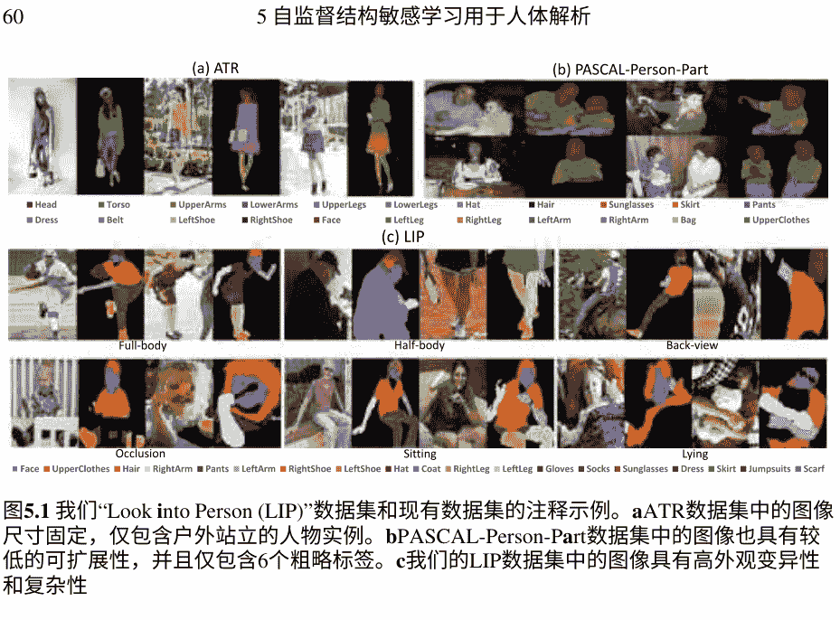
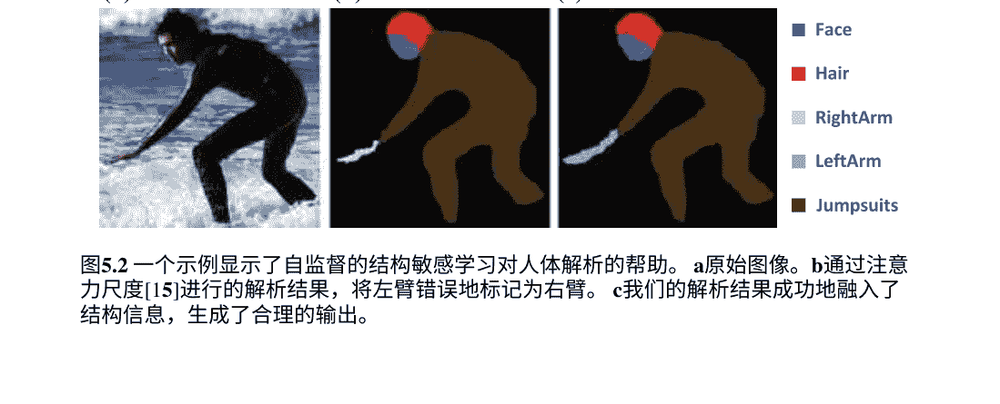
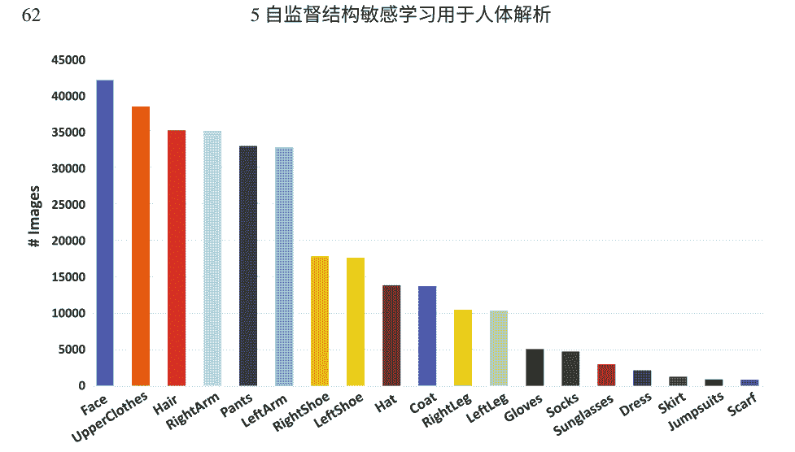
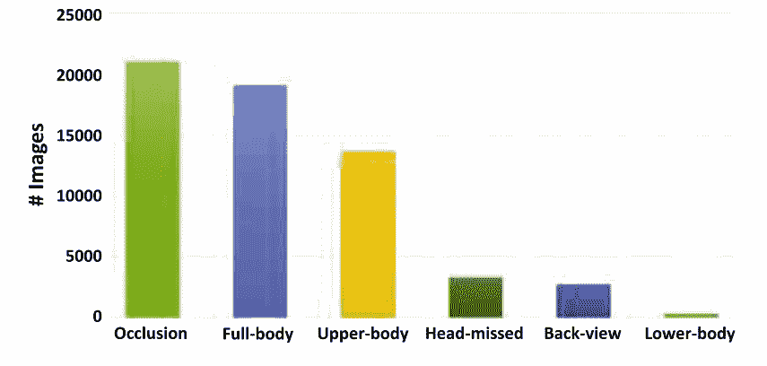
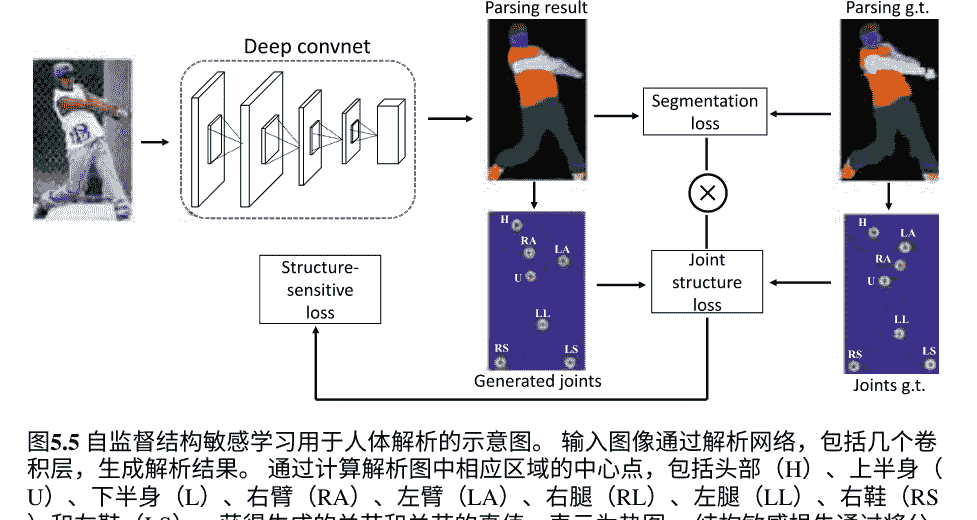
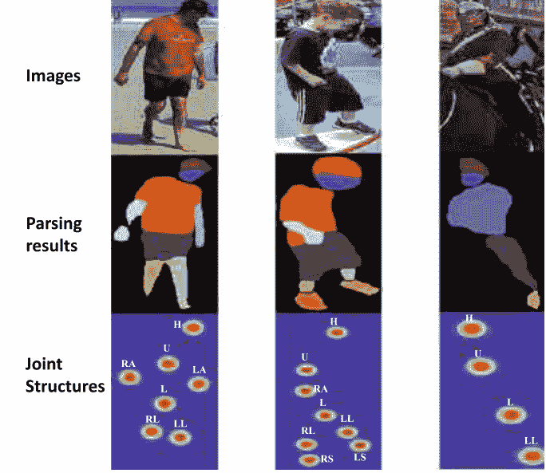
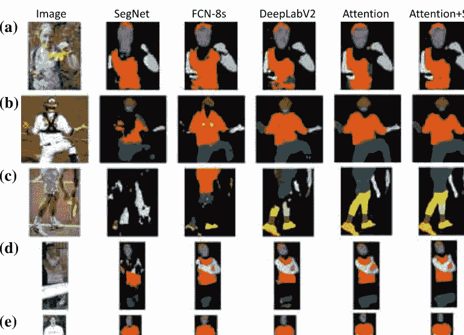
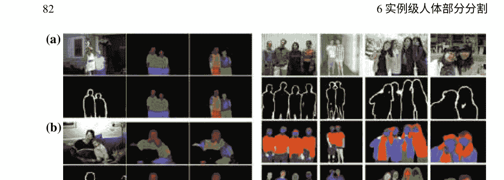
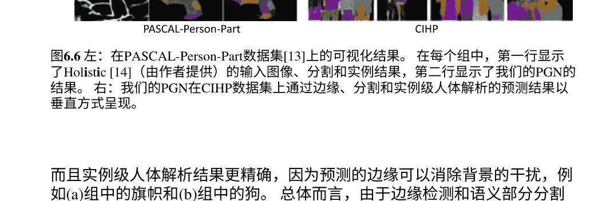
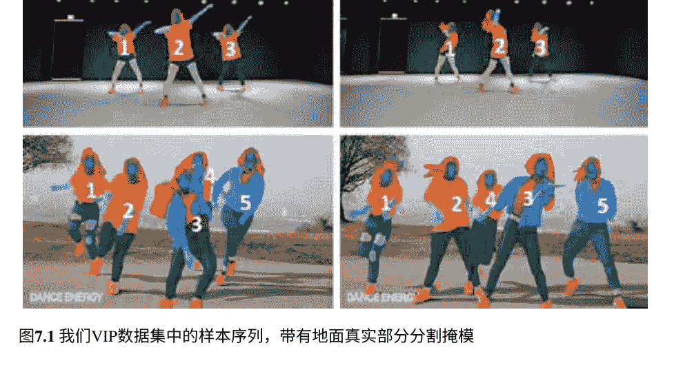

# 人类中心的视觉分析和深度学习


Liang Lin · Dongyu Zhang · Ping Luo · Wangmeng Zuo

林亮 · 张东宇 · 罗平 · 左旺盟

# 以人为中心的视觉分析与深度学习

林亮
中山大学数据与计算机科学学院
中国广东省广州市

张东宇
中山大学数据与计算机科学学院
中国广东省广州市

罗平
香港中文大学信息工程学院
香港

左旺盟
哈尔滨工业大学计算机科学学院
哈尔滨，中国

ISBN 978-981-13-2386-7      ISBN 978-981-13-2387-4 (电子书)
https://doi.org/10.1007/978-981-13-2387-4

© Springer Nature Singapore Pte Ltd. 2020
本作品受版权保护。出版商保留所有权利，无论是全部还是部分材料，特别是翻译、复制、插图重印、朗读、广播、微缩胶片复制或以任何其他实体方式复制、传输或信息存储和检索、电子适应、计算机软件，或通过类似或不同的已知或今后开发的方法。
在本出版物中使用一般描述性名称、注册名称、商标、服务标志等，并不意味着即使在没有特定声明的情况下，这些名称也不受相关保护法律和法规的约束，因此可以自由使用。

出版商、作者和编辑可以安全地假设本书中的建议和信息在出版日期时被认为是真实和准确的。出版商、作者或编辑对本文中包含的材料不提供明示或暗示的保证，也不对可能存在的任何错误或遗漏负责。出版商在已发表的地图和机构 affiliations 中保持中立。

这个 Springer 品牌由注册公司 Springer Nature Singapore Pte Ltd. 出版。注册公司地址是：15 Beach Road, #21-01/04 Gateway East, Singapore 189721, Singapore

## 前言

当梁问我写他的新书的前言时，我非常高兴和自豪地看到他近年来取得的成功。 我认识梁自2005年，当时他作为博士生访问加州大学洛杉矶分校统计学系。 很快，我在定期的小组会议和他的演讲中深深地被他在学术研究中的热情和潜力所打动。 自2010年以来，梁一直在中山大学建立自己的实验室，这是中国南方最好的大学。我在2010年夏天访问了他和他的研究团队，并与他们度过了美好的一周。 在这些年里，我目睹了他和他的团队取得了极高的成就，树立了极高的标准。 他在深度结构化学习方面的工作为他在计算机视觉和机器学习领域树立了良好的声誉。 具体而言，梁和他的团队专注于改进特征表示学习，使用几种可解释和上下文敏感的模型，并将其应用于许多计算机视觉任务，这也是本书的重点。 另一方面，他对开发智能人为中心分析的新模型、算法和系统有着特别的兴趣，同时继续关注一系列经典的研究任务，如人脸识别、监控中的行人检测和人体分割。 最近出现的技术，如非常深的神经网络和学习优化的新进展，显著提高了人为中心分析的性能。 梁领导的研究团队是这个方向上的主要贡献者之一，并受到学术界和工业界越来越多的关注。 总之，梁和他的同事们在这本书中做得非常出色，这是你能找到的最新资源，也是对以新兴的深度结构化学习为基础的人为中心视觉分析的很好介绍。

如果你需要更多的动力，这里有前言：在这本书中，你将会找到许多以人为中心的视觉分析的研究主题，包括经典的（例如人脸检测和对齐）和新兴的主题（例如时尚服装解析），以及一系列解决这些问题的最新解决方案。 例如，一项新兴的任务，人体解析，即将人体图像分解为语义时尚/身体区域，在本书中深入全面地介绍，并且你将会找到不仅解决这个问题的真正挑战的解决方案，还有从中可以推导出更一般的模型或理论的新见解。

据我们所知，迄今为止，还没有针对这个主题的系统教程或书籍，而这本书将填补这个空白。我相信这本书将为研究界提供以下方面的帮助：
- (1) 它提供了以人为中心的视觉分析的当前研究概述，并突出了进展和困难。
- (2) 它包括了深度学习的高级技术教程，例如几种类型的神经网络架构、优化方法和技术。
- (3) 它系统地讨论了不同层次上的主要以人为中心的分析任务，从人脸/人体检测和分割到解析和其他更高层次的理解。
- (4) 它为每个任务提供了有效的方法和详细的实验分析，以及足够的参考文献和广泛的讨论。

此外，尽管本书的主要内容集中在以人为中心的视觉分析上，但它也对其他人工智能应用的检测、解析、识别和高级理解方法的发展具有启发性，如机器人感知。此外，还提到了深度学习的一些新进展。例如，梁介绍了卡尔曼归一化方法，这是梁和他的学生发明的，用于改进和加速DNN的训练，特别是在微批处理的情况下。

我相信这本书对学术教授/学生以及从事视觉监控、生物特征和人机交互等领域的工程师非常有帮助和重要，因为以人为中心的视觉分析在分析人的身份、姿势、属性和行为方面是不可或缺的。总之，这本书不仅能让你掌握解决应用问题的技能，还能让你近距离观察人工智能的发展。享受吧！

> Alan Yuille
约翰霍普金斯大学认知科学和计算机科学杰出教授
马里兰州巴尔的摩市，美国

## 前言

以人为中心的视觉分析被认为是计算机视觉中最基本的问题之一，它在各种应用领域中增强了人类图像。 开发全面的以人为中心的视觉应用解决方案可能对许多工业应用领域产生重要影响，如虚拟现实、人机交互和先进的机器人感知。 例如，无缝地将各种服装与人体形状相匹配的虚拟试衣模拟系统引起了很大的商业兴趣。 此外，人体运动合成和预测可以桥接虚拟世界和现实世界，通过为人类活动启用因果推理，促进更智能的机器人-人类交互。

以人为中心的视觉分析的研究具有很大的挑战性。 然而，通过学术界和工业界研究人员的持续努力，近几十年来在这一领域取得了持续的进展。 最近，深度学习方法已广泛应用于计算机视觉。 深度学习方法的成功部分归功于大数据的出现，新提出的网络模型和优化方法。 随着深度学习的发展，在以人为中心的视觉分析的不同子任务中也取得了相当大的进展。 例如，在面部识别方面，基于深度模型的方法的准确性已超过人类的准确性。 其他准确的人脸检测方法也是基于深度学习模型的。 这一进展催生了许多有趣和实用的应用，例如智能手机中的面部识别，可以识别个体用户并基于面部进行欺诈认证检测。

在本书中，我们将根据深度学习方法提供关于以人为中心的视觉分析的最新进展的深入总结。 本书分为五个部分。 在第一部分中，第一章首先介绍了深度学习方法的背景，包括人工神经网络的发展简述和反向传播方法，以便读者更好地理解某些深度学习概念。 我们还介绍了一种用于深度神经网络训练的新技术。 随后，在第二章中，我们概述了以人为中心的视觉分析的任务和当前进展。

在第二部分中，我们介绍了与如何在图像中定位人物相关的任务。 具体而言，我们关注人脸检测和行人检测。在第三章中，我们介绍了基于级联全卷积网络的人脸关键点定位方法。 所提出的方法首先生成低分辨率的响应图来确定大致的关键点位置，然后在局部区域上生成细粒度的响应图以实现更准确的关键点定位。 然后，我们介绍了一种注意力感知的人脸幻觉方法，该方法可以从低分辨率图像生成高分辨率的人脸图像。 该方法通过充分利用人脸图像的全局相互依赖性，循环地发现并增强人脸部分。在第四章中，我们介绍了一种基于区域建议网络和增强森林的行人检测深度学习模型。

在第三部分中，描述了几种代表性的人体解析方法。在第5章中，我们首先介绍了人体解析任务的新基准，然后介绍了一种自监督的结构敏感学习方法用于人体解析。在第6章至第7章中，介绍了实例级人体解析和视频实例级人体解析方法。

在第四部分中，介绍了人员验证和人脸验证。在第8章中，我们描述了一种用于人员验证的跨模态深度模型。 该模型接受不同的输入模态并产生预测。在第9章中，我们介绍了一种基于主动学习利用无标签数据进行人脸识别的深度学习模型。

最后部分描述了一个高级任务，并讨论了人体活动识别的进展。

本书基于我们多年对以人为中心的视觉分析的研究。自2010年以来，在中国国家自然科学基金（NSFC）的资助下，我们制定了我们的研究计划。 从那时起，这个领域进行了越来越多的研究。 我们要感谢我们的同事和博士生，即梁晓丹教授、李冠斌教授、魏鹏旭博士、王科泽博士、陈天水博士、曹庆兴博士、王广润博士、刘凌波博士和陈子良博士，对这个课题的研究成果做出的贡献。 能够在最近几年与他们一起在这个激动人心的课题上合作，我们感到非常荣幸。

中国广州
林亮

## 第一部分 动机和概述

## 1 深度学习的基础和进展

## 1.1 神经网络

### 1.1.1 感知器

### 1.1.2 多层感知器

### 1.1.3 神经网络的公式化

## 1.2 深度学习中的新技术

### 1.2.1 批归一化

#### 1.2.2 批卡尔曼归一化

参考文献

## 2 以人为中心的视觉分析：任务和进展

## 2.1 人脸检测

## 2.2 面部特征定位

### 2.2.1 传统方法

### 2.2.2 基于深度学习的模型

## 2.3 行人检测

### 2.3.1 行人检测基准

### 2.3.2 行人检测方法

## 2.4 人体分割和服装解析

参考文献

## 第二部分 图像中的人物定位

## 3 人脸定位和增强

### 3.1 面部特征机器

## 3.2 级联BB-FCN架构

### 3.2.1 主干网络

### 3.2.2 分支网络

### 3.2.3 地面真实热图生成

## 3.3 实验结果

### 3.3.1 数据集

### 3.3.2 评估指标

### 3.3.3 非约束设置的性能评估

### 3.3.4 与现有技术的比较

## 3.4 注意力感知人脸幻觉

### 3.4.1 注意力感知人脸幻觉的框架

### 3.4.2 循环策略网络

### 3.4.3 局部增强网络

### 3.4.4 深度强化学习

### 3.4.5 实验

参考文献

## 4 带有RPN和增强森林的行人检测

## 4.1 引言

## 4.2 方法

### 4.2.1 用于行人检测的区域建议网络

### 4.2.2 特征提取

### 4.2.3 提升的森林

### 4.3 实验和分析

参考文献

## 第三部分 详细解析人物

## 5 自监督结构敏感学习用于人体解析

## 5.1 引言

### 5.2 查看人物基准

## 5.3 自监督结构敏感学习

### 5.3.1 自监督结构敏感损失

### 5.3.2 实验结果

参考文献

## 6 实例级人体解析

## 6.1 引言

## 6.2 相关工作

## 6.3 众包实例级人体解析数据集

### 6.3.1 图像注释

### 6.3.2 数据集统计

## 6.4 部分分组网络

#### 6.4.1 PGN 架构

### 6.4.2 实例分区过程

## 6.5 实验

### 6.5.1 实验设置

#### 6.5.2 PASCAL-Person-Part 数据集

### 6.5.3 CIHP数据集

### 6.5.4 定性结果

参考文献

## 7 视频实例级人体解析

## 7.1 引言

## 7.2 视频实例级解析数据集

### 7.2.1 数据量和质量

### 7.2.2 数据集统计

## 7.3 自适应时序编码网络

### 7.3.1 流引导特征传播

### 7.3.2 解析 R-CNN

### 7.3.3 训练和推理

参考文献

## 第四部分 识别和验证人员

## 8 人员验证

## 8.1 引言

## 8.2 广义相似度度量

### 8.2.1 模型制定

### 8.2.2 与现有模型的关联

## 8.3 联合相似度和特征学习

### 8.3.1 深度架构

### 8.3.2 模型训练

## 8.4 实验

参考文献

## 10 时序活动建模

### 10.2 潜在时间结构

### 10.2.2 潜在时间结构

### 10.2.3 具有放松半径边界的深度模型

## 10.3 实现

### 10.3.1 潜在时间结构

### 10.3.2 深度神经网络的架构

## 10.4 学习算法

### 10.4.1 联合组件学习

### 10.4.2 模型预训练

### 10.4.3 推理

## 10.5 实验

### 10.5.1 数据集和设置

### 10.5.2 实证分析

参考文献

## 第一部分 动机和概述

以人为中心的视觉分析在计算机视觉领域中非常重要。 典型的应用包括人脸识别、人物再识别和姿势估计。 开发综合以人为中心的视觉应用解决方案已经从许多工业应用领域中受益，如智能监控、虚拟现实和人机交互。

大多数以人为中心的视觉分析问题都非常具有挑战性。 例如，人物再识别涉及根据衣着和身体动作等特征，在不同摄像头捕捉的图像/视频中准确识别同一个人。 然而，由于人类外貌的巨大变化，显著的背景、无关的动作、尺度和光照变化，准确地在成千上万张图像中重新识别同一个人是困难的。 对于野外人脸识别，光照变化和遮挡会显著降低识别准确性。

类似的问题也存在于其他以人为中心的视觉分析任务中。 另一方面，过去十年见证了特征表示学习的快速发展，尤其是深度神经网络，这极大地增强了计算机视觉这个已经快速发展的领域。 在大规模数据库上训练的新兴深度模型有效地提高了实际应用中的系统性能。 最著名的例子是AlphaGo，在2015年击败了顶级人类围棋选手。

在本书中，我们介绍了深度神经网络在几个以人为中心的视觉分析问题中的最新发展。 本书分为五个部分。 在第一部分中，我们简要回顾了深度神经网络的基础，并介绍了一些最近开发的高级新技术。 我们还在本部分概述了以人为中心的视觉分析问题。 然后，从第二部分到第五部分，我们介绍了我们在典型的以人为中心的视觉分析问题上的工作，包括人脸检测、人脸识别和验证、行人检测、行人识别、人体解析和动作识别。

## 第一章 深度学习的基础和进展

摘要 过去十年见证了特征表示学习，尤其是深度学习的快速发展。深度学习方法在许多应用中取得了巨大成功，包括计算机视觉和自然语言处理。在本章中，我们对深度学习的基础，即人工神经网络进行了简要回顾，并介绍了一些深度学习中的新技术。

## 1.1 神经网络

神经网络是深度学习模型的基础，它们受到生物启发，旨在模拟人脑处理信息的方式。人脑由大量高度连接的神经元通过突触相互作用。神经元的排列和突触的强度由复杂的化学过程确定，建立了人脑神经网络的功能。神经网络是寻找对于人类程序员来说过于复杂或数量过多的模式的优秀工具，可以教机器识别这些模式。

神经网络的起源可以追溯到20世纪40年代，当时提出了单个感知器神经元的概念，而只有在过去几十年中，神经网络才成为人工智能的重要组成部分。这是由于反向传播的发展，它使得多层感知器神经网络能够在结果与创建者期望的不符的情况下调整神经元的权重。接下来，我们简要回顾神经网络的背景，包括感知器、多层感知器和反向传播算法。

### 1.1.1 感知器

感知器在神经网络的历史发展中占据着特殊的地位。由于不同输入的重要性不同，感知器为了考虑差异，对每个输入引入权重 $w_j$。感知器对加权输入求和，并通过其激活函数产生单个二进制输出，激活函数为 $f(\mathbf{x})$，其定义为

$$f(\mathbf{x}) = \begin{cases} 1, & \text{if } \sum_j w_j x_j + b > 0 \\ 0, & \text{otherwise.} \end{cases}$$

其中 $w_j$ 是权重，$b$ 是偏置，它将决策边界偏离原点。

只有一个输出的感知器只能用于二元分类问题。与大多数其他线性分类器训练技术一样，感知器自然地推广到多类分类。在这里，输入 $x$ 和输出 $y$ 来自任意集合。特征表示函数 $f(x, y)$ 将每个可能的输入/输出对映射到有限维实值特征向量。特征向量乘以权重向量 $w$，但结果分数现在用于从许多可能的输出中选择：

$$\hat{y} = \arg \max_y f(x, y) \cdot w.$$

感知器神经元是一种线性分类器。如果数据集是线性可分的，那么感知器网络保证会收敛。此外，在训练过程中，感知器调整权重的次数有一个上限。假设两个类别的输入向量可以通过一个具有间隔 $\gamma$ 的超平面分开，并且 $R$ 表示输入向量的最大范数。

### 1.1.2 多层感知器

多层感知器 (MLP) 是一类至少包含三层节点的前馈人工神经网络。除了输入节点外，每个节点都是使用非线性激活函数的神经元。多层感知器的多层和非线性激活使其与线性感知器区分开来。MLP具有三个基本特征：
- (1) 网络中的每个神经元都包含一个可微分的非线性激活函数。
- (2) 网络包含一个或多个隐藏层，除了输入和输出节点。
- (3) 网络具有高度的连接性。

典型的MLP架构如图1.1所示。网络包含一个输入层，两个隐藏层和一个输出层。网络是全连接的，这意味着网络中的任何一层的神经元都与前一层的所有神经元相连。第一个隐藏层从输入层接收输入，并将其输出应用于下一个隐藏层，这个过程在MLP神经网络的其余部分中重复进行。

MLP网络中的每个神经元都包含一个可微分的非线性激活函数。在MLP中常用的是sigmoid函数。激活函数

图1.1 典型神经网络的示意图

sigmoid神经元的输出定义为

$$ f(\mathbf{x}) = \frac{1}{1 + \exp\{-(\mathbf{w} \cdot \mathbf{x} + b)\}}, $$

其中，x是输入向量，w是权重向量。使用sigmoid函数后，神经元的输出不再是二进制值1或0。一般来说，sigmoid函数是实值的、单调的、平滑的，并且可微分，具有非负的一阶导数，呈钟形。sigmoid函数的平滑性意味着权重变化的微小变化 Δw_j 和偏置变化的微小变化 Δb 会产生一个小的输出变化 Δoutput，这可以很好地近似为

$$ \Delta out put \approx \sum_j \frac{\partial out put}{\partial w_j} \Delta w_j + \frac{\partial out put}{\partial b} \Delta b, $$

其中，求和是在所有权重 w_j 上进行的，并且 $\frac{\partial out put}{\partial w_j}$ 和 $\frac{\partial out put}{\partial b}$ 分别表示输出对 w_j 和 b 的偏导数。Δ输出是一个线性函数，它与 Δω_j 和 Δb 有关。这种线性关系使得选择权重和偏置的小变化来实现输出的小变化变得容易，因此更容易确定改变权重和偏置将如何改变输出。

用多层感知机解决“异或”问题。线性问题可以用单层感知机解决。然而，如果数据集不是线性可分的，单个感知机神经元将无法逐渐逼近近似解。例如，图1.2显示了典型的“异或”函数，它是一个非线性函数，无法图1.2左：“XOR”问题的错觉。右：使用感知器解决“XOR”问题的解决方案。
可以通过单层感知器来解决。在这种情况下，我们需要使用多层感知器来解决这个问题。

### 1.1.3 神经网络的构建

为了方便描述神经网络，我们使用以下参数设置。让 $n_l$ 表示神经网络中的总层数，让 $L_l$ 表示第 $l$ 层。因此，$L_1$ 和 $L_{n_l}$ 分别是输入层和输出层。我们使用 $(W, b) = (W^{(1)}, b^{(1)}, W^{(2)}, b^{(2)}, ...)$ 来表示神经网络的参数，其中 $W_{ij}^{(l)}$ 表示第 $l$ 层的单元 $j$ 与第 $l+1$ 层的单元 $i$ 之间的连接参数。$b_i^{(l)}$ 是与第 $l$ 层的单元 $i$ 相关联的偏差。因此，在这种情况下，$W^{(1)} \in \mathbb{R}^{3\times3}$，而 $W^{(2)} \in \mathbb{R}^{1\times3}$。我们用 $a_i^{(l)}$ 表示第 $l$ 层单元 $i$ 的激活。在给定参数 $(W, b)$ 的固定设置下，神经网络将一个假设定义为 $h_{W,b}(x)$。具体来说，这个神经网络所表示的计算如下所示

$$
\begin{aligned}
a_{1}^{(2)} &= f\left( W_{11}^{(1)} x_1 + W_{12}^{(1)} x_2 + W_{13}^{(1)} x_3 + b_1^{(1)} \right), \\
a_{2}^{(2)} &= f\left( W_{21}^{(1)} x_1 + W_{22}^{(1)} x_2 + W_{23}^{(1)} x_3 + b_2^{(1)} \right), \\
a_{3}^{(2)} &= f\left( W_{31}^{(1)} x_1 + W_{32}^{(1)} x_2 + W_{33}^{(1)} x_3 + b_3^{(1)} \right), \quad (1.5) \\
h_{W,b}(x) &= f\left( W_{11}^{(2)} a_{1}^{(2)} + W_{12}^{(2)} a_{2}^{(2)} + W_{13}^{(2)} a_{3}^{(2)} + b_1^{(2)} \right).
\end{aligned}
$$

## 1.1 神经网络

让 $z_i^{(l)}$ 表示第 $l$ 层单元的输入加权总和，包括偏置项（例如，$z_i^{(2)} = \sum_{j=1}^3 W_{ij}^{(1)} x_j + b_i^{(1)}$），则 $a_i^{(l)} = f(z_i^{(l)})$。如果我们将激活函数 $f(\cdot)$ 扩展为以逐元素方式应用于向量，即 $f([z_1, z_2, z_3]) = [f(z_1), f(z_2), f(z_3)]$，则可以更简洁地写出上述方程。

$$
\begin{aligned}
z^{(2)} &= W^{(1)}x + b^{(1)}, \\
a^{(2)} &= f(z^{(2)}), \\
z^{(3)} &= W^{(2)}a^{(2)} + b^{(2)}, \\
h_{W,b}(x) &= a^{(3)} = f(z^{(3)}). \quad (1.6)
\end{aligned}
$$

我们称这一步为前向传播。一般来说，我们还使用 $a^{(1)} = x$ 来表示输入层的值，那么给定层 $l$ 的激活值 $a^{(l)}$，我们可以计算出层 $(l+1)$ 的激活值 $a^{(l+1)}$ 为

$$
\begin{aligned}
z^{(l+1)} &= W^{(l)}a^{(l)} + b^{(l)}, \\
a^{(l+1)} &= f(z^{(l+1)}). \quad (1.7)
\end{aligned}
$$

## 1.2 深度学习中的新技术

与传统的多层感知器相比，新的神经网络通常更深，通过反向传播优化这些神经网络更加困难。因此，许多新技术已经被提出来平滑网络训练，例如批归一化（BN）和批卡尔曼归一化[1]。

### 1.2.1 批归一化

BN是一种提高神经网络性能和稳定性的技术。这项技术是在Ioffe和Szegedy的2015年论文中引入的。BN不仅仅对网络的输入进行归一化，还对网络中的层的输入进行归一化。BN的好处如下：

- 网络训练更快：虽然每次训练迭代的速度会变慢，因为在前向传播过程中需要进行额外的归一化计算，并且在反向传播过程中需要训练额外的超参数，但是网络应该更快地收敛；因此，整体训练速度应该更快。
- 更高的学习率：梯度下降通常需要较小的学习率才能使网络收敛。随着网络变得更深，反向传播过程中的梯度变得更小，因此需要更多的迭代次数。使用批归一化可以使用更高的学习率，从而加快网络训练的速度。
- 更容易初始化：权重初始化可能很困难，特别是在创建更深的网络时。批归一化有助于减少对初始权重的敏感性。

批归一化不是将层输入和输出中的特征进行白化，而是通过使每个标量特征的均值为零，方差为1来独立地归一化每个特征。对于具有 $d$ 维输入 $x = \{x^{(1)}, ..., x^{(d)}\}$ 的层，在批归一化中，我们对每个维度进行归一化。

$$
\hat{x}^{(k)} = \frac{x^{(k)} - \mathbb{E}[x^{(k)}]}{\sqrt{\text{Var}[x^{(k)}]}}, \quad (1.8)
$$

其中期望和方差是在训练数据集上计算得出的。
然后，对于每个特征 $x^{(k)}$，引入一对参数 $\gamma^{(k)}$ 和 $\beta^{(k)}$ 来缩放和平移归一化值

$$
y^{(k)} = \gamma^{(k)} \hat{x}^{(k)} + \beta^{(k)}. \quad (1.9)
$$

**算法1.1：使用批归一化进行训练和推断**

**输入：** 一个小批量的 $x$ 值：$\mathcal{B} = \{x_1, ..., x_m\}$；需要学习的参数：$\gamma, \beta$
**输出：** $y_i = BN_{\gamma, \beta}(x_i)$

$$
\begin{aligned}
&u_{\mathcal{B}} \leftarrow \frac{1}{m}\sum_{i=1}^{m} x_i \\
&\sigma_{\mathcal{B}}^2 \leftarrow \frac{1}{m}\sum_{i=1}^{m} (x_i - u_{\mathcal{B}})^2 \\
&\hat{x}_i \leftarrow \frac{x_i - u_{\mathcal{B}}}{\sqrt{\sigma_{\mathcal{B}}^2 + \epsilon}} \\
&y_i \leftarrow \gamma \hat{x}_i + \beta \equiv BN_{\gamma, \beta}(x_i)
\end{aligned}
$$

考虑一个大小为 $m$ 的小批量 $\mathcal{B}$。由于归一化是独立应用于每个特征，让我们专注于一个特定的特征 $x^{(k)}$，并省略 $k$ 以增加清晰度。在小批量中，我们有 $m$ 个这个特征的值：

$$
\mathcal{B} = \{x_1, ..., x_m\}. \quad (1.10)
$$

让归一化后的值为 $\hat{x}_1, ..., \hat{x}_m$，并且让它们的线性变换为 $y_1, ..., y_m$。我们称这个变换

$$
BN_{\gamma, \beta}: \{x_1, ..., x_m\} \rightarrow \{y_1, ..., y_m\} \quad (1.11)
$$

为BN。我们在算法1.1中提出了BN变换。在这个算法中，$\epsilon$ 是为了数值稳定性而添加到小批量方差的常数。

### 1.2.2 批次卡尔曼归一化

尽管BN的重要性在许多先前的工作中已经得到证明，但它的缺点不能被忽视，即当训练中存在一个小的小批量时，其有效性会减弱。考虑一个由多个层组成的DNN，从底部到顶部。在传统的BN中，归一化步骤旨在通过减少其内部协变量偏移来消除其内部层的分布变化。在对层的分布进行归一化之前，BN首先估计其统计信息，包括均值和方差。然而，期望在训练集上预估输入数据的底层分布是不切实际的，因为在每个训练步骤中，网络参数更新后，内部层的表示会不断变化。因此，BN通过以下方案解决了这个问题。（i）在模型训练过程中，它使用小批量中的批次样本来近似总体统计量。（ii）它在每个训练迭代中保留移动平均统计量，并在推理过程中使用它们。

然而，BN有一个限制，即它受到计算平台（例如GPU）的内存容量的限制，特别是当网络大小和图像大小较大时。在这种情况下，小批量大小不足以近似统计数据，导致它们具有偏差和噪声。此外，当网络变得更深时，错误会被放大，降低训练模型的质量。负面影响也存在于推理中，其中归一化应用于每个测试样本。此外，在BN机制中，某一层的分布可能随着训练迭代而变化，这限制了模型收敛的稳定性。

最近，提出了BN的扩展，称为批次重归一化（BRN）[2]，以改善小批量大小时BN的性能。BKN通过更准确地估计DNN中内部表示的统计数据（均值和方差）来推进现有解决方案。与仅通过测量某一层的小批量来估计统计数据的BN和BRN不同，即它们将网络中的每一层视为一个孤立的子系统，BKN显示出估计的统计数据在连续层之间具有强相关性。此外，通过同时考虑网络中的前面层，估计可以更准确，如图1.3b所示。类比地，所提出的估计方法与卡尔曼滤波过程[3]具有相似之处。

BKN在迭代方式中执行两个步骤。在第一步中，BKN基于前一层的估计值估计当前层的统计数据。在第二步中，这些估计值与观察到的批次样本均值和方差相结合。这两个步骤在BKN中非常高效。通过先前状态更新当前估计值与传统BN相比，几乎没有额外的计算成本。例如，在最近的高级深度架构中，如残差网络中，特征表示具有最大2048维（通道），额外的成本是通过转换状态向量（表示均值和协方差矩阵）转换为新的状态向量，然后与当前观测值相结合（图1.4）。

图1.3 a说明了传统批量归一化（BN）中的分布估计，其中基于当前观察到的批次在第 $k$ 层估计的小批量统计量 $\mu^k$ 和 $\Sigma^k$。为了符号的清晰，$\mu^k$ 和 $\Sigma^k$ 分别表示均值和协方差矩阵。请注意，归一化只使用对角线条目。$X$ 和 $\hat{X}$ 表示归一化之前和之后的内部表示。在b中，批量卡尔曼归一化（BKN）通过聚合前一（$k-1$）层的统计数据提供了更准确的第 $k$ 层分布估计。

图1.4所提出的批量卡尔曼归一化（BKN）的示意图。在DNN的第（$k-1$）层，BKN首先估计其统计量（均值和协方差）， $\hat{\mu}^{k-1|k-1}$ 和 $\hat{\Sigma}^{k-1|k-1}$ 。此外，$k$ 层的估计是基于（$k-1$）层的估计，其中这些估计通过与 $k$ 层的观测统计量相结合进行更新。这个过程将整个DNN作为一个整体系统处理，与现有的独立估计每个隐藏层统计量的方法相比。

#### 1.2.2.1 批量卡尔曼归一化方法

设 $x^k$ 为DNN中第 $k$ 个隐藏层的隐藏神经元的特征向量，例如CNN中隐藏卷积层的像素。BN通过使用一个大小为 $m$ 的小批量样本 $B = \{x_1^k, x_2^k, ..., x_m^k\}$ 对 $x^k$ 进行归一化。$x^k$ 的均值和协方差被近似为

$$
\bar{x}^k \leftarrow \frac{1}{m} \sum_{i=1}^{m} x_i^k, \quad S^k \leftarrow \frac{1}{m} \sum_{i=1}^{m} (x_{i}^k - \bar{x}^k)(x_{i}^k - \bar{x}^k)^T \quad (1.13)
$$

我们有 $\hat{x}^k \leftarrow \frac{x_i^k - \bar{x}^k}{\sqrt{\text{diag}(S^k)}}$，其中 $\text{diag}(\cdot)$ 表示矩阵的对角元素，即 $x^k$ 的方差。然后，归一化表示被缩放和平移，以保持网络的建模能力，$y^k \leftarrow \gamma \hat{x}^k + \beta$，其中 $\gamma$ 和 $\beta$ 是在训练过程中优化的参数。然而，为了估计 BN 中的统计量，需要一个适度大小的小批量。在 DNN 中探索更好的分布估计方法以加速训练是很有吸引力的。假设隐藏层中隐藏神经元的真实值可以用变量 $x^k$ 表示，该变量通过使用前一层的值 $x^{k-1}$ 进行近似。

我们有
$$
x^k = \mathbf{A}^k x^{k-1} + u^k, \quad (1.14)
$$
其中 $\mathbf{A}^k$ 是一个状态转移矩阵，将上一层的状态（特征）转换为当前层。此外，$u^k$ 是一个偏差，其遵循零均值和单位方差的高斯分布。请注意，$\mathbf{A}^k$ 可以是层之间的线性转换。这是合理的，因为我们的目的不是准确计算给定前一层中的隐藏特征的某一层中的隐藏特征，而是在层之间建立连接以估计统计数据。

由于上述真实值 $x^k$ 存在但不直接可访问，因此可以通过带有偏差项 $v^k$ 的观测值 $z^k$ 来测量：
$$
z^k = x^k + v^k, \quad (1.15)
$$
其中 $z^k$ 表示小批量中特征的观测值。换句话说，为了估计 $x^k$ 的统计数据，先前的研究只考虑了小批量中 $z^k$ 的观测值。BKN 考虑了前一层的特征。

为此，我们计算等式 (1.14) 两边的期望，即 $\mathbb{E}[x^k] = \mathbb{E}[\mathbf{A}^k x^{k-1} + u^k]$，并且有
$$
\hat{\mu}^{k|k-1} = \mathbf{A}^k \hat{\mu}^{k-1|k-1}, \quad (1.16)
$$
其中，$\hat{\mu}^{k-1|k-1}$ 表示第 $(k-1)$ 层均值的估计，$\hat{\mu}^{k|k-1}$ 是在前一层条件下第 $k$ 层均值的估计。我们将 $\hat{\mu}^{k|k-1}$ 称为第 $k$ 层的中间估计，因为它与观测值结合起来得到最终估计。如等式 (1.17) 所示，当前层的估计 $\hat{\mu}^{k|k}$ 是通过将中间估计与偏差项相结合计算得到的，该偏差项表示观测值 $\bar{x}^k$ 与 $\hat{\mu}^{k|k-1}$ 之间的误差。这里，$\bar{x}^k$ 表示观测到的均值。此外，$q^k$ 是一个表示我们依赖这种偏差程度的增益值。
$$
\hat{\mu}^{k|k} = \hat{\mu}^{k|k-1} + q^k(\bar{x}^k - \hat{\mu}^{k|k-1}). \quad (1.17)
$$

类似地，通过计算 $\hat{\Sigma}^{k|k-1} = \text{Cov}(x^k - \hat{\mu}^{k|k-1})$ 和 $\hat{\Sigma}^{k|k} = \text{Cov}(x^k - \hat{\mu}^{k|k})$，可以得到协方差的估计值，其中 $\text{Cov}(\cdot)$ 表示协方差矩阵的定义。通过引入 $p^k = 1 - q^k$ 并结合上述定义和公式 (1.16) 和 (1.17)，我们得到了用于估计统计量的更新规则，如公式 (1.18) 所示。其证明在附录中给出。

$$
\begin{cases}
\hat{\mu}^{k|k-1} = \mathbf{A}^k \hat{\mu}^{k-1|k-1}, \\
\hat{\mu}^{k|k} = p^k \hat{\mu}^{k|k-1} + q^k \bar{x}^k, \\
\hat{\Sigma}^{k|k-1} = \mathbf{A}^k \hat{\Sigma}^{k-1|k-1} (\mathbf{A}^k)^T + \mathbf{R}, \\
\hat{\Sigma}^{k|k} = p^k \hat{\Sigma}^{k|k-1} + q^k S^k + p^k q^k (\bar{x}^k - \hat{\mu}^{k|k-1})(\bar{x}^k - \hat{\mu}^{k|k-1})^T,
\end{cases}
\quad (1.18)
$$

其中 $\hat{\Sigma}^{k|k-1}$ 和 $\hat{\Sigma}^{k|k}$ 分别表示第 $k$ 层中间和最终的协方差矩阵的估计值。$\mathbf{R}$ 是偏置项 $u^k$ 的协方差矩阵，在公式 (1.14) 中。请注意，它对于所有层都是相同的。$S^k$ 是第 $k$ 层小批量观察到的协方差矩阵。在公式 (1.18) 中，转移矩阵 $\mathbf{A}^k$，协方差矩阵 $\mathbf{R}$ 和增益值 $q^k$ 是在训练过程中优化的参数。在BKN中，我们使用 $\hat{\mu}^{k|k}$ 和 $\hat{\Sigma}^{k|k}$ 来对隐藏表示进行归一化。

### 算法1.2: 使用批次卡尔曼归一化进行训练和推断

**输入：** 第 $k$ 层中特征图 $\{x_1, ..., x_m\}$ 的值；第 $(k-1)$ 层中的 $\hat{\mu}^{k-1|k-1}$, $\hat{\Sigma}^{k-1|k-1}$；参数 $\gamma^k$ 和 $\beta^k$；移动均值 $\mu$ 和移动方差 $\Sigma$；移动动量 $\alpha$；卡尔曼增益 $q^k$ 和转移矩阵 $\mathbf{A}^k$。

**输出：** 更新后的 $\mu$, $\Sigma$；当前层中的统计 $\hat{\mu}^{k|k}$ 和 $\hat{\Sigma}^{k|k}$。

**训练：**

$$
\begin{aligned}
&\bar{x}^k \leftarrow \frac{1}{m} \sum_{i=1}^m x_i^k, \quad S^k \leftarrow \frac{1}{m} \sum_{i=1}^m (x_i^k - \bar{x}^k)(x_i^k - \bar{x}^k)^T \\
&p^k \leftarrow 1 - q^k, \quad \hat{\mu}^{k|k-1} \leftarrow \mathbf{A}^k \hat{\mu}^{k-1|k-1}, \quad \hat{\mu}^{k|k} \leftarrow p^k \hat{\mu}^{k|k-1} + q^k \bar{x}^k \\
&\hat{\Sigma}^{k|k-1} \leftarrow \mathbf{A}^k \hat{\Sigma}^{k-1|k-1} (\mathbf{A}^k)^T + \mathbf{R} \\
&\hat{\Sigma}^{k|k} \leftarrow p^k \hat{\Sigma}^{k|k-1} + q^k S^k + p^k q^k (\bar{x}^k - \hat{\mu}^{k|k-1})(\bar{x}^k - \hat{\mu}^{k|k-1})^T \\
&y_i^k \leftarrow \frac{x_i^k - \hat{\mu}^{k|k}}{\sqrt{\text{diag}(\hat{\Sigma}^{k|k})}} \gamma^k + \beta^k
\end{aligned}
$$

**移动平均：**

$$
\mu := \mu + \alpha(\mu - \hat{\mu}^{k|k}), \quad \Sigma := \Sigma + \alpha(\Sigma - \hat{\Sigma}^{k|k})
$$

**推断：**

$$
y_{\text{inference}} \leftarrow \frac{x - \mu}{\sqrt{\text{diag}(\Sigma)}} \gamma + \beta
$$

请参考 [2] 以获取批次卡尔曼归一化的详细信息。

## 参考文献
1. W. Guangrun, P. Jiefeng, L. Ping, W. Xinjiang, L. Liang, 批次卡尔曼归一化：朝着使用微批次训练深度神经网络, arXiv预印本arXiv:1802.03133 (2018)
2. S. Ioffe, C. Szegedy, 批次归一化：通过减少内部协变量偏移加速深度网络训练, arXiv预印本arXiv:1502.03167 (2015)
3. R.E. Kalman等人，线性滤波和预测问题的新方法。基础工程杂志82(1), 35-45 (1960)

# 第2章 以人为中心的视觉分析：任务和进展
摘要 近年来，以人为中心的视觉分析研究取得了相当大的进展。在本章中，我们简要回顾了以人为中心的视觉分析的任务，包括人脸检测、面部特征定位、行人检测、人体分割、服装解析等。

## 2.1 人脸检测
作为许多后续人脸相关应用的关键步骤之一，人脸检测在计算机视觉文献中得到了广泛研究。早期的人脸检测工作可以追溯到上世纪70年代初，当时使用了简单的启发式和人体测量技术[1]。尽管在2000年之前取得了一些进展[2,3]，但人脸检测的实际性能远未令人满意。一个真正的突破是Viola-Jones框架[4]，它在级联的AdaBoost分类器中应用了矩形Haar样特征，实现了实时人脸检测。

然而，这个框架有几个关键缺点。首先，它的特征尺寸相对较大。通常，在一个24 ×24的检测窗口中，Haar样特征的数量达到了16万个[5]。其次，这个框架不能有效处理野外的非正面人脸。已经提出了许多方法来解决Viola-Jones框架的这些问题并进一步改进。首先，使用了更复杂的特征（如HOG[6]、SIFT[7]、SURF[8]）。例如，Liao等人[9]提出了一种新的图像特征，称为归一化像素差（NPD），它是两个像素值之间差值与和值之比。

其次，为了检测具有不同姿势的人脸，一些研究将多个检测器结合起来，每个检测器都针对特定视角进行训练。作为代表性的工作，朱等人[10]应用了多个可变形部件模型来捕捉具有不同视角和表情的人脸。

近年来，使用深度学习方法进行人脸检测取得了重大进展，明显优于传统的计算机视觉方法。例如，李等人[11]提出了一个基于CNN的级联架构，可以在快速低分辨率阶段快速拒绝背景区域，并在高分辨率阶段有效校准人脸提议的边界框。

过程中，张等人[12]利用级联多任务架构增强了人脸检测性能，利用检测和对齐之间的内在相关性。然而，这些单尺度检测器必须对图像金字塔进行多尺度测试，这是耗时的。为了减少图像金字塔的级数，郝等人[13]和刘等人[14]提出了一种高效的CNN，可以预测人脸的尺度分布直方图，并引导图像或特征的放大和缩小。最近，许多研究将通用目标检测器Faster R-CNN [15]调整为进行人脸检测。例如，万等人[16]使用硬负样本挖掘对Faster R-CNN进行了引导，并在代表性人脸检测基准FDDB [17]上取得了显著的改进。

尽管取得了进展，但这些方法通常无法在不受限制的条件下检测到微小的面部。为了解决这个问题，白等人首先通过采用生成对抗网络从模糊的小面部生成清晰的高分辨率面部，然后进行面部检测。

### 2.2 面部关键点定位
### 2.2.1 传统方法
面部关键点定位在计算机视觉领域一直是一个尝试，已经提出了大量方法来实现这个目的。这个任务的传统方法可以分为两类：模板拟合方法和基于回归的方法。

模板拟合方法构建面部模板来拟合输入面部外观。一个代表性的工作是主动外观模型（AAM）[19]，它试图通过最小化整体外观和外观模型之间的残差来估计模型参数。与使用整体表示不同，约束局部模型（CLM）[20]为每个面部关键点学习一个独立的局部检测器和一个形状模型来捕捉有效的面部变形。改进的CLM版本主要在于局部检测器的不同。例如，Belhumeur等人[21]通过使用SIFT特征和SVM分类器检测面部关键点，Liang等人[22]则将AdaBoost应用于HAAR小波特征。由于补丁检测器对光照变化和遮挡的鲁棒性，这些方法通常优于整体方法。

基于回归的面部特征定位方法可以进一步分为直接映射技术和级联回归模型。前者直接将局部或全局的面部外观映射到特征点位置。例如，Dantone等人[23]直接从面部外观中的一组条件回归树中估计面部特征点的绝对坐标。Valstar等人[24]应用增强回归将局部图像块的外观映射到相应面部特征点的位置。级联回归模型[25–31]将形状估计问题建模为回归问题，并以级联方式进行预测。

### 2.2.2 基于深度学习的模型
尽管这些传统方法在被公认为成功的同时，都依赖于复杂的特征工程和参数调整，这限制了它们在杂乱和多样化环境中的性能。最近，卷积神经网络（CNNs）和其他深度学习模型已成功应用于各种视觉计算任务，包括面部标志估计。Zhou等人[33]基于CNNs提出了一个四级级联回归模型，顺序预测标志坐标。Zhang等人[34]采用了深度架构来联合优化面部标志位置和其他相关任务，如姿态估计[35]和面部表情识别[36]。Zhang等人[37]提出了一个新的粗到细的DAE流程，逐步改进面部标志位置。

2016年，他们进一步提出了去噪自编码器，以自动恢复遮挡面部部位的真实外观，然后预测遮挡面部标志[38]。Lai等人[39]提出了一个端到端的CNN架构，通过顺序回归学习高度区分的形状索引特征，然后使用学习到的深度特征来改进形状。Merget等人[40]在基于扩张卷积的全卷积网络中集成了全局上下文，用于生成用于地标定位的稳健特征。Bulat等人[41]利用面部超分辨率技术从低分辨率图像中定位面部标志。Tang等人[42]提出了量化的密集连接U-Net，大大改善了信息流动，有助于提高地标定位的准确性。基于RNN的模型[43–45]将面部标志检测形式化为端到端的顺序改进过程。最近，3D面部模型[46–50]也被用于通过建模面部标志的结构来准确定位地标。此外，许多研究人员尝试使用一些无监督[51–53]或半监督[54]方法来改进面部标志检测器的精度。

## 2.3 行人检测
行人检测是一种在给定图像中检测行人而不是所有相关物体的子任务。由于这个任务对于安全监控、安全自动驾驶和其他应用场景非常重要，过去几年里已经得到了广泛研究。

由于行人姿势的多样性、背景的多样性和其他原因，行人检测可能非常具有挑战性。接下来，我们列举了几个可能影响行人检测的因素。
- 外观的多样性。例如，行人可能出现不同的服装、姿势、视角和光照，而不是静止的形象。
- 尺度变化。由于与相机的距离不同，行人在图像中会以不同的尺度出现。大尺度的行人相对容易检测，而小尺度的行人具有挑战性。
- 遮挡。在实际场景中，行人可能被彼此遮挡，或者被街道上的建筑物、停放的汽车、树木或其他类型的物体遮挡。
- 背景。算法面临着困难的负样本，这些负样本是看起来像行人的对象，很容易被错误分类。
- 时间和空间复杂度。由于候选边界框的数量很大，这些方法可能会占用大量空间。此外，一些方法使用级联方法，这可能会耗费时间。然而，实际使用场景需要实时检测和节省内存。

#### 2.3.1 行人检测的基准
INRIA [55]于2005年发布，包含1805张从各种个人照片中裁剪出的人体图像。ETH [56]是通过在繁忙的购物街上漫步收集的。Daimler [57]包含完全直立的行人。TUD [58]是为许多任务开发的，包括行人检测。训练集的正样本是在繁忙的行人区域用手持相机收集的，包括直立站立的行人和侧立的行人。训练集的负样本是在城市内区域和车辆驾驶视频中收集的。测试集是在布鲁塞尔市中心从一辆行驶的汽车中收集的。所有行人都有注释。KITTI [59]是通过四个高分辨率视频摄像机收集的，每张图像中可见15辆汽车和30名行人。Caltech [60]是迄今为止最大的行人数据集，在城市场景中收集了10小时的车辆驾驶视频。该数据集包括不同尺度和位置的行人，并且还包括各种程度的遮挡。

### 2.3.2 行人检测方法
现有的方法可以分为两类：一类是手工设计的特征，然后使用经典分类器进行分类；另一类是深度学习方法。

#### 2.3.2.1 行人检测的两阶段架构
早期的方法通常由两个独立的阶段组成：特征提取和二元分类。候选边界框是通过滑动窗口方法生成的。经典的HOG [55] 提出使用方向梯度直方图作为特征，并使用线性支持向量机作为分类器。在这个框架下，提出了各种特征描述符和分类器。典型的分类器包括非线性支持向量机和AdaBoost。HIK SVM [61] 提出使用直方图交集核支持向量机，这是一种非线性支持向量机。RandForest [62] 使用随机森林集成作为分类器，而不是支持向量机。对于各种特征描述符，ICF [63] 通过线性滤波器的计算、非线性变换、逐点变换、积分直方图和梯度直方图将几个基本特征广义化为多通道特征。积分图像用于获取最终的特征。

特征是通过增强算法学习的，而决策树被用作弱分类器。SCF [64]继承了ICF的主要思想，但提出了一个修订的版本，带来了新的见解。与经典的HOG方法使用常规单元不同，SCF试图学习不规则单元的模式。特征池由检测窗口中的方块组成。ACF [65]试图通过通道特征的聚合来加速金字塔特征学习。此外，它通过AdaBoost [66]进行学习，其基分类器是深度树。LDCF [67]提出了一种局部去相关变换。SpatialPooling [68]是基于ACF [65]构建的。空间池化用于计算协方差描述符和局部二值模式描述符，增强了对噪声和变换的鲁棒性。特征是通过结构化SVM学习的。[69]探索了几种类型的滤波器，其中棋盘滤波器取得了最佳性能。可变形部件模型（DPMs）被广泛用于解决遮挡问题。[70]首次提出了可变形部件滤波器，它们被放置在HOG特征金字塔的底层附近。[71]提出了一个多分辨率模型作为DPM。[72]使用DPM进行多行人检测，并证明了DPM可以灵活地与其他描述符（如HOG）结合使用。[73]设计了DPM的多任务形式，捕捉样本之间的相似性和差异性。

DBN-Isol [74]提出了一种用于学习可变形部件相关性的判别式深度模型。在[75]中，一个部件模型被嵌入到一个设计的深度模型中。

#### 2.3.2.2 行人检测的深度卷积架构
Sermanet等人[76]首次使用了深度卷积架构。参考文献[76]设计了一个由两个卷积阶段组成的多尺度卷积网络。

用于特征提取的卷积层之后是一个分类器。该模型首先通过逐层无监督学习进行训练，然后使用一个分类器进行标签预测的有监督学习。与以前的方法不同，这个卷积网络进行端到端的训练，其特征都是从输入数据中学习得到的。此外，引入自举法来缓解正负样本之间的不平衡。JointDeep [77]设计了一个深度卷积网络。所提出的深度网络中的每个卷积层负责一个特定的任务，而整个网络能够共同学习特征提取、变形问题、遮挡问题和分类。MultiSDP [78]提出了一个模拟级联分类器的多阶段上下文深度模型。与顺序训练不同，深度模型中的级联分类器可以使用反向传播一起训练。SDN [79]提出了一种可切换的受限玻尔兹曼机，以更好地检测杂乱背景和变化的行人。

受到（“慢速”）R-CNN [80]在一般物体检测方面的成功驱动，最近一系列的方法采用了两阶段的流程进行行人检测。这些方法首先使用候选检测边界框的提案方法，通常是大量的。然后，这些候选框被输入到CNN中进行特征学习和类别预测。在行人检测任务中，通常使用独立的行人检测器作为提案方法，这些检测器由手工设计的特征和增强的分类器组成。

参考文献[81]使用了SquaresChnFtrs [64]作为提案方法，这些方法被输入到CNN中进行分类。本文尝试了两个具有不同尺度的CNN，分别是CifarNet [82]和AlexNet [83]。这些方法在Caltech [60]和KITTI [59]数据集上进行了评估。性能与当时的最新技术相当，但由于CNN的设计和缺乏部分或遮挡建模，尚不能超越一些手工设计的方法。

TA-CNN [84]采用了ACF检测器[65]，结合语义信息生成提案。所使用的CNN是从AlexNet [83]修改而来的。该方法试图通过减轻正样本和困难负样本之间的混淆来改善模型效果。该方法在Caltech [60]和ETH [56]数据集上进行了评估，并超过了最先进的方法。

DeepParts [85]应用LDCF [67]检测器生成提案，并通过神经网络学习了一组互补部分，改善了遮挡检测。他们首先构建了一个覆盖所有位置和比例的身体部位池，并自动选择适合的部位进行部位检测。随后，模型学习了每个身体部位的部位检测器，而无需使用部位注释。这些部位检测器是独立的CNN分类器，每个身体部位一个。此外，还解决了提案偏移问题。最后，推断出全身得分，并完成行人检测。

SAFR-CNN [86] 实现了对这种R-CNN两阶段方法的直观修订。他们使用了ACF检测器 [65] 进行提案生成。提案被输入到一个CNN中，很快被分成两个子网络的分支，由一个具有尺度感知权重的层驱动。每个子网络都是一个流行的Fast R-CNN [15]框架。这种方法改进了小尺寸行人检测。

与基于 R-CNN 的方法不同，CompACT 方法 [87] 同时获得了手工制作的特征和深度卷积特征，并在此基础上学习了增强的分类器。使用了一种复杂度感知的级联增强算法，使得各种复杂度的特征能够集成到一个单一模型中。

CCF 检测器 [88] 是一个基于金字塔的深度卷积特征的增强分类器，但它不使用区域提案。与前面提到的方法不同，这种方法不是将深度卷积网络作为特征学习器和预测器，而是将其作为第一步图像特征提取器。

## 2.4 人体分割和服装解析
人体解析的目标是将人体分割成不同的语义部分，如头发、头部、躯干、手臂、腿部等，为以人为中心的分析提供丰富的描述，因此在许多计算机视觉应用中变得越来越重要，包括基于内容的图像/视频检索、人物再识别、视频监控、动作识别和服装时尚识别。然而，在现实场景中，由于人体姿势、服装类型和遮挡/自遮挡模式的大量变异，这是非常具有挑战性的。

部分分割提案生成。以前的研究通常采用低级别的基于分割的提案。例如，一些方法采用更高级别的线索。Bo和Fowlkes利用粗略学习的部分位置先验和部分平均形状信息，使用约束区域合并方法从gPb-UCM方法中导出了许多部分分割。Dong等人使用Parselets进行提案，以获得中级部分语义信息。然而，无论是低级别、中级别还是粗略位置的提案都可能导致许多误报，误导后续处理过程。

## 参考文献
1. T. Sakai, M. Nagao, and T. Kanade, 计算机分析和分类人脸照片(京都大学, 1972)
2. K.-K. Sung, T. Poggio, 基于示例的视角人脸检测学习。 TPAMI 20(1), 39–51 (1998)
3. H. Rowley, S. Baluja, T. Kanade, 基于旋转不变的神经网络的人脸检测, 在 CVPR. sn, p. 38 (1998)
4. P. Viola, M. Jones, 使用增强级联简单特征的快速物体检测, 在 CVPR, vol. 1. IEEE, pp. I-511 (2001)
5. P. Viola, M.J. Jones, 鲁棒的实时人脸检测。 IJCV 57(2), 137–154 (2004)
6. Q. Zhu, M.-C. Yeh, K.-T. Cheng, S. Avidan, 使用直方图级联的快速人体检测, 在2006年IEEE计算机学会计算机视觉和模式识别会议上，第2卷, IEEE, pp. 1491-1498 (2006)
7. P.C. Ng, S. Henikoff, Sift: 预测影响蛋白质功能的氨基酸变化。 核酸研究 31(13), 3812-3814 (2003)
8. Z. Li, S. Chang, F. Liang, T. S. Huang, L. Cao, J. R. Smith, 学习局部自适应决策函数进行人员验证, 在IEEE计算机视觉和模式识别会议上, pp. 3610-3617 (2013)
9. S. Liao, A.K. Jain, S.Z. Li, 一种快速准确的无约束人脸检测器。 IEEE模式分析和机器智能交易 38(2), 211–223 (2016)
10. X. Zhu, D. Ramanan, 野外人脸检测、姿态估计和标志定位，在 CVPR. IEEE, pp. 2879–2886 (2012)
11. H. Li, Z. Lin, X. Shen, J. Brandt, G. Hua. 用于人脸级联卷积神经网络的人脸检测，在 CVPR, pp. 5325–5334 (2015)
12. K. Zhang, Z. Zhang, Z. Li, Y. Qiao, 使用多任务级联卷积网络进行联合人脸检测和对齐。 IEEE信号处理通信 23(10), 1499–1503 (2016)
13. Z. Hao, Y. Liu, H. Qin, J. Yan, X. Li, X. Hu, 在 CVPR中的尺度感知人脸检测，卷3 (2017)
14. Y. Liu, H. Li, J. Yan, F. Wei, X. Wang, X. Tang, 在卷积神经网络中用于目标检测的循环尺度近似，收录于ICCV, 第5卷 (2017)
15. R. Girshick, 快速R-CNN, 在IEEE国际计算机视觉会议论文集中, 第1440-1448页 (2015)
16. S. Wan, Z. Chen, T. Zhang, B. Zhang, K.-k. Wong, 使用困难负例引导的人脸检测, arXiv预印本arXiv:1608.02236 (2016)
17. V. Jain, E. Learned-Miller, Fddb: 一个用于非约束环境下人脸检测的基准测试，马萨诸塞大学技术报告UM-CS-2010-009(2010)
18. Y. Bai, Y. Zhang, M. Ding, B. Ghanem, 使用生成对抗网络在野外寻找微小人脸，在CVPR (2018)
19. T.F. Cootes, G.J. Edwards, C.J. Taylor, 主动外貌模型. PAMI 6, 681–685 (2001)
20. J.M. Saragih, S. Lucey, J.F. Cohn, 通过正则化的地标均值漂移进行可变形模型拟合. IJCV 91(2), 200–215 (2011)
21. P.N. Belhumeur, D.W. Jacobs, D.J. Kriegman, N. Kumar, 使用示例的共识定位人脸的部分. PAMI 35(12), 2930–2940 (2013)
22. L. Liang, R. Xiao, F. Wen, J. Sun, 基于组件的判别式搜索的人脸对齐, in ECCV (Springer, 2008), pp. 72–85
23. M. Dantone, J. Gall, G. Fanelli, L. Van Gool, 使用条件回归森林进行实时面部特征检测, in CVPR(IEEE, 2012), pp. 2578–2585
24. M. Valstar, B. Martinez, X. Binefa, M. Pantic, 使用增强回归和图模型进行面部关键点检测, 在 CVPR(IEEE, 2010), pp. 2729–2736
25. X. Cao, Y. Wei, F. Wen, J. Sun, 通过显式形状回归进行面部对齐。 IJCV 107(2), 177–190 (2014)
26. V. Kazemi, J. Sullivan, 使用回归树集合进行一毫秒级面部对齐，在 CVPR, pp. 1867–1874 (2014)
27. X. Xiong, F. Torre, 监督下降方法及其在面部对齐中的应用，在 CVPR, pp. 532–539 (2013)
28. S. Ren, X. Cao, Y. Wei, J. Sun, 通过回归局部二进制特征实现3000帧每秒的面部对齐，在 CVPR, pp. 1685–1692 (2014)
29. S. Zhu, C. Li, C.-C. Loy, X. Tang, 通过级联组合学习实现无约束人脸对齐，在 CVPR, pp. 3409–3417 (2016)
30. O. Tuzel, T. K. Marks, S. Tambe, 使用不变专家混合的鲁棒人脸对齐，在 ECCV(Springer, 2016), pp. 825–841
31. X. Fan, R. Liu, Z. Luo, Y. Li, Y. Feng, 基于特征数的显式形状回归用于人脸关键点定位, TMM (2017)
32. X. Burgos-Artizzu, P. Perona, P. Dollár, 鲁棒的人脸关键点估计在遮挡下，在ICCV, pp. 1513–1520 (2013)
33. E. Zhou, H. Fan, Z. Cao, Y. Jiang, Q. Yin, 基于粗到细的卷积网络级联的广泛人脸关键点定位，在ICCV Workshops, pp. 386–391 (2013)## 第二部分 图像中的人物定位

在图像/视频中找到人物是计算机视觉中的基本问题之一，近几十年来得到了广泛研究。这是迈向许多后续应用的重要一步，如人脸识别、人体姿态估计和智能监控。在本部分中，我们介绍了两个具体的图像中找人的研究，即面部特征定位和行人检测。

随着深度学习技术和大规模标注图像数据集的最新进展，深度卷积神经网络模型在显著目标检测[1]、人群分析[2, 3]和面部特征定位[4]方面取得了显著进展。面部特征定位通常被定义为回归问题。在现有的遵循这种方法的方法中，级联深度卷积神经网络[5, 6]已经成为领先的方法之一，因为它们具有更高的准确性。然而，三级级联CNN框架复杂而笨重。对于非约束性设置，同时处理分类（即，是否存在关键点）和定位问题是困难的。Long等人[7]最近提出了用于像素标记的FCN，它接受任意大小的输入图像，并生成具有相同分辨率的密集标签映射。这种方法在语义图像分割方面显示出令人信服的结果，并且非常高效，因为卷积在重叠的图像块之间共享。值得注意的是，通过密集标签映射可以同时实现分类和定位。这项工作的成功启发我们在我们的任务中采用FCN，即像素级面部特征预测。然而，我们的任务需要比通用图像标记更准确的预测，因此需要一种专门的架构。

行人检测是智能视频监控系统中的一个重要任务。近年来，它也是计算机视觉领域的一个活跃研究领域。许多基于手工特征的行人检测器，如[8, 9]，已经被提出。随着深度模型在计算机视觉的许多任务中取得的巨大成功，将传统的手工特征[8, 9]和深度卷积特征[10, 11]相结合的混合方法变得流行起来。例如，在[12]中，采用了一个独立的行人检测器（使用方块通道特征）作为高度选择性的提议者（每个图像<3个区域），然后使用R-CNN [13]进行分类。因此，在这部分中，我们还将讨论这些类型的行人检测方法。

## 参考文献

1.  T. Chen, L. Lin, L. Liu, X. Luo, X. Li, Disc: 基于渐进表示学习的深度图像显著性计算。 TNNLS 27(6), 1135–1149 (2016)
2.  L. Liu, H. Wang, G. Li, W. Ouyang, L. Lin, 使用深度循环空间感知网络进行人群计数，在 IJCAI (2018) 中。
3.  L. Liu, R. Zhang, J. Peng, G. Li, B. Du, L. Lin, 关注人群流动机器，在ACM MM(ACM, 2018)，第1553-1561页
4.  Z. Zhang, P. Luo, C.C. Loy, X. Tang, 通过深度多任务学习进行面部关键点检测，在ECCV (Springer, 2014)，第94-108页
5.  Y. Sun, X. Wang, X. Tang, 用于面部关键点检测的深度卷积网络级联，在 CVPR，第3476-3483页 (2013)
6.  R. Weng, J. Lu, Y.-P. Tan, J. Zhou, 学习级联深度自动编码器网络进行人脸对齐，在 TMM，第18卷，第10期，第2066-2078页 (2016)
7.  J. Long, E. Shelhamer, T. Darrell, 用于语义分割的全卷积网络，在 CVPR，第3431-3440页 (2015)
8.  P. Perona, P. Dollár, Z. Tu, S. Belongie, 积分通道特征, 在英国机器视觉会议(BMVC)中(2009)
9.  S. Belongie, P. Dollár, R. Appel, P. Perona, 快速特征金字塔用于目标检测(2014)
10. A. Krizhevsky, I. Sutskever, G. E. Hinton, 用深度卷积神经网络进行ImageNet分类,在神经信息处理系统进展中, 第1097-1105页(2012)
11. K. Simonyan and A. Zisserman, 用于大规模图像识别的非常深的卷积网络. 在arXiv:1409.1556中(2014)
12. J. Hosang, M. Omran, R. Benenson, B. Schiele, 对行人进行更深入的研究. 在IEEE计算机视觉和模式识别会议上, 第4073-4082页(2015)
13. R. Girshick, J. Donahue, T. Darrell, J. Malik, 用于准确目标检测和语义分割的丰富特征层次结构，在IEEE计算机视觉和模式识别会议上，第580-587页 (2014)

# 第3章 人脸定位和增强

摘要 面部标志定位在面部识别和分析中起着关键作用。在本章中，我们首先提出了一种新颖的级联骨干支路全卷积神经网络（BB-FCN），用于在无约束和杂乱环境中快速准确地定位面部标志。所提出的BB-FCN直接从原始图像生成面部标志响应图，无需任何预处理。它遵循粗到细的级联流程，包括一个骨干网络用于粗略检测所有面部标志的位置，以及一个分支网络用于进一步细化检测到的每种类型的标志的位置（©[2019] IEEE. 从[1]中重新印刷，获得许可。）。在本章的最后，我们还介绍了面部幻觉的进展，这是面部分析领域中的一个基本问题，指的是从低分辨率输入图像生成高分辨率面部图像（©[2019] IEEE. 从[2]中重新印刷，获得许可。）。

## 3.1 面部标记机器

面部标记定位旨在自动预测面部图像区域中的关键点位置。这个任务是许多与面部相关的应用的重要组成部分，例如面部属性分析[3]，面部验证[4, 5]和面部识别[6-8]。尽管在这个领域已经付出了巨大的努力，但面部标记定位的性能仍然远未达到完美，特别是在面部区域存在严重遮挡或极端头部姿势的情况下。

大多数现有的面部标记定位方法都是针对受控环境进行开发的，例如在预处理步骤中检测面部区域。当处理在野外拍摄的图像（例如杂乱的监控场景）时，这种设置存在缺点，自动人脸检测并不总是可靠的。本研究的目标是提出一种能够处理在非受控环境中拍摄的图像的有效和高效的面部标记定位方法，这些图像包含多个人脸、极端头部姿势和遮挡（见图3.1）。具体而言，我们在开发算法时关注以下问题。

-   由于多样的观察条件、丰富的面部表情和大幅度的姿势变化，面部在无约束环境中可能具有很大的外观和结构变化。

## 参考文献

1.  Z. Zhang, P. Luo, C.C. Loy, X. Tang, 通过深度多任务学习实现面部标志检测, 在ECCV(Springer, 2014), 第94-108页
2.  H. Liu, D. Kong, S. Wang, B. Yin, 通过分量聚类特征点表示实现稀疏姿势回归。 TMM 18 (7), 1233–1244 (2016)
3.  T. Zhang, W. Zheng, Z. Cui, Y. Zong, J. Yan, K. Yan, 一种基于深度神经网络驱动的特征学习方法, 用于多视角面部表情识别。 TMM 18(12), 2528–2536 (2016)
4.  J. Zhang, S. Sha, M. Kan, X. Chen, 用于实时人脸对齐的粗到细自动编码器网络 (CFAN), 在ECCV(Springer, 2014), 第1-16页
5.  J. Zhang, M. Kan, S. Shan, X. Chen, 无遮挡人脸对齐: 深度回归网络结合去噪自编码器, 在 CVPR, 第3428-3437页 (2016)
6.  H. Lai, S. Xiao, Z. Cui, Y. Pan, C. Xu, S. Yan, 深度级联回归用于人脸对齐, arXiv预印本arXiv:1510.09083 (2015)
7.  D. Merget, M. Rock, G. Rigoll, 通过全卷积局部-全局上下文网络实现鲁棒的面部标记检测, 在 CVPR, 第781-790页 (2018)
8.  A. Bulat and G. Tzimiropoulos, Super-fan: 集成的面部标记定位和超分辨率用于任意姿势下真实低分辨率人脸的GANs, 在 CVPR (2018)
9.  Z. Tang, X. Peng, S. Geng, L. Wu, S. Zhang, D. Metaxas, 量化的密集连接U-Net用于高效的标记定位, 在 ECCV (2018)
10. X. Peng, R.S. Feris, X. Wang, D.N. Metaxas, 一种用于序列人脸对齐的循环编码器-解码器网络, in ECCV(Springer, 2016), pp. 38–56
11. S. Xiao, J. Feng, J. Xing, H. Lai, S. Yan, A. Kassim, 通过循环注意力细化网络实现鲁棒的面部关键点检测, in ECCV(Springer, 2016), pp. 57–72
12. G. Trigeorgis, P. Snape, M.A. Nicolaou, E. Antonakos, S. Zafeiriou, 记忆下降法: 一种应用于端到端人脸对齐的循环过程, in CVPR, pp. 4177–4187 (2016)
13. X. Zhu, Z. Lei, X. Liu, H. Shi, S.Z. Li, 大姿态下的人脸对齐: 一种三维解决方案, in CVPR, pp. 146–155 (2016)
14. A. Jourabloo, X. Liu, 通过基于CNN的密集3D模型拟合实现大姿态人脸对齐, 在CVPR中, 第4188-4196页 (2016)
15. F. Liu, D. Zeng, Q. Zhao, X. Liu, 联合人脸对齐和3D人脸重建, 在ECCV (Springer, 2016) 中, 第545-560页
16. A. Bulat, G. Tzimiropoulos, 我们离解决2D和3D人脸对齐问题还有多远?（以及一个包含230,000个3D面部标记的数据集）, 在CVPR中, 第1卷, 第2期,第4页 (2017)
17. Y. Feng, F. Wu, X. Shao, Y. Wang, X. Zhou, 通过位置图回归网络实现联合3D人脸重建和密集对齐, 在ECCV中 (2018)
18. X. Dong, S.-I. Yu, X. Weng, S.-E. Wei, Y. Yang, Y. Sheikh, 通过注册进行监督: 一种提高面部标志检测器精度的无监督方法, 在 CVPR, 第360-368页 (2018)
19. Y. Zhang, Y. Guo, Y. Jin, Y. Luo, Z. He, H. Lee, 无监督发现物体标志作为结构表示, 在 CVPR (2018)
20. X. Dong, Y. Yan, W. Ouyang, Y. Yang, 面部标志检测的样式聚合网络, 在 CVPR, 第2卷, 第6页 (2018)
21. S. Honari, P. Molchanov, S. Tyree, P. Vincent, C. Pal, J. Kautz, 利用半监督学习改进地标定位, 在 CVPR (2018)
22. N. Dalal, B. Triggs, 用于人体检测的梯度直方图, 在IEEE计算机视觉和模式识别会议（CVPR） (2005)
23. A. Ess, B. Leibe, L. Van Gool, 用于移动场景分析的深度和外观, 在 IEEE国际计算机视觉会议（ICCV） (2007)
24. M. Enzweiler, D.M. Gavrila, 单目行人检测: 调查和实验。 IEEE模式分析与机器智能交易。 12, 2179-2195 (2008)
25. C. Wojek, S. Walk, B. Schiele, 多线索机载行人检测 (2009)
26. A. Geiger, P. Lenz, R. Urtasun, 我们准备好自动驾驶了吗? KITTI视觉基准套件, 在计算机视觉和模式识别 (CVPR), 2012年IEEE会议（IEEE, 2012）, 第3354-3361页
27. B. Schiele, P. Dollár, C. Wojek, P. Perona, 行人检测: 现状评估 (2012)
28. S. Maji, A.C. Berg, J. Malik, 使用交集核支持向量机进行分类是高效的, 在计算机视觉和模式识别中, 2008年. CVPR 2008. IEEE会议, 第1-8页. IEEE (2008)
29. J. Marin, D. Vázquez, A.M. López, J. Amores, B. Leibe, 随机森林的局部专家用于行人检测, 在IEEE国际计算机视觉会议论文集, 第2592-2599页 (2013)
30. P. Dollár, Z. Tu, P. Perona, S. Belongie, 积分通道特征, 在英国机器视觉会议 (BMVC) (2009)
31. R. Benenson, M. Mathias, T. Tuytelaars, L. Van Gool, 寻找最强的刚性检测器, 在IEEE计算机视觉和模式识别会议上, 第3666-3673页 (2013)
32. P. Dollár, R. Appel, S. Belongie, P. Perona, 快速特征金字塔用于目标检测 (2014)
33. J. Friedman, T. Hastie, R. Tibshirani, 加法逻辑回归: 提升的统计视角, 在统计学年鉴 (2000)
34. W. Nam, P. Dollár, J.H. Han, 用于改进行人检测的局部去相关性, 在神经信息处理系统进展上, 第424-432页 (2014)
35. S. Paisitkriangkrai, C. Shen, A. Van Den Hengel, 用空间池化特征增强行人检测的有效性, 在欧洲计算机视觉会议 (Springer, 2014), 第546-561页
36. S. Zhang, R. Benenson, B. Schiele, 用于行人检测的滤波通道特征，在CVPR，卷1，第4页（2015）
37. P. Felzenszwalb, R. McAllester, D. Ramanan, 一个具有辨别训练的多尺度、可变形部件模型，在计算机视觉和模式识别中，2008年CVPR 2008。IEEE会议（IEEE，2008），第1-8页
38. B. 朴, D. Ramanan, P. Dollár, 用于目标检测的多分辨率模型，在欧洲计算机视觉会议上（Springer，2010），第241-254页
39. W. Ouyang, X. Wang, 单行人检测辅助多行人检测，在IEEE计算机视觉和模式识别会议论文集上，第3198-3205页（2013）
40. J. Yan, X. Zhang, Z. Lei, S. Liao, S.Z. Li, 在交通场景中的鲁棒多分辨率行人检测，在IEEE计算机视觉与模式识别会议的论文集中，第3033-3040页 (2013)
41. X. Wang, W. Ouyang, 一种具有遮挡处理的判别式深度模型用于行人检测, 在2012年IEEE计算机视觉与模式识别会议(IEEE, 2012), 第3258-3265页
42. W. Ouyang, X. Zeng, X. Wang, 在行人检测中建模相互可见关系, 在IEEE计算机视觉与模式识别会议的论文集中, 第3222-3229页 (2013)
43. P. Sermanet, K. Kavukcuoglu, S. Chintala, Y. LeCun, 无监督多阶段特征学习的行人检测, 在IEEE计算机视觉与模式识别会议的论文集中, 第3626-3633页 (2013)
44. W. Ouyang, X. Wang, 联合深度学习用于行人检测, 在IEEE国际计算机视觉会议, pp. 2056–2063 (2013)
45. X. Zeng, W. Ouyang, X. Wang, 多阶段上下文深度学习用于行人检测, 在IEEE国际计算机视觉会议, pp. 121–128 (2013)
46. P. Luo, Y. Tian, X. Wang, X. Tang, 可切换的深度网络用于行人检测, 在IEEE计算机视觉与模式识别会议, pp. 899–906 (2014)
47. R. Girshick, J. Donahue, T. Darrell, J. Malik, 用于准确目标检测和语义分割的丰富特征层次结构, 在IEEE计算机视觉与模式识别会议, pp. 580–587 (2014)
48. J. Hosang, M. Omran, R. Benenson, B. Schiele, 对行人进行更深入的研究，在IEEE计算机视觉和模式识别会议上，第4073-4082页(2015)
49. A. Krizhevsky, G. Hinton, 从小图像中学习多层特征 (技术报告，Citeseer，2009)
50. A. Krizhevsky, I. Sutskever, G.E. Hinton, 使用深度卷积神经网络进行Imagenet分类 在神经信息处理系统进展中，第1097-1105页(2012)
51. X. Wang, Y. Tian, P. Luo, X. Tang, 通过深度学习语义任务辅助行人检测 在IEEE计算机视觉和模式识别会议 (CVPR)上 (2015)
52. X. Wang, Y. Tian, P. Luo, X. Tang, 通过深度学习强部分进行行人检测 在IEEE国际计算机视觉会议 (ICCV)上(2015)
53. J. Li, X. Liang, S. Shen, T. Xu, J. Feng, S. Yan, Scale-aware fast R-CNN for pedestrian detection. IEEE多媒体交易 20(4), 985-996 (2018)
54. M. Saberian, Z. Cai, N. Vasconcelos, Learning complexity-aware cascades for deep pedestrian detection, in IEEE国际计算机视觉会议(ICCV) (2015)
55. B. Yang, J. Yan, Z. Lei, S.Z. Li, Convolutional channel features, in ICCV, pp. 82-90 (2015)

图3.1 无约束环境中的面部关键点定位。第一行：两个杂乱图像，其中包含未知数量的人脸；第二行：我们方法生成的密集响应图。

面部配饰（例如眼镜和帽子）和衰老。因此，在这样的环境中，传统的全局模型可能效果不佳，因为通常的假设（例如特定的空间布局）可能不成立。

- 基于增强级联的快速人脸检测器，从Viola和Jones的开创性工作[9]发展而来，只能在正常条件下对近正面的人脸起作用。尽管准确的可变形部件模型[10]在具有挑战性的数据集上表现更好，但由于其复杂性，这些模型速度较慢。在图像中进行检测需要几秒钟的时间，这使得这种检测器在我们的任务中不实用。

在本节中，我们将面部标志定位问题定义为像素标记问题，并设计了一个完全卷积神经网络（FCN）来克服上述问题。所提出的方法直接从原始图像中生成面部标志响应图，而不依赖于任何预处理或特征工程。图3.1显示了我们的方法生成的两个典型的标志响应图。

考虑到计算效率和定位准确性，我们将面部标志定位视为一个级联滤波过程。特别地，面部标志的位置首先在全局上下文中粗略检测，然后通过观察局部区域进行细化。为此，我们引入了一种新颖的FCN架构，自然地遵循这种粗到细的流程。具体而言，我们的架构包含一个主干网络和多个分支，每个分支对应一个地标类型。为了提高计算效率，骨干网络被设计为具有轻量级滤波器的FCN，它以低分辨率图像作为输入，并快速生成一个初始的多通道热图，每个通道预测一个特定地标的位置。我们可以从初始热图的每个通道中获取地标提议。然后，我们可以从原始输入图像和响应图的相应通道中以每个地标提议为中心裁剪一个区域。这些裁剪区域被堆叠起来，并输入到一个分支网络中进行精细和准确的定位。由于两个网络都没有使用全连接层，我们将我们的架构称为级联的骨干-分支全卷积网络（BB-FCN）。由于骨干网络的定制架构可以拒绝大多数背景区域并保留高质量的地标提议，因此BB-FCN还能够通过快速扫描构建的图像金字塔的每个层级来准确地定位不同尺度上的人脸地标。

此外，我们发现我们的地标定位结果可以帮助生成更少且质量更高的人脸提案，从而提高人脸检测的准确性和效率。

## 3.2 级联BB-FCN架构

给定一张未受限制的图像 $I$，其中包含未知数量的人脸，我们的面部地标定位方法旨在定位图像中的所有面部地标。我们使用$L_i^k = (x_i^k, y_i^k)$来表示图像 $I$ 中第 $i$ 个类型为 $k$ 的地标的位置，其中 $x_i^k$ 和 $y_i^k$ 表示该地标的坐标。然后，我们的任务是获取图像 $I$ 中的完整地标集。

$$Det(I) = \{(x_i^k, y_i^k)\}_{i,k}$$ (3.1)

其中 $k = 1, 2, ..., K$。在描述我们的方法和分析所提出的网络时，我们以 $K = 5$ 作为示例，但我们的方法也适用于其他任意 $K$ 值。在这里，五种地标类型是左眼（LE）、右眼（RE）、鼻子（N）、左嘴角（LM）和右嘴角（RM）。

与通过坐标回归预测地标位置的现有方法相比，我们利用完全卷积神经网络（FCNs）直接生成响应图，该图指示每个图像位置上地标存在的概率。在我们的方法中，响应图每个位置的预测值可以看作是应用于输入图像特定区域的一系列滤波操作。这个特定区域被称为感受野。理想的一系列滤波器应具有以下特性：以特定类型地标为中心的感受野应返回强响应值，而中心没有该类型地标的感受野应产生弱响应。让 $F_{\mathbf{W}^k}(P)$ 表示将一系列带有参数设置 $\mathbf{W}^k$ 的滤波函数应用于感受野 $P$ 的结果，定义如下：

$$F_{\mathbf{W}^k}(P) = \begin{cases} 1, & \text{如果 } P \text{在中心具有类型-}k\text{的标志;} \\ 0, & \text{否则。} \end{cases}$$ (3.3)

将此函数以滑动窗口的方式应用于输入图像$I$中的重叠感受野$w \times h$，生成响应图$F_{\mathbf{W}^k} * I$，其在位置$(x,y)$的值可以定义为

$$(F_{\mathbf{W}^k} * I)(x, y) = F_{\mathbf{W}^k}(I(P(x, y)))$$ (3.4)

其中$I(P(x,y))$表示输出响应图中位置(x,y)的感受野对应的图像块。如果响应值大于阈值$\theta$，则在图像$I$的块中心检测到类型为$k$的标志。根据公式(3.3)，在定位精度和计算成本之间存在权衡。为了达到高精度，我们需要计算显著重叠的感受野的响应值。然而，为了加速检测过程，我们应该在具有较少重叠或较低分辨率图像的感受野上生成较粗的响应图。这激发了我们开发级联的从粗到细的过程，逐步定位标志的灵感，类似于[11]中的分层深度网络用于图像分类。更具体地说，我们的网络由两个组件组成。第一个组件从相对低分辨率的输入中生成一个粗糙的响应图，识别粗略的标志位置。然后，第二个组件以每个估计的标志位置为中心的局部块，并对局部块应用另一个滤波过程，以获得用于准确定位标志的精细响应图。

在本节中，这个双组件架构被实现为一个骨干-分支完全卷积神经网络，其中骨干网络生成粗糙的响应图用于粗略位置推断，而分支网络生成精确的响应图用于准确位置的细化。图3.2展示了我们网络的架构。

假设一个卷积层表示为$C(n, h \times w \times ch)$，一个反卷积层表示为$D(n, h \times w \times ch)$，其中$n$表示卷积核的数量，$h$、$w$、$ch$分别表示卷积核的高度、宽度和通道数。

我们还使用$MP$表示最大池化层。在我们的网络中，所有卷积层的步长为1，所有反卷积层的步长为2。最大池化操作符的大小设置为$2 \times 2$，步长为2。

### 3.2.1 主干网络

主干网络是一个完全卷积网络。它为输入图像$I$生成一个初始的低分辨率响应图。在非受限环境中定位图像中的面部特征点时，它可以通过阈值有效地拒绝大部分背景区域。让$\mathbf{W}_c$表示参数，$H^k(I; \mathbf{W}_c)$表示图像$I$的预测热图，用于第$k$类地标。$H^k(I; \mathbf{W}_c)$在位置$(x,y)$处的值可以用公式(3.3)计算得到。我们使用以下损失函数训练骨干FCN：

$$\mathcal{L}_1(I; \mathbf{W}_c) = \sum_{k=1}^K \| H^k(I; \mathbf{W}_c) - H^k_c(I) \|^2$$ (3.2)

其中$H^k_c(I)$是第$k$类地标的真实地图。

### 3.2.2 分支网络

分支网络由K个分支组成，每个分支负责检测一种类型的地标。所有的K个分支都设计为共享相同的网络结构。以一个分支为例。原始输入图像的裁剪补丁和骨干输出热图的区域被堆叠作为其输入。因此，输入数据包括四个通道，包括原始RGB图像的3个通道和骨干输出热图的相应通道的1个通道。为了使分支网络更适合于地标位置的细化，我们将原始输入图像调整为64 ×64的大小，是骨干输入大小的四倍，并同时将骨干网络的热图缩放到64 ×64。所有裁剪补丁的分辨率都是24 ×24，并且它们都以骨干网络预测的地标位置为中心。如图3.2所示，每个分支的训练方式与骨干网络相同。我们用 $\mathbf{W}^k_f$ 表示类型-$k$地标的分支组件的参数，并使用 $H(P; \mathbf{W}^k_f)$和 $H_0^k(P)$分别表示其生成的热图和相应的热图补丁 $P$。该分支组件的损失函数再次定义如下：

$$\mathcal{L}_2(P; \mathbf{W}^k_f) = \| H(P; \mathbf{W}^k_f) - H_0^k(P) \|^2$$    (3.5)

每个分支组件由5个卷积层组成，没有池化操作。每个分支的输入数据维度为24 ×24 ×4。前4个卷积层由5个通道组成，卷积核大小为5，步长为1，而最后一个卷积层由5个通道组成，卷积核大小为1，步长为1。如图3.2所示，每个分支FCN组件的详细信息如下：C(5, 5 ×5 ×5) - C(5, 5 ×5 ×5) - C(5, 5 ×5 ×5) - C(5, 5 ×5 ×5) - C(1, 1 ×1 ×5)。

### 3.2.3 地面真实热图生成

据我们所知，传统上面部特征点的真实位置通常以一个像素位置 (x, y)给出。为了适应我们提出的BB-FCN网络的训练阶段，我们生成了地面真实热图。根据注释的面部特征点位置，对输入图像进行标记。最直接的方法是将每个特征点对应的单个像素赋值为“1”，其余像素赋值为“0”。然而，我们认为这种方法不是最优的，因为孤立的点不能反映多个注释之间的差异。如图3.3a所示，右嘴角由三个注释者标记了略微不同的位置。为了解决这种差异，我们将每个特征点标记为一个小区域，而不是一个孤立的点。我们在整个地面真实热图上初始化为零，然后对于每个特征点p，我们在地面真实热图中标记一个以p为中心、半径为R的圆形区域，赋值为1。主干网络和分支网络采用不同的半径，分别表示为R_c和R_f。由于主干网络估计粗略的特征点位置，而分支网络预测准确的特征点位置，因此R_f设置为小于R_c。

## 3.3 实验结果

### 3.3.1 数据集

为了训练我们提出的BB-FCN，我们从互联网上收集了7317张人脸图像（6317张用于训练，1000张用于验证），并从Pascal-VOC2012中收集了7542张没有人的自然图像（6542张用于训练，1000张用于验证）作为负样本。每张脸都标注有72个关键点。我们使用了两个具有挑战性的公共数据集进行评估：AFW [10]和AFLW [12]。训练、验证和评估数据集之间没有重叠。

AFW：该数据集包含205张野外采集的图像（468张人脸）。不可见的关键点没有标注，每张脸最多标注6个关键点。该数据集旨在用于测试非受限环境下的人脸关键点检测，这意味着人脸可能在姿态、表情和光照方面存在较大变化，并且可能存在严重的遮挡。

AFLW：该数据集包含21,080张具有大姿态变化的人脸。它非常适合评估面部对齐在各种姿态下的性能。从AFLW中选择测试图像遵循[13]，随机选择3000张人脸，其中39%为非正面。

### 3.3.2 评估指标

为了评估面部关键点定位的准确性，我们采用平均（位置）误差作为指标。对于特定类型的关键点，平均误差被计算为所有测试中给定类型的检测到的关键点之间的平均距离。图像及其对应的标准位置，相对于眼间距进行了归一化处理。单个标志物的（位置）误差定义如下：

$$ \text{误差} = \frac{\sqrt{(x - x')^2 + (y - y')^2}}{l} \times 100\%, \quad (3.6) $$

其中 $(x, y)$ 和 $(x', y')$ 分别是标准位置和检测到的标志物位置，眼间距 $l$ 是两只眼睛中心点之间的欧氏距离。在我们的实验中，我们评估了每种类型的面部标志物的平均误差，以及所有标志物类型的平均平均误差，即 LE（左眼），RE（右眼），N（鼻子），LM（左嘴角），RM（右嘴角）和 A（五个面部标志物的平均平均误差）。

### 3.3.3 无约束环境下的性能评估

BB-FCN能够处理在无约束环境下拍摄的面部图像；例如，面部区域的位置和面部数量是未知的。我们使用召回-错误曲线评估BB-FCN的性能。如果存在与给定位置误差相同类型的真实地标，则预测的面部地标被认为是正确的。对于固定数量的预测地标，当可接受的位置误差增加时，召回率（由预测地标覆盖的真实注释的比例）会发生变化；因此，可以得到召回-错误曲线。

我们在AFW数据集上使用无约束设置评估BB-FCN和基于回归的深度模型的性能。对于一张或两张眼睛不可见的面部，眼间距被设置为其注释边界框长度的41.9%。BB-FCN明显优于回归网络，完整的BB-FCN模型比仅有骨干网络的性能要好得多。

对于每种地标类型，每个地标类型的预测有15个地标，当可接受的位置误差设置在8%的眼间距内时，完整模型回忆了比回归网络多45%的地标。随着每种类型的地标预测数量增加到30个，在眼间距的25%位置误差内，五个地标的召回率分别为94.1%，95.7%，91.5%，95.8%和95.2%。给出更多的预测地标，我们可以实现更高的地标回忆率。图3.4展示了在AFW数据集上的一些无约束环境下的地标检测结果。

### 3.3.4 与现有技术的比较

我们将我们的方法与其他最先进的方法进行比较，即(1)鲁棒级联姿态回归(ROCPR) [14]; (2)树结构部件模型(TSPM) [10]; (3)Luxand人脸SDK; (4)显式形状回归(ESR) [15]; (5)级联可变形形状模型（CDM）[16]; (6) 监督下降方法（SDM）[17]; (7) 任务约束的深度卷积网络（TCDCN）[13]; (8) 多任务级联卷积网络（MTCNN）[18]; 以及 (9) 循环注意力细化网络（RAR）[19]。一些竞争方法的结果引用自[13]。

在AFW数据集上，我们在五种地标类型上的平均均方误差为6.18%，相比最先进的TDCN性能提高了24.6%。在AFLW数据集上，BB-FCN模型实现了6.28%的平均均方误差，相比TDCN提高了21.5%。图3.5中的定性结果显示我们的方法在遮挡、夸张表情和极端光照条件下具有鲁棒性。

## 3.4 注意力感知人脸超分辨率重建

人脸超分辨率重建是指从低分辨率输入图像生成高分辨率人脸图像的问题，这是人脸分析领域的一个基本问题；人脸幻觉可以促进几个与人脸相关的任务，如人脸属性识别[20]、人脸对齐[21]和人脸识别[22]，在复杂的现实世界场景中，人脸图像通常质量很低。

现有的人脸幻觉方法通常关注如何从低分辨率图像到高分辨率图像学习一个有区别的图块映射。 特别地，通过使用先进的卷积神经网络（CNNs）[23]和多级级联CNNs [24]，取得了实质性的最新进展。 人脸结构先验和空间配置[25, 26]通常被视为增强人脸和面部部分的外部信息。 然而，在幻觉处理过程中，通常忽略了面部部分之间的上下文依赖关系。 根据人类感知过程的研究[27]，人类首先通过感知整体图像，并通过注意力转移机制逐步探索一系列区域，而不是分别处理局部区域。 这一发现启发我们探索一种新的人脸幻觉流程，通过顺序搜索注意力局部区域并从全局视角考虑它们的上下文依赖关系。

受到近年来注意力和循环模型在各种计算机视觉任务中的成功启发[28-30]，我们提出了一种注意力感知的人脸幻觉（attention-FH）框架，该框架通过充分利用图像的全局相互依赖性，循环地发现并增强面部部分，如图3.6所示。特别是，考虑到面部图像在模糊度、姿态、光照和面部外貌等方面的多样特征，我们为每个面部幻觉搜索一个最佳的适应增强路径。 我们采用深度强化学习（RL）方法[31]来进行模型学习，因为这种技术已被证明在全局优化顺序模型的情况下，每一步都不需要监督是有效的。

### 3.4.1 关注感知人脸幻觉的框架

给定一张低分辨率的面部图像 $I_{lr}$，我们的关注-FH框架旨在学习一个投影函数 $F$，以获得相应的高分辨率面部图像 $I_{hr}$：

$$I_{hr} = F(I_{lr}| \theta),$$ (3.7)

其中 $\theta$ 表示函数参数。我们的注意力-FH框架旨在逐步定位和增强每个步骤中关注的面部部位，这可以被形式化为深度强化学习过程。我们的框架由两个网络组成：循环策略网络，动态确定当前步骤中要增强的具体面部部位，以及局部增强网络，用于进一步增强所选的面部部位。

具体而言，我们的注意力-FH框架的整个幻觉过程可以如下形式化。给定输入图像 $I_{t-1}$ 在第 $t$ 步，循环策略网络的代理选择一个局部面部部位 $\hat{I}_{t-1}^{l_t}$ 与位置 $l_t$：

$$l_t = f_\pi(s_{t-1}; \theta_\pi),$$
$$\hat{I}_{t-1}^{l_t} = g(l_t, I_{t-1}).$$ (3.8)

其中 $f_\pi$ 表示循环策略网络， $\theta_\pi$ 是网络参数。 $s_{t-1}$ 是循环策略网络的编码输入状态，由输入图像 $I_{t-1}$ 和编码的历史动作 $h_{t-1}$ 构成。 $g$ 表示裁剪操作，从位置 $l_t$ 处从 $I_{t-1}$ 中裁剪出一个固定大小的补丁作为选择的面部部分。所有面部图像的补丁大小设置为$60 \times 45$。然后，我们使用本地增强网络 $f_e$增强每个局部面部部分 $\hat{I}_{t-1}^{l}$。得到的增强局部补丁$\hat{I}_{t}^{l}$计算如下：

$$\hat{I}_{t}^{l} = f_{e}(\hat{I}_{t-1}^{l}, I_{t-1}; \theta_{e}),$$

其中 $\theta_e$ 是局部增强网络的参数。因此，在每个 $t$ 步骤中，输出图像 $I_t$ 通过用增强的补丁 $\hat{I}_{t}^{l}$ 替换输入图像 $I_{t-1}$ 的局部补丁位置 $l$ 而获得。我们整个的顺序注意力-FH过程可以写成

$$\begin{cases} I_0 = I_{lr} \\ I_t = f(I_{t-1}; \theta) & 1 \le t \le T, \\ I_{hr} = I_T \end{cases}$$ (3.9)

其中 $T$ 是局部补丁挖掘步骤的最大数量， $\theta = [\theta_{\pi}; \theta_e]$ 和 $f = [f_{\pi}; f_e]$。我们在本文中经验性地将 $T$ 设置为25。

### 3.4.2 循环策略网络

循环策略网络执行顺序局部补丁挖掘，可以被视为离散时间间隔下的决策过程。在每个时间步骤中，代理根据其到达的当前状态来确定要增强的最佳图像补丁。给定所选位置，通过提出的局部增强网络来增强提取的局部补丁。在每个时间步骤中，通过使用增强的面部部分渲染幻觉面部图像来更新状态。策略网络循环选择和增强局部补丁，直到达到最大时间步骤。在这个序列的最后，通过测量最终面部幻觉结果与真实高分辨率图像之间的均方误差，使用延迟的全局奖励来引导代理的策略学习。因此，代理可以迭代地探索每个个体面部图像的最佳搜索路径，以最大化全局整体奖励。

状态：第 $t$ 步的状态应该能够提供足够的信息给智能体做出决策，而不需要回顾超过一步。因此，它由两部分组成：(1) 从之前步骤中增强的虚构面部图像 $I_t$，它使智能体能够感知丰富的上下文信息以处理一个新的补丁，例如仍然模糊且需要增强的部分，以及(2) 潜在变量 $h_t$，它通过将编码的历史动作向量$h_{t-1}$传递到LSTM层来获得，并用于合并所有先前的动作。因此，智能体的目标是通过顺序观察状态$\mathbf{S}_t=\{I_t,h_t\}$来确定下一个关注的局部补丁的位置，以生成高分辨率图像 $I_{hr}$。

## 3.4 注意力感知人脸超分辨率重建

在每个时间步骤中，循环策略网络将当前的幻觉结果 $I_{t-1}$ 和由LSTM编码的动作历史向量（512个隐藏状态）作为输入，然后输出所有 $W \times H$ 位置的动作概率，其中W和H分别是输入图像的宽度和高度。策略网络首先使用一个全连接层（256个神经元）对 $I_{t-1}$ 进行编码，然后使用LSTM层融合编码图像和动作向量。最后，附加一个全连接线性层以生成 $W \times H$ 路概率。基于概率图，我们提取局部补丁，然后将补丁和 $I_{t-1}$ 传递到局部增强网络中生成增强的补丁。局部增强网络由两个全连接层（每个层有256个神经元）对 $I_{t-1}$ 进行编码，并使用8个级联卷积层进行图像补丁增强。因此，可以通过用增强的补丁替换局部补丁来生成新的面部幻觉结果。

动作：给定一个尺寸为 $W\times H$ 的面部图像 $I$，代理从所有可能的位置 $l$ 选择一个动作，其中 $l=(x,y| 1 \le x \le W, 1 \le y \le H)$。如图3.7所示，在每个时间步 $t$，策略网络 $f_{\pi}$ 首先使用全连接层对当前幻想的面部图像 $I_{t-1}$ 进行编码。然后，策略网络中的LSTM单元将编码向量与历史动作向量 $h_{t-1}$ 融合。最后，附加一个最终的线性层以生成一个 $W\times H$ 维向量，该向量表示所有可用动作 $Pl_t=(x,y|s_t_{-1})$ 的概率，其中每个条目 $(x,y)$ 表示下一个附加补丁位于位置 $(x,y)$ 的概率。然后，代理根据动作概率分布随机选择一个条目来执行动作 $l_t$。在测试过程中，我们选择具有最高概率的位置 $l_t$。

奖励：奖励用于引导代理学习顺序策略，以获得完整的动作序列。因为我们的模型旨在生成一张幻觉的面部图像，所以我们根据增强后的选定位置的局部补丁使用均方差（MSE）定义奖励。给定固定的局部增强网络 $f_e$，我们首先通过顺序增强一系列由 $\mathbf{I}_1, \mathbf{I}_2, ..., T$ 挖掘的局部补丁来计算最终的面部幻觉结果 $I_T$。因此，均方差损失通过计算 $L_{\theta}$ 获得。

$L_{\theta_{\pi}} = E_{p_{(l;\pi)}}[||I_{hr} - I_T||_2]$，其中 $p_{(l;\pi)}$ 是策略网络 $f_{\pi}$ 生成的概率分布。第 $t$ 步的奖励 $r$ 可以设置为

$$r_t = \begin{cases} 0 & t < T \\ -L_{\theta_{\pi}} & t = T. \end{cases} \qquad\qquad (3.11)$$

当折扣因子设为1时，总折扣奖励将为 $R = -L_{\theta_{\pi}}$。

### 3.4.3 局部增强网络

局部增强网络 $f_e$ 用于增强提取的低分辨率补丁。其输入包含整个面部图像 $I_{t-1}$，该图像由所有先前的增强结果和当前步骤中选择的局部补丁 $\hat{I}_t^{l_i}$ 渲染而成。如图3.7所示，我们将输入 $I_{t-1}$ 传入两个全连接层，生成一个与提取的补丁 $\hat{I}_t^{l_i}$ 大小相同的特征图，以编码 $I_{t-1}$ 的整体信息。然后将该特征图与提取的补丁 $\hat{I}_t^{l_i}$ 连接起来，经过卷积层得到增强的补丁 $\hat{I}_t^{l_i}$。

我们采用了类似于通用图像超分辨率方法[32]的级联卷积网络架构。在卷积层之间没有使用池化层，并且特征图的大小在所有卷积层中保持不变。我们遵循Tuzel等人[33]使用的网络详细设置。两个全连接层包含256个神经元。级联卷积网络由八层组成。conv1和conv7层具有16个3×3的通道；conv2和conv6层具有32个7×7的通道；conv3、conv4和conv5层具有64个7×7的通道；conv8层具有5×5的卷积核大小，并输出与提取的补丁相同大小和通道的增强图像补丁。

在初始化中，我们首先使用双三次插值方法将低分辨率图像 $I_{lr}$ 上采样到与高分辨率图像 $I_{hr}$ 相同的大小。我们的网络首先生成一个残差图，然后将输入的低分辨率补丁与残差图结合起来生成最终的高分辨率补丁。从残差图中学习已经被证明比直接从原始高分辨率图像[34]中学习更有效。

### 3.4.4 深度强化学习

我们的注意力-FH框架共同训练了循环策略网络的参数 $\theta_\pi$ 和局部增强网络的参数 $\theta_e$。我们引入了一种强化学习方案来进行联合优化。

首先，我们使用REINFORCE算法[35]优化循环策略网络，该算法由顺序增强结束时给出的奖励引导。局部增强网络通过增强补丁和地面真实高分辨率图像中相应补丁之间的均方误差进行优化。

这个监督损失在每个时间步计算，并可以通过反向传播进行最小化。

由于我们同时训练循环策略网络和局部增强网络，局部增强网络参数的变化将影响最终的人脸幻觉结果，从而导致循环策略网络的目标非平稳。我们进一步采用了方差减少策略，如[36]中所述，以减少训练过程中移动奖励引起的方差。

### 3.4.5 实验

为了分析我们的循环注意力记忆增强模型的性能，我们将我们的方法与其他最先进的方法进行比较，包括通用图像超分辨率和人脸幻觉方法，表3.1。我们对BioID [37]和LFW [38]数据集进行了广泛的实验评估。BioID数据集包含在实验受限环境下收集的1521张面部图像。我们使用1028张图像进行训练，493张图像进行评估。LFW数据集包含5749个身份和13233张在无约束环境下拍摄的面部图像，其中9526张图像用于训练，剩余的3707张图像用于评估。

这个训练/测试分割遵循LFW数据集提供的分割方式。在我们的实验中，我们首先使用SDM方法[17]对BioID数据集上的图像进行对齐，然后将中心图像裁剪为160 × 120的尺寸作为要处理的面部图像。对于LFW数据集，我们使用LFW-funneled数据集[39]中提供的对齐面部图像，并提取中心的128 × 128的图像块进行处理。

我们在注意力-FH模型中将最大时间步数设置为T = 25，适用于两个数据集。对于所有实验，面部补丁大小为H × W = 60 × 45。网络使用ADAM梯度下降[42]进行更新。学习率和动量项分别设置为0.0002和0.5 [43-47]。

表3.1 按照PSNR、SSIM和FSIM评估指标比较我们的方法和其他方法

| 方法 | LFW-funneled 8× | | | BioID 8× | | |
| :--- | :---: | :---: | :---: | :---: | :---: | :---: |
| | PSNR | SSIM | FSIM | PSNR | SSIM | FSIM |
| 双三次插值 | 21.92 | 0.6712 | 0.7824 | 20.68 | 0.6434 | 0.7539 |
| SFH [40] | 22.12 | 0.6732 | 0.7832 | 20.31 | 0.6234 | 0.7238 |
| BCCNN [23] | 22.62 | 0.6801 | 0.7903 | 21.40 | 0.6504 | 0.7621 |
| MZQ [41] | 22.12 | 0.6771 | 0.7802 | 21.11 | 0.6481 | 0.7594 |
| SRCNN [26] | 23.92 | 0.6927 | 0.8314 | 22.34 | 0.6980 | 0.8274 |
| VDSR [32] | 24.12 | 0.7031 | 0.8391 | 24.31 | 0.7321 | 0.8465 |
| GLN [33] | 24.51 | 0.7109 | 0.8405 | 24.76 | 0.7421 | 0.8525 |
| 我们的方法 | **26.17** | **0.7604** | **0.8630** | **26.56** | **0.7864** | **0.8748** |

## 参考文献

1.  L. Liu, G. Li, Y. Xie, Y. Yu, Q. Wang, L. Lin, 面部标志机器: 一种具有渐进表示学习的骨干-分支架构。IEEE Trans. Multimedia. https://doi.org/10.1109/TMM.2019.2902096
2.  Q. Cao, L. Lin, Y. Shi, X. Liang, G. Li, 通过深度强化学习实现注意力感知的人脸超分辨率重建, 在2017年IEEE计算机视觉与模式识别会议(CVPR)上, Honolulu, HI, pp. 1656–1664 (2017). https://doi.org/10.1109/CVPR.2017.180
3.  P. Luo, X. Wang, X. Tang, 用于鲁棒性面部属性分析的深度加法乘积架构, 在ICCV上, pp. 2864–2871 (2013)
4.  C. Lu, X. Tang, 用高斯人脸在lfw上超越人类级别的面部验证性能, 在AAAI上(2015)
5.  L. Liu, C. Xiong, H. Zhang, Z. Niu, M. Wang, S. Yan, 通过大间隔实现深度年龄化面部验证。TMM 18(1), 64–75 (2016)
6.  Z. 朱, P. 罗, X. 王, X. 唐, 深度学习保持身份的人脸空间, 在 ICCV, 第113–120页 (2013)
7.  C. 丁, D. 陶, 通过多模态深度人脸表示进行鲁棒人脸识别。 TMM 17(11), 2049–2058 (2015)
8.  Y. 李, L. 刘, L. 林, Q. 王, 通过粗到细的地标回归进行人脸识别, 应用于ATM监控, 在 CCCV(Springer, 2017), 第62–73页
9.  P. Viola, M. Jones, 使用简单特征的增强级联快速目标检测, 在 CVPR, vol. 1. IEEE, 第I-511页 (2001)
10. X. 朱, D. Ramanan, 野外人脸检测、姿态估计和地标定位, 在 CVPR(IEEE, 2012), 第2879–2886页
11. Z. Yan, H. Zhang, R. Piramuthu, V. Jagadeesh, D. DeCoste, W. Di, Y. Yu, Hd-cnn: 分层深度卷积神经网络用于大规模视觉识别, 在ICCV中, 第2740-2748页 (2015)
12. M. Köstinger, P. Wohlhart, P.M. Roth, H. Bischof, 野外标注的面部关键点: 用于面部关键点定位的大规模真实世界数据库, 在ICCV Workshops (IEEE, 2011年), 第2144-2151页
13. Z. Zhang, P. Luo, C.C. Loy, X. Tang, 多任务深度学习的面部关键点检测, 在ECCV (Springer, 2014年), 第94-108页
14. X. Burgos-Artizzu, P. Perona, P. Dollár, 鲁棒的面部关键点估计在遮挡下, 在ICCV中, 第1513-1520页 (2013)
15. X. Cao, Y. Wei, F. Wen, J. Sun, 通过显式形状回归进行面部对齐。 IJCV 107(2), 177–190 (2014)
16. X. Yu, J. Huang, S. Zhang, W. Yan, D. Metaxas, 通过优化的部分混合和级联可变形形状模型进行无姿态面部关键点拟合, 在 ICCV, pp. 1944–1951 (2013)
17. X. Xiong, F. Torre, 监督下降方法及其在面部对齐中的应用, 在 CVPR, pp. 532–539 (2013)
18. K. Zhang, Z. Zhang, Z. Li, Y. Qiao, 使用多任务级联卷积网络进行联合人脸检测和对齐。IEEE信号处理通信。23(10), 1499–1503 (2016)
19. S. Xiao, J. Feng, J. Xing, H. Lai, S. Yan, A. Kassim, 通过循环注意力细化网络进行鲁棒的面部关键点检测, 在 ECCV (Springer, 2016), pp. 57–72
20. Z. Liu, P. Luo, X. Wang, X. Tang, 深度学习野外人脸属性, 在 ICCV, pp.3730–3738 (2015)
21. Z. Zhang, P. Luo, C.C. Loy, X. Tang, 学习深度表示进行人脸对齐的辅助属性. IEEE Trans. Pattern Anal. Mach. Intell. 38(5), 918–930 (2016)
22. E. Zhou, Z. Cao, Q. Yin, Naive-d eep人脸识别: 接触lfw基准的极限或不是? arXiv预印本 arXiv:1501.04690 (2015)
23. E. Zhou, H. Fan, Z. Cao, Y. Jiang, Q. Yin, 在野外学习人脸幻觉, 在 AAAI, pp. 3871–3877 (2015)
24. S. Zhu, S. Liu, C.C. Loy, X. Tang, 深度级联双网络用于人脸幻觉. arXiv 预印本 arXiv:1607.05046 (2016)
25. C. Liu, H.-Y. Shum, W.T. Freeman, 脸部幻觉：理论与实践。国际计算机视觉杂志 75(1), 115-134 (2007年)
26. C. Dong, C.C. Loy, K. He, X. Tang, 学习用于图像超分辨率的深度卷积网络，在欧洲计算机视觉大会, pp. 184-199 (2014年)
27. J. Najemnik, W.S. Geisler, 视觉搜索中的最佳眼动策略。 自然434(7031), 387-391 (2005年)
28. Y. Sun, D. Liang, X. Wang, X. Tang, Deepid3: 使用非常深的神经网络进行人脸识别。 arXiv预印本 arXiv:1502.00873 (2015年)
29. J.C. Caicedo, S. Lazebnik, 使用深度强化学习进行主动目标定位，在国际计算机视觉大会, pp. 2488-2496 (2015年)
30. K. Gregor, I. Danihelka, A. Graves, D.J. Rezende, D. Wierstra, DRAW: 一种用于图像生成的循环神经网络, 在ICLR会议上, 第1462-1471页 (2015年)
31. D. Silver, A. Huang, C.J. Maddison, A. Guez, L. Sifre等人, 用深度神经网络和树搜索掌握围棋游戏。 Nature 529, 484-503页 (2016年)
32. J. Kim, J.K. Lee, K.M. Lee, 使用非常深的卷积神经网络进行准确的图像超分辨率 (2016年)
33. O. Tuzel, Y. Taguchi, J.R. Hershey, 全局局部人脸上采样网络。 arXiv预印本 arXiv:1603.07235 (2016年)
34. S. Gu, W. Zuo, Q. Xie, D. Meng, X. Feng, L. Zhang, 用于图像超分辨率的卷积稀疏编码, 在ICCV会议上, 第1823-1831页 (2015年)
35. R.J. Williams, 用于连接主义强化学习的简单统计梯度跟随算法。机器学习。 8(3), 229-256 (1992年)
36. V. Mnih, N. Heess, A. Graves, K. kavukcuoglu, 视觉注意力的循环模型, 在 NIPS, pp. 2204-2212 (2014年)
37. O. Jesorsky, K.J. Kirchberg, R. Frischholz, 使用Hausdorff距离的鲁棒人脸检测, 在 AVBPA, pp. 90-95 (2001年)
38. G.B. Huang, M. Ramesh, T. Berg, E. Learned-Miller, 野外标记人脸数据库: 用于研究非受限环境中人脸识别的数据库。 技术报告07-49, 马萨诸塞大学, 阿默斯特, 2007年10月
39. G.B. 黄, V. 简, E. Learned-Miller, 无监督的复杂图像联合对齐, 在ICCV (2007)中
40. C.-Y. 杨, S. 刘, M.-H. 杨, 结构化人脸幻觉,在CVPR, pp. 1099–1106 (2013)
41. X. 马, J. 张, C. 齐, 通过位置块来幻觉人脸. Pattern Recogn. 43(6), 2224–2236 (2010)
42. D.P. Kingma, J. Ba. Adam: 一种随机优化方法, 在ICLR (2015)中
43. T. 陈, L. 林, L. 刘 , X. 罗, X. 李, Disc: 通过渐进表示学习进行深度图像显著性计算. TNNLS 27(6), 1135–1149 (2016)
44. L. Liu, H. Wang, G. Li, W. Ouyang, L. Lin, 使用深度循环空间感知网络进行人群计数, 在IJCAI (2018) 中
45. L. Liu, R. Zhang, J. Peng, G. Li, B. Du, L. Lin, 关注人群流动机器, 在ACM MM (ACM, 2018) 中, 页码1553-1561
46. Y. Sun, X. Wang, X. Tang, 用于面部关键点检测的深度卷积网络级联, 在CVPR中, 页码3476-3483 (2013)
47. R. Weng, J. Lu, Y.-P. Tan, J. Zhou, 学习级联深度自动编码器网络进行人脸对齐。 TMM 1 8(10), 2066-2078 (2016)

# 第4章 基于RPN和Boosted Forest的行人检测

摘要 尽管最近的深度学习目标检测器在一般目标检测方面表现出色，但在检测行人方面的成功有限；因此，先前的主要行人检测器通常是混合方法，结合手工制作和深度卷积特征。在本章中，我们提出了一种非常简单但有效的基于RPN和Boosted Forest的行人检测基线，该方法使用共享的高分辨率卷积特征图。我们在几个基准测试中全面评估了该方法，并发现它具有竞争力的准确性和良好的速度。

## 4.1 引言

在本节中，我们研究了将Faster R-CNN作为行人检测器时涉及的问题。Faster R-CNN[1]是一种特别成功的一般目标检测方法。它由两个组件组成：一个完全卷积的区域建议网络（RPN）用于提出候选区域，然后是下游的Fast R-CNN[2]分类器。因此，Faster R-CNN系统是一种纯粹基于CNN的方法，不使用手工制作的特征（例如基于低级特征的选择性搜索[3]）。

尽管在几个多类别基准测试中具有领先的准确性，但Faster R-CNN在流行的行人检测数据集（例如Caltech数据集[4]）上并没有呈现出竞争性的结果。有趣的是，我们发现专门针对行人检测的RPN作为独立的行人检测器取得了竞争性的结果。令人惊讶的是，在将RPN提案输入Fast R-CNN分类器后，准确性下降了。我们认为这种不令人满意的性能归因于以下两个原因。

首先，Fast R-CNN分类器的卷积特征图对于检测小物体的分辨率较低。行人检测的典型场景，例如自动驾驶和智能监控，通常呈现出小尺寸的行人实例（例如Caltech[4]的28×70）。在小物体上（图4.1a），在低分辨率特征图上执行的感兴趣区域（ROI）池化层[2, 5]（通常具有16像素的步幅）可能导致由于折叠的bin引起的“平坦”特征。这些特征在小区域中不具有区分性，因此降低了下游分类器。我们注意到，这种情况与手工设计的特征形成对比，后者具有更细的分辨率。我们通过从更浅但分辨率更高的层中汇集特征，并通过孔洞算法（即“trous”[6]或滤波稀疏化[7]）增加特征图大小来解决这个问题。

其次，在行人检测中，误报主要是由于与困难的负背景实例（图4.1b）混淆引起的。这与一般的目标检测不同，一般目标检测的混淆主要是由于多个类别。为了解决困难的负例，我们采用级联增强森林（BF）[8,9]，它通过有效的困难负例挖掘（自举）和样本重新加权来对RPN提案进行分类。与以前使用手工设计特征来训练森林的方法不同，我们的方法中BF重用了RPN的深度卷积特征。这种策略不仅通过共享特征减少了分类器的计算成本，还利用了深度学习的特征。

我们提出了一个令人惊讶的简单而有效的基准线，用于基于RPN和BF的行人检测。我们的方法克服了Faster R-CNN在行人检测方面的两个限制，并消除了传统的手工特征。我们在几个基准测试中展示了令人信服的结果，包括Caltech[4]，INRIA[10]，ETH[11]和KITTI[12]。值得注意的是，与其他方法相比，我们的方法在定位准确性上有显著提高，并在Caltech数据集上相对提高了40%的交并比（IoU）阈值为0.7的评估。同时，我们的方法每张图像的测试时间为0.5秒，与之前领先方法的测试时间相竞争。

此外，我们的论文揭示了传统的行人检测器至少有两个原因被最近的方法继承。首先，手工特征（如[13, 14]）及其金字塔的更高分辨率对于检测小物体很有帮助。其次，执行有效的自举来挖掘困难的负例。当这些关键因素在深度学习系统中得到适当处理时，它们会产生出色的结果。

## 4.2 方法

我们的方法由两个组件组成（如图4.2所示）：一个生成候选框和卷积特征图的RPN，以及一个使用这些卷积特征对这些候选框进行分类的提升森林。

### 4.2.1 用于行人检测的区域建议网络

Faster R-CNN中的RPN[1]是作为一个类别无关的检测器（提议器）在多类别目标检测场景中开发的。对于单一类别的检测，RPN自然是唯一关注的类别的检测器。我们专门为行人检测定制了RPN，如下节所介绍。

我们采用一个宽高比为0.41（宽度与高度之比）的锚点（参考框）。这是行人的平均宽高比，如[4]所示。这种方法与原始RPN的方法不同，原始RPN具有多个宽高比的锚点。具有不合适宽高比的锚点与少数示例相关联，因此对检测准确性有噪声和负面影响。此外，我们使用9个不同尺度的锚点，从40像素高度开始，缩放步长为1.3×。这比原始RPN跨越了更宽的尺度范围。使用多尺度锚点使我们能够放弃使用特征金字塔来检测多尺度对象的要求。

我们采用在ImageNet数据集[16]上预训练的VGG-16网络[15]作为骨干网络。RPN建立在Conv5_3层之上，后面是一个中间的3×3卷积层和两个兄弟1×1卷积层，用于分类和边界框回归。这样，RPN以16像素的步长(Conv5_3)回归边界框。分类层为预测的边界框提供置信度分数，这些分数可以作为后续级联增强森林的初始分数。

### 4.2.2 特征提取

通过RPN生成的建议，我们采用ROI池化[2]从区域中提取固定长度的特征。这些特征用于训练BF，如下一节所述。与需要将这些特征馈入原始全连接(fc)层并限制其维度的Faster R-CNN不同，BF分类器对特征的维度没有任何限制。例如，我们可以从Conv3_3（步长=4像素）和Conv4_3（步长=8像素）上提取特征。

我们将特征池化为固定的7×7分辨率。由于BF分类器的灵活性，我们只需简单地将来自不同层的特征进行拼接，而无需进行归一化；相比之下，在拼接特征时，深度分类器必须仔细处理特征归一化[17]。

值得注意的是，由于特征维度没有限制，我们可以灵活地使用分辨率更高的特征。特别是，给定来自RPN的经过微调的层（在Conv3上的步长=4，Conv4上的步长=8，Conv5上的步长=16），我们可以使用trous技巧[6]来计算分辨率更高的卷积特征图。例如，我们可以将Pool3的步长设置为1，并将所有Conv4的滤波器扩张2倍，从而将Conv4的步长从8减小到4。与之前的方法[6, 7]不同，我们的方法只将扩张滤波器用于特征提取，而不对新的RPN进行微调。

尽管我们采用与Faster R-CNN[1]相同的ROI分辨率（7×7），但这些ROI位于分辨率更高的特征图上（例如Conv3_3，Conv4_3或Conv4_3 trous），而不是Fast R-CNN（Conv5_3）。如果ROI的输入分辨率小于输出分辨率（即<7×7），池化区域会坍缩，特征变得“平坦”且不具有区分性。我们的方法可以缓解这个问题，因为它不受限于在下游分类器中使用Conv5_3特征。

### 4.2.3 提升的森林

RPN生成区域建议、置信度分数和特征，所有这些都被用来训练级联提升的森林分类器。我们采用了RealBoost算法[8]，主要遵循[18]中的超参数。形式上，我们对训练进行了6次自举，每个阶段的森林都有{64, 128, 256, 512, 1024, 1536}棵树。最初，训练集由所有正例（在Caltech数据集上约~50k个）和从建议中随机抽样的相同数量的负例组成。每个阶段之后，还会挖掘出额外的难例负例（数量为正例的10%，在Caltech上约~5k个），并将其添加到训练集中。最后，在所有自举阶段之后，训练了一个由2048棵树组成的森林。这个最终的森林分类器用于推理。

我们注意到并不需要平等对待初始提案，因为提案的初始置信度分数是由RPN计算的。换句话说，

## 4.3 实验与分析

Caltech数据集的结果如图4.3和4.5所示。当使用原始注释时（图4.3），我们的方法的MR为9.6%，比最接近的竞争对手CompactACT-Deep[18]的11.7%要好2个百分点以上。当使用修正后的注释（图4.5）时，我们的方法的MR_-2为7.3%，MR_-4为16.8%，均比之前的最佳方法提高了2个百分点。

此外，除了CCF（MR 18.7%）[19]，我们的方法（MR 9.6%）是唯一一个不使用手工特征的方法。我们的结果表明，在Caltech数据集上，手工特征对于准确性并不是必需的；相反，高分辨率特征和引导是准确性的关键，而这两者在原始的Fast R-CNN检测器中都缺失了。

图4.4显示了在Caltech上的结果，其中使用IoU阈值0.7来确定真正的正例（而不是默认的0.5）。通过这个更具挑战性的度量标准，大多数方法的性能都出现了显著下降；例如，CompactACT-Deep[18]/DeepParts[20]的MR从1.7%/11.9%增加到了38.1%/40.7%。我们的方法的MR为23.5%，相对于最接近的竞争对手，改进了约40%。这个比较表明，我们的方法在定位准确性方面比其他方法要好得多。它还表明，在这个广泛评估的数据集上，定位性能还有很大的提升空间。

INRIA和ETH图4.6和图4.7展示了在INRIA和ETH数据集上的结果。在INRIA数据集上，我们的方法实现了6.9%的MR，这是比目前最好的竞争对手（11.2%）要好得多。在ETH数据集上，我们的结果（30.2%）比之前的领先方法（TA-CNN[21]）高出5个百分点。

## 参考文献

- 1. R. Girshick, S. Ren, K. He, J. Sun, Faster r-cnn: 通过区域提案网络实现实时目标检测，出现在神经信息处理系统 (NIPS) (2015)
- 2. R. Girshick, Fast r-cnn, 出现在IEEE国际计算机视觉会议 (ICCV) (2015)
- 3. J.R.R. Uijlings, K.E.A. van de Sande, T. Gevers, A.W.M. Smeulders, Selective search for objectrecognition. IJCV 104(2), 154–171 (2013)
- 4. B. Schiele, P. Dollár, C. Wojek, P. Perona, 行人检测：现有技术的评估 (2012)
- 5. S.R.K. He, X. Zhang, J. Sun, 空间金字塔池化在深度卷积网络中的应用于视觉识别，出现在欧洲计算机视觉会议 (ECCV) (2014)
- 6. I. Kokkinos, K. Murphy, L.-C. Chen, G. Papandreou, A.L. Yuille, 通过深度卷积网络和完全连接的条件随机场进行语义图像分割，出现在arXiv:1412.7062 (2014)
- 7. R. Tibshirani, J. Friedman, T. Hastie, 加法逻辑回归：提升的统计视角，出现在统计学年鉴 (2000)
- 8. P. Dollár, R. Appel, T. Fuchs, P. Perona, 快速提升决策树-提前修剪表现不佳的特征, 在国际机器学习大会(ICML) (2013)
- 9. N. Dalal, B. Triggs, 方向梯度直方图用于人体检测, 在IEEE计算机视觉与模式识别大会(CVPR) (2005)
- 10. B. Leibe, A. Ess, L. Van Gool, 深度和外观用于移动场景分析, 在IEEE国际计算机视觉大会(ICCV) (2007)
- 11. P. Lenz, A. Geiger, R. Urtasun, 我们准备好自动驾驶了吗? kitti视觉基准套件, 在IEEE计算机视觉与模式识别大会(CVPR) (2012)
- 12. P. Perona, P. Dollár, Z. Tu, S. Belongie, 积分通道特征, 在英国机器视觉大会(BMVC) (2009)
- 13. S. Belongie, P. Dollár, R. Appel, P. Perona, 用于目标检测的快速特征金字塔 (2014)
- 14. K. Simonyan and A. Zisserman, Very deep convolutional networks for large-scale image recognition. 在 arXiv:1409.1556 (2014)
- 15. H. Su, J. Krause, S. Satheesh, S. Ma, Z. Yang, A. Karpathy, A. Khosla, M. Bernstein, A.C. Berg, O. Russakovsky, J. Deng, L. Fei-Fei, Imagenet大规模视觉识别挑战 (2015)
- 16. W. Liu, A. Rabinovich and A.C. Berg, Parsenet: 看得更广泛以看得更好。 arXiv:1506.04579 (2015)
- 17. M. Saberian, Z. Cai, N. Vasconcelos, 学习复杂度感知级联用于深度行人检测，在IEEE国际计算机视觉会议(ICCV) (2015)
- 18. B. Yang, J. Yan, Z. Lei, S. Z. Li, 卷积通道特征，在ICCV，页码82-90 (2015)
- 19. X. Wang, Y. Tian, P. Luo, X. Tang, 深度学习强部分用于行人检测，在 IEEE 国际计算机视觉会议(ICCV) (2015)
- 20. X. Wang, Y. Tian, P. Luo, X. Tang, 深度学习语义任务辅助行人检测，在IEEE计算机视觉与模式识别会议(CVPR) (2015)
- 21. J. Long, E. Shelhamer, T. Darrell, 全卷积网络用于语义分割，在CVPR，页码3431-3440 (2015)

## 第三部分 详细解析人物

对野外场景的全面人类视觉理解被认为是计算机视觉中最基本的问题之一，它对许多更高级的应用领域具有重要影响，如人员再识别[1]、视频监控[2]和人类行为分析[3, 4]。人体解析的目标是将人体图像细分为具有细粒度语义（例如身体部位和服装）的多个部分，并提供对图像内容的更详细理解，即详细解析人物，这是通过提供像素级理解来分析人类图像的最关键和相关的任务之一。

通过改进CNN、循环神经网络和复杂图形模型（如条件随机场（CRF）），已经取得了人体解析方面的最新进展[5-12]。例如，Liang等人[12]提出了一种新颖的Co-CNN架构，将多个层次的图像上下文整合到一个统一的网络中。除了人体解析外，对其他对象（如动物或汽车）的部分分割也引起了越来越多的研究兴趣[13-15]。为了基于先进的CNN架构捕捉丰富的结构信息，常见的解决方案包括CNN和CRF的组合[16, 17]以及采用多尺度特征表示[5, 6, 16]。陈等人[5]提出了一种注意机制，学习在每个像素位置上对多尺度特征进行加权。然而，这些基于自下而上外观信息的通用方法在不引入人体结构先验的情况下往往会产生不合理的结果（例如，右臂连接到左肩膀）。人体结构信息在人体姿势估计[18, 19]中已经得到了彻底的探索，其中提供了密集的关节注释。然而，由于人体解析需要比姿势估计更广泛和详细的预测，直接利用基于关节的姿势估计模型进行像素级预测并融入复杂的结构约束是困难的。为了明确强制执行生成的解析结果与人体姿势/关节结构之间的语义一致性，我们提出了一种新颖的结构敏感学习方法来进行人体解析。除了使用传统的像素级部分注释作为监督，我们引入了一种结构敏感损失来从关节结构的角度评估预测的解析结果的质量。这意味着一个令人满意的解析结果应该能够保持合理的关节结构（例如，人体部位的空间布局）。

此外，先前的方法仅关注单人解析任务，在简化和有限的条件下，例如时尚图片[8, 9, 12, 20, 21]中的直立姿势和多样化的日常图像[22]，并忽视了更复杂的真实世界情况，其中一个图像中出现多个人物实例。这种不明确的单人解析任务严重限制了人类分析在更具挑战性的场景（例如，群体行为预测）中的潜在应用。我们首次努力解决更具挑战性的实例级人体解析任务，该任务不仅需要分割各种身体部位或服装，还需要将每个部位与一个实例关联起来。除了与单人解析共享的困难（例如，各种外观/视角，自遮挡）之外，实例级人体解析是一项更具挑战性的任务，因为图像中的人物实例数量变化极大，而传统的单人解析流程无法传统地解决这种变化，该流程使用固定的预测空间来对固定数量的部位标签进行分类。

在静态图像中，除了现有的单人和多人人体解析任务之外，我们还进一步研究了更现实的视频实例级人体解析，即同时对每个人实例进行分割，并将每个实例解析为更细粒度的部分（例如头部、腿部、服装）以适应视频中的每一帧。这个任务更具挑战性，与以人为中心的分析应用的要求相一致。除了与单人解析共享的困难之外（例如，各种外观/视角、自遮挡）和实例级解析（例如，不确定数量的实例），视频人体解析面临着更多在视频对象检测和分割中不可避免的挑战。在视频中，识别准确性可能会受到外观问题的严重影响，这些问题在静态图像中很少见，例如运动模糊和虚焦。另一方面，在各种设备（如移动设备）的部署中，帧级准确性和时间效率之间的平衡也是一个关键因素。

## 参考文献

- 1. R. Zhao, W. Ouyang, X. Wang, 无监督的显著性学习用于人物再识别，在 CVPR (2013)
- 2. L. Wang, X. Ji, Q. Deng, M. Jia, 基于可变形部件模型的多行人检测用于拥挤场景下的视频监控，在 VISAPP (2014)
- 3. C. Gan, M. Lin, Y. Yang, G. de Melo, A.G. Hauptmann, 概念不孤单：探索零样本视频活动识别的成对关系，在 AAAI(2016)
- 4. X. Liang, Y. Wei, X. Shen, J. Yang, L. Lin, S. Yan, 无需提议的网络用于实例级目标分割。arXiv预印本 arXiv:1509.02636 (2015)
- 5. L.C. Chen, Y. Yang, J. Wang, W. Xu, A.L. Yuille, 注意力尺度：尺度感知的语义图像分割，在 CVPR (2016)
- 6. F. Xia, P. Wang, L.C. Chen, A.L. Yuille, 使用自动缩放网络进行更好的放大以获得更清晰的人体部分分割，在ECCV (2016) 中## 参考文献

1.  K. Yamaguchi, M. Kiapour, L. Ortiz, T. Berg. Parsing clothing in fashion photographs. In CVPR, 2012.
2.  K. Yamaguchi, M. Kiapour, T. Berg. Paper doll parsing: Retrieving similar styles to parse clothing items. In ICCV, 2013.
3.  J. Dong, Q. Chen, W. Xia, Z. Huang, S. Yan. A deformable mixture parsing model with parselets. In ICCV, 2013.
4.  E. Simo-Serra, S. Fidler, F. Moreno-Noguer, R. Urtasun. A high performance CRF model for clothes parsing. In ACCV, 2014.
5.  S. Liu, X. Liang, L. Liu, X. Shen, J. Yang, C. Xu, L. Lin, X. Cao, S. Yan. Matching-CNN meets KNN: Quasi-parametric human parsing. In CVPR, 2015.
6.  X. Liang, C. Xu, X. Shen, J. Yang, S. Liu, J. Tang, L. Lin, S. Yan. Human parsing with contextualized convolutional neural network. In ICCV, 2015.
7.  J. Wang, A. Yuille. Semantic part segmentation using compositional model combining shape and appearance. In CVPR, 2015.
8.  P. Wang, X. Shen, Z. Lin, S. Cohen, B. Price, A. Yuille. Joint object and part segmentation using deep learned potentials. In ICCV, 2015.
9.  W. Lu, X. Lian, A. Yuille. Parsing semantic parts of cars using graphical models and segment appearance consistency. In BMVC, 2014.
10. L.C. Chen, G. Papandreou, I. Kokkinos, K. Murphy, A.L. Yuille. Deeplab: Semantic image segmentation with deep convolutional nets, atrous convolution, and fully connected crfs. arXiv preprint arXiv:1606.00915, 2016. (Also in TPAMI, 2015)
11. S. Zheng, S. Jayasumana, B. Romera-Paredes, V. Vineet, Z. Su, D. Du, C. Huang, P. Torr. Conditional random fields as recurrent neural networks. In ICCV, 2015.
12. W. Yang, W. Ouyang, H. Li, X. Wang. End-to-end learning of deformable mixture of parts and deep convolutional neural networks for human pose estimation. In CVPR, 2016.
13. X. Chen, A. Yuille. Articulated pose estimation by graphical models with image dependent pairwise relations. In NIPS, 2014.
14. X. Liang, S. Liu, X. Shen, J. Yang, L. Liu, J. Dong, L. Lin, S. Yan. Deep human parsing with active template regression. In TPAMI, 2015.
15. X. Chen, R. Mottaghi, X. Liu, S. Fidler, R. Urtasun, et al. Detect what you can: Detecting and representing objects using holistic models and body parts. In CVPR, 2014.
16. K. Gong, X. Liang, D. Zhang, X. Shen, L. Lin. Look into person: Self-supervised structure-sensitive learning and a new benchmark for human parsing. In CVPR, 2017.

# 第5章 自监督的结构敏感学习用于人体解析

摘要 人体解析近年来引起了广泛的研究兴趣，因为它具有巨大的应用潜力。在本章中，我们介绍了一个新的基准，“Look into Person (LIP)”，在可扩展性、多样性和难度方面取得了重大进展，这对于未来人体中心分析的发展至关重要。此外，与现有的改进特征辨别能力的努力相比，我们通过探索一种新颖的自我监督的结构敏感学习方法来解决人体解析问题，该方法在不需要额外监督的情况下对解析结果施加人体姿势结构。我们的自我监督学习框架可以注入到任何先进的神经网络中，以帮助从全局视角融入关于人体关节的丰富高级知识，并改善解析结果(©[2019] IEEE. 从[1]中重新印刷，获得许可).

## 5.1 引言

人体解析旨在将人体图像细分为多个具有细粒度语义的部分，并提供对图像内容的更详细理解。它可以模拟许多更高级的计算机视觉应用[2]，如人员再识别[3]和人体行为分析[4, 5]。

最近，卷积神经网络 (CNN) 在人体解析[6-8]方面取得了令人兴奋的成功。然而，正如在许多其他问题中所证明的那样，例如目标检测[9]和语义分割[10]，这种基于CNN的方法的性能严重依赖于用于训练的注释图像的可用性。为了训练一个在实际应用中具有潜在实用价值的人体解析网络，拥有一个大规模的数据集是非常理想的，该数据集由具有不同服装外观、强烈关节活动、部分 (自身) 遮挡、图像边界截断、多样视角和背景杂乱的代表性实例组成。尽管存在针对特殊场景 (如时尚图片[6, 8, 11, 12]和受限情况下的人物 (例如直立) [13]}) 的训练集，但这些数据集在覆盖范围和可扩展性方面存在限制，如图5.1所示。迄今为止，最大的公共人体解析数据集[8]仅包含17,000张时尚图片，而其他数据集仅包含数千张图片 (表5.1)。



表5.1 用于人体解析的公开可用数据集概述。对于每个数据集，我们报告了训练集、验证集和测试集中注释的人数，以及包括背景在内的类别数目

| 数据集 | #训练 | #验证 | #测试 | 分类 |
| :--- | :--- | :--- | :--- | :--- |
| 时尚达人 [14] | 456 | — | 229 | 56 |
| PASCAL-Person-Part [13] | 1,716 | — | 1,817 | 7 |
| ATR [8] | 16,000 | 700 | 1,000 | 18 |
| LIP | **30,462** | **10,000** | **10,000** | **20** |

然而，据我们所知，尚未尝试建立一个标准的代表性基准，旨在涵盖人体解析任务的各种挑战。现有的数据集没有提供一个带有秘密测试集的评估服务器，以避免潜在的数据集过拟合，这阻碍了该领域的进一步发展。因此，我们提出了一个新的基准，“Look into Person (LIP)”，以及一个公共服务器来自动报告评估结果。我们的基准在外观变异性和复杂性方面显著提升了技术水平，因为它包括了50,462张带有19个语义部分的像素级注释的人体图像（图5.2）。



## 5.2 Look into Person基准

LIP数据集包含50,462张标注图像，比之前的类似尝试[8, 13, 14]大一个数量级，并且更具挑战性。 该数据集使用19个语义人体部位标签和一个背景标签进行了详细的像素级注释。 从真实场景中收集的图像包含具有挑战性的姿势和视角的人物，严重的遮挡，各种外观以及各种分辨率。 此外，LIP数据集中的图像背景比之前的数据集更加复杂和多样化。 图5.1展示了一些示例。

- ●图像注释: LIP数据集中的图像是从Microsoft COCO [16]的训练和验证集中裁剪出的人物实例。 我们定义了19个人体部位或服装标签进行注释，包括帽子、头发、太阳镜、上衣、连衣裙、外套、袜子、裤子、手套、围巾、裙子、连体裤、脸部、右臂、左臂、右腿、左腿、右鞋和左鞋，以及一个背景标签。 我们实现了一个注释工具，并基于[17]生成了图像的多尺度超像素，以加快注释速度。
- ●数据集划分: LIP数据集总共有50,462张图像，包括19,081张全身图像，13,672张上半身图像，403张下半身图像，3,386张缺失头部的图像，2,778张背面图像以及21,028张有遮挡的图像。 我们将图像分为独立的训练集、验证集和测试集。 经过随机选择，我们得到了一个独特的划分，包括30,462张训练图像和10,000张带有公开注释的验证图像，以及10,000张用于基准测试目的的测试图像，其中注释被保留。
- ●数据集统计: 在本节中，我们详细分析了LIP数据集中的图像和类别。 一般来说，人脸、手臂和腿部是人体最容易识别的部位。 然而，人体解析旨在分析人的每个细节区域，包括不同的身体部位和不同的服装类别。 因此，我们定义了6个身体部位和13个服装类别。 其中



图5.3 LIP数据集中19个语义部分标签的数据分布

对于6个身体部位，我们将手臂和腿分为左右两侧进行更精确的分析，这也增加了任务的难度。对于服装类别，我们不仅包括常见的上衣、裤子和鞋子，还包括罕见的类别，如裙子和连体裤。此外，还考虑了小型配饰，如太阳镜、手套和袜子。图5.3展示了每个语义部分标签的图像数量。LIP数据集中的图像包含多样的人类外貌、视角和遮挡。此外，超过一半的图像受到不同程度的遮挡。如果图像中出现任何19个语义部分的遮挡或不可见，我们认为发生了遮挡。在更具挑战性的情况下，图像中包含背面视图，这给左右空间布局带来了更大的歧义。图5.4总结了不同外貌（即遮挡、全身、上半身、头部缺失、背面视图和下半身图像）的图像数量。

## 5.3 自监督结构敏感学习

正如先前提到的，现有的人体解析方法存在一个主要限制，即缺乏对人体构造的考虑，这主要在人体姿势估计问题中进行研究。人体解析和姿势估计旨在对每个图像进行不同粒度的标记，即像素级语义标记与关节级结构预测。像素级标记可以提供更详细的信息，而关节级结构则提供了更高层次的方法。然而，最先进的姿势估计模型[21, 22]的结果仍然存在许多问题。





错误。 预测的关节质量不足以与从解析注释中提取的关节进行比较，以指导人类解析。 此外，姿势估计中的关节与解析注释不对齐。 例如，只有当手臂没有被衣物覆盖时，才将其标记为解析注释中的手臂，而姿势注释与衣物无关。 为了解决这些问题，在这项工作中，我们研究如何利用信息丰富的高级结构线索来指导像素级预测。 我们提出了一种新颖的自监督结构敏感学习方法，用于人类解析，它引入了一种自监督的结构敏感损失函数

从联合结构的角度评估预测解析结果的质量，如图5.5所示。

具体来说，除了使用传统的像素级注释进行监督外，我们还直接从解析注释中生成近似的人体关节，这也可以指导人体解析训练。为了明确强制执行生成的解析结果和人体关节结构之间的语义一致性，我们将关节结构损失视为分割损失的权重，这成为我们的结构敏感损失。

### 5.3.1 自监督结构敏感损失

通常，对于人体解析任务，除了像素级注释之外，没有提供其他广泛的信息。我们必须从解析注释中获得结构敏感的监督，而不是使用增强信息。由于人体解析结果是具有像素级标签的语义部分，我们尝试探索其中包含的姿势信息。我们定义了9个关节来构建姿势结构，它们是头部、上半身、下半身、左臂、右臂、左腿、右腿、左鞋和右鞋的区域中心。头部区域是通过合并帽子、头发、太阳镜和脸部的解析标签生成的。类似地，上衣、外套和围巾被合并为上半身，裤子和裙子被合并为下半身。其余区域也可以通过相应的标签获得。

图5.6显示了为不同人生成的人体关节的一些示例。根据[23]，对于每个解析结果和相应的真实值，我们计算区域的中心点，以更平滑地表示训练中的关节热图。然后，我们使用欧几里德度量来评估生成的联合结构的质量，这也反映了预测的解析结果与真实结果之间的结构一致性。最后，像素级分割损失通过联合结构损失进行加权，这成为我们的结构敏感损失。因此，整体人体解析网络变得自监督，具有结构敏感损失。

形式上，给定一张图像$I$，我们定义一个关节配置列表$CIP=\{ci^p | i \in [1,N]\}$，其中$ci^p$是根据解析结果图计算的第$i$个关节的热图。类似地，$CIGT=\{ci^{gt} | i \in [1,N]\}$，它是从相应的解析真值中获得的。这里，$N$是由输入图像中的人体决定的变量，对于全身图像而言，$N$等于9。对于图像中缺失的关节，我们简单地用填充为零的图来替换热图。关节结构损失是欧几里德（L2）损失，计算公式如下：

$$L_{联合} = \frac{1}{2N} \sum_{i=1}^{N} \| c_i^p - c_i^{gt} \|_2^2$$
(5.1)

## 5.3 自监督结构敏感学习

图5.6 我们从不同身体的解析结果中生成的自监督人体关节的一些示例



- Face
- UpperClothes
- Hair
- RightArm
- Pants
- LeftArm
- RightShoe
- LeftShoe
- Hat
- Coat
- RightLeg
- LeftLeg
- Socks

图5.7 LIP验证集上人体解析结果的可视化比较。 a上半身图像。 b背面图像。 c头部缺失的图像。 d有遮挡的图像。 e全身图像



- Face
- UpperClothes
- Hair
- RightArm
- Pants
- LeftArm
- RightShoe
- LeftShoe
- Hat
- Coat
- RightLeg
- LeftLeg
- Gloves
- Socks
- Sunglasses
- Dress
- Skirt
- Jumpsuits
- Scarf

最终的结构敏感损失，表示为$L_{结构}$，是关节结构损失和解析分割损失的组合，计算公式为

$L_{结构} = L_{联合} \cdot L_{解析}$ , (5.2)

其中$L_{解析}$是基于解析注释计算的像素级softmax损失。

我们将我们的学习框架称为“自监督”，因为上述的结构敏感损失可以从现有的解析结果中生成，不需要额外的信息。因此，我们的自监督学习框架具有出色的适应性和可扩展性，并且可以注入到任何先进的网络中，从全局的角度融入丰富的关于人体关节的高级知识（图5.7）。

### 5.3.2 实验结果

数据集：我们在两个具有挑战性的数据集上评估了我们的自监督结构敏感学习方法在人体解析任务上的性能。第一个数据集是公共的PASCAL-Person-Part数据集，其中包括1,716张用于训练和1,817张用于测试的图像，该数据集遵循了[13]提供的人体部分分割注释。

表5.2 在LIP验证集上按类别IoU与四种最先进的方法进行性能比较
| 方法 | 帽子 | 头发 | 手套 | 太阳镜 | 上衣 | 连衣裙 | 外套 | 袜子 | 裤子 | 连体裤 |
| --- | --- | --- | --- | --- | --- | --- | --- | --- | --- | --- |
| SegNet [18] | 26.60 | 44.01 | 0.01 | 0.00 | 34.46 | 0.00 | 15.97 | 3.59 | 33.56 | 0.01 |
| FCN-8s [19] | 39.79 | 58.96 | 5.32 | 3.08 | 49.08 | 12.36 | 26.82 | 15.66 | 49.41 | 6.48 |
| DeepLabV2 [20] | 57.94 | 66.11 | 28.50 | 18.40 | 60.94 | 23.17 | 47.03 | 34.51 | 64.00 | 22.38 |
| Attention [15] | 58.87 | 66.78 | 23.32 | 19.48 | 63.20 | 29.63 | 49.70 | 35.23 | 66.04 | 24.73 |
| DeepLabV2 + SSL | 58.41 | 66.22 | 28.76 | 20.05 | 62.26 | 21.18 | 48.17 | 36.12 | 65.16 | 22.94 |
| Attention + SSL | 59.75 | 67.25 | 28.95 | 21.57 | 65.30 | 29.49 | 51.92 | 38.52 | 68.02 | 24.48 |

表5.3 与四种最先进的方法在PASCAL-Person-Part数据集上进行人体部分分割性能比较
| 方法 | 头部 | 躯干 | 上臂 | 下臂 | 上腿 | 下腿 | 背景 | 平均 |
| --- | --- | --- | --- | --- | --- | --- | --- | --- |
| DeepLab-Large FOV [20] | 78.09 | 54.02 | 37.29 | 36.85 | 33.73 | 29.61 | 92.85 | 51.78 |
| HAZN [24] | 80.79 | 59.11 | 43.05 | 42.76 | 38.99 | 34.46 | 93.59 | 56.11 |
| Attention [15] | 81.47 | 59.06 | 44.15 | 42.50 | 38.28 | 35.62 | 93.65 | 56.39 |
| LG-LSTM [7] | 82.72 | 60.99 | 45.40 | 47.76 | 42.33 | 37.96 | 88.63 | 57.97 |
| Attention + SSL | 83.26 | 62.40 | 47.80 | 45.58 | 42.32 | 39.48 | 94.68 | 59.36 |

在[15, 24]中，注释被合并为六个人体部位类别，头部、躯干、上/下臂和上/下腿，以及一个背景类别。第二个是我们的大规模LIP数据集，具有很高的挑战性，姿势复杂、遮挡严重和身体截断，如5.2节中介绍和分析的那样（表5.2和5.3）。

## 参考文献

1.  K. Gong, X. Liang, D. Zhang, X. Shen, L. Lin. Look into Person: Self-Supervised Structure-Sensitive Learning and a New Benchmark for Human Parsing. In 2017 IEEE Conference on Computer Vision and Pattern Recognition (CVPR), Honolulu, pp. 6757–6765, 2017.
2.  H. Zhang, G. Kim, E.P. Xing. Dynamic topic modeling for monitoring market competition from online text and image data. In ACM SIGKDD, 2015.
3.  R. Zhao, W. Ouyang, X. Wang. Unsupervised salience learning for person re-identification. In CVPR, 2013.
4.  C. Gan, M. Lin, Y. Yang, G. de Melo, A.G. Hauptmann. Concepts not isolated: Exploring zero-shot video activity recognition with pairwise relationships. In AAAI, 2016.
5.  X. Liang, Y. Wei, X. Wei, J. Wei, L. Lin, S. Yan. Proposal-free network for instance-level object segmentation. arXiv preprint arXiv:1509.02636, 2015.
6.  X. Liang, S. Liu, X. Shen, J. Yang, L. Liu, J. Dong, L. Lin, S. Yan. Deep human parsing with active template regression. In TPAMI, 2015.
7.  X. Liang, X. Shen, D. Xiang, J. Feng, L. Lin, S. Yan. Semantic object parsing with local-global long short-term memory. In CVPR, 2016.
8.  X. Liang, C. Xu, X. Shen, J. Yang, S. Liu, J. Tang, L. Lin, S. Yan. Human parsing with contextualized convolutional neural network. In ICCV, 2015.
9.  X. Liang, S. Liu, Y. Wei, L. Liu, L. Lin, S. Yan. Towards computer baby learning: A weakly supervised object detection method. In Proceedings of the IEEE International Conference on Computer Vision, pp. 999-1007, 2015.
10. S. Zheng, S. Jayasumana, B. Romera-Paredes, V. Vineet, Z. Su, D. Du, C. Huang, P. Torr. Conditional random fields as recurrent neural networks. In ICCV, 2015.
11. K. Yamaguchi, M. Kiapour, T. Kiapour. Paper doll parsing: Retrieving similar styles to parse clothing items. In ICCV, 2013.
12. J. Dong, Q. Chen, W. Xia, Z. Huang, S. Yan. A deformable mixture parsing model with parselets. In ICCV, 2013.
13. X. Chen, R. Mottaghi, X. Liu, S. Fidler, R. Urtasun, et al. Detect what you can: detecting and representing objects using holistic models and body parts. In CVPR, 2014.
14. K. Yamaguchi, M. Kiapour, L. Ortiz, T. Berg. Parsing clothing in fashion photographs. In CVPR, 2012.
15. L.C. Chen, Y. Yang, J. Wang, W. Xu, A.L. Yuille. Attention to scale: Scale-aware semantic image segmentation. In CVPR, 2016.
16. T. Lin, M. Maire, S.J. Belongie, L.D. Bourdev, R.B. Girshick, J. Hays, P. Perona, D. Ramanan, P. Dollár, C.L. Zitnick. Microsoft COCO: Common objects in context. CoRR abs/1405.0312, 2014.
17. Pablo Arbelaez, Michael Maire, Charless Fowlkes, Jitendra Malik. Contour detection and hierarchical image segmentation. TPAMI, 33(5):898–916, 2011.
18. V. Badrinarayanan, A. Kendall, R. Cipolla. Segnet: A deep convolutional encoder-decoder architecture for image segmentation. arXiv preprint arXiv:1511.00561, 2015.
19. J. Long, E. Shelhamer, T. Darrell. Fully convolutional networks for semantic segmentation. arXiv preprint arXiv:1411.4038, 2014.

## 参考文献

- 20. I. Kokkinos, K. Murphy, L.-C. Chen, G. Papandreou, A.L. Yuille, 使用深度卷积网络和完全连接的条件随机场进行语义图像分割。 arXiv:1412.7062 (2014)
- 21. W. Yang, W. Ouyang, H. Li, X. Wang, 用于人体姿势估计的可变形部件和深度卷积神经网络的端到端学习，在 CVPR (2016)
- 22. X. Chen, A. Yuille, 通过图像相关的配对关系的图形模型进行关节姿势估计，在 NIPS (2014)
- 23. T. Pfister, J. Charles, A. Zisserman, 用于视频中人体姿势估计的流动卷积网络，在 ICCV (2015)
- 24. F. Xia, P. Wang, L.C. Chen, A.L. Yuille, 使用自动缩放网络进行更清晰的人体部分分割，在 ECCV (2016)

## 摘要

在真实世界的人体分析场景中，实例级人体解析仍然未被充分探索，这是由于缺乏足够的数据资源和在单次解析中解析多个实例的技术困难所致。在本章中，我们首次尝试使用无检测的部分分组网络（PGN）来在单次解析中高效解析图像中的多个人物。PGN将实例级人体解析重新定义为可以共同学习和相互优化的两个子任务：（1）语义部分分割，用于将每个像素分配为人体部分，和（2）实例感知边缘检测，用于将语义部分分组成不同的人物实例。因此，共享的中间表示具有细粒度部分的特征描述和推断每个部分的实例归属的能力。最后，在推理过程中采用简单的实例分割过程来获得最终结果。

## 6.1 引言

人体解析用于识别每个语义部分（例如，手臂、腿部），是分析野外人体和视频监控[1]、人体行为分析[2, 3]等高级应用领域中最基础和关键的任务之一。

受到全卷积网络（FCNs）[4]的推动，人体解析或语义部分分割最近取得了巨大的进展，得益于深度学习特征[5, 6]、大规模注释[7, 8]和对图形模型的高级推理[9, 10]。然而，先前的方法仅关注简化和有限条件下的单人解析任务，例如时尚图片[11–13]中的直立姿势和多样化的日常图像[7]，并忽视了在一个图像中出现多个人体实例的真实世界情况。这种不明确的单人解析任务严重限制了人体解析在更具挑战性的场景（例如，群体行为预测）中的潜在应用。

在这项工作中，我们的目标是解决更具挑战性的实例级人体部分分割任务，这不仅需要分割各种身体部位或服装，还需要将每个部分与一个实例关联起来，如图6.1所示。除了困难与单人分割共享困难（例如，各种外观/视角和自遮挡）相比，实例级人体部分分割被提出作为一项更具挑战性的任务，因为图像中的人物实例数量变化极大，而传统的单人分割流程无法传统地解决这种变异性，因为它们将固定数量的部分标签进行分类的预测空间。

最近的一项工作[14]通过遵循“通过检测进行解析”的流程[15-19]来探索这个任务，该流程首先定位实例的边界框，然后对每个边界框进行细粒度的语义解析。然而，这种复杂的流程使用了几个独立的目标和阶段来进行检测和分割的训练，这可能导致粗略定位和像素级部分分割的结果不一致。例如，由于它们的中间表示在不同方向上被拉动，分割模型可能会预测检测模型检测到的边界框之外的语义部分区域。

在这项工作中，我们从一个新的角度重新定义了实例级人体解析，即通过一个统一的网络解决两个一致的分段分组目标，即部分级像素分组和实例级部分分组。首先，语义部分分割任务可以解决部分级像素分组问题，它将每个像素分配给一个部分标签，从而学习分类属性。其次，给定一组独立的语义部分，实例级部分分组可以根据预测的实例感知边缘确定所有部分的实例归属，其中被实例边缘分隔的部分将被分组为不同的人体实例。

我们将这种无检测的统一网络称为部分分组网络（PGN），它同时优化语义部分分割和实例感知边缘检测，如图6.4所示。

此外，与其他无提案方法[3, 20, 21]相比，这些方法通过几个独立的网络将实例对象分割的任务分解为几个子任务，并采用复杂的后处理方法，PGN无缝集成了部分分割和在一个统一的网络下进行边缘检测，首先学习共享表示，然后添加两个并行分支进行语义部分分割和实例感知边缘检测。由于两个目标之间高度相关，通过共享一致的分组目标，PGN进一步结合了细化分支，通过利用互补的上下文信息使两个目标相互受益。这种集成的细化方案对于具有挑战性的情况特别有优势，因为它可以无缝地修复每个目标的错误。如图6.2所示，通过分割分支可能无法正确定位一个小人，但通过边缘分支可能成功检测到，或者通过细化算法可以纠正实例边界上的背景边缘错误标记。

给定语义部分分割和实例边缘，可以使用高效的切割推理来使用联合扫描分割和边缘图像获得的线段生成实例级人体解析结果。

此外，据我们所知，目前还没有可用的大规模数据集用于实例级人体解析研究。我们引入了一个新的大规模数据集，名为Crowd Instance-level Human Parsing（CIHP），其中包含38280张多人图像，以实例级别的19个语义部分进行像素级注释。该数据集经过精心注释，重点关注野外多人的语义理解，如图6.1所示。借助这个新数据集，我们还提出了一个公共服务器基准，以自动报告评估结果，以进行公平比较。

我们的贡献总结如下。

- 1. 我们研究了更具挑战性的实例级人体解析，推动了人体解析研究边界，以更好地适应现实世界的场景。
- 2. 提出了一种新颖的部分分组网络（PGN），通过统一的网络立即解决多人人体解析问题。
- 3. 我们构建了一个新的大规模实例级人体解析基准，并提供了详细的数据集分析。
- 4. PGN在语义部分分割和边缘检测任务上超过了先前的方法，并在现有的PASCAL-Person-Part数据集[13]和我们的新CIHP数据集上实现了最先进的实例级人体解析性能。

## 6.2 相关工作

人体解析最近，许多研究工作致力于人体解析[7, 11, 22–24]，以推动以人为中心的分析。例如，Liang等人[24]提出了一种新颖的Co-CNN架构，将多个级别的图像上下文集成到一个统一的网络中。Gong等人[7]设计了一种结构敏感的学习方法，以强制生成的解析结果与人体关节结构之间的语义一致性。然而，所有这些先前的工作都只关注相对简单的单人人体解析，而没有考虑到现实世界中常见的多实例情况。

对于当前的数据资源，我们总结了表6.1中用于人体解析的公开可用数据集。先前的数据集仅包含很少的图像中的人物实例和类别，并且需要先前的工作仅评估纯部分分割性能，而忽略实例归属。相反，提出的CIHP数据集包含38,280张图像，是迄今为止第一个也是最全面的实例级人体解析数据集。虽然在视觉社区中存在一些专门用于其他任务的数据集，例如服装识别和检索[25, 26]以及时尚建模[27]，但我们的CIHP专注于实例级人体解析，是最大的，并为各种图像提供了更详细的密集注释。我们的CIHP的标准服务器基准测试可以通过在当前方法之间进行公平比较来促进人体分析研究。

实例级目标分割我们的目标也与实例级目标分割任务高度相关，该任务旨在为图像中的每个对象预测一个完整的掩码。大多数之前的工作[15–18, 18, 19]通过顺序优化目标检测和前景/背景分割来解决这个任务。Dai等人[17]提出了一个多阶段级联，统一了边界框提议生成、分割提议生成和分类。在[14, 28]中，使用CRF通过利用语义分割图将每个像素分配给目标检测框。最近，Mask R-CNN [19]通过添加一个分支来预测每个感兴趣区域的分割掩码，扩展了Faster R-CNN检测框架[29]。然而，这些基于提议的方法可能无法对不同实例之间的相互作用进行建模，而这对于执行我们的实例级人体解析中每个实例的更精细分割至关重要。

尽管如此，也有一些方法[3, 20, 21, 30–32]被提出来绕过对象提议步骤进行实例级分割。在PFN [3]中，聚类-预测实例分割的实例数量和每像素边界框的聚类。在[21]中，利用语义分割和对象边界预测来通过复杂的图像分割公式分离实例。类似地，SGN [20]提出了预测对象断点来创建线段，然后将其分组成连接的组件以生成对象区域。尽管他们的直觉与我们的相似，将区域分组以生成实例，但这两个流程分别学习了几个子网络，因此依赖于几个独立的步骤来获得最终结果。

在这里，我们强调这项工作研究了一个更具挑战性的细粒度实例级人体解析任务，该任务整合了当前的语义部分分割和实例级对象分割任务。从技术角度来看，我们提出了一种新颖的无检测部分分组网络，它以端到端的方式统一和相互改进了语义部分分割和实例感知边缘检测这两个任务。在不使用[14]中昂贵的CRF改进的情况下，最终结果可以通过简单的实例分割过程轻松获得。

## 6.3 人群实例级人体解析数据集

为了评估更具挑战性的多人人体解析任务，我们构建了一个名为Crowd Instance-level Human Parsing (CIHP)的大规模数据集，该数据集具有几个吸引人的特点。首先，它是迄今为止最大的多人人体解析数据集，包含38,280个多样化的人体图像。其次，CIHP带有丰富的人物信息注释。该数据集中的图像通过像素级注释标记了20个类别和实例级别的身份识别。第三，这些图像是从现实场景中收集的，包含出现在具有挑战性姿势、各种视角、严重遮挡和各种外观以及各种分辨率的人物。图6.1展示了一些示例。使用CIHP数据集，我们提出了一个新的基准，用于实例级人体解析，同时还有一个标准评估服务器，测试集将保密以避免过拟合。

### 6.3.1 图像注释

CIHP中的图像来自于Google和Bing等不受限制的资源。我们手动指定了几个关键词（例如，家庭、夫妻、派对、会议），以获得多人图像的多样性。爬取的图像由专业标注组织进行精心注释，质量控制良好。我们监督整个注释过程，并对每个注释图像进行第二轮检查。我们删除了分辨率低、图像质量低或只包含一个或没有人体实例的不可用图像。

总共保留了38,280张图像来构建CIHP数据集。在随机选择后，我们得到了一个独特的划分，其中包括28,280张训练图像和5,000张验证图像，这些图像具有公开可用的注释，以及5,000张测试图像，其注释被保留用于基准测试。

### 6.3.2 数据集统计

我们现在介绍CIHP数据集中的图像和类别，附带更多的统计细节。与之前的尝试[7, 13, 24]相比，CIHP数据集的所有图像都包含两个或更多个实例，平均为3.4个。每个图像中的人数分布如图6.3（左）所示。通常，我们遵循LIP [7]来定义和注释语义部分标签。然而，我们发现与其他标签相比，LIP [7]中定义的连体衣标签较少见。为了更完整和准确地进行人体解析，我们使用了一个更常见的身体部位标签（躯干皮肤）。因此，CIHP数据集中的19个语义部分标签包括帽子、头发、太阳镜、上身服装、连衣裙、外套、袜子、裤子、手套、围巾、裙子、躯干皮肤、脸、右/左臂、右/左腿和右/左鞋。每个语义部分标签的图像数量如图6.3（右）所示。

## 6.4 部分分组网络

在本节中，我们提出了一种我们方法的通用流程（见图6.4），然后详细描述每个组件。所提出的部分分组网络（PGN）在统一网络中联合训练和改进语义部分分割和实例感知边缘检测。从技术上讲，这两个子任务都是像素级分类问题，在这些问题上，完全卷积网络（FCNs）[4]表现良好。因此，我们的PGN基于FCN结构构建，首先使用共享中间层学习共同表示，然后附加两个并行分支用于语义部分分割和边缘检测。为了探索和利用这两个任务的语义相关性，进一步引入了一个改进分支，通过利用互补的上下文信息使两个目标相互受益。最后，可以使用启发式分组算法进行高效的分区过程，生成实例级别的图6.4 我们的部分分组网络（PGN）的示意图。给定输入图像，我们使用ResNet-101提取共享特征图。然后，我们附加了两个分支，同时捕捉部分上下文和人体边界上下文，并生成部分分数图和边缘分数图。最后，通过整合部分分割和人体边界上下文，执行了一个细化分支来细化预测的分割图和边缘图。图6.5 我们实现实例级人体解析的整个流程。从PGN生成的部分分割图和边缘图同时扫描，创建水平和垂直分割线。类似于连接图问题，可以应用广度优先搜索将分割线分组成区域。此外，将靠近实例边界的小区域合并到其相邻区域中，以覆盖更大的区域和几个部分标签。将实例图和部分分割图关联起来，最终输出一个预测良好的实例级人体解析结果，无需任何来自目标检测的建议。通过联合扫描生成的语义部分分割图和实例感知边缘图，使用广度优先搜索对人体解析结果进行线段获取。

### 6.4.1 PGN架构

骨干子网络基本上，我们使用一个重新设计的ResNet-101网络，DeepLab-v2 [10]，作为我们的人体特征编码器，因为它在密集预测任务中表现出了很高的性能。它采用上采样滤波器进行卷积，或者称为“空洞卷积”，这有效地扩大了滤波器的视野，以在不增加参数或计算量的情况下融入更大的上下文。语义分割和边缘检测的耦合问题具有几个关键属性，可以通过少量共享的卷积层进行高效学习。直观地说，它们都希望根据附近像素的低级上下文线索和高级语义信息来实现密集识别，以实现更好的定位。通过这种方式，我们不再训练两个独立的网络来处理这两个任务，而是创建一个允许权重共享以学习共同特征表示的单个骨干网络。

然而，在原始的DeepLab-v2架构[10]中，输入图像通过两种不同的比例（0.75和0.5）进行下采样，以产生三个不同分辨率的多尺度输入，这些输入由使用共享权重的ResNet-101进行独立处理。然后，通过逐元素最大化来上采样和合并输出特征图。这种多尺度方案需要大量的内存，并且耗时。或者，我们使用单尺度输入，并采用两种更高效和强大的粗到细的方案。首先，受到跳跃架构[4]的启发，将深层粗糙层的语义信息与外观信息相结合为了产生准确和详细的分割结果，我们将ResNet-101的最后三个块的激活连接起来作为最终提取的特征图。由于空洞卷积，这种信息的组合使得网络能够在全局结构的指导下进行局部预测，而无需进行上采样操作。其次，我们借鉴了PSPNet [33]的思想，通过不同的基于区域的上下文聚合来利用全局上下文信息的能力，在提取特征图之前使用金字塔池化模块。提取的特征图使用四种不同的核大小进行平均池化，得到四个具有空间分辨率为1×1、2×2、3×3和6×6的特征图。每个特征图在进行卷积和上采样之前都会与其他特征图进行拼接。由于这两种从粗到细的策略，骨干子网络能够捕捉到不同尺度和不同子区域之间的上下文信息。

语义部分分割分支. 语义分割的常见技术[10, 34]是使用共享的网络权重在几个不同的尺度上预测图像，然后将预测结果与学习到的注意力权重结合起来。为了增强我们统一网络的效率和泛化能力，我们放弃了多尺度输入，并应用了另一种上下文聚合模式，其中包括各种平均池化核大小，该模式在[33]中介绍。我们附加了一个边支路，用于对每个像素分配一个语义部分标签。1×1卷积分类器输出K个通道，对应于目标部分标签的数量，包括一个背景类。

实例感知边缘检测分支. 根据[35]，我们将边缘检测的侧输出附加到ResNet-101的最后三个块上。在每个侧输出层上都施加了深度监督，以学习丰富的层次化边缘表示。特别地，我们使用空洞空间金字塔池化（ASPP）[10]来对三个边缘侧输出层进行鲁棒的多尺度边界检测。我们使用的ASPP包括一个1×1卷积和四个带有扩张率为2、4、8和16的3×3空洞卷积。在边缘检测的最后分类层中，我们使用金字塔池化模块来收集更多的全局信息以进行更好的推理。我们对所有边缘输出应用了1×1卷积层，并生成边缘得分图。

细化分支. 我们设计了一个简单而高效的细化分支，以共同改进分割和边缘预测。如图6.4所示，细化分支通过使用额外的1×1卷积将分割和边缘预测集成到特征空间中，并将它们映射到更多通道的数量。重新映射的特征图与分割分支和边缘分支提取的特征图相结合，最终被输入到另外两个金字塔池化模块中，相互增强分割和边缘结果。

总之，PGN的学习目标可以写成
$$L = \alpha \cdot (L_{\text{seg}} + L'_{\text{seg}}) + \beta \cdot (L_{\text{edge}} + L'_{\text{edge}} + \sum_{n=1}^{N} L^n_{\text{side}}).$$
输出得分图的分辨率为 $m \times m$，对于分割和边缘都是相同的。因此，分割分支具有 $K m^2$ 维的输出，编码了 $K$ 个分辨率为 $m \times m$ 的分割图，每个类别一个。在训练过程中，我们对每个像素应用softmax函数，并定义 $L_{\text{seg}}$ 为多项式交叉熵损失。$L'_{\text{seg}}$ 与之相同，但用于改进的分割结果。对于每个 $m^2$ 维的边缘输出，我们使用逐像素的sigmoid二元交叉熵损失。$L_{\text{edge}}$、$L'_{\text{edge}}$ 和 $L''_{\text{side}}$ 分别表示第一个预测边缘、改进边缘和边缘输出的损失。在我们的网络中，边缘输出的数量N为3。$\alpha$和$\beta$是平衡权重。

我们使用[10]提供的批归一化参数，在我们的训练过程中保持不变。我们在ResNet中添加的模块（包括ASPP和金字塔池化模块）消除了批归一化，因为整个网络由于GPU卡的物理内存限制而以小批量大小端到端训练。在每个卷积层之后应用ReLU激活函数，除了最后的分类层。

### 6.4.2 实例分割过程

由于语义部分分割和实例感知边缘检测的任务能够整合实例级人体解析所需的所有信息，我们在推理过程中采用简单的实例分割过程，根据边缘引导将人体部分分组成实例。整个过程如图6.5所示。

首先，受[20]中的线解码过程启发，我们同时扫描通过非极大值抑制[35]稀疏化的部分分割图和边缘图，以创建水平和垂直线段。为了创建水平线段，我们沿着每一行从左到右滑动。直接跳过分割图的背景位置，并且当我们遇到分割的前景标签时开始新的线段。当我们遇到边缘点时，线段终止，下一个位置应该开始新的线段。我们用一个独立的编号标记每条新的线段，因此边缘点可以切断线段并产生两个不同实例之间的边界。我们执行类似的操作，但是从上到下滑动以创建垂直线段。

下一步是将这两种类型的线条聚合起来创建实例。我们可以将水平线和垂直线一起视为一个连通图。同一条线上的点可以被视为相连的，因为它们具有相同的标号。我们通过广度优先搜索遍历连通图，以找到连通组件。具体来说，在访问一个点时，我们水平和垂直地搜索其相连邻居，然后将它们推入存储属于同一区域的点的队列中。结果是，相同实例的线条被分组，不同实例区域被分隔开。

如果实例中存在错误的边缘点，则这个简单的过程不可避免地会引入错误，导致周围区域出现许多小的区域。

## 6.5 实验

### 6.5.1 实验设置

训练细节：我们使用DeepLab-v2 [10]提供的基本结构和网络设置。在训练过程中，512×512的输入是从图像中随机裁剪得到的。输出范围图的大小，m，为64，下采样比例为1/8。类别数，K，对于PASCAL-Person-Part数据集[13]为7，对于我们的CIHP数据集为20。

初始学习率为0.0001，解析损失权重α为1，边缘损失权重β为0.01。根据[36]的方法，我们采用“poly”学习率策略，其中初始学习率乘以(1 - (迭代/最大迭代次数)^幂) = 0.9)。我们使用批量大小为4张图像和动量为0.9进行训练。我们应用数据增强，包括在训练过程中随机缩放输入图像（从0.5到2.0），随机裁剪和随机左右翻转所有数据集。如[14]所述，基准方法Holistic [14]和MNC [17]在Pascal VOC数据集[37]上进行了预训练。为了公平比较，我们以大约80个时期的相同设置训练PGN。

我们的方法是通过扩展TensorFlow框架实现的。所有网络都在四个NVIDIA GeForce GTX 1080 GPU上进行训练。

推理：在测试过程中，每个输入的分辨率与原始图像一致。我们将部分分割分支和细化分支产生的预测结果平均作为部分分割的最终结果。对于边缘检测，我们仅使用细化分支的结果。为了稳定预测结果，我们通过结合多尺度输入和左右翻转图像的结果进行推理。特别地，分割的尺度为0.5到1.75，增量为0.25，边缘检测的尺度为1.0到1.75。在分割过程中，当边缘点的激活大于0.2时，我们将线条分割。

评估指标：采用标准的交并比（IoU）准则对语义部分分割进行评估，遵循[13]。为了评估实例感知边缘检测性能，我们使用传统边缘检测的相同度量标准[38]：固定轮廓阈值（ODS）和每张图像的最佳阈值（OIS）。在实例级人体解析方面，我们从实例级语义分割的评估中汲取灵感来定义指标。具体来说，我们采用平均精度均值 ($AP^r$) 作为指标[15]。我们还比较了在0.1到0.9之间以0.1为增量变化的重叠阈值的$AP^r$得分的均值，记为$AP^r_{vol}$[14]。

### 6.5.2 PASCAL-Person-Part 数据集

我们首先在PASCAL-Person-Part数据集[13]上评估了我们的PGN的性能，其中有1716张图像用于训练，1817张用于测试。根据[34, 40]，注释被合并为包括六个人体部位类别，头部、躯干、上/下臂和上/下腿，以及一个背景类别。

实例感知边缘检测的比较我们在表6.2中报告了我们的PGN和最先进方法在实例感知边缘检测方面的统计比较。我们的PGN在ODS和OIS方面都取得了显著的改进。这一巨大的改进表明，在我们的统一网络中，边缘检测可以从语义部分分割中受益。

表6.2 在PASCAL-Person-Part数据集上实例感知边缘检测性能的比较[13]

| 方法 | ODS | OIS |
| :--- | :--- | :--- |
| RCF [38] | 38.2 | 39.8 |
| CEDN [39] | 38.9 | 40.1 |
| HED [35] | 39.6 | 41.3 |
| PGN (边缘) | 41.8 | 43.0 |
| PGN (无细化) | 42.1 | 43.5 |
| **PGN** | **42.5** | **43.9** |

表6.3 在PASCAL-Person-Part数据集上不同IoU阈值下实例级人体解析的比较[13]

| 方法 | IoU阈值 | | | $AP^r_{vol}$ |
| :--- | :--- | :--- | :--- | :--- |
| | 0.5 | 0.6 | 0.7 | |
| MNC [17] | 38.8 | 28.1 | 19.3 | 36.7 |
| 整体[14] | **40.6** | **30.4** | 19.1 | 38.4 |
| PGN (边缘 + 分割) | 36.2 | 25.9 | 16.3 | 35.6 |
| PGN (无细化) | 39.1 | 29.3 | 19.5 | 37.8 |
| PGN (无分组) | 37.1 | 28.2 | 19.3 | 38.2 |
| PGN (大面积分组) | 37.6 | 28.7 | 19.7 | 38.6 |
| **PGN** | 39.6 | 29.9 | **20.0** | **39.2** |

实例级人体解析的比较表6.3显示了与两种基准方法[14, 17]进行实例级人体解析的比较结果，这两种方法依赖于目标检测框架生成大量的提案来分离实例。我们的PGN方法在高IoU阈值方面取得了最先进的性能，这主要归功于由边缘上下文优化的更平滑的分割边界。这个结果验证了我们的PGN的合理性，即基于语义部分分割和边缘检测的假设，可以直接描绘出实例级人体解析的关键特征，从而实现良好的能力。PGN中的联合特征学习方案还通过语义部分分割实现了部分级别的分组，并通过实例感知的边缘检测实现了实例级别的分组，通过无缝地整合多级上下文信息，使它们相互受益。

### 6.5.3 CIHP数据集

由于基准方法[14]没有提供可用的代码，我们在CIHP测试集上广泛评估了我们PGN架构的每个组件，如表6.4所示。对于部分分割和实例级人体解析，CIHP上的性能比PASCAL-Person-Part [13]上的性能差，因为CIHP数据集包含更多具有不同姿势、外观模式和遮挡的实例，这更符合真实世界的情况，如图6.6所示。然而，CIHP中的图像质量较高，分辨率较高，这导致边缘检测结果更好。

| 方法 | ODS | OIS | 平均交并比 | IoU阈值(0.5) | IoU阈值(0.6) | IoU阈值(0.7) | $AP^r_{vol}$ |
| :--- | :--- | :--- | :--- | :--- | :--- | :--- | :--- |
| PGN（边缘）+ PGN（分割） | 44.8 | 44.9 | 50.7 | 28.5 | 22.9 | 16.4 | 27.8 |
| PGN (无细化) | 45.3 | 45.6 | 54.1 | 33.3 | 26.3 | 18.5 | 31.4 |
| PGN (无分组) | – | – | – | 34.7 | 27.8 | 20.1 | 32.9 |
| PGN (大面积分组) | – | – | – | 35.1 | 28.2 | 20.4 | 33.4 |
| **PGN** | **45.5** | **46.0** | **55.8** | **35.8** | **28.6** | **20.5** | **33.6** |

### 6.5.4 定性结果

在PASCAL-Person-Part数据集[13]和CIHP数据集上的定性结果如图6.6所示。与Holistic [14]的结果相比，我们的部分分割而且实例级人体解析结果更精确，因为预测的边缘可以消除背景的干扰，例如(a)组中的旗帜和(b)组中的狗。总体而言，由于边缘检测和语义部分分割的相互改进，我们的PGN输出具有高度语义上有意义的预测。





图6.6 左: 在PASCAL-Person-Part数据集[13]上的可视化结果。在每个组中，第一行显示了Holistic[14]（由作者提供）的输入图像、分割和实例结果，第二行显示了我们的PGN的结果。右: 我们的PGN在CIHP数据集上通过边缘、分割和实例级人体解析的预测结果以垂直方式呈现。

- 1. L. Wang, X. Ji, Q. Deng, M. Jia, 基于可变形部件模型的多行人检测在拥挤场景中的视频监控中, 于 VISAPP (2014)
- 2. K. Gong, X. Liang, D. Zhang, X. Shen, L. Lin, 看人: 自监督结构敏感学习和人体解析的新基准, 在 CVPR (2017)
- 3. K. He, X. Zhang, S. Ren, J. Sun, 深度残差学习用于图像识别, 在 CVPR (2016)
- 4. Q. Li, A. Arnab, P.H. Torr, 全面的、实例级的人体解析。arXiv预印本 arXiv:1709.03612 (2017)
- 5. B. Hariharan, P. Arbeláez, R. Girshick, J. Malik, 同时检测和分割, 在 ECCV (2014)
- 6. X. Liang, Y. Wei, X. Shen, Z. Jie, J. Feng, L. Lin, S. Yan, 可逆的递归实例级对象分割, 在 CVPR (2016)
- 7. J. Dai, K. He, J. Sun, 基于多任务网络级联的实例感知语义分割, 在 CVPR (2016)
- 8. P.O. Pinheiro, R. Collobert, P. Dollár, 学习分割对象候选区域, 在 NIPS (2015)
- 9. K. He, G. Gkioxari, P. Dollar, R. Girshick, Mask r-cnn, 在 ICCV (2017)
- 10. S. Liu, J. Jia, S. Fidler, R. Urtasun, Sgn: 顺序分组网络用于实例分割, 在 ICCV (2017)
- 11. A. Kirillov, E. Levinkov, B. Andres, B. Savchynskyy, C. Rother, Instancecut: 从边缘到实例的分割, 在 CVPR (2017)
- 12. E. Simo-Serra, S. Fidler, F. Moreno-Noguer, R. Urtasun, 用于服装解析的高性能CRF模型, 在 ACCV (2014)
- 13. Z. Liu, P. Luo, S. Qiu, X. Wang, X. Tang, Deepfashion: 通过丰富的注释提供强大的服装识别和检索, 在 CVPR (2016)
- 14. M. Hadi Kiapour, X. Han, S.L.A.C.B.T.L.B.: 在线商店中的街拍照片匹配, 在 ICCV (2015)
- 15. Simo-Serra, E., Fidler, S., Moreno-Noguer, F., Urtasun, R.: 时尚的神经美学: 对时尚感知的建模, 发表于CVPR (2015年)
- 16. A. Arnab, P.H.S. Torr, 使用动态实例化网络进行像素级实例分割, 发表于CVPR (2017年)
- 17. S. Ren, K. He, R. Girshick, J. Sun, Faster r-cnn: 基于区域建议网络的实时目标检测, 发表于NIPS (2015年)
- 18. M. Ren, R.S. Zemel, 使用循环注意力进行端到端实例分割, 发表于CVPR (2017年)
- 19. M. Bai, R. Urtasun, 深度分水岭变换用于实例分割, 发表于CVPR (2017年)
- 20. B. Romera-Paredes, P.H.S. Torr, 循环实例分割, 发表于ECCV (2016年)
- 21. H. Zhao, J. Shi, X. Qi, X. Wang, J. Jia, 金字塔场景解析网络, 在 CVPR (2017)
- 22. M. Everingham, L. Van Gool, C.K. Williams, J. Winn, A. Zisserman, Pascal视觉对象类别(voc)挑战, 在 IJCV (2010)
- 23. S. Xie, Z. Tu, 全局嵌套边缘检测, 在 ICCV (2015)
- 24. L.C. Chen, G. Papandreou, F. Schroff, H. Adam, 重新思考用于语义图像分割的空洞卷积. arXiv预印本 arXiv:1706.05587 (2017)
- 25. Y. Liu, M.M. Cheng, X. Hu, K. Wang, X. Bai, 更丰富的卷积特征用于边缘检测, 在 CVPR (2017)
- 26. J. Yang, B. Price, S. Cohen, H. Lee, M.H. Yang, 使用完全卷积编码器-解码器网络进行物体轮廓检测, 在 CVPR (2016)中
- 27. C. Gan, M. Lin, Y. Yang, G. de Melo, A.G. Hauptmann, 概念不是孤立的: 探索零样本视频活动识别的成对关系, 在 AAAI (2016)中
- 28. X. Liang, Y. Wei, X. Shen, J. Yang, L. Lin, S. Yan, 无需提议的网络用于实例级别的物体分割。 arXiv预印本 arXiv:1509.02636 (2015)
- 29. J. Long, E. Shelhamer, T. Darrell, 用于语义分割的完全卷积网络, arXiv预印本 arXiv:1411.4038 (2014)
- 30. H. Su, J. Krause, S. Satheesh, S. Ma, Z. Huang, A. Karpathy, A. Khosla, M. Bernstein, A.C. Berg Olga, Russakovsky, J. Deng, L. Fei-Fei, ImageNet大规模视觉识别挑战 (2015)
- 31. 郑思远, S. Jayasumana, B. Romera-Paredes, V. Vineet, 苏志, 杜迪, 黄超, P. Torr, 条件随机场作为循环神经网络, 在ICCV (2015) 中
- 32. L.C. Chen, G. Papandreou, I. Kokkinos, K. Murphy, A.L. Yuille, Deeeplab: 使用深度卷积网络，空洞卷积和全连接CRFs进行语义图像分割。 arXiv预印本arXiv: 1606.00915 (2016年) TPAMI (2015年)
- 33. 山口健, M. Kiapour, T. Berg, 纸娃娃解析: 检索类似风格以解析服装物品, 在ICCV (2013) 中
- 34. 董杰, 陈强, 夏伟, 黄忠, 严思, 一种具有解析模型的可变形混合解析, 在ICCV (2013) 中
- 35. X. Chen, R. Mottaghi, X. Liu, S. Fidler, R. Urtasun等, 使用整体模型和身体部位检测和表示物体, 在CVPR (2014) 中
- 36. T. Lin, M. Maire, S.J. Belongie, L.D. Bourdev, R.B. Girshick, J. Hays, P. Perona, D. Ramanan, P., C.L. Zitnick, Microsoft COCO: 上下文中的常见物体。 CoRR arXiv:1405.0312 (2014)
- 37. K. Yamaguchi, M. Kiapour, L. Ortiz, T. Berg, 在CVPR (2012) 中解析时尚照片中的服装

## 第七章 视频实例级人体解析

摘要 本章介绍了一种新颖的自适应时间编码网络（ATEN），它在关键帧之间交替执行时间编码，并在两个关键帧之间进行基于流的特征传播。

具体而言，ATEN首先结合Parsin-RCNN为每个关键帧生成实例级解析结果，将全局人体解析和实例级人体分割集成到统一模型中。为了平衡准确性和效率，根据其与关键帧的时间一致性，使用流引导的特征传播直接解析连续帧。另一方面，ATEN利用卷积门控循环单元（convGRU）来利用一系列关键帧上的时间变化，进一步用于帧级实例级解析。通过在一致帧之间直接特征传播和在关键帧之间进行时间编码网络的交替执行，我们的ATEN在帧级准确性和时间效率之间取得了良好的平衡，这是视频对象分割研究中一个常见的关键问题。

## 7.1 引言

由于全卷积网络（FCNs）[1]的成功发展，人体解析或语义部分分割任务[2-8]取得了巨大进展。然而，以前的单人或多人人体解析方法仅关注静态图像领域。为了使研究更贴近现实世界的场景，快速准确的视频实例级人体解析对于高级应用如动作识别和物体跟踪以及群体行为预测更加理想和关键。

在这项工作中，我们首次尝试研究更具挑战性的视频实例级人体解析任务，该任务不仅需要对各种身体部位或服装进行分割，还需要将每个部位与视频中的每一帧的一个实例关联起来，如图7.1所示。除了与单人解析（例如，各种外观，视角和自遮挡）和实例级解析（例如，不确定数量的实例）共享的困难之外，视频人体解析还面临着在视频对象检测和分割问题中不可避免的更多挑战。


例如，识别准确性在很少在静态图像中观察到的视频中受到外观恶化的影响，例如运动模糊和视频失焦。另一方面，帧级准确性和时间效率之间的平衡也是在部署各种设备（如移动设备）时非常困难和重要的因素。

## 7.2 视频实例级解析数据集

在本节中，我们详细描述了我们的新视频实例级解析（VIP）数据集。图7.1显示了一些序列的示例帧。据我们所知，我们的VIP是第一个专注于全面人体理解以评估新的具有挑战性的视频实例级细粒度人体解析任务的大规模数据集。 VIP数据集包含从现实场景中收集的视频，其中人以各种姿势出现，从各种视角观察，并且存在严重遮挡，呈现了语义部分分割任务的困难之处。此外，它还包括通常在较长的视频序列中发现的所有主要挑战，例如运动模糊，相机抖动，视野外和尺度变化。



图7.1 我们VIP数据集中的样本序列，带有地面真实部分分割掩模

### 7.2.1 数据量和质量

我们的数据收集和注释方法经过精心设计，以捕捉现实世界人类活动场景的高变异性。这些序列是从YouTube上收集的，使用了几个指定的关键词（例如，跳舞，闪mob），以获得各种多人视频。所有图像都经过精心注释。我们通过手动检查和对注释数据进行二次检查来保持数据质量。我们删除了分辨率低和图像质量差的不可用图像。数据集中的视频长度范围从10秒到120秒。对于每个视频中的每25个连续帧，使用像素级语义部分类别和实例级标识进行密集注释一个帧。

### 7.2.2 数据集统计

为了分析人的每个细节区域，包括不同的身体部位和不同的服装风格，我们根据最大的静态图像人体解析LIP数据集[8]定义了19个常见的服装类别和身体部位，帽子、头发、太阳镜、上衣、连衣裙、外套、袜子、裤子、手套、围巾、裙子、躯干皮肤、脸、右/左臂、右/左腿和右/左鞋子进行注释。此外，我们VIP数据集的注释帧，平均每个图像有2.93个人实例，优于之前的尝试[3, 8, 9]，平均每个图像有一个或两个人实例。

### 7.3 自适应时间编码网络

给定一个视频帧序列 I_j, j = 1, 2, 3..., N，视频实例级人体解析涉及输出每个人体实例并将每个实例解析为更细粒度的部分（例如头部、腿部、服装）的所有帧。解决这个问题的一个基准方法是将图像实例级人体解析方法应用于每个帧，这种方法简单但性能较差（效率和准确性）因为缺乏时间信息。首先，作为一个基准，我们提出了一种新颖的Parsing-RCNN模型，用于为每个关键帧生成实例级解析结果，该模型将全局人体解析和实例级人体分割集成到一个统一的模型中。在Parsing-RCNN中，将深度全卷积网络（FCN）应用于输入图像 I 以生成特征图 F = N_{feat}(I)。随后，将经过精心设计的实例级人体解析子网络 N_{parse} 应用于提取的特征，以生成全局人体解析和实例级人体分割，并通过将分配给特定实例的所有部分的并集生成最终的实例级人体解析结果 R = N_{parse}(F)。

图7.2 我们ATEN方法的概述，它对关键帧进行自适应时间编码，并在关键帧之间的连续帧中进行流引导特征传播。每个关键帧（蓝色）都被输入到一个时间编码模块中，该模块会记忆其前面关键帧的时间信息。为了减少计算成本，两个关键帧之间的连续帧（绿色）的特征可以通过最近的关键帧的流引导传播模块生成。然后，所有帧的特征图都被输入到Parsing-RCNN中，以生成实例级人体解析结果。

如图7.2所示，我们基于Parsing-RCNN的ATEN方法旨在通过应用流引导特征传播和自适应时间编码来平衡效率和准确性。我们将每个视频序列分成若干等长的段落 l，Seg=[I_{jl}, I_{jl+1}, ..., I_{(j+1)*l-1}]。每个段落中只选择一个帧作为关键帧（默认使用中位帧）。给定一个关键帧 I_k，编码特征表示为

$$\overline{F}_k = \varepsilon(F_{k-2}, F_{k-1}, F_k).$$

随后，非关键帧 I_t的特征从最近的关键帧 I_k传播过来，表示为

$$\overline{F}_t = \mathcal{W}(\overline{F}_k, M_{t\rightarrow k}, S_{t\rightarrow k}),$$

其中 M和 S分别是流场和尺度场。最后，将实例级人体解析子网络 N_{parse}应用于编码的关键帧特征图和经过变形的非关键帧特征图，计算最终结果 R = N_{parse}(\overline{F})。 如图7.3所示，给定一个编码范围 p，用于指定编码的前一关键帧的范围（默认为p=2），我们首先应用嵌入式FlowNet \mathcal{F}[10]来分别估计 p流场和尺度场，然后使用它们用于扭曲（如第7.3.1节所示）之前的关键帧到当前关键帧。

$$F_{k-j \rightarrow k}=\mathcal{W}(F_{k-j}, M_{k \rightarrow k-j}, S_{k \rightarrow k-j}), j \in[1, p] .$$

特征扭曲后，每个扭曲的特征连续地输入到convGRU进行时间一致性特征编码。我们使用GRU的最后状态作为编码特征。

$$\overline{F}_{k}=\text{convGRU}\left(F_{k-p \rightarrow k}, ..., F_{k-1 \rightarrow k}, F_{k}\right).$$

ConvGRU是传统GRU [11]的扩展，具有卷积结构而不是完全连接的结构。方程（7.5）说明了GRU单元内部的操作。新状态$h_t$是前一个状态$h_{t-1}$和候选记忆$h'_t$的加权组合。更新门$z_t$确定了多少记忆被合并到新状态中。重置门$r_t$控制了前一个状态$h_{t-1}$对候选记忆$h'_t$的影响。

$$\begin{aligned}
z_{t} &=\sigma\left(x_{t} * w_{x z}+h_{t-1} * w_{h z}+b_{z}\right), \\
r_{t} &=\sigma\left(x_{t} * w_{x r}+h_{t-1} * w_{h r}+b_{r}\right), \\
h_{t}^{\prime} &=\tanh \left(x_{t} * w_{x h^{\prime}}+r_{t} \odot h_{t-1} * w_{h h^{\prime}}+b_{h^{\prime}}\right), \\
h_{t} &=\left(1-z_{t}\right) \odot h_{t-1}+z_{t} \odot h_{t}^{\prime} .
\end{aligned}$$

与传统的GRU相比，这里*表示卷积操作。⊙表示逐元素相乘。σ是sigmoid函数。w是学习到的变换，而b是偏置项。

## 7.3.1 流向引导的特征传播

受[12, 13]的启发，给定参考帧 I_j 和目标帧 I_i，通过嵌入的FlowNet F[10, 14]计算出像素级的光流场。将FlowNet扩展为具有与特征图相同的空间和通道维度的尺度场有助于提高光流变形的准确性。

特征传播函数定义为

$$F_{j \rightarrow i} = \mathcal{W}(F_j, \mathcal{F}(I_i, I_j)) \odot S,$$

其中 F_j 表示参考帧 I_j 的深度特征。\mathcal{W} 表示双线性采样函数。⊙表示逐元素相乘。\mathcal{F} 表示光流估计函数，S 是细化变形特征的尺度场。FlowNet-S [10]作为光流估计函数，并在FlyingChairs数据集上进行了预训练。

通过FlowNet，与流场并行预测具有与目标特征相同尺寸的比例尺地图，通过附加在流网络顶部特征上的额外1×1卷积层实现。额外1×1卷积层的权重初始化为零。偏置初始化为1，并在训练阶段冻结。整个过程是完全可微的，已在[12, 13]中明确描述。

## 7.3.2 解析R-CNN

在图像实例分割的简单有效框架Mask-RCNN [15]的基础上，我们通过添加全局人体解析分支来扩展为Parsing-RCNN，以并行预测语义细粒度部分分割。

如图7.4所示，给定由完全卷积网络[1, 2, 16, 17]生成的特征图 F，整个过程如下。一方面，实例级人体分割分支集成了区域建议网络（RPN），并将其应用于 F 以提出候选对象边界框，并使用ROIAlign提取感兴趣区域（ROI）特征并执行分类、边界框回归和二进制掩码估计。另一方面，在全局人体解析分支中，我们对 F 应用多速率空洞卷积来预测语义细粒度部分分割，例如DeepLab [2]。综合考虑这两个结果（人体实例分割和语义细粒度部分分割），我们可以轻松获得实例级人体解析结果。

图7.4 我们的Parsing-RCNN模块用于实例级人体解析。通过骨干网络提取的特征图同时通过实例级人体分割分支和全局人体解析分支，并通过将分配给特定人体实例的所有部分的并集来集成结果，从而获得最终的实例级人体解析结果。

在训练过程中，我们在整个图像和每个ROI上定义了多任务损失

$$
\mathcal{L} = \mathcal{L}_{parsing} + \mathcal{L}_{cls} + \mathcal{L}_{box} + \mathcal{L}_{mask} .
$$

$\mathcal{L}_{parsing}$ 是图像全局解析损失，定义为softmax交叉熵损失。具体而言，$\mathcal{L}_{cls}$，$\mathcal{L}_{box}$ 和 $\mathcal{L}_{mask}$ 在每个ROI上计算。全局解析分支和实例级人体分割分支共同训练，通过随机梯度下降（SGD）来最小化 $\mathcal{L}$。

### 7.3.3 训练和推理

训练. 我们的ATEN是完全可微分的，可以进行端到端的训练。通过选择适当的任务特定子网络，可以将标准的图像领域方法转移到视频任务中。在训练阶段，每个小批量中的视频帧 $\{I_{k-p}, ..., I_k, I_t\}, -\lfloor l/2 \rfloor \le t - k < l - \lfloor l/2 \rfloor$ 被随机采样并输入到网络中。在前向传播中，除了 $I_t$ 之外的帧上应用 $N_{feature}$ 在获得编码特征 $F_k$ 之后，特征 $F_k$ 被传播到 $F_t$。否则，特征图是相同的，并直接通过 $N_{parse}$ 传递。最后，在 $F_t$ 或 $F_k$ 上应用 $N_{parse}$。因为所有组件都是可微分的，多任务损失可以通过反向传播到所有子网络，以优化任务性能，如图7.7所示。

推理. 算法1总结了推理算法。给定一个视频帧序列 $I$，一个段长度 $l$ 和一个编码范围 $p$，提出的方法逐个处理每个段。 每个段中只选择一个帧作为关键帧。 在关键帧 $I_k$上应用完全卷积网络来提取特征 $F_{k}$。 然后，它搜索前面的关键帧并将它们与当前关键帧一起输入自适应时间编码模块。 当前面的关键帧不足时，选择后面的关键帧。 随后，这些关键帧通过流引导传播模块变形到当前关键帧，并连续输入到convGRU进行时间一致性特征编码。 利用编码的特征 $F_k$，可以通过流引导特征传播模块获取该段中的其他非关键帧 $F_t$。 最后，将Parsing-RCNN模块应用于 $F_k$ 或 $\underline{F_t}$ 以获取实例级解析结果。

### 关于运行时复杂度

我们的方法与单帧基准的比率如下：

$$ r = \frac{O(G RU) + (l + p) \times (O(\mathcal{W}) + O(\mathcal{F})) + l \times O(N_{parse}) + O(N_{feat})}{l \times (O(N_{feat}) + O(N_{parse}))} $$ (7.8)

其中 $O(.)$ 衡量函数复杂度。 在每个长度为l的片段中，与基于帧级的基准相比，我们的方法只需要 $l$倍的 $N_{feat}$和 $N_{parse}$的代价。 由于 $N_{feat}$和 $\mathcal{F}$的复杂性都很大，我们有 $O(G RU)$, $O(\mathcal{W})$, $O(N_{parse})$ $O(\mathcal{F}) < O(N_{feat})$。

**算法7.1: 自适应时间编码网络的推理算法**
**输入:** 视频帧序列 {I}, 关键帧持续时间长度 l, 编码范围 p
对于 k 在 [1, N] 中循环执行
  F_k = N_{feat}(I_k)
结束
对于 k 在 [1, N] 中循环执行
  对于 i 在 [1, p] 中循环执行
    F_{k-i \rightarrow k} = \mathcal{W}(F_{k-i}, \mathcal{F}(I_k, I_{k-i})) \odot S
  结束
  \overline{F_k} = convGRU(F_{k-p \rightarrow k}, ..., F_{k-1 \rightarrow k}, F_k)
  对于 j 在 [-l/2, l/2) 中循环执行
    如果 j=0, 则
      r_k = N_{parse}(\overline{F_k})
    \overline{F_{k+j}} = \mathcal{W}(\overline{F_k}, \mathcal{F}(I_{k+j}, I_k)) \odot S \quad r_{k+j} = N_{parse}(\overline{F_{k+j}}) \quad /* 任务特定的子网络 */
  结束
结束
**输出:** 实例级人体解析结果 {r}

因此，公式 (7.8) 中的比率被近似为

$$ r = \frac{(l + p) \times O(\mathcal{F})}{l \times N_{feat}} + \frac{1}{l} < 1. $$ (7.9)

## 参考文献

- 1. J. Long, E. Shelhamer, T. Darrell, Fully convolutional networks for semantic segmentation, arXiv preprint arXiv:1411.4038 (2014)
- 2. L.C. Chen, G. Papandreou, I. Kokkinos, K. Murphy, A.L. Yuille, Deeplab: 使用深度卷积网络、空洞卷积和全连接CRFs进行语义图像分割。 arXiv预印本 arXiv:1606.00915 (2016) TPAMI (2015)
- 3. X. Liang, C. Xu, X. Shen, J. Yang, S. Liu, J. Tang, L. Lin, S. Yan, 使用上下文化卷积神经网络进行人体解析，在ICCV (2015)中。
- 4. X. Liang, X. Shen, J. Feng, L. Lin, S. Yan, 使用图形LSTM进行语义对象解析，在ECCV (2016)中。
- 5. X. Liang, H. Zhou, E. Xing, 动态结构化语义传播网络，在IEEE计算机视觉和模式识别会议论文集中，第752-761页 (2018)
- 6. X. Liang, S. Liu, X. Shen, J. Yang, L. Liu, J. Dong, L. Lin, S. Yan, 使用主动模板回归进行深度人体解析。TPAMI (2015)
- 7. S. Zheng, S. Jayasumana, B. Romera-Paredes, V. Vineet, Z. Su, D. Du, C. Huang, P. Torr, 条件随机场作为循环神经网络，在 ICCV (2015)
- 8. K. Gong, X. Liang, D. Zhang, X. Shen, L. Lin, Look into person: self-supervised structure-敏感学习和人体解析的新基准，在 CVPR (2017)
- 9. X. Chen, R. Mottaghi, X. Liu, S. F idler, R. Urtasun, et al., Detect what you can: Detecting andrepresenting objects using holistic m odels and body parts, in CVPR (2014)
- 10. A. Dosovitskiy, P. Fischer, E. Ilg, P. Hausser, C. Hazirbas, V. Golkov, Van Der Smagt, Patrick, D.Cremers, T. Brox, Flownet: Learning optical flow with convolutional networks, inProceedingsof the IEEE international conference on co mputer vision, pp. 2758–2766 (2015)
- 11. K. Cho, V. Merri nboer, Bart, C. Gulcehre, D. Bahdanau, B. Fethi, S. Holger, B. Yoshua,使用RNN编码器-解码器学习短语表示，用于统计机器翻译，arXiv:1406.1078,2014
- 12. X. Zhu, Y. Wang, J. Dai, L. Yuan, Y. Wei, 流引导的特征聚合用于视频目标检测，在IEEE国际计算机视觉会议的论文集中，第408-417页 (2017年)
- 13. X. Zhu, Y. Xiong, J. Dai, L. Yuan, Y. Wei, 深度特征流用于视频识别，在IEEE计算机视觉和模式识别会议的论文集中，第2349-2358页 (2017年)
- 14. E. Ilg, N. Mayer, T. Saikia, M. Keuper, A. Dosovitskiy, T. Brox, FlowNet 2.0: 基于深度网络的光流估计的演进，在IEEE计算机视觉和模式识别会议的论文集中，第1647-1655页 (2017年)
- 15. K. He, G. Gkioxari, P. Dollar, R. Girshick, Mask r-cnn, 在 ICCV (2017)
- 16. L.C. Chen, Y. Zhu, G. Papandreou, F. Schroff, H. Adam, 带有空洞可分离卷积的编码器-解码器用于语义图像分割 (2018)
- 17. L.C. Chen, G. Papandreou, F. Schroff, H. Adam, 重新思考空洞卷积用于语义图像分割。 arXiv预印本 arXiv:1706.05587 (2017)

## 识别和验证人员

人员验证涉及人员重新识别和人脸识别（在本章中，我们重点关注不同模态的人脸验证，即静态图像和视频中的人脸，年长和年轻的人脸，以及素描和照片肖像）。人员重新识别（ReID）旨在跨多个非重叠摄像头匹配行人图像，在监控领域引起了越来越多的关注。

最近的研究可以分为三类：(1) 提取不变和可辨别特征 [1-4]，(2) 学习用于匹配的稳健度量或子空间[1, 5-8]，以及(3) 上述两种方法的联合学习 [9-11]。最近，深度学习 [4] 和基于视频的模型 [12] 也被引入到ReID中。还有一些关于ReID泛化的研究，例如 [13, 14]。最近，GAN [15] 也被引入到提升ReID性能中。郑等人 [16] 采用DCGAN在无标签数据生成中，有效提高了基线的区分能力。钟等人 [17] 提出了两种相机风格适应方法，用于同源映射和无监督领域适应。邓等人 [18] 引入了相似性保持GAN (SPGAN) 以无监督的方式学习从源域到目标域的图像转换。尽管付出了大量努力，由于视角和姿态变化的剧烈变化，ReID仍然是一个未解决的问题。

尽管近年来在面部相关研究方面取得了巨大进展，跨年龄的面部识别仍然是一个具有挑战性的问题。这些挑战包括大的个体内变异和较大的个体间相似性[19]。人类面部外貌随着年龄的变化而发生巨大变化。从出生到成年，最大的变化是颅面生长，涉及形状的变化；从成年到老年，最明显的变化是皮肤老化，涉及纹理的变化[20]。同一个人的这些变化是个体内变异。同时，在同一年龄段的不同人可能看起来相似，这是个体间相似性。因此，在基于度量的年龄不变识别中，减少个体内变异同时增加个体间差异是一个关键目标。几种传统方法，如线性判别分析（LDA）[21]，贝叶斯人脸识别[22, 23]，度量学习[24]和最近的深度学习方法[25]，已经实现了这个目标，用于一般的人脸识别。

素描照片人脸验证是一项有趣但具有挑战性的任务，旨在验证一张人脸照片和一张手绘素描是否描绘了同一个人。这项任务在协助执法方面具有重要应用，即使用人脸素描寻找候选人脸照片。然而，将两种不同模态的照片和素描进行匹配是困难的。例如，手绘可能会导致面部形变和变化，与照片相比，面部素描通常缺乏重要的细节，这些细节可能是保留身份的重要线索。已经尝试过很多次验证素描和照片之间的人脸。例如，Xiao等人提出的一种基于嵌入隐藏马尔可夫模型（E-HMM）的局部策略。研究人员将素描转化为伪照片，并应用特征脸算法进行识别。Zhang等人在现有方法的基础上添加了一个细化步骤，通过应用基于支持向量回归（SVR）的模型来合成高频信息。类似地，Gao等人提出了一种名为SNS-SRE的新方法，即稀疏邻居选择（SNS）获得初始估计，稀疏表示增强（SRE）进一步改进。为了在照片-素描转换过程中捕捉人物身份，[29]以联合生成-判别最小化的形式定义了一个优化目标。特别地，在照片-素描生成中加入了一个判别性正则化项，增强了生成的人物素描与其他个体素描之间的可区分性，从而提升了照片-素描生成和人脸-素描验证的能力。

在智能视觉监控中，跨静态图像和视频匹配人脸是一项新兴的任务。在这些应用中，静态图像（例如身份照片）通常在受控环境中捕获，而监控视频中的人脸则在复杂的场景中拍摄（例如各种光照条件、遮挡和低分辨率）。已经提出了几种跨领域的方法来解决静态图像到视频的人脸识别问题[30]。然而，它们的性能仍然很差。

## 参考文献

- 1. D. Gray, H. Tao, 使用一组局部特征进行视角不变的行人识别, 计算机视觉 -ECCV 2008, 第262-275页 (2008年)
- 2. M. Farenzena, L. Bazzani, A. Perina, V. Murino, M. Cristiani, 使用对称驱动的局部特征累积进行人员再识别, 计算机视觉和模式识别 (CVPR), 2010 IEEE会议, 第2360-2367页 (IEEE, 2010年)
- 3. R. Zhao, W. Ouyang, X. Wang, 学习用于人物再识别的中层滤波器, 在IEEE计算机视觉和模式识别会议上, 第144-151页 (2014)
- 4. W. Li, R. Zhao, T. Xiao, X. Wang, Deepreid: 用于人物再识别的深度滤波器配对神经网络, 在IEEE计算机视觉和模式识别会议上, 第152-159页 (2014)
- 5. M. Kostinger, M. Hirzer, P. Wohlhart, P.M. Roth, H. Bischof, 大规模度量学习与等价约束, 在IEEE计算机视觉和模式识别会议上, 第2288-2295页 (2012)
- 6. B. J. Prosser, W.-S. Zheng, S. Gong, T. Xiang, Q. Mary, 支持向量排序的人物再识别, 在 BMVC, 第2卷, 第5期, 第6页 (2010)
- 7. W.-S. Zheng, S. Gong, T. Xiang, 概率相对距离比较的人物再识别, 在IEEE计算机视觉和模式识别会议上, 第649-656页 (2011)
- 8. S. Ding, L. Lin, G. Wang, H. Chao, 使用相对距离比较进行人员再识别的深度特征学习。 Pattern Recogn. 48(10), 2993–3003 (2015)
- 9. L. Lin, G. Wang, W. Zuo, X. Feng, L. Zhang, 通过广义相似度度量和特征学习进行跨领域视觉匹配。 IEEE Trans. Pattern Anal.Mach. Intell. 39(6), 1089–1102 (2017)
- 10. T. Xiao, H. Li, W. Ouyang, X. Wang, 使用领域引导的丢弃学习人员再识别的深度特征表示，在Proceedings of the IEEEConference on Computer Vision and Pattern Recognition, pp. 1249–1258 (2016)
- 11. G. Wang, L. Lin, S. Ding, Y. Li, Q. Wang, Dari: 距离度量和表示集成用于人员验证。在 AAAI, pp. 3611–3617 (2016)
- 12. J. You, A. Wu, X. Li, W.-S. Zheng, Top-push 基于视频的人员再识别，在Proceedings of the IEEE Conference on Computer Vision and Pattern Recog-nition, pp. 1345–1353 (2016)
- 13. T. Xiao, S. Li, B. Wang, L. Lin, X. Wang, 人物搜索的端到端深度学习，arXiv预印本arXiv:1604.01850 (2016)
- 14. S. Li, T. Xiao, H. Li, B. Zhou, D. Yue, X. Wang, 使用自然语言描述的人物搜索，arXiv预印本arXiv:1702.05729 (2017)
- 15. I. Goodfellow, J. Pouget-Abadie, M. Mirza, B. Xu, D. Warde-Farley, S. Ozair, A. Courville, Y. Bengio, 生成对抗网络，在 NIPS, pp. 2672–2680 (2014)
- 16. Z. Zheng, L. Zheng, Y. Yang, GAN生成的无标签样本改进了体外人物再识别基线，在 ICCV (2017)
- 17. Z. 钟, L. 郑, S. 李, Y. 杨, 广义的人物检索模型的异质和同质性，ECCV (2018)
- 18. W. 邓, L. 郑, Q. 叶, G. 康, Y. 杨, J. 焦, 保持自相似性和域不相似性的图像域自适应应用于人物再识别，CVPR (2018)
- 19. Y. 李, G. 王, L. 林, H. 常, 一种用于年龄不变人脸验证的深度联合学习方法，CCF中国计算机视觉学术会议 (Springer,2015), pp. 296–305
- 20. Y. 付, G. 郭, T.S. 黄, 通过人脸进行年龄合成和估计：一项调查，IEEE Transactions on Pattern Analysis and Machine Intelligence, vol. 32, no.11, pp. 1955–1976 (2010)
- 22. B. Moghaddam, T. Jebara, A. Pentland, 贝叶斯人脸识别。模式识别 **33** (11), 1771-1782 (2000年)
- 23. D. Chen, X. Cao, L. Wang, F. Wen, J. Sun, 贝叶斯人脸再探讨：联合公式, 欧洲计算机视觉会议 (Springer, 2012年), 第566-579页
- 24. M. Guillaumin, J. Verbeek, C. Schmid, 那是你吗？度量学习方法用于人脸识别, 国际计算机视觉大会 (IEEE, 2009年), 第498-505页
- 25. Y. Li, G. Wang, L. Nie, Q. Wang, W. Tan, 通过距离度量优化的卷积神经网络实现年龄不变的人脸识别。 Pattern Recogn.**75**, 51–62 (2018)
- 26. B. Xiao, X. Gao, D. Tao, X. Li, 一种新的通过照片中的素描进行人脸识别的方法。 Signal Process. **89**(8), 1576–1588 (2009)
- 27. J. Zhang, N. Wang, X. Gao, D. Tao, X. Li, 基于支持向量回归的人脸素描-照片合成, 图像处理 (ICIP), 2011年第18届IEEE国际会议, pp. 1125–1128
- 28. X. Gao, N. Wang, D. Tao, X. Li等, 利用稀疏表示进行人脸素描-照片合成和检索, IEEE Transactions on Circuits and Systems for Video Technology, 第22卷, 第8期, pp. 1213–1226 (2012)
- 29. 张乐, 林林, 吴欣, 丁思, 张乐, 通过完全卷积表示学习的端到端照片-素描生成, 第5届ACM国际多媒体检索会议论文集(ACM, 2015), pp. 627–634
- 30. 黄志, 单胜, 张辉, 劳胜, 库尔班·阿不都热西提, 陈晓, 基于Cox-s2v数据集的部分和局部线性判别分析的静态到视频人脸识别基准测试, 亚洲计算机视觉会议。Springer, pp. 589–600 (2012)

# 第8章 人员验证

### 摘要
跨领域视觉数据匹配是许多现实世界视觉任务中的一个基本问题，例如在身份照片和监控视频之间匹配人员。传统方法通常包括两个步骤: (i) 将不同领域的样本投影到一个公共空间中, (ii) 基于某种距离在该空间中计算(dis)相似性。在本文中，我们提出了一种新颖的成对相似度度量方法，通过(i)将传统线性投影扩展为仿射变换，(ii)在数据驱动的组合中融合仿射马氏距离和余弦相似度。此外，我们将相似度度量与深度卷积神经网络的特征表示学习相结合。具体而言，我们将相似度度量矩阵纳入深度架构中，实现了一种端到端的模型优化方法。我们在几个具有挑战性的跨领域匹配任务中广泛评估了我们的广义相似度模型：不同视角的人员再识别和不同模态的人脸验证 (即静态图像和视频、年长和年轻的面孔、素描和照片肖像)。实验结果表明，与其他最先进的方法相比，我们的模型表现出更优越的性能(©[2019]IEEE。经许可，从[1]中重新印刷)。

## 8.1 引言
在本章中，我们将人员验证问题形式化为跨领域视觉匹配问题。文献中描述了通过学习不同领域的共同空间来应对跨领域匹配的方法。CCA [2] 通过最大化跨视图相关性来学习共同空间，而 PLS [3] 通过最大化跨视图协方差来学习。提出了耦合信息论编码来最大化互信息 [4]。另一种常规策略是将输入域的样本合成到另一个域中。与在数据空间中学习两个域之间的映射不同，字典学习 [5, 6] 可以减轻跨领域异质性，而半耦合字典学习 (SCDL) [6] 则用于对来自两个域的稀疏编码向量的关系进行建模。段等人提出了另一个称为域自适应的框架。机器（DAM）[7]用于多源域适应，但这种方法需要一组预训练的基础分类器。通过利用标签信息，已经开发了各种有区别的公共空间方法。Rayleigh商[2]可以利用监督信息，将标签视为公共空间[8]，或者通过采用最大间隔规则[9]。在SCDL框架中，采用了结构化群组稀疏性来利用标签信息[5]。有关多视图的有区别公共空间的泛化也已经研究过[10]。Kan等人提出了一种多视图判别分析（MvDA）[11]方法，通过优化面试和内视Rayleigh商来获得多视图的公共空间。

在[12]中，提出了一种使用多种距离度量学习本地曲线段形状模型的方法。

对于大多数现有多视角分析方法，目标是基于特征空间中样本之间的标准内积或距离来定义的。在度量学习领域，已经研究了几种广义相似性/距离度量方法来提高识别性能。在[13, 14]中，广义距离/相似性度量被定义为距离分量和相似性分量之间的差异，以考虑交叉内积项和两个范数项。Li等人[15]采用二阶决策函数作为距离度量，而不考虑正半定（PSD）约束。

Chang和Yeung [16]提出了一种使用局部仿射变换学习局部平滑度量的方法，同时保持原始数据的拓扑结构。然而，这些距离/相似性度量方法是为了匹配来自同一领域的样本而开发的，不能直接应用于跨领域数据匹配。

为了扩展传统的单领域度量学习，Mignon和Jurie [17]提出了一种跨模态度量学习（CMML）模型，该模型基于广义逻辑损失学习领域特定的转换。Zhai等人[18]将联合图正则化引入异构度量学习模型中，以提高跨媒体检索的准确性。在[17, 18]中，采用欧氏距离来衡量潜在空间中的不相似性。Kang等人[19]不是显式地学习领域特定的转换，而是通过加速近端梯度（APG）算法学习低秩矩阵来参数化跨模态相似度度量。然而，这些方法主要基于常见的相似性或距离度量，并且没有解决跨领域场景中的特征学习问题。

与手工设计的特征不同，使用深度神经网络，特别是卷积神经网络（CNN）[20]，学习特征表示和上下文关系在各种模式识别任务中显示出巨大潜力，如目标识别[21]和语义分割[22]。在人脸识别[23]和人员再识别[24-27]方面取得了显著的性能提升，这主要归功于深度学习的进展。最近，已经探索了几种基于深度卷积神经网络的模型用于相似性匹配和学习。

例如，Andrew等人[28]提出了一个由多个堆叠的非线性变换组成的多层CCA模型。Li等人[29]通过深度网络学习滤波器对处理不对齐、光度和几何变换进行处理并在人物再识别任务中取得了有希望的结果。Wang等人[30]通过深度排序模型学习细粒度图像相似性。Yi等人[31]通过推广Siamese CNN提出了一种深度度量学习方法。Ahmed等人[25]提出了一种深度卷积架构来衡量一对行人图像之间的相似性。除了共享的卷积层外，他们的网络还包括一个邻域差异层和一个补丁摘要层来计算跨输入邻域差异。Chen等人[26]提出了一个深度排序框架来学习图像对的联合表示，并直接返回相似度分数，其中相似度模型被全连接层替换。

我们的深度模型部分受到上述工作的启发，但我们的目标是通过将广义相似函数纳入深度神经网络中来实现更强大的跨领域视觉匹配解决方案。此外，我们的网络架构与现有作品中的架构不同，为几个具有挑战性的人员验证和识别任务带来了新的最先进结果。

跨领域视觉数据匹配，例如在身份证照片和监控视频中匹配人员，是许多现实世界视觉任务中的基本问题之一。解决这个问题的传统方法通常涉及两个步骤：(i) 将来自不同领域的样本投影到一个公共空间中，(ii) 基于某种距离在该空间中计算(不)相似性。在本节中，我们提出了一种新颖的成对相似度度量方法，通过将传统的线性投影扩展为仿射变换，并在数据驱动的组合中融合仿射马氏距离和余弦相似度，推进了现有模型的发展。此外，我们通过深度卷积神经网络将我们的相似度度量与特征表示学习统一起来。具体而言，我们将相似度度量矩阵纳入深度架构中，实现了模型优化的端到端方法。我们在几个具有挑战性的跨领域匹配任务中广泛评估了我们的广义相似度模型：不同视角下的人员再识别和不同模态下的人脸验证（即静态图像和视频中的人脸、年长和年轻的人脸以及素描和照片肖像）。实验结果表明，与其他最先进方法相比，我们的模型具有更优越的性能。

### 8.2 广义相似度测量
视觉相似性匹配可以说是计算机视觉和模式识别中最基本的问题之一，当处理跨领域数据时，这个问题变得更具挑战性。例如，在静态视频人脸检索中，这是一项新兴的视觉监控任务，从在受限环境中捕获的静态图像中提取的人脸被用作查询，以找到在不受限制的视频中相同身份的匹配项。年龄不变和素描照片人脸验证任务也是跨领域图像匹配的例子。传统方法（例如，规范相关分析[2]和偏最小二乘回归[3]）通常遵循两步骤的过程：

1. 首先，通过学习一个转换将来自不同模态的样本投影到一个公共空间中。通过假设这些跨领域样本共享相同的投影，可以简化计算。
2. 然后，使用某种距离来衡量投影空间中的相似性。通常使用欧氏距离或内积距离。

假设 x和y是两个不同模态的样本， U和V分别是应用于 x和y的两个投影矩阵。通常将 Ux和 Vy表示为线性相似变换，主要是为了方便优化。

相似变换具有保持经历此变换的对象形状的有用特性，但在捕捉通常存在于各种实际问题中的复杂变形方面有限，例如平移、剪切和组合。另一方面，马氏距离、余弦相似度以及两者的组合在相似度度量学习的研究中得到了广泛的研究，但如何统一特征学习和相似度学习，特别是如何将马氏距离与余弦相似度相结合，并将距离度量整合到深度神经网络中进行端到端学习，仍然较少研究。

为了解决上述问题，在这项工作中，我们提出了一种更通用的相似度度量，并将其与深度卷积表示学习相统一。其中一个关键创新是我们对现有相似度模型的两个方面进行了泛化。首先，我们通过为它们添加一个平移向量，将相似变换 Ux和 Vy扩展为仿射变换，即将 Ux和 Vy替换为 L_A x + a和 L_B y + b，分别。仿射变换是相似变换的一种推广，不需要在线性空间中保持原始点，能够捕捉更复杂的变形。其次，与传统方法选择马氏距离或余弦相似度不同，我们将这两个度量结合在仿射变换中。这种组合是以数据驱动的方式实现的，如附录中所讨论的，得到了一种新颖的广义相似度度量，定义为

```
$$S(\mathbf{x}, \mathbf{y}) = [\mathbf{x}^T \mathbf{y}^T 1] \begin{bmatrix} \mathbf{A} & \mathbf{C} & \mathbf{d} \\ \mathbf{C}^T & \mathbf{B} & \mathbf{e} \\ \mathbf{d}^T & \mathbf{e}^T & f \end{bmatrix} \begin{bmatrix} \mathbf{x} \\ \mathbf{y} \\ 1 \end{bmatrix} , (8.1)$$
```

其中子矩阵 A和 B是正半定的，表示样本在自己的领域中的自相关性， C是一个跨越两个领域的相关矩阵。

图8.1直观地解释了这个想法。在这个例子中，观察到线性变换中的欧氏距离，如(a)所示，可以看作是我们模型的一个特例，其中 A = U^T U, B = V^T V, C = -U^T V, d = 0, e = 0,和 f =0。我们的相似性模型可以看作是最近几个度量学习模型[13, 15]的一般化。实验结果表明，引入 (d, e, f)和更灵活的设置 (A, B, C)显著提高了匹配性能。

这项工作的另一个创新之处在于我们统一了特征表示学习和相似度度量学习。在文献中，大多数现有模型都是基于这些方法可以在原始数据空间或预定义的特征空间中形成；也就是说，特征提取和相似度测量是分开研究的。这些方法在实践中可能有一些缺点。例如，相似度模型在很大程度上依赖于特征工程，因此在应用于不同场景的问题时缺乏泛化能力。此外，特征表示和相似度测量之间的交互被忽视或简化，从而限制了它们的性能。与此同时，深度学习，特别是卷积神经网络（CNN），已经证明了从原始数据中学习判别特征的有效性，并且从构建端到端的学习框架中受益。受到这些工作的启发，我们构建了一个深度架构，将我们的相似度测量集成到基于CNN的特征表示学习中。我们的架构以不同模态的原始图像作为输入，并通过顺序堆叠共享子网络和领域特定子网络来自动产生这些图像的表示。在这些层上，我们进一步通过刺激几个附加的结构化神经网络层来整合我们相似度测量的组件。特征学习和相似度模型学习因此被集成为端到端优化。

## 8.2 广义相似度测量

### 8.2.1 模型制定

根据第8.2节的讨论，我们的广义相似度测量扩展了传统的线性投影，并将马氏距离和余弦相似度集成到通用形式中，如公式（8.1）所示。如附录所示，我们的相似度测量中的A和B是半正定的，但C不满足这个约束条件。因此，我们可以进一步将A、B和C分解如下：

$$
\begin{aligned}
A &= L_A^T L_A, \\
B &= L_B^T L_B, \\
C &= -L_C^{x^T} L_C^y.
\end{aligned}
$$

此外，我们的模型通过利用CNN从原始输入数据中提取特征表示（即f_1(x)和f_2(y)）。将特征表示和上述矩阵分解结合到公式（8.1）中，我们得到以下相似度模型：

$$
\begin{aligned}
\tilde{S}(x, y) &= S(\mathbf{f}_1(x), \mathbf{f}_2(y)) \\
&= [\mathbf{f}_1(x)^T \mathbf{f}_2(y)^T 1] \begin{bmatrix} \mathbf{A} & \mathbf{C} & \mathbf{d} \\ \mathbf{C}^T & \mathbf{B} & \mathbf{e} \\ \mathbf{d}^T & \mathbf{e}^T & f \end{bmatrix} \begin{bmatrix} \mathbf{f}_1(x) \\ \mathbf{f}_2(y) \\ 1 \end{bmatrix} \\
&= \|\mathbf{L}_A \mathbf{f}_1(x)\|^2 + \|\mathbf{L}_B \mathbf{f}_2(y)\|^2 + 2\mathbf{d}^T \mathbf{f}_1(x) - 2(\mathbf{L}_C^x \mathbf{f}_1(x))^T (\mathbf{L}_C^y \mathbf{f}_2(y)) + 2\mathbf{e}^T \mathbf{f}_2(y) + f.
\end{aligned}
$$

具体而言，L_A f_1(x), L_{Cx} f_1(x), 和 d^T f_1(x)可以被视为x的相似性组成部分，而L_B f_2(y), L_C^y f_2(y), 和 d^T f_2(y)则相应地代表y。这些相似性组成部分被建模为连接最后两层神经元的权重。例如，输出激活的一部分表示通过将f_1(x)作为输入并乘以相应的权重L_A来表示L_A f_1(x)。

下面，我们讨论我们相似性学习的公式。

我们相似性学习的目标是寻找一个函数\tilde{S}(x,y)，满足一组相似性/非相似性约束条件。我们不再在手工特征空间中学习相似性函数，而是将原始数据作为输入，并引入深度相似性学习框架来整合非线性特征学习和广义相似性学习。回顾一下我们的深度广义相似性模型，如公式(8.1)所示。f_1(x)和f_2(y)是来自不同模态的样本的特征表示，我们使用W来表示它们的参数。我们将Φ表示为(LA, LB, LCx, LCy, d, e, f)是样本匹配的相似性组成部分。注意，\tilde{S}(x,y)是非对称的，即\tilde{S}(x,y) = \tilde{S}(y,x)。这在跨领域匹配中是合理的，因为相似性组成部分是领域特定的。

假设D = {({xi, yi}, ℓi)}_{i=1}^N是一个跨领域样本对的训练集，其中{xi, yi}表示第i个样本对，ℓi表示{xi, yi}的相应标签，指示xi和yi是否来自同一类别:

$$
\ell_i = \ell(\mathbf{x}_i, \mathbf{y}_i) = \begin{cases} -1, & c(\mathbf{x}) = c(\mathbf{y}) \\ 1, & \text{否则} \end{cases} \quad (8.4)
$$

其中 $c(\mathbf{x})$ 表示样本 $\mathbf{x}$ 的类别标签。理想的深度相似性模型应满足以下约束条件:

$$
\tilde{S}(\mathbf{x}_i, \mathbf{y}_i) \begin{cases} < -1, & \text{if } \ell_i = -1 \\ \ge 1, & \text{otherwise} \end{cases} \quad (8.5)
$$

对于任意 $\{\mathbf{x}_i, \mathbf{y}_i\}$。

请注意，满足上述约束条件的可行解可能不存在。为了避免这种情况，我们通过引入一个类似铰链的损失函数，放宽了方程（8.5）中的硬约束条件:

$$
G(\mathbf{W}, \Phi) = \sum_{i=1}^{N} (1 - \ell_i \tilde{S}(\mathbf{x}_i, \mathbf{y}_i))_+ \quad (8.6)
$$

为了提高解的稳定性，我们还引入了一些正则化项，从而得到我们的深度相似性学习模型:

$$
(\hat{\mathbf{W}}, \hat{\Phi}) = \arg \min_{\mathbf{W}, \Phi} \sum_{i=1}^{N} (1 - \ell_i \tilde{S}(\mathbf{x}_i, \mathbf{y}_i))_+ + \Psi(\mathbf{W}, \Phi), \quad (8.7)
$$

其中 $\Psi(\mathbf{W}, \Phi) = \lambda \|\mathbf{W}\|^2 + \mu \|\Phi\|^2$ 表示特征表示和广义相似性模型参数的正则化项。

### 8.2.2 与现有模型的连接

我们的广义相似性学习模型是许多现有度量学习模型的泛化，可以通过对 ($\mathbf{A}, \mathbf{B}, \mathbf{C}, \mathbf{d}, \mathbf{e}, f$) 施加额外约束来将其视为我们模型的特殊情况。

传统的相似性模型通常被定义为 $S_{\mathbf{M}}(\mathbf{x}, \mathbf{y}) = \mathbf{x}^T \mathbf{M} \mathbf{y}$, 当 $\mathbf{A} = \mathbf{B} = \mathbf{0}$, $\mathbf{C} = \frac{1}{2} \mathbf{M}$, $\mathbf{d} = \mathbf{e} = \mathbf{0}$, 以及 $f = 0$ 时，这种形式等价于我们的模型。同样，马氏距离 $D_{\mathbf{M}}(\mathbf{x}, \mathbf{y}) = (\mathbf{x} - \mathbf{y})^T \mathbf{M} (\mathbf{x} - \mathbf{y})$ 也被视为我们模型的特殊情况，当 $\mathbf{A} = \mathbf{B} = \mathbf{M}$, $\mathbf{C} = -\mathbf{M}$, $\mathbf{d} = \mathbf{e} = \mathbf{0}$, 以及 $f = 0$ 时。

下面，我们将我们的相似性模型与两种最先进的相似性学习方法连接起来，即LADF [15]和联合贝叶斯[13]。

在[15]中，李等人提出了一种同时建模距离度量和局部自适应阈值规则的决策函数学习方法，所谓的局部自适应决策函数（LADF）被定义为一个二阶大边界正则化问题。具体而言，LADF被定义为

$$
F(\mathbf{x}, \mathbf{y}) = \mathbf{x}^T \mathbf{A} \mathbf{x} + \mathbf{y}^T \mathbf{A} \mathbf{y} + 2 \mathbf{x}^T \mathbf{C} \mathbf{y} + \mathbf{d}^T (\mathbf{x} + \mathbf{y}) + f. \quad (8.8)
$$

我们可以观察到当我们设置 **B** = **A** 和 **e** = **d** 时，  $F(\mathbf{x}, \mathbf{y}) = S(\mathbf{x}, \mathbf{y})$。

需要注意的是，LADF将 $\mathbf{x}$ 和 $\mathbf{y}$ 使用相同的度量方式，即 **A** 用于计算 $\mathbf{x}^{T}\mathbf{A}\mathbf{x}$ 和 $\mathbf{y}^{T}\mathbf{A}\mathbf{y}$， **d** 用于计算 $\mathbf{d}^{T}\mathbf{x}$ 和 $\mathbf{d}^{T}\mathbf{y}$。 这样的模型对于匹配具有相同模态的样本是合理的，但对于跨领域匹配可能不适用，其中 $\mathbf{x}$ 和 $\mathbf{y}$ 来自不同的模态。 与LADF相比，我们的模型使用 **A** 和 **d** 来计算 $\mathbf{x}^{T}\mathbf{A}\mathbf{x}$ 和 $\mathbf{d}^{T}\mathbf{x}$，并使用 **B** 和 **e** 来计算 $\mathbf{y}^{T}\mathbf{B}\mathbf{y}$ 和 $\mathbf{e}^{T}\mathbf{y}$，使我们的模型对于跨领域匹配更加有效。

在[13]中，陈等人通过学习样本对的联合分布（即个体内和个体间的变化）扩展了经典的贝叶斯人脸模型。 他们的决策函数可以表示为以下形式：

$$J(\mathbf{x}, \mathbf{y}) = \mathbf{x}^{T}\mathbf{A}\mathbf{x} + \mathbf{y}^{T}\mathbf{A}\mathbf{y} - 2\mathbf{x}^{T}\mathbf{G}\mathbf{y}. \quad (8.9)$$

需要注意的是，[14]中提出的相似度度量模型采用了类似的形式。 有趣的是，如果我们设置 **B** = **A**， **C**= $-\mathbf{G}$， **d** = **0**， **e** = **0**， 和 **f** = **0**，那么这个决策函数也是我们模型的一个特殊变体。

总之，我们的相似度模型可以被看作是许多现有的跨领域匹配和度量学习模型的一种泛化，因此它比这些模型更加灵活和适用于跨领域的视觉数据匹配。

## 8.3 联合相似度和特征学习

在本节中，我们介绍了将广义相似度测量与卷积特征表示学习相结合的深度架构。

### 8.3.1 深度架构

如上所述，我们的模型在公式（8.7）中定义，同时解决了相似度函数学习和特征学习的问题。 通过构建一个卷积神经网络的深度架构来实现这种集成，如图8.2所示。值得一提的是，我们的架构能够处理来自不同模态的输入样本，样本数量不等，例如，批处理中输入了20个样本的 $\mathbf{x}$ 和200个样本的 $\mathbf{y}$。

在图8.2中，从左到右分别应用了两个领域特定的子网络 $g_1(\mathbf{x})$ 和 $g_2(\mathbf{y})$ 来处理来自两个不同模态的样本。 然后，将 $g_1(\mathbf{x})$ 和 $g_2(\mathbf{y})$ 的输出连接到一个共享子网络 $f(\cdot)$ 中。 我们将 $g_1(\mathbf{x})$ 和 $g_2(\mathbf{y})$ 叠加在 $f(\cdot)$ 上。 在 $f(\cdot)$ 的输出处，通过切片运算符在图8.2中分别提取了两个样本的特征表示 $f_1(\mathbf{x})$ 和 $f_2(\mathbf{y})$，如公式（8.3）中所定义的相似度组件所示。接下来，我们介绍三个子网络的详细设置。

## 图8.2 我们相似性模型的深度架构。该架构由三个部分组成：一个领域特定的子网络，一个共享的子网络和一个相似性子网络。前两个部分从不同领域的样本中提取特征表示，这些样本建立在一些卷积层、最大池化操作和全连接层之上。相似性子网络包含两个结构化的全连接层，这些层将相似性组件纳入到等式(8.3)中。

领域特定的子网络。 我们将两个神经网络分支分开，以处理来自不同领域的样本。每个网络分支包括一个具有 $5 \times 5$ 大小和2像素步长的3个滤波器的卷积层。使用修正的非线性激活函数。然后，我们应用一个大小为 $3 \times 3$ 和3像素步长的最大池化操作。

共享子网络. 对于这个组件，我们堆叠了一个卷积层和两个全连接层。卷积层包含32个大小为 $5 \times 5$ 的滤波器，滤波器步长设置为1个像素。最大池化操作的核大小为 $3 \times 3$，步长为3个像素。两个全连接层的输出向量维度为400。在将输出传入下一个子网络之前，我们进一步对第二个全连接层的输出进行归一化处理。

相似性子网络. 在这个子网络中，首先应用了一个切片操作符，将向量分成两组，对应于两个领域。例如，在图8.2中的示例中，220个向量被分成两组，即 $\mathbf{f}_1(\mathbf{x})$ 和 $\mathbf{f}_2(\mathbf{y})$，分别具有大小为20和200。$f_1(\mathbf{x})$ 和 $f_2(\mathbf{y})$ 都是400维。然后，$\mathbf{f}_1(\mathbf{x})$ 和 $\mathbf{f}_2(\mathbf{y})$ 被送入神经网络的两个分支，每个分支包含一个全连接层。我们将这两个层的激活分成六个部分，对应于六个相似性组件。如图8.2所示，在顶部分支中，神经层连接到 $\mathbf{f}_1(\mathbf{x})$ 并输出 $\mathbf{L}_A \mathbf{f}_1(\mathbf{x})$、$\mathbf{L}_{C_X} \mathbf{f}_1(\mathbf{x})$ 和 $\mathbf{d}^T \mathbf{f}_1(\mathbf{x})$。在底部分支中，该层通过连接到 $\mathbf{f}_2(\mathbf{y})$ 输出 $\mathbf{L}_B \mathbf{f}_2(\mathbf{y})$、$\mathbf{L}_{C_Y} \mathbf{f}_2(\mathbf{y})$ 和 $\mathbf{e}^T \mathbf{f}_2(\mathbf{y})$。通过这种方式，相似性度量与特征表示紧密集成在一起，并且它们可以在模型训练过程中进行联合优化。注意，$f$ 是公式 (8.1) 中广义相似性度量的参数。实验证明，$f$ 的值只影响学习收敛性，而不影响匹配性能。因此，我们在实验中经验性地将 $f$ 设置为-1.9。

在深度架构中，x的相似性分量和y的相似性分量在最终聚合计算之前不相互作用；也就是说，计算x的分量与y是独立的。这导致了高效匹配的良好特性。特别地，我们可以预先计算存储在数据库中的每个样本的特征表示和相应的相似性分量，并且在测试阶段的相似性匹配将非常快速。

### 8.3.2 模型训练

在本节中，我们讨论了相似性模型训练的学习方法。为了避免将所有图像加载到内存中，我们使用小批量学习方法；也就是说，在每次训练迭代中，将一部分图像对输入神经网络进行模型优化。

为了简化学习算法的讨论符号表示，我们首先介绍以下定义：

$$
\tilde{\mathbf{x}} = [ \Delta \mathbf{L}_{\mathrm{A}} \mathbf{f}_1(x) \; \mathrm{L}_{C_x} \mathbf{f}_1(x) \; \mathbf{d}^{T} \mathbf{f}_1(x) ]^{T}, \quad \tilde{\mathbf{y}} = [ \Delta \mathbf{L}_{\mathrm{B}} \mathbf{f}_2(y) \; \mathrm{L}_{C_y} \mathbf{f}_2(y) \; \mathbf{e}^{T} \mathbf{f}_2(y) ]^{T},
$$

其中 $\tilde{\mathbf{x}}$ 和 $\tilde{\mathbf{y}}$ 表示样本 $\mathbf{x}$ 和 $\mathbf{y}$ 的输出层激活。在将公式（8.10）纳入公式（8.3）中的相似性模型之前，我们引入了三个变换矩阵（使用Matlab表示）：

$$
\mathbf{P}_{1} = \begin{bmatrix} \mathbf{I}^{r \times r} & \mathbf{0}^{r \times (r+1)} \end{bmatrix}, \\
\mathbf{P}_{2} = \begin{bmatrix} \mathbf{0}^{r \times r} & \mathbf{I}^{r \times r} & \mathbf{0}^{r \times 1} \end{bmatrix}, \\
\mathbf{p}_{3} = \begin{bmatrix} \mathbf{0}^{1 \times 2r} & 1^{1 \times 1} \end{bmatrix}^{T},
$$

其中 $r$ 表示共享神经网络输出的维度（即 $f(\mathbf{x})$ 和 $f(\mathbf{y})$ 的维度），$\mathbf{I}$ 表示单位矩阵。然后，我们的相似性模型可以重写为

$$
\tilde{S}(\mathbf{x}, \mathbf{y}) = (\mathbf{P}_{1} \tilde{\mathbf{x}})^{T} \mathbf{P}_{1} \tilde{\mathbf{x}} + (\mathbf{P}_{1} \tilde{\mathbf{y}})^{T} \mathbf{P}_{1} \tilde{\mathbf{y}} - 2(\mathbf{P}_{2} \tilde{\mathbf{x}})^{T} \mathbf{P}_{2} \tilde{\mathbf{y}} \\
+ 2\mathbf{p}_{3}^{T} \tilde{\mathbf{x}} + 2\mathbf{p}_{3}^{T} \tilde{\mathbf{y}} + f.
$$

通过将方程（8.12）纳入损失函数方程（8.6）中，我们得到以下目标：

$$
G(\mathbf{W}, \mathbf{\Phi}; \mathcal{D}) \\
= \sum_{i=1}^{N} \left\{ 1 - \ell_{i} \left[ (\mathbf{P}_{1} \tilde{\mathbf{x}}_{i})^{T} \mathbf{P}_{1} \tilde{\mathbf{x}}_{i} + (\mathbf{P}_{1} \tilde{\mathbf{y}}_{i})^{T} \mathbf{P}_{1} \tilde{\mathbf{y}}_{i} -, \right. \right. \\
\left. \left. 2(\mathbf{P}_{2} \tilde{\mathbf{x}}_{i})^{T} \mathbf{P}_{2} \tilde{\mathbf{y}}_{i} + 2\mathbf{p}_{3}^{T} \tilde{\mathbf{x}}_{i} + 2\mathbf{p}_{3}^{T} \tilde{\mathbf{y}}_{i} + f \right] \right\}_{+}
$$## 8.3 联合相似度和特征学习

其中求和项表示跨域样本对 $\{ \mathbf{x}_i, \mathbf{y}_i \}$ 的铰链损失，$N$ 是总对数，$\mathbf{W}$ 表示不同域的特征表示，$\Phi$ 表示相似性模型。$\mathbf{W}$ 和 $\Phi$ 都作为权重嵌入到我们的深度神经网络模型的层之间的神经元连接中，如图8.2所示。

方程（8.13）中的目标函数以样本对为基础进行定义。为了使用 $\mathcal{SGD}$ 进行优化，应该采用某种方案生成样本对的小批量，这通常与高计算和内存成本相关。请注意，训练集 $\mathcal{D}$ 中的样本对是从不同模态的原始样本集构建而来的，其中 $\mathcal{X} = \{ \mathbf{x}^1, ..., \mathbf{x}^i, ..., \mathbf{x}^{M_\mathbf{x}} \}$ 和 $\mathcal{Y} = \{ \mathbf{y}^1, ..., \mathbf{y}^j, ..., \mathbf{y}^{M_\mathbf{y}} \}$。上标表示原始训练集中的样本索引，例如 $\mathbf{x}^i \in \mathcal{X} = \{ \mathbf{x}^1, ..., \mathbf{x}^i, ..., \mathbf{x}^{M_\mathbf{x}} \}$ 和 $\mathbf{y}^j \in \mathcal{Y} = \{ \mathbf{y}^1, ..., \mathbf{y}^j, ..., \mathbf{y}^{M_\mathbf{y}} \}$，而下标表示样本对的索引，例如 $\mathbf{x}_i \in \{ \mathbf{x}_i, \mathbf{y}_i \} \in \mathcal{D}$。$M_\mathbf{x}$ 和 $M_\mathbf{y}$ 表示来自不同领域的样本总数。为了不失一般性，我们定义 $\mathbf{z}^j = \mathbf{x}^j$ 和 $\mathbf{z}^{M_\mathbf{x}+j} = \mathbf{y}^j$。

我们还有 $\sim \mathbf{z}_i^{j,1} = \sim \mathbf{x}_i$ 和 $\sim \mathbf{z}_i^{j,2} = \sim \mathbf{y}_i$。

因此，我们将方程（8.13）改写为基于样本的形式：

$$
\begin{aligned}
L(\mathbf{W}, \Phi; \mathcal{Z}) 
&= \sum_{i=1}^N \{ 1 - \ell_i \left[ (\mathbf{P}_1 \widetilde{\mathbf{z}}_i^{j,1})^T \mathbf{P}_1 \widetilde{\mathbf{z}}_i^{j,1} + (\mathbf{P}_1 \widetilde{\mathbf{z}}_i^{j,2})^T \mathbf{P}_1 \widetilde{\mathbf{z}}_i^{j,2} - \right. \\
&\left. 2(\mathbf{P}_2 \widetilde{\mathbf{z}}_i^{j,1})^T \mathbf{P}_2 \widetilde{\mathbf{z}}_i^{j,2} + 2\mathbf{p}_3^T \widetilde{\mathbf{z}}_i^{j,1} + 2\mathbf{p}_3^T \widetilde{\mathbf{z}}_i^{j,2} + f \right] \}_+,
\end{aligned}
\quad\quad\quad (8.14)
$$

给定 $\Omega = (\mathbf{W}, \Phi)$，方程（8.7）中的损失函数也可以用样本形式重写：

$$H(\Omega) = L(\Omega; \mathcal{Z}) + \Psi(\Omega).\quad\quad\quad (8.15)$$

方程（8.15）中的目标函数可以通过小批量反向传播算法进行优化。具体而言，我们通过梯度下降来更新参数：

$$\Omega = \Omega - \alpha \frac{\partial}{\partial \Omega} H(\Omega),\quad\quad\quad (8.16)$$

其中 $\alpha$ 表示学习率。解决上述方程的关键问题是计算
如[32]中所讨论的，有两种方法可以实现这个解决方案，即基于对偶的梯度下降和基于样本的梯度下降。在这里，我们采用后者来减少计算和内存成本。
假设训练样本的小批量为 $\{ \mathbf{z}^{j_{i,x}, x}, ..., \mathbf{z}^{j_{n_x, x}, x}, \mathbf{z}^{j_{i, y}, y}, ..., \mathbf{z}^{j_{n_y, y}, y} \}$ 来自原始集合 $\mathcal{Z}$，其中 $1 \leq j_{i,x} \leq M_\mathbf{x}$ 和 $M_\mathbf{x} + 1 \leq j_{i,y} \leq M_\mathcal{Z}$。根据链式法则，计算所有样本对的梯度等价于对每个样本的梯度求和：

$$\frac{\partial}{\partial \Omega} L(\Omega) = \sum_j \frac{\partial L}{\partial \tilde{\mathbf{z}}^j} \frac{\partial \tilde{\mathbf{z}}^j}{\partial \Omega}, \quad (8.17)$$

其中j可以是i，x或者y。以$\mathbf{z}^l$为例，我们首先介绍一个指示函数$\mathbf{1}_{\mathbf{z}^l_{i,x}}(\mathbf{z}^{j,y})$在计算每个样本的输出层激活的偏导数之前$\frac{\partial L}{\partial \tilde{\mathbf{z}}^{j,x}}$。具体来说，我们定义$1_{\mathbf{z}_{i,x}^{j,x}}(\mathbf{z}^{j,y})=1$当$\{\mathbf{z}^{j,x}, \mathbf{z}^{j,y}\}$是一对样本时$j_{i,x,j_i,y} S(\mathbf{z}^{j,x}, \mathbf{z}^{j,y})<1$。否则，我们令$1_{\mathbf{z}_{i,x}^{j,x}}(\mathbf{z}^{j,y})=0$。$j_{i,x,j_i,y}$，表示$\mathbf{z}^{j,x}$和$\mathbf{z}^{j,y}$，来自同一类别。通过$1_{\mathbf{z}_{i,x}^{j,x}}(\mathbf{z}^{j,y})$，$\tilde{\mathbf{z}}^{j,x}$的梯度可以表示为

$$\frac{\partial L}{\partial \tilde{\mathbf{z}}^{j,x}} = -\sum_{j_i,y} 2\mathbf{1}_{\mathbf{z}_{i,x}^{j,x}(\mathbf{z}^{j,y})} \ell_{j_i,x,j_i,y}(\mathbf{P}_1^T \mathbf{P}_1 \tilde{\mathbf{z}}^{j,x} - \mathbf{P}_2^T \mathbf{P}_2 \tilde{\mathbf{z}}^{j,y} + \mathbf{p}_3), \quad (8.18)$$

计算 $\frac{\partial L}{\partial \tilde{\mathbf{z}}^{j,x}}$ 可以类似地进行。计算每个样本输出层激活的偏导数的算法如算法8.1所示。

### 算法8.1: 计算每个样本输出层激活的导数

- **输入:**
所有样本的输出层激活
- **输出:**
所有样本输出层激活的偏导数
1. 对于每个样本$\mathbf{z}^j$执行
2. 初始化包含样本 $\mathbf{z}^j$ 的合作伙伴集合 $\mathcal{M}^j$ 为$\emptyset$;
3. 对于每一对$\{\mathbf{x}_i, \mathbf{y}_i\}$, 执行以下操作
4. 如果对$\{\mathbf{x}_i, \mathbf{y}_i\}$包含样本 $\mathbf{z}^j$, 则执行以下操作
5. 如果对$\{\mathbf{x}_i, \mathbf{y}_i\}$满足 $\ell_i S(\mathbf{x}_i, \mathbf{y}_i) < 1$, 则执行以下操作
6. 将 $\mathbf{z}^j$ 在$\{\mathbf{x}^i, \mathbf{y}^i\}$中对应的合作伙伴添加到集合 $\mathcal{M}^j$ 中;
7. 结束条件
8. 结束条件
9. 结束循环
10. 计算样本 $\mathbf{z}^j$ 在 $\mathcal{M}^j$ 中所有合作伙伴的导数，并将这些导数求和得到样本 $\mathbf{z}^j$ 的输出层激活的期望偏导数，使用公式 (8.18) ;
11. 结束循环

请注意，我们深度架构中的所有三个子网络都是可微分的。我们可以轻松使用反向传播过程[20]来计算相对于隐藏层和模型参数的偏导数 $\Omega$。我们在算法8.2中总结了深度广义相似度度量学习的整体过程。如果在训练中使用了所有可能的配对，基于样本的形式允许我们从一个小批量的 $n_x + n_y$ 中生成 $n_x \times n_y$ 个样本对。另一方面，基于样本对的形式可能只需要$2n_x n_y$ 个样本或更少来生成 $n_x \times n_y$个样本对。$n_y$ 个样本对。在梯度计算中，根据公式（8.18），对于每个样本，我们只需要计算 $\mathbf{P}_1^T \mathbf{P}_1 \tilde{\mathbf{z}}^{j, x}$ 一次和 $\mathbf{P}_2^T \mathbf{P}_2 \tilde{\mathbf{z}}^{j, y}$ $n_y$ 次在基于样本的形式中。在基于样本对的形式中，$\mathbf{P}_1^T \mathbf{P}_1 \tilde{\mathbf{z}}^{j, x}$ 和 $\mathbf{P}_2^T \mathbf{P}_2 \tilde{\mathbf{z}}^{j, y}$ 应分别计算 $n_x$ 和 $n_y$ 次。总之，基于样本的形式通常导致更少的计算和内存成本。

### 算法8.2：广义相似性学习

```
输入：
  训练集，初始化参数 $\mathbf{W}$ 和 $\mathbf{\Phi}$，学习率 $\alpha$， $t \leftarrow 0$
输出：
  网络参数 $\mathbf{W}$ 和 $\mathbf{\Phi}$
1: 当 $t \le T$ 时
2: 样本训练对 $\mathcal{D}$;
3: 将采样的图像输入网络;
4: 对所有样本执行前向传递，并计算每个样本的净激活 $z^i$;
5: 通过算法1计算每个样本的输出层激活的偏导数。
6: 按照链式法则计算每个样本的隐藏层激活的偏导数;
7: 计算期望梯度 $\frac{\partial}{\partial \Omega}$ 使用反向传播过程计算 $H(\Omega)$ 的偏导数;
8: 使用公式(8.16)更新参数;
9: 结束循环
```

## 8.4 实验

行人再识别旨在在多个非重叠摄像头之间匹配行人图像，已经在监控领域引起了越来越多的关注。尽管已经做出了相当大的努力，但由于视角和姿势变化的剧烈变化，这仍然是一个未解决的问题。为了评估这个任务，在我们的实验中采用了CUHK03 [29]数据集和CUHK01 [33]数据集。

在CUHK03上的结果。我们将我们的方法与几种最先进的方法进行比较，这些方法可以分为三类。首先，我们采用了五种基于固定特征表示的距离度量学习方法，即信息论度量学习（ITML）[4]，局部距离度量学习（LDM）[34]，大边界最近邻（LMNN）[35]，学习排序（RANK）[36]和基于核的度量学习（KML）[24]。在其实现的基础上，采用了从补丁中均匀采样的密集颜色直方图和密集SIFT的手工制作特征。其次，在实验中采用了三种专门设计用于人员再识别的方法：SDALF [37]，KISSME [38]和eSDC [39]。此外，还将我们的方法与几种最近提出的深度学习方法进行了比较，包括DRSCH [40]，DFPNN [29]和IDLA [25]。DRSCH [40]是一种用于集成CNN特征和哈希码学习的监督哈希框架。

结果报告在图8.3a中。令人鼓舞的是，我们的方法明显优于竞争方法（例如，将现有技术的排名1准确率从54.74%（IDLA [25]）提高到58.39%）。在竞争方法中，ITML [4]、LDM [34]、LMNN [35]、RANK [36]、KML [24]、SDALF [37]、KISSME [38]和eSDC [39]都是基于手工特征的。与这些方法相比，我们的方法的优越性应归功于深度卷积神经网络特征和广义相似性模型的应用。DRSCH [40]、DFPNN [29]和IDLA [25]采用卷积神经网络进行特征表示，但它们的匹配度量是基于传统线性变换定义的。

在CUHK01上的结果。图8.3b显示了我们的方法和竞争方法在CUHK01上的结果。除了在CUHK03上使用的方法外，还在比较实验中使用了一种额外的方法，即LMLF [27]。LMLF [27]从自动发现的补丁聚类中学习中层滤波器。根据定量结果，我们的方法在性能上达到了新的最先进水平，排名1的准确率为66.50%。

## 参考文献

- 1. L. Lin, G. Wang, W. Zuo, X. Feng, L. Zhang, 通过广义相似度测量和特征学习进行跨领域视觉匹配，在IEEE模式分析与机器智能，卷39，号6，页1089-1102，2017年6月
- 2. D. Hardoon, S. Szedmak, J. Shawe-Taylor, 典型相关分析：概述及其在学习方法中的应用。神经计算。16(12), 2639-2664 (2004年)
- 3. A. Sharma, D.W. Jacobs, 绕过合成：用于姿态、低分辨率和草图的面部识别的PLS。IEEE计算机视觉模式识别会议，593-600（2011年）
- 4. J.V. Davis, B. Kulis, P. Jain, S. Sra, I. S. Dhillon, 信息论度量学习，在国际机器学习会议(ACM, 2007)，页209-216
- 5. Y.T. Zhuang, Y.F. Wang, F. Wu, Y. Zhang, W. M. Lu, 带有组结构的监督耦合字典学习用于多模态检索，在第二十七届AAAI人工智能会议 (2013)
- 6. S. Wang, D. Zhang, Y. Liang, Q. Pan, 半耦合字典学习在图像超分辨率和照片素描合成中的应用, in Proc. IEEE Conf. Comput. Vis. Pattern Recognit, pp. 2216–2223 (2012)
- 7. L. Duan, D. Xu, I.W. Tsang, 多源域自适应的域依赖正则化方法. IEEE Trans. Neural Networks Learn. Syst. 23(3), 504–518 (2012)
- 8. D. Ramage, D. Hall, R. Nallapati, C. D. Manning, 标记的lda: 用于多标签语料库中的信用归因的监督主题模型, in Proc. Conf. Empirical Methods in Natural Language Processing. Association for Computational Linguistics, pp. 248–256 (2009)
- 9. J. Zhu, A. Ahmed, E. P. Xing, Medlda: 最大边缘监督主题模型用于回归和分类, in Proceedings of Int’l Conference on Machine Learning(ACM, 2009), pp.1257–1264
- 10. A. Sharma, A. Kumar, H. Daume III, D.W. Jacobs, 广义多视角分析：一种判别潜在空间，在计算机视觉和模式识别的IEEE会议论文集, pp. 2160–2167 (2012)
- 11. M. Kan, S. Shan, H. Zhang, S. Lao, X. Chen, 多视角判别分析，在计算机的欧洲会议论文集(Springer, 2012), pp. 808–821
- 12. P. Luo, L. Lin, X. Liu,通过信息投影学习多个距离度量的组合形状模型(IEEE神经网络学习系统交易, 2015)
- 13. D. Chen, X. Cao, L. Wang, F. Wen, J. Sun, 贝叶斯人脸再探：一种联合公式，在计算机视觉的欧洲会议论文集(Springer, 2012), pp. 566–579
- 14. 曹Q, 应Y, 李P, 面部识别的相似度度量学习，在计算机视觉国际会议论文集(IEEE, 2013)，第2408-2415页
- 15. 李Z, 常S, 梁F, 黄T.S, 曹L, 史J.R, 学习用于人员验证的局部自适应决策函数，在计算机视觉和模式识别IEEE会议论文集，第3610-3617页(2013)
- 16. 常H, 杨D.-Y, 局部平滑度量学习及其在图像检索中的应用，在计算机视觉国际会议论文集 (2007)
- 17. 米尼昂A, 朱里F, Cmml:一种新的跨模态匹配度量学习方法，在亚洲计算机视觉会议论文集 (2012)
- 18. X. Zhai, Y. Peng, J. Xiao, 具有联合图正则化的异构度量学习用于跨媒体检索，在第二十七届AAAI人工智能大会，2013年6月
- 19. C. Kang, S. Liao, Y. He, J. Wang, S. Xiang, C. Pan, 跨模态相似性学习：一个低秩双线性公式。 Arxiv, arXiv:1411.4738 (2014)
- 20. Y. LeCun, B. Boser, J.S. Denker, D. Henderson, R.E. Howard, W. Hubbard, L.D. Jackel, 反向传播应用于手写邮政编码识别。神经计算。 1(4), 541-551 (1989)
- 21. A. Krizhevsky, I. Sutskever, G. E. Hinton, 使用深度卷积神经网络进行Imagenet分类，在神经信息处理系统进展, pp. 1097-1105 (2012)
- 22. J. Long, E. Shelhamer, T. Darrell, 全卷积网络用于语义分割，arXiv预印本arXiv:1411.4038 (2014)
- 23. 孙宇，陈宇，王欣，唐晓，通过联合识别-验证的深度学习人脸表示，在《神经信息处理系统进展》中，第1988-1996页（2014年）
- 24. 熊飞，勾明，奥利弗·坎普斯，马克·斯纳尔，使用基于核的度量学习方法进行人物再识别，在《欧洲计算机视觉会议论文集》中（斯普林格出版社，2014年），第1-16页
- 25. 艾哈迈德，琼斯，马克斯，改进的深度学习架构用于人物再识别，在《IEEE计算机视觉与模式识别会议论文集》中（IEEE, 2015年）

26. 陈绍忠, 郭春成, 赖建华, 通过联合表示学习进行人物再识别的深度排序。 Arxiv, arXiv:1505.06821 (2015年)

27. 赵瑞, 欧阳伟, 王晓, 学习人物再识别的中层滤波器, 在计算机视觉和模式识别的IEEE会议论文集, 第144-151页 (2014)

28. G. 安德鲁, R. 阿罗拉, J. 比尔梅斯, K. 利夫斯库, 深度典型相关分析, 在第30届国际机器学习会议的IEEE论文集, 第1247-1255页 (2013)

29. 李伟, 赵瑞, 肖天, 王晓, Deepreid: 用于人物再识别的深度滤波器配对神经网络, 在计算机视觉和模式识别的IEEE会议论文集, 第152-159页 (2014)

30. 王健, 宋洋, 梁涛, C. 罗森伯格, 王健, J. 菲尔宾, B. 陈, 吴勇, 用深度排序学习细粒度图像相似度, 在计算机视觉和模式识别的IEEE会议论文集, 第1386-1393页 (2014)

31. D. Yi, Z. Lei, 和 S. Z. Li, 深度度量学习在实际人物再识别中的应用, arXiv预印本 arXiv:1407.4979 (2014)

32. S. Ding, L. Lin, G. Wang, H. Chao, 使用相对距离比较进行深度特征学习，用于人物再识别。模式识别。48(10), 2993-3003 (2015)

33. W. Li, R. Zhao, X. Wang, 使用转移度量学习进行人物再识别。在亚洲计算机视觉会议中，第31-44页 (2012)

34. M. Guillaumin, J. Verbeek, C. Schmid, 那是你吗? 度量学习方法用于人脸识别，ICCV 2009-国际计算机视觉会议 (IEEE, 2009)，第498-505页

35. K.Q. Weinberger, J. Blitzer, L.K. Saul, 大边界最近邻分类的距离度量学习，Advances in Neural Information Processing Systems, 第1473-1480页 (2005)

36. B. McFee, G.R. Lanckriet, 度量学习用于排序，在计算机学习国际会议上，第775-782页 (2010年)

37. M. Farenzena, L. Bazzani, A. Perina, V. Murino, M. Cristani, 基于对称驱动的局部特征累积的人物再识别，计算机视觉和模式识别 (CVPR)，2010年IEEE计算机视觉和模式识别会议 (IEEE, 2010年)，第2360-2367页

38. M. Kostinger, M. Hirzer, P. Wohlhart, P.M. Roth, H. Bischof, 大规模度量学习从等价约束中，IEEE计算机视觉和模式识别会议, 第2288-2295页 (2012年)

39. R. Zhao, W. Ouyang, X. Wang, 无监督的显著性学习用于人物再识别，在CVPR (2013年)

40. R. Zhang, L. Lin, R. Zhang, W. Zuo, L. Zhang, 具有正则化相似性学习的位可扩展深度哈希用于图像检索和人物再识别。IEEE图像处理交易。24(12), 4766-4779 (2015)

# 第9章 人脸验证

摘要 本章介绍了一种新颖的经济实惠的人脸识别框架，该框架逐步维护一批具有不同个体的面部图像的分类器，并且随着面部图像数量的增加而增加。通过自然地结合两种最近出现的技术，主动学习（AL）和自适应学习（SPL），所提出的框架能够自动注释新实例并将它们纳入训练中，同时进行弱专家重新认证。该提议框架的优点有两个：（i）所需的注释样本数量显著减少，同时保证可比较的性能，并且与其他最先进的主动学习技术相比，用户的工作量也大大减少；（ii）SPL和AL的混合有效地提高了分类器的准确性，并且与现有的AL/SPL方法相比，对噪声数据的鲁棒性也得到了改善（©[2019] IEEE。经许可，从[1]中重新印刷）。

## 9.1 引言

随着移动电话、相机和社交网络的增加，大量的照片迅速被创建，尤其是那些包含人脸的照片。为了与这些照片进行交互，对于具有人脸识别技术的智能系统（例如使用移动相册或社交网络的基于内容的个人照片搜索和共享应用程序）的需求越来越大[2-4]。由于最近提出的几种姿势/表情归一化和无需对齐的方法[5-7]，在野外识别人脸取得了显著的进展。就商业产品而言，网站“Face.com”提供了一个应用程序接口（API），可以自动检测和识别照片中的人脸。在这种情况下，主要问题是在相对不受限制的环境中从图像中识别个体。传统方法通常通过有监督学习来解决这个问题[8]，但是准备一组好的标记样本通常是昂贵且耗时的。由于只有少量数据被标记，半监督学习[9]可能是解决这个问题的一个好选择。然而，[10]指出，由于大量的噪声样本和异常值，直接使用未标记的数据可能会显著降低学习性能。

传统的增量人脸识别方法，如增量子空间方法[11, 12]在复杂和大规模环境中经常失败。当面部图像的初始训练集不足或不合适时，它们的性能可能会大幅降低。此外，大多数现有的增量方法在模型更新中受到噪声样本或异常值的影响。在这项工作中，为了解决上述困难，我们提出了一种新颖的主动自适应学习框架（ASPL），它吸收了最近出现的两种技术的优势：主动学习（AL）[13, 14]和自适应学习（SPL）[15–17]。特别是，我们的框架以“无成本-多收益”的方式工作，追求尽可能高的性能同时降低成本。

AL方法的基本思路是逐步选择和注释最具信息量的未标记样本以改进模型；在这一步骤中，允许用户交互。AL的关键在于样本选择标准，通常根据样本的分类不确定性来定义。具体而言，低分类置信度的样本，以及其他具有信息量的标准，如多样性，通常被视为模型重新训练的良好候选样本。另一方面，SPL是一种最近提出的学习方法，通过逐步将易于更复杂的样本纳入训练中来模拟人类/动物的学习过程[18, 19]；易样本实际上是当前训练模型中分类置信度较高的样本。有趣的是，这两种学习方法选择样本的标准相反。这一发现启发我们研究两种学习方法之间的联系以及使它们互补的可能性。此外，正如[4, 20]中所指出的，基于学习的特征能够比手工制作的特征更好地利用具有更好区分能力的信息进行人脸识别。因此，我们使用深度卷积神经网络（CNN）[21, 22]进行特征提取，而不是手工制作的图像特征。总之，我们的目标是设计一种具有成本效益且渐进学习的框架，能够自动注释新实例并将其纳入训练中，并进行弱专家重新认证。下面，我们讨论我们ASPL框架的两个优点：“成本更低”和“收益更多”。

### （一）成本更低：我们的框架能够用比其他最先进的算法更少的标记训练实例和用户工作量来构建有效的分类器。

通过在增量学习过程中结合主动学习和自适应学习，实现了这种性能水平。在某些模型训练的特征空间中，低分类置信度的样本分散并且靠近分类器的决策边界，而高置信度的样本则紧密分布在类内区域。我们的方法同时考虑了这两类样本来更新分类器。这种策略的好处如下：

- (i) 高置信度的样本可以自动标记并在整个学习过程中以自适应的方式持续添加到模型训练中，特别是当分类器在后续学习迭代中变得越来越可靠时。这显著减轻了用户注释的负担，并使该方法在大规模场景中具有可扩展性。
- (ii) 通过允许主动用户注释来选择低置信度的样本，使我们的方法能够更有效地选择信息量丰富的样本，更好地适应实际变化并更快地收敛，特别是在训练的早期学习阶段。

### （二）收益更多：主动学习和自适应学习的混合有效地提高了分类器的准确性，同时也提高了分类器对噪声样本的鲁棒性。从主动学习的角度来看，每次迭代中都会自动将高置信度样本纳入重新训练中，而无需人力成本，从而实现更快的收敛。引入这些高置信度样本还有助于抑制学习中的噪声样本，因为它们在特征空间中具有紧凑性和一致性。从自适应学习的角度来看，允许主动用户干预可以生成可靠且多样化的样本，可以避免学习被异常值误导。此外，利用卷积神经网络可以通过学习卷积滤波器而不是手工设计的特征工程来追求更高的分类性能。

简而言之，我们的ASPL框架包括两个主要阶段。在初始阶段，我们首先使用卷积神经网络架构学习一个通用的人脸表示，并使用一小批不同个体的注释样本训练一批分类器。在迭代学习阶段，我们根据样本与当前分类器的关系对未标记的样本进行排序，并通过主动用户查询或自适应学习的方式选择和注释样本来重新训练分类器。

我们还可以根据更新的分类器对CNN进行微调。

## 9.2 相关工作

在本节中，我们首先对增量人脸识别进行综述，然后简要介绍主动学习和自适应学习的相关发展。

增量人脸识别。解决使用增量数据识别人脸问题的方法主要分为两类，即增量子空间方法和增量分类器方法。第一类主要包括传统子空间学习方法的增量版本，如主成分分析（PCA）[23]和线性判别分析（LDA）[12]。这些方法将人脸特征映射到子空间，并通过逐步引入新样本来保持特征向量（即特征脸）的最新状态。此外，人脸识别通常通过最近邻特征匹配来完成，当积累了大量样本时，这种方法的计算开销很大。另一方面，增量分类器方法旨在通过学习模型参数和新样本来更新预测边界。示例包括增量支持向量机（ISVM）[24]和在线顺序前向神经网络[25]。此外，还有一些尝试将这两类方法的优势结合起来。例如，Ozawa等人[26]提出了将增量PCA与资源分配网络以迭代方式集成的方法。尽管这些方法取得了显著进展，但与基于批处理的最先进人脸识别器相比，它们的准确性较低，并且这些方法都没有成功验证过大规模数据集（例如，超过500个个体）。这些方法基本上是在完全监督学习的背景下研究的；即，初始数据和增量数据都必须被标记。

主动学习。这个研究领域主要关注主动选择和注释最具信息量的未标记样本，以避免不必要和冗余的注释。主动学习的关键部分是选择策略，即应该向用户呈现哪些样本进行注释。最常见的策略之一是基于确定性的选择[27, 28]，其中确定性是根据从初始分类器获得的新未标记样本的预测来衡量的。例如，Lewis等人[27]提出将最不确定的实例作为具有最大条件分布熵的实例，其条件分布是关于其预测标签的。几种基于SVM的方法[28]将不确定的样本确定为相对靠近决策边界的样本。样本确定性也可以通过应用一个分类器委员会来衡量[29]。这些基于确定性的方法通常忽略了大量未标记实例，因此对异常值敏感。后续的一些方法通过利用未标记数据信息来提出信息密度度量，以选择样本。例如，基于统计方法[30]或先验信息[31]，顺序选择具有最小化训练分类器在未标记数据上的泛化误差的信息样本。在[32, 33]中，实例被选择为最大化候选实例与剩余实例之间的互信息增加，基于高斯过程模型。还考虑了所选实例在未标记数据上的多样性[34]。最近，Elhamifar等人[13]通过凸规划提出了一个考虑样本选择中不确定性和多样性度量的通用框架。然而，这些主动学习方法通常强调低置信度样本（例如，不确定或多样性样本），而忽视了其他大多数高置信度样本。为了增强判别能力，Wang等人[9]提出了一个统一的半监督学习框架，将未标记数据的高置信度编码向量纳入到所提出的有效迭代算法的训练中，并证明了其在基于字典的分类中的有效性。我们的工作受到这项研究的启发，也利用高置信度样本来提高分类器的准确性和鲁棒性。

自适应学习。受到人类/动物的认知原理的启发，Bengio等人[18]提出了课程学习（CL）的概念，其中模型通过逐渐将样本从简单到复杂地纳入训练序列来学习。为了使这个概念更易于实施，Kumar等人[19]将这种学习理念实质化，将CL原则形式化为一个简洁的优化模型，称为自适应学习（SPL）。SPL模型包括对所有样本的加权损失项和对样本权重施加的通用SPL正则化项。通过在SPL正则化器上逐步优化模型，使用逐渐增加的步长参数，可以以纯粹的自适应学习方式自动发现更多样本。Jiang等人[15, 16]对SPL/CL的学习洞察提供了更全面的理解，并将学习模型形式化为以下一般优化问题：

$$\min_{\mathbf{w}, \mathbf{v} \in [0,1]^n} \sum_{i=1}^n v_i L(\mathbf{w}; \mathbf{x}_i, y_i) + f(\mathbf{v}; \lambda)$$
$$\text{s.t.} \mathbf{v} \in \mathbf{\Psi}, \quad\quad\quad\quad\quad(9.1)$$

其中 $\mathcal{D}=\{(\mathbf{x}_i, y_i)\}_{i=1}^n$对应于训练数据集，$L(\mathbf{w}; \mathbf{x}_i, y_i)$表示损失函数，计算目标标签 $y_i$和估计标签之间的代价，$\mathbf{w}$表示决策函数内部的模型参数，$\mathbf{v}= [\mathbf{v}_1, \mathbf{v}_2, \ldots, \mathbf{v}_n]^T$表示反映样本重要性的权重变量。$\lambda$是控制学习速度的参数，也被称为“步伐年龄”。在模型中，$f(\mathbf{v}; \lambda)$对应于自适应学习正则化器。江等人总结了应满足的三个必要条件[15, 16]：(1)$f(\mathbf{v}; \lambda)$对于 $\mathbf{v} \in [0, 1]$是凸的；(2) 每个样本的最优权重应随着相应的损失单调递减；(3) 每个样本的最优权重应随着步伐参数 $\lambda$单调递减。在这个公理定义中，条件2表明模型倾向于选择容易样本（具有较小误差）而不是复杂样本（具有较大误差）。条件3说明当模型的“年龄”$\lambda$变大时，模型开始纳入更多可能是复杂的样本来训练一个“成熟”的模型。条件1中的凸性进一步确保模型能够找到好的解决方案。$\mathbf{\Psi}$是所谓的课程区域，它编码了预定课程的信息。它的公理定义包含两个条件[15]：(1) 它应该是非空且凸的；(2) 如果 $x_i$在课程中排在 $x_j$之前（对问题更重要），则期望值 $\int_{\Psi} v_i d\mathbf{v}$应该条件1确保了对这个特定约束的计算的准确性，以及条件2表示先前学习的样本应该具有更大的期望值。这个约束条件弱化了样本的先前学习顺序，其中被偏爱的样本的期望值应该更大。

SPL模型（9.1）精细地模拟了人类教育的学习过程。具体来说，它建立了一种“导师-学生合作”范式，一方面利用导师提供的先前知识作为课程设计的指导（由课程约束编码），另一方面给学生留下一定的自由，根据他们的学习进度调整实际的课程（由自适应学习速度的正则化器编码）。这样的模型不仅包括了所有以前的SPL/CL方法作为其特殊情况，还提供了一个将合理的SPL实现方案扩展到特定学习任务的通用指导方针。基于这个框架，最近提出了多种SPL变体，如SPaR [16]、SPLD [17]、SPMF [35]和SPCL [15]。最近还尝试了一系列与SPL相关的策略，例如特定类别的分割学习[36]，视觉类别发现[37]，长期跟踪[38]，动作识别[17]和背景减除[35]。特别是，基于通用公式（9.1）构建的SPaR方法应用于具有挑战性的TRECVID MED/MER竞赛的SQ/000Ex任务，并在所有参赛队伍中取得了领先的表现[39]。

AL和SPL之间的互补性：有趣的是，SPL的功能与AL的功能非常互补。SPL方法强调学习中的简单样本，这对应于高置信度的类内样本，而AL倾向于选择最不确定和最具信息量的样本，这些样本通常位于低置信度的类别边界附近，用于学习任务。SPL能够通过较低的人力劳动要求（通过重新排序技术[16]获得的忠实伪标记样本，我们将在第4节中提供详细信息）轻松获得大量的伪标记样本，并且我们倾向于低估这些样本在内在配置分类边界方面的最具信息量的作用；相反，AL倾向于获取具有信息量的样本，但需要更多的人力劳动来对这些样本进行仔细的手动注释。因此，我们期望有效地结合这两种学习方案，以帮助增量学习提高效率并减少人力劳动（即成本更低），并且在面对噪声样本时实现更高的准确性和鲁棒性（即收益更多）。这是我们在大规模场景中进行人脸识别的ASPL框架的基本动机。

## 9.3 框架概述

在本节中，我们将说明我们的ASPL模型的工作原理。如图9.1所示，我们的框架流程的主要阶段包括用于人脸表示的CNN预训练，分类器更新，自适应高置信度样本伪标注，主动用户进行低置信度样本注释以及CNN微调。

CNN预训练：在运行ASPL框架之前，我们需要在给定的人脸数据集上对CNN进行特征提取的预训练。这些额外的图像是在与我们的实验数据没有任何重叠的情况下选择的。因为一些公开可用的CNN架构[40, 41]在视觉识别方面取得了显著的成功，我们的框架支持直接使用这些架构及其预训练模型作为初始化参数。在我们的实验中，使用了AlexNet [40]。鉴于额外注释样本的选择，我们进一步微调卷积神经网络以学习有区别的特征表示。

- **初始化：** 在开始时，我们随机选择每个个体的几张图像，通过预训练的卷积神经网络提取特征表示，并手动为它们注释标签作为起点。
- **分类器更新：** 在我们的ASPL框架中，我们使用一对多线性支持向量机作为我们的分类器更新策略。刚开始时，只有一小部分样本被标记，并且我们使用这些样本为每个个体训练一个初始分类器。随着框架的发展，由AL手动注释和SPL伪标记的样本增加，我们采用它们来重新训练分类器。
- **高置信度样本伪标记：** 我们通过当前分类器对未标记样本进行重要权重的排序，例如使用分类预测的hinge损失，然后为排名靠前的高置信度样本分配伪标签。我们的系统可以自动实现这一步骤。
- **低置信度样本注释：** 基于当前分类器下获得的某些主动学习准则，对所有未标记样本进行排序；然后，从未标记样本中选择排名靠前的样本（最具信息量且通常置信度较低），由主动用户进行手动注释。
- **CNN微调：** 经过几个交互步骤后，我们通过反向传播算法对神经网络进行微调。由SPL自标记和AL手动注释的所有样本都被添加到网络中，我们利用softmax损失通过随机梯度下降方法来优化CNN参数。

## 9.4 公式和优化

在本节中，我们将讨论我们提出的框架的公式化，并从优化的角度对整个流程进行理论解释。具体来说，我们可以从理论上证明这个框架的整个流程，因为它与主动自适应学习（ASPL）优化模型的求解过程完全一致。这样的理论理解将有助于更深入地理解ASPL系统的内在机制。

在人脸识别的背景下，假设我们有n个人的人脸照片。将训练样本表示为$\mathcal{D} = \{\mathbf{x}_i\}_{i=1}^n \subset \mathbb{R}^d$，其中$\mathbf{x}_i$是第i个样本的d维特征表示。我们使用一对多策略对每个样本进行分类。

从数据中学到的知识将在加速增长的一段时间后用于改进我们的模型。相应地，我们将标签集合$\mathbf{x}_i$表示为$\mathbf{y}_i = \{y_i^{(j)} \in \{-1, 1\}\}_{j=1}^m$，其中$y_i^{(j)}$对应于$\mathbf{x}_i$的第j个主题的标签。也就是说，如果$y_i^{(j)} = 1$，则$\mathbf{x}_i$被归类为第j个主题的人脸。

在我们的问题设置中，我们应该提出两个必要的备注。首先，在我们研究的人脸识别问题中，几乎没有数据在运行我们的系统之前被标记。只有很少量的样本被注释为初始化。也就是说，大多数$\{y_i\}_{i=1}^n$是未知的，需要在学习过程中完成。在我们的系统中，少数样本由活跃用户手动注释，而大多数样本则以自适应的方式进行伪标记。其次，数据$\{x_i\}_{i=1}^n$可能会逐步输入系统，意味着数据规模可能会持续增长。

通过将SPL和AL相结合的机制，我们提出的ASPL模型可以自适应地处理手动注释和伪标记样本，并逐渐适应不断增长的未标记数据。ASPL的公式如下：

$$
\min_{\{w, b, v, y_i \in \{-1,1\}, i \in / \lambda\}} \sum_{j=1}^{m} \frac{1}{2} \|w^{(j)}\|^2 + C \cdot L\left(w^{(j)}, b^{(j)}, \mathcal{D}, y^{(j)}, v^{(j)}\right) + f\left(v^{(j)}; \lambda_j\right)
$$
$$
\text{s.t.} \quad v \in \lambda, \quad (9.2)
$$

其中$w=\{w^{(j)}\}_{j=1}^{m} \subset R^d$和$b=\{b^{(j)}\}_{j=1}^{m} \subset R$表示所有$m$个分类器的决策函数的权重和偏置参数。$C(C>0)$是标准正则化参数，用于权衡损失函数和间隔，我们在实验中将$C$设为1。$v=[v_1^{(j)}, v_2^{(j)}, ..., v_n^{(j)}]^T_{j=1}^m$表示反映训练样本重要性的权重变量，$\lambda_j$是控制第$j$个分类器学习速度的参数（即步长）。

$f(v^{(j)}; \lambda_j)$是自适应学习方案的自主学习正则化器。我们将当前活跃的标注样本的索引集合表示为$\lambda = \cup_{j=1}^{m} \{\lambda_j\}$，其中$\lambda_j$对应于具有步伐年龄$\lambda_j$的第$j$个主题的集合。在这里，$\lambda$被引入为对$y_i$的约束。$\lambda = \cap_{i=1}^{n} \{\lambda_i\}$组成了模型在$m$分类器步伐年龄$\lambda_j^{m=1}$处的课程约束。特别地，我们为每个样本$x_i$指定了两种替代类型的课程约束，即

+   对于伪标记样本，即$i \in / \lambda$，我们有$\lambda_i=[0,1]$。然后，在SPL优化中需要学习其对所有分类器$\{v_i^{(j)}\}_{j=1}^{m}$的权重。
+   $\Psi_i^{\lambda} = \{1\}$是由AL过程注释的样本，即 $\exists j \ s.t. \ i \in \Omega_j^{\lambda}$。因此，它的权重在模型训练期间被确定地设置，即 $v_i^{(j)} = 1$。

每种课程将在第9.2节中详细解释。请注意，与之前的SPL设置相比，这个课程$\Psi_i^{\lambda}$可以根据所有分类器的节奏年龄$\lambda$ of $m$动态改变。这证实了我们模型的优越性，我们将在本节末讨论。

然后我们定义损失函数$L\left(w^{(j)}, b^{(j)}, \mathcal{D}, y^{(j)}, v^{(j)}\right)$关于$x$的：

$$
L(\mathbf{w}^{(j)}, b^{(j)}, \mathcal{D}, \mathbf{y}^{(j)}, \mathbf{v}^{(j)}) = \sum_{i=1}^n v_i^{(j)} l\left(\mathbf{w}^{(j)}, b^{(j)}; \mathbf{x}_i, y_i^{(j)}\right) = \sum_{i=1}^n v_i^{(j)} \left(1 - y_i^{(j)}(\mathbf{w}^{(j)T} \mathbf{x}_i + b^{(j)})\right)_+ \quad (9.3)
$$
$$
\text{s.t.} \quad \sum_{j=1}^m |y_i^{(j)} + 1| \leq 2, \quad y_i^{(j)} \in \{-1, 1\}, \quad i \notin \Omega^\lambda,
$$

其中 $\left(1 - y_i^{(j)}(\mathbf{w}^{(j)T} \mathbf{x}_i + b^{(j)})\right)_+$ 是第 $j$ 类分类器中的样本$_i$的铰链损失。成本项对应于所有分类器的总损失，约束项只允许两种可行解： (i) 对于任何 $i$，存在 $j$ 使得 $y_i^{(j)} = 1$，而对于所有其他 $k$， $y_i^{(k)} = -1$； (ii) 对于所有 $j = 1,2,\ldots$， $y_i^{(j)} = -1$（背景或未知人物类别）。这些样本 $\mathbf{x}_i$ 被添加到未知样本集 $U$ 中。显然，这样的约束符合现实生活中的情况，即样本应该被归类为一个预先指定的主题或不属于任何当前主题。

提到已知的替代搜索策略，我们可以解决这个优化问题。具体而言，该算法通过交替更新分类器参数 $\mathbf{w}$, $\mathbf{b}$，通过一对多SVM更新样本重要性权重 $\mathbf{v}$，通过重新排序更新伪标签 $\mathbf{y}$ 来设计。除了逐渐增加步长参数 $\lambda$，优化更新还包括 (i) 通过AL更新课程约束 $\Psi^\lambda$， (ii) 通过微调CNN更新特征表示。在下一节中，我们将介绍这些优化步骤的细节及其物理解释。该算法与ASPL系统的实际实现相对应，最后将进行讨论。

## 初始化

如框架中所介绍的，我们通过使用预训练的CNN来提取所有样本的特征表示 $\{\mathbf{x}_i\}_{i=1}^n$ 来初始化我们的系统。设置初始的分类器步长参数 $\lambda = \{\lambda_j\}_{j=1}^m$。使用当前用户标注的样本 $\lambda$ 和相应的 $\{\mathbf{y}^{(j)}\}_{j=1}^m$ 来初始化课程约束 $\lambda$。

## 分类器更新

这一步旨在更新分类器参数 $\{\mathbf{w}^{(j)}, b^{(j)}\}_{j=1}^m$。当 $\{\mathbf{x}_i\}_{i=1}^n, \mathbf{v}, \mathbf{y}_i\}_{i=1}^n, \lambda\}$ 时，原始ASPL模型方程(9.2)可以简化为以下形式：

$$
\min_{\mathbf{w}, \mathbf{b}} \sum_{j=1}^m \frac{1}{2}\|\mathbf{w}^{(j)}\|_2 + C \sum_{i=1}^n v_i^{(j)} l\left(\mathbf{w}^{(j)}, b^{(j)}; \mathbf{x}_i, y_i^{(j)}\right),
$$

可以等价地重新表述为解决以下独立的子优化问题，对于每个分类器 $j = 1, 2, \ldots, m$:

$$
\min_{\mathbf{w}^{(j)}, b^{(j)}} \frac{1}{2} \|\mathbf{w}^{(j)}\|_2 + C \sum_{i=1} v_i^{(j)} l \left( \mathbf{w}^{(j)}, b^{(j)}; \mathbf{x}_i, y_i^{(j)} \right). \tag{9.4}
$$

这是一个标准的一对多SVM模型，权重采用一个正类样本和其他所有负类样本。具体来说，当权重 $v_i^{(j)}$ 只取值{0, 1}时，该模型对应于采样实例下的简化SVM模型，其中 $v_i^{(j)} = 1$；否则，当 $v_i^{(j)}$ 取值范围为[0, 1]时，它对应于加权SVM模型。这两个模型都可以通过许多现成的高效求解器轻松解决。因此，这一步可以解释为在AL的手动注释实例和SPL的自动注释实例上实现一对多SVM。

## 高置信度样本标记

该步骤旨在为排名靠前的高置信度样本分配伪标签 $\mathbf{y}$ 和相应的重要权重 $\mathbf{v}_o$。 我们首先使用SPL根据它们的权重 $\mathbf{v}$ 对未标记的样本进行排序。在固定 $\{\mathbf{w}, \mathbf{b}, \{\mathbf{x}_i\}_{i=1}^n, \{\mathbf{y}_i\}_{i=1}^n, \Psi^{\lambda}\}$ 的情况下，我们的ASPL模型在公式（9.2）中可以简化为优化 $\mathbf{v}_o$。

$$
\min_{\mathbf{v} \in [0,1]} \sum_{j=1}^m C \sum_{i=1}^n v_i^{(j)} l \left( \mathbf{w}^{(j)}, b^{(j)}; \mathbf{x}_i, y_i^{(j)} \right) + f \left( \mathbf{v}^{(j)}; \lambda_j \right), \tag{9.5}
$$
$$
\text{s.t.} \quad \mathbf{v} \in \Psi^{\lambda}.
$$

然后，问题退化为一个标准的SPL问题，如公式（9.1）所示。由于自适应学习正则化器 $f(\mathbf{v}^{(j)}; \lambda_j)$ 和课程约束 $\Psi^{\lambda}$ 都是凸的（关于 $\mathbf{v}$），因此可以使用各种现有的凸优化技术（如基于梯度或内点法的方法）来解决它。请注意，对于自适应学习正则化器，我们有多种选择，因为它们已经内置在[16, 17]中。它们都符合自适应正则化所需的三个公理条件，如第9.2节所定义。

根据自适应正则化的第二个公理条件，任何上述 $f(\mathbf{v}^{(j)}; \lambda_j)$ 趋向于在高置信度（即易样本）上进行更大的权重，并且在损失值较少的样本上进行更小的权重，这明显有助于模型从“易到难”的角度进行学习。在所有的实验中，我们使用线性软加权正则化器，因为它相对容易实现，并且适应复杂场景。这个正则化器根据损失线性地惩罚样本权重。具体来说，我们有

$$
f(\mathbf{v}^{(j)}, \lambda_j) = \lambda_j \left( \frac{1}{2} \|\mathbf{v}^{(j)}\|_2^2 - \sum_{i=1}^n v_i^{(j)} \right), \tag{9.6}
$$

其中 $\lambda_j > 0$。方程（9.6）对于 $\mathbf{v}^{(j)}$ 是凸的，因此我们可以通过计算偏导数来寻找其全局最优解。考虑到 $v_i^{(j)} \in [0, 1]$，我们推导出线性软加权的解析解如下：

$$
v_{i}^{(j)} = \begin{cases} -\dfrac{C\ell_{ij}}{\lambda_{j}} + 1, & C\ell_{ij} < \lambda_{j} \\ 0, & \text{否则,} \end{cases} \tag{9.7}
$$

其中 $\ell_{ij} = l\left(\mathbf{w}^{(j)}, b^{(j)}; \mathbf{x}_{i}, y_{i}^{(j)}\right)$ 是 jth 分类器中 $\mathbf{x}_{i}$ 的损失。请注意，推导出等式 (9.7) 的方法与[16]中使用的方法类似，但由于我们在等式 (9.2) 中的 ASPL 模型是新的，所以得到的解不同。

在根据优化后的 $\mathbf{v}^{(j)}$ 按降序为所有未标记样本 ($i \notin \Omega^{\lambda}$) 获得权重 $\mathbf{v}$ 后，我们将具有较大权重的样本视为高置信度样本。我们将这些样本组成一个高置信度样本集合 $S$，并为它们分配伪标签：固定 $\{\mathbf{w}, b, \{\mathbf{x}_{i}\}_{i=1}^{n}, \mathbf{\Psi}^{\lambda}, \mathbf{v}\}$，我们优化 $\mathbf{y}_{i}$ 以解决等式 (9.2)，即求解

$$
\min_{\mathbf{y}_{i} \in \{-1, 1\}^{m}, i \in S} \sum_{i=1}^{n} \sum_{j=1}^{m} v_{i}^{(j)} \ell_{ij}
$$
$$
\text{s.t.,} \quad \sum_{j=1}^{m} |y_{i}^{(j)} + 1| \leq 2,
$$

其中 $\mathbf{v}_{i}$ 被固定并且可以被视为常数。当 $\mathbf{x}_{i}$ 属于某个人类时，方程 (9.8) 具有一个可以通过定理1精确提取的最优解。证明在补充材料中给出。

那些满足 $\mathbf{w}^{(j)T} \mathbf{x}_{i} + b^{(j)} = 0$ 且 $v_{i}^{(j)} \in (0, 1]$ 的 $j$ 被称为集合 $M$ 的元素，并默认将其他元素的 $y_{i}^{(j)}$ 设置为 -1。方程 (9.8) 关于 $y_{i}^{(j)}$, $j \in M$ 的解可以通过以下定理得到。

### 定理1

(a) 如果 $\forall j \in M, \mathbf{w}^{(j)T} \mathbf{x}_{i} + b^{(j)} < 0$, 方程 (9.8) 有解:
$y_{i}^{(j)} = -1, \quad j = 1, ..., m;$

(b) 当 $\forall j \in M$ 除了 $j = j^{*}$, $\mathbf{w}^{(j)T} \mathbf{x}_{i} + b^{(j)} < 0$, 即, $v_{i}^{(j^{*})} \ell_{i j^{*}} > 0$, 那么方程 (9.8) 有解:
$y_{i}^{(j)} = \begin{cases} -1, & j = j^{*}; \\ 1, & j = j^{*}; \end{cases}$

(c) 否则, 方程 (9.8) 有解:
$y_{i}^{(j)} = \begin{cases} -1, & j = j^{*} \\ 1, & j = j^{*}, \end{cases}$

其中

$$
j^{*} = \arg \min_{1 \leq j \leq m} v_{i}^{(j)} \left( \ell_{ij} - \left( 1 + (\mathbf{w}^{(j)T} \mathbf{x}_{i} + b^{(j)}) \right)_{+} \right).
$$

事实上，只有在最后一次更新步骤中计算出的具有正权重的高置信度样本对解决方案有意义。这意味着这个优化步骤的物理意义：我们根据当前分类器迭代地找到高置信度样本，然后在这些排名靠前的高置信度样本上强制使用伪标签 y_i(i ∈ S)。这正是一种重新排序技术的机制[16]。

上述优化过程可以理解为学生的自学方式。在预先设计的课程 Ψ^λ 的规范下，学生倾向于选择最高置信度的样本，这意味着数据中存在易于理解的方面和可靠的知识。这种规范化倾向于通过避免将学生困在意外的过拟合点来证明学生的学习过程。

## 低置信度样本注释

在自适应不确定性建模中，通过伪标签化高置信度样本，我们使用AL来更新模型中的课程约束 Ψ^λ，通过基于人类知识补充课程的更多信息。AL过程旨在选择最低置信度的未标记样本，并通过请求用户注释将其注释为正面或负面。我们的选择标准基于经典的基于不确定性的策略[27, 28]。具体而言，给定当前的分类器，我们随机收集一些未标记样本，这些样本通常位于靠近分类边界的低置信度区域。

### (1) 注释样本验证
考虑到用户注释可能包含异常值（错误标注的样本），我们引入了一个验证步骤来纠正错误标注的样本。假设从当前的分类器中具有较低预测分数的标记样本更有可能被错误标记，我们建议要求活跃用户验证这些样本的注释。具体而言，在这一步中，我们首先使用当前的分类器获取所有标注样本的预测分数。然后，我们对它们进行重新排序，并选择具有最低预测分数的前L个样本，并要求用户验证所选样本，即对其进行双重检查。我们可以将L设置为一个小的数值（在我们的实验中，L = 5），因为我们相信人类用户犯错的机会很低。总之，通过进一步验证用户对最不确定的样本进行验证，我们提高了AL过程的鲁棒性。通过这种方式，我们可以减少累积的人类注释错误的影响，并使分类器能够以鲁棒的方式进行训练。

### (2) 低置信度定义
当我们使用当前的分类器（m用于区分m物体类别的分类器）来预测未标记样本的标签时，那些被预测为具有两个以上正标签（即被预测为相应的物体类别）的样本实际上代表这些样本，使得当前的分类器存在歧义。因此，我们将它们作为所谓的“低置信度”样本，并要求活跃用户手动注释它们。在这一步骤中，可以利用其他“低置信度”标准。我们采用这种简单的策略是因为它具有直观的比例-合理性和效率。

用户进行手动注释后，我们通过将新注释的样本集 φ 合并到当前课程 Ψ^λ 中来更新它。对于每个已注释的样本，我们的主动学习过程执行以下两个操作： (i) 设置其课程约束，即 { Ψ_i^λ }_{i∈φ} = {1} 和 (ii) 更新其标签 {y_i}_{i∈φ}，并将其索引添加到当前已注释样本集 Ω^λ 中。这样指定的课程仍然符合[15]中定义的课程约束的公理条件。对于已注释的样本，相应的 Ψ_i^λ = {1}，其期望值为整个集合的1，而对于其他样本，Ψ_i^λ = [0, 1]，其期望值为1/2。因此，信息量更大的样本仍然比其他样本具有更大的期望值。此外，Ψ^λ 显然是非空且凸的。因此，它符合传统课程的理解。

## 新的类别处理

在AL过程之后，如果活跃用户用未见过的人类类别对选定的未标记样本进行注释，则需要初始化这些未见类别的新分类器，而不影响现有的分类器。此外，还存在另一个困难，即新类别的样本数量不足以进行分类器训练。由于提出的ASPL框架，我们采用以下四个步骤来解决上述问题。

+   (1) 对于每个新类别样本，在特征空间中搜索所有未标记样本，并从未见类别集合 U 中选择其 K 个最近邻；
+   (2) 要求活跃用户对这些选定的邻居进行注释，以丰富新的人类类别的正样本；以及
+   (3) 根据上述的迭代过程{初始化、分类器更新、高置信度样本标记和低置信度样本注释}，为这些新的人类类别初始化和更新 $\{w^{(j)}, b^{(j)}, v^{(j)}, y^{(j)}, \lambda_j\}_{j=m+1}^{m+u}$。

## 算法9.1: ASPL框架的草图

```
输入：输入数据集{x_i}_{i=1}^N
输出：模型参数w, b
1: 使用预训练的CNN提取特征表示{x_i}_{i=1}^N。将多个注释样本初始化到课程λ和相应的{y_i}_{i=1}^N和v中。设置初始速度参数λ = {λ_m}^0。
当未收敛时执行以下操作：
2: 通过一对多SVM更新w, b
3: 通过公式(9.7)使用SPL更新v
4: 通过公式(9.8)重新排序高置信度样本{y_i}_{i∈S}的伪标签
5: 更新不明确的类集合U
6: 通过AL验证注释样本。
7: 通过AL更新低置信度样本 {y_i, Ψ_i^λ}_{i∈φ} 如果标记了未知类别，通过第9.4节中的步骤处理新类别 转到步骤2
结束条件
8: 在每个 T 迭代中：
   • 通过微调CNN更新 {x_i}_{i=1}^n 到最新版本
   • 根据公式 (9.10) 更新 λ
9: 结束循环
10: 返回 w, b;
```这一步骤对应于人类教育中教师的角色，旨在引导学生进入更具信息量的课程。与SPL中学习过程中的固定课程设置相比，这里的课程根据模型自学的知识动态更新。这样的改进更好地模拟了一个好学生的一般学习过程。

随着学生学习知识的增加，他/她的教师应该从早期阶段的更多课程设置逐渐减少到后期阶段的较少课程设置。这种学习方法显然具有更好的学习效果，可以适应学生的个人信息。

### 特征表示更新：

在几次SPL和AL更新迭代之后，我们旨在通过输入来自AL的所有手动标记样本和来自SPL的自注释样本来更新特征表示。这些样本倾向于向网络传递数据知识并改善训练样本的表示。因此，预计可以从这个经过微调的CNN中提取出更好的特征表示。

这个学习过程模拟了人脑在一段领域学习后的知识结构更新。这种更新倾向于促进个人掌握更有效的特征来表示某些领域中新出现的样本，并使他/她作为学习者表现更好。在我们的实验中，我们通常在大约50轮SPL和AL更新后微调CNN，并将学习率设置为所有层的0.001。

### 步调参数更新：

我们在实现中使用一种启发式策略来更新步调参数 {λ_j}^m_{j=1}，其中 m 表示分类器的数量。在ASPL的多次迭代之后，我们特别为每个单独的分类器设置步调参数 λ_j，并在参数更新中使用启发式策略。对于第 t 次迭代，我们通过优化公式（9.2）来计算步调参数。

```
λ_j^t = \begin{cases} λ_j^0, & t = 0 \\ λ_j^{(t-1)} + α * η_j^t, & 1 ≤ t ≤ τ \\ λ_j^{(t-1)}, & t > τ, \end{cases} \quad (9.10)
```

其中η_j^t是当前迭代中第j个分类器的平均准确率，α是控制步调增加速率的参数。在我们的实验中，我们经验性地设置 {λ^0, α} = {0.2, 0.08}。注意，当所有训练样本都具有 v= {1} 时，步调参数 λ 应停止更新。因此，我们引入了一个经验性的阈值 τ 约束，只在早期迭代中更新 λ，即 t ≤ τ。在我们的实验中，τ 被设置为12。

整个算法可以总结为算法1。很容易看出，这种解决ASPL模型的策略与我们框架的流程非常吻合。

### 收敛讨论：

如算法1所示，ASPL算法交替更新变量，包括分类器参数 w, b（通过加权对于SVM，伪标签 y（由定理1的闭式解决方案），权重 ν（由SPL计算），以及低置信度样本注释 φ（由AL计算）。对于前三个参数，更新是通过原始模型的子问题获得的全局最优解来计算的，因此可以保证目标函数的减少。然而，与其他现有的AL技术类似，人工努力参与了AL阶段的循环，因此在这一步中无法保证目标函数的单调减少。随着学习的进行，模型趋向于变得越来越成熟，后期AL的工作量趋向于减少。因此，随着我们算法中AL计算的逐渐减少，通过迭代实现目标函数的单调减少趋于保证，因此我们的算法趋于收敛。

## 参考文献

+   1. L. 林, K. 王, D. 孟, W. 左, L. 张, 主动自适应学习用于成本效益和渐进式人脸识别, 在IEEE模式分析与机器智能, 卷40, 号1, 页7-19, 2018年1月1日
2. F. Celli, E. Bruni, B. Lepri, 自动个性和互动风格识别来自Facebook个人资料图片, 在ACM多媒体会议（2014年）
3. Z. Stone, T. Zickler, T. Darrell, 利用社交网络进行大规模人脸识别。IEEE会议 98, （2010年）
4. Z. 雷, D. 易, S. Z. 李, 学习堆叠图像描述符用于人脸识别。IEEE Trans. Circuit. Syst. Video Technol. PP(99), 1-1（2015年）
5. S. Liao, A.K. Jain, S.Z. Li, 部分人脸识别: 无需对齐的方法。IEEE模式分析和机器智能交易 35(5), 1193-1205（2013年）
6. D. Yi, Z. Lei, S. Z. Li, 面向姿态鲁棒的人脸识别, 在计算机视觉和模式识别（CVPR）中, 2013年IEEE会议, pp. 3539-3545（2013年）
7. X. Zhu, Z. Lei, J. Yan, D. Yi, S.Z. Li, 野外人脸识别中的高保真姿态和表情归一化, 在2015年IEEE计算机视觉和模式识别大会（CVPR）中, pp. 787-796（2015年）
8. Yi Sun, Xiaogang Wang, 和 Xiaoo Tang. 用于人脸验证的混合深度学习。在IEEE国际计算机视觉会议（2013年）的论文集中
9. X. Wang, X. Guo, S. Z. Li, 自适应统一的半监督字典学习与主动点, 在2015年IEEE国际计算机视觉会议(ICCV)上, 第1787-1795页(2015)
10. Yu-Feng Li, Zhi-Hua Zhou, 朝着使无标签数据永远不会伤害的方向. IEEE模式识别与机器智能杂志 37(1), 175-188页(2015)
11. H. Zhao等人, 一种新颖的增量主成分分析及其在人脸识别中的应用(SMC, IEEE Transactions on, 2006)
12. T.-K. Kim, K.-Y. Kenneth Wong, B. Stenger, J. Kittler, R. Cipolla, 利用充分跨度集合逼近的增量线性判别分析, 在IEEE计算机视觉与模式识别会议论文集中(2007)
13. E. Ehsan, S. Guillermo, Y. Allen, S.S. Shankar, 用于主动学习的凸优化框架, in IEEE国际计算机视觉会议 (2013)
14. K. Wang, D. Zhang, Y. Li, R. Zhang, L. Lin, 成本效益高的深度图像分类主动学习. IEEE Trans. Circuits Syst. Video Technol. PP(99), 1–1 (2016)
15. L. Jang, D. Meng, Q. Zhao, S. Shan, A.G. Hauptmann, 自主课程学习.AAAI人工智能会议论文集 (2015)
16. L. Jiang, D. Meng, T. Mitamura, A.G. Hauptmann, 先易后难: 自主重新排序用于零样本多媒体搜索, in ACM多媒体会议 (2014)
17. L. Jiang, D. Meng, S.-I. Yu, Z. Lan, S. Shan, A. Hauptmann, 多样性的自主学习,in 神经信息处理系统进展会议 (2014)
18. Y. Bengio, J. Louradour, R. Collobert, J. Weston, 课程学习, in IEEE国际机器学习会议 (2009)
19. M Pawan Kumar等人, 自定学习潜变量模型, 在Advances in Neural Information Processing Systems (2010)的论文集中
20. G. Hu, Y. Yang, D. Yi, J. Kittler, W. Christmas, S.Z. Li, T. Hospedales, 当人脸识别遇见深度学习: 卷积神经网络在人脸识别中的评估, 在The IEEE International Conference on Computer Vision (ICCV) Workshops (2015)
21. Y. LeCun, K. Kavukcuoglu, C. Farabet, 卷积网络及其在视觉中的应用, 在ISCAS (2010)中
22. K. Wang, L. Lin, W. Zuo, S. Gu, L. Zhang, 字典对分类器驱动的卷积神经网络用于目标检测, 在2016 IEEE Conference on Computer Vision and PatternRecognition (CVPR)的论文集中, 第2138-2146页, 2016年6月
23. L.I. Smith, 主成分分析教程. 康奈尔大学, 美国 51, 52 (2002)
24. M. Karasuyama, I. Takeuchi, 多个增量减量学习支持向量机, 见于《进展神经信息处理系统论文集》(2009)
25. N.-Y. Liang 等, 一种快速准确的前馈网络在线序列学习算法, 见于《神经网络, IEEE交易》(2006)
26. S. Ozawa 等, 面部识别的特征空间和分类器的增量学习. 神经网络 18. (2005)
27. D.D. Lewis, W.A. Gale, 用于训练文本分类器的顺序算法, 见于《ACM SIGIR会议论文集》(1994)
28. S. Tong, D. Koller, 支持向量机主动学习及其在文本分类中的应用. 机器学习研究杂志 2 , (2002)
29. A.K. McCallumzy, K. Nigamy, 使用em和基于池的主动学习进行文本分类, 在IEEE国际机器学习会议(1998)的论文中
30. A.J. Joshi, F. Porikli, N. Papanikolopoulos, 多类主动学习用于图像分类, 在IEEE计算机视觉和模式识别会议 (2009)的论文中
31. A. Kapoor, G. Hua, A. Akbarzadeh, S. Baker, 哪些面孔需要标记: 将先验约束添加到主动学习中, 在IEEE国际计算机视觉会议 (2009)的论文中
32. A. Kapoor, K. Grauman, R. Urtasun, T. Darrell, 使用高斯过程进行对象分类的主动学习, 在IEEE国际计算机视觉会议 (2007)的论文中
33. X. Li, Y. Guo, 自适应主动学习用于图像分类, 在IEEE计算机视觉与模式识别会议 (2013)的论文中
34. K. Brinker, 在支持向量机中引入多样性的主动学习, 在IEEE国际机器学习会议 (2003)的论文中
35. Q. Zhao, D. Meng, L. Jiang, Q. Xie, Z. Xu, A.G. Hauptmann, 自适应学习用于矩阵分解, 在AAAI人工智能会议 (2015)的论文中
36. M.P. Kumar, H. Turki, D. Preston, D. Kolle r, 从多样化数据中学习特定类别的分割, 在IEEE国际计算机视觉会议 (2011)的论文中
37. Y.J. Lee, K. Grauman, 先学习简单的事物: 自适应视觉类别发现, 在IEEE计算机视觉与模式识别会议 (2011)的论文中
38. J.S. Supancic, D. Ramanan, 自适应学习用于长期跟踪, 在IEEE计算机视觉与模式识别会议 (2013)的论文中
39. S. Yu等人, Cmu-informedia@ trecvid 2014多媒体事件检测, 在TRECVID视频检索评估研讨会(2014)
40. A. Krizhevsky, I. Sutskever, G.E. Hinton, 使用深度卷积神经网络进行Imagenet分类. 神经信息处理系统的进展25, 1097-1105 (2012)
41. K. Simonyan, A. Zisserman, 用于大规模图像识别的非常深的卷积网络, 在ICLR(2015)

## 第五部分

### 更高级别的任务

在计算机视觉中，越来越多的关注被付诸于理解人类活动，以确定在给定视频中人们在不同的应用领域中正在做什么，例如智能监控、机器人技术和人机交互。

最近开发的3D/深度传感器通过提供比传统相机更丰富的信息（例如场景和物体的额外深度数据），开辟了巨大的商业价值。通过利用这些丰富的信息，可以更容易地估计人体姿势。然而，对复杂的人类活动进行建模仍然具有挑战性。

许多关于人类动作/活动识别的研究主要集中在设计鲁棒且描述性的特征上[1, 2]。例如，Xia和Aggarwal [1]从深度视频中提取时空兴趣点（DSTIP），并开发了一种深度立方体相似性特征（DCSF）来建模人类活动。Oreifej和Liu [2]提出使用面向4D表面法线的直方图（HON4D）来捕捉活动中的时空变化。然而，大多数这些方法忽视了详细的时空结构信息和有限的周期性活动。

已经研究了几种用于复杂场景的组合部分模型方法取得了重大进展[3, 4]；它们用可变形部分和上下文关系表示活动。例如，Wang等人[3]通过在最大间隔框架中训练隐藏条件随机场来识别常见视频中的人类活动。对于RGB-D数据中的活动识别，Packer等人[5]采用潜在结构支持向量机来训练基于部分姿势轨迹和物体操作的模型。在[4]中研究了一种动作集合模型，用一种称为局部占用模式（LOP）的新特征表示3D人类活动。为了处理具有大的时间变化的更复杂的活动，一些改进的模型通过定位顺序动作来发现活动的时间结构。例如，Wang和Wu [6]提出通过最大间隔时间对齐来解决动作的时间对齐问题。Tang等人[7]基于可变时长的隐马尔可夫模型捕捉2D活动的潜在时间结构。Koppula和Saxena [8]应用条件随机场来建模对象的子活动和可用性，用于3D活动识别。

在深度视频场景中，Packer等人[5]通过使用潜在结构SVM对姿势轨迹和物体操作进行建模来解决动作识别问题。Wang等人[4]开发了一个动作集合模型和一种新颖的特征称为局部占用模式（LOP）用于捕捉3D动作中的类内变化。然而，这些方法只解决了小时间段的动作识别问题，其中时间分割只有轻微的影响。

最近，AND/OR图表示已被引入作为基于部件模型[9, 10]的扩展，并且在解决大数据变化方面具有非常有竞争力的性能。这些模型不仅包括分层分解，还包括明确的结构替代方案（例如，不同的组合方式）。Zhu和Mumford [9]首次探索了用于图像解析的AND/OR图模型。Pei等人[10]随后引入了这些模型用于视频事件理解，但他们的方法需要精心的注释。Liang等人[11]提出使用非凸公式训练时空AND/OR图模型，该模型在弱注释的训练数据上进行判别训练。然而，上述模型依赖于手工设计的特征，并且它们的判别能力并未针对3D人体活动识别进行优化。

过去几年，深度神经网络设计的研究出现了复苏，并在从原始数据中学习图像特征方面取得了令人印象深刻的进展[12, 13]。为了解决从视频中识别人类动作的问题，Ji等人[14]开发了一种新颖的卷积神经网络深度架构，可以从空间和时间维度提取特征。Luo等人[15]提出了将新的可切换受限玻尔兹曼机（SRBM）纳入模型中，以明确建模视觉外观的复杂混合物，他们使用EM类型的迭代算法训练模型。Amer和Todorovic [16]应用和-乘积网络（SPNs）来基于变量原始动作对人类活动进行建模。

## 参考文献

+   1. L. Xia, J. Aggarwal, 利用深度相机的时空深度立方体相似性特征进行活动识别，在 *CVPR*, pp. 2834–2841 (2013)
2. O. Oreifej, Z. Liu, Hon4d: 基于深度序列的定向4D法线直方图进行活动识别，在 *CVPR*, pp. 716–723 (2013)
3. Y. Wang, G. Mori, 人体动作识别的隐藏部分模型：概率 vs. 最大间隔. *IEEE Trans. Pattern Anal. Mach. Intell.* **33**(7), 1310–1323 (2011)
4. J. Wang, Z. Liu, Y. Wu, J. Yuan, 利用深度相机挖掘动作集合进行动作识别 在: *CVPR*, pp. 1290–1297 (2012)
5. B. Packer, K. Saenko, D. Koller, 用于动作理解的综合姿势、物体和特征模型 在 *CVPR*, pp. 1378–1385 (2012)
6. J. Wang, Y. Wu, 学习最大间隔时间弯曲进行动作识别，在 *ICCV*, pp. 2688–2695 (2013)
7. K. Tang, L. Fei-Fei, D. Koller, 学习复杂事件检测的潜在时间结构，在 *CVPR*, pp. 1250–1257 (2012)
8. H.S. Koppula, A. Saxena, 从RGB-D视频中学习时空结构，用于人类活动检测和预测，在*ICML*中，第792-800页（2013年）
9. S. Zhu, D. Mumford, 图像的随机语法。 Found. Trends Comput. Graph. Vis. 2(4), 259-362页 （2007年）
10. M. Pei, Y. Jia, S. Zhu, 通过目标推断和意图预测解析视频事件，在ICCV中，第487-494页 （2011年）
11. X. Liang, L. Lin, L. Cao, 学习潜在的时空组合模型，用于人类动作识别，在ACM Multimedia中，第263-272页（2013年）
12. G.E. Hinton, R.R. Salakhutdinov, 用神经网络降低数据的维度。 Science 313 (5786), 504-507页 （2006年）
13. A. Krizhevsky, I. Sutskever, G.E. Hinton, 使用深度卷积神经网络进行Image net分类。 Adv. Neural Inf. Process. Syst., 1097-1105 （2012）
14. S. Ji, W. Xu, M. Yang, K. Yu, 用于人体动作识别的3D卷积神经网络。 IEEE Trans. Pattern Anal. Mach. Intell. 35(1), 221-231 （2013）
15. P. Luo, Y. Tian, X. Wang, X. Tang, 用于行人检测的可切换深度网络，in CVPR （2014）
16. M.R. Amer, S. Todorovic, 用于建模具有随机结构的活动的和积网络，in: CVPR, pp. 1314-1321 （2012）

## 第10章
人类活动理解

摘要 即使使用最近开发的3D/深度传感器，理解人类活动仍然非常具有挑战性。为了解决这个问题，本研究调查了一种新颖的深度结构模型，该模型使用卷积神经网络（CNNs）将活动自适应地分解为时间部分。所提出的模型改进了传统深度学习方法的两个方面。首先，将潜在的时间结构引入深度模型，以解释不同人类活动中的大的时间变化。具体而言，我们利用潜在变量将输入活动分解为若干时间分段的子活动，并将它们馈送到深度架构的各个部分（即子网络）中。其次，我们将半径-边界约束作为正则化项纳入我们的深度模型中，从而有效提高分类的泛化性能（经Springer Nature Customer Service Centre GmbH许可转载：Springer International Journal of Computer Vision [1] © 2019）。

## 10.1 引言

大多数先前的方法通过训练基于精心设计的特征的判别/生成分类器来识别3D人类活动[2-5]。这些方法通常需要足够的领域知识和繁重的特征工程，因为困难（a），这可能限制了它们的应用。为了提高判别性能，某些组合方法[6, 7]通过将视频分割成固定长度的时间段来建模复杂的活动。然而，由于这个任务的困难（b），它们可能在分割由不同时间持续的动作组成的复杂活动时遇到问题，例如图10.1中的例子。

在这项工作中，我们开发了一个深度结构化的人类活动模型，以解决上述挑战，并在从RGB-D相机（即Microsoft Kinect）捕获的灰度深度视频中识别出人类活动的任务中展示出卓越的性能。我们的模型将输入活动实例自适应地表示为一系列时间上分离的子活动，并且每个实例都与一个类似立方体的视频相关联。

## 10.1 同一类别的两个活动

我们将一个活动视为随时间发生的一系列动作；不同主体的动作的时间组合可能不同。我们的模型受到两种广泛成功技术的启发：深度学习[8-13]和潜在结构模型[14-18]。前者的一个例子是卷积神经网络（CNN），最近被应用于生成强大的视频分类特征[13, 19]。另一方面，潜在结构模型（如可变部分模型[15]）已被证明是管理大型对象变化以进行识别和检测的有效模型类别。这些模型的一个关键组成部分是模型结构的可重构灵活性，通常在推断过程中通过估计潜在变量来实现。

我们采用深度卷积神经网络架构[8, 13]从输入视频数据中逐层提取特征，架构被垂直分解为几个对应于视频片段的子网络，如图10.2所示。特别地，我们的模型在识别过程中寻找每个活动实例的最佳组合，这是处理人类活动中的时间变化的关键。

此外，我们在深度模型中引入了一个放松的半径边界，有效提高了分类的泛化性能。

## 10.2 深度结构模型

在本节中，我们介绍了我们深度结构模型的主要组成部分，包括时空卷积神经网络、活动分解的潜在结构以及分类的半径边界。

### 10.2.1 时空卷积神经网络

我们提出了一种时空卷积神经网络（CNN）的架构，如图10.2所示。在输入层，活动视频被分解为M个视频片段，每个片段与一个分离的子活动相关联。因此，提出的架构由M个子网络组成，用于从相应的分解视频片段中提取特征。我们的时空卷积神经网络包括3D和2D卷积层。3D卷积层提取时空特征，共同捕捉外观和运动信息，并且后面跟随一个最大池化运算符，以提高对局部变形和噪声的鲁棒性。如图10.2所示，每个子网络（由虚线框标出）由两个堆叠的3D卷积层和一个2D卷积层组成。对于每个子网络的输入，帧数非常少（例如，9帧）。经过两层3D卷积和最大池化后，每组特征图的时间维度太小，无法进行3D卷积。因此，我们在两个3D卷积层之上堆叠了一个2D卷积层。来自不同子网络的输出被合并，输入到一个全连接层中，生成输入视频的最终特征向量。

### 10.2.2 潜在时间结构

与传统的具有固定架构的深度学习方法相比，我们将潜在结构纳入深度模型中，以灵活地适应输入视频在推断和学习过程中。假设输入视频在时间上被分割成 $M$ 个与子活动对应的段落。我们通过其起始锚点帧 $s_i$ 和其时间长度（即帧数） $t_j$ 来索引每个视频段落。$t_i$ 大于 $m$，即 $t_j \geq m_0$。为了解决人类活动中的大时态变化，我们将 $s_j$ 和 $t_j$ 视为变量。因此，对于所有的视频段落，我们将起始锚点帧的索引表示为 $(s_1, ..., s_M)$，它们的时间长度表示为 $(t_1, ..., t_M)$；这些被视为我们模型中的潜在变量，$h = (s_1, ..., s_M, t_1, ..., t_M)$。这些指定分割的潜在变量将根据不同的输入视频进行自适应估计。

我们通过将每个分割部分输入到子网络中，将CNN与视频分割相关联，如图10.2所示。接下来，根据视频分割的方法（即子活动的分解），我们通过输入采样的视频帧来操作CNN。具体而言，每个子网络将 $m$ 个视频帧作为输入，如果某些帧超过 $m$ 个，则根据潜在变量（例如 $t_j > m$）进行均匀采样以提取 $m$ 个关键帧。

图10.3展示了我们结构化深度模型的一个直观示例，其中输入视频被分割成三个部分，对应于我们深度架构中的三个子网络。因此，CNN的配置除了搜索输入视频的适当潜在变量外，还会动态调整。给定CNN的参数 $\omega$ 和输入视频 $x_i$ 以及其潜在变量 $h_i$，$x_i$ 的生成特征可以表示为 $\phi(x_i; \omega, h_i)$。

### 10.2.3 具有放松的半径边界的深度模型

大量的训练数据对于许多深度学习模型的成功至关重要。在有足够的训练数据的情况下，将softmax分类器应用于CNN已经在图像分类[20]中得到验证。然而，对于3D人体活动识别，可用的训练数据通常少于预期。例如，CAD-120数据集[21]仅包含10个类别的120个RGB-D序列。在这种情况下，尽管参数预训练和dropout是可用的，但模型训练经常遭受过拟合。因此，我们考虑引入一个更有效的分类器，以改善深度模型的泛化性能。

在监督学习中，支持向量机（SVM），也称为最大间隔分类器，理论上是可靠的，并且通常可以实现比替代线性分类器更有希望的性能。在深度学习研究中，已经利用了SVM和CNN的组合[22]，并在目标检测[23]中取得了出色的结果。受到这些方法的启发，我们对由时空CNN生成的特征施加了最大间隔分类器（w，b）用于人体活动识别。

作为一个最大间隔分类器，标准SVM采用 $\|\mathbf{w}\|^2$，即倒数的平方边界 $\gamma^2$，作为正则化器。然而，SVM的泛化误差界限取决于半径-边界比 $R^2/\gamma^2$，其中 $R$ 是训练数据的最小外接球（MEB）的半径[24]。当特征空间固定时，半径 $R$ 是常数，因此可以忽略。然而，在我们的方法中，半径 $R$ 由CNN在特征空间中生成的训练数据的MEB确定。在这种情况下，通过扩大特征空间中训练数据的MEB，存在增加边界的风险。例如，简单地将一个常数乘以特征向量可以扩大正负样本之间的边界，但显然，这种方法不能实现更好的分类。为了解决这个问题，我们将半径-边界界限纳入特征学习中，如图10.4所示。具体而言，我们在时空CNN的全连接层生成的特征上引入了带有半径信息的最大间隔分类器。优化的目标是在特征空间中最大化边界的同时缩小训练数据的MEB，从而得到更紧密的误差界限。

假设有一组 $N$ 训练样本 $(X, Y) = \{(\mathbf{x}_1, y_1), \dots, (\mathbf{x}_N, y_N)\}$，其中 $\mathbf{x}_i$ 是视频，$y \in \{1, \dots, C\}$ 表示类别标签，$C$ 是活动类别的数量。我们通过时空CNN提取每个 $\mathbf{x}_i$ 的特征，记为 $\phi(\mathbf{x}_i; \omega, h_i)$，其中 $h_i$ 是潜在变量。通过采用平方合页损失和半径边界约束，我们定义了以下损失函数 $L_0$ 来描述我们的模型：

$$L_0 = \frac{1}{2}\|\mathbf{w}\|^2 R_\phi^2 + \lambda \sum_{i=1}^{N} \max\left(0, 1 - \left(\mathbf{w}^T \phi(x_i; \omega, h_i) + b\right) y_i\right)^2,$$ (10.1)

其中 $\lambda$ 是权衡参数，$1/\|\mathbf{w}\|$ 表示分离超平面的边距，$b$ 表示偏差，$R_\phi$ 表示训练数据的最小外接球的半径 $\phi(X, \omega, H) = \{\phi(x_1; \omega, h_1), ..., \phi(x_N; \omega, h_N)\}$ 在CNN特征空间中。形式上，半径 $R_\phi$ 的定义如下[24, 25]，

$$R_\phi^2 = \min_{R, \phi_0} R^2, \quad s.t. \quad \|\phi(x_i; \omega, h_i) - \phi_0\|^2 \leq R^2, \quad \forall i.$$ (10.2)

半径 $R_\phi$ 隐式地由训练数据和模型参数定义，这意味着 (i) 方程 (10.1) 中的模型是高度非凸的，(ii) $R_\phi$ 对 $\omega$ 的导数难以计算，(iii) 使用随机梯度下降 (SGD) 方法解决这个问题是困难的。受基于半径边界的支持向量机 [26, 27] 的启发，我们研究使用放松形式来替代方程 (10.2) 中原始的 $R_\phi$ 的定义。具体而言，我们引入特征空间中所有训练样本之间的最大成对距离 $\tilde{R}_\phi$ 作为

$$\tilde{R}_\phi^2 = \max_{i, j} \| \phi(x_i; \omega, h_i) - \phi(x_j; \omega, h_j) \|^2.$$ (10.3)

Do和Kalou sis [26]证明了 $R_\phi$ 可以被 $\tilde{R}_\phi$ 很好地界定，根据引理2,

## 引理2

$$\tilde{R}_{\phi} \leq R_{\phi} \leq \frac{1 + \sqrt{3}}{2} \tilde{R}_{\phi}$$

上述引理保证了真实半径 $R_{\phi}$ 可以很好地近似为 $\tilde{R}_{\phi}$。通过适当的参数 $\eta$，最小化半径-边界比 $\|\mathbf{w}\|^2 R_{\phi}^2$ 的最优解与最小化半径-边界和 $\|\mathbf{w}\|^2 + \eta R_{\phi}^2$ [26] 的最优解相同。因此，通过近似 $R_{\phi}^2$ 为 $\tilde{R}_{\phi}^2$ 并将半径-边界比替换为半径-边界和，我们建议使用以下具有放松的半径-边界约束的深度模型：

$$L_1 = \frac{1}{2} \|\mathbf{w}\|^2 + \eta \max_{i,j} \|\phi(x_i; \omega, h_i) - \phi(x_j; \omega, h_j)\|^2 + \lambda \sum_{i=1}^{N} \max\left(0, 1 - (\mathbf{w}^T \phi(x_i; \omega, h_i) + b)y_i\right)^2.$$ (10.4)

然而，方程 (10.4) 中的第一个最大运算符是在所有训练样本对上定义的，因此，基于小批量随机梯度下降 (SGD) 的优化方法不适用。此外，方程 (10.4) 中的半径是由CNN特征空间中样本对的最大距离确定的，可能对异常值敏感。为了解决这些问题，我们用softmax函数近似最大运算符，得到以下模型：

$$L_2 = \frac{1}{2} \|\mathbf{w}\|^2 + \eta \sum_{i,j} \kappa_{ij} \|\phi(x_i; \omega, h_i) - \phi(x_j; \omega, h_j)\|^2 + \lambda \sum_{i=1}^{N} \max\left(0, 1 - (\mathbf{w}^T \phi(x_i; \omega, h_i) + b)y_i\right)^2,$$ (10.5)

使用

$$\kappa_{ij} = \frac{\exp(\alpha \|\phi(x_i; \omega, h_i) - \phi(x_j; \omega, h_j)\|^2)}{\sum_{ij} \exp(\alpha \|\phi(x_i; \omega, h_i) - \phi(x_j; \omega, h_j)\|^2)}.$$ (10.6)

其中 $\alpha \geq 0$ 是用来控制硬最大算子近似程度的参数。当 $\alpha$ 无穷大时，公式 (10.5) 中的近似变为公式 (10.4) 中的模型。具体来说，当 $\alpha = 0$ 时，$\kappa_{ij} = 1 / N^2$，松弛损失函数可以重新表述为

$$L_3 = \frac{1}{2} \|\mathbf{w}\|^2 + 2\eta \sum_{i} \|\phi(x_i; \omega, h_i) - \bar{\phi}_{\omega}\|^2 + \lambda \sum_{i=1}^{N} \max\left(0, 1 - (\mathbf{w}^T \phi(x_i; \omega, h_i) + b)y_i\right)^2,$$ (10.7)

使用

$$\bar{\phi}_{\omega} = \frac{1}{N} \sum_{i} \phi(x_i; \omega, h_i).$$ (10.8)

方程(10.5)和(10.7)中的优化目标是我们深度模型的两个放松损失，其严格的半径边界在方程(10.1)中。对于 $\omega$ 的放松损失的导数很容易计算，并且可以通过SGD轻松求解，这将在第10.4节中详细讨论。

## 10.3 实现

在本节中，我们首先解释了使我们的模型适应可变时间结构的实现方法，然后描述了我们深度架构的详细设置。

### 10.3.1 潜在时间结构

在我们的学习和推断过程中，我们搜索适当的潜在变量来确定输入视频的时间分解（即活动的分解）。在我们的模型中，与潜在变量相关的有两个参数：视频段数 $M$ 和每个段的时间长度 $m$。请注意，我们模型分解的子活动在复杂活动中没有精确的定义，即根据考虑的时间尺度，动作可能是模糊的。

为了融入潜在的时间结构，我们将潜在变量与时空卷积神经网络底层的神经元（即卷积响应）相关联。

选择分段数 $M$ 对于3D人体活动识别的性能非常重要。分段数较小的模型在处理时间变化方面可能表达能力较弱，而分段数较大的模型可能由于复杂度过高导致过拟合。此外，当 $M=1$ 时，模型的潜在结构被禁用，我们的架构退化为传统的3D-CNNs [13]。参考目标检测中基于可变形部件模型的部件数量设置[15]，我们可以通过在小数据集上进行交叉验证来设置 $M$ 的值。在所有实验中，我们将 $M$ 设置为4。

考虑到输入视频的帧数各不相同，我们开发了一个两步采样的过程来对输入进行归一化处理。首先，我们从输入视频中均匀采样30个锚定帧。基于这些锚定帧，我们搜索所有可能的非重叠时间段，并将锚定帧分割对应到输入视频的分割。然后，从每个视频段（表示一个子活动），我们均匀采样 $m$ 帧用于输入神经网络，我们在实验中将 $m$ 设置为9。此外，我们拒绝不能为任何视频片段提供 $m$ 帧的可能分割。

对于输入视频，在我们的实验中，时间结构变化的可能性（即锚定帧分割的可能枚举数）为115。

### 10.3.2 深度神经网络的架构

所提出的时空卷积神经网络架构由两个3D卷积层、一个2D卷积层和一个全连接层堆叠构成，在每个3D卷积层之后部署最大池化运算符。下面，我们介绍我们模型的这些组件的定义和实现。

3D卷积层。 3D卷积操作用于跨越空间和时间维度进行卷积，以表征外观和动作特征[13]。假设输入视频段为 $\mathbf{p}$，宽度为 $w$，高度为 $h$，帧数为 $m$，$\omega$ 为3D卷积核，宽度为 $w'$，高度为 $h'$，时间长度为 $m'$。如图10.5所示，通过从第 $s$ 帧到第 $(s + m' - 1)$ 帧进行3D卷积，可以得到特征图 $\mathbf{v}$，其中特征图中位置 $(x, y, s)$ 的响应定义为

$$v_{x y s} = \tanh\left(b + \sum_{i=0}^{w'-1} \sum_{j=0}^{h'-1} \sum_{k=0}^{m'-1} \omega_{i j k} \cdot p_{(x+i)(y+j)(s+k)}\right)$$ (10.9)

其中 $p_{(x+i)(y+j)(s+k)}$ 表示输入视频 $\mathbf{p}$ 在位置 $(x+i, y+j)$ 的 $(s+k)$ 帧中的像素值，$\omega_{i j k}$ 表示卷积核在位置 $(i, j, k)$ 的值，$b$ 代表偏置，$\tanh$ 表示双曲正切函数。因此，给定 $\mathbf{p}$ 和 $\omega$，可以获得 $m - m' + 1$ 个特征图，每个特征图的大小为 $(w - w' + 1, h - h' + 1)$。

- 卷积核数量。由一个卷积核生成的特征图在捕捉外观和运动信息方面受到限制。为了生成更多类型的特征，在每个卷积层中使用了多个卷积核。

  我们将第一层的3D卷积核数量定义为 $c_1$。在第一次3D卷积之后，我们获得 $c_1$ 组 $m - m' + 1$ 个特征图。然后，我们在 $c_1$ 组特征图上使用3D卷积核，在第二个3D卷积层之后获得 $c_1 \times c_2$ 组特征图。

- 分解卷积网络。我们的深度模型由 $M$ 个子网络组成，每个子网络的输入视频片段包括 $m$ 帧（后面的帧可能不可用）。在提出的架构中，所有子网络使用相同的结构，但每个子网络都有自己的卷积核。

  例如，属于第一个子网络的卷积核仅用于对第一个时间视频段进行卷积。因此，每个子网络为一个子活动生成特定的特征表示。

- 应用于灰度深度视频。RGB图像首先转换为灰度图像，然后将灰度深度视频作为神经网络的输入。第一层的3D卷积核应用于视频的灰度通道和深度通道，并进一步聚合这两个通道的卷积结果以产生特征图。请注意，特征的维度与仅使用一个通道的特征的维度相同。

在我们的实现中，输入帧的高度缩放为 $h = 80$，宽度缩放为 $w = 60$。在第一个3D卷积层中，3D卷积核的数量为 $c_1 = 7$，卷积核的大小为 $w' \times h' \times m' = 9 \times 7 \times 3$。在第二层中，3D卷积核的数量为 $c_2 = 5$，卷积核的大小为 $w' \times h' \times m' = 7 \times 7 \times 3$。因此，在第一个3D卷积层之后，我们有7组特征图，并在第二个3D卷积层之后获得 $7 \times 5$ 组特征图。

最大池化运算符。 在每次3D卷积之后，引入最大池化操作以增强变形和平移不变性[20]。给定一个大小为 $a_1 \times a_2$ 的特征图，通过取特征图的每个非重叠的 $d_1 \times d_2$ 子区域的最大值来执行一个 $d_1 \times d_2$ 最大池化运算符，从而得到一个 $a_1/d_1 \times a_2/d_2$ 池化特征图。在我们的实现中，每个3D卷积层之后都应用了一个 $3 \times 3$ 的最大池化运算符。经过两层3D卷积和池化后，时间维度变得非常小，无法进行进一步的3D卷积。因此，我们在其后堆叠了一个2D卷积层。该2D卷积层对每个子网络的特征图在空间维度上进行卷积，时间维度则被展平。最终，来自不同子网络的输出特征向量被合并，并输入到一个全连接层以生成整个视频的最终特征表示。

卷积和最大池化，对于每个子网络，我们有7 × 5组6 × 4 × 5的特征图。

## 2D卷积层

经过两层3D卷积和最大池化之后，使用2D卷积进一步提取更高级的复杂特征。2D卷积可以看作是3D卷积的特殊情况，其中 $m' = 1$，定义为

$$ v_{x,y} = \tanh(b + \sum_{i=0}^{k'-1} \sum_{j=0}^{h'-1} \omega_{ij} \cdot p_{(x+i)(y+j)}), \tag{10.10} $$

其中 $p_{(x+i)(y+j)}$ 表示特征图 $\mathbf{p}$ 在位置 $(x + i, y +j)$ 的像素值，$\omega_{ij}$ 表示卷积核 $\omega$ 在位置 $(i, j)$ 的值，而 $b$ 表示偏置。在2D卷积层中，如果2D卷积核的数量为 $c_3$，则通过对第二个3D卷积层生成的 $c_1 \times c_2$ 组特征图进行2D卷积，可以得到 $c_1 \times c_2 \times c_3$ 组新的特征图。

在我们的实现中，2D卷积核的数量设置为 $c_3 = 4$，核大小为 $6 \times 4$。因此，对于每个子网络，我们可以获得大小为 $1 \times 1$ 的700个特征图。

## 全连接层

我们的架构中只有一个具有64个神经元的全连接层。

所有这些神经元连接到一个700 × 4 = 2800维的向量，该向量是通过连接所有子网络的特征图生成的。由于训练数据不足，并且在这个全连接层中存在大量的参数（即179200个），我们采用常用的dropout技巧，以0.6的比率防止过拟合。基于全连接层的输出，我们定义了基于边界的分类器，其中采用平方hinge损失来预测活动类别，如下所示

$$ \theta(z) = \arg \max_{i} (w_i^T z + b_i), \tag{10.11} $$

其中 $z$ 是来自全连接层的64维向量，$\{w_i, b_i\}$ 表示连接到第 $i$ 个活动类别的权重和偏置。

## 10.4 学习算法

所提出的深度结构模型涉及三个要优化的组件：(i)操纵活动分解的潜变量 $H$，(ii)基于边界的分类器$\{\mathbf{w}, b\}$，以及(iii)CNN 参数 $\omega$。潜变量不是连续的，需要针对不同的输入视频进行自适应估计，因此标准的反向传播算法[8]不适用于我们的深度模型。在本节中，我们提出了一种联合组件学习算法，通过迭代优化这三个组件。此外，为了克服三维数据不足的问题，我们建议借用大量的二维视频来预先训练 CNN 参数。

### 10.4.1 联合组件学习

如果 $(X, Y) = \{(x_1, y_1), ..., (x_N, y_N)\}$ 被表示为具有 $N$个示例的训练集，其中 $x_i$是视频，则 $y_i \in \{1, ..., C\}$表示活动类别。将 $H = \{h_1, ..., h_N\}$表示为所有训练示例的潜变量集合。要优化的模型参数可以分为三组，即 $H$, $\{\mathbf{w}, b\}$, 和 $\omega$。

幸运的是，对于任意两组参数，另一组参数可以通过随机梯度下降（SGD）算法（例如，对于 $\{\mathbf{w}, b\}$和 $\omega$）或枚举（例如，对于 $H$）高效地学习。因此，我们通过迭代更新三组参数的方法来进行联合组件学习算法：（i）给定模型参数 $\{\mathbf{w}, b\}$和 $\omega$，我们估计每个视频的潜在变量 $h_i$并更新相应的特征 $\phi(x_i; \omega, h_i)$（图10.6a）；

下面，我们详细解释了从我们的深度模型推导出的最小化损失的三个步骤，分别是Eqs.(10.5)和(10.7)中的损失。

(i) 给定模型参数 $\omega$ 和 $\{\mathbf{w}, b\}$，对于每个样本 $(x_i, y_i)$，最合适的潜在变量 $h_i$ 可以通过对所有可能选择进行穷举搜索来确定。

$$ h_i^* = \arg \min_{h_i} 1 - \left( \mathbf{w}\phi(x_i; \omega, h_i) + b \right)y_i. \qquad (10.12) $$

使用GPU编程加速搜索过程。通过更新的潜变量，我们进一步获得所有训练数据的特征集 $\phi(X; \omega, H)$。

(ii) 给定 $\phi(X; \omega, H)$ 和CNN参数 $\omega$，采用批随机梯度下降（SGD）来更新模型参数，即方程 (10.5) 和 (10.7)。在迭代 $t$ 中，选择一个批次 $B_t \subset (X, Y, H)$ 的 $k$ 个样本。我们可以得到最大间隔分类器关于参数 $\{\mathbf{w}, b\}$ 的梯度。

$$ \frac{\partial L}{\partial \mathbf{w}} = \mathbf{w} - \lambda \sum_{(x_i, y_i, h_i) \in B_t} y_i \phi(x_i; \omega, h_i) \max \left( 0, 1 - (\mathbf{w}^T \phi(x_i; \omega, h_i) + b) y_i \right), \qquad (10.13) $$

$$ \frac{\partial L}{\partial b} = -2\lambda \sum_{(x_i, y_i, h_i) \in B_t} y_i \max \left( 0, 1 - (\mathbf{w}^T \phi(x_i; \omega, h_i) + b) y_i \right), \qquad (10.14) $$

其中 $L$ 可以是损失 $L_2$ 或损失 $L_3$。

(iii) 给定潜在变量 $H$ 和最大间隔分类器 $\{\mathbf{w}, b\}$，基于对 $\omega$ 的梯度，可以采用反向传播算法来学习CNN参数 $\omega$。为了最小化方程(10.5)中的 $L_2$，我们首先根据 $\phi(X; \omega, H)$ 更新方程(10.6)中的权重 $\kappa_{ij}$，然后引入变量 $\kappa_i$ 和 $\phi_i$。

$$ \kappa_i = \sum_j \kappa_{ij}, \qquad (10.15) $$

$$ \phi_i = \sum_j \kappa_{ij} \phi(x_j; \omega, h_j). \qquad (10.16) $$

基于批次随机梯度下降法，时空卷积神经网络的导数是

$$ \frac{\partial L_2}{\partial \omega} = 4\eta \sum_{(x_i,y_i,h_i)\in B_i} \left( \kappa_i\phi(x_i;\omega, h_i) - \phi_i \right)^T \frac{\partial \phi(x_i;\omega, h_i)}{\partial \omega} - 2\lambda \sum y_i \mathbf{w}^T \frac{\partial \phi(x_i;\omega, h_i)}{\partial \omega} \max\left(0, 1 - (\mathbf{w}^T \phi(x_i;\omega, h_i) + b) y_i \right). \tag{10.17} $$

$$ \frac{\partial L_3}{\partial \omega} = 4\eta \sum_{(x_i,y_i,h_i)\in B_i} \left( \phi(x_i;\omega, h_i) - \bar{\phi}_\omega \right)^T \frac{\partial \phi(x_i;\omega, h_i)}{\partial \omega} - 2\lambda \sum \mathbf{w}^T y_i \frac{\partial \phi(x_i;\omega, h_i)}{\partial \omega} \max\left(0, 1 - (\mathbf{w}^T \phi(x_i;\omega, h_i) + b) y_i \right). \tag{10.18} $$

当α=0时，我们首先根据φ(X;ω,H)更新方程(10.8)中的平均值 $\bar{\phi}_\omega$，然后计算方程(10.7)中的放松损失的导数。

通过执行反向传播算法，我们可以进一步减小放松损失并优化模型参数。请注意，在反向传播过程中，采用批量随机梯度下降法来更新参数，并且更新在遍历所有训练样本一次后停止。优化算法在这三个步骤之间迭代，直到收敛。

## 算法2: 学习算法

- 输入：
标记的2D、3D活动数据集和学习率 $\alpha_{w,b}$, $\alpha_\omega$。
- 输出：
模型参数 $\{\omega, w, b\}$。
- 初始化：
使用2D视频预训练时空CNN。
- 在3D视频数据集上进行学习：
  重复
  1. 通过固定模型参数 $\{\omega, w, b\}$ 来估计所有样本的潜在变量 $H$。
  2. 在给定CNN模型参数 $\omega$ 和由 $H$ 指示的输入样本段的情况下，优化 $\{w, b\}$：
     通过使用 $\omega$ 和 $H$ 来前向传播神经网络，计算 $\phi(X;\omega,H)$ 的值。
     通过以下方式优化 $\{w, b\}$：
     $w := w - \alpha_{w,b} * $ 通过公式(10.13)计算；
     $b := b - \alpha_{w,b} * $ 通过公式(10.14)计算；
  3. 在给定 $\{w, b\}$ 和 $H$ 的情况下，优化 $\omega$：
     对于 $L_2$，计算 $\kappa_{ij}$, $\kappa_i$ 和 $\phi_i$，或者对于 $L_3$，计算 $\bar{\phi}_\omega$。
     优化时空CNN的参数 $\omega$：
     $\omega := \omega - \alpha_\omega * $ 通过公式(10.17)或(10.18)计算。
  直到 $L$ 在(10.5)或(10.7)中收敛。

### 10.4.2 模型预训练

参数预训练后进行微调是改善深度学习性能的有效方法，尤其是在训练数据稀缺的情况下。在文献中，有两种流行的解决方案，即对无标签数据进行无监督预训练[28]和对辅助任务进行有监督预训练[23]。后者通常要求参数预训练的数据形式（例如图像）与微调的数据形式（例如图像）完全相同。

在我们的方法中，我们提出了一种用于3D人体活动识别的替代解决方案。虽然收集RGB-D人体活动视频很昂贵，但可以轻松获得大量2D活动视频。因此，我们首先使用大量的2D活动视频进行有监督预训练，然后微调CNN参数来训练3D人体活动模型。

在预训练阶段，卷积神经网络的参数在开始时是随机初始化的。我们将每个输入的2D视频均等地分割成 M个部分，而不估计其潜在变量。由于标注的2D活动视频很大，我们只是简单地使用带有CNN的softmax分类器，并使用反向传播方法学习参数。

预训练得到的3D和2D卷积核仅适用于灰度通道。因此，在预训练之后，我们在第一层中复制3D卷积核的维度，并通过灰度通道的参数初始化深度通道的参数，这使我们能够借用从2D视频中学到的特征，同时直接学习来自特定3D活动数据集的更高级别信息。对于全连接层，我们将其参数设置为随机值。

我们在算法2中总结了整个学习过程。

### 10.4.3 推理

给定一个输入视频 $x_i$, 推理任务旨在识别活动的类别，可以将其表示为对活动标签 $y$ 和潜在变量 $h$ 进行最小化的 $F_y(x_i, \omega, h)$。

$$ (y^*, h^*) = \arg \max_{(y,h)} \{F_y(x_i, \omega, h) = \mathbf{w}_y^T \phi(x_i; \omega, h) + b_y\}. \qquad (10.19) $$

其中$\{\mathbf{w}_y, b_y\}$表示活动类别的最大间隔分类器的参数。请注意，$y$ 和 $h$ 的可能值是离散的。因此，上述问题可以通过搜索所有标签 $y$ ($1 \leq y \leq C$) 并通过优化 $h$ 来计算最大的 $F_y(x_i, \omega, h)$ 来解决。为了找到 $F_y(x_i, \omega, h)$ 的最大值，我们枚举所有可能的 $h$ 值并计算相应的 $F_y(x_i, \omega, h)$。

前向传播。由于不同的前向传播是独立决定的，我们可以通过GPU并行计算来加速推理过程。

## 10.5 实验

为了验证我们模型的优势，我们在几个具有挑战性的公共数据集上进行了实验，即CAD-120数据集[21]，SBU Kinect交互数据集[29]，以及我们新创建的一个更大的数据集，即Office Activity (OA)数据集。此外，我们在实验中引入了一个更全面的数据集，将五个现有的RGB-D人体活动数据集进行了组合。除了展示所提出模型相对于其他最先进方法的卓越性能外，我们还广泛评估了我们框架的主要组成部分。

### 10.5.1 数据集和设置

CAD-120数据集包括120个人类在10个类别中进行长时间日常活动的RGB-D视频序列，并且已被广泛用于测试3D人体活动识别方法。这些通过Microsoft Kinect传感器记录的活动由四个不同的主体执行，并且每个活动由同一演员重复三次。每个活动都有一系列的子活动，这些子活动在长度、顺序和执行任务的方式上在不同主体之间有显著差异。该数据集的挑战还在于物体外观、人体姿势和视角的巨大变化。图10.7a展示了这10个类别中的几个采样帧和深度图。

SBU数据集包括8个类别的两人互动活动，总共约300个RGB-D视频序列，即每个互动类别约40个序列。尽管该数据集中的大多数互动都很简单，但考虑到以下困难，建模两人互动仍然具有挑战性：(i) 大多数情况下，一个人在行动，另一个人在反应；(ii) 这些互动的平均帧长度较短（从20到40秒不等）；(iii) 深度图像存在噪声。图10.7b显示了这8个类别的几个采样帧和深度图。

提出的OA数据集比现有数据集更全面和具有挑战性，并涵盖了办公室中发生的常规日常活动。据我们所知，这是最大的RGB-D视频活动数据集，包含1180个序列。OA数据库是公开可访问的¹。使用了三个RGB-D传感器（即Microsoft Kinect相机）从不同视角捕获数据。

¹http://vision.sysu.edu.cn/projects/3d-activity/.

涉及超过10个演员。为了增加变异性，这些活动在两个不同的办公室中进行捕捉，每个演员都执行相同的活动两次。还包括两个互动的主体执行的活动。具体来说，数据集被分为两个子集，每个子集包含10个活动类别：OA1 (单个主体的复杂活动) 和 OA2 (两个主体的复杂互动)。图10.7c,d分别显示了来自 OA1和 OA2的几个采样帧和深度图。

### 10.5.2 实证分析

实证分析用于评估所提出的深度结构化模型的主要组成部分，包括潜在结构、放松的半径边界、模型预训练和深度/灰度通道。通过启用/禁用某些组件，我们提出了我们方法的几个变体。具体而言，我们将具有softmax分类器的3D卷积神经网络表示为Softmax + CNN，具有SVM分类器的3D CNN表示为SVM + CNN，具有放松的半径边界分类器的3D CNN表示为R-SVM + CNN。类似地，我们称我们的深度模型为3D CNN with the relaxed radius-margin bound classifier as R-SVM + CNN. Analogously, we refer to our deep model as LCNN, and then correspondingly Softmax + LCNN, SVM + LCNN and R-SVM + LCNN.

潜在模型结构。在这个实验中，我们通过去除潜在结构来实现我们模型的简化版本，并将其与我们的完整模型进行比较。简化模型实际上是一个具有3D和2D卷积层的时空卷积神经网络模型，该模型将输入视频均匀分割为M个子活动。在没有需要估计的潜在变量的情况下，采用标准的反向传播算法进行模型训练。我们在CAD120数据集上执行这个实验。图10.8显示了简化模型（即R-SVM + CNN）和完整版本（即R-SVM + LCNN）在不同迭代次数下的测试错误率。根据结果，我们观察到我们的完整模型在错误率和训练效率方面优于简化模型。此外，具有模型预训练的结构化模型，即Softmax + LCNN，SVM + LCNN，R-SVM + LCNN，比传统的CNN模型，即Softmax + CNN，SVM + CNN，R-SVM + CNN，分别提高了14.4%/11.1%/12.4%的性能。结果明确表明，将潜在的时间结构纳入到处理人类活动中的大的时间变化中的重要性。

图10.8 将潜在结构纳入深度模型中的测试错误率与不纳入的情况。实线曲线表示通过提出的联合组件学习方法训练的深度模型，虚线曲线表示传统训练方法（即使用标准反向传播）训练的模型。

预训练。为了验证预训练的有效性，我们放弃了在2D视频上训练的参数，并直接在灰度深度数据上学习模型。然后，我们比较了具有/不具有预训练的模型的测试错误率。为了分析收敛速度，我们采用了R-SVM + LCNN框架，并允许具有/不具有预训练的模型共享相同的学习率设置，以进行公平比较。使用CAD120数据集，在训练过程中，我们绘制了随着迭代次数增加的测试错误率，如图10.9所示。使用预训练的模型在170次迭代后收敛，而不使用预训练的模型需要300次迭代，并且具有预训练的模型的测试错误率（9%）要比没有预训练的模型（25%）低得多。此外，我们还使用SVM + LCNN和R-SVM + LCNN进行了具有/不具有预训练的性能比较。我们发现预训练在减少测试错误率方面非常有效。实际上，使用预训练的测试错误率比不使用预训练的低约15%（图10.9）。如上所述，灰度-深度人体活动识别的训练数据很少。因此，对于最后一个全连接层，我们采用了SVM分类器，并结合放松的半径边界，得到了R-SVM + LCNN模型。为了证明放松的半径边界的作用，表10.1比较了在相同实验设置下Softmax + LCNN、SVM + LCNN和R-SVM + LCNN在所有数据集上的准确率。

图10.9 使用/不使用预训练的测试错误率

图10.10 我们提出的深度结构模型在CAD120, SBU, OA1和OA2数据集上的混淆矩阵。显然，这些混淆矩阵都有强烈的对角线，几乎没有错误

## 表10.1 不同分类器在四个数据集上的平均准确率

|          | Softmax + LCNN (%) | SVM + LCNN (%) | R-SVM + LCNN (%) |
|----------|-------------------|----------------|------------------|
| CAD120   | 82.7              | 89.4           | **90.1**         |
| SBU      | 92.4              | 92.8           | **94.0**         |
| OA1      | 60.7              | 68.5           | **69.3**         |
| OA2      | 47.0              | 53.7           | **54.5**         |
| Merged_50| 30.3              | 36.4           | **37.3**         |
| Merged_4 | 87.1              | 88.5           | **88.9**         |

## 表10.2 三个数据集的通道分析 报告了所有类别的平均准确率

|          | 灰度 (%) | 深度 (%) | 灰度 + 深度 (%) |
|----------|----------|----------|------------------|
| OA1      | 60.4     | 65.2     | **69.3**         |
| OA2      | 46.3     | 51.1     | **54.5**         |
| Merged_50| 27.8     | 33.4     | **37.3**         |
| Merged_4 | 81.7     | 85.5     | **88.9**         |

基于最大间隔的分类器（SVM和R-SVM）在小规模数据集（CAD120、SBU、OA1、OA2、Merged_50）上特别有效（图10.10）。平均而言，R-SVM + LCNN的准确率比Softmax + LCNN高出平均6.5%，比SVM + LCNN高出约1%。在Merged_4数据集上，R-SVM + LCNN的改进逐渐显现，比Softmax + LCNN高出1.8%。这些结果验证了我们将半径边界限制引入深度学习框架的动机。此外，当模型在没有预训练的情况下学习时，R-SVM + LCNN相对于Softmax + LCNN和SVM + LCNN分别提高了约4%和8%的准确率。

通道分析 为了评估灰度和深度数据的贡献，我们在OA数据集上执行以下实验：只保留一个数据通道作为输入。具体来说，我们首先禁用深度通道并输入灰度数据进行训练/测试，然后禁用灰度通道并使用深度通道进行训练/测试。表10.2证明了深度数据可以显著提高性能，特别是在OA1和Merged_50上。原因是灰度数据中存在较大的外观变化。特别是我们的测试是在新的受试者上进行的，这进一步增加了外观变化。相比之下，深度数据更可靠且变化较小，有助于捕捉显著的运动信息。

## 参考文献

- 1. L. Lin, K. Wang, W. Zuo, M. Wang, J. Luo, L. Zhang, 一种具有半径边界的深度结构模型用于3D人体活动识别。计算机视觉国际期刊 118(2), 256–273 (2016)
- 2. L. Xia, C. Chen, J. K. Aggarwal, 使用3D关节直方图的视角不变人体动作识别，在 CVPRW, pp 20–27 (2012)
- 3. O. Oreifej, Z. Liu, Hon4d: 基于深度序列的定向4D法线直方图用于活动识别, 在 CVPR, 第716-723页 (2013)
- 4. L. Xia, J. Aggarwal, 基于时空深度立方体相似特征的活动识别, 在 CVPR, 第2834-2841页 (2013)
- 5. J. Wang, Z. Liu, Y. Wu, J. Yuan, 使用深度相机挖掘动作集合进行动作识别, 在: CVPR, 第1290-1297页 (2012)
- 6. Y. Wang, G. Mori, 人体动作识别中的隐藏部分模型: 概率 vs. 最大间隔. IEEE Trans. Pattern Anal. Mach. Intell. 33(7), 第1310-1323页 (2011)
- 7. J.M. Chaquet, E.J. Carmona, A. Fernandez-Caballero, 人体动作和活动识别视频数据集调查. Comput. Vis. Image Underst. 117(6), 第633-659页 (2013)
- 8. Y. LeCun, B. Boser, J. Denker, D. Henderson, R. Howard, W. Hubbard, L.D. Jackel 等, 使用反向传播网络进行手写数字识别(Adv. Neural Inf. Process, Syst, 1990)
- 9. G.E. Hinton, R.R. Salakhutdinov, 用神经网络降低数据的维度。 科学 313(5786), 504–507 (2006)
- 10. P. Wu, S. Hoi, H. Xia, P. Zhao, D. Wang, C. Miao, 在图像检索中应用在线多模态深度相似性学习, ACM Multimedia, pp. 153–162 (2013)
- 11. P. Luo, X. Wang, X. Tang, 通过深度分解神经网络进行行人解析, ICCV, pp. 2648–2655 (2013)
- 12. K. Wang, X. Wang, L. Lin, 用可重构卷积神经网络进行3D人体活动识别, ACMMM (2014)
- 13. S. Ji, W. Xu, M. Yang, K. Yu, 用于人体动作识别的3D卷积神经网络。 IEEE Trans. Pattern Anal. Mach. Intell. 35(1), 221–231 (2013)
- 14. S. Zhu, D. Mumford, 图像的随机语法。 Found. Trends Comput. Graph. Vis. 2(4), 259–362 (2007)
- 15. P.F. Felzenszwalb, R.B. Girshick, D. McAllester, D. Ramanan, 基于部分训练的目标检测模型。 IEEE Trans. Pattern Anal. Mach. Intell. 32(9), 1627–1645(2010)
- 16. M.R. Amer, S. Todorovic, 用于建模具有随机结构的活动的和积网络, 在: CVPR, pp. 1314–1321 (2012)
- 17. L. Lin, X. Wang, W. Yang, J.H. Lai, 用于物体形状检测的经过区分训练的与或图模型。 IEEE Trans. Pattern Anal. Mach. Intell. 37(5), 959–972 (2015)
- 18. M. Pei, Y. Jia, S. Zhu, 通过目标推断和意图预测解析视频事件, 在 ICCV, pp. 487–494 (2011)
- 19. A. Karpathy, G. Toderici, S. Shetty, T. Leung, R. Sukthankar, L. Fei-Fei, 使用卷积神经网络进行大规模视频分类, 在 CVPR (2014)
- 20. A. Krizhevsky, I. Sutskever, G.E. Hinton, 使用深度卷积神经网络进行Imagenet分类. Adv. Neural Inf. Process. Syst. 1097–1105, (2012)
- 21. H.S. Koppula, R. Gupta, A. Saxena, 从rgb-d视频中学习人类活动和物体可供性. Int. J. Rob ot. Res. (IJRR) 32(8), 951–970 (2013)
- 22. F.J. Huang, Y. LeCun, 使用svm和卷积进行大规模学习以进行通用对象分类, 在 CVPR, pp. 284–291 (2006)
- 23. R. Girshick, J. Donahue, T. Darrell, J. Malik, 用于准确目标检测和语义分割的丰富特征层次结构, 在计算机视觉和模式识别的IEEE会议论文集(CVPR)中(2014)
- 24. V. Vapnik, 统计学习理论(John Wiley and Sons, New York, 1998)
- 25. O. Chapelle, V. Vapnik, O. Bousquet, S. Mukherjee, 选择支持向量机的多个参数。 机器学习。 46(1-3), 131-159 (2002)
- 26. H. Do, A. Kalousis, 基于半径边界的支持向量机的凸形式，在ICML(2013)中
- 27. H. Do, A. Kalousis, M. Hilario, 使用边界误差优化的边界和半径为基础的特征加权优化在SVM中，在机器学习和数据库中的知识发现，计算机科学中的Lecture Notes in Computer Science, 卷5781，Springer, Berlin Heidelberg, pp 315-329 (2009)
- 28. P.S, K K, S C, Y L, 使用无监督多阶段特征学习进行行人检测，在CVPR(2013)中
- 29. K. Yun, J. Honorio, D. Chattopadhyay, T.L. Berg, D. Samaras, 使用身体姿势特征和多实例学习进行双人交互检测，在计算机视觉和模式识别研讨会 (CVPRW)，2012年IEEE计算机学会会议上，IEEE (2012)