# 从相关滤波到深度学习的视觉对象跟踪


魏伟星 · 刘伟斌 · 王俊 · 张顺利 · 王丽辉 · 杨宇翔 · 宋博文

**作者信息：**

- 魏伟星、张顺利、杨宇翔、宋博文：北京交通大学软件工程学院，中国北京
- 刘伟斌：北京交通大学信息科学研究所，中国北京
- 王俊：河北大学电子信息工程学院，中国河北保定
- 王丽辉：陆军装甲兵学院信息与通信学院，中国北京

ISBN 978-981-16-6241-6
ISBN 978-981-16-6242-3 (电子书)
https://doi.org/10.1007/978-981-16-6242-3

© 编辑（如适用）和作者，独家许可给 Springer Nature Singapore Pte Ltd. 2021

本作品受版权保护。出版商独家授权所有权，无论是整体还是部分材料，特别是翻译、重印、重用插图、朗读、广播、微缩胶片复制或以任何其他实体方式复制，以及传输或信息存储和检索、电子适应、计算机软件或类似或不同的方法，现在已知或今后开发的方法。

在本出版物中使用一般描述性名称、注册名称、商标、服务标志等，并不意味着即使在没有明确声明的情况下，这些名称也不受相关保护法律和法规的约束，因此可以自由使用。

出版商、作者和编辑可以安全地假设本书中的建议和信息在出版日期时被认为是真实和准确的。出版商、作者或编辑对本文中包含的材料不提供明示或暗示的保证，也不对可能存在的错误或遗漏负责。出版商在发表的地图和机构隶属方面保持中立。

这个 Springer 印记由注册公司 Springer Nature Singapore Pte Ltd. 出版。注册公司地址为：152 Beach Road, #21-01/04 Gateway East, Singapore 189721, Singapore.

## 前言

本书通过实际算法分析和实验评估介绍了一些代表性的跟踪器。本书适用于对视觉对象跟踪感兴趣的专业人士和研究人员，也可以作为学生的参考书。读者将通过本书获得全面的跟踪知识，并学习最先进的方法。总体而言，本书的组织结构如下：

第1章介绍了视觉对象跟踪的广泛应用、现有挑战和基本概念。第2章介绍了一些算法基础，包括相关滤波器基础、典型的深度学习模型和性能评估。第3章介绍了基于相关滤波器的视觉对象跟踪。第4章主要介绍了基于深度特征的相关滤波器用于视觉对象跟踪。

第5章介绍了基于深度学习的视觉对象跟踪。最后，第6章总结了我们的工作，并指出了视觉对象跟踪在外观模型构建和更新方面的潜在未来研究方向。

魏伟星
2021年6月于中国北京

## 致谢

首先，我们要感谢所有一起辛勤工作并为本专著做出贡献的合作者们。我们还要感谢视觉跟踪基准测试的组织者们，为我们提供了大规模的数据集来全面评估跟踪器。我们非常感谢我们研究组的在校和毕业学生在本书的制作过程中提供的帮助和支持。特别要感谢王新杰先生、金梦雷先生和尹佳怡先生在提供材料和审阅整本书的过程中所付出的时间和努力，以及王辉先生、郝华清女士、程彦豪先生、王宇欣女士和裴阳先生在改进本专著各个章节方面所做的工作。我们还要特别感谢 Springer 的编辑杜静女士在准备本书过程中的耐心、支持、指导和编辑帮助。本书的部分内容基于中国国家自然科学基金项目（编号 61876018 和 61976017）和北京市自然科学基金项目（编号 4212025）的支持。

本专著主要基于我们团队的以下研究论文，特别是第3-5章中提出的对象跟踪算法。我们要特别感谢所有作者的贡献，并感谢相关出版机构允许我们使用这些材料。参考文献如下：

1. Jin, M.L., Liu, W.B., Wei, W.X.: 基于 DCF 算法的鲁棒视觉跟踪器。软件工程与知识工程国际期刊, 29(11-12): 1819–1834 (2019)
2. Jin, M.L., Liu, W.B., Wei, W.X.: 基于相关滤波器的鲁棒跟踪器，具有丰富的表示和重定位组件。KSII Transactions on Internet and Information Systems, 13(10): 5161–5178 (2019)
3. Wang, J., Liu, W.B., Wei, W.X., Zhang, S.L.: 基于多尺度超像素和颜色特征引导的核化相关滤波器的视觉对象跟踪。信号处理：图像通信, 63: 44–62 (2018)
4. Yang, Y.X., Wei, W.X., Zhang, S.L. et al.: 基于长短期相关滤波器的视觉跟踪。IEEE Access, 8, 20257-20269 (2020)
5. Wang, J., Liu, W.B., Wei, W.X.：用于视觉跟踪的判别上下文感知相关滤波器网络。在：智能系统和应用。智能系统与计算进展，1250, pp. 724-736 (2020)
6. Wang, J., Liu, W.B., Wei, W.X., Wang, L.H., Zhang, S.L.：用于视觉对象跟踪的注意力抖动孪生网络与辅助重定位分支。神经计算, 400, 53-72 (2020)
7. Yang, Y.X., Wei, W.X., Zhang, S.L. et al.：用于实时视觉跟踪的学习频率感知特征孪生网络。电子学, 9(5): 854 (2020)
8. Song, B.W., Liu, W., Wei, W.X., Xiang, W.：基于改进对抗学习的实时物体跟踪。在：IEEE 国际系统、人类和控制论会议 (SMC), pp. 3576-3581 (2020)
9. Yang, Y.X., Wei, W.X., Wang, D.D., Zhang, S.L. et al.：AEVRNet: 自适应探索网络与方差减少优化用于视觉跟踪。神经计算, 449, 48-60 (2021)

## 目录

- **1 引言**
  - 1.1 动机和挑战
  - 1.2 基本概念和特征
  - 1.3 视觉对象跟踪技术的演变
  - 1.4 章节概述
  - 参考文献
- **2 算法基础**
  - 2.1 相关滤波器基础
    - 2.1.1 MOSSE
    - 2.1.2 判别相关滤波器
    - 2.1.3 核相关滤波器
  - 2.2 典型的深度学习模型用于跟踪
    - 2.2.1 基于卷积神经网络的模型
    - 2.2.2 基于 Siamese 网络的模型
    - 2.2.3 基于生成对抗网络的模型
    - 2.2.4 基于强化学习的模型
  - 2.3 性能评估
    - 2.3.1 性能评估标准
    - 2.3.2 基准数据集
  - 2.4 总结
  - 参考文献
- **3 基于相关滤波器的视觉对象跟踪**
  - 3.1 引言
  - 3.2 具有上下文感知策略的相关滤波器跟踪器
    - 3.2.1 上下文感知策略
    - 3.2.2 自适应更新模型
    - 3.2.3 框架和过程
    - 3.2.4 实验结果和讨论
  - 3.3 具有尺度金字塔的相关滤波器跟踪器
    - 3.3.1 尺度金字塔滤波器
    - 3.3.2 丰富的图像特征表示
    - 3.3.3 框架和过程
    - 3.3.4 实验结果和讨论
  - 3.4 具有多尺度超像素的相关滤波器跟踪器
    - 3.4.1 多尺度超像素分割
    - 3.4.2 基于结构的优化策略
    - 3.4.3 框架和过程
    - 3.4.4 实验结果和讨论
  - 3.5 总结
  - 参考文献
- **4 基于深度特征的相关滤波器用于视觉对象跟踪**
  - 4.1 引言
  - 4.2 基于长短期相关滤波器的视觉对象跟踪
    - 4.2.1 深度特征和手工特征的融合
    - 4.2.2 具有长短期更新的相关滤波器
    - 4.2.3 框架和过程
    - 4.2.4 实验结果和讨论
  - 4.3 上下文感知相关滤波网络
    - 4.3.1 上下文感知相关滤波网络
    - 4.3.2 通道注意机制
    - 4.3.3 高置信度策略更新
    - 4.3.4 框架和流程
    - 4.3.5 实验结果和讨论
  - 4.4 SiamFC 框架中的辅助重定位
    - 4.4.1 辅助相关滤波器的重定位
    - 4.4.2 SiamFC 框架的切换函数
    - 4.4.3 框架和过程
    - 4.4.4 实验结果和讨论
  - 4.5 总结
  - 参考文献
- **5 基于深度学习的视觉对象跟踪**
  - 5.1 引言
  - 5.2 基于注意力抖动的孪生网络视觉对象跟踪
    - 5.2.1 孪生网络中的注意力机制
    - 5.2.2 孪生网络中的抖动机制
    - 5.2.3 框架和过程
    - 5.2.4 实验结果和讨论
  - 5.3 基于频率感知的孪生网络视觉对象跟踪
    - 5.3.1 频率感知孪生网络
    - 5.3.2 预训练和联合更新

## 目录

- 5.3.3 框架和过程 ............................................................ 152
- 5.3.4 实验结果和讨论 ........................................................ 152
- 5.4 改进的生成对抗网络基于视觉对象跟踪 ...................................... 157
    - 5.4.1 改进的对抗学习策略 ................................................ 158
    - 5.4.2 更精确的感兴趣区域池化以加快特征提取速度 .......................... 159
    - 5.4.3 框架和流程 ........................................................ 161
    - 5.4.4 实验结果和讨论 .................................................... 163
- 5.5 基于策略的增强学习视觉对象跟踪 .......................................... 167
    - 5.5.1 非凸优化方差减少反向传播 .......................................... 169
    - 5.5.2 $\epsilon$-贪婪策略用于动作空间探索 .............................. 171
    - 5.5.3 基于回归的奖励函数 ................................................ 173
    - 5.5.4 框架和流程 ........................................................ 174
    - 5.5.5 实验结果和讨论 .................................................... 175
- 5.6 总结 .................................................................... 185
- 参考文献 .................................................................... 186
- 6 总结和未来工作 ............................................................ 191
    - 6.1 总结 ................................................................ 191
    - 6.2 未来工作 ............................................................ 192

## 关于作者

魏薇薇于2001年和2006年分别获得北京交通大学计算机科学与技术学士学位和信号与信息处理博士学位。2011年至2012年期间，她曾在美国宾夕法尼亚大学担任访问学者。她目前是北京交通大学软件工程学院的教授，领导智能计算与大数据研究小组。她的研究兴趣包括视觉对象跟踪、计算机视觉、模式识别和深度学习。

刘伟斌在2001年从北京交通大学信息科学研究所获得信号与信息处理博士学位。2001年至2005年期间，他在富士通研究与开发中心信息技术部门担任研究员。自2005年起，他一直在北京交通大学信息科学研究所工作，目前是数字媒体研究组的教授。2009年至2010年期间，他还曾在宾夕法尼亚大学人体建模与仿真中心担任访问研究员。他的研究兴趣包括计算机视觉、计算机图形学、图像处理、虚拟人和虚拟环境以及模式识别。

王军在2015年从河北大学获得模式识别与智能系统硕士学位。他在2020年从北京交通大学信息科学研究所获得信号与信息处理博士学位。2018年至2019年期间，他还曾在美国中佛罗里达大学进行视觉对象跟踪的访问研究。目前，他是河北大学电子信息工程学院的副教授。他的研究兴趣包括图像处理、计算机视觉、视觉对象跟踪和模式识别。

张顺利于2008年和2011年分别获得山东大学电子与信息工程学士和硕士学位，并于2016年获得清华大学信号与信息处理博士学位。他于2018年至2019年期间在卡内基梅隆大学任访问学者。他目前是北京交通大学软件工程学院的教职员工。他的研究兴趣包括模式识别、计算机视觉和图像处理。

王立辉于2011年从北京交通大学获得信号与信息处理博士学位。她目前是陆军装甲兵学院信息与通信系的讲师。她的主要研究兴趣包括计算机应用、大数据分析和三维重建。

杨宇翔于2014年从中国东北大学获得计算机科学与技术学士学位。他目前在北京交通大学软件工程学院攻读博士学位。他的研究兴趣包括图像处理、深度学习、强化学习和目标跟踪。

宋博文于2018年从黑龙江大学计算机科学与技术学院获得计算机科学与技术学士学位。她于2021年从北京交通大学软件工程学院获得软件工程硕士学位。她的研究兴趣包括视觉跟踪和深度学习。

# 第1章 引言

视觉跟踪是计算机视觉领域中一个快速发展的领域，引起了视觉社区越来越多的关注。一个原因是视觉跟踪作为一个科学问题提供了许多挑战。此外，它是计算机视觉中许多高级问题的一部分，如运动分析、事件检测和活动理解。在本章中，我们详细介绍了视觉跟踪，包括跟踪算法的基本组成部分、跟踪中的困难、用于评估跟踪器的数据集和评估指标。

## 1.1 动机和挑战

如何使计算机具有视觉并分析视频中的信息一直是人类的愿望。近年来，人工智能（AI）逐渐应用于各个行业，随着机器学习和深度学习研究的不断改进[1]，例如自动驾驶[2]，语音识别[3]，人脸识别[4]，VR游戏[5]等。视觉对象跟踪通过预测视频中对象的状态为行为分析提供轨迹特征，是计算机视觉（CV）中的重要组成部分。它已广泛应用于智能监控[6]，人机交互[7]，自动驾驶[8, 9]，虚拟现实[10, 11]，犯罪预测[12]，手术导航[13]，航空航天[14, 15]等领域。图1.1显示了视觉对象跟踪的一些常见应用场景。

在智能交通中，通过监控车辆的跟踪，视觉对象跟踪可以判断是否存在违规行为，例如违规掉头，超速等。在人机交互中，计算机可以通过跟踪和计算人体部位（如手、腿、头、眼睛等）的状态来确定人的指令并采取相应的动作，而无需按下按钮。在自动驾驶中，视觉对象跟踪可以感知变化和运动。围绕车辆的物体为车辆计算机提供一定的参考。在虚拟现实中，结合对象分割算法的视觉对象跟踪可以计算物体的位置和形状。例如，在虚拟试衣应用中，可以自动调整衣物的形状，使其更适合人体轮廓。

在犯罪预测中，监视和跟踪视频中人群或其他物体的突然聚集和分散可以预测异常和可能的紧急情况，并帮助警方发现非法犯罪并改善社会环境。在手术导航中，通过跟踪手术刀和探针的位置和姿态可以提高手术成功率。视觉对象跟踪在军事领域也有重要应用。在导弹导航和军事侦察中，物体经常移动且导弹上的摄像头也会抖动，可以使用视觉对象跟踪来确定物体的位置并调整导弹的姿态以提高导引精度。

许多国家和机构都在围绕视觉对象跟踪建立重大项目。在美国早期的1997年，卡内基梅隆大学和大卫·萨诺研究中心共同创立了视频监控项目 (VSAM)，并获得了国防高级研究计划局 (DARPA) 的资助[16]。该项目旨在通过多个视频传感器在复杂环境中持续跟踪人员和汽车，并开发视觉监控系统。随后，DARPA在2000年资助了由马里兰大学领导的远距离人员识别项目 (HID)[17]。欧盟信息技术的第五框架计划于1999年创建了用于管理城市交通系统和分析行人行为的注释数字视频监控和优化检索 (ADVISOR) 项目。同时，日本的广岛大学在1996年至1999年间主办了面向社区的智能监控项目 (CDVP) 以建立社区导向的监控系统。中国科学院自动化研究所还主持了城市交通监控和管理的视觉监控之星 (VStar) 项目。

除了基于视觉对象跟踪的项目外，世界上许多顶级出版物和会议也继续推动视觉对象跟踪算法的进步和创新。视觉对象跟踪是视频处理的基础研究方向，在计算机视觉 (CV) 领域的顶级期刊和会议中占据一定比例。视觉对象跟踪方向的顶级会议主要有IEEE国际计算机视觉大会 (ICCV)、IEEE计算机视觉与模式识别大会 (CVPR)、欧洲计算机视觉大会 (ECCV) 和国际人工智能联合会议 (IJCAI) 等。而顶级期刊主要有IEEE模式分析与机器智能交易 (TPAMI)、IEEE信号处理交易 (TSP)、IEEE图像处理交易 (TIP) 和IEEE多媒体交易 (TMM) 等。可以看出，视觉对象跟踪的研究具有重要的理论价值和广泛的应用背景。

随着科学技术的不断进步，人们对视觉对象跟踪的需求也在增加。被跟踪的对象从刚性对象变为非刚性对象。视频的背景从简单到复杂，例如遮挡、运动模糊和其他复杂情况。此外，对跟踪时间的需求也在增长。视觉对象跟踪的本质是一个在线学习问题，其中非注释样本的大小较小：如何构建稳健的表示模型、快速的运动模型和有效的更新模型是视觉对象跟踪中的主要挑战。此外，跟踪任务越来越接近现实生活。一个序列中存在多个跟踪挑战。因此，如何设计一种能够处理一个序列中多个挑战的通用跟踪算法是视觉对象跟踪研究中的关键问题之一。吴等人[18]将视觉对象跟踪中存在的挑战分为11个类别。11个挑战的详细信息如下：

- **光照变化 (IV):** 指的是视频播放过程中物体区域的光照发生显著变化，如图1.2所示。这种情况可能导致颜色和灰度特征发生剧烈变化，从而无法很好地表示物体。因此，基于颜色或灰度特征的外观模型无法很好地表示物体，从而导致跟踪失败。
- **尺度变化 (SV):** 指的是初始帧边界框与当前帧边界框的比例超过特定阈值 $ts > 1$，通常情况下 $ts$ 被设置为2，如图1.3所示。物体的尺度变化将导致像素数量的变化，这是构建外观模型的巨大挑战。一些跟踪方法可以找到物体的中心，但无法估计大小。
- **遮挡 (OCC):** 指的是视频播放时对象部分或完全被遮挡的情况，如图1.4所示。遮挡挑战会改变对象的统计和结构特征。在发生遮挡时如何重新检测并继续跟踪对象是跟踪方法需要解决的主要问题之一。
- **变形 (DEF):** 指的是对象形状与初始帧相比发生显著变化的情况，如图1.5所示。这个挑战主要针对非刚性对象。虽然变形不会显著改变对象的统计特征（如灰度直方图），但会改变目标的结构特征，使得确定对象边界变得困难。
- **运动模糊 (MB):** 指的是由于物体运动或相机抖动导致物体图像模糊的情况，如图1.6所示。模糊不仅丢失了细节信息，还改变了物体的结构信息，使跟踪器难以准确确定物体的边界和大小。
- **快速运动 (FM):** 指的是两个相邻帧之间物体的位移超过一定阈值 $ttm$ 的情况，通常 $ttm$ 设置为20，如图1.7所示。FM 需要更高的运动模型搜索能力。如果跟踪器假设运动平滑（高斯分布）而搜索范围有限，可能导致跟踪失败。
- **平面内旋转 (IPR):** 指的是图像平面中物体绕其中心旋转，如图1.8所示。这不引入新的像素信息，但需要更高的外观模型旋转不变性。
- **平面外旋转 (OPR):** 指的是视频播放时物体在图像平面之外的旋转，如图1.9所示。OPR 带来了物体外观的显著变化，对跟踪方法的更新能力和外观模型的适应性提出了更高要求。
- **超出视野 (OV):** 指的是物体出现在帧的边界上，部分或全部移出画面，如图1.10所示。与遮挡类似，OV 会导致信息丢失，并影响物体大小、中心估计以及上下文信息的提取。
- **背景干扰 (BC):** 指的是在待跟踪对象周围存在颜色或形状相似的对象，可能误导跟踪算法，如图1.11所示。这挑战了外观模型的区分能力，特别是当干扰物与目标靠近或重叠时。
- **低分辨率 (LR):** 指的是对象边界框中的像素数不超过某个阈值 $t_r$（通常设为400像素），如图1.12所示。像素的缺乏使外观模型的构建变得困难，详细信息的丢失限制了模型的区分能力。

值得注意的是，上述11个挑战通常不是单独出现的，一个视频序列中可能同时存在多个挑战。因此，如何为复杂场景下的多重挑战设计稳健的跟踪算法仍然是一个关键问题。

## 1.2 基本概念和特征

视觉对象跟踪是计算机视觉领域的经典研究方向。1982年，Marr等构建了计算机视觉的框架，证明了视觉系统可以使用二维卷积和高斯滤波器作为运算符来优化光学分布的带宽，为计算机视觉和视觉对象跟踪提供了理论基础。2014年，Arnold W. M. Smeulders等在顶级期刊 TPAMI 中给出了视觉对象跟踪的具体定义：“跟踪是分析视频序列以确定目标在一系列帧（时间）中的位置，从第一帧给定的边界框开始。”

Smeulders等还将视觉对象跟踪分为五个核心部分：目标区域、外观模型、运动模型、跟踪算法和更新模型。图1.13展示了一般视频对象跟踪的流程：
1. **目标区域：** 跟踪开始时选择的目标图像，通常由边界框（如NCC跟踪器）或椭圆（如MST跟踪器）构建。
2. **外观模型：** 提取对象图像的特征表示。可分为二维图像数组、一维直方图和特征向量。
3. **运动模型：** 对对象的运动模式建模。通常假设运动平滑，基于高斯分布进行预测。
4. **跟踪算法：** 应用外观和运动模型预测目标状态。主要分为生成式跟踪（基于匹配）和判别式跟踪（基于分类）。随着深度学习的兴起，基于深度学习的算法也得到了快速发展。
5. **更新模型：** 更新外观和运动模型以适应形状和外观变化。方式包括部分更新（如加权求和）或基于当前帧模板完全重构。

## 1.3 视觉对象跟踪技术的演变

视觉对象跟踪算法的发展呈现出从传统跟踪方法到基于深度学习的跟踪方法，以及从生成方法到判别方法的演变趋势。这种演变可以简单地通过图1.14来总结。

从2005年到2010年，视觉对象跟踪方法主要基于贝叶斯框架、粒子滤波器和卡尔曼滤波器，这些方法属于生成方法。在这个时期，视觉对象跟踪主要被视为一个模板匹配问题。一些手动设计的特征被用来构建外观模型进行比较。高斯分布被应用作为运动模型来提供候选对象，通过找到相似度最大的候选对象可以计算出对象的最终状态。Abdel-Hadi等人[46]和Han等人[47]分别提出了基于卡尔曼滤波器和粒子滤波器的视觉对象跟踪器。Yang等人[48]提取超像素特征来构建外观模型进行比较。

从2010年到2014年，基于核方法的相关滤波器跟踪器属于判别方法，受到研究者的广泛研究[50-54]。基于相关滤波的跟踪器的目的是训练一个相关滤波器使得对象中心在相关响应图中的峰值位置。Bolme等人[50]将相关滤波器应用于确定眼睛位置，并提出了ASEF滤波器。然后，Bolme等人[51]进一步改进了ASEF滤波器，并将相关滤波器应用于视觉对象跟踪，并提出了MOSSE跟踪器，这也是第一个基于相关滤波器的跟踪器。Henriques等人[52]提出了CSK跟踪器，试图通过循环结构解决相关滤波器问题。2014年，Henriques等人[53]将跟踪视为一个岭回归问题，并应用循环矩阵收集对象周围的正负样本来训练相关滤波器。

针对KCF跟踪器中尺度变化的问题，Danelljan等人[54]应用了两个相关滤波器：平移滤波器和尺度滤波器。平移滤波器用于检测对象的中心位置，尺度滤波器用于估计对象的尺度变化。

由于深度特征具有强大的表示能力，在2015年和2017年期间，深度特征被合并到基于相关滤波的跟踪器中[55-57]。使用预训练的网络作为特征提取器。Ma等人[55]应用预训练的深度网络提取对象的深度特征，并结合来自深度网络不同层的特征图的多个特征构建了提出的HCF跟踪器。此外，还讨论了深度网络不同层的特征图的特性[55]。Hong等人[56]提出了基于CNN的可学习显著性图，并将显著性图与基于SVM的分类器结合起来构建外观模型。Danelljan等人[57]提出了连续卷积算子，用于整合多分辨率特征图并实现精确的亚像素定位。

从2018年到2020年，随着深度网络的发展，基于深度学习的跟踪方法也得到了快速发展，特别是Siamese网络在视觉对象跟踪中取得了显著的性能[36, 58, 59]。Bertinetto等人[58]将Siamese网络和相关滤波器相结合，提出了SiameseFC跟踪器。李等人[36]将区域建议网络引入Siamese网络，以提供对象的候选。[36]中的区域建议网络可以视为视觉对象跟踪中的运动模型。

Wang等人[59]将视觉对象跟踪与实例分割问题相结合，并提出了一个统一的解决方案。实例分割可以提高跟踪的准确性，而视觉对象跟踪可以提高实例分割的速度。

最近，针对基于深度学习的跟踪器中的在线更新和少样本学习问题，一些在线更新策略和元学习被用于Siamese网络跟踪器中，以提高跟踪性能的鲁棒性[60-62]。张等人[60]将更新模型视为第一帧的真实值、最后一帧的模板和当前帧的外观模型的函数。此外，该函数被表示为一个深度网络，并提出了用于模型更新的UpdateNet。黄等人[61]和王等人[62]将元学习引入到基于Siamese网络的跟踪方法中，作为Siamese网络的初始化，以提高跟踪性能的鲁棒性。

## 1.4 章节概述

本书介绍了在线视觉跟踪的最新方法，包括动机、实用算法和实验评估。本书的大纲如下：

在本章中，我们首先介绍了视觉对象跟踪中的广泛应用和现有挑战，包括尺度变化、背景聚类、低分辨率等。其次，我们展示了视觉对象跟踪中的基本概念和主要组成部分，以介绍视觉对象跟踪的整体框架。然后，我们回顾了从相关滤波器跟踪器到深度学习跟踪器的视觉对象跟踪算法的演变。最后，我们展示了本书的章节大纲。

在第二章中，我们主要从三个方面介绍了视觉对象跟踪的一些算法基础：相关滤波器基础、典型的深度学习模型和性能评估。在相关滤波器基础部分，我们介绍了相关滤波器的基本概念及其在视觉对象跟踪中的应用。

在深度学习模型中，我们介绍了四种经典的深度模型用于视觉对象跟踪，包括基于CNN的模型、基于Siamese的模型、基于GAN的模型和基于强化学习的模型。最后，我们描述了视觉对象跟踪的性能评估。所有这些评估方法可以分为三个方面：准确度评估、成功度评估和其他评估。

在第三章中，我们主要介绍了基于相关滤波器的视觉对象跟踪方法，与传统的基于贝叶斯的跟踪方法不同，基于相关滤波器的跟踪器将视觉对象跟踪视为前景和背景分类问题，属于判别式跟踪方法。相关滤波器用于衡量对象模板与搜索区域之间的相关性，并计算响应图。通过在响应图中找到峰值位置，可以估计跟踪结果。基于相关滤波器的跟踪器在跟踪速度和准确性方面具有优势，但在处理尺度变化和遮挡挑战方面存在不足。针对上述问题，本章主要介绍了三种基于改进相关滤波器的跟踪器：具有上下文感知策略的相关滤波器跟踪器，具有尺度金字塔的相关滤波器跟踪器，以及具有多尺度超像素的相关滤波器跟踪器。

在第4章中， we主要介绍了使用深度特征的相关滤波器进行视觉对象跟踪。相关滤波器跟踪模型可以通过使用深度特征更好地表示跟踪目标，因为与传统的手工特征相比，深度特征可以更好地区分目标和背景。本章主要介绍了基于深度特征的三种相关滤波器方法。第一种方法使用长短期相关滤波器来学习目标的时空特征；第二种方法使用内容感知和通道注意机制来提高跟踪方法的性能；第三种方法使用相关滤波器的辅助重定位来重新定位目标，并减少由遮挡引起的目标跟踪失败。

在第5章中，我们主要介绍了基于深度学习的视觉对象跟踪。随着深度学习的发展，越来越多的深度学习方法被应用于视觉对象跟踪。本章主要介绍了三种深度学习方法，包括孪生网络、生成对抗网络和强化学习。我们通过改进这些方法来提高视觉对象跟踪方法的性能，并提出了基于注意力摇晃的孪生网络视觉对象跟踪、基于频率感知的孪生网络视觉对象跟踪、改进的生成对抗网络视觉对象跟踪和改进的基于策略的强化学习视觉对象跟踪。

在第6章中，我们总结了本书中的工作，涉及三个方面：基于相关滤波器的方法，带有深度特征的相关滤波器和基于深度学习的视觉对象跟踪方法。此外，我们还指出了外观模型构建和更新方面的潜在未来研究方向。

## 参考文献

- 1. Russell, S., Norvig, P.: 人工智能：一种现代方法。Prentice Hall, Upper Saddle River, NJ (2003)
- 2. Zhang, X., Gao, H., Guo, M., 等：无人驾驶关键技术研究。CAAI Trans. Intell. Technol. 1(1), 4–13 (2016)
- 3. Collobert, R., Weston, J., Bottou, L., 等：自然语言处理（几乎）从零开始。J. Mach. Learn. Res. 12(76), 2493–2537 (2011)
- 4. Parkhi, O., Vedaldi, A., Zisserman, A., 等：深度人脸识别。在：英国机器视觉会议（2015年）
- 5. Silver, D., Huang, A., Maddison, C., 等：用深度神经网络和树搜索掌握围棋。Nature 529 (7587), 484 (2016年)
- 6. Tai, J., Tseng, S., Lin, C., 等：用于自动交通监控和执法应用的实时图像跟踪。Image Vision Comput. 22 (6), 485-501 (2004年)
- 7. Rautaray, S., Agrawal, A.: 基于视觉的手势识别用于人机交互的调查。Artificial Intelligence Review. **43** (1), 1-54 (2015年)
- 8. Coifman, B., Beymer, D., McLauchlan, P., 等: 用于车辆跟踪和交通监控的实时计算机视觉系统。Transportation Research Part C: Emerging Technologies. **6** (4), 271-288 (1998年)
- 9. 唐, Z., 纳菲德, M., 刘, M., 等: Cityflow: 一个用于多目标多摄像头车辆跟踪和重新识别的城市规模基准。在: IEEE Conference on Computer Vision and Pattern Recognition, 第8797-8806页 (2019年)
- 10. 帕夫洛维奇, V., 夏尔马, R., 黄, T.: 用于人机交互的手势视觉解释: 综述。IEEE Transactions on Pattern Analysis and Machine Intelligence. **19** (7), 677-695页 (1997年)
- 11. 马西, I., 张, F., 崔, J., 等: 在野外学习姿势感知模型进行姿势不变的人脸识别。IEEE Transactions on Pattern Analysis and Machine Intelligence. **41** (2), 379-393页 (2018年)
- 12. 斯迈尔, H., 大卫, H., 拉里, S.: W4: 实时监视人员及其活动。IEEE Transactions on Pattern Analysis and Machine Intelligence. **22** (8), 809-830页 (2000年)
- 13. Ko, S., Kwon, D.: 一种基于外科知识的腹腔镜助手机器人交互方法。在: IEEE International Workshop on Robot and Human Interactive Communication, 第313-318页 (2004年)
- 14. Wu, B., Ji, D., Guo, Z., Shen, H., Xiao, Z.: 一种用于机动飞行中平面对称车辆轨迹跟踪的方法。在: 中国控制会议 (CCC), 第5743-5746页 (2016年)
- 15. Lei, Q., Di, Z., Jun-long, L.: 基于多个滤波算法的近空间非弹道目标跟踪。在: 中国控制会议 (CCC), 第4997-5002页 (2015年)
- 16. Collins, R., Lipton, A., Kanade, T., et al.: 一个视频监控和监测系统: VSAM最终报告。机器人研究所 (2000年)
- 17. Tanawongsuwan, R., Bobick, A.: 时间-距离步态参数的特征在不同速度下的变化 (2003)
- 18. Wu, Y., Lim, J., Yang, M.: 在线目标跟踪: 一个基准。在: IEEE Conference on Computer Vision and Pattern Recognition, 第2411-2418页 (2013)
- 19. Marr, D., Vision: A Computational Investigation into the Human Representation and Processing of Visual Information. San Francisco: Freeman and Company (1982)
- 20. Smeulders, A., Chu, D., Cucchiara, R., et al.: 视觉跟踪: 一个实验调查。IEEE Transactions on Pattern Analysis and Machine Intelligence. **36**(7), 1442-1468 (2014)
- 21. Briechle, K., Hanebeck, U.: 使用快速归一化互相关进行模板匹配。在: Proceedings of SPIE - Optical Pattern Recognition XII, 第4387卷. 第95-102页 (2001)
- 22. Comaniciu, D., Ramesh, V., Meer, P.: 使用均值漂移实时跟踪非刚性物体。在: IEEE Conference on Computer Vision and Pattern Recognition, 第142-149页 (2000)
- 23. Hare, S., Golodetz, S., Saffari, A., 等: Struck: 基于结构化输出和核函数的跟踪。IEEE Trans. Pattern Anal. Mach. Intell. **38**(10), 2096-2109 (2016)
- 24. Godec, M., Roth, P., Bischof, H.: 基于Hough变换的非刚性物体跟踪。Computer Vision and Image Understanding **117**(10), 1245-1256 (2013)
- 25. Kwon, J., Lee, K.: 通过采样跟踪器进行跟踪。在: IEEE International Conference on Computer Vision, 第1195-1202页 (2011)
- 26. Nilski, A.: 用于多摄像头跟踪系统的评估指标: i-lids第5个场景。在: Optics and Photonics for Counterterrorism and Crime Fighting IV, 第7119卷, 第711907-711908页 (2008年)
- 27. Babenko, B., Yang, M., Belongie, S.: 基于在线实例学习的视觉跟踪。在: IEEE Conference on Computer Vision and Pattern Recognition, 第983-990页 (2009年)
- 28. Chu, D., Smeulders, A.: 鉴别性对象跟踪中的颜色不变SURF。在: European Conference on Computer Vision, 第62-75页 (2010年)
- 29. Bay, H., Ess, A., Tuytelaars, T., et al.: 加速鲁棒特征。Computer Vision and Image Understanding. **110**(3), 346-359页 (2008年)
- 30. Ross, D., Lim, J., Lin, R., Yang, M.: 用于稳健视觉跟踪的增量学习。International Journal of Computer Vision. **77**(1-3), 125-141页 (2008年)
- 31. Mei, X., Ling, H.: 利用l1最小化的鲁棒视觉跟踪。在：IEEE International Conference on Computer Vision, 第1436-1443页（2009年）
- 32. Kalal, Z., Matas, J., Mikolajczyk, K.: P-N学习：通过结构约束引导二进制分类器。在：IEEE Conference on Computer Vision and Pattern Recognition, 第49-56页（2010年）
- 33. Baker, S., Matthews, I.: Lucas-Kanade 20年后：一个统一的框架。International Journal of Computer Vision.
- 34. Henriques, J., Caseiro, R., Martins, P., et al.: 带有核相关滤波器的高速跟踪。IEEE Transactions on Pattern Analysis and Machine Intelligence. 37(3), 583-596页（2015年）
- 35. Zhang, Z., Peng, H.: 更深更宽的连体网络用于实时视觉跟踪。在：IEEE Conference on Computer Vision and Pattern Recognition, 第4591-4600页（2019年）
- 36. Li, B., Yan, J., Wu, W., 等：具有连体区域建议网络的高性能视觉跟踪。在：IEEE Conference on Computer Vision and Pattern Recognition, 第8971-8980页（2018年）
- 37. Porikli, F., Tuzel, O., Meer, P.: 使用基于李代数的模型更新的协方差跟踪。在：IEEE Conference on Computer Vision and Pattern Recognition, 第728-735页（2006年）
- 38. Wu, Y., Cheng, J., Wang, J., 等：通过增量协方差张量学习进行实时视觉跟踪。在：IEEE International Conference on Computer Vision, 第1631-1638页（2009年）
- 39. Avidan, S.: 支持向量跟踪。IEEE Transactions on Pattern Analysis and Machine Intelligence. 26(8), 1064-1072 (2004)
- 40. Matthies, L., Kanade, T., Szeliski, R.: 基于卡尔曼滤波的图像序列深度估计算法。International Journal of Computer Vision 3, 209-238 (1989)
- 41. Kass, M., Witkin, A., Terzopoulos, D.: Snakes: 主动轮廓模型。International Journal of Computer Vision 1, 321-331 (1988)
- 42. Mei, X., Ling, H.: 基于 $L_1$ 最小化的鲁棒视觉跟踪。在：IEEE International Conference on Computer Vision, pp. 1436–1443 (2009)
- 43. Nam, H., Han, B.: 学习多领域卷积神经网络进行视觉跟踪。在：IEEE Conference on Computer Vision and Pattern Recognition, pp. 4293–4302 (2016)
- 44. Fan, H., Ling, H.: SANet: 结构感知网络用于视觉跟踪。在：IEEE Conference on Computer Vision and Pattern Recognition, pp. 42–49 (2017)
- 45. 郭, Q., 冯, W., 周, C., 等：学习动态孪生网络进行视觉对象跟踪。在：IEEE International Conference on Computer Vision, 第1763-1771页（2017）
- 46. Abdel-Hadi, A.: 使用基于颜色的卡尔曼粒子滤波器进行实时对象跟踪。在：International Conference on Computational & Experimental Engineering and Sciences, 第337-341页（2010）
- 47. 韩, Z., 徐, T., 陈, Z.: 改进的基于颜色的粒子滤波器跟踪器。在：International Conference on Transportation, Mechanical, and Electrical Engineering, 第2512-2515页（2011）
- 48. 杨, F., 卢, H., 杨, M.: 稳健的超像素跟踪。IEEE Transactions on Image Processing 23 (4), 1639-1651页（2014）
- 49. 王, Q., 陈, F., 徐, W., 杨, M.: 通过偏最小二乘分析进行对象跟踪。IEEE Transactions on Image Processing 21 (10), 4445-4454页（2012）
- 50. Bolme, D., Draper, B., Beveridge, J.: 合成精确滤波器的平均值。在：IEEE Conference on Computer Vision and Pattern Recognition, 第2105-2112页（2009年）
- 51. Bolme, D., Beveridge, J., Draper, B., 等：使用自适应相关滤波器的视觉对象跟踪。在：IEEE Conference on Computer Vision and Pattern Recognition, 第2544-2550页（2010年）
- 52. Henriques, J., Caseiro, R., Martins, P., 等：利用核心结构进行跟踪的检测。在：European Conference on Computer Vision, 第702-715页（2012年）
- 53. Henriques, J., Caseiro, R., Martins, P., 等：使用核相关滤波器进行高速跟踪。IEEE Transactions on Pattern Analysis and Machine Intelligence 37(3), 583-596页（2014年）
- 54. Danelljan, M., Hager, G., Khan, F., 等：用于稳健视觉跟踪的准确尺度估计。在：British Machine Vision Conference, 第1-5页（2014年）
- 55. Ma, C., Huang, J., Yang, X., 等：用于视觉跟踪的分层卷积特征。在：IEEE International Conference on Computer Vision, 第3074-3082页（2015年）
- 56. Hong, S., You, T., Kwak, S., Han, B.: 通过学习具有卷积神经网络的判别性显著性图进行在线跟踪。在: International Conference on Machine Learning, 第597-606页 (2015年)
- 57. Danelljan, M., Robinson, A., Khan, F., 等: 超越相关滤波器：学习连续卷积运算符进行视觉跟踪。在: European Conference on Computer Vision, 第472-488页 (2016年)
- 58. Bertinetto, L., Valmadre, J., Henriques, J., 等: 用于对象跟踪的全卷积孪生网络。在: European Conference on Computer Vision, 第850-865页 (2016年)
- 59. Wang, Q., Zhang, L., Bertinetto, L., 等: 快速在线对象跟踪和分割：一种统一的方法。在: IEEE Conference on Computer Vision and Pattern Recognition, 第1328-1338页 (2019年)
- 60. Zhang, L., Gonzalez-Garcia, A., Weijer, J., 等: 学习Siamese跟踪器的模型更新。在: IEEE International Conference on Computer Vision, 第4010-4019页 (2019)
- 61. Huang, L., Zhao, X., Huang, K.: 填补检测和跟踪之间的差距：一种统一的方法。在: IEEE International Conference on Computer Vision, 第3999-4009页 (2019)
- 62. Wang, G., Luo, C., Sun, X., 等: 通过实例检测进行跟踪：一种元学习方法。 在: IEEE Conference on Computer Vision and Pattern Recognition, 第6288-6297页 (2020)

# 第2章 算法基础

从跟踪原理的角度来看，视觉对象跟踪可以大致分为生成式跟踪算法和判别式跟踪算法，我们需要了解许多基本概念、模型和其他背景知识。本章介绍了视觉对象跟踪中的基本算法和模型。首先，本章介绍了相关滤波器的概念及其在视觉对象跟踪中的应用，包括MOSSE、基于判别相关滤波器的跟踪器和基于核相关滤波器的跟踪器等三种经典算法。然后，介绍了典型的深度学习模型，包括卷积神经网络、Siamese网络、生成对抗网络和强化学习网络。最后，本章还介绍了性能评估和基准数据集。

## 2.1 相关滤波器基础

本小节主要介绍基于相关滤波器的跟踪器的基本概念和基础。首先，在本小节中介绍了开创性的工作——MOSSE [1]。然后，介绍了两种相关滤波器的表达式：判别相关滤波器和核相关滤波器。这两种基于相关滤波器的跟踪器在公式推导上相似，但在设计原理上有所不同。基于判别相关滤波器的跟踪器将跟踪视为一个分类问题；而基于核相关滤波器的跟踪器将跟踪视为一个岭回归问题。具体的实现步骤和原则如下。

### 2.1.1 MOSSE

MOSSE [1] 将信号处理中的相关滤波操作应用于预测对象的中心位置。根据相关滤波器的定义，两个信号之间的相关性可以用公式 2.1 和 2.2 表示：

$$ (f_t \otimes h_t) (\tau) = \int_{-\infty}^{\infty} f_t^*(t)h_t(t + \tau)d\tau \quad (2.1) $$
$$ (f_t \otimes h_t) (\tau) = \sum_{-\infty}^{\infty} f_t^*(m)h_t(m + n) \quad (2.2) $$

这两个方程分别是连续信号和离散信号的相关滤波操作。因此，经过相关滤波的两个信号的值显示了这两个信号的相关性和相似性。两个信号经过相关滤波后的值越大，两个信号越相似。

MOSSE将这个想法应用于训练一个滤波器 $h_t$，当对象图像 $f_t$ 和滤波器 $h_t$ 进行相关滤波操作时，能够获得响应图 $g_t$。响应图 $g_t$ 中的最高值表示对象的中心，如公式 2.3 所示：

$$ g_t = f_t \otimes h_t \quad (2.3) $$

用于训练相关滤波器 $h_t$ 的对象图像 $f_t$ 和响应图 $g_t$ 已知。对象图像 $f_t$ 通常来自第一帧中的边界框内的图像，用于训练的图像通常比对象图像大 1.5 倍，以混合一些背景信息并提供更多的负样本。响应图 $g_t$ 由二维高斯分布给出，其期望值位于对象的中心。它也可以被视为训练标签。根据相关滤波的频域特性，时域中的卷积操作对应于频域中的乘法。因此，相关滤波器的解决方案在频域中进行，可以加快相关滤波的操作。频域中的相关滤波方程如下所示：

$$ \mathcal{F}(g_t) = \mathcal{F}(f_t \otimes h_t) = \mathcal{F}(f_t) \cdot \mathcal{F}(h)^* $$
$$ \Rightarrow G_t = F_t \cdot H_t^* \quad (2.4) $$

$G_t, F_t$ 和 $H_t^*$ 分别代表响应图、目标图像和相关滤波器在频域中的表示。$\mathcal{F}()$ 是傅里叶变换。$*$ 在 $H_t^*$ 中表示共轭。相关滤波器 $H_t$ 可以通过最小化 $\sum_{i=1}^m |H_t^* F_{ti} - G_{ti}|^2$ 来获得。

其中 $m$ 是训练样本的数量。可以通过找到 $H_t^*$ 的偏导数来获得近似解。推导过程如下所示：

$$\frac{\partial}{\partial H_t^*} \sum_{i=1}^m |H_t^* F_{ti} - G_{ti}|^2 = 0$$
$$\Rightarrow \frac{\partial}{\partial H_t^*} \sum_{i=1}^m (H_t^* F_{ti} - G_{ti})(H_t^* F_{ti} - G_{ti})^* = 0$$
$$\Rightarrow \sum_{i=1}^m (F_{ti} F_{ti}^* H_t - F_{ti} G_{ti}^*) = 0 \quad (2.5)$$
$$\Rightarrow H_t = \frac{\sum_{i=1}^m F_{ti} G_{ti}^*}{\sum_{i=1}^m F_{ti} F_{ti}^*}$$

### 2.1.2 判别相关滤波器

判别相关滤波的基本概念基于 MOSSE，它也是学习基于位置的相关滤波器来估计对象的位置。就像在 MOSSE 中所示，最佳相关滤波器应满足以下方程：

$$\epsilon = \sum_{j=1}^t \| h_t \otimes f_j - g_j \|^2 = \frac{1}{MN} \sum_{j=1}^t \| \bar{H}_t F_j - G_j \|^2 \quad (2.6)$$

其中 $f_1, f_2, f_3, \dots, f_t$ 是训练样本，而 $g_1, g_2, g_3, \dots, g_t$ 是通过高斯分布构建的相应输出。大写字母表示 DFT，上划线字母表示复共轭。因此，相关滤波器 $H_t$ 可以计算如下：

$$H_t = \frac{\sum_{j=1}^t \bar{G}_j F_j}{\sum_{j=1}^t \bar{F}_j F_j} \quad (2.7)$$

因此，通过公式 2.8 可以计算出响应分数和物体的位置：

$$y = \mathcal{F}^{-1} \{ \bar{H}_t Z \} \quad (2.8)$$

其中 $z$ 是要跟踪的帧。考虑到图像的特征是多维的，因此公式 2.6 可以重写为以下形式：

$$\varepsilon = \left\| \sum_{l=1}^{d} h^l \otimes f^l - g \right\| ^2 + \lambda \sum_{l=1}^{d} \left\| h^l \right\| ^2 \quad (2.9)$$

$f$ 表示维度为 $d$ 的特征，$\lambda$ 是正则化项。通过比较方程 2.7，可以在方程 2.10 中找到一个训练样本的相关滤波器 $H^l$ 的解：

$$H^l = \frac{\bar{G} F^l}{\sum_{k=1}^d \bar{F}^k F^k + \lambda} \quad (2.10)$$

为了方便迭代更新，方程 2.10 可以分为两部分：分子部分 $A_t^l$ 和分母部分 $B_t$。更新的方法如下：

$$A_t^l = (1 - \eta) A_{t-1}^l + \eta \bar{G}_t F_t^l \quad (2.11)$$
$$B_t = (1 - \eta) B_{t-1} + \eta \sum_{k=1}^d \bar{F}_t^k F_t^k \quad (2.12)$$

其中 $\eta$ 是学习率。对于新的帧 $Z$，可以通过公式 2.13 计算响应分数 $y$：

$$y = \mathcal{F}^{-1} \left\{ \frac{\sum_{l=1}^d A^l \bar{Z}^l}{B + \lambda} \right\} \quad (2.13)$$

具有最大响应分数的位置表示对象中心。

### 2.1.3 核相关滤波器

KCF [2] 将视觉对象跟踪视为岭回归问题，并证明了岭回归与经典相关性滤波之间的关系，其中使用了循环移位样本。此外，KCF 还引入了核方法来提高算法的性能并减少操作时间。KCF 算法的目的是找到函数 $f(\mathbf{z}) = \mathbf{w}^T \mathbf{z}$ 的最优解，以最小化带有正则化项的公式 2.14 的最小均方误差：

$$\min_{\mathbf{w}} \sum_i (f(\mathbf{x}_i) - y_i)^2 + \lambda \|\mathbf{w}\|^2 \quad (2.14)$$

$\lambda$ 是正则化系数，$f(\mathbf{x}_i)$ 和 $y_i$ 分别表示预测值和真实值。根据参考文献 [3]，可以通过计算最小均方误差方程中 $\mathbf{w}$ 的偏导数来获得 $\mathbf{w}$ 的近似解，并将偏导数函数设为零。具体的解决过程如公式 2.15 所示：

$$\begin{aligned} &\frac{\partial}{\partial \mathbf{w}} \sum_{i}\left(f\left(\mathbf{x}_{i}\right)-y_{i}\right)^{2}+\lambda\|\mathbf{w}\|^{2}=0 \\ &\Rightarrow \frac{\partial}{\partial \mathbf{w}}(\mathbf{y}-\mathbf{X} \mathbf{w})^{T}(\mathbf{y}-\mathbf{X} \mathbf{w})+\lambda\|\mathbf{w}\|^{2}=0 \\ &\Rightarrow 2 \mathbf{X}^{T}(\mathbf{X} \mathbf{w}-\mathbf{y})+2 \lambda \mathbf{w}=0 \\ &\Rightarrow \mathbf{X}^{T} \mathbf{X} \mathbf{w}-\mathbf{X}^{T} \mathbf{y}+\lambda \mathbf{w}=0 \\ &\Rightarrow\left(\mathbf{X}^{T} \mathbf{X}+\lambda \mathbf{I}\right) \mathbf{w}=\mathbf{X}^{T} \mathbf{y} \\ &\Rightarrow \mathbf{w}=\left(\mathbf{X}^{T} \mathbf{X}+\lambda \mathbf{I}\right)^{-1} \mathbf{X}^{T} \mathbf{y} \end{aligned} \quad (2.15)$$

$\mathbf{X}$ 和 $\mathbf{y}$ 是训练样本的矩阵和标签。当训练样本在傅里叶域转换为复数域时，转置符号 $T$ 需要被共轭转置符号 $H$ 替代，即 $\mathbf{X}^{H}=(\mathbf{X}^{*})^{T}$。在实数域中，转置和共轭转置具有相同的效果，即 $\mathbf{X}^{H}=(\mathbf{X})^{T}$。因此，复数域中的方程 2.15 应为 $\mathbf{w}=\left(\mathbf{X}^{H} \mathbf{X}+\lambda \mathbf{I}\right)^{-1} \mathbf{X}^{H} \mathbf{y}$。与 MOSSE 不同，KCF 将循环矩阵作为训练样本来构建 $\mathbf{X}$。直观地说，通过对象图像在水平和垂直方向上的循环移位来构建多个训练样本的过程，可以通过乘上基本行变换矩阵和基本列变换矩阵来实现。由循环矩阵 $\mathbf{X}$ 构建的样本矩阵可以表示为方程 2.16：

$$\mathbf{X}=C(\mathbf{x})=\left[\begin{array}{ccccc} x_{1} & x_{2} & x_{3} & \cdots & x_{n} \\ x_{n} & x_{1} & x_{2} & \cdots & x_{n-1} \\ x_{n-1} & x_{n} & x_{1} & \cdots & x_{n-2} \\ \vdots & \vdots & \vdots & \ddots & \vdots \\ x_{2} & x_{3} & x_{4} & \cdots & x_{1} \end{array}\right] \quad (2.16)$$

使用循环矩阵构建训练样本矩阵的一个优点是，训练样本可以通过离散傅里叶变换（DFT）转换为对角矩阵，如公式 2.17 所示：

$$\mathbf{X}=\mathbf{F} \operatorname{diag}(\hat{\mathbf{x}}) \mathbf{F}^{H} \quad (2.17)$$

$\mathbf{F}$ 是一个与样本无关的常数矩阵，也被称为离散傅里叶变换矩阵（DFT 矩阵）。根据离散傅里叶变换的性质，$\mathbf{F}^H \mathbf{F} = \mathbf{F} \mathbf{F}^H = \mathbf{I}$，$\mathbf{x}$ 是构成 $\mathbf{X}$ 的向量，$\mathbf{x} \in \{x_1, x_2, \dots, x_n\}$。$\operatorname{diag}(\hat{\mathbf{x}})$ 是由 $\hat{\mathbf{x}}$ 中的元素组成的对角矩阵，$\hat{\mathbf{x}} = \mathcal{F}(\mathbf{x})$，$\mathcal{F}()$ 表示傅里叶变换函数。$\mathbf{X}^H \mathbf{X}$ 可以写成公式 2.18：

$$\begin{aligned} \mathbf{X}^H \mathbf{X} &= \mathbf{F} \operatorname{diag}(\hat{\mathbf{x}}^*) \mathbf{F}^H \mathbf{F} \operatorname{diag}(\hat{\mathbf{x}}) \mathbf{F}^H \\ &= \mathbf{F} \operatorname{diag}(\hat{\mathbf{x}}^*) \operatorname{diag}(\hat{\mathbf{x}}) \mathbf{F}^H \\ &= \mathbf{F} \operatorname{diag}(\hat{\mathbf{x}}^* \odot \hat{\mathbf{x}}) \mathbf{F}^H \end{aligned} \quad (2.18)$$

将方程 2.17 和 2.18 代入复域中的方程 2.15，通过循环矩阵训练的 KCF 跟踪器的最优解可以通过方程 2.19 获得：

$$\begin{aligned} \mathbf{w} &= (\mathbf{X}^H \mathbf{X} + \lambda \mathbf{I})^{-1} \mathbf{X}^H \mathbf{y} \\ \Rightarrow \mathbf{w} &= (\mathbf{F} \operatorname{diag}(\hat{\mathbf{x}}^* \odot \hat{\mathbf{x}}) \mathbf{F}^H + \lambda \mathbf{F} \mathbf{I} \mathbf{F}^H)^{-1} \mathbf{F} \operatorname{diag}(\hat{\mathbf{x}}^*) \mathbf{F}^H \mathbf{y} \\ \Rightarrow \mathbf{w} &= \mathbf{F} \operatorname{diag}(\hat{\mathbf{x}}^* \odot \hat{\mathbf{x}} + \lambda)^{-1} \mathbf{F}^H \mathbf{F} \operatorname{diag}(\hat{\mathbf{x}}^*) \mathbf{F}^H \mathbf{y} \\ \Rightarrow \mathbf{w} &= \mathbf{F} \operatorname{diag}\left(\frac{\hat{\mathbf{x}}^*}{\hat{\mathbf{x}}^* \odot \hat{\mathbf{x}} + \lambda}\right) \mathbf{F}^H \mathbf{y} \\ \Rightarrow \mathbf{F}^H \mathbf{w} &= \operatorname{diag}\left(\frac{\hat{\mathbf{x}}^*}{\hat{\mathbf{x}}^* \odot \hat{\mathbf{x}} + \lambda}\right) \mathbf{F}^H \mathbf{y} \\ \Rightarrow \hat{\mathbf{w}}^* &= \operatorname{diag}\left(\frac{\hat{\mathbf{x}}^*}{\hat{\mathbf{x}}^* \odot \hat{\mathbf{x}} + \lambda}\right) \hat{\mathbf{y}}^* \\ \Rightarrow \hat{\mathbf{w}}^* &= \frac{\hat{\mathbf{x}}^* \odot \hat{\mathbf{y}}^*}{\hat{\mathbf{x}}^* \odot \hat{\mathbf{x}} + \lambda} \\ \Rightarrow \hat{\mathbf{w}} &= \frac{\hat{\mathbf{x}} \odot \hat{\mathbf{y}}}{\hat{\mathbf{x}}^* \odot \hat{\mathbf{x}} + \lambda} \end{aligned} \quad (2.19)$$

$\odot$ 表示逐元素相乘。由于 $\operatorname{diag}()$ 表示对角矩阵，两个矩阵的乘法可以写成逐元素相乘的形式。

KCF 不仅使用循环矩阵构建训练样本 $f(\mathbf{z}) = \mathbf{w}^T \mathbf{z}$，还引入了核技术，并展示了使用核技术的解决方法。添加核技术的优势在于可以将高维空间中的线性不可分问题映射为简化的解决方案，并提高维度。使用核技术的优化函数可以表示为 $f(\mathbf{z}) = \mathbf{w}^T \mathbf{z} = \sum_{i=1}^n \alpha_i k(\mathbf{z}, \mathbf{x}_i)$。$k(\mathbf{z}, \mathbf{x}_i)$ 表示 $\mathbf{z}$ 和 $\mathbf{x}_i$ 的核函数。因此，参数 $\mathbf{w}$ 的求解被转化为求解新参数 $\alpha$ 的过程。使用核函数的均方误差的解决方案和正则化项在参考文献 [3] 中给出。推导过程如公式 2.20 所示：

$$\begin{aligned} \frac{\partial}{\partial \mathbf{w}} \sum_i (f(\mathbf{x}_i) - y_i)^2 + \lambda \|\mathbf{w}\|^2 &= 0 \\ \Rightarrow \frac{\partial}{\partial \boldsymbol{\alpha}} (\mathbf{y} - \mathbf{K}\boldsymbol{\alpha})^T (\mathbf{y} - \mathbf{K}\boldsymbol{\alpha}) + \lambda \boldsymbol{\alpha}^T \mathbf{K} \boldsymbol{\alpha} &= 0 \\ \Rightarrow (\mathbf{y} - \mathbf{K}\boldsymbol{\alpha})^T (-\mathbf{K}) + \lambda \mathbf{K} \boldsymbol{\alpha} &= 0 \\ \Rightarrow -\mathbf{K}\mathbf{y} + \mathbf{K}^2 \boldsymbol{\alpha} + \lambda \mathbf{K} \boldsymbol{\alpha} &= 0 \\ \Rightarrow \boldsymbol{\alpha} &= (\mathbf{K} + \lambda \mathbf{I})^{-1} \mathbf{y} \end{aligned} \quad (2.20)$$

$\mathbf{K}$ 是由核函数构成的核矩阵。由于 KCF 跟踪算法将循环矩阵应用于构建训练样本矩阵 $\mathbf{X}$，因此核矩阵可以表示为 $\mathbf{K} = C(\hat{\mathbf{k}}^{\mathbf{xx}})$。参数 $\boldsymbol{\alpha}$ 在 $f(\mathbf{z})$ 的闭式解可以通过公式 2.21 求解：

$$\begin{aligned} \boldsymbol{\alpha} &= (\mathbf{K} + \lambda \mathbf{I})^{-1} \mathbf{y} \\ \Rightarrow \boldsymbol{\alpha} &= (C(\hat{\mathbf{k}}^{\mathbf{xx}}) + \lambda \mathbf{I})^{-1} \mathbf{y} \\ \Rightarrow \boldsymbol{\alpha} &= (\mathbf{F} \operatorname{diag}(\hat{\mathbf{k}}^{\mathbf{xx}}) \mathbf{F}^H + \lambda \mathbf{F} \mathbf{I} \mathbf{F}^H)^{-1} \mathbf{y} \\ \Rightarrow \boldsymbol{\alpha} &= \mathbf{F} \operatorname{diag}(\hat{\mathbf{k}}^{\mathbf{xx}} + \lambda)^{-1} \mathbf{F}^H \mathbf{y} \\ \Rightarrow \mathbf{F}^H \boldsymbol{\alpha} &= \operatorname{diag}(\hat{\mathbf{k}}^{\mathbf{xx}} + \lambda)^{-1} \mathbf{F}^H \mathbf{y} \\ \Rightarrow \hat{\boldsymbol{\alpha}}^* &= \operatorname{diag}\left(\frac{1}{\hat{\mathbf{k}}^{\mathbf{xx}} + \lambda}\right) \hat{\mathbf{y}}^* \\ \Rightarrow \hat{\boldsymbol{\alpha}}^* &= \frac{\hat{\mathbf{y}}^*}{\hat{\mathbf{k}}^{\mathbf{xx}} + \lambda} \\ \Rightarrow \hat{\boldsymbol{\alpha}} &= \frac{\hat{\mathbf{y}}}{\hat{\mathbf{k}}^{\mathbf{xx}} + \lambda} \end{aligned} \quad (2.21)$$

方程 2.21 的傅里叶变换如下所示：

$$\boldsymbol{\alpha} = \mathcal{F}^{-1}\left(\frac{\mathcal{F}(\mathbf{y})}{\mathcal{F}(k(\mathbf{x}, \mathbf{x})) + \lambda}\right) \quad (2.22)$$

$\mathcal{F}^{-1}()$ 和 $\mathcal{F}()$ 分别表示傅里叶逆变换和傅里叶变换。方程 2.22 还显示了 KCF 将样本矩阵映射到频域进行计算，然后使用傅里叶逆变换将结果从频域转换到时域。

在获得参数 $\alpha$ 之后，可以通过方程 2.23 获得新帧中样本 $\mathbf{z}$ 的响应图。

$$\hat{f}(\mathbf{z}) = \hat{\mathbf{k}}^{xz} \odot \hat{\alpha} \eqno(2.23)$$
$$\Rightarrow f(\mathbf{z}) = \mathcal{F}^{-1}(\mathcal{F}(k(\mathbf{z}, \mathbf{x})) \odot \mathcal{F}(\alpha))$$

$k(\mathbf{z}, \mathbf{x})$ 分别表示样本 $\mathbf{z}$ 和训练样本 $\mathbf{x}$ 的核函数值。响应图中具有最大响应值 $f(\mathbf{z})$ 的位置是 KCF 算法预测的目标中心。因此，我们可以实现跟踪的目的。

## 2.2 典型的深度学习模型用于跟踪

在本章中，我们将主要介绍基于深度学习的跟踪方法，包括卷积神经网络、Siamese 网络、生成对抗网络和强化学习。

### 2.2.1 基于卷积神经网络的模型

基于 CNN 的方法利用深度特征和深度网络来提高模型性能，因为深度特征包含丰富的空间和语义信息。基于这些优势，基于 CNN 的方法比传统方法具有更好的表示和识别能力。为了提高跟踪器的判别能力，Hong 等人 [4] 将深度卷积网络引入到目标跟踪中。MDNet [5] 是一种用于学习共同和独特特征来表示目标的多域方法，但由于网络的大小，它面临过拟合问题。Song 等人 [6] 将判别相关滤波器（DCF）方法纳入端到端训练神经网络中，将 CNN 相关滤波器用于提高跟踪的效率。为了增加模型的鲁棒性，Bhat 等人 [7] 研究了深度特征和浅层特征的互补性质。至于上述基于 CNN 的方法，通过开发复杂的网络架构 [5]，一些方法专注于实现高精度的跟踪，而其他方法则关注通过降低模型的复杂性来实现实时跟踪。

MDNet [5] 是一种典型的基于 CNN 的跟踪算法。它提出对于跟踪问题，从视频跟踪的数据中训练 CNN 会更有意义。所有的跟踪目标，尽管在类别上不同，实际上在它们之间有一些共性，这是网络需要学习的东西。由于同一个对象在一个序列中是目标，在另一个序列中可能是背景，所以使用跟踪数据进行训练是困难的。而且每个序列中的目标存在相当大的变化，它们经历各种挑战，如遮挡、变形等。许多现有的训练网络对于目标检测、分类、分割等任务来说都很大，因为它们必须区分许多类别的目标。相比之下，在跟踪问题中，网络只需要被分为两个类别：目标和背景。而且目标通常相对较小，因此实际上并不需要如此庞大的网络，这会增加计算负担。

为了解决这些问题，提出了多域网络（MDNet）来学习这些目标的共同特点。整体框架如图 2.1 所示。网络的输入被设置为一个 107×107 的边界框，以便在卷积层 conv3 中获得一个 3×3 的特征图。卷积层 conv1-conv3 来自 VGG-M网络，但输入的大小已经改变。

接下来的两个全连接层，fc4 和 fc5，每个都有 512 个输出单元，并且后面跟着 ReLU 和 Dropout。fc6 是一个二分类层（领域特定层），具有 K 个分支对应于 K 个不同的视频。在每个训练会话中，只使用与该视频对应的 fc6，而前面的层是共享的。

使用领域特定的训练方法来学习不同视频中目标的共同性：假设使用 K 个视频进行训练，并完成 N 个周期。小批量由从视频中随机选择的 128 帧组成，其中 32 个正样本和 96 个负样本随机抽取自这些帧。在每个循环中进行 K 次迭代，并且对每个 K 个图像的小批量进行 N 次重复训练。SGD 用于优化工作，每个视频对应一个不同的 fc6 层。通过这种方式学习到每个视频中的共同目标。当训练好的网络进行测试时，会创建一个新的 fc6 层，并在线微调 fc4-fc6 层，而卷积层保持不变。

网络在线更新方法中同时使用了长期和短期更新方法。在跟踪过程中，历史跟踪目标被保存为正样本，但只有在得分高于阈值时才将样本添加为正样本进行训练。短期对应于 20 个历史样本，网络在固定间隔内进行修改，设置为每 8 帧更新一次。而长期对应于 100 个历史样本，只有当目标得分低于 0.5 时才更新网络。所有的负样本都在短时间内获取。此外，在训练中使用了困难样本挖掘，这意味着负样本越来越难以区分，从而使网络更具有区分性。

### 2.2.2 基于孪生网络的模型

孪生网络 [8-10] 在最近几年中在跟踪准确性和速度方面显示出了相当大的潜力，通过权重共享来加速测量过程。为了加快跟踪过程，陶等人 [11] 将孪生网络应用到跟踪中，并比较了搜索区域与模板之间的相似度，而无需进行模型更新，但这可能会降低跟踪准确性。为了适应当前目标的变化并提高精度，郭等人 [12] 使用了自适应策略；然而，该跟踪器中的网络结构较浅，层数较少，可能不足以应对快速运动和遮挡条件下的跟踪。朱等人 [13] 引入了一种注意力机制，以增强基于区域建议网络的跟踪器，并提高其鲁棒性和速度。然而，对于模型更新，目标变化中的特征未被使用，这降低了模型的准确性。王等人 [14] 将图像分割与跟踪相结合，实现了更接近真实目标的非水平矩形跟踪边界框，进一步提高了模型的准确性。通过减少更新次数，孪生网络倾向于加快监测速度。因此，通过设计高效的模型更新策略来减少更新开销非常重要。

暹罗网络跟踪算法使用相似性学习思想来实现对任何目标的跟踪。SiameseFC 使用学习到的 $f(z, x)$ 来比较模板图像和搜索图像。如果两个图像包含相同的目标，则得分较高，否则得分较低。为了在新的视频帧中找到目标的位置，SiameseFC 遍历搜索区域中的所有可能位置，并选择与外观模型具有最大相似度得分的候选区域作为当前目标区域。在目标跟踪过程中，SiameseFC 使用初始帧中目标区域的卷积特征作为外观模型，并且不会在后续视频序列中更新外观模型。函数 $f(z, x)$ 本质上是一个卷积神经网络，可以通过从带有目标状态标签的视频序列数据集中进行学习来获得。暹罗网络首先使用转换函数 $\phi$ 对两个输入进行特征转换，然后使用另一个函数 $g$ 来评估两个输入的相似度。因此，映射函数 $f(z, x)$ 表示为：$f(z, x) = g(\phi(z), \phi(x))$。

SiameseFC 的整体框架由上层分支和下层分支组成。这两个卷积网络 $\phi$ 具有相同的结构和权重参数。在跟踪阶段，从前一帧目标中心获取一个搜索区域 $x$，并使用特征提取网络提取搜索区域和第一帧真实目标框的特征。然后，SiameseFC 使用 $6 \times 6 \times 128$ 的模板图像卷积特征作为卷积核，与 $22 \times 22 \times 128$ 的搜索图像卷积特征进行互相关操作，得到一个大小为 $17 \times 17$ 的相似度图。将相似度图插值到 $272 \times 272$ 的大小，并找到最大值的位置即为目标的位置。

为了构建一个有效的损失函数，SiameseFC 网络区分搜索区域中位置的正负样本，即靠近目标的一定范围内的点被视为正样本，而范围之外的点被视为负样本。得分图中每个点的损失函数形式如下：

$$l(y, v) = \log(1 + \exp(-yv)) \eqno(2.24)$$

其中 $v$ 是得分图中每个点的得分值（置信度分数），值越大，成为目标的可能性越大。$y \in \{+1, -1\}$ 是对应于该点的标签。对于得分图中的整体损失，使用所有点的损失的平均值：

$$L(y, v) = \frac{1}{|D|} \sum_{u \in D} l(y[u], v[u]) \eqno(2.25)$$

其中 $D$ 表示得分图中所有的点，$u$ 表示 $D$ 中的一个点。如下表 2.1 所示，卷积网络结构 $\phi$ 在 AlexNet 的基础上进行了修改，去除了所有全连接层。

#### 表 2.1 SiameseFC 架构的详细信息

| 层 | 卷积核大小 | 步长 | 模板样本 | 搜索区域 | 通道 |
| :--- | :--- | :--- | :--- | :--- | :--- |
| 输入 | - | - | 127×127 | 255×255 | 3 |
| CONV1 | 11×11 | 2 | 59×59 | 123×123 | 96 |
| MP1 | 3×3 | 2 | 29×29 | 61×61 | 96 |
| CONV2 | 5×5 | 1 | 25×25 | 57×57 | 256 |
| MP2 | 3×3 | 2 | 12×12 | 28×28 | 256 |
| CONV3 | 3×3 | 1 | 10×10 | 24×24 | 192 |
| CONV4 | 3×3 | 1 | 8×8 | 24×24 | 192 |
| CONV5 | 3×3 | 1 | 6×6 | 22×22 | 128 |

### 2.2.3 基于生成对抗网络的模型

为了通过 CNN 从随机噪声生成逼真的图像，引入了 [15] 中的方法。两个子网络组成了生成对抗网络（GAN）：一个充当生成器，另一个充当鉴别器。为了欺骗鉴别器，生成器试图合成图像，而鉴别器则试图区分真实图像和生成器合成的图像。通过相互竞争，生成器和判别器同时进行训练。对抗学习的一个好处是，生成器被条件化为生成与训练样本统计特性相同的图像，使得判别器无法区分。生成对抗学习在深度学习 [16-18] 和计算机视觉应用中引起了广泛关注，如图像生成 [19]、图像风格化 [20]、目标检测 [21] 和语义分割 [22]。

多领域学习模型 MDNet [5] 在各种数据集上取得了良好的结果。然而，由于在线跟踪阶段缺乏训练样本，其性能仍然有一定限制。为了缓解这个问题，宋等人提出了基于生成对抗网络的 VITAL [23] 模型，可以增强特征空间中的正样本。

VITAL 模型是基于 MDNet 模型的改进，使用生成对抗网络的思想在特征空间中增强正样本。增强过程发生在模型在线更新的长期阶段。生成网络作用于第三个卷积层输出的特征图，生成一个掩码矩阵。该掩码矩阵用于模拟被跟踪对象的表观变化，并进一步削弱其最有区分性的特征，从而防止漂移现象。自适应的 dropout 操作后，结果输入到后续的判别网络中进行在线训练，以增强网络对各种复杂表观变化的判别能力。在这个过程中，由两个全连接层组成的网络是生成网络，而 MDNet 原本的判别网络构成了判别网络。两者相互博弈并最终达到动态平衡。在在线跟踪时，移除生成网络，保留具有识别能力的判别网络。目标函数定义如下：

$$
\begin{aligned} 
\mathcal{L}_{VITAL} = &\min_{G} \max_{D} \mathbb{E}_{(C,M) \sim P(C,M)} [\log D(M \cdot C)] \\ 
&+ \mathbb{E}_{C \sim P(C)} [\log(1 - D(G(C) \cdot C))] \qquad\quad (2.26) \\ 
&+ \lambda \mathbb{E}_{(C,M) \sim P(C,M)} \|G(C) - M\|^2 
\end{aligned}
$$

其中 $C$ 表示第三个卷积层的特征图输出，$G$ 和 $D$ 分别是生成网络和判别网络，$G(C)$ 是生成的掩码，$M$ 是在特征 $C$ 下的理论最优掩码矩阵（即最有可能使判别网络出错的掩码）。

### 2.2.4 基于强化学习的模型

随着深度学习的进展，深度强化学习已被引入到车辆跟踪中。智能体与环境进行交互并获得奖励，通过优化累积奖励来调整模型。最近，一些方法开始利用强化学习进行跟踪 [24-26]。Dong 等人 [27] 开发了一个连续深度 Q 学习模型，使用回归方法解决跟踪问题。Yun 等人 [24] 采用了基于策略的方法。Huang 等人 [28] 研究了网络深度与准确性之间的关系，开发了自适应改变计算深度的方法。Supancic 等人 [25] 将目标跟踪视为部分可观察决策过程。Chen 等人 [29] 实现了 Actor-Critic 模型。Ren 等人 [26] 采用了迭代位移方法。

目前的深度学习跟踪算法主要存在两个问题：首先是采样盲目，如 MDNet 执行密集采样并输出分数，浪费计算时间；其次是依赖大量标记数据。为了解决第一个缺点，ADNet 使用动作驱动机制捕捉运动信息，确保搜索更高质量的候选样本。为了解决第二个缺点，ADNet 使用强化学习方法在部分标记的数据集上训练动作驱动模型。该算法的核心思想是动作决策，通过不同的动作进行连续采样最终定位目标。其网络核心是一个 VGG-M 卷积神经网络，在 fc5 全连接层之后，输出结果中包含了 $m \times k$ 种动作和 $k$ 个历史状态。

## 2.3 性能评估

本节介绍了视觉对象跟踪中的几种评估方法，包括中心误差、平均中心误差、区域重叠和其他评估标准。这些标准从准确性、成功率、速度和鲁棒性四个方面评估和排名不同的跟踪方法。

### 2.3.1 性能评估标准

不同的数据集通常对应不同的评估标准。例如，OTB 数据集使用一次性评估（OPE）的准确率曲线和成功率曲线；VOT 数据集则使用平均重叠度和 A-R 曲线。

#### 2.3.1.1 评估跟踪算法的准确性

**中心误差（CE）：** 中心误差表示目标状态的真实位置（Ground Truth）与跟踪器预测位置之间的像素距离。计算公式如下：

$$\delta_t = \|x_t^G - x_t^O\| \eqno(2.27)$$

其中，$x_t^G$ 表示第 $t$ 帧中目标的真实中心位置，$x_t^O$ 表示预测的中心位置。

**平均中心误差（ACE）：** 衡量跟踪方法在整个序列中的平均性能。计算公式如下：

$$ACE = \frac{1}{N} \sum_{t=1}^N \delta_t \eqno(2.28)$$

其中 $N$ 是视频序列的总帧数。

**均方根误差（RMSE）：** 考虑了跟踪准确性的波动情况。计算公式如下：

$$RMSE = \sqrt{\frac{1}{N} \sum_{t=1}^N \|x_t^G - x_t^O\|^2} \eqno(2.29)$$

#### 2.3.1.2 评估跟踪算法的成功率

**区域重叠（RO）：** 准确性标准只反映中心点定位，不考虑尺度。区域重叠使用真实目标框与预测目标框的交并比（IoU）作为标准：

$$\phi_t = \frac{R_t^G \cap R_t^O}{R_t^G \cup R_t^O} = \frac{TP}{TP + FN + FP} \eqno(2.30)$$

其中，$R_t^G$ 和 $R_t^O$ 分别表示第 $t$ 帧中真值区域和预测区域。TP 为真正例，FN 为假负例，FP 为假正例。

**平均重叠度（AO）：** 是整个视频序列中每帧区域重叠度的平均值，用于实现对跟踪算法的整体性能评估。

具体算法可以表示为：

$$\bar{\phi} = \frac{1}{N} \sum_{t=1}^N \phi_t \quad (2.31)$$

其中 $\phi_t$ 表示第 $t$ 帧的区域重叠，$N$ 是视频序列中包含的所有帧的数量。平均重叠越高，跟踪算法的性能越好。

#### 2.3.1.3 跟踪算法的其他评估标准

**跟踪长度 (TL)**：跟踪长度是基于中心误差定义的，主要表示从目标跟踪算法开始到第一次跟踪失败的帧数，单位为帧。为了从中心误差的角度定义跟踪失败，通常预设一个阈值 $T_c$。当中心误差高于阈值 $T_c$，即 $\delta_t > T_c$，表示算法跟踪失败。相反，如果 $\delta_t \le T_c$，则认为算法在跟踪中成功。因此，跟踪长度是跟踪算法从开始跟踪到中心误差首次大于阈值 $T_c$ 时经历的帧数。跟踪长度越长，跟踪算法的性能越好。

**失效率 (FR)**：失效率是对 VOT 数据集中视频目标跟踪算法的评估方法。它根据区域重叠来判断算法是否在帧中成功跟踪。如果判断帧是跟踪失败的，将记录帧的索引号，并使用帧中目标状态的真值重新运行跟踪算法的初始化。通过这种方式，将得到一组跟踪失败的帧的索引集合 $\mathfrak{F}_\tau = \{\mathfrak{f}_i\}$，集合中元素的数量 $F_r = |\mathfrak{F}_\tau|$ 表示跟踪算法的失败次数。与基于中心误差定义的跟踪成功和失败类似，基于区域重叠定义的跟踪成功和失败也是通过阈值 $T_0$ 来实现的。如果帧的区域重叠 $\phi_t > T_0$，则跟踪成功，否则跟踪失败。失效率可以按以下方式计算：

$$F_r(\mathfrak{F}_\tau) = \frac{1}{\log(F_r)} \sum_{\mathfrak{f}_i \in \mathfrak{F}_\tau} - \frac{\delta \mathfrak{f}_i}{N} \log\left(\frac{\delta \mathfrak{f}_i}{N}\right) \quad (2.32)$$

$$\delta \mathfrak{f}_i = \begin{cases} \mathfrak{f}_{i+1} - \mathfrak{f}_i & \mathfrak{f}_i < \max(\mathfrak{F}_\tau) \\ \mathfrak{f}_1 + N - \mathfrak{f}_i & \mathfrak{f}_i = \max(\mathfrak{F}_\tau) \end{cases} \quad (2.33)$$

其中，$\mathfrak{f}_i$ 表示与第 $i$ 个跟踪失败对应的帧的索引。该方程表明两次跟踪失败之间经过的帧数越少，失败率越大。失败率越大，视频跟踪算法的性能越差。

**精度率 (PR) 和成功率 (SR)**：视频目标跟踪中的准确性和成功率评估是基于中心误差和区域重叠来定义的。如前所述，基于中心误差的阈值 $T_c$ 和基于区域重叠的阈值 $T_0$ 用于评估算法跟踪的成功与否。在基于中心误差的定义中，如果中心误差 $\delta_t \leq T_c$，则认为跟踪成功；在基于区域重叠的定义中，如果区域重叠 $\phi_t > T_0$，则认为跟踪成功。因此，准确率和成功率是成功跟踪的帧数与总帧数的百分比。准确率是指中心误差小于 $T_c$ 的帧数占比，成功率是指区域重叠大于 $T_0$ 的帧数占比。计算如下：

$$PR = \frac{\mathfrak{R}(\delta_t \leq T_c)}{N}, t \in \{1, 2, \dots, N\} \tag{2.34}$$

$$SR = \frac{\mathfrak{R}(\phi_t \geq T_0)}{N}, t \in \{1, 2, \dots, N\} \tag{2.35}$$

其中，$\mathfrak{R}(\ast)$ 表示满足条件 $\ast$ 的帧数，$N$ 是总帧数。跟踪算法的准确性和成功率越高，性能越好。

**精确率曲线 (PRP) 和成功率曲线 (SRP)**：如果改变中心误差和区域重叠阈值的大小，准确率和成功率也会随之变化。将阈值及其相应的准确率/成功率绘制成曲线，即可得到 PRP 和 SRP。对于准确率曲线，逐渐增加阈值 $T_c$，满足 $\delta_t \leq T_c$ 的帧数逐渐增加，因此 PRP 是单调递增曲线。对于成功率曲线，逐渐增加阈值 $T_0$，满足 $\phi_t > T_0$ 的帧数逐渐减少，因此 SRP 是单调递减曲线。

**每秒帧数 (FPS)**：帧率是衡量算法跟踪速度的重要标准。它表示跟踪器在 1 秒内可以处理的帧数。一般来说，如果帧率能超过 25 FPS 或 30 FPS，就被认为能实现实时跟踪。帧率可以通过计时器计算，或用总时间除以总帧数得到。帧率受算法复杂度和硬件配置影响，因此使用时需注明硬件环境。

**等效滤波操作 (EFO)**：EFO 是随 VOT 数据集提出的速度评估指标，旨在解决相同算法在不同硬件上帧率不同的公平性问题。首先在硬件上使用 30×30 窗口对 600×600 图像进行滤波并记录耗时。然后将算法处理单帧的时间除以该滤波时间，得到 EFO 指标，从而更公平地展示运行速度。

**OPE、TRE 和 SRE**：这些是视频目标跟踪算法鲁棒性的评估指标。
- **OPE (One-Pass Evaluation)**：一次性评估，在整个数据集上运行所有序列一次。
- **TRE (Temporal Robustness Evaluation)**：时间鲁棒性评估，将序列分为 20 个片段，使用不同的起始帧初始化并跟踪，分析算法对时间变化的鲁棒性。
- **SRE (Spatial Robustness Evaluation)**：空间鲁棒性评估，通过仿射变换改变初始帧状态，获得 12 个不同的初始化状态进行跟踪，评估对空间扰动的鲁棒性。
三种评估都对应各自的准确率和成功率曲线，其中 OPE 最为常用。

**A-R 图表**：综合考虑准确性和鲁棒性的评估标准。**A** 指预期平均重叠 (EAO)，通过计算数据集中所有序列重叠部分的期望值获得。**R** 指鲁棒性值 $R_S$，计算如下：

$$R_S = e^{-SM}, M = \frac{|\mathfrak{F}_\tau|}{N} \quad (2.36)$$

其中 $M$ 是平均失败次数，$S$ 是手动设置的参数（表示期望连续跟踪的帧数）。以 EAO 为纵坐标、鲁棒性 $R$ 为横坐标绘制的图形即为 A-R 图。位于 A-R 图右上角的跟踪器性能优于左下角的。

### 2.3.2 基准数据集

本节介绍了一些用于视觉对象跟踪的数据集，包括 OTB、VOT、TC128、UAV123、NFS、LaSOT、TrackingNet 和 GOT-10k 共 8 个数据集。这些数据集提供了大量手动标注的视频序列、评估标准及工具箱。

- **OTB 数据集 (Object Tracking Benchmark)**：主要包括 OTB-2013、OTB100 (OTB-2015) 和 OTB50。由 Y. Wu 等人在 2013 年提出，首先标准化了视频跟踪的评估流程。它包含 51 到 100 个视频序列，将跟踪挑战分为尺度变化、光照变化、遮挡等 11 种类型。
- **VOT 数据集 (Visual Object Tracking)**：来源于 VOT 挑战赛，自 2013 年起每年更新。VOT 数据集更新快，针对现有算法弱点（如小目标、RGBD 跟踪）不断增加难度。其特点是使用带有旋转的不规则矩形框标记目标，且拥有 EAO、EFO 和 A-R 图等独特评估标准。
- **TC128 数据集 (Temple Color 128)**：由 Temple 大学 Liang 等人提出，包含 128 个手动注释的彩色序列，主要用于探索颜色信息对跟踪的影响。
- **UAV123 数据集 (Unmanned Aerial Vehicle)**：由 Mueller 等人于 2016 年提出，视频由无人机高空拍摄，包含 123 个序列。此外还提供 UAV20L 用于长时间视频跟踪测试。
- **NFS 数据集 (Need For Speed)**：由 Kiani 等人提出，首次基于高帧率（240 FPS）提出视频跟踪数据集，关注帧率对跟踪方法的影响。
- **LaSOT 数据集 (Large-scale Single Object Tracking)**：由 Heng 等人于 2019 年提出。包含 1400 个序列，超过 352 万帧，总大小 227G。它是最大的手动标注数据集之一，关注长期跟踪（平均每段 1512 帧），并提供了运动语义描述。
- **TrackingNet 数据集**：由 Muller 等人于 2018 年提出，从 YouTube 过滤获得。拥有超过 30,000 个视频序列和 1400 万个目标帧，总大小 1.1T，是目前规模最大的数据集，为深度学习模型提供了海量数据支持。
- **GOT-10k 数据集 (Generic Object Tracking)**：由 Huang 等人于 2019 年发布。包含 10,000 多个序列，基于 WordNet 涵盖了 560 多种对象。该数据集制定了“一次性规则”（测试集类别不出现在训练集中），以评估算法的通用性，消除目标检测引入的先验知识。

## 2.4 总结

在本节中，从三个方面介绍了算法基础：相关滤波器基础、用于跟踪的典型深度学习模型和性能评估。

- **相关滤波器基础**：介绍了相关滤波的概念及 MOSSE、DSST、KCF 等里程碑式方法。DSST 引入了尺度滤波器，KCF 引入了核方法并将跟踪视为岭回归问题。
- **典型深度学习模型**：将模型分为四类：基于 CNN 的模型（如 MDNet）、基于 Siamese 网络（如 SiameseFC）、基于 GAN（如 VITAL）和基于强化学习（如 ADNet）。这些模型利用深度学习的特征表达能力提升了跟踪性能。
- **性能评估方法**：描述了 13 种评估方法（包括中心误差、区域重叠率、FPS、EFO 等）以及主流的 8 个基准数据集。

准确度、成功率、速度和鲁棒性是这些评估方法可以测试跟踪器的能力。这些评估方法可以测试跟踪器的跟踪能力。至于跟踪数据集，介绍了8个数据集，如OTB。最常用的OTB数据集也是本文中最常用的视频跟踪数据集。

## 参考文献

1. Bolme, D., Beveridge, J., Draper, B., 等: 使用自适应相关滤波器的视觉对象跟踪。在: IEEE计算机视觉和模式识别会议上, 第2544-2550页 (2010年)
2. Henriques, J., Caseiro, R., Martins, P., 等: 使用核化相关滤波器的高速跟踪。IEEE Transactions on Pattern Analysis and Machine Intelligence, 37(3), 583-596页 (2015年)
3. Rifkin, R., Yeo, G., Poggio, T., 等: 正则化最小二乘分类。在: Nato Science Series Sub Series III Computer and Systems Sciences, 第190卷, 第131-154页 (2003年)
4. Hong, S., You, T., Kwak, S., Han, B.: 通过学习具有卷积神经网络的判别性显著性图进行在线跟踪。在: 国际机器学习会议上, 第597-606页 (2015年)
5. Nam, H., Han, B.: 学习多领域卷积神经网络进行视觉跟踪。在: IEEE计算机视觉和模式识别会议上, 第4293-4302页 (2016年)
6. Song, Y., Ma, C., Gong, L., Zhang, J., Lau, R.W., Yang, M.H.: CREST: 用于视觉跟踪的卷积残差学习。在: IEEE国际计算机视觉会议上, 第2555-2564页 (2017年)
7. Bhat, G., Johnander, J., Danelljan, M., Khan, F.S., Felsberg, M.: 揭示深度跟踪的力量。在: 欧洲计算机视觉会议上, 第483-498页 (2018年)
8. Li, B., Wu, W., Wang, Q., Zhang, F., Xing, J., Yan, J.: SiamRPN++: 带有非常深的网络的Siamese视觉跟踪的演变。在: IEEE计算机视觉和模式识别会议上, 第4282-4291页 (2019年)
9. Zhang, Z., Peng, H.: 更深更宽的孪生网络用于实时视觉跟踪。在: IEEE计算机视觉和模式识别会议上, 第4591-4600页 (2019年)
10. Fan, H., Ling, H.: 用于实时视觉跟踪的孪生级联区域建议网络。在: IEEE计算机视觉和模式识别会议上, 第7952-7961页 (2019年)
11. Tao, R., Gavves, E., Smeulders, A.: 用于跟踪的孪生实例搜索。在: IEEE计算机视觉和模式识别会议上, 第1420-1429页 (2016年)
12. Guo, Q., Feng, W., Zhou, C., Huang, R., Wan, L., Wang, S.: 用于视觉对象跟踪的学习动态孪生网络。在: IEEE国际计算机视觉会议上, 第1763-1771页 (2017年)
13. Zhu, Z., Huang, G., Zou, W., Du, D., Huang, C.: UCT: 学习实时视觉跟踪的统一卷积网络。在: IEEE计算机视觉研讨会, 第1973-1982页 (2017)
14. Wang, Q., Teng, Z., Xing, J., Gao, J., Hu, W., Maybank, S.: 学习注意力: 高性能在线视觉跟踪的残差注意力连体网络。在: IEEE计算机视觉和模式识别大会, 第4854-4863页 (2018)
15. Goodfellow, I.J., Pouget-Abadie, J., Mirza, M., Xu, B., Warde-Farley, D., Ozair, S., Bengio, Y.: 生成对抗网络。在: 神经信息处理系统论文集, 第2672-2680页 (2014)
16. Arjovsky, M., Chintala, S., Bottou, L.: Wasserstein生成对抗网络。在: 国际机器学习大会, 第214-223页 (2017年)
17. Gurumurthy, S., Kiran Sarvadevabhatla, R., Venkatesh Babu, R.: DeliGAN: 用于多样化和有限数据的生成对抗网络。在: IEEE计算机视觉和模式识别大会, 第166-174页 (2017年)
18. Nowozin, S., Cseke, B., Tomioka, R.: f-GAN: 使用变分散度最小化训练生成神经网络采样器。在：神经信息处理系统，第271-279页 (2016年)
19. Zhang, H., Xu, T., Li, H., Zhang, S., Wang, X., Huang, X., Metaxas, D.N.: StackGAN：文本到逼真图像的合成与堆叠生成对抗网络。在：IEEE国际计算机视觉大会，第5907-5915页 (2017年)
20. Isola, P., Zhu, J.Y., Zhou, T., Efros, A.A.: 带条件对抗网络的图像到图像转换。在：IEEE计算机视觉和模式识别会议上，第1125-1134页 (2017年)
21. Wang, X., Shrivastava, A., Gupta, A.: A-Fast-RCNN: 通过对抗生成硬正样本用于目标检测。在：IEEE计算机视觉和模式识别会议上，第2606-2615页 (2017年)
22. Souly, N., Spampinato, C., Shah, M.: 使用生成对抗网络的半监督语义分割。在：IEEE国际计算机视觉会议上，第5688-5696页 (2017年)
23. Song, Y.B., Ma, C., Wu, X.H., Gong, L.J., Bao, L.C., Zuo, W.M., Shen, C.H., Rynson, W.H.L., Ming-Hsuan, Y.: VITAL: 通过对抗学习进行视觉跟踪。在：IEEE计算机视觉和模式识别会议上，第8990-8999页 (2018年)
24. Yun, S., Choi, J., Yoo, Y., Yun, K., Young Choi, J.: 使用深度强化学习进行视觉跟踪的动作决策网络。在：IEEE计算机视觉和模式识别会议上，第2711-2720页 (2017年)
25. Supancic, J. III, Ramanan, D.: 将跟踪作为在线决策制定：从流式视频中学习策略。在：IEEE国际计算机视觉会议上，第322-331页 (2017年)
26. Ren, L., Yuan, X., Lu, J., Yang, M., Zhou, J.: 迭代位移的深度强化学习用于视觉跟踪。在：欧洲计算机视觉会议上，第684-700页 (2018年)
27. Dong, X., Shen, J., Wang, W., Liu, Y., Shao, L., Porikli, F.: 用于连续深度Q学习的超参数优化用于跟踪。在：IEEE计算机视觉和模式识别会议上，第518-527页 (2018年)
28. 黄, C., Lucey, S., Ramanan, D.: 使用深度特征级联学习自适应跟踪策略。在：IEEE国际计算机视觉会议，第105-114页 (2017)
29. 陈, B., 王, D., 李, P., 王, S., 卢, H.: 实时的“演员-评论家”跟踪。在：欧洲计算机视觉会议，第318-334页 (2018)
30. 吴, Y., 林, J., 杨, M.H.: 在线目标跟踪：一个基准。在：IEEE计算机视觉和模式识别会议，第2411-2418页 (2013)
31. 吴, Y., 林, J., 杨, M.H.: 目标跟踪基准。IEEE Transactions on Pattern Analysis and Machine Intelligence, 37(9), 1834-1848页 (2015)
32. Kristan, M., Pflugfelder, R., Leonardis, A., 等：视觉对象跟踪VOT2013挑战结果。在：IEEE国际计算机视觉研讨会，第98-111页 (2013)
33. Kristan, M., Pflugfelder, R., Leonardis, A., 等：视觉对象跟踪VOT2014挑战结果。在：欧洲计算机视觉会议，视觉对象跟踪挑战研讨会，第191-217页 (2014)
34. Kristan, M., Matas, J., Leonardis, A., 等：视觉对象跟踪VOT2015挑战结果。在：IEEE国际计算机视觉会议工作坊，第564-586页 (2015)
35. Kristan, M., Matas, J., Leonardis, A., 等：视觉对象跟踪VOT2016挑战结果。在：欧洲计算机视觉会议工作坊，第777-823页 (2016)
36. Kristan, M., Matas, J., Leonardis, A., 等：视觉对象跟踪VOT2017挑战结果。在：IEEE国际计算机视觉会议工作坊，第1949-1972页 (2017)
37. Kristan, M., Matas, J., Leonardis, A., 等：视觉对象跟踪VOT2018挑战结果。在：欧洲计算机视觉会议工作坊，第3-53页 (2018)
38. Kristan, M., Matas, J., Leonardis, A., 等：视觉对象跟踪VOT2019挑战结果。在：IEEE国际计算机视觉会议工作坊，第2206–2241页（2019年）
39. Liang, P., Blasch, E., Ling, H.：编码颜色信息用于视觉跟踪：算法和基准。IEEE Transactions on Image Processing, 24(12), 5630–5644（2015年）
40. Mueller, M., Smith, N., Ghanem, B.：用于无人机跟踪的基准和模拟器。在：欧洲计算机视觉会议，第445–461页（2015年）
41. Kiani Galoogahi, H., Fagg, A., Huang, C., Ramanan, D., Lucey, S.：需要更快速度：用于更高帧率对象跟踪的基准。在：IEEE国际计算机视觉会议，第1125–1134页（2017年）
42. 范, H., 林, L.，杨, F.，楚, P.，邓, G.，于, S.，凌, H.：LaSOT：一个高质量的大规模单目标跟踪基准。在：IEEE计算机视觉和模式识别会议，第5374-5383页（2019年）
43. 穆勒, M., 比比, A., 吉安科拉, S., 阿尔苏拜希, S., 加尼姆, B.：TrackingNet：一个大规模数据集和野外物体跟踪基准。在：欧洲计算机视觉会议，第300-317页（2018年）
44. 黄, L., 赵, X., 黄, K.：GOT-10k：一个大规模高多样性的野外通用物体跟踪基准。预印本, arXiv:1810.11981（2018年）

# 第3章 基于相关滤波器的视觉对象跟踪

与传统的基于贝叶斯的跟踪方法不同，基于相关滤波器的跟踪器将视觉对象跟踪视为前景和背景分类问题，属于判别式跟踪方法。相关滤波器用于衡量对象的模板与搜索区域之间的相关性，并计算响应图。通过在响应图中找到峰值位置来估计跟踪结果。基于相关滤波器的跟踪器在跟踪速度和准确性方面具有优势，但在处理尺度变化和遮挡挑战方面存在不足。针对上述问题，本章主要介绍了三种改进的基于相关滤波器的跟踪器：具有上下文感知策略的相关滤波器跟踪器；具有尺度金字塔的相关滤波器跟踪器；具有多尺度超像素的相关滤波器跟踪器。

## 3.1 引言

已经提出了各种跟踪算法来在线跟踪对象[1–3]或离线跟踪[4, 5]。许多调查试图展示单个对象跟踪的分类和定义[6–10]。Smeulders等人[8]给出了视觉对象跟踪的简要定义。而吴等人[9, 10]提供了OTB基准并将视觉对象跟踪总结为11个挑战。从跟踪算法的原理上看，视觉对象跟踪可以分为生成方法[1, 11–13]和判别方法[14–16]。对于生成方法，跟踪结果是通过匹配模板和候选对象来估计的。具有最高匹配分数的候选对象是跟踪结果[11]。而判别方法将跟踪视为分类器[17]或回归器[15]。

基于相关滤波器的跟踪方法[15, 18]属于判别方法，通过训练判别相关滤波器来估计跟踪结果。相关响应图中最大值的位置指示对象中心的位置。Bolme 等人[18]首次将相关滤波器应用于视觉对象跟踪领域，并提出了 MOSSE 跟踪器。Henriques 等人[19]引入循环矩阵以提高密集样本下训练相关滤波器的速度。Henriques 等人[20]将跟踪视为岭回归问题，并将核方法引入基于相关滤波器的跟踪方法。Tang 等人[21]将核相关滤波器方法扩展为多核相关滤波器方法。

为了应对尺度变化的挑战，Danelljan等人[22]提出了两个相关滤波器，一个用于平移滤波器，用于估计对象的中心位置，一个用于尺度滤波器，用于估计对象的尺度。为了进一步提高对象的表示能力，深度特征也被结合到基于相关滤波器的跟踪方法中[23]。

传统的基于相关滤波器的跟踪方法在跟踪速度 and 准确性方面具有优势，但在处理尺度变化和遮挡挑战方面存在不足。针对上述问题，本章主要介绍了三种改进的基于相关滤波器的跟踪器。第一种方法在DCF的基础上提出了基于上下文感知的全局背景信息，以提高判别能力，并提出了自适应更新模型以提高跟踪的鲁棒性。第二种方法将位置估计和尺度估计与尺度金字塔滤波器相结合，使跟踪器能够应对多尺度问题。提出了一种手动设计的丰富图像特征，以提高跟踪性能。第三种方法将跟踪视为寻找对象块的最佳组合问题。基于多尺度超像素分割，将对象分割成多个子块，然后分别使用多个KCF跟踪器跟踪子块，最后通过考虑对象的结构信息的提出的最小-最大准则计算出子块的最佳组合。

## 3.2 具有上下文感知策略的相关滤波器跟踪器

与其他跟踪器相比，基于相关滤波器的跟踪器在跟踪速度方面取得了巨大的成功。然而，基于相关滤波器的跟踪器仍然存在一些改进空间，例如充分利用背景信息。由于余弦窗口和训练过程中固定的ROI区域，基于相关滤波器的跟踪器对背景信息的利用非常有限，这也降低了分类器的区分能力。为了解决这个问题，提出了一种新颖的DCF_BM跟踪器。首先，在DCF的基础上引入更多全局背景信息，以提高分类器的区分能力。然后，提出了一种新颖的红色检测组件，用于处理在一些复杂的跟踪挑战下发生跟踪失败的情况。最后，与广泛应用于基于相关滤波器的跟踪器的线性插值更新方法不同，提出了一种自适应模型更新策略，以提高跟踪的鲁棒性。实验结果显示与最先进的跟踪器相比，具有可比较的跟踪性能。

### 3.2.1 上下文感知策略

在本节中，我们将DCF框架与CACF框架相结合，以添加全局上下文信息。在训练相关滤波器时，我们围绕对象进行采样。具体的背景建模过程如图3.1所示，我们使用对象和背景图像块来训练峰值回归分类器。

在本节中，我们将全局背景图像块的期望值归零。将背景图像块的期望输出值急剧归零可能不是最优的，但这可能导致闭合解，有助于跟踪器的实时性能。有关改进的目标函数，请参见方程式3.1。

$$\min_{W} \|A_0 W - y\|_2^2 + \lambda_1 \|W\|_2^2 + \lambda_2 \sum_{i=1}^{k} \|A_i W\|_2^2 \quad (3.1)$$

其中 $A_0$ 表示由对象图像块形成的循环矩阵，$A_i$ 表示由全局背景图像块形成的循环矩阵，而 $\lambda_1$ 和 $\lambda_2$ 是正则化参数。对于目标函数，期望的目标图像块的输出值为 $y_0$。重新组合对象图像块和背景图像块形成一个新矩阵。表达式可以重写为：

$$f_p(W, B) = \|BW - \bar{y}\|_2^2 + \lambda_1 \|W\|_2^2 \quad (3.2)$$

这里，$B$ 表示由全局背景图像块和对象组合而成的新矩阵，$\bar{y}$ 表示通过将标签 $y$ 扩展为 0 而获得的标签向量。$B$ 和 $\bar{y}$ 满足以下方程：

$$B = \begin{bmatrix} A_0 \\ \sqrt{\lambda_2} A_1 \\ \vdots \\ \sqrt{\lambda_2} A_k \end{bmatrix} \quad (3.3)$$

$$\bar{y} = \begin{bmatrix} y \\ 0 \\ 0 \\ \vdots \\ 0 \end{bmatrix} \quad (3.4)$$

由于 $f_p(W, B)$ 是一个凸函数，通过推导目标函数并将导数设置为 0，可以得到 $W$ 的闭式解：

$$W = (B^T B + \lambda_1 I)^{-1} B^T \bar{y} \quad (3.5)$$

利用循环矩阵的性质，上述方程最终可以转化为：

$$W = [F \text{diag}(\hat{\alpha}_0^* \odot \hat{\alpha}_0 + \lambda_1 + \lambda_2 \sum_{i=1}^k \hat{\alpha}_i^* \odot \hat{\alpha}_i) F^H]^{-1} \text{diag}(\hat{\alpha}_0^* \odot \hat{y}) \quad (3.6)$$

通过对 $W$ 进行傅里叶变换，我们可以得到 $\hat{W}$。

$$\hat{W} = \frac{\hat{\alpha}_0^* \odot \hat{y}}{\hat{\alpha}_0^* \odot \hat{\alpha}_0 + \lambda_1 + \lambda_2 \sum_{i=1}^k \hat{\alpha}_i^* \odot \hat{\alpha}_i} \quad (3.7)$$

在训练相关滤波器之后，下一步是对象检测过程。本文使用的对象检测方法与 DCF 跟踪器对象检测方法相同，只是具有较大的搜索范围。可以通过将训练好的滤波器与图像块 $z$（搜索窗口）进行卷积来获得响应图。在下一帧中，与DCF跟踪器类似，用于解决响应图的检测公式可以表示为：

$$\hat{r}_d = \hat{z} \odot \hat{\alpha}_0^* \odot \hat{\alpha}_0 + \sqrt{\lambda_2} \sum_{i=1}^k \hat{z} \odot \hat{\alpha}_i^* \odot \hat{\alpha}_i \quad (3.8)$$

### 3.2.2 自适应更新模型

在跟踪过程中，物体经常发生各种变化。因此，跟踪算法需要及时更新模型以适应这种变化，以提高跟踪算法的鲁棒性。这非常困难。在传统的基于相关滤波器的跟踪算法中，KCF跟踪器和DSST跟踪器都使用以下线性插值方法进行更新，如方程3.9和3.10所示。

$$\hat{x}^n = (1 - \gamma)\hat{x}^{n-1} + \gamma \hat{x} \quad (3.9)$$
$$\hat{\alpha}^n = (1 - \gamma)\hat{\alpha}^{n-1} + \gamma \hat{\alpha} \quad (3.10)$$

其中，$n$ 是当前帧的序列号，$\hat{x}$ 是由预测位置图像块表示的目标表示模型，$\hat{\alpha}$ 是分类参数，$\gamma$ 是模型更新速率。目前，模型更新速率是根据经验确定的，并且是恒定的。数值越大，模型更新越快。相反，$\gamma$ 的值越小，模型更新速度越慢。如果物体发生了显著变化，例如姿态或平面旋转的变化，应选择较大的值。如果跟踪环境发生了显著变化，而跟踪对象变化不大，则应选择较小的值。然而，如果值过大，更新速率将过快，模型容易漂移。换句话说，将模型更新速率设置为固定值是不合适的，因为它不能准确反映物体的变化。

此外，该更新方法容易将模型过度拟合到图像的几帧中。例如，更新的模型对遮挡和变形特别敏感。本文提出了一种自适应模型更新策略。在这里，我们将介绍用于控制模型更新速率的惩罚因子 $\xi$。$\xi$ 由以下方程确定：

$$\xi = \frac{\max(\phi(t))}{\max(\{\phi(1), \phi(2), \dots, \phi(t-1)\})} \quad (3.11)$$

### 3.2.3 框架和过程

图 3.2 显示了本节中提出的跟踪算法的详细流程图。我们的算法主要包括相关滤波器训练和目标检测。图像特征表示继续使用基于相关滤波器的对象跟踪中最常用的 FHOG 特征。与传统的基于相关滤波器的跟踪算法相比，所提出的跟踪器改进了相关滤波器训练过程。训练的负样本不仅考虑了对象周期性移位后的图像块，还考虑了对象周围的图像块。这有助于提高相关滤波器的识别性能。此外，本文提出了一种自适应模型更新策略，以更好地适应对象的变化。此外，所提出的跟踪器还使用了重新发现组件，以减少跟踪错误的频率。

在传统的相关滤波器跟踪算法中，跟踪的原理是将“相关滤波器”模板应用于检测到的图像块，并将响应图的峰值位置视为物体的位置。然而，这种检测方法的缺点是具有最高响应值的位置并不总是跟踪物体的实际位置，尤其是在复杂情况下。因此，使用这种方法对物体的位置进行估计可能会直接导致模型的污染，从而影响跟踪算法的准确性。本章介绍了一种重新发现和搜索操作来解决这个问题。使用 APCE 指标来确定当前帧的跟踪性能。该指标在 PSR 指标的基础上进行了改进，用于衡量响应图的振动。计算方法如公式 3.12 所示。

$$APCE = \frac{|max(\phi(t)) - min(\phi(t))|^2}{mean(\sum_{m,n}(g_{m,n} - min(\phi(t)))^2)} \qquad (3.12)$$

$\phi(t)$ 表示第 $t$ 帧的响应图像。如果 $APCE$ 未达到历史平均水平，则当前帧的跟踪结果可能不准确。

此时，使用重新发现组件在响应图中对应于其他峰值位置上搜索对象。然后，对每个候选图像块计算与关联滤波器模板得到的响应图。最后，确定具有最高响应值的图像块作为对象。这里使用的重新发现方法不需要训练额外的相关滤波器来检测跟踪可靠性，也不需要训练额外的分类器来重新发现对象。

### 3.2.4 实验结果与讨论

本节主要介绍本文的实验结果。首先，介绍了实验中使用的数据集。我们将本文提出的跟踪器与 OTB-2013 和 OTB-2015 数据集中的其他跟踪器进行了比较。然后，介绍了所提算法的参数设置。最后，在本章中对所提算法的性能进行了测试和分析。

在实验设置中，核函数类型设置为线性核函数，图像块填充设置为 2。$\lambda_1$ 和 $\lambda_2$ 分别为 $1e-4$ 和 26。在本章中，我们还将用于自适应的线性插值因子设置为 0.012。在计算 HOG 函数时，将单元大小设置为 4，方向设置为 9。

与一些基于相关性滤波器的跟踪器相比，KCF 及其改进的变体在性能上表现明显优于一些传统的跟踪器，如 Struck [16], TLD [24], MEEM [25]。因此，在本章中，将比较一些近期性能相对较好的跟踪器，如 CSK [19], KCF [15], SAMF [26], DSST [22] 和 Staple [27]。

所提出的名为 DCF_BM 的跟踪器的实验结果如图 3.3a, b 所示。我们可以看到，在与其他传统跟踪器相比较时，本章提出的 DCF_BM 跟踪器在 OTB-2013 上表现出最佳的跟踪性能。准确率和成功率分别达到 83.0% 和 61.3%。

与基准跟踪器相比，所提出的跟踪器显示出显著的改进，约为 9%。图 3.4 显示了 DCF_BM 在 OTB-2015 数据集上的实验结果。与基准跟踪器相比，所提出的算法仍然能够以 80.7% 的准确率和 59.3% 的成功率取得最佳性能。与原始 KCF 跟踪器相比，准确率和成功率分别提高了 11.0% 和 16.0%。从上述数据集的实验结果可以看出，所提出的跟踪算法是有效的，并且可以提高跟踪性能。

Staple 跟踪器在图 3.3 和图 3.4 中排名第二。这主要是因为 Staple 跟踪器结合了 HOG 特征和颜色直方图特征。最终的响应图通过线性加权得到。边界效应是基于相关滤波器跟踪框架中固有的缺陷，像素级颜色概率特征不受此因素影响。

因此，DAT [28] 减少了边界效应。Staple [27] 跟踪器在具体实现中大致使用了线性加权方法。然而，将相关滤波器的响应和颜色概率的响应设置为一定的比例，如 0.7 和 0.3，具有明显的缺点。它无法自适应地确定相关滤波器和颜色概率的权重。

为了进一步展示所提出的 DCF_BM 跟踪器在不同挑战下的性能，对 OTB-2015 数据集进行了定量实验和分析，结果见表 3.1 和 3.2。可以看出，上述表格中的 DCF_BM 跟踪器在低分辨率场景中取得了最佳性能。此外，与其他属性相比，DCF_BM 跟踪器的性能得到了改善。

#### 表 3.1 不同跟踪器在 OTB-2015 上的平均精度得分

| 属性 | DCF_BM | Staple | DSST | KCF | SAMF |
| :--- | :--- | :--- | :--- | :--- | :--- |
| IV(38) | 0.817 | 0.791 | 0.721 | 0.719 | 0.715 |
| OPR(63) | 0.762 | 0.738 | 0.644 | 0.677 | 0.739 |
| SV(64) | 0.757 | 0.727 | 0.638 | 0.633 | 0.705 |
| OCC(49) | 0.738 | 0.726 | 0.597 | 0.630 | 0.726 |
| DEF(44) | 0.779 | 0.748 | 0.542 | 0.617 | 0.686 |
| MB(29) | 0.738 | 0.707 | 0.567 | 0.601 | 0.655 |
| FM(39) | 0.747 | 0.697 | 0.552 | 0.621 | 0.654 |
| IPR(51) | 0.799 | 0.770 | 0.691 | 0.701 | 0.721 |
| OV(14) | 0.708 | 0.661 | 0.481 | 0.501 | 0.628 |
| BC(31) | 0.785 | 0.766 | 0.704 | 0.713 | 0.689 |
| LR(9) | 0.638 | 0.631 | 0.567 | 0.560 | 0.685 |

#### 表 3.2 不同跟踪器在 OTB-2015 上的平均成功率得分

| 属性 | DCF_BM | Staple | DSST | KCF | SAMF |
| :--- | :--- | :--- | :--- | :--- | :--- |
| IV(38) | 0.615 | 0.598 | 0.558 | 0.479 | 0.534 |
| OPR(63) | 0.549 | 0.534 | 0.470 | 0.453 | 0.536 |
| SV(64) | 0.537 | 0.525 | 0.468 | 0.394 | 0.495 |
| OCC(49) | 0.560 | 0.548 | 0.453 | 0.443 | 0.540 |
| DEF(44) | 0.566 | 0.554 | 0.420 | 0.436 | 0.509 |
| MB(29) | 0.567 | 0.546 | 0.469 | 0.459 | 0.525 |
| FM(39) | 0.571 | 0.537 | 0.447 | 0.459 | 0.507 |
| IPR(51) | 0.564 | 0.552 | 0.502 | 0.469 | 0.519 |
| OV(14) | 0.515 | 0.481 | 0.386 | 0.393 | 0.480 |
| BC(31) | 0.585 | 0.574 | 0.523 | 0.498 | 0.525 |
| LR(9) | 0.417 | 0.418 | 0.383 | 0.307 | 0.430 |

对于标准的 KCF 跟踪器。这主要是因为背景建模的应用，它增加了负样本并提高了辨别能力，特别是在遮挡和快速运动的挑战中，在这些挑战中，KCF 的平均精度分数分别为 0.651 和 0.621，而提出的跟踪器 DCF_BM 的分数为 0.738 和 0.747。

所提出的跟踪器的改进主要是由于重新检测和重新搜索组件的应用。由于跟踪器无法保证在快速运动和遮挡场景中检测结果的准确性，因此应用重新检测和重新搜索组件来扩大搜索区域并重新检测对象。

## 3.3 尺度金字塔相关滤波器跟踪器

尽管基于相关性滤波器的跟踪器在跟踪速度和鲁棒性方面具有优势，但这类跟踪器在处理多尺度问题，特别是尺度变化挑战方面的性能较弱。此外，如何设计一个更强大的特征来构建外观模型以提高跟踪精度也是基于相关性滤波器的跟踪器需要解决的问题之一。在本章中，我们提出了一种名为 CFRF_RC 的跟踪器来解决上述问题。首先，将位置估计和尺度估计结合在所提出的跟踪方法中，以快速有效地应对多尺度问题。由于传统手动设计特征的有效性有限，外观模型的构建相对简单。因此，在本章中设计了一种新颖而强大的特征，可以显著提高跟踪性能。最后，为了更好地处理一些复杂序列中的遮挡和跟踪漂移，提出了一个重新定位组件，以在响应图中的第二个峰值位置重新检测对象。然后，所提出的跟踪器在广泛使用的数据集（如 OTB-2013、OTB-2015 等）上进行了测试。

### 3.3.1 尺度金字塔滤波器

基于 KCF 的跟踪器没有考虑到对象的尺度变化。在整个跟踪过程中，KCF 跟踪器假设对象的边界框始终保持不变。为了解决 KCF 跟踪器中的多尺度挑战，将 DSST 中的尺度相关滤波器 [22] 纳入 KCF 跟踪框架中。首先，我们使用核化相关滤波器计算对象的位置，然后在对象位置周围提取一系列不同尺度的样本来训练一维尺度滤波器。目标函数如下所示：

$$\varepsilon = \left\Vert \sum_{l=1}^d h^l * f^l - g \right\Vert^2 + \lambda \sum_{l=1}^d \Vert h^l \Vert^2 \eqno(3.13)$$ 

其中 $l=1, 2, \dots, d$ 表示特征的维度。$h$ 表示要训练的尺度滤波器。$f$ 是输入图像的补丁，$g$ 是高斯分布的期望输出。$\lambda$ 是正则化系数，用于消除频谱的零频率。通过简化，$H^l$ 可以计算为方程 3.14。

$$H^l = \frac{\bar{G} F^l}{\sum_{k=1}^d \bar{F}^k F^k + \lambda} = \frac{A_t^l}{B_t} \eqno(3.14)$$ 

一般来说，小写字母表示时间域中的变量。而大写字母表示频率域中的变量。特别地，$\hat{G}$ 和 $\hat{F}^k$ 是 $G$ 和 $F^k$ 的共轭复数。通过公式 3.15 得到响应图。

$$y = F^{-1} \left\{ \frac{\sum_{l=1}^{d} \bar{A}^l Z^l}{B + \lambda} \right\} \quad (3.15)$$

其中，$z$ 表示预测位置处特征图的傅里叶变换。

在提取特征之前，对要跟踪的对象进行双阈值判断。当对象的尺寸大于阈值 $max$ 时，会降低对象的分辨率以损失一些细节，但提高跟踪速度。当尺寸小于阈值 $min$ 时，会对对象图像进行上采样，以获取更多信息和对象的细节，提高跟踪结果的准确性。

传统的 KCF 跟踪器将宽度和高度的扩展系数设置为 2.5。然而，通过对视频序列的分析，我们发现高的对象可能会朝着某个方向移动。因此，如果对象的高度和宽度比超过阈值 $sz(1)/sz(2)$，则应增加搜索区域。这种现象存在于行人场景中，行人沿着固定的方向行走。通过实验，我们发现高度的扩展系数应设置为 2.1，宽度的扩展系数最好设置为 2.5，当高度和宽度的比例超过阈值 $sz(1)/sz(2)$ 时。

为了独立训练尺度滤波器，训练样本的数量不能设置得太小或太大。将训练样本的数量设置得太大会降低跟踪速度。而将数量设置得太小会导致欠拟合。通过在 OTB-2013 数据集上调整参数，所提方法将尺度的数量从 33 减少到 17。响应图被设置为 $1 \times 17$。然后，使用三角插值算法将尺度的数量从 17 增加到 33，以提高尺度估计的准确性。

### 3.3.2 丰富的图像特征表示

最近，研究人员更加关注特征提取，而不考虑外观模型的构建方法。这也表明特征提取在外观模型构建中起着最重要的作用。一个好的特征可以直接改善跟踪结果。快速梯度直方图 (FHOG) 特征是一种在视觉对象跟踪中常用的非深度学习特征。FHOG 是一种经典的密集描述符，在视觉对象跟踪中取得了良好的性能。但是单一的 FHOG 特征对于跟踪器来说不足以应对复杂的场景。在本章中，通过修改 KCF 中的核函数，提出了一种更强大的特征提取和表示方法，如公式 3.16 所示。其中一个好处是，当处理多通道问题时，不需要在公式 3.16 中添加更复杂的计算。

$$k_{xx'} = \exp\left(-\frac{1}{\sigma^2}(\|x\|^2 + \|x'\|^2 - 2F^{-1}(\sum_c \hat{x}_c^* \odot \hat{x}_c'))\right) \quad (3.16)$$

其中，$x'$ 可以是 $x$ 或 $z$。因此，方程 3.16 可以用于解决 $k_{xx}$ 和 $k_{xz}$。$c$ 表示连接通道的数量，例如 $x = [x_1, x_2, \dots, x_c]$。

在特征表示的设计过程中，FHOG 特征和 Color Name 特征在提出的方法中被融合以构建丰富的图像特征表示。Color Name 特征 [29] 包含了 11 种颜色，这些颜色是从人们在现实生活中描述物体颜色时获得的。概率潜在语义分析 (PLSA) 用于提取颜色名称特征。在提出的方法中，映射矩阵被应用于将图像的 RGB 值转换为颜色名称特征。

在本章中，对象图像的强度梯度在整个跟踪过程中不会发生剧烈变化。因此，我们还假设对象的梯度值以及对象图像梯度的组合不会发生剧烈变化。因此，Sobel 算子被用于计算对象图像在水平、垂直、 45° 和 135° 平面上的梯度。以水平方向的过程为例。水平方向上的梯度值矩阵 $D_x$ 为 $m \times n$。如果 $D_x$ 中的某个元素小于 $-thrGrad$，则将该元素设置为 1，而如果元素的值超过 $thrGrad$，则将其设置为 2。值在 $-thrGrad$ 和 $thrGrad$ 之间的其他元素都被设置为 0。然后，将梯度值矩阵分成 $cellSize \times cellSize$ 的单元格。对于每个单元格，记录具有特定值的像素数以进行特征提取。因此，积分图像的特征表示为 $feat$，可以通过公式 3.17 进行归一化。

$$feat_{normalized} = feat / (cellSize \times cellSize) \quad (3.17)$$

最后，我们可以得到一个尺寸为 $(m/cellSize) \times (n/cellSize) \times 3$ 的特征矩阵。由于其他三个方向的操作是相同的。因此，所提出的特征的维度应为 12。

### 3.3.3 框架和过程

所提出方法的框架和过程如图 3.5 所示。整个提出的算法分为三个主要组件：位置估计、重新定位和尺度估计。平移滤波器和尺度滤波器都在初始帧中进行训练。平移滤波器用于确定以下序列中对象的中心位置，而尺度滤波器用于估计对象的大小。然后，响应图被应用于检测跟踪的置信度。如果跟踪的置信度超过一定阈值，则进入尺度估计步骤。否则，重新定位组件开始介入。

图 3.5 所提出的跟踪方法的流程

重新定位对象。最后，使用尺度相关滤波器来估计对象的大小，以提高成功率。

对于基于传统 KCF 的跟踪器，对象的中心位置在响应图获得最大值的点。然而，在一些复杂的场景中，如遮挡和快速移动，响应图的分布并不总是遵循高斯分布，对象的中心位置也可能不在响应图的峰值点。这种情况可能导致跟踪漂移或丢失对象，根据大边界与循环特征映射 (LMCF) [30]。为了解决这个问题，提出了重新定位组件来重新估计对象的位置。与长期相关跟踪器 (LCT) 跟踪器 [31] 不同，所提出的重新定位组件不需要训练额外的滤波器和检测器来反映跟踪的置信度。在重新定位组件中，响应图的最大值和 $APCE\_response$ 都被用作跟踪置信度指标。

$APCE\_response$ 可以通过方程 3.18 计算：

$$APCE\_response = \frac{|g_{max} - g_{min}|^2}{mean(\sum_{m,n}(g_{m,n}-g_{min})^2)} \qquad (3.18)$$

其中，$g_{max}$ 和 $g_{min}$ 分别表示响应图的最大值和最小值。$m$ 和 $n$ 是响应图的宽度和高度。我们认为当当前帧的这两个跟踪置信度指标的值小于这两个指标的均值时，跟踪结果的准确性较低。因此，提出的重新定位组件开始重新定位对象。考虑到计算成本，我们没有在提出的重新定位组件中采用全局搜索方法。相反，我们认为搜索范围应与对象的移动相关。例如，当对象移动速度较快时，相邻帧的对象位置相对较远。相反，当对象移动缓慢时，位置更接近。基于以上分析，我们为快速移动的对象设置较大的搜索区域，为缓慢移动的对象设置较小的搜索区域。搜索范围的长度 $l$ 可以通过方程 3.19 计算：

$$l = \sqrt{\frac{c_1}{g_{max} \cdot (target\_sz(1) + target\_sz(2))}} \qquad (3.19)$$

其中 $c_1$ 是一个常数，矩形搜索区域的步长设置用于确定对象的位置。当前帧中对象的最终位置可以通过响应图中具有最大值的点来估计 $g_{max}$。

### 3.3.4 实验结果和讨论

本节介绍了所提出方法的实验设置。所有所提出的方法都是用 MATLAB 语言实现的。关于这一点应该提到的是，跟踪器中使用的超参数如表 3.3 所示。

#### 表 3.3 所提出方法中使用的主要参数

| 参数 | 值 |
| :--- | :--- |
| 阈值最大 | 150 × 150 |
| 阈值最小 | 80 × 80 |
| thrGrad | 8 |
| $c_1$ | 20.5 |
| cellSize | 4 |
| 阈值 $sz(1)/sz(2)$ | 2.50 |
| 方向 | 9 |
| 外观模型更新率 | 0.012 |

所提出的跟踪器对参数敏感。当超参数稍微改变时，跟踪性能可能会发生很大变化。采用OTB-2013和OTB-2015数据集来测试所提出的跟踪算法的性能。OTB-2013和OTB-2015在跟踪领域被广泛使用，其中分别包含50个和100个跟踪序列。这些数据集包含11个跟踪挑战，几乎包括了视觉对象跟踪中的所有复杂场景。

为了验证所提出算法的有效性和可用性。一些经典的基于KCF和DCF的跟踪器，如上下文感知判别相关滤波器(DCF_CA) [32]，目标响应自适应相关滤波器(DCF_AT) [33]等，用于比较。还使用了一些其他用于尺度变化挑战的跟踪算法进行比较，如DSST [22]，SAMF [26]及其变体FDSST [34]，SAMF_CA。此外，还考虑了一些基于深度学习的跟踪器，如DLSSVM [35]，SiamFC [36]。在OTB-2013和OTB-2015上的比较结果如图3.6所示。图3.6的图例部分显示了前10个跟踪器的性能。

从图3.6可以得出结论，所提出的跟踪器在精度曲线和成功曲线上表现最好。在OTB-2013上，精度率和成功率分别达到86.1%和64.9%，分别比之前提高了12.1%和与KCF相比，所提出的跟踪器在OTB-2013数据集上的精度率提高了13.5%，成功率提高了11.7%和12.6%。此外，LCT、SRDCF和SAMF_CA也表现出相对较好的性能。

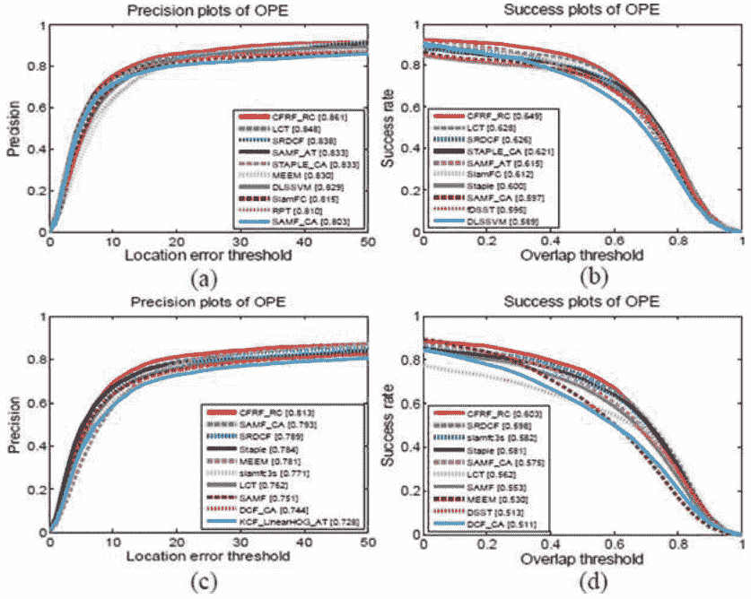

图3.6 OTB-2013和OTB-2015数据集上最先进的跟踪器的实验结果。(a) OTB-2013数据集上OPE的精度曲线。(b) OTB-2013数据集上OPE的成功曲线。(c) OTB-2015数据集上OPE的精度曲线。(d) OTB-2015数据集上OPE的成功曲线。

LCT跟踪器是一种长期对象跟踪器，在OTB-2013中的精确率和成功率方面排名第二。与提出的跟踪器类似，重新检测和重新定位组件被应用于减轻遮挡和跟踪漂移。然而，LCT跟踪器在跟踪框架中使用了三个相关滤波器。在OTB-2015数据集上，SRDCF和SAMF_CA在精确率和成功率方面表现最好，除了提出的跟踪器。这两种算法之间的相似之处在于它们使用了两种不同的方法来解决循环移位引起的边界效应问题。因此，这些减少边界效应的方法是有效的，并值得参考。

图3.7显示了在OTB-2015数据集上，提出的跟踪器在四种跟踪挑战下的性能。图3.7a-d分别是遮挡、尺度变化、平面旋转和形变的成功曲线。由于提出的跟踪器的主要目标是在处理尺度变化和遮挡挑战时提高跟踪算法的成功率，图3.7只显示了这四个挑战下的成功率结果。从图3.7可以看出，我们可以看到，在遮挡、尺度变化和平面旋转挑战下，所提出的跟踪器显示出最佳性能。但是，在处理变形时，所提出的跟踪器排名第二。

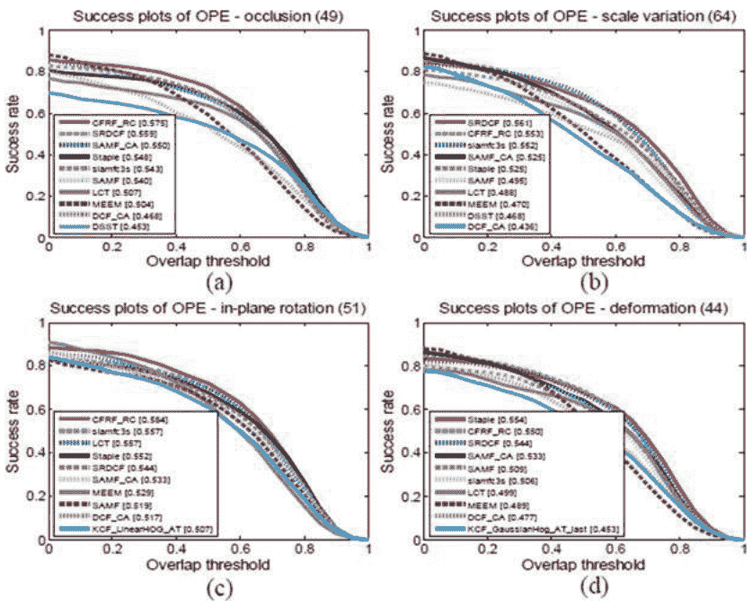

图3.7 OTB-2015上最先进的跟踪器的实验结果。(a) 在遮挡挑战下的OPE成功曲线。(b) 在尺度变化挑战下的OPE成功曲线。(c) 在平面旋转挑战下的OPE成功曲线。(d) 在变形挑战下的OPE成功曲线。

在OTB-2015数据集上，在尺度变化挑战下，所提出的跟踪器的成功率为55.3%。与KCF相比，它显示出良好的性能。我们认为这种改进主要是由于所提出的跟踪器中应用的位置估计和尺度估计。在跟踪过程中，位置估计的结果不直接采用。在位置估计之后，所提出的跟踪器还在位置估计得到的位置上构建了一个图像金字塔，以估计对象的尺度。此外，用于尺度估计的尺度相关滤波器是线性更新的。这也有助于提高尺度估计的准确性。

所提出的压缩尺度相关滤波器也应用于KCF跟踪器，并构建了一个名为KCF_Scale的新跟踪器。实现的详细信息可以在实验部分找到。表3.4显示了KCF_Scale在OTB-2013和OTB-2015数据集上与SAMF和DSST跟踪器相比的精确率、成功率 (AUC) 和跟踪速度。SAMF和DSST也旨在改善处理尺度变化挑战时的跟踪性能。

从表3.4可以看出，KCF_Scale跟踪器在精确度和成功率上具有最佳的跟踪性能，并且具有高速的跟踪速度，在OTB-2013和OTB-2015上分别接近86.5和85.4帧/秒。我们相信有两个原因。一个原因是减少尺度样本可以增加跟踪速度，另一个原因是实数函数的傅里叶系数的埃尔米特对称性用于减少计算复杂度和内存消耗。它可以提高跟踪速度而不降低跟踪准确性。

图3.8展示了与DCF_CA、DSST和KCF进行定性实验时的结果。图3.8中的所有五个序列都包含了一些跟踪挑战，如尺度变化、运动模糊、快速运动等。黑色框表示提出的跟踪器与对象大小相似。这也证明了所提算法在处理尺度变化挑战方面的有效性。

## 3.4 带有多尺度超像素的相关滤波器跟踪器

基于判别性相关滤波器的跟踪器，如KCF，在处理一些跟踪挑战方面取得了巨大成功，但是仍然存在一些对KCF来说很困难的挑战，如尺度变化、快速运动、遮挡等。我们认为主要原因是ROI具有固定大小和缺乏结构信息。因此，在本章中提出了一种多尺度超像素和颜色特征引导的核相关滤波器 (MSSCF-KCF) 跟踪器来解决上述问题。MSSCF-KCF将视图跟踪视为优化对象组件组合的问题。首先，根据提出的多尺度超像素分割方法计算的全局置信度图将对象分割成几个补丁。然后，对每个补丁进行特征提取和相关滤波器训练。

### 表格 3.4 OTB-2013和OTB-2015数据集上的实验结果

| 跟踪器 | 精确度 (2013) | AUC (2013) | 速度 (fps) | 精确度 (2015) | AUC (2015) | 速度 (fps) |
| :--- | :--- | :--- | :--- | :--- | :--- | :--- |
| KCF_Scale | 0.793 | 0.581 | 86.5 | 0.762 | 0.561 | 85.4 |
| SAMF | 0.785 | 0.579 | 18.5 | 0.751 | 0.553 | 17.9 |
| DSST | 0.740 | 0.554 | 28.9 | 0.680 | 0.513 | 21.5 |

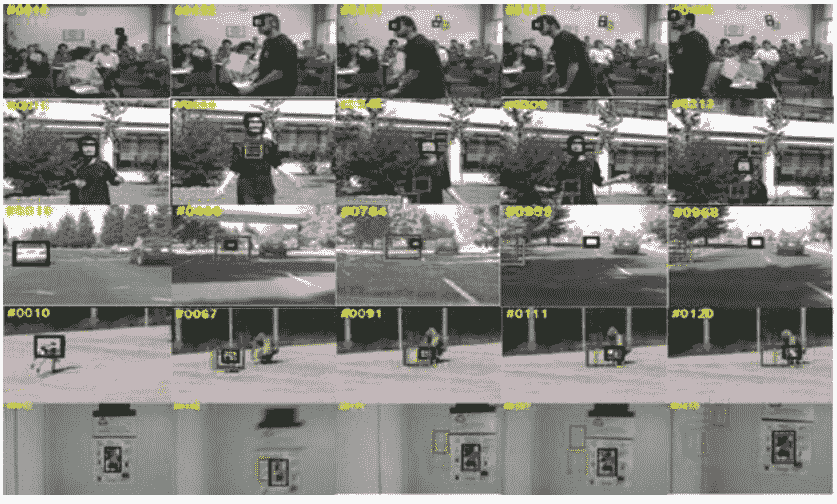

图3.8 不同跟踪器生成的具有挑战性的跟踪边界框的比较序列。黑色、红色、绿色和蓝色的跟踪框分别代表提出的跟踪器、DCF_CA、DSST和KCF。

对于每个补丁，从对象中提取的颜色特征以及从KCF获得的置信度图构建观测模型。最后，应用提出的中心距离矩阵和最小-最大准则来搜索最佳的对象补丁组合，以利用对象的结构信息。此外，在MSSCF-KCF中使用监视更新策略来监视跟踪过程并更新外观模型。与一些最先进的基于KCF的跟踪器进行比较实验证明了提出的MSSCF-KCF跟踪器的有效性。

### 3.4.1 多尺度超像素分割

KCF是一种有区分性的方法，在跟踪速度和竞争性能方面显示出优势。然而，KCF跟踪器仍然存在一些缺点。例如，KCF在处理尺度变化、快速运动和遮挡场景方面较弱。为了增强KCF处理尺度变化的能力，将目标分割成几个补丁。对于每个补丁，使用KCF来跟踪图像补丁。采用补丁跟踪结果的最佳组合作为最终的跟踪结果。我们相信这可能在一定程度上弥补传统KCF的不足。由于KCF的跟踪速度远远超过实时跟踪的要求，通过应用多个KCF跟踪器仍然可以确保实时跟踪。本章的目标是提供稳定和高效的补丁。对象补丁可以通过图3.9计算得出。

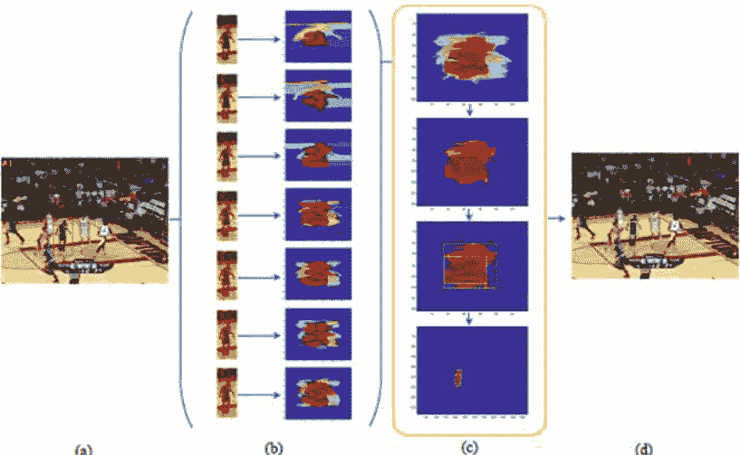

图3.9 获取基于多尺度超像素的对象补丁的过程。(a) 对象图像和感兴趣区域，分别由黄色框和红色框内的图像表示。(b) 多尺度超像素的分割结果和相关的分离置信度掩码。分割结果是通过多尺度的SLIC算法获得的。(c) 全局置信度掩码和对象补丁的获取。对象补丁是通过全局置信度掩码中的不同值推断出的。对象补丁的大小和数量受到阈值 $T_{hre}$ 和步长 $\alpha_{step}$ 的限制。(d) 对象补丁的结果，用于训练传统的KCF算法并提取颜色特征，为下一步做准备。

KCF算法的训练中心和边界框的大小对跟踪结果有重要影响。提出的多尺度超像素分割方法可以自动确定每个对象补丁的中心和大小。如图3.9所示。首先，我们根据对象边界框选择感兴趣区域（ROI），其大小是对象图像的 $\lambda$ 倍，如图3.9a所示。$X_{ROI}$ 和 $X_O$ 分别表示ROI和对象的状态，分别用黄色和红色框标记在图3.9a中。$I(X_{ROI})$ 和 $I(X_O)$ 表示相应的图像。其次，ROI通过具有 $N_{ss}$ 不同尺度的SLIC算法进行分割。图3.9b显示了每个尺度的分离置信度掩码，表示具有不同尺度的超像素的得分，可以通过公式3.20计算。

$$score(SP_s^k) = \frac{\sum_{p(i,j) \in SP_s^k} \mathbb{I}(p(i,j) \in I(X_O))}{N(SP_s^k)} \quad (3.20)$$

$SP_s^k$ 是第 $k$ 个尺度下的超像素，$\mathbb{I}(*)$ 是指示函数，$N(SP_s^k)$ 是 $SP_s^k$ 中的像素数，方程3.20的分母表示属于 $SP_s^k$ 和 $I(X_O)$ 的像素数。单独的置信度图可以表示为 $SP_s^k(i,j) = score(SP_s^k)$，$SP_s^k(i,j)$ 是位于 $(i,j)$ 并属于第 $k$ 个尺度下的超像素的像素值。当 $SM_s = SP_s^k(i,j), k = 1, 2, \dots, N_s; i, j \in SP_s^k$ 是第 $k$ 个尺度下的单独置信度掩码。对于每个 $SM_s$ 中的元素可以通过方程3.21计算得出。

$$SM_s(i, j) = \sum_{k=1}^{N_s} \mathbb{I}(i, j \in SP_s^k) score(SP_s^k) \quad (3.21)$$

最后，不同尺度的分离置信度掩模被整合合成一个全局置信度掩模，可以看作是分离置信度掩模的加权平均值，如图3.9c所示。全局置信度掩模可以通过方程3.22获得。

$$G_{SM} = \sum_{s=1}^{N_{ss}} \beta_s \cdot SM_s \quad s.t. \sum_{s=1}^{N_{ss}} \beta_s = 1 \quad (3.22)$$

$\beta_s$ 表示权重系数。在本章中，$\beta_s = \frac{1}{N_{ss}}$，因此，我们得到了方程3.23。

$$G_{SM} = \frac{\sum_{s=1}^{N_{ss}} SM_s}{N_{ss}} \quad (3.23)$$

物体块的数量与阈值 $T_{hre}$ 和步长 $\alpha_{step}$ 有关，其中 $0 < \alpha_{step} < 1$。$N_{pa}$ 表示可以通过公式3.24计算得到的物体块的数量。

$$N_{pa} = \frac{1 - T_{hre}}{\alpha_{step}} \quad (3.24)$$

如果 $\alpha_{step} = 0.1$ 且 $T_{hre} = 0.7$，则物体块的数量为3，$N_{pa} = 3$。

因此，可以通过在全局置信度掩码中收集具有特定值的元素来获得物体块。将 $PM^\gamma_{T_{hre}}$ 设置为补丁掩码，其中 $\gamma$ 为在阈值 $T_{hre}$ 和步长 $\alpha_{step}$ 下的第 $\gamma$ 个补丁掩码，$\gamma \in (0, 1, \dots, N_{pa}-1)$。

然后，$OP_{\gamma}$，即像素值为1的像素集合，和 $PM^{\gamma}_{T_{hre}}$ 可以通过公式3.25和3.26计算得到。

$$PM^{\gamma}_{T_{hre}}(i, j) = \mathbb{I}(T_{hre} \le G_{SM}(i, j) \le (T_{hre} + \gamma * \alpha_{step})) \quad (3.25)$$

$$OP_{\gamma} = I(X_{ROI}) \cdot PM^{\gamma}_{T_{hre}} \quad (3.26)$$

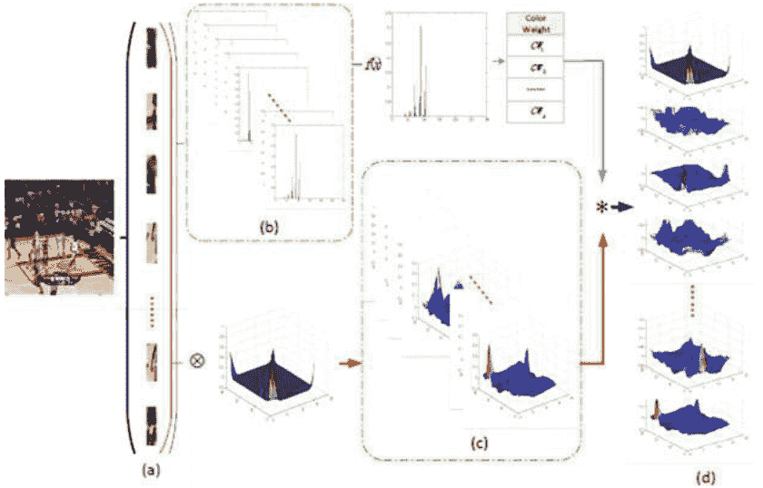

图3.10 获取颜色特征引导的置信度图的过程。(a) 由基于高斯分布的运动模型估计的子候选状态。(b) 子候选的HSI直方图，通过与相应对象补丁模板的HSI直方图进行测量来计算颜色权重。(c) 子候选的置信度分数。(d) 通过颜色权重进一步过滤置信度分数得到的颜色特征引导的置信度图。

整个帧的对象补丁的分割结果和边界框显示在图3.9中。对象补丁边界框内的图像用于训练KCF跟踪器，因此，我们可以得到 $\gamma$ 个KCF跟踪器。选择这些KCF跟踪器的最佳组合有助于改善处理尺度变化挑战时的KCF跟踪器性能。

为了提高KCF跟踪器获取的置信度图的准确性，使用颜色特征进一步过滤置信度分数。由KCF和HSI特征计算得到的最终置信度图称为颜色特征引导的置信度图。计算单个补丁的颜色特征引导置信度图的过程如图3.10所示。为了更好地理解图3.10，第 $\gamma$ 个对象补丁 $\mathbf{X}_{OP_\gamma}$ 被选择为示例。$HSI(I(\mathbf{X}_{OP_\gamma}))$ 和 $KCF(I(\mathbf{X}_{OP_\gamma}))$ 表示从第 $\gamma$ 个对象补丁中提取的 HSI 特征和由 KCF 获得的 $\mathbf{X}_{OP}$ 的置信度图。

假设 $\mathbf{X}_{OP_\gamma}$ 在方程3.27中遵循高斯分布。

$$p(\mathbf{X}_{OP_\gamma}^t | \mathbf{X}_{OP_\gamma}^{t-1}) = N(\mathbf{X}_{OP_\gamma}^t; \mathbf{X}_{OP_\gamma}^{t-1}, \Psi) \quad (3.27)$$

$\Psi$ 表示对角协方差矩阵。因此，我们可以得到下一帧中对象补丁 $OP_\gamma$ 的 $N_{sc}$ 个子候选项进行匹配。如图3.10a所示，$SC_{\gamma, \xi}, \xi \in \{1, 2, \dots, N_{sc}\}$ 表示子候选项。图3.10a中的蓝线显示获取颜色权重的过程是通过测量模板块和子候选块的 HSI 直方图之间的 2-范数距离来计算的。为了归一化颜色权重，使用归一化指数距离作为归一化后的颜色权重，由公式3.28计算得到。

$$CW_{\gamma,\xi} = e^{-\frac{\|HSI(I(\mathbf{X}_{SC_{\gamma,\xi}})) - HSI(I(\mathbf{X}_{OP_{\gamma}}))\|_2}{\max_{i=1,2,\dots,N_{sc}} \|HSI(I(\mathbf{X}_{SC_{\gamma,i}})) - HSI(I(\mathbf{X}_{OP_{\gamma}}))\|_2}} \quad (3.28)$$

$CW_{\gamma,\xi}$ 是子候选块 $SC_{\gamma,\xi}$ 的颜色权重。$\mathbf{X}_{SC_{\gamma,\xi}}$ 和 $HSI(I(\mathbf{X}_{SC_{\gamma,\xi}}))$ 表示 $SC_{\gamma,\xi}$ 的状态和 HSI 直方图。公式3.28的分母表示所有子候选块 $SC_{\gamma,\xi}$ 的最大值，其中 $\xi = 1, 2, \dots, N_{sc}$。方程式3.28可以限制颜色权重 $CW_{\gamma,\xi} \in (0, 1]$，并在 2-范数距离较小时设置颜色权重为较大值。$\hat{f}(I(\mathbf{X}_{SC_{\gamma,\xi}}))$ 表示子候选的置信度分数，可以通过在图3.10中沿着红线计算得到。因此，颜色特征引导的置信度图可以通过方程式3.29计算得到。

$$H_{CF}(I(\mathbf{X}_{SC_{\gamma,\xi}})) = CW_{\gamma,\xi} \cdot \hat{f}(I(\mathbf{X}_{SC_{\gamma,\xi}})) \quad (3.29)$$

其中 $H_{CF}(I(\mathbf{X}_{SC_{\gamma,\xi}}))$ 是最终的颜色特征引导的置信度图，可以获得更好的预测结果。$H_{CF}(I(\mathbf{X}_{OP_{\gamma}})) = \{H_{CF}(I(\mathbf{X}_{SC_{\gamma,\xi}}))\}, \xi \in \{1, 2, \dots, N_{sc}\}$ 表示 $OP_{\gamma}$ 的颜色特征引导置信度图。颜色特征引导置信度图将颜色特征引入 KCF，以进一步过滤子候选引起的干扰。

### 3.4.2 基于结构的优化策略

最终的跟踪结果被视为子候选的最佳组合。本章中使用对象的结构特征来找到子候选的最佳组合，并在处理尺度变化挑战时提高性能。如图3.11所示，通过计算来自不同对象补丁的两个子候选的中心距离，提出了一种新的中心距离矩阵来利用对象的结构特征。然后，提出了最小-最大准则来找到子候选的最佳组合并计算跟踪结果。

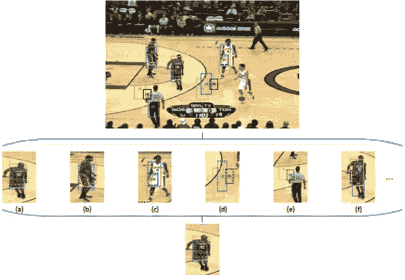

图3.11 从子候选选项中选择最佳组合的过程。(a)-(f) 展示了六组子候选选项。每组都由从所有对象补丁中选择的子候选选项组成，根据最短中心距离选择不同对象补丁中的一个子候选项进行组合。最后，我们得到了最佳的子候选选项组合，并根据提出的最小-最大准则得到了对象的最终状态。

方程式3.30显示了通过测量对象补丁中任意两个子候选选项之间的距离来获得的中心距离矩阵，以利用对象的结构信息。对象可以被视为对象补丁的组合。

$$C_{DM} = \begin{bmatrix} C_{DM}(1, 1) & C_{DM}(1, 2) & \cdots & C_{DM}(1, N_{pa}) \\ C_{DM}(2, 1) & C_{DM}(2, 2) & \cdots & C_{DM}(1, N_{pa}) \\ \vdots & \vdots & \vdots & \vdots \\ C_{DM}(N_{pa}, 1) & C_{DM}(N_{pa}, 2) & \cdots & C_{DM}(N_{pa}, N_{pa}) \end{bmatrix} \quad (3.30)$$

$C_{DM}(i, j)$ 是一个包含所有子候选物体块 $i$ 和 $j$ 的距离的矩阵。因此，$C_{DM} \in \mathbb{R}^{(N_{pa} \cdot N_{sc}) \times (N_{pa} \cdot N_{sc})}$ 而 $C_{DM}(i, j) \in \mathbb{R}^{N_{sc} \times N_{sc}}$。$C_{DM}(i, j)$ 可以通过公式3.31计算得到。

$$C_{DM}(i, j) = \begin{bmatrix} dist_{1,1} & dist_{1,2} & \cdots & dist_{1,N_{sc}} \\ dist_{2,1} & dist_{2,2} & \cdots & dist_{2,N_{sc}} \\ \vdots & \vdots & \vdots & \vdots \\ dist_{N_{sc},1} & dist_{N_{sc},2} & \cdots & dist_{N_{sc},N_{sc}} \end{bmatrix} \quad (3.31)$$$dist_{p,q}$ 是对象补丁 $i$ 的第 $p$ 个子候选和对象补丁 $j$ 的第 $q$ 个子候选之间的中心距离。从公式 3.30 和 3.31 可以看出，$dist_{p,q} = dist_{q,p}$ 且 $C_{DM}(i, j) = C_{DM}(j, i)^T$。如果 $p = q$，则 $dist_{p,q} = \infty$。包含结构信息的中心距离矩阵被用作计算子候选的最佳组合的字典。

在这种方法中，最优组合被定义为具有最高颜色特征引导置信度得分和最低中心距离的组合，可以表示为方程 3.32：

$$\min_k C_{DM}(G_k) \max_k \sum_{i=1}^{N_{pa}} H_{CF}(G_k(i)) \quad (3.32)$$

方程 3.32 是本章提出的最小-最大准则。$G_k$ 是第 $k$ 个可能的组合，$G_k = \{G_k(1), G_k(2), \dots, G_k(N_{pa})\}$。$G_k(i)$ 是 $G_k$ 中第 $i$ 个对象补丁的子候选项，$\sum_{i=1}^{N_{pa}} H_{CF}(G_k(i))$ 和 $C_{DM}(G_k)$ 分别是颜色特征引导置信度得分的总和和元素之间中心距离的总和。这两个优化也可以通过方程 3.33 进行整合：

$$\begin{aligned} \max_k & \frac{\sum_{i=1}^{N_{pa}} H_{CF}(G_k(i))}{N_{pa}} \cdot \frac{dist_{max} \mathbf{C}_{N_{pa}}^2}{C_{DM}(G_k)} \\ = \max_k & \frac{dist_{max} \mathbf{C}_{N_{pa}}^2 \sum_{i=1}^{N_{pa}} H_{CF}(G_k(i))}{N_{pa} C_{DM}(G_k)} \quad (3.33) \\ = \max_k & \kappa' \frac{\sum_{i=1}^{N_{pa}} H_{CF}(G_k(i))}{C_{DM}(G_k)} \end{aligned}$$

第一项是颜色特征的平均值，引导了 $G_k$ 中子候选项的置信度得分；第二项显示了 $G_k$ 中子候选项之间中心距离的倒数。$dist_{max}$ 表示 $C_{DM}$ 中的最大距离，用于归一化。$\kappa'$ 是常数，如公式 3.34 所示：

$$\begin{aligned} \kappa' &= \frac{dist_{max} \mathbf{C}_{N_{pa}}^2}{N_{pa}} \\ &= \frac{dist_{max} N_{pa}(N_{pa}-1)}{2N_{pa}} \quad (3.34) \\ &= \frac{dist_{max}(N_{pa}-1)}{2} \end{aligned}$$

在 $C_{DM}(G_k)$ 中的求和项数量为 $\mathbf{C}_{N_{pa}}^2$。GEP 算法 [37] 用于解决在寻找子候选项的最佳组合时的 NP 难问题。$G_k = \{G_k(1), G_k(2), \dots, G_k(N_{pa})\}$ 在 GEP 中用作基因，元素在 $G_k$ 中被视为染色体。因此，可以通过选择能够包裹所有选定的子候选选项的最小边界框来估计对象的状态。对象的最终状态可以通过公式 3.35 计算得出：

$$\mathbf{X}_O = \left\{ X_{G_k}^{i_{min}}, X_{G_k}^{j_{min}}, (X_{G_k}^{p_{max}} - X_{G_k}^{i_{min}}), (X_{G_k}^{q_{max}} - X_{G_k}^{j_{min}}) \right\} \qquad (3.35)$$

$X_{G_k}^{i_{min}}$ 和 $X_{G_k}^{j_{min}}$ 是所有 $\mathbf{X}(G_k(i))$ 中 $X_{G_k}^{p_{max}}$ 和 $X_{G_k}^{q_{max}}$ 的左上角坐标的最小值。当所选对象块的颜色特征引导的置信度分数低于特定阈值 $T_d$ 时，这意味着这些所选对象块可能是干扰项，应该被排除。阈值 $T_d$ 的方程如下所示：

$$T_d = \lambda' \frac{\sum_{i=1}^{N_{pa}} H_{CF}(G_k(i))}{N_{pa}} \qquad (3.36)$$

经验上，$T_d$ 是颜色特征引导置信度得分的 2/3。因此，$\lambda' = 2/3$。

### 3.4.3 框架和过程

由于所提出的 MSSCF-KCF 跟踪器将对象视为一些相关关联和重叠的补丁的组合，MSSCF-KCF 的主要目的是选择每个补丁跟踪结果的最佳组合。MSSCF-KCF 跟踪器的流程如图 3.12 所示。

如图 3.12a 所示，ROI（边界框的 $\lambda$ 倍）被分割成几个不同尺度的超像素。我们计算这些超像素的置信度掩码，并将这些单独的置信度掩码集成成为一个名为全局置信度掩码的置信度掩码。然后，我们根据全局置信度掩码中的元素值将对象图像分割成几个对象补丁。在获取对象补丁之后，我们计算置信度图并提取每个补丁的 HSI 特征，以获得颜色特征引导的置信度图，如图 3.12b 所示。通过假设对象的运动服从高斯分布，我们可以为每个对象补丁获得几个子候选补丁。通过所提出的中心距离矩阵和最小-最大准则，跟踪问题转化为一个可以视为 NP 难问题的最优问题。为了解决这个 NP 难问题，所提出的方法应用了 GEP 算法来找到最佳组合并获得最终的跟踪结果。

**图3.12 MSSCF-KCF跟踪器的流程。** 提出的 MSSCF-KCF 的过程主要分为三个部分。**(a)** 基于多尺度超像素的多核相关滤波器，可以看作是获取对象的多尺度超像素补丁并为补丁训练 KCF 的过程。**(b)** 基于颜色特征的导向置信度图，也称为混合置信度图，在本节中通过考虑置信度分数并通过颜色特征导向方法进行滤波生成。**(c)** 基于提出的最小-最大准则和中心距离矩阵的子候选结构选择和组合，并通过 GEP 进行优化。

为了更新颜色特征导向的置信度图并监控跟踪过程，提出了更新策略和监控策略。对于更新策略，它还可以分为两部分：由 KCF 计算的置信度图的更新和由 HSI 特征获得的颜色权重的更新。置信度图的更新简单地遵循 KCF 跟踪器的更新，而颜色权重的更新可以通过公式 3.37 计算：

$$HSI(temp_i) = \nu HSI(OP_{\gamma}^i) + (1 - \nu)HSI(temp_{i-1}) \qquad (3.37)$$

$HSI(temp_i)$ 表示 $temp_i$ 的 HSI 特征，而 $HSI(OP_{\gamma}^i)$ 显示 $OP_{\gamma}^i$ 的相应 HSI 特征。$\nu$ 表示遗忘因子。

对于监控策略，$\{\mathbf{X}_O^i\}$ 由 MSSCF-KCF 跟踪器记录。KCF 的跟踪结果，表示为 $\{\mathbf{X}_K^i\}$ 也由 MSSCF-KCF 记录。为了动态感知跟踪操作并调整 MSSCF-KCF 中的参数，设计了三个测试指标，可以通过公式 3.38-3.40 计算，用于测量物体的运动和尺度变化：

$$R_P(i) = \frac{\|(\boldsymbol{\Psi}_2 - \frac{1}{2}\boldsymbol{\Psi}_3)(\mathbf{X}_O^i - \mathbf{X}_O^{i-1})\|_2}{max(1, mean(\sum_{j=2}^i \|(\boldsymbol{\Psi}_2 - \frac{1}{2}\boldsymbol{\Psi}_3)(\mathbf{X}_O^j - \mathbf{X}_O^{j-1})\|_2))} \quad (3.38)$$
$$R_S(i) = \frac{\|\boldsymbol{\Psi}_3(\mathbf{X}_O^i - \mathbf{X}_O^{i-1})\|_2}{max(1, mean(\sum_{j=2}^i \|\boldsymbol{\Psi}_3(\mathbf{X}_O^j - \mathbf{X}_O^{j-1})\|_2))} \quad (3.39)$$
$$RM_P(i) = \frac{\|(\boldsymbol{\Psi}_2 - \frac{1}{2}\boldsymbol{\Psi}_3)(\mathbf{X}_O^i - \mathbf{X}_K^i)\|_2}{max(1, mean(\sum_{j=1}^i \|(\boldsymbol{\Psi}_2 - \frac{1}{2}\boldsymbol{\Psi}_3)(\mathbf{X}_O^j - \mathbf{X}_K^j)\|_2))} \quad (3.40)$$

方程 3.38 是物体中心的变化率，方程 3.39 是尺度的变化率。方程 3.40 是 MSSCF-KCF 和监视器之间的中心变化率。$\mathbf{E}_{2\times2}$ 和 $\mathbf{0}_{2\times2}$ 分别是 $2\times2$ 的单位矩阵和零矩阵。

$\|(\boldsymbol{\Psi}_2 - \frac{1}{2}\boldsymbol{\Psi}_3)(\mathbf{X}_O^i - \mathbf{X}_O^{i-1})\|_2$ 是第 $i$ 帧和第 $i-1$ 帧之间的中心误差。$\|(\boldsymbol{\Psi}_2 - \frac{1}{2}\boldsymbol{\Psi}_3)(\mathbf{X}_O^i - \mathbf{X}_K^i)\|_2$ 表示在第 $i$ 帧中，提出的跟踪器与监视器之间的中心误差。通过将这三个测试指标与 1 进行比较，可以确定提出的跟踪器是否正常运行。如果这些测试指标中的任何一个超过 1，我们认为提出的跟踪器处于异常情况下。高斯分布的遗忘因子和方差应该减小，子候选数量应该增加。一般来说，所提出的监控策略是速度和准确性之间的权衡。MSSCF-KCF 的伪代码如算法 1 所示。

算法 1 主要可以分为两个部分。第一部分，从步骤 1 到步骤 4，是对对象进行分割并初始化用于训练 KCF 跟踪器的对象模板。其他步骤是第二部分，用于迭代地估计最终的跟踪结果并更新颜色特征引导的置信度图。

---
**算法1: 所提出方法 MSSCF-KCF 的框架**
**输入:** 初始对象状态 $\mathbf{X}_O^1$; 放大因子 $\lambda$; 步长 $\alpha$; 阈值 $Thre$; 超像素的尺度 $\{S_s\}, s \in \{1, 2, \dots, N_{ss}\}$; 帧数 $N_f$;
**输出:** 物体的状态 $\{\mathbf{X}_O^i\}, i \in \{2, 3, \dots, N_f\}$;

1: 通过使用 $\lambda, \mathbf{X}_{ROI}$ 来获取 ROI;
2: 基于多尺度超像素方法对 $I(\mathbf{X}_{ROI})$ 进行分割, 并计算全局置信度掩码 $G_{SM}$;
3: 计算物体块的数量 $N_{pa}$, 并估计每个物体块的状态 $\mathbf{x}_{op_\gamma}, \gamma \in \{1, 2, \dots, N_{pa}\}$;
4: 提取 HSI 特征并为每个物体块训练 KCF, 作为初始物体块模板;
5: **for** $i = 2; i < N_f; i++$ **do**
6:     根据高斯分布基于运动模型获取所有物体块的子候选;
7:     计算子候选的置信度得分 $f^i(I(\mathbf{X}_{SC_{\gamma,\xi}}))$ 和颜色权重 $CW_{\gamma,\xi}$, 并获得颜色特征引导的置信度图;
8:     计算中心距离矩阵 $C_{DM}$ 并通过应用 GEP 算法获得最佳组合 $G_k$;
9:     **如果** $G_k(i)$ 的颜色特征置信度得分低于 $T_d$ **那么**
10:        删除 $G_k(i)$;
11:    **结束如果**
12:    通过公式 3.35 估计对象的状态 $\mathbf{X}_O^i$;
13:    通过公式 3.38-3.40 的监控策略监控跟踪结果;
14:    通过公式 3.37 更新对象补丁模板的 KCFs 和 HSI;
15: **结束循环**
16: 返回 $\mathbf{X}_O^i$;
---

### 3.4.4 实验结果和讨论

本节讨论了所提出的 MSSCF-KCF 跟踪器的实现细节和参数设置。实验在一台配有 3.3 GHz CPU 和 8G 内存的计算机上运行，$\alpha=0.1$，$Thre=0.7$，$N_{ss}=7$。超像素数量为 {10, 20, 40, 60, 80, 100, 120}。所提出的跟踪器中使用了 SLIC [38] 和 GEP [37] 进行超像素分割和最优解决方案。

实验使用了广泛使用的数据集，如 OTB-2013 [9]，OTB-2015 [10]，ALOV++ [39] 等。此外，还使用了一个由手机拍摄的小型自制数据集来测试所提出的跟踪器。平均跟踪速度可达到 15.3372 帧/秒，比 KCF 跟踪器的 118.8189 帧/秒慢。我们相信多个 KCF 跟踪器和最优解的处理可能会降低跟踪速度。然而，所提出的跟踪器仍然可以满足实时跟踪的需求。

实验可以分为三个子部分：基础实验，基准实验，自制数据集实验。

#### 基础实验

为了测试所提出的跟踪算法中每个组件的有效性，本节介绍了基于多尺度超像素的方法、颜色特征引导方法和子候选选择与组合的实验和比较。

图 3.13 显示了在广泛使用的数据集上，提出的 MSSCF-KCF 跟踪器与 BB-KCF 跟踪器之间的比较。BB-KCF 跟踪器是基于网格的 KCF，这意味着对象的 ROI 被网格均分成相等的块。在 OTB 基准 [10] 中提出的 OPE、TRE 和 SRE 的精度和成功率被用于比较。从图 3.13 可以看出，MSSCF-KCF 的所有曲线都优于 BB-KCF。这主要是由于 MSSCF-KCF 中使用了基于超像素的分割方法。由于跟踪性能取决于对象补丁的大小和中心，所以提出的基于超像素的分割可以将对象分割成几个补丁，并同时考虑对象的中心，这与基于网格块的 KCF (BB-KCF) 不同。

**图 3.13 OPE、TRE 和 SRE 的精确度图和成功图，比较 MSSCF-KCF 和 BB-KCF**

表 3.5 用于说明颜色特征引导的置信度图的可行性。KCF 的 CS、MSSCF-KCF 的 CW 和 MSSCF-KCF 的 CS 分别表示 KCF 跟踪器的置信度分数、MSSCF-KCF 的颜色权重和 MSSCF-KCF 的置信度分数。而 $SC_1$ 到 $SC_6$ 是要进行比较的六个子候选者。

**表3.5 KCF 的分数、颜色权重和颜色特征引导的置信度分数的结果**

| 指标类型 | $SC_1$ | $SC_2$ | $SC_3$ | $SC_4$ | $SC_5$ | $SC_6$ |
| :--- | :--- | :--- | :--- | :--- | :--- | :--- |
| KCF 的置信度分数 (CS) | 0.9932 | 0.3548 | 0.6597 | 0.3195 | 0.3839 | 0.7110 |
| MSSCF-KCF 的颜色权重 (CW) | 1 | 0.3937 | 0.6941 | 0.3679 | 0.4029 | 0.6100 |
| MSSCF-KCF 的引导置信度分数 | 0.9932 | 0.1397 | 0.4579 | 0.1175 | 0.1546 | 0.4337 |

从表 3.5 中，我们发现当子候选者在 KCF 的 CS 和颜色权重上得分较高时，它们在颜色特征引导的置信度图中可能具有更好的得分，例如表 3.5 中的 $SC_1$。这也意味着颜色权重可以进一步过滤掉异常值，特别是在置信度图中得分高但颜色权重低的子候选者。

与图 3.13 类似，图 3.14 显示了 OTB 基准测试中 OPE、TRE 和 SRE 的精度和成功率曲线的比较结果。图 3.14 中的 MSSCF-KCF(r) 跟踪器是为了进行比较而设计的。与 MSSCF-KCF 跟踪器不同，MSSCF-KCF(r) 在没有最小-最大准则的情况下随机选择和组合子候选选项。图 3.14 中的曲线显示出所提出的 MSSCF-KCF 跟踪器在精度和成功率方面具有更好的性能。这也意味着所提出的中心距离矩阵和考虑对象结构信息的最小-最大准则对于提高 MSSCF-KCF 的跟踪性能具有很大的影响。

**图3.14 比较 MSSCF-KCF 和 MSSCF-KCF(r) 时的精度和成功率图**

#### 基准测试实验

为了展示所提出的跟踪器的性能，应用了 OTB-2013 和 OTB-2015 等基准测试来测试所提出的跟踪器。基准测试实验还可以分为与基准跟踪器的精度和成功率曲线的比较以及在 11 个跟踪挑战下所提出的跟踪器的性能。图 3.15 和表 3.6 显示了与基准跟踪器的精度和成功率曲线的比较结果。

图 3.15 中的红色曲线代表所提出的跟踪器，其数值均高于基准跟踪器的曲线。也就是说，所提出的跟踪器在精度和成功率方面具有更好的性能。从图 3.15 中的 SRE 和 TRE 的精度和成功率曲线可以得出结论，所提出的跟踪器在时间和空间上具有更好的鲁棒性。为了更清晰和更直观地表示跟踪结果，OPE、TRE 和 SRE 的平均精度和成功率在表 3.6 中显示。表 3.6 中的 ‘p’ 和 ‘s’ 分别表示平均精度和成功率。

**图 3.15 在 OTB 中与基准跟踪器比较时，OPE、TRE 和 SRE 的精度和成功率曲线**

## 表3.6 在OTB中与28个跟踪器比较时，OPE、TRE和SRE的精度和成功率分数

| 跟踪器 | OPE_p | OPE_s | TRE_p | TRE_s | SRE_p | SRE_s |
| :--- | :--- | :--- | :--- | :--- | :--- | :--- |
| MSSCF-KCF | 0.751 | 0.555 | 0.791 | 0.608 | 0.695 | 0.505 |
| CXT | 0.575 | 0.426 | 0.624 | 0.463 | 0.546 | 0.388 |
| Struck | 0.656 | 0.474 | 0.707 | 0.514 | 0.635 | 0.439 |
| KCF | 0.74 | 0.51 | 0.774 | 0.556 | 0.683 | 0.463 |
| SCM | 0.649 | 0.499 | 0.653 | 0.514 | 0.575 | 0.420 |
| VTD | 0.576 | 0.416 | 0.643 | 0.462 | 0.553 | 0.381 |
| TLD | 0.608 | 0.437 | 0.624 | 0.448 | 0.573 | 0.402 |
| IVT | 0.499 | 0.358 | 0.548 | 0.407 | 0.481 | 0.322 |
| L1APG | 0.485 | 0.380 | 0.569 | 0.435 | 0.481 | 0.348 |
| CSK | 0.545 | 0.398 | 0.618 | 0.454 | 0.525 | 0.367 |
| VR-V | 0.339 | 0.368 | 0.434 | 0.339 | 0.367 | 0.281 |
| VTS | 0.575 | 0.416 | 0.638 | 0.460 | 0.544 | 0.374 |
| Frag | 0.471 | 0.352 | 0.535 | 0.411 | 0.441 | 0.322 |
| MS-V | 0.284 | 0.212 | 0.355 | 0.277 | 0.297 | 0.225 |
| CPF | 0.488 | 0.355 | 0.578 | 0.425 | 0.475 | 0.341 |
| KMS | 0.425 | 0.326 | 0.472 | 0.364 | 0.405 | 0.304 |
| LOT | 0.522 | 0.367 | 0.555 | 0.404 | 0.466 | 0.330 |
| PD-V | 0.396 | 0.308 | 0.440 | 0.314 | 0.393 | 0.309 |
| ASLA | 0.532 | 0.434 | 0.620 | 0.485 | 0.577 | 0.421 |
| DFT | 0.496 | 0.389 | 0.552 | 0.425 | 0.462 | 0.338 |
| LSK | 0.505 | 0.395 | 0.582 | 0.447 | 0.509 | 0.374 |
| OAB | 0.504 | 0.370 | 0.563 | 0.422 | 0.506 | 0.359 |
| MTT | 0.475 | 0.376 | 0.568 | 0.438 | 0.493 | 0.355 |
| MIL | 0.475 | 0.359 | 0.545 | 0.406 | 0.454 | 0.334 |
| CT | 0.406 | 0.306 | 0.477 | 0.359 | 0.340 | 0.252 |
| BSBT | 0.396 | 0.322 | 0.445 | 0.358 | 0.381 | 0.298 |
| ORIA | 0.457 | 0.333 | 0.479 | 0.363 | 0.407 | 0.289 |
| TM-V | 0.445 | 0.352 | 0.510 | 0.396 | 0.428 | 0.313 |

例如，'OPE_p'是OPE的平均精度率，而'OPE_s'是OPE的平均成功率。红色和蓝色的数字代表表3.6中的最高和最低分数。所提出的跟踪器的数字都是红色的，这意味着与基准跟踪器相比，所提出的跟踪器具有最佳性能。由于多尺度超像素方法和基于结构的优化策略，所提出的跟踪器的性能在与传统的KCF相比时显示出显著的改进。

所提出的跟踪器在11个跟踪挑战下与其他28个最先进的跟踪器的精度率在表3.7中提供。表3.7中的FM，BC，MB，De，Il，IpR，LR，Oc，OpR，OV和SV分别代表快速运动，背景杂波，运动模糊，变形，光照，平面旋转，低分辨率，遮挡，视角旋转，视野外和尺度变化。从表3.7中，我们可以可以看到，与28个最先进的跟踪器相比，所提出的跟踪器可以排名前5。

## 表3.7 当精度图中的位置误差阈值为 20 时，28 个跟踪器的精度率

| 跟踪器 | FM | BC | MB | De | Il | IpR | LR | Oc | OpR | OV | SV |
| :--- | :--- | :--- | :--- | :--- | :--- | :--- | :--- | :--- | :--- | :--- | :--- |
| MSSCF-KCF | 0.697 | 0.712 | 0.707 | 0.687 | 0.668 | 0.732 | 0.542 | 0.748 | 0.712 | 0.605 | 0.721 |
| CXT | 0.515 | 0.443 | 0.509 | 0.422 | 0.501 | 0.61 | 0.371 | 0.491 | 0.574 | 0.51 | 0.55 |
| Struck | 0.604 | 0.585 | 0.551 | 0.521 | 0.558 | 0.617 | 0.545 | 0.564 | 0.597 | 0.539 | 0.639 |
| KCF | 0.602 | 0.753 | 0.65 | 0.74 | 0.728 | 0.725 | 0.381 | 0.749 | 0.729 | 0.65 | 0.679 |
| SCM | 0.333 | 0.578 | 0.339 | 0.586 | 0.594 | 0.597 | 0.305 | 0.64 | 0.618 | 0.429 | 0.672 |
| VTD | 0.352 | 0.571 | 0.375 | 0.501 | 0.557 | 0.599 | 0.168 | 0.545 | 0.62 | 0.462 | 0.597 |
| TLD | 0.551 | 0.428 | 0.518 | 0.512 | 0.537 | 0.584 | 0.349 | 0.563 | 0.596 | 0.576 | 0.606 |
| IVT | 0.22 | 0.421 | 0.222 | 0.409 | 0.418 | 0.457 | 0.278 | 0.455 | 0.464 | 0.307 | 0.494 |
| L1APG | 0.365 | 0.425 | 0.375 | 0.383 | 0.341 | 0.518 | 0.46 | 0.461 | 0.478 | 0.329 | 0.472 |
| CSK | 0.381 | 0.585 | 0.342 | 0.476 | 0.481 | 0.547 | 0.411 | 0.500 | 0.54 | 0.379 | 0.503 |
| VR-V | 0.254 | 0.318 | 0.26 | 0.348 | 0.222 | 0.294 | 0.136 | 0.332 | 0.332 | 0.236 | 0.324 |
| VTS | 0.353 | 0.578 | 0.375 | 0.487 | 0.573 | 0.579 | 0.187 | 0.534 | 0.604 | 0.455 | 0.582 |
| Frag | 0.346 | 0.421 | 0.288 | 0.468 | 0.326 | 0.401 | 0.163 | 0.475 | 0.444 | 0.355 | 0.407 |
| MS-V | 0.258 | 0.275 | 0.254 | 0.200 | 0.254 | 0.281 | 0.139 | 0.241 | 0.297 | 0.301 | 0.315 |
| CPF | 0.377 | 0.418 | 0.261 | 0.494 | 0.366 | 0.463 | 0.130 | 0.517 | 0.529 | 0.483 | 0.475 |
| KMS | 0.368 | 0.419 | 0.365 | 0.430 | 0.374 | 0.376 | 0.259 | 0.412 | 0.414 | 0.390 | 0.431 |
| LOT | 0.420 | 0.529 | 0.395 | 0.487 | 0.367 | 0.508 | 0.201 | 0.532 | 0.520 | 0.567 | 0.465 |
| PD-V | 0.300 | 0.320 | 0.342 | 0.427 | 0.326 | 0.324 | 0.205 | 0.373 | 0.361 | 0.222 | 0.364 |
| ASLA | 0.253 | 0.496 | 0.278 | 0.455 | 0.517 | 0.511 | 0.156 | 0.460 | 0.518 | 0.333 | 0.552 |
| DFT | 0.373 | 0.597 | 0.383 | 0.537 | 0.475 | 0.469 | 0.211 | 0.481 | 0.497 | 0.391 | 0.441 |
| LSK | 0.375 | 0.504 | 0.324 | 0.481 | 0.449 | 0.534 | 0.304 | 0.534 | 0.525 | 0.515 | 0.480 |
| OAB | 0.416 | 0.446 | 0.360 | 0.470 | 0.388 | 0.471 | 0.376 | 0.483 | 0.503 | 0.454 | 0.541 |
| MTT | 0.401 | 0.424 | 0.308 | 0.332 | 0.351 | 0.522 | 0.510 | 0.426 | 0.473 | 0.374 | 0.461 |
| MIL | 0.396 | 0.456 | 0.357 | 0.455 | 0.349 | 0.453 | 0.171 | 0.427 | 0.466 | 0.393 | 0.471 |
| CT | 0.323 | 0.339 | 0.306 | 0.435 | 0.359 | 0.356 | 0.152 | 0.412 | 0.394 | 0.336 | 0.448 |
| BSBT | 0.321 | 0.311 | 0.307 | 0.371 | 0.302 | 0.380 | 0.243 | 0.390 | 0.391 | 0.442 | 0.330 |
| ORIA | 0.274 | 0.389 | 0.234 | 0.355 | 0.421 | 0.500 | 0.195 | 0.435 | 0.493 | 0.315 | 0.445 |
| TM-V | 0.420 | 0.378 | 0.447 | 0.383 | 0.321 | 0.440 | 0.280 | 0.395 | 0.411 | 0.502 | 0.417 |

所提出的跟踪器在一些特定挑战下也表现出最佳性能，例如快速运动、运动模糊、平面旋转和尺度变化等。这也证明了所提出的多尺度超像素分割方法和结构信息的应用有助于改善在一些跟踪挑战下的跟踪性能，尤其是尺度变化。

为了进一步测试所提出的跟踪器在现实生活中的实用性，MSSCF-KCF也在自制数据集上进行了测试。一些最先进的跟踪器，如PF[40], MS[41], SPT[42], KCF[15], DSST[22], DFT[43], CT[44]和CCOT[34]，也在这个自制数据集上进行了比较。

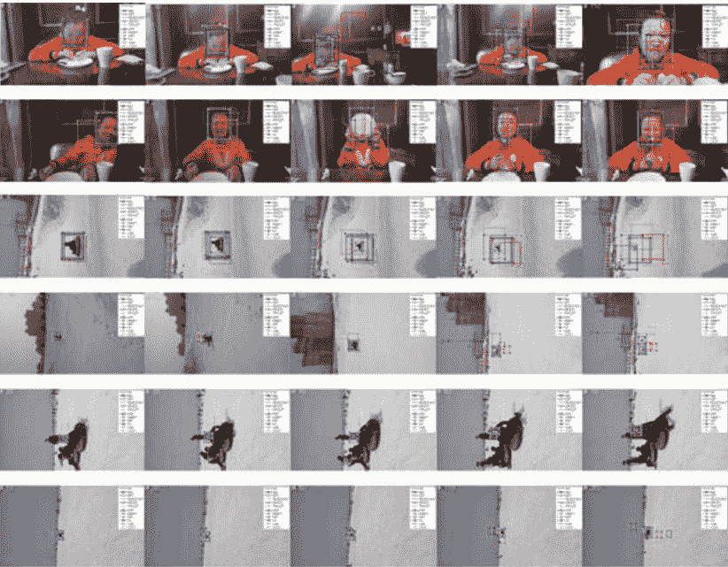

## 图3.16 MSSCF-KCF, PF, MS, SPT, BB-KCF, ProT_SPT, KCF, DSST, DFT, CT, CSK和CCOT在6个自制实景序列中的跟踪结果

图3.16展示了自制数据集的定性实验。从上到下的序列分别命名为girl dinner, girl friend, girl gliding, girl skating, girl skiing和girl skiing 1。girl dinner和girl skating序列包含了快速运动和相机移动的挑战。由于这两个序列中的物体移动速度快且相机晃动，这可能导致跟踪失败。与其他跟踪器相比，所提出的跟踪器在这两个序列中表现出更好的性能，这意味着所提出的跟踪器能够处理相机晃动和快速运动的挑战。在girl gliding序列中，所提出的跟踪器提供了最合适的边界框，其大小与物体的比例一致。这意味着MSSCF-KCF跟踪器在处理尺度变化挑战方面具有更好的能力。我们认为这个结果主要是由于多尺度超像素分割和基于结构的优化策略。

一般来说，当处理一些特定的跟踪挑战时，如快速运动、运动模糊、尺度变化，通过提出的MSSCF-KCF跟踪器可以改善跟踪性能。在OTB基准测试中，TRE和SRE的实验也证明了所提出的跟踪器与一些最先进的跟踪器相比具有更好的鲁棒性。

## 3.5 总结

在本章中，我们主要提出了三种基于改进的相关滤波器的跟踪器。这三种跟踪器都设计为利用KCF跟踪器的快速跟踪速度，进一步提高在处理遮挡和尺度变化等挑战时的跟踪性能。

在第一种方法中，使用基于上下文感知的全局背景信息来提高分类器的判别能力并增强背景信息的使用。然后，在跟踪失败时使用自适应更新模型来提高跟踪的鲁棒性。实验证明，上下文感知信息和自适应更新模型可以帮助基于相关性的跟踪器应对遮挡挑战。

在第二种方法中，将两个相关滤波器组合在一起，以估计对象的位置和尺度，以应对尺度变化的挑战，并使用手动设计的特征构建外观模型并提高跟踪的鲁棒性。实验证明，具有对象的多尺度信息的尺度金字塔滤波器可以帮助所提出的跟踪器估计尺度变化，并且精心设计的特征可以提高基于相关滤波器的外观模型的鲁棒性。

在第三种方法中，为了利用对象的结构信息，将对象的状态视为由超像素方法分割的子对象块的最佳组合。通过最小-最大准则和GEP算法可以解决最优化问题。将对象分割成多个块，并使用多个KCF跟踪器利用对象的结构信息可以提高处理尺度变化挑战时的性能，但会损失一些跟踪速度。这是跟踪精度和速度之间的权衡。

一般来说，上下文感知信息和精心设计的特征可以提高基于相关滤波器的跟踪器的鲁棒性。重新检测方法也可以帮助基于相关性的跟踪器应对遮挡挑战。将对象分割成几个补丁，并使用多个KCF跟踪器利用对象的结构信息，可以提高处理尺度变化挑战时的性能，但会损失一些跟踪速度。这是跟踪精度和速度之间的权衡。

## 参考文献

- 1. Ross, D., Lim, J., Lin, R., Yang, M.: 鲁棒视觉跟踪的增量学习。Int. J. Comput. 77(1–3), 125–141 (2008)
- 2. Li, H., Shen, C., Shi, Q.: 基于压缩感知的实时视觉跟踪。在: IEEE计算机视觉和模式识别会议，第1305–1312页 (2011)
- 3. Du, B., Sun, Y., Wu, C., et al.: 基于加权压缩跟踪和认知记忆模型的实时跟踪。Signal Process. 139, 173–181 (2017)
- 4. Zamir, A., Dehghan, A., Shah, M.: GMCP跟踪器：使用广义最小团图进行全局多目标跟踪。在：欧洲计算机视觉会议，第343-356页（2012年）
- 5. Berclaz, J., Fleuret, F., Turetken, E., 等：使用k最短路径优化的多目标跟踪。IEEE模式分析与机器智能交易。33（9），1806-1819（2011年）
- 6. Yilmaz, A., Javed, O., Shah, M.: 目标跟踪：一项调查。ACM计算机调查。38（4），13-es（2006年）
- 7. Kristan, M., Matas, J., Leonardis, A., 等：一种新颖的单目标跟踪器性能评估方法。IEEE模式分析与机器智能交易。38（11），2137-2155（2016年）
- 8. Smeulders, A., Chu, D., Cucchiara, R., 等：视觉跟踪：一项实验调查。IEEE模式分析与机器智能交易。36（7），1442-1468（2013年）
- 9. 吴，杨，杨：在线目标跟踪：基准。在：IEEE计算机视觉和模式识别会议，第2411-2418页（2013年）
- 10. 吴，杨，杨：目标跟踪基准。IEEE模式分析与机器智能 37（9），1834-1848页（2015年）
- 11. 阿卜杜勒-哈迪：基于颜色的卡尔曼粒子滤波的实时目标跟踪。在：计算和实验工程与科学国际会议，第337-341页（2010年）
- 12. 韩，徐，陈：改进的基于颜色的粒子滤波跟踪。在：国际交通、机械和电气工程会议，第2512-2515页（2011年）
- 13. 杨，卢，杨：稳健的超像素跟踪。IEEE图像处理 23（4），1639-1651页（2014年）
- 14. Wang, Q., Chen, F., Xu, W., Yang, M.: 基于偏最小二乘分析的目标跟踪. IEEE Trans. Image Process. 21(10), 4454-4465 (2012)
- 15. Henriques, J., Caseiro, R., Martins, P., et al.: 基于核化相关滤波的高速跟踪. IEEE Trans. Pattern Anal. Mach. Intell. 37(3), 583-596 (2015)
- 16. Hare, S., Golodetz, S., Saari, A., et al.: 带核的结构化输出跟踪. IEEE Trans. Pattern Anal. Mach. Intell. 38(10), 2096-2109 (2016)
- 17. Zhong, B., Yao, H., Chen, S., et al.: 通过多个不完美的监督学习进行视觉跟踪. Pattern Recogn. 47(3), 1395-1410 (2014)
- 18. Bolme, D., Beveridge, J., Draper, B., 等：使用自适应相关滤波器的视觉对象跟踪。在：IEEE计算机学会计算机视觉与模式识别会议，第2544-2550页（2010年）
- 19. Henriques, J., Caseiro, R., Martins, P., 等：利用循环结构进行基于检测的跟踪。在：欧洲计算机视觉会议，第702-715页（2012年）
- 20. Henriques, J., Caseiro, R., Martins, P., 等：基于核相关滤波器的高速跟踪。IEEE模式分析与机器智能交易 37(3), 583-596页（2014年）
- 21. 唐, M., 冯, J.：用于视觉跟踪的多核相关滤波器。在：IEEE国际计算机视觉会议，第3038-3046页（2015年）
- 22. Danelljan, M., Hager, G., Khan, F., 等：用于稳健视觉跟踪的准确尺度估计。在：英国机器视觉会议，第1-5页（2014年）
- 23. Wang, Q., Gao, J., Xing, J., 等：DCFnet：用于视觉跟踪的判别相关滤波器网络。预印本，arXiv: 1704.04057 (2017)
- 24. Kalal, Z., Matas, J., Mikolajczyk, K.：通过结构约束引导二元分类器的Pn学习。在：IEEE计算机学会计算机视觉和模式识别会议上，第49-56页（2010）
- 25. Zhang, J., Ma, S., Sclaroff, S.：通过熵最小化使用多个专家进行稳健跟踪的Meem。在：欧洲计算机视觉会议上，第188-203页（2014）
- 26. Li, Y., Zhu, J.：具有特征集成的自适应尺度核相关滤波器跟踪器。在：欧洲计算机视觉研讨会上，第254-265页（2014）
- 27. Bertinetto, L., Valmadre, J., Golodetz, S., Miksik, O., Torr, P.：Staple：用于实时跟踪的互补学习器。在：IEEE计算机视觉和模式识别会议上，第1401-1409页

- 28. Pu, S., Song, Y., Ma, C., 等: 通过互补学习的深度注意力跟踪。 在: 神经信息处理系统, 第1931-1941页 (2018年)
- 29. Weijer, J., Schmid, C., Verbeek, J.: 从真实世界图像中学习颜色名称。 在: IEEE计算机视觉和模式识别会议, 第17-22页 (2007年)
- 30. Wang, M., Liu, Y., Huang, Z.: 具有循环特征映射的大边缘对象跟踪。 在: IEEE计算机视觉和模式识别会议, 第4800-4808页 (2017年)
- 31. Ma, C., Yang, X., Zhang, C., 等: 长期相关跟踪。 在: IEEE计算机视觉和模式识别会议, 第5388-5396页 (2015年)
- 32. Mueller, M., Smith, N., Ghanem, B., 等: 上下文感知相关滤波跟踪。 在: IEEE计算机视觉和模式识别会议, 第1387-1395页 (2017年)
- 33. Bibi, A., Mueller, M., Ghanem, B., 等: 用于相关滤波跟踪的目标响应自适应。 在: 欧洲计算机视觉会议, 阿姆斯特丹, 第419-433页 (2016年)
- 34. Danelljan, M., Robinson, A., Khan, F., 等: 超越相关滤波器: 学习连续卷积运算符进行视觉跟踪。 在: 欧洲计算机视觉会议, 第472-488页 (2016年)
- 35. 宁, J., 杨, J., 姜, S., 张, L., 杨, M.: 通过双线性结构化SVM和显式特征映射进行目标跟踪。在: IEEE计算机视觉和模式识别会议 (CVPR), 第4266-4274页 (2016年)
- 36. Bertinetto, L., Valmadre, J., Henriques, J., 等: 用于目标跟踪的全卷积孪生网络。 在: 欧洲计算机视觉会议, 第850-865页 (2016年)
- 37. Ferreira, C.: 问题解决中的基因表达编程。 在: 软计算和工业, 第635-653页。 伦敦: Springer (2003年)
- 38. Achanta, R., Shaji, A., Smith, K., 等: 与最先进的超像素方法相比的SLIC超像素。 IEEE模式分析与机器智能 34 (11) , 2274-2282页 (2012年)
- 39. Smeulders, A., Chu, D., Cucchiara, R., 等: 视觉跟踪: 实验调查。 IEEE模式分析与机器智能 36 (7) , 1442-1468页 (2014年)
- 40. Nummiaro, K., Koller-Meier, E., VanGool, L.: 自适应基于颜色的粒子滤波器。 图像视觉计算。 21(1), 99-110 (2003年)
- 41. Collins, R.: 均值漂移斑点跟踪通过尺度空间。 在: IEEE计算机视觉和模式识别会议, 第II-234页 (2003年)
- 42. Wang, S., Lu, H., Yang, F., 等: 超像素跟踪。 在: IEEE计算机视觉和模式识别会议, 第1323-1330页 (2011年)
- 43. Sevilla-Lara, L., Learned-Miller, E.: 用于跟踪的分布场。 在: IEEE计算机视觉和模式识别会议, 第1910-1917页 (2012年)
- 44. Zhang, K., Zhang, L., Yang, M.: 实时压缩跟踪。 在: 欧洲计算机视觉会议, 佛罗伦萨, 第864-877页 (2012年)

## 第四章 使用深度特征的相关滤波器进行视觉对象跟踪

相关滤波器跟踪模型可以通过使用深度特征更好地表示跟踪目标，因为与传统的手工特征相比，深度特征可以更好地区分目标和背景。本章主要介绍基于深度特征的三种相关滤波器方法。第一种方法使用长短时相关滤波器来学习目标的时空特征；第二种方法使用内容感知和通道注意机制来提高跟踪方法的性能；第三种方法使用相关滤波器辅助重定位目标，并减少由遮挡引起的目标跟踪失败。

## 4.1 引言

为了设计准确稳定的跟踪模型，选择了CF。为了解释两个信号之间的关联，CF最初应用于信号处理。由于CF的有效性和鲁棒性，最小输出平方误差（MOSSE）滤波器[1]首次在视觉对象跟踪中使用了CF。最小输出平方误差（MOSSE）滤波器用于计算目标和候选样本之间的相似度，基于目标跟踪匹配问题。

主要思想是构建一个目标相关滤波器模板，并将其与视频序列中的候选样本逐帧卷积，以获得相应的响应值，并选择具有最高响应值的候选样本作为当前帧的目标预测位置。为了生成充分的样本，KCF采用循环矩阵并在傅里叶空间中计算解，这样可以快速应用于实时跟踪。正负样本是使用目标邻近区域的循环矩阵生成的，并利用傅里叶空间中循环矩阵的可对角化性质将矩阵运算转化为向量元素点的哈达玛积。这大大减少了操作量并提高了速度。

与其他方法不同，KCF设计了灰度图的多通道特征融合，可以更好地地区分跟踪目标和背景，为目标跟踪的多通道特征融合问题提供了解决方案。为了学习位置和尺度，DSST[2]选择了两个独立的滤波器。MUSTer [3]受到心理记忆模型的启发，为外观的稳健建模设计了短期和长期记忆存储。

为了缓解这个问题，提出了SRDCF [4]。SRDCF忽略了所有移动样本的边界组件，因为这些效果发生在边界附近。为了实现高效的滤波器，BACF[5]选择了边界框外的背景信息。为了更新跟踪模型，LMCF[6]采用了一种高度乐观的更新策略。Staple[7]有效地将HOG函数与颜色特征融合，并提出了一种有效的特征融合方法。为了提高跟踪效率，CSR-DCF[8]将Staple与CFLB结合使用CN函数。

然而，这些技术仅使用手工制作的特征，限制了模型的区分能力。DeepSRDCF[4]通过深度特征增强了SRDCF，并更有效地解释了对象的特征。C-COT[9]也使用了深度特征；它将立方插值函数映射到连续空间域，并采用Hessian矩阵获取对象的位置。ECO[10]使用分解卷积算子、生成式样本空间模型和基于C-COT的短期更新模型，以提高算法的速度和效率。这些方法说明在视觉对象跟踪中，CF方法仍然起着关键作用。仍然有必要提高这些模型的表示能力，并为基于CF的方法选择合适的更新策略。

## 4.2 基于长短期相关滤波器的视觉对象跟踪

为了提高跟踪效率，在本节中我们将长短期相关滤波器与融合特征相结合。准确地说，长期和短期相关滤波器模型都是基于时空信息表示构建的，深度特征和手工特征被结合起来反映跟踪目标。图4.1描述了本研究中跟踪过程。

### 4.2.1 深度特征和手工特征的融合

近年来，深度特征也被选择用于反映跟踪目标，深度跟踪器的效果超过仅使用手工特征时的效果。将多层深度特征与HOG + CN特征结合的特征是用于训练相关滤波器以增强跟踪器的表示能力。

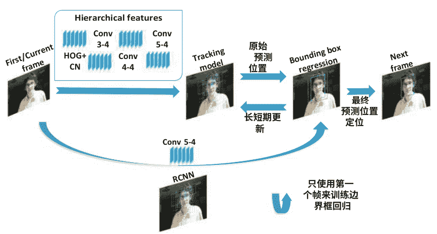

根据CF2[11]，较低的卷积层特征提供更多的时间位置细节，而较高的卷积层特征提供更多的空间信息，可以解释跟踪目标位置。更多的图像语义信息存储在较高的卷积层特征中，用于识别跟踪目标外观，可以将跟踪目标与背景区分开。将提供语义信息和位置信息的深层多层特征结合起来，可以提高跟踪效率。

例如，通过将手工制作的HOG [12]与CN [13]相结合，一些其他跟踪方法提高了表示能力。31个通道的HOG特征对于光照变化、遮挡、非刚性变形、运动模糊、平面旋转和外部旋转都具有鲁棒性。而CN函数将三个RGB图像通道转换为11个颜色通道，获得11通道特征，在尺度变化、快速运动和刚性变形方面表现良好。因此，为了表示跟踪目标，通常会结合使用HOG和CN特征。

在这项工作中，使用来自VGG19的Conv3-4、conv4-4和conv5-4特征以及HOG特征与CN特征相结合，以增强跟踪器的表示能力。函数的结构如图4.2所示，对于四个函数，分别有四种函数结构。提取的HOG和CN特征被合并为一个特征，使用三个深度为三层的特征作为三个特征。这些特征是独立的。余弦窗口的大小定义了特定的高度和宽度。假设余弦窗口的大小为28 × 26，三个特征的大小分别为28 × 26，通道数分别为512、512和256。HOG和CN特征的大小分别为56 × 56和余弦窗口的两倍大小。HOG有31个通道，CN有10个通道，并且在连接后HOG + CN特征有41个通道。然后，根据余弦窗口的大小，将HOG + CN函数从56 × 56降采样到28 × 28，我们使用双线性插值函数。最后，根据大小为28 × 28 × 41，我们得到了HOG + CN特征。通过提取过程获得了所有四个特征，并选择了四个相关性滤波器来预测目标的位置。

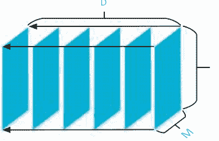

### 4.2.2 具有长短期更新的相关滤波器

基于单个特征的单个相关性滤波器不能可靠地预测跟踪目标。使用四个相关性滤波器来通过寻找相关性图中最高响应值来近似目标位置，受到了使用目标跟踪多相关性滤波器基于KCF [14]来提高性能的启发。为了结合深度特征和手工特征，三个卷积层的输出被用作三个深度特征，而HOG + CN被选择为一个手工特征。假设 $X$ 是一个 $M \times N \times D$ 的特征向量，其中 M, N 和 D 分别表示距离、高度和通道数。我们可以得到非线性映射函数 $f(x_i) = \omega^T x_i$ 的列向量，其中 $\omega$ 表示权重系数。岭回归函数用于在新空间中找到使偏移样本线性可分的解，其最小二乘误差为：

$$\min_{\omega} \sum_{i} (f(x_i) - y_i)^2 + \lambda \|\omega\|^2 \qquad (4.1)$$

每个移动样本都有一个高斯分布值。为了解决最小化问题，训练了一个与 X 大小相同的相关滤波器，并且可以使用快速傅里叶变换（FFT）独立地转换相关滤波器最小化问题。相关滤波器是使用高斯核矩阵构建的，核矩阵的形式如下：

$$K^{xx'} = \exp\left(-\frac{1}{\sigma^2}(\|x\|^2 + \|x'\|^2 - 2\mathcal{F}^{-1}(\hat{x}^* \odot \hat{x}'))\right) \qquad (4.2)$$

其中 $x$ 和 $x'$ 是模板和候选生成向量，$\hat{x}$ 表示 $x$ 的离散傅里叶变换（DFT），$x^*$ 是共轭复数向量在转置共轭后的向量，$\odot$ 是乘法运算，$\mathcal{F}^{-1}$ 是逆傅里叶变换。

转换后，找到了一个对偶变量 $\alpha$ 到 $\omega$ 的解决方案。每个滤波器都通过以下方式更新 $\alpha$：

$$\alpha_{t+1} = (1 - \gamma) * \alpha_t + \gamma * \alpha_{\text{new}} \qquad (4.3)$$

其中 $\gamma$ 是学习率，当前帧中的 $\alpha_{\text{new}}$ 被测量为 $\alpha$。在这项工作中，根据跟踪目标的变化，更新四个相关滤波器非常重要。然后，在下一帧中，通过在 $M \times N$ 大小的相关响应图中搜索具有最高值的位置来获得图像块相关滤波器响应图。

考虑到跟踪阶段目标会发生形变和遮挡，建立一个升级策略以实现可靠的跟踪性能至关重要。然而，多个变量会影响监测结果，不可能将单一的更新技术应用于所有情况。一些情况可以通过单一的升级方法解决，而其他情况可能会恶化。对于监控目标变化，使用固定的长期更新策略也很困难。在遮挡情况下，短期更新策略更容易受到快速变形的影响，但对于目标漂移的影响较小，而长期更新策略对于快速变形不敏感，对于遮挡更具抵抗力，但对于目标外观的快速变化不理想。

为了解决这个问题，创建了一种长期更新策略，如图 4.3 所示。长期和短期记忆相关滤波器将被评估，并且最终的相关滤波器将被加权。通过结合短期更新模型处理快速变形和长期遮挡处理模型的优点，更新策略将提高跟踪器的性能。对于每 1、3 和 5 帧，本文中的三个相关滤波器的参数将分别进行修改。当通过加权组合三个相关滤波器的参数时，得到最终的相关滤波器参数。它将参数更改如下：

$$\alpha = \sum_{i \in \{1,3,5\}} \sum_{j=1}^4 w_i \alpha_j \qquad (4.4)$$

对于每个模型，其中 $w$ 是权重，$\alpha_i(i = 1, 3, 5)$ 对应于模型 $i$。$\alpha_j$ 表示函数的四个解。一帧相关性滤波器对于监测快速变形和快速移动非常有用，并且更新更快以提供变形信息。长期遮挡和轻微变形可以使用三帧和五帧相关滤波器进行高效跟踪，这对于长期监测更加稳健。最后，与仅使用单个遮挡和快速变形情况下或成对使用相比，长短期升级策略更好地结合了所有三个更新相关性的效率。

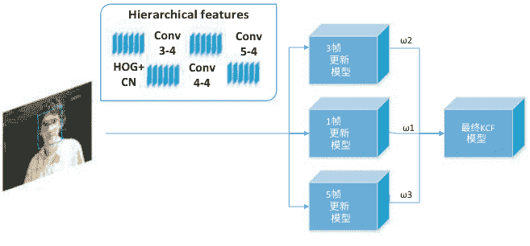

由于漂移问题，边界框在跟踪器获得跟踪结果后不可避免地会漂移和丢失跟踪。为了达到预期的结果，可以使用微调方法来减少由于对象漂移而错过对象的概率，并提高跟踪器的准确性。此外，由于边界框较大，会添加更多无用数据，对跟踪模型产生负面影响。本研究使用边界框回归来微调跟踪器的位置和尺度以提高预测性能。

使用高斯分布，在每个视频序列的第一帧中，围绕对象的初始位置随机创建了10,000个样本边界框。如果边界框与真实值的重叠率超过0.6，则可以称之为正样本。对于边界框回归训练，选择了前1000个正样本。选择第37层的性能作为边界框回归的深度特征，使用ImageNet训练的VGG19从1000个正样本候选样本中提取深度特征。使用RCNN [15]的边界框回归确定岭回归，使用候选样本的位置和深度特征。

边界框回归方法如下。设 $P = (P_x, P_y, P_w, P_h)$ 表示相关滤波器的最终输出，$G = (G_x, G_y, G_w, G_h)$ 表示地面真实情况，以及 $\hat{G} = (\hat{G}_x, \hat{G}_y, \hat{G}_w, \hat{G}_h)$ 是 $P$ 的边界框回归结果。通过以下四个方程，我们改变 $P$：

$$\begin{aligned} \hat{G}_x &= P_x + \Delta x \\ \hat{G}_y &= P_y + \Delta y \\ \hat{G}_w &= P_x * \Delta x \\ \hat{G}_h &= P_y * \Delta y \end{aligned} \qquad (4.5)$$

然后它得到了四个方程的一般形式。平移由 $d_x(P)$ 和 $d_y(P)$ 表示，$d_w(P)$ 和 $d_h(P)$ 表示比例变化：

$$\begin{aligned} \hat{G}_x &= P_w d_x(P) + P_x \\ \hat{G}_y &= P_h d_y(P) + P_y \\ \hat{G}_w &= P_w \exp(d_w(P)) \\ \hat{G}_h &= P_h \exp(d_h(P)) \end{aligned} \qquad (4.6)$$

每个帧都有一个最佳调整 $t^* = (t_x, t_y, t_w, t_h)$：

$$\begin{aligned} G_x &= P_x + P_w t_x(P) \\ G_y &= P_y + P_h t_y(P) \\ G_w &= P_w * e^{(t_w(P))} \\ G_h &= P_h * e^{(t_h(P))} \end{aligned} \qquad (4.7)$$

得到 $t^*$ 解的形式为：

$$\begin{aligned} t_x &= (G_x - P_x) / P_w \\ t_y &= (G_y - P_y) / P_h \\ t_w &= \log(G_w / P_w) \\ t_h &= \log(G_h / P_h) \end{aligned} \qquad (4.8)$$

该函数可以表示为 $d^*(P) = w^T * \Phi(P)$，其中 $\Phi(P)$ 表示输入特征的映射，$w^*$ 表示 RCNN 参数。为了最小化预测值和真实值之间的差异，损失函数设计如下：

$$\text{损失} = \sum_{i}^{N}(t_{*}^{i} - \hat{w}_{*}^{T} \Phi(P^{i}))^{2} \qquad (4.9)$$

通过梯度下降法，我们得到了函数的优化目标和最优解 $w_{*}$：

$$W_{*} = \arg\min_{w_{*}} \sum_{i}^{N}(t_{*}^{i} - \hat{w}_{*}^{T} \Phi(P^{i}))^{2} + \lambda \|\hat{w}_{*}\|^{2} \qquad (4.10)$$

最后，通过预训练，我们得到了一个训练良好的边界框回归模型。在接下来的帧中，预期位置及其深度特征将被输入到先前训练好的边界框回归模型中。当跟踪器在当前帧中产生预测结果时，将使用公式4.6来微调预测结果的大小和位置。边界框回归使得近似结果更可靠。随着目标变小或变大，围绕目标的边界框变得更紧凑。边界框回归减少了目标在监测过程中由于尺寸变化而导致的目标失败的概率。为了平衡边界框回归的随机性和时间成本，我们随机生成了10,000个样本进行初始化。

### 4.2.3 框架和过程

所提出方法的算法的基本步骤如算法2所示。边界框回归模型和跟踪器将在第一个帧中初始化。跟踪器还将使用四个具有深度和手工制作特征的相关滤波器来监视对象。预训练的边界框回归模型将调整预测位置作为最终预测位置。最后，长短期相关滤波器将根据最终预期结果进行修改。

### 4.2.4 实验结果和讨论

我们使用在ImageNet上进行过训练的VGG19进行深度特征提取。HOG和CN特征已经合并成一个单一特征。从conv3-4、conv4-4和conv5-4使用了三个特征，融合特征包括这四个特征。搜索尺度是输入尺度的1.8倍，学习率为0.001。conv3-4、conv4-4、conv5-4和HOG + CN的权重...

**算法 2：提出方法的框架**

**输入：**
初始对象位置 $P_0$;

**输出：**
估计的对象位置 $P_t = (x_t, y_t, w_t, h_t)$;
学习的相关滤波器;
学习的边界框回归模型;

1: 训练边界框回归模型;
2: 重复
3: 在帧 $t$ 中以 $(x_{t-1}, y_{t-1})$ 为中心裁剪搜索窗口，并提取深度、HOG 和 CN 特征；
4: 使用 $f_i$ 计算每个通道的置信度得分；
5: 在响应图上估计新位置原始 $(x_t, y_t, w_t, h_t)$；
6: 通过边界框回归调整原始 $(x_t, y_t, w_t, h_t)$ 并获得最终位置 $f_{final}(x_t, y_t, w_t, h_t)$；
7: 在 $P_t$ 处裁剪新的中心补丁 $f_{final}(x_t, y_t, w_t, h_t)$ 并使用插值提取深度、HOG 和 CN 特征；
8: 通过长短期更新策略更新相关滤波器；
9: 直到视频序列结束；

权重分别为 1、0.5、0.25 和 0.1。边界框回归产生 10,000 个边界框回归训练样本，正样本被假定具有大于 0.6 的重叠度，并选择前 1000 个正样本。

将所提出的方法与 OTB-100 上的最先进方法进行比较。还对 50 个具有挑战性的监控记录的基准数据集进行了实验，称为 OTB-50，以确保完整性。所提出的方法在 MATLAB 中使用 MatConvNet 工具箱实现，并在 4 个 4.2 GHz Intel 7700K 核心和一个 NVIDIA 1080Ti GPU 上以每秒约 24 帧的速度运行。所提出的跟踪器的主要计算负载是特征提取和第一帧的边界框回归训练。在第一帧中，围绕对象产生 10,000 个边界框训练样本，边界框回归训练时间为 2.9579 秒，在线边界框回归时间小于 0.0001 秒。深度特征提取和手工特征提取是两种类型的特征提取方法。深度和手工特征提取的处理时间分别为 0.03726 秒和 0.0094 秒。为了确保所有跟踪图像的实验可靠性，我们使用相似的数据集标准和相同的参数设置。

## OTB评估

OTB 是一个流行的跟踪基准数据集，包含 100 个带有不同干扰的完全标记视频。问题分为 11 种类型。评估基于两种方法：中心位置误差和曲线下面积（AUC）。为了将所提出的方法与 DeepSRDCF [4]、SRDCFdecon [16]、HDT [17]、CF2、CNN-SVM [3]、MEEM、KCF 和 SAMF-AT 等八种最先进的跟踪器进行比较，使用了一次性评估（OPE）。这些方法采用不同的跟踪结构和特征。

实验遵循协议，并对序列和敏感性分析使用相同的参数值。CF2 是另一种基于深度学习的跟踪算法。对于基于深度学习的跟踪方法，我们选择 CF2 作为基准跟踪方法。

目标对象由 VGG19 的三层深度特征表示，这些特征已在 ImageNet 上进行了预训练，以及 HOG + CN 特征。长短期更新模型的一帧、三帧和五帧的权重分别选择为 0.8、0.1 和 0.1。使用边界框回归来微调位置。使用位置准确率和重叠成功率，图 4.4 显示了 OTB-2013 和 OTB-50 数据集在 OPE 下的结果。

图 4.4 使用一次性评估（OPE）在 OTB-2013 和 OTB-50 基准上绘制的精度和成功曲线（位置误差精度图例显示 20 像素的阈值分数，而重叠阈值图例显示每个跟踪器的曲线下面积（AUC）得分）

它清楚地显示出，所提出的算法在精度和曲线下面积（AUC）速度方面优于最先进的实时方法，但不如 ECO 和 MDNet 等非实时方法。表 4.1 定量比较了 20 像素处的精度率、AUC 率和跟踪速度。该过程的效率通过 OTB-50（基准 I）和 OTB-100（基准 II）的结果得到证明。表 4.1 还显示，所提出的解决方案在精度和 AUC 率方面优于最先进的实时跟踪器。所有效率指标都低于 OTB-100。由于 OTB-50 有 50 个更难的视频要监控，所有输出参数都低于 OTB-100。在最先进的非实时跟踪器中，HDT 和 DeepSRDCF 在 AUC 和精度率方面表现良好。所提出的方法的 AUC 率低于 DeepSRDCF，但精度率和速度较高。

#### 基于属性的评估

OTB 基准的输出还使用了 11 种不同的视频属性进行检查（例如快速运动、遮挡和尺度变化）。**OTB-100** 中的八个主要 **OPE** 视频属性如图 4.5 所示。提出的方法在背景混杂和低分辨率的情况下表现更好，因为具有语义和空间信息的深度、**HOG** 和 **CN** 特征更好地反映了目标对象，而其他一些方法只使用深度、**HOG** 或 **CN** 特征。**CF2** 只使用深度特征，而 **KCF** 只使用 **HOG** 特征。根据我们的研究结果，深度、**HOG** 和 **CN** 特征的组合具有最好的代表性能力。

还分析了使用 11 种不同的视频属性（例如快速运动、遮挡和尺度变化）在 OTB 基准中注释的性能。图 4.5 显示了 **OTB-100** 中的八个主要 **OPE** 视频属性。在背景混杂和低分辨率的情况下，提出的方法表现更好，因为具有语义和空间信息的深度、**HOG** 和 **CN** 特征更好地代表了目标对象，而其他一些方法只使用深度、**HOG** 或 **CN** 特征。**CF2** 只使用深度特征，而 **KCF** 只使用 **HOG** 特征。

根据我们的研究结果，深度、**HOG** 和 **CN** 特征的组合具有最好的代表性能力。该方法在尺度变化方面表现良好，并且边界框可以更紧密地围绕目标，因此边界框回归可以更好地应对尺度变化。与 **CF2** 相比，该方法在遮挡方面更可靠和稳定，因为长短期更新模型包含了额外的先前对象功能。

#### 定量评估

对于七个困难的序列，图 4.6 显示了最佳跟踪方法（即 **MDNet**、**KCF**、**MEEM**、**CF2**和提出的方法）的一些跟踪结果。**MEEM** 跟踪器在变形和旋转序列（如 **Soccer**、**MotorRolling** 和 **Skating2**）中表现不佳，但在背景杂乱和快速运动（如 **Soccer**、**MotorRolling** 和 **Skating**）中需要更大的搜索区域。**KCF** 跟踪器通过移动目标对象使用 **HOG** 函数来学习核相关滤波器，并生成样本以找到最大的响应。

### 表 4.1 OTB-50 (I) 和 OTB-100 (II) 数据集上的平均精度图和成功区域图结果 (最佳和次佳分数分别以粗体和斜体显示)

| 指标 | 基准 | 我们的 | KCF | LCT | DSST | DeepSRDCF | CF2 | SRDCFdecon | HDT | MEEM | CNN-SVM |
| :--- | :--- | :--- | :--- | :--- | :--- | :--- | :--- | :--- | :--- | :--- | :--- |
| 预测 (%) | I | **81.0** | 61.1 | 69.1 | 62.5 | 77.2 | 80.3 | 76.4 | 80.4 | 71.2 | 76.9 |
| | II | **85.2** | 69.3 | 76.2 | 69.3 | *85.1* | 83.7 | 82.5 | 84.8 | 78.1 | 81.4 |
| AUC (%) | I | **56.3** | 40.3 | 49.2 | 46.3 | 56.0 | 51.3 | 56.0 | 51.5 | 47.3 | 51.2 |
| | II | 62.8 | 47.7 | 56.2 | 52.0 | **63.5** | 56.2 | 62.7 | 60.3 | 53.0 | 55.4 |
| 速度 (FPS) | | 24 | **172** | 24 | 24 | < 1 | 11 | 1 | 10 | 10 | 1 |

图 4.5 在 11 个跟踪挑战中，遮挡、平面旋转、背景杂波、尺度变化、平面外旋转、快速运动、光照变化、低分辨率、失焦、运动模糊和变形的精度图。这些分数是基于每个跟踪器的 20 像素阈值计算的。

特征图。由于没有多尺度或重新检测模块，它非常适合处理视频序列中的部分变形和快速运动（如 SUV 和足球），但在存在强烈遮挡和旋转（如 Skating 2 和 MotorRolling）时容易漂移。CF2 方法基于 KCF，并选择深度特征训练三个滤波器来计算功能图。它在快速运动、上下文杂波和遮挡条件下表现良好（如 DragonBaby、足球和 Skating2）。然而，由于其边界框松散地绑定在对象周围，它的重叠阈值率较其他跟踪方法较低。MDNet 方法在变形、旋转和快速运动（Trans、MotorRolling 和 Skating2）的情况下，它表现得较成功，但在遮挡和背景杂乱的情况下表现较差。在 SUV 和 Soccer 的情况下，由于外观的快速变化和长时间的遮挡，使得跟踪器无法跟踪对象。

以下是对建议方法为何有效的解释。模型由多个特征表示，包括深度、HOG 和 CN 特征。使用颜色、语义和空间信息提供更多的对象描述，比单一函数更有效。研究结果表明，使用多个特征开发模型更加稳定和准确。提出的方法在变形、旋转和背景杂乱的情况下表现良好（MotorRolling, Skating2, Soccer, DragonBaby, 和 Singer1）。对于 MotorRolling 和 DragonBaby, 我们的系统成功地实现了位置误差阈值率分别为 97.6% 和 94.7%。其次，边界框回归将通过收紧预期边界框来增加重叠的阈值率。第三，修订后的模型结合了短期模型的优点用于处理快速变形和长期模型的优点用于处理遮挡，有效提高了所提出的跟踪方法的鲁棒性和效率。对于七个困难的序列，图 4.6 显示了一些顶级跟踪方法的跟踪结果，即 MDNet, KCF, MEEM, CF2 和所提出的过程。

MEEM 跟踪器适用于变形和旋转序列（Trans 和 DragonBaby），但不适用于背景杂乱和快速运动（Soccer, MotorRolling 和 Skating2）。这是因为颜色数量特征不足以处理杂乱的背景，并且需要更大的搜索区域用于快速运动（Soccer, MotorRolling 和 Skating）。KCF 跟踪器通过学习核相关滤波器并使用 HOG 函数移动目标对象来生成样本在特征图中找到最大答案。由于没有多尺度或重新检测模块，它非常适合部分变形和快速运动的视频序列（SUV 和 Soccer），但在存在强遮挡和旋转时会漂移（Skating2 和 MotorRolling）。CF2 方法基于 KCF 并选择深度特征训练三个滤波器计算函数图。它在快速运动，上下文杂乱和遮挡条件下表现良好（DragonBaby，Soccer 和 Skating2）。然而，由于其边界框松散地绑定在对象周围，它的重叠阈值率低于其他跟踪方法。MDNet 方法在变形，旋转和快速运动的情况下表现良好（Trans, MotorRolling 和 Skating2），但在遮挡和背景杂乱的情况下成功较少（SUV 和 Soccer），因为对象外观的快速变化和长时间的遮挡阻止了跟踪器对对象的跟踪。

#### 对融合特征的分析

在 OTB-2013 和 OTB-100 上进行了比较实验，以展示所提出方法的层次功能的有效性。我们首先评估不同特征对监测结果的影响。如表 4.2 所示，VGG19 在区分能力方面比 HOG+CN 高出 6.7%，使其能够在复杂环境中高效识别目标。同时使用深度特征和手工特征将提高对特征的区分能力。最终的实验结果还表明，多层特征在跟踪精度方面优于单一特征。

为了展示各种特征的相对重要性如何影响最终结果，在 OTB-2013 上进行了不同权重设置的实验。对象跟踪区域中深度功能的权重为 1、0.5 和 0.25，分别对应 conv5-3、conv4-3 和 conv3-3。为了说明不同权重特征的效果，我们设置了深度特征的权重，并修改了 HOG+CN 手工特征的权重。如表 4.3 所示，当 HOG+CN 的权重为 0.1 时，结果显示精度为 89.9%，高于其他权重设置。

### 表 4.2 我们方法中使用的不同特征。OTB-2013 的 20 像素精度率显示

| 特征类型 | HOG+CN | VGG19 | HOG+CN+VGG19 |
| :--- | :--- | :--- | :--- |
| 预测率 (%) | 81.5 | 88.2 | 89.9 |

### 表 4.3 我们方法中使用的不同特征权重。OTB-2013 的 20 像素精度率显示

| 权重设置 | 1:0.5:0.25:0.05 | 1:0.5:0.25:0.1 | 1:0.5:0.25:0.25 | 1:0.5:0.25:0.5 | 1:0.5:0.25:1 |
| :--- | :--- | :--- | :--- | :--- | :--- |
| 预测率 (%) | 89.1 | 89.9 | 89.5 | 88.7 | 87.8 |

图 4.7 在 Liquor, Carscale, 和 Dudek 视频序列中使用和不使用边界框回归的性能评估 (红色和绿色分别表示没有和有边界框回归的框)

#### 边界框回归分析

边界框回归分析是为了评估提出的方法中边界框回归的有效性，将在 100 个序列的基准测试中比较使用和不使用边界框的输出。根据图 4.7，边界框回归在大多数情况下比不使用边界框更有效。如果存在足够的尺度变化，边界框回归将微调结果，使其更紧密地围绕对象。如果边界框不够接近，将会向跟踪模型中添加其他无用信息，降低模型的鲁棒性和精度。因此，围绕对象的较紧密的边界框将最小化不必要的数据，同时增加模型的准确性。在较紧密的边界框中，搜索区域更准确，跟踪速度可以提高。

此外，由于边界框回归是通过第一帧的真实位置进行训练的，当跟踪模型错过对象时，它可以调整位置。使用我们的系统，边界框回归模型的重叠阈值显著提高，如表 4.4 所示。根据实验结果，所提出的方法分别将两个数据集上的 AUC 率提高了 2.3% 和 1.9%。我们还使用边界框回归实现了 89.9% 和 85.2% 的精度率。

#### 长短期更新策略分析

长短期更新策略分析是为了测试所提出的长短期升级策略的有效性，对不同的更新模型进行了性能测试。

#### 表 4.4 边界框回归分析在 OTB-2013 (I) 和 OTB-100 (II) 上

| 状态 | I-Prc | I-AUC | II-Prc | II-AUC |
| :--- | :--- | :--- | :--- | :--- |
| 无 | 87.3 | 62.4 | 83.6 | 60.7 |
| 有 | 89.9 | 64.7 | 85.2 | 62.8 |

图 4.8 使用不同的更新模型进行性能评估。在 OTB-50 和 OTB-100 上使用了所有单帧（1帧, 3帧和5帧），两个帧的组合（1\_3帧, 1\_5帧, 3\_5帧）以及所有三个更新模型（1\_3\_5帧）。

图 4.8 显示了在 OTB-100 上的测试结果。已经完成了每个单独模型的测试更新（单帧，三帧和五帧），然后合并并进行了检查（单帧和三帧，单帧和五帧，三帧和五帧）。最后，正在考虑将所有三个版本混合在一起进行升级。如图 4.8 所示，OTB-50 和 OTB-100 有六种不同的方法。仅组合一个或两个更新模型对 OTB-100 和 OTB-50 的对象跟踪是无效的，而组合所有三个模型的效果优于其他帧更新模型。综合模型对对象跟踪更加稳健，并具有模型更新的短期和长期记忆。图 4.8 还显示，三帧更新模型优于单帧和五帧更新模型，因为三帧更新模型具有比其他两个单独更新模型更多的长期和短期记忆。

#### 对 VOT2015 进行评估

VOT [18] 是一个专门的数据集，包含 60 个视频序列和每个序列的六个对象跟踪字段属性。它采用了一个系统在对象丢失后，实施时间惩罚和重新定位，防止对象丢失和后续跟踪输出丢失。同时，在测试过程中使用随机初始帧、旋转对象和其他调整来测试跟踪模型的鲁棒性。主要通过计算平均估计重叠来确定跟踪器的性能（AEO）。与最先进的跟踪器相比，结果如表 4.5 所示。

#### 表 4.5 与最先进的跟踪方法进行比较（在 VOT2015 上）

| | 我们的 | DeepSRDCF | MEEM | SAMF | DSST | KCF | DeepSRDCF | Struck |
| :--- | :--- | :--- | :--- | :--- | :--- | :--- | :--- | :--- |
| AEO | **0.313** | 0.299 | 0.221 | 0.202 | 0.172 | 0.171 | 0.288 | 0.141 |

#### 对 TC128 进行评估

TC128 [19] 数据集与 OTB 和 VOT 不同。它包含 128 个视频序列，监测全彩色对象，如人员、车辆和其他日常物品，其中一些与 OTB-100 重叠。我们对七个尖端跟踪器进行了测试（SRDCF、DeepSRDCF、SAMF、DSST、Struck、KCF、MEEM）。结果显示在表 4.6 中。

### 表 4.6 在 TC128 上的跟踪器评估结果。我们在精度和成功率上都取得了改进

| 指标 | 我们的 | KCF | DSST | DeepSRDCF | SAMF | Struck | MEEM | SRDCF |
| :--- | :--- | :--- | :--- | :--- | :--- | :--- | :--- | :--- |
| 准确率 (%) | **67.1** | 46.5 | 47.5 | 65.8 | 56.1 | 40.9 | 62.2 | 62.2 |
| 成功率 (%) | **55.2** | 39.0 | 41.1 | 54.1 | 46.7 | 35.0 | 50.6 | 51.6 |

#### 对 UAV123 进行评估

UAV123 [20] 包括 123 个跟踪序列，包括车辆和人类。我们将与 7 个最先进的跟踪器进行比较（SRDCF、CSK、SAMF、DSST、Struck、KCF、MEEM）。结果显示在表 4.7 中。表 4.5、4.6 和 4.7 中的粗体值是提出的跟踪器的结果，也显示了在精度和成功率方面的最佳性能。

## 4.3 上下文感知相关滤波网络

本节介绍了一种端到端可训练的具有上下文感知相关性的相关滤波网络，即 DCACFNet，它将上下文感知相关滤波器（CACF）集成到全卷积 Siamese 网络中。首先，在 DCACFNet 架构中，将 CACF 建模为可微分层，可以将定位误差反向传播到卷积层。然后，在 DCACFNet 架构中嵌入了一种新颖的通道注意力模块，以改善目标的跟踪效果。整个网络的适应性。最后，本文提出了一种新颖的高置信度更新策略，以应对遮挡和视野外的模型损坏的挑战。

### 4.3.1 上下文感知相关滤波网络

#### 上下文感知相关滤波器

我们简要回顾了一般的DCF（判别相关滤波）跟踪器。DCF跟踪器更依赖于从目标区域提取的特征，这些特征足够强大，可以适应目标的外观变化。在连续的视频帧中，DCF可以用来预测目标的位置。在目标周围进行密集采样有助于有效学习DCF。DCF跟踪器通过将来自搜索窗口中所有可能平移的CNN特征连接起来形成具有循环结构的特征矩阵 $X_0$。DCF滤波器通过岭回归问题的优化来解决：

$$\min_w \| X_0 w - y \|_2^2 + \lambda_1 \| w \|_2^2 \quad (4.11)$$

在这里，向量 $w$ 表示学习到的DCF，特征矩阵 $X_0$ 的每一行由从图像块 $x_0'$ 及其某个循环移位提取的特征组成。二维向量化的高斯图像由回归目标 $y$ 表示。在傅里叶域中，这个循环特征矩阵为DCF的岭回归问题提供了一个高效的闭式解：

$$w = \frac{\hat{x}_0^* \odot \hat{y}}{\hat{x}_0^* \odot \hat{x}_0 + \lambda_1} \quad (4.12)$$

跟踪目标周围的上下文信息对于跟踪器的区分性能有很大影响。当跟踪目标周围的背景存在类似的物体时，全局上下文信息对于成功跟踪至关重要。因此，在相关分析中，全局上下文信息被用作正则化项，并引入到目标函数中。类似于CACF方法 [21]，全局上下文被添加到我们的相关滤波器中以获得更大的区分能力。上下文采样策略通常对于跟踪性能很重要。我们的CACF采用了一种简单而有效的策略，在跟踪目标周围均匀选择上下文样本块。我们的CACF在每一帧中对目标图像块 $x_0'$ 周围的 $k$ 个上下文图像块 $x_i'$ 进行采样。直观上，目标干扰物和多样化的背景杂波在上下文块中反映出来，很可能是一种困难的负样本。我们要学习的相关滤波器对于目标块和上下文块具有不同的响应。为了抑制各种目标干扰物，相关滤波器对目标补丁和上下文补丁的响应分别接近高和零：

$$\min_{w} \| X_0 w - y \|_2^2 + \lambda_1 \|w\|_2^2 + \lambda_2 \sum_{i=1}^k \|X_i w\|_2^2 \quad (4.13)$$

在这里，$X_0$ 和 $X_i$ 分别是基于提取的CNN特征的对应循环特征矩阵。与傅里叶域中DCF的解决方案类似，我们CACF的闭式解可以写为：

$$w = \frac{\hat{x}_0^* \odot \hat{y}}{\hat{x}_0^* \odot \hat{x}_0 + \lambda_1 + \lambda_2 \sum_{i=1}^k \hat{x}_i^* \odot \hat{x}_i} \quad (4.14)$$

在这里，$x_0$ 表示图像补丁 $x_0'$ 的CNN特征，即 $x_0 = \varphi(x_0')$，$\varphi(\cdot)$ 表示我们网络中的卷积层的特征转换映射，$x_0$ 的离散傅里叶变换由帽子 $\hat{x}_0$ 表示，$\hat{x}_0^*$ 表示 $\hat{x}_0$ 的复共轭，$\odot$ 表示 Hadamard 乘积。

#### 使用反向传播的 DCACFNet 推导

以前的CACF跟踪器通常使用手动特征或直接从卷积网络中提取的卷积特征来进行视频对象跟踪。卷积特征的提取和CACF的训练是相互独立的，不能享受到端到端训练的优势。与使用手工特征的CACF不同，本文设计了一种新颖的端到端可训练的 Siamese 网络，用于学习适用于CACF的细粒度表示，将CACF建模为卷积层之后的可微分CACF层。通过细粒度表示，网络对于准确的定位非常足够。

$z = \varphi(z', \theta)$ 表示特征表示，其中 $z'$ 表示搜索图像，$\theta$ 表示网络的参数。然后，可以通过以下目标函数来学习特征表示：

$$L = \|g(z') - y\|_2^2 + \gamma \|\theta\|_2^2 \quad (4.15)$$
$$g(z') = Zw = F^{-1}(\hat{z} \odot w^*) \quad (4.16)$$

在这里，$Z$ 表示搜索图像块 $z'$ 的循环特征矩阵，$F^{-1}$ 表示离散傅里叶逆变换，而 $w$ 表示基于目标图像块和全局上下文的CNN特征学习的CACF。然后，推导出上述目标函数的导数。为了简化推导过程，本文不考虑关于 $\theta$ 的常见项。从目标函数可以看出，$\frac{\partial L}{\partial \hat{x}_0}, \frac{\partial L}{\partial \hat{x}_i}$ 和 $\frac{\partial L}{\partial z}$ 必须进行端到端训练的导数推导。由于导数中的中间变量是复数类型，链式法则变得复杂。受 Mueller 等人 [21] 的启发，离散傅里叶变换和离散傅里叶逆变换的偏导数可以写成：

$$g = F(g), \frac{\partial L}{\partial g^*} = F \left( \frac{\partial L}{\partial g} \right), \frac{\partial L}{\partial g} = F^{-1} \left( \frac{\partial L}{\partial g^*} \right) \quad (4.17)$$

对于模板分支的反向传播：
$$\frac{\partial L}{\partial x_0} = F^{-1} \left( \frac{\partial L}{\partial \hat{x}_0^*} \right) = F^{-1} \left( \frac{\partial L}{\partial g^*} \frac{\partial g^*}{\partial w} \frac{\partial w}{\partial \hat{x}_0^*} \right) \quad (4.18)$$
$$\frac{\partial L}{\partial x_i} = F^{-1} \left( \frac{\partial L}{\partial \hat{x}_i^*} \right) = F^{-1} \left( \frac{\partial L}{\partial g^*} \frac{\partial g^*}{\partial w} \frac{\partial w}{\partial \hat{x}_i^*} \right) \quad (4.19)$$

对于搜索分支的反向传播：
$$\frac{\partial L}{\partial z} = F^{-1} \left( \frac{\partial L}{\partial \hat{z}_i^*} \right) = F^{-1} \left( \frac{\partial L}{\partial g^*} \frac{\partial g^*}{\partial \hat{z}_i^*} \right) \quad (4.20)$$

为了得到 $\frac{\partial L}{\partial x_0}$, $\frac{\partial L}{\partial x_i}$ 和 $\frac{\partial L}{\partial z}$，本文推导出 $\frac{\partial L}{\partial g^*}$, $\frac{\partial g^*}{\partial w}$, $\frac{\partial g^*}{\partial \hat{z}^*}$, $\frac{\partial w}{\partial \hat{x}_0^*}$ 和 $\frac{\partial w}{\partial \hat{x}_i^*}$ 如下所示：

$$\vdots$$
$$\frac{\partial L}{\partial g^*} = F \left( \frac{\partial L}{\partial g} \right) = 2(g - y) \quad (4.21)$$
$$\frac{\partial g^*}{\partial w} = \hat{z}^* \quad (4.22)$$
$$\frac{\partial g^*}{\partial \hat{z}^*} = w \quad (4.23)$$
$$\vdots$$
$$\frac{\partial w}{\partial \hat{x}_0^*} = \frac{\hat{y} - \hat{x}_0 \odot w}{\hat{x}_0^* \odot \hat{x}_0 + \lambda_1 + \lambda_2 \sum_{i=1}^k \hat{x}_i^* \odot \hat{x}_i} \quad (4.24)$$
$$\frac{\partial w}{\partial \hat{x}_i^*} = \frac{-\lambda_2 \hat{x}_i \odot w}{\hat{x}_0^* \odot \hat{x}_0 + \lambda_1 + \lambda_2 \sum_{i=1}^k \hat{x}_i^* \odot \hat{x}_i} \quad (4.25)$$

在训练整个网络时，定位损失逐层反向传播，以学习适用于CACF追踪器的卷积特征。在CACF层的反向传播中使用傅里叶域的哈达玛积，CACF追踪器具有快速计算的优势。它可以应用于大规模数据集的端到端训练。在完成离线训练后，提取适用于CACF追踪器的CNN特征，以提高在复杂场景中的跟踪性能。

### 4.3.2 通道注意力机制

随着卷积特征通道的增加，某些通道的卷积特征可能存在冗余，严重影响深度网络的特征表示能力。卷积特征对不同的跟踪目标对象有不同的影响。一种卷积通道特征通常对应一种特定的视觉模式。在特定的跟踪场景中，某些特征通道比其他通道更有意义。受 Je 等人 [22] 的启发，我们引入了一个使用浅层神经网络训练的新型通道注意力机制，以保持深度网络在外观变化下的目标适应性。通道注意力机制用于明确建模不同卷积特征通道之间的关系，为不同的视觉对象选择重要的卷积特征通道。通道注意模块对跟踪效率几乎没有影响，因为它只参与在线跟踪的模板分支。

如图4.9所示，通道注意力机制由全局平均池化和两个全连接层组成，分别具有 ReLU 激活和 Sigmoid 激活。其中一个用于将64维的通道空间减少到16维。另一个用于将通道空间维度增加到64维。全局平均池化层将全局空间信息编码为一维通道描述符。通道注意模块的输入为 $d$ 通道卷积特征 $X=[x_1, x_2, \dots, x_d]$，其中 $x_i \in \mathbb{R}^{W \times H}, W=H=125, i=1, 2, \dots, d$。通道注意模块的输出用 $\tilde{X}=[\tilde{x}_1, \tilde{x}_2, \dots, \tilde{x}_d]$ 表示，这可以通过执行一组通道参数和输入的乘积来实现：

$$\tilde{x}_i = \beta_i \cdot x_i \quad i = 1, 2, \dots, d \quad (4.26)$$

这里 $\beta_i$ 表示某个卷积通道的参数。

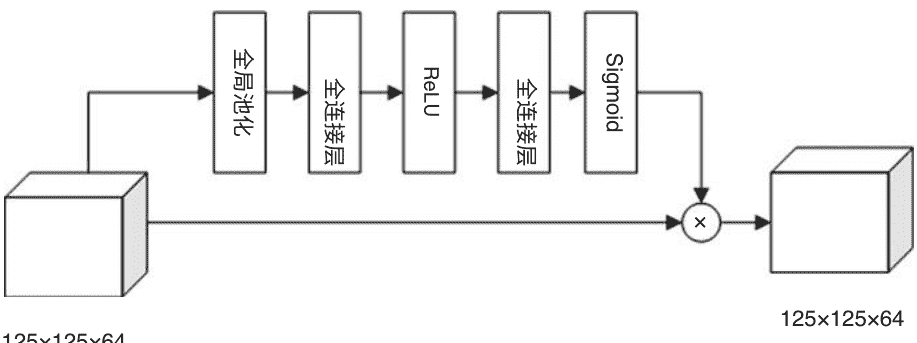
**图4.9 通道注意力架构**

### 4.3.3 高置信度策略更新

在跟踪过程中，由于光照变化、变形和遮挡的挑战，目标的外观经常发生变化。为了适应目标外观的变化，现有的DCF跟踪器通常在每一帧更新跟踪模型，而不评估跟踪结果。这种更新策略在一定程度上提高了跟踪效果。然而，当目标定位不准确或部分遮挡时，不考虑跟踪结果的更新策略是不明智的，这可能导致整个跟踪过程最终失败。

针对这个问题，本文设计了一种高置信度更新策略，该策略结合了响应图的峰值和平均峰值相关能量（APCE）[23]来评估跟踪结果。高置信度更新策略用于确定是否更新模型。只有在满足特定条件时，高置信度更新策略才会更新模型，从而提高目标跟踪的速度：

$$G = \max g(z') \quad (4.27)$$

我们计算了每一帧CACF响应图的峰值 $G$，并将其分组为一个集合 $Q_G = \{G^{(2)}, G^{(3)}, \dots, G^{(t)}\}$，该集合始终不超过10个元素。平均值用 $\bar{G}$ 表示。APCE反映了响应图的波动程度，可以定义为：

$$APCE = \frac{|g_{\max} - g_{\min}|^2}{\text{mean} \left( \sum_{w, h} (g_{w, h} - g_{\min})^2 \right)} \quad (4.28)$$

类似于 $G$，我们计算了每一帧CACF响应图的APCE值，并将它们分组为一个集合 $Q_{APCE} = \{APCE^{(2)}, APCE^{(3)}, \dots, APCE^{(t)}\}$，其中元素数量始终不超过10个。平均 APCE 用 $\overline{APCE}$ 表示。

$$G \ge \alpha_1 \cdot \bar{G} \quad (4.29)$$
$$APCE \ge \alpha_2 \cdot \overline{APCE} \quad (4.30)$$

这里，$\alpha_1$ 和 $\alpha_2$ 表示控制参数。在跟踪过程中，若当前帧的置信度很高，模型应该以固定的学习率 $\beta$ 进行更新：

$$\hat{w}^t = (1 - \beta) \hat{w}^{t-1} + \beta \hat{w} \quad (4.31)$$

响应图的峰值和波动程度可以传达跟踪结果的可靠性。当检测到的目标与正确目标非常匹配时，理想的跟踪结果应该只有一个尖锐的峰值，并且在其他区域都是平滑的。相关峰值越尖锐，预测准确性越好。否则，整个响应图将会波动剧烈，与正常响应图明显不同。

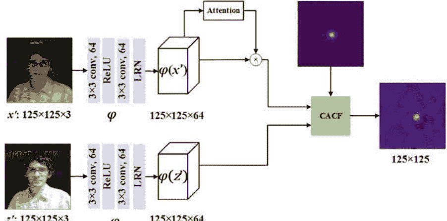
**图4.10 DCACFNet的整体架构**

### 4.3.4 框架和过程

图4.10显示了DCACFNet的整体架构。与 SiamFC 不同，提出的 DCACFNet 架构是不对称的。与搜索分支相比，模板分支在卷积特征变换之后添加了通道注意力模块 [24]。这些分支的输出被馈送到CACF层以定位跟踪目标。为了详细介绍DCACFNet的架构，本节首先简要回顾了上下文感知相关滤波器。然后，我们推导出上下文感知相关滤波器层的反向传播，该层在前向传播过程中进行在线学习。接下来，介绍了一种新颖的通道注意力模块，嵌入在DCACFNet的架构中。最后，给出了高置信度更新策略，以提高在遮挡挑战下的跟踪性能。详细的过程在算法3中展示。

### 4.3.5 实验结果和讨论

本节首先介绍了我们的DCACFNet的实验细节。然后，我们对两个具有挑战性的跟踪数据集进行了实验分析：OTB-2013（有50个视频）和 OTB-2015（有100个视频）。实验结果表明，端到端可训练的具有上下文感知相关性的区分网络可以提高跟踪性能。

### 算法3：用于视觉跟踪的判别上下文感知相关滤波器网络

- **输入**：初始目标的位置 $p_1$ 和尺度 $s_1$；
- **输出**：目标在每一帧的位置 $p_t$ 和尺度 $s_t$；
1. 根据 $p_1$ 和 $s_1$ 提取初始目标 $x'_1$；
2. 使用 Siamese 网络的模板分支提取卷积特征；
3. 根据公式 (4.14) 初始化滤波器 $w$；
4. **重复**
5. 根据先前帧的跟踪结果提取当前搜索区域；
6. 使用 Siamese 网络的搜索分支提取卷积特征；
7. 根据公式 (4.27) 和公式 (4.28) 计算峰值 $G$ 和平均峰值相关能量值 $APCE$；
8. **如果** $G \ge \alpha_1 \cdot \bar{G}$ 和 $APCE \ge \alpha_2 \cdot \overline{APCE}$ **则**
9. 在当前目标位置上提取目标图像补丁和四个上下文图像补丁；
10. 使用 Siamese 网络的模板分支提取卷积特征；
11. 根据公式 (4.14) 计算滤波器 $\hat{w}$ 并按公式 (4.31) 更新模型；
12. **如果** $|Q_G| = 10$ **则**
13. $Q_G \leftarrow Q_G \setminus \{ \min G \}, Q_G \leftarrow Q_G \cup \{ G \}$;
14. **结束如果**
15. **如果** $|Q_{APCE}| = 10$ **则**
16. $Q_{APCE} \leftarrow Q_{APCE} \setminus \{ \min APCE \}, Q_{APCE} \leftarrow Q_{APCE} \cup \{ APCE \}$;
17. **结束如果**
18. **结束如果**
19. **直到** 视频序列结束；

我们的轻量级网络使用类似 VGG 的网络作为基础网络，包括卷积层、通道注意模块和CACF层。与 VGG 的 conv1 相比，我们采用了两个卷积层（$3 \times 3 \times 64$ 和 $3 \times 3 \times 64$）。通过去除池化层，我们将特征图的尺寸保持。模板分支和搜索分支的输出尺寸均为 $125 \times 125 \times 64$，然后将其输入到CACF层中以提高定位准确性。我们的整个网络是在 ILSVRC 2015 数据集 [25] 上进行训练的，该数据集包含4000多个序列和约200万个标记帧。对于每个序列，我们随机选择最近10帧中的两帧，将其裁剪为目标的两倍大小，然后缩放为 $125 \times 125 \times 3$。我们使用随机梯度下降（SGD）以端到端的方式训练网络。我们以学习率为 $10^{-2}$ 和小批量大小为32训练模型40个时期。

在在线跟踪中，CACF层中的超参数对跟踪性能起着至关重要的作用。正则化系数设置为 $\lambda_1 = 0.0001$ 和...对于高置信度的更新策略，模型更新速率设置为0.01，两个控制参数 $\alpha_1$ 和 $\alpha_2$ 分别设置为0.3和0.4。同时，高斯空间带宽设置为0.1。此外，我们采用三个尺度层，然后将尺度步长和尺度惩罚设置为1.0275和0.9925。所提出的DCACFNet是使用PyTorch框架实现的。所有实验都在一台配备12 GB RAM的GeForce RTX 1080Ti GPU的个人电脑上执行。

### 在OTB-2013上的比较

我们在OTB-2013和OTB-2015上评估了我们的跟踪器，它们分别包含50个和100个跟踪序列。评估指标包括准确率和成功率。准确率指的是中心位置误差，成功率表示边界框重叠比例。

在OTB-2013实验中，我们与最新的先进跟踪器进行比较，包括UDT [26], SiamFC-tri [27], DCFNet [23], CFNet [28], Staple_CA [7], SiamFC, Staple, DSST。图4.11分别显示了精度和成功率。与其他八种流行的跟踪算法相比，本章中的DCACFNet在OTB-2013数据集的准确性和成功率两个指标上排名第一，分别达到89.2%和66.6%的得分。这清楚地表明所提出的跟踪器DCACFNet在这些比较的跟踪器中具有竞争性能。与DCFNet和CFNet这两种端到端相关跟踪算法相比，所提出的DCACFNet在精度率上分别超过DCFNet和CFNet 9.7%和7.0%，因为所提出的DCACFNet完全统一了背景信息、目标适应和跟踪结果。同时，所提出的DCACFNet在成功率上分别超过DCFNet和CFNet 4.4%和5.6%。与UDT、SiamFC-tri和SiamFC这三种孪生跟踪算法相比，所提出的具有浅卷积特征的DCACFNet在精度率上分别超过它们7.7%、7.7%和8.3%，而在成功率上分别超过它们4.7%、5.1%和5.9%。

### 在OTB-2015上的比较

在OTB-2015实验中，我们将我们的跟踪器与最新的先进跟踪器进行比较，包括UDT, SiamFC-tri, DCFNet, CFNet, Staple_CA, SiamFC, Staple, DSST。图4.12分别显示了这些比较跟踪器的精度和成功曲线。与其他八种流行的跟踪算法相比，提出的DCACFNet在OTB-2015数据集的精度和成功率方面排名第一，分别获得85.1%和63.9%的得分。可以看出，我们的DCACFNet在精度和成功度量方面提供了最佳的跟踪性能。与相关滤波器和Siamese网络的集成相比，由于上下文感知相关滤波、通道注意机制和高置信度更新策略的完全组合，我们的跟踪器在精度率方面分别比DCFNet和CFNet高出10.0%和7.4%，同时，在成功率方面分别比DCFNet和CFNet高出5.9%和5.0%。与UDT、SiamFC-tri和SiamFC这三种Siamese跟踪算法相比，采用浅层卷积特征的DCACFNet跟踪器的性能超过它们9.1%。

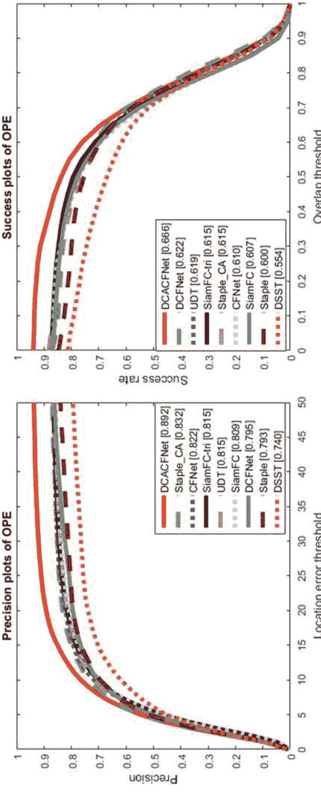

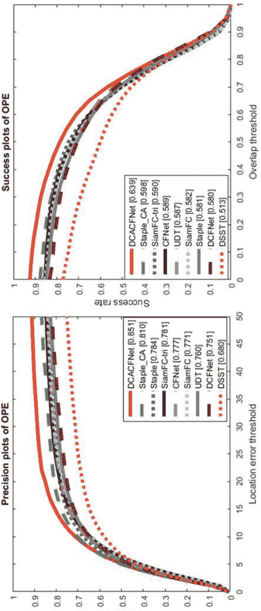

## 4.3 上下文感知相关滤波网络

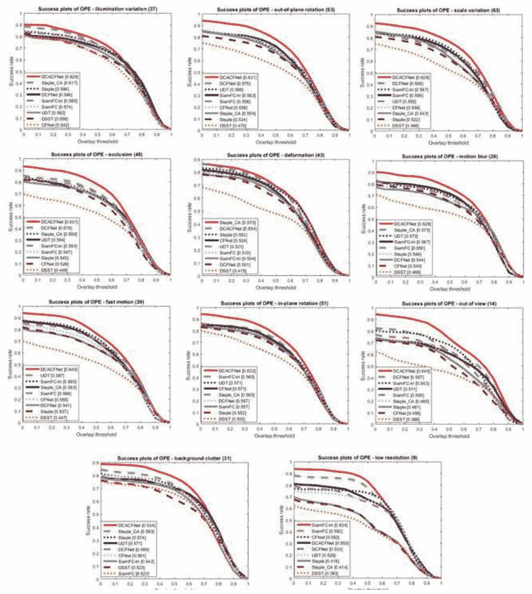

当提出的DCACFNet分别在准确率上超过它们5.2%、4.9%和5.7%时，它们的准确率分别为7.0%和8.0%。

#### 基于属性的分析

为了进一步分析详细的性能，我们在OTB-2015中报告了11个具有挑战性的属性的结果，结果显示我们的追踪器在除了变形和低分辨率之外的所有挑战性属性下的性能最佳。特别是在运动模糊、快速运动和视野外方面，与基准DCFNet相比，成功率分别提高了8.4%、9.9%和8.3%。

对于变形属性，我们的追踪器获得的成功得分低于Staple和Staple_CA追踪器，这些追踪器从HOG特征和颜色名称的互补性中受益。与SiamFC-tri和SiamFC跟踪器相比，由于使用浅层CNN特征，我们的跟踪器在低分辨率挑战中取得了较低的成功得分。与其他流行的跟踪器相比，所提出的DCACFNet的整体性能是最优的。

#### 定性分析

图4.14显示了在五个具有挑战性的视频序列下与最近的跟踪器的定性比较。如图4.14所示，我们的DCACFNet在一些具有挑战性的场景下相对成功地跟踪对象，如快速运动、运动模糊和背景杂乱，而其他跟踪器很难同时应对这些挑战。当目标在跟踪场景中严重变形时，所提出的算法可能无法准确定位目标。

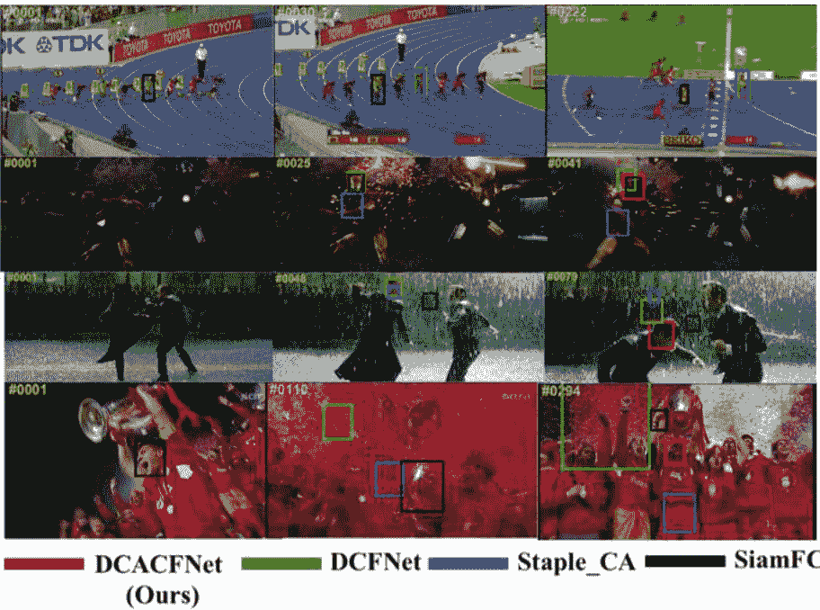

## 4.4 SiamFC框架中的辅助重定位

视觉对象跟踪是一个在线半监督学习问题。唯一的训练样本来自于第一帧物体的状态。如何准确构建跟踪对象的外观模型，如何在线更新外观模型以适应对象的变化，如何监控跟踪过程以重新定位对象，如何引入先验知识来改进跟踪结果，以及如何在发生故障时监视跟踪过程并检测跟踪失败，这些都是视觉对象跟踪中需要解决的关键问题。在本节中，提出了一个辅助的重新定位分支来帮助对象的重新定位和跟踪。根据视觉对象跟踪的先验假设，辅助重新定位分支涉及一些权重，如结构相似性权重、运动相似性权重、运动平滑性权重和对象显著性权重。

### 4.4.1 辅助相关滤波器的重定位

对于跟踪任务，特别是对于特定场景，关于跟踪对象有一些先前的假设。例如，我们总是假设被跟踪对象的运动是平滑的，这意味着对象的状态在两个相邻帧之间变化不大。人们倾向于选择一些显眼的对象作为跟踪对象。此外，对象的顺序也可以帮助改善跟踪结果。因此，辅助重定位分支的目的是将一些先前的知识引入AS-SiamFC，并在跟踪器处于不可信状态时重新定位对象。辅助重定位分支和开关功能（下面提到）可以被视为AS-SiamFC的故障检测和重定位部分。根据上述先前的假设，一些权重图被引入结构辅助权重分支，例如结构相似性权重、运动相似性权重、运动平滑权重和对象显著性权重。详细的过程如图4.15所示。

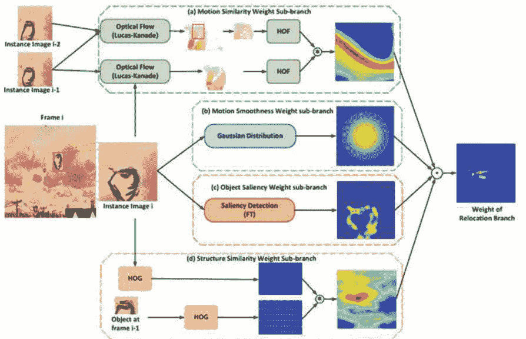

对于运动相似性权重子分支，我们应用Lucas-Kanade方法 (LK) [29] 来计算光流 $Op(i, i - 1)$，即实例图像 $i$ 和实例图像 $i - 1$ 之间的光流，并且我们还计算实例图像 $i - 1$ 和 $i - 2$ 之间的光流 $Op(i - 1, i - 2)$。然后，根据实例图像 $i - 1$ 中对象的状态，我们选择一个光流 $Op(i - 1, i - 2)$ 的区域，并将该区域的方向直方图光流特征 (HOF) [30] 视为对象的运动特征。同样地，我们还提取光流 $Op(i, i - 1)$ 的方向直方图光流特征 $HOF$。因此，运动相似性权重可以通过所选区域的 $HOF$ 和光流 $Op(i, i - 1)$ 之间的互相关计算得到，如下所示：

$$R_O = HOF(\text{select}(Op(i - 1, i - 2))) \otimes HOF(Op(i, i - 1)) + b_o \qquad (4.32)$$

其中 $R_O$ 是运动相似性权重子分支的权重图，它是本节中使用的运动相似性权重。$Op(i - 1, i - 2)$ 表示通过实例图像 $i - 1$ 和实例图像 $i - 2$ 计算得到的物体的光流。$HOF()$ 表示提取HOF特征。$b_o$ 表示运动相似性权重子分支的偏置项。

对于对象显著性权重子分支，应用频率调整显著区域检测方法 (FT) [31] 来计算对象显著性权重子分支的权重图 $R_S$ 如下所示：

$$R_s(x, y) = \| I_\mu - I_{whc}(x, y) \| \qquad (4.33)$$

其中 $I_\mu$ 是实例图像中所有像素的平均值，$I_{whc}$ 表示经过高斯滤波后的实例图像的平滑图像。因此，$I_{whc}(x, y)$ 是 $I_{whc}$ 在 $(x, y)$ 处的相应得分。

对于运动平滑度权重子分支，使用以 $(x_c, y_c)$ 为中心的传统二维高斯分布函数来构建运动平滑度权重子分支的权重图。$(x_c, y_c)$ 可以通过前一帧中对象中心的位置获得。二维高斯分布函数如下所示：

$$R_G(x, y) = \frac{1}{2\pi\sigma^2} e^{-\frac{(x-x_c)^2+(y-y_c)^2}{2\sigma^2}} \qquad (4.34)$$

其中 $\sigma$ 是高斯分布函数的标准差，而 $R_G$ 是运动平滑度权重子分支的权重图。

对于结构相似性权重，应用方向梯度直方图特征 (HOG) [32] 来描述对象的结构信息。首先，我们提取实例图像 $i$ 和实例图像 $i-1$ 的对象图像 $I_0(i-1)$ 的HOG特征，分别为 $I_x(i)$ 和 $I_0(i-1)$。实例图像 $i-1$ 的对象图像可以通过第 $i-1$ 帧的对象状态获得。因此，结构相似性权重可以通过 $I_0(i-1)$ 和 $I_x(i)$ 的互相关计算得到，如下所示：

$$R_{st} = HOG(I_0(i-1)) \circledast HOG(I_x(i)) + b_{st} \qquad (4.35)$$

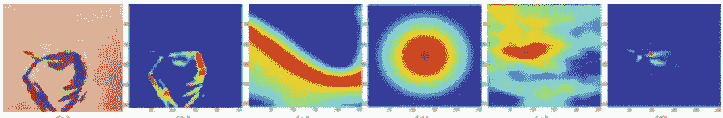

其中 $R_{st}$ 是结构相似性权重子分支中的权重图。$HOG()$ 表示提取HOG特征，$b_{st}$ 表示结构相似性权重子分支的偏置项。因此，辅助重定位分支的权重图 $R_r$ 可以通过公式4.36通过逐元素乘积计算得到：

$$R_r = R_O \odot R_G \odot R_S \odot R_{st} \qquad (4.36)$$

图4.16显示了对象显著性权重、运动相似性权重、运动平滑性权重、结构相似性权重和辅助重定位的总权重图。从图4.16中，我们发现对象显著性权重在图4.16b中侧重于检测整个对象，特别是在对象与背景之间的差异明显时。图4.16c中的运动相似性权重更关注具有相似对象的区域。这使得光流的响应图更适合跟踪移动刚体对象。同时，图4.16d中的运动平滑性权重估计了实例图像中对象位置的概率。这与对象的运动平滑性假设一致。与运动相似性权重类似，图4.16e中的结构相似性权重更关注具有相似对象结构的区域。这可能有助于跟踪器处理一些跟踪挑战，如光照变化、颜色变化等。从图4.16f中，我们发现辅助重定位分支的权重图可以勾勒出对象的轮廓并准确估计对象中心的位置。因此，我们相信当提出的跟踪器处于不可信状态时，辅助重定位分支可以优化和重新定位对象。

### 4.4.2 切换功能

考虑到在AS-SiamFC中引入先验知识可能会带来噪声，有时先验知识本身就是可能影响跟踪性能的噪声。因此，我们应该监控所提出的跟踪器的跟踪过程，并确保它包含在显示先验知识的辅助工具中。重定位分支会影响AS Siamese网络的响应图。只有在跟踪器处于不受信任状态时，才能进一步优化和重新定位对象。因此，在本节中，提出了一种基于AS Siamese网络响应图的新型切换函数，用于监控跟踪过程并控制辅助重定位分支对跟踪性能的影响。所提出的切换函数如公式4.37所示：

$$S_t = \varepsilon \left( \frac{\max(R_A) - \text{avg}(R_A)}{\max(R_A) - \min(R_A)} - S_{threshold} \right) \qquad (4.37)$$

其中 $R_A$ 代表AS Siamese网络的响应图。因此，$\max(R_A)$，$\text{avg}(R_A)$ 和 $\min(R_A)$ 分别是 $R_A$ 的最大值、平均值和最小值。$\frac{\max(R_A)-\text{avg}(R_A)}{\max(R_A)-\min(R_A)}$ 是置信度百分比，用于评估跟踪过程的可靠性。$\varepsilon()$ 表示单位阶跃函数，$S_{threshold}$ 是阈值。当置信度百分比超过阈值时，开关函数得分为1。否则，开关函数得分为0。因此，AS-SiamFC的最终响应图可以通过公式4.38计算，该公式受开关函数控制：

$$R_T = (1 - S_t) \cdot (R_r \odot R_A) + S_t \cdot R_A \qquad (4.38)$$

其中 $R_T$ 是AS-SiamFC的最终响应图，$R_r$ 和 $R_A$ 分别是辅助重定位分支的权重图和AS网络的响应图。从方程4.38可以看出，当置信度百分比低于阈值时，我们认为跟踪器处于不可信状态。辅助重定位分支的权重图有助于细化和重新定位对象。因此，最终响应图 $R_T$ 通过逐元素乘积计算，$R_T = R_r \odot R_A$。否则，我们认为跟踪器处于可信状态，最终响应图等于AS网络的响应图，$R_T = R_A$。该函数的另一个好处是我们不需要在每一帧中计算辅助重定位分支的响应图。相反，只有在跟踪器处于不可信状态时，我们才计算辅助重定位分支的响应图。这也可以提高跟踪速度并减少计算量。

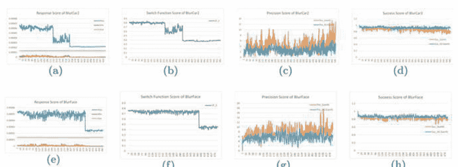

图4.17显示了在两个不同序列中响应分数的关系与 $R_A$ 的分数、开关函数的分数、精确度分数和成功分数之间的关系。从这些绘图中，我们发现平均值和每帧中 $R_A$ 的最小值变化不大，而最大值随着帧数变化。在图4.17a和e中，我们可以看到 $R_A$ 的最大值显著下降。图4.17b和f是切换函数中的置信度百分比值，可以通过 $\frac{\max(R_A)-\text{avg}(R_A)}{\max(R_A)-\min(R_A)}$ 计算得到。

从这些图中，我们还可以看到显著的下降，这与图4.17a和e中的下降一致。置信度百分比可以用于监控跟踪过程并测量跟踪结果的置信度。当置信度百分比低于一定阈值时，$R_A$ 的最大值较低，这意味着跟踪器难以区分对象和背景，跟踪器处于不可信状态。通过比较图4.17c、d、g、h中SiamFC和AS-SiamFC的精度和成功得分，我们发现带有切换函数和辅助重定位分支的AS-SiamFC的得分更加平滑且更高，这意味着该机制可以有效检测失败并在不可信状态时重新定位对象。

### 4.4.3 框架和过程

从图4.15中，我们可以看到辅助重定位分支可以分为四个子分支：运动相似性权重子分支，运动平滑性权重子分支，物体显著性权重子分支和结构相似性权重子分支。首先，我们分别计算这四个子分支的权重图。然后，为了合并从这四个子分支获得的权重图，我们对这四个子分支的权重图进行归一化处理。最后，通过逐元素函数将响应图合并。因此，我们得到了辅助重定位分支的权重图。注意到辅助重定位仅适用于实例图像。

跟踪过程可以总结如下：首先，我们将示例图像 $I_Z$（从第一张图像获得的模板）和实例图像 $I_X$（表示搜索区域的候选搜索图像）输入到提出的 AS 网络中计算响应图 $R_A$。然后，我们计算提出的切换函数 $S(R_A)$ 的得分。如果 $S(R_A)$ 大于0，我们认为跟踪器处于可信状态，仅通过响应图 $R_A$ 来估计对象的状态。如果不是，则跟踪器处于不可信状态。辅助重定位分支的权重图 $R_r$ 有助于通过 $R_A$ 对对象进行细化和重定位。因此，最终响应图 $R_T$ 通过逐元素乘积计算得出。最后，我们通过最终响应图 $R_T$ 估计对象的状态，并更新下一帧的实例图像。

### 4.4.4 实验结果和讨论

为了说明我们提出的辅助重定位分支和切换函数的可行性和有效性，在本节中设置并提供了一些基本的实验和分析。

我们讨论了视觉对象跟踪的先验假设对孪生网络跟踪器的影响。根据先验假设，对象的运动是平滑的，在特定范围内对象是明显的，并且对象的运动和结构在一定程度上是一致的。我们将运动平滑度权重、对象显著性权重、运动相似性权重和结构相似性权重应用于符合先验假设。所有这些方法都合并到了提出的辅助重定位分支中。

图4.18定性地展示了 AS-SiamFC 的显著性、光流、HOG 特征和最终响应图的效果。从图4.18可以看出，辅助重定位分支中的每种方法都适用于特定的视频序列和场景。显著性检测和光流都可以在一些简单的序列中勾勒出对象，或者对象与背景之间的差异很大。由于图4.18b中的头盔比背景更突出，显著性检测方法比光流更适合定位对象。相反，图4.18c显示光流擅长处理背景混杂的序列，而显著性检测方法无法处理。图4.18d和f显示了这些序列。

图4.18 所提出的跟踪器在OTB50和OTB100中的6个序列中的显著性、光流、HOG特征和响应图

这些方法不适用于显著性检测方法和光流。然而，这两个序列中对象的结构（HOG特征）变化不大。图4.18e显示了一个复杂的序列。在这个序列中，对象的运动不规律，对象并不是非常显著，而且许多其他人与这个对象在结构上相似。因此，在这个序列中，显著性检测方法、光流和HOG特征很难估计对象的位置。然而，借助运动平滑度权重的帮助，我们仍然可以估计对象的状态。

为了进一步探索所提出的辅助重定位分支和切换函数的影响，图4.19显示了具有和不具有辅助重定位分支和切换函数的跟踪器的精度和成功曲线。Siamfc_R和Siamfc分别表示具有和不具有辅助重定位分支的Siamfc跟踪器。而AS-Siamfc和AS-Siamfc_W分别是具有和不具有辅助重定位分支的提出的跟踪器。所有这些跟踪器都在OTB-2013、OTB100和OTB50数据集中进行测试。从图4.19可以看出，所提出的具有辅助重定位分支的AS-Siamfc跟踪器在所有这四个跟踪器中实现了最佳的跟踪性能。通过比较AS-Siamfc和AS-Siamfc_W的精度和成功曲线，我们发现平均精度得分和成功得分分别增加了2.87%和6.80%。通过比较Siamfc_R and Siamfc的精度和成功曲线，我们也可以发现略微的改进。这些实验证实了所提出的辅助重定位分支的有效性和可用性。

表4.8还提供了AS-Siamfc、AS-Siamfc_W、Siamfc和Siamfc_R在OTB100的11个跟踪挑战中的精度和成功得分。通过比较这四个跟踪器的精度和成功得分，我们可以看到，在大多数情况下，具有辅助重定位分支的跟踪器的性能优于没有辅助重定位分支的跟踪器。因此，我们可以说，提出的辅助重定位分支以及切换函数可以在跟踪过程中监控、优化和重新定位对象，从而提高跟踪性能。

为了具体讨论辅助重定位分支中四个子分支的有效性，图4.20显示了AS-Siamfc在没有运动平滑度权重（AS-Siamfc_msm）、没有运动相似性（AS-Siamfc_msi）、没有对象显著性权重（AS-Siamfc_os）和没有结构相似性（AS-Siamfc_ss）的情况下的性能，同时还显示了没有整个辅助重定位分支（AS-Siamfc_W）和提出的跟踪器AS-Siamfc的性能。从图4.20中的所有精度和成功曲线可以看出，AS-Siamfc_ss的性能最差，除了AS-Siamfc_W之外，AS-Siamfc_msm获得了最高的精度和成功得分，这表明结构相似性权重在辅助重定位分支中起着重要作用。

此外，我们还在OTB100数据集的图4.21中展示了切换函数阈值的有效性。图4.21中的前两个图是OPE的精度和成功曲线。图例中括号中的数字表示AS-Siamfc中应用的相应阈值。请注意，AS-Siamfc和AS-Siamfc_W的阈值分别为0.6和0。第三个图是精度和成功得分的趋势图。该图的横坐标是阈值，纵坐标是相应的精度和成功得分。

从图4.21可以看出，当阈值小于0.5时，精度和成功得分曲线稳步上升，并在0.6达到峰值。然后，曲线开始下降。当阈值超过0.7时，精度和得分甚至可能低于AS-Siamfc_W。我们认为原因是当阈值超过0.7时，AS-Siamfc的性能更加依赖于辅助重定位分支。

图4.19 OTB-2013、OTB100和OTB50中OPE的精度和成功曲线

表4.8 OTB100中11个跟踪挑战的精度和成功分数。对于每个跟踪器，精度分数在第一行，成功分数在下一行

| 跟踪器 | 指标 | IV | SV | OCC | DEF | MB | FM | IPR | OPR | OV | BC | LR |
|---|---|---|---|---|---|---|---|---|---|---|---|---|
| Siamfc_R | Pre | 0.745 | 0.761 | 0.685 | 0.715 | 0.733 | 0.750 | 0.771 | 0.757 | 0.626 | 0.662 | 0.700 |
| | Suc | 0.584 | 0.590 | 0.542 | 0.545 | 0.603 | 0.602 | 0.594 | 0.577 | 0.500 | 0.514 | 0.537 |
| Siamfc | Pre | 0.746 | 0.751 | 0.667 | 0.694 | 0.721 | 0.732 | 0.752 | 0.733 | 0.621 | 0.669 | 0.751 |
| | Suc | 0.567 | 0.562 | 0.514 | 0.509 | 0.570 | 0.567 | 0.560 | 0.539 | 0.481 | 0.500 | 0.541 |
| AS-Siamfc | Pre | 0.791 | 0.837 | 0.784 | 0.824 | 0.810 | 0.812 | 0.835 | 0.833 | 0.708 | 0.753 | 0.705 |
| | Suc | 0.631 | 0.675 | 0.633 | 0.657 | 0.685 | 0.677 | 0.668 | 0.669 | 0.569 | 0.599 | 0.561 |
| AS-Siamfc_W | Pre | 0.760 | 0.806 | 0.739 | 0.797 | 0.786 | 0.774 | 0.800 | 0.798 | 0.664 | 0.726 | 0.693 |
| | Suc | 0.563 | 0.602 | 0.566 | 0.589 | 0.625 | 0.610 | 0.597 | 0.599 | 0.500 | 0.599 | 0.493 |

比在AS网络上更好。因此，辅助重定位分支可能会带来一些噪声和错误的知识，导致AS-Siamfc的误差并降低跟踪性能。

## 4.5 总结

在本节中，提出了三种基于深度特征的相关滤波器跟踪算法。这三种算法都利用了深度特征的更好辨别能力，在复杂环境中进行稳健的跟踪。

第一种方法使用长期和短期相关滤波器的组合更新，在跟踪过程中可以有效平衡跟踪模型的长期和短期更新，同时使用HOG、CN and 深度特征来融合特征并按照一定比例求和，以获得用于表示跟踪目标的融合特征。由于融合特征可以互补彼此的不足，跟踪算法可以进一步提高目标的辨别能力。

第二种方法是基于内容感知的相关滤波器跟踪算法，结合深度特征在复杂环境中稳健地跟踪目标。首先，根据跟踪目标特征，利用通道注意机制对各个通道进行加权，以获得有辨别能力的深度特征。然后，设计了一个内容感知的相关滤波器网络，通过对跟踪环境和跟踪目标的特征感知，进一步准确地区分目标与跟踪背景。最后，设计了一种基于高置信度的模型更新策略，进一步提高在复杂环境中的跟踪算法的准确性。

图4.2 OTB2013、OTB100 and OTB50中OPE的精度和成功曲线

第三种方法通过相关滤波器进行辅助重新定位，通过对算法的预测结果进行第二次判断，如果目标丢失或准确度低于阈值，则提高当前帧的目标跟踪准确度。还设计了基于SiamFC框架的切换函数，进一步缩小辅助重新定位和目标变化之间的差距，以避免由于重新定位导致目标跟踪失败。

## 参考文献

- 1. Bolme, D.S., Beveridge, J.R., Draper, B.A., Lui, Y.M.: 使用自适应相关滤波器进行视觉对象跟踪。在: IEEE计算机视觉和模式识别会议，第2544-2550页 (2010年)
- 2. Danelljan, M., Hager, G., Khan, F., Felsberg, M.: 用于稳健视觉跟踪的准确尺度估计。在: 英国机器视觉会议 (2014年)
- 3. Hong, Z., Chen, Z., Wang, C., Mei, X., Prokhorov, D., Tao, D.: 多存储跟踪器 (muster): 一种受认知心理学启发的对象跟踪方法。在: IEEE计算机视觉和模式识别会议，第749-758页 (2015年)
- 4. Danelljan, M., Hager, G., Shahbaz Khan, F., Felsberg, M.: 基于卷积特征的相关滤波器视觉跟踪。在: IEEE国际计算机视觉会议工作坊，第58-66页 (2015年)
- 5. Kiani Galoogahi, H., Fagg, A., Lucey, S.: 学习背景感知相关滤波器进行视觉跟踪。在: IEEE国际计算机视觉会议，第1135-1143页 (2017年)
- 6. Zuo, W., Wu, X., Lin, L., Zhang, L., Yang, M. H.: 学习支持相关滤波器进行视觉跟踪。IEEE模式分析与机器智能 41 (5), 1158-1172页 (2018年)
- 7. Bertinetto, L., Valmadre, J., Golodetz, S., Miksik, O., Torr, P.H.: Staple: 实时跟踪的互补学习方法。在: IEEE计算机视觉与模式识别会议，第1401-1409页 (2016年)
- 8. Lukezic, A., Vojir, T., Čehovin Zajc, L., Matas, J., Kristan, M.: 具有通道和空间可靠性的判别相关滤波器。在: IEEE计算机视觉与模式识别会议，第6309-6318页 (2017年)
- 9. Danelljan, M., Robinson, A., Khan, F.S., Felsberg, M.: 超越相关滤波器: 学习连续卷积算子进行视觉跟踪。在: 欧洲计算机视觉会议，第472-488页 (2016年)
- 10. Danelljan, M., Bhat, G., Shahbaz Khan, F., Felsberg, M.: Eco: 高效卷积算子进行跟踪。在: IEEE计算机视觉与模式识别会议，第6638-6646页 (2017年)
- 11. Ma, C., Huang, J.B., Yang, X., Yang, M.H.: 分层卷积特征进行视觉跟踪。在: IEEE国际计算机视觉会议, 第3074-3082页 (2015年)
- 12. Dalal, N., Triggs, B.: 用于人体检测的方向梯度直方图。在: IEEE国际计算机视觉会议, 第886-893页 (2005年)
- 13. Danelljan, M., Shahbaz Khan, F., Felsberg, M., Van de Weijer, J.: 自适应颜色属性用于实时视觉跟踪。在: IEEE计算机视觉和模式识别会议, pp. 1090-1097 (2014年)
- 14. Henriques, J.F., Caseiro, R., Martins, P., Batista, J.: 基于核化相关滤波器的高速跟踪。IEEE模式分析与机器智能交易。37 (3) , 583-596 (2014年)
- 15. Felzenszwalb, P.F., Girshick, R.B., McAllester, D., Ramanan, D.: 基于部分训练模型的目标检测。IEEE模式分析与机器智能交易。32 (9) , 1627-1645 (2009年)
- 16. Danelljan, M., Hager, G., Shahbaz Khan, F., Felsberg, M.: 训练集的自适应去污：用于判别式视觉跟踪的统一公式。在：IEEE计算机视觉和模式识别会议，pp. 1430-1438（2016年）
- 17. 齐, Y., 张, S., 秦, L., 姚, H., 黄, Q., 林, J., 杨, M.H.: 对冲深度跟踪。在: IEEE计算机视觉和模式识别会议, 第4303-4311页 (2016年)
- 18. Kristan, M., Matas, J., Leonardis, A., 等: 视觉对象跟踪VOT2015挑战结果。在: IEEE国际计算机视觉会议研讨会, 第564-586页 (2015年)
- 19. 梁, P., 布拉什, E., 林, H.: 编码颜色信息用于视觉跟踪: 算法和基准。IEEE图像处理。24 (12) : 5630-5644 (2015年)
- 20. 穆勒, M., 史密斯, N., 甘纳姆, B.: 用于无人机跟踪的基准和模拟器。在: 欧洲计算机视觉会议, 第445-461页 (2015年)
- 21. Mueller, M., Smith, N., Ghanem, B.: 上下文感知相关滤波跟踪。在: IEEE计算机视觉和模式识别会议上, 第1396-1404页 (2017年)
- 22. Jie, H., Shen, L., Albanine, Samuel, Sun G., Wu E.: 挤压激励网络。IEEE模式分析与机器智能 42(8), 2011-2023页 (2020年)
- 23. Wang, M., Liu, Y., Huang, Z.: 带循环特征图的大边界对象跟踪。在: IEEE计算机视觉和模式识别会议上, 第4021-4029页 (2017年)
- 24. Hu, J., Shen, L., Sun, G.: 挤压激励网络。IEEE计算机视觉和模式识别会议上, 第7132-7141页 (2018年)
- 25. Russakovsky, O., Deng, J., Su, H., Krause, J., Satheesh, S., Ma, S., Fei-Fei, L.: ImageNet大规模视觉识别挑战。国际计算机视觉 115(3), 211-252页 (2015年)
- 26. Wang, N., Song, Y., Ma, C., Zhou, W., Liu, W., Li, H.: 无监督深度跟踪。在: IEEE计算机视觉和模式识别会议上, 第1308-1317页 (2019年)
- 27. Dong, X., Shen, J.: 对象跟踪中的三元组损失。在: 欧洲计算机视觉会议论文集, 第459-474页 (2018年)
- 28. Valmadre, J., Bertinetto, L., Henriques, J., Vedaldi, A., Torr, P.H.: 基于相关滤波器的端到端表示学习用于跟踪。IEEE计算机视觉和模式识别会议, 第2805-2813页 (2017年)
- 29. Jean-Yves, B.: 仿射Lucas Kanade特征跟踪算法的金字塔实现描述算法。英特尔公司。5 (1-10) , 4 (2001年)
- 30. Rizwan, C., Avinash, R., Gregory, H., Rene, V., Avinash, R., Gregory, H., Rene, V.: 非线性动力系统上的有向光流直方图和Binet-Cauchy核用于人类动作识别。在: IEEE计算机视觉和模式识别会议, 第1932-1939页 (2009年)
- 31. Radhakrishna, A., Sheila, H., Francisco, E., Sabine, S.: 频率调谐显著区域检测。在: IEEE计算机视觉和模式识别会议上, 第1597-1604页 (2009年)
- 32. Navneet, D., Bill, T.: 用于人体检测的梯度直方图。在: IEEE计算机视觉和模式识别会议上, 第886-893页 (2005年)

# 第5章 基于深度学习的视觉对象跟踪

随着深度学习的发展，越来越多的深度学习方法被应用于视觉对象跟踪。本章主要介绍了三种深度学习方法，包括Siamese网络、生成对抗网络和强化学习。通过改进这些方法，我们提高了视觉对象跟踪方法的性能。

## 5.1 引言

近年来，随着深度学习的快速发展，深度学习模型在计算机视觉领域得到了广泛应用。它们强大的学习和判别能力已经超越了传统方法，具有最先进的性能。对于对象跟踪，基于深度学习的方法通过深度网络模型设计跟踪框架，并通过大量样本进行监督或半监督预训练，以获得稳健的跟踪模型[1]。此后，深度强化学习和Siamese网络也被引入到对象跟踪中。基于深度强化学习的方法[2, 3]可以有效地将训练知识转移到跟踪环境中，并通过自学习快速适应新场景。为了加速跟踪过程，Siamese网络[4, 5]使用模板匹配和非更新模型策略来减少特征计算和模型更新成本。然而，现有方法主要通过选择不同的深度模型来平衡速度和准确性，而没有优化深度特征。同时，复杂的模型需要大量丰富的训练样本。与此同时，大多数跟踪方法没有数据处理或仅使用几何变换来增加样本多样性，限制了模型的鲁棒性。

Danelljan等人（SRDCFdecon）发现样本可能包含可以降低跟踪器性能的信息。为了解决这个问题，他们设计了一种训练方法，优化模型参数和样本权重，并且与二进制决策不同，使用参数权重的连续表示，有效降低了受污染样本的权重并增加了正确样本的权重。为了确保权重的有效性，可以在每一帧中重新计算样本权重以纠正不正确的受污染样本权重。基于SRDCFdecon，DeepSRDCF选择了基于神经网络的深度特征，而不是基于SRDCF的原始人工特征来跟踪目标。通过比较从神经网络的不同卷积层中提取的深度特征的区分能力，发现从浅层卷积层中提取的深度特征比从深层卷积层中提取的深度特征具有更好的区分能力，可以减少网络计算量并加速跟踪速度。为了进一步提高算法的速度，还使用了PCA来降低第一个卷积层中特征的维度，进一步减少网络的计算量。

## 5.2 基于注意力抖动的孪生网络视觉对象跟踪

Siamese网络在视觉对象跟踪领域中备受推崇，因为它具有成对输入和成对训练的独特优势。它可以测量两个图像块之间的相似性，与基于匹配的跟踪算法的原则相一致。在本节中，提出了一种基于变体Siamese网络的跟踪器，将注意力模块引入传统的Siamese网络中。提出了一种新颖的注意力抖动层，用于替代Siamese网络中的最大池化层。该层可以同时引入和训练两种不同类型的注意力模块，这意味着所提出的注意力抖动层还可以在不增加网络深度的情况下提高Siamese网络的表达能力。

### 5.2.1 Siamese网络中的注意机制

基于Siamese网络的跟踪器将视觉对象跟踪视为一种互相关问题，并从基于Siamese网络的深度模型中计算响应图。它们通常有两个分支用于成对输入。一个分支用于学习对象 $z'$ 在语义嵌入空间 $\phi(\cdot)$ 中的表示，另一个分支显示搜索区域 $x'$ 的表示。因此，响应图可以通过 $f(z', x') = \Phi(z') \circledast \Phi(x') + \mathbf{b}$ 来计算，其中 $\mathbf{b}$ 是偏置项，$\circledast$ 表示互相关操作。目标是将响应图中的最大值与对象位置匹配。

图5.1 所提出的AS-Siamfc的主要框架。它基本上由3个部分组成：(a) 带有提出的注意力抖动层的注意力抖动网络。(b) 包含结构相似性权重、运动相似性权重、运动平滑性权重和目标显著性权重的辅助重定位分支。(c) 用于控制重定位分支中的四个权重的开关函数。

在本节中，我们描述了所提出跟踪器的架构。如图5.1所示，AS-Siamfc的架构主要分为三个部分：注意力抖动网络、重定位分支和开关函数。此外，在图5.1的右侧，提出了一种由开关函数控制的基于权重的融合方法，用于将视觉对象跟踪的先验知识引入所提出的跟踪器，并计算最终的响应图 $R_T$。$\odot$ 和 $\circledast$ 在图5.1中分别表示逐元素乘积和互相关操作。

对于注意力抖动网络（图5.1a部分），提出了一种新颖的注意力抖动层，用于替代基于AlexNet的Siamese网络中的最大池化层。这个提出的注意力层可以结合两个不同的注意力模块，并提高表达能力。对于重定位分支（图5.1b部分），AS-Siamfc引入了许多权重图，如结构相似性权重、运动相似性权重、运动平滑性权重和目标显著性权重，以在不受信任状态下运行时引入一些先验知识来优化和重新定位对象。对于开关函数部分（图5.1c），通过观察AS网络响应图的得分与AS-Siamfc的成功率之间的关系，我们设计了一个开关函数来在线监控跟踪过程并控制辅助重定位分支对跟踪结果的影响。

整个过程可以总结如下：首先，我们将示例图像 $I_Z$（也是从第一张图像获得的模板）和实例图像 $I_X$（也是比示例图像更重要且代表搜索区域的候选搜索图像）输入到提出的AS网络中，并获得响应图。然后，根据响应图使用开关函数来监控跟踪过程。如果跟踪器在可信状态下运行，则可以直接根据响应图获得跟踪结果。否则，响应图为通过辅助重定位分支的权重图对AS网络进行更新，通过逐元素乘积来改进和重新定位跟踪结果。

孪生网络的表达能力直接影响跟踪的性能，而注意力模块在分类任务中被证明是有效的。因此，我们尝试将注意力模块引入孪生网络以提高表达能力。在本节中，提出了一种新颖的注意力抖动层，用于替代孪生网络中的最大池化层。深度网络中的池化层有助于减少卷积特征的维度，类似于特征选择的过程。最大池化层在一个区域内选择最大的影响（最大值）。这可以减少由卷积层参数误差引起的估计均值误差，并保留更多有用的信息。

平均池化层考虑了特定区域内所有元素的平均效果（均值）。因此，平均池化层更加关注信息的完整性，并有助于减少邻域大小限制引起的估计方差。综上所述，提出的AS层可以同时具有最大池化层和平均池化层的优点。

如图5.2所示，AS层主要分为两个部分：注意力部分和抖动部分。在注意力部分，有两个修改过的Squeeze and Excitation块（SE块）[6]基于注意力模块：最大注意力模块（图5.2a左侧）和平均注意力模块（图5.2a右侧）。与传统的SE块不同，本节中修改过的SE块被应用于进一步优化最大池化和平均池化的特征图。

最大关注模块和平均关注模块的架构可以在图5.2a中找到。最大池化和平均池化被用作AS层中的空间关注。在最大池化层（或平均池化层）之后，另一个全局池化层被用来将最大池化（或平均池化）的特征图从 $((H - 3)/2 + 1) \times ((W - 3)/2 + 1) \times C$ 转换为 $1 \times 1 \times C$，其中 $H$、$W$ 和 $C$ 分别表示卷积特征图 $X$ 的高度、宽度和通道数。然后，使用两个完全卷积层分别减少和增加通道数，其中使用惩罚系数 $r$。最后，通道关注权重可以通过 sigmoid 函数计算得到。最大关注的特征图 $AT_{max}$ 和平均关注的特征图 $AT_{avg}$ 可以通过公式 5.1 和 5.2 获得：

$$AT_{max}(X) = \text{sig}(W_{m1}(W_{m0}(\text{maxpool}(X)))) \otimes \text{maxpool}(X) \qquad (5.1)$$
$$AT_{avg}(X) = \text{sig}(W_{a1}(W_{a0}(\text{avgpool}(X)))) \otimes \text{avgpool}(X) \qquad (5.2)$$

其中，$W_{m0}$ 和 $W_{a0}$ 是最大关注和平均关注的第一个全连接层的操作，试图将通道从 $C$ 减少到 $C/r$。而 $W_{m1}$ 和 $W_{a1}$ 是最大关注和平均关注的第二个全连接层的操作，试图将通道从 $C/r$ 提升回 $C$。$\text{sig}()$ 表示 sigmoid 函数，$\otimes$ 表示逐通道乘积。

图5.2 所提出的关注抖动层的架构。它可以分为两部分：(a) 关注部分和 (b) 抖动部分。

### 5.2.2 Siamese网络中的摇摆机制

为了使提出的注意力摇摆网络包含最大注意力和平均注意力的优势，摇摆模型[7]被引入到AS层中。如图5.2b所示，AS层中的摇摆部分通过加权和将最大注意力和平均注意力的特征图结合起来。摇摆部分的一个好处是在训练过程中，权重系数是动态的，这可以使注意力部分动态调整其参数，从而防止过拟合问题。AS层的特征图可以通过公式 5.3 计算：

$$M_{AS}(X) = \gamma \cdot AT_{max}(X) + (1 - \gamma) \cdot AT_{avg}(X) \quad (5.3)$$

其中 $M_{AS}(X)$ 表示 AS 层的特征图，$\gamma$ 表示权重系数。在训练过程中，$\gamma$ 根据 0 到 1 的均匀分布变化。在跟踪过程中，$\gamma$ 被设置为一个固定的标量，如 0.5。由于提出的注意力抖动网络基于孪生网络，可以通过公式 5.4 计算注意力抖动网络的响应图：

$$f(I_z, I_x) = g(\varphi(I_z), \varphi(I_x)) = \varphi(I_z) \circledast \varphi(I_x) + \mathbf{b} \quad (5.4)$$

其中 $\varphi()$ 表示注意力抖动网络，$\circledast$ 表示交叉相关操作，$\mathbf{b}$ 表示偏置项。$I_z$ 和 $I_x$ 分别是示例图像和实例图像。

图 5.3 显示了 Siamfc [8] 和提出的 AS-Siamfc 的响应图。图 5.3b 和 c 是实例图像的响应图。为了更有说服力地展示注意力抖动层的效果，图 5.3e 和 f 展示了整个帧的响应图。通过比较 Siamfc 和提出的 AS-Siamfc 之间的响应图，我们发现 Siamfc 只关注对象的中心部分，无法覆盖整个对象。而 AS-Siamfc 可以关注整个对象。此外，AS-Siamfc 使响应图中的对象区域变得更红，背景区域变得更蓝，这意味着该方法可以增加对象和背景之间的区分度。由此可见，注意力抖动层可以提高 Siamese 网络的表达能力。

图 5.3 使用 Siamfc 和 AS-Siamfc 的实例图像和整个图像的响应图。(a) 和 (d) 分别显示第 490 帧的实例图像和整个图像。(b) 和 (e) 是 Siamfc 的响应图。(c) 和 (f) 是 AS-Siamfc 的响应图。

### 5.2.3 框架和过程

与 Siamfc [8] 类似，提出的 AS-Siamfc 可以分为离线训练过程和在线跟踪过程。在训练过程中，我们尝试通过减少整个数据集的损失来优化提出的 AS 网络的参数。而在跟踪过程中，预训练的 AS 网络用于计算 $R_A$ 并获得最终的响应图 $R_T$ 以及辅助重定位分支的权重图 $R_r$。通过在 $R_T$ 中搜索峰值的索引，可以估计对象的状态。

我们采用逻辑损失作为训练过程的损失函数，并在正负对上训练提出的 AS 网络。正负对的获取方式与 Siamfc [8] 类似。单个响应图的损失函数如公式 5.5 所示：

$$L(l_y, v_{x,z}) = \frac{1}{|D|} \sum_{u \in D} \log(1 + e^{-l_y[u]v_{x,z}[u]}) \qquad (5.5)$$

其中 $l_y$ 是包含响应图标签的集合，$v_{x,z}$ 是包含响应图实际值的集合。$l_y[u]$ 和 $v_{x,z}[u]$ 表示响应图的第 $u$ 个标签和实际值。$D$ 是响应图中的索引集合，$|D|$ 是 $D$ 中的索引数量。对于响应图中的每个索引 $u$，标签 $l_y[u]$ 可以通过公式 5.6 获得：

$$l_y[u] = \begin{cases} 1 & \text{if } \|u - c\| \le r \\ -1 & \text{otherwise} \end{cases} \qquad (5.6)$$

对象的中心为 $c$，半径为 $r$。因此，当 $u$ 和 $c$ 之间的距离大于半径 $r$ 时，标签 $l_y[u] = -1$，否则 $l_y[u] = 1$。

此外，AS 网络的参数 $\theta$ 可以通过最小化数据集中所有响应图的平均值来进行优化，使用随机梯度下降 (SGD) 算法。如公式 5.7 所示：

$$\theta = \arg \min_{\theta} \frac{\sum_{(I_z, I_x, I_y) \in D_a} L(l_y, f(I_z, I_x; \theta))}{|D_a|} \qquad (5.7)$$

其中 $D_a$ 和 $|D_a|$ 表示用于训练提出的 AS 网络的数据集和数据集的数量，$(I_z, I_x, I_y)$ 是数据集中的训练样本。

对于跟踪过程，我们尝试通过预训练的 AS 网络和辅助重定位分支的权重图 $R_r$ 获得的响应图 $R$ 来估计对象的状态。伪代码如算法 4 所示。

```text
算法4: AS-Siamfc的伪代码
------------------------
输入: 示例图像 Iz; 初始对象状态 XG; 预训练的 AS 网络阈值 st; 帧数 Nf
输出: 对象的状态 Xt, t ∈ {1, 2, ..., Nf}
1: 通过将 Iz 输入 AS 网络计算示例图像的特征图;
2: 初始化对象状态 X1 = XG;
3: 对于 i 从 2 到 Nf 循环执行:
4:     根据 Xt-1 计算实例图像 Ixt;
5:     将实例图像 Ixt 输入 AS 网络并计算响应图;
6:     将响应图调整为 (255 * 255 * 1) 并得到 RA;
7:     计算开关函数的得分 S(RA);
8:     如果 S(RA) ≥ st 则
9:         通过 RA 估计物体的位置;
10:        更新物体的状态 Xt;
11:    否则
12:        计算辅助重定位分支的响应图 Rr;
13:        计算最终响应图 RT;
14:        通过 RT 估计物体的位置;
15:        更新物体的状态 Xt;
16:    结束如果
17: 结束循环
18: 返回 Xt, t ∈ {1, 2, ..., Nf}
```

### 5.2.4 实验结果和讨论

在本节中，我们展示了关于提出的 AS-Siamfc 跟踪器的设置和实现的一些细节。所有的实验都在一台具有 64G 内存和一块 GeForce GTX Titan X 的远程服务器上运行。提出的 AS 网络是在 GOT-10K [9] 基准上进行训练的。在训练过程中，注意力抖动层中的权重系数 $\gamma$ 从 0 到 1 随机变化。然而，在跟踪过程中，$\gamma$ 被设置为 0.5。此外，本节还应用了广泛使用的基准测试，包括 OTB-2013 [10]、OTB100 [11] 和 OTB50，来测试提出的 AS-Siamfc 跟踪器的性能。

AS-Siamfc 在 OTB100 数据集上的平均跟踪速度为 70.625 fps。此外，还使用了一些最先进的跟踪器进行比较实验，如 Siamfc [8]、SAMF [12]、DSST [13]、Struck [14]、TLD [15]、CSK [16]、ASLA [17]、OAB [18] 和 IVT [19]。

关于注意力抖动方法的一些分析：在本节中，我们展示了不同注意力抖动方法的一些结果和分析。为了讨论池化层对 Siamese 网络的影响，本节还展示了具有不同池化层的网络。首先，我们设计了 9 种 Siamese 网络架构进行比较：

- **Siamfc_R**: 带有辅助重定位分支的 Siamfc 骨干架构。
- **SA3**: 用卷积层替换最大池化层。
- **Sap**: 用平均池化层替换最大池化层。
- **Sap_s**: 将平均池化层与抖动模块结合。
- **SA1**: 合并最大池化和平均池化特征图的空间注意力模型。
- **SA2_a**: 只包含平均注意力模块的网络。
- **SA2_m**: 只包含最大注意力模块的网络。
- **SA2_s** 和 **AS-Siamfc**: 两种不同的注意力抖动网络架构。

图5.4用于比较的九种注意力抖动网络架构：(a) Siamfc_R. (b) SA3. (c) Sap. (d) Sap_s. (e) SA1. (f) SA2_a. (g) SA2_m. (h) SA2_s. (i) AS-Siamfc。

图 5.5 展示了上述 9 种网络架构在 OTB-2013、OTB100 和 OTB50 数据集上的精度和成功率曲线。AS-Siamfc 在所有三个数据集上表现最好。与 Siamfc_R 相比，AS-Siamfc 在精度和成功率方面平均增加了 6.63% 和 7.13%。这说明了带有抖动模块的网络架构更有可能具有良好的跟踪性能。

表 5.1 显示了 OTB100 数据集中 11 个跟踪挑战的精度和成功得分。IV、SV、OCC、DEF、MB、FM、IPR、OPR、OV、BC 和 LR 分别表示光照变化、尺度变化、遮挡、变形、运动模糊、快速运动、平面旋转、视角旋转、视野外、背景杂波和低分辨率。

#### 表 5.1 OTB100 中 11 个跟踪挑战的精度和成功得分

| 模型 | 指标 | IV | SV | OCC | DEF | MB | FM | IPR | OPR | OV | BC | LR |
|---|---|---|---|---|---|---|---|---|---|---|---|---|
| SA1 | Pre. | 0.713 | 0.720 | 0.630 | 0.702 | 0.675 | 0.698 | 0.738 | 0.721 | 0.561 | 0.681 | 0.708 |
| | Suc. | 0.562 | 0.556 | 0.506 | 0.537 | 0.556 | 0.569 | 0.566 | 0.551 | 0.451 | 0.534 | 0.535 |
| Sap | Pre. | 0.670 | 0.674 | 0.648 | 0.671 | 0.680 | 0.670 | 0.696 | 0.697 | 0.477 | 0.642 | 0.631 |
| | Suc. | 0.523 | 0.525 | 0.516 | 0.524 | 0.556 | 0.545 | 0.537 | 0.537 | 0.374 | 0.503 | 0.460 |
| Sap_s | Pre. | 0.750 | 0.773 | 0.714 | 0.770 | 0.743 | 0.742 | 0.761 | 0.783 | 0.617 | 0.727 | 0.671 |
| | Suc. | 0.571 | 0.585 | 0.556 | 0.578 | 0.598 | 0.592 | 0.572 | 0.590 | 0.487 | 0.554 | 0.479 |
| SA2_a | Pre. | 0.529 | 0.586 | 0.520 | 0.635 | 0.606 | 0.562 | 0.588 | 0.602 | 0.403 | 0.461 | 0.490 |
| | Suc. | 0.417 | 0.453 | 0.409 | 0.482 | 0.496 | 0.455 | 0.457 | 0.459 | 0.309 | 0.362 | 0.354 |
| SA2_m | Pre. | 0.675 | 0.747 | 0.672 | 0.723 | 0.687 | 0.730 | 0.750 | 0.753 | 0.610 | 0.618 | 0.697 |
| | Suc. | 0.528 | 0.574 | 0.531 | 0.553 | 0.568 | 0.583 | 0.571 | 0.569 | 0.476 | 0.476 | 0.526 |
| SA2_s | Pre. | 0.702 | 0.743 | 0.684 | 0.735 | 0.693 | 0.711 | 0.788 | 0.748 | 0.603 | 0.667 | 0.686 |
| | Suc. | 0.541 | 0.569 | 0.543 | 0.561 | 0.564 | 0.566 | 0.572 | 0.571 | 0.464 | 0.518 | 0.498 |
| SA3 | Pre. | 0.601 | 0.633 | 0.658 | 0.663 | 0.608 | 0.643 | 0.684 | 0.698 | 0.453 | 0.645 | 0.587 |
| | Suc. | 0.474 | 0.489 | 0.517 | 0.512 | 0.490 | 0.512 | 0.519 | 0.530 | 0.358 | 0.497 | 0.434 |
| Siamfc_R | Pre. | 0.745 | 0.761 | 0.685 | 0.715 | 0.733 | 0.750 | 0.771 | 0.757 | 0.626 | 0.662 | 0.700 |
| | Suc. | 0.584 | 0.590 | 0.542 | 0.545 | 0.603 | 0.602 | 0.594 | 0.577 | 0.500 | 0.514 | 0.537 |
| Siamfc | Pre. | 0.746 | 0.751 | 0.667 | 0.694 | 0.721 | 0.732 | 0.752 | 0.733 | 0.621 | 0.669 | 0.751 |
| | Suc. | 0.567 | 0.562 | 0.514 | 0.509 | 0.570 | 0.567 | 0.560 | 0.539 | 0.481 | 0.500 | 0.541 |
| AS-Siamfc | Pre. | 0.791 | 0.837 | 0.784 | 0.824 | 0.810 | 0.812 | 0.835 | 0.833 | 0.708 | 0.753 | 0.705 |
| | Suc. | 0.631 | 0.675 | 0.633 | 0.657 | 0.685 | 0.677 | 0.668 | 0.669 | 0.569 | 0.599 | 0.561 |
| AS-Siamfc_W | Pre. | 0.760 | 0.806 | 0.739 | 0.797 | 0.786 | 0.774 | 0.800 | 0.798 | 0.664 | 0.726 | 0.693 |
| | Suc. | 0.563 | 0.602 | 0.566 | 0.589 | 0.625 | 0.610 | 0.597 | 0.599 | 0.500 | 0.599 | 0.493 |

为了分析注意力抖动层中抖动部分的有效性，我们还设计了四种不同的训练和跟踪方法。第一种方法（AS-Siamfc_W）是使用随机权重系数训练抖动部分，但使用固定权重系数进行跟踪。第二种方法（AS-Siamfc_RR）是使用随机权重系数进行训练和跟踪。第三种方法（AS-Siamfc_SR）是使用固定权重系数进行训练，但使用随机权重进行跟踪。第四种方法（AS-Siamfc_SS）则是使用固定权重系数进行训练和跟踪。

图 5.6 显示了这四种方法的性能。结果表明，AS-Siamfc_W 和 AS-Siamfc_RR 的得分高于 AS-Siamfc_SR 和 AS-Siamfc_SS，这意味着使用随机权重系数进行训练有助于提高性能。虽然 AS-Siamfc_RR 在某些情况下表现良好，但 AS-Siamfc_W 在大多数情况下表现更稳健。因此，我们在最终提出的跟踪器中使用随机权重系数进行训练和固定权重系数进行跟踪。

图5.5 OTB-2013、OTB100和OTB50中OPE的精度和成功率曲线。

为了将提出的 AS-Siamfc 跟踪器与一些最先进的跟踪器进行比较，我们在广泛使用的基准测试中展示了一些定量和定性实验，包括 OTB-2013 [10]、OTB100 [11]、OTB50 和 VOT2018 [20]。

图 5.6 OPE 在 OTB2013、OTB100 和 OTB50 中的精度和成功率曲线

本章节首先展示了在 OTB-2013、OTB100 和 OTB50 基准测试中的一次性评估（OPE）的精度和成功率曲线，以及在 VOT2018 中的准确性-鲁棒性曲线（AR 曲线）。本节还分析了所提出的跟踪器在 10 个跟踪挑战下的性能。其次，我们提供了 10 个序列的跟踪边界框，以展示所提出的 AS-Siamfc 跟踪器的定性分析。

我们在本节中提供了一些定量分析。我们还选择了一些最先进的跟踪器，包括一些基于 Siamese 网络的跟踪器，以便进行比较。这些比较是在广泛使用的基准数据集 OTB-2013、OTB100 和 OTB50 上进行的。我们使用精度和曲线下面积（AUC）这两个指标来对这些跟踪器进行排名。首先，我们分别展示了 OTB-2013、OTB100 和 OTB50 的比较结果。然后，我们分析了提出的 AS-Siamfc 跟踪器在 10 个跟踪挑战下的性能。

**OTB-2013 数据集上的实验**  
OTB-2013 是一个广泛使用的基准测试数据集，包含 52 个完全注释的序列。为了方便比较测试，作者还提供了两个评估标准和一个工具包。图 5.7 显示了 OTB-2013 数据集中一次性评估（OPE）的精度和成功率曲线。从图 5.7 可以看出，我们提出的 AS-Siamfc 跟踪器在平均速度为 70.625 fps 时实现了最佳的跟踪性能。精度得分和成功得分分别为 0.820 和 0.667。与 Siamfc 跟踪器相比，提出的 AS-Siamfc 跟踪器在精度得分 and 成功得分上分别超过了 Siamfc 跟踪器的 0.058 和 0.092。

图 5.7 OTB-2013 中 OPE 的精度和成功率曲线

**在 OTB100 数据集上的实验**  
为了增加 OTB-2013 数据集的序列数量，并更准确地评估视觉对象跟踪器，吴等人 [11] 将一些完全注释的序列添加到 OTB-2013 数据集中，构建了 OTB100 数据集。因此，OTB100 数据集将 OTB-2013 数据集从 52 个序列扩展到 100 个序列。同样，评估标准和 OTB-2013 数据集中的工具包也适用于 OTB100。图 5.8 显示了 OTB100 数据集中 OPE 的精度和成功率曲线。从图 5.8 可以看出，提出的 AS-Siamfc 的精度得分和成功率得分分别为 0.844 和 0.680，也是最高得分。提出的跟踪器的精度得分和成功得分比 Siamfc 大 0.087 和 0.108。通过比较 OTB-2013 和 OTB100 中 AS-Siamfc 跟踪器的得分，我们发现 OTB100 中的 AS-Siamfc 得分平均比 OTB-2013 高 1.85%。我们认为原因是 OTB-2013 数据集中的序列数量相对较少，如果某个序列的跟踪性能不好，将对整体精度和成功得分产生很大影响。相反， OTB100 中的序列更多，并且 OTB100 中序列的分布相对均匀。因此，单个视频序列的跟踪结果对整体精度和成功得分影响很小。这也说明了提出的 AS-Siamfc 跟踪器的有效性和适用性。

**OTB50 数据集上的实验**  
OTB50 由 OTB100 中选择的 50 个难以跟踪的序列组成。它是一个广泛使用的基准，包含 50 个完全注释的序列。OTB-2013 [10] 提出的工具包也可以应用于 OTB50 数据集。图 5.9 显示了 OTB50 数据集中 OPE 的精度和成功率曲线。如图 5.9 所示，我们提出的跟踪器的性能优于其他最先进的跟踪器。精度得分和成功得分分别为 0.764 和 0.604。与 Siamfc 跟踪器相比，提出的 AS-Siamfc 跟踪器在精度得分和成功得分上的性能分别超过 Siamfc 跟踪器 0.071 和 0.091。

图 5.9 OTB50 中 OPE 的精度和成功曲线

**VOT2018 数据集上的实验**  
VOT2018 [20] 也是一个广泛使用的基准，包含 60 个序列，其中包括许多微小的、相似的跟踪对象。图 5.10 分别显示了 VOT2018 数据集实验基线的平均 AR 曲线和汇总 AR 曲线。根据定义 VOT2018 中的 AR 曲线 [20]，位于 AR 曲线右上方的跟踪器表现比位于左下方的跟踪器更好。如图 5.10 所示，尽管提出的 AS-Siamfc 跟踪器在鲁棒性方面得分较低，但在准确性方面得分是所有跟踪器中最高的。一般来说，与一些最先进的跟踪器相比， AS-Siamfc 在 VOT2018 中能够提供可比较的性能，这说明了所提出跟踪器的效率。

图 5.10 VOT2018 实验基线的 AR 图

**OTB100 中的 10 个跟踪挑战实验**  
为了详细分析所提出的 AS-Siamfc 跟踪器在不同序列中的适用性。OTB100 数据集中的序列被分为 11 个跟踪挑战，包括光照变化、平面外旋转、尺度变化、遮挡、形变、运动模糊、快速运动、平面内旋转、视野外、背景杂乱和低分辨率。图 5.11 显示了 AS-Siamfc 在这些挑战下的精度和成功曲线，以及一些最先进的跟踪器。为了使图表整洁，我们在图 5.11 中选择了十个挑战，而不是所有的十一个挑战。

从图 5.11 中，我们可以看到所提出的 AS-Siamfc 跟踪器在所有十个跟踪挑战下表现更好。通过比较所提出的跟踪器和 Siamfc 跟踪器的性能，我们发现所提出的跟踪器在平面外旋转、尺度变化、变形和快速运动等挑战下表现更好，尤其是变形。从图 5.11d 中，我们可以看到我们提出的跟踪器在遮挡挑战中表现出色，即使 AS-Siamfc 没有专门设计一个模块来处理这个挑战。我们相信原因是所提出的切换函数可以间接检测到遮挡的发生，在遮挡发生时， AS Siamese 网络的响应图可能得到低响应分数，这也意味着跟踪器正在运行在一个不可信的状态下。通过使用辅助重定位分支来优化跟踪结果。实际上，在视觉对象跟踪和运动分割中也有许多遮挡感知方法。将这些遮挡感知方法整合到所提出的跟踪中进一步改进跟踪性能的框架将是我们未来的工作。在图 5.11e 中， AS-Siamfc 的精确度得分和成功得分分别比 Siamfc 高 0.13 和 0.148，比 SAMF 跟踪器高 0.125 和 0.145 [12]，后者也是图 5.11e 中排名第二的跟踪器。我们相信这也证明了所提出的 AS 网络和辅助重定位分支与开关功能可以提高 Siamese 网络的表达能力并提供良好的跟踪性能。

**图 5.11** OTB100 中 10 个跟踪挑战的精度和成功曲线，使用提出的跟踪器和 8 个最先进的跟踪器。(a) 光照变化。(b) 平面外旋转。(c) 尺度变化。(d) 遮挡。(e) 变形。(f) 运动模糊。(g) 快速运动。(h) 平面内旋转。(i) 视野外。(j) 背景杂乱

除了上述定量分析实验外，我们还在本小节中展示了 OTB-2013、OTB100 和 OTB50 序列的一些跟踪边界框进行定性分析。

图 5.12 OTB-2013、OTB100 和 OTB50 中 10 个典型视频序列的定性结果，使用提出的跟踪器和 9 个最先进的跟踪器

如图 5.12 所示，我们从 OTB-2013、OTB100 和 OTB50 中选择了 10 个典型的视频序列。这十个序列的名称分别是 CarScale、Matrix、DragonBaby、Skiing、Jump、Diving、Girl2、FleetFace、Soccer 和 David3，从左到右，从上到下顺序排列。这十个序列包含了所有的 11 个跟踪挑战（一个序列可能包含多个挑战）。然而，为了更好地展示所提出的 AS-Siamfc 跟踪器的优势，这些序列更注重变形、尺度变化和快速运动的挑战。从 CarScale 序列中，我们可以看到当汽车从远处向近处行驶并逐渐变大时， AS-Siamfc 能更好地估计物体的状态。在 Diving 和 Jump 序列中，运动员有明显且快速的变形。即使如此，所提出的跟踪器仍然能够很好地跟踪运动员。同时， Matrix 序列、 DragonBaby 和 Skiing 展示了快速运动的挑战，因为在战斗或滑雪中的人们总是移动得很快。所提出的跟踪器也能提供准确的跟踪性能。总的来说，所有的定量和定性实验都证明了所提出的 AS-Siamfc 跟踪器的适用性和有效性。

## 5.3 基于频率感知的连体网络的视觉对象跟踪

我们提出了一种快速高效的跟踪器称为 FAF。离线 IoU 调制、在线 IoU 预测器、在线分类器和更新模块是构成该跟踪器的四个模块。离线 IoU 调制在离线训练阶段使用大型训练数据集进行独立预训练，以学习目标尺度和位置之间的关系。离线 IoU 调制将根据在线跟踪点的 IoU 回归分数指导在线 IoU 预测器，而分类器将提供分类得分。基于分类和回归排序，联合判断策略将提供优化的目标尺度和位置信息。然后，更新模块将更新 IoU 预测器和分类器。在提出的过程中，使用 ResNet18 作为骨干网络，并在 ImageNet [21] 上进行预训练。我们使用特征分解和样本融合方法优化原始骨干网络，以提升其判别能力。

### 5.3.1 频率感知孪生网络

目前在目标跟踪模型中使用的具有固定尺度的固定结构和卷积层。另一方面，浅层卷积特征包含明显的特征，而深层卷积特征包含复杂的语义特征。因此，传统卷积中使用的特征实际上存在信息冗余，这提高了网络估计的准确性并降低了网络的区分能力。

为了解决这个问题，我们以一种新颖的方式将频率感知功能集成到目标跟踪中。与其他区分不同卷积层特征的跟踪方法不同，我们将每个卷积层的特征进行分解，受到了张等人的启发。高频特征和低频特征被分配给卷积层中的特征，其中高频特征包含语义信息。如图 5.13 所示，低频特征将高频特征与压缩的低频特征相结合，以最小化网络计算并增加网络对目标的区分能力。

在图 5.13 中，正则特征被分为高频和低频特征。通过压缩低频分量、处理高频和低频部分以及在它们之间共享信息，可以使卷积操作更加高效。低频分量的维度为 ($0.5h, 0.5w$)，持续时间和宽度正好是高频部分 ($h, w$) 的一半。由于低频部分被压缩，它在原始像素空间中有效地扩展了感受野，有助于识别。我们控制高频和低频特征的分割比例通过设置超参数 $\alpha$ 如下：

$$X \in \mathbb{R}^{c \times h \times w}$$
$$X^H \in \mathbb{R}^{(1-\alpha)c \times h \times w} \qquad (5.8)$$
$$X^L \in \mathbb{R}^{\alpha c \times \frac{h}{2} \times \frac{w}{2}}$$

其中 $X$ 表示常见特征，$w$ 和 $h$ 分别表示特征的宽度和高度，$c$ 表示通道数，$X^H$ 和 $X^L$ 分别表示高频和低频特征。

在特征更新过程中，高频和低频特征可以按照各自的频率进行更新。此外，特征交换操作将在不同频率之间更新高频和低频特征的信息。因此，高频函数不仅包含了信息机制，还实现了从低频到高频和从高频到低频的映射。频率感知函数具有广泛的低频特征图的感受野，这是另一个优点。与标准特征相比，它有效地将感受野扩大了一倍，使得每个频率感知特征可以收集更多的上下文信息，提高识别效率。据我们所知，这是第一次为对象跟踪设计基于频率感知特征的孪生网络。

### 5.3.2 预训练和联合更新

**预训练**  
近年来，大规模深度学习取得了突破，它们都有两个共同点：第一步是创建更复杂的网络结构。建议使用更大的训练数据集作为第二选择。基于现有数据集的数据增强方法用于增加数据量，因为训练数据集需要大量手动标记。一些用于对象跟踪问题的模型使用几何变换来增加数据量并提高模型的鲁棒性。另一方面，当前的数据增强方法都是基于相同的类别。不考虑不同类别之间的关系，无法增加数据的多样性，限制了其性能。

为了解决这个问题，我们提出了一种新颖的预训练样本融合方法来增加数据的多样性。与分类问题不同，对象跟踪问题只有两个类别：目标和上下文，并且对对象的类别关注较少。我们通过加权融合样本和样本标签来改进数据，如陈等人所建议的 [23]。通过不同类别的示例，模型将学习近邻关系，从而进行这种数据增强。

更准确地说，我们使用高斯分布来产生围绕真实边界框的候选样本。候选样本根据与真实边界框的交并比（IoU）重叠来评分为正样本或负样本。我们融合正样本和负样本以获得融合样本，如图 5.14 所示。融合样本的大小是两个图像中的最大值，与当前方法不同，当前方法明确使用分类样本进行模型训练。算法 5 中可以找到相关信息。

```
算法 5: 预训练样本融合
输入: 图像 M, 真实边界框 P(x, y, w, h), 融合样本数量 Nfus, 负样本数量 Nneg, 正样本数量 Npos, 插值强度参数 α。

1: 使用高斯分布在 M 中生成围绕 P(x, y, w, h) 的候选样本。
2: 对所有候选样本与真实值计算 IoU。
3: 当 IoU > 0.7 时选择 Npos 个正样本。
4: 当 IoU < 0.3 时选择 Nneg 个负样本。
5: 对于 n 从 0 到 Nfus 的循环:
6:   从相应的样本集中随机选择正样本 (x1, y1) 和负样本 (x2, y2)。
7:   λ = Beta(α, α)
8:   x̃ = λx1 + (1 - λ)x2
9:   ỹ = λy1 + (1 - λ)y2
10:  获得融合样本 (x̃, ỹ)
11: 结束循环
12: 获得 Nfus 融合样本
13: 损失 = λ * 准则(outputs, y1) + (1 - λ) * 准则(outputs, y2)
```

参数 $\alpha \in (0, \infty)$ 控制特征-目标对之间的插值，并从 Beta 分布生成权重 $\lambda$。最后，我们分别为两个样本的标签测量损失函数，然后使用权重 $\lambda$ 对损失函数进行加权求和。实验结果表明，数据融合可以显著提升模型的鲁棒性。

**联合更新**  
提出的策略是基于跟踪方法单独使用分类置信度（CC）和回归置信度（RC），无法表示边界框定位的准确性。由于 RC 和 CC 不是互斥的，当前的跟踪方法只能解决高 CC 和高 RC 的情况，而不能解决其他三种情况：低 CC 和低 RC，高 CC 和低 RC，或低 CC 和高 RC。

为了解决这个问题，基于 [24] 设计了一种联合判断策略。通过对分类和回归置信度进行联合分析，最终的预测结果既具有更高的分类准确度，又具有更高的回归置信度。我们假设边界框是一个高斯分布 $P_\Theta(x) = \frac{1}{\sqrt{2\pi}\sigma} e^{-\frac{(x-x_e)^2}{2\sigma^2}}$，而真实边界框是一个狄拉克 $\delta$ 分布 $P_D(x) = \delta(x - x_g)$。KL 散度用于衡量两个概率分布的不对称性。位置问题转化为最小化 $P_D(x)$ 和 $P_\Theta(x)$ 之间的 KL 散度，KL 散度越接近 0，两个概率分布越相似，如下所示：

$$\hat{\Theta} = \mathop{\mathrm{argmin}}\limits_{\Theta} D_{KL}(P_D(x) \| P_\Theta(x)) \eqno(5.9)$$

其中 KL 散度将边界框转换为接近真实值的高斯分布。回归信任度被定义为预期边界框的 IoU。在阈值 IoU 内的候选边界框将根据其相邻边界框进行平均，以获得最终边界框，从而进一步提高边界框的准确性。以一个示例来说明，考虑第 $i$ 个框的新位置 $x1$：

$$x1_i := \frac{\sum_j x1_j / \sigma_{x1,j}^2}{\sum_j 1 / \sigma_{x1,j}^2} \eqno(5.10)$$

通过结合 RC 和 CC，可以获得更高的 RC 和 CC 来获得最终的边界框。此外，基于预测的相邻边界框，可以创建一个更准确的最终边界框，从而减少由于干扰信息而导致的对象丢失，并提高模型在复杂场景中的鲁棒性。

图 5.15 所提出的频率感知特征 (FAF) 的框架

### 5.3.3 框架和过程

优化的 ResNet18 从融合样本中获取双向频率感知特征，用于离线训练阶段，如图 5.15 所示，浅层特征包含位置信息，深层特征包含语义信息，并且相关特征用于学习目标的尺度和位置。卷积和池化层用于提升特征的区分能力。IoU 调制在大规模视频和图像数据集上进行离线训练，并且在在线监测过程中不进行更新。

基于数据融合的对象的第一帧将用于初始化 IoU 预测器和在线跟踪点的分类器模块。与离线级别不同， IoU 预测器将从 IoU 调制中获取双向特征：相关索引引导特征和当前帧的目标特征。然后， IoU 预测器和分类器将返回当前帧中对象的 IoU 和分类分数。最后，提出的联合决策方法将根据分数进行最终预测，并使用更新模块更新 IoU 预测器和分类器。

### 5.3.4 实验结果和讨论

所提出的方法使用 Python 编写，在具有 4 核 4.2 GHz Intel 8700k CPU 和两个带有 11 GB 内存的 NVIDIA 2080 Ti GPU 的 PC 上以每秒 45 帧的速度运行。预训练数据集包括 TrackingNet、OxUvA 和 LaSOT，网络参数对所有评估数据集都相同。

超参数根据先前的研究进行设置。以下是训练参数：在准备主干网络时，我们冻结所有权重。网络的权重衰减为 0.00005，动量为 0.9。我们使用均方误差损失函数，每批次训练 40 个周期，每个批次包含 64 个图像对。采用 ADAM 优化器，初始学习率为 $10^{-3}$，并且每个周期使用 0.2 的衰减因子。实验根据相同的协议和参数进行精心设计。

**在 OTB100 上进行评估**  
首先在著名的基准数据集 OTB100 上评估了提出的 FAF 方法。将提出的方法与八种最先进的跟踪器进行比较，包括 ECO、 MDNet、 ATOM [25]、 DeepSRDCF [26]、 CF2 [27]、 HDT [28] 和 KCF [29]。这些方法包括基于 CF 的方法、基于深度学习的方法和基于强化学习的方法。

在 OTB100 上，通过一次评估 (OPE) 监测最先进方法的监测结果。所提出的 FAF 具有高精度和性能率，如图 5.16 所示。与每秒 30 帧的最先进实时跟踪器 ATOM 相比，我们的跟踪器的精度和成功率分别达到 90.1% 和 67.3%，比 ATOM 高 1.9% 和 1.4%。 KCF 具有手工特征，可以以每秒 160 帧的速率进行监测。

图 5.16 在 OTB100 数据集上使用一次评估（OPE）方法进行的精度和成功率绘图。所提出的方法与最先进的方法相比表现良好。

表5.2 所提出方法的准确性和速度取决于 $\alpha$。最佳结果以粗体显示。

| | 0 | 0.5 | 1 | 10 | $\infty$ |
| :--- | :--- | :--- | :--- | :--- | :--- |
| Pre. | 0.875 | 0.886 | **0.901** | 0.891 | 0.883 |
| Suc. | 0.654 | 0.660 | **0.673** | 0.664 | 0.659 |
| FPS | **48** | 45 | 45 | 45 | **48** |

表5.3 在OTB100上的FAF消融结果，显示了所提出方法的每个组件的有效性。最佳结果以粗体显示。

| | 基线 | I | I+II | I+II+III |
| :--- | :--- | :--- | :--- | :--- |
| Pre. | 0.882 | 0.887 | 0.893 | **0.901** |
| AUC | 0.659 | 0.662 | 0.667 | **0.673** |
| FPS | 30 | 30 | **45** | **45** |

由于辨别能力差，跟踪准确性受到影响。ECO和MDNet都使用深度模型进行优化，以提高跟踪效率，但无法满足实时跟踪需求。此外，在以下数据集实验中，我们的跟踪器在速度和准确性方面均优于它们。

#### 消融分析
我们在OTB100数据集上比较不同的 $\alpha$ 值，以了解 $\alpha$ 对准确性和速度的影响。当 $\alpha$ 为 0 或 $\infty$ 时，我们只增加正样本或负样本，如表5.2所示，不会获得混合样本。没有混合阶段，跟踪器的速度会增加。当 $\alpha = 1$ 时，跟踪器表现更好。在精度和 AUC 频率上，与 $\alpha = 0.5$ 相比，它们分别提高了 0.015 和 0.013。当 $\alpha = 1$ 时，样本是混合的困难样本，这有助于合格模型更具弹性。

为了展示所提出方法中每个组件的有效性，我们在OTB-2015上进行了消融实验。基准线表示没有任何优化的原始模型，“I”表示基准线与预训练样本融合优化，“I+II”表示基准线与预训练样本融合和频率感知特征优化。对于完整组件的版本，“I+II+III”表示具有所有预训练样本融合、频率感知特征和联合判断策略优化的完整模型。所有这些变化的性能都显示在表5.3中，每个组件都可以提高所提出方法的性能。

#### 预训练样本融合
预训练样本融合增加了样本的多样性，提高了模型学习组之间的接近关系的能力，可以提高模型的区分能力而不增加额外成本。研究结果显示，精确度和 AUC 率分别提高了 1.1% 和 0.8%。

#### 频率感知特征
频率感知功能将跟踪速度提高 1.5 倍，并将精度和 AUC 率分别提高 2.0% 和 2.2%。由于我们将层函数分解为高频和低频分量，压缩了冗余的低频分量，并以一种新颖的方式将其分解为多频率分量。频率感知特征将消除低频特征计算中的冗余，并提升所提出模型的特征判别能力，而不增加模型复杂性。

表5.4 与VOT 2018数据集上的最先进的跟踪器进行比较。结果以期望的平均重叠度（EAO）、准确度值（A）和鲁棒性值（R）呈现。最佳和第二名结果分别以红色和蓝色显示。

| | SiamRPN++ | ATOM | UPDT | DaSiamRPN | DRT [30] | FAF |
| :--- | :--- | :--- | :--- | :--- | :--- | :--- |
| EAO | 0.414 | 0.401 | 0.378 | 0.383 | 0.356 | 0.422 |
| R | 0.234 | 0.204 | 0.184 | 0.276 | 0.201 | 0.179 |
| A | 0.6 | 0.59 | 0.536 | 0.586 | 0.519 | 0.597 |
| FPS | 35 | 30 | - | 160 | - | 45 |

#### 联合更新
最后，提出了联合决策方法，通过考虑分类和回归结果来实现更可靠的目标定位。精确度和 AUC 率分别提高了 0.7% 和 0.6%，如表5.3所示。

## 最新技术比较
我们将我们的追踪器 FAF 与最新技术方法在四个具有挑战性的追踪数据集上进行比较。

### VOT2018
VOT2018 包含 60 个测试视频序列，整体输出评级由失效率（R），平均重叠度（A）和预期平均重叠度（EAO）确定。为了对比，我们使用先进的方法进行短期监测实验。我们将我们的方法与 VOT2018 数据集中的前五种方法进行了比较，如表 5.4 所示。尽管保持了竞争力的 A 排名，但我们的系统实现了最高的 R 和 EAO 评级。在前十名追踪器中，只有 SiamRPN++ 的准确度得分比提出的方法高 0.003。与 ATOM 相比，我们的方法分别提高了 EAO，R 和 A 得分 2.1%，2.5% 和 0.7%。

### GOT10K
GOT10K 包含超过 10,000 个视频序列和超过 1.5 百万个目标帧，所有这些都是手动注释的。该数据集根据五个类别将 563 个目标分为动物、人造物品、人类、自然风景和组件。该模型仅使用 GOT10K 数据集进行训练，并使用 180 个测试视频序列使用五种最先进的方法评估 FAF 的输出。表 5.5 显示了结果。FAF 具有最高的 AUC、精确度（0.5）和精确度（0.75）率，分别为 0.581、0.453 和 0.672。与实时方法 ECO 和 MDNet 相比，该方法在所有三个评估指标上都取得了巨大的改进。

表格 5.5 与GOT10K数据集上最先进的跟踪器进行比较。结果以精确度（0.5）、精确度（0.75）和 AUC 的形式呈现。最佳和第二佳结果分别以红色和蓝色显示。

| | ATOM | SiamFC | ECO | MDNet | CCOT | FAF |
| :--- | :--- | :--- | :--- | :--- | :--- | :--- |
| 精确度 (0.5) | 0.634 | 0.404 | 0.309 | 0.303 | 0.328 | 0.672 |
| 精确度 (0.75) | 0.402 | 0.144 | 0.111 | 0.099 | 0.104 | 0.453 |
| AUC | 0.556 | 0.374 | 0.316 | 0.299 | 0.325 | 0.581 |
| FPS | 30 | 80 | 8 | 1 | 1 | 45 |

### TrackingNet
TrackingNet 使用 Youtube-BB 中的视频序列将原始的 23 个类别分为 27 个类别。视频序列会自动分割为 15 个属性并进行视觉检查。使用 DCF 标记未命中的目标框跟踪器。为了准备工作，有 12 个 2511 序列的块和一个 511 序列的块。结果以精度、归一化精度和 AUC 的形式在表 5.6 中描述。

表格 5.6 与TrackingNet数据集上最先进的跟踪器进行比较。结果以精确度、正常精确度和AUC的形式呈现。最佳和第二佳结果分别以红色和蓝色显示。

| | ATOM | GFS-DCF [31] | UDT [32] | C-RPN | CACF | FAF |
| :--- | :--- | :--- | :--- | :--- | :--- | :--- |
| 精确度 | 0.648 | 0.566 | 0.557 | 0.619 | 0.536 | 0.667 |
| 正常精确度 | 0.771 | 0.718 | 0.702 | 0.749 | 0.467 | 0.786 |
| AUC | 0.703 | 0.609 | 0.611 | 0.669 | 0.608 | 0.727 |
| 帧每秒 | 30 | 8 | 55 | 32 | 35 | 44 |

C-RPN 的精度、归一化精度和 AUC 分别为 0.619、0.749 和 0.669。就精度而言，提出的方法 FAF 在精度、归一化精度和 AUC 方面优于第二种方法 ATOM 分别为 1.9%、1.5% 和 2.4%。就精度、归一化精度和 AUC 而言，提出的方法 FAF 分别优于第二种方法 ATOM 1.9%、1.5% 和 2.4%。

### LaSOT
平均视频长度为 2512 帧，从 YouTube 视频中收集了 1400 个序列和 352 万帧。它有 70 个类别，每个类别有 20 个序列；训练子集有 1120 个视频，共 283 万帧，测试子集有 280 个序列，共 69 万帧。在一个包含 280 个序列的测试数据集上，我们将提出的方法与五种最先进的方法进行了比较。

表 5.7 显示了以标准化精度和成功为指标的结果。在 AUC 和精度得分分别为 0.537 和 0.601 的情况下，FAF 是最先进方法中最好的。与 SiamRPN++ 相比，我们的方法显著提高了 AUC 和精度率，分别提高了 4.1% 和 3.2%。

表5.7 与LaSOT数据集上的最先进跟踪器进行比较。结果以精度和AUC的形式呈现。最佳结果和第二结果分别以红色和蓝色表示。

| | GradNet [33] | ATOM | SiamRPN++ [4] | SPM [34] | C-RPN | FAF |
| :--- | :--- | :--- | :--- | :--- | :--- | :--- |
| 精确度 | 0.351 | 0.576 | 0.569 | 0.471 | 0.459 | 0.601 |
| AUC | 0.365 | 0.515 | 0.496 | 0.485 | 0.455 | 0.537 |
| FPS | 80 | 30 | 35 | 120 | 32 | 44 |

#### 失败案例分析
第一行是 Singer2 序列，第二行是 Tran 序列，如图 5.17 所示。在这两个序列上，提出的方法表现糟糕。Singer2 系列中的目标和背景过于接近。提出的方法无法正确区分它们，导致目标被错过。在 Tran 序列的监测阶段，目标的大小和外观发生了巨大变化。在目标突然和剧烈变化的过程中，我们的跟踪器无法正确学习目标特征，导致目标丢失。我们将尝试设计一个大小感知模块，并使用手工特征来解决这些问题。

图5.17 失败案例分析。红色和绿色的边界框分别是提出方法的真实结果和结果。

## 5.4 基于改进的生成对抗网络的视觉对象跟踪
准确性和速度是跟踪算法的两个指标。然而，对于许多基于深度网络的跟踪算法来说，在这两个指标之间取得平衡是困难的。MDNet [35] 和 VITAL [36] 是应用深度学习技术的典型检测和跟踪算法。它们在主流基准数据集上取得了出色的跟踪准确性，但这些算法的运行速度无法满足实时要求。在本节中，我们提出了一种基于 MDNet 模型的改进实时视觉跟踪算法，利用对抗学习来获得更平衡的准确性和跟踪速度。

### 5.4.1 改进的对抗学习策略
生成对抗网络 [37] 于 2014 年提出。它是一个包括生成网络 G（生成器）和判别网络 D（判别器）的神经网络模型。生成对抗网络不需要大量的标记数据，可以在未标记的数据集上训练模型。

具体来说，生成器 G 从分布 $P_z(z)$ 中获取噪声向量 z 作为输入，并输出 $G(z)$。判别器 D 将 $G(z)$ 或真实数据 x 作为输入，并输出分类概率。在模型训练中，生成器和判别器将更新它们的参数以最小化损失，这是一个极小极大过程。GAN 的目标函数定义为：

$$L = \min_G \max_D V(D, G) = E_{x \sim p_{data}(x)} [\log D(x)] + E_{z \sim p_z(z)} [\log(1 - D(G(z)))] \qquad (5.11)$$

受 Song 等人的启发 [36]，我们在特征提取和分类器之间引入了 $G$，如图 5.19 所示。将输入生成网络的特征定义为 $F$。我们使用引入的 $G$ 生成一个具有相同尺度的变形矩阵 $G(F)$。这些变形矩阵作用于特征图上，以表示目标外观的变化，以增强数据。在对抗学习的作用下，$G$ 将逐渐识别可能导致分类器判断错误的矩阵，这意味着 $G$ 学到的模板可以识别具有强烈判别能力的特征。该矩阵将判别特征标识为 $T_s$。由于 $G$ 的存在不断干扰 $D$，$D$ 不会过度拟合特定帧的判别特征。

在实际场景中，样本不平衡是一种非常常见的情况，并且对模型的性能有着显著影响。在本节中，样本不平衡意味着简单样本的数量远远大于困难样本的数量。具体而言，简单样本是那些容易识别的样本。实际上，在训练过程中只需要这些样本的一部分，对模型训练来说意义不大。过多的简单样本会主导训练方向。处理样本不平衡的方法有很多，例如欠采样、过采样和阈值调整。焦点损失专注于解决一阶段目标检测中正负样本严重不平衡的问题。该函数在训练中减少了大量负样本的权重。我们将焦点损失的思想与对抗生成网络的目标函数相结合，并引入调制因子 $\lambda_1$ 和 $\lambda_2$ 来调整正负样本的损失权重。我们将目标函数定义为：

$$L_{GAN} = \min_G \max_D E_{(F, T) \sim P(F, T)} [\lambda_1 \cdot \log D(T \cdot F)] + E_{F \sim P(F)} [\lambda_2 \cdot \log(1 - D(G(F) \cdot F))] \qquad (5.12)$$

$\lambda_1 = (1 - D(T \cdot F))^2$ 和 $\lambda_2 = D(G(F) \cdot F)^2$ 是调节因子，用于平衡训练样本的损失。在本节中，我们考虑生成器产生的样本信息损失，即通过对抗学习生成的特征与真实样本特征之间的欧氏距离损失，以确保生成的特征与真实特征相似。信息损失定义为：

$$L_{INF} = |G(F) \cdot F - F| \qquad (5.13)$$

因此，我们重新定义目标函数为：

$$L = L_{GAN} + \alpha L_{INF} \qquad (5.14)$$

为了适应目标状态的变化并更好地处理模型漂移，我们的更新策略是使用长期和短期更新来保持模型的稳健性和稳定性。长期更新是指在固定时间内更新网络，而短期更新是指在目标分数低于固定阈值时更新网络。因此，我们使用目标分数来判断目标状态是否稳定，并自适应地更新网络。首先，将 $t_0 = 5$ 设置为目标状态的检测周期，然后计算目标状态在目标检测周期内的评估指标 C。大量实验证明，随着目标状态趋于稳定，C 值越小，目标状态越不稳定。C 的计算公式定义如下：

$$C = \frac{1}{t_0} \sum_{i=1}^{t_0} (S_{t-i} - \bar{S})^2 \qquad (5.15)$$

根据上述公式，$S_i$ 是在第 $i$ 帧中跟踪目标获得的得分，$\bar{S}$ 是在当前帧检测目标期间获得的平均得分。当移动目标的状态小于固定阈值 $C_0$ 时，表示移动目标的状态稳定，网络模型不需要频繁更新。当移动目标的状态大于固定阈值 $C_0$ 时，表示移动目标的状态发生了显著变化，模型需要及时更新训练。当 $C_0$ 设置为小于 0.6 时，模型更新频率较快，模型容易漂移。当 $C_0$ 大于 0.6 时，跟踪结果的准确性显著降低，因此我们将 $C_0$ 设置为 0.6。

### 5.4.2 精确的ROI池化用于更快的特征提取
Fast-RCNN [38] 使用 RoIPooling 来提高特征提取的速度，但是这种技术需要两次量化操作，不能有效地定位目标。为了解决这个问题，RoIWrap 池化和 RoIAlign 池化分别减少了量化操作的数量并完全消除了量化操作，但是存在一些限制。RT-MDNet [1] 提出了自适应 RoIAlign，使得子区域 N 的划分值不是固定的值。然而，这种方法在高精度区域的目标定位上存在局限性。

本文在检测跟踪框架 [36] 中添加了精确的 ROI 池化 (PrRoIPooling) [39] 层。图 5.18 是使用 PrRoIPooling 层从特征图中提取候选目标的示例。本文在 MDNet 网络的 Conv3 层后面使用了 PrRoIPooling 层，为每个候选框提取了一个固定大小的特征图。并且删除了 MDNet 网络模型第二个卷积层后面的 Maxpooling 层，并使用了第三个卷积层中的空洞卷积，其速率为 $r=3$，以提高模型的感受野，获得高分辨率和丰富的语义信息特征映射以及特征映射的表示能力的提升。修改后的网络模型与原始的 VGG-M 网络模型的比较如图 5.18 所示。

基于 PrRoIPooling 的特征聚合算法避免了坐标的任何量化操作。给定一个特征图 F，设 $(i, j)$ 为特征图上的坐标，$w_{i,j}$ 为对应于特征图 $(i, j)$ 的像素值。根据双线性插值方法，离散的特征图可以在任意连续的坐标 $(x, y)$ 处被视为连续的：

$$f(x, y) = \sum_{i,j} IC(x, y, i, j) \times w_{i,j} \qquad (5.16)$$

$$IC(x, y, i, j) = \max(0, 1 - |x - i|) \times \max(0, 1 - |y - j|) \qquad (5.17)$$

其中 $IC(x, y, i, j)$ 是插值系数，计算每个连续的 x 和 y 方向的偏移的乘积，并将候选区域的 bin 表示为 $bin = \{(x_1, y_1), (x_2, y_2)\}$，矩形框的左上角和右下角的坐标分别为 $(x_1, y_1), (x_2, y_2)$。

$$PrRoIPooling = \frac{\int_{y_1}^{y_2} \int_{x_1}^{x_2} f(x, y) dx dy}{(x_2 - x_1) \times (y_2 - y_1)} \qquad (5.18)$$

PrRoIPooling 使用双线性插值将离散特征映射到连续空间，然后利用双重积分再取平均值，如公式 5.18 所示，可以从特征映射中提取更准确的目标和候选目标。与 RoIAlign 方法相比，PrRoIPooling 解决了 N（划分分子区域的数量）难以适应的问题。根据上述公式，bin 区域的 $PrRoIPooling(bin, f)$ 的坐标是连续可微的，而 $PrRoIPooling(bin, f)$ 对 $x_1$ 的偏导数如下所示：

$$\frac{\partial PrRoIPooling(bin, F)}{\partial x_1} = \frac{PrRoIPooling(bin, F)}{x_2 - x_1} - \frac{\int_{y_1}^{y_2} f(x_1, y) dy}{(x_2 - x_1) \times (y_2 - y_1)} \qquad (5.19)$$

### 5.4.3 框架和过程
我们网络的架构如图 5.19 所示。我们的网络结构基于 MDNet [35] 网络结构改进，接收 $107 \times 107$ RGB 输入，在卷积后得到一个固定大小的特征图。主要包括：

图 5.19 我们提出的算法的网络架构。该网络由三个卷积层组成，用于提取共享特征图，PrRoIPooling 层用于获取特定特征并池化到固定大小，生成网络用于增强正样本，三个全连接层用于二分类。

三个卷积层 (conv1-3)，一个用于提取每个ROI特征的PrRoIPooling层，以及三个全连接层 (fc4-fc6)。同时，我们在最后一个卷积层和第一个全连接层之间引入了一个生成网络，以增强特征空间中的正样本。

具体来说，第三个卷积层的卷积方法改为扩张卷积，以增加卷积场域，使每个卷积输出包含更大范围的信息。

## 算法6：基于改进的对抗学习的实时目标跟踪

```
输入：预训练的网络模型，初始目标的位置 $b_1$ 和尺度 $s_1 x_{1,0}$
输出：当前目标的位置 $b_t$ 和尺度 $s_t x_{t,0}$
1：初始化最后一个全连接层的参数，建立长期训练样本集 $T_{long}$ 和短期训练样本集 $T_{short}$。
2：训练边界框回归模型
3：提取正样本 $S_1^+$ 和负样本 $S_1^-$ 来训练分类器。
4：对于 $t=2$ 到 $N_f$ do
5：  根据上一帧的跟踪结果 $x_{t-1}$ 提取候选样本 $x_{t,0}$
6：  如果 $f(x^*) > 0.5$，则
7：    提取当前帧的正样本 $S_t^+$ 和负样本 $S_t^-$，并更新训练样本集 $T_{long}$ 和 $T_{short}$。
8：    结束如果
9：  如果 $C > C_0$ 或者 $t \text{ mod } 10 == 0$，则
10：   使用训练样本 $T_{long}$ 和 $T_{short}$ 来更新网络参数。
11：   结束如果
12： 结束循环
```

**模型初始化**。模型初始化分为两个步骤进行。在第一个阶段，使用训练数据集中的正样本和负样本对网络模型进行离线预训练。在第二个阶段，从视频图像序列的第一帧中采样样本，并在在线微调模型的全连接层参数。在线训练过程中，首先随机初始化判别器 $D$，然后使用跟踪基准 VOT [20]，该基准对光照变化、运动变化、尺寸变化、相机运动、遮挡等每一帧进行注释。通过添加特征图，生成一个矩阵来捕捉这些变化。选择特定变化前后的注释图像对，并获取它们对应的特征。然后计算损失函数来进行网络 $G$ 的预训练。

**在线跟踪**。在这个过程中，网络 $G$ 没有参与。我们首先删除生成器 $G$，然后在前一帧中围绕预测的目标位置进行采样，然后将样本输入网络进行前向传播，最后根据鉴别器 $D$ 获得预测的目标位置。

**模型更新**。当检测到跟踪失败时，进行短期更新，与MDNet中的更新网络方式相同，并使用目标状态评估指标 $C_0$ 来辅助网络模型进行长期跟踪。

### 5.4.4 实验结果和讨论

在本节中，我们从两个角度进行消融研究：(1) 我们研究了使用PrRoIPooling来获得更准确的特征提取结果。(2) 为了证明我们提出的目标函数的有效性。然后，我们将我们的跟踪器与基准数据集OTB-2013和OTB-2015上的最先进的跟踪器进行性能评估。我们的实现基于PyTorch，在一台搭载i9-9900K CPU和GeForce RTX 2080ti GPU的PC上运行。我们使用与[35]中类似的网络架构来开发我们的基准跟踪器。

我们在ImageNetVid [40]上训练了我们的模型，这是一个用于目标检测的大规模视频数据集，用于离线预训练模型。对于在线预训练，我们首先训练 $D$，然后再训练 $G$。具体来说，在训练 $D$ 时，提取特征 $F$ 后，将 $F$ 输入 $G$ 生成一个变形矩阵。将变形矩阵应用于 $F$ 并发送给分类器 $D$ 进行分类器学习。由于 $G$ 在初始状态下是随机的，最初 $G$ 基于 $F$ 生成一个随机的变形矩阵。在 $D$ 训练之后，给定输入图片，随机生成多个变形矩阵干扰输入图片的特征，然后使用 $D$ 来区分干扰图的特征，选择损失最大的矩阵，并将该矩阵设置为 $Eq. (5.14)$ 中的 $T$。训练 $G$ 和 $D$ 的学习率分别为 $10^{-3}$ 和 $10^{-4}$。在线跟踪过程中，预训练的网络会在每个测试视频的第一帧上进行微调。此外，根据公式 $Eq. (5.15)$ 计算 $C$，并将 $C$ 与固定阈值进行比较，以辅助网络模型的长期更新。

#### 消融研究

我们进行了几项消融研究，以展示我们跟踪算法中各个组件的有效性。

**PrRoIPooling的性能评估**
本研究引入了PrRoIPooling技术来提取更准确的特征，并研究了PrRoIPooling技术对我们跟踪算法质量的贡献。在这个实验中，我们使用RoIAlign、AdaptiveRoIAlign和PrRoIPooling进行特征提取。我们在图5.20中提供了几种提取目标表示的选项，这取决于在RoIAlign、Adaptive RoIAlign和PrRoIPooling之间的选择。基于PrRoIPooling的跟踪算法的成功率和精确率分别为65.2%和89.0%。结果表明，我们引入的PrRoIPooling层对跟踪性能的提升起到了有意义的作用。

图5.20 使用不同的区域特征聚合算法进行比较的结果

**改进目标函数的性能评估**
为了验证引入对抗学习模块的有效性，我们使用标准的交叉熵损失实现了基线算法，而没有引入对抗学习模块。其次，我们在基线算法上引入对抗学习模块来训练网络。最后，我们使用改进的目标函数来训练网络。通过上述三种方法进行实验，结果如图5.21所示。使用对抗学习模块和改进的目标函数的算法的成功率和准确率分别为71.4%和95.3%。与最佳跟踪性能相比，引入对抗学习模块来训练网络可以抑制单个视频中具有区分性的特征，并利用视频序列中最稳健的特征。

图5.21 在OTB-2013数据集上使用一次评估的精度和成功曲线

实验结果表明，提出的目标函数PrROIPooling和GAN有助于提高实验性能。

我们遵循OTB-2013和OTB-2015数据集上的标准基准协议。我们使用一次评估（OPE）和精度、成功曲线指标。这两个曲线是通过计算在两个指标上一组不同阈值下成功跟踪的帧比例生成的。精度指标衡量了预测位置与真实注释之间的中心像素距离。阈值距离设置为20个像素。成功曲线指标用于测量预测边界框与实际边界框之间的重叠。

### 在OTB-2015数据集上的评估

OTB-2015 [11]是一个包含100个序列的流行跟踪基准。评估基于两个指标：
- **精度曲线**：显示跟踪结果在目标周围20个像素内的帧的百分比。
- **成功曲线**：显示当阈值从0到1变化时，成功帧的比例，其中成功帧表示其重叠大于给定阈值。成功曲线下的面积 (AUC) 用于对跟踪算法进行排名。

使用一次评估 (OPE) 将我们的算法与几种最先进的模型进行比较：**ECO** [41], **VITAL** [36], **MDNet** [35], **DaSiamRPN** [42], **RT-MDNet** [1], **ECO-HC** [41], **SRDCFdecon** [43], **DCFNet** [44], **SINT** [45], **Staple** [46], **KCF** [47], **DLSSVM** [48], **DSST** [13]。为了演示清晰，我们只显示前10个跟踪器。

图5.22 OPE在OTB-2015中的精度和成功曲线

图5.22是OTB-2015数据集上每个算法的成功率和精确率的跟踪结果比较。Ours_nort算法是本节中算法的非实时实现，引入了基于MDNet算法的对抗学习模块。如图5.22所示，Ours_nort算法的成功率和精确率分别为68.0%和91.3%，比MDNet算法的成功率和精确率分别高出0.2%和0.4%。我们提出的实时目标跟踪算法的成功率和精确率分别为65.8%和88.7%，比RT-MDNet算法分别高出0.8%和0.5%。对抗学习生成的掩码能够捕捉移动目标外观的变化，并在长时间序列中保持稳健的特征。与ECO-HC、MCPF、SRDCFdecon和DCFNet算法相比，成功率分别提高了1.5%、3.0%、3.1%、7.8%，准确率分别提高了3.1%、1.4%、6.2%、13.6%。基于改进的对抗学习的实时目标跟踪算法的跟踪性能得到了显著提高。为了进一步验证在OTB-2015数据集上，通过定性分析我们提出的算法、MDNet [35]、DaSiamRPN [42]、SiamFC [8]、DSST [13]、ECO-HC [41]的性能。

图5.23显示了本节提出的跟踪器与其他五种先进跟踪器在OTB-2015数据集上的五个不同视频序列中的定性结果。如图5.23所示，我们提出的算法和MDNet算法能够准确地定位在挑战性场景中的目标，如尺寸变化、变形、平面旋转、背景混淆和运动模糊，而其他跟踪器在同时应对这些复杂变化时存在困难。

### 在OTB-2013数据集上的评估

本节提出的目标跟踪算法与其他算法在OTB-2013数据集上的成功率和准确率的实验比较结果如图5.24所示。在OTB-2013数据集上，我们的算法的成功率和准确率分别为71.4%和95.3%，比MDNet算法的成功率和准确率分别高出0.6%和0.5%。本节提出的实时目标跟踪算法的成功率和准确率分别为68.0%和91.8%。与MCPF、CCOT、SINT和DCFNet算法相比，跟踪性能显著提高。

在本节中，提出了一种基于对抗学习的实时目标跟踪模型。首先，该算法加速了特征提取过程，并通过引入PrRoIPooling提取了目标的更精确表示。此外，将GAN引入多域学习跟踪算法，以增强样本多样性并防止模型过拟合。同时，该算法使用改进的目标函数来减少易样本的影响。

该算法在公共视觉跟踪基准数据集上进行评估，我们的方法在性能上优于最先进的方法。特别是，广泛的实验证明了该方法在复杂场景中能够有效地实时跟踪车辆。

图5.24 OTB-2013中OPE的精度和成功率曲线

## 5.5 基于改进的策略强化学习的视觉对象跟踪

在本节中，我们提出了一个稳健的基于强化学习的跟踪器AEVRNet。跟踪框架如图5.25所示，分为三个阶段：(1) 离线监督训练，(2) 离线强化学习训练和 (3) 在线跟踪。

对于第一阶段，我们使用非凸优化进行监督学习训练初始模型，并获得监督训练模型。对于第二阶段，非凸优化、回归和自适应探索方法训练监督训练模型，并获得在线跟踪模型。离线训练过程基于ALOV300 [49]数据集，与ADNet相同。对于第三阶段，根据前一帧的背景和边界框，我们的跟踪器通过自适应探索预测当前帧中对象的位置和尺度，并持续更新跟踪器。下面将介绍模型结构和基于强化学习的跟踪问题定义。

#### 问题定义

将对象跟踪视为一个顺序决策问题，我们通过引入马尔可夫决策过程 (MDP) 来定义跟踪问题。MDP由四个主要实体组成：动作，状态，状态转移函数，奖励以及这四个实体可以如下定义：
- **动作**：通过边界框的变化来定义，涉及11个对象移动动作（即左、右、上、下、双左、双右、双上和双下）、尺度变化（尺度增大和尺度减小）和停止。每个动作由一个11维向量以one-hot形式编码。
- **状态**：边界框内的信息描述了状态。
- **状态转移函数**：通过水平和垂直变化来定义。根据预测动作，跟踪器将根据新位置移动目标边界框。

与现有的基于RL的跟踪器不同，我们创新地设计了一种自适应探索策略，结合了时空信息，以增强我们声称器的探索能力，从而成功地避免了局部最优解。

#### 跟踪模型结构

在提出的跟踪框架中，我们遵循了著名的对象跟踪模型结构。如图5.25所示，骨干结构由三个VGG-M的卷积层和两个带有ReLU激活函数的全连接层设计而成。最后一层连接到由动作概率和置信度得分组成的向量。为了进一步提高RL跟踪器训练方法的训练收敛速度和模型准确性，我们创新地提出了非凸优化的SVRG作为反向传播，以缓解跟踪问题中的局部最优问题。此外，我们设计了一个带有回归的动作-奖励损失函数来训练AEVRNet，该函数基于估计值和真实边界框之间的交并比（IoU）。与现有的基于RL的跟踪器使用分类不同，回归对目标状态更敏感，例如目标的宽度和高度。该模型可以学习更多的尺度变化信息，并减少由额外干扰信息引起的目标损失，从而进一步提高所提出跟踪器的准确性。

### 5.5.1 非凸优化方差减少反向传播

监督学习用于对象跟踪问题可以被表述为复合优化问题：

$$\min_{x \in \mathbb{R}} F(x) \triangleq f(x) + g(x) \qquad (5.20)$$

其中 $f(x)$ 是一个平滑函数，$g(x)$ 被称为正则化项。目前，大多数跟踪问题都是通过带有反向传播的 SGD 方法来解决的，如公式 5.21 所示，其中 $\theta$ 是模型参数，$B$ 表示小批量，$g$ 是正则化项，$\eta$ 是学习率，$t$ 表示更新迭代。

$$\theta_{t+1} = \theta_t - \eta_t [ \frac{1}{B} \sum_{i=1}^B \nabla f_i(\theta_t) + \nabla g(\theta_t) ] \qquad (5.21)$$

然而，由于随机采样导致的 $\nabla f_i(\theta_t)$ 的大方差，SGD 通常需要很长时间才能收敛 [50]。为了提高我们提出的 AEVRNet 的准确性和效率，我们引入了非凸 SVRG 反向传播，而不是 SGD。假设当前训练轮数为 $s$，我们将为上一次训练轮数得到的模型参数开发一个快照 $\theta^{s-1}$。给定当前采样数据 $i$，基于快照模型参数计算出先前的梯度 $\nabla f_i(\theta^{s-1})$，并计算出一个轮次中所有数据的平均梯度 $\hat{\mu}$。利用它们之间的差异来调整当前计算的梯度，从而减少模型更新的方差：

$$\theta_{t+1} = \theta_t - \eta_t \cdot [ \hat{\mu} + \frac{1}{B} \sum_{i=1}^B (\nabla f_i(\theta^s_t) - \nabla f_i(\theta^{s-1})) + \nabla g(\theta^s_t) ] \qquad (5.22)$$

此外，视觉跟踪是一个非凸问题，没有非凸优化的反向传播可能会严重受到局部最优影响导致跟踪失败。因此，我们采用随机过程进行非凸优化，以减轻对局部最优的过早收敛，具体细节在算法 7 中展示。

与监督学习相同，非凸优化的 SVRG 反向传播也被引入到强化学习训练过程中，以减轻对局部最优的收敛。周期梯度将调整当前计算的梯度，并减少模型更新的方差。在解决策略梯度问题时，算法 7 将受到偏差的影响，梯度投影过程中使用了修正项 $\omega$。这个项 $\omega$ 通过 $\omega(\tau | \theta_t, \hat{\theta}) = p(\tau | \hat{\theta}) / p(\tau | \theta_t)$ 来计算。具体细节在算法 8 中展示。

#### 算法 7：非凸 SVRG 优化用于监督学习训练过程

```
输入：一组图像 $D_N$，迭代次数 $S$，迭代大小 $m$，步长 $\eta$，初始参数 $\theta_m^0 := \hat{\theta}^0$。
1: 对于 $s$ 从 0 到 $S-1$ 循环执行
2:   $\theta_0^{s+1} := \hat{\theta}^s = \theta_m^s$
3:   $\hat{\mu} = \nabla f(\hat{\theta}^s)$
4:   对于 $t$ 从 0 到 $m-1$ 循环执行
5:     $x_B \sim U(D_N)$
6:     $v_t^{s+1} = \hat{\mu} + \frac{1}{B} \sum_{i=0}^{B-1} (\nabla f_i(x | \theta_t^{s+1}) - \nabla f_i(x | \hat{\theta}^s))$
7:     $\theta_{t+1}^{s+1} = \theta_t^{s+1} + \eta v_t^{s+1}$
8:   结束循环
9: 结束循环
10: 返回 $\theta_t^s$ 对于一个随机对 $(s, t) \in \{[0, S-1] \times [0, m-1]\}$
```

据我们所知，这是首次将SVRG反向传播引入到目标跟踪中。特别地，我们创新地设计了非凸优化的SVRG反向传播，用于监督学习和强化学习的视觉跟踪过程。

图5.26 我们提出的AEVRNet方法的预训练过程。流程从图像数据库开始，然后经过监督学习训练，接下来通过强化学习进行微调。前向传播基于回归损失函数进行。反向传播采用非凸SVRG方法完成。

#### 算法 8：用于策略梯度跟踪训练过程的非凸SVRG优化

```
输入：一组图像 $D_N$, 迭代次数 $S$, 每次迭代大小 $m$, 步长 $\eta$, 批量大小 $N$, 小批量大小 $B$, 梯度估计器 $g$, 初始参数 $\theta^0_m := \hat{\theta}^0$.
1: 对于 $s$ 从 0 到 $S-1$ 循环执行
2:   $\theta^{s+1}_0 := \hat{\theta}^s = \hat{\theta}^s_m$
3:   样本 $N$ 轨迹 $\{\tau_i\}$
4:   $\hat{\mu} = \nabla_N J(\hat{\theta}^s)$
5:   对于 $t = 0$ 到 $m-1$ 执行
6:     从 $p(. | \theta^{s+1}_t)$ 中抽取样本 $B$ 轨迹 $\{\tau_i\}_t$
7:     $c^{s+1}_t = \frac{1}{B} \sum_{i=0}^{B-1} (\nabla f(\tau_i | \theta^{s+1}_t) - \omega(\tau_i | \theta^{s+1}_t, \hat{\theta}^s) \nabla f(\tau_i | \hat{\theta}^s))$
8:     $v^{s+1}_t = \hat{\mu} + c^{s+1}_t$
9:     $\theta^{s+1}_{t+1} = \theta^{s+1}_t + \eta v^{s+1}_t$
10:   结束循环
11: 结束循环
12: 返回随机对 $(s, t) \in \{[0, S-1] \times [0, m-1]\}$ 的 $\theta^s_t$
```

### 5.5.2 $\epsilon$-贪婪策略用于动作空间探索

基于强化学习的目标跟踪方法通常由于有限的动作空间而遭受局部最优问题。当模型达到局部最优时，有限的动作空间阻止模型跳出局部最优并导致跟踪失败。然而，现有的基于强化学习的跟踪器尝试通过简单的动作空间搜索策略来解决这个问题，但仍可能陷入局部最优。因此，我们提出了一种自适应探索方法，利用时空信息优化动作空间搜索并跳出局部最优以找到更好的解决方案。

该方法通过利用时空信息扩展动作空间，并通过平衡开发和探索来提高跟踪性能。自适应探索策略采用策略梯度和组合上置信界（CUCB）[52]来扩展带有时空信息的动作空间，然后通过自适应探索策略获得的动作将微调深度神经网络以跳出局部最优并找到更好的解决方案。

我们的自适应探索将探索动作组合成顺序的利用过程。一般来说，随机性可以扩大行动搜索空间，并且可以跳出局部最优解。然而，随机扰动可能只会跳出局部最优解而没有找到更好的解决方案，这增加了由于随机性扰动而丢失目标的风险。为了解决这个问题，采用了先前的时空行动探索知识来提高行动空间搜索的质量。引入随机性使模型能够跳出局部最优解，同时也可以通过时空约束来限制随机性。

算法9：策略搜索的自适应探索

```
算法9: 策略搜索的自适应探索
输入: 任意初始化的 θ, 帧数 T, 当前帧 t₀, 步长 η, 剧集长度 τ, 更新间隔 k, 动作集 A 和剧集 ∅。
1: 对于 t = t₀ 到 t_τ 按 k 递增执行
2:  如果 t > T 则
3:   a_t = arg maxₐ Qₜ(a)
4:  否则
5:   a_t ~ CUCB[Aₜ]
6:  结束如果
7: 结束执行
8: 对于每个 episode {s_t₀, a_t₀, r_t₁, ..., s_{t_τ-1}, a_{t_τ-1}, r_{t_τ}} ~ π_θ 执行
9:  对于 t = t₀ 到 t_τ 执行
10:  θ ← θ + η ∇_θ log π_θ(s_t, a_t) Q^{π_θ}(s_t, a_t)
11: 结束执行
12: 结束执行
13: 返回 θ
```

使用先前跟踪结果的信息来确保模型能够找到更好的解决方案。优化过程总结在算法9中。

自适应探索使用默认的贪婪方法进行初始化。当有一个新的帧出现时，跟踪模型将为每个动作计算得分。给定得分集合，将选择得分最高的动作作为最优策略解和边界框投影（由公式5.23表示）。初始化后，跟踪过程将通过几个帧进行热身。

$$A_t = \arg \max_{a} Q_t(a) \quad (5.23)$$

其中 $Q_t(a)$ 表示动作的得分，$t$ 是当前帧数。

热身期结束后，动作空间搜索策略将被CUCB替代，$X$表示热身阶段的标志，如公式5.24所示，设计的CUCB算法如算法10所示。

```
算法10: 组合上置信界限
输入: 动作 i, 动作内存 Mᵢ 中动作 i 被执行的总次数, 动作内存 μ̂ᵢ 中观察到的所有结果得分的平均值。
1: 对于每个动作 i, 执行 Aᵢ 并更新变量 Mᵢ 和 μ̂_{i₀}
2: 当 true 时执行
3:  t ← t + 1
4:  对于每个动作 i, 设置 μ̄ᵢ = μ̂ᵢ + √(3 ln t / 2Mᵢ)
5:  A_t = arg maxₐ (Qₜ(aᵢ) + μ̄ᵢ)
6:  执行动作 A_t 并更新所有 Mᵢ 和 μ̂ᵢ
7: 结束循环
```

在跟踪过程中，帧数 $T$ 是一个重要的超参数并用于控制自适应探索的开始。当 $T$ 不小于一个特定的数时，激活自适应探索系统。否则，激活默认的贪婪搜索。我们在OTB-2013上使用不同的值测试 $T$，详细信息在实验部分中说明，当 $T=30$ 时，跟踪器表现更好。跟踪失败得分用作成本函数，经过多次迭代后获得最佳超参数。

$$A_t = \begin{cases} CUCB(a), & \text{如果 } T \ge 30 \\ \arg \max_a Q_t(a), & \text{否则} \end{cases} \quad (5.24)$$

### 5.5.3 基于回归的奖励函数

第一阶段是使用监督学习对跟踪器进行预训练。现有的基于强化学习的跟踪器，如ADNet或ACT，使用分类设置来制定动作-奖励函数。这种制定需要将目标的位置转换为标记的训练样本。然而，在这种转换过程中，空间连续信息丢失了。为了保留这个重要信息，我们提出了一种用于前向传播的回归训练方法来训练所提出的模型。我们创新地设计了一种基于回归的动作-奖励损失函数，用于基于强化学习的跟踪器。

与离散的二进制奖励函数不同，我们开发了一个连续函数来将 IoU 与奖励映射，如公式5.26所示，从而奖励包含了更详细的目标信息。

训练数据集包括图像块 $\{p_j\}$，动作标签 $\{o_j^{(act)}\}$ 和回归值 $\{r_j^{(reg)}\}$。在训练过程中，动作动力学向量 $\{d_j\}$ 被设置为零。提供了真实的图像块位置、大小和图像。使用高斯重要性采样在真实值周围生成样本块 $p_j$ 及其相应的动作 $o_j^{(act)}$，由下式分配：

$$o_j^{(act)} = \arg \max_a IoU (\bar{f} (p_j, a), G) \quad (5.25)$$

其中，$\bar{f}(p_j, a)$ 表示从 $p_j$ 移动的补丁，通过动作 $a$ 和 $G$ 表示真实补丁。为了充分利用对象信息，相应的动作回归值 $r_j^{(reg)}$ 对于 $p_j$ 的定义如下：

$$r_j^{(reg)} = IoU (p_j, G) \quad (5.26)$$

与现有的基于强化学习的跟踪器不同，该跟踪器使用分类方法来训练，这种方法对目标变形不敏感，导致目标丢失。我们提出并定义了一种基于回归的动作-奖励损失函数，该函数对目标状态的各个方面更敏感，例如目标的宽度和高度，并减少由于目标变形而导致的跟踪失败。

一个训练批次由随机训练样本组成 $\{(p_j, o_j^{(act)}, r_j^{(reg)})\}_{j=1}^m$。所提出的网络 ($W_{SL}$) 通过非凸优化的 SVRG 来最小化多任务损失函数。多任务损失函数通过最小化以下损失来定义 $L_{SL}$：

$$L_{SL} = \frac{1}{m} \sum_{j=1}^m L_1(o_j^{(act)}, \hat{o}_j^{(act)}) + \frac{1}{m} \sum_{j=1}^m L_2(r_j^{(reg)}, \hat{r}_j^{(reg)}) \quad (5.27)$$

其中 $m$ 表示批次的大小，$L_1$ 表示交叉熵损失，$L_2$ 表示平方损失，$\hat{o}_j^{(act)}$ 和 $\hat{r}_j^{(reg)}$ 分别表示预测的动作和相应的动作回归IoU值。

第二阶段是使用强化学习对跟踪器进行预训练。网络通过策略梯度方法进行微调，并使用与初始网络参数 $W_{SL}$ 相同的参数。跟踪过程具有顺序状态 $s_{t,l}$，相应的动作 $a_{t,l}$ 和奖励函数 $r(s_{t,l})$。$a_{t,l}$ 的定义如下：

$$a_{t,l} = \arg \max_a p(a|s_{t,l}; W_{RL}) \quad (5.28)$$

其中 $p(a|s_{t,l})$ 表示条件动作概率，奖励函数 $r(s_{t,l})$ 如下所示：

$$r(s_{t,l}) = \begin{cases} 1, & \text{如果 } IoU(b_T, G) > 0.7 \\ -1, & \text{否则} \end{cases} \quad (5.29)$$

其中 $b_T$ 表示终止补丁位置。

与其他跟踪器相同，我们使用网络的前六层进行训练。参数 $(w_1, \dots, w_6)$ 在 $W_{RL}$ 中通过非凸优化的 SVRG 方法进行更新，以最大化跟踪分数，如下所示：

$$\Delta W_{RL} \propto \sum_{l=1}^L \sum_{t=1}^{T_l} \frac{\partial \log p(a_{t,l}|s_{t,l}; W_{RL})}{\partial W_{RL}} Z_{t,l} \quad (5.30)$$

其中 $Z_{t,l} = r(s_{t,l})$ 表示奖励，$L$ 是训练帧数，$T_l$ 是第 $l$ 帧期间的步骤。

### 5.5.4 框架和过程

在第一和第二个预训练阶段之后，预训练的跟踪器将在第三个阶段的在线视觉跟踪中进行跟踪和更新。对于每一帧，我们的方法选择由自适应探索策略给出的最大分数位置作为估计的对象位置。然后，跟踪器将通过高斯采样在预测位置周围进行样本更新。我们只对fc层进行微调 $w_4, \dots$ 而不是所有层，因为fc层具有视频特定的知识，而卷积层具有通用的跟踪信息。跟踪框架如算法11所示。

```
算法 11：我们提出的在线跟踪方法的框架
---
输入：初始对象位置 P₀。
输出：估计的对象位置 Pₜ = (xₜ, yₜ, wₜ, hₜ)；
1: 在第一帧中生成样本，以更新网络中的所有全连接层；
2: 重复
3:  从 (x_{t-1}, y_{t-1}) 提取特征；
4:  重复
5:   为11个动作计算分数，并选择具有自适应策略探索的动作；
6:   使用所选动作移动边界框，并将所选动作添加到动作序列中；
7:   从边界框中提取特征；
8:  直到所选动作为停止动作；
9:  计算边界框的分数；
10: 如果分数 < -0.5，则
11:  使用重新检测模块在边界框周围找到具有更高分数的位置；
12: 结束如果
13: 通过预测的位置 Pₜ = (xₜ, yₜ, wₜ, hₜ) 和动作序列更新网络；
14: 直到视频序列结束；
```

### 5.5.5 实验结果和讨论

我们提出的AEVRNet是在MATLAB 2017b上使用MatConvNet工具箱实现的，运行在一台配备4核4.2 GHz Intel 7700k CPU和一块带有11G内存的NVIDIA 2080Ti GPU的PC上。在离线训练期间，我们使用ALOV300作为训练数据集，与ADNet相同。在在线跟踪阶段，只有全连接层进行微调。关于样本生成，从第一帧生成150个负样本和200个正样本。在第一帧之后，当跟踪成功时生成15个负样本和20个正样本，在跟踪失败时，在重新检测模型中生成512个样本。在自适应探索方面，$T$设置为30，这意味着CUCB策略从第31帧开始。

**OTB评估**
我们提出的方法使用OTB数据集进行评估，这是一个流行的基准数据集。还比较了其他9种最先进的跟踪器的跟踪性能，包括ECO、MDNet、ADNet、DeepSRDCF、CF2、HDT、SRDCFdecon、MEEM和KCF。这些方法可以分为基于CF的方法、基于深度学习的方法和基于RL的方法。实验是根据相同的协议和相同的参数精心设计的。

所选的OTB数据集包括OTB-50、OTB-100和OTB-2013。图5.27显示了这些数据集上所有跟踪器在一次评估(OPE)下的跟踪结果。我们提出的方法的性能如图5.27所示，具有很高的精度和成功率，并且超过了最先进的跟踪器。

我们的跟踪器在OTB-50、OTB-100和OTB-2013上的精度分别为88.6%、90.9%和95.3%。结果显示，所提出的方法在OTB-2013上的精度高于ECO和MDNet。在OTB-50和OTB-100方面，我们的方法的精度与ECO和MDNet相当。此外，与ADNet相比，我们的方法运行速度更快且更准确。

**定量评估**
OTB将视频序列分为11个属性（例如，快速运动，遮挡，尺度变化和光照变化），并对OTB基准中的这些属性进行了分析。图5.28列出了基于OPE在OTB-100上的八个主要视频属性的所有跟踪器的结果。我们的方法AEVRNet在光照变化，低分辨率和背景杂波方面仍然表现更好。与ADNet相比，AEVRNet在尺度变化和平面旋转方面的性能分别提高了2.6%和4.1%。由于我们的方法使用回归而不是分类方法，对目标状态的各个方面更敏感，例如目标的宽度和高度。与ECO和MDNet相比，我们提出的AEVRNet使用自适应探索来增强更大的行动空间，并有机会跳出局部最优解。与一些最先进的跟踪器相比，我们提出的方法在快速运动方面的性能略低。这个结果与深度神经网络的特征提取相关。由于我们在构建的网络中使用较少的层来加速跟踪，这降低了特征的区分能力。

**定性评估**
图5.29展示了几种顶级跟踪方法（MDNet、KCF、ADNet、CF2）以及我们提出的方法在七个具有挑战性的序列上的跟踪结果。CF2在旋转和变形条件下表现良好（潜水和滚动摩托车），但在快速运动和大尺度变化时（骑自行车、鸟2和矩阵），它无法检测到对象，因为它没有重新检测模块。KCF仅使用HOG特征来表示对象，因此它可以快速跟踪，但无法完全描述对象，导致对象丢失。当出现严重遮挡和背景杂乱时（鸟2、滚动摩托车和矩阵），KCF也无法跟踪对象。基于RL的ADNet在旋转和尺度变化条件下表现良好（潜水、行走2和滚动摩托车）。然而，在快速运动和严重遮挡条件下，ADNet可能会错过对象（骑自行车、矩阵和鸟2），因为其贪婪策略可能无法跳出局部最优解。基于多域理论的MDNet在旋转、快速运动和遮挡条件下表现良好（滚动摩托车、鸟2和潜水），但当背景杂乱和大尺度变化情况发生时（骑自行车、汽车尺度和矩阵），其性能较差。

图5.27 使用一次性评估（OPE）在OTB-100、OTB-50和OTB-2013基准上的精度和成功曲线。位置误差精度图例包含每个跟踪器的阈值分数，每个跟踪器的阈值为20像素。AEVRNet的性能优于最先进的跟踪器。

图5.28 背景杂波、光照变化、尺度变化、平面外旋转、低分辨率、遮挡、平面内旋转和快速运动等八个跟踪挑战的精度曲线。每个跟踪器的阈值为20像素。我们提出的方法AEVRNet在这八个具有挑战性的属性上表现优异，超过了最先进的跟踪器。

图5.29 我们的方法MDNet、KCF、ADNet和CF2在七个具有挑战性的序列（Biker、Bird2、CarScale、Diving、Walking、MotorRolling和Matrix）上的定性评估。准确性因为在快速外观变化下跟踪器无法很好地跟踪对象。

所提出的方法表现良好的两个主要原因是：首先，回归训练方法更加与跟踪问题相关。与现有的基于RL的跟踪器不同，使用分类方法来训练跟踪器，这对目标变形不敏感，导致目标丢失。我们提出的方法更加关注学习目标状态，例如目标的宽度和高度。结果表明，我们提出的AEVRNet在变形、旋转和尺度变化条件下表现良好（CarScale，Walking2，Diving，和Motor Rolling）。特别是对于CarScale，我们的方法几乎完美地调整到了地面真实值的尺度变化，比其他方法要好得多。其次，自适应探索方法可以使所提出的跟踪器扩展行动空间并跳出局部最优解。此外，结果表明我们的方法在遮挡、背景杂乱和快速运动（Biker，Bird2和Matrix）方面表现良好。在所有上述七个具有挑战性的序列中，它比ADNet表现更好。

图5.30 我们提出的AEVRNet在OTB-100和OTB-2013上的精度曲线图，显示了AEVRNet每个组件的改进。

**消融分析**
为了进一步分析模型中每个组件的贡献，我们在OTB-100和OTB-2013上评估了我们方法的不同变体。这里，ADNet被用作基准。“SVRG”表示所提出的方法仅使用非凸优化SVRG进行离线训练和在线跟踪。“SVRG-Action”表示所提出的方法同时使用非凸SVRG和自适应探索进行对象跟踪。“Ours”表示所提出的方法同时使用非凸SVRG、自适应探索和基于回归的训练。

所有这些变体的性能如图5.30所示。结果表明，每个单独的组件都可以提高所提出方法的性能。对于自适应探索，它结合了时间和空间关系来解决在线跟踪中基于RL的视觉跟踪问题，可以增强探索并成功避免局部最优。结果显示，在两个数据集上分别获得了2.9%和5.0%的改进。回归减少了信息损失，并提高了所提出方法的鲁棒性。

**非凸优化随机方差减少梯度反向传播**
我们分析了所提出的非凸SVRG的影响，并训练了120个时期，与ADNet设置相同。从表5.8中我们可以发现，非凸优化的SVRG（非SVRG）可以在训练和测试数据集上以0.017和0.027的较低损失快速收敛。因为非SVRG使用当前训练时期的最优解来初始化下一个时期的参数。与使用随机参数作为初始参数的SGD相比，模型训练可以加速。在线跟踪结果显示在图5.30中，非SVRG可以将基线的精度提高0.8%和0.6%。这主要得益于非SVRG训练的鲁棒模型可以更快地收敛，降低损失并提高所提出方法的准确性。

表5.8 我们提出的方法的预训练的训练损失和测试误差。非SVRG方法比SGD方法表现更好，收敛速度更快，损失和误差更低。

| 时期 | 方法 | 1 | 30 | 60 | 90 | 120 |
| :--- | :--- | :--- | :--- | :--- | :--- | :--- |
| 训练损失 | SGD | 1.753 | 1.578 | 1.569 | 1.562 | 1.558 |
| | 非SVRG | 1.748 | 1.559 | 1.550 | 1.545 | 1.541 |
| 测试误差 | SGD | 0.543 | 0.436 | 0.429 | 0.423 | 0.419 |
| | 非SVRG | 0.540 | 0.407 | 0.401 | 0.396 | 0.392 |

**基于CUCB的自适应探索**
我们还分析了自适应探索中超参数 $T$ 的影响。超参数 $T$ 在OTB-2013数据集上通过不同的值从0到50进行测试，而所提出的方法在 $T$ 为30时表现更好，如表5.9所示。这意味着当跟踪器对目标具有鲁棒性时，自适应探索可以更好地增强探索能力。自适应探索结合了时间和空间信息来解决动作空间选择问题，可以增强探索并成功避免局部最优解。结果表明，在图5.30中的两个数据集上，它分别获得了2.3%和3.1%的改进。如图5.31所示，自适应探索可以有效地减轻遮挡和模糊导致的目标丢失。

表5.9 OTB-2013数据集上的平均精度结果。最佳分数以粗体显示。我们提出的方法在T=30时表现最佳。

| | T=0 | T=10 | T=20 | T=30 | T=40 | T=50 |
| :--- | :--- | :--- | :--- | :--- | :--- | :--- |
| 精度 | 0.920 | 0.926 | 0.935 | **0.953** | 0.941 | 0.933 |

图5.31 使用贪婪和我们的自适应探索方法在ClifBar、BlurOwl和Tiger2视频序列中进行性能评估。黄色和红色边界框分别表示贪婪和我们的自适应探索。

图5.32使用回归和分类方法在Biker、Bird1和Girl2视频序列中进行性能评估。红色和绿色边界框分别表示回归和分类方法。

#### 基于回归的训练

我们分析了基于回归的训练的影响。

图5.32显示回归对目标状态的不同方面敏感，例如目标的宽度和高度，这可以帮助跟踪器更准确地预测目标的位置。图5.30显示我们的模型对目标状态的不同方面敏感，例如目标的宽度和高度，并减少传递给跟踪器的干扰信息，从而获得了0.6%和2.0%的改进。此外，基于回归的训练还可以在模糊发生时平均减少30%的重新检测频率。

在评估其他数据集时，为了进一步分析所提出方法的有效性，我们选择了四个著名的数据集。对于每个数据集，我们分别选择了代表性的最先进跟踪方法与所提出的方法进行比较。

NFS [53]包含100个具有240帧每秒高帧率的序列。这些序列中大多数超过5000帧，我们在240帧每秒版本的数据集上评估了8个最先进的跟踪器。表5.10显示了100个视频的成功曲线图，图例中报告了AUC分数。所提出的方法相对于CCOT有显著的改进，改进幅度为4%。

#### 表格 5.10 与最先进的跟踪器在 NFS 数据集上的比较。结果以 AUC 为单位呈现。最佳分数以粗体显示

| | 我们的 | ECO | BACF [53] | ADNet | CCOT | FCNT [54] | DeepSRDCF | DaSiamRPN [42] | MDNet | MKCF [55] |
| :--- | :--- | :--- | :--- | :--- | :--- | :--- | :--- | :--- | :--- | :--- |
| AUC | **0.532** | 0.470 | 0.342 | 0.461 | 0.492 | 0.393 | 0.353 | 0.395 | 0.425 | 0.499 |

VOT16包含60个序列，所有跟踪器都通过EAO（预期平均重叠度）、A（成功跟踪帧的平均重叠度）和R（失败率）进行评估。我们的方法比基于RL的CREST表现更好。因为CREST的探索能力有限，这表明对动作空间进行自适应探索对于稳健跟踪至关重要。SiamFC and SA-Siam忽略背景信息导致鲁棒性较低。表5.11中的结果显示了所提出方法的效率，EAO得分为0.342，并在这些跟踪器中获得了最佳的A和R得分。

#### 表格 5.11 与 VOT 2016 数据集上的最先进的跟踪器进行比较。结果以预期平均重叠(EAO)、准确度值(A)和鲁棒性值(R)为单位呈现。最佳分数以粗体显示

| | 我们的 | CCOT | MDNet | SiamFC | CREST | DSLT [56] | SA-Siam [57] | VITAL | Meta-Tracker [58] | RTINet [59] |
| :--- | :--- | :--- | :--- | :--- | :--- | :--- | :--- | :--- | :--- | :--- |
| EAO | **0.342** | 0.331 | 0.257 | 0.277 | 0.283 | 0.332 | 0.291 | 0.323 | 0.314 | 0.298 |
| R | **0.8** | 0.85 | 1.204 | 1.382 | 1.083 | 0.93 | 1.08 | 0.97 | 0.934 | 1.07 |
| A | **0.52** | 0.523 | 0.533 | 0.549 | 0.524 | 0.525 | 0.54 | 0.531 | 0.521 | 0.57 |

TC128包含128个具有挑战性的彩色跟踪序列。为TC128和其他数据集开发了相同的评估设置。将4种最先进的方法（ECO、ADNet、DRL-IS和SiamRPN）与我们提出的方法进行了比较。ECO的精度达到了85.2%，我们提出的方法在表5.12中表现出了比ADNet提高了3.8%的改进。

UAV123包含123个跟踪序列，其中大部分是车辆，面临遮挡和视野外问题时更难跟踪。我们的方法与12种最先进的方法进行了比较，表5.12显示了获得的精度。我们的跟踪器优于ECO，达到了75.2%的精度。

#### 表格 5.12 我们提出的方法在TC128和UAV123 上的精度和成功曲线。最佳分数以粗体显示

| 数据集 | 指标 | 我们的 | ECO | ADNet | SiamRPN | DRL-IS |
|---|---|---|---|---|---|---|
| TC128 | 成功率 | 0.603 | **0.605** | 0.574 | 0.578 | 0.599 |
| | 预测精度 | 0.821 | **0.825** | 0.783 | 0.799 | 0.818 |
| UAV123 | 成功率 | **0.531** | 0.525 | 0.502 | 0.527 | - |
| | 预测精度 | **0.752** | 0.741 | 0.716 | 0.748 | - |

## 5.6 总结

在本节中，介绍了基于孪生网络、生成对抗网络和强化学习的四种目标跟踪算法，以改善复杂环境中目标跟踪算法的跟踪准确性和速度，利用最新的深度学习技术。

第一和第二种方法分别通过注意机制和频域特征优化孪生网络，以提高跟踪算法对目标的区分能力。第一种方法基于孪生网络设计了一个注意机制，并通过Shake-Shake方法根据当前跟踪目标的重要性对孪生网络中的特征进行加权，使加权的深度特征具有更好的区分能力。第二种方法通过加权和优化频域特征来压缩低频域特征的大小并加快计算速度。同时，为了提高模型更新效率，设计了一种基于目标分类和目标尺度变化的联合模型更新策略，可以有效减少模型在线更新的开销，提高跟踪算法的在线跟踪速度。

第三种方法基于对抗生成网络技术，将对抗学习生成策略添加到原始算法中，允许生成更符合目标的样本，增强模型在复杂环境中的鲁棒性。为了提高特征的区分能力，使用精确的ROI池化层来处理深度特征，并获得更多目标之间的位置信息，进一步提高算法在复杂环境中的目标跟踪准确性。

第四种方法是基于策略的深度强化学习目标跟踪器。考虑到模型可能陷入局部最优解而无法跳出，该方法采用 ε-Greedy方法以一定的概率选择次优解，使模型具有跳出局部最优解并获得更强鲁棒性的能力。为了进一步加快模型训练速度，使用非凸优化的方差减少反向传播进行梯度计算，提高计算速度同时保持模型的准确性。最后，设计了基于回报的回报函数，进一步提高目标尺度预测的跟踪准确性。

## 参考文献

1. Ilchae, J., Jeany, S., Mooyeol, B., Bohyung, H.: 实时MDNet. 在: 欧洲计算机视觉会议, pp. 83–98 (2018)
2. Chen, B., Wang, D., Li, P., Wang, S., Lu, H.: 实时'Actor-Critic'跟踪. 在: 欧洲计算机视觉会议, pp. 318–334 (2018)
3. Yun, S., Choi, J., Yoo, Y., Yun, K., Young Choi, J.: 基于深度强化学习的视觉跟踪动作决策网络. 在: IEEE计算机视觉和模式识别会议, pp. 2711–2720 (2017)
4. Li, B., Wu, W., Wang, Q., Zhang, F., Xing, J., Yan, J.: Siamrpn++: 基于极深网络的孪生视觉跟踪的演进. 在: IEEE/CVF计算机视觉和模式识别会议论文集, pp. 4282–4291 (2019)
5. 范, H., 林, H.: 用于实时视觉跟踪的连锁级区域建议网络。在: IEEE计算机视觉和模式识别会议，第7952-7961页 (2019)
6. 杰, H., 李, S., 刚, S.: 压缩和激励网络。在: IEEE计算机视觉和模式识别会议，第7132-714页 (2018)
7. Xavier, G.: 摇摇正则化 (2017) 。预印本arXiv:1705.07485
8. Bertinetto, L., Valmadre, J., Henriques, J.F., Vedaldi, A., Torr, P.H.S.: 全卷积连锁网络用于目标跟踪。在: 欧洲计算机视觉会议，第850-865页 (2016)
9. 梁, H.H., 辛, Z., 凯, Q.H.: GOT-10k: 一个大规模高多样性的野外通用对象跟踪基准。在: IEEE模式分析和机器智能交易 (2019)
10. Yi, W., Jongwoo, L., Ming-Hsuan, Y.: 在线对象跟踪：基准。在: IEEE计算机视觉和模式识别会议，第2411-2418页 (2013)
11. Yi, W., Jongwoo, L., Ming-Hsuan, Y.: 对象跟踪基准。在: IEEE模式分析和机器智能交易，第1834-1838页 (2015)
12. Li, Y., Zhu, J.: 具有特征集成的自适应尺度内核相关滤波器跟踪器。在: 欧洲计算机视觉研讨会，第254-265页 (2014)
13. Martin, D., Gustav, H., Fahad, S.K., Michael, F.: 用于稳健视觉跟踪的准确尺度估计。在: 英国机器视觉会议，第1-5页 (2014)
14. Sam, H., Stuart, G., Amir, S., Vibhav, V., MingMing, C., Stephen, L.H., Philip, H.S.T.: Struck: 带有核的结构化输出跟踪。在: IEEE模式分析和机器智能交易, 第2096-2109页 (2016)
15. Zdenek, K., Jiri, M., Krystian, M.: P-N学习: 通过结构约束引导二进制分类器。在: IEEE计算机学会计算机视觉和模式识别会议上, 第49-56页 (2010年)
16. Henriques, J.F., Caseiro, R., Martins, P., Batista, J.: 利用内核函数的循环结构来进行跟踪检测。在: 欧洲计算机视觉会议上, 第702-715页 (2012年)
17. Xu, J., Hu, C.L, Ming-Hsuan, Y.: 通过自适应结构局部稀疏外观模型进行视觉跟踪。在: IEEE计算机视觉和模式识别会议上, 第1822-1829页 (2012年)
18. Helmut, G., Michael, G., Horst, B.: 实时跟踪通过在线增强。在: 英国机器视觉会议上, 第1-6页 (2012年)
19. 大卫, A.R., Jongwoo, L., Ruei-Sung, L., Ming-Hsuan, Y.: 用于稳健视觉跟踪的增量学习。在: 英国机器视觉会议, 第125-141页 (2008)
20. Matej, K., Ales, L., Jiri, M., Michael, F., Roman, P., Luka, C.Z., Tomas, V., Gustav, H., Alan, L., Abdelrahman, E., Gustavo. F.: 第六次视觉对象跟踪vot2018挑战结果。在: 欧洲计算机视觉会议 (2018)
21. 邓, J., 董, W., Socher, R., 李, L.J., 李, K., 费-费, L.: Imagenet: 一个大规模的分层图像数据库。在: IEEE计算机视觉和模式识别会议, 第248-255页 (2009)
22. 张, H., Cisse, M., Dauphin, Y.N., Lopez-Paz, D.: mixup: 超越经验风险最小化。在: 国际学习表示会议 (2018)
23. 陈, Y., 范, H., 徐, B., 严, Z., 卡兰蒂迪斯, Y., 罗尔巴赫, M., 冯, J.: 降低一个八度: 使用八度卷积减少卷积神经网络中的空间冗余。在: IEEE国际计算机视觉会议, 第3435-3444页 (2019年)
24. He, Y., Zhang, X., Savvides, M., Kitani, K.: Softer-nms: 重新思考边界框回归以实现准确的目标检测 (2018年)。预印本arXiv: 1809.08545
25. Danelljan, M., Bhat, G., Khan, F.S., Felsberg, M.: Atom: 通过重叠最大化实现准确跟踪。在: IEEE计算机视觉和模式识别会议, 第4660-4669页 (2019年)
26. Danelljan, M., Hager, G., Shahbaz Khan, F., Felsberg, M.: 基于相关滤波器的卷积特征视觉跟踪。在: IEEE国际计算机视觉会议研讨会, 第58-66页 (2015年)
27. 马, C., 黄, J.B., 杨, X., 杨, M.H.: 用于视觉跟踪的分层卷积特征。在: IEEE国际计算机视觉会议, 第3074-3082页 (2015)
28. 齐, Y., 张, S., 秦, L., 姚, H., 黄, Q., 林, J., 杨, M.H.: 对冲深度跟踪。在: IEEE计算机视觉与模式识别会议, 第4303-4311页 (2016)
29. 亨利克斯, J.F., 卡塞罗, R., 马丁斯, P., 巴蒂斯塔, J.: 基于核化相关滤波器的高速跟踪。IEEE模式分析与机器智能 37 (3) , 583-596页 (2014)
30. 孙, C., 王, D., 卢, H., 杨, M.H.: 通过联合判别和可靠性学习进行相关跟踪。在: IEEE计算机视觉与模式识别会议, 第489-497页 (2018)
31. Xu, T., Feng, Z.H., Wu, X.J., Kittler, J.: 联合组特征选择和判别性滤波器学习用于鲁棒的视觉对象跟踪。在: IEEE国际计算机视觉会议, 第7950-7960页 (2019年)
32. Wang, N., Song, Y., Ma, C., Zhou, W., Liu, W., Li, H.: 无监督深度跟踪。在: IEEE计算机视觉和模式识别会议, 第1308-1317页 (2019年)
33. Li, P., Chen, B., Ouyang, W., Wang, D., 杨, X., 卢, H.: Gradnet: 梯度引导网络用于视觉对象跟踪。在: IEEE国际计算机视觉会议, 第6162-6171页 (2019年)
34. Wang, G., Luo, C., Xiong, Z., Zeng, W.: Spm-tracker: 用于实时视觉对象跟踪的串行匹配。在: IEEE计算机视觉和模式识别会议, 第3643-3652页 (2019年)
35. Nam, H., Han, B.: 学习多领域卷积神经网络进行视觉跟踪。在: IEEE计算机视觉和模式识别会议上, 第4293-4302页 (2016年)
36. Song, Y.B., Ma, C., Wu, X.H., Gong, L.J., Bao, L.C., Zuo, W.M., Shen, C.H., Rynson, W.H.L., Ming-Hsuan, Y.: VITAL: 通过对抗学习进行视觉跟踪。在: IEEE计算机视觉和模式识别会议上, 第8990-8999页 (2018年)
37. Ian, G., Jean, P., Mehdi, M., Bing, X.: 生成对抗网络。在: 神经信息处理系统的进展, 第2672-2680页 (2014年)
38. Ross, G.: 快速R-CNN。在: IEEE国际计算机视觉会议上, 第1440-1448页 (2015年)
39. 江, B., 罗, R., 毛, J., 肖, T., 江, Y.: 获取定位置信度以实现准确的对象检测。在: 欧洲计算机视觉会议, 第816-832页 (2018)
40. Russakovsky, O., Deng, J., Su, H., Krause, J., Satheesh, S., Ma, S., Huang, Z., Karpathy, A., Khosla, A., Bernstein, M., Berg, A., Fei-Fei, L.: ImageNet大规模视觉识别挑战。计算机视觉国际杂志, 115 (3), 211-252页 (2015)
41. Martin, D., Goutam, B., Fahad, S.K., Michael, F.: Eco: 用于跟踪的高效卷积运算符。在: IEEE计算机视觉和模式识别会议, 第6931-6939页 (2017)
42. 朱, Z., 王, Q., 李, B., 吴, W., 颜, J., 胡, W.: 针对视觉对象跟踪的干扰感知孪生网络。在: 欧洲计算机视觉会议, 第101-117页 (2018)
43. 马丁, D., 古斯塔夫, H., 法哈德, K., 迈克尔, F.: 自适应训练集去污染：用于判别式视觉跟踪的统一公式。在: IEEE计算机视觉与模式识别会议. (2016)
44. 王, Q., 高, J., 邢, J., 张, M., 胡, W.: DCFNet: 用于视觉跟踪的判别相关滤波网络 (2017). 预印本 arXiv:1704.04057
45. 冉, T., Efstratios, G., Arnold, W.M.S.: 用于跟踪的孪生实例搜索。在: IEEE计算机视觉与模式识别会议 (2016)
46. Luca, B., Jack, V., Stuart, G., Ondrej, M., Philip, H.S.T.: Staple: 互补学习者用于实时跟踪. 在: IEEE计算机视觉和模式识别会议 (2016)
47. Wang, N., Yeung, D.Y.: 学习用于视觉跟踪的深度紧凑图像表示。在: 国际神经信息处理系统会议, pp. 809–817 (2013)
48. Ning, J.F., Yang, J.M., Jiang, S.J., 张. L., Ming-Hsuan, Y.: 通过双线性结构支持向量机和显式特征映射进行目标跟踪. 在: IEEE计算机视觉和模式识别会议, pp. 4266–4274 (2016)
49. Smeulders, A.W., Chu, D.M., Cucchiara, R., Calderara, S., Dehghan, A., Shah, M.: 视觉跟踪: 一个实验调查. IEEE Trans. Pattern Analy. Mach. Intell. 36(7), 1442–1468(2013)
50. Johnson, R., Zhang, T.: 使用预测方差加速随机梯度下降减少. 在: 神经信息处理系统 pp. 315–323 (2013)
51. Papini, M., Binaghi, D., Canonaco, G., Pirotta, M., Restelli, M.: 随机方差减少策略梯度. 在: 国际机器学习会议, pp. 4026–4035 (2018)
52. Kveton, B., Wen, Z., Ashkan, A., Szepesvari, C.: 针对随机组合半波段的紧凑遗憾界限. 在: 人工智能和统计学, pp. 535–543 (2015)
53. Kiani Galoogahi, H., Fagg, A., Lucey, S.: 学习背景感知相关滤波器进行视觉跟踪. 在: IEEE国际计算机视觉会议, pp. 1135–1143 (2017)
54. Wang, L., Ouyang, W., Wang, X., Lu, H.: 使用完全卷积网络进行视觉跟踪. 在: IEEE国际计算机视觉会议, 第3119-3127页 (2017年)
55. 唐, M., 于, B., 张, F., 王, J.: 多核相关滤波器的高速跟踪。在: IEEE计算机视觉与模式识别会议, 第4874-4883页 (2018年)
56. 陆, X., 马, C., 倪, B., 杨, X., 里德, I., 杨, M.H.: 具有收缩损失的深度回归跟踪。在: 欧洲计算机视觉会议, 第353-369页 (2018年)

- 57. 何, A., 罗, C., 田, X., 曾, W.: 用于实时对象跟踪的双重孪生网络。在: IEEE计算机视觉与模式识别会议, 第4834-4843页 (2018年)
- 58. 帕克, E., 伯格, A.C.: 元跟踪器: 用于视觉对象跟踪的快速和稳健的在线适应。在: 欧洲计算机视觉会议, 第569-585页 (2018年)
- 59. 姚, Y., 吴, X., 张, L., 单, S., 左, W.: 基于相关滤波器的跟踪的联合表示和截断推理学习。在: 欧洲计算机视觉会议, 第552-567页 (2018年)

# 第6章 总结与未来工作

在本章中，我们主要总结了本书中介绍的三个方面的工作：基于相关滤波器的跟踪方法，具有深度特征的相关滤波器跟踪器；基于深度学习的跟踪方法。所有这些方法也与跟踪算法的演变保持一致，展示了跟踪算法的完整改进过程。此外，我们还介绍了外观模型构建和更新方面的一些想法和思考，希望推动跟踪算法的发展。

## 6.1 总结

视觉对象跟踪是视频分析的重要组成部分，在现实生活中被广泛应用。随着跟踪对象的多样化和视频序列中的复杂性，视觉对象跟踪算法的研究也面临巨大挑战。为了表达视觉对象跟踪的基本概念和演变，本书主要关注基于相关滤波器的跟踪器的改进、具有深度特征的相关滤波器用于视觉对象跟踪和基于深度学习的视觉对象跟踪器三个方面，并提出了一系列改进策略。在以下方面取得了一些创新和成就：

对于基于相关滤波器的视觉对象跟踪：我们主要提出了三种改进的基于相关滤波器的跟踪器。这三种跟踪器都是为了利用KCF跟踪器的快速跟踪速度来进一步提高在处理遮挡和尺度变化等挑战时的跟踪性能。上下文感知的全局背景信息和自适应更新模型被用来增强背景信息的使用并提高跟踪的鲁棒性。两个相关滤波器被组合在一起来估计对象的位置和尺度，以应对尺度变化的挑战，以及手动设计的特征被用来构建外观模型并提高跟踪的鲁棒性。此外，为了利用对象的结构信息，对象的状态被视为由超像素方法分割的子对象块的最佳组合。最优问题可以通过最小最大准则和GEP算法来解决。一般来说，上下文感知信息和精心设计的特征可以提高基于相关滤波器的跟踪器中外观模型的鲁棒性。重新检测方法也可以帮助基于相关滤波器的跟踪器应对遮挡挑战。将对象分割成几个块，并使用多个KCF跟踪器来利用对象的结构信息，可以提高处理尺度变化挑战时的性能，但会损失一些跟踪速度。这是跟踪精度和速度之间的权衡。

对于具有深度特征的相关滤波器进行视觉对象跟踪：我们主要介绍了三种使用深度特征的相关滤波器方法。通过将深度特征与相关滤波器相结合，可以有效提高跟踪方法对跟踪目标的表达能力。实验结果表明，通过长期记忆、短期记忆、内容感知和特征通道注意等机制，可以获得更具辨别能力的特征，用于区分目标和背景。同时，基于深度特征的目标重定位方法也可以有效减少由遮挡等挑战引起的目标丢失。总之，基于深度特征的相关滤波器方法可以获得具有更强辨别能力的特征，并且可以提高跟踪方法在遮挡和快速移动等复杂环境中对目标的跟踪能力。

对于基于深度学习的视觉对象跟踪：我们介绍了四种基于深度学习的视觉对象跟踪方法。第一种方法将注意力抖动层引入到孪生网络中，有助于提高孪生网络的表达能力，而不增加网络的深度。第二种方法将高频特征与压缩的低频特征相结合，以减少网络计算量并提高方法对目标的识别能力。第三种方法使用改进的对抗学习策略和精确的ROI池化来提高跟踪方法的性能。最后一种方法引入了贪婪策略进行动作空间探索，可以帮助方法跳出局部最优解，并获得更好的跟踪结果。

## 6.2 未来工作

视觉对象跟踪是视频分析领域的基础研究。有许多种视觉对象跟踪算法，在一些基准和数据集中，一些跟踪器能够取得出色的结果。然而，由于对象的多样性和不确定性以及视频序列中的跟踪挑战，设计一个通用的跟踪算法是困难的。因此，视觉对象跟踪仍然是一个开放且具有挑战性的问题。仍然有许多内容和值得研究的方向。本书提出的工作可以在某些方面改善跟踪效果并取得一些进展，但仍然存在一些难以解决的问题，需要进一步研究。因此，我们将进一步关注如何构建更强大的对象外观模型，如何更好地监控跟踪过程，以及如何自适应地更新外观模型和构建更通用的视觉对象跟踪算法。鉴于现有工作的一些缺点，我们在下面提出了一些可能的进一步工作：

在外观模型的构建中：视觉对象跟踪的性能直接受到外观模型的影响。最近，一些基于深度学习的跟踪算法可以通过暴力搜索窗口而不进行更新和运动模型来跟踪对象。这些类型的跟踪器也可以获得可比较的跟踪结果。然而，这些基于深度学习的外观模型的特征是从单帧的对象图像中提取和融合的，忽略了时间关系。这也导致跟踪算法在处理变形和遮挡时性能较弱。由于视频中的帧是连续的，视频中每个帧的对象模型也会显示出一定的时间关系。因此，将对象的时间关系整合到外观模型的构建中可以进一步提高外观模型的表示能力和跟踪性能。因此，如何将时间信息引入外观模型，以及如何基于多尺度时间和多尺度空间构建外观模型，将成为未来的工作方向。

在跟踪过程中的监控和模型更新：为了确保跟踪算法的实时性，大多数跟踪算法被设计为开环系统。在开环系统中，很难监控对象跟踪的过程，并调整跟踪算法的参数来更新对象外观模型。对于基于深度学习的跟踪器，有许多参数需要训练，更新时间较长。为了确保跟踪算法的实时性，基于深度学习的跟踪算法经常直接忽略模型，这使得基于深度学习的跟踪器在处理挑战和变形方面的性能较弱。因此，如何在确保跟踪速度的同时监控跟踪过程，如何引导外观模型的更新，以及如何在确保实时跟踪的同时更新基于深度学习的跟踪算法，将是下一步的研究方向。