# 使用 R 的机器和深度学习中的超参数调优


Eva Bartz · Thomas Bartz-Beielstein · Martin Zaefferer · Olaf Mersmann 编辑

# 机器学习和深度学习的超参数调优
## 实用指南

OPEN ACCESS

# 机器学习和深度学习的超参数调优
## 实用指南

## 编辑

| 编辑 | 机构 | 地点 |
| :--- | :--- | :--- |
| Eva Bartz | Bartz & Bartz GmbH | 德国 Gummersbach |
| Thomas Bartz-Beielstein | Data Science, Engineering, and Analytics, TH K ln | 德国 Gummersbach |
| Martin Zaefferer | Bartz & Bartz GmbH and Institute for Data Science, Engineering, and Analytics, TH K ln | 德国 Gummersbach |
| Olaf Mersmann | 数据科学、工程和分析研究所 TH K ln | 德国 Gummersbach |
| （其他编辑信息） | Duale Hochschule Baden-Württemberg Ravensburg | 德国 Ravensburg |

ISBN 978-981-19-5169-5      ISBN 978-981-19-5170-1 (电子书)

[https://doi.org/10.1007/978-981-19-5170-1](https://doi.org/10.1007/978-981-19-5170-1)

© 编辑 (如适用) 和作者 2023年。 本书是一本开放获取的出版物。
开放获取本书根据知识共享署名4.0国际许可协议 (http://creativecommons.org/licenses/by/4.0/) 发布，允许在任何媒体或格式中使用、共享、改编、分发和复制，只要您给予原作者适当的署名并提供指向知识共享许可证的链接，并指明是否进行了修改。

本书中的图片或其他第三方材料包含在本书的知识共享许可证中，除非在材料的信用行中另有说明。如果材料未包含在本书的知识共享许可证中，并且您的预期使用不符合法定规定或超出了允许的使用范围，则您需要直接从版权持有人那里获得许可。

在本出版物中使用一般描述性名称、注册名称、商标、服务标志等，并不意味着即使在没有明确声明的情况下，这些名称也不受相关保护法律和法规的约束，因此可以自由使用。

出版商、作者和编辑可以安全地假设本书中的建议和信息在出版日期时被认为是真实和准确的。出版商、作者或编辑对本文所包含的材料不提供明示或暗示的保证，也不对可能存在的错误或遗漏承担责任。出版商在已发表的地图和机构隶属方面保持中立。

这个Springer印记由注册公司Springer Nature Singapore Pte Ltd.出版。
注册公司地址为：152 Beach Road, #21-01/04 Gateway East, Singapore 189721, Singapore

## 前言

超参数调优？在实践中是否相关？这难道不是一种学术花招吗？事实上，这种情况已经被人们知晓多年了。另一方面，目前还不清楚在实践中具体是什么样子。哪些过程依赖于哪些超参数？这些过程对于不同超参数设置的敏感程度如何？而这又是否取决于可用的数据组合？用户如何对调优的正确性有一个良好的感觉？对于这些问题的回答不仅在于实现最佳调优，还在于使调优过程透明化，即回答为什么选择这个超参数组合而不是那个超参数组合的问题。

本书提供了对上述问题的答案，其中一些是作为德国联邦统计局资助的研究的一部分编制的。贡献的案例研究和相关脚本还使从业者能够重现所描述的调整过程并自行应用它们。所提供的见解、交叉引用、经验和建议将有助于更好地理解机器学习中的超参数调整，并提高透明度。

德国威斯巴登
2022年3月

弗洛里安·杜默特

## 目录

- 1 引言 1
- 伊娃·巴茨
- **第一部分 理论**
- 2 调整方法 7
- 托马斯·巴茨-贝尔斯坦，马丁·扎费勒和奥拉夫·默斯曼
    - 2.1 超参数调整简介 7
    - 2.2 超参数调整的性能度量 11
        - 2.2.1 指标 11
        - 2.2.2 性能度量 12
        - 2.2.3 分类度量 13
        - 2.2.4 回归度量 14
    - 2.3 超参数调整 15
    - 2.4 模型选择和评估 19
    - 2.5 可调性和复杂性 20
    - 2.6 基本的HPT过程 21
    - 2.7 实际考虑因素 23
        - 2.7.1 关于交叉验证的一些想法 23
        - 2.7.2 可复制性和随机性 24
        - 2.7.3 在 R 中的实现 24
- 3 模型 27
- Thomas Bartz-Beielstein和Martin Zaefferer
    - 3.1 方法和超参数 27
    - 3.2 k最近邻 29
        - 3.2.1 描述 29
        - 3.2.2 k-最近邻的超参数 30
    - 3.3 正则化回归（弹性网络） 32
        - 3.3.1 描述 32
        - 3.3.2 弹性网络的超参数 33
    - 3.4 决策树 36
        - 3.4.1 描述 36
        - 3.4.2 决策树的超参数 36
    - 3.5 随机森林 40
        - 3.5.1 描述 40
        - 3.5.2 随机森林的超参数 40
    - 3.6 梯度提升（xgboost） 45
        - 3.6.1 描述 45
        - 3.6.2 梯度提升的超参数 46
    - 3.7 支持向量机 53
        - 3.7.1 描述 53
        - 3.7.2 支持向量机的超参数 53
    - 3.8 深度神经网络 58
        - 3.8.1 描述 58
        - 3.8.2 深度神经网络的超参数 59
    - 3.9 总结与讨论 66
- 4 超参数调整方法
- Thomas Bartz-Beielstein和Martin Zaefferer
    - 4.1 超参数调整：方法和目标 71
    - 4.2 特殊情况：单调超参数 73
    - 4.3 无模型搜索 76
        - 4.3.1 手动搜索 76
        - 4.3.2 无向搜索 77
        - 4.3.3 有向搜索 78
    - 4.4 基于模型的搜索 78
    - 4.5 顺序参数优化工具箱 79
        - 4.5.1 spot作为优化器 81
        - 4.5.2 spot的初始阶段 83
        - 4.5.3 函数 spot Loo p. 88
        - 4.5.4 进入主循环 89
        - 4.5.5 最后步骤 100
    - 4.6 克里金 100
        - 4.6.1 克里金模型 101
        - 4.6.2 克里金预测 102
        - 4.6.3 期望改进 103
        - 4.6.4 有噪声数据的填充准则 104
        - 4.6.5 spot的工作马: 克里金 105
        - 4.6.6 krigingLikelihood 111
        - 4.6.7 预测 113
    - 4.7 程序代码 114
- 5 排名和结果聚合
- Thomas Bartz-Beielstein, Olaf Mersmann, 和 Sowmya Chandrasekaran
    - 5.1 比较算法 121
    - 5.2 排名 122
    - 5.3 排名聚合 127
    - 5.4 结果分析 131
    - 5.5 统计推断 132
    - 5.6 定义 133
        - 5.6.1 假设检验 133
        - 5.6.2 功效 136
        - 5.6.3 p-值 136
        - 5.6.4 效应大小 137
        - 5.6.5 样本量确定和功效计算 138
        - 5.6.6 问题 140
    - 5.7 严重性 143
        - 5.7.1 动机 143
        - 5.7.2 严重性：定义 144
        - 5.7.3 两个例子 146
        - 5.7.4 对80%阈值的讨论 150
        - 5.7.5 关于正态性假设的评论 150
    - 5.8 严重性：在基准测试中的应用 151
        - 5.8.1 实验I：Rosenbrock 152
        - 5.8.2 实验II：Freudenstein-Roth 156
        - 5.8.3 实验III：Powell的坏缩放测试函数 156
    - 5.9 总结与讨论 160
- **第二部分 应用**
- 6 超参数调整和优化应用 165
- Thomas Bartz-Beielstein
    - 6.1 替代优化 165
    - 6.2 机器学习和深度学习中的超参数调整 168
    - 6.3 HPT软件工具 171
    - 6.4 总结与讨论 172
- 7 德国官方统计中的超参数调整 177
- Florian Dumpert和Elena Schmidt
    - 7.1 官方统计 177
    - 7.2 官方统计中的机器学习 180
    - 7.3 联邦统计局调整中的挑战 180
    - 7.4 应对挑战 184
- **案例研究一：调整随机森林（Ranger）**
- Thomas Bartz-Beielstein, Sowmya Chandrasekaran, Frederik Rehbach和Martin Zaefferer
    - 8.1 介绍 188
    - 8.2 数据描述 190
        - 8.2.1 人口普查数据集 190
        - 8.2.2 getDataCensus: 从OML获取数据 194
    - 8.3 随机实验设置和配置随机森林模型 197
        - 8.3.1 getMlConfig: ML配置模型 197
        - 8.3.2 实现细节: getMlConfig 198
    - 8.4 目标函数 (模型性能) 203
        - 8.4.1 性能度量 203
        - 8.4.2 处理错误 204
        - 8.4.3 缺失数据的填充 205
        - 8.4.4 getObjf: 目标函数 205
    - 8.5 spot: 超参数调整的实验设置 207
    - 8.6 可调性 210
        - 8.6.1 进展 210
        - 8.6.2 evalParamCensus: 比较默认和调整后的参数在测试数据上的表现 211
    - 8.7 分析随机森林调参过程 213
    - 8.8 严重性: 验证结果 217
    - 8.9 总结与讨论 217
    - 8.10 程序代码 218
- **案例研究二：梯度提升 (xgboost) 的调参**
- Thomas Bartz-Beielstein, Sowmya Chandrasekaran, 和Frederik Rehbach
    - 9.1 介绍 221
    - 9.2 数据描述 222
    - 9.3 getMlConfig: 实验设置和配置梯度提升模型 222
        - 9.3.1 getMlrTask: 问题设计和定义机器学习任务 223
        - 9.3.2 getModelConf 算法设计-模型的超参数 223
        - 9.3.3 getMlrResample: 训练和测试数据 225
    - 9.4 目标函数 (模型性能) 225
    - 9.5 spot: 超参数调整的实验设置 225
    - 9.6 可调性 226
        - 9.6.1 进展 226
        - 9.6.2 evalParamCensus: 比较默认值和调整后的参数在测试数据上的表现 228
    - 9.7 分析梯度提升调整过程 229
    - 9.8 严重性: 验证结果 232
    - 9.9 总结与讨论 233
    - 9.10 程序代码 233
- **第三个案例研究：深度神经网络的调整**
- Thomas Bartz-Beielstein, Sowmya Chandrasekaran, 和Frederik Rehbach
    - 10.1 简介
    - 10.2 数据描述
        - 10.2.1 getDataCensus: 获取数据来自OpenML
        - 10.2.2 getGenericTrainValTestData: 拆分将数据拆分为训练、验证和测试数据
        - 10.2.3 genericDataPrep: 规范
    - 10.3 实验设置和深度学习模型的配置
        - 10.3.1 getKerasConf: keras和Tensorflow的配置
        - 10.3.2 getModelConf: DL超参数
        - 10.3.3 神经网络
    - 10.4 funKerasGeneric: 目标函数
    - 10.5 spot: 超参数调整的实验设置
    - 10.6 可调性
        - 10.6.1 进展
        - 10.6.2 evalParamCensus: 比较默认值和调整后的参数在测试数据上的表现
    - 10.7 分析深度学习调整过程
    - 10.8 严重性: 验证结果
    - 10.9 总结与讨论
    - 10.10 程序代码
- **案例研究四：调整强化学习（使用PYTHON）**
- Martin Zaefferer和Sowmya Chandrasekaran
    - 11.1 引言
    - 11.2 材料和方法
        - 11.2.1 软件
        - 11.2.2 任务环境: 倒立摆
        - 11.2.3 学习算法
    - 11.3 设置调整实验
        - 11.3.1 文件: run.py
        - 11.3.2 调整参数
        - 11.3.3 进一步配置SPOT
        - 11.3.4 后处理和验证结果
    - 11.4 结果
    - 11.5 严重性: 验证结果
    - 11.6 总结和讨论
- 12 全局研究：调整的影响 283
- Martin Zaefferer, Olaf Mersmann和Thomas Bartz-Beielstein
    - 12.1 引言 283
    - 12.2 研究问题 284
    - 12.3 设置 285
        - 12.3.1 模型配置 286
        - 12.3.2 全局研究的运行时间 286
        - 12.3.3 运行时间基准 288
        - 12.3.4 默认值和复制 288
    - 12.4 结果 288
    - 12.5 讨论 291
        - 12.5.1 排名分析 291
        - 12.5.2 排名分析：分类 293
        - 12.5.3 排名分析：回归 295
        - 12.5.4 问题分析：难度 296
    - 12.6 总结与讨论 299
- 附录：软件安装 303
- 参考文献 307
- 索引 321# 贡献者

**Bartz Eva** Bartz & Bartz GmbH, 德国 Gummersbach

**Bartz-Beielstein Thomas** 数据科学、工程和分析研究所，德国科隆Gummersbach的TH Köln

**Chandrasekaran Sowmya** 数据科学、工程和分析研究所，德国科隆Gummersbach的TH Köln

**Dumpert Florian** 德国维斯巴登的联邦统计局

**Mersmann Olaf** 数据科学、工程和分析研究所，德国Gummersbach的TH Köln

**Rehbach Frederik** 数据科学、工程和分析研究所，德国科隆Gummersbach的TH Köln

**Schmidt Elena** 德国维斯巴登的联邦统计局

**Zaefferer Martin** Bartz & Bartz GmbH和数据科学、工程和分析研究所，德国Gummersbach的TH Köln; Duale Hochschule Baden-Württemberg Ravensburg, 德国Ravensburg

## 缩写

| 缩写 | 解释 |
| --- | --- |
| ADAM | 自适应矩估计算法 |
| AI | 人工智能 |
| APCS | 近似正确选择的概率 |
| API | 应用程序编程接口 |
| AUC | 接收器操作特征曲线下的面积 |
| AutoDL | 自动化深度学习 |
| AutoHAS | 自动化超参数和架构搜索 |
| AutoML | 自动化机器学习 |
| BBOB | 黑盒优化基准 |
| BCE | 二进制交叉熵 |
| BFGS | Broyden, Fletcher, Goldfarb和Shanno算法 |
| BO | 贝叶斯优化 |
| BOHB | 贝叶斯优化超带 |
| CART | 分类和回归树 |
| CASH | 组合算法选择和超参数优化 |
| CDF | 累积分布函数 |
| CFD | 计算流体力学 |
| CG | 共轭梯度 |
| CID | 人口普查收入（KDD）数据集 |
| CIFAR-10 | 加拿大高级研究所，10个类别 |
| CM | 共识方法 |
| CMA-ES | 协方差矩阵适应进化策略 |
| CNN | 卷积神经网络 |
| CPPS | 网络物理生产系统 |
| CRAN | 综合R存档网络 |
| CSV | 逗号分隔值 |
| CV | 交叉验证 |
| DACE | 设计与分析计算实验 |
| DDPG | 深度确定性策略梯度 |
| DE | 差分进化 |
| DeepOPS | 深度学习优化器基准套件 |
| DL | 深度学习 |
| DNN | 深度神经网络 |
| DOE | 实验设计 |
| DT | 决策树 |
| EA | 进化算法 |
| EC | 进化计算 |
| EDA | 探索性数据分析 |
| EGC | 电梯群控 |
| EGO | 高效全局优化 |
| EI | 期望改进 |
| EN | 弹性网络 |
| ES | 进化策略 |
| GB | 梯度提升 |
| GP | 高斯过程 |
| HB | 超带 |
| HDF | 分层数据格式 |
| HPC | 高性能计算 |
| HPO | 超参数优化 |
| HPT | 超参数调整 |
| IIA | 无关的独立性假设 |
| IID | 独立同分布 |
| ILS | 迭代局部搜索 |
| IOH | 迭代优化启发式 |
| IOHanalyzer | 迭代优化启发式分析器 |
| IOHexperimenter | 迭代优化启发式实验者 |
| IOHprofiler | 迭代优化启发式分析器 |
| IRACE | 迭代竞赛 |
| KNN | K最近邻 |
| LHD | 拉丁超立方设计 |
| LHS | 拉丁超立方采样 |
| LOOCV | 留一法交叉验证 |
| MAE | 平均绝对误差 |
| MAMP | 多算法多问题 |
| MASP | 多算法单问题 |
| MC | 蒙特卡洛 |
| ML | 机器学习 |
| MLE | 最大似然估计 |
| MMCE | 平均误分类错误 |
| MOO | 多目标优化 |
| MSE | 均方误差 |
| NACE | 欧洲共同体经济活动统计术语 |
| NADAM | Nesterov加速自适应矩估计 |
| NAS | 神经架构搜索 |
| NIID | 非独立同分布 |
| NLP | 自然语言处理 |
| NM | Nelder和Mead单纯形算法 |
| NN | 神经网络 |
| OCBA | 最优计算预算分配 |
| OpenML | 开放机器学习 |
| PDF | 概率分布函数 |
| PI | 改进概率 |
| R | 用于统计计算和图形的R软件环境 |
| RF | 随机森林 |
| RL | 强化学习 |
| RMSE | 均方根误差 |
| RMSProp | 均方根传播 |
| RNG | 随机数生成器 |
| RNN | 循环神经网络 |
| RS | 随机搜索 |
| RSM | 响应曲面方法 |
| SAMP | 单算法多问题 |
| SASP | 单算法单问题 |
| SGD | 随机梯度下降 |
| SMAC | 基于顺序模型的通用算法优化配置 |
| SMBO | 基于代理模型的优化 |
| SPO | 顺序参数优化 |
| SPOT | 顺序参数优化工具箱 |
| SPOTMisc | 顺序参数优化工具箱-杂项函数 |
| SVM | 支持向量机 |
| TF | TensorFlow |
| THK | 科隆应用技术大学 |
| TPE | 帕尔森估计树 |
| UCI | 加州大学尔湾分校 |
| XGBoost | 极限梯度提升 |

## 第1章 引言

伊娃·巴茨

这涉及资源、时间、金钱和努力。这关乎科学如何服务于我们的社会。你是否曾想过冰淇淋制造商如何选择每年的最受欢迎口味？可能存在一个“水果阴谋”（第5.2节）吗？

COVID-19大流行显示了关于医护人员、防护设备、疫苗等方面的预测的重要性。我们如何对我们拥有的数据进行建模以产生可靠的结果和稳健的结论？未来我们将需要多少托儿所？需要多少教师？

地方政治家需要数字来为我们的未来做好政策，关心我们的孩子，希望他们能获得良好的教育。在我们的社会中，对于良好的预测和预测的需求和可能性是众多的。作为来自商业领域的人，我深深地感到印象深刻，科学研究总体上以及超参数调整特别地一次又一次地改变和为我们的社会做出贡献。

Bartz & Bartz GmbH启动了本书中描述的方法，以更快、更少的工作量和成本实现更好的超参数调整结果。因为，让我们面对现实，计算时间涉及一些成本。首先，它涉及研究人员的时间，此外还需要大量的能源。所有这些都等于金钱。因此，如果我们能够在更短的时间内实现更好的超参数调整结果，每个人都会受益。在更大的范围内，所描述的方法可能对解决我们作为一个社会面临的一些挑战做出一小部分贡献。

在由德国联邦统计局（destatis）资助的专业领域中，我们启动了这些方法，我们意识到许多人和企业可能从我们的知识中受益。为了能够将我们的创业努力扩大为一本书，我们邀请了来自数据科学、工程和分析学院的科学家们。

由科隆应用科学大学（THK）接管。我们为商业咨询增加了学术观点，由Bartz & Bartz GmbH提供支持。

我们的destatis客户为第7章做出了贡献，讨论了“德国官方统计中的超参数调整”。

我们将学术和创业需求联系起来，希望为读者提供非常广泛的理论概述和高实用价值。因此，这本书既可以作为手册，也可以作为教材使用。它提供了实际应用中可以应用超参数调整的实例，并深入了解了机器学习（ML）和深度学习（DL）方法的工作机制。

提供编程代码，以便用户可以重现结果。

ML和DL方法变得越来越重要，并在许多工业生产过程中使用，例如，网络物理生产系统（CPPS）。必须适当设置所使用方法的几个超参数。以前进行的项目在这方面产生了不一致的结果。例如，使用支持向量机（SVM），可以观察到超参数调整对于相同的数据材料的成功至关重要，而使用随机森林，尽管选择了不同的超参数值，结果并不会有太大差异。虽然有些方法只有一个或几个超参数，但其他方法提供了大量超参数。在后一种情况下，使用（更多或更少）细网格（网格搜索）进行优化会变得非常耗时，因此无法再实施。此外，对于许多和少数超参数，如何以统计上有效的方式衡量选择的最优性（测试问题：训练/验证/测试数据和重采样方法）也是一个问题。在实际项目中，DL专家随着时间的推移积累了深入的知识，了解合理的超参数，即超参数调整（HPT）技能得到了发展。这些技能基于人类专家和领域知识，而不是有效的正式规则。

图1.1说明了数据科学家如何选择模型、指定度量标准、预处理数据等。Kedziora等人(2020)提供了类似的描述。Chollet和Allaire(2018)如下描述：

> 如果你在想给定任务上达到极限，你不能满足于一个有缺陷的人所做的任意超参数选择。即使你有很好的直觉，你的初始决策几乎总是次优的。你可以通过手动调整和重复训练模型来改进你的选择，这就是机器学习工程师和研究人员大部分时间所做的事情。

但是作为人类，你不应该整天忙于调整超参数，这是最好交给机器来做的。请将其与图2.2进行比较，图2.2显示了自动调整过程的工作原理。但是将权力或决策完全转交给机器合理吗？我不这么认为，你可能也不这么认为。但是我们如何实现这一点？

本书讨论了机器学习和深度学习算法的超参数调整，并保持人类参与其中。具体而言，它提供了

- 重要模型参数的调查；
- 三个参数调整研究；
- 一个广泛的全局参数调整研究；
- 基于严重性的机器学习和深度学习方法性能的统计分析；以及
- 一种基于共识排名的分析来自多个算法的结果。

分析了来自六种相关机器学习方法和深度学习方法的30多个超参数。我们扩展了成熟的SPOT框架，改进了机器学习方法和深度学习的优化，同时增加了透明度并保持人类参与其中。本书中提供的案例研究可以在普通台式机或笔记本电脑上运行。不需要高性能计算设施。提供了与流行的R包ploty进行可视化的交互工具。我们希望您能够在更少的时间、成本、努力和资源投入的情况下，使用本书中描述的方法取得更好的结果。祝您成功实施。

本书的结构如下：第2章介绍了方法论。第3章介绍了模型（算法或方法）和超参数。第4章介绍了HPT方法。第5章讨论了结果聚合和严重性。第6章描述了HPT在工业中的相关性。第7章介绍了官方统计中的HPT。接下来介绍了四个案例研究。这些HPT研究使用了人口普查收入（KDD）数据集（CID），将在第8.2.1节中描述。第一个案例研究介绍了随机森林的超参数调整，在第8章中介绍。这个案例研究可能为感兴趣的读者提供一个起点。第二个案例研究分析了极限梯度提升（XGBoost），并在第9章中介绍。第三个案例研究分析了深度学习的超参数调整，在第10章中介绍。为了扩展第10章中的示例，该示例考虑了调整深度神经网络（DNN），第11章还涉及神经网络，但重点是不同类型的学习任务：强化学习（RL）。在第12章中介绍了一项全球研究，分析了可调整性。

开放获取本章节根据知识共享署名4.0国际许可协议（http://creativecommons.org/licenses/by/4.0/）进行许可，只要您给出适当的原作者和来源的信用，提供创意共享许可链接，并指示是否进行了更改，就可以在任何媒介或格式中使用、共享、适应、分发和复制。

本章节中的图像或其他第三方材料包含在章节的创意共享许可中，除非在材料的信用行中另有说明。如果材料未包含在章节的创意共享许可中，并且您的预期使用不符合法定规定或超出许可使用范围，您将需要直接从版权持有人那里获得许可。

# 第一部分

# 理论

### 第2章 调整：方法论

Thomas Bartz-Beielstein, Martin Zaefferer和Olaf Mersmann

摘要 本章为调整机器学习（ML）和深度学习（DL）超参数的过程奠定了基础，并介绍了本书中使用的相应方法。 定义了超参数调整过程和可调整性和性能度量等关键要素。 介绍了实际考虑因素，并解释了成功进行超参数调整所需的所有要素。 特别关注如何准备数据。 这可能是迄今为止最全面的概述。

#### 2.1 超参数调整简介

本书涉及ML和DL领域方法的超参数调整，重点是监督学习（回归和分类）。 接下来，解释了本工作的范围，包括重要术语的术语（表2.1和2.2）。

数据点$x$来自输入数据空间$\mathcal{X}$（$x \in \mathcal{X}$），可以具有不同的尺度级别（名义：无序；序数：有序，无距离；基数：有序，有距离）。 名义和有序数据大多是离散的，而基数数据是连续的。 通常，数据点是$k$维向量。 向量元素也被称为特征或独立变量。 数据集中的数据点数量是$n$。

此外，我们考虑输出数据（因变量）$y \in \mathcal{Y}$。这些也可以具有不同的尺度水平（名义、序数、基数）。输出数据通常是标量。变量标识符如 $x$ 和 $y$ 表示标量或向量，含义可以从上下文中推断出来。在许多实际应用中，例如本书中的案例研究，使用完整数据集 $(X, Y)$ 的子集 $(X, Y)$。

**定义2.1（监督学习）**

监督学习是机器学习的一个分支，模型是在带标签的数据集上进行训练以进行预测。

对于每个观测值，在训练期间都已知输入 $x_i \in \mathcal{X}$ 和输出 $y_i \in \mathcal{Y}$ ($i=1,2,...,n$)。有监督学习算法学习输入和输出之间的关系。也就是说，给定一个训练数据集，它返回一个模型 $f:\mathcal{X} \rightarrow \mathcal{Y}$，我们可以用它来预测给定 $x^*$ 时 $y^*$ 的期望值。

$$\hat{y}^* = f(x^*)$$

**定义2.2（回归）** 如果一个监督学习问题有无限多个标签或结果，即 $\mathcal{Y} \subseteq \mathbb{R}$，则称为回归问题，并且找到一个捕捉输入空间和输出空间之间关系的模型的任务称为回归。

**定义2.3（分类）** 如果一个有限数量的标签或结果的监督学习问题，即 $\mathcal{Y} = \{a_1, a_2, ..., a_c\}$，其中 $c \in \mathbb{N}$，那么它被称为分类问题。

##### 表2.1 本书中使用的符号

| 符号 | 名称和描述 |
| :--- | :--- |
| 𝒜 | 算法，模型，方法（参见定义2.20） |
| 𝒜_{λ(t)} | 具有超参数配置λ的模型在时间步骤t上 |
| 𝒜_{λ(*)} | 具有最佳超参数配置λ的模型 |
| c | 类别/分类的数量 |
| c_{1-α} | 阈值或截断点（用于假设检验） |
| d(·) | 检验统计量 |
| d_j | 第j个样本之间的差异 |
| E(·) | 期望 |
| Err_test | 测试误差，泛化误差 |
| f | 描述输入和输出之间关系的函数 |
| f_{acc}^{(train)} | 训练准确率 |
| f_{acc}^{(test)} | 测试准确率 |
| f_{acc}^{(val)} | 验证准确率 |
| H_0 | 零假设 |
| H_1 | 备选假设 |
| I | 指示函数 |
| k | (问题) 维度 |
| k(x, x') | 核函数 |
| ℒ | 损失函数 |
| n | 样本大小或观测次数 |
| n_{init} | 初始设计大小 |
| N | 样本总数 |
| N_{特征} | 特征数量 |
| ℕ | 自然数 |
| O | 优化器 |
| p | 范数，例如在公式（2.1）中使用或模型系数的数量 |
| p(𝒜) | 算法𝒜的性能 |
| P_H(x) | 在假设H下，x的概率 |
| ℝ | 实数集合 |
| S_d | 样本差异的样本标准差 |
| S_{nr} | 严重程度（不拒绝） |
| S_r | 严重程度（拒绝） |
| S | 替代模型 |
| T_i | 第i棵树 |
| \|T\| | 树的分割数 |
| 𝒯 | 调谐器 |
| u_{1-α} | 正态分布的上1-α分位数 |
| X | 输入数据空间或完整数据集 |
| $((X, Y))_{\text{CID}}$ | 完整的人口普查收入数据集（CID）数据集（$n=299\ 285\ observations$） |
| $(X, Y)^{(\text{test})}$ | 测试数据集 |
| $(X, Y)^{(\text{train})}$ | 训练数据集 |
| $(X, Y)^{(\text{train} \cup \text{val})}$ | 训练和验证数据集 |
| $(X, Y)^{(\text{valtrain})}$ | 验证集，是训练集$(X, Y)$的子集，在模型$\mathscr{R}$的内部优化循环中使用 |
| $(X, Y)^{(\text{val})}$ | 验证数据集 |
| $t$ | 迭代计数器 例如，第$t$个SPOT替代将被表示为$S(t)$ |
| $T$ | 矩阵或向量的转置 |
| $x$ | 数据点，特征，预测变量，协变量，解释变量 |
| $\bar{x}$ | 观察到的差异 |
| $x^*$ | 新/未知数据点 |
| $X$ | 数据通常被分为训练、验证和测试数据 |
| $y$ | 实际观察值、结果、响应变量、标签 |
| $y^{(*)}_{\text{val}}$ | 在验证数据 $(X, Y)^{(\text{val})}$ 上的最佳函数值 |
| $y^{(\text{OCBA}^*)}_{\text{val}}$ | 在验证数据 $(X, Y)^{(\text{val})}$ 上的最佳函数值，使用OCBA进行评估 |
| $\hat{y}_i$ | 第 $i$ 个观察值的预测值 $y_i$ |
| $y^*$ | 新/未知数据点的输出值 |
| $\bar{y}$ | 两个观察值之间的平均差异，通常用于配对样本 |
| $\mathcal{Y}$ | 输出数据空间（因变量） |

##### 表2.2 本书中使用的希腊符号

| 符号 | 姓名 | 评论，示例 |
| :--- | :--- | :--- |
| α | 显著性水平（在假设检验中） | 在零假设成立的情况下，发生类型I错误的概率 |
| β | 回归系数；在备择假设成立的情况下，发生类型II错误的概率 | |
| Δ | 相关差异 | |
| μ | 随机变量的均值 | |
| λ | 超参数配置 | 也称为Kriging中的nugget |
| λ_i | 第i个超参数配置 | 在SMBO中使用 |
| λ_0 | 默认的超参数配置 | 在SMBO中使用 |
| λ^* | 最佳的超参数配置 | 在理论上的最佳配置 |
| λ̂ | 通过评估有限样本集获得的最佳超参数配置 | 在实践中的最佳配置 |
| Λ | 超参数空间 | |
| π | 问题实例 | |
| Φ | 标准正态分布的累积分布函数 | |
| Ψ | 超参数响应空间 | |
| ψ_i | 对第i个超参数配置λ_i评估的超参数响应曲面函数 | |
| ψ_{(测试)} | 超参数响应曲面函数（在测试数据上） | 如公式（2.11）所定义 |
| ψ_{(训练)} | 超参数响应曲面函数（在训练数据上） | |
| ψ_{(验证)} | 超参数响应曲面函数（在验证数据上） | 如公式（2.9）所定义 |
| σ^2 | 方差 | |
| τ | 可能的值（在假设检验中） | |
| θ | 参数集 | 也称为Kriging超参数 |和任务是找到一个能够捕捉输入空间和输出空间之间关系的模型，被称为分类。

##### 例子：回归和分类

在回归中，一个典型的问题是“相对湿度如何取决于温度？”，而在分类中，一个典型的问题是“借款人的收入如何影响贷款违约（是，否）？”

我们研究机器学习和深度学习算法，也称为模型或方法。

> 注意
> 在本书中，“算法”、“模型”和“方法”这些术语可以互换使用，它们的具体含义可以从上下文中推导出来。

学习算法本身具有称为超参数的参数。超参数与模型参数不同。

###### 定义2.4（超参数）

超参数是方法（模型）的设置或配置，在一定范围内可以自由选择，并影响模型性能（质量）。一组特定的超参数被表示为λ，其中λ是超参数空间。

###### 定义2.5（模型参数）

模型参数是由模型自身在学习过程中选择的。

##### 示例：超参数和模型参数

神经网络（NN）中连接的权重是模型参数的一个例子，而NN的单元数或层数是超参数。

#### 2.2 超参数调整的性能度量

##### 2.2.1 指标

度量用于测量点之间的距离，然后定义它们之间的相似性。

###### 定义2.6（度量）

让 X表示一个集合。度量是一个函数

```
d : X × X → ℝ⁺
```

它返回集合 X中任意两个值之间的距离。度量是对称的，正定的，并满足三角不等式。

本书将使用的闵可夫斯基距离定义如下。

###### 定义2.7（闵可夫斯基距离）

```
d_p(x, x') = \|x - x'\|_p = \sqrt[p]{\sum_{i=1}^{n} |x_i - x_i'|^p} \quad (2.1)
```

一些著名的度量是闵可夫斯基距离的特例：

- 当 p=1 时，得到曼哈顿距离，
- 当 p=2 时，得到欧几里德距离，
- 对于 p = ∞，我们得到切比雪夫距离。

##### 2.2.2 性能度量

使用多种指标来评估机器学习和深度学习方法的性能，因为性能可以用许多不同的方式来表达，例如作为模型对观测数据值的拟合度的度量。在单个机器学习或深度学习训练步骤之后评估性能指标，并返回一个值来评估模型或预测的质量。

> 提示：在R中使用的指标
> 基本指标已经在包 SPOTMisc中实现。在mlr教程“实现性能指标”¹中提供了一个易于理解的概述。R包 Metrics也是一个有价值的工具。

在定义分类或回归问题的性能指标之前，我们需要一些工具来构建这些指标。

###### 定义2.8（损失函数）

一个函数

```
\mathcal{L}: \mathcal{Y} \times \mathcal{Y} \to \mathbb{R}_0^+
```

被称为损失函数或简称损失。$\mathcal{L}(y, \hat{y})$是衡量在给定真实标签为 $y$ 的情况下预测 $\hat{y}$ 有多“糟糕”的度量。损失函数的具体例子有

###### 定义2.9（二次损失）

损失函数

```
$$ \mathcal{L}_2(y, \hat{y}) = (y - \hat{y})^2 $$
```

被称为二次损失。

###### 定义2.10（绝对值或L1损失函数）

L1或绝对值损失被定义为

```
$$ \mathcal{L}_1(y, \hat{y}) = |y - \hat{y}|. $$
```

###### 定义2.11（0-1损失）

损失函数

```
$$ \mathcal{L}_{01}(y, \hat{y}) = \mathbf{I}(y = \hat{y}) = \begin{cases} 0, & \text{当 } y = \hat{y} \text{ 时} \\ 1, & \text{否则} \end{cases} $$
```

被称为0-1损失。

###### 定义2.12（交叉熵损失）

交叉熵损失函数定义为

```
$$ \mathcal{L}_{CE}(y, \hat{y}) = y \log(\hat{y}) + (1 - y) \log(1 - \hat{y}) = \begin{cases} \log(\hat{y}), & \text{当 } y = 1 \text{ 时} \\ \log(1 - \hat{y}), & \text{当 } y = 0 \text{ 时} \end{cases} $$
```

请注意，它仅适用于二元结果，而预测的标签可以是任何值，并且通常被假定为类别概率。

通过这些损失函数，我们可以定义性能指标。性能指标评估数据集上的损失并返回聚合损失。根据机器学习任务的不同，例如分类或回归，不同类别的指标是有用的。在下面的公式中，$\hat{y}_i=f(x_i)$ 是对应学习模型 $\mathcal{A}$ 的第 $i$ 个观测值的预测值，$x_i$ 是第 $i$ 个数据点，$y_i$ 是实际观测值。

##### 2.2.3 分类度量

###### 定义2.13（平均误分类错误）

平均误分类错误（MMCE）定义为

```
$$ \text{MMCE} = \frac{1}{n} \sum_{i=1}^{n} \mathcal{L}_{01}(y_i, \hat{y}_i) = \frac{1}{n} \sum_{i=1}^{n} \mathbf{I}(y_i = \hat{y}_i). \tag{2.2} $$
```

MMCE用于评估ML方法在案例研究（第8-10章）和全局研究（第12章）中的性能。

###### 定义2.14（二元交叉熵损失）

二元交叉熵（BCE）损失或对数损失定义为

```
BCE = -\frac{1}{n} \sum_{i=1}^{n} \mathcal{L}_{CE}(y_i, \hat{y}_i)
```

第10章中的DL方法基于 ψ (val) (validationLoss) 进行调整，该方法计算BCE损失。

###### 定义2.15（准确率）

准确率定义为

```
ACC = \frac{1}{n} \sum_{i=1}^{n} 1 - \mathcal{L}_{01}(y_i, \hat{y}_i) = \frac{1}{n} \sum_{i=1}^{n} \mathbb{I}(y_i = \hat{y}_i).
```

请注意，与之前的度量相比，更高的准确性比较低的准确性更好。

##### 2.2.4 回归度量

典型的回归度量如下。

###### 定义2.16（均方误差）

均方误差（MSE）定义为

```
MSE = \frac{1}{n} \sum_{i=1}^{n} \mathcal{L}_{2}(y_i, \hat{y}_i).
```

当用于分类时，MSE有时被称为Brier得分。

###### 定义2.17（均方根误差）

均方根误差（RMSE）定义为MSE的平方根：

```
RMSE = \sqrt{\text{MSE}} = \sqrt{\frac{1}{n} \sum_{i=1}^{n} \mathcal{L}_{2}(y_i, \hat{y}_i)}.
```

RMSE用于评估全局研究中机器学习方法的性能（第12章）。

###### 定义2.18（平均绝对误差）

平均绝对误差（MAE）定义为

```
MAE = \frac{1}{n} \sum_{i=1}^{n} \mathcal{L}_{1} (y_i, \hat{y}_i).
```

#### 2.3 超参数调整

在指定数据、具有超参数和性能度量的监督学习方法之后，可以定义超参数调整问题。

##### 定义2.19（超参数调整）

确定最佳超参数的过程称为调整（超参数调整（HPT））。HPT开发了一种系统地、结构化地探索可能的超参数配置空间的工具，即HPT是一个优化问题。

术语HPT和超参数优化（HPO）经常被用作同义词。在本书中所提出的分析的背景下，这些术语具有不同的含义：

HPO开发并应用方法来有效且高效地确定最佳超参数。

HPT开发并应用方法来分析超参数的效果和相互作用，以实现学习和理解。

HPT可以看作是HPO的扩展，因为它提供了额外的工具，并使实验者和申请者保持在循环中。HPT和HPO之间的关系可以表述如下：

> HPO是HPT的子集。

这简化了书中的符号表示：每当提到HPT时，也涵盖了HPO。

在数据丰富的情况下，最佳的HPT方法是将数据集（X，Y）随机分成三个部分，如图2.1所示。

以下定义基于Hastie（2009）和Bergstra和Bengio（2012）。学习算法A的目标是找到一个函数f，使得对于样本（x，y）∈（X，Y），最小化某个期望损失L（y，f（x））。

##### 定义2.20（学习算法）

学习算法A是一个将数据集（X，Y）（train）（一组有限样本）映射到函数f: X→Y的函数。

```
一个（X，Y）（train）→f。
```


图2.1 数据集分为三个部分：（i）用于拟合模型的训练集（X，Y）（train），（ii）用于模型选择的验证集（X，Y）（val）以估计预测误差，以及（iii）用于评估泛化误差的测试集（X，Y）（test）。（X，Y）（test）用于评估泛化误差。

学习算法$\mathscr{A}$可以通过对一组参数$\lambda \in \Theta$进行训练准则的优化来估计$f$。因为真实关系$f$在现实世界中是未知的，所以$\mathscr{A}$将返回$f$的估计值，表示为$\hat{f}$。

学习算法本身通常具有超参数$\lambda \in \mathbb{R}$，实际学习算法是在选择$\lambda$之后获得的，可以表示为$\mathscr{A}_\lambda$。$\mathscr{A}$本身执行的计算通常涉及“内部优化”问题，例如优化神经网络的权重。超参数优化可以被视为“外循环”优化问题。可以如下形式化：

$$
\lambda^* = \arg \min_{\lambda \in \Lambda} E_{(x,y) \in (\mathcal{X}, \mathcal{Y})} \left[ \mathcal{L} \left( y, \mathscr{A}_\lambda((X, Y)^{(\text{train})}) \right) \right]. \quad \text{(2.5)}
$$

在实践中，底层空间$(\mathcal{X}, \mathcal{Y})$要么太大，要么$\mathcal{X}$和$\mathcal{Y}$之间的真实关系是未知的。因此，使用验证集并用Eq. (2.5)替换为

$$
\lambda^* \approx \arg \min_{\lambda \in \Lambda} \frac{1}{| (X, Y)^{(\text{val})} |} \sum_{x \in (X,Y)^{(\text{val})}} \mathcal{L} \left( y, \mathscr{A}_\lambda((X, Y)^{(\text{train})}) (x) \right) \quad \text{(2.6)}
$$

从未知数据中选择$\lambda$的方法以最小化泛化误差或测试误差，以避免过拟合，是从业者感兴趣的问题。泛化误差可以定义如下。

**定义2.21（泛化误差（测试误差）)**

泛化误差，也称为测试误差，是对独立（测试）样本的估计损失。

$(x, y) \in (X,Y)^{(\text{test})}$:

$$
\text{Err}_{\text{test}} = E_{(x,y) \in (X,Y)^{(\text{test})}} \left[ \mathcal{L} \left( y, \mathscr{A}_\lambda((X, Y)^{(\text{train})}) \right) \right].
$$

**定义2.22（超参数优化问题）**

超参数优化问题可以用超参数响应函数$\psi \in$ ，如下所示：

$$
\lambda^{*\approx} \arg \min_{\lambda \in \Lambda} \psi(\lambda) \approx \arg \min_{\{\lambda^{(i)}\}_{i=1,2,...,n}} \psi(\lambda) = \hat{\lambda}, \quad \text{(2.7)}
$$

其中

$$
\psi(\lambda)(\text{测试}) = \frac{1}{|(X,Y)(\text{测试})|} \sum_{x \in (X,Y)(\text{测试})} \mathcal{L} \left( y, \mathscr{A}_\lambda((X, Y)^{(\text{train})}) \right). \quad \text{(2.8)}
$$

> **! 注意：验证和测试数据**
> 验证集$(X, Y)(\text{验证})$在优化过程中用于估计模型选择的预测误差，

$$
$$ \psi(\lambda)(\text{验证}) = \frac{1}{|(X,Y)(\text{验证})|} \sum_{x \in (X,Y)(\text{val})} \mathcal{L}(y, \mathcal{A}_\lambda((X,Y)(\text{train}))), \quad (2.9) $$
$$

而方程（2.8）中的测试集用于评估所选模型的泛化误差。

总结一下，我们可以将ML和DL中的HPO定义为一个最小化问题。

**定义2.23（超参数优化）**

超参数优化是最小化的过程。

ψ(λ)趋近于λϵ。

**定义2.24（超参数曲面）**

类似于设计实验中的定义，函数ψϵ。被称为超参数响应曲面。

不同的数据集、任务（分类或回归）和方法定义了不同的集合和函数。

找到一个合适的λ的自然策略如方程（2.7）所述：选择一组候选解{λ(i)}_{i=1,2,...,n}。然后计算每个λ的ψ(λ)，并将最佳超参数配置返回为λ~。

而λ表示任意选择的超参数配置，重要的超参数配置将被标记如下： λ_i表示第 i个超参数配置， λ_0表示初始超参数配置， λ^{(*)}(t)表示第 t次迭代的最佳超参数配置， λ^{(*)}表示最终的最佳超参数配置。

**定义2.25（低有效维度）**

如果一个由两个变量 f的函数可以被另一个只有一个变量 g的函数近似表示（f (x1, x2) ≈g (x1)），我们可以说 f具有低有效维度。

有几种方法可以进行调整过程。本书介绍了一种基于模型的搜索方法。相应的模型称为代理模型，简称为 S。

在第5.8节中，讨论了用于基准优化方法的不同实验设计：最简单的设计评估一个单一算法在一个问题上，而最复杂的设计用于比较多个算法在多个问题上。HPT可以被看作是简单设计的一种变体，因为实验者对于一种方法在一个问题上的改进性能感兴趣。为了实现这个目标，需要确定最佳的超参数配置。然而，这个简单的设置可以扩展，因为调整方法的性能可以与默认方法或竞争的最新方法的性能进行比较。在后一种情况下，还应该调整最新方法的超参数以实现公平比较。虽然HPT本身不是一个基准测试方法，但可以看作是一个先决条件。

##### 提示：如何选择性能度量

Kedziora等人（2020年）指出，在分类中，“毫不奇怪”，准确率被认为是最重要的性能度量。对于平衡数据的分类，准确率可能是一个合适的性能度量。对于不平衡数据，其他度量更好。一般来说，还有许多其他方法来衡量模型的质量，例如基于时间复杂度和鲁棒性或模型复杂性的度量（可解释性，也参见定义2.27）Bartz-Beielstein等人（2020a）。

与经典优化相比，ML和DL方法的训练面临着不同的情况：训练和验证通常基于损失函数，而最终评估则基于不同的度量，例如准确率。

在估计性能（最小化泛化误差）时，根据验证集和测试集之间的区别是很重要的。损失函数具有良好的数学性质，例如可微性，它充当用户最终感兴趣的性能度量的替代品。在HPT过程的不同阶段使用了多种性能度量：

- 1. 训练损失，即 $\psi^{(\text{train})}$,
- 2. 训练准确率，即 $f^{(\text{train})}_{\text{准确率}}$ ,
- 3. 验证损失，即 $\psi^{(\text{val})}$,
- 4. 验证准确率，即 $f^{(\text{val})}_{\text{acc}}$ ,
- 5. 测试损失，即 $\psi^{(\text{test})}$ 和
- 6. 测试准确率，即 $f^{(\text{test})}_{\text{acc}}$ .

这种复杂性引出了以下问题：

问题：在HPT（HPO）过程中应该使用哪种性能度量？

大多数作者建议使用测试准确率或测试损失作为超参数调整的度量 Schneider等人（2019年）。为了理解这些性能度量的正确使用，重要的是看一下调整研究的目标，即选择或评估。

为了保持讨论的重点，之前的考虑中使用了准确率。除了准确率，还可以考虑其他度量，例如MMCE。

2在二分类中，准确率是正确预测的观测值占总观测值数的比例 Metz（1978年）。

#### 2.4 模型选择和评估

Hastie等人（2017年）指出，选择和评估是两个独立的目标：

选择：估计不同模型的性能，以选择最佳模型。在调整过程中，模型选择非常重要。

评估：模型评估用于最终报告（评估结果）。在选择最终的超参数配置 λ(∗)，评估根据公式（2.8）基于新数据估计模型的预测误差（泛化误差）。这决定了模型预测的值是否有可能准确预测未来观测或来自保留集（X，Y）（测试）的样本上的响应。

这个过程可以帮助防止过拟合等问题。

原则上，有两种模型评估和选择的方法Hastie等人（2017）：

- 1. 外部评估/选择使用不同的数据集。第一个 p 个数据样本用于模型训练，n - p 个用于验证。使用一个明确的保留数据集。问题：从模型拟合中保留数据会导致较低的精度和功率。
- 2. 内部评估/选择使用数据分割和重采样方法。真实误差可能被低估，因为用于拟合模型的相同数据样本用于预测。所谓的样本内（也称为显式或重复）误差小于真实误差。

> 测试集（X，Y）（测试）应该仅在HPT过程的最后使用。在训练和验证阶段不应该使用测试集，因为如果重复使用测试集，例如选择具有最小测试集误差的模型，“最终选择的模型的测试集误差会低估真实测试误差，有时会明显低估。”Hastie等人（2017）。

下面的例子显示，关于如何使用训练、验证和测试集以及相关的性能度量，没有普遍的一致意见。

##### 例子：手动搜索中的基本比较

Wilson等人（2017）描述了一种手动搜索。他们在每个模型的训练中分配了一个预先指定的时期数量的预算。

- ●当有测试集可用时，他们使用测试集选择在固定时期预算结束时在测试集上达到最佳峰值性能的设置。
- ●如果没有明确的测试集可用，例如加拿大高级研究所的10个类别（CIFAR-10），他们选择在固定时期预算结束时达到最低训练损失的设置。

从内部评估得出的结果在理论上并不重要，因为新的数据值不太可能与它们的训练集值相吻合。Bergstra和Bengio（2012）指出，“由于有限的数据集，测试误差在验证误差中不是单调的，而且根据评估的一组特定超参数值 λ，最佳验证误差配置的测试误差可能会有所变化”，即，

$$\psi_{i}^{(\text{验证})} < \psi_{j}^{(\text{val})} \implies \psi_{i}^{(\text{test})} < \psi_{j}^{(\text{test})},$$

其中 $\psi_{i}^{(\cdot)}$表示第 $i$个超参数配置的响应曲面的值 $\lambda_{i \circ}$

此外，使用单个保留测试集获得的估计器，例如损失，通常具有较高的方差。因此，提出了交叉验证（CV）方法。Hastie等人（2017）得出结论

> 对于特定训练集的测试误差估计通常并不容易，仅仅根据该训练集的数据。相反，交叉验证和相关方法可以提供合理的预期误差估计。

评估CV找到的模型的标准做法是报告在验证数据上最小化损失的超参数配置，即 $\hat{\lambda}$如公式（2.7）所定义。重复CV，即 $k$折交叉验证，减小了估计器的方差并得到更准确的估计。如常，存在权衡：CV折数越多，估计越好，但需要更多的计算时间。

示例：报告模型评估（最终评估）

当报告学习算法的性能时，考虑到超参数值选择的不确定性可能是有用的。Bergstra和Bengio（2012）提出了一种估计测试集准确性的过程，该过程考虑了选择哪个试验实际上是最佳性能的不确定性。为了解释这个过程，他们区分了基于验证集和测试集的性能估计 $\psi$（val）和 $\psi$（test）。

为了解决选择最佳配置的困难，Bergstra和Bengio（2012）报告了所有测试集分数的加权平均值，其中每个分数都根据其特定λ的概率进行加权。从这个角度来看，$X$（val）是一个有限样本，导致最佳模型的测试集分数成为随机变量。

#### 2.5 可调性和复杂性

术语可调性根据Probst等人(2019a)的定义使用。

**定义2.26（可调性）** 可调性描述了建模算法和个别超参数的度量。它是默认值（或参考值）的模型质量与优化值（调整完成后）的模型质量之间的差异。

或者用Probst等人(2019a)的话来说：“基于默认超参数性能和超参数设置为最佳值时的性能之间的差异，量化整个算法和特定超参数的可调性的度量”。个别超参数的可调性也可以用作其相关性、重要性或敏感性的度量。因此，具有高可调性的参数对于模型更为重要。模型对这些超参数的变化非常敏感。

**定义2.27（复杂度）** 复杂度或模型复杂度通常描述了模型可以表示的不同难度的函数的数量。

例子：复杂度
对于线性模型，复杂度可以受到模型系数的数量的影响。
对于支持向量机（SVM），它可以受到参数成本的影响。

## 2.6基本的HPT过程

现在所有的要素都可以用来定义基本的HPT过程。

**定义2.28（基本的HPT过程）** 对于给定的超参数空间，具有超参数λ的ML或DL模型A，训练、验证和测试数据(X, Y)(train), (X, Y)(val)和(X, Y)(test)，分别使用损失函数L和超参数响应曲面函数ψ，例如平均损失，基本的HPT过程如下所示。

- (HPT-1) 设置 t=1. 超参数选择（在迭代t时）。从超参数空间中选择一组超参数，λ(t) ∈ Λ。
- (HPT-2) 构建ML或DL模型。构建相应的ML或DL模型A_{λ(t)}。注意：模型构建步骤单独列出，因为这与keras过程的步骤相对应：首先通过compile指定和编译DL模型，然后通过fit进行训练。
- (HPT-3) ML或DL模型的训练和评估（例如通过keras fit）。将模型A_{λ(t)}拟合到训练数据(X, Y)(train)（参见图2.1），并测量最终性能，例如在验证数据(X, Y)(val)上的期望损失，参见公式（2.9）。在k折交叉验证下，公式（2.9）中的性能度量可以写成

$$
\psi_{\text{CV}}^{(\text{val})} = \frac{1}{k} \sum_{i=1}^{k} \frac{1}{|(X,Y)_{(\text{验证})}|} \sum_{x \in (X,Y)_i^{(\text{val})}} \mathcal{L}\left(y, \mathcal{A}_{\lambda^{(t)}}\left((X,Y)_i^{(\text{train})}\right)\right), \quad (2.10)
$$

如果训练和验证集分区被生成 $k$ 次。

- (HPT-4) 超参数更新。下一个要尝试的超参数集合，\(\lambda(t + 1)\)，根据最小化性能选择，例如，\(\psi^{(\text{val})}\)。使用一个填充准则（获取函数）。
- (HPT-5) 循环。重复直到预算用尽。
- (HPT-6) 对最佳超参数集合 \(\lambda^*\) 进行最终评估，用于测试（或）数据。\((X, Y)^{(\text{test})}\)，即在测试数据上测量性能。

$$
\psi(\text{测试}) = \frac{1}{|(X,Y)_{(\text{测试})}|} \sum_{x \in (X,Y)_{(\text{测试})}} \mathcal{L}\left(^{\mathcal{Y}}, \mathcal{A}_{\lambda(^{*})}\left((X,Y)^{(\text{训练} \cup \text{验证})}\right)\right) \tag{2.11}
$$

HPT过程如图2.2所示。

这个过程中的关键是(HPT-4)中的填充准则（获取函数）。它使用验证性能来确定下一组要评估的超参数。并且需要构建和训练一个新模型。通常，超参数空间不可微分，甚至不连续。梯度方法在这种情况下不适用。而是使用模式搜索、进化策略（ESs）或其他无梯度方法。

#### 2.7 实际考虑因素

不幸的是，在HPO研究中，训练、验证和测试数据的使用不一致：例如，Wilson等人（2017年）在优化过程中选择了训练损失$\psi^{(\text{train})}$(而不是验证损失)，并在测试集上报告了结果$\psi^{(\text{test})}$。Choi等人（2019年）将这种组合视为“有些非标准的选择”，并在验证集上进行了调整（优化），即他们使用$\psi^{(\text{val})}$进行调整，并在测试集上报告了结果$\psi^{(\text{test})}$。他们的研究为验证和测试误差之间的关系提供了一些有价值的见解：

在调整过程中，为了对模型进行相对比较，样本内误差是方便的，通常能够有效地进行模型选择。原因是比较需要相对（而不是绝对性能）误差。Choi等人（2019年）

Choi等人（2019年）在调整超参数以最小化验证误差后，比较了神经网络优化器的最终预测性能。他们得出结论，无论是比较最终验证误差，即$\psi^{(\text{val})}$，还是测试误差，即$\psi^{(\text{test})}$，他们的“最终结果都是一致的”。Choi等人（2019年）的图1说明了优化器的相对性能保持不变，无论是使用验证误差还是测试误差。Choi等人（2019年）考虑了两个统计量：（i）最佳解的质量和（ii）训练速度，即达到固定验证目标所需的步骤数。

##### 2.7.1 关于交叉验证的一些想法

$k$折交叉验证存在一些缺点：首先，每次拟合中要保留的观测数量的选择不明确：如果$n$表示训练数据集的大小，并且$k=n$，则称为留一法交叉验证（LOOCV），CV估计量对于预测误差的期望是近似无偏的。但是这个估计量的方差很高，因为LOOCV没有很好地混合观测值。每个折叠的估计值高度相关，因此它们的平均值可以具有高方差。此外，计算成本相对较高，因为需要对模型进行评估。

此外，交叉验证不能完全代表变量选择的变异性，因为每次都会从集合中删除p个元素。Kohavi（1995）回顾了准确度估计方法，并比较了交叉验证和bootstrap Efron和Tibshirani（1993）。请注意，Picard和Cook（1984）提出了蒙特卡洛（MC）交叉验证作为对标准交叉验证的改进。

##### 2.7.2 可复制性和随机性

DL和ML调整运行的结果是嘈杂的，例如，由于批次和初始参数的随机抽样而引起。为了进行可靠的统计分析，需要重复估计均值和方差，这是昂贵的。

然而，即使提供了种子，也不能保证完全可重复性。Gramacy（2020）提到了两个重要问题：

- 首先，随机数生成器（RNG）序列可能因软件版本而异。
- 其次，涉及浮点计算的条件表达式可能因硬件架构而异，在具有相同伪随机数的随机实验中可能导致不同的结果。

因此，无法完全消除实验中的随机性。López-Ibáñez等人（2021b）提供了指南，并提出了可能有助于解决一些可重复性问题的工具。

##### 2.7.3 在R中的实现

背景：R中的数据类型

我们的实现是用R编程语言完成的，其中数据和函数被表示为对象。每个对象都有一个数据类型。基本（或原子）数据类型如表2.3所示。

除了这些数据类型外，R还使用一种内部存储模式，可以使用typeof()查询。因此，数值数据类型有两种存储模式：

- 整数用integer表示
- 实数用double表示

相应的变量被称为数值型。

| 数据类型 | 描述 | 示例 |
|----------|------|------|
| NULL | 空集 | NULL |
| 逻辑 | 布尔值 | TRUE, FALSE |
| 数值 | 整数和实数 | 1, 0.5 |
| 复数 | 复数值 | 1+1i |
| 字符 | 字符和字符串 | “123”, “test” |

在R中，因子用于表示名义（定性）特征。有序特征也可以用因子在R中表示（参见函数`factor()`的参数`ordered`）。然而，这种情况在这里不考虑。因子是通过生成函数`factor()`生成的。因子不是原子数据类型。在R内部，因子以数字（整数）的形式存储，外部使用因子的名称。

我们称相应的变量为分类变量。

本书分析的超参数的数据类型可以通过函数`getModelConf`获得。函数`spot`可以处理数据类型`numeric`, `integer`和`factor`。

示例：超参数及其类型

以下代码显示如何获取 k-最近邻（KNN）方法的超参数名称和它们的类型。

```r
library("SPOTMisc")
cfg <- getModelConf(list(model = "kknn"))
cfg$tunepars

## [1] "k"        "distance"

cfg$type

## [1] "integer" "numeric"
```

KNN方法将在第3.2节中详细介绍。

开放获取本章节根据知识共享署名4.0国际许可协议（http://creativecommons.org/licenses/by/4.0/）进行许可，只要您给出适当的原作者和来源的信用，提供创意共享许可链接，并指示是否进行了更改，就可以在任何媒介或格式中使用、共享、适应、分发和复制。

本章节中的图像或其他第三方材料包含在章节的创意共享许可中，除非在材料的信用行中另有说明。如果材料未包含在章节的创意共享许可中，并且您的预期使用不符合法定规定或许可使用范围，您将需要直接从版权持有人那里获得许可。

### 第3章 模型

Thomas Bartz-Beielstein和Martin Zaefferer

#### 摘要

本章提供了机器学习（ML）和深度学习（DL）方法的独特概述和全面解释。介绍了经常使用的ML和DL方法；它们的超参数配置；以及它们的特性，如类型、敏感性和鲁棒性，以及确定它们的启发式方法、约束和可能的相互作用。特别是，我们涵盖了以下方法：$k$-最近邻（KNN）、弹性网络（EN）、决策树（DT）、随机森林（RF）、极限梯度提升（XGBoost）、支持向量机（SVM）和DL。本章本身可能已经可以作为一本独立的手册。它包含了多年将理论知识转化为实践指南的经验。

#### 3.1 方法和超参数

在接下来的内容中，我们提供了机器学习和深度学习方法的超参数的调查和描述。我们强调这不是它们所有参数的完整列表，但涵盖了根据文献中经常设置的参数。

由于超参数的具体名称和含义可能取决于实际使用的实现，我们为每个模型选择了一个参考实现。所选择的实现都是统计程序语言R的软件包。因此，我们提供了与用户体验一致的描述，以便他们在实践中调整机器学习和深度学习方法时能够识别相关参数。特别是，我们涵盖了表3.1中显示的方法。

表3.1 概述：本书中分析的方法和超参数

| 模型，R包 | 超参数 | 评论 |
| --- | --- | --- |
| KNN, kknn | k | 邻居数量 |
|  | p | p norm |
| EN, glmnet | alpha | 损失函数的权重项 |
|  | lambda | 模型质量和复杂性之间的权衡 |
|  | thresh | 模型收敛的阈值，即内部坐标下降的收敛 |
| DT, rpart | minsplit | 进行分割所需的最小观测数 |
|  | minbucket | 叶节点（叶子）中的最小观测数 |
|  | cp | 复杂性参数 |
|  | maxdepth | 决策树中叶子的最大深度 |
| RF, ranger | num.trees | 组合在整体集成模型中的树的数量 |
|  | mtry | 每次分割考虑的随机选择特征数量 |
|  | sample.fraction | 随机抽取用于训练特定树的观测数量 |
|  | replace | 替换随机抽取的样本 |
|  | respect.unordered.factors | 处理分类变量的分割方式 |
| XGBoost, xgboost | eta | 学习率，也称为“收缩”参数 |
|  | nrounds | 提升步数的数量 |
|  | lambda | 模型的正则化 |
|  | alpha | 权重的L1正则化参数 |
|  | subsample | 每次迭代中随机选择的观测部分 |
|  | colsample_bytree | 选择用于树分割的特征数量 |
|  | gamma | 假设每次分割的最小改进数量的树分割数量 |
|  | maxdepth | 决策树中叶子节点的最大深度 |
|  | min_child_weight | 限制每棵树的分割数量 |
| SVM, e1071 | degree | 多项式的次数（多项式核函数的参数） |
|  | gamma | 多项式、径向基和Sigmoid核函数的参数 |
|  | coef0 | 多项式和Sigmoid核函数的参数 |
|  | cost | 正则化参数用于衡量模型的约束违规 |
|  | epsilon | 正则化参数定义了预测结果的范围 |
| 深度学习，keras/tensorflow |  | 参见第8、9、10和11章 |

该表格提供了这些方法、它们的R包和相关超参数的概述。在对具体超参数进行简要的一般描述之后，将描述每个超参数的以下特征：

类型：	描述类型（例如整数）和复杂度（例如标量）。这些数据类型在第2.7.3节中有描述。本书实验中使用的R包SPOTMisc的实现变量类型也列在其中。

默认值：	默认值在R包SPOTMisc的getModelConf中指定。敏感度：

描述了模型对参数变化的敏感程度。敏感度和可调性之间存在着密切的关系，如Probst等人(2019a)所定义的那样，因为可调性是参数在参考值附近改进的潜力。

启发式方法：	描述了寻找良好超参数设置的方法。
范围：	描述了可行的值，即下限和上限，约束等。

转换：在getModelConf中指定的转换方式。
边界：	在getModelConf中指定的下限和上限。
约束：	特定设置或算法的附加约束。
交互作用：	描述了参数之间的相互作用。

每个描述都以从文献中的示例简要调查结束，这些示例提供了关于如何调整方法的提示。

> **注意：默认超参数**
本章中的默认值是指未经转换的值，即未应用在描述中列出的转换方式。

#### 3.2 k最近邻

##### 3.2.1 描述

在统计判别领域，KNN分类是一种成熟且成功的方法。Hechenbichler和Schliep (2004) 开发了一种扩展的KNN版本，可以考虑最近邻居的距离。KNN模型确定每个$x$的$k$个与$x$距离最近的邻居，例如基于Minkowski距离（公式(2.1)）。对于回归问题，使用邻居的均值（James等，2017）。对于分类问题，模型的预测是邻域中观察到的最频繁的类别。两个相关的超参数-这导致了这些字符（k，p）的结果。此外，还可以考虑一个分类超参数：评估算法的选择（例如，在蛮力和KD-Tree之间进行选择）（Friedman等人，1977年）。然而，这主要影响计算效率，而不是实际性能。

我们考虑了来自R包kknn¹的实现（Schliep等人，2016年）。

##### 3.2.2 k最近邻算法的超参数

KNN超参数k

参数k确定了模型考虑的邻居数量。在回归问题中，它影响模型预测函数的平滑程度。同样，在分类问题中，它影响决策边界的平滑程度。

较小的k值会导致非线性的预测器（或决策边界），而较大的值会趋向于线性形状（James等人，2017年）。如果k=1，模型在任何训练数据样本上的误差为零，但这不能得出关于泛化误差的结论（James等人，2017年）。较大的k值可能有助于处理噪声较多的数据。此外，较大的k值会增加模型的运行时间。

- **类型:** 整数，标量。
- **默认值:** 7
- **敏感性:** 通过k确定邻域的大小是一个非常敏感的决策。詹姆斯等人（2017）将其描述为一种极端影响。然而，只有在个别类别难以分离的情况下才成立（在分类的情况下）。如果类别之间存在较大的间隔，决策边界的形状变得不那么重要（参见多明戈斯2012年，图3）。因此，超参数的敏感性取决于所考虑的问题和数据。
  Probst等人（2019a）还将k识别为一个敏感（或可调节的）超参数。
- **启发式方法:** 如上所述，k的选择可能取决于数据的特性。因此，无法提供一般规则。在个别情况下，确定类别之间和类别内的距离可能有助于找到一个近似值：如果类别内的距离大于类别之间的距离（Cover和Hart 1967），则k=1优于k>1。文献中的另一个经验建议是k=√n，其中n是数据样本的数量（Lall和Sharma 1996; Probst等人2019a）。
- **范围:** 只有整数值是有效的。

¹ https://cran.r-project.org/package=kknn。

转换: trans_id
边界: 下限 = 1; 上限 = 30
约束: 无。
交互作用: 我们不知道超参数之间是否存在相互作用。然而，k和p都会改变样本的感知邻域，从而改变决策边界的形状。因此，这些超参数之间可能存在相互作用。

###### KNN超参数p

超参数p影响KNN中用于确定最近邻居的距离度量。通常情况下，这是闵可夫斯基距离，请参见公式 (2.1)。此外，还必须考虑为数据集的非数值特征选择其他距离 (例如，分类特征的汉明距离)。

R包kknn中使用的实现通过虚拟编码将分类变量转换为数值变量，然后在结果数据上使用闵可夫斯基距离。与k类似，p也会改变观察到的邻域。虽然p不会改变邻居的数量，但它仍然会影响邻居的选择。

- 类型: 双精度，标量。
- 默认值: log10(2)
- 敏感性: 可以预期模型对p的变化不太敏感，而对k的变化更敏感，因为需要相当极端的变化才能改变特定数据样本的邻域集。这解释了为什么许多出版物在调整过程中不考虑p，参见表3.2。然而，Alfeilat等人 (2019) 的详细研究表明，距离度量的变化对模型准确性有显著影响。Alfeilat等人 (2019) 只测试了Minkowski距离 (方程 (2.1)) 的特殊情况: 曼哈顿距离 (p=1)，欧氏距离 (p=2) 和切比雪夫距离 (p=∞)。他们没有提供其他值可能感兴趣的指示。
- 启发式方法: 距离度量的选择 (因此也是p的选择) 取决于数据，很难得出一般性的建议或经验法则 (Alfeilat等人, 2019年)。
- 范围: 通常，考虑区间1 ≤ p ≤ 2。下界是 p > 0。注意: 如果 p < 1，则闵可夫斯基距离不是度量 (Alfeilat等, 2019年)。从理论上讲，p= ∞是可能的 (导致切比雪夫距离)，但在kknn实现中不可能。

- 转换: trans_10pow
- 边界: 下界 = -1; 上界 = 2
- 约束: 无。

表3.2 文献中的示例调整KNN
| 超参数 | 下界 | 上界 | 结果 | 备注 |
| :--- | :--- | :--- | :--- | :--- |
| （Schratz等，2019年），加权KNN变体，空间数据，1个数据集 | | | | |
| k | 10 | 400 | 无 | |
| p | 1 | 100 | 无 | 整数 |
| （Khan等，2020年），错误检测，5个数据集 | | | | |
| k | 1 | 17 | 无 | |
| p | 0.5 | 5 | 无 | |
| （Osman等，2017年），错误检测，5个数据集 | | | | |
| k | 1 | 5 | 2或5* | |
| (Probst等人，2019a)，各种应用，38个数据集 | | | | |
| k | 1 | 30 | 2到30* | |
| (Doan等人，2020)，钢筋混凝土的冲击损伤，1个数据集 | | | | |
| k | 7 | 51 | 9 | |
| p | 1 | 11 | 3 | |
| *表示结果取决于数据集（多个数据集） | | | | |

交互作用：我们不知道超参数之间是否存在任何已知的相互作用。然而，k和p都会改变样本邻域的感知，从而改变决策边界的形状。这些超参数之间的相互作用很可能存在。

表3.2提供了文献中使用KNN进行调整的简要调查。

#### 3.3 正则化回归（弹性网络）

##### 3.3.1 描述

EN是一种正则化回归方法（Zou和Hastie，2005）。正则化回归可以用于拟合具有减少模型系数的回归模型。EN的特殊情况是Lasso回归和Ridge回归。

正则化对于大的k很有用，即当数据集是高维的时候（尤其是k大于n的情况），或者当数据集中的变量之间存在很强的相关性（Zou和Hastie，2005年）。较简单的模型（即具有较少的系数，也参见定义2.27）有助于减少过拟合。过拟合意味着模型非常适应训练数据，但对于未见过的数据泛化能力较差，即对于未知数据的预测效果不佳。由于其较低的复杂性，所得到的模型对人类来说也更容易理解。

在训练过程中，非正则化回归可以减少模型误差（例如通过最小二乘法），但不能减少模型复杂性。弹性网还考虑了一个惩罚项，该项随着模型中包含的系数数量的增加而增加（即非零系数的数量）。

作为参考实现，我们使用R包glmnet2 (Friedman等人, 2020; Simon等人, 2011)。

##### 3.3.2 弹性网络的超参数

###### 超参数alpha

参数alpha (α) 在EN模型的损失函数的惩罚项中权衡了两个元素 (Friedman等人, 2010)：

$$ \min_{\beta_0,\beta} \frac{1}{2n} \sum_{i=1}^n (y_i - \beta_0 - x_i^T \beta)^2 + \lambda P(\alpha, \beta) $$

惩罚项P(α, β)是 (Friedman等人, 2010)。

$$ (1-\alpha)\frac{1}{2} \|\beta\|_2^2 + \alpha\|\beta\|_1 $$

其中，模型系数β∈ℝ^p的向量p和截距系数β0∈ℝ。alpha的值为0对应于岭回归的特殊情况，alpha=1对应于Lasso回归 (Friedman等人, 2010)。

参数alpha允许在Lasso和Ridge回归之间找到一个折衷或权衡。这可能是有利的，因为这两种变体有不同的后果。Ridge回归会使强相关变量的系数相互匹配（极端情况下：相同的变量获得相同的系数）(Friedman等人, 2010年)。相反，Lasso回归在这种情况下往往会导致一个系数为零（其他系数为零）(Friedman等人, 2010年)。

类型：双精度，标量。
默认值：1
敏感性：Friedman等人（2010年）的实证结果表明，EN模型对alpha的变化非常敏感。
启发式方法：我们不知道如何设置这个参数的启发式方法。正如Friedman等人（2010年）所描述的，如果希望得到一个没有退化风险的少系数模型，alpha可以设置为接近1的值。
范围：alpha ∈ [0, 1]
转换：trans_id
边界：lower = 0; upper = 1
约束：无。
交互作用：lambda与alpha相互作用，参见第3.3.2节。

###### EN超参数lambda

超参数lambda影响惩罚项P(α, β)在公式（3.1）中的影响。非常大的lambda值会导致许多模型系数（β）被设置为零。相应地，如果lambda很小（接近零），则只有少数模型系数会变为零。因此，lambda通常与其他超参数不同对待：在许多情况下，我们对多个lambda值感兴趣，而不是单个值（Simon等人，2011年）。对于lambda来说，没有一个唯一的最优解，因为它控制着模型质量和复杂性（非零系数的数量）之间的权衡。因此，通常会建议用户使用一整套lambda值，然后选择一个提供特定权衡的结果模型。

类型：双精度，标量。
默认值：未实现，因为参数未调整。
敏感性：EN对λ非常敏感，因为极端值会导致完全不同的模型，即所有系数都为零或都不为零。这也可以从Friedman等人的图1中看出（2010年）。
启发式方法：通常，λ通过一种网格搜索确定，其中测试一系列递减的λ（Friedman等人，2010年； Simon等人，2011年）。序列以足够大的λ值开始，使得β=0。如果生成的模型开始逼近非正则化模型，则序列结束（Simon等人，2011年）。
范围：λ ∈ (0, ∞)（注意：λ=0是可能的，但会导致简单的非正则化模型）。使用对数刻度似乎是合理的，正如Probst等人（2019a年）的研究中所使用的，以涵盖非常小和非常大的值的广泛范围。
转换：未实现，因为参数未调整。
边界：未实现，因为参数未调整。
约束：无。
交互作用：lambda与alpha相互作用。两者都对确定系数β至关重要（参见Friedman等人2010年，图1）。

表3.3 文献中的示例调整EN
| 超参数 | 下界 | 上界 | 结果 | 备注 |
| :--- | :--- | :--- | :--- | :--- |
| (Probst等人，2019a)，各种应用，38个数据集 | | | | |
| alpha | 0 | 1 | 0.003至0.981 * | |
| lambda | 2^{-10} | 2^{10} | 0.001至0.223 * | |
| (Wong等人2019年)，医疗数据，1个数据集 | | | | |
| alpha | 1 | 1 | 1 | 未调整，常数 |
| lambda | ** | ** | 0.001 | |

\* 结果取决于数据集（多个数据集）
\*\* 使用glmnet的集成自动调整过程

###### EN超参数阈值

参数阈值是模型收敛的阈值（即内部坐标下降的收敛）。当系数更新后的变化低于此值时，模型训练结束（Friedman等人2020年）。与lambda等参数不同，thresh不是正则化参数，因此thresh与模型系数的数量之间存在明确的联系。

作为停止准则，thresh影响模型训练的持续时间（thresh值越大，训练速度越快），以及模型的质量（thresh值越大，质量可能降低）。

类型：双精度，标量。
默认值：-7
敏感性：只要在合理的范围内，模型对于thresh变化不敏感。非常大的值可能导致较差的模型，非常小的值可能导致更长的训练时间。
启发式方法：目前没有已知的情况。
范围：thresh约等于0，thresh大于0。根据大部分情况下thresh的低敏感性，将thresh设置在对数尺度上，粒度相对较粗是合理的。例如：thresh = 10^{-20}, 10^{-18}, ..., 10^{-4}。
转换：trans_10pow
边界：下限为-8，上限为-1。
交互作用：目前没有已知的情况。

总之，表3.3提供了文献中EN调整的简要调查。

#### 3.4 决策树

##### 3.4.1 描述

决策树和回归树是将数据空间划分为连续决策（称为分割）的模型。

基本上，决策树的过程如下：从根节点开始（包含所有观测值），进行第一次分割。每次分割都会影响一个变量（或特征）。将该变量与阈值进行比较。所有小于阈值的观测值都被分配到一个新节点。所有其他观测值都被分配到另一个新节点。然后，对每个节点重复此过程，直到达到终止准则或直到每个末端节点只有一个观测值。末端节点也被称为叶子节点（遵循树的类比）。

James等人（2014）给出了基于树的模型的详细描述。Zharmagam-betov等人（2019）给出了决策树实现和算法的概述。Gomes Mantovani等人（2018）描述了几种实现的超参数调整。作为参考实现，我们参考R软件包rpart（Therneau和Atkinson 2019; Therneau等人2019）。

##### 3.4.2 决策树的超参数

###### DT超参数 minsplit

如果树的节点中的观测值少于minsplit，则不会在该节点进行进一步的分割。因此，minsplit限制了树的复杂性（节点数量）。使用较大的minsplit值会减少分割次数。因此，适当选择minsplit可以避免过拟合。此外，该参数还影响决策树的训练时间（Hastie等人，2017年）。

类型：整数，标量。
默认值：20
敏感性：树对影响其复杂性的参数非常敏感。与minbucket、cp和maxdepth一起，minsplit是最重要的超参数之一（GomesMantovani等人，2018年）。
启发式方法：在某些实现中，如果有可用的参数（Therneau和Atkinson，2019年），minsplit设置为minbucket的三倍。
范围：minsplit ∈ [1, n]，其中推荐使用minsplit = n，否则会出现节点极少的树。只有整数值是有效的。
转换: trans_id
边界: lower = 1; upper = 300
约束: minsplit > minbucket。这是一个软约束，即使违反了也会创建有效的模型，但minsplit将不再起作用。
交互作用: 参数minsplit、minbucket、cp和maxdepth都会影响树的复杂性。因此，这些参数之间可能存在相互作用。此外，对于某些minbucket的值，minsplit没有任何效果（请参见约束）。对于其他参数组合，也可能存在类似的关系（取决于数据）。

###### DT超参数minbucket

minbucket指定树的叶子节点中的最小数据点数。在实践中，其含义与minsplit类似。随着值的增大，minbucket还会越来越限制分割的数量，从而限制了树的复杂性。附加信息：minbucket相对于minsplit进行设置，即我们使用表示相对于minsplit的百分比的数值来表示minbucket。如果minbucket=1.0，则minbucket=minsplit。minsplit应大于或等于minbucket。

- 类型: 整数，标量。
- 默认值: 1/3
- 敏感性: 看一下，minsplit。
- 启发式方法: minbucket设置为minsplit值的三分之一，在参考实现中，如果该参数可用的话（Therneau等人，2019年）。
- 范围: minbucket ∈ [1, n]，其中n是推荐的minbucket值，否则会产生极少节点的树。只有整数值是有效的。
- 转换: trans_id
- 边界: lower = 0.1; upper = 0.5
- 约束: minsplit > minbucket（这是一个软约束，即使违反也会创建有效的模型，但minsplit将不再起作用）。
- 交互作用: 看一下，minsplit。由于minsplit和minbucket的相似性，只调整其中一个参数可能是有意义的。

###### DT超参数cp

阈值复杂度cp控制模型的复杂性，即拆分决策与最小改进相关联。这意味着如果一个拆分不能至少以因子cp改进基于树的模型，那么该拆分将不会执行。随着cp值的增大，限制了拆分的数量和树的复杂性。

Therneau和Atkinson（2019）将cp参数描述如下：复杂度参数cp和minsplit一样，都是一个建议性参数，但cp更加有用。它根据以下公式进行指定

$$ R_{\text{cp}}(T) \equiv R(T) + \text{cp} \times |T| \times R(T_1) \quad \text{(3.3)} $$

其中$T_1$是没有分割的树，$|T|$是树的分割数，$R$是风险。这个缩放版本比原始的CART公式更加用户友好，因为它是无单位的。当$\text{cp}=1$时，将始终得到没有分割的树。对于回归模型，缩放的cp有一个非常直接的解释：如果任何分割不能使模型的整体$R^2$至少增加cp（其中$R^2$是通常的线性模型定义），那么该分割被预先认定为不值得追求。程序不会进一步分割该分支，并节省了大量的计算工作。默认值0.01在“预修剪”树方面取得了合理的成功，这样交叉验证步骤只需要删除一两层，但对于大数据集来说有时会过度修剪。

- 类型：双精度，标量。
- 默认值：-2
- 敏感性：看一下，minsplit。
- 启发式方法：没有已知的
- 范围：paramcp ∈ [0, 1[.
- 转换：trans_10pow
- 边界：下限 = -10；上限 = 0
- 约束：无。
- 交互作用：查看 minsplit。由于 cp表示模型改进的相对因素，与相应的质量度量之间也可能存在交互作用（分割参数）

###### DT超参数 maxdepth

参数 maxdepth限制决策树中叶子的最大深度。叶子的深度是根节点和叶子之间路径上的节点数，根节点本身不计算在内（Therneau和Atkinson 2019）。在实践中，其含义与 minsplit类似。 minsplit和maxdepth都可以用来限制树的复杂性。 然而，较小的 maxdepth值会导致树的复杂性降低，而 minsplit则相反（较大的值会导致复杂性降低）。

表3.4 DT: 来自文献的调查示例。基于树的调整示例配置
| 超参数 | 下界 | 上界 | 结果 |
| :--- | :--- | :--- | :--- |
| (Probst等人, 2019a)，各种应用，38个数据集 | | | |
| minsplit | 1 | 60 | 6.7到49.15 * |
| maxdepth | 1 | 30 | 9到28 * |
| cp | 0 | 1 | 0到0.528 * |
| minbucket | 1 | 60 | 1到44.1 * |
| (Wong等人2019年)，医疗数据，1个数据集 | | | |
| cp | 10^{-6} | 10^{-1} | 10^{-2} |
| (Khan等，2020年)，软件错误检测，5个数据集 | | | |
| minbucket | 1 | 50 | 无 |
| (Gomes Mantovani等，2018年)，各种数据集，94个数据集 | | | |
| minsplit | 1 | 50 | |
| minbucket | 1 | 50 | |
| cp | 0.0001 | 0.1 | |
| maxdepth | 1 | 50 | |
| 本研究，请参见第8章，人口普查收入（KDD）数据集（CID） | | | |
| minsplit | 1 | 300 | 16（不相关） |
| minbucket | 0.1 | 0.5 | 0.17（不相关） |
| cp | 10^{-10} | 1 | 10^{-3}（最相关的超参数） |
| maxdepth | 1 | 30 | >10 |
| *表示结果取决于数据集 | | | |

- 类型: 整数，标量。
- 默认值: 30
- 敏感性: 看一下，minsplit。
- 启发式方法: 没有已知的
- 范围: maxdepth∈ [0, n]. 只有整数值是有效的。
- 转换: trans_id。
- 边界: lower = 1; upper = 30。
- 约束: 无。
- 交互作用: 看一下，minsplit。

表3.4显示了来自文献的示例。

#### 3.5 随机森林

##### 3.5.1 描述

决策树的模型质量通常可以通过集成方法来改善。在这里，许多个体模型（即许多个体树）被合并成一个整体模型（集成模型）。RF和XGBoost方法是常见的例子。本节讨论RF方法，XGBoost方法将在第3.6节中讨论。RF方法同时创建多个决策树，它们的预测通常使用平均值（回归问题）或多数投票（分类问题）进行。

Breiman (2001) 描述的RF变体使用两个重要步骤来减少泛化误差：首先，在创建个体树时，每次分裂只考虑随机子集的特征。其次，每棵树都被随机选择的子集观测进行训练。通常使用自助聚集（bootstrap aggregating）或bagging方法（James等, 2017）。Louppe (2015) 提供了对随机森林模型的全面讨论，还详细讨论了超参数。Scornet (2017) 总结了关于RF模型超参数的理论结果。通常，RF的调整还考虑了决策树本身的参数，如第3.4节所述。我们在本报告中研究的参考实现来自R包ranger（Wright, 2020; Wright和Ziegler, 2017）。

##### 3.5.2 随机森林的超参数

###### RF超参数树的数量

树的数量决定了在整体集成模型中组合的树的数量。在实践中，这会影响方法的质量（更多的树会提高质量）和模型的运行时间（更多的树会导致训练和预测的运行时间更长）。

- **类型：** 整数，标量。
- **默认值：** log(500, 2)。
- **敏感性：** 根据Breiman (2001) 的说法，随着树的数量增加，模型的泛化误差会收敛到一个较低的界限。这意味着随着树的数量增加，模型对于树的数量的变化变得不太敏感。这也可以在Louppe (2015) 的基准测试中看到。只有在相对较小的值（树的数量 <50）时，模型才会对该参数的变化比较敏感。而该参数的变化对模型的影响较大。Probst等人（2019a）的实证结果也显示，树的数量的可调性估计较低。
- **启发式方法：** 关于模型收敛性与num.trees（Breiman 2001; Scornet 2017）的关系，有一些理论结果。然而，这并没有导致一个明确的启发式方法来设置这个参数。一个常见的建议是选择足够高的num.trees（Probst et al. 2019c）（因为更多的树通常更好），同时确保模型的运行时间不会太长。
- **范围：** num.trees ∈ [1, ∞)。通常使用几百或几千棵树，参见表3.5。
- **转换：** trans_2pow_round。
- **边界：** lower = 0; upper = 11。
- **约束：** 无。
- **交互作用：** 目前没有已知的情况。

###### RF超参数mtry

超参数mtry确定每次分割考虑多少个随机选择的特征。因此，它控制了一个重要的方面，即个别树的随机性。mtry的值为n时，意味着树之间的差异会更大（更随机）。这会增加个别树的潜在误差，但整体集成会受益（Breiman 2001; Louppe 2015）。作为一个有用的副作用，mtry的值为n也可以大大减少运行时间（Louppe 2015）。然而，关于这个参数的发现在很大程度上取决于启发式方法和经验结果。根据Scornet（2017）的说法，关于随机划分特征的理论结果尚不可得。

- **类型：** 整数，标量。
- **默认值：** floor(sqrt(nFeatures))。
- **敏感性：** 根据Breiman（2001）的说法，RF对于mtry的变化相对不敏感：“但是该过程对于F的值并不过于敏感。使用F=1和较高的F值之间的平均绝对误差率小于1。”（Breiman 2001）（这里的F对应于mtry）。这似乎与Louppe（2015）的基准测试结果相矛盾，后者确定mtry可能确实对mtry的低值产生相当大的影响。Probst等人（2019a）的研究还确定了mtry作为一个重要（即可调整的）参数。这并不一定与Breiman的观察相矛盾，因为Probst等人（2019a）在他们的实验中将RF确定为最不可调整的模型调查。因此，虽然`mtry`可能会对其他参数产生一些影响，但与其他模型的超参数相比，它可能不太敏感。
- **启发式方法：** Breiman (2001) 提出了以下启发式方法：`mtry = floor(log2(n) + 1)`。如果存在分类特征，Breiman建议将该值加倍或三倍。没有给出理论动机。另一个常见的建议是`mtry = √n` (或`mtry = floor(√n)`) 。虽然这些在RF的各种实现中被使用，但没有明确的理论动机。对于`n < 20`，这两个启发式方法提供非常相似的值。一些实现区分分类 (`mtry = √n`) 和回归 (`mtry = n/3`) 。Probst等人 (2019c) 描述了使用这些启发式方法的经验结果。
- **范围：** `mtry ∈ [1, n]`。
- **转换：** `trans_id`。
- **边界：** `lower = 1; upper = nFeatures`。
- **约束：** 无。
- **交互作用：** 目前没有已知的情况。

###### RF超参数`sample.fraction`

参数`sample.fraction`确定了有多少观测值被随机选择用于训练一个特定的树。Probst等人 (2019c) 写道，`sample.fraction`具有与`mtry`类似的影响。这意味着它会影响树的属性：使用较小的`sample.fraction` (对应较小的`mtry`) ，个体树的预测质量较弱，但树的多样性增加。这提高了集成模型的质量。较小的`sample.fraction`值会减少运行时间 (Probst等人，2019c) (如果其他参数都相等)。

- **类型：** 双精度，标量。
- **默认值：** 1。
- **敏感性：** `sample.fraction`对模型质量有重要影响。Scornet报告说：“然而，根据经验结果，对于随机森林的子采样或树深度，没有默认值的理由，因为优化任何一个都会导致更好的性能。”
- **启发式方法：** 没有已知的。
- **范围：** 样本分数 ∈ (0, 1]。
- **转换：** `trans_id`。

###### RF超参数替换

参数replace指定是否替换随机抽取的样本，即是否可以多次抽取单个样本进行树的训练 (replace = TRUE) 或不可以 (replace = FALSE)。如果replace = TRUE，则两棵树接收相同数据样本的概率降低。这可能进一步使树之间解耦并提高质量。

- **类型：** 逻辑，标量。
- **默认值：** 2（真）。
- **敏感性：** 替换的敏感性通常相当小。然而，Probst等人的调查（2019c）指出，如果存在具有不同水平的分类变量，则replace=真可能存在潜在的有害偏差。
- **启发式方法：** 由于上述偏差，选择可能取决于数据特征中基数的方差。然而，目前没有可量化的建议。
- **范围：** replace∈{真,假}。
- **转换：** trans_id。
- **边界：** lower = 1 (假); upper = 2 (真)。
- **约束：** 无。
- **交互作用：** 一个明显的交互作用发生在sample.fraction上。这两个参数控制每棵树的训练数据的随机选择。设置 (replace=真 ^sample.fraction=1) 以及设置 (replace=假 ^sample.fraction <1) 意味着单独的树将不会看到整个数据集。

###### RF超参数respect.unordered.factors

该参数决定了如何处理分类变量的分割。基本上有三个选项： ignore, order或 partition, 下面将简要解释它们。 Wright和König (2019) 对此进行了详细讨论。 Breiman (2001) 也使用了一个标准: respect.unordered.factors = partition。 在这种情况下，将考虑名义分类变量的所有潜在分割。 这会得到一个好的模型，但考虑的分割数量较多可能导致运行时间不利。

一种天真的替代方法是respect.unordered.factors = ignore。 在这种情况下，将忽略变量的分类性质。 相反，假设变量是有序的，并且选择分割方式与数值变量相同。 这会减少运行时间，但可能降低模型质量。

更好的选择应该是 respect.unordered.factors = order. 在这里，每个分类变量首先根据每个级别在第一个两个类别中的频率（在分类的情况下）或根据平均依赖变量值（回归的情况下）进行排序。 在进行排序后，变量被视为数值型。 这样可以在运行时类似于 respect.unordered.factors = ignore，但可能具有更好的模型质量。 对于具有超过两个类别的分类问题，这可能不可行，因为缺乏明确的排序准则（Wright和König 2019; Wright 2020）。

在特定情况下，respect.unordered.factors = ignore 在实践中可能效果很好。 当变量实际上是名义变量（分析师不知道）时，这可能是适用的情况。

- **类型:** 字符，标量。
- **默认值:** 1 (忽略)。
- **敏感性:** 未知。
- **启发式方法:** 无。
- **范围:** respect.unordered.factors ∈ {忽略,顺序,分区}。参数 respect.unordered.factors 也可以理解为二进制值。然后 TRUE 对应于顺序，FALSE 对应于忽略 (Wright 2020)。
- **转换:** trans_id。
- **边界:** lower = 1 (忽略) ; upper = 2 (顺序)。
- **约束:** 无。
- **交互作用:** 目前没有已知的情况。

总之，表3.5提供了文献中使用RF进行调优的简要调查。

表3.5 RF：文献中用于调优随机森林的示例调查

| 超参数 | 下界 | 上界 | 结果 | 备注 |
|---|---|---|---|---|
| (Probst等人, 2019a), 各种应用, 38个数据集 | | | | |
| num.trees | 1 | 2000 | 187.85到1908.25 * | |
| replace | | | FALSE | 二进制 |
| sample.fraction | 0.1 | 1 | 0.257到0.974 * | |
| mtry | 0 | 1 | 0.035到0.954 * | 转换: mtry x m |
| respect.unordered.factors | | | FALSE或TRUE | 二进制 |
| min.node.size | 0 | 1 | 0.007到0.513 * | 转换后: n最小节点大小 |
| (Schratz等人, 2019年), 空间数据, 1个数据集 | | | | |
| num.trees | 10 | 10000 | 无 | |
| mtry | 1 | 11 | 无 | |
| (Wong等人2019年), 医疗数据, 1个数据集 | | | | |
| num.trees | 10 | 2000 | 1000 | |
| mtry | 10 | 200 | 50 | |
| * 结果取决于数据集 (多个数据集) | | | | |

* 结果取决于数据集 (多个数据集)

#### 3.6 梯度提升 (xgboost)

##### 3.6.1 描述

提升是一种集成过程。与随机森林相比，参见第3.5节，个别模型（这里是决策树）不是同时创建和评估的，而是按顺序进行。基本思想是每个后续模型都试图弥补前面模型的弱点。

为此，重复创建一个模型。该模型使用加权数据进行训练。开始时，这些权重是相同分布的。在下一步中，模型对预测不准确或无法识别的数据赋予更大的权重，从而对下一个模型产生更大的影响。以线性组合的形式将所有生成的模型组合成一个整体模型（Freund和Schapire 1997; Drucker和Cortes 1995）。

这种方法的直观描述是慢学习，因为不是一次性理解整个数据库，而是逐步改进理解（James等人, 2014年）。梯度提升（GB）是这种方法的一种变体，有一个关键的区别：不是改变数据的加权，而是顺序创建遵循损失函数梯度的模型。在回归的情况下，模型通过之前所有模型的残差进行学习。每个单独的模型都试图减少集合（这里是残差）的弱点（Friedman，2001年）。

接下来，我们考虑GB的一个版本的超参数：XGBoost（Chen和Guestrin，2016年）。原则上，任何模型都可以通过提升连接成集合。我们将XGBoost应用于决策树。作为参考实现，我们参考R包xgboost（Chen等人，2020年）。Brownlee（2018年）描述了一些调整XGBoost的经验超参数值。

##### 3.6.2 梯度提升的超参数

###### XGBoost超参数的迭代次数

参数nrounds指定了提升步骤的数量。由于在每个单独的提升步骤中创建了一棵树，nrounds也控制了整个集成模型中集成的树的数量。它的实际意义可以描述如下：较大的nrounds值意味着更复杂、可能更精确的模型，但也会导致运行时间更长。因此，它的实际意义与随机森林中的num.trees非常相似。与num.trees不同，过大的nrounds值会增加过拟合的风险，这取决于其他参数如eta、lambda、alpha。例如，Friedman（2001）的实证结果表明，当eta较低时，即使nrounds值很高，也不会导致过拟合。

- **类型：** 整数，标量。
- **默认值：** 0。
- **敏感性/鲁棒性：** 与随机森林中的num.trees参数类似，nrounds也具有较高的敏感性，特别是在较低的值下（Friedman 2001）。
- **启发式方法：** 启发式方法无法从文献中得出。通常将几百到几千棵树的值设置为上限（Brownlee，2018年）。
- **范围：** ∈ [1, ∞[。只有整数值是有效的。
- **转换：** trans_2pow_round。
- **边界：** lower = 0; upper = 11。
- **约束：** 无。
- **交互作用：** 超参数beta、rounds和subsample之间存在连接。

###### XGBoost超参数eta

参数eta是学习率，也被称为“收缩”参数。它控制每个提升步骤中权重的降低（Chen和Guestrin 2016；Friedman 2002）。它具有以下实际意义：降低权重有助于以减少个体树对集成的影响。这也可以避免过拟合（Chen和Guestrin 2016年）。

- **类型：** 双精度，标量。
- **默认值：** log2 (0.3)。
- **敏感性：** 实证结果表明，当η较大时，XGBoost对η更敏感（Friedman 2001）。一般来说，较小的值更好。在一项实证研究中，Probst等人（2018）将η描述为具有相对较高可调性的参数。
- **启发式方法：** 由于依赖于其他参数和数据情况，启发式方法很难制定，但Hastie等人（2017）建议：> > ...最佳策略似乎是将η设置得非常小（η<0.1），然后通过早停止选择nrounds。这可能会导致由于较大的nrounds而产生相应较长的运行时间。Brownlee（2018）提到了一种启发式方法，该方法根据nrounds描述了一个搜索范围。
- **范围：** 使用对数刻度似乎是合理的，例如 $2^{-10}, ..., 2^0$，如Probst等人（2018）或Sigrist（2020）的研究中所使用的，因为接近零的值通常显示出良好的结果。
- **转换：** `trans_2pow`。
- **边界：** `lower = -10; upper = 0`。
- **约束：** 无。
- **交互作用：** eta和 nrounds之间存在联系：如果其中一个参数增加，而错误保持不变，则另一个参数应减小（Friedman 2001; Probst等人2019a）。Hastie等人（2017）也证明了这一点：> > 较小的eta值导致相同训练风险下较大的nrounds值，因此它们之间存在权衡。此外，Hastie等人（2017）还指出与subsample参数的相关性：在一项实证研究中，subsample= 1和 eta= 1的结果明显较差，而subsample= 0.5和 eta= 0.1的结果则更好。如果 subsample= 0.5和 eta= 1，则结果甚至比 eta= 1和 subsample= 1更差。在最佳情况下（subsample= 0.5和eta= 0.1），需要更大的 nrounds值才能达到最佳结果。

###### XGBoost超参数 lambda

参数 lambda 用于模型的正则化。该参数影响模型的复杂性（Chen和Guestrin 2016; Chen等人2020年）（类似于EN中同名参数）。其实际意义可以描述如下：作为正则化参数， lambda 有助于防止过拟合（Chen和Guestrin 2016年）。较大的值会导致更平滑或更简单的模型。

- **类型：** 双精度，标量。
- **默认值：** 0。
- **敏感性：** 未知。
- **启发式方法：** 没有已知的。
- **范围：** lambda ∈ [0, ∞[。对数刻度似乎很有用，例如，2^{-10}, …, 2^{10}，如Probst等人（2019a）的研究中所使用的，涵盖了非常小和非常大的值的广泛范围。
- **转换：** trans_2pow。
- **边界：** lower = -10; upper = 10。
- **约束：** 无。
- **交互作用：** 因为 lambda 和 alpha 都控制着模型的正则化，所以它们之间可能存在相互作用。

###### XGBoost超参数 alpha

R包 xgboost 的作者Chen和Guestrin（2016）没有提到这个参数。参考实现的文档也没有提供关于 alpha 的详细信息。由于在权重的 l_1 正则化中被描述为一个参数（Chen等人，2020），可以假设它与elastic net中的同名参数具有高度相似的用途。它的实际意义可以描述如下：与 lambda 类似， alpha 也作为正则化参数起作用。

- **类型：** 双精度，标量。
- **默认值：** -10。
- **敏感性：** 未知。
- **启发式方法：** 没有已知的启发式方法。
- **范围：** alpha ∈ [0, ∞[。一个对数刻度似乎是有用的，例如，2^{-10}, …, 2^{10}，如Probst等人（2019a）的研究中所使用的，涵盖了非常小和非常大的值的广泛范围。
- **转换：** trans_2pow。
- **边界：** lower = -10; upper = 10。
- **约束：** 无。
- **交互作用：** 由于 lambda 和 alpha 都控制着模型的正则化，所以它们之间可能存在相互作用。

###### XGBoost超参数子采样

在每个提升步骤中，通常只对整个数据集的一个子集进行训练，类似于随机森林（Friedman 2002）。子采样参数指定在每次迭代中随机选择的数据部分。其实际意义可以描述如下：小子采样值的明显效果是训练单个树的运行时间缩短，与子采样成正比（Hastie et al. 2017）。

- 类型：双精度，标量。
- 默认值：1。
- 敏感性：Friedman（2002）的研究表明，对于非常小或非常大的子采样值，敏感性很高。然而，在子采样的相对较大范围内（约为0.3到0.6），几乎没有观察到模型质量的差异。
- 范围：子采样 ∈ ]0, 1]。根据经验结果 Friedman(2002); Hastie et al. (2017), 对数刻度不推荐使用。
- 转换：trans_id。
- 边界：lower = 0.1; upper = 1。
- 约束：无。
- 交互作用：eta, nrounds和subsample之间存在连接。

确定启发式方法：Hastie等人（2017）建议将子采样设置为0.5作为一个良好的起始值，但指出如果nrounds增加，可以减小这个值。对于许多树（nround很大），如果每个单独的树只看到数据的一小部分，那么未见过的数据更有可能在其他树中得到考虑。

###### XGBoost超参数colsample_bytree

参数colsample_bytree与随机森林中的mtry参数相似。在这里，也是为树的分割选择了随机数量的特征。然而，在XGBoost中，这个选择只在创建每棵树时进行一次，而不是每个分割（xgboost开发者（2020））。在这里colsample_bytree是一个相对因子。所选择的特征数量因此为colsample_bytree×n。它的实际意义类似于mtry：colsample_bytree使得集成树具有更大的多样性。运行时间也缩短了，因为每次只需检查较少的分割数（如果colsample_bytree < 1）。

- 类型：双精度，标量。
- 默认值：1。
- 敏感性：Probst等人（2019a）的实证研究表明，模型对于接近1的colsample_bytree值的变化特别敏感。然而，在更合适的值附近，这种敏感性会减弱。
- 启发式方法：没有已知的。
- 范围：colsample_bytree ∈ ]0, 1]。Brownlee（2018）提到了搜索范围，例如colsample_bytree = 0.4, 0.6, 0.8, 1，但主要使用colsample_bytree = 0.1, 0.2, ..., 1。
- 转换：trans_id。
- 边界：lower = 1/nFeatures; upper = 1。
- 约束：无。
- 交互作用：没有已知的。

###### XGBoost超参数gamma

单个决策树的这个参数与参数cp非常相似：像cp一样，gamma通过假设每次分割的最小改进来控制树的分割数。根据文档（Chen等人，2020）：

> 在树的叶节点上进行进一步分割所需的最小损失减少。算法越大，越保守。

cp和gamma的主要区别在于cp被定义为相对因子，而gamma被定义为绝对值。这也意味着范围不同。

- 默认值：-10。
- 范围：gamma ∈ [0, ∞)。对数刻度似乎是有意义的，例如，2^(-10), ..., 2^10。例如，Thomas等人的研究中涵盖了非常小和非常大的值的广泛范围。
- 转换：trans_2pow。
- 边界：lower = -10; upper = 10。

###### XGBoost超参数maxdepth

单个决策树的此参数已被称为maxdepth。

- 默认值：6。
- 敏感性/启发式：Hastie等人（2017）指出：

> 尽管在许多应用中J = 2可能不足够，但不太可能需要J > 10。迄今为止的经验表明，在提升的背景下，$^{4} \leq J \leq 8$效果良好，对于这个范围内的特定选择结果相对不敏感。

- 转换：`trans_id`。
- 边界：`lower = 1; upper = 15`。

###### XGBoost超参数`min_child_weight`

像`gamma`和`maxdepth`一样，`min_child_weight`限制了每棵树的分割次数。对于`min_child_weight`，这个限制是通过损失函数的Hessian矩阵确定的（对每个新的叶节点中的所有观测值求和）（Chen等人，2020年；Sigrist，2020年）。在Sigrist（2020年）的实验中，这个参数被发现相对难以调整：结果显示，使用`min_child_weight`进行调整比使用类似参数（限制每个叶片上的样本数）进行调整得到的结果更差（Sigrist，2020年）。

| 属性 | 值 |
| :--- | :--- |
| 类型 | 双精度，标量。 |
| 默认值 | 0。 |
| 敏感性 | 未知。 |
| 启发式方法 | 没有已知的 |
| 范围 | `min_child_weight` $\in [0, \infty]$。对数刻度似乎是有意义的，例如 $2^{-10}, ..., 2^{10}$，正如Probst等人（2019a年）的研究中使用的那样，以涵盖非常小和非常大的值的广泛范围。 |
| 转换 | `trans_2pow`。 |
| 边界 | `lower = 0; upper = 7`。 |
| 约束 | 无。 |
| 交互作用 | 与参数交互作用，如`gamma`和`maxdepth`是可能的，因为这三个参数都会影响集成中个体树的复杂性。 |

表3.6展示了来自文献的XGBoost示例参数设置。

##### 表3.6 调查：关于XGBoost调优的文献示例

| 超参数 | 下界 | 上界 | 结果 |
| :--- | :--- | :--- | :--- |
| **(Probst et al. 2019a), 多个应用, 38个数据集** | | | |
| nrounds | 1 | 5000 | 920.7到4847.15 * |
| eta | 2^{-10} | 2^{0} | 0.002到0.445 * |
| subsample | 0.1 | 1 | 0.545到0.964 * |
| maxdepth | 1 | 15 | 2.6到14 * |
| min_child_weight | 2^{0} | 2^{7} | 1.061到7.502 * |
| colsample_bytree | 0 | 1 | 0.334到0.922 * |
| lambda | 2^{-10} | 2^{10} | 0.004到29.755 * |
| alpha | 2^{-10} | 2^{10} | 0.002到6.105 * |
| **(Thomas et al. 2018), 多个应用, 16个数据集** | | | |
| eta | 0.01 | 0.2 | |
| gamma | 2^{-7} | 2^{6} | |
| subsample | 0.5 | 1 | |
| maxdepth | 3 | 20 | |
| colsample_bytree | 0.5 | 1 | |
| lambda | 2^{-10} | 2^{10} | |
| alpha | 2^{-10} | 2^{10} | |
| **(Wang 2019), 风险分类, 1个数据集** | | | |
| eta | 0.005 | 0.2 | |
| subsample | 0.8 | 1 | |
| maxdepth | 5 | 30 | |
| min_child_weight | 0 | 10 | |
| colsample_bytree | 0.8 | 1 | |
| gamma | 0 | 0.02 | |
| **(Zhou等, 2020), 隧道施工, 1个数据集** | | | |
| nrounds | 1 | 150 | 103 |
| eta | 0.00001 | 1 | 0.152 |
| maxdepth | 1 | 15 | 15 |
| lambda | 1 | 15 | 13 |
| alpha | 1 | 15 | 1 |
| **本研究，请参见第9.1节, CID** | | | |
| nrounds | 0 | 32 | 256 |
| eta | 2^{-10} | 0 | 0.125 |

## 3.7支持向量机

##### 3.7.1 描述

SVM是一种基于核函数的方法。

定义3.1 (核函数) 核函数是一个实值对称函数k(x, x') (通常是正定的)，它经常表示两个观测之间的某种相似性。

核函数的有用性可以通过核技巧来解释。核技巧描述了核函数将数据转换为更高维特征空间的能力。这使得即使在原始特征空间中的数据不是线性可分的情况下，也可以使用线性决策边界（超平面）进行分类 (Scholkopf和Smola, 2001年)。

作为参考实现，我们使用R包e1071 (Meyer等人, 2020年)，该包基于libsvm (Chang和Lin, 2011年)。

##### 3.7.2 支持向量机的超参数

###### SVM超参数核函数

参数核函数对于SVM模型非常重要。它描述了函数k(x, x')的选择。在实践中，k(x, x')通常可以理解为相似度的度量。也就是说，核函数描述了两个观测值在特征值上的相似程度。

- 类型: 字符，标量。
- 默认值: 1 (径向基函数)。

> “在svm中，通过调整核函数、gamma或degree可以获得最大的性能提升，而成本参数似乎不太可调。”这并不意味着成本不应该被调整，因为Probst等人 (2019a年) 调查的可调性总是考虑了参考值 (例如，默认值)。

启发式方法：通常建议非正式地使用核函数为径向基函数。这也与文献中的结果和观察相吻合 (Probst等人, 2019a; Guenther和Schonlau, 2016)。对于非常大量的观测和/或特征，Hsu等人 (2016) 建议使用线性核函数。这些是不可靠的规则，根据数据集的不同，其他核函数可能表现更好。这强调了使用超参数调整来选择核函数的必要性。

- 范围：
  - 线性: k(x, x) = x^T x。
  - 多项式: k(x, x) = (γ x^T x + coef0) ^degree。
  - 径向基函数: k(x, x) = exp (-γ ||x - x'||^2)。
  - sigmoid函数: k(x, x) = tanh(gamma x^T x + coef0)。
- 转换: trans_id。
- 边界: lower = 1 (径向基函数); upper = 2 (sigmoid函数)。
- 约束: 无。
- 交互作用: 核函数本身具有参数 (degree, gamma, 和 coef0)，只有在选择相应的函数时才会有影响。

###### SVM超参数 degree

参数 degree会影响核函数，如果选择了多项式核函数：

> 多项式: k (x, x) = (γ x^T x + coef0) ^degree。

整数值的 degree确定了多项式的次数。即使不是整数值，也是可能的，尽管不符合传统意义上的多项式。如果 degree的值接近1，多项式核函数会近似线性核函数。否则，核函数会相应地变得非线性。

- 类型: 双精度，标量。
- 默认值: 未实现，因为参数未调整。
- 敏感性: Probst等人(2019a)的实证研究表明：“在svm中，通过调整核函数、gamma或degree可以获得最大的性能提升，而代价参数似乎不太可调。”
- 启发式方法：目前没有已知的情况。
- 范围: 度 ∈ (0, ∞)。
- 转换: 未实现，因为参数未调整。
- 边界: 未实现，因为参数未调整。
- 约束: 无。
- 交互作用: 只有当 kernel = 多项式时，参数才会产生影响。

###### SVM超参数 gamma

参数 gamma影响三个核函数：

- 多项式：k（x，x） = (γ x^T x + coef0)^{degree}。
- 径向基函数：k（x，x） = exp（-γ ||x - x'||^2）。
- sigmoid函数：k(x，x) = tanh(gamma x^T x + coef0)。

对于多项式和sigmoid函数，gamma作为两个特征向量的标量积的乘数作用。对于径向基函数，gamma作为两个特征向量之间距离的乘数作用。

在实践中，gamma决定了单个数据样本对模型的影响范围。当 gamma值较小时，单个观测值可能在更大的范围内影响预测，因为随着 x和 x'之间的距离增加，它们的相似性将减慢更慢（尤其是在kernel=径向基函数的情况下）。

- 类型：双精度，标量。
- 默认值：log(1/nFeatures,2)。
- 敏感性：van Rijn和Hutter（2018）的实证研究表明 gamma非常敏感。
- 启发式方法：参考实现使用了一个简单的启发式方法来确定gamma：gamma = 1 / n (Meyer等人，2020)。另一种实现 (kernlab中的sigest函数) 首先对所有输入数据进行缩放，使得每个特征的均值为零，方差为单位。然后，通过使用缩放数据样本之间的距离的10%和90%分位数来确定gamma的良好区间。默认情况下，使用输入数据中随机选择的50%样本。
- 范围：gamma ∈ [0, ∞)。使用对数刻度似乎是合理的（例如，Probst等人2019a使用的2^(-10), ...，2^10)，以涵盖非常小和非常大的值的广泛范围。
- 转换：trans_2pow。
- 边界：lower = -10；upper = 10。
- 约束：无。
- 交互作用：当kernel = linear时，该参数无效。此外，经验证实验结果显示与cost有明显的相互作用（van Rijn和Hutter，2018）。

### ### SVM超参数 coef0

参数 coef0影响两个核函数：

- 多项式: k (x, x ) = (γ xᵀx + coef0) degree。
- sigmoid函数: k(x, x ) = tanh(gamma xᵀx + coef0)。

在这两种情况下，coef0被添加到两个特征向量的数量积中。

- 类型: 双精度，标量。
- 默认值: 0。
- 敏感性: Zhou等人（2011）的实证结果表明，在多项式核函数的情况下，coef0具有很大的影响（但仅限于二次项）。
- 启发式规则: Guenther和Schonlau（2016）建议将该参数保持为 coef0= 0。
- 范围: coef0 ∈ ℝ。
- 转换: trans_id。
- 边界: lower = -1; upper = 1。
- 约束: 无。
- 交互作用: 只有在 kernel= polynomial或 kernel = sigmoid时，该参数才起作用。

### ### SVM超参数 cost

参数 cost（通常写作 C）是一个常数，用于权衡模型的约束违规。C是一个典型的正则化参数，用于控制模型的复杂性（Cherkassky和Ma 2004），并可以帮助避免过拟合或处理噪声数据。

- 类型: 双精度，标量。
- 默认值: 0。
- 敏感性: van Rijn和Hutter（2018）的实证结果表明，成本对模型有很大的影响，而Probst等人（2019a）的研究只确定了一个较小的可调性。这种分歧可以解释，因为在极端情况下，成本可能会产生巨大的影响，但是好的参数值通常接近默认值。
- 启发式方法: Cherkassky和Ma（2004）建议如下：成本= max(|~y + 3σy|, |~y - 3σy|)。这里，~y是训练数据中观察到的y值的平均值，σy是标准差。

在这种情况下，复杂性并不意味着模型系数的数量（如线性模型）或分割（决策树），而是生成更多活跃/崎岖函数的潜力。在这种情况下，C影响模型中支持向量的数量。高模型复杂性（许多支持向量）可能会创建具有许多峰值的函数。这可能导致过拟合。

他们通过指出成本与预测y之间的关联来证明这个启发式方法：作为约束条件，成本限制了SVM模型（回归）的输出值，并且应该与观察到的y的数量级相似（Cherkassky和Ma 2004）。

- 范围：成本 ∈ [0, ∞)。使用对数刻度似乎是合理的（例如，2^(-10), ... , 2^10, 如Probst等人（2019a）所使用的），以涵盖非常小和非常大的值的广泛范围。
- 转换: trans_2pow。
- 边界: lower = -10; upper = 10。
- 约束: 无。
- 交互作用: 经验证实验结果显示与gamma有明显的相互作用（van Rijn和Hutter 2018）。

### # SVM超参数epsilon

参数epsilon定义了预测结果周围的一个走廊或“带子”。模型容忍该带子内的残差，即不对其进行惩罚（Schölkopf和Smola 2001）。该参数仅用于SVM的回归，而不用用于分类。在第12.1节的实验中，仅当使用SVM进行回归时才考虑epsilon。

类似于成本，epsilon是一个正则化参数。使用较大的值，epsilon允许更大的误差/残差。这减少了支持向量的数量（顺便说一句，也减少了运行时间）。模型变得更加平滑（参见Schölkopf和Smola 2001年，图9.4）。这对于处理嘈杂的数据和避免过拟合非常有用。然而，模型的质量可能会降低。

- 类型: 双精度，标量。
- 默认值: -1。
- 敏感性: 如上所述，epsilon对模型有重要影响。

启发式方法: 对于SVM回归，Cherkassky和Ma（2004）根据简化的假设和经验结果建议：epsilon = $3\sigma\sqrt{\frac{\ln(n)}{n}}$。在这里，σ²是噪声方差，必须从数据中估计，参见，例如，Cherkassky和Ma（2004）中的方程（22），（23）和（24）。噪声方差是观测值y的剩余方差，不能由理想模型解释。这个理想模型必须用最近邻模型（Cherkassky和Ma 2004）来近似，从而增加了计算工作量。

- 范围: epsilon ∈ (0, ∞)。
- 转换: trans_10pow。
- 边界: lower = -8; upper = 0。
- 约束：无。
- 交互作用：目前没有已知的情况。

表3.7文献中的示例调整SVM

| 超参数 | 下界 | 上界 | 结果 | 备注 |
| :--- | :--- | :--- | :--- | :--- |
| **(Probst等人,2019a),各种应用,38个数据集** | | | | |
| 核函数 | | | 径向基函数 | |
| cost | 2^-10 | 2^10 | 0.002到963.81 * | |
| gamma | 2^-10 | 2^10 | 0.003到276.02 * | |
| degree | 2 | 5 | 2到4 * | |
| **(Mantovani等,2015),各种应用,70个数据集** | | | | |
| cost | 2^-2 | 2^15 | | |
| gamma | 2^-15 | 2^3 | | |
| **(van Rijn和Hutter,2018),各种应用,100个数据集** | | | | |
| cost | 2^-5 | 2^15 | | |
| gamma | 2^-15 | 2^3 | | |
| coef0 | -1 | 1 | | 仅使用sigmoid函数 |
| 容忍度 | 10^-5 | 10^-1 | | |
| **(Sudheer等,2013),流量预测(水文学),1个数据集** | | | | |
| cost | 10^-5 | 10^5 | 1.12到1.93 * | |
| epsilon | 0 | 10 | 0.023到0.983 * | |
| gamma | 0 | 10 | 0.59到0.87 * | |
| **\*表示结果取决于数据集(多个数据集)** | | | | |

总之，表3.7提供了文献中的一些示例调整SVM的简要调查。

#### 3.8 深度神经网络

##### 3.8.1 描述

DL描述了方法论，深度神经网络(DNNs)是DL中使用的模型。DL模型需要指定一组架构级别的参数，这些参数非常重要hyperparameters。在超参数调整过程的外循环中优化DL中的超参数。它们与DL方法中在初始循环中优化的参数of有所区别，例如通过反向传播在神经网络(NN)的训练阶段进行优化。在模型执行之前确定超参数值-它们保持不变在模型构建和执行过程中，超参数保持不变，而参数则会被修改。选择参数优化的方法是典型的超参数调整（HPT）任务。可用的优化方法，如ADAptive Moment estimation algorithm（ADAM），在第3.8.2节中进行了描述。

DL模型中关于超参数的典型问题如下：

- 应该组合多少层？
- 哪个丢弃率可以防止过拟合？
- 每层应该使用多少个过滤器（单元）？

有几个经验研究和基准套件可供参考，参见第6.2节。但迄今为止，还没有一个全面的理论能够充分解释如何回答这些问题。最近，Roberts等人（2021年）首次尝试发展了一个深度学习理论。

除了本节讨论的超参数之外，还有其他用于定义权重初始化方案或正则化惩罚的参数。此外，需要注意的是，深度学习方法中的超参数可以是有条件依赖的（这对机器学习也是如此），例如，取决于层数的数量，如下面的示例所示：

> **示例：有条件依赖的超参数**

Mendoza等人（2019年）除了神经网络的超参数（例如，批量大小、层数、学习率、丢弃输出率和优化器）之外，还考虑了依赖于求解器类型（例如，β1和β2）的超参数，以及依赖于学习率策略和每层的超参数（例如，激活函数、单元数）。出于实际原因，Mendoza等人（2019年）将层数限制在一到六层之间：首先，他们旨在保持单个配置的训练时间较短；其次，每层会向配置空间添加八个每层的超参数，因此允许添加额外的层将进一步复杂化配置过程。

##### 3.8.2 深度神经网络的超参数

###### DL超参数层

参数层决定了神经网络的层数。只有隐藏层的数量会受到影响，因为输入层和输出层是每个神经网络的基本元素。较大的值意味着更复杂的模型，相应地也有更多的模型系数、更长的运行时间，但可能也有更高的模型质量。如果没有实施正则化措施或使用早停等方法，也会增加过拟合的风险（Prechelt 2012）。

类型：整数。
默认值：1。

敏感性：
层数的影响可能非常大。通过改变这个值，可以生成非常简单（没有隐藏层或只有很少的神经元的隐藏层）或非常复杂的模型（数千个层和神经元）。此外，Li等人（2018）的研究表明，网络深度对权重优化有很大影响。权重和模型质量之间的功能关系随着网络深度的增加和局部最优解的增多而变得越来越非线性。因此，权重优化问题的难度增加。同时，使用更多的神经元每层可以降低这个难度（Li等人，2018年）。此外，“跳跃连接”（网络中跳过某些层的连接）可以帮助降低难度。

我们不知道任何定量启发式方法。Bengio（2012）建议选择尽可能多的层数，考虑对计算资源的影响。只要适当的正则化程序被应用（Bengio 2012），更大的网络表现出更好的模型性能。

范围：层数ᵢ∈[1,∞)，其中ᵢ={1,2,...,∞}。只有整数值是有效的。
转换：identity。
边界：lower = 1; upper = 4。
约束：无。

交互作用：
预计units和dropout与layers之间存在相互作用。这些参数共同决定网络中的节点总数。这也可以通过Srivastava等人（2014）的例子来证明。

###### DL超参数units

参数units决定了相应网络层的大小（层中的神经元数量）。只有隐藏层受到影响，因为输入和输出层的维度是预先确定的，即输入层的单元数取决于数据的维度，输出层的单元数取决于任务（例如，二元和多类分类或回归）。与layers类似，较大的值意味着更复杂的模型，相应地也有更多的模型系数，更长的运行时间，但可能也有更高的模型质量。如果不采取正则化措施或使用early-stopping等方法，也会增加过拟合的风险（Prechelt 2012）。

类型：整数，向量。
默认值：5。

敏感性：
单位的影响可能是极端的。通过改变这个向量，可以生成非常简单（没有隐藏层或只有一个隐藏层，神经元非常少）或非常复杂的模型（数千个层和神经元）。此外，Li等人（2018年）的研究表明，网络深度对权重优化有很大的影响。权重与模型质量之间的功能关系随着网络深度的增加和局部最优解的增加而变得越来越非线性。因此，权重优化问题的难度增加。同时，当每层使用更多的神经元时，这个难度会减小（Li等人，2018年）。此外，“跳跃连接”（网络中跳过层的连接）可以帮助减小难度。

启发式方法：
我们不知道任何定量的启发式方法。只要应用适当的正则化程序，更大的网络表现出更好的模型性能（Bengio，2012年）。此外，根据经验结果（Bengio，2012年），建议选择一个具有比输入层更多神经元的第一个隐藏层（即，units的第一个元素应该大于n）。

范围：
单位属于[1,∞)，其中i={1,2,...,∞}。只有整数值是有效的。
转换： trans2_pow
边界： 下限=0；上限=5
约束： 无。

交互作用： 预计会有layers和dropout与units的相互作用。这些参数共同确定网络中的节点总数。这也可以通过Srivastava等人（2014）的例子来说明。

###### DL超参数激活

参数激活指定网络节点（神经元）的激活函数。在TensorFlow中，通常为每个层指定该参数。该函数决定每个节点的输入值如何转化为输出值。

选择激活函数可能对模型性能产生重大影响。在其他事情中，激活函数影响网络的一个重要属性：能够逼近非线性函数。只有非线性激活函数才能实现这一点（Goldberg 2016）。

类型：字符/函数，向量。可以通过名称选择标准激活函数，否则可以在tensorflow或keras中实现自定义函数。

默认值：relu（参数未调整）。

敏感性：未知。

启发式方法：没有已知的启发式方法。一个流行的选择是激活函数=relu（Bengio 2012）。然而，激活函数=tanh也显示出成功（LeCun et al. 2012）。激活函数的选择通常是经验性的（Goldberg 2016），基于经验数据或针对特定问题的经验研究。这强调了调整该参数的必要性。

范围：激活函数 $\in$ {tanh, sigmoid, relu, linear, swish, ...}。
转换：未实现，因为参数未调整。
边界：未实现，因为参数未调整。
约束：作为软约束，激活函数的选择可能会影响是否可以在TensorFlow中使用GPU加速。也就是说，如果需要GPU支持，某些激活函数就不能使用。
交互作用：未知。

###### DL超参数丢弃

丢弃是DNN中常用的正则化技术：在训练过程中，层的输出特征的某个百分比将被随机设置为零（“丢弃”），即丢弃是指在网络中随机删除节点（单元）（Chollet和Allaire 2018; Srivastava等人2014年）。参数丢弃（通常也称为p（Srivastava等人2014年））是任何节点被删除的概率。随机删除节点有助于避免过拟合，丢弃因此在正则化方面起作用（Srivastava等人2014年）。在TensorFlow中，通常为每个层指定此参数。

类型：双精度，向量。
默认值：0。
敏感性：神经网络模型的质量对于丢弃率非常敏感。在一个例子中，Srivastava等人（2014）表明，在隐藏节点数量恒定的情况下（网络结构保持不变），对于丢弃率在0.4和0.6之间的值，模型在测试数据上的误差大致保持不变。然而，对于较大和较小的丢弃率值，模型的误差会增加。

启发式方法：没有已知的启发式方法。

范围：丢弃率 $\in$ (0, 1]。
转换：identity。
边界：下限=0；上限=0.4。
约束：无。
交互作用：预计丢弃率与单元和层数相互作用。这些参数共同确定网络中的节点总数。这也可以在Srivastava等人（2014）的例子中说明。

###### DL超参数学习率

学习率（learning_rate）是神经网络中使用的权重优化算法的一个参数。它可以理解为每次神经网络训练过程中梯度的乘子。结果用于确定网络权重的新值（Bengio 2012）。

学习率对模型非常重要。当确定权重的梯度时，学习率决定了在梯度方向上应该迈出多大的步伐。非常大的值可能会在一方面加快进展，但另一方面可能会导致不稳定性，从而阻止训练的收敛。

类型：双精度，标量/向量。通常是标量，但大多数TensorFlow优化器也可以提供不同值的调度。
默认值：1e-3。
敏感性：学习率对模型有重要影响。根据Bengio（2012）的说法，学习率通常是调整神经网络时最重要的参数之一，应该始终予以考虑。
启发式方法：LeCun等人（2012）建议根据输入节点的数量的平方根来单独估计每个权重的学习率。另一方面，Bengio（2012）表示：“最佳学习率通常接近（乘以2的因子）不会导致训练准则发散的最大学习率。”基于这一观察的启发式方法需要多次重新启动网络训练过程（例如，从较大的学习率开始，逐步除以三，直到模型训练开始收敛（Bengio 2012）。
范围：学习率 ∈ (0, ∞)。
转换：identity。
边界：下限 = 1e-6；上限 = 1e-2。
约束：无。
交互作用：预计批量大小、迭代次数和学习率之间存在相互作用：较小的学习率或批量大小可能需要更多的迭代次数才能使模型收敛。

###### DL超参数 epochs

参数 epochs确定了模型训练期间执行的迭代次数（这里是epochs）。 一个epoch描述了基于计算得到的局部梯度来更新网络权重。 通常，在一个epoch中，整个训练数据集被考虑用于确定梯度（Bengio 2012）。

每个epoch可以再次细分（取决于batch_size），分为单个步骤。

在实践中，epochs通常不是一个经典的调整参数，因为它主要影响调整过程的运行时间。 较大的值通常对模型质量更好，但对所需的运行时间有害。 然而，较长的运行时间也可能增加过拟合的风险，如果没有采取相应的措施。

- 类型：整数，标量。
- 默认值：4。
- 敏感性：对于较小的epochs值，神经网络对epochs的变化非常敏感。随着epochs的增加（即模型越来越收敛），它对epochs的变化越来越不敏感。
- 启发式方法：无已知信息。
- 范围：epochs的取值范围为[1, ∞]。 只有整数值是有效的。
- 转换：trans_2pow
- 边界：下限=3；上限=7。
- 约束：无。
- 交互作用：参见batch_size和learning_rate。

###### DL超参数优化器

优化算法，例如Root Mean Square Propagation（RMSProp）（在Keras中实现为optimizer_rmsprop）或ADAM（optimizer_adam）。Choi等人（2019）考虑了带有动量的RMSProp（Tieleman和Hinton 2012）、ADAM（Kingma和Ba 2015）和ADAM（Dozat 2016），并声称以下关系成立：

```
SGD ⊆ MOMENTUM ⊆ RMSPROP，S
GD ⊆ MOMENTUM ⊆ ADAM，S
GD ⊆ NESTEROV ⊆ NADAM。
```

ADAM可以近似模拟MOMENTUM：如果实施了考虑ADAM的偏差校正的学习率调度，那么ADAM可以近似于MOMENTUM。Choi等人（2019年）证明了这些包含关系在实践中是有意义的。在HPT和超参数优化（HPO）的背景下，包含关系可以显著减少实验设计的复杂性。这些包含关系证明了基本选择的合理性。

###### DL超参数损失

该参数确定在训练网络（优化权重）时最小化的损失函数。损失函数可以对模型的质量产生重要影响（Janocha和Czarnecki 2017）。然而，它不是一个典型的调整参数，部分原因是调整过程本身需要一个一致的损失函数，以识别超参数的更好配置。因此，在调整过程之前，通常由用户单独选择损失参数。

- **类型：** 字符，标量。
- **默认值：** 问题相关的参数不进行调整。
- **敏感性：** 未知。
- **启发式方法：** 未知。
- **范围：** tensorflow中提供了一些标准的损失函数（如均方误差（MSE）），用户也可以自定义损失函数。
- **转换：** 未实现，因为参数未调整。
- **边界：** 未实现，因为参数未调整。
- **约束：** 一些损失函数对于特定任务是特定的（例如，分类任务：交叉熵，回归任务：均方误差）。
- **交互作用：** 未知。

###### DL超参数批量大小

在确定网络权重的梯度时，可以使用整个数据集或者只使用一个子集（这里是批量）。这个子集的大小由批量大小指定。

参数批量大小主要影响训练的运行时间（Bengio 2012）。然而，批量大小也会影响模型的质量。小批量大小可能会引入强烈的随机因素来更新权重，这可能会阻碍或有利于学习过程。Shallue等人（2019）和Zhang等人（2019）经验证明，增加批量大小可以增加不同优化器的训练时间之间的差距。

- 类型：整数，标量。
- 默认值：32。
- 敏感性：未知。
- 启发式方法：我们不知道启发式方法，但建议使用32作为一个很好的默认值（Bengio 2012）。然而，根据我们的经验，这在很大程度上取决于数据情况、计算机架构和模型的进一步配置。将批量大小（batch_size）指定为n的函数也应该被考虑。
- 范围：批量大小（batch_size） ∈ (1, n]。只有整数是有效的。常见的批量大小（batch_size）值在10到几百之间（Bengio 2012）。但也可以达到几千（Mendoza等人2016）。
- 转换：未实现，因为参数未调整。
- 边界：未实现，因为参数未调整。
- 约束：无。
- 交互作用：批量大小（batch_size）和epochs之间必然存在交互作用，因为它们共同决定了训练过程的步数。此外，批量大小（batch_size）、epochs和学习率（learning_rate）之间也存在交互作用。Bengio（2012）也提到了批量大小（batch_size）和学习率（learning_rate）之间的相互作用。

#### 3.9 总结与讨论

根据我们的文献调研，我们建议调整ML模型的引入超参数。在本研究中描述的实验中，我们还调查了五个额外的参数：

- dropoutfact是 dropout的乘数，它减少或增加网络中每个连续层的dropout；
- unitsfact 执行相同的工作，但是针对 units；和
- beta_1、beta_2和 epsilon是影响优化器的参数。

所有研究参数的合理范围总结在表3.8中。

##### 表3.8 实验中的超参数概述

| 模型 | 超参数 | 数据类型 | 默认（翻译） | 下界（翻译） | 上界（翻译） | 下界 | 上界 | 转换 |
|------|--------|----------|--------------|--------------|--------------|------|------|------|
| KNN | k | 整数 | 7 | 1 | 30 | 1 | 30 | - |
| EN | p | 数值 | 2 | 0.1 | 100 | -1 | 2 | 10^P |
| EN | alpha | 数值 | 1 | 0 | 1 | 0 | 1 | - |
| EN | thresh | 数值 | 10^-7 | 10^-8 | 10^-1 | -8 | -1 | 10^thresh |
| DT | minsplit | 整数 | 20 | 1 | 300 | 1 | 300 | - |
| DT | minbucket | 整数 | 20/3 | 1 | 150 | 0.1 | 0.5 | round(max(minsplit × minbucket, 1)) |
| RF | cp | 数值 | 10^-2 | 10^-10 | 10^0 | -10 | 0 | 10^cp |
| RF | maxdepth | 整数 | 30 | 1 | 30 | 1 | 30 | - |
| RF | num.trees | 整数 | 500 | 1 | 2048 | 0 | 11 | round(2^num.trees) |
| RF | mtry | 整数 | floor(sqrt(n)) | 1 | n | 1 | n | - |
| RF | sample.fraction | 数值 | 1 | 0.1 | 1 | 0.1 | 1 | - |
| RF | replace | 因子 | TRUE | TRUE | FALSE | TRUE | FALSE | - |
| RF | respect._ | 因子 | 忽略 | 忽略 | 顺序 | 忽略 | 顺序 | - |
| RF | 无序.因子 | 因子 | 忽略 | 忽略 | 顺序 | 忽略 | 顺序 | - |
| xgBoost | eta | 数值 | 0.3 | 2^{-10} | 2^{10} | -10 | 0 | 2^eta |
| xgBoost | nrounds | 整数 | 1 | 1 | 2048 | 0 | 11 | 2^nrounds |
| xgBoost | lambda | 数值 | 1 | 2^{-10} | 2^{10} | -10 | 0 | 2^lambda |
| xgBoost | alpha | 数值 | 1 | 2^{-10} | 2^{10} | -10 | 0 | 2^alpha |
| xgBoost | subsample | 数值 | 1 | 0.1 | 1 | 0.1 | 1 | subsample |
| xgBoost | colsample_bytree | 数值 | 1 | 1/n | 1 | 1/n | 1 | colsample_bytree |
| xgBoost | gamma | 数值 | 0 | 2^{-10} | 2^{10} | -10 | 0 | 2^gamma |
| xgBoost | maxdepth | 整数 | 6 | 1 | 15 | 1 | 15 | maxdepth |
| xgBoost | min_child_weight | 数值 | 1 | 1 | 128 | 0 | 7 | min_child_weight |
| SVM | gamma | 数值 | 1/n | 2^{-10} | 2^{10} | -10 | 10 | 2^gamma |
| SVM | coef0 | 数值 | 0 | -1 | 1 | -1 | 1 | coef0 |
| SVM | cost | 数值 | 1 | 2^{-10} | 2^{10} | -10 | 10 | 2^cost |
| SVM | epsilon | 数值 | 0.1 | 10^{-8} | 10^{0} | -8 | 0 | 10^epsilon |
| DL | dropout | 数值 | 0 | 0 | 0.4 | 0 | 0.4 | dropout |
| DL | dropoutfact | 数值 | 0 | 0 | 0.5 | 0 | 0.5 | dropoutfact |
| DL | units | 整数 | 32 | 1 | 5 | 0 | 5 | 2^units |
| DL | unitsfact | 数值 | 0.5 | 0.25 | 1 | 0.25 | 1 | unitsfact |
| DL | learning_rate | 数值 | 1e-3 | 1e-6 | 1e-2 | 1e-6 | 1e-2 | learning_rate |
| DL | epochs | 整数 | 16 | 8 | 128 | 3 | 7 | 2^epochs |
| DL | beta_1 | 数值 | 0.9 | 0.9 | 0.99 | 0.9 | 0.99 | beta_1 |
| DL | beta_2 | 数值 | 0.999 | 0.99 | 0.9999 | 0.99 | 0.9999 | beta_2 |
| DL | layers | 整数 | 1 | 1 | 4 | 1 | 4 | layers |
| DL | epsilon | 数值 | 1e-7 | 1e-9 | 1e-8 | 1e-9 | 1e-8 | epsilon |
| DL | optimizer | 因子 | 5 | 1 | 7 | 1 | 7 | optimizer |开放获取本章节根据知识共享署名4.0国际许可协议（http://creativecommons.org/licenses/by/4.0/）进行许可，只要您给出适当的原作者和来源的信用，提供创意共享许可链接，并指示是否进行了更改，就可以在任何媒介或格式中使用、共享、适应、分发和复制。

本章节中的图像或其他第三方材料包含在章节的创意共享许可中，除非在材料的信用行中另有说明。如果材料未包含在章节的创意共享许可中，并且您的预期使用不符合法定规定或超出许可使用范围，您将需要直接从版权持有人那里获得许可。

### 第4章 超参数调整方法

Thomas Bartz-Beielstein和Martin Zaefferer

摘要 本章对不同的超参数调整方法进行了广泛的概述。它详细介绍了HPT的过程，并讨论了流行的HPT方法和困难。它专注于代理优化，因为这是最强大的方法。它介绍了顺序参数优化工具箱（SPOT）作为一个典型的代理方法。SPOT是一个成熟且维护良好的开源工具，可以在综合R存档网络（CRAN）上获得，并且可以捕捉错误。

由于SPOT是开源的且有良好的文档，因此人类仍然参与决策过程。SPOT的介绍伴随着对实现和程序代码的详细描述。本章特别深入介绍了Kriging（也称为高斯过程（GP）或贝叶斯优化（BO））作为该方法的核心工具。因此，它非常实用和实践性。

#### 4.1 超参数调整：方法和目标

以下是流行的HPT方法：

- 手动搜索（或试错法（Meignan等，2015））
- 简单的随机搜索（RS），即随机选择超参数进行重复评估
- 网格搜索（Tatsis和Parsopoulos，2016）
- 有向的、无模型算法，即不明确使用模型的算法，例如进化策略（ESs）（Hansen，2006；Bartz-Beielstein等，2014）或模式搜索（Lewis等，2000）
- 超带 (hyperband)，即一种多臂赌博策略，动态分配资源给一组随机配置，并使用逐渐减半的方式停止表现不佳的配置 (Li等, 2016)
- 基于代理模型的优化 (SMBO)，例如SPOT，(Bartz-Beielstein等人, 2005年, 2021年)。

手动搜索和网格搜索可能是最流行的超参数调整算法。与Bartz-Beielstein等人 (2020a) 的建议类似，我们提出以下关于进行超参数调整研究的建议：

- (R-1) 目标：明确说明进行超参数调整的原因。改进现有解决方案，为新的未知问题找到解决方案，或者对两种方法进行基准测试只是不同目标的三个示例。每个目标都需要不同的实验设计。
- (R-2) 问题：选择合适的问题。决定需要多少个不同的问题或问题实例。在某些情况下，代理模型 (例如计算流体动力学 (CFD) 模拟) 可以加速调整过程 (Bartz-Beielstein等人, 2018年)。
- (R-3) 算法：选择要包含在HPT实验研究中的机器学习和深度学习算法组合。考虑基准方法，如RS和使用默认超参数设置的方法。
- (R-4) 性能：指定性能度量。参见第2.2节的讨论。
- (R-5) 分析：描述如何评估结果。决定是否适用参数或非参数方法。参见第5章的讨论。
- (R-6) 设计：设置研究的实验设计，例如要执行多少次运行。强烈推荐使用设计实验 (DOE) 和计算机实验设计与分析 (DACE) 的工具。参见第5.6.5节的讨论。
- (R-7) 展示：选择适当的结果展示方式。考虑受众：面向管理层的演示可能与期刊上的发表不同。
- (R-8) 可重复性：考虑如何保证科学可靠的结果和如何保证持久的影响，例如可比性。López-Ibáñez等人 (2021a) 提出了重要的观点。

除了这些建议之外，还有一些由ML和DL设置引起的特定问题。

我们考虑基于SPOT的HPT方法，重点关注以下主题：

有限资源。我们关注的是计算资源有限的情况。这可能仅仅是由于可用性和硬件成本，或者因为机密数据必须严格在本地处理。

1 SMBO的首字母缩写起源于工程领域 (Booker等, 1999年; Mack等, 2007年)。它在机器学习社区也很受欢迎，代表着顺序模型优化。我们将使用顺序模型优化和替代模型优化这两个术语作为同义词。

- **理解。** 与标准的超参数优化方法相比，SPOT提供了统计工具来理解超参数的重要性和相互作用。
- **可解释性。** 理解是实现透明度和可解释性的关键工具，例如，量化机器学习和深度学习组件（层，激活函数等）的贡献。
- **可复制性。** 本研究使用的软件代码可在统计计算和图形的开源R软件环境（R）包SPOT中获得。在第2.7.2节中讨论了可复制性。SPOT是一个经过15年以上维护的成熟开源软件（Bartz-Beielstein等，2005年）。

此外，Falkner等人（2018年）声称实际的超参数优化解决方案应满足以下要求：

- 强大的任何时候和最终性能,
- 有效利用并行资源,
- 可扩展性，以及稳健性和灵活性.

当然，我们不是在寻求在每个问题领域中都优于其他方法的整体最佳超参数配置（Wolpert and Macready 1997). 结果是针对一个问题实例的，它们的普适性到其他问题实例甚至其他问题领域并不是不言自明的，需要进行证明（Häftka 2016).

#### 4.2 特殊情况：单调超参数

一个特殊情况是对调整模型的质量和运行时间（和/或内存需求）有单调影响的超参数。在我们的调查中（见表4.1），包括两个例子：num.trees (RF) 和 thresh (EN). 由于单调性质，对待这些参数的方式可能会有所不同。在接下来的讨论中，我们将重点讨论num.trees作为一个例子，因为这个参数在文献和在线社区中经常被讨论 (Probst et al. 2018).

从文献中可以得知，较大的 num.trees值通常会导致更好的模型。随着大小的增加，饱和现象会出现，导致逐渐降低的质量增益。需要注意的是，这并不一定适用于每个质量度量。例如，Probst等人（2018）表明，这种关系适用于对数损失和布里尔分数，但不适用于接收器操作特征曲线下的面积（AUC）。

表4.1 全局超参数概览。“质量”列显示了所有参数，其中预计参数值与模型质量之间存在单调关系。（↑↑：如果参数值增加，则质量增加，↑↓：如果参数值增加，则质量降低）。相应地，“运行时间”列显示了参数值与运行时间之间的相同信息。

| 模型 | 超参数 | 质量 | 运行时间 |
| :--- | :--- | :--- | :--- |
| KNN | k p |  | ↑↑ |
| EN | alpha lambda thresh | ↑↓ | ↑↓ |
| DT | minsplit minbucket cp maxdepth |  | ↑↓ ↑↓ ↑↓ ↑↑ |
| RF | num.trees mtry sample.fraction replace respect.unordered.factors | ↑↑ | ↑↑ ↑↑ ↑↑  |
| xgBoost | eta nrounds lambda alpha subsample colsample_bytree gamma max_depth min_child_weight |  | ↑↑ ↑↑ ↑↑ ↑↓ ↑↑ ↑↓ |
| SVM | kernel degree gamma coef0 cost epsilon |  |  |

基于这种关系，Probst等人（2018）声称不应优化num.trees。相反，建议将参数设置为“计算上可行的大数”（Probst等人，2018）。对于某些应用，特别是对于相对较小或中等大小的数据集，我们支持这种评估。然而，至少从长远来看，本书中的分析考虑了对非常大的数据集（许多观测和/或许多特征）进行超参数调整的情况。对于这种用例，我们不同意这个建议，因为模型的运行时间要求越来越重要，并且在建议中没有明确考虑。在这种情况下，“计算上可行的大数”并不是一个微不足道的问题。

总共，我们考虑了处理单调超参数的五种解决方案：

- (M-1) 手动设置：参数设置为可用计算资源仍然可行的最大可能值。这个解决方案涉及以下风险：
  - a. 调整过程中的单次评估浪费了不必要的时间。
  - b. 与参数的交互（例如，mtry）未被考虑。
  - c. 该值可能过大（从模型质量的角度来看）。
  - d. 确定这个值可能很困难，需要详细了解：数据集的大小，模型实现的效率，可用资源（内存/计算核心/时间）。
- (M-2) 调整的手动调整：在初步调查之后（如SPOT的初始设计步骤所示），用户进行干预。根据初步调查，用户选择了一个看起来合理的值，并在进一步的调整过程中不再更改。

  这个解决方案涉及以下风险：
  - a. 初步调查本身需要太多时间。
  - b. 初步调查后的决策需要用户干预（对于自动化来说是有问题的）。虽然对于个别案例来说是可行的，但对于具有不同数据的大量实验来说是不切实际的（如第12章研究中的实验）。此外，这会降低结果的可重复性。
  - c. 根据初步研究的范围和方法，可能无法充分考虑与其他参数的交互作用。
- (M-3) 没有区别：像num.trees这样的参数会像所有其他超参数一样通过调整过程进行优化。这个解决方案涉及以下风险：
  - a. 参数的上限设置得太低，因此调整过程可能没有探索到潜在好的模型。（注意：对搜索空间设置得太紧的边界是一个普遍的风险，可能影响所有其他超参数。）
  - b. 上限设置得太高，导致在调整过程中个别评估使用了不必要的时间。
  - c. 从模型质量的角度来看，找到的最佳值可能会变得过大。
- (M-4) 多目标优化：在多目标优化的背景下，可以同时优化运行时间和模型质量。这种解决方案涉及以下风险：
  - a. 再次，需要进行手动评估（选择Pareto前沿的一个部分），以避免从实际角度来看无关的（但可能是Pareto最优的）解决方案的调查。
  - b. 这种手动评估还会降低可重复性。
- (M-5) 通过加权和进行正则化: 可以将树的数量（或类似的参数）纳入目标函数中。在这种情况下，目标函数成为模型质量和树的数量（或运行时间）的加权和，其中加权因子为θ。
  - a. 调整过程的新参数θ需要确定。
  - b. 此外，如果帕累托前沿非凸，则加权和的优化不能找到某些帕累托最优解。

在第12章的实验研究中，我们使用解决方案（M-3）。也就是说，在调整过程中，相应的参数被调整，但不经过任何特殊处理。由于实验数量众多，用户干预是不可能的，而且还会使结果的可重复性变得复杂。原则上，我们建议在实践中使用这个解决方案。

在个别情况下，或者如果对算法和数据有很好的理解，也可以使用解决方案（M-2）。为此，可以在第一次评估步骤之后中断SPOT，以便将相应的参数设置为某个值，或者根据需要调整边界（例如，如果使用过低的上限检查了num.trees）。

#### 4.3 无模型搜索

##### 4.3.1 手动搜索

一个经常使用的方法是手动配置ML和DL方法（Bergstra和Bengio 2012）。用户根据自己的经验和试错来找到合理的超参数值。

在个别情况下，这种方法确实可能产生良好的结果：当有关数据、方法和参数的专家知识可用时。同时，这种方法也有很大的弱点，例如，可能需要用户花费大量的工作时间，由于错误的假设可能引入偏差，对于并行计算的选项有限，以及极其有限的可重复性。因此，自动化方法具有吸引力。

##### 4.3.2 无向搜索

无向搜索算法独立于其评估结果确定新的超参数值。两个重要的例子是网格搜索和RS。网格搜索使用规则网格覆盖搜索空间。每个网格点都会被评估。RS在搜索空间中随机选择新的值（通常是独立的、均匀分布的）。

网格搜索是一种经常使用的方法，因为它易于理解和实现（包括并行化）。正如Bergstra和Bengio（2012）所讨论的，随机搜索（RS）具有网格搜索的优点。然而，他们表明在高维空间或参数重要性相对异质的情况下，RS可能优于网格搜索。因此，如果需要这样的简单过程，他们建议使用RS而不是网格搜索。Probst等人（2019a）还使用RS的变体来确定模型和超参数的可调性。出于这些原因，我们在第12章的实验研究中将RS作为比较的基准。

除了网格搜索和RS，还有其他无向搜索方法。Hyperband是RS的扩展，它控制某些资源的使用（例如迭代次数、训练时间）（Li等人，2018）。另一个相关的方法集是实验设计方法，例如拉丁超立方设计（Leary等人，2003）。

> 注意：随机搜索与网格搜索

有趣的是，Bergstra和Bengio（2012）通过实证和理论上的论证表明，随机选择的试验比网格试验更有效率，对于超参数调整来说。因为他们的结果具有实际意义，所以在这里简要总结一下：在网格搜索中，试验集合是通过使用所有可能的值组合形成的，网格搜索受到维度灾难的影响，因为联合值的数量随着超参数数量的增加呈指数增长。

高斯过程分析显示，从超参数到验证集性能的函数对于大多数数据集来说，只有少数超参数真正重要，但不同的数据集上重要的超参数是不同的。这种现象使得网格搜索在为新数据集配置算法时成为一个糟糕的选择（Bergstra和Bengio，2012）。

让 ψ 表示超参数响应函数的空间。Bergstra和Bengio（2012）声称，与网格搜索相比，RS在机器学习中更高效，因为超参数响应函数ψ∈ □通常具有较低的有效维度（参见定义2.25），即 ψ对某些维度的变化更敏感（Cafisch等，1997年）。

只有少数参数起作用的观察也可以在工程领域中进行，其中压力或温度等参数起主导作用。与深度学习相比，这组重要参数在不同情况下基本上不会发生根本性变化。我们假设重要的深度学习超参数集的高方差是由混淆引起的。

由于其简单性，在许多情况下，RS是最佳解决方案，特别是在高维空间中。在这种情况下，还应提到Hyperband，尽管它可能导致比基于模型的方法更差的最终性能，因为它只是随机采样配置，并且不会从先前采样的配置中学习（Li等，2016年）。Bergstra和Bengio（2012）指出，RS可能通过自动化手动搜索所做的工作，即使用SPOT等SMBO方法来改进。

超参数调整是一种强大的技术，对于在任何实际学习任务中获得最先进的模型是绝对必需的，例如分类和回归。然而，在进行超参数调整时需要注意一些重要问题：例如，验证集过拟合可能会发生，因为超参数通常是基于从验证数据中得出的信息进行优化的。

##### 4.3.3 有向搜索

无向搜索的一个明显的缺点是可能会花费大量的计算工作来评估涵盖整个搜索空间的解决方案。因此，只有相对较少的计算预算将花费在可能是最优或至少是有希望的搜索空间区域上。

另一方面，定向搜索可能提供一种更有目的性的方法。基本上，可以使用任何无梯度、全局优化算法。著名的例子包括迭代局部搜索（ILS）（Hutter等人，2010b）和迭代竞赛（IRACE）（López-Ibáñez等人，2016）。进化算法等元启发式算法进化算法（EAs）或群体优化也适用（Yang和Shami 2020）。与无向搜索过程相比，有向搜索有两个常见的缺点：增加了复杂性，使实现成为一个更大的问题，并且更难并行化。

我们在本书中采用了基于模型的有向搜索过程，该过程在第4.4节中描述。

#### 4.4 基于模型的搜索

无模型的有向搜索过程的一个缺点是可能需要相对较多的评估次数（即长时间运行）来近似最优超参数的值。

如果在大数据集上调整复杂方法的ML和DL算法，调整一个单一超参数配置的运行时间可能会增加到几个小时甚至几天的范围。基于模型的搜索是解决这个问题的一种方法。这些搜索过程使用搜索过程中收集的信息来学习超参数值和性能度量（例如，错误分类）编码这种学习关系的模型被称为代理模型或代理。

**定义4.1（代理优化）** 代理优化分为两个阶段。

- 构建代理生成（随机）解决方案。在这些点上评估（昂贵的）目标函数。构建目标函数的代理S，例如通过构建GP aka Kriging模型（代理）。
- 在（廉价的）代理上搜索目标函数的最小值。选择最佳点作为候选点。在最佳候选点上评估目标函数。这个点被称为填充点。使用这个值更新代理并再次搜索。

这种代理优化的优势在于可以将评估负担（即计算工作量）的相当部分从真实评估转移到代理的评估上，后者应该更快速。

在HPT中，混合优化问题很常见，即变量是连续的或离散的（Cuesta Ramirez等人，2022年）。Bartz-Beielstein和Zaefferer（2017年）提供了一个关于可以在优化中使用的元模型的概述。他们展示了通过意识到GP核（协方差函数）在混合变量中可以通过组合连续和离散核来创建的方式。在这种情况下，采集准则（获取函数）在与目标函数相同的空间上定义。因此，最大化获取函数也是一个混合变量问题。

模型驱动搜索的一种变体是SPOT（Bartz-Beielstein，2005年），将在第4.5节中描述。

#### 4.5 顺序参数优化工具箱

SMBO方法是仿真和优化中常见的方法。SPOT的开发是因为对仿真和优化算法进行可靠统计分析的强烈需求。SPOT包括基于经典回归和方差分析技术的调整方法；基于树的模型，如分类和回归树（CART）和随机森林；BO（高斯过程模型，也称为Kriging）以及不同元模型方法的组合。基于Kriging的代理优化的基本要素，如插值、期望改进和回归，在附录中介绍，见第4.6节。顺序参数优化（SPO）工具箱实现了这种方法的修改版本，并将在本节中进行描述。

SPOT实现了诸如探索性适应度景观分析和敏感性分析等关键技术。SPOT可用于了解算法的性能并深入了解算法的行为。此外，SPOT可用作优化器和自动交互式调整。

有关SPOT及其在实践中的应用的详细信息，请参阅Bartz-Beielstein等人的文章（2021年）。SPOT最初是为了调整优化算法而开发的。优化算法调整的要求和挑战在很大程度上反映了调整机器学习模型的要求和挑战。SPOT使用以下方法（外部循环）。

设置：首先，创建多个候选解决方案（这里是不同的超参数值组合）。这些是函数spot中的步骤（S-1）和（S-2），请参见图4.1。

评估：对所有新的候选解决方案进行评估（这里是使用指定的超参数值训练相应的ML或DL模型并测量质量/性能）。这是步骤（S-3）。

终止：检查是否达到终止准则（例如，迭代次数、评估次数、运行时间或找到满意的解决方案）。这些是步骤（S-4）到（S-9）。

选择：选择用于构建替代模型的样本S。这是步骤（S-10）。
训练：使用从评估的候选解派生的所有数据来训练替代模型S，从而学习超参数如何影响模型质量。这是步骤（S-11）。

替代搜索：使用训练好的模型来搜索新的有前景的候选解。这些是步骤（S-12）和（S-16）。

预算：使用Optimal Computing Budget Allocation (OCBA)确定重复评估的次数。这是步骤（S-17）。

评估：在目标函数上评估新的解决方案，例如确定损失。这些是步骤（S-18）到（S-22）。
利用优化器对S进行局部搜索，以改进找到的最佳解这些是步骤（S-23）和（S-24）而在主循环中对替代模型进行优化是探索和利用的加权组合

图4.1 模型搜索的可视化表示，使用SPOT注意，使用期望改进（EI）作为默认的加权机制，这最后的优化步骤纯粹是剥削性的。

注意，允许在评估步骤之后与调谐器进行用户交互可能是有用的。因此，用户可以改变搜索空间（扩大或缩小参数范围，消除参数）。然而，在我们的实验中，我们将考虑自动搜索。

我们使用R包SPOT提供的SPOT实现（Bartz-Beielstein等人，2021，2021c）。下面将描述SPOT工作流程。

在本书的其余部分，SPOT将指代通用方法，而spot表示来自R包SPOT的函数。spot过程的步骤、子程序和数据如图4.2所示。

## 4.5.1 spot作为优化器

spot使用与optim相同的语法，optim是R的通用优化基于Nelder-Mead、拟牛顿和共轭梯度算法（R Core Team 2022）的算法。可以按照以下示例调用spot。

```
示例：spot

SPOT带有许多预定义的优化函数，例如Sphere，Rosenbrock或Branin。这些实现使用前缀“fun”，例如funSphere是球函数的名称。软件包SPOTMisc提供了funBBOB，这是一个与实数参数的黑盒优化基准（BBOB）函数套件（Mersmann等人，2010a）的接口。此外，用户还可以指定自己的目标函数。

在（二维）球函数funSphere的区间（-1, -1）和（1, 1）之间搜索最优解可以按照以下步骤进行：

library("SPOT")
spot(x = NULL, fun = funSphere, lower = c(-1, -1), upper = c(1, 1))
```

传递了四个参数给spot：没有显式的优化起始点，因为参数x被设置为NULL，函数funSphere，以及lower和upper边界。下界参数的长度定义了问题的维度n。

开始

设置，初始设计
(S-01,S-02)

评估
(S-03)

填补，检查，记录
(S-04,S-08)

终止？
(S-09)

选择子集
(S-10)

构建替代模型
(S-11)

替代目标函数
(S-12)

获取起始点
(S-13)

搜索替代模型，编译结果，处理重复项
(S-14,S-16)

OCBA
(S-17)

评估，填充缺失值
(S-18,S-19)

日志记录
(S-20,S-21)

OCBA选择
(S-22)

起始点，直接优化
(S-23,S-24)

spot函数:

spotFillControlList()

repairNonNumeric()

objectiveFunctionEvaluation()

imputeY()

initialInputCheck()

subsetSelect()

model()

evaluatemodel()

getMultipleStartPoints()

optimizer()

repeatsOCBA()

objectiveFunctionEvaluation(), imputeY()

ocbaRanking()

directOpt()

变量, 函数:

fun, lower, upper, control

x,y

y, ybestVec, ySurr, count

selectRes

modelFit()

funSurrogate()

x0, resSurr

xNew, ySurrNew

xNew

yNew

x,y,ySurr,ybestVec, count

xBestOcba, yBestOcba

yBest, yBest

### 图4.2 spot函数的步骤,函数和变量

## 表4.2 SPOT参数。这个表显示了必填参数。列表控制可以用来传递额外的参数给spot。可以通过“...”将额外的参数传递给目标函数fun，类似于其他编程语言中的可变参数方法。

| 参数 | 默认值 | 描述 |
|------|--------|------|
| x | NULL | 起始点 |
| fun | | 目标函数，例如funSphere，或如第8.44节所述 |
| 下限 | | 下界，定义问题的维度n |
| 上限 | | 上界 |
| 控制 | 列表 | 参见表4.3中的描述 |
| ... | | 用于将这些附加参数传递给目标函数fun |

### > 必需参数

参数x、fun、lower和upper对于spot是必需的，它们在表4.2中显示。

可以传递附加参数给spot。它们允许非常灵活的处理，例如传递额外的参数给目标函数fun。为了提高概览，参数被组织成列表。主列表称为control，参见表4.3。它收集了spot的参数，其中一些被组织成子列表，它们在表4.4中显示。

控制列表用于管理SPOT的参数化，例如定义超参数类型和范围。

## 4.5.2 spot的初始阶段

初始阶段包括五个步骤（S-1）到（S-5）。相应的R代码在第4.7节中显示。

（S-1）设置。在对控制列表进行初始检查后，完成控制列表。

控制列表包含来自表4.3的参数。（S-2）初始设计。参数seedSPOT用于设置spot在生成初始设计X之前的种子。设计类型通过control$design指定。推荐的设计函数是designLHD，即拉丁超立方设计（LHD），也是默认配置。

###### 表4.3 SPOT：控制列表的参数

| 参数 | 默认值，类型 | 描述 |
| :--- | :--- | :--- |
| 设计 | designLHD, 函数 | 设计函数用于生成初始设计（参见spot）和生成多个起始点（参见getMultiStartPoints） |
| directOpt | optimNLOPTR, 函数 | 在SMBO完成后用于直接优化的优化器 |
| funEvals | 20 | 目标函数（fun）评估次数 |
| infillCriterion | NULL, 函数 | 定义在优化模型时使用的填充准则的函数 |
| 模型 | buildKriging, 函数 | 构建观测数据的统计模型的函数 |
| multiStart | 1（无多次启动）, 整数 | 在代理模型上重新启动优化器的次数 |
| 噪声 | FALSE, 逻辑值 |  |
| OCBA | FALSE, 逻辑值 | 使用OCBA |
| OCBABudget | 3, 整数 | OCBA的预算 |
| optimizer | 函数 | 代理模型上的优化器 |
| parNames | 字符，paste0（“x”, 1:dimension） | 超参数名称 |
| 图表 | FALSE, 逻辑值 | 显示进度图表 |
| 进度 | FALSE, 逻辑值 | 显示关于进度的数值信息 |
| 复制结果 | FALSE, 逻辑值 | 评估配置，不执行SMBO |
| 复制品 | 整数 | 复制次数 |
| returnFullControlList | 逻辑 | 返回完整的控制列表 |
| 种子函数 | 目标函数的种子函数 |  |
| seedSPOT | 用于spot的种子 |  |
| 子集选择 | 选择全部 | 用于拟合代理模型的子集 |
| 容忍度 | 数值 | Sqrt(.Machine$double.eps) |
| 变量转换函数 | 向量 | 变量转换 |
| 类型 | rep（“numeric”, 维度） | 超参数类型 |
| 详细程度 | 整数 | 详细程度 |
| xNewActualSize | 整数 | 由代理模型提出的新设计点数量 |
| 设计控制 | 列表 | 设计函数使用的参数 |
| 直接优化控制 | 列表 | 直接优化函数使用的参数 |
| 模型控制 | 列表 | 代理模型使用的参数 |
| 优化器控制 | 列表 | 优化器使用的参数 |
| 子集控制 | 列表 | 子集选择函数使用的参数 |
| 时间 | 列表 | 与时间相关的参数 |
| y填充 | 列表 | 用于确定填充和处理缺失值的函数列表 |

###### 表4.4 SPOT: 其他列表的参数

| 列表 | 参数 | 默认值, 类型 | 描述 |
|------|------|--------------|------|
| 设计控制 | 复制大小 | Rinit, initSizeFactor * length(cfg$lower) |  |
| 设计控制 | 大小 |  | 直接优化控制使用的参数。如果control$direct > 0, 则执行直接优化 |
| 直接优化控制 | 列表 |  | 重新插值应该与随机实验一起使用，这些实验需要一个非插值模型，以避免在样本位置预测非零误差。<br><br>当模型是确定性的时候，即一个参数向量的重复评估不会产生不同的值，但具有“噪声”结构（例如由于计算不准确性、系统误差）时，这可能是有用的。 |
| 直接优化控制 | 目标 | krigingTarget |  |
| 直接优化控制 | 使用Lambda | krigingUseLambda |  |
| 直接优化控制 | 重新插值 | krigingReinterpolate |  |
| 模型控制 | infillCriterion | NULL |  |
| 模型控制 | funEvals | mulFun * length(cfg$lower) |  |
| 模型控制 | maxTime | Inf | 时间预算（以分钟为单位） |
| 优化器控制 | handleNAsMethod | handleNAsMethod |  |
| 优化器控制 | imputeCriteriaFuns | imputeCriteriaFuns |  |
| 时间 |  |  |  |
| y填充 | penaltyImputation | 3 |  |

###### 图4.3 初始设计。由designLHD创建的前十个点

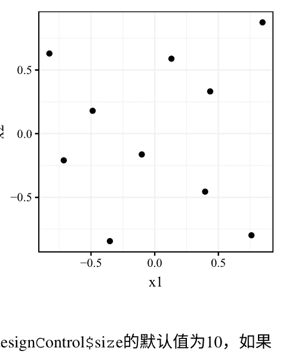

现在有十个初始设计点，因为参数designControl$size的默认值为10，如果使用函数designLHD（图4.3）。

###### 程序代码：步骤（S-1）和（S-2）

步骤（S-1）和（S-2）的实现如下：

```
###### (S-1) 设置:
fun <- funNoise
lower <- c (-1, -1)
upper <- c (1, 1)
control <- list (
    OCBA = TRUE,
    OCBABudget = 3,
    replicates = 2,
    noise = TRUE,
    multiStart = 2,
    designControl = list(replicates = 2)
)
control <- spotFillControlList (control, lower, upper)
###### (S-2) 初始设计:
set.seed(control$seedSPOT)
x <- control$design(
    x = NULL,
    lower = lower,
    upper = upper,
    control = control$designControl
)
x <- repairNonNumeric (x, control$types)
```

###### 示例：修改初始设计大小

通过修改designControl列表的size参数，可以生成任意初始设计大小：

```
control$designControl$size <- 5
```

以下是使用初始设计大小为五的完整代码：

```
spot(
    x = NULL,
    fun = funSphere,
    lower = c(-1, -1), upper = c(1, 1),
    control = list(designControl = list(size = 5))
)
```

因为下界被设置为(-1, -1)，所以定义了一个二维问题，即$f(x_1, x_2) = x_1^2 + x_2^2$。这次运行的结果以列表的形式存储在变量return中。

变量类型默认为数值型，如果没有指定其他类型的话。类型信息可以从config$types中获取，并用于转换变量。函数spot可以处理数值型、整型和因子型的数据类型。函数repairNonNumeric将非数值型的值映射为整数。

（S-3） 初始设计的评估。使用目标函数评估函数fun在初始设计矩阵x上的值。

除了xnew之外，已知解矩阵x，可以通过函数objectiveFunctionEvaluation传递给函数，以确定是否需要增加新解的随机数生成器（RNG）种子。

### ！变量转换

如果定义了变量转换函数，在执行函数objectiveFunctionEvaluation期间，参数将应用函数transformX。

函数objectiveFunctionEvaluation返回矩阵y。

（S-4） 插补：处理缺失值。检查y矩阵的可行性。应用处理NA和无限y值的方法，这些方法可以通过函数imputeY获得。

初始阶段之后开始循环。调用函数spotLoop。

###### 程序代码：步骤（S-3）和（S-4）

步骤（S-3）和（S-4）的实现如下：

```
## (S-3)评估初始设计：
y <- objectiveFunctionEvaluation(
  x = NULL,
  xnew = x,
  fun = fun,
  control = control
)
## (S-4)插补：
if (!is.null(control$yImputation$handleNAsMethod)) {
  y <- imputeY (
    x = x,
    y = y,
    control = control
  )
}
```

##### 4.5.3 函数 spotLoop

（S-5） 调用 spotLoop函数。初始阶段完成后，调用函数 spotLoop，该函数管理主循环。它作为一个独立的函数实现，因为可以单独调用它，例如，继续中断的实验。通过这种机制， spot提供了一种方便的方式来在不同的计算机上继续实验或扩展现有实验，例如，如果结果不确定或者需要先进行预实验研究。

###### 示例：继续现有实验

第5.8.1节、第5.8.2节和第5.8.3节的研究从一个相对较小的预实验设计开始。预实验测试的结果与完整实验的结果相结合。

（S-6） 一致性检查和初始化。在主循环开始之前，spotLoop可以用来继续中断的spot运行，因此它会进行一致性检查。

（S-7） 插补。这个函数被调用来处理NA、Inf等。这在这里是必要的，因为spotLoop可以用作继续中断的spot优化运行的入口点。如何继续现有的spot运行在spotLoop文档中有解释。

（S-8） 计数器和日志数据。此外，计数器和日志变量被初始化。

矩阵yBestVec存储迄今为止找到的最佳函数值。它以初始设计上目标函数的最小值进行初始化。注意，目前还没有建立代理S，因此ySurr跟踪代理S上的目标函数值为NA。

###### 程序代码：步骤 (S-5) 到 (S-8)

```
###### (S-5) 输入spotLoop:

###### (S-6) 初始检查:
initialInputCheck(x, fun, lower, upper, control, inSpotLoop = TRUE)
dimension <- length(lower)
con <- spotControl(dimension)
con[names(control)] <- control
control <- con
rm(con)
control <- spotFillControlList(control, lower, upper)

###### (S-7) 插补:
if (!is.null(control$yImputation$handleNAsMethod)) {
  y <- imputeY (
    x = x,
    y = y,
    control = control
  )
}

###### (S-8) 计数器和日志:
count <- nrow(y)
modelFit <- NA
ybestVec <- rep(min(y[, 1]), count)
ySurr <- matrix(NA, nrow = 1, ncol = count)
```

##### 4.5.4 进入主循环

（S-9） 终止条件。主循环如下所示：

```
当(count < control$funEvals) &
   (difftime(Sys.time(), control$time$startTime, units = 'mins') < control$time$maxTime)时
```

实施了两个终止准则：

+ a. 目标函数评估次数必须小于funEvals，并且
+ b. 时间必须小于maxTime。

（S-10） 用于拟合替代模型的子集选择。可以使用全部或减少的可用x和y值集合来构建替代模型。在构建替代模型S之前，可以使用通过control$subsetSelect定义的子集选择方法。如果subsetSelect设置为selectAll（默认值），则使用所有点。仅使用可用点的子集来拟合替代模型S可能看起来违反直觉，但在样本点彼此过于接近或问题动态变化时，这是合理的。

（S-11） 拟合替代模型。SPOT可以使用任意回归模型作为替代模型，例如RF或GP模型（Kriging）。

函数model的参数x和y是必需的。model函数必须返回一个拟合对象，该对象提供predict方法。高斯过程模型在许多情况下表现良好，并且可以很好地处理离散和连续的超参数，这是SPOT的默认模型。随机森林对于连续参数来说不太适合作为替代模型，因为它必须以逐步恒定的方式来近似这些参数。函数control$model应用于x矩阵和y矩阵。使用函数buildKriging将默认模型拟合到数据中。

###### 程序代码：步骤（S-9）到（S-11）
步骤（S-9）到（S-11）的实现如下：
```
###### (S-9) 终止（while循环）：
###### (S-10) 子集选择：
selectRes <- control$subsetSelect(
  x = x,
  y = y[, 1, drop = FALSE],
  control = control$subsetControl
)
###### (S-11) 替代模型拟合：
modelFit <- control$model(
  x = selectRes$x,
  y = selectRes$y,
  control = control$modelControl
)
```

表4.5 在spot中，Surrogates需要两个参数x和y。build函数的返回值如下所示

| 返回值 | 类型 | 描述 |
| :--- | :--- | :--- |
| x | 矩阵 | x值 |
| y | 矩阵 | y值 |
| 拟合 | 对象 | 拟合模型 |
| pNames | 字符 | 自变量的名称 |
| yName | 字符 | 因变量的名称 |
| 类别 | 字符 | 模型类别的名称 |

###### 背景: Surrogates

在spot中，Surrogates有一个命名约定：函数名应以“build”前缀开头。spot中的Surrogates使用相同的接口。它们接受参数x和y，这些参数必须是矩阵，以及列表control。它们拟合一个模型，例如，buildLM使用lm，提供了一个predict方法。每个模型都返回相应模型类的对象，这里是"spotLinearModel"，带有一个predict方法。返回值实现为一个包含来自表4.5的条目的列表。

注意，buildLM是一个非常简单的模型。SPOT的工作马是一个通过最大似然估计（MLE）拟合的Kriging模型。buildKriging在第4.6.5节中解释。

(S-12) 在替代品 (预测) 上的目标函数。构建替代品后，模型拟合 (替代模型) 可用。它用于定义函数funSurrogate，该函数作为替代品S上的目标函数工作。因此，spot搜索预测会产生最佳模型质量的超参数配置。

因此，基于modelFit通过predict生成一个目标函数。

###### 程序代码：步骤 (S-12)

步骤 (S-12) 的实现如下：

```
###### (S-12) 替代优化函数:
funSurrogate <- evaluateModel (
  modelFit,
  control$infillCriterion,
  control$verbosity
)
```

###### 背景：替代和填充准则

函数`evaluateModel`生成一个预测函数，用于在替代模型上预测函数值。一些替代优化过程不使用替代模型的函数值$S$，而是使用填充准则。

> **定义4.2（填充准则，获取函数）** 填充准则是指导替代探索的方法。它们结合了由GP模型生成的预测均值和预测方差的信息。在BO中，术语“获取函数”用于实现填充准则的函数。

例如，函数`buildKriging`提供了三个返回值，可以用于生成基本的填充准则。这些返回值通过参数`target`指定，它是一个字符串向量。每个字符串指定一个要预测的值，例如，"y"表示均值，"s"表示标准差，"ei"表示期望改进。除了这些基本值之外，`spot`还提供了函数`infillCriterion`来指定用户定义的准则。下面是在`spot`中管理填充准则的函数`evaluateModel`的示例。

```
evaluateModel <-
  function(object,
           infillCriterion = NULL) {
    evalModelFun <- function (x) {
      res <- predict (object = object, newdata = x) [object $target]
      return(res)
    }
    if (is.null(infillCriterion)) {
      return(function(x) {
        res <- evalModelFun (x)
        return(res)
      })
    } else {
      return(function(x) {
        return(infillCriterion(evalModelFun(x), object))
      })
    }
  }
```

###### 例子：期望改进

EI是一种流行的填充准则，它在公式（4.10）中定义。它的计算方法如公式（4.11）所示，并且可以通过`evaluateModel`通过`modelControl = list(target = c("ei"))`来调用。下面的代码展示了一个返回期望改进值的负对数向量的EI实现，$-\log_{10}(EI)$。函数`expectedImprovement`

如果选择参数 "ei" 作为目标，则称之为调用，例如，`spot(,fun,l,u,control=list(modelControl=list(target="ei")))`。

```
expectedImprovement <- function(mean, sd, min) {
  EITermOne = (min - mean) * pnorm((min - mean) / sd)
  EITermTwo = sd * (1 / sqrt(2 * pi))
             * exp(-(1 / 2) * ((min - mean) ^ 2 / (sd ^ 2)))
  - log10(EITermOne + EITermTwo + (.Machine$double.xmin))
}
```

(S-13) 多个起始点。如果当前最佳点是可行的，则将其用作在代理 S 上进行搜索的起始点。由于代理可能是多模态的，建议使用多个起始点。函数 `getMultiStartPoints` 实现了多起始点机制。`spot` 提供了函数 `getMultiStartPoints`。

除了当前最佳点之外，还可以使用更多的起始点。它们的数量可以通过 `multiStart` 的值来指定。如果 `multiStart` 大于 1，则会使用额外的起始点。设计函数，在第 4.5.2 节中用于生成初始设计，将在这里用于生成额外的点。

(S-14) 在代理上进行优化。可以在代理 S 上进行搜索。最简单的目标函数是 `optimLHD`，它从一个相对较大的 LHD 点集中选择具有最小函数值的点。还有其他可用的目标函数，例如 `optimLBFGS` 或 `optimDE`。为了找到下一个候选解，通过差分进化（Storn 和 Price 1997）优化代理的预测值。

也可以使用其他全局优化算法。即使 RS 也是可行的策略。

### ➢ 必需参数

优化函数必须使用与 `spot` 相同的接口，即 `function(x, fun, lower, upper, control=list(), ...)` 对于优化函数，参数 `fun`、`lower` 和 `upper` 是必需的。这类似于 R 的通用优化函数 `optim` 的接口。

如第 4.5.4 节所述，可以在代理 S 上进行优化，可以有或没有预定义的起始点。我们首先描述一个没有起始点的搜索。

(S-14a) 没有起始点的搜索。如果没有为搜索提供起始点，则调用通过`control$optimizer`指定的优化器。

这个优化的结果存储在列表`optimResSurr`中。在代理上进行的搜索的最优值是`optimResSurr$xbest`，相应的y值是`optimResSurr$ybest`。或者，可以使用起始点在代理上进行搜索。

(S-14b) 使用起始点进行搜索。如果在代理优化中使用起始点，则通过`x = x0`将其传递给优化器。
多个起始点会得到多个`optimResSurr$xbest`和`optimResSurr$ybest`值，其中选择最佳的点，即具有最小的 y值。

例如，如果选择 `multiStart = 2`，则会使用当前最佳点和一个随机点。
对代理 `S` 进行的优化是针对每个起始点单独进行的，计算出矩阵 `xnew`。
基于多次启动的结果确定了`xnew`。

(S-15) 汇总代理搜索的结果。来自 (S-14a) 或 (S-14b) 的`xnew`的函数值被保存为 `ySurrNew`。注意，可以使用`control$modelControl$target`修改这些函数值，例如，"y"、"s2"或 "ei"，即代理优化可以基于预测的新值 "y"、"y"和方差的组合或者EI "ei"。

(S-16) 噪声、重复和一致性检查新点。在确定了新的解候选`xnew`及其在替代模型上的函数值`ySurrNew`之后，对重复项进行检查并确定复制的数量。这一步对有噪声和确定性目标函数采取不同的处理方式。

如果`control$noise == TRUE`，则允许复制，即一个解`x`可以被评估多次。 如果`control$noise == FALSE`，则每个解只被评估一次。

###### 程序代码：步骤（S-13）到（S-16）

步骤（S-13）到（S-16）的实现如下：

```
###### (S-13) 替代模型上的优化随机起始点
x0 <- getMultiStartPoints(x, y, control)
resSurr <- matrix(NA, nrow = nrow(x0), ncol = ncol(x0) + 1)

###### (S-14b) 使用起始点/s x0在替代模型上进行搜索:
for (i in 1:nrow(x0)) {
  optimResSurr <- control$optimizer(
    x = x0[i, , drop = FALSE],
    funSurrogate,
    lower,
    upper,
    control$optimizerControl
  )
  resSurr[i, ] <- c(optimResSurr$xbest, optimResSurr$ybest)
}

###### (S-15) 编译替代模型结果:
m <- which.min(resSurr[, ncol(x) + 1])
##根据多次启动结果确定xnew
xnew <- resSurr[m, 1:ncol(x), drop = FALSE]
##在替代模型上的值（可以是 "y", "s2", "ei", "negLog10ei"等）
ySurrNew <- resSurr[m, ncol(x) + 1]

###### (S-16) 重复处理:
xnew <- duplicateAndReplicateHandling(xnew, x, lower, upper, control)
#修复非数值结果
xnew <- repairNonNumeric(xnew, control$types)
```

###### 背景: 重复和复制

函数duplicateAndReplicateHandling检查新解 xnew是否已经评估过 。在这种情况下，它被视为已经评估过，不进行额外的评估。 如果 xnew之前没有被评估过，它将被评估。 评估的次数由control$replicates定义 。 在 spot中的重复和复制处理取决于参数 noise的设置。 如果值为 TRUE，则会测试 xnew是否是新的或之前已经评估过。 如果 xnew是新的（之前没有评估过），则应该进行replicates次评估。 假设， control$replicat es < -3，即需要三个初始重复，并且xnew之前没有被评估过。 然后应该进行两次额外的评估，即 xtmp包含两个条目，这些条目与 xnew中已存在 的一个条目组合在一起。

```
控制   $重复次数  <-  3
临时变量 <- NULL
对于 (i 在  1:行数(xnew)) {
  如果 (!任何(应用(x, 1, 相同, xnew[i, ]))) {
    临时变量 <- 绑定行 (xtmp, xnew[重复(i, 控制$重复次数 - 1), ])
  }
}
xnew <- 绑定行 (xnew, xtmp)
xnew
  ##          [,1]     [,2]
## [1,] -0.01292055 -0.02666901
## [2,] -0.01292055 -0.02666901
## [3,] -0.01292055 -0.02666901
```

如果参数噪声的值为 FALSE，则需要区分两种情况。
首先，如果 xnew之前没有被评估过，则应该评估一次（而不是重复次数次），因为额外的评估是无用的。 它们将确定性地生成相同的结果。

```
对于 (i 在 1:行数(xnew)) {
  如果 (任何(应用(x, 1, 相同, xnew[i, ]))) {
    警告("重复项被随机解决。")
    控制   $设计控制      $重复次数   <- 1
    控制$设计控制$大小  <- 1
    xnew[i, ]  <-
      designUniformRandom(, lower, upper, control $designControl)
  }
}
xnew
##          [,1]       [,2]
## [1,] -0.01292055 -0.02666901
## [2,] -0.01292055 -0.02666901
## [3,] -0.01292055 -0.02666901
```

其次，如果 xnew在之前已经被评估过，则会发出警告，并且对 xnew中的每个条目生成一个随机解。

```
# xnew已经有两个已知解：
xnew <- x[1:2, ]
for (i in 1:nrow(xnew)) {
  如果 (任何(应用(x, 1, 相同, xnew[i, ]))) {
    警告("重复项被随机解决。")
    控制   $设计控制      $重复次数   <- 1
    控制$设计控制$大小  <- 1
    xnew[i, ]  <-
      designUniformRandom(, lower, upper, control $designControl)
  }
}
xnew
##          [,1]       [,2]
## [1,] 0.6704420 0.1762307
## [2,] 0.5094811 0.3023359
```

进行类型检查，即对优化器产生的所有非数值值进行四舍五入。

(S-17) 已知点的OCBA。如果 OCBA和 noise都设置为 TRUE，则接下来调用 OCBA函数：该函数重复执行OCBA，并返回一个向量，指定每个已知解应该重新评估（或复制）的次数。该函数可以使用control$OCBABudget的额外评估来完成预算。
由repeatsOCBA提出的解决方案被添加到新的候选集合xnew中。因为OCBA计算方差的估计值，所以它是基于评估的解决方案和它们的函数值x和y。

基于评估的解决方案和它们的函数值x和y分别。

###### 程序代码：步骤（S-17）

步骤（S-17）的实现如下：

```
###### (S-17) OCBA:
如果 (control噪声和control OCBA) {
 xnew <- rbind(xnew, repeatsOCBA(x, y[, 1, drop = FALSE], control $OCBABudget))
}
```

###### 背景：最佳计算预算分配

如果目标函数存在噪声（Chen 2010; Bartz-Beielstein et al. 2011），OCBA是解决“一般排序和选择问题”的非常高效的解决方案。它以不均匀的方式分配函数评估，以识别最佳解决方案并减少总体优化成本。

定理4.1 给定要分配给k个竞争解决方案的优化样本总数N，其性能由具有均值\(\bar{y}_{i(i=1,2,...,k)}\)和有限方差\(\sigma_i^2\)的随机变量表示，当\(N \rightarrow \infty\)时，可以渐近地最大化正确选择的近似概率(APCS)

\[
\frac{N_i}{N_j} = \left( \frac{\sigma_i / \delta_{b,i}}{\sigma_j / \delta_{b,j}} \right)^2, \quad i, j \in \{1, 2, ..., k\}, \text{且} i = j = b, \tag{4.1}
\]
\[
N_b = \sigma_b \sqrt{ \sum_{i=1, i \neq b}^{k} \frac{N_i^2}{\sigma_i^2} }, \tag{4.2}
\]

其中Ni是分配给解决方案i的复制次数，\(\delta_{b,i} = y_b - y_i\)，而\(y_b \leq \min_{i \neq b} y_i\) (Chen 2010).

(S-18) 评估新解决方案。为了避免超出可用的目标函数评估预算，通过 control$funEvals 指定，进行了解决方案。解决方案候选人被传递给 objectiveFunctionEvaluation 函数，该函数计算与函数 fun 相关的目标函数值 ynew。

(S-19) 插补。由于解决方案候选人的评估可能导致无限的 Inf 或非数字 NaN ynew 值，因此调用处理非数值的函数 imputeY。

(S-20) 更新计数器和日志数据。接下来，更新计数器 count 和在代理 S 上的函数值信息 ySurr。计算进度并准备进度图绘制，完成主循环。主循环的最后一步是编译返回列表 return，并将其返回给 spot 函数。
(S-21) 在 while 循环之后进行报告。在 while 循环结束后，编译结果。一些目标函数返回多个值（多目标优化（MOO））。相应的值被存储为 logInfo，因为默认的 spot 函数只使用一个目标函数值。
这个机制使得 spot 能够处理 MOO 问题。转换参数的值被存储为 xt。对于嘈杂的优化，以下特性非常重要：OCBA 可以用于选择最佳值。函数 ocbaRanking 计算最佳的 x 和 y 值，分别为 \xBestOcba 和 \yBestOcba。\yBestOcba 是相应 x 参数设置 xBestOcba 的平均值。

###### 程序代码：步骤（S-18）到（S-22）

```
###### (S-18) 评估 xnew:
ynew <- tryCatch (
  expr = {
    objectiveFunctionEvaluation(
      x = x,
      xnew = xnew,
      fun = fun,
      control = control
    )
  },
  error = function(e) {
    if (!is.null(control$yImputation$handleNAsMethod)) {
      n <- nrow(xnew)
      m <- ncol(y)
      return(matrix(rep(NA, m * n), nrow = n))
    }
  }
)
###### (S-19) 补全:
colnames(xnew) <- colnames (x)
x <- rbind (x, xnew)
y <- rbind (y, ynew)
if (!is.null(control$yImputation$handleNAsMethod)) {
  y <- 插补y (x = x,
              y = y,
              control = control
              )
}
###### (S-20) 更新计数器、日志等：
``````markdown
##### 4.5.4 spotLoop

```r
ySurr <- c(ySurr, ySurrNew)
count <- count + nrow(ynew)
indexBest <- which.min(y[, 1, drop = FALSE])
ybestVec <- c(ybestVec, y[indexBest, 1, drop = FALSE])
###### 循环结束
###### (S-21) 在 spotLoop 循环后报告
if (ncol(y) > 1) {
    logInfo <- y[, -1, drop = FALSE]
} else {
    logInfo <- NA
}
if (length(control$transformFun) > 0) {
    xt <- transformX(xNat = x, fn = control$transformFun)
} else {
    xt <- NA
}
###### (S-22) OCBA 最佳选择:
if (control$noise & control$OCBA) {
    ocbaRes <- ocbaRanking(
        x = x,
        y = y,
        fun = fun,
        control = control
    )
    control$xBestOcba <- ocbaRes[1, 1:(ncol(ocbaRes) - 1)]
    control$yBestOcba <- ocbaRes[1, ncol(ocbaRes)]
}
###### 在 spotLoop 中编译结果
result <- list(
    xbest = x[indexBest, , drop = FALSE],
    ybest = y[indexBest, 1, drop = FALSE],
    xBestOcba = matrix(control$xBestOcba, ncol = length(lower)),
    yBestOcba = matrix(control$yBestOcba, ncol = length(lower)),
    x = x,
    xt = xt,
    y = y[, 1, drop = FALSE],
    logInfo = logInfo,
    count = count,
    msg = "budget exhausted",
    modelFit = modelFit,
    ybestVec = ybestVec,
    ySurr = ySurr
)
###### END spotLoop()
```

函数 spotLoop 在这里结束，主函数 spot 的最后几个步骤将在下一节中总结并执行。

表4.6 spot：返回参数
| 参数 | 值, 类型 | 描述 |
|---|---|---|
| xbest | 矩阵 | 最佳的x值 |
| ybest | 矩阵 | 最佳的y值 |
| xBestOcba | 矩阵 | 最佳的x值 |
| yBestOcba | 矩阵 | 最佳的y值 |
| x | 矩阵 | x值 |
| xt | 矩阵 | 转换后的x值 |
| y | 矩阵 | y值 |
| logInfo | 矩阵 | 附加的y信息，也是多目标值 |
| count | 整数 | 函数评估的次数 |
| msg | 字符 | 关于优化的信息 |
| modelFit | | |
| yBestVec | 矩阵 | 最佳y值的历史记录 |
| ySurr | 矩阵 | 在代理上的y值 |
| 控制 | 列表 | 控制参数 |

##### 4.5.5 最后步骤

为了利用在主循环中通过SMBO确定的替代解的最佳区域S，SPOT允许进行局部优化步骤。如果control$directOptControl$funEvals大于零，则开始进行优化。如果替代解中的最佳解xbest满足不等式约束，则将其用作局部优化器control$directOpt的起始点。例如，可以使用directOpt = optimNLOPTR或directOpt = optimLBFGSB。

直接优化的结果将附加到基于SMBO的x和y值的矩阵中。SPOT将收集到的信息以列表的形式返回（表4.6）。由于SPOT注重可靠性和可重复性，它不是最快的算法。

#### 4.6 克里金

介绍了基于克里金的代理优化的基本要素，如插值、期望改进和回归。演示遵循了Forrester等人（2008a）所描述的方法。

##### 4.6.1 克里金模型

考虑可用于矩阵形式的位置的样本数据 X和 y： X是一个 (n × k)矩阵，其中 k表示问题的维度， y是一个 (n × 1)向量。 观测到的响应 y被视为来自随机过程，将其表示为

$$ \begin{pmatrix} \mathbf{Y}(\mathbf{x}^{(1)}) \\ \vdots \\ \mathbf{Y}(\mathbf{x}^{(n)}) \end{pmatrix} $$

随机向量集合（也称为“随机场”）的均值为 \mu，是一个 (n × 1)向量。 随机向量之间使用基函数表达式进行相关性建模

$$ \mathrm{Cor}\left(\mathbf{Y}(\mathbf{x}^{(i)}), \mathbf{Y}(\mathbf{x}^{(l)})\right) = \exp\left\{ -\sum_{j=1}^{k} \theta_j |x_j^{(i)} - x_j^{(l)}|^{p_j} \right\} $$

观察样本数据的 (n × n)相关矩阵是

$$ \mathbf{\Psi} = \begin{pmatrix} \mathrm{Cor}\left(\mathbf{Y}(\mathbf{x}^{(1)}), \mathbf{Y}(\mathbf{x}^{(1)})\right) & \ldots & \mathrm{Cor}\left(\mathbf{Y}(\mathbf{x}^{(1)}), \mathbf{Y}(\mathbf{x}^{(n)})\right) \\ \vdots & \ddots & \vdots \\ \mathrm{Cor}\left(\mathbf{Y}(\mathbf{x}^{(n)}), \mathbf{Y}(\mathbf{x}^{(1)})\right) & \ldots & \mathrm{Cor}\left(\mathbf{Y}(\mathbf{x}^{(n)}), \mathbf{Y}(\mathbf{x}^{(n)})\right) \end{pmatrix} \quad (4.3) $$

注意：相关性取决于样本点之间的绝对距离 |x_j^{(i)} - x_j^{(l)}|和参数 p_j以及 θ_j。 为了估计 θ和 p的值，选择使y的似然函数最大化的值，可以表示为

$$ L\left(\mathbf{Y}(\mathbf{x}^{(1)}), \ldots, \mathbf{Y}(\mathbf{x}^{(n)})|\mu, \sigma\right) = \frac{1}{(2\pi\sigma)^{n/2}} \exp\left\{ \frac{ -\sum_{j=1}^{n} (\mathbf{Y}^{(j)} - \mu)^2 }{2\sigma^2} \right\} $$

可以用样本数据来表示

$$ L\left(\mathbf{Y}(\mathbf{x}^{(1)}), \ldots, \mathbf{Y}(\mathbf{x}^{(n)})|\mu, \sigma\right) = \frac{1}{(2\pi\sigma)^{n/2}|\mathbf{\Psi}|^{1/2}} \exp\left\{ \frac{ -(\mathbf{y} - \mathbf{1}\mu)^T \mathbf{\Psi}^{-1} (\mathbf{y} - \mathbf{1}\mu) }{2\sigma^2} \right\} $$

并且可以表示为对数似然函数：

$$ \ln(L) = -\frac{n}{2} \ln(2\pi\sigma) - \frac{1}{2} \ln|\mathbf{\Psi}| - \frac{ -(\mathbf{y} - \mathbf{1}\mu)^T \mathbf{\Psi}^{-1} (\mathbf{y} - \mathbf{1}\mu) }{2\sigma^2} \quad (4.4) $$

##### 4.6.2 克里金预测

对于新的预测 \hat{y} 在 \mathbf{x} 处，选择使得样本数据 \mathbf{X} 和预测的相关参数 \boldsymbol{\theta} 和 \mathbf{p} 的似然性最大化的 \hat{y} 的值。观测数据 \mathbf{y} 与新的预测 \hat{y} 相结合，形成增广向量 \tilde{\mathbf{y}} = (\mathbf{y}^T, \hat{y})^T。定义为观测数据和新的预测之间的相关系数向量

$$\boldsymbol{\psi} = \begin{pmatrix} \text{Cor}\left(\mathbf{Y}(\mathbf{x}^{(1)}), \mathbf{Y}(\mathbf{x})\right) \\ \vdots \\ \text{Cor}\left(\mathbf{Y}(\mathbf{x}^{(n)}), \mathbf{Y}(\mathbf{x})\right) \end{pmatrix} = \begin{pmatrix} \boldsymbol{\psi}^{(1)} \\ \vdots \\ \boldsymbol{\psi}^{(n)} \end{pmatrix}.$$

增广相关矩阵的构建方式为

$$\tilde{\boldsymbol{\Psi}} = \begin{pmatrix} \boldsymbol{\Psi} & \boldsymbol{\psi} \\ \boldsymbol{\psi}^T & 1 \end{pmatrix}.$$

类似于(4.4)，增广数据的对数似然函数为

$$\ln(L) = -\frac{n}{2}\ln(2\pi) - \frac{n}{2}\ln(\hat{\sigma}^2) - \frac{1}{2}\ln|\boldsymbol{\Psi}| - \frac{(\tilde{\mathbf{y}} - \mathbf{1}\hat{\mu})^T \tilde{\boldsymbol{\Psi}}^{-1} (\tilde{\mathbf{y}} - \mathbf{1}\hat{\mu})}{2\hat{\sigma}^2}.$$

估计值 \hat{y} 的最大似然估计可以计算为

$$\hat{y}(\mathbf{x}) = \hat{\mu} + \boldsymbol{\psi}^T \tilde{\boldsymbol{\Psi}}^{-1} (\mathbf{y} - \mathbf{1}\hat{\mu}).$$

方程4.9揭示了Kriging预测器的两个重要特性。

- 基函数影响包含新点 \mathbf{x} 和观测位置之间的相关性 \mathbf{X} 的向量 \boldsymbol{\psi}。基函数的值与加权项 \mathbf{w} = \mathbf{\Psi}^{(-1)}(\mathbf{y} - \mathbf{1}\hat{\mu}) 相加，然后加到均值基项 \mu 上。
- 预测插值样本数据。在计算第 i 个样本点的预测时，\mathbf{x}^{(i)} 是第 i 列的单位向量，\boldsymbol{\psi} 是第 i 个单元向量。因此，\hat{y}(\mathbf{x}^{(i)}) = y^{(i)}。

##### 4.6.3 期望改进

EI是一种基于误差的探索准则，它使用Kriging预测的均方误差 (MSE) 进行计算。

$$s^{2}(\mathbf{x}) = \sigma^{2}\left(1 - \boldsymbol{\psi}^{T} \mathbf{\Psi}^{-1} \boldsymbol{\psi} + \frac{\left(1 - \mathbf{1}^{T} \mathbf{\Psi}^{-1} \boldsymbol{\psi}\right)^{2}}{\mathbf{1}^{T} \mathbf{\Psi}^{-1} \mathbf{1}}\right).$$

在贝叶斯设置中，s^{2}(\mathbf{x}) = 0 在样本点处，最后一项被省略。

由于EI扩展了改进概率 (PI)，首先将对其进行描述。让 y_{\min} 表示迄今为止观察到的最佳值，并将 \hat{y}(\mathbf{x}) 视为随机变量的实现。然后，改进的概率 I = y_{\min} - Y(\mathbf{x}) 可以计算为 P(I(\mathbf{x})) =

$$\frac{1}{2}\left\{1 + \operatorname{erf}\left(\frac{y_{\min} - \hat{y}(\mathbf{x})}{\hat{s} \sqrt{2}}\right)\right\}.$$

EI不计算存在改进的概率，而是计算预期改进的量。使用这种期望的原因是，如果改进的幅度非常小，我们对高概率改进不太感兴趣。EI的定义如下。

定义4.3 (期望改进)
$$E(I(\mathbf{x})) = \begin{cases} (y_{\min} - \hat{y}(\mathbf{x})) \Phi\left(\frac{y_{\min} - \hat{y}(\mathbf{x})}{\hat{s}(\mathbf{x})}\right) + \hat{s} \phi\left(\frac{y_{\min} - \hat{y}(\mathbf{x})}{\hat{s}(\mathbf{x})}\right) & \text { 如果 } \hat{s}>0, \\ 0 & \text { 如果 } \hat{s}=0 \end{cases}$$
(4.10)
其中 \Phi(.) 和 \phi(.) 分别是累积分布函数 (CDF) 和概率分布函数 (PDF)。

EI的评估结果为

$$E(I(\mathbf{x})) = (y_{\min} - \hat{y}(\mathbf{x})) \frac{1}{2}\left\{1 + \operatorname{erf}\left(\frac{y_{\min} - \hat{y}(\mathbf{x})}{\hat{s} \sqrt{2}}\right)\right\} + \hat{s} \frac{1}{\sqrt{2 \pi}} \exp \left\{\frac{-(y_{\min} - \hat{y}(\mathbf{x}))^{2}}{2 \hat{s}^{2}}\right\}.$$
(4.11)

##### 4.6.4 有噪声数据的填充准则

EI填充准则是基于真实的底层函数是确定性、平滑和连续的假设而制定的。在确定性设置中，Kriging预测器应该插值数据。噪声可能会使建模过程变得复杂：预测可能变得不稳定，因为在远离观测数据的区域存在较高的均方误差。因此，插值属性应该被舍弃以过滤噪声。在对角线上添加回归常数 \lambda，并使用 \Psi 和 \Psi + \lambda \mathbf{I}。然后，\Psi + \lambda \mathbf{I} 不包含 \boldsymbol{\psi} 作为一列，数据不会被插值。

在插值克里金（方程4.9）中使用的推导方法与回归克里金中可以使用相同的方法。回归克里金的预测由以下方程给出

$$\hat{y}_r(\mathbf{x}) = \hat{\mu}_r + \boldsymbol{\psi}^T (\boldsymbol{\Psi} + \lambda \mathbf{I})^{-1} (\mathbf{y} - \mathbf{1} \hat{\mu}_r),$$

其中

$$\hat{\mu}_r = \frac{\mathbf{1}^T (\boldsymbol{\Psi} + \lambda \mathbf{I})^{-1} \mathbf{y}}{\mathbf{1}^T (\boldsymbol{\Psi} + \lambda \mathbf{I})^{-1} \mathbf{1}}.$$

包括回归常数 \lambda，以下方程允许计算噪声数据的克里金回归模型中的误差估计：

$$\hat{s}_r^2(\mathbf{x}) = \hat{\sigma}_r^2 \left\{ 1 + \lambda - \boldsymbol{\psi}^T (\boldsymbol{\Psi} + \lambda \mathbf{I})^{-1} \boldsymbol{\psi} + \frac{(1 - \mathbf{1}^T (\boldsymbol{\Psi} + \lambda \mathbf{I})^{-1} \boldsymbol{\psi})^2}{\mathbf{1}^T (\boldsymbol{\Psi} + \lambda \mathbf{I})^{-1} \mathbf{1}} \right\}, \quad (4.12)$$

其中

$$\hat{\sigma}_r^2 = \frac{(\mathbf{y} - \mathbf{1} \hat{\mu}_r)^T (\boldsymbol{\Psi} + \lambda \mathbf{I})^{-1} (\mathbf{y} - \mathbf{1} \hat{\mu}_r)}{n}.$$

注意：方程（4.12）包括数据中噪声引起的误差。所有区域都存在非零误差，导致所有区域中存在非零EI。因此，可能会发生重新采样。如果复制品导致不同的结果，重新采样可能是有用的。尽管重新采样可能破坏对全局最优解的收敛，但在具有噪声数据的优化中，重新采样可能是一个期望的特性。在确定性设置中，重新采样是一个不希望的特性，因为对同一点的新评估不提供额外的信息，可能会阻碍优化过程。

重新插值可以用来消除数据中噪声引起的误差。重新插值基于回归模型在样本位置处预测的点的插值来估计误差。它的步骤如下：在样本位置处计算Kriging回归的值使用

$$\hat{\mathbf{y}}_r = \mathbf{1} \hat{\mu} + \boldsymbol{\Psi} (\boldsymbol{\Psi} + \lambda \mathbf{I})^{-1} (\mathbf{y} - \mathbf{1} \hat{\mu}).$$

这个向量可以代入方程(4.9)，然后代入(4.6)。
```

$$\hat{\sigma}_{\text{ri}}^2 = \frac{(\mathbf{y} - \mathbf{1}\hat{\mu})^T (\mathbf{\Psi} + \lambda \mathbf{I})^{-1} \mathbf{\Psi} (\mathbf{\Psi} + \lambda \mathbf{I})^{-1} (\mathbf{y} - \mathbf{1}\hat{\mu})}{n}$$

使用插值克里金误差估计(4.12)，重新插值误差估计为

$$\hat{s}_{\text{ri}}^2(\mathbf{x}) = \hat{\sigma}_{\text{ri}}^2 \left\{ 1 - \psi^T \mathbf{\Psi}^{-1} \psi + \frac{(1 - \mathbf{1}^T (\mathbf{\Psi} + \lambda \mathbf{I})^{-1} \psi)^2}{\mathbf{1}^T (\mathbf{\Psi} + \lambda \mathbf{I})^{-1} \mathbf{1}} \right\}$$

## 4.6.5 spot的工作马: 克里金

本节介绍了在SPOT中实现函数buildKriging的方法。

- (K-1) 设置参数。buildKriging使用表4.7中显示的参数。它返回一个kriging类的对象，基本上是一个列表，其中包含了模型的选项和找到的参数，这些参数必须传递给该类的predict方法。

###### 程序代码： 步骤(K-1)

```r
buildKriging <- function(x, y, control = list()) {
    ## (K-1) 设置参数
    k <- ncol(x) # 维度
    n <- nrow(x) # 观测数
    con <- list(
        thetaLower = 1e-4,
        thetaUpper = 1e2,
        types = rep("numeric", k),
        algTheta = optimDE,
        budgetAlgTheta = 200,
        optimizeP = FALSE,
        useLambda = TRUE,
        lambdaLower = -6,
        lambdaUpper = 0,
        startTheta = NULL,
        reinterpolate = TRUE,
        target = "y"
    )
    fit <- control
    fit$x <- x
    fit$y <- y
    LowerTheta <- rep(1, k) * log10(fit$thetaLower)
    UpperTheta <- rep(1, k) * log10(fit$thetaUpper)
```

表4.7 buildKriging：除了设计矩阵 x 和相应的观测值 y 之外，该函数还接受一个包含下面参数的列表

| 参数 | 值，类型 | 描述 |
| :--- | :--- | :--- |
| 类型 | 字符向量 | 一个字符向量，给出每个变量的数据类型。除了 factor 将被处理为数值型变量外，factor（分类）变量将受到汉明距离的影响 |
| thetaLower | 1e-4，数值型 | 用于 theta 的下界 |
| thetaUpper | 1e2 | 用于 theta 的上界 |
| algTheta | optimDE, 函数 | 用于通过MLE找到 theta 的算法 |
| budgetAlgTheta | 200，整数 | 算法 algTheta 的预算。该值将与要优化的模型参数向量的长度相乘 |
| optimizeP | FALSE，逻辑值 | 指定是否优化指数(p) 否则，它们将被设置为两个 |
| useLambda | TRUE，逻辑值 | 是否使用正则化常数lambda（块效应） |
| lambdaLower | -6，数值 | log10(lambda) 的下界 |
| lambdaUpper | 0，数值 | log10(lambda) 的上界 |
| startTheta | NULL，数值 | 用于theta优化的可选起始值 |
| reinterpolate | TRUE，逻辑值 | 是否执行重新插值 |
| target | "y"，字符向量 | 预测的值 每个元素指定一个要预测的值，例如，"y" 表示均值，"s" 表示标准差，"ei" 表示EI |

- (K-2) 归一化。使用函数 normalizeMatrix 对数据进行归一化，即 (n,k) 矩阵 X 的每一列的值都在 0 到 1 的范围内。

###### 程序代码：步骤 (K-2)

```r
###### (K-2) 归一化输入数据
fit$normalizeymin <- 0
fit$normalizeymax <- 1
res <- normalizeMatrix(fit$x, ymin, ymax)
fit$scaledx <- res$y
fit$normalizexmin <- res$xmin
fit$normalizexmax <- res$xmax
```

- (K-3) 相关矩阵。准备相关矩阵 Ψ（方程 (4.3)）和起始点进行优化。确定距离矩阵。第i行 (k, n²) - 矩阵A包含第i列（维度）元素之间的距离。A（1, 1）是第一维度中第一个元素到第一个元素的距离，A（1, 2）是第一维度中第一个元素到第二个元素的距离，A（1, n + 1）是第二个元素到第一个元素的距离，依此类推。

###### 程序代码：步骤（K-3）

```r
###### (K-3) 准备距离/相关矩阵
A <- 矩阵 (0, k, n * n)
for (i in 1:k) {
  if (control$types[i] != "factor") {
    A[i, ] <-
      as.numeric (as.matrix (dist (fit$scaledx[, i]) )) # 欧氏距离
  } else {
    tmp <-
      outer(fit$scaledx[, i], fit$scaledx[, i], "!=") # 汉明距离
    class(tmp) <- "numeric"
    A[i, ] <- tmp
  }
}
```

###### (K-4) 准备起始点。

- (K-4.1) θ.确定 θ 优化的起始点。如果没有明确指定起始点，则

$$ \theta_0 = \frac{n}{100k} \tag{4.13} $$

被选择。

- (K-4.2) p. 优化参数 optimizeP determines whether p should be optimized or not. In the latter case, p = 2 is set and the matrix A is squared. 否则, the starting point for the optimization of p is chosen as p_0 = 1.9 and the search interval is set to [0.01, 2].

- (K-4.3) Nugget. 如果需要集成一个nugget效应, the starting point for the optimization of λ is set to

$$ \lambda_0 = \frac{\lambda_{\text{lower}} + \lambda_{\text{upper}}}{2} \tag{4.14} $$

- (K-4.4) Penalty. The penalty value is set to

$$ \phi = n \times \log(\text{Var}(y)) + 10^4 \tag{4.15} $$

注意：这个惩罚值不应该是一个固定的常数。 似然的尺度，即， $n \times \log(\text{SigmaSqr}) + \text{LnDet}\ \text{Psi}$ 至少依赖于 $\log(\text{Var}(y))$ 和样本数量。因此，大量的样本可能导致惩罚低于大多数有效参数化的似然。因此，建议的惩罚是 $\phi = n \times \log(\text{Var}(y)) + 10^4$。目前，这个惩罚是在调用krigingLikelihood时在buildKriging函数中设置的。

###### 程序代码：步骤（K-4）

```r
##（K-4）准备起始点、搜索范围和惩罚值
###### 用于MLE优化
###### 4.1 theta
x1 <- rep(n / (100 * k), k)  # theta的起始点
###### 4.2 p
LowerTheta <- c(LowerTheta, rep(1, k) * 0.01)
UpperTheta <- c(UpperTheta, rep(1, k) * 2)
x3 <- rep(1, k)  * 1.9 # p的起始值
x0 <- c(x1, x3)
###### 4.3 lambda
###### lambda的起始值：
x2 <- (fit$lambdaUpper + fit$lambdaLower) / 2
x0 <- c(x0, x2)
###### 添加回归常数lambda (nugget)
LowerTheta <- c(LowerTheta, fit$lambdaLower)
UpperTheta <- c(UpperTheta, fit$lambdaUpper)
x0 <- matrix(x0, 1) # 一行的矩阵
opts <- list(funEvals = fit$budgetAlgTheta * ncol(x0))
###### 4.4 惩罚
penval <- n * log(var(y)) + 1e4
```

- (K-5) 目标函数。MLE优化器algTheta的目标函数fitFun在这一步中被定义。

- (K-6) krigingLikelihood函数。参见第4.6.6节。调用krigingLikelihood函数，参见第4.6.6节。

###### 程序代码：步骤（K-5）和（K-6）

```r
###### (K-5) 最大似然目标函数
fitFun <-
  function(x, fx, fy, optimizeP, useLambda, penval) {
    krigingLikelihood(x, fx, fy, optimizeP, useLambda, penval) $NegLnLike
  }

###### (K-6) 参见krigingLikelihood
```

- (K-7) 使用*fitFun*进行优化.优化器的调用如下:

###### 程序代码：步骤(K-7)

```r
###### (K-7) MLE优化
res <-  fit$algTheta(
  x = x0,
  fun =
    function(x, fx, fy, optimizeP, useLambda, penval) {
      apply(x, 1, fitFun, fx, fy, optimizeP, useLambda, penval)
    },
  lower = LowerTheta,
  upper = UpperTheta,
  control = opts,
  fx = A,
  fy = fit$y,
  optimizeP = fit$optimizeP,
  useLambda = fit$useLambda,
  penval = penval
)
```

- (K-8) 编译结果。步骤编译返回值：优化运行的返回值存储在列表 *res* 中，添加到指定类 *kriging* 的对象列表 *fit* 中。列表 *fit* 包含以下优化值：$\theta^*$ 作为 *Theta*，$10^{\theta^*}$ 作为 *dmodeltheta*，$p^*$ 作为 *P*，$\lambda^*$ 作为 *Lambda*，以及 $10^{\lambda^*}$ 作为 *dmodellambda*。

###### 程序代码：步骤 (K-8)

```r
###### (K-8) 从MLE优化中编译结果（以适应对象）
Params <- res$xbest
nevals <- as.numeric(res$count[[1]])
fit$Theta <- Params[1:k]
fit$dmodeltheta <- 10^Params[1:k]
fit$P <- Params[(k + 1):(2 * k)]
fit$Lambda <- Params[length(Params)]
fit$dmodellambda <- 10^Params[length(Params)]
```

- (K-9) 使用结果确定似然度和最佳参数。使用这些优化值$\theta^*$、$p^*$和$\lambda^*$调用函数*krigingLikelihood*来确定用于Kriging模型拟合的值。

###### 程序代码：步骤 (K-9)

```r
###### (K-9) 使用优化参数进行评估
res <-
  krigingLikelihood(
    c(fit$Theta, fit$P, fit$Lambda),
    A,
    fit$y,
    fit$optimizeP,
    fit$useLambda
  )
```

- (K-10) 编译fit对象。从对krigingLikelihood的调用返回的值将添加到fit对象中。

###### 程序代码：步骤 (K-10)

```r
###### (K-10) 将MLE评估结果添加到fit对象中
fit$yonemu <- res$yonemu
fit$ssq <- as.numeric(res$ssq)
fit$mu <- res$mu
fit$Psi <- res$Psi
fit$Psinv <- res$Psinv
fit$nevals <- nevals
fit$like <- res$NegLnLike
fit$returnCrossCor <- FALSE
```

- (K-11) 计算平均目标函数值。除了MLE优化的结果外，还计算并存储最佳 x 值的平均目标函数值，$y_{\text{min}}$，存储在 `fit` 列表中。这个值在计算EI时需要。

现在 `fit` 可用于预测。相应的代码如下所示。

##### 4.6.6 *krigingLikelihood*

步骤：使用`krigingLikelihood`进行MLE优化。目标函数接受以下参数：x，一个包含参数log10(theta)，log10(lambda)和p的向量，AX，由`build Kriging`从样本位置构建的三维数组，Ay，样本位置处的观测向量，optimizeP，逻辑值，指定是否优化参数 p(指数)或固定为两个值，useLambda，逻辑值，指定是否使用nugget，和penval，影响无效相关矩阵或配置返回值的惩罚值。函数`krigingLikelihood`执行以下计算：更新 $\theta$ 和 $\lambda$ 值：

$$ \theta_j = 10^{\theta_j} \quad (j=1,\ldots,n) \tag{4.16} $$
$$ \lambda = 10^{\lambda} \tag{4.17} $$
$$ AX[j,] = \left(|AX|^{p}\right)_j \quad (j=1,\ldots,n) \tag{4.18} $$

- (L-1)起始点。

- (L-2)相关矩阵 $\Psi$。矩阵 $\Psi$ 可以计算。如果 `useLambda == TRUE`，则添加块效应 $\lambda$。

- (L-3)乔列斯基分解。由于 $\Psi > 0$，计算其乔列斯基分解。

- (L-4)行列式。计算 $\Psi$ 的自然对数行列式 `LnDetPsi`，因为它在数值上更可靠且更快速，而不是使用 `det`或`determinant`。

- (L-5)矩阵逆、均值、误差和似然。使用`chol2inv`函数可以计算以下值：`ln(L)` (方程 (4.7) )， $\hat{\mu}$ (方程 (4.5) )，和$\hat{\sigma}^2$ (方程 (4.6) )。这些值与矩阵 $\Psi^{-1}$ 以及向量 $\mu$ 一起组合成一个列表，并从函数`krigingLikelihood`返回。

以下代码说明了`krigingLikelihood`的主要组成部分。

###### 程序代码: krigingLikelihood函数

```r
krigingLikelihood <-
    function(x,
             AX,
             Ay,
             optimizeP = FALSE,
             useLambda = TRUE,
             penval = 1e8) {
    ## (L-1) 起始点
    nx <- nrow(AX)
    theta <- 10^x[1:nx]
    if (optimizeP) {
        AX <- abs(AX)^(x[(nx + 1):(2 * nx)])
    }
    lambda <- 0
    if (useLambda) {
        lambda <- 10^x[length(x)]
    }
    n <- dim(Ay)[1]
    ## (L-2) 相关矩阵 Psi
    Psi <- exp(-matrix(colSums(theta * AX), n, n))
    if (useLambda) {
        Psi <- Psi + diag(lambda, n)
    }
    ## (L-3) cholesky分解
    cholPsi <- try(chol(Psi), TRUE)
    ## (L-4) 行列式
    LnDetPsi <- 2 * sum(log(abs(diag(cholPsi))))
    ## (L-5.1) Psi Inverted
    Psinv <- try(chol2inv(cholPsi), TRUE)
    psisum <- sum(Psinv)
    ## (L-5.2) Mean
    mu <- sum(Psinv %*% Ay) / psisum
    ## (L-5.3) yonemu, SigmSqr
    yonemu <- Ay - mu
    SigmSqr <- (t(yonemu) %*% Psinv %*% yonemu) / n
    ## (L-5.4) Log Likelihood
    NegLnLike <- n * log(SigmSqr) + LnDetPsi
    ## (L-5.5) Compile Result
    list(
        NegLnLike = NegLnLike,
        Psi = Psi,
        Psinv = Psinv,
        mu = mu,
        yonemu = yonemu,
        ssq = SigmSqr
    )
}
```

##### 4.6.7 预测

spot包中的buildKriging函数提供了两种Kriging预测器：带有重新插值和不带重新插值的预测。这里介绍了重新插值，因为它可以防止错误近似导致全局收敛性差。重新插值基于回归模型在样本位置预测的点的插值计算估计误差，参见Forrester等人(2008a)。

函数predictKrigingReinterpolation需要两个参数：(i) object，kriging类的Kriging模型（设置和参数）(ii) newdata，要预测的设计矩阵。设计矩阵newdata是要预测的。函数normalizeMatrix2用于对数据进行归一化处理。它利用克里金模型建模阶段的归一化信息，即normalizexmin和normalizexmax，以确保已知数据和新数据的尺度相同。此外，从克里金模型中提取以下优化参数：scaledx，dmodeltheta，dmodellambda，Psi，Psinv，mu和yonemu。

对于重新插值，计算模型中除噪声引起的误差之外的误差。进行以下修改：

```
PsiB <-
  Psi - diag(lambda, n) + diag(.Machine$double.eps, n)
SigmaSqr <-
  as.numeric(t(yonemu) %*% Psinv %*% PsiB %*% Psinv %*% yonemu) /
  n
Psinv <- try(solve.default(PsiB), TRUE)
if (class(Psinv)[1] == "try-error") {
  Psinv <- ginv(PsiB)
}
```

y的最大似然估计值是

$$ \hat{y}(x) = \mu + \psi^T \Psi^{-1} (y-1\mu). $$

这是Forrester等人 (2008a) 中的方程 (2.40)。它的实现如下：

```
psi <- matrix(0, k, n)
for (i in 1:nvar) {
  tmp <- expand.grid(AX[, i], x[, i])
  if (object$types[i] == "factor") {
    tmp <- as.numeric(tmp[, 1] != tmp[, 2])^p[i]
  } else {
    tmp <- abs(tmp[, 1] - tmp[, 2])^p[i]
  }
  psi <- psi + theta[i] * matrix(tmp, k, n, byrow = TRUE)
}

psi <- exp(-psi)

f <- mu + as.numeric(psi %*% (Psinv %*% yonemu))
```

根据参数target的设置，返回值y和s或者y，s，和ei。

```
res <- list (y = f)
if (any(object$target %in% c("s", "ei"))) {
    #
    Psinv <- try (solve.default(PsiB), TRUE)
    if (class(Psinv)[1] == "try-error") {
        Psinv <- ginv (PsiB)
    }
    #
    SSqr <-
        SigmaSqr * (1 - diag(psi %*% (Psinv %*% t(psi))))
    s <- sqrt(abs(SSqr))
    res$s <- s
    if (any(object$target == "ei")) {
        res$ei <- expectedImprovement (f, s, object$min)
    }
}
if (object$returnCrossCovariance) {
    res$psi <- psi
}
res
```

#### 4.7 程序代码

下面显示了一个完整的运行结果。为了增加可读性，只执行了一次spotLoop的迭代。

### 程序代码: spot运行

```
###### (S-1) 设置:
fun <- funNoise
lower <- c (-1, -1)
upper <- c (1, 1)
control <- list (
    OCBA = TRUE,
    OCBABudget = 3,
    replicates = 2,
    noise = TRUE,
    multiStart = 2,
    designControl = list(replicates = 2)
)
control <- spotFillControlList (control, lower, upper)
###### (S-2) 初始设计:
set.seed(control$seedSPOT)
```

```
x <- control$design(
    x = NULL,
    lower = lower,
    upper = upper,
    control = control$designControl
)
x <- repairNonNumeric (x, control$types)
```

###### (S-3) 评估初始设计

```
y <- objectiveFunctionEvaluation (
    x = NULL,
    xnew = x,
    fun = fun,
    control = control
)
```

###### (S-4) 插补

```
if (!is.null(control$yImputation$handleNAsMethod)) {
    y <- imputeY    (
        x = x,
        y = y,
        control = control
    )
}
```

###### (S-5) 输入spotLoop:

###### (S-6) 初始检查:

```
initialInputCheck (x, fun, lower, upper, control, inSpotLoop = TRUE)
dimension <- length (lower)
con <- spotControl (dimension)
con[names(control)] <- control
control <- con
rm(con)
control <- spotFillControlList (control, lower, upper)
```

###### (S-7) 插补:

```
if (!is.null(control$yImputation$handleNAsMethod)) {
    y <- imputeY    (
        x = x,
        y = y,
        control = control
    )
}
```

###### (S-8) 计数器和日志:

```
count <- nrow (y)
modelFit <- NA
ybestVec <- rep (min(y[, 1]), count)
ySurr <- matrix (NA, nrow = 1, ncol = count)
```

###### (S-9) 终止（while循环）:

###### (S-10) 子选择:

```
selectRes <- control$subsetSelect(
    x = x,
    y = y[, 1, drop = FALSE],
    control = control$subsetControl
)
```

###### (S-11) 替代拟合:

```
modelFit <- control$model(
    x = selectRes$x,
    y = selectRes$y,
    control = control$modelControl
)
```

###### (S-12) 替代优化函数:

```
funSurrogate <- evaluateModel(
    modelFit,
    control$infillCriterion,
    control$verbosity
)
```

###### (S-13) 随机起始点: 代理优化

```
x0 <- getMultiStartPoints(x, y, control)
resSurr <- matrix(NA, nrow = nrow(x0), ncol = ncol(x0) + 1)
```

###### (S-14b) 代理优化:

```
for (i in 1:nrow(x0)) {
    optimResSurr <- control$optimizer(
        x = x0[i, , drop = FALSE],
        funSurrogate,
        lower,
        upper,
        control$optimizerControl
    )
    resSurr[i, ] <- c(optimResSurr$xbest, optimResSurr$ybest)
}
```

###### (S-15) 编译替代模型结果:

```
m <- which.min(resSurr[, ncol(x) + 1])
##根据多次启动结果确定xnew
xnew <- resSurr[m, 1:ncol(x), drop = FALSE]
##在替代模型上的值 (可以是 "y", "s2", "ei", "negLog10ei"等)
ySurrNew <- resSurr[m, ncol(x) + 1]
```

###### (S-16) 重复处理:

```
xnew <- duplicateAndReplicateHandling(xnew, x, lower, upper, control)
#修复非数值结果
xnew <- repairNonNumeric(xnew, control$types)
```

###### (S-17) OCBA

```
if (control$noise && control$OCBA) {
    xnew <- rbind(xnew, repeatsOCBA(x, y[, 1, drop = FALSE], control$OCBABudget))
}
```

###### (S-18) 评估 xnew

```
ynew <- tryCatch (
  expr = {
    objectiveFunctionEvaluation(
      x = x,
      xnew = xnew,
      fun = fun,
      control = control
    )
  },
  error = function(e) {
    message("objectiveFunctionEvaluation() 出错！")
    print(e)
    if (!is.null(control$yImputation$handleNAsMethod)) {
      message("错误将被修正。")
      n <- nrow(xnew)
      m <- ncol(y)
      return(matrix(rep(NA, m * n), nrow = n))
    }
  }
)
```

###### (S-19) 补全

```
colnames(xnew) <- colnames(x)
x <- rbind(x, xnew)
y <- rbind(y, ynew)
if (!is.null(control$yImputation$handleNAsMethod)) {
  y <- imputeY (
    x = x,
    y = y,
    control = control
  )
}
```

###### (S-20) 更新计数器、日志等

```
ySurr <- c(ySurr, ySurrNew)
count <- count + nrow(ynew)
indexBest <- which.min(y[, 1, drop = FALSE])
ybestVec <- c(ybestVec, y[indexBest, 1, drop = FALSE])

###### 循环结束
```

###### (S-21) 在spotLoop循环后报告

```
if (ncol(y) > 1) {
  logInfo <- y[, -1, drop = FALSE]
} else {
  logInfo <- NA
}
if (length(control$transformFun) > 0) {
  xt <- transformX(xNat = x, fn = control$transformFun)
} else {
  xt <- NA
}
```

###### (S-22) 基于OCBA的最佳选择

```
if (control$noise && control$OCBA) {
  ocbaRes <- ocbaRanking (
    x = x,
    y = y,
    fun = fun,
    control = control
  )
  control$xBestOcba <- ocbaRes[1, 1:(ncol(ocbaRes) - 1)]
  control$yBestOcba <- ocbaRes[1, ncol(ocbaRes)]
}
#在spotLoop中编译结果
result <- list (
  xbest = x[indexBest, , drop = FALSE],
  ybest = y[indexBest, 1, drop = FALSE],
  xBestOcba = matrix(control$xBestOcba, ncol = length(lower)),
  yBestOcba = matrix(control$yBestOcba, ncol = length(lower)),
  x = x,
  xt = xt,
  y = y[, 1, drop = FALSE],
  logInfo = logInfo,
  count = count,
  msg = "budget exhausted",
  modelFit = modelFit,
  ybestVec = ybestVec,
  ySurr = ySurr
)
###### END spotLoop()
```

```
if (control$directOptControl$funEvals > 0) {
  ## (S-23) 直接优化的起始点
  xbest <- result$xbest
  if (!is.null(control$directOptControl$eval_g_ineq) &&
    (
      control$directOptControl$opts$algorithm == "NLOPT_GN_ISRES" &&
        control$directOptControl$eval_g_ineq(xbest) < 0
    )) {
    x0 <- NULL
  } else {
    x0 <- xbest
  }

  # 在实际目标函数上进行直接优化
  optimResDirect <- control$directOpt (
    x = x0,
    fun = fun,
    lower = lower,
    upper = upper,
    control = control$directOptControl
  )

  ## (S-24) 更新结果添加直接优化

  if (result$ybest > optimResDirect$ybest) {
    result$xbest <- optimResDirect$xbest
    result$ybest <- optimResDirect$ybest
  }
  result$x <- rbind (result$x, optimResDirect$x)
  result$y <- rbind (result$y, optimResDirect$y)
}
```

一个spotLoop的结果保存在变量result中。

开放获取本章节根据知识共享署名4.0国际许可协议 (http://creativecommons.org/licenses/by/4.0/) 进行许可，只要您给出适当的原作者和来源的信用，提供创意共享许可链接，并指示是否进行了更改，就可以在任何媒介或格式中使用、共享、适应、分发和复制。

本章节中的图像或其他第三方材料包含在章节的创意共享许可中，除非在材料的信用行中另有说明。如果材料未包含在章节的创意共享许可中，并且您的预期使用不符合法定规定或超出许可使用范围，您将需要直接从版权持有人那里获得许可。


### 第5章 排名和结果聚合

Thomas Bartz-Beielstein，Olaf Mersmann和Sowmya Chandrasekaran

摘要本章探讨了分析超参数调整（HPT）实验结果的不同方法。介绍了四种不同的场景和两种不同的方法。一方面，引入了排名和特别是共识排名来聚合许多不同HPT结果的结果。另一方面，使用统计显著性分析和功效分析对单个算法和两两算法比较进行详细分析。本章讨论了样本大小确定、功效计算、假设和假设检验中的错误结论等问题。除了已建立的方法之外，我们还添加并解释了严重性，这是一种扩展了经典概念的频率主义方法。Mayo的严重性概念提供了解决这些问题的一种方法，通过应用严重性，可能会获得更好的结果。

#### 5.1 比较算法

聚合任何类型的超参数调整或其他大规模建模实验的结果都面临着一系列挑战。通常，我们可以区分四种设置（Bartz-Beielstein和Preuss 2011）：定义5.1 [算法-问题设计]

- 单算法单问题（SASP）：分析单个算法或学习器在单个优化问题或数据集上的结果。

补充信息在线版本包含可在https://doi.org/10.1007/978-981-19-5170-1_5获取的补充材料。

T. Bartz-Beielstein (☒) · O. Mersmann · S. Chandrasekaran
德国Gummersbach TH K ln数据科学、工程和分析研究所
电子邮件：thomas.bartz-beielstein@th-koeln.de

O. Mersmann
电子邮件：olaf.mersmann@th-koeln.de

S. Chandrasekaran
电子邮件：sowmya.chandrasekaran@th-koeln.de

© 作者 2023
E. Bartz等人（编辑），使用R进行机器学习和深度学习的超参数调整，
https://doi.org/10.1007/978-981-19-5170-1_5单算法多问题 (SAMP)：比较单个算法或学习器在许多不同的优化问题或数据集上的结果。
多算法单问题 (MASP)：比较多个算法或学习器在单个优化问题或数据集上的结果。
多算法多问题 (MAMP)：比较多个算法或学习器在许多不同的优化问题或数据集上的结果。

SASP设置与其他三种设置根本不同，因为我们不是比较结果，而只是分析它们。也就是说，我们正在评估优化算法$\mathscr{A}$在单个问题实例$\pi$上的性能。在第二种情况下，我们有多个问题实例$\pi_{1}, ..., \pi_{p}$。这意味着，第二种设置是第一种设置的一种推广，我们可能希望检查我们的算法是否推广到同一领域的不同实例，甚至推广到不同领域。第三种设置通过引入更多的算法$\mathscr{A}_{1}, ..., \mathscr{A}_{a}$来推广第一种设置。在这种情况下，我们希望比较这些算法在单个问题实例上的性能，并很可能选择“最佳”算法。最后，最后一种情况是前两种情况的结合，我们在$p$个问题实例上对$a$个算法进行基准测试。

目前，我们将忽略SASP和SAMP设置带来的挑战并专注于多个算法的比较。我们将用$Y$表示我们用来评估算法的随机性能指标。即使对于确定性算法，将其视为随机变量也是合理的，因为结果仍然严重依赖于初始参数等。我们假设我们已经收集了每个算法和性能度量的$n$个独立同分布 (IID) 样本$Y$。这些用$y_{1}, ..., y_{n}$表示。

在比较算法的所有讨论中，我们应该始终记住没有免费午餐定理 (Wolpert和Macready 1997) 告诉我们，在学习和优化设置中没有单一最佳算法。我们对算法并选择适合目的的算法感兴趣；我们不能指望找到一个单一的“最佳”算法。

##### 5.2 排名

当我们处于MASP设置时，有许多已建立的统计框架来分析观察到的性能指标；例如，参见Chiarandini和Goegebeur (2010) 或Bartz-Beielstein (2015)。在这里，我们将看一种稍微不同的基于排名的方法，如Merschmann等人 (2015) 所述。基于排名的方法的优势在于它们的尺度不变性。

- 考虑只有两个算法$\mathscr{A}_{1}$和$\mathscr{A}_{2}$的情况。对于每个算法，我们观察到$n$个性能指标值。
- 算法$\mathscr{A}_{1}$：$y_{1\mathscr{A}_{1}}$, ... 算法$\mathscr{A}_{2}$：$y_{1\mathscr{A}_{2}}$, ..., $y_{n\mathscr{A}_{2}}$

我们想要决定 $\mathcal{A}_1$ 是否

1. “优于或等于” $\mathcal{A}_2$（表示为 $\mathcal{A}_1 \succcurlyeq \mathcal{A}_2$）；
2. “类似于” $\mathcal{A}_2$（用 $\mathcal{A}_1 \simeq \mathcal{A}_2$ 表示）；
3. “比” $\mathcal{A}_2$（用 $\mathcal{A}_1 \prec \mathcal{A}_2$ 表示）。

说 $\mathcal{A}$ 比 $\mathcal{B}$ 差不多就是说 $\mathcal{B}$ 比 $\mathcal{A}$ 好或者相等：

$\mathcal{A} \prec \mathcal{B} \iff \mathcal{B} \succ \mathcal{A}$

当我们认为两个算法相似时，我们也可以简化问题。如果两个算法都比另一个算法好或者相等，我们就说这两个算法相似：

$\mathcal{A} \simeq \mathcal{B} \iff \mathcal{A} \succcurlyeq \mathcal{B} \wedge \mathcal{B} \succcurlyeq \mathcal{A}$

因此，如果我们想要确定某个算法是否优于另一个算法，只需要指定二元关系 $\succ$ 即可。我们称之为我们性能度量的优势关系 $\succ$。一种方法是使用统计假设检验，如第5.6.1节所讨论的，但如果样本量很大，那么可以简单地比较每个算法所达到的平均性能度量。我们还可以考虑一些更关注一致结果的情况。在这些情况下，我们可能会比较观察到的性能度量的方差。最后，如果我们只关心算法能够提供的绝对最佳性能，我们应该比较最小或最大的性能度量。有关可用选择的更详细描述，请参阅Mersmann等人(2010b)。

但现在，让我们假设我们能够定义这样的优势关系。

我们的优势关系可以具有以下有用的属性：

- 自反性：对于所有测试中的 $\mathcal{A}$，$\mathcal{A}$ 自己比自己更好或相等。也就是说，每个算法都比自己更好或相等。这是我们希望在任何优势关系中具有的属性。
- 反对称性：如果 $\mathcal{A}$ 优于 $\mathcal{B}$ 且 $\mathcal{B}$ 优于 $\mathcal{A}$，则 $\mathcal{A}$ 不优于 $\mathcal{B}$。这是我们上面“类似于”定义的一个较弱形式，足以支持我们的进一步推理。
- 传递性：如果 $\mathcal{A}$ 优于 $\mathcal{B}$ 且 $\mathcal{B}$ 优于 $\mathcal{C}$，则 $\mathcal{A}$ 优于 $\mathcal{C}$。
- 完备性：对于所有不同的算法对，要么 $\mathcal{A}$ 优于 $\mathcal{B}$，要么 $\mathcal{B}$ 优于 $\mathcal{A}$。

至少，我们希望我们的关系是自反的和传递的。我们称这样的关系为预序关系，这是向关系引导有意义的所有算法的简单成对比较的第一步。接下来，我们希望反对称性，这给我们一个偏序关系，最后，如果偏序关系是完备的，我们得到一个线性关系。线性关系有很多要求必须满足。相反，我们可以问自己我们希望的最小属性是什么？我们肯定希望我们的关系是传递的，否则我们将没有排名，我们还希望关系为了完整以便我们可以比较所有算法对。只有这些属性的顺序被称为调整顺序并且在我们讨论排名时将变得重要。

让我们用一个例子来说明我们目前的情况。假设我们有 $a = 5$ 个算法，并且我们对每个算法进行了 $n = 15$ 次性能测量。我们可以将这些结果存储在一个 $5 \times 15$ 的矩阵中。每一行存储一个算法的结果，每一列是性能测量的一个观察值。

| | A_1 | A_2 | A_3 | A_4 | A_5 |
| :--- | :--- | :--- | :--- | :--- | :--- |
| **[1,]** | 11.25802 | 9.184456 | 10.91332 | 9.699683 | 9.533216 |
| **[2,]** | 11.44358 | 9.227654 | 11.13609 | 9.632939 | 9.339878 |
| **[3,]** | 11.49753 | 9.979770 | 10.69170 | 9.411786 | 9.480409 |
| **[4,]** | 11.45181 | 9.654419 | 10.87821 | 9.883699 | 9.456854 |
| **[5,]** | 11.34973 | 9.359485 | 10.86492 | 9.697134 | 9.416884 |
| **[6,]** | 11.67326 | 9.681364 | 10.55226 | 9.586506 | 9.064084 |
| **[7,]** | 11.35203 | 9.958682 | 11.04233 | 9.623864 | 9.254671 |
| **[8,]** | 11.77464 | 10.094786 | 11.07630 | 9.704412 | 9.397412 |
| **[9,]** | 11.35842 | 9.629653 | 10.96289 | 9.586520 | 9.082003 |
| **[10,]** | 11.63193 | 9.664293 | 11.18674 | 8.969936 | 9.164142 |
| **[11,]** | 11.82829 | 9.363114 | 10.88976 | 9.625530 | 9.388907 |
| **[12,]** | 11.09319 | 9.807767 | 10.76145 | 9.495107 | 9.426344 |
| **[13,]** | 11.31520 | 9.587748 | 11.12167 | 9.605600 | 9.365461 |
| **[14,]** | 11.34429 | 9.806837 | 10.87282 | 9.684919 | 9.095553 |
| **[15,]** | 11.49815 | 9.856715 | 11.32392 | 9.848501 | 9.052752 |

通过比较每个算法的平均性能，我们可以从这些原始结果中推导出我们的优势关系的关联矩阵：

```
r
I <- matrix(0, nrow(Y), nrow(Y))
rownames(I) <- colnames(I) <- rownames(Y)
for (i in 1:nrow(Y)) {
  for (j in 1:nrow(Y)) {
    I[i, j] <- mean(Y[i, ]) >= mean(Y[j, ])
  }
}
I
```

| | A_1 | A_2 | A_3 | A_4 | A_5 |
| :--- | :--- | :--- | :--- | :--- | :--- |
| **A_1** | 1 | 1 | 1 | 1 | 1 |
| **A_2** | 0 | 1 | 0 | 1 | 1 |
| **A_3** | 0 | 1 | 1 | 1 | 1 |
| **A_4** | 0 | 0 | 0 | 1 | 1 |
| **A_5** | 0 | 0 | 0 | 0 | 1 |

然后使用relations包（Meyer和Hornik 2022）计算优势关系：

```
r_mean <- relation(incidence = I)
```

现在我们可以检查它是否是预序、偏序还是线性序：

```
relation_is_preorder(r_mean)

## [1] TRUE

relation_is_partial_order(r_mean)

## [1] TRUE

relation_is_linear_order(r_mean)

## [1] TRUE

relation_is_weak_order(r_mean)

## [1] TRUE
```

毫不奇怪，我们发现该关系确实是一个线性序。使用一个小的辅助函数，我们可以漂亮地打印出顺序

```
show_relation <- function (r) {
  classes <- relation_classes(r)
  class_names <- sapply(
    classes,
    function(x) paste0("{", paste(x, collapse = ", "), "}")
  )
  paste(class_names, collapse = " > ")
}

show_relation(r_mean)

## [1] "{A_1} > {A_3} > {A_2} > {A_4} > {A_5}"
```

正如预期的那样，算法$\mathcal{A}_1$在所有其他算法中占主导地位，因为它具有最高的平均性能（11.4580052）。

让我们看看如果我们使用更细致的方法，使用假设检验来推导我们的主导关系会发生什么

```
I <- matrix(0, nrow(Y), nrow(Y))
rownames(I) <- colnames(I) <- rownames(Y)
for (i in 1:nrow(Y)) {
  for (j in 1:nrow(Y)) {
    I[i, j] <- if (i != j) {
      t.test(Y[i, ], Y[j, ],
             paired = TRUE,
             alternative = "less"
      )$p.value > 0.05
    } else {
      1
    }
  }
}
r_ht <- relation(incidence = I)
show_relation(r_ht)
## [1] "{A_1} > {A_3} > {A_2, A_4} > {A_5}"
```

由于不是反对称的，所以得到的优势关系不是线性顺序，因为它不是 A2 ≅ A4但 A2 = A4。然而，它仍然是一个弱序因为它是完全的和传递的。

```
relation_is_preorder(r_ht)
## [1] TRUE

relation_is_partial_order(r_ht)
## [1] FALSE

relation_is_linear_order(r_ht)
## [1] FALSE

relation_is_weak_order(r_ht)
## [1] TRUE
```

虽然从优势关系中得出的排名不像基于ANOVA或多重比较测试的一些更高级的技术那样给我们带来很多见解，但它提取了我们所需的基本信息。从排名中，我们可以得出对某个算法的明确偏好，或者看到一组算法的表现相似。

排名法的真正优势在于当我们离开MASP设置并转向MAMP设置时变得明显。我们可以看到MAMP将设置为 $p^2$个MASP设置。 对于每个问题实例 $\pi_i, \ldots, \pi_p$，我们可以通过上述方法得出一个算法的排名。 这相当于每个问题实例都表达了它对哪个算法更好的意见。 与直接计算性能指标相比，这有什么优势呢？ 因为在大多数情况下，我们的性能指标的尺度是特定于问题实例的。 我们不能将观察到的一个问题实例上的性能指标与另一个问题实例上的性能指标进行比较。 我们可以比较的是获得的排名。 排名是无尺度的，可以将许多不同的MASP场景的结果聚合成一个MAMP比较。

##### 5.3 排名聚合

在我们深入研究排名聚合方法之前，让我们看一个激励性的玩具例子。 一个冰淇淋工厂正在尝试确定儿童最喜欢的冰淇淋口味。 他们让三个孩子根据他们喜欢的程度对口味进行排名，并得到以下结果：

1. 巧克力 > 香草 > 草莓 > 樱桃 > 蓝莓
2. 香草 > 草莓 > 樱桃 > 蓝莓 > 巧克力
3. 草莓 > 樱桃 > 蓝莓 > 巧克力 > 香草

在这里，孩子们是“问题实例”，而冰淇淋口味是被排名的“算法”。 如果我们简单地对每种口味的排名进行平均，然后根据这个平均值对口味进行排名，我们会得到以下（不足为奇的）结果：

> 香草 > 草莓 > 樱桃 > 巧克力 > 蓝莓

由于蓝莓很贵且孩子们似乎不喜欢它们，所以它们排名最后。 事实上，我们可能已经怀疑到这一点，并没有考虑蓝莓口味。 如果我们从所有三个排名中删除蓝莓口味，并再次计算平均排名，我们会得到

> 香草 > 草莓 > 巧克力 > 樱桃

注意删除最不喜欢的口味后，樱桃和巧克力交换了位置。 毫无疑问，这不是我们想要的行为方式。 但实际上，如果我们移除其他水果口味（樱桃），我们得到的平均排名是

> 香草 $\simeq$ 草莓 $\simeq$ 巧克力

看起来没有明显的偏好了！

2记住$p$表示我们MAMP设置中不同问题实例的数量。

我们也可以将其视为“水果阴谋”。草莓、樱桃和蓝莓，充分知道只有草莓有机会获胜，他们串通一气并参加比赛。通过同时输入这三种水果口味，结果似乎偏向于他们。 我们将看到这是任何所谓的共识方法（CM）对排名的不幸副作用。我们在前一节中已经看到，根据我们选择的优势关系，我们得到不同的算法排名。这是可以预料的，因为我们根据不同的定义来对它们进行排名，以确定哪个算法更好。我们将看到有不同的方法来从我们的排名集合中得出共识，并且这些方法在满足共识的属性方面提供了不同的权衡。因此，在我们看到第一个共识方法之前，我们需要接受这样一个事实，从此刻开始，我们无法客观地定义最好的算法。相反，我们对于哪个算法最好的陈述取决于我们主观选择的CM。但并非一切都失去了希望。我们可以定义我们希望一个理想的CM具备的标准，然后在这些标准之间做出明智的选择。

1. 一个考虑到所有排名而不是模仿一个预定排名的CM被称为非独裁的。
2. 给定一组固定的排名，确定性地返回一个完整排名的CM被称为通用共识方法，或者被称为通用域。
3. 如果给定两组排名$R = r_1, ..., r_k$和$S = s_1, ..., s_k$，其中对于每个$i \in \{1, ..., k\}$，在$r_i$和$s_i$中两个算法$A_1$和$A_2$的顺序是相同的，则CM是与无关的。 ，$s_k$中对于每个$i \in \{1, ..., k\}$，在$r_i$和$s_i$中两个算法$A_1$和$A_2$的顺序是相同的；生成的共识排名中$A_1$和$A_2$的排名顺序也是相同的。基本上，这意味着引入另一个算法不会导致任何已经排名的算法之间的排名反转。虽然这看起来非常理想（参见上面的冰淇淋例子），但这也是一个非常严格的要求。虽然这看起来非常理想（参见上面的冰淇淋例子），但这也是一个非常严格的要求。
4. 如果一个CM在大多数个体排名中将一个算法排名高于另一个算法，则满足多数准则。
5. 如果对于每个排名，算法ai在排名中比算法aj排名高，那么共识也将ai排在aj之上，则该CM被称为帕累托有效。

没有共识方法能够满足所有这些准则，因为无关替代品的独立性（IIA）和多数准则是不兼容的。但即使我们忽略多数准则，也没有共识方法能够满足剩余的准则（Arrow 1950）。因此，如果我们为我们的CM选择不同的准则，我们可能会得到非常不同的共识排名。 在这一点上，我们可能会问自己为什么要费心找到一个共识，如果最终是主观的。在某种程度上，这是正确的，但它仍然为我们提供了有价值的见解，哪些算法可能值得进一步研究，哪些算法表现不佳。然而，我们必须注意，共识不会发生意外或故意操纵。如果IIA不成立，这很容易发生。

##### 5.4 排名和结果聚合

完成。还记得在我们的玩具冰淇淋示例中引入无关的水果口味如何极大地改变了共识。通过添加许多相似的算法或一个算法的变体，我们可以扭曲我们的分析并引发不必要的排名逆转。

一般来说，我们可以区分位置方法和基于优化的方法。位置方法计算每个算法$\mathcal{A}_i$在所有排名上的得分总和。最终的顺序由每个算法获得的得分决定。这相当于

$$
\mathcal{A}_i \succ \mathcal{A}_j \iff s_i \geq s_j, \quad \mathcal{A}_i = \mathcal{A}_j \iff s_i = s_j
$$

其中算法$\mathcal{A}_i$的得分为

$$
s_i = \sum_{k=1}^p s(\mathcal{A}_i, r_{\pi_k})
$$

这里，$s$表示得分函数，$r_{\pi_k}$是从问题实例$\pi_k$推断出的排名。得分函数接受算法和排名作为参数，并返回该排名中算法的得分。

我们可能使用的最简单的评分函数为每个排名中的最佳算法分配一个值为一，而其他算法都得到零的值。虽然这在某种程度上是直观的，但可能会出现不理想的一致性排名。考虑以下两个不同算法排名的情况：

$$
\mathcal{A}_1 \succ \mathcal{A}_2 \succ \mathcal{A}_3 \quad \text{和} \quad \mathcal{A}_3 \succ \mathcal{A}_2 \succ \mathcal{A}_1
$$

使用上述评分函数，我们将得到以下分数：

$$
s_1 = 1 + 0 = 1 \quad s_2 = 0 + 0 = 0 \quad s_3 = 0 + 1 = 1
$$

这导致了一致性排名

$$
\{\mathcal{A}_1 \simeq \mathcal{A}_3\} \succ \mathcal{A}_2
$$

这是令人费解的，因为这两个排名是相反的，我们期望它们相互抵消并给出

$$
\{\mathcal{A}_1 \simeq \mathcal{A}_2 \simeq \mathcal{A}_3\}
$$

Borda计数方法（de Borda 1781）解决了这个问题，并为每个不比其他算法更好的算法分配一个点

$$
s^{BC}(\mathcal{A}_i, r) = \sum_{i=j} \mathbf{I}(\mathcal{A}_i \succ \mathcal{A}_j)
$$在没有平局的情况下，它会降低数据的排名。对于我们的示例排名以上，我们得到

$s_1 = 2+0=2 \quad s_2 = 1+1=2 \quad s_3 = 0+2=2$

以及共识排名

$\{\mathcal{A}_1 \simeq \mathcal{A}_2 \simeq \mathcal{A}_3\}$

这比之前的结果更直观。不幸的是，Borda方法不满足多数派或IIA准则。它仍然是一种流行的共识方法，因为它易于实施和理解。文献中提出的主要批评是，它隐含地假设了排名之间的距离，就像所有位置共识方法一样。

一个完全不同的方法是将CM框架化为一个优化问题，我们希望找到一个排名，使得所有个体排名的距离函数最小化。Cook和Kress（1992）对这种思路进行了简要介绍，并提出了各种可能的距离函数。其中一个核心概念是通过两两比较来表达中间性。在这里，我们将重点介绍Kemeny和Snell（1962）最初提出的公理化对称差异距离函数，但无论选择哪种距离函数，一般的过程都是相同的。首先，我们选择一个可接受的共识排名集合$C$。这可以是我们算法的所有线性或弱序列的集合。然后，我们解决以下优化问题：

$$\arg \min_{c \in C} L(c) = \arg \min_{c \in C} \sum_{i=1}^{p} d(c, r_{\pi_i})^\ell, \quad \ell \ge 1.$$

设置$\ell=1$会导致所谓的中位数一致性排名，设置$\ell=2$会导致平均一致性排名。

让我们重新审视一下冰淇淋的例子，并看看根据Borda方法或使用对称差异的一致性是什么。

```
show_relation(child1)

## [1] "{巧克力} > {香草} > {草莓} > {樱桃} > {蓝莓}"

show_relation(child2)

## [1] "{香草} > {草莓} > {樱桃} > {蓝莓} > {巧克力}"

show_relation(child3)

## [1] "{草莓} > {樱桃} > {蓝莓} > {巧克力} > {香草}"
```

对称差异计算了在一个关系中包含但不在另一个关系中的情况的数量。

三个孩子之间的Borda一致性是

```
ranks <- relation_ensemble(child1, child2, child3)
r_borda <- relation_consensus(ranks, "Borda")
show_relation(r_borda)

## [1] "{草莓} > {香草} > {樱桃} > {巧克力} > {蓝莓}"
```

并且基于所有线性排序的对称差异一致性是

```
r_sd <- relation_consensus(ranks, "symdiff/L")
show_relation(r_sd)

## [1] "{香草} > {草莓} > {樱桃} > {蓝莓} > {巧克力}"
```

我们可以看到Borda一致性陷入了“水果帮派陷阱”，将草莓口味排在第一位。另一方面，基于对称差异的一致性将香草排在草莓之上，因为在三个排名中，它在两个排名中都排在草莓之上。

不幸的是，我们无法对引入的一致性方法给出一般性建议，因为每种方法都在一致性标准上提供不同的权衡（Saari和Merlin 2000）。基于线性或弱排序的对称差异无法同时满足多数准则和IIA准则。然而，在真实数据上，就像冰淇淋的例子中所看到的那样，如果添加或删除算法，它们很少导致排名反转。Borda计数方法不满足这两个准则。然而，Saari和Merlin（2000）表明，这两种方法总是将各自的赢家排在另一种方法的输家之上。

最后，需要注意的是，共识排名通常不允许在分层结构中嵌套。例如，对于具有特定特征的问题实例，可以对分开的共识排名感兴趣。虽然这当然是一种有效和有意义的方法，但必须记住，所有单独的共识排名的整体共识不一定等于直接基于所有个体排名生成的共识排名。

##### 5.4 结果分析

许多机器学习（ML）和深度学习（DL）方法在本质上是随机的，因为优化或学习过程中涉及到随机性。因此，这些方法对于相同的数据可能会产生不同的结果。为了评估模型的性能，单次评估可能不足够。为了统计评估所得结果的方差，需要进行多次重复，并报告性能度量的汇总统计信息。

一般来说，可以通过考虑模型质量和运行时间来分析机器学习和深度学习方法的性能。模型质量是通过均方根误差来确定的。回归模型使用均方根误差（RMSE），分类模型使用平均误分类错误（MMCE）作为质量指标，详见第2.2节。通常，这些质量指标会在不同算法之间进行比较，以分析它们的性能。因此，调参的目标是最小化这些指标。由于算法和调参器的随机性，这些指标可能会受到影响，因此实验需要重复进行一定次数。使用描述性和探索性数据分析（EDA）工具，可以更好地估计模型的质量参数。

此外，强烈推荐使用统计推断来理解模型质量参数的潜在分布。EDA是一种用于分析数据集并总结其主要特征的统计方法（Tukey 1977; Chambers et al. 1983）。EDA工具用于分析和报告机器学习模型的性能。这包括描述性和图形工具。数值测量包括报告算法在一定重复次数下的性能指标的均值、中位数、最佳值、最差值和标准差。它们衡量结果的中心趋势和变异性。直方图、箱线图和小提琴图等图形工具提供有关性能指标的形状和分布的信息。这些统计数据是必要的，但并不总是足以评估性能。Kleijnen（1997）、Bartz-Beielstein等人（2010）、Myers等人（2016）、Montgomery（2017）和Gramacy（2020）是良好的起点。有关分析性能指标的各种技术和最佳实践的更多信息，请参阅Bartz-Beielstein等人（2020b）。

##### 5.5 统计推断

统计推断是指利用数据分析和概率论方法，从对整个总体的部分信息中得出结论的过程。在确定最佳算法和调参器时，建议使用统计推断。统计推断的关键要素是假设检验（Neyman 1950）。作为数据分析的一部分，可以将零假设 H₀ 表述为“比较的算法之间没有统计上显著差异”，而备择假设 H₁ 则表明比较的算法之间存在统计上显著差异。假设检验将在第5.6.1节中概述。

假设检验可以分为参数检验和非参数检验。对于参数检验的情况，必须满足分布假设，其中之一是正态分布、独立同分布（IID）数据。如果不满足分布假设，则使用非参数检验。对于单个成对比较的情况，最常用的参数检验是 t 检验（Sheskin 2003），其非参数对应检验是Wilcoxon秩和检验（Hart 2001）。而对于多个比较的情况，常用的参数检验是单因素方差分析（Lindman 1974），其非参数对应检验是Kruskal-Wallis秩和检验（Kruskal和Wallis 1952）。下面的章节分析参数化测试。

##### 5.6 定义

###### 5.6.1 假设检验

一般来说，假设检验可以是单侧的或双侧的： $H_0: \tau \le 0$ 对 $H_1: \tau > 0$ (单侧) 或 $H_0: \tau = 0$ 对 $H_1: \tau \neq 0$ (双侧)，其中$H_0$和$H_1$表示相应的假设，在本节中将进行解释。为了比较这两种方法的性能，我们考虑一个单侧检验，即方法$\mathcal{A}$是否比方法$\mathcal{B}$更好。让$p(\mathcal{A})$和$p(\mathcal{B})$分别表示方法$\mathcal{A}$和$\mathcal{B}$的性能。如果我们考虑一个最小化问题，数值越小，方法的性能越好。对于方法$\mathcal{A}$优于方法$\mathcal{B}$，$p(\mathcal{A}) < p(\mathcal{B}) \Leftrightarrow p(\mathcal{B}) - p(\mathcal{A}) > 0 \Leftrightarrow \tau > 0$。

为了陈述假设的属性，符号$\mu$将用于表示均值，而符号$\tau$表示两个均值之间的差异。例如，$\tau = \mu_1 - \mu_0$或均值的变化，例如$\tau = \mu + \varepsilon$。

**定义5.2（单侧假设检验）** 然后制定假设

$$H_0: \tau \le 0 \quad \text{对} \quad H_1: \tau > 0, \quad (5.4)$$

其中$\tau$表示可能值的范围。

**定义5.3（检验统计量）** 检验统计量$d(Y)$反映了从$H_0$到$H_1$方向的距离。假设数据服从正态分布，即$Y\sim N(\mu_0, \sigma^2)$，则检验统计量为

$$d(Y) = \sqrt{n}(\bar{Y} - \mu_0)/\sigma. \quad (5.5)$$

在本章的其余部分，我们假设数据是独立同分布的。

**定义5.4（截断点： $c_{1-\alpha}$）** $c_{1-\alpha}$是一个阈值或截断点。

**定义5.5（标准正态分布的上尾： $u_{1-\alpha}$）** $u_{1-\alpha}$表示正态分布的值，它截断了上尾概率为$\alpha$。

根据方程5.5中的检验统计量，我们可以计算截断点$c_{1-\alpha}$: $d(Y)= (\bar{Y} - \mu_0)/\sigma = u_{1-\alpha} \Leftrightarrow \bar{Y} = \mu_0 + (u_{1-\alpha})\sigma/\sqrt{n} = c$ 当观察到一个测试统计量超过截断点时，即 $d(Y) > c_{1-\alpha}$，我们以显著性水平$\alpha$拒绝零假设 $H_0$。否则，不拒绝零假设 $H_0$。这个假设检验可能会根据所做的决策导致两种错误。

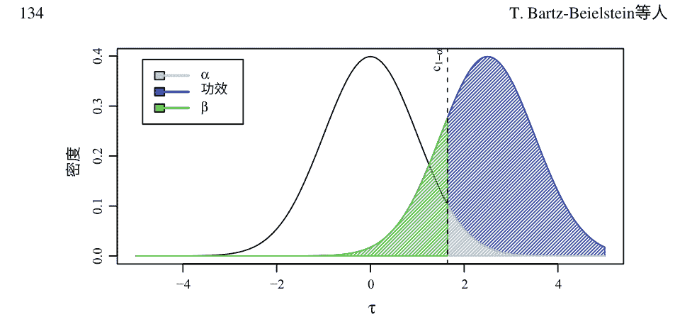

图5.1 假设检验

**定义5.6（第一类和第二类错误）** 它们是预先在实验进行之前规定的第一类和第二类错误。

-   1.  当将零假设错误地拒绝时，发生了第一类错误，即当零假设为真时。犯第一类错误的概率被称为显著性水平，并表示为 $\alpha$。换句话说，$\alpha$是用户决定的第一类错误发生的可接受概率。第一类错误可以用图5.1表示。$\alpha = P_{H_0}(d(Y) > c_{1-\alpha})$。
-   2.  当拒绝备择假设时，发生第二类错误，当备择假设为真时：$\beta = P_{H_1}(d(Y) \leq c_{1-\alpha})$。

符号 $P_H(y)$表示模型下的概率分配，即在假设 $H$ 下 $y$的概率。功效 $(1-\beta)$是当零假设为假时正确拒绝零假设的概率。

**定义5.7（配对样本）** 如果存在一种关系将 $X_1$中的每个元素唯一地分配给 $X_2$中的一个元素，则将样本 $X_1$和 $X_2$视为配对样本。

**例子：配对样本** 因此，如果确定性优化方法 $\mathcal{A}$和 $\mathcal{B}$使用相同的起始点（起始点可以用于索引样本点），我们将考虑将它们配对。起始点是随机生成的，每个样本使用相同的种子。

**示例：共轭梯度与尼尔德-米德算法** 我们将考虑两种优化方法之间的性能差异。为了实现可复制性，我们选择了两种优化方法（优化器），通过`optim`函数在每个R安装中都可以直接使用。它们在R帮助系统中的描述如下（R核心团队2022年）：共轭梯度方法（CG）是基于Fletcher和Reeves（1964年）的共轭梯度方法。共轭梯度方法通常比Broyden、Fletcher、Goldfarb和Shanno（BFGS）方法更脆弱，但由于它们不存储矩阵，因此可以在更大的优化问题中取得成功。

2.  Nelder和Mead简单算法（NM）仅使用函数值，鲁棒性较强但相对较慢（Nelder和Mead 1965年）。它对于不可微分的函数效果还不错。

CG和NM将在二维Rosenbrock函数（Rosenbrock 1960）上进行测试。该函数的定义如下

$$f(x_1, x_2) = (1 - x_1)^2 + 100 (x_2 - x_1^2)^2 \quad (5.6)$$

它在 (1, 1) 处有一个全局最小值。为了保持讨论的重点，假设每种方法的结果来自100次运行，即总共进行了200次运行。让 $y_{i, j}$ 表示第i种方法的第j次重复的结果，即向量 $y_1, \dots$ 表示CG运行的100个结果。

我们将考虑性能差异 $d_j = y_{1, j} - y_{2, j}, j = 1, ..., n$，与相应的平均值 $\bar{d} = 9.02$。基于

$$S_d = \left( \frac{\sum_{j=1}^n (d_j - \bar{d})^2}{n - 1} \right)^{1/2} \quad (5.7)$$

我们可以计算差异的样本标准差为 $S_d = 30.73$。由于 $\bar{d}$ 是正数，我们可以假设方法NM更优。我们有兴趣看到均值差异是小于还是大于 $\mu_0$，并将测试问题制定为

$$H_0: \mu \leq \mu_0 \quad \text{对立假设} \quad H_1: \mu > \mu_0,$$

在我们的案例中: $\mu_0 = 0$。如果 $H_0$ 被拒绝，则表示NM在给定的测试函数中表现优于CG。

我们将使用在（5.5）中定义的检验统计量，如果 $H_0$ 为真（$\mu \leq \mu_0$），则该统计量遵循标准正态分布。然后

$$P\left( \frac{\bar{Y} - \mu_0}{\sigma / \sqrt{n}} > u_{1-\alpha} \right) \leq \alpha, \quad \text{否则} \quad P\left( \frac{\bar{Y} - \mu_0}{\sigma / \sqrt{n}} > u_{1-\alpha} \right) > \alpha, \quad (5.8)$$

其中， $u_{1-\alpha}$ 表示截断点；参见定义5.5。

如果$d(y) > u_{1-\alpha}$，则检验 $T(\alpha)$的结果是拒绝零假设 $H_0$；否则不拒绝 $H_0$。对于$\alpha = 0.025$和 $u_{1-\alpha} = 1.96$，我们得到$d(y) = (\bar{y} - \mu_0) / (\sigma / \sqrt{n}) = 2.95 > 1.96 = u_{1-\alpha}$，即拒绝 $H_0$。

选择了一个样本量为$n = 100$的样本，没有任何统计学上的理由：目前还不清楚是否十个样本足够，或者是否应该使用一千个样本。接下来将讨论功效计算，它提供了一个经过验证的统计工具，用于确定计划实验的足够样本量。

###### 5.6.2 功效

用于计算多个备选方案的功率函数$\mu_1$的定义如下

**定义5.8（功率函数）**

$$Pow(\mu_1) = P_{\mu = \mu_1} \left( \frac{\overline{Y} - \mu_0}{\sigma / \sqrt{n}} > u_{1-\alpha} \right) = 1 - \Phi \left( u_{1-\alpha} - \frac{\mu_1 - \mu_0}{\sigma / \sqrt{n}} \right) \quad (5.9)$$

其中$\mu_1 = \mu_0 + \delta$，$\delta$表示相关差异。

在我们的例子中，我们设置了一个单侧检验，其中$H_0: \mu_0 = 0$，并且以下参数：

-   1.  显著性水平：$\alpha = 0.025$
-   2.  $\beta$ (1-功效)：$\beta = 1 - 0.8 = 0.2$
-   3.  相关差异：$\delta = 10$
-   4.  样本间标准差：$\sigma = 30.73$

图5.2展示了功效和样本大小之间的关系。

###### 5.6.3 $p$-值

$p$值量化了数据与零假设的矛盾程度，并允许他人根据其选择的显著性水平进行判断（Mayo 2018; Senn 2021）。

**定义5.9 ($p$值)** 如果零假设为真，则$p$值是观察到的结果比观察到的结果更极端或更极端的概率。它被定义为具有$\alpha$值的

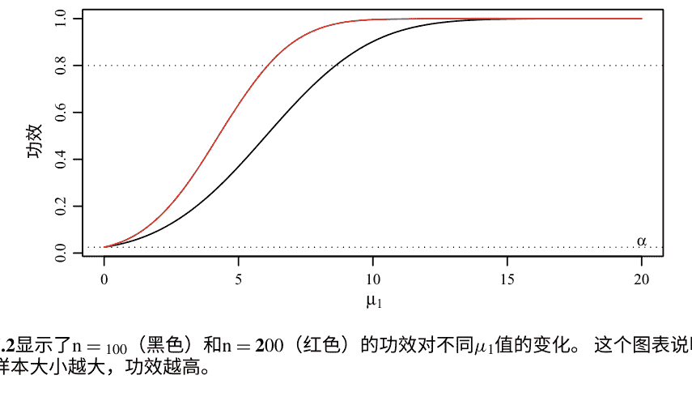

图5.2 显示了n = 100（黑色）和n = 200（红色）的功效对不同μ1值的变化。这个图表说明了样本大小越大，功效越高。

$$d(Y) > u_{1-\alpha'} \Leftrightarrow \alpha' = 1 - \Phi(\sqrt{n}(\bar{y} - \mu_0)/\sigma),$$

在假设 $H_0$为真的情况下。

如果一个效应 $\tau$衡量两种方法之间的真实差异而 $y$是用来衡量方法之间差异的统计量，则可以定义一个单侧 $p$值为

$$P_{\tau=0}(y \geq \bar{y}) \quad (5.10)$$

其中 $\bar{y}$是统计量的观察值，如果 $H_0$为真。这个 $p$值可以用来超越简单的决策拒绝或者不拒绝。

Senn (2002)声称， $p$值是科学家用来传达显著性检验结果的一种完全合理的方式，即使在做出决策而不是结论时也是如此。小的 $p$值表明 $H_0$不为真或者发生了一个非常不可能的事件 (Fisher 1925)。

###### 示例：CG与NM的比较继续

考虑CG与NM的示例（第5.6.1节），观察到的差异$\bar{d} = 9.02$，并得到相应的$p$值为0.0017。

###### 5.6.4 效应大小

效应大小是一种无尺度的方法，用于量化两种方法之间的性能差异的大小。

**定义5.10（效应大小）** 效应大小是两种方法$\mathcal{A}$和$\mathcal{B}$之间的标准化均值差异（Cohen 1977）：

Cohen的$d = \frac{\bar{y}_{\mathcal{A}} - \bar{y}_{\mathcal{B}}}{S_p}$ (5.11)

$S_p = \sqrt{\frac{(n_{\mathcal{B}}-1)s_{\mathcal{B}}^{2} + (n_{\mathcal{A}}-1)s_{\mathcal{A}}^{2}}{n_{\mathcal{A}}+n_{\mathcal{B}}-2}}$ (5.12)

其中$\bar{y}_{\mathcal{A}}$和$\bar{y}_{\mathcal{B}}$分别是方法$\mathcal{A}$和$\mathcal{B}$的样本均值。$S_p$是汇总标准差，$n_{\mathcal{A}}$，$n_{\mathcal{B}}$分别是每种方法的样本大小，$s_{\mathcal{A}}$，$s_{\mathcal{B}}$分别是每种方法的标准差。作为指南，Cohen建议将效应大小分为小（0.2），中等（0.5）和大（0.8），但强调在不同领域中的适用性时要谨慎。

Hedges和Olkin（1985）发现Cohen的$d$存在偏差，它稍微高估了标准差，并引入了一种校正措施

$Hedge's\ g = \left(1 - \frac{4}{(n_{\mathcal{A}}+n_{\mathcal{B}})-9}\right) \times Cohen's\ d.$ (5.13)

**示例：CG与NM的比较继续** 再次考虑CG与NM示例（第5.6.1节），Cohen的$d$和Hedge's $g$，它们是两种方法之间的标准化均值差异，可以使用（5.11）和（5.13）计算，分别为$d=0.415$和$g=0.4134$。这两个值都表明观察到的均值差异较小。

###### 5.6.5 样本量确定和功效计算

适当的样本量对于比较算法至关重要。即使对于确定性优化器，建议使用不同的起始点进行多次运行，而不是使用每个算法的一次运行结果。但是在这种情况下，“越多越好”并不高效，因为额外的运行会产生额外的成本。统计推断提供了处理成本和效果之间权衡的工具。

###### 5.6.5.1 五个基本因素

通常的观点是样本大小是可变性、统计方法、功效和所寻求的差异的确定函数。我们将一侧检验定义为等式5.4中定义的。

**定义5.11（五个基本因素）** 在讨论样本大小要求时，Senn（2021）引入了以下关于符号的约定：$\alpha$：在零假设成立的情况下发生第一类错误的概率。

###### 5.6.5.2 样本大小

- β：在备择假设成立的情况下发生第二类错误的概率。
- Δ：所寻求的差异。在大多数情况下，人们谈论的是“相关差异”，而这又被定义为“不想错过的差异”。符号：在假设检验中，Δ表示可能值范围内的特定值τ。
- σ：预设结果的标准差。
- n：每种方法运行的次数。因为比较了两种方法，所以总数为2×n。

$$
\left( u_{1-\alpha} - \frac{\mu_1 - \mu_0}{\sigma/\sqrt{n}} \right) = \beta \Leftrightarrow n = \frac{\sigma^2}{(\mu_1 - \mu_0)^2} (u_{1-\alpha} - u_{\beta})^2 = \sigma^2 \times \frac{2}{(u_{1-\alpha} - u_{\beta})^2},
$$

这给出了所需样本大小的估计 \( n = n(\alpha, \beta, \sigma, \mu_0, \mu_1) = n(\alpha, \beta, \sigma, \varepsilon) \)。

从定义5.11中选择任意四个因素就足以唯一确定第五个因素。首先，我们将样本大小的公式 \( n \) 视为 \( \alpha \)，\( \beta \)，\( \varepsilon \)和\( \sigma \)的函数。对于大小为\( \alpha \)的单侧检验，样本大小的（近似）公式为

$$
n \approx 2 \times (u_{1-\alpha} + u_{1-\beta})^2 \sigma^2 / \Delta^2, \tag{5.14}
$$

其中，\( u_{1-\alpha} \)表示正态分布的值，它截断了上尾概率为\( \alpha \)。

因此，对于CG与NM示例（第5.6.1节），如果相关差异为\( \Delta = 10 \)，则每种方法需要大约148次完成运行。

###### 示例：样本大小确定

比较两种优化方法，假设\( \mathcal{A} = \text{CG} \)和\( \mathcal{B} = \text{NM} \)。因此，我们设置了一个单侧检验，具有以下参数：

- 1. 显著性水平：\( \alpha = 0.05 \)
- 2. \( \beta \)（1-功效）：\( \beta = 1 - 0.8 = 0.2 \)
- 3. 相关差异：\( \Delta = 200 \)
- 4. 样本间标准差：\( \sigma = 450 \)。

我们将使用R包SPOT中的函数`getSampleSize`来确定样本大小\( n \)。本章中显示的所有计算都在该包中实现。

```r
library("SPOT")
nsamples <- round(getSampleSize(
    mu0 = 0, mu1 = 200,
    alpha = 0.05, beta = 0.2,
    sigma = 450,
    alternative = "one.sided"
), 0)
```

根据公式5.14，每种方法需要完成大约63次运行。

尽管样本量计算看起来很透明和简单，但在这种方法中存在一些问题，将在下面讨论。

###### 5.6.6 问题

在本节中，我们将考虑样本量确定的问题，功效计算的问题，以及假设检验和错误结论的问题。我们的演示（尤其是示例）基于Senn（2021）的讨论。

样本量确定的问题可能是由标准差的计算引起的，σ：这个计算是一个先有鸡还是先有蛋的困境，因为在实验结果未知之前，样本间的标准差是未知的。但实验必须在运行之前进行计划。此外，公式5.14只是一个近似公式，因为它基于标准差已知的假设。我们使用的实验是基于从检验样本中获得的估计值。

没有普遍的标准来确定相关差异Δ。这在确定样本大小时会产生另一个问题，因为显著差异是应用相关的。

错误可能会影响样本大小的确定，因为α和β的水平是相对的：α是用于确定分析中的显著性的实际值，而β是用于规划的理论值（Senn 2021）。通常，错误值被选择为α = 0.05和β = 0.20。然而，在某些情况下，β的值应该更低，但如果只有很少的实验可行，一个非常低的β值可能不现实。对于α也是如此，因为α和β不能同时减小而不增加样本大小。

在实践中，样本大小的计算可能存在缺陷。例如，n = 10或n = 100是常见的样本大小，但通常没有任何理由选择它们。一些作者通过声称“每个人都这样做”来证明他们的选择是合理的。

在某些情况下，有足够的知识来规划实验，即已知要执行的实验数量。核武器试验是这种情况的一个极端例子。

此外，Senn（2021）声称样本量计算可以成为“样本量而不是原因”的借口。在实践中，通常不希望根据实际样本量要求“调整”某些因素，特别是所寻求的差异以及有时功效。

> 提示: 样本量确定
>
> 在开始完整实验之前，进行预实验运行以计算（近似）样本量。

除了样本量确定的问题外，还可能出现功效计算的问题。选择了一个看似具有80%功效的样本量并不能保证存在80%的机会存在效果（即备择假设$H_1$成立）（Senn 2021）。即使整个实验设置和过程都是正确的，也可能发生外部故障，这是实验者无法控制的：方法或算法可能无法正常工作。重要的是，如果算法不起作用，我们必须认识到这一点；请参见第5.8.2.1节中的示例。但即使算法成功，也可能无法产生相关差异。或者，从另一个极端来看，算法可能比计划的要好，因此样本量可以选择更小。此外，实验误差可能发生，这些误差不在功效（样本量）计算的假设范围内。

计算是基于实验正确执行的假设进行的。或者，正如Senn（2021）所说：样本大小计算不能考虑“天灾”或不诚实或不称职的调查人员。因此，虽然我们可以通过调整样本大小来影响成功的概率，但我们无法修复它。

最后，基于假设检验的假设和错误结论存在问题。选择正确的假设对，例如$H_0: \tau \le 0$ 对 $H_1: \tau > 0$（单侧） 或 $H_0: \tau = 0$ 对 $H_1: \tau \neq 0$（双侧），并不总是明显的。

在临床测试的背景下，Senn（2021）指出以下陈述是一种令人惊讶地普遍存在的无稽之谈：

> 如果我们进行了功效计算，那么在拒绝零假设的情况下，我们不仅可以得出治疗有效的结论，还可以得出具有临床相关效应的结论。

例如，考虑对比一个基于双侧检验的优化方法$\mathcal{A}$和另一个方法$\mathcal{B}$。令$\tau$为真实的性能差异（$\mathcal{A}$与$\mathcal{B}$之间）。然后我们写出两个假设：

$H_0: \tau = 0$ 对 $H_1: \tau \neq 0$ 进行比较。 (5.15)

通过拒绝零假设，我们支持备择假设$H_1$，即存在非零差异。这个差异的符号可能表明$\mathcal{A}$相对于$\mathcal{B}$是优越的还是劣势的。用Eq. 5.15替换

$$
H_0 : \tau = 0 \text{ 对比 } H_1 : \tau \geq \Delta \quad (5.16)
$$

这将意味着在实验之前我们知道一个算法比另一个更好。但通常在实验之前我们并不知道这一点——实验的整个目的是确定哪个算法表现更好。

因此，我们将考虑按照方程式5.4指定的单侧检验。这个过程将在第5.8节中举例说明。

我们已经强调了样本大小确定、功效计算和假设检验中的一些重要问题。Senn（2021）提到了更多问题，读者可以参考他的讨论。

> 提示
>
> 推荐绘制实验的功效函数。这在图5.3中有所说明。

最后但同样重要的是，应该考虑“大$n$问题”即“大样本与小样本”的问题。Senn（2021）第13.2.8节指出：

- 1. 其他条件相同的情况下，大实验得到的显著结果更能说明效果。

##### 5.7 严重程度

###### 5.7.1 动机

严重程度被提出作为解决第5.6.6节中讨论的问题的方法，由科学哲学家Mayo（1996）提出。为了解释严重程度的概念，我们从（Senn 2021）中选取一个例子开始。

> 例子：高功效
>
> 考虑使用单侧检验进行算法比较，其中 α = 0.025，但功效非常高，例如99%，对于一个目标相关差异 Δ =200。平均差异的标准差被取为450。注意，除了将第二类错误从 β = 0.2大幅降低到 β = 0.01之外，这个例子与第5.6.5节中的“样本量确定”示例类似。使用如下参数执行指定的单侧假设检验（参见公式5.4）：
>
> - 1. 显著性水平: α = 0.025
> - 2. 幂: 1 - β = 0.99
> - 3. 相关差异: Δ = 200
> - 4. 样本间标准差: σ = 450。
>
> 标准的功效计算，参见方程式5.14，建议每个配置使用约186个样本，我们将其四舍五入为2 × 200 =400个样本。这个值给出了差异的标准误差为450× √2/200 =45。我们进行了实验（假设为非配对，即独立样本），结果是显著的，即我们观察到了一个差异 ŷ =90。我们得到了p值为0.0231。
>
> 我们如何解释这个实验的结果，例如p值？尽管p值为0.0231在统计上是显著的，即p值< α，但我们不能得出H₁为真的结论。必须承认第一类错误的发生概率。情况如图5.4所示。观察到ŷ =90在H₀下比在H₁下更有可能。通过比较在H₀和H₁下 ŷ =90处的密度曲线的高度，这一点变得明显。因此，这更有可能是第一类错误的情况。尽管功效相对较高（1 - β = 0.99），它声称实验有影响是错误的，$\mu_1-\mu_0=200.4$。有两个原因：
>
> - 1. 这个测试没有广泛使用$y^-$，即实际观察到的差异。实际观察到的差异仅用于计算检验统计量和决定是否拒绝原假设。
> - 2. 超越简单的拒绝或不拒绝决策，可以使用$p$值。实际观察到的差异，$y^- = 90$，更接近于0而不是200。因为90距离200比距离0更远，这远非证明真实差异与相关差异200一样大的有力证据。
>
> Senn（2021）提出了解决这个问题的方法，例如，使用所谓的真实差异的点估计和相关的置信限，或者使用无关差异方法，或者使用严重性。

###### 5.7.2 严重性：定义

严重性是考虑决策和数据的结果的可信度的度量：在做出决策之后，可以计算拒绝或不拒绝零假设的严重性。它使用后数据信息，并提供回答以下问题的方法：

> > 我们如何确保结果不仅在统计上而且在科学上也是相关的？

严重性的概念由Mayo和Spanos（2006）引入（参见Mayo 2018）：

> 只有当这个结果很不可能在 H 为假的情况下也发生时，才会严重地拒绝假设 H。

严重性提供了一个评估提出的统计结论的元统计原则。它显示了经过充分测试的假设的好坏（而不是可能性）。因此，它是整个测试过程的一个属性。可以评估测试的严重性和结果。

**定义5.12（严重性）** 严重性分别针对零假设的不拒绝（$S_{nr}$）和拒绝（$S_{r}$）进行定义，如式(5.17)所示。

$$
S_{nr} = P_{H_1}(d(Y) > d(y))
$$
$$
S_{r} = P_{H_1}(d(Y) \leq d(y)) \quad (5.17)
$$

随着τ的增加，$S_{nr}$值从0单调递增到1。随着τ的增加，$S_{r}$值从1单调递减到0。数值越接近1，使用假设检验做出的决策越可靠。功效和严重性之间的关键区别在于严重性取决于数据和检验统计量，即d(y)而不是$c_{1-\alpha}$。

严重性是类似于方程5.10的概率，考虑非零τ值。拒绝的严重性，考虑另一个方向的值，y≤y⁻，计算如下

$$
S(\tau) = P(\tau=_\tau \mid y \leq y^-) \quad (5.18)
$$

如果$H_0$被拒绝，则$S_{nr}(\tau) = P(\tau=_\tau | y \geq y^-)$，否则。表5.1显示了功效($1-\beta$)、显著性水平($\alpha$)、p值和严重性之间的关系。

| $1-\beta$ | $\alpha$ | $p$-值 | 严重性 |
| :--- | :--- | :--- | :--- |
| $P_{H_1}(Y > c_{1-\alpha})$ | $P_{H_0}(Y > c_{1-\alpha})$ | $P_{H_0}(Y > \bar{y})$ | $S_{nr}: P_{H_1}(Y > \bar{y})$<br>$S_{r}: P_{H_1}(Y \leq \bar{y})$ |
| $P_{H_1}(d(Y) > u_{1-\alpha})$ | $P_{H_0}(d(Y) > u_{1-\alpha})$ | $P_{H_0}(d(Y) > d(\bar{y}))$ | $S_{nr}:$<br>$P_{H_1}(d(Y) > d(\bar{y}))$<br>$S_{r}: P_{H_1}(d(Y) \leq d(\bar{y}))$ |

###### 示例：高功效(续)

图5.5绘制了给定示例的严重性与真实性能差异τ的所有可能值之间的关系(Senn 2021)。

在图上标注的是τ=$\bar{y}$的值，观察到的差异，其严重性为0.5，以及τ=$\Delta$，用于规划的值。拒绝 $H_0$的严重性仅为0.0075。图5.5显示τ>200的严重性非常低。

在这里，$p$值为0.0231，小于 $\alpha$ =0.025。注意，在拒绝$H_0$的情况下，严重性为$1 - p$，对于 $\Delta = \mu_1 - \mu_0 =0$。不拒绝零假设的严重性与 $\Delta =0$的 $p$值相同。

###### 示例：共轭梯度与Nelder-Mead的比较（续）

现在让我们重新访问CG与NM的示例（第5.6.1节），并计算严重性。给定观察到的差异9.02和样本大小n=100，基于$p$值为0.0017的决策是拒绝 $H_0$。考虑到目标相关差异为 $\Delta =10$，拒绝 $H_0$的严重性为0.37，并在图5.6的左侧面板中显示。图5.6的右侧面板显示了拒绝 $H_0$的严重性作为 $\tau$的函数。根据给定数据的假设检验结果，NM似乎优于CG。而声称真实差异大于或等于10的严重性非常低，而小于7的差异则得到了很好的支持。

###### 5.7.3 两个例子

我们将使用两个示例来计算严重性，这些示例基于Mayo (2018)、B nisch和Inderst (2020) 以及Senn (2021) 的讨论。在每个示例中，从$\mathcal{N}(\mu, \sigma^{2})$分布的随机变量中抽取$100$个样本，但均值不同。第一个示例表示真实差异与数据中的方差相比较小的情况，而第二个示例表示差异相对较大的情况。第一个示例使用样本均值$\mu_{1}=1e-6$（数据集I），第二个示例使用样本均值$\mu^{2}=3$（数据集II）在两种情况下使用相同的标准差（$\sigma=10$）。数据的直方图显示在图5.7中。

在这两个例子中，根据（5.4）定义进行单侧检验，使用以下参数：

- 1. 显著性水平：$\alpha=0.05$。
- 2. 幂：$1 - \beta = 0.8$
- 3. 相关差异：$\Delta = 2.5$
- 4. 样本间标准差：$\sigma = 10$。

###### 示例：数据集I：不拒绝零假设的严重性

首先，使用数据集I（来自一个 $\mathcal{N} (\mu_1, \sigma^2)$ 分布的随机变量的100个样本，其中$\mu_1=1e-6$和$\sigma=10$），分析不拒绝零假设的严重性。假设观察到的值$y^-=1.0889$，即观察到了一个统计上不显著的差异（$p$值$0.1381046>0.05$）。但是从这个结果中得出差异的大小为零是错误的。

图5.8通过应用严重性概念来说明这种情况。图5.8的右侧面板提供了对以下问题的图形描述：如果实际差异至少为τ，观察到的估计值高于实际观察到的$y^-=1.089$的概率是多少？

这个概率越大，观察到的证据反对那个特定的τ值就越强。对于两个数字，答案已经知道：对于τ=0，即0.14，这是$p$值；对于τ=$y^-$，即50%。$p$值表示无法拒绝“没有差异”的零假设，对于$\alpha=0.05$。由于数据的高方差，直方图相对较宽（见图5.7左侧面板）。这直接反映在其他可能的τ值（差异的初始假设）的评估中。例如，只有在τ值约为2时，证据的严重性才会超过80%的阈值。

这可以在图5.8右侧面板的垂直轴上看到。因此，如果实际差异至少为2，则有80%的概率估计值高于观察值1.09。即使不拒绝零假设，也不能得出差异大小为零的结论。

通过高严重性（80%），可以得出大于2的差异不太可能。图5.8的右侧面板显示了所有初始假设（水平轴）的证据严重性（垂直轴）。

表5.2 数据集I：结果分析

| $p$-值 | 决策 | 功效 | Cohen的 $d$ | Hedge的 $g$ | 严重性 |
| :--- | :--- | :--- | :--- | :--- | :--- |
| 0.14 | 未拒绝H0 | 0.8037649 | 0.1212286 | 0.1212286 | $\triangle \geq 2$很好支持 |

结果统计数据在表5.2中呈现。效应大小表明差异较小。

###### 示例：数据集II：拒绝零假设的严重性

使用数据集II，其中 $\mu_2=3$ 和 $\sigma=10$，分析拒绝零假设的严重性，即统计显著估计 $\bar{y}=2.62$，导致被拒绝的零假设（“没有差异”）被认为是成立的。

断言这是一个差异为2.62的证据是不合理的。除了零假设外，没有进一步的假设被测试，例如，“差异是否恰好为2.62？”或者“差异至少为2.62？”统计上显示，没有正面差异的概率非常低。因此，证据强烈地（“严重地”）反对没有效果的观点。

在接下来的内容中，测试结果被用来评估进一步的假设，例如，差异是否“不超过最多$\tau$”，其中$\tau$表示可能的差异，比如4或5。在这个背景下，中心问题是：实验证据对这样一个备择零假设，即最多$\tau$的差异，有多强烈的支持？这种情况类似于是否可以以足够的确定性拒绝零假设的问题。这个问题只能以可以估计的错误概率来回答。

以下结果受到B nisch和Inderst（2020）的启发，他们在“损伤估计图5.9拒绝程度 H₀（红色），功效（蓝色）和误差（灰色）对于目标相关差异 Δ = 2.5。右图：拒绝程度 H₀作为 τ的函数

表5.3数据集II：结果分析

| p-值 | 决策 | 功效 | Cohen的 d | Hedge的 g | 严重性 |
| :--- | :--- | :--- | :--- | :--- | :--- |
| 0 | 拒绝H0 | 0.8037649 | 0.2737213 | 0.2737213 | Δ ≤ 2 得到了很好的支持 |

###### 5.7.4 对80%阈值的讨论

尽管图5.9中使用了80%的阈值，但仍然不清楚应该设置哪个阈值。要求90%的严重程度会导致即使至少有1.9的差异的假设也得不到支持。考虑到严重程度还应考虑领域特定的知识，不能推荐一个通用值。图5.9等可视化工具可以帮助获得客观和理性的结果。

###### 5.7.5 关于正态性假设的评论

我们讨论了Mayo的错误统计的扩展经典假设检验机制。错误统计中的核心工具是严重程度，它允许进行后数据分析。无论底层分布是什么，严重性都可以应用于推断统计（Spanos 1999）。我们已经讨论了正态分布，因为我们将应用严重性分析来进行基准测试（第5.8节）。在这种情况下，正态性假设成立，因为本章中的大多数示例使用了50个或更多的样本。正态性假设有时会被误解：它不要求总体类似于正态分布。它要求均值差异的抽样分布应该近似正态。在大多数情况下，中心极限定理将使（假设的）分布具有正态性。即使在底层总体不是极度不对称的情况下，这种情况也会发生在中等的n值时，例如由极端异常值引起。

##### 5.8 严重性：在基准测试中的应用

现在我们有了可用的统计工具，即功效分析加上误差统计（严重性），我们可以评估它们在算法基准测试场景中的适用性。

以下实验演示了如何对两个算法进行比较。我们的目标不是在许多问题上提供许多算法的全面比较，即MAMP，而是通过严重性来突出重要的洞察力。

因此，选择了两个算法和三个优化问题。为了涵盖最重要的场景，将进行三个独立的MASP研究。

每个研究都在一个问题实例上比较两个算法，比如A和B。

来自R包SPOTMisc的函数makeMoreFunList生成了一个函数列表，该列表在More et al. (1981)中介绍，是优化中引用次数超过2000次的最常见基准套件之一。这个列表可以传递给runOptim函数，该函数执行优化。runOptim使用表5.4中的参数。

我们将在Rosenbrock、Freudenstein和Roth以及Powell的Badly Scaled测试函数上比较CG和NM两种优化方法，这些函数在More et al. (1981)中定义。

| 参数 | 描述 | 默认值 |
|------|------|--------|
| f1 | 函数列表 | |
| 方法 | optim使用的方法：Nelder-Mead、BFGS、CG、L-BFGS-B、SANN或Brent。 | Nelder-Mead |
| n | 重复次数。如果 n >1，则使用不同的起始点（随机化）。 | 2 |
| k | 基准函数子集 | 所有已实现的函数 |
| 详细程度 | 要显示的信息级别 | 0 |

###### 5.8.1 实验I: Rosenbrock

###### 5.8.1.1 预实验计划

在我们的第一个实验中，我们将使用Rosenbrock函数；参见方程式5.6。这是More等人（1981）研究中的第一个函数，因此我们将参数k = 1传递给runopt()函数。为了估计函数评估的次数，进行了几次预实验运行算法。这些预实验运行还用于测试数值不稳定性、预期行为和正确实现。在我们的情况下，进行了20次预实验运行。

```r
library("SPOT")
set.seed(1)
k <- 1  # 更多函数编号1
n0 <- 20 # 预实验运行次数
moreFl <- makeMoreFunList ()
resCG0 <- runOptim (
  f1 = moreFl,
  method = "CG",
  n = n0,
  k
)
resNM0 <- runOptim (
  f1 = moreFl,
  method = "Nelder-Mead",
  n = n0,
  k
)
```

每个算法都有一个包含20个观测值的数据框，例如CG算法：

```r
str(resCG0)

## 'data.frame':    20 obs. of  3 variables:
##  $ f: num  1 1 1 1 1 1 1 1 1 1 ...
##  $ r: num  1 2 3 4 5 6 7 8 9 10 ...
##  $ y: num  0.10644 0.0686 0.00577 0.08434 3.65499 ...
```

强烈建议查看结果的摘要。R的summary是首选。

```r
summary(resCG0$y)

##    最小值 第一四分位数    中位数    平均值 第三四分位数    最大值
## 0.000939  0.068510  0.080510  0.549287  0.119892  3.654986
```

```r
summary(resNM0$y)

##    最小值 第一四分位数    中位数    平均值 第三四分位数    最大值
## 1.900e-08 5.740e-07 1.439e-06 1.622e-04 3.233e-06 3.206e-03
```

摘要表明NM优于CG，并且CG存在一些异常值。在进一步的分析中，建议对极端异常值进行处理。图5.10展示了一个图形检查。

我们对方法性能的平均差异感兴趣。预实验运行表明差异为 \(\bar{y}=0.55\)。因为这个值是正的，我们可以假设NM方法优于其他方法。标准差为 \(s_d=1.14\)。根据公式5.14，以及 \(\alpha=0.05\)， \(\beta=0.2\)，和 \(\Delta=0.5\)，我们可以使用getSampleSize()函数确定完整实验的运行次数。

对于0.5的相关差异，每个算法需要大约65次完成的运行。图5.11说明了不同的情况下的情况，并且有三个n值。

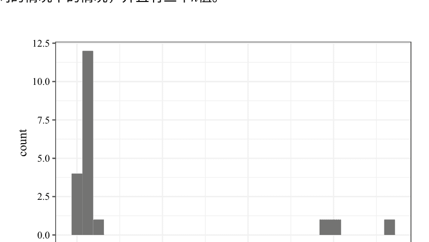
图5.10 CG在Rosenbrock上的结果。直方图用于检查异常值。

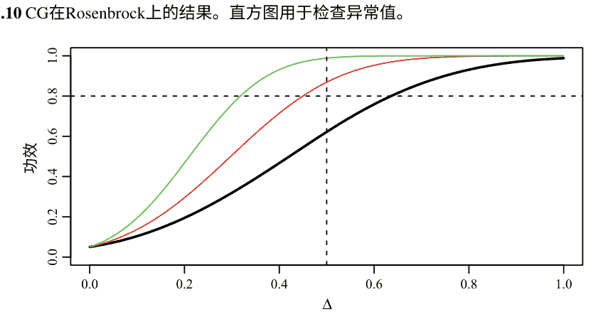
图5.11 Rosenbrock（函数1）。在一个双平行组实验中，功率作为相关差异的函数（黑色=40，红色=80，绿色=160次运行）。如果相关差异为0.5，则每个算法需要160次运行以达到80%的功率。

###### 5.8.1.2 在Rosenbrock上进行实验

虽然我们不知道任何人工（无维度）测试函数的“真实”相关差异，但我们认为距离=0.5是相关的，并且为了保险起见，选择了80个算法运行进行完整实验。

完整的实验可以按照以下步骤进行。 预实验运行的20个结果将被“循环利用”，只需进行额外的60次运行。如何将现有结果与新结果结合讨论在第4.5.3节中。相应的代码与第5.8.1.1节中用于预实验的代码类似。

```r
summary(resCG$y)
## 最小值 第一四分位数 中位数 平均值 第三四分位数 最大值
## 0.000053 0.037231 0.079467 0.681190 0.107427 4.332730
```

```r
summary(resNM$y)
## 最小值 第一四分位数 中位数 平均值 第三四分位数 最大值
## 4.000e-09 1.430e-07 8.260e-07 8.207e-05 2.686e-06 3.206e-03
```

图5.12显示了结果的直方图。这些结果的数值摘要是

```r
summary(resDiff$y)
## 最小值 第一四分位数 中位数 平均值 第三四分位数 最大值
## 0.000052 0.037222 0.079464 0.681108 0.107421 4.332730
```

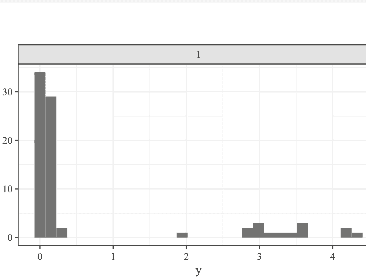
图5.12 Rosenbrock: CG和NM结果之间的差异 (y = CG - NM)

表5.5实验I: 结果分析

| p-值 | 决策 | 功效 | Cohen的 d | Hedge的 g | 严重性 |
|------|------|------|-----------|-----------|---------|
| 0 | 拒绝H0 | 0.961397 | 0.7348167 | 0.7313231 | Δ ≤0.5得到了很好的支持 |

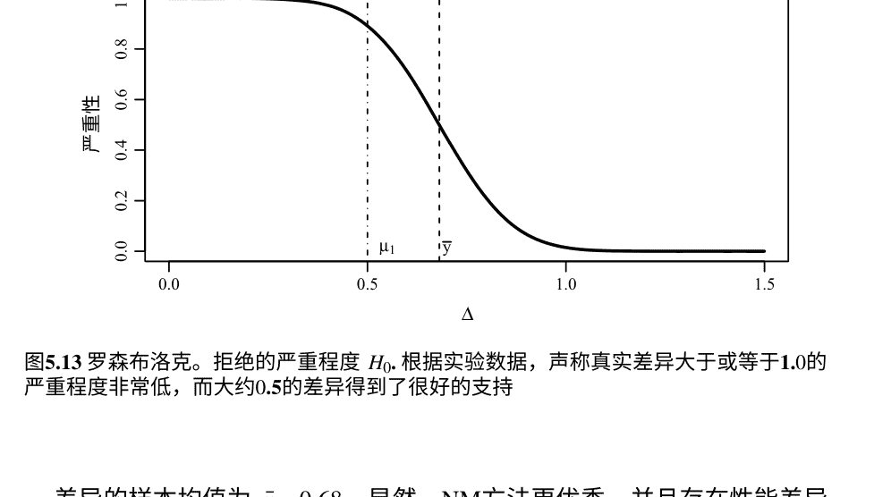
差异的样本均值为 ȳ = 0.68。显然，NM方法更优秀，并且存在性能差异。问题仍然是：这个差异有多大？为了回答这个问题，我们将使用严重程度分析这些运行结果。

总结结果统计如表5.5所示。效应大小表明差异具有中等程度。相应的严重程度图显示在图5.13中。

###### 5.8.1.3 讨论

结果表明NM方法更优秀。除了基于EDA工具和假设检验的经典分析外，严重程度还允许得出进一步的结论：它显示支持小于0.5的性能差异。虽然情况很明确，但最终选择取决于实验者。他们可能会在最终决策中考虑其他标准，如运行时间、成本和鲁棒性。最后但并非最不重要的：0.5的差异是否具有实际相关性高度依赖于外部因素。

###### 5.8.2 实验II： Freudenstein-Roth

下面将考虑二维Freudenstein和Roth测试函数（Freudenstein和Roth 1963），它在More等人（1981）的列表中是第2个。该函数定义为

$$f (x_1, x_2) = (x_1-13+((5-x_2)x_2-2)x_2)^2 + (x_1-29+((1+x_2)x_2-14)x_2)^2$$

###### 5.8.2.1 预实验计划： Freudenstein和Roth

与Rosenbrock函数的研究类似，进行了20次预实验运行。我们来看看各个结果。

```r
summary(resCG0$y)
##   最小值 第一四分位数 中位数   平均值 第三四分位数   最大值
## 0.3928 19.6811 77.9517 57.7497 81.2694 86.3797
```

```r
summary(resNM0$y)
##   最小值 第一四分位数 中位数 平均值 第三四分位数 最大值
## 48.98 48.98 48.98 48.98 48.98 48.98
```

总结表明，NM无法找到改进的值。出现了地板效应（Bartz-Beielstein 2006）。对于NM来说，实验太困难了。不会再进行进一步的实验，因为NM无法找到改进的方法。建议对NM进行重新参数化（通过超参数调整），然后再进行额外的实验。

尽管CG似乎更优秀，并且可以找到小至0.3928的值，但它在异常值方面存在问题，如图5.14所示。

###### 5.8.2.2 讨论

在这种情况下，不建议进行额外的实验性能分析（重点是平均值），因为结果很明确：CG优于NM。

###### 5.8.3 实验三： Powell的糟糕缩放测试函数

接下来将考虑Powell的二维糟糕缩放测试函数，它是More et al.（1981）列表中的第三个函数。

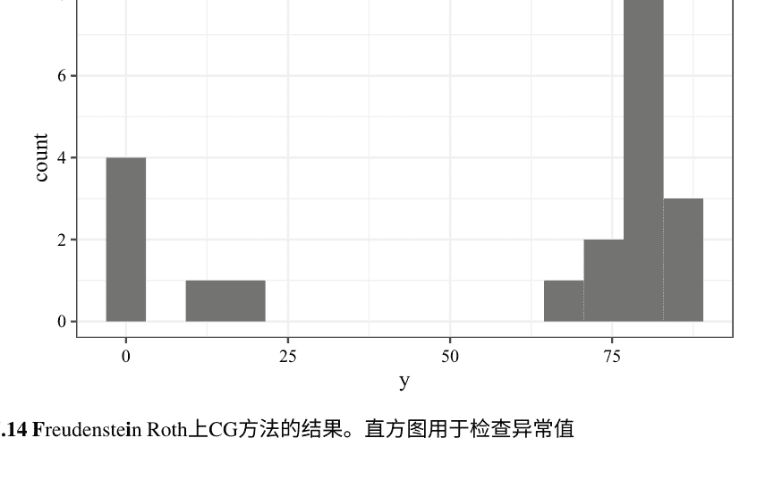
图5.14 Freudenstein Roth上CG方法的结果。直方图用于检查异常值

该函数定义为

$$f(x_1,x_2)=f_1^2 + f_2^2$$

使用

$$f_1 = 1e4x_1x_2 - 1, f_2 = exp(-x_1) + exp(-x_2) - 1.0001$$

###### 5.8.3.1 预实验计划：Powell的糟糕缩放测试函数

首先，我们来看看各个结果。总结并没有明确指出哪个算法更优越。图5.15显示了图形检查结果。两种方法都能找到改进，但都受到异常值的影响。预实验运行结果表明差异为 \(\bar{y} = -0.21\)。由于这个值为负值，我们将在假设方法CG更优越的前提下继续分析。

我们对算法性能的平均差异感兴趣。标准差为1.5。根据公式5.14，以及 \(\alpha=0.05\)， \(\beta=0.2\)，和 \(\delta=0.5\)，我们可以确定完整实验的运行次数。对于0.5的相关差异，每个算法需要大约112次完成的运行。图5.16展示了不同δ和三个n值的情况。虽然我们不知道任何人工（无维度）测试函数的“真实”相关差异，但我们认为距离δ=0.5是相关的，并选择n=120个算法运行进行完整实验。

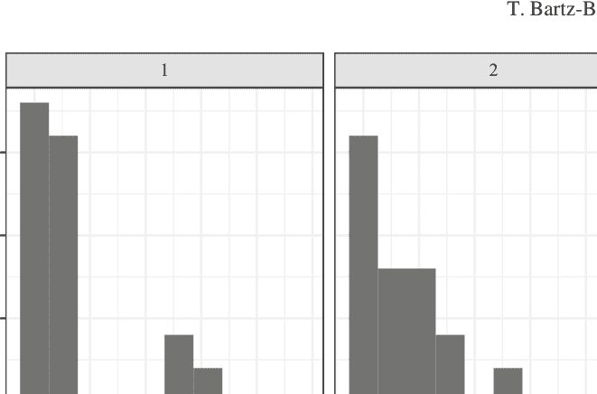
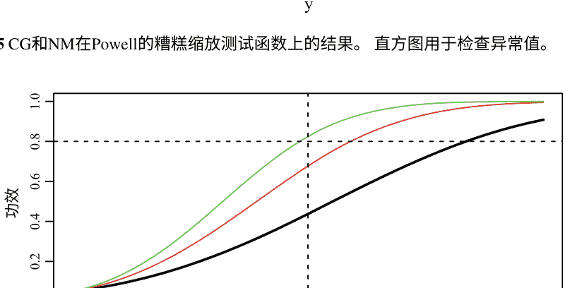

###### 5.8.3.2 执行实验：Powell的糟糕缩放测试函数

完整的实验可以按照以下步骤进行。预实验运行的结果将被“循环利用”，只需进行100次额外的运行。

图5.17显示了结果的直方图。如预期，两种算法都能够找到改进，但受到异常值的影响。

图5.18显示了差异的直方图。这些结果的数值摘要为

```r
summary(resCG$y)
## [1] "CG"
##     最小值 第一四分位数   中位数     平均值 第三四分位数    最大值
##   0.003772    0.094777 0.323066 0.998882   0.710185 22.565737
```
```r
summary(resNM$y)
## [1] "NM"
##     最小值 第一四分位数  中位数     平均值 第三四分位数    最大值
## 0.000026   0.110220 0.329906 0.757107   1.040480 8.932574
```
```r
summary(resDiff$y)
## [1] "diff"
##     最小值 第一四分位数  中位数    平均值 第三四分位数    最大值
## -8.81704 -0.25991 -0.02496  0.24177   0.36554 21.58666
```

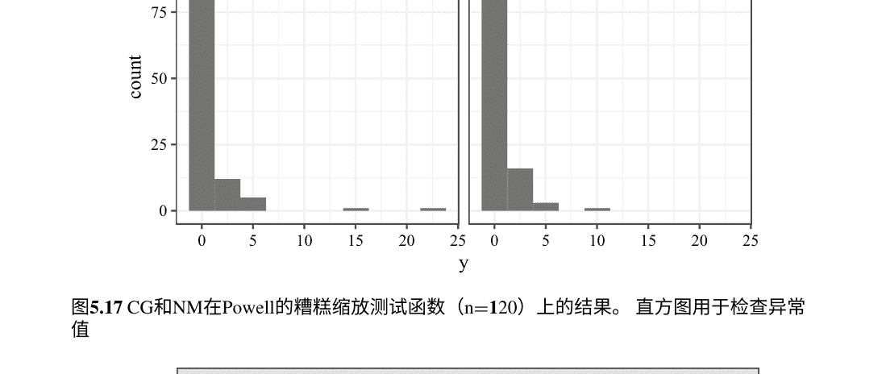
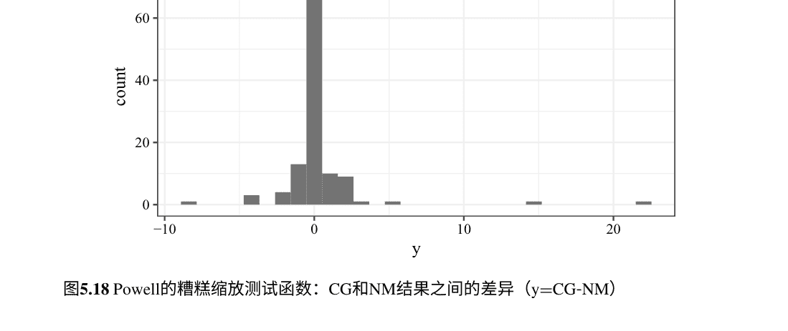

表5.6 实验III: 结果分析

| p-值 | 决策 | 功效 | Cohen的 d | Hedge的 g | 严重性 |
| :--- | :--- | :--- | :--- | :--- | :--- |
| 0.17 | 未拒绝H0 | 0.6274005 | 0.1184404 | 0.1180668 | ≥0.5 得到了很好的支持 |

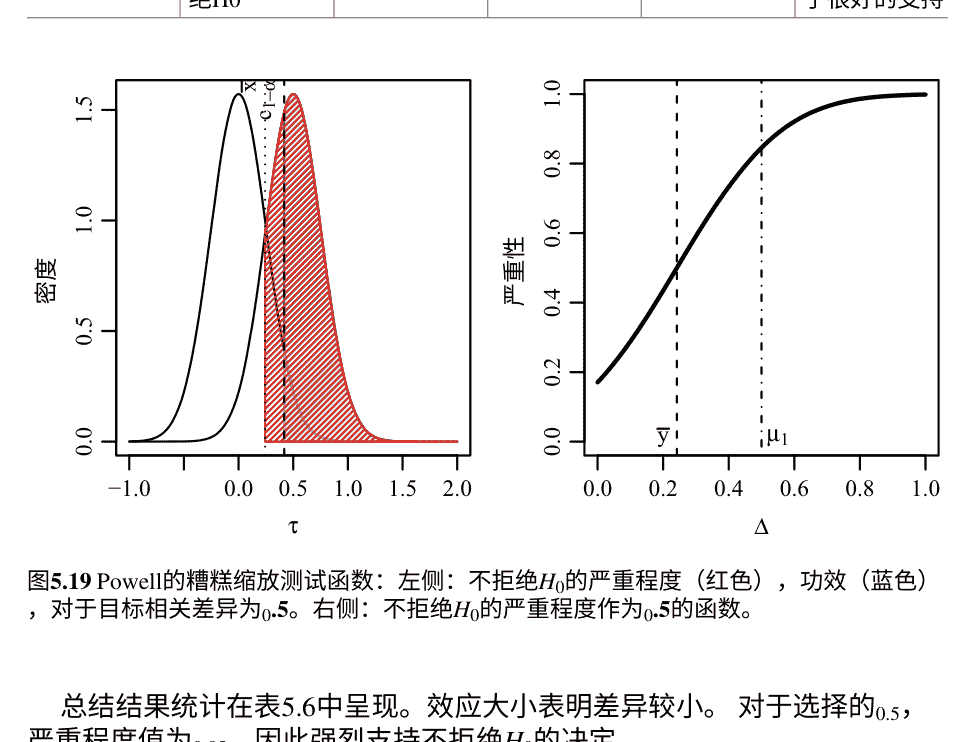
总结结果统计在表5.6中呈现。效应大小表明差异较小。对于选择的0.5，严重程度值为0.85，因此强烈支持不拒绝H₀的决定。

###### 5.8.3.3 讨论

可以使用严重性来分析这些运行的结果。差异的样本均值为 ȳ = 0.24，因此NM方法可能更优。然而，中位数为负数。很难确定哪种方法更优。相应的严重性图在图5.19中显示。

##### 5.9 总结与讨论

仅仅证明方法之间的性能差异，例如通过进行单侧检验，往往是不足够的：需要展示这种差异是相关的。严重性被引入作为解决这个问题的一种方式。

需要一个研究问题，例如，如果我们面临一个具有类似结构特性的现实世界问题（通过景观分析发现；参见Mersmann等人2011年），就像人工测试函数一样。然后，有趣的是看到基于梯度的方法（CG）是否优于无梯度的方法（NM）。即使有理论结果可用，也应该进行验证（数值不稳定性，对起始点的依赖等）。

最后，在本章末尾，我们可以问：为什么严重性？一个优化算法，例如\(\mathscr{A}^{+}\)，在一个测试问题上取得了很高的成功率：在96.3\%的情况下可以确定最优解。考虑以下情况：

- 首先假设一个没有领域知识的算法\(\mathscr{A}^{-}\)只在非常罕见的例外情况下才能像\(\mathscr{A}^{+}\)一样取得如此高的成功率。这个分数是否能够很好地表明\(\mathscr{A}^{+}\)适合解决这个问题？ 在这种情况下，基于\(\mathscr{A}^{+}\)和\(\mathscr{A}^{-}\)的测试结果，结论是合理的。
- 接下来，假设算法\(\mathscr{A}^{-}\)不使用领域知识，最高得分可以达到96\%。同样，我们可以问同样的问题：这个96.3\%的得分是否是\(\mathscr{A}^{+}\)适合这个测试问题的有力证据？
基于关于 \(\mathscr{A}^{+}\)和 \(\mathscr{A}^{-}\)结果的信息，在这种情况下结论不太合理。

严重性提供了一个元统计概念，用于识别这些效应，这些效应在文献中也被称为底部效应和顶部效应（Cohen 1995）。

开放获取本章节根据知识共享署名4.0国际许可协议（http://creativecommons.org/licenses/by/4.0/）进行许可，只要您给出适当的原作者和来源的信用，提供创意共享许可链接，并指示是否进行了更改，就可以在任何媒介或格式中使用、共享、适应、分发和复制。

本章节中的图像或其他第三方材料包含在章节的创意共享许可中，除非在材料的信用行中另有说明。如果材料未包含在章节的创意共享许可中，并且您的预期使用不符合法律规定或超出许可使用范围，您将需要直接从版权持有人那里获得许可。


# 第二部分
应用

### 第6章 超参数调整和优化应用

Thomas Bartz-Beielstein

摘要 本章反思了超参数调整（HPT）的优势和使用意义以及其缺点。特别是它展示了即使HPT工作完美，保持人类参与的重要性。本章介绍了一系列HPT研究。首先，描述了在机器学习（ML）和深度学习（DL）中的HPT应用。特别关注自动化ML，神经架构搜索和综合方法。介绍了HPT软件。

最后，讨论了基于模型的方法，特别是使用顺序参数优化工具箱（SPOT）的应用。

#### 6.1 替代优化

从1960年代开始，响应面方法学（RSM）和相关的设计实验方法从工程领域（例如物理学、农业、化学和航空航天）转移到计算机科学领域（Montgomery 2017）。随着计算能力的增强，计算机模拟、科学计算和计算统计学变得越来越重要（Gentle et al. 2004; Strang 2007）。Kleijnen（1987）以非常易懂的方式总结了这些思想和方法，供模拟实践者参考。在计算机模拟取代昂贵的实验室实验之后，这些计算机模拟本身又被更便宜的计算机模型所取代：模拟模型或简称为替代模型，模拟复杂的数值计算。克里金替代模型（或高斯过程（GPs）也称为贝叶斯优化（BO）），从地质统计学的计算机实验中获得了启示，在需要进行预测的领域具有广泛的适用性。如今，GP模型被用作工程和机器学习中强大的预测器。在许多领域中，GP方法取代了传统的回归方法。Santner et al. (2003)、Forrester et al. (2008b) 和Gramacy (2020) 在这个领域写了开创性的作品。在全局优化中，高效全局优化（EGO）成为一种非常流行的方法。

(Schonlau 1997; Jones等人1998)。Emmerich（2005）表明，在耗时评估存在的情况下，替代模型可以显著加速进化多目标优化算法。

SPOT是第一个将经典回归、替代优化（Kriging）以及特别针对非连续变量的决策树结合起来用于算法（超）参数优化的方法（Bartz-Beielstein等人2004, 2005）。应用于进化计算中的超参数优化（EC），参见，例如，Lobo等人（2007），收录在优化算法分析的实验方法中的重要出版物（Bartz-Beielstein等人，2010）。例如，以下贡献为HPT的重要发展铺平了道路：

- Ridge和Kudenko（2010）描述了经典的DOE方法，例如如何设置实验设计，用于算法基准测试。
- Hutter等人（2010b）的贡献“基于顺序模型的优化”奠定了机器学习中代理优化的基础，并导致了诸如顺序模型优化通用算法配置（SMAC）（Hutter等人，2010a）之类的软件工具的产生。
- 迭代竞赛（IRACE）是迭代F-race方法的一种推广，是自动配置优化算法的另一种流行工具（Birattari等人，2009）。

代理优化是复杂优化问题的事实上的标准，特别是对于连续变量。 Bartz-Beielstein和Zaefferer（2017）提出了基于Kriging的连续和离散优化方法。虽然代理模型在连续优化领域已经得到了广泛应用，但在具有离散或组合解表示的更复杂搜索空间中，它们的应用较少（Zaefferer等人，2014）。 Zaefferer（2018）的博士论文填补了这一空白，展示了如何将Kriging等代理模型扩展到任意问题类型，如果候选解之间的相似性度量是可用的。

今天，代理优化在工程领域和计算机科学中得到应用，例如用于超参数调整。

##### 示例：混合离散问题

许多现实世界的优化问题涉及到对序数整数、分类整数、二进制变量、排列、字符串、树或图等结构的优化。这些现实世界的问题构成了复杂的搜索空间，需要对底层解决方案表示有深入的理解。

其中一些问题，例如整数，更适合使用经典优化算法来处理。 而其他问题，例如树，则需要使用专门开发的优化算法来处理。 一般来说，解决这些问题通常需要大量的目标函数评估。 然而，在许多工程问题中，单次评估基于实验或数值分析。 这在时间或资源方面造成了显著的成本。

基于代理模型的优化（SMBO）旨在同时处理复杂的变量结构和有限的预算。顺序参数优化（SPO）通过预算分配过程来最大化有希望区域的信息增益，以追求全局最优解的确定。

Gentile等人（2021）提出了一种使用代理方法解决混合离散优化问题的高效方法。

##### 例子：阿尔茨海默病

Bloch和Friedrich（2021）基于磁共振成像，利用机器学习早期检测阿尔茨海默病。作者使用BO高效地找到随机森林（RF）和极限梯度提升（XGBoost）模型的良好超参数，这些模型基于四个和七个超参数，并且具有良好的分类结果。这些模型被应用于区分轻度认知受损的受试者和阿尔茨海默病神经影像学倡议数据集中将来可能转化为阿尔茨海默病的受试者。

结果显示，使用BO和网格搜索训练的模型的交叉验证（CV）分类准确率相当，而BO所花费的时间较少。与本书中介绍的方法（以及许多其他BO研究）类似，BO的初始组合是使用拉丁超立方设计（LHD）和随机初始化设置的。此外，使用BO训练的许多模型在独立测试数据集上取得了比基于网格搜索的模型更好的分类结果。最佳模型是使用BO训练的XGBoost模型。

##### 示例：电梯模拟和优化

现代电梯系统由电梯群控制器控制，它们为电梯车辆分配移动和停止策略。设计一个合适的电梯群控制（EGC）策略具有挑战性，其中一个原因是优化目标的冲突。Vodopija等人（2022）通过制定相应的约束多目标优化问题来解决这个任务，并且与该领域中的大多数研究不同，他们使用真正的多目标优化方法来寻找帕累托最优解的近似解。

具体来说，他们应用了五种多目标优化算法和默认的约束处理技术，并展示了它们在优化九个不同复杂度的电梯系统的EGC方面的性能。SPO被用来调整算法参数。实验结果证实了所提出方法的可扩展性，并表明NSGA-II配备有约束支配原则是在测试EGC系统上表现最好的算法。所提出的问题形式和方法论有助于更好地理解EGC设计问题，并为决策电梯系统配置和控制策略的利益相关者提供了有见地的信息。

##### 例子：网络物理生产系统

Bunte等人（2019）为网络物理生产系统（CPPPs）开发了一个认知架构，用于人工智能（AI）。该架构的目标是减少在CPPPs中实现AI算法的工作量。声明性用户目标和提供的算法知识库允许动态的流水线编排和配置。一个大数据平台实例化流水线并通过认知模块监控CPPPs的性能以进行进一步评估。因此，认知模块能够在不同的使用案例中为流程流水线选择可行且稳健的配置。此外，它还根据模型质量和资源消耗自动调整模型和算法。认知模块还实例化额外的流水线，以在测试函数上评估不同类别的算法。

##### 示例：医院资源规划

大流行对医疗机构构成严重挑战。为了支持科隆地区卫生当局的资源规划，BaBSim.Hospital是基于离散事件模拟的容量规划工具，由Bartz-Beielstein等人（2021a）创建。模拟的预测质量由29个参数确定，这些参数的合理默认值是通过与医疗专业人员讨论获得的。Bartz-Beielstein等人（2021b）旨在通过代理优化方法和深入的敏感性分析来研究和优化这些参数，以改进BaBSim.Hospital。

由于SMBO是通过模拟进行优化的默认方法，因此在应用领域中有更多的例子，例如Waibel等人（2019）提出了选择调整后的搜索启发式算法的超参数的方法，用于计算昂贵的基于模拟的优化问题。

#### 6.2 机器学习和深度学习中的超参数调整

与优化中的超参数调整不同，其中目标函数与相关输入参数对于调整器来说是明确指定的，机器学习中的情况更加复杂。如图2.2所示，调整器面临着多个损失函数、指标和数据集。正如第2.3节讨论的那样，对于这个问题没有明确的答案。

此外，机器学习中的情况比优化更具挑战性，因为机器学习方法的复杂性不断增加。尽管对于特定问题，特别是当存在领域知识时，像支持向量机（SVM）或弹性网络（EN）这样的方法在严格的时间和计算约束下无法被更复杂的方法所超越。在这些明确定义的设置中，手工设计的SVM核方法无法被复杂的方法所超越。

因此，在一些明确定义的领域中，SVM和相关的浅层方法仍然可以被认为是高效的方法。

随着计算能力和内存的增加，越来越多的复杂方法变得流行起来。一些机器学习的标准方法很便宜，例如决策树（DT），模型的复杂性和性能增加：随机森林取代了简单的树，甚至更复杂的方法如XGBoost被认为是最先进的。

当深度神经网络（DNNs）被包含在内时，情况变得更糟：模型的复杂性没有限制。因此，超参数调整（HPT）正在快速发展，以应对这种爆炸式的模型复杂性。提出了新的分支和现有HPT分支的扩展，例如组合算法选择和超参数优化（CASH），神经架构搜索（NAS），自动化超参数和架构搜索（AutoHAS），以及其他“自动-*”方法（Thornton等人，2013年；Dong等人，2020年）。新的机器学习和深度学习的浩瀚丛林伴随着大量的HPT方法和相关软件工具。Hutter等人（2019年）提供了自动化机器学习（AutoML）的概述。

尽管深度学习（DL）在人工智能领域已经存在很长时间，最早的想法可以追溯到1940年代，但它的突破发生在2010年代初期（McCulloch和Pitts 1943；Krizhevsky等人2012年）。自2012年以来，卷积神经网络（CNN）已成为计算机视觉和图像分类的主要方法。与此同时，DL在其他领域也得到了采用，例如自然语言处理（NLP）。在广泛的应用中，DL方法胜过了标准的机器学习方法，如支持向量机（SVM）（Chollet和Allaire 2018年）。尽管为浅层方法（如SVM）找到好的超参数可能是一项具有挑战性的任务，但DL方法显著增加了困难，因为它们扩展了超参数空间的维度。

因此，值得研究为DL开发的HPT策略。例如，Snoek等人（2012年）使用了加拿大高级研究院的CIFAR-10数据集，该数据集包含60,000个32×32的彩色图像，共有十个类别，用于优化CNN的超参数。Bergstra等人（2013年）提出了一种元建模方法，支持自动化超参数优化（HPO），旨在提供替代手动调整的实用工具。

他们优化了一个三层的CNN。Eggensperger等人（2013）收集了一系列HPO基准，并评估了三种BO方法。Zoph等人（2017）研究了一种设计CNN架构的新范例，并描述了一种在感兴趣的数据集上优化这些架构的可扩展方法，例如ImageNet分类数据集。

下面的例子描述了DL中HPT的典型方法。

##### 例子：DL中的稳健高效的超参数优化

Falkner等人（2018）优化了控制全连接DNN训练过程的六个超参数（初始学习率、批量大小、dropout、指数衰减因子）和架构（层数、每层单元数）从OpenML（Vanschoren等人，2014）收集的六个不同数据集，参见表6.1。

表6.1 典型HPT研究的要素：根据Falkner等人（2018）定义的全连接网络的超参数和架构选择

| 超参数 | 下界 | 上界 | 对数变换 |
| :--- | :--- | :--- | :--- |
| 批量大小 | 2³ | 2⁸ | 是 |
| 丢弃率 | 0 | 0.5 | 否 |
| 初始学习率 | 1e-6 | 1e-2 | 是 |
| 指数衰减因子 | -0.185 | 0 | 否 |
| 隐藏层数量 | 1 | 5 | 否 |
| 每层单元数量 | 2⁴ | 2⁸ | 是 |

作者使用一个替代的DNN作为直接训练网络的替代品。为了构建这个替代品，他们对每个数据集采样了10,000个随机配置，训练了50个周期，并记录了每个周期后的分类错误和总训练时间。两个独立的RF模型被拟合来预测使用的超参数配置的这两个数量。Falkner等人（2018）指出，Hyperband（HB）最初比传统的BO方法表现更好，并且相对于随机搜索（RS）实现了大约三倍的加速。

本研究使用人工玩具函数，并且由于BO在高维混合连续和分类配置空间上效果不好，他们使用了一个简单的计数问题来分析这个问题。

提示：处理混合连续、分类和组合配置空间

Zaefferer等人（2014）详细讨论了这些主题。如何为离散（和连续）优化问题实现BO在Bartz-Beielstein和Zaefferer（2017）的开创性论文中进行了分析。此外，Zaefferer（2018）对这个主题进行了深入的研究。在实践中，SPOT可以处理分类和混合变量，如第4.5节所讨论的。组合问题，如排列、字符串或图的优化，可以通过R包CEGO（Zaefferer 2021）来处理。

Kedziora等人（2020）分析了构成这些系统的内容，并调查了HPO的发展，例如多组件模型，神经网络（NN）架构搜索，自动特征工程，元学习，多级集成，多目标评估，灵活的用户参与以及泛化原则等等。

Wistuba等人 (2019) 描述了复杂的DL架构可以看作是一些元素（称为单元）的组合，这些元素被重复使用来构建完整的网络。Zoph和Le（2016）是第一个提出基于单元的方法的人，即关于NN架构的选择是元操作集合及其在单元内的排列。另一个有趣的例子是Auto-Keras包实现的保持函数的形态变换，以有效地遍历潜在的网络（Jin等人，2019）。

NAS在（NAS Elsken等人（2019））中进行了讨论。Mazzawi等人（2019）引入了一个NAS框架来改进关键词检测和口语识别模型。Lindauer和Hutter（2020）描述了用于NAS的AutoML。由于优化器可以显著影响DNN的性能，因此在过去几年中发表了几项针对优化器的调整研究：Schneider等人（2019）引入了一个名为Deep Learning Optimizer Benchmark Suite（DeepOBS）的基准测试框架，其中包括一系列现实的DL问题以及用于评估优化器的标准化程序。Schmidt等人（2020）对十五种特别流行的DL优化器进行了广泛而标准化的基准测试。

Menghani（2021）提出了关于DL效率核心领域的调查，例如跨建模技术、基础设施和硬件，同时提供了一个基于实验的指南和代码，供从业者优化他们的模型训练和部署。

可调性（参见定义2.26）是一个有趣的概念，在HPT的背景下应该提到（Probst等人，2019a）。希望能够识别出对模型性能特别敏感的可调超参数，从而可以忽略其他设置并减少超参数搜索空间，Λ。不幸的是，可调性强烈依赖于数据集（X，Y），这使得结果的泛化非常困难。

Bischl等人（2021a）对HPO进行了概述。

#### 6.3 HPT软件工具

HPT软件工具领域正在快速发展。除了本书中讨论的SPOT之外，还开发了几个其他超参数优化软件包。我们将列出一些显示出一定连续性并且有望在不久的将来仍然可用的软件包。

irace包实现了迭代竞赛方法，这是迭代F竞赛方法在自动配置优化算法方面的一般化。通过找到给定优化问题实例的最合适的设置来调整超参数。它基于Birattari等人的race包，并在R中实现(L pez-Ib ez等人，2016)。

迭代优化启发式分析器(IOHanalyzer)提供了一个交互式环境，通过各种标准(例如，固定目标运行时间的分布和固定预算函数值)来评估算法的性能(王等人，2022)。

实验平台IOHexperimenter旨在简化性能数据的生成。其日志功能可以跟踪算法参数的演变，使该工具在分析、比较和设计具有(自适应)超参数的算法方面特别有用(Balaprakash等人，2018)。Balaprakash等人(2018)提出了DeepHyper，这是一个Python包，提供了一个用于实现和研究可扩展超参数搜索方法的公共接口。Karmanov等人(2018)创建了一个DL框架的“罗塞塔石碑”，以便数据科学家可以轻松地利用他们在一个框架中的专业知识。他们为跨GPU(可能是CUDA版本和精度)和跨语言(Python、Julia、R)的比较提供了一个共同的设置。O'Malley等人(2019)提出了Keras tuner，这是一个用于Keras和TensorFlow的超参数调整器。

(TF) 2.0。可用的调整器有RS和Hyperband。Mendoza等人（2019）通过遵循与Auto-WEKA和Auto-sklearn相同的AutoML方法，引入了Auto-Net，这是一个使用SMAC自动配置NN的系统。Zimmer等人（2020）开发了Auto-PyTorch，这是一个用于自动化深度学习（AutoDL）的框架，它使用贝叶斯优化HyperBand（BOHB）作为后端来优化整个DL流程，包括数据预处理、网络训练技术和正则化方法。Mazzawi和Gonzalvo（2021）提出了Google的ModelSearch，这是一个基于TF的寻找最佳ML模型的开源平台。它不专注于特定领域。

不幸的是，许多这些软件工具是研究项目的结果，这些项目的资金有限。当项目结束时（开发人员成功完成他们的博士学位），软件包将不再维护。尽管这个领域存在着动态和不稳定性，但我们不想回避对可用软件工具的概述。表6.2呈现了这个概述，应该被视为一个不完整的快照，而不是这个领域的全部画面。

#### 6.4 总结与讨论

由于计算能力的增加，算法和模型的复杂性不断增长，进入了新的领域。理解复杂神经网络的工作机制变得越来越重要。把这几要素放在一起，就变得清楚了

1. 需要进行超参数调整，
2. 代理优化是一种高效的方法，可以加速搜索，而且
3. 混合变量类型（连续、离散）使得超参数调整更加困难。特别是不同超参数之间的依赖关系带来了新的挑战。

表6.2 概述：HPT和HPO方法

| 软件 | 应用 | 方法 | 出版物 |
| :--- | :--- | :--- | :--- |
| AutoPyTorch | 完全自动化的DL（AutoDL） | BOHB | Zimmer等人（2020年） |
| Auto-Sklearn | 自动化机器学习工具包 | BO、元学习和集成构建 | Feurer等人（2020年） |
| Auto-WEKA | 寻找合适的WEKA机器学习算法并优化其超参数 | BO | Kotthoff等人（2017年） |
| BOHB | 分布式HB | BO和基于bandit的方法 | Falkner等人（2018年） |
| CAVE | 报告生成 | EDA，参数重要性分析 | Biedenkapp等人（2018年） |
| DEHB | 黑盒优化 | HB，DE | Awad等人（2021年） |
| 谷歌的模型搜索 | 基于TF构建，进行架构搜索 | 多个训练器，一个搜索算法，一个迁移学习算法。用于存储ML和DL模型的数据库 | Mazzawi和Gonzalvo（2021年） |
| Hyperopt | 用于串行和并行优化的Python库，可以处理实值、离散和条件维度 | RS和TPEs | Bergstra等人（2013年），Koehrsen（2018年） |
| IOHprofiler, IOHanalyzer, IOHexperimenter | 分析和可视化IOH的实证性性能，交互式绘图，统计评估，报告生成 | R包Shiny，Plotly, Rcpp | Doerr等人（2018年），Wang等人（2022年） |
| irace | 启发式算法，自动优化和决策算法的配置，给定问题实例集的算法适当设置 | 迭代竞赛 | López-Ibáñez等人（2016年） |
| keras调参器 | 用于keras/TF的超参数调整器 | RS，HB | O‘Malley等人（2019年） |
| mlmachine | 使用Hyperopt作为实验基础 | BO | Koehrsen（2018年） |
| Optuna | 用于机器学习的软件框架 | TPE，RS，网格搜索，CMA-ES | Akiba等人（2019年） |
| Ray-Tune | PyTorch，XGBoost，MXNet和Keras等框架 | 封装了开源优化库，如HyperOpt，SigOpt，Dragonfly和Facebook Ax | Liaw等人（2018年） |
| SMAC | 算法配置工具 | BO，竞速机制 | Lindauer等人（2022年） |
| SPOT | 代理优化 | 各种代理和优化器，BO，RSM | Bartz-Beielstein等人（2017年） |在本章的结尾，我们想提到有关HPT的相关批评。一些作者甚至声称，广泛的HPT根本不必要。例如，Erickson等人（2020年）引入了一个框架（AutoGluon-Tabular），该框架“仅需要一行Python代码就可以在未经处理的表格数据集（如CSV文件）上训练高度准确的机器学习模型”。AutoGluon-Tabular将多个模型集成并堆叠在多个层中。作者声称AutoGluon-Tabular优于TPOT、H2O、AutoWEKA、auto-sklearn、AutoGluon和Google AutoML Tables等AutoML平台。

Choi等人（2019）进行了一项非常值得推荐的研究，他们提出了一种一阶优化方法的分类法。此外，Choi等人（2019）还展示了优化器比较对超参数调整协议的敏感性：“通过修改超参数调整协议，优化器的排名可以很容易改变。”这些结果对于从某些经验比较中得出的结论的实际相关性提出了严重的问题。他们还声称，调整协议在研究神经网络优化器和解决特定问题的神经网络训练方面经常存在差异。

Yu、Sciuto、Jaggi、Musat和Salzmann（Yang和Shami）声称，经过评估的最先进的NAS算法在RNN搜索空间中并没有明显超过RS，并且在某些情况下表现更差。

Balaji和Allen（2018）报告了在执行自动ML框架时遇到的许多问题。例如，关于随机过程，作者指出“一个常见的失败是在大型多类别分类任务中，其中一个类别完全位于训练测试分割的一侧”。

Li和Talwalkar（2019）指出，
- (i) 更好的基准线可以准确量化NAS方法的性能提升，
- (ii) 消融研究（通过删除部分来了解神经网络）可以分离出单个NAS组件的影响，
- (iii) 可重复的结果可以增强信心并促进科学进展。

Liu（2018）指出，“对于大多数现有的AutoML工作，无论外层算法的层数如何，最外层的配置都是由人工专家完成的”。人工专家被提升到更高的层次，仍然处于循环中。当前AutoML系统（Drozdal等人，2020）缺乏洞察力，以至于一些用户甚至更喜欢手动调整，因为他们相信他们可以从这个过程中学到更多（Hasebrook等人，2022）。

认真对待这个批评，我们可以得出结论，透明度和可解释性对于机器学习/深度学习方法和超参数调整过程都是必需的。这个结论在安全关键应用中变得非常重要，例如安全关键基础设施（饮用水），医学或自动驾驶。

但总的来说，我们可以得出结论，超参数调整是了解机器学习和深度学习方法的有价值的工具，在某些情况下甚至是必需的。最后但并非最不重要：超参数调整工具可以帮助建立对人工智能系统的信任。

开放获取本章节根据知识共享署名4.0国际许可协议（http://creativecommons.org/licenses/by/4.0/）进行许可，只要您给出适当的原作者和来源的信用，提供创意共享许可链接，并指示是否进行了更改，就可以在任何媒介或格式中使用、共享、适应、分发和复制。

本章节中的图像或其他第三方材料包含在章节的创意共享许可中，除非在材料的信用行中另有说明。如果材料未包含在章节的创意共享许可中，并且您的预期使用不符合法定规定或超出许可使用范围，您将需要直接从版权持有人那里获得许可。

### 第7章 德国官方统计中的超参数调整

Florian Dumpert和Elena Schmidt

摘要本章描述了对官方统计提出的特殊质量要求，并与机器学习中的超参数调整建立了联系。 在考虑约束条件的情况下，进行后者的最佳优化并评估其质量是受托人员的任务之一。 本章特别关注未解决的问题和进一步研究的需求。

### 7.1官方统计数据

德国（以及许多其他国家）的官方（联邦）统计数据有一个特殊的任务：为政府、议会、利益团体、科学界和公众提供有关经济、社会、文化生活、国家和环境等各个领域的信息。更准确地说，德国《联邦统计法》第1条规定：

> 联邦目的的统计数据（联邦统计）在官方统计的整体体系中的任务是持续收集、编制、处理、呈现和分析大规模现象的数据。

在这个背景下，统计数据的生产（也称为统计生产）遵循法律或基于自愿的国际承诺的基本原则：例如，德国《联邦统计法》第1条要求中立、客观和专业独立。更多原则可以在《统计质量手册》中找到。

> 1这是对“Die Statistik für Bundeszwecke (Bundesstatistik) hat im f derivativ gegliederten Gesamtsystem der amtlichen Statistik die Aufgabe, laufend Daten über Massenerscheinungen zu erheben, zu sammeln, aufzubereiten, darzustellen und zu analysieren.”的未经授权的翻译

联邦和州的统计机构，进一步采用了欧洲统计准则的原则，后者的原则7和8要求采用健全的方法论和适当的统计程序。特别是，原则7.7明确提到与科学界的合作：

> 统计机构与科学界保持并发展合作，以改进方法论，提高实施方法的效果，并在可行的情况下推广更好的工具。

这些原则和其他原则是官方统计数据的承诺和保证。这种对公民和企业的信任至关重要。一方面，它使得向联邦统计局和联邦州统计局提供真实陈述成为可能，否则这些机构将成为普通的国家机构，如果上述原则和准则不适用的话。另一方面，统计生产过程中的许多质量保证步骤确保对发布数据也充满信任。

因此，这种信任是一项宝贵的资产，而且不是没有道理的，联邦统计局的官方目标多年来一直是“我们维护结果的可信度并增强其实用性”。产品的信心和高质量是相辅相成的。官方统计产品无疑是有用的，至少在调查时间附近可获得。发布和调查之间的距离越大，这些精心制作的数字就越不实用。因此，官方统计数据必须对快速生产统计数据感兴趣。在这里，高准确性和快速发布之间存在目标冲突。目标冲突当然不是新问题，在国民经济核算中，例如，根据额外或更好核实的信息，在固定时间点快速修订已经发布的结果是常见做法。

统计机构认为增加统计生产自动化是实现更快统计生产的进一步起点。这个陈述很容易被误解：目标不是消除“人在循环”。相反，目标是让计算机根据（数据驱动的）模型在生产过程中执行目前由任何人或者至少不到所需程度执行的步骤。这些步骤中的许多是通用统计业务流程模型的第5和第4阶段的一部分。举个例子，我们有以下内容。

##### 例子：合理性

当数据在统计机构接收时，首先要检查其合理性，即报告的值是否在预期参数范围内（例如年龄）。必须是非负的。如果不是这种情况，那么检查真实输入是文员的任务。这可以通过询问申报人或研究登记簿或互联网来完成。然而，在许多情况下，目前无法进行这些搜索，即使只是出于时间原因，以便最终的数据集仅包含真实值。（是否对于统计生产而言这是必要的，是当前研究的课题，因此本章不涉及此问题。）在这种情况下，如果文员能够仅仅仔细检查和合理化关键案例（例如，企业统计中的特别大额营业额），那将是有帮助的；剩余的案例将由计算机自动进行合理化。

自动估计的进一步可能应用在数据准备方面，例如通过自动签名，即技术意义上的分类。

##### 示例：数据准备

一个例子是将文本数据分配给欧洲经济共同体（NACE）的统计分类（Nomenclature statistique des Activités économiques dans la Communauté Européenne）代码，即将经济活动的文字描述分配给分类经济活动的代码。

模型用于所谓的即时预测也是可行的。所提到的例子也可能在工业或服务公司中以类似的方式出现；自动化方面在那里也显得相关。官方统计和经济在这一点上几乎没有区别。然而，在经济学中，根据共同教义，市场决定一个公司是否能够生存，而官方统计存在法律规定，并且正是因为没有调节市场力量，它们受到上述原则和规定所表达的特殊质量要求的约束。

原则的一个衍生是方法选择的自由，以及办公室在方法论和程序上的现代化工作（质量手册，第19页）：

> 收集、处理和传播统计数据的统计过程（原则7-10）应完全符合国际标准和指南，并与当前科学研究的现状相一致。这适用于所使用的方法论和所应用的统计程序。

因此，上述统计生产的改进可能（甚至必须）基于模型的使用，或更准确地说是基于统计（机器学习）程序的使用。反过来，它们的质量必须得到保证，并且如果可能的话，还要与相应任务领域中人工工作的质量进行衡量。

### 7.2官方统计中的机器学习

现如今，越来越多的现代机器学习技术被普遍用于聚类、分类、预测甚至生成表格数据、文本数据或图像数据。 德国联邦统计局收集和处理各种类型的数据，并使用机器学习技术进行多项任务。 统计处理中涉及的许多任务可以抽象地描述为分类或回归问题，即来自监督学习领域的问题。 因此，显然要在这个领域测试机器学习方法，并且如果评估结果积极，就可以在统计生产中使用它们。 联邦统计局在过去几年中已经积累了一些经验（例如，Feuerhake和Dumpert 2016，Dumpert等人2016，Dumpert和Beck 2017，Beck等人2020，Schmidt 2020，Feuerhake等人2020和Dumpert和Beck 2021）。 目前，主要关注使用机器学习技术分析表格数据和文本数据。 不同的机器学习方法对不同类型的数据效果最好，即使在数据结构相似的情况下，之前的机器学习方法也不一定在特定任务上更优。

- 如何处理有时隐含有时显性的超参数的数量，这些超参数有时对方法的性能有很大的影响，有时只有很小的影响？
- 在这种情况下，应该包括哪些超参数进行调整，哪些不应该包括？
- 调整应该如何理想地进行？

官方统计数据的质量标准要求对此进行思考，也因为官方统计数据可能有义务能够解释，例如，如何进行分类。此外，结果必须在一定程度上可重复。 因此，每个数据科学家都必须面对的一个常见优化问题是找到最适合数据生成过程的机器学习方法。 通常，对于每个数据集，会测试几种方法。在德国联邦统计局常用的机器学习技术包括朴素贝叶斯、弹性网络（EN）、支持向量机（SVM）以及决策树（DT）方法，如随机森林（RF）和极限梯度提升（XGBoost）。 这些机器学习技术都允许调整相应方法以适应特定数据集的多个超参数。 为给定的机器学习方法找到最佳超参数集合，即超参数调整，进一步增加了寻找最佳模型的搜索空间。

#### 7.3 联邦统计局调整的挑战

要调整什么以及如何正确地进行调整？ 每个数据科学家都面临着这个问题。尽管文献和社区宣传各种标准方法，并在R和Python包中实现它们，但仍然存在没有做好、不高效或不够“先进”的不确定性。一些例子：

- 不考虑所需的计算时间和内存，找到最佳模型的最安全方法是计算所有可能的（组合）参数设置的ML模型，测试所有（理论上甚至是无限多个）模型，并选择最佳模型（即“非常密集的”网格搜索）。根据ML方法和数据的不同，在大多数情况下这是耗时的。例如，XGBoost提供了许多参数来调整模型以适应数据。通过使用网格搜索测试每个参数的六个不同值来调整XGBoost模型的八个参数，结果是大约170万次计算（即要学习和评估的模型），这是不实际的。^5另请参阅第4.3节中关于无模型搜索方法的讨论。
- 此外，即使有足够的时间和内存，超参数调整也不是直接的，通常需要专业知识。一个原因是有非常不同类型的超参数。有些只涉及特定类型的数据，或者只能根据其他超参数的值来使用。有些超参数从一个固定集合中取值（例如，RF的“有放回或无放回抽样”），对于其他超参数，有一个固定的取值范围（例如，RF的“采样数据的百分比”），对于其他超参数则没有任何限制。在后一种情况下，用户必须选择测试值的取值范围以及步长。问题是：超参数在模型上的影响在哪个敏感范围内最大？对于RF的树的数量等其他超参数，不存在模型质量意义上的最优超参数值。如果增加（或减少）超参数值直到达到某种饱和状态（图7.1），模型会有所改进，但改进幅度较小或不再改进。通常，在这些情况下，模型质量和计算时间之间存在权衡。因此，最优超参数值意味着它足够高（或低），以至于模型不能在不浪费计算时间的情况下显著改进。这个问题也在第4.2节中讨论。
- 考虑到计算工作量，问题是：通过超参数调整，模型实际上会有多大的改进？哪些机器学习技术需要进行调整才能得到合理的结果？根据我们的经验，例如SVM对其超参数非常敏感（图7.2），而XGBoost或RF模型在使用默认超参数值时似乎提供了或多或少令人满意的结果（图7.3^7）。在标准应用程序的情况下，

5假设模型在仅一秒内训练和评估（这对于大型数据集来说并不现实），那么从大约170万个选项中找到最佳超参数组合将需要大约19天。

6作者们非常清楚，如果要使用像Athey等人（2019）的理论结果，必须相应地选择抽样类型，而不管调整结果如何。

7本章中的所有图表都显示了依赖于十个特征的RF或支持向量机的结果。

与默认值相比（例如，没有调整的RMSE得分为0.487；调整后为0.487；最差情况为0.494），在第二或第三小数位上提高RF模型的准确性可能是一种不必要的开销。这个主题也在第8-10章中讨论，在“分析调整过程”一节中分析了超参数调整过程。

有几种策略可以减少超参数调整的计算成本。一种可能性是进行粗粒度的网格搜索，并在超参数空间的最佳区域进行精细搜索。另一种选择是使用不同的搜索策略，在高维超参数空间中仅测试特定的超参数组合，以节省时间。另一种可能性是减少搜索空间的维度。可以通过仅调整最有希望的超参数或按顺序调整超参数来实现，从最有希望的超参数开始，并仅调整一个或两个超参数。

图7.1 具有饱和行为的超参数

图7.2 似乎很重要的超参数（无饱和）

像Sequential Parameter Optimization Toolbox (SPOT)这样的最先进的超参数调整器实现了“主动超参数”的概念，即可以修改调整的超参数集合。 遵循后一种策略需要了解超参数的敏感性和相互作用。

本书介绍了更多的方法。

- 即使对于一个方法不太敏感的超参数，在某些情况下也可能对调整有影响，即如果出于其他原因，例如避免披露，某个值可能不会被削减。 对于基于树的方法，例如在叶子节点中的最小数据点数就是一个例子。 本书将分析这个值作为DT超参数minbucket。
- 不幸的是，关于如何调整超参数的信息在文献中非常有限。 机器学习算法开发人员通常只提供关于超参数功能的简短描述。 可以从一些科学论文和在线教程中获取其他信息。 较大规模的研究在很大程度上并不存在，这些研究涉及以下问题：
   - 通过调整可以改善模型多少？
   - 哪种调整策略效果最好？ 调整模型的特定超参数会产生什么影响？
   - 这种影响在数据集之间是否有所不同？

Probst等人的研究（2019b），Probst和Boulesteix（2018），以及Bischl等人（2021b）在这方面非常突出。 关于具体应用的比较研究，请参阅Schmidt（2020）的文章。

找到一个合适的超参数值组合的最优解是一个目标。展示其他组合更差以及不同超参数之间的相互依赖是另一个目标，这可能需要完全不同的方法。据我们所知，各种超参数的依赖目前仅限于视觉分析，例如本书中所提供的分析。我们认为，对这个问题的分析或进一步的经验性研究仍然有待完成。

#### 7.4 处理挑战

Radermacher (2020) 在官方统计中专门讨论了质量要求的一个独立章节（第2.3节）并写道：

> 200年的经验和良好的声誉是与专业的方法、国际标准、以及成熟的例行程序和合作伙伴关系一样重要的资产。

事实上，官方统计只有在被信任以在方法上进行可靠的工作时才能提供附加值。同样的情况也适用于联邦统计局与其机器学习部门之间的关系。出于这个原因，联邦统计局负责机器学习的部门也努力尽力对使用的方法进行超参数调整，并在必要时提供透明度。此外，上述经济考虑也始终参与其中：为了可能仍然实现模型的显著改进，调整应该持续多长时间？本书介绍的方法和其他工具（参见Bischl等人，2021b）将支持统计学家和数据科学家在未来研究这些问题，尽管还需要进一步的研究：目前无法令人满意地回答上述问题（即调整多长时间），甚至可能无法准确说明离真正最优解有多远（至少在概率上，例如通过一个神谕不等式的形式）。此外，某些超参数的效果和相互作用尚未得到充分的研究，例如Gijsbers等人（2021）和Moosbauer等人（2021）对RF包中的超参数respect.unordered.factors在RF包中的超参数respect.unordered.factors进行了最近的考虑。然而，需要对这些问题进行研究，以更好地理解未来的超参数。这可以改善机器学习的负责任和可信赖的使用基础，不仅仅是在官方统计中。

图7.3 一个情况，在这种情况下，调整超参数是否相关似乎不太相关

开放获取本章节根据知识共享署名4.0国际许可协议（http://creativecommons.org/licenses/by/4.0/）进行许可，只要您给出适当的原作者和来源的信用，提供创意共享许可链接，并指示是否进行了更改，就可以在任何媒介或格式中使用、共享、适应、分发和复制。

本章节中的图像或其他第三方材料包含在章节的创意共享许可中，除非在材料的信用行中另有说明。如果材料未包含在章节的创意共享许可中，并且您的预期使用不符合法定规定或许可使用范围，您将需要直接从版权持有人那里获得许可。

### 第8章 案例研究一：调整随机森林 (Ranger)

Thomas Bartz-Beielstein, Sowmya Chandrasekaran, Frederik Rehbach 和 Martin Zaefferer

摘要 本案例研究详细描述了本书中讨论的超参数调整（HPT）方法。随机森林（RF）方法及其实现 ranger 被选择，因为它是许多机器学习（ML）任务中的首选方法。RF易于实现且稳健。它可以处理连续和离散的输入变量。本案例研究及其后两个案例研究遵循相同的HPT流程：提供和预处理数据集后，设置实验设计。然后进行HPT实验。使用R包 SPOT 作为“数据范围”来分析来自多个角度的HPT运行结果：除了分类和回归树（CART）外，分析还结合了来自表面、敏感性和并行图以及经典回归分析的结果。严重性用于从错误统计的角度讨论结果的实际相关性。使用经过验证的R包 mlr 作为将 SPOT 和 SPOTMisc 包的方法与ML方法统一接口。以易懂的方式解释相应的源代码。

补充信息 在线版本包含在 [https://doi.org/10.1007/978-981-19-5170-1_8](https://doi.org/10.1007/978-981-19-5170-1_8) 上的补充材料。

- T. Bartz-Beielstein (✉) · S. Chandrasekaran · F. Rehbach
科隆应用技术大学数据科学、工程与分析学院，德国科隆
电子邮件：thomas.bartzbeielstein@th-koeln.de
- S. Chandrasekaran
电子邮件：sowmya.chandrasekaran@th-koeln.de
- F. Rehbach
电子邮件：frederik.rehbach@th-koeln.de
- M. Zaefferer
Bartz & Bartz GmbH 和德国科隆应用科学、工程和分析研究所，Gummersbach
德国巴登符腾堡州拉文斯堡双重高等学校，拉文斯堡，电子邮件：zaefferer@dhu-ravensburg.de

#### 8.1 引言

在这个案例研究中，RF算法的超参数将被调整以进行分类任务。将使用 R package ranger 进行实现。使用的数据集是Census-Income (KDD)数据集（CID）。¹

R软件包 SPOTMisc 提供了一个统一的接口，用于启动本书中进行的超参数调整运行。R软件包 mlr 用作机器学习模型的统一接口。所有附加代码都与本书一起提供。还介绍了创建调整结果可视化的示例。

可以按以下方式开始超参数调整：

```
startCensusRun(model = "ranger")
```

本案例研究涉及RF。然而，可以选择可用方法集中讨论的任何ML方法，即 glmnet, kknn, ranger, rpart, svm 和 xgb。将在第9章中分析 xgb。

函数 startCensusRun 执行表8.1中的以下步骤：

| 步骤 | 描述，功能 | 结果 | 细节 |
| :--- | :--- | :--- | :--- |
| 1 | getDataCensus：数据获取 | dfCensus | 下载数据。编译 R数据框架 |
| 2.1 | getMlConfig：ML模型和任务配置 | | |
| 2.1.1 | getMlrTask：获取ML任务 | 任务 | ml任务 |
| 2.1.2 | getModelConf：模型配置 | cfg | 模型 |
| 2.1.3 | getMlrResample：将数据分割为训练和测试数据 | 数据 | 分割的数据 |
| 2.2 | getObjf：目标函数 | objf | 目标函数 |
| 3 | spot：超参数调整 | 结果 | 结果列表 |
| 4 | evalParamCensus：在测试数据上评估 | 得分 | 指标 |

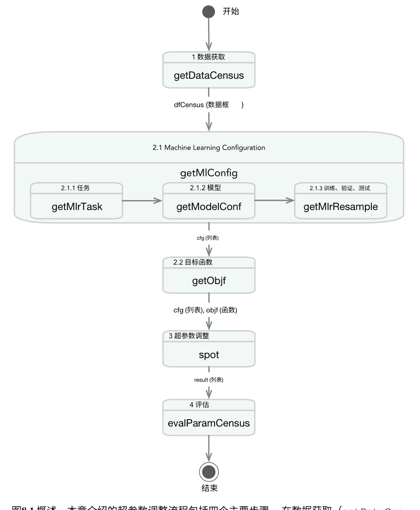

图8.1 概述。本章介绍的超参数调整流程包括四个主要步骤。在数据获取（getDataCensus）之后，配置ML模型（getMlConfig）并指定目标函数（getObjf）。调用超参数调整器SPOT（spot），最后评估结果（evalParamCensus）。通过getMlConfig进行ML配置，将来自三个子程序的结果合并，即 getMlrTask、getModelConf 和 getMlrResample。

1 数据：获取和准备CID数据集。调用函数 getDataCensus 执行这些步骤；参见第8.2.1节。2.1 设计：设置实验设计。这一步包括度量的规定，超参数调整器的配置以及机器学习模型的配置。调用函数 getMlConfig 执行子程序2.1.1到2.1.3：

2.1.1 任务：定义一个机器学习任务。函数 getMlrTask 执行此步骤。它会生成一个mlr任务对象；参见第8.3.2.1节。2.1.2 配置超参数配置。函数 getModelConf 设置模型的超参数；参见第8.3.2.2节。2.1.3 分割：生成训练和测试数据。这里使用函数 getMlrResample。它返回一个包含相应数据集的列表；参见第8.3.2.3节。

2.2 目标：目标函数通过 getObj 定义；参见第8.4.4节。3 调整：调整超参数的函数 spot 被调用。参见第8.5节。

4 评估：在测试数据上进行评估。为了评估结果，可以使用函数 evalParamCensus；参见第8.6.2节。这些步骤在图8.1中有所说明。

#### 8.2 数据描述

##### 8.2.1 人口普查数据集

为了研究，我们选择了CID，例如通过UCI ML Repository提供。为了我们的研究，我们将访问通过openml.org平台在数据记录ID 4535下可用的数据集版本（Vanschoren等人，2013年）。这个数据集是根据美国人口普查局1994年和1995年的当前人口调查编制的。它包含了299,285个关于人口统计和就业的观察值，其中有41个特征。这个数据集相对较大，有许多具有许多水平的分类特征，并且与官方统计学的应用领域非常匹配。

CID数据集非常适合我们的研究问题，因为它相对较大，并且具有许多分类特征。其中几个分类特征具有广泛的级别。该数据集可以轻松用于生成不同的分类和回归问题。

数据预处理包括以下步骤：

- 特征24（实例权重 MARSUPWT）被移除。该特征描述了由相应观测所代表的人口数量。
观察。这对于数据理解很重要，但不应作为ML模型的输入。

- 几个特征被编码为数值（整数）变量，但实际上是分类的。例如，特征3（行业代码 ADTIND）被编码为整数。由于相应的整数表示不同行业部门的离散代码，它们没有固有的顺序，应该被编码为分类特征。

- 数据集有时包含 NA值（缺失数据）。这些 NA值在建模之前被替换。对于分类特征，最常见的类别被填充（众数）。对于整数特征，使用中位数填充，对于实数特征，使用均值填充。

- 作为本书中唯一研究的模型，xgboost不能直接处理分类特征。这在第12章的实验中变得相关。在这种情况下（仅适用于xgboost），分类数据特征被转换为虚拟编码。对于分类特征的每个类别，创建一个新的二进制特征，指定观察是否属于相应的类别或不属于。

- 最后，我们将数据随机分成测试数据（观测值的40%）和训练数据（观测值的60%）。

除了这些一般的预处理步骤外，我们根据个别实验的需要改变数据集的属性，以涵盖我们的各种假设（尤其是在第12章）。可以说，我们可以通过使用完全不同的数据集来完成这个任务，其中每个数据集涵盖不同的研究对象（即，不同数量的特征或不同的m）。我们决定坚持使用单个数据集并对其进行变化，而不是生成具有不同属性的新的可比较数据集。这样可以合理地比较不同变化之间的结果。通过这种方式，我们生成了多个详细讨论不同方面和问题的数据集。尽管它们都来自相同的数据集（CID），但它们具有不同的特征：分类特征的数量，数值特征的数量，基数，观测值的数量和目标变量。这些特征可以根据难度进行量化，如第12.5.4节所讨论的那样。具体而言，我们变化的内容有：

### 目标：
数据集的原始目标变量是收入类别（低于/高于50000美元）。我们选择年龄作为目标变量。对于分类实验，年龄将被离散化为两个类别：年龄<40和年龄>=40。对于回归，年龄保持不变。这个选择旨在建立分类和回归两个实验组之间的可比性。

### 基数：
类别的数量（基数）。为了创建具有不同类别特征基数的数据集变体，我们将类别合并为新的更大的类别。例如，对于特征35（出生国家自我 PENATVTY），首先通过组合来自特定大陆的所有国家来合并原始国家。这样可以减少基数，剩下6个类别。
中等基数。为了进一步减少（低基数）到三个类别，数据被合并到类别未知、美国和国外。源代码中记录了对其他特征的类似更改。对于我们的实验，这个预处理步骤导致数据集的基数级别为：低（最多15个类别），中等（最多24个类别）和高（最多52个类别）。

### 数值特征数量：
要更改特征数量，需要单独包含或删除数据集中的各个特征。这针对分类特征和数值特征分别进行，结果是四个级别的数值特征数量（低：0，中等：4，高：6，完整：7）。

### 分类特征数量：
相应地，我们得到四个级别的分类特征数量（低：0，中等：8，高：16，完整：33）。请注意，如果基数较低，这些数字会有所减少（低：0，中等：7，高：13，完整：27）。原因是在合并类别时，某些特征可能变得多余。因此，当合并类别时，某些特征可能变得多余。

### n:
观测数量（n）。为了改变 n，我们从数据集中随机抽取观测。我们在对数尺度上测试五个级别，从10^4到10^5: 10,000、17,783、31,623、56,234和100,000。此外，我们还对完整的数据集进行了单独的测试，即299,285个观测。

为了保持结果的可比性，本书中的大多数案例研究（第9、10和12章）使用了相同的CID数据集的数据预处理。只有第12章同时考虑了CID数据集的几个变体。

### 背景：实施细节
来自 SPOTMisc 包的函数 getDataCensus 使用了 R package OpenML 中的函数 setOMLConfig 和 getOMLDataSet，即CID也可以通过以下方式下载：

```
r
OpenML::setOMLConfig(cachedir = "oml.cache")
dataOML <- OpenML::getOMLDataSet(4535)$data
```

虽然不是必需的，但为Open Machine Learning (OpenML) 数据集设置一个永久缓存目录是个好主意。否则，每次新实验都会重新下载数据集，不必要地给OpenML服务器带来负担。

表8.2显示了CID数据集的42列信息。

表8.2 CID数据集
| 变量 | 类型，因子水平 | 示例数据 |
|------|----------------|----------|
| V1: | 数值: | 73 58 18 9 10 48 42 28 47 34 ... |
| V2: | 因子，有9个水平“联邦政府”，...: | 4 7 4 4 4 5 5 5 2 5 ... |
| V3: | 数值: | 0 4 0 0 0 40 34 4 43 4 ... |
| V4: | 数值: | 0 34 0 0 0 10 3 40 26 37 ... |
| V5: | 因子，有17个水平“10年级”，...: | 13 17 1 11 11 17 10 13 17 17 ... |
| V6: | 数值: | 0 0 0 0 0 1200 0 0 876 0 ... |
| V7: | 因子，有3个水平“大学”，...: | 3 3 2 3 3 3 3 3 3 3 ... |
| V8: | 因子，有7个水平“离婚”，“已婚-AF配偶在场”，...: | 7 1 5 5 3 3 3 5 3 3 ... |
| V9: | 因子 w/24个级别“农业”，...: | 15 5 15 15 15 7 8 5 6 5 ... |
| V10: | 因子 w/15个级别“行政支持包括文员”，...: | 7 9 7 7 7 11 3 5 1 6 ... |
| V11: | 因子 w/5个级别“美洲印第安人或爱斯基摩人”，...: | 5 5 2 5 5 1 5 5 5 5 ... |
| V12: | 因子 w/10个级别“其他所有人”，“中美洲或南美洲”，...: | 1 1 1 1 1 1 1 1 1 1 ... |
| V13: | 因子 w/2个级别“女性”，“男性”: | 1 2 1 1 1 1 2 1 1 2 ... |
| V14: | 因子 w/3个级别“否”，“不在宇宙中”，...: | 2 2 2 2 2 1 2 2 1 2 ... |
| V15: | 因子 w/6个级别“离职者”，...: | 4 4 4 4 4 4 4 2 4 4 ... |
| V16: | 因子 w/8个级别“儿童或武装部队”，...: | 3 1 3 1 1 2 1 7 2 1 ... |
| V17: | 数值: | 0 0 0 0 0 ... |
| V18: | 数值: | 0 0 0 0 0 0 0 0 0 0 ... |
| V19: | 数值: | 0 0 0 0 0 0 0 0 0 0 ... |
| V20: | 因子 w/6个级别“户主”，...: | 5 1 5 5 5 3 3 6 3 3 ... |
| V21: | 因子 w/6个级别“国外”，“中西部”，...: | 4 5 4 4 4 4 4 4 4 4 ... |
| V22: | 因子 w/51个级别“? ”，“国外”，...: | 37 6 37 37 37 37 37 37 37 37 ... |
| V23: | 因子 w/38个级别“子女 <18岁曾结婚但不在亚家庭中”，...: | 30 21 8 3 3 37 21 36 37 21 ... |
| V24: | 因子 w/8个级别“18岁或以上的子女”，...: | 7 5 1 3 3 8 5 6 8 5 ... |
| V25: | 数值: | 1700 1054 992 1758 1069 ... |
| V26: | 因子 w/10个级别“? ”，“出国到MSA”，...: | 1 4 1 6 6 1 6 1 1 6 ... |
| V27: | 因子 w/9个级别“? ”，“出国”，...: | 1 9 1 7 7 1 7 1 1 7 ... |
| V28: | 因子 w/10个级别“? ”，“出国”，...: | 1 10 1 8 8 1 8 1 1 1 8 ... |
| V29: | 因子 w/3个级别“否”，“不在1岁以下的非宇宙中”，...: | 2 1 2 3 3 2 3 2 2 3 ... |
| V30: | 因子 w/4个级别“? ”，“否”，“不在宇宙中”，...: | 1 4 1 3 3 1 3 1 1 3 ... |
| V31: | 数值: | 0 1 0 0 0 1 6 4 5 6 ... |
| V32: | 因子 w/5个级别“父母都在”，...: | 5 5 5 1 1 5 5 5 5 5 ... |
| V33: | 因子 w/43个级别“? ”，“柬埔寨”，...: | 41 41 42 41 41 32 41 41 41 41 ... |
| V34: | 因子 w/43个级别“? ”，“柬埔寨”，...: | 41 41 42 41 41 41 41 41 41 41 ... |
| V35: | 因子 w/43个级别“? ”，“柬埔寨”，...: | 41 41 42 41 41 41 41 41 41 41 ... |
| V36: | 因子 w/5个级别“外国出生-不是美国公民”，...: | 5 5 1 5 5 5 5 5 5 5 ... |
| V37: | 数值: | 0 0 0 0 0 2 0 0 0 0 ... |
| V38: | 因子 w/3个级别“否”，“不在宇宙中”，...: | 2 2 2 2 2 2 2 2 2 2 ... |
| V39: | 数值: | 2 2 2 0 0 2 2 2 2 2 ... |
| V40: | 数值: | 0 52 0 0 0 52 52 30 52 52 ... |
| V41: | 数值: | 95 94 95 94 94 95 94 95 95 94 ... |
| V42: | 因子具有2个级别“-50000:.”、“50000+:.”: | 1 1 1 1 1 1 1 1 1 1 ... |

##### 8.2.2 getDataCensus：从OML获取数据

CID数据集可以根据目标变量、任务和数据的复杂性（例如样本数量、基数）进行配置。下面的变量被定义为：

```
target <- "age"
task.type <- "classif"
nobs <- 1e4
nfactors <- "high"
numericals <- "high"
cardinality <- "high"
data.seed <- 1
cachedir <- "oml.cache"
```

这些变量将被传递给函数 getDataCensus 以获取数据框 dfCensus（图8.2）。函数 getDataCensus 用于获取OML数据（从缓存或服务器获取）。参数 target, task.type, nobs, nfactors, numericals, cardinality 和 cachedir 可以使用，参见表8.3。

```
dfCensus <- getDataCensus (
  task.type = task.type,
  nobs = nobs,
  nfactors = nfactors,
  numericals = numericals,
  cardinality = cardinality,
  data.seed = data.seed,
  cachedir = cachedir,
  target = target
)
```

在案例研究中使用的 dfCensus 数据集有10,000个观测值和23个变量，这些变量在表8.4中显示。

表8.3中使用的参数用于获取CID数据集。详细描述可以在第8.2.1节中找到。

| 参数 | 案例研究中使用的值 | 描述 |
|------|------------------|------|
| 目标 | “年龄” | 目标变量。年龄小于或大于40岁 |
| 缓存目录 | “oml.cache” | 缓存数据的位置 |
| 任务类型 | “classif” | 分类任务。目标用于定义类别 |
| Nobs | 1e4 | 完整的数据集有299,285个观测值。nobs观测值是随机抽样的 |
| nfactors | “高” | 分类特征的数量 |
| numericals | “高” | 数值特征的数量 |
| 基数 | “高” | 类别的数量 |
| data.seed | 1 | 用于抽样nobs观测值的种子 |

##### 案例研究一：调整随机森林（Ranger）

表8.4 dfCensus数据集

| 参数 | 类型 | 存储级别 | 模式，示例 | 描述 |
| --- | --- | --- | --- | --- |
| Capital gains | Num | Double | 0 | 最小值: 0. 最大值: 9.9999×10^4. 3.56%的人有资本收益 |
| Capital losses | Num | Double | 0 | 最小值: 0. 最大值: 3900. 1.66%的人有资本损失 |
| Dividends_from_stocks | Num | Double | 0 | 最小值: 0. 最大值: 9.9999×10^4. 9.96%的人有股票分红 |
| Num_persons_worked_for_employer | Num | 整数 | 0 | 最小值: 0. 最大值: 6. |
| 每小时工资 | Num | Double | 0 | 最小值: 0. 最大值: 6800. |
| 一年中的工作周数 | Num | 整数 | 0 | 最小值: 0. 最大值: 52. |
| 职工类别 | 因子 | 9 | “联邦政府” | |
| 行业代码 | 因子 | 51 | “0” | |
| 职业代码 | 因子 | 47 | “0” | |
| 教育程度 | 因子 | 17 | “十年级” | |
| 婚姻状况 | 因子 | 7 | “离婚” | |
| 主要行业代码 | 因子 | 24 | “农业” | |
| 主要职业代码 | 因子 | 15 | “行政支持包括文员” | |
| 种族 | 因子 | 5 | “美洲印第安人、阿留申人或爱斯基摩人” | |
| 西班牙裔血统 | 因子 | 10 | “其他所有” | |
| 性别 | 因子 | 2 | “女性”，“男性” | |
| 纳税人身份 | 因子 | 6 | “户主” | |
| 详细家庭和家庭状况 | 因子 | 29 | “未满18岁的子女未婚且不在亚家庭中” | |
| 家庭中的详细家庭_摘要 | 因子 | 8 | “18岁或以上的子女” | |
| 出生国家（自己） | 因子 | 42 | “？”，“柬埔寨” | |
| 公民身份 | 因子 | 5 | “外国出生-非美国公民” | |
| 收入等级 | 因子 | 2 | “-50000”，“50000+.” | |
| 目标 | 因子 | 2 | “假”，“真” | |

## ! 注意：异常值和不一致的数据

- 目标：目标变量的值不平衡，因为61.27%的值为真，即大于40岁。
- 数值变量 num_persons_worked_for_employer 和 weeks_worked_in_year可以被视为整数。
- 因子income_class可以被视为逻辑值。
- 数值变量的摘要：

```
摘要    (dfCensus[,sapply(dfCensus, is.numeric)])

## wage_per_hour        capital_gains        capital_losses       dividends_from_stocks
## 最小值 :   0.00       最小值 :    0.0       最小值 :   0.00       最小值 :    0.0
## 第一四分位数: 0.00       第一四分位数:    0.0       第一四分位数:   0.00       第一四分位数:    0.0
## 中位数 :   0.00       中位数 :    0.0       中位数 :   0.00       中位数 :    0.0
## 平均值 :  51.46       平均值 :  452.1       平均值 :  31.22       平均值 :  202.2
## 第三四分位数: 0.00       第三四分位数:    0.0       第三四分位数:   0.00       第三四分位数:    0.0
## 最大值 :6800.00       最大值 :99999.0       最大值 :3900.00       最大值 :99999.0
## num_persons_worked_for_employer weeks_worked_in_year
## 最小值 :0.000                 最小值 : 0.00
## 第一四分位数:0.000                 第一四分位数: 0.00
## 中位数 :1.000                 中位数 : 6.00
## 平均值 :1.922                 平均值 :22.75
## 第三四分位数:4.000                 第三四分位数:52.00
## 最大值 :6.000                 最大值 :52.00
```

- capital_gains和dividends_from_stocks共享相同的上限：9.9999 × 10⁴，这似乎是人为的上限。
- 每小时工资：有一个条目为6800，但收入类别为-50000。

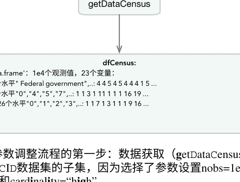

图8.2 本章介绍的超参数调整流程的第一步：数据获取（getDataCensus）生成数据集dfCensus，它是表8.2中完整CID数据集的子集，因为选择了参数设置nobs=1e4, nfactors=“high”, nnumericals=“high”, 和cardinality=“high”

#### 8.3 随机森林模型的实验设置和配置

##### 8.3.1 getMlConfig: ML模型的配置

由于我们考虑的是一个二分类问题（年龄，即年轻与老年），所以mlr的task.type被设置为classif。将使用随机森林（“ranger”）进行分类。

```
r
model <- "ranger"
cfg <- getMlConfig (
  target = target,
  model = model,
  data = dfCensus,
  task.type = task.type,
  nobs = nobs,
  nfactors = nfactors,
  nnumericals = nnumericals,
  cardinality = cardinality,
  data.seed = data.seed,
  prop = 2 / 3
)

```

调用getMlConfig后，列表cfg可用。该列表有13个条目，总结如表8.5所示。

**表8.5 调用getMlConfig后的配置列表，共有13个条目。**

| 参数 | 值 | 描述 |
| --- | --- | --- |
| 学习器 | “classif.ranger” | 学习器 |
| 调整参数 | “num.trees”, “mtry”, “sample.fraction”, “replace”, 和 “respect.unordered.factors” | 模型的超参数 |
| 默认值 | | tunepars的默认超参数设置 |
| 较低 | | 超参数的下限 |
| 较高 | | 超参数的上限 |
| 类型 | “numeric”, “integer”或“factor” | 超参数变量类型 |
| Fixpars | - | 固定的超参数 |
| Factorlevels | 每个因子变量的水平 | |
| Transformations | 应用的转换 | |
| Dummy | 虚拟编码 | 被xgboost使用 |
| Relpars | - | 相对于其他参数的参数 |
| 任务 | mlr任务对象 | |
| Resample | 来自mlr的重采样策略 | |

##### 8.3.2 实现细节：getMlConfig

函数getMlConfig将从以下函数中合并结果

- getMlrTask
- getModelConf
- getMlrResample

以下将对这些函数进行解释（图8.3）。

#### 8.3.2.1 getMlTask：机器学习任务的问题设计和定义

数据集的目标变量是年龄（40岁以下或40岁以上）。问题设计描述了目标和任务类型，观察数量以及因子、数值和基数变量的数量。数据种子也可以在这里指定。

```
任务 <- getMlTask(dataset = dfCensus, task.type = "classif",
```

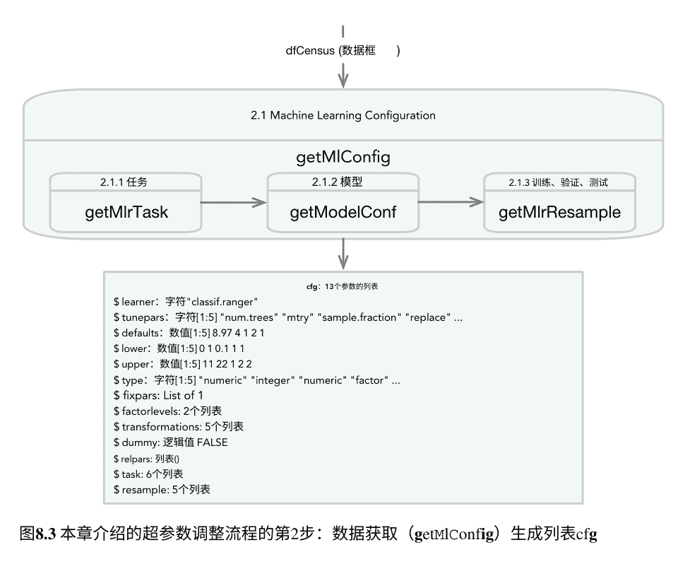

##### 案例研究一：调整随机森林 (Ranger)

函数 `getMlrTask` 是函数 `makeClassifTask` 的接口，来自 `mlr` 包。生成的任务 `task` 封装了数据，并通过其子类指定任务的类型。它还包含一个描述对象，详细说明数据的其他方面。”（Bischl等人，2016年）。

###### 背景：getMlrTask实现

数据集 `dfCensus` 传递给函数 `getMlrTask`，该函数计算如下的 `mlr` 任务：

```
r
getMlrTask <- function (dataset,
                       task.type = "classif",
                       data.seed = 1) {
  target <- "target"
  task.nobservations <- nrow (dataset)
  task.nfeatures <- ncol (dataset)
  task.numericals <- lapply (dataset, class) != "factor"
  task.numericals[target] <- FALSE
  task.factors <- lapply (dataset, class) == "factor"
  task.factors[target] <- FALSE
  task.nnumericals <- sum (task.numericals)
  task.nfactors <- sum (task.factors)
  task.nlevels <-
    as.numeric(lapply(dataset, function(x) {
      length(unique(x))
    }))
  task.nlevels[!task.factors] <- 0
  task.nlevels.max <- max (task.nlevels)
  任务 <- makeClassifTask(data = dataset, target = target)
  任务 <-
    - impute(task, classes = list(factor = imputeMode(), integer = imputeMedian(), numeric = imputeMean()))
  )
  )$任务
  turn(task)
}
```

因为函数 `getMlrTask` 生成了一个 `mlr` Task 实例，所以可以使用 `mlr` 方法来访问它的元素，即可以将 `mlr` 中的函数应用于任务 `task`。例如，可以使用 `mlr` 函数 `getTaskFeatureNames` 来获取基于数据的特征名称，如下所示：

```
head(getTaskFeatureNames(task))

## [1] "class_of_worker" "industry_code" "occupation_code" "education"
## [5] "wage_per_hour" "marital_status"
```

任务task为执行超参数调整提供了所需的基础信息。其他信息由函数getModelConf生成，下面将介绍该函数。

###### 8.3.2.2 getModelConf：算法设计-模型的超参数

函数getModelConf生成一个包含以下条目的列表：learner、tunepars、defaults、lower、upper、type、fixpars、factorlevels、transformations、dummy、relpars、task和resample，这些条目在表8.5中总结。ML配置列表modelCfg包含有关ranger模型的超参数的信息；请参见表8.6。

```
nFeatures <- sum(task$task.desc$n.feat)
modelCfg <- getModelConf (
  task.type = task.type,
  model = model,
  nFeatures = nFeatures
)
```

> 背景：从getModelConf获取模型信息

关于ranger超参数及其范围和类型的信息被编译为一个列表。可以通过函数getModelConf访问该信息。该函数管理有关ranger模型的信息如下：

表8.6 Ranger超参数。$N_{Feats}$表示从getTaskNFeats(task)获取的输出

| 变量 | 姓名 | 类型 | 默认 | 较高 | 较低 | 转换 |
| :--- | :--- | :--- | :--- | :--- | :--- | :--- |
| $x_1$ | num.trees | 数值 | 8.965784 | 0 | 11 | 2pow_round |
| $x_2$ | mtry | 整数 | 4 | 1 | 22 | id |
| $x_3$ | sample.fraction | 数值 | 1 | 0.1 | 1 | id |
| $x_4$ | 替换 | 因子 | 2 | 1 | 2 | id |
| $x_5$ | respect.unordered.factors | 因子 | 1 | 1 | 2 | id |

```
learner <- paste (task.type, "ranger", sep = ".")
tunepars <- c (
    "num.trees",
    "mtry",
    "sample.fraction",
    "replace",
    "respect.unordered.factors"
)
defaults <- c (
    log(500, 2), floor(sqrt(nFeatures)), 1,
    2, 1
)
lower <- c (0, 1, 0.1, 1, 1)
upper <- c (11, nFeatures, 1, 2, 2)
type <- c (
    "numeric", "integer", "numeric", "factor",
    "factor"
)
fixpars <- list (num.threads = 1)
factorlevels <-
    list(
        respect.unordered.factors = c("ignore", "order", "partition"),
        replace = c(FALSE, TRUE)
    )
transformations <- c (
    trans_2pow_round, trans_id, trans_id,
    trans_id, trans_id
)
dummy <- FALSE
relpars <- list ()
```

为每个机器学习模型提供类似的信息。注意：此列表与mlr无关，即不使用任何mlr类。

###### 8.3.2.3 getMlrResample：训练和测试数据

函数getMlrResample是函数getMlConfig使用的第三个也是最后一个子程序。它根据prop将数据分为训练数据X'train'和测试数据X'test。函数getMlrResample来自包SPOTMisc，它是mlr函数makeFixedHoldoutInstance的接口，用于生成固定的留出实例进行重采样。

```
rsmpl <- getMlrResample(task=task,
                       dataset = dfCensus,
                       data.seed = 1,
                       prop = 2/3)
```

rsmpl指定训练数据集X（train），其中包含数据的prop=2/3部分，以及测试数据集X（test），其中包含剩余的1-prop=1/3部分。它被实现为一个列表，其中心组件是选择相应的训练或测试数据集的索引列表。

###### 背景：getMlrResample

关于数据拆分的信息存储在cfg列表的cfg$resample中。它们也可以直接使用getMlrResample函数进行计算。该函数使用makeFixedHoldoutInstance函数生成的mlr resample实例进行计算。

```
getMlrResample <- function(task,
                           dataset,
                           data.seed = 1,
                           prop = NULL) {
  set.seed(data.seed)
  train.id <- sample(1:getTaskSize(task),
                     size = getTaskSize(task) * prop,
                     replace = FALSE)
  test.id <- (1: getTaskSize(task))[-train.id]
  rsmp1 = makeFixedHoldoutInstance(train.id,
                                   test.id,
                                   getTaskSize(task))
  return(rsmp1)
}
```

函数getMlrResample实例化了一个mlr重采样策略对象从类makeResampleInstance中。这个mlr类封装了从数据集生成的训练和测试数据集，用于多次迭代。它实际上存储了一组整数向量，为每个迭代提供训练和测试样例。(Bischl et al. 2016)。第一个条目，desc，描述了训练和测试数据之间的分割及其属性，例如，在重采样过程中要预测的内容：“train”、“test”或“both”集合。第二个条目，size，存储了要重采样的数据集的大小。第三个和第四个元素是包含训练和测试索引的列表，即对于X^(train)数据集有6666个索引，对于X^(test)数据集有3334个索引。这些索引将用于所有迭代。最后一个元素是可选的，用于编码特定迭代是否“归属于一起”(Bischl et al. 2016)。

str(rsmp1)

## 5个列表

desc :7个列表 分割 :数字 0.667 id: 字符串 "holdout" iters :整数 1 预测 :字符串 "测试" 分层 :逻辑值 FALSE 固定 :逻辑值 FALSE 阻塞.cv: 逻辑值 FALSE 属性 (*, "class")= 字符串 [1:2] "HoldoutDesc" "ResampleDesc" 大小: 整数 10000 train.inds:1个列表 :整数 [1:6666] 1017 8004 4775 9725 8462 4050 8789 1301 8522 1799 ... 测试.inds :1个列表 : 整数 [1:3334] 1 10 11 12 13 17 20 23 25 28 ... 组: 因子 w/ 0 levels: 属性 (*, "class")= 字符串 "ResampleInstance"

## 重要提示：训练和测试数据

mlr的函数resample需要有关测试数据的信息，因为它在内部管理训练和测试数据的分区。通常，在机器学习中，最佳实践是不将测试集传递给机器学习模型。据我们所知，这在mlr中是不可能的。

因此，完整的数据集（训练和测试数据）传递给resample函数，其中nobs=104个观测值。由于mlr是一个成熟的R包，我们相信作者会将训练和测试数据分开保存。

如果测试数据集X（test）包含具有未知标签的数据，即具有未知水平的因子，那么会出现额外的问题。如果这些未知水平被传递给训练好的模型，将无法进行预测。

#### 8.4 目标函数（模型性能）

##### 8.4.1 性能度量

评估超参数值需要一个质量度量，该度量确定生成的模型的性能如何。对于分类实验，我们使用平均错误分类率（MMCE）作为公式（2.2）中定义的度量。超参数调整工具箱（SPOT）使用这些MMCE在测试数据集上确定更好的超参数值。

除了MMCE之外，我们还记录运行时间（模型评估的总运行时间，预测的运行时间，训练的运行时间）。为了模拟真实的使用情况，我们为调谐器指定了固定的运行时间预算。这限制了调谐器寻找潜在最优超参数值的时间。

对于大多数模型来说，单次评估（训练+预测）的运行时间很难预测，如果参数不当，很容易变得过长。选择不当。在极端情况下，单次评估的运行时间可能大大超过计划的运行时间。在这种情况下，没有足够的时间来测试不同的超参数值。为了防止这种情况发生，我们为单次评估的运行时间指定了一个限制，我们称之为超时。当模型超过超时时间时，评估将被中止。在实验过程中，我们将超时时间设置为调整器总运行时间预算的二十分之一。

```r
timebudget <- 60 # 秒
timeout <- timebudget / 20
```

决策树（DT）（rpart）的实验例外：由于 rpart 评估非常快（在我们的实验中通常少于一秒），因此不需要超时。实际上，在这种情况下使用 timeout 会增加相当大的评估时间开销。

通过指定大于一个的 nthread 值，可以并行执行HPT任务。实验中只使用了一个线程。除了均方根误差（RMSE）和MMCE之外，我们还记录了运行时间（模型评估的总体运行时间，预测的运行时间，训练的运行时间）。可以指定几种替代指标。

###### 示例：更改损失函数

例如，可以选择 logloss 如下：

```r
if (task.type == "classif") {
  fixpars <- list (
    eval_metric = "logloss",
    nthread = 1
  )
} else {
  fixpars <- list (
    eval_metric = "rmse",
    nthread = 1
  )
}
```

##### 8.4.2 处理错误

如果评估被中止（例如，由于超时或某些数值不稳定性），我们仍然需要返回一个质量值给调整器，以便搜索可以继续进行。应选择此返回值，以避免额外的运行时间较长的评估。同时，该值应与实际质量度量在相似的尺度上，以避免基础代理模型的恶化。为了实现这一点，当评估中止时，我们返回以下值。

##### 8.4.3 缺失数据的填充

可以使用mlr中的内置方法来实现缺失值的填充。 这些填充基于超参数类型：因子变量使用imputeMode，整数使用imputeMedian，数值使用imputeMean。

**!重要：插补**

在以下两种情况下可以应用插补：

- 1. 缺失数据，即CID数据不完整。 这种插补可以通过本节中描述的tmlr方法来处理。
- 2. 缺失结果，即ML方法的性能值，如损失或准确性。 这种插补可以通过spot来处理。

##### 8.4.4 getObjf: 目标函数

在通过getMlConfig编译ML配置之后，必须生成目标函数。

```r
objf <- getObjf (
  config = cfg,
  timeout = timeout
)
```

getObjf从cfg和预算（timeout）（图8.4）中汇编信息。

**背景：getObjf作为tmlr的resample函数的接口**

注意，除了超参数信息，cfg还包括有关mlr任务的信息。getObjf调用tmlr函数makeLearner。该信息用于执行resample函数，在任务上拟合由learner指定的模型。对由重采样方法指定的所有训练和测试集进行预测和性能测量（Bischl等，2016）。

下面是一个实现函数getObjf基本元素的简化版本。在设置参数名称之后，进行参数转换并编译完整的参数集：包括转换将整数级别转换为分类参数级别，设置固定参数（不进行调整，但也不设置为默认值），并设置与其他参数相关的参数（例如，minbucket相对于minsplit）。接下来，通过mlr的makeLearner函数生成学习器lrn，并定义度量标准。这里使用了固定集mmce，timeboth，timetrain和timepredict。设置随机数生成器（RNG）种子后，调用mlr函数resample。函数resample在任务上为学习器指定的模型进行拟合，并计算所有训练集X（train）和所有测试集X（test）的性能指标，这些集合由resampling实例config$resample指定，该实例是使用getMlrResample函数生成的，如第8.3.2.3节所述。

```r
getObjf <- function(config, timeout = 3600) {
  objfun <- function(x, seed) {
    params <- as.list(x)
    names(params) <- config$tunepars
    for (i in 1:length(params)) {
      params[[i]] <- config$transformations[[i]](params[[i]])
    }
    params <- int2fact(params, config$factorlevels)
    params <- c(params, config$fixpars)
    nrel <- length(config$relpars)
    for (i in 1:nrel) {
      params[names(config$relpars)[i]] <-
        with(params, eval(config$relpars[[i]]))
    }
    lrn <- makeLearner(config$learner, par.vals = params)
    measures <- list(mmce, timeboth, timetrain, timepredict)
    set.seed(seed)
    res <- resample(lrn,
      config$task,
      config$resample,
      measures = measures
    )
  }
}
```

```r
    )
    时间戳      <- as.numeric(Sys.time())
    return(matrix(c(res$aggr, timestamp), 1))
  }
  objvecf <- function(x, seed) {
    res <- NULL
    for (i in 1:nrow(x)) {
      res <- rbind(res, objfun(x[i, , drop = FALSE], seed[i]))
    }
    return(res)
  }
}
```

使用 getObjf生成的目标函数的返回值 res在测试集 X^(test)上进行评估。

```r
names(res$aggr)
```

## [1] "mmce.test.mean"        "timeboth.test.mean"    "timetrain.test.mean"
## [4] "timepredict.test.mean"

在HPT过程中没有明确定义验证集 X^(val)。
重要的是，随机化是通过通过管理种子来处理的，通过spot的seedFun参数。种子管理确保两个不同的超参数配置λ_i和λ_j在相同的测试数据X（test）上进行评估。
但是，如果同一个配置被评估第二次，它将获得一个新的测试数据集。

## 8.5 spot：超参数调整器的实验设置

R包SPOT用于执行实际的超参数调整（优化）。超参数调整器本身具有参数，如初始设计的类型和大小，处理非数值数据的方法（例如Inf，NA，NaN），替代模型和优化器，搜索边界，重复次数，处理噪声的方法。

由于通用的SPOT设置在第4.5节中介绍，本节重点介绍了为ML运行所做的通用设置的修改。

超参数调整流程的第三步如图8.5所示，启动SPOT超参数调整器。

```r
result <- spot (
  x = NULL,
  fun = objf,
  lower = cfg $lower,
  upper = cfg $upper,
  control = list(
    types = cfg $type,
    time = list(maxTime = timebudget  / 60),
    noise = TRUE,
    OCBA = TRUE,
    OCBABudget = 3,
    seedFun = 123,
    designControl = list(
      replicates = Rinit,
      size = initSizeFactor  * length (cfg$lower)
    ),
    replicates = 2,
    funEvals = Inf,
    modelControl = list(
      target = "ei",
      useLambda = TRUE,
      reinterpolate = TRUE
    ),
    optimizerControl = list(funEvals = 200  * length (cfg$lower)),
    multiStart = 2,
    parNames = cfg $tunepars,
    yImputation = list(
      handleNAsMethod = handleNAsMean,
      imputeCriteriaFuns = list(is.infinite, is.na, is.nan),
      penaltyImputation = 3
    )
  )
)
```

spot运行的结果是一个结果列表，可以写入文件。 运行此案例研究的完整R代码显示在第8.10节中，SPOT参数列在表8.7中。

**背景：spot函数的实现细节**

初始设计由拉丁超立方采样（LHS）（Leary等人，2003年）创建。该设计的大小（超参数采样配置数量）对应于2 \times k。这里，k是超参数的数量。

图8.5 超参数调整流程：超参数调整器 SPOT 被称为（spot）

表8.7 用于机器学习超参数调整的SPOT参数。作为列表实现的参数在表8.8中描述。该表仅显示了用于机器学习和深度学习超参数调整任务的修改参数。完整列表显示在表4.2中

| 参数 | 值 | 描述 |
|---|---|---|
| x | x0 | 起始点 |
| fun | objf | 目标函数如第8.4.4节所述 |
| 下限 | cfg$lower | 下界 |
| 上限 | cfg$upper | 上界 |
| 控制 | 列表 | 请参阅表8.8中的描述 |

表8.8 用于机器学习超参数调整的SPOT控制列表参数。该表仅显示了用于机器学习和深度学习超参数调整任务的修改参数。完整列表显示在表4.2中参数

| 参数 | 值 | 描述 |
|------|-----|------|
| funEvals | Inf | |
| multiStart | 2 | |
| 噪声 | 噪音 | |
| parNames | cfg$tunepars | |
| 种子函数 | 123 | |
| 时间 | 列表 (maxTime = 时间预算/60) | 转换为分钟 |
| 变量转换函数 | cfg$transformations | |
| 类型 | cfg$type | |
| 设计控制 | 复制品 | Rinit |
|        | 大小 | initSizeFactor * length(cfg$lower) |
| y填充 | 列表 | |
| 模型控制 | funEvals | multFun * length(cfg$lower) |
| 优化器控制 | funEvals | multFun * length(cfg$lower) |

#### 8.6 可调性

以下分析基于存储在本书的数据文件夹中的 spotrun的结果。可以使用以下命令加载它们：

```r
load("supplementary/ch08-CaseStudyI/ranger00001.RData")
```

现在，使用 spot生成的信息在R环境中可用，如第8.5节所述，存储在 result列表中。

##### 8.6.1 进展

函数prepareProgressPlot生成一个数据框，用于可视化超参数调整的进展。数据框可以传递给ggplot。图8.6可视化了本研究中描述的 ranger超参数调整过程的进展。

经过60分钟，评估了582个ranger模型。将最差的配置与最佳配置进行比较，获得了25.8442%的减少。在初始阶段（包括20次评估）之后，最小的MMCE为0.179964。图8.6中的红色虚线表示这个结果。最终的最佳值为0.1712657，即MMCE减少了4.8333%。这些数值在与进展图（图8.6）中显示的结果相结合，表明快速的HPT运行能够提高ranger方法的质量。它还表明，增加运行时间并不会显著改善MMCE。

**> ！注意**
这些结果不能替代严格的统计比较，它们只是指标，不是最终结论。

##### 8.6.2 evalParamCensus: 比较默认和调整后测试数据上的参数

作为比较基础，进行了额外的实验，其中 ranger模型的所有超参数值保持模型的默认设置，并进行了额外的实验，使用了调整后的超参数。在这些情况下，没有设置评估的超时时间。由于没有进行搜索，整体运行默认值的运行时间总是比 spot的运行时间要低得多。最终的比较基于分类错误，如公式（2.2）所定义。这种比较的动机是可调性定义的结果；请参见定义2.26。

为了了解调整的影响，评估了获得的最佳解决方案进行n重复，并与默认设置的性能（MMCE）进行比较。进行了功率分析，如第5.6.5节所述，以估计重复次数，n。

相应的数值显示在表8.9中。函数evalParamCensus被用于进行比较。对默认和调整后的超参数配置在测试数据上进行评估的结果保存在相应的文件中。

默认和调整后的ranger模型结果可以在附录中找到。数据文件夹作为rangerDefaultEvaluation.RData和ranger00001Evaluation.RData，分别。

**重要提示:**

如第8.4.4节所述，在HPT过程中没有明确的验证集X^{val}定义。响应曲面函数ψ(test)被优化。但是，由于我们可以随机生成新的数据集(X, Y)，比较是基于多个随机生成的样本。

**背景：额外的评分**

评分以矩阵形式存储。属性用于标记测量值。除了mmce之外，每次重复还计算以下指标：准确率、F1值、对数损失、平均绝对误差、精确度、召回率和均方根误差。这些结果存储在相应的RData文件中。

默认配置和调整后配置的超参数如表8.9所示。

表8.9 “ranger”模型的默认和调整后超参数的比较。r.u.f.表示无序因子的尊重和s.f.表示样本分数

| 超参数 | num.trees | mtry | s.f | 替换 | r.u.f | 最小值 | 第一四分位数 | 中位数 | 平均值 | 第三四分位数 | 最大值 |
|---|---|---|---|---|---|---|---|---|---|---|---|
| 默认 | 8.966 | 4 | 1.0 | 2 | 1 | 0.1803 | 0.1879 | 0.1929 | 0.1913 | 0.1952 | 0.1998 |
| 调整后 | 9.305 | 20.000 | 0.142 | 2.000 | 2.000 | 0.1737 | 0.1809 | 0.1872 | 0.1856 | 0.1889 | 0.1986 |
| 调整后OCBA | 9.305 | 20.000 | 0.142 | 2.000 | 2.000 | 0.1737 | 0.1809 | 0.1872 | 0.1856 | 0.1889 | 0.1986 |

##### 案例研究一：调整随机森林（Ranger）

图8.7 默认(D)和调整后(T)的ranger算法的比较超参数。分类错误(MMCE)。垂直线表示相应分布的四分位数(0.25, 0.5, 0.75)。数值在表8.9中显示。

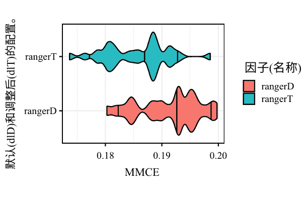

复制实验的相应R代码可在代码文件夹中找到。结果文件可以加载，并且可以将得到的MMCE的小提琴图可视化，如图8.7所示。可以看到，调整后的解决方案在留存测试数据集 (X, Y) （测试）上提供了更好的MMCE。

### 8.7分析随机森林调整过程

为了分析ranger模型中超参数之间的效应和交互作用（如表8.6所定义），可以使用如图8.8所示的简单回归树。

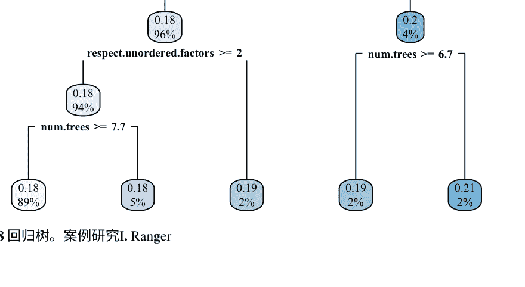

回归树支持观察结果，即sample.fraction、num.trees和respect.unordered.factors的超参数值对MMCE有最大影响。

| | sample.fraction | num.trees | respect.unordered.factors | mtry | replace |
|---|---|---|---|---|---|
| 1 | 0.010297452 | 0.006007073 | 0.0015083938 | 0.0013354262 | 0.00015087878 |

并行图可视化超参数之间的关系。SPOTmisc函数ggparcoordPrepare提供了从数据框返回的结果到GGally包中的ggparcoord函数的接口。参数probs指定了结果值的分位数概率，图8.9中分位数概率设置为(0.25, 0.5, 0.75)。指定三个值会得到四个类别，性能逐渐增加，即第一类别(0-25%)包含较差的结果，第二和第三类别(25-50%和50-75%)包含中等值，而最后一类别(75-100%)包含最佳值。

除了标记最佳配置外，还可以标记最差配置。

从运行结果中可以将结果传递给plotSensitivity函数，生成如图8.10所示的敏感性图。plotSensitivity函数可以生成两种类型的敏感性图：使用type = “best”参数时，使用最佳超参数配置；或者使用type = “agg”参数时，对所有超参数设置进行模拟。需要注意的是，第二种选项需要额外的计算，并且依赖于通常是非确定性的模拟输出。第二种选项的输出如图8.11所示。或者，使用type = “agg”参数时，对所有超参数设置进行模拟。需要注意的是，第二种选项需要额外的计算，并且依赖于通常是非确定性的模拟输出。第二种选项的输出如图8.11所示。

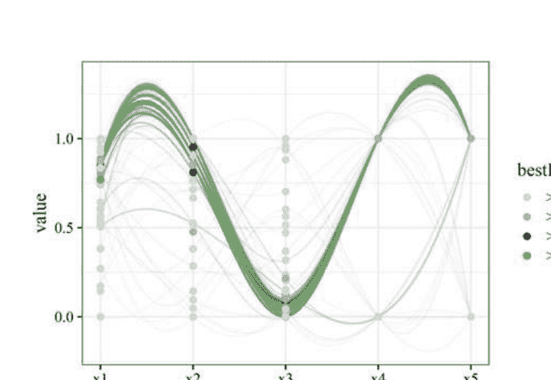

图8.9是ranger超参数调整过程的并行图。图中显示了num.trees（x1）、mtry（x2）、sample.fraction（x3）、replace（x4）和respect.unordered.factors（x5）的结果。最佳配置以绿色显示。

##### 案例研究一：调整随机森林 (Ranger)

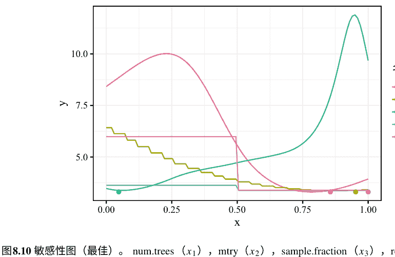

图8.10 敏感性图（最佳）。num.trees（x1），mtry（x2），sample.fraction（x3），replace（x4），和respect.unordered.factors（x5）被显示出来。

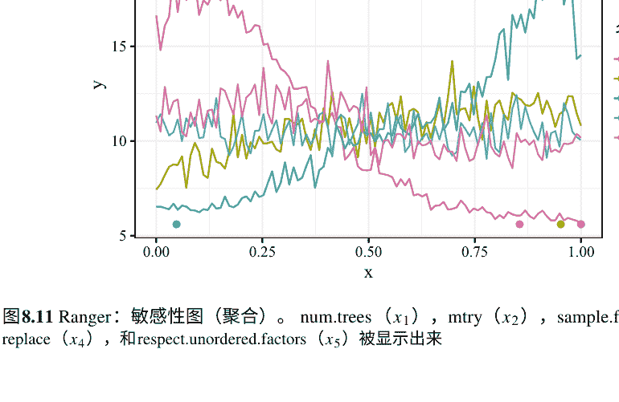

图8.11 Ranger：敏感性图（聚合）。num.trees（x1），mtry（x2），sample.fraction（x3），replace（x4），和respect.unordered.factors（x5）被显示出来。

如果使用参数 `type = "best"` 和 `type = "agg"` 得到的结果在质量上相似，那么本书的其余部分只会显示基于 `type = "best"` 的图。并行图将以类似的方式处理。提供生成所有图形的源代码。

SPOT提供了几种用于交互分析的工具。强烈推荐使用等高线图，如图8.12所示。

最后，可以对数据拟合一个简单的线性回归模型。根据SPOT结果列表中的数据，替换和保留超参数。无序因子转换为因子，并应用R函数`lm`。下面是摘要表。

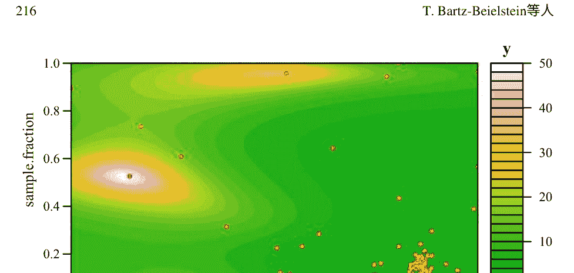

```
##
## 调用:
## lm(formula = y ~ ., data = df)
##
## 残差:
##      最小值     第四分位数      中位数      第三四分位数      最大值
## -0.0122996 -0.0013971 -0.0000444  0.0014070  0.0162966
##
## 系数:
##                            估计  标准误差   t值  Pr(|t|)
## (截距)                   1.991e-01  1.198e-03 166.275   <2e-16 ***
## num.trees               -2.220e-03  1.052e-04 -21.115   <2e-16 ***
## mtry                     3.907e-05  3.647e-05   1.071    0.2845
## sample.fraction          1.716e-02  1.038e-03  16.533   <2e-16 ***
## replaceTRUE              1.431e-03  5.580e-04   2.564    0.0106 *
## respect.unordered.factorsTRUE -6.276e-03  6.378e-04  -9.840   <2e-16 ***
## ---
## 显著性代码: 0 ‘***’ 0.001 ‘**’ 0.01 ‘*’ 0.05 ‘.’ 0.1 ‘ ’ 1
##
## 残差标准误差: 0.0026, 自由度为576
## 多重R平方: 0.7682, 调整后的R平方: 0.7662
## F统计量: 381.7, 自由度为5和576, p值: < 2.2e-16
```

尽管这个线性模型需要进行详细的调查（需要进行误差规范分析），但它也符合之前的观察结果，即超参数sample.fraction、num.trees和respect.unordered.factors对损失函数有显著影响。

结果表明，sample.fraction是主导超参数。它的设置对ranger的性能影响最大。例如，敏感性图Fig. 8.10显示小的sample.fraction值可以提高性能。较大的值明显提高了性能。回归树分析（参见Fig. 8.8）支持这个假设，因为sample.fraction是根节点。树和小于0.48 的值是推荐的。此外，回归树分析表明，如果num.trees大于等于2，还可以获得额外的改进。这些观察结果也得到了平行图和曲面图的支持。线性模型可以以类似的方式进行解释。

表8.10 案例研究I：结果分析

| p-值 | 决策 | 功效 | Cohen的 d | Hedge的 g | 严重性 |
|------|------|------|-----------|-----------|--------|
| 0    | 拒绝H0 | 0.9999941 | 1.0329001 | 1.0194859 | Δ ≤0.005 得到了很好的支持 |

#### 8.8 严重性：验证结果

现在，让我们继续分析所实现性能改进的统计显著性。预实验运行的结果表明，差异为 $\bar{x}=0.0057$。由于这个值是正的，暂时假设调整后的解决方案更优。相应的标准差为 $s_d =0.0045$。根据公式5.14，以及 $\alpha =0.05$， $\beta =0.2$，和 $\Delta =0.005$，让我们使用getSampleSize函数确定完整实验所需的运行次数。

对于0.005的相关差异，每个算法大约需要运行10次。由于我们进行了30次重复评估，现在我们可以继续评估并分析通过调整ranger参数来实现的性能改进的严重性。

表8.10呈现了总结结果统计。基于p值的决策是拒绝零假设，即支持调整参数设置在MMCE方面提供显著性能改进的声明。

效应大小表明差异具有较大的幅度。对于选择的 $\Delta =0.005$，严重性值为0.8，因此强烈支持拒绝$H_0$的决策。图8.13显示了严重性图。严重性显示支持小于或等于0.005的性能差异。

### 8.9总结与讨论

分析表明，超参数sample.fraction对算法的性能影响最大。sample.fraction的推荐值为0.1416，远小于1。

这个案例研究演示了如何结合R包中的函数和SPOT来进行良好结构的超参数调整和分析。通过使用maxTime来指定时间预算，用户可以系统地改进超参数设置。在将ML算法（如RF）应用于复杂问题之前，对于分类或回归问题，建议使用HPT。可以避免错误的超参数设置。可以获得ML算法行为的洞察。

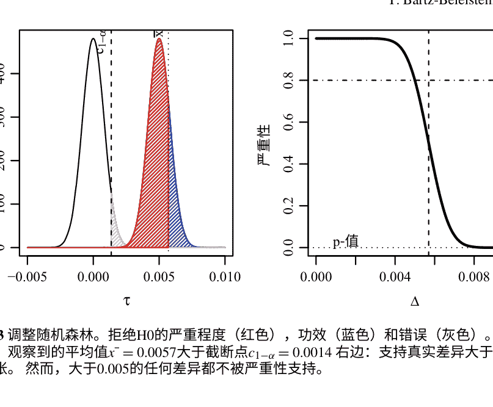

#### 8.10 程序代码

程序代码

```
library("SPOT")
library("SPOTMisc")

target <- "age"
task.type <- "classif"
nobs <- 1e4
nfactors <- "high"
nnumericals <- "high"
cardinality <- "high"
data.seed <- 1
cachedir <- "oml.cache"

dfCensus <- getDataCensus (
    task.type = task.type,
    nobs = nobs,
    nfactors = nfactors,
    nnumericals = nnumericals,
    cardinality = cardinality,
    data.seed = data.seed,
    cachedir = cachedir,
    target = target
)

model <- "ranger"
cfg <- getMlConfig (
  target = target,
  model = model,
  data = dfCensus,
  task.type = task.type,
  nobs = nobs,
  nfactors = nfactors,
  nnumericals = nnumericals,
  cardinality = cardinality,
  data.seed = data.seed,
  prop = 2 / 3
)

task <- getMlrTask (
  dataset = dfCensus,
  task.type = "classif",
  data.seed = 1
)

nFeatures <- sum(task$task.desc$n.feat)
cfg <- getModelConf (
  task.type = task.type,
  model = model,
  nFeatures = nFeatures
)

rsmlp <- getMlrResample (
  task = task,
  dataset = dfCensus,
  data.seed = 1,
  prop = 2 / 3
)

timebudget <- 60 ## 秒
timeout <- timebudget / 20

cfg <- append (cfg, list(
  task = task,
  resample = rsmlp
))

objf <- getObjf (
  config = cfg,
  timeout = timeout
)

result <- spot (
  x = NULL,
  fun = objf,
  lower = cfg $lower,
  upper = cfg $upper,
  control = list(
    types = cfg $type,
    time = list(maxTime = timebudget / 60),
    noise = TRUE,
    seedFun = 123,
    designControl = list(
      replicates = 2,
      size = length(cfg$lower)
    ),
    replicates = 2,
    funEvals = Inf,
    optimizerControl = list(funEvals = 200 * length (cfg$lower)),
    multiStart = 2,
    parNames = cfg $tunepars,
    yImputation = list(
      handleNAsMethod = handleNAsMean,
      imputeCriteriaFuns = list(is.infinite, is.na, is.nan),
      penaltyImputation = 3
    )
  )
)
```

开放获取本章节根据知识共享署名4.0国际许可协议（http://creativecommons.org/licenses/by/4.0/）进行许可，只要您给出适当的原作者和来源的信用，提供创意共享许可链接，并指示是否进行了更改，就可以在任何媒介或格式中使用、共享、适应、分发和复制。

本章节中的图像或其他第三方材料包含在章节的创意共享许可中，除非在材料的信用行中另有说明。如果材料未包含在章节的创意共享许可中，并且您的预期使用不符合法定规定或超出许可使用范围，您将需要直接从版权持有人那里获得许可。


### 第9章 案例研究二：梯度提升（xgboost）的调优

Thomas Bartz-Beielstein, Sowmya Chandrasekaran和Frederik Rehbach

摘要 本案例研究对本书中讨论的超参数调整（HPT）方法进行了实际操作的描述。选择了极限梯度提升（XGBoost）方法及其实现xgboost，因为它是许多机器学习（ML）任务中最强大的方法之一，特别是在分析标准表格数据时。本案例研究遵循第一和第三个研究相同的HPT流程：提供和预处理数据集后，设置实验设计。然后进行HPT实验。使用R包SPOT作为“数据范围”来分析来自多个角度的HPT运行结果：除了分类和回归树（CART）之外，分析还将表面、敏感性和并行图的结果与经典回归分析相结合。从错误统计的角度讨论结果的实际相关性。使用经过验证的R包mlr作为将SPOT和SPOTMisc包的方法与ML方法统一接口。以易懂的方式解释相应的源代码。

#### 9.1 引言

本章考虑了XGBoost算法，该算法在第3.6节中有详细介绍。将讨论如何找到合适的参数值和边界，以及如何针对以下九个XGBoost超参数进行实验：nrounds，eta, lambda, alpha, subsample, colsample, gamma, maxdepth，x和minchild。

补充信息 在线版本包含在https://doi.org/10.1007/978-981-19-5170-1_9上提供的补充材料。

T. Bartz-Beielstein (✉) · S. Chandrasekaran · F. Rehbach
科隆应用科学、工程与分析学院数据科学研究所，德国科隆
e-mail: thomas.bartz-beielstein@th-koeln.de
S. Chandrasekaran
电子邮件：sowmya.chandrasekaran@th-koeln.de
F. Rehbach
电子邮件：frederik.rehbach@th-koeln.de

#### 9.2 数据描述

第一步与第8章中的ranger示例相同，因为将使用Census-Income（KDD）数据集（CID）。因此，使用表8.3中的参数调用函数getDataCensus来获取表8.2中的CID数据。完整的数据集（$X$, $Y$）包含299,285个观测值，具有41个人口统计和就业特征。

#### 9.3 getMlConfig：实验设置和梯度提升模型的配置

再次，一个包含$n=1$到4个样本的子集定义了子集（$X$, $Y$）$\in$（$X$, $Y$）。项目设置与第8.1节中描述的设置类似。因此，只展示差异。完整的脚本在第9.10节中可用。函数getMlConfig使用与第8章相同的参数调用，只有一个例外：model设置为"xgboost"。函数getMlConfig定义了机器学习任务、模型配置和数据拆分（生成训练和测试数据集，即（$X$, $Y$）（train）和（$X$, $Y$）（test））。为了实现这个目标，执行函数getMlrTask、getModelConf和getMlResample。结果是，有13个元素的列表cfg可用，参见表9.1。

```
model <- "xgboost"
cfg <- getMlConfig (
  target = target,
  model = model,
  data = dfCensus,
  task.type = task.type,
  nobs = nobs,
  nfactors = nfactors,
  nnumericals = nnumericals,
  cardinality = cardinality,
  data.seed = data.seed,
  prop = 2 / 3
)
```

| 参数 | 类型 | 值 |
| --- | --- | --- |
| 学习者 | 字符 | "classif.xgboost" |
| tunepars | 字符[1:9] | "nrounds" "eta" "lambda" "alpha" ..., 参见表9.2 |
| 默认值 | num [1, 1:9] | 0 -1.74 0 -10 1 ... |
| 下限 | num [1:9] | 0 -10 -10 -10 0.1 ... |
| 上限 | num [1:9] | 11 0 10 10 1 1 10 15 7 |
| 类型 | 字符[1:9] | "numeric" "numeric" "numeric" "numeric" ... |
| fixpars | 列表 | eval_metric: chr "logloss"和线程数 |
| factorlevels | 列表() |  |
| 转换: | 9个 | 转换函数，请参见表9.2 |
| 虚拟 | 逻辑 | TRUE |
| relpars | 列表() | 空列表 (没有参数相对于其他参数) |
| 任务 | 6个 | mlr任务对象 |
| 重采样 | 5个 | 重采样信息 |

##### 9.3.1 getMlrTask：问题设计和定义机器学习任务

问题设计描述目标和任务类型，观察数量，以及因子，数值和基数变量的数量。它在第8.3.2.1节中有描述。

##### 9.3.2 getModelConf算法设计-模型的超参数

从getMlConf调用的函数getModelConf计算出一个合适的XGBoost超参数设置。将在第3.6节的表3.6中展示的文献示例用作指南。这些值被修改为以下内容：

-   nrounds: 选择了一个上限值（2^5），与随机森林（RF）配置类似。这个值比Probst等人（2019a）使用的值小，他们使用了5 000。
-   colsample_bytree: 选择了较低的值作为1/getTaskNFeats (task)。这与Probst等人（2019a）使用的设置略有不同。这个修改的原因# 表9.2 XGBoost超参数。N_Feats表示从getTaskNFeats（task）获得的输出

| 姓名 | 类型 | 默认 | 较低（mlr） | 较高（mlr） | 较高（SPOT） | 较低（SPOT） | 转换 |
| --- | --- | --- | --- | --- | --- | --- | --- |
| nrounds | 整数 | - | 1 | Inf | 0 | 5 | 2pow_round |
| eta | 数值 | 0.3 | 0 | 1 | -10 | 0 | 2的幂 |
| lambda | 数值 | 1 | 0 | Inf | -10 | 10 | 2的幂 |
| alpha | 数值 | 0 | 0 | Inf | -10 | 10 | 2的幂 |
| subsample | 数值 | 1 | 0 | 1 | 0.1 | 1 | id |
| colsample_bytree | 数值 | 1 | 0 | 1 | 1/N_Feats | 1 | id |
| gamma | 数值 | 0 | 0 | Inf | -10 | 10 | 2的幂 |
| max_depth | 整数 | 6 | 0 | Inf | 1 | 15 | id |
| min_child_weight | 数值 | 1 | 0 | Inf | 0 | 7 | 2的幂 |

Y: 很简单：零的较低值没有意义，因为至少应该通过colsample选择一个特征。选择了一个较低的值-10。这个值比Thomas等人（2018年）选择的值要小。因此，选择了一个比Thomas等人（2018年）更大的上限值（10）。

超参数的转换在表9.2的列trans中显示。这些转换与Probst等人（2019a）和Thomas等人（2018年）使用的转换类似，只有一个小改变：将trans_2pow_round应用于超参数nrounds。

ML配置列表cfg包含有关XGBoost模型的超参数的信息，请参见表9.2。

###### 背景：XGBoost超参数

使用函数getModelConf可以显示完整的XGBoost超参数列表。注意：超参数colsample_bytree是一个相对超参数，即它取决于特征的数量（nFeatures），请参见第3.6节中的讨论。因此，在计算超参数边界之前，必须确定nFeatures的值。

```
nFeatures <- sum (task$task.desc$n.feat)
modelCfg <- getModelConf (
  task.type = task.type,
  model = model,
  nFeatures = nFeatures
)
```

超参数的列表存储为列表元素tunepars，参见表9.2。

此外，所有的因子特征将被替换为它们的虚拟变量。对于XGBoost，建议使用虚拟变量：内部使用model.matrix，并且非因子特征将保持不变并传递给结果。种子可以设置以提高可重复性。最后，这些设置被编译成列表cfg。

##### 9.3.3 getMlrResample: 训练和测试数据

完整数据集的分割如第8.3.2.3节所述。rsample指定一个训练数据集，其中包含2/3的数据和一个测试数据集，其中包含剩余的1/3的数据。

#### 9.4 目标函数（模型性能）

由于XGBoost方法比RF更复杂，建议增加计算预算，例如选择6×3×600秒或六小时的调整预算。增加的预算在全局研究中使用（第12章）。对于当前章节中进行的实验，预算没有增加。

在调用超参数调整器之前，首先定义目标函数：该函数接收一个调整实验的配置，并返回一个通过spot进行调整的目标函数。关于目标函数的详细描述可以在第8.4.4节中找到。

### 9.5 spot: 超参数调整器的实验设置

使用R包SPOT来执行实际的调整（优化）操作。由于通用的Sequential Parameter Optimization Toolbox (SPOT)设置在第4.5节中已经介绍过，本节重点介绍了为xgboost超参数调整实验所做的通用设置的修改。

超参数调整流程的第三步如图8.5所示，启动SPOT超参数调整器。

```
result <- spot (
  x = NULL,
  fun = objf,
  lower = cfg$lower,
  upper = cfg$upper,
  control = list(
    type = cfg$type,
    time = list(maxTime = timebudget / 60),
    noise = TRUE,
    OCBA = TRUE,
    OCBABudget = 3,
    seedFun = 123,
    designControl = list(
      replicates = Rinit,
      size = initSizeFactor * length(cfg$lower)
    ),
    repeats = 2,
    funEvals = Inf,
    modelControl = list(
      target = "ei",
      useLambda = TRUE,
      reinterpolate = FALSE
    ),
    optimizerControl = list(funEvals = 200 * length(cfg$lower)),
    multiStart = 2,
    parNames = cfg$tunepars,
    yImputation = list(
      handleNAsMethod = handleNAsMean,
      imputeCriteriaFuns = list(is.infinite, is.na, is.nan),
      penaltyImputation = 3
    )
  )
)
```

结果被写入文件，并可以通过访问`load("supplementary/ch09-CaseStudyII/xgboost00001.RData")`来加载。

完整的R代码在附录（第9.10节）中展示。

#### 9.6 可调性

##### 9.6.1 进展

函数prepareProgressPlot生成一个数据框，用于可视化超参数调整的进展。数据框可以传递给ggplot。图9.1可视化了在 ranger超参数调整过程中的进展，在 spot调整过程中。

在60分钟后，评估了157个 xgboost模型。将最差的配置与最佳配置进行比较，获得了66.3743%的减少。在初始阶段，包括18次评估后，最小的平均误分类错误率（MMCE）为0.1793641。图8.6中的虚线红线表示这个结果。最终最佳值为0.1724655，即减少了MMCE为3.8462%。这些值与进展图（图8.6）中显示的结果相结合，表明快速的超参数调整运行能够改善 xgboost方法的质量。这也表明增加运行时间并不会显著改善MMCE。

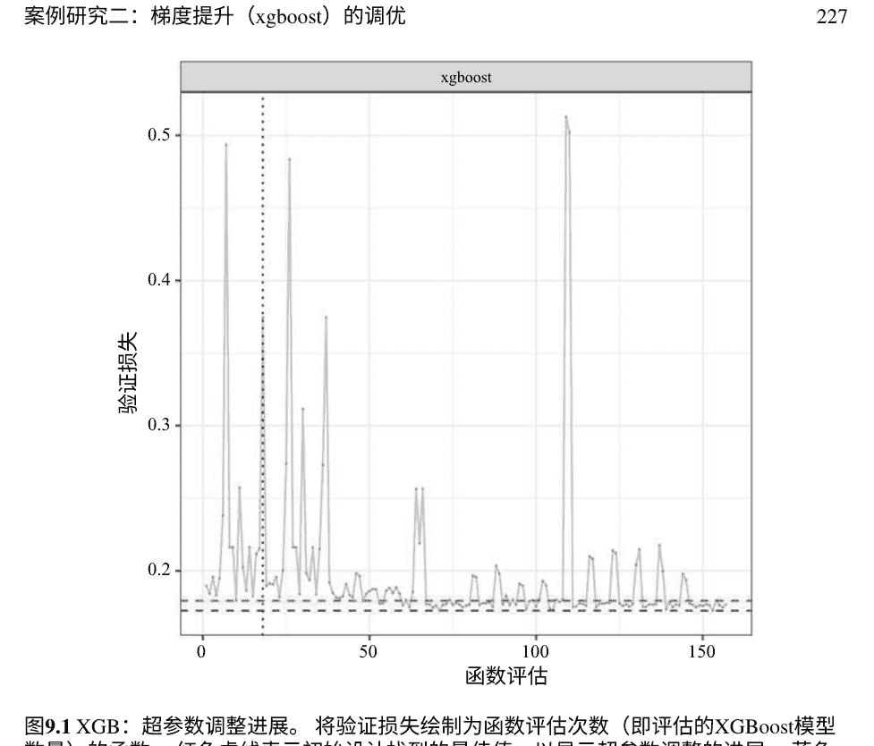

> ! 注意
这些结果不能替代严格的统计比较，它们只是指标，不是最终结论。

表9.3 比较XGBoost方法的默认和调整后的超参数。 colsample表示colsample_bytree。 表格显示了转换后的值。 注意： alpha和gamma的值是相同的。它们计算为2的-10次方，这是下界值，因为理论上的默认值0是不可行的。另请参见表3.8。

| 方法 | nrounds | eta | lambda | alpha | subsample | colsample | gamma | max_depth | min_child_weight |
|------|---------|-----|--------|-------|-----------|-----------|-------|-----------|------------------|
| 默认 | 1       | 0.3 | 1      | 0.001 | 1         | 1         | 0.001 | 6         | 1                |
| 调整后 | 1873   | 0.058 | 155.3 | 2.46  | 0.992     | 0.408     | 0.004 | 13        | 1.83             |

图9.2 比较具有默认（D）和调整后（T）超参数的XGBoost方法。 分类错误（MMCE）绘制在水平轴上。 小提琴图中的垂直线标记了相应分布的分位数（0.25、0.5、0.75）。 数值在表9.3中显示。

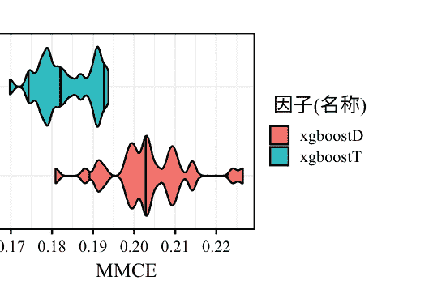

##### 9.6.2 evalParamCensus: 比较默认和调整后的测试数据上的参数

作为比较的基准，XGBoost使用默认的超参数值运行。 在代码文件夹中提供了复制实验的相应 R代码。 从三十次重复中报告了最佳（最小MMCE）结果。 相应的数值在表9.3中显示。使用函数evalParamCensus进行了比较。 通过指定机器学习模型，例如 "xgboost" 和 runNr，调用了函数evalParamCensus。

可以加载结果文件并可视化获得的MMCE的小提琴图（图9.2）。可以看到调整后的解决方案提供了更好的MMCE。默认和调整后的结果对于 ranger模型分别可用作rangerDefaultEvaluation.RData和xgboost00001Evaluation.RData。

分数被存储为一个矩阵。 属性用于标记测量结果。 对于每个超参数设置，计算以下指标：准确率、交叉熵、F1值、对数损失、平均绝对误差、精确率、召回率和均方根误差。 比较基于在公式（2.2）中定义的MMCE。默认配置和调整配置的超参数在表9.3中显示。完整的过程，即从头开始获取默认的xgboost超参数，在第9.10节中展示。接下来，展示调整后的xgboost方法的超参数。

#### 9.7 分析梯度提升调整过程

分析和可视化基于转换后的值。为了分析xgboost模型的超参数之间的效果和交互作用，可以使用简单的回归树，如图9.3和图9.4所示。

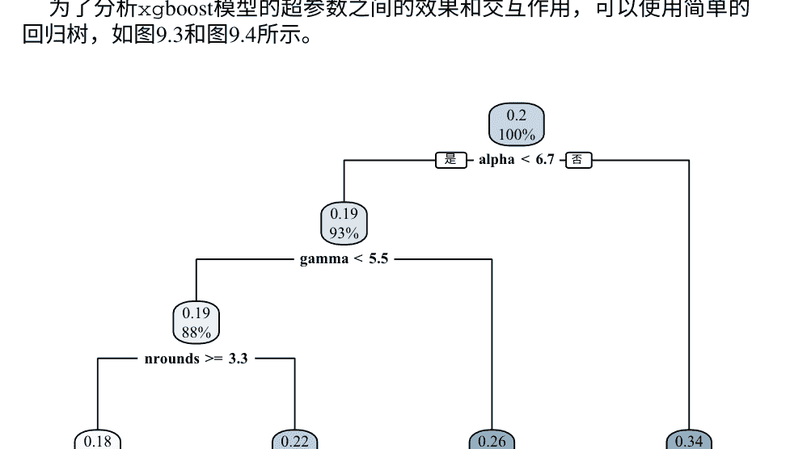

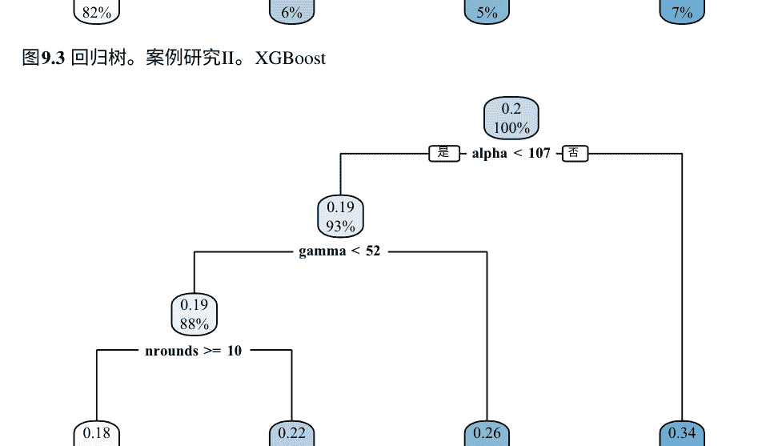

使用转换后的值的相同树：回归树支持观察结果，即alpha、lambda、gamma和nrounds的超参数值对MMCE有最大影响。

|   | alpha | lambda | gamma | nrounds | subsample | eta | colsample_bytree |
|---|-------|--------|-------|---------|-----------|-----|------------------|
| 1 | 0.23112227 | 0.04431784 | 0.04039483 | 0.014028719 | 0.012203015 | 0.009397272 | 0.0028057437 |

alpha是最相关的超参数。为了进行敏感性分析，可以使用并行和敏感性图（图9.5和9.6）。

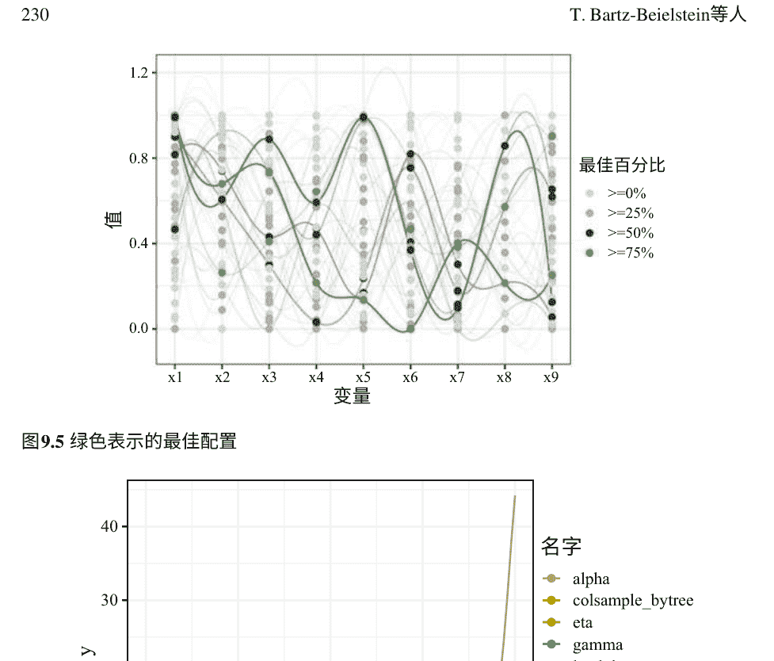

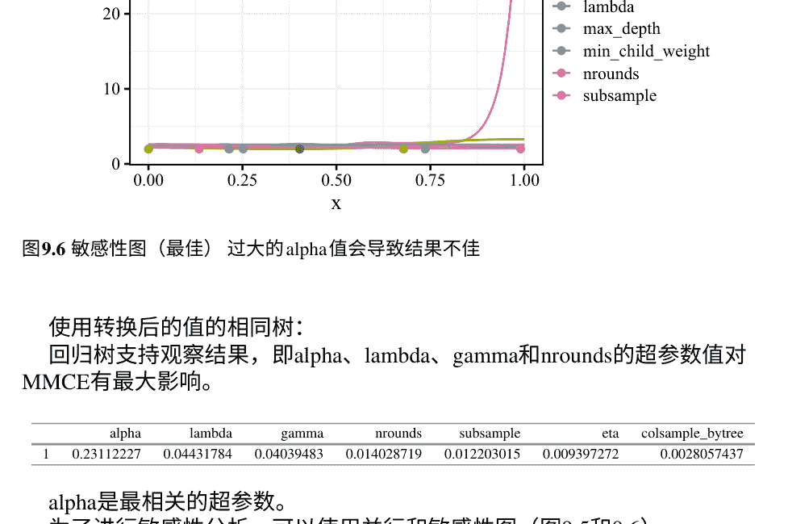

从spot运行中得到的结果可以传递给plotSensitivity函数，生成如图8.10所示的敏感性图。敏感性图在第8.6节中介绍。轮廓图在图9.7中显示。

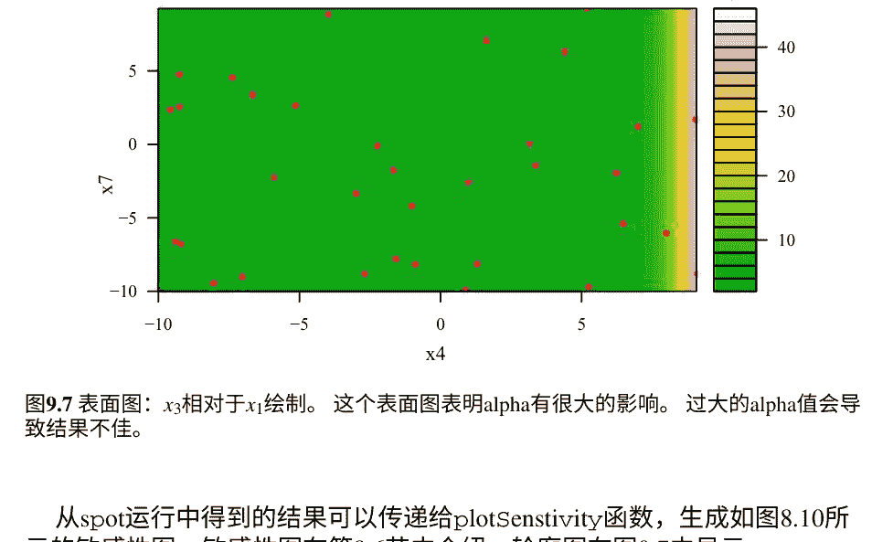

最后，可以对数据拟合一个简单的线性回归模型。根据SPOT的结果列表数据，下面是摘要。

```
r
##
## 调用:
## lm(formula = y ~ ., data = df)
##
## 残差:
##     最小值     1Q     中位数     3Q     最大值 
## -0.073397 -0.015307 -0.008367  0.001629  0.223535 
##
## 系数:
##             估计标准误差 t值 Pr(>|t|)    
## (截截)       0.2561669  0.0184896 13.855  < 2e-16 ***
## nrounds     -0.0032016  0.0012827 -2.496  0.01366 *  
## eta         -0.0003031  0.0016994 -0.178  0.85870    
## lambda       0.0021936  0.0007939  2.763  0.00646 ** 
## alpha        0.0072423  0.0007848  9.228 2.77e-16 ***
## subsample   -0.1033194  0.0137081 -7.537 4.55e-12 ***
## colsample_bytree  0.0050479  0.0132658  0.381  0.70411    
## gamma        0.0010887  0.0009034  1.205  0.23007    
## max_depth    0.0023106  0.0010527  2.195  0.02974 *  
## min_child_weight  0.0082803  0.0025515  3.245  0.00145 ** 
## ---
## 显著性代码: 0 '***' 0.001 '**' 0.01 '*' 0.05 '.' 0.1 ' ' 1
##
## 残差标准误差: 0.04047, 自由度: 147
## 多重R平方: 0.5222, 调整后的R平方: 0.493
## F统计量: 17.85, 自由度: 9和147, p值: < 2.2e-16
```

尽管这个线性模型需要进行详细的调查（需要进行误差分析），但它与先前的观察结果一致，即超参数alpha, lambda, gamma, nrounds对损失函数有显著影响。

#### 9.8 严重性：验证结果

现在，我们利用假设检验和严重性来分析所实现的性能改进的统计显著性。考虑到预实验运行的结果，差异为$\bar{x}=0.0199$。由于这个值是正的，暂时假设调整后的解决方案更优。相应的标准差为$s=0.0081$。根据公式5.14，以及$\Lambda=0.05$, $\beta=0.2$, 和$\delta=0.01$, 让我们使用getSampleSize()函数确定完整实验所需的运行次数。

表9.4 案例研究II：结果分析

| p-值 | 决策 | 功效 | Cohen的d | Hedge的g | 严重性 |
|------|------|------|----------|----------|--------|
| 0 | 拒绝H0 | 0.9999999 | 2.3978067 | 2.3666664 | Δ≤0.015得到了很好的支持 |

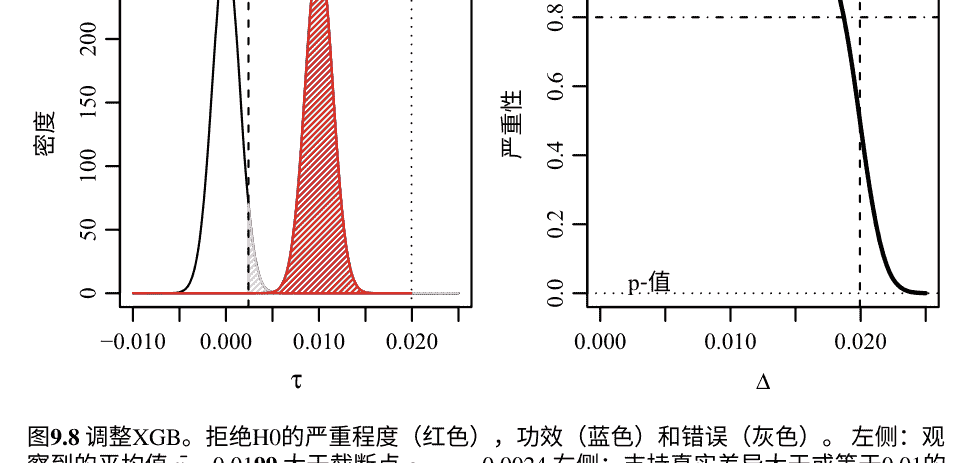

对于0.01的相关差异，每个算法需要大约8次运行。因此，我们可以继续评估严重程度并分析通过调整xgboost的参数来实现的性能改善。表9.4呈现了汇总结果统计。基于p值的决策是拒绝零假设，即支持调整参数设置在MMCE方面提供显著性能改善的主张。效应大小表明差异具有较大的幅度。对于选择的0.01，严重程度值为1，因此强烈支持拒绝H₀的决策。图9.8显示了严重程度图。严重程度显示小于0.015的性能差异得到了很好的支持。

#### 9.9 总结与讨论

分析表明超参数alpha对算法的性能影响最大。推荐的alpha值为7.2791，远大于默认值。这个案例研究演示了如何结合R包中的函数和SPOT来进行良好结构的超参数调整和分析。通过maxTime指定时间预算，用户可以系统地改进超参数设置。在应用诸如XGBoost等ML算法解决复杂的分类或回归问题之前，建议进行HPT。可以避免错误的超参数设置。可以获得ML算法行为的洞察。

#### 9.10 程序代码

程序代码

```
target <- "age"
task.type <- "classif"
nobs <- 1e4
nfactors <- "high"
numericals <- "high"
cardinality <- "high"
data.seed <- 1
cachedir <- "oml.cache"

dfCensus <- getDataCensus (
 task.type = task.type,
 nobs = nobs,
 nfactors = nfactors,
 nnumericals = nnumericals,
 cardinality = cardinality,
 data.seed = data.seed,
 cachedir = cachedir,
 target = target
)
task <- getMlrTask (
  dataset = dfCensus,
  task.type = "classif",
  data.seed = 1
)

model <- "xgboost"
cfg <- getMlConfig (
  target = target,
  model = model,
  data = dfCensus,
  task.type = task.type,
  nobs = nobs,
  nfactors = nfactors,
  nnumericals = nnumericals,
  cardinality = cardinality,
  data.seed = data.seed,
  prop = 2 / 3
)
transformX(cfg$defaults, cfg$transformations)

##      [,1] [,2] [,3]          [,4] [,5] [,6]          [,7] [,8] [,9]
## [1,]    1  0.3   1 0.0009765625    1    1 0.0009765625    6    1
```

开放获取本章节根据知识共享署名4.0国际许可协议 (http://creativecommons.org/licenses/by/4.0/) 进行许可，只要您给出适当的原作者和来源的信用，提供创意共享许可链接，并指示是否进行了更改，就可以在任何媒介或格式中使用、共享、适应、分发和复制。

本章节中的图像或其他第三方材料包含在章节的创意共享许可中，除非在材料的信用行中另有说明。如果材料未包含在章节的创意共享许可中，并且您的预期使用不符合法定规定或超出许可使用范围，您将需要直接从版权持有人那里获得许可。

# 第10章 案例研究III：调整深度神经网络

Thomas Bartz-Beielstein, Sowmya Chandrasekaran和Frederik Rehbach

摘要：本文介绍了一种基于代理模型的深度学习超参数调整（HPT）方法。本章演示了如何优化在keras/tensorflow中实现的深度神经网络（DNNs）的架构级参数（超参数）。调整过程的实现完全可以通过R进行，这是一种用于统计计算的软件环境。本章将示范如何以非常高效和有效的方式结合软件包（keras，tensorflow和SPOT）进行组合。

标准DNN的超参数被调整。本书讨论的六种机器学习（ML）方法的性能与DNN的结果进行了比较。这项研究为从业者提供了有价值的洞察力，对于几种方法的可调性非常重要。

#### 10.1 简介

本章描述的DNN超参数研究使用与第8章和第9章的机器学习研究相同的数据和HPT过程。第10.2节描述了数据预处理。第10.3节解释了实验设置和DL模型的配置。目标函数在第10.4节中定义。超参数调整器spot在第10.5节中描述。基于这个设置，实验结果进行了分析：在第10.6节中讨论了基于HPT进展的可调性，比较了默认的Λ₀和调整后的超参数。第10.7节中分析了DL调整过程。结果在第10.8节中使用严重性进行验证。第10.9节总结了本章内容。用于实验的DL超参数调整流程总结在表10.1中，并在图10.1中进行了说明。本章的前几节重点介绍了该流程的最重要步骤。执行实验的程序代码显示在第10.10节中。

表10.1 深度学习超参数流程
| 步骤 | 描述 | 函数 | 结果 | 细节 |
|------|------|------|------|------|
| 1 | 获取数据 | getDataCensus | dfCensus | 数据框 |
| 2.1 | 将数据分割为训练、验证和测试数据 | getGenericTrainValTestData | 数据 | 分割的数据 |
| 2.2 | 规范 | genericDataPrep | 规范列表 | 包含以下数据的列表 |
| 2.3.1 | keras配置 | getKerasConf | kerasConf | 用于keras的配置列表 |
| 2.3.2 | 模型配置 | getModelConf | cfg | 模型 |
| 3 | 超参数调整 | spot | 结果 | 结果列表 |
| 4 | 在测试数据上进行评估 | evalParamCensus | 得分 | 指标 |

keras是TensorFlow（TF）的高级应用程序编程接口（API），专注于实现快速实验。TF是一个开源软件库，用于进行数据流图的数值计算（Abadi等，2016年）。数学运算在图中表示为节点，图的边表示数据的多维数组（张量）（O'Malley等，2019年）。完整的TF API可以通过R软件环境中的tensorflow包进行访问，用于统计计算和图形化（R）。

附录中包含有关如何设置所需的Python软件环境以进行使用keras，SPOT和SPOTMisc进行HPT的信息。执行实验的源代码将包含在R软件包SPOTMisc中。更多信息发布在https://www.spotseven.de上，并且稍有延迟会在Comprehensive R Archive Network (CRAN) (https://cran.r-project.org/package=SPOT)上发布。这种延迟是由CRAN团队执行的密集代码检查引起的。它保证了高质量的开源软件，并且是提供可靠软件的重要特性，而不仅仅是昙花一现。

图10.1 概述。本章介绍的HPT流程包括以下步骤：在数据获取（getDataCensus）之后，将数据分为训练、验证和测试集。这些数据集通过genericDataPrep函数进行处理。通过getKerasConf函数配置keras。调整超参数的tuner spot被称为evalParamCensus，并最终评估结果。

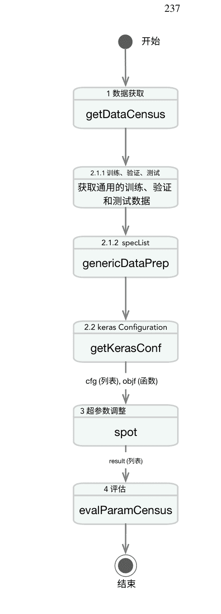

#### 10.2 数据描述

与机器学习案例研究相同，本章介绍的深度学习案例研究使用了Census-Income (KDD) 数据集 (CID)，该数据集可以通过加州大学欧文分校 (UCI) 机器学习仓库等途径获得。 1,2

##### 10.2.1 getDataCensus: 从OpenML获取数据

在训练DNN之前，数据会经过预处理，将其重塑为DNN可以处理的形状。函数getDataCensus用于获取Open Machine Learning (OpenML) 数据（从缓存或服务器获取）。将使用与之前的机器学习研究相同的选项，即使用表8.3中的参数设置。

```r
target <- "age"
task.type <- "classif"
nobs <- 1e4
nfactors <- "high"
nnumericals <- "high"
cardinality <- "high"
data.seed <- 1
cachedir <- "oml.cache"
prop <- 2 / 3
dfCensus <- getDataCensus (
  task.type = task.type,
  nobs = nobs,
  nfactors = nfactors,
  nnumericals = nnumericals,
  cardinality = cardinality,
  data.seed = data.seed,
  cachedir = cachedir,
  target = target
)
```

##### 10.2.2 getGenericTrainValTestData: 将数据分割为训练、验证和测试数据

数据框架dfCensus， (X, Y) ≤ (X, Y)，包含10,000个观测值和23个变量。基于prop的比例，将数据分割为训练、验证和测试集，分别是数据集 (X, Y) (train)，(X, Y) (val) 和 (X, Y) (test)。如果prop = 2/3，则训练数据集有4,444个观测值，验证数据集有2,222个观测值，测试数据集有剩余的3,334个观测值。

```r
data <- getGenericTrainValTestData(dfGeneric = dfCensus, prop = prop)
```

##### 10.2.3 genericDataPrep: 规范

数据预处理的第三步生成了一个 specList。

```r
batch_size <- 32
specList <- genericDataPrep(data = data, batch_size = batch_size)
```

函数genericDataPrep的工作原理如第10.2.3.1-10.2.3.5节所述。

###### 10.2.3.1 迭代器：数据框转换为数据集

辅助函数`df_to_dataset`<sup>3</sup>将数据框 dfCensus转换为数据集。这个过程使得处理非常大的逗号分隔值 (CSV) 文件成为可能 (文件太大以至于无法放入内存)。训练数据集的元素被随机洗牌。最后，将这个数据集的连续元素合并成批次。

应用函数 `df_to_dataset` 生成一个张量列表。每个张量表示一个单独的列。与 R 的数据框相比，TF 数据集的最显著区别是它是一个迭代器。

```r
train_ds_generic <-
  df_to_dataset(data$trainGeneric, batch_size = batch_size)
val_ds_generic <-
  df_to_dataset(data$valGeneric, shuffle = FALSE, batch_size = batch_size)
```

> **背景：迭代器**
>
> 每次调用迭代器时，它将产生数据集中不同的一批行。可以按以下方式调用迭代器函数 `iter_next`，以显示批次。
>
> ```r
> train_ds %>%
>   reticulate::as_iterator() %>%
>   reticulate::iter_next()
> ```
>
> 数据集train_ds_generic返回一个列名列表（来自数据框）与数据框中行的列值相对应。

###### 10.2.3.2 特征规范对象：指定目标

TF具有内置方法来执行常见的输入转换。⁴强大的feature_column系统将通过用户友好的高级接口feature_spec进行访问。在处理结构化数据（例如CSV数据）时，可以初始化和指定列转换和表示。在模型𝒜中实现数据预处理的一个实际好处是，在导出模型𝒜时，预处理已经包含在内。在这种情况下，新数据可以直接传递给模型𝒜。

> > 注意：Keras预处理层
>
> keras和tensorflow正在不断发展。SPOTMisc中的当前实现用于对特征列进行结构化数据分类。相应的TF模块是为与TF版本1的估计器一起使用而设计的。它符合兼容性保证。⁵新开发的keras模块使用“预处理层”来构建keras本地输入处理流水线。未来版本的SPOTMisc将基于预处理层。然而，由于两种预处理层的基本思想相似（TF提供了迁移指南），下面将介绍最重要的预处理步骤。

首先定义spec对象和specGeneric对象。响应变量在这里可以使用公式来指定，参见Chambers和Hastie（1992）以及R函数formula。

```r
specGeneric <- feature_spec(dataset = train_ds_generic, target ~ .)
```

###### 10.2.3.3 向feature_spec对象添加步骤

CID数据集包含多种数据类型。这些混合数据类型将被转换为固定长度的向量，以供DL模型处理。根据特征类型、数据类型或级别，列将被不同方式处理。创建feature_spec对象后，可以使用表10.2中的步骤函数。

表10.2 步骤：根据数据类型进行数据转换
| 步骤函数 | 描述 |
| --- | --- |
| step_numeric_column | 数值变量 |
| step_categorical_with_vocabulary_list | 具有固定词汇表的分类变量 |
| step_categorical_column_with_hash_bucket | 使用哈希技巧的分类变量 |
| step_categorical_column_with_identity | 以整数形式存储的分类变量 |
| step_categorical_column_with_vocabulary_file | 存储在文件中的词汇表 |

表10.3 CID特征和数据集中使用的数据类型的描述 (X, Y) ≤ (X, Y)
| 列 | 特征类型 | 数据类型/级别 |
| --- | --- | --- |
| capital_gains | Num | Double |
| capital_losses | Num | Double |
| 股票分红 | Num | Double |
| 每小时工资 | Num | Double |
| 年工作周数 | Num | 整数 |
| 工作者类别 | 因子 | 9 |
| 行业代码 | 因子 | 51 |
| 职业代码 | 因子 | 47 |
| 教育程度 | 因子 | 17 |
| 婚姻状况 | 因子 | 7 |
| 主要行业代码 | 因子 | 24 |
| 主要职业代码 | 因子 | 15 |
| 种族 | 因子 | 5 |
| 西班牙裔血统 | 因子 | 10 |
| 性别 | 因子 | 2 |
| 税务申报状态 | 因子 | 6 |
| 详细的家庭和家庭状况 | 因子 | 29 |
| 家庭中的详细家庭摘要 | 因子 | 8 |
| 出生国家 (自己) | 因子 | 42 |
| 公民身份 | 因子 | 5 |
| 收入类别 | 因子 | 2 |
| 目标 | 因子 | 2 |

添加进一步的步骤。 根据数据类型，步骤函数指定数据的转换。 表10.3显示了这些类型。

R包tfdatasets提供了选择器来选择特定的变量类型和范围，例如，all_numeric选择所有数值变量，all_nominal选择所有字符变量，或者has_type("float32")根据TF变量类型选择变量。

根据表10.3中显示的特征和数据类型，应用表10.2中的数据转换。我们将分别考虑连续和分类数据的特征规范。

###### 10.2.3.4 特征规范：连续数据

对于连续数据，即数值变量，将使用函数`step_numeric_column`进行归一化处理（缩放）。
R包 `tfdataset`提供了缩放函数`scaler_min_max`和函数`scaler_standard`，前者使用数值变量的最小值和最大值，后者使用均值和标准差。

###### 10.2.3.5 特征规范：分类数据

DNN模型无法直接处理分类（名义）数据，必须将其转换为数字表示。将分类变量表示为一组独热编码列在实践中被广泛使用（Chollet和Allaire 2018）。有两种基本选项可以指定用于分类变量的数值表示方式：指示列或嵌入列。

> **背景：嵌入**
>
> 假设不是有几个级别的因子（例如，三个分类特征，如红色、绿色或蓝色），而是有数百甚至更多的级别。随着级别数量的增加，使用独热编码训练DNN变得不可行。在这种情况下，应该使用嵌入：将数据存储为低维实数向量，而不是作为非常大的独热向量表示。请注意，嵌入的大小是必须调整的参数（Abadi等人，2015年）。

在SPOTMisc中的实现使用了两个步骤：首先，基于级别的数量，即下面代码中参数minLevelSizeEmbedding的值，确定了应该使用嵌入的列集合。然后，要么应用函数`step_indicator_column`，要么应用函数`step_embedding_column`。

```r
minLevelSizeEmbedding <- 100
embeddingDim <- floor(log(minLevelSizeEmbedding))
df <- data$trainGeneric
df <- df[-which(names(df) == "target")]
embeddingVars <-
  select_if(is.factor(.) & nlevels(.) <= minLevelSizeEmbedding) 
noEmbeddingVars <- names(df %>%
                         select_if(is.factor(.) & nlevels(.) <= minLevelSizeEmbedding)) 
specGeneric <- specGeneric %>% 
  step_numeric_column(all_numeric(), 
                      normalizer_fn = scaler_standard()
  ) %>%
  step_categorical_column_with_vocabulary_list(all_nominal()) %>%
  step_indicator_column(matches(noEmbeddingVars)) %>% 
  step_embedding_column(matches(embeddingVars), dimension = embeddingDim)
```

在添加了一个 step之后，我们需要 fit the specGeneric object:

```r
specGeneric_prep <- fit (specGeneric)
```

最后，以下数据结构可用:

1.  train_ds_generic(基于4444个样本进行批处理)
2.  val_ds_generic(基于2222个样本进行批处理)
3.  specGeneric_prep 和
4.  testGeneric(剩余3334个样本).

这些数据作为列表 specList从函数genericData Prep返回。

```r
specList <- genericDataPrep(data = data, batch_size = batch_size)
```

使用TF的特征列机制准备的密集特征可以列出。将传递给DNN的密集特征有22个。

```r
names(specList$specGeneric_prep$dense_features())
## [1] "wage_per_hour"
## [2] "capital_gains"
## [3] "capital_losses"
## [4] "dividends_from_stocks"
## [5] "num_persons_worked_for_employer"
## [6] "weeks_worked_in_year"
## [7] "indicator_class_of_worker"
## [8] "indicator_industry_code"
## [9] "indicator_major_industry_code"
## [10] "indicator_occupation_code"
## [11] "indicator_major_occupation_code"
## [12] "indicator_education"
## [13] "indicator_marital_status"
## [14] "indicator_race"
## [15] "indicator_hispanic_origin"
## [16] "indicator_sex"
## [17] "indicator_tax_filer_status"
## [18] "indicator_detailed_household_and_family_stat"
## [19] "indicator_detailed_household_summary_in_household"
## [20] "indicator_country_of_birth_self"
## [21] "indicator_citizenship"
## [22] "indicator_income_class"
```

#### 10.3 深度学习模型的实验设置和配置

##### 10.3.1 getKerasConf: keras 和 Tensorflow 配置

从 SPOTMisc中设置 keras配置是一个简单的步骤：调用函数getKerasConf。函数getKerasConf传递额外的参数给 keras函数，例如，

+   激活函数：神经网络（NN）最后一层的激活函数。默认值："sigmoid"。
+   活跃的：活跃变量的向量，例如，c(1,10) 指定只有第一个和第十个变量将被 spot 考虑。这种机制允许将可调参数的完整集合缩小为一个较小的集合，例如 Λ，即 Λ^(-)，如果用户想要研究一个或只有几个超参数的可调性（或效果）。
+   回调函数：训练期间要调用的回调函数列表。默认值：list()。
+   clearSession：是否在keras建模结束时调用k_clear_session。默认值：FALSE。编码方式：数据准备过程中使用的编码方式。默认值："oneHot"。
+   loss：compile函数中的损失函数L，来自keras包。例如，二元交叉熵（BCE）损失，如公式（2.3）所定义。默认值："loss_binary_crossentropy"。
+   指标：编译时的指标函数。默认值："binary_accuracy"。
+   模型：模型，通过getModelConf指定。默认值："dl"。即将推出的 SPOTMisc版本将提供# 第10个案例研究：深度神经网络的调整

提供额外的DNN模型类型，例如，卷积神经网络（CNNs）。

- nClasses: （多类）分类中的类别数。指定最后一层（softmax之前）的单元数。默认值：1（二分类）。
- resDummy: 如果为TRUE，则生成用于测试的虚拟结果（模拟）。如果为FALSE，则运行keras和tensorflow评估。默认值为FALSE。
- 返回值： 返回值。可以是“trainingLoss”, “negTrainingAccuracy”, “validationLoss”, “negValidationAccuracy”, “testLoss”或“negTestAccuracy”之一。
- returnObject: 返回对象。可以是“evaluation”, “model”, “pred”之一。默认值为“evaluation”。
- shuffle: 逻辑值（是否在每个epoch之前对训练数据（X, Y）（train）进行洗牌）或字符串（用于“batch”）。在函数df_to_dataset中使用。“batch”是处理分层数据格式（HDF）版本5数据限制的特殊选项。它以批量大小的形式进行洗牌。默认值为FALSE。
- estData: 测试数据（X, Y）（test），用于在优化结束时使用evaluate函数评估损失ℒ和任何模型指标Δ（test）。
- tfDevice: Tensorflow设备。CPU/GPU分配。通过tf$device (kerasConf$tfDevice)传递给tensorflow。默认值为“/cpu:0”（仅使用CPU）。
- trainData: 训练数据，(X, Y) (train)，用于在每个epoch结束时评估损失和任何模型指标。
- 验证数据： 验证数据，(X, Y) (val)，用于在每个epoch结束时评估损失Δ(val)和任何模型指标。
- validation_split: 0到1之间的浮点数。𝒜将会将训练数据(X, Y) (train)的一部分作为内部验证数据使用。𝒜将会将这部分训练数据分离出来，不对其进行训练，并在每个epoch结束时评估损失和任何模型指标(X, Y) (valtrain)。(X, Y) (valtrain)是从提供的(X, Y) (train)数据的最后一部分样本中选择的，在洗牌之前。默认值：0.2。
- 详细信息： 详细模式（0 = 静默，1 = 进度条，2 = 每个周期一行）。默认值：0。

默认设置对于本章分析的二元分类任务非常有用。只有参数kerasConf$clearSession被设置为TRUE和kerasConf$verbose被设置为0。

```
kerasConf <- getKerasConf ()
kerasConf$clearSession <- TRUE
kerasConf$verbose <- 0
```

##### 10.3.2 getModelConf: DL超参数

```
cfg <- getModelConf (model = "dl")
```

如果使用函数getKerasConf的默认值，则超参数向量 Λ 包含以下元素：丢弃率（将分别调整每个层的丢弃率），单个层的单个输出数（单个层的输出数），学习率（控制每次更新模型权重时根据估计误差进行多少改变的 DNN模型），训练周期数（训练周期是完整数据集的一次前向和后向传递），内循环的优化器 O_{inner}及其参数（即 β₁，β₂以及 ϵ）以及层数。 这些超参数及其范围列在表10.4中。

表10.4 实现全连接网络的DNN的超参数， Λ

| 变量 | 超参数 | 类型 | 默认 | 下界 | 上界 |
| :--- | :--- | :--- | :--- | :--- | :--- |
| x_1 | dropout:第一层的dropout率 | 数值 | 0 | 0 | 0.4 |
| x_2 | dropoutfact:dropout的乘数 | 数值 | 0 | 0 | 0.5 |
| x_3 | units:每个第一层的单元数 | 整数 | 32 | 1 | 32 |
| x_4 | unitsfact:单元数的乘数 | 数值 | 0.2 | 0.25 | 1 |
| x_5 | learning_rate:优化器的学习率 | 数值 | 1e-3 | 1e-6 | 1e-2 |
| x_6 | epochs内部循环 O_{内部}训练周期数 | 整数 | 16 | 8 | 128 |
| x_7 | beta_1 | 数值 | 0.9 | 0.9 | 0.99 |
| x_8 | beta_2 | 数值 | 0.999 | 0.999 | 0.9999 |
| x_9 | layers | 整数 | 1 | 1 | 4 |
| x_{10} | epsilon | 数值 | 1e-7 | 1e-9 | 1e-8 |
| x_{11} | optimizer | 因子 | 5 | 1 | 7 |

表10.5 可以通过超参数选择的优化器 x11. 默认优化器 O_inner是adam. 函数selectKerasOptimizer来自 SPOTMisc实现了选择。相应的 R函数具有前缀 optimizer_，例如， adamax可以通过 optimizer_adamax调用

| 水平 | 姓名 | 描述 | 参考 |
|------|------|------|------|
| 1 | sgd | 支持动量、学习率衰减和Nesterov动量的SGD优化器 | Ruder (2017) |
| 2 | rmsprop | RMSProp优化器 | Ruder (2017) |
| 3 | adagrad | Adagrad优化器 | Duchi et al. (2011) |
| 4 | adadelta | Adadelta优化器 | Zeiler (2012) |
| 5 | adam | Adam优化器 | Kingma和Ba (2014) |
| 6 | adamax | Adamax优化器 | Kingma和Ba (2014) |
| 7 | nadam | Nesterov Adam优化器 | Sutskever et al. (2013) |

为了与其他优化器的学习率范围兼容，adadelta优化器的学习率在内部映射为1-learning_rate。 也就是说，学习率为0将映射为1（这是adadelta的默认学习率）。 adagrad和sgd的学习率在内部映射为10 * learning_rate。 也就是说，学习率为0.001将映射为0.01（这是adagrad和sgd的默认学习率）。 adamax和nadam的学习率learning_rate在内部映射为2 * learning_rate。也就是说，学习率为0.001将映射为0.002（这是adamax和nadam的默认值）

##### 10.3.3 神经网络

> 背景：在SPOTMisc中实现网络

函数SPOTMisc中的getModelConf选择了一个预先指定但未经训练的DL网络 A。 通过funKerasGeneric调用该网络，funKerasGeneric是与spot的接口。 funKerasGeneric使用以下实现的网络：

为了在keras中构建DNN，使用函数layer_dense_features来处理特征列的规范（图10.2）。 它接收数据集specGeneric_prep作为输入，并返回所有密集特征的数组：

```
layer <-
  layer_dense_features(
    feature_columns = dense_features(specList$specGeneric_prep)
  )
```

可以调用迭代器来查看（缩放后的）输出：

```
specList$train_ds_generic %>%
  reticulate::as_iterator() %>%
  reticulate::iter_next() %>%
  layer()
```

在loss函数$\mathcal{L}$（根据 $(X, Y)$ (val) 的DNN预测的好坏）之后，可以编译NN模型，即优化器$\mathcal{O}$（即$\mathcal{A}$的更新机制，使用反向传播调整权重）和指标。指标监控训练和测试过程中的进展，并使用keras的compile函数进行指定。

## ! 注意：超参数值

为了提高代码的可读性，在下面的代码片段中显示了超参数$\Lambda$的评估（“强制”值），而不是从调谐器spot传递给函数funKerasGeneric的参数。

```
units1 <- 2
model <- keras_model_sequential() %>%
  layer_dense_features(dense_features(specList$specGeneric_prep)) %>%
  layer_dense(units = units1, activation = "relu") %>%
  layer_dense(units = 1, activation = "sigmoid")
model %>% compile(
  loss = loss_binary_crossentropy,
  optimizer = "adam",
  metrics = "binary_accuracy"
)
```

可以使用以下方式开始DNN训练（使用keras的fit函数）。使用tf$device("/cpu:0")设置在验证数据集上在CPU上训练模型：

```
使用(tf$device("/cpu:0"), {
  historyD <-
    model %>%
    fit(dataset_use_spec(specList$train_ds_generic,
      spec = specList$specGeneric_prep
    ),
    epochs = 25,
validation_data =
  dataset_use_spec(
    specList$val_ds_generic,
    specList$specGeneric_prep
  ),
  verbose = 0
)
```

# 第10个案例研究：深度神经网络的调整

##### 图10.2 简单的DNN基于本节中的代码

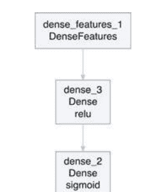

以下代码片段显示了DNN模型的预测结果。张量值是经过sigmoid函数处理后的最终DNN层的输出。这些值来自于区间[0, 1]，表示概率：小于0.5的值被解释为“年龄<40”的预测，否则为“年龄≥40”。

```
specList$test_ds_generic %%
  reticulate::as_iterator() %%
  reticulate::iter_next() %%
  model()

## tf.Tensor(
## [[0.31883082]
##  [0.47055224]
##  [0.99928933]
##  [0.9962864 ]
##  [0.27977774]
##  [0.34997565]
##  [0.7686823 ]
##  [0.99928933]
##  [0.32100695]
##  [0.99928933]
##  [0.16852783]
##  [0.33614054]
##  [0.36855838]
##  [0.4346528 ]
##  [0.6968227 ]
##  [0.41458437]
## [0.9992539 ]
## [0.01920704]
## [0.34810022]
## [0.6455758 ]
## [0.78468007]
## [0.9993542 ]
## [0.9469396 ]
## [0.00989294]
## [0.00521746]
## [0.01071302]
## [0.8888161 ]
## [0.78542197]
## [0.9993542 ]
## [0.6045456 ]
## [0.9993542 ]
## [0.9992539 ]], shape=(32, 1), dtype=float32)
```

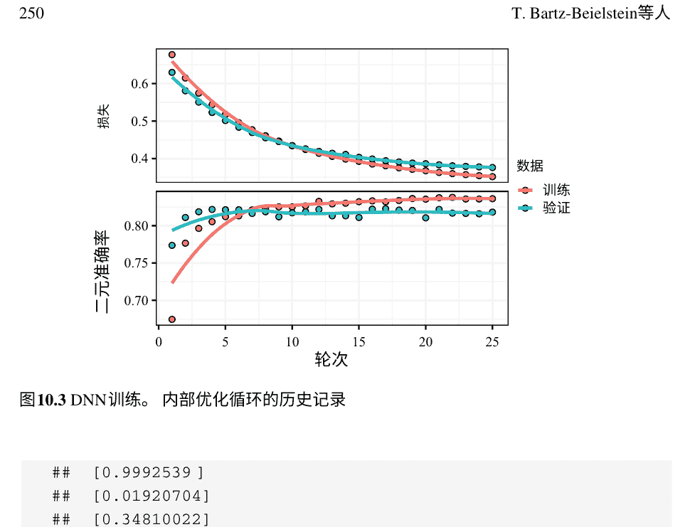

##### 图10.3 DNN训练。内部优化循环的历史记录

图10.3显示了训练过程中显示的数量：

- (i) 网络在训练和验证数据上的损失，分别为 Δ(train) 和 Δ(val)，
- (ii) 网络在训练和验证数据上的准确率，分别为 f(train) 和 f(val)

f(train) 准确率，分别为

这个图表说明在训练数据(X, Y)(train)上可以快速达到超过80%的准确率。

图10.3可以指示模型是否受到过拟合的影响（即使这只是一个简短的拟合过程）。如果出现这种情况，可以考虑实施dropout层或使用其他方法来防止过拟合。

本文将描述HPT的影响和𝒜的可调性在以下几个部分中。最后，使用keras的evaluate函数，可以检查DNN模型在X（测试集）上的性能。

```
model %>% 
  evaluate(specList$test_ds_generic %>% 
  dataset_use_spec(specList$specGeneric_prep), verbose = 0)
## loss binary_accuracy
## 0.3550636 0.8068387
```

Δ（训练集）、Δ（验证集）和Δ（测试集）之间的关系以及Δ（训练集）、acc和Δ（测试集）之间的关系可以通过Sequential Parameter Optimization Toolbox (SPOT) 进行分析，因为它计算并报告这些值。

#### 10.4 funKerasGeneric: 目标函数

超参数调整器（例如spot）在调整过程中进行模型选择：训练数据X（训练集）用于拟合（训练）模型，例如DNN的权重。每个训练好的模型𝒜_Λ_i（X（训练））将在验证数据X（验证）上进行评估，即损失按照公式（2.9）计算。基于（Λ_i, Δ_i（验证）），在外部优化循环的每次迭代中拟合一个代理模型S（t），例如使用spot的buildKriging函数拟合贝叶斯优化（BO）（Kriging）模型。

对于每个超参数配置Λ_i，目标函数funKerasGeneric报告了与相关的DNN模型𝒜_Λ_i有关的信息

- 1. 训练损失，Δ（训练），
- 2. 训练准确率，f（训练），
- 3. 验证（测试）损失，Δ（验证），和
- 4. 验证（测试）准确率，f_acc（验证）。

#### 10.5 位置：超参数实验设置

##### 调谐器

在第4.5节中介绍的R的SPOT包将用于DL超参数调整（Bartz-Beielstein等，2021年）。预算设置为十二个小时，即DL调整的运行时间大于ML调整的运行时间。

由于超参数搜索空间的复杂性和DNN的相对较长的运行时间，为spotruns设置了这个值的预算。SPOT提供了几个调整HPT参数的选项，例如基于Surrogate Model Based Optimization（SMBO）模型的类型S和优化器O，以及初始设计的大小n_init。这些参数可以通过spotControl函数传递给spot。例如，可以选择随机森林（RF）（实现为buildRanger）而不是默认的代理S（实现为buildKriging）。

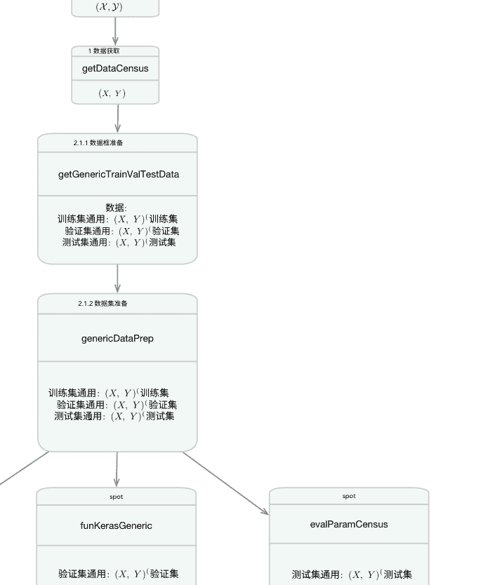

##### 图10.4 概述。深度学习超参数调整数据工作流程

通常的深度学习超参数调整数据工作流程如下：首先将训练数据 $(X, Y)^{(\text{train})}$ 输入到深度神经网络 (DNN) 中。然后，DNN 将学习将图像和标签进行关联。根据 keras 的 validation_split 参数，训练数据将被划分为一个较小的训练数据集 $X^{(\text{train})}$ 和一个验证数据集 $(X, Y)^{(\text{valtrain})}$。经过训练的 DNN 根据验证数据 $(X, Y)^{(\text{val})}$ 生成预测结果。深度学习超参数调整数据工作流程如图 10.4 所示。

与第 8.1 节中描述的机器学习过程类似，深度学习的超参数调整可以按照以下步骤开始：

```
python
startCensusRun(model = "dl")
```

startCensusRun函数执行以下步骤：

- 1. 提供CID数据集，$((X, Y))_{\text{CID}}$，详见第8.2.1节。
- 2. 生成大小为 nobs 的随机样本 $(X, Y) \subseteq ((X, Y))_{\text{CID}}$。

表10.6 SPOT参数用于深度学习超参数调整。控制列表包含进一步的内部列表，参见表10.7参数。

| 参数 | 值 | 描述 |
| :--- | :--- | :--- |
| x | x0 | 起始点，超参数向量 Λ，参见表10.4和10.5。 |
| fun | funKerasGeneric | 目标函数，O外部 |
| 下限 | cfg$lower | x的下界，也称为 Λ |
| 上限 | cfg$upper | x的上界，也称为 Λ |
| 控制 | 列表 |  |
| kerasConf | kerasConf | 目标函数使用的参数 funKerasGeneric |
| 规范列表 | 规范列表 | 目标函数使用的参数 funKerasGeneric |

##### 表10.7 SPOT列表参数用于深度学习超参数调整

| 列表 | 参数 | 值 |
| :--- | :--- | :--- |
| 控制 | 类型 | cfg$type |
|  | 详细程度 | 详细程度 |
|  | 时间 | 列表 (maxTime = timebudget/60) |
|  | 图表 | 图表 |
|  | 进度 | TRUE |
|  | 模型 | spotModel |
|  | 优化器 | spotOptim |
|  | 噪音 | 噪音 |
|  | OCBA | OCBA |
|  | OCBABudget | OCBABudget |
|  | 种子函数 | 无 |
|  | seedSPOT | tuner.seed |
| 设计控制 | 复制品 | Rinit |
|  | 大小 | initSizeFactor * length(cfg$lower) |
| 模型控制 | 目标 | krigingTarget |
|  | 使用Lambda | krigingUseLambda |
|  | 重新插值 | krigingReinterpolate |
| 优化器控制 | funEvals | multFun * length(cfg$lower)) |
| y填充 | handleNAsMethod | handleNAsMethod |
|  | imputeCriteriaFuns | imputeCriteriaFuns |
|  | penaltyImputation | 3 |3. 定义实验设计，包括性能度量。
4. 配置超参数调整器，$\mathcal{T}$。
5. 配置DL模型，$\mathcal{A}$。
6. 执行实验。

此外，可以决定是否使用默认的超参数设置，$\Lambda_0$，作为起点。使用表10.6和10.7中的参数规范，我们准备进行HPT运行：SPOT可以开始。

#### 10.6 可调性

关于定义2.26中定义的可调性，我们在本章面临着一个特殊的情况，因为对于DNNs来说，没有普遍接受的“默认”超参数配置，$\Lambda_0$。这个问题在ML中并不明显，因为相应的方法有着悠久的历史，即有关于大多数浅层方法的出版物可以给出如何选择适当的$\Lambda$值的提示。这些信息被收集和总结在第3章中。本章分析的DNNs的“默认”超参数设置基于我们自己的经验，结合文献中的建议。Chollet和Allaire（2018）可以被认为是这个领域的参考。$^7$

可以加载来自现场运行的结果列表。它包含表4.6中显示的14个值，例如，在表10.4中引入的调整超参数的名称：

```
结果$控制$参数名称
##  [1] "dropout"          "dropoutfact"      "units"            "unitsfact"
##  [5] "learning_rate"    "epochs"           "beta_1"           "beta_2"
##  [9] "layers"           "epsilon"          "optimizer"
```

HPT内部优化循环如图10.5所示。DNN使用来自表10.8的调整超参数$\Lambda$。模型训练支持调整器SPOT发现的结果，即训练时期的数量应为32。读者可以将默认超参数和调整超参数的内部优化循环进行比较，如图10.3和10.5所示。

调整后的DNN模型具有以下结构：

```
## $model
## 模型: "sequential_1"
##
## 层 (类型)                输出形状       参数数量
## ================================================================================
## dense_features_2 (DenseFeatures) 多个              0
## dense_2 (稠密层) 多个 8864
## dense_3 (稠密层) 多个 33
## ============================================================================
## 总参数数: 8,897
## 可训练参数数: 8,897
## 不可训练参数数: 0
## ---------------------------------------------------------------------------
##
## ## S历史记录
##
## 最终时期 (绘制历史记录):
## 损失: 0.2983
## 二元准确率: 0.8508
## 验证损失: 0.3343
## 验证二元准确率: 0.8132
```

表10.8 DNN配置。“lr”表示“学习率”。损失的整体均值，y为0.3691，其标准差为0.1152，而由OCBA找到的最佳HPT配置的均值为0.3346，标准差为0.0343

| dropout | dropoutfact | units | 单位因子 | 学习率 | epochs | beta_1 | beta_2 | layers | epsilon | optimizer | 损失 |
|---|---|---|---|---|---|---|---|---|---|---|---|
| 0 | 0 | 5 | 0.5 | 0.001 | 4 | 0.9 | 0.999 | 1 | 0 | 5 | 0.346 |
| 0.038 | 0.793 | 5 | 0.742 | 0.002 | 5 | 0.913 | 0.994 | 1 | 0 | 4 | 0.335 |

##### 10.6.1 进展

在加载实验结果后，可以通过可视化分析超参数调整进展。首先，将使用结果列表信息来可视化解决方案的路径：在图10.6中，损失函数值$\Delta(val)$根据迭代次数$t$绘制。每个点表示一个DNN模型$A_\lambda(t)$在时间步骤（SPOT迭代）的评估。

初始设计包括默认的超参数设置，$\lambda=0$，结果导致损失值$\Delta_{init}(val)=0.3371$。在调整过程中找到的最佳值是$y^*_{val}=0.3285$。这些值必须谨慎对待，因为它们只代表$A_\lambda$的一个评估。基于OCBA，通过考虑模型评估中的噪声，最佳函数值是$y^*_{OCBA,val} = 0.3346$。

经过12小时，评估了914个DL模型。将HPT期间观察到的最差配置与最佳配置进行比较，BCE损失减少了81.773%。在初始阶段进行了44次评估后，最小的BCE为0.3370858。图8.6中的虚线表示这个结果。最终的最佳值为0.3285304，即BCE减少了2.5381%。这些值与进展图中显示的结果结合起来（图8.6），表明相对较短的HPT运行能够提高DNN模型的质量。它还表明，增加运行时间并不会显著改善BCE。完整的比较在第10.9节中，比较了具有默认超参数和调整超参数的DL和ML算法性能。

> **注意**
> 这些结果不能替代严格的统计比较，它们只是指标，不是最终结论。

附录中给出了相应的代码。表10.8显示了相关的超参数值。

从图10.6和10.7可以看出损失存在很大的方差。后者使用对数-对数坐标轴可视化了与前者相同的数据。

##### 10.6.2 evalParamCensus: 比较默认和调整后的测试数据参数

函数evalParamCensus在CID数据集上评估ML和DL超参数配置。它编译了一个包含多个超参数配置性能得分的数据框，并且还可以处理默认设置的结果。这个数据框可以用于比较默认和调整后的测试参数，分别为 $\Lambda_0$ 和 $\Lambda_\beta$。图10.8显示了这个比较的小提琴图。它基于30次 $\Lambda_0$ 和 $\Lambda_\beta$的评估，并显示了与DNN进展图中的值相反的平均误分类错误（MMCE）。选择MMCE是为了能够将DL结果与ML结果进行比较。本书中展示的。在第8、9和12章中进行了相同的评估。本书中的六种机器学习和深度学习方法的全局比较将在第10.9节中展示。

#### 10.7 分析深度学习调整过程

本节分析中使用的值是有偏的，因为它们没有使用实验设计(空间填充或因子设计)。相反，它们使用了来自调整过程的数据，即它们受到了搜索策略(预期改进(EI))对代理模型S的偏差影响。

与ML方法的分析相同，可以使用简单的回归树来分析超参数之间的效应和交互作用，如图10.9所示。

回归树支持以下观察结果：单位和时期对验证损失有最大影响。随机森林分析显示参数的重要性如表10.9所示。

可以使用并行和敏感性图来进行敏感性分析。并行图（图10.10）表明超参数单位应设置为32（转换后的值范围为1到32），时期即x6应设置为32（转换后的值范围为8到128），层数即x9应设置为1（转换后的值范围为1到4），优化器即x11应设置为4（转换后的值范围为1到7）。

通过观察图10.11，可以得出以下结论：与平行坐标图（图10.10）的结果类似，敏感性图显示出epochs（即x6）和optimizer（即x11）对结果有最大的影响：前者对较大的值产生较差的结果，而后者对相对较小的值产生较差的结果。这表明训练epochs的数量不应该太大（可能是为了防止过拟合，参见图10.5），推荐使用adadelta或adam优化器（图10.12）。

最后，可以对数据拟合一个简单的线性回归模型。根据SPOT的数据列表，可以按照以下方式进行操作：

```
##
## 调用：
## lm(formula = y ~ ., data = df)
##
## 残差：
## 最小值        中位数      第三四分位数    Max
## -0.19062 -0.04055 -0.00477 -0.00044 1.16255
##
## 系数:
## 估计标准误差t值Pr(|t|)
## (截距) 2.291e+00 1.494e+00 1.533 0.125532
## dropout 9.491e-02 3.804e-02 2.495 0.012776 *
## dropoutfact 3.807e-02 3.167e-02 1.202 0.229606
## units 9.670e-03 3.544e-03 2.729 0.006484 **
## unitsfact -5.514e-02 2.225e-02 -2.478 0.013396 *
## learning_rate 8.281e+00 1.509e+00 5.488 5.29e-08 ***
## epochs 4.832e-02 4.628e-03 10.442 < 2e-16 ***
## beta_1 3.456e-01 1.705e-01 2.028 0.042888 *
## beta_2 -2.589e+00 1.486e+00 -1.743 0.081739 .
## layers 2.360e-02 4.573e-03 5.161 3.03e-07 ***
## epsilon -1.522e-06 7.284e+05 -2.089 0.036961 *
## optimizer2 4.672e-02 1.783e-02 2.620 0.008933 **
## optimizer3 2.791e-02 1.575e-02 1.772 0.076659 .
## optimizer4 -9.552e-03 1.343e-02 -0.711 0.477196
## optimizer5 1.282e-01 2.094e-02 6.121 1.39e-09 ***
## optimizer6 6.941e-02 1.572e-02 4.415 1.13e-05 ***
## 优化器7 1.172e-01 3.020e-02 3.880 0.000112 ***
## ---
## 显著性代码: 0 '***' 0.001 '**' 0.01 '*' 0.05 '.' 0.1 ' ' 1
##
## 残差标准误差: 0.09997, 自由度为897
## 多重R平方: 0.2595, 调整后的R平方: 0.2463
## F统计量: 19.65, 自由度为16和897, p值: < 2.2e-16
```

尽管这个线性模型需要进行详细的调查（建议进行误差分析，例如，参见Spanos 1999），但它可以与本节中的其他探索性数据分析（EDA）工具和可视化结合使用，以发现意外和/或有趣的效果。它不应该单独用于最终决策。尽管调整后的R平方值相对较低，回归输出显示出与先前观察相一致的结果，即增加epochs的数量会使模型性能变差。

#### 10.8 严重性：验证结果

考虑实验运行结果，差异为$\bar{x}$ = 0.0054。由于这个值是正的，暂时假设调整后的解决方案更优。相应的标准差为$s_d$ = 0.0056。基于公式5.14，并且有$\alpha = 0.05$, $\beta = 0.2$, 和 $\epsilon$ = 0.006。接下来，我们将使用getSampleSize函数确定完整实验所需的运行次数。对于0.006的相关差异，每个算法需要完成大约11次运行。因此，我们可以直接进行评估，分析通过调整DL模型参数所实现的性能改进程度。

表10.10 案例研究III：结果分析

| p-值 | 决策 | 功效 | Cohen的 d | Hedge的 g | 严重性 |
|------|------|------|-----------|-----------|--------|
| 0 | 拒绝H0 | 0.9999849 | 0.695314 | 0.686284 | ≤ 0.0045 得到很好的支持 |

结果总结在表10.10中。基于p值的决策是拒绝零假设，即调整参数设置在MMCE方面提供了显著的性能改进。效应大小表明差异具有中等程度。对于选择的$\tau=0.006$，严重性值为0.29，因此不支持拒绝H0的决策。严重性图显示只有小于0.0045的性能差异得到很好的支持。

#### 10.9 总结与讨论

本章介绍了基于SMBO的HPT方法，并进行了示例说明。它使用R统计编程环境中的keras、SPOT和SPOTMisc包的函数，从而提供了一个完全可从R访问的HPT环境。虽然可以使用R函数进行HPT，但底层必须安装PYTHON环境。这个安装在附录中有解释。

本书的前三个案例研究以全球比较的方式结束，即六种机器学习方法和一种深度学习方法。这些研究的主要目标是分析在笔记本电脑或台式电脑上进行相对较短的HPT运行（无需高性能计算硬件）是否可以提高性能。或者换句话说：在进行更长时间的研究之前，进行短期的HPT运行是否值得？

为了说明性能的提升（可调性），将最终比较这七种方法。首先确定重复次数：将使用一个近似的样本大小确定公式。读者可以参考第5.6.5节和Senn（2021）的详细信息。选择了30个实验的样本大小，总共进行了210次运行。

SPOT HPT运行的结果列表存储了相关信息，包括配置和实验结果。可以使用小提琴图（图10.14）。这些观察结果基于默认和调整后的参数设置的数据收集。尽管Extreme Gradient Boosting（XGBoost）找到了绝对最佳值，但也应考虑支持向量机（SVM），因为性能相似而方差较低。本研究简要解释了如何将HPT用作优化DNN超参数的数据范围。这个简短的研究结果只是对HPT工具集的表面进行了刮擦。特别是对于DL，SPOT可以提供改进建议，它提供了使用不同损失和不同数据集上的不同度量进行比较的工具，例如$\Delta(train)$、$\Delta(val)$和$\Delta(test)$。

在讨论超参数调整结果时，HPT并不仅仅搜索最终的最佳解决方案。当然，超参数从业者对最佳解决方案感兴趣。但是，即使从这种贪婪的观点出发，考虑到解决方案的路径也非常重要，因为分析这条路径可以促进学习，并且从长远来看比贪婪策略更加高效。

##### 示例：解决方案的路径

考虑一个需要在不同环境中多次执行的分类任务，数据相似。不是盲目地（自动地）为每个分类任务单独运行超参数优化（HPO）过程（即使自动执行也可能需要大量时间和资源），而是执行几个HPT过程。从HPT中获得的见解可能有助于避免参数范围错误、运行时间过短和其他陷阱。

除了确定最佳超参数的有效和高效方法外，SPOT还提供了理解算法性能的手段（我们将使用数据范围类似于生物学中的显微镜和天文学中的望远镜）。考虑到第4.1节中提出的研究目标，本研究提出的HPT方法提供了许多工具和解决方案。

总结这一章，除了第4.1节中的研究目标（R-1）到（R-8）之外，还介绍了深度神经网络中特定的重要目标。选择合适的性能度量是相关的。Kedziora等人（2020）声称：“关于机器学习性能评估的研究领域仍然存在争议，[…] 典型的机器学习基准主要关注最小化损失函数和处理时间，这并不一定完全涵盖人类需求的全部内容。”此外，需要明确规定一个合理的测试问题。

##### 示例代码

```
0.37 (100%)
├─ epochs < 48? 是 → 0.36 (93%)
│  ├─ units >= 3? 是 → 0.35 (86%)
│  │  ├─ learning_rate >= 317e-6? 是 → 0.35 (84%)
│  │  │  ├─ epsilon >= 3.9e-9? 是 → 0.4 (7%)
│  │  │  │  └─ beta_1 >= 0.91? 是 → 0.34 (77%) / 否 → 0.37 (6%)
│  │  │  └─ 否 → 0.56 (1%) / 0.47 (2%)
│  │  └─ 否 → 0.36 (3%)
│  └─ units < 6? 是 → 0.44 (7%)
│     └─ layers < 2? 是 → 0.49 (4%) / 否 → 0.37 (5%)
└─ 否 → 0.53 (7%)
   └─ units < 6? 是 → 0.42 (6%)
      └─ layers < 2? 是 → 0.58 (1%) / 否 → 1.3 (1%)
```

图10.9 回归树。深度学习模型。显示转换后的超参数值

表10.9 DL模型超参数的变量重要性

| Var. | units | epochs | beta_2 | layers | lr | beta_1 | eps | opt. | dropoutfact | dropout | unitsfact |
|------|-------|--------|--------|--------|----|--------|-----|------|-------------|---------|-----------|
| 重要 | 6.04  | 1.69   | 1.36   | 0.63   | 0.47 | 0.46   | 0.42 | 0.33 | 0.22        | 0.19    | 0.10      |即，应明确规定训练集、验证集和测试集。重要的是，初始化（类似于优化中的起始点规定）过程应该是透明的。由于深度学习方法需要大量的计算资源，应考虑使用替代基准（类似于在优化中使用计算流体力学（CFD）模拟）。大多数机器学习和深度学习方法都存在噪声。因此，应考虑重复实验。在第5章中介绍的检验的功效、严重性和相关工具可以为选择合适的值提供线索，即可行或必要的运行次数。基于严重性等工具，确定有意义的差异（与损失函数或准确性的规定相关）对于实际应用非常重要。记住：科学上的相关性与统计显著性并不相同。此外，应避免地板效应和天花板效应，即比较不应该基于过于困难（或过于简单）的问题。

我们强烈建议与基准进行比较（例如，默认设置或随机搜索（RS））。

模型A必须明确说明，即初始化、预训练（优化中的起始点）应该解释清楚。超参数（范围、类型）应该明确说明。如果有任何额外的（不可调整的）参数，则应该解释清楚。如何确保可重复性（由谁来确保）？最后但并非最不重要的：应提供开源代码和开放数据。

从三个案例研究（第8-10章）中得出的最终结论可以总结如下：

- HPT提供了比较、分析和选择适合未知实际问题的ML或DL方法的工具。
- 它只需要适度的计算资源（笔记本电脑或台式计算机）和有限的时间。
- 从业者可以在工作结束时开始HPT运行，并在第二天早上找到结果。

#### 10.10 程序代码

##### 程序代码

```
runNr <- "000"
batch_size <- 16
prop <- 2 / 3
dfGeneric <- getDataCensus(target = target, nobs = 1000)
# dfGeneric <- MASS::Boston
# names(dfGeneric)[names(dfGeneric) == "medv"] <- "target"
data <- getGenericTrainValTestData(dfGeneric = dfGeneric, prop = prop)
specList <- genericDataPrep(data = data, batch_size = batch_size)
## 模型配置：
model <- "dl"
cfg <- getModelConf(list(model = model))
x <- matrix(cfg$default, nrow = 1)
#'
kerasConf <- getKerasConf()
kerasConf$nClasses <- 1
kerasConf$activation <- NULL
kerasConf$verbose <- 0
kerasConf$loss <- "mse"
kerasConf$metrics <- "mae"
## 仅调整一些变量
# kerasConf$active <- c("layers", "units", "epochs")
### 第一个例子: 简单的函数调用:
message("objectiveFunctionEvaluation(): x在transformX()之前。")
print(x)
if (length(cfg$transformations) > 0) {
  x <- transformX(xNat = x, fn = cfg$transformations)
}
message("objectiveFunctionEvaluation(): x在transformX()之后。")
print(x)
funKerasGeneric(x, kerasConf = kerasConf, specList)
#'
### 第二个例子: 评估几个（三个）超参数设置:
xxx <- rbind(x, x, x)
funKerasGeneric(xxx, kerasConf = kerasConf, specList)
#'
### 第三个例子: 即时调用
kerasConf$verbose <- 0
result <-
  spot(
    x = NULL,
    fun = funKerasGeneric,
    lower = cfg$lower,
    upper = cfg$upper,
    control = list(
      funEvals = 25,
      # 时间 = 列表(最大时间=5)，
      噪声 = TRUE,
      类型 = cfg$type,
      绘图 = TRUE,
      进度 = TRUE,
      种子函数 = 1,
      种子SPOT = 1,
      重复次数 = 2,
      OCBA = TRUE,
      OCBABudget = 2,
      参数名称 = cfg$tunepars,
      设计控制 = list(
        重复次数 = 2,
        大小 = 1 * length(cfg$lower)
      ),
      y插补 = list(
        handleNAsMethod = handleNAsMean,
        插补准则函数 = list(is.infinite, is.na, is.nan),
        惩罚插补 = 3
      ),
      modelControl = list(
        target = "ei",
        useLambda = TRUE,
        reinterpolate = FALSE
      ),
      transformFun = cfg$transformations
    ),
    kerasConf = kerasConf,
    specList = specList
  )
x <- result$xbest
message("objectiveFunctionEvaluation(): x在transformX()之前。")
print(x)
if (length(cfg$transformations) > 0) {
  x <- transformX(xNat = x, fn = cfg$transformations)
}
message("objectiveFunctionEvaluation(): x after transformX().")
print(x)
df <- data.frame(x)
names(df) <- cfg$tunepars
print(df)
save(result, file = paste0(model, runNr, ".RData"))
```

```
dfRun <- prepareProgressPlot (model, runNr,  directory = ".")
ggplotProgress (dfRun)
```

```
library("rpart")
library("rpart.plot")
library("SPOT")
x <- result$x
# cfg <- getModelConf(model="dl")
transformFun <- cfg$transformations
message("predDlCensus(): 在transformX()之前的x。")
print(x)
if (length(cfg$transformations) > 0) {
  x <- transformX (xNat = x,  fn = cfg$transformations)
}
message("predDlCensus(): 在transformX()之后的x。")
print(xt)
fitTree <- buildTreeModel (
  x = xt,
  y = result$y,
  control = list(xnames = result$control$parNames)
)
rpart.plot(fitTree$fit)
```

```
kerasConf$returnObject <- "pred"
x <- result$xbest
if (length(cfg$transformations) > 0) {
  x <- transformX (xNat = x,  fn = cfg$transformations)
}
x
evalKerasGeneric(
  x = x,
  kerasConf = kerasConf,
  specList = specList
)
```

```
library("SPOT")
library("SPOTMisc")
runNr <- "OCBA"
batch_size <- 32
prop <- 2 / 3
target <- "age"
dfGeneric <- getDataCensus (target = target, nobs = 1e4)
# dfGeneric <- MASS::Boston
# names(dfGeneric)[names(dfGeneric) == "medv"] <- "target"
data <- getGenericTrainValTestData (dfGeneric = dfGeneric, prop = prop)
specList <- genericDataPrep (data = data, batch_size = batch_size)
## 模型配置:
model <- "dl"
cfg <- getModelConf (list(model = model))
# x <- matrix(cfg$default, nrow=1)
x <- result$xBestOcba
# '
kerasConf <- getKerasConf ()
# kerasConf$nClasses <- 1
# kerasConf$activation <- NULL
kerasConf$verbose <- 2
# kerasConf$loss <- "mse"
# kerasConf$metrics <- "mae"
## Only some variables are tuned
# kerasConf$active <- c("layers", "units", "epochs")
### 第一个例子: 简单的函数调用:
message("objectiveFunctionEvaluation(): x在transformX()之前。")
print(x)
if (length(cfg$transformations) > 0) {
  x <- transformX (xNat = x, fn = cfg$transformations)
}
message("objectiveFunctionEvaluation(): x after transformX().")
print(x)
evalKerasGeneric (
  x = x,
  kerasConf = kerasConf,
  specList = specList
)
```

## 第10个案例研究：深度神经网络的调整

开放获取本章节根据知识共享署名4.0国际许可协议（http://creativecommons.org/licenses/by/4.0/）进行许可，只要您给出适当的原作者和来源的信用，提供创意共享许可链接，并指示是否进行了更改，就可以在任何媒介或格式中使用、共享、适应、分发和复制。

本章节中的图像或其他第三方材料包含在章节的创意共享许可中，除非在材料的信用行中另有说明。如果材料未包含在章节的创意共享许可中，并且您的预期使用不符合法定规定或超出许可使用范围，您将需要直接从版权持有人那里获得许可。


### 第11章 案例研究四：调整强化学习（使用PYTHON）

Martin Zaefferer和Sowmya Chandrasekaran

摘要 与第10章中考虑调整深度神经网络（DNN）的示例类似，本章也涉及神经网络，但重点是另一种类型的学习任务：强化学习。这增加了复杂性，因为学习算法的任何评估都涉及到相应环境的模拟。学习算法不仅仅是通过静态数据集进行调整，而是通过来自环境的动态反馈进行调整，在该环境中代理操作。

代理通过DNN进行控制。此外，还必须考虑增强学习算法的参数，以及网络参数。基于Keras文档中的一个简单示例，我们调整了用于反向摆动环境玩具示例的DNN。作为额外的奖励，本章展示了如何使用演示的调整工具与实现在Python中的学习算法进行接口和调整。

#### 11.1 引言

在本章中，我们将演示如何调整强化学习算法。在强化学习中，我们考虑的是一个动态学习过程，而不是像典型的分类任务中那样具有固定静态数据集的过程。

学习任务涉及一个在环境中操作的代理。在每个时间步中，代理决定采取某个动作。这个动作被传递给环境，并导致从先前状态到新状态的变化。环境还为相应的动作确定了奖励。之后，代理根据接收到的奖励和新状态决定下一步要采取的动作。学习目标是找到一个能够累积尽可能多奖励的代理。

为了简化事情，让我们考虑一个例子：一个移动机器人（代理）被放置在一个房间（环境）中。代理的状态是机器人的位置。奖励可能基于向目标位置行进的距离。机器人的不同移动是相应的动作。

在这种情况下，我们的神经网络可以用于从当前状态映射到一个新的动作。因此，它为我们的机器人代理提供了一个控制器。这个神经网络的权重必须以某种方式进行学习，考虑到接收到的奖励。与第10章相比，这导致了一个稍微不同的情景：数据通常是在动态过程中收集的，而不是从一开始就可用。实际上，最初我们可能没有任何数据。我们在学习过程中通过观察环境中的状态/动作/奖励来获取数据。

#### 11.2 材料和方法

##### 11.2.1 软件

我们在前几章中主要依赖相同的软件。也就是说，我们使用相同的调优工具。与第10章一样，我们使用Keras和TensorFlow来实现神经网络。然而，我们将在Python中执行完整的学习任务，通过R包reticulate明确地在R-based调优器和基于Python的学习任务之间进行接口交互（而不是通过R的keras包隐式地进行）。

一方面，这将演示如何与不同的编程语言进行接口（即，如果你的模型不是用R训练的）。另一方面，这是一个必要的步骤，因为相应的环境只在Python中可用（即，玩具问题）。

为了易读性，完整的代码不会在主文本中打印，但作为补充材料提供。

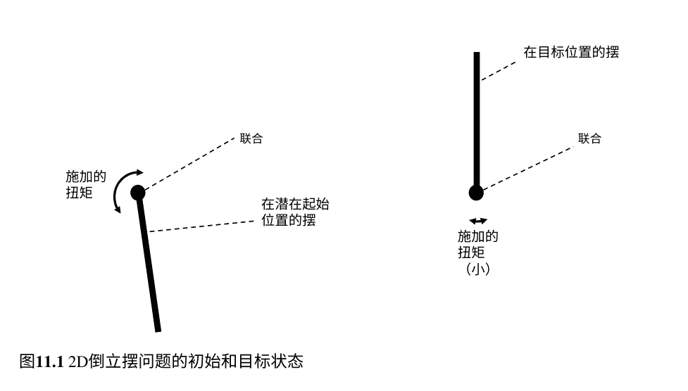

图11.1 2D倒立摆问题的初始和目标状态

##### 11.2.2 任务环境：倒立摆

我们研究的示例基于Singh（2020）的Keras教程。这依赖于一个玩具问题，通常用于测试或演示强化学习算法：无摩擦倒立摆。更具体地说，我们使用OpenAI Gym提供的反问题实现²，标记为Pendulum-v0。

倒立摆是一个简单的二维物理模拟。最初，摆向下方，必须通过在关节处施加力量将其摆向上方，可以向左或向右施加力量。一旦摆向上方，就必须尽可能长时间地保持平衡。图11.1显示了这种情况。

该问题环境的状态由三个值组成：摆角的正弦和余弦以及角速度。动作是施加的扭矩（带有表示方向变化的符号），奖励是根据-(angle² + 0.1 * velocity² + 0.001 * torque²)计算的。这确保学习过程在摆直立（角度接近零）、运动缓慢（小角速度）和付出少量努力（小扭矩）时获得最大奖励。

##### 11.2.3 学习算法

主要上，我们保留了原始Keras教程中使用的算法（Singh 2020）。事实上，该算法遵循了Lillicrap等人提出的深度确定性策略梯度(DDPG)算法的概念（2015年）。我们不会详细介绍该算法的所有细节，但会注意一些设置调整过程中的重要方面。

学习算法基本上使用了四个不同的网络：一个演员网络，一个目标演员网络，一个评论家网络和一个目标评论家网络。演员网络表示代理的策略：从状态到动作的映射。评论家网络试图猜测当前状态/动作对的价值（以未来奖励为衡量），从而为与演员进行比较提供基准。也就是说，评论家网络将状态和动作映射到一种估计的奖励值。

相应的网络是这两个网络的副本。它们使用相同的架构和权重，这些权重不是直接为目标网络训练的，而是在学习过程中定期从原始网络克隆并更新。这些概念（演员-评论家概念和目标网络）旨在稳定网络训练。

学习算法还利用经验回放，它表示由状态、动作、奖励和新状态组成的元组集合（或缓冲区）。这样可以从先前经历的代理-环境交互集合中进行学习，而不仅仅是使用最新的模型更新。

#### 11.3 设置调整实验

##### 11.3.1 文件：run.py

学习算法和任务环境使用Python代码处理，在run.py文件中。这在很大程度上与Keras教程（Singh 2020）相同。

在这里，我们解释相关的更改，并展示一些代码片段。

- 完整的代码被封装在一个函数中，稍后将通过reticulate接口从R中调用。

```
def run_ddpg(num_hidden, critic_lr, actor_lr, gamma, tau, activation, max_episodes, seed):
```

重要的是，这些参数包括将要调整的参数，以及max_episodes（将要运行的学习周期数）和用于随机数生成器的种子。

- 这些参数都已经从Keras教程中的原始硬编码值进行了更改。教程中的原始（默认）值为num_hidden=256，critic_lr=0.002，actor_lr=0.001，gamma=0.99，tau=0.005，activation=“relu”。
- 请注意，我们只改变网络中最大层的大小（默认值为256）。特别地，评论家有较小的层来收集相应的输入（状态、动作）。这些保持不变。
- 通过参数 `activation`，我们只替换内部层的激活函数，而不是最终输出层的激活函数。
- 为了确保结果可复现，我们设置了随机数生成器的种子（用于强化学习环境、TensorFlow和NumPy）：
- 我们从教程代码中删除了图表，因为在自动调整过程中它们并不特别有用。
- 最后，我们返回变量`avg_reward_list`，它是最后40个回合的平均奖励。这个返回值将使我们的调谐器Sequential Parameter Optimization Toolbox (SPOT)观察的目标函数值。
- 请注意，我们考虑的所有奖励值都将被取反，因为我们使用的大多数过程假设较小的值更好。

```
env.seed(seed)
tf.random.set_seed(seed)
np.random.seed(seed)
```

下面给出了调整参数的更多细节。

##### 11.3.2 调整参数

在前面的第11.3.1节中，我们已经简要介绍了调整参数及其默认值： num_hidden=256，critic_lr=0.002，actor_lr=0.001，gamma=0.99，tau=0.005，activation=“relu”。其中一些我们可能会认识到，与本书其他部分讨论过的神经网络参数相匹配： num_hidden对应于之前讨论过的units，但它是一个标量值（它被重用来定义所有网络中较大层的大小）。我们不再使用单一的learning_rate，而是为演员网络和评论家网络分别设置了学习率critic_lr和actor_lr。

参数gamma是新的，因为它专门用于演员-评论家学习算法：它表示一个折扣因子，该因子作为估计奖励的乘法器应用。参数tau也是新的，表示在更新目标网络的权重时使用的乘法器。最后，激活是激活函数（这里是所有内部层共享的）。参数及其边界在表11.1中总结。

###### 配置列表

以下代码片段显示了用于在R中定义此参数搜索空间的代码。

表11.1是我们强化学习示例的超参数。请注意，默认值和边界涉及每个参数的实际比例（未经转换）。默认值表示原始Keras教程中的值，而不是Keras函数接口的正式默认值。

| 姓名 | 类型 | 默认 | 比例转换 | 下界 | 上界 |
| :--- | :--- | :--- | :--- | :--- | :--- |
| num_hidden | 整数 | x | 256 | 8 | 256 |
| critic_lr | Double | 10^x | 0.002 | 1e-5 | 1e-1 |
| actor_lr | Double | 10^x | 0.001 | 1e-5 | 1e-1 |
| gamma | Double | 1-10^x | 0.99 | 0.5 | 1 |
| tau | Double | 10^x | 0.001 | 1e-4 | 1e-0 |
| 激活函数 | factor | relu | relu, swish, sigmoid | | |

```
###### 调整问题的配置
cfg <- list(
  ## 参数的名称
  tunepars = c("num_hidden", "actor_lr", "critic_lr",
               "gamma", "tau", "activation"),
  ## 参数的下界
  lower = c(8, -5, -5, -4, -4, 1),
  ## 参数的上界
  upper = c(256, -1, -1, -0.3, 0, 3),
  ## 参数的类型
  type = c("integer", "numeric", "numeric", "numeric", "numeric", "factor"),
  ## 需要应用的转换
  transformations =
    c(trans_id, trans_10pow, trans_10pow,
      trans_1minus10pow, trans_10pow, trans_id),
  ## 另一个不需要调整但固定的参数
  fixpars = list(max_episodes=50L),
  ## 指定分类参数的级别
  ## (即，从整数翻译为这些因子级别)：
  factorlevels = list(activation=c("relu","swish","sigmoid")),
  ## 在此示例中未使用
  ## (指定相对于其他参数的参数)
  relpars = list()
)
```

请注意，我们设置了一个固定的参数max_episodes，将学习过程的评估限制为50个回合。

##### 11.3.3 进一步配置SPOT

SPOT被配置为使用300次评估，分配如下：每次评估重复（重复评估）五次，以考虑噪声。噪声是强化学习案例中的一个重要问题。

在初始设计中测试了30种不同的配置，共进行了150次评估（包括重复）。剩余的150次评估由SPOT的迭代搜索过程使用。由于重复，这意味着进一步测试了30种配置。此外，由于问题的随机性质，我们设置参数noise=TRUE。

所使用的替代模型是Kriging（也称为高斯过程回归），配置为使用所谓的nugget效应（useLambda=TRUE），但不进行重新插值（reinterpolate=FALSE）。

在初始设计之后的每次迭代中，使用差分进化算法在替代模型中搜索一个新的有前景的候选者。差分进化算法在SPOT的每次迭代中被允许花费2400次替代模型的评估。

为了可重复性，指定了随机数生成器种子（seedSPOT, seedFun）。每个复制将使用不同的随机数生成器种子（从seedFun开始进行迭代）。

###### 调用SPOT的参数

相应的配置和函数调用为

```
R
result <- spot(fun = objf,
               lower=cfg$lower,
               upper=cfg$upper,
               control = list (type=cfg$type,
                        funEvals=300,
                        plots=TRUE,
                        optimizer=optimDE,
                        noise=TRUE,
                        seedSPOT=1,
                        seedFun=1,
                        designControl=list(size=5*length(cfg$lower),
                                           replicates=5),
                        replicates=5,
                        model=buildKriging,
                        modelControl=list(target="ei",useLambda=TRUE,
                                           reinterpolate=FALSE),
                        optimizerControl=list(funEvals=
                                              400*length(cfg$lower))
               )
)

```

##### 11.3.4 后处理和验证结果

为了确定调整效果如何，我们在最后进行一个简短的验证实验。在那里，我们花费了10个复制来评估找到的最佳解决方案。我们还为这个测试花费了更多的回合（即，max_episodes=100）。这提供了一个相对于教程中默认设置的性能，我们的解决方案的性能估计更加准确可靠，但也更加嘈杂（见表11.1）。请注意，这一步需要进行一些数据处理，首先通过计算平均目标值（即在5次复制中的平均值）来聚合我们的结果数据集，以确定哪个配置平均上表现最好。

#### 11.4 结果

表11.2比较了调整过程中找到的最佳解与教程中默认参数的参数。它还列出了相应的性能（平均奖励）及其标准差。我们可以加载调整后创建的结果文件，以便对比进行视觉展示（图11.2）。

```
r
load("supplementary/ch11-caseStudyIV/resultFile.RData")
boxplot(best_real_y, default_y,
          names=c("调整后", "默认"),
          xlab="性能（奖励）",
          horizontal=TRUE)

```

有趣的是，调整后的解似乎可以使用更小的全连接层大小（num_hidden=64）。教程中的网络使用了256个单元。与策略网络相比，调整后的算法还使用了更大的价值网络学习率。参数gamma和tau与默认值有很大偏差。

表11.2比较了调整过程中找到的最佳解的超参数值与Singh（2020）的Keras教程中的默认值。它还列出了相应的性能（平均负奖励）及其标准差。平均值和标准差是在10次复制中计算的，每次评估100个回合。

| 变量名称 | 默认 | 调整后 |
|----------|------|--------|
| num_hidden | 256 | 64 |
| critic_lr | 0.00200 | 0.00349 |
| actor_lr | 0.00100 | 0.00074 |
| gamma | 0.99000 | 0.93668 |
| tau | 0.00100 | 0.01481 |
| 激活函数 | relu | swish |
| 平均负回报 | 183.62 | 169.86 |
| 平均负回报的标准差 | 37.49 | 27.60 |

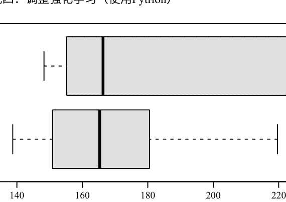

#### 11.5 功效分析：验证结果

让我们继续分析使用功效分析在调整和默认参数之间实现的平均负回报。预实验运行表明差异为 $\bar{x}=13.76$。因为这个值是正的，我们可以假设调整的解决方案更好。标准差为 $s_d=32.67$。根据公式5.14，以及 $\alpha=0.05$, $\beta=0.2$, 和 $\Delta=40$，我们可以确定完整实验的运行次数。

对于40的相关差异，每个算法需要大约8次完成的运行。因此，我们可以直接进行功效评估，因为已经执行了足够的运行。

基于 $0.0915$ 的 $p$ 值的决策是不拒绝 $H_{0}$。考虑到目标相关差异为40，不拒绝 $H_{0}$ 的功效为 $0.99$，因此强烈支持不拒绝 $H_{0}$ 的决策。图11.3显示了相应的功效图。从表11.3中可以看出，通过假设检验和功效的结果分析，参数值方面的差异似乎不会体现在性能值上。从表11.2中可以观察到平均性能的相对较小差异，而标准差的差异稍微更明显一些。然而，这不能被视为统计上显著的相关性。

总体而言，这与我们从更详细的调整结果（图11.4）中看到的情况相吻合：

```
SPOTMisc::plot_parallel(resultpp)
```

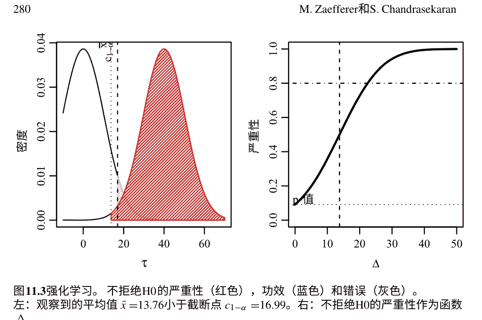

图11.3 强化学习。不拒绝H0的功效（红色），功效（蓝色）和错误（灰色）。左：观察到的平均值 x̄ =13.76小于截断点 c1−α =16.99。右：不拒绝H0的功效作为函数 Δ

##### 表11.3 案例研究IV：结果分析

| p-值 | 决策 | 功效 | Cohen的d | Hedge的g | 功效 |
|------|------|------|----------|----------|--------|
| 0.09 | 未拒绝H0 | 0.987019 | 0.4178644 | 0.4002082 | Δ ≥25得到很好的支持 |


图11.4 调整过程中实现的性能值的平行图。红线表示差的配置（性能差），蓝线表示更好的配置

#### 11.6 总结和讨论

总之，调查显示搜索空间的大部分部分导致算法的性能较差的配置。然而，似乎存在一系列潜在的性能良好的配置，有趣的是其中包括相对较小的网络（即，少量单元）。这一观察结果可能与问题的复杂性有关，该问题是一个相对简单的强化学习场景，具有少量状态和动作。

调整后的解决方案似乎比教程中的默认设置要好一点(Singh 2020)，但这些默认设置仍然具有竞争力。合理地假设教程中的默认设置是经过精心选择的(可能是通过某种调整过程或教程作者的相关经验)，并且非常适合这个问题。虽然较小的网络意味着计算速度更快，但较大的网络具有更容易转移到更复杂的强化学习案例的优势。

开放获取本章节根据知识共享署名4.0国际许可协议（http://creativecommons.org/licenses/by/4.0/）进行许可，只要您给出适当的原作者和来源的信用，提供创意共享许可链接，并指示是否进行了更改，就可以在任何媒介或格式中使用、共享、适应、分发和复制。

本章节中的图像或其他第三方材料包含在章节的创意共享许可中，除非在材料的信用行中另有说明。如果材料未包含在章节的创意共享许可中，并且您的预期使用不符合法定规定或超出许可使用范围，您将需要直接从版权持有人那里获得许可。


### 第12章 全球研究：调整的影响

Martin Zaefferer, Olaf Mersmann和Thomas Bartz-Beielstein

摘要本章扩展了前几章的更专注的分析，对调整过程进行了更广泛的观察。这意味着，不仅调整单个模型，而且还考虑了调整多个模型、使用不同调整器和不同数据集的情况。核心目标是看数据的特征和模型选择如何影响调整过程。我们研究了五个假设，涉及调整的必要性、数据特征的影响、目标变量类型的影响、模型选择的影响和基准测试。我们不仅进行了深入的调整研究，还将结果与问题难度的度量相结合，并使用共识排名来汇总各种实验结果。

#### 12.1 引言

如第4.4节所述，顺序参数优化工具箱（SPOT）为机器学习（ML）算法的调整提供了一种强大的方法，特别是当训练和/或评估运行时间变长时。

在实践中，模型的学习过程，以及它们的超参数选择，受到许多其他因素的影响。一方面，这种复杂情况进一步促使使用调整程序，因为ML算法必须适应新的数据或情况。另一方面，这种情况这引发了一个问题，即这些因素如何影响调整过程本身。我们希望以有结构的方式进行调查。

具体而言，我们将调查以下因素，这些因素在第8.2.1节中介绍。¹我们测试它们对调整过程的影响。

- 数据中的数值特征数量（数值特征）。
- 数据中的分类特征数量（因子）。
- 分类特征的基数，即级别的最大数量（基数）。
- 数据中的观测数量（n）。
- 任务类型，分类或回归。
- 模型的选择。

#### 12.2 研究问题

我们想要研究以下假设。

(H-1) 调整是必要的，以找到好的参数值（与默认值相比）。

(H-2) 数据：数据的属性影响（调整过程的难度）。

- 信息内容：如果数据的信息内容较少，模型的调整会更容易，因为更多的参数配置可以达到接近最优质量。一般来说，在这种情况下，改变参数对模型质量的影响较小。
- 特征数量：特征数量较多会导致运行时间较长，这会影响调整过程中可以进行的评估次数。
- 特征类型：数值和/或分类特征的数量和基数影响模型可用的信息量，因此可能会影响调整的难度。
- 观测数量 n：随着 n的增加，模型评估的平均运行时间将增加。

(H-3) 目标变量：调整回归或分类模型之间没有根本区别。

(H-4) 模型：模型的选择（例如弹性网络（EN）或支持向量机（SVM））影响调整任务的难度，但不一定影响调整过程的选择。

(H-5) 基准：所使用的调整器的性能可以以统计学上的方式进行衡量。

¹Census-Income（KDD）数据集（CID）的数据是历史性的。它包含了与人们有关的措辞或类别，不代表或反映作者和编辑的任何观点。

#### 12.3 设置

为了调查我们的研究问题，数据集需要相应地进行预处理。这个预处理过程在附带的源代码中有记录，并在第8.2.1节中进行了解释。

对于分类问题，使用每个调整器和每个模型在表12.1中总结的实验进行了实验。对于回归问题，进行了较少的实验，请参见表12.2。

为了评估创建数据的随机子集（即减少n）的影响，并考虑测试/训练拆分，为每个配置生成了三个数据集。所有实验都针对这三个数据集进行了重复。

表12.1中的分类实验：研究了分类特征数量（nfactors）、数值特征数量（nnumericals）、基数和n的组合。低nfactors情况下，基数字段为空。在这种情况下，没有分类特征存在，因此类别数量变得无关紧要。观测数量n在对数尺度上变化，范围为10^4到10^5，即10,000、17,783、31,623、56,234和100,000。

| nfactors | nnumericals | 基数 | 观测数量(n) |
|----------|-------------|------|-------------|
| 高       | 低          | 低   | 10^4, 10^4.25, ..., 10^5 |
| 中       | 中          | 低   | 10^4, 10^4.25, ..., 10^5 |
| 低       | 高          |      | 10^4, 10^4.25, ..., 10^5 |
| 高       | 高          | 低   | 10^4, 10^4.25, ..., 10^5 |
| 高       | 低          | 中   | 10^4, 10^4.25, ..., 10^5 |
| 中       | 中          | 中   | 10^4, 10^4.25, ..., 10^5 |
| 高       | 高          | 中   | 10^4, 10^4.25, ..., 10^5 |
| 高       | 低          | 高   | 10^4, 10^4.25, ..., 10^5 |
| 中       | 中          | 高   | 10^4, 10^4.25, ..., 10^5 |
| 高       | 高          | 高   | 10^4, 10^4.25, ..., 10^5 |
| 完整数据集 |             |      | 299285 |

表12.2 回归实验：研究了分类特征数量 (nfactors)、数值特征数量 (nnumericals)、基数和 n 的组合。当nfactors较低时，基数字段为空。在这种情况下，没有分类特征存在，因此类别数量变得无关紧要。

| nfactors | nnumericals | 基数 | 观测数量(n) |
|----------|-------------|------|-------------|
| 低       | 高          |      | 10^4, 10^4.25, ..., 10^5 |
| 高       | 高          | 低   | 10^4, 10^4.25, ..., 10^5 |
| 高       | 高          | 高   | 10^4, 10^4.25, ..., 10^5 |

##### 12.3.1 模型配置

实验包括模型k-最近邻(KNN)、决策树(DT)、EN、随机森林(RF)、梯度提升(GB)和支持向量机(SVM)。它们各自的参数列在表4.1中。

对于EN，lambda不由调整器优化。相反，glmnet实现本身会调整该参数。在这里，测试了一系列不同的lambda值(Hastie和Qian 2016; Friedman等人2020)。

对于SVM，核函数（核函数）的选择仅限于径向基函数和sigmoid，因为我们在一系列初步实验中发现线性和多项式的运行时间非常长。因此，次数也被排除在外，因为它只对多项式核函数有意义。由于实验运行时间的限制，我们也没有在数据集中对SVM和KNN进行实验，其中m ≥ 10^5个观测值。

这些将需要使用能够处理大型数据集的模型变体（例如，一些稀疏SVM类型）。

表3.8列出了实验中实际调整的超参数，包括数据类型、范围和使用的转换。在这里，我们大多数情况下遵循Probst等人（2019a）使用的范围和转换。从根本上说，这些并不是通用建议。相反，合理的范围通常需要考虑数据理解、建模/分析和计算资源等因素。对于影响运行时间的值的范围应该选择得使得实验在合理的时间范围内仍然可行。类似的考虑也适用于内存需求。当增加/减少参数可能导致模型的敏感性增加/减少时，应该应用适当的转换（例如，对数转换）。

大多数其他被调查模型的配置保持默认值。唯一的例外是：

- ranger: 为了与其他模型进行比较，模型的训练和评估在单个线程中进行，没有并行化（num.threads=1）。
- xgboost: 与ranger类似，我们将nthread设置为1。对于回归问题，评估指标设置为均方根误差（eval_metric="rmse"）。对于分类问题，选择对数损失（eval_metric="logloss"）。

##### 12.3.2 全局研究的运行时间

与本地研究（第8-10章）类似，除了记录平均误分类错误（MMCE）（MMCE定义在公式（2.2）中），还记录运行时间。记录的运行时间包括模型评估的总运行时间、预测的运行时间和训练的运行时间。

运行时间预算：为了模拟实际使用情况，我们为调整器指定了固定的运行时间预算。这限制了调整器寻找潜在最优解的时间。

超参数值。我们为SVM、KNN、RF和GB设置了5小时的预算。由于EN和DT评估速度更快且更简单，它们获得了较低的预算（EN：1小时，DT：5分钟）。
超时：对于大多数模型来说，单次评估（训练+预测）的运行时间很难预测，如果参数选择不当，可能会变得过长。在极端情况下，单次评估的运行时间可能变得如此之长，以至于消耗了调整器分配的大部分运行时间，甚至更多。在这种情况下，将没有足够的时间来测试不同的超参数值。

为了防止这种情况，我们为单个评估设置了运行时间限制，我们称之为超时。如果模型超过了超时时间，评估将被中止。在实验过程中，我们将超时时间设置为调整器总运行时间预算的二十分之一。例外情况是使用DT（rpart）进行的实验：由于rpart的评估非常快速（在我们的实验中通常少于一秒），并且具有相应减少的运行时间预算（5分钟），因此不需要超时。实际上，在这种情况下跟踪超时会给评估时间增加相当大的开销。

在必要时，可以轻松地集成来自tmlr包的额外性能度量。2

###### 12.3.2.1 替代模型

在一个重要的案例中，我们偏离了更常见的基于替代模型的优化算法的配置：为了确定下一个要评估的候选解决方案，我们直接使用高斯过程模型的预测值，而不是所谓的期望改进。我们的理由是，如果评估次数较少或维度较高，则期望改进可能会产生更差的结果（Rehbach等人，2020年；Wessing和Preuss，2017年）。

在严格限制的运行时间预算下，我们的经验是预测值更可取。De Ath等人（2019年）也做出了类似的观察。

###### 12.3.2.2 随机搜索的配置

使用随机搜索（RS），将从搜索空间中均匀采样超参数值。所有相关的配置（超时、运行时间预算等）与SPOT的配置相对应。

##### 12.3.3 运行时间基准

实验并非在完全相同的硬件上运行，而是在稍微不同的集群节点上运行。因此，我们必须考虑单个节点比其他节点更快或更慢（例如，在一个节点上进行的调整运行可能比在另一个节点上进行的模型评估更多，仅仅是因为具有更多的计算能力）。为了保持某种可比性，我们计算一个校正因子，该因子将与运行时间预算相乘。在每次调整运行之前，我们计算一个简短的性能基准。该基准的测量时间将除以相应的参考节点上的值，以确定运行时间乘数。我们使用benchmarkme R包（Gillespie 2021）中的benchmark_std函数。

##### 12.3.4 默认值和复制

作为比较基准，我们对每个模型进行了额外的实验，其中所有超参数值保持模型的默认设置。然而，在这些情况下，我们没有为评估设置超时。由于没有进行搜索，使用默认值的总运行时间比SPOT或RS的运行时间要低得多。其他所有设置与SPOT和RS的设置相同。为了粗略估计结果的方差，我们将所有实验（每个模型的每个调整器在每个数据集上）重复三次。

#### 12.4 结果

在本节中，我们提供了实验结果的探索性概述。在第12.2节中定义的研究问题的详细讨论将在第12.5节中进行。

为了可视化整体结果，我们展示了示例箱线图。由于根据数据集和优化模型的不同，会得到不同的结果，因此首先进行预处理步骤：对于每个采样的数据集和每个模型，确定所有观察结果（找到的最佳解的模型质量）的平均值。然后，从相应组的每个单独观察值中减去这个平均值。随后，对这些减去的个体值进行检查。这样可以更好地可视化调整器之间的差异，而不会影响可解释性。得到的值不再处于模型质量的原始尺度上，但单位保持不变。因此，仍然可以很好地解释这个尺度上的差异。

图12.1比较不同分类模型的调谐器的箱线图，其中 $m = 10^5$，nfactors = high，nnumericals =high，cardinality =high。 对于这个值的 $n$，没有进行KNN和SVM的实验。 所呈现的质量度量（MMCE）显示了预处理后的值，其中每个问题实例的平均值被减去。

对于分类实验，图12.1显示了一个具有许多特征和观测值的情况下的结果（nfactors，nnumericals和cardinality都设置为high， $m = 10^5$ ）。 该图首先显示了RS和SPOT两个调谐器相对于默认值的显著改进。 这种改进的值在大约1%的MMCE范围内。在几乎所有情况下，调谐器显示出比具有默认值的模型更小的质量值的离散度。 除了对rpart的调谐之外，SPOT获得的结果优于RS的结果。

同样对于分类，图12.2展示了没有类别特征（nfactors=low）和最大数量的数值特征（nnumericals=high）的情况下， $n=10^4$ 的情况。 在这种情况下，数据集包含的信息要少得多，因为很多特征都缺失了，只有很少的观测数据可用。 尽管如此，这两个调整器都明显比使用默认值要好。 在这种情况下，通常不清楚哪个调整器提供更好的结果。 对于rpart（DT）和SVM，RS似乎效果更好。

与分类不同，图12.3和12.4展示了回归模型的结果。 与分类不同，这里的结果更加多样化。 特别是，glmnet在调整器和默认值之间显示出了一小点差异。在个别模型之间也存在几个数量级的差异（例如，RF和SVM）。 例如，对于RF，调整器和默认值之间的差异约为0.02年（目标变量的刻度为年龄）。 如图12.3和12.4所示，四分位距约为0.01年。

另一方面，对于GB，调整器和默认值之间的差异约为20年。 在这里，默认值似乎特别不适用。

图12.2显示了不同分类模型的调整器的箱线图，其中m=10^4，nfactors=low，nnumericals=high。所呈现的质量度量（MMCE）显示了经过预处理后的值，其中每个问题实例的均值被减去。

图12.3比较不同回归模型的调谐器的箱线图，其中 m = 10^5，nfactors = high，nnumericals =high，cardinality =high。对于这个值的 nno实验使用KNN和SVM进行。所提出的质量度量（MMCE）显示经过预处理后的值，其中每个问题实例的均值被减去

#### 12.5 讨论

##### 12.5.1 排名分析

我们使用结果值的排名来分析实验结果，而不是原始结果。排名是尺度不变的，因此可以聚合来自不同问题实例（由数据集和模型选择产生）的结果，这些结果具有不同的尺度的结果值是可能的。这很重要，因为我们必须对非常多样化的问题实例进行聚合。

为了聚合排名（也称为一致性排名），我们遵循Kemeny（1959）的所谓“最优排名”方法。在这里，一致性排名是通过使一致性排名与观察到的排名之间的平均距离最小来确定的。用于此目的的距离度量是Kendall的tau（Kendall1938），它计算两个排名相互矛盾的成对比较的数量。使用这种方法确定的排名可以解释为个体排名的“中位数”。

+   此过程具有以下优点（Hornik和Meyer 2007; Mersmann et al. 2010a）:
- 尺度不变。
- 对无关的替代方案不变。
- 聚合大量比较，涵盖任意因素。
- 易于理解结果和可视化。
- 生成相关信息：选择最佳结果。
- 可以插入额外的偏好权重。
- 快速评估。
- 非参数方法，无分布假设。
- 可以通过距离可视化聚类，识别具有相似算法行为的问题类别。

然而，除了这些优点之外，还存在一些缺点：

- 在排名中估计不确定性是困难的。
- 排名不必引导严格的排序，可能存在并列。

我们通过合并个别实验的调谐器（SPOT，RS，默认值）的排名来生成共识排名。我们总结了9个实验的排名（在3个随机选择的数据集上每个3次调谐器运行的重复）。
然后，为了聚合与研究对象相关的不同变量（例如n，nfactors），我们计算调谐器达到某个共识排名的频率。这个计数除以相应问题实例上的实验总数（或排名数）。因此，我们记录了每个调谐器达到特定共识排名的频率。

### 简化示例：

- 对于案例2（即固定选择的nnumericals， nfactors， cardinality， model， n， target variable），SPOT， RS和默认方法的比较结果为排名{1, 3, 2}，{1, 2, 3}，{2, 1, 3}。
这种情况的共识排名是 {1, 2, 3}。
- 对于第二种情况（即对于另一种固定的 nnumericals、nfactors、cardinality、model、n 和目标变量的选择），SPOT、RS 和默认方法的比较结果如下所示{3, 2, 1}，{1, 2, 3}，{2, 1, 3}。
这种情况的共识排名是 {2, 1, 3}。
- 当将两个实验合并进行分析时，得到的排名频率如下所示
  - SPOT：排名1占50%，排名2占50%，排名3占0%。
  - RS：排名1占50%，排名2占50%，排名3占0%。
  - 默认：排名1占0%，排名2占0%，排名3占100%。

##### 12.5.2 排名分析：分类

根据第12.5.1节中描述的分析方法，图12.5显示了调整器、观测数量 n 和优化模型之间的关系。 它显示了 SPOT 和 RS 大多数情况下都优于默认设置，而且 SPOT 通常比 RS 表现更好。然而，有些情况与此不符。特别是，glmnet（EN）和 rpart（DT）似乎从调整中受益较少：在这里，调整器的排名区分更加困难。此外，当观测数量较少时，结果往往存在更大的不确定性。这些结果部分可以通过模型所需的运行时间来解释。随着观测数量的减少，各个模型的运行时间也减少，而 glmnet 和 rpart 是运行时间最短的模型（在几秒钟或更短的时间内，rpart 的情况下甚至可以低于一秒）。如果模型本身的评估几乎不需要时间，那么 RS 的运行时间开销较低是有优势的。另一方面，SPOT 需要更大的开销（用于代理模型和相应的新参数配置搜索）。

图12.6显示了根据分类特征数量（nfactors）的结果摘要。同样，SPOT通常表现最好，其次是RS。在分类特征数量较低的情况下，存在最大的不确定性。可能有两种解释：一方面，特征的减少也意味着所需运行时间的减少。

另一方面，建模的难度增加了，因为特征较少，可用于分离类别的信息也较少。

数字特征数量的相应结果可以在图12.7中找到。几乎没有什么差异，数字特征的数量似乎影响很小。需要注意的是，数据集中的数字特征比分类特征少。

分类特征的基数也几乎没有影响，参见图12.8。然而，有一个轻微的趋势：在较高的基数下，第一名（SPOT）和第二名（RS）之间的区别更加明显。这可以通过数据集的信息内容更高来解释（类似于因子数）。

图12.8分类特征基数和模型的调谐器排名的关系，用于分类。注意此图不包括数据集不再包含分类特征的情况（无法确定基数）

图12.9显示了根据模型对调谐器的排名，用于完整数据集上的分类。由于运行时间增加，kknn（KNN）和e1071（SVM）未包含在内

最后，图12.9显示了未修改的完整数据集上调谐器的结果。对于每种情况，SPOT排名第一，RS排名第二。这个结果与上述趋势一致，因为完整数据集包含了最多的信息，并且也导致了最长的运行时间（用于模型评估）。

##### 12.5.3 排名分析：回归

除了分类实验外，还进行了一小部分以回归为目标的实验。图12.10分别显示了每个优化模型的结果。在这种情况下，SPOT通常排名第一。然而，与分类情况不同，存在更多的不确定性。

对于glmnet（EN），默认值有时甚至可以达到排名1。似乎线性建模与glmnet在当前数据集的回归中不适用，因此，调整器几乎无法与默认值产生差异。这种行为已经在图12.4中指示过。

图12.10根据回归模型的调整器排名

图12.11根据观测数量（n）的调整器排名，用于回归

在SVM的情况下，RS更常被排名为第一，而SPOT则不清楚原因。一个可能的原因是超参数对于回归中SVM模型质量的影响较小（与分类相比）。然而，还应考虑到回归的实验次数较少，而分类的实验次数较多。

图12.11显示了对观测数量n的依赖关系。对于回归问题，与分类问题的结果基本一致。随着观测数量的增加，SPOT明显领先于RS。

与分类结果一致，与分类特征（数量，基数）的相关性也是如此，参见图12.12。随着特征数量和基数的增加，观察到调整器之间的更清晰分离。

##### 12.5.4 问题分析：难度

在这项研究的背景下，一个有趣的问题是建模问题的难度与调整过程的结果之间的关系。我们根据实验数据进行了调查。

图12.12回归问题中调整器的排名，取决于基数和分类特征数量（nfactors）

一般来说，文献中有很多衡量建模问题难度的指标。Lorena等人（2019）给出了一个概述。在这些指标中，重叠体积（F2，参见Lorena等人，2019）是有趣的，因为它易于解释且不特定于特定模型。

首先，将每个特征的值分成两组，每组一个类别。然后，计算每个特征的两组交集的范围。这被称为特征的重叠。数据集的重叠体积是每个特征重叠值的乘积。

然而，这个度量对于分类特征来说是不合适的（即使在虚拟编码之后）。此外，异常值对于这个度量来说是非常有问题的。因此，我们使用了一个轻微的修改：我们计算每个特征中可能出现在两个类别中的样本值的比例（即基于特征值进行类别交换的可能性）。例如，在图12.13中，对于一个数值特征和一个分类特征进行了说明。对于整个数据集，将每个特征的个体体重叠值相乘。随后，我们将这个度量称为样本重叠。

图12.14显示了样本重叠与我们的数据属性（n、nfactors、nnumericals、cardinality）的依赖关系。根据这些样本重叠的值，我们的数据集可以分为4个不同的难度级别：

- 1. 样本重叠≈0.39: nfactors=高，基数=高（绿色）。
- 2. 样本重叠≈0.54: nfactors=高，基数=中等（蓝色）。
- 3. 样本重叠≈0.76: 其他所有情况（橙色）。
- 4. 样本重叠≈1.00: nfactors=低（红色）。

在这里，4对应于最高难度级别。对于实验中相关的范围，几乎不会因为n或nnumericals而有所变化。对于nfactors和基数，可以看到强烈的相关性。根据4个难度级别，在前面的章节中已经确定的排名可以重新排名。结果总结在图12.15中。结果表明，随着

特征1（数值型）

特征2（分类型）

图12.13 分类问题两个特征样本重叠的示例。十字表示数据集中的样本。所有类别1的样本为红色（+）。所有类别2的样本为蓝色（x）。对于特征1，重叠率为50%（重叠区域中的样本数除以总样本数）。对于特征2，重叠率为70%（重叠类别中的样本数除以总样本数）。对于两个特征的组合，样本重叠率为0.5 × 0.7 = 0.35

图12.14 样本重叠率根据数据集属性在实验中变化。样本重叠被用作问题难度的度量，并导致了四个难度级别的定义（用颜色标记）

图12.15 根据难度级别，调谐器达到的排名频率

问题的难度增加，排名差异不够稳健。也就是说，样本重叠越大，估计哪个调谐器效果最好就越困难。这在理论极端情况下是合理的：最难的数据集无法通过任何模型学习，因为特征不再包含有关类别的任何信息。在这种情况下，超参数不再起作用，调谐器无法改进。

#### 12.6 总结与讨论

总结我们的发现，我们讨论了第12.2节中的假设。

(H-1) 调整是必要的：在几乎所有情况下，默认设置会导致明显更差的结果。此外，当使用调整器时，结果的方差会减小（参见图12.1、12.2、12.3和12.4）。

(H-2) 数据：对于具有高信息内容和较大数据量的数据集，调整器之间的差异变得明显。如果级别或特征（分类和数值）的数量减少，可以观察到调整器之间的差异变小。

已经确认随着特征和观测值的数量增加，运行时间也会增加。随着模型的平均运行时间增加（即更复杂的模型或更大的数据集），SPOT相对于RS的性能越来越好，因为开销与评估时间的比例对于SPOT来说减少得更多。

(H-3) 目标变量：调整的执行不受目标变量的改变影响。在调整支持向量机进行回归时发现了一个需要进一步研究的特殊情况：RS似乎比SPOT表现更好。我们建议使用更大的数据库来研究这种情况。

(H-4) 模型：调整方法的选择不受模型的基本影响。可以快速评估的模型（例如rpart）受益于更多的评估次数。这是因为时间被选择为终止准则。

(H-5) 基准：如第12.5.1节所述，基于共识排名的分析方法可以用于简单且统计有效地评估调整器的适用性。

总的来说，这个实验调查的结果强调了调整机器学习模型对于产生高质量的超参数配置和模型是至关重要的。

使用调整器非常重要，因为与默认设置相比，最大的差异通常在这里观察到。然而，在调整器之间也存在差异，在我们的调查中，大多数情况下都倾向于使用SPOT，即基于模型的优化器。对于相对较大的数据集（大n和k）的调整，这一点尤为明显，因为由此产生的高模型运行时间有利于使用基于模型的方法。

由于超参数的数量是可管理的（<<100），添加几个参数并不显著增加调整的复杂性。对于随机搜索（Bergstra和Bengio 2012）和SPOT，添加几个参数是无害的，即使它们对模型质量只有很小的影响。

此外，分析结果还带来了额外的好处：

- 可以检测到可能的软件错误，
- 看似不重要的参数被检测为重要
- 未知的相互作用可以被发现

代理模型允许学习超参数对模型数值的影响 在搜索中，不重要的参数被赋予较低的权重

最后，在这项研究的背景下，我们推荐选择调谐器的方法是：

- 当只有很少的时间（数量级：时间足够进行少量的顺序评估）但有大量并行计算能力可用，或者当模型可以非常快速地评估（在几秒钟的范围内），可以使用随机搜索。
- 如果需要在更长的时间内进行复杂数据和模型的耗时计算（并行计算能力相对有限），我们推荐使用基于模型的SPOT调优。
- 在特殊情况下，与我们考虑的使用复杂数据和模型进行调优的目标不符合（计算时间非常长，模型的平均评估时间），也可以考虑使用无代理模型的调优方法。

开放获取本章节根据知识共享署名4.0国际许可协议（http://creativecommons.org/licenses/by/4.0/）进行许可，只要您给出适当的原作者和来源的信用，提供创意共享许可链接，并指示是否进行了更改，就可以在任何媒介或格式中使用、共享、适应、分发和复制。

本章节中的图像或其他第三方材料包含在章节的创意共享许可中，除非在材料的信用行中另有说明。如果材料未包含在章节的创意共享许可中，并且您的预期使用不符合法定规定或许可范围，您将需要直接从版权持有人那里获得许可。


## 附录

### 软件安装

### A.1 安装SPOT和SPOTMisc

本书中的代码使用的是SPOT版本2.11.14和SPOTMisc版本1.19.40，这些版本可以在综合R存档网络（CRAN）上获得。这些软件包的最新版本可以从[https://www.spotseven.de/spot/](https://www.spotseven.de/spot/)下载。

### A.2 安装Python

#### A.2.1 在项目中创建并激活一个Python环境

建议每个实验使用一个Python虚拟环境。通过以下命令进入项目目录：

```
`cd <项目目录>`
```

在项目目录中的一个名为python的文件夹中创建一个新的虚拟环境，使用以下命令：

```
bash
python3 -m venv python
```

可以使用终端中的以下命令激活虚拟环境：

```
bash
source python/bin/activate
```

为了验证正确的Python版本是否被激活，可以在终端中执行以下命令：

```
bash
which python
```

#### A.2.2 在环境中安装Python包

可以使用pip install命令在Python虚拟环境中安装诸如tensorflow-datasets、numpy、pandas、matplotlib等包：

```
bash
python -m pip install -U pip
python -m pip install tensorflow tensorflow-datasets numpy pandas matplotlib
```

#### A.2.3 安装和配置Reticulate以使用正确的Python版本

在R控制台中使用以下命令安装reticulate包（例如，在RStudio中）：

```
R
install.packages("reticulate")
```

要配置reticulate指向上述虚拟环境中的Python可执行文件，请在项目目录中创建一个名为.Rprofile的文件，内容如下：

```
R
Sys.setenv(RETICULATE_PYTHON = "../python/bin/python")
```

必须重新启动R软件环境（R）（或RStudio）才能使设置生效。要检查reticulate是否针对正确的Python版本进行了配置，可以在R（或RStudio）控制台中使用以下命令：

```
reticulate::py_config()
```

### A.3 安装Keras

要开始使用Keras，必须安装Keras R包、核心Keras库和后端张量引擎（如TensorFlow（TF））。可以通过以下方式在R（或RStudio）中完成：

```
install.packages("tensorflow")
install.packages("keras")
library("keras")
install_keras()
```

### A.4 安装SPOT

以下命令可用于从CRAN安装最新版本的Sequential Parameter Optimization Toolbox (SPOT)和附加包Sequential Parameter Optimization Toolbox–Miscellaneous Functions (SPOTMisc)：

```
install.packages("SPOT")
install.packages("SPOTMisc")
```

有关最新SPOT版本的更多信息将在https://www.spotseven.de/spot/上发布。

### A.5 在ARM Mac上安装

以下信息基于[https://gist.github.com/juliasilge/035d54c59436604d6142ebebf29aa224](https://gist.github.com/juliasilge/035d54c59436604d6142ebebf29aa224)。

```
brew install --cask R curl -OL
https://github.com/conda-forge/miniforge/releases/latest/download/Miniforge3-MacOSX-arm64.sh
chmod +x Miniforge3-MacOSX-arm64.sh sh Miniforge3-MacOSX-arm64.sh -b
source ~/miniforge3/bin/activate conda update -y -n base conda conda
create -y --name tf-2.6 python=3.9 conda activate tf-2.6 conda
install -y -c apple tensorflow-deps python -m pip install
tensorflow-macos python -m pip install tensorflow-metal echo
"export
RETICULATE_PYTHON=~/miniforge3/envs/tf-2.6/bin/python" >>
~/.Renviron
```

## 参考文献

M. Abadi, A. Agarwal, P. Barham, E. Brevdo, Z. Chen, C. Citro, G.S. Corrado, A. Davis, J. Dean, M. Devin, S. Ghemawat, I. Goodfellow, A. Harp, G. Irving, M. Isard, Y. Jia, R. Jozefowicz, L. Kaiser, M. Kudlur, J. Levenberg, D. Man , R. Monga, S. Moore, D. Murray, C. Olah, M. Schuster, J. Shlens, B. Steiner, I. Sutskever, K. Talwar, P. Tucker, V. Vanhoucke, V. Vasudevan, F. Vi gas, O. Vinyals, P. Warden, M. Wattenberg, M. Wicke, Y. Yu, X. Zheng, *TensorFlow: Large-Scale Machine Learning on Heterogeneous Systems* (2015). https://www.tensorflow.org/. 从tensorflow.org获取的软件

M. Abadi, A. Agarwal, P. Barham, E. Brevdo, Z. Chen, C. Citro, G.S. Corrado, A. Davis, J. Dean, M. Devin, S. Ghemawat, I. Goodfellow, A. Harp, G. Irving, M. Isard, Y. Jia, R. Jozefowicz, L. Kaiser, M. Kudlur, J. Levenberg, D. Mane, R. Monga, S. Moore, D. Murray, C. Olah, M. Schuster, J. Shlens, B. Steiner, I. Sutskever, K. Talwar, P. Tucker, V. Vanhoucke, V. Vasudevan, F. Viegas, O. Vinyals, P. Warden, M. Wattenberg, M. Wicke, Y. Yu, X. Zheng, TensorFlow: 异构分布式系统上的大规模机器学习, 2016年3月。 arXiv:1603.04467

T. Akiba, S. Sano, T. Yanase, T. Ohta, M. Koyama, Optuna: 下一代超参数优化框架, 第25届ACM SIGKDD国际会议论文集知识发现与数据挖掘（2019年）

H. Arafat Abu Alfeilat, A.B.A. Hassanat, O. Lasassmeh, A.S. Tarawneh, M.B. Alhasanat, H.S. Eyal Salman, V.B. Surya Prasath (2019) 距离度量选择对k最近邻分类器性能的影响：一项综述。 大数据 **7**(4), 221–248 (2019). https://doi.org/10.1089/big.2018.0175

K.J. Arrow, 社会福利概念中的一个困难。 J. Polit. Econ. **58**(4), 328–346 (1950). http://www.jstor.org/stable/1828886

S. Athey, J. Tibshirani, S. Wager, 广义随机森林。 Ann. Stat. **47**, 1148–1178 (2019). ISSN 0090-5364. https://doi.org/10.1214/18-AOS1709

N. Awad, N. Mallik, F. Hutter, *DEHB*: 面向可扩展、鲁棒和高效的超参数优化的进化*Hyberband*(2021). http://arxiv.org/abs/2105.09821

A. Balaji, A. Allen,基准测试自动机器学习框架(2018). http://arxiv.org/abs/1808.06492

P. Balaprakash, M. Salim, T.D. Uram, V. Vishwanath, S.M. Wild, DeepHyper: 异步超参数搜索深度神经网络，在第25届IEEE高性能计算国际会议（HiPC18）中(IEEE, 2018). https://doi.org/10.1109/hipc.2018.00014T. Bartz-Beielstein, M. Dr scher, A. G r, A. Hinterleitner, O. Mersmann, D. Peeva, L. Reese,N. Rehbach, F. Rehbach, A. Sen, A. Subbotin, M. Zaefferer, 考虑到covid-19大流行的医院资源规划：优化和敏感性分析，在遗传和进化计算会议伴随论文集, GECCO '21, 美国纽约州纽约市 (计算机协会, 2021), 第293-294页. ISBN 9781450383516. https://doi.org/10.1145/3449726.3459473

T. Bartz-Beielstein, 应用于进化计算的新实验主义. 博士论文, 多特蒙德大学, 德国, 2005年4月. http://hdl.handle.net/2003/21461

T. Bartz-Beielstein, 进化计算中的实验研究-新实验主义. 自然计算系列. (Springer, 柏林, 海德堡, 纽约, 2006), 3-540-32026-1. https://doi.org/10.1007/3-540-32027-X

T. Bartz-Beielstein, 如何创建具有普适性的结果, 在计算智能的Springer手册, 编者 J. Kacprzyk, W. Pedrycz (Springer, 柏林, 海德堡, 2015), 第1127-1142页. ISBN 978-3-662-43504-5. https://doi.org/10.1007/978-3-662-43505-2_56

T. Bartz-Beielstein, M. Preuss, 自动和交互式调整算法, 在遗传和进化计算的第13届年度会议伴侣中, GECCO'11, 美国纽约 (计算机协会, 2011年) 第1361-1380页. ISBN9781450306904. https://doi.org/10.1145/2001858.2002141

T. Bartz-Beielstein, M. Zaefferer, 基于模型的连续和离散全局优化方法。 Appl. Soft Comput. 5 5, 154-167 (2017年)。 ISSN 1568-4946. https://doi.org/10.1016/j.asoc.2017.01.039. http://www.sciencedirect.com/science/article/pii/S1568494617300546

T. Bartz-Beielstein, K.E. Parsopoulos, M.N. Vrahatis, 使用计算统计分析粒子群优化, 国际数值分析和应用数学会议 (ICNAAM) , 德国魏因海姆, 由T.E. Simos, Tsitouras C.H.编辑 (Wiley-VCH, 2004年) , 第34-37页

T. Bartz-Beielstein, C. Lasarczyk, M. Preuss, 顺序参数优化, 在2005年进化计算大会(CEC'05) 论文中, 爱丁堡, 苏格兰, Piscataway NJ, 编辑B McKay等人(IEEE Press, 2005), 第773-780页. ISBN 0-7803-9363-5. https://doi.org/10.1109/CEC.2005.1554761

T. Bartz-Beielstein, M. Chiarandini, L. Paquete, M. Preuss (编者), 优化算法分析的实验方法(Springer, 柏林, 海德堡, 纽约, 2010) T. Bartz-Beielstein, M. Friese, M. Zaefferer, B. Naujoks, O. Flasch, W. Könen, P. Koch, 使用顺序参数优化和最佳计算预算的噪声优化, 在第13届遗传和进化计算年会伴随会议上, 纽约, 纽约, 美国(ACM, 2011), 第119-120页. ISBN 978-1-4503-0690-4. https://doi.org/10.1145/2001858.2001926

T. Bartz-Beielstein, J. Branke, J. Mehnen, O. Mersmann, 进化算法。 Wiley Interdisciplinary Reviews: 数据挖掘与知识发现, 卷4(3), 页178-195 (2014)。 ISSN 1942-4795。 https://doi.org/10.1002/widm.1124

T. Bartz-Beielstein, L. Gentile, M. Zaefferer, 简而言之: 顺序参数优化 (2017)。 https://arxiv.org/abs/1712.04076v1

T. Bartz-Beielstein, M. Zaefferer, Q.C. Pham, 通过多模型模拟进行优化。 结构。 多学科优化。 58(3), 919-933 (2018)。 ISSN 1615-1488。 https://doi.org/10.1007/s00158-018-1934-2

T. Bartz-Beielstein, C. Doerr, J. Bossek, S. Chandrasekaran, T. Eftimov, A. Fischbach, P. Kerschke, M. Lopez-Ibanez, K.M. Malan, J.H. Moore, B. Naujoks, P. Orzechowski, V. Volz, M. Wagner, T. Weise, 优化基准测试: 最佳实践和开放问题, 2020年7月。 arxiv:2007.03488

T. Bartz-Beielstein, M. Dr scher, A. G r, A. Hinterleitner, T. Lawton, O. Mersmann, D. Peeva, L. Reese, N. Rehbach, F. Rehbach, A. Sen, A. Subbotin, M. Zaefferer, 优化和适应 考虑到covid-19大流行的医院资源规划工具的优化和调整, 在2021年IEEE进化计算大会 (CEC) 上, 第728-735页 (2021b)。 https://doi.org/10.1109/CEC45853.2021.9504732

T. Bartz-Beielstein, J. Stork, M. Zaefferer, M. Rebolledo, C. Lasarczyk, F. Rehbach, Spot: 顺序参数优化工具箱v2.3.0。 在线 (2021c) 。 https://cran.r-project.org/package=SPOT。 访问日期: 2021年3月15日

T. Bartz-Beielstein, M. Zaefferer, F. Rehbach, 简而言之—顺序参数优化工具箱, 2021年12月。arXiv:1712.04076

T. Bartz-Beielstein等人, 基准测试—最佳实践和开放问题 (2020b)

M. Beck, F. Dumpert, J. Feuerhake, 官方统计中的机器学习, 第1-66页 (2020年)。arxiv:1812.10422

Y. Bengio, Practical recommendations for gradient-based training of deep architectures, in Neural Networks: Tricks of the Trade, volume 7700 of Lecture Notes in Computer Science, ed. by G. Montavon, K.-R. M ller, G.B. Orr (Springer, 2012), pp. 437–478. https://doi.org/10.1007/978-3-642-35289-8_26

J. Bergstra, D. Yamins, D.D. Cox, Making a science of model search: hyperparameter optimization in hundreds of dimensions for vision architectures, in Proceedings of the 30th International Conference on International Conference on Machine Learning—ICML’13, vol. 28, pp. I–115–I–123 (2013). JMLR.org

J. Bergstra, Y. Bengio, Random search for hyper-parameter optimization. J. Mach. Learn. Res. 13, 281–305 (2012). ISSN 1532-4435; 1533-7928/e

A. Biedenkapp, J. Marben, M. Lindauer, F. Hutter, Cave: 配置评估、可视化和评估, 在国际学习和智能优化会议（LION’18）的论文集中, 2021年6月

M. Birattari, Z. Yuan, P. Balaprakash, T. St tzle, F-frace和迭代F-frace: 概述, 在《优化算法分析的经验方法》中, 由T. Bartz-Beielstein, M. Chiarandini, L. Paquete, M. Preuss (Springer, Berlin, Heidelberg, New York, 2009) 编辑B. Bischl, M. Binder, M. Lang, T. Pielok, J. Richter, S. Coors, J. Thomas, T. Ullmann, M. Becker, A. Bouletxeix, D. Deng, M. Lindauer. 超参数优化:基础、算法、最佳实践和开放挑战 (2021a). arXiv:2107.05847 [stat.ML]

B. Bischl, M. Lang, L. Kotthoff, J. Schiffner, J. Richter, E. Studerus, G. Casalicchio, Z.M. Jones, MLR: R中的机器学习. J. Mach. Learn. Res. 17(170), 1–5 (2016). https://jmlr.org/papers/v17/15-066.html

B. Bischl, M. Binder, M. Lang, T. Pielok, J. Richter, S. Coors, J. Thomas, T. Ullmann, M. Becker, A.-L. Bouletxeix, D. Deng, M Lindauer, 超参数优化:基础、算法、最佳实践和开放挑战, pp. 1–70 (2021b). arxiv:2107.05847

L. Bloch, C.M. Friedrich, 使用贝叶斯优化有效地调整随机森林和xgboost的超参数, 用于早期阿尔茨海默病诊断, in无线移动通信和医疗保健, Cham, 编辑J. Ye, M.J. O’Grady, G. Civ itarese, K. Yordanova (Springer InternationalPublishing, 2021), pp. 285–299. ISBN 978-3-030-70569-5

P. B nisch, R. Inderst, 使用“严重性”统计概念评估看似矛盾的统计证据（特别应用于损害估计）。LawFin工作论文3, 法律与金融基础研究中心（LawFin）, 歌德大学（2020年）

A.J. Booker, J.E. Dennis Jr, P.D. Frank, D.B. Serafini, V. Torczon, M.W. Trosset, 通过替代函数进行昂贵函数优化的严格框架。

Brownlee, J., 使用Python的XGBoost - 使用XGBoost和scikit-learn进行梯度提升树。机器学习掌握, v1.10版 (2018年)

A. Bunte, A. Fischbach, J. Strohschein, T. Bartz-Beielstein, H. Faeskorn-Woyke, O. Nigge mann, 评估用于网络物理生产系统的认知架构, 在第24届IEEE国际新兴技术和工厂自动化会议ETFA 2019中, 萨拉戈萨, 西班牙, 2019年9月10日至13日, 第729-736页 (2019年)。https://doi.org/10.1109/ETFA.2019.8869038R.E. Cafisch, W. Morokoff, A. O wen, 使用布朗桥减少有效维度对抵押贷款支持证券进行估值 (1997年)

J. Chambers, W. Cleveland, B. Kleiner, P. Tukey, 数据分析的图形方法 (Wadsworth, 贝尔蒙特, 加利福尼亚州, 1983年)# 参考文献

J.M. Chambers, T.H. Hastie (eds.), 统计模型在$S$中的应用 (Wadsworth and Brooks/Cole, Pacific Grove, CA, 1992)

C.-C. Chang, C.-J. Lin, LIBSVM. ACM智能系统技术交易 **2(3)**, 1–27 (2011). https://doi.org/10.1145/1961189.1961199. 2019年11月29日更新版本

C.H. Chen, 随机模拟优化: 一种最优计算预算分配. (World Scientific, 2010)

T. Chen, C. Guestrin, *XGBoost*: 一种可扩展的树提升系统 (2016). arxiv:1603.02754

T. Chen, T. He, M. Benesty, V. Khotilovich, Y. Tang, H. Cho, K. Chen, R. Mitchell, I. Cano, T. Zhou, M. Li, J. Xie, M. Lin, Y. Geng, Y. Li, 包 xgboost (参考手册, v1.2.0.1). 在线 (2020). https://cran.r-project.org/web/packages/xgboost/xgboost.pdf

V. Cherkassky, Y. Ma, SVM参数的实际选择和SVM回归的噪声估计。神经网络。**17(1)**, 113-126(2004). https://doi.org/10.1016/s0893-6080(03)00169-2

M. Chiarandini, Y. Goegebeur, 用于优化算法分析的混合模型 (Springer, Berlin, Heidelberg, 2010), pp. 225-264. ISBN 978-3-642-02538-9. https://doi.org/10.1007/978-3-642-02538-9_10

D. Choi, C.J. Shallue, Z. Nado, J. Lee, C.J. Maddison, G.E. Dahl, 深度学习优化器的实证比较 (2019). arxiv:1910.05446

F. Chollet, J.J. Allaire, 使用R进行深度学习 (Manning, 2018)

J. Cohen, 版权所有. 修订版. (行为科学的统计功效分析, 1977)

P.R. Cohen, 经验方法用于人工智能 (MIT出版社, 麻省剑桥, 1995)

W.D. Cook, M. Kress, 序数信息和偏好结构: 决策模型和应用 (Prentice-Hall, Inc., 美国, 1992). ISBN 0136301207

T. Cover, P. Hart, 最近邻模式分类. IEEE信息论 **13(1)**, 21–27 (1967). https://doi.org/10.1109/tit.1967.1053964

J. Cuesta Ramirez, R. Le Riche, O. Roustant, G. Perrin, C. Durantin, A. Gli re, 混合变量贝叶斯优化方法的比较. 高级建模与仿真工程科学 **9(1)** (2022). https://doi.org/10.1186/s40323-022-00218-8

G. De Ath, R.M. Everson, A.A.M. Rahat, J.E. Fieldsend, 贪婪是好的：贝叶斯优化中的探索和利用的权衡, 2019年11月

J.-C. de Borda, 关于选举的备忘录. *Histoire de l'Acad mie Royale des Sciences* (1781)

Q.H. Doan, D.-K. Thai, N.L. Tran, 基于k最近邻和贝叶斯优化的预测导弹撞击损害的混合模型。科学技术。土木工程。 (STCE)-NUCE**14(3)**, 1–14 (2020). https://doi.org/10.31814/stce.nuce2020-14(3)-01

C. Doerr, H. Wang, F. Ye, S. van Rijn, T. B ck, IOHprofiler: 用于迭代优化启发式算法的基准和性能分析工具, 2018年10月. arXiv:1810.05281

P. 多明戈斯, 关于机器学习的几个有用的知识。Commun. ACM **55(10)**, 78-87 (2012). https://doi.org/10.1145/2347736.2347755. (十月)

X. 董, M. 谭, A.W. 于, D. 彭, B. 加布里斯, Q.V. Le, *AutoHAS*: 高效的超参数和架构搜索 (2020). arxiv:2006.03656

T. Dozat, 将*Nesterov*动量融入*Adam* (2016)

J. Drozdal, J. Weisz, D. Wang, G. Dass, B. Yao, C. Zhao, M. Muller, L. Ju, H. Su, 对自动机器学习系统建立信任的信息需求探索, 于第25届智能用户界面国际会议, *IUI*’20, 美国纽约,NY, USA (计算机协会, 2020), pp. 297–307. ISBN 9781450371186. https://doi.org/10.1145/3377325.3377501

H. Drucker, C. Cortes, 提升决策树, 在*NIPS 95*: 第8届国际神经信息处理系统会议上, 第479-485页, 1995年11月

J. Duchi, E. Hazan, Y. Singer, 自适应次梯度方法用于在线学习和随机优化。J. Mach. Learn. Res. **12(61)**, 2121-2159 (2011). http://jmlr.org/papers/v12/duchi11a.html

F. Dumpert, M. Beck, 在官方企业统计中使用机器学习方法。AStA Wirtschafts- und Sozialst atistisches Archiv **11**, 83-106 (2017)

F. Dumpert, M. Beck, 通过机器学习方法改进最低工资研究的数据基础。已提交（2021年）

F. Dumpert, K. von Eschwege, M. Beck, Einsatz von Support Vector Machines bei der Sektorzuordnung von Unternehmen. WISTA - Wirtschaft und Statistik 1(2016), 87–97 (2016)

B. Efron, R.J. Tibshirani, An Introduction to the Bootstrap (Chapman and Hall, London, 1993)

K. Eggensperger, M. Feurer, F. Hutter, J. Bergstra, J. Snoek, H.H. Hoos, K. Leyton-Brown, Towards an empirical foundation for assessing bayesian optimization of hyperparameters, in In NIPS Workshop on Bayesian Optimization in Theory and Practice (2013)

T. Elsken, J. Metzen, F. Hutter, Neural Archit. Sear.: A Surv. 20(55), 1–21 (2019)

M.T.M. Emmerich, Single- and Multi-objective Evolutionary Design Optimization: Assisted by Gaussian Random Field Metamodels . Ph.D. thesis, Universit t Dortmund, Germany (2005). http://hdl.handle.net/2003/21807

N. Erickson, J. Mueller, A. Shirkov, H. Zhang, P. Larroy, M. Li, A. Smola, AutoGluon-Tabular: 结构化数据的稳健准确的自动机器学习 (2020), arxiv:2003.06505

S. Falkner, A. Klein, F. Hutter, BOHB: 大规模的稳健高效的超参数优化 (2018). arxiv:1807.01774

J. Feuerhake, F. Dumpert, Erkennung nicht relevanter Unternehmen in den Handwerksstatistiken. WISTA - Wirtschaft und Statistik 2(2016), 79–94 (2016)

J. Feuerhake, K. Lange, A. Siegismund, E. Vigneau, Kodierung des Geburtsstaats in der Wanderungsstatistik. WISTA - Wirtschaft und Statistik 3(2020), 98–110 (2020)

M. Feurer, K. Eggensperger, S. Falkner, M. Lindauer, F. Hutter, Auto-Sklearn 2.0: 通过元学习实现无人值守的自动机器学习，2020年7月。arXiv:2007.04074

R.A. Fisher, 研究工作的统计方法（爱丁堡 Oliver & Boyd，1925年）

R. Fletcher, C.M. Reeves，共轭梯度法的函数最小化。计算机学报 7(2), 149–154 (1964年)。ISSN 0010-4620。https://doi.org/10.1093/comjnl/7.2.149

A. Forrester, A. Sobester, A. Keane, 通过代理模型进行工程设计（Wiley，2008a）

A. Forrester, A. Sobester, A. Keane, 通过代理模型进行工程设计（Wiley，2008b）

F. Freudenstein, B. Roth，非线性方程组的数值解法。ACM期刊 10(4), 550–556 (1963年)。ISSN 0004-5411。https://doi.org/10.1145/321186.321200

Y. Freund, R.E. Schapire，决策理论的在线学习泛化及其应用to boosting. J. Comput. Syst. Sci. 55(1), 119–139 (1997). https://doi.org/10.1006/jcss.1997.1504

J. Friedman, T. Hastie, R. Tibshirani，广义线性模型的正则化路径通过坐标下降法。J. Stat. Softw. 33(1) (2010). https://doi.org/10.18637/jss.v033.i01

J. Friedman, T. Hastie, R. Tibshirani, B. Narasimhan, K. Tay, N. S imon, J. Qian，包glmnet (参考手册, v4.0-2). https://cran.r-project.org/web/packages/glmnet/glmnet.pdf. 访问日期2020年11月22日

J.H. Friedman, 贪婪函数逼近：梯度提升机。Ann. Stat. 29(5), 1189–1232 (2001年)。ISSN 00905364。http://www.jstor.org/stable/2699986

J.H. Friedman, 随机梯度提升。Comput. Stat. Data Anal. 38(4), 367–378 (2002年)。https://doi.org/10.1016/s0167-9473(01)00065-2.（二月）

J.H. Friedman, J.L. Bentley, R.A. Finkel，一种在对数期望时间内找到最佳匹配的算法。ACM Trans. Math. Softw. 3(3), 209–226 (1977年)。ISSN 0098-3500。https://doi.org/10.1145/355744.355745

L. Gentile, T. Bartz-Beielstein, M. Zaefferer，混合离散问题的顺序参数优化。Springer International Publishing, Cham, 2021年, pp. 333–355。ISBN 978-3-030-60166-9。https://doi.org/10.1007/978-3-030-60166-9_10

J.E. Gentle, W.H. rdle, Y. Mori，计算统计学：一种介绍，在计算统计学, 编者J.E. Gentle, W. H rdle, Y. Mori (Springer, Berlin, Heidelberg, New York, 2004), pp.3–16

P. Gijsbers, F. Pfisterer, J.N. van Rijn, B. Bischl, J. Vanschoren，元学习用于符号超参数默认值, pp. 1–13 (2021). https://arxiv.org/abs/2106.05767

C. Gillespie，包benchmarkme (参考手册, v1.0.5). https://cran.r-project.org/web/packages/ranger/ranger.pdf. 访问日期：2021年2月9日

Y. Goldberg, 自然语言处理中神经网络模型入门。人工智能研究杂志 **57**, 345–420 (2016). [https://doi.org/10.1613/jair.4992](https://doi.org/10.1613/jair.4992). (十一月)

R. Gomes Mantovani, T. Horv th, R. Cerri, S. Barbon Junior, J. Vanschoren, A. Carlos P. de Leon Ferreira de Carvalho，决策树超参数调整的实证研究 (2018). [arXiv:1812.02207, v2](arXiv:1812.02207)

R.B. Gramacy，代理模型 (CRC Press, 2020)

N. Guenther, M. Schonlau，支持向量机。Stata J.: Promot. Commun. Stat. Stata **16**(4), 917–937 (2016). [https://doi.org/10.1177/1536867x1601600407](https://doi.org/10.1177/1536867x1601600407). (十二月)

R.T. Haftka，关于新的或改进的全局优化算法的论文要求。Struct. Multidiscip. Optim. **54**(1), 1–1 (2016). ISSN 1615-1488. [https://doi.org/10.1007/s00158-016-1491-5](https://doi.org/10.1007/s00158-016-1491-5)

N. Hansen，CMA进化策略：一项比较评估, 收录于走向新的进化计算。分布估计算法的进展, J.A. Lozano, P. Larranaga, I. Inza, E. Bengoetxea (Springer, 2006), 第75-102页

A. Hart，曼-惠特尼检验不仅仅是一个中位数的检验：差异的扩展可能很重要。Bmj **323**(7309), 391–393 (2001)

N. Hasebrook, F. Morsbach, N. Kannengießer, J. Franke, F. Hutter, A. Sunyaev，为什么机器学习从业者仍然使用手动调整？一项定性研究, 2022年3月。[arXiv:2203.01717](arXiv:2203.01717)

T. Hastie，统计学习的要素：数据挖掘、推断和预测 (Springer, 纽约, 第2版, 2009). ISBN 9780387848570

T. Hastie, J. Qian，glmnet介绍 (2016). [https://cran.r-project.org/web/packages/glmnet/vignettes/glmnet.pdf](https://cran.r-project.org/web/packages/glmnet/vignettes/glmnet.pdf). 2020年11月22日访问

T. Hastie, R. Tibshirani, J. Friedman，统计学习的要素 (Springer, 第2版, 2017). [https://doi.org/10.1007/978-0-387-84858-7](https://doi.org/10.1007/978-0-387-84858-7). 第12次印刷

K. Hechenbichler, K. Schliep，加权k最近邻技术和有序分类。讨论论文399, Ludwig-Maximilians大学慕尼黑 (2004)

L. Hedges, I. Olkin，元分析的统计方法 (Academic Press, 奥兰多, FL, 1985)

K. Hornik, D. Meyer，从基准实验中推导共识排名, 在数据分析的进展, 编者 R. Decker, H.J. Lenz (Springer, 柏林, 海德堡, 2007), pp. 163–170. ISBN 978-3-540-70981-7

C.-W. Hsu, C.-C. Chang, C.-J. Lin，支持向量分类的实用指南 (2016). [https://www.csie.ntu.edu.tw/~cjlin/papers/guide/guide.pdf](https://www.csie.ntu.edu.tw/~cjlin/papers/guide/guide.pdf). 于2020年11月29日访问

F. Hutter, H. H. Hoos, K. Leyton-Brown，顺序模型优化通用算法配置 (扩展版). 技术报告 TR-2010-10, 不列颠哥伦比亚大学, 计算机科学系 (2010a). [http://www.cs.ubc.ca/~hutter/papers/10-TR-SMAC.pdf](http://www.cs.ubc.ca/~hutter/papers/10-TR-SMAC.pdf)

F. Hutter, L. Kotthoff, J. Vanschoren, 编辑, 自动化机器学习: 方法, 系统, 挑战 (Springer, 2019). [http://automl.org/book](http://automl.org/book)

F. Hutter, T. Bartz-Beielstein, H. Hoos, K. Leyton-Brown, K.P. Murphy，基于顺序模型的参数优化：自动化和交互式方法的实验研究, 在《优化算法分析的实验方法》中, 由T. Bartz-Beielstein, M. Chiarandini, L. Paquete, M. Preuss (Springer, 柏林, 海德堡, 纽约, 2010b), 第361-414页

G. James, D. Witten, T. Hastie, R. Tibshirani，统计学习导论与R应用 (Springer, 第7版, 2014)

G. James, D. Witten, T. Hastie, R. Tibshirani，统计学习导论 (Springer, 第7版, 2017) [https://doi.org/10.1007/978-1-4614-7138-7](https://doi.org/10.1007/978-1-4614-7138-7)

K. Janocha, W.M. Czarnecki，关于深度神经网络分类中的损失函数。SchedaeInformaticae, 1/ 2016 (2017). [https://doi.org/10.4467/20838476si.16.004.6185](https://doi.org/10.4467/20838476si.16.004.6185)

H. Jin, Q. Song, X. Hu, Auto-keras: 一种高效的神经架构搜索系统, 发表于第25届ACM SIGKDD国际数据挖掘与知识发现会议,KDD'19, 美国纽约 (Association for Computing Machinery, 2019), pp. 1946–1956.

ISBN 9781450362016. https://doi.org/10.1145/3292500.3330648. URL https://doi.org/10.1145/3292500.3330648

D.R. Jones, M. Schonlau, W.J. Welch, 昂贵黑盒函数的高效全局优化。 J. Glob. Optim. 13, 455–492 (1998)

I. Karmanov, M. Salvaris, M. Fierro, D. Dean, 比较深度学习框架：一种罗塞塔石碑方法。 Microsoft文档，Microsoft (2018年)。 https://docs.microsoft.com/de-de/archive/blogs/achinelearning/comparing-deep-learning-frameworks-a-rosetta-stone-approach。于2021年5月29日访问

D. Jacob Kedziora, K. Musial, B. Gabrys, AutonoML：面向自主机器学习的集成框架 (2020年)。 http://arxiv.org/abs/2012.12600

J.G. Kemeny, 没有数字的数学。 Daedalus 88(4), 577–591 (1959年)。 http://www.jstor.org/stable/20026529

J.G. Kemeny, J.L. Snell, 偏好排序：一种公理化方法 (MIT Press, 剑桥, MA, 1962年)

M.G. Kendall, 一种新的等级相关性度量。 Biometrika 30(1–2), 81–93 (1938)

F. Khan, S. Kanwal, S. Alamri, B. Mumtaz, 使用人工免疫网络进行分类器的超参数优化，并将其应用于软件缺陷预测。 IEEE Access 8, 20954–20964 (2020)。 https://doi.org/10.1109/access.2020.2968362

D.P. Kingma, J. Ba, Adam：一种用于随机优化的方法，2014年12月。 arXiv:1412.6980

D.P. Kingma, J. Ba, Adam：一种用于随机优化的方法。 在第三届国际学习表征会议，ICLR 2015，美国加利福尼亚州圣地亚哥，2015年5月7日至9日，会议跟踪论文集，由Y. Bengio, Y. LeCun (2015年) 编辑。 http://arxiv.org/abs/1412.6980

J.P.C. Kleijnen, 敏感性分析、优化和仿真验证的实验设计。 在仿真手册，由J. Banks (Wiley, 纽约, 纽约, 1997年) 编辑。

J.P.C. Kleijnen, 仿真实践者的统计工具 (Marcel Dekker, 纽约, 纽约, 1987年)

W. Koehrsen, 使用Hyperopt在Python中进行贝叶斯优化的入门示例 (2018年)。 https://towardsdatascience.com/an-introductory-example-of-bayesian-optimization-in-python-with-hyperopt-aae40fff4ff0

R. Kohavi, 交叉验证和自助法在准确性估计和模型选择中的研究。 在第14届国际人工智能联合会议(IJCAI'95)论文集，旧金山，美国，第2卷 (Morgan Kaufmann Publishers Inc., 1995)，第1137-1143页。 ISBN 1558603638

L. Kotthoff, C. Thornton, H.H. Hoos, F. Hutter, K. Leyton-Brown, Auto-WEKA 2.0：WEKA中的自动模型选择和超参数优化。 机器学习研究杂志，第18卷(25)，第1-5页 (2017)。 http://jmlr.org/papers/v18/16-261.html

Alex Krizhevsky, Ilya Sutskever, Geoffrey E. Hinton. 使用深度卷积神经网络进行ImageNet分类。 在神经信息处理系统进展中，第25卷，由F. Pereira, C.J. Burges, L. Bottou, K.Q. Weinberger编辑 (Curran Associates, Inc., 2012)。 https://proceedings.neurips.cc/paper/2012/file/c399862d3b9d6b76c8436e924a68c45b-Paper.pdf

W.H. Kruskal, W. Allen Wallis, 在单因素方差分析中使用秩。 美国统计协会杂志，第47卷(260)，第583-621页 (1952)

Upmanu Lall, Ashish Sharma. 用于重采样水文时间序列的最近邻引导法。 水资源研究。 32(3), 679-693 (1996年)。 https://doi.org/10.1029/95wr02966

S. Leary, A. Bhaskar, A. Keane, 最佳正交阵列拉丁超立方体。 应用统计学。 30(5), 585-598 (2003年)。 https://doi.org/10.1080/0266476032000053691

Y.A. LeCun, L. Bottou, G.B. Orr, K.-R. Müller, 高效的反向传播。 在神经网络：技巧中，卷7700的计算机科学讲义 (Springer, 2012年)，第9-48页。 https://doi.org/10.1007/978-3-642-35289-8_3

R.M. Lewis, V. Torczon, M.W. Trosset, 直接搜索方法：过去和现在。 J. Comput. Appl. Math. 124(1–2), 191–207 (2000)

L. Li, A. Talwalkar, 随机搜索和神经架构搜索的可重复性。 不确定性人工智能会议 (UAI) (2019)。 http://arxiv.org/abs/1902.07638

L. Li, K. Jamieson, G. DeSalvo, A. Rostamizadeh, A. Talwalkar, Hyperband：一种新颖的基于bandit的超参数优化方法，2016年3月。 arXiv:1603.06560

X. Li, T. Long, G. Gary Wang, K. Haji Hajikolaei, R. Shi, 基于RBF的高维模型表示方法使用比例抽样策略。 在结构和多学科优化的进展，由A. Schumacher, T. Victor, S. Fiebig, K.-U. Bletzinger, K. Maute (Springer International Publishing, 2018年) 编辑，第259-268页。 ISBN 978-3-319-67988-4

R. Liaw, E. Liang, R. Nishihara, P. Moritz, J.E. Gonzalez, I. Stoica, Tune：一个用于分布式模型选择和训练的研究平台 (2018年)。 arXiv:1807.05118

T.P. Lillicrap, J.J. Hunt, A. Pritzel, N. Heess, T. Erez, Y. Tassa, D. Silver, D. Wierstra, 深度强化学习中的连续控制，2015年9月。 arXiv:1509.02971

M. Lindauer, F. Hutter, 关于神经架构搜索的科学研究最佳实践。 机器学习研究杂志 21(243), 1–18 (2020)

M. Lindauer, K. Eggensperger, M. Feurer, A. Biedenkapp, D. Deng, C. Benjamins, T. Ruhkopf, R. Sass, F. Hutter, SMAC3：一种用于超参数优化的多功能贝叶斯优化软件包。 机器学习研究杂志 23(54), 1–9 (2022)。 http://jmlr.org/papers/v23/21-0888.html

H.R. Lindman, 复杂实验设计中的方差分析 (WH Freeman & Co, 1974)

B. Liu, 关于AutoML的简要且批判性的讨论 (2018)。 arxiv:1811.03822

F.G. Lobo, C.F. Lima, Z. Michalewicz eds, 进化算法中的参数设置，卷54 of Studies in Computational Intelligence (Springer, 2007)。 ISBN 978-3-540-69431-1

M. López-Ibáñez, J. Dubois-Lacoste, L. Pérez Cceres, M. Birattari, T. Stützle, 迭代竞赛用于自动算法配置。 irace软件包。 运筹学视角。 3, 43–58 (2016)。 https://doi.org/10.1016/j.orp.2016.09.002

M. López-Ibáñez, J. Dubois-Lacoste, L. Pérez Cceres, T. Stützle, M. Birattari, irace软件包：迭代竞赛用于自动算法配置。 运筹学视角，3, 43-58 (2016年)。 https://doi.org/10.1016/j.orp.2016.09.002

M. López-Ibáñez, J. Branke, L. Paquete, 进化计算的可重复性 (2021a)。 arxiv:2102.03380

M. López-Ibáñez, J. Branke, L. Paquete, 进化计算的可重复性。 ACM Trans. Evol. Learn. Optim., 1(4) (2021b)。 ISSN 2688-299X。 https://doi.org/10.1145/3466624

A.C. Lorena, L.P.F. Garcia, J. Lehmann, M.C.P. Souto, T.K. Ho, 你的分类问题有多复杂？关于测量分类复杂性的调查，52(5) (2019年)。 ISSN 0360-0300。 https://doi.org/10.1145/3347711

G. Louppe, 从理论到实践的随机森林理解 (2015)

Y. Mack, T. Goel, W. Shyy, R. Haftka. 基于代理模型的优化框架：航空设计案例研究。 (Springer, 柏林, 海德堡, 2007年)，第323-342页。 ISBN 978-3-540-49774-5。 https://doi.org/10.1007/978-3-540-49774-5_14

R.G. Mantovani, A.L.D. Rossi, J. Vanschoren, B. Bischl, A.C.P.L.F. de Carvalho, 随机搜索在SVM超参数调整中的有效性。 在2015年国际联合神经网络会议 (IJCNN) (IEEE, 2015)。 https://doi.org/10.1109/ijcnn.2015.7280664

D.G. Mayo, 错误和实验知识的增长 (芝加哥大学出版社, 芝加哥, 伊利诺伊州, 1996年)

D.G. Mayo. 统计推断作为严格测试：如何超越统计战争 (剑桥大学出版社, 2018年)。 https://doi.org/10.1017/9781107286184

D.G. Mayo, A. Spanos, 作为尼曼-皮尔逊哲学归纳的基本概念的严格测试。 Br. J. Philos. Sci. 57(2), 323–357 (2006)。 https://doi.org/10.1093/bjps/axl003。 http://bjps.oxfordjournals.org/cgi/content/abstract/57/2/323

H. Mazzawi, X. Gonzalvo, 引入模型搜索：一个用于寻找最佳ML模型的开源平台，2021年2月。 https://ai.googleblog.com/2021/02/introducing-model-search-open-source.html?m=1

H. Mazzawi, X. Gonzalvo, A. Kracun, P. Sridhar, N.A. Subrahmanya, I. Lopez-Moreno, H. Park, P. Violette, 通过神经架构搜索在规模上改进关键词检测和语言识别。 在INTERSPEECH (2019)上

W.S. McCulloch, W. Pitts, 神经活动中具有思想的逻辑演算。 Bull. Math. Biophys. 5(4), 115–133 (1943)。 https://doi.org/10.1007/BF02478259

D. Meignan, S. Knust, J.-M. Frayssinet, G. Pesant, N. Gaud, 一种交互式优化方法在运筹学中的综述和分类。 ACM Trans. Int. Intell. Syst. (2015)

H. Mendoza, A. Klein, M. Feurer, J. Tobias Springenberg, F. Hutter, 朝着自动调整的神经网络。 在ICML 2016 AutoML Workshop中，卷64 of JMLR: Workshop and Conference Proceedings, pp. 58–65 (2016)

H. Mendoza, A. Klein, M. Feurer, J.T. Springenberg, M. Urban, M. Burkart, M. Dippel, M. Lindauer, F. Hutter, Towards Automatically-Tuned Deep Neural Networks (Springer International Publishing, Cham, 2019), pp. 135–149。 ISBN 978-3-030-05318-5。 https://doi.org/10.1007/978-3-030-05318-5_7

G. Menghani, 高效的深度学习：关于使深度学习模型更小、更快、更好的调查，2021年6月

O. Mersmann, M. Preuss, H. Trautmann, 基准测试进化算法：走向探索性景观分析。 在Parallel Problem Solving from Nature, PPSN XI, Berlin, Heidelberg. ed. by R. Schaefer, C. Cotta, J. Kołodziej, G. Rudolph (Springer Berlin Heidelberg, 2010a), pp. 73–82。 ISBN 978-3-642-15844-5

O. Mersmann, H. Trautmann, B. Naujoks, C. Weihs, 基准测试进化多目标优化算法。 在IEEE进化计算大会上，第1-8页 (2010b)。 https://doi.org/10.1109/CEC.2010.5586241

O. Mersmann, B. Bischl, H. Trautmann, M. Preuss, C. Weihs, G. Rudolph, 探索性地分析景观。 在第13届遗传和进化计算年会的论文集，GECCO '11, 纽约，美国 (计算机协会, 2011)，第829-836页。 ISBN 9781450305570。 https://doi.org/10.1145/2001576.2001690

O. Mersmann, M. Preuss, H. Trautmann, B. Bischl, C. Weihs, 通过基准测试概念分析BBOB结果。 Evol. Comput. 23(1), 161-185页 (2015)。 ISSN 1063-6560。 https://doi.org/10.1162/EVCO_a_00134

C.E. Metz, ROC分析的基本原理。 Sem. Nucl. Med. VIII 4, 283–298 (1978)。 (十月)

D. Meyer, K. Hornik, relations：关系的数据结构和算法 (2022)。 https://cran.r-project.org/package=relations。 R软件包版本0.6-12

D. Meyer, E. Dimitriadou, K. Hornik, A. Weingessel, F. Leisch, 包e1071 (参考手册, v1.7-4) (2020)。 https://cran.r-project.org/web/packages/e1071/e1071.pdf。 访问日期29 Nov.2020

D.C. Montgomery, 实验设计与分析。 第9版 (Wiley, 纽约, NY, 2017)

J. Moosbauer, J. Herbinger, G. Casalicchio, M. Lindauer, B. Bischl, 通过部分依赖图解释超参数优化，pp. 1–21 (2021)。 arxiv:2111.04820

J.J. More, B.S. Garbow, K.E. Hillstrom, 测试无约束优化软件。 ACM Trans. Math. Softw. 7(1), 17–41 (1981)

R.H. Myers, D.C. Montgomery, C.M. Anderson-Cook, 响应面方法：使用设计实验进行过程和产品优化 (Wiley, 2016)

J.A. Nelder, R. Mead, 一种用于函数最小化的单纯形法。 计算机学报 7(4), 308–313 (1965)。 ISSN 0010-4620。 https://doi.org/10.1093/comjnl/7.4.308

J. Neyman, 概率与统计的第一课 (Henry Holt, New York, NY, 1950)

T. O’Malley, E. Bursztein, J. Long, F. Chollet, H. Jin, L. Invernizzi, 等, Keras Tuner (2019)。 https://github.com/keras-team/keras-tuner

H. Osman, M. Ghafari, O. Nierstrasz, 通过超参数优化提高缺陷预测准确性。 在IEEE软件质量评估的机器学习技术研讨会 (MaLTeSQuE), vol. 02 (IEEE, 2017)。 https://doi.org/10.1109/maltesque.2017.7882014

R.R. Picard, R. Dennis Cook, 回归模型的交叉验证。 美国统计协会杂志 79(387), 575–583 (1984)。 https://doi.org/10.1080/01621459.1984.10478083。 https://www.tandfonline.com/doi/abs/10.1080/01621459.1984.10478083

## 参考文献

L. Prechelt，早停止——但是何时？在神经网络：技巧的交易中，卷7700的计算机科学讲义，G. Montavon，K.-R. Müller，G.B. Orr (Springer, 2012)，pp.53–67. https://doi.org/10.1007/978-3-642-35289-8_5

P. Probst，A.-L. Bousteix，调整或不调整随机森林中的树的数量。J. Mach. Learn. Res. 18(181)，1–18 (2018)。http://jmlr.org/papers/v18/17-269.html

P. Probst, B. Bischl, A.-L. Boulesteix, 可调性: 机器学习算法的超参数重要性 (2018)。http://arxiv.org/abs/1802.09596

P. Probst, A.-L. Boulesteix, B. Bischl, 机器学习算法的超参数调整的重要性. 机器学习研究杂志 20(53), 1–32 (2019)

P. Probst, A.-L. Boulesteix, B. Bischl, 机器学习算法的超参数调整的重要性. 机器学习研究杂志 20(53), 1–32 (2019b). http://jmlr.org/papers/v20/18-444.html

P. Probst, M.N. Wright, A.-L. Boulesteix, 随机森林的超参数和调整策略. Wiley Interdiscip. Rev.: Data Min. Knowl. Discov. 9(3), 01 (2019). https://doi.org/10.1002/widm.1301

R核心团队。R：用于统计计算的语言和环境 (R基金会，奥地利维也纳，2022年)。https://www.R-project.org

W.J. Radermacher，官方统计4.0 (Springer, 2020年)。

F. Rehbach, M. Zaefferer, B. Naujoks, T. Bartz-Beielstein, 基于代理的优化中的预期改进与预测值, 在2020年遗传和进化计算会议论文集中，GECCO'20，美国纽约，NY，USA (计算机协会，2020年)，第868-876页。ISBN 9781450371285。https://doi.org/10.1145/3377930.3389816

E. Ridge, D. Kudenko,使用设计实验调整算法 (Springer, 柏林, 海德堡, 2010年)，第265-286页。ISBN 978-3-642-02538-9。https://doi.org/10.1007/978-3-642-02538-9_11

D.A. Roberts, S. Yaida, B. Hanin,深度学习理论原理，2021. arxiv:2106.10165

H.H. Rosenbrock,一种寻找函数最大或最小值的自动方法。Comput. J. 3, 175–184 (1960)

S. Ruder, 梯度下降优化算法概述, 2017年9月. arXiv:1609.04747

D.G. Saari, V.R. Merlin, Kemeny规则的几何检验。社会选择福利。17 (3), 403–438 (2000). http://www.jstor.org/stable/41106368

T.J. Santner,B.J. Williams,W.I. Notz, 计算机实验的设计与分析 (Springer, 柏林, 海德堡, 纽约, 2003年)

K. Schliep, K. Hechenbichler, A. Lizkee, kknn软件包 (参考手册, v1.3.1) (2016年)。https://cran.r-project.org/web/packages/kknn/kknn.pdf. 于2020年11月29日访问

E. Schmidt, 使用机器学习方法修正德国劳工局的职业分类。WISTA - 经济与统计学6 (2020年), 37-47 (2020年)

R.M. Schmidt, F. Schneider, P. Hennig, 通过拥挤的山谷下降-基准测试深度学习优化器 (2020年). arxiv:2007.01547

F. Schneider, L. Balles, P. Hennig,DeepOBS：一个深度学习优化器基准套件 (2019). arxiv:1903.05499

B. Schölkopf,A.J. Smola,使用核函数学习: 支持向量机、正则化、优化-化以及更多(MIT Press, Cambridge, MA, USA, 2001)

M Schonlau,计算机实验和全局优化。博士论文, 滑铁卢大学, 安大略省, 加拿大 (1997)

P. Schratz, J. Muenchow, E. Iturritxa, J. Richter, A. Brenning, 使用空间数据进行超参数调整和性能评估的统计和机器学习算法。生态模型。406, 109–120 (2019). https://doi.org/10.1016/j.ecolmodel.2019.06.002. (八月)

E. Scornet, 随机森林中的参数调整。ESAIM: Proc. Surv. 60, 144–162 (2017). https://doi.org/10.1051/proc/201760144

S. Senn, 对复制、 p值和证据的评论, s.n. goodman, statistics in medicine 11, 875–879 (1992); Stat. Med. 21(16), 2437–2444, Aug. 2002. ISSN 0277-6715 (Print); 0277-6715 (Linking). https://doi.org/10.1002/sim.1072

S. Senn.药物开发中的统计问题(Wiley Blackwell, 第3版, 2021)

C.J. Shallue, J. Lee, J. Antognini, J. Sohl-Dickstein, R. Frostig, G.E. Dahl, 测量数据并行对神经网络训练的影响。J. Mach. Learn. Res. 20, 1–49 (2019). arxiv:1811.03600

D.J. Sheskin,参数和非参数统计程序手册(Chapman and Hall/CRC, 2003)

F. Sigrist, 梯度和牛顿提升用于分类和回归 (2020). arxiv:1808.03064, v7

N. Simon, J. Friedman, T. Hastie, R. Tibshirani, 通过坐标下降法对Cox比例风险模型进行正则化路径。J. Stat. Softw. 39 (5) (2011). https://doi.org/10.18637/jss.v039.i05

H. Singh, Keras教程: 深度确定性策略梯度 (DDPG) (2020). https://keras.io/examples/rl/ddpg_pendulum/. 访问日期: 2021年8月18日

J. Snoek, H. Larochelle, R.P. Adams, 机器学习算法的实用贝叶斯优化, 2012年6月. arXiv:1206.2944

A. Spanos, 概率论和统计推断 (剑桥大学出版社, 1999年)

N. Srivastava, G. Hinton, A. Krizhevsky, I. Sutskever, R. Salakhutdinov, Dropout: 防止神经网络过拟合的一种简单方法。J. Mach. Learn. Res. 15 (56), 1929-1958 (2014年). http://jmlr.org/papers/v15/srivastava14a.html

R. Storn, K. Price, 微分进化-一种简单高效的全局优化启发式算法在连续空间上. J. Glob. Optim. 11(4), 341–359 (1997)

G. Strang,计算科学与工程(Wellesley-Cambridge Press, 美国, 2007)

C.H. Sudheer, R. Maheswaran, B.K. Panigrahi, S. Mathur, 一种用于预测月度流量的混合SVM-PSO模型. Neural Comput. Appl. 24(6), 1381–1389 (2013). https://doi.org/10.1007/s00521-013-1341-y

I. Sutskever, J. Martens, G. Dahl, G. Hinton, 关于初始化和动量在深度学习中的重要性,在编辑的第30届国际机器学习大会,卷28的机器学习研究会议,美国乔治亚州亚特兰大, 编辑S. Dasgupta, D. McAllester, 页码1139–1147, 2013年6月17–19日. PMLR. https://proceedings.mlr.press/v28/sutskever13.html

V.A. Tatsis, K.E. Parsopoulos, 差分进化中的运算符和参数控制的网格搜索, 在第9届希腊人工智能会议 (SETN 2016) (2016年)

T.M. Therneau, E.J. Atkinson, 使用RPART程序进行递归分区的介绍。技术报告 (2019年)

T.M. Therneau, E.J. Atkinson, B. Ripley, rpart软件包 (参考手册, v4.1-15) (2019年). https://cran.r-project.org/web/packages/rpart/rpart.pdf。 访问日期: 2020年11月22日

J. Thomas, S. Coors, B. Bischl, 自动梯度提升, 在ICML的国际自动机器学习研讨会上 (2018年)

C. Thornton, F. Hutter, H.H. Hoos, K. Leyton-Brown, Auto-weka: 分类算法的选择和超参数优化,在第19届ACM SIGKDD国际知识发现与数据挖掘会议 (KDD '13, 纽约, 美国) 中, 美国 (计算机协会, 2013年), pp. 847-855. ISBN 9781450321747. https://doi.org/10.1145/2487575.2487629

T. Tieleman, G. Hinton, 第6.5讲-RMSProp: 将梯度除以其最近的平均值大小 4(2), 26–31 (2012)

J.W. Tukey,探索性数据分析(Addison-Wesley, 1977). ISBN 978-0201076165. http://www.worldcat.org/title/exploratory-data-analysis/oclc/3058187

J.N. van Rijn, Frank Hutter. 超参数在数据集之间的重要性, 在第24届ACM SIGKDD国际会议上的知识发现与数据挖掘(ACM, 2018年7月). https://doi.org/10.1145/3219819.3220058

J. Vanschoren, Jan N. van Rijn, B. Bischl, L. Torgo, Openml: 机器学习中的网络科学. SIGKDD Explor. **15**(2), 49–60 (2013). https://doi.org/10.1145/2641190.2641198

J. Vanschoren, J.N. van Rijn, B. Bischl, L. Torgo, OpenML: 在机器学习中的网络科学, 2014年7月. arXiv:1407.7722

A. Vodopija, J. Stork, T. Bartz-Beielstein, B. Filipič, 电梯群控制作为一个受限制的多目标优化问题. Appl. Soft Comput. **115**, 108277 (2022). ISSN 1568-4946. https://doi.org/10.1016/j.asoc.2021.108277. https://www.sciencedirect.com/science/article/pii/S1568494621010899

C. Waibel, R. Evins, J. Carmeliet. 基于聚类和排名的方法用于选择调整的搜索启发式参数, in *2019 IEEE Congress on Evolutionary Computation (CEC)*, pp. 2931–2940, 2019年6月. https://doi.org/10.1109/CEC.2019.8790261

H. Wang, D. Vermetten, F. Ye, C. Doerr, T. Bäck, Iohanalyzer: 详细的性能分析 迭代优化启发式算法. ACM Trans. Evol. Learn. Optim. **2**(1), 3:1–3:29 (2022). https://doi.org/10.1145/3510426

Y. Wang, Weiterentwicklung eines cfd-modells zur feuer-raumsimulation, März (2019)

S. Wessing, M. Preuss, The true destination of EGO is multi-local optimization, in *2017 IEEE Latin American Conference on Computational Intelligence (LA-CCI)* (IEEE, Nov. 2017). https://doi.org/10.1109/la-cci.2017.8285677

A.C. Wilson, R. Roelofs, M. Stern, N. Srebro, B. Recht, The marginal value of adaptive gradient methods in machine learning, in *Advances in Neural Information Processing Systems*, vol. 30, ed. by I. Guyon, U. V. Luxburg, S. Bengio, H. Wallach, R. Fergus, S. Vishwanathan, R. Garnett (Curran Associates, Inc., 2017). https://proceedings.neurips.cc/paper/2017/file/81b3833e2504647f9d794f7d7b9bf341-Paper.pdf

M. Wistuba, A. Rawat, T. Pedapati, 神经架构搜索综述 (2019). arxiv:1905.01392

D.H. Wolpert, W.G. Macready, 优化的无免费午餐定理. IEEE Trans. Evol. Comput. **1**(1), 67–82 (1997)

D.H. Wolpert, W.G. Macready, 优化的无免费午餐定理. IEEE Trans. Evol. Comput. **1**(1), 67–82 (1997). https://doi.org/10.1109/4235.585893

J. Wong, T. Manderson, M. Abrahamowicz, D.L. Buckeridge, R. Tamblyn, 超参数调整能提高超级学习器的性能吗？ 流行病学 **30**(4), 521–53 (2019). https://doi.org/10.1097/ede.0000000000001027

M.N. Wright, ranger软件包 (参考手册, v0.12.1) . https://cran.r-project.org/web/packages/ranger/ranger.pdf。 访问日期为2020年11月22日

M.N. Wright, I.R. König, 随机森林中的分类预测变量分割。 PeerJ **7**, e6339 (2019年)。 https://doi.org/10.7717/peerj.6339

M.N. Wright, A. Ziegler, Ranger: 用于高维数据的快速随机森林实现的C++和R。 J. Stat. Softw. Articl. **77**（1），1–17（2017年）。 ISSN 1548-7660。 https://doi.org/10.18637/jss.v077.i01

xgboost开发者。 xgboost发布1.2.1版本（文档）（2020年）。 https://xgboost.readthedocs.io/_/downloads/en/stable/pdf/。 访问日期为2020年11月28日

L. Yang, A. Shami, 关于机器学习算法的超参数优化：理论与实践。 神经计算 **415**, 295–316 (2020)。 https://doi.org/10.1016/j.neucom.2020.07.061。（十一月）

K. Yu, C. Sciuto, M. Jaggi, C. Musat, M. Salzmann, 评估神经架构搜索的搜索阶段，在国际学习表征会议上（2020）。 https://openreview.net/forum?id=H1loF2NFwr

M. Zaefferer,离散优化问题的代理模型。 博士论文，多特蒙德工业大学，2018年12月。 https://doi.org/10.17877/DE290R-19857

M. Zaefferer, CEGO: 组合高效全局优化—v2.4.2. R软件包，在CRAN上在线提供（2021年）。 https://cran.r-project.org/package=CEGO。 2022年6月30日访问

M. Zaefferer, J. Stork, M. Friese, A. Fischbach, B. Naujoks, T. Bartz-Beielstein, 组合问题的高效全局优化，在遗传和进化计算会议论文集中。

## 索引

- A
  - 消融, 174
  - 绝对值损失, 13
  - 准确率, 14
  - 激活函数, 61
  - 算法, 11
  - 算法-问题设计, 121
- B
  - 基本HPT过程, 21
  - 批量大小, 65
  - 二元交叉熵损失, 14
  - 黑盒优化基准测试 (BBOB), 80
  - 自助法, 24
  - 边界, 29
  - 布里尔分数, 14
- C
  - 切比雪夫距离, 12
  - 分类, 10
  - 复杂度, 21
  - 共轭梯度法 (CG), 135
  - 约束, 29
  - 控制列表, 82
  - 交叉熵损失, 13
  - 交叉验证, 23
  - 截断点, 133
- D
  - 数据类型, 24
  - 决策树, 36
  - 深度神经网络, 58
  - 默认值, 29
  - 定向搜索, 78
  - 双精度, 24
  - 丢弃, 62
  - 虚拟编码, 191
- E
  - 效应大小, 137
  - 弹性网络, 32
  - 嵌入, 242
  - 时期, 64
  - 欧氏距离, 12
  - 预期改进, 102
  - 开发, 80
  - 探索性数据分析 (EDA), 132
  - 极限梯度提升, 45
- F
  - 因子, 24
  - 特征, 7
  - 五个基本因素, 138
- G
  - 泛化误差, 16
  - 梯度提升, 45
  - 网格搜索, 71
- H
  - 启发式算法, 29
  - 留出数据集, 22
  - 超带, 72
  - 超参数, 11
  - 超参数优化 (HPO), 15,17
  - 超参数优化问题, 16
  - 超参数空间, 17
  - 超参数调整 (HPT), 15
- I
  - 填充准则, 91
  - 内循环, 58
  - 整数, 24
  - 交互, 29
  - IOHanalyzer, 171
  - IOHexperimenter, 172
  - IOHprofiler, 171
  - Irace, 171
- K
  - Keras, 236
  - 核函数, 53
  - k最近邻算法, 29
- L
  - 层, 59
  - 学习算法, 15
  - 学习率, 63
  - 损失函数, 12, 65, 248
    - 0-1, 13
    - 绝对值, 13
    - 交叉熵, 13
    - 二次, 13
  - 低有效维度, 17
- M
  - 曼哈顿距离, 12
  - 手动搜索, 71, 76
  - 平均绝对误差, 14
  - 平均误分类错误, 13
  - 均方误差, 14
  - 方法, 11
  - 闵可夫斯基距离, 12
  - 最小分割, 36
  - 缺失数据, 191
  - 模型, 11
  - 基于模型的搜索, 78
  - 模型参数, 11
- N
  - Nelder和Mead单纯形算法, 135
  - Nugget, 106
- O
  - 单侧假设检验, 133
  - 最佳计算预算分配 (OCBA), 96, 256
  - 优化器, 64, 247, 248
  - 外循环, 58
  - 过拟合, 59
  - 过拟合, 32
- P
  - 配对样本, 134
  - 功效函数, 136
  - 预处理层, 240
  - p-值, 136
- Q
  - 二次损失, 13
- R
  - 随机森林, 40
  - 随机搜索, 71
  - 范围, 29
  - 回归, 10
  - 正则化回归, 32
  - 可复制性, 24
  - 可重现性, 24
  - 均方根误差, 14
  - Rosenbrock函数, 135
- S
  - 敏感性, 29
  - 顺序参数优化工具箱, 79
  - 严重性, 143, 144
  - 显著性水平 (α), 134
  - 监督学习, 9
  - 支持向量机, 53
  - 替代, 78
  - 替代模型, 17
  - 基于替代模型的优化, 72
  - 替代优化, 72
- T
  - 测试误差, 16
  - 检验统计量, 133
  - 转换, 29
  - 可调性, 20, 171
  - 调整, 15
  - 类型, 24, 29, 86
  - 类型I和II错误, 133
- U
  - 无向搜索, 76
  - 单元, 60
  - 标准正态分布的上尾截点, 133

putation Conference (GECCO’14), ed. by D.V. Arnold (ACM, 2014), pp. 871–878. https://doi.org/10.1145/2576768.2598282

M.D. Zeiler, ADADELTA: 一种自适应学习率方法, Dec. 2012. arXiv:1212.5701

G. Zhang, L. Li, Z. Nado, J. Martens, S. Sachdeva, G.E. Dahl, C.J. Shallue, R. Grosse. 哪些算法选择在哪些批次大小上有影响? 从一个带噪声的二次模型中获得的见解 (2019). http://arxiv.org/abs/1907.04164

A. Zharmagambetov, S.S. Hada, M.A. Carreira-Perpinan, M. Gabidolla, 一个旧的和新的决策树算法的实验比较 (2019). arXiv:1911.03054, v2

J. Zhou, Y. Qiu, S. Zhu, D. Jahed Armaghani, M. Khandelwal, E. Tonnizam Mohamad, 使用XGBoost和贝叶斯优化在硬岩条件下估计TBM推进速度. 地下空间, 2020年7月. https://doi.org/10.1016/j.undsp.2020.05.008. 修正证明

J. Zhou, J. Shi, G. Li, 对短期风速预测进行支持向量机的微调. 能源转换管理 52(4), 1990-1998年(2011). https://doi.org/10.1016/j.enconman.2010.11.007

L. Zimmer, M. Lindauer, F. Hutter, Auto-PyTorch表格： 用于高效和稳健的AutoDL的多重度量元学习, 2020年6月. arXiv:2006.13799

B. Zoph, Q.V. Le, 使用强化学习进行神经架构搜索 (2016). arXiv:1611.01578

B. Zoph, V. Vasudevan, J. Shlens, Q.V. Le, 学习可迁移的可扩展图像识别架构 (2017). arXiv:1707.07012

H. Zou, T. Hastie, 弹性网络正则化和变量选择. J. R. Stat. Soc. Ser. B (统计方法) 67(2), 301–320 (2005). ISSN 13697412, 14679868. http://www.jstor.org/stable/3647580