# 使用机器学习和深度学习的防疫系统设计


# 信号和通信技术

## 系列编辑

- G. R. Kanagachidambaresan
- Dinesh Bhatia
- Dhilip Kumar
- Animesh Mishra

# 信号和通信技术

## 系列编辑

- Emre Celebi，计算机科学系，中央阿肯色大学，康威，美国
- Jingdong Chen，西北工业大学，西安，中国
- E. S. Gopi，电子与通信工程系，国家技术研究所，泰米尔纳德邦，印度
- Amy Neustein，语言技术系统，Fort Lee，美国
- H. Vincent Poor，电气工程系，普林斯顿大学，普林斯顿，美国
- Antonio Liotta，博尔扎诺大学，博尔扎诺，意大利
- Mario Di Mauro，萨莱诺大学，萨莱诺，意大利

本系列专注于现代信号处理方法和尖端通信技术的基础和应用。主要主题包括信息和信号理论、声学信号处理、图像处理和多媒体系统、移动和无线通信以及计算机和通信网络。该系列的卷册面向学术界的研究人员和工业研发部门。该系列以应用为导向。然而，每个单独卷册的呈现水平取决于主题，可以从实用到科学。

索引：《信号与通信技术》中的所有图书均由Scopus和zbMATH索引。

有关本书系列的一般信息、评论或建议，请联系Mary James (mary.james@springer.com) 或Ramesh Nath Premnath (ramesh.premnath@springer.com)。

G. R. Kanagachidambaresan
Dinesh Bhatia • Dhilip Kumar • Animesh Mishra
编辑

## 使用机器学习和深度学习进行疫情系统设计

## 编辑

**G. R. Kanagachidambaresan**
计算机科学与工程系
Vel Tech Rangarajan Dr Sagunthala R&D
科学与技术研究所
印度金奈
访问副教授智能系统研究所约翰内斯堡大学
南非

**Dinesh Bhatia**
生物医学工程系
东北山区大学
Shillong, Meghalaya, 印度

**Animesh Mishra**
印度西北部英迪拉·甘地地区希隆,
印度

**Dhilip Kumar**
计算机科学与工程
Vel Tech Rangarajan Dr. Sagunthala R&D,
科学与技术研究所
印度金奈

ISSN 1860-4862
信号与通信技术
ISBN 978-3-031-19751-2
https://doi.org/10.1007/978-3-031-19752-9

ISSN 1860-4870（电子版）
ISBN 978-3-031-19752-9（电子书）

© 版权所有编辑（如适用）和作者，独家许可给 Springer Nature Switzerland AG 2023

本作品受版权保护。出版商独家授权所有权，无论是整体还是部分材料，特别是翻译、再版、插图重用、朗读、广播、微缩胶片复制或任何其他物理方式的复制、信息存储和检索、电子适应、计算机软件或类似或不同的已知或今后开发的方法。

本出版物中使用的一般描述性名称、注册名称、商标、服务标志等，并不意味着即使在没有特定声明的情况下，这些名称不受相关保护法律和法规的约束，因此可以自由使用。

出版商、作者和编辑可以安全地假设本书中的建议和信息在出版日期时被认为是真实和准确的。出版商、作者或编辑对本文所包含的材料不提供明示或暗示的保证，也不对可能存在的任何错误或遗漏承担责任。出版商在已发表的地图和机构隶属方面保持中立。

这本 Springer 印记由注册公司 Springer Nature Switzerland AG 发布
注册公司地址为：Gewerbestrasse 11, 6330 Cham, Switzerland

给家人、学生和朋友们。

# 前言

世界卫生组织（WHO）于2020年3月宣布COVID-19为大流行病(WHO 2020)。COVID-19是由SARS-CoV-2冠状病毒引起的多系统紊乱。由于对疾病传播和严重程度以及现有疗法的有效性的担忧，疫苗研发成为管理和控制大流行病的优先事项。在流行病或大流行病期间，例如当前的2019冠状病毒病（COVID-19）危机，医疗保健从业者（HCPs）面临各种困难情况。在流行病或大流行病期间治疗患者的压力可能对HCPs的心理健康有害。

缺乏基于证据的关于如何减少这种影响的建议。数字医疗保健一直是人们关注的热门话题。前/后流行病情况导致病人和受试者在医院环境之外使用更多数字设备进行监测，以避免COVID的传播。利用可用数据提取有用信息是一个挑战，这个挑战开始使用机器学习（ML）的模式匹配能力来应对 - 这是人工智能（AI）领域的一个子集。为了提供更智能的环境，需要在物联网（IoT）中实施机器学习。机器学习将使这些智能设备在字面上变得更智能。它可以分析连接设备生成的数据，并了解人类的行为模式。如果不实施ML，智能设备和基于物联网的数字医疗将很难做出实时智能决策，严重限制其能力。本书介绍了这些领域的挑战和可能的解决方案。本书讨论了各种基于图像和数据的人工智能方法，以改善医疗服务。

印度金奈
印度西隆

G. R. Kanagachidambaesan
Dinesh Bhatia
Dhilip Kumar
Animesh Mishra

# 致谢

我们感谢所有的作者，他们在这本书/项目中投入了大量的时间，并发现了一些重要的发现。我们要感谢我们的审稿人及时提供的审稿意见。Vel Tech、东北山区大学和东北英迪拉甘地地区卫生和医学科学研究所的支持使我们的项目得以编辑和支持。我们希望这本书对所有的医疗研究人员都是有价值的资料。

# COVID-19的大流行效应：识别、现状和预防措施

### 机器学习模型

A. Nazar Ali, Jai Ganesh, A. T. Sankara Subramanian, L. Nagarajan, 和 G. R. Subhashree

## 介绍

### 冠状病毒首例

### 印度的冠状病例

### 冠状病毒的结构

### 病毒的生长阶段

### 目前情况下的COVID-19统计数据

### COVID-19: 确诊病例和死亡人数

### COVID-19: 传播率和不同统计数据

### 传播的阶段

### COVID-19: 病死率 (CFR)

### COVID-19: 按类别的致命病例 - 年龄因素和医疗史

## COVID-19预测的机器学习模型

### 基准模型

### 使用无偏特征进行训练

## 讨论

### 模型的开发

### 模型的评估

## COVID-19的传播和预防

### COVID-19的传播

### 预防和控制措施

## 结论

## 参考文献

## 智能健康记录的综合评价

- 预防大流行的智能健康记录
Kirti Verma, Neeraj Chandnani, Adarsh Mangal, 和M. Sundararajan
- 智能健康记录简介
- 智能健康记录中的各种类型记录
- 为印度制定电子健康记录标准
- 传统纸质记录与智能健康记录
- 纸质记录与电子健康记录的比较
- 智能医疗系统中的互操作性和标准
- 拟议智能健康记录的指南
- 机器学习在医疗领域的应用
- 向量机技术简介
- 医疗领域中的光学字符识别技术简介
- 光学字符识别技术到来后的纸质索赔潮字符识别
- 电子文档交换
- 光学字符识别在医疗领域的优势
- 智能健康记录中的隐私和安全性
- 结论
- 参考文献

# 从放射图像中自动诊断COVID-19疾病

Keerthi Mangond, B. S. Divya, N. Siva Rama Lingham, 和Thompson Stephan
- 介绍
- 材料和方法
  - 数据集
  - 拟议的分类模型
- 结果和讨论

## 目录

- 人工智能在定量SDGs中的作用
  - 健康与福祉
  - 优质教育
  - 可负担和清洁能源
  - 体面工作和经济增长
  - 负责任的消费和生产
  - 和平、正义和强大的机构
  - 目标伙伴关系
- 人工智能在定性SDGs中的作用
  - 没有贫穷
  - 零饥饿
  - 性别平等
  - 清洁水和卫生
  - 工业、创新和基础设施
  - 减少不平等
  - 可持续城市和社区
  - 气候行动
  - 水下生活
  - 陆地生活
- 结论
- 参考文献
- **基于IoT区块链保证合规性的新模型**
  - 对COVID隔离
  M. Shyamala Devi, M. J. Carmel Mary Belinda, R. Aruna, P. S. Ramesh和B. Sundaravadivazhagan
  - 区块链简介
  - 区块链
  - 区块链设计架构
  - 基于IoT区块链保证合规性对COVID隔离
  - IoT设计架构
  - 温度传感器控制节点
  - 呼吸传感器控制节点
  - 脉搏传感器控制节点
  - 加速度计传感器控制节点
  - 血压传感器控制节点
  - 运动传感器控制节点
  - 血糖仪传感器控制节点
  - 肌电图和脑电图传感器控制节点
  - 患者医生智能手机传感器控制节点
  - Wi-Fi/蓝牙传感器控制节点
  - 健康授权传感器控制节点
  - 结果和效率分析
  - 结论
  - 参考文献

- **基于深度学习的卷积神经网络与随机森林方法用于MRI脑部肿瘤分割**
B. Leena
  - 介绍
  - 文献综述
  - 系统设计
  - 卷积神经网络
  - 结果和讨论
  - 结论
  - 参考文献

- **专家系统用于提高COVID-19大流行期间远程健康监测的效果：一项关键回顾**
S. Umamaheswari, S. Arun Kumar, 和 S. Sasikala
  - 介绍
  - 物联网
  - 人工智能（AI）和机器人技术
  - 无线身体区域网络
  - COVID-19大流行
  - 远程健康监测系统
  - 远程健康监测系统在COVID-19中的优势
  - 用于远程监测SARS-CoV-2的无线身体区域网络
  - WBAN架构的工作流程
  - 无线身体区域网络中的安全约束
  - COVID-19远程健康监测中的物联网
  - 生命体征的远程监测
  - 快速诊断
  - 接触追踪
  - 筛查
  - 减轻医疗专业人员的工作负担
  - 疾病的控制和追踪
  - 机器人技术和人工智能在COVID-19大流行中的应用
  - COVID-19风险评估
  - COVID-19期间的监测
  - COVID-19期间的远程医疗服务
  - COVID-19期间的交付和供应链
  - 消毒
  - 研究和药物开发
  - 结论
  - 参考文献

- **基于人工智能的生命威胁预测工具疾病**
Vijay Jeyakumar, Prema Sundaram和Nithiya Ramapathiran
  - 疾病的起源和背景
    - 分类
    - 疾病的阶段
    - 传染的传播
    - 传播途径
  - 发病率和死亡率
  - 细菌和病毒的病原体
    - 瘟疫或黑死病
    - 霍乱
    - 流感或西班牙流感
    - 天花
    - HIV或艾滋病
    - 冠状病毒
  - 疾病管理系统
  - 专家系统的作用
    - 预测建模的数学模型
    - 机器学习算法的影响
    - 用于大型医疗数据分析的深度学习模型
  - 用于大规模筛查的工具
    - 大规模筛查的预测工具
  - COVID-19预测工具
    - 基于机器学习算法的预测工具
    - 基于深度学习的预测工具
  - 总结
  - 参考文献

- **深度卷积生成对抗网络用于淋巴结切片的转移组织诊断**
J. Arun Pandian, K. Kanchanadevi, Dhilip Kumar和Oana Geman
  - 深度卷积生成对抗网络
  - 使用DCGAN对PatchCamelyon数据集进行数据增强
    - PCam数据集准备
    - DCGAN模型设计和参数优化
    - 在PCam数据集上训练DCGAN
    - 使用Frechet Inception Distance测试DCGAN性能
  - 开发用于转移组织检测的分类模型
  - 结果和讨论
  - 结论
  - 参考文献## 疫情期间的健康部门转型通过光子学设备
Jyoti Ahlawat, Archana Chaudhary 和 Dinesh Bhatia
- 介绍 167
- 现有的医疗监测技术 168
- 诊断技术的崛起 174
- 消毒技术 176
- 未来展望和结论 179
- 参考文献 181

## 从CT图像和呼吸中诊断COVID-19使用深度学习策略的声音信号
S. Maheswaran, G. Sivapriya, P. Gowri, N. Indhumathi 和 R. D. Gomathi
- 介绍 185
- 对世界的经济影响 186
- 对印度的经济影响 187
- COVID-19的一些积极影响 188
- Covid的一些缺点 188
- 对学生的影响 189
- 数据集描述 190
- 提出的方法论 190
- 数据集预处理 192
- 数据增强 192
- 特征提取 193
- ResNet-50模型 194
- 特征选择 195
- LSTM 197
- 分类 197
- 性能指标 198
- 随机森林 199
- XGBoost 199
- 支持向量机 200
- LASSO, Ridge和Elastic Net回归 200
- 结论 203
- 参考文献 204

## 边缘计算在流行病和疫情中的作用具有解决方案的情况
A. G. Balamurugan, R. Pushpakumar, S. Selvakumari 和 S. Pradeep Kumar
- 介绍 207
- 相关工作 208
- 情感计算中的医疗保健 209
- IIoMT设备 209
- 深度学习应用 210
- 边缘计算 210
- 系统设计 210
- 边缘计算应用 210
- 边缘IIoMT设备的选择 213
- 边缘深度学习堆栈设计 213
- 系统工作流程 213
- 实施 214
- 测试结果 216
- 脑电图信号分类 216
- 昏昏欲睡分析 216
- 心电图 217
- 发热检测 217
- 口罩检测 218
- 使用兴奋分析确定生理状态 218
- 从受影响和未受影响的居民咳嗽声分析 218
- 结论和未来工作 219
- 参考文献 219

## 人工智能和机器学习在心血管领域的进展和应用
### 疾病及其在流行病条件下的作用
Sohini Paul
- 介绍 221
- 人工智能及其原则 222
- 人工智能在医疗领域设置中的应用 223
- 人工智能在心血管疾病中的应用 223
- 精准医学 224
- 临床预后 224
- 心脏成像分析 224
- 智能机器人 225
- 临床决策支持系统和预防心脏病学：人工智能的应用 225
- COVID-19大流行期间的人工智能应用在心脏学领域 226
- COVID-19大流行情况下的人工智能和心脏病学治疗 227
- COVID-19大流行和人工智能：挑战 227
- 人工智能的未来范围 228
- 参考文献 228

## 有效的健康筛查和及时接种疫苗 to Counter the Spread of COVID-19 and Minimize 其不良影响
Sandip Bag 和 Swati Sikdar
- 介绍
- 筛查
- COVID-19筛查工具和程序
- 疫苗
- COVID-19疫苗
- COVID-19疫苗的工作机制
- 接种疫苗
- COVID-19疫苗的副作用
- COVID-19疫苗接种的重要性
- 结论
- 参考文献

## 使用神经网络进行COVID-19的人群密度估计和未来的大流行
S. U. Muthunagai, M. S. Girija, R. Iyswarya, S. Poorani 和 R. Anitha
- 介绍
- 物体跟踪框架
- 目标检测
- 目标建模
- 目标跟踪
- 提出的模型
- 目标检测和跟踪模型
- YOLO目标检测
- 使用曼哈顿距离计算成对距离
- 紧密性属性
- 协议和传输中违规的可能性
- 使用提出的方案进行目标检测和距离计算
- 输入数据

# 数字医疗在疫情期间康复中的作用
Meena Gupta 和 Ruchika Kalra
- 介绍
- 康复中的不同数字健康平台
- 讨论
- 结论
- 参考文献

## 神经退行性疾病分析流行病使用机器学习技术
M. Menagadevi, V. Vivekitha, D. Thiyagarajan 和 G. Dhivyasri
- 介绍
- 监督学习
- 决策树
- 线性回归
- 逻辑回归
- 朴素贝叶斯
- 支持向量机
- 无监督学习
- K均值算法
- 均值漂移聚类算法
- 亲和传播和层次聚类
- 基于密度的空间聚类 (DBSCAN)
- 高斯混合建模
- 卷积神经网络 (CNN)
- 卷积层
- 激活函数
- 池化层
- 全连接层
- 结论
- 参考文献

## 使用COVID-19增长曲线预测印度深度学习技术
V. Vanitha 和 P. Kumaran
- 介绍
- 文献综述
- 材料和方法
- 数据集描述
- 使用循环神经网络预测COVID-19
- ADF (增广 Dickey-Fuller) 测试
- LSTM
- 堆叠LSTM
- 双向LSTM
- 提出的模型
- 结果和讨论
- 结论
- 参考文献

索引

# 关于编辑
**G. R. Kanagachidambaram** 于2010年获得安娜大学电气与电子工程学士学位，2012年获得安娜大学普适计算技术硕士学位。他于2017年在安娜大学获得博士学位。他目前是维尔特兰加拉詹·德拉·萨贡塔拉科学与技术研究所计算机科学与工程系的副教授。他的主要研究兴趣包括身体传感器网络和容错无线传感器网络。**Kanagachidambaram** 发表了多篇知名文章，并为多家领先的跨国公司提供了多项咨询活动。他还担任 **Springer** 的多个特刊和书籍的客座编辑，并担任同行评审期刊的编辑审稿人。

他目前正在 **ISRO**、**DBT** 和 **DST** 等几个政府赞助的研究项目上工作。他是 **ASEM-DUO** 奖学金获得者。**Kanagachidambaram** 已成功编辑了 **EAI Springer** 的几本书。他目前是 **Wiley** 的下一代计算机和通信工程系列的主编。他是南非约翰内斯堡大学智能系统学院的访问副教授。

**Dinesh Bhatia** 于2010年在印度 **MNNIT** 获得生物力学和康复工程博士学位，他在2002年获得了本科学位，2004年获得了生物医学工程硕士学位。他完成了 **MBA** 学位（双重专业化）于2007年毕业于 **IMT** 加济阿巴德。他目前在印度梅加拉亚邦希隆的东北山大学（**NEHU**）生物医学工程系担任副教授。**Dinesh** 是印度政府授予的“年轻科学家奖（**BOYSCAST 2011-12**）”的获得者，以在佛罗里达国际大学自适应神经系统实验室的生物医学工程系进行为期1年的骨关节炎（**OA**）研究。他曾领导一个多学科研究团队。他还是印度国家工程学院于2011年授予的“**INAE** 奖学金奖”的获得者。**Dinesh** 被印度医学研究委员会（**ICMR**）选为12位年轻生物医学科学家之一，以在感觉假体领域进行研究奖学金（2014-15）。

他于2017年3月在德国慕尼黑参加了生物力学和人体步态训练，并于2017年9月在俄罗斯伊万诺沃接受了神经诊断设备的使用培训。他于2018年8月在马来西亚吉隆坡发表了关于步态和骨关节炎的邀请演讲。Dinesh在知名期刊、会议、研讨会和学术会议上发表了多篇研究论文，并拥有超过17年的教学和研究经验。他受邀成为多个专业机构、编辑委员会、委员会、学会和论坛的成员。Dinesh曾参与多个关于身体残疾、残疾和瘫痪人士的资助项目，并且一些项目仍在进行中。他已经出版了9本书和21本书的章节，并指导了多名本科、研究生和博士生。他的研究重点是理解在进行运动和日常任务时涉及的肌肉力学、关节运动学和动力学，并在受伤或患病时削弱其影响。他的兴趣领域包括医疗仪器、生物力学和康复工程、医学信息学、信号和图像处理、市场营销和国际商务。

Dhilip Kumar 副教授，计算机科学与工程系，Vel Tech Rangarajan Dr. Sagunthala 科学技术研究所，Avadi，dhilipkumarit@gmail.com。V. Dhilip Kumar 博士，他于2017年在印度东北山区大学（印度的一所中央大学）获得博士学位。目前，他在金奈的 Vel Tech Rangarajan Dr. Sagunthala 科学技术研究所的计算机科学与工程系担任副教授。他在教学和研究方面拥有超过10年的经验。Dhilip 在信息技术方向获得了学士学位，并在安娜大学（Anna University）的计算机科学工程方向获得了硕士学位。他在车联网通信和机器学习领域发表了多篇国际期刊和国际会议论文。Dhilip 是多个国际期刊和由知名出版商 Springer、IEEE、Elsevier 和 Wiley 举办的会议的编辑委员会成员和审稿人。他的研究兴趣包括车联网通信、软计算技术、物联网和机器学习。他目前正在从事与医疗保健和自动化相关的人工智能项目。

Animesh Mishra 教授，心脏病学系，NEIGRIHMS（卫生和家庭福利部政府下属的自治机构）。Animesh Mishra 博士在德里大学医学院完成了心脏病学的 DM 学位。他在医学科学研究所完成了内科学的 MD 学位，位于 BHU Varanasi。Animesh 拥有超过25年的专业经验。他在知名出版物上发表了他的研究成果。

## COVID-19的大流行效应：使用机器学习模型进行识别、现状和预防措施
A. Nazar Ali, Jai Ganesh, A. T. Sankara Subramanian, L. Nagarajan, 和 G. R. Subhashree
## 介绍
冠状病毒是属于冠状病毒科的一类病毒。冠状病毒产生的包膜病毒的直径约为120纳米。包膜的棒状糖蛋白峰使得病毒看起来像是带有王冠的。病毒核酸包含在一个叫做核衣壳的蛋白质外壳中，该外壳可以是螺旋形或球形的。冠状病毒的DNA完全由一条有利的RNA链组成。冠状病毒是包裹着的、单链的、正义感的RNA病毒，表型和基因型各异。这些组分不仅导致了各种已知冠状病毒的发生，还促使了具有新特征的感染的出现，这些特征使得生物能够适应新的栖息地和生态特征，有时会引起人畜共患病事件。在人类、家禽和牛中，冠状病毒是引起胃肠疾病的常见原因。一种名为SARS的冠状病毒在人类中引起了一种高度传染性的呼吸道感染，其特点是症状如发热、咳嗽和肌肉疼痛，常常伴随着呼吸困难。2002年，更多的人被感染；它很可能是从蝙蝠传染给人类的，即马蹄蝠。冠状病毒不仅在蝙蝠中发现，还可以在许多不同的物种中发现，包括鸟类、猫、狗、猪、老鼠、马、鲸鱼和人类。根据生物的类型，它们可能具有不同程度的严重性；它们可能引起呼吸、肠道、肝脏或神经系统的疾病。毫无疑问，对病毒的基因改变对SARS冠状病毒能够传播给人类起到了必要的作用。由于马蹄蝠中发现的SARS疾病不能直接感染人类，人们认为这些变化发生在灵猫身上。此外，2003年人类爆发的SARS疫情是由一种前所未闻的冠状病毒引起的。RNA依赖性RNA聚合酶的不诚实、RNA重组的高频率以及考虑到RNA感染的非常大的基因组，都为冠状病毒的多样性做出了贡献。

### # 冠状病毒首例
2012年，人们发现了一种被认为引起中东呼吸综合征（MERS）的其他冠状病毒。第一个病例在沙特阿拉伯被发现，自从发现MERS以来，阿拉伯联合酋长国、德国、卡塔尔、约旦、法国和英国也报告了MERS病例。每个记录的病例都与中东呼吸综合征有间接或直接的联系。据2019年统计，大约33%的疑似病例最终导致死亡。引起中东呼吸综合征的冠状病毒与其他冠状病毒相似，这些冠状病毒被认为起源于蝙蝠，并从蝙蝠传播到其他物种，最终传播给人类。而MERS的主要宿主被认为是骆驼。2019年初，与SARS冠状病毒有明确联系的感染在中国武汉爆发。它被命名为COVID-19疾病，由一种名为SARS-CoV-2的病毒引起，其症状与SARS相似，即发热和呼吸问题[10]。这种疾病具有高度传染性，感染极其难以预防。到2020年中期，它已经传播到中国的每个地区，以及美国和欧洲，这是由来自感染地区的旅行者传播的。
世界卫生组织在2020年3月宣布疫情大流行。[2,3]

### # 印度的冠状病例
2020年1月30日，印度首例COVID-19感染病例被确认。截至2020年4月1日，卫生和家庭福利部报告全国累计报告了1637例病例、133例康复和38例死亡。由于印度的疾病率是世界上最低的之一，专家们相信我们意识到的疾病可能比我们想象的更多。考虑到印度的COVID-19暴露率；它基本上比环境条件最差的国家要低得多。超过12个州和相关地区宣布这次事件为瘟疫，因此根据1897年的疫病法案，确实已经制定了计划，导致各种企业基金会以及教育机构的关闭。由于大多数确诊病例涉及其他国家，印度已停止所有访客签证。应印度总理纳伦德拉·莫迪的要求，印度于2020年3月22日进行了为期14小时的有意开放有限时间。除了每个主要城市外，当局还计划在发生COVID感染的75个地点实施封锁。

此外，3月24日，首席管理员要求全国范围内封锁21天，影响到印度13亿人口。作为人口第二多的国家，印度对全球控制冠状病毒爆发的能力有着巨大影响，根据世界卫生组织官员迈克尔·瑞安（Michael Ryan）的说法。图1显示了印度目前的COVID-19病例。这些是冠状病毒的引入情况，它们帮助我们了解这些病毒是如何产生的，如何在世界范围内传播（例如在印度），以及世界各国如何与这些病毒作斗争。本文开发了一种能够通过RT-PCR测试准确预测SARS-CoV-2疾病存在的机器学习方法。它通过提出八个简单的问题来工作。该模型已经经过训练使用每个以色列人在COVID-19大流行的最初几个月中接受SARS-CoV-2测试的信息。因此，为了有效地进行病毒筛查和优先考虑居民测试，我们的方法可以在全球范围内使用。冠状病毒的结构在第2章中进行了介绍，包括它们的发展阶段，而来自世界各地的统计数据在第3章中进行了介绍。

### ## 冠状病毒的结构
该结构的特点是其外部覆盖着类似皇冠的尖刺[1]。它的命名来自于其尖刺结构，看起来像一个皇冠，这源自于拉丁语词汇 coronam，意思是皇冠。冠状病毒由以下主要组成部分组成：尖刺蛋白、基因组单链+RNA（ss+RNA）、核衣壳蛋白、膜和包膜。这种冠状病毒的尺寸为纳米级，介于65到125纳米之间。尖刺蛋白突出在病毒颗粒的包膜外[3]。它由糖蛋白组成。这种糖蛋白有助于将病毒与宿主细胞表面特别是血管紧张素转化酶2（ACE2）受体结合，并促进进入细胞质。这种尖刺蛋白对ACE2的亲和力比MERS和SARS更强，这就是为什么它在广泛传播的原因。基因组（ss+RNA）：核内含有一条单链+RNA基因组，长度在26到32kbs之间，包含制造病毒组分所需的所有信息。核衣壳蛋白：这种ss+RNA含有一个被称为核衣壳的结构化蛋白复合物。这种核衣壳再次包裹着ss+RNA。膜和包膜：核衣壳被膜包围，也由脂质蛋白组成；它形成了CoV组装的中心结构，决定了病毒的形状[9]。与MERS和SARS不同，COVID的序列数据和氨基酸数据复制，这就是为什么这种冠状病毒广泛传播的原因（图2）。

### ## 病毒的生长阶段
1. 阶段1：病毒刺突区与宿主细胞的ACE2结合，使病毒进入细胞质内。
2. 阶段2：ss+RNA基因组的释放及其蛋白质合成。在这个阶段，这个ss+RNA已经准备好进行翻译。
3. 阶段3：复制和转录复杂物质。这是通过立即识别真核核糖体来完成的，因为它具有mRNA 5'端帽子和poly-A尾巴。在这里，亚基基因组的复制也与所有蛋白质发生。
4. 阶段4：通过RNA依赖的酶复制RNA基因组。亚基基因组RNA的翻译形成核衣壳蛋白、刺突蛋白、膜蛋白和包膜蛋白。

阶段5：基因组RNA也被释放出来，并通过复制增殖，基因组与核衣壳一起释放到细胞质中。
阶段6：病毒释放到感染的宿主细胞中，这种增殖过程会导致肺炎。图3显示了冠状病毒的增长。此外，这种病毒还会复制另一种名为SARS的病毒[11-14]。

### 目前情况下的COVID-19统计数据

### COVID-19：确诊病例和死亡人数

据称，冠状病毒爆发的首例记录在中国武汉的一个市场上，时间是2019年12月中旬，迅速演变成一种感染人类的流行病，症状类似于普通感冒或无症状。但是，如果不及时处理，对感染者可能会造成生命威胁。世界卫生组织在其报告中明确发出全球警告，并警告所有国家为防止其公民受到影响而采取适当的措施[4-8]。截至3月底，全球累计确诊病例约为750,890例，死亡病例为36,405例。仍需确认更多有症状的病例。图3显示了按地区分类的确诊病例。世界卫生组织本身宣布情况非常关键，统计数据随时在变化。世界卫生组织提供的数据是基于住院病例，必须意识到还有更多有症状但尚未被识别的病例。从图4可以看出，欧洲地区是受影响最严重的地区，占总确诊病例的56%，其次是美洲地区（22%），西太平洋地区（14%），东地中海地区（7%），东南亚地区（1%），最后是非洲地区（0.5%）。图5显示了确诊病例中的死亡人数。尽管东地中海地区的感染人数（50,349）较美洲地区（163,014）和西太平洋地区（104,868）较低，但其死亡率占确诊病例的5.8%，居第二位。

在受影响最严重的地区中，欧洲地区不仅在确诊病例数量上，而且在死亡人数上也是最高的，即迄今为止6.2%的感染者失去了生命。

图4 按地区划分的COVID-19确诊病例

图5 按地区划分的COVID-19确诊病例和伤亡人数

## COVID-19：传播率和不同传播阶段的统计数据

随着世界卫生组织的全球警报和各个国家的流行病评估部门，许多国家开始对其人民实施自我隔离程序。由于迄今为止没有确保治愈COVID-19疾病的疫苗，除了防止其进一步传播外，别无他法。但是，图6中呈现的统计数据并不令人鼓舞，因为它清楚地展示了该疾病从首次感染开始的传播呈现出巨大增长。

图6 COVID-19全球增长率

图7 不同国家CFR的日常变化

武汉。它以空气传播或接触传播的方式在全球范围内迅速传播。但是不同的国家或地区的传播速度不同，这取决于许多因素，如气候条件、人口、性别比例、年龄等。每天在全球范围内对数百万人进行测试，注册了数千例新病例[21, 22]。如果国家进入传播的第三阶段，即来自未知感染者的社区传播，情况将变得更糟。

图7显示了COVID-19疾病在早期分类的六个地区的不同国家或地区之间的传播阶段。然而，统计数据只显示了两个基本类别，即本地传播和输入病例。

由于数据的识别和收集的复杂性，总会有许多无法准确预测的组合。根据世界卫生组织的报告[23]，传播阶段会根据详细的根本原因分析报告的可用性而发生变化。观察到许多国家已经经历了社区传播，或者正处于接近危险区域的边缘，这对人类生命来说不是一个好兆头。值得注意的是，在美洲和非洲地区有更多的输入病例，这些病例是从其他国家迁移到这些国家的感染者导致的。

然而，在这两个地区，局部传播很低。根据世界卫生组织的规定，仍需要采取更多的预防措施，如封锁感染区域甚至国家。

## COVID-19：病死率（CFR）

病死率是确认死亡人数与确认病例人数的比率。图7显示了全球15个国家每天的病死率百分比。

观察发现，中国和韩国在一定程度上压平了曲线，而伊朗、西班牙、意大利、英国和美国等国家正在努力拯救他们的人民。德国、马来西亚、澳大利亚、巴西和印度将其病死率控制在可控范围内。各国的成功完全取决于“压平曲线”的概念，似乎所有国家都在尽力实现这一目标[16-20]。

## COVID-19：按类别划分的致命病例-年龄因素和病史

在任何全球大流行病爆发期间，要在没有测试所有可能感染的个体的情况下提供确切的感染人数是非常不可能的，但可以从现有数据和最佳观察中得出结论。COVID-19的致命病例根据患者的年龄组和病史进行分类，从而清楚地了解这种疾病对社会可能造成的最严重后果。显然观察到老年人比年轻人更容易感染COVID-19，该病毒针对个体的呼吸系统。图8显示了中国、韩国、意大利和西班牙的致命病例数据。60岁以上的老年人更容易感染COVID-19，10岁以下的儿童也是如此，但在10岁以下没有观察到任何伤亡。除了年龄之外，还有许多其他因素如前所述对传播和增加这种疾病的致死率起着重要作用。意大利和西班牙的死亡人数更多，因为他们有最多的老年人口。

图8 不同国家的基于年龄的病例病死率

全球范围内，即大约60%的总人口年龄超过50岁。它在年龄上复制了CFR的数据，即疾病人数[24,26-29]。

中国的病死率是基于样本的分析，用于预测哪个年龄组的人更容易受到COVID-19的影响。也有一些病例在没有任何主要症状的情况下被确认。但总体而言，根据现有数据，没有医疗史的健康人感染的机会较少，而患有长期健康问题的人，如过敏性哮喘、白血病、癌症、高血压、慢性呼吸道疾病、糖尿病和心血管疾病的人感染的机会较大。观察发现，心血管疾病的人死亡率较高（10.50%），其次是糖尿病患者（7.30%）和慢性呼吸道疾病患者（6.30%）。因此，建议已经患有上述健康问题的人对这种疾病更加谨慎。

## COVID-19预测的机器学习模型

### 基准模型

该模型基于接收器操作特性曲线下的面积对潜在测试集进行预测。基于测试集预测的可行工作点为84.54%的敏感性和78.20%的特异性，或者85.60%的敏感性和70.68%的特异性。

附加的电子表格文件包含了本研究中使用的每个ROC曲线的所有指标。发热和咳嗽是该疾病即将发作的关键指标。正如预测的那样，与被诊断为COVID-19的人密切接触也是一个重要因素，支持该疾病的高传播性，并强调社交隔离的价值。此外，该模型发现男性性别是有利结果的预测因素，与报道的性别偏见相关。

### 使用无偏特征进行训练

印度卫生部报告的信息存在限制和偏见。例如，对于COVID-19阳性的人，症状报告更加详细，这一发现得到了一项专门的流行病学调查的支持。因此，预计COVID-19阴性的人可能会错误标记他们的症状。与所有有该症状的人相比，COVID-19阳性人群的百分比反映了这一点。因此，我们的方法区分了报告平衡的症状和具有偏见报告的特征（头痛，95.1%；喉咙痛，92.8%；呼吸急促，92.6%；咳嗽，27.5%；发热，45.5%）。对于那些在COVID-19检测阴性的人来说，对感觉的错误分类也可能导致他们低估和低报告他们的症状。最后，如果我们在训练和测试模型时预先过滤出强偏见的迹象，它在Shapley加性解释摘要图中获得了0.842的auROC，并且有一个适度的偏移（图9和图10）。

## 讨论

根据明显的临床表现，该模型提供首次COVID-19测试筛查。通过在SARS-Cov-2大流行的即将到来的波次中实现对医疗资源的最佳管理，改善临床优先事项可能减轻当前对卫生系统的压力，这在资源有限的新兴国家尤为重要。这项研究存在一些问题。对于与已确认COVID-19携带者接触的患者，无法获得额外的信息，如接触的时间和地点。先前的研究发现一些症状高度提示COVID-19感染，但卫生部并未记录它们。它证明了在具有严重偏见的情况下可以训练和测试模型。

图10 平衡报告的症状特征

平衡报告的症状

事先去除症状，但仍能达到非常高的准确性。此外，记住所有疾病都是自报的；因此，对于症状的负面结果可能意味着它没有被记录。因此，评估模型的性能时，使用缺失或丢失的信息而不是负面信息非常重要。在预测的测试集中，研究人员随机选择每次五个症状的负面报告，然后删除负面值，以创建一个较少偏见的情景。该模型在这些生成的测试集中继续产生令人鼓舞的结果，增强了我们对这种方法的信心。

所有接受测试的人都有测试的原因，尽管这个模型可能存在症状报告方式的差异而导致的局限性。这表明在这个样本中，绝大多数参与者没有转诊偏见。咳嗽和感冒被列为卫生部指南中的主要症状，即使在对SARS-Cov-2测试结果为阴性的人群中，这些指标也很难检测到[15]。

此外，我们假设与COVID-19阴性群体相关的偏见在比较大的样本量下得到了减轻。这强调了需要更可靠的数据来补充概念并承认当症状是自我报告时总是存在的偏见（图11）。

随着COVID-19疫情的蔓延，可靠的数据的持续收集和共享对政府机构和科学进程至关重要。除了我们对不同症状如何影响疾病诊断的认识外，未来的设备可能还可以加入其他指标。

### 模型的开发

使用基学习器选择创建的梯度提升机模型用于生成预测。在机器学习领域中，许多有效的算法使用梯度提升，通常被认为是预测统计的最先进技术。梯度提升预测器默认处理缺失数据，正如早期研究所建议的那样。我们使用了LightGBM Python包的梯度提升预测器。使用验证集测试了早停策略，并使用auROC作为性能指标。计算SHAP值以确定影响模型预测的关键特征[40]。这些参数适用于像梯度提升机和ANN [41]这样的复杂模型。SHAP值源自博弈论，将每个样本的预测性能分解为每个个体特征值的贡献。这通过使用特征空间的子集来估计模型之间的差异来实现。SHAP值通过对样本进行平均计算，计算每个属性对最终预测结果的相关性。

图11 Shapley加法解释总结图 - auROC

### 模型的评估

auROC用于评估测试集上的模型。还创建了在多个阈值下的PPV与敏感性之间的图。由于所有ROC曲线，对于所有阈值值，都确定了敏感性、特异性、预后性和预测性值、假阳性和假阴性率、假发现率和准确率。使用1000次试验的自举百分比方法来为不同的性能指标[37-39]推导置信区间（CI）。

## COVID-19的传播和预防

### COVID-19的传播

无法准确预测传播的确切方式，但讨论了一些传播方式。打喷嚏和咳嗽：当感染者打喷嚏或咳嗽时，感染的飞沫在空气中传播1米，并沉积在附近的物体上，形成气溶胶。当非感染者触摸物体时，他将成为宿主，通过这种方式，传播可以是单个或群体的，取决于地点[30]。

### 密切接触

当一个人与感染者密切接触时，那个人也可能被感染[31, 32]。通过这种方式，一群人在与家庭成员和医护人员接触时可能有被感染的机会。被感染的店主也可能传播这种病毒。

### 预防和控制措施

避免传播的唯一方法是隔离、保持社交距离、戴口罩、频繁用肥皂和水洗手以及使用酒精消毒。

- 自我隔离：这是被感染者自己采取的措施，在家中的一个房间里，以避免病毒的传播[33,34]。
- 隔离病房（隔离病房）：在这个病房里，严重感染的人被接收。这个病房受非政府组织或政府的监督。这些组织负责照顾感染者。他们除了不断监测感染率外，还提供所有药物和卫生饮食。如果患者从疾病中康复，他/她将被送回家[35,36]。
- 社交距离：在感染区域与每个人保持1米以上的距离。这将防止其他人吸入气溶胶。
- 佩戴口罩：由于COVID-19的大小是纳米级别的，所以在吸入时会被口罩过滤掉[28]。
- 洗手和消毒：应经常常用肥皂和水洗手，持续20秒以上，产生更多泡沫，因为COVID-19的包膜是由脂质构成的，容易被肥皂和酒精消毒剂破坏。

图12 COVID-19传播可能性及其预防措施

## 结论

根据可用数据的分析结果，发现2019-nCOV在不同地区具有不同程度的伤亡，具有不同的增长模式。观察到冠状病毒结构的变化对于造成这种令人讨厌的情况至关重要，导致受影响地区的死亡率增加。发现70岁以上的老年人和患有心血管问题、糖尿病和慢性呼吸道疾病等现有医疗条件的人更容易感染，这些因素在增加死亡率方面起着重要作用。现在个人有责任遵循本研究中讨论的经过验证的预防措施。此外，还有积极的观察结果，即超过20%的感染者接受了常规抗流感微生物治疗，超过70%的受影响者只有轻微症状，只有不到15%的患者需要重症护理治疗。“压平曲线”是各国试图通过持续、不懈、精心计划和纪律严明的医疗和社会措施摆脱COVID-19残酷之手的基本思想。总之，这创建了一个模型，可以根据全国范围内卫生部收集并发布的数据提出八个基本问题来预测COVID-19诊断。在测试资源有限的情况下，可以使用这种方法，用于优先考虑COVID-19测试等多种用途。本研究所使用的方法还可以帮助卫生系统应对该疾病及其他呼吸道病原体的后续流行波。

## 参考文献

1. N. Wang, X. Shi, L. Jiang, S. Zhang, D. Wang, P. Tong, 等, MERS-CoV刺突蛋白与人类受体DPP4结合域的结构。细胞研究。23(8), 986 (2013)
2. C.-C. Lai, T.-P. Shih, W.-C. Ko, H.-J. Tang, P.-R. Hsueh, 严重急性呼吸综合征冠状病毒2 (SARS-CoV-2) 和冠状病毒病-2019 (COVID-19): 流行病和挑战。国际抗微生物药物105924 (2020)
3. 世界卫生组织, 2020年3月2日, 针对疑似人类病例的冠状病毒病2019 (COVID-19) 实验室检测: 临时指南(World Health Organization, 2020)
4. C. Wang, P.W. Horby, F.G. Hayden, G.F. Gao, 全球关注的新型冠状病毒疫情。柳叶刀 (2020)
5. L.T. Phan, T.V. Nguyen, Q.C. Luong, T.V. Nguyen, H.T. Nguyen, H.Q. Le, 等, 越南新型冠状病毒的输入和人际传播。N. Engl. J. Med. (2020)
6. J. Riou, C.L. Althaus, 武汉2019新型冠状病毒 (2019-nCoV) 早期人际传播模式, 2019年12月至2020年1月。Eur. Secur. 25(4) (2020)
7. J. Parry, 中国冠状病毒: 官方承认人际传播病例激增 (英国医学杂志出版集团, 2020)
8. Q. Li, X. Guan, P. Wu, X. Wang, L. Zhou, Y. Tong, 等, 中国武汉新型冠状病毒感染性肺炎的早期传播动力学。N. Engl. J. Med. (2020)
9. J. Huynh, S. Li, B. Yount, A. Smith, L. Sturges, J.C. Olsen, 等, 支持人类冠状病毒NL63株源于动物的证据。J. Virol. 86(23), 12816–12825 (2012)
10. J.F.-W. Chan, K.-H. Kok, Z. Zhu, H. Chu, To KK-W, S. Yuan, 等, 从一名武汉访客患者分离的2019年新型人类致病冠状病毒的基因组特征。Emerg. Microbes Infect. 9(1), 221–236 (2020)
11. S. van Boheemen, M. de Graaf, C. Lauber, T.M. Bestebroer, V.S. Raj, A.M. Zaki, 等等, 对与人类急性呼吸窘迫综合征相关的一种新发现的冠状病毒进行基因组特征化。MBio 3(6), e00473–e00412 (2012)
12. X. Xu, P. Chen, J. Wang, J. Feng, H. Zhou, X. Li, 等等, 从正在进行的武汉疫情中演化出的新型冠状病毒，并对其刺突蛋白进行建模以评估其对人类传播的风险。
13. V.M. Corman, N.L. Ithete, L.R. Richards, M.C. Schoeman, W. Preiser, C. Drosten, 等等, 通过对非洲蝙蝠中的同种病毒进行表征，确定中东呼吸综合征冠状病毒的系统发生树。
14. P. Richardson, I. Griffin, C. Tucker, D. Smith, O. Oechsle, A. Phelan等, Baricitinib作为2019-nCoV急性呼吸道疾病的潜在治疗方法。Lancet (2020)
15. C.S. Ng, D.M. Kasumba, T. Fujita, H. Luo, XRN1-DCP1/2聚集对细胞质RNA病毒的抗病毒活性的时空特性描述以预防细胞死亡。Cell Death Differ., 1–20 (2020)
16. M.L. Holshue, C. DeBolt, S. Lindquist, K.H. Lofy, J. Wiesman, H. Bruce等, 美国首例2019新型冠状病毒感染病例。N. Engl. J. Med. (2020)
17. M. Wang, R. Cao, L. Zhang, X. Yang, J. Liu, M. Xu等, Remdesivir和氯喹在体外有效抑制最近出现的新型冠状病毒（2019-nCoV）。Cell Res., 269–271 (2020)
18. H. Bisht, A. Roberts, L. Vogel, K. Subbarao, B. Moss, 通过包含SARS冠状病毒尖峰糖蛋白N端片段的可溶性重组多肽诱导小鼠产生中和抗体和保护性免疫。病毒学 334(2),160–165 (2005)
19. K. Stadler, A. Roberts, S. Becker, L. Vogel, M. Eickmann, L. Kolesnikova, 等, SARS疫苗对小鼠具有保护作用。Emerg. Infect. Dis. 11(8), 1312 (2005)
20. U.J. Buchholz, A. Bukreyev, L. Yang, E.W. Lamirande, B.R. Murphy, K. Subbarao, 等, 严重急性呼吸综合征冠状病毒的结构蛋白对保护性免疫的贡献。Proc. Natl. Acad. Sci. 101(2), 9804–9809 (2004)
21. 高冈宁, 藤井秀, 高桥阳, 笠井美, 森川翔, 伊田村翔, 等, 皮下注射的紫外线灭活SARS冠状病毒疫苗在小鼠中引发系统性体液免疫. 国际免疫学 16(10), 1423–1430 (2004)
22. K.V. 霍姆斯, SARS冠状病毒: 预防和治疗的新挑战. 临床研究111(11), 1605–1609 (2003)
23. 黄某,王某,李某,任某,赵某,胡某,等, 中国武汉市2019新型冠状病毒感染患者的临床特征. 《柳叶刀》(2020)
24. M. 博尔斯, E. 唐纳森, R. 巴里克, SARS-CoV和新兴冠状病毒: 病毒对种间传播的决定因素. 当前病毒学观点 1(6), 624–634 (2011)
25. V. 瓦拉, 冠状病毒爆发: 受影响的国家. 2020年3月11日.: 可在以下网址获取:https://www.pharmaceutical-technology.com/features/coronavirus-outbreak-the-countries-affected/
26. Q. Li, X. Guan, P. Wu等人, 中国武汉新型冠状病毒感染性肺炎的早期传播动力学。N. Engl. J. Med. (2020)
27. A.E. Gorbalenya, 严重急性呼吸综合征相关冠状病毒-该物种及其病毒, 冠状病毒研究小组的声明。bioRxiv (2020)
28. N. Zhu, D. Zhang, W. Wang等人, 来自中国肺炎患者的一种新型冠状病毒。N. Engl. J. Med. 382, 727e33 (2020)
29. Y. Si, B. Tai, D. Hu等人, 中国居民的口腔健康状况及预防和治疗策略建议。 Glob Health J 3, 50e4 (2019)
30. W.J. Guan, Z.Y. Ni, Y. Hu, W.H. Laing, C.Q. Ou, J.X. He等人, 中国2019年新型冠状病毒感染的临床特征。medRxiv (2020)
31. N. Chen, M. Zhou, X. Dong, J. Qu, F. Gong, Y. Han, 等, 武汉市99例2019年新型冠状病毒肺炎的流行病学和临床特征：一项描述性研究。《柳叶刀》395, 507 (2020)
32. S. Ryu, B.C. Chun, 2019年新型冠状病毒流行病学特征的中期回顾。《流行病学与健康》42, e2020006 (2020)
33. P. Colson, J.M. Rolain, D. Raoult, 2019年新型冠状病毒的氯喹。国际抗微生物药物 55, 10 5923 (2020年)
34. H. Chen, J. Guo, C. Wang, F. Luo, X. Yu, W. Zhang等, 九名孕妇COVID-19感染的临床特征和子宫内垂直传播潜力：医疗记录的回顾性研究。柳叶刀 395, 809-815 (2020年)
35. https://www.mohfw.gov.in/pdf/FAQ.pdf
36. https://zh.wikipedia.org/wiki/2020年印度冠状病毒大流行

# 智能健康记录的综合评估以预防大流行

Kirti Verma, Neeraj Chandnani, Adarsh Mangal和M. Sundararajan

## 智能健康记录简介

智能的含义是有组织的、精确的、高效的、可衡量的、分析的、可起诉的和技术驱动的。我们必须实时使用患者的统计数据将其存储在云端，以便我们可以通过各种移动应用程序和智能手机解释信息，并通过机器学习模型/技术评估这些记录，例如X射线报告和超声波报告，以获得最高准确性，以适应以前从未存在过的先进健康服务[1]。

技术带着信念和热情而来，人们大方地接受和掌握它，因为它是一种强大而变革性的技术，可以改善数百万人的生活并使其更健康。技术背后的意图是使用可穿戴设备，如智能手表、智能眼镜、生物贴片、智能助听器等，收集实时数据，以跟踪日常监测的改进或任何影响，并在紧急情况下，通过移动应用程序从集中式服务器获取这些数据[2]。

这是研究人员、医生、专家、开发者和工程师之间的集体行动，通过识别器官的先前图像模式并将其与健康图像进行比较，我们可以轻松识别出与患者当前健康统计数据相关的问题，并尽早开始治疗[3]。

图1描述了智能存储在任何网络设备中的各种记录。与为单个患者管理大量文档相比，拥有单个医疗记录更容易。我们通过工作卡、患者入院表格、操作表、评估表、药物表、恢复表等方式创建了庞大的分散记录，这些记录几乎存在于几乎每个医疗机构的门诊部、重症监护室和治疗中[4]。

医生、医疗专家和医务人员花费了大量时间为已经患有慢性疾病或长期患有此类疾病史的患者准备记录。他们使用文件或手动诊断通过大量先前的医疗记录和重复测试来为每天、每周和每月的大量患者创建文档，以检查患者的健康影响[5]。

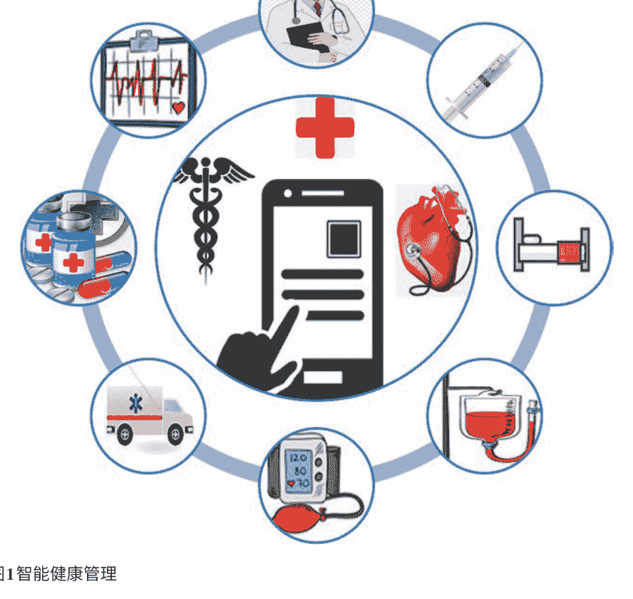

通过制作文件或手动诊断通过大量先前的医疗记录和重复测试来检查患者的健康影响，医生为大量患者每天、每周和每月创建文档[5]。

## 智能健康记录中的各种类型记录

健康记录通常分为四类：

- 1. 临床记录：这是对患者发作情况、康复进展以及医疗人员和上级机构提供的各种设施的认识。 这类记录具有以下几个显著特点：
(a) 实验性、客观性和授权性。
(b) 医务人员谨慎处理记录。
(c) 应向患者提供适当的治疗文件。
(d) 应避免重复，因为这会增加文书工作和大量文件记录。
(e) 医院必须提供有关研究和其他相关模块的真实数据。
(f) 应在升级健康服务方面提供更好的服务。
(g) 保险和安全也是员工、护士、医生和医师的主要关注点。
(h) 应为接近患者的人提供适当的建筑物消毒。
    - 医生的医嘱表
    - 患者的操作表
    - 护士的入院评估表
    - 患者的病史
    - 医生的批注/印象
    - 治疗记录
    - 改善统计数据

- 2. 员工记录：每个员工都有一套独立的记录。 这些个人记录必须以数字形式维护，包括他们的出勤情况、医疗状况（例如保险、个人信息、经验等）[6]。
    - 个人的评估表
    - 特定时间内处理的患者数量
    - 每日出勤记录
    - 个别员工的病史

3. 部门/病房记录：与特定部门或病房相关的记录。
    - 与病房记录相关的一些示例:
    - 病房每日维护记录的通知。
    - 特定时间或巡视时的出勤记录。
    - 每个个体的病房职责应经常检查。
    - 病房的库存应以数字形式保存。
    - 关于特定病房的患者记录。
    - 药物记录的计费。
    - 包含病房日常活动的记录。
    - 患者每日程序记录的数量。

4. 行政记录：这是一种行政部门负责确保每项活动在电子监督下进行，以实现组织内一切事务流程更好的目标的记录[7]。
    - 与病房记录相关的一些示例:
    - 每日治疗记录
    - 带有药物的出院记录
    - 服务记录
    - 各种活动的组织公告板记录
    - 频繁进行每个手动程序

## 为印度制定电子健康记录标准

印度政府卫生部提出了电子健康记录（EHR）标准，以推荐一种高度灵活的系统，通过医疗保健工作者在长期内保存和生成国内患者的健康记录。 因此，在21世纪的下一代中，印度政府专注于电子健康记录，其使命是实现数字印度。这个新时代的愿景将以这样的方式实施，即在紧急情况下，一个人不需要携带任何文档，如他们的健康治疗历史、最后一次就诊摘要报告等。因此，根据这些标准，一个人可以去任何拥有最佳医疗设施、医生、专家或专家的医院，并尽早开始治疗，而不会浪费大量时间，因为云端已经有了完全统一的电子记录，任何人都可以在需要时通过连接设备（如软件和应用程序嵌入的笔记本电脑、平板电脑等）访问它[8]。

卫生部计划在2013年为该国提出电子健康记录标准。 2016年再次修订，引入信息技术、机器学习、大数据分析、基于传感器的实时数据流以及其他技术，以使医疗保健系统在未来几年内在全国范围内的医院、研究人员和与医疗保健相关的发展中心、各种组织和医疗机构更加高效和易于访问。


图2 通过网络帮助各种设备推进电子健康记录的发展

卫生机构建议各机构更新系统，采用新技术，并以一种在紧急情况下普通人可以接触到的方式实施系统，以确保完全透明度[9]（图2）。

## 传统纸质记录与智能健康记录

即使在今天的情况下，医院仍然使用传统的纸质记录来评估患者的先前摘要文件。大量关于患者保密性的文件以及对患者记录的访问重点，使得从他们所属的位置转向电子健康记录具有重要影响。电子健康记录（EHR）是患者在任何医疗机构的入院表的电子版本。EHR属于实时数据，以云端的形式产生数据；这些记录使用数据分析技术，易于访问并持续授权[10]。

使用电子健康记录的医护人员，如护士、从业人员和培训师，纸质工作、患者入院表格、工作卡或其他文档的流失率超过40%。电子健康记录是获取患者特定信息的最可靠方法之一。成为无纸化有助于我们的业务发展。众所周知，在当今激烈的竞争中，时间对我们所有人来说都非常关键，这已经被证明在各个行业中尤其是在医疗保健行业，电子健康记录已成为热门话题，因为它们通过使用电子设备、智能手机等帮助节省了大量时间和精力[11]。

在电子健康记录中，我们可以通过使用远程医疗技术（图3）实时获取数据。

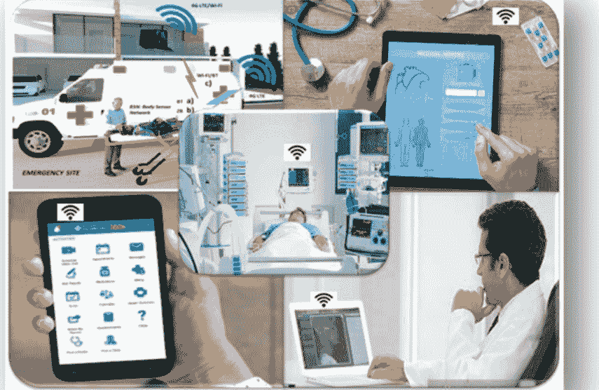

图3电子健康记录

### 纸质记录与电子健康记录的比较

| 纸质记录 | 电子健康记录 |
| :--- | :--- |
| 录在多家医院和护理中心之间分散，这些记录对患者来说是无关紧要且冗余的。 | 电子健康记录通过使用智能手机、设备、平板电脑等移动应用程序或软件智能地减少了冗余数据 |
| 录也很混乱因为许多医生必须从许多来源收集患者的以前的病史记录如上次入院的文档提交表格以前的药物程序以及康复率 | 电子健康记录允许将所有以前的记录积累在一个存储中以便可以轻松访问而无需查看所有以前的文档和大量的文件从而减少医务人员（如医生、专家、医师等）的时间和精力 |
| 在纸质记录中，即使你从各种来源（如电子邮件和传真）获取记录，也需要很长时间才能进行处理在紧急情况下，延迟治疗将是致命的 | 在电子健康记录中，系统会获取患者的完整病史记录，因此不需要从其他资源中获取数据/信息，也不需要再次在系统中填写部分或全部记录在这种类型的记录中，由于你没有将患者的整个病史记录放在一个地方 |
| ，将所有记录与以前的药物和治疗方法整合在一起非常麻烦 | 由于数据/记录的实时流式传输应用程序可以自动更新，因为它可以像ATM一样全天候工作24/7。因此，我们不必担心当前患者健康状况，因为通过佩戴一些连接设备，这些设备本身获取实时数据并将其存储在云上医生的接诊时间很少，因为他或她只在工作时间内可用；因此，在紧急情况或任何关键情况下，这可能会影响患者的健康 |
| | 在电子健康记录中，我们可以从任何云平台实时获取数据，并且医生可以从任何地点甚至从家中监控这些数据，并通过使用远程医疗技术，在任何紧急情况下都可以开药 |

## 智能医疗系统中的互操作性和标准

在这个主题中，各种标准的束缚引入了一种累积的方法：

- 1. 应仔细研究医疗设备和使用案例。
2. 各种可穿戴设备和连接设备应接受互操作性和标准。
3. 接受标准并执行无缝交换健康信息的要求，以在各种机构和IT基础设施之间进行。
4. 将供应商团结在共同的医疗问题和与健康相关的挑战周围。
5. 建立各种常用工具和设备及其相关服务。
6. 通过在公共和私营部门股东之间整合努力，供应商共同努力创建意愿，以开发需求规范过程的各个阶段。
7. 政府提出的我们应遵循的各种指南，用于全国范围内的健康信息网络。

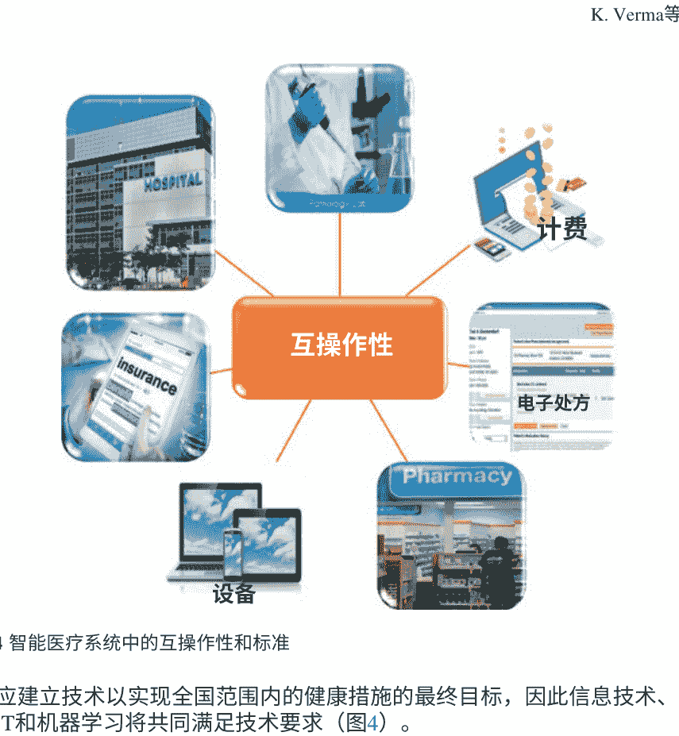

8. 应建立技术以实现全国范围内的健康措施的最终目标，因此信息技术、ICT和机器学习将共同满足技术要求（图4）。

## 拟议智能健康记录的指南

我们都知道一种名为机器学习的新技术，通过该技术我们正在有意地将我们的医疗历史记录在服务器上，并借助RPC API和Google Cloud Vision使用ML模型识别具有模式或识别技术的数据，并以数字形式生成电子健康记录。

整个数据将存储在云端，我们可以通过手机应用程序访问它通过使用智能手机，我们的医生、医师和药剂师可以轻松访问和控制这些数据或记录。

近年来，该国健康行业的许多智囊团生成了可移动和“互操作”的电子健康记录，这意味着大众可以轻松访问和理解。 医学科学机构是参与医疗供应商的大量信息的重要领域；深耕的电子健康记录提供商承诺意图进行信息交流平台而不是行业标准来参与未经加工的信息[12]。

电子健康记录的创建和存储成本较低，并且在需要时易于移动到任何地方。这些是新的医疗制度的形象背后的原因，政府也对分发和维护全国范围的共享制度感兴趣。如果没有专家和医疗服务提供者在申请中填写正确的信息，电子健康记录将成为个人资产，以便我们可以随时自行管理，并将其发送给医生以进行紧急预约，或者可以寻求远程医疗的帮助。

谷歌健康和微软的健康保险库在线平台是消费者可以积累和分享他们的电子健康记录的最大IT巨头之一。

安全和隐私专家对网络化健康记录的信息安全和保护非常关注。一些专家，例如民主与技术中心，提出了一些不可推崇的指导方针，例如医疗行业的买家和消费者可以共享共同利益，因为他们的需求和要求规范是相同的。根据研究，消息来源表示到2022年，医疗行业的IT工作将增加25%。在几乎每个医疗项目的几乎每个领域都拥有先进医疗设施的许多医院中，对于存储实时数据和计算机诊断的高效智能手机应用程序和云服务器有需求。

## 机器学习在医疗领域的应用

机器学习可以在没有人类干预的情况下提升手动任务。电子健康记录（EHR）是无监管且神秘的，反对计算机化，因此我们在获取信息时可能会陷入困境，需要花费昂贵的时间。机器学习算法可以预测可调整或适应患者健康规范的数据，并且在紧急情况下，我们可以列出进一步的步骤以尽早采取适当的行动，以拯救人类生命并提高患者的预期寿命。

人工智能与机器学习算法结合生成对抗网络（GANs）工作，并以高准确性预测分子的更精确形状。统计学使用R语言预测出令人瞩目的数据图表，以便我们可以轻松理解逐渐显示个体改进措施的图形，从而提高能力并提供便捷访问。

图像识别技术使用机器学习对病理进行分类，例如通过显示不同模式的人体图像来发现医疗模块中的肿瘤，从而使医生能够轻松检测出患有肿瘤的身体与健康身体的差异。另一种正在实现的途径是使用可穿戴设备，如智能手表、Fitbit等连接设备。通过使用这些可穿戴设备，我们可以存储个体的实时信息，并通过机器学习模型进行分析。将数据总结为结果，例如恶化或破坏。可穿戴设备在行走、跑步和慢跑时有效地获取数据。因为它们通过实时流媒体模块收集数据，当这些数据达到特定的危险点时，它会迅速通知一个人或个体采取适当的行动，以免发生更糟糕的情况，例如中风风险、心跳增强、过度出汗等。

机器学习算法在医疗保健领域引发了巨大的热情。生物学家、计算机科学家、IT专业人员、医生和应用科学院的教职员工都在协作环境中共同努力，日夜实践，以提出所有相关技术，并最终得出一些创造性的解决方案，如疫情预测和个性化药物。

他们经常使用机器学习模型在疾病发生之前进行诊断和鉴定。借助自然语言处理，与该领域相关的专业人员可以处理大量的行政任务。

### 向量机技术简介

机器学习（ML）已成为几乎所有行业的热词，并被公认为人工智能的重要组成部分。此外，ML是一种数据分析技术，可以自动化声明性结构。机器学习使用的算法吸引了所有大型IT巨头与各个主要行业（如银行、交通、医疗保健等）合作。支持向量机是一种分类技术，它根据机器学习技术提供的超平面将信息片段分发给与监督学习技术匹配的模式。因此，支持向量机被广泛认为是分类的机器学习技术。支持向量机是一种选择性分类器。它通过超平面生成结果，该超平面组织了接受支持向量机技术的新数据集的示例。

在二维（2D）区域中，该技术是一条直线，分为两个扇区，每个扇区在一侧通过采用两个唯一的数据集或信息片段来表示，如圆点所示。这个图形表示提出了一个肯定的解释，如图所示。图5显示了不同的图像，区分了患病者和健康者。

这个视觉表示提出了一个默认的解释（图5）。下表显示了用机器学习模型分析数据的各种数据集。

**图5 健康类别的各种区分**

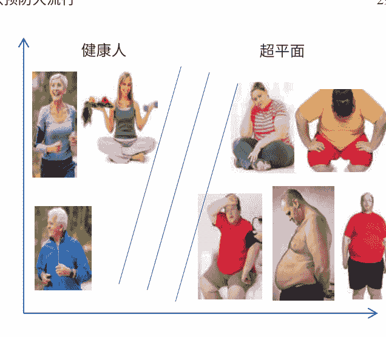

### 机器学习模型

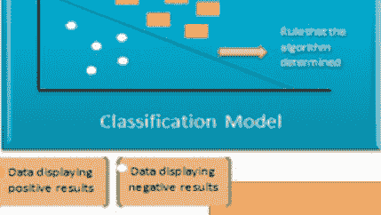

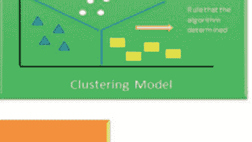

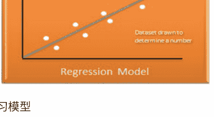

**图6 各种类型的机器学习模型**

## 患有肥胖症的人

| | 禁食 | 饭后 | 饭后3小时 |
| :--- | :--- | :--- | :--- |
| 正常 | 80–100 | 170–200 | 120-140 |
| 糖尿病前期 | 101–125 | 190–230 | 140-160 |
| 糖尿病 | 126+ | 220–300 | 200+ |

数据可以通过各种模型显示，例如分类模型、聚类模型和回归模型（图6）。

有时候我们在考虑超平面时会犯错误，选择一个最优的超平面是一项繁琐的工作，因为噪声敏感性和不同的合理化。

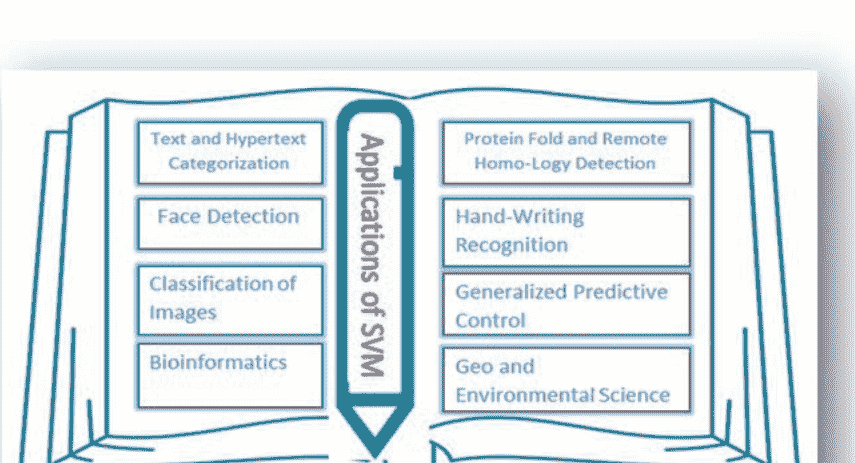

图7 支持向量机的示意图

数据集应该以更高的准确性以适当的方式进行处理。 支持向量机试图升级超平面，以获得较小的距离，从而获得熟练的数据集（图7）。

## 医疗领域中的光学字符识别技术简介

我们在医疗保健中使用的光学字符识别技术主要帮助我们处理和增强您与健康状况相关的计划的适应性。 借助图像识别技术，我们已经执行了大量的过程，用于消除纸张上高强度数据输入过程的使用。

我们在医学科学中广泛使用光学字符识别技术，该技术基于光学字符识别扫描仪的熟练程度。正如其名称所示，它可以通过仔细识别字符并将数据缓存为电子文件来扫描文件中的字母数字字符。

### 光学字符识别到来后，纸质索赔泛滥

在保险行业中，一个简单的医疗保健计划包含大量的个人纸质索赔，这些索赔通常通过OCR扫描并转换为基于医疗系统偏好的电子文件。预定义的格式化模型。 我们通常使用X.12格式来验证与该技术相关的索赔。就像电子数据交换文件一样，我们可以将我们的文件插入系统中。文档中保存的图像可以通过引用相同的图像并与未来的输入数据进行比较，以便轻松地使用机器学习模型来理解模式。机器学习模型往往非常复杂，因此在这个界面中，我们的电子文件中有很多图像，可以快速而轻松地传输和检索。整个过程消除了纸张和手动文档的使用。

每天以纸质文档或纸质格式频繁到达的索赔数量正在快速增加。 借助连接设备（如智能手机）在特定网络中的亭子、云服务器和各种应用程序，通过在医疗保健中使用光学字符识别，保存电子信息并将这些电子文件轻松地传输到接收端已成为一种无需努力的系统。

不同的模块使用EDI的OCR具有优势（图8）。

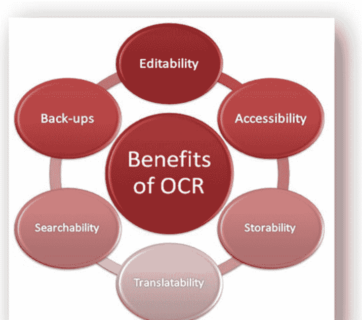

图8 光学字符识别的好处

### 电子文档交换

光学字符识别在医疗保健或医学科学中的另一个应用是将纸质文件或文档以电子交换的方式组成与EDI模块兼容的文件。通过生成一个屏幕上的纸质模块，所有包含图像的手动文件主要存储在系统的表单中。通过这样做，我们可以轻松访问并简单地传输这些文件，提高效率。随后，通过使用EDI技术，图像将被转换为文本格式，并自动存储到全球基于云的服务器的数据库中，以便我们可以安全地在需要时轻松检索这些信息[13]。

### 光学字符识别在医疗领域的优势

- 1. 快速访问和检索文件的速度非常快。
2. 增强了存储电子文件的能力，因此占用的空间较少，而不是存储非常笨重的纸质文件。
3. 准确率非常高，甚至在几秒钟内也能捕捉到。
4. 存储成本较低，与存储手动文件相比，我们不需要创建大量空间来放置文件。
5. 由于我们可以通过一次点击将文件从一个位置传输到另一个位置，因此交通非常便利。
6. 许多组织正在帮助解决数据丢失和损坏的问题，以提高可靠性。OCR已经解决了许多这些问题，以减少错误。

## 智能健康记录中的隐私和安全性

随着技术的发明，印度政府已经开始通过将传统健康记录与信息技术（IT）相结合来革新传统健康记录。电子健康记录可以通过明确责任和降低成本来产生巨大的利润和福利。然而，通过在云端计算和优化健康记录，电子健康记录系统现在面临安全威胁，因为大部分重要信息不仅仅在医生或医师手中，还在云服务器上，使其易受黑客、破解者和网络犯罪分子的攻击。由于健康记录中存在的隐私和安全威胁，在数字世界的医学科学时代，出现了一项名为网络安全的新措施，对于决策者来说，这是一个极其重要的事务。许多期刊、文章和论文都在发布与医疗保健中的网络欺凌、安全和隐私问题有关的内容。最近仍在进行大量研究，以改善电子健康记录系统的隐私和安全性[14]。

## 参考文献

37. B. Efron, R.J. Tibshirani, 引导简介(CRC出版社，1994年)

38. S. Lundberg, S.-I. Lee, 解释模型预测的统一方法。 arXiv:1705.07874 [cs, stat] (2017)

39. S.M. Lundberg等，可解释的机器学习预测用于手术期间预防低氧血症。Nat. Biomed. Eng. 2，749-760 (2018年)

40. J. Josse, N. Prost, E. Scornet, G. Varoquaux, 关于有缺失值的监督学习的一致性。 arXiv:1902.06931 [cs, math, stat] (2019)

41. T. Chen, C. Guestrin, XGBoost: 一种可扩展的树提升系统，在第22届ACM SIGKDD国际会议上的知识发现和数据挖掘 (计算机协会, 2016), 第785-794页

## 图9 介绍Google Cloud Vision API

对于电子健康记录系统的持久成就，不容妥协的安全和隐私保护现在是必不可少的。如果患者的信任和信念已经消失，认为电子健康记录系统是值得担心的，那么他们很可能不会使用它，并且对使用它感到犹豫；因此，任何未经授权的人都不应该能够获得任何信息。如果黑客试图访问任何个人的记录或试图渗透任何患者的病历，那么就需要加强安全措施（图9）。

Google Cloud Vision致力于采用机器学习概念的产品，通过对输入的数据进行标记来理解我们的数据，并在执行后通过与算法或预训练模型进行交互，提供高准确性的结果。 以下是Google Cloud Vision的类型：

- 1. AutoML Vision
- 2. 视觉API

让我们解释每一个：

- 1. AutoML Vision: 顾名思义，个性化我们的机器学习标准并开发模型，我们可以使用AutoML Vision的技术，该技术易于通过API（应用程序编程接口）进行访问。借助代码的帮助，我们可以使用类和对象的概念进行不同分类，并开发一个高度的应用程序，通过以下特点进行优化：低延迟、小尺寸和最大准确性。以后，我们可以将完整的结构传输到云端的应用程序中，并且还可以将其存储到各种连接网络设备的数组中，最后将模型部署到我们的应用程序中，并理解对象以便从中轻松比较正确的事物以获得优化的结果，例如快速预测疾病、情绪智能模式、客户购买行为和业务分析。

- 2. 视觉API：在这个模块中，我们可以使用REST和远程过程调用API，它被称为应用程序编程接口的基本形式。它帮助我们通过远程过程调用将我们的代码块部署到另一个远程服务器上。如果我们必须通过超文本标记语言将代码块带入HTTP，它可以被视为Web API。通过REST和远程过程调用API，我们使我们的机器学习模型变得熟练和预训练。

图10描述了通过使用 AutoML Vision通过无缺陷的算法对模型进行适当训练，将训练数据集的工作转化为最佳结果。

## 图10 通过Google Cloud Vision API在医疗系统中的机器学习模型

## 结论

从上面的讨论中，我们必须得出结论，随着日新月异，医疗系统现在已经紧紧抓住人类的生活，而不需要患者的绝对存在，因为它已经多样化了许多设备和技术来处理各个远程位置的任何个体的数据，并为他们开具任何药物，如远程医疗等。正如我们都知道的，在未来十年中，患有慢性疾病的老年人数量将增加，将健康记录和他们慢性疾病的先前历史安全地保存在数据库服务器上，并在紧急需要时随时收集它们将至关重要，以便医生可以在有限的时间内给予适当的治疗，以挽救生命。采用所有新技术，如智能健康记录，远程医疗和虚拟处方治疗，将改善患者的健康状况。

## 参考文献

- 1. L. Catarinucci等人，智能医疗系统的物联网感知架构。IEEE互联网事物杂志 2(6), 515-526 (2015)。https://doi.org/10.1109/JIOT.2015.2417684
- 2. A. Kumar，G. Chatterjee，S. Periyasamy，智能医疗监测系统。无线个人通信 101(1), 453-463 (2018)。https://doi.org/10.1007/S11277-018-5699-0
- 3. R. Dautov，S. Distefano，R. Buyya，智能医疗的分层数据融合。J大数据6(1), 1-23 (2019)。https://doi.org/10.1186/S40537-019-0183-6
- 4. N. Chandnani，C.N. Khairnar，一种基于机器学习的物联网无线传感器网络中的安全协议，用于数据聚合和高效路由，出版于无线个人通信，Springer，电子ISSN：1572-834X，印刷ISSN：0929-6212 (2019)
- 5. N. Chandnani，C.N. Khairnar，生物启发的物联网无线传感器网络中的数据聚合和路由的多级安全协议，在移动网络和应用，Springer，电子ISSN：1572-8153，印刷ISSN：1383-469X (2022)，doi：https://doi.org/10.1007/s11036-021-01859-6
- 6. K. Verma，N. Chandnani，G. Bhatt，A. Sinha，物联网和智能农业 (Springer, 2022)，页码：283-303。 https://doi.org/10.1007/978-3-030-77528-5_15
- 7. N. Chandnani，C.N. Khairnar，物联网网络中数据聚合和路由技术的综合评估和性能评估的最新趋势的全面回顾，在网络和系统的讲义，第100卷 (Springer, 2020)，页码：467-484。doi：https://doi.org/10.1007/978-981-15-2071-6_37
- 8. N. Chandnani，C.N. Khairnar，高效的物联网无线传感器网络数据聚合和路由算法，在IFIP国际无线和光通信网络会议，WOCN，IEEE会议，vol. 2019 (2019), doi：https://doi.org/10.1109/WOCN45266.2019.8995074
- 9. N. Chandnani，C.N. Khairnar，一种基于粒子群优化算法的物联网安全数据聚合方法，在2018年国际高级计算和电信会议，ICACAT 2018, IEEE会议(2018), doi：https://doi.org/10.1109/ICACAT.2018.8933784
- 10. N. Chandnani，A.M. Gupta，P. Fatnani，P. Jain，工业复杂环境下分布式电网监控和切换系统的开发，在IOSR电子与通信工程杂志 (IOSR-JECE)，电子ISSN：2278-2834, 打印ISSN：2278-8735, vol. 10, no. 6 (2015), pp. 01–09, doi：https://doi.org/10.9790/2834-10610109
- 11. N. Chandnani, K. Verma, S. Joshi, A. Mangal, M. Sundararajan, A. Mohan, 数学在研究、教育和医学科学中的应用。Des. Eng.，13026-13037
- 12. M. Verma, K. Verma, 统计分析和主要营养物质（N、P、K）对煤灰混合荒地土壤中囊泡-丛枝菌根侵染的影响，在Nveo-Natural Volatiles & Essential Oils Journal Nveo（2021），pp. 6816-6824
- 13. P. Vijayashanthi, K. Verma, S. Dixit, S. K. Pandey, E. Sathya, M. Arunkumar, 顺序g-商映射概述，在Materials Today: Proceedings (2021)
- 14. R. JatinKikani, K. Verma, R. Navalakhe, G. Shrivastava, V. Shrivastava, 密码学：加密数学的最新研究趋势，在Materials Today: Proceedings (2021)

# 自动化COVID-19疾病从放射照片中诊断

Keerthi Mangond, B. S. Divya, N. Siva Rama Lingham, 和Thompson Stephan

## 介绍

冠状病毒确实是一种高度传染性疾病，被称为COVID-19。它没有特定的治疗方法，死亡率为2%。由于严重的肺损伤和呼吸衰竭，这种严重疾病可能导致死亡[1]。 COVID-19病毒始于2019年12月31日，由于对中国湖北省武汉市肺热原因的无知，最终演变成了一场大流行。许多最近的文章[2-4]讨论了COVID-19对人们的生计和健康的影响。 COVID-19是由SARS-CoV-2病毒引起的。在短短一个月的时间里，这种病毒已经从武汉传播到了世界上大部分地区[5, 6]。严重急性呼吸综合征冠状病毒（SARS-CoV）和中东呼吸综合征冠状病毒（MERS-CoV）引起了严重的急性呼吸综合征和许多死亡[10]。

为此，我们已经探索了使用技术来帮助检测感染病毒的患者的可能性。此外，与需要控制患者呼吸系统的实验室程序不同，X射线检查可以在不增加病原体气溶胶化风险的情况下进行[7]。X射线还可以将患者分为COVID-19阳性或阴性。这项研究的目的是利用患者的胸部X射线图像自动识别COVID-19病毒在其呼吸系统中的存在。早期识别COVID-19有助于对患者进行隔离，从而使社会受益。利用肺部X射线影像，自动识别COVID-19对患者和医生都具有挽救生命的价值。COVID-19的自动诊断将降低诊断价格并导致快速报告。这种成本降低将对支付医疗保健服务费用的国家政府有益。

医生可以方便而准确地通过计算机辅助诊断（CAD）对胸部X射线进行诊断肺炎[5]。由于人工智能技术在医疗服务领域的超越能力，其使用正在医疗服务中迅速增长[8]。将CAD方法应用于放射科医生的诊断系统中，可以显著减轻医生的工作负担，提高性能和定量分析[9]。机器学习和医学成像CAD系统是更受欢迎的研究领域[10]。许多研究人员[22]最近开发了基于机器学习技术的各种自动诊断算法。本研究旨在利用计算机视觉和医学图像处理技术构建一个具有检测冠状病毒疾病能力的自动化系统。研究中使用的数据量也存在差异。本研究旨在使用肺部X射线图像上的机器学习进行冠状病毒的高精度诊断，数据集有限。利用最新的深度学习技术和计算机视觉技术，可以实现基于肺部X射线的最先进冠状病毒分析解决方案。用于分析视觉图像的高效架构之一是卷积神经网络（CNN），一种深度学习方法。CNN的形式化是为了模仿大脑分析视觉数据[11, 12]。Alex与Ilya Sutskever和Geoffrey Hinton共同设计了一个CNN，并在ImageNet大规模视觉识别挑战（ILSVRC-2012）的完成中提交了设计，并展示了惊人的结果15.3%，紧随其后的是26.2%的亚军。从那时起，CNN开启了计算机视觉的新时代。K. Simonyan和A. Zisserman在ILSVRC-2014再次提出了VGG16模型，其错误率为7.3%。VGG16通过将核大小从11减小到5再到3来改进AlexNet。

## 材料和方法

## 数据集

我们已经收集了正常肺部X射线放射图像和COVID-19肺部X射线放射图像。COVID-19患者数据集来自Joseph Paul博士的账户，正常患者数据集来自Kaggle网站[13]。收集到的数据集被分为两个类别：COVID-19和正常。这两个类别都用于训练和测试阶段。为此目的，创建了两个独立的训练和测试文件夹。用于训练的正常图像有70张，COVID-19图像有60张；用于测试的正常图像有25张，COVID-19图像有25张。

## 拟议的分类模型

所提出的图像自动分类架构如图1所示。它主要分为两个阶段：

- 1. 数据预处理。
- 2. 一个预训练的VGG16模型。

### 数据预处理

目前数据集中的图像数量对于深度学习算法来说太少了。因此，增加了数据集中的图像数量。调用了ImageDataGenerator类来增加数据集的大小。图像被调整为224x224。

图像数量仅在训练集中增加，而不是验证或测试数据。这种数据增强与数据准备不同，例如图像调整和像素缩放。使用的数据增强方法如下：

- 1. 图像平移通过宽度平移范围和高度平移范围完成。
- 2. 图像翻转通过水平翻转和垂直翻转获得。
- 3. 图像旋转通过旋转范围完成。
- 4. 图像缩放也通过缩放范围完成。

所提出的X射线放射图分类模型如图1所示。由于数据集太小无法训练CNN，因此使用了数据增强技术来增加数据集的大小。VGG16 [7]的CNN架构如图1所示，用于特征表示，因为它具有多个卷积层、最大池化层和全连接层用于分类。卷积层通过识别像素来检测图像区域的判别特征。

## 预训练的VGG16架构

VGG框架由Simonyan引入。VGG16 CNN架构的两个主要块如下：

第一个块VGG16框架按照Cn1，Cn2，最大池化1，Cn3，Cn4，最大池化2，Cn5，Cn6，Cn7，最大池化3，Cn8，Cn9，Cn10，最大池化4，Cn11，Cn12，Cn13的顺序具有13个卷积层。接下来是三个密集层，使用softmax作为分类的传递函数。Cn1和Cn2具有64个特征图，大小为3x3的64个滤波器。Cn3和Cn4具有128个大小为3x3的128个特征图。Cn5，Cn6和Cn7具有256个大小为3x3的256个特征图。Cn8，Cn9和Cn10具有512个大小为3x3的512个特征图。Cn11，Cn12和Cn13具有512个大小为3x3的512个滤波器。

卷积层通过一个像素的步幅和一个像素的零填充进行计算。所有四个最大池化层都是在2x2像素窗口上进行的，并且步幅为2。每个卷积层后面都会跟着一个ReLU层。卷积层和池化层被认为是第一个模块，因此第一个模块将进行特征提取。为此，它将通过应用滤波操作进行模板匹配，在该模块中，第一层将使用卷积核对图像进行滤波，然后返回特征图，然后这些特征图将使用最大池化层进行调整大小。

这个过程会重复进行，最后，最后一个特征图的值将合并成一个向量。这个得到的向量是第一个模块的输出，同时也是下一个模块的输入。

第二个模块该模块有三个用于分类的全连接层，其中两个作为隐藏层，最后一个将作为分类层。这个模块主要用于分类，所以它被用在CNN网络的末尾。输入向量的值经过转换，生成另一个新向量，同时还有许多激活函数和线性组合。最终向量包含许多元素，其中每个元素i表示属于某个类别的图像概率。因此，每个元素的取值范围在0和1之间。为了计算这些概率，使用第二个模块的最后一层。最后，最终层使用逻辑激活进行二元分类，使用softmax转换函数进行多类别分类[6,15]。

迁移学习算法迁移学习使用先前学习到的知识，从一个数据集解决类似问题的另一个数据集，该数据集具有较少的信息和较少的数据点。网络可以使用这些学习到的特征，而不是从头开始训练模型。

## 结果和讨论

所需的系统规格是Intel Core i5处理器，2 GB的显卡，64位操作系统，1.80 GHz的速度，以及4 GB的RAM。对于这项工作，我们需要大量的COVID-19阳性病例的放射照片进行更好的分类，但由于数据集较小，我们应用了数据增强技术和迁移学习技术。此外，模型将从训练图像中提取属性，并使用这些属性来检测类别标签（COVID-19和正常）。

### 第一阶段（数据增强）

数据增强被用来增加数据集的大小。这种数据增加也有助于解决迁移学习中的过拟合问题。数据集包含60张COVID-19阳性图像和70张正常患者的图像，如表2所示。图2将展示数据集中正常和COVID-19病例的样本胸部X射线照片。在这个过程中使用了X射线照片图像。在检测的第一阶段，输入数据的图像具有不同的分辨率。因此，在预处理中，图像被处理为分辨率为224x224x3，以保持一致性。应用的增强类型如表1所示。增强仅应用于训练图像，而不应用于测试图像。

表1 数据增强类型

| 数据增强技术 | 参数 |
|--------------|------|
| 翻转 | 垂直/水平（真） |
| 旋转 | 旋转（50） |
| 缩放 | 缩放范围（0.1） |
| 分割 | 验证分割（0.2） |
| 移动 | 宽度/高度（0.2） |
| 移动 | 通道移动（20） |

图2 COVID-19和正常患者的样本胸部X射线图像。(a) COVID-19 X射线图像 (b) 正常X射线图像

| 类别   | 训练数据 | 测试数据 |
|--------|----------|----------|
| COVID-19 | 60       | 25       |
| 正常   | 70       | 25       |

### 第二阶段预训练的VGG16

迁移学习模型所需的图像尺寸为VGG16（224x224x3）。仅对最后三个密集层进行训练，以根据训练图像的类标签对胸部X光图像进行分类。此外，如果我们需要对其他不同的图像进行分类，可以根据新的输入图像更新层来重新训练模型。在训练阶段，开发模型时给定的参数如下：

### 性能指标

根据以下参数计算模型的性能：准确率、精确度、敏感度、F1分数和特异度。混淆矩阵是一个提供模型性能摘要的表格。二元分类的混淆矩阵格式如表3所示。

### COVID-19分类结果

为了避免过拟合，在训练阶段将数据分为训练集和验证集。图3和图4分别展示了训练集和验证集的分类熵损失和模型准确率。模型在验证集上取得了最高98%的得分，如图5所示。

### 混淆矩阵和特征图

引入混淆矩阵的主要原因是分析所提出技术产生的猜测结果与实际结果之间的稳定性。混淆矩阵是分类多类对象的最佳方法之一。在这里，每一列代表预测的类别，每一行代表真实的类别。将代表实际类别。COVID-19分类的混淆矩阵在图5中表示，训练模型层的特征图在图6中表示。性能经过评估，并在表4中列出。表4显示了基于X射线分类的VGG16模型的性能指标得分。

表3 混淆矩阵

|          | 实际值 真阳性 | 实际值 假阳性 |
|----------|----------------|----------------|
| 预测值 真阴性 |                |                |
| 预测值 FN   |                |                |

图3 训练和验证损失

图4 训练集和验证集上的准确率

### 与最先进方法的比较

在图像的自动分类中，深度学习方法可以在疾病的初步诊断中提供帮助。如表5所示，使用深度学习技术的方法，我们可以轻松地实现比其他分类技术更快和更好的结果。在这项工作中，提出了一种高效的COVID-19检测技术。该方法将胸部X射线图像分类为正常和COVID等不同类别。在这项工作中，将与最先进的方法进行性能比较，以评估所提出的CNN模型。虽然表5显示了列出的研究[9,16-21]的性能值，但使用了不同的数据集，我们的设计几乎超过了所有以前的研究，除了Khan等人使用了一个相对较大的数据集和复杂的网络。

图6 第二个CNN层的特征图

## 表4 性能指标

| 指标 | 值 |
| --- | --- |
| 准确率 | 98% |
| 精确度 | 0.961 |
| 召回率 | 1 |
| F1得分 | 0.97 |

## 结果和讨论

在当前的研究工作中，使用VGG16卷积神经网络架构从X光片中检测COVID-19。实验旨在评估预训练的VGG16卷积神经网络在公开可用的COVID-19数据集上的性能。由于数据集较小，采用了数据增强方法来增加数据集中的图像数量。采用了数据增强方法T。为了实现有效的结果，采用了基于迁移学习的模型。本文提出了一种两阶段的方法来识别考虑的X光片为COVID-19和正常类别。第一阶段实施了数据增强。第二阶段分类使用了基于迁移学习的架构，即VGG16。该提出的框架将支持快速和精确地检测X光片中的COVID-19。

## 表5 与最先进的方法比较

| 作者 | 模型 | 使用的数据集 | 准确率 | F1-得分 |
|------|------|--------------|--------|---------|
| Sethy和Behera (2020) | ResNet50 + SVM | 博士 Joseph Cohen+ open-i 仓库 | 95.38 |  |
| Narin等人(2020) | ResNet50 | Joseph博士 Cohen | 98 | 0.98 |
| Apostolopoulos和Mpesiana (2020) | VGG19 | 公共医学仓库- Cohen+ 北美放射学会、Radiopaedia 和意大利医学和介入放射学学会 | 98.75 |  |
| Hemdan等人(2020) | VGG19 | Joseph Cohen1 + Adrian Rosebrock博士 | 90 | 0.91 |
| Ozturk等人(2020) | DarkCOVIDNet | Cohen JP+ Wang | 98.08 | 0.96 |
| Khan等人(2020) | CoroNet | Joseph+ (北美放射学会(RSNA)) | 99 | 0.98 |
| Toraman等人(2020) | CoroNet | Cohen JP+ 王 | 97.24 | 0.97 |
| 这项研究 | VGG16 | Joseph博士 +Cohen JP | 98% | 0.97 |

## 参考文献

1.  Z. Xu, L. Shi, Y. Wang, J. Zhang, L. Huang, C. Zhang, S. Liu, P. Zhao, H. Liu, L. Zhu, 等，与急性呼吸窘迫综合征相关的covid-19的病理学发现。柳叶刀呼吸。医学。 8(4), 420–422 (2020)
2.  S. Kumar, R. Viral, V. Deep, P. Sharma, M. Kumar, M. Mahmud, T. Stephan, 预测 COVID-19大流行对国家驱动部门的主要影响：挑战、经验教训和未来路线图。个人普及计算 (2021)
3.  M.S. Kaiser, M. Mahmud, M.B. Noor, N.Z. Zenia, S. Al Mamun, K.M.A. Mahmud, S. Azad, V.N.M. Aradhya, S. Punitha, T. Stephan, R. Kannan, M. Hanif, T. Sharmeen, T. Chen,A. Hussain , iworksafe：面向COVID-19的智能pHealth应用程序，用于工业环境中的健康工作场所 。 (2021).https://doi.org/10.20944/preprints202101.0092.v1
4.  A. Aggarwal, M. Chakradar, M.S. Bhatia, M. Kumar, T. Stephan, S.K. Gupta, S.H. Alsamhi,H. AL-Dois, 使用模糊推理系统和机器学习方法进行糖尿病患者的COVID-19风险预测。J. Healthcare Eng. 2022, 1–10 (2022). https://doi. org/10.1155/2022/4096950
5.  Z. 吴, J.M. 麦克古根, 中国冠状病毒病2019（covid-19）疫情的特点和重要经验教训：中国疾病预防控制中心72314例报告摘要。 JAMA 323（13）, 1239-1242（2020）
6.  M.L. 霍尔舒, C. 德博尔特, S. 林德奎斯特, K.H. 洛菲, J. 维斯曼, H. 布鲁斯, C. 斯皮特斯, K. 埃里克森, S. 威尔克森, A. 图拉尔等, 美国首例2019新型冠状病毒病例。 N. Engl. J. Med. (2020)
7.  T. 辛格哈尔, 对冠状病毒病2019（covid-19）的综述。Indian J. Pediatr.87（4）, 281-286 (2020)
8.  P. Stephan, T. Stephan, R. Kannan, A. Abraham, 一种改进乳腺癌诊断的混合人工蜜蜂群与鲸鱼优化算法。神经计算与应用 33(20),13667–13691 (2021)
9.  G. Ga'al, B. Maga, A. Luk'acs, 基于注意力U-Net的对抗性架构用于胸部X射线肺分割。arXiv预印本arXiv 2003, 10304 (2020)
10. A. Jaiswal, N. Gianchandani, D. Singh, V. Kumar, M. Kaur, 基于Densenet201的深度迁移学习对COVID-19感染患者进行分类。生物分子结构动力学杂志 39,1–8 (2020)
11. H. Greenspan, B. Van Ginneken, R.M. Summers, 客座编辑深度学习在医学成像中的应用：概述和未来前景。IEEE Trans. Med.Imaging 35(5), 1153–1159 (2016)
12. L. Deng, D. Yu, 深度学习: 方法与应用, 信号处理的基础与趋势. 7(3–4), 197–387 (2014)
13. Cohen JP (2020) COVID-19 图像数据收集. [https://github.com/ieee8023/covid-chestxray-dataset](https://github.com/ieee8023/covid-chestxray-dataset)
14. P. Lei, Z. Huang, G. Liu, P. Wang, W. Song, J. Mao, G. Shen, S. Zhou, W. Qian, J. Jiao, 临床和计算机断层扫描 (CT) 图像特征在COVID-19感染患者中的特点: 放射科医生需要了解什么? J. Xray Sci. Technol. 28(3), 369–381 (2020)
15. W. Kong, P.P. Agarwal, COVID-19感染的胸部影像外观. Radiol. Cardiothor Imag. 2(1), e200028 (2020)
16. P. K. Sethy, S. K. Behera, 基于深度特征的冠状病毒疾病 (Covid-19) 检测 (2020年)
17. I.D. Apostolopoulos, T.A. Mpesiana, Covid-19: 利用卷积神经网络的迁移学习自动检测X射线图像。物理工程科学医学43 (2) , 635-640 (2020年)
18. E.E.-D. Hemdan, M.A. Shouman, M.E. Karar, Covidx-net: 一种用于诊断X射线图像中的covid-19的深度学习分类器框架。arXiv预印本arXiv 2003, 11055 (2020年)
19. T. Ozturk, M. Talo, E.A. Yildirim, U.B. Baloglu, O. Yildirim, U.R. Acharya, 使用深度神经网络和X射线图像自动检测covid-19病例。计算生物学和医学121, 103792 (2020年)
20. A.I. Khan, J.L. Shah, M.M. Bhat, Coronet: 一种用于检测和诊断胸部X射线图像中的COVID-19的深度神经网络。计算方法程序生物医学。 196, 105581 (2020)
21. S. Toraman, T.B. Alakus, I. Turkoglu, 卷积胶囊网络: 一种使用胶囊网络的新型人工神经网络方法来检测X射线图像中的COVID-19疾病，混沌、孤立子和分形 140, 110122 (2020)
22. S. Punitha, T. Stephan, A.H. Gandomi, 一种具有智能特征和参数选择的新型乳腺癌诊断方案。计算方法程序生物医学。 214, 106432 (2022)

## 人工智能在实现可持续发展目标中的应用

Nisha Solanki，Archana Chaudhary和Dinesh Bhatia

## 人工智能和可持续发展目标（SDGs）简介

在其基本形式中，人工智能是一种多学科策略，将计算机科学与大量数据集相结合以解决问题。 人工智能不仅限于像人类一样思考和行动的系统，还提供了合理化思考和相应行动的能力。 随着19世纪新技术的出现，计算机科学取得了很多进展，对社会产生了影响[Hanson III and Marshall, 7]。 大多数技术是有益的； 然而，有些技术对社会有不利影响，需要理性批评并加以改进以克服漏洞。 人工智能以惊人的速度取得了进展，并在生活的各个方面取得了突破性进展，为人类注入了强大的动力。 通过整合更多的数据计算和图像处理、人工神经网络（ANN）和物联网（IoT）等应用领域，人工智能进一步提升了性能。 人工智能的这种乘数效应可以加速实现SD目标和目标[Hanson III and Marshall, 7]。 应用具有乘数效应的人工智能可以实现SD目标。 这在进化中起着极其重要和决定性的作用

N. Solanki

印度德里的Maharaja Surajmal学院，GGSIP大学

A. Chaudhary (📧)

印度德里的SGT大学Gurugram环境科学系，理学院

D. Bhatia

印度梅加拉亚邦Shillong的东北山大学生物医学工程系

改变朝着一个涉及改善发展和加速实现可持续发展目标和目标的新模式 [3] 。

整个世界正在协同努力实现可持续发展目标（SDGs），以预测发达经济体未来一代的需求。“循环经济”和“智慧城市”被认为是促进一个国家可持续发展的常见概念[3]。

人工智能（AI）已被证明是一种高效和有效的工具，可以为发展经济做出贡献，涉及各个领域。根据《自然》最新发布的报告，AI已经为实现主要可持续发展目标（SDGs）的79%做出了贡献[10]。AI的这种贡献是来自农业、交通、制造业、建筑等各个领域的综合贡献。AI通过交通管理和共享交通工具来帮助交通运输，不仅节省能源和精力，还有益于环境。它还通过无人机和显微镜帮助农民在农业中进行更好的监测和病虫害控制，通过高效施肥提高作物质量，并通过有效控制防止损害[10]。AI有助于克服人为疏忽可能忽视的重大错误，并有助于改善任何行业和制造单位的整体供应链管理。AI还通过对建筑物、水坝和其他基础设施单位进行质量检查，确保数百万人的安全。因此，AI在多个领域的贡献是巨大的，并且在不久的将来可以通过各种维度帮助实现可持续发展目标[4]。

可持续发展目标（SDGs）是一个全球计划，旨在结束贫困，保护环境并确保所有人的繁荣。它们包括17个目标，共计169个指标。联合国可持续发展目标（SDGs）作为2030年可持续发展议程的一部分，不需要过多解释，但要有效实施，需要对投资和企业战略进行全面评估[4]。

幸运的是，正是在2015年，SDGs对全球投资环境产生了重大影响。它们固有的细粒度提供了必要的灵活性和普适性，使投资者和私营部门能够识别和解决与其商业模式相关的关键可持续性问题，同时保持与受托责任的一致性。国际合作的发展努力将以这些基准和指标为指导，持续到2030年[4]。为了实现可持续发展，这17个目标需要作为一个整体来对待，人工智能有助于解决所遇到的困难。我们未来的行为将受到人工智能的极大影响，这是最具潜力的技术之一。根据Grand View Research的数据，人工智能预计在2020年至2027年间以42.2%的复合年增长率（CAGR）增长。由于其快速发展，技术将在社会的许多方面得到应用，包括确保可持续性。尽管不可否认人工智能仍处于起步阶段，并具有潜力进行改变游戏规则的进展，但仍然需要通过结合先进和定制的技术来不断改进[4]。另一方面，人类的相互作用始终至关重要，必须适当地接纳，特别是在建设可持续社会的当下。

图1 将可持续发展目标分类为定量目标和定性目标

## 人工智能和SDGs

尽管联合国可持续发展目标已经详细阐述了基本目标和指标，以便可以计算和跟踪进展，但在17个可持续发展目标中，一些目标是定性的，一些目标是定量的，如果我们根据每个可持续发展目标的指标量化程度进行比较。不同的可持续发展目标需要定制的人工智能技术和技能来实现目标[12]。

为了更好地理解，可将可持续发展目标分为定量和定性两类（图1），以便更好地理解其背后的概念。

## 人工智能在定量SDGs中的作用

### 健康与福祉

2030年议程认识到良好健康与可持续发展之间的相互依存关系。在人工智能的帮助下，我们在许多重大杀手方面取得了巨大的进展，并通过获得良好的健康显著提高了预期寿命和福祉[12]。通过新生儿和孕产妇病例的死亡率显著下降，以及疟疾死亡人数减半，进一步实现了这一目标。一方面，人工智能通过成功实施生物技术技术来增加农作物产量，从而解决了饥饿问题；另一方面，它通过提前预测和警示农民种植适应恶劣天气和病原体的作物品种，解决了气候变化和环境问题[12]。

人工智能还通过成功实施普及医疗保健来消除贫困和减少不平等，从而解决了非传染性疾病等问题[15]。人工智能为定制精准药物和治疗疾病和流行病开辟了道路。现在可以利用大数据进行疾病和爆发的预测，有利于提供和预测卫生服务。借助人工智能，医疗专业人员更加准备好应对疾病和健康实践，患者更容易获得治疗和设施[15]。根据研究结果，基于人工智能的识别方法优于专业皮肤科医生。可穿戴设备可以使用心率传感器数据早期检测糖尿病的迹象，这是人工智能在健康领域中的另一个应用示例。人工智能能够比大多数医生更快地预测和检测疾病。在一项研究中，一个结合算法和深度学习的人工智能模型检测乳腺癌的准确率高于11名病理学家，展示了人工智能的强大力量[13]。通过人工智能，医疗保健的另一个方面可以得到改善，即药物研发。将深度学习算法应用于全切片病理图像可能会提高诊断评估的准确性和效率[15]。

根据Mara Geller（2020）的说法，人工智能的一个可能优势是使人们保持健康，减少对医生的频繁需求。由于人工智能和医疗物联网（IoMT）已经给患者带来了好处，应用程序和技术促进了更好的行为，并帮助维持健康的生活方式，使客户对自己的健康有更多的控制权[13]。此外，人工智能还帮助医疗从业者更好地了解患者的日常生活和需求，使他们能够提供更多的反馈、建议和支持，以保持健康。它帮助医疗公司使用认知技术更好地诊断患者，并保存比任何人都多的医疗数据，包括每一份医学出版物、症状和全球范围内的治疗和反应病例研究[13]。

它还与医生、研究人员和患者一起解决现实世界的医疗问题。该技术将机器学习和系统神经科学相结合，创建了类似人脑的神经网络。除了扫描健康数据以检测患有慢性病的患者是否面临不良事件的风险外，人工智能还可以帮助医生更好地控制疾病，协调护理计划，并帮助患者更好地管理和遵守长期治疗方案。医疗机器人已经存在了近30年。此外，它们可以协助人类外科医生进行手术，或者独立进行手术。它们还被用于医院和实验室的重复活动、康复、物理治疗和长期疾病[13]。它在辅助和可穿戴设备市场上的应用越来越广泛，具有巨大的增长潜力。

## 优质教育

由于贫困、冲突和其他困难，某些新兴国家的增长受到了阻碍。由于西亚和北非地区持续的武装冲突，越来越多的年轻人没有上学。目前情况的严重性正在变得明显。撒哈拉以南非洲的小学入学率从1990年的52%增加到2012年的78%，是所有新兴地区中增长最大的。贫困家庭的孩子跳过学校的次数是富裕家庭的四倍。农村和城市地区之间的差距仍然存在。

为所有学生提供优质教育是确保更加繁荣未来的重要组成部分。到2030年，所有儿童，不论性别，都将享受免费的小学和中学教育。为所有学生提供平等接触高质量教育也是该计划的目标之一。根据人工智能技术在教育中的不断变化的角色，特别是在远程教育中，出现了以虚拟现实为主题的子主题，为课堂带来了生动的体验，学生个人资料模型和学习分析的大数据。它在教育领域带来了繁荣，并改变了获取教育的方式。

基于人工智能的系统可以帮助学生提高学习体验，特别是通过改变内容的形式和性质以适应学生。通过频繁测试生成“智能内容”，以确保学习的进行，并可用作反馈来改变课程内容和轨迹[1]。人工智能不能完全取代人类教师，但人工智能系统可以通过向学生和教师提供及时反馈来发挥中介作用。

尽管教育工作者、心理学家和家长对于儿童使用屏幕时间的可接受程度存在争议，但另一种新技术，即人工智能和机器学习，开始改变教育工具和机构，并改变教育的未来[5]。根据研究，美国教育领域的人工智能市场在2017年至2021年间将增长47.5%。尽管大多数专家认为教师的重要存在是不可替代的，但工作和教育的最佳实践将会发生变化。

人工智能（AI）是一种强大的技术，具有广泛的应用。全球教育领域也不例外。全国各地的各个学校都在教育中使用人工智能[5]。人工智能在教育中的应用为教师、学生、家长和教育机构提供了新的视角。

以下是关于教育中人工智能的一些事实：

- 到2020年，它将价值10亿美元。在2021年至2027年之间，预计将以40%的年复合增长率扩展（GMI）。
- 预计到2030年将产生257亿美元的收入（战略情报）。
- 预计到2023年将达到36.8亿美元（市场）。

## 可负担和清洁能源

通过使用人工智能（AI）促进清洁且价格合理的可再生能源的使用，例如使用智能电网协调各种可再生能源的使用。

然而，我们在这里也必须谨慎[5]。随着数字技术的进步，对ICT解决方案的需求正在增加。因此，由于ICT解决方案的扩大制造，电力消耗也在增加。

随着更多可再生能源进入系统，预测容量水平对于维持稳定和高效的电网至关重要[5]。由于可再生能源占据了更多的电网空间，像煤炭这样通过重型旋转设备（如蒸汽和燃气涡轮机）提供电网惯性的能源正在失去。没有电网惯性，电网将不稳定并容易发生停电[14]。现在，传感器技术可以提供大量实时数据，使太阳能和风能生产能够预测容量水平。在引入人工智能之前，大多数预测依赖于只考虑影响可再生能源供应的少数因素的特定天气模型[14]。新的人工智能算法整合了自学习天气模型、历史数据、实时天气站测量、传感器网络以及卫星和天空摄像头的云数据。

结果是太阳能预测准确性增加了30%，带来了许多好处。根据IBM杰出研究员和地理信息科学首席科学家Hendrik Hamann的说法，更好的太阳能预测降低了运营能源生产成本，并减少了传统发电机的启动和停机成本[14]。可以预测基本因素，如风速和全球水平辐照度，以及随之产生的电力生产，提前几分钟到几小时（用于电网稳定性和资源调度），提前几天（用于设备可用性）甚至提前几周（用于计划维护）。随着更大的数据集可用，计算机现在可以被训练以预测更加壮观的事件[14]，例如度假期间或大型国际活动期间消耗的额外电力，或者海拔对社区能源使用的影响。它还使发电机和经销商能够更好地计划生产并在批发和平衡市场上进行竞标，同时避免罚款。

## 体面工作和经济增长

根据一份新闻报道，生活在极度贫困中的员工在过去25年中减少了三分之一。在发展中国家，中产阶级在1991年至2015年间增长了近三倍。由于劳动力增长，全球经济复苏速度较慢。国际劳工组织（ILO）估计2015年有2.04亿人正在找工作。朝着可持续发展目标的目标有助于促进经济增长，提高工人效率和技术进步。只有通过促进商业和创造就业机会，以及消除奴隶制和其他形式的人类贩卖。如果我们要在2030年实现所有妇女和男子的充分和有生产力的就业，这些目标必须得到实现。对于已经建立的企业来说，创新已经不再是一个选择。大型企业正在向人工智能技术和应用领域投入资金。自2010年以来，在G20国家注册的人工智能技术专利数量以每年超过26%的复合年增长率增长。投资于人工智能公司的资金总额以近60%的复合年增长率增加。G20最强大的国家的政府正在积极采用人工智能以获得更大的利益。

随着指数级增长，宝贵的数据和计算能力正在被全球范围内的公共和商业实体使用[2]。随着最近一系列革命性技术的融合，经济正在进入一个新时代，人工智能（AI）有潜力超越资本和劳动的物理限制，开辟新的价值和发展来源。对于印度来说，人工智能的利益是巨大的。尽管印度企业在更广泛的范围内采用人工智能，但在AIQ方面，该国仍落后于其他几个G20国家。尽管印度企业在数字基础设施方面投入了资金，并且人们的计算机能力不断提高，但情况仍然如此[2]。为了充分发挥人工智能的潜力，印度的决策者、大学、企业、企业家和工人必须共同努力，取得更大的成就。事实上，印度必须充分利用富有创造力的私营部门和支持性的政府和监管环境，以提高其AIQ，在各利益相关者之间采取平衡的方法来改善AIQ。

## 负责任的消费和生产

为了实现这个目标，正确管理自然资源和处理危险废物和污染物是我们所有人的责任。到2030年，我们应该帮助发展中国家采用更环保的消费模式，鼓励企业和个人回收和减少自己的垃圾[2]。超过一半的世界人口没有摄取足够的食物。为了提高生产和供应链效率，必须减少人均全球食品浪费。食品安全和资源保护可能会因此得到改善。通过垂直绿色农场，人工智能实现了最佳消费和产出水平，同时减少了浪费并提高了资源效率[2]。个人可以通过联合国个人行动行动现在活动与他人互动并监控个人进展，从而产生积极影响。在全球范围内，79个国家和欧盟表示他们已经实施了至少一项鼓励可持续消费和生产的策略。此外，世界250家最大的企业中有93%现在需要报告他们的环境和社会绩效[6]。联合国开发计划署（UNDP）与各国政府合作和组织开发碳中和经济模型。包括不丹、智利、哥斯达黎加、挪威和摩洛哥在内的全球各地的城镇和国家都承诺在2050年实现碳中和。

## 和平、正义和强大的机构

武装冲突和不稳定阻碍了一个国家经济的扩张，并在几代人中培养了怨恨。政府必须保护那些在冲突和无法无天下最危险的犯罪，如性侵犯、犯罪、剥削和酷刑的人们[6]。可持续发展目标与政府和社区合作，通过与他们合作消除冲突和不安全因素。法治和人权，以及减少非法武器转移和增加贫穷国家在全球治理组织中的参与，是至关重要的。人工智能最有趣的应用之一就是在刑事司法系统中[6]。人工智能可以评估罪犯的危险性，并协助法院做出判决选择。可以理解的是，人工智能在刑事司法中的应用引发了对技术固有偏见的担忧。

使用人工智能可以检测到类似洗钱和恐怖主义融资等犯罪活动，从而帮助执法机构更好地起诉这些犯罪。这包括更普通的犯罪行为，如雇员盗窃、网络欺诈或虚假发票，也可以使用人工智能进行检测[6]。

人工智能技术的使用可以帮助监控内容。内容监控可以帮助预测过程。而且，从长远来看，预测犯罪将有助于预防犯罪。人工智能可以帮助监控一个人的数字痕迹，并识别任何异常行为。

## 目标伙伴关系

比以往任何时候都更简单。改善对技术和知识的获取鼓励人们分享他们的想法并更有创造力。协调战略以帮助发展中国家控制债务，以实现长期增长和发展至关重要。通过支持国家计划，这些目标旨在加强南北和南南合作。促进国际贸易将导致一个全球、基于规则且公平开放的经济体系，对每个人都是公平的。

尽管可持续发展目标（SDGs）直到2015年才进入全球词汇，但投资者一直以来都将重点和努力集中在“社会责任投资”上，这本质上是基于“社会筛选”的早期前提设计的，这使得他们能够淘汰那些具有有害商业模式和/或明显严重环境影响的公司。投资者能够更好地将自己的利益和策略与

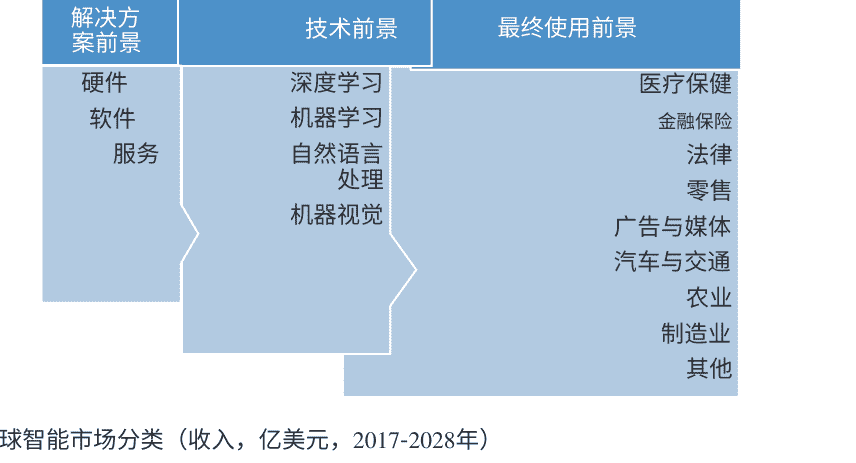

## 图2 全球智能市场分类（收入，亿美元，2017-2028年）

一旦联合国负责投资原则在2006年纳入环境、社会和治理（ESG）问题，更广泛的社会目标就得到了实现。这为ESG投资的发展铺平了道路。令人惊讶的是，这一全球运动现在已经有超过1600个参与者管理着超过70万亿美元的资产，表明全球迅速扩张。尽管市场对此作出了积极的回应，但企业的参与和活动往往未能兑现承诺和产出，这往往归因于他们无法将可持续经营实践融入到其整体业务计划中。据称，投资者和企业在思考和方向上面临着挑战，以实现社会和环境发展的资本最大化利用。尽管ESG投资为更快速和有意义的市场改革铺平了道路，但可持续投资机会与其执行之间始终存在着相当大的脱节。不幸的是，慢性饥饿和营养不良继续阻碍许多国家的进展。据估计，2017年有8.21亿人长期饥饿，这是由于环境恶化、干旱和生物多样性丧失所致。肥胖影响着约9000万5岁以下的儿童。营养不良和严重粮食不安全似乎在几乎所有非洲和拉丁美洲地区都在上升。对于这项研究，Grand View Research根据解决方案、技术、最终使用和地区（图2）对全球人工智能市场报告进行了分段。

## 人工智能在定性SDGs中的作用

## 没有贫穷

消除贫困是当今世界上最严重的挑战之一。1990年至2014年，极度贫困人口减少了一半，然而仍然有太多人在家中缺乏最基本的生活必需品。7.38亿人在2016年每天生活费不到1.91美元。食物、清洁水和卫生条件对许多人来说都很短缺[9]。全球化使数百万人摆脱了贫困，但发展不平衡。贫穷妇女比富有妇女拥有更少的就业、教育和财产机会。

南亚和撒哈拉以南非洲占世界贫困人口的80%，但进展很小。气候变化、战争和粮食安全问题意味着扶贫需要更多努力[9]。到2030年，可持续发展目标(SDGs)明确承诺消除贫困的各种形式和维度。

援助受战争或气候相关灾害影响的社区需要关注最脆弱的群体。由于在线接入和5G覆盖，人们，特别是贫困社区和偏远或资源匮乏的地方，可以接受教育。我们可以使用虚拟现实来模拟我们在小说中构思的场景。

## 零饥饿

为了在2050年前养活全球人口，联合国估计我们需要增加全球食品供应量70%。当时间紧迫时，可以使用AI系统加快可能答案的发现。由于经济快速增长和农业产出增加，过去二十年间营养不良的情况减少了一半。许多发展中国家不再发生饥荒。在中亚、东亚、拉丁美洲和加勒比地区，极度饥饿的情况大大减少。可以使用基于AI的解决方案跟踪儿童的认知成长和身体健康的进展。图像识别系统可以帮助早期发现发育迟缓和流行病等疾病。根据这些信息，项目负责人可以提出补救措施。通过整合来自各种信息源的信息，AI系统可以帮助识别干旱、恶劣卫生条件和供应不足等问题。

‘精准农业’可以借助人工智能来发展。《科学美国人》报道称，这些技术已经实现了更高效的资源利用和更丰富的收成。传感器测量土壤的湿度和叶子的状态和颜色。系统利用这些数据计算所需的水和肥料量。它还确定植物的哪个部分需要这些资源。这些系统还报告了更高的产量和更低的农业投入。需要记住的是，在印度的情况下，农民拥有的土地较小，经济状况较差。

如今，约有一半的食物被浪费掉，这是一个令人震惊的统计数据。在食物方面，人工智能可以将其分类为‘好’或‘坏’。这太糟糕了。利用大数据和机器学习可以帮助识别那些特别容易出现食物短缺、干旱和洪水的地区，以及食品价格上涨和农业土地恶化的问题。人工智能的一个应用示例是通过整合多种类型的替代数据（如地理位置信息（如社交媒体数据）、电信数据（如互联网搜索数据）和疫苗接种数据）来更好地预测疾病和病毒的传播。

## 性别平等

越来越多的研究表明，赋予年轻女性权力对国家经济有积极影响。这种对性别平等的承诺是联合国开发计划署二十年来的优先事项。自1990年以来，上学的女孩数量增加了，在大多数地区的小学教育中已经实现了性别平等。

土地、财产、性和生殖健康以及技术必须以平等的方式对女性开放。如果更多的女性有机会在公共部门的高级职位上任职，性别平等将得以实现。

算法和人工智能（AI）为人类进步提供了巨大潜力，但它们也代表着重大危险。然而，技术经常吸收和复制对性别和种族的限制性观念，从而不断强化这些观念。因此，使用AI技术需要一个高度先进和精心规划的基础设施。当AI系统存在偏见时，性别和偏见的先入之见会反映在输出中，导致歧视性行为和选择。

根据这项分析，决策者似乎在充分解决算法社会的问题上存在不足。尽管有关人权如何纳入人工智能的研究仍然缺乏，但关于人工智能在实现可持续目标方面的报告和计划仍在不断增加。AI行业缺乏性别多样性是一个重大问题，这在语言处理和有偏见的机器学习算法在几个领域中更加严重。这些问题妨碍了可持续发展目标的一些社会目标。

## 清洁水和卫生

随着温度的升高，受水资源短缺影响的人数也预计会增加。尽管有21亿人的卫生条件得到改善，但每个大陆上的水资源仍然不足。由于干旱和荒漠化的加剧，一些国家已经开始经历恶化的条件。到2050年，至少四分之一的人将受到水资源短缺的影响。

要实现2030年的目标，我们必须投资于基础设施、卫生和个人清洁。保护和恢复水生环境至关重要。

## 工业、创新和基础设施

生态经济发展是基于对基础设施和创新的投资推动的。公共交通、可再生能源和新业务以及在城市中使用ICT的需求迫切。技术有助于创造新的就业机会，并在能源利用效率方面促进更大的效益。

鼓励长期进步的最有效方法之一是为科学研究和发展提供资源。

根据世界银行最近的一份报告，发展中国家的人口占没有互联网接入的人口的90%。如果要消除数字鸿沟，获取信息、知识和创业精神至关重要。

## 减少不平等

全球收入的最富裕的10%人口占据了40%的份额，而最贫困的10%人口只占2-7%的世界收入。考虑到人口增长，不平等增加了11%。不平等在过去几十年里在世界范围内增加，尽管增长速度不同。最低点和最高点可能在欧洲找到。必须制定政策，使低收入者能够实现经济平等。

解决全球财富差距、控制金融系统，并在最需要的地区促进外国直接投资至关重要。确保人们的安全和流动性的重要性不可高估。

## 可持续城市和社区

我们的生活大部分时间都在城市中度过。到2050年，将有超过65亿人口居住在城市中。城市必须在设计和管理方面进行重大转变，以实现可持续发展。人口增长和移民，特别是在发展中国家，导致了超大城市和贫民窟的蔓延。创造就业机会、提供负担得起的住房和弹性社区和经济对于使城市可持续发展至关重要。强调公共交通、创建绿色公共空间以及改善公平的城市规划和管理。人工智能也可以用于监测公共交通网络（如火车和桥梁）的健康状况。例如，交通信号灯系统可以使用实时交通摄像头数据和物联网传感器进行修改，以提高车辆通行能力。

## 气候行动

第13个目标和其他可持续发展目标直接支持贫困地区。为了保持全球平均温度不超过工业化前水平2°C以上，必须在国家发展计划中包括灾害风险减少、可持续资源管理和人类安全。此外，我们还需要强大的政治意愿、更多的投资和最佳的可用技术。

## 水下生活

海洋还吸收了人类产生的约30%的CO₂，自工业革命以来，海洋酸化度上升了26%。海洋中的污染水平令人担忧；每平方公里水域中约有13,000个塑料垃圾。考虑到海洋酸化，可持续发展目标之一包括在此列表中。通过国际立法改善海洋保护和可持续利用资源对我们的水域也将有益。

## 陆地生活

每年有1300万公顷的森林被砍伐，36亿公顷的干旱土地变成沙漠。这对那些已经生活在贫困中的人们有着不成比例的负面影响。另一方面，只有15%的土地受到某种形式的保护。非法的动植物贸易涉及约7000种不同的物种。非法的野生动物贸易导致生物多样性的丧失，加剧现有冲突并培养腐败行为。保护自然生态系统和生物多样性是实现全球粮食和水资源安全、减缓和适应气候变化影响、维护和平与安全的迫切需求。由人工智能驱动的技术可以用于通过遥感收集有关生物多样性的数据的自动化过程。这些数据可以帮助利益相关者识别物种行为的趋势，并在发现异常情况时采取适当的行动。

因此，基于人工智能的技术有潜力在环境保护中发挥重要作用。对受保护区居民特定行为模式的更深入理解，可以更高效地管理这些地区。

## 结论

现代技术的出现，如人工智能和机器学习，已经在几乎所有已知领域中得到广泛应用。它们已经开辟了具有巨大可持续发展潜力的新领域。这将实现高效的、基于质量的任务完成和便利的业务操作。它还将有助于实现联合国会员国确定的可持续发展目标，从而改善人类生活并开辟新的机遇。

## 参考文献

- 1. R. Abduljabbar, H. Dia, S. Liyanage, S.A. Bagloee, 人工智能在交通领域的应用概述。 可持续性 11(1), 189 (2019)
- 2. S. Alonso, R. Montes, D. Molina, I. Palomares, E. Martínez-Cámara, M. Chiachio, 等，基于调查的人工智能推荐排序以应对可持续发展目标的决策模型。 可持续性 13(11), 6038 (2021)
- 3. A. Bahrammirzaee, 金融中人工智能应用的比较调查：人工神经网络，专家系统和混合智能系统。神经计算和应用。 19 （8） , 1165-1195 (2010)
- 4. J. Bullock, A. Luccioni, K.H. Pham, C.S.N. Lam, M. Luengo-Oroz, 对COVID-19的人工智能应用进行地图绘制。人工智能研究杂志。 69, 807-845 (2020)
- 5. A. Di Vaio, R. Palladino, R. Hassan, O. Escobar, 可持续发展目标视角下的人工智能和商业模式：系统文献综述。商业研究杂志。 121, 283-314 (2020)
- 6. N. Efremova, D. West, D. Zausaev, 基于人工智能的可持续发展目标评估：作物检测案例研究-使用地球观测数据。 1907, arXiv预印本arXiv, 02813 (2019)
- 7. C.W. Hanson III, B.E. Marshall, 重症监护室中的人工智能应用。 Crit. Care Med. 29(2), 427–435 (2001)
- 8. A. E. Hassanien, R. Bhatnagar, A. Darwish (eds.), 可持续发展的人工智能: 理论、实践和未来应用, vol 912 (Springer, 2020)
- 9. A. Holzinger, E. Weippl, A.M. Tjoa, P. Kieseberg, 数字化转型与可持续发展目标（SDGs） -关于人工智能的安全、安全性和隐私视角，在国际跨领域机器学习和知识提取会议, (Springer, Cham,2021年8月）, 第1-20页
- 10. J. Korbicz, J. M. Koscielny, Z. Kowalczuk, W. Cholewa (eds.), 故障诊断: 模型、人工智能、应用(Springer, 2012)
- 11. I. Palomares, E. Martínez-Cámara, R. Montes, P. García-Moral, M. Chiachio, J. Chiachio, F. Herrera, 人工智能实现2030年可持续发展目标的全景视图和SWOT分析: 进展与前景。Appl. Intell., 1-31 (2021)
- 12. W. R. Reitman (编), 商业人工智能应用: 纽约大学研讨会论文集, 1983年5月 (Intellect Books, 1984年)
- 13. A.W. Sadek, 交通运输中的人工智能应用。Transport. Res. Circ., 1-7 (2007)
- 14. R. Vinuesa, H. Azizpour, I. Leite, M. Balaam, V. Dignum, S. Domisch, 等，人工智能在实现可持续发展目标中的作用。Nat. Commun. 11(1), 1-10 (2020)
- 15. O. Zawacki-Richter, V.I. Marín, M. Bond, F. Gouverneur, 对高等教育中人工智能应用的研究进行了系统回顾-教育工作者在哪里? Int. J. Educ.Technol. High. Educ. 16(1), 1–27 (2019)

一种用于物联网区块链的新型模型基于合规性的COVID隔离

M. Shyamala Devi, M. J. Carmel Mary Belinda, R. Aruna, P. S. Ramesh和B. Sundaravadivazhagan

## 区块链简介

区块链由任意数量的节点组成，每个节点都有自己的分布式账本，允许多个系统节点联系和操作一个账本的单个版本，同时保持相互联系的规定[1]。区块链节点包含一个分布式账本，可以安全地和永久地保存系统设备之间的操作。通过连接节点之间的数据库，区块链技术消除了第三方中介的需求，这些中介需要作为可靠的代表来验证、检测、存储和组织连接[2]。区块链通过将数据从以前的安全方式中释放出来，从传统的集中式转向分散式[3]，然后转向分布式网格系统，并在图1和图2中显示。

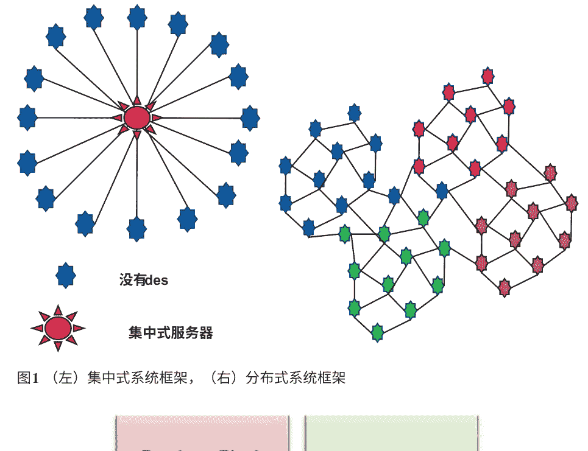

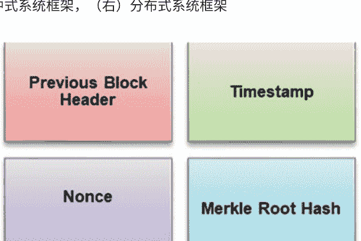

图2中描绘了区块链数据结构[4]，包括以下设备：
- 前一个头块。
- Merkle根哈希。
- 时间戳。
- 随机数。

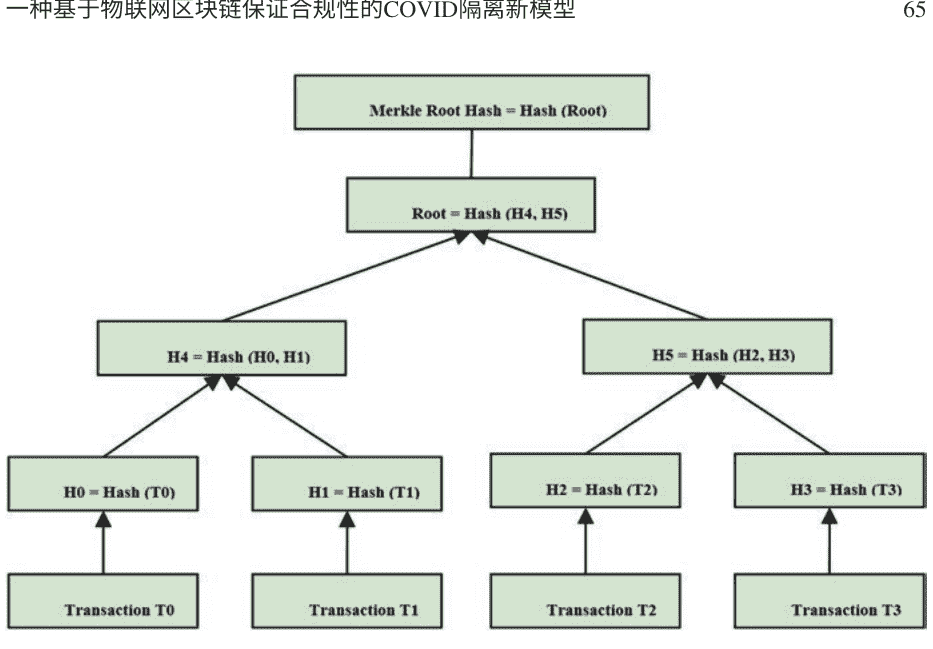

区块链是一个有组织的信息集合，被用于生成连接的基数记录，并在分布式网络的节点之间共享[5]。 使用加密技术，每个网络节点用户需要在分布式账本上进行安全操作，而无需中央机构的参与[6]。 图3中显示了区块链的Merkle根哈希。

在将数据更新到区块链分布式账本后，无需修改或删除区块链中的数据[7]。 矿工是区块链网络的参与者。 区块链矿工拥有当前区块链的副本。 当一个新的竞争节点希望添加一个新的操作[8]时，网络的矿工使用程序来评估和验证提议的合同[9]。

## 区块链设计架构

区块链系统是一个有前途的应用[10]，它允许企业在互联网上实时生成和验证经济业务，而无需依赖专家[11]。 区块链架构使分散的系统网络能够在不依赖于集中式身份验证的情况下达成一致[12]，区块链的设计架构如图4所示。区块链网络中涉及的实施步骤如图5所示。

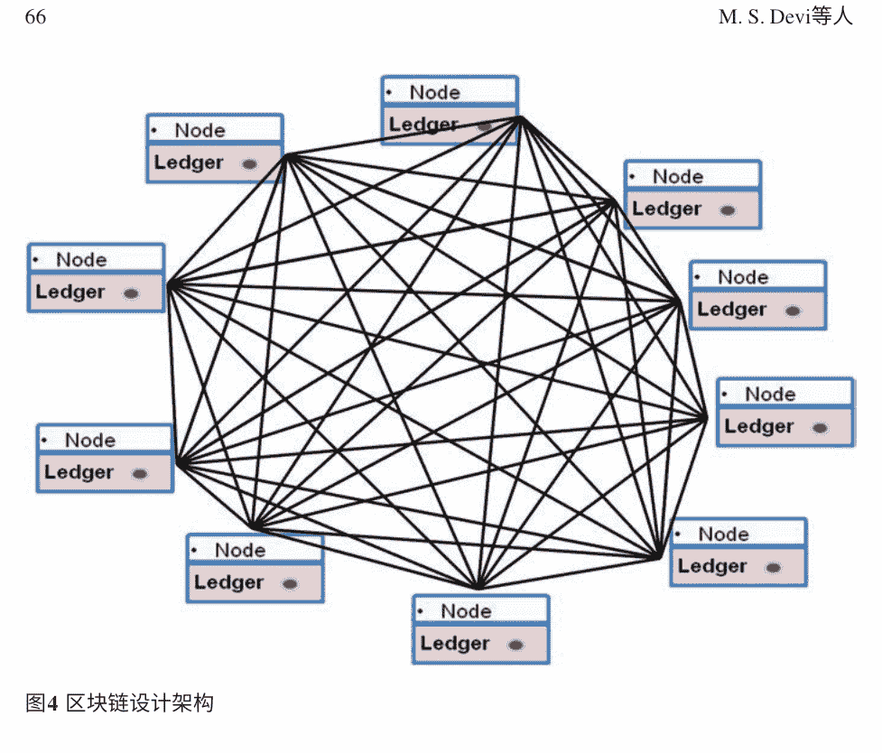

图4 区块链设计架构

## 基于物联网区块链的COVID隔离合规性保证

本文提出了一种基于物联网区块链的COVID隔离合规性保证的模型。在COVID隔离区块链网络中，区块链系统从与COVID隔离过程中的传感器节点集成的传感器获取输入数据。 整体框架模型为基于物联网区块链的COVID隔离合规性保证，如图6所示。与基于物联网区块链的COVID隔离合规性保证集成的系统如下，并如图7所示：
- 1. 温度传感器节点。
- 2. 呼吸传感器节点。
- 3. 脉搏率传感器节点。
- 4. 加速度计传感器节点。
- 5. 血压传感器节点。
- 6. 运动传感器节点。
- 7. 血糖仪传感器节点。
- 8. EMG和EEG传感器节点。
- 9. 患者医生智能手机节点。
- 10. Wi-Fi/蓝牙节点。
- 11. 健康授权节点。

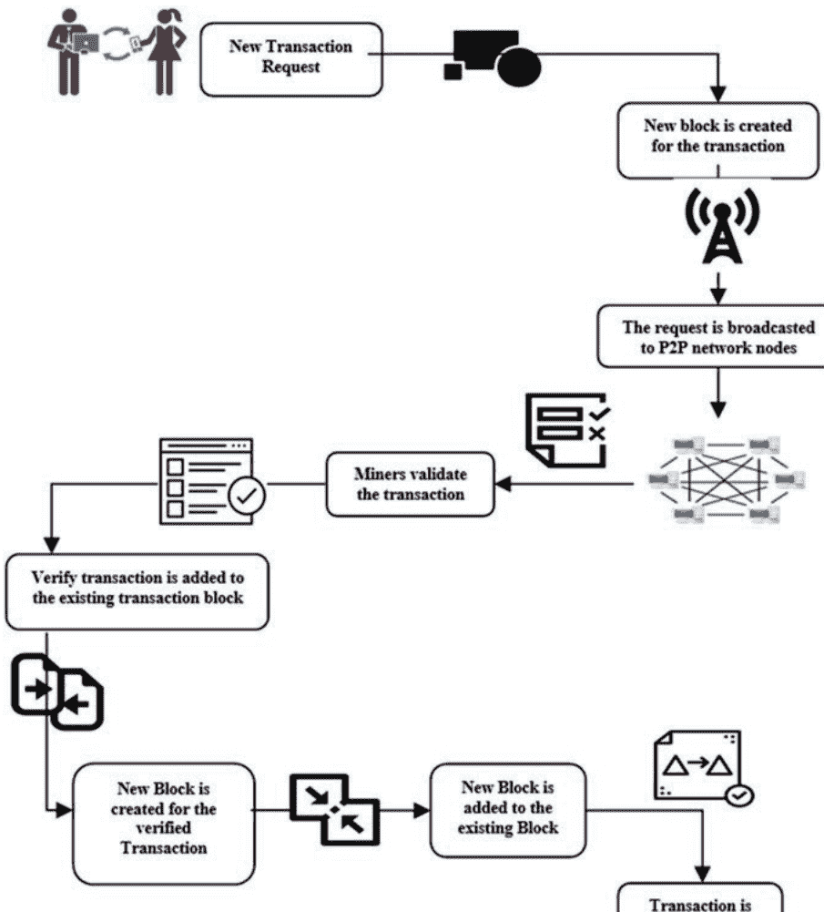

图5 区块链技术的步骤

## IoT设计架构

物联网允许系统节点按照最终用户的程序进行组织，例如计算机或便携电话。物联网网络可以与无限数量的设备进行通信。传感器收集有关物体的信息，然后通过与设备通过互联网入口连接的移动终端检索该信息。终端系统节点在物联网系统中参与，没有人为干预。物联网的设计框架如图8所示，并具有高度的可扩展性。

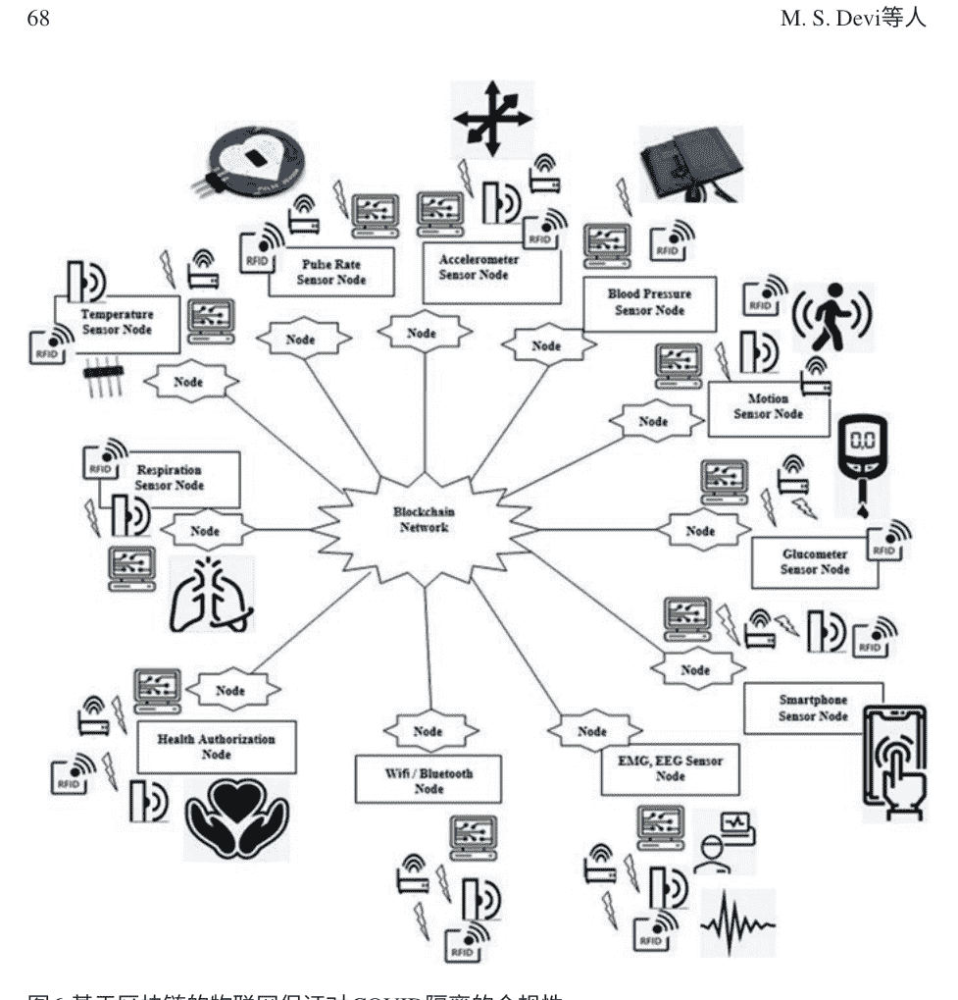

图6 基于区块链的物联网保证对COVID隔离的合规性

在本文中，我们尝试将区块链与物联网技术相结合，以提高安全性，克服数据丢失并增加数据透明度。让我们从讨论区块链开发过程开始[13, 14]。区块链开发过程涉及的步骤如图9所示。

### 温度传感器控制节点

区块链网格中的所有节点都被表示为矿工。每个系统点都包含了具有完整授权交易的当前副本的区块链。访问、存储和监控传感器数据是每个节点涉及的交易。信息的更新与存储过程同时进行。物联网区块链保证合规性的温度传感器节点的操作如下：

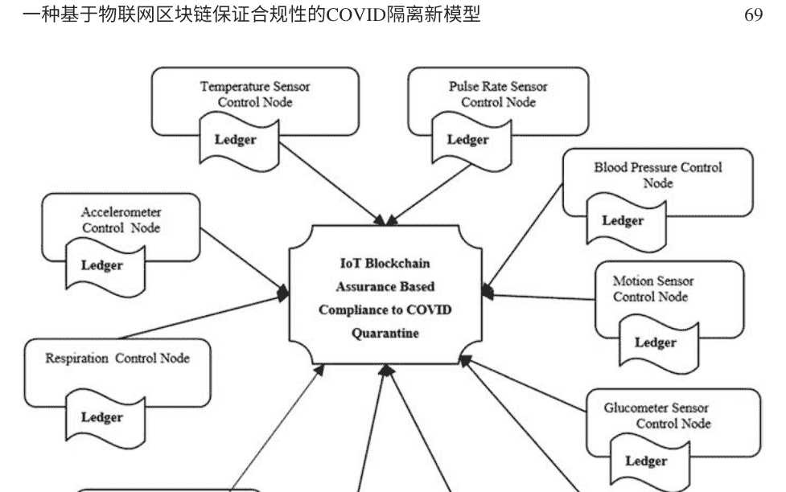
- 1. 温度初始处理。
- 2. 存储和访问温度详细信息的交易。
- 3. 监控温度状态的交易。

全局策略检查共识和链嵌入传感器用于区块链算法如下所示。

```
Blockstructure = hash[上一个区块], 时间戳, Nonce, Merkle根, hash[当前区块].
```

算法1：策略一致性检查 (IncomingDetails[])
- 1. 智能合约操作的策略检查已完成。
- 2. 提升存储来自其他区块链节点的Incomingdetails[]的一致性。
- 3. 允许温度范围信息进入区块链。
- 4. 存储{Blockstructure, Incomingdetails[]}。
- 5. 将这个新节点块与之前的节点块合并。
- 6. 使用最新的区块链刷新分布式账本。
- 7. 将更新的区块链分布式账本分发给所有区块链节点。

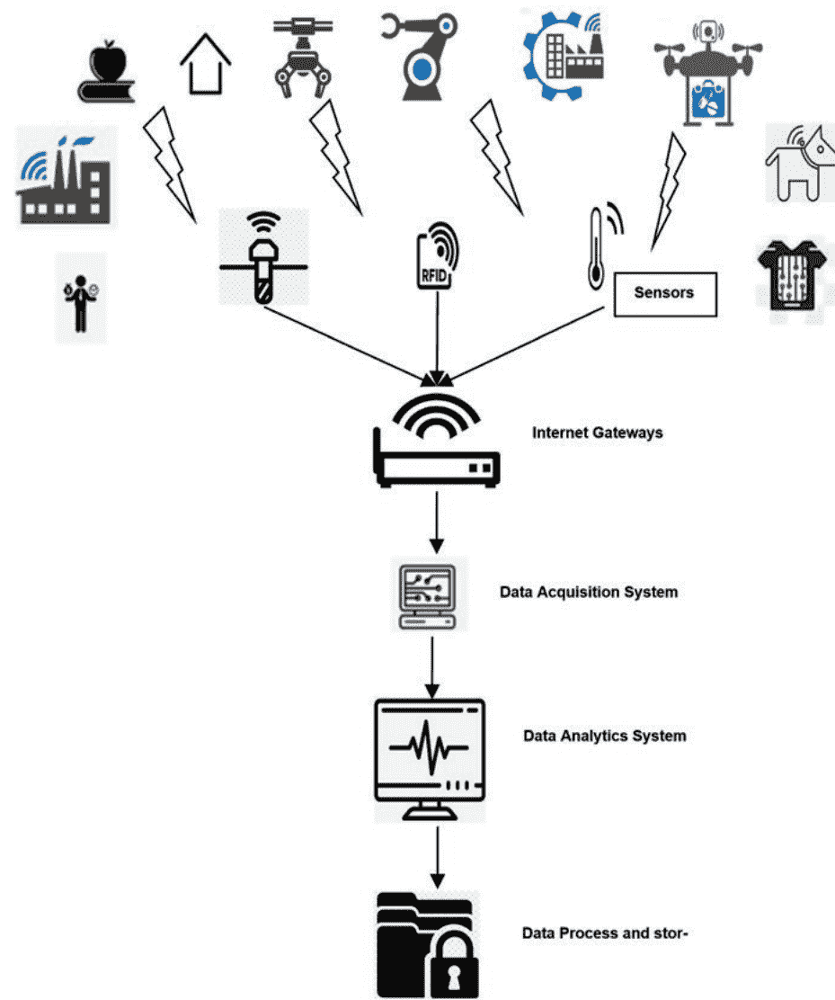

图8物联网架构

算法2：链路嵌入传感器 (IncomingSensorNode， IncomingDetails[])
- 1. 基于智能合约将IncomingSensorNode嵌入患者。
- 2. 将IncomingSensorNode与RFID传感器连接。
- 3. 分配IncomingSensorNode标识符。
- 4. 通过互联网网关从RFID传感器接收传入的详细信息。
- 5. 将传入的详细信息存储在云存储中进行数据分析。
- 6. 传入的详细信息由传入传感器节点检索。

- 1. Identification of the Business Problem and Goal
- 2. Identification of the Suitable Consensus Algorithm
- 3. Identification of the Suitable Blockchain Platform
- 4. Designing the Blockchain Architecture
- 5. Configuring the Blockchain Application
- 6. Building the Blockchain API
- 7. Designing the Blockchain Admin and User Interface
- 8. Scaling, Proof of work and Problem Identification

图9 区块链的开发过程

在这里探索了温度传感器控制节点的所有交易算法。

### 算法3：温度主要过程
- 1. 启动访问患者温度的过程。
- 2. 调用链嵌入传感器（温度传感器节点，温度范围详细信息）

### 算法4：存储和访问温度详细信息的交易
- 1. 从传感器节点获取患者温度范围详细信息。
- 2. 调用策略共识检查（温度范围详细信息）。
- 3. 从温度传感器节点获取并提取患者的温度范围详细信息。

### 算法5：监控温度状态的交易
- 1. 监测患者温度范围信息的持续波动，来自温度传感器节点。
- 2. 如果需要的时间间隔被排除，则启动从传感器节点接收温度范围信息的方法。
- 3. 调用策略一致性检查（温度范围详细信息）。

### 呼吸传感器控制节点

物联网区块链保障COVID隔离的呼吸传感器系统的流程如下：
- 1. 呼吸初始过程。
- 2. 存储和访问呼吸传感器节点信息。
- 3. 监控呼吸传感器节点信息。

下面探讨了所有交易的过程。

### 算法6：呼吸主要过程
- 1. 启动访问患者呼吸的过程。
- 2. 调用链接嵌入传感器（呼吸传感器节点，呼吸范围详细信息）。

### 算法7：存储和访问呼吸传感器节点信息
- 1. 获取患者胸壁和腹部围度的运动，以计算来自传感器节点的呼吸率和容量详细信息。
- 2. 调用策略一致性检查（呼吸率，容量详细信息）。
- 3. 从呼吸传感器节点中获取和提取患者的呼吸率和容量细节。

### 算法8：监测呼吸传感器节点信息
- 1. 跟踪呼吸过程中胸壁和腹部周长的频繁运动，以获取患者的呼吸率和容量信息，从呼吸传感器节点中获取。
- 2. 如果需要的时间间隔被排除，则启动从传感器节点接收呼吸率和容量细节的方法。
- 3. 调用策略一致性检查（呼吸率，容量细节）。

### 脉搏传感器控制节点

物联网区块链保障COVID隔离合规的脉搏率传感器节点的流程如下：
- 1. 脉搏率初始过程。
- 2. 存储和访问脉搏率传感器节点信息。
- 3. 监测脉搏率传感器节点信息。

下面探讨了所有交易的过程。

### 算法9：脉搏率主要过程
- 1. 开始访问患者的脉搏率的过程。
- 2. 调用链嵌入传感器（脉率传感器节点，脉搏波信号细节）。

### 算法10：存储和访问脉率传感器节点信息
- 1. 监测随时间变化的血管容积，即随心脏收缩而变化的血流速率，以计算来自脉率传感器节点的脉搏波信号。
- 2. 调用策略一致性检查（脉搏波信号细节）。
- 3. 从脉率传感器节点获取和提取患者的脉搏波信号细节。

### 算法11：监测脉率传感器节点信息
- 1. 跟踪随时间变化的血流速率（血管容积变化），以获取患者的脉搏波信号细节，这些细节来自脉率传感器节点。
- 2. 如果需要的时间间隔被排除，则启动从传感器节点接收脉搏波信号细节的方法。
- 3. 调用策略一致性检查（脉冲波信号细节）。

### 加速度计传感器控制节点

物联网区块链保障COVID隔离的加速度传感器节点的流程如下：
- 1. 加速度传感器初始处理。
- 2. 存储和访问加速度传感器节点信息。
- 3. 监控加速度传感器节点信息。

下面探讨了所有交易的过程。

### 算法12：加速度计主要过程
- 1. 启动访问患者振动细节的过程。
- 2. 调用链接嵌入传感器（加速度传感器节点，振动细节）。

### 算法13：存储和访问加速度传感器节点信息
- 1. 从加速度传感器节点获取患者活动计数和振动速率细节。
- 2. 调用策略一致性检查（活动计数，振动速率）。
- 3. 从加速度传感器节点获取并提取患者的活动计数和振动速率细节。

### 算法14：监控加速度传感器节点信息
- 1. 跟踪从加速度传感器节点获取的活动计数和振动速率细节。
- 2. 如果需要的时间间隔被排除，则启动从传感器节点接收振动速率详细信息的方法。
- 3. 调用策略一致性检查（活动计数，振动速率）。

### 血压传感器控制节点

物联网区块链保障COVID隔离的血压传感器节点方法如下：
- 1. 血压初始过程。
- 2. 存储和访问血压传感器节点信息。
- 3. 监控血压传感器节点信息。

### 算法15：血压主要过程
- 1. 启动访问患者血压的方法。
- 2. 调用链嵌入传感器（血压传感器节点，血压详情）。

### 算法16：存储和访问血压传感器节点信息
- 1. 从加速度计传感器节点获取患者的收缩压、舒张压和平均动脉压详情。
- 2. 调用策略一致性检查（收缩压，舒张压，平均动脉压）。
- 3. 从血压传感器节点中获取和提取患者的收缩压、舒张压和平均动脉压细节。

### 算法17：监测血压传感器节点信息
- 1. 跟踪血压传感器节点中的收缩压、舒张压和平均动脉压细节。
- 2. 如果需要的时间间隔被排除，则启动从传感器节点接收收缩压、舒张压和平均动脉压细节的方法。
- 3. 调用策略一致性检查（收缩压、舒张压、平均动脉压）。

### 运动传感器控制节点

物联网区块链保障COVID隔离合规性的运动传感器节点方法如下：
- 1. 运动初始过程。
- 2. 存储和访问运动传感器节点信息。
- 3. 监测运动传感器节点信息。

下面探讨了所有交易的过程。

### 算法18：运动主要过程
- 1. 启动访问患者运动细节的方法。
- 2. 调用链接嵌入传感器（运动传感器节点，运动细节）。

### 算法19：存储和访问运动传感器节点信息
- 1. 从运动传感器节点获取患者的步数、运动速率和运动范围细节。
- 2. 调用策略一致性检查（步数、运动速率、运动范围细节）。
- 3. 从运动传感器节点获取并提取患者的步数、运动速率和运动范围细节。

### 算法20：监测加速度计传感器节点信息
- 1. 从运动传感器节点跟踪患者的步数、运动速率和运动范围细节。
- 2. 如果需要的时间间隔被排除，则启动从传感器节点接收患者的步数、运动速率和运动范围细节的方法。
- 3. 调用策略一致性检查（步数、运动速率、运动范围细节）。

### 血糖仪传感器控制节点

物联网区块链保障COVID隔离合规的血糖仪传感器节点的方法如下：
- 1. 血糖仪初始过程。
- 2. 存储和访问血糖仪传感器节点信息。
- 3. 监测血糖仪传感器节点信息。

下面探讨了所有交易的过程。

### 算法21：血糖仪主要流程
- 1. 启动访问患者血糖水平的方法。
- 2. 调用链接嵌入传感器（血糖仪传感器节点，血糖水平）的方法。

### 算法22：存储和访问血糖仪传感器节点信息
- 1. 从血糖仪传感器节点获取患者血糖水平详细信息。
- 2. 调用策略一致性检查（血糖水平）的方法。
- 3. 从血糖仪传感器节点获取并提取患者的血糖水平详细信息。

### 算法23：监测血糖仪传感器节点信息
- 1. 跟踪患者的血糖水平详细信息，来自血糖仪传感器节点。
- 2. 如果需要的时间间隔被排除，则启动从传感器节点接收患者血糖水平详细信息的方法。
- 3. 调用策略一致性检查（血糖水平）。

### 肌电图和脑电图传感器控制节点

物联网区块链保障COVID隔离中EMG和EEG传感器节点的方法如下：
- 1. EMG和EEG初始处理。
- 2. 存储和访问EMG和EEG详细事务。
- 3. 监控EMG和EEG状态事务。

下面探讨了所有交易的过程。

### 算法24：EMG和EEG主要过程
- 1. 启动访问患者EMG和EEG的方法。
- 2. 调用链接嵌入传感器（EMG和EEG传感器控制节点，血糖水平）。

### 算法25：存储和访问EMG和EEG事务
- 1. 从传感器节点获取患者的EMG和EEG详细信息。
- 2. 调用策略一致性检查（EMG和EEG详细信息）。
- 3. 从EMG和EEG传感器节点获取并提取患者的EMG和EEG详细信息。

### 算法26：监测EMG和EEG
- 1. 监测来自EMG和EEG传感器节点的患者的连续更新和波动情况。
- 2. 如果需要的时间间隔被排除，则启动从传感器节点接收EMG和EEG详细信息的方法。
- 3. 调用策略一致性检查（EMG和EEG详细信息）。

### 患者医生智能手机传感器控制节点

物联网区块链保障COVID隔离的患者医生智能手机传感器节点的方法如下：
- 1. 患者医生智能手机初始过程。
- 2. 存储和访问患者详细信息交易。
- 3. 监测患者详细信息交易。

下面探讨了所有交易的过程。

### 算法27：患者医生主要程序
- 1. 启动将患者详细信息传输到医生智能手机的方法。
- 2. 调用链接嵌入传感器（患者医生智能手机传感器节点，患者健康详细信息）。

### 算法28：存储和访问患者详细信息交易
- 1. 从传感器节点获取所有传感器的患者详细信息。
- 2. 调用政策一致性检查（患者健康详情）。
- 3. 从所有传感器节点中获取和提取患者的详细信息。

### 算法29：监控患者详情
- 1. 监测所有传感器的患者详情的持续波动。
- 2. 如果需要的时间间隔被排除，则启动从传感器节点接收患者详情的方法。
- 3. 调用政策一致性检查（患者健康详情）。

### Wi-Fi/蓝牙传感器控制节点

物联网区块链保障COVID隔离的Wi-Fi/蓝牙传感器节点的方法如下：
- 1. Wi-Fi/蓝牙初始过程。
- 2. 存储和访问Wi-Fi/蓝牙详情交易。
- 3. 监控Wi-Fi/蓝牙详情交易。

下面探讨了所有交易的过程。

### 算法30：Wi-Fi/蓝牙初始过程
- 1. 通过Wi-Fi/蓝牙启动访问患者和医生的智能手机的方法。
- 2. 调用链接嵌入传感器（Wi-Fi/蓝牙传感器节点，Wi-Fi/蓝牙连接详情）。

### 算法31：存储Wi-Fi/蓝牙连接详细信息交易
- 1. 获取患者和医生之间的Wi-Fi/蓝牙连接详细信息智能手机。
- 2. 调用策略一致性检查（Wi-Fi/蓝牙连接详细信息）。
- 3. 从所有传感器节点中获取和提取患者的详细信息。

### 算法32：监控Wi-Fi/蓝牙连接
- 1. 监控医生和患者智能手机之间的Wi-Fi/蓝牙连接详细信息的持续波动。
- 2. 如果需要的时间间隔被排除，则启动从传感器节点接收Wi-Fi/蓝牙连接详细信息的方法。
- 3. 调用策略一致性检查（Wi-Fi/蓝牙连接详细信息）。

### 健康授权传感器控制节点

物联网区块链保障COVID隔离的健康授权传感器节点的方法如下：
- 1. 健康授权初始过程。
- 2. 存储和访问健康授权详细信息交易。
- 3. 监控健康授权详细信息交易。

所有交易的过程如下所述：

### 算法33：健康授权初始过程
- 1. 通过医生的智能手机启动患者的健康授权方法。
- 2. 调用链嵌入传感器（健康授权传感器节点，健康授权详细信息）。

### 算法34：存储和访问健康授权详细信息交易
- 1. 从医生的智能手机获取健康授权详细信息。
- 2. 调用策略共识检查（健康授权详细信息）。
- 3. 从所有传感器节点获取并提取健康授权详细信息。

### 算法35：监控健康授权详细信息
- 1. 监控医生和患者智能手机之间健康授权详细信息的持续波动。
- 2. 如果需要的时间间隔被排除，则启动从传感器节点接收健康授权连接详细信息的方法。
- 3. 调用策略共识检查（健康授权详细信息）。

## 结果和效率分析

本文提出了一个概念验证，即使用以太坊私有区块链网络作为创世区块的提议的物联网区块链保障COVID隔离系统的合规性。评估管理中心的吞吐量，影响区块链方法的延迟，如表1和图10所示。

物联网设备使用LibCoAP库构建，该库是内置CoAP框架的C过程。LibCoAP框架被修改以为每个系统节点生成公钥和私钥，从而唯一授权物联网系统。本文使用基准工具CoAPBench验证了提出模型的有效性。管理中心和物联网设备的延迟超时分析见表2和图11。

表1 管理中心吞吐量分析

| 并发用户数 | 物联网设备吞吐量 | 管理中心吞吐量 |
|------------|------------------|----------------|
| 1          | 5                | 900            |
| 2          | 10               | 945            |
| 3          | 15               | 960            |
| 4          | 20               | 980            |
| 5          | 25               | 1000           |
| 6          | 30               | 975            |
| 7          | 35               | 950            |
| 8          | 40               | 920            |
| 9          | 45               | 900            |

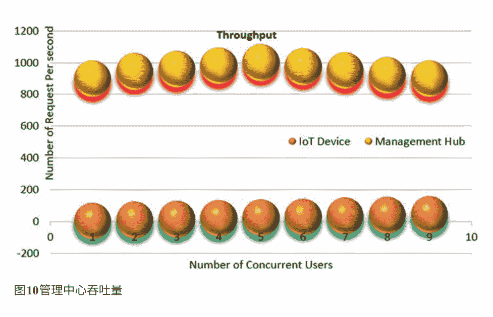

| 并发用户数 | 物联网设备延迟超时 | 管理中心延迟超时 |
|------------|---------------------|-------------------|
| 1          | 5                   | 20                |
| 2          | 10                  | 40                |
| 3          | 15                  | 50                |
| 4          | 20                  | 60                |
| 5          | 25                  | 70                |
| 6          | 30                  | 80                |
| 7          | 35                  | 90                |
| 8          | 40                  | 100               |
| 9          | 45                  | 120               |

## 结论

本研究旨在探讨区块链和物联网的特性。对于所提出的模型，即物联网区块链基于COVID隔离的保证合规性，尚待评估其理论验证。本研究最终得到了名为物联网区块链基于COVID隔离的保证合规性系统的模型，以及改进数据安全性和透明性的工作流程模型框架。 与物联网区块链基于COVID隔离的保证合规性系统集成的系统被清晰地描述，并详细说明了所有节点的区块链算法。 评估了管理中心和物联网设备的吞吐量和延迟超时，并讨论了结果。 此外，可以通过采用多个共识机制来提升所提出模型的预测效率指标。 本文的未来工作将包括添加和升级用于评估患者临床特征的设备。 还开发了基于上下文的临床数据的传感器设备的安全性实施。

## 参考文献

1. I.F. Akyildiz, W. Su, Y. Sankarasubramaniam, E. Cayirci, 无线传感器网络：一项调查。通信。 ACM **38**(4), 393–422 (2002)
2. D.A. Anisi,地面车辆的最优运动控制，硕士论文（皇家理工学院（KTH），斯德哥尔摩，2003年）
3. P. Bahl, R. Chancr, J. Dungeon, SSCH: IEEE 802.11自组织无线网络中的容量改善的Slo .Ed种子信道跳频，在第10届国际移动计算和网络会议（MobiCom'04）上，（ACM，纽约，2004年），pp. 112–117
4. K.L. Clarkson, 最近点问题（计算几何学）的算法，博士论文（斯坦福大学，帕洛阿尔托，加利福尼亚州，1985年）UMI订单号：AAT 8506171
5. Jacques Cohen (编者).. 特刊: 数字图书馆. Commun. ACM **39**, 11 (1996)
6. B.P. Douglas, 使用中的状态图: 结构化分析和面向对象,in嵌入式系统讲座, 计算机科学讲义, 编者: G. Rozenberg, F. W. Vaandragen,vol. 1494, (Springer, 伦敦, 1998), pp. 368–394.https://doi.org/10.1145/3-540-65193-4297.
7. I. 编者 (编者),第二本书的标题, 第2版 (芝加哥大学出版社, 芝加哥, 第100章, 2008). https://doi.org/10.1145/3-540-09237-4
8. C. Qu, M. Tao, J. Zhang, X. Hong, R. Yuan, 基于区块链的物联网实体可信度验证方法 for IoT entities. Secur. Commun. Netw. **2018**, 1 (2018)
9. A. Iftekhar, X. Cui, M. Hassan, W. Afzal, 区块链和物联网在食品安全中确保防篡改数据可用性的应用。食品质量杂志 **2020**, 1-14 (2020)。 https://doi.org/10.1155/2020/5385207
10. O. Cheikhrouhou, A. Koubaa, BlockLoc: 使用区块链在物联网中进行安全定位，在第15届国际无线通信与移动计算会议（IWCMC），摩洛哥丹吉尔，（2019），pp. 629-634。 https://doi.org/10.1109/IWCMC.2019.8766440
11. O. Novo, 区块链与物联网相遇：物联网中可扩展访问管理的架构。IEEE 物联网杂志 **5**, 2 (2018)
12. M.T. Hammi, B. Hammi, P. Bellot, A. Serhrouchni, 信任泡泡：一种基于分布式区块链的物联网认证系统。计算机安全 **78**, 126-142 (2018年)。 https://doi.org/10.1016/j.cose.2018.06.004
13. M.J. Fischer, N.A. Lynch, M.S. Paterson, 具有一个故障进程的分布式共识的不可能性。ACM杂志 **32**（2），374-382 (1985年)
14. G.-T. Nguyen, K. Kim, 区块链中使用的共识算法调查。J Inf Process Syst **14**（1），101-128 (2018年)

## 基于深度学习的卷积神经网络与随机森林方法用于MRI脑肿瘤分割

B. Leena

## 介绍

近年来，医疗业从信息技术和电子医疗系统的进步中受益，这使得临床专业人员能够为患者提供更好的医疗保健。Pereira等人[26]将肿瘤定义为身体多个区域的恶性细胞异常增长，而脑肿瘤则是脑部恶性细胞异常增殖。良性脑肿瘤不会对周围正常健康组织造成伤害，而恶性肿瘤可能会对脑部周围组织造成伤害，甚至导致死亡。准确的脑肿瘤分割对于定位肿瘤以及为患者提供适当的治疗和为进行手术的外科医生提供关键信息至关重要。肿瘤是由脑组织本身产生的，被称为原发性脑肿瘤。来自身体其他部位的癌症肿瘤将扩展到脑部，这被称为转移。根据肿瘤的形式、范围和位置，治疗选择可能有所不同[4]。

治疗的目标是治疗性的或者专注于减轻症状。肿瘤的症状可以是反复的头痛和偏头痛。它仍然可能导致视力丧失。到这个时候，科学对于肿瘤的起源和导致这种异常扩张的因素可能还不足够。通常，肿瘤可以根据它们的来源位置和是否是癌肿瘤来分类[25]。非癌性肿瘤被称为良性肿瘤，因为它不会影响人体的其他部位。它可以很容易被察觉到，并且它的扩张速度很慢。基于癌症的脑肿瘤也被称为恶性肿瘤，它可以影响脑的其他部位，并且可能非常由于很难识别，这可能对生命构成威胁。 医生在识别肿瘤时会选择磁共振成像（MRI）或X射线。 如果每次检查都无法提供足够的信息，那么MRI扫描可能是合适的。 MRI扫描利用磁性和无线电波来生成完美的图像[28]。 与CT、X射线和超声扫描相比，MRI扫描更清晰地显示了脑部的图像，可以生成脑干和垂体的详细的二维或三维图像。 图1展示了脑部的MRI图像。

基本上，MRI扫描是一种高质量的成像技术，用于成像脑部活动，这种扫描技术在识别脑部肿瘤方面是最可靠的。 然而，它无法拍摄头骨的图像，因此CT扫描无法显示肿瘤对头骨的影响。 MRI扫描利用无线电波和强磁场来获取脑部的图像。 在检查前可以通过静脉注射对比剂（如钆）来帮助观察细节。

大脑的MRI扫描可以通过利用无线电波和磁场来制作大脑部位的全面图像，从而进行安全无痛的实验。 与计算机断层扫描（CT）相比，MRI扫描不会使用辐射波[3]。

一般来说，MRI扫描仪具有一个巨大的甜甜圈状磁场，通常在中间有一个通道。 在这个测试过程中，患者将被放置在一个滑入通道的桌子上。 MRI机器中可以开放各种中心，包括更大的开口，对患有幽闭恐惧症的患者有帮助。 在医院和放射科中，可以使用MRI机器对大脑进行检测。 在测试过程中，无线电波直接作用于人体原子的磁场位置，并通过一个强大的天线选择并发送到计算机。 计算机可以执行数百万次估计，从而产生结果。身体明显的白色图像[12]。这些图像已经转化为身体扫描区域的三维图像[2]。这种类型的扫描过程将有助于发现大脑中的疾病，而测试重点是这些位置。在医学领域，放射科医生可能面临将大脑细胞和细胞核与MRI图像内容区分开的挑战。

现在，使用多模态成像数据时，由于人脑中肿瘤的形状和位置，从MRI图像中分割脑肿瘤可能会有问题。因此，图像分割可能是脑MRI图像肿瘤识别中最困难的组成部分。然而，为了区分癌肿瘤并提供准确的诊断，必须优先考虑肿瘤分割和分离的任务。正确的分割过程可以提供关于良性或恶性肿瘤的定量和定性数据，这些数据可以用于为患者选择最佳治疗方案，并协助治疗医生制定更好的计划[16]。

医学图像处理是检查人们健康状况和情感分析的最重要方法[18]。使用图像处理方法结合一些增强技术可以发现肿块，无论它是否存在于内脏器官中。能够执行此过程的方法被称为CAD方法。CAD方法可以作为增强医学成像程序有效性的工具。CAD方法的原则是提高诊断准确性；识别异常结构，例如脑部或乳房或身体任何部位的肿瘤；并通过应用计算机方法来辅助放射科医生。

预处理、图像分割、特征分析、特征提取 [17, 31]、特征的收集和确认，最后，在CAD方法中建立的分类阶段是其中的一些阶段。高质量的图像可以在识别方法中被利用。

这是一个直接关系到医学图像处理领域成功率的重要概念。预处理阶段的主要目的是提高脑部MRI图像的质量。直方图均衡化是目前最常用的改善MRI脑部图像质量的方法。可以用于改善MRI图像质量的两种基于直方图的策略是直方图均衡化和图像动态值的直方图均衡化。提供以下方法来克服脑肿瘤分割中的挑战，并在早期高效地从MRI图像中分割出脑肿瘤，以拯救患者的生命。提出了使用卷积神经网络（CNN）和RF（随机森林）算法进行脑肿瘤分割的方法。

本章的剩余部分按照以下方式组织：第“文献综述”部分讨论了脑肿瘤预测及其相关工作，第“系统设计”部分讨论了提出的算法和实施过程，第“结果与讨论”部分比较了提出系统和当前系统的实验结果，并在“结论”部分总结了一些结论和对工作未来范围的讨论。

图2 MRI图像的图像处理

## 文献综述

在本章中，可以调查基于计算机视觉和图像处理的脑肿瘤检测方法。本文详细讨论了准确性和肿瘤分类的重要性。在本调查中，可以获得关于利用有效的图像分类器进行脑肿瘤检测的不同研究工作。

Demirhan等人[6]开发了一种新的脑MR成像组织分割方法，可以分离肿瘤、白质、灰质、脑脊液和水肿。由于肿瘤在健康脑组织上的出现，健康脑组织的识别与恶性组织的识别同时进行。在治疗计划方面，它有潜力成为最关键的因素。在这项研究中，使用了20个患有胶质瘤的人的T1、T2和液体衰减反转恢复MR图像。在分割阶段之前，改进了一个用于去除斑驳颅骨的算法。利用学习向量量化技术和无监督学习算法创建了一个自组织映射，以实现图像分割。通过这种方式，改进了用于聚类SOM替代网络的算法。使用从稳态小波变换系数生成的特征来测量输入特征向量。

从MRI图像中自动分割脑组织对于科学研究和临床目的的更为重要。在超像素级别的检查中，通过发现超像素过程中多个提取特征之间的的内在数据，新的发展使得脑组织的鲁棒分割成为可能。

这些复杂性发生在由MRI特征的冗余和组织的异质性所强制的聚类保留中的共同结构内。Kong和Hong [20]从信息论的角度提出了一种鲁棒的判别分割技术。该技术的著名目标是同时选择有用的特征并减少判别性脑组织分割过程中的超像素分配的不确定性。

Meiyan Huang等人提出了一种新的MRI脑图像自动肿瘤分割技术[13]。在肿瘤分割治疗中，这种方法已被证明非常有效。此外，使用LIPC技术，每个体素被分类为几个类别。为了创建这个分类框架，LIP被纳入标准分类方法中。LIPC的局部独立投影计算需要高度的局部性。局部性还被研究，以确定局部固定嵌入是否比其他编码方法更好地解决线性投影权重。此外，LIPC还研究了使用softmax回归方法来评估不同类别之间的数据共享，以获得分类性能。

El-Melegy和Mokhtar [8]开发了一种新颖的模糊方法，用于分割患病脑MRI的标准和体积数据集。这种方法改变了著名的FCM技术，以提取有关图像类别中心的信息。这些数据还进行了模拟，以考虑不确定性。这种类型的信息有助于标准化FCM算法的聚类，改善其在意外数据收集和噪声环境中的表现。此外，该方法的收敛过程也得到了改进。该方法与其他著名的模糊和非模糊方法在模拟和真实的人脑MRI体积（正常和病理）上进行了比较，发现该方法具有更高的分割准确性、噪声抵抗性和响应时间[10]。

Atiq Islam等人[15]提出了一种新的多FD特征提取和监督分类器，用于改进脑肿瘤的分割和识别，以及修改的AdaBoost算法，以考虑数百名多个患者MRI切片表面特征的广泛不可预测性，以扩展肿瘤和非肿瘤组织。将不同的脑肿瘤组织与正常脑组织分离的过程被称为脑肿瘤分割。在大多数情况下，脑肿瘤检查中可以很容易地测量异常组织的存活情况。另一方面，一致而准确的异常分割和分类被证明是困难的。在MRI成像和软计算领域的几位研究人员发表了关于脑肿瘤分割过程的综述。在此期间，介绍了半自动化和全自动化的方法。医学分割方法的选择基于分割的便捷性和用户管理的程度。半自动化或交互式过程被用于让执行者在较长时间内保持控制，特别是在错误理解可能带来严重危险的情况下。Nelly Gordillo等人[11]在获得图像后，对最常用的脑肿瘤分割技术进行了基本概述。由于MRI在其他类型的诊断成像中的优势，本综述的重点是MRI脑肿瘤分割方法。在本调查中，重点介绍了半自动化和全自动化的方法。

弗里德里希等人利用这种分割方法[9]来研究简单的情况，如拟合圆、线、三次样条轮廓或椭圆。在相位对比磁共振（PC-MR）图像中，通过应用变形椭圆指示的感兴趣对象的横截面刮削脑脊液（CSF），用于发现蛛网膜下腔间隙。这些发现被用于利用s-t图割分割CSF结构的技术。算术轮廓方法和力面积成功地使用这种方法进行配置。这种方法有潜力在MRI图像中有效消除噪声和缺陷。这种方法不需要大量的训练数据集，也不需要在使用点共享方法时对训练图像进行物理标记，因为它使用了算术轮廓方法。

D. Divyamary等人提出了一种快速而有力的实用方法，用于对实体瘤进行分割，以帮助研究人员和临床医生进行放射外科手术规划和治疗反应评估。在增强T1加权MR图像上，使用基于CA的核瘤分割技术，对核选择和兴趣体积（VOI）进行了归一化。最初，将基于CA的分割连接演示给图论技术，以证明迭代CA结构已解决最短路径问题。在这种方法中，CA的状态转换函数已被修改为计算最短路径问题的准确解。此外，还提出了一个敏感性参数来调整异质肿瘤分割困难。在从CA状态构建的肿瘤可能性图上进一步发展了一个隐含的水平集外部，以实现空间柔和性。从用户那里，通过使用在最大肿瘤大小上绘制的线收集了足够的初始化方法的数据。此外，引入了CA来区分坏死和改善的肿瘤组织内容，这对于放射治疗反应的全面评估具有重要意义[21]。

Jason J Corso等人[5]提出了一种新颖的方法，用于自动分割异质图片数据，弥合了自上而下的生成模型方法和自下而上的亲和性分割技术之间的差距。通过在相似性计算中引入贝叶斯公式，该方法对软模型分配的整合做出了重要贡献。模型感知的亲和性被纳入多级分割过程中，使用加权聚合方法，并应用于使用MRI找到和分割脑肿瘤的过程。该解决方案的实现速度比目前最先进的方法更快，可以产生相等或更好的结果。

Heba Mohsen等人[24]提出了一种方法，用于将脑MRI图像分类为正常、转移性、肉瘤和胶质母细胞瘤，使用DWT和DNN。对于脑肿瘤分割，全卷积网络(FCNs)是最常用的卷积神经网络。FCNs是具有直接空间关系的FM单元和可比较分类的体素之间的关系。在特定位置。因为FM在卷积层中被组合以创建新的FM，可能需要通道混合。另一方面，并不是所有的FM都对每个类别都适用。Squeeze-and-Excitation（SE）块在分类问题中被提出，以整体重新校准FM并减少不太有益的FM。另一方面，在FCN中，当体素和单元进行空间关联时，这可能不是最好的[29]。

Sergio Pereira等人[27]通过使用线性扩展和压缩来演示语义分割的特征重组，以生成更复杂的特征。此外，还构建了一个用于特征重新校准的分割SE（SegSE）块，该块在保持空间含义的同时收集了上下文数据。最后，利用给定数据近似了这些技术在脑肿瘤分割中的应用。CNN已成为自动医学图像分割技术的最先进展示[30]。它们在另一方面，对于医疗用途来说，它们的精确性和有效性不够。它们还受到了对特定图像进行编辑和对先前隐藏的对象类别进行泛化的限制。

Guotai Wang等人[33]提出了一种基于深度学习的交互式分割方法，通过将CNN融合到基于涂鸦的分割流程和边界框方法中。在这项工作中，采用了特定于图像的微调方法，创建了一个可以适应监督或无监督详细检查图像的CNN模型。为了微调，创建了一个加权损失函数，考虑了基于交互的不确定性和网络。该框架用于两个目的：从胎儿MR切片中进行2D多器官分割和仅解释了这些器官训练过程中的两种类型的胎儿MR切片的2D多器官分割。超过一半的癌症患者接受放射治疗。如果不使用人工智能技术来辅助放射治疗的准备和释放，这可能是一项困难的任务。深度学习是目前人工智能领域最热门的问题，它在各种医疗应用中取得了成功。

Philippe Meyer等人[23]是第一个提出深度学习概念的人，他们在研究机器学习时发现了这个概念。典型的架构是可用的，但重点是卷积神经网络[14]。在此之后，对放射学中采用的各种深度学习方法进行了研究，并将其分为与患者工作流程相关的七个部分，以及一些未来的应用想法。这项研究使用了放射治疗和深度学习社区，这是两个领域之间独特合作的动力，以增加放射治疗应用的热情。

王梦乔等人[22]使用CNN深度学习技术提出了用于分割脑肿瘤的架构。该方法结合了全局和局部结构的特点，这对于脑肿瘤MRI图像的分割发展可能具有重要意义。Zeynettin Akkus等人[1]对解剖性脑病变和脑结构分割的深度学习架构进行了研究和对比，包括速度、实现和优势。

## 系统设计

一般来说，深度学习算法可以通过多个神经网络层传递数据，每个层将压缩的数据表示传递给神经网络方法的下一层。深度学习算法将在通过每个神经网络层时更仔细地检查MRI图像。初始层可以学习识别低级特征，如边缘，而后续层将前面层的特性结合起来，创建更全面的描述。卷积神经网络、深度自编码器和深度置信网络是常见的深度学习方法的例子。这些方法在图3中详细描述和演示。

## 图3 提议工作的流程图

CNN是通过模拟视觉系统设计而成的，并且它们是最丰富的多层网络训练结构的文献方法。该策略将空间链接与较少的要素结合起来进行研究，以提高训练性能。CNN可以作为多层传感器神经网络，其中每个n平面由多个单独的神经元描述，每个层包含多个二维平面。在手写字符检测中，已经使用了CNN [19]。

在大多数情况下，CNN可以用于识别二维图像中的位移，以及其他类型的变形不变性和缩放。该策略在不保留的情况下检查训练数据，避免了显式特征采样类型。这可能导致CNN与其他基于神经网络的分类器明显不同，网络是一个独立的研究，它可以成为卷积神经网络相对于彼此连接的神经元的一个重要优势。卷积神经网络具有分层的局部连接结构和相对较小的每个神经元输入，这可以帮助生物神经网络的CNN变得更加明确。它在图像处理和图像分割中具有特殊的优势，具有良好的特征提取结果。该方法将用于基于分类过程直接处理医学照片，并且还将处理灰度图像。

DBN是一个可以拥有任意数量变量的有向无环图。下一层与前一层直接连接，底部单元条件可以被视为输入数据向量，因此该模型被定义为偏置概率技术生成，因为CNN和DAE层缺乏对称性。为了从底部向上构建DBN，DBN单元连接了不同的受限玻尔兹曼机（RBM）。

贪婪无监督学习技术通过将DBN网络分成多个层，并对每一层进行无监督学习来工作。最后，使用监督学习方法对完整的网络进行微调。训练过程可以将可见向量值映射到隐藏单元，然后在隐藏层单元中重构图片组件。最后，通过将隐藏单元映射到新的图像组件来创建新的隐藏单元。如果随机森林分类器将MRI图像分类为异常，则存在深度学习技术。

通过卷积神经网络（CNN），可以在较低的错误率和更短的时间内，基于核函数高效地从脑部MRI图像中分离出肿瘤细胞。在这种方法中，CNN与随机森林分类器相结合。可以使用CNN对肿瘤进行分割，然后使用随机森林分类器对其进行良性或恶性分类。CNN是一个具有通用架构的多层神经网络。目前，流行的RBF核函数被用作智能基本核函数选择。本章介绍了将频谱混合引入基本核函数，以提高肿瘤分割过程的灵活性。

当图像分析简单易懂且易于分割时，可以实现有效的肿瘤识别。由于MRI图像中肿瘤分割过程的困难，已经开发了多种手动、半自动和全自动的肿瘤分割算法和方法。其中许多只在有限的数据集上进行了测试。因此，现在正在使用基于深度学习的方法和算法来改进脑部肿瘤分割和识别。已经使用深度卷积神经网络来解决肿瘤分割困难，并且这种方法已经在以前的算法或方法上取得了显著的性能改进。本章展示了一种基于卷积神经网络和随机森林的自动化系统内核，用于脑部肿瘤分割，具有最小的时间复杂度、高准确性和低错误率。

## 结果和讨论

本节讨论了使用随机森林的CNN提出的用于脑肿瘤分割的混合方法，该方法有效处理MRI脑图像数据集（https://www.kaggle.com/datasets/sartajbhuvaji/brain-tumor-classification-mri）在matlab2013a工具和分类结果中。在从测试MR脑图像中提取像素强度并分配具有一定行数和列数的窗口后，创建图像矩阵。将该像素的值与相邻像素的值进行比较，如果偏差较大，则计算像素的平均值，或确定高斯值。在整个图像中，窗口也会移动。因此，如图4所示，滤波输出不受图像采集噪声和伪影的影响。

自适应直方图使用两个分别尝试检测强边缘和弱边缘的阈值从测试图像中去除颅骨。

图4 (a) 输入图像和 (b) 过滤后的图像

使用之前提到的拉普拉斯滤波技术进行噪声去除。图5和图6展示了头骨输出图像的提取。

过滤后的图像现在被转换为其二进制对应图像，并对图像中的每个像素进行标记。删除边缘上所有不必要的像素后的测试图像显示在图7和表1中。使用形态学处理从给定的输入图像中消除头骨，该处理将每个像素的强度与周围像素的强度进行比较。图8显示了去除头骨后的MR测试图像。

## 表1 MRI脑图像分割：正常和异常图像结果

| 描述 | 正常图像 | 异常图像 |
| :--- | :--- | :--- |
| 自适应直方图正常图像和异常图像的处理过程 | (正常图像) | (异常图像) |
| 图6像素值为零的像素正常图像和异常图像的自适应直方图 | (正常图像) | (异常图像) |
| 图7从正常图像和异常图像中去除不必要的像素 | (正常图像) | (异常图像) |
| 图8经过颅骨消除的MRI脑图像正常图像和异常图像 | (正常图像) | (异常图像) |

## Initial Mask for segmentation

## Segmentation Output

图9 MR脑图像的分割输出与星形细胞瘤

因此，需要一种适当的分割算法来解决组合分割的约束条件。基于CNN和随机森林方法的组合分割方法以及其他分割技术受到了基于纹理像素连接的技术的限制。图9展示了MR图像分割的一个例子。

敏感性、特异性和准确性是用于评估性能的指标。这种方法在各种数据集和数据库上进行了测试。结果分别在表2和图10中给出。

本节展示了提出的CNN与随机森林方法可以应用于MRI脑图像数据集，并与不同的现有方法进行比较：SVM[32]、决策树和随机森林。通常，只能达到90%以下的传统准确率，而提出的系统在95.4%的情况下超过了这一水平。

这表明深度学习方法在心血管疾病诊断方面具有更好的潜力。相比之下，其他传统方法提出的系统在预测最终结果时具有更高的效率和时间消耗，具有更好的分类结果。

## 结论

与先前的研究相比，提供的卷积神经网络与随机森林算法产生了更好的结果。MRI图像分割的目的是在MRI图像中找到可疑的斑点。这是一个冗长的过程。必须更精确地检测可疑区域。使用卷积神经网络和随机森林算法来检测脑癌，识别MRI脑部中的可疑斑点。

| 参数 | 提出的方法 | 支持向量机 | 决策树 | 随机森林 |
| :--- | :--- | :--- | :--- | :--- |
| 敏感性 | 94.6 | 84 | 81.55 | 84.65 |
| 特异性 | 95.8 | 86.4 | 79.84 | 88 |
| 准确性 | 95.4 | 83.22 | 83.14 | 84.22 |

图像。然后将这些方法与深度学习方法相结合，自适应地计算阈值。实验结果表明，所提出的策略优于标准算法，并提供非常准确的分割结果。未来，研究可以扩展到解决检测各种类型肿瘤和预测I级和II级肿瘤发展方向的问题，从而在早期阶段实现简单的细胞消除。

## 参考文献

- 1. Z. Akkus, A. Galimzianova, A. Hoogi, D.L. Rubin, B.J. Erickson, 深度学习用于脑MRI分割 : 现状和未来方向。J. Digit. Imaging **30**(4), 449–459 (2017)
- 2. M. Amian, M. Soltaninejad, 多分辨率3D CNN用于MRI脑肿瘤分割和生存预测，在国际MICCAI Brainlesion研讨会上，(Springer, Cham, 2019, October), pp. 221–230
- 3. J. Amin, M. Sharif, M. Yasmin, S.L. Fernandes, 使用MRI进行脑肿瘤检测和分类的独特方法。模式识别。信件。 **139**, 118-127 (2020)
- 4. S. Bauer, R. Wiest, L.P. Nolte, M. R eyes, MRI基于医学图像分析的调查脑肿瘤研究。物理。医学。生物学。 **58**（13），R97 (2013)
- 5. J.J. Corso, E. Sharon, S. Dube, S. El-Saden, U. Sinha, A. Yuille, 集成贝叶斯模型分类的高效多级脑肿瘤分割。IEEE Trans. Med. Imaging**27**（5），629-640 (2008)
- 6. A. Demirhan, M. Törü, I. Güler, 使用小波和神经网络对脑肿瘤和水肿进行分割，以及健康组织。IEEE J. Biomed. Health Inform. **19** (4), 1451-1458 (2014)
- 7. D. Divyamary, S. Gopika, S. Pradeeba, M. Bhuvaneswari, 使用朴素分类器从MRI图像中检测脑肿瘤，在2020年第六届国际高级计算与通信系统会议(ICACCS)上, (IEEE, 2020年3月), 第620-622页
- 8. M.T. El-Melegy, H.M. Mokhtar, 使用模糊方法和类中心先验进行脑MRI肿瘤分割。EURASIP J. Imag. Video Process. **2014**(1), 1-14 (2014)
- 9. F. Friedrich, J. Hörner-Rieber, C.K. Renkamp, S. Klüter, P. Bachert, M.E. Ladd, B.R. Knowles, 使用欠采样动态径向bSSFP采集的0.35 T混合MR-linac系统进行传统和基于机器学习的肿瘤自动分割技术的稳定性。医学物理 **48**(2), 587–596 (2021)
- 10. N.N. Gopal, M. Karnan, 使用图像处理聚类算法（如模糊C均值）和智能优化技术通过MRI诊断脑肿瘤，2010年IEEE国际计算智能和计算研究会议, (IEEE, 2010年12月), 第1-4页
- 11. N. Gordillo, E. Montseny, P. Sobrevilla, MRI脑肿瘤分割的最新调查。磁共振成像 **31**(8), 1426-1438 (2013)
- 12. A. Harshavardhan, S. Babu, T. Venugopal, 一种改进的MRI脑肿瘤分割方法，来自MRI脑图像, 2017年第二届新兴计算和信息技术国际会议(ICECIT), (IEEE, 2017年12月), 第1-7页
- 13. M. Huang, W. Yang, Y. Wu, J. Jiang, W. Chen, Q. Feng, 基于局部独立投影分类的脑肿瘤分割。IEEE Trans. Biomed. Eng. **61**(10), 2633–2645 (2014年)
- 14. S. Iqbal, M.U. Ghani, T. Saba, A. Rehman, 多光谱MRI中的脑肿瘤分割使用卷积神经网络（CNN）。显微镜研究技术。 **81**(4), 419–427 (2018年)
- 15. A. Islam, S.M. Reza, K.M. Iftekharuddin, 多重分形纹理估计用于脑肿瘤的检测和分割。IEEE Trans. Biomed. Eng. **60**(11), 3204–3215 (2013年)
- 16. G. Jothi, 基于混合容错粗糙集-萤火虫的MRI脑肿瘤图像分类的监督特征选择。应用软计算。 **46**, 639–651 (2016年)
- 17. S. Kalimuthu, 使用高效的机器学习方法进行COVID-19大流行期间社交媒体情感预测的情感分析。计算智能医疗信息。 **215** (2021年)
- 18. S. Kalimuthu, F. Nait-Abdesselam, B. Jaishankar, 使用混合晶体负载算法和鸡群优化的多媒体数据保护，在现代数字隐写学的多学科方法中, (IGI Global, 2021年), 第235-257页
- 19. P.Y. Kao, S. Shailja, J. Jiang, A. Zhang, A. Khan, J.W. Chen, B.S. Manjunath, 通过利用位置信息改进基于补丁的卷积神经网络用于MRI脑肿瘤分割。前沿神经科学。 **13**, 1449 (2020年)
- 20. M. Kong, S.E. Hong, 基于随访时间的头颈部鳞状细胞癌患者肿瘤消退模式，接受放疗或放化疗。临床。Exp. Otorhinolaryngol. **8** (4), 416 (2015年)
- 21. G.P. Mazzara, R.P. Velthuizen, J.L. Pearlman, H.M. Greenberg, H. Wagner, 通过自动化MRI分割确定放射治疗计划的脑肿瘤目标体积。Int. J. Radiat. Oncol. Biol. Phys. **59**(1), 300–312 (2004)
- 22. W. Mengqiao, Y. Jie, C. Yilei, W. Hao, 基于卷积神经网络的多模态脑肿瘤图像分割，在2017年第二届IEEE国际计算智能与应用会议（ICCIA）上, (IEEE, 2017年9月), 第336-339页
- 23. P. Meyer, V. Noblet, C. Mazzara, A. Lallement, 放射治疗的深度学习调查。Comput. Biol. Med. **98**, 126–146 (2018)
- 24. H. Mohsen, E.S.A. El-Dahshan, E.S.M. El-Horbaty, A.B.M. Salem, 使用深度学习神经网络对脑肿瘤进行分类。未来计算与信息学杂志 **3**(1), 68–71 (2018)
- 25. A. Myronenko, 使用自编码器正则化的3D MRI脑肿瘤分割, 在国际MICCAI脑损伤研讨会上, (Springer, Cham, 2018年9月), pp.311–320
- 26. S. Pereira, A. Pinto, V. Alves, C.A. Silva, 使用卷积神经网络在MRI图像中进行脑肿瘤分割。IEEE医学成像杂志 35(5), 1240–1251 (2016)
- 27. S. Pereira, R. Meier, V. Alves, M. Reyes, C.A. Silva, 使用卷积神经网络和质量评估从MRI数据自动进行脑肿瘤分级, 在理解和解释医学图像计算应用中的机器学习, (Springer, Cham,2018), pp. 106–114
- 28. S. Roy, S.K. Bandyopadhyay, 从脑部MRI图像中检测和量化脑肿瘤及其对称分析。国际信息通信技术研究杂志。 2(6) (2012)
- 29. N.V. Shree, T.N.R. Kumar, 利用DWT和概率神经网络进行脑肿瘤MRI图像的识别和分类。 脑信息 5(1),23–30 (2018)
- 30. K. Sivanantham, 基于深度学习的卷积神经网络与布谷鸟搜索优化在MRI脑肿瘤分割中的应用, 出版于计算智能技术绿色智慧城市, (Springer, Cham, 2022), pp. 149–168
- 31. K. Sivanantham, I. Kalaiarasi, B. Leena, 利用混合人工神经网络和鸡群优化算法进行脑肿瘤分类在数字图像处理应用中, 出版于图像处理和模式识别的先进概念, (Springer, Singapore,2022), pp. 91–108
- 32. S.R. Telrandhe, A. Pimpalkar, A. Kendhe, 使用分割和SVM从MRI图像中检测脑肿瘤, 在2016年世界未来趋势研究和创新社会福利（创业大会）上, （IEEE, 2016年2月）, 第1-6页
- 33. G. Wang, W. Li, M.A. Zuluaga, R. Pratt, P.A. Patel, M. Aertsen等, 使用深度学习和图像特定微调进行交互式医学图像分割。IEEE Trans. Med. Imaging 37 (7) , 1562-1573 (2018)

## 专家系统用于提高COVID-19大流行期间远程健康监测的效果：一项关键回顾

S. Umamaheswari, S. Arun Kumar, 和 S. Sasikala

## 介绍

导致类似流感、肺鼠疫和COVID-19的疾病的病毒通过密切接触的人与人之间传播感染。公众和卫生专业人员都受到这种传染病的严重影响。在过去的2年里，COVID-19（SARS-CoV-2）传染性肺部疾病一直是全球的主要问题。这场大流行引起的经济和社会破坏使全球33亿劳动力中近一半面临失业的风险。我们中的许多人仍然受到这种致命疾病的折磨。上述因素需要调查各种可用的方法和技术来对抗这种疾病。

实践一些步骤，如接种疫苗，戴口罩，经常洗手，避免与感染者密切接触，避免不必要的旅行，遵循政府给出的指导方针，并通过饮食来增强免疫系统，这些都是摆脱COVID-19的一些保护方法。在公共卫生场景中，另一种最佳方法是利用图1中列出的技术应用和倡议。

封锁措施使得感染患者更难以更快地到达医院，医护人员在处理COVID患者时面临的日常问题变得更加严重。此外，在这次大流行期间，医务人员经历了情绪压力、抑郁、失眠和呼吸系统疾病。

为了解决上述所有问题，远程治疗通过降低感染率、成本和治疗时间，为现有的医疗基础设施增加了价值。

图1 公共卫生紧急情况下的不同技术

从有线到无线设备的技术演变，尺寸的减小，以及可穿戴设备和传感器的发展，导致了远程健康监测系统的快速使用。

疫情病例的远程健康监测市场可以通过将检查区域分为疾病、患者位置和基于仪器进行分析。市场的触发力是疫情疾病和生活方式的变化，由于在家舒适治疗，远程监测中的大多数仪器都是便携式的，成本是一个控制因素。许多研究和调查显示，从2017年到2025年，患者监测需求呈增长趋势，由于当前COVID-19变种、黑色真菌、寨卡等现象，市场进一步增长是可能的。根据世界卫生组织的报告，许多人被当前的COVID-19变种感染，因此从2020年到2025年，全球市场上呼吸道疾病有一个巨大的市场。

由于印度是人口过剩的第二大国，死亡率也较高。从各种研究中可以观察到，在印度，远程监测管理在不久的将来将比其他国家更受重视。

上述影响因素促使我们关注在远程健康监测下的大流行中的效果评估，采用远程医疗技术。

随着物联网医疗设备（IoMT）、人工智能（AI）技术、无线体域网（WBAN）等技术的快速发展，传感器技术和医疗机器人为COVID-19在大流行中的远程健康监测铺平了道路。

## 物联网
可以使用通信设备（如Zigbee、蓝牙、超宽带和短距离无线通信）传输患者的信息。可以使用各种模块来分析血压、心跳、体温等。基于物联网的远程监测系统提高了准确性。由于医疗物联网的存在，通信开销和能量消耗大大降低。与现有的远程健康监测技术相比，吞吐量、丢包率和端到端延迟都更好。

## 人工智能（AI）和机器人技术
深度学习和图像/信号处理技术已经与智能手机一起使用，分析诸如心率、咳嗽等重要参数。当将传统测量方法与基于人工智能的测量方法进行比较时，观察到大多数人工智能技术的结果更好，并且成本更低。

医疗机器人已广泛应用于电子健康记录的创建和维护、疫苗和药物的大规模生产、手术和远程监测。

## 无线身体区域网络
即使COVID患者已经从疾病中康复，轻度COVID症状的人和一些个体仍需定期监测。通过将一些功能与他们的手机集成，医生可以轻松远程监测患者，使感染者能够在完全舒适的环境中接受治疗。

为了处理患者数据，将在双方使用传感器、控制器、网关、移动应用平台和Web应用平台。

在早期条件下，使用冠状病毒身体区域网络、可穿戴生物传感器和机器学习技术进行COVID的诊断具有高度准确性。

本章的重要贡献包括：
-   分析COVID-19大流行中远程健康监测的需求。
-   分析远程健康监测对改善COVID-19患者治疗的影响。
-   综述专家系统（如无线BAN（身体区域网络）、物联网（IoT）、人工智能（AI）和机器人技术）在像COVID这样的大流行中提高远程健康监测效果的研究。

## COVID-19大流行
严重急性呼吸综合征冠状病毒2（SARS-CoV-2）病毒对社会产生了重大影响。这种病毒引起的疾病（COVID-19）已经在全球范围内传播，扰乱了人们的日常生活。多项研究表明COVID-19是在研究实验室中形成的，而不是现有病毒的变种[1]。

发热、咳嗽和呼吸困难是最常见的报告症状。冠状病毒感染主要影响肺部，但器官中酶受体的广泛分布可能影响心血管、胃肠、肾脏、肝脏、中枢神经系统和眼睛，所有这些都必须密切监测。

需要在早期阶段进行适当的治疗，以拯救感染COVID-19病毒的人的生命。本章提出了基于专家系统的解决方案，以提高COVID-19远程健康监测的效果。

## 远程健康监测系统
远程健康监测将是老年人、残疾人、早期COVID症状患者、隔离人员和住在离医院较远的患者的最佳选择，以避免病毒的不必要传播并提供持续支持。我们都知道在不同的COVID波中有许多医生失去了生命。这项技术对于医疗专业人员也是安全的。

## COVID-19远程健康监测系统的优势
-   减少频繁就医。
-   缩短去医院的旅行时间。
-   允许即时分发和更新教育视频。
-   患者报告的结果是通过精心构建的调查问题得出的。
-   用户输入的数据，如血压或体温，通过云技术纳入工作流程。
-   监测平台由中央位置控制，并实时更新以反映新的疾病信息或更新的症状问卷。
-   通过实时视频获取精确细节的可行性。
-   包括安全的双向对话等功能。
-   患者可以要求跟进电话，或者换句话说，寻求帮助时回拨。

在治疗感染COVID-19病毒疾病的患者时，传感器技术提供了一种最高效和安全的远程治疗选择，而不会使医护人员或感染患者成为易受攻击或感染任何类型病毒的目标。该传感器通过可穿戴传感器记录环境的物理状况以及COVID-19患者的健康参数，如体温、呼吸问题、氧饱和度和心率。

对于偏远地区的卫生官员来说，生命体征[2]对于监测COVID患者非常重要。在远程健康监测任务中，硬件和软件模块的整合将提供更好的结果。硬件部分使用的模块如图2所示。

Pan-Tompkins算法（PTA）用于检测心电图信号中的QRS峰值，并支持向量机用于软件模块中的异常分类，在远程监测技术中起着重要作用。PTA将用于处理心电图信号。PTA算法将用于噪声消除和平滑处理。支持向量机用于区分心电图信号中的非QRS波和QRS波。

表1总结了远程监测技术中更有效的硬件和软件模块。

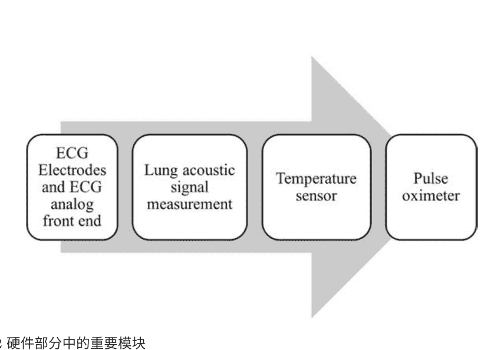

| 远程健康中使用的硬件和软件 | 更有效 | 不太有效 |
|-----------------------------|--------|----------|
| 空气耦合传感器             | ✓      |          |
| 接触式传感器               |        | ✓        |
| 电容麦克风                 | ✓      |          |
| 压电麦克风                 |        | ✓        |
| 动圈麦克风                 |        | ✓        |
| 基于红外的接触式温度传感器 |        | ✓        |
| 基于红外的非接触式温度传感器 | ✓      |          |
| PTA                        | ✓      |          |
| 支持向量机分类器           | ✓      |          |

### 用于SARS-CoV-2远程监测的无线身体区域网络
无线体域网由放置在人体附近或内部的传感器组成。它由三个部分组成，即传感器部分、数据收集部分和用户部分。它可以用于医疗和非医疗应用。

对于像COVID-19这样的传染病，无线体域网将非常有帮助。这个无线体域网将有助于在非医疗应用中警报士兵。

在[3]中，提出了一种用于抗击COVID-19病毒的无线体域网架构。首先，用户必须注册，可以通过与常规注册在网站门户/移动应用程序中的方式完成。成功注册后，用户必须填写所有与健康相关的条件，这些条件将存储在云端。从传感器收集的数据将经过机器学习算法处理，以确定该人是否患有普通感冒还是传染病COVID-19。一旦确认某人的COVID-阳性状态，将在其身体上放置传感器来监测其健康状况。使用Arduino微控制器和My Signal硬件芯片部分来测量身体状态，并将获取的数据发送到远程医生服务器进行治疗，使用LoRa。架构如图3所示。

诸如逻辑回归算法、朴素贝叶斯算法、随机森林算法、支持向量机算法和多层感知器算法等算法都用于分类。对于这五个分类器，评估精确度、召回率、错误率、准确率和布里尔分数。随机森林（RF）和多层感知器（MLP）算法在其他算法上表现更好。

在[4]中，对隔离管理和远程监测感染患者进行了实验。使用心电图（ECG）、血氧测量医疗设备（SpO2）、体温、呼吸传感器、加速度计和陀螺仪等传感器提取患者的生理数据。Wi-Fi用于将患者的身体数据传输到树莓派微控制器。根据疾病的严重程度，还可以为患者设定边界限制。在这里还会检查患者的位置以管理隔离。如果患者离开了覆盖区域时，会向病人和医护人员发送警报。从身体传感器获取的实时数据作为机器学习算法的输入，用于疾病识别和进一步治疗。 系统架构如[4]所示，见图4。

远程监测将是COVID-19的最佳治疗方法，在各个方面都能得到很好的避免不必要的传播。将大大避免不必要的传播。 对于长期患病的患者，老年人和紧急情况，这种方法将是一个很好的选择。 在无线体域网中，传感器模型，预测模型和远程监测模型被用于远程COVID监测[5]。

### WBAN架构的工作流程
提出的分布式无线体域网[5]包括四个部分：无线医疗传感器，无线汇聚模式，安卓应用程序和远程监测中心。所有四个模块共同完成远程监测和诊断的任务。每个模块的功能在下面清楚地讨论。工作流程如图5所示。

### 无线医疗传感器
在初始化过程中，串行定时器被触发，串行模块被打开。字节被读取并将被计算以写入缓冲区。该缓冲区将被传送到无线定时器。在那里，缓冲区被读取。如果缓冲区中存在数据，将使用无线传输将其发送到无线接收模块。

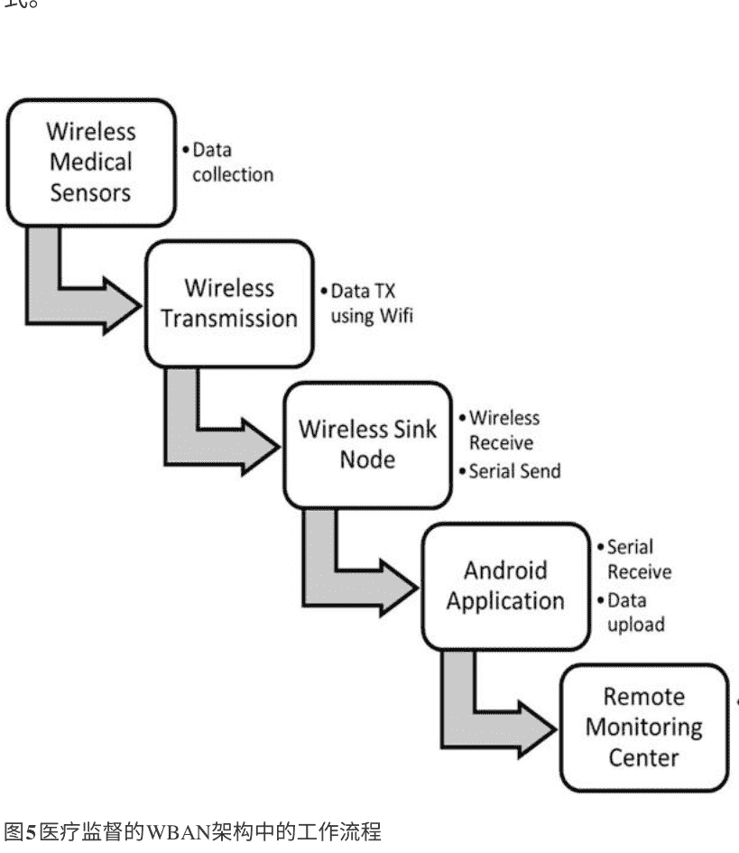

### 无线接收模块
从缓冲区接收数据，并将其发送到Android应用程序。

### Android应用程序
从前一个模块接收的数据将以串行方式接收。接收到的数据将显示在液晶显示屏（LCD）上。然后，根据其所包含的字节检查数据。如果数据被发现有危险，将在液晶显示屏上显示警告。如果数据是安全的，则将其存储并上传到远程监测中心。

### 远程监测中心
在初始化模块时，创建一个新线程并生成一个套接字。使用生成的套接字，接收来自Android应用程序的数据。然后关闭套接字，以避免与其他数据重叠或污染。一旦关闭套接字，数据将显示在屏幕上，并成功存储在基于云的存储平台中。

### 无线身体区域网络中的安全约束
医疗数据的安全是WBAN中的一个问题。在远程监测设置中，需要保持安全性，以避免入侵者篡改从传感器收集的数据。攻击者主要会影响WBAN的三个层面[6]。

-   数据收集层面 - 从身体的不同部位收集数据的各种传感器。
-   传输层面 - 数据从患者传输到医疗专业人员。
-   存储层面 - 数据被存储以供进一步处理。

使用入侵检测系统与机器学习算法相结合，可以避免攻击[7]。通过识别从身体区域网络收集的属性信息，也可以即时预测攻击[8]。更强大的路由算法和最短路径发现方法提供正确的结果，使远程患者的诊断和治疗更加完美[9,10]。集群和密钥生成架构的实施也提供更好的结果[11,12]。尽管对于远程医疗技术有许多入侵检测和安全算法，但也存在许多威胁因素。在设计远程技术时，需要高度安全性，以避免系统故障，并为远程患者提供更好的治疗。

## COVID-19远程健康监测中的物联网
物联网（IoT）是具有唯一标识符的设备、物体和人员的互联互通。物联网系统具有在网络上无需人为干预传输数据的固有能力。物联网中的物指的是具有植入物的人、具有传感器的动物、具有传感器的汽车或者在分配给互联网协议（IP）地址时可以在网络上传输数据的物（自然/人造）。

物联网与人工智能（AI）结合，使决策更加简单、动态和有意义。

医疗物联网（IoMT）指的是医疗设备、硬件基础设施和软件在医疗场景中的互联互通。IoMT有助于远程设备通过互联网进行医疗数据传输。

因此，IoMT或IoT在医疗保健中能够构建高效的远程健康监测系统，应对COVID-19大流行。图6显示了IoMT架构。许多文献[13-23]都集中在使用物联网进行无接触治疗和远程监测的远程健康监测系统上。

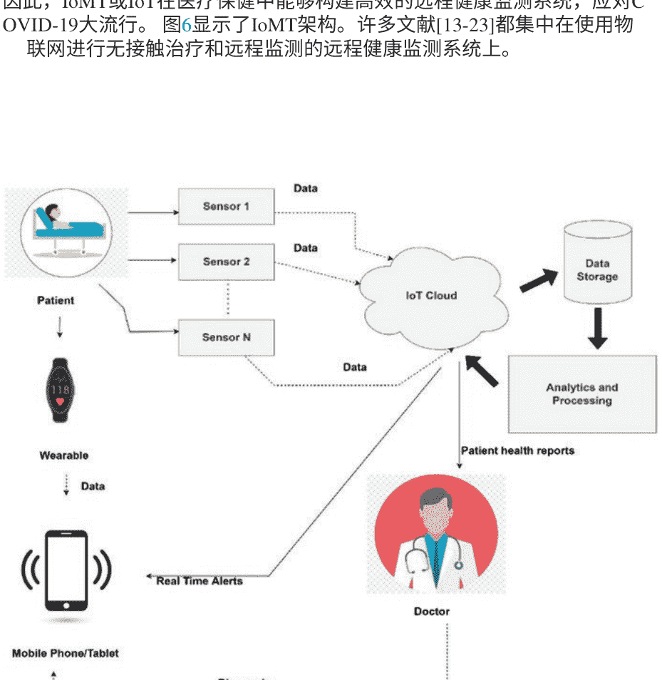

### 图6 医疗物联网架构
IoMT被用于[13]远程监测生命体征、快速诊断、接触追踪、筛查、减轻医疗专业人员的工作负担以及疾病的控制和防治。使用案例如图7所示。

### 生命体征的远程监测
血压、血糖、心率、脉搏和血氧饱和度是从佩戴在患者身上的可穿戴物联网传感器中收集的重要参数。从传感器收集的数据可以连接到互联网，使临床医生、医护人员和照护人员能够远程监测COVID-19患者。这可以预防感染并节省时间。

### 快速诊断
物联网使得能够与有旅行史的COVID-19患者共享快速诊断结果，以便官员采取可能的行动。有旅行史的人可以通过网络应用程序连接，以提供快速诊断服务。

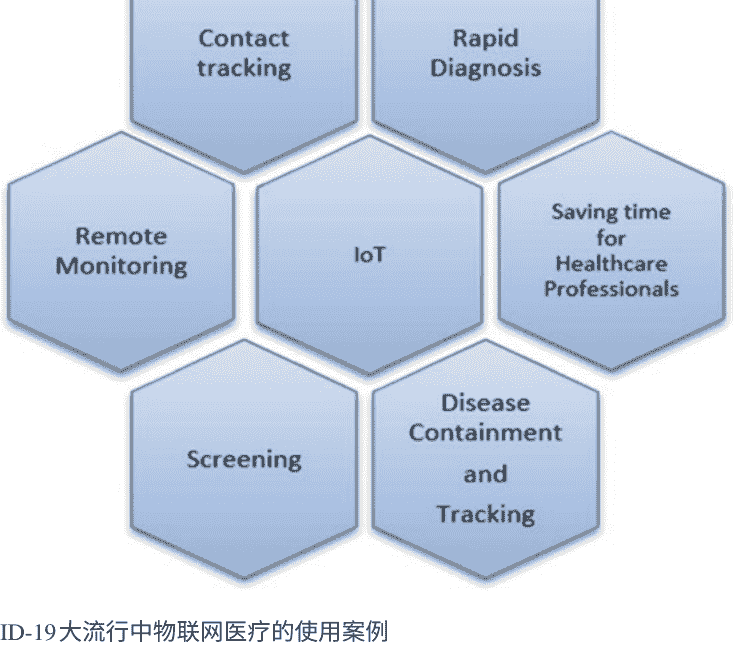

### 接触追踪
卫生部门可以通过访问存储在数据库中的患者位置历史来追踪阳性病例。如果医疗单位通过物联网连接，可以获取按位置和区域划分的病例详情。

## 筛查
通过城市各个入口处的热成像传感器收集的面部识别数据，如果通过一个共同的网络共享数据，可以有效地筛查患者。 筛查可以减少确诊病例的流动。

### 减轻医疗专业人员的工作负担
使用人工智能和物联网以及远程医疗监测可以减轻医疗专业人员的工作负担。

### 疾病的控制和追踪
物联网的使用可以使医疗官员和企业官员及时干预，以控制疾病并追踪接触者。通过各种应用程序（如印度的Aarogya Setu）可以向公众通报接近的确诊病例。在[14]中，使用硬件和软件模块的组合来自动化COVID患者的健康监测。物联网模块、移动应用程序和云服务器是该研究中使用的各种模块。

各种传感器，如心率传感器、温度传感器和SpO2传感器，连接到一个树莓派控制器。从传感器收集的数据通过蓝牙传输到手机。在手机上监测日常生活活动（ADL）并通过网络连接传输到云端。移动应用程序向用户通知监测状态。此外，从云服务器收集的数据使用模糊系统进行分析。COVID安全平台通过LoRa网络来应对农村地区的网络故障。

远程医疗是由物联网、人工智能、区块链和大数据等数字技术驱动的。物联网可以在以下领域中用于远程医疗，以应对COVID时代的感染：农村医疗、COVID后护理、远程监测、慢性病管理、系统发起的随访提醒、老年人护理和移动医疗[15]。

在[16]中提出了一个具有分层架构的强大物联网平台，用于有效地抗击COVID-19大流行的传播和控制。分层架构包括四个不同的层次，如图8所示，分别是感知层、网络层、雾层和云层。

感知层从患者、医院/诊所和环境中的传感器收集数据。

在网络层，传感数据通过Wi-Fi或网络连接（4G/5G）传输到雾节点。

雾层使用高端计算资源来减少实时分析的延迟。在雾层中，可以实施与非药物干预措施（NPIs）相关的计算，以实现有效的COVID追踪、监测和隔离。

云层用于计算复杂的预测用例，如COVID预测和识别病毒变异变化，利用强大的资源。

社交距离是控制COVID的有效手段之一。在[17]中呈现了一个端到端的物联网架构，如图9所示。数据采集设置包括身体传感器和环境传感器。Wi-Fi和GPS分别用于室内和室外环境中的患者定位。通信模块用于将数据从采集单元传输到手持移动单元中的控制器。移动单元可以通过蓝牙模块进行接触追踪，并基于传感器数据创建警报。物联网网关用于转发数据到云服务器。云平台根据所需的用例执行基本服务。

在发展中国家，医疗专业人员短缺和有限的医疗基础设施需要在COVID-19大流行中使用专家系统[18]。针对COVID筛查提出了三种不同的方法。

第一种方法专注于使用低成本可穿戴传感器构建COVID-19筛查设备，以测量心率、SpO2和体温。通过Arduino微控制器处理获取的数据，并使用Wi-Fi传输到Ubidots云。可以从云数据进行数据可视化，以供临床医生/护理人员进一步采取行动和跟进。

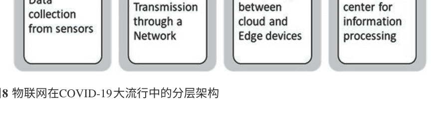

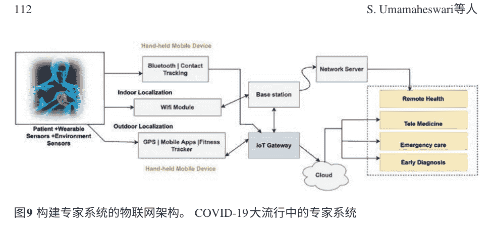

### 图9 构建专家系统的物联网架构
### COVID-19大流行中的专家系统

| 表2 COVID IoT启用的医疗保健数字技术 |
|-----------------------------------|
| 序号 | 数字技术 | 用途 |
|------|----------|------|
| 1. | 大数据 | 用于以数字形式存储COVID数据。存储的数据可用于快速决策。可以维护电子健康记录。 |
| 2. | 云 | 使用互联网进行数据描述。用于远程诊断的按需数据存储。 |
| 3. | 传感器技术 | 数据采集。健康监测。 |
| 4. | 执行器 | 参数控制。保持准确性。 |
| 5. | 人工智能 | 检测和分类。预测。数据可视化。 |
| 6. | 软件 | 提高患者护理水平。疾病诊断。病历。 |
| 7. | 虚拟/增强现实 | 数字图像/音频信息。提高患者安全和服务质量。 |

在第二种方法中，基于收集到的数据提出了基于规则的方法。基于专家意见和临床指南创建了一个规则库。将症状与规则库中的数据进行匹配，以评估COVID-19患者的严重程度。使用云基础设施传输从传感器收集的数据，以进行数据可视化和实时跟踪。

[19]中的作者回顾了COVID大流行中物联网医疗的应用案例。表2列出了在COVID期间使用各种数字技术进行IoMT的进一步应用。

[20]中制定了一个Health 4.0框架，以改善COVID-19疾病的治疗和预防。为了增强诊断，提出了一个四阶段的IoT流水线。流水线包括从可穿戴设备收集数据，通过网络传输数据，使用特征工程处理数据，以及使用人工智能进行辅助决策。该框架在图10中有所说明。在使用医疗机器人进行辅助手术时，还分析了紧急救护护理。

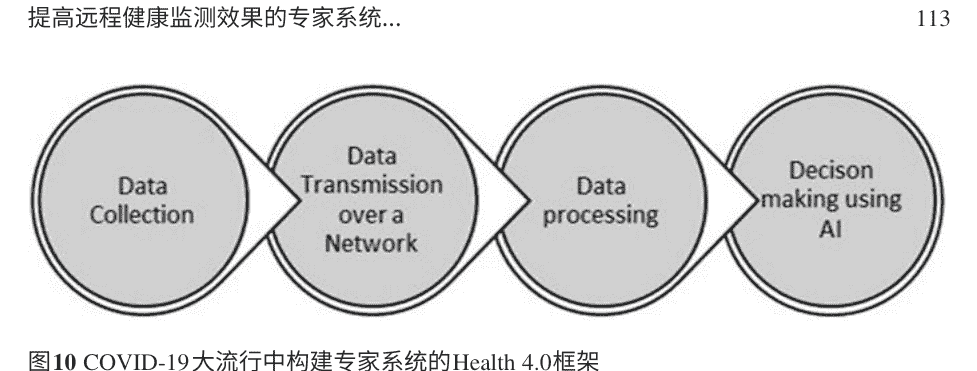

### 图10 COVID-19大流行中构建专家系统的Health 4.0框架

| 表3 Health 4.0框架中使用的技术 |
|-------------------------------|
| 序号 | 参与者 | 技术 | 用途 |
|---|---|---|---|
| 1. | 照料者 | 智能手机 | 远程监测 |
| 2. | 医院 | 软件 | 数据录入和跟踪 |
| 3. | 患者 | 传感器和智能植入物 | 数据收集 |
| 4. | 机器人 | 人工智能和计算机视觉 | 手术 |
| 5. | 云 | 高端计算资源 | 数据存储 |

在Health 4.0框架中，各参与者使用的物联网架构技术列在表3中。

在[21]中，物联网和预警系统被用于加强对COVID-19患者的远程健康监测。此外，分析并列出了与远程监测相关的挑战如下：
-   精确识别健康恶化和风险状况。
-   基于健康状况和先前医疗历史的患者特定分析。
-   在无线基础设施中定制评估方法和设备。
-   可扩展性 - 为了支持COVID患者的并发监测，因为疾病传播速度很快。
-   物联网框架中的组件故障。
-   农村地区网络基础设施的可靠性。
-   预测准确性和发出早期警告信号的准确性。
-   在从传感器到云端共享数据时保护数据的机密性。
-   将传感器数据集成到医院现有的遗留系统中。
-   使用廉价的物联网框架，但会遇到速度、内存和处理问题。
-   使用的传感器和控制器的功耗和能源需求。

在COVID-19大流行中使用基于移动设备的COVIDApp框架[22]进行早期检测和快速追踪病例。此外，还提出使用移动应用进行远程监测以实现远程部署协议。通过问卷收集患者的详细信息。根据问卷中给出的选项，使用基于规则的方法来评估是否存在。

基于收集的症状的COVID 根据严重程度，进一步进行随访和治疗建议。

在[23]中对一种用于监测老年人生命体征参数的基于移动设备的m-health监测系统进行了实验。移动健康监测系统提供视频咨询、生命体征监测、自我追踪和通知护理人员等服务。

## 机器人技术和人工智能在COVID-19大流行中的应用

在COVID-19大流行期间，机器人技术和人工智能被广泛用于改善情况，如图11所示。[24]中的详细文献分析了机器人技术和人工智能在远程监测场景中在COVID-19大流行中的影响和应用。本节讨论了[24]中介绍的机器人技术和人工智能技术的概述。

图11 COVID大流行中的机器人技术和人工智能应用案例

在诊断中，快速检测对于诊断感染非常有用。尽管识别感染者非常重要，但在大流行期间，直接接触受感染者会增加感染的机会，同时缺乏医疗资源也是最具挑战性的任务。为了克服这些困难，可以利用机器人技术进行无接触样本采集，以减少感染的机会。

可以使用人工智能算法来优先处理和加快对嫌疑人的测试，从而在更少的劳动力下进行更多的测试。还可以通过结合X射线、CT等医学成像模态和处理技术以及人工智能算法来评估疑似症状的人员[25]。

许多文献建议使用CT和/或X射线图像进行基于学习的各种分类模型，以早期检测COVID-19感染，并取得了良好的结果。同样，已经提出了许多基于深度学习的COVID检测模型，并取得了有希望的结果。此外，一些研究人员还引入了一些混合技术，结合了常规机器学习模型和定制的深度CNN架构，以提高检测性能。一些迁移学习方法也被证明对于检测更好。另一组研究人员专注于结合肺部CT和胸部X射线图像的特征，以提高检测性能。

除了这些图像的特征外，为了COVID-19筛查，还使用了AI算法来结合一些声学信号特性，如咳嗽、语音、呼吸等。COVID症状研究用于通过将用户的症状与COVID阳性患者的症状进行比较来预测COVID症状。超过三百万用户使用该应用程序报告他们的健康问题，表明它受到了良好的接受。

集成实验室功能的芯片上的实验室设备可以用于分析样本并在单个芯片上快速做出COVID筛查的决策。

### COVID-19风险评估

冠状病毒对不同的人有不同的影响。例如，有些人可能不需要大量的医疗护理、治疗或咨询。其他个体，特别是老年人和虚弱者，需要服务提供者的额外关注和及时反应才能生存。然而，确定COVID-19的严重程度是一项困难的任务。基于人们现有的健康问题、呼吸困难以及胸部X光和/或CT图像结果，基于人工智能（机器学习或深度学习）的方法也已经扩展到检测高风险患者，并创建了一个易感指数或评分。

许多创建的人工智能方法可以可靠地识别新感染的COVID-19患者是否会发展为严重的呼吸系统疾病或是否会出现问题。

## COVID-19期间的监测

在发现第一个冠状病毒感染事件后，许多国家由于这种意外风险的传播无法估计、识别感染热点并预测病毒随时间的变异而出现了重大的医疗危机。政府的缺乏准备加剧了这个问题。

如果有可能预测传播情况，对决策者来说，积极采取适当的措施将是有益的。在这方面，人工智能方法可以很好地评估病毒感染的地理分布，并识别群体和热点。这些数据可以用来识别不同区域的易感区域。

使用人工智能驱动的接触追踪应用程序对个人进行监测，以识别风险并预测疾病的未来发展趋势。与传统的医疗数据报告系统相比，通过AI工具可以快速分析流行病学数据，以检测COVID-19的传播网络，并制定有效的防控策略。

为了监测社交距离，开发了各种基于AI的智能手机应用程序、基于视觉的机器人解决方案和可穿戴设备。

定制的全自主巡逻机器人已经开发出来，用于取代人类巡逻，特别是在危险区域进行巡检。它们可以监测体温和社交距离，还可以检查人们是否戴着口罩，并提醒相关部门采取实时措施。

广州高顺机器人公司开发了一款基于物联网的5G巡逻机器人，配备了红外热像仪和五个高分辨率摄像头，部署在中国用于监测COVID-19的防控措施，可以在5米半径内扫描大约十个人的高温。社交距离监测的步骤如图12所示。

图12 实时社交距离监测的步骤

## COVID-19期间的远程医疗服务

在COVID-19危机期间，远程医疗被认为是最关键的需求之一。远程机器人技术在各种活动中帮助一线员工，通过减少与患者的亲密接触，减少疾病传播。远程健康服务包括远程手术、远程咨询、远程超声、自助检测服务、远程陪同机器人和AI聊天机器人，在医院广泛应用以缓解医疗部门的需求。

比利时公司Zo-raBots开发的交互式机器人CRUZR可以接近客人，检测体温，并用53种语言与他们交流。它还可以执行和学习医务人员必须执行的重复任务。通过由Rutgers设计的机器人台式机，可以将药物和液体输送到血管中。

医疗机器人设备与人工智能和图像采集系统结合使用，可以在更短的时间内完成上述任务。

## COVID-19期间的交付和供应链

自主送货机器人在医院中用于各种任务，以增强药物传递、样本收集和医疗报告传播。将自动驾驶机器人整合到供应和交付链中，可以在保护患者和医务人员的同时，减轻医疗专业人员的负担。

Phollower 100是由斯洛伐克公司Photoneo开发的自主移动送货机器人，用于在医院和医疗中心分发药品、洗涤物等。送货机器人也用于增强交付和供应链。供应链管理中RPA涉及的步骤如图13所示。RPA，通常被称为软件机器人技术，是一种在不需要人类参与的情况下自动化业务流程的方法。RPA取代了一线员工重复、单调和耗时的工作，如测试和诊断，确保更有效地利用人力资源。为了提供先进的治理服务，它还确保了增强的效率和可扩展性，同时降低了操作费用和减少错误频率。 COVID-19情景中的RPA使用如图14所示。

图13 COVID-19服务自动化中供应链管理中的机器人使用

RPA用于从患者收集医疗记录并将记录转移到相关部门以减少手动错误。

RPA的优点如下所列：
- 自动化预约。
- 通过患者注册进行电子健康记录维护。
- 远程健康监测。
- 加快疫苗开发。
- 增强库存和供应链管理。
- 自动化文书工作和减轻工作负担。
- 简化与付款相关的任务。

图14 COVID-19大流行中的RPA使用

## 消毒

可以部署机器人喷洒消毒剂以控制可能受到疾病污染的区域的感染。目前市场上使用的许多消毒机器人由UVD Robots、Nimbus机器人、Xenex和Youi bot制造。

## 研究和药物开发

机器人技术可以在大规模制造药物和疫苗方面使用，以更快地控制COVID-19感染。使用机器学习和深度学习等人工智能算法处理从患者收集的结构化和非结构化数据，以辅助决策。还可以利用人工智能技术来进行疫苗研究、蛋白质结构分析和药物靶标相互作用分析。

## 结论

COVID-19是一种致命的疾病，对发达国家和发展中国家的生活和医疗基础设施造成了巨大的影响。本章详细介绍了使用WBAN、物联网、人工智能和机器人技术来增强远程监测的方法。
观察发现，无线体域网中的传感器在远程监测COVID-19患者的身体状况方面起着非常重要的作用。
大多数无线体域网和物联网应用与微控制器和Android应用程序集成，用于处理和实时显示工作。使用不同的机器学习算法来判断患者是否受到影响。某些系统中实现了蜂窝网络和LoRa技术，以将传感信息传输到卫生专业人员的办公室。医生还可以快速访问患者的历史记录。由于可穿戴技术的等效发展，感染者可以继续进行日常活动。目前正在进行大量研究，将WBAN与虚拟现实、认知无线电和5G技术相结合。通过将更强大的安全算法纳入WBAN中，可以使卫生专业人员的工作更加轻松，并尝试让患者在隔离期间也能工作，从而增加国家的经济增长。
无论架构如何，利用物联网改善偏远健康监测的健康基础设施，通过数据收集、数据分析和处理以及数据传输到云端是物联网框架的基本步骤。
人工智能和机器人技术在COVID-19大流行中用于各种用例。利用机器学习和深度学习增强疾病诊断和预测。利用机器人技术进行疾病控制，加速医学研究和疫苗的大规模生产。未来的工作是通过整合WBAN、物联网、人工智能和机器人来开发专家系统，以改善患有大流行和流行病的人们的生活。

## 参考文献

1.  M. Ciotti, M. Ciccozzi, A. Terrinoni, W.-C. Jiang, C.-B. Wang, S. Bernardini, The COVID-19 pandemic. Crit. Rev. Clin. Lab. Sci (2020)
2.  D.S. Rajeswari, J. Hitha Shree, A.L.N. Simha, M.N. Subhani, B.G. Shivaleelavathi, V. Yatnalli, A review on remote health monitoring sensors and their filtering techniques. Glob. Trans. Proceed. 2(2), 392–401 (2021)
3.  N. Bilandi, H.K. Verma, R. Dhir, 一种智能高效的无线身体区域网络用于控制冠状病毒爆发。阿拉伯科学与工程杂志 (2021)
4.  F. Ullah, H.U. Haq, J. Khan, Arslan Ali Safeer, Usman Asif 和 Sungchang lee, 基于可穿戴物联网和地理围栏的COVID-19框架。远程患者健康监测和隔离管理以控制大流行 10 (2021)
5.  C. Wang, Q. Wang, S.Z. Shi, 一种分布式无线身体区域网络用于医疗监督，在2012年IEEE国际仪器与测量技术会议论文集, (2022)
6.  R. Nidhya, S. Karthik, 使用无线身体区域网络的远程医疗系统的安全和隐私问题。身体区域网络挑战与解决方案，37-53 (2018)
7.  S. Umamaheswari, S. Arun Kumar, S. Sasikala, 使用机器学习和特征选择构建无线传感器网络中的鲁棒入侵检测系统，在2021年国际电气、电子、通信、计算和自动化会议(ICA ECA)上, (2022)
8.  S. Umamaheswari, K.H. Priya, S.A. Kumar, 智能城市应用中使用的技术-概述,在2021年国际电气、电子、通信、计算和自动化会议(ICA ECA)上, (2021), pp. 1–6
9.  Umamaheswari, S. 用于能源高效云辅助无线传感器网络的混合优化模型. 无线个人通信 118(1), 873–885 (2021)
10. S. Umamaheswari, C. Kavitha, S.M. Chandru, 用于不同应用的机器学习连接人类. 纯应用数学国际期刊 117(8), 167–170 (2017)
11. M. Mathankumar, S. Karthikeyani, S.G. Kumar, N. Mahesh, N.J. Savitha, R. Rajaguru, 一种用于分布式无线网络的高效动态密钥生成架构, 在2021年第三届智能通信技术和虚拟移动网络国际会议(ICICV)上, (2021), pp. 157–160
12. M. Mathankumar, U. Rajkanna, C. Mohanraj, 使用集群架构实现优化的无线传感器网络, 在2019年电力和先进计算技术创新(i-PACT)上, (2019), pp. 1–4
13. S. Swayamsiddha, C. Mohanty, 应用认知医疗物联网进行COVID-19大流行病。糖尿病代谢综合征。临床研究评论。14(5), 911–915 (2020)
14. S.S. Vedaei, A. Fotovvat, M.R. Mohebbian, G.M. Rahman, K.A. Wahid, P. Babyn, 等, COVID-SAFE:一种基于物联网的自动化健康监测和监视系统, 用于后疫情生活。IEEE Access 8, 188538 (2020)
15. S. Bahl, R.P. Singh, M. Javaid, I.H. Khan, R. Vaishya, R. Suman, 用于应对COVID-19大流行的远程医疗技术: 一项综述。J. Indus. Integra. Manag. 5(04), 547–561 (2020)
16. Y. Dong, Y.D. Yao, 用于COVID-19预防和控制的物联网平台: 一项调查。IEEEAccess 9, 49929–49941 (2021)
17. S. Siddiqui, M.Z. Shakir, A.A. Khan, I. Dey, 用于社交隔离的物联网(IoT)启用架构. Front. Commun. Netw. 2, 6 (2021)
18. H. Mukhtar, S. Rubaiee, M. Krichen, R. Alroobaea, 用于COVID-19筛查的物联网框架，利用可穿戴传感器的实时数据. Int. J. Environ. Res. Public Health 18(8), 4022 (2021)
19. M. Javaid, I.H. Khan, 物联网（IoT）启用的医疗保健有助于应对COVID-19大流行的挑战。口腔生物学和颅面研究。 11（2），209-214（2021）
20. C.I. Loeza-Mejía, E. Sánchez-DelaCruz, P. Pozos-Parra, L.A. Landero-Hernández, 面对COVID-19大流行的健康4.0的潜力和挑战：快速审查。健康技术。11（6），1321-1330（2021）
21. A.I. Paganelli, P.E. Velmovitsky, P. Miranda, A. Branco, P. Alencar, D. Cowan等，用于远程监测COVID-19患者的概念性基于物联网的预警架构在病房和家庭中。物联网 100399（2021）
22. P. Echeverría, J. Puig, J.M. Ruiz, J. Herms, M. Sarquella, B. Clotet, E. Negredo, 在COVID-19大流行期间，使用移动健康应用程序进行工作场所远程健康监测，以早期检测COVID-19病例。国际环境研究与公共卫生杂志 19(1), 167 (2022)
23. S. Abbaspur-Behbahani, E. Monaghesh, A. Hajizadeh, S. Fehresti, 应用移动健康支持老年人在COVID-19爆发期间：一项系统综述。健康政策与技术 100595 (2022)
24. S. Sarker, L. Jamal, S.F. Ahmed, N. Irtisam, 在COVID-19大流行期间的医疗保健中的机器人和人工智能：一项系统综述。机器人与自主系统 146, 103902 (2021)
25. M. Bharathi, S.A. Kumar, S. Sasikala, 提高COVID检测效果的深度学习架构-一项试点研究，在2021年电气、电子、通信、计算和自动化进展国际会议(ICA ECA)中，(IEEE,2021), pp. 1-5

## 基于人工智能的预测工具用于威胁生命的疾病

Vijay Jeyakumar, Prema Sundaram和Nithiya Ramapathiran

### 缩写词

| 缩写 | 全称 |
| :--- | :--- |
| 5G | 第五代 |
| 人工智能 | 人工智能 |
| 艾滋病 | 获得性免疫缺陷综合征 |
| ANAM-NET | 基于变形深度嵌入的轻量级卷积神经网络 |
| ANN | 人工神经网络 |
| AUC | 曲线下面积 |
| BERT | 双向编码器表示来自变压器 |
| CI | 置信区间 |
| CNN | 卷积神经网络 |
| CNN-AE | 卷积神经网络自编码器 |
| COPD | 慢性阻塞性肺疾病 |
| COVID-19 | 2019冠状病毒病 |
| COVNet | COVID-19检测神经网络 |
| CRP | C-反应蛋白 |
| CT | 计算机断层扫描 |
| DHIS2 | 将区域卫生信息软件转化为单一窗口 |
| DICOM | 医学数字成像和通信 |
| DL | 深度学习 |
| DNA | 脱氧核糖核酸 |
| DNN | 深度神经网络 |
| DST | 科学与技术部 |
| EHR | 电子健康记录 |
| EN | 弹性网络模型 |
| FDA | 灵活判别分析 |
| GLDM | 灰度级依赖矩阵 |
| GLSZM | 灰度级大小区域矩阵 |
| GRU | 门控循环单元 |
| GUIDE | 图形用户界面开发环境 |
| 艾滋病 | 人类免疫缺陷病毒 |
| HMC | 哈密尔顿蒙特卡罗 |
| ICU | 重症监护室 |
| INR | 国际标准化比值 |
| 物联网 | 物联网 |
| K-NN | K最近邻 |
| LASSO | 最小绝对收缩和选择算子 |
| LDH | 乳酸脱氢酶 |
| LR | 线性回归 |
| LSTM | 长短期记忆 |
| MATLAB | 矩阵实验室 |
| MCHC | 平均红细胞血红蛋白浓度 |
| MERS-CoV | 中东呼吸综合征冠状病毒 |
| ML | 机器学习 |
| MOGA | 多目标遗传算法 |
| MRMR | 最大相关最小冗余 |
| NA | 不适用 |
| NBML | 国家脑图谱实验室 |
| OWL | Web本体语言 |
| pH | 氢离子浓度 |
| PLS | 偏最小二乘回归 |
| RF | 随机森林 |
| RNA | 核糖核酸 |
| RNN | 循环神经网络 |
| RT-PCR | 反转录聚合酶链式反应 |
| SARS | 严重急性呼吸综合征 |
| SARS-CoV | 严重急性呼吸综合征冠状病毒 |
| SARS-CoV-2 | 严重急性呼吸综合征冠状病毒2 |
| SIR | 易感-感染-移除 |
| SMOTE | 合成少数类过采样技术 |
| SOP | 标准操作规程 |
| SORMAS | 监测疫情爆发响应管理与分析系统 |
| SpO2 | 氧气部分饱和度 |
| SVM | 支持向量机 |

V. Jeyakumar (✉)
印度金奈Sri Sivasubramaniya Nadar工程学院
e-mail: vijayj@ssn.edu.in

P. Sundaram
PSNA工程与技术学院，印度丁迪古尔，电子邮件：premas@psnacet.edu.in

N. Ramapathiran
阿格尼技术学院，印度金奈，电子邮件: nithiya.bme@act.edu.in

© 作者，独家许可给Springer Nature
瑞士AG 2023
G. R. Kanagachidambaresan等人（编辑），使用机器学习和深度学习的疫情系统设计，信号与通信技术，https://doi.org/10.1007/978-3-031-9752-9_8| 缩写 | 解释 |
|------|------|
| SVM-RFE | 支持向量机递归特征消除 |
| SWRL | 语义Web规则语言 |
| TELINET | 传真图书馆网络 |
| VGG | 视觉几何组 |
| WASH | 水、卫生和卫生 |
| WHO | 世界卫生组织 |
| XGBoost | 极限梯度提升 |

## 疾病的起源和背景

一种通常影响生物体正常结构或功能并与特定体征和症状相关的医学状况被称为疾病。这可能是由于任何外部因素或内部身体紊乱导致的疼痛、功能障碍、损伤或综合征。它代表了身体正常稳态平衡的损害。

疾病的不同阶段包括：

- 病因学
- 发病机制
- 形态学变化
- 与这些变化相关的相应功能改变

## 分类

疾病主要分为四类：

1.  传染病是由病原体及其毒素产生引起的疾病，例如细菌、病毒、真菌或寄生虫引起的疾病，例如COVID-19。
2.  缺乏疾病或营养不良疾病是由于营养素缺乏、过量或不平衡影响身体组织而引起的疾病，例如贫血。
3.  遗传疾病或代谢疾病导致基因变异或染色体异常。该类别下的两个亚型是遗传性和非遗传性疾病，例如血友病。
4.  由非生物因素（寒冷、高温、低pH）以及营养失衡引起的疾病被称为生理性疾病。身体的器官和器官系统无法正常运作，导致疾病，例如糖尿病。

还有其他的疾病分类方法。

1.  根据传播方式，疾病可以分为以下几类：
    - 传染病是指病原体通过不同的传播途径从感染者传播给其他人，例如HIV感染。
    - 非传染性疾病不会从一个人传播给另一个人，例如癌症。
2.  根据时间范围，疾病可以分为以下几类：
    - 急性疾病突然出现，只持续短期，从几天到几周不等，例如普通感冒。
    - 慢性疾病逐渐发展，持续时间通常为几个月到几年，例如关节炎。
3.  根据疾病的原因，疾病可以分为以下几类：
    - 原发性疾病是由某种疾病的初始原因引起的，例如普通感冒。
    - 继发性疾病是由原发性疾病或其潜在原因引起的并发症，例如鼻炎可能是由普通感冒或细菌感染引起的。
4.  根据身体系统，疾病可以分为以下几类：
    - 精神疾病是一类包括情绪失衡、行为障碍、逻辑功能障碍或认知障碍的广泛疾病，可以是生物性的或心理性的，例如抑郁症。
    - 器质性疾病可以由身体器官系统的结构或功能变化引起，例如中风。
5.  根据程度，疾病可以分为以下几类：
    - 局部疾病局限于身体的一部分，例如眼部感染。
    - 广泛传播的疾病指的是疾病从起源部位传播到远离部位，例如癌症。
    - 全身性疾病影响整个身体，导致疾病，例如血压问题。

疾病在个体中的过程是从疾病发生到完全康复或最终死亡所需的时间。疾病的进展是从其病因（原因）到结果（康复或死亡）的一系列生物事件。对于疾病历史的重要观点包括家庭医生可以分析个体的健康问题，流行病学家可以通过使用健康记录和生物统计信息发现新疾病的发生及其解决方案[1]。

## 疾病的阶段

疾病的发展有三个阶段。

1.  潜伏期 - 在这个阶段，疾病发生，但人体内没有任何与疾病相关的症状。因此，身体状况、致病因子和环境起着重要作用。
2.  发病期 - 在这个阶段，人体组织发生变化，但人还没有发现任何临床症状。它包括两个子阶段。
    - 潜伏期是一个快速发展的阶段，从几小时到几天，是病原体在宿主中暴露后传播和产生症状的时间。
    - 潜伏期或患病前期是一个非常缓慢发展的阶段，持续几个月到几年，是成为传染性并能传播疾病所需的时间。
3.  临床期 - 在这个阶段，患者出现临床症状和变化，疾病的病理学持续进行，没有治疗可能导致康复、残疾或死亡。它包括三个子阶段。
    - Prodromal - 表示疾病的临床开始，首次出现症状。
    - Clinical - 表示特定症状的出现，物理学家可以通过这些症状选择正确的治疗方案，无论是治疗患者还是避免任何长期损害。
    - Resolution - 代表疾病的终末阶段，可以完全解决或进展到高级阶段，或导致死亡。

## 传染的传播

该过程遵循以下三个因素：

- 一个被感染的个体。
- 一个易感染的个体。
- 感染者与易感染个体之间的有效接触，使得感染者影响易感染个体。

在给定人群中，在单位时间内进行的有效接触次数被称为有效接触率 (β)。这实际上是总接触率 (γ)（无论是否有效）和感染传播风险 (p) 的乘积，可以通过以下表达式给出：

```
β = γ * p
```

传染性是指传染性因子在宿主中获取和扩大引起感染的能力。传播性是指从感染者传播感染给易感染个体的机会，可以通过社区或局部传播。在社区传播中，导致感染传播的一群人之间的流行病学联系是未知的，而在局部传播中，可以确定感染源在特定位置内。

## 传播途径

不同人群之间的疾病传播路径对于了解基于社会经济和文化条件的接触模式和疾病传播至关重要。病原体可以通过以下方式之一传播：

- 水平疾病传播 - 可以通过直接或间接接触从环境或无关人员中获得感染。
- 垂直疾病传播 - 是传染性病原体从母体传递给后代，可以是细胞内或细胞外传播。
- 混合模式疾病传播 - 疾病传播可以是垂直的，也可以是水平的，这取决于宿主密度，分别可以是低或高。

疾病传播方式可以有以下几种：

1.  空气传播感染 - 指的是通过蒸发的小于5 µm的干燥和湿润气溶胶传播，这些气溶胶可以在环境中存活很长时间，并且可以影响上呼吸道和下呼吸道，例如结核病。
2.  飞沫传播 - 通过咳嗽、打喷嚏或者感染者说话产生的呼吸道飞沫是呼吸道感染最常见的传播途径，其中尺寸大于5 µm的小而湿润的颗粒在环境中保持有限的时间和最小的距离。它可以直接传播到易感受的黏膜表面，也可以通过与被污染区域的接触间接传播，例如冠状病毒。
3.  直接身体接触 - 直接接触是通过皮肤接触、接吻和性接触发生的，可以导致各种传染性疾病，例如梅毒。
4.  间接身体接触 - 也称为载体传播，是指通过无感知物体的污染传播感染，这些物体可以作为传播感染的媒介，通过媒介或中间宿主传播感染，例如疟疾。
5.  通过其他生物传播 - 传播通常是通过机械或生物起源的媒介进行的，并且本身不负责引起疾病，但可以通过传播病原体从一个人传播到另一个人，例如狂犬病。
6.  粪口传播 - 这种传播方式对人们的健康构成严重风险，其中粪便颗粒污染食物和水，以致病原体通过不良卫生和个人卫生传播到另一个人的口腔，例如霍乱。

## 发病率和死亡率

流行病学中两个重要且常用的术语是发病率和死亡率，它们被表示为比例或率，代表特定疾病状况的频率和严重程度[2]。

- 发病率被定义为患有特定疾病或并发症的状态，这是疾病或治疗的不正常后果。它可以是急性或慢性的，并且可以以疾病的发生率或患病率的形式呈现，例如心脏病、中风、糖尿病、肥胖和感染。
- 发病率代表人群中疾病发生的速率，并评估人群的整体健康状况和医疗需求：

发病率 = (疾病、伤害或残疾的病例数) / (总人口)

- 死亡率表示由特定疾病或疾病状况导致的死亡人数，例如在2020年，COVID-19将是引起死亡的显著原因。
- 死亡率或死亡率测量特定人群中的死亡人数，按时间单位缩放到总人口。

由于扩大的全球贸易活动导致人类和动物之间的增加的互动，导致了人畜共患病原体的传播，并促进了感染在人类中的持续传播。不断增长的人口使新疾病暴发、流行病和大流行病的风险增加[3]。

让我们回顾一下不同地理区域中疾病发生和传播的重要术语[4]。

- 流行病是指在人群中持续存在的一种疾病状况的可预测发病率，例如疟疾。
- 爆发是指患病人数突然增加的情况。它可能发生在一个地方，也可能广泛扩散，并且可能持续数天到数年。它可能是对社区新的，也可能在很长一段时间内没有出现，例如流感。
- 流行病迅速传播到大范围的人群，并被视为爆发，例如脊髓灰质炎。
- 大流行病跨越国家和大陆，对全球人类产生影响，并且是一种流行病，例如COVID-19。

跨物种病原体传播的机制依赖于不同的阶段。

- 第一阶段 - 传染源主要是动物。
- 第二阶段 - 病原体进展并进入人体系统，但没有人际传播。
- 第三阶段 - 人际之间发生少数次二次感染。
- 第四阶段 - 尽管人际之间存在长时间的二次感染，但病原体仍然在动物中存在。
- 第五阶段 - 感染仅在人类中持续存在。

## 细菌和病毒的病原体

病原体传播的风险取决于携带传染性因子的动物宿主、跨物种互动类型及其概率。在世界历史上，最引人注目的过去的大流行病包括鼠疫、霍乱、流感、天花、艾滋病和冠状病毒疾病[5]，如表1所示。

## 瘟疫或黑死病

革兰氏阴性杆状厌氧细菌鼠疫耶尔森氏菌通过跳蚤感染啮齿动物和哺乳动物。跳蚤以感染的啮齿动物为食，接收细菌后在跳蚤的肠道中繁殖。它将血液吐出给新的啮齿动物宿主，并通过三种不同的途径传播感染。

1.  腺鼠疫 - 最常见的形式，由感染的跳蚤引起与流感相关的症状（50-90%致死率）。
2.  败血症型鼠疫 - 影响10-25%的宿主，导致血液感染的逐渐加重。
3.  肺炎 - 当细菌寄居在肺部时，如果不治疗，它会迅速导致致命的状况。

三次大流行瘟疫事件是：

1.  541年至543年之间发生的最初大流行瘟疫是起源于埃及并经过罗马的贾斯提尼安瘟疫，导致了1亿人的高死亡率。
2.  19世纪初，第二次大流行瘟疫浪潮称为黑死病在欧洲爆发，并最终导致2亿人死亡。
3.  19世纪期间，第三次大流行瘟疫在中国存在，并在后来的年份在全球范围内流行[6]。世界卫生组织认为它是一种重新出现的感染病，影响世界各地的不同时期，并且在没有立即治疗的情况下被证明具有高致死性，可能构成重大的公共威胁。

## 表1 危及生命的疾病及其起源

| 年份 | 疫情/大流行 | 病原体传播途径 | 死亡人数 | 地点 |
|------|-------------|----------------|----------|------|
| 541-543年 | 查士丁尼大瘟疫 | 鼠疫杆菌与野生啮齿动物相关的跳蚤 | 500万至1亿 | 欧洲和西亚 |
| 1347-1351年 | 黑死病 | 鼠疫杆菌与野生啮齿动物相关的跳蚤 | 500万至2亿 | 欧洲、亚洲和北非 |
| 1817-1824年 | 第一次霍乱大流行 | 霍乱弧菌 | 污染的水源 | 100-200万 | 亚洲、非洲 |
| 1827-1835年 | 第二次霍乱大流行 | 霍乱弧菌 | 污染的水源 | 不到100万 | 欧洲、亚洲和美洲 |
| 1839-1856年 | 第三次霍乱大流行 | 霍乱弧菌 | 污染的水源 | 100-200万 | 亚洲、欧洲、非洲和北美洲 |
| 1863-1875年 | 第四次霍乱大流行 | 霍乱弧菌 | 污染的水源 | 600,000 | 俄罗斯、欧洲、非洲和北美洲 |
| 1881-1896年 | 第五次霍乱大流行 | 霍乱弧菌 | 污染的水源 | 不到100万 | 全球范围 |
| 1855年至今 | 第三次鼠疫大流行 | 鼠疫杆菌 | 与野生啮齿动物相关的跳蚤 | 1200-1500万 | 全球范围 |
| 1889-1893年 | 俄罗斯流感 | 禽流感A/H3N8 | 禽类 | 100万 | 全球范围 |
| 1899-1923年 | 第六次霍乱大流行 | 霍乱弧菌 | 污染的水源 | 不到100万 | 欧洲、亚洲和北非 |
| 1918-1919年 | 西班牙流感 | 禽流感A/H1N1 | 禽类 | 1.7-10亿 | 全球范围 |
| 1957-1959年 | 亚洲流感 | 禽流感A/H2N2 | 禽类 | 100-400万 | 全球范围 |
| 1961年至今 | 第七次霍乱大流行 | 霍乱弧菌 | 污染的水源 | 300-500万 | 全球范围 |
| 1968-1970年 | 香港流感 | 禽流感A/H3N2 | 禽类 | 100-400万 | 全球范围 |
| 2002-2003年 | 严重急性呼吸综合征 | 蝙蝠、果子狸 | | 不到100万 | 中国、香港、加拿大 |
| 2009-2010年 | 猪流感 | 猪流感A/H1N1 | 猪 | 不到30万 | 全球范围 |
| 2015年至今 | 中东呼吸综合症 | 中东呼吸综合症冠状病毒 | 蝙蝠，单峰骆驼 | 不到十万 | 全球范围 |
| 2019年至今 | 冠状病毒病 | SARS-CoV-2 | 蝙蝠，穿山甲 | 570万至2380万（截至2022年2月） | 全球范围 |

## 霍乱

革兰氏阴性的逗号形状的需氧革兰氏阴性杆菌弧菌（Vibrio cholerae）急性感染胃肠道，引起最致命的疾病霍乱。细菌寄居在小肠中产生霍乱毒素，导致迅速脱水，引起低血容量性休克和死亡。它涉及水传播的感染，可能是轻微的或无症状的[7]。

霍乱在亚洲一直是地方性的，直到1817年才成为全球流行病，传播并感染世界各地，导致七次霍乱大流行，由于全球化和外贸增加，导致了一种致命的情况。霍乱无法完全根除，其持续存在是由于恶劣的生活条件、不良的卫生条件和低效的污水系统。此外，生态系统和气候的变化有利于弧菌（Vibrio cholerae）的基因交换机制，使其更具毒力，引起从轻微到危及生命的感染，对人类构成潜在威胁。

## 流感或西班牙流感

流感病毒是包膜的RNA病毒（单一的、负链的），属于Orthomyxoviridae家族，编码十种结构和非结构蛋白质，导致严重疾病和全球死亡。流感病毒包括四种毒株：A、B、C和D。A型和B型在热带地区引起爆发，而在温带地区引起季节性流行病。它们表现为无症状、轻微或典型疾病，并导致约50万人死亡。它们也可能表现出严重疾病和肺炎，同时伴有与链球菌、葡萄球菌和流感嗜血杆菌的二次细菌感染。A型毒株在人类、鸟类和猪类中是地方性的。

重新组合和基因重排导致抗原漂移，从而产生新的病毒亚型，影响人类的自发传播，并可能导致大流行。大流行的爆发主要是由于不同类型毒株的传播和致病性，以及人群的易感性在不同年龄组之间的差异以及他们对病毒的早期暴露。流感病毒在不同物种之间的基因不断修饰和交换，以及跨物种传播，是导致禽流感病毒新毒株产生的关键挑战，这些毒株具有低致病性和高致病性。

## 天花

这是一种由两种变种病毒引起的急性、传染性和致命的传染病，分别是变异大痘病毒和变异小痘病毒，属于正痘病毒家族。感染的初始症状对所有病毒性疾病都是共同的，天花病毒攻击皮肤细胞，导致特征性的丘疹形成，然后在全身范围内传播，形成普通、变异、恶性或出血性等不同形式。证据表明，这种疾病以爆发形式发生，并在其存在的最后一百年中导致了5亿人死亡，直到1980年全球彻底消灭。

## HIV或艾滋病

人类免疫缺陷病毒属于逆转录病毒家族，引起获得性免疫缺陷综合症（AIDS），被认为是一种全球性流行病，感染了包括成年人和15岁以下儿童在内的3,790万人。受影响最严重的地区是撒哈拉以南非洲。大流行在地区内部是不均匀的，一些地区受影响比其他地区更严重。在初始感染后，人体可能会经历短暂的类似流感的症状，然后是长时间的潜伏期，感染逐渐加重，免疫系统变弱，从而增加了其他常见感染、机会性感染和与严重体重减轻相关的肿瘤的风险。这种疾病对社会和经济都有很大影响。

## 冠状病毒

新型冠状病毒被称为严重急性呼吸综合征冠状病毒2（SARS-CoV-2），属于冠状病毒科，可以感染动物和人类。它们是包膜的RNA病毒（正义，单链），包括四个基因型 - Alpha, Beta, Gamma和Delta变种。该病毒是从中国武汉市的一次爆发中发现的，引发了冠状病毒或COVID-19大流行。该病毒源于蝙蝠和相关哺乳动物。人类冠状病毒可以寄生在上呼吸道和下呼吸道，引发严重的呼吸系统疾病，有时也可以引发胃肠炎，尽管很少致命。它在全球范围内传播，感染了超过3.9亿人，导致了5.72百万人死亡，使COVID-19成为世界历史上最致命的疾病之一。症状从轻微到严重，包括发热、干咳和疲劳，通过包裹病毒的小气溶胶颗粒传播。即使没有症状，病毒感染者也可以传播疾病10天。

因此，疫苗接种、社交距离、佩戴口罩和隔离是推荐的预防措施，以应对冠状病毒[9]。

普通感冒由阿尔法冠状病毒属引起，而严重呼吸道感染由贝塔冠状病毒属引起。此外，贝塔冠状病毒包括三种病毒株，分别是：

1.  严重急性呼吸综合征冠状病毒 (SARS-CoV)
2.  中东呼吸综合征冠状病毒 (MERS-CoV)
3.  严重急性呼吸综合征冠状病毒2 (SARS-CoV-2)，即COVID-19的致病因素，引发可怕的肺炎

SARS-CoV起源于中国，自然宿主是蝙蝠，中间宿主是狸猫，在人类感染之前。传播是医院感染，引起了与流感相关的症状。主要的致死原因是呼吸衰竭，感染者还表现出肺炎和水样腹泻，造成严重威胁。MERS-CoV首次在沙特阿拉伯出现。蝙蝠是潜在的动物宿主，阿拉伯骆驼是中间宿主，感染人类表现出从中度到严重的肺部疾病的临床病症。

SARS-CoV-2大流行引起的COVID-19涉及蝙蝠作为动物储备库和穿山甲作为动物宿主，在病毒传播给人类之前。COVID感染可以没有症状，也可以表现出一系列轻微症状到影响心脏、肺脏和肝脏等主要器官的常见并发症，并可能导致危及生命的情况。

## 疾病管理系统

由于全球化、动物贸易、基于动物的食品产品、土地利用和城市化、病原体生活习性的改变以及增加的人类与动物的互动等各种因素，人畜共患病的动物溢出和感染传播动力学显著升级[10]。

这可能对公共卫生构成新的威胁和挑战，并且将出现流行病和大流行病。为了控制各种疾病的传播并对其增加进行检查，已经制定了许多疾病管理方案。

- 水、卫生和卫生 (WASH) 计划，以确保安全饮用水的获取、有效的卫生方法和卫生习惯。
- 针对媒介生命周期的矢量控制计划，以控制感染的传播。
- 全球监测计划，快速检测病原体溢出，以避免跨物种传播。
- 全球病毒组学项目开始遇到病毒传播，并开发致命病毒的致病性标志物。
- 病毒基因组的下一代测序分析，以增强对呼吸系统中病毒组的新型病毒检测和表征。
- 疫苗的开发和临床试验。

在大流行病中，医疗保健公司已经开始使用大数据分析和预测工具，以更好地了解病原体和跨物种感染传播。因此，医疗保健机构扩大了对预测算法和模型的使用，以深入了解疾病的风险和结果，以及病原体对人类的潜在影响。

## 专家系统的作用

专家系统是预测大流行和流行病的主要应用之一。专家系统预测具有特定领域经验的个人或组织的思想和行为。它包含先前的知识，以及一套用于每个独特案例的程序指南。

专家系统的主要特点是用户数据的表示、推理和详细解释，这些都是在思考用户界面时想到的术语等。专家系统的优点是更高的依赖性、更少的错误、更低的成本、智能数据库和更低的风险。尽管有许多好处，但某些限制在没有人工智能（AI）的情况下缺乏常识[11]。

基于专家系统的医疗决策工具的最终目标是保护、治愈和识别疾病。通过这样一个系统获得的证据可以作为第二意见，可以支持医生和医学专家在临床决策中。在现有的算法和预测技术中，人工智能是最有前途的，传染病数据集将以各种形式收集并作为输入。基于这些输入，人工智能可以像人类思考和行动一样预测疾病。然而，在一些情况下，在传染病传播过程中会出现无法预测的参数，如流感、严重急性呼吸综合征（SARS）等。因此，对于早期阶段的结果，特别是癌症和淋巴瘤诊断，人工智能很难进行预测。在这种情况下，人工智能将机器学习作为医学专家系统的一个子领域，使用贝叶斯分布、人工神经网络（ANN）等进行传染病的早期预测。从图1可以看出，包含数学建模、机器学习和人工智能的专家系统可以用于预测多种类型的疾病。为了减少传染病的传播，标准操作程序（SOP）、自我测试和隔离是不够的。相反，通过采用人工智能进行非接触式生态系统的大规模筛查将是最好的选择。

## 预测建模的数学模型

流行病和大流行病易于传播。它们在环境中的爆发是由于病原体和宿主细菌在大气中大规模相互作用的出现。为了预测大流行病，可以使用不同类型的建模方法。数学模型（如基于隔离、感染和/或康复（SIR）的模型、接触网络模型、疾病控制模型等）可以预测传播的特定组成部分等。根据疾病的行为，数学建模将遵循特定规则；它还将帮助我们轻松预测疾病。

## 隔离模型

自1921年以来，隔离模型已被用于检测流感、埃博拉和末期肾脏疾病等传染病。在这个模型中，不同的隔离区域被组合在一起，可以轻松地对比研究不同隔离区域的预测结果。与其他数学模型相比，SIR模型是准确预测麻疹和尼帕病毒的最重要模型。

## SIR模型

最广泛使用的传染病隔离模型是易感-感染-移除模型[12]。由于个体可以属于这些类别中的任何一个，SIR模型是一种基本的预测工具，主要用于个体上的功能。

## 表2 基于SIR模型的预测工具

| 隔离模型中的预测工具 | 预测的疾病 | 预测准确率(%) |
| :--- | :--- | :--- |
| R模型（大流行病） | 麻疹，尼帕病毒感染，亚洲流感等 | 93 |
| SIS模型（没有永久免疫力的疾病，如季节性疾病） | 病毒性发热，感冒，咳嗽 | 96 |
| 垂直传播（孩子从父母那里感染） | 艾滋病和肝炎 | 93.2 |
| 向量传播（不通过人与人直接传播） | 疟疾，猪流感 | 94 |

关注报告。该模型利用受影响的易感个体S(x)，易感染个体I(x)和康复个体R(x)的数据来表示疾病传播的概率。SIR模型已经使用COVID-19数据集进行了测试，以预测测试结果[13]。当感染人数和有可能感染的人数的组合发生变化时，SIR模型开始工作，并持续运行直到发生变化。结果是根据治愈患者的数量和受到这种大流行病影响的患者的死亡率得出的，并以统计方式表示。如果流行病在一次传播中全球范围内传播，或者即使死亡率非常高，SIR模型也可以作为一种预测工具推荐。因此，该模型可以估计康复个体的比例，从而确定传染病的比例。表2显示了在SIR模型中使用各种预测工具进行的预测疾病准确性。

## 限制

- 由于年龄、环境条件、遗传和环境因素的改变，病原体的特征也会发生变化。
- 它不考虑潜伏期后的暴露。
- 它严重假设人口没有迁移，死亡和出生人数与疫情无关。
- 无法在该模型中预期不确定性的量化。

## 其他数学模型

如表3所示，数学建模可以作为各种方式的预测工具[14]。

## 机器学习算法的影响

近年来，在大流行和疫情期间，机器学习算法已被用作传染病的预测工具。机器学习是人工智能的最佳应用，所有输入都提供给计算机，然后计算机进行学习。

## 表3 数学建模用于预测

| 序号 | 类型 | 方法/算法 | 应用 | 准确率 (%) |
| :--- | :--- | :--- | :--- | :--- |
| 1 | 生化生物标志物的数学工具 | 接收器操作特性曲线分析，逻辑回归分析 | 埃博拉，艾滋病，流感 | 8 |
| 2 | 动态建模 | 离散时间流行病建模 | 麻疹 | 95 |
| 3 | 流行链模型 |  | 水痘，麻疹，腮腺炎 | 93.2 |
| 4 | 可逆跳跃马尔可夫链蒙特卡洛方法 | 贝叶斯网络 | 葡萄球菌 | 94.3 |

基于数据开始反应，并且能够预测未来的疾病进展。无监督和有监督算法是两种类型的机器学习算法[15]。

### 有监督算法

有监督算法根据专家训练的输出信息预测未定义的疾病。有监督算法的示例包括贝叶斯、人工神经网络、支持向量机（SVM）、K最近邻、卷积神经网络（CNN）、多模态逻辑回归和线性回归。

### 贝叶斯网络

贝叶斯网络模型是一种基础且最有效的机器学习算法，对于预测和解释疾病具有97%的准确性[16]。它表示节点之间的众多连接，每个节点都有自己的一组变量。贝叶斯分析中使用统计数据和易于访问的算法框架，如STAN、Web本体语言（OWL）、语义Web规则语言（SWRL）、朴素贝叶斯和随机森林方法。为了方便起见，可以使用图形数据来提供各种可怕疾病的正确预测，如图2所示[17]。贝叶斯网络主要用于分析大量不可预测的数据，并为特定疾病开发预测算法。STAN贝叶斯网络是使用现有医疗数据集和专家知识构建的。HMC采样是STAN中用于快速准确诊断流行病和大流行病的主要工具。与其他贝叶斯网络相比，使用这种概率编程方法得到的结果是准确的[18]。专家必须使用两个网络来预测疾病基于医学事实的语言，OWL和SWRL [19]。这两种网络语言是基于知识的预测工具，可以与贝叶斯网络结合使用以提供结果。

## 其他机器学习方法

还有其他各种用于疾病预测的机器学习方法。它们如下所示：

- (i) 人工神经网络 (ANN)
基于物联网 (IoT) 的ANN被创建用于预测伤寒和严重急性呼吸综合征 (SARS) 等疾病。ANN网络的开发基于用户的感知，旨在改善那些患有危及生命的疾病的生活质量 [19]。这是一种算法，它将模拟人脑作为一个网络来寻找解决方案。它使用十种类型的网络和不同的隐藏层来进行中东呼吸综合征 (MERS) 的早期诊断。

- (ii) 支持向量机 (SVM)
SVM根据可用的输入数据工作，并且可以将疾病条件分为感染和未感染两类组。SVM中有两种优化方法，即线性和二次优化，基于数据的分组。如果数据被平均分开，它将被分类为线性优化，否则为二次优化[20]。在二次优化中，使用核值来获得不同的结果。SVM分类器可以用作预测工具，以便它可以识别与大流行病相关的微小RNA [21]和指定疾病的DNA变异。因此，这些是在分子水平上识别或分类疾病传播预测所需的两个重要的关键参数。

- (iii) K最近邻（KNN）
即使数据集未知，也可以使用KNN分类模型。它完全基于最近邻数据值的K值，这些值是使用欧几里德距离确定的。一旦数据集可用，可以识别未知数据集中的“K”个相似邻居，并根据“K”值的相关性进行分类。K最近邻算法已被用于预测帕金森病和急性白血病等疾病[22]。

- (iv) 卷积神经网络 (CNN)
卷积神经网络 (CNN) 自动由多个层级组成，如池化、卷积和全连接层，并且通过反向投影算法可以从中提取疾病预测特征。网络的输入数据包括症状数据集。相比之下，结果显示CNN比KNN准确率高85%，因为K最近邻方法需要其他因素，如时间和内存。

- (v) 多模态逻辑回归
一旦训练完成，这个网络是生物科学中最好的方法，因为多模态逻辑回归主要使用依赖变量，即回归和分类变量[23]。从每个模态中，可以选择共同的特征用于多个变量。多模态或多任务逻辑回归在阿尔茨海默病和心脏骤停的研究中有应用[24]。

- (vi) 线性回归
通常，独立变量可以用于线性回归。如果在同一个应用程序中存在两个变量，则可以使用线性回归进行比较研究[25]。根据所使用的应用程序类型，算法可以区分线性回归和逻辑回归。在表4中，展示了用于预测流行病的各种机器学习工具及其准确性水平[26]。

## 无监督算法

无监督算法用于分析和聚合未标记的疾病症状数据集。使用该算法，可以在没有人类干预的情况下完成隐藏模式的识别和数据分组。无监督算法涉及的两种技术如下：

## 聚类

将相似的数据集合并到一个聚类中，将不相似的数据集合并到另一个聚类中。根据共同特征，可以轻松进行聚类，例如对于疾病的预测，如糖尿病等慢性疾病。

## 表4 用于疾病预测的机器学习工具

| 序号 | 机器学习工具 | 技术 | 预测的疾病 | 预测的百分比 |
| :--- | :--- | :--- | :--- | :--- |
| 1 | 人工神经网络 | 具有1000个隐藏层的三层网络，曲线下面积（AUC）特异性和预测性被确定 | 乳腺癌，那不勒斯瘟疫，南亚区域合作联盟，H1N1流 | P曲线值几乎与专家结果一致AUC = 0.939(P < 0.001) |
| 2 | 支持向量机 | 选择一组变量并将个体分类为两个类别。C-I（感染） vs C-II（未感染/可能感染）。对于大流行病，使用常见变量进行分类 | 呼吸道综合征，中东呼吸综合征，埃博拉 | 93.34% |
| 3 | K最近邻算法 | 通过分子序列的比较研究，无需对齐的方法来预测新病毒 | SARS, H1N1, MERS, 西尼罗河热 | 94.30% |
| 4 | CNN | 使用16层进行分类，视觉组网络，移动网络，U-Net在图像上 | 疟疾，天花，南亚区域合作联盟，流感H1 | 93% |
| 5 | 多模态逻辑回归 | 分类器网络将数据集分类为四个不同的层次的类别，以便进行预测 | SARS, ARDS, 疟疾，流感 | 96.2% |
| 6 | 线性回归 | 使用合成少数过采样技术（SMOTE）的十折交叉验证技术数据 | 疟疾，流感，心脏病 | 准确率 = 95.2%<br>AUC = 99% |

## 关联

它是一种无监督算法，可以通过关联技术从指定的症状预测疾病，例如遗传疾病。

## 用于大型医疗数据分析的深度学习模型

根据世界卫生组织的数据，全球有1280万人死于过去的大流行病。这次大流行病产生了大量的结构化或非结构化数据；大型医疗数据分析的主要任务是处理这些大型数据集并提高数据处理的效率，以向公众提供有用的信息，以预防流感、流感和疟疾等流行病[27]。

大数据处理包括数据整合、优化和去除不需要的数据，以生成各种形式的所需数据。多目标遗传算法（MOGA）是用于生成各种高效形式的大数据的算法。这使得技术人员能够加快数据处理，以便对流行病疾病进行早期预测，但这是最耗时的步骤[28]。

物联网（IoT）和大数据分析在预测流行病疾病方面发挥着重要作用，可以收集大量数据，查看疾病信息，传播流行病疾病风险，并采取预防措施。为了处理所有这些数据，可以使用神经网络模型，与其他机器学习模型相比，其准确率达到98% [29]。

另一种大数据分析类型是基因预测算法，流行病疾病的大部分预测分析取决于基因预测的类型。特别是，编码为蛋白质编码基因的基因将从感染者中收集并用于研究特定疾病的基因识别，使用国家脑图实验室（NBML）算法。根据研究结果，大数据分析可以以96.05%的准确率预测疾病[30]。

大数据只是从公众在各种场景中收集的大规模数据库。大数据分析的主要挑战是保护公共数据的隐私。数字影像与医学通信（DICOM）、电子健康记录（EHR）或基于物联网的工具被用于将数据存储在适当的位置以供未来分析和诊断目的使用。STATA和MATLAB R2021是用于保护大数据隐私的工具，这些工具在大数据分析中得到了使用[29]。

## 用于大规模筛查的工具

根据图2中的建模研究，利用大规模筛查技术可以将大流行疾病的传播减少60%，死亡率可以从0.66%降低到0.19%。因此，大多数专家认为大规模筛查可以减少传染病的传播[31]。

## 大规模筛查的预测工具

- (a) Lyfas COVID Score是由位于班加罗尔的Acculi Labs开发的DST资助的Android应用程序。它是一个手机应用程序，用户将手指放在摄像头上，通过使用不同的处理器和传感器分析95个生物标志物，如毛细血管脉冲、血容量变化等，以跟踪生理和病理的微小变化。体内病理条件的记录。它可以用作大规模筛查的预测应用程序。

- (b) 图形用户界面开发环境（GUIDE）是一个平台，将许多预测软件工具(如区域卫生信息软件DHIS2、监测爆发响应管理和分析系统SORMAS以及GO)集成到一个窗口中。供应商介绍的各种工具在表5中显示。

因此，这些用于预测大流行和流行病疾病的专家系统在COVID-19的管理和预防方面起到了帮助的作用。

## 表5 用于预测的大规模筛查软件

| 序号 | 软件名称 | 开发者 | 年份技术 |
| :--- | :--- | :--- | :--- |
| 1 | DHIS2 (区域卫生信息软件) | 奥斯陆大学 | 2020年全球数据整合的国家信息系统平台，覆盖约70个国家。<br>基于病例的监测，便于追踪情况 |
| 2 | SORMAS | 感染研究的赫尔姆霍兹中心 | 2020年移动电子健康系统主要用于疾病控制系统 |
| 3 | Go. Data | 世界卫生组织和GOA | 2020年它是用于埃博拉、中东呼吸综合征和COVID-19的数据收集工具。通过该应用收集的病理数据，可以进行接触者追踪 |

## COVID-19预测工具

2019年，SARS-CoV-2正在影响全球健康，并成为一种威胁生命的疾病。许多国家根据COVID-19病毒及其变种的影响实施宵禁和封锁。中央和地方公共行政机构的这些限制影响了个人、专业人士以及私人和公共组织的日常生活。它对全球经济产生了重大影响，从而影响了教育、旅游、制造业、汽车等各个行业。医疗研究人员和专业人士在各种情况下提出了许多COVID-19药物解决方案，如疫苗、药物、自测家庭套件、诊断和治疗程序。由于SARS-CoV-2病毒正在变异并以空气传播的疾病形式传播，各国的发病率和死亡率变得更加关键，需要进行估计[32]。

关于冠状病毒变种的统计数据非常稀缺，几乎无法用于预测和估计。放射组学这一不断发展的领域提供了从临床图像中提取知识的方法，这些图像来自不同的来源，并伴随着生物学结果。

人工智能在COVID-19感染的预测和诊断中发挥着重要作用，使用了来自CT X射线图像、逆转录聚合酶链反应（RT-PCR）检查结果、血样特征以及从个体中识别出的症状等各种数据集。自2020年1月以来，许多机器学习（ML）算法和基于CNN的框架已经被研究人员开发和发布。除了与COVID-19相关的预测外，最近的技术如物联网（IoT）、第五代（5G）通信和区块链技术也被用于对受冠状病毒影响的患者进行有效的诊断和治疗。在这种流行病情下，基于人工智能的非接触式生理参数测量技术已成为另一个研究领域。图3中展示了应用机器学习和深度学习算法来预测疾病传播、疾病分类（肺炎、非肺炎、COVID-19和健康）、诊断、死亡风险、ICU入院率、存活率和出院期等方面的情况。

## 基于机器学习算法的预测工具

COVID-19疾病管理由许多专业人员进行，以找出死亡率、ICU入院率、疾病预测、疾病分类和严重受影响人员的生存率。为了完成这些任务，逻辑回归（LR）、极限梯度提升（XGBoost）、支持向量机（SVM）、神经网络（NN）、随机森林（RF）、循环神经网络（RNN）、长短期记忆（LSTM）和最小绝对收缩和选择算子（LASSO）被单独或与其他模型组合考虑，以获得最佳结果[34]。敏感性、特异性、F1分数、准确性和AUC等性能指标被纳入提出的系统中，以证明其结果的合理性。

Li等人[35]收集了总共413个患者的数据，如年龄、CT扫描结果、咳嗽和发热症状以及血液样本结果。这些重要特征被考虑用于使用XGBoost模型区分流感和COVID症状。他们分别达到了92.5%的敏感性和97.9%的特异性。从卢布尔雅那大学医学中心收集了类似的数据集[36]，用于使用随机森林（RF）、深度神经网络（DNN）和XGBoost预测COVID-19诊断。这些数据来自5333名患者。他们得出结论，MCHC、嗜酸性粒细胞比例、凝血酶原时间、国际标准化比值（INR）、凝血酶原百分比和肌酐是区分COVID感染和其他细菌感染的重要因素。

许多与COVID-19相关的文章是基于机器学习和深度学习框架发表的。其中一些列在表6中。

很少有研究人员利用LR来区分COVID感染和其他呼吸系统疾病。大多数被视为专家系统输入的数据集是与患者相关的信息，如年龄、病史、吸烟习惯、自我评估结果（如咳嗽、发烧、喉咙痛、嗅觉和味觉感觉）以及完整的血液计数成分[45,48,49]。除此之外，LR还被采用了许多人用于COVID患者死亡率的早期预测。胡等人[44]考虑了十多种算法，以基于来自183名患者的数据找到死亡率。最后，通过比较AUC的百分比，他们得出结论，LR、偏最小二乘（PLS）回归、弹性网络、RF和FDA的效果最好。有趣的是，大多数非幸存者属于男性且年龄较大。根据[50, 51]得到的结果，所提出的预测工具指出了导致冠状病毒感染患者病情严重的几个重要因素。它们包括心率升高、慢性阻塞性肺疾病（COPD）、合并症、呼吸频率、CRP、氧分压（SpO₂）和LDH。

## 表6 用于COVID-19预测的机器学习和深度学习研究

| 来源 | 样本大小 | 特征 | 算法/方法 | 性能 |
| :--- | :--- | :--- | :--- | :--- |
| 胸部CT图像 [37] | 训练/验证: 106<br>测试: 46 | 形状特征, 灰度级大小区域矩阵 (GLSZM), 灰度级依赖矩阵 (GLDM) | 特征选择: 最大相关最小冗余 (MRMR) | AUC: 0.95 ± 0.029<br>准确率 = 88% ± 4.6 (95% CI: 0.88–0.89)<br>敏感度 = 88% ± 6.6 (95% CI = 0.87–0.9) |
| 胸部CT图像 [38] | 测试: 322<br>训练: 3000 | 视觉特征 | COVID-19检测神经网络 (COVNet) | AUC: 0.96<br>敏感性: 90% [95% CI: 83%, 94%]<br>特异性 = 96% [95% CI: 93%, 98%] |
| 常规血液测试 [39] | 600个样本 | 白细胞、血小板、单核细胞、嗜酸性粒细胞和患者年龄分位数 | DNN, CNN, RNN, LSTM | 准确率: 92.5%<br>精确度: 86.96%<br>敏感性: 100%<br>特异性: 85%<br>F1分数: 92.20% |
| 临床和人口统计数据 [40] | 628个样本 | 非侵入性特征: SpO₂, 年龄和心血管疾病 | 支持向量机递归特征消除 (SVM-RFE) | AUC: 0.92 ± 0.03<br>敏感性: 0.81 ± 0.08<br>特异性: 0.91 ± 0.05 |
| 胸部X射线图像 [41] | 肺炎感染人数: 1628<br>3% COVID-19阳性患者: 1628<br>健康患者: 234 | NA | 集成深度卷积神经网络模型 | 精确度: 98.33%<br>召回率: 98.3<br>准确度: 99.71% |
| 胸部X光图像 [42] | 正常: 1583<br>肺炎: 4290<br>COVID-19: 76 | NA | 深度贝叶斯-SqueezeNet | 正确率: 98.26%<br>召回率: 98.25%<br>准确度: 98.26%<br>F1分数: 98.25% || 来源 | 样本大小 | 特征 | 算法/方法 | 性能 |
|------|----------|------|-----------|------|
| 常规血液测试 [43] | 235个样本 | 淋巴细胞、白细胞和嗜酸性粒细胞 | 支持向量机 | AUC: 85%<br>敏感性: 68%<br>特异性: 85% |
| 患者数据 [44] | 183个样本 | 人口统计学、临床和实验室数据 | 线性回归 (LR)、偏最小二乘回归 (PLS)、弹性网络模型 (EN)、灵活判别分析 (FDA) | AUC: 89.5%<br>敏感性: 89.2%<br>特异性: 68.7% |
| 患者信息 [45] | 43,752个样本 | 年龄、性别、先前病史、病情、吸烟习惯、发热、喉咙痛、咳嗽、呼吸急促、味觉或嗅觉丧失 | 线性回归 (LR) | AUC: 73.7% |
| CT和患者数据 [46] | 413个样本 | 年龄、CT扫描结果、体温、淋巴细胞、发热、咳嗽 | XGBoost | 敏感性: 92.5%<br>特异性: 97.9% |
| 患者信息 [47] | 3524个样本 | 性别、年龄 | LR | AUC: 83% |

研究人员还考虑了多种算法用于COVID数据分析，以提前预测疾病诊断和患者的生存率 [38, 52]。许多方法已经部署了一组COVID数据来预测结果。他们每个人的结果都得出了一些预测，不能被视为同一原因的通用解决方案。

## 基于深度学习的预测工具

通常，预测可以通过统计方法和医疗数据分析来进行。随着COVID患病、病死、康复和死亡率在各国逐日增加，传统的数学建模和基于统计的方法在处理大量数据时并不鼓励使用。因此，许多研究人员正在采用最近的深度神经网络模型方法。许多采用优化器的深层神经网络模型已被用于COVID应用。

Karthik等人[34]提出了一个基于像素的上采样模块，其中包括一个编码器来分割胸部CT图像。该模型对包含从1110个研究中有选择地选择的50个3D CT扫描样本的数据集提供了85.43%的Dice分数和88.10%的召回率。使用模糊排名算法和CNN模型对CT扫描图像中的COVID和非COVID病例进行分类[53]。为了对决策分数进行排名，使用了三个神经网络模型，分别是Visual Geometry Group (VGG)、Wide ResNet和Inception。通过优化的数据增强和超参数调整技术，CovidXrayNet在仅30个训练周期内实现了95.82%的准确率，用于COVID疾病分类[54]。

通过修改MobileNet和ResNet构建的动态CNN模型可以从胸部CT和X射线图像中找到COVID-19特征。它提供了99.6%的测试准确率[55]。基于变形深度嵌入的轻量级CNN（Anam-Net）是一种轻量级CNN [56]，用于从COVID-19胸部CT图像中找到异常。它提取了很少的参数来完成其任务。该模型已经在树莓派上实现，并且在其他基于移动设备的Android应用程序中实现，以成为一种关注点解决方案。许多COVID研究文章探讨了深度神经网络（DNN）在3D胸部图像上的影响。举几个例子，3DDNNs是COVID-Nets，CNNBERT，LuMIRa，Telefax Library Network(TELINET)等。

## 总结

在本章中，对全球不同时期出现的大流行病和流行病疾病、疾病传播途径和各种病原体进行了全面的概述。可以通过一些方法分析大流行数据统计工具或数学模型用于预测疾病传播和死亡率和发病率。在19世纪中叶，数学模型被引入以了解传染病的严重程度。在数学建模的解释过程中，数据不一致性、全球数据不可用以及临床和非临床数据的缺乏降低了预测结果的效率。

由于其简单性，数据的理解是通过各种假设来完成的。构建数学模型和执行时间以得出预测结果是不划算的。数据预处理和异常值的去除是耗时的过程。为了克服这些限制，基于机器学习的算法已被采用用于各种发现，如严重感染者的康复率、重症监护室入院率、出院率、人口广泛传播率等。这些结果帮助私营和公共部门在宣布夜间宵禁和封锁之前采取必要的措施。现在，数据可视化中的预测峰值提醒政府规划医疗机构、药品采购以及经常性和非经常性医疗设施。

COVID数据分析支持政府了解接种第一、第二和加强剂（如有需要）的公民人数。它还帮助制药公司了解药物试验期间的疫苗有效性。在使用基于机器学习的预测工具时，需要考虑病原体变异导致的数据不一致性。在这次COVID大流行期间，约有42亿人感染，约有58万人死亡。这是继法国流感之后最高的大流行感染率。这些数据是公开可查的，各国政府每天都会公布。除此之外，还有很多数据没有向外界公开。然而，数据收集是医疗数据分析和预测的关键部分。为了处理数十亿的CT胸部数据、患者信息和与血液相关的特征，机器学习算法无法处理如此大量的数据，许多研究人员提出使用更深层的神经网络来处理高维数据。然而，在处理异质医疗数据的过程中，建立一个基准网络是数据分析师探索的黄金机会。然而，在这次大流行情况下，公众被建议遵循所有安全程序和协议，如保持社交距离、经常洗手、戴口罩和接种疫苗，以帮助每个人“保持安全”。

致谢作者要真诚地感谢审稿人对本章的深思熟虑的评论和努力。此外，他们还要感谢编辑们考虑本章并将其收录在书中。

## 参考文献

- M. Porta (编者),疾病的自然史。《流行病学词典》,第5版 (牛津大学出版社,2014), 第193-194页
- L. Shaw-Taylor,传染病、流行病和死亡率长期下降的早期阶段的历史简介。经济史评论 73(3), E1-E19 (2020)
- J.F. Lindahl, D. Grace, 人类行为对传染病风险的影响：一项综述。传染生态流行病学 5, 30048 (2015).https://doi.org/10.3402/iee.v5.30048
- D. Grennan, 什么是大流行? JAMA 321(9), 910 (2019). https://doi.org/10.1001/jama.2019.0700
- J. Piret, G. Boivin, 历史上的大流行病。Front. Microbiol. 11(631736), 1–16 (2021). https://doi.org/10.3389/fmicb.2020.631736
- I. Ansari, G. Grier, M. Byers, 故意释放: 瘟疫 - 一篇综述。J. Biosaf. Biosecur.2, 10–22 (2020). https://doi.org/10.1016/j.jobb.2020.02.001
- F.R. Chowdhury, Z. Nur, N. Hassan, L. von Seidlein, S. Dunachie, 大流行病，致病性和全球变暖时代的霍乱的分子流行病学变化. Ann. Clin.Microbiol. Antimicrob. 16, 10 (2017).https://doi.org/10.1186/s12941-017-0185-18.
- J.H. Beigel, F.G. Hayden, 临床实践中的流感治疗-挑战和最新进展。Cold Spring Harb. Perspect. Med. a038463 (2020). https://doi.org/10.1101/cshper-spect.a038463
- M.A. AlBalwi, A. Khan, M. AlDrees, U. Gk, B. Manie, Y. Arabi, 等, 中东呼吸综合征冠状病毒（MERS-CoV）中的进化序列突变。 J. Infect. Public Health 13, 1544–1550 (2020). https://doi.org/10.1016/j.jiph.2020.06.030
- A. El-Sayed, M. Kamel, 气候变化及其在疾病的出现和再次出现中的作用。 环境科学。 污染研究。 27, 22336–22352 (2002). https://doi.org/10.1007/s11356-020-08896-w
- M.A. Kadhim, M.A. Alam, H. Kaur, 背痛诊断的模糊专家系统的设计和实施, 国际创新技术与创意杂志。 工程1(9), 16–22 (2011)
- T. Di Noia, V.C. Ostuni, F. Pesce, G. Binetti, D. Naso, F.P. Schena, E. Di Sciascio, 基于人工神经网络集成的晚期肾脏疾病预测器。 专家系统应用。 40(11), 4438–4445 (2013)
- J.C. Boyd, 用于证明生化标志物临床实用性的数学工具。 斯堪的纳维亚临床实验室研究。 57(sup227), 46–63 (1997)
- B.F. Finkenstädt, B.T. Grenfell, 儿童疾病的时间序列建模： 一种动力学系统方法。 皇家统计学会： C系列：应用统计。 49(2), 187–205 (2000)
- M.I. Jordan, T.M. Mitchell, 机器学习: 趋势、观点和前景。 科学 349(6245), 255–260 (2015)
- H.A. Karaboga, A. Gunel, S.V. Korkut, I. Demir, R. Celik, 贝叶斯网络作为预测ALS疾病的决策工具。 Brain Sci. 11(2), 150 (2021)
- D. Akila, D. Balaganesh, 基于语义网的关键医疗系统，使用贝叶斯网络。 Mater. Today Proc. (2021).https://doi.org/10.1016/j.matpr.2021.01.870
- V. Jackins, S. Vimal, M. Kaliappan, M.Y. Lee, 基于随机森林分类器和朴素贝叶斯的基于AI的临床疾病智能预测。 J. Super comput. 77(5), 5198–5219 (2021)
- K. Ganji, S. Parimi, ANN模型用于用户对基于物联网的智能医疗监测设备的感知及其对COVID 19的影响。 J. Sci. Technol. Policy Manag. 13 (1),6–21 (2021)
- W. Yu, T. Liu, R. Valdez, M. Gwinn, M.J. Khoury, 支持向量机模型在常见疾病预测中的应用： 以糖尿病和糖尿病前期为例。BMC Med.Inform. Decis. Mak. 10(1), 1–7 (2010)
- Q. Jiang, G. Wang, S. Jin, Y. Li, Y. Wang, 基于支持向量机的人类microRNA-疾病关联预测。 Int. J. Data Min. Bioinform. 8(3), 282–293 (2013)
- N.Z. Supardi, M.Y. Mashor, N. H. Harun, F.A. Bakri, R. Hassan, 使用k最近邻算法对急性白血病血样中的爆炸物进行分类, 在2012 IEEE第8届国际信号处理及其应用学术会议(2012), pp. 461–465.
- D. Zhang, D. Shen, 阿尔茨海默病神经影像学倡议。多模态多任务学习用于阿尔茨海默病中多个回归和分类变量的联合预测。NeuroImage 59(2), 895–907（2012年）
- X.D. Zhang, 机器学习, 在人工智能的矩阵代数方法中, (新加坡, Springer, 2020年) , pp. 223–440
- P.S. Kohli, S. Arora, 机器学习在疾病预测中的应用, in 2018年第四届国际计算通信与自动化会议（ICCC A）(IEEE, 2018), pp. 1–4.
- K. Indhumathi, K.S. Kumar, 基于气候变化的季节性疾病预测综述使用大数据. Mater. Today Proc. 37, 2648–2652 (2021)
- A. Kumar, T.V. Kumar, 多目标大数据视图材料化使用MOGA. Int. J. Appl. Metaheuristic Comput. 13(1), 1–28 (2022)
- R. Chauhan, H. Kaur, V. Chang, 在医疗保健数据中管理安全和隐私的优化集成框架的大数据分析人-Wirel. Pers. Commun. 117(1), 87–108 (2021)
- O.A. Sarumi, C.K. Leung, 自适应机器学习算法和大基因组分析的大基因组数据用于基因预测, in使用人工智能跟踪和预防疾病, (Springer, Cham, 2022), pp. 103–123
- N. Johanna, H. Citrawijaya, G. Wangge, 大规模筛查 vs 封锁 vs 两者结合控制COVID-19: 系统综述. J. Public Health Res. 9(4), 523–531 (2020)
- P. Schwab, A.D. Schütte, B. Dietz, S. Bauer, Predcovid-19: 冠状病毒疾病2019年临床预测模型的系统研究。 arXiv预印本arXiv:2005.08302 (2020)
- J. Vijay, K. Nirmala, S.G. Sarate, 第5章：非接触式COVID-19生命体征测量系统，以辅助大规模筛查-另一种方法，在Cyber-Physical Systems, 编辑: R. C. Poonia, B. Agarwal, S. Kumar, M. S. Khan, G. Marques, J. Nayak, (Academic Press,2022), pp. 75–92
- R.M. Karthik, M. Hariharan, D. Won, 基于CT的COVID-19分割的轮廓增强注意力CNN。 Pattern Recogn. 125, 108538 (2022)
- L. Li, L. Qin, Z. Xu, Y. Yin, X. Wang, B. Kong, J. Bai, Y. Lu, Z. Fang, Q. Song, K. Cao, D. Liu, G. Wang, Q. Xu, X. Fang, S. Zhang, J. Xia, J. Xia, 使用人工智能基于肺部CT检测COVID-19和社区获得性肺炎：诊断准确性评估。 放射学 296(2), E65–E71 (2020). https://doi.org/10.1148/radiol.2020200905
- M. Kukar, G. Guncar, T. Vovko, S. Podnar, P. Cernelc, M. Brvar, M. Zalaznik, M. Notar, S. Moskon, M. Notar, 使用机器学习进行COVID-19诊断的常规血液检查。 Sci. Rep. 11, 10738 (2020)
- I. Shiri, M. Sorouri, P. Geramifar, M. Nazari, M. Abdollahi, Y. Salimi, B. Khosravi, D. Askari, L. Aghaghazvini, G. Hajianfar, A. Kasaeian, H. Abdollahi, H. Arabi, A. Rahmim, A.R. Radmard, H. Zaidi, 使用临床数据和胸部CT图像的定量放射学特征基于机器学习的预测模型在COVID-19患者中进行预测建模。 Comput. Biol.Med. 132, 104304 (2021)
- S. Li, Y. Lin, T. Zhu, M. Fan, S. Xu, W. Qiu, C. Chen, L. Li, Y. Wang, J. Yan, 等, 使用机器学习方法开发和外部评估COVID-19患者死亡率预测模型。Neural Comput. Appl., 1–10 (2020)
- S.B. Rikan, A.S. Azar, A. Ghafari, J.B. Mohasefi, H. Pirnejad, 使用人工智能技术从常规血液检查中诊断COVID-19。 Biomed. Signal Process. Control 72,103263 (2021).https://doi.org/10.1016/j.bspc.2021.103263
- M. Mahdavi, H. Choubdar, E. Zabeh, M. Rieder, S. Safavi-Naeini, Z. Jobbagy, A. Ghorbani, A. Abedini, A. Kiani, V. Khanlarzadeh, R. Lashgari, E. Kamrani, 基于机器学习的COVID-19死亡风险探索。 PLoS One 16(7), e0252384 (2021). https://doi.org/10.1371/journal.pone.0252384
- P. Kedia, R.K. Anjum, CoVNet-19: 一种用于检测和分析COVID-19患者的深度学习模型。Appl. Soft Comput. 104, 107184 (2021)
- F. Ucar, D. Korkmaz, COVIDDiagnosis-net: 基于深度贝叶斯SqueezeNet的冠状病毒疾病（COVID-19）的诊断，来自X射线图像。Med. Hypotheses **140**(2020), 109761 (2019)
- A. F. De Moraes Batista, J.L. Miraglia, T.H.R. Donato, A.D.P. Chiavegatto Filho, COVID-19急诊患者的诊断预测：一种机器学习方法。medRx (2020). https://doi.org/10.1101/2020.04.04.2005209
- C. 胡, Z. 刘, Y. 江, O. 石, X. 张, K. 徐等, 使用机器学习对严重COVID-19患者的死亡风险进行早期预测, 国际流行病学杂志 **49**(6), 1918-1929 (2020)
- S. Shoer, T. Karady, A. Keshet, S. Shilo, H. Rossman, A. Gavrieli等, 建立国家症状调查的SARS-CoV-2测试个体优先级预测模型。医学 **2**(2), 196-208 (2020). https://doi.org/10.1016/j.medj.2020.10.002
- W.T. 李, J. 马, N. Shende, G. Castaneda, J. Chakladar, J.C. 蔡, L. Apostol, C.O. 本田, J. 徐, L.M. 黄, T. 张, A. 李, A. Gnanasekar, T.K. 本田, S.Z. 郭, M.A. 余, E.Y. 张, M.R. Rajasekaran, W.M. Ongkeko, 使用临床数据的机器学习诊断COVID-19：系统综述和荟萃分析。BMC医学信息决策。**20**, 247 (2020). https://doi.org/10.1186/s12911-020-01266-z
- A.K. Das, S. Mishra, S.S. Gopalan, 使用机器学习预测covid-19社区死亡风险并开发在线预测工具。Peer J **8**, e10083 (2020)
- R.P. Joshi, V. Pejaver, N.E. Hammarlund, H. Sung, S. K. Lee, A. Furmanchuk, H.-Y. Lee, G. Scott, S. Gombar, N. Shah, S. Shen, A. Nassiri, D. Schneider, F.S. Ahmad, D. Liebovitz, A. Kho, S. Mooney, B.A. Pinsky, N. Banaei, 通过常规测试结果识别sars-cov-2PCR阴性急诊科患者的预测工具。J. Clin. Virol. **129**,104502 (2020).https://doi.org/10.1016/j.jcv.2020.104502
- M. Tordjman, A. Mekki, R.D. Mali, I. Saab, G. Chassagnon, E. Guillo, R. Burns, D. Eshagh, S. Beaune, G. Madelin, 等, SARS-CoV-2相关感染的预测试概率评分：巴黎评分。PLoS One **15**(12), e0243342 (2020).https://doi.org/10.1371/journal.pone.0243342
- Z. Zhao, A. Chen, W. Hou, J.M. Graham, H. Li, P.S. Richman, H.C. Thode, A.J. Singer, T.Q. Duong, COVID-19中ICU入院和死亡的预测模型和风险评分。PLoS One **15**, e0236618 (2020)
- H. Huang, S. Cai, Y. Li, Y. Li, Y. Fan, L. Li, C. Lei, X. Tang, F. Hu, F. Li, X. Deng, 基于早期临床特征的COVID-19肺炎进展为严重症状的预后因素：回顾性分析。 https://doi.org/10.3389/fmed.2020.557453
- M. Nemati, J. Ansary, N. Nemati, 使用临床数据进行COVID-19生存分析和出院时间预测的机器学习方法。模式 **1**, 100074 (2020)
- R. Kundu, H. Basak, P.K. Singh等, 使用Gompertz函数对COVID-19 CT扫描进行模糊排名融合的CNN模型。Sci. Rep. **11**, 14133 (2021).https://doi.org/10.1038/s41598-021-93658-y
- M.A. Maram, J.P. Monshi, V. Chung, F.M. Monshi, CovidXrayNet: 优化数据增强和CNN超参数，以改善从CXR中检测COVID-19。Comput.Biol. Med. **133**, 104375 (2021)
- G. Jia, H.-K. Lam, X. Yujia, 使用一种动态CNN修改方法对COVID-19胸部X射线和CT图像进行分类。Comput. Biol. Med. **134**, 104425 (2021)
- N. Paluru, A. Dayal, H.B. Jensen, T. Sakinis, L.R. Cenkeramaddi, J. Prakash, P.K. Yalavarthy, Anam-net: 基于变形深度嵌入的轻量级CNN, 用于COVID-19胸部CT图像的分割。IEEE Trans. Neural Netw. Learn. Syst. **32**(3), 932–946(2021).https://doi.org/10.1109/TNNLS.2021.3054746深度卷积生成对抗网络用于淋巴结切片的转移组织诊断

J. Arun Pandian，K. Kanchanadevi，Dhilip Kumar和Oana Geman

深度卷积生成对抗网络

生成对抗网络（GAN）是一种基于无监督学习的神经网络[1]。GAN通常用作计算机视觉应用中的数据增强技术[2]。此外，GAN还用于在动画和游戏应用中创建独特的动画角色。获取更大的数据集是改进分类技术性能最可靠的方法之一[3]。GAN通过生成新数据来增强训练数据，而无需收集新的真实数据。GAN是一对深度神经网络，如生成器和判别器[4]。GAN中的生成器网络根据提供的训练数据生成新的图像，而判别器则试图区分原始数据和生成器生成的数据[5]。在每个时期中，生成器和判别器网络都试图提高它们的性能。生成器创建的新图像比之前的时期更加逼真[6]。

GAN训练过程的目标是通过鉴别器无法将其识别为伪造图像的更加真实的图像来创建一个新的图像。如果生成器创建了一个逼真的图像，那么鉴别器将无法区分真假图像[7]。生成器的训练损失应该在每个时期中减少，以对抗鉴别器。直到生成器达到最小的训练损失，GAN的训练过程将继续进行[8]。简单的GAN架构如图1所示。

鉴别器通常被称为二元分类器，并且它被训练用于分类真实和虚假的输入数据[9]。它还使用卷积层来提取分类过程中的特征。有几种GAN被提出用于各种应用[10]。深度卷积生成对抗网络（DCGAN）是常用的用于数据增强过程的GAN之一[11]。DCGAN是一种使用卷积层序列来生成和分类图像的GAN类型[12]。简单的DCGAN架构如图2所示。图的左侧显示了生成器网络的架构，右侧显示了鉴别器的架构。

转置卷积层和稠密层用于构建GAN中的生成器。转置卷积层用于将输入特征上采样到GAN中的样本数据[13]。此外，卷积层

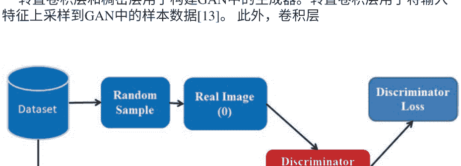

图1 生成对抗网络的简单架构

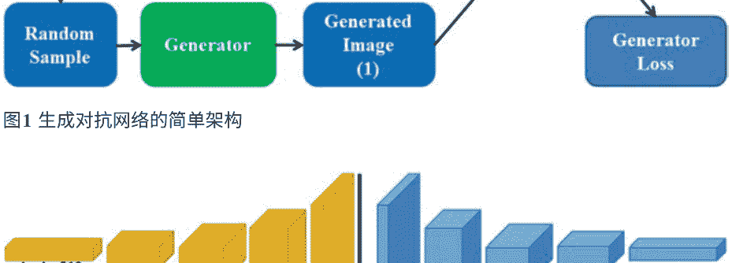

图2 深度卷积生成对抗网络的简单架构

鉴别器网络中使用最大池化层来对真实数据和伪造数据进行分类[14]。为了平衡图像数量并增加两个类别中样本的数量，本研究提出了DCGAN模型。随后的部分讨论了在PCam数据集上进行数据增强的DCGAN实现。

## 使用DCGAN对PatchCamelyon数据集进行数据增强

本节提出了一种自定义的DCGAN模型，用于在PatchCamelyon (PCam) 数据集上生成增强图像。自定义DCGAN模型中每层的层数和滤波器或核大小是针对PCam数据集进行优化的。在GPU环境下实现了使用DCGAN对PCam数据集进行数据增强的过程。PCam数据集的准备、DCGAN模型的开发和训练将在后续的子章节中讨论。

## PCam数据集准备

PatchCamelyon (PCam) 数据集包含327,680个扫描的淋巴结切片图像[15]。数据集中的每个图像都带有一个二进制标签，指示是否存在转移性组织。PCam数据集将用于训练用于检测淋巴结切片图像中转移性组织的机器学习或深度学习模型。图3显示了PCam数据集上的随机样本图像。

PCam数据集上的图像被调整为64×64像素，用于训练DCGAN模型。此外，数据以批量大小64进行拆分，以实现高效训练。所提出的工作的数据准备部分使用了TensorFlow keras包中的ImageDataGenerator进行开发。

## DCGAN模型设计和参数优化

所提出的DCGAN的设计和开发使用Python编程工具和TensorFlow keras库进行开发。最初，使用了一个卷积转置层来开发模型。所提出的DCGAN模型接收64×64像素大小的图像，并生成相同分辨率的图像。所提出的DCGAN模型使用了二元交叉熵损失技术。模型中的卷积层使用了2×2像素的步幅大小。在每个卷积转置函数完成后使用了零填充技术。在卷积层中使用了LeakyReLU激活函数。

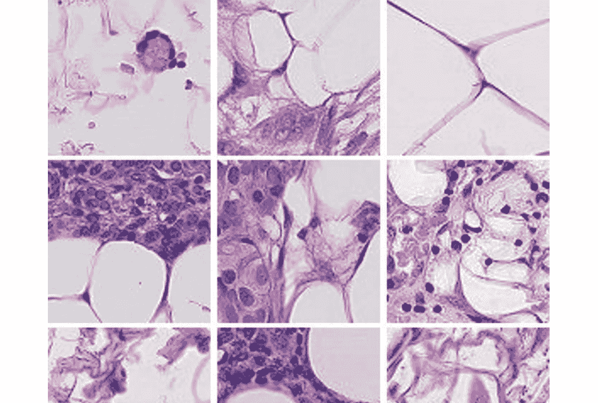

图3 PCam数据集上的随机样本图像

DCGAN网络的判别器。在DCGAN的判别器中使用了一个全连接或密集层，用于对真实和生成的假图像进行分类。

开发的初始模型在预处理的PCam数据集上进行了训练。初始的DCGAN模型在GPU环境下训练了100个训练周期。该模型在第100个训练周期上达到了1.376的训练损失。通过添加额外的卷积转置层和批归一化层扩展了初始模型。这两个卷积转置层网络在第100个训练周期上达到了1.079的训练损失，比初始模型更好。

之后，使用了三对卷积转置层和一个批归一化层来更新模型。在完成100个训练周期后，更新的模型获得了0.792的训练损失。

此外，在PCam数据增强的DCGAN模型中，卷积转置层的数量更新为四层。四个卷积转置层的DCGAN网络在训练损失上达到了0.627。但是，五个卷积转置层的DCGAN网络的训练损失比四个卷积转置层的DCGAN网络更小。五个卷积转置层的DCGAN网络在完成100个训练周期后，仅获得了0.861的训练损失。

卷积转置层扩展过程以四个卷积转置层的DCGAN网络结束，因为它在PCam数据集上的训练损失比其他DCGAN模型的变体要小得多。此外，使用随机搜索超参数优化技术调整了学习率、批量大小和优化器。随机选择的超参数被用来训练DCGAN模型达到100个周期。通过比较多个随机选择，优化技术确定了在PCam数据集上训练DCGAN的最合适的超参数组合。优化后的超参数值如表1所示。

表1 提出的DCGAN的优化超参数

| 超参数 | 优化值 |
|--------|--------|
| 批量大小 | 16     |
| 优化器 | Adam   |
| 学习率 | 0.001  |

图4展示了所提出的四个卷积转置层DCGAN网络的完整分层架构。所提出的PCam数据增强的DCGAN模型在GPU环境下训练了300个训练周期。所提出的DCGAN模型的训练过程将在后续章节中讨论。

## 在PCam数据集上训练DCGAN

所提出的DCGAN模型在PCam数据集上使用优化的超参数进行了300个训练周期的训练，以生成增强图像。该模型使用90%的数据进行训练，10%的数据进行验证过程。在训练过程中，每经过60个训练周期，可视化一次样本增强图像。此外，在每经过60个训练周期后，模型权重将被存储。在每经过60个训练周期后，生成九个随机图像进行可视化。

DCGAN模型在完成前60个训练周期后，达到了0.453的训练损失。在本研究中，使用Matplotlib包可视化每60个训练周期后的样本图像以及所提出的DCGAN模型的训练图。图5展示了DCGAN模型在训练60个训练周期后生成的样本增强图像。

在前60个训练周期之后生成的图像的视觉质量非常低。在这个阶段，鉴别器轻松检测到生成的假图像。在60个训练周期的阶段，鉴别器的训练损失为0.168。在120个训练周期之后，样本图像的视觉质量得到了改善。

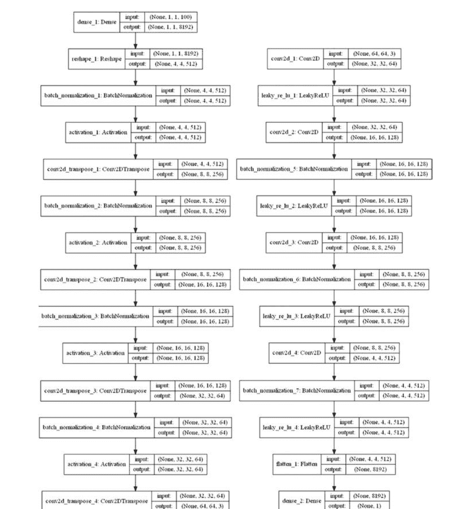

图4 所提出的DCGAN的分层结构

来自先前的样本。此外，DCGAN模型在第120个训练周期的训练损失为0.327，比先前的检查点时期更好。DCGAN模型的鉴别器在第120个训练周期产生了0.273的训练损失。生成器损失、鉴别器损失的积极变化

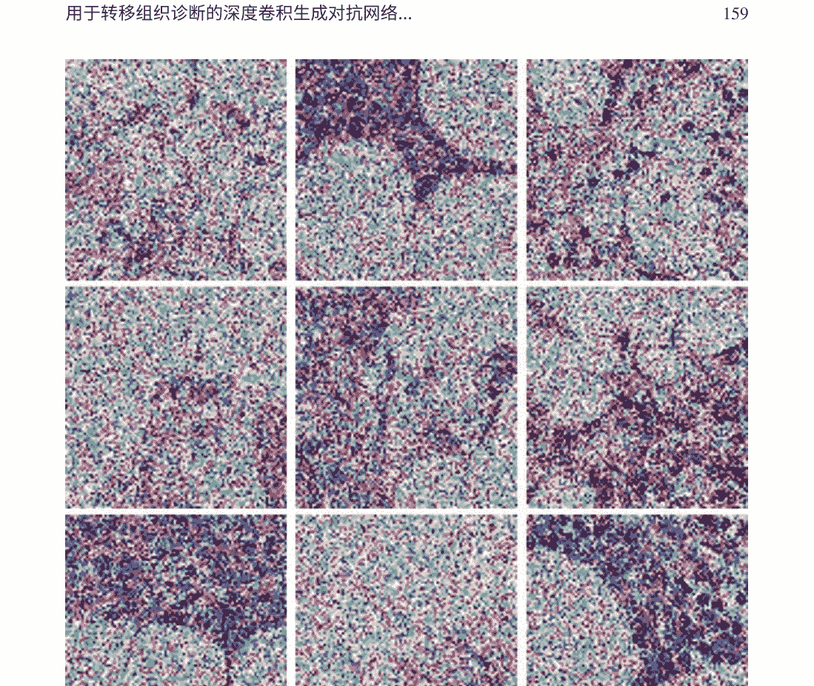

图5 60个训练周期后生成的样本图像

生成的图像质量以及生成器损失和鉴别器损失的积极变化使得我们有信心继续在PCam数据集上进行DCGAN网络的训练过程以进行图像增强。在完成120个训练周期后，保存了所提出模型的训练权重。在完成120个训练周期后生成的样本图像显示在图6中。

完成180个训练周期后生成的样本图像在图7中说明。此外，与之前的训练周期相比，图像质量得到了改善。在180个训练周期的阶段，生成器的训练损失为0.263。与之前的训练周期相比，模型的训练损失有所降低。

图8显示了完成240个训练周期后生成的样本图像，训练损失为0.218。

图9说明了在GPU环境下完成300个训练周期后生成的样本图像。

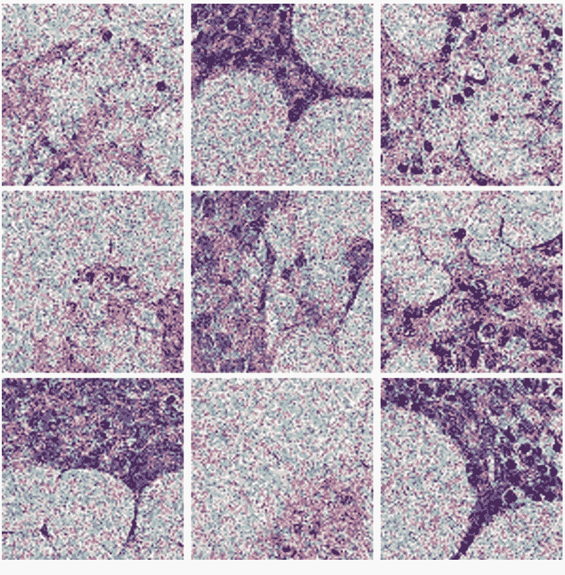

图6 120个训练周期后生成的样本图像

经过300个训练周期的模型实现了生成器训练损失为0.137。由于生成图像质量的改善，判别器的训练损失增加了。生成的样本图像显示了与之前阶段相比的图像可见性的改善。整个训练过程中的训练损失变化在图10中说明。训练模型的权重和架构被存储以供未来的开发和测试过程使用。训练模型生成了37,856个独特的增强图像。在后续章节中讨论了所提出的DCGAN模型的图像质量和性能。

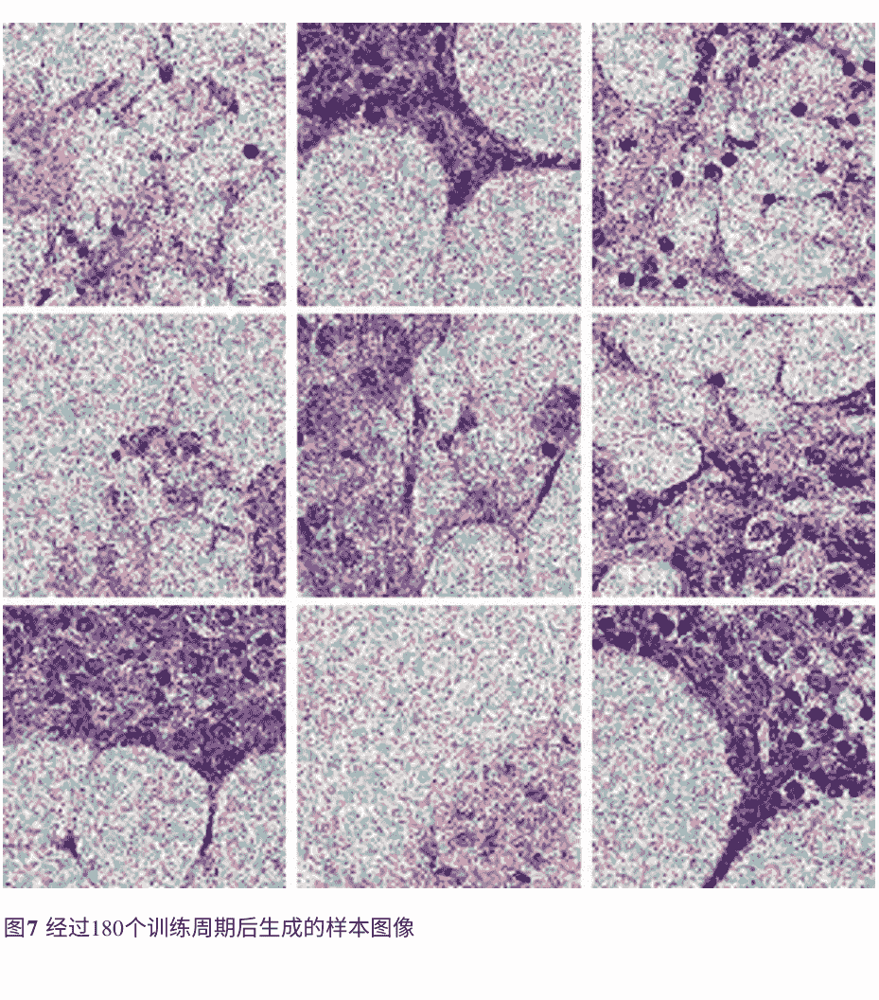

## 使用Frechet Inception Distance测试DCGAN性能

Frechet Inception Distance (FID)是一种广泛使用的用于GAN的性能测量技术。所提出的DCGAN的FID值与现有的最先进的GAN技术进行了比较。下图比较了所提出的DCGAN模型的FID值与现有技术（图11）。比较结果表明，所提出的DCGAN模型优于现有的GAN模型。后续部分讨论了使用所提出的DCGAN模型进行增强数据集的重要性。

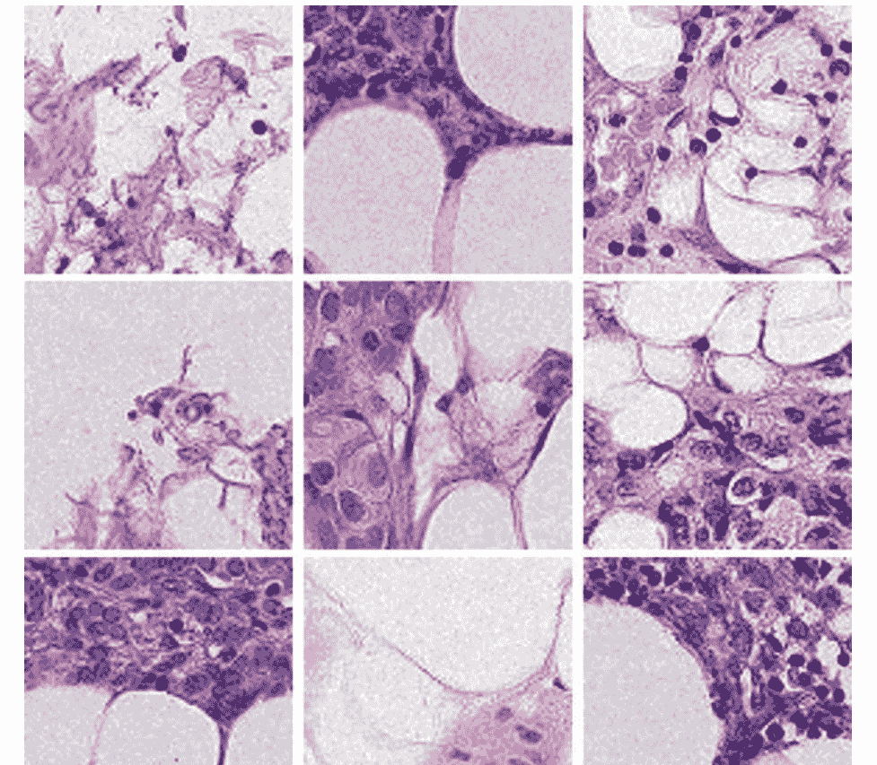

图8 经过240个训练周期后生成的样本图像

## 转移性组织检测分类模型的开发

使用增强数据集训练了标准预训练模型，如VGG19 Net和InceptionV3 Net。使用DCGAN模型检查了增强数据集的重要性。在GPU环境中进行了预训练模型的训练和测试。VGG19 Net的训练和验证性能如图12所示。

在完成300个训练周期后，模型的权重和架构被存储用于测试过程。此外，图13展示了InceptionV3网络的训练和验证进展。

此外，预训练模型是在原始数据集上进行训练的。大约有百分之十的数据用于测试预训练模型的性能。

在后续章节中，将比较使用原始和增强数据集的预训练模型的分类准确率。

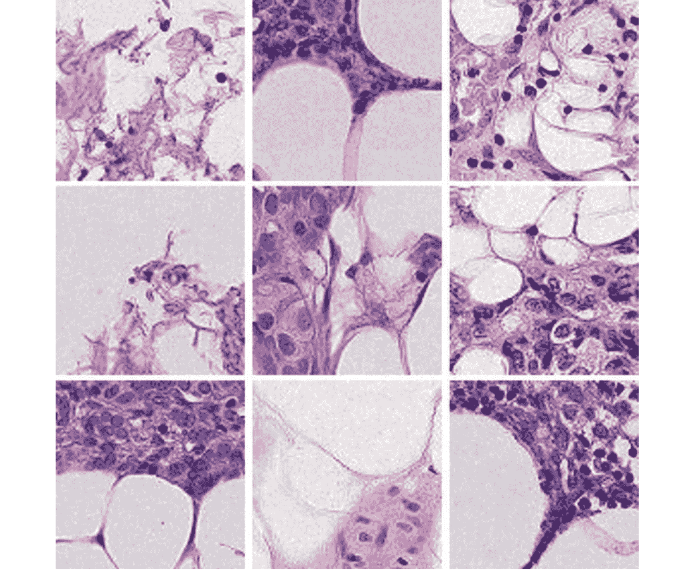

图9 在300个训练周期后生成的样本图像

## 结果和讨论

在本节中，将比较使用原始和增强数据集的预训练模型的分类准确率。并且使用GPU环境上的测试数据来测量模型的分类准确率。使用1500张图像来测试训练后的分类模型。图14比较了使用原始和增强数据的VGG19网络和InceptionV3网络的分类准确率。

使用增强数据集的VGG19网络模型达到了96.48%的分类准确率，而InceptionV3网络模型在测试数据上达到了99.26%的分类准确率。比较结果显示，使用增强数据集的分类模型比使用非增强数据集的模型具有更高的分类准确率。

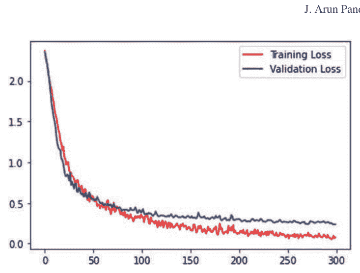

图10 所提出的DCGAN模型的训练损失

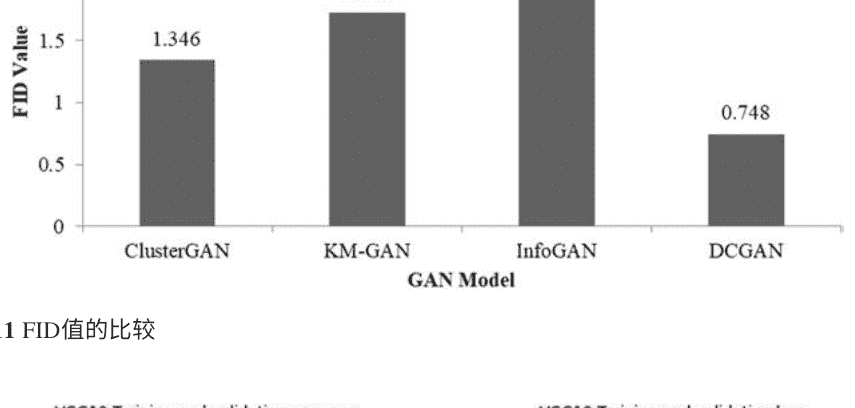

图11 FID值的比较

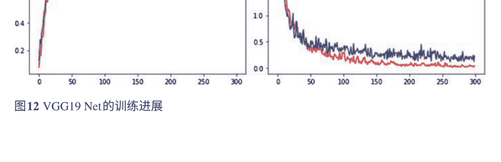

图12 VGG19 Net的训练进展

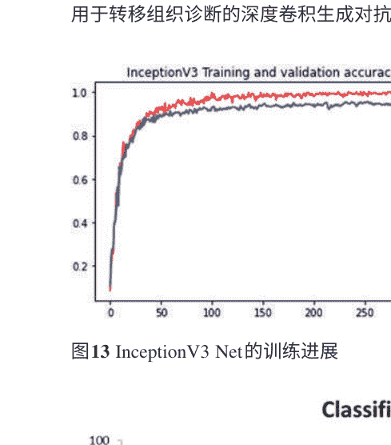

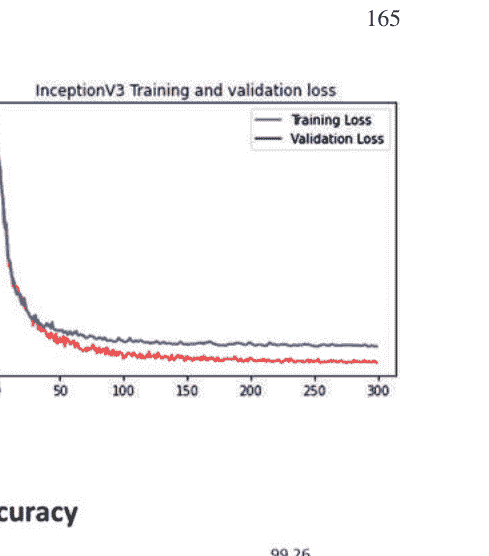

图13 InceptionV3 Net的训练进展

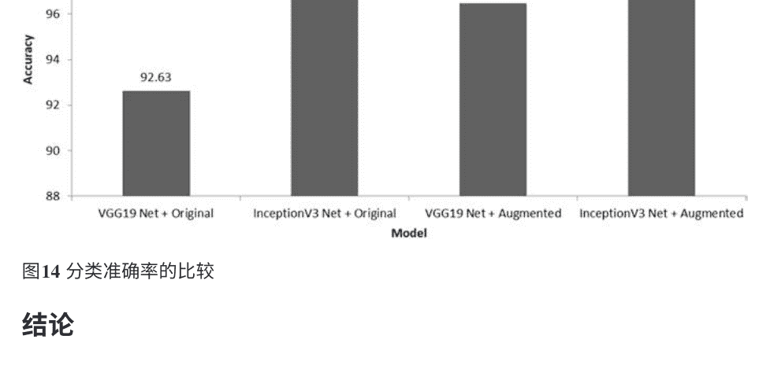

图14 分类准确率的比较

## 结论

数据增强是一种常用的方法，可以增加数据样本而无需收集新数据。数据增强技术可以克服深度学习应用中的数据不足问题。DCGAN是基于卷积神经网络的生成对抗网络；它可以从现有样本集中创建新的数据。本章提出了一种新颖的DCGAN，用于在PCam数据集上生成额外的样本，以提高淋巴结切片上检测转移组织的分类模型的性能。DCGAN模型中使用了四个卷积转置层。DCGAN模型的FID值为0.748。DCGAN的FID值优于其他标准GAN。此外，使用最先进的基于迁移学习的分类技术证明了增强数据集的重要性。基于增强数据集的分类模型表现优于基于原始数据集的模型。VGG19 Net和InceptionV3 Net产生了使用增强数据的分类准确率分别为97.73%和99.26%。将来的研究将考虑其他最新的数据增强技术，以提高转移性组织诊断模型的性能。

## 参考文献

- 1. Z. Zheng, L. Zheng, Y. Yang, GAN生成的无标签样本改善了体外人员再识别基线，在IEEE国际计算机视觉会议论文集(2017)中，第3774-3782页。 https://doi.org/10.1109/ICCV.2017.405
- 2. J. Yang, A. Kannan, D. Batra, D. Parikh, LR-GAN: 分层递归生成对抗网络用于图像生成，在第五届国际学习表示会议(ICLR 2017) - 会议论文集(2017)中。
- 3. W. Fang, F. Zhang, V.S. Sheng, Y. Ding, 使用DCGAN改善基于CNN的图像识别方法。 计算材料学报57，167-178页(2018)。 https://doi.org/10.32604/cmc.2018.02356
- 4. P.L. Suarez, A.D. Sappa, B.X. Vintimilla, 基于三元组的红外图像上色，基于DCGAN架构，IEEE计算机学会计算机视觉和模式识别会议论文集(2017)，pp. 212–217.https://doi.org/10.1109/CVPRW.2017.32
- 5. X. Liang, L. Chen, D. Nguyen, Z. Zhou, X. Gu, M. Yang, J. Wang, S. Jiang, 使用CycleGAN从锥束计算机断层扫描(CT)生成合成计算机断层扫描(CBCT)用于自适应放射治疗。 物理医学生物学。 64 (2019). https://doi.org/10.1088/1361-6560/ab22f9
- 6. J.Chang, S.Scherer, 使用深度卷积生成对抗网络学习情感语音的表示，在ICASSP，IEEE国际会议上，关于声学、语音和信号处理(2017)，pp. 2746–2750. https://doi.org/10.1109/ICASSP.2017.7952656
- 7. X.-L. Tang, Y.-M. Du, Y.-W. Liu, J.-X. Li, Y.-W. Ma, 使用条件深度卷积生成对抗网络进行图像识别。 自动化学报。 44, 855–864 (2018). https://doi.org/10.16383/j.aas.2018.c170470
- 8. K. Nazeri, E. Ng, M. Ebrahimi, 使用生成对抗网络进行图像上色, in 国际关节运动和可变物体会议(Springer, Cham, 2018). https://doi.org/10.1007/978-3-319-94544-6_9
- 9. F. Gao, Y. Yang, J. Wang, J. Sun, E. Yang, H. Zhou, 基于深度卷积生成对抗网络（DCGANs）的半监督方法用于合成孔径雷达（SAR）图像中的目标识别。 遥感。 10 (2018). https://doi.org/10.3390/rs10060846
- 10. G.Hu, H.Wu, Y.Zhang, M.Wan, 一种用于茶叶病害识别的低样本学习方法。 Comput. Electron. Agric. 163, 104852 (2019). https://doi.org/10.1016/j.compag.2019.104852
- 11. S. Lu, T. Sirojan, B.T. Phung, D. Zhang, E. Ambikairajah, DA-DCGAN: 光伏系统中直流串联电弧故障诊断的有效方法. IEEE Access 7, 45831–45840 (2019). https://doi.org/10.1109/ACCESS.2019.2909267
- 12. G. Hu, J. Huang, Q. Wang, J. Li, Z. Xu, X. Huang, 基于深度卷积生成对抗网络的无监督织物缺陷检测. Text. Res. J. 90, 247–270 (2020). https://doi.org/10.1177/0040517519862880
- 13. Y. Gao, B. Kong, K.M. Mosalam, 深叶引导生成对抗网络用于结构图像数据增强。 计算机土木基础设施工程 34, 755–773 (2019). https://doi.org/10.1111/mice.12458
- 14. H. Salehinejad, E. Colak, T. Dowdell, J. Barfett, S. Valaee, 用于训练深度卷积神经网络的合成胸部X射线病理学。 IEEE医学成像交易 38, 1197–1206(2019).https://doi.org/10.1109/TMI.2018.2881415
- 15. B.S. Veeling, J. Linmans, J. Winkens, T. Cohen, M. Welling, 旋转等变CNN用于数字病理学，在国际医学图像计算和计算机辅助干预会议(Springer, Cham, 2018).https://doi.org/10.1007/978-3-030-00934-2_24# 光子学设备在疫情期间的健康领域转型

Jyoti Ahlawat，Archana Chaudhary和Dinesh Bhatia

- J. Ahlawat
    SGT大学工程技术学院电子与通信工程系，印度哈里亚纳邦古尔加翁
- A. Chaudhary (✉)
    SGT大学理学院环境科学系，印度哈里亚纳邦古尔加翁
- D. Bhatia
    印度梅加拉亚邦Shillong的东北山大学生物医学工程系

## 介绍

光学技术几乎渗透到社会的各个方面，从显微镜到光通信。因此，不足为奇的是，所提出的概念在光学技术中得到了确认，并由光学专业人员创造出来，以解决全球大流行的问题。尽管在家工作的条件妨碍了研究和开发工作，并且供应链短缺妨碍了制造工作，但通过修改现有系统和发明新技术，从事光子学研究和公司已经显著改进了诊断和个人防护装备（PPE）。

许多政府在大流行背景下加快了对某些技术的批准或提供了紧急使用授权。作为回应，医疗界在几个月内获得了这些预防措施的使用权限。此外，为了更好地满足COVID-19标准，技术进行了重新配置或更改。

在中长期解决方案中，追踪和加速药物治疗的系统开发得到了强调。为了减少和管理COVID-19传播，需要结合软件和技术，可靠地追踪感染者（诊断）。虽然软件解决方案已经被开发出来，但由于COVID-19的病理生理学问题尚未解答，有效的诊断更难采用。因此，许多诊断方法，尤其是光诊断，被用于立即确定疾病的类型。

与此同时，科学家们正在努力开发治疗方法和疫苗。正在研究几种前瞻性的解决方案，但它们超出了本视角的范围，希望其中一种能够快速显示出效果。本观点将讨论光学在医疗保健中的功能，包括消毒和诊断技术。为两个主题提供了简要背景，然后更深入地审查了当代发明及其对社会的影响。最后，我们探讨了该领域的未来潜力和未解决的问题。

值得一提的是，疫苗和治疗的基本策略已经重新思考，可能缩短上市时间。

## 现有的医疗监测技术

自希波克拉底时代以来，疾病诊断在医学和医疗保健中一直很重要。在早期阶段，使用触诊和分析体征，如体温。随着技术的发展，医疗专业人员和研究人员开发出了更复杂的诊断技术，例如分析红细胞的颜色和形态。从细胞水平到分子水平，医学诊断在当前时代取得了进展，设备开发通常借助于集成传感器平台。随着外部和体外设备的出现，除了MRI、NMR和CT之外，现在还有其他成像方法。通过机械、电气和光子传输方法，集成诊断平台显示了通过分子和蛋白质信号识别疾病的可能性。在科学研究中，这三种类型的传感器都得到了广泛应用。个体癌细胞已经被称重。为了测试各种疗法的疗效，使用基于悬臂梁的机械传感器阵列。基于光子学的光学传感器被用于探索特定抗体结合相互作用，而使用基于纳米孔阵列的电气传感器进行了DNA分析和测序。另一方面，基于光学的技术在医疗环境中用于市场上大多数诊断系统，用于疾病诊断，因为它们简单易用，并且能够处理多种不同类型的样本。由于光子生物传感器提高了疾病诊断的精确性和准确性，光学检测器实现了疾病监测，而基于激光的药物和疗法提高了治疗效果并缩短了恢复时间。

许多当代技术已经迅速重新配置用于COVID-19，并且现在在临床环境中用于自我发展和自我疾病进展跟踪和诊断。

因此，在产生诊断结果之前，必须获取和测序RNA或DNA，或者确定导致反应的抗体。从诊断的角度来看，前者更直接地识别疾病。此外，是RNA还是DNA？存在的工具可以识别（尚未生病的）患者的活动循环感染。

与基于抗体的诊断相比，根据机体的免疫系统如何反应，意味着病毒的存在。因此，误报阳性的可能性更大，因为它是疾病的间接指标。这还需要对病原体的特定抗体有所了解。重要的是，使用基于抗体的方法只会指示正确的诊断。尽管免疫系统的反应，但尚未出现症状的疾病无法被检测到（图1）。

因此，在COVID-19的情况下，不出所料地开发了一种基于RNA的测试，并被广泛采用。鼻拭子的病毒RNA样本使用常规的DNA技术，包括逆转录酶链反应，转换为DNA。在标准的样品处理和处理技术（RT-PCR）后，DNA浓度被放大到使用RT-PCR的追踪水平（图2）。

> 图1 随着时间的推移，表明SARS-CoV-2感染的RNA和抗体水平可能会发生变化。
> Front. Immunol. 11, 879, Lee等人获得许可使用（2020年）。（作者，版权所有2020年，同意遵守开放源代码许可证Attribution 4.0 License的条件）

图2 在这种方法中，重要的是要记住RT-PCR和qPCR是两个独立的过程。通过将qPCR与RT-PCR结合起来，可以实现实时浓度测量。实时RT-PCR是这种技术的缩写（或称为RT-qPCR）

虽然RT-PCR可以提高样本浓度，但常用于检测的是一种基于荧光的感应技术，称为定量PCR（qPCR）。重要的是要记住，qPCR和RT-PCR结合了两个独立的过程。在这种技术中，RT-PCR和qPCR可以同时运行，从而实现实时浓度测量。简而言之，这种方法被称为实时RT-PCR（或RT-qPCR）。

用于COVID-19诊断的PCR技术比较。（a）两步PCR。首先，将RNA转化为DNA，然后使用qPCR测量DNA。这种方法可以改善两个反应，尽管比单步过程需要更长的时间。（b）一步完成的PCR。同时，在同一个瓶中同时进行qPCR和RT-PCR。尽管这种方法更快，但两个反应都不是最佳的。（c）图形说明了生成和分析的多种数据类型。

qPCR（和RT-qPCR）从光学技术的几个改进中获益匪浅，包括光源、探测器和新型荧光染料，特别关注荧光检测技术。LED灯与传统灯泡相比，体积更小，寿命更长，从而导致系统更小，维护和运营费用更低。高性能系统中的信号复用得益于宽光谱范围的可访问性、具有小线宽的光源和具有高灵敏度的探测器。当与机器人采样用于自主处理配对时，单个设备可以每小时分析数百个样本，误报率和漏报率低。

速率。尽管PCR所需的技术已经大大进步，但PCR只能检测到活动感染，因为病毒的RNA和DNA会立即被识别，而不是在患者康复之前发生的感染。

最大的抗体是IgM（图3），由五个单体组成的十个结合位点组成一个环。广泛的应用可以使用短线宽源和高灵敏度的探测器。它具有多反应性和低亲和力，因此可以迅速对未知的侵害做出反应。IgM的活性取决于其低亲和力；这使得它成为免疫系统中反应时间最快的抗体。在诊断的背景下，这个特性有可能产生很多随机阳性结果。

在这样做的同时，由于它们的寿命很短，这些IgM的快速产生使它们可以被用作活动或近期感染的信号。IgM在免疫系统中需要大约一周的时间发展，而在循环系统中只能持续约一周。

另一方面，IgG是一个具有两个灵活结合位点的二聚体（图3）。它以适度到高的亲和力接受侮辱，因为它是对特定冒犯的反应而创建的。尽管IgG抗体浓度需要几周时间才能上升和稳定，在几个月甚至几年内，IgG可能以稳定的浓度循环。因此，它们是先前暴露的优秀指标。

值得注意的是，IgG的浓度和亲和力与原始冒犯的严重程度和宿主的免疫反应相关联。由于这些变量都是未知的，COVID-19的观察浓度不能可靠地衡量接触后的时间。此外，IgG对于定制疫苗的长效免疫增强效果至关重要。

目前尚不清楚COVID-19 IgG的存在是否表示终身免疫。

### 表1 典型COVID-19诊断程序的描述

| 测试 | 机制 | 测试时间 | 抗体存在 | 抗体浓度 | 抗体的有效性 | 快速诊断测试 |
| :--- | :--- | :--- | :--- | :--- | :--- | :--- |
| 侧向流动测定 | 底物变色以指示抗体的存在 | 10-30分钟 | 是 | 否 | 否 | 是 |
| 中和测定测试 | 将患者样本和病毒与细胞混合以确定保护细胞的存在和功效 | 3-5天 | 是 | 否 | 是 | 否 |
| ELISA化学发光免疫测定 | 底物变色或发出一系列颜色以指示抗体的存在，运行稀释以获得浓度 | 2-5小时 | 是 | 是 | 否 | 否 |

大多数用于检测COVID-19抗体的光学传感器都专注于回收已使用的信号读取技术，包括微孔板扫描仪或荧光图像传感器，并构建简单的比色指示用于点对点设备。IgG和IgM的识别方法、数据处理和化学复杂性、结果持续时间以及可以提供的数据在这些程序之间都是不同的（表1）。所有这些影响误检率（或可靠性）的因素都证明了发现的精确性和准确性。由于存在许多不同的诊断程序，理解“抗体测试”与依赖于寻找抗体的广泛测试类别相关是至关重要的。

最常见的快速诊断试验（RDT）是广泛认可的抗体诊断程序之一，在几种抗体诊断试验中被广泛使用。图4描述了一个典型排列中的RDT。只需少量血液样本，用户只需关注两个检测条的颜色（以及控制条），就可以在10-30分钟内进行诊断。由于价格低廉、易于使用和快速响应时间，这些测试迅速流行起来。

RDTs是可以使用的信息来源之一，但在开发出更可靠和更好的亲和性抗体之前，不应仅根据测试结果做出医疗决策。

已经建立了一套基本的体征来识别和跟踪COVID-19的发展，其中包括血氧饱和度和体温等多种因素。

图4显示了代表RDT的图表。 (a) RDT有一个控制通道，两个诊断通道和一个诊断通道。 在共轭垫上，金属纳米颗粒附着在COVID-19抗原和控制抗体上。 在三个通道之后，物质在共轭垫中分散。 (b) 如果条带的颜色变化，表示存在抗体。

尽管这两种读数都可以暗示其他各种情况，但它们可以快速、经济高效地提供信息，而不需要昂贵的设备、血液测试或鼻拭子。 此外，一旦诊断出某种疾病，这些措施可以用于在家中追踪疾病的进展，从而减轻医疗系统的负担。

科学界长期以来广泛使用带有远程摄像头和红外（8-14米）探测器的热成像技术，尤其在气象和航空领域，但它们也被用于环境研究，以全球范围内追踪气候变化。 然而，这些探测器非常昂贵且体积庞大。 针对SARS，远程扫描方法依赖于几年前在机场和其他高交通地区创建的热成像摄像头，以便快速准确地检测乘客的体温。

然而，切换到手持设备需要大幅减小尺寸和成本，并增加自我参考能力。 直到最近才实现了这种精确的组合。 目前，远程温度测量在许多企业和政府的COVID-19监测项目中起着重要作用。 然而，内部温度并不总是一个很好的预测因素，因为有症状的携带者在没有显示疾病迹象的情况下也可以传播病毒。

脉搏血氧饱和度测量，有时也称为脉搏血氧，是一种测量血氧饱和度的技术，用于确定血红蛋白携带的氧气量。 这个指标是各种身体特征的预测因子，包括肺功能。 最精确的方法是血气测量，但也是最侵入性的，很少使用。 外周氧饱和度测量是标准的护理方法。 尽管已经开发出了用于跟踪传输和反射变化的技术，但由于其更高的准确性，传输测量更常用。 脱氧血红蛋白的光吸收率几乎为620-700纳米，比红细胞中的氧合血红蛋白低10倍。 然而，近红外值（800-940纳米）几乎相当。 因此，通过比较这两个信号，可以计算氧合血红蛋白的比例。

## 诊断技术的崛起

生物或化学传感器的创建用于诊断各种疾病是集成光子学的一个重要领域。

与先前的方法不同，这些发展中的技术利用光与物质之间的直接相互作用用来进行检测，并可以与微流控技术结合，以高通量地传递和分析样本。

鉴于COVID-19大流行初期的诊断测试短缺，多重或更大的能力非常关键。

测量光透射率和折射率的变化以及检测光散射是检测和识别临床样本中特定化学物质的两种广泛使用的方法。

此外，基于硅基光子环、传输线和等离子纳米技术的Biacore智能传感技术正在不断发展，以提供更理想的快速筛查和诊断分析特性。这些的一个流行的例子是等离子共振共振（SPR）生物传感器。由于光学元件集成和纳米制造技术的进步，这些平台现在更加便携。这些传感器依赖于一个基本简单的概念，即亚波长场感应折射率变化。

它们还被用作埃博拉和疟疾病毒检测的便携式诊断工具的基石。由于它们已被证明具有可行性和出色的多功能性，光子生物传感技术是一种理想的尖端COVID-19诊断选择。

COVID-19大流行之后，研究人员开始研究光子生物传感器，以发现SARS-CoV-2的遗传物质。

在基于金纳米岛的传感图5a中，等离子体光热效应和局部SPR传感被结合在一起，改善了碱基配对的选择杂交，同时最小化了与相关靶标的结合而无需区分。根据邱等人的研究，整个病毒RNA链的检测限度约为104拷贝/毫升，在皮摩尔（pM）范围内的检测范围内。考虑到感染率，生物传感器的灵敏度理论上应该适合直接测试临床标本，而无需PCR，因为COVID-19阳性患者的咽喉/鼻拭子中的平均拷贝数约为105和106拷贝/毫升。

一个最终目标是直接识别活病毒颗粒。通过在感应表面上装备特定的传感器（如抗体），针对病毒膜的外部蛋白质，可以收集整个病毒实体，这些实体通过体液移动，无需提取和/或碎片化RNA。

图5（a）COVID-19 RNA检测的多功能纳米结构生物传感示意图。（转载自Qiu等人，ACS Nano 14, 5268，获得许可（2020）。美国化学学会是该组成物的所有者）。（b）用于检测完整SARS-CoV-2病毒的纳米光子双模波导干涉仪的视觉描述

## 消毒技术

尽管当前危机作为催化剂，但全球对新的消毒技术有着迫切需求。从历史上看，医疗环境一直是抗生素耐药细菌感染的主要来源。然而，在2019年发生了重大变化。由于医疗界为增强消毒和灭菌而做出的英勇努力，医疗环境中感染的频率已经下降。

然而，由于社区传播，总体数量仍在上升。此外，许多消毒技术假定易于获得化学物质并产生大量废物。

必须开发和评估替代方法，以增加资源有限地区的清洁程序的可用性，减少对环境的影响，并提高使用效果。

开发消毒程序的初始阶段是评估生物污染物的主要组成部分。冠状病毒的基本组成部分依次为其包膜蛋白、RNA和刺突糖蛋白，它们负责稳定性、复制和细胞靶向能力。

如果这些组件中的任何一个被消除，病毒将被灭活。因此，大多数消毒处理都是针对这些组件中的一个或多个进行定制的。热、化学和辐射方法是三个广泛的类别（图6）。热方法主要基于热剂量，仅对包膜蛋白通过刺突糖蛋白（热和持续时间）产生影响。热消毒方法可以使用简单的明火或沸水，它们可能是最早被开发的方法。另一方面，干热和湿热都可以在受控系统中使用，这取决于烤箱或其他大型设备。它们特别适用于亚麻布，因为它们可以均匀处理样品，但也可以用于包括手术设备在内的各种商品。

通过使用氯和过氧化氢等化学剂，可以化学地靶向刺突糖蛋白和包膜蛋白。

化学蒸汽处理和手部消毒剂都已经被创建出来。在表面或固体物体上，最好的消毒技术是基于擦拭的化学方法，因为它们快速去除，都是单层，并且有更多的污染物。

另一方面，化学方法只能破坏直接接触的病毒，这是它们的局限性。混合系统将两者结合起来

图6如果消除了其中任何一个组成部分，病毒将被灭活。因此，大多数消毒处理都是针对其中一个或多个组成部分进行定制的。热、化学和辐射是三个广泛的类别

热和化学过程被广泛用于增加具有复杂拓扑结构的材料的效果，如亚麻布。

臭氧 (O₃) 消毒与化学消毒不同，因为它具有独特的机制。作为一种强氧化剂，臭氧可以消除所有RNA的核苷酸碱基、糖蛋白、包膜蛋白和其他蛋白质。臭氧在多孔或固体表面上的应用是可能的，因为它是一种气体。此外，这种方法特别理想，因为它不需要高温。然而，臭氧非常活泼，会迅速转化为氧气 (O₂) 。因此，使用它非常困难。

利用辐射进行消毒的系统是消毒技术的最新进展。这类系统包括红外线、紫外线-C和微波系统。基于红外线和微波的设备通常以一种情况性的方式工作。水被射频辐射或微波激发，加热并热分解刺突糖蛋白。因此，它是一种使用微波辐射的湿热消毒形式。类似的推理适用于信息检索系统，可以被归类为干式或湿式蒸汽涡轮，因为热源包括红外线源。相反，基于紫外线-C的系统运作方式完全不同。

关于紫外线-C，COVID-19已经证明在消毒个人防护装备方面特别有效，包括口罩、面罩和眼镜，这些装备保护医护人员免受空气传播的病原体侵害。

这种能力有助于满足对个人防护装备的巨大需求激增，这对医护工作者的安全构成了威胁。在最初的COVID-19危机中，各国政府试图放宽进口限制，以减轻个人防护装备交付网络的影响，但许多国家的医护人员仍被迫回收大量个人防护装备。尽管许多国家已经过了COVID-19的高峰期，但预计疫情将持续，直到疫苗广泛可得。因此，目前需要开发能够在紧急情况下安全重复使用个人防护装备的方法。这意味着假设性的个人防护装备短缺实际上会发生。一种清洁个人防护装备的技术是紫外线-C。

然而，由于紫外线-C对人类和病毒都具有灾难性的健康影响，包括不可逆的失明，DNA和RNA都会被普遍的损伤过程摧毁。与化学程序相比，热和辐射技术在需要非常少的消耗品方面具有重大优势。

这种区别有多个值得注意的原因。首先，与化学程序相比，产生的垃圾量和对环境的影响都减少了。此外，对供应链和生产的依赖也减少了。

目前，有三种基本的个人防护装备消毒策略正在研究中：传统的生物安全柜正在重新配置，只有一个紫外线-C光源的覆盖式可携带箱正在制作，以及在中间具有强大紫外线-C光源的广阔空间正在建造。与第三种方法相比，前两种方法只能进行消毒，但可以同时消毒数百个N95口罩，而其他两种方法一次只能消毒几个到几十个N95口罩或面部防护。另一方面，第三种方法需要更昂贵的基础设施。

由于材料在N95口罩的过滤性能中起着重要作用，因此对其降解过程的紫外线-C剂量阈值进行了彻底研究。一项研究观察了用生物安全柜作为紫外线-C源的消毒伤口所需的紫外线-C辐射与口罩结构稳定性之间的比值。结果显示，N95口罩的过滤效果在经过20个循环后（从95%降至93%）对消毒柜没有影响。在4.5 J/cm2以下的剂量下，N95口罩不会受到物理损害，尽管这个值存在很大的变化，在某些情况下，高达120 J/cm2的剂量可能是安全的。

该图表为各种个人防护装备提供了“损伤阈值”标准。在消毒过程中，口罩周围的环境可能会对其造成损害。由于湿度加快了消毒过程，热处理通常在潮湿的环境中进行。湿度会使口罩的过滤效果在十个循环中降低到80%，产生相反的效果。

显然，与紫外线消毒柜或95%过滤的干烤箱相比，环境是一个重要的考虑和控制因素。

消毒表面所需的最低剂量设定下限限制。相反，损伤阈值对总剂量设定上限。在一项研究中，30分钟（30.6 J/cm2）的17 mW/cm2照射是有益的。根据这项研究，只有在佩戴N95口罩时才使用基于紫外线的消毒方法，并且有着当前的科学基础。

## 未来展望和结论

光学技术直接有助于COVID-19的预防和诊断。光子技术的普及性在这方面得到了体现。这里涵盖的许多技术目前在社会和医疗设施中使用，尽管有些技术还处于早期阶段，但尚未实现。涉及光子学、机器人和人工智能的高通量诊断以及使用这些技术的自动化消毒都将得到显著扩展（AI）。智能革命正在机器人学和人工智能领域同时发生，就像自动化机器人的示例一样，这是协同发展的结果。

如果将这些先进的自动化系统与基于光子的诊断或消毒技术相结合，我们的清洁和诊断方法可能会发生改变。

环境应用，如空气和水净化，是UV-C消毒的早期应用之一，而这个领域仍然是最大的应用领域。这些装置中的大多数通常采用过滤技术，应与污染物分解和去除相结合，以阻止空气中霉菌或其他呼吸问题颗粒的传播。由于COVID-19通过空气传播，将UV-C用于通风设备是降低封闭空间传播的一种方法。

对于这种用途，UV-C特别具有吸引力，因为它能够在不需要直接人类参与的情况下进行消毒。长期高效运行必须考虑到所需的总剂量、运营费用以及补充UV-C源的能力等挑战。

对于这种系统，最佳的光源应该是高功率紫外LED，因为它具有低运营成本、稳定的发射强度和长寿命。另一方面，高功率紫外LED的初始成本比汞灯要高得多。因此，光子学生产的发展将显著影响该应用中的决策制定。最后，这种方法无法阻止人与人之间的直接传播。

在这种情况下，通过通风系统传播病原体的可能性不太确定。

在相关应用中，清洁我们直接接触的表面是一项劳动密集型工作。在拥挤的公共场所保持清洁是相当困难的。

交通运输、洗手间和体育场馆等高接触场所的传播风险非常大。因此，在这些高接触场所的传播风险非常显著。具有独立工作能力的自主机器人可以通过定期消毒来减少传播风险。

由于许多季节性流感病毒通过表面传播，这种能力将改善未来的医疗保健，并减少在当前COVID-19大流行期间的感染。尽管现代技术对社会有帮助，但也存在一些缺点。

识别和解决伦理和安全问题同样重要。为了防止它们接触到紫外线-C源，例如，一个与人和其他狗自主交互的机器人系统必须具备安全功能，并且还在讨论机器人和人工智能所占据的困难伦理环境。

在COVID-19大流行期间，诊断变得非常具有挑战性，它依赖于生物技术和传感技术。此外，可以研究许多不同类型的样本。大多数现代抗体检测使用血液，但以前鼻拭子是最常见的采样点。由于这种变化，根据测试，创建了许多机器人样本处理系统，使用更少的样本数量和化学试剂。机器人系统的加速样本处理大大提高了吞吐量。然而，这些机器人设备中的很大一部分依赖于微生物病原体和专有聚合物。由于供应商限制，诊断实验室被迫通过几个设施创建自己的供应链。在设计新的诊断时，对外部供应商的依赖，特别是对于重要试剂，始终是需要考虑的事情。

抗体测试可能产生假阳性和假阴性，正如之前提到的。因此，为了提高准确性，关键是不仅仅看一个测试结果。相反，要结合患者的其他症状来考虑结果。此外，诊断测试的结果时间，即诊断测试提供响应的速度，对于传播风险较高的情况至关重要。虽然光学传感器可以提供快速响应，但需要额外的信息来解释这些结果。

通过将这些结果与由机器学习驱动并设计用于解释结果的人工智能相结合，医生将拥有他们需要做出更快、更准确的治疗决策的资源。这样的技术可能会改变我们对患者护理的方法，同时推进当前的COVID-19治疗计划。

另一方面，为了使机器学习系统有效，它们还需要丰富的学习库和对疾病病理生理学的更深入理解。

由于COVID-19是如此新颖，获取这些重要数据可能具有挑战性。

## 参考文献

1.  J. de Anda, E.Y. Lee, C.K. Lee, R.R. Bennett, X. Ji, S. Soltani, M.C. Harrison, A.E. Baker, Y. Luo, T. Chou, G.A. O’Toole, A.M. Armani, R. Golestanian, G.C.L. Wong, ACS Nano 11, 9340 (2017). https://doi.org/10.1021/acsnano.7b04738
2.  F. Wang, H. Wan, Z. Ma, Y. Zhong, Q. Sun, Y. Tian, L. Qu, H. Du, M. Zhang, L. Li, H. Ma, J. Luo, Y. Liang, W.J. Li, G. Hong, L. Liu, H. Dai, Nat. Methods 16, 545 (2019). https://doi.org/10.1038/s41592-019-0398-7
3.  W. Zipfel, R. Williams, W. Webb, Nat. Biotechnol 1, 1368 (2003). https://doi.org/10.1038/nbt899
4.  D.M. Lukin, C. Dory, M.A. Guidry, K.Y. Yang, S.D. Mishra, R. Trivedi, M. Radulaski, S. Sun, D. Vercruysse, G.H. Ahn, J. Vučković, Nat. Photonics 14, 330 (2020). https://doi.org/10.1038/s41566-019-0556-6
5.  A. Kovach, D. Chen, J. He, H. Choi, A.H. Dogan, M. Ghasemkhani, H. Taheri, A.M. Armani, Adv. Opt. Photonics 12, 135 (2020). https://doi.org/10.1364/aop.376924
6.  A.N. Willner, P. Liao, K. Zou, Y. Cao, A. Kordts, M. Karpov, M.H.P. Pfeiffer, A. Almaiman, A. Fallahpour, F. Alishahi, K. Manukyan, M. Tur, T.J. Kippenberg, A.E. Willner, Opt. Lett. 43, 5563 (2018). https://doi.org/10.1364/ol.43.005563
7.  R. Verity, L.C. Okell, I. Dorigatti, P. Winskill, C. Whittaker, N. Imai, G. Cuomo-Dannenburg, H. Thompson, P.G.T. Walker, H. Fu, A. Dighe, J.T. Griffin, M. Baguelin, S. Bhatia, A. Boonyasiri, A. Cori, Z. Cucunubá, R. FitzJohn, K. Gaythorpe, W. Green, A. Hamlet, W. Hinsley, D. Laydon, G. Nedjati-Gilani, S. Riley, S. van Elsland, E. Volz, H. Wang, Y. Wang, X. Xi, C.A. Donnelly, A.C. Ghani, N.M. Ferguson, Lancet Infect. Dis. 20, 669 (2020). https://doi.org/10.1016/s1473-3099(20)30243-7
8.  M. Satyanarayana, Chem. Eng. News (2020). https://cen.acs.org/analytical-chemistry/diagnostics/Shortage-RNA-extraction-kits-hampers98/web/2020/03
9.  Y.J. Kim, H. Sung, C.-S. Ki, M. Hur, Ann. Lab. Med. 40, 349 (2020). https://doi.org/10.3343/alm.2020.40.5.349
10. A.S. Fauci, H.C. Lane, R.R. Redfield, N. Engl. J. Med 382, 1268 (2020). https://doi.org/10.1056/nejme2002387
11. C. del Rio, P.N. Malani, J. Am. Med. Assoc. 323, 1339 (2020). https://doi.org/10.1001/jama.2020.3072
12. D. Cereda, M. Tirani, F. Rovida, V. Demicheli, M. Ajelli, P. Poletti, F. Trentini, G. Guzzetta, V. Marziano, A. Barone, M. Magoni, S. Deandrea, G. Diurno, M. Lombardo, M. Faccini, A. Pan, R. Bruno, E. Pariani, G. Grasselli, A. Piatti, M. Gramegna, F. Baldanti, A. Melegaro, S. Merler, arXiv:2003.09320 [q-Bio] (2020)
13. A.M. Armani, D.E. Hurt, D. Hwang, M.C. McCarthy, A. Scholtz, Nat. Rev. Mater. 5, 403 (2020). https://doi.org/10.1038/s41578-020-0205-1
14. I. Santiago, ChemBioChem (2020年在线发表). https://doi.org/10.1002/cbic.202000250
15. L. Liao, W. Xiao, M. Zhao, X. Yu, H. Wang, Q. Wang, S. Chu, Y. Cui, ACS Nano 14, 6348 (2020). https://doi.org/10.1021/acsnano.0c03597
16. K. J. Card, D. Crozier, A. Dhawan, M. Dinh, E. Dolson, N. Farrokhian, V. Gopalakrishnan, E. Ho, E. S. King, N. Krishnan, G. Kuzmin, J. Maltas, J. Pelesko, J. A. Scarborough, J. G. Scott, G. Sedor, D. T. Weaver, medRxiv:2020.03.25.20043489 (2020)
17. R.C. She, D. Chen, P. Pak, D.K. Armani, A. Schubert, A.M. Armani, Biomed. Opt. Express 11, 4326 (2020). https://doi.org/10.1364/boe.395659
18. L. Zou, F. Ruan, M. Huang, L. Liang, H. Huang, Z. Hong, J. Yu, M. Kang, Y. Song, J. Xia, Q. Guo, T. Song, J. He, H.-L. Yen, M. Peiris, J. Wu, N. Engl. J. Med. 382, 1177 (2020). https://doi.org/10.1056/nejmc2001737
19. C.Y.-P. Lee, R.T.P. Lin, L. Renia, L.F.P. Ng, Front. Immunol. 11, 879 (2020). https://doi.org/10.3389/fimmu.2020.00879
20. C. Wang, W. Li, D. Drabek, N.M.A. Okba, R. van Haperen, A.D.M.E. Osterhaus, F.J.M. van Kuppeveld, B.L. Haagmans, F. Grosveld, B.-J. Bosch, Nat. Commun. 11, 2251 (2020). https://doi.org/10.1038/s41467-020-16256-y
21. Q.-X. Long, B.-Z. Liu, H.-J. Deng, G.-C. Wu, K. Deng, Y.-K. Chen, P. Liao, J.-F. Qiu, Y. Lin, X.-F. Cai, D.-Q. Wang, Y. Hu, J.-H. Ren, N. Tang, Y.-Y. Xu, L.-H. Yu, Z. Mo, F. Gong, X.-L. 张, W.-G. 田, L. 胡, X.-X. 张, J.-L. 向, H.-X. 杜, H.-W. 刘, C.-H. 朗, X.-H. 罗, S.-B. 吴, X.-P. 崔, Z. 周, M.-M. 朱, J. 王, C.-J. 薛, X.-F. 李, L. 王, Z.-J. 李, K. 王, C.-C. 牛, Q.-J. 杨, X.-J. 唐, Y. 张, X.-M. 刘, J.-J. 李, D.-C. 张, F. 张, P. 刘, J. 元, Q. 李, J.-L. 胡, J. 陈, A.-L. 黄, Nat. Med 26, 845 (2020). https://doi.org/10.1038/s41591-020-0897-1
22. C. 刘, Q. 周, Y. 李, L.V. 加纳, S.P. 沃特金斯, L.J. 卡特, J. 斯穆特, A.C. 格雷格, A.D. 丹尼尔斯, S. 杰维, D. 阿拜拜乌, ACS Cent. Sci. 6, 315 (2020). https://doi.org/10.1021/acscentsci.0c00272
23. G. 利皮, M. 普莱巴尼, Clin. Chem. Lab. Med. 58, 1063 (2020). https://doi.org/10.1515/cclm-2020-0240
24. S. 江, C. 希利尔, L. 杜, Trends Immunol. 41, 355 (2020). https://doi.org/10.1016/j.it.2020.03.007
25. J. 阿利约塔斯-雷格, E. 埃斯特特-瓦尔瓦尔德, C. 贝利兹纳, A. 塞尔瓦-奥卡拉汉, J. 帕多斯-盖亚, A. 昆塔纳, A. 梅基尼安, A. 安南西昂-吕内尔, F. 米罗-穆尔, Autoimmun. Rev. 19, 102569 (2020). https://doi.org/10.1016/j.autrev.2020.102569
26. S.F. Ahmed, A.A. Quadeer, M.R. McKay, 病毒 12, 254 (2020). https://doi.org/10.3390/v12030254
27. B.E. Young, S.W.X. Ong, S. Kalimuddin, J.G. Low, S.Y. Tan, J. Loh, O.-T. Ng, K. Marimuthu, L.W. Ang, T.M. Mak, S.K. Lau, D.E. Anderson, K.S. Chan, T.Y. Tan, T.Y. Ng, L. Cui, Z. Said, L. Kurupatham, M.I.-C. Chen, M. Chan, S. Vasoo, L.-F. Wang, B.H. Tan, R.T.P. Lin, V.J.M. Lee, Y.-S. Leo, D.C. Lye, 新加坡2019年新型冠状病毒疫情研究团队, J. Am. Med. Assoc. 323, 1488 (2020). https://doi.org/10.1001/jama.2020.3204
28. X. Tang, C. Wu, X. Li, Y. Song, X. Yao, X. Wu, Y. Duan, H. Zhang, Y. Wang, Z. Qian, J. Cui, J. Lu, Natl. Sci. Rev. 7, 1012 (2020). https://doi.org/10.1093/nsr/nwaa036
29. S. Sun, X. Cai, H. Wang, G. He, Y. Lin, B. Lu, C. Chen, Y. Pan, X. Hu, Clin. Chim. Acta 507, 174 (2020). https://doi.org/10.1016/j.cca.2020.04.024
30. J. Shang, Y. Wan, C. Luo, G. Ye, Q. Geng, A. Auerbach, F. Li, Proc. Natl. Acad. Sci. U. S. A. 117, 11727 (2020). https://doi.org/10.1073/pnas.2003138117
31. G. Li, E. De Clercq, Nat. Rev. Drug Discov. 19, 149 (2020). https://doi.org/10.1038/d41573-020-00016-0
32. T.T.-Y. Lam, N. Jia, Y.-W. Zhang, M.H.-H. Shum, J.-F. Jiang, H.-C. Zhu, Y.-G. Tong, Y.-X. Shi, X.-B. Ni, Y.-S. Liao, W.-J. Li, B.-G. Jiang, W. Wei, T.-T. Yuan, K. Zheng, X.-M. Cui, J. Li, G.-Q. Pei, X. Qiang, W.Y.-M. Cheung, L.-F. Li, F.-F. Sun, S. Qin, J.-C. Huang, G.M. Leung, E.C. Holmes, Y.-L. Hu, Y. Guan, W.-C. Cao, Nature 583, 282 (2020). https://doi.org/10.1038/s41586-020-2169-0
33. O. Altay, E. Mohammadi, S. Lam, H. Turkez, J. Boren, J. Nielsen, M. Uhlen, A. Mardinoglu, iScience 23, 101303 (2020). https://doi.org/10.1016/j.isci.2020.101303
34. S.E. McBirney, D. Chen, A. Scholtz, H. Ameri, A.M. Armani, ACS Sens. 3, 1264 (2018). https://doi.org/10.1021/acssensors.8b00269
35. S. Frustaci, F. Vollmer, Curr. Opin. Chem. Biol. 51, 66 (2019). https://doi.org/10.1016/j.cbpa.2019.05.003
36. A. Raj, A.K. Sen, in *Environmental, Chemical and Medical Sensors*, ed. by S. Bhattacharya, A.K. Agarwal, N. Chanda, A. Pandey, A.K. Sen (Springer, 2018), pp. 389–408
37. S. Mehrabani, A. Maker, A. Armani, Sensors 14, 5890 (2014). https://doi.org/10.3390/s140405890
38. D. Duval, A.B. González-Guerrero, S. Dante, J. Osmond, R. Monge, L.J. Fernández, K.E. Zinoviev, C. Domínguez, L.M. Lechuga, Lab Chip 12, 1987 (2012). https://doi.org/10.1039/c2lc40054e

> K.K.-W. To, O.T.-Y. Tsang, W.-S. Leung, A.R. Tam, T.-C. Wu, D.C. Lung, C.C.-Y. Yip, J.-P. Cai, J.M.-C. Chan, T.S.-H. Chik, D.P.-L. Lau, C.Y.-C. Choi, L.-L. Chen, W.-M. Chan, K.-H. Chan, J.D. Ip, A.C.-K. Ng, R.W.-S. Poon, C.-T. Luo, V.C.-C. Cheng, J.F.-W. Chan, I.F.-N. Hung, Z. Chen, H. Chen, K.-Y. Yuen, Lancet Infect. Dis. 20, 565 (2020). https://doi.org/10.1016/s1473-3099(20)30196-
>
> Y.-F. Chang, W.-H. Wang, Y.-W. Hong, R.-Y. Yuan, K.-H. Chen, Y.-W. Huang, P.-L. Lu, Y.-H. Chen, Y.-M.A. Chen, L.-C. Su, S.-F. Wang, Anal. Chem. 90, 1861 (2018). https://doi.org/10.1021/acs.analchem.7b03934
>
> B. Koo, C.E. Jin, T.Y. Lee, J.H. Lee, M.K. Park, H. Sung, S.Y. Park, H.J. Lee, S.M. Kim, J.Y. Kim, S.-H. Kim, Y. Shin, Biosens. Bioelectron. 90, 187 (2017). https://doi.org/10.1016/j.bios.2016.11.051
>
> H.D. VanGuiler, K.E. Vrana, W.M. Freeman, 生物技术学报 44, 619 (2008). https://doi.org/10.2144/000112776
>
> T. Nolan, R.E. Hands, S.A. Bustin, Nature Protocols 1, 1559 (2006). https://doi.org/10.1038/nprot.2006.236
>
> Z. Li, Y. Yi, X. Luo, N. Xiong, Y. Liu, S. Li, R. Sun, Y. Wang, B. Hu, W. Chen, Y. Zhang, J. Wang, B. Huang, Y. Lin, J. Yang, W. Cai, X. Wang, J. Cheng, Z. Chen, K. Sun, W. Pan, Z. Zhan, L. Chen, F. Ye, J. Med. Virol. 92(9), 1518 (2020). https://doi.org/10.1002/jmv.25727
>
> H. Zhang, B.L. Miller, Biosensors and Bioelectronics 141, 111476 (2019). https://doi.org/10.1016/j.bios.2019.111476
>
> H.K. Hunt, A.M. Armani, IEEE J. Sel. Top. Quantum Electron. 20, 121 (2014). https://doi.org/10.1109/jstqe.2013.2272916
>
> A.L. Washburn, L.C. Gunn, R.C. Bailey, Anal. Chem. 81, 9499 (2009). https://doi.org/10.1021/ac902006p
>
> M. Shen, Y. Zhou, J. Ye, A.A. Abdullah AL-maskri, Y. Kang, S. Zeng, S. Cai, J. Pharm. Anal. 10, 97 (2020). https://doi.org/10.1016/j.jpha.2020.02.010
>
> H.K. Hunt, A.M. Armani, Nanoscale 2, 1544 (2010). https://doi.org/10.1039/c0nr00201a
>
> R. Weissleder, H. Lee, J. Ko, M.J. Pittet, Sci. Transl. Med. 12, eabc1931 (2020). https://doi.org/10.1126/scitranslmed.abc1931
>
> S.K. Vashist, Diagnostics 10, 202 (2020). https://doi.org/10.3390/diagnostics10040202
>
> D. Ferrari, A. Motta, M. Strollo, G. Banfi, M. Locatelli, Clin. Chem. Lab. Med. 58, 1095 (2020). https://doi.org/10.1515/cclm-2020-0398
>
> L.J. Carter, L.V. Garner, J.W. Smoot, Y. Li, Q. Zhou, C.J. Sveson, J.M. Sasso, A.C. Gregg, D.J. Soares, T.R. Beskid, S.R. Jervey, C. Liu, ACS Cent. Sci. 6, 591 (2020). https://doi.org/10.1021/acscentsci.0c00501
>
> S.K. Yong, P.C. Su, Y.S. Yang, 生物技术学报 15, 2000152 (2020). https://doi.org/10.1002/biot.202000152
>
> T. Ishige, S. Murata, T. Taniguchi, A. Miyabe, K. Kitamura, K. Kawasaki, M. Nishimura, H. Igari, K. Matsushita, Clinical Chemistry and Laboratory Medicine (CCLM) 58, 139 (2020). https://doi.org/10.1016/j.cca.2020.04.023
>
> H.W. Schroeder Jr., L. Cavacini, Journal of Allergy and Clinical Immunology 125, S41 (2010). https://doi.org/10.1016/j.jaci.2009.09.046

## 使用深度学习策略从CT图像和呼吸声信号诊断COVID-19

S. Maheswaran, G. Sivapriya, P. Gowri, N. Indhumathi和R. D. Gomathi

## 介绍

冠状病毒最早于2019年在中国武汉首次出现。来自中国湖北地区的一名55岁男子可能是首例感染COVID-19的人，这是一种由新型冠状病毒引起的全球性疾病。根据《南华早报》，该病例可追溯到2019年11月17日。这比中国湖北省武汉市的医生在2019年12月底报告的病例要早一个多月。当时有关部门认为该疾病是通过市政湿货市场上销售的某种物品传播的。然而，现在明显，在这场正在成为全球大流行的早期阶段，一些受影响的人无法接触到该市场。这包括2019年12月1日发生的第一个病例，该病例与海鲜市场无关，这是根据《柳叶刀》杂志于1月20日发表的人员的发现。

## COVID的症状

最常见的症状是：
- 发热和咳嗽。
- 疲劳
- 失去味觉或嗅觉

较少见的症状有：
- 喉咙痛
- 头痛
- 疼痛和酸痛
- 腹泻
- 手指或脚趾上的皮肤疹或变色
- 眼睛发红或发炎

严重症状：
- 呼吸困难
- 胸部不适

## 对世界的经济影响

自2020年3月COVID-19疫情开始以来，全球经济受到了各种影响。较贫穷的国家遭受了最大的损失，而较富裕的国家尽管拥有更多资源，也面临了自己的问题。

本文探讨了COVID-19在世界各地的影响。

首先，根据人均收入将171个国家分为三组：低收入、中等收入和高收入。其次，通过查看健康统计数据，了解这些国家受到病毒的严重程度。然后，通过比较国际货币基金组织（IMF）对2020年前疫情的经济预期与实际值，并生成对疫情对增长和重要经济政策变量影响的估计值[1]。

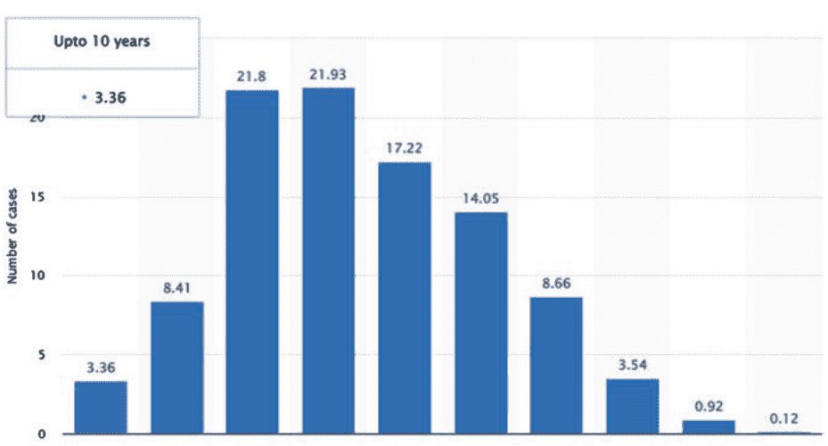

图1 印度COVID-19阳性病例与年龄组

低收入和高收入类别分别占世界国家的25%，而中等收入群体占50%。2019年，中等收入群体的人均收入比低收入群体高出五倍以上。高收入国家的人均收入超过低收入国家的20倍以上。图1显示了印度年龄组中的COVID-19阳性病例。

## 对印度的经济影响

印度在2021年春季病毒第二波中受到了疫情的严重打击。尽管印度国内生产总值（GDP）大幅下降是该国历史上最严重的，但最贫困家庭所遭受的经济损失可能被低估了。根据最新的国民收入预测（2020年7月至2020年9月），2020年4月至6月，印度的GDP暴跌了惊人的24.4%。该经济在2020/2021财年第二季度下降了7.4%。

2020年10月至2021年3月的第三季度和第四季度仍然缓慢，国内生产总值分别增长了0.5%和1.6%。这表明印度2020/2021财年的总收缩率为7.3%。在2020年之前，印度的国内生产总值只有四次下降，分别是1958年、1966年、1973年和1980年，其中1980年的损失最为严重。这预示着2020/2021财年将成为该国历史上经济萎缩最严重的一年，远远超过全球平均水平。详细信息请参见图2。减少主要是导致全球不平等趋势逆转的原因，这种趋势在过去三十年一直在下降，但最近又开始上升[2-4]。

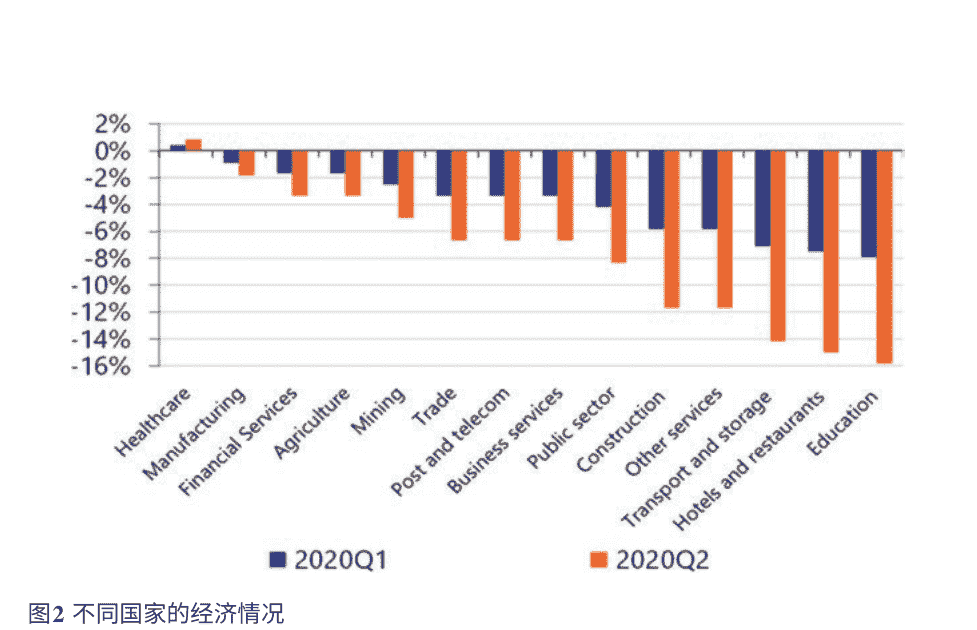

## COVID-19的一些积极影响

为了实现工作和生活的平衡，许多位于大城市地区的公司和人们历史上都承受着长时间的旅行、繁琐的交通或者长时间排队等问题。在家工作的员工，尤其是那些与整个家庭一起隔离的员工，可以选择与家人共度时间。

预算友好，具有改进的成本管理：企业可以调整预算并节省运营支出。费用被以更现实和商业导向的方式考虑，尽管全球金融灾难。工作场所的用品、设备和租赁费用可以用来帮助现有的财务状况。

生产力和注意力正在提高：尽管在家中有干扰，但调查结果显示整体工作注意力有所提高。消除外部刺激物和更高效、更正确地完成项目可以减少压力。由于减少了外部刺激物的压力水平降低，活动可以更快速、更少出错地完成。

## Covid的一些缺点

隔离：尽管有几个IT人员将自己描述为内向型人，但研究发现他们并不真正内向。在隔离和孤立期间，对此的关注度比以往任何时候都更高。隔离对员工和高管的情绪产生了重大影响，水塘聊天被证明是必要的，即使是那些自称或被认为是不合群的人也是如此。

与家庭办公不兼容：并不是每个人都有一个适合远程工作的良好工作空间，创建一个高效和井然有序的工作空间可能很困难。他们无法创造一个有利于完全专注的环境，这直接影响了员工的效率。在生产方面，没有人是孤立的。自主权并不适用于每个人，也不是每个人都能够在职业上自我组织工作[5]。

电子通信容易被误解：除了错过直接面对面的讨论和会议外，所有受访者都对基本的数字通信方法，如电子邮件、社交媒体和沟通差距的可能性表示担忧。图3显示了截至2021年的总病例和死亡人数。

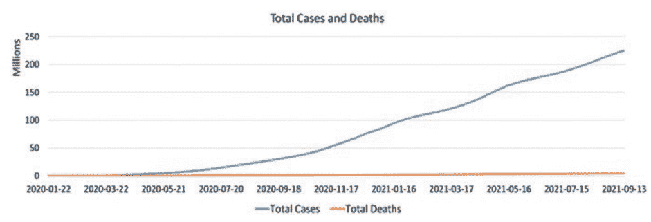

图3 2021年之前的总病例和死亡人数

## 对学生的影响

全球大流行引起的封锁对几个关键领域产生了负面影响，其中之一就是教育。由于疫情，学校、大学被迫突然关闭，学生们被迫接受在线学习。疫情期间，从传统课堂转向数字学习打乱了全球低收入地区学生的学习。

那些负担不起智能手机、Wi-Fi、电脑或笔记本电脑的家庭陷入了严重的困境。

许多没有必要的资格成为家庭教育者的父母被迫在一瞬间承担起这个任务。对于学龄儿童来说，在线学习的三个主要障碍是网络接入差、数据不足和资源匮乏。这里的主要问题是当学习过程转向数字学习和虚拟课堂时，孩子们是否真正学到了东西。学习技术的变化建议我们转向以前从未使用过的方法，为我们提供改变和获得经验的机会。最初，学校对如何继续进行毫无头绪，但随着建立数字基础设施，学习模式开始稳定下来。在疫情期间，大多数学生更喜欢开放和远程学习模式，因为它们促进自主学习，并提供了从各种资源中学习以及根据自己需求进行个性化学习的机会。由于疫情，大多数招聘工作受到限制。学生的实习也受到了影响。许多即将毕业的学生错过了重要的职业机会，许多学生和专业人士因疫情被迫从国外返回家乡，打断了他们的工作。

本章详细描述了所选数据集、采用的预处理技术、用于训练网络的模型以及不同的分类方法。最后，根据各种性能指标比较了不同的分类器。

## 数据集描述

COVID-CT数据集包含349张CT图像，这些图像被报告为COVID-19阳性，并且这些图像来自不同年龄组的216名患者。非COVID-CT扫描图像被视为阴性样本，这些图像来自MedPix数据库、LUNA数据库和Radiopaedia网站。

SARS-CoV-2 CT扫描提供了一个包含1252张CT图像的大型数据集，这些图像来自COVID-19阳性测试人员，以及1200多张CT图像，这些图像来自被一些不同的肺部疾病影响的阴性测试COVID-19样本，如图4所示。图2中给出了男女患者的详细数量。

Coswara准备用于COVID-19的咳嗽和呼吸声音的诊断，如表1所示。该数据集中有1079名健康受试者和92名COVID-19-受影响的受试者。该数据集中包括年龄在20-50岁的受试者。

Sarcos数据集包含26名COVID-19阴性受试者和18名COVID-19阳性受试者。该数据集中女性受试者多于男性。记录音频声音的采样率为44.1 kHz。

## 提出的方法论

提出了一种新的框架，用于通过CT图像和呼吸声音诊断COVID-19。整个网络被设计为使用多类分类网络MLP预测正常、COVID-19、细菌性肺炎和病毒性肺炎的类别。呼吸声音的数据集来自

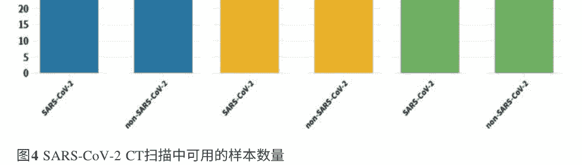

## 使用深度学习从CT图像和呼吸声信号诊断COVID-19

| 数据集名称 | 标签类型 | 大小 | 每个受试者的音频平均值 | 总录制音频 |
| :--- | :--- | :--- | :--- | :--- |
| Coswara | 阳性 | 92 | 2.77秒 | 4.24分钟 |
| Coswara | 阴性 | 1079 | 3.26秒 | 0.98小时 |
| Sarcos | 阳性 | 18 | 2.91秒 | 0.87分钟 |
| Sarcos | 阴性 | 26 | 3.63秒 | 1.57分钟 |

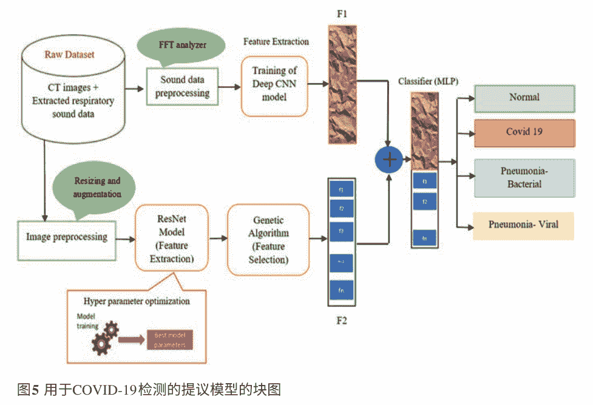

Coswara数据集和Sarcos数据集分别包含92个COVID-19阳性样本，1079个健康样本和18个阳性，26个健康样本。需要提取MFCCs、ZCR、对数能量和峭度等特征，以识别干/湿咳嗽，信号中的变异性，较高振幅的普遍性，并提高音频分类的性能。所有这些特征都可以使用深度CNN架构提取，包括一系列的卷积、池化和ReLU层。最后，使用多层感知器（MLP）分类器进行分类。与此同时，通过分析CT图像改善了疾病的诊断。使用公开可用的COVID-CT和SARS-CoV-2 CT扫描数据集对所提出的网络进行训练。文献中提出了各种架构用于图像分类，但ResNet-50仍然能够提供有希望的结果。图5显示了所提出框架的概述。

提出的框架有两个模块：(i) 呼吸声分析框架和(ii) CT图像分析框架。这些模块展示了数据收集、数据预处理和深度学习模型（深度卷积神经网络+多层感知器）的开发工作流程。

在呼吸声分析框架中，收集到的音频信号通过FFT分析器转换为频谱图像。生成的视频信号被用作深度卷积神经网络模型的数据集，用于特征提取。在图像分析框架中，获取到的CT图像经过预处理，并用于训练ResNet模型进行特征提取。由于ResNet中的层数较多，提取的特征也会更多，为了选择理想的特征，采用了遗传算法。从两个框架中获取的特征被连接起来，并输入到多类别分类器中。该框架可以实时实施，以减少现有昂贵的确诊测试数量。

### 数据集预处理

首先进行预处理以提高图像质量，使网络能够更快地进行训练。在这个阶段，噪声和其他无关信息被丢弃，保留所有必要的信息。为了减少计算成本，首先使用OpenCV将输入的CT图像调整为224 × 224像素，并转换为NumPy数组。接下来进行直方图均衡化，调整图像中每个像素的强度级别。当图像缺乏阴影和高光时使用。

### 数据增强

增加输入数据集的容量，更倾向于使用增强技术。这使得网络能够使用不同版本的图像进行训练，并提高整体模型性能。为了克服数据集的不足，进行随机变换，如图像缩放、调整大小、剪切、平移和不同角度的旋转。还可以进行垂直和水平翻转，其中垂直翻转等同于将图像旋转180°。

数据集平衡：Coswara和Sarcos数据集中的COVID-19阳性样本不足。为了在训练过程中创建相等数量的样本，采用了数据平衡的SMOTE技术，有助于解决类别不平衡的问题。与边界SMOTE等扩展版本相比，SMOTE能够提供更好的结果。对于数据集中的每个可用样本，随机选择五个不同的COVID-19阳性样本，并计算欧氏距离，表示为 $x_{nn}$。

然后，使用下面的方程式创建新的阳性样本：

```
$X_{\text{SMOTE}} = x + (u \, x_{nn} - x)$
```

其中 $u$ 是分布在(0,1)范围内的乘法因子。

## 特征提取

图6显示了从预处理的呼吸和咳嗽数据集中提取的不同特征。

### MFCC

在MFCC中，首先对信号进行滤波和傅里叶变换，然后将频率在梅尔频谱中进行变换。在下一步中，对梅尔频谱输出应用对数尺度变换，然后应用离散余弦变换。确定梅尔频率的公式为

```
mel(f) = 2595 × log(1 + f / 700)
```

这里，mel(f)表示以梅尔为单位的频率。下面的块图表示计算MFCC的整个过程。图7显示了计算MFCC所涉及的完整过程。

使用下面的公式计算MFCC函数：

```
C_n = ∑_{k=1}^{K} (log S_k) cos [n (k - 1/2) π/K]
```

梅尔频谱系数由K表示，来自滤波器组的输出为 $S_k$，$C_n$表示输出的MFCC系数。

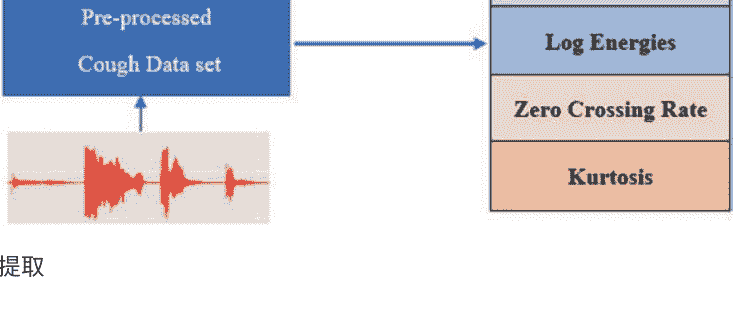## 图7 找到MFCC所涉及的完整过程

### 过零率

过零率（ZCR）是波形从正向移动到负向的最大次数。声音信号的振荡速度非常慢，例如100 Hz的频率需要每秒100次交叉，而非语音信号在相同频率下几乎不会交叉超过3000次。过零率的计算公式为

$$
\text{zcr} = \frac{1}{T-1}\sum_{t=1}^{T-1}1_{R<0}(s_t s_{t-1})
$$

$T$ 是信号的长度 $s$ 和 $1_{R<0}$ 是一个指示函数。

### 峭度

它是信号的四阶矩，用于测量给定输入音频信号的峰值。

$$
\text{峭度}=\frac{E\left(y_{i}(t)-\mu\right)^{4}}{\sigma^{4}}
$$

## ResNet-50模型

ResNet-50（残差网络）是传统卷积神经网络的改进版本。它有近50个深层，拥有2600万个超参数，该网络由[5-8]引入。

当网络层深度增加时，网络的性能可能会降低，这是由于梯度消失问题。梯度消失是模型准确性下降的主要原因。残差网络通过跳跃连接来解决这个问题。跳跃连接可以防止梯度消失，并通过提供身份连接使更高层次的网络层次比较好地工作。

图8和图9显示了具有身份连接的残差网络。数学上表示为 $y = F(x, W_i) + x$ 。在这里，$y$ 是残差网络的输出，$x$ 是输入给网络的输入，$F(x, W_i)$ 是残差函数。该图显示了ResNet-50的架构，它具有四个具有不同卷积层数的块。尺寸为224×224×3的输入图像被输入层接收，ResNet最初使用3×3的核进行7×7卷积。在第一个块中，进行了三次卷积操作，分别设置了64、64和128的核大小。架构中的虚线表示从一个块到下一个块的身份连接。由于后续块中步幅大小固定为2，输入的高度和宽度减半，而通道宽度将加倍[9-11]。

## 特征选择

遗传算法（GA）在特征选择中被广泛使用；它是一种通过生物评估来产生最优结果的随机方法。GA利用种群来评估适应度函数。具有最佳适应度的种群更高的适应度值将用于下一次遗传过程，其中剩余的解决方案将被移除。这些染色体将在下一阶段经历突变和交叉过程，以生成新的种群。整个过程将继续进行，直到收敛到一个解决方案[12]。适应度是遗传算法中最重要的参数。适应度函数的解决方案决定了种群是否继续进行下一代进程。深度学习模型，如CNN和ResNet，倾向于从输入图像中提取大部分特征。遗传算法用于选择从ResNet-50架构中提取的最佳特征。由于其进化过程，GA被认为是提供对CT扫描图像进行正负分类的最佳解决方案[13-16]。

- 对于每个输入的CT图像，使用提出的方法提取特征。
- 个体在种群中表示为零或一，这表示个体中所需属性的存在。个体种群的大小取决于从图像中提取的特征数量。图10显示了选择个体的示例。

选择父母对的轮盘赌方法[8]用于参与交配过程并产生下一代。每个父母对使用一点交叉(A.H.Wright)来选择交叉点。首先生成的后代具有位于第一个交叉点右侧的基因，以此类推。

$$
x_{[i]} \leftarrow \begin{cases} P1_{[i]} & \text{if } i < \gamma \\ P2_{[i]} & \text{if } i \geq \gamma < t \end{cases}
$$

在这里，$x$是子向量，$i$表示父母和子之间的位置索引，$t$表示父母的大小，$\gamma$表示随机选择的交叉点。

### 位操作变异

在二进制编码的情况下，位操作变异[8]是最常用的运算符。每个基因都被单独考虑，它使得每个位在最小概率下被反转。精英主义是一种方法，通过从现有的群体中选择下一个个体来生成新的群体。循环将继续，直到达到停止条件。

## LSTM

长短期记忆（S. Hochreiter）被引入以避免梯度消失的问题。LSTM包含一个细胞状态来存储和转换输入记忆单元为输出状态。下面显示的LSTM架构具有遗忘门、输出门、输入门和更新门。发送到下一个神经元的接收到的信息由输入门决定；需要被遗忘的信息由遗忘门和记忆单元的帮助决定。这四个单元相互交互，并以指定的方式工作，在给定的时间戳上获取所有长期输入和短期输入。输入门的数学表示为 $i_t = \sigma(W_i * [h_{t-1}, x_t] + b_i)$。

遗忘门忽略的信息在数学上表示为$f_t = \sigma(W_f * [h_{t-1}, x_t] + b_f)$。使用更新门更新新的细胞状态表示为 $c_t= \text{tanh} (W_c * [h_{t-1}, x_t] + b_c)$, $c_t = f_t * c_{t-1} + i_t * c_t$, 输出门通过方程更新为 $o_t = \sigma(W_o * [h_{t-1}, x_t] + b_o)$ 和 $h_t = o_t * \text{tanh} (c_t)$。

## 分类

分类是一种根据数据集中的信息对给定数据进行分组的方法，包括已确定类别的注释 [17]。CT图像被分类为正常、COVID-19、细菌性肺炎和病毒性肺炎。使用多个分类器的案例包括随机森林 (RF) 方法、多层感知器 (MLP)、LASSO、弹性网络 (ENet)、支持向量机 (SVM) 和极限梯度提升 (XGBoost) 算法，每个分类器都使用默认参数。分类验证了使用四个通常用于文献中的统计评估指标的发现：准确率 (A)、召回率 (R)、精确率 (P) 和 F-分数 (F) [18,19]。

### 性能指标

我们不能断言当模型具有更高的准确性时，它就能做出理想的预测。 以下公式中定义的真正阳性 (TP) 、假正性 (FP) 、真负性 (TN) 和假负性 ( FN) 值用于确定四个指标。

$$
A = \frac{TP + TN}{TP + TN + FP + FN}
$$

$$
R = \frac{TP}{TP + FN}
$$

$$
P = \frac{TP}{TP + FP}
$$

$$
F = 2 * \frac{R * P}{R + P}
$$

此外，卡帕指数 (K) 衡量了所提出方法的结果与经验真实标签之间的一致性水平。 接收器操作特性 (AUROC) 曲线下的面积表示分类器根据真正阳性与假正性数量之间的区分能力。 通过精确率-召回率曲线下的面积来衡量被识别为真正阳性的数量与实际总的真正阳性和假正性之比。

这些验证指标的值越接近1，分类器的区分四个不同类别的能力就越好[20]。 建议模型在所有分类阈值下的性能由ROC曲线显示。 从 (0, 0) 到 (100, 100) 积分的ROC曲线下的面积被称为AUC (1, 1) 。 它计算了所有潜在分类阈值的总和。 在0到1的范围内，AUC表示100%的错误分类。 它有两个吸引人的动机：首先，它是尺度不变的，这意味着它评估模型的性能不受所获得绝对值的大小的影响；其次，它是分类阈值不变的，这表示它评估模型的性能不受用于获得不同类别的阈值的影响。

从肺部区域和咳嗽信号中评估了85个特征，并且在单变量分析中具有p值小于0.05的特征被认为是具有统计学意义的特征。 在此阶段之后，只保留了十个特征并用于COVID-19检测。 在实验中，COVID-19检测是一个四类分类任务。 分类器使用从特征选择技术[21]获得的属性进行十折交叉验证程序的训练和验证。 最后，使用外部测试数据集对模型进行测试。 分析了在该过程中使用的各种分类器，并且基于树的分类器模型随机森林和XGBoost在所有指标上表现优于基于线性回归的模型。 图11给出了不同模型性能的比较。

### 随机森林

RF是一种基于树的回归/分类模型，从一组数据中选择随机样本。 然后，随机森林算法将用于为每个样本生成决策树。 对于每个决策树的每个预期结果进行投票。 最后，选择获得最高票数的预测结果作为最终预测结果。 为了将个体分类为COVID-19阳性或阴性，使用包含250棵树的RF分类器。 为了分割节点，使用完全生长且未修剪的树，以基尼指数作为标准。 在每次分割时，特征被随机排列[22]。

### XGBoost

梯度提升是一种基于机器学习的回归和分类技术，它根据一组低预测决策树模型产生最终输出。 模型架构类似于其他基于树的模型，如RF或其他提升方法，同时通过允许优化任何可微损失函数来扩大输出的范围。 XGBoost是梯度提升实现的一种，但它的独特之处在于采用了更加正则化的模型形式化来控制过拟合，从而提高性能并减少过拟合。

### 支持向量机

支持向量机经常用于分类或回归模型，它使用极端向量找到线或边界，称为超平面，以正确识别训练数据集。然后，它从这些线或边界中选择与最近数据点的距离最大的线或边界。

### LASSO，Ridge和Elastic Net回归

当模型系数非常高时，训练数据集将过拟合。正则化可以惩罚较大的系数，用于解决这些困难。岭回归是对系数值的平方进行惩罚的修改，通常被称为L2范数。或者在Lasso模型中，通过添加与系数大小相等的惩罚来改变损失函数。弹性网络是岭回归和Lasso模型的结合。

一些呼吸道疾病，如COVID-19，被认为具有咳嗽的自然防御机制。现有的主观临床方法对咳嗽声音分析的影响受到人类可听听力范围的限制。正如本研究所示，探索非侵入性诊断选项，远远超过用于样本数据的可听频率范围（即48,000 Hz），可以克服这一限制。基于信号处理的技术面临着咳嗽声音样本的非平稳特性的额外障碍。咳嗽模式在患有相同疾病的人类中也会有所不同。与时间域中的强度水平密切相关的咳嗽特征在相同疾病中可能会有所不同。

图12显示了使用不同分类器实现的性能得分。当存在异常情况时，通过基频和谐波分量分析咳嗽声音。构成基频倍数的咳嗽声音的不稳定性是由气道引起的压缩。能够捕捉咳嗽信号在时域和频域的各种特征的系统可以准确预测COVID-19或肺炎引起的咳嗽变化。

由于公开可用的数据库只包含COVID-19阳性和COVID-19阴性的示例，本研究侧重于区分COVID-19和其他与咳嗽声音和肺部图像相关的肺炎异常与健康/对照数据。另一方面，所提出的方法可能能够区分各种肺部/呼吸系统疾病（如COVID-19、病毒性肺炎和细菌性肺炎）中的问题咳嗽声音。咳嗽噪声的病理生理学和声学特性可以在频域提供有价值的信息，用于对其进行多类别分类任务的特征描述。与肺炎相关的疾病会导致患者的气道受到刺激和收缩[23,24]。为了展示COVID-19、肺炎和正常样本的独特性，分析了它们的频域特征之一。

与COVID-19和哮喘咳嗽样本相比，肺炎样本的光谱熵在大多数帧中明显更大。对于所述的三种呼吸道疾病，其他特征（如频谱流量、MFCC和特征谐波）也是不同的。使用更多的MFCC始终可以提高性能。研究得出结论，机器学习分类器提取的信息对人类听众来说通常不可感知，因为用于计算多维MFCC的光谱频率分辨率超过了人类听觉系统的可听属性，并且这些内部特征被时间序列的深度学习LSTM模型提取和适当选择。图13显示了完整周期的频域特征的变化：（a）光谱熵，（b）光谱流量，（c）MFCC系数和（d）特征谐波对不同咳嗽样本的情况进行了比较。与先前的研究相比，该工作在将CT扫描分类为正常、COVID-19、细菌性肺炎和病毒性肺炎方面取得了令人鼓舞的结果。

我们的研究结果表明，基于咳嗽信号的频谱成分分析可以用于区分COVID-19阳性患者和其他与肺炎相关的咳嗽声与未感染人群。为了实现有效的分类，必须对从图片中提取的特征进行充分和适当的表示，以避免在分类阶段产生错误。鉴于此，建议技术的一个关键组成部分是使用遗传算法选择最显著的特征。特征选择中使用的遗传算法和LSTM方法改善了分类结果，并且显著减少了用于分类的特征的维度，使分类过程更加响应灵敏。

图14显示了基于各种基于机器学习的分类器的性能比较，表2给出了不同分类器的详细比较。建议的架构具有将CT扫描和咳嗽声分类为COVID-19、病毒性肺炎、细菌性肺炎和正常实例的复杂能力，并可用作COVID-19诊断或筛查工具。

图13完整周期内频域特征的变化：(a)频谱熵，(b)频谱通量，(c)MFCC系数，(d)不同咳嗽样本的特征谐波

## 图14 各种基于机器学习的分类器性能比较

## 表2 不同分类器的比较

实验分类器 | 准确率（%） | 召回率（%） | 精确率（%） | F分数 | AUC
--- | --- | --- | --- | --- | ---
XGBoost | 81.9 | 0.451 | 0.183 | 90.2 | 87.5
随机森林 | 82.1 | 0.424 | 0.179 | 89.3 | 86.2
支持向量机 | 79.2 | 0.352 | 0.073 | 82.5 | 75.2
岭回归 | 80.1 | 0.414 | 0.065 | 80.7 | 81.5
套索回归 | 77.2 | 0.454 | 0.153 | 79.2 | 81.0
弹性网络回归 | 97.2 | 0.26 | 0.026 | 0.026 | 98.7

## 结论

本文提出了一种新的方法，从被诊断为COVID-19和两种类型的肺炎以及未感染个体的人中收集多特征数据集的咳嗽和肺部图像。该系统研究了对COVID-19的早期检测结果有贡献的主要特征。咳嗽信号和后期获取的肺部图像，突出了使用音频特征和图像的组合特征来检测COVID-19症状的重要性。提出的文献建议使用深度学习算法、LSTM和遗传算法提取特征，并适用于COVID-19检测任务的机器学习算法；此外，我们进一步提供了对声音的最有用的空间和频谱特征的深入分析，目的是分析改变COVID-19咳嗽声学特征的现象。机器学习方法不仅对区分COVID-19病例和其他肺炎患者有用，还对协助医生跟踪和预测患者的预后和治疗结果有用。因此，基于咳嗽声音、胸部X射线、肺部图像以及实验室数据和其他特征的研究，结合深度学习和机器学习算法用于特征提取和分类等各种过程，将有助于早期诊断该疾病。

## 参考文献

1. E. Soares, P. Angelov, S. Biaso, M.H. Froes, D.K. Abe, SARS-CoV-2 CT扫描数据集：一个大型真实患者CT扫描数据集，用于SARS-CoV-2识别。*MedRxiv*。https://doi.org/10.1101/2020.04.24.20078584
2. A.M. Ayalew, A. OlalekanSalau等，使用卷积神经网络和直方图梯度的X射线图像检测和分类COVID-19疾病。*Biomed. Signal Process. Control* **74** (2022).https://doi.org/10.1016/j.bspc.2022.103530
3. S. Aydın, H.M. Saraoğlu, S. Kara, 基于对数能量熵的脑电图分类与多层神经网络在癫痫中的应用。*Ann. Biomed. Eng.* **37**(12), 2626 (2009)
4. R. Bachu, S. Kopparthi, B. Adapa, B.D. Barkana, 基于过零率和能量的语音信号的有声/无声决策，在高级计算科学和软件工程, (Springer, 2010), pp. 279–282
5. K. He, X. Zhang, S. Ren, J. Sun, 深度残差学习用于图像识别，在IEEE计算机视觉和模式识别会议(2016), pp. 770–778
6. M. La Salvia, G. Secco, 等，深度学习和肺部超声用于Covid-19肺炎检测和严重程度分类。*计算生物学和医学* **136** (2021).https://doi.org/10.1016/j.compbiomed.2021.104742
7. H. Wright, 遗传算法用于实数参数优化，在遗传算法基础, (vol. 1, Elsevier, 1991), pp. 205–218
8. A.E. Eiben, J.E. Smith, 等，进化计算导论，第53卷 (*Springer*, 2003年)
9. S. Hochreiter, J. Schmidhuber, 长短期记忆。*神经计算* **9**（8），1735-1780 (1997)。https://doi.org/10.1162/neco.1997.9.8.1735
10. K.E. ArunKumar, V. Dinesh, 等，门控循环单元（GRU），长短期记忆（LSTM）单元，自回归积分移动平均（ARIMA），季节性自回归积分移动平均（SARIMA）用于预测COVID-19趋势的比较分析。*Alex. Eng. J.* **61**（2022）。https://doi.org/10.1016/j.aej.2022.01.011
11. E.D. Carvalho等人，基于CT扫描和遗传算法的COVID-19分类方法。*计算生物医学* **136**, 104744 (2021)
12. P. Anandhanathan, P. Gopalan, COVID-19死亡风险预测的机器学习算法比较 (2021)

## 参考文献

1.  R. Islam, E. Abdel-Raheem, M. Tarique， 使用咳嗽声和深度神经网络进行COVID-19早期检测的研究。先进生物医学工程 3，100025 (2022)
2.  V. Despotovic等人，基于声音、咳嗽和呼吸模式的COVID-19检测：数据集和初步结果。计算生物医学 138，104944 (2021)
3.  世界卫生组织等人，2002年11月1日至2003年7月31日期间发病的可能SARS病例总结。http://www.who.int/csr/sars/country/table2004_04_21/en/index.html (2003)
4.  R. Miyata, N. Tanuma, M. Hayashi, T. Imamura, J.-I. Takanashi, R. Nagata, A. Okumura, H. Kashii, S. Tomita, S. Kumada等人，临床轻度脑炎/脑病可逆脾损伤（MERS）患者的氧化应激。脑发育 34 (2)，124–127 (2012)
5.  F. Pan, T. Ye, P. Sun, S. Gui, B. Liang, L. Li, D. Zheng, J. Wang, R.L. Hesketh, L. Yang,等人，2019年新型冠状病毒肺炎康复期胸部CT肺部变化的时间进程。放射学 295(3) (2020)。https://doi.org/10.1148/radiol.202020037018.
6.  H. Ritchie, E. Mathieu, L. Rodes-Guirao, C. Appel, C. Giattino, E. Ortiz-Ospina, J. Hasell, B. Macdonald, D. Beltekian, M. Roser, 冠状病毒大流行（COVID-19），我们的世界数据(2020)。https://ourworldindata.org/coronavirus
7.  A. Halder, B. Datta, 使用迁移学习方法从肺部CT扫描图像中检测COVID-19。机器学习科学技术。2 (2021)。https://doi.org/10.1088/2632-2153/abf22c
8.  G. Soldati等人，针对COVID-19患者使用肺部超声的国际标准化提案：一种简单、定量、可重复的方法。超声医学杂志。(2020)。https://doi.org/10.1002/jum.15285
9.  M.J. Fiala, 对COVID-19的肺部超声检查的简要回顾：它有用吗？Ann. Emerg. Med. (2020). https://doi.org/10.1016/j.annemergmed.2020.03.033
10. T. Ai等人，中国冠状病毒病2019年胸部CT和RT-PCR检测的相关性报告：1014例报告。放射学，200642 (2020). https://doi.org/10.1148/radiol.2020200642
11. D. Wang, B. Hu, C. Hu, F. Zhu, X. Liu, J. Zhang, B. Wang, H. Xiang, Z. Cheng, Y. Xiong, et al.，中国武汉市138名住院患者2019年新型冠状病毒感染性肺炎的临床特征。J. Am. Med. Assoc. 323(11)，1061-1069 (2020)
12. A. Carfi, R. Bernabei, F. Landi等人，急性COVID-19后患者持续症状。J. Am. Med. Assoc. 324(6)，603-605 (2020)

# 边缘计算在流行病和疫情情况下的作用及其解决方案

A. G. Balamurugan, R. Pushpakumar, S. Selvakumari, 和 S. Pradeep Kumar

## 介绍

领先于各种全球技术领域的趋势技术，与身体健康、物联网（IoT）和人工智能相关，可以在流行病和疫情情况下对医疗保健进行广泛的监测。全球范围内，公众由于政府对健康措施实施的旅行限制而无法获得医疗保健，医疗设施负荷过重，高风险患者过多。由于流行病，老年人非常脆弱。现在，普通人和医疗保健提供者都在常规性地监测医疗保健。如今，印度医疗物联网（IIoMT）将通过各种可穿戴、现成的硬件帮助检测持续行为、情绪感受和与生命状态相关的各种活动。在COVID-19流行病期间，特别实施了深度学习技术在公共聚集场所，通过物联网识别口罩和温度的存在[1]；此外，借助边缘计算，深度学习展示了提供高准确性的巨大算法来解释健康情况关心信息[2-4]。借助深度学习和边缘计算算法，我们可以通过IIoMT实时从pi摄像头或传感器获取的数据中识别、检测和识别现象。这使我们引入了IIoMT的新一代生产-支持边缘计算的努力[5]。

新兴硬件设备的进步，特别是边缘IIoMT节点的重要革命之一，已经导致了被称为边缘IIoMT节点的医疗保健的转变[6]。目前，IIoMT节点的趋势带可以在边缘节点（例如医疗保健机构、家庭和诊所）独立运行，其中医疗保健系统的数据需要被观察。现在，边缘节点具有完整的操作系统（OS），具有边缘CPU和图形处理单元（GPU），允许节点在边缘上完成深度学习计算。为了利用精细的IIoMT边缘中心，DL应用程序也得到了改进，以支持边缘知识和参考。来自主题或急诊医院的信息不需要离开所有者的区域或边缘；相反，DL和事件监测可以在边缘发生。这使得使用深度学习和IIoMT可以在用户属性上跟踪数据保护、安全和低延迟的健康请求。因此，IIoMT边缘引入了DL的新标准，例如联合学习，其中学习以分布式方式在边缘发生，而只有模型被分发[7, 8]。廉价的GPU硬件可以支持作为统一无知节点的IIoMT节点。

此外，深度学习和工业物联网已经取得了很大的进展，因为少数消费者可能参与到需要多样化的家庭生活质量监测情况的设置中。下面的原始相关研究帮助我们介绍基本事项。

1.  如何在工业物联网设备中实施和推荐大量的边缘计算，用于通过深度学习创建边缘解决方案。
2.  由于这一结果，在每个边缘（例如每个房屋）建立了用于创建健康应用程序的边缘深度学习库。通过利用骨架的边缘计算，我们的工业物联网节点有助于深度学习（CNN）。
3.  基于IIoMT边缘学习的QoL监测应用程序集开发。我们可以实时使用这些应用程序生成警报。

本文的其余部分组织如下。第二部分提供相关的研究工作。系统的概要设计和模型显示在第三部分，实施细节在第四部分提到，我们在第五和第六部分讨论结果，最后，我们提出一些未来的工作建议。

## 相关工作

作为预期工作的结果，我们选择了以下四个主要领域的进展：

- A. 情感计算。
- B. 工业物联网设备。
- C. 深度学习应用。
- D. 边缘计算。

我们将在本文中对上述主要领域进行详细讨论。

### 情感计算中的医疗保健

解释人类模拟和过程的研究可以帮助理解情感计算中的医疗保健研究，包括识别人体的情绪、温度、压力、面部表情、身体姿势和各种手势的过程，而小鼠也可以帮助识别人类的语音。 借助于传感器（如情感线索和更新的生理数据测量），这种魔法可以成为可能。 许多用作分类器的算法，如线性判别分类器（LDC）、高斯混合模型（GMM）、K最近邻算法（k-NN）、人工神经网络（ANN）、支持向量机（SVM）、隐马尔可夫模型（HMMs），只是简单地提高了系统的执行效果。

### IIoMT设备

信息技术被用于将医疗保健和软件应用连接起来，通过将硬件基础设施与互联网连接的医疗设备结合在这个网络中。 这个过程允许根据患者当前状态基于医学术语和条件对医疗数据进行灵活分析，也用于监测患者。 这些安全预防措施有助于降低死亡率，并提供紧急护理。 IIoMT传感器的设计目的是用于患者观察[9]。 5G和纳米设备可以管理医疗保健中的物联网，可以提供服务，并可以进行描绘[11]。 另一项研究研究了在距离违规时生成社交距离警报的框架设计[12]。 Yang等人[2]在居民住所中使用IIoMT进行大部分物理治疗。 IIoMT在多功能边缘计算方面进行了研究[8]。 在[8]中考虑了IIoMT传感器的患者监测概述。 在[9]中描述了基于物联网纳米物和5G技术材料互联网对医疗保健和服务质量的影响的全面概述。 Alhussien等人[10]使用物联网和云的融合来监测患者的健康状况，构建了一个认知医疗保健物联网（CH-IoT）框架。 在[11]中，对用于控制COVID-19等大流行病的IIoMT进行了审查。 Ahmed等人[12]设计了一个系统，可以跟踪社交距离，并在忽视时发出警报。

## 深度学习应用

深度学习这个术语源自机器学习，作为一个在处理图像、视频和结构化和非结构化数据时，当机器学习无法轻松完成任务时的一部分。 机器学习通过使用人工神经网络的最佳算法结构和相关功能，将我们引向深度学习。深度学习的应用在各行各业，尤其是在医疗保健领域广泛流行。 在Python的大力帮助下，深度学习在全球发挥着重要作用。

总的来说，深度学习可以处理大数据集。 在[6]中实施了人工智能来应对COVID-19大流行。 为了提供证据和有意义的解释，深度学习的层可以将数据作为输入，例如基于输入的对象分类来进行识别[14]。

## 边缘计算

[3]中提出了5G网络基于边缘学习框架，并在COVID-19期间成功用于患者监测。可以通过监测来注意到各种患者的症状[5]。 尽管所有过程都运行良好，但工业物联网对数据的安全性提出了很高的要求，并为边缘引用的隐私保护增加了额外的功能[9]。 此外，作者Hossain [16,17]为云辅助健康监测系统做出了贡献。这项技术还促进了边缘学习[6]和联邦学习的支持。

通过更多的努力，边缘计算可以与人工智能[15]相结合，为患者提供安全的医疗疗法。

## 系统设计

在本节中，我们设计了一个全面的症状管理系统。在设计的模块化方法中，我们使用了以下四个维度。

## 边缘计算应用

### 管理症状在家

在家中，可以提供基本支持项目，如心电图、体温检测的温度计和血氧饱和度（SPo2）。 我们的设备经过良好的训练，能够识别COVID-19的症状，并将原始数据提供给IIoMT，其中可能包括体温、心率和血氧饱和度水平。 通过过度打哈欠等症状分类，还可以使用深度学习方法进行疲倦/困倦的检测，这些方法是通过数据集进行训练的。 通过学习方法的组合，还可以将COVID-19的其他症状识别为语音识别，如图1所示。 最重要的是通过使用具有热成像规格的相机以非侵入方式识别发热温度。

### 家庭安全和隔离

只有自己才能轻松实现安全。 特别是在家里，可能不会遵循安全措施，但在家庭外的人的情况下，我们必须遵循安全措施。 这可以通过我们项目中实施的智能边缘计算设备来实现。 深度学习技术有助于识别当有人试图进入室内时是否戴口罩。 如果未检测到口罩，则门无法打开，即使里面有人也不行。

### 家庭内的面部情绪检测

面部情绪检测，如通过面部表情可见的疼痛和抑郁，可以通过深度学习中的计算机视觉技术（也称为计算机的第三只眼）来识别。 我们无法轻易看到计算机如何看待视觉。 深度学习具有多个输入，但它有助于根据输入找到精确的预期输出，这些输出模型和训练数据。

### 在家中具有最佳质量的生活管理系统

在COVID-19时期，健康相关生活质量的基本支持是最好的度量标准，可以提供关于疾病的最佳建议。 这可以使得向人类医疗保健提供反馈，以便他们应该如何管理治疗[18]。 图2显示了每个人目前生活质量的各种特征。

### 在家中进行诊断和治疗

智能边缘计算还可以帮助诊断和为患者提供治疗，而无需离开家。基于我们训练的数据集，设备建议对药丸进行检测和提醒，以免产生混淆，从而使患者能够按时服药。智能设备还可以为附近的医疗团队设置警报。

### 边缘IIoMT设备的选择

图2显示了IIoMT设备及其对应的部署工作流程。在初始状态下，输入可以从树莓派摄像头传感器的数据中获取。树莓派摄像头根据深度学习的初始化对图像和视频进行处理。在对输入数据进行推理后，将与训练数据进行匹配，并进行下一阶段的处理。一旦数据在运行边缘节点中进行处理，如果满足边缘模型（EM）的条件，条件将被传递，并将为输入准备可解释的可视化。如果输入数据不满足运行边缘节点的条件，将准备可解释的可视化，并保存输出。

### 边缘深度学习堆栈设计

IIoMT边缘开发的堆栈用于检测人体反应的生理前景和情绪。第三部分描述了人类情绪的QoL和持续监测。如图3所示，IIoMT层包含传感器数据，该数据引导用户情绪的数据收集过程，允许从AI层的边缘（如Raspberry pi5或Jet son NVIDIA-Nano平台）获取新数据。QoL应用程序根据编程编写的报告或基于输入数据生成的警报生成报告，该输入数据经过CPU/GPU处理。

### 系统工作流程

该系统仅适用于基于所有边缘节点的IIoMT硬件。系统将传感器数据作为输入提供。可以通过各种方式获取输入：（1）图片，（2）实时摄像头视频，（3）流媒体视频，（4）传感器数据等。为每个输入提供适当的深度学习库，包括利用原始数据集训练深度学习算法，提高模块准确输出比例和执行推理。推理过程可以在边缘模型的一部分（如Tensorflow Lite（tflite））中完成。刺激的输出可以在Android手机或Web应用程序上查看。

## 实施

实施过程如图3所示。医疗级别的物联网包括传感器，如MLX90614，FLIR 3.5纯热传感器，AMG8833，FLIR Pro，Google CORAL TPU，Intel NCS Edge GPU，MAX 30100，智能手机和树莓派相机。 第二层包括边缘节点，如一个用于查看显示的监视器，可以在任何树莓派，NVIDIA Jetson，Jetson Nano板或任何智能手机上使用的SBC（单板计算机）用于查看显示。第一层和第二层通过传感器和支持互连设备的SBC相互连接。人类的情绪可以由与人类相互连接的传感器捕获并存储在智能边缘节点中，这将导致预期的输出。

热像仪可以用来捕捉人体图像和温度传感器数据。可以识别体温。我们使用了Lepton模型进行纯热识别3.5，该模型与相机通过USB端口进行连接。我们创建的应用程序包括(1)智能手机，(2)Web界面，Web界面可以放置在周围物体上，与戴口罩的人在预期范围内进行交互。该过程始于训练数据集，包括验证和测试，输出可以在智能手机或Web应用程序上查看。图3显示了基于Web和智能手机应用程序的人工智能，这些应用程序是为研究目的开发的。

对于数据集，我们收集了所有用于基于深度学习的设备训练的数据，包括使用Nvidia Docker和Nvidia Jetson Nano进行CUDA 10.0开发和CuNN的数据集。

还需要一些软件技术，特别是CUDA 10.0兼容版本，可能无法从云存储或服务器获得支持。我们使用NGROK来安全隐藏从本地主机深度学习服务器传输的信息，以应对网络地址转换或防火墙。为了将DL应用程序发送到手机，我们将DL模型转换为tflite模型，然后进行量化以支持手机的GPU/CPU。图2显示了一个由视力不稳定或视力差的老年人使用的智能手机应用程序。该应用程序可以识别物体和人，并通过文本转语音向人们提供信息。图2显示了一个情感收集应用程序，该应用程序利用互联网资源作为边缘计算学习客户端。图2显示了使用热传感器相机进行实际发热温度识别。我们还基于IIoMT硬件开发了一个警报系统，如图2所示。

为了保证IIoMT信息的保护和安全，我们通过基于以太坊和超级账本的区块链结构传递了基于价值的信息，以帮助开放和安全的组织。原始健康数据被保存在链外，并与区块链进行关联以进行验证。图2展示了AI就绪时代系统，其中基本事件通过消息系统被捕获、感知和传达给适当的专家。

该系统还通过区块链使IIoMT生成的证据可用。然而，基于计算机视觉的深度学习应用程序，如氧饱和度和心电图值，是使用循环神经网络（RNN）计算的。

## 测试结果

### 脑电图信号分类

根据我们的训练，我们在这里使用的模型有两种类型的数据集可从Kaggle获取。通过可穿戴生物测控设备（图2）捕获了所有类型输入的心理和情感状态的数据组。如图2所示，经过训练的随机森林模型可以确定一个人是否感觉良好、懒散或未指定。表1显示了三种情绪类别的准确率和召回率。由于数据类型的明显分离，我们观察到每种情绪类型的准确率和召回率都很好。

观察到了不同种类的与COVID-19相关的症状，尤其是咳嗽，如干咳、轻咳和正常咳嗽声音，嗜睡，口罩检测[1]，以及感受积极、消极或中性的情绪。由于准确度、精确度和召回率都令人满意，我们目前正在与金奈的三家急诊医院合作，以便将下一个训练好的模型应用于患者的家庭治疗中。真正的挑战在于在家中进行实际数据收集。为此，我们计划将差异保护、端到端加密和边缘设备之间的联合训练相结合。我们还将研究提高准确度、精确度和召回率的方法。

### 昏昏欲睡分析

数据库库与“You only Look once”（YoLo）V4一起用于面部识别和面部特征点识别。通过闭眼时间、眨眼频率和眨眼频率来确定休息模式。这些算法还跟踪头部移动和空洞。我们使用UTA懒散数据集2来训练我们的算法。训练和验证的准确度和损失如图3所示。

表1 精确度和召回率的数值与对应的情绪类型的日常活动
| 情绪类型 | 精确度的数值 | 召回率的数值 |
| :--- | :--- | :--- |
| +Ve数据 | 0.96 | 0.99 |
| 中性数据 | 0.99 | 1.00 |
| -Ve数据 | 1.00 | 0.99 |

### 心电图

Keras设计已被用于建立MIT-BIH- ECG数据集。最初使用ECG信号进行预处理，生成三维图像频谱图。在扩展连接后，将三维图像转换为卷积神经网络设计，该设计由卷积层提供七个最大池化层，总体普通池化层，完全相关层和softmax层组成，具有四个结果类别。通过规划和批准系统得出的精确度和审查结果如表2所示。

### 发热检测

基于训练数据集，可以提交和获取发热识别结果。使用YoLoV4、面部、眼睛和眉毛的应用程序使用Dlib进行识别，然后使用来自额头的热相机读数来确定体温，如图3所示。使用NVIDIA Jetson Nano的软件被设置为37.5°C。我们使用Kaggle的数据集-4来设置参考FLIR热相机输入图像。规划和批准教育集合的报告准确性和审查潜力如表2所示，并且对比图表如表3所示。

表2 训练和验证数据的精确度和召回率数值
| 情绪类型 | 精确度的数值 | 召回率数值 |
|----------|--------------|------------|
| 训练数据 | 0.95         | 0.94       |
| 验证数据 | 0.94         | 0.95       |

表3 情绪分类值的精确度和召回率的情绪类型
| 情绪类型 | 精确度的数值 | 召回率数值 |
|----------|--------------|------------|
| 悲伤     | 0.895        | 0.893      |
| 中性     | 0.889        | 0.897      |
| 恐惧     | 0.801        | 0.798      |
| 愤怒     | 0.971        | 0.762      |
| 快乐     | 0.965        | 0.964      |
| 厌恶     | 0.940        | 0.952      |
| 惊讶     | 0.981        | 0.962      |

### 口罩检测

为了建立我们的面部覆盖物检测，我们使用了一个面部检测计算库。总共使用了近9046张图片，其中包含了近4250张带有面部覆盖物的图片和其余没有面部覆盖物的图片，这些图片是从一个安全的Google引擎搜索中获得的。使用基于TensorFlow的CNN设计的MobileNetV3计划进行了迁移学习。我们分别实现了0.95和0.94的训练和验证精度，如图3所示。如表2所示，ECG数据的训练精度和验证召回率分别为0.981和0.952，对于训练集分类；然而，验证集分类的准确度和审查潜力收益分别为0.98和0.96（表3）。

### 使用兴奋分析确定生理状态

在我们的研究工作中，我们在训练数据中包含了每个七个类别的样本图片，像素级别达到1028个输入，授权数据中每个七个类别有一百张图片，测试信息收集中每个七个类别有172张图片，如图3所示。
表4显示了七种情感类型的混淆矩阵及准确率和召回率。图3显示了训练和验证的准确率和损失，分别。图4显示了六种不同类型的日常活动的准确率和召回率，这些活动是通过手机记录的。

### 来自受影响和未受影响的居民咳嗽声音分析

数据库中包含了120个干咳样本，这些样本来自30名COVID-19患者，他们都通过RT-PCR检测得到确认。这些患者来自不同的年龄组。在我们从谷歌收集的数据集中，几乎有220个COVID-19阴性的咳嗽声音，根据预定义的数据报告进行了标记。

**表4 ECG数据分类值的精确度和召回率数值**

| 数据类型 | 精确度的数值 | 召回率数值 |
|----------|--------------|------------|
| 训练数据 | 0.97         | 0.96       |
| 验证数据 | 0.98         | 0.97       |

## 结论和未来工作

我们设计了一个框架，将在用户边缘环境中实现IIoMT部署的有效计算优势，这可能包括家庭、医院和其他地方的边缘节点。通过收集各种数据，GPU可以帮助在每个边缘节点上运行深度学习应用程序。通过使用收集的数据，可以开发出适用于各种症状的应用程序。通过边缘-GPU获得了数据隐私、安全性、安全性和各种低延迟，类似于医疗建议而无需医生的情况下，在各种健康护理依赖的下一代人中获得了对各种症状的基本帮助的支持，尽管在大流行情况下有旅行限制。

作为未来的工作，我们计划提高每种应用在每个边缘节点上与患者实时相关的精度。我们还与多个患者、医疗团队和医院保持联系，将我们的应用程序应用于智能患者护理系统（SPCs）中。该应用程序还可以帮助我们与医疗系统中的人工智能技术世界建立联系。

## 参考文献

1.  S. Pradeep Kumar, R. Pushpakumar, S. Selvakuamari, 使用物联网的深度学习技术实现COVID-19公共聚集场所的智能安全预防措施，收录于《物联网应用的机器学习范式》（Willey出版社，2022年）
2.  S. Pradeep Kumar, K. Jayanthi, S. Selvakuamari, 使用深度学习实现高准确度的物联网智能交通标志识别（TSR-HA），收录于《物联网应用的机器学习范式》（Willey出版社，2022年）
3.  Y. Yang, X. Wang, Z. Ning, J.J.P.C. Rodrigues, X. Jiang, Y. Guo, 边缘学习用于医疗物联网及其COVID-19应用：一种分布式3C框架，IEEE物联网杂志，即将出版
4.  H. Lin, S. Garg, J. Hu, X. Wang, M.J. Piran, M.S. Hossain, 面向COVID-19应用的隐私增强数据融合智能医疗物联网，IEEE物联网杂志，8(21), 15683–15693 (2020). https://doi.org/10.1109/JIOT.2020.3033129
5.  M.Z. Alom等人, 关于深度学习理论和架构的最新调查 电子 8(3), 292 (2019). https://doi.org/10.3390/electronics8030292
6.  M.S. Hossain, G. Muhammad, 面向情感感知的连接医疗大数据，面向 5G. IEEE物联网杂志 5(4), 2399-2406 (2018)
7.  W.Y.B. Lim等人, 联邦学习在移动边缘网络中的应用：一项综合调查。IEEE通信调查教程 22(3), 2031-2063 (2020)
8.  P. Porambage, J. Okwuibe, M. Liyanage, M. Ylianttila, T. Taleb, 多接入的调查边缘计算用于物联网实现。IEEE通信调查教程 20(4), 2961-2991 (2018)
9.  M.S. Hossain, G. Muhammad, N. Guizani, 可解释的人工智能和大规模监控系统- 基于医疗框架应对类似COVID-19的大流行病。IEEE网络 34(4), 126-132 (2020)
10. M. Alhussein, G. Muhammad, M.S. Hossain, S.U. Amin, 认知物联网云集成用于智能医疗：癫痫发作检测和监测的案例研究。移动网络应用。 23（6），1624-1635（2018）
11. M.A. Rahman, M.S. Hossain, M.S. Islam, N.A. Alrajeh, G. Muhammad, 安全和证明增强的物联网健康事物框架：区块链管理的联邦学习方法。 IEEE Access 8, 205071-205087 (2020)
12. K. El Asnaoui, Y. Chawki, 使用X射线图像和深度学习进行冠状病毒疾病的自动检测。生物分子结构动力学杂志。 https://doi.org/10.1080/07391102.2020.1767212
13. G. Muhammad, M.S. Hossain, N. Kumar, 基于脑电图的病理检测用于家庭健康监测。IEEE选择性通信领域杂志。 39（2），603-610（2021）。 https://doi.org/10.1109/JSAC.2020.3020654
14. M.S. Hossain, M. Al-Hammadi, G. Muhammad, 使用深度学习进行自动水果分类，用于工业应用。IEEE Trans. Ind. Informat. 15(2), 1027–1034 (2019)
15. M.A. Rahman等, 基于区块链的安全治疗移动边缘计算框架。IEEE Access 6, 72469–72478 (2018)
16. M.A. da Cruz, J.J. Rodrigues, P. Lorenz, V.V. Korotaev, V.H.C. de Albuquerque, 在物联网中，一种新的中间件。IEEE Internet Things J. (2020). https://doi.org/10.1109/JIOT.2020.3041699
17. M.S. Hossain, G. Muhammad, 使用多方向回归和Ridgelet变换进行音视频情感识别。J. Multimodal User Interfaces 10(4), 325–333 (2016)
18. L. Hu, M. Qiu, J. Song, M.S. Hossain, A. Ghoneim, 软件定义的医疗网络。IEEE无线通信 22(6), 67–75 (2015)

## 人工智能和机器学习在心血管疾病领域的进展和应用以及在流行病条件下的作用

Sohini Paul

## 介绍

在当前数字化环境中，人工智能（AI）已被证明是商业工业环境中的一种强大工具，也是医疗保健领域的一种新兴自动化工具。 AI在COVID-19大流行期间对医疗保健的各个领域产生了广泛的积极影响。在当前数据爆炸的情况下，AI在心血管疾病和影像学领域的应用正在经历一种卓越的向机器学习（ML）算法的转变。 尽管在诊断和治疗方面取得了重大进展，心血管疾病（CVD）仍然是全球范围内最常见的疾病和死亡原因，约占每年死亡人数的三分之一。 及时和准确的诊断是改善CVD结果的主要途径，可以通过定期筛查来解决。 D’Costa和Zatale [1]指出：“尽管目前的筛查计划可能在小众疾病方面效率低下，但人工智能（AI）无疑打破了我们目前心血管健康监测工具的规则；从使用心电图检测左室收缩功能障碍，到具有比乳房X线检查更高准确性的心血管风险预测。”这些多功能算法可以轻松评估各种数据并自动化一系列任务。

本章探讨了不同人工智能实现（包括机器学习和深度学习）在心血管医学中的应用。 此外，它旨在提供心血管疾病和人工智能领域现代研究的综合概述。

## 人工智能及其原则

人工智能可以通过在计算机中进行编程来复制人类智能。计算机似乎是复制解释过程的理想工具。医疗人工智能可以帮助更快地进行诊断。该系统收集有关患者和患者医疗历史以及当前结果的先前可用数据，形成一个假设。人工智能的另一种用途是在线计算机程序进行预约安排，这有助于结算过程和收集医疗反馈。这项技术被用于为心血管医学提供先进的技术治疗，因为它可以帮助分析和测量人类心脏功能的各个方面。

人工智能有许多重要组成部分，其中机器学习和深度学习是本书章节的一部分。机器学习是人工智能的一个任务，包括分析记录、从获取的信息中获取知识，并根据推导出的解释构建通知的结论。机器学习的一个更专业的领域被称为深度学习。深度学习更类似于人类的思维过程，通过“神经网络”进行操作。与机器学习脚本不同，深度学习神经网络通常由多个层组成，每个层都包含一个脚本，在基本规定下接收输入，通过数值函数运行，并提供相关的感知输出。深度学习凭借其自我获取知识的能力，在人工智能研究领域产生了新的机会。在心血管领域，这种自动化正在被用于识别和分类心律失常和心脏杂音，分别利用心电图和听诊器的记录。

在超声心动图（ECHO）的情况下，AI图像处理可以辅助机械化多个参数识别，例如射血分数，并且可以进行快速筛查评估。

医学领域和诊断中利用先进技术的应用自1960年代起就被考虑过。在心血管医学领域，基于人工智能的系统在成像、风险预测和与心脏病学相关的新药靶点方面引入了新的实施方法。在将人工智能系统纳入医疗保健的各个领域之前，“培训”的要求是必不可少的，这可以通过从实验或医学研究以及相关工作（如筛查、诊断、治疗方式等）中生成的数据来实现，以便它们可以在可比较的患者或志愿者群体中进行研究。这些数据以各种形式获取，如医疗记录、各种仪器的电子记录、图像等。特别是在诊断阶段，AI审查的显著比例来自诊断成像、基因实验和电生理检查结果的数据。

根据对患者身体反应和功能的监测，可以实时调整通风设置和药物剂量。一台计算机可以同时监测多个患者，并提供相关的进一步行动数据。医疗保健成本的上升也可能受益于这一技术。

自从使用人工智能以来，它改善了护理质量，减少了决策治疗方案所需的时间，也减少了人力成本。由于人工智能的一部分是从推理中学习，临床方面的例行和常规使用将有助于改善系统。

梅奥诊所的心血管医生和科学家正在将人工智能与医疗实践相结合，即通过心电图（ECG）机器学习，以提高护理水平。人工智能被用于识别创新的药物疗法，并改善医疗从业者的效果。可以通过基于心脏的算法明确预测COVID-19患者的结果。在这种流行病情况下，这种数字技术被报道用于控制一些治疗过程。

## 人工智能在医疗领域设置中的应用

人工智能在医学领域有多种应用。首先，人工智能可以帮助医疗专业人员分析和评估疾病，并制定有效的治疗方案。人工智能在各种医疗方法中的应用可以减少误诊的频率，从而改善诊断效果。其次，深度学习的识别和应用增强了人工智能在医疗影像识别方面的能力，并为医疗专业人员提供了可靠的影像诊断数据。人工智能的另一个重要应用是通过利用大数据分析，算法可以经常给出更精确的患者预测结果。人工智能还可以为制药行业的研究提供帮助，从而改善新药开发的效率。最后，人工智能与机器人辅助手术的结合可以改善许多复杂和困难手术的精确性。在人工智能、大数据分析和云计算技术的推动下，人工智能可能能够为患者提供更高质量的医疗服务。此外，人工智能将有助于缩短患者的等待时间和费用，并获得安全、适当和高水平的治疗服务。因此，人工智能的深度学习在心脏病学领域将带来额外的好处。

## 人工智能在心血管疾病中的应用

目前，人工智能技术已经在心血管医学领域得到应用，包括“精准医学、临床预测、心脏成像分析和智能机器人”。在心脏病学领域，人工智能的应用有积极的前景。

### 精准医学

从患者的角度来看，人工智能主要用于远程追踪患者、用药提醒、实时疾病分析和提前预警各种疾病的征兆。同时，从医疗专业人员的角度来看，人工智能可以促进声音数据（例如病例历史）的收集，附加电子健康检查数据安排，并减轻医生的负担。研究人员报告称，在未来的时间里，通过机器学习或深度学习编程进行升级的认知计算机可以在没有医疗专业人员支持的情况下解决某些复杂问题，帮助医疗专业人员制定准确的评估并预测患者的结果。科学家们认为，人工智能几乎不可能取代医疗专业人员。相反，医疗专业人员应该熟悉人工智能技术的使用，并通过评估大数据来提高心血管疾病的诊断和管理水平。

### 临床预后

通过机器学习和大数据分析的辅助，人工智能可以帮助医疗专业人员为患者提供精确的预后。Dawes等人[2]报道称，人工智能可以预测与心脏相关疾病患者的可能死亡时间段。此外，研究人员还报道称，人工智能应用记录了256名患有心脏疾病的心脏磁共振扫描报告和各种相关血液参数的测试结果，通过各种机制引起。观察发现，人工智能可以猜测可能导致患者死亡的异常情况。此外，上述应用程序能够估计患者未来5年的生存率，对于下一年的预测准确率轻松达到80%。Motwani等人[3]通过深度学习建立了一个预测模型，评估了10,030名疑似患有冠心病的患者未来5年的死亡风险。他们的研究结果表明，“基于人工智能的风险评估优于传统临床判断和冠状动脉计算机断层扫描。”

### 心脏成像分析

在当前时代，为了启动深度学习，心脏成像研究取得了巨大的进展。深度学习可以促进冠状动脉造影、超声心动图和心电图的分析。科学家预测，在不久的将来通过使用深度学习，人工智能可以比医疗从业者更完美地识别冠状动脉粥样硬化斑块。此外，人工智能还可以用于检查超声心动图像，包括自动评估每个心房尺寸和评估左心室功能。此外，它还可以用于评估与结构相关的疾病，如瓣膜疾病，以帮助确定疾病的各个方面。Samad等人的研究[4]发现，深度学习可以在评估多个患者的超声心动图后更准确地预测患者的生存率。人工智能在心血管成像检查中还有其他各种用途（被认为是心血管疾病诊断的重要标准之一），例如血管内超声和光学相干断层扫描MRI等。在未来，深度学习将使成像分析更可靠、更简单、更快捷地获得结果。

### 智能机器人

为了进行膀胱置换和子宫肌瘤切除手术，机器人手术系统的引入帮助医疗专业人员执行手术。在未来的时间里，人工智能和微创手术技术的结合，如达芬奇手术机器人，可能使程序化手术的使用更加实用。这可能减轻患者的痛苦，增强手术安全性，并缩短住院时间。一组研究人员建议：“通过这种组合，人工智能可以代替临床医生对患者进行心脏介入手术，如经皮冠状动脉介入术（PCI）和心房颤动导管消融术；这将减少临床医生使用数字减影血管造影术的辐射暴露。”因此，可以建议人工智能和机器人手术的综合应用可能促进传统药物的兴起。

### 临床决策支持系统和预防心脏病学：人工智能的应用

Yan等人[5]提出了一个引人入胜的想法，即在传统模型中，卫生专业人员直接为患者进行诊断并提供“指导”，而较新的进展可能是医疗专业人员向基于解决方案的人工智能提供指导，从而充当一个连接。AI的程序化应用将检查医生分析中的错误（如果有的话），然后寻求高级医疗从业者的帮助，最终将准确的建议传递给患者。这些进展无疑将有助于减少临床实践中的错误，充当一个“冗余工具”。谷歌的例子非常适合这个情况，它能够通过视网膜底部图像、年龄、性别、吸烟、血压和关键不利措施确定导致心血管风险的因素。这项活动使研究人员能够利用这些记录评估患者患各种心血管疾病的风险，准确率达到70%（图1）。

## 在心脏病学领域，人工智能在COVID-19大流行期间的应用

从上述数据中，我们可以得出结论，数字应用可以作为监测工具，构建大量的心脏病学记录。人工智能是一种聪明的方法，在COVID-19大流行情况下取得成就。对于这些情况，机器学习也需要构建一个智能系统。这种专业知识将能够预测和治疗COVID-19患者的复杂心血管问题。

人工智能对CVD的预测和评估产生了积极影响。临床医生从提供的电子病人数据中推测出患有CVD的患者的许多方面。人工智能已被用于评估COVID-19患者患有先天性心脏病。Haleem等人观察到这种工具有助于减轻心脏病学家的负担。人工智能的使用有助于审查收集的数据，并有助于医生的决策过程，在某些情况下对患者有益。

因此，在流行病情况下，可以利用基于技术的临床评估系统来解决复杂的困难。它可以帮助医生进行精确预测，同时也可能促进人类思维过程和认知的提升。这个系统的主要优势是提高为COVID-19患者提供的医疗质量。医生可以在不去医院的情况下虚拟验证患者的信息，从而避免感染。

### COVID-19大流行情况下的人工智能和心脏病学治疗

在大流行的紧急情况下，对心脏病学家来说，一个关键的挑战性问题是向患者提供及时和合适的建议。 在大流行期间，病毒的广泛传播给患者造成了各种障碍，如就诊医疗中心（诊所、医院、医疗中心等）。 为了为心脏病学家和患者提供帮助，已经使用了人工智能的特定应用，如远程医疗、可穿戴传感器、监测设备、机器人植入物、智能机器人等。这些上述方法还为患有心绞痛、心房颤动、中风等疾病的患者提供了帮助，这些疾病被认为是传统医疗观念难以处理的疾病。

### COVID-19大流行与人工智能：挑战

由于大流行的毁灭性影响，全球范围内的困扰严重影响了医疗系统及其相关领域。 在这种情况下，成功调查在全球紧急情况下获得的大量记录是必要的，而人工智能可以高效地执行此任务。 人工智能处理未经加工的数据，然后通过数据挖掘过程获得重要结论。 此外，它利用各种算法进行自动化数据分析。 各种研究报告表明，它是监测COVID-19病毒并防止其普遍传播的有用工具。 因此，人工智能还可以帮助完整地理解COVID-19的某些方面。人工智能在大流行中的显著能力可以列举如下：

- 在病毒传播期间，研究与国家交通系统相关的各种数据
- 追踪和预测不同地区的社会评估
- 帮助评估全球大流行的影响措施
- 调查持续的COVID-19状况的进展
- 在全球危机期间为医疗管理结构提供增强的解决方案

## 人工智能在心血管研究和COVID-19大流行中的应用

- 计算COVID-19的持续影响
- 对受COVID-19影响的患者进行适当的监督
- 自动和定期跟踪人群的身体状况
- 在全球危机期间对获得的医疗记录进行适当的调查
- 对感染的熟练评估

## 人工智能的未来范围

人工智能取代心脏病专家的时代尚未到来。尽管还不常规，但我们无疑处于人工智能在全球范围内为心脏病专家提供快速和增强评估和图像理解的时代。前景在于利用这项技术在一些由于一些开支限制而尚未尝试的领域中。

此外，将自动评估和心血管风险评估方法纳入已有的电子医疗文档应用程序中，将有助于开发全面的治疗方案，并有助于对患者进行有关可改变的风险因素的咨询，从而对发病率和死亡率产生积极影响。总之，人工智能是一种变革性技术，在医疗保健领域具有巨大的潜力。

## 参考文献

1. A. D’Costa, A. Zatale, AI与心脏病专家：当思想、心脏和机器相结合。 Open Heart 8, e001 874 (2021). https://doi.org/10.1136/openhrt- 2021-001874
2. T.J.W. Dawes, A. de Marvao, W. Shi等，机器学习三维右心室运动能够预测肺动脉高压的结果：一项心脏磁共振成像研究。 Radiology 283, 381–390 (2017)
3. M. Motwani, D. Dey, D.S. Berman等人，机器学习用于预测疑似冠状动脉疾病患者的全因死亡率：一项为期5年的多中心前瞻性登记分析。欧洲心脏杂志 **38**, 500–507 (2017)
4. M.D. Samad, A. Ulloa, G.J. Wehner等人，利用机器学习优化大型超声心动图和电子健康记录数据集进行生存预测。JACC心血管影像学 **12**, 681–689 (2019)
5. J. Yan, Z. Wang, L.J. Xu等，新的区域合作救援模式对ST段抬高型心肌梗死患者的影响。国际心脏病学杂志 **177**, 494-496 (2014)
6. A. Haleem, M. Javaid, R.P. Singh等，人工智能在COVID-19大流行期间的心脏病学应用。可持续运营计算 **2**, 71-78 (2021)

# 有效的健康筛查和及时接种疫苗以应对COVID-19的传播并最小化其不良影响

Sandip Bag和Swati Sikdar

## 介绍

2019年11月，武汉市发现了一种无情的呼吸系统疾病流行，被称为新型冠状病毒，即SARS-CoV-2 [1–3]。2020年2月底，即爆发后的10-12周，世界卫生组织（WHO）将这种疾病命名为新型冠状病毒，并认为它是21世纪地球上最严重的威胁性疫情[4,5]。

人们通过多种途径感染COVID-19病毒，在大多数情况下，被感染者会出现轻度到中度的疾病症状，而且通常无需住院治疗[6]。这种冠状病毒的临床病症范围从轻度的发热、感冒、疲劳、味觉失调、喉咙痛、腹泻等，到呼吸困难或气促、严重肺炎、失语或行动不便、胸痛、感染性创伤以及多器官衰竭，可能导致生命丧失[7,8]。由于这种传染病的严重性，世界卫生组织宣布将其列为全球性的社区健康紧急事件，并呼吁各国采取必要的措施来检测和预防这种传染病毒，并采取适当的措施应对这次大流行疫情的传播[9]。

传染性COVID-19抗原主要通过一个人向另一个人传播，通过感染者咳嗽或打喷嚏形成的鼻腔飞沫传播，湿润的气溶胶可以传输到呼吸道的入口与受污染的个体相邻并可能吸入肺部[10,11]。其他可行的途径包括与受污染的物品直接接触和飞沫的渗透，以及SARS-CoV-2从无症状个体（或潜伏期内的人）传播给其他人[12,13]。

当COVID-19爆发初期，市场上既没有FDA批准的药物，也没有疫苗，能够拦截传染病毒的传播并限制世界上最严重的情况[14]。因此，世卫组织推荐的指南和协议是阻止冠状病毒传播的唯一选择（图1）[15]。此外，大多数国家通过强制封锁来打破COVID-19病毒的传播链，以防止此类感染[16]。

在对人们进行SARS-CoV-2病毒预防接种之前，有效的筛查是防止此类大流行爆发的最有效工具[17]。经过成功的三期临床试验，COVID-19疫苗被认为是遏制大流行的最佳途径，并正在积极追求以限制冠状病毒[18]。在2020年11月底或12月初，世界卫生组织已验证并批准了相当数量的COVID疫苗，以应急方式在世界各地使用[18]。

## 筛查

筛查是在据称健康的人群中识别或检查的重要过程，以诊断可能处于疾病或困境风险较高但尚未出现症状的个体，并有助于帮助个体做出更明智的健康选择[19]。然后，医疗服务提供者提供关于先进测试和药物的信息，以减少相关并发症或危险。尽管诊断是通过早期临床测试来挽救生命和/或改善生活质量的潜在工具和有效过程，但这不是一种理想的实践，并且无法提供保证的保护，因为存在假阳性结果和错误阴性结果的可能性[20]。

## COVID-19筛查工具和程序

筛查分析旨在在任何症状变得明显之前的初步阶段揭示某些疾病的风险因素，并且在疾病传播到人群之前更早地治愈疾病是有利的[21, 22]。因此，在症状发展后的最后阶段纠正疾病相比，早期治疗疾病将加速更好的健康结果。有几种COVID-19筛查工具和程序可用于识别受冠状病毒病2019影响的人们[23]。

- (a) 使用红外热枪测量体温。

红外温度计是最常用的筛查设备之一，可以在几秒钟内测量任何对象的体温或皮肤表面温度[24]。由于其枪形状，该设备也被称为热枪。在没有与被测对象直接接触的情况下，这种红外温度计准确可靠，可以安全地测量一定距离内的体温。因此，这个装置进一步被称为无接触测温设备，它通过测量被测对象发出的热辐射的一部分（通常称为黑体辐射）来计算温度[25]。这些热学设备能够通过计算人体发出的红外能量的程度来确定人体的实际温度，范围是预先定义的，与温度计的发射率相关。

在大流行期间，观察到在机场校园、铁路场地、医疗设施、市场和其他COVID-19（冠状病毒）疫情不断扩大的区域的各个入口和关键点上，这些机器设备得到了广泛应用，以限制病毒性疾病的扩散，通过动态方式，舒适地揭示COVID-19患者并将其限制在社会中。

这些设备的基本目的是在不将体温计放入每个人的口腔或肛门的情况下，从指定的距离检查受试者的体温，这将是不适用、不可行且可能有点令人失望的。这种非接触式红外热枪可以在几秒钟内检查和测量受试者的皮肤热量。因此，在检查站可以轻松地对大量人群进行个别调查，这可能有助于减少COVID-19感染的机会。

- (b) RT-PCR测试。

目前，逆转录-聚合酶链反应（RT-PCR）检测，也被称为分子检测，是最流行的新冠病毒（COVID-19）诊断测试，提供了最多的COVID-19分析结果[27]。这个测试是使用从患者的鼻腔或口腔获取的拭子来检测病毒的遗传物质。RT-PCR测试样本是通过将长的鼻咽拭子插入鼻腔后部并从鼻子后部吸取液体，或者使用简洁的鼻拭子带来一个样本来收集的（图3）。另外，可以将长的咽拭子插入喉后部，或者吐痰到试管中以产生唾液样本。

RT-PCR检测主要识别RNA病毒的生物信息，只有在强烈感染的个体中才可能检测到病毒的存在。因此，PCR评估通常用于准确检测一种病原体的存在，而不是身体免疫反应的存在形式抗体。这种安排只能在产生抗体或疾病存在之前，证明系统内存在病毒RNA[28]。因此，这种诊断程序也被称为SARS-CoV-2测试或COVID诊断测试。此外，RT-PCR测试具有成本效益，可以负担得起。

这项调查更好地表达了人们的身体状况，以指示他们是否受影响。因此，受影响的人可以轻松地与接触过感染者的人群隔离和隔离。通过将PCR分析分配给大量的鼻咽拭子样本，公共卫生委员会可以清楚地了解社区内此类传染病的传播情况[29]。

分析测试对COVID-19病毒非常敏感和明确。这种测试程序可以在很短的时间内提供决定性的调查结果，即2-3小时，尽管实验室通常需要6-8小时才能提供结果。与其他预期的病毒识别方法相比，RT-PCR测试速度更快，结果更真实，感染或干扰的机会更少，因为整个操作都在密封的管道内进行[30]。因此，它被认为是最真实和令人印象深刻的便捷过程，用于检测COVID-19病毒。

- (c) 快速抗体测试。

目前，快速抗体测试（RAT）是COVID-19爆发背景下最有效的工具之一，因为应用于冠状病毒检测的最大可能评估模式需要48-72小时以上才能产生结果，这是不可取的，因为在此期间会有很多人受到这些人的影响[31]。上述诊断方法在实验室中实施，用于确定黏液和/或唾液样本中是否存在冠状病毒基因组序列。如果患者有活动性感染或没有感染，测试过程只需要1-2天才能提供结果。此外，快速抗原检测（RAT）试剂也称为血清学测试，可以在10-15分钟内给出结果（图4）。在这种方法中，抗体暴露在已经感染或接种疫苗对抗引起疾病的病毒的人的血液中，并显示出身体对特定抗原进行抵抗的尝试或意图。一旦形成，抗体将在一段时间后保护人们免受感染或严重疾病的影响。这个测试还将指示由感染或接种疫苗产生的抗体会随时间减少。毕竟，这不是一个成熟的测试，但可以用作预筛查分析，以了解有多少人接触过该病毒。

为了应对COVID-19大流行的迅速传播、分子检测能力不足和试剂短缺的情况，一些实验室外的分析程序推广了一种快速且用户友好的设备。诊断试剂盒制造商开发了一种迅速且用户友好的设备，以促进实验室外的分析程序。这些透明、安全且可靠的检测试剂盒能够检测COVID-19感染患者血液中的抗体强度。

- (d) SARS-CoV-2快速抗原检测。

这种分析评估是一种更快的色谱免疫测定方法，用于定性检测人体鼻咽中SARS-CoV-2特定抗原的存在[32]。这种评估方法非常准确，可以在怀疑COVID-19感染的人中识别出SARS-CoV-2病毒的特定抗原。这种特殊的诊断检查对于有症状和无症状的人都很方便（图5）；通常在15分钟内得出结果，有助于医疗专家找出疑似携带该病毒的SARS-CoV-2感染者。因此，这种检测方法可以准确筛查与已知感染SARS-CoV-2患者有接触的个体，提供快速的感染状态答案，并支持明智的治疗决策。可用于COVID-19的测试工具是一种便携、可靠且无需仪器的测试工具，可在不同的医疗保健点或资源有限的环境中使用。考虑到各种实验室测试方法和/或患者流动性，快速抗原检测增加了对检测当前SARS-CoV-2的高质量诊断解决方案的获取，以最佳方式处理感染，并为每个与SARS-CoV-2感染患者或高风险环境接触的个体提供有益的早期筛查结果。

这种明确的测试程序将揭示出是否有人目前感染了SARS-CoV-2病毒。抗原在从COVID-19感染中康复后会立即减少。与RT-PCR测试不同，RAT技术成本低且有利可图，因为它还可以立即区分SARS-CoV-2表面的糖类（如刺突蛋白）的可用性。此外，这种诊断程序更容易用于现场使用，这使得它们在社区甚至偏远地区的测试中更相关。

除了上述的筛查程序，还有一些不同的途径可用于诊断新的测试样本，并带来额外的好处。

- (i) 为了快速进行现场诊断测试，从鼻子或喉咙获取的黏液样本将在医生的诊所或诊所进行分析，并且结果可能在几分钟内得出。这种方法可以是分子测试或抗原测试。
- (ii) 只有在医疗从业者的指导下，患者才能从家中收集样本并将其准确地送到病理实验室进行调查。
- (iii) 除了从鼻子和喉咙收集黏液外，还可以进行唾液测试，患者被要求在试管内吐痰。这种实验对于某些人来说比其他任何评估方法都更舒适，也为卫生人员提供了更安全、更容易的样本收集方法，他们可以在更远的地方进行样本收集。

## 疫苗

疫苗是一种生物制剂，通常含有刺激任何致病微生物的生物活性成分，通常由病原体及其毒素的失活形式或其表面蛋白之一制备而成，为特定传染病提供主动获得性免疫力（图6）[33]。这种生物元素触发我们身体的免疫反应，以记住该物质作为危险和破坏，并进一步识别和摧毁与该物质相关的任何微生物，以便在不久的将来可能遭遇的情况下。一旦接种疫苗，身体就能产生抗体作为对抗原的初始反应。它还开始产生产生抗体的记忆细胞，在抗体击败外来物质后保持活跃。如果宿主组织再次暴露于相似性质的病原体超过一次，抗体反应比第一次行动更快更令人印象深刻，因为记忆细胞已经准备好释放抗体来对抗这些抗原。疫苗可以作为预防措施拦截即将到来的疾病的方面，通过本能的病原体和/或治疗剂来对抗已经进入系统的感染。一些疫苗提供全面的免疫力，以全面中断疾病的病原体。

## COVID-19疫苗

在整个宇宙中，科学家们正在不断发展许多潜在的COVID-19疫苗（图7）[34–36]。几乎已经开发出了12种不同的COVID-19疫苗，世界卫生组织已经批准在世界各地使用，尽管已经开发出了许多潜在的COVID-19疫苗[37,38]。这些类型的疫苗可以广泛分为四类：

- (i) **RNA和DNA疫苗**是最先进和最新的疫苗，它们应用基因构建的RNA或DNA创建的蛋白质，谨慎地刺激我们的免疫力[39,40]。

BioNTech-Pfizer和Moderna开发的第一批获得授权的COVID-19 mRNA疫苗在成功的临床试验后用于人类。这种抗血清不包含任何SARS-CoV-2病毒的样本，但它携带了从COVID-19病毒本身中获得的化学合成信使(m)RNA，向宿主细胞提供有关制造病毒特有的无害刺突蛋白的必要指令（图8）[41]。

在制作了该蛋白质的印记之后，他们杀死了疫苗中的遗传物质。当我们的免疫系统识别出不需要的蛋白质时，它们会建立长期免疫，即T淋巴细胞，紧接着是B淋巴细胞，它们将纪念如何对抗负责COVID-19的病毒，如果我们在不久的将来被感染。对于mRNA疫苗来说，进化出针对冠状病毒的可能性是不可能的，因为它不提供生成整合冠状病毒所需的任何必要信息[42]。与其他针对冠状病毒的疫苗一样，mRNA疫苗将为接种者提供最高的满意度，为他们提供对COVID-19等疾病的安全保护，而不会有潜在的危险后果。mRNA疫苗现在已经面向普通民众提供，在市场上供普通人使用。这种疫苗的成分是相同的，需要接种两次基础系列。

- (ii) 蛋白亚单位疫苗利用SARS-CoV-2病毒的无害蛋白片段或蛋白质外壳，模拟COVID-19病毒的性质，而不是整个病原体，以无害的方式实现免疫反应[43]。这种类型的疫苗直接将蛋白质传递到我们的细胞中，而不是提供必要的遗传代码来制造病毒蛋白质。一旦接种疫苗，我们的身体就能轻松识别致病蛋白，并相应地产生T淋巴细胞和抗体，如果将来感染了导致COVID-19疾病的病毒，我们的身体就会记住如何对抗它[44]。

Novavax COVID-19疫苗就是这种类型的疫苗的一个例子。科学家们正在试图在实验室中大量生产SARS-CoV-2刺突蛋白，以用于这种经验性疫苗，使用昆虫细胞培养蛋白质，然后进行纯化。然后，纯化的蛋白质被转化为纳米颗粒。单独来看，这种纳米颗粒不足以通过抗体产生足够的免疫反应，因此Novavax作为催化剂来刺激免疫系统。亚单位疫苗不会产生任何COVID-19症状，因为它们没有引入足够的病毒组分来制造完整的SARS-CoV-2病毒。这种疫苗只包含病毒的一部分，即无害的S蛋白质，它能最好地刺激我们的免疫系统。一旦我们的身体抵抗系统记住了这些成分，它就会产生抗体和白细胞，用于防御机制。如果我们在不久的将来感染了冠状病毒，抗体将与该病毒作斗争。

- (iii) 病毒载体疫苗包含一种安全的、经改变的病毒变种，与目标病毒不同，用于向宿主细胞传递重要的信息，以制造刺突蛋白，这不会引起疾病，但可以作为基础产生冠状病毒蛋白质以产生抵抗力[45]。在突变病毒的外骨骼/外壳内，有一种物质可用于制造COVID-19。一旦病毒载体侵入宿主细胞，祖先物质指导细胞形成专属于导致COVID-19的病毒的蛋白质[46]。遵循这些指导，我们的细胞形成了这种蛋白质的印记，这刺激我们的免疫系统进化出T淋巴细胞和B淋巴细胞，如果我们在未来几天被感染，它们会记住如何与病毒作战（图9）。与mRNA疫苗一样，这些类型的疫苗不会给呈现细胞带来必不可少的信息来组成完整的SARS-CoV-2病毒，因为它们没有包含在完整的SARS-CoV-2病毒中。因此，它们无法引起COVID-19疾病[47]。三种类型的病毒载体疫苗，分别命名为牛津-阿斯利康、斯普特尼克V和强生疫苗，利用不同的腺病毒作为传递系统。牛津-阿斯利康疫苗使用了黑猩猩腺病毒载体ChAdOx1，而俄罗斯斯普特尼克V疫苗中则包含了两种不同的人类腺病毒，即Ad26和Ad5。此外，强生疫苗只使用了一种病毒，即Ad26。这三种疫苗都包含了刺突蛋白的基因，并在注射后传递到细胞中。之后，这个细胞产生这种蛋白质，并在我们的免疫系统中可用。

- (iv) 灭活或减弱的病毒疫苗通常使用已杀死的病原体版本，不会引起疾病，但会产生强烈的免疫反应，就像活疫苗一样（图10）。因此，我们需要一定数量的相同剂量随时间（增强剂量/预防剂量），以保持对疾病的持续保护。与上述三种不同类别的疫苗（即mRNA、病毒载体和亚单位）不同，灭活疫苗由统一的SARS-CoV-2病毒组成，但这种病毒经过合成突变，无法引起疾病[48-50]。为了在其疫苗中灭活SARS-CoV-2病毒，科兴、国药和巴拉特生物技术公司使用β-丙内酯，这会改变病毒的遗传物质和性质。这种疫苗形式无法产生...COVID-19疾病，因为病毒无法自我复制。此外，这种产生的抗体元素不能引发足够的免疫反应；因此，免疫力可能不像其他疫苗那样持久。上述所有制造商在其冠状病毒疫苗中使用不同的佐剂，以实现更强大的免疫反应。

## COVID-19疫苗的工作机制

尽管所有可用的疫苗通过不同的方式提供保护，但所有类型的疫苗都能够产生足够数量的“记忆”T淋巴细胞和B淋巴细胞，在未来的日子里回忆起如何与这种病毒作战（图11）。一般来说，接种疫苗后的2-3周，我们的免疫系统能够产生抗体的T淋巴细胞和B淋巴细胞[51]。

因此，在接种疫苗之前或之后不久，无法保护一个人免受冠状病毒感染，因为疫苗没有足够的时间来发展免疫力以提供保护。

偶尔在接种疫苗后，建立免疫机制可能会导致轻度至中度的症状，如发热、疲劳、肌肉疼痛、头痛等。这些疾病是相当常见的，是正常的迹象，表明我们的身体正在发展免疫力。为了对抗这些症状，我们的医生主要开处止痛药扑热息痛，如布洛芬、对乙酰氨基酚和阿司匹林（适用于18岁及以上的人），或者抗组胺药物，用于接种后出现的任何疼痛和/或不适。

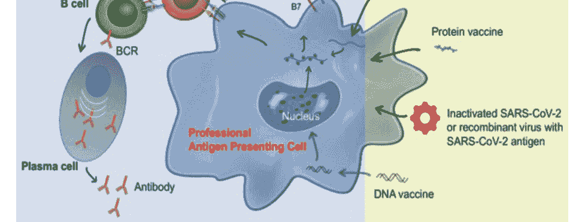

图11 COVID-19疫苗的工作机制

## 接种疫苗

疫苗接种是一种简单、安全、成功的方法，通过向体内引入化学化合物，在我们接触到受影响的人之前，保护人们免受有害病原体的侵害（图12）。它增强了我们体内固有的防御机制，对不同的感染产生抵抗力，并使我们的免疫系统变得越来越强大[53]。

对抗COVID-19疾病的疫苗是打破流行病状况的最高工具，但它们单独无法做到。公共卫生和社会措施包括监测、接触追踪、隔离和个人保护行为，如保持社交距离（与他人保持至少6英尺距离）、佩戴世卫组织推荐的N95口罩或手术口罩覆盖鼻子和嘴巴、避免通风不良的地方，如果感觉不适则待在家里。

- 将这些刺突蛋白视为威胁
- 与具有相似蛋白质的冠状病毒作斗争

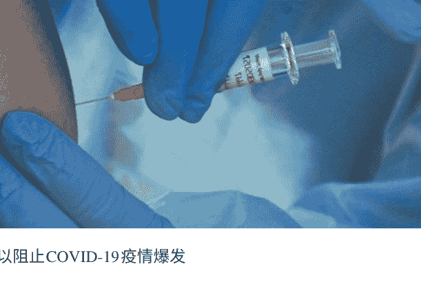

遮住咳嗽和打喷嚏，并经常用肥皂清洁双手，仍然是打破传播链的关键 [54, 55]。
上述疫苗对疫情的影响取决于各种因素，如疫苗的有效性；它们被批准的速度；接种、生产和交付的人数；可能出现的其他变种等 [56]。

疫苗接种可以保护我们免受COVID-19疾病的严重危险和可能的死亡。接种后的前14天，我们没有足够数量的抗体，因此保护水平不够令人满意，但之后抗体逐渐增加。对于单剂疫苗，接种后15天通常会产生优势，但对于双剂疫苗，两剂疫苗之间保持规定的间隔是实现最高程度免疫的关键。

尽管我们都知道任何类型的COVID-19疫苗都能保护我们免受严重干扰和死亡，但我们仍在研究和收集关于它在防止感染和传播病毒方面的范围的信息 [57]。从其他国家获得的统计报告表明，目前使用的疫苗能够保护我们免受冠状病毒疾病的严重程度和住院。然而，确实没有任何一种疫苗是100%有效的，突破性感染是令人遗憾的，但是可以预料到。

目前的分析数据表明疫苗在预防冠状病毒感染和传播方面提供了一定的保护，但这种保护还不足以对抗严重疾病和死亡。我们仍在研究最新的变种病毒，并调查疫苗是否能对这些变种病毒提供足够的保护，就像对非变种病毒一样。基于这些证明，如果社会大多数人没有接种疫苗，那么保持其他预防措施尤为重要，特别是在存在明显SARS-CoV-2传播的社区中。

为了保护我们自己和他人的安全，尽管我们在努力减少病毒传播并加快疫苗接种覆盖率，但我们仍应继续保持与他人的社交距离，用手肘遮住咳嗽或打喷嚏，经常清洁双手，并在封闭、拥挤或通风不良的空间或区域佩戴适当的口罩。因此，建议根据当地的情况和风险，始终遵循当地政府的指导方针。

世界卫生组织推荐的紧急使用疫苗（EUL）提供了不同程度的保护，包括对轻度感染、呼吸综合征、住院和可能的死亡的保护。全球数千名科学家正在进行持续的研究调查，以了解新的病毒突变和变种对不同COVID-19疫苗的有效性产生的影响。总体而言，COVID-19疫苗对于严重疾病、住院和死亡的保护非常可靠，但对于感染和轻度疾病的保护程度不如早期病毒变种。如果我们在接种疫苗后生病，症状很可能较轻。

然而，经证实，世界卫生组织推荐的COVID-19疫苗在降低我们患重症和死亡风险方面非常有效，但没有一种疫苗是100%有效的。 即使接种了COVID-19疫苗，仍有一小部分人会感染COVID-19疾病。 目前，关于已接种疫苗的人传播病毒给另一个感染者的风险的信息非常有限。 因此，在完全接种疫苗后，继续采取公共卫生和社交措施非常重要。

## 常用的COVID-19疫苗有：

- (a) Covaxin疫苗- 印度首个本土的灭活病毒型COVID-19疫苗是Covaxin，由Bharat Biotech与印度医学研究委员会（ICMR）和国家病毒学研究所（NIV）合作开发（图13）。 该疫苗采用了全病毒灭活Vero细胞衍生平台技术进行研发。 这是一个两剂次的疫苗接种系统，间隔4周，已获得印度药品管理局（DCGI）对第一和第二阶段临床试验的批准，并于2020年7月在全印度开始试验。 经证实和有充分文献记录，该疫苗能够中和以下变种：B.1.1.7（Alpha）-最早在英国发现；P.1 - B.1.1.28（Gamma）和P.2 - B.1.1.28（Zeta）-主要在巴西发现；B.1.617（Kappa）-最初在印度分离；B.1.351和B.1.617.2（Beta和Delta）-主要在南非共和国和印度概述。 根据临床试验的分析和随后的研究结果，Bharat Biotech确认该疫苗对SARS-CoV-2的B.1.617.2 Delta变种的有效性为65.2%。

- (b) Covishield疫苗- Covishield疫苗，以前被称为ChAdOx1nCoV-19疫苗，是由一种常见感冒病毒ChAdOx1的变种制成的（图14）。 已经添加了一种遗传物质到腺病毒中，以构建来自SARS-CoV-2冠状病毒的刺突（S）糖蛋白。 这是一种重组、繁殖受损的黑猩猩腺病毒载体编码SARS-CoV-2刺突（S）糖蛋白。疫苗接种后，冠状病毒的一部分遗传物质被暴露出来，从而刺激免疫反应。

在紧急情况下，印度的药品监管机构于2021年1月1日批准了这种冠状病毒疫苗，该疫苗由阿斯利康公司与牛津大学合作开发。世界卫生组织（WHO）建议印度Serum Institute of India Pvt. Ltd. COVID-19生产Covishield疫苗，日期为2021年2月15日。2021年3月19日，监管机构还确认阿斯利康COVID-19疫苗（Covishield）具有有利的风险效益概况，具有杰出的潜力来预防感染并减少全球死亡人数。

阿斯利康于2021年12月23日宣布，关于Vaxzevria(ChAdOx1-S)，它在第三次加强剂后显著增强了对Omicron SARS-CoV-2变种(B.1.1.529)的抗体水平，根据从新的实验室研究获得的报告。对Omicron的中和抗体水平，在接种Covishield的第三次加强剂后，主要与对抗Delta变种的两剂次后达到的水平相似。

- (c) 强生疫苗- 强生公司开发的COVID-19疫苗，含有一种被改造的病毒片段，称为载体病毒，它不是导致冠状病毒的微生物，因为它们无法自我复制（图15）。所使用的组合指示寄主细胞构成免疫反应，协助我们免受感染。在未来几天内感染COVID-19 当宿主发展出足够的免疫力后，它会摆脱所有疫苗成分，就像丢弃细胞不再需要的任何信息一样。根据制造商的临床试验调查和结果，这种疫苗对Delta和其他变种的有效性为66.9%。

- (d) Moderna疫苗– Moderna开发的COVID-19疫苗在世界卫生组织的紧急使用授权类别下可供18岁及以上的个体接种两剂主要疫苗；作为第三剂，作为某些免疫功能受损的同年龄组个体的预防剂量；以及作为完成基础疫苗接种至少6个月后的单剂增强剂。Moderna COVID-19疫苗由一段无害的信使RNA（mRNA）组成（图16）。根据18岁及以上人群的临床试验数据和证据，该疫苗对COVID-19疾病的有效性为94.1%。

- (e) 斯普特尼克V疫苗 - 俄罗斯的COVID-19疫苗被命名为斯普特尼克V(Gam-COVID-Vac)，它是一种基于腺病毒DNA的病毒载体疫苗，其中包含了SARS-CoV-2冠状病毒基因。这是一种针对SARS-CoV-2冠状病毒的双重疫苗，其中弱化的病毒将传递病原体的小部分并刺激机体的免疫反应。宿主细胞将利用失活病毒的基因来生长刺突蛋白。宿主的免疫系统将把这种刺突蛋白视为外来物质并通过产生抗体和T细胞来培养一种自然的防御机制。与其他疫苗不同，斯普特尼克V疫苗将最大程度地减少对SARS-CoV-2即COVID-19流行病的实际免疫发展所需的时间，即Beta变种。Gam-COVID-Vac是全球三种冠状病毒疫苗之一，其效力超过90%，并成为全球首个注册的冠状病毒疫苗（图17）。

- (f) Zydus Cadila疫苗 - 2021年8月20日，DCGI推荐了ZydusCadila制造的ZyCoV-D疫苗紧急使用授权(EUA)。这是世界上第一个基于DNA的COVID-19疫苗，由印度自主研发，并已在人类中使用，包括12岁及以上的年轻人和成年人（图18）。在与DBT、印度政府的合作下，Zydus Cadila在生物技术产业研究援助委员会（BIRAC）实施的“Mission COVID Suraksha”计划下开发了这种疫苗。ZyCoV-D疫苗通过国家生物制药任务资助进行了临床前研究、一期和二期临床试验，并随后在“Mission COVID Suraksha”计划下进行了三期临床探索。这种三剂注射疫苗能够产生SARS-CoV-2病毒的刺突蛋白，并提供免疫力，这在预防疾病和病毒清除中起着不可或缺的作用。

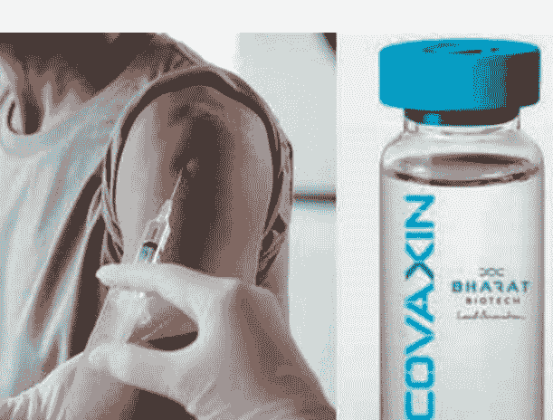

图13 Covaxin-印度首个自主研发的COVID-19疫苗

## 图14 Covishield COVID-19疫苗

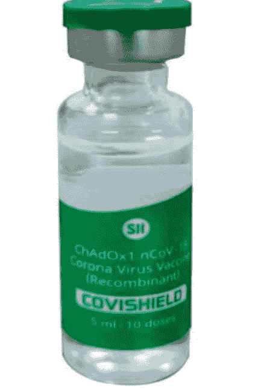

## 图15 强生公司开发的COVID-19疫苗

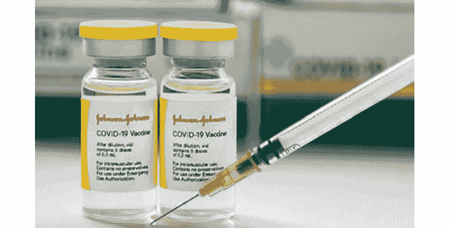

## 图16 Moderna COVID-19疫苗

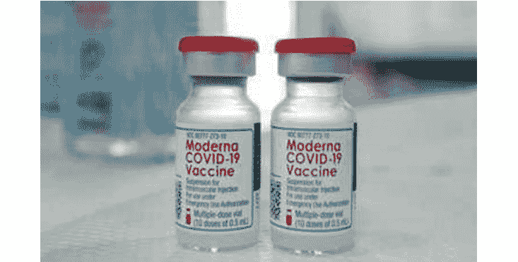

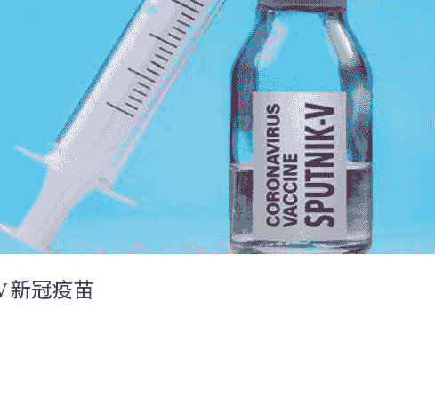

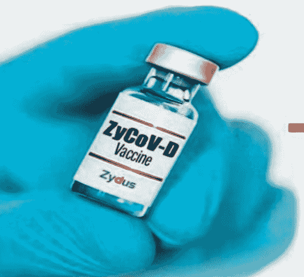

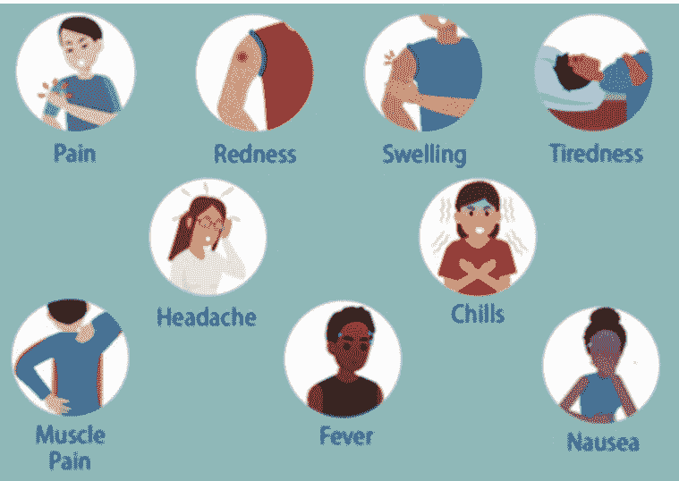

## COVID-19疫苗的副作用

就像其他疫苗一样，少数人在接种新冠疫苗后会出现轻度到中度的反应，因为这是一个正常的信号，表明我们的身体正在产生保护作用（图19）。对新冠疫苗的后遗症并不是所有人都会出现，而且根据具体的疫苗而异，包括谵妄、疲劳、头痛、肌肉痉挛、感冒、腹泻以及注射部位的疼痛或红肿。大多数副作用会在几天内自行消失，不需要药物干预，而是通过自身的自愈机制。如果需要，我们可以通过休息、充足的非酒精液体摄入和服用抗炎药物来缓解综合症状。

COVID-19疫苗可能会有更危险或终身副作用，但是非常罕见和不常见。如果接种疫苗后出现呼吸困难、胸部痉挛、注意力分散、失语或行动受限等困难，请立即联系医疗提供者。COVID-19疫苗的副作用已经在显微镜下观察了很长时间，以便检测和应对罕见的不良反应。

## COVID-19疫苗接种的重要性

COVID-19疫苗的诞生是减缓疫情加速和进一步减少相同疾病和死亡的最重要和最大的一步。COVID-19疫苗的引入是全球最大的注射计划和推出，需要在各个层面进行有效的规划以确保正确执行。接种COVID-19疫苗的主要优势包括以下几点：

- (i) 疫苗降低了我们感染的风险。

一旦我们接种了COVID-19疫苗的首剂，我们的系统就开始产生抗冠状病毒的抗血清，并支持抵抗系统以预防这种病毒。如果我们接触到感染，它降低了患病的几率。全球范围内使用的所有类型的疫苗对感染的有效性都达到了70%或更高。

确实，即使在完成全程疫苗接种后，一些人仍然受到影响，但当大多数人接种疫苗时，这些风险逐渐减小。这种采纳被称为群体免疫。因此，完全接种疫苗的人不仅会减少感染的机会，还会为社区的保护做出贡献，缩短病毒传播的趋势。

- (ii) 疫苗可以帮助未出生或新生婴儿。

研究表明，接种COVID-19疫苗的孕妇会产生抗体来对抗病毒，并通过胎盘将血清传递给即将出生的宝宝。母亲还通过母乳向新生儿传递免疫力。上述研究表明，如果母亲完全接种疫苗，那么他们的新生儿对病毒具有某种免疫力，这对于12岁以下的儿童来说非常重要，因为他们目前还不能接种疫苗。

- (iii) 疫苗可以预防严重疾病。

在调查过程中，确认所有可用疫苗都对冠状病毒具有强大的作用，并能预防COVID-19引起的严重疾病。因此，无论如何，如果我们在接种疫苗后感染了病毒，严重疾病和可能的死亡的几率都会进一步降低。临床研究表明，辉瑞-生物科技和莫德纳制造的疫苗在预防严重疾病方面成功率达到100%，而强生产品的成功率为85%。

其他疫苗对于这种传染病的有效性超过75%。 这些疫苗也对COVID-19病毒的不同变种具有有效性。 因此，所有疫苗都将保护我们免受严重疾病，并降低COVID-19疾病住院的可能性。

根据不同研究的统计报告，接种疫苗的人感染冠状病毒后，病情相对较轻，比未接种疫苗的人群要好。 因此，一旦我们完成全程疫苗接种，我们几乎不会被送进医院，也不太可能因COVID-19而死亡。

- (iv) 疫苗帮助我们摆脱口罩。

疫苗是我们努力恢复新常态的最重要解决方案，除了社区健康筛查，如皮肤温度监测、口罩佩戴、社交距离、避免聚集、手部清洁、消毒等，正确执行这些措施可以有效减缓病毒传播。 尽管在室内区域和高感染率的公共场所仍然建议佩戴口罩，但疫苗是我们走向终点的途径。

研究数据显示，完全接种疫苗的人，如果感染了这种新型病毒，在呼吸道和口腔等部位的病毒颗粒较少，并且较不可能传播给他人。 这个声明非常重要，现在接种疫苗不仅可以保护我们自己，还可以限制病毒传播给我们的亲人和朋友。

只要人们能按时接种疫苗，我们可能会达到群体免疫，从而明显减少病毒传播的可能性。 因此，所有人按时接种疫苗对于实现这一公共卫生目标至关重要。

- (v) 疫苗将帮助我们与朋友和家人重新建立联系。

在接种双剂量疫苗并等待批准期间让我们的身体产生免疫力后，我们可以与其他接种疫苗的人面对面交谈而无需戴口罩。 此外，如果我们曾与COVID-19阳性的人接触过，我们不需要任何隔离期来隔离自己。

近1年的焦虑，疫苗终于爆发并具有明显的好处，这应该让每个人都坚信接种疫苗的重要性。 通过选择每个人接种疫苗，我们不仅可以保护自己，还可以为我们的家庭和社区提供安全保障。

## 结论

根据从不同事件和研究中收集的各种文献和证据，我们知道进行适当的健康筛查和COVID-19疫苗接种将最大程度地减少在社区中传播冠状病毒的机会。通过不同的健康筛查实践，我们可以快速发现COVID-19感染者，并将他们与家人和普通人隔离开来。上述所有的检查和分析步骤将支持医务人员将受影响的人与其他人分开，并在这种感染的初步阶段为患者开始用药。如果每个人的筛查情况都取得成功，我们就可以阻止冠状病毒在社会中的传播。此外，对冠状病毒疾病的疫苗接种可能是当前大流行情况的最大希望。可用的COVID-19疫苗，如Covishield、Covaxin、Sputnik V等，非常令人印象深刻和有能力，可以轻松削弱感染和传播导致COVID-19的病毒的危险。加速接种疫苗不仅可以保护我们免受轻度到中度症状的影响，更严重的疾病或死亡，还可以限制我们将导致COVID-19混乱的病原体传播给社区中的许多人。拦截病毒的繁殖和繁殖使其变异为对疫苗最不抵抗的较不威胁的基因组序列。此外，还进行持续的意识活动，以限制COVID-19病毒在人群中的传播，并提高疫苗抑制病毒的效率。因此，有效的健康筛查和及时的疫苗接种将防止导致COVID-19疾病的病毒的传播，并最小化其不良影响。

## 参考文献

- 1. S. Bag, S. Sikdar, K. Ganguly, S. Banerjee, P. Lahiri, 通过有效的健康筛查来预防感染和控制COVID-19的传播。J. Phys. Conf. Ser. 1797(1), 012040 (2021)
- 2. H. Zhu, L. Wei, P. Niu, 中国武汉的新冠疫情爆发。Glob. Health Res.Policy 5, 6 (2020)
- 3. A. Sharma, S. Tiwari, M.K. Deb, J.L. Marty, 严重急性呼吸综合征冠状病毒-2(SARS-CoV-2): 全球大流行和治疗策略。Int. J. Antimicrob. Agents 56(2), 106054 (2020)
- 4. C.-C. Lai, T.-P. Shih, W.-C. Ko, H.-J. Tang, P.-R. Hsuehe, 严重急性呼吸综合征冠状病毒2 (SARS-CoV-2) 和冠状病毒病-2019 (COVID-19): 疫情和挑战。Int. J. Antimicrob. Agents 5 5(3), 105924 (2020)
- 5. Y.-C. Wu, C.-S. Chen, Y.-J. Chan, COVID-19疫情爆发：概述。中华医学会杂志 83(3), 2 17–220 (2020)
- 6. D. Wu, T. Wu, Q. Liu, Z. Yang, SARS-CoV-2疫情爆发：我们所知道的。国际传染病杂志94, 44–48 (2020)
- 7. W. Guan, Z. Ni, Y. Hu, W. Liang, C. Ou, J. He, L. Liu, H. Shan, C. Lei, D.S.C. Hui, B. Du, L. Li, G. Zeng, K.Y. Yuen, R. Chen, C. Tang, T. Wang, P. Chen, J. Xiang, S. Li, J.-l. Wang, Z. Liang, Y. Peng, L. Wei, Y. Liu, Y.-h. Hu, P. Peng, J.-m. Wang, J. Liu, Z. Chen, G. Li, Z. Zheng, S. Qiu,- 8. S. Zaim, J.H. Chong, V. Sankaranarayanan, A. Harky, COVID-19和多器官反应。Curr. Probl. Cardiol. 45(8), 100618 (2020)

- 9. S. Mandal, T. Bhatnagar, N. Arinaminpathy, A. Agarwal, A. Chowdhury, M. Murhekar, R.R. Gangakedhkar, S. Sarkar, 印度控制冠状病毒病2019传播的谨慎公共卫生干预策略: 基于数学模型的方法。 Indian J. Med. Res. 151(2 & 3), 190–199 (2020)

- 10. M. Jayaweera, H. Perera, B. Gunawardana, J. Manatunge, COVID-19病毒通过飞沫和气溶胶传播: 对未解决的二分法的批判性评论。环境研究 188, 109819 (2020)

- 11. S. Sanche, Y.T. Lin, C. Xu, E. Romero-Severson, N. Hengartner, R. Ke, 严重急性呼吸综合征冠状病毒2的高传染性和快速传播。新兴传染病 26, 1470–1477 (2020)

- 12. W.E. Wei, Z. Li, C.J. Chiew, S.E. Yong, M.P. Toh, V.J. Lee, 新加坡SARS-CoV-2无症状传播。MMWR Morb. Mortal. Wkly Rep. 69, 411–415 (2020)

- 13. J. Chen, 2019-nCoV的致病性和传播能力-快速概述和与其他新兴病毒的比较。微生物感染 22, 69–71 (2020)

- 14. R. Guner, İ. Hasanoğlu, F. Aktas, COVID-19: 社区预防和控制措施。Turk. J. Med. Sci. 50(SI-1), 571–577 (2020)

- 15. M. Lotfi, M.R. Hamblin, N. Rezaei, COVID-19: 传播、预防和潜在治疗机会。Clin. Chim. Acta 508, 254–266 (2020)

- 16. R. Keni, A. Alexander, P.G. Nayak, J. Mudgal, K. Nandakumar, COVID-19: 出现、传播、可能的治疗方法和全球负担。Front. Public Health 8, 216 (2020)

- 17. F. Krammer, SARS-CoV-2疫苗正在开发中。Nature 586, 516–527 (2020)

- 18. J.P. Moore, P.A. Offit, SARS-CoV-2疫苗和病毒变种的日益威胁。JAMA 325(9), 821–822 (2021)

- 19. J.M.G. Wilson, G. Jungner, 疾病筛查的原则与实践, 公共卫生论文编号34 (日内瓦, 世界卫生组织, 1968)

- 20. L.D. Maxim, R. Niebo, M.J. Utell, 筛查测试: 一篇综述与示例. 吸入毒理学. 26(13), 811–828 (2014)

- 21. A.N. Desai, P. Patel, 阻止COVID-19的传播. JAMA 323, 1516 (2020)

- 22. B. Nussbaumer-Streit, V. Mayr, A.I. Dobrescu, A. Chapman, E. Persad, 单独隔离或与其他公共卫生措施结合以控制COVID-19: 快速综述. Cochrane数据库系统综述 4(4), CD013574 (2020)

- 23. S.H.S. Tali, J.J. LeBlanc, Z. Sadiq, O.D. Oyewunmi, C. Camargo, B. Nikpour, N. Armanfard, S.M. Sagan, S. Jahanahahi-Anbubi, 用于严重急性呼吸综合征冠状病毒2 (SARS-CoV-2)/COVID-19检测的工具和技术. 临床微生物学评论. 34(3), e00228-20 (2021)

- 24. R.S. Burnham, R.S. McKinley, D.D. Vincent, 三种类型的皮肤表面温度计: 可靠性、有效性和响应性的比较。 美国物理医学和康复杂志 85 (7), 553–558 (2006)

- 25. G.B. Dell’Isola, E. Cosentini, L. Canale, G. Ficco, M. Dell’Isola, 非接触式体温测量: 不确定性评估和预防COVID-19传播的筛查决策规则。传感器 21, 346 (2021)

- 26. P. Ghasemi, T. Joshua Pfefer, J.P. Casamento, R. Simpson, Q. Wang, 红外热像仪用于发热筛查的标准化性能测试的最佳实践。 PLOS ONE 13, e0203302 (2018)

- 27. R. Wölfel, V.M. Corman, W. Guggemos, M. Seilmaier, S. Zange, M.A. Müller, D. Niemeyer, T.C. Jones, P. Vollmar, C. Roth, M. Hoelscher, T. Bleicker, S. Brünink, J. Schneider, R. Ehmann, K. Zwirgmaier, C. Drosten, C. Wendtner, COVID-2019住院患者的病毒学评估。Nature 581, 465–469 (2020)

- 28. B.D. Kevadiya, J. Machhi, J. Herskovitz, M.D. Oleynikov, W.R. Blomberg, N. Bajwa, D. Soni, S. Das, M. Hasan, M. Patel, A.M. Senan, S. Gorantla, J.E. McMillan, B. Edagwa, R. Eisenberg, C.B. Gurumurthy, S.P.M. Reid, C. Punyadeera, L. Chang, H.E. Gendelman, SARS-CoV-2感染的诊断。 Nat. Mater. 20, 593–605 (2021)

- 29. W. Joost Wiersinga, A. Rhodes, A.C. Cheng, S.J. Peacock, H.C. Prescott, 2019年冠状病毒病(COVID-19) 的病理生理学、传播、诊断和治疗：一项综述。 JAMA 324(8), 782–793 (2020)

- 30. K.C. Coffey, D.J. Diekema, D.J. Morgan, 解读SARS-CoV-2测试结果。 JAMA 326(15), 1528–1529 (2021)

- 31. B. Udugama, P. Kadhiresan, H.N. Kozlowski, A. Malekjahani, M. Osborne, V.Y.C. Li, H. Chen, S. Mubareka, J.B. Gubbay, W.C.W. Chan, 诊断COVID-19： 疾病和检测工具。 ACS Nano 14(4), 3822–3835 (2020)

- 32. L.E. Brümmer, S. Katzenschlager, M. Gaeddert, C. Erdmann, S. Schmitz, M. Bota, M. Grilli, J. Larmann, M.A. Weigand, N.R. Pollock, A. Macé, S. Carmona, S. Ongarello, J.A. Sacks, C.M. Denkinger, SARS-CoV-2的新型抗原快速诊断的准确性：一项实时系统综述和荟萃分析。 PLOS Med. 18(10), e1003825 (2021)

- 33. A.E. Fiore, C.B. Bridges, N.J. Cox, “季节性流感疫苗”。 流感大流行疫苗。 Curr. Top. Microbiol. Immunol. 333, 43–82 (2009)

- 34. K.M. Edwards, W.A. Orenstein, COVID-19: 疫苗(UpToDate – 文献综述至2022年)

- 35. F. Krammer, SARS-CoV-2 疫苗研发。 Nature 586, 516 (2020)

- 36. B.S. Graham, 快速 COVID-19 疫苗研发。 Science 368, 945 (2020)

- 37. M.K. Andrew, J.E. McElhaney, 年龄和虚弱在 COVID-19 疫苗研发中的作用。 Lancet 396(10267), 1942–1944 (2020)

- 38. G. Dagotto, J. Yu, D.H. Barouch, SARS-CoV-2 疫苗研发的方法和挑战。 Cell Host Microbe 28(3), 364–370 (2020)

- 39. S. Jain, H. Batra, P. Yadav, S. Chand, COVID-19疫苗目前正在进行临床前和临床研究，并伴随着抗病毒免疫反应。 疫苗 8(4), 649 (2020)

- 40. N. Pardi, M.J. Hogan, F.W. Porter, D. Weissman, mRNA疫苗——疫苗学的新时代。 Nat. Rev. Drug Discov. 17(4), 261–279 (2018)

- 41. J. Abbasi, COVID-19和mRNA疫苗——新方法的首次大规模测试。 JAMA 324(12), 1125–1127 (2020)

- 42. B. Pulendran, P.S. Arunachalam, D.T. O’Hagan, 疫苗佐剂科学中的新概念。 Nat. Rev. Drug Discov. 20, 454–475 (2021)

- 43. S.P. Kaur, V. Gupta, COVID-19疫苗： 综合状态报告。 病毒研究。 288, 198114 (2020)

- 44. V. Bajaj, N. Gadi, A.P. Spihlman, S.C. Wu, C.H. Choi, V.R. Moulton, 老化， 免疫力和COVID-19： 年龄如何影响宿主对冠状病毒感染的免疫反应？ 前线。生理学。 (2021) 。 https://doi.org/10.3389/fphys.2020.571416

- 45. T. Ura, K. Okuda, M. Shimada, 基于病毒载体的疫苗发展。 疫苗 （巴塞尔）2 （3）, 624-641 （2014）

- 46. Y. Lazenik, 细胞融合作为SARS-CoV-2刺突蛋白， COVID-19并发症和疫苗副作用之间的联系。 Oncotarget 12 （25）, 2476-2488 （2021）

- 47. Z. Matić, M. Šantak, 对抗人类传染病的新型疫苗技术的当前观点。 应用微生物学和生物技术。 106, 25-56 (2022)

- 48. A. Jara, E.A. Undurraga, C. González, F. Paredes, T. Fontecilla, G. Jara, A. Pizarro, J. Acevedo, K. Leo, F. Leon, C. Sans, P. Leighton, P. Suárez, H. García-Escorza, R. Araos, 智利一种灭活的SARS-CoV-2疫苗的有效性。 新英格兰医学杂志。 385, 875 (2021)

- 49. N. Al Kaabi, Y. Zhang, S. Xia, Y. Yang, M.M. Al Qahtani, N. Abdulrazzaq, M. Al Nusair, M. Hassany, J.S. Jawad, J. Abdalla, S.E. Hussein, S.K. Al Mazrouei, M. Al Karam, X. Li, X. Yang, W. Wang, B. Lai, W. Chen, S. Huang, Q. Wang, T. Yang, Y. Liu, R. Ma, Z.M. Hesain, T. Khan, M.S. Fakhruddin, W. Yu, Z. Xie, Y. Zhao, Z. Jiang, G. Zhao, Y. Zhang, S. Mahmoud, I. Eltantawy, P. Xiao, A. Kessi, W.A. Zaher, H. Wang, K. Duan, A. Pan, X. Yang, 灭活的SARS-CoV-2疫苗对成年人的症状性COVID-19感染的影响：一项随机化临床试验。JAMA 326，35 (2021)

- 50. S.L. Xia, Y.T. Zhang, Y.X. Wang, H. Wang, Y.K. Yang, G.F. Gao, W.J. Tan, G.Z. Wu, M. Xu, Z.Y. Lou, W.J. Huang, W.B. Xu, B.Y. Huang, W. Wang, W. Zhang, N. Li, Z.Q. Xie, X. Zhu, L. Ding, W.Y. You, Y.X. Zhao, J. Zhao, L.L. Huang, X.Z. Shi, Y.L. Yang, G.X. Xu, W.L. Wang, P.P. Liu, M. Ma, Y.L. Qiao, S.H. Zhao, J.J. Chai, Q.Q. Li, F. Hui, Y. Xu, X.T. Zheng, W.S. Guo, X.M. Yang, BBIBP-CoV灭活COVID-19疫苗的安全性和免疫原性, 18岁以下人群: 一项随机、双盲、对照、1/2期试验。柳叶刀传染病 22 (2), 196-208 (2022)

- 51. M. Sadarangani, A. Marchant, T.R. Kollmann, 疫苗诱导的对COVID-19的免疫保护的免疫学机制。Nat. Rev. Immunol. 21, 475-484 (2021)

- 52. M.T. Mascellino, F. Di Timoteo, M. De Angelis, A. Oliva, 主要抗SARS-CoV-2疫苗的概述: 作用机制、效果和安全性。Infect. Drug Resist. 14, 3459-3476 (2021)

- 53. H.F. Florindo, R. Kleiner, D. Vaskovich-Koubi, R.C. Acúrcio, B. Carreira, E. Yeini, G. Tiram, Y. Liubomirski, R. Satchi-Fainaro, COVID-19的免疫介导方法。Nat. Nanotechnol. 15, 630-645 (2020)

- 54. E.N. Perencevich, D.J. Diekema, M.B. Edmond, 将个人防护装备引入社区: 面罩和COVID-19的控制。JAMA 323(22), 2252-2253 (2020)

- 55. L. Martinelli, V. Kopilaš, M. Vidmar, C. Heavin, H. Machado, Z. Todorović, N. Buzas, M. Pot, B. Prainsack, S. Gajović, COVID-19大流行期间的口罩: 一个简单的保护工具具有许多含义。Front. Public Health 8, 606635 (2021)

- 56. T. Hasan, J. Beardsley, B.J. Marais, T.A. Nguyen, G.J. Fox, 对SARS-CoV-2的大规模疫苗接种的实施: 现有策略和指南的系统综述。疫苗 (巴塞尔) 9, 326 (2021)

- 57. E.J. Haas, F.J. Angulo, J.M. McLaughlin, E. Anis, S.R. Singer, F. Khan, N. Brooks, M. Smaja, G. Mircus, K. Pan, J. Southern, D.L. Swerdlow, L. Jodar, Y. Levy, S. Alroy-Preis, 以色列全国疫苗接种活动后, mRNA BNT162b2疫苗对SARS-CoV-2感染和COVID-19病例、住院和死亡的影响和有效性: 一项使用国家监测数据的观察性研究。Lancet 397, 1819-1819 (2021)

- 58. A. Singanayagam, S. Hakki, J. Dunning, K.J. Madon, M.A. Crone, A. Koycheva, N. Derqui-Fernandez, J.L. Barnett, M.G. Whitfield, R. Varro, A. Charlett, R. Kundu, J. Fenn, J. Cutajar, V. Quinn, E. Conibear, P.W. Barclay, P.S. Freemont, G.P. Taylor, S. Ahmad, M. Zambon, N.M. Ferguson, P.A. Lalvani, 英国接种和未接种个体中SARS-CoV-2 Delta (B.1.617.2) 变种的社区传播和病毒载量动力学: 一项前瞻性、纵向、队列研究。Lancet 22 (2), 183-195 (2022)

# 使用神经网络进行COVID-19和未来大流行病的人群密度估计

S. U. Muthunagai，M. S. Girija，R. Iyswarya，S. Poorani和R. Anitha

## 介绍

COVID’19是一种与冠状病毒相关的疾病，最早于2020年12月底在中国武汉发现。许多医疗机构为了对抗这种致命病毒而努力，但是没有找到摆脱这种疾病的解决方案。许多国家已经实施了关于使用口罩的新法律，以应对冠状病毒流行。政府已经开始开发新技术来管理空间、社交距离[1]以及医务人员和普通公民的物资。

但是，在拥挤的地方和近距离接触中，它仍然迅速传播。在许多国家，政府在保护人民免受冠状病毒侵害方面面临巨大的障碍和危险。为了对抗和赢得COVID’19大流行，政府需要对公共场所的人员进行监控和监视，特别是那些拥挤的场所，以确保遵守禁止使用口罩的法律。这可以通过将监控技术与人工智能模型相结合来实现。

在过去的二十年中，视频中的移动物体跟踪[2-4]是一个积极研究的领域，因为它在许多领域具有实际应用，如事件分析、人机交互、人群分析等。尽管广泛的研究已经揭示了在高度受限环境中的一些成功应用，但仍然存在许多障碍需要克服，例如突然的物体运动、物体外观的变化、非刚性物体、遮挡、光照等问题。许多研究人员正在致力于开发计算机视觉系统，试图模拟

S. U. Muthunagai（✉）· M. S. Girija · R. Iyswarya · S. Poorani · R. Anitha
计算机科学与工程系，斯里文卡特斯瓦拉工学院，斯里珀伦布杜尔，印度

电子邮件：muthunagai@svce.ac.in；girijamagesh@svce.ac.in；iyswarya@svce.ac.in；spoorani@svce.ac.in；ranitha@svce.ac.in生物系统的基本能力，例如理解场景、检测对象（静态或移动）、理解环境、识别事件、分析人群、计数人数、检测人员和车辆等。目标检测是在场景中检测感兴趣对象的过程，例如人、汽车和其他物体。物体跟踪被定义为确定移动物体的轨迹，例如跟踪移动汽车的轨迹以检测违规行驶。视频可以由静态摄像机（如监控摄像机）或移动摄像机（如安装在移动机器人上的摄像机）制作，用于跟踪物体。

在静态摄像机中，背景始终保持静态，物体移动；而在移动摄像机中，背景是动态的，物体也在动态背景中移动。

## 物体跟踪框架

在计算机视觉领域，目标跟踪是一个关键问题。目标跟踪算法吸引了许多研究人员，因为它们具有高度可用和低成本的多媒体数据。检测、跟踪和分析活动对象是多媒体领域中涉及的三个主要阶段。在这三个阶段中，跟踪是一个繁琐的过程，因为它涉及到场景中时间敏感的数据的确定。它还提供与对象相关的信息，例如对象的方向、对象的区域和对象的形状。人们已经用各种方式来解决这个问题。这些方式主要在于它们如何解决以下问题：哪种对象表示对于跟踪最好？应该使用哪些图像属性？对象的运动、外观和形状应该如何建模？包含跟踪信息的提取数据回答了上述所有问题。

## 目标检测

对象检测是指在视频的每一帧中定位实体，这是启动跟踪过程的先决条件。有两种类型的对象检测算法：(1) 检查帧中对象的角落和(2) 使用预定特征（如颜色）进行自动对象检测。用于检测移动对象的各种方法包括背景减除、卡尔曼滤波器和粒子滤波器等技术。在具有静态背景的视频序列中，通常使用背景减除。使用这种方法将图像分为前景和背景。运动中的对象（如人和车辆）位于前景，而静止的元素（如道路、建筑物、树木和静止的汽车）位于背景。

如果场景中没有物体，则首先获取参考背景图像。通过从基础图片中移除现有的图片框架，可以检测到移动物体。除了被物体占据的区域外，生成的间隙具有在阈值限制范围内的一定范围内。前景像素是那些与阈值差异大于阈值的像素，因为背景图片需要定期更新。

时间差分是一种在摄像机移动时效果良好的技术。它通过逐像素比较两个或三个连续帧来检测物体。在移动摄像机的情况下，移动摄像机和移动物体会混在一起。因此，一些研究人员提倡先测量和调整摄像机运动，然后再进行背景减除方法。对于快速移动的物体，这种方法对于运动中的重叠区域（实体）不起作用，因为它无法检测到尾部部分。

检测视频中的运动物体的另一种方法是光流。它生成一个二维向量场，检测出一系列图像中每个点的方向和速度。由于光流中的不连续性，图像可以被分割成对应于不同物体的部分。尽管处理成本较高，但该方法能够检测视频帧序列中的运动。

通过使用监督学习方法构建一个理解多个对象和外观的分类模型，可以识别视频中的实体。在分类器训练完成后，可以对目标对象的测试区域进行结论。

### 目标建模

场景中感兴趣的对象通过对象建模来表示。为了表示一个对象，提取出能够唯一定定义它的特征。这些特征或描述符被用来跟踪对象。特征是一种视觉设计，可以将对象与其周围环境区分开来。通过对特征进行一些处理，将物体转化为描述符，也称为外观特征。

### 对象表示

物体展示用于跟踪的方式被称为对象表示。通常，使用的对象表示类型由应用领域决定。点表示意味着使用一个点或一系列点来表示一个对象。点是基于统计对象计算得出的。采用点表示的主要优势在于它可以快速处理和操作。

- 原始几何形状
矩形、正方形、椭圆、圆等原始几何形状用于描述物体。跟踪人和车辆最常见的形状是矩形。

- 关节形状模型
关节对象-由关节连接的人体部分组成。
矩形、圆柱体和椭圆是构成身体部分的原始几何形状之一。运动动力学模型管理部件之间的连接。

- 骨骼模型
使用骨骼表示对关节和刚性物体进行建模。骨骼是实体内的一组关节，它在部分插图之间定义了依赖关系和限制。作者使用骨骼模型来检测大量人员。

- 轮廓
物体的边界由轮廓定义。它只描述了物体的边缘，这对于非刚性物体是一种可接受的表示方法。轮廓法中的轮廓可以明确或隐含地表示物体的轮廓。

### 外观特征

物体的外观特征，也称为描述符，可以用多种方式表示，颜色直方图用于估计物体外观的密度。使用直方图的主要缺点是，两个具有非常相似颜色直方图的物体可能看起来完全不同。使用简单的几何形状或轮廓创建模板，这仅对于在监测过程中姿态变化不大的物体有用。它包含几何和外观信息。另一方面，模板只保存由单个视图生成的物体的外观。

## 目标跟踪

这是一个计算视频中移动物体轨迹的过程。为了生成追踪轨迹，需要识别连续两帧中物体的位置，并在整个视频序列中继续这个步骤。有时，物体在重新出现之前会被另一个物体遮挡几帧。因此，追踪器必须能够处理部分或完全遮挡的情况。一个全面的视觉追踪器必须解决许多困难，包括物体突然移动、图像序列中的噪声、物体和场景外观的变化、光照等等。

已经发表了关于物体追踪的调查，以及它们的局限性和应用。在2006年之前，Yilmaz等人评估了物体追踪系统，提供了分类和分析。

文献中提出了简化视觉追踪的方法。本节概述了物体追踪策略，并根据追踪方法进行了分类，并推荐了一种分类方法。

### 基于特征的方法

在基于特征的方法中，提取属性，如纹理、梯度、颜色等，在目标跟踪过程中事先定义。确保所定义的属性在本质上是独特的，以便与其他属性区分开来。使用上述信息作为参考，提取出在接下来的帧中相似的对象。有基于颜色的模型、兴趣点算子、基于纹理的模型和光流方法。

### 基于估计的方法

视频中实体的跟踪被建模为一个状态计算问题，其中一个实体被表示为一个向量。基于估计或滤波的方法将跟踪问题表达为一个状态估计问题。状态向量描述了系统的动态行为，并包含了所讨论对象的运动属性，如位置、速度和加速度。贝叶斯方法为动态状态估计问题提供了一个通用的框架。该方法利用当前所有可用的数据构建状态向量的概率密度函数。

后验概率密度函数包含了关于对象状态的所有信息，因此它是状态估计问题的完整解决方案。使用状态和观测值为基础，采用两个模型计算状态的后验概率密度函数。

观测模型描述了观测值和状态之间的关系，而状态模型描述了系统的演变。卡尔曼滤波器和粒子滤波器是估计对象轨迹的两种常见贝叶斯算法。本文对这两种滤波器进行了全面讨论。滤波器包括两个步骤：预测和校正。基于状态的表示用于预测，并在下一步估计新的属性集。

观测模型用于执行校正步骤，更新对象的状态。电影中的每个图像帧都用于使用卡尔曼滤波器和粒子滤波器进行预测和校正阶段。

### 基于分割的方法

视觉跟踪中最基本和关键的阶段是关注给定视频帧中的附近物体，通过前景分割来区分聚焦的物体和背景图像。通常，场景中的前景物体是移动的物体。这些物体必须与背景场景分离离开来进行跟踪。使用分割算法跟踪移动物体的方法将在下一节中讨论。

### 基于学习的方法

视觉跟踪问题也可以看作是一个决策过程，在这个过程中，分类器经过良好训练，能够获取目标物体与背景物体之间的相似度。分类函数首先学习目标物体的不同视角和外观[6]，然后在测试区域上决定是否为目标物体。在这里，使用不同的监督算法从不同视角提取特征，主要包括提升、决策树、神经网络和支持向量机（SVM）。在多维空间中使用最大边际超平面来使用SVM将数据分类为两个可分离的类别。边际是通过计算超平面与最近数据点之间的差异来获得的。支持向量是落在超平面边缘上的数据点计算得出的。

将SVM [8, 9]与光流跟踪器相结合，以检测车辆的后部。通过最大化SVM分类得分，SVM在离线训练中被训练用于区分车辆和非车辆。为了解决大规模图像运动问题，从每个支持向量构建了一个高斯金字塔。Tian提出了一个集成分类器，即具有在线学习过程的线性SVM，它利用历史信息自动选择目标的有用关键帧。集成SVM分类器由许多分类器组成，这些分类器有助于分类器的在线更新，使其能够更好地处理目标外观变化。Exemplar-SVM是Tomasz Malisiewicz提出的一种系统，它为每个示例训练一个单独的分类器，从而形成一组更简单的示例-SVM。每个示例-SVM使用一个正例和数百万个负例进行训练。这个SVM集合产生了很好的结果。Zhang建议使用多视角来获得更准确的结果。

跟踪物体的另一种基于学习的方法是增强。它用于减少任何弱学习算法的错误，并通过整合大量基分类器来找到准确的分类器。在将弱学习算法应用于训练数据之前，它会多次执行，并将弱学习器的分类器组合成准确的分类器。Kim提出了一种多分类器增强技术，它可以为每个分类器软分割输入空间并学习多种物体外观。

## 提出的模型

人群密度估计器可以自动检测区域中社交隔离协议的遵守程度。它可以在现有的监控系统和警察使用的无人机上使用，以帮助预防冠状病毒，通过自动和更好地跟踪区域内的活动。它显示区域的实时分析。它还可以用于在特定区域出现重大社交隔离标准违规时向警察发出警告。图1表示所提出框架的流程图。

控制COVID-19的传播严重依赖于社交距离。在公共场所监测人与人之间的社交距离是一项耗时的操作，但它是COVID-19传播中的一个重要方面。虽然有许多不同的方法可以实时检测给定区域内的人群密度，但人群密度估计和社交距离分析器的关键特征是被分类为“人”的任意两个物体之间的距离应该更高于2米或6英尺。所提出的模型从视频输入中提取“人”对象，并计算出区域内的人数总数，如图2所示，以及两个个体之间的配对欧氏距离，使得社交距离协议能够最大程度地得到维护。

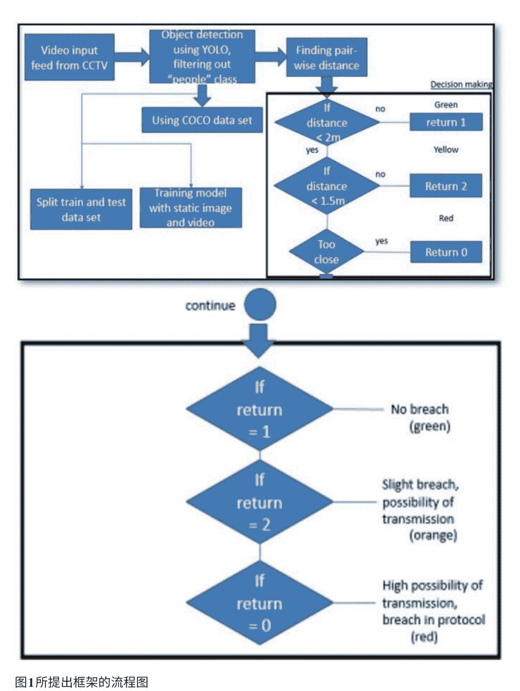

图1 所提出框架的流程图

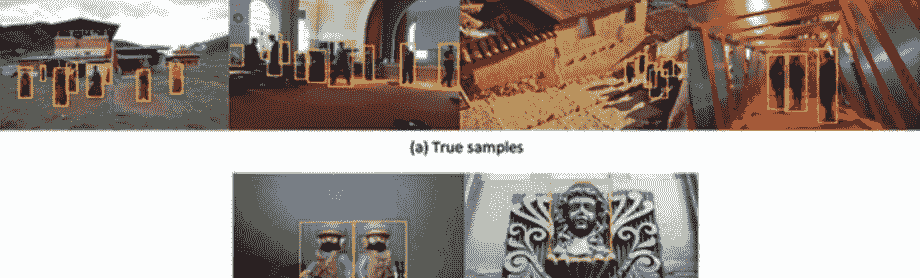

图2 包含（a）个真样本和（b）个假样本的数据集

## 目标检测和跟踪模型

在PASCAL-VOC和MS-COCO数据集上，许多目标检测模型被用于基于区域的卷积神经网络（RCNN）、快速RCNN、更快RCNN、SSD、YOLO ver1 [3]、YOLO ver2 [4]和Yolo [5]等方面的速度和准确性，这些模型受到骨干架构、ilp大小、模型深度以及软件和硬件环境等因素的影响。 特征分离器将输入转换为特征表示，用于学习和识别与所需对象相关的模式。 YOLO采用了Redmon等人描述的Darknet-53架构。

### YOLO目标检测

仅仅通过一次查看图像，YOLO [7] 可以确定对象的性质和位置。 为了给锚框赋予类别概率，YOLO 将目标检测视为回归过程而不是分类过程。 一个单独的神经网络同时预测多个边界框和类别概率。 YOLO [2] 分为三个版本 : ver1、ver2 和 ver3。

YOLO ver1 基于 GoogLeNet（Inception 网络），用于对图像中的对象进行分类。 图 3 展示了 YOLO 架构的示意图。 该网络中有 24 个卷积层 [9] 和 2 个全连接层。
GoogLeNet 使用的 Inception 模块已被 YOLO ver1 替换。 它使用了降维层，然后是卷积层。

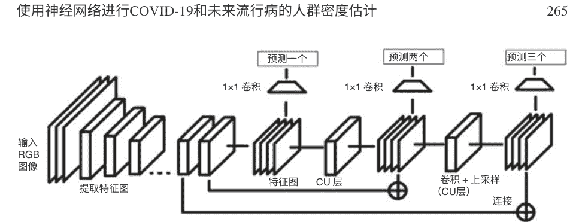

图3 YOLO架构的示意图

后来，YOLO v2 [8] 的目标是显著提高准确性的同时也使其更快。Darknet-19由19个卷积层、5个最大池化层和一个用于对象分类的输出softmax层组成，用于YOLO ver2。YOLO v2在mAP、FPS和对象分类得分方面都有显著提高，超过了其前身（YOLO ver1）。与YOLO ver1和ver2相比，YOLO使用逻辑分类器而不是softmax进行多标签分类。

Darknet-53是YOLO中由Redmon等人引入的骨干架构，用于提取特征图进行分类。与Darknet-19相比，Darknet-53包括残差块（短连接）以及用于网络连接和深度的上采样级别。YOLO在图像的每个空间位置上针对不同尺度进行三次预测，解决了无法高效检测小物体的问题。对于每个预测，计算无对象、边界框回归和分类得分。

为了实时识别物体，使用了卷积神经网络。它可以在算法的单次运行中完成，因为它是一种前向传播方法。COCO数据集被用作数据源。人类和其他移动物品（行李、无生命物体、汽车等）使用非常全面的标签和分类进行分类。我们可以避免算法执行中的任何错误，因为数据集是明确定义的。为了将路径与电影中的人物关联起来并提供路径，对象识别原型使用人物图像的真实和虚假样本进行微调，如图2所示。监控录像被输入训练好的模型。对于每个识别出的人物，原型会给出一组跳跃框。

### 使用曼哈顿距离计算成对距离

每个检测到的人物都有一个3D特征空间（x，y，d），其中（x，y）是边界框的质心坐标，d表示相机所见的个体的深度。

```
d = (2.3 * 14 * 180) / (w + h * 360) * 1000 + 3
```

其中 w表示边界框的宽度，h表示边界框的高度。第一个人和第二个人之间的曼哈顿距离计算如下。如果 x=(a,b) 和 y=(c,d)，那么x和y之间的曼哈顿距离是 |a-c| + |b-d|。

### 紧密性属性

当两个物体之间的配对距离大于2.0米（6英尺），它们被认为是安全的。如果发现的距离小于2.0米且大于等于1.5米，则存在传播和附近距离协议的轻微违规风险。如果发现的距离小于1.5米，则存在碰撞的强烈可能性。

### 协议和传输中违规的可能性

符合亲密属性的任何人都被分配到相邻的节点或附近的维度，这在与不同人相比以不同颜色线表示的聚类中。集体节点的发展表示社区分离实践的违反，可以使用以下标准来衡量：– ng表示识别的超级聚类数量，np表示检测到的人口的亲密程度。轻微的协议违规由橙色边界框和连接线表示，更严重的违规由红色边界框和连接线表示，安全距离的物体由绿色边界框和连接线表示。

### 使用提议的方案进行目标检测和距离计算

## 输入数据

使用闭路电视实时中继进行检查的输入源通过这个输入源确定一个房间内的个体数量是否可以保持在安全条件下，并将其保存为每分钟的帧数这被用作近似方法来估计人群密度这一步骤非常关键，因为它是我们分析的初始阶段通过将输入源分解成帧，可以将所需的信息分隔开

估计人群密度的方法可以分为两类
直接方法：在人群中，使用一些分类器来分割或检测每个人体 然后统计人体数量来确定人群密度 这些技术进一步分为两种类型
基于模型的方法：使用人体模型或形状轮廓进行检测或分割

## 目标检测

在这种范式中，对象的检测是至关重要的 使用这种方法在给定的帧中输入源进行检测，并检测所需的字符（在我们的案例中，人们遵守社交距离）在YOLO目标检测中，使用卷积神经网络实时检测对象 由于它是一种前向传播方法，所以可以在算法的单次运行中完成 提议的工作使用COCO数据集[10]作为目标检测过程的输入 它具有非常深入的标注和分类，可以区分人类和其他移动物体（行李、无生命物体、车辆等）

## 决策和输出格式化

曼哈顿距离的计算被发现是对现有模型的一种改进。 在流行病爆发的情况下，不仅房间的门槛不能被越过，而且房间内的人员之间要保持最小的6英尺（或2米）距离，以最大程度地减少污染。 将帧分割为绿色和红色部分，以突出人们正确或错误遵守指南的区域，从而使其更容易观察。 这简化了分析帧的过程，并使其更加用户友好。

人们从1到n进行计数和编号，并以此方式测量曼哈顿距离。 现在保存了一个人与世界其他地方（1-2、1-3、1-4 ... 1-n）之间的距离。 超过1.5米限制的每个测量结果都将以红色突出显示，并报告给相关机构，如图4和图5所示。

## 性能评估

通过将所有对象识别为人员，可以确定总数。 表1比较了提出的对象识别模型与更快的RCNN和SSD在NoI、mAP、TL和FPS方面的性能，而图6则描述了性能指标。

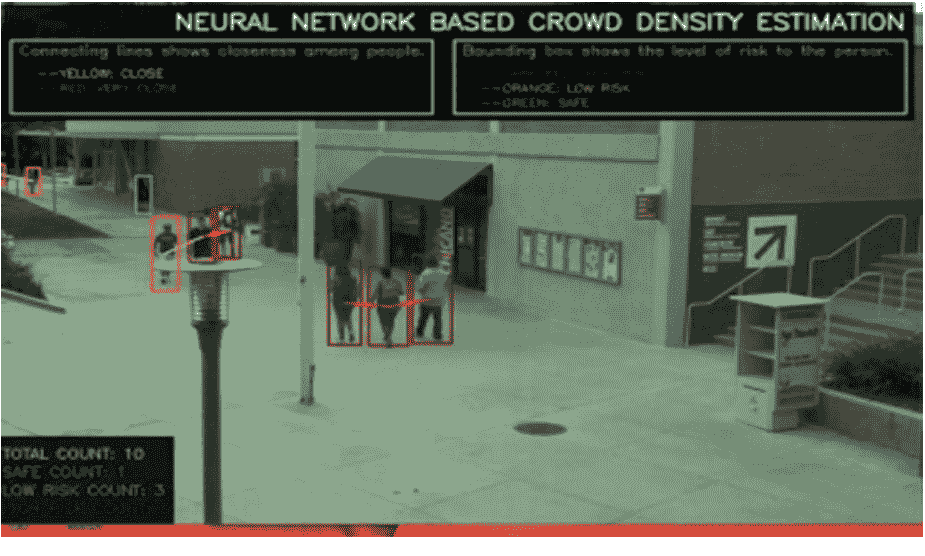

图4 帧中的人员识别

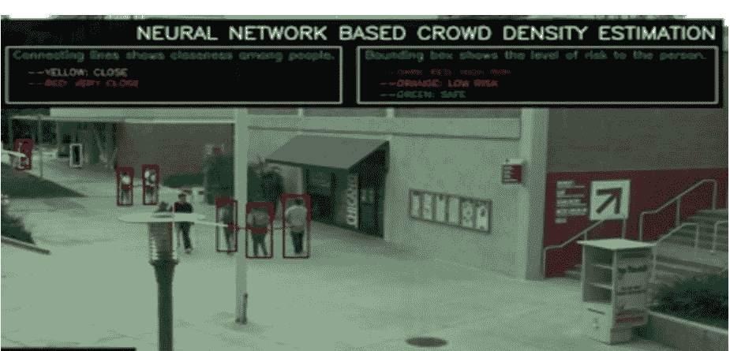

图5 人员之间的曼哈顿距离计算

表1 对象检测模型比较

| 模型 | NoI (迭代次数) | mAP | TL | FPS |
| :--- | :--- | :--- | :--- | :--- |
| 更快的RCNN | 12,135 | 0.969 | 0.02 | 3 |
| SSD | 1200 | 0.069 | 0.22 | 10 |
| YOLO | 7560 | 0.846 | 0.87 | 23 |

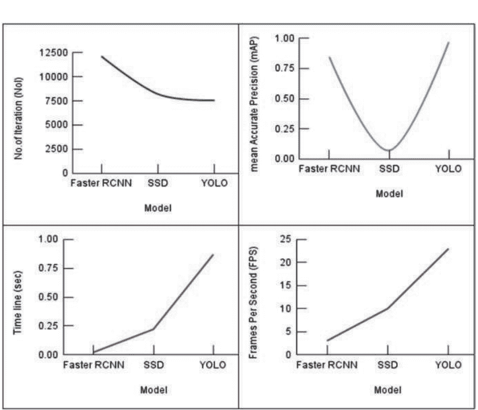

图6 提出方案的比较分析

## 结论和未来工作

本研究开发了一个基于实时深度学习的系统，利用对象识别和跟踪方法自动化测量社交距离的过程，在实时中使用边界框识别每个参与者。 所得到的边界框可以用于定位满足成对向量方法的接近性属性的人群或群体。

计算建立的群组数量和违规指数项，该指数项是人数与群组比例的衡量，验证违规数量。 经过广泛测试，使用三种先进的目标识别模型：更快的RCNN，SSD和YOLO，其中YOLO显示出平衡的FPS和mAP得分的高效性能。 由于它对摄像机的空间放置非常敏感，因此可以对该技术进行微调，以更好地与适当的视野进行调整。

与他人保持距离对于预防疾病传播至关重要。使用基于OpenCV和基于YOLO的深度学习的计算机视觉技术，分析视频中人们的社交距离，从而预测可能传播的数量，从而帮助控制疫情。

在这个应用中，精确度和准确性非常重要，因为它旨在在各种操作情况下使用。采取额外的预防措施，例如在此类工作环境中获得事先同意，通常隐藏个人身份，并在一小群利益相关者中保持透明，可以解决有关隐私和个人权利的真实关切。

## 参考文献

1.  C.T. Nguyen, Y.M. Saputra, N. Van Huynh, N.T. Nguyen, T.V. Khoa, B.M. Tuan, D.N. Nguyen, D.T. Hoang, T.X. Vu, E. Dutkiewicz, 用于社交距离的启用和新兴技术：一项综合调查。 IEEE Access 8, 153479–153507 (2020年8月)
2.  J. Redmon, A. Farhadi, YOLOv3: 一项渐进改进。 ArXivabs/1804.02767 (2018年)
3.  S. Syed Ameer Abbas, M. Anitha, X. Vinith Jaini, 使用树莓派实现多个人头检测和方向移动。 IEEE 4, 78–91 (2018年3月)
4.  E.M. Hoeben, W. Bernasco, L.S. Liebst, C. van Baak, M.R. Lindegaard, 社交距离合规性：一项视频观察分析。 PLOS ONE 2(2021年3月)。 https://doi.org/10.1371/journal.pone.0248221
5.  S. Jie, X. He, L. Qing, T. Niu, Y. Cheng, Y. Peng, 一种新的在线时空轨迹的城市公共空间社交距离分析。 Sustain. Cities Soc. 68, 102765 (2021)
6.  A. Al-Sheary, A. Ali, 使用无人机的人群监测系统。 J. CivilEng. Archit. 11(Nov. 2017). https://doi.org/10.17265/1934-7359/2017.11.0047
7.  J. Redmon, S. Divvala, R. Girshick, A. Farhadi, 你只需要一次看到: 统一的实时物体检测，在计算机视觉和模式识别的IEEE会议论文集中, 2016年, pp. 779–788
8.  J. Redmon, A. Farhadi, Yolo9000: 更好、更快、更强， 在计算机视觉和模式识别的IEEE会议论文集中, 2017年, pp. 7263–7271
9.  M. Putra, Z. Yussof, K. Lim, S. Salim, 使用yolo框架的卷积神经网络进行人员和汽车检测。 J. Telecommun. Electron. Comput. Eng. 10(1–7), 67–71 (2018)
10. http://cocodataset.org .于2021年7月20日访问## 数字医疗在疫情期间的康复中的作用

Meena Gupta和Ruchika Kalra

## 介绍

康复始终是治疗的一个非常重要的部分，被视为首要的。它增强了一个人的功能和独立性，并丰富了自然愈合过程[1]。如今，数字化一词终于以充满热情的方式进入了医疗保健领域，具备实现最佳解决方案的能力[2]。数字健康是由工程师们创造的技术设置，旨在克服社会和经济因素方面的无能和无法访问性[3]。数字健康是组织面临员工因健康问题而缺勤、病人无法前往医疗中心或其中心没有质量医疗康复服务的最佳解决方案[4]。自从数字健康领域的发展以来，数字健康领域的康复已经引入，适当的应用程序对所有智能手机都可访问[5]。根据世界卫生组织的说法，数字健康正在创新医疗保健领域，提供透明、可访问和可用的医疗保健服务[6]。数字健康在疫情期间提高了其效力，现在在发展中国家也可用，康复工具可供患者随时随地使用，并与他们的治疗师联系[7]。数字健康在Covid-19期间在康复上的作用最大化，并允许患者使用自己的设备获得护理[8]。全球范围内，冠状病毒引起的大流行导致医疗专业人员无处不在，可访问性有限，从而需要改进早期版本的数字康复，而大流行帮助建立了对医疗保健和数字康复的信任[9]。专业人士和患者方面。门诊康复在Covid-19大流行期间遭受了很多困难，包括急性到慢性病症，住院患者也遭受了困难，因为康复需要团队合作，而医疗专业人员不可用。将非Covid和Covid患者集中在一个地方并公正地治疗他们也很困难，确保在他们之间防止传播感染。因此，数字康复平台不仅需要医疗目的，还需要对其相关数据进行完整的管理[8-11]。数字康复需要人工智能技术提供机器人、虚拟和智能康复的初始空间[12,13]。

数字健康已经在特定领域的实践中引入，例如远程医疗、移动医疗、电子健康和算法医学[14]。

## 康复中的不同数字健康平台

### 远程医疗

在20世纪80年代，个人电脑引入视频会议技术，远程医疗应运而生，并在远程医疗服务中起到支持作用，以便在专家不可用的地方工作。远程医疗在偏远地区提供远程咨询，被称为远程护理。在这种情况下，患者和医生不进行面对面的咨询，但是手头的技术通过医疗专业人员和患者之间的多方面隐形工作来进行沟通，以诊断症状并改进治疗。数字远程医疗将诊所带到家中[15-17]。远程医疗的创新作为公共卫生措施在Covid-19疫情中起到了灾难管理的作用。

任何远程医疗计划都无法在短时间内启动，早期构建的远程医疗技术将患者在到达急诊室之前进行分类，作为中央卫生分流的核心健康策略。技术提供了以患者为中心的环境，并允许他们与医生24/7沟通症状，防止感染传播给其他患者和临床医生[18-20]。

远程医疗的增长率一直在增加，但仍然存在问题，并且根据不同国家的情况进行发展，但是Covid-19加速了速度，并在过去的2-3年中提出了一些问题。患者和医生之间建立信任的一些障碍包括新医生在远程医疗服务方面不能与多年来治疗患者的医生相提并论；此外，文盲和年长的医疗专业人员对如何操作医疗设备上的软件以及是否可以信任他们保密性和相关成本的系统的理解较少。这些问题得到了回答，远程医疗护理的可用性得到了提高，提高了识字率以便更好地理解软件并使其易于使用，同时通过在偏远地区使用它并让人们意识到并建立信任，因为Covid-19的变化阶段在一定程度上创造了自我学习[21, 22]。远程医疗用于非紧急情况以减少门诊队列。增加使用远程医疗需要增加政府监管，以保持相关数据的私密性和机密性，在两端对护理质量没有抵抗力，并且需要大规模增加基础设施以创建更好的数字数据管理[23]。

大流行不仅扰乱了门诊患者的康复，住院患者也面临着治疗师不可用的问题，这可能是一场灾难，尽管远程医疗在某种程度上为治疗师和患者节省了一些时间。最初的障碍已经克服，通过远程医疗进行康复成为拯救生命和保持生活质量的工具。康复中的远程医疗最初被用作研究工具，但在需要时扩展到临床实践[24,25]。

远程医疗技术在疫情期间和之后的康复中显示出功能性。远程康复捕捉到同步访问。这减少了旅行成本、无法旅行以及在偏远地区节省的旅行时间。在使用远程医疗之前，需要有软件程序，并获得政府许可，以防止远程医疗的不当行为，因为远程医疗是一些发达国家公共卫生的一部分，但在一些国家尚未成为一部分。通过固定电话与远程医疗的连接性和关联性是为了防止泄露机密个人信息的不当行为。远程康复的下一步是进行访问，员工在与患者连接之前使医疗专业人员了解软件。评估是通过虚拟应用程序进行的，允许评估多个参数，因为许多参数仍在研究中。作为交付的一部分，根据患者的情况向患者及其家人提供建议和解释。文档是医疗实践中要使用的主要工具，以便以道德和同步的方式工作。远程医疗提供了多种数据文档方式，从主要投诉到每个评估组，并以叙述和描述的方式进行管理，以防止错误[26–30]。

### 移动健康

世界卫生组织将移动健康定义为由移动设备操作的医疗和公共卫生。在这十年中，人们已经变得依赖于日常活动中使用的移动技术，这引发了与手机内与健康相关的应用程序的创新，这些应用程序每天都在增加。移动设备已经到达了发达和发展中国家的大部分人口手中，因为它们是必需品，健康应用程序的添加和编程使得医疗专业人员更容易进行监测和咨询。对移动设备中应用程序的兴趣和意识也在通过M-健康应用程序[31-33]的帮助下推动健康意识的进一步提升。与M-健康相关的技术是最近的，它促进健康并激励人们监测他们的日常活动。与移动设备相关的应用程序与传感器相关的设备相连，这些设备具有您的健康记录，佩戴在手腕上的传感器可以根据您的生命体征读取位置、步行、睡眠和焦虑情况。这些传感器监测身体的状态。这些设备不仅为医疗专业人员或随访提供数据，还可以根据所造成的不平衡（如紊乱的周期、久坐的生活方式、有限的活动次数、营养不良和不适当的水分摄入）来理解和调整生活方式。

这些可以是自我康复工具，以在私人生活中保持最新状态，这些工具以图形方式记录和展示改善的程度[34–36]。

在Covid-19时代，移动健康具有三重作用，如与公民联系，数字化相关健康问题，并通过应用创新控制健康。传统上，在大流行期间，移动健康具有诸多优势，如促进健康生活方式，提高意识和积极参与技术，无需结构化的工作环境设置（如诊所）即可便利医患沟通，监测偏远地区情况，并确保适当遵守社交距离。在大流行情况下，移动设备在健康领域的潜力得到提升，并且不仅在健康方面有益，还可以用于大流行期间的接触追踪；此外，还具有增加的存储容量和更好的计算能力，以及陀螺仪、光电传感器、气压计等等[37–40]。

现在，移动健康在康复中的作用非常广泛，因为移动设备已经到了从儿童到老年人手中，而且疫情使其成为了更加必不可少的生活工具。移动健康通过提供更加舒适和便捷的方式来促进康复，解决了年轻成年人因工作负荷而无法与治疗师见面的问题，而且医疗专业人员只需一触即可通过应用程序进行控制，使得康复记录更加容易进行记录。治疗会话通过视频会议进行，可以借助移动应用程序进行管理，也可以根据身体类型、性别、体力活动、合并症等多种评估来进行定义，不同的应用程序有所不同。在了解了这种技术之后，医院设置了个人移动健康应用程序，不仅可以与治疗师和患者一起使用，还可以与整个医院，甚至包括药房一起使用，以便所有与健康数据相关的信息都能及时传入，从而使得数据管理更加便捷，方便患者和医疗专业人员[41-43]。

### 电子健康

万维网在1990年代引入，使得公众能够获取医疗保健信息和他们的疾病经历。有许多网站，如健康线等。对电子健康进行的研究介绍了各种经验，并帮助获取健康信息。在线。有许多网站支持真正的健康咨询。简单地说，电子健康是改善医疗保健中数字信息和通信的平台，并进行重新检查[44]。在Covid-19大流行期间，与covid相关的信息是电子平台上最受关注的话题，其中既有真实的陈述，也有虚假的陈述。世界卫生组织、国家和国际政府提供了指导方针，但在同一个链接上也有一些提供无效治疗的虚假医疗事实。政府和世界卫生组织联合起来利用电子健康来克服这一问题，并利用Facebook、Twitter、Instagram和YouTube等平台提供基于证据的信息，提高电子健康素养率和公共卫生措施[45,46]。

康复中的电子健康是用于通知疾病或病情的知识工具。由于无法前往治疗地点或遇到的小困难可以通过电子健康进行理解和分类，电子康复在新患者中变得更加普遍。可以借助移动健康提供的应用程序与康复专家讨论。

电子健康可以在评估、案例研究、历史和电子诊断的帮助下获取相关信息，并建立数字信息和记录病理学。治疗师可以轻松起草所有信息数据管理，并确保护理质量，其中电子出院摘要包含相关和必要的信息，并且可以快速创建。对于康复专家来说，电子健康的优点是反馈系统快速且适当，根据会话[47-49]。

### 算法医学

在大数据时代，算法医学涉及存储、共享和生成能力的增加。这些算法具有过滤和处理数据的能力。这是医学信息学和决策制定的更广泛领域的工作目标，这些领域包括测试、评估、诊断和自动控制[50, 51]。人工智能在这里发挥作用，人工创建的神经网络支持临床决策并创建结构和用户界面。通过利用自动化算法并具有减少错误和改善结果的潜力，可以将错误最小化[52, 53]。这些算法利用技术支持临床决策并遵循基于证据的指南，从而创建了机器人、虚拟和智能康复。这为康复提供了广阔的视野。在各种类型的设备中，使用机器学习和传感器创建了一个环境，使数字计算机可以在不被患者告知的情况下传输患者当前的数据，并进行评估和数字诊断，甚至在患者家中进行。这种智能技术与人工智能已经从仅仅咨询发展到机器人技术，即使专科医生不在医院与患者一起，也可以进行机器人手术[54, 55]。在大流行期间，人工智能与算法接口为正在进行和计划中的手术带来了便利。康复作为机器人或植入在患者体内的设备的接口，甚至是根据依赖程度放置在患者身上，可以在会话期间由医疗专业人员控制[56-58]。由于这种接口非常昂贵，因此算法接口尚未在偏远地区甚至欠发达国家找到，因此该协议还需要几年时间才能进入公共卫生领域。迄今为止，已经通过结果回答了挑战，但是克服降低成本的挑战将为更多国家利用医疗算法创造可用性。这种接口不仅可以帮助患者或公众意识到，还可以帮助医疗专业人员理解康复背后的重要性[59]。

研究中提到了康复机器人，包括MIT Manus、镜像运动启用器、辅助臂康复测量、康复中的机器学习以及用于分类、预测和治疗计划的医疗算法。这些设备不仅在康复中发挥作用，还可以作为分类器预测患者的活动和潜力[60,61]。

### 数字患者管理

技术改进在评估和治疗患者方面起到了成功的支持作用。如果不分析支持管理和发生、改进、新技术等方面的数据生成，治疗就是不完整的。无论是在私营部门还是公共卫生部门，患者数据管理的角色都是至关重要且必需的。以前的说法从未想到这种冠状病毒会导致一场大流行，但当我们看到国家和国际患者的数据时，我们才能理解它有多么灾难性，并且将继续如此[62-64]。

数字化的数据管理方式支持并创造了许多技术来解决这场灾难。这场灾难的程度更容易通过数字方式进行跟踪，通过公开的信息，通过在手机上下载一个应用程序来记录，我们可以轻松了解在我们有限的范围内有多少人是COVID阳性，注册一个人的号码并自动生成数据给公共卫生部门，以便了解该地区并创建区域[65]。

数字优先考虑定义紧急情况的标准；随着数字的增加，它根据有多少ICU床位、氧气床位或家庭隔离设施可用来确定谁可以入院。疫苗的注册在全球范围内一直是一个挑战，患者管理支持根据人口和疫苗的生产情况确定多少次接种、比例和接种时间。数字患者管理的分诊是理解的关键[66-68]。

数字健康转型在发展和实施新的护理理念方面具有最大的潜力。数字方法成为保护弱势患者的屏障通过为员工或前来医院的患者创造安全，数字方法成为保护弱势患者的屏障。例如，英国的EMIS（Egton医疗信息系统）等软件因国家而异，它保存了来自初级护理的记录，包括患者携带的所有信息等[69]。

NHS信托正在争分夺秒地为偏远地区尽可能多地创建这种设置，以便根据数字化康复等数字数据来管理患者。数字化患者管理在公共卫生方面非常需要，但受限制。然而，大流行导致了对工作人员数量有限的理解，因此技术可以帮助准确管理数据，并提供有关疫情进展的数据，例如在不同地区开始出现的新变种，数字所呈现的饱和度，挽救生命的比例，死亡和接种人数，数据创造了对应的预防意识，并通过寻求改进和战胜灾难的意义来激励[70,71]。

## 讨论

新冠疫情使许多正在进行的研究成为临床实践的一部分。数字化已经存在，但在临床实践中通过数字平台引入之前，尚未进入日常实践中的医疗保健领域。由于灾难情况，以前的挑战和问题被搁置，为数字领域提供了信任和投资的机会。这种数字化医疗保健可以轻松管理患者护理，并提供全面的护理质量。这次大流行让我们意识到数字平台不仅仅是为办公室、教育和工作而设立的，也适用于医疗保健系统[72-74]。

大流行引发了人们对何时以及如何接触医院部门的恐惧，无论是有或无新冠病毒。然而，数字化在医疗保健方面并没有完全消除紧急情况，但在某种程度上提供了便利，特别是对于非新冠病患者[75]。康复是完全康复和解决不适转化为疾病的第一步，康复工作是一个集体团队的工作，包括医生、治疗师、护士和其他医疗专业人员[76]。

灾难的紧急情况扰乱了他们在正常医疗职业中创建的管理周期[77]。大流行暴露了医疗专业人员的局限性，以及无限制的新冠病患者、非新冠病患者和后新冠病患者，他们都希望得到平等的关注和康复。在大流行期间，康复不仅是医生与患者之间的界面优先考虑的问题，还涉及到其他所有医疗专业人员的需求[78, 79]。研究提到了数字健康结构的不同措施，包括作为康复工具使用的远程医疗，这是继多年前传统数字平台之后的措施，以及作为增加对生命和合并症评估的意识工具的电子健康，而封锁的影响增加了对自身和家庭健康的警惕[80, 81]。多年前，移动技术被引入到日常生活中作为通信工具，但智能手机增加了应用程序，随着大流行扰乱了生活结构，人们变得更加依赖数字设备来生存，作为一个重要方面[82]。因此，这个重要方面也可以作为一个健康工具，无论是病了还是改善生活方式以预防疾病和久坐不动的生活方式，在这段时间内都有很大的增加；康复意识帮助一个人通过一键访问康复专家来预防成为患者。手机会议作为M-健康技术的结构，允许医疗专业人员随时随地访问，而不需要借口说不可用，因为这个工具是在大流行期间最受欢迎和赞赏的[41,83]。

算法医学是智能康复的提案，其中康复不仅仅局限于应用程序，而是超越了对数字健康的理解。根据研究，这种智能机器人在改善患者的情况下起着至关重要的作用，使其更快地恢复生活。机器人和高端技术的作用是必需的，但由于技术成本的原因，它仍然在研究中以便让发展中国家和欠发达国家能够使用。这种类型的康复研究正在某些国家转变为临床实践。与这种技术相关的结果非常有希望[84, 85]。从康复到数字康复的演变是显而易见的，根据Jones在2020年的一项研究，医疗康复的转变是明显的。尽管康复的好处已经得到确认，但当前的护理系统中存在明显的低效率问题。这些低效率受到服务需求的增长、为了控制成本而持续变化的报销方式、服务交付模式的转变以及提供者短缺的影响。当今医疗康复的优先事项是控制成本、改善获取途径，并增加实际康复时间。有人建议，向更多使用数字健康技术的转变将导致更好的结果、更高的护理价值、更好的患者体验和更有权力的康复利益相关者[4, 86, 87]。数字医疗在康复中最大的优势之一是能够为更多需要的人提供优质护理。再加上在线搜索“物理疗法”、“物理治疗”、“背痛锻炼”等问题的搜索量每月超过400万次。关于连续护理，大多数患者和医生都明白物理疗法不仅仅局限于在医生诊所的会诊。

利用数字健康，这种护理可以从诊所延伸到患者的家中。诸如远程康复或使用远程医疗进行身体康复的工具允许提供者指导和支持患者康复[5,88]。康复需要信任，患者首先信任软件的开放，然后信任医疗专业人员的咨询，因为通常医疗专业人员在数字平台上与众不同[89]。咨询并不是唯一需要考虑的健康部门，所有管理工作都从预约、就诊、计费、会议、反馈以及重新预约等方面进行，具体取决于健康部门的范围。这些管理工作由专业人员负责处理数字领域并以许可为导向，即使在个人实践或公共卫生方面，医疗数据在健康部门中具有重要意义，因此需要以类似的方式进行管理[90,91]。数据管理不仅仅是任务，还包括患者，因为有许多患者需要康复管理。技术在健康部门的引入并没有消除大流行的艰难和紧急模式，但是对数字领域的信任增加，减轻了被灾难惊吓的压力，因为管理在当前情况下正在改善，并且在国家之间以及包括偏远地区都有所不同[92,93]。

数字康复面临的一些障碍是因为医疗专业人员有时对新技术感到威胁。然而，数字转型应该被视为补充专业服务的工具，而不是替代品，同时帮助他们优化时间。根据Mapfre的数据，只有10%的公立医院适应了数字转型，而60%的私立医院有数字转型计划。目前，自治区卫生支出中只有1%用于新技术，并且为了达到必要的标准，卫生商业模式应进行重组，并将创新作为优先事项。每一项技术进步都需要研究和开发工作。这有时可能是昂贵的，而且并不总是愿意支付，无论是公共行政部门还是患者[94-96]。

## 结论

本章包括了疫情对康复的影响以及数字康复的发展如何成为继续康复的工具。

各种研究都致力于数字康复的有效性，已被证明是安全的，并且在信任方面，研究表明取得了显著的改善和克服了许多障碍，其中一些需要进一步关注。

感谢所有作者的贡献。既没有利益冲突，也没有资助。

## 参考文献

+   1. E. Krug, A. Cieza, 加强卫生系统以提供康复服务。 Can. J. Occup. Ther. **84**(2), 72–73 (2017)

+   2. J. Milward, C. Drummond, S. Fincham-Campbell, P. Deluca, 什么使在线物质使用干预引人入胜？ 系统综述和叙事综合。 Dig. Heal. **4**, 2055207617743354 (2018)

+   3. P. Dunn, E. Hazzard, 数字健康素养的技术方法。 Int. J. Cardiol. **15**(293), 294–296 (2019)

+   4. M. Jones, F. DeRuyter, J. Morris, 数字健康革命与残疾人：来自美国的观点。 Int. J. Environ. Res. Public Health 17(2), 381 (2020)

+   5. M. Falter, M. Scherrenberg, P. Dendale, 心脏康复和二级预防中的数字健康：寻找理想工具。 传感器 21(1), 12 (2021)

+   6. 世界卫生组织，东地中地区准备好数字化健康了吗？ 全球数字健康战略的启示 (2020–2025)

+   7. K. Ganapathy, COVID-19时代的远程医疗和神经学实践。 Neurol. India 68(3), 555 (2020)

+   8. M. Bartolo, D. Intiso, C. Lentino, G. Sandrini, S. Paolucci, M. Zampolini, 新冠病毒（Covid-19）流行期间神经康复/康复科室的紧急措施。

+   9. S. De Biase, L. Cook, D.A. Skelton, M. Witham, R. Ten Hove, COVID-19康复大流行。 Age Ageing 49(5), 696–700 (2020)

+   10. L.M. Sheehy, 考虑COVID-19幸存者的后急性康复。 JMIR公共卫生监测。 6(2), e19462 (2020)

+   11. A. Saverino, P. Baiardi, G. Galata, G. Pedemonte, C. Vassallo, C. Pistarini, COVID-19大流行时重新组织康复服务的挑战：支持团队规划和提供安全高质量护理的新数字和人工智能平台。 Front. Neurol. 12, 501 (2021)

+   12. R. Kalra, 虚拟康复方法对医护人员的回顾。 Archivos De Medicina 7(5), 134 (2021)

+   13. R. Kalra, M. Gupta, 机器人康复在医疗保健系统中的潜力综述。 国际医学科学临床发明 8(05), 5392–5413 (2021)

+   14. B. Marent, F. Henwood, 21数字健康, 在Routledge国际健康与疾病关键问题手册 (2021)。

+   15. N. Oudshoorn, 地方的重要性：远程护理技术和医疗保健的空间维度变化。 社会科学研究 42(1), 121–142 (2012)

+   16. T.L. Finch, M. Mort, F.S. Mair, C.R. May, 未来的患者？ 远程医疗保健，角色和责任。 健康社会护理社区 16(1), 86–95 (2008)

+   17. E. Håland, L. Melby, 在医疗保健中协商技术介导的互动。 社会理论健康 13(1), 78–98 (2015)

+   18. S. Duffy, T.H. Lee, 作为B选项的面对面医疗保健。 N. Engl. J. Med. 378(2), 104–106 (2018)

+   19. N. Lurie, B.G. Carr, 电子健康在灾难医疗响应中的作用。 JAMA Intern. Med. 178(6), 745–746 (2018)

+   20. J.E. Hollander, B.G. Carr, 几乎完美？ COVID-19的远程医疗。 N. Engl. J. Med. 382(18), 1679–1681 (2020)

+   21. J. Portnoy, M. Waller, T. Elliott, COVID-19时代的远程医疗。 过敏和临床免疫学杂志。实践。 8(5), 1489–1491 (2020)

+   22. 美国井然有序, 2019年消费者调查的远程医疗指数 (2019年)。

+   23. R. Bashshur, C.R. Doarn, J.M. Frenk, J.C. Kvedar, J.O. Woolliscroft, 电医学和COVID-19大流行，对未来的教训。 电医疗。 电子健康。 26(5), 571–573 (2020)

+   24. S.Negrini, K.Grabljevec, P.Boldrini, C.Kiekens, S.Moslavac, M.Zampolini, N.Christodoulou,J.F. Kaux, 每天有多达220万残疾人在欧洲COVID-19封锁期间遭受副作用。 欧洲物理康复医学杂志。 56(3), 361–365 (2020)

+   25. MEDICA EM, 疫情期间从研究到实践的远程医疗。“即时论文来自现场”关于康复对Covid-19紧急情况的回答 (2020年)。

+   26. A.S. Tenforde, M.A. Iaccarino, H. Borgstrom, J.E. Hefner, J. Silver, M. Ahmed, A.N. Babu, C.A. Blauwet, L. Elson, C. Eng, D. Kotler, COVID-19期间的远程医疗对门诊运动和肌肉骨骼医学医生来说。 PM&R 12(9), 926–932 (2020)

+   27. I.M. Howard, M.S. Kaufman, 神经肌肉或肌肉骨骼疾病门诊的远程医疗应用。 Muscle Nerve 58(4), 475–485 (2018)

+   28. J. Shih, J. Portnoy, 远程医疗患者就诊的提示。 Curr Allergy Asthma Rep 18(10), 1–7 (2018)

29. Centers for Medicare & Medicaid Services, Medicare远程医疗常见问题解答(FAQs) (2020).

30. M. Verduzco-Gutierrez, A.C. Bean, A.S. Tenforde, R.N. Tapia, J.K. Silver, 如何进行门诊远程康复或预康复访问。PM&R 12(7), 714–720 (2020)

31. M. Kay, J. Santos, M. Takane, 移动健康：通过移动技术实现健康的新视野。世界卫生组织 64(7), 66–71 (2011)

32. F. Greaves, I. Joshi, M. Campbell, S. Roberts, N. Patel, J. Powell, 数字健康干预的适当证据水平是什么？柳叶刀 392(10165), 2665–2667 (2018)

33. M.L. Millenson, J.L. Baldwin, L. Zipperer, H. Singh, 超越谷歌医生：关于面向消费者的数字工具用于诊断的证据。诊断 5(3), 95–105 (2018)

34. S. Pink, V. Fors, 自我追踪和移动媒体：新的数字物质性。移动媒体通信。5(3)，219-238（2017）

35. D. Lupton, 量化自我的多样领域：自我追踪模式和数据监视。经济社会。45(1)，101-122（2016）

36. J. Pols, D. Willems, M. Aanestad, 用数字理解数字。在自我量化实践中解开伦理-心理学主题。社会学健康疾病。41, 98-115（2019）

37. A. Gabbiadini, C. Baldissarri, F. Durante, R.R. Valtorta, M. De Rosa, M. Gallucci, 在意大利COVID-19疫情爆发期间数字通信技术对负面情绪的缓解作用。前沿心理学，2763（2020）

38. S.G. Shah, D. Nogueras, H.C. Van Woerden, V. Kiparoglou, COVID-19大流行：封锁孤独症的大流行和数字技术的作用。J. Med. Internet Res. 22(11), e22287（2020年）

39. D. Giansanti, G. Maccioni, 手掌中的健康-第一部分：智能手机滥用的风险以及远程医疗和电子健康的作用。Mhealth, 7（2021年）

40. D. Giansanti, 诊断成像和M-健康：细胞学和器官诊断整合前景的研究。Rapporti ISTI SAN 20(1), 1-66（2019年）

41. C.P. Adans-Dester, S. Bamberg, F.P. Bertacchi, B. Caulfield, K. Chappie, D. Demarchi, M.K. Erb, J. Estrada, E.E. Fabara, M. Freni, K.E. Friedl, mHealth技术能帮助减轻COVID-19大流行的影响吗？IEEE Open J. Eng. Med. Biol. 7(1), 243-248（2020年）

42. P. Bonato, mHealth技术在COVID-19大流行及其后的作用。博士论文。波士顿大学健康与康复科学学院，2020年。

43. S.P. Burns, M. Terblanche, J. Perea, H. Lillard, C. DeLaPena, N. Grinage, A. MacKinen, E.E. Cox, 中风后影响下的成年人的mHealth干预应用程序：一项范围审查。Arch. Rehabil. Res. Clin. Transl. 3(1), 100095（2021）

44. R. Harris, P. Spoel, F. Henwood, 将健康生活的要求融入日常生活中，在Relational Concepts in Medicine (Brill, 2011), pp. 61–71.

45. G. Brörs, C.D. Norman, T.M. Norekvål, COVID-19疫情爆发及其以后的eHealth素养的加速重要性。Eur. J. Cardiovasc. Nurs. 19(6), 458–461（2020）

46. A. Carvalho, M. Moreno, 老龄化、认知康复和eHealth：从葡萄牙的临床神经科学到神经心理学的见解。Lusíadas Sci. I. J. 2(1), 29–35（2021）

47. S. ter Stal, M. Tabak, op den Akker H, Beinema T, Hermens H., 你更喜欢谁？ 年龄、性别和角色对用户对eHealth中具身对话代理的第一印象的影响。Int. J. Hum. Comput. Interact. 36(9), 881–892（2020）

48. J.M. Cal, M. Fernández-Sánchez, G.A. Matarán-Peñarrocha, D.A. Hurley, A.M. Castro-Sánchez, I.C. Lara-Palomo, 物理治疗师对慢性腰痛的电子健康治疗的看法。环境研究公共卫生 18(4), 1889（2021）

49. T.H. Tebeje, J. Klein, 电子健康在COVID-19大流行期间支持以人为中心的医疗保健的应用。远程医疗电子健康 27(2), 150–158（2021）

50. M. Ruckenstein, N.D. Schüll, 健康数据化。年度人类学评论 23(46), 261–278（2017）

51. Z. Obermeyer, E.J. Emanuel, 预测未来-大数据，机器学习和临床医学。新英格兰医学杂志 375(13), 1216（2016）

52. J. Shabbir, T. Anwer, 人工智能及其在近期的作用。arXiv预印本 arXiv:1804.01396（2018）

53. E.J. Topol, 高性能医学：人类和人工智能的融合。 Nat. Med. 25(1), 44–56 (2019)

54. J. Fong, R. Ocampo, D.P. Gross, M. Tavakoli, 智能机器人结合机器学习算法，改善功能能力评估和职业康复。 J. Occup. Rehabil. 30(3), 362–370 (2020)

55. V. Szücs, T. Guszvincecz, A. Magyar, 运动模式识别在物理康复-认知动机为基础的IT方法和算法中。 Acta Polytechnica Hungarica 17(2), 211–235 (2020)

56. B. Pradhan, D. Bharti, S. Chakravarty, S.S. Ray, V.V. Voinova, A.P. Bonartsev, K. Pal, 互联网物联网和机器人技术在改变当今医疗保健服务方面的作用。 J. Healthc. Eng. 26, 2021年 (2021年)

57. M. Kyarini, F. Lygerakis, A. Rajavenkatanarayanan, C. Sevastopoulos, H.R. Nambiappan, K.K. Chaitanya, A.R. Babu, J. Mathew, F. Makedon, 医疗机器人调查。 Technologies 9(1), 8 (2021年)

58. D. Khemasuwan, J.S. Sorensen, H.G. Colt, 肺部医学中的人工智能：计算机视觉，预测模型和COVID-19。 Eur. Respir. Rev. 29(157) (2020年)

59. A. Sheikh, M. Anderson, S. Albala, B. Casadei, B.D. Franklin, M. Richards, D. Taylor, H. Tibble, E. Mossialos, 健康信息技术和数字创新用于国家学习健康和护理系统。 Lancet Dig. Heal. 3(6), e383–e396 (2021年)

60. S. Nayak, R.K. Das, 人工智能 (AI) 在假肢和矫形康复中的应用，在Service Robotics (IntechOpen, 2020).

61. A. Choudhury, O. Asan, 人工智能在患者安全结果中的作用：系统文献综述。 JMIR Med. Inform. 8(7), e18599 (2020)

62. L. Ferretti, C. Wymant, M. Kendall, 等，量化SARS-CoV-2传播表明数字接触追踪可以控制疫情。 Science 368(6491), eabb6936 (2020).https://doi.org/10.1126/science.abb6936

63. M. Zastrow, 韩国正在报告COVID-19病例的细节：这有帮助吗？ Nature (2020)

64. K. Kupferschmidt, J. Cohen, 中国的COVID-19战略能否在其他地方奏效?

65. D. Bonsall, C. Fraser, 在中国使用智能手机可持续遏制COVID-19：实施类似方法的科学和伦理基础。 GitHub, 16 (2020)

66. 卫生部, HaMagen - 卫生部应用程序用于抗击冠状病毒传播。 https://govextra.gov.il/ministry-of-health/hamagen-app/download-en/ (2020年)

67. 国际特赦组织, 停止COVID-19接触追踪应用程序是隐私的重大胜利。 https://www.amnesty.org/en/latest/news/2020/06/norway-covid19-contact-tracing-app-privacy-win/。 访问日期：2020年7月27日。

68. L. Lai, K.A. Wittbold, F.Z. Dadabhoy, R. Sato, A.B. Landman, L.H. Schwamm, S. He, R. Patel, N. Wei, G. Zuccotti, I.T. Lennes, 数字分诊：应对COVID-19大流行的人口健康管理的新策略，发表于《医疗保健》（爱思唯尔，第8卷，第4期，2020年），第100493页

69. T. Robbins, S. Hudson, P. Ray, S. Sankar, K. Patel, H. Randeva, T.N. Arvanitis, COVID-19：一个新的数字黎明？ Dig. Heal. 6, 2055207620920083 (2020)

70. F. Murillo-Cabezas, E. Vigil-Martín, N. Raimondi, J. Pérez-Fernández, Covid-19大流行和重症监护单位的数字转型。 Med. Intensiva 44(7), 457 (2020)

71. J. Budd, B.S. Miller, E.M. Manning, V. Lampos, M. Zhuang, M. Edelstein, G. Rees, V.C. Emery, M.M. Stevens, N. Keegan, M.J. Short, 公共卫生中的数字技术应对COVID-19。 Nat. Med. 26(8), 1183–1192 (2020)

72. J.A. Andrews, M.P. Craven, A.R. Lang, B. Guo, R. Morriss, C. Hollis, 远程测量技术数据对抑郁症、癫痫和多发性硬化症医疗专业人员临床实践的影响：调查。 BMC Med. Inform. Decis. Mak. 21(1), 1–7 (2021)

73. S. de Lusignan, N. Jones, J. Dorward, R. Byford, H. Liyanage, J. Briggs, F. Ferreira, O. Akinyemi, G. Amirthalingam, C. Bates, J.L. Bernal, 牛津皇家全科医生临床信息学数字中心：开发扩展COVID-19监测和试验平台的协议。 JMIR Public Health Surveill. 6(3), e19773 (2020).

74. Z.H. Khan, A. Siddique, C.W. Lee, 机器人在全球COVID-19管理中的医疗数字化利用。 Int. J. Environ. Res. Public Health 17(11), 3819 (2020)

75. M. Shammi, M. Bodrud-Doza, A.R. Islam, M. Rahman, 孟加拉国COVID-19大流行的战略评估：比较封锁情景分析、公众认知和可持续管理。 Environ. Dev. Sustain. 23(4), 6148–6191 (2021)

76. M. Sivan, M. Phillips, I. Baguley, M. Nott (eds.), Oxford康复医学手册 (Oxford University Press, 2019)

77. M.Z. Nomani, R. Parveen, COVID-19大流行和公共卫生法律政策下的灾害准备。孟加拉国医学科学杂志 5, 41-48（2021年）

78. D.B. O'Connor, J.P. Aggleton, B. Chakrabarti, C.L. Cooper, C. Creswell, S. Dunsmuir, S.T. Fiske, S. Gathercole, B. Gough, J.L. Ireland, M.V. Jones, COVID-19大流行及其以后的研究优先事项：对心理科学的呼吁。英国心理学杂志 111(4), 603-629（2020年）

79. A. Akbari, F. Haghverd, S. Behbahani, 机器人家庭康复系统设计：从文献综述到COVID-19大流行期间社区远程治疗的概念框架。机器人与人工智能前沿, 8（2021年）

80. A. McDonnell, C. MacNeill, B. Chapman, N. Gilbertson, M. Reinhardt, S. Carreiro, 利用数字工具支持COVID-19大流行期间的物质使用障碍康复。 J. Subst. Abus. Treat. 1(124), 108-226 (2021)

81. B.N. Do, T.V. Tran, D.T. Phan, H.C. Nguyen, T.T. Nguyen, H.C. Nguyen, T.H. Ha, H.K. Dao, M.V. Trinh, T.V. Do, H.Q. Nguyen, 健康素养，电子健康素养，遵守感染预防和控制程序，改变生活方式以及疑似COVID-19症状在封锁期间的医护人员中的调查：在线调查。 J. Med. Internet Res. 22(11), e22894 (2020)

82. G. Goggin, 应用程序：从手机到数字生活 (Wiley, 2021)

83. J. Bostrom, G. Sweeney, J. Whiteson, J.A. Dodson, 移动健康和心脏康复在老年人中的应用。 Clin. Cardiol. 43(2), 118–126 (2020)

84. P. Ratta, A. Kaur, S. Sharma, M. Shabaz, G. Dhiman, 区块链和物联网在医疗保健和医疗领域的应用：应用、挑战和未来展望。 J. Food Qual. 25, 2021 (2021)

85. P.P. Jayaraman, A.R. Forkan, A. Morshed, P.D. Haghighi, Y.B. Kang, 医疗4.0：数字健康领域的前沿综述。 Wiley跨学科综述: 数据挖掘与知识发现 10(2), e1350 (2020)

86. A.C. Moller, G. Merchant, D.E. Conroy, R. West, E. Hekler, K.C. Kugler, S. Michie, 在数字健康革命背景下应用和推进行为变化理论和技术：更有效地实现未开发潜力的建议。 J. Behav. Med. 40(1), 85–98 (2017)

87. J. Stramm, 应对数字健康革命。 Rich. JL & Tech 28, 86（2021）

88. G.C. Chigbundu, R.C. Emeh, A.O. Ezeukwu, 物理治疗干预对腰背痛和残疾的影响，在慢性腰背痛患者和个体中：系统回顾（2020）

89. A.G. Ouimet, G. Wagner, L. Raymond, G. Pare, 调查患者继续使用远程会诊以预测危机后的动力：调查研究。 J. Med. Internet Res. 22(11), e22081（2020）

90. M. Massaro, 通过区块链技术在医疗保健领域进行数字化转型。来自学术研究和商业发展的见解。 Technovation 7, 102386（2021）

91. C. Pagliari, 数字健康和初级护理：过去，大流行和前景。 J. Glob. Health, 11 (2021)

92. K.K. Stephens, J.L. Jahn, S. Fox, P. Charoensap-Kelly, R. Mitra, J. Sutton, E.D. Waters, B. Xie, R.J. Meisenbach, 围绕COVID-19的集体感知：我们快速变化的组织生活经验、关注和议程。 管理沟通季刊 34(3), 426–457 (2020)

93. K. Ranasinghe, R. Sabatini, A. Gardi, S. Bijjahalli, R. Kapoor, T. Fahey, K. Thangavel, 集成系统健康管理在任务关键和安全关键航空航天应用中的进展。 航空航天科学进展 1(128), 100758 (2022)

94. M. Aapro, P. Bossi, A. Dasari, L. Fallowfield, P. Gascón, M. Geller, K. Jordan, J. Kim, K. Martin, S. Porzig, 肿瘤学中数字化健康的最佳支持护理：益处、限制和未来展望。 支持性护理癌症 28(10), 4589–4612 (2020)

95. L. Desveaux, C. Soobiah, R.S. Bhatia, J. Shaw, 识别和克服政策层面上对数字健康创新实施的障碍:定性研究。 J. Med. Internet Res. 21(12), e14994 (2019)

96. B. Mesko, Z. Györffy, 数字健康时代医生的崛起。 J. Med. Internet Res. 21(3), e12490 (2019)

# 使用机器学习技术进行神经退行性疾病分析

M. Menagadevi, V. Vivekitha, D. Thiyagarajan 和 G. Dhivyasri

## 介绍

神经退行性疾病是一组神经系统疾病，其中中枢神经系统的神经元死亡或受损，导致严重的残疾，最坏的情况下可能导致死亡。图1显示了主要的神经系统疾病，影响各个年龄组。通常，这些疾病在老年人中被发现。然而，疾病的发展可能会更早发生。近年来，这些疾病的患病率急剧上升，并且这一趋势预计将继续。随着世界人口的老龄化，这一趋势将继续下去。神经退行性疾病难以管理，并且可能会造成高昂的费用，因为其原因不明，也没有公认的治愈方法。目前，治疗方法主要集中在减轻症状上。

近年来，机器学习算法在医学和科学研究中的应用引起了很多关注。新技术使得在过去十年中，快速积累患者数据成为可能，例如超声波和MRI结果；生物样本的组学特征；电子采集的临床、行为和活动数据；以及社交媒体衍生的信息。在这些大型健康数据集中，每个观测值记录的特征（或变量）数量有时可能超过观测值的总数，使其成为高维数据。机器学习的进展可以在诊断和监测方面提供很大帮助，例如疾病发作检测和疾病特征化，和疾病改善的差异诊断量化。ML方法已被用于协助医生进行CAD诊断疾病[1,2]。

M. Menagadevi (✉) · V. Vivekitha · G. Dhivyasri
生物医学工程系，Dr. N.G.P.技术学院，科伊马托尔，泰米尔纳德邦，印度
D. Thiyagarajan
人工智能与机器学习系，工程学院，Malla Reddy大学，海得拉巴，特伦甘纳邦，印度

© 作者，独家许可给Springer Nature瑞士AG 2023
G. R. Kanagachidambaresan等人（编辑），使用机器学习和深度学习的疫情系统设计，信号与通信技术，https://doi.org/10.1007/978-3-031-19752-9_17

图1 神经系统疾病

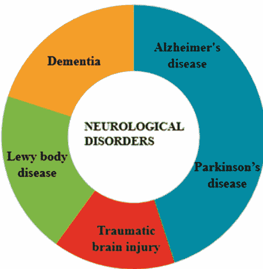

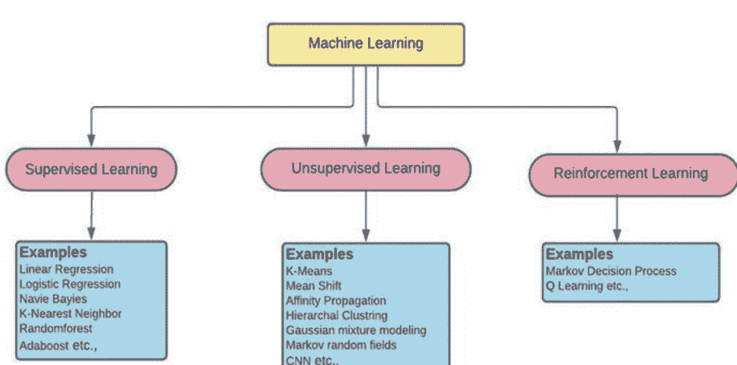

图2 机器学习算法的分支

机器学习算法的类别：

- 监督学习
- 无监督学习
- 强化学习（图2）

## 监督学习

这些方法通常用于分析与神经退行性疾病相关的数据。需要数据集来训练模型。通常，这些标签需要人工筛选或专业评估；例如，需要放射科医生标记一系列放射照片、MRI扫描中的脑区大小以及MRI扫描图片的标注，还需要神经病理学家的参与。然后，计算机可以使用这个模型来预测新的未标记数据集的标签，利用新的输入特征。对于监督式机器学习来说，收集足够大量的正确标签可能是困难的。图3展示了监督学习模型。

分类是一个包括在其中找到规则的过程，将新对象分配给预定义类别，并且它需要两个步骤。第一步是使用具有类属性的训练数据集构建分类。第二步是使用测试数据集分析分类的性能。监督过程是使用训练数据进行迭代预测的过程[24, 25]。在监督学习中，常用的算法有决策树、线性分类和朴素贝叶斯。

数据集必须首先进行预处理，这涉及将原始数据转换为完成的数据集的任务。它可以输入到数据模型中。数据清理，数据转换、特征选择和特征映射阶段在预处理阶段都对分类器的准确性有贡献。数据清理是一个查找数据集中任何缺失值的步骤，数据转换确保数据值落在一个小范围内。特征选择是一个重要的步骤，限制了有限的特征，可以提供更高的检测率，最后一步是特征映射，有助于找到决策区域。这可以最大化在新映射空间中给定类别之间的分离。在训练阶段，实际上至少提供70%的数据集来创建一个可以对测试集进行分类和预测正确标签的模型。使用数据评估可以分析神经系统疾病数据集中算法的性能。数据评估包括准确性、敏感性、特异性和错误率。

许多文献表明，使用监督算法进行神经系统障碍分类时，发现其特异性较低，约为0-54%，决策的准确性仅预测为80%左右。

### 决策树

决策树（DT）是最著名和广泛使用的机器学习方法之一。它是模仿人类思维能力做出决策的方法。它是一种树状的决策技术。根节点、叶节点、分支和内部节点是四个基本组成部分。树的根连接其类别，叶节点表示类别，分支表示结果，内部叶节点表示过程。分类规则是从根到叶子的路径，预测给定数据集的类别所涉及的步骤如下所示。图4显示了决策树算法的基本流程[31]。

1.  步骤1：从包含完整数据集的根节点开始。
2.  步骤2：选择根节点的属性/特征值。为每个可能的属性/特征值创建一个分支。
3.  步骤3：生成包含最佳属性的决策树。
4.  步骤4：对每个分支递归重复，并使用步骤2中创建的数据集子集生成新的决策树。该过程持续进行，直到无法进一步分类节点，并将其称为最终节点/叶子节点。

图5解释了决策树算法在分析脑部图像的图像数据集中的应用。可以从各种数据集（例如OASIS、TOF-MRA、Allen Brain Atlas、阿尔茨海默病神经影像计划（ADNI）、fMRI数据中心等）收集神经系统疾病图像数据集。然后将图像分为测试组和训练组。在收集结果后，使用适当地技术提取图像的特征，并使用决策树算法（C4.5、ID3、CHAID等）进行测试。图6显示了使用决策树算法在脑部MRI图像中进行病变检测的输出。

### 线性回归

线性回归最初是在统计学领域中开发的，以帮助理解数值输入和输出之间的关系。线性模型是线性回归。它假设输入变量（x）和输出变量（y）具有线性关系（y）。简单线性回归和多元线性回归是两种不同的形式。简单回归是一种使用简单特征进行响应预测的方法。线性回归算法的目的是发现最佳的b0和b1值，以找到最佳拟合线。图7显示了线性回归模型的一般图示[32]。

$$y = b_0 + b_1x$$ (1)

当使用多个特征时，称为多元线性回归

$$y = b_0 + b_1x_1 + b_2x_2 + ... + b_nx_n$$ (2)

通过对观测数据进行线性方程滤波，多元线性回归旨在建模一个或两个特征与响应之间的关系。回归分析公式

### 逻辑回归

用于建模事件或类别概率的监督式机器学习算法之一是逻辑回归模型。当数据可线性分离且结果为二元时，可以使用逻辑回归模型。在二元分类中，主要有两种类型：一种是逻辑回归，它是单一自变量的模型。一个是单一逻辑回归，其中一个独立变量用于预测输出，另一个是多重逻辑回归，其中多个独立变量用于预测输出[33]。逻辑回归模型使用Sigmoid函数对数据进行建模，单一逻辑回归的函数表达式如下

$$e = 1/(1+e^{-(b_0+b_1x)})$$

逻辑回归模型使用Sigmoid函数对数据进行建模，多重逻辑回归的函数表达式如下

$$e = 1/(1+e^{-(b_0+b_1x_1+b_2x_2+...+b_nx_n)})$$

使用该算法可以高精度地获取神经系统疾病的发生概率。输入图像经过预处理，使用适当的算法提取特征，并将图像分为训练和测试数据。然后，逻辑回归根据获取的特征预测疾病。图9显示了逻辑回归的流程图[34]。

### 朴素贝叶斯

朴素贝叶斯算法是一种简单且有效的监督分类算法之一。它基于贝叶斯定理，并假设某个特征的出现与其他特征的出现独立无关。它有助于构建快速的机器学习模型，可以快速预测。它是一种基于对象概率的概率分类器，朴素假设特征和贝叶斯原理有关：

$$P(y | X) = \frac{P(X | y) P(y)}{P(X)}$$

其中y是一个类变量，x是一个依赖特征向量（大小为n），表示为X={x1,x2,x3...xn}。将贝叶斯定理应用于给定的数据集，如下所示：现在，如果任何两个事件A和B是独立的，则P(A,B) = P(A)P(B)。然后，最终结果将给出为在给定的数据集上应用贝叶斯定理，如下所示：

$$P(y|x_1, ..., x_n) = \frac{P(x_1 | y) P(x_2 | y) ... P(x_n | y)}{P(x_1) P(x_2) ... P(x_n)} \quad (6)$$

它也可以被重写为

$$P(y|x_1, ..., x_n) = \frac{P(y) \cdot \prod_{i=1}^{n} P(x_i | y)}{P(x_1) P(x_2) ... P(x_n)} \quad (7)$$

我们现在可以消除分母，因为分母对于每个给定的输入保持不变：

$$P(y|x_1, ..., x_n) \propto P(y) \cdot \prod_{i=1}^{n} P(x_i | y) \quad (8)$$

研究发现，通过使用朴素贝叶斯分类器对帕金森病和阿尔茨海默病的MRI图像进行分析，可以获得最佳的分类结果[5]。

### 支持向量机

SVM是支持向量机的缩写。它是最广泛使用的监督学习方法，用于分类和回归；然而，它更常用于分类。SVM方法的目标是确定最佳的线或决策边界，将n维空间划分为不同的类别，以便随后的数据点可以轻松地放入相关类别。这个理想的决策边界被称为超平面。SVM用于选择帮助构建超平面的极端点/向量。这些极端点被称为支持向量，因此算法被称为支持向量机。边界是不同类别最接近的数据点之间的两条线之间的差异[26]。线与支持向量之间的垂直距离可以用来确定边界。宽边界被认为是一个好的边界，而窄边界被认为是一个差的边界。训练以创建将空间分割成两个子空间的决策面为结束。每个子空间代表不同的训练数据类别。训练完成后，测试数据被映射到特征空间。然后根据特征空间中的类别对这些数据进行分类。

它们被映射到的子空间。SVM的基本目标是将数据集分成类别，以找到最大边际超平面（MMH），这可以通过两个步骤完成[29]：

1.  首先，SVM将迭代地构建最佳分割类别的超平面。
2.  然后选择正确分离类别的超平面。

通过应用上述步骤，线性判别SVM模型（二元分类器）通过预测超平面将空间分成两类MRI图像。

## 无监督学习

无监督机器学习技术对于像聚类这样的应用非常有效，因为它们不需要标记的数据。例如，可以使用聚类方法来研究图像分类。无监督聚类除了分析现有数据外，还可以使用算法进行预测。可以使用来自各种数据源的数据集来训练模型。

### K均值算法

一种常用的无监督学习方法是k均值聚类算法。该方法使用一个整数k和n个观测值。结果是n个观测值的k个集合分区，每个观测值属于与其最近的聚类的集合。k均值的操作总结如下阶段。

1.  设置k个聚类中心。实际上可以通过随机选择k个中心来实现。
2.  从n个观测值或k个随机生成的中心点派生出点。
3.  计算每个观测值与聚类中心的距离。
4.  每个点应该被分配到与其中心和其他聚类中心之间距离最小的聚类。
5.  作为聚类均值，重新计算k个中心的位置。
6.  再次计算每个数据点与新估计中心之间的距离。

应重复步骤3和4，直到所有数据点都被分配到同一个聚类中（数据点不再移动）。

具有阿尔茨海默病（AZ）的个体数据集，具有纵向评估。国家阿尔茨海默病协调中心数据库，提供神经病理学数据。使用均值聚类技术对图像中的AZ疾病进行了聚类。研究人员希望观察具有不同锥体外运动征进展轨迹及其临床和神经病理学相关性的患者亚组[4]。基于上述步骤，使用K均值算法对神经学数据集进行聚类，基于疾病状况。

### 均值漂移聚类算法

均值漂移聚类方法是一种基于质心的方法，可在各种情况下辅助无监督学习。它是最有效的图像处理和计算机视觉算法之一。它通过将数据点重新定位到质心，然后成为该区域其他点的均值来工作。模式搜索算法是它的另一个名称。该方法的好处是根据带宽将聚类分布到数据中，而无需自动指定聚类数目。

与K-means聚类技术不同，均值漂移不需要事先指定聚类数量。关于数据，该算法确定了聚类的数量[5]。对于神经-病学障碍的fMRI（功能性磁共振成像）分析，图像的时间特性被考虑在内。模拟和实际的fMRI数据被用来比较聚类分析和均值漂移聚类，后者使用包括时间和空间特征的特征空间[6]。图10显示了用于聚类医学图像的均值漂移算法的流程。

### 亲和传播和层次聚类

为了将脑部MRI图像分成多个聚类，采用了亲和传播方法。亲和传播方法使用组织分割和解剖分割的图像来描述脑部图像之间的相似性[7]。在聚类之后，找到一个代表性的样本图像作为每个聚类的单一主题图谱，并识别适应同一子组的MRI图像。图11描述了脑部MRI图像的组织分割。亲和传播算法的步骤如下：

- 算法基于数据点之间的相似性工作。
- 所有数据点都被视为潜在的聚类中心。
- 确定代表数据集的聚类中心。

亲和传播需要两个数据：

- 数据点之间的相似性 s(i,k)
- 偏好 s(k,k)

i表示一个数据点。
k表示代表点。

基于层次聚类的分割（HCS）是一种无监督的图像数据分割方法，用于分离图像中的各个部分。HCS方法通过在不同区域之间允许的分层不相似度程度上将图像分割成其区域。随着允许的阈值值的增加，层次结构表示相似、相邻和不连续区域的无间断合并。

基于层次聚类的分割算法包括以下内容。

1.  图像中每个像素的标记：
    - 如果图像已经被分割，则根据预分割标记每个像素。
    - 如果无法进行初始分割，则将每个像素标记为单独的部分。
    - 应将允许的区域之间的差异量设置为零。
2.  计算给定图像中的不相似度值。
    - 应使用最小的不相似度值作为阈值。
3.  如果阈值和不相似度值相等，则将所有接近不相似度值的值合并，否则转到步骤6。
4.  如果上一步中合并的区域大于0，则将边界上的像素重新分类为剩余区域，直到不再进行进一步分类。
    在所有可访问的边界像素被分类之后，将此迭代的区域数据保存为合并区域之间的中间分割，并转到步骤2。
    否则，如果在步骤3中合并的区域等于0，则转到步骤5。
5.  如果图像中的区域数量小于预定值，则转到步骤7；否则转到步骤6。
6.  如果当前的不相似允许值远低于最大允许值，则转到步骤2并逐渐增加不相似允许值。否则，转到步骤7。
7.  保存当前迭代的数据。

图12[35]显示了应用上述过程的脑图像的分层聚类算法的输出。

### 基于密度的空间聚类（DBSCAN）

密度聚类是用于识别输入图像中独特群组/聚类的无监督学习方法的术语。DBSCAN是一种基于密度的聚类基础技术。它可以检测大量噪声数据中的各种形状和大小的聚类，包括异常值[10]。

DBSCAN算法中使用了两个参数：

- minPts: 被认为是密集区域所需的最小聚类点数（阈值）
- eps (ε): 一种距离度量，可用于找到给定位置附近的点

- 算法随机选择图像数据集中的一个点。
- 如果在半径ε范围内至少有“minPts”个点，则认为它们属于同一聚类。
- 然后，通过对每个附近点重复进行邻域计算来扩展聚类。

可以使用DBSCAN算法通过应用上述过程来分析fMRI图像的静态和动态功能连接性[11,12]。

### 高斯混合建模

直方图阈值法是最常用的图像分割方法之一，基于高斯混合的分割方法就是基于它。直方图阈值法的假设是图像有两个区域或类别：目标和背景，每个区域都有一个单峰灰度分布。因此，分割问题就是选择一个适当的阈值将图像分割成目标和背景区域。图像中灰度级的概率密度函数（PDF）是高斯混合分割技术中两个高斯密度函数的组合，具有特定的均值、标准差和比例[12,13]。

$$P(x) = \sum_{a=1}^{K} \pi_a \mathcal{N}(x | \mu_a, \sigma_a^2)$$

其中 \(K\) 是高斯分量的数量（即区域数）。
\(\pi_a > 0\) 是混合系数，满足 \(\sum_{a=1}^{K} \pi_a = 1\)。
\(\mathcal{N}(x | \mu_a, \sigma_a^2) = \frac{1}{\sigma_a \sqrt{2\pi}} \exp \left( \frac{-(x - \mu_a)^2}{2\sigma_a^2} \right)\)
其中
\(\mu_a\) - 类别 \(a\) 的均值。
\(\sigma_a\) - 类别 \(a\) 的标准差。

图13 [35]显示了输入的MRI图像和高斯输出图像[14]。大脑MRI图像中的白质和灰质可以进行分类分析神经-逻辑障碍，如注意力缺陷多动障碍（ADHD）。

## 卷积神经网络（CNN）

CNN代表卷积神经网络，是一种深度学习神经-网络。简而言之，CNN可以将输入图像分配给各个方面/对象的相关性（可学习的权重和偏差），并对它们进行区分。图14显示了CNN的块状图[15,30,35]。

CNN通过提取特征从图像中提取数据。以下是任何CNN的组成部分：

- 灰度图像作为输入层。
- 输出是一个多类别标记系统。
- 卷积层、修正线性单元层、池化层和完全连接的神经网络都是CNN架构中的隐藏层。

### 卷积层

它具有大小为N*M*D的卷积滤波器，其中D是图像深度。N和M是图像像素。在前向传递过程中，卷积核在图像区域上进行卷积，并计算滤波器条目之间的点积[16]。

### 激活函数

对于医学图像的非线性变换，使用以下激活函数：

- Sigmoid
- 双曲正切
- 修正线性单元## 池化层

在池化层中对卷积特征进行下采样。通过降维，它减少了处理数据所需的计算能力。通过在空间上聚合数据，它避免了过拟合，并最小化了图像的平移和旋转变化。通过在空间或特征类型上聚合数据，它还最小化了空间大小。池化过程的输入被分割成一组矩形补丁。根据池化方式，每个值都被替换为一个单一值。最大池化和平均池化是两种形式[27,28]。

### 全连接层

全连接层类似于深度神经网络，每个节点与所有输入之间都有相互连接，每个连接都有相关的权重。所有输入乘以权重的总和得到最终输出。完全连接层执行分类器工作，之后是sigmoid激活函数。在表1中，各种类型的CNN被用于神经系统疾病的分类。该表突出显示了一些广泛使用的CNN网络，用于疾病分析。

| 序号 | CNN | 开发者 | 神经系统疾病 |
|------|-----|--------|-------------|
| 1. | 修改的LeNet [17] | R.A. Hazarika, A. Abraham, D. Kandar和A.K. Maji | 轻度认知障碍（MCI），认知正常（CN），阿尔茨海默病（AD） |
| 2. | VGG16 [18] | Jain, R., Jain, N., Aggarwal, A. 和 Hemanth, D.J. | AD, MCI |
| 3. | AlexNet, GoogLeNet, ResNet50 [19] | Khagi, B., Lee, B., Pyun, J.-Y. 和 Kwon, G.-R. | AD，健康对照组（HC） |
| 4. | ResNet-18 [20] | M. Raza, M. Awais, W. Ellahi, N. Aslam, H.X. Nguyen 和 H. Le-Minh | CN，显著的记忆问题（SMC），早期轻度认知障碍（EMCI），轻度认知障碍（MCI），晚期轻度认知障碍（LMCI），和AD |
| 5. | VGG 19 [21] | Bhatele, K.R. 和 Bhadauria, S.S. | 阿尔茨海默病（AD）和帕金森病（PD） |
| 6. | U-Net [22] | 范，钟浩，李，约翰，张，梁，朱，光明，李，平，卢，晓远，沈，佩怡，沙，赛义德，本纳蒙，穆罕默德，华，陶和魏，魏 | AD，晚期MCI，早期MCI |
| 7. | 3D CNN [23] | 叶，伊万琳，马，达，波普里，卡尔蒂克，王，雷和贝格，米尔扎·费萨尔 | 稳定的痴呆症，稳定的正常对照组 |

## 结论

在监督和无监督算法中，先进的CNN方法和模型，以及高速计算技术的进步，为预测和管理多种神经系统疾病（如阿尔茨海默病、帕金森病和精神分裂症等）提供了独特的机会。本文研究了最流行的CNN模型，以诊断神经系统疾病使用MRI、fMRI和CT扫描数据集。文献中描述了使用CNN技术对神经系统疾病进行分类的方法。

## 参考文献

1. A.-M. Tautan等人，神经退行性疾病中的人工智能：关于机器学习技术的可用工具综述。人工智能医学 117, 102081 (2021年)
2. A. Tagaris, D. Kollias, A. Stafylopatis, G. Tagaris, S. Kollias, 神经退行性疾病诊断的机器学习——实践调查和基准数据集的发布。国际人工智能工具 27 (03), 1850011 (2018年)
3. M.B.T. Noor, N.Z. Zenia, M.S. Kaiser等人, 深度学习在磁共振图像中检测神经疾病的应用：关于阿尔茨海默病、帕金森病和精神分裂症的检测综述。脑信息学 7, 11 (2020年)
4. G. Tosto, S.E. Monsell, S.E. Hawes, G. Bruno, R. Mayeux, 阿尔茨海默病中锥体外征的进展：临床和神经病理学相关性。阿尔茨海默病杂志 49, 1085–1093 (2016年)
5. L. Ai, J. Xiong, 时间-空间均值漂移聚类分析以改进功能性磁共振成像激活检测。磁共振成像 34, 1283 (2016)
6. H. Cho, S. Kang, S.I. Cho, Y.H. Kim, 使用链接均值漂移向量进行图像分割及其在GPU上的实现。IEEE消费电子学会议 60, 719-727 (2014)
7. G. Li等人, 通过亲和传播对脑MR图像进行分组。中西部电路与系统会议论文集：MWSCAS。中西部电路与系统会议(2009)
8. C. Heijun, J. Zheng, Y. Guo, Y. Shen, 使用分层色彩聚类的鲁棒图像分割方法，第1-6页。https://doi.org/10.1145/3028842.3028843(2016)
9. A. Selvan, L. Cole, L. Spackman, C. Wright, 使用分层聚类分析来辅助诊断MS和其他医学成像模态的图像数据可视化，在成像质谱方法和协议，分子生物学方法，L. Cole编辑，卷1, (Humana Press, Totowa, 2017), 第95-123页
10. https://www.kdnuggets.com/2020/04/dbscan-clustering-algorithm-machine-learning.html
11. D. Rangaprakash, T. Odemuyiwa, D. Narayana Dutt, et al., 基于密度的静态和动态功能MRI连接特征的聚类。脑部信息。 7, 19 (2020)
12. H. Bi, H. Tang, G. Yang, et al., 使用显著性图的高斯混合模型进行准确的图像分割。模式。分析。应用。 21, 869–878 (2018)
13. J.B. Ashly, S.N. Kumar, F.A. Lenin, K.H. Ajay, V. Suresh, 基于先验概率因子的改进高斯混合模型用于MR脑图像分割，在软计算解决问题。智能系统和计算进展, 编辑。 K. Das, J. Bansal, K. Deep, A. Nagar, P. Pathipooranam, R. Naidu, vol. 1057, (Springer, Singapore, 2020)
14. L. Moraru, S. Moldovanu, L.T. Dimitrievici, N. Dey, A.S. Ashour, F. Shi, S.J. Fong, S. Khan, A. Biswas, 高斯混合模型用于纹理表征及其在脑DTI图像中的应用. J. Adv. Res. 16, 15–23, issn 2090-1232 (2019)
15. D.R. Sarvamangala, R.V. Kulkarni, 医学图像理解中的卷积神经网络: 一项调查. Evol. Intel 15, 1–22 (2021)
16. R.A. Hazarika, A. Abraham, D. Kandar, A.K. Maji, 一种改进的LeNet-深度神经网络模型用于阿尔茨海默病分类, 使用脑磁共振图像。 IEEEAccess 9, 161194–161207 (2021)
17. E. Yagis等人, 使用2D卷积神经网络对脑MRI分类的数据泄漏效应。科学报告 11(1), 2544 (2021年11月19日)
18. R. Jain, N. Jain, A. Aggarwal, D.J. Hemanth, 基于卷积神经网络的磁共振脑图像的阿尔茨海默病分类。认知系统研究 57, 147 (2019年)
19. F. Ramzan等人, 使用静息态fMRI和残差神经网络的自动诊断和多类别阿尔茨海默病分级的深度学习方法。医学系统杂志 44(2), 37 (2019年)
20. B. Khagi, B. Lee, J.-Y. Pyun, G.-R. Kwon, 对OASIS数据集中MRI图像的健康和阿尔茨海默病患者区分的CNN模型性能分析, 在2019年国际电子、信息和通信会议 (ICEIC), (IEEE, 皮斯卡塔韦), 第1-4页
21. K.R. Bhatele, S.S. Bhadauria, 基于VGG19深度迁移学习架构的神经退行性疾病分类: 一种深度学习方法. 生物科学与生物技术研究通讯 13(4), 1972–1980 (2020)
22. Z. Fan, J. Li, L. Zhang, G. Zhu, P. Li, X. Lu, P. Shen, S. Shah, M. Bennamoun, T. Hua, W. Wei, 基于U-net的MRI分析用于阿尔茨海默病诊断. 神经计算应用 33, 13587 (2021). https://doi.org/10.1007/s00521-021-05983-y
23. E. Yee, D. Ma, K. Popuri, L. Wang, M.F. Beg, 基于高效3D卷积神经网络的MRI阿尔茨海默病评分构建: 在来自多中心数据集的7,902张图像上的全面验证。Alzheimer's Dis. 79, 1–12 (2020). https://doi.org/10.3233/JAD-200830
24. S.A. Mostafa, A. Mustapha, S.H. Khaleefah, M.S. Ahmad, M.A. Mohammed, 在帕金森病诊断中评估三种分类方法的性能, 在SCDM 2018中。AISC, 由R. Ghazali, M. Deris, N. Nawi, J. Abawajy编辑, 第700卷, (Springer, Cham, 2018), 第43-52页。https://doi.org/10.1007/978-3-319-72550-5_5
25. G.R. Ramani, G. Sivagami, 使用数据挖掘算法进行帕金森病分类。Int. J. Comput. Appl. 32(9), 17-22 (2011年10月)
26. D. Gil, M. Johnson, 使用人工神经网络和支持向量机诊断帕金森病。Glob. J. Comput. Sci. Technol. 9, 63-71 (2009年)
27. S. Joshi, D. Shenoy, G.G. Vibhudendra Simha, P.L. Rrashmi, K.R. Venugopal, L.M. Patnaik, 使用机器学习和神经网络方法对阿尔茨海默病和帕金森病进行分类, 在2010年第二届国际机器学习和计算会议上, (2010), pp. 218–222.https://doi.org/10.1109/ICMLC.2010.45
28. S. Sivaranjini, C.M. Sujatha, 使用卷积神经网络进行帕金森病的深度学习诊断。多媒体工具应用。 79, 15467–15479 (2019). https://doi.org/10.1007/s11042-019-7469-8
29. L. Khedher, I.A. Illan, J.M. Gorriz, J. Ramirez, A. Brahim, A. Meyer-Baese, 基于独立成分分析支持向量机的带视觉支持的阿尔茨海默病计算机辅助诊断系统。国际神经系统杂志。 27(03), 1650050 (2017)
30. A. Segato, A. Marzullo, F. Calimeri, E. De Momi, 大脑疾病的人工智能: 一项系统性综述。APL生物工程。 4(4), 文章编号041503 (2020)
31. J. Maroco等人, 数据挖掘方法在预测痴呆症方面的真实数据比较中的准确性、敏感性和特异性: 线性判别分析、逻辑回归、神经网络、支持向量机、分类树和随机森林。BMC. Res.Notes 4(1), 299 (2011)
32. A. Mozhdehfarahbakhsh, S. Chitsazian, P. Chakrabarti, T. Chakrabarti, B. Kateb, M. Nami, 一种基于MRI的深度学习模型用于预测帕金森病阶段。J. Critic. Rev. Preprintfrom medRxiv (2021年2月)。https://doi.org/10.1101/2021.02.19.2125208
33. L. Billeci, A. Badolato, L. Bachi, A. Tonacci, 使用脑扩散张量成像数据进行阿尔茨海默病及其前驱期的机器学习分类：一项系统性综述。PRO 8(9), 1071 (2020)
34. L. Bergouignan, L. Nyberg, H.H. Ehrsson, 通过超脱体引起的海马失忆症。国家科学院院刊 111 (2014)。https://doi.org/10.1073/pnas.131880111135. G. Li, L. Guo, T. Liu, 通过亲和传播对脑MR图像进行分组，会议论文集 (中西部电路系统学术研讨会)， (2009年5月24日), 第2425-2428页。 https://doi.org/10.1109/ISCAS.2009.5118290
36. A. Selvan, S. Pettitt, C. Wright, 基于分层聚类的前列腺DCE MR图像分割（HCS）辅助解释。 (2015年)。 https://doi.org/10.13140/RG.2.1.1496.1123

## 使用深度学习技术对印度的COVID-19增长曲线进行预测

V. Vanitha和P. Kumaran

## 介绍

全球范围内COVID-19大流行导致了大量生命损失。自二战以来，这被认为是世界上最大的经济和健康灾难。根据世界卫生组织（WHO）的数据，SARS-CoV-2病毒已在全球感染了约2亿人。

该病毒已被证明通过人类活动中的呼吸道传播，增强了其传播能力，使整个人群都容易受到感染。截至5月17日，全球范围内COVID-19确诊病例达到4,799,266例，死亡人数为316,520人。由于在疫情初期缺乏疫苗和药物，不同国家采取了各种不同的措施来控制疫情。最常见的应对措施包括严格封锁、部分封锁、关闭所有教育机构以及取消所有航班。由于人类活动与病毒传播之间的联系，世界各国政府实施了限制措施，如强制佩戴口罩、保持社交距离以及关闭公共交通和餐馆，以避免人群聚集。尽管实施了这些规定，致命突变的出现仍然继续对公共卫生构成风险。

V. Vanitha (✉) Sri Ramachandra工程与技术学院，Sri Ramachandra高等教育和研究学院，Porur，Chennai，Tamil Nadu，Indiae-mail:vanikkdi@gmail.com

P. Kumaran 国家技术研究所计算机科学与工程系，Puducherry，Karaikal，Puducherry，Indiae-mail:kumaran.p@nitpy.ac.in

由于患者数量增加，医疗用品经常供应不足，给许多国家的医疗系统和人员带来压力。因此，控制和控制传播的最重要因素之一是了解传播的性质并准确预测模式。可靠地预测COVID-19传播趋势可以帮助预测大流行爆发并提高政府应对大流行的准备性。此外，精确的预测可以提供关于实施的策略是否有助于减轻该国医疗系统负担的反馈。

这种疫情爆发的动荡环境引发了许多广泛的问题，其中有一个明确的答案：冠状病毒会持续存在直到找到疫苗，还是在一段时间后被根除？医学专家需要多长时间才能开发出正确的药物或疫苗？受到这种疫情影响的人数估计有多少？受感染患者的死亡或康复的可能性有多大？不同年龄组和世界各地的情况是否不同？如果是这样，可能的原因是什么？封锁措施在减少传播方面有多大效果？封锁的负面后果是什么，各个国家能够承受多长时间？

在过去的十年中，机器学习（ML）通过解决一系列极其复杂和复杂的现实挑战，确立了自己作为一个独立的学术学科。已有研究尝试使用传统和深度学习方法（如长短期记忆网络（LSTM）及其变体）每天预测死亡情况。均方误差（MSE）和绝对误差（MAE）得分通常用于评估模型的预测能力。本研究使用循环神经网络（一种深度学习方法）来预测印度的疫情趋势，即预测新增病例的数量。选择印度的原因是因为它是全球受疫情影响最严重的前十个国家之一，根据医疗专业人士的说法。此外，构建的LSTM模型超过了几个先前发布的模型；因此，该研究利用该模型提前一周预测COVID-19的情况。

本文的其余部分组织如下：第“文献综述”部分讨论了该领域的相关研究，第“材料和方法”部分描述了数据集和详细的系统设计，第“结果与讨论”部分讨论了实验结果，第“结论”部分总结了研究。

## 文献综述

机器学习模型被广泛应用于从各种医学角度理解COVID-19大流行，包括理解抗体的影响[1]、胸部X射线和胸部CT图像[2,3]、突变[4]和预测大流行趋势。

本研究的作者[5]专注于预测在16个高影响国家中60天内确认、康复或死亡的COVID-19病例数量。他们使用了季节性自回归移动平均（SARIMA）和自回归移动平均（ARIMA）模型。根据他们的研究，SARIMA模型比ARIMA模型更加现实。Da Silva等人[6]比较了单变量ARIMA模型和一个提出的混合模型，该模型检查了巴西27个受灾城市的疾病数量。他们的实验表明，集成模型的性能优于单一模型26.73%。研究人员表示强烈希望了解印度的快速扩张情况。Swaraj等人[7]构建了一个用于预测印度COVID-19疫情的模型，该模型使用了ARIMA和非线性自回归神经网络（NAR）。与单一ARIMA模型相比，混合模型在评估指标上表现出明显的减少。Wadhwa等人[8]使用线性回归（LR）模型预测了印度未来3个月的活跃病例数量。Khan等人[9]实施了各种机器学习模型，以确定印度病例数量何时停止增长并检查政策限制。根据他们的研究结果，GPR模型的准确率达到了95%。Wang等人[9]利用俄罗斯、秘鲁和伊朗每日新增确诊病例数据，创建了一个LSTM模型来预测150天的疫情趋势。贝叶斯模型在公开可用的全球数据上被用来评估封锁对COVID-19传播的影响，针对五个疫情严重的国家（印度、巴西、俄罗斯、美国和英国）。研究表明，如果解除封锁，巴西、印度和俄罗斯的疫情爆发速度将大幅上升。

在[10]中，使用自回归模型来预测雅加达的确诊和康复COVID-19病例。结果表明，该技术具有小于20%的MPAE值，表明该技术具有足够的预测准确性。与传统方法（如ARIMA、指数平滑、BATS和Prophet）相比，这种方法在大流行预测方面表现更好。然而，泊松自回归技术的预测质量仍需改进，以实现良好的预测性能。在[11]中，ARIMA、MLP、LSTM和前馈神经网络（FNN）是用于预测COVID-19传播的四个回归模型。在这项调查中，LSTM模型显示出最高的预测准确性。在[12]中，研究了几种机器学习模型，包括易感-感染-康复、线性回归、多项式回归、SVR和LSTM，用于预测沙特阿拉伯和巴林的COVID-19病例。当利用沙特阿拉伯的确诊COVID-19病例数据时，结果显示SVR提供了最佳的预测，而LR在巴林的确诊病例数据中超过了其他模型。

## 材料和方法

## 数据集描述

本研究的数据来自印度政府官方网站https://www.mohfw.gov.in/。该数据集包含每天每个州的新确诊COVID-19病例、治愈病例和死亡病例的信息。确诊病例、治愈病例、新增病例和死亡病例的数据由印度卫生和家庭福利部（MoHFW）定期更新。该网站提供了各州各参数的统计数据。数据集中，从2020年1月30日至2021年8月11日的每天COVID-19统计数据都可用。它包含了不同州在不同日期观察到的18,110条冠状病毒记录。该数据集已用于分析各州的趋势。从2021年8月12日至本文日期的数据来自约翰霍普金斯大学冠状病毒研究中心的GitHub网站，每天更新。记录被分为65:35进行训练和验证；450天的记录用于训练，剩余的记录用于验证。考虑到COVID-19的传播在一周内到另一周内是显著的，时间步长为七。

COVID-19统计数据绘图取自MoHFW的数据，如图1所示。图2显示了每个州的总确诊、康复、活跃病例和死亡人数。图3显示了确诊病例最多的十个州。图1a-c显示了印度每个州的确诊、康复和死亡的热力图。

## 使用循环神经网络预测COVID-19

对时间序列数据中的潜在模式进行分析已被视为解决一系列预测问题的关键方法，如股市预测、交通规划和管理以及天气预测。在医疗应用中，时间序列预测模型用于预测疾病的传播情况，估计生存率和死亡率，并评估疾病随时间可能引起的风险。

对于短期预测，传统的时间序列模型，例如ARIMA和指数平滑，是合适的。长期预测涉及挖掘数据的潜在趋势和相关参数之间的关联效应，以提供未来的估计值[13]。由于需要大量计算，传统技术在处理高维数据和复杂函数方面的能力有限[14]。

目前，深度学习模型已广泛应用于预测问题[15]，因为它具有学习输入输出对的映射关系和支持多个输入和输出的特性。具体而言，循环神经网络（RNNs）具有处理输入之间序列依赖性的能力。

| State/UnionTerritory | Confirmed | Deaths | Cured | Active |
| :--- | :--- | :--- | :--- | :--- |
| 0 | Maharashtra | 1928603 | 49463 | 1824934 | 54206 |
| 1 | Karnataka | 918544 | 12081 | 894834 | 11629 |
| 2 | Andhra Pradesh | 881948 | 7104 | 871588 | 3256 |
| 3 | Tamil Nadu | 817077 | 12109 | 796353 | 8615 |
| 4 | Kerala | 755718 | 3042 | 687104 | 65572 |
| 5 | Delhi | 624795 | 10523 | 608434 | 5838 |
| 6 | Uttar Pradesh | 584966 | 8352 | 562459 | 14155 |
| 7 | West Bengal | 550893 | 9683 | 528829 | 12381 |
| 8 | Odisha | 329306 | 1871 | 325103 | 2332 |
| 9 | Rajasthan | 307554 | 2689 | 295030 | 9835 |

图3 根据活跃病例排名前十的州（截至2021年8月11日）

```
ADF Statistic: 0.627317
p-value: 0.988270
Critical Values:
    1%: -3.438
    5%: -2.865
    10%: -2.569
Failed to Reject Ho - Time Series is Non-Stationary
```

图4 COVID-19数据集的ADF统计量

### ADF（增广Dickey-Fuller）测试

时间序列预测模型对于更好的预测需要使用平稳的时间序列数据。因此，作为初步步骤，我们使用增广的Dickey-Fuller（ADF）检验来检查研究中使用的数据集的性质。根据p值解释了测试结果。对COVID数据集进行了ADF检验，并发现其不是平稳的，因为p值超过了5%，如图4所示。为了使数据集平稳，对数据集进行了滞后1阶差分。滞后差分后的ADF统计量如图5所示。

```
ADF Statistic: -4.160818
p-value: 0.000767
Critical Values:
	1%: -3.438
	5%: -2.865
	10%: -2.569
Reject Ho - Time Series is Stationary
```

## 图5 在进行滞后差分技术后的COVID-19数据集的ADF统计量

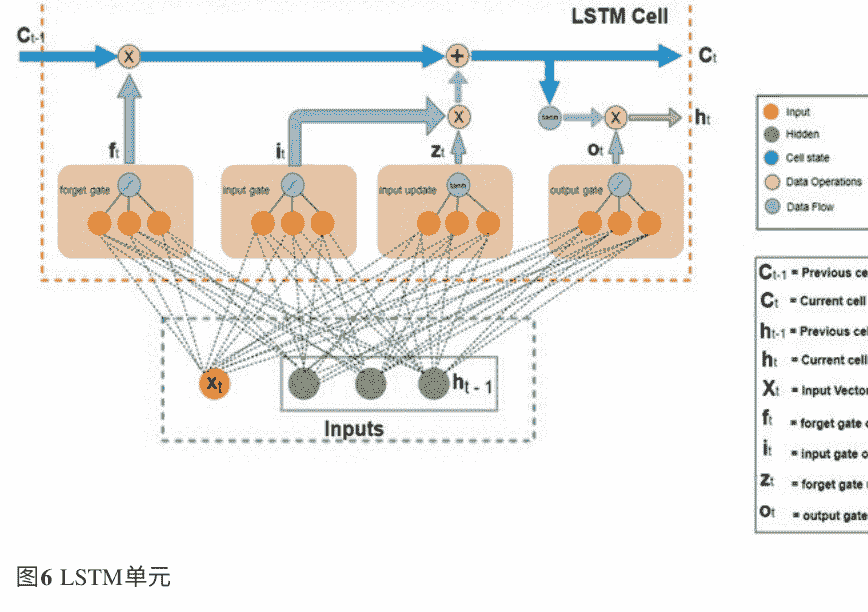

## LSTM

RNN是从数据中提取时间相关性的关键深度学习技术[17]。它以时间方式分布的一对多隐藏状态，比传统方法[18-20]更准确地预测未来。这种方法的主要缺点是无法克服梯度消失问题[21]。为了解决这个缺点，开发了LSTM，它规范了梯度流[16]。长短期记忆是最近的一种变体循环神经网络，用于解决梯度爆炸和梯度消失问题。LSTM通过记忆单元（LSTM单元）学习数据中隐藏的长程依赖关系。图6显示了LSTM单元的解剖。

这些依赖和输入的时间相关性通过LSTM单元中的一系列门（即遗忘门、输入门和输出门）来捕捉，以及Sigmoid和双曲正切激活函数。 LSTM单元中每个门的计算如下所示[22]。

+   1. 输入门: \(i_t = \sigma(W_{xi} x_t + W_{hi} h_{t-1} + W_{ci} c_{t-1} + b_i)\)
2. 遗忘门: \(f_t = \sigma(W_{xf} x_t + W_{hf} h_{t-1} + W_{cf} c_{t-1} + b_f)\)
3. 输出门: \(o_t = \sigma(W_{xo} x_t + W_{ho} h_{t-1} + W_{co} c_{t-1} + b_o)\)
4. 细胞状态: \(c_t = f_t c_{t-1} + i_t \tanh(W_{xc} x_t + W_{hc} h_{t-1} + b_c)\)
5. 隐藏状态: \(h_t = o_t \tanh(c_t)\)

其中σ表示Sigmoid函数，tan表示双曲正切函数。 在本文中，实现了LSTM的变体，并在以下章节中进行了讨论。

### 堆叠LSTM

在堆叠的LSTM中，多个LSTM层堆叠在一起，如图7所示。 每个中间LSTM输出层提供一个输出序列，该序列被馈送到下一个LSTM层。 此外，它提供了每个时间步的输出，而不是一个所有输入时间步的输出。每个阶段的计算如下所示：方程（6），（7），（8），（9）和（10）[22]。

```
输入门 i_t^L = σ( W_{ih}^L h_{t-1}^L + W_{ix}^L x_t^L + b_i^L ) (6)
遗忘门 f_t^L = σ( W_{fh}^L h_{t-1}^L + W_{fx}^L x_t^L + b_f^L ) (7)
输出门 o_t^L = σ( W_{oh}^L h_{t-1}^L + W_{ox}^L x_t^L + b_o^L ) (8)
细胞状态 c_t^L = f_t^L ⊙ c_{t-1}^L + i_t^L ⊙ tanh( ... ) (9)
隐藏状态 h_t^L = o_t^L ⊙ tanh( c_t^L ) (10)
```

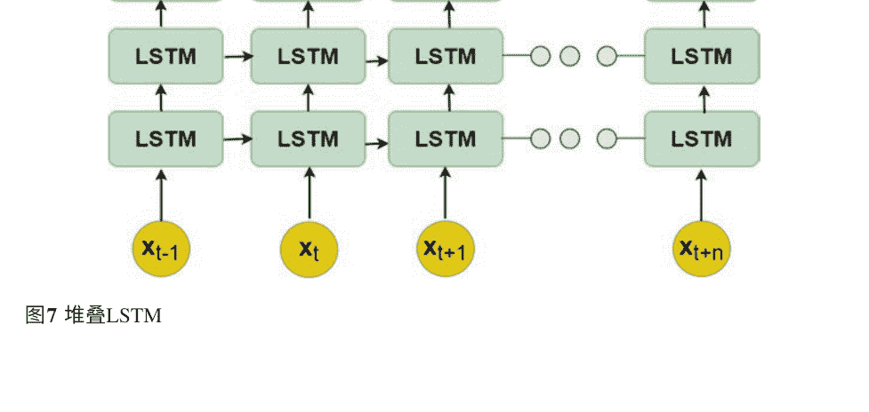

图7 堆叠LSTM

### 双向LSTM

与只能按正向方向处理输入的LSTM不同，双向LSTM使用来自两个方向（从未来到过去和从过去到未来）的信息，如图8所示。

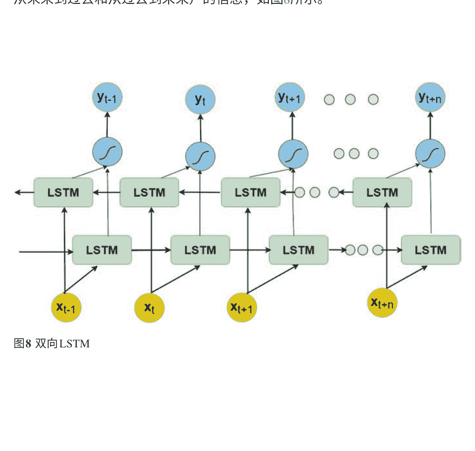

下面给出了产生输出的每个阶段的计算[22]。

```
输入门 $i_t^{\leftarrow L} = \sigma \left( W_{ih}^{\leftarrow L} h_{t-1}^{\leftarrow L} + W_{ix}^{\leftarrow L} x_t^{\leftarrow L} + b_i^{\leftarrow L} \right)$ (11)
```

```
遗忘门 $f_t^{\leftarrow L} = \sigma \left( W_{fh}^{\leftarrow L} h_{t-1}^{\leftarrow L} + W_{fx}^{\leftarrow L} x_t^{\leftarrow L} + b_f^{\leftarrow L} \right)$ (12)
```

```
输出门 $o_t^{\leftarrow L} = \sigma \left( W_{oh}^{\leftarrow L} h_{t-1}^{\leftarrow L} + W_{ox}^{\leftarrow L} x_t^{\leftarrow L} + b_o^{\leftarrow L} \right)$ (13)
```

```
细胞状态 $c_t^{\leftarrow L} = f_t^{\leftarrow L} c_{t-1}^{\leftarrow L} + i_t^{\leftarrow L} \tilde{c}_t^{\leftarrow L}$ (14)
```

```
隐藏状态 $h_t^{\leftarrow L} = o_t^{\leftarrow L} \tanh \left( c_t^{\leftarrow L} \right)$ (15)
```

网络的输出是来自两个方向的累积输出，如下所示

```
输出 $= y_h \left( W_h^{\leftarrow} h_t^{\leftarrow} + W_h^{\rightarrow} h_t^{\rightarrow} \right) + b_y$ (16)
```

## ## 提出的模型

### LSTM模型

本研究构建了三个LSTM模型，并在数据集上进行了实验。基于堆叠LSTM的第一个模型如图9所示。它有一个输入层，两个LSTM隐藏层，一个全连接层和一个输出层。考虑到一周COVID-19数据的重要性，输入时间序列设置为7。第一和第二个LSTM隐藏层都有150个单元和修正线性单元（ReLU）激活函数。全连接层设计为64个神经元，最终输出层具有1个神经元。提出的第二个LSTM模型与第一个模型相似，在第一个隐藏的LSTM层之后增加了一个额外的dropout层（dropout概率为0.5）。

两个模型的超参数设置总结在表1中。

### 双向LSTM模型

实现了一个具有如图10所示架构的双向STM模型。它有一个输入层，两个双向LSTM隐藏层，一个全连接层和一个输出层。输入时间序列设置为7，与堆叠LSTM模型相同。第一和第二个LSTM隐藏层都是具有300个单元和修正线性单元（ReLU）激活函数的LSTM层。全连接层设计为150个神经元，最后的输出层是一个具有1个神经元的密集层。

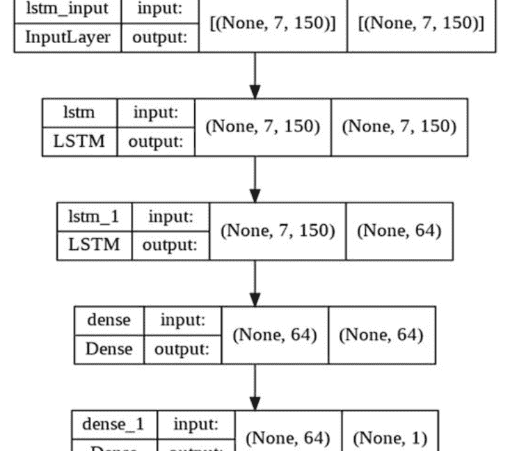

| 参数 | 值 |
| :--- | :--- |
| 时间步长 | 7 |
| 激活函数 | ReLU |
| 批量大小 | 32 |
| 迭代次数 | 150 |
| 优化器 | Adam |
| 损失函数 | 平方误差损失 |
| 完全连接层数量 | 1（64个神经元） |
| 丢弃概率（堆叠LSTM+丢弃模型） | 0.5 |

## 结果和讨论

在本节中，讨论了三个提出的模型在印度covid数据集上的性能。构建了三种LSTM模型的变体，分别是堆叠LSTM、堆叠LSTM+ dropout和双向LSTM，并在数据集上进行了实验。每个模型都使用相同的数据集进行训练，并通过相同的验证数据集进行评估。所有提出的模型的预测都基于属性confirmed。

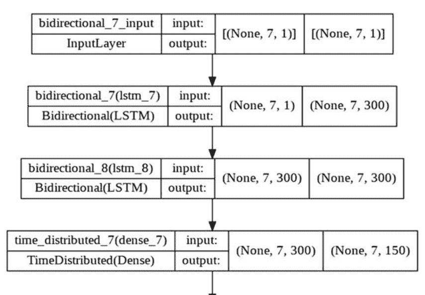

# 图10提出的双向LSTM模型

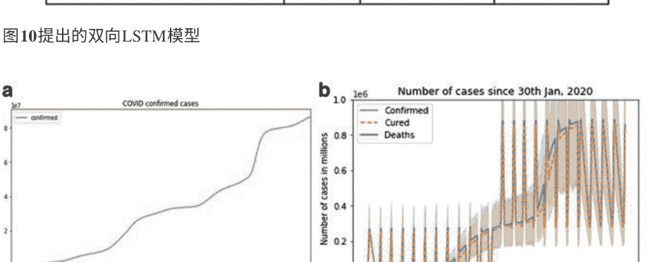

# 图11 1年期间的确诊病例(a)，2年期间的确诊病例(b)

数据集中的病例。图11a和b分别显示了2021年至2022年的1年期间和2020年至2022年的2年期间的确诊covid病例。

从图11a可以看出，上升发生在两个时期：2021年1月达到高峰，2021年3月达到高峰和2022年1月达到高峰，2022年2月达到高峰。这两个高峰分别表示印度的第二和第三波。印度的第二波始于2021年1月，于2021年3月达到高峰，并于2021年6月下降。由Omicron变种驱动的第三波始于2022年1月，于2022年2月达到高峰，并下降。在2022年3月。 第一波（2020年1月）的开始和其在2020年至2022年期间的趋势可以在图11b中解释。

从2020年到2022年的2年期间，马哈拉施特拉邦、卡纳塔克邦和泰米尔纳德邦的活跃、治愈和死亡趋势在图12中显示。 这三个邦位列受影响最严重的邦的名单之首。 尽管每个邦的活跃、治愈和死亡病例数量各不相同，但它们在2年期间表现出或多或少相同的趋势。

提出的三个模型，即堆叠LSTM模型、带有dropout层的LSTM模型和双向模型，都是基于训练数据集构建的，并在验证数据集上进行了检验。 所有实验都是使用16GB图形处理单元和基于TensorFlow的Keras框架进行的。

所提出的模型是在数据集上进行训练的，训练时使用了不同的epoch大小，包括50、100、150和500。 在epoch大小为150时，三个模型的训练损失和验证损失分别如图13a和14所示。 损失曲线可以用来解释模型的性能，无论是欠拟合、过拟合还是完全拟合数据。 欠拟合模型具有高偏差，意味着训练损失不会随着数据增加而减少。 这表明模型无法从训练数据中学习。 另一方面，过拟合表示高方差。 模型在训练数据上表现良好，但在未见数据上表现差。 这意味着模型无法很好地泛化。

堆叠LSTM的训练验证损失图表显示，随着训练样本的减少，训练损失和验证损失都很高。 随着样本的增加，两种损失都下降了。 此外，两种损失遵循相同的路径，并且它们之间的距离较小。 这表明所提出的堆叠LSTM模型在数据上表现良好，并且可以很好地推广到未知数据。

双向LSTM的训练验证损失图表显示，验证损失比训练损失高得多，并且在几个批次的数据点上急剧上升。这表明所提出的双向模型存在过拟合问题，并且不能推广到新数据。

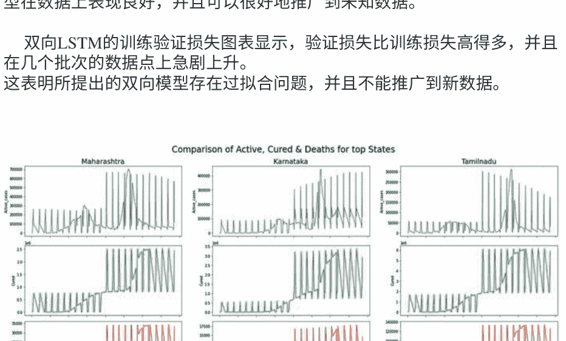

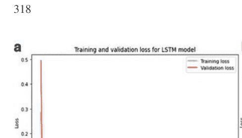

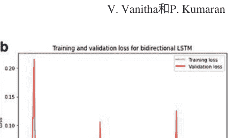

图13 (a)。 LSTM的训练/验证损失图表， (b) 双向LSTM的训练/验证损失

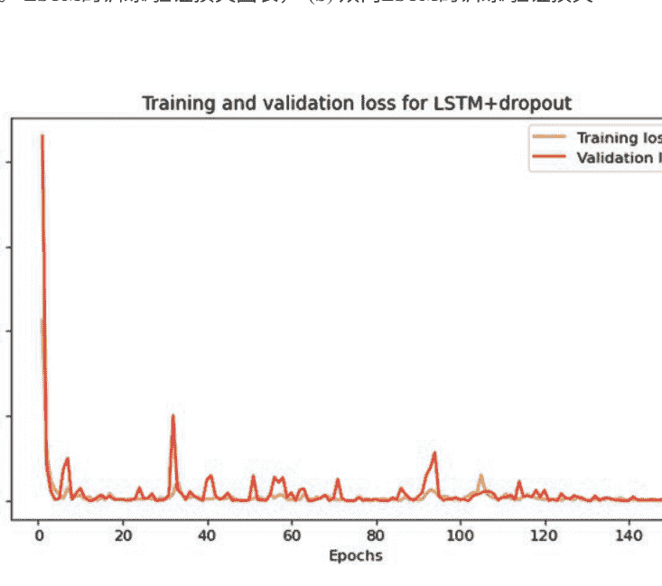

图14 LSTM + dropout的训练/验证损失

堆叠LSTM + dropout模型的训练验证损失图显示出与第一个模型类似的行为，但验证损失大于第一个模型。

所提出模型的误差度量使用RMSE和MAPE进行计算，并在表2中进行了表格化。

由于LSTM和双向LSTM模型表现更好，因此这两个模型用于预测。这些模型预测了从2022年6月21日到2022年6月28日的7天内的确诊病例，并在图15a、b中显示。

| 模型 | RMSE | MAPE |
|---|---|---|
| LSTM | 0.1504 | 0.1077 |
| LSTM+ dropout | 95.20 | 0.1568 |
| 双向LSTM | 131.24 | 0.2924 |

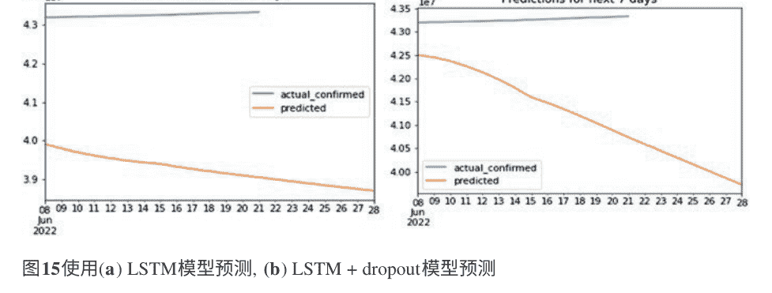

## 结论

本研究提出了三种LSTM变体模型来预测印度COVID-19的确诊病例。数据是通过印度政府网站和约翰霍普金斯大学收集的。对数据进行了必要的预处理技术，并进行了归一化处理。数据被分成训练集和测试集。第一个模型是具有输入层、两个隐藏层、一个密集层和一个输出层的LSTM模型。在第二个模型中，添加了dropout层到第一个模型中。第三个模型是双向LSTM模型。所提出模型在测试集上使用MAPE和RMSE进行了评估。研究结果显示，所提出的堆叠LSTM模型优于其他模型，并且最适合印度COVID数据集。

## 参考文献

- 1. R. Magar, P. Yadav, A. Barati Farimani, 使用机器学习发现了针对新型冠状病毒的潜在中和抗体。科学报告。11, 5261 (2021年)。https://doi.org/10.1038/s41598-021-84637-4
- 2. N. Zhu, D. Zhang, W. Wang, 中国肺炎患者中的一种新型冠状病毒, 2019年9月22日, NEJM, 2020年[WWW文档]。URLhttps://www.nejm.org/doi/full/10.1056/nejmoa2001017
- 3. M. Toğaçar, B. Ergen, Z. Cömert, 使用深度学习模型检测COVID-19，利用社交模仿优化和结构化胸部X射线图像，使用模糊颜色和堆叠方法。计算生物医学。 **121**, 103805 (2020年)。 https://doi.org/10.1016/j.compbiomed.2020.103805
- 4. B. Mullick, R. Magar, A. Jhunjhunwala, A. Barati Farimani, 使用Shannon熵和K-means聚类理解SARS-CoV-2刺突蛋白的突变热点。计算生物学和医学。 **138**, 104915 (2021).https://doi.org/10.1016/j.compbiomed.2021.1049155. K. Arun Kumar等人, 使用统计机器学习模型（自回归积分移动平均（ARIMA）和季节性自回归积分移动平均（SARIMA））预测累计COVID-19病例（确诊、康复和死亡）的动态：应用软计算。 **103**, 107161 (2021)
- 6. T.T. da Silva, R. Francisquini, M.C.V. Nascimento, 使用新型混合分解方法和异常检测分析的气象和人类流动数据预测巴西首都的COVID-19病例。专家系统应用。 **182**, 115190 (2021). https://doi.org/10.1016/j.eswa.2021.115190
- 7. A. Swaraj, K. Verma, A. Kaur, G. Singh, A. Kumar, L. Melo de Sales, 在印度实施基于堆叠的ARIMA模型，用于预测Covid-19病例。生物医学信息学杂志 **121**, 103887 (2021).https://doi.org/10.1016/j.jbi.2021.103887
- 8. P. Wadhwa, Aishwarya, A. Tripathi, P. Singh, M. Diwakar, N. Kumar, 使用机器学习预测由于COVID-19病例增加而延长封锁时间。材料科学 **37**, 2617–2622 (2021). https://doi.org/10.1016/j.matpr.2020.08.509
- 9. P. Wang, X. Zheng, G. Ai, D. Liu, B. Zhu, 使用改进的LSTM深度学习方法对COVID-19的疫情趋势进行时间序列预测：俄罗斯、秘鲁和伊朗的案例研究。混沌孤立子分形 **140**, 110214 (2020)。 https://doi.org/10.1016/j.chaos.2020.11021410. B.I. Nasution, Y. Nugraha, J.I. Kanggrawani, A.L. Suherman, 使用泊松自回归预测雅加达的COVID-19病例，在2021年第9届信息与通信技术国际会议（ICoICT）中，（IEEE，皮斯卡塔韦，2021），第594-599页11. C.-S. Yu等，一种基于人工智能的COVID-19大流行系统，具有深度学习预测和自动统计数据获取：开发和实施研究。J. Med. Internet Res. **23**, e27806 (2021)
- 12. H. Khaloofi, J. Hussain, Z. Azhar, H.F. Ahmad, 通过传染病建模对COVID-19预测的机器学习方法性能评估,在2021年塔伊夫大学数据科学女性国际会议(WiDSTaif)上,(2021), pp. 1–6. https://doi.org/10.1109/WiDSTaif52235.2021.9430192
- 13. J.S. Armstrong,长期预测(Wiley, 纽约, 等, 1985)
- 14. Y. Bengio, Y. LeCun, 将学习算法扩展到人工智能. 大规模核心机器 **34**(5), 1–41 (2007)
- 15. I.H. Witten et al.,数据挖掘: 实用的机器学习工具和技术, 第4版 (Morgan Kaufmann, Burlington, 2016) https://www.amazon.com/exec/obidos/ASIN/0128042915/departmofcompute. 于2018年11月30日访问
- 16. S. Hochreiter, J. Schmidhuber, 长短期记忆. 神经计算。 **9**(8), 1735–1780 (1997). https://doi.org/10.1162/neco.1997.9.8.1735
- 17. A. Sherstinsky, 循环神经网络（RNN）和长短期记忆（LSTM）网络的基础。 Phys D (2020).https://doi.org/10.1016/j.physd.2019.13230618. K. Singh, S. Shastri, A.S. Bhadwal, P. Kour, 等, 指数平滑的实现用于时间序列数据的预测。 Int. J. Sci. Res. Comput. Sci. Appl. Manage. Stud. (2019) issn:2319-1953
- 19. Z. Zhao, K. Nehil-Puleoa, Y. Zhao, 我们能用曲线拟合和循环神经网络来预测COVID-19疫情吗? medRxiv预印本2020. https://doi.org/10.1101/2020.05.14.20102541
- 20. S. Shastri, A. Sharma, V. Mansotra, J & K地区游客到达预测模型。 印度。 国际计算机应用杂志。 **129**（15），32-36（2015）issn: 0975-8887
- 21. M. Fakhfakh, B. Bouaziz, F. Gargouri, L. Chaari, ProgNet: 使用循环和卷积神经网络的Covid-19预测。 medRxiv预印本2020. https://doi.org/10.1101/2020.05.06.20092874
- 22. Y. Yu, S. Xi, C. Hu, J. Zhang, 循环神经网络综述: LSTM单元和网络架构。 神经计算。 **31**，1235-1270（2019）。 https://doi.org/10.1162/neco_a_01199

# 索引

## A

- 算法医学，272, 275–276
- 人工智能（AI），27, 28, 38, 49–61, 89, 101, 102, 105, 108, 110, 112–120, 125–149, 179, 180, 207, 210, 213, 215, 219, 221–228, 272, 275
- 音频分类，191

## B

- 计费，22, 222, 278
- 区块链，63–80

## C

- 心血管疾病，10, 221, 223–225
- 循环经济，50
- 诊所，111, 208, 216, 223, 227, 238, 272, 274, 278
- CNN架构，39, 40, 115, 191
- 计算机辅助诊断（CAD），38, 85, 286
- 卷积神经网络（CNN），38–40, 44, 45, 85, 89–92, 94, 138, 140, 141, 146, 148, 192, 194, 196, 208, 217, 218, 299–302
- COVID-19，1–16, 37–45, 99–120, 125, 129, 134, 137, 143–148, 167–175, 177–180, 185–204, 207, 209–212, 216, 218, 221, 223, 226–228, 231–253, 257–270, 305–319
- CT图像，115, 148, 185–204, 306

## D

- 数据透明度和COVID，68
- 深度卷积生成对抗网络（DCGAN），153–165
- 深度学习，38, 39, 44, 52, 85, 89, 91, 94, 95, 101, 120, 141–142, 144, 148, 155, 165, 185–204, 207, 208, 210, 211, 213, 215, 219, 221, 223, 224, 269, 299, 305–319
- 数字康复，271, 272, 278, 279

## E

- 边缘计算的好处，207–219
- 有效性，4, 12, 45, 50, 60, 86, 89, 91, 101, 103, 104, 111, 116, 127, 134, 138, 144, 168, 177, 180, 201, 219, 223, 232, 233, 235, 236, 243, 246, 248, 251–253, 292, 294, 295, 306
- 电子健康，83, 143, 275, 277
- 流行病，3, 5, 12, 16, 52, 58, 120, 129, 131–138, 141–143, 148, 186, 189, 207–219, 231, 257, 285–302, 306, 307
- 疫情解决方案, 207–219
- 电子处方, 26
- 专家系统, 102, 111, 113, 120, 135, 136, 143, 144
- 磁共振图像, 295
- 移动健康, 114
- 多类别分类, 40, 190, 201

## F

- 特征，13, 21, 33, 34, 39, 40, 42–45, 85–88, 91, 101, 103, 112, 115, 140, 144, 146, 148, 149, 154, 171, 180, 191–199, 201–204, 210, 258–260, 262–265, 288–290, 292, 293, 295, 299, 301
- 预测，12, 54, 111, 138, 305–319
- Frechet Inception Distance (FID), 161, 164, 165

## G

- 图形处理单元（GPU）, 155–157, 159, 162, 163, 208, 213–215, 219

## H

- 健康，2, 3, 7, 10, 11, 14, 16, 19–35, 37, 51–52, 58–60, 66, 77–79, 83, 85, 99–120, 126, 128, 129, 134, 141, 143, 178, 186, 207–210, 212, 213, 219, 221, 223–225, 227, 228, 231–253, 271–279, 285, 305, 308
- 卫生部门, 52, 167–180, 271, 274, 276, 278, 279

## I

- 印度, 2–4, 9, 22–23, 32, 55, 100, 110, 186–188, 246, 247, 249, 305–319
- 印度医疗物联网（IIoMT）, 207–210, 212–215
- 物联网（IoT）, 22, 49, 63–80, 100, 102, 108, 139, 142, 144, 207, 209, 214

## L

- 长短期记忆（LSTM）, 144, 146, 197, 199, 201, 204, 306, 307, 309, 311–319

## M

- 机器学习, 12, 19, 20, 22, 26–28, 31, 33, 38, 52, 53, 58, 89, 101, 104, 105, 107, 115, 119, 135, 137–142, 144–149, 155, 180, 201, 204, 210, 221, 228, 275, 276, 285–302, 306, 307
- 机器学习模型, 1–16, 28, 29, 34

## N

- 神经网络, 49, 52, 88–91, 139, 140, 142, 144, 146, 148, 149, 153, 210, 222, 257–270, 275, 299, 301, 307–309
- 神经退行性, 285–302

## O

- 目标检测, 258–259, 264–268
- 目标跟踪, 257, 258, 260–262
- 光学字符识别（OCR）, 30–32

## P

- 大流行, 1–16, 19–35, 37, 99–120, 129–144, 148, 149, 167–180, 185–187, 189, 207–219, 221, 223, 226, 227, 231–233, 236, 244, 245, 249, 251, 253, 257–279, 305–307
- PatchCamelyon (PCam), 155–160, 165
- 光子学设备, 167–180
- 政策, 60, 69, 186, 307

## R

- 放射图像, 38, 41, 42, 45
- 随机森林, 91, 92, 94, 95, 138, 144, 199
- 远程健康监测, 100–103, 108, 110, 113, 118
- 远程监测, 100, 101, 103–107, 113, 114, 119
- 边缘计算的作用, 207–219
- RT–PCR测试, 218, 234, 235, 238

## S

- SARS和MARS, 4
- 筛查, 4, 11, 56, 109–111, 115, 135, 139, 142–143, 175, 201, 221, 222, 231–253
- 安全性, 27, 32, 33, 60, 61, 68, 80, 107, 119, 210, 219, 249
- 传感器, 52, 54, 58, 60, 66–80, 90, 100, 101, 103–113, 119, 142, 168, 172, 174, 175, 180, 208, 209, 213–215, 227, 274, 275
- 严重急性呼吸综合征冠状病毒2 (SARS-CoV-2), 3, 4, 11, 12, 37, 99, 102, 104–107, 131, 133, 143, 169, 175, 176, 190, 191, 231, 232, 236–238, 240–242, 244, 246, 247, 249, 305
- 智慧城市, 50
- 可持续发展目标 (SDGs), 49–61

## T

- 远程医疗, 24, 25, 27, 35, 107, 110, 117, 227, 272–273, 277
- 迁移学习, 40–42, 115

## V

- 疫苗接种, 58, 99, 134, 168, 231–253, 276
- VGG16, 38–40, 42, 45, 46, 301
- VGG19, 46, 162–165

## W

- 无线体域网 (WBAN), 100, 104–107, 119, 120

## X

- X射线, 19, 37–39, 41, 44, 45, 84, 115, 144, 146, 148

## Y

- You just Look once (YoLo), 216, 264–265, 267, 268