# 使用深度学习的基于会话的推荐系统

## 前言

互联网已成为人类生活的重要组成部分，使得每个人都能够共享信息、获取机会，并跨越地理和文化限制进行合作。每分钟都有数百万个数据对象上传到互联网上，数据量呈指数增长。对于用户来说，研究所有可用的数据并发现所需和喜欢的项目是困难甚至不可能的。推荐系统是一种重要的工具，可以帮助用户进行决策过程。这些系统利用用户的短期和长期数据，以及其他用户的偏好和决策结果，来预测目标用户的喜欢的项目。

推荐系统在现实世界中的作用至关重要且不可否认，考虑到电子商务、多媒体和娱乐、工作、新闻等不断增加的服务交付和客户满意度。推荐系统对于提高用户满意度和预测他们喜欢的物品至关重要，但在这个领域也存在各种挑战。传统的推荐系统依赖于用户配置文件来生成个性化推荐，但有时候用户配置文件不存在或用户认证策略阻止了在现实生活中的访问。事实上，用户个人信息的隐私正在成为一个重大挑战，因此，推荐系统应该减少对用户配置文件的依赖，而不会对推荐的准确性产生不利影响。值得一提的是，尽管允许访问用户的长期兴趣，用户仍然可能需要一个只能使用他们的短期数据来预测的物品。

解决方案是基于用户会话交互来预测和提供推荐。会话是在特定时间间隔内考虑的用户交互列表。特定用户的会话通常包含在会话中不同时间发生的与用户相关的一组交互。会话有两种类型：有序会话和无序会话。有序会话指的是交互按照时间顺序排序的会话，而无序会话包括一组没有特定顺序的交互，例如客户的购买记录。会话中的项目包含名称、描述和相关类别等元数据，这使得预测用户最喜欢的项目更容易。

基于会话的推荐系统（SBRS）利用会话数据提供推荐，无需访问长期用户数据和交互。由于会话推荐系统所需数据的可用性以及这些系统的特性与实际应用的兼容性，SBRS引起了许多研究人员的关注。当然，需要注意的是基于会话的推荐系统和顺序推荐系统之间存在非常狭窄的界限。基于会话的推荐系统是基于会话数据建模的，而顺序推荐系统是基于时间顺序数据建模的。序列是一系列先前的时间顺序交互的列表，没有定义的时间间隔，而会话是在相对较短的时间内，由不同项目的交互列表组成的，并具有定义的边界。

会话推荐系统的目的是根据学习每个会话内或多个会话之间的依赖关系，预测一个或一组项目的会话，或者预测下一个会话。这些依赖关系是基于最近几个用户交互的同时发生来识别的。

另一方面，在顺序推荐系统中，根据不同会话中连续项目之间的顺序依赖关系来预测项目。事实上，顺序推荐系统捕捉用户在之前会话中的长期偏好，就像传统推荐系统一样，但它们还需要对短序列中的用户短期兴趣进行建模。

已经提出了各种方法来建模SBRS，例如关联规则、马尔可夫链、模式挖掘、潜在表示和深度神经网络。这些方法中的每一种都在不同的研究中使用过。深度神经网络是一种因其高性能和对复杂问题建模能力而受到广泛关注的方法。这些技术最近在许多学术和商业领域得到了广泛应用。在基于会话的推荐系统中，使用各种深度神经网络技术来识别会话之间的依赖关系和不同会话之间的复杂关系。在过去几年中，研究人员对基于深度学习技术的基于会话的推荐系统更感兴趣。这个事实证明了深度学习技术在基于会话的推荐系统中的有效和不可否认的作用。基于深度学习方法的基本会话推荐系统主要分为基本和混合/高级深度神经网络模型。基本的深度神经网络方法包括RNNs、CNNs、MLPs、AEs、GANs等，而混合/高级深度神经网络包括GNNs、基于注意力的模型、深度强化学习以及从基本方法的特定组合中获得的模型。

## 目标和范围

本书侧重于深度神经网络在基于会话的推荐系统中的广泛应用及其各种技术。事实上，作者意图引起读者对选择适当的深度学习技术的注意，这些技术适用于输入数据为会话的推荐系统，并根据会话数据的类型、上下文和问题的目标进行选择。本书试图从不同的角度展示深度学习技术在基于会话的推荐系统研究中的成功。为此，详细阐述了基于会话的推荐系统的概念和基础知识。然后，研究了不同的深度学习技术，特别关注本书的主题。

对基于会话的推荐系统的研究进行回顾表明，已经利用了各种深度学习方法，如判别模型、生成模型和基于图的模型，以提供有效和准确的推荐。此外，我们还回顾和讨论了不同的学习排序（LtR）方法，这些方法是基于会话的推荐系统中不可避免的部分，以实现更好的推荐质量和提高排名性能。

## 主要强调

本书的主要重点是提供一个准确、全面和最新的观点，涵盖了会话推荐系统中使用深度学习模型的概念、挑战、类型、架构细节、评估方法以及方法的优缺点。为此，讨论和分析了会话推荐系统中不同深度神经网络模型的技术描述、亮点、局限性以及优缺点。

## 目标受众

根据本书不同章节中提供的材料，作者试图为读者提供全面的视角和足够的信息，以阐述和发展基于会话的推荐系统。此外，本书的内容准备得使读者能够分别学习与基于会话的推荐系统和深度学习相关的基本概念，并为他们提供应用于基于会话的推荐系统中的深度学习方法的详细信息。

事实上，本书是为那些打算使用深度学习模型解决与基于会话的推荐系统相关挑战的研究人员提供的。简而言之，主要目标群体可以分为学术界（研究生）以及行业（推荐系统应用/产品开发者和设计师）。本书涵盖的材料涉及推荐系统、Web数据挖掘、信息检索和机器/深度学习领域。

## 先决条件

我们假设所有读者都熟悉计算机科学的概念。为了更好地理解本书的内容，读者应该熟悉设计和分析算法以及机器学习方法的基本概念和原则，并且在某种程度上熟悉使用至少一种编程语言（最好是Python）实现系统的原则。从数学上讲，我们希望读者熟悉微积分、概率论和线性代数。

## 简短总结

本书模块化程度高，每章都可以根据个人兴趣和需求独立学习。值得一提的是，熟悉基于会话的推荐系统的读者可以跳过第1章，已经学习过深度学习方法概念的读者可以跳过第2章。接下来，本书对每一章进行了简要介绍：在本书的第一章中，回顾了与基于会话的推荐系统相关的定义和概念。在本章的开头，我们解释了推荐系统的概述。在本章的其余部分，内容的重点是基于会话的推荐系统。为此，我们用相关的数学公式更清楚地解释了每个概念。然后，我们全面考虑了基于会话的推荐系统的挑战。最后，我们提出了基于会话的推荐系统方法的分类法，分别讨论了每个类别的特点和应用。

第二章从深度学习的基本概念和每个模型的特点开始。然后，介绍了每个深度学习模型及其架构和数学基础。为此，深度学习模型被分为判别式、生成式和图形方法。

深度判别模型包括卷积神经网络（CNN）、循环神经网络（RNN）和多层感知器（MLP）。主要的深度生成模型包括自编码器（AE）、生成对抗网络（GAN）和不同类型的玻尔兹曼机（BM）模型。基于图的模型还包括图神经网络（GNN）和图卷积网络（GCN）。

在第3章中，讨论和分析了会话推荐系统中深度判别模型的不同方法。由于循环神经网络（RNN）能够对会话数据的动态行为进行建模，因此会话推荐系统中的许多方法都采用了RNN。因此，RNN方法（包括GRU和LSTM）对SBRS的性能有着显著影响。然而，由于卷积神经网络（CNN）能够提取和学习时间和空间模式，基于会话的推荐系统也使用CNN。基于MLP的方法主要适用于无序会话数据，因为它们无法对序列数据进行建模。

不同的基于会话的推荐系统采用了深度判别模型的不同方法。由于循环神经网络（RNN）能够对会话数据的动态行为进行建模，因此会话推荐系统中的许多方法都采用了RNN。因此，RNN方法（包括GRU和LSTM）对SBRS的性能有着显著影响。然而，由于卷积神经网络（CNN）能够提取和学习时间和空间模式，基于会话的推荐系统也使用CNN。基于MLP的方法主要适用于无序会话数据，因为它们无法对顺序数据进行建模。

在第四章中，讨论了从深度生成神经网络中受益的基于会话的推荐系统。对已发表研究的研究和分析表明，与基于生成的方法相比，基于判别的深度方法在基于会话的推荐系统中具有更广泛的应用，因为它们采用了顺序方法。然而，生成技术对于研究人员也很重要，因为它们能够减少基于会话的推荐系统中用户交互的稀疏性和复杂性问题。本章重点介绍了自编码器、生成对抗网络和基于流的模型（归一化流和自回归流）在基于会话的推荐系统中的应用。

第五章讨论了使用混合/高级深度学习方法的基于会话的推荐系统。每种深度学习方法都具有特定的特性和能力，由于深度神经网络的高灵活性，许多神经结构块可以集成在一起，形成更强大和准确的模型。两种或更多不同模型的整合提供了使用每种方法的优势、限制其缺点并增强结果组合方法的能力的可能性。通常，这些方法由几个阶段组成，在每个阶段中使用深度学习技术来处理和生成下一个阶段所需的数据。因此，本章讨论了不同研究中这些阶段的最佳组合和配置。在基于会话的推荐系统中，CNN和AE、CNN和RNN、RNN和AE以及RNN和深度强化学习（DRL）的组合受到了最多的关注。由于深度强化学习和图神经网络方法的高效性，许多基于会话的推荐系统都基于这些方法。因此，第5章介绍了使用图神经网络或深度强化学习的各种基于会话的推荐系统的详细信息。

学习排序（LtR）方法基于机器学习技术，在不同领域中对结果进行排序。第6章回顾了不同的LtR方法，重点关注信息检索和推荐系统领域。为此，讨论和审查了各种创建和聚合排名的方法。本章主要关注四种排名创建方法：点对点、成对、列表和混合。

最后，总结了本书中进行的调查和研究回顾的结果。

伊朗德黑兰 Reza Ravanmehr Rezvan Mohamadrezaei

## 致谢

在一本书的开头写致谢总是最美好的部分！这本书的完成离不开许多人的贡献和帮助。首先，我们要对CTBIAU计算机工程系的所有过去和现在的教职员工和学生以及许多朋友和同事表示衷心的感谢，他们的持续支持和鼓励使我们能够完成这个阶段的工作。还要感谢在基础科学研究所（IPM）的朋友和同事，他们帮助使这个项目取得了成功。

我们要感谢Springer的工作人员，特别是Ralf Gerstner，他们在整个项目中的奉献和帮助。我们也非常感谢所有审稿人的宝贵反馈。此外，我们还要感谢那些允许我们从他们的出版物中复制图表的人。

在我们的职业生涯中，我们非常幸运能够与一群出色的学生一起工作，我们要感谢他们对我们的形成性作用。我们在课程和研究项目中经常进行有趣的讨论，这激励我们写这本书。

最后，我们要感谢我们的家人全心全意地支持我们整个项目，并给予我们完成这本书的力量。Reza要感谢他的妻子Paris，在没有她的帮助和理解下，这个项目是不可能完成的。他还要感谢他的父母在不同阶段的支持。Rezvan要向她的丈夫Vahid表示衷心的感谢，感谢他在写这本书时的善良和动力。她还要感谢她的父母和兄弟对她的鼓励和支持，这让她不断向前。


## 关于作者

Reza Ravanmehr 1996年毕业于伊朗德黑兰的沙希德·贝赫什蒂大学计算机工程专业。之后，他在1999年和2004年分别在伊朗SRBIAU获得了计算机工程硕士和博士学位。他的主要研究兴趣包括推荐系统、大数据分析和社交网络。他在不同的计算机科学领域发表了60多篇科学论文，主要涉及社交网络分析和推荐系统。自2001年以来，他一直是伊斯兰阿扎德大学中央德黑兰分校计算机工程系的教职员工。电子邮件：r.ravanmehr@iauctb.ac.ir

Rezvan Mohamadrezaei目前是伊斯兰阿扎德大学中央德黑兰分校软件系统博士候选人。在此之前，她于2007年从MHRIAU获得计算机工程学士学位。之后，她于2012年从SRBIAU获得计算机工程硕士学位。她目前的研究兴趣包括深度学习、推荐系统和信息检索。自2013年以来，她一直是Ahvaz Karoon高等教育学院计算机工程系的教职员工。

## 第一章 介绍会话推荐系统

摘要 由于近年来数据的大规模增长，推荐系统已成为改善人们生活的重要工具。然而，访问用户的个人资料和他们的长期兴趣是这些系统的关键挑战。

- 基于会话的推荐系统
- SBRS
- 顺序推荐系统
- SRS
- 深度学习

## 1.1 简介

推荐系统帮助用户在各个领域做出高效的决策。从众多可用项目中选择有利项目的过程是一个模糊的过程，推荐系统通过使用与用户相关的数据和其他用户决策的结果来促进这个过程。推荐系统根据相关过程的类型和用于推荐的数据被划分为不同的类别。在不同领域中，需要使用推荐系统来提高用户满意度并预测用户感兴趣的项目。然而，推荐系统面临着特定的挑战，迄今为止，已经提出了不同类型的推荐系统来解决这些挑战。

访问用户的个人资料和他们的长期兴趣是这些关键挑战之一。许多用户在推荐平台上不创建个人资料来使用不同的服务，或者是新用户并且进行了非常有限的交易。在这种情况下，系统很难决定他们喜欢的物品。另一方面，即使可以访问用户的长期兴趣，用户仍然可能认为需要短期数据才能进行有效预测的问题。提出了基于会话的推荐系统（SBRS）来改善这些问题，并引起了许多研究人员的关注。

大多数SBRS的场景包括一系列通常很短的用户交互在一个会话中，并且在许多情况下，用户的长期兴趣不可用[1]。 基于会话的推荐系统变得越来越重要，并且最近进行了许多研究。 会话推荐系统有价值的一个原因是每个会话被视为组织数据的单位。 这种方法保留了交易数据的性质，并根据每个会话内的依赖关系做出决策。 SBRS建模在其他类型的推荐系统中不执行，因为SBRS通常将会话数据分成多个用户-项目交互对以适应模型。 此外，相比内容推荐或协同过滤推荐系统所需的评分数据，访问会话数据更容易。 因此，这些类型的系统在商业和电子商务领域更实用。

在介绍之后，第1.2节概述了推荐系统的概念和方法。 第1.3节重点介绍了基于会话的推荐系统的基本概念、定义和挑战，以及与顺序推荐系统（SRS）和会话感知推荐系统（SARS）在各个方面的差异，并解决了与它们之间边界相关的模糊问题。 第1.4节简要介绍了与基于会话的推荐系统相关的各种方法。

## 1.2 推荐系统

推荐系统试图根据用户的行为、行为和兴趣为他们提供与其偏好相匹配的推荐，并做出有效的决策。 这些系统积极而持续地收集和处理与项目、用户和用户之前的交互相关的不同类型的显式或隐式数据，以创建准确的推荐[2]。 换句话说，推荐系统的开发是为了估计项目的有用性并预测其推荐背后的价值。 对于特定用户的有价值项目的预测根据提出的推荐算法而异。 在过去的几年中，推荐系统取得了显著的进展，并专注于电影、音乐、新闻、工作、书籍和网站等不同领域。 图1.1显示了基于用户数据、项目特征和用户与项目之间的交互的推荐系统的一般过程。

其中最基本的类型之一是基于人口统计信息的推荐系统过滤算法。 过滤算法是将有用的物品与用户进行区分的过程。 推荐系统的过滤算法至关重要，它决定了推荐系统的基础。

参考以前的研究中关于推荐系统范围的经典类别[3-5]，推荐技术分为三个一般类别。

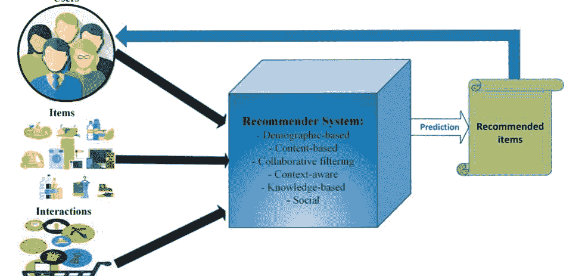

### 图1.1 推荐系统的一般流程

基于过滤算法类型的推荐系统有三种：基于内容的推荐系统（CB），协同过滤（CF）和基于知识的推荐系统（KB）。虽然仍然使用这些类别，但也提出了许多新的类别，每个类别都有不同程度的重叠：上下文感知、基于效用、社交和混合推荐系统。

Marcuzzo等人认为，由于数据的不断扩大、大数据革命和数据导向方法的出现，可以提供更准确的推荐系统分类[6]。

- 基于人口统计学的推荐系统根据用户的人口统计信息来考虑每个用户。人口统计信息用于识别对特定项目感兴趣的用户类型和类别。基于人口统计学的推荐系统利用了具有共同特征（如相同国籍或相同性别）的用户更喜欢相似项目的原则。通常，这些算法与其他算法（如基于内容或协同过滤的算法）结合使用，以获得更好的结果[7]。
- 协同过滤的推荐系统利用与目标用户活动相似的用户的过去行为和兴趣。这些类型的系统向每个用户推荐那些被与目标用户相似的用户高度评价的项目[8,9]。协同过滤算法分为基于内存和基于模型的方法。基于模型的方法根据用户先前对各种项目的评级学习模型，其学习基于机器学习或数据挖掘技术实现。然而，基于内存的方法基于用户之间的相似性提供推荐在基于项目和用户之间关系创建的数据库上。它们被分为基于项目、基于用户和混合方法。基于用户的方法根据用户对相同项目的评分计算用户之间的相似度。推荐新项目或预测特定用户对某个项目的兴趣水平是基于用户先前的兴趣和与他相似的其他用户的兴趣。在基于项目的方法中，为用户计算推荐是通过找到与用户感兴趣的其他项目相似的项目来实现的。混合方法是基于用户和基于项目方法的结合结果。在基于内存的方法中，学习过程是离线完成的，此外，所有信息和数据必须在内存中进行计算和预测，这带来了可扩展性的挑战。但是基于模型的方法没有可扩展性问题。
- 基于内容的推荐系统侧重于项目特征分析。在这种方法中，用户的配置文件是基于该用户已经评级的项目的内容特征构建的。因此，向每个用户推荐与他/她之前兴趣相关的项目，并且这些方法独立于其他用户的兴趣。基于内容过滤提供的推荐是基于统计技术或机器学习方法创建的模型。基于内容过滤方法的优点是推荐尚未评级的项目。如果用户的偏好发生变化，该方法会快速将推荐与新偏好匹配。不需要不同用户共同评级相同项目以确定它们的相似度。除了上述优点外，基于内容过滤方法的缺点是需要访问具有关于项目特征的完整信息的用户配置文件，以向用户提供有效的推荐。此外，该方法提供的推荐仅与用户之前评级的项目相似。
- 基于知识的推荐系统基于对物品领域、用户需求和偏好的明确知识和规则[11]。基于知识的推荐系统利用从用户之前的互动中提取的知识，与内容和协同过滤技术不同[11]。知识通常包括用户提供的与用户和物品相关的明确信息，系统使用这些信息创建用户概要[11]。或者，这种类型的系统中使用的知识与特定领域和上下文相关，这是根据物品对用户的有用性或特定物品特征对用户需求和偏好的适应性推断出来的[7]。开发基于知识的推荐系统的两种广泛使用的方法是基于案例推理和基于约束的方法[11]。基于案例推理方法是一种人工智能模型，根据系统先前案例的经验为新情况提供推理过程[12]。基于约束的方法提取一组推荐规则，根据用户需求找到物品[13]。
- 上下文感知推荐系统整合描述交互环境的信息源。上下文数据可以包括表示上下文的数据，这些数据是一组可观察到的上下文变量，例如时间、地点和天气，或者是动态的交互上下文数据，通常包括用户最近的活动，这些活动并不明确可见，例如当前的购买情况、用户的状态等[14]。另一种类型的上下文数据，例如对物品的文本评论，对于新用户或匿名用户的推荐系统非常重要。 研究中研究最广泛的上下文信息类型是时间[15]。 由于用户的兴趣随时间变化，静态推荐可能效果较差。 相反，可以在用户的顺序行为中发现模式，这是将时间纳入推荐过程的方法的目标。 这个领域的方法通常区分序列和会话，序列是一系列按时间顺序排列的交互，没有明确定义的时间间隔，而会话则包括在相对较短的时间间隔内具有明确定义边界的交互列表。
- 社交推荐系统同时利用用户与物品的互动以及用户与用户之间的社交关系来生成物品推荐给用户[16]。社交推荐系统中最重要的类型是社交媒体内容的推荐和人物的推荐[17, 18]。 社交推荐系统的重要领域主要与互联网上的内容相关，包括博客、多媒体、社区问答系统、工作、新闻和微博。 群组和社区在社交媒体平台上起着至关重要的作用，这使得群组推荐技术对社交推荐系统领域非常相关。

在表1.1中，将上述推荐系统类型在输入数据、基本假设、机制、优点和缺点方面进行了比较。

为了向用户提供准确有效的推荐，各种类型的推荐系统都面临着必须解决的挑战。 所有类型的推荐系统中最重要的共同技术挑战包括冷启动、推荐延迟、用户偏好变化、数据稀疏和碎片化、可扩展性、安全性、适当的用户界面设计以及选择合适的评估指标。 已经提出了各种研究来减少不同范围内的每个挑战。 对于对推荐系统感兴趣的读者，应该参考一本完全专门致力于推荐系统领域的综合手册，该手册由该领域的领先专家贡献[19]。

## 表1.1不同类型的推荐系统比较

| 推荐系统 | 输入 | 基本假设 | 机制 | 优点 | 缺点 |
|---|---|---|---|---|---|
| 基于人口统计的推荐系统 | 用户和物品的人口统计数据 | 具有相似人口统计信息的用户对相似物品感兴趣 | 基于人口统计信息对用户进行分类，并根据相似用户的兴趣推荐物品 | 不需要关于用户之前交互的信息 | 用户隐私的侵犯，无法访问所有用户的人口统计信息，忽视用户兴趣的变化 |
| 基于内容的推荐系统 | 用户和物品的隐式或显式内容数据 | 用户对与他/她之前喜欢的物品相似的物品感兴趣 | 用户配置文件数据与物品内容的一致性 | 简单易懂，减少冷启动问题 | 仅基于当前用户的兴趣进行推荐 |
| 协同过滤推荐系统 | 用户-物品交互矩阵 | 用户对与其他用户喜欢的物品相似的物品感兴趣 | 建模用户-物品交互并找到一组与特定用户兴趣相似的用户 | 直接且直观易实现的相对简单机制 | 数据稀疏性、冷启动和可扩展性，大数据的高计算成本 |
| 上下文感知推荐系统 | 用户和物品的上下文特征和交互数据 | 用户在不同上下文和约束下有不同的兴趣 | 基于上下文数据建模物品和用户的交互 | 根据不同条件进行自适应推荐 | 上下文数据的不可用性和隐私问题 |
| 基于知识的推荐系统 | 用户的先前交互和特定领域和上下文的知识 | 基于从领域和用户-物品交互中提取的知识，获取用户的喜爱物品 | 使用神经网络、元启发式算法和图形等方法提取知识，并映射用户需求和物品特征 | 支持用户兴趣的变化，适用于对话和交互式系统 | 收集信息和需要知识工程的困难过程 |
| 社交推荐系统 | 用户-物品交互、用户-用户社交关系和用户配置文件 | 建立社交关系的用户具有相似的兴趣 | 基于社交关系对物品和用户交互进行建模 | 减少冷启动问题，支持用户兴趣的变化 | 隐私，不稳定的准确性 |

## 1.3 会话推荐系统基础知识

许多传统的推荐系统存在一些基本挑战[20]。其中一个关键挑战是它们统计上关注用户的长期兴趣，而忽视了用户的短期兴趣模式。因此，不考虑用户随时间变化的兴趣变化，可能会影响用户在某一时间段内的具体需求和所需物品[21]。为了向用户提供有效的推荐，推荐系统在数据处理过程中将基本交易单元（如会话）分割成具有更小粒度的多个记录（如用户-物品交互）。这个过程破坏了用户交互行为的顺序性，从而显示了他们行为和兴趣的变化。

推荐系统的另一个问题是用户信息和特征的不可用性，由于隐私和可选用户认证的原因，这些信息并不总是可用的[20]。为了解决这个问题，提供推荐的过程应该考虑用户在系统中的最近交互，并提取他/她的行为模式。

SBRS的目的是减少上述问题的影响。这些类型的系统试图确保不忽视与会话结构和用户的短期偏好相关的信息。基于会话的推荐系统根据会话数据提供推荐，无需访问长期用户数据和偏好。由于会话推荐系统所需的输入数据的可用性以及这些系统的特征与现实世界问题的兼容性，SBRS引起了许多研究人员的关注。这些类型的系统在Web页面、旅游、新闻、酒店、媒体等各个领域都有广泛的应用。当然，需要注意的是会话推荐系统和顺序推荐系统之间的界限非常狭窄[22]。基于会话的推荐系统是基于会话数据建模的，而顺序推荐系统是基于顺序数据建模的。关于这些系统之间的差异的进一步讨论在第1.4节中提供。

会话推荐系统的目标是预测一个或一组会话中的项目，或者基于学习每个会话内部或多个会话之间的依赖关系来预测下一个会话。这些依赖关系是基于会话中交互的共现性识别的[20]。相比之下，在顺序推荐系统中，项目是基于学习不同会话中连续项目之间的顺序依赖关系来预测的[23]。图1.2展示了基于会话的推荐系统的一般流程，显示了该类型系统在不同用户的购买活动中的功能。

从另一个角度来看，基于会话的推荐系统和传统推荐系统之间的主要区别可以总结为数据、任务和用户三个因素，如表1.2所示。

### 图1.2 不同用户购买活动中的SBRS流程

| 主要因素 | 传统推荐系统 | 基于会话的推荐系统 |
|----------|----------------|----------------------|
| 数据     | -用户-物品评分矩阵<br>-用户个人资料<br>-物品特征 | 定时和有组织的会话中的动作/交互序列 |
| 任务     | 为用户的长期偏好提供与时间无关的推荐 | 为当前会话提供符合用户短期交互的推荐 |
| 用户     | 已知用户个人资料且通常可用 | 个人资料通常是匿名的 |

### 1.3.1 SBRS的基本概念

基于会话的推荐系统由用户、物品和用户-物品交互等实体组成。在本小节中，用户/物品、动作/交互和会话的概念将被简要解释如下：

- 用户/物品：用户是在系统中执行与物品相关的操作的人，例如点击、购买和接收推荐结果。每个用户都有一个唯一的标识符，并考虑了一组明确或隐含的属性来描述他/她。当然，用户的会话信息可能由于隐私保护的原因而不可用，也可能由于某些用户没有通过身份验证系统登录而是匿名的。一个项目也是系统中需要推荐的实体，比如一个产品。每个项目都有一个唯一的标识符和一组特征，用于提供项目描述信息。
- 动作/交互：动作通常是用户在会话中对项目执行的操作，例如点击一个项目。每个动作都有一个唯一的标识符和一组属性，用于提供有关它的信息。动作有几种不同的类型：点击、查看、购买等。交互是会话中最基本的单元。一个交互是基于用户对特定项目执行的动作形成的三元组。如果用户的信息不可用，交互将是匿名的。
- 会话：在基于会话的推荐系统中，会话是数据组织、数据分析和提供推荐的基本单位。在牛津词典中，“会话”一词的意思是“花费在特定活动上的一段时间”，但在[20]中，推荐系统领域中“会话”一词的专门含义是“会话由在连续时间段内一起发生的多个用户-物品交互组成。”此外，会话可以是在特定时间段内发生的一系列事件和活动，例如一组购买的物品或一组听的音乐。

会话推荐系统有不同的形式化方法。在这里，我们提出了一个在抽象层面上通常适用于这些系统的形式化方法。假设$I = \{int_1, ..., int_n\}$是一个包含$n$个交互的列表；每个交互由一个项目和相应的动作组成。考虑建立在单类型动作会话上的系统，集合中的每个交互都被简化为一个项目，因此，交互集合 I 变成了项目集合 I_i = \{i_1, ..., i_n\} (i_j \in I)，其中 I 是项目的集合。L 也是从候选项目集合 I 和动作集合 A 派生出的可能交互列表的集合。

现在考虑 U 是用户的集合。与传统的推荐系统不同，我们的目标不是为每个 i \in I 和每个 u \in U 预测一个效用分数，而是为每个用户计算一个有序的列表 L，其中每个元素 l \in L 对应于 i \in I。为此，我们定义一个效用函数 f 来计算用户 u 对于特定序列 l 的分数，基于公式 (1.1) ：

```
l_u = \arg \max f(u, l), \quad u \in U, l \in L \quad (1.1)
```

根据上述方程式 (1.1) ，SBRS的目标是选择推荐交互列表 l_u \in L 以最大化用户 u 的效用分数。效用函数应用于交互列表，以优化候选列表作为一个整体，而不是单个交互（项目）。一般来说，f 函数不仅限于为单个项目指定效用分数，而是为整个有序的项目列表指定效用分数。这使得在基于会话的推荐系统问题中考虑其他有用性方面成为可能，包括整个集合的多样性以及推荐顺序在对象之间的转换方面的质量。

对于每个会话，考虑了一组属性，列在表1.3中：根据推荐类型，SBRS可以分为三类：下一个项目推荐系统，下一部分会话推荐系统和下一个会话（下一个篮子）推荐系统。下一个项目推荐系统的目标是通过对会话内的依赖关系建模，建议当前会话中的下一个可能的交互。根据已知会话的部分，下一部分会话推荐系统推荐未知部分。实际上，基于会话内的依赖关系，它推荐所有剩余的交互以完成当前会话，例如，根据购买的商品预测完成购物车的所有后续商品。考虑到过去的会话，下一个会话推荐系统的目标是基于会话之间的依赖关系进行建模。有时，前两种类型还包括会话之间的依赖关系，以提高推荐的性能。

### 1.3.2 SBRS的挑战

会话推荐系统面临的两个主要挑战与数据和任务建模有关。关于数据挑战，应考虑到会话推荐系统中的每个数据集都具有层次结构，包括会话级别、项目级别和项目特征级别，这是主要核心。在这个系统中学习模型。与数据的不同层次相关的挑战可以分为以下四个类别：每个层次内的异质性、每个层次内的耦合性、每个层次内的复杂性以及不同层次之间的相互作用。每个项目可以通过几个异构特征来介绍，例如价格、制造国家等，每个项目特征可以有不同的值，其中一些可能比其他值重复更多次。它是一组项目和用户交互形成的会话。

任务建模的挑战从从会话、项目和项目特征中提取信息开始，并持续到开发适用于任务要求的智能模型及其评估方法。

与数据相关的挑战有：

- 每个级别内的异构性：每个级别中的不同元素具有不同的规格和特征。因此，它们应该从不同的方法进行检查，并且每个应该基于适当的方法进行建模。在项目特征值级别上，值的分布是不同的，一个值可能比另一个值更多次迭代。在项目特征上，通常存在不同的异构特征，不能用相同的方法进行建模。例如，一个项目的制造国家和价格与其他项目不同。在项目级别上，与同一会话相关的项目具有不同的分布，其中一些可能是已知和频繁的，但其他项目很少被选择。会话级别上的异构性意味着连接的

### 表1.3 会话属性

| 会话属性 | 描述 |
|----------|------|
| 会话长度 | 会话的确定是基于交互次数。系统中不同长度的会话会影响系统的效率。 |
| 动作类型 | 指定会话中用户执行的动作。一些系统只考虑一个动作，例如点击，而其他系统记录多个不同的动作，例如点击、购买等。这些动作可能是相互依赖的。因此，会话中的动作类型数量决定了会话内部的依赖关系是同质的（基于单个动作类型）还是异质的（基于多个动作类型） |
| 内部顺序 | 它指的是会话内部的交互顺序。通常，不同会话的交互可以是无序的、有序的，或者具有灵活的顺序 |
| 用户信息 | 它包含系统中的用户ID或该用户的属性。用户信息在连接会话之间和访问用户的长期兴趣方面起着重要作用，但通常用户是匿名的，会话不包含用户信息 |
| 会话之间的上下文数据 | 当前会话之前发生的最近会话的集合是当前会话的上下文数据。这种类型的数据显示了会话之间的依赖关系和连接。 |
| 会话内部的上下文数据 | 每个会话内的上下文数据推荐未知数据，包括在同一会话中已知的项目。会话内部的上下文数据具体说明会话内部的依赖关系 |每个用户的每个会话都是不同的，因为会话具有不同的上下文。其中一些甚至可能是无关的。最后，影响会话演变的各种上下文因素可能包括时间、位置、季节等。由于这些因素是异质的，无法以相似的方式建模。

- 每个级别内的耦合：基于会话的推荐系统中，不同级别的数据取决于它们元素之间的交互。在特征值级别上，每个项目的不同特征值之间的交互可能导致耦合，前提是这些值属于一个特征或与项目的不同特征相关联[24]。例如，产品的类型会影响其价格。

项目的特征级别上的耦合意味着一个特征可能会影响另一个特征，或者几个特征的组合可能导致特定模式的提取。会话中的常见交互导致它们之间的耦合。例如，一些商品在商店中一起购买。不同会话之间的交互也会相互影响，每个会话的交易对下一个会话的交易产生影响。例如，如果一个顾客在一个会话中购买了一辆汽车，那么他/她可能在下一个会话中有与汽车保险相关的交易。不同领域之间的耦合也是基于它们之间的交互产生的；例如，用户观看电影后，他们很可能会搜索该电影的音乐。

上下文耦合还会导致各种上下文因素对用户交易的影响。例如，用户在冬季购买的产品与夏季购买的产品不同。

- 每个级别内的其他复杂性：除了耦合和异质性之外，其他挑战也会导致会话推荐系统中的数据复杂性。例如，项目级别固有的复杂性可能包括隐式依赖性、缺乏协调或会话级别项目的平衡，还有与以前的会话和一个或多个特定上下文因素（如时间和位置）相关的长期依赖性建模的复杂性[25]。

- 不同级别之间的相互作用：项目的特征对该项目在交易中的出现有相互影响。例如，属于同一类别的项目更有可能一起被选择。此外，会话和项目两个级别的数据之间的相互作用是这样的，即以前的会话对当前会话中选择的项目有影响。例如，之前购买了房子的用户可能会在下一个会话中选择与家电相关的项目。

与任务建模相关的挑战是：

- 提取相关信息：可以使用不同的深度学习方法或转换器来有效提取有关会话、项目和项目特征的不同层次的信息。其中一些模式很复杂，例如时空模式，这使得选择或为此任务选择适当的算法变得困难。在许多情况下，项目具有丰富的特征，例如图像和文本描述，可以用来建模会话。

如何在相关模型中使用这些特征的适当方法是一个重要的挑战。考虑项目之间的语义级结构信息还可以发现其他外部知识源，这对SBRS的性能有影响。

- 建模用户偏好：这种建模远远超出了项目选择的连续时间模式。最近关于基于会话的推荐系统的研究主要集中在使用注意机制捕捉顺序模式，这对于按时间排序的会话的自然序列是有效的，但在复杂的项目转换模式中存在各种问题。另一方面，用户的偏好动态变化，这可能使得这些偏好的建模在最终的SBRS中变得困难。

- 考虑跨会话：与提取单个会话中的顺序模式不同，跨会话中的信息建模可以导致更复杂的项目依赖关系。然而，由于会话数据的匿名性，使用跨会话信息并不容易，特别是在阻止不同会话之间的关系的情况下。基本上，使用已由其他用户创建并反映与当前会话类似的当前会话中的共享信息可以帮助当前会话中SBRS的性能。

- 评估过程：确定标准评估协议和存在广泛使用的基准线来比较所提出方法的性能是另一个具有挑战性的因素。从不同会话中提取的模拟或真实数据集是另一个因素。

### 1.3.3 基于会话的与顺序的与会话感知的推荐系统

用户偏好会改变和演变。鉴于这一事实，最好将时间纳入推荐过程，并更有效地识别顺序用户行为中的模式，而不是静态推荐。在这个领域提出的研究通常区分序列（一个按时间顺序排列的交互列表，没有定义的时间间隔）和会话（一个有定义边界并通常涵盖相对较短时间间隔的有序或无序交互列表）。为了澄清顺序、基于会话和会话感知推荐系统的边界，我们在下面简要解释它们：

- 顺序或序列感知推荐系统（SRS）使用具有特定顺序和顺序的数据，不一定基于会话。例如，具有时间戳或按时间或日期排序的数据被认为是顺序的。这些类型的系统试图明确识别顺序依赖关系，例如行为模式，并通过将交互视为事件序列来发现信息。不同类型的模式，包括顺序、共现和距离模式，可以被认为是[26]。顺序模式将交互按照特定的顺序关联起来，而共现模式只关心两个交互是否同时发生。距离模式较为非传统，它们试图在推荐物品之前识别必要的时间间隔。另一方面，这些类型的系统通常考虑用户交互的长期序列，并基于这些交互提供推荐[22]。这些交互通常指定所选物品和用户行为类型，例如点击物品1或购买物品2。因此，除了用户外，物品还具有其他数据，并且基于基于时间的用户-物品矩阵提取时间排序事件[27]。目标是根据用户在其长期个人资料中的所有偏好来预测用户的下一个物品[28]。

- 基于会话的推荐系统（SBRS）将用户交互的列表作为输入，这些交互大多数被分组为匿名会话。例如，会话可以与在音乐流媒体网站上收听的音乐会话或在电子商务网站上的购物会话相关联[28]。事实上，这些类型的系统只关注包含短期事件的会话数据[22]。与其他推荐系统相比，这种类型的推荐系统的主要方法是用户在不同会话之间不会被跟踪，系统仅基于一系列短期用户偏好（包括最近的交互）提供推荐[27]。这个特性对于面临没有任何交互或尚未经过身份验证的新用户的网站来说是至关重要的。如今，会话推荐系统领域的研究人员非常活跃，他们的工作与现实世界的问题非常相关[28]。

- 会话感知推荐系统（SARS）是一种特殊且个性化的基于会话的推荐系统[28]。在这两种类型的系统中，用户交互的分组是在特定的会话中完成的，两者的目标都是预测用户最喜欢的项目。然而，在会话感知的推荐系统中，用户不是匿名的，他们之前的行为可以通过之前会话的事件和交互获得，并且基于这些行为，可以预测当前会话的下一次交互。因此，除了用户具有ID外，会话也具有特定的ID。这些类型的系统通常使用用户的短期和长期偏好（更关注短期偏好）的组合来推荐新项目[27]。

图1.3显示了SBRS、SRS和SARS之间的相似性和差异。

然而，在推荐系统文献中使用上述术语并不总是一致的。有时，基于会话的推荐这个术语也用于存在长期偏好的情况，例如在[29]中，这是关于基于会话的推荐系统领域的基础研究。

一些作者在基于会话的推荐场景中也使用了顺序推荐系统这个术语。事实上，基于会话的推荐问题可以从两个顺序方面考虑，既是目标是预测会话中的下一个交互，又是可用数据按时间顺序排列。

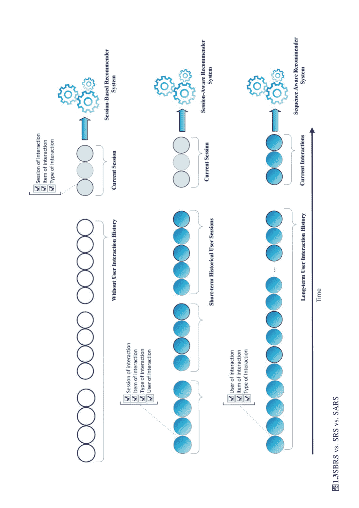

图1.3 SBRS vs. SRS vs. SARS

## 1.4 会话推荐系统方法

基于会话的推荐系统的目标是预测会话中的未知项目，或者基于对会话内部或会话之间复杂关系建模来预测用户的下一个会话。有两种不同的视角来研究这些类型的系统。在第一个视角中，根据用户当前会话的数据，推荐用户的下一个项目，称为会话内上下文数据。在第二个视角中，根据会话之间的上下文，预测用户的下一个会话或下一个会话的一部分。

另一方面，基于会话的推荐系统方法根据所使用的技术分为两个一般类别：传统的基于会话的推荐系统方法和深度学习的基于会话的推荐系统方法。这些类别又分为几个更详细的子类别。例如，传统的基于会话的推荐系统方法包括模式/规则挖掘、K最近邻算法（KNN）、马尔可夫链、生成概率模型和潜在表示方法。深度学习的基于会话的推荐系统方法主要分为两个子类别：基础和混合/高级深度神经网络。

基础的深度神经网络方法包括判别模型和生成模型，而混合/高级深度神经网络方法包括基于图的方法、基于注意力的模型、深度强化学习和混合方法。

图1.4显示了基于会话的推荐系统方法的分类。这些模型中的每一个在接下来的小节中都有简要的解释。

### 1.4.1 传统SBRS

这些方法基于数据挖掘或机器学习技术来识别会话中的潜在依赖关系，以进行推荐过程。这种方法的主要思想是通过识别和挖掘模式和依赖关系来检测与用户会话相关的数据序列，从而为用户提供推荐。这些方法分为五个独立的类别，在下面的小节中进行讨论：

#### 1.4.1.1 模式/规则挖掘

一般来说，基于会话的推荐系统有两种类型的模式/规则挖掘方法：(1) 频繁模式/关联规则挖掘方法和(2) 顺序模式挖掘方法。这些方法仅适用于数据基于单一类型动作且所有数据集动作相同的会话。

- 基于频繁模式/关联规则挖掘的方法：在这些系统中，首先挖掘频繁模式或关联规则，然后识别具有检测到的模式和规则的用户会话，最后基于结果提供下一个项目的推荐。大多数用户被假设根据常用和频繁的模式行动。例如，用户购买的评论显示，顾客通常一起购买手机和耳机，因此基于手机的模型也可以向购买手机的顾客推荐耳机。这些类型的系统可以应用于无序和无序的数据。

- 基于顺序模式挖掘的方法：推荐系统基于顺序模式挖掘来处理有序数据，并且它们的项目基于时间因素。这样的系统首先从数据集中检测顺序模式，然后基于顺序模式挖掘和用户选择的项目顺序，推荐下一个项目。基于顺序模式的推荐系统与基于模式的推荐系统有两个基本区别。第一个区别是基于顺序模式的推荐系统通常通过利用会话间的依赖关系进行跨会话推荐，而大多数情况下，基于模式的推荐系统利用会话内的依赖关系进行会话内推荐。第二个区别是由数据的顺序引起的，因为基于顺序模式的推荐系统考虑了会话之间的顺序，这对于顺序数据是合适的。还提出了一些技术，如用户的先前加权序列或与协同过滤相结合，以改进使用基本顺序模式识别方法的方法。

#### 1.4.1.2 最近邻算法

最近邻算法（KNN）是一种监督式机器学习算法，用于解决各种问题，如分类和回归。使用最近邻算法的基于会话的推荐系统将每个交互视为一个项目。在这种方法中，首先捕捉与当前交互或会话相似的交互或会话。然后，根据当前交互的相似性和相关性以及是否考虑项目之间或会话之间的相似性，计算每个候选交互的得分。

基于最近邻算法的方法分为两类：项目最近邻或会话最近邻。对于这两种方法，通常可以提前计算出相邻项目和会话的集合，以加快预测时间[31]：

- 项目最近邻方法：推荐与当前项目最相似的K个项目，对应于其他会话中项目的共现。
- 会话-KNN方法：首先，计算当前会话与其他会话之间的相似度，以检测一组K个相邻会话。然后，根据此确定每个候选项的分数。这些方法考虑了会话的所有上下文，并为推荐过程提供比仅考虑当前会话的当前项的项-KNN更准确的信息。

#### 1.4.1.3 马尔可夫链

马尔可夫链或马尔可夫过程是描述可能事件序列的随机模型，其中每个事件的概率仅取决于前一个事件中获得的状态。使用马尔可夫链的基于会话的推荐系统首先使用马尔可夫链建模一个或多个会话之间的交互转换，然后预测下一个可能的交互或下一个会话。与基于顺序模式的推荐系统不同，后者会删除较不频繁的项以提供推荐，基于马尔可夫链的推荐系统会考虑所有项。该领域中的大多数方法使用一阶马尔可夫链，以减少模型的复杂性。

根据如何基于显式观察或潜在空间计算转移概率，马尔可夫链方法可以分为基本马尔可夫链和潜在马尔可夫嵌入方法：

- 基本马尔可夫链方法：基本马尔可夫链方法包括四个主要步骤：第一步是计算训练数据中的第一阶转移概率，第二阶段预测交互之间的转移路径，第三阶段将会话的上下文与预测的路径进行匹配，第四阶段根据前几个阶段的结果提供推荐。实际上，将概率较高的项目添加到推荐列表中。为了改进结果，一些研究采用了技术，如结合一阶和二阶马尔可夫模型，基于概率模型创建隐藏马尔可夫模型，以及转移概率矩阵的因子分解。
- 潜在马尔可夫嵌入方法：与基本马尔可夫链方法不同，该方法根据显式观察计算转移概率，基于潜在马尔可夫嵌入方法的方法首先将马尔可夫链嵌入到欧几里得空间中，然后根据欧几里得距离计算项目之间的转移概率。该方法可以包括未观察到的转移，从而显著减少了在有限观察数据情况下的数据稀疏性问题。

#### 1.4.1.4 生成概率模型

生成概率模型方法通常首先推断会话中项目的潜在分类，然后学习这些潜在分类在会话内或会话之间的转移。然后，使用学习到的转移预测下一个潜在分类。最后，他们根据预测的项目潜在排名，条件地预测具体的项目作为下一个项目。潜在主题模型通常用于推断潜在分类和它们之间的转移。

#### 1.4.1.5 潜在表示

在基于会话的推荐系统中，使用浅层模型的潜在表示方法生成具有低维度的潜在表示。这种表示是为会话中的每个交互创建的。学习到的信息表示编码了这些交互之间的依赖关系，并用于后续的基于会话的推荐。在这种方法中，最流行的模型之一是潜在因子模型。基于潜在因子模型的基于会话的推荐系统首先确定一个分解模型，将观察到的交互转换矩阵分解为它们的潜在表示，然后使用得到的潜在表示来估计下一个基于会话的未观察到的转换。推荐。在这些类型的方法中，交互被视为项目。在这个领域中，一个广泛使用的方法是矩阵分解。基于分解的方法首先将项目-用户矩阵或项目-项目共现矩阵分解为每个项目的潜在表示向量，并使用潜在表示来预测下一个项目。这些方法通常利用基于协同过滤的推荐系统中的矩阵分解机制，将用户-项目交互矩阵分解为用户和项目的潜在因子。

### 1.4.2 深度学习SBRS

在本节中，我们旨在快速介绍在SBRS中使用的不同深度学习模型。因此，读者可以初步了解本书的主题，这将在接下来的章节中讨论。

使用深度学习的方法采用各种神经网络模型来学习每个会话中的项目之间或不同会话之间的复杂关系。这些方法根据模型的层数和深度分为两组：基于浅层神经网络的方法和基于深层神经网络的方法。

浅层神经网络是一种具有有限层数和有限建模能力的网络架构。深层神经网络用于学习不同表示的优化组合，以预测和推荐下一个项目或会话。深度学习在推荐系统领域提供了两个具体的目标：处理项目和用户的特征，以及建模用户和项目之间的关系和交互[32]。另一方面，在基于会话的推荐系统范围内，它提供了几个好处，包括创建非线性模型，自动提取和工程化不同类型数据的特征，对于顺序数据的高能力顺序建模，高可扩展性和对于建模混合推荐系统的灵活性[33]。在SBRS中，使用各种深度神经网络技术来检测会话之间的相互作用以及不同会话之间的复杂和广泛关系。因此，研究人员提供基于深度学习技术的SBRS的动机在近年来有所增加。

在SBRS的各个领域中，使用深度学习方法来实现以下特定目标：使用深度神经网络处理物品和用户的特征，并对用户和物品之间的交互进行建模。导致基于会话的推荐系统采用深度学习方法的优势如下：

- 能够生成非线性模型
- 对于文本、图像和声音等数据，无需手动进行工程和诊断特征
- 对于顺序数据，具有显著的顺序建模能力
- 对于建模混合会话推荐系统，具有高可扩展性和高灵活性
- 在获取结果方面具有可接受的准确性
- 具有学习无标签数据的能力

使用深度学习方法的基于会话的推荐系统可以分为两类：基本的深度神经网络和混合/高级深度神经网络：

- 基本的深度神经网络方法利用深度判别模型，如循环神经网络（RNN）、卷积神经网络（CNN）、多层感知器（MLP）以及深度生成模型，如自编码器（AE）、生成对抗网络（GAN）和流模型（FBM）。

在2015年，Hidasi等人首次在SBRS中使用深度神经网络，提出了基于RNN的模型[34]。在深度学习会话推荐系统领域，许多研究人员使用RNN及其变种，包括GRU和LSTM模型。在这些基于会话的推荐系统中，用户的点击或交互被输入到系统中，并通过嵌入方法转化为有意义的数据结构。然后，使用循环神经网络来建模数据并检测它们之间的依赖关系。最后，在输出层之前使用全连接层，使模型更加稳定。由于它们的顺序性质，循环神经网络在分析用户会话中的顺序依赖关系方面具有很高的潜力。

在SBRS中，模型能够建模随时间变化的动态行为，这使得循环神经网络成为这一领域中理想的解决方案。大部分研究使用GRU类型的RNN，因为LSTM模型的门数量和参数更多，计算复杂度更高。RNN及其变种模型在SBRS中的详细讨论见第3章。

与SBRS相关的一些方法使用了卷积神经网络模型。使用CNN适用于用户会话数据的两种方式：（1）可以轻松地在卷积神经网络上实现和建模一个会话中的项目顺序或不同用户会话之间的顺序；（2）卷积神经网络具有学习区域的局部特征或不同区域之间的特殊关系的高能力，基于这些特征，它们可以识别其他模型通常忽略的依赖关系。在这种系统中，为了学习和建模与用户和项目相关的数据，输入应该被适当地嵌入，以便在CNN中通过连续使用卷积和池化层正确地识别它们之间的时间和空间模式。根据从输入数据和它们之间的依赖关系获得的特征，预测用户的喜爱项目。SBRS中的CNN模型在第3章中详细讨论。

通常采用基于MLP的方法来学习不同表示的最佳组合，以创建会话的复杂表示，以供后续推荐使用。与基于RNN的方法不同，基于MLP的方法主要适用于无序会话数据，因为它们无法对顺序数据进行建模。需要提到的是，MLP在SBRS中不仅仅是单独使用，通常作为补充模块使用。

基于深度生成模型的SBRS方法通过精心设计的生成策略生成下一个交互或会话来提供推荐。深度生成模型追求两个目标：使用无监督方法学习实用和正确的数据表示，以及学习数据和相关类别的概率分布。这些方法也被归类为自编码器（AE）、生成对抗网络（GAN）和流模型（FBM）。SBRS中的生成模型在第4章中进行了详细讨论。

- 混合/高级深度神经网络方法：随着时间的推移，为了减少诸如不同时间步骤中变量的复杂依赖关系、冷启动问题、数据稀疏性以及更有效地优化复杂的基于会话的推荐系统，提出了更高级的深度学习方法来改进推荐过程。这些方法包括高级深度神经网络，如图神经网络（GNNs）、基于注意力的模型、深度强化学习和混合模型。这些模型在第5章中详细讨论。

尽管传统的深度学习技术在各个领域取得了成功，但它们的大部分数据都是在欧几里得空间中，而许多数据本质上更适合用图结构表示[35, 36]。在基于会话的推荐系统中，可以使用图来建模用户的顺序行为和交互，并使用深度图神经网络模型学习它们之间的关系。在这些方法中，给定一个包含多个会话的数据集，每个会话被映射到图上的一个链。会话中的每个交互都作为相应链中的一个节点，其中为会话中相邻的每对交互创建一条边。然后，构建的图被作为输入传递给GNN，通过将图上的复杂转换编码为嵌入向量，为每个节点学习丰富的信息嵌入。最后，这些学习到的嵌入向量被输入到预测模块进行基于会话的推荐。图神经网络还可以与CNN和RNN模型结合使用。基于图神经网络的不同类型的方法可以进一步分为GCN或GAT。在基于会话的推荐系统中，GNN及其变种模型在第5章中进行了详细讨论。

基于注意力的会话推荐系统在会话上下文中提供了一个注意力机制，用于区分元素的利用。为了准确推荐，这些系统试图从会话的上下文中生成一个信息丰富的表示。通过整合注意力机制，基于会话的推荐系统可以强调与下一次交互或会话最相关的项目，并减少会话上下文中无关项目的干扰。一般来说，注意力模型主要包括两个步骤：计算与交互相关权重的注意力权重和聚合，聚合会话的所有交互的嵌入以学习它们的权重。值得一提的是，注意力机制在SBRS中不仅仅是单独使用，通常与基本模型（如GNN [37, 38]，CNN/LSTM [39]，CNN/GRU [40]和MLP [41]）一起使用。

深度强化学习（DRL）方法侧重于通过交互进行目标导向学习，其中学习代理通过试错来学习。接受奖励和惩罚，决定哪个动作获得最多的奖励。在动态推荐物品给用户的基于会话的推荐系统中，使用深度强化学习方法来最大化预期的长期累积奖励。这种方法可以优化长期用户互动的推荐，而不是维持短期目标，即优化提供即时推荐给用户的过程。深度强化学习方法使推荐代理能够学习最优的推荐策略，向用户推荐物品[42]。使用强化学习的SBRS旨在通过试错学习最优的推荐策略，并从用户反馈中获得推荐物品的强化数据[43]。通过这种方式，这些系统可以在与用户的交互过程中持续更新策略，直到达到满足其动态偏好的最佳状态。SBRS中的DRL模型在第5章中详细讨论。

最后，混合方法主要包括几种主要的深度神经网络模型，以利用每种模型来建模会话数据中嵌入的各种复杂依赖关系。每个基本模型都识别一种或多种类型的依赖关系。事实上，混合会话推荐系统执行两个主要步骤：（1）使用不同的基础模型学习不同类型的依赖关系，（2）注意地整合学习到的依赖关系，以提供更准确的推荐。这些模型也在第5章中详细讨论。

## 1.5 结论

基于会话的推荐系统根据会话数据提供推荐，无需访问长期用户数据和交易。由于SBRS所需的输入数据的可用性以及这些系统与现实世界问题的特性的兼容性，SBRS引起了许多研究人员的关注。

在本章中，我们简要回顾了推荐系统和基于会话的推荐系统的初步概念，并详细介绍了这两种系统之间的显著差异。然后，讨论了基于会话的推荐系统的基本组件和重要属性，以及它们的特定挑战。

当时间和事件序列被纳入推荐过程时，会有三种主要方法，即基于会话、顺序和会话感知的推荐系统，在本章中进行了详细阐述。

由于在SBRS范围内提出了不同的研究，因此对这些模型进行了简要说明，以便快速了解在基于会话的推荐系统中使用的不同深度学习模型。

## 参考文献

1. Dietmar Jannach, Massimo Quadrana和Paolo Cremonesi. "基于会话的推荐系统。" 在推荐系统手册中, 第301-334页。 Springer, 纽约, 纽约, 2022年。 https://doi.org/10.1007/978-1-0716-2197-4_8
2. Jesús Bobadilla, Fernando Ortega, Antonio Hernando和Abraham Gutiérrez。 "推荐系统调查。" Knowledge-Based Systems 46 (2013) : 109-132。 https://doi.org/10.1016/j.knosys.2013.03.012
3. Qian Zhang, Jie Lu和Yaochu Jin。 "推荐系统中的人工智能。" Complex & Intelligent Systems 7 (2021) : 439-457。 https://doi.org/10.1007/s40747-020-00212-w
4. Jie Lu, Dianshuang Wu, Mingsong Mao, Wei Wang和Guangquan Zhang。 "推荐系统应用发展: 一项调查。" Decision Support Systems 74 (2015) : 12-32。 https://doi.org/10.1016/j.dss.2015.03.008
5. Eva Zangerle和Christine Bauer。 "评估推荐系统: 调查和框架。" ACM Computing Surveys 55, no. 8 (2022): 1-38。 https://doi.org/10.1145/3556536
6. Matteo Marcuzzo, Alessandro Zangari, Andrea Albarelli和Andrea Gasparetto。 "推荐系统: 对当前发展和未来研究挑战的洞察。" IEEE Access 10 (2022): 86578-86623。 https://doi.org/10.1109/ACCESS.2022.3194536
7. Fatemeh Alyari和Nima Jafari Navimipour。 "推荐系统: 对现有文献的系统综述和未来研究建议。" Kybernetes (2018)。 https://doi.org/10.1108/K-06-2017-0196
8. Yehuda Koren, Steffen Rendle, 和 Robert Bell。 "Advances in collaborative filtering." 推荐系统手册 (2022): 91-142。 https://doi.org/10.1007/978-1-0716-2197-4_3
9. 王娟, 兰月馨, 和 吴春英。 "“基于协同过滤的推荐综述”" 物理学杂志: 会议系列, 卷. 1314, 号. 1, 页. 012078. IOP Publishing, 2019。 https://doi.org/10.1088/1742-6596/1314/1/012078
10. Pasquale Lops, Dietmar Jannach, Cataldo Musto, Toine Bogers, 和 Marijn Koolen。 "“基于丰富物品描述的推荐系统的趋势”" User Modeling and User-Adapted Interaction 29 (2019): 239-249. https://doi.org/10.1007/s11257-019-09231-w
11. 郭庆宇, 庄福振, 秦川, 朱恒舒, 谢星, 熊辉, 和庆何。 "“基于知识图谱的推荐系统调查”" IEEE Transactions on Knowledge and Data Engineering 34, no. 8 (2020): 3549-3568. https://doi.org/10.1109/TKDE.2020.3028086
12. Petra Perner。 "基于案例推理-方法、技术和应用。" In Progress in Pattern Recognition, Image Analysis, Computer Vision, and Applications: 24th Iberoamerican Congress, CIARP 2019, Havana, Cuba, October 28-31, 2019, Proceedings 24, pp. 16-30. Springer International Publishing, 2019. https://doi.org/10.1007/978-3-030-33904-3_2
13. Alexander Felfernig, Gerhard Friedrich, Dietmar Jannach, and Markus Zanker。 "基于约束的推荐系统。" 推荐系统手册 (2015): 161-190。 https://doi.org/10.1007/978-1-4899-7637-6_5
14. Saurabh Kulkarni和Sunil F. Rodd。 "“上下文感知推荐系统: 现有技术综述”" Computer Science Review 37 (2020) : 100255。 https://doi.org/10.1016/j.cosrev.2020.100255
15. Le Wu, Xiangnan He, Xiang Wang, Kun Zhang和Meng Wang。 "基于准确性导向的神经推荐综述: 从协同过滤到信息丰富的推荐。" IEEE Transactions on Knowledge and Data Engineering (2022) 。 https://doi.org/10.1109/TKDE.2022.3145690
16. Ido Guy。 "社交推荐系统。" 在推荐系统手册第二版中, 第511-543页。 Springer US, 2015年。 https://doi.org/10.1007/978-1-4899-7637-6_15
17. Hossein Tahmasebi, Reza Ravanmehr和Rezvan Mohamadrezaei。 "基于深度自动编码器网络的社交电影推荐系统使用Twitter数据。" Neural Computing and Applications 33 (2021) : 1607-1623。 https://doi.org/10.1007/s00521-020-05085-1
18. Hirad Daneshvar和Reza Ravanmehr。"使用LSTM和CNN的社交混合推荐系统。" Concurrency and Computation: Practice and Experience 34, 第18号（2022年）：e7015。https://doi.org/10.1002/cpe.7015
19. Francesco Ricci，Rokach，Lior，Shapira，Bracha和Kantor，Paul B. 推荐系统手册。纽约；伦敦：斯普林格，2022年，ISSN：978-1-0716-2197-4，https://doi.org/10.1007/978-1-0716-2197-4
20. Shoujin Wang，Longbing Cao，Yan Wang，Quan Z. Sheng，Mehmet A. Orgun和Defu Lian。"关于基于会话的推荐系统的调查。" ACM Computing Surveys (CSUR) 54, 第7号（2021年）：1-38。https://doi.org/10.1145/3465401
21. Gabriel De Souza P. Moreira, Dietmar Jannach, and Adilson Marques Da Cunha. "基于循环神经网络的上下文混合会话式新闻推荐." IEEE Access 7 (2019): 169185-169203. https://doi.org/10.1109/ACCESS.2019.2954957
22. Dietmar Jannach, Bamshad Mobasher, and Shlomo Berkovsky. "会话式和顺序推荐的研究方向：特刊前言." User Modeling and User-Adapted Interaction 30 (2020): 609-616. https://doi.org/10.1007/s11257-020-09274-4
23. Ali Noorian, Ali Harounabadi, and Reza Ravanmehr. "基于多维信息的新颖序列感知个性化推荐系统." Expert Systems with Applications 202 (2022): 117079. https://doi.org/10.1016/j.eswa.2022.117079
24. Longbing Cao. "复杂交互的耦合学习." Information Processing & Management 51, no. 2 (2015): 167-186. https://doi.org/10.1016/j.ipm.2014.08.007
25. Longbing Cao. "数据科学：挑战与方向." Communications of the ACM 60, no.8 (2017): 59-68. https://doi.org/10.1145/3015456
26. Massimo Quadrana, Paolo Cremonesi, 和 Dietmar Jannach. "序列感知推荐系统." ACM Computing Surveys (CSUR) 51, no. 4 (2018): 1-36. https://doi.org/10.1145/3190616
27. Malte Ludewig. "会话基础和会话感知推荐的进展." 博士论文， Dissertation, 多特蒙德，Technische Universität, 2020, 2020.
28. Sara Latifi, Noemi Mauro和Dietmar Jannach. "会话感知推荐：对最新技术的令人惊讶的追求." Information Sciences 573（2021）：291-315。https://doi.org/10.1016/j.ins.2021.05.048
29. Massimo Quadrana, Alexandros Karatzoglou, Balázs Hidasi和Paolo Cremonesi. "个性化基于会话的推荐与分层递归神经网络." 在推荐系统的第十一届ACM会议论文集中，第130-137页。2017年。https://doi.org/10.1145/3109859.3109896
30. Lemei Zhang, Peng Liu和Jon Atle Gulla. "基于会话的新闻推荐的深度联合网络与上下文增强." 在第29届超文本和社交媒体会议论文集上，第201-209页。2018年。https://doi.org/10.1145/3209542.3209557
31. Dietmar Jannach和Malte Ludewig. "当递归神经网络遇见邻域用于基于会话的推荐." 在第十一届ACM推荐系统会议论文集上，第306-310页。2017年。https://doi.org/10.1145/3109859.3109872
32. Shuai Zhang, Lina Yao, Aixin Sun和Yi Tay. "基于深度学习的推荐系统：调查和新视角." ACM Computing Surveys (CSUR) 52，第1期（2019）：1-38。https://doi.org/10.1145/3285029
33. 洪伟王，富正张，兴谢，和敏义郭。“DKN：用于新闻推荐的深度知识感知网络。” 在2018年世界互联网大会论文集中，pp. 1835-1844. 2018年。https://doi.org/10.1145/3178876.3186175
34. Balázs Hidasi, Alexandros Karatzoglou, Linas Baltrunas和Domonkos Tikk. 基于会话的推荐系统与递归神经网络。在国际学习表示会议ICLR’16中的论文集，2016年。https://arxiv.org/abs/1511.06939
35. Lingfei Wu, Peng Cui, Jian Pei, Liang Zhao和Le Song。图神经网络。Springer新加坡，2022年。https://doi.org/10.1007/978-981-16-6054-2_3
36. Yao Ma和Jiliang Tang。图上的深度学习。剑桥大学出版社，2021年。https://doi.org/10.1017/9781108924184
37. Shu Wu, Yuyuan Tang, Yanqiao Zhu, Liang Wang, Xing Xie和Tieniu Tan. "基于图神经网络的基于会话的推荐。"在AAAI人工智能会议论文集中的论文artificial intelligence，卷33，号01，页346-353。2019年。 https://doi.org/10.1609/aaai.v33i01.3301346
38. Zhiqiang Pan, Wanyu Chen和Honghui Chen. "面向基于会话的动态图学习的推荐。" Mathematics 9, 第12期 (2021年) : 1420。 https://doi.org/10.3390/math9121420
39. Qiannan Zhu, Xiaofei Zhou, Zeliang Song, Jianlong Tan和Li Guo. "Dan: 新闻推荐的深度注意力神经网络。"在AAAI会议论文集中的论文Artificial Intelligence，卷33，号01，页5973-5980。2019年。 https://doi.org/10.1609/aaai.v33i01.33015973
40. Jinjin Zhang, Chenhui Ma, Xiaodong Mu, Peng Zhao, Chengliang Zhong, and A. Ruhan. "Recurrent convolutional neural network for session-based recommendation." Neurocomputing 437 (2021): 157-167. https://doi.org/10.1016/j.neucom.2021.01.041
41. Qiao Liu, Yifu Zeng, Refuoe Mokhos, and Haibin Zhang. "STAMP: short-term attention/ memory priority model for session-based recommendation." In Proceedings of the 24th ACM SIGKDD international conference on knowledge discovery & data mining, pp. 1831-1839. 2018. https://doi.org/10.1145/3219819.3219950
42. Yuanguo Lin, Yong Liu, Fan Lin, Lixin Zou, Pengcheng Wu, Wenhua Zeng, Huanhuan Chen, and Chunyan Miao. "A survey on reinforcement learning for recommender systems." IEEE Transactions on Neural Networks and Learning Systems (2023). https://doi.org/10.1109/TNNLS.2023.3280161
43. Xiangyu Zhao, Liang Zhang, Long Xia, Zhuoye Ding, Dawei Yin, and Jiliang Tang. "基于列表的深度强化学习推荐。"在第一届深度强化学习知识发现研讨会(DRL4KDD 2019)中. 2019. https://arxiv.org/abs/1801.00209

## 第二章 深度学习概述

摘要 在各种机器学习算法中，深度学习最近在不同领域得到了广泛应用。深度学习模型已经在从大量数据中有效提取隐藏模式和建模相互依赖变量以解决复杂问题方面得到了显著应用。

- 关键词
- 深度学习
- 机器学习
- 深度判别模型
- 深度生成模型
- 基于图的模型

## 2.1 简介

与最强大的计算机相比，人脑学习和解决不同问题的能力令人印象深刻。因此，为了增加计算机解决更复杂问题的能力，人脑的功能被建模以处理不同类型的问题数据。事实上，技术系统发生了惊人的演变，使得被动和静态的系统变得主动和动态，并随着时间的推移得到改进。这种现象被称为机器学习，使得计算机能够学习。

机器学习已经在各种研究中被使用，并在不同的应用中得到利用，如文本挖掘、垃圾邮件检测、推荐系统、图像分类、多媒体信息检索等。在各种机器学习算法中，深度学习最近在这些应用中得到了显著的应用。深度学习采用神经网络，并基于人脑系统中神经元的结构和功能工作。

如今，深度学习模型对于从海量数据中提取信息或隐藏模式具有显著影响，这是因为它们具有更高的容量。此外，与传统的机器学习方法相比，深度学习可以解决复杂问题并建模相互依赖的变量。如今，深度学习技术在机器学习、人工智能和数据科学领域被认为是一个热门话题。

它能够从不同的数据类型中学习。包括谷歌、微软、苹果、Meta等许多公司都在积极研究深度学习，因为它可以在分析大型结构化/非结构化数据集的各种问题上提供显著的结果[1]。

本章介绍了深度学习的基本概念，包括其定义、历史、优势和应用，并在第2.2节中比较了深度学习和机器学习的特点。然后，介绍了深度学习方法的分类体系，包括深度学习的基本模型。基于这种分类，将在接下来的小节中讨论和分析这些模型。在第2.3节中，描述了深度判别模型，包括MLP、CNN和RNN（GRU-LSTM），在第2.4节中，解释了基于自动编码器（AE）、生成对抗网络（GAN）和Boltzmann机的深度生成模型的方法。第五节描述了基于图的模型，如GNN和GCN。

## 2.2 深度学习基础知识

### 2.2.1 深度学习的历史

尽管深度学习近年来变得非常流行，但它经历了漫长的发展过程。目前，主流的深度学习方法基于神经网络，这些方法已经研究了几十年，并取得了不同程度的成功。随着硬件性能的提升和大数据的出现，为网络训练提供了大量的数据，可以训练具有多个隐藏层的网络。由多个层组成的神经网络称为深度网络。目前，深度学习技术在许多领域中得到应用，人工智能和大数据处理的发展取决于深度学习方法。

神经网络的出现始于1943年初，当时沃伦·麦卡洛赫和沃尔特·皮茨开发了一个专注于人类神经系统的计算机模型。他们使用了一种称为“阈值逻辑”的算法和数学方法来模拟人类思维。这个网络是一个二分类器，可以根据输入值区分两个不同的类别。这个网络的问题在于通过人工操作员调整权重。之后，在1957年，罗森布拉特提出了感知器算法，它可以在没有人工操作员参与的情况下学习权重来对数据进行分类。

1965年，亚历克谢·格里戈里耶维奇·伊瓦赫年科和瓦伦丁·格里戈里耶维奇·拉帕首次尝试开发深度学习算法。他们使用了多项式激活函数（复杂方程）的模型，然后进行了统计分析。从每一层中，选择最佳的统计特征传递到下一层。

尽管感知器方法被使用了几年，但在1969年，Minsky和Papert发表了一篇论文，指出感知器更有能力对线性问题进行分类，而这种方法无法解决非线性问题。此外，本文的作者在同一年声称，没有足够的计算资源来构建大型和深层神经网络。

第一次提出“卷积神经网络”的是福岛邦彦。福岛设计了具有多个池化和卷积层的神经网络，并在1979年开发了一种名为neocognitron的人工神经网络，它采用了多层次的分层设计。这种设计使计算机能够学习视觉模式。此外，福岛的设计允许通过增加某些连接的“权重”来手动调整关键特征。1989年，Yann LeCun在贝尔实验室首次实现了反向传播的实际演示。他将卷积神经网络与反向传播相结合，用于识别手写数字。最终，该系统被用于识别手写支票号码。

在1990年代，一些人继续研究人工智能和深度学习，并取得了显著的进展。1995年，Dana Cortes和Vladimir Vapnik开发了支持向量机（一种用于映射和识别相似数据的系统）。1997年，Sepp Hochreiter和Juergen Schmidhuber开发了用于循环神经网络的长短期记忆（LSTM）。

深度学习的下一个重要进化步骤发生在1999年，当时计算机使用GPU（图形处理单元）更快地处理数据。使用GPU进行更快的处理，计算速度比10年前提高了1000倍。神经网络也随着更多可用的训练数据而进一步改进。

大约在2000年，出现了梯度消失问题。发现下层形成的“特征”（课程）不从上层学到任何东西，因为下层没有接收到学习信号。当然，这对于所有神经网络都不是一个根本性的问题，只发生在使用梯度下降学习方法的网络中。解决这个问题的两个方法是逐层预训练和LSTM的开发。大约在2006年，开发了深度置信网络（DBNs）和分层预训练框架。在2011年和2012年，卷积神经网络AlexNet赢得了许多国际比赛。生成对抗网络（GAN）由Ian Goodfellow于2014年引入。GAN中，两个神经网络在同一场比赛中相互对抗。游戏的目标是让一个网络模仿一张照片，并欺骗对手相信它是真实的。同时，对手在寻找它的 flaws。游戏一直进行，直到一张几乎完美的图片欺骗了对手。

BERT是谷歌于2018年开发的一种应用于自然语言处理器的机器学习技术，旨在更好地理解我们日常使用的语言。它分析搜索中使用的所有单词，以理解整个上下文并获得用户期望的结果。BERT是一个使用transformers的系统，transformers是一种神经网络架构，分析句子中所有可能的词之间的关系。2019年3月，Yoshua Bengio、Geoffrey Hinton和Yann LeCun因在深度神经网络的概念和工程进展方面的持续努力而获得了图灵奖。2020年，在爆发疫情时，OpenAI创建了一个名为GPT-3（生成式预训练变换器3）的人工智能算法，可以生成类似人类的文本，目前（2023年6月）GPT-4是世界上最先进的语言模型。

图2.1显示了深度学习的时间线，根据其重要的里程碑。

### 2.2.2 AI、ML和DL

人工智能是通过学习、推理和适应来复制人类智能的科学和工程，特别是计算机系统。人工智能使用智能代理来理解环境并采取行动，以最大化实现目标的成功机会。

数据挖掘可以理解和发现数据中的新的、以前未见过的知识。数据挖掘的一个简单定义是指使用算法从数据中提取模式。深度学习被认为是机器学习和人工智能的一个子集；因此，深度学习可以被视为模仿人脑数据处理的人工智能功能。深度学习还指的是通过多层神经网络进行计算的学习方法。深度学习中的“深度”一词指的是通过多个层次或步骤处理数据以构建数据驱动模型的概念。与标准机器学习相比，当数据量增加时，深度学习在性能上有所不同。“深度学习”的全球受欢迎程度和应用范围每天都在增加。深度学习技术使用多层来表示数据的抽象，以构建计算模型。

尽管深度学习由于众多参数而需要很长时间来训练模型，但与其他机器学习算法相比，在测试期间运行所需的时间较短[1]。

数据科学是一门与从数据中提取可推广知识相关的科学学科，涉及与数据相关的所有预处理和处理步骤，包括收集、存储、清洗、解释、分析、可视化、验证和基于数据的决策[3]。数据科学使用人工智能、机器学习、数据挖掘等方法，如进化算法、运筹学、统计学等。

图2.2显示了人工智能、机器学习、深度学习和数据科学相对于彼此的位置。

深度学习和机器学习之间最重要的区别之一是基于增加训练样本的系统性能。如果没有足够的训练样本，深度学习将无法产生良好的结果。另一方面，即使只有少量样本，机器学习也可以展示出良好的结果。此外，深度学习需要先进的硬件，而机器学习可以在低功耗硬件和计算机上使用。显示出的关键差异是深度学习与机器学习的优势在于自动提取这些算法中的特征。

ML和DL在允许模型从先前数据中学习方面非常相似。ML这个术语可以推广到任何学习的机器（模型）。DL是一组能够使用非常深入和复杂的网络进行决策的方法和技术。然而，DL中最显著的区别之一是其能够取代基于人工的特征提取过程，并将此步骤纳入神经网络本身，以自动决定哪些特征最好地描述数据（图2.3）。尽管DL模型已被证明可以解决一些最具挑战性的问题，但它们可能对数据需求量大且计算成本高。在开发基于DL的解决方案之前，需要仔细考虑训练和托管复杂DL模型的硬件要求。

### 2.2.3 深度学习的优势

> "系统中的深度学习过程基于构建称为神经网络的计算模型，这些模型受到大脑结构的启发。"该网络的结构由多个处理层组成，通过进入下一级层，它可以解决更复杂的问题。"初始层处理原始数据，后续层可以利用前一层神经元的信息来获得更复杂的数据表示。深度学习的大部分优势来自于神经网络在特征提取方面比任何构建的人工系统更出色[5]。

图2.3 机器学习与深度学习[4]

### 深度学习方法的优点如下：

-   自动特征提取：深度学习算法可以从训练数据集中现有的有限特征生成新的特征表示，无需额外的人工干预。这意味着深度学习可以处理需要更广泛的特征工程和精确度的复杂任务。

-   处理非结构化数据的便利性：深度学习最显著的吸引力之一是其处理非结构化数据的能力。经典机器学习算法分析非结构化数据的能力有限，但深度学习在处理这种类型的数据时最有效。

-   更高的自学能力：深度神经网络中的多层允许模型学习复杂特征并执行计算密集型任务更高效。此外，深度学习算法可以从错误中学习；除了确认结果的正确性外，它们还可以进行必要的调整。然而，传统的机器学习模型需要不同程度的人工干预来确定输出的准确性。

-   支持并行和分布式算法：并行和分布式算法使得深度学习模型的训练速度更快。模型可以在配备高性能CPU、GPU或两者组合的机器上进行训练。

-   高级分析：深度学习在数据科学领域的应用可以提供更好、更有效的处理模型。它在无监督模式下的学习能力不断提高准确性。它还为数据科学家提供了更可靠、更简洁的分析结果。

-   可扩展性：深度学习由于能够高效处理大量数据并进行多次计算，因此具有高度可扩展性和成本效益。这直接影响了模块化、可移植性和生产力。

-   增强的鲁棒性：深度学习方法不需要预先设计的特征。相反，它们在学习过程中自动学习最佳特征。因此，对输入数据的变化具有鲁棒性。

-   泛化性：深度学习方法可以在不同的应用或不同类型的数据中使用。

深度学习技术可以应用于图像处理、社交网络分析、信息检索、自然语言处理、机器人技术、工业自动化、农业、医学研究、疾病诊断、推荐系统、运动检测系统等各个领域。总的来说，深度学习技术在以下情况下非常有帮助：

-   缺乏人类专家
-   学习技能，人类无法表达和解释，如语言、图像和声音的理解
-   解决方案的动态性及其随时间的变化
-   问题的规模相对于人类的有限推理能力而言过大
-   具有特殊约束条件的问题，如生物特征

### 2.2.4 基于深度学习的解决方案的一般过程

利用深度学习技术的每种方法根据其深度学习模型包含不同的阶段。然而，它们通常都遵循图2.4所示的步骤。在数据采集阶段从各种数据源收集的数据集必须首先进行预处理。预处理步骤包括数据清洗、归一化、缩放和质量评估。之后，数据转换在标准化、降维和聚合的不同阶段进行增强。在此阶段，还进行特征工程，并将生成的数据表示分割为训练、测试和验证集。值得再次提到的是，与机器学习方法不同，深度学习方法中的特征提取过程是自动完成的。在此步骤之后，根据问题的性质和要求，深度学习方法的架构包括判别式、生成式、图形或混合型推荐系统被开发出来。在这个阶段，应该开发和评估学习算法的类型，如Adam、SGD、BFGS等。构建的模型经过训练，然后根据不同的评估指标进行评估。如果获得的结果是可接受的，最终模型将部署在目标平台上；否则，模型应该进行改进/修订/调优，并重复性能评估步骤，直到达到可接受的结果。

图2.4 深度学习模型的工作流程

### 2.2.5 深度学习模型的分类

基于其性质、架构和性能，深度学习模型可以分为三个一般组别，即判别式、生成式和图方法。[1]。基于判别式方法的模型通常在数据空间中指定决策边界，而基于生成式方法的模型学习数据的整体分布[6]。判别式方法包括卷积神经网络（CNN）、循环神经网络（RNN）和多层感知器（MLP）。主要的生成式方法包括自编码器（AE）、生成式对抗网络（GAN）和不同类型的Boltzmann机器（BM）模型。基于图的方法还包括图神经网络（GNNs）和图卷积网络（GCNs）。需要提到的是，许多混合模型也是由不同模型的各种组合产生的。

图2.5 深度学习模型的分类

深度学习模型的分类如图2.5所示。在本章的后续部分，将在第2.3节中研究各种深度判别模型，在第2.4节中研究深度生成模型，在第2.5节中研究基于图的模型。

## 2.3 深度判别模型

机器学习模型通常使用联合概率 p over x,y来表示特征 x和标签y之间的关系。根据计算方法，机器学习模型被称为生成模型或判别模型[7]。在基于判别的方法中，根据x预测y，使用条件似然模型 p(y|x)进行拟合。由于判别模型不对 p(x)进行建模，它们可以更有效地使用其参数来识别概率 p(y|x)。这使得它们更适用于监督学习问题，并通过减少建模假设来更有效地使用数据[8]。深度判别模型使用分层的层次结构直接计算 p(y|x)[9]。这类深度学习技术用于在监督或分类应用中提供判别函数。深度判别架构通常被设计为在可观测数据条件下描述类别的后验分布，从而为模式分类提供判别能力。

深度判别模型通常包括多层感知器网络、循环神经网络和卷积神经网络，下面将讨论这些模型的每个子部分。

### 2.3.1 多层感知器

多层感知器（MLP）神经网络是一种前馈人工神经网络，是深度神经网络（DNN）架构的基础[10]。MLP由一个输入层接收输入信号和数据，一个输出层用于预测或决策与输入相关的内容，在这两个层之间，有任意数量的隐藏层负责MLP的主要功能。MLP可以使用隐藏层来逼近连续函数。MLP神经网络通常应用于监督学习问题。它们在一组输入-输出对上进行训练，并学习建模输入和输出之间的依赖关系。训练阶段包括调整模型的参数或权重和偏差，以最小化误差。

在MLP中，使用反向传播算法来调整权重和偏差对错误的影响程度，其主要目的是通过调整网络的权重和偏差值来减少损失函数的值。反向传播算法是神经网络训练的核心，它调整前一轮得到的神经网络的权重。该算法在网络中向前和向后两个方向移动。它可以计算任何网络参数（任何权重或偏差）的误差梯度值。通过这种方式，它可以确定MLP神经网络中每个权重的值应该如何改变。

在训练过程中，可以使用各种优化方法，如随机梯度下降[11]（SGD）、[12]BFGS（L-BFGS）和ADAM[13]，来进行优化。这些算法旨在最小化损失函数。梯度下降算法是一种迭代方法，通过改变网络的内部权重并逐步更新它们来最小化损失函数。算法的每次迭代中的步长决定了学习率，并且迭代过程将一直进行，直到损失函数不再变化。在实践中，当训练样本数量很大时，使用梯度下降算法会花费很长时间。这必须在算法的每次迭代中为所有样本执行。因此，使用随机梯度下降算法将更加有用，因为它只在算法的每次迭代中更新一组样本。

随机梯度下降是一种随机逼近梯度下降的方法，在每个周期中随机选择每个样本进行优化，并获得新的权重。但是它可能会陷入局部最小值，这就是为什么提出了小批量梯度下降的原因，它将整个训练集分成小批量，并根据这些小批量更新参数[14]。这种方法对噪声更具抵抗力，方差更小；因此，由于使用和结合了全梯度减少和随机梯度下降，它具有更稳定的收敛性。因此，这种优化方法通常用于深度学习，但确定学习率是至关重要的。其他方法中的学习率，如ADAM、Adagrad [15]或Adadelta [16]，是自适应调整的，不需要手动调整。ADAM算法优于其他自适应方法，并且收敛非常快。它还克服了学习率衰减、更新中的高方差和收敛缓慢等其他问题。

MLP网络中神经元的输出是通过各种激活函数（也称为传输函数）确定的。这些函数使用简单的数学计算来确定节点的输入是否对网络重要，或者应该被忽略。换句话说，激活函数将神经元的加权输入总和映射到0到1或－1到1之间的值（取决于激活函数的类型）。然后，该函数将其最终值传递给下一层。因此，该函数也被称为传输函数。激活函数分为三类：二进制阶跃函数、线性函数和非线性函数。二进制阶跃函数与阈值进行比较。如果输入值大于阈值，则节点将被激活；否则，它将保持禁用，并且节点的输出不会传递到下一层。该函数无法产生多值输出，也不能用于多类分类等问题。此外，二进制阶跃函数的导数等于零，这对于反向传播算法是一个挑战。

线性激活函数或恒等函数不对加权输入和进行计算，并将该值传递到下一层而不进行任何更改。这个函数不能在反向传播算法中使用，因为该函数的导数等于一个固定的数字，与输入值x无关，并且对于具有许多参数的复杂神经网络来说性能不佳。另一方面，几个线性函数的输出对于一个固定的输入值是相同的。因此，深度神经网络是否由几个隐藏层组成并不重要，因为激活函数的输出在神经网络的最后一层等于第一层的激活函数的输出。

非线性激活函数是神经网络中最广泛使用的，因为使用这些函数可以轻松实现模型对不同类型数据的泛化和适应性。这些函数解决了与反向传播算法相关的问题，并且可以确定哪个输入节点的权重对模型的最终诊断有更好的贡献。使用这些函数，您还可以解决与多个输出相关的问题。有各种类型的非线性激活函数，例如[17]: Sigmoid，双曲正切（tanh），修正线性单元（ReLU），泄漏修正线性单元（leaky ReLU），参数修正线性单元（parametric ReLU），指数线性单元（ELU），softmax，Swish，高斯误差线性单元（GELU）和缩放指数线性单元（SELU）。

每个函数都有自己的特点。为了选择最合适的激活函数作为深度神经网络的最后一层，应该注意模型的目的和模型的预测类型。MLP需要设置几个超参数，如隐藏层的数量、神经元的数量和迭代次数，这可能使得解决复杂模型的计算成本很高。然而，MLP提供了实时或在线学习非线性模型的优势，通过相对拟合。图2.6显示了MLP的一般架构。

图2.6 MLP的一般架构

### 2.3.2 卷积神经网络

卷积神经网络（CNN或ConvNet）是一种判别性深度学习架构，它直接从输入中学习特征，无需人工特征提取[18]。CNN在各个领域广泛应用，如图像处理、自然语言处理、语音处理等。对于某些类型的数据，特别是图像，MLP等方法效果不佳，因为每个神经元与下一层的每个神经元都是完全连接的，并且隐藏层中的每个神经元计算的函数取决于输入层节点的值。然而，在CNN中，只考虑了前一层变量的局部子集。CNN更类似于人类视觉处理系统，而不是传统的神经网络；它们对2D和3D图像的处理和学习进行更有效的优化，并自动提取输入特征[19]。CNN在网络中使用局部连接和共享权重来提取输入数据的特征，这导致参数更少，使网络的训练更快、更容易。这个动作类似于视觉皮层细胞中的活动。这些细胞对场景的小部分比整个场景更敏感。换句话说，细胞在输入上充当本地 filters，并提取数据中的本地相关性。

CNN学习过程分为两个一般阶段：特征工程-学习和基于完全连接层的分类。为了提取和学习特征，通常有几个卷积层后面跟着池化层，并且在最后阶段，使用全连接层（MLP）。卷积和池化层的输出节点被分组在一个二维平面上，称为特征图。平面的节点与前一层的每个连接平面的一个小区域相连。卷积层的每个节点通过对输入节点进行卷积操作来提取输入图像的特征。

卷积层的主要任务是在整个数据集中检测输入的局部区域中的特征。使用 filters来检测特征会产生一个特征图。池化层周期性地用于两个连续的卷积层之间，其任务是减小特征图的维度。除了提取特征图中的重要特征外，这项工作通过减少参数数量来减少数据处理所需的计算能力。池化层有两种类型：最大池化和平均池化。最大池化（或最大池化）计算特征图上每个补丁的最大值，平均池化计算特征图上每个补丁的平均值。在使用几个不同的层之后，CNN网络末尾的全连接层可以用来计算所需的特征和输出分数。CNN中的全连接层类似于MLP中的隐藏层，并执行分类。图2.7显示了CNN模型的一般架构。

如果输入 $x$用于CNN被视为三维 $m \times m \times r$，其中 $m$是输入的高度和宽度，而 $r$是深度或通道的数量。在每个卷积层中，有 $k$个大小为 $n \times n \times q$的滤波器（卷积核）。这里，$n$必须是图2.7 卷积神经网络的一般架构

小于输入 m 的值，但 q 可以小于或等于 r 的值。filters是本地连接的基础，它们共享类似的偏差 (bᵏ) 和权重 wᵏ 参数，用于生成ᵏ个特征图（每个特征图的大小为 m-n-1)。

如公式(2.1)所示，卷积层计算权重和输入之间的点积，而输入是原始输入体积的小区域。

然后，对卷积层的输出应用非线性激活函数 f:

```
hᵏ = (f Wₖ * x + bᵏ)  (2.1)
```

然后，在子采样层中，每个特征图的样本数量减少，以减少网络中的参数，加快训练过程，并控制过拟合。对所有特征图的相邻 p × p 区域（其中 p 是filter大小）执行池化操作（例如，平均值或最大值）。最后，最终阶段的层完全连接，将前面的低/中级特征生成数据的高级抽象。最后一层（例如，softmax）可用于生成分类得分，其中每个得分是给定样本的特定类别的概率。

Softmax是一种将数字/逻辑值缩放为概率的激活函数。softmax的输出是一个向量，它指定了每个可能的结果或类别的概率，而该向量中概率的总和等于一。数学上，softmax定义为方程（2.2）:

```
Softmax(yᵢ) = exp(yᵢ) / Σ_{j=1}^{c} exp(yⱼ)  (2.2)
```

其中 Y表示输出层神经元的值，c是类别的数量。指数函数作为非线性函数。稍后，这些值将被指数值的总和除以以进行归一化，然后转换为概率。值得一提的是，softmax层必须与输出层具有相同数量的节点。

CNN网络参数通过反向传播算法和随机梯度下降算法进行优化学习。第一阶段是前向传播，信号从网络的输入传播到输出。在最后一层，将成本函数的输出与实际值进行比较，并进行误差估计。在第二阶段，再次使用反向传播算法来补偿这个误差。然而，与MLP神经网络相比，CNN中的学习过程更加复杂，因为它由不同类型的层组成，并且前向和后向传播阶段在每个层中遵循特定的规则。CNN中的神经元具有共享权重，而不像MLP中每个神经元都有一个单独的权重向量。权重的共享减少了可训练权重的总数。

一般来说，大多数深度卷积神经网络都是建立在一组关键的基本层上，包括卷积层、子采样层和全连接层。特定的架构通常由多个卷积层、池化层、全连接层和网络中的softmax层组成。这些模型的一些例子是LeNet [18]， AlexNet [19]， VGGNet [20]， NiN [21]，和All-CNN [22]。近年来，还提出了其他类型和更高效的先进架构，包括DenseNet [23]， FractalNet [24]，带有inception单元的GoogLeNet [25]，以及带有残差层的ResNets [26]。这些架构的主要组成部分（卷积和池化）在结构上几乎是相同的。

然而，在现代深度学习架构中观察到一些拓扑上的差异。值得一提的是，深度CNN， AlexNet [19]， VGGNet [20]， GoogLeNet相对于其他架构，[25]、DenseNet [23]和FractalNet [24]架构在各种数据集上的目标检测中取得了成功，因此一般更受欢迎。在所有这些架构中，一些架构（如GoogLeNet和ResNet）专门设计用于大规模数据分析，而VGG网络被认为是一种通用架构。

### 2.3.3 循环神经网络

世界上的许多数据都是基于顺序的，被认为是连续的，例如用户在在线销售网站上的交易、股市中的股票价格以及用户在Netflix上观看的电影。为了处理这种类型的数据，应该使用能够建模数据之间依赖关系的深度学习方法。标准神经网络和卷积神经网络无法处理这些数据，因为它们只接受固定大小的向量作为输入，并产生固定大小的输出。其次，这些模型在计算步骤上是固定的（例如，模型层数的数量）[27]。然而，循环神经网络是独特的，因为它们可以在时间上操作输入向量的序列。这些网络使用隐藏状态（或内存）记住顺序数据之间的依赖关系，并且不将数据视为彼此独立[28]。

图2.8 Elman和Jordan提出的RNN框图

RNN的主要特点是循环单元具有隐藏状态，这些状态不仅依赖于网络的当前输入，还与先前的输入相关。Jordan和Elman提出了不同版本的RNN[29, 30]。在Elman中，该架构除了隐藏层的正常输入外，还使用隐藏层的输出作为其输入。另一方面，在Jordan网络中，输出单元的输出被用作其输入到隐藏层。Elman模型中的RNN元素模型计算如下所示：Eqs. (2.3)和(2.4)：

```
$$
\begin{aligned}
h_t &= \sigma_h (W_h x_t + R_h h_{t-1} + b_h ) \\
y_t &= \sigma_y (W_y h_t + b_y )
\end{aligned}
$$
(2.3)和(2.4)
```

Jordan RNN模型的计算也符合方程(2.5)和(2.6)：

```
$$
\begin{aligned}
h_t &= \sigma_h (W_h x_t + R_h y_{t-1} + b_h ) \\
y_t &= \sigma_y (W_y h_t + b_y )
\end{aligned}
$$
(2.5)和(2.6)
```

在方程(2.3)，(2.4)，(2.5)和(2.6)中，参数x_t是输入向量，h_t是隐藏层向量，y_t是输出向量，W和R是权重矩阵，b是偏置向量。这些模型之间的区别在于循环连接的位置，赋予了网络循环属性。Elman模型和Jordan模型的高级示意图已在图2.8中描述。

图2.9 循环神经网络的一般架构

图2.10 循环神经网络的各种架构

从上述对循环神经网络主要模型的描述中可以得出结论，循环神经网络的一般架构如图2.9所示。正如循环神经网络中所提到的，每个状态都依赖于通过递归方程计算得出的所有先前计算。这个重要的效果是随着时间的推移创建记忆，因为状态是基于先前步骤的。
循环神经网络的各种架构被归类为一对一、一对多、多对一和多对多[31]，如图2.10所示。在一对一架构中，循环神经网络输入单元被映射到隐藏单元和输出单元（图2.10a）。在一对多架构中，循环神经网络的一个输入单元被映射到多个隐藏单元和多个输出单元，这是图像注释的一个例子。输入层接收图像并将其映射到多个单词（图2.10b）。在多对一架构中，多个循环神经网络输入单元被映射到多个隐藏单元和一个输出单元。这种架构的一个实际例子是情感分类，其中输入层接收来自句子中不同单词的多个标记，并将它们映射为正面或负面极性（图2.10c）。在多对多架构中，循环神经网络的多个输入单元被映射到多个隐藏单元和多个输出单元。这种架构的一个实际例子是机器翻译，其中输入层接收源语言单词的多个标记，并将它们映射到目标语言的单词标记（图2.10d，e）。

#### 2.3.3.1 LSTM

改进的循环神经网络之一是长短期记忆（LSTM）模型。LSTM被引入以减少梯度消失问题，并成为迄今为止最流行的循环神经网络架构之一[32]。标准LSTM有三个门：遗忘门 $f_t$，用于确定要遗忘多少先前的数据；输入门 $i_t$，用于评估要存储在内存中的数据；输出门 $o_t$，根据可用的数据和信息来决定如何计算输出，计算公式如下：

$$ i_t = \sigma(W_i x_t + R_i h_{t-1} + b_i) \qquad (2.7) $$
$$ f_t = \sigma(W_f x_t + R_f h_{t-1} + b_f) \qquad (2.8) $$
$$ o_t = \sigma(W_o x_t + R_o h_{t-1} + b_o) \qquad (2.9) $$

在方程式(2.7)，(2.8)和(2.9)中，$\sigma$通常表示一个sigmoid函数，参数$W$和 $R$是权重矩阵，$b$是可以训练的偏置向量。LSTM单元根据方程式(2.10)-(2.13)定义：

$$ C_t = \tanh (W_c x_t + R_c h_{t-1} + b_c) \qquad (2.10) $$
$$ C_t = (f_t \odot C_{t-1} + i_t \odot C_t) \qquad (2.11) $$
$$ h_t = o_t \odot \tanh (C_t) \qquad (2.12) $$
$$ y_t = \sigma(W_y h_t + b_y) \qquad (2.13) $$

实际上，候选细胞状态 $\hat{C}_t$是基于输入数据 $x_t$和上一个隐藏状态 $h_{t-1}$计算的。记忆或当前细胞状态 $C_t$是通过使用遗忘门 $f_t$，上一个细胞状态 $C_{t-1}$，输入门 $i_t$和候选细胞状态 $\hat{C}_t$获得的。符号 $\odot$表示使用逐元素乘法。输出 $y_t$是基于对应于隐藏状态 $h_t$的权重($W_y$和 $b_y$)计算的。图2.11显示了LSTM单元的内部结构。

随着时间的推移，不同的研究中开发了各种类型的LSTM，例如堆叠LSTM [33, 34]，双向LSTM [35]，卷积LSTM [36]，多维LSTM [37]，图LSTM [38]等：

- **堆叠LSTM**：在典型应用中，增加LSTM网络的容量和深度的最简单方法是堆叠LSTM层 [33,34]。堆叠LSTM网络是最基本和最简单的LSTM网络结构，也可以看作是多层全连接结构。
- **双向LSTM**：普通的RNN只能使用前面的上下文。. 为了克服这个问题，Schuster和Paliwal（1997）[39]引入了双向RNN（**B-RNN**）。这种类型的架构可以同时在时间方向上训练，具有单独的隐藏层（即正向和反向层）。因此，为了提出[35]中的双向LSTM，Graves和Schmidhuber将**B-RNN**方法与LSTM单元相结合，并提出了**B-LSTM**。
- **卷积LSTM**：完全连接的LSTM层对于空间数据来说包含了太多的冗余。. 因此，为了解决时空序列预测问题，Sainath等人提出了卷积LSTM(Conv LSTM)[36]，它在循环连接中使用了卷积结构。

卷积LSTM网络使用卷积运算符来计算特定单元的下一个状态，然后下一个状态由其局部邻居的输入和过去状态决定。

- **多维LSTM**：标准的RNN只能处理一维数据。为了扩展RNN的应用范围，Graves等人引入了多维LSTM[37]。其主要思想是创建与数据维度一样大的递归连接。在数据序列的每个点上，迭代层 L 同时接收来自上一层 L-1 的输出和其在所有维度上一步的激活。这意味着在n维LSTM网络中，第 L层的LSTM单元具有n个遗忘门。
- **图形LSTM**：Liang等人提出了一种扩展的、固定拓扑结构的LSTM，基于图形RNN网络[38]开发了图形LSTM网络。LSTM图模型假设每个超像素节点都由其先前状态和自适应邻近节点定义。在这种方法中，不再使用固定的起始节点和预定义的更新路径来处理所有图像，而是动态确定LSTM图节点的起始节点和更新方案。

#### 2.3.3.2 GRU

LSTM可以比标准RNN学习得更好。然而，额外的参数会增加计算复杂性和负载[40]。因此，门控循环单元（GRU）是由Chu等人在2014年提出的[41]。GRU通过使用与LSTM类似的机制来缓解梯度消失问题。GRU比LSTM更简单，因为它们使用一个较少的门，并且不需要区分隐藏状态和记忆单元。这种类型的机制由于模型的简单性、降低的复杂性和计算成本而被广泛使用和流行，与LSTM相比。在这种类型的网络中，遗忘门和输入门被合并成一个更新门。另一方面，细胞状态和隐藏状态也被合并。

GRU有两个更新门u和重置门r。门u设置隐藏状态的更新速率，门r决定要忘记多少过去的信息。方程（2.14）-（2.18）显示了GRU的公式：

$$u = \sigma(Wu * xt + Ru * ht_{-1} + bu ) \quad\quad (2.14)$$
$$u = \sigma(Wu * xt + Ru * ht_{-1} + bu ) \quad\quad (2.15)$$
$$h' = tanh(Wh * xt + rh * (r * ht_{-1}) + bh) \quad 输出R*h + bh ) \quad\quad (2.16)$$
$$h_t = ((1 - u_t)输出(r * ht_{-1}) + (u * h') ) \quad\quad (2.17)$$
$$y_t = \sigma(W_y h_t + b_y ) \quad\quad (2.18)$$

图2.12显示了GRU单元的内部结构。

图2.12 GRU单元的内部结构

在不同的研究中，已经开发了几种类型的GRU，例如双向GRU、堆叠双向GRU、卷积GRU等[42]:

- **双向GRU**: 双向GRU或BiGRU是一个顺序处理模型，由两个GRU组成。 一个以正向方向接收输入，另一个以反向方向接收输入。 .在BiGRU中， 两个层是独立的；然而，它们具有相同的输入序列，并且两个层的最终输出相连。 正向层从左到右读取输入序列，反向层从右到左读取输入序列。 每个单元包含两个门，重置门和更新门，以及两个激活函数。
- **堆叠双向GRU（堆叠BiGRU）**：当不同层的BiGRU相互堆叠时，就创建了一个堆叠双向GRU。 .堆叠BiGRU被用于加密信息以获取更详细的信息和特征。 某些数据，如句子，是有方向性的，而堆叠BiGRU是处理这些类型数据的合适选择之一。
- **卷积GRU**：这个模型是一种将GRU与卷积操作相结合的GRU类型。 .具体来说，CNN-GRU通过卷积层提取特征，并通过堆叠多个GRU层进行时间序列预测。 与其他深度神经网络模型类似，CNN-GRU训练方法使用反向传播和梯度下降实现。 训练过程的目标是减小均方根误差。

## 2.4 深度生成模型

生成模型被认为是一种深度学习模型，其目标是从相同的训练数据集中学习如何生成新样本。[43] 在训练阶段，生成模型试图解决密度估计问题。在密度估计中，模型学习尽可能接近未观察到的概率密度函数的估计值。此外，生成模型还应能够创建新的分布样本，而不仅仅是处理现有样本。

生成模型应该能够识别数据的分布和基本特征，以重构或生成类似的样本，并以高效的方式进行学习。能够生成新样本的模型可以说已经学习和理解了一个概念，而无需训练。因此，这些模型被归类为无监督模型。

深度生成模型是具有许多隐藏层的神经网络，用于复杂估计和高维概率分布的训练 [44]. 训练这种类型模型的最重要目标是从少量独立样本中学习难以处理或未知的统计分布，这些样本是均匀分布的。成功训练后，深度生成方法可以用于估计特定样本的可能性，并创建类似于未知分布的新样本。

由于在统计分布和学习非线性表示方面具有高灵活性，深度生成学习模型被研究人员在各个领域中使用。生成模型的最重要示例包括自编码器（AE）、生成对抗网络（GAN）以及基于玻尔兹曼机的模型，如受限玻尔兹曼机（RBM）、深度置信网络（DBN）和深度玻尔兹曼机（DBM）。下面将分别介绍这些模型。

### 2.4.1 自编码器

自动编码器是一种无监督的深度学习方法，它学习如何高效地压缩和编码数据，然后从一个减少的编码表示中重构数据，使其与原始输入类似[45]。自动编码器提供了一种从无标签数据中自动学习特征的方法，实现了无监督学习。这个神经网络模型应用反向传播，并将目标值（输出）设定为输入值。最近，自动编码器与潜在变量模型之间的理论桥梁已将自动编码器推向生成建模的前沿。

在自动编码器中，除了输入之外，还考虑了一个比输入和输出维度更低的层，这迫使自动编码器不仅将输入转换为输出，还在隐藏层中创建了输入的压缩版本，称为表示或编码。自动编码器包括输入层、隐藏层和输出层等层。将输入层和隐藏层组合在一起创建一个编码器，将隐藏层和输出层组合在一起创建一个解码器。编码器压缩输入并生成编码，解码器根据编码重构输入。编码器和解码器通常是对称放置在自编码器结构中的前馈神经网络。隐藏层是一个具有适当维度的层，根据设计师的要求确定。值得注意的是，隐藏层中的神经元数量是一个超参数。图2.13显示了自编码器的一般架构。

在自编码器中，输入 x被编码为低维空间，然后通过重构 x从相应的输入中解码[46]。假设有一个隐藏层，自编码器的编码和解码过程如Eqs. (2.18)和(2.19)所示。编码和解码权重分别表示为 W和 W'，目标是最小化重构误差。x = {x_1, x_2, ..., x_n}是具有高维度的自编码器输入，其加密表示被视为 h = {h_1, h_2, ..., h_d}。方程(2.19)显示了输入转换为编码表示的过程：

$$h = f(Wx + b)$$

在方程（2.19）中，$f$是激活函数，$W$是权重矩阵，$b$是偏置向量。解码器重构了隐藏层的加密表示，并达到数据 $\hat{x} = \hat{x}_1, \hat{x}_2, ..., \hat{x}_n$。使用函数计算$g$这个解码器函数通过方程（2.20）计算：

$$\hat{x} = g(Wh + b)$$

在上述方程中，$g$是激活函数，$W$是权重矩阵，$b$是偏置向量。函数$f$和$g$通常是非线性激活函数，如tanh和sigmoid，它们帮助自编码器通过最小化重构误差来学习比PCA方法更重要和有用的特征，并获得输入数据的d维表示。

为了训练自动编码器，必须事先设置影响模型性能的几个参数。这些参数包括优化器类型、dropout、隐藏层大小、层数以及成本函数[47]。应选择一种速度快、能够处理大容量数据且内存消耗低的优化器类型。Dropout仅在训练期间使用，执行期间会自动禁用。隐藏层的大小是中间或隐藏层中节点的数量，层数决定了所需编码器和解码器层的大小。自动编码器可以根据隐藏层的数量分为深层和浅层网络。还应确定这些层中节点的数量。成本函数评估神经网络的训练过程。自动编码器中的成本函数是均方误差或交叉熵。研究中提出了不同类型的自动编码器，包括稀疏自动编码器[48]、去噪自动编码器[49]、收缩自动编码器[47]、卷积自动编码器[50]和变分自动编码器[51]，以下小节对其进行简要说明。

#### 2.4.1.1 稀疏自编码器

稀疏自编码器的目的是从原始数据中提取稀疏特征。稀疏性可以通过惩罚隐藏单元偏置或直接惩罚隐藏单元值的输出来获得。在这种类型的神经网络中，隐藏层单元的数量大于输入/输出层单元的数量。

稀疏表示具有多个好处，包括（1）使用具有大维度的表示增加了不同类别可以容易分离的概率，（2）稀疏表示提供了对复杂输入数据的简单解释，以及（3）生物视觉在主要视觉区域中使用稀疏表示。

这种类型的自编码器的思想是，神经元仅对某些训练样本激活。由于样本具有不同的特征，神经元的激活不应该使用相同的方法进行。目标是获得一个潜在表示，其中表示中的许多元素为零，以展示最显著的特征。

如果 g(h) 是解码器的输出， h = f(x) 是编码器的输出，而 ε(h) 是稀疏惩罚项，则稀疏自编码器的损失函数如下所示：

```
L(x, g(f(x))) + β ε(h)  (2.21)
```

在公式 (2.21) 中，稀疏惩罚项 ε(h) 基于以下对数函数：

```
ε(h) = ∑_{j=1}^{d} KL( p ∥ \hat{p}_j )  (2.22)
```

在公式 (2.22) 中，KL( p ∥ \hat{p}_j ) 是一个伯努利随机变量与均值为 p 的伯努利随机变量与均值为 \hat{p}_j 之间的 Kullback-Leibler (KL) 散度，而 d 是隐藏层中的神经元数目。

稀疏自编码器的总体架构如图2.14所示。

#### 2.4.1.2 去噪自编码器

在去噪自编码器中，不是向损失函数添加惩罚，而是通过改变损失函数的重构误差来训练自编码器以获取有用信息。这可以通过有意向输入层添加一些噪音来实现。通过输入这些噪音值，去噪自编码器会创建一个损坏的输入副本。去噪自编码器试图通过改变重构度量来改进表示（提取有用特征）。换句话说，损坏的数据作为输入接收，并通过训练以恢复无失真的输入和原始误差作为输出。这是通过最小化训练数据上的平均重构误差来实现的，即去除损坏的输入或去除噪音。该网络的输入是一个损坏版本 \tilde{x} ∈ R^n 的原始输入 x ∈ R^n。这个自编码器不仅仅是将输入复制到输出，而是对数据进行去噪，然后从损坏版本中构建输入。

根据公式（2.23），这个自编码器通过以下方式最小化损坏输入的误差：

```
L(x, g(f(\tilde{x})))  (2.23)
```

在公式 (2.23) 中，g(f(\tilde{x})) 是解码器的输出，是损坏输入的编码输出。因此，在计算领域中，去噪自编码器可以被认为是用于自动预处理的强大滤波器。例如，可以使用自动去噪编码器自动预处理图像，从而提高其质量以进行准确的检测过程。这种类型的自编码器的一般架构如图2.15所示。

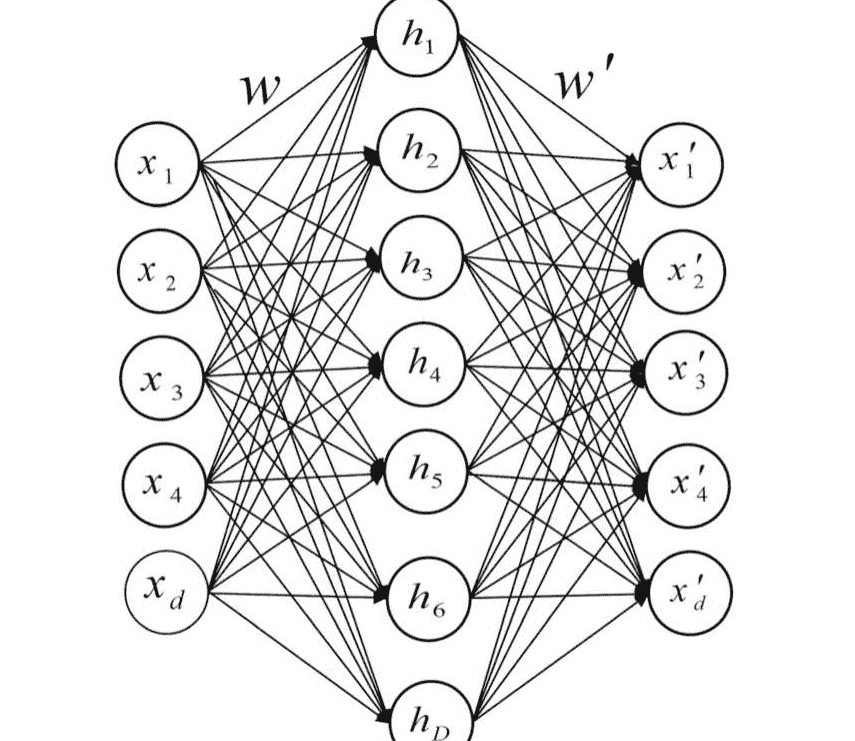

图2.14 稀疏自编码器的一般架构

#### 2.4.1.3 压缩自编码器

这种类型的自编码器是去噪自编码器的进一步发展，两者的动机都是为了对数据表示进行稳健学习。虽然去噪自编码器的强项是通过向训练集注入噪声来进行映射操作，但收缩自编码器通过在重构误差函数中添加解析的收缩惩罚来实现这一点。具有小扰动噪声的去噪自编码器可以被视为一种收缩自编码器，其中收缩惩罚是在整个重构函数而不是编码器上进行的。收缩自编码器和去噪自编码器都成功地应用于无监督模式下的迁移学习竞赛。这是通过在损失函数中添加惩罚项来实现的，如公式（2.24）所示：

```
L(x, g(f(x))) + ε(h)  (2.24)
```

在上述方程中，g(f(x))是解码器的输出，f(x)是编码器的输出，ε(h)是雅可比矩阵的平方元素之和。实际上，这个惩罚项是编码器函数的偏导数的雅可比矩阵的平方元素之和，根据公式（2.25）计算得出：

```
$$\varepsilon(h) = \lambda \left\| \frac{\partial f(x)}{\partial x} \right\|_F^2 \qquad (2.25)$$
```

在方程（2.25）中，参数λ是用于控制正则化强度的超参数。最终结果是学习表示对训练输入的敏感性降低。

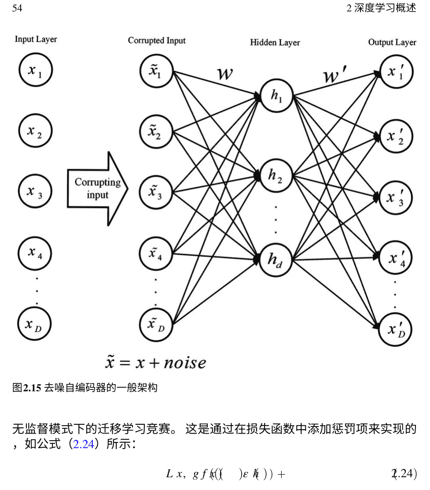

#### 2.4.1.4 卷积自编码器

卷积自编码器通过将完全连接的隐藏层改为卷积层来扩展简单自编码器的基本结构。与简单自编码器类似，输入层的大小与输出层相同，但编码器网络改为卷积层，解码器网络改为转置卷积层（反卷积）。为了提取多维数据（如图像）的结构特征，卷积神经网络提供了更好的架构。此外，它们可以堆叠在一起，使得每个卷积自编码器使用前一个卷积自编码器的潜在表示来生成更高级别的表示。这种自编码器的困难部分在模型的解码器一侧。在编码过程中，通过平均或最大池化进行子采样来减小数据大小。这两种操作都会导致数据丢失，在解码过程中很难恢复。卷积自编码器允许模型学习最优的滤波器以最小化重构误差。一旦学习了这些滤波器，它们可以应用于任何输入以提取特征。因此，这些特征可以用于执行需要压缩表示的任何任务。图2.16显示了这种类型自编码器的一般架构。

#### 2.4.1.5 变分自编码器

变分自编码器是一种具有对学习的编码表示的额外约束的自编码器类型。更准确地说，这个自编码器为其输入数据学习了一个潜在变量模型。因此，在变分自编码器中，神经网络不再学习任意函数，而是学习自身数据的概率分布模型的参数。如果从该分布中采样点，它会生成新的输入数据样本。因此，变分自编码器被认为是生成模型。

变分自编码器试图解码来自已知概率分布的编码，以产生适当的输出，即使它们不是真实的数据编码。在变分自编码器中，输入被映射到一个分布，而不是映射到一个固定的向量。因此，这种类型的自编码器与其他类型的自编码器之间的重要区别在于，瓶颈（隐藏）向量被均值向量和标准差向量所取代，然后采样的潜在向量被视为真正的瓶颈。这与传统的自编码器非常不同，传统的自编码器直接生成潜在向量。

基于这些特征，变分自编码器的主要应用是减少数据维度并从中学习表示。

这个自编码器的功能是将输入提供两个大小为n的向量：均值向量和标准差向量。通过使用均值和标准差，我们可以生成与等式 (2.26) 对应的正态分布的样本。

```
$$ F(x) = \frac{1}{\sqrt{2\pi\sigma^2}} e^{-\frac{(x-\mu)^2}{2\sigma^2}} $$
```

在等式 (2.26) 中，μ和σ是随机数x的均值和标准差。然后，获得的编码数据传递给解码器。添加到分布中的新样本扩展了进一步样本生成的空间。另一方面，解码器学习到样本不是从单个点生成的，而是遵循连续潜在空间中的分布。在解码过程中，每个潜在特征被采样以生成一个样本向量，然后发送给解码器。这样，输入的微小变化会导致准确重构输出。

从统计学上讲，这种方法使用贝叶斯理论。如果从x观测中生成了 z个样本，则计算 z给定 x的概率为 pθ(z|x)，这是潜在空间的真实后验分布。计算每个数据样本x的后验概率 pθ(x)是昂贵的，因此为了限制更快的搜索过程的空间，变分自动编码器使用可计算后验分布的近似推断，这是通过编码器函数 qφ(z|x)提供的。

为了确保 pθ(z|x)和 qφ(z|x)都相似，它们之间的差异应该被最小化。为了确定这两个分布之间的距离值，可以通过Kullback-Leibler散度来获得差异度量。根据公式(2.27)，散度被测量为KL散度，始终具有非负值：

```
$$ D_{KL} = \left( q_{\varphi}(z|x) \| p_{\theta}(z|x) \right) $$
```

损失函数由两个表达式组成，一个与重构误差相关，另一个与KL散度相关。损失函数使用Eq. (2.28)计算：

```
$$ E_{z \sim q_{\varphi}(z|x)} [\log p_{\theta}(x|z)] - KL(q_{\varphi}(z|x) \| p_{\theta}(z|x)) = -\text{ELBO} \leq \log p_{\theta}(x) $$
```

图2.17显示了变分自动编码器的一般架构。

### 2.4.2 生成对抗网络

生成对抗网络（GAN）是Goodfellow于2014年提出的一种深度学习方法[52]。GAN提供了一种基于最大似然估计的技术的替代方法。GAN是一种无监督的深度学习方法，其中两个神经网络在零和博弈中竞争。其中一个网络是生成器，另一个是判别器。这两个网络之间存在对抗关系；每个网络的定义如下：

-   生成器：将随机噪声向量作为输入，并将其转换为分布模型的神经网络。
-   判别器：将输出数据（假）与训练数据样本（真实）进行区分的神经网络。它的作用类似于分类器，并决定输入是真实的还是假的。

这两个神经网络试图相互对抗。生成器在这些权重设置下学习将随机噪声向量转换为分布模型。例如，在图像生成中，生成器网络开始使用高斯噪声生成图像，判别器网络确定生成的图像的质量。这个过程会一直持续，直到生成网络的输出接近真实输入样本。图2.18展示了GAN模型的一般架构。

GAN中的生成器和判别器网络是两个玩家，通过函数V(D, G)进行极小极大博弈，可以表示为方程(2.29)：

```
\min_G \max_D V(D, G) = E_{x \sim p_{data}(x)} [\log D(x)] + E_{z \sim p_z(z)} [\log (1 - D(G(z)))] \quad (2.29)
```

在这方面，G和D分别代表生成器和判别器模型，E_x是对所有真实数据实例的期望值，E_z是对生成器的所有随机输入的期望值（对所有生成的假实例G(z)的期望值）。在实践中，这个方程在初始阶段可能无法提供足够的梯度来学习G（从高斯随机噪声开始）。在初始阶段，D可以拒绝样本，因为它们与其他样本明显不同。在这种情况下，$\log (1-D(G(z)))$ 表达式会饱和。与其训练 $G$ 来最小化 $\log (1-D(G(z)))$，$G$ 可以被训练来最大化 $\log (G(z))$，这在学习的初始阶段提供了更好的梯度。

一般来说，GAN网络被设计用于无监督学习任务，但根据问题的性质，它也被证明是半监督学习和强化学习的更好解决方案[53]。GAN也被用于转移学习研究，以应用潜在特征空间的对齐。GAN的应用领域包括医疗保健、图像分析、数据增强、视频生成、音频生成、交通控制、网络安全和许多其他不断发展的应用。总的来说，GAN已经成为一个全面的与数据无关的扩展领域，并成为需要生成方法解决的问题的解决方案。

### 2.4.3 玻尔兹曼机

玻尔兹曼机器（BM）是由许多节点通过加权连接相互连接的无向网络[54]。BM代表一类无监督神经网络，不试图最小化损失或实现目标；相反，它们生成数据以形成一个与原始系统[55]类似的系统（通常是概率分布）。图2.19显示了BM的一般架构，其中选择了可见和隐藏节点，并且可见节点被用作输入和输出。因为在通过对比散度将可见节点馈送到隐藏节点之后，使用Gibbs采样，可见节点通过权重迭代地馈送到隐藏节点。相反，隐藏节点馈送可见节点。在这个图中，灰色节点是隐藏节点，白色节点是可见节点。

在这个模型中，每个节点与其他节点进行通信，整个模型作为一个生成网络来工作。因此，它可以根据将其拟合到数据集中所学到的内容生成自己的数据。Boltzmann机器中的可见节点可以进行交互，但不能与隐藏节点进行交互。另一个区别是没有训练过程。节点学习如何尽可能地对数据集建模，将Boltzmann机器转变为一种无监督的深度学习模型。

如果单位按照不依赖于它们的总输入的任意顺序进行更新，网络最终将达到玻尔兹曼分布。状态向量 $v$ 的概率仅由其相对于所有可能的二进制状态向量 $u$ 的能量确定，可以使用公式（2.30）计算：

```
$P(v) = \frac{e^{-E(v)}}{\sum_{u} e^{-E(u)}}$ (2.30)
```

与Hopfield网络一样，状态向量 $v$ 的能量定义如公式（2.31）所示：

$$E(v) = \sum_i s_i^v b_i - \sum_{i<j} s_i^v s_j^v w_{ij}$$ (2.31)

其中，$s_i^v$ 是状态向量 $v$ 分配给单元 $i$ 的二进制状态。

然而，玻尔兹曼机并不一定实用，并且在网络变得更大时会遇到问题。因此，不同类型的玻尔兹曼机已经被提出，适用于各个领域，例如受限玻尔兹曼机（RBM）[56]，深度玻尔兹曼机（DBM）[57]和深度置信网络（DBN）[58]，这些在下面的小节中进行了讨论和回顾。

#### 2.4.3.1 受限玻尔兹曼机

在实践中，当所有节点都连接到其他节点时，每次迭代都很难进行采样。因此，提出了受限玻尔兹曼机 [56]。 RBM与BM类似，但主要区别在于RBM只包含两层：输入层和隐藏层。它的架构类似于人工神经网络模型，因此RBM层就像是人工神经网络的前两层。然而，对于层来说，有一个限制，即层内的节点之间不能相互连接。 如果每个节点输出一个二进制值，那么RBM是伯努利的。 图2.20显示了RBM的架构。

RBM（以及BM）通常是基于能量的模型，其中根据公式（2.32）计算可见节点和隐藏节点的联合配置能量E(v, h):

$$ E(v, h) = \sum_{i \in \text{可见节点}} p_i v_i - \sum_{j \in \text{隐藏节点}} q_j h_j - \sum_i \sum_j v_i w_{ij} h_j \quad (2.32) $$

在上述方程中，v_i和h_j是可见节点i和隐藏节点j的状态，p_i和q_j是它们的偏置，w_{i,j}表示它们之间的权重。RBM使用公式（2.33）确定隐藏向量和可见向量之间的概率：

$$ p(v, h) = \frac{e^{-E(v,h)}}{\sum_{v,h} e^{-E(v,h)}} \quad (2.33) $$

使用对比散度方法，通过调整权重获得最低能量状态。 RBMs在降维、分类、回归、协同过滤、特征学习、主题建模等领域中被使用。一般来说，RBMs能够自动识别数据中的模式并开发概率或随机模型，用于选择或提取特征。

#### 2.4.3.2 深度置信网络

深度置信网络（DBN）是一个多层生成图模型，它堆叠并顺序连接多个无监督网络，如自编码器或受限玻尔兹曼机[58]。这种类型的网络使用每个网络的隐藏层作为下一层的输入。与传统的浅层学习网络相比，DBN最重要的优势之一是能够检测深层模式。它允许推理和识别正常和嘈杂数据之间的深层差异[59]。

考虑到DBNs是RBM的扩展，然而，训练DBNs并不简单，因为在隐藏层中推断隐藏变量时会出现一种称为“解释消失”的现象，在贝叶斯网络中发生。这是因为隐藏变量的后验分布难以计算。解释消失是指一个原因完全解释了一个效应，从而降低了其他原因参与的机会。马尔可夫链蒙特卡洛可以用来采样这些难以计算的后验分布，但这非常耗时。训练DBNs的另一个问题是假设先验与最深的隐藏层是独立的，并具有初始随机权重。为了更快更高效地训练DBNs，有必要消除“解释消失”效应和先验独立性[55]。

在深度置信网络中，训练方法从第一个RBM开始，然后隐藏层充当第二个RBM的可见层，并进行训练。这个过程一直持续到每个模型层都被训练。图2.21展示了具有三个隐藏层的DBN的一般架构。

连续DBN只是标准DBN的扩展，允许连续范围的小数而不是二进制数据。总的来说，DBN模型在多个高维数据应用中起到关键作用，因为它具有有效的特征提取和分类能力，并且已经成为神经网络领域的重要主题之一[6]。

#### 2.4.3.3 深度玻尔兹曼机

RBM模型只能学习数据的简单表示。通过增加隐藏层，应该可以构建一个深层架构来提取输入数据的复杂特征。深度玻尔兹曼机（DBM）模型是一种具有一个可见层和多个隐藏层的深度生成模型[57]。DBM的总体架构如图2.22所示。

DBM和DBN之间的主要区别在于，在DBM中，所有连接都是无向的。DBM还用于捕捉数据中隐藏的复杂基本特征，使其适用于语音和物体识别等任务。

与DBN不同，DBM首先使用近似推断方法进行一次额外的自下而上传递，以加快学习速度并结合自上而下的反馈，这使得DBM能够很好地处理模糊的输入。

传统的BMs训练过程使用随机起点来近似计算输入数据的似然函数的梯度，这不是最快的方法。为了解决这个问题，Salakhutdinov等人提出了一种变分技术，使用均值场推断来估计与数据相关的期望，并使用基于马尔可夫链的估计方法来估计模型的期望统计量[57]。该方法涉及马尔可夫链，它将权重初始化为适当的值，以便促进所有层的联合学习。然而，与通过自下而上的传递进行推理的DBN预训练相比，它的成本较高。因此，使用检测权重加速DBMs的推理。

## 2.5 基于图的模型

基本类型的神经网络只能使用常规或欧几里得数据来实现。深度学习有效地检测欧几里得数据中的隐藏模式，而现实世界中的许多数据具有非欧几里得的图结构。以图形形式表示数据的问题数量正在增加，例如图/节点分类、社区检测、链接预测、影响者识别等等。

图是一种数据结构，用于模拟一组对象（节点）及其关系（边）。最近，由于图的高表示能力，图分析与机器学习的研究越来越受到关注[60]。作为机器学习中独特的非欧几里德数据结构，图分析关注不同类型的任务。需要提到的是，图数据集与其他数据集（如文本、图像、音频等）不同。基于图的模型具有以下独特特点：

-   不规则域：可以在图中表示不规则域或非欧几里德数据，而其他数据集（如图像和音频）可以在欧几里德平面或网格结构中轻松表示。
-   非静态结构：图是表示复杂系统的工具。因此，它们具有不同类型，如同质、非同质、有符号、无符号等，并且它们可以是以节点为导向、以图为导向或以边为导向的。图表示中最常用的方法之一是使用接近度。在节点添加或删除后，矩阵会改变形状。这就是为什么传统的机器学习模型不能直接处理邻接矩阵的原因。
-   可扩展性和并行化：在计算工具丰富的时代，大数据是一个问题。因此，生成的图可能有数百万个节点和数百亿条边。第二个问题是如何并行化算法，因为图中的每个节点都包含与其他节点的关系信息，这些关系信息不应该丢失。
-   领域特定知识：图学习可能需要领域特定的知识，这可能有助于更好地进行预测。其他附加信息也可能有助于检测新的目标或特征。

图神经网络（GNNs）是基于深度学习的方法，可以在图领域上操作。Scarselli等人[61]对GNNs及其概念进行了早期研究。基于GNNs的概念，许多基于深度学习的图模型如图卷积网络（GCN）[62]、图注意力网络（GAT）[63]和门控图序列神经网络（GGS-NN）[64]（GNN和一种RNN的组合）已经被开发和用于各种研究。GCNs是一类使用卷积操作从图数据中提取有意义的统计模式的神经网络，并且能够以最小的训练开销进行高效实现[62]。在GAT中，假设邻居的影响不仅不相同，而且也不是由图预先确定的。因此，它使用注意机制区分邻居的贡献。在GGS-NN中，递归函数在聚合阶段对所有节点执行多次，并且GRU用于更新目的。除了图神经网络，GCNs还在各种文章中用于基于会话的推荐系统，下面的小节中将进行讨论。

### 2.5.1 图神经网络

图神经网络（GNN）是一组将深度神经网络应用于图结构数据的方法。经典的深度神经网络不能轻易扩展到图结构数据，因为图结构不是一个规则的网络。图神经网络的研究始于二十一世纪初，当时提出了第一个用于节点和图中心任务的GNN模型[61]。图神经网络是一种输入数据为图的神经网络类型，它学习表示每个节点的特征。此外，生成的特征可以用于解决任何与图相关的问题，例如节点分类、图分类和聚类。图神经网络可以被视为在图上学习数据表示的过程。GNN专注于学习每个节点的高效特征，以促进以节点为中心的任务。对于以图为中心的任务，它们学习整个图的特征，其中节点特征学习通常作为中间步骤进行。节点特征学习过程通常同时使用输入节点特征和图结构[65]。

在节点分类问题中，每个节点都由其特征$x_i$来描述，并且被标记为$l_i$。在图分类问题中，一组节点与标签$l_i$相关联。通过学习节点的特征$i$，图神经网络可以预测未知节点$i$的标签。它学习用一个维度为d的向量$v_i$来表示每个节点。向量$v_i$包含有关节点$i$的邻居节点的信息，该信息在方程（2.34）[66]中呈现：

$$V_i = f(XX_{co\{i\}}, V_{ne\{i\}}, X_{ne\{i\}}) \quad (2.34)$$

在公式（2.34）中，$X_{co\{i\}}$表示与节点$i$相邻的边的特征，$f$是一个传递函数（前馈神经网络），输出d维向量。上述公式可以使用邻居聚合定理解决，并迭代地重写为公式（2.35）：

$$V^{t+1} = F(V, X) \quad (2.35)$$

输出转移函数$O_i$应用于获得低维度的最终向量，如公式（2.36）所示：

$$O_i = g\left(V_i, X_i\right)$$

通过应用预测输出 $O_i$ 和实际标签 $l_i$ 之间的损失函数来学习其他隐藏参数。

### 2.5.2 图卷积网络

图形在现实世界中随处可见，代表着实体及其关系，例如社交网络、交通网络、知识图谱、分子结构等。最近，许多研究都集中在开发用于图形数据的深度学习方法，从而推动了图神经网络领域的快速发展。此外，图卷积采用邻域集成（或消息传递）方案，通过同时考虑节点特征和图拓扑信息来学习节点的表示，其中最突出的方法是图卷积网络（GCNs）[62]。与卷积神经网络类似，它可以加速学习并提高层次数据处理的准确性，图卷积网络也旨在对图形数据进行相同的操作。图卷积网络是一组强大的神经网络，使用卷积操作从图形数据中提取有意义的统计模式，并能够在最小训练量的情况下高效执行。

事实上，它们非常强大，以至于即使是具有两个随机初始化层的图卷积网络也可以获得有用的节点特征表示。一般来说，图卷积网络通过保持其邻居特征的完整性，找到每个图顶点的新表示。

卷积、池化和展平是卷积图网络中使用的函数。这三个函数对于这种类型的网络的性能非常重要，并且在所有图卷积网络中都是常见的。

过滤器是一种限制一次考虑的单元数量的函数。池化函数一次为指定范围内的所有值生成输出，基于最大值、平均值等函数。展平函数将网络结构转换为低维向量，其输出可以用作前馈神经网络的输入。

$$H = f\left(\left(\tilde{D}^{-\frac{1}{2}} A + I \tilde{D}^{-\frac{1}{2}}\right)XW\right)$$

在上述方程中，$W \in \mathbb{R}^{d \times d}$ 包括网络参数，$A$ 是节点邻接矩阵，$\tilde{D}_{ii} = \sum_{j} A + I_{ij}$，而 $f$ 是激活函数。表示节点 $v$ 在 $k$ 层之后可以表示为方程(2.38):

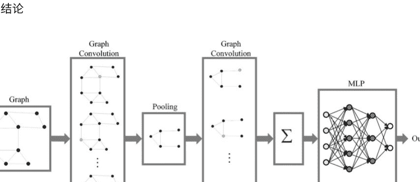

图2.23 GCN的一般架构

$$h_v = f\left( \sum_{u \in N(v)} (W^k h_u^k + b^k) \right), \forall v \in V \quad (2.38)$$

其中 $W^k$ 和 $b^k$ 表示GCN层的权重和偏置参数，分别。 $N(v)$ 包括图 $G$ 中节点 $v$ 的邻居节点，并且 $h_v$ 是节点 $v$ 的表示。

在过去的几十年里，研究人员一直致力于如何在图上执行卷积操作。一种方法是从谱的角度定义图卷积，另一种方法是从空间的角度定义图卷积。简单来说，谱图卷积是基于图的傅里叶变换定义的，对应于一维傅里叶变换。通过对两个傅里叶变换信号的乘积进行逆傅里叶变换，可以计算基于谱的图卷积。另一方面，空间图卷积也可以定义为从邻居节点聚合节点表示。这种观点对于图卷积网络[67]非常有效。总的来说，图卷积网络模型是一种可以从邻域中卷积地收集图结构和节点信息的神经网络架构。

图2.23显示了图卷积网络的一般架构。

## 2.6 结论

深度学习是一个相对较新的主题，被定义为一组层次进行非线性处理以学习不同级别的数据表示。几十年来，研究人员一直试图基于机器学习方法从原始数据中发现模式和数据表示。与传统的机器学习和数据挖掘方法不同，深度学习可以从大量的原始数据中生成非常高级的数据表示。因此，它是许多实际应用的解决方案。

世界。深度学习方法的评估结果及其与其他方法的比较显示了深度学习在不同范围内的能力。

在本章中，首先介绍了深度学习的历史和概念概述，并比较了深度学习和机器学习的特点。然后，介绍了深度学习模型的分类法，将其分为三个一般类别：判别模型、生成模型和基于图的模型。最后，简要讨论了这三个类别的基本模型。

## 参考文献

1.  Ian Goodfellow, Yoshua Bengio和Aaron Courville。 深度学习。 MIT出版社, 2016年。 https://www.deeplearningbook.org
2.  Merima Kulin, Carolina Fortuna, Eli De Poorter, Dirk Deschrijver和Ingrid Moerman。 "数据-驱动的智能无线网络设计：概述和教程。" 传感器 16, 第6期 (2016年)： 790。 https://doi.org/10.3390/s16060790
3.  Vasant Dhar。 "数据科学与预测。" ACM通信 56, 第12期 (2013年)： 64-73。 https://doi.org/10.1145/2500499
4.  Paul Fergus和Carl Chalmers。 应用深度学习：工具，技术和实现。 Springer Nature, 2022年。 https://doi.org/10.1007/978-3-031-04420-5
5.  Sergey I. Nikolenko. 引言：数据问题。 在：深度学习的合成数据。 Springer Optimization and Its Applications 174, (2021). https://doi.org/10.1007/978-3-030-75178-4_1
6.  Iqbal H. Sarker。 "深度学习：技术、分类、应用和研究方向的综述。" SN Computer Science 2, no. 6 (2021): 420. https://doi.org/10.1007/s42979-021-00815-1
7.  Andrew Ng, and Michael Jordan。 "关于判别式与生成式分类器的比较：逻辑回归和朴素贝叶斯。" Advances in neural information processing systems 14 (2001). https://dl.acm.org/doi/abs/10.5555/2980539.2980648
8.  Volodymyr Kuleshov, and Stefano Ermon。 "深度混合模型：桥接判别式和生成式方法。" 在不确定性人工智能会议 (UAI) 的论文集中。 悉尼, 澳大利亚, 2021年8月12-14日。
9.  Li Deng和Navdeep Jaitly。 "深度辨别和生成模型用于语音模式识别。" 在模式识别和计算机视觉手册中，第27-52页。 2016. https://doi.org/10.1142/9789814656535_0002
10. Yoshua Bengio, Aaron Courville和Pascal Vincent。 "表示学习：综述和新视角。" IEEE模式分析和机器智能交易 35, 第8期 (2013年)： 1798-1828。 https://doi.org/10.1109/TPAMI.2013.50
11. Léon Bottou。 "使用随机梯度下降的大规模机器学习。" 在第19届国际计算统计学会议论文集巴黎法国，2010年8月22-27日主题演讲，邀请和投稿论文，第177-186页。 Physica-Verlag HD, 2010年。 https://doi.org/10.1007/978-3-7908-2604-3_16
12. Dong C. Liu和Jorge Nocedal。 "关于大规模优化的有限内存BFGS方法。" 数学规划 45, no. 1-3 (1989): 503-528. https://doi.org/10.1007/BF01589116
13. Diederik P. Kingma和Jimmy Lei Ba。 “Adam:一种用于随机优化的方法”。国际学习表示会议，美国加利福尼亚州圣地亚哥，2015年5月7-9日，第1-13页。 https://arxiv.org/pdf/1412.6980.pdf
14. Robert Mansel Gower, Nicolas Loizou, Xun Qian, Alibek Sailanbayev, Egor Shulgin和Peter Richtárik. "SGD:一般分析和改进的速率." 机器学习国际会议, 美国加利福尼亚州长滩, 2019年6月10-15日, pp. 5200-5209. PMLR, 2019. https://doi.org/10.48550/arXiv.1901.09401
15. John Duchi, Elad Hazan和Yoram Singer. "自适应次梯度方法用于在线学习和随机优化。"机器学习研究杂志12卷, 第7期 (2011). https://jmlr.org/papers/v12/duchi11a.html
16. Matthew D. Zeiler. "Adadelta: 一种自适应学习率方法." arXiv预印本arXiv:1212.5701 (2012年). https://doi.org/10.48550/arXiv.1212.5701
17. Shiv Ram Dubey, Satish Kumar Singh和Bidyut Baran Chaudhuri. "深度学习中的激活函数: 综合调查和基准。"神经计算 (2022). https://doi.org/10.1016/j.neucom.2022.06.111
18. Yann LeCun, Léon Bottou, Yoshua Bengio和Patrick Haffner. "基于梯度的学习应用于文档识别。" IEEE 86卷, 第11期 (1998年): 2278-2324. https://doi.org/10.1109/5.726791
19. Alex Krizhevsky, Ilya Sutskever, and Geoffrey E. Hinton. "使用深度卷积神经网络的Imagenet分类." Communications of the ACM 60, no. 6 (2017): 84-90. https://doi.org/10.1145/3065386
20. Karen Simonyan和Andrew Zisserman. "用于大规模图像识别的非常深的卷积网络." arXiv预印本arXiv:1409.1556 (2014). https://doi.org/10.48550/arXiv.1409.1556
21. Min Lin, Qiang Chen和Shuicheng Yan. "网络中的网络." arXiv预印本arXiv:1312.4400 (2013). https://doi.org/10.48550/arXiv.1312.4400
22. Jost Tobias Springenberg, Alexey Dosovitskiy, Thomas Brox和M. Riedmiller. "追求简单: 全卷积网络." 在ICLR (研讨会) 2015年.
23. Gao Huang, Zhuang Liu, Laurens Van Der Maaten和Kilian Q. Weinberger. "密集连接的卷积网络." 在2017年IEEE计算机视觉和模式识别 (CVPR) 会议上, 美国檀香山, 7月21日至26日, 2017, 第2261-2269页. https://doi.org/10.1109/CVPR.2017.243
24. Gustav Larsson, Michael Maire和Gregory Shakhnarovich. "FractalNet: 无残差的超深度神经网络." 在2017年学习表示国际会议ICLR上, 法国土伦, 4月24日至26日, 2017年. https://doi.org/10.48550/arXiv.1605.07648
25. Christian Szegedy, Wei Liu, Yangqing Jia, Pierre Sermanet, Scott Reed, Dragomir Anguelov, Dumitru Erhan, Vincent Vanhoucke和Andrew Rabinovich. "用卷积深入." 在IEEE计算机视觉和模式识别会议论文集中, 美国波士顿, 6月7日至12日, 2015年, 第1-9页. 2015年.
26. Kaiming He, Xiangyu Zhang, Shaoqing Ren, and Jian Sun. "深度残差学习用于图像识别." 在计算机视觉和模式识别的IEEE会议论文集中,2016年6月26日至7月1日, 凯撒宫, 第770-778页. https://doi.org/10.1109/CVPR.2016.90
27. Laith Alzubaidi, Jinglan Zhang, Amjad J. Humaidi, Ayad Al-Dujaili, Ye Duan, Omran Al-Shamma, José Santamaría, Mohammed A. Fadhel, Muthana Al-Amidie, and Laith Farhan. "深度学习综述: 概念, CNN架构, 挑战, 应用, 未来方向." 大数据杂志 8 (2021): 1-74. https://doi.org/10.1186/s40537-021-00444-8
28. Alex Sherstinsky. "循环神经网络(RNN)和长短期记忆(LSTM)网络的基础." Physica D: 非线性现象 404 (2020): 132306. https://doi.org/10.1016/j.physd.2019.132306
29. Michael I. Jordan. "串行顺序: 一种并行分布式处理方法." 在心理学进展, vol. 121, pp. 471-495. 北荷兰, 1997. https://doi.org/10.1016/S0166-4115(97)80111-2
30. Jeffrey L. Elman. "时间中的结构发现." 认知科学 14, no. 2 (1990): 179-211. https://doi.org/10.1207/s15516709cog1402_1
31. G. R. Kanagachidambaesan, Adarsha Ruwali, Debrup Banerjee, 和 Kolla Bhanu Prakash. "循环神经网络." 使用 TensorFlow 进行编程: 边缘计算应用解决方案 (2021): 53-61. https://doi.org/10.1007/978-0-030-57077-4_7
32. Sepp Hochreiter和Jürgen Schmidhuber。 "长短期记忆。" 神经计算 9，第8期 (1997年)：1735-1780。 https://doi.org/10.1162/neco.1997.9.8.1735
33. Santiago Fernández, Alex Graves和Jürgen Schmidhuber。 "在结构化域中的序列标记 具有分层递归神经网络。" 在第20届国际 联合人工智能大会，IJCAI 2007年，印度海得拉巴。6 – 12 January，2007。
34. Santiago Fernández, Alex Graves和Jürgen Schmidhuber。 "递归神经的应 用 网络用于区分关键字检测。" 在Artificial Neural Networks–ICANN 2007: 17th International Conference, Porto, Portugal, September 9-13, 2007, Proceedings, Part II 17，第220-229页。 Springer Berlin Heidelberg, 2007年。 https://doi.org/10.1007/978-3-540-74695-9_23
35. Alex Graves和Jürgen Schmidhuber。 "使用双向 LSTM和其他神经网络架构进行逐帧音素分类"。 神经网络18，第5-6期 (2005年)：602-610。 https://doi.org/10.1016/j.neucom.2005.06.042
36. Tara N. Sainath, Oriol Vinyals, Andrew Senior和Hasım Sak。 "卷积，长短时记忆，全连 接深度神经网络"。 在2015年IEEE国际会议上声学，语音和信号处理 (ICASSP)，布 里斯班南部，昆士兰，澳大利亚，2015年4月19日至24日，第4580-4584页。IEEE，201 5年。 https://doi.org/10.1109/ICASSP.2015.7178838
37. Alex Graves, Santiago Fernández 和Jürgen Schmidhuber。 "多维递归神经网络"。 在Artificial Neural Networks–ICANN 2007: 第17届国际会议，葡萄牙波尔图，2007年9月9日至13日，第549-558页。Springer Berli nHeidelberg，2007年。 https://doi.org/10.1007/978-3-540-74690-4_56
38. Xiaodan Liang, Xiaohui Shen, Donglai Xiang, Jiashi Feng, Liang Lin和Shuicheng Yan。 "具有局部-全局长期记忆的语义对象解析。" 在计算机视觉和模式识别IEEE会议论文 集中，凯撒宫，2016年6月26日至7月1日，第3185-3193页。2016年。
39. Mike Schuster和Kuldip K. Paliwal。 "双向递归神经网络。" IEEE信号处理杂志45卷，11 期 (1997年)：2673-2681。 https://doi.org/10.1109/78.650093
40. Yong Yu, Xiaosheng Si ，Changhua Hu和Jianxun Zhang。 "递归神经网络综述：LSTM单元和网络架构。" 神经计算 31卷，7期 (2019年)：1235-1270。 https://doi.org/10.1162/neco_a_01199
41. Kyunghyun Cho, Bart Merrienboer, Caglar Gulcehre, Fethi Bougares, Holger Schwenk和 Yoshua Bengio。 "使用RNN编码器-解码器学习短语表示进行统计机器翻译。" 2014年经 验方法国际会议论文集自然语言处理，EMNLP 2014，卡塔尔多哈，2014年10月25日至 29日，第1724-1734页。2014年。 https://doi.org/10.3115/v1/D14-1179
42. Dzmitry Bahdanau, Kyung Hyun Cho和Yoshua Bengio。 "通过 同时学习对齐和翻译的神经机器翻译。" 在第三届国际学习会议上 表示，ICLR 2015. 2015年。
43. Jakub M. Tomczak, "深度生成建模"，Springer Nature, 2022年，https://doi.org/10. 1007/978-3-030-93158-2
44. Lars Ruthotto和Eldad Haber。 "深度生成建模简介。" GAMM-Mitteilungen 44, no. 2 (2021): e202100008。 https://doi.org/10.1002/gamm.202100008
45. Mark A. Kramer。 "使用自 联想神经网络的非线性主成分分析。" AIChE journal 37, no. 2 (1991): 233-243。 https://doi.or g/10.1002/aic.690370209
46. R. Indrakumari, T. Poongodi和Kiran Singh。 "深度学习 简介。" 高级工程师和科学家的高级深度学习：实用方法 (2021)：1-22。 https://doi.org/10 .1007/978-3-030-66519-7_1
47. Salah Rifai, Pascal Vincent, Xavier Muller, Xavier Glorot和Yoshua Bengio。 "收缩 自动编码器：特征提取过程中的显式不变性。" 在第28届会议论文集中48. Alireza Makhzani, Brendan Frey. K稀疏自编码器. 第二届国际学习表示会议, 2014年4月14日至16日, 加拿大班夫。

49. Pascal Vincent, Hugo Larochelle, Isabelle Lajoie, Yoshua Bengio, Pierre-Antoine Manzagol,和 Léon Bottou. "堆叠去噪自编码器：在深度网络中学习有用的表示。" 机器学习研究杂志, 第11卷, 第12期 (2010年)。

50. Jonathan Masci, Ueli Meier, Dan Cireşan, 和 Jürgen Schmidhuber. "堆叠卷积自编码器用于分层特征提取。" 在人工神经网络和机器学习-ICANN 2011: 第21届国际人工神经网络会议, 芬兰埃斯波, 2011年6月14日至17日, 第I部分21, 第52-59页. Springer Berlin Heidelberg, 2011年. https://doi.org/10.1007/978-3-642-21735-7_7

51. DP Kingma, Welling M. 自动编码变分贝叶斯. 第二届国际学习表示会议, ICLR 2014, 加拿大班夫, 阿尔伯塔省, 2014年4月14日至16日。

52. Ian Goodfellow, Jean Pouget-Abadie, Mehdi Mirza, Bing Xu, David Warde-Farley, Sherjil Ozair, Aaron Courville和Yoshua Bengio. "生成对抗网络" (神经信息处理系统进展) (第2672–2680页). 红钩, 纽约Curran (2014年).

53. Alankrita Aggarwal, Mamta Mittal和Gopi Battineni. "生成对抗网络：理论和应用概述。"国际信息管理数据洞察杂志1, 第1期 (2021年) : 100004. https://doi.org/10.1016/j.jimei.2020.100004

54. David H. Ackley, Geoffrey E. Hinton和Terrence J. Sejnowski. "Boltzmann机器的学习算法。"认知科学9, 第1期 (1985年) : 147-169. https://doi.org/10.1016/S0364-0213(85)80012-4

55. Harshvardhan GM, Mahendra Kumar Gourisaria, Manjusha Pandey和Siddharth Swarup Rautaray. "机器学习中生成模型的综合调查和分析。" 计算机科学评论38 (2020) : 100285. https://doi.org/10.1016/j.cosrev.2020.100285

56. Geoffrey E. Hinton. "训练受限玻尔兹曼机的实用指南。"神经网络：行业的技巧：第二版 (2012) : 599-619. https://doi.org/10.1007/978-3-642-35289-8_32

57. Ruslan Salakhutdinov和Geoffrey E. Hinton. 深度玻尔兹曼机，在：第十二届国际人工智能和统计学会议，美国佛罗里达州, 2009年4月。

58. Geoffrey E. Hinton. "深度置信网络." Scholarpedia 4, no. 5 (2009): 5947. https://doi.org/10.4249/scholarpedia.5947

59. Jing Ren, Mark Green, 和 Xishi Huang. "从传统到深度学习：自动驾驶车辆的故障诊断." In Learning Control, pp. 205-219. Elsevier, 2021. https://doi.org/10.1016/B978-0-12-822314-7.00013-4

60. Ziwei Zhang, Peng Cui, 和 Wenwu Zhu. "图上的深度学习：一项调查." IEEE Transactions on Knowledge and Data Engineering 34, no. 1 (2020): 249-270. https://doi.org/10.1109/TKDE.2020.2981333

61. Franco Scarselli, Marco Gori, Ah Chung Tsoi, Markus Hagenbuchner, 和 Gabriele Monfardini. "图神经网络模型." IEEE transactions on neural networks 20, no. 1 (2008): 61-80. https://doi.org/10.1109/TNN.2008.2005605

62. Thomas N. Kipf和Max Welling. "使用图卷积网络的半监督分类." 在国际学习表示会议ICLR 2017中，法国图伦，2017年4月24日至26日。

63. Petar Veličković, Guillem Cucurull, Arantxa Casanova, Adriana Romero, Pietro Lio和Yoshua Bengio. 图注意力网络. 第六届国际学习表示会议ICLR 2018, 加拿大温哥华, 2018年4月30日至5月3日。

64. Yujia Li, Richard Zemel, Marc Brockschmidt和Daniel Tarlow. "门控图序列神经网络." 第四届国际学习表示会议ICLR 2016, 波多黎各圣胡安, 2016年5月2日至4日。

65. 周洁, 刘谦, 沈栋, 郑岩, 程阳, 智远, 李立峰, 李长城, 孙茂松. 《图神经网络: 方法和应用综述》. AI开放1 (2020) : 57-81. https://doi.org/10.1016/j.aiopen.2021.01.001

66. 施东, 王平, 和Khushnood Abbas. 《深度学习及其应用综述》. 计算机科学评论40 (2021) : 100379. https://doi.org/10.1016/j.cosrev.2021.100379

67. 张思, 童航, 徐俊杰, 和Ross Maciejewski. 《图卷积网络: 综述》. 计算社交网络6卷1期 (2019) : 1-23. https://doi.org/10.1186/s40649-019-0069-y

## 第三章 深度判别式基于会话的推荐系统

摘要 由于顺序性和时间顺序的会话数据，会话推荐系统（SBRS）的许多研究都集中在循环神经网络（RNNs）上，包括GRU和LSTM。另一方面，卷积神经网络（CNNs）在建模顺序数据时提供了非常有效的解决方案，当序列元素与复杂特征相关联时。因此，我们在本章中讨论了SBRS中不同的深度判别模型，如RNNs和CNNs的变体。

- 基于会话的推荐系统
- SBRS
- 深度判别模型
- RNN
- LSTM
- GRU
- CNN

## 3.1 引言

近年来，在基于会话的推荐系统（SBRS）方面取得了越来越多的研究进展，几乎所有提出的方法都利用了深度神经网络架构。深度神经网络在一些领域，如图像和语音识别[1, 2]方面表现出色，其中非结构化数据通过多个卷积和标准层进行处理。

其中最受欢迎的网络是卷积神经网络（CNNs）。然而，基于不同的递归神经网络（RNN）模型的顺序数据建模最近引起了很多关注，因为它是分析这种类型数据最合适的模型。在SBRS中使用深度神经网络显著提高了推荐的准确性和效果，克服了传统模型的障碍，实现了高质量的推荐[3, 4]。深度判别模型，如RNN和CNN，可以有效地捕捉和分析非线性和非明显的用户/项目关系。此外，它可以提取和聚合复杂的关系，如文本和视觉信息。

正如第1章中讨论的，基于会话的推荐系统消除了访问用户交互和长期兴趣的需要。事实上，它们关注用户的最近交互和短期兴趣，同时考虑这些兴趣在短时间内的变化。然而，这个问题可扩展性和管理物品和用户的数量和种类是它们的主要挑战之一。深度神经网络在基于会话的推荐系统中的一个重要优势是它们可以根据不同大小的训练数据集调整模型参数[3, 5]。在学习过程中，与物品和用户相关的隐藏变量的更改和更新是独立于先前数据的[6]。

已发表的研究综述表明，使用GRU、LSTM和CNN的判别式深度学习方法在基于会话的推荐系统中受到了广泛关注。为此，在本章中讨论和分析了基于深度判别模型的不同方法，考虑了模型、数据集、评估以及每种方法的亮点/限制。首先，在第3.2节中，提供了本书本章相关基础知识的简要概述，包括研究分布统计、使用的数据集以及各种研究中使用的评估方法/指标。然后，在接下来的第3.3节和第3.4节中，基于RNN和CNN的方法进行了简要讨论。第3.5节分析了结果，并确定了基于深度判别模型的基于会话的推荐系统中存在的挑战，并为未来研究提供了几个指导方针。

在深度学习技术出现之前，对于基于会话的推荐系统的研究非常有限，因为会话数据的连续性导致了复杂性，常规方法很难进行分析和建模。在基于会话的推荐领域中，唯一可用的技术是基于物品的推荐，即根据用户先前事件中物品之间的相似性选择推荐物品，而忽略会话的其余部分。这种方法的准确性非常低，因为只向用户推荐与先前物品相似或在过去同时发生的物品。通过引入深度学习技术，可以对用户在一个会话或多个其他会话中的交互序列进行建模。

近年来，在基于会话的推荐系统中使用了不同类型的深度学习技术，从总体上可以分为三类：深度判别模型、深度生成模型和混合/高级模型。深度判别模型包括神经网络，其训练方式使其输出可以被解释为近似后验类别概率，并直接计算给定输入的输出的概率。

循环神经网络（RNN）和卷积神经网络（CNN）是这些方法的类型，每种方法都包含不同的架构。在本书的后续章节中将讨论SBRS中的生成模型和混合/高级模型。

自2016年以来，关于使用深度学习的基于会话的推荐系统的不同研究已经发表。这条道路的起点属于研究由Hidasi等人在SBRS中使用RNN技术进行的研究表明[9]。此后，更多的研究使用深度学习技术在SBRS中进行[10]。对于SBRS中深度判别模型的各种研究的回顾表明，RNN和CNN已经在许多文章中使用。RNN包括门控循环单元（GRU）、长短期记忆（LSTM）以及这两种网络的改进类型。CNN分为二维、三维和扩张CNN。

表3.1总结了本章回顾的研究列表，根据深度判别模型进行分隔。

为了更全面地了解本章回顾的研究，图3.1显示了基于GRU、LSTM和CNN的讨论研究中每种技术的百分比。

根据图3.1，大多数回顾的研究基于两种流行的RNN类型，即GRU和LSTM。由于它们的顺序性质，RNN具有分析用户会话中数据之间的顺序依赖性的强大能力。事实上，在会话推荐系统中建模用户随时间的动态行为使得RNN成为一个合适的解决方案。考虑到LSTM具有更多的门和参数，导致计算复杂度更高，GRU深度神经网络比LSTM受到更多关注。

图3.2显示了基于RNN的会话推荐系统的一般架构。用户的互动、点击和其他会话数据被提供给模型作为输入，然后使用嵌入技术转换为可分析的数据结构。之后，一种RNN类型被用来建模结构化数据并发现它们之间的依赖关系。最后，在输出层之前，使用全连接层来增加模型的稳定性。

与深度会话推荐系统相关的一些方法使用了CNN模型。CNN的使用在两个方面适用于用户会话数据：（1）一个会话中的项目序列或不同用户会话之间的项目序列可以很容易地在CNN上实现和建模。（2）CNN具有学习区域的局部和空间特征以及捕捉通常被其他模型忽略的相关依赖关系的高能力。

为了学习和建模与用户和物品相关的数据，这些数据应该适当地嵌入到基于CNN的会话推荐系统中，以便通过连续执行卷积和池化操作来正确识别它们之间的时间和空间模式。基于从输入数据和它们之间的依赖关系捕获的特征，预测用户的喜爱物品。

图3.3显示了使用CNN的基于会话的推荐系统的一般架构，可以使用（或定制）各种类型的CNN来对数据进行建模。

下面的两个小节介绍了关于深度判别方法的文献中使用的数据集和评估方法的回顾和讨论。

## 3.2 基础知识

### 3.2.1 数据集

已经使用了几个知名数据集来评估使用深度学习的基于会话的推荐系统；每个数据集都包含与不同会话特征相关的数据，例如事件（交互）、物品和用户。事实上，作者通常根据所提出方法的要求选择最合适的数据集，并将其用于评估和与其他研究进行比较。

表3.2显示了不同文章中使用的数据集，包括数据集名称、领域、简要描述和使用该数据集的论文。

表3.3列出了最流行数据集的特征，包括会话数、事件数、用户数、物品数和数据收集周期。需要在表3.3中提及一些要点。在YooChoose、Diginetica、Tmall和RecSys Challenge 2015数据集中，不考虑长度为1的会话[7]。在VIDEO数据集中，长度小于3的会话、少于5个会话的用户以及重复次数少于10次的物品已被排除[14]。由于MovieLens数据集中许多物品的交互非常少，在预处理步骤中，重复次数少于20次的物品被移除。此外，根据交互的时间戳，将与特定用户相关的交互作为序列收集，并分成k个子序列（观看k部电影）。在这里，k被设置为30和100，适用于两个数据集。

图3.1 SBRS中每种深度判别模型的百分比

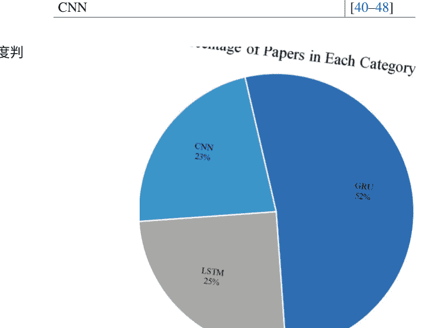

表3.1 使用深度判别模型讨论的研究列表

| 深度判别模型 | 参考文献 |
|--------------|----------|
| GRU          | [9-29]   |
| LSTM         | [30-39]  |
| CNN          | [40-48]  |

图3.2 使用RNN的基于会话的推荐系统的一般架构

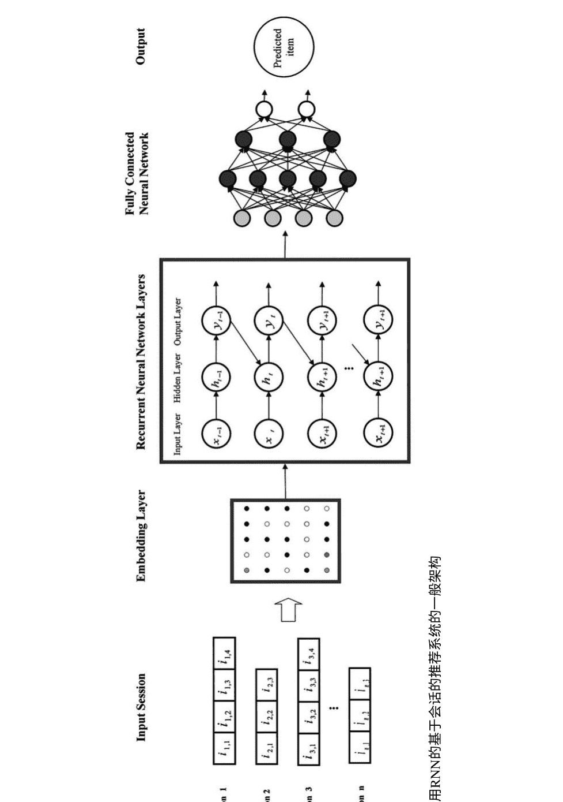

图3.3 使用CNN的基于会话的推荐系统的一般架构

```
Output
Predicted Item
Fully Connected Neural Network
Activation function
ReLU
Convolutions
Regularization
Activation function
ReLU
Convolutions
Embedding Layer
Input Session

Session 1: i_{1,1} i_{1,2} i_{1,3} i_{1,4}
Session 2: i_{2,1} i_{2,2} i_{2,3}
Session 3: i_{3,1} i_{3,2} i_{3,3} i_{3,4}
...
Session n: i_{n,1} i_{n,2} i_{n,3}
```

表3.2 使用深度判别模型的基于会话的推荐系统中广泛使用的数据集

| 数据集         | 领域     | 描述                                                                 | 参考文献                               |
|----------------|----------|----------------------------------------------------------------------|----------------------------------------|
| Diginetica     | 电子商务 | 该数据集包含从电子商务搜索引擎日志中提取的用户会话                   | [20, 22, 26, 29, 45, 46]               |
| YooChoose      | 电子商务 | 该数据集包含来自电子商务网站的6个月的点击流数据                     | [11, 20, 22, 26, 29, 33, 41, 45, 46, 48]|
| Gowalla        | POI      | 该数据集来自一个基于位置的社交网络网站，用户通过签到分享他们的位置   | [22, 42, 47]                           |
| Last.fm        | 音乐     | 该数据集包含来自Last.fm在线音乐系统的2K个用户的社交网络、标签和音乐艺术家收听信息 | [15, 16, 20, 22, 26, 27, 30, 41, 48]   |
| RecSys挑战2015 | 电子商务 | 该数据集包含有关用户与电子商务网站的会话的点击流数据               | [9, 13, 16, 17, 18, 21, 25, 28]        |
| 视频           | 视频     | 该数据集是从类似YouTube的OTT视频服务平台收集的，包括观看视频的事件   | [9, 14, 18, 21]                        |
| vidaXL         | 视频     | 该数据集是从类似YouTube的视频网站在2个月内收集的，包含观看视频的事件 | [10, 18]                               |
| 分类           | 电子商务 | 该数据集包含在线分类广告网站的产品浏览事件                           | [10, 18]                               |
| 内部           | 电子商务 | 它包含了用户在多个不同垂直领域的电子商务网站上的浏览和购买活动，时间跨度为3个月 | [11]                                   |
| XING           | 职位发布 | 这是XING RecSys Challenge 2016数据集，包含了对职位发布的互动 用户互动带有时间戳和互动类型（点击、收藏、回复和删除） | [14]                                   |
| Reddit         | 新闻     | 这是关于社交新闻聚合和讨论网站Reddit上用户活动的数据                 | [15, 27]                               |
| 天猫           | 电子商务 | 这是IJCAI-15挑战赛中发布的大型数据集，从中国最大的B2C电子商务网站天猫收集而来。它记录了两种类型的用户行为，浏览和购买 | [16, 24, 42, 47]                       |
| AOTM           | 音乐     | 该数据集包含来自Art of the Mix网站的用户贡献的播放列表               | [16]                                   |
| 8T             | 音乐     | 该数据集包含来自8tracks.com (8T)网站的用户贡献的播放列表             | [16]                                   |
| MovieLens      | 电影     | 它包含了用户对MovieLens网站上不同类别电影的顺序评分记录             | [19, 23, 36, 42, 44]                   |

### 表3.2 (续)

| 数据集 | 领域 | 描述 | 参考文献 |
| :--- | :--- | :--- | :--- |
| DoubanEvent | 电影 | 它是一个允许互联网用户分享对豆瓣电影网站上电影的评论和观点的中国网站 | [19] |
| Adressa | 新闻 | Adressa是一个包含用户阅读行为和会话的新闻数据集 | [23] |
| CiteULike | 研究论文 | 在CiteULike数据集中，一个用户在某个时间对一篇研究论文进行注释可能会有多条记录以区分不同的标签 | [30] |
| 广告数据集 | 广告 | 这是由中国在线广告平台阿里妈妈发布的公共数据集，包含了用户和广告在8天内的广告展示/点击日志记录 | [32] |
| 推荐系统dataset | 电子商务 | 该数据集包含阿里巴巴网站上用户和商品的许多展示/点击日志 | [32] |
| GHTorrent | GitHub | GHTorrent监控GitHub的公共事件时间线，并提供开发者之间丰富的社交关系以及开发者与软件仓库之间的开发交互。这是一个流行的协作社交编码平台GitHub | [35] |
| Libraries.io | 软件包 | Libraries.io提供软件包之间的明确依赖关系 | [35] |
| 珠宝 | 电子商务 | 它由销售珠宝产品的网站的产品查看事件组成。紧随其后的查看事件被特别标记为添加到购物车事件 | [40] |
| 电子产品 | 电子商务 | 它由销售电子产品的网站的产品浏览点击组成。带有以下添加到购物车的查看事件被标记 | [40] |
| Foursquare | POI | 该数据集包含在纽约和东京的签到数据，收集了约10个月。每个签到都与其时间戳、GPS坐标和语义含义相关联 | [42] |
| TW10 | 视频 | TW10是一个短视频数据集，每个视频的平均播放时间都不超过30秒 | [44] |
| Retailrocket | 电子商务 | 数据是从一个真实的电子商务网站收集而来的 这是原始数据，即没有进行任何内容预处理; 然而，由于保密问题，所有值都经过了哈希处理 | [45] |

### 表3.2 (续)

| 数据集 | 领域 | 描述 | 参考文献 |
|--------|------|------|----------|
| Ta-Feng | 电子商务 | Ta-Feng数据集包含了来自杂货店的许多购物篮，每个购物篮都包含了一个用户在一段时间内购买的物品 | [24] |

分别得到了ML30和ML100数据集 在每个数据集中，如果交互次数少于10次和少于20次，则该序列将被删除[44] Adressa数据集有两个不同的版本，一个是在1周内收集的，另一个是在3个月内收集的[51] 表3.3中呈现的信息与第二个版本的预处理数据相关，该版本与16天相关，并且已删除包含交互的会话此外，每个会话中的重复点击已被删除[49] 在Reddit数据集中，如果两次点击间隔超过1小时，则将它们放在两个单独的会话中[15]

### 3.2.2 评估

通常，会话推荐系统使用两种评估方法：在线和离线。在离线方法中，推荐系统对部分用户反馈不可见，但在线方法中，系统向实际用户展示推荐并接收其反馈。在每种方法中，使用各种评估指标来评估会话推荐系统，以便定量衡量和比较所提出方法的效率。根据所提出的方法和使用的数据集，选择一个或多个知名基准来比较结果。

会话推荐系统的输入数据通常是用户交互的序列，在离线评估方法中通常分为训练集和测试集。因为这种类型的系统无法访问用户的长期历史交互，所以他们选择最后N个会话进行测试，并基于此进行数据划分。在在线方法中，需要收集用户的反馈，通常是用户对定性问题的回答或基于类似生产环境的现场测试，并从大量用户中收集隐式反馈。通常，在学术研究中，进行大规模在线研究的可能性往往有限，与会话推荐系统相关的研究大多使用离线评估方法。

为了准确评估和比较所提出方法的结果，通常使用一些先前的方法，称为基准线。其中一些方法是使用传统的基于会话的方法开发的推荐系统技术，其他则利用深度神经网络。最常用的基准线如下所示：

- 流行：更受欢迎的物品总是被推荐。流行度同时有效且直观，通常是特定领域中的一个强基准。
- **S-POP**：推荐当前会话中最受欢迎的物品。推荐列表根据与特定物品相关的事件数量而变化。这个基准对于具有高重复性的领域非常有用。
- **Item-KNN**：推荐与实际物品相似的物品，并根据它们的会话向量的余弦相似度来衡量它们之间的相似性。换句话说，它是两个物品在会话中共同出现的次数除以各自物品出现的会话数的平方根。这种方法对于评估物品到物品推荐方法非常有效[52]。
- **BPR-MF**：它利用矩阵分解，通过随机梯度下降优化成对排名目标函数。基于矩阵分解的方法不能用于基于会话的模型，因为没有为新会话预先计算的特征向量。通过使用属于每个会话的物品的平均向量来解决这个问题[54]。
- **FPMC**：一种基于分解个性化马尔可夫链的下一个篮子推荐的混合模型[53]。
- **GRU4Rec**：一种基于循环神经网络的技术，是会话推荐系统中使用深度学习技术的最早方法之一。这种方法基于GRU，用于解决梯度消失的问题[9]。
- **GRU4Rec+**：这种方法是最近扩展GRU4Rec的方法之一，通过引入改进的采样策略模式[25]。
- **NARM**：一种改进的GRU4Rec方法，通过引入基于注意机制的混合编码器来改进会话建模。在这种技术中，定义了全局和局部编码器，全局编码器对应于GRU4Rec方法，局部编码器用于向模型中添加注意机制[55]。
- **STAMP**：这种方法基于短期注意/记忆优先模型，并且与NARM方法不同，它不是基于循环神经网络。在这种方法中，通过会话上下文的长期记忆数据获取用户的一般兴趣，并且通过短期记忆也能识别他们的短期兴趣。

需要注意的是，传统的评估方法是通过预测每个项目的用户评分来完成的。今天，与使用这些方法不同，对于每个用户，考虑一个有限大小的列表，例如10或20，该列表表示推荐列表顶部的项目数量。推荐列表的质量在测试集中，通过检查列表中相关项目的数量和排名来数值化地衡量推荐列表的质量。 以下是用于此目的的一些评估指标：

- 召回率：该指标基于推荐列表中前 $N$ 个相关物品的数量，以及相关物品在 $N$ 列表中的排名不重要，使用公式 (3.1) 计算：
$$
\text{召回率}@N = \frac{\text{前 } N \text{ 个相关物品中的相关物品数量}}{\text{总相关物品数量}} \quad (3.1)
$$
- 平均倒数排名 (MRR)：MRR关注推荐列表中相关物品的排名。它表明将相关物品置于推荐列表的顶部对用户满意度有显著影响，使用公式 (3.2) 计算：
$$
\text{MRR}@N = \frac{1}{Q} \sum_{i=1}^{Q} \begin{cases}
\frac{1}{\text{排名}_i} & \text{如果排名}_i \leq N \\
0 & \text{否则}
\end{cases} \quad (3.2)
$$
其中 $Q$ 是推荐列表的样本，排名$_i$指的是相关项目在第 $i$ 个推荐列表中的排名位置。
- 精确率 @ N：该指标评估了推荐列表中相关项目相对于总共 $N$ 个推荐项目的数量，使用公式 (3.3) 计算：
$$
\text{Precision}@N = \frac{\text{前 } N \text{ 个列表中的相关项目数量}}{\text{总共 } N \text{ 个项目}} \quad (3.3)
$$
- 覆盖率@N：它检查物品的覆盖率。物品覆盖率衡量了被推荐的物品的百分比，考虑了推荐列表中推荐物品的多样性。其目标是向用户推荐各种各样的物品。该度量是使用公式 (3.4) 计算的：
$$
\text{覆盖率}@N = \frac{\text{在任何前-}N\text{推荐中出现的不同物品数量}}{\text{所有不同的可推荐物品}} \quad (3.4)
$$
- 命中率@N：它是在前N个排名靠前的物品中检索到相关物品的百分比，使用公式 (3.5) 计算：
$$\text{命中率}@N = \frac{1}{Q} \sum_{i=1}^{Q} \begin{cases} 1 & \text{如果排名}_i \leq N \\ 0 & \text{否则} \end{cases}$$ (3.5)
其中 $Q$是推荐列表的样本，排名$_i$指的是相关项目在第 $i$个推荐列表中的排名位置。
- F1：这个指标是基于精确率和召回率的组合计算的，使用公式 (3.6) 计算：
$$F_1 = \frac{2 * \text{精确率} * \text{召回率}}{\text{精确率} + \text{召回率}}$$ (3.6)
- $nDCG_p$：该指标基于累积增益 ($CG$) 计算。累积增益是推荐列表中所有物品的相关性值之和。nDCG是折扣累积增益 ($DCG$) 与理想折扣累积增益 ($IDCG$) 之比。方程 (3.7) 、 (3.8) 和 (3.9) 展示了如何计算该指标：
$$DCGp = \sum_{i=1}^{p} \left( \frac{2^{r_i} - 1}{\log_2 (i + 1)} \right)$$ (3.7)
$$IDCGp = \sum_{i=1}^{REL_p} \left( \frac{r_i}{\log_2 (i + 1)} \right)$$ (3.8)
$$nDCGp = \frac{DCGp}{IDCGp}$$ (3.9)
在上述方程中，$r_i$表示位置 $i$处结果的相关性，$REL_p$表示相关物品列表（按相关性排序）直到位置 $p$。
- MAP：该指标计算平均准确率。实际上，在推荐每个相关物品之后，会测量准确率，并使用方程 (3.10) 计算平均值：
$$MAP = \frac{\sum_{q=1}^{Q} AveP(q)}{Q}$$ (3.10)
在这个关系中，$P(q)$是查询q的准确率，参数 $Q$是查询的数量。
- 平均绝对误差 ($MAE$)：这个指标是预测因素中最常见的错误之一，它计算系统预测分数与实际分数之间的平均绝对差值的绝对值项的实际分数之间的差值的绝对值的平均值。平均绝对误差指示了推荐结果与实际情况的接近程度，它使用公式（3.11）进行计算：
$$MAE = \frac{1}{N} \sum_{i \in O_u} |P_{u,i} - r_{u,i}| \qquad (3.11)$$
- 均方根误差（RMSE）：预测排名的均方根误差指标在错误更为显著的问题中比平均绝对误差更有效，使用方程（3.12）进行计算。
$$RMSE = \sqrt{ \frac{1}{N} \sum_{i \in O_u} (P_{u,i} - r_{u,i})^2 } \qquad (3.12)$$
在方程（3.11）和（3.12）中，$P_{u,i}$是用户u对物品i的预测评分，$r_{u,i}$是用户u对物品i的实际评分，$O_u$是用户u评分过的物品集合，$N$是系统进行的总预测次数。
- ROC曲线下的面积（AUC）：另一个用于确定推荐系统效率的重要指标是AUC。AUC值越大，最终系统性能评估越有利。ROC（接收器操作特性）空间由水平轴上的FPR和垂直轴上的TPR形成，分别由方程（3.13）和（3.14）计算。连接两个点（0,0）和（1,1）的线将ROC空间分为两部分。该线上方是有利区域，线下方是不利区域。因此，AUC是分类器区分类别能力的度量，并用作ROC曲线的总结。
$$TPR = \frac{\text{真正例}}{\text{真正例 + 假阴性}} \qquad (3.13)$$
$$FPR = \frac{\text{假正例}}{\text{假正例 + 假阴性}} \qquad (3.14)$$
该度量的最大值等于1，并且出现在理想的情况下，推荐系统能够识别所有正样本的情况下。与其他用于决定分类方法效率的度量不同，AUC度量与分类阈值无关。因此，该度量指示了系统的输出可靠性。

表3.4显示了不同文章中使用的基于会话的深度判别模型的评估指标。

### 表3.4 基于深度判别模型的SBRS中广泛使用的评估指标

| 评估指标 | 参考文献 |
| --- | --- |
| 平均倒数排名（MRR） | [9, 10, 12–23, 25–29, 30, 31, 34, 40, 41, 43–45, 48] |
| 召回率@n | [9–11, 13–15, 17–21, 23, 25, 27, 28, 30, 38, 40, 42, 57] |
| nDCG | [12, 24, 35, 41, 44, 48, 57] |
| AP | [42] |
| AUC | [12, 39] |
| 精确率@n | [14, 22, 26, 29, 38, 39, 42, 45] |
| 命中率@n | [16, 35, 41, 44, 48] |
| F1 | [24, 34] |
| 准确率 | [43] |
| RMSE | [43] |
| MAE | [27] |
| MAP | [39] |

## 3.3 使用RNN的会话推荐系统

在查看基于会话的推荐系统中递归神经网络模型的方法之前，提供了RNN、其变体以及使其成为SBRS的有效选择的原因的概述。

### 3.3.1 为什么使用RNN?

顺序方法直接对用户操作的顺序进行建模，而不依赖于特征或共现频率。具体来说，循环神经网络（RNN）是一类深度神经网络，已成功用于预测下一个项目[9]。RNN具有具有非线性动力学的隐藏状态，使其能够发现事件模式，从而预测下一个项目。除了项目的顺序外，还可以获得有关用户-项目交互的更多信息，例如交互类型、事件之间的时间间隔和交互时间。这些上下文信息可以显著改善下一个事件/项目的预测。例如，了解过去产品的事件类型或过去用户事件之间的不同时间间隔模式可以改变用户与下一个产品互动的概率。图3.4显示了下一个项目预测中不同的时间间隔模式。

在这个领域中，领先的研究是基于RNN的GRU4Rec [9]。在这个方法中，RNN是基于会话的特征进行训练的，比如与项目ID相关的点击，考虑到排名损失度量。然而，GRU4Rec只关注当前会话中的点击项目，而扩展模型还可以在会话期间结合其他用户行为，比如用户在会话中花费的时间长度或使用其他会话的顺序[18]。

图3.4 不同时间间隔模式对下一个项目预测的影响

## 3.3 使用RNN的会话推荐系统

今天，GRU4Rec经常被用作经验评估中的基准方法。

RNN也可以用于建模具有项目特征的内容以及点击序列的交互。通过考虑提取项目的特征，比如视频的缩略图或产品的文本描述，开发了一个并行RNN模型，提供了比简单RNN更好的推荐质量[10]。数据增强技术也可以用于提高基于会话的推荐系统中RNN的性能。在这些技术中，一个会话被分成几个子会话进行训练，尽管副作用是增加训练时间[25]。

RNN的主要特点是单元中存在隐藏状态，这些状态不仅与网络的当前输入相关，还与之前的输入相关。标准RNN的方程如下：

```
$$ h_t = \sigma_h(W_i x_t + U_h h_{t-1} + b_h) \quad (3.15) $$
$$ y_t = \sigma_y(W_y h_t + b_y) \quad (3.16) $$
```

在方程（3.15）和（3.16）中，x_t是输入向量，h_t是隐藏层向量，y_t是输出向量，W和U是权重矩阵，b是偏置向量。

标准RNN由于梯度消失和梯度爆炸问题无法学习长期数据依赖关系。因此，对RNN进行了改进的模型，如GRU和LSTM，通过向RNN网络添加门控函数，提供了有效的解决方案。随着时间的推移，研究人员提出了各种改进的LSTM和GRU模型。在这里，我们将简要回顾基本类型的GRU和LSTM模型的关系和方程。

在先进的SBRS中，使用一种特殊类型的门控RNN，即长短期记忆（LSTM）[58]，来建模依赖于时间数据[59]的用户和项目动态。门控机制用于平衡当前和之前时间步的信息流，因此可以更有效地随时间记忆历史信息以进行适当的推荐。

LSTM标准有三个门：f_t是遗忘门，用于指定要遗忘多少先前的数据，i_t是输入门，用于评估要存储在内存中的数据，o_t是输出门，根据可用的数据和信息决定如何计算输出。

```
$$ i_t = \sigma(W_i x_t + R_i h_{t-1} + b_i) \quad (3.17) $$
$$ f_t = \sigma(W_f x_t + R_f h_{t-1} + b_f) \quad (3.18) $$
$$ o_t = \sigma(W_o x_t + R_o h_{t-1} + b_o) \quad (3.19) $$
```

在方程（3.17），（3.18）和（3.19）中，参数W, R和b是矩阵和向量，其元素可以进行训练。LSTM单元基于方程（3.20）-（3.23）定义：

```
$$C_t = \text{tanh} (W_c x_t + R_c h_{t-1} + b_c ) \qquad \qquad \qquad (3.20)$$
$$C_t = (f_t \odot C_{t-1} + i_t \odot \tilde{C_t} ) \qquad \qquad \qquad \quad \ (3.21)$$
$$h_t = o_t \odot \text{tanh}(C_t) \qquad \qquad \qquad \qquad \qquad \qquad (3.22)$$
$$y_t = \sigma(W_y h_t + b_y ) \qquad \qquad \qquad \qquad \qquad \quad \ (3.23)$$
```

候选细胞状态 \(\tilde{C_t}\)基于输入数据 \(x_t\)和上一个隐藏状态 \(h_{t-1}\)进行计算。细胞记忆或当前细胞状态 \(C_t\)通过遗忘门 \(f_t\)，上一个细胞状态 \(C_{t-1}\)，输入门 \(i_t\)和候选细胞状态 \(\tilde{C_t}\)获得。符号 \(\odot\)表示逐元素乘积。输出 \(y_t\)基于权重 \(W_y\)和偏置 \(b_y\)对应于隐藏状态 \(h_t\)进行计算。

图3.5显示了LSTM单元的内部结构。

特别是为了能够有效提取高阶时间动态，可以使用门控循环单元（GRU）网络[59]。这种网络需要比处理消失/爆炸梯度问题的RNN单元更准确的模型。由于模型的简单性、复杂度降低和计算成本较低，GRU在RNN网络应用领域被广泛使用。在这种类型的网络中，遗忘门和输入门被合并以创建更新门。然而，细胞状态和隐藏状态也被合并。

简言之，GRU有两个门：更新门 \(u_t\)和重置门 \(r_t\)。更新门设置隐藏状态的更新速率，重置门决定要忘记多少过去的信息。方程（3.24）–（3.28）显示了GRU的基本公式。

```
$$u_t = \sigma(W_u * x_t + R_u * h_{t-1} + b_u)$$
$$r_t = \sigma(W_r x_t + R_r h_{t-1} + b_r)$$
$$h'_t = \tanh(W_h x_t + r_t \odot h_{t-1} + R_h + b_h)$$
$$h_t = (1 - u_t) \odot h_{t-1} + u_t \odot h'_t$$
$$y_t = \sigma(W_y h_t + b_y)$$
```

图3.6显示了GRU单元的内部结构。

阅读上述内容后，可能会想到一个问题，对于基于会话的推荐系统的数据建模，哪种RNN网络模型更好选择。在一些研究中，比如[59]，这个问题已经得到了解答，并提到迄今为止，没有科学研究明确说明某个模型在一般和全面的情况下的优越性。尽管GRU由于参数数量较少而创建更快的模型，但如果您拥有足够的计算能力和足够的输入数据，LSTM可能会表现更好[58, 60]。

在下面的两个小节中，将讨论和分析基于GRU和LSTM的不同方法，以使读者熟悉每个模型的优缺点。

### 3.3.2 GRU方法

深度神经网络在基于会话的推荐系统中的首次使用是在2016年，当时使用了基于RNN的模型[9]。这种方法，GRU4Rec，使用了GRU网络来有效地建模更长的会话以解决梯度消失问题。

GRU4Rec的输入数据是使用one-hot编码方法对项目进行编码的向量，每个向量的长度等于项目的数量。输出是GRU4Rec对固定数量项目的预测分数。换句话说，该方法的输出是当前会话中下一个项目的机会。GRU4Rec的总体架构如图3.7所示。Hidasi等人开发了一种高效的方法，称为会话并行小批处理，首先，前x个会话的第一个事件创建长度为x的第一个小批处理的输入，其考虑的输出是会话的第二个事件。第二个小批处理理由前x个会话的第二个事件组成，其输出是会话的第三个事件。如果任何会话的事件结束，则将下一个可用会话列表中的第一个事件替换。应该提到的是，假设会话是独立的，当会话被替换时，隐藏状态会被重置。这个过程的视图如图3.8所示。由于项目数量庞大，计算每个阶段中每个项目的分数非常困难。因此，使用负采样方法来计算一些负样本的分数，除了生成的输出之外，并更新权重。

在GRU4Rec中，损失函数的适当选择是一个关键决策，它极大地影响了推荐的质量。在[9]中提出的损失函数如下：

- 贝叶斯个性化排序（BPR）：BPR是一种矩阵分解方法，使用成对排名损失。该方法将一个理想（正面）项目的得分与负样本的得分进行比较。在[9]中，将正面项目的得分与负面项目进行比较，并使用它们的平均值作为损失。给定会话的损失根据公式（3.29）计算：

$$L_s = -\frac{1}{N_s} \cdot \sum_{j=1}^{N_s} \log \sigma (\widehat{r}_{s,i} - \widehat{r}_{s,j}) \quad \quad \quad (3.29)$$

在公式（3.29）中，$N_s$是样本数量，$\widehat{r}_{s,k}$是给定会话中项目 $k$的得分，$i$是期望项目的索引，$j$是负样本的索引。

- TOP1：该函数是相关项目的规范化近似排名\(\widehat{r}_{s,i}\)的。损失是基于公式（3.30）计算的：

$$L_s(\widehat{r}_{s,i}, S_N) = \frac{1}{|S_N|} \cdot \sum_{j \in S_N} \sigma (\widehat{r}_{s,j} - \widehat{r}_{s,i}) + \sigma (\widehat{r}_{s,j}^2) \quad \quad \quad (3.30)$$

在GRU4Rec中创建的基础上，Hidasi等人提出了一种类似的基于会话的推荐系统[10]。除了与用户交互相关的会话数据外，还考虑了点击项目的特征。通常，在没有用户历史数据的情况下，项目的描述和图片等特征对用户的购买行为非常有效。因此，Hidasi等人使用从图片和描述中提取的高质量特征，以及基于深度学习技术对会话进行建模。实际上，与GRU4Rec类似，它基于RNN对会话（用户点击的序列）进行建模，但该方法使用的网络类型是并行循环神经网络（parallel-RNN），同时对点击项目的文本和视觉特征进行建模。图3.9显示了并行-RNN架构。

使用并行RNN的原因是输入数据的本质不同。图像的特征比项目ID的独热表示或项目文本的BOW表示更密集。并行RNN允许每个网络具有自己的配置，同时通过共享参数保持网络之间的通信。在本章中，介绍了三种不同的并行RNN配置；在第一种类型中，每个GRU都使用其中一种数据表示进行训练，并通过连接子网络的隐藏层来计算输出。在第二种类型中，输出权重矩阵有一个共享的隐藏层，每个子网络的得分通过隐藏状态的加权和乘以一个单一的权重矩阵来计算。这种类型的参数较少。在第三种类型中，在计算每个子网络的得分之前，将项目特征的子网络的隐藏状态与项目ID的子网络的隐藏状态相乘。这种方法比利用较少特征和会话的类似模型更有效。

Hidasi等开发了一个合适的损失函数，通过将不同的数据添加到GRU4Rec中并使用更多的样本来改进结果[18]。观察结果表明，从一个小批量中限制选择负样本会导致低flexibility。因此，已经开发出一种更高效的解决方案，通过从小批量外部采样更多的项目并与所有小批量共享它们来选择负样本。一个超参数控制是否使用均匀采样或基于流行度的采样来选择外部样本。此外，还使用了一系列用于RNN的ranking-max损失函数，它替换了应用于所有采样项目和目标项目的平均成对排名损失函数。这个损失函数通过将目标项目与最相关的样本分数进行比较来计算损失。此外，这种方法通过增加样本数量来解决梯度消失问题。

Quadrande等人通过用户会话之间的信息进行个性化RNN的研究，使用了分层神经网络[14]来改进GRU4Rec。该方法基于两个GRU的层次结构，即会话级和用户级。会话级GRU模型对会话中的用户交互进行建模，用户级GRU模型考虑了用户偏好随时间的演变。图3.10展示了该方法的示意图。

在分层神经网络中，较低级别RNN的隐藏状态在用户会话结束时作为输入传递给较高级别RNN。该函数预测了下一个用户会话的较低级别网络的隐藏状态的有效和可接受的初始化。通过添加一个模拟不同会话中用户活动的GRU层，扩展了所提出的方法。它考虑了用户个人兴趣随时间的变化，以提供推荐。

另一种基于循环神经网络的方法是跨领域的会话推荐系统，通过联合建模用户的全局动态兴趣和他们的本地领域特定行为序列，从不同领域中同时探索用户的会话间和会话内行为动态（CDHRM：跨领域分层循环模型）[19]。尽管将不同领域中用户行为的组合对于向用户提供高质量的推荐非常有效，但从两个方面来看具有挑战性，包括不同领域中行为的差异和异步行为。为此，提出了一种跨领域分层循环模型，用于整合各个领域的顺序信息，图形表示如图3.11所示。首先，使用一个用户级跨领域循环神经网络，该网络接收来自各个领域的所有会话输入，以通过会话间动态建模确定用户全局兴趣的动态。然后，开发了两个会话级跨领域循环神经网络，分别用于检测不同领域内的会话内动态。为了捕捉不同领域事件的异步信息，用户级RNN允许信息按时间顺序与会话级RNN共享。最后，用户级和跨领域会话级的信息被合并，为用户生成最终推荐。

胡等人开发了一种使用RNN的基于会话的推荐系统，该系统采用了设计为两个阶段的用户偏好演化网络（PEN4Rec：基于会话的推荐的偏好演化网络）[26]。基于先前的上下文对用户兴趣的演化过程进行建模。首先，将用户-项目行为编码在会话图中，以检测多跳邻居连接下的复杂项目转移，然后通过两步检索提取用户的偏好。PEN4Rec的架构如图3.12所示。

如上图所示，在PEN4Rec的第一阶段中，通过基于注意机制的方法，将最近项目的先前行为上下文中的相关行为根据本地偏好进行整合。最后的K个项目被视为本地偏好，因为下一个项目可能与这些K个项目的一部分相关。然后，通过软注意机制将相关行为整合起来以检测全局偏好。

在PEN4Rec的第二阶段中，动态建模用户随时间变化的偏好以及偏好演化的原因。在第二阶段中，有两个关键层：阅读器层和偏好融合层。在会话阅读器层中，使用自适应双向GRU神经网络记录每个项目的上下文信息。双向GRU允许从相邻上下文中获取当前会话的空间信息。偏好融合层使用经过修改的GRU神经网络，通过注意机制的嵌入信息更新GRU的内部状态，以增加对与偏好演化相关的行为的关注，并减少对不相关行为的影响。该方法的优点是通过考虑偏好的演化轨迹，使用相对先前信息对最近偏好进行建模，并更好地预测下一个项目。

在推荐系统中，最广泛使用的一种过滤方法是协同过滤，它需要历史数据来提供推荐。当数据不足时，它将面临冷启动问题[61]。克服这个问题的一个解决方案是基于会话的方法，它利用用户在当前会话中的最近行为信息来提供推荐。为此，Vikram等人开发了一个基于深度学习的框架，称为Session RNNRec，它使用RNN来建模用户会话[21]。在SessionRNNRec中，Web应用程序的会话作为输入接收，并通过会话并行小批量方法组织事件。然后，使用改进的GRU对会话进行建模。在这种类型的GRU中，激活函数是根据候选函数和先前激活函数之间的线性插值来选择的。并使用小批量进行训练。在SessionRNNRec中生成的推荐实际上是每个会话中的下一个项目。

顺序数据的稀疏性和提供给用户推荐所需的数据的缺乏，导致提出了一种新的基于上下文的推荐系统，将上下文信息与稀疏的顺序数据[23]放在一起。网络的输入是会话，输出是会话中的下一个项目。

该方法包括四个步骤；在第一步中，会话的上下文信息，包括用户的国家和设备类型，通过one-hot方法进行编码。然后，编码向量从高维向量空间映射到低维的数值向量，便于神经网络提取和总结特征。然后，数据与Add、MLP和Stack中的一个进行组合。在Add方法中，向量直接叠加，它们的维度不增加，但向量的维度必须相等。在Stack方法中，向量叠放在一起，神经网络的输入或输出维度增加，需要更多的计算资源进行处理。最后的解决方案是使用MLP网络，它基于权重矩阵的计算创建一个组合向量。这种解决方案的缺点是需要大量的计算资源和学习过程的困难。然后，在下一步中，向量被融合到GRU网络中，并由该网络进行处理和建模。建议在每个会话的开始时初始化GRU隐藏状态，这样可以减少计算资源的使用。

### 3.3.3 LSTM方法

在使用深度学习的基于会话的推荐系统中，对LSTM网络引起了很多关注和接受，因为这些类型的深度神经网络能够有效地为用户提供推荐。这些推荐通常比之前的顺序方法提供更精确的结果。

Lenz等人提出了一种基于LSTM的方法，该方法在向量空间中生成物品的表示[31]。物品的向量空间表示被用作推荐系统的输入。学习物品的向量空间表示可以正确识别物品之间的关系。与其他使用额外网络进行学习的向量空间表示不同，这种方法不需要预先训练物品的特征，并且可以端到端地进行训练。通过使用这种嵌入方法，物品以高维度的连续向量空间呈现，可以表示产品的多个关系。与此相反，基于LSTM的嵌入方法是一种独热编码方法，它创建了非常稀疏的物品表示向量。此外，所提出的方法大大降低了与独热编码方法相比的计算复杂性。

Dobrovolny等人研究了将LSTM网络作为会话推荐系统的深度学习技术[38]。该研究提出了一种使用基于单词级LSTM的实时推荐服务的解决方案。为了使输入数据适合LS TM建模，数据应该被转换为一系列步骤。例如，如果有一个用户喜欢的新闻列表，可以将其从列表转换为序列，并且对于每个用户，将其视为包含他/她喜欢的新闻ID的句子。在这种方法中，每个用户在一定时间内都有一段喜欢的历史记录，基于这些记录可以预测用户喜欢的下一条新闻。[38]中提出的基于会话的系统由嵌入、LSTM网络和密集层三个主要组件组成。在单词嵌入阶段，使用特征学习技术将单词转换为数值向量。

在下一步中，使用两层LSTM来处理和建模数据。密集层的设计是为了预测下一个推荐给用户的类别数量。为了改进在单词级别上提出的方法，[36]中提出的方法在字符级别上进行嵌入，可以处理更大的数据集。

将LSTM作为推荐系统的主要模型需要有足够的数据，并且如果可能的话，应该能够访问类之间的关系。在小数据集上使用LSTM会导致过拟合或生成一个弱而低效的模型。因此，在基于会话的推荐系统中使用额外的信息可以提高准确性。在[35]中，为了检测软件开发者（用户）的动态兴趣，利用了它们的依赖约束和社交影响，并提供了一个基于会话、社交和依赖感知的软件推荐系统（SSDRec）。该系统基于用户的社交影响和软件包（项目）之间的依赖关系，包括两个基于注意力的图网络。

这些网络分别用于检测项目之间的依赖关系和用户的社交影响，并形成一个用于建模开发者在每个会话中的短期动态兴趣的循环LSTM神经网络。

SSDRec的架构如图3.13所示。

1. 依赖约束：通过使用基于注意力的图网络，检测软件包之间的依赖关系，并为每个软件包嵌入一个表示向量。
2. 动态兴趣建模：使用LSTM循环神经网络对会话中软件包的顺序进行建模，并获得每个软件开发者在每个会话中兴趣动态的嵌入向量表示。LSTM网络的输入是与软件开发者相关的会话和软件包的表示向量，其中会话包括每个软件开发者查看的一组按时间排序的软件包。LSTM网络从当前输入和先前输入的软件包顺序中递归学习潜在表示。
3. 社交影响检测：在这个组件中，使用图注意力网络根据其他邻居开发者（朋友）获得每个开发者的社交影响。基于这个图，创建嵌入向量来表示每个开发者。

Probability distribution:

-   package 1
-   package 2
-   package 3
-   package 4
-   package 1

Prediction model

(4) Recommendation

RNN:

Session S_u:

Dynamic interest

Concatenation

(1) Dependency constraint

(2) Dynamic interest

(3) Social influence

图3.13 SSDRec的架构

## 3.3 使用RNN的基于会话的推荐系统

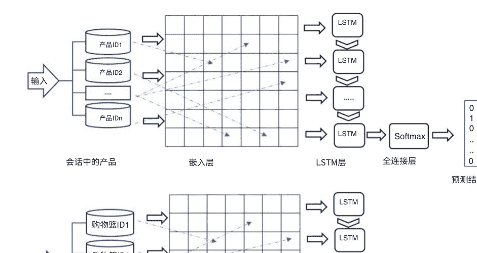

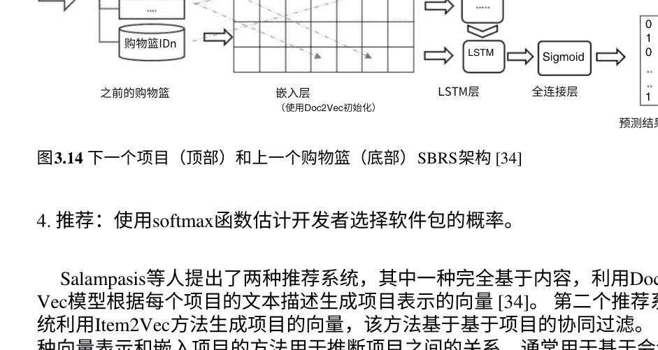

图3.14 下一个项目（顶部）和上一个购物篮（底部）SBRS架构 [34]

Salampasis等人提出了两种推荐系统，其中一种完全基于内容，利用Doc2Vec模型根据每个项目的文本描述生成项目表示的向量 [34]。第二个推荐系统利用Item2Vec方法生成项目的向量，该方法基于基于项目的协同过滤。这种向量表示和嵌入项目的方法用于推断项目之间的关系，通常用于基于会话的推荐系统。最后，在本文中，提出了一种基于Doc2Vec和Item2Vec的组合嵌入方法，除了考虑项目内容外，还考虑了项目之间的模式顺序。LSTM循环神经网络被视为所提方法的核心组件，其中LSTM的输入由上述各种嵌入方法之一在每个系统中生成。图3.14显示了下一个项目和上一个购物篮SBRS的架构。

在[34]中，除了选择嵌入方法和物品的向量表示类型外，还研究了下一个物品推荐和下一个篮子推荐两个任务。LSTM在使用基于内容的方法的下一个物品推荐系统中表现出更高效的性能，但它在篮子里不太高效。评估结果显示，Doc2Vec和Item2Vec与LSTM网络的组合并没有提供更好的结果。

在许多最近发表的研究中，时间间隔被视为显式组成部分，并用于会话学习过程中。然而，多个先前级别的影响没有被考虑；相反，只考虑了有限长度的序列。为此，Fuentes等人将顺序预测问题建模为基于LSTM的多类别分类问题[37]。DeepCBPP方法从购买交易历史中自动学习行为模式，并预测下一个购买项目或下一个项目所属的类别。DeepCBPP的架构包括四个部分：交易数据、客户序列file、LSTM训练模型输入和训练模型的输出。这些组件构成了DeepCBPP的三个阶段的输入和输出，分别是客户购买序列转换、多级偏好生成和偏好购买学习。

LSTM层能够学习时间依赖性，但是一系列的LSTM更适合处理基于时间的序列数据。为了实现这个目的，DeepCBPP中使用了编码器-解码器和堆叠的LSTM的组合，如图3.15所示。LSTM编码器处理顾客偏好输入并生成一个编码状态。LSTM解码器使用编码状态生成一个输出。DeepCBPP的评估结果显示，多层LSTM可以提高推荐系统性能的准确性和稳定性。事实上，一种新的序列顾客呈现方法被提出作为数据转换过程的基础，这种方法允许在序列长度可能有限且交互更依赖于之前会话的情况下进行处理。

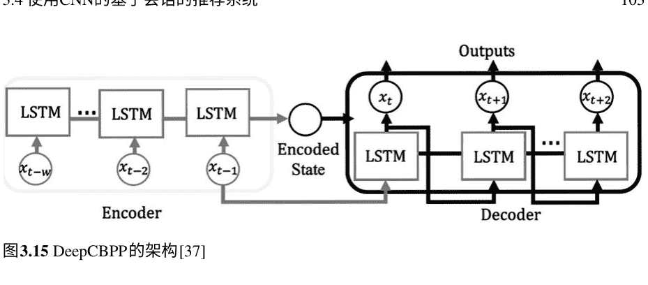

图3.15 DeepCBPP的架构[37]

## 3.4 使用CNN的基于会话的推荐系统

在研究基于会话的推荐系统中卷积神经网络模型的方法之前，提供了CNN的概述以及使其成为SBRS的有效选择的原因。

### 3.4.1 为什么使用CNN?

卷积神经网络（CNN）是一种神经网络架构，在机器视觉、语音识别和自然语言处理方面取得了先进的结果。通过在不同粒度的层级上应用卷积操作（称为卷积核或 filters），CNN模型可以从数据学习任务中提取有用的空间和时间特征，并减少对手动特征工程的需求。这个特定的特性在SBRS中非常需要，因为目标是从点击流中提取有用的模式并预测下一个事件。一个模式可以是一系列点击，一系列与产品相关的类别或名称，或者所有提到的项目的特定组合。

CNN在处理用户会话方面有两种方式的用途：

- (1) 可以轻松地在CNN上实现和建模一个会话中的项目序列或不同会话之间的项目序列。
- (2) 它们具有学习分割区域的局部特征或不同区域之间特定关系的高能力，基于这些特征，它们可以识别其他模型通常忽略的依赖关系。

一般来说，在基于会话的推荐系统中，为了学习和建模与用户和物品相关的数据，输入数据必须适当地嵌入以使用卷积和池化层来检测它们之间的时间和空间模式。根据从输入数据中获得的特征和它们之间的依赖关系，预测用户的喜爱物品。为此，假设每个交互由一个d维向量表示，并且每个会话的嵌入矩阵（包括n个交互）被视为E∈R^{d×|c|}。然后，在水平卷积层中，通过将第x个滤波器F然后从矩阵E的顶部卷积到末尾，得到a然后然后的值，如下所示（在第m次卷积中，基于第x个滤波器）：

$a_{\square} = \varphi( E[m, m+h] \odot F_h c )$ \quad (3.31)

在方程（3.31）中，φ_α指定了卷积层的激活函数。通过对卷积结果应用最大池化，得到最终输出 α^x = α_1^x, α^x ∈, ..., α^{|c - h + 1}的值。通过使用方程（3.32），旨在获取会话的最显著特征：

$e_c = \max\{ \max(\alpha^1), \max(\alpha^2), \ldots, \max(\alpha^c) \}$ \quad (3.32)

事实上，e_c是会话交互的一种表示。会话推荐的CNN的一般架构如图3.16所示。在该图中，x_1 to x_11表示会话的项目嵌入向量，是一维向量，卷积层应用于这些数据以扫描和检查会话数据。

与循环神经网络（RNN）相比，卷积神经网络（CNN）的训练不依赖于先前的时间戳计算，因此可以在序列中的每个元素上进行并行计算。

### 3.4.2 CNN方法

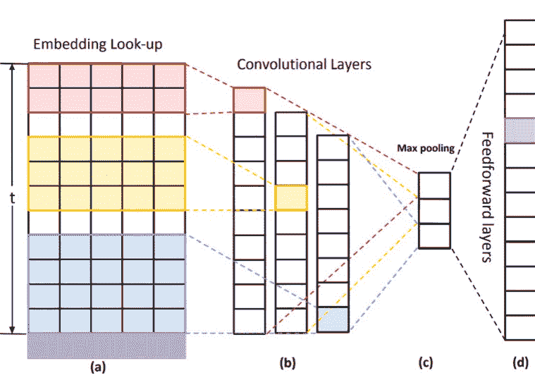

Tuan等人是会话推荐系统领域中使用CNN的先驱之一，并提出了一种基于字符级嵌入和3D-CNN的方法[40]。二维卷积神经网络（2D-CNN）和三维卷积神经网络（3D-CNN）的主要区别在于3D-CNN在三个维度和三个轴上对立方体数据结构进行卷积和池化操作，而2D-CNN仅在两个维度上进行操作。使用字符级嵌入来表示概念并将其转换为数值表示的模型可以轻松地对不同类型的数据进行建模并执行特征工程阶段。

每个输入特征都基于字母数字格式（由字母a到z、数字0到9和一些特殊字符如@、$、-等组成），无需进行分类嵌入，而是成为一个向量。因此，每个项目被视为一个二维结构：一个维度是特征，另一个维度是字符。它们以每个会话的交互顺序为基础，表示为三维结构，实际上是用户访问项目的时间顺序。因此，为了获得输入数据的空间和时间特征，在堆栈中使用了几个3D卷积层，这些层在每个步骤中应用于特征图和3D卷积算子的3D核之间。对于每个卷积层，都有几个核，核的结果是特征图，用于后续层。

此外，在[40]中使用了残差连接。有两种类型的残差连接：相同维度的输入和输出应用身份连接，而投影连接用于减小距离。

通过使用步长为2的1*1卷积来对样本进行实现。输出表示一个具有项目数量长度的向量，显示用户选择它们的概率。通用架构3D-CNN SBRS如图3.17所示。

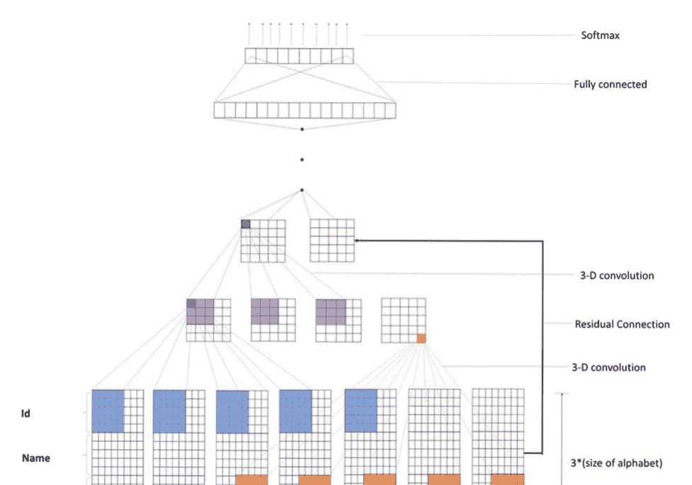

图3.17 3D-CNN SBRS的图形表示[40]

Yuan等人提出了顺序卷积技术，以克服会话推荐系统中会话长度和交互数量增加的挑战[41]。在本章中，提出了一种简单而基本的方法，可以对非常长的序列进行建模，尽管存在复杂的条件分布。该模型 first明确地编码了项目之间的依赖关系，以估计输出序列的分布。然后，它在彼此之上堆叠了扩张的一维卷积层，以增加建模长期依赖关系时的感受野。

扩张卷积神经网络已经被用于图像生成、翻译、音频等领域的预测；然而，在推荐系统领域，直到本章的出版之前，它还未被使用。为了优化这个深度架构，残差网络被用来覆盖卷积层与残差块。为了创建这种方法的输入矩阵，卷积神经网络将用户-物品交互存储在一个矩阵中，并将该矩阵视为潜在空间中的图像。

在这种方法中，卷积神经网络将用户-物品交互存储在一个矩阵中，并将该矩阵视为潜在空间中的图像。该方法的另一个要点是提出了一种基于掩码的一维扩张卷积的丢弃技巧，以克服信息泄漏的问题，该问题会阻止网络看到未来的项目。

唐等人使用CNN学习顺序特征，并采用潜在因子模型学习用户特定特征[42]。多层Caser（卷积序列嵌入推荐模型）网络的目的是检测用户的一般兴趣和顺序模式，包括联合和点级别，并观察用户在未观察到的空间中的跳过行为。

如图3.18所示，Caser由三个组件组成：嵌入查找表、卷积层和全连接层。为了训练卷积神经网络的每个用户u的层L，连续的项目和T的下一个项目从序列S"u中提取作为输入，如图3.18左侧所示。这是通过在用户'的序列上滑动长度为L+T的窗口来实现的，每个窗口都是用户u的训练样本，由三元组表示（u，前L个项目，后T个项目）。

袁等人改进了[41]中提出的扩张卷积神经网络，通过使用掩蔽卷积算子构建了一个间隙填充的编码器-解码器框架，可以同时考虑过去和未来的上下文数据，避免数据泄漏[35]。在这种方法中，编码器将部分完整的会话序列作为输入，解码器根据编码表示预测掩蔽的项目。在提出的方法中，编码器应同时考虑由未掩蔽操作表示的用户'的一般兴趣，并且解码器根据用户'的先前上下文和编码的一般用户兴趣预测下一个项目。

在[44]中使用的具有稀疏内核的卷积神经网络具有两个主要优点：(1)提供自回归机制以创建序列，(2)创建编码的双侧上下文。此章中提出的投影神经网络增加了编码器和解码器之间的表示带宽。编码器采用一组堆叠的一维扩张卷积神经网络实现，其中两个扩张层都覆盖了残差块，以避免梯度消失。解码器还包括嵌入层、投影器和非正式卷积神经网络。

一种特殊类型的卷积网络(TCN：时间卷积网络)已经在一些最近的模型中使用，可以检测会话中非相邻项之间的依赖关系并平衡差距。

在这方面，Ye等人提出了一种基于会话的推荐系统，除了会话内的信息外，还使用跨会话信息提供推荐项(CA-TCN：跨会话感知时间卷积网络)[46]。跨会话信息有两种类型，一是与当前项具有共同特征的另一个会话中的项，二是会话的上下文，它指定了与当前会话的用户类似的用户的兴趣。在项目级别上，创建了一个从全局到每个项目的有向项目图，以考虑相互会话对每个项目的影响。在会话级别上，创建了一个图形以跨会话，每个边表示两个会话之间的相似度。

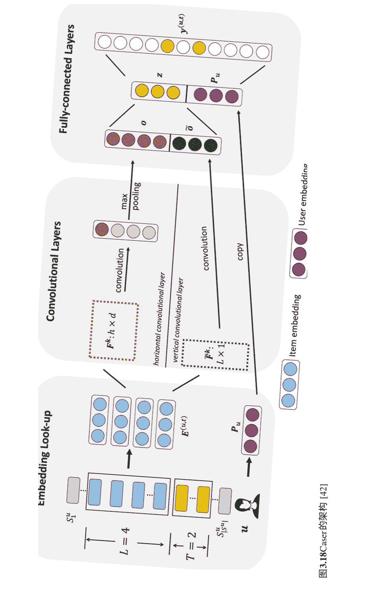

TCN是一系列卷积模型，其中在卷积操作期间保留了顺序信息，因为相同的项目在不同的时间具有不同的表示。TCN可以利用项目之间的直接影响，并解决长期依赖和缺乏顺序数据的问题。实际上，通过使用TCN，可以对长期项目进行卷积操作，并且可以将顺序信息纳入此操作过程中。实际上，在本章中，提出了一种基于项目级别和会话级别的分层注意力模型，同时考虑了项目和会话的影响。

尽管使用深度学习方法的基于会话的推荐系统中提出的方法已经获得了高效的结果，但仍然存在两个基本挑战：（1）嵌入层结果中每个维度的值都分布在非零均值上，非常大的数值差距增加了梯度的方差，阻碍了参数的优化，最终导致不正确的推荐。（2）以前的模型无法有效且正确地学习关于长期依赖的信息，也无法识别会话中非相邻项目之间的依赖关系。

在[45]中，为了解决这些问题，使用了另一种类型的时间卷积神经网络来平衡数值间隔。在这种方法中，嵌入层的结果首先进行了归一化，然后将在单位超球面上获得的结果限制在一定范围内，以减小其对梯度计算的影响。最后，使用TCN完成多层自注意力网络以学习会话顺序。

## 3.5 讨论

本章讨论的提出的方法为基于会话的推荐系统提供了不同的模型，利用了深度判别技术之一，如GRU、LSTM、CNN和CNN的变体。由于会话数据的顺序性质，大部分工作使用GRU和LSTM循环神经网络。通过提出GRU4Rec方法，为基于会话的推荐系统中RNN的使用开辟了新的道路。此外，最近还开发了其他方法，如[9, 14, 18]，以改进GRU4Rec。

GRU4Rec采用会话并行小批量技术来加速学习过程，这是该方法和类似方法的关键优势。

然而，GRU4Rec在新环境中的一个限制是模型只能推荐训练集中的物品，因为该模型是训练用于预测有限数量物品的分数。此外，基于RNN的方法（如[16]）可能不会比更简单的方法在性能和预测准确性方面有所改进，因为它们在学习过程中使用物品标识符而不考虑任何其他的附加信息[55]。为了解决这些问题，最近提出的方法在这个领域使用额外的数据和其他深度学习技术来提取特征并将其嵌入到物品和用户表示中，以便在分析和建模过程中考虑各种特征并推荐具有高准确性的物品。

诸如[9, 14, 18, 42]的方法没有考虑物品的部分特征，这可能导致在忽略上下文数据的情况下错误地检测用户兴趣。 因此，如上所述，额外的信息有助于提高基于会话的推荐系统的性能。 为此，像[10]这样的研究利用了GRU4Rec与额外的信息，如图像和图像描述，以及物品标识符。这提高了系统的性能并减少了冷启动问题。 此外，[23]的评估结果还展示了上下文数据在提高基于会话的推荐系统性能方面的影响。 此外，增加更相关物品的排名，减少噪声数据的影响，从而增加模型的稳定性，是使用上下文数据的优势[23]。

增加数据量的另一种方法是在各种上下文中使用用户和物品数据。 例如，[19]中的作者还使用了来自多个领域的信息来提供有用的推荐。 尽管考虑用户在不同领域中的行为变化对于推荐质量是有效的，但需要考虑两个主要挑战：不同领域中的行为差异和异步行为。

[14]中对GRU4Rec的另一个改进是使用了一个额外的GRU层，利用了GRU网络的层次结构，考虑了每个会话内部和会话之间的依赖关系。 尽管这种方法取得了一些成功，但它没有考虑用户交互的随机性，因此在某些情况下可能无法正确预测用户当前的目标。

一些基于会话的推荐系统，如[31, 34–38]，使用LSTM网络对数据进行建模。 例如，在[31]中，LSTM用于嵌入信息，并且物品以高维连续向量空间呈现，可以涵盖多个关系。 与基于LSTM的嵌入方法相对的是一种独热编码方法，用于表示物品嵌入的稀疏向量。 然而，与独热编码相比，计算复杂度大大降低。 一些方法，如[36]和[38]，还使用了字符级LSTM和词级LSTM进行数据建模。 值得一提的是，词级LSTM技术只适用于小型数据集，而字符级LSTM对于大型数据集效果更好。

考虑到使用额外数据进行更好建模的优势，[35]中的作者使用用户的社交数据和基于LSTM和图的关系获得了合适的结果。 这种方法在长会话中的效率较低，因为短会话包含短期动态兴趣，而长会话代表长期静态兴趣。

使用LSTM和基于内容的方法来推荐下一个项目可以实现高效的性能[34]，但对于下一个篮子推荐系统的性能较弱。 调查和结果表明嵌入方法，如Doc2Vec和Item2Vec，并将它们与LSTM网络一起使用并不能提供更好的结果。

在一些方法中，使用改进的经典网络模型，例如[37]中的堆叠LSTM。评估结果显示推荐系统的准确性和稳定性有所提高。这种方法允许在序列长度较短且交互更多依赖于前一个会话的情况下处理多级交互。但是，由于堆叠LSTM的特性，这种方法显著复杂。通常，RNN被认为是顺序数据最有效的技术。然而，基于CNN的方法的有效性表明CNN也是一种适合建模顺序数据的架构，特别是当序列元素与复杂特征相关联时。在与此领域相关的一些研究中，使用了CNN的标准模型[42]，但在其他一些方法中，如[40, 41, 44-46]，改进的CNN类型，如3D-CNN，扩张CNN和时间CNN已被使用。通过使用3D-CNN，数据之间的时间和空间特征可以同时提取和建模，根据会话中数据的顺序。此外，不再使用one-hot向量，而是使用字符级嵌入方法，这需要更少的参数，但是该方法的输入张量具有固定大小，因此文本数据的长度和最大会话点击数有限制。

扩张的一维卷积层在[41]和[44]中使用，当叠加在一起时，可以增加对长期依赖关系的建模能力。此外，他们提出了一种基于掩码的一维扩张卷积的dropout技巧，以解决信息泄漏问题，防止网络看到未来的项目。

一些方法使用时间卷积神经网络，如[45, 46]，可以建模项目之间的直接影响，并解决长期依赖和序列数据缺失的问题。此外，使用跨会话可以考虑其对每个项目的影响。

单领域会话推荐系统专门处理特定领域，同时忽略用户对其他领域的兴趣，加剧了冷启动和稀疏性的挑战。解决这些问题的方法可以使用跨领域推荐，通常利用从领域中学到的知识并生成目标推荐。其中一种方法可以基于迁移学习，利用从一个领域获得的知识来改进另一个领域的学习任务。

基于多任务学习的基于会话的推荐系统可以提供比单任务学习更好的性能。在深度神经网络中使用多任务学习的一个优点是通过隐式数据增强来减少数据稀疏性的问题。另一个优点是同时学习多个任务可以通过简化共享隐藏表示来防止过拟合。

注意机制是一种技术，它使神经网络能够通过选择特定的输入来关注一部分特征。这种机制可以直接应用于许多深度学习架构，如CNN和RNN。主要目标是提高模型的性能并减少对大量数据的需求。

## 3.6 本章小结

本章回顾了基于会话的推荐系统领域中使用深度学习模型的研究，特别是循环神经网络、卷积神经网络及其变体。这些模型旨在从会话的顺序交互中学习，以预测用户下一个可能交互的项目。

表3.5 所评估研究的总结

| 参考文献 | 领域 | 深度学习模型 | 输入数据 | 嵌入技术 | 损失函数 |
| :--- | :--- | :--- | :--- | :--- | :--- |
| [9] | 视频，电子商务 | GRU | 会话中的项目 | 独热编码 | BPR, TOP1 |
| [10] | 视频，电子商务 | GRU | 文本描述，会话项目的ID和图像 | 词袋模型和TF-IDF + 独热编码 + CNN | TOP1 |
| [14] | 工作，视频 | GRU | 会话中的项目 | 独热编码 | TOP1 |
| [18] | 视频，电子商务 | GRU | 会话中的项目 | 独热编码 | BPR-max, TOP1-max |
| [19] | 电影，音乐，书籍 | GRU | 用户兴趣，会话和项目 | 独热编码 | 基于TOP1-max的加权损失函数 |
| [21] | 视频，电子商务 | GRU | 会话，会话之间的交互 | 独热编码 | BPR, TOP1 |
| [23] | 电影，新闻 | GRU | 会话的上下文信息，会话中的项目 | 独热编码 + 随机分布低维向量 | BPR，交叉熵 |
| [26] | 音乐，电子商务 | GRU | 会话的项目，会话 | 独热编码+会话图的d维节点向量（GGNN） | 交叉熵 |
| [31] | 电子商务 | LSTM | 会话中的项目 | d维向量 | 交叉熵 |
| [34] | 电子商务 | LSTM | 会话中的项目 | Doc2Vec/Item2Vec | 交叉熵 |
| [35] | GitHub | LSTM | 项目，用户，会话 | 独热编码+图注意力网络 | 对数似然 |
| [37] | 电子商务 | 堆叠的LSTM | 会话，会话之间的交互 | 独热编码+编码器-解码器 | 交叉熵 |
| [40] | 电子商务 | 3D-CNN | 会话，会话之间的交互 | 字符级嵌入 | 交叉熵 |
| [41] | 音乐，电子商务 | 扩张的CNN | 会话中的项目 | 独热编码+1D卷积 filters | 二元交叉熵 |
| [42] | POI，电影，电子商务 | CNN | 会话的互动 | 嵌入查找 | 二元交叉熵 |
| [44] | 电影 | 扩张的CNN | 会话 | 独热编码 | 交叉熵 |
| [45] | 电子商务 | 时间卷积神经网络 | 会话中的项目 | d维向量 | 交叉熵 |
| [46] | 电子商务 | CNN | 会话的互动和项目 | 独热编码+GNN | 交叉熵 |注意力技术的目的是提供更好地记住网络输入的解决方案。例如，应用于CNN模型的注意力技术帮助模型吸收输入信息中最重要的元素。基于注意力的RNN模型还能够处理嘈杂的输入。它还帮助LSTM在处理长程依赖时记住输入元素。

表3.5总结了本章讨论的现有工作，并涵盖了应用领域、深度学习模型、输入数据类型、嵌入技术和每种方法的损失函数。

## 3.6 结论

在本章中，我们讨论和分析了会话推荐系统中深度判别模型的不同方法，包括模型、数据集、评估以及每种方法的亮点和限制。这些方法涉及到各种应用，如电子商务、电影、新闻、图书等。

由于会话数据的顺序性，许多提出的方法使用了RNN，包括GRU和LSTM，这些方法可以有效地检测数据之间的依赖关系并预测相关的下一个项目。事实上，RNN能够模拟会话推荐系统中用户随时间的动态行为，因此在这个范围内，RNN是一个合适的解决方案。GRU和LSTM网络都能够提供适当的结果，并消除梯度消失/爆炸的问题。然而，由于门数量和参数较少，GRU网络的计算复杂度较低，而LSTM网络可以提供更准确的结果。

除了循环神经网络在基于会话的推荐系统中的高性能外，会话数据的时间和空间特征可以使用标准和改进的CNN类型（如3D-CNN、扩张CNN和时间CNN）进行高效提取。一个会话中的物品序列或不同用户会话之间的物品序列可以很容易地在CNN上实现和建模。此外，CNN具有学习区域的局部和空间特征以及捕捉通常被其他模型忽视的相关依赖关系的高能力。

本章对审查的研究进行了几次讨论，并提供了基于深度判别模型的会话推荐系统的未来方向和趋势。

## 参考文献

1.  Geoffrey E. Hinton, Li Deng, Dong Yu, George E. Dahl, Abdel-rahman Mohamed, Navdeep Jaitly, Andrew Senior等。"深度神经网络在语音识别中的声学建模：四个研究小组的共享观点。" IEEE信号处理杂志 29卷，第6期（2012年）：82-97。https://doi.org/10.1109/MSP.2012.2205597
2.  Olga Russakovsky, Jia Deng, Hao Su, Jonathan Krause, Sanjeev Satheesh, Sean Ma, Zhiheng Huang等人。"《Imagenet大规模视觉识别挑战》。" 国际计算机视觉期刊 115（2015）：211-252。https://doi.org/10.1007/s11263-015-0816-y
3.  Malte Ludewig和Dietmar Jannach。"《会话推荐算法的评估》。" 用户建模和用户自适应交互 28（2018）：331-390。https://doi.org/10.1007/s11257-018-9209-6
4.  Malte Ludewig, Noemi Mauro, Sara Latifi和Dietmar Jannach。"《基于会话的推荐的神经和非神经方法的性能比较》。" 在第13届ACM推荐系统会议论文集中，第462-466页。2019。https://doi.org/10.1145/3298689.3347041
5.  Shuai Zhang, Lina Yao, Aixin Sun, and Yi Tay。"基于深度学习的推荐系统：一项调查和新视角。" ACM computing surveys (CSUR) 52, no. 1 (2019): 1-38。https://doi.org/10.1145/3285029
6.  Hongwei Wang, Fuzheng Zhang, Xing Xie, and Minyi Guo。"DKN: 基于深度知识的新闻推荐网络。" 在2018年世界互联网大会上的论文集，法国里昂，2018年4月23日-27日，第1835-1844页。https://doi.org/10.1145/3178876.3186175
7.  Tran Khanh Dang, Quang Phu Nguyen, and Van Sinh Nguyen。"基于深度学习的会话推荐系统研究。" SN计算机科学 1 (2020): 1-13。https://doi.org/10.1007/s42979-020-00222-y
8.  Li Deng和Navdeep Jaitly。"用于语音模式识别的深度判别和生成模型。" 在模式识别和计算机视觉手册中，第27-52页。2016。https://doi.org/10.1142/9789814656535_0002
9.  Balázs Hidasi, Alexandros Karatzoglou, Linas Baltrunas和Domonkos Tikk。2016年。基于会话的循环神经网络推荐。在2016年国际学习表示国际会议(ICLR 2016)上的论文集，圣胡安，波多黎各，2016年5月2-4日。https://doi.org/10.48550/arXiv.1511.06939
10. Balázs Hidasi, Massimo Quadrana, Alexandros Karatzoglou和Domonkos Tikk。"用于特征丰富的基于会话的推荐的并行循环神经网络架构。" 在第10届ACM推荐系统会议论文集中，波士顿，马萨诸塞州，美国，2016年9月15日-19日，第241-248页。https://doi.org/10.1145/2959100.2959167
11. Elena Smirnova和Flavian Vasile。"用于推荐的上下文序列建模的循环神经网络。" 在第2届深度学习推荐系统研讨会论文集中，意大利科莫，2017年8月27日-31日，第2-9页。https://doi.org/10.1145/3125486.3125488
12. Shumpei Okura, Yukihiro Tagami, Shingo Ono, and Akira Tajima。"基于嵌入的新闻推荐系统，适用于数百万用户。" 在第23届ACM SIGKDD国际会议上的知识发现和数据挖掘，加拿大，哈利法克斯，2017年8月13-17日，第1933-1942页。https://doi.org/10.1145/3097983.3098108
13. Alexander Dallmann, Alexander Grimm, Christian Pöllitz, Daniel Zoller, and Andreas Hotho。"通过利用停留时间，利用递归神经网络改进会话推荐。" arXiv预印本 arXiv:1706.10231 (2017)。https://doi.org/10.48550/arXiv.1706.10231
14. Massimo Quadrana, Alexandros Karatzoglou, Balázs Hidasi, and Paolo Cremonesi。"使用分层递归神经网络个性化会话推荐。" 在第十一届ACM推荐系统会议上，意大利，科莫，2017年8月27-31日，第130-137页。https://doi.org/10.1145/3109859.3109896
15. Massimiliano Ruocco, Ole Steinar Lillestøl Skrede和Helge Langseth。"面向基于会话的推荐的跨会话模型"。在第二届深度学习推荐系统研讨会论文集中，Como, 意大利, 2017年8月27日至31日, 第24-31页。https://doi.org/10.1145/3125486.3125491
16. Dietmar Jannach和Malte Ludewig。 "当循环神经网络遇到邻域用于基于会话的推荐。" 在第十一届ACM会议上推荐系统, 意大利科莫, 2017年8月27日至31日, 第306-310页。https://doi.org/10.1145/3109859.3109872
17. 孙宇, 赵培泽和张洪刚。"Ta4rec: 具有时间注意因素的循环神经网络用于基于会话的推荐。" 在2018年国际联合会议上神经网络 (IJCNN), 巴西里约热内卢, 2018年7月8日至13日, 第1-7页。https://doi.org/10.1109/IJCNN.2018.8489591
18. Hidasi Balázs和Alexandros Karatzoglou。 "基于会话的顶K增益的循环神经网络用于会话推荐。" 在第27届ACM国际会议上信息与知识管理, 意大利都灵, 2018年10月22日-26日, 第843-852页。https://doi.org/10.1145/3269206.3271761
19. Yaqing Wang, Caili Guo, Yunfei Chu, Jeng-Neng Hwang和Chunyan Feng。 "用于个性化会话推荐的跨领域分层循环模型。" 神经计算 380 (2020) : 271-284。https://doi.org/10.1016/j.neucom.2019.11.013
20. Pengjie Ren, Zhumin Chen, Jing Li, Zhaochun Ren, Jun Ma和Maarten De Rijke。 "Repeatnet: 一种针对会话推荐的重复感知神经推荐机。" 在Proceedings of the AAAI Conference on Artificial Intelligence, vol. 33, no. 01, pp. 4806-4813。 2019。https://doi.org/10.1609/aaai.v33i01.33014806
21. Maditham Vikram, N. Sudhakar Reddy, and K. Madhavi。 "SessionRNNRec: 一种基于深度学习的框架, 用于建模用户会话以生成准确的推荐。" 国际系统保证工程与管理杂志 (2021): 1-10。https://doi.org/10.1007/s13198-021-01197-6
22. Chen Chen, Jie Guo, and Bin Song。 "基于多维度集成的会话推荐中的双重注意力传递。" 在第44届国际ACM SIGIR信息检索研究与开发会议论文集中, 第869-878页。 2021年。https://doi.org/10.1145/3404835.3462866
23. Tianhui Wu, Fuzhen Sun, Jiawei Dong, Zhen Wang, and Yan Li。 "基于循环神经网络的上下文感知会话推荐。" 计算机与电气工程, 100, (2022): 107916。https://doi.org/10.1016/j.compeleceng.2022.107916
24. 冯宇, 刘强, 吴舒, 王亮, 谭铁牛。 "一种用于下一个篮子推荐的动态循环模型。" 在第39届国际ACM SIGIR会议上的研究与开发中, 意大利比萨, 2016年7月17日-21日, pp. 729-732。https://doi.org/10.1145/2911451.2914683
25. 陈勇谦, 徐新兴, 刘勇。 "用于基于会话推荐的改进循环神经网络。" 在第一届深度学习推荐系统研讨会上, 美国波士顿, 2016年9月15日, pp. 17-22。https://doi.org/10.1145/2988450.2988452
26. 胡斗, 魏凌伟, 周伟, 怀晓勇, 方志奇, 胡松林。 "Pen4rec: 用于基于会话推荐的偏好演化网络。" 在知识科学、工程与管理方面: 第14届国际会议KSEM 2021, 日本东京, 2021年8月14日-16日, 论文集第1部分, pp. 504-516。 Cham: Springer International Publishing, 2021。https://doi.org/10.1007/978-3-030-82136-4_41
27. Bjørnar Vassøy, Massimiliano Ruocco, Eliezer de Souza da Silva和Erlend Aune。 "时间至关重要: 用于时间和项目预测的联合分层RNN和点过程模型。" 在第十二届ACM国际会议上, Web搜索和数据挖掘, 墨尔本, 澳大利亚, 2019年2月11日-15日, 第591-599页。https://doi.org/10.1145/3289600.3290987
28. Sotirios P. Chatzis, Panayiotis Christodoulou和Andreas S. Andreou。 "用于会话推荐的循环潜变量网络。" 在第2届研讨会上关于深度学习的推荐系统，Como，意大利，2017年8月27日-31日，第38-45页。2017年。https://doi.org/10.1145/3125486.3125493
29. Dan Li和Qian Gao。"基于上下文感知和门控图神经网络的会话推荐模型。" 计算智能与神经科学 2021年。https://doi.org/10.1155/2021/7266960
30. Yu Zhu，Hao Li，Yikang Liao，Beidou Wang，Ziyu Guan，Haifeng Liu和Deng Cai。"下一步该做什么：通过时间-LSTM建模用户行为。" 在IJCAI，澳大利亚墨尔本，2017年8月19日至25日，第17卷，第3602-3608页。
31. David Lenz，Christian Schulze和Michael Guckert。"使用具有神经嵌入的LSTM的实时基于会话的推荐。" 在Artificial Neural Networks and Machine Learning–ICANN 2018: 27th International Conference on Artificial Neural Networks，Rhodes，Greece，October 4-7，2018，Proceedings，Part II 27，pp. 337-348。 Springer International Publishing，2018年。https://doi.org/10.1007/978-3-030-01421-6_33
32. 冯宇飞，吕福宇，沈伟琛，王梦涵，孙飞，朱宇，杨科平。"基于深度会话兴趣网络的点击率预测。" 在第28届国际人工智能联合会议论文集，中国澳门，2019年8月10日 –16日，第2301-2307页。
33. Serena McDonnell，Omar Nada，Muhammad Rizwan Abid和Ehsan Amjadian。"Cyberbert：一种用于网络威胁识别的深度动态状态会话推荐系统。" 在2021年IEEE航空航天会议（50100），第1-12页。IEEE，2021年。https://doi.org/10.1109/AERO50100.2021.9438286
34. Michail Salampasis，Theodosios Siomos，Alkiviadis Katsakis，Konstantinos Diamantaras，Konstantinos Christantonis，Marina Delianidi和Iphigenia Karaveli。"RNN和嵌入方法在基于会话的下一个项目和最后一个篮子推荐中的比较。" 在2021年第13届国际机器学习和计算会议上，第477-484页。2021年。https://doi.org/10.1145/3457682.3457755
35. Dengcheng Yan，Dengcheng，Tianyi Tang，Wenxin Xie，Yiwen Zhang，and Qiang He。"基于会话的社交和依赖感知软件推荐。" 应用软件计算 118 (2022): 108463。https://doi.org/10.1016/j.asoc.2022.108463
36. Michal Dobrovlny，Jaroslav Langer，Ali Selamat，and Ondrej Krejcar。 "基于会话的字符级递归神经网络推荐。" 在计算集体智能进展: 第13届国际会议，ICCCI 2021，Kallithea，Rhodes，Greece, September 29–October 1，2021，Proceedings 13，pp. 30-41。Springer国际出版社，2021。https://doi.org/10.1007/978-3-030-88113-9_3
37. Ivelt Fuentes，Gonzalo Nápoles，Leticia Arco和Koen Vanhoof。"基于LSTM和多级交互的最佳下一个偏好预测。" 在智能系统和应用：2021年智能系统会议（IntelliSys）第1卷，第682-699页的论文集中。 Springer国际出版社，2022年。https://doi.org/10.1007/978-3-030-82193-7_46
38. Michal Dobrovlny，Ali Selamat和Ondrej Krejcar。"基于循环神经网络-长短期记忆的会话推荐。" 在智能信息和数据库系统：第13届亚洲会议ACIIDS 2021，泰国普吉岛，2021年4月7–10日，第13卷，第53-65页的论文集中。Springer国际出版社，2021年。https://doi.org/10.1007/978-3-030-73280-6_5
39. Qiaolin Xia，Peng Jiang，Fei Sun，Yi Zhang，Xiaobo Wang，和Zhifang Sui。"基于多任务深度学习的消费者购买决策建模。" 在第27届ACM国际信息与知识管理会议上，意大利都灵，2018年10月22日-26日，第1703-1706页。https://doi.org/10.1145/3269206.3269285
40. Trinh Xuan Tuan，和Tu Minh Phuong。"基于内容特征的会话推荐的3D卷积网络。" 在第十一届ACM推荐系统会议上，意大利科莫，2017年8月27日-31日，第138-146页。https://doi.org/10.1145/3109859.3109900
41. Fajie Yuan, Alexandros Karatzoglou, Ioannis Arapakis, Joemon M. Jose, 和Xiangnan He。"一个简单的卷积生成网络用于下一个项目推荐。" 在第十二届ACM国际网络搜索和数据挖掘会议上，澳大利亚墨尔本，2019年2月11日-15日，第582-590页。https://doi.org/10.1145/3289600.3290975
42. Jiaxi Tang，和Ke Wang。"通过卷积序列嵌入进行个性化的前n个顺序推荐。" 在第十一届ACM国际网络搜索和数据挖掘会议上，美国加利福尼亚洛杉矶，2018年2月5日-9日，第565-573页。https://doi.org/10.1145/3159652.3159656
43. Wafa Shafqat和Yung-Cheol Byun。"通过在线产品推荐实现'非接触'文化：一种优化的基于图卷积神经网络的方法。" 应用科学 10，第16期（2020）：5445。https://doi.org/10.3390/app10165445
44. Fajie Yuan, Xiangnan He, Haochuan Jiang, Guibing Guo, Jian Xiong, Zhezhao Xu和Yilin Xiong。"未来数据有助于训练：为基于会话的推荐建模未来上下文。" 在2020年Web会议论文集中，台北，台湾，2020年4月20日至24日，pp. 303-313。https://doi.org/10.1145/3366423.3380116
45. Weinan Li, Jin Gou, and Zongwen Fan。"使用时间卷积网络平衡数值间隔的基于会话的推荐。" Neurocomputing 493 (2022): 166-175。https://doi.org/10.1016/j.neucom.2022.04.069
46. Rui Ye, Qing Zhang, and Hengliang Luo。"用于基于会话推荐的跨会话感知时间卷积网络。" 在2020年国际数据挖掘研讨会(ICDMW)上，意大利索伦托，2020年11月17-20日，第220-226页。https://doi.org/10.1109/ICDMW51313.2020.00039
47. Shahpar Yakhchi, Amin Behesti, Seyed-mohssen Ghafari, Imran Razzak, Mehmet Orgun, and Mehdi Elahi。"用于统一通用和序列推荐的卷积注意力网络。" 信息处理与管理 59, no. 1 (2022): 102755。https://doi.org/10.1016/j.ipm.2021.102755
48. Fajie Yuan, Alexandros Karatzoglou, Ioannis Arapakis, Joemon M. Jose, 和 Xiangnan He。"一个简单但难以超越的会话推荐基准。" arXiv预印本 arXiv:1808.05163 (2018)。
49. Gabriel De Souza, P. Moreira, Dietmar Jannach, 和 Adilson Marques Da Cunha。"基于上下文的混合会话新闻推荐与循环神经网络。" IEEE Access 7 (2019): https://doi.org/10.1109/ACCESS.2019.2954957
50. Shoujin Wang, Longbing Cao, Yan Wang, Quan Z. Sheng, Mehmet A. Orgun, 和 Defu Lian。"基于会话的推荐系统综述。" ACM Computing Surveys (CSUR) 54, no. 7 (2021): 1-38。https://doi.org/10.1145/3465401
51. Jon Atle Gulla, Lemei Zhang, Peng Liu, Özlem Özgöbek和Xiaomeng Su。"新闻推荐的a dressa数据集。" 在国际网络智能会议论文集中，德国莱比锡，2017年8月23日-26日，第1042-1048页。https://doi.org/10.1145/3106426.3109436
52. Badrul Sarwar, George Karypis, Joseph Konstan和John Riedl。"基于项目的协同过滤推荐算法。" 在第10届国际万维网会议论文集中，香港，2001年5月1日-5日，第285-295页。2001。https://doi.org/10.1145/371920.372071
53. Steffen Rendle, Christoph Freudenthaler和Lars Schmidt-Thieme。"分解个性化马尔可夫链进行下一篮子推荐。" 在第19届国际万维网会议论文集中，美国北卡罗来纳州罗利，2010年4月26日-30日，第811-820页。https://doi.org/10.1145/1772690.1772773
54. Steffen Rendle, Christoph Freudenthaler, Zeno Gantner和Lars Schmidt-Thieme。"BPR：来自隐式反馈的贝叶斯个性化排名。" 在第二十五届不确定性人工智能大会上，加拿大蒙特利尔魁北克，2009年6月18日-21日，第452-461页。
55. Jing Li, Pengjie Ren, Zhumin Chen, Zhaochun Ren, Tao Lian和Jun Ma。"神经注意会话推荐。" 在2017年ACM会议上信息与知识管理，新加坡，2017年11月6日-10日，第1419-1428页。
https://doi.org/10.1145/3132847.3132926

56. Qiao Liu, Yifu Zeng, Refuoe Mokhosi和Haibin Zhang。 "STAMP：短期注意/记忆优先模型用于基于会话的推荐。"在第24届ACM SIGKDD国际会议上的知识发现与数据挖掘，第1831-1839页。2018。 https://doi.org/10.1145/3219819.3219950

57. 胡浩基，何向南，高金阳和张志立。 "建模个性化物品频率信息以进行下一个篮子推荐。"在第43届国际ACM SIGIR信息检索研究与开发会议论文集，中国，2020年7月25日-30日，第1071-1080页。 https://doi.org/10.1145/3397271.3401066

58. 吴立珍，孔纯，郝晓红和陈伟。 "基于GRU-CNN混合神经网络模型的短期负荷预测方法。"数学问题工程2020年（2020年）。 https://doi.org/10.1155/2020/1428104

59. Md Zahangir Alom, Tarek M. Taha, Chris Yakopcic, Stefan Westberg, Paheding Sidike, Mst Shamima Nasrin, Mahmudul Hasan, Brian C. Van Essen, Abdul AS Awwal和Vijayan K. Asari。 "关于深度学习理论和架构的最新调查。"电子学8, 第3期 (2019年) : 292。 https://doi.org/10.3390/electronics8030292

60. Rafal Jozefowicz, Wojciech Zaremba和Ilya Sutskever。 "循环网络架构的实证探索。"在国际机器学习大会上，法国里尔，2015年7月6日至11日，第2342-2350页。

61. Mehrnaz Mirhasani和Reza Ravanmehr。 "使用多模态社交网络的情感分析缓解电影推荐系统中的冷启动问题。"《计算机工程与技术进展》杂志，第6卷，第4期， (2020年) : 251-264。

## 第4章 深度生成会话推荐系统

摘要 会话中的固有结构序列和不同时间步骤中复杂变量的相互影响使得深度生成模型成为会话推荐系统（SBRS）的有效解决方案。此外，在现实世界的场景中，用户通常只选择有限数量的项目，并且对项目的反应非常稀疏。生成更多训练样本的深度生成模型可以帮助减少数据稀疏性问题。 为此，我们在本章讨论了SBRS中的不同深度生成模型，例如自动编码器（AE），生成对抗网络（GAN）和流动模型（FBM）。

- 基于会话的推荐系统
- SBRS
- 深度生成模型
- AE
- GAN
- FBM

## 4.1 引言

会话推荐系统的目的是基于用户之前的短期行为预测用户的后续交易。 当用户的长期行为历史不可用或用户没有特定的配置文件时，执行此操作[1]。先前使用深度学习技术（如RNN或CNN）在基于会话的推荐系统中进行的研究比传统的基于序列的模型（如个性化马尔可夫链分解或基于特征的矩阵分解）获得了更有效的结果[2]。

基于会话的推荐系统的第一项研究主要基于递归神经网络，该网络根据迄今为止学到的隐藏状态预测会话用户的后续点击。这些方法通过与先前点击相关的条件分布在观察到的会话的每个时间步骤上获取信息熵，并通常选择简单或组合的参数形式。 然而，这样的结构可能由于会话中的内在结构序列和不同输出变量在时间步骤上的相互影响而缺乏必要的效率，考虑到不同时间步骤中变量之间的复杂依赖关系。 此外，基于点击级别的预测仅考虑短期反应，即使与基于注意力的方法结合使用，也会忽略长期交互机制。因此，这些方法在较短的会话中更准确地预测后续点击，但在更长的会话中可能偏离主要目标。为了减少这些问题，可以通过使用多模态输出分布和不确定性估计来增强神经网络 [2]。

另一方面，在现实世界的场景中，用户通常只选择有限数量的项目，并且对项目的反应非常稀疏。因此，很难检测用户行为的顺序模式，并且需要更多的数据。与此同时，基于基本神经网络的推荐系统具有许多参数，其错误和不完整的训练可能导致优化复杂模型的挑战，并因此提供不正确的推荐 [3]。因此，使用能够产生更多训练样本的深度生成模型可以帮助减少数据稀疏性问题 [4]。

深度生成模型有不同的类型；广泛使用的例子包括自回归生成模型[5]，自编码器(AE)，生成对抗网络(GAN)[6]，基于流的模型(FBM)[7]和基于能量的模型(EBM)[8]。事实上，基于会话的推荐系统通过使用自编码器(AEs)或生成对抗网络(GANs)等深度生成模型的潜在能力，提取与匿名用户兴趣和短期会话交互相关的潜在信息，学习有意义的数据表示，并嵌入/降低输入数据的维度[9]。对该领域的已发表研究进行回顾表明，大多数提出的方法都基于自编码器和生成对抗网络。值得一提的是，基于自编码器的几种方法已经与属于FBM的正则化流技术相结合。

在本书的这一章中，我们讨论了利用深度生成模型的基于会话的推荐系统的方法。为了达到这个目的，在第4.2节中，我们简要概述了这些方法的基本原理、常用数据集和各种研究中使用的基本评估指标。然后，在第4.3节中，我们讨论了基于自编码器的方法，然后在第4.4节中，我们讨论和分析了使用生成对抗网络的方法。在第4.5节中讨论了基于流的模型在基于会话的推荐系统中的应用。第4.6节解释了结果，并确定了使用深度生成方法的基于会话的推荐系统中的当前问题和挑战，并提供了未来研究的指导。

## 4.2 基础知识

在推荐系统中建模用户偏好的目的是通过识别用户基于先前行为的固有偏好来改善用户体验。一般来说，基于会话的推荐系统中用户的兴趣具有复杂的结构。因此，应该使用具有显著能力来识别数据之间关系和依赖性的学习方法来学习用户兴趣的模式，并根据他们的短期行为识别不同用户行为之间的相似性。深度学习方法在这些系统中是实用且有效的，并且先前的研究显示了它们在基于会话的推荐系统中的应用的有效性。

最近，在这些类型的系统中使用了更先进的深度学习方法来解决上述挑战并更有效地优化复杂的基于会话的推荐系统。重要的方法之一是深度生成模型[1]。通常，基于深度生成模型的方法通过精心设计的生成策略生成后续交互或后续会话来提供推荐。深度生成模型遵循两个目标：

- 使用无监督方法学习数据的实用和准确表示
- 学习数据和相关类别的联合概率分布

例如，使用深度生成模型训练随机潜变量在自然语言处理、语音生成和机器翻译等任务中取得了显著而有效的结果。这些方法模拟了额外和辅助信息（如评分）的生成过程，并生成了一个概率潜变量框架，其中用户和项目之间共享统计强度。不同的深度生成学习模型提供了学习用户-项目交互的非线性表示的高容量[2]。

深度生成模型是具有众多隐藏层的神经网络，用于复杂估计和高维概率分布的训练[10]。训练这种类型的模型最重要的目标是从几个独立均匀分布的样本中学习难以处理或未知的统计分布。

成功训练后，深度生成模型可以用于估计特定样本的可能性，并生成与未知分布相似的新样本。深度生成模型在SBRS领域的研究人员中被广泛使用，因为它们在统计分布方面具有高度灵活性，并且具有学习非线性表示的显著能力。

值得一提的是，并非所有生成模型都基于神经网络，但考虑到神经网络作为一种强大而灵活的工具，它们被广泛用于参数化生成模型和创建深度生成模型。深度生成模型通常分为四组：自回归生成模型、流模型、潜变量模型和能量模型：

- 自回归生成模型：这些模型使用自回归建模的思想。利用概率的链式法则，它们将输出条件化为过去观察到的数据，而不是未来的数据。根据公式（4.1），自回归方法计算了x的分布：
$$ p(x) = \prod_{i=1}^{D} p(x_i|x_{<i}) \quad (4.1) $$
表达式 \( x_{<i} \) 表示所有索引小于 \( i \) 的 \( x \)。建模所有条件分布 \( p(x_i | x_{<i}) \) 在计算上非常复杂和低效，因此它们利用了神经网络模型的优势，如因果卷积。

学习长期统计和稳健的密度估计是自回归模型的主要特点。然而，它们的一个缺点是它们以自回归方式参数化，因此它们的采样过程很长。此外，它们缺乏潜在表示，因此它们的内部数据表示不明显，因此在压缩或度量学习等任务中它们的用处较小。

- 基于流的模型：这些模型是由一系列可逆变换组成的，称为归一化流，它们根据变量的变换规律重复替换变量。根据变量的公式变换，可以用可逆变换来表示随机变量的密度，如公式（4.2）所示：
$$ p_x(z) = p_z = f_x(z) \left| \det J \right| \qquad (4.2) $$
在上述方程中，\( J_f(x) \) 表示雅可比矩阵，可以使用深度神经网络进行参数化。应选择适合计算雅可比矩阵的神经网络类型。

基于流的模型能够准确捕捉数据的分布并进行准确的概率评估。基于流的模型的研究可以分为两类：基于归一化流的模型[11]和基于自回归流的模型[12]。

- 潜在变量模型：潜在变量使得观测变量之间的潜在依赖关系得以获取，并学习数据生成的基本结构和原则。潜在变量可以提供观测变量的另一种低维表示。潜在变量方法的主要思想是假设存在一个低维潜在空间，其生成过程符合方程（4.3）：
$$ z \sim p(z), \quad x \sim p(x|z) \qquad (4.3) $$
该模型假设观测变量 \( x \) 是基于未观测到的连续变量 \( z \) 的随机过程生成的。换句话说，潜在变量对应于数据中的隐藏因素，条件分布 \( p(x|z) \) 充当生成器。在这个类别中最流行的方法之一是概率主成分分析（pPCA），其中 \( p(z) \) 和 \( p(x|z) \) 基于高斯分布，且 \( z \) 和 \( x \) 之间的依赖关系是线性的。pPCA的一个发展示例是变分自编码器（VAE），用于近似后验概率 \( p(z|x) \) 以进行可行推断[13]。 GAN网络是潜在变量模型的一种类型之一。

- 基于能量的模型：受物理定律启发的一组生成模型，利用能量函数如 \( E(x) \)。能量模型（EBM），也称为非归一化概率模型，指定概率密度或质量函数，但未知归一化常数。使用EBM模型确定的密度形式如公式（4.4）所示：
$$ P(X) = \frac{1}{Z} e^{-E(x)} \quad (4.4) $$
其中函数 \( E(x) \)（能量）是非线性回归函数，而 \( z = \sum_x \exp(-E(x)) \) 是一个称为分区函数的归一化常数，换句话说，该分布是由一个指数能量函数定义的，进一步归一化以获得介于零和一之间的值。基于能量的模型是基于能量函数的，它们的主要思想是制定能量函数并估计分区函数。

基于能量的模型的主要组之一是玻尔兹曼机。

一般来说，基于流、自回归和能量的模型以及一些基于潜在变量的模型，如变分自编码器，可以可持续地进行训练，但一些基于潜在变量的模型，如生成对抗网络，面临不稳定性。在采样方面，自回归模型的过程较慢，而能量模型由于实施蒙特卡洛方法来获取样本，对于高维对象也相对较慢。然而，其他方法具有快速采样过程。基于能量的模型、基于流的模型以及变分自编码器等模型可以用来学习输入数据的表示并提供低维数据，但自回归和生成对抗网络方法没有这种能力。

由于数据稀疏性和用户交互的复杂结构，许多与基于会话的推荐系统相关的研究采用了不同的深度生成模型。当然，一些研究也提出了几种生成方法的组合。为此，本章讨论和分析了自动编码器（AEs）、生成对抗网络（GANs）和流模型（normalizing flow和autoregressive flow）。

表4.1 使用深度生成模型讨论的研究列表

| 深度生成模型 | 参考文献 |
|--------------|----------|
| 自编码器（AE） | [2, 9, 14-24] |
| 生成对抗网络（GAN） | [3, 25-34] |
| 基于流的模型（FBM） | [2]: 规范化 flows [35]: 自回归 flows |

图4.1显示了SBRS中每种深度生成模型的百分比。

根据深度生成模型，本章讨论的研究结果如表4.1所示。

图4.1中的图表显示了讨论研究中各种技术的百分比。

值得一提的是，本书第三章和第四章的研究回顾显示，在基于会话的推荐系统中，判别模型比生成模型更常用，特别是循环神经网络。由于循环神经网络的顺序特性，它具有高度分析用户会话数据中的顺序依赖关系并建模用户随时间的行为的能力。然而，由于深度生成方法与数据标签无关，并且在这一领域提供了更大的灵活性，研究人员越来越倾向于在基于会话的推荐系统中使用这些方法。

在对本章研究的回顾中，另一个值得注意的点是出版日期，它显示利用深度生成模型的方法在会话推荐系统中越来越流行，并且研究人员对使用这些方法的愿望在过去几年中增加了。尽管存在多种类型的深度生成模型，但大多数发表的文章在会话推荐系统中使用自编码器或生成对抗网络。

生成对抗网络（GAN）是一种基于深度学习的生成模型。这些网络是基于对抗过程构建生成模型的框架。在这个框架中，同时学习了两个模型：

- 生成模型获取数据分布，并用于从问题域生成新的可接受示例。实际上，这个模型将噪声转化为虚假数据。
- 判别模型估计样本属于训练模型还是生成方法得到的模型的概率。实际上，这个模型用于将样本分类为真实样本（来自领域）或虚假样本（由生成模型生成）。

这种类型的网络性能对应于一个极小极大的两人博弈，生成模型的训练过程的目标是最大化判别模型犯错误的概率。如果GAN的生成和判别模型被定义为多层感知器（MLP）网络，整个系统可以通过误差反向传播的形式进行训练。因此，不需要使用马尔可夫链或近似推理网络[36]。图4.2显示了生成对抗网络的一般架构。

自编码器是一种特殊类型的前馈神经网络，其输入和输出相同。这种类型的神经网络是由Jeffrey Hinton在20世纪80年代提出的，用于解决无监督学习问题[37]。自编码器是经过训练的神经网络，将数据从输入层复制到输出层。如图4.3所示，自编码器由三个主要部分组成：编码器、表示和解码器。自编码器的结构是接收输入并将其转换为不同的表示。然后，它们尽可能准确地重构原始输入。自编码器首先对输入进行编码，然后将输入的大小减小到低维表示。最后，自编码器解码表示以生成重构的数据。

近年来，提出了各种类型的自编码器；其中最广泛使用的是稀疏自编码器（SAE）、去噪自编码器（DAE）和变分自编码器（VAE）。我们发现，许多与基于深度生成模型的会话推荐系统相关的研究使用了可变自编码器。

AE中使用的分布模型不够灵活，无法匹配真实后验分布和推荐的不确定性。为了解决这个问题，提出了使用归一化流[38]改进变分后验分布的方法。归一化流是一组将初始分布逆变换为所需变量的简单方法。与VAE和GAN相比，基于流的模型在基于会话的推荐系统领域吸引力较小，尽管它们具有准确的潜变量推断和分析似然评估等独特优势。图4.4显示了基于流的模型的一般架构。

在下面的两个小节中，介绍了所使用数据集和评估指标的总结。

### 4.2.1 数据集

为了评估和验证会话推荐系统中深度生成方法的结果，使用了来自不同领域的不同数据集。这些数据集的特点使它们成为评估所提出方法的合适选择。

表4.2展示了不同文章中使用的数据集，包括数据集名称、领域、简要描述和使用它的论文。

表4.3呈现了每个数据集的信息，包括会话/项目/事件数量、数据收集持续时间、会话平均长度、交互类型和数据集访问链接。

表4.3中呈现的数据集的统计信息是从文章或介绍它们的链接中收集的。回顾会话推荐系统领域中各种文章的评估部分，可以看到一些数据集被广泛用于评估应用程序。

表4.2 在使用深度生成模型的SBRS中广泛使用的数据集

| 数据集 | 领域 | 描述 | 参考文献 |
|--------|------|------|----------|
| Diginetica | 电子商务 | 该数据集包括从电子商务搜索引擎日志中提取的用户会话 | [2, 3, 16, 18] |
| YELP | 商业 | 包含各种企业的用户评论。通过收集最近位置的九个企业来模拟每个展示集 | [27, 29] |
| 淘宝 | 电子商务 | 包含用户在22天内的点击和购买记录。我们将购买记录视为正面事件 | [27] |
| 蚂蚁金服新闻 | 新闻 | 包含来自5万名用户的1个月点击记录，涉及数万条新闻。平均每个展示集包含五篇新闻文章 | [27] |
| YooChoose | 电子商务 | 该数据集包含来自电子商务网站的6个月的点击流数据 | [2, 16, 18, 19, 25] |
| Yahoo!日本的主页 | 新闻 | 他们从2016年1月至9月间的智能手机上的Yahoo!日本主页服务日志中抽样了约1200万名至少点击过一篇文章的用户 | [14] |
| Last.fm | 音乐 | 该数据集包含来自Last.fm在线音乐系统的2K用户的社交网络、标签和音乐艺术家收听信息 | [19, 20, 22, 27] |
| RecSys挑战2015 | 电子商务 | 该数据集包含了与电子商务网站的用户会话相关的点击流数据 | [2, 16, 25, 27] |
| Studo | 工作 | Studo是从大学生求职服务平台Studo Jobs收集的专有数据集 | [9] |
| RecSys17 | 工作 | RecSys17是XING在RecSys Challenge 2017之后提供的最新版本数据 | [9, 22] |
| CareerBuilder12 | 工作 | 它来自于一个名为Job Recommendation Challenge的开放Kaggle竞赛，由在线就业网站CareerBuilder提供 | [9] |
| 亚马逊 | 电子商务 | 亚马逊是一个电子商务数据集，其中[3专注于婴儿、美容和手机领域 | [3, 31] |
| Netflix | 视频 | Netflix是一个著名的数据集，记录了用户对电影目录的评分。由于每个评分的时间戳可用，因此可以为每个用户构建他评分的电影序列 | [17, 28, 30] |
| Booking.com | 旅行 | Booking.com最近组织了WSDM WebTour 2021挑战赛。该数据集包含了基于真实数据的一百万个匿名化酒店预订。挑战的目标是推荐每次旅行的最终城市 | [15] |

表4.2（续）

| 数据集 | 领域 | 描述 | 参考文献 |
|--------|------|------|----------|
| MovieLens | 电影 | 它由用户的连续评分记录组成，针对MovieLens网站上的不同电影类别 | [3, 17, 20, 21, 27–29, 31, 35] |
| CiteULike | 研究论文 | 在CiteULike数据集中，一个用户在某个时间对一篇研究论文进行注释可能有多个记录以区分不同的标签 | [35] |
| Retailrocket | 电子商务 | 这些数据是从一个真实的电子商务网站收集的。这是原始数据，即没有进行任何内容预处理；然而，由于保密问题，所有值都经过了哈希处理 | [22] |

基于判别、生成或混合方法的不同方法的比较。例如，YooChoose、MovieLens、RecSys Challenge 2015和Diginetica数据集在许多文章中被使用。当然，根据其性能的性质和类型，每种提出的方法都考虑了不同的数据预处理操作。例如，在YooChoose数据集中，仅考虑具有超过五个交互的会话[25]，或者在Diginetica数据集中，仅考虑参与超过五个交互的用户或物品[3]。在Diginetica和YooChoose数据集中，考虑了具有两个以上物品的会话[16]。在一些研究中，对原始数据进行了不同的修改，以使其与提出的方法匹配，例如，在[17]中，与Netflix和MovieLens数据集相关的数据已转换为二进制值。

### 4.2.2 评估

为了准确评估和分析会话推荐系统的新方法的结果，通常会使用先前的几种方法作为基准。其中一些方法利用了基本的会话推荐系统方法。另一些方法基于神经网络，并且专门用于评估深度学习会话推荐系统。另一方面，使用一个或多个评估指标来评估所提出方法中深度生成模型的性能。这些评估指标从特定的角度考虑了所提出的方法。在这些子节中，首先介绍了广泛使用的基准方法，然后讨论和审查了相关的指标。

最广泛使用的基准线如下。需要注意的是，其中一些已经在前一章中作为基准线介绍过。然而，为了保持本章内容的全面性和一致性，它们也在本节中重复出现：

表4.3 广泛使用的数据集特征

| 领域 | 数据集 | 会话数 | 物品数 | 事件数量 | 时间跨度（天） | 平均会话长度 | 交互类型 | 访问链接 |
|------|--------|--------|--------|----------|----------------|--------------|----------|----------|
| 电子商务 | YooChoose 1/64 | 425,757 | 16,766 | 557,248 | 182 | 6.16 | 点击/购买 | https://www.kaggle.com/datasets/chadgostopp/recsys-challenge-2015 |
| 电子商务 | Diginetica | 204,789 | 43,136 | 993,483 | - | 5.12 | 点击 | https://competitions.codalab.org/competitions/11161#learn_the_details-data2 |
| 电子商务 | RecSys挑战2015 | 7,981,581 | 37,486 | 31,708,505 | 182 | 3.97 | 点击/购买 | https://www.kaggle.com/datasets/chadgostopp/recsys-challenge-2015 |
| 电子商务 | 淘宝 | 186,857 | 14,746 | 3,214,637 | 22 | 17.2 | 点击 | https://tianchi.aliyun.com/dataset/649 |
| 电子商务 | 亚马逊 (婴儿用品, 美容, 手机) | - | 29,583 | 553,733 | 19年 | - | 评论和元数据 | http://jmcauley.ucsd.edu/data/amazon/ |
| 视频 | Netflix | 480,189 | 17,770 | 100,480,507 | 6年 | - | 评分 (1-5) | https://www.kaggle.com/datasets/netflix-inc/netflix-prize-data/discussion |
| 视频 | MovieLens-1M | 6040 | 3706 | 1,000,209 | 17年 | - | 评分 (1-5) | http://files.grouplens.org/datasets/movielens/ |
| POI | Yahoo! 日本的主页 | 1.6亿 | 200万 | 10亿 | 14 | - | 点击 | https://webscope.sandbox.yahoo.com/catalog.php?datatype=l |
| POI | Gowalla | 830,893 | 29,510 | 1,122,788 | 240 | 3.85 | 签到 | https://snap.stanford.edu/data/loc-gowalla.html |
| 音乐 | Last.fm | 169,576 | 449,037 | 2,887,349 | 95 | 17.03 | 点击 | http://millionsongdataset.com/lastfm/ |
| 工作 | Studio | 26,875 | 1111 | 191,259 | 90 | 6.98 | 查看、申请、分享、详情 | 非公开 |
| 工作 | RecSys17 | 16,322 | 15,686 | 55,380 | 90 | 3.62 | (继续) | |

表4.3（续）

| 领域 | 数据集 | 会话数 | 物品数 | 事件数量 | 时间跨度（天） | 平均会话长度 | 交互类型 | 访问链接 |
|------|--------|--------|--------|----------|----------------|--------------|----------|----------|
| 旅行 | CareerBuilder12 | 120,147 | 197,590 | 661,910 | 90 | 5.64 | 点击、标记、并应用 | http://www.recsyschallenge.com/2017/ |
| 旅行 | Booking.com | 217,686 | 39,901 | 1,166,835 | 1年 | 5.36 | 预订 | https://www.kaggle.com/c/job-recommendation, https://github.com/bookingcom/ml-dataset-mdt |

- **POP** 更受欢迎的物品总是被推荐。POP同时是有效和直接的，通常是特定领域的强基准[39]。

- **S-POP** 推荐当前会话中最受欢迎的物品。推荐列表根据与特定物品相关的事件数量而变化。这个基准对于具有高重复性的领域很有用[39]。

- **Item-KNN** 推荐与实际项目相似的项目，并根据它们的会话向量的余弦相似度测量它们之间的相似性。换句话说，它是会话中两个项目共现次数除以各个项目出现次数的平方根。这种方法对于评估项目到项目的推荐方法非常有效[39]。

- **FPMC** 一种基于个性化马尔可夫链分解的下一个篮子推荐的混合模型。这种方法在[2]中被应用于基于会话的推荐系统的场景。事实上，在计算推荐的分数时，用户的潜在表示被省略了。

- **BPR-MF** 它利用矩阵分解，通过随机梯度下降优化成对排名目标函数。基于矩阵分解的方法不能用于基于会话的模型，因为新会话没有预先计算的特征向量。通过使用属于每个会话的项目的平均向量来解决这个问题[49]。

- **GRU4Rec** 一种基于循环神经网络的技术，是会话推荐系统中使用深度学习技术的最早方法之一。这种方法基于GRU，用于克服梯度消失的问题[39]。

- **GRU4Rec+** 这种方法是GRU4Rec的改进版本，使用数据增强和考虑输入数据分布变化来提高GRU4Rec的性能[2]。

- **GRU4Rec++** 这种方法是最近的一种方法，通过引入改进的采样策略模式来扩展GRU4Rec[2]。

- **NARM** 这种方法是GRU4Rec的改进版本，通过引入基于注意机制的混合编码器来进行会话建模。在这种技术中，全局和局部编码器被定义，全局编码器对应于GRU4Rec方法，局部编码器用于向模型添加注意机制[18]。

- **STAMP** 这种方法基于短期注意/内存优先模型，并且与NARM方法不同，不基于循环神经网络。在这种方法中，通过会话上下文的长期记忆数据获取用户的一般兴趣，通过短期记忆也识别出他们的短期兴趣[40]。

- **ReLaVaR** GRU4Rec的贝叶斯版本，将网络的循环单元视为具有一些先验分布的随机潜在变量，并推断出预测和推荐的相应后验概率。这种方法提供了一个基于会话的推荐系统，它基于项目级别的变分推断，并使用独立的高斯分布作为项目的先验概率[2]。

- **VRM** 一种用于基于会话的推荐系统的变分自编码器方法。与ReLaVaR不同，VRM模型在会话级别上执行随机推断[23]。

- **CDAE** 一个著名的模型，用于推荐前N个推荐项，它使用去噪自编码器从损坏的输入中学习数据模型[41]。

- **CASR** 这种反事实数据增强方法已经被提出用于顺序推荐系统[42]。它由一个采样模型和一个锚模型组成。采样模型从真实序列生成反事实序列。锚模型提供最终的推荐列表，并基于真实和反事实序列进行训练。

- **SASRec** 基于自注意机制的会话推荐系统的第一个模型[43]。

在本节中，讨论了在这个领域中更常用的一些评估指标：

- 召回率：这个指标是基于推荐列表中前N个相关物品中的相关物品数量计算的，相关物品在N列表中的排名不重要，使用公式(4.5)计算：

```
召回率@N = \frac{前 N个相关物品中的相关物品数量}{总相关物品数量}
```

- 平均倒数排名(MRR)：MRR关注推荐列表中相关物品的排名。它表明将相关物品放在推荐列表的顶部对用户满意度有明显的影响，使用公式(4.6)计算：

```
MRR@N = \frac{1}{Q} \sum_{i=1}^{Q} \begin{cases} \frac{1}{排名_i} & \text{如果排名_i} \leq N \\ 0 & \text{否则} \end{cases}
```

其中Q是推荐列表的样本，排名_i指的是相关项目在第i个推荐列表中的排名位置。

- 精确度@N：这个指标评估了推荐列表中相对于总共N个推荐物品的相关物品数量，使用公式(4.7)计算：

```
$$Precision @N = \frac{前 \ N \ 个列表中的相关项目数量}{总共 \ N \ 个项目} \tag{4.7}$$
```

- 覆盖率@N：它检查物品的覆盖率。物品覆盖率衡量了被推荐的物品在推荐列表中出现的百分比，考虑了推荐物品的多样性。其目标是向用户推荐各种各样的物品。该指标使用公式（4.8）计算：

```
$$Coverage @N = \frac{在任何前 - N \ 推荐中出现的不同物品数}{所有不同的可推荐物品} \tag{4.8}$$
```

- nDCG_{p}：该指标基于累积增益（CG）。累积增益是推荐列表中所有物品的相关性值之和。nDCG是通过折扣累积增益（DCG）与理想折扣累积增益（IDCG）之比计算得出的。公式（4.9）、（4.10）和（4.11）展示了如何计算该指标。

```
$$DCGp = \sum_{i=1}^{p} \frac{2^{r_i} - 1}{\log_2 i + 1} \tag{4.9}$$
$$IDCGp = \sum_{i=1}^{REL_p} \frac{r_i}{\log_2 i + 1} \tag{4.10}$$
$$nDCGp = \frac{DCGp}{IDCGp} \tag{4.11}$$
```

在上述方程中，r_i表示位置i处结果的相关性，RELp表示相关物品列表（按相关性排序）直到位置p。

- MAP：该指标计算平均精确度。实际上，在推荐每个相关物品之后，会测量精确度，并使用公式（4.12）计算平均值。

```
$$MAP = \frac{\sum_{q=1}^{Q} Ave \ P(q)}{Q} \tag{4.12}$$
```

在这个关系中，P(q)是查询q的准确率，参数Q是查询的数量。

- 命中率@N：它是在前N个排名靠前的项目中检索到相关项目的百分比，使用公式(4.13)计算：

```
$$命中率\ @N = \frac{1}{Q} \sum_{i=1}^{Q} \begin{cases} 1 & \text{如果排名}_i \le N \\ 0 & \text{否则} \end{cases} \quad (4.13)$$
```

其中 $Q$ 是推荐列表的样本，排名$_i$ 指的是相关项目在第 $i$ 个推荐列表中的排名位置。

- 平均绝对误差(MAE)：这个度量是预测因素中最常见的错误之一，它计算系统预测的分数与实际分数之间的绝对差的平均值。平均绝对误差指示了推荐结果与现实之间的接近程度。这个度量可以从公式(4.14)计算得出。

```
$$MAE = \frac{1}{N} \sum_{i \in O_u} |P_{u,i} - r_{u,i}| \quad (4.14)$$
```

- 均方根误差(RMSE)：在错误更为显著的问题中，预测排名的均方根误差指标比平均绝对误差更有效，使用公式(4.15)计算：

```
$$RMSE = \sqrt{\frac{1}{N} \sum_{i \in O_u} (P_{u,i} - r_{u,i})^2} \quad (4.15)$$
```

在公式(4.14)和(4.15)中，$P_{u,i}$ 是用户 $u$ 对项目 $i$ 的预测分数，$r_{u,i}$ 是用户 $u$ 对项目 $i$ 的实际分数，$O_u$ 是用户 $u$ 评级的项目集合，$N$ 是系统进行的总预测次数。

- ROC曲线下面积 (AUC)：另一个用于确定推荐系统效率的重要指标是AUC。AUC值越大，最终系统性能评估越有利。ROC (接收器操作特性) 空间由水平轴上的FPR和垂直轴上的TPR形成，分别由公式 (4.16) 和 (4.17) 计算。连接两个点 (0,0) 和 (1,1) 的线将ROC空间分为两部分。该线上方是有利区域，下方是不利区域。因此，AUC是分类器区分类别能力的度量，并用作ROC曲线的摘要。

```
$$\text{TPR} = \frac{\text{真正例}}{\text{真正例 + 假阴性}} \quad \text{(4.16)}$$
```

```
$$\text{FPR} = \frac{\text{FP}}{\text{FP} + \text{TN}} \quad \text{(4.17)}$$
```

该指标的最大值等于1，在推荐系统能够识别所有正样本的理想情况下出现。与其他用于决定分类方法效率的度量不同，AUC度量与分类阈值无关。因此，该度量指示系统的输出可靠性。

- 期望流行度补充 (EPC)：该度量显示推荐系统引入尚未推荐的物品的能力。该度量基于公式 (4.18) 计算：
$$\text{EPC}@k = \frac{1}{|S|} \sum_{s \in S} \frac{1}{|R_k|} \sum_{R_i \in R_k} \text{disc}(i) p_{\text{rel}}(R_i, s) (1 - p_{\text{seen}}(R_i)) \quad \text{(4.18)}$$
在这方面，disc(i)是推荐排名权重的折扣因子，而 p(seen|Ri)是第i个推荐物品已经在系统中被看到的概率。

- 预期的个人资料距离 (EPD)：与EPC度量不同，EPD使用推荐的语义内容，并显示了对于特定会话历史而言推荐的惊喜程度和意外程度。该度量是基于公式 (4.19) 计算的：
$$\text{EPD}@k = \frac{1}{|S|} \sum_{s \in S} \frac{1}{|R_k| ||H_s||} \sum_{R_i \in R_k} \sum_{H_j \in H_s} \text{disc}(i) p_{\text{rel}}(R_i, s) d(R_i, H_j) \quad \text{(4.19)}$$

在上述方程中，disc(i)是推荐排名权重的折扣因子，d(Ri|Hj)表示Ri和Hj之间的不相似度。会话基础的新颖性是指推荐列表Ri中所有项目与当前会话Hj中项目的平均不相似度。表4.4显示了不同文章中使用的不同评估指标，这些文章涉及基于会话的深度生成模型的推荐系统。

表4.4 在使用深度生成模型的SBRS中广泛使用的评估指标

| 评估指标 | 参考文献 |
| --- | --- |
| 平均倒数排名（MRR） | [2, 3, 9, 14, 16, 18, 19, 21, 22, 28–30] |
| 召回率@n | [2, 3, 17–19, 22, 24, 31, 35] |
| nDCG | [3, 9, 14, 17, 20, 21, 26, 28–31, 35] |
| AUC | [14] |
| 精确率@n | [16, 17, 25, 27, 28, 35] |
| 准确率 | [15] |
| RMSE | [25] |
| MAP | [26, 27, 30, 35] |
| EPC | [9] |
| EPD | [9] |
| 覆盖率 | [9] |
| 命中率@n | [20, 21] |

## 4.3 基于自动编码器的会话推荐系统

在研究自动编码器模型在基于会话的推荐系统中的方法之前，提供了自动编码器的概述以及使其成为SBRS的合适选择的原因。

### 4.3.1 为什么使用自编码器？

随着神经网络的进步和计算系统的计算能力的增加，深度生成模型在人工智能的不同领域中已成为最广泛使用的方法之一。在推荐系统中，深度生成模型被广泛使用，而在这个领域中最流行的模型之一是自动编码器。自动编码器被用于学习数据的有意义的表示，如嵌入、降低输入数据维度、数据重构等[44]。此外，自动编码器被用于推荐系统中的数据压缩、聚类和降维，以识别物品或用户之间的潜在相似性，并基于它们预测用户的兴趣。使用自动编码器的推荐系统在噪声管理方面以及使用多媒体数据资源方面比传统推荐系统具有更有效的性能。评估结果表明，基于自动编码器的推荐系统能够生成更准确的结果。

最近，与基于会话的推荐系统相关的研究也使用自动编码器来提取匿名用户在短会话中的兴趣相关的隐藏信息。在提出的方法中，自动编码器被用于嵌入和生成用户、物品或会话的语义表示，并且同时，在保持最重要的特征的同时，它们还减少了数据的维度。事实上，自编码器改变了基于会话的推荐系统的架构，并通过分析和重构用户的体验，提供了增加用户对系统性能满意度的更多机会。自编码器，单独或其他深度学习方法结合使用，试图减少推荐系统的弱点，如数据隐私，并有效地学习用户和物品之间的非线性关系。

通过从不同的数据源中学习知识，包括上下文、文本和图像数据，可以缓解数据隐私问题。

自编码器属于无监督学习的一种。自编码器的结构分为两部分：编码和解码。在编码过程中，输入数据被映射到特征空间；在解码过程中，它被转换回原始形式。自编码器的主要部分是作为分类的提取特征的隐藏层。自编码器接收一组数据，并通过编码尝试表示这些输入。自编码器的训练目标是使得各层产生的权重使输出与输入之间的偏差最小，或在理想情况下相等。在训练自编码器时，模型参数如中间层节点数、成本函数和层数会影响模型的性能，需要事先设置好。

图4.5展示了自编码器的一般结构，包括三个层：输入层、隐藏层和输出层。

每个输入层、隐藏层和输出层的神经元数量分别等于 $n, m$ 和 $n$。输入层和隐藏层构成编码器，隐藏层和输出层构成解码器。如图4.4所示，编码器将高维输入数据 $x = \{x_1, x_2, \dots, x_n\}$ 转换为低维潜在表示 $h = \{h_1, h_2, \dots, h_m\}$。

这个转换通过方程 (4.20) 中的 $f$ 函数进行：

```
$$h = f(x) = s_f(Wx + b)$$ (4.20)
```

在上述方程中，$s_f$ 是激活函数。编码器参数包括一个维度为 $m \times n$ 的权重矩阵 $W$ 和一个维度为 $m$ 的偏置向量 $b \in R$。解码器重新构建隐藏层表示 $h$ 并达到数据 $\hat{x} = \hat{x_1}, \hat{x_2}, \dots, \hat{x_n}$。

使用方程 (4.21) 中的 $g$ 函数计算 $g$：

```
$$\hat{x} = g(h) = g(W'h + b')$$ (4.21)
```

在上述方程中，$s_g$ 是激活函数。解码器参数包括一个维度为 $n \times m$ 的权重矩阵 $W$ 和一个维度为 $n$ 的偏置向量 $b' \in R$。$s_g$ 和 $s_f$ 函数通常是非线性激活函数，如双曲正切函数、sigmoid函数等。这些非线性激活函数通过最小化 $x$ 和 $\hat{x}$ 之间的重构误差，并获得一个 $d$ 维表示，帮助自编码器学习更重要和有用的特征，比PCA方法更好。

图4.5 自编码器的层

输入数据。有两种方法来计算重构误差，即基于方程（4.22）和（4.23）的平方误差和交叉熵。

```
E_{AE}(x, \hat{x}) = ||x - \hat{x}||^2
```

```
E_{AE}(x, \hat{x}) = - \sum_{i=1}^{n} x_i \log \hat{x}_i + (1 - x_i) \log(1 - \hat{x}_i)
```

可以添加一个正则化项来计算重构误差，并使自编码器的损失函数更好。可以通过SGD（随机梯度下降）等方法来优化损失函数。尽管这个模型通常很高效，但如果在最初的层中出现错误，它可能变得非常低效。解决这个问题的一种适当技术是使用初始权重对网络进行预训练，以逼近最终解。

基于自编码器的解决方案可能面临影响模型的可用性和鲁棒性的挑战。这些挑战包括[45]:

-   权重初始化：使用较大的初始权重，自编码器通常会检测到较弱的局部最小值，如果初始权重较小，则初始层的梯度较小，使得无法训练具有许多隐藏层的自编码器。随机选择初始值也会影响结果。
-   模型配置：模型配置包括层数和宽度，使得网络寻找数据的特定图像，同时保留相关细节。
-   超参数：自编码器有几个难以设置的超参数。这些超参数包括学习率、权重成本、dropout函数、批量大小、迭代次数、层数、编码/解码层节点数、激活函数类型、权重初始化和优化算法。

如果构建自编码器的神经网络是一个深度网络，则称为深度自编码器。在这种架构中，隐藏网络层的数量超过一个。目前，通过GPU可以轻松训练非常深的网络。最近，在基于会话的推荐系统的各种研究中提出了不同类型的自编码器，以下简要回顾如下：

去噪自编码器有时仅适应输入数据，而不是找到最显著的特征（这是过拟合的一个例子）。去噪自编码器向输入单元添加一点噪音。通过这样做，编码器被迫从损坏的输入中重构输出并获得更强大的特征。该网络中的输入是原始输入的损坏版本$\tilde{x} \in R^n$。这个自编码器不仅仅是将输入复制到输出，而是对数据进行去噪，然后从噪音版本生成输入。损失函数最小化噪音输入的误差。这种类型的自编码器的一般形式如图4.6所示。

卷积自编码器是一种基于卷积的无监督学习的高级方法，它使用卷积神经网络。在卷积自编码器中，模型可以学习最优的 filters，以最小化重构误差，而不是手动设计卷积filters。一旦学习了这些 filters，它们可以应用于任何输入以提取特征。因此，这些特征可以用于任何需要紧凑输入表示的任务，例如分类。卷积自编码器学习将输入编码为一组简单的信号，然后从中重构输入。在这种类型的自编码器中，编码器层被称为卷积层，解码器层被称为反卷积层。这种类型的自编码器的一般形式如图4.7所示。

变分自编码器与自编码器相比，变分自编码器压缩的是概率而不是特征。尽管这两种神经网络之间存在细微的差异，但它们各自回答了不同的问题。自编码器回答的问题是“数据如何被概括？”。相反，变分自编码器回答的问题是“两个事件之间的联系有多强？故障应该在这两个事件之间分布，还是它们完全独立？”。变分自编码器是一种使用神经网络来近似后验推断和生成数据样本的深度潜变量模型的示例。事实上，变分自编码器是一种概率生成模型，通过潜变量 z 对概率密度 p(x)进行建模。它的目标是对 p(x)进行建模，以便从分布中采样可以生成不存在于原始数据集中的理想样本。事实上，变分自编码器可以生成类似于模型在训练过程中看到的数据样本的新数据样本。这种类型的自编码器的一般形式如图4.8所示。

## 4.3 使用自编码器的基于会话的推荐系统

### 4.3.2 自编码器方法

自编码器是提取数据主要特征的最强大方法之一。这些类型的神经网络用于无监督学习，旨在降维、优化嵌入和生成建模。为了利用自编码器的优势并克服以前会话式推荐系统的问题，不同类型的这些系统已经利用了自编码器。本节讨论的每个研究都使用了不同类型的自编码器来构建他们的模型。

最早在会话式推荐系统中使用自编码器的研究之一是由Li等人提出的[18]。主要思想是创建用户当前会话的潜在表示并进行预测。该方法包括一个基于注意力的机制，与编码器一起工作，对用户的顺序行为进行建模，确定用户在当前会话中的主要目标，并最终创建会话的统一表示。图4.9显示了这种方法的示意图，称为神经注意推荐机器（NARM）。

如图所示，编码器将输入点击序列$x=\{x_1, x_2,....x_{t-1}, x_t\}$转换为高维数组集合$h=\{h_1, h_2,...,h_{t-1}, h_t\}$，并将其与时间$t$的注意信号$\alpha_t$一起发送给会话特征生成器，以创建当前会话的表示，并在时间$t$进行解码。

最后，使用矩阵$U$将$c$转换为激活函数，以创建对所有项目的排名列表。在GRU4Rec方法成功应用后，该方法也使用GRU来建模用户会话。在提出的架构中，考虑了全局编码器，它基于GRU4Rec并用于建模顺序用户行为。还使用本地编码器来检测当前会话中用户的主要目的。

在之前的方法中，只使用了最后一个隐藏状态来编码会话，而NARM使用了GRU的所有隐藏状态来编码会话。计算最后一个全局隐藏状态与所有先前全局隐藏状态之间的相似度，并使用这个相似度来确定会话的最终本地编码，通过对所有隐藏状态进行加权求和，权重基于它们的相似度。

图4.9 NARM的示意图[18]

NARM的主要缺点是会话可能包含噪声或来自多个用户的选择集合，因此可能无法正确检测和考虑所有依赖关系。许多基于会话的推荐系统只关注用户当前的会话，并忽略了先前会话的协作信息。先前会话的信息提供了其他可能与目标用户具有相似兴趣的用户的行为。为了解决这个问题，王等人提出了一种具有并行内存模块的协作会话推荐机器（CSRM），它使用内存网络来编码用户的当前会话[19]。除了当前会话的信息，这种方法还使用邻居会话的信息来提供推荐。

图4.10显示了CSRM的架构。在CSRM中，基于神经网络的两个模块并行实现：内存编码器（类似于NARM的架构）和外部内存编码器。内存编码器由两个子模块组成，其中一个子模块根据用户的交互顺序获取全局行为，另一个子模块用于关注当前会话中相对重要的项目反映的用户特定行为。它们的输出线性组合并确定用户的主要目标和对会话的兴趣。另一方面，外部内存编码器实现了基于会话的协同细化方法，从其他相似会话中提取知识。最后，通过融合门控机制将两个编码器的信息结合起来。

除了CSRM，Liang等人提出了一种基于双注意力神经网络的会话推荐系统，该系统使用混合编码器解决了忽略用户在先前会话中的兴趣的问题[22]。

图4.10 CSRM的架构 [19]

混合编码器由会话编码器和用户编码器组成。会话编码器使用会话级注意机制，检查当前会话中用户的兴趣和目标，而用户编码器使用用户级注意机制区分不同会话中用户的兴趣。两个编码器都采用了GRU。最后，使用解码器计算出所提议项目的分数。

Santana等人对NARM进行了一些修改，并提出了一个旅行推荐系统，该系统是WSDM WebTour 2021挑战赛的主题[15]。在这种方法中，用户、城市和旅行的类别和稠密特征与旅行历史数据相结合。该方法的提议架构如图4.11所示，其中核心是NARM模块，其工作方式与上述过程相同，但输入的大小、潜在表示的瓶颈以及输出已经发生了变化。

统计用户特征使用在相同训练数据上训练的自编码器来嵌入用户信息。除了提供用户特征的密集表示外，自编码器还确保相似的用户在向量空间中彼此靠近。在工作开始时，输入特征被连接并采用两个路径。第一组特征通过基于注意力的层后传递到NARM模块。这是将同一输入序列的不同位置相关联的重要步骤。在第二个路径中，特征绕过由NARM模块创建的特征瓶颈，从而提高解码性能并为会话提供更多上下文信息。

Okura等人提出了一种基于嵌入技术的新闻推荐系统，该系统使用去噪自编码器[14]。这是一个三步方法，首先使用去噪自编码器创建新闻文章的分布式表示。然后，根据用户的搜索顺序和历史，使用递归神经网络创建用户的表示。最后，对于每个用户，执行文章-用户表示之间的内积以确定它们之间的关系程度。还执行文章-文章表示之间的乘积，以避免不同文章中重复相似信息的出现。

基于递归神经网络，根据用户之前的搜索数据来学习用户特征。

在这种方法中，使用具有弱监督的去噪自编码器来表示基于新闻文本的新闻文章。由于隐藏层包含输入数据信息，通常使用隐藏层（h向量）来表示输入。基于这个特征，并考虑到两个输入文章之间的相似性越大，两个向量的内积（h_0^T h_1）越大，该方法使用一组三元组（x_0，x_1，x_2）作为自编码器的输入。x_0，x_1是具有相同类别的文章，而x_0，x_2属于不同的类别（x是原始输入向量）。考虑到基于内积的分类使用输入向量的文章相似性，引入了惩罚函数来检测文章的相似性。在这种方法中，不使用输入数据的随机损坏，而是使用基于训练阶段中的损坏率的恒定衰减（p是损坏率）。因此，在使用时，每篇文章的隐藏向量将是唯一的。将1-p相乘可以有效地使输入均衡化。

在学习阶段使用掩蔽噪声的中间层神经元的分布，而不应用这种噪声。

Sachdeva等人提出了一种基于深度学习和潜在变量建模的方法，用于顺序推荐系统SVAE[17]。作者假设在某个特定时间，某个物品的选择受到模拟用户兴趣的潜在因素的影响。值得一提的是，潜在因素受到用户兴趣和互动的短期和长期历史的影响。先前提出的方法显示递归神经网络可以考虑短期和长期依赖关系，并且可以在动态环境中获得最佳结果。SVAE利用具有不同抽象级别的递归神经网络架构来捕捉潜在的时间依赖关系和用户偏好。SVAE使用顺序变分自编码器来建模用户偏好以及潜在变量和时间依赖关系。SVAE在将潜在依赖关系发送到变分自编码器进行预测之前，使用递归神经网络对潜在依赖关系进行建模。

袁等人提出了一种基于掩码卷积算子的填充间隙方法，可以同时考虑未来和过去的上下文数据，避免数据泄漏[21]。在GRec（基于填充间隙的推荐）方法中，编码器将相对完整的会话序列作为输入，解码器根据编码器和其嵌入的输出预测掩码项。因此，在GRec中，编码器必须通过用户的未掩码操作了解用户的兴趣和偏好，并且同时，解码器必须根据先前的上下文和用户的一般兴趣来预测下一个项。

GRec使用稀疏内核的卷积神经网络，具有两个主要优点：

-   创建自回归机制以构建序列
-   创建编码的双侧上下文

GRec提出的投影神经网络增加了编码器和解码器之间的表示带宽。编码器采用一组一维扩张卷积神经网络实现，其中每两个扩张层通过一个残差块进行包装，以防止两个扩张层的梯度消失。

解码器还包括嵌入层、投影器和因果卷积神经网络，每个位置只能关注左侧。

根据不同类型的自编码器，Lacic等人开发了一种基于会话的工作推荐系统，使用不同的自编码器进行训练[9]。自编码器用于对用户会话进行编码，并基于不同的工作数据集进行训练。这些数据集包括从会话中提取的用户交互以及交互发生期间的工作发布的内容特征。在这项研究中，研究了三种类型的自编码器，包括经典自编码器、去噪自编码器和变分自编码器，用于表示会话。这三种自编码器的输入数据是每个会话的交互的二进制表示，输入和输出层的维度相同。在经典自编码器中，最简单的类型，输入和输出层之间有一个隐藏层，表示会话并使用映射函数提供会话的潜在表示。在去噪自编码器中，使用加性高斯噪声来破坏输入，该噪声以0.5的概率应用于输入层。变分自编码器使用变分推断来提取会话的潜在表示并估计不可计算的后验分布与更简单的变分分布。评估结果显示使用变分自编码器可以获得更好的结果。图4.12展示了如何使用自编码器对会话进行建模。$AE_{Int}$是标准自编码器，考虑用户的交互数据，并将其与工作内容数据结合起来，$AE_{Comb}$使用会话中最近的 m工作交互，并按降序生成工作内容特征的二进制编码。

图4.12 在 [19] 中建模工作会话

邓等人提出了一种基于图的方法，HybridGNN-SR，并从两个方面改进了模型的效率[16]。一方面，它重构了每个会话图的互信息以预测推荐，另一方面，它通过考虑会话中相邻项来呈现基于更高概念表示的会话。在Hybrid GNN-SR中，图学习是基于两种监督和无监督方法的组合来提供会话中项目转换模式的。在图的无监督学习部分，变分图自编码器与互信息相结合，表示会话的图节点。在监督学习部分，使用路由算法从会话中提取高级概念特征，考虑会话中项目之间的依赖关系。该模型提取依赖项的相关信息，然后将其馈送给路由机制，从会话中提取用户兴趣的多样性。

康等人提出了另一种基于会话的推荐系统，它结合了双向编码器和自回归解码器，并使用噪声转换来处理用户交互[20]。E-BART4Rec（纠缠BART用于推荐）是建立在BART之上的模型，BART在自然语言处理任务中被广泛使用。BART使用从左到右的解码器，并向其双向编码器注入噪声，这可以减小训练和推断之间的差距。在E-BART4Rec中，编码器网络由两个子层组成，一个是基于多头注意力的网络，另一个是逐点前馈网络。解码器由三个子层组成，分别是基于掩码的多头注意力网络、基于多头注意力的网络和逐点前馈网络。E-BART4Rec使用门控机制来检测解码器或编码器的重要性，以计算下一个交互的结果。

与其他类似的方法不同，E-BART4Rec的输出根据门控机制动态地集成了双向编码器和自回归解码器，并根据用户交互的特征进行调整。

## 4.4 使用GAN的基于会话的推荐系统

在研究生成对抗网络模型在会话推荐系统中的方法之前，提供了GAN的概述以及使其成为SBRS的有效选择的原因。

### 4.4.1 为什么使用GAN？

在深度学习的各个领域中，使用生成对抗网络（GANs）取得了显著的成功，这也是它们在推荐系统中使用的原因。

图4.13 GAN的一般架构

系统。基于GAN的推荐系统将在该领域变得非常流行。[46]。这种流行度是因为GAN的概念为减少数据稀疏性和噪声提供了新的机会。一些现有的研究已经证实了基于GAN的方法和极小极大博弈理论在目标函数中减少数据噪声的有效性。其他研究还尝试使用鉴别器以对抗的方式区分有信息的示例。同时，为了解决数据稀疏性问题，另一条研究线路探索了GAN生成用户配置文件的能力，通过增加用户-项目交互和辅助信息。由于GAN网络对推荐系统的重要影响，最近在基于会话的推荐系统中开始使用这些网络，其中一些在本节中进行了讨论。

生成对抗网络是一种基于博弈论的计算方法，其核心是两个神经网络的组合，生成器和判别器。这两个网络之间也存在对抗关系。简单来说，第一个网络被训练用于生成数据，第二个网络被训练用于区分真实数据和伪造数据。生成器是一个伪造者，试图欺骗判别器网络，而判别器是一个侦探。侦探的目标是区分伪造样本和真实样本，并且在每次不成功的尝试中，通过接收反馈来优化其操作。图4.13显示了GAN的一般架构。

生成对抗网络的目标是学习一个生成模型G，该模型可以通过将潜在向量Z转化为数据空间中更高维度的样本x来生成数据分布p(x)的样本。通常，潜在向量是从Z中使用均匀分布或正态分布进行采样的。为了训练生成器模型G，还需要训练一个判别器模型D来区分真实训练样本和由G生成的伪造样本。因此，判别器模型返回一个值D(x) ∈ [0,1]，可以解释为输入样本x是来自数据分布的真实样本的概率。在这种配置下，生成模型通过生成与真实训练样本最相似的示例进行训练。

然而，鉴别器模型不断训练以区分真实样本和伪造样本。

生成对抗网络中的损失函数被定义为极小极大值。因此，如果训练鉴别器模型的目标是将损失函数 \( V(D,G) \) 降至最小值，那么训练生成器模型的目标就是将相同的损失函数提升至最大值（或者最小化鉴别器的奖励）。根据鉴别器模型的结构，生成对抗网络的损失函数可以由公式 (4.24) 决定：

$$
\min_{G} \max_{D} V(D, G) = \mathbb{E}_{x \sim p_{\text{data}}(x)}[\log D(x)] + \mathbb{E}_{z \sim p_{z}(z)}[\log (1 - D(G(z)))]
$$

在上述方程中， \( G \) 和 \( D \) 分别表示生成器和鉴别器模型， \( p_{\text{data}}(x) \) 是真实数据的概率分布， \( p_{z}(z) \) 是生成器数据的概率分布， \( \mathbb{E}_{x} \) 是对所有真实数据实例的期望值， \( \mathbb{E}_{z} \) 是对生成器的所有随机输入的期望值（对所有生成的伪造实例 \( G(z) \) 的期望值）。

根据损失函数，生成对抗网络分为两个阶段进行训练。首先，根据训练数据 \( x \) 和生成器网络的输出 \( z \) ，计算判别器网络的损失函数，如公式 (4.25) 所示。然后，根据这些值计算判别器模型的训练参数的链式导数，并根据梯度上升法和公式 (4.26) 进行更新。

$$
V_{D}(x, G(z)) = \mathbb{E}_{x}[\log D(x)] + \mathbb{E}_{z}[\log (1 - D(G(z)))]
$$

$$
\theta_{D} \leftarrow \theta_{D} + \eta \frac{\partial V_{D}}{\partial \theta_{D}}(\theta) \quad \text{(4.26)}
$$

更新与判别器模型相关的值后，根据公式 (4.27) 计算生成器模型的损失函数值，然后使用梯度下降法和公式 (4.28) 更新其权重。

$$
V_{G}(z) = \mathbb{E}_{z}[\log (1 - D(G(z)))]
$$

$$
\theta_{G} \leftarrow \theta_{G} - \eta \frac{\partial V_{G}}{\partial \theta_{G}}(\theta) \quad \text{(4.28)}
$$

总之，GAN被提出来避免了其他生成模型的许多缺点[50]：

- 它们可以并行生成样本，而不是使用与维度成比例的运行时间倍。
- 生成器的设计性能几乎没有限制。这是对Boltzmann机器的一个优势，因为很少有概率分布接受可计算的马尔可夫链采样。

## 4.4 使用GAN的基于会话的推荐系统

- 不需要马尔可夫链。这是对Boltzmann机器和随机生成网络的一个优势。
- 不需要变分界限，而且已知可以在GAN框架中使用的模型类型是通用逼近器，因此GAN是渐近一致的。
- 生成对抗网络（GAN）本质上产生比其他模型更好的样本。

尽管GAN具有提出的优势，但该模型也存在一些限制。虽然有几项研究讨论了GAN游戏中的收敛性和纳什均衡的存在，但GAN的训练非常不稳定且难以收敛。GAN通过生成器和判别器的梯度下降方法迭代地解决极小极大博弈。从损失函数的角度来看，GAN游戏的解是纳什均衡，即判别器和生成器的成本相对于它们的参数最小。然而，减小判别器的损失函数可能会增加生成器的损失函数，反之亦然。因此，GAN游戏的收敛通常会失败并且容易不稳定。

GAN面临的另一个重要问题是模式崩溃问题。这个问题对于应用于实际应用的GAN是有害的，因为模式崩溃限制了GAN的多样性能力。生成器必须欺骗判别器，而不能描述真实数据分布的多模态性。即使在简单的实验中，模式崩溃也可能发生，这导致GAN由于缺乏多样性而无法使用。然而，对于高度复杂和多模态的真实数据分布，模式崩溃仍然是GAN需要解决的问题。

生成对抗网络已经在与文本和图像生成、特征提取等相关的研究中被使用。GAN可以通过使用最小最大优化和判别模型将输入变量映射到另一个特征空间。它可以用来解决稀疏数据集的问题，并创建具有可接受性能的有效推荐系统。最近，生成对抗网络已经在深度学习领域广泛应用，并基于它们的能力，在会话推荐系统领域提出了不同的深度生成方法。

生成对抗网络在推荐系统中的目的是减少数据中的随机和恶意噪声，并增加对未观察到的项目样本的识别能力。此外，生成对抗网络已经被考虑并用于各种推荐系统，因为它们能够减少由数据稀疏性引起的问题。在下面的小节中，我们讨论了使用GAN在SBRS中进行的几项研究。

### 4.4.2 GAN方法

在会话推荐系统中，首先提出了一种使用生成对抗网络的方法，由赵等人提出，称为Prioritizing长期和短期信息在前n推荐（PLASTIC）中[32]。PLASTIC使用矩阵分解方法和循环神经网络，以及生成对抗网络来向用户推荐前N个项目。所提出的模型自适应地调整如何结合关于用户和项目的短期和长期信息。在对抗训练过程中，生成器模型以用户和项目作为输入，预测用户推荐列表。对于判别器模型，它通过Siamese网络将短期和长期模型进行优先排序，以正确区分真实样本和生成样本。

Bharadhwaj等人提出了另一种基于生成对抗网络的SBRS，称为循环生成对抗网络（RecGAN）[30]。与其他类似方法不同，RecGAN基于时间，并在生成对抗网络框架下学习用户和项目的潜在时间特征，以提高推荐系统的效率。RecGAN将生成对抗网络与循环神经网络相结合，学习时间特征。

生成模型规定了要预测用户的一系列项目的分布。事实上，RecGAN中的生成模型旨在学习用户对项目相关性的分布，并从生成的相关项目中提取一个无标签的序列，以获得对其相关性的更好估计。鉴别器模型还确定采样的项目是否与用户的真实兴趣分布相对应。RecGAN修改了GRU单元，以便能够从短期和长期的概要中获取用户和项目的潜在因素。

基于会话的推荐系统使用强化学习存在两个限制：（1）忽略了顺序模式中分散的用户跳过行为。（2）当数据集中的正反馈稀疏时，系统无法同时使用正反馈和负反馈。为了解决这两个问题，高等利用生成对抗网络和强化学习在基于会话的交互式推荐系统DRCGR [26]中。在DRCGR中，卷积神经网络和生成对抗网络使用深度Q网络学习来更好地理解高维数据。CNN用于检测正反馈的顺序特征，GAN用于学习负反馈的表示。最后，负反馈和正反馈同时发送到深度Q网络中，以创建更好的动作值函数。这增加了基于会话的交互式推荐系统的鲁棒性。

用户的顺序兴趣在基于卷积神经网络的DRCGR中被检测出来。这是通过使用卷积 filters来完成的。用户点击行为的时空序列及其对应的项目被嵌入到一个潜在的维度空间中，然后使用水平卷积层和垂直卷积层来学习上述图像的局部特征。然后，在生成对抗网络中，生成器模型有意地生成不同的个性化负样本，而训练的正反馈来自真实点击数据的随机抽样。鉴别器模型还可以识别真实样本和不相关的非真实样本。

Chen等人提出了另一种基于会话的推荐系统，利用了用户复杂行为的建模，采用了强化学习和生成对抗网络[27]。在该系统中，学习用户动态行为建模和相关奖励函数的统一极小极大框架，然后学习强化学习策略来使用该模型。使用用户模型作为仿真环境，提出了一种级联Q网络的组合推荐策略，可以很好地控制许多候选项并减少计算复杂性。在这种方法中，使用生成对抗网络的一个优点是它改进了用户模型的表示以及根据用户的学习模型和考虑新用户的在线适应的奖励函数。

在基于会话的推荐系统中，用户的先前行为被用来预测他的下一个行为，这可以使用强化学习方法来实现。然而，强化学习方法在学习过程中可能会出现不稳定的收敛。事实上，这些方法需要大量的训练数据，在稀疏的基于会话的推荐系统中是具有挑战性的。因此，使用生成对抗网络模型非常有效。另一方面，在这种类型的系统中生成负样本不应该是随机的，因为用户喜欢但没有与之交互的项目可能会被随机地视为该用户的负样本。因此，在生成对抗网络中使用的生成器模型的策略至关重要。

为了更好地处理基于会话的协同过滤推荐系统中用户的即时反馈，赵等人结合了强化学习和生成对抗网络，提出了基于深度生成对抗网络的协同过滤（DCFGAN）[25]。DCFGAN利用了用户的即时反馈，解决了信息和训练样本的需求。另一方面，通过协同过滤优化生成的负样本，为用户提供足够的推荐。为了解决先前基于会话的推荐系统中策略梯度算法中不确定概率导致的训练过程不稳定的问题，提出了深度确定性策略梯度（DDPG）算法，以增加训练过程的稳定性。同时，DDPG优化了值函数，并减少了收敛所需的迭代次数。该方法使用预训练的协同过滤对用户兴趣低的项目进行负样本采样，有效提高了负样本采样的准确性，更适用于推荐场景。生成对抗网络的生成器模型也通过重复经验进行改进。图4.14显示了DCFGAN的架构。

考虑到生成对抗网络在基于协同过滤的推荐系统中提高效率的巨大潜力，Ren等人开发了一种多因素生成对抗网络（MFGAN）[33]。MFGAN使用对抗训练来解耦因素利用和序列预测组件。这在顺序推荐中使用外部上下文信息提供了更多的灵活性，可以提高推荐的可解释性。MFGAN使用了两个主要模块：（1）基于Transformer的生成器模块和 （2）基于多个因素的鉴别器模块。基于用户-物品交互数据，生成器模型预测下一个推荐的物品，鉴别器模型考虑可用信息的各种因素来评估推荐序列。鉴别器使用双向变换器，可以参考后续位置的信息进行评估，提高评估的可靠性。由于物品生成过程的离散性，MFGAN的训练通过强化学习进行。在这种方法中，不同的因素从生成器中分离出来，并由鉴别器使用以提取奖励信号以改进生成器。MFGAN的架构如图4.15所示。

## 4.5 使用FBM的基于会话的推荐系统

在研究会话推荐系统中基于流量的模型的方法之前，提供了FBM的概述以及使其成为SBRS的合适选择的原因。

### 4.5.1 为什么使用流模型？

尽管使用贝叶斯推断和不确定性表示，但协同VAE模型很难优化，主要是由于固有的有偏变分推断。基于自编码器的模型通常假设后验可以分解为几个独立因子，而难以处理的变分推断则需要在预先指定的参数分布族中搜索真实后验的最佳近似。然而，分布模型在匹配真实后验分布和推荐不确定性方面不够灵活，除非选择一个精确的分布族。这些挑战激励研究人员通过使用归一化流[38]来丰富变分后验分布，归一化流是一组可逆变换，用于将变量转换为具有简单初始分布的期望变量。与VAE和GAN相比，基于流的模型在会话推荐系统中吸引了较少的关注，尽管它们具有独特的优势，如准确的潜变量推断和分析似然评估，但它们在未来的工作中具有巨大的潜力。

因此，基于流的模型用于近似随机潜在因素的真实后验分布，这可以显著减少VAE模型中的推断偏差，从而提高预测下一个点击的准确性。事实上，使用更丰富的后验分布可以有效减小近似后验分布与真实后验分布之间的差距。这种近似差距是由编码成本引起的，主要是由于对概率分布的错误假设。

基于流的模型是由一系列可逆变换构建的，与前两个模型不同的是，它们明确地学习数据分布p(x)，因此损失函数只是一个负对数似然。图4.16展示了 flow-based模型的主要思想。在每一步中，利用变量变换定理，替换一个新变量。最终，得到的 final分布可以接近目标分布。

归一化 flow-based模型提供了一种构建连续随机变量上的灵活概率分布的通用方法。如果 x 是一个d维实向量，并且假设我们想在 x 上定义一个联合分布，flow-based建模的基本思想是将 x 表示为一个从 u 中采样的实向量 u 的转换函数T(u):

$$
x = T(u) \quad \text{其中} \quad u \sim p_u(u).
$$

\( p_u(u) \) 是基于流的模型的基本分布[7]。变换函数 T 和基本分布 \( p_u(u) \) 可以有自己的参数。流模型的特殊特征是变换函数T必须有一个反函数，且 T 和 \( T^{-1} \) 必须可微分。在这种情况下，密度 x 是明确定义的，并且可以使用变量变换定理通过等式(4.30)获得:

$$
p_x(x) = p_u(T^{-1}(x)) |\det J_{T^{-1}(x)}|^{-1} \quad \text{其中} \quad u = T^{-1}(x)
$$

同样，我们也可以通过等式(4.31)用雅可比矩阵 \( T^{-1} \) 来表示 \( p_x(x) \):

$$
p_x(x) = p_u(T^{-1}(x)) |\det J_{T^{-1}(x)}|
$$

雅可比矩阵 \( J_T(u) \) 是由公式 (4.32) 给出的所有偏导数的 D × D矩阵:

$$
J_T(u) = \begin{bmatrix} \frac{\partial T_1}{\partial u_1} & \cdots & \frac{\partial T_1}{\partial u_D} \\ \vdots & \ddots & \vdots \\ \frac{\partial T_D}{\partial u_1} & \cdots & \frac{\partial T_D}{\partial u_D} \end{bmatrix}
$$

在实践中，通常通过使用神经网络实现T (或 \( T^{-1} \)) 并将 \( p_u(u) \) 作为简单密度 (例如多元正态分布) 来构建基于流的模型。

### 4.5.2 流模型方法

基于生成模型的许多推荐系统，如变分自编码器，对于学习协同过滤方法中的非线性用户-物品表示非常有效[17, 47, 48]。然而，基于会话的推荐系统不能直接使用这些模型，原因如下:

- 数据可用性：缺乏对用户配置文件信息和长期交互的访问。
- 绕过挑战：自回归模型结合软注意机制能够重构编码会话。这种机制可能削弱潜在因素的影响，潜在地降低使用变分自动编码器的模型的性能。
- 偏置推断：基于自动编码器的模型假设潜在因素的先验概率是限制性的，不利于学习数据分布，并可能导致推断后验与真实分布的近似偏离。

为此，已经提出了几种利用流模型来解决上述问题的研究。钟等人提出了一种使用贝叶斯推断进行灵活参数估计的SBRS框架，称为VAriational SEssion-Based Recommendation（VASER）[2]。在VASER中，不是直接应用扩展变分自动编码器，而是引入了归一化流方法来估计概率后验。在保持变分自动编码器的贝叶斯推断的同时，VASER模型还允许探索非线性概率潜变量模型。该方法通过使用随机和分摊变分推断训练具有随机潜变量的循环神经网络来增强基于会话的推荐系统，从观察到的点击中推断出整个会话的稳定且有效的近似高级目标。为了在潜变量中编码更多有用信息，引入了一个辅助因子，利用变分注意力对用户点击进行建模。与确定性注意力不同，所提出的注意机制可以准确地对点击会话进行建模，而不会过分强调潜在表示。此外，归一化流用于近似随机潜在因素的真实后验，可以显著减少基于变分自动编码器的提出模型中的推断偏差，并提高下一个点击预测的准确性。

钟等人还开发了两种VASER的变体，一种是具有确定性注意力机制的VASER-DA，另一种是具有变分注意力机制的VASER-VA，如图4.17所示。每个模型包括两个主要组件，即GRU和注意力模块。GRU组件接收顺序兴趣，其隐藏状态可以提取非线性兴趣。注意力组件用于增强GRU网络，动态选择输入的不同部分并进行线性组合。VASER-DA使用确定性注意力机制，而VASER-VA将注意力向量作为随机潜在因子，以克服循环神经网络和确定性注意力机制引起的绕过现象。为了灵活的后验近似，这两个模型都利用了归一化流。

考虑到Vaser在会话推荐系统中使用变分自动编码器和流模型的改进，采用协同过滤方法，变分分布的选择仍然不足以恢复和改进真实分布，这个模型很难优化。这个问题的原因是模型参数的有偏最大似然估计。通过仅选择一种概率分布族，这些模型不足以匹配真实的后验和推荐的不确定性。为此，周等人将流模型扩展到协同过滤中，用于建模隐式反馈，并提出了协同自回归流（CAF）[35]。CAF通过一系列可逆变换将简单的初始密度转化为更复杂的密度，直到达到所需的复杂程度。这种非线性概率方法提供了在项目推荐中表示潜在变量推断的不确定性和准确可追踪性的可能性。在CAF中，使用流函数来近似潜在因子的真实后验概率，它采用概率密度估计来减少现有贝叶斯推荐模型中的推断偏差，以改善推荐结果。两个自回归流的组合使得CAF具有变分推断和采样的效率，并填补了具有简单基本分布的潜在因子与具有复杂分布的真实数据之间的差距。图4.18显示了CAF的示意图。

## 4.6 讨论

最近，深度生成模型在基于会话的推荐系统的效率方面非常有效。深度生成模型有助于减少不同时间步骤或不同会话之间变量之间复杂依赖引起的问题。另一方面，生成方法具有生成模型训练的更多样本的能力，并有助于减少由数据稀疏性引起的问题。本章讨论的提出的方法提供了利用深度生成技术的基于会话的推荐系统模型。

自动编码器（AE）、生成对抗网络（GAN）和基于流的模型（FBM）是最广泛使用的深度生成模型之一，它们在基于会话的推荐系统中得到了应用。大部分使用AE的方法属于变分自动编码器（VAE），这是一种重要的AE类型。变分自动编码器和生成对抗网络的区别在于它们的学习过程和训练时间。变分自动编码器是一种半监督方法，而生成对抗网络是一种无监督方法。相比之下，生成对抗网络的训练时间比变分自动编码器更长。

基于自动编码器的方法通常会创建输入数据的潜在表示，其中包括会话中的用户交互和交易。例如，其中一种方法是NARM方法，它基于编码器和解码器的架构对用户的顺序行为进行建模，确定当前会话中用户的主要目标，并最终创建会话的综合表示[18]。NARM只考虑一个会话，该会话可能存在噪声或多个用户的一组选择，因此可能无法正确识别所有依赖关系。其他方法，如[15, 19, 22]，已经提出来改进NARM。例如，在[15]中，改变了输入的大小、潜在表示的瓶颈以及输出，在[19]中，使用并行神经网络来提供推荐，因此除了当前会话的信息外，还利用了相邻会话的信息。在[22]中提出的方法还使用了双重注意力神经网络和基于GRU的混合编码器来减少忽视用户在之前会话中的兴趣的问题。

如前所述，变分自编码器在基于会话的推荐系统中被广泛使用。例如，在[9]中，一个基于会话的工作推荐系统研究了三种类型的自编码器，包括经典自编码器、去噪自编码器和变分自编码器，以提供会话，并且最好的结果与变分自编码器相关。许多基于深度生成模型的推荐系统，如变分自编码器，在协同过滤方法中为学习非线性用户-项目表示提供了非常有效的结果。例如，在[2]中，变分自编码器已经被扩展用于建模基于会话的推荐系统中用户的隐式反馈，并通过通过随机潜在变量训练的RNN增强和随机化变分推断允许对整个系统进行有效推断。

从观察到的点击中获取会话。同时，它使用归一化 flows 来近似随机潜在因素的真实后验，大大减少了所提出的变分自动编码器模型中的推理偏差，并提高了下一次点击预测的准确性。然而，在[2]中，变分分布选择不足以恢复和改进正确的分布，使得该模型难以优化。这个问题的主要原因是固有的有偏变分推理。为了减少这个问题，[35]中提出的方法使用自回归 flows 来近似随机潜在因素的真实后验概率；实现了灵活和可处理的概率密度估计，在现有的贝叶斯推荐模型中大大减少了有偏的推理；并提高了推荐系统的准确性。为此，所提出的方法[17]基于一系列变分自动编码器，利用变分自动编码器来建模用户兴趣以及潜在变量和时间依赖关系。

会话式推荐系统中的去噪自编码器示例是提出的系统[14]，它使用去噪自编码器提供新闻文章的独特表示，以及增加系统效率的文章类别。此外，在[20]中提出了一种新的推荐系统，它结合了双向编码器和自回归解码器，并使用噪声转换来处理用户交互。

生成对抗网络（GAN）在会话式推荐系统中的作用是减少数据中的随机和恶意噪声，并增强对未观察项目样本的识别能力。此外，由于生成对抗网络能够减少数据稀疏性带来的问题，它们已被应用于各种推荐系统。提出的方法[32]将矩阵分解方法和循环神经网络与生成对抗网络相结合，并通过 Siamese 网络整合了长期和短期模型的优先级。另一个基于时间的生成对抗网络的会话式推荐系统在[30]中提出，它将生成对抗网络与循环神经网络相结合，学习用户和项目的潜在时间特征。

考虑到生成对抗网络在基于协同过滤的推荐系统中提高效率的潜力，[33]中提出的方法使用具有多个因素的生成对抗网络，并使用对抗训练将因素利用与序列预测组件解耦。这提供了更多对外部上下文信息在顺序推荐中的灵活性，可以提高推荐的可解释性。在基于会话的协同过滤方法中，一些研究还使用了强化学习以及生成对抗网络[25–27]。在[26]中，卷积神经网络和生成对抗网络使用深度 Q 网络学习来更好地理解高维数据。在[27]中，强化学习和生成对抗网络相结合，可以很好地处理大量候选项，并减少计算复杂性。在这种方法中使用生成对抗网络的优势是根据用户的学习模型改进用户模型和奖励函数，并考虑新用户的在线适应。为了尽可能满足用户的即时反馈，[25]提出了一种将 Q-Learning 与强化学习中的演员-评论家模型相结合的方法。在这种方法中，利用生成对抗网络和强化学习的组合来利用用户的即时反馈，解决了信息和训练样例的需求。另一方面，使用协同过滤对生成的负样本进行优化，以向用户提供更好的推荐。

在本部分的最后，应该提到在基于会话的推荐系统中使用流模型的一个重要问题。规范化流模型在估计高维密度方面取得了成功；然而，它们的过程仍然存在一些缺点。由于输入数据被投影到的潜在空间不是低维的，流模型默认情况下不允许数据压缩。这些模型无法估计样本不属于训练集相同分布的概率。规范化流的一个重要特征是其双射映射的可逆性。这个属性保证了理论上的反演，并且在模型设计上有一些限制才能实现。反积分在确保变量变换定理的适用性、映射的雅可比计算以及模型的采样中非常重要。然而，在实践中，这种可逆性被违反，逆映射由于数值不精确而发散。

对于本章讨论的基于深度生成模型的未来研究，可以考虑以下项目：

- 推荐系统中的一个关键是数据稀疏性，这意味着用户-物品矩阵的值是有限的。这个问题可以通过使用辅助信息来解决。选择适当的辅助信息来帮助理解用户和物品之间的关系对于进一步提高推荐准确性至关重要。此外，很少有研究探讨用户兴趣或意图的变化。自动编码器的能力可以处理来自异构数据源的数据，从而为基于非结构化数据（如文本、视觉、音频和视频特征）的推荐各种物品带来更多机会。事实上，跨领域模型可以使用从其他来源学到的知识来表示目标领域，并且可以是处理数据稀疏性问题的合适选择。跨领域推荐中一个被广泛研究的主题是迁移学习[25]。该研究通过使用从其他领域转移的知识来提高目标领域的学习能力。然而，将来自不同领域的信息集成到同一表示空间仍然是一个具有挑战性的问题。生成对抗网络可以不断学习和优化从源领域到目标领域的映射过程，从而丰富推荐模型的训练数据。

- 融合方法可以对推荐系统中用户、物品和上下文等决定因素的异质特征进行建模。研究已经将深度生成模型与传统推荐方法相结合。然而，在这个领域中，只有少数有限的研究结合了自动编码器和生成对抗网络等深度生成模型与其他深度学习方法的使用。例如，自动编码器可以与深度语义相似性模型相结合，学习物品在共同连续语义空间中的语义表示，并测量它们的语义相似性。因此，融合模型是一个有前途的未来研究领域，目前还很少有研究在这个领域进行探索，需要更多的研究。

- 基于注意力机制的方法是一种直观但有效的技术，可以应用于深度神经网络。注意力机制提供了一个很好的解决方案，可以处理长期依赖关系，并帮助网络更好地记住输入。通过应用注意力机制，基于会话的推荐系统使用深度生成模型可以过滤无意义的内容，并选择提供良好可解释性的最有意义的内容。

- 基于深度生成模型的会话推荐系统的时间复杂度相对较高。例如，GAN 包括两个生成器和判别器组件，每个部分都可以由几个神经网络层组成。当模型包含多个生成器和判别器时，这个问题变得更加严重。在生成和判别神经网络的适当使用以及相互促进的高效训练过程中，同时考虑两个生成和判别模块之间的适当反馈，可以有效提高最终模型的性能。

- 可扩展性对于基于会话的推荐系统模型至关重要，因为数据量的不断增加和大数据概念在该领域的引入使得时间复杂度成为主要考虑因素之一。深度生成模型如 GAN 和自编码器已经应用于一些商业产品。然而，由于 GPU 计算能力的不断提高，对基于深度生成模型的推荐系统的进一步研究在以下领域仍然需要：（1）对以高速生成的流式数据进行增量学习（大数据概念中的速度因素），例如用户和物品之间进行大量交互的情况；（2）在使用多媒体数据源时准确计算高维张量；以及（3）在开发模型中参数呈指数增长时平衡复杂性和可扩展性。

在许多情况下，上述段落中提到的研究领域可以被视为一起考虑，或者彼此之间有相互影响。例如，如何基于深度生成模型开发一个同时考虑高可扩展性和辅助信息有效组合的基于会话的推荐系统，可以成为未来研究的有价值方向之一。

表4.5总结了本章讨论的现有工作，并介绍了每种方法的应用领域、深度学习模型、输入数据类型、嵌入技术和损失函数。

### 表4.5 所评审研究的总结

| 参考文献 | 领域 | 深度学习模型 | 输入数据 | 嵌入技术 | 损失函数 |
| --- | --- | --- | --- | --- | --- |
| [18] | 电子商务 | 编码器/解码器 | 会话点击 | 独热编码 | 交叉熵 |
| [19] | 电子商务 | 自编码器 | 会话项 | 独热编码 | 交叉熵 |
| [22] | 电子商务 | 自编码器 | 会话点击 | 独热编码 + 编码器 | 双线性相似性函数 |
| [15] | 旅行 | 自编码器 | 用户特征、城市、事件时间、类别 | 自编码器 + 时空编码 | 焦点损失函数 |
| [14] | 新闻 | 循环神经网络 (LSTM/GRU) | 新闻文章 | 去噪自编码器 | 提出的损失函数 |
| [17] | 电影 | 变分自编码器 | 用户偏好 | 二进制矩阵 | 提出的损失函数 |
| [21] | 电影 | 自编码器 | 会话 | 独热编码 | 交叉熵 |
| [9] | 工作 | 自编码器 (去噪/变分) | 会话 | 二进制编码表示 + 自编码器 | Kullback-Leibler 散度 |
| [16] | 电子商务 | 变分图自编码器 | 会话项 | D维潜在特征向量 | 交叉熵 + 提出的无监督损失函数 |
| [20] | 电影, 音乐 | 自编码器 | 用户交互-作用和项目 | D维向量 | 负对数似然 |
| [32] | 电影 | GAN + 矩阵分解 + 循环神经网络 | 会话的用户和项目 | D维向量 | 极小极大损失 |
| [30] | 适应度, 电影 | GAN + 循环神经网络 | 用户评分 | 时间偏好向量表示 | 极小极大函数 |
| [26] | 电子商务 | GAN + DQN | 用户最近点击的项目 | 嵌入查找 + 卷积操作 | 提出的损失函数 |
| [27] | 电子商务, 新闻, 电影 | GAN + 级联-Q网络 | 用户的历史交互 | D维向量 | 提出的损失函数 |
| [25] | 电子商务 | GAN + 强化学习 | 用户的历史交互 | 实值向量 | 提出的损失函数 |
| [33] | 电影、音乐、游戏 | GAN | 会话项 | 物品嵌入矩阵 | 提出的损失函数 |
| [2] | 电子商务 | 归一化流 + GRU | 会话 | D维潜在表示 | ELBO + 交叉熵 |
| [35] | 电影、音乐、文章 | 自回归流 | 用户和物品的矩阵 | 二进制矩阵 | 提出的损失函数 |

## 4.7 结论

会话推荐系统中最广泛使用的深度学习方法之一是深度生成模型。深度生成模型能够为模型训练生成更多样本，并减少数据稀疏性带来的问题。基于深度生成模型的推荐系统有助于减少不同时间步或不同会话之间变量之间复杂依赖引起的问题。本章讨论的提出的方法提供了利用深度生成技术的 SBRS 模型。在这个领域中，大部分研究都基于自编码器、生成对抗网络和流模型。

在 SBRS 中，使用了各种类型的自编码器，如变分自编码器、卷积自编码器、去噪自编码器等，但是大部分提出的方法都采用了变分自编码器，这对于学习非线性用户-物品表示非常有效。生成对抗网络在基于会话的推荐系统中被考虑，因为它们能够减少数据稀疏性带来的问题。事实上，它减轻了数据中的随机和恶意噪声，增加了识别未观察到的物品样本的能力。与自编码器和生成对抗网络相比，在基于会话的推荐系统领域，流模型迄今为止吸引了较少的关注，尽管它们具有独特的优势，如准确的潜变量推断和分析似然评估，可以为未来的工作提供巨大的潜力。

本章对提出的研究进行了几次讨论，并提供了基于深度生成学习模型的基于会话的推荐系统的未来方向和趋势。

## 参考文献

1. Shoujin Wang, Longbing Cao, Yan Wang, Quan Z. Sheng, Mehmet A. Orgun, and Defu Lian. "基于会话的推荐系统综述." ACM Computing Surveys (CSUR) 54, no. 7 (2021): 1-38. https://doi.org/10.1145/3465401
2. Ting Zhong, Zijing Wen, Fan Zhou, Goce Trajcevski, and Kunpeng Zhang. "基于会话的推荐系统通过基于流的深度生成网络和贝叶斯推理." Neurocomputing 391 (2020): 129-141. https://doi.org/10.1016/j.neucom.2020.01.096
3. Zhidan Wang, Wenwen Ye, Xu Chen, Wenqiang Zhang, Zhenlei Wang, Lixin Zou, and Weidong Liu. "生成式基于会话的推荐." 在2022年ACM Web Conference会议论文集中, 2022年4月25日至29日, 法国里昂, pp. 2227-2235. https://doi.org/10.1145/3485447.3512095
4. Sam Bond-Taylor, Adam Leach, Yang Long, and Chris G. Willcocks. "深度生成模型：VAEs、GANs、归一化流、基于能量的模型和自回归模型的比较综述." IEEE 模式分析与机器智能交易 (2021). https://doi.org/10.1109/TPAMI.2021.3116668
5. Yoshua Bengio, Réjean Ducharme, Pascal Vincent, and Christian Jauvin. "神经概率语言模型." 机器学习研究杂志 3 (2003): 1137-1155. https://dl.acm.org/doi/10.5555/944919.944966
6. Ian Goodfellow, Jean Pouget-Abadie, Mehdi Mirza, Bing Xu, David Warde-Farley, Sherjil Ozair, Aaron Courville, Yoshua Bengio. "生成对抗网络", Communications of the ACM, Volume 63, Issue 11, 2020, pp 139–144, https://doi.org/10.1145/3422622
7. George Papamakarios, Eric Nalisnick, Danilo Jimenez Rezende, Shakir Mohamed, and Balaji Lakshminarayanan. "归一化流用于概率建模和推理." 机器学习研究杂志 22, no. 1 (2021): 2617-2680. https://dl.acm.org/doi/10.5555/3546258.3546315
8. Song Yang and Diederik P. Kingma. "如何训练你的能量模型." arXiv 预印本 arXiv:2101.03288 (2021). https://doi.org/10.48550/arXiv.2101.03288
9. Emanuel Lacic, Markus Reiter-Haas, Dominik Kowald, Manoj Reddy Dareddy, Junghoo Cho and Elizabeth Lex. "使用自动编码器进行基于会话的工作推荐." 用户建模和用户自适应交互 30 (2020): 617-658. https://doi.org/10.1007/s11257-020-09269-1
10. Lars Ruthotto and Eldad Haber. "深度生成建模简介." GAMM-Mitteilungen 44, 第2期 (2021): e202100008. https://doi.org/10.1002/gamm.202100008
11. Ivan Kobyzev, Simon J. D. Prince and Marcus A. Brubaker. "规范化 flows: 介绍和当前方法综述." IEEE 模式分析和机器智能 43, 第11期 (2020): 3964-3979. https://doi.org/10.1109/TPAMI.2020.2992934
12. Chin-Wei Huang, David Krueger, Alexandre Lacoste and Aaron Courville. "神经自回归 flows." 在机器学习国际会议上，瑞典斯德哥尔摩，2018年7月10-15日，第2078-2087页。
13. Diederik P Kingma and Max Welling. "自动编码变分贝叶斯." 第2^{nd}国际学习表示会议，ICLR 2014，加拿大班夫，2014年4月14日至16日。
14. Shumpei Okura, Yukihiro Tagami, Shingo Ono and Akira Tajima. "基于嵌入的新闻推荐系统适用于数百万用户." 在第23届ACM SIGKDD国际知识发现和数据挖掘会议上的论文集，加拿大哈利法克斯，2017年8月13日至17日 pp. 1933-1942. https://doi.org/10.1145/3097983.3098108
15. Marlesson R. O. Santana and Anderson Soares. "混合模型与时间建模顺序推荐系统."，与第14^{th}ACM国际WSDM会议（WSDM 2021）同期举办的Web旅游研讨会论文集，耶路撒冷，以色列，2021年3月12日。 https://ceur-ws.org/Vol-2855/challenge_short_9.pdf
16. Kai Deng, Jiajin Huang and Jin Qin. "HybridGNN-SR: 结合无监督和监督图学习用于基于会话的推荐." 在2020年国际数据挖掘研讨会（ICDMW）上，pp. 136-143。IEEE, 2020年。 https://doi.org/10.1109/ICDMW51313.2020.00028
17. Noveen Sachdeva, Giuseppe Manco, Ettore Ritacco, and Vikram Pudi. "基于顺序变分自编码器的协同过滤." 在第十二届ACM国际网络搜索和数据挖掘会议上，澳大利亚墨尔本，2019年2月11日-15日 pp. 600-608. 2019。 https://doi.org/10.1145/3289600.3291007
18. Jing Li, Pengjie Ren, Zhumin Chen, Zhaochun Ren, Tao Lian, and Jun Ma. "神经注意力基于会话的推荐." 在2017年ACM信息和知识管理会议上, 新加坡, 2017年11月6日-10日 pp. 1419-1428. https://doi.org/10.1145/3132847.3132926
19. Meirui Wang, Pengjie Ren, Lei Mei, Zhumin Chen, Jun Ma and Maarten De Rijke. "具有并行内存模块的协作会话推荐方法." 在第42届国际ACM SIGIR会议上的研究与开发中，信息检索，法国巴黎，2019年7月21日至25日，第345-354页。 https://doi.org/10.1145/3331184.3331210
20. Taegwan Kang, Hwanhee Lee, Byeongjin Choe, and Kyomin Jung. "纠缠的双向编码器到自回归解码器用于顺序推荐." 在第44届国际ACM SIGIR信息检索研究与开发会议，加拿大，2021年7月11日至15日，第1657-1661页。https://doi.org/10.1145/3404835.3463016
21. Fajie Yuan, Xiangnan He, Hao Guo, Jiaxin Guo, Jian Xu, and Yong Yu. "未来数据有助于训练：为基于会话的推荐建模未来上下文." 在2020年万维网会议论文集中，台北，台湾，2020年4月20日至24日，第303-313页。https://doi.org/10.1145/3366423.3380116
22. Tian'an Li, Yuhua Li, Ruixuan Li, Xiwu Gu, Olivier Habimana and Yi Hu. "双重注意力神经网络个性化会话推荐." 在2019年国际联合神经网络大会(IJCNN)，匈牙利布达佩斯, 2019年7月14日-19日，第1-8页. https://doi.org/10.1109/IJCNN.2019.8852185
23. Zhiwang, Chen Chengyao, Zhang Ke, Lei Yu and Li Wenjie. "基于变分循环模型的会话推荐." 在第27届ACM国际会议信息与知识管理, 意大利都灵, 2018年10月22日-26日, 第1839-1842页. https://doi.org/10.1145/3269206.3269302
24. Fei Sun, Jun Liu, Jian Wu, Changhua Pei, Xiao Lin, Wenwu Ou and Peng Jiang. "BERT4Rec: 基于双向编码器表示的顺序推荐." 在第28届ACM国际会议信息与知识管理, 中国北京. 2019年11月3日-7日, 第1441-1450页. https://doi.org/10.1145/3357384.3357895
25. Jianli Zhao, Hao Qu, Lijun Zhang, Qinzhi Sun, Qiuxia Sun, Huan Guo and Maoguo Gong. "DCFGAN: 一种改进负采样的对抗性深度强化学习框架用于基于会话的推荐系统." 信息科学 596 (2022): 222-235. https://doi.org/10.1016/j.ins.2022.02.045
26. Rong Gao, Haifeng Xia, Jing Li, Donghua Liu, Shuai Chen, Gang Chun. "DRCGR: 基于CNN和GAN的交互式推荐的深度强化学习框架." 在2019年IEEE国际数据挖掘会议（ICDM）中，中国北京，11月8日至11日，北京，中国，第1048-1053页。IEEE，2019年。https://doi.org/10.1109/ICDM.2019.00122
27. Xinshi Chen, Shuang Li, Hui Li, Shaohua Jiang, Yuan Qi, and Le Song. "生成对抗用户模型用于基于强化学习的推荐系统." 在国际机器学习大会，加利福尼亚州长滩，美国，2019年6月11-13日，第1052-1061页。
28. Wei Zhao, Benyou Wang, Min Yang, Jianbo Ye, Zhou Zhao, Xiaojun Chen, and Ying Shen. "通过对抗训练利用长期和短期信息进行内容感知电影推荐." IEEE 网络汇刊 50, 第11期（2019年）：4680-4693。https://doi.org/10.1109/TCYB.2019.2896766
29. Zhe Xie, Chengxuan Liu, Yichi Zhang, Hongtao Lu, Dong Wang, and Yue Ding. "对抗和对比变分自动编码器用于序列推荐." 在2021年Web会议，斯洛文尼亚卢布尔雅那，2021年4月19-23日，第449-459页。https://doi.org/10.1145/3442381.3449873
30. Homanga Bharadhwaj, Homin Park and Brian Y. Lim. "RecGAN: 用于推荐系统的循环生成对抗网络." 在第12届ACM推荐系统会议上，加拿大温哥华，2018年10月2日，第372-376页。https://doi.org/10.1145/3240323.3240383
31. Yao Lv, Jiajie Xu, Rui Zhou, Junhua Fang and Chengfei Liu. "SSRGAN: 用于流式顺序推荐的生成对抗网络." 在数据库系统中高级应用：第26届国际会议DASFAA 2021，台北，台湾，2021年4月11-14日，第III部分26，第36-52页。Springer国际出版社，2021年。https://doi.org/10.1007/978-3-030-73200-4_3
32. Wei Zhao, Benyou Wang, Jianbo Ye, Yongqiang Gao, Min Yang, Xiaojun Chen. "Plastic: 使用对抗训练在top-n推荐中优先考虑长期和短期信息." 在第二十七届国际人工智能联合会议(IJCAI-18)论文集中，瑞典斯德哥尔摩，2018年7月13日至19日，第3676-3682页。https://doi.org/10.24963/ijcai.2018/511

33. 任瑞阳，刘兆阳，李亚亮，赵鑫威，王辉，丁博林，文继荣。 “具有自我注意力多对抗网络的顺序推荐。” 在第43届国际ACM SIGIR会议上，中国，2020年7月25日至30日，第89-98页。 https://doi.org/10.1145/3397271.3401111

34. 刘铮，孙阳，赵晓燕，张庚翔，刘锐。 “对抗训练用于基于会话的物品推荐”， 2020年第9届IEEE国际信息技术与人工智能联合会议 (ITAIC)，中国重庆，2020年，第1162-1168页， https://doi.org/10.1109/ITAIC49862.2020.9338819

35. 周帆，莫宇华，Goce Trajcevski，张坤鹏，吴进，钟婷。 “通过协同自回归流进行推荐”， 神经网络126 (2020)： 52-64。 https://doi.org/10.1016/j.neunet.2020.03.010

36. Ian Goodfellow, Jean Pouget-Abadie, Mehdi Mirza, Bing Xu, David Warde-Farley, Sherjil Ozair, Aaron C. Courville和Yoshua Bengio。 “生成对抗网络”， NIPS (2014)， 加拿大蒙特利尔，2014年12月8日至13日，第2672-2680页。

37. David E. Rumelhart, Geoffrey E. Hinton, and Ronald J. Williams. "通过反向传播错误学习表示." Nature 323, no. 6088 (1986): 533-536. https://doi.org/10.1038/323533a0

38. Danilo Rezende, and Shakir Mohamed. "具有归一化流的变分推断." In International conference on machine learning, Lille, France, July 6-11, 2015, pp. 1530-1538.

39. Balázs Hidasi, Alexandros Karatzoglou, Linas Baltrunas, and Domonkos Tikk. 2015. 基于循环神经网络的基于会话的推荐 在国际学习表示会议ICLR 2016上的论文, 圣胡安, 波多黎各,2016年5月2-4日. https://doi.org/10.48550/arXiv.1511.06939

40. 乔刘，曾一夫，雷富埃，和张海滨。 “STAMP：面向基于会话的推荐的短期注意/内存优先模型。” 在第24届ACM SIGKDD国际会议上的知识发现与数据挖掘，伦敦，英国，2018年8月19日-23日，第1831-1839页。 https://doi.org/10.1145/3219819.3219950

41. 吴瑶，克里斯托弗·杜波伊斯，Alice X. 郑，和马丁·埃斯特。 “协同去噪自编码器用于前n推荐系统。” 在第九届ACM国际网络搜索和数据挖掘会议上，旧金山，加利福尼亚州，美国，2016年2月22日-25日，第153-162页。 https://doi.org/10.1145/2835776.2835837

42. Zhenlei Wang, Jingsen Zhang, Hongteng Xu, Xu Chen, Yongfeng Zhang, Wayne Xin Zhao,和 Ji-Rong Wen. "反事实数据增强的顺序推荐." 在第44届国际ACM SIGIR会议上的研究与发展中，加拿大，2021年7月11-15日，第347-356页。 https://doi.org/10.1145/3404835.3462855

43. Wang-Cheng Kang和Julian McAuley。 2018年。 自我注意力顺序推荐。在2018年IEEE国际数据挖掘会议 (ICDM) 中。

44. Guijuan Zhang， Yang Liu和Xiaoning Jin。 “基于自编码器的推荐系统调查。”计算机科学前沿14，第2期 (2020年)： 430-450。 https://doi.org/10.1007/s11704-018-8052-6

45. Anega Maheshwari， Priyanka Mitra和Bhavna Sharma。 "自动编码器：问题，挑战和未来前景。"在： Vashista, M., Manik, G., Verma, O.P., Bhardwaj, B. (eds) Recent Innovations in Mechanical Engineering. Lecture Notes in Mechanical Engineering. Springer, Singapore. https://doi.org/10.1007/978-981-16-9236-9_24

46. Min Gao, Junwei Zhang, Junliang Yu, Jundong Li, Junhao Wen, Qingyu Xiong, “基于生成对抗网络的推荐系统：问题驱动的视角”， Information Sciences, Volume 546, 2021, Pages 1166-1185. https://doi.org/10.1016/j.ins.2020.09.013

47. Xiaopeng Li, James She。 “协同变分自编码器用于推荐系统”， 在： KDD '17: 第23届ACM SIGKDD国际会议论文集，发现和数据挖掘，加拿大哈利法克斯，2017年8月13日至17日，第305-314页。 https://doi.org/10.1145/3097983.3098077

48. Yifan Chen，Maarten de Rijke。 “一种用于带有辅助信息的前n推荐的集体变分自动编码器”，收录于：DLRS 2018：第3届深度学习推荐系统研讨会论文集，加拿大温哥华，2018年10月，第3-9页。 https://doi.org/10.1145/3270323.3270326

49. Steffen Rendle，Christoph Freudenthaler，Zeno Gantner和Lars Schmidt-Thieme。"BPR：基于隐式反馈的贝叶斯个性化排序。" 在第25届不确定性人工智能大会上，加拿大蒙特利尔魁北克，2009年6月18日-21日，第452-461页。

50. Ian, Goodfellow. NIPS 2016 教程：生成对抗网络. arXiv:1701.00160, 2016年12月. https://doi.org/10.48550/arXiv.1701.00160

## 第5章 混合/高级会话推荐系统

摘要 在前几章中讨论的SBRS中的深度学习模型都有各自的优势和劣势。由于深度神经网络的高灵活性，许多神经网络模块可以集成起来构建更强大和准确的模型。许多基于会话的推荐系统采用混合深度神经网络模型。在SBRS中，还有几种非常流行的高级深度学习方法，包括图神经网络（GNNs）和深度强化学习（DRL）。为此，本章讨论了SBRS中的高级和混合深度神经网络模型。

关键词 基于会话的推荐系统 · SBRS · 图神经网络 · 深度强化学习 · 混合模型

## 5.1 引言

深度学习方法受欢迎的主要原因之一是它们消除了在非结构化数据上手动执行特征提取的需要，而传统机器学习模型在这方面很难做到。由于对数据集的理解和详细的特征工程对模型的最终性能至关重要，基于深度学习的许多算法在这个阶段取得了更好的结果，因为它们使用更多的隐藏层进行更好的深度模型特征提取 [1]。为了达到这种准确度水平，深度神经网络在计算和参数数量方面比其他方法更加高效。深度神经网络可以在每一层中学习输入的深层次和更抽象的表示 [2]。每种深度学习方法都具有特定的特性和能力，由于深度神经网络的高灵活性，可以集成许多神经结构块来构建更强大的模型 [3]。混合深度学习模型应该根据问题范围的性质和特点进行开发，可以针对特定目的逻辑地实现高精度。整合两个或多个不同的模型提供了利用每种方法的优势、限制其缺点并增强所得到的集成方法能力的可能性。

不同的深度学习方法可以结合使用，以在各种研究中提供更准确的结果，但在推荐系统领域，CNN和AE、CNN和RNN、RNN和AE等的组合受到了最多的关注[3]。 许多基于会话的推荐系统还使用了混合深度神经网络模型，由于用户交互的顺序性质，主要使用包括RNN的配置。这些方法在本章的第5.3节中进行了讨论。

除了由两个或多个基本深度神经网络组成的混合深度神经网络方法之外，在基于会话的推荐系统中还有两种其他类型的高级方法非常流行，通常与其他模型一起使用：首先，利用深度图神经网络（GNNs）作为基本组件的方法，其次，采用深度强化学习（DRL）作为核心模块的方法。 本章的第5.4节和第5.5节分别讨论了这些方法在基于会话的推荐系统中的应用，以及与其他深度学习模型的整合。

本书的这一章按照以下方式组织。 首先，将简要概述这些混合深度学习模型的基本原理、常用数据集以及各种研究中使用的评估基准/指标。

然后，在第5.3节中，将考虑在基于会话的推荐系统中使用的混合深度神经网络方法。在第5.4节和第5.5节中，讨论和回顾了基于深度图神经网络和深度强化学习模型的高级方法。 第5.6节讨论和分析了基于混合/高级深度学习模型的基于会话的推荐系统中的结果和现有问题，并提供了未来研究的指导。

## 5.2 基础知识

本书第2章详细讨论了每种深度学习方法的特点和优势，这些特点在不同的领域中基于这些特点使用。 在大多数与基于会话的推荐系统相关的研究中，多层神经网络被用来建模物品和用户之间的非线性交互，卷积神经网络被用来从同质数据源中提取局部和全局表示，循环神经网络被用来建模顺序或时间上有序的数据[4]。 事实上，单一的深度学习模型是基于单一的深度架构，而混合深度模型通过有效的通信技术结合了多个单一的深度学习方法[5]。 混合深度学习方法除了从单一深度学习方法中获益外，还通过其他模型提供的能力减少了每种方法的缺点。 在表5.1中，从不同的角度比较了单一和混合深度学习模型。

由于SBRS中的数据复杂性，该领域中提出的许多模型都基于混合深度学习方法。在本书的第3章和第4章中，讨论了使用单个深度神经网络的方法，而在本章中，详细介绍了基于深度学习模型组合的方法。

| 单一深度学习模型 | 混合深度学习模型 |
| --- | --- |
| 对有限范围进行特征提取 | 对更广泛范围进行特征提取 |
| 转移学习的选择有限 | 转移学习的选择更多 |
| 比混合深度学习方法效果较差 | 比单一模型表现优越 |
| 需要更少的硬件资源 | 高计算能力 |
| 比混合深度学习方法更简单 | 模型的复杂性在时间和空间上都很高 |
| 有限的应用 | 各种各样的应用 |

图神经网络在推荐系统中的一般架构如图5.1所示

考虑了基于深度学习模型组合的方法。除了混合深度神经网络方法外，还对深度图神经网络和深度强化学习进行了评估，既作为独立方法，也与其他模型进行集成。

尽管传统的深度学习技术在各个领域取得了许多成功，但它们的数据大多数是欧几里得的，而许多数据则可以通过图结构高效地表示[6]。非欧几里得数据可以更准确地表示复杂的概念，而不是一维或二维表示。

基本的非欧几里得结构之一就是图。图是一种特殊类型的数据结构，由节点和边连接而成，可以用来模拟社交网络范围内的大多数问题。在深度学习方法中涵盖非欧几里得数据的需求导致了在各个研究领域中使用深度学习方法和图概念。

推荐系统面临的一个关键挑战是学习物品和用户的表示，最近图神经网络被用来非常有效地学习数据表示[7, 8]。图5.1展示了推荐系统中图神经网络的一般架构。值得一提的是，SBRS中GNN的一般框架在第5.4节和图5.13中呈现。由于深度学习方法能够学习用户和物品之间的非线性交互，它们可以学习基于图的数据的准确表示。

深度学习方法和图神经网络的结合已经导致了在各个领域取得了许多成功[9]。其中之一就是基于会话的推荐系统。在基于会话的推荐系统中，可以使用图来建模顺序行为和用户-物品交互，并使用深度图神经网络学习用户和物品之间的关系。此外，图神经网络可以与CNN和RNN模型相结合，以提供更准确和有效的推荐。本章的第三部分考虑了深度图神经网络方法和几种在该领域中提出的方法的详细信息。

强化学习方法专注于通过互动进行面向目标的学习，学习代理通过试错范式确定获得最大奖励的动作。这种方法提供了可以建模用户-代理互动的解决方案。然而，当面临高维度或连续代理的问题时，特征的表示和学习时间的增加会导致效率低下。为了缓解这个问题，深度学习技术被添加到强化学习方法中。它们可以自动地找到高维数据的紧凑低维表示[10]。因此，结合强化学习和深度学习的优势，提出了深度强化学习模型，在各个领域得到广泛应用。这些模型可以学习用户在不同状态和空间中的过去互动。

在动态向用户推荐项目的基于会话的推荐系统中，使用深度强化学习方法来最大化预期的长期累积奖励。这种方法可以优化长期用户互动的推荐，而不是维持优化向用户提供即时推荐的短期目标。深度强化学习方法使得推荐代理能够学习最优的推荐策略来向用户推荐项目[11]。深度强化学习方法的详细信息以及本章节中提出的几种方法已在第五节中考虑。图5.2显示了在推荐系统中使用强化学习的一般架构。值得一提的是，SBRS中深度强化学习的一般框架在第5.5节和图5.23中提出。总结一下，本章讨论的提出的研究方法主要集中在三种类型的混合/高级深度学习分类，包括混合深度神经网络、深度图神经网络和深度强化学习。

第一类，混合深度神经网络方法，包括CNN与GRU的组合，CNN与LSTM的组合，以及自编码器与RNN的组合。第二类，深度图神经网络方法，包括基于GNN的方法以及GNN与GRU、LSTM、GAN和CNN模型的组合。

最后，深度强化学习方法包括使用DRL或DRL与GRU和CNN的研究。表5.2列出了这些研究根据所采用的深度学习方法。

图5.3中的图表显示了讨论研究中各种技术的百分比。

根据图5.3中的图表，大部分研究与RNN在其中起关键作用的方法相关。这是不可避免的，因为循环神经网络在处理与基于会话的推荐系统相关的序列数据方面具有很高的能力。另一方面，快速回顾一下

### 图5.2 推荐系统中强化学习的一般架构

### 表5.2 第5章讨论的使用混合/高级深度学习模型的研究列表

| 深度学习模型 | 参考文献 |
|--------------|----------|
| **混合深度神经网络**<br>CNN + GRU | [12–21] |
| **混合深度神经网络**<br>CNN + LSTM | [22–26] |
| **混合深度神经网络**<br>AE + RNN | [27–29] |
| **深度图神经网络**<br>GNN | [30–44] |
| **深度图神经网络**<br>GNN + RNN | [45–52] |
| **深度图神经网络**<br>GCN | [53–66] |
| **深度强化学习**<br>深度Q学习 | [10, 67–70] |
| **深度强化学习**<br>DRL + RNN | [71–74] |
| **深度强化学习**<br>DRL + CNN | [75, 76] |
| **深度强化学习**<br>DRL + GAN | [77–79] |

列出的研究表明，其中许多研究已经使用图神经网络作为主要组件，结合其他方法的不同组合。

在混合深度神经网络方法中，最大比例属于CNN和RNN（GRU，LSTM）的组合，这是因为CNN具有自动特征提取的潜力，而RNN具有对会话和用户交互建模的能力。

在下面的两个小节中，介绍了所使用数据集和评估指标的总结。

### 5.2.1 数据集

在每篇文章中，对所提出的方法进行评估时，使用包含不同特征的数据集，例如用户交互、物品、事件时间和位置、会话、明确的用户评分等。数据集通常来自于电子商务、新闻、电影、职位等不同领域。为了评估所提出的基于会话的推荐系统，通常根据所提出方法的内在特性选择一个或多个数据集。表5.3显示了不同文章中使用的数据集，包括数据集名称、领域、简要描述以及使用该数据集的论文。根据表5.3，一些数据集，如YooChoose、Diginetica和Tmall，在评估研究中被更多地使用。这三个数据集属于电子商务领域，它们的数据与用户交互相关，与基于会话推荐系统的功能内在特性完全兼容。

在SBRS中，每个数据集都必须捕获会话，并根据不同的因素，选择几个会话用于训练和几个会话用于模型测试。例如，在YooChoose数据集中，有许多事件，不同的

### 表5.3 SBRS中使用混合/高级深度学习模型广泛使用的数据集

| 数据集 | 领域 | 描述 | 参考文献 |
| --- | --- | --- | --- |
| Diginetica | 电子商务 | 该数据集包含从电子商务搜索引擎日志中提取的用户会话 | [17, 20, 34, 36–39, 48–51, 54–61, 77] |
| YooChoose | 电子商务 | 该数据集包含来自电子商务网站的6个月的点击流数据 | [17–21, 26, 28, 34, 36–39, 48, 49, 51, 56, 60, 61] |
| Gowalla | POI | 该数据集来自一个基于位置的社交网络网站，用户通过签到分享他们的位置 | [21, 25, 50, 51] |
| Last.fm | 音乐 | 该数据集包含来自Last.fm在线音乐系统的2K个用户的社交网络、标签和音乐艺术家收听信息 | [14, 19, 23, 31, 50, 51] |
| XING | 职位发布 | 这是XING RecSys Challenge 2016数据集，包含了对职位发布的互动用户互动带有时间戳和互动类型（点击、收藏、回复和删除） | [15, 28, 31] |
| Reddit | 新闻 | 这是关于社交新闻聚合和讨论网站Reddit上用户活动的数据 | [31] |
| 天猫 | 电子商务 | 这是IJCAI-15挑战赛中发布的大型数据集，收集自中国最大的企业对消费者电子商务网站天猫。它记录了用户的两种行为类型，浏览和购买 | [12, 18, 37, 45, 46, 54, 57, 59] |
| AOTM | 音乐 | 该数据集包含来自Art of the Mix网站的用户贡献的播放列表 | [12, 58] |
| 京东 | 电子商务 | 京东是中国最大的电子商务网站之一，包含消费者的购买行为、用户评级、评论和产品元数据 | [71, 75] |
| 30MUSIC | 音乐 | 它是通过Last.fm API从互联网广播电台检索的收听和播放列表数据的集合 | [12, 45] |
| 现在播放 | 音乐 | Nowplaying是由与音乐相关的推文创建的，用户在推文中发布他们当前正在听的曲目 | [34, 45, 54, 57] |
| MovieLens | 电影 | 它包含了用户对MovieLens网站上不同类别电影的顺序评分记录 | [21, 27, 72] |
| Adressa | 新闻 | Adressa是一个包含用户阅读行为和会话的新闻数据集 | [13, 14, 23, 24, 47, 53] |
| MIND | 新闻 | MIND是从Microsoft新闻中收集的。新闻文章包括标题、摘要、正文、类别和实体 | [53] |
| Globo.com | 新闻 | Globo.com是巴西最受欢迎的媒体公司。第二个版本的 | [13] |## 表格 5.3 (续)

| 数据集 | 领域 | 描述 | 参考文献 |
|--------|------|------|----------|
| Globo.com | 新闻 | Globo.com还包括上下文信息 | |
| 天池 | 电子商务 | 天池基于阿里巴巴移动商务平台的用户-商品行为数据 | [46] |
| Foursquare | POI | 该数据集包含在纽约和东京的签到数据，收集了约10个月。每个签到都与其时间戳、GPS坐标和语义含义相关联 | [21, 25] |
| Retailrocket | 电子商务 | 数据是从一个真实的电子商务网站收集而来的这是原始数据，即没有进行任何内容预处理；然而，由于保密问题，所有值都经过了哈希处理 | [18, 49, 58, 59] |

根据提出的方法，事件序列根据时间排序，并且在确定会话后，根据所提出的方法获得总序列的1/4或1/64。因此，使用YooChoose 1/4和YooChoose 1/64的两个版本用于评估所提出的方法[17]。在Addressa数据集中，存在会话的开始和结束标签，并且通过这种方式识别会话，但在Last.fm等数据集中，使用时间间隔来识别会话。例如，[14]认为会话的时间间隔为30分钟，如果两个事件间隔小于30分钟，则将它们放在一个会话中；否则，将它们放在两个不同的会话中。

在一些研究中，除了确定会话外，还使用机制来确定如何使用会话来训练和评估模型。例如，在[13]中，在识别会话后，将所有在1小时内发生的会话分成一组，并根据时间排序。将与每个小时相关的会话放在一组中，并使用每5小时来训练模型以评估和预测第六个小时。然后，从开始到第10个会话用于训练模型，第11个会话用于测试。这个过程一直持续到结束。一些研究，如[34, 36, 37, 54, 57]，在使用Diginetica或Nowplaying数据集之前对会话进行了拆分和标记。在拆分过程中，生成的序列包含第一个项目和第二个项目的标签。下一个序列包含第一个和第二个项目以及第三个项目标签。这个过程一直进行到一个会话包含n个项目为止，它的最后一个序列包含n−1个项目和第n个项目的标签。根据模型的不同，一些基于图神经网络的方法对数据集进行了不同的特殊预处理。例如，在[45]中，参与少于两个会话的用户被移除，以确保每个用户图包含足够的前几个会话的交互。

一些基于会话的推荐系统使用强化学习方法（例如[10]），除了使用离线和在线评估之外，还使用了一些数据集。

此外，还利用了RecSim模拟平台。RecSim是一个可配置的平台和模拟环境，用于支持顺序用户交互的推荐系统。该平台可以创建反映用户行为和项目结构特定方面的新环境，非常适合应用强化学习约束和推荐系统技术来解决顺序交互推荐问题。

表5.4列出了每个数据集的信息，包括会话/项目/事件数量、数据收集持续时间、会话平均长度、交互类型和数据集访问链接。

### 5.2.2 评估

通常，为了评估推荐系统，选择的数据集的数据被分为两部分，训练集和测试集，以便基于训练数据训练模型，并使用测试数据进行评估。为了评估基于会话的推荐系统，必须首先选择适当的数据集，并将数据分为不同的会话。对于事件级别的分割，可以将某个时间之前的所有事件视为训练集，剩余的事件视为测试集。

然而，在会话级别上进行拆分时，会考虑会话的第一个事件的时间，并基于此确定该会话与训练集或测试集相关。这两种方法都很有用，但使用第二种方法可以使一个会话中的所有用户交互都在训练集或测试集中。但是，在第一种情况下，部分交互可能包含在测试集中，另一部分包含在训练集中[80]。每种提出的方法的性能都是基于不同的评估指标进行量化的，并将得到的值与基线推荐系统的结果进行比较。最常用的基线方法通常用于评估所有基于会话的推荐系统，下面列出了一些。值得注意的是，其中一些已经在前一章中作为基线方法介绍过。然而，为了保持本章内容的全面性和一致性，它们在本节中也被重复提及：

-   POP: 始终推荐更受欢迎的物品。POP同时具有高效和直观的特点，在特定领域通常是一个强大的基准[81]。
-   S-POP: 推荐当前会话中最受欢迎的物品。推荐列表根据与特定物品相关的事件数量而变化。这个基准对于具有高重复性的领域非常有用[81]。
-   Ppop: 基于Ppop方法，推荐用户主要互动的物品[12]。
-   Item-KNN: 推荐与实际物品相似的物品，并根据它们的会话的余弦相似度来衡量它们之间的相似性向量。换句话说，它是会话中两个项目的共现次数除以各个项目出现的会话数的平方根。这种方法对于评估项目到项目的推荐方法非常有效[82]。

| 领域 | 数据集 | 会话数量 | 物品数量 | 事件数量 | 时间跨度 | 平均会话长度 | 交互类型 | 访问链接 |
| :--- | :--- | :--- | :--- | :--- | :--- | :--- | :--- | :--- |
| 电子商务 | YooChoose | 7,981,581 | 37,486 | 31,708,505 | 182天 | 3.97 | 点击/购买 | https://www.kaggle.com/datasets/chadgostopp/recsys-challenge-2015 |
| | Diginetica | 204,789 | 43,136 | 993,483 | — | 4.85 | 点击 | https://ijcai2016.cs.rutgers.edu/ |
| | 京东 | 1,000,000 | 93,243 | 5,524,491 | 3年和一个季度 | — | 点击/购买 | https://wise.cs.rutgers.edu/dataset/ |
| | Retailrocket | 75,405 | 55,050 | 191,197 | 135天 | 3.54 | 点击/购买 | https://www.kaggle.com/retailrocket-ecommerce-dataset |
| | 天猫 | 1.77百万 | 425,348 | 13.42百万 | 91天 | 7.56 | 点击/购买 | https://ijcai-15.org/index.php/repeat-buyers-prediction-competition |
| 视频 | MovieLens ML30 | 858,160 | 18,273 | 25,368,155 | 17年 | — | 评分 (1-5) | http://files.grouplens.org/datasets/movielens/ |
| | MovieLens ML100 | 300,624 | 18,226 | 25,240,741 | 17年 | — | 评分 (1-5) | http://files.grouplens.org/datasets/movielens/ |
| 新闻 | Adressa | 982,210 | 13,820 | 2,648,999 | 16天 | 2.7 | 点击 | http://reclab.idi.ntnu.no/dataset |
| | Globo.com (G1) | 1,048,594 | 46,033 | 2,988,181 | 16天 | 2.84 | 点击 | https://www.kaggle.com/gspmoreira/news-portal-user-interactions-by-globocom |
| | Reddit | 1,135,488 | 27,452 | 3,848,330 | 30天 | 3 | 点击 | https://www.kaggle.com/colemaclean/subreddit-interactions |
| POI | Gowalla | 830,893 | 29,510 | 1,122,788 | 240天 | 3.85 | 签到 | https://snap.stanford.edu/data/loc-gowalla.html |
| 音乐 | Last.fm | 169,576 | 449,037 | 2,887,349 | 95天 | 17.03 | 点击 | http://millionsongdataset.com/lastfm/ |
| | AOTM | 21,888 | 91,166 | 306,830 | 95天 | 14.02 | 点击 | http://www.artofthemix.org/ |
| | 30MUSIC | 152,189 | 138,274 | 1,995,778 | 365天 | 11 | 播放 | http://recsys.deib.polimi.it/?page_id=54 |
| | 现在播放 | 126,249 | 30,673 | 976,702 | 95天 | 7.73 | 点击 | http://dbis-nowplaying.uibk.ac.at/#nowplaying |

-   GRU4Rec: 一种基于循环神经网络的技术，它是会话推荐系统中使用深度学习技术的首个方法之一。该方法基于GRU，并用于克服梯度消失的问题[81]。

-   NARM: 基于注意机制的混合编码器的改进版本GRU4Rec，用于执行会话建模。在这种技术中，定义了全局和局部编码器，全局编码器对应于GRU4Rec方法，局部编码器是为模型添加注意机制而提出的[83]。

-   时间戳: 这种方法基于短期注意/记忆优先模型，与NARM方法不同，它不基于循环神经网络。在这种方法中，通过会话上下文的长期记忆数据获取用户的一般兴趣，通过短期记忆也可以识别出他们的短期兴趣[84]。

-   BPR-MF: 它利用矩阵分解来优化成对排名目标函数，通过随机梯度下降进行优化。基于矩阵分解的方法不能用于基于会话的模型，因为没有为新会话预先计算的特征向量。通过使用属于每个会话的物品的平均向量来克服了这个问题[85]。

除了上述方法之外，还有一些基于图神经网络的基准方法用于评估基于图的推荐系统。其中一些最常用的方法有：

-   SR-GNN: 该方法使用基于图的神经网络为会话提供了一个基于会话的推荐系统，通过注意力机制网络创建物品的潜在向量，并展示每个会话。[36]

-   FGNN: 它通过加权注意力图层学习物品的向量，并通过会话图的特征提取层学习会话的特征。[33]

-   A-PGNN: 该方法将用户的所有会话转换为图，并使用门控图神经网络学习物品的转换。它还使用注意力机制明确地建模用户之前的兴趣对当前会话的影响[86]。

在基于强化学习的推荐系统评估过程中，以下是一些最常用的基准方法：

-   DQN: 这种方法是将深度学习和强化学习相结合的结果，它使用深度神经网络来估计Q函数。DQN用于具有离散动作空间的场景[87]。

-   **DEERS:** 这种方法的主要思想是在用户的正反馈之外，还利用用户的负反馈。Q网络有两个输入，用于正状态和负状态[71]。

-   **DDQN:** 它基于DQN方法，将其目标函数分解为选择最优动作和计算其他动作的目标Q值。它使用双网络结构进行动作选择和值评估[88]。

在本节中，讨论了在这个领域中更常用的一些评估指标：

-   **平均倒数排名（MRR）：** MRR关注推荐列表中相关项目的排名。它表明将相关项目置于推荐列表的顶部显著影响用户满意度，并使用公式（5.1）计算。

$$\text{MRR}@N = \frac{1}{Q} \sum_{i=1}^{Q} \begin{cases} \frac{1}{\text{排名}_i} & \text{如果排名}_i \leq N \\ 0 & \text{否则} \end{cases} \tag{5.1}$$

其中 $Q$ 是推荐列表的样本，排名$_i$指的是相关项目在第 $i$ 个推荐列表中的排名位置。

-   **召回率：** 该指标基于推荐列表中前$N$个项目中的相关项目数量，相关项目在$N$个列表中的排名不重要，使用公式（5.2）计算：

$$\text{召回率}_{@N} = \frac{\text{前 } N \text{ 个相关物品中的相关物品数量}}{\text{总相关物品数量}} \tag{5.2}$$

-   **精确率 @ N：** 该指标评估推荐列表中相关项目相对于总共$N$个推荐项目的数量，使用公式（5.3）计算：

$$\text{Precision}_{@N} = \frac{\text{前 } N \text{ 个列表中的相关项目数量}}{\text{总共 } N \text{ 个项目}} \tag{5.3}$$

-   **覆盖率@$N$：** 它检查项目的覆盖范围。项目覆盖率衡量了被推荐的项目的百分比，考虑了推荐列表中推荐项目的多样性。其目标是向用户推荐各种各样的项目。该指标使用公式（5.4）计算：

$$\text{覆盖率 @N} = \frac{\text{在任何前 – N推荐中出现的不同物品数}}{\text{所有不同的可推荐物品}} \tag{5.4}$$

-   命中率@N: 它是在前N个排名靠前的项目中检索到相关项目的百分比，使用公式 (5.5) 计算：

$$\text{命中率 @N} = \frac{1}{Q} \sum_{i=1}^{Q} \begin{cases} 1 & \text{如果排名}_i \le N \\ 0 & \text{否则} \end{cases} \tag{5.5}$$

其中 Q是推荐列表的样本，排名i指的是相关项目在第 i个推荐列表中的排名位置。

-   nDCG@N: 该指标基于累积增益 (CG) 计算。累积增益是推荐列表中所有物品的相关性值的总和。nDCG是通过折扣累积增益 (DCG) 与理想折扣累积增益 (IDCG) 的比值计算得出的。方程 (5.6) 、 (5.7) 和 (5.8) 展示了如何计算该度量。

$$\text{DCGp} = \sum_{i=1}^{p} \frac{2^{r_i} - 1}{\log_2(i+1)} \tag{5.6}$$
$$\text{IDCGp} = \sum_{i=1}^{\text{REL}_p} \frac{2^{r_i} - 1}{\log_2(i+1)} \tag{5.7}$$
$$\text{nDCGp} = \frac{\text{DCGp}}{\text{IDCGp}} \tag{5.8}$$

在上述方程中，ri表示位置 i处结果的相关性，RELp表示位置 p之前的相关物品列表（按相关性排序）。

-   MAP: 该指标计算平均精确度。实际上，在推荐每个相关物品之后，都会测量精确度，并使用公式 (5.9) 计算平均值。

$$\text{MAP} = \frac{\sum_{q=1}^{Q} \text{Ave } P(q)}{Q} \tag{5.9}$$

在该关系中，P(q)表示查询 q的精确度，参数 Q表示查询的数量。

-   平均绝对误差（MAE）：这个指标是预测因素中最常见的错误之一，它计算系统预测的分数与实际分数之间差值的绝对值的平均值。平均绝对误差指示了推荐结果与实际情况的接近程度。该度量可以通过公式（5.10）计算：

$$ \text{MAE} = \frac{1}{N} \sum_{i \in O_u} |P_{u,i} - r_{u,i}| \quad (5.10) $$

-   均方根误差（RMSE）：在误差更为显著的问题中，预测排名的均方根误差比平均绝对误差更有效，它使用公式（5.11）计算：

$$ \text{RMSE} = \sqrt{\frac{1}{N} \sum_{i \in O_u} (P_{u,i} - r_{u,i})^2} \quad (5.11) $$

在公式（5.10）和（5.11）中，P表示用户_u对物品_i的预测分数，r表示用户_u对物品_i的实际分数，Ou表示用户_u评分过的物品集合，N表示系统进行的总预测次数。

-   ROC曲线下面积（AUC）：另一个用于确定推荐系统效率的重要指标是AUC。AUC值越大，最终系统性能评估越有利。ROC（接收器操作特性）空间由水平轴上的FPR和垂直轴上的TPR两个指标组成，分别由公式（5.12）和（5.13）计算得出。连接两个点（0,0）和（1,1）的直线将ROC空间分为两部分。该直线上方是有利区域，下方是不利区域。因此，AUC是分类器区分类别能力的度量，并用作ROC曲线的总结。

$$ \text{TPR} = \frac{\text{真正例}}{\text{真正例+假阴性}} \quad (5.12) $$
$$ \text{FPR} = \frac{\text{假正例}}{\text{假正例+真阴性}} \quad (5.13) $$

除了上述通常用于许多方法的评估指标外，本章中还使用了一些特定于所审查方法的度量。

-   ESI-R@N: 该指标表示了推荐结果的新颖程度，它使用公式（5.14）计算，该公式中考虑了排名的敏感性：

$$ESI-R(L) = \frac{1}{\sum_{j=1}^{N} disc(j)} \sum_{k=1}^{N} -\log_2 p(i_k) * disc(k) \tag{5.14}$$

上述方程的主要项是$\log_2 p(i)$，它源自于自信息的概念，表示通过观察一个事件所传递的信息量。对数函数用于强调新项目的影响。$p(i)$是每个项目成为随机用户交互的一部分的概率，表示该项目的最近归一化流行度。$disc(k)$是一个对数缩放函数，最大化了建议列表顶部项目的新颖效果。该函数如公式 (5.15) 所示：

$$disc(k) = \frac{1}{\log_2 k + 1} \tag{5.15}$$

-   $ESI-RR@N$: 该指标基于$ESI-R(L)$并表达了预期的自我信息与排名和相关性敏感性，它使用等式 (5.16) 计算：

$$ESI-RR(L) = C_k \sum_{k=1}^{N} -\log_2 p(i_k) * disc(k) * relevance(i_k, L) \tag{5.16}$$

上述方程中的相关性 $(.,.)$ 表示相关程度。如果所需项目在用户当前会话中与用户交互的项目列表中，其相关性值为1。否则，其值等于用户不与之交互但在某种程度上与他相关的未观察项目的背景概率。$C_k$使用等式 (5.17) 计算：

$$C(k) = \frac{1}{\sum_{K=1}^{N} disc(k)} \tag{5.17}$$

-   $EILD-R@N$: 该度量用于计算推荐中的多样性量，并实际上显示了与排名敏感性相关的预期列表内多样性，其使用方程 (5.18) 进行计算：在上述方程中，rdisc(l, k)，根据方程 (5.19) 计算，表示相对排名折扣，考虑到在目标项 k 之前排名的项 l 已经被发现。

rdisc(l, k) = disc(\max(0, l - k)) \qquad (5.19)

- **EILD-RR@N**: 该指标基于 EILD-R@N，并且对相关性和排名敏感，使用公式 (5.20) 计算:

EILD-RR@N) = C_k \left( \sum_{k=1}^{N} disc(k) \cdot relevance(i_k, i_l) \right) \left( \sum_{l=1:l\neq k}^{N} d(i_k, i_l) \cdot rdisc(k, l) \cdot relevance(i_k, i_l) \right) \qquad (5.20)

在上述方程中，C_k 是一个归一化项，它是基于排名折扣的加权平均值，使用公式 (5.21) 计算:

C_k = \frac{1}{\sum_{i=1:i\neq k}^{N} rdisc(k, l)} \qquad (5.21)

表5.5显示了不同文章中使用混合/高级深度学习模型的基于会话的推荐系统所使用的不同评估指标。

## 5.3 使用混合深度神经网络的SBRS

在研究混合深度神经网络模型在SBRS中的方法之前，讨论为什么这种集成类型可以在这个范围内实现更准确的结果是合适的。然后，我们全面讨论了用于此目的的不同组合的深度神经网络模型。

### 表5.5 SBRS中使用混合/高级深度学习模型的广泛使用的评估指标

| 评估指标 | 参考文献 |
| --- | --- |
| 平均倒数排名 (MRR) | [12–15, 17–23, 31, 34, 36–38, 45, 46, 48–51, 53–57, 59–61] |
| 召回率@n | [12, 14, 15, 18–23, 25, 27–29, 45, 46, 49, 56, 58, 61, 75] |
| 平均排名百分位数 (MRP) | [15] |
| nDCG | [16, 58, 68, 69, 71, 72, 75, 76] |
| 点击率 (CTR) | [10, 69] |
| AUC | [24, 54] |
| 精确率@n | [14, 17, 21, 25, 28, 34, 36–38, 48, 51, 54, 57, 59, 60, 69, 75, 77] |
| 命中率 | [13, 16, 25, 31, 50, 72] |
| F1 | [14, 24, 26, 47, 75] |
| RMSE | [27, 29, 77] |
| MAP | [25, 29, 68, 71, 75, 76] |
| 覆盖率 | [10, 13] |
| EILD-R@n | [13, 53] |
| EILD-RR@n | [13, 53] |
| ESI-R@n | [13, 53] |
| ESI-RR@n | [13, 53] |

### 5.3.1 为什么使用混合深度神经网络？

混合深度神经网络方法在各个领域中被用于识别更准确的特征并提供更优化的模型。由于数据的顺序性质，基于会话的推荐系统通常使用递归神经网络来建模事件序列。另一方面，为了更准确地提取特征、实现更优化的输入表示并获得更好的结果，其他深度学习方法可以与递归神经网络结合使用。本节回顾的研究表明，在SBRS领域中，大多数混合深度神经网络方法使用了CNN和GRU、CNN和LSTM以及AE和RNN的组合。这些研究中更高比例的方法基于GRU，因为LSTM具有更多的门/参数，导致更高的计算复杂性。接下来将讨论这三个类别中的每一个。

### 5.3.2 基于CNN和LSTM的方法

许多关于基于会话的推荐系统的研究都基于混合深度神经网络方法，通常包括一种循环神经网络（如GRU和LSTM）。在本小节中，讨论了基于LSTM和CNN组合的方法。

Park等人提出了一种基于会话的新闻推荐系统，该系统基于两种方法的组合，即RNN和CNN，并使用LSTM作为其中的一种子类型RNNs [22]。他们采用了一种个性化的重新排序方法，该方法考虑了用户根据用户阅读的文章类别的加权平均值来确定用户的兴趣。该方法使用基于卷积神经网络的分类来估计没有类别信息的数据的类别。使用查询、标题和新闻内容的词袋表示法训练了与每篇新闻文章相关的嵌入向量。实际上，每篇新闻文章都被转换为基于Doc2Vec方法的向量。然后，将这些向量作为输入发送到LSTM中，以基于其点击的新闻表示向量创建用户表示。在本文中，研究了两种类型的循环神经网络方法：基于历史的方法和基于会话的方法。在基于历史的方法中，考虑了所有用户的点击，而在基于会话的方法中，只考虑了当前会话的点击。基于会话的方法取得了更好的结果，显示了用户在预测下一次点击时的短期兴趣的影响。

张等人提出了一种使用深度学习方法的深度联合网络（DeepJoNN）。DeepJoNN利用了三维卷积神经网络和循环神经网络的组合。DeepJoNN中的LSTM通过在每个会话期间整合一个记忆细胞向量来优化传统的RNN，以解决学习长期依赖时梯度爆炸/消失的问题。每篇新闻文章的输入特征包括文章ID、关键词、实体和相关新闻所属的类别，其中使用字符级嵌入进行嵌入。字符级嵌入具有较低的计算复杂度和较少的参数。唯一的限制出现在处理拼写错误和非正式词汇时，这在新闻领域中很少发生。使用3D CNN来处理输入数据并提取新闻特征。这些类型的CNN是基于张量的，并使用3D滤波器进行特征提取。

DeepJoNN中使用会话并行的小批量方法来提高模型训练的效率，适用于不同用户具有不同交互次数的模型。输入被视为一个张量或3D数组，其维度为：特征数量 ×特征嵌入长度 ×小批量大小。LSTM也用于检测用户点击和相关特征之间的顺序模式。此外，DeepJoNN提供了一个时间衰减函数来计算新闻文章在一段时间内的新鲜度；超过这段时间，新闻文章将很难吸引用户的兴趣。

DeepJoNN的架构如图5.4所示。如图所示，DeepJoNN由两种类型的深度神经网络组成，这些网络在层次上耦合，因此可以同时提取文本模式并处理长期和短期依赖关系。

朱等人提出了一种基于深度注意神经网络（DAN）模型的基于会话的新闻推荐系统，它由三个组件组成：并行CNN（PCNN），基于注意力的神经网络（ANN）和基于注意力的循环神经网络（ARNN）[24]。ARNN用于查找用户点击新闻的顺序特征，ANN用于检测用户对候选新闻的当前兴趣特征。ARNN基于LSTM工作。ANN设计了一个基于注意力的神经网络，可以自动匹配每个点击具有候选新闻的新闻，并根据不同权重聚合用户当前的兴趣。PCNN组件使用两个并行的CNN来提取基于新闻标题和新闻概要的新闻展示。这两个并行的CNN结合了与标题相关的信息以及与新闻文本（概要）相关的实体信息。

为了学习用户特征，不仅使用ANN来建模用户当前的兴趣，还使用ARNN组件来获取用户历史阅读的潜在顺序特征。因此，在DAN中，用户的点击历史的顺序特征和用户当前的偏好共同提供用户的偏好和特征。最后，DAN根据用户特征表示和候选新闻表示之间的相似性向用户推荐新闻。DAN的架构如图5.5所示。

由于RNN和CNN在检测数据中的局部顺序模式和复杂长期依赖方面取得了成功，徐等人提出了一种基于循环卷积神经网络（RCNN）的模型[25]。RCNN结合了用户的短期和长期兴趣，为顺序推荐系统提供了高级混合表示。LSTM在RCNN中被用于检测长期依赖关系，CNN用于提取隐藏状态之间的局部顺序模式。当当前项目进入循环层时，RCNN在每个时间步创建一个隐藏状态，这是用户顺序兴趣的隐藏表示。然后，最近的隐藏状态在每个时间步骤中被视为图像，并且使用垂直和水平卷积 filters来研究和搜索它们的本地顺序特征。使用内部步骤的水平 filter来检测交互的非线性特征，而使用垂直的跨阶段 filter来检测非单调的本地模式。卷积神经网络和LSTM隐藏状态向量的输出被结合起来描述用户的整体兴趣。然后将其输入到全连接层中以预测推荐列表。RCNN的架构如图5.6所示。

在一些研究中，深度学习方法与一些经典的机器学习方法相结合。Bedi等人[26]将CNN和LSTM与模糊时间序列相结合，根据用户在会话中执行的活动推荐产品，称为FS-CNN-LSTM-SR [26]。FS-CNN-LSTM-SR考虑了基于会话的推荐系统的数值和分类特征。为此，模糊逻辑控制用户兴趣的不确定性，卷积层提取重要特征，多变量LSTM学习输入数据之间的顺序依赖关系，并学习模糊和非模糊特征的模式。事实上，LSTM适用于具有长序列依赖性的数据，但训练时间较长。为了解决FS-CNN-LSTM-SR中的这个问题，将LSTM放置在CNN旁边，以减少训练所需的时期数。FS-CNN-LSTM-SR包括两个一般阶段：预处理和推荐。预处理包括填充空值，检索所需字段，提取新特征，将原始时间序列数据转换为模糊时间序列，数据归一化和填充。推荐阶段包括两个模块：预测和推荐。在预测模块中，预测符合推荐条件的项目，在推荐模块中，选择一组推荐项目并为用户指定。

### 5.3.3 基于CNN和GRU的方法

基于循环神经网络的方法通常速度较慢，并且由于梯度反向传播问题，难以训练大规模数据。基于CNN的方法也具有较高的内存消耗，并且潜在表示不可解释。因此，一些基于GRU和CNN的混合深度神经网络方法可以充分利用它们的优势，并减少各自的限制。在本小节中，讨论了基于CNN和GRU组合的研究方法。

由于基于会话的推荐系统中的交互、项目和用户数量庞大，单个深度学习模型如RNN或CNN无法捕捉层次化的兴趣。因此，You等人提出了一种用于建模大规模实时推荐系统中用户顺序交互的分层时序卷积网络（HierTCN）架构[15]。HierTCN由两个层级组成，可以识别用户兴趣的层次结构。高层模型使用循环神经网络来检测会话之间的长期用户兴趣。低层模型的输出生成基于用户的长期兴趣和会话内的短期交互的动态用户嵌入。在HierTCN中，高层模型基于GRU实现，低层模型基于TCN（时序卷积网络）实现。用户的长期兴趣使用GRU隐藏状态表示。隐藏状态通过在每个会话中整合项目嵌入向量进行更新。低层模型呈现用户的短期兴趣并预测会话中用户的下一个交互。

该模型基于TCN，一种具有顺序输入的特殊类型的卷积神经网络。它的结构包括因果卷积、扩张卷积、残差块和残差连接。这些强大组件的组合使得TCN能够达到可接受的效率和性能。在TCN中使用因果卷积和扩张卷积可以增加计算速度，并且与循环神经网络类似，TCN可以接受变长输入。值得一提的是，TCN的输入是用户的长期兴趣，输出是用户的动态嵌入。

HierTCN使用两阶段机制来更新用户兴趣和项目嵌入。用户的兴趣变化很快，所以用户兴趣的嵌入向量应该实时更新，但项目的属性变化较慢。在更新机制的第一阶段中，基于卷积图神经网络创建了项目嵌入向量。在这个图中，每个节点代表一个项目，每个边是在相应项目之间进行交互的节点之间的连线。除了文本和图像特征之外，还使用了图的结构特征来嵌入每个项目。在第二阶段中，项目的嵌入向量被视为固定的，并基于它们创建用户的兴趣向量。

通用架构HierTCN如图5.7所示。Moreira等人开发了一种元架构，称为CHAMELEON，其中包括一些结构块，用于根据目标系统的特性进行不同的设置的新闻推荐系统。该架构的核心由两个模块组成，其推理和训练过程相互独立。文章内容表示（ACR）模块用于学习文章内容的分布式表示，下一篇文章推荐（NAR）模块用于推荐用户当前会话中的未来文章。ACR模块包括文本特征表示（TFR）和内容嵌入训练（CET）子模块。在TFR中，使用CNN处理新闻文章的文本内容，并将其发送到全连接层。CET子模块还可以以有监督或无监督的方式学习由TFR生成的表示文章的向量。ACR模块独立于用户会话记录学习文章内容的嵌入。出于更高的可扩展性考虑，这样做是因为如果用户会话记录的数量增加，系统的规模也会增加。

用户和新闻文章之间的交互非常庞大，在学习这些交互的过程中，在联合过程中计算量很大。然后，学习文章的内容向量被存储在内存中，并作为输入提供给NAR模块。NAR根据先前用户的交互和新闻文章内容为活跃会话提供推荐。NAR被设计为具有上下文感知能力，并接收上下文信息，如位置、用户使用的设备和先前用户的点击信息，以及有关文章上下文的信息，如其受欢迎程度和最新性。NAR由三个子模块组成：上下文文章表示（CAR）、会话表示（SER）和推荐排序（RR）。

CAR结合了NAR的输入，包括文章的文本嵌入向量、文章的上下文特征（最新性和受欢迎程度）以及用户的上下文特征。该组件可以实现为全连接的多层或分解机。SER使用GRU循环神经网络来建模用户的顺序点击。RR还被开发出来，以最大化下一篇文章的预测嵌入向量与用户在会话中已阅读的文章的上下文个性化嵌入向量之间的相似性（正例），同时最小化下一篇文章的预测嵌入向量与负例（用户在会话期间未阅读的文章）之间的相似性。CHAMELEON框架的架构如图5.8所示。值得一提的是，CHAMELEON的另一个实例由Moreira等人提出，在该实例中，ACR模块采用了CNN，而在NAR模块中，用户会话的点击序列由LSTM建模[90]。

为了利用循环神经网络和CNN方法，Bach等人提出了一种基于循环卷积推荐模型RecConRec的SBRS [18]。RecConRec具有两个主要特点：(1)它包含一个CNN层从会话序列中提取个体和集体关联。个体依赖指的是每个用户的先前操作对其下一个操作产生影响的条件，而集体依赖则表示连续的几个操作共同影响下一个用户的操作。为了实现这些复杂的依赖关系，RecConRec在会话的连续项目小窗口上迭代使用CNN。通过使用不同大小的卷积filters，该层可以从数据中提取个体和集体模式。

(2)GRU层用于捕捉长期依赖关系，GRU的输入是CNN层的输出。该层的作用是处理前一操作不影响即时下一操作，但影响更远操作的时间。事实上，RecConRec是CNN层（作用于项目的嵌入向量并提取复杂的局部模式）和GRU层（识别长期顺序模式）的组合。

对于馈送到CNN层的项目嵌入，每个项目的独热向量被创建，并且每个向量被映射到一个维度较小的空间。减小项目嵌入向量的大小可以降低卷积操作的复杂性，另一方面，嵌入向量可以与模型一起训练，使得在同一个会话中一起浏览的项目具有相似的嵌入。在RecConRec中，CNN和GRU之间使用了高速公路网络层来增加效果，其中包括具有残差连接的多层感知器网络。

张等人也将CNN和GRU结合用于SBRS [19]。在这种方法中，基于会话的推荐系统使用循环卷积神经网络（RCNN-SR），用户的一般兴趣基于用户的主要目的确定，用户的当前兴趣基于用户的顺序交互和行为确定，用户的动态兴趣基于用户选择和行动的变化形成。在第一步中，通过具有项目级注意机制的GRU提取用户的一般兴趣，以动态选择会话中有意义的项目。然后，在第二步中，通过特征交互检测用户的动态兴趣，并通过项目转换检测用户的当前兴趣。为此，使用垂直卷积filter和多个水平卷积filter来提取非单调顺序模式和多变量特征的影响。最后，用户的一般、当前和动态偏好被连接并发送到全连接层以提供推荐。

RCNN-SR包括三个编码器，主要目的是动态偏好和顺序行为。主要目的编码器模拟用户的当前兴趣。该编码器的输入是会话中所有点击的项目，其输出是基于当前会话中点击的候选项目的用户的当前兴趣。该编码器基于GRU，将总结顺序行为的最终隐藏状态作为当前会话的输出。动态兴趣编码器的输入是会话中点击项目的嵌入向量，其输出是当前会话中点击项目的所有特征之间的非单调关系。该编码器使用垂直filter进行垂直卷积操作，从GRU中学习项目特定特征隐藏状态。在顺序行为编码器中，输入是会话中的点击项目，输出是当前会话中点击项目的非线性转换。尽管用户行为是顺序的，但相邻项目之间可能没有必要的依赖关系，因此检测点级依赖关系和联合级依赖关系的能力使得CNN能够建模高级关系。这种方法可以减少数据稀疏性问题。RCNN-SR的架构如图5.9所示。

为了学习会话推荐系统中的依赖关系和一般的顺序模式，赵等人利用循环残差卷积网络从会话序列中提取模式[21]。作者提出了一种混合神经模型SGPD，用于学习顺序通用模式和依赖关系。SGPD包括四个层，即嵌入层、残差卷积层、双向GRU层和用户偏好层。在嵌入层中，物品ID被编码为低维连续空间，以减少计算和数据处理的复杂性。下一层是优化的循环残差卷积层，每个循环残差块由一组归一化和卷积操作组成，在该方法中起关键作用。在该层中，首先设计了一个滑动窗口，窗口中的连续物品构成会话中的物品块。该窗口在物品上移动，并学习序列的一般模式。会话内的互动。最后，该层的输出被发送到一个完全连接的神经网络，转换为特征向量。SGPD提供了一个双向GRU模型，在双向GRU层中前向和后向扫描序列，以学习关于用户的潜在个性化信息。在用户的偏好层中，根据序列的前向和后向扫描的结果，创建用户特征向量的表示。最后，通过完全连接的神经网络对序列的特征进行高级抽象，基于此确定会话的表示。因此，为了选择用户作为下一个项目，估计每个项目的分数。

### 5.3.4 基于RNN和自编码器的方法

SBRS中另一种重要的混合深度神经网络类型是自动编码器和循环神经网络的组合。自动编码器通常用于提取用户互动和特征转换的高效表示，而循环神经网络则识别用户的顺序依赖性和长期兴趣。在本小节中，讨论基于AE和RNN的提出的研究方法。

Chen等人提出了一种顺序推荐系统，用于预测用户的下一个交易，该系统在原始交易数据上使用自编码器，并将观察到的交易编码提交给基于GRU的顺序模型[29]。他们的模型SEQNBT（下一个最佳交易的顺序推荐模型）预测用户的下一个最有可能的交易。假设每个用户在不同行业有不同的交易，该方法接收用户先前交易的序列作为输入，并预测用户的下一个交易的行业类别代码和金额。SEQNBT由自编码器、GRU和交易解码器组成。自编码器是一种自我训练模型，旨在对交易进行编码。堆叠自编码器用于提取每个交易的高效表示。在本节中进行了广泛的特征转换。与用户行为相关的特征，如交易数量和平均/中位/总交易金额，以及用户的消费行为，如预订金额（即用户愿意为产品支付的最大金额），被整合到不同的行业类别中。用户在交易中涉及的行业类型的嵌入描述基于BERT（来自Transformer的双向编码器表示）模型。所有交易的综合特征，以及交易金额和相关行业类别的嵌入，被合并并发送到编码器，以便稍后由解码器重构。

接下来，多个GRU层识别用户的顺序依赖性和长期兴趣。除了交易的嵌入向量之外，该层的输入还包括时间特征，以便使用它们来预测下一个交易。模型训练完成后，会在一个样本外的数据集上进行评估，以预测每个用户的下一个交易。

对于每个用户的下一个预测交易，会生成编码。在交易解码阶段，预测交易加密分为两部分：连接的交易特征向量和行业类别嵌入向量。然后，计算预测行业类别嵌入向量与存储BERT表示的特征表中所有行业类别嵌入向量之间的余弦相似度。可以从解码交易的特征中提取预测交易金额。SEQNBT的架构如图5.10所示。

尽管在最近的大部分研究中，时间间隔被视为一个显式组件，并在会话的学习过程中使用，但通常不考虑多个先前级别的影响；相反，只考虑有限长度的序列。为此，Fuentes等人使用基于LSTM的深度学习模型来解决顺序预测问题，作为基于多类别分类的方法[28]。该方法基于LSTM、编码器和解码器方法的组合，并自动从先前的购买交易中学习行为模式，以预测下一个购买项目或下一个购买项目所属的类别。该提出的方法的架构由四个部分组成：交易数据、客户序列文件、LSTM训练模型输入和训练模型输出。这些组件构成了提出方法的三个阶段的输入和输出，即转换客户的购买序列、创建多级收藏夹和学习购买收藏夹。LSTM层能够学习时间依赖性，但一系列LSTM更适合处理基于时间的顺序数据；因此，该方法使用编码器-解码器和堆叠的LSTM的组合。LSTM编码器处理用户兴趣作为输入，并生成编码表示。

LSTM解码器使用解码器表示生成输出。提出了一种新的客户演示方法作为数据转换过程的基础，允许在序列长度可能较短且交互更多依赖于前一个会话的情况下处理多级交互。

为了解决保险行业中数据稀疏性的问题，Borg Bruun等人采用了自动编码器和循环神经网络的组合，利用用户过去的会话作为信号来学习推荐[27]。

特别是，该模型学习了几种与物品不一定相关的用户操作类型，并且与其他基于会话的推荐系统模型不同，它们建模了输入会话和用户目标操作之间的关系，这些操作在输入会话中未执行。基于跨会话提供此推荐系统的目的是根据用户过去的会话推荐用户将要购买的下一个物品。该系统具有三个明显的特点：目标操作（购买）发生在会话之外，用户的操作在多个会话中进行监控，并且预测用户在最后一个时间步之后将购买哪些物品。

通常，在使用循环神经网络的基于会话的推荐系统中，循环神经网络的输入是用户在会话中互动的顺序项目，每个时间步的输出是选择每个项目作为用户将互动的项目的概率。这种方法是GRU4REC方法的扩展，它将每个用户的多个会话作为输入，并通过考虑所有类型的用户操作来预测用户在最后一个时间步之后将购买的项目。假设每个会话都是用户操作的序列，对于每个操作，必须考虑用户互动的网站的一部分，用户选择的网站实体以及用户与该实体的互动方法。

提出了三种将输入会话传递给循环神经网络的方法。在第一种方法中，即跨会话编码，通过将会话操作与最大池化运算符整合，对会话进行编码，并且对于用户会话中的每个时间步，GRU层计算隐藏状态。第二种方法是跨会话连接，将用户的所有会话连接起来形成一个会话。考虑了用户操作的全局顺序，而第一种方法只考虑会话的顺序。在这两种方法中，模型学习是通过多标签分类来完成的。第三种方法是跨会话自动编码，使用自动编码器自动对会话进行编码。使用以会话中的操作顺序排序的序列作为输入的GRU层训练基于循环神经网络的自动编码器。

## 5.4 使用深度图神经网络的SBRS

在研究基于会话的推荐系统中深度图神经网络模型的方法之前，提供了GNN的概述以及使其成为SBRS的有效选择的原因。

### 5.4.1 为什么使用图神经网络？

图的拓扑结构编码了大量难以使用传统学习技术捕捉的信息。GNN专注于学习机制。

利用这些知识来实现更好的排名预测和相似内容检索等下游任务的性能。在这方面，GNN的目标是使用邻域信息学习更好的节点表示/嵌入。

GNN还可以用于学习边和图的表示。图神经网络是一类专门用于推断由图描述的数据的深度学习方法。GNN可以直接应用于图中，以提供执行节点级、边级和图级预测等任务的最佳方式。图神经网络允许端到端机器学习模型同时学习图结构化数据的表示。图神经网络可以应用于具有图结构的数据，用于不同的目的，并且还可以在节点、边或图级别上学习表示。

有多种方法可以使用预处理技术对具有图结构的数据进行机器学习模型的训练。然而，由于图数据的高维度和非欧几里德内在特性，它们缺乏完全适应现有数据集和机器学习模型操作的灵活性。需要注意的是，基本类型的神经网络只能使用常规或欧几里德数据来实现。然而，几乎所有的现实世界数据都具有非欧几里德的动态图结构。许多图结构数据的不规则性以及所需的并行和可扩展处理已经推动了图神经网络的最新进展。

图结构化数据广泛应用于图像处理、推荐系统、社交网络分析等各个领域。图是一个由节点和边组成的数据结构。图G表示为G=(V, E)，其中V是节点的集合，E是连接这些节点的边的集合。v_i ∈ V表示一个节点，e_ij = (v_i, v_j) ∈ E表示两个节点v_i和v_j之间的边。一般来说，图可以被分类如下[7]：

- 有向图和无向图：在有向图中，边连接一个源节点到一个目标节点，但在无向图中，边只表示两个节点之间的连接。
- 同质图和异质图：同质图由一种类型的节点和边组成，而异质图由各种类型的节点和边组成。
- 超图：是图的一种推广，其中一条边可以连接任意数量的节点。

GNN的主要思想是在传播过程中迭代地总结关于图数据的邻居的特征信息，并将收集到的信息与当前中心节点的表示集成起来[91,92]。从网络架构的角度来看，GNN堆叠了多个传播层，其中包括聚合和更新操作。传播过程基于公式(5.22)和(5.23)：

更新: $$h_v^{l+1} = U(h_v^l, n_v^l) = U\left(h_v^l W^l + \sum_{u \in N(v)} \frac{1}{c_{vu}} h_u^l W^l\right) \tag{5.22}$$
聚合: $$n_v^l = A(\{h_u^l, \forall u \in N(v)\}) \tag{5.23}$$

在上述方程中，$h_u^l$ 表示第 $l$ 层中的节点 $u$，$n_v^l$ 是对第 $l$ 层中相邻节点 $v$ 进行汇总聚合函数的结果，$A$ 和 $U$ 表示第 $l$ 层中的聚合和更新操作函数，$W^l$ 和 $W^u$ 表示第 $l$ 层的可学习变换矩阵，N 是相关节点的邻居集合。

值得注意的是，在聚合阶段，现有的方法主要基于均值池化操作对每个邻居进行等权重处理[93]，或者通过使用注意机制[94]区分不同邻居的重要性。在更新阶段，中心节点的表示和聚合邻居的表示被合并为中心节点的更新表示。

基于图神经网络的概念，许多深度学习模型如图卷积网络 (GCN) [95], 图注意力网络 (GAT) [94] 以及其他模型 (如循环神经网络, 例如GGNN : 门控图序列神经网络[96]) 的不同配置的图神经网络已经被开发和应用于各种研究中。GCN近似计算图拉普拉斯矩阵的一阶特征分解，通过迭代地聚合邻居节点的信息，并使用非线性激活函数 (如ReLU) 进行更新。GAT 假设邻居节点的影响既不相同也不是由图结构预先确定的；因此，通过注意力机制，它区分了邻居节点的参与程度。在GGNN中，递归函数在聚合阶段对所有节点执行多次，并采用GRU模型进行更新阶段。除了图神经网络，GCN也已经在各种文章中被用于基于会话的推荐系统。

GCN是适用于图上机器学习的神经网络架构。GCN可以生成重要的特征表示，并利用其在网络中的结构信息。GCN使用了CNN的概念，并将其定义为开放图领域的模型。CNN和GCN之间的一个重要区别是，CNN专门设计用于处理规则结构 (欧几里得) 数据，而GCN是CNN的广义版本，其中节点的连接数不同，并且节点也是不规则的 (非欧几里得结构数据)。

如果你熟悉CNN中的卷积层，在GCN中，“卷积”基本上是指将输入神经元与一组权重 (通常称为过滤器或核) 相乘的操作。GCN执行类似于CNN的操作，通过考虑相邻节点来学习相关特征。

研究人员将GCNs分为两种类型:

- 空间GCN: 这种GCN模型使用空间特征从位于空间中的图中学习。在许多情况下，图与嵌入在其节点中的空间信息相关联。标准GCNs不考虑节点的位置。这些方法直接在图领域中进行卷积，通过收集相邻节点的信息。
- 谱图卷积网络（Spectral GCN）：这种GCN模型使用特殊的拉普拉斯图分解来沿节点传播信息。这些网络受到信号和系统研究中波的传播启发。傅里叶域中的谱图卷积操作通过计算图拉普拉斯矩阵的特征分解来执行。对称归一化图的邻接矩阵可以轻松计算出（归一化的）图拉普拉斯矩阵的特征值。然而，滤波器必须在傅里叶空间中定义，并且计算图的傅里叶变换是昂贵的（需要将节点特征与图拉普拉斯矩阵的特征向量矩阵相乘，对于具有N个节点的图来说，这是一个O(N^2)的操作）。

尽管基于频谱的方法比基于空间的方法计算成本更高，但它们能够更强大地从图数据中提取特征。在GCNs中，除了节点特征（或所谓的输入特征）之外，还应考虑邻接矩阵 A在前向传播方程中。A是一个表示前向传播方程中节点之间边缘或连接的矩阵。A以邻接矩阵的形式描述了图结构的表示，使得模型能够基于节点的连接性学习特征的表示。通过将邻接矩阵作为神经网络中前向传播表示特征的附加元素，可以使用公式（5.24）计算前向传播：

```
h_v^{l+1}=σ(h_v^l W^l A^* + b^l)       (5.24)
```

σ是一个非线性激活函数，如ReLU， b^l是第 l层的偏置参数， W^l是第 l层的权重矩阵， h^l_v,是节点 v在第l层的表示， A^*是 A的归一化版本。

根据上述描述，开发GCNs需要考虑三个主要步骤：

1. 核/过滤器：过滤器是一种类似于具有限制的扫描仪的函数，必须考虑的细胞（邻接矩阵）的数量有限。
2. 池化：类似于过滤器扫描仪的功能，池化是一种同时输出扫描到的所有值的函数。这个输出值可以计算为最大值、平均值等。在应用核函数后，只生成一个输出细胞，然后是池化函数。
3. 展平：展平函数将网络结构降低为具有较低维度的向量，可用于前馈神经网络的输入。

上述三个步骤对所有GCNs都是共同的。唯一的主要区别在于图神经网络中的不同核函数。GCNs的一般架构如图5.11所示。

基于图神经网络的不同类型技术已经在各个领域提出，其中一个领域属于推荐系统。许多推荐系统形成了一个图结构的数据，因此图神经网络可以广泛应用于图数据的表示学习，具有很高的能力。例如，用户-物品交互可以通过一个二分图来表示，其中边表示用户和相应物品之间的交互。此外，一系列物品可以转化为一个序列图，使得每个物品可以与一个或多个后续物品相连，并且在连续的物品之间考虑一条边。

另一方面，由于其高度灵活性，图神经网络还提供了除主要数据之外，便于建模和使用附加信息的可能性。例如，社交网络数据可以添加到用户会话数据集中。此外，图神经网络可以通过传播过程明确编码用户-物品交互的重要协作信号，以改进其表示。与非图模型相比，图神经网络对于建模与用户-物品交互相关的多跳连接更灵活和方便。

在基于会话的推荐系统中，物品的序列可以被建模为一个图结构的数据，以表示物品之间的邻接关系。图神经网络广泛用于通过将用户的顺序行为转化为顺序图来检测转换模式。

简而言之，图神经网络在基于会话的推荐系统中的使用可以归纳为两个一般原则：

- 图构建：与用户-物品交互不同，顺序行为自然地按时间顺序表达。因此，基于用户的顺序行为构建一个序列图对于在基于会话的推荐系统中使用图神经网络是必要的。在一些系统中，例如[33, 36, 54]，会话数据被建模为一个有向图以捕捉物品转移模式。当然，基于会话的推荐系统中的会话序列很短，用户行为有限；例如，天猫的平均序列长度仅为6.69 [54, 57]，而在YooChoose中约为5.71 [36]。因此，基于单个会话构建的会话图可能只包含有限数量的节点和边。为了解决上述挑战并捕捉物品之间的可能关系，有两种策略：（1）直接从其他会话中捕捉关系，（2）向会话图添加额外的边。
- 邻居信息的聚合：给定一个构建的序列图，设计一个有效的传播机制来捕捉项之间的转换模式是至关重要的。特别地，传播过程可以被定义为最简单的形式，并且作为平均池化来聚合前后的项。两个聚合表示的组合和使用GRU来整合邻居和中心节点的信息是其他方法。所有这些方法都平等地处理邻居节点[96]。注意机制也可以用来区分邻居的重要性[33, 54, 97]。所有这些方法在消息传递过程中采用了排列不变的聚合函数，并忽略了邻居中项的顺序，这可能导致信息丢失[50]。已经提出了几种方法来保留图构建中项的顺序[50]。

|   | I₁ | I₂ | I₃ | I₄ | I₅ | I₆ |
|---|---|---|---|---|---|---|
| U₁ | 1 | 0 | 0 | 1 | 0 | 0 |
| U₂ | 0 | 1 | 0 | 0 | 1 | 0 |
| U₃ | 1 | 0 | 1 | 0 | 0 | 1 |
| U₄ | 0 | 0 | 0 | 0 | 1 | 0 |
| U₅ | 0 | 0 | 0 | 0 | 0 | 0 |

在接下来的小节中，首先讨论了在基于会话的推荐系统中使用图神经网络的不同研究。然后，回顾了GNN和RNN的组合以及使用GCN的研究。

### 5.4.2 基于GNN的方法

基于会话的推荐系统使用不同类型的图神经网络面临着三个主要挑战：图构建、信息传播和顺序兴趣。顺序数据应该转换为序列图来构建图，还应确定是否足够独立地为每个序列创建子图。或者是更好地在几个连续的项目之间添加边，还是仅考虑两个连续项目之间的边？

为了传播信息，应确定哪种传播机制更适合记录转换模式。是否有必要识别相关项目的顺序？对于最后一个问題，即用户的顺序兴趣，必须将项目表示集成到序列中以获得用户的时间偏好。是简单地使用基于注意力的汇聚还是使用循环神经网络结构来改善顺序时间模式？

对于上述问题的不同答案将导致提出一种新的方法，其中一些将在下面讨论。

吴等人提出了一种基于图神经网络的会话推荐系统SR-GNN，将会话序列建模为图结构化数据[36]。在SR-GNN中，首先将会话序列建模为带有加权边的有向图，并将每个会话序列视为子图。在这个图中，每个节点都是一个项目，两个节点之间的每条边表示用户在两个项目上的点击顺序。例如，如果从节点$v_i$到节点$v_j$有一条边，意味着用户在点击$v_i$后在一个会话中点击了$v_j$。每条边的权重也是根据该边出现的次数除以该边起始节点的出度计算得出的。然后，使用门控图神经网络检测项目之间的转换和连接，并生成项目的嵌入向量。

现在，不同节点之间的信息传播是基于连接矩阵和边权重进行的，并且节点的潜在向量被提取并作为输入发送到图神经网络。然后，两个更新和重置门决定保留和丢弃哪些信息。之后，候选状态是基于先前状态、当前状态和重置门构建的。在更新会话图中的所有节点并达到收敛后，最终节点向量被获取。每个会话都使用注意力网络表示，作为全局兴趣和当前会话兴趣的组合。最后，预测每个会话下一个点击的概率。SR-GNN的总体架构如图5.14所示。

庞等人提出了另一种基于异构图神经网络（HGNN）的模型，试图识别全局上项目的同时发生[31]。通过创建项目-用户交互图和项目的全局共现图来完成这项工作。全局图包含会话中的项目转换、用户-项目交互和项目的全局共现。为了检测项目的转移和变化，首先构建了一个包括用户和项目节点的异构全局图，并使用用户的先前与项目的交互来创建用户-项目边。这导致了对用户的长期偏好的检测。然后，考虑会话中的成对项目转换来生成项目之间的连接。为了检测潜在的相关性，基于全局共现信息计算相似项目对以构建项目边。

在HGNN中，提出了一种图增强的混合编码器，由异构图神经网络和个性化会话编码器组成，用于创建会话偏好嵌入，以提供个性化的基于会话的推荐。个性化会话编码器将当前会话项目信息和一般用户偏好结合起来，创建个性化会话展示，用于生成更详细和个性化的推荐列表。由于基于会话的推荐系统仅根据匿名用户在有限时间范围内与项目的交互顺序提供推荐，因此HGNN只能在用户ID和先前会话可用且可使用的有限情况下使用[98]。

在大多数基于图神经网络的方法中，信息在相邻项之间传播，而与直接相关的项上的信息被忽略。多层图神经网络也被用于信息传播，即使在没有直接连接的项之间，但它们也容易导致过拟合。

## 5.4 使用深度图神经网络的SBRS

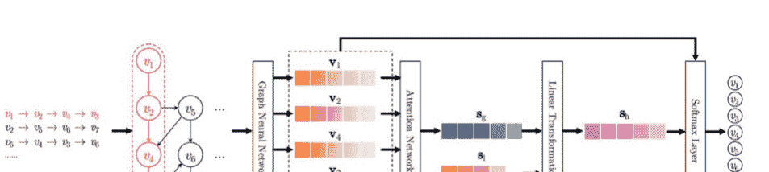

为了解决这个挑战，Pan等人提出了一种带有高速公路网络（SGNN-HN）的星形图神经网络，用于基于会话的推荐系统[38]。在SGNN-HN中，使用星形图神经网络来模拟当前会话中的复杂变化模式，通过添加一个星形节点来检查非相邻项，可以解决长期信息传播的问题。然后，为了解决图神经网络的过拟合问题，在星形图神经网络之前和之后使用高速公路网络来动态选择项嵌入向量，这可以帮助发现项之间的复杂转换关系。最后，通过仔细整合星形图神经网络生成的项嵌入到当前会话中，并根据用户的偏好预测出所提出的项。

值得一提的是，在SGNN-HN中，为每个会话创建了一个星形图，图节点集合分为两部分：第一部分是会话中的所有唯一项目，称为卫星节点，第二部分是星形节点。图边还包括两种连接类型，用于信息传播，包括卫星连接和星形连接。卫星连接用于显示项目之间的相邻关系。对于星形连接，在星形图中的星形节点和每个卫星节点之间添加了双向边，另一方面，为了更新新卫星节点，使用边连接从星形节点到卫星节点。通过星形节点，可以通过将星形节点视为中间节点，以两跳方式传播非相邻节点的信息。另一方面，从卫星节点到星形节点的有向边用于更新星形节点，这有助于通过考虑星形图中的所有节点来创建准确的星形节点表示。SGNN-HN的总体架构如图5.15所示。

研究基于递归神经网络或注意机制的会话推荐系统方法的有效性表明，复杂的项目转换会降低系统效率。虽然图神经网络采用了一种将会话的快照转换为不同时间戳的个体图的机制，以建模静态结构信息而不考虑项目转换关系的时间演变，但大多数基于会话的推荐系统使用交叉熵和softmax来优化模型参数，其中所有项目（除目标项目外）都被视为负样本。在训练过程中，持续降低负项目分数可能导致模型过拟合和损失泛化能力。此外，这些方法无法提供足够大的梯度来降低分数，限制了模型的收敛速度。

为了解决上述问题，Pan等人提出了基于动态图学习的会话推荐系统（DGL-SR）[32]。DGL-SR首先将当前会话转换为动态图，然后使用结构层来考虑结构信息，以学习不同时间戳下会话项的表示。同时，通过图注意力网络和时间注意力分析结构信息，以及不同时间戳下图结构的时间演变。为了检测不同时间戳下会话图的时间演变，DGL-SR使用动态图神经网络中的时间层生成每个项的时间特征表示。然后，生成用户的动态偏好，并用于对所有候选项生成预测分数。最后，开发了一种修正的边缘softmax方法，用于纠正负项的梯度，以避免过拟合并实现有效的模型优化。

Qiu等人提出了一种改进的图神经网络，用于学习会话中每个项的嵌入[33]。FGNN（全图神经网络）通过检查项转换的固有顺序，在加权图注意力网络中执行嵌入项的学习过程。因此，它通过构建会话图来考虑项转换的模式，并提出了一种新模型，同时考虑会话图中的序列和隐藏顺序，用于基于会话的推荐系统。为了使用图神经网络，为每个会话构建一个图，并将会话中的下一个项的推荐问题形式化为图级分类问题。具体而言，它提供了加权注意力图层和读出函数，用于学习项嵌入和会话以推荐下一个项。使用多重加权图注意力层网络计算会话中项之间的信息流，实现了项级特征表示的内在序列模式。生成项表示后，部署读出函数来聚合这些特征，并自动学习确定适当的顺序。图5.16显示了FGNN的架构[33]。

许多研究人员尝试提供能够正确识别短会话中匿名用户兴趣的方法。为此，Li等人提出了解耦表示学习，以在基于会话的推荐系统中为项目创建更好的表示[34]。解耦图神经网络（Disen-GNN）考虑了每个项目的因素级注意力，捕捉了会话的目的。Disen-GNN包括四个主要步骤：

- 嵌入初始化：在此步骤中，将每个会话转换为有向图，其中会话中的每个项目都用K个部分的嵌入向量进行编码。每个部分表示一个因素的特征。根据每个因素的特征来衡量会话中相邻项目之间的相似性。
- 解耦项目嵌入学习：引入了基于因素的相似性矩阵，该矩阵根据每个项目的嵌入估计相邻项目之间的相似性。然后，将相似性矩阵集成到门控图神经网络的层中，以学习基于因素的项目嵌入。还设计了一种残差注意机制，以保留每个项目的独特特性，避免过度平滑。
- 会话嵌入学习：为了检测用户在会话中的目标，使用基于注意力机制的网络来计算用户对每个项目的各种因素的注意力，该注意力是基于上一个项目的因素，从而提供用户的局部目标。通过分配注意力权重，通过对会话中所有项目的因素嵌入进行加权求和来创建会话嵌入。
- 预测：对于每个候选项目，通过将其嵌入与会话嵌入进行匹配，计算下一个项目成为用户选择的概率。

考虑相邻会话和它们之间的相关性可能是会话推荐系统发展的一个有影响力的因素。为此，Pan等人提出了一种利用门控图神经网络学习项目嵌入的协同图学习方法（CGL）[42]。CGL由两个主要组件组成：主要的监督和自监督模块。使用门控图神经网络来表示每个会话中的每个项目。在主要的监督模块中，考虑了用户的最近和长期兴趣，并检测到动态兴趣迁移。在该模块中，模型训练是基于按顺序生成的监督信号进行的，并设计了目标感知的标签混淆来创建准确的标签分布。使用标签感知混淆来生成软标签，将优化与独热编码向量相结合，以避免过拟合。然后，在自监督模块中，从不同会话之间的相关性中提取监督信号，基于构建的通用图来丰富项目表示。这个通用图是基于所有会话创建，其中每个会话是一个节点，其边根据相似度度量和最大采样进行定义。基于此，通过自监督学习从会话之间的相关性中提取监督信号，并最终基于两个组件的损失函数优化和更新模型的参数。

由于朋友的兴趣对彼此的偏好有影响，社交网络已经在许多基于会话的推荐系统应用中被利用。社交网络数据对于更好地理解用户的兴趣并提供更准确的推荐是有效的。在[40]中，Chen等人提出了一种用于基于会话的社交推荐的高效框架，其中首先使用异构图神经网络来学习用户和物品的表示，该网络整合了社交网络的知识。然后，为了生成预测，只将与当前会话相关的用户和物品表示发送到一个非社交感知模型。该框架具有两个优点。首先，该框架具有灵活性，因为它与现有的非社交模型兼容，并且可以轻松地整合更多的社交网络知识。其次，该框架可以捕捉跨会话的物品转换，而大多数现有方法只能捕捉会话内的物品转换。

### 5.4.3 基于GNN和RNN的方法

由于将RNN的功能适应于会话型推荐系统中数据的顺序性，许多研究人员对使用这些类型的深度神经网络非常感兴趣。许多基于会话的推荐系统通常使用RNN的结构来建模顺序信号，并使用GNN来识别项目之间的转换关系以确定用户兴趣。当然，在实际情况中，接近用户的行为中可能存在重要且有影响力的顺序信号，或者不同项目之间存在多步转换关系。因此，基于RNN或GNN的方法只能获取有限的信息来建模用户的复杂行为模式。循环神经网络通常关注项目之间的顺序关系，而图神经网络主要关注结构信息。因此，这两种模型可以在基于会话的推荐系统中一起使用以生成更可接受的结果。

Chen等人提出了一种协同共同注意网络，结合循环神经网络和图神经网络方法用于基于会话的推荐系统[46]。在CCN-SR（协同共同注意网络用于基于会话的推荐）中，考虑了一个嵌入层用于生成项目嵌入，其输出是循环神经网络和图神经网络的输入。在CCN-SR的第一步中，将当前会话中用户的行为（包括用户的交互项目）进行嵌入，并将其作为输入输入到GRU中，以建模用户之间的顺序关系和行为。由于每个步骤的隐藏状态包含用户之前行为到该步骤和用户当前行为之间的顺序信息，为了实现这个目标，当前会话中每一步的隐藏状态都被建模，并由递归神经网络结构收集。然后，建模了物品之间的转换关系，并使用图神经网络创建了当前会话中物品的详细嵌入。

CCN-SR为每个会话创建了一个有向图，其中节点表示每个会话的物品，边表示用户与物品的交互顺序。当用户在此图中依次与一个物品交互后，两个与物品相关的节点之间会生成一条边。由于某些边在一个会话中可能出现多次，这些边被赋予不同的权重以确定它们的重要性。权重是根据边的出现次数除以边的起始节点的出度来计算的。然后，使用指定输入和输出边连接节点的两个邻接矩阵在图神经网络中使用。因此，基于图神经网络的编码器主要识别相邻物品之间的转换关系，并对会话中的结构信息进行建模。基于递归神经网络的编码器的输出包含会话中的序列信息。结合这两种类型的信息有助于提供全面的表示，以预测推荐。

在CCN-SR中，考虑了基于共同注意机制的两种机制：并行共同注意和交替共同注意。在并行模式下，将与图神经网络相关的结构信息和与GRU相关的顺序信息作为输入，并且同时并行计算相互依赖的表示。但是在交替模式下，它在基于RNN的会话编码器和基于GNN的会话编码器的初始输出以及它们的注意表示之间交替进行。值得一提的是，CCN-SR具有较高的计算复杂度，并且在稀疏数据集中无法获得可接受的结果。CCN-SR的总体架构如图5.17所示。

使用图神经网络的基于会话的推荐系统可以将数据建模为图形格式，并利用内容信息和它们之间的关系来预测用户行为。此外，基于上下文的推荐方法可以整合来自多个不同和异构源的上下文数据，以获得有关项目特征和关系的信息。为此，Li等人提出了一种结合了两种类型上下文信息的基于会话的推荐系统，并使用门控图神经网络进行工作，称为上下文感知和门控图神经网络（CA-GGNN）[48]。与图神经网络相比，门控图神经网络使用GRU并创建消息传播模型。典型GRU的每一层的输出包含当前输入信息和先前状态信息，由输入矩阵和状态矩阵指定。CA-GGNN首先考虑不同类型的输入上下文信息和时间间隔上下文信息，根据输入信息动态创建上下文矩阵。这些矩阵包括输入矩阵和时间间隔矩阵。输入矩阵表示用户做出当前决策时的外部环境信息，例如时间和位置。时间间隔矩阵表示当前决策与下一个决策之间的时间间隔在整个评论期间中的比例。换句话说，输入矩阵显示了用户参与会话时外部环境的情景信息。时间间隔矩阵显示了用户在整个会话时间内浏览每个项目的时间比例。然后，CA-GGNN将常数输入矩阵和状态矩阵分别替换为输入矩阵和间隔矩阵，并使用上下文矩阵来建模输入元素转换的效果。最后，它使用基于时间的反向传播方法来训练模型。

图5.18显示了CA-GGNN的总体架构[48]，包括三个部分。部分“a”与数据预处理有关，包括外部环境的上下文数据、时间间隔的背景数据以及基于会话序列的会话图。在部分“b”中，门控图神经网络考虑了图结构信息和每个节点的状态信息，以创建准确可靠的节点表示。这个基于会话的推荐系统的过程不仅依赖于会话的序列信息，还依赖于会话序列和相关上下文信息的序列。部分“c”CA-GGNN使用软注意机制来确定用户的长期和短期兴趣之间的优先级，作为会话序列中的最后一项。通过线性连接获得会话序列的向量表示，并用作推荐依据。

为了克服数据稀疏性问题并忽视用户的短期和长期兴趣对推荐准确性的影响，Hu等人提出了基于会话的新闻推荐系统[47]。该方法，GNewsRec（图神经新闻推荐），首先创建一个异构的用户-新闻-主题图，以明确地建模用户、新闻文章和它们的主题，基于用户和新闻文章之间已经执行的交互。主题信息更好地反映了用户的兴趣，并减少了用户-项目交互的稀疏性。在GNewsRec中，使用基于图的神经网络来编码用户、新闻文章和主题之间的关系。在这个GNN模型中，通过在图中传播它们的嵌入来学习用户表示和新闻文章。用户的长期兴趣是根据用户的嵌入基于用户的学习历史来确定的。在GNewsRec中，使用最近的用户研究和基于注意机制的LSTM模型来建模用户的短期兴趣。GNewsRec由三个主要部分组成：用于信息提取的卷积网络，用于建模新闻文章和长期用户兴趣的图神经网络，以及基于注意机制的LSTM用于建模短期用户兴趣。第一部分由两个并行的卷积网络组成，用于提取文本信息，它以新闻的个人资料和标题作为输入，并在个人资料和标题的级别上创建表示。最后，两种表示方法并排放置。在第二部分中，创建了一个包含用户、新闻文章和主题的异构无向图，用于建模用户的长期兴趣。在这种方法中，除了新闻文章的文本外，它们的顺序也很重要。在第三部分中，使用基于注意机制的LSTM来检测用户的短期兴趣。图5.19显示了GNewsRec [47]的架构。

尽管使用图神经网络在基于会话的推荐系统中具有所有优势，但一些基于图神经网络的方法无法完全表达会话的顺序信息，例如会话中的重复节点和有向图的起始节点。另一方面，在用户在多种产品中进行选择时，会话中不可避免地存在噪声项目，这是由于无意识的人类行为造成的。这种类型的非恶意噪声被称为自然噪声，在基于会话的推荐系统中很少被考虑。这些问题限制了基于GNN的推荐方法，并使它们无法取得更好的结果。为了解决这些问题，Zhang等人提出了一种用于基于会话的推荐系统的去噪图神经网络，称为SEDGN（序列增强去噪图神经网络）[49]。SEDGN是GNN和GRU的结合体。它使用GRU获取顺序信息，以解决会话图建模中的限制。为了减少自然噪声的影响，在GNN和GRU中分别开发了两个去噪模块，产生两个表示向量。这些向量包括与会话序列相关的正常行为信息向量和会话的图向量。设计了两个去噪模块，分别从顺序结构数据和会话图结构中获取正常用户行为信息，从而减少会话中的噪声影响。从顺序结构数据和图结构中提取的项目表示被合并成一个统一的项目表示，用于预测用户的下一个点击。

会话推荐系统中的另一个问题是，当学习用户兴趣和推荐项目之间的偏差时，模型没有深入学习用户和项目的潜在特征。这导致对用户兴趣偏好范围的一定程度误解，从而导致推荐的内容与用户的兴趣不相关或意外。在[52]中，Xia等人提出了一种带有图神经网络（UIRS-GNN）的意外兴趣推荐系统，以解决当前模型的局限性，并使用图神经网络用于聚合目标节点周围节点的特征。UIRS-GNN可以使用基于注意力的长短期门控循环单元（A-LSGRU）网络学习用户的偏好，并对用户的整体和局部兴趣建模。

### 5.4.4 基于GCN的方法

推荐系统中的许多数据没有规则的空间结构。为了对用户和物品之间的复杂关系建模，应该使用能够处理时间和空间信息的网络结构。图卷积网络可以对图数据进行时空信息的深度学习。

由于GCN的低阶近似反映了短期兴趣，在GACOforRec中，采用了Zhang等人提出的ConvLSTM方法，以确保模型能够考虑更多的条件[63]。除了使用图卷积网络学习的时间和空间信息外，该模型还使用LSTM能力来更新和记住长期偏好。同时，提出了一种新的自适应基于注意力的机制，使用卷积图网络来考虑不同传播距离的影响。为了增强从不同的优先级中进行模型的分层学习，引入了一种称为ON-LSTM的网络结构，它更加关注神经元的层次结构和序列。这种安排对于对用户偏好的整体理解是必要的。

在GACOforRec中，首先考虑了用户会话的重要性。在实际条件下，长期的历史记录对用户来说可能并不重要，而常规的用户活动被视为一个会话。因此，考虑到每个用户会话的顺序和多个会话之间的连接是GACOforRec的一个重要目标。GCN用于建模用户会话并学习会话中的序列和网络中的空间性，以检测用户的短期偏好。为了避免忽视用户的长期和持久的兴趣，提出了ConvLSTM，它是一种具有长期和短期时间效应的递归神经网络，同时使算法能够关注空间域信息。这种结构用于连接两个部分的GCNs，以考虑跨应用场景的“长期”和“短期”效应。ConvLSTM用于组合连接并提取时间信息，同时关注空间特征提取能力。考虑到不同的用户行为可能具有不同程度的影响，在GCN中提出了一对新的注意机制，可以从不同的传播距离中获得权重。

管理和控制具有许多会话和长时间周期的基于会话的推荐系统面临三个主要挑战：首先，会话不断增长。内存无法容纳所有会话。其次，用户兴趣可能会发生显著变化。需要一个合适的模型来建模过去会话中的时间信息。第三，新会话中的信息应该按时间顺序建模。

为了克服这些问题，Zhou等人提出了一种从传入会话中提取辅助信息的时间门控图神经网络，称为基于会话推荐的时间增强图神经网络（TASRec）[58]。TASRec动态地模拟用户在长时间周期内的长期兴趣。项目与项目之间的交互在两个层面上呈现：时间图和会话图。在会话图中，每个节点是与会话相关的项目，每个有向边表示两个项目之间的邻接关系。对于每一天，创建一个无向的时间图，其节点是目标日期之前的会话的项目，其边根据项目的邻接关系确定。会话图使用门控图神经网络来确定会话内项目的交互，并基于此获得项目的嵌入。为了在某一天的会话中提供推荐，时间建模层根据存储目标日期之前过去会话记录的图进行项目交互的学习。指数分母用于改变边权重的尺度，边权重随时间的增加而减小，与前一天和当前天之间的时间差的增加有关。

还实现了多层图卷积网络来学习高阶物品之间的交互。GCN的每一层都整合了所有一阶邻居嵌入和物品本身。对于会话的嵌入，首先处理会话内的嵌入和物品的时间嵌入。然后使用基于注意力机制计算会话的嵌入。最后，基于会话的嵌入，计算选择候选物品的概率。

一些数据无法使用简单的图进行建模。在这些情况下，可以使用超图来建模更一般的数据结构。超图由一组顶点和一组超边组成，其中超边可以连接任意数量的顶点。这种方法用于编码高阶数据的相关性，并且在检测会话中的复杂关系方面具有高能力和灵活性。在这方面，研究[57]通过超图在GCN的上下文中进行数据建模。

Xia等人提出了一种双通道超图卷积网络（DHCN）[57]。DHCN将每个会话建模为一个超边，其中所有项目彼此相关。通过共同项目连接的不同边形成一个包含项目级高阶关系的超图。通过在超图通道中堆叠多个层，可以利用超图卷积的优势产生高效的结果。然而，由于每个边只包含有限数量的项目，数据稀疏性的问题可能限制超图建模的好处。因此，引入了线图通道，并将自监督学习集成到提出的模型中以增强超图建模。在超图的基础上构建了一个线图，其中每个超边是一个节点，边是关注会话级关系的超边连接。然后，开发了一个双通道超图卷积网络，描述了会话内部和会话之间的两个信息通道，而每个通道对另一个通道知之甚少。通过最大化通过自监督学习学习的会话表示之间的互信息，两个通道可以从彼此中获取新信息，以提高它们在提取项目/会话特征方面的性能。图5.20显示了DHCN的架构[57]。

几个基于会话的新闻推荐系统可以从文章和会话中提取表达性特征（例如嵌入），但它们通常忽略了文章的语义级结构信息。为此，Sheu等人提出了一种新颖的上下文感知图嵌入（CAGE）框架，用于基于会话的新闻推荐，通过辅助知识图丰富新闻文章嵌入[65]。CAGE使用卷积神经网络从新闻文章中提取文本级特征，同时借助子知识图表示语义级实体。语义级嵌入提取过程包括五个步骤，包括实体提取、从开放知识图中提取三元组、子知识图构建、子知识图嵌入和实体链接嵌入。然后，CAGE通过多层图卷积网络对连接的嵌入进行细化。之后，通过GRU学习会话级表示。最后，CAGE为每个会话预测下一个点击的文章。

会话推荐系统所面临的问题是它们主要依赖于提取单个会话中的顺序模式。这些方法不足以显示更复杂的依赖关系。

物品。此外，由于会话数据的匿名性，阻止了不同会话之间的通信，因此不考虑跨会话信息。一些研究，如[60, 61]，提出了基于交集会话的方法，并使用了具有卷积层的图神经网络。

叶等人解决了上述限制，使用了会话之间的顺序信息，并提出了跨会话感知的时间卷积网络（CA-TCN）[60]。对于跨会话，CA-TCN构建了一个跨会话项目图和一个会话上下文图，以建模跨会话对项目和会话的影响。全局跨会话项目图通过在所有会话之间创建项目之间的连接来考虑跨会话对项目的影响，并通过在当前会话和其他感兴趣的会话之间建立连接来建立会话上下文图。类似的用户行为考虑了对会话的复杂交互效应。最后，通过项目级别和会话级别的分层注意机制连接项目和会话。邱等人使用完全图神经网络，将每个会话建模为一个图来学习项目的复杂依赖关系[61]。该方法由两个模块组成：（1）加权图注意层（WGAT）用于对会话图中的节点之间的信息进行编码，以获得项目嵌入。（2）在获得项目嵌入之后，设计了一个读取函数，用于确定项目之间的依赖关系，以聚合嵌入以生成会话嵌入的图级表示。在最后一步中，根据会话嵌入与项目集中项目嵌入的比较，输出一个排序的推荐列表。

## 5.5 使用深度强化学习的SBRS

在研究会话型推荐系统中深度强化学习模型的方法之前，提供了DRL的概述以及使其成为SBRS的有效选择的原因。

### 5.5.1 为什么使用深度强化学习？

强化学习方法更加注重通过交互进行目标导向学习，而不是其他机器学习方法。在强化学习中，学习者不被告知该做什么；相反，代理必须通过试错和接受奖励和惩罚来发现哪些行动带来最多的奖励。强化学习系统的组成要素如下：

- 代理：一个被训练用于执行特定任务的程序。
- 环境：代理执行动作的真实或虚拟世界。
- 动作：由代理执行的导致环境状态或条件发生变化的移动。
- 状态：代理在当前环境中的所有信息。
- 观察：观察是代理可以观察到的情境的一部分。
- 策略：指定代理根据当前状态采取的行动。在深度学习领域，可以训练神经网络来做出这些决策。在训练过程中，代理试图改进其策略以做出更好的决策。
- 价值函数：确定代理在长期执行中的适当行为。换句话说，当将价值函数应用于给定状态时，从该状态开始，它产生的是未来可以预期的总奖励。

强化学习循环始于代理观察环境（步骤1）并接收状态和奖励。接下来，代理使用这个状态和奖励来决定下一步的行动（步骤2）。然后，代理将行动发送给环境以控制它的期望方式（步骤3）。最后，环境根据先前的状态和代理的行动改变其状态（步骤4）。然后，循环重复。强化学习循环如图5.21所示。在时间 t 的强化学习循环中，代理从环境接收状态 t，并使用其策略模型（π）根据控制策略选择正确的行动 a_t。当执行行动时，环境进入一个新的阶段，并提供下一个状态 t+1 以及奖励的反馈 r_t+1。代理使用在状态转换过程中获得的知识。

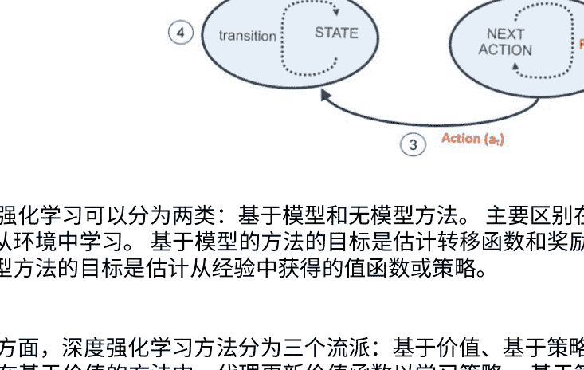

深度强化学习可以分为两类：基于模型和无模型方法。主要区别在于代理如何从环境中学习。基于模型的方法的目标是估计转移函数和奖励函数，而无模型方法的目标是估计从经验中获得的值函数或策略。

另一方面，深度强化学习方法分为三个流派：基于价值、基于策略和混合方法。在基于价值的方法中，代理更新价值函数以学习策略。基于策略的方法直接学习策略，混合方法结合了基于价值和基于策略的方法，也被称为演员-评论家方法。演员-评论家方法包括两个不同的网络，演员网络使用基于策略的方法，评论家网络使用基于价值的方法评估代理学习到的策略。

在决策制定方面，深度强化学习方法可以分为在线策略和离线策略方法。在离线策略中，行为策略π_b用于探索，而目标策略π用于决策制定。在在线策略方法中，行为策略与目标策略相同。

强化学习方法的一个具体实现是Q-Learning算法，它是一种基于价值的方法，利用了Q-Table的概念。Q-Table计算每个状态下每个动作的最大预期奖励。根据这些信息，模型可以选择具有最大奖励的动作。Q-Learning的主要思想是使用贝尔曼优化方程作为迭代更新的依据：

$$Q_{i+1}(s_t, a_t) = Q_i(s_t, a_t) + \alpha[R_i(s_t, a_t) + \gamma \cdot \max Q_i(s_t', a_t') - Q_i(s_t, a_t)] \quad (5.25)$$

在方程（5.25）中，γ是折扣率，α是学习率。使用适当的参数γ可以使未来的奖励更可控。重要的是要知道s_t', a_t'来自行为策略π_b，s_t, a_t来自目标策略π。在许多迭代中，Q函数的最优收敛最终会实现（Q_i → Q*, i → ∞）。在深度Q学习中，使用深度神经网络来近似Q值函数，其中状态作为输入，所有可能的动作的Q值作为输出。深度Q学习和传统Q学习的主要区别在于Q-Learning是Q表的实现。深度Q-Learning用神经网络替代了常规的Q表，并且神经网络将输入状态映射到（动作，Q值）对。事实上，在深度Q-Learning中，函数逼近器（如具有参数θ的神经网络）被训练来估计Q值，使得 $Q(s, a; \theta) \approx Q^*(s, a)$。

深度Q-Learning和Q-Learning之间的区别在图5.22中示意。

一些研究表明，强化学习算法很好地应对了基于顺序数据的推荐系统问题，因为这些问题可以自然地建模为马尔可夫决策过程，以预测长期用户兴趣。在这里，推荐代理很容易执行一系列的排名，通常使用离线策略方法从记录的数据中学习最优策略。

在这些方法中，基于会话的深度学习推荐系统从与环境E（用户）进行交互的推荐代理（RA）中受益，通过在时间步骤中顺序选择推荐项目来实现最大累积奖励。正如前面讨论的，对这个过程的建模包括一组状态、动作和奖励。更正式地说，这个集合包括五个元素（S, A, P, R, γ），如下所示：

- 状态空间 S：状态 $s_t = s_t^1, ..., s_t^m) \in S$被定义为用户的浏览历史记录，即用户在时间 t 之前检查过的先前项目。$s_t$中的项目按出现顺序排列。
- 动作空间 A：动作 $a_t = a_t^1, ..., a_t^k) \in A$是基于当前状态 $s_t$的用户推荐的一系列项目的列表，在每次推荐中，推荐代理（RA）向用户推荐 k个项目。
- 奖励 R：在RA在状态 $s_t$中执行动作 $a_t$（即向用户推荐一系列项目）后，用户对这些项目进行评估并提供反馈，反馈可以包括跳过（不点击）、点击或订购这些项目。根据用户的反馈，代理接收到即时奖励 r（$s_t$, $a_t$）。
- 转移概率 P：转移概率 p（$s_{t+1} | s_t, a_t$）定义了当RA执行动作 $a_t$时，从状态 $s_t$到状态 $s_{t+1}$的转移概率。如果用户跳过所有推荐的项目，则下一个状态 $s_{t+1} = s_t$；如果用户点击/订购了一些项目，则下一个状态更新为 $s_{t+1}$。
- 折扣因子 γ：当我们衡量未来奖励的价值时，折扣因子γ决定了折扣因子。特别地，当 γ = 0时，RA只考虑即时奖励。换句话说，当 γ = 1时，所有未来的奖励都可以完全计算到当前动作的奖励中。

图5.23展示了在基于会话的推荐系统中使用深度强化学习的一般框架。

在本节的最后，应该提到用户与推荐系统的交互性质是顺序的，向用户推荐最佳项目的问题不仅是一个预测问题，也是一个顺序决策问题。这可以通过强化学习算法来解决。

有三个原因。第一个原因是强化学习可以通过根据从环境中接收到的持续反馈调整动作来管理顺序用户-系统交互的动态性。第二个原因是强化学习可以考虑用户与系统的长期交互。最后，尽管拥有用户评级是有益的，但强化学习自然不需要用户评级，并通过顺序优化其策略。

### 5.5.2 基于深度Q学习的方法

Q-Learning是一种无模型、离策略算法，用于学习给定状态下的动作值。这种方法广泛应用于各个领域，也被用于基于会话的推荐系统。为了增加这种方法的能力，提出了深度Q-Learning，它是一种使用深度神经网络来表示Q函数的Q-Learning类型，而不是简单的值表。本小节回顾了一些使用深度Q-Learning提供基于会话的推荐系统的研究。

赵等人考虑了用户和推荐代理之间的顺序交互，并使用强化学习自动学习最优的推荐策略[68]。这种方法被称为基于深度强化学习的列表推荐框架（LIRD）。事实上，LIRD提出了一种新的基于会话的推荐系统，具有在与用户交互过程中持续改进策略的能力。用户和推荐系统之间的顺序交互被建模为马尔可夫决策过程，并通过试错项的推荐和基于用户反馈的强化来自动学习最优策略。LIRD引入了一个在线用户-代理交互环境模拟器，在应用模型在线之前可以预训练和评估模型参数。此外，在用户和代理之间的交互过程中，列表推荐的重要性得到了确认，并提出了一种新的方法将其应用于广泛的列表推荐框架中。

LIRD的Actor框架中有两个主要步骤，即创建状态特定评分函数参数的步骤，通过深度神经网络实现，以及基于前一步骤评分函数参数创建动作的步骤。Critic框架旨在使用估计器学习动作值函数，以确定代理生成的动作是否与当前状态相对应。

该框架基于深度Q-Learning工作。LIRD可应用于具有大型和动态物品空间的场景，并且可以显著减少重新计算。图5.24显示了LIRD的架构[68]。

郑等人提出了一种用于在线个性化新闻推荐系统的深度强化学习框架，称为新闻推荐的深度强化学习框架（DRN）[69]。DRN使用深度Q-Learning更好地建模新闻文章和用户兴趣的动态和变化特征，以便同时考虑当前和未来的奖励。深度Q-Learning架构可以轻松提高可扩展性。DRN与其他方法的一个区别是，它将用户反馈视为用户点击和用户返回新闻推荐系统的次数的组合。同时，为了提供更准确的推荐并避免不相关的推荐，它使用了Dueling Bandit Gradient Descent方法。

在DRN中，环境由用户和新闻文章的集合组成，推荐算法扮演代理角色。用户的特征表示被视为状态，新闻的特征表示被视为动作。

当用户请求时，表示状态（用户特征）和一组表示动作（候选新闻特征）的数据被发送给代理。代理选择最佳动作（向用户推荐新闻列表）并接收用户的反馈。所有的反馈和推荐都存储在代理的内存中。每小时，推荐算法根据存储在代理的内存中的推荐和反馈进行更新。

### 5.5.3 基于DRL和RNN的方法

许多推荐系统将推荐过程视为静态的，并按照固定的贪婪策略提供推荐。然而，由于用户偏好的动态性，这些方法可能不够高效。此外，大多数现有的推荐系统都是为了最大化推荐的即时（短期）奖励，完全忽视了推荐的物品是否能够在未来带来更高效的奖励。为此，赵等人将推荐视为用户和推荐代理并使用深度强化学习自动学习最佳推荐策略[71]。提出的深度强化学习推荐系统（DEERS）具有两个优点。首先，它可以在交互过程中持续更新试错策略，直到系统收敛到生成适应用户动态偏好的最佳策略。其次，DEERS中的模型通过估计当前状态和动作下的延迟奖励值进行训练。因此，该系统可以快速识别具有小即时奖励但对未来推荐奖励有重大影响的项目。

基于强化学习的推荐系统在推荐过程中可能无法灵活处理日益增多的项目。这个问题阻碍了它们在电子商务推荐系统中的使用。为此，深度Q网络（DQN）被用作非线性估计器，用于估计DEERS中的动作值函数。这种无模型的强化学习方法不估计转移概率，也不存储Q值表。这使得它能够灵活支持推荐系统中的许多项目。与单独估计每个序列的动作值函数的传统方法相比，它还可以增强系统。

在推荐系统中，积极的反馈表示用户的兴趣，而用户忽略一些推荐的项目可以帮助系统更好地了解用户的兴趣。因此，有必要研究这种通常比积极反馈更多的负面反馈。为此，DEERS框架除了接收积极反馈外，还考虑了负面反馈，并通过接收负面反馈来更新其策略。

图5.25显示了DEERS的架构。该模型将积极状态和推荐项目作为积极输入（积极信号）进行连接，将负面状态和推荐项目作为负面输入（负面信号）进行连接。然后，GRU用于检测用户的偏好，其中更新门用于创建新状态，重置门用于控制来自先前状态的输入。

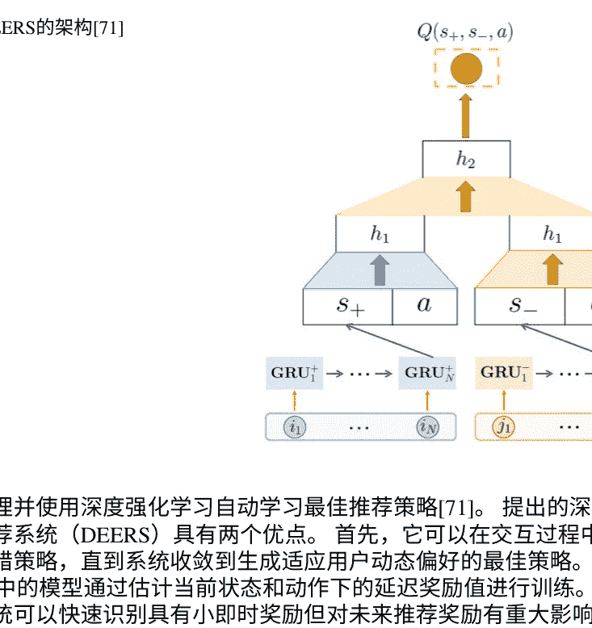

### 5.5.4 基于DRL和CNN的方法

由于卷积神经网络能够自动提取时间和空间特征，因此在各个领域广泛使用，可以单独或与其他学习方法一起使用。本节中的一些研究已经在基于会话的推荐系统中使用了深度强化学习和卷积神经网络的组合。

为了根据用户的实时反馈更新推荐策略并创建一个适当显示的物品页面，赵等人开发了DeepPage方法来共同生成一组互补的物品和相应的显示策略[75]。DeepPage是一种基于深度强化学习的新型页面推荐框架，它根据用户的实时反馈优化一个适当显示的物品页面。在这个推荐系统中，考虑了不同的因素，如状态、用户当前的兴趣、行为，推荐一个候选物品页面以及用户的反应作为奖励，包括点击、跳过或购买。

在这样一个问题中应用深度强化学习的两个基本挑战是庞大的动态状态空间和选择最优动作的计算成本。为了克服这些问题，使用了Actor-Critic框架，它适用于动态和大规模问题，并减少了重复计算。

在Actor框架中使用了编码器-解码器架构，其中GRU在编码部分中用于生成初始状态。GRU的输入是当前会话之前最后点击的项目，其输出是用户的初始兴趣向量。为了学习页面上物品的空间表示策略，以获得最大的奖励，使用了卷积神经网络，其输出是一个低维稠密向量，表示给定页面上的物品和用户的反馈。这个向量被发送到另一个GRU中，以检测用户在当前会话中的实时偏好。在解码器中，使用了反卷积神经网络进行重构。Critic框架设计为使用逼近器来学习动作值函数，判断Actor生成的提议页面是否与当前状态匹配。图5.26显示了DeepPage的架构[75]。

高等提出了DRCGR，使用深度Q网络，并利用CNN和GAN来帮助代理更好地理解高维数据[76]。DRCGR中使用了两个不同的卷积核来捕捉用户的正反馈。同时，DRCGR使用生成对抗网络来学习负反馈，以增加模型的鲁棒性。DRCGR包括三个主要步骤：第一步是对用户的点击行为进行建模。在这个阶段，形成一个基于物品的嵌入向量的矩阵，并对其应用垂直和水平卷积滤波器，将得到的结果放置在一起。第二步使用生成对抗网络创建更相关的负反馈。第三步将正反馈和负反馈整合到基于DQN的强化学习模型中。

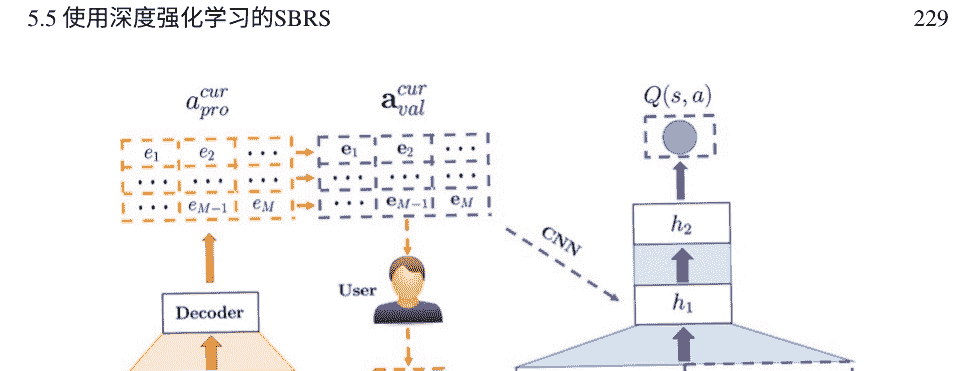

### 5.5.5 基于DRL和GAN的方法

强化学习的一个重要挑战之一是训练过程中模型的不稳定收敛。在实践中，强化学习和循环神经网络的负面影响是增加系统对训练数据的需求，这在基于会话的推荐系统中尤为具有挑战性，因为这些系统本质上是基于稀疏数据的。一种解决方案是通过对抗生成网络生成数据来进行强化学习方法。

此外，一种称为负采样方法的随机抽样方法不能完全描绘用户对物品的不感兴趣。因此，用户的兴趣可能无法被正确识别，用户感兴趣的物品可能被认为是负样本。

赵等人解决了上述问题，并提出了一种基于深度对抗生成网络和深度强化学习的协同过滤模型，该模型使用了Q-Learning和Actor-Critic模型的组合[77]。这种方法，基于深度生成对抗网络的协同过滤（DCFGAN），是一个自适应的基于会话的推荐系统，在电子学习领域中提出。DCFGAN利用深度对抗生成网络和深度强化学习的组合，利用用户的即时反馈，并使用深度确定性策略梯度算法返回梯度，以增加训练过程的稳定性。同时，通过使用深度确定性策略梯度算法优化值函数，减少了收敛所需的迭代次数。根据基于会话的推荐系统的特点，DCFGAN使用预训练的协同过滤在负采样项目中。它有效地提高了负采样的准确性，并且对于推荐系统来说是高效的。DCFGAN使用GRU来建模确定性部分的顺序数据。图5.27显示了DCFGAN的架构[77]。

陈等人开发了一个基于模型的深度强化学习框架，用于SBRS，其中GAN模拟用户行为动态并学习奖励函数[78]。作者还开发了一种新颖的级联DQN算法，以获得能够处理大量候选项的推荐策略。动作值函数的级联设计可以从大量候选项中识别出最佳子集。

高等人还提出了一种深度强化学习框架DRCGR，采用CNN和GAN模型[76]。使用CNN模型捕捉正反馈的序列特征，并采用GAN模型学习最佳负反馈表示。然后，正/负表示同时输入DQN，据称可以生成更好的动作值函数。

## 5.6 讨论

在本章中，讨论和分析了基于混合/高级深度神经网络模型的会话推荐系统的方法。此外，还研究了使用图神经网络和深度强化学习与其他深度学习方法相结合的内容。

基于RNN的会话推荐系统方法通常在处理大量数据时速度较慢且训练过程困难。基于CNN的方法内存消耗较大，并且隐藏表示不可解释和可读。因此，大部分基于会话的推荐系统使用混合深度学习方法。对基于混合深度神经网络模型的会话推荐系统领域的研究进行了回顾，发现最关注以下组合：CNN和RNN，AE和RNN，基于GNN的不同组合，以及DRL与其他模型（如CNN和RNN）的组合。

一般而言，基于CNN和LSTM的组合的研究[22-26]使用CNN识别数据的特征，并基于LSTM对用户行为进行建模。在各种研究中，使用了不同类型的CNN，如3D-CNN、并行CNN等，每种都具有自己的特点。

由于LSTM参数数量较多，一些基于RNN的研究使用了GRU，它需要较少的参数和有限的计算资源。因此，许多基于会话的推荐系统使用混合深度神经网络方法，结合了CNN和GRU [12-21]。

自编码器也在基于会话的推荐系统中与GRU [27, 29]和LSTM [28]一起使用。在这些研究中，使用了不同类型的自编码器，如堆叠自编码器或去噪自编码器，用于提取用户交互和特征转换的高效表示，并且RNN识别用户的顺序依赖性和长期兴趣。

除了由两种或更多种单一深度神经网络组合而成的混合深度神经网络方法外，还有两种其他高级模型，即深度强化学习和深度图神经网络，在第5.4节和第5.5节中进行了讨论。

许多推荐系统的数据具有图结构，并且图神经网络在不同领域的图数据表示学习中被广泛使用。另一方面，由于其高度灵活性，图神经网络具有除主要数据外还可以轻松建模辅助数据的能力。在基于会话的推荐系统中，物品的序列可以被建模为图结构的数据，以表示物品之间的邻接关系。

图神经网络被广泛用于通过将用户的顺序行为转换为顺序图来识别转换模式。研究[31,32,33,38]基于图神经网络，但其他研究也将图神经网络与RNNs（如[34, 36, 45-48]）或CNNs（如[53-57]）相结合。

由于过度平滑问题，更多的研究关注GNN层的适当增强（更深的GNN）以捕捉图上的高阶相关性并提高模型性能[99, 100, 101]。尽管取得了这些进展，但目前还没有构建类似CNNs的非常深的GNNs的标准解决方案，并且相关工作提出了不同的策略。关于未来的工作，相对于当前的浅层GNNs，提高更深GNNs的性能是发展非常深GNNs的基本挑战，例如基于网络的创新工作，同时计算和时间复杂度也应该是可接受的。

从原始图中进行小规模子图重建将是克服可扩展性挑战的合适解决方案。采样是一种自然的策略，已经广泛用于训练大型图。然而，在采样中，相对部分信息会丢失。很少有研究关注如何设计一种有效的采样策略来平衡效果和可扩展性。例如，GraphSAGE [93] 随机采样固定数量的邻居，而 PinSage [102] 使用随机游走策略进行采样。

如第5.4节所述，基于GNN的推荐模型大多基于静态图，而会话推荐系统中存在许多动态因素。例如，用户数据在这些系统中自然地动态收集。

此外，建模用户动态偏好是这些推荐场景中最重要的挑战之一。此外，平台可能动态地包含新用户、产品、特征等，这给静态图神经网络带来了挑战。最近，动态GNN [103, 104] 吸引了研究人员的注意，他们在动态构建的图上应用嵌入传播操作。

静态图形是稳定的，因此可以实际建模，而动态图形引入了变化的结构。一个严重的未来研究挑战是如何设计对实际动态图形做出响应的GNN框架。另一方面，考虑到会话推荐系统中的时间演化特性，基于动态GNN的提出模型将是一个有广泛应用的有前途的研究方向。

使用交互数据的监督方法相对稀疏的结果与图形规模相比得到。因此，有必要考虑从图形结构或使用自监督GNN的推荐任务中获得更多的监督信号。各种研究已经尝试通过设计自监督的辅助任务从图形结构中加强基于GNN的推荐[105, 106]。可以使用数据增强，如节点删除，生成对比训练的样本对。我们相信，在基于GNN的会话推荐系统中使用自监督任务来学习有意义和稳健的表示是未来研究的合适方向。

另一种广泛使用和讨论的学习方法是深度强化学习。深度强化学习在处理基于会话的推荐系统问题方面表现良好，因为这类问题可以建模为马尔可夫决策过程，以预测用户的长期偏好。另一方面，用户与推荐系统的交互性质是顺序的。

## 5.6 讨论

这与强化学习的交互性质一致。通过结合深度学习和强化学习的优势，深度强化学习试图构建有效的平台，并且已经在基于会话的推荐系统中得到应用。有几项研究基于深度Q学习[10, 68, 69]；基于DRL和RNN的组合[71–73, 77]；以及基于DRL和CNN的组合[75]和[76]。

大多数现有的基于会话的推荐系统方法使用单个代理。多代理强化学习（MARL）是强化学习的一个子领域，能够学习多个策略和策略。尽管单代理强化学习框架只能处理单个任务，但可以定义研究来考虑基于会话的多任务情况，并使用多代理深度强化学习（MADRL）或分层深度强化学习（HDRL）。HDRL通过将任务划分为几个小组件来处理复杂任务，并要求代理确定子策略。与HDRL不同，MADRL引入了几个代理来处理子任务。分层多代理强化学习（HMARL）结合了HRL和MARL，其中HDRL可以用于将复杂任务划分为几个子任务，例如用户的长期兴趣和短期点击行为，而MADRL也可以考虑几个因素。

在SBRS中，模型无关的DRL方法中存在着样本效率低下的问题。模型无关的DRL需要大量的样本，因为无法保证接收到的模型是有用的。通常，在经过大量的间隔后，并且在接收到有用的状态和奖励信号后，代理可以开始学习，这在会话的有用持续时间内可能是一个严峻的挑战。另一方面，DRL基于模型的方法在这种情况下工作得更加高效，尽管它们更加复杂，因为代理必须分析更大的动作和状态空间来学习环境模型和期望的策略。

与使用卷积或循环网络的现有顺序模型不同，Transformer完全基于一种称为“自注意力”的注意机制，它非常高效且能够揭示句子中单词之间的句法和语义模式。Transformer使用自注意力形成编解码器来计算上下文关系。该网络用于加权和聚合所有项目的信息。对于顺序推荐，Kang和McAuley是第一个在2018年引入了一个两层Transformer解码器（即Transformer语言模型）的人，称为SASRec，用于捕捉用户的顺序行为。在同一时间的另一项研究中，Sun等人提出了BERT4Rec，它采用深度双向自注意力来建模用户行为序列。在SBRS中，经过这些重要且有影响力的工作之后，许多研究人员专注于Transformer模型，并在SBRS中提供了出色的性能解决方案[109–117]。

虽然在过去几年中已经使用transformers在SBRS方面做了很多工作，但仍然存在很大的研究潜力：

- 将丰富的上下文信息（如停留时间、操作类型、位置、设备或任何其他上下文数据）纳入到transformer模型中。
- 能够处理非常长的序列（例如点击）。
- 通过在transformer网络中利用位置注意力层，考虑用户的高阶特征并解决当前会话中物品位置信息对其的影响。
- 由于transformers通常具有有限的能力来识别局部上下文信息，因此可以在物品特征的聚合阶段使用CNN模型来处理长距离和短距离依赖关系。
- 利用用户行为序列中的不同时间间隔，使用GNN和transformers的组合考虑物品关系和相应的时间间隔。这种混合模型可以嵌入时间间隔，以学习物品和用户之间的复杂交互信息。

表5.6总结了本章讨论的现有工作，并介绍了每种方法的应用领域、深度学习模型、输入数据类型、嵌入技术和损失函数。

### 表5.6 所评审研究的总结

| 参考文献 | 领域     | 深度学习模型               | 输入数据                                 | 嵌入技术                                       | 损失函数                                         |
| :------- | :------- | :------------------------- | :--------------------------------------- | :--------------------------------------------- | :----------------------------------------------- |
| [22]     | 新闻     | CNN + LSTM                 | 点击的新闻文档                           | PV-DBOW                                        | BPR, TOP1                                        |
| [23]     | 新闻     | CNN + LSTM                 | 项目的类别、ID和关键词会话               | 字符级别嵌入                                   | BPR、TOP1、交叉熵                                |
| [24]     | 新闻     | CNN + LSTM                 | 点击的新闻                               | 从大语料库中预训练或随机初始化                 | 负对数似然函数                                   |
| [25]     | POI      | CNN + LSTM                 | 会话中的项目                             | D维向量                                        | 交叉熵                                           |
| [26]     | 电子商务 | CNN + LSTM                 | 会话中的项目 +时间序列数据               | 标签编码器                                     | -                                                |
| [15]     | 职位发布 | CNN + GRU                  | 会话中的项目                             | 独热编码 +维度为d的向量                        | 交叉熵、BPR、噪声对比估计、L2损失、铰链损失     |
| [13]     | 新闻     | CNN + GRU                  | 新闻文章 +上下文数据                     | CNN + 预训练词嵌入                             | 基于准确性和新颖性的相似性损失函数               |
| [18]     | 电子商务 | CNN + GRU                  | 会话中的项目                             | 独热编码                                       | 交叉熵                                           |
| [19]     | 电子商务 | CNN + GRU                  | 会话中的项目                             | 独热编码                                       | 交叉熵                                           |
| [21]     | 电子商务 | CNN + Bi-GRU               | 会话中的项目                             | 独热编码 +嵌入查找                             | 交叉熵                                           |
| [27]     | 保险     | GRU + AE                   | 跨多个会话的所有用户操作                 | 独热编码                                       | 二元交叉熵                                       |
| [29]     | 电子商务 | GRU + AE                   | 会话中的项目                             | 独热编码 + 自编码器                            | 基于均方误差和的损失函数                         |
| [34]     | 电子商务 | 门控图神经网络(GGNN)       | 会话中的项目                             | D维向量 + GGNN                                 | 交叉熵                                           |
| [57]     | 电子商务 | 超图 + GCN                 | 会话中的项目                             | D维向量                                        | 基于交叉熵的混合损失函数                         |
| [48]     | 电子商务 | 门控GNN                    | 会话序列和相关上下文信息                 | 会话图中每个项目的嵌入向量表示(GGNN)           | 交叉熵                                           |
| [63]     | 电子商务 | GCN + ConvLSTM             | 会话中的项目                             | 有向会话图中的D维节点向量(GNN)                 | -                                                |
| [75]     | 电子商务 | DRL + CNN                  | 会话中项目的类别、嵌入和用户反馈         | 预训练的低维向量                               | DDPG                                             |
| [69]     | 新闻     | 深度强化学习               | 交互日志                                 | 新闻的连续特征表示 +独热编码                   | -                                                |

## 5.7 结论

混合深度学习方法不仅从单一深度学习方法的优势中受益，而且还能根据其他模型的能力减少每种方法的缺点。由于会话推荐系统的数据复杂性，许多方法都是基于混合深度学习方法的。由于数据的顺序性质，会话推荐系统通常使用循环神经网络来建模事件的顺序。其他深度学习方法可以与循环神经网络结合使用，以实现更准确的特征提取，获得更优化的输入表示，并获得更好的结果。

除了混合深度神经网络方法外，会话推荐系统中还流行两种其他类型的先进方法：首先，利用深度图神经网络（GNNs）作为基本组件的方法，其次，采用深度强化学习（DRL）作为核心模块的方法。图神经网络是一类专门用于推断由图描述的数据的深度学习方法。在会话推荐系统中，可以使用图来建模顺序行为和用户-物品交互，并使用深度图神经网络学习用户和物品之间的关系。此外，图神经网络可以与CNN和RNN模型结合使用，以提供更准确和有效的推荐。基于深度强化学习的推荐系统通过与用户交互来获得最大累积奖励，通过在时间步骤中顺序选择推荐项。深度强化学习还可以与CNN、GAN和RNN模型结合使用。

本章对研究进行了几次讨论，并提供了基于会话的混合/高级深度神经网络模型的未来方向和趋势。

## 参考文献

1.  Hrushikesh Mhaskar, Qianli Liao和Tomaso Poggio. "何时以及为什么深度网络比浅层网络更好?" 在AAAI人工智能会议论文集中，美国旧金山，2017年2月4日至9日，第31卷，第1期。 https://doi.org/10.1609/aaai.v31i1.10913
2.  Cach N. Dang, María N. Moreno-García和Fernando De la Prieta. "用于情感分析的混合深度学习模型." 复杂性2021 (2021)：1-16。 https://doi.org/10.1155/2021/9986920
3.  Shuai Zhang, Lina Yao, Aixin Sun, 和 Yi Tay. "基于深度学习的推荐系统：一项调查和新视角." ACM computing surveys (CSUR) 52, no. 1 (2019): 1-38. https://doi.org/10.1145/3285029
4.  Li Deng, 和 Dong Yu. "深度学习：方法和应用." Foundations and trends® in signal processing 7, no. 3–4 (2014): 197-387. https://doi.org/10.1561/2000000039
5.  Biswajit Jena, Sanjay Saxena, Gopal K. Nayak, Luca Saba, Neeraj Sharma, 和 Jasjit S. Suri. "基于人工智能的混合深度学习模型用于图像分类：第一篇综述." Computers in Biology and Medicine 137 (2021): 104803. https://doi.org/10.1016/j.compbiomed.2021.104803
6.  Lingfei Wu, Peng Cui, Jian Pei, Liang Zhao, and Le Song. "图神经网络." 在图神经网络：基础、前沿和应用, 第27-37页. Springer, 新加坡,2022年. https://doi.org/10.1007/978-981-16-6054-2_3
7.  Shiwen Wu, Fei Sun, Wentao Zhang, Xu Xie, and Bin Cui. "推荐系统中的图神经网络综述." ACM Computing Surveys 55, no. 5 (2022): 1-37. https://doi.org/10.1145/3535101
8.  Dai Hoang Tran, Quan Z. Sheng, Wei Emma Zhang, Abdulwahab Aljubairy, Munazza Zaib, Salma Abdalla Hamad, Nguyen H. Tran, and Nguyen Lu Dang Khoa. "Hetegraph: 图"
9.  Yao Ma和Jiliang Tang。图上的深度学习。剑桥大学出版社，2021年。https://doi.org/10.1017/9781108924184
10. Diksha Garg, Priyanka Gupta, Pankaj Malhotra, Lovekesh Vig和Gautam Shroff。 "基于会话的推荐系统的批量约束分布式强化学习。 " arXiv预印本arXiv:2012.08984 (2020)。 https://doi.org/10.48550/arXiv.2012.08984
11. Yuanguo Lin, Yong Liu, Fan Lin, Lixin Zou, Pengcheng Wu, Wenhua Zeng, Huanhuan Chen和Chunyan Miao。 "推荐系统强化学习综述。 " IEEE神经网络和学习系统交易 (2023) 。 https://doi.org/10.1109/TNNLS.2023.3280161
12. 郭宇普，张多龙，凌彦祥和陈宏辉。 《一种用于会话感知推荐的联合神经网络》。 IEEE Access 8 (2020): 74205-74215。 https://doi.org/10.1109/ACCESS.2020.2984287
13. Gabriel De Souza P. Moreira, Dietmar Jannach和Adilson Marques Da Cunha。 《基于上下文的混合会话新闻推荐与递归神经网络》。 IEEE Access 7 (2019): 169185-169203。 https://doi.org/10.1109/ACCESS.2019.2954957
14. 张乐梅，刘鹏和Jon Atle Gulla。 《用于基于会话的新闻推荐的动态注意力整合神经网络》。 机器学习 108 (2019): 1851-1875。 https://doi.org/10.1007/s10994-018-05777-9
15. Jiaxuan You, Yichen Wang, Aditya Pal, Pong Eksombatchai, Chuck Rosenberg, 和 Jure Leskovec。 "Hierarchical temporal convolutional networks for dynamic recommender systems." 在 The world wide web conference, pp. 2236-2246. 2019. https://doi.org/10.1145/3308558.3313747
16. Xiao Gu, Haiping Zhao, 和 Ling Jian。 "Sequence neural network for recommendation with multi-feature fusion." Expert Systems with Applications 210 (2022): 118459。 https://doi.org/10.1016/j.eswa.2022.118459
17. Zhenyan Ji, Mengdan Wu, Yumin Feng, 和 José Enrique Armendáriz Ínigo。 "Multi-channel Convolutional Neural Network Feature Extraction for Session Based Recommendation." Complexity 2021 (2021)。 https://doi.org/10.1155/2021/6661901
18. Ngo Xuan Bach, Dang Hoang Long和Tu Minh Phuong。 "用于基于会话的推荐的循环卷积网络。 " Neurocomputing 411 (2020) : 247-258。 https://doi.org/10.1016/j.neucom.2020.06.077
19. Jinjin Zhang, Chenhui Ma, Xiaodong Mu, Peng Zhao, Chengliang Zhong和A. Ruhan。 "用于基于会话的推荐的循环卷积神经网络。 " Neurocomputing 437 (2021) : 157-167。 https://doi.org/10.1016/j.neucom.2021.01.041
20. Jingjing Wang，李立奇和吴雅音。"用于基于会话的推荐的双通道卷积循环网络。" 在网络安全、隐私和网络: ICSPN 2021会议论文集, 第287-296页。 新加坡: Springer Nature Singapore, 2022年。https://doi.org/10.1007/978-981-16-8664-1_25
21. Quan Li, Xinhua Xu, Jinjun Liu, and Guangmin Li。"通过混合神经模型学习顺序通用模式和依赖关系, 用于基于会话的推荐。" IEEE Access10 (2022): 89634-89644。 https://doi.org/10.1109/ACCESS.2022.3201244
22. Keunchan Park, Jisoo Lee, and Jaeho Choi。"用于新闻推荐的深度神经网络。" 在2017年ACM信息与知识管理会议论文集上, 第2255-2258页。 2017年。 https://doi.org/10.1145/3132847.3133154
23. Lemei Zhang, Peng Liu, and Jon Atle Gulla。"具有上下文增强的基于会话的新闻推荐的深度联合网络。" 在第29届超文本和社交媒体会议论文集上, 第201-209页。 2018年。 https://doi.org/10.1145/3209542.3209572
24. Qiannan Zhu, Xiaofei Zhou, Zeliang Song, Jianlong Tan, and Li Guo。"Dan: 用于新闻推荐的深度注意力神经网络。" 在AAAI人工智能会议论文集上, 位于夏威夷檀香山希尔顿酒店, 美国夏威夷, 1月27日25. Chengfeng Xu, Pengpeng Zhao, Yanchi Liu, Jiajie Xu, Victor S. Sheng, Zhiming Cui, Xiaofang Zhou, and Hui Xiong. "Recurrent convolutional neural network for sequential recommendation." In The world wide web conference, pp. 3398–3404. 2019. https://doi.org/10.1145/3308558.3313408

26. Punam Bedi, Purnima Khurana, and Ravish Sharma. "Session Based Recommendations using CNN-LSTM with Fuzzy Time Series." In International Conference on Artificial Intelligence and Speech Technology, Delhi, India, November 12–13, 2021, pp. 432–446. Cham: Springer International Publishing. https://doi.org/10.1007/978-3-030-95711-7_36

27. Simone Borg Bruun, Maria Maistro and Christina Lioma. "Learning from User Behavior for Recommendation in Insurance with Scarce Items." In Proceedings of the 16th ACM Conference on Recommender Systems, Seattle, USA, September 18–23, 2022, pp. 113–123. https://doi.org/10.1145/3523227.3546775

28. Ivett Fuentes, Gonzalo Nápoles, Leticia Arco and Koen Vanhoof. "Best Next Preference Prediction Using LSTM and Multi-level Interaction." In Proceedings of the Intelligent Systems and Applications, IntelliSys 2021, Amsterdam, The Netherlands, September 1–2, 2022, Vol. 1, pp. 682–699. Springer International Publishing. https://doi.org/10.1007/978-3-030-82193-7_46

29. Xin Chen, Alex Reibman, Sanjay Arora. “Sequential Recommendation Models for Next Purchase Prediction.” In 4th International Conference on Advances in Artificial Intelligence (ArIT 2023), 2023, pp. 141–158. https://doi.org/10.48550/arXiv.2207.06225

30. Chengfeng Xu, Pengpeng Zhao, Yanchi Liu, Victor S. Sheng, Jiajie Xu, Fuzhen Zhuang, Junhua Fang, and Xiaofang Zhou. "Graph-based Context-aware Self-Attention Network for Session Recommendation." In Proceedings of the 28th International Joint Conference on Artificial Intelligence (IJCAI), Macao, August 10–16, 2019, Vol. 19, pp. 3940–3946. 2019. https://doi.org/10.24963/ijcai.2019/547

31. Yitong Pang, Lingfei Wu, Qi Shen, Yiming Zhang, Zhihua Wei, Fangli Xu, Ethan Chang, Bo Long, and Jian Pei. "Heterogeneous Global Graph Neural Networks for Personalized Session-based Recommendation." In Proceedings of the 15th ACM International Conference on Web Search and Data Mining, pp. 775–783. 2022. https://doi.org/10.1145/3488560.3498505

32. Zhiqiang Pan, Wanyu Chen, and Honghui Chen. "Dynamic Graph Learning for Session-based Recommendation." Mathematics 9, no. 12 (2021): 1420. https://doi.org/10.3390/math9121420

33. Ruihong Qiu, Jingjing Li, Zi Huang, and Hongzhi Yin. "Rethinking Item Order in Session-based Recommendation with Graph Neural Networks." In Proceedings of the 28th ACM International Conference on Information and Knowledge Management, Beijing, China, November 3–7, 2019, pp. 579–588. 2019. https://doi.org/10.1145/3357384.3358010

34. Ansong Li, Zhiyong Cheng, Fan Liu, Zan Gao, Wei Guan, and Yuxin Peng. "Disentangled Graph Neural Network for Session-based Recommendation." IEEE Transactions on Knowledge and Data Engineering (2022). https://doi.org/10.1109/TKDE.2022.3208782

35. Feng Yu, Yanqiao Zhu, Qiang Liu, Shu Wu, Liang Wang, and Tieniu Tan. "TAGNN: Target Attentive Graph Neural Networks for Session-based Recommendation." In Proceedings of the 43rd International ACM SIGIR Conference on Research and Development in Information Retrieval, China, July 25–30, 2020, pp. 1921–1924. https://doi.org/10.1145/3397271.3401319

36. Shu Wu, Yuyuan Tang, Yanqiao Zhu, Liang Wang, Xing Xie, and Tieniu Tan. "Session-based Recommendation with Graph Neural Networks." In Proceedings of the AAAI Conference on Artificial Intelligence, Honolulu, Hawaii, USA, January 27 – February 1, 2019, Vol. 33, no. 01, pp. 346–353. https://doi.org/10.1609/aaai.v33i01.3301346

37. Lifeng Yin, Pengyu Guo, and Haizheng Guo. “Session-enhanced Graph Neural Network Recommendation Model (SE-GNNRM).” Applied Sciences 12, no. 9 (2022): 4314. https://doi.org/10.3390/app12094314

38. Zhiqiang Pan, Fei Cai, Wanyu Chen, Honghui Chen, and Maarten de Rijke. “Star Graph Neural Networks for Session-based Recommendation.” In Proceedings of the 29th ACM International Conference on Information and Knowledge Management, Ireland, October 19–23, 2020, pp. 1195–1204. https://doi.org/10.1145/3340531.3412014

39. Zhiheng Deng, Changdong Wang, Ling Huang, Jianhu Lai, and Philip S. Yu. “G³SR: Global Graph Guided Session-based Recommendation.” IEEE Transactions on Neural Networks and Learning Systems (2022). https://doi.org/10.1109/TNNLS.2022.3159592

40. Tianwen Chen and Zhirong Huang. “An Efficient and Effective Session-based Social Recommendation Framework.” In Proceedings of the 14th ACM International Conference on Web Search and Data Mining, Israel, March 8–12, 2021, pp. 400–408. https://doi.org/10.1145/3437963.3441792

41. Wenjing Meng, Deqing Yang, and Yanghua Xiao. “Incorporating User Micro-behaviors and Item Knowledge into Multi-task Learning for Session-based Recommendation.” In Proceedings of the 43rd International ACM SIGIR Conference on Research and Development in Information Retrieval. China, July 25–30, 2020, pp. 1091–1100. https://doi.org/10.1145/3397271.3401098

42. Zhiqiang Pan, Fei Cai, Wanyu Chen, Chonghao Chen, and Honghui Chen. “Collaborative Graph Learning for Session-based Recommendation.” ACM Transactions on Information Systems 40, 4 (2022): 1–26. https://doi.org/10.1145/3490479

43. Jianling Wang, Kaize Ding, Ziwei Zhu, and James Caverlee. “Hypergraph Attention Networks for Session-based Recommendation.” In Proceedings of the 2021 SIAM International Conference on Data Mining (SDM), April 29 – May 1, 2021, pp. 82–90. Society for Industrial and Applied Mathematics, 2021. https://doi.org/10.1137/1.9781611976700.104

44. Wen Wang, Wei Zhang, Shukai Liu, Qi Liu, Leyu Lin, and Hongyuan Zha. "Beyond Clicks: Modeling Multi-Relation Item Graph for Session-based Target Behavior Prediction." In Proceedings of the Web Conference 2020, Taipei, Taiwan, April 20–24, 2020, pp. 3056–3062. https://doi.org/10.1145/3366423.3380077

45. Yupu Guo, Yanxiang Ling, and Honghui Chen. “A Session-oriented Temporal Graph Neural Network Recommendation Method.” IEEE Access 8 (2020): 167371–167382. https://doi.org/10.1109/ACCESS.2020.3023685

46. Wanyu Chen and Honghui Chen. “A Session-oriented Co-attention Network Recommendation Method.” Mathematics 9, no. 12 (2021): 1392. https://doi.org/10.3390/math9121392

47. Linmei Hu, Chen Li, Chuan Shi, Cheng Yang, and Chao Shao. “A News Recommendation Method Based on Long- and Short-term Interest Modeling with Graph Neural Networks.” Information Processing & Management 57, no. 2 (2020): 102142. https://doi.org/10.1016/j.ipm.2019.102142

48. Dan Li and Qian Gao. “A Session Recommendation Model Based on Context-aware and Gated Graph Neural Networks.” Computational Intelligence and Neuroscience 2021 (2021). https://doi.org/10.1155/2021/7266960

49. Chunkai Zhang, Wenjing Zheng, Quan Liu, Junli Nie, and Hanyu Zhang. "SEDGN: Session-Enhanced Denoising Graph Neural Network for Session-based Recommendation." Expert Systems with Applications 203 (2022): 117391. https://doi.org/10.1016/j.eswa.2022.117391

50. Tianwen Chen and Raymond Chi-Wing Wong. "Handling Graph Neural Network Information Loss in Session-based Recommendation." In Proceedings of the 26th ACM SIGKDD International Conference on Knowledge Discovery & Data Mining, USA, July 6–10, 2020, pp. 1172–1180. https://doi.org/10.1145/3394486.3403170

51. Chen Chen, Jie Guo, and Bin Song. "Dual Attention Transfer in Session-based Recommendation with Multi-Dimensional Integration." In Proceedings of the 44th International ACM SIGIR Conference on Research and Development in Information Retrieval, Online, July 11–15, 2021, pp. 869–878. https://doi.org/10.1145/3404835.3462866

52. Hongbin Xia, Kai Huang, and Yuan Liu. "An Unexpected Interest Recommendation System Based on Graph Neural Networks." Complex & Intelligent Systems (2022): 1–15. https://doi.org/10.1007/s40747-022-00849-9

53. Heng-Shiou Sheu, Zhixuan Chu, Daiqing Qi, and Sheng Li. "Knowledge-Guided Article Embedding Refinement for Session-based News Recommendation." IEEE Transactions on Neural Networks and Learning Systems 33, no. 12 (2021): 7921–7927. https://doi.org/10.1109/TNNLS.2021.3084958

54. Ziyang Wang, Wei Wei, Gao Cong, Xiao-Li Li, Xian-Ling Mao, and Minghui Qiu. "Global Context Enhanced Graph Neural Networks for Session-based Recommendation." In Proceedings of the 43rd International ACM SIGIR Conference on Research and Development, China, July 25–30, 2020, pp. 169–178. https://doi.org/10.1145/3397271.3401142

55. Tajudeen Rabiu Gwadabe and Ying Liu. "Improving Graph Neural Networks with Non-sequential Interactions for Session-based Recommendation Systems." Neurocomputing 468 (2022): 111–122. https://doi.org/10.1016/j.neucom.2021.10.034

56. Xiangde Zhang, Yuan Zhou, Jianping Wang, and Xiaojun Lu. "Personal Interest Attention Graph Neural Network for Session-based Recommendation." Entropy 23, no. 11 (2021): 1500. https://doi.org/10.3390/e23111500

57. Xin Xia, Hongzhi Yin, Junliang Yu, Qinyong Wang, Lizhen Cui, and Xiangliang Zhang. "Self-supervised Hypergraph Convolutional Networks for Session-based Recommendation." In Proceedings of the AAAI Conference on Artificial Intelligence, February 2–9, 2021, Vol. 35, no. 5, pp. 4503–4511. https://doi.org/10.1609/aaai.v35i5.16578

58. Huachi Zhou, Qiaoyu Tan, Xiao Huang, Kaixiong Zhou, and Xiaoling Wang. "Time-interval Aware Graph Neural Networks for Session-based Recommendation." In Proceedings of the 44th International ACM SIGIR Conference on Research and Development in Information Retrieval, Canada, July 11–15, 2021, pp. 1798–1802. https://doi.org/10.1145/3404835.3463112

59. Xia Xin, Hongzhi Yin, Junliang Yu, Yingxia Shao, and Lizhen Cui. “Self-supervised Graph Co-training for Session-based Recommendation.” In Proceedings of the 30th ACM International Conference on Information & Knowledge Management, Queensland, Australia, November 1–5, 2021, pp. 2180–2190. https://doi.org/10.1145/3459637.3482388

60. Rui Ye, Qing Zhang, Hengliang Luo. “Session-oriented Cross-Session Aware Temporal Convolutional Network for Session-based Recommendation.” In 2020 International Conference on Data Mining Workshops (ICDMW), Sorrento, Italy, November 17–20, 2020, pp. 220–226. https://doi.org/10.1109/ICDMW51313.2020.00039

61. Ruihong Qiu, Zi Huang, Jingjing Li, and Hongzhi Yin. “Exploiting Cross-Session Information for Session-based Recommendation with Graph Neural Networks.” ACM Transactions on Information Systems (TOIS) 38, no. 3 (2020): 1–23. https://doi.org/10.1145/3382764

62. Gu Tang, Xiaofei Zhu, Jiafeng Guo, and Stefan Dietz. “Temporal Augmented Graph Neural Networks for Session-based Recommendation.” Knowledge-Based Systems 251 (2022): 109204. https://doi.org/10.1016/j.knosys.2022.109204

63. Mingge Zhang and Zhenyu Yang. "GACOforRec: A Graph Convolutional Neural Network Recommendation Model for Session-based." IEEE Access 7 (2019): 114077–114085. https://doi.org/10.1109/ACCESS.2019.2936461

64. Ruihong Qiu, Hongzhi Yin, Zi Huang, and Tong Chen. "Gag: Global Attribute Graph Neural Networks for Streaming Session Recommendation." In Proceedings of the 43rd International ACM SIGIR Conference on Research and Development in Information Retrieval, pp. 669–678. https://doi.org/10.1145/3397271.3401109

65. Heng-Shiou Sheu and Sheng Li. "Context-Aware Graph Embedding for Session-based News Recommendation." In Proceedings of the 14th ACM Conference on Recommender Systems. Brazil, September 22–26, 2020, pp. 657–662. https://doi.org/10.1145/3383313.3418477

66. Yujia Zheng, Siyi Liu, Zekun Li, and Shu Wu. "Dgtn: Dual-channel Graph Transition Network for Session-based Recommendation." In 2020 International Conference on Data Mining Workshops (ICDMW), pp. 236–242. IEEE, 2020. https://doi.org/10.1109/ICDMW51313.2020.00041

67. Diddigi Raghu Ram Bharadwaj, Lakshya Kumar, Saif Jawaid, and Sreekanth Vempati. "Fine-grained Session Recommendation in E-commerce using Deep Reinforcement Learning." arXiv preprint arXiv:2210.15451 (2022). https://doi.org/10.48550/arXiv.2210.15451

## 参考文献

68. Xiangyu Zhao, Liang Zhang, Long Xia, Zhuoye Ding, Dawei Yin, and Jiliang Tang. "Deep Reinforcement Learning for List-wise Recommendations." In The 1st Workshop on Deep Reinforcement Learning for Knowledge Discovery (DRL4KDD 2019), USA, August 5, 2019. https://doi.org/10.48550/arXiv.1801.00209

69. Guanjie Zheng, Fuzheng Zhang, Zihan Zheng, Yang Xiang, Nicholas Jing Yuan, Xing Xie, and Zhenhui Li. "DRN: A Deep Reinforcement Learning Framework for News Recommendation." In Proceedings of the 2018 World Wide Web Conference, Lyon, France, April 23–27, 2018, pp. 167–176. https://doi.org/10.1145/3178876.3185994

70. Xin Xin, Alexandros Karatzoglou, Ioannis Arapakis, and Joemon M. Jose. "Self-supervised Reinforcement Learning for Recommender Systems." In Proceedings of the 43rd International ACM SIGIR Conference on Research and Development, China, July 25–30, 2020, pp. 931–940. https://doi.org/10.1145/3397271.3401147

71. Xiangyu Zhao, Liang Zhang, Zhuoye Ding, Long Xia, Jiliang Tang, and Dawei Yin. "Recommendations with Negative Feedback via Pairwise Deep Reinforcement Learning." In Proceedings of the 24th ACM SIGKDD International Conference on Knowledge Discovery & Data Mining, London, UK, August 19–23, 2018, pp. 1040–1048. https://doi.org/10.1145/3292500.3219886

72. Liwei Huang, Mingsheng Shang, Fan Li, Hong Qu, Yang Liu, and Wenyu Chen. "Long-term Recommender Systems Based on Deep Reinforcement Learning." Knowledge-Based Systems 213 (2021): 106706. https://doi.org/10.1016/j.knosys.2020.106706

73. Lixin Zou, Long Xia, Zhuoye Ding, Jiaxing Song, Weidong Liu, and Dawei Yin. "Reinforcement Learning to Optimize Long-term User Engagement in Recommender Systems." In Proceedings of the 25th ACM SIGKDD International Conference on Knowledge Discovery & Data Mining, Anchorage, USA, August 4–8, 2019, pp. 2810–2818. https://doi.org/10.1145/3292500.3330668

74. Xiangyu Zhao, Changsheng Gu, Haosheng Lu Yang, Xiwang Liu, Liu Bin, Jiliang Tang, and Hui Liu. "Dear: Deep Reinforcement Learning for Online Advertising Recommendation in E-commerce." In Proceedings of the AAAI Conference on Artificial Intelligence, February 2–9, 2021, Vol. 35, no. 1, pp. 750–758. https://doi.org/10.1609/aaai.v35i1.16156

75. Xiangyu Zhao, Long Xia, Liang Zhang, Zhuoye Ding, Dawei Yin, and Jiliang Tang. "Deep Reinforcement Learning for Page-wise Recommendations." In Proceedings of the 12th ACM Conference on Recommender Systems, Vancouver, Canada, October 2, 2018, pp. 95–103. https://doi.org/10.1145/3240323.3240374

76. Rong Gao, Haifeng Xia, Jing Li, Donghua Liu, Shuai Chen, and Gang Chun. "DRCGR: A Deep Reinforcement Learning Framework for Interactive Recommendation Based on CNN and GAN." In 2019 IEEE International Conference on Data Mining (ICDM), Beijing, China, November 8–11, 2019, pp. 1048–1053. https://doi.org/10.1109/ICDM.2019.00122

77. Jianli Zhao, Hao Li, Lijun Qu, Qinzhi Zhang, Qiuxia Sun, Huan Huo, and Maoguo Gong. "DCFGAN: An Adversarial Deep Reinforcement Learning Framework for Session-based Recommendation with Improved Negative Sampling." Information Sciences 596 (2022): 222–235. https://doi.org/10.1016/j.ins.2022.02.045

78. Xinshi Chen, Shuang Li, Hui Li, Shaohua Jiang, Yuan Qi, and Le Song. "Generative Adversarial User Models for Reinforcement Learning based Recommendation." In International Conference on Machine Learning, pp. 1052–1061. PMLR, 2019.

79. Xueying Bai, Jian Guan, and Hongning Wang. "Online Recommendation via Model-based Reinforcement Learning with Adversarial Training." Advances in Neural Information Processing Systems 32 (2019).

80. Massimo Quadrana, Paolo Cremonesi, and Dietmar Jannach. "Sequence-aware Recommender Systems." ACM Computing Surveys (CSUR) 51, no. 4 (2018): 1–36. https://doi.org/10.1145/3190616

81. Balázs Hidasi, Alexandros Karatzoglou, Linas Baltrunas, and Domonkos Tikk. "Session-based Recommendations with Recurrent Neural Networks." In International Conference on Learning Representations (ICLR) 2016.

学习表示的会议，ICLR 2016，圣胡安，波多黎各，2016年5月2日至4日。
https://doi.org/10.48550/arXiv.1511.06939

82. 詹姆斯·戴维森，本杰明·利伯德，刘俊宁，帕拉什·南迪，泰勒·范弗利特，乌拉斯加尔吉，苏乔伊·古普塔等。"YouTube视频推荐系统。"在推荐系统的第四届ACM会议上，巴塞罗那，西班牙，2010年9月26日至30日，第293-296页。 https://doi.org/10.1145/1864708.1864770

83. 李静，任鹏杰，陈铸民，任兆春，连涛，马军。"神经注意力基于会话的推荐。"在2017年ACM信息和知识管理会议上的论文集，新加坡，2017年11月6日至10日，第1419-1428页。
https://doi.org/10.1145/3132847.3132926

84. 乔刘，曾一夫，雷富欧，和张海滨。"STAMP: 面向基于会话的推荐的短期注意/内存优先模型。"在第24届ACM SIGKDD国际会议上的知识发现和数据挖掘，第1831-1839页。2018。 https://doi.org/10.1145/3219819.3219950

85. Steffen Rendle, Christoph Freudenthaler, Zeno Gantner和Lars Schmidt-Thieme。"BPR: 来自隐式反馈的贝叶斯个性化排名。"在第二十五届不确定性人工智能大会上，蒙特利尔魁北克，加拿大，6月18日-21日，2009年，第452-461页。

86. 张梦琪，吴舒，高萌，江欣，徐科和王亮。"具有注意机制的个性化图神经网络用于会话感知推荐。"IEEE Transactions on Knowledge and Data Engineering 34, no. 8 (2020): 3946-3957。 https://doi.org/10.1109/TKDE.2020.3031329

87. Volodymyr Mnih, Koray Kavukcuoglu, David Silver, Andrei A. Rusu, Joel Veness, Marc G. Bellemare, Alex Graves等。"通过深度强化学习实现人类水平的控制。"Nature 518, no. 7540 (2015): 529-533。 https://doi.org/10.1038/nature14236

88. Hado van Hasselt, Arthur Guez和David Silver。"双重Q-learning的深度强化学习。"在AAAI人工智能会议论文集中，卷30，号1. 2016。 https://doi.org/10.1609/aaai.v30i1.10295

89. Gabriel de Souza Pereira Moreira。"CHAMELEON: 一种用于新闻推荐系统的深度学习元架构。"在第12届ACM推荐系统会议论文集中，加拿大温哥华，2018年10月2日，pp. 578-583. https://doi.org/10.1145/3240323.3240331

90. Gabriel de Souza Pereira Moreira, Felipe Ferreira, 和 Adilson Marques da Cunha。"使用深度神经网络的新闻会话推荐。"在第三届深度学习推荐系统研讨会上，加拿大温哥华，2018年10月6日，第15-23页。https://doi.org/10.1145/3270323.3270328

91. Zonghan Wu, Shirui Pan, Fengwen Chen, Guodong Long, Chengqi Zhang, 和 S. Yu Philip。"图神经网络综述。"IEEE Transactions on Neural Networks and Learning Systems 32, no. 1 (2020): 4-24. https://doi.org/10.1109/TNNLS.2020.2978386

92. Jie Zhou, Ganqu Cui, Shengding Hu, Zhengyan Zhang, Cheng Yang, Zhiyuan Liu, Lifeng Wang, Changcheng Li, 和 Maosong Sun。"图神经网络：方法和应用综述。"AI Open 1 (2020): 57-81。 https://doi.org/10.1016/j.aiopen.2021.01.001

93. Will Hamilton, Zhitao Ying, 和 Jure Leskovec。"大规模图上的归纳表示学习。"神经信息处理系统进展30 (2017).

94. Petar Veličković, Guillem Cucurull, Arantxa Casanova, Adriana Romero, Pietro Lio和Yoshua Bengio。"图注意力网络。"第六届学习表征国际会议，ICLR 2018，加拿大温哥华，2018年4月30日-5月3日。

95. Thomas N. Kipf和Max Welling。"具有图卷积网络的半监督分类。"国际学习表征会议ICLR 2017，法国土伦，2017年4月24日-26日。

96. Yujia Li, Richard Zemel, Marc Brockschmidt和Daniel Tarlow。"门控图序列神经网络。"ICLR'16会议论文集。波多黎各圣胡安，2016年5月2日-4日。

97. Jianxin Chang, Chen Gao, Yu Zheng, Yiqun Hui, Yanan Niu, Yang Song, Depeng Jin, and Yong Li. "基于图神经网络的顺序推荐." 在第44届国际ACM SIGIR会议上，加拿大，2021年7月11日至15日，第378-387页. https://doi.org/10.1145/3404835.3462968

98. Heeyoon Yang, Gahyung Kim, and Jee-Hyoung Lee. "对于基于会话的推荐，捕捉全局关系的逻辑平均." 应用科学 12, no. 9 (2022): 4256.
https://doi.org/10.3390/app12094256

99. Kaixiong Zhou, Xiao Huang, Yuening Li, Daochen Zha, Rui Chen, and Xia Hu. "通过可微分的分组归一化实现更深的图神经网络." 神经信息处理系统进展 33 (2020): 4917-4928.

100. 陈德力，林燕凯，李伟，李鹏，周杰和孙旭。"从拓扑视角测量和缓解图神经网络的过度平滑问题"。在AAAI人工智能大会论文集中，美国纽约，2020年2月7日至12日，第34卷，第04期，3438-3445页。 https://doi.org/10.1609/aaai.v34i04.5747

101. 荣宇，黄文兵，徐庭阳和黄俊舟。"DropEdge：面向节点分类的深度图卷积网络"。在国际学习表示会议上。埃塞俄比亚亚的斯亚贝巴，2020年4月26日至30日，第1-18页。

102. Yingxue Zhang, Howe Lin, Jianye Hao, Mark Coates, Han Li, 和 Yiming Li。"用于大规模推荐系统的图卷积神经网络"。在第24届ACM SIGKDD国际知识发现与数据挖掘会议上，974-983页。2018年。 https://doi.org/10.1145/3219819.3219890

103. 李茂森，陈思恒，赵洋恒，张亚，王彦峰和田琦。"基于动态多尺度图神经网络的三维骨架人体运动预测"。在IEEE/CVF计算机视觉和模式识别会议上，美国西雅图，2020年6月13日至19日，第214-223页。

104. 姚马，郭子怡，任兆存，唐继亮和尹大伟。"流图神经网络。"在第43届国际ACM SIGIR会议上的研究和信息检索开发，第719-728页。2020年。 https://doi.org/10.1145/3397271.3401092

105. 俞俊亮，尹洪志，李俊东，王勤勇，阮国越红和张向亮。"自监督多通道超图卷积网络社交推荐。"在2021年网络会议上，斯洛文尼亚卢布尔雅那，4月19日至23日，第413-424页。 https://doi.org/10.1145/3442381.3449844

106. 吴建灿，王翔，冯福利，贺湘南，陈亮，连建勋和谢星。"自监督图学习推荐。"在第44届国际ACM SIGIR会议上的研究和信息检索开发，第726-735页。2021年。 https://doi.org/10.1145/3404835.3462862

107. Ashish Vaswani, Noam Shazeer, Niki Parmar, Jakob Uszkoreit, Llion Jones, Aidan N. Gomez, Łukasz Kaiser和Illia Polosukhino。"注意力就是一切。"神经信息处理系统30 (2017)。

108. Wang-Cheng Kang和Julian McAuley。"自我注意力顺序推荐。"在2018年IEEE国际数据挖掘会议（ICDM）上，第197-206页。IEEE，2018年。 https://doi.org/10.1109/ICDM.2018.00035

109. Fei Sun, Jun Liu, Jian Wu, Changhua Pei, Xiao Lin, Wenwu Ou, 和 Peng Jiang。"BERT4Rec：来自变压器的双向编码器表示的顺序推荐。"在第28届ACM国际信息与知识管理会议论文集，中国，2019年11月3-7日，第1441-1450页。 https://doi.org/10.1145/3357384.3357895

110. Gabriel de Souza Pereira Moreira, Sara Rabhi, Jeong Min Lee, Ronay Ak, 和 Even Oldridge。"Transformers4rec：桥接自然语言处理和顺序/会话推荐。"在第15届ACM推荐系统会议论文集，荷兰，2021年9月27日至10月1日，第143-153页。 https://doi.org/10.1145/3460231.3474255

111. Chen Chen, Bin Song, Jie Guo, 和 Tong Zhang。"基于图融合网络的多维共享表示学习用于基于会话的推荐。"信息融合92 (2023): 205-215. https://doi.org/10.1016/j.infus.2022.11.021

112. Jingjing Wang, Haoran Xie, Fu Lee Wang, 和 Lap-Kei Lee。"一种增强会话推荐的Transformer-卷积模型。"Neurocomputing 531 (2023): 21-33. https://doi.org/10.1016/j.neucom.2023.01.083

113. Huanwen Wang, Yawen Zeng, Jianguo Chen, Ning Han, and Hao Chen。"基于会话的推荐系统的区间增强图变换器解决方案。"专家系统与应用 213 (2023): 118970. https://doi.org/10.1016/j.eswa.2022.118970

114. Yichao Lu, Zhaolin Gao, Zhaoyue Cheng, Jianing Sun, Bradley Brown, Guangwei Yu, Anson Wong, Felipe Pérez, and Maksims Volkovs。"基于会话的推荐系统与Transformer。"在2022年推荐系统挑战赛论文集中，美国西雅图，2022年9月18-23日，第29-33页。 https://doi.org/10.1145/3556702.3556844

115. Walid Shalaby, Sejoon Oh, Amir Afsharinejad, Srijan Kumar, and Xiquan Cui。"M2TRec:元数据感知的大规模和无冷启动会话推荐的多任务Transformer。"在第16届ACM推荐系统会议论文集中，美国西雅图，2022年9月18-23日，第573-578页。 https://doi.org/10.1145/3523227.3551477

116. Liwei Wu, Shuqing Li, Cho-Jui Hsieh, and James Sharpnack。"SSE-PT: 通过个性化Transformer进行顺序推荐。"在第14届ACM推荐系统会议论文集中，巴西，2020年9月22-26日，第328-337页。 https://doi.org/10.1145/3383313.3412258

117. Gabriel de Souza Pereira Moreira, Sara Rabhi, Ronay Ak, Md Yasin Kabir, Even Oldridge。"具有多模态特征和后融合上下文的Transformer用于电子商务会话基推荐，"在第44届国际ACM SIGIR会议研究与开发中的信息检索，2021年7月SIGIR eCom’21，蒙特利尔，加拿大，2021年7月15日。第143-153页。 https://doi.org/10.48550/arXiv.2107.05124

# 第6章
## 在基于会话的推荐系统中学习排序

摘要 如今，我们的日常活动越来越依赖于数据导向的系统。基于机器学习技术出现了一种新趋势，即自动对信息检索和推荐系统中的结果进行排序，称为学习排序（LtR）。LtR系统的两个主要重要子集包括排序创建和排序聚合。本章讨论了信息检索、推荐系统和基于会话的推荐系统中不同的LtR模型。

关键词 学习排序 · LtR · 推荐系统 · 信息检索 · 基于会话的推荐系统 · 排名创建 · 排名聚合

## 6.1 引言

由于数据驱动平台（如社交网络）在我们的日常生活中不断扩大，不同类型的信息检索系统在组织我们的活动中起到了重要的作用。信息检索系统可以访问信息源并帮助用户做出不同的决策。因此，对项目进行排名、优先排序并向用户展示的方法非常重要和有效。近年来，一种称为学习排序（LtR）的领域基于机器学习和信息检索的组合出现了。学习排序使用机器学习技术对结果进行排序，应用于各种领域。

在领域，如文档检索、实体搜索、个性化搜索、协同过滤、文档摘要、元搜索、问答等。LtR方法被分为排名创建和排名聚合[1]。排名创建是使用对象的属性创建一个排名列表，而排名聚合则使用多个排名列表技术构建一个排名列表。

这两个领域中的各种方法通常采用监督、半监督或无监督的机器学习方法。学习排序，特别是排序创建，最近得到了广泛研究。
信息检索系统，特别是基于信息源的搜索引擎和推荐系统，帮助用户的决策过程。已经提出了各种方法来实现更好的推荐系统质量。

并提高它们的排名性能。创建一个高质量的排名列表对于推荐系统来说是必不可少的，它的最终目标是向用户推荐一个优先级排序的建议项目列表。尽管深度学习模型在推荐系统中已经广泛展示了有希望的性能，但在这些系统中，很少有人努力研究学习排序[2]。

在本书的这一章中，将简要概述学习排名模型的基本原理和各种研究中常用的数据集。然后在第6.3节和第6.4节中，讨论和回顾了排名创建和排名聚合的各种方法。第6.5节讨论和分析了基于会话的深度学习推荐系统中学习排名模型的结果和现有问题，并提供了未来研究的指导。

## 6.2 基础知识

学习排名（LtR）是机器学习的一个子领域，考虑自动创建排名问题的数据模型的方法和理论[3]。换句话说，学习排名是一种自动创建特定对象排名函数的机器学习技术。

作为一种基于监督学习的方法，LtR已广泛应用于信息检索（IR）中，以基于训练数据集生成排名函数。排名函数用于对用户查询的检索文档进行排名。
图6.1显示了大多数信息检索系统中LtR的高级过程。为此，由查询-文档对组成的训练集作为输入提供给机器学习算法。基于训练模型创建排名模型或排名函数，然后用于对用户查询的搜索结果进行排名。排名模型也可以在测试阶段使用，以衡量排名算法在测试数据集上的预测性能。

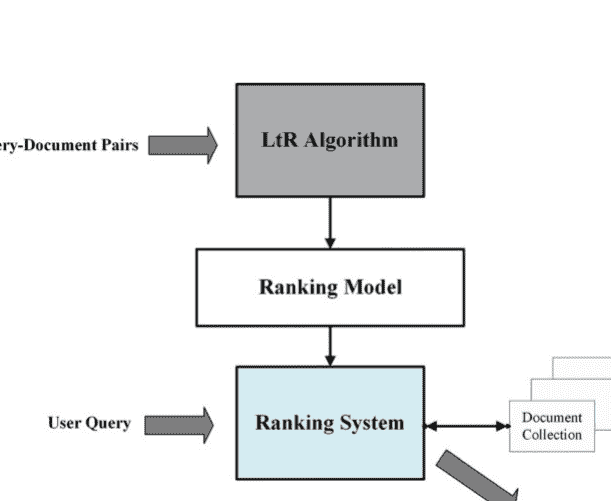

排名算法在测试数据集上的预测性能。最后，排名系统根据用户的搜索查询从文档集合（文档存储库）中检索到的文档生成一个有序列表。

LtR的两个主要子集包括排名创建和排名聚合，每个子集都在后续章节中分别进行描述和制定学习方法。

### 6.2.1 排名创建

排名的目的是根据推荐和请求的特征创建一个推荐排名列表，以便更好的推荐排名更高。排名创建中的学习方法与使用机器学习技术自动构建排名模型有关。在以前的信息检索系统中，没有进行学习来获得基于查询对文档进行排序的排名模型。例如，在BM25模型中，假设查询 $q$ 和文档 $d$，排名模型 $f(q,d)$通过条件概率分布 $P(r|q,d)$来表示，其中 $r$ 的值等于零或一，分别表示文档的无关性或相关性。在信息检索的语言模型（LMIR）[4]中，条件概率分布 $P(q|d)$表示排名模型。概率模型的计算是通过文档和查询中的观察到的词语进行的，与学习无关。

此后，信息检索领域出现了一种新趋势，即使用机器学习技术自动创建排名模型。在信息检索范围内，许多数据呈现出关联性，并可用于自动创建排名模型。它还提供了一种从搜索日志中提取训练数据来自动创建低成本排名模型的新机会。

因此，学习排序已成为现代网络搜索引擎的一种有效技术之一[1]。图6.2显示了学习排序的框架[3]。

如图6.2所示，由于学习排序是一种监督学习的类型，它需要一个训练集。生成训练集类似于创建测试集以进行评估。在这个框架中，一组 $n$ 个训练查询由 $q_i (i = 1, \ldots n)$ 表示，并且与之相关的文档由特征向量 $x_{q_i} = x_{q_i}$ 表示。

$x_{q_i} = \left\{ x_j^{(i)} \right\}_{j=1}^{m(i)}$。$m(i)$ 是与 $q_i$ 查询相关的文档数量。基本事实标签也由 $y = y_j$ 指定 $\left\{ y_j \right\}_{j=1}^{m(i)}$。然后，使用特殊的学习算法来学习排序模型，以便排序模型的输出能够尽可能准确地预测训练集中的基本事实标签，并根据损失函数进行。在测试阶段，当输入一个新的查询时，使用在前一阶段构建和训练的模型对文档进行排序，并将相应的排序列表返回给用户。

排序创建领域包括四个主要问题：训练和测试过程、创建高质量的训练数据、特征构建和评估。

## 6.2 学习排序框架

如果使用监督方法进行排序创建，则训练和测试数据是关键组成部分。例如，在信息检索中，将查询和文档集合视为训练数据，其中包括每个查询和文档之间的相关程度。然而，在实际场景中，这种数据可能很难获取，因为排序列表必须包含用户对文档与查询相关性的平均判断。通常，有两种常见的训练数据创建方法。第一种标注方法是由人工用户进行的，这在各个信息检索领域广泛使用。另一种方法是通过点击提取数据。Web搜索引擎中的点击数据记录了用户在提交查询后点击文档的情况。点击数据提供了关于用户相关性的隐式反馈，因此对于相关性判断非常有用。值得一提的是，排序模型实际上被定义为基于文档和查询的特征向量的函数。这就是为什么排序模型是可推广的，即使它是在少量数据上训练的，也可以扩展到用于任何其他数据。与其他机器学习任务一样，学习性能在很大程度上取决于特征的有效性。因此，特征构建的方法至关重要。最后，通过比较模型输出的排序列表和作为基本事实的排序列表来执行排序模型的性能评估。

监督式LtR过程如图6.3所示。LtR过程包括用于训练和测试的数据集，分别由 $D_{train}$ 和 $D_{test}$ 表示。使用 $D_{train}$ 来训练LtR模型，其训练目的是基于排名函数 $Rank F$ 来最小化在 $G_{train}$ 上的预测误差。$G$ 是用于监督学习的得分特征和真实值集合。通常通过最小化地面真实值 $G$ 和其对于 $D_{train}$ 的预测值 $G$ 之间的个体误差 $Rank$ 来完成此过程。为了评估 $Rank$ 模型的性能，我们将其应用于 $D_{test}$，然后比较地面真实值分数和预测值。如果排名预测被认为足够准确，则先前的测试结果成功。因此，Rank 考虑一个新的候选集来预测其分数 $G = Rank F$，并根据这些预测对候选者进行排序。在图6.3的步骤（1）中，将由元组 $(F, G)$ 组成的训练数据集 $D_{train}$ 作为输入提供给排序学习算法，在步骤（2）中，训练排名函数 $Rank F$。这是通过在步骤（3）中预测对于 $D_{train}$ 的分数 $G$ 时最小化误差 $Rank F$ 来完成的。模型的预测准确性在（4）中进行评估；为此，将来自 $D_{test}$ 的 $F_{test}$ 特征作为Rank的输入。在（5）中，计算了 $G$ 的预测分数，然后在（6）中将 $G$ 与地面真实值 $G_{test}$ 进行比较。

需要注意的是，在基于学习方法的排名创建领域中，所提出的方法可以分为三类：点对点、成对和列表。点对点和成对方法将排名问题转化为分类、回归和有序回归问题。列表方法将对象的排名列表作为学习示例，并基于排名列表学习排名模型。这些方法之间的主要区别在于所使用的损失函数。

### 6.2.2 排名聚合

排名聚合的目的是将多个排名组合成一个更好的排名，以评估指标为基准。在排名聚合中进行学习涉及使用机器学习技术构建排名聚合的排名模型。例如，在元搜索中，用户的查询被发送到多个搜索系统，并将搜索系统的排名列表组合并呈现给用户。

因为来自各个搜索引擎的排名可能不够准确，元搜索实际上是通过对搜索排名进行多数投票来进行的。问题是如何有效地进行多数投票。在这里，单个搜索引擎的排名被称为基本排名，元搜索的排名被称为最终排名。可以通过无监督或监督学习方法进行LtR聚合。

在以前的信息检索方法中，排名聚合通常基于无监督学习。最近，也提出了用于排名聚合的有监督方法。在有监督的LtR聚合中，训练数据包括查询、相关文档以及文档的基本排名，以及相应的 final排名。测试数据包括查询、相关文档和文档的基本排名。最后，排名聚合中的评估指标是基于如何呈现真实情况。它可以是LtR系统中的任何标准度量[1]。

另一种LtR分类方法包括基于特征和判别的方法。基于特征的方法，在机器学习中称为标签学习方法，用特征向量表示所有可用的文档，反映了文档与查询的相关性。用于学习排序的传统特征包括文档中查询词的频率、BM25模型的输出和PageRank模型。这些特征可以从搜索引擎的索引中获取。LtR聚合方法可以结合多个特征，并将模型的输出作为特征的一个维度，能够应用信息检索模型中的任何新发展。这种能力使得真实的搜索引擎能够使用多个特征来检测Web用户所需的复杂信息。基于判别方法的学习排序技术具有基于训练数据的自动学习过程。这些方法通常用于真实的搜索引擎，因为这些搜索引擎每天都会接收到用户的反馈和使用报告。因此，从反馈中自动学习和持续改进排名是至关重要的。此外，判别方法用于组合不同类型的特征，而无需定义概率框架来提供实体和预测准确性。

所有的学习排名方法通常通过最小化某些损失函数来学习它们的排名函数。在推荐系统中，通常生成一个前N个列表以显示给用户。因此，对这个列表进行排名对于推荐的质量和用户满意度至关重要。事实上，与其将推荐系统中的推荐作为排名预测问题，不如看一下物品的排名更合理。与用户最相关的物品应该位于推荐列表的顶部。

表6.1 在LtR范围内的研究（信息检索和推荐系统）

| 学习排序模型 | 参考文献 | 排序模型 |
| :--- | :--- | :--- |
|  | 信息检索 | 推荐系统 | 信息检索 | 推荐系统 |
| 排序创建 | 逐点 | [7–17] | [18–22] | SubsetRanking [7], OPRF [8], McRank [11], PRanking [13], DPG-FBE [16] | CPL-mg [22] |
|  | 成对 | [23–34] | [35–42] | RankNet [26], LambdaRank [23], FRank [28], 排名SVM [29], GBRank [30], SortNet [31], SSRankBoost [32] | PRM [41], BPR [36], TOP1[37], CPLR [38], PDLR [35], PLtR-N [40] |
|  | 整体 | [43–50] | [51–54] | AdaRank [45], ListNet [46], PiRank [47], SetRank [48], FastAP [49], DLCM [50], RaMBO [44] | TOP1-max [52], BPR-max [52], Do-Rank [53] |
|  | 混合 | [55–57] | [2, 58–60] | LambdaRank [56], LambdaMART [56], IESR-Rank [57], IESVM-Rank [57] | DeepRank [2] |
| 排名聚合 |  | [34, 61–68] | [69–73] | Cranking [63], v-ManX [65], RABF [68] | ERA [70] |

在推荐列表中，与用户最相关的物品应该位于顶部。定义相关性可以消除对排名的预测需求。你不需要知道有多少用户对某个物品进行了评分；重要的是用户至少喜欢该物品胜过其他任何可用的物品。值得注意的是，物品目录可能不包含用户喜欢的物品，但在这种情况下，推荐系统仍然希望提供一个最佳可用物品的列表。排名模型和算法帮助推荐系统以最优状态排列推荐列表中的物品。

基于个体项目偏好分数学习排名模型的推荐系统被认为是点对点排名方法。使用成对学习进行排名的推荐系统可以考虑每个用户对一对项目的偏好，最后，使用列表学习进行排名的系统可以考虑每个用户对一系列项目（通常是排名的）的偏好模型。

表6.1根据排名类型（创建/聚合）和应用（IR/RS）列出了研究列表。

图6.4中的图表显示了讨论研究中使用的每种技术的百分比。

根据图6.4中的图表，大部分研究都与排名创建方法相关，这些方法致力于使用机器学习技术自动构建排名模型。

图6.4 在IR/RS范围内，每种排名创建和排名聚合方法的百分比

### 6.2.3 数据集

为了评估学习排序系统，已经公开发布了几个数据集。该数据集包含数千个带注释的查询，数百个语义特征和数百万个用户会话，已广泛用于学习排序研究。公开可用的学习排序数据集可以根据合成或真实用户反馈进行粗略分类。这两种方法在无偏学习排序算法的实证研究中被广泛使用。

- Microsoft LETOR [74]: 它使用Gov2网页集合（约2500万个页面）和来自TREC 2007和TREC 2008的两组查询。这两个查询集称为MQ2007和MQ2008。在MQ2007中，有1692个查询和65323个标记文档；在MQ2008中，大约有784个查询和14384个标记文档。
- 雅虎！ LETOR [75]: 这是一个使用商业英文搜索引擎的公共LtR最大的数据集之一。总共包含29,921个查询和710,000个文档。每个查询和文档对都有一个 five级别的相关性评判和由单独的特征选择阶段选择的700个特征。
- 天宫-ULTR [76]: 该数据集是使用从搜狗搜索会话中采样的真实用户点击数据收集的。为此，随机抽样了3449个由真实搜索引擎用户编写的查询，并从2周的搜索报告中收集了前10个结果。清理后，数据集包含333,813个文档，71,106个排序列表和3,268,177个匿名搜索会话与点击。
- Istella-S [77]: 它包含33,000个查询和3,408,000个文档（每个查询大约103个文档），这些文档是从意大利商业搜索引擎中采样的。每个查询-文档对由220个特征表示，并带有 five级别的相关性评判。
- 百度-ULTR [78]: 数据集由两部分组成：(1) 大规模网络搜索会话和 (2) 专家注释数据集。第一部分包含了从2022年4月的百度搜索引擎搜索会话中随机抽样的383,429,526个查询和1,287,710,306个文档。大多数会话中包含少于十个候选文档，这些文档具有当前查询的页面展示特征和用户行为。第二部分也是从百度搜索引擎每月收集的搜索会话中随机抽样得到的，每个文档与查询的相关性由专家标注者进行判断，其中包括五个标签。

## 6.3 排名创建

排名创建是基于推荐的特征对推荐列表进行排序，使得相关性更高的推荐位于更高的位置。在本节中，我们将讨论主要的排名创建模型，这些模型通常被分类为点对点、成对和列表在信息检索和推荐系统的两个领域中。

### 6.3.1 点对点方法

在点对点方法中，排名问题变成了一个分类、回归或有序回归问题，并且现有的分类、回归或有序回归方法可以用来解决它。这些类型的方法将训练数据作为输入，并忽略组结构。训练数据被转换为监督学习数据，以便可以使用现有方法进行学习。当考虑数据集中的数据时，会考虑类别标签、实数和分数标签。

问题变成了分类、回归和有序回归。假设学习模型的输出是实数，当给定一个查询时，可以使用该模型来对文档进行排序（根据模型给出的分数对文档进行排序）。损失函数在单个对象上的点对点方法中被定义。事实上，在点对点方法中，总损失被计算为每个文档的定义损失之和，即预测分数与真实分数之间的距离。

在信息检索系统的领域中，正式定义了四个基本组件来描述逐点方法：输入、输出、假设和损失函数[3]:

- 输入空间包含每个文档的特征向量。
- 输出空间包含每个文档的相关程度。输出空间中的真实标签定义如下：如果判断直接被假设为相关程度 $l_j$，则文档 $x_j$ 的真实标签为 $y_j = l_j$，但如果判断被定义为 $\pi_0$ 的总序，则可以使用映射函数获得真实标签。值得一提的是，如果判断给出的是成对偏好 $l_{u,v}$，则很难使用它生成真实标签。
- 假设空间包含以文档的特征向量为输入并预测文档相关程度的函数。通常，这样的函数被称为评分函数 $f$。可以根据评分函数对所有文档进行排序，并提供最终的排名列表。
- 损失函数衡量了每个文档对于真实标签的准确预测。在不同的点对点排序算法中，排序被建模为回归、分类和有序回归。因此，回归损失、分类损失和有序回归损失被用作损失函数。

如上所述，基于不同的机器学习技术，点对点方法可以分为三类：基于分类的算法、基于回归的算法和基于有序回归的算法[3]:

- 排名问题可以被视为一个分类模型。分类是一个监督学习问题，其中预测的目标变量是离散的。当排序被建模为分类时，给予文档的相关程度被视为一个类别标签。在基于分类的算法中，输出空间包含无序的类别。其中一些方法基于二元分类，另一些方法基于多类分类。与二元分类相关的方法基于支持向量机（SVM）[9]、逻辑回归[10]等。基于SVM的方法因其能够自动学习任意特征、假设较少和表达能力强而受到关注[9]。逻辑回归是一种常用的用于进行二元分类的分类技术。基于多类分类的方法使用了提升树方法技术。
- 对于基于回归的算法，通过将相关度视为实数，可以将排序问题简化为回归问题。回归也是一个监督学习问题，其中预测的目标变量是连续的。当将排序建模为回归时，给定给文档的相关度被视为连续变量，并且通过最小化训练集的损失来训练排序函数。在这些方法中，输出空间包含与实数相关联的点。在基于回归的方法中，使用了各种类型的回归，例如加权回归[7]，多项式回归[8]等。
- 序数回归在学习排序模型时考虑了真实标签之间的序数关系。对于基于序数回归的算法，输出空间由有序类别组成。将具有其真实标签的文档视为训练集中的随机独立变量，其分布由输入空间的乘积得到[3]。如果在这种类型的方法中，考虑排序类别的数量等于2，则问题简化为二元分类。因此，基于序数回归的技术与基于分类的算法强相关。这些方法使用基于感知器的排序方法[13,14]，基于大边界原则的排序以及基于阈值的损失函数[17]。

表6.2展示了点对点方法的学习方法，按照回归、分类和有序回归方法的输入、输出、假设和相关损失函数进行分隔。

表6.2 点对点方法中的学习方法

|  | 回归 | 分类 | 有序回归 |
| :--- | :--- | :--- | :--- |
| **输入** | 单个文档 $x_j$ |  |  |
| **输出** | 实数 $y_j$ | 非 | 有序类别 $y_j$ |
| **假设** | $f(x_j)$ | 基于($f(x_j)$)的分类器 | $f(x_j)$ + 阈值处理 |
| **损失函数** | 回归损失 $L = (f; x_j, y_j)$ | 分类损失 | 有序回归损失 |

在推荐系统中，点对点方法为每个项目创建一个分数，然后根据该分数对项目进行排序。然后，根据这个评分向用户提供推荐。评分预测和排序之间的区别在于，在排序中，当分数表示项目在排序中的正确位置时，分数是重要的。在第6.3.1.1节中，介绍了点对点方法在信息检索领域中的会话推荐系统在第6.3.1.2节中讨论和审查了点对点方法。

#### 6.3.1.1 信息检索中的点对点方法

点对点LtR的基本方法之一是由Cossock等人提供的方法，该方法基于回归技术对排名问题进行建模[7]。与查询 $q$ 相关的文档集合由 $x = \{x_j\}_{j=1}^m$ 表示，而由 $y = y_j$ 表示 $y_j=1$ 表示按多个有序类别排序的文档的真实标签。评分函数 $f$ 用于对这些文档进行排序，损失函数使用公式 (6.1) 计算：

$$ L(f; x_j, y_j) = (y_j - f(x_j))^2 $$

该方法的结果表明，只有当评分函数 $f(x_j)$ 的输出与标签 $y_j$ 完全相等时，才不会有损失。否则，损失值将增加到2的幂次。换句话说，对于相关文档，只有评分函数能够完全输出 $y_j$ 时，损失才为零。该函数的具体损失可以作为基于 nDCG 指标的排名错误的上限。在高回归损失的情况下，只要 $f(x_j)$ 的预测之间的相对顺序与真实标签相对应，相应的排名就是最优的。

因此，预计平方损失函数是 nDCG 排名误差的一个宽松界限。

旨在通过多类分类错误限制基于 DCG 的排名错误，Li等人提出了多类分类，即 McRank 算法 [11]。他们学习一个分类模型，并使用它来获得每个对象的成员概率。然后，他们计算对象的预期分数，并将其用于排名目的。使用梯度提升树算法来学习类别概率。

McRank 中用于学习分类器的损失函数如公式 (6.2) 所示：

$$ L(\hat{y}_j, y_j) = I_{\{y_j \neq \hat{y}_j\}} $$

根据公式 (6.3) 定义了替代损失函数，并使用提升树算法来最小化误差。

$$ L_\varphi(y_j, \hat{y}_j) = \sum_{j=1}^m \sum_{k=1}^K -\log P(\hat{y}_j = k) I_{\{y_j = k\}} $$

在公式 (6.3) 中，使用逻辑函数计算得到 $P(\hat{y}_j = k)$，该函数的计算方式如公式 (6.4) 所示：

$$ P(\hat{y}_j = k) = \frac{e^{F_k(x_j, w)}}{\sum_{s=1}^K e^{F_s(x_j, w)}} $$

在公式 (6.4) 中，表达式 $F_k (x_j, w)$ 表示文档 $x_j$ 属于类别 $k$ 的程度。然后，分类结果被转换为排名分数。分类器的输出通过公式 (6.4) 转换为概率。然后，使用公式（6.5）的加权组合来确定文档的最终排名分数。

$$ f(x_j) = \sum_{k=1}^{K} g(k) \cdot \mathbb{I}(\hat{y}_j = k) $$

另一个基于序回归的著名点对点方法称为PRanking，由Crammer等人提出[13]。该算法的目标是在呈现文档后找到由参数向量 $w$ 定义的路径。然后，可以使用阈值轻松识别排序到不同类别的文档。通过迭代学习过程实现了这个目标。在第 $t$ 次迭代中，学习算法接收与查询 $q$ 相关联的实例 $x_j$。算法根据公式(6.6)预测 $\hat{y}_j$，并接收真实标签 $y_j$。

$$ \hat{y}_j = \arg\min_k \left\{ w^T x_j - b_k < 0 \right\} $$

如果算法犯了一个错误，并且至少有一个由 $k$ 索引的阈值，那么 $w^T x_j$ 的值就在 $b_k$ 的错误一侧。为了纠正错误， $w^T x_j$ 和 $b_k$ 的值应该朝着同一侧相互靠近。之后，模型参数 $w$ 通过 $w = w + x_j$ 进行设置，与许多感知器算法相同。这个过程重复进行，直到训练过程收敛。

胡等人考虑了电子商务平台上搜索会话中的项目排名，例如亚马逊和淘宝，这是一个多步决策问题[16]。为了增加不同排名步骤之间的相关性，作者提出了一种强化学习方法，通过学习在一个搜索会话中最大化预期累积奖励的最佳排名策略。为此，正式地定义了搜索会话马尔可夫决策过程（SSMDP）的概念，通过识别状态空间、奖励函数和状态转移函数来形式化多步排名问题。此外，提出了一种名为确定性策略梯度与完全备份估计（DPG-FBE）的新算法，用于解决SSMDP中奖励方差高和奖励分布不平衡的问题。

#### 6.3.1.2 推荐系统中的点对点方法

在视频推荐系统领域提出的点对点方法之一是一个大规模多目标排名系统，在商业视频共享平台上推荐下一个要观看的视频[19]。这种方法是分类和回归方法的结合，具有多个目标。视频推荐系统中的排名问题存在几个挑战。它们通常具有不同或相互冲突的目标；可能会推荐高评级的视频以及与观看者分享的视频。或者，系统中通常存在隐含的偏见。例如，用户可能只是因为点击和观看了一个视频而推荐给他。之所以被评价高，不是因为用户最喜欢它。因此，使用从当前系统生成的数据训练的模型将存在偏差，导致反馈循环效应[21]。

赵等人将用户行为用作训练标签[19]。由于用户的行为可能与推荐的不同，排名系统被设计为支持多个目标。该方法将目标分为两类：（1）参与目标，例如用户点击和与推荐视频的参与程度，以及（2）满意度目标，例如用户喜欢YouTube视频和对推荐进行评级。与交互目标相关的行为预测被分为两个任务：行为（例如点击）的二分类和与观看时间相关的行为的回归。同样地，预测用户满意度行为被描述为二分类或回归。例如，对于视频的点击喜欢等行为被描述为二分类任务，对于评级等行为被描述为回归任务。二分类使用交叉熵损失函数计算，回归使用平方损失计算。赵等人提出的框架如图6.5所示。

Zhu等人提出了一个新的框架，称为CPL（Pointwise预测和LTR的组合框架），其中点预测和LTR被结合起来以提高前N个推荐的性能[22]。实际上，在点预测中可能存在过拟合的问题，而LTR更容易出现较高的方差。作者提出的混合模型可以改善这两个问题。为此，他们提出了一种特殊的CPL实现，称为CPLmg，它是FSLIM和GAPfm模型的组合。FSLIM是使用矩阵分解（MF）方法扩展自SLIM。SLIM直接从数据中学习相似性矩阵。Factorized SLIM是SLIM的一个新版本，它融合了传统矩阵分解（MF）方法的思想。GAPfm是一种直接优化GAP度量平滑近似的列表LTR方法。GAP将平均精度扩展到多级相关性的情况，并继承了AP度量的最重要特征，确保在推荐列表顶部的错误比在列表底部的错误受到更严厉的惩罚。

作者使用多任务学习方法训练了FSLIM和GAPfm。如图6.6所示，FSLIM和GAPfm根据各自的目标函数进行迭代更新，共享底层变量、潜在因子矩阵P和Q，以及学习到的物品相似度矩阵W。矩阵P和Q在每一轮联合训练中由FSLIM和GAPfm共同更新，物品相似度矩阵W帮助GAPfm提取潜在的正样本。

为了学习和估计多种类型的用户行为，马等人使用MMoE [18]自动学习参数并共享潜在的冲突目标。MMoE是一种软参数共享模型，用于建模任务关系。它通过在所有任务中共享专家，并为每个任务训练一个门控网络，来适应多任务学习的混合专家（MoE）结构。关键思想是用MoE层替换共享的ReLU层，并为每个任务添加一个单独的门控网络。

## 图6.5端到端排名系统的框架[119]

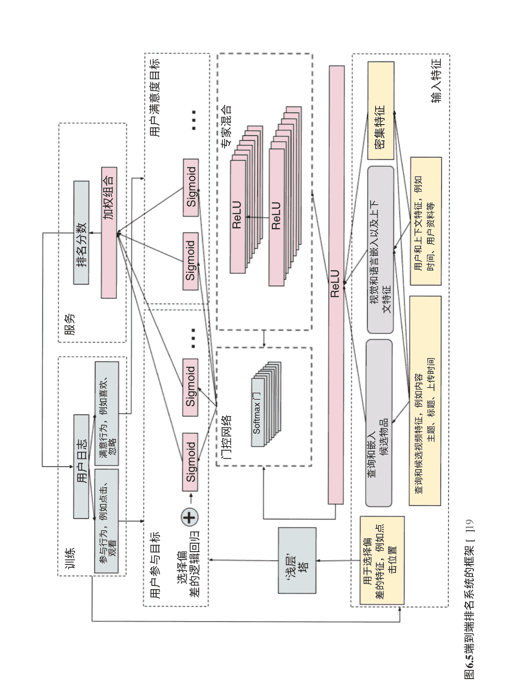

在[20]中，唐等人提出了一种考虑多个目标的逐点排序方法，用于建模排名系统中的不同用户行为，例如点击、分享和评论。在离线训练过程中，排名模型基于从用户日志中提取的用户操作进行训练。每次在线请求后，排名模型为每个任务提供预测，然后加权乘法排名模块通过组合函数将这些预测分数结合起来。在所有任务中，VCR（观看完成比例）和VTR（观看通过率）是模拟观看次数和观看时间等关键在线指标的两个重要目标。VCR是基于MSE训练的回归任务，而VTR是基于交叉熵训练的二分类任务。VCR和VTR之间的模式复杂，它们之间存在SEESAW现象。SEESAW现象被定义为一个任务的改进往往导致另一个任务性能的下降。

在本章中，提出了一种渐进分层提取（PLE）模型来处理SEESAW现象和负迁移。PLE的关键思想如下。首先，它明确地将公共和任务特定的专家分开，以避免有害的参数干扰。其次，引入了多级专家和门控网络，以融合更抽象的表示。最后，它采用了一种新颖的渐进分离路由来建模专家之间的交互，并实现了复杂相关任务之间更高效的知识传递。

### 6.3.2 对比方法

成对方法不关注准确预测每个文档的相关程度，而是关注两个文档之间的相对顺序。

| 组件 | 成对方法 |
|------|----------|
| 输入 | 文档对 $(x_u, x_v)$ |
| 输出 | 偏好 $y_{u, v}$ |
| 假设 | 排名函数 $f(\vec{X})$， $h(x_u, x_v) = 2 \cdot \text{I}\{f(x_u) > f(x_v)\} - 1$ |
| 损失函数 | 成对分类/回归损失 $L(f; x_u, x_v, y_{u, v})$ |

从这个意义上说，它更接近于“排名”概念，而不是点对点方法。在成对方法中，排名通常被简化为对文档对的分类，确定哪个文档在一对中更受青睐。因此，学习的目标是最小化未分类文档对的数量。这种分类与点对点方法中的分类不同，因为它对正在审查的两个文档都进行操作。在信息检索系统领域，正式定义了四个基本组件来描述成对方法：输入、输出、假设和损失函数[3]。

- 输入空间包含由特征向量表示的文档对。
- 输出空间包含每对文档之间的成对偏好，取值为{+1,-1}。不同类型的判断可以转化为成对优先级的基准真值标签：
  - 如果判断被假设为相关度的程度 $l_j$，则对于$(x_u, x_v)$的成对偏好可以定义为 $y_{u,v} = 2 \cdot I_{\{l_u > l_v\}} - 1$。
  - 如果判断直接被假设为成对偏好，则简单设置为 $y_{u, v} = l_{u, v}$。
  - 如果判断被假设为 $\pi_l$ 的总序，则可以定义为 $y_{u,v} = 2 \cdot I_{\{\pi(u) < \pi(v)\}} - 1$。
- 假设空间由两个变量函数组成，它以一对文档作为输入，并输出它们之间的相对顺序。一些成对排名算法直接定义它们的假设，而其他算法根据公式（6.7）中的评分函数 $f$ 来定义这个假设：
  - $h(x_u, x_v) = 2 \cdot \text{I}\{f(x_u) > f(x_v)\} - 1$ (6.7)
- 损失函数衡量了$(x_u, x_v)$和真实标签 $y_{u, v}$ 之间的不一致性。在许多成对排名算法中，排名被建模为成对分类，对一对文档的分类损失被用作损失函数。评分函数 $f$ 使用基于差异$(f(x_u), f(x_v))$的分类损失函数，而不是值 $h(x_u, x_v)$。

表6.3显示了成对方法的组成部分，按输入、输出、假设和相关损失函数分隔。

几个推荐系统使用成对方法对推荐的项目进行排名。特别是基于顺序数据的会话推荐系统通常使用循环神经网络，并且大多数使用成对排名损失函数[52]。由于深度学习方法需要在多个层中传播梯度以优化模型参数，因此由损失函数引起的这些梯度的质量会影响优化质量和模型参数。此外，在具有多个项目的输出空间中，还必须考虑到一些独特的挑战，以开发适当的排名损失函数。

成对的LtR的基本方法有不同的类型。其中一些基于神经网络[34]，感知器[31]，提升[33]，SVM[29]和其他机器学习方法[28,30]。在第6.3.2.1节中，讨论和回顾了信息检索领域中的成对方法，在第6.3.2.2节中，讨论和回顾了推荐系统领域中的成对方法。

#### 6.3.2.1 信息检索中的成对方法

在[26]中，Burges等人提出了一种用于学习排序的成对方法之一，使用神经网络，称为RankNet。RankNet选择交叉熵函数作为学习的损失函数，并考虑训练数据中每对相关对象的概率。如果考虑两个与q相关联的文档x_u,x_v，根据它们的真实标签计算P̄_u,v。在这种情况下，如果y_u,v = 1，则P̄_u,v = 1；否则，P̄_u,v = 0。然后，基于这两个文档的分数差异，通过得分函数根据公式（6.8）定义了建模概率P_u,v。

$$P_{u,v}(f) = \frac{\exp (f(x_u) - f(x_v))}{1 + \exp (f(x_u) - f(x_v))} \tag{6.8}$$

交叉熵损失函数是最终概率和模型概率之间的差异，它在方程（6.9）中简要提到：

$$L(f; x_u, x_v, y_{u,v}) = -\bar{P}_{u,v} \log P_{u,v}(f) - (1 - \bar{P}_{u,v}) \log (1 - P_{u,v}(f)) \tag{6.9}$$

交叉熵损失是0-1成对损失函数的上界，它在方程（6.10）中定义：

$$L_{0-1}(f; x_u, x_v, y_{u,v}) = \begin{cases} 1 & y_{u,v}(f(x_u) - f(x_v)) < 0, \\ 0 & \text{否则}. \end{cases} \tag{6.10}$$

然后使用神经网络作为模型，随机梯度下降作为优化算法来学习评分函数f。这个神经网络由两个普通层和一个输出层组成，其中文档的特征被输入到第一层中。第二层由多个隐藏节点组成，每个节点包含一个sigmoid变换，网络输出是文档的排名分数。

Burges等人提出了一种基于RankNet的嵌套成对排名方法，通过迭代地重新对具有较高分数的文档进行排名[27]。在每次迭代中，该方法使用RankNet算法对结果的子集进行重新排名。它将问题分解为更小、更简单的部分，并创建一个新的结果分布，供算法学习。

在Burges等人的[26]中提出的方法中，有些情况下，交叉熵损失具有非零最小值，这表明无论使用何种模型，总会存在一些损失。这可能与我们对损失函数的认知不符。此外，损失没有被限制，这可能导致训练过程中某些困难文档对的主导。为了解决这些问题，[28]提出了一种新的损失函数，称为fidelity损失函数，其由公式（6.11）定义：

$$L\left(f; x_{u}, x_{v}, y_{u, v}\right)=1-\sqrt{\bar{P}_{u, v} P_{u, v}(f)}-\sqrt{\left(1-\bar{P}_{u, v}\right)\left(1-P_{u, v}(f)\right)} \tag{6.11}$$

Fidelity最初用于量子物理学中衡量两个可能状态之间的差异。当用于衡量目标概率和模拟概率之间的差异时，它是$(f(x_{u})-f(x_{v}))$。通过比较fidelity损失和交叉熵损失，可以明显看出fidelity损失在0和1之间有限。另一方面，虽然交叉熵损失是凸的，fidelity损失变成了非凸的，这使得优化这样一个非凸目标更加困难。此外，fidelity损失不再是0-1成对损失的上界。

Tsai等人提出了一种生成性加法模型作为排名函数[28]，该模型类似于提升技术，用于学习加法模型中的系数。具体来说，在每次迭代中添加一个新的弱排序器（即新特征），并通过考虑保真度损失梯度来调整组合系数。当添加新的排序不再导致显著减少时，学习过程收敛。

基于学习排序目标函数的排序评估结果通常是非连续和非可微的，并且取决于排序。当然，需要注意的是，排序函数不是连续和可微的。Burges等人提出了一种称为LambdaRank的方法，该方法考虑使用梯度下降来优化评估结果，并尝试直接使用评估结果的梯度函数[23]。在LambdaRank中，引入了基于位置的权重用于成对损失函数。实际上，在训练过程中，评估度量（基于于位置）直接用于定义每对文档的梯度。

假设只有两个相关文档$x_{1}$和$x_{2}$，并且使用NDCG@1作为评估指标。在这种情况下，如果我们能够将$x_{2}$和$x_{1}$排在列表的顶部，并且$x_{1}$排名更高，我们将达到最大的NDCG@1。显然，将$x_{1}$向上移动更容易，因为$x_{2}$的努力要少得多。因此，我们可以定义（但不能计算）给定排名分数$x_{1}$（用$s_{1}=f(x_{1})$表示）大于给定排名分数 $x_2$ （用 $s_2 = f(x_2)$ 表示）。换句话说，在优化过程中我们可以考虑存在一个隐含的损失函数 $L$，其在公式 (6.12) 中显示：

$$\frac{\partial L}{\partial s_1} > \frac{\partial L}{\partial s_2} \tag{6.12}$$

上述梯度被称为lambda函数，这就是为什么该算法被称为LambdaRank。当用于训练时，nDCG提供了一种特殊形式的lambda函数，如公式 (6.13) 所示：

$$\lambda = Z_m \frac{2^{y_u} - 2^{y_v}}{1 + \exp(f(x_u) - f(x_v))} \tag{6.13}$$

$r(\cdot)$ 表示训练的前一次迭代中文档的位置。每轮优化中，通过 $+\lambda$ 和 $-\lambda$ 分别更新每对文档 $x_v$ 和 $x_u$ 的分数。

一种成对学习排序的方法是基于SVM的方法 [24, 25]。这些方法使用成对分类来实现LtR。假设有 $n$ 个查询 $q_i$ $(i=1,2,...,n)$，每个查询都有一对相关文档 $(x_u^{(i)}, x_v^{(i)})$，并且它们的真实标签是 $y_{u,v}^{(i)}$；假设使用线性排名函数 $f(x) = w^T x$，Ranking SVM 的公式如 Eq. (6.14) 所示：

$$\begin{aligned} & \min \frac{1}{2} \|w\|^2 + \lambda \sum_{i=1}^{n} \sum_{u,v:y_{u,v}^{(i)}=1} \xi_{u,v}^{(i)} \tag{6.14} \\ & \text{s.t.} \quad w^T (x_u^{(i)} - x_v^{(i)}) \geq 1 - \xi_{u,v}^{(i)} \quad \text{如果} \quad y_{u,v}^{(i)}=1, \\ & \quad \quad \xi_{u,v}^{(i)} \geq 0, \quad i=1, \ldots, n \end{aligned}$$

在方程 (6.14) 中，$\frac{1}{2}\|w\|^2$ 控制模型 $w$ 的复杂度。SVM和Ranking SVM之间的区别在于从文档对中构建的约束条件。Ranking SVM中的损失函数是在文档对上定义的铰链损失。例如，对于查询 $q$，如果一个文档 $x_u$ 被标记为比另一个文档 $x_v$ 更相关，即 $w^T x_u$ 比 $w^T x_v$ 大1个边界，损失不存在。否则，损失等于 $\xi_{u, v}$。铰链损失是0-1对比损失的一个上界。

与为查询提供正确的文档排序相关的一种研究将创建文档列表的过程描述为马尔可夫决策过程（MDP）。为此，搜索结果多样化中的文档排序被建模为一个MDP，其中每个时间步与一个排序位置相关联，每个动作与选择该位置的文档相关联。给定一组标记的训练数据，使用策略梯度来学习MDP参数。在这个过程中，在每个训练迭代中，策略梯度算法首先随机抽样一个文档列表它的训练样本，然后根据绝对性能得分加权列表来估计梯度。当这个模型应用于IR中的文档排序时，用这种方式估计梯度存在局限性，并且忽略了IR排序的相对排序性质，并且用高方差估计梯度。为了解决这个问题，徐等人提出了一种策略梯度算法，其中梯度是通过查询中两个采样文档列表的两两比较确定的。[79]。这个算法被称为Pairwise Policy Gradient (PPG)，它重复采样文档列表对。它通过两两比较估计梯度，并完全更新模型参数。

#### 6.3.2.2 推荐系统中的两两方法

在推荐系统中，两两方法为用户生成个性化推荐列表，并确定用户之间的两两偏好和兴趣。在基于会话的推荐系统中，没有用户的具体配置文件，这些方法根据用户的行为对其偏好进行收集，并使用一组项目对偏好来表示每个用户。

Rendle等人提出的BPR-MF是一种用于具有隐式反馈的推荐系统场景的成对LtR方法[36]。BPR-MF通常用于基于长期用户-物品交互的矩阵补全问题。这种方法是学习排名物品的最常见的成对方法之一，具有可接受的计算复杂度和修正排名能力。某些方法，如矩阵分解，不能直接应用于基于会话的推荐系统，因为新会话中的特征向量没有预先计算。然而，可以通过使用会话中出现的物品的平均特征向量作为用户特征向量来克服这个问题。建议物品与当前会话物品之间的特征向量相似性被平均并通过以下度量进行优化:

$$\text{BPR-MF} = \sum_{(u, i, j) \in D} \ln \sigma(r_{u,i} - r_{u,j}) - \lambda_\theta ||\theta||^2 \tag{6.15}$$

在公式（6.15）中，用户u和物品i的排名r_{u,i}通过W和H矩阵中相应行的点积来近似计算。模型θ=(W, H)的参数通过对数据集D进行多次迭代的随机梯度下降来学习，数据集D由形如(u, i, j)的三元组组成。(u, i)是正反馈对，(u, j)是负样本。σ是逻辑函数，λ_θ是控制复杂度的正则化参数。目标函数（6.15）中的优化度量是将正样本(u, i)排在未观察到的样本(u, j)之前。BPR的目标是最大化目标分数高于样本分数的概率。Hidasi等人在[52]中使用的基于会话的推荐系统中，与BPR相关的损失函数在会话的某一点上被定义如下:

$$L_s = -\frac{1}{N_s} \sum_{j=1}^{N_s} \log \sigma \left( \bar{r}_{s,i} - \bar{r}_{s,j} \right) \tag{6.16}$$

在公式（6.16）中，$N_s$是样本数量，$r_{s,k}$是某个会话中项目$k$的分数，$i$是目标项目（会话的下一个项目），$j$表示负样本。

Hidasi等人在[37]中提出的一种成对损失函数是TOP1函数，它由两部分组成。第一部分的目的是将目标项目的分数提高到样本的分数之上，而第二部分的目标是将负样本的分数降低到零。第二部分充当正则化器，但不是直接限制模型权重，而是对负样本的高分进行惩罚。由于训练示例中的所有项目都作为负分数，因此它降低了整体分数。TOP1函数的计算使用公式（6.17）：

$$L_{\text{TOP1}} = \frac{1}{N_s} \sum_{j=1}^{N_s} \sigma \left( \bar{r}_{s,j} - \bar{r}_{s,i} \right) + \sigma \left( \bar{r}_{s,j}^2 \right) \tag{6.17}$$

在上述方程中，负项$N_s$ (非相关项) 上执行了j次运算，并且相关项由$i$识别。

尽管与现有方法相比，BPR在基于隐式反馈的推荐中表现良好，但它（1）将所有未观察到的反馈视为负面，（2）将所有观察到的反馈视为相同，（3）忽略了用户之间的影响。没有观察到反馈的项目可能被解释为用户缺乏兴趣，而一些观察到的数据可能是嘈杂和有偏见的。为了解决这些问题，刘等人在[38]中提出了一种基于协同对比学习排序的方法，称为CPLR，该方法考虑了用户在观察到和未观察到的反馈中对偏好的影响。该方法的目标函数由公式（6.18）给出：

$$\text{CPLR-OPT} := \sum_{u \in U} \left[ \alpha \sum_{i \in P_u} \sum_{t \in C_u} \ln \sigma \left( C_{uit} (r_{ui} - r_{ut}) \right) + \beta \sum_{t \in C_u} \sum_{j \in L_u} \ln \sigma \left( C_{utj} (r_{ut} - r_{uj}) \right) + \gamma \sum_{i \in P_u} \sum_{j \in L_u} \ln \sigma \left( C_{uij} (r_{ui} - r_{uj}) \right) \right] - \frac{1}{2} \lambda_{\theta} \| \theta \|^2 \tag{6.18}$$

在这个函数中，$P_u$表示正集，即用户$u$给出积极反馈的物品集合。$C_u$表示协作集，即用户$u$的邻居中至少有一个给出积极反馈的物品集合，但用户$u$自己没有给出积极反馈。$L_u$表示既不是用户也不是他的邻居给出积极反馈的物品集合。

邻居们还没有给出积极的反馈。$r_{ui}$表示用户$u$对物品$i$的预测偏好。$C_{uij}$、$C_{uit}$和$C_{utj}$是置信系数，用于设置成对偏好的置信度。$\alpha$、$\beta$和$\gamma$是控制系数，用于控制相对偏好的类型和在模型中的权重。$\lambda_{\theta}$是正则化系数，用于防止学习过程中的过拟合。当$\alpha$设为零时，它假设正向和协作的物品集是不可比较的。

当$\beta$设为零时，它假设没有正反馈的情况是不可比较的，当$\gamma$设为零时，它试图使用相对偏好顺序的传递性。

Ludewig等人开发了一种推荐系统方法，可用于基于会话的个性化搜索和推荐，根据最新的用户交互和可用物品的元数据对酒店进行排名[42]。在酒店搜索和推荐领域，有效推荐的问题至关重要，因为用户要么没有登录，要么是第一个用户。这意味着对用户的适应只能基于用户当前浏览会话中观察到的最近交互。为此，使用了贝叶斯个性化排名（BPR）与矩阵分解、Doc2Vec和梯度提升决策树（GBDT）的组合。为确定所需的排名，将问题视为成对的LtR任务，并基于日志数据提取了多个特征。

周等人提出了一种基于深度神经网络的推荐架构，称为PDLR（Pairwise Deep Learning to Rank），其中将物品集分为正样本和负样本两组[35]。然后，对正样本和负样本进行成对比较，学习每个用户的偏好程度。PDLR通常包括嵌入、成对交互、注意力感知排序和输出层。具体来说，在PDLR架构中，嵌入层可以通过平均池化操作学习用户和物品的特征表示，而注意力感知排序层可以确定每个物品对用户的重要性。

Mayerl等人受到其他学习排序研究的启发，使用了一种用于命中歌曲预测的成对模型[80]。该模型接受一对歌曲$A$和$B$，并预测歌曲$A$是否比歌曲$B$更受欢迎。为此，提出了一种神经网络模型，该模型以两首歌曲的音频特征作为输入，并生成一个标签作为输出，显示第一首歌曲是否比第二首歌曲更受欢迎。

DU等人利用LtR方法为一组用户推荐未来事件[39]。GERF（Group Event Recommendation Framework）分析用户参加活动的各种上下文影响，并通过考虑所有上下文影响来提取用户对活动的偏好。然后，将组内用户的偏好分数视为学习排序特征，用于组内偏好建模。此外，提出了一种快速的成对排序LtR算法，贝叶斯组排序，用于学习每个组的排序模型。

Yagci等人开发了两种共享内存无锁并行SGD方案，用于个性化配对的LtR以提高其可扩展性[40]。作者们首先将块分割方法应用于这些设置，并提出了PLtR-B（并行配对LtR与块分割）算法。

### 6.3.3 列表方法

与其他学习排名方法相比，列表方法更自然地处理排名问题。 特别是，它将排名列表视为学习和预测中的样本。 排名的组结构得到保留，并且排名评估度量可以更直接地纳入损失函数中。 列表方法将训练数据作为输入，并查看标记数据 $(x_{i,1}, y_{i,1}), ..., (x_{i,n_i}, y_{i,n_i})$ 与 $q$ 相关的样本。 一个排名模型 $f(x)$ 然后从训练数据中学习，可以为特征向量（文档）分配分数，并使用这些分数对特征向量进行排序，使得具有较高分数的特征向量排名较高。 事实上，在学习过程中，它将排名列表作为样本，并通过最小化基于预测列表和真实列表的列表损失函数来训练排名函数。

在信息检索系统的领域中，正式定义了四个基本组件来描述列表方法：输入、输出、假设和损失函数[3]。

-   列表方法的输入空间包含与查询 $q$ 相关的一组文档，例如 $x = \int_{j=1}^{m} \{ \}^m$。
-   列表方法的输出空间由一组排名列表（或排列）组成。. 不同类型的判断可以转化为关于排名列表的真实标签。
    -   如果判断给出的相关度是 $l_j$ 的话，所有与判断相匹配的排列都是真实排列。 如果一个排列 $\pi_y$ 与相关度 $l_j$ 一致，那么对于任意的 $\forall u, v$ 满足 $l_u > l_v$，总是成立 $\pi_y(u) < \pi_y(v)$。在这种情况下可能存在多个真实排列。 $\Omega_y$ 用来表示所有这样的排列的集合。

## 6.3 排名创建

-   如果判断给出的是成对偏好，则与成对偏好一致的所有排列都是真实排列。如果根据相关度 lu,v 定义排列 πy，并且如果 ∀u,v lu,v = +1，则 πy(u) < πy(v) 总是成立。在这种情况下可能存在多个真实排列。Ωy 用来表示所有这样的排列的集合。
-   如果判断给出为 πt 的总排序，可以简单地定义 πy = πt。

假设空间包含对一组文档进行操作并预测其排列的多变量函数 h。假设 h 通常使用评分函数 h(x) = sort ∘ f(x) 来实现。实际上，首先使用评分函数 f 对每个文档进行评分，然后按照得分的降序对这些文档进行排序以创建所需的排列。

对于列表方法，有两种类型的损失函数。对于第一种类型，损失函数明确与评估指标相关（指标特定的损失函数）。在第二种类型中，没有损失函数（非特定的损失函数）。有时，很难确定损失函数是列表式的还是点对点或成对的，因为列表式损失函数的一些基本组成部分也可以是点对点或成对的。在[3]中，考虑了三个不同的标准来区分列表方法和点对点以及成对方法：

-   根据与查询相关的所有训练文档，在列表法中定义了一个损失函数。
-   在列表法中，损失函数不能完全分解为文档对或单独的文档。
-   在列表法中，损失函数强调了排名列表的概念，并且由于最终排名的位置，文档的位置是可见的。

根据所使用的损失函数，这些方法可以分为两个子类。对于第一个类别，损失函数与评估指标明确相关。通过直接优化用于评估排名性能的指标，学习排名模型可能是最简单的选择。这正是列表法方法的第一个子类，即直接优化方法的动机。由于损失函数与评估指标之间的强关联，这些算法也被称为直接优化方法。优化这种函数的困难在于大多数现有的优化技术是针对连续和可微分问题开发的。为了解决这个限制，

1.  可以优化基于度量的排序损失的连续可微近似。
2.  可以交替优化基于度量的排序损失的连续可微（有时甚至是凸的）上界。
3.  可以使用能够优化非光滑目标的优化技术。

### 表6.4 列表方法的组件

| 组件 | 列表方法 |
|------|----------|
| 输入 | 文档集合 $x = \{x_j\}_{j=1}^m$ |
| 输出 | 排序列表 $\pi_y$ |
| 假设 | 排序函数 $(\vec{f})x$ sort $\circ f(x)$ |
| 损失函数 | 列表损失函数 $L(f; x, \pi_y)$ |

在列表方法的第二类方法中，损失函数与评估指标没有明确的关系。在这些方法中，损失函数不基于特定的度量，而是反映了排名模型输出与真实排列之间的不一致性。

表6.4显示了按输入、输出、假设和相关损失函数分隔的列表方法的组件。

推荐系统中的列表方法使用用户查看的整个物品列表来优化列表排序损失函数或优化将物品映射到排名的排列概率。通常，这些方法优化训练数据中参考列表和排名模式生成的排名物品列表之间距离的平滑损失函数的估计。

接下来，在第6.3.3.1节中，讨论和回顾了信息检索领域中的列表方法，在第6.3.3.2节中，讨论和回顾了推荐系统领域中的列表方法。

#### 6.3.3.1 信息检索中的列表方法

Qin等人提出了一种基于度量损失函数最小化的列表方法，该方法使用度量近似。评估度量非平滑的根本原因是排名位置相对于排名分数是非平滑的。因此，他们建议使用排名分数的平滑函数近似排名位置，以便可以推导出并优化近似评估度量。如果在nDCG的定义中将求和索引从现有位置更改为文档索引，nDCG可以定义为公式（6.19）：

$$Z_m^{-1} \sum_j \frac{G(y_j)}{\log(1 + \pi(x_j))}$$ (6.19)

$\pi(x_j)$ 代表排名列表中文档 $x_j$ 的位置，该位置是根据公式（6.20）计算得出的：

$$\pi \left( x_j \right) = 1 + \sum_{u \neq j} I \left\{ f(x_u) - f(x_j) < 0 \right\} \quad (6.20)$$

从上述方程可以清楚地看出nDCG为什么是非平滑的！实际上，nDCG是排名位置的平滑函数；然而，由于指示函数的存在，排名位置是排名分数的非平滑函数。该方法的关键思想是用sigmoid函数来近似指示函数，从而可以用排名点的平滑函数来近似位置：

$$\widehat{\pi} \left( x_j \right) = 1 + \sum_{u \neq j} \frac{\exp - \alpha \left( f(x_u) - f(x_j) \right)}{1 + \exp - \alpha \left( f(x_u) - f(x_j) \right)} \quad (6.21)$$

通过用 \(\widehat{\pi}(x_j)\) 替换方程 (6.19) 中的 \(\pi(x_j)\)，我们可以得到一个近似值 nDCG，该近似值由AppNDCG定义，并根据方程 (6.22) 定义损失函数为 (1 - AppNDCG)。

$$L \left( f; x, y \right) = \Gamma_{m}^{-1} \sum_{j=1}^{m} \frac{G(y_j)}{\log \left( 1 + \widehat{\pi}(x_j) \right)} \quad (6.22)$$

Xu等人提出了一种名为AdaRank的方法，其中使用提升算法来优化评估指标的指数函数 [45]。由于指数函数是单调的，优化AdaRank中的目标函数等同于优化评估指标本身。在传统的AdaBoost算法中，使用指数损失函数来更新输入分布并确定每轮迭代中弱学习器的组合系数。在AdaRank中，使用评估指标来更新查询的分布并计算弱排序器的组合系数。由于这种方法与AdaBoost的相似性，AdaRank可以专注于那些困难的查询，并逐渐最小化 \(1 - E(\pi, y)\)。\(E(\pi, y)\) 代表评估指标。

假设 \(S = \{ (x_i, y_i) \}_{i=1}^{m}\) 并且训练数据以特征向量和标签 (等级) 的列表形式呈现。应该在特征向量 \(x\) 上学习一个排名模型 \(f(x)\)。给定一个新的对象列表 (特征向量) \(x\)，学习到的排名模型可以为每个对象分配一个分数。然后可以根据分数对对象进行排序，创建一个排列列表 \(\pi\)。评估是在列表级别上进行的；具体而言，使用列表评估度量 \(E(\pi, y)\)。在训练中，开发一个排名模型，可以在训练数据中最大化列表评估度量的准确性，或者等效地最小化损失函数在方程 (6.23) 中定义的。

$$L \left( f \right) = \sum_{i=1}^{m} 1 - E(\pi_i, y_i) \quad (6.23)$$

其中π_i是特征向量x_i的排列，使用排名模型f和相应的成绩列表y_i。这个损失函数不是光滑可微的，所以简单的评估优化可能不起作用。相反，由于exp(-x) ≥ 1 - x holds，我们可以考虑优化损失函数的上界，如公式(6.24)所示。

$$\sum_{i=1}^{m} \exp -E(\pi_i, y_i)$$

指数函数和逻辑函数可以用作学习中的“替代”损失函数。请注意，这两个函数在E方面都是连续、可微且凸的。AdaRank的一个优点是它的简单性，它可能是学习排名算法最简单的方法之一。

在[46]中，Cao等人提出了一种称为ListNet的列表方法，其损失函数使用排列上的概率分布进行定义。许多著名的模型已经被提出来表示排列的概率分布，例如Plackett-Luce模型或Mallows模型。由于排列与排序列表具有自然的一一对应关系，这些方法可以应用于排序。

ListNet展示了如何使用Plackett-Luce模型来学习排名。使用Plackett-Luce模型，对于给定的查询q，ListNet首先根据评分函数f给出一个排列概率分布。然后，它根据真实标签定义了另一个排列P_y(π)的概率分布。当假设真实标签是一个排列π_y时，P_y(π)可以被定义为一个仅对该排列取值为1的delta函数，对于其他排列取值为0。还可以首先使用映射函数将真实标签的排列位置映射到实值评分，然后使用公式(6.25)计算概率分布。

根据链式法则，Plackett-Luce模型为每个可能的文档排列π定义了一个概率。

$$P(\pi|q) = \prod_{j=1}^{m} \frac{\varphi(s_{\pi^{-1}(j)})}{\sum_{u=1}^{m} \varphi(s_{\pi^{-1}(u)})}$$

其中π^{-1}(j)表示排列π中第j个位置的文档，φ是一个线性、指数或者sigmoid的转换函数。在下一步中，ListNet使用排名模型的概率分布和真实排名的K-L散度来定义其损失函数。K-L散度损失函数是凸函数，可以使用简单的梯度下降方法进行优化。该函数如公式(6.26)所示：

$$L\left(f ; x, \Omega_{y}\right)=\left(D\left(P_{y} \mid f^{\prime}\right) P \pi \mid f w, x\right)(\quad)(\quad)$$

尽管由于使用评分函数来定义假设，ListNet测试的复杂性可能与点对点和对点方法相同，但ListNet训练的复杂性要高得多。由于每个查询q的K-L散度损失需要添加m阶乘项，训练的复杂性是指数级的 m。为了解决这个问题，在[51]中引入了K-L散度损失的top k版本，它基于Plackett-Luce的top k模型，并可以将复杂性从指数级降低到多项式级别。

地图搜索通常可以分为两个子域，两者都处理地理空间实体的检索和排序：第一个子域是地理编码，在给定地图请求的情况下，它是找到最佳匹配查询的不同空间实体（例如地点、道路或地址）的任务。第二个子域是商业搜索，在给定地图查询的情况下，它找到最佳匹配查询的多个商业实体的排序列表。张等人已经展示了如何将注意力等强大机制应用于设计用于地图搜索的高级学习排序（LtR）模型[81]。已经证明，基于梯度提升决策树（GBDT）和重新排序的传统LtR模型在地图搜索中提供了相对较高的准确性的检索结果。在本章中，提出了一种快速的基于注意力的学习排序学习模型，它使用自注意力与排序模型。

该模型实现了非常轻量级的两层注意力机制，更适用于排序问题。第一个注意力层对变换器的自注意力层进行了修改，使其能够计算函数 Attention(Q, K, V)，其中注意力查询(Q)仅针对查询项进行，而注意力键(K)和值(V)则是基于结果进行计算。第二个注意力层处理了所有异构输入的特征，并实现了一种列表推断函数，展示了用户在其他潜在结果的上下文中如何理解结果的质量。

#### 6.3.3.2 推荐系统中的列表方法

BPR 和 TOP1 是在第 6.3.2.2 节中引入的成对方法，在推荐系统中被广泛使用，但它们面临一个挑战。与负样本分数相关的梯度是目标和样本之间的成对损失梯度除以负样本的数量。这意味着如果所有负样本都是相关的，它们的更新仍然会随着负样本数量的增加而减少。为了克服梯度消失问题，Hidasi等人在[52]中提出了一种新类型的列表损失函数，称为 TOP1-max 和 BPR-max，其思想是将目标分数与最相关的样本分数进行比较，即样本中的最大分数。max 的选择不可微分，不能与梯度下降一起使用。因此，使用 softmax 分数来保持可微分性，并且softmax转换仅用于负例。BPR-max函数结合了成对损失、softmax转换和分数正则化的优点，并根据公式 (6.27) 计算：

$$ L_{\mathrm{BPR}-\max} = -\log \sum_{j=1}^{N_s} s_j \sigma(r_i - r_j) + \lambda \sum_{j=1}^{N_s} s_j r_j^2 \qquad (6.27) $$

BPR-max梯度是各个BPR梯度的加权平均，其中权重为 $s_j\sigma(r_i - r_j)$。正则化项使用softmax对负样本的分数进行加权，权重为 $\ell2$。$\lambda$是损失函数的正则化超参数。

TOP1-max损失函数相对简单。正则化部分不仅适用于最大负分数，但由于该模式提供了最佳结果，因此保持不变。连续逼近最大选择需要将softmax分数 $s_j$ 加权求和。TOP1-max函数的形式为公式 (6.28)：

$$ L_{\mathrm{TOP1}-\max} = \sum_{j=1}^{N_s} s_j \, \sigma(r_j - r_i) + \sigma(r_j^2) \qquad (6.28) $$

TOP1-max梯度是各个成对梯度的softmax加权平均值。如果 $r_j$ 远小于最大负分数，则权重几乎为零，并且更多的权重将放在接近最大分数的样本上。这解决了梯度消失问题，因为更多的样本会被简单地忽略，而梯度指向相关样本的梯度。当然，如果所有样本都不相关，则梯度趋近于零，但这没关系，因为如果目标分数大于所有样本分数，就没有什么可以学习的了。

尽管在实际应用中，只有排名列表中的前N个项目，例如前N个项目，是感兴趣的，而列表中排名较低的排名不太可靠，但大多数学习排序方法优化整个列表的排名。这可能会降低排名靠前项目的排名质量，并且计算复杂度很高。为此，Liang等人引入了一种用于前N推荐的列表排序模型，直接优化加权的顶部截断排名目标函数wDCG@N [51]。该模型通过减少低排名项目的影响来提高前N个项目列表的质量，并且可以处理不同类型的隐式反馈。为了解决DCG的局限性，wDCG@N在 [51]如下所示：

$$wDCG_u@N = \sum_{i \in I} 1_{R_{ui} < N} \frac{w_{p_{ui}} (2^{y_{ui}} - 1)}{\log(R_{ui} + 1)} \qquad (6.29)$$

在公式 (6.29) 中，$1(R_{ui} < N)$是选择N个评分最高的项目的指示函数，并忽略其他项目。$w_{pui}$是隐式反馈$p_{ui}$的权重，它建模了反馈的重要性和可靠性。根据这个度量，排名目标函数在公式 (6.30) 中被定义为：

$$L(\theta) = \max_{\theta} \sum_{u \in U} w \text{DCG}_u@N - \| \theta \|^2_2 \tag{6.30}$$

$\| \theta \|^2_2$表示L2范数，$\lambda$是正则化系数。训练一个像 (6.30) 这样的非光滑目标函数是具有挑战性的。因此，它可以被其光滑的近似替代。ReLU的单侧性质消除了目标函数中低排名项目的贡献。除了计算上更简单外，ReLU还允许算法在所有用户的平均观察项目数量上具有线性计算复杂度。通过应用ReLU函数将公式 (6.30) 转化为光滑的目标函数，得到了公式 (6.31) 的展示：

$$L^{+}(\theta) = \min_{\theta} -\sum_{u \in U} \sum_{i \in I_u^{+}} h\left(N - R_{ui}^{+}\right) \cdot \frac{w_{p_{ui}} 2^{y_{ui}} - 1}{\log R_{ui}^{+} + 1} + \| \theta \|^2_2 \tag{6.31}$$

Ifada等人提出了一种基于标签的项目推荐系统的列表排序方法[53]。该方法提出了一种名为Do-Rank的新的LtR方法，通过优化推荐系统的DCG作为排序度量来实现。该方法从DCG的角度为所有用户创建了一个最佳的推荐物品列表。Do-Rank基于列表排序模型设计，这意味着目标函数应基于每个用户-标签集合的物品列表形成。在Do-Rank中，$r_{u,i,t}$表示用户$u$对标签$t$的物品$i$的排序位置。为了根据模型的参数近似计算$r_{u,i,t}$的排序位置，使用了平滑函数，如公式(6.32)所示：

$$r_{u,i,t} = 1 + \sum_{j \neq i} \sigma\left(\Delta\hat{y}\right) \tag{6.32}$$

函数$\sigma$是逻辑函数，而$\Delta\hat{y} = \hat{y}_{u,i,t} - \hat{y}_{u,j,t}$ 是从分解的张量模型计算得出的两个项目的预测相关性分数之差。然而，为了实现列表模型，建议使用UTS模型。基于$(u, t) \in A$的UTS方案将每个项目的观察和非观察标记数据以及标签解释为正面、空白或负面。正面输入项目来自观察数据，负面输入项目来自用户$u$未标记的项目。使用此方案，输入集由标签分配A的列表组成，其带有相关性分数$y_{u,i,t}$，并使用以下规则：$$y_{u,i,t} := \begin{cases} 1 & \text{如果 } (u,i,t) \in A \\ -1 & \text{如果 } (u,i,t) \notin A \text{ 且 } i \in \Gamma \setminus \{i_0\} \\ 0 & \text{否则} \end{cases} \quad (6.33)$$

如果 $ZP = \{i| y_{u,i,t} = 1\}$ 是从观察数据中得出的正项目，而 $ZN = \{i| y_{u,i,t} = -1\}$ 是从未标记项目中由用户 $u$ 得出的负项目，则根据公式 (6.34) 得到的目标函数为：

$$L(\theta) := \sum_{u \in U} \sum_{t \in T} \sum_{i \in ZP} \frac{2^{y_{u,i,t}} - 1}{1 + \log_2 \left( 1 + \sum_{j \in ZN} \sigma(\Delta \hat{y}) \right) } - \lambda_\theta \|\theta\|_F^2 \quad (6.34)$$

梯度下降法被用来优化这个目标函数。基于在线产品评论的产品评分是推断不同产品之间相对用户偏好的任务，是一种实体级情感分析 [82]。产品排名方法通常由两部分组成：(1) 理解个别评论提供的意见和(2) 基于整体用户偏好对产品进行排名，这是给定类别对应的用户偏好的加权和。然而，存在一些限制。首先，评论中的情感被简单地归类为纯正面或负面，而没有考虑这两极之间的各种情感。其次，个别评论的重要性是由用户手动确定或通过产品评分独立确定的。这种重要性显著影响个别评论如何转化为产品评分。

因此，需要一种综合方法，从观察数据中提取不同的信息，并使用模块将其转化为排名分数。为此，李等人提出了一种基于在线产品评论学习产品评分的综合方法 [54]。LtR技术被用来将许多相关特征组合成一个排名模型。为了实现这种方法，扩展了一种层次注意力网络(HAN)，它是一种深度神经网络，用于在排名领域进行操作和学习策略。用于学习排名的层次注意力网络(HAN-LTR)由嵌入查找、基于词级注意力的编码器、基于评论级注意力的编码器、线性层和排名损失函数数组成。两个排名函数，RankNet和ListNet，已被用于构建排名模型。HAN-LTR的架构如图6.7所示。

### 6.3.4 混合方法

尽管在准确性方面，列表方法表现得比点对和对对方法更好[46]，但是改进LtR方法的性能的需求促使研究人员提出了混合方法。例如，Sculley提出了一种同时结合点对和线性回归的LtR方法[55]。使用支持向量机。另外两种混合方法是LambdaRank和LambdaMART，它们将点对方法与列表方法相结合[56]。LambdaRank基于RankNet[26]，而LambdaMART是一个增强的LambdaRank树。LambdaMART和LambdaRank在数据检索准确性方面表现良好。

在本节中，将讨论和评述一些使用混合LtR方法的重要研究。

Sadek等人在信息检索领域提出了一种有效且高效的LtR方法，将进化策略（ES）与机器学习技术相结合[57]。所提出的方法是一个ES，它创建一个权重向量，每个权重表示一个理想的文档特征。本章讨论了三种初始化权重向量（染色体）的方法：ES-Rank将初始染色体的所有基因设置为相同的值。IESR-Rank使用线性回归，IESV M-Rank使用支持向量机进行初始化过程。

点对点和成对方法各有其优势和劣势，许多研究仅关注一种方法，并尝试在逐案例方法中减少其缺点。Cinar等人在个性化推荐的背景下扩展了混合点对点-成对标准范例[58]。为此，引入了一种新的替代损失函数，它是这两种方法的最佳自适应组合，以便点对点和成对贡献之间的精确平衡可以依赖于特定的对或三元组实例。

在这种方法中，提出了一种学习策略，模型本身可以做出正确的决策：采用逐点或成对方法对于每个三元组 <u, i, j>，如何处理？本章介绍的替代损失函数认为逐点和成对方法之间存在连续性，如何在这个连续性中定位光标应该从数据中学习并取决于所考虑的三元组。这可以通过软性确定逐点和成对排序之间的权衡的系数 $\gamma$ 来展示：

$$p(i >_j u) = \alpha(f(u, i | \theta) - \gamma f(u, j | \theta))$$

在公式 (6.35) 中，不仅仅将 $\gamma$ 取值为[0,1]并作为简单的超参数，而是建议将其计算为依赖于用户 $u$ 和物品 $i$ 和 $j$ 的可学习函数，并称之为“自适应混合函数”。D'Amico等人提出的方法专注于旅行领域中基于会话和上下文感知的住宿推荐问题[59]。本章的目的是根据旅行者的需求推荐合适的住宿，以最大程度地改变方向（点击离开）到预订网站，依赖于用户在一个会话中的显式和隐式信号（点击，搜索修改，过滤器使用）。为此，他们使用了会话的上下文和内容特征。上下文特征利用会话中发生的与住宿的交互。对于内容特征，考虑会话之间的交互或其他非会话相关信息。所提出的模型依赖于梯度提升决策树，并结合了不同的方法。

为了利用问题的顺序结构，开发了一个递归神经网络其中每个会话用一个固定数量的交互表示并输入到网络中。该网络使用TensorFlow ranking，这是Google发布的一种排序算法，能够优化用于排序的列表损失。

尽管许多基于MF的方法在推荐系统中表现良好，但它们无法有效地学习用户和物品的表示，使其难以捕捉用户和物品之间的复杂和更深层次的信息。为了解决这个问题，并受到深度学习方法在LtR中的巨大成功的启发，Chen等人提出了DeepRank。

- DeepRank不使用预测的排名，而是使用预测的分数。事实上，所提出的排序模型从前N个列表排序减少到前一个列表排序，这是一种更简单的结构，然后再减少到最简单的结构，即成对学习方法，这是推荐系统中最流行的学习排序方法之一。

考虑用户-物品评分矩阵 $R$，其中N是用户数量，M是物品数量，交互矩阵 $Y$ 定义如公式 (6.36) 所示：

$$y_{ui} = \begin{cases} 1, & \text{如果 } r_{ui} > 0 \\ 0, & \text{否则} \end{cases}$$

其中 $y_{ui} \in Y$ 和 $r_{ui} \in R$ 表示用户 $u$ 对物品 $i$ 的评分。DeepRank 的主要目的是基于最终得分预测未评级物品的顺序。为此，目标函数由公式 (6.37) 定义：

$$L = f(y, \hat{y}) + \lambda \Omega(\Theta) \quad (6.37)$$

在上述方程中，$f(.)$ 是模型的损失函数，$y$ 和 $\hat{y}$ 是样本的正确和预测标签，$\Omega(\Theta)$ 是用于减少过拟合的正则化函数。由于对抗学习的最新进展，人们对如何进行对抗性排序感兴趣并持续进行研究。尽管对于排序的对抗性方法取得了成功，但仍存在许多未解决的问题。例如，先前的方法集中于优化逐点或成对学习以排名函数，或者仅研究如何调整GAN框架以进行排名。虽然GAN有各种类型，在这方面，Yu等人对如何通过调整不同的对抗学习框架来进行对抗学习进行了深入研究[60]。

## 6.4 排名聚合

排名聚合是一个在各个领域广泛研究的问题，例如元搜索和图像集成。排名聚合的主要目的是从项目或替代方案的排名结果中创建一个总体排名，该排名使用多个排名函数来寻找更好的函数。这些方法可以分为两类：基于分数的方法和基于顺序的方法。

在基于分数的方法中，项目的排名列表分别进行评分，然后这些评分由排名聚合函数使用[61, 62]。另一方面，基于顺序或基于排名的方法仅使用单独排名列表中的项目顺序。由于其简单性和与排名列表数量和大小的线性时间复杂度，这些方法在现代元搜索引擎中被广泛使用。在某些情况下，很难找到排名点；因此，基于顺序的方法似乎是最佳选择，因为它们仅使用每个排名列表中项目的相对位置，并被称为基于位置的方法[34]。

基于另一种方法[86]，排名聚合方法可以分为两类：有监督学习和无监督学习方法。基于有监督学习的方法使用训练集进行排名。但是基于无监督学习的方法，排名聚合是基于距离度量创建的，并且提供了与个体排名进行比较的可能性。

排名聚合中的一个重要领域是推荐系统。在推荐系统中，前N个推荐器通过推荐可能对用户感兴趣的项目的排名来工作。它们在返回给用户的项目排名上经常有所不同，并且通过聚合不同算法的输出出来改进最终的推荐排名。在推荐系统中使用排名聚合方法的优点是[83]：

- 考虑推荐者的不同偏好，为用户提供更准确的物品推荐
- 提高推荐排名的多样性
- 通过推荐系统减少高位置上不准确放置的物品的影响

在接下来的小节中，将讨论信息检索和推荐系统范围内的排名聚合方法。

### 6.4.1 信息检索中的排名聚合方法

排名聚合中的第一种方法是Borda计数，它基于Aslam和Montague在元搜索中提出的无监督排名聚合方法[61]。 Borda计数根据每个选民的偏好对一组固定的c个候选人进行排序。 对于每个选民，排名第一的候选人得到c个点，排名第二的候选人得到c-1个点，依此类推。如果选民没有对一些候选人进行排名，剩余的点数将平均分配给未排名的候选人。 候选人按照总点数的顺序排名，得到最多点数的候选人赢得选举。

Borda计数根据它们在基本排名中的位置来确定文档的排名。 更准确地说，在最终排名中，文档根据在它们下方排名的文档数量进行排序。 如果一个文档在许多基本排名中排名靠前，它也会在最终排名列表中排名靠前。

无监督的排名聚合方法在它们的最终排名决策中使用多数投票。 事实上，这些方法将所有主要排名列表视为平等，并为在大多数主要排名列表中排名靠前的文档分配高分。 例如，在元搜索中，不同搜索引擎生成的排名列表可能具有不同的准确性和可靠性。 人们可能希望学习主要排名列表的权重。 Lebanon和Lafferty提出的cranking等监督学习方法可以解决这个问题[63]。 该方法使用Eq. (6.38)的概率模型：

$$P\left(\pi \mid \theta, \Sigma\right)=\frac{1}{Z(\theta, \Sigma)} \exp \sum_{j=1}^{k} \theta_{j} \cdot d\left(\pi, \sigma_{j}\right) \quad (6.38)$$

在公式 (6.38) 中，π是最终排名，$\Sigma=(\sigma_1, ..., \sigma_k)$ 是基本排名，d是两个排名之间的距离，θ是权重参数。 例如，d可以基于Kendall的tau进行计算。 最大似然估计可用于学习模型参数。 如果最终排名和基本排名都是训练数据中的完整排名列表，则对数似然函数计算如公式 (6.39) 所示：

$$ L(\theta) = \log \prod_{i=1}^m P\left(\pi_i|\theta, \Sigma_i\right) = \sum_{i=1}^m \log \frac{\exp \sum_{j=1}^k \theta_j.d(\pi_i, \sigma_{i,j})}{\sum_{\pi_i \in \Pi} \exp \sum_{j=1}^k \theta_j.d(\pi_i, \sigma_{i,j})} \quad (6.39) $$

在上述关系中，$\pi_i$ 表示部分列表。梁等人专注于将检索到的文档的排名列表进行组合，并基于此提出了多个学习聚合方法，ManX和v-ManX，这些方法基于聚类假设并利用文档间的相似性信息[65]。ManX是一种基于流形的新型数据融合方法，(1)它基于通用的数据融合方法X，(2)它允许相似的文档通过在融合文档的全局流形中使用文档间的相似性来支持彼此。为了进一步提高排名聚合性能，提出了一种虚拟对抗流形学习算法v-ManX和一种使用锚定文档的高效版本a-v-ManX。所提出的虚拟对抗多重学习算法首先为每个原始文档创建一个虚拟对抗文档，然后通过对模型进行正则化，使其根据它们在对抗扰动中产生的文档产生相同的输出分布模型。

在信息检索领域中，实例搜索是一个较少研究的主题，它被描述为一种在每次按键时返回一组新结果的搜索。如果目标是在单个列表中提供广泛的结果，超越词汇匹配，实现一个强大的即时搜索服务会面临几个挑战，包括在存在多个匹配（词汇、语义等）时，如何组合给定搜索词的结果，或者在存在多个候选源时，如何防止辅助匹配排名高于逻辑匹配。在这方面，Rome等人提出了一个解决这些挑战的解决方案，该方案在一个拥有数百万用户的真实平台（Xfinity）上实现了[67]。所提出的方法包括三个阶段：候选生成、可用性过滤和关键组件的重新排序。在候选生成阶段，与多个索引建立异步调用。然后，根据用户的需求，对候选选项进行过滤。在下一步中，通过一种启发式方法将结果合并成一个列表，然后发送到重新排序阶段。重新排序阶段包括两个深度学习模型，结合不同的候选列表，并对用户结果进行微调。在管道的最后阶段，应用业务逻辑来创建最终排序，并满足产品需求。

受到当前排名聚合方法对特征无感知或对噪声特征敏感的事实的启发，Chiang等人提出了一种新的排名聚合模型，该模型可以同时从特征和比较中学习排名分数[68]。在这种方法中，通过在成对比较和特征信息之间进行平衡来估计排名（通过平衡特征的排名聚合，RABF）。该模型的一个亮点是其改进的样本复杂性保证。最近，对排名聚合的样本复杂性分析引起了更多关注，旨在研究确保排名准确性所需的比较次数。

为了降低全局排名学习的计算复杂性，一种常见的方法是使用排名打破。在排名打破中，收集的序数数据被转换为一组成对比较，忽略了原始数据中的依赖关系。然后，通过为独立成对比较设计的现有推理算法进行处理，希望输入数据的依赖性不会引起偏差。这个想法是从成对比较中学习排名的方法中的主要动机之一。然而，已经证明了全面打破排名的这种启发式方法，其中所有成对比较都被加权并被同等对待，会导致估计偏差。产生准确且无偏估计的关键思想是根据收集数据的拓扑结构不同对待成对比较。为此，Khetan等人研究了准确性如何取决于数据的拓扑结构和成对比较的权重[66]。

### 6.4.2 推荐系统中的排名聚合方法

在推荐系统领域中，已经提出了许多排名聚合方法。Tulio等人提出了一种混合推荐算法，将不同输入推荐算法的结果聚合起来，以提高排名的准确性、新颖性和多样性[69]。聚合是通过推荐算法返回的物品的加权线性组合来执行的。权重是通过进化算法进行优化的，遵循Pareto-efficient多目标设置，考虑了排名聚合的准确性、新颖性和多样性。事实上，过分强调推荐的准确性可能导致信息过度专业化，使推荐变得乏味甚至可预测。新颖性和多样性是解决这些问题的两个有用的方法，最近由Jafari和Ravanmehr进行了研究[84, 85]。 在进化方法的基础上，论文[70]和[71]提出了排名聚合方法，将由前N个推荐算法生成的排名进行组合。Oliveira等人提出了ERA（进化排名聚合），它使用遗传编程（GP）来演化一组聚合函数（个体）[70]。这些函数用于为输入排名中的物品分配分数，然后通过根据它们的分数对物品进行排序，对排名进行聚合。

Silva等人使用遗传算法（GA）将基于内存的协同过滤的不同排名进行组合[71]。所提出的GA背后的策略是为每个用户构建一个结构，用于选择形成排名聚合的项目。所提出的GA建立了一个确定结构的模型，每个输入排名应选择多少个项目来聚合排名。

排名聚合的一种可能方法是将排名聚合成一个单一标准矩阵，从而创建一个排名列表。这种方法隐藏了每个标准排名中的重要细节。Abderrahmane等人提出了一个三阶段的混合排名顺序，用于多标准推荐系统，使用排名聚合[72]。该系统使用学习排名生成部分排名列表，然后使用排名聚合生成最终排名列表。

这种方法被认为是一种电影推荐系统，对于每部电影，使用演员、导演、故事和视觉等标准，并使用许多有用的排名方法来得到最终的排名列表。在这种方法的第一步（矩阵分解）中，根据系统中的标准数量，将多标准用户-物品矩阵分解为N个单一评分的用户-物品矩阵。因此，得到了五个单一评分的用户-物品矩阵。在第二步（学习排序）中，分别在每个矩阵中应用了一种LtR方法来得到部分排序列表。为此，使用基于矩阵分解的整体排序方法来为每个矩阵单独排序物品，并最小化表示输入训练列表与输出结果列表之间的不确定性的误差函数。在第三阶段（排名聚合）中，使用排名聚合对部分排序列表进行排名。

所提出的框架[72]如图6.8所示。

赵等人将视频推荐视为一个排序问题，并通过探索不同的信息源[73]创建多个排序列表。为此，提出了一种多任务排名聚合方法，以联合模式整合不同用户的排名列表。所提出的方法根据关于用户的信息源组织相关数据，包括个人资料、观看历史以及社交网络上可用的信息，以及视频信息。在使用不同的数据源创建多个视频排名列表之后，下一个任务是将这些视频列表聚合成优化的视频列表，以便向用户推荐最佳的视频。这里使用了基于分数的方法，即根据每个视频的排名分数而不是它们的排名位置来组合排名列表。

## 6.5 讨论

学习排序方法基于机器学习技术，在不同领域中对排名结果进行排名，尤其是在信息检索和推荐系统中。这些方法被分为三个一般类别：点对点、成对和列表。

点对点方法通常基于分类[9–12]、回归[7,8]或序数回归[13–15,17]。点对点方法也用于推荐系统领域，用于对结果进行排序[19, 20]。点对点方法不仅仅关注一组物品的个性化排序，而是只关注预测一个物品的确切排序。用户更关注物品的排序而不是评分。

图6.8 [72]的提出框架

**Step1: Matrix Decomposition**

| Users | M1 | M2 | M3 | M4 |
|-------|----|----|----|----|
| User1 | 1  | 5  | 3  | 2  |
| User2 | 4  | 2  | 3  | 1  |
| User3 | 5  | 1  | 2  | 3  |
| User4 | 3  | 4  | 1  | 4  |
| User5 | 2  | 3  | 4  | 2  |

| Users | M1 | M2 | M3 | M4 |
|-------|----|----|----|----|
| User1 | 1  | 5  | 3  | 2  |
| User2 | 4  | 2  | 3  | 1  |
| User3 | 5  | 1  | 2  | 3  |
| User4 | 3  | 4  | 1  | 4  |
| User5 | 2  | 3  | 4  | 2  |

| Users | M1 | M2 | M3 | M4 |
|-------|----|----|----|----|
| User1 | 5  | 1  | 2  | 4  |
| User2 | 4  | 1  | 2  | 4  |
| User3 | 1  | 4  | 2  | 2  |
| User4 | 2  | 4  | 1  | 1  |
| User5 | 1  | 2  | 4  | 1  |

| Users | M1 | M2 | M3 | M4 |
|-------|----|----|----|----|
| User1 | 5  | 2  | 2  | 2  |
| User2 | 4  | 1  | 5  | 2  |
| User3 | 2  | 5  | 1  | 1  |
| User4 | 1  | 4  | 1  | 1  |
| User5 | 2  | 1  | 2  | 2  |

| Users | M1 | M2 | M3 | M4 |
|-------|----|----|----|----|
| User1 | 3  | 4  | 2  | 2  |
| User2 | 4  | 2  | 5  | 1  |
| User3 | 5  | 4  | 1  | 2  |
| User4 | 2  | 2  | 2  | 3  |
| User5 | 2  | 1  | 2  | 2  |

**Step2: Learning To Rank**

| Users | M1 | M2 | M3 | M4 |
|-------|----|----|----|----|
| User1 | 1  | 5  | 3  | 2  |
| User2 | 4  | 2  | 3  | 1  |
| User3 | 5  | 1  | 2  | 3  |
| User4 | 3  | 4  | 1  | 4  |
| User5 | 2  | 3  | 4  | 2  |

| Users | M1 | M2 | M3 | M4 |
|-------|----|----|----|----|
| User1 | 1  | 5  | 3  | 2  |
| User2 | 4  | 2  | 3  | 1  |
| User3 | 5  | 1  | 2  | 3  |
| User4 | 3  | 4  | 1  | 4  |
| User5 | 2  | 3  | 4  | 2  |

**Step3: Rank Aggregation**

| Users | M1 | M2 | M3 | M4 |
|-------|----|----|----|----|
| User1 | 1  | 5  | 3  | 2  |
| User2 | 4  | 2  | 3  | 1  |
| User3 | 5  | 1  | 2  | 3  |
| User4 | 3  | 4  | 1  | 4  |
| User5 | 2  | 3  | 4  | 2  |## 6.5 讨论

而不是评分。例如，当用户想要在线观看电影时，他通常不太关心评分，而是选择推荐列表中排在前面的电影。与其他方法相比，点对点方法不考虑文档之间的依赖关系；因此，文档在最终排序列表中的位置对他们的损失函数不可见。因此，点对点损失函数可能过分强调不重要的文档（在最终排序列表中排名较低，因此不会影响用户体验）[3]。

事实上，点对点排名的优势有两个。首先，点对点排名是基于每个查询-文档对(q)单独计算的，这使得它简单且易于扩展。其次，使用点对点损失函数学习的神经模型的输出在实践中通常具有实值。例如，在赞助搜索中，使用交叉熵损失和点击率学习的模型可以直接预测用户点击搜索广告的概率，在某些应用场景中比创建一个好的结果列表更重要。然而，总体而言，在排名操作中使用点对点排名实际上效果较差。由于点对点损失函数不考虑任何文档偏好或有序信息，它们不能保证产生具有最小模型损失的最佳排名列表。因此，针对LIR问题，经常提出直接优化基于成对和列表损失函数的文档排名的有效排名范式。

成对方法不关注准确预测每个文档的相关程度，而是关注两个文档之间的相对顺序，更接近“排名”概念而不是点对点方法。在成对方法中，排名通常被简化为对文档对进行分类，确定哪个文档在一对中更受青睐。这种分类与点对点方法中的分类不同，因为它对待评审的两个文档都进行操作。所提出的成对排名学习方法有不同的类型，其中一些利用神经网络[34]，感知机[31]，提升[33]，SVM[29]和其他机器学习方法[28,30]。值得一提的是，成对方法在基于会话的推荐系统领域被广泛使用。

[36–38].

然而，成对方法存在两个主要问题：

1. 它们只考虑两个项目的相对顺序，而不考虑项目在建议列表中的位置。因此，建议列表顶部的项目比底部的项目更重要。如果顶部的项目评估错误，排名成本比底部的项目高得多。
2. 不同用户之间的相关项目数量差异很大。将其转换为项目对后，一些用户有数百个相应的项目对。而其他用户只有几十个相应的项目对，很难评估模型的性能。

理想情况下，当最小化成对排名损失时，所有文档之间的偏好关系都应该得到满足，并且模型将为每个查询生成最佳结果列表。这使得成对排名目标在许多任务中都能有效地评估系统性能，该性能是基于相关文档的排名而进行评估的。

然而，在实践中，通过成对方法优化文档偏好并不总是能改善最终的排名度量，原因有两个：（1）无法开发出能够在所有情况下正确预测文档偏好的排名模型，以及（2）并非所有文档对在大多数现有排名度量的计算中都具有相同的重要性。

这意味着成对偏好的预测性能与最终检索结果列表的性能并不相等。

列表方法比其他学习排序方法更自然地处理排序问题。 特别是，它将排序列表视为学习和预测过程的示例。 保留了排序的群组结构，并且排序评估度量可以更直接地纳入损失函数中。 已经提出了不同的列表方法用于信息检索，例如[43, 45– 50, 81]，其中一些方法已经在推荐系统的范围内使用，例如[52– 54]。

请注意，对于列表方法，促进学习过程的输出空间正好是问题的输出空间。在这方面，列表方法的理论分析比其他方法更直接地理解真实的排名问题具有更直接的价值，因为在其他方法中存在输出空间不匹配的情况。这个特性有助于学习和问题的实际输出空间。

虽然列表排序目标通常比成对排序目标更有效，但它们的高计算成本常常限制了它们的应用。事实上，这些方法适用于候选文档的重新排序阶段中的一小组文档。由于许多实际搜索系统现在使用神经网络模型对文档进行重新排序，列表排序目标在神经排序框架中变得越来越流行。

## 6.6 结论

最近几年，基于机器学习和信息检索的学习排序（LtR）已经出现。学习排序使用机器学习方法对结果进行排序，并解决与经典推荐问题预测评级不同的问题。排名模型和算法帮助推荐系统以最优状态排列推荐列表中的项目。这个领域中的重要挑战与排名创建和排名聚合有关。

排名创建与使用机器学习方法自动构建排名模型相关。在本章中，我们主要介绍了四种排名创建方法：点对点、成对、列表和混合。点对点方法将排名降低到每个单个项目的回归、分类或序回归。成对方法将排名制定为成对分类问题。列表方法将排名视为一个新问题，试图直接优化非平滑的IR评估指标或最小化列表排名损失。为了提高性能，研究人员提出了混合LtR方法。

排名聚合将多个排名合并为一个排名，并从项目的排名结果中创建一个总体排名。

## 参考文献

1. 李航。"学习排序用于信息检索和自然语言处理。"综合人类语言技术讲座7，第3期（2014年）：1-121。https://doi.org/10.1007/978-3-031-02155-8
2. Ming Chen和Xiuzhe Zhou。"DeepRank: 使用神经网络进行推荐的学习排序。"知识库系统209（2020）：106478。https://doi.org/10.1016/j.knosys.2020.106478
3. 刘铁岩。"学习排序用于信息检索。"Springer Berlin Heidelberg，2011年。https://doi.org/10.1007/978-3-642-14267-3
4. Chengxiang Zhai和John Lafferty。"应用于信息检索的语言模型平滑方法研究。"ACM Transactions on Information Systems (TOIS) 22, no. 2 (2004)：179-214。https://doi.org/10.1145/984321.9843225. Kim Falk。实用的推荐系统。Simon and Schuster, 2019年。
5. [此条目内容与第4条合并，无单独编号]
6. Meike Zehlike，Ke Yang和Julia Stoyanovich。"公平排序，第二部分：学习排序和推荐系统。"ACM Computing Surveys 55, no. 6 (2022)：1-41。https://doi.org/10.1145/3533380
7. David Cossock和Tong Zhang。"使用回归进行子集排名。"在学习理论：第19届年度学习理论会议COLT 2006，匹兹堡，美国，2006年6月22日至25日。第19届会议，第605-619页。Springer Berlin Heidelberg，2006年。https://doi.org/10.1007/11776420_44
8. Norbert Fuhr。"基于概率排序原则的最优多项式检索函数。"ACM信息系统交易（TOIS）7，第3期（1989年）：183-204。https://doi.org/10.1145/65943.65944
9. Ramesh Nallapati。"信息检索的判别模型。"在第27届年度国际ACM SIGIR会议上的研究与开发，Sheffield，英国，2004年7月25日至29日，第64-71页。https://doi.org/10.1145/1008992.1009006
10. Fredric C. Gey。"使用逻辑回归方法推断相关性概率."在第十七届年度国际ACM SIGIR会议上的研究和信息检索开发，爱尔兰都柏林，1994年7月3-6日，第222-231页。https://doi.org/10.1007/978-1-4471-2099-5_23
11. Ping Li, Qiang Wu, 和 Christopher Burges. "Mcrank: 使用多个分类和梯度提升学习排序." 神经信息处理系统20 (2007).
12. Adriano A. Veloso, Humberto M. Almeida, Marcos A. Gonçalves, 和 Wagner MeiraJr. "使用关联规则在查询时学习排序." 在第31届年度国际ACM SIGIR会议上的研究和信息检索开发，第267-274页, 2008年。https://doi.org/10.1145/1390334.1390381
13. Koby Crammer和Yoram Singer。"Pranking with ranking." 在第14届国际神经信息处理系统会议论文集：自然和合成, pp. 641-647. 2001年。
14. Edward F. Harrington。"Online ranking/collaborative filtering using the perceptron algorithm." 在第20届国际机器学习大会(ICML-03)论文集, pp. 250-257. 2003年。
15. Amnon Shashua和Anat Levin。"Ranking with large margin principle: Two approaches." 神经信息处理系统进展15 (2002年).
16. Yujing Hu, Qing Da, Anxiang Zeng, Yang Yu和Yinghui Xu. "Reinforcement learning to rank in e-commerce search engine: Formalization, analysis, and application." 在第24届ACM SIGKDD国际会议上的知识发现与数据挖掘论文集, pp. 368-377. 2018年。 https://doi.org/10.1145/3219819.3219846
17. Jason DM Rennie和Nathan Srebro. "偏好级别的损失函数：具有离散有序标签的回归。" 在IJCAI多学科研讨会论文集中，关于偏好处理的进展，加利福尼亚州帕洛阿尔托，美国，2005年3月21日–23日，卷1，AAAI出版社，门洛帕克，加利福尼亚州，2005年。
18. Jiaqi Ma，Zhe Zhao，Xinyang Yi，Jilin Chen，Lichan Hong和Ed H. Chi。"多门混合专家模型中的多任务学习任务关系建模。"在第24届ACM SIGKDD国际会议上，知识发现与数据挖掘，英国伦敦，2018年8月19日-23日，pp. 1930-1939。 https://doi.org/10.1145/3219819.3220007
19. Zhe Zhao，Lichan Hong，Li Wei，Jilin Chen，Aniruddh Nath，Shawn Andrews，AditeeK umthekar，Maheswaran Sathiamoorthy，Xinyang Yi和Ed Chi。"推荐下一个要观看的视频：一个多任务排序系统。"在第13届ACM推荐系统会议上，pp. 43-51。2019年。 https ://doi.org/10.1145/3298689.3346997
20. Hongyan Tang，Junning Liu，Ming Zhao和 Xudong Gong。"渐进式分层提取（PLE）：一种用于个性化推荐的新型多任务学习（MTL）模型。"在第14届ACM推荐系统会议上，巴西，2020年9月22日-26日，pp. 269-278。 https://doi.org/10.1145/3383313.3412236
21. Ayan Sinha, David F. Gleich, 和 Karthik Ramani. "在推荐系统中解卷积反馈循环." Advances in neural information processing systems 29 (2016).
22. Nengjun Zhu, Jian Cao, Xinjiang Lu, 和 Qi Gu. "利用点预测与学习排序进行前N推荐." World Wide Web 24 (2021): 375-396. https://doi.org/10.1007/s11280-020-00846-3
23. Christopher Burges, Robert Ragno, 和 Quoc Le. "使用非平滑成本函数进行排序学习." Advances in neural information processing systems 19 (2006).
24. Ralf Herbrich, Obermayer, K., Graepel, T. "用于序数回归的大边界排名边界". In: Advances in Large Margin Classifiers (2000).
25. Thorsten Joachims. "使用点击数据优化搜索引擎." 在第八届ACM SIGKDD国际会议上的知识发现和数据挖掘，加拿大艾德蒙顿，2002年7月23-26日，第133-142页。 https://doi. org/10.1145/775047.775067
26. Chris Burges，Tal Shaked，Erin Renshaw，Ari Lazier，Matt Deeds，Nicole Hamilton和Gr egHullender。"使用梯度下降学习排序." 在第22届国际机器学习会议上，德国波恩，20 05年8月7-11日，第89-96页。 https://doi. org/10.1145/1102351.1102363
27. Irina Matveeva，Chris Burges，Timo Burkard，Andy Laucius和Leon Wong。"使用多个嵌套排序器进行高精度检索." 在第29届年度ACM SIGIR国际会议上的信息检索研究和开发，美国西雅图，2006年8月6-11日，第437-444页。 https://doi.org/10.1145/1148170.114 8246
28. Ming-Feng Tsai, Tie-Yan Liu, Tao Qin, Hsin-Hsi Chen, 和 Wei-Ying Ma. "Frank: 一种具有 fi delity损失的排名方法." 在第30届年度国际ACM SIGIR会议上的研究和开发中，阿姆斯特丹，荷兰，2007年7月23-27日，第383-390页。 https://doi.org/10.1145/1277741.127780 8
29. Yunbo Cao, Jun Xu, Tie-Yan Liu, Hang Li, Yalou Huang, 和 Hsiao-Wuen Hon. "将排名SVM调整为文档检索." 在第29届年度国际ACM SIGIR会议上的研究和开发中，西雅图，美国，2006年8月6-11日，第186-193页。 https://doi.org/10.1145/1148170.1148205
30. Zhaohui Zheng, Hongyuan Zha, Tong Zhang, Olivier Chapelle, Keke Chen, and Gordon Sun. "一种通用的提升方法及其在学习网页搜索排名函数中的应用." 神经信息处理系统20的进展（2007年）。
31. Libin Shen和Aravind K. Joshi。"使用感知器进行排名和重新排名。"机器学习 60 (2005年) : 73-96。 https://doi.org/10.1007/s10994-005-0918-9
32. Massih Reza Amini， Tuong Vinh Truong和Cyril Goutte。"一种用于学习具有部分标记数据的二分排名函数的提升算法。"在第31届年度国际ACM SIGIR会议上的研究与开发，新加坡，2008年7月20日-24日，第99-106页。 https://doi.org/10.1145/1390334.1390354
33. Yoav Freund， Raj Iyer， Robert E. Schapire和Yoram Singer。"一种用于组合偏好的高效提升算法。"机器学习研究杂志4，第11月 (2003年) : 933-969。
34. Leonidas Akritidis， Dimitrios Katsaros和Panayiotis Bozanis。"元搜索的有效排名聚合。"《系统与软件》84卷，第1期 (2011年) : 130-143。https://doi.org/10.1016/j.jss.2010.09.001
35. 王洲，杨玉军，杜亚军和Amin Ul Haq。"用于前N推荐的成对深度学习排序。"《智能与模糊系统》40卷，第6期 (2021年) : 10969-10980。 https://doi.org/10.3233/JIFS-202092
36. Steffen Rendle， Christoph Freudenthaler， Zeno Gantner和Lars Schmidt-Thieme。"BPR：来自隐式反馈的贝叶斯个性化排名。"在第25届不确定性人工智能会议论文集中，加拿大蒙特利尔魁北克，2009年6月18日-21日，第452-461页。
37. Balázs Hidasi， Alexandros Karatzoglou， Linas Baltrunas和Domonkos Tikk。基于会话的循环神经网络推荐。 在2016年国际学习表示大会(ICLR 2016)上，圣胡安，波多黎各，2016年5月2-4日。 https://doi.org/10.48550/arXiv.1511.06939
38. Hongzhi Liu， Zhonghai Wu和Xing Zhang。"CPLR: 基于协作的成对学习排序个性化推荐。"基于知识的系统148 (2018): 31-40。https://doi。org/10.1016/j.knosys.2018.02.023
39. Yulu Du， Xiangwu Meng， Yujie Zhang和Pengtao Lv。"GERF：基于学习排序的群体事件推荐框架。"IEEE Transactions on Knowledge and DataEngineering 32, no. 4 (2019): 674-687。 https://doi.org/10.1109/TKDE.2019.2893361
40. Murat Yagci， Tevfik Aytekin和Fikret Gurgun。"关于并行化SGD用于成对学习在协作 filtering推荐系统中排序。"在第十一届ACM推荐系统会议上，科莫，意大利，2017年8月27-31日。 pp. 37-41。 https://doi。org/10.1145/3109859.3109906
41. 刘伟文，刘青，唐瑞明，陈俊阳，何秀强和Pheng Ann Heng。"个性化重新排序与电子商务的项目关系。"在第29届ACM国际信息与知识管理会议论文集，爱尔兰，2020年10月19-23日，第925-934页。 https://doi.org/10.1145/3340531.3412332
42. Malte Ludewig和Dietmar Jannach。"从基于会话的交互日志和元数据中学习为搜索和推荐排序酒店。"在ACM推荐系统挑战研讨会论文集，丹麦哥本哈根，2019年9月20日，第1-5页。 https://doi.org/10.1145/3359555.3359561
43. 秦涛，刘铁岩，李航。"一种用于直接优化信息检索度量的通用近似框架。"信息检索13 (2010) : 375-397。 https://doi。org/10.1007/s10791-009-9124-x
44. Michal Rolínek， Vít Musil， Anselm Paulus， Marin Vlastelica， Claudio Michaelis， and GeorgMa rtius。"通过黑盒微分优化基于排名的度量。"在计算机视觉和模式识别的IEEE/CVF会议论文集中, 美国西雅图, 2020年6月14日至19日，第7620-7630页.
45. Jun Xu, and Hang Li. "Adarank: 一种用于信息检索的提升算法." 在信息检索研究与开发的第30届国际ACM SIGIR会议论文集中，荷兰阿姆斯特丹, 2007年7月23日至27日，第391-398页。 https://doi.org/10.1145/1277741.1277809
46. Zhe Cao, Qin Tao, Liu Tie-Yan, Tsai Ming-Feng, and Hang Li. "学习排序：从成对方法到列表方法。"在第24届国际会议论文集中## 摘要

如今，由于数据量的增加和人们迅速获取所需信息的需求，推荐系统在日常生活中起着至关重要的作用。推荐系统试图根据从用户的行为和行为中提取的显式或隐式数据，为用户提供与其个人偏好相匹配的有效建议。

传统推荐系统面临的一个重要挑战是静态地关注用户的长期兴趣，忽视用户的短期兴趣模式。另一个问题是由于数据隐私和可选用户认证，用户信息和特征的不可用性。提出了一种基于会话的推荐系统（SBRS），以减少上述问题的影响。会话推荐系统中的推荐过程基于学习每个会话内部或多个会话之间的依赖关系，这些依赖关系是基于交互的共现性识别出来的。深度学习方法是最广泛使用和重要的方法之一，用于正确检测会话中交互之间的依赖关系。本书全面回顾了在基于会话的推荐系统背景下采用深度学习技术的各种方法。

本书分为六章，内容如下：
第一章回顾了推荐系统的一般概念，以突出基于会话的推荐系统的必要性。然后，介绍了基本概念、数据和任务建模挑战、方法分类以及基于会话的推荐系统的各种方法。由于基于会话和顺序推荐系统的概念相近，本章的其余部分澄清并区分了它们的界限。

由于深度学习的重要性以及在不同领域中的技术和应用的多样性，特别是在SRS中，它们在第2章中被简要研究。本章介绍了深度学习的历史和时间线；确定了深度学习在人工智能、机器学习和数据科学领域的位置；并讨论了它的优点和缺点。

然后，根据深度学习方法的类型以及它们在会话推荐系统研究范围内的使用，提出了一个分类法。在这个分类法中，深度学习模型被分为判别式、生成式和基于图的方法，然后每个类别又被进一步分为不同的模型并进行了讨论。

第3章重点介绍了基于会话的深度判别模型的方法。对基于会话的文献综述表明，已经提出了使用RNN及其变种（GRU和LSTM）的各种方法来建模会话数据随时间的动态行为。由于会话数据的顺序性，许多基于会话的推荐系统使用RNN。事实上，RNN具有非线性动力学的隐藏状态，使其能够发现事件模式并预测下一个项目。另一方面，CNN可以提取数据之间的空间和时间特征和模式，减少了手动特征工程的需求。因此，它被用于基于会话的推荐系统中，以从交互中提取有效的模式并预测下一个项目。在本章的开头，简要概述了这些模型的基本概念、传统数据集和使用的评估方法。

然后，在接下来的小节中，分别讨论和分析了基于LSTM、GRU和CNN的不同方法。

该书的第4章专门讨论了使用深度生成模型的基于会话的推荐系统。尽管在SBRS中使用深度判别方法具有优势，但这些方法通过条件分布获取后续点击相对于先前点击的信息熵，并且通常选择单峰或多峰混合。在会话中，内在的结构序列可能导致时间步长内不同输出变量之间的相互影响。判别方法可能对这些类型的系统没有必要的效率，并且随着会话的扩展可能偏离主要目标。

因此，可以利用深度生成模型来加强多模态输出分布和不确定性估计，用于SBRS研究。此外，深度生成方法可以为模型训练产生更多样本，并减少由数据稀疏性引起的问题。该领域的大部分研究基于自动编码器（AE）、生成对抗网络（GAN）和流模型（FBM）。在本章的开头，简要概述了生成方法的基本概念、传统数据集以及各种研究的基本评估方法。在接下来的章节中，研究了基于AE、GAN和流模型的不同方法。

由于深度神经网络的高灵活性以及为了更好地利用每种方法并减少其限制，许多提出的基于会话的推荐系统采用了混合/先进的深度神经网络模型。

第5章讨论了使用混合/先进模型的基于会话的推荐系统。

在许多情况下，由于用户交互的顺序性质，循环神经网络是混合方法的一个重要组成部分。此外，本章还讨论了基于图神经网络和深度强化学习模型的基于会话的推荐系统。

47. Robin Swezey, Aditya Grover, Bruno Charron和Stefano Ermon. "PiRank：通过可微分排序进行可扩展的排序学习." Advances in Neural Information Processing Systems 34 (2021): 21644-21654.

48. Liang Pang, Jun Xu, Qingyao Ai, Yanyan Lan, Xueqi Cheng和Jirong Wen. "SetRank：学习一个对信息检索具有置换不变性的排序模型." In Proceedings of the 43rd International ACM SIGIR Conference on Research and Development in Information Retrieval, 中国, 2020年7月25日至30日, 第499-508页. https://doi.org/10.1145/3397271.3401104

49. Fatih Cakir, Kun He, Xide Xia, Brian Kulis和Stan Sclaroff. "Deep metric learning to rank." In Proceedings of the IEEE/CVF conference on computer vision and pattern recognition, Long Beach, CA, USA, 2019年6月16日至17日, 第1861-1870页.

50. Qingyao Ai, Keping Bi, Jiafeng Guo, 和 W. Bruce Croft. "学习深度上下文列表模型用于排名细化." 在第41届国际ACM SIGIR研究与信息检索开发会议上, pp. 135-144. 2018. https://doi.org/10.1145/3209978.3209985

51. Junjie Liang, Jinlong Hu, Shoubin Dong, 和 Vasant Honavar. "Top-N-rank：用于推荐系统的可扩展列表排名方法." 在2018年IEEE国际大数据会议上, Seattle, WA, USA, December 10-13, 2018, pp. 1052-1058. https://doi.org/10.1109/BigData.2018.8621994

52. Balázs Hidasi, 和 Alexandros Karatzoglou. "具有前k增益的循环神经网络用于基于会话的推荐." 在第27届ACM国际信息与知识管理会议上, Torino Italy October 22 - 26, 2018, pp. 843-852. https://doi.org/10.1145/3269206.3271761

53. Noor Ifada和Richi Nayak. "Do-rank：基于标签的学习排序的DCG优化在项目推荐系统中." 在知识发现和数据挖掘方面的进展：第19届太平洋亚洲会议, PAKDD 2015, 越南胡志明市, 2015年5月19日至22日, 第二部分19, 第510-521页. https://doi.org/10.1007/978-3-319-18032-8_40

54. Ho-Chang Lee, Hae-Chang Rim和Do-Gil Lee. "基于在线产品评论的层次深度神经网络学习排名产品." 电子商务研究和应用36 (2019): 100874. https://doi.org/10.1016/j.elerap.2019.100874

55. David Sculley. "组合回归和排序." 在第16届ACM SIGKDD国际会议上的知识发现和数据挖掘, 美国华盛顿, 2010年7月25日至28日, 第979-988页. https://doi.org/10.1145/1835804.1835928

56. Christopher J.C. Burges. "从RankNet到LambdaRank到LambdaMart：一个概述." Machine Learning 11, no. 2-3 (2010): 23-581.

57. Osman Ali Sadek Ibrahim和Dario Landa-Silva. "一种具有机器学习的进化策略用于信息检索中的排序学习." Soft Computing 22 (2018): 3171-3185. https://doi.org/10.1007/s00500-017-2988-6

58. Yagmur Gizem Cinar和Jean-Michel Renders. "基于内容的个性化推荐的自适应逐点对排序学习." 在第14届ACM推荐系统会议论文集, 巴西, 2020年9月22日-26日, pp. 414-419. https://doi.org/10.1145/3383313.3412229

59. Edoardo D'Amico, Giovanni Gabbolini, Daniele Montesi, Matteo Moreschini, Federico Parroni, Federico Piccinini, Alberto Rossettini, Alessio Russo, Cesare Bernardis, 和 Maurizio Ferrari Dacrema. "利用懒惰、基于浏览模式的堆叠模型进行顺序住宿学习排序." 在ACM推荐系统挑战研讨会论文集, 丹麦哥本哈根, 2019年9月20日, pp. 1-5. https://doi.org/10.1145/3359555.3359563

60. Hai-Tao Yu, Rajesh Piryani, Adam Jatowt, Ryo Inagaki, Hideo Joho, and Kyoung-Sook Kim. "关于对抗性学习排序的深入研究." Information Retrieval Journal 26, no. 1 (2023): 1. https://doi.org/10.1007/s10791-023-09419-0

61. Javed A. Aslam, and Mark Montague. "元搜索的模型." 在第24届年度国际ACM SIGIR会议上的研究与发展中心检索, 美国路易斯安那州新奥尔良, pp. 276-284. 2001. https://doi.org/10.1145/383952.384007

62. Christopher C. Vogt, and Garrison W. Cottrell. "通过线性组合得到融合." Information Retrieval 1, no. 3 (1999): 151-173. https://doi.org/10.1023/A:100998082026263.

63. Guy Lebanon, and John Lafferty. "Cranking: 使用条件概率模型对排列进行组合." 在ICML, vol. 2, pp. 363-370. 2002.

64. Cynthia Dwork, Ravi Kumar, Moni Naor和Dandapani Sivakumar. "网络排名聚合方法." 在第10届国际万维网会议上, 香港, 2001年5月1日-5日, 第613-622页. https://doi.org/10.1145/371920.372165

65. Shangsong Liang, Ilya Markov, Zhaochun Ren和Maarten de Rijke. "用于排名聚合的流形学习." 在2018年世界互联网大会上, 法国里昂, 2018年4月23日-27日, 第1735-1744页. https://doi.org/10.1145/3178876.3186085

66. Ashish Kheta n和Sewoong Oh. "数据驱动的高效排名聚合." 在机器学习国际会议上, 第89-98页. PMLR, 2016年.

67. Scott Rome, Sardar Hamidian, Richard Walsh, Kevin Foley和Ferhan Ture. "使用多个索引学习对即时搜索结果进行排序：娱乐搜索聚合的案例研究." 在第45届国际ACM SIGIR信息检索研究与开发会议上, 西班牙马德里, 2022年7月11日至15日, 第3412-3416页. https://doi.org/10.1145/3477495.3536334

68. Kai-Yang Chiang, Cho-Jui Hsieh和Inderjit Dhillon. "使用项目特征的排名聚合和预测." 在人工智能和统计学中, 第748-756页. PMLR, 2017年.

69. Marco Tulio Ribeiro, Nivio Ziviani, Edleno Silva De Moura, Itamar Hata, Anisio Lacerda和Adriano Veloso. "用于推荐系统的多目标Pareto-efficient方法." ACM智能系统和技术(TIST) 5, 第4期 (2014年): 1-20. https://doi.org/10.1145/2629350

70. Samuel Oliveira, Victor Diniz, Anisio Lacerda, 和 Gisele L. Pappa. "进化排名聚合用于推荐系统." 在2016年IEEE进化计算大会(CEC), 加拿大温哥华, 2016年7月24日至29日, 第255-262页. https://doi.org/10.1109/CEC.2016.7743803

71. Edjalma Queiroz da Silva, Celso G. Camilo-Junior, Luiz Mario L. Pascoal, 和 Thierson C. Rosa. "一种基于协同过滤的推荐系统技术结果组合的进化方法." Expert Systems with Applications 53 (2016): 204-218. https://doi.org/10.1016/j.eswa.2015.12.050

72. Abderrahmane Kouadria, Omar Nouali和Mohammad Yahya H. Al-Shamri. "使用学习排序和排序聚合的多标准协同过滤推荐系统." 阿拉伯科学与工程杂志45 (2020): 2835-2845. https://doi.org/10.1007/s13369-019-04180-3

73. Xiaojian Zhao, Guangda Li, Meng Wang, Jin Yuan, Zheng-Jun Zha, Zhoujun Li和Tat-Seng Chua. "将丰富信息与多任务排序聚合相结合的视频推荐." 在第19届ACM国际多媒体会议上的论文集, 斯科茨代尔, 美国, 2011年11月28日至12月1日, 第1521-1524页. https://doi.org/10.1145/2072298.2072055

74. Tao Qin, Tie-Yan Liu, Jun Xu和Hang Li. "LETOR: 用于信息检索排序学习的基准集合." Information Retrieval 13 (2010): 346-374. https://doi.org/10.1007/s10791-009-9123-y

75. Olivier Chapelle和Yi Chang. "Yahoo! 学习排名挑战概述." 在学习排名挑战的论文集中, 第1-24页. PMLR, 2011年.

76. Qingyao Ai, Keping Bi, Cheng Luo, Jiafeng Guo和W. Bruce Croft. "无偏倾向估计的无偏学习排名." 在第41届国际ACM SIGIR信息检索研究与开发会议上, 美国, 2018年7月8日-12日, 第385-394页. https://doi.org/10.1145/3209978.3209986

77. Claudio Lucchese, Franco Maria Nardini, Salvatore Orlando, Raffaele Perego, Fabrizio Silvestri, and Salvatore Trani. "基于树集成的后学习优化方法用于高效排序." 在第39届国际ACM SIGIR会议上的研究和信息检索开发, 意大利比萨, 2016年7月17日-21日, 第949-952页. https://doi.org/10.1145/2911451.2914763

78. Lixin Zou, Shengqiang Zhang, Hengyi Cai, Dehong Ma, Suqi Cheng, Shuaiqiang Wang, Daiting Shi, Zhicong Cheng, and Dawei Yin. "基于预训练语言模型的百度搜索排名." 在第27届ACM SIGKDD知识发现与数据挖掘会议上, 新加坡, 2021年8月14日-18日, 第4014-4022页. https://doi.org/10.1145/3447548.3467147

79. Jun Xu, Zeng Wei, Long Xia, Yanyan Lan, Dawei Yin, Xueqi Cheng, and Ji-Rong Wen. "强化学习用于成对策略梯度排序." 在第43届国际ACM SIGIR信息检索研究与开发会议上, 中国, 2020年7月25日至30日, 第509-518页. https://doi.org/10.1145/3397271.3401148

80. Maximilian Mayerl, Michael Vötter, Günter Specht, and Eva Zangerle. "成对学习用于热门歌曲预测." BTW 2023 (2023). 10.18420/BTW2023-26

81. Chiqun Zhang, Michael R. Evans, Max Lepikhin, and Dragomir Yankov. "基于快速注意力的学习排序模型用于结构化地图搜索." 在第44届国际ACM SIGIR信息检索研究与开发会议上, 加拿大, 2021年7月11日至15日, 第942-951页. https://doi.org/10.1145/3404835.3462904

82. Azam Seilsepour, Reza Ravanmehr和Ramin Nassiri. "基于文档嵌入技术的深度神经网络的主题情感分析." 《超级计算杂志》（2023）：1-39. https://doi.org/10.1007/s11227-023-05423-9

83. Samuel EL Oliveira, Victor Diniz, Anisio Lacerda, Luiz Merschmann和Gisele L. Pappa. "在推荐系统中排名聚合是否有效? 实验分析." ACM智能系统和技术交易（TIST）11，第2期（2020）：1-26. https://doi.org/10.1145/3365375

84. Reza Jafari Ziarani和Reza Ravanmehr. "推荐系统中的意外发现: 系统性文献综述." 《计算机科学与技术杂志》36（2021）：375-396. https://doi.org/10.1007/s11390-020-0135-9

85. Reza Jafari Ziarani和Reza Ravanmehr. "面向偶然性推荐系统的深度神经网络方法." Expert Systems with Applications 185 (2021): 115660. https://doi.org/10.1016/j.eswa.2021.115660

86. Michał Bałchanowski和Urszula Boryczka. "推荐系统中排名聚合方法的比较研究." Entropy 25, no. 1 (2023): 132. https://doi.org/10.3390/e25010132在所有推荐系统中，给予用户优先展示的排序方法是必不可少的。另一方面，基于机器学习和信息检索的学习排序（LtR）方法已经出现。第6章专门介绍了基于会话的推荐系统中的学习排序（LtR）方法。学习排序（LtR）方法在排名创建和排名聚合两个领域中进行了讨论。排名创建方法分为四类：点对点、成对、列表和混合方法。在本章的剩余部分，还包括了排名聚合方法。对于每种方法提出的方法都在信息检索和推荐系统范围内进行了研究。

总之，本书的目标是帮助对使用深度学习技术进行会话推荐系统感兴趣的研究人员/工程师。本书的内容将帮助读者同时提升他们在会话推荐系统和深度学习两个领域的知识。为此，本书从各个方面对会话推荐系统中介绍的方法进行了全面的概述，为开发这些类型的系统提供了基础的技术背景。

## A

- 准确性, 6, 100, 282
- 动作, 2, 9, 221
- 动作空间, 223
- 演员-评论家, 162, 222
- AdaBoost, 271
- ADAM, 35, 38
- 自适应矩估计优化器 (ADAM), 35, 38
- AdaRank, 251, 271
- Addressa, 80
- 高级深度学习, 22, 74, 172, 174
- 广告数据集, 80
- 代理, 22, 174, 221
- AlexNet, 29, 42
- All-CNN, 42
- 亚马逊, 127
- 蚂蚁金融新闻, 127
- AOTM, 79
- A-PGNN, 181
- ROC曲线下的面积 (AUC), 86
- 人工智能 (AI), 4, 30
- 关联规则挖掘, 17
- 自编码器 (AE), 21, 35, 49, 123, 125, 136, 140, 157, 174, 198
- 自回归, 107, 121
- 自回归流, 122
- 自回归生成模型, 120, 121
- 辅助信息, 121, 149

## B

- 百度-ULTR, 253
- 贝叶斯个性化排名 (BPR), 92
- 偏差, 37, 41, 43, 45, 51
- B有偏推断, 158
- 双向编码器表示变换 (BERT), 29, 198
- 双向GRU, 48
- 双向LS
- BTM, 46
- 双向RNN (B-RNN), 4
- 大数据, 28
- 二元分类, 254
- B模型, 247
- 玻尔兹曼机 (BM), 36, 59
- Booking.com, 127
- PR-max, 112, 273
- PR-MF, 83, 265
- 罗伊登-弗莱彻-戈尔德法布-沙诺算法 (BFGS), 35

## C

- CareerBuilder, 127
- C变量转换定律, 122
- C字符级嵌入, 105, 188
- CiteULike, 80
- C点击数据, 248
- C旧开始, 5
- C协同去噪自编码器 (CDAE), 132
- C协同过滤推荐系统 (CF), 3
- C条件概率分布, 247
- C基于约束的方法, 4
- C基于内容的推荐系统 (CB), 4
- C上下文感知推荐系统, 5
- C非吸引自编码器, 51, 53
- C卷积自编码器, 51, 55, 139
- C卷积GRU, 48
- 卷积LSTM, 46
- 卷积神经网络 (CNN), 21, 35, 40, 75, 104, 174, 187, 191, 228, 234
- 反事实数据增强顺序推荐 (CASR), 132
- 耦合, 11, 12
- 覆盖率, 84
- 曲柄, 251, 280
- 跨领域, 95
- 交叉熵, 51, 262
- 跨会话, 13, 200

## D

- 数据增强, 59, 89
- 数据挖掘, 3, 30
- 数据稀疏性, 5, 19, 120, 149, 162
- 解码器, 50, 137
- 深度置信网络 (DBNs), 29, 61
- 深度玻尔兹曼机 (DBM), 49, 63
- 深度判别方法, 21, 37
- 深度判别模型, 37, 73, 75
- 深度生成模型, 21, 49, 120, 123, 136
- 深度学习 (DL), 12, 20, 27, 30, 32, 34, 35, 172
- 深度Q学习, 175, 222, 225
- 深度Q网络 (DQN), 181
- DeepRank, 251, 278
- 深度强化学习 (DRL), 16, 22, 174, 221, 226, 228, 229
- 深度强化学习推荐系统 (DEERS), 182
- 基于人口统计的推荐系统, 3
- 去噪自编码器, 51, 52, 139
- DenseNet, 42
- Diginetica, 76, 79
- 扩张卷积神经网络, 75, 106
- 有向图, 201
- 折扣累计增益 (DCG), 85
- 折扣因子, 223
- 鉴别器, 57, 149, 150
- 多样性, 10, 185
- Doc2Vec, 102, 112
- 领域, 4
- 领域特定知识, 64
- Do-Rank, 251, 275
- DoubanEvent, 80
- Double DQN (DDQN), 182
- 动态偏好, 23, 196, 232

## E

- 边缘, 22, 64
- 8T (8tracks.com), 79
- EILD-R, 185
- EILD-RR, 186
- ELECTRONICS, 80
- 编码器, 50
- 能量函数, 123
- ESI-R, 184
- ESI-RR, 185
- 欧几里得数据, 64
- 进化策略 (ES), 277
- 预期流行度补充 (EPC), 135
- 预期概括距离 (EPD), 135
- 解释消失, 62
- 梯度爆炸, 45, 90
- 指数线性单元 (ELU), 39

## F

- F1, 85
- 分解个性化马尔可夫链 (FPMC), 83
- 伪样本, 125
- 特征提取, 32
- 前馈神经网络, 50, 65
- 基于流的模型 (FBM), 21, 122, 123, 154, 158
- 遗忘门, 45
- 傅里叶变换, 67
- Foursquare, 80
- FractalNet, 42
- 全图神经网络 (FGNN), 181

## G

- 门控图序列神经网络 (GGS-NN), 64, 202
- 门控循环单元 (GRU), 21, 47, 75, 92, 174, 191, 212
- 高斯误差线性单元 (GELU), 39
- 高斯噪声, 57
- 生成对抗网络 (GAN), 21, 36, 56, 124, 148, 151, 174, 229
- 生成模型, 16, 49, 120
- 生成预训练变压器3 (GPT-3), 30
- 生成预训练变压器4 (GPT-4), 30
- 生成概率, 16, 19
- 生成器, 57, 149, 150
- GHTorrent, 80
- 吉布斯采样, 59
- Globo.com, 177
- GoogLeNet, 42
- Gowalla, 79
- 梯度提升决策树 (GBDT), 267
- 图注意力网络 (GAT), 64, 202
- 基于图的模型, 28, 64
- 图卷积网络 (GCN), 22, 36, 66, 175, 202, 217
- 图LSTM, 46, 47
- 图神经网络 (GNN), 22, 36, 174, 200, 207, 212
- 图结构化数据, 65, 201, 205
- 真实标签, 247
- GRU4Rec, 83, 91
- GRU4Rec+, 83
- GRU4Rec++, 131

## H

- 异质性, 11
- 异构图, 201
- 隐藏状态, 42, 90
- 分层注意力网络 (HAN), 276
- 分层强化学习 (HDRL), 233
- 命中率, 84, 134
- 同质图, 201
- Hopfield网络, 59
- 混合深度学习, 74, 171, 172, 174
- 双曲正切 (tanh), 39
- 超图, 201, 219
- 超参数, 39
- 假设, 254

## I

- 理想化的折扣累积增益 (IDCG), 85
- 信息检索, 27, 245
- 输入门, 45, 47
- 交互, 2, 9
- 会话间上下文数据, 11, 95
- 会话内上下文数据, 11, 95
- 无关项目, 22
- Istella-S, 253
- Item-KNN, 18, 83
- Item2Vec, 102, 112

## J

- 雅可比矩阵, 54, 122
- 京东, 177
- 珠宝, 80
- 判断, 248

## K

- 核, 40, 105
- K最近邻 (KNN), 16, 18
- 基于知识的推荐系统, 4
- Kullback-Leibler (KL), 52

## L

- LambdaMART, 251, 277
- LambdaRank, 251, 263
- IR的语言模型 (LMIR), 247
- Last.fm, 79
- 潜在马尔可夫嵌入, 19
- 潜在表示, 16, 19
- 潜在变量模型, 49, 122
- 泄漏整流线性单元 (leaky ReLU), 39
- 学习排序 (LtR), 245, 246, 251
- LeNet, 42
- Libraries.io, 80
- ListNet, 251, 272
- 列表法, 251, 268, 270, 273, 276
- 逻辑回归, 254
- 长短期记忆 (LSTM), 21, 29, 45, 75, 89, 99, 174, 187
- 长期依赖, 12
- 长期兴趣, 1, 7

## M

- 马尔可夫链, 16, 18
- 矩阵分解, 20, 83
- 最大似然估计, 56, 280
- 最大池化, 40, 104
- McRank, 251, 256
- 平均绝对误差 (MAE), 85
- 平均平均精度 (MAP), 85
- 平均倒数排名 (MRR), 84
- Microsoft LETOR, 252
- MIND, 177
- 小批量, 38, 92
- 极小极大, 125, 150
- 无模型DRL, 233
- Movielens, 79
- 多智能体强化学习 (MARL), 233
- 多类分类, 38, 254
- 多维LSTM, 46, 47
- 多跳, 97
- 多层感知器 (MLP), 21, 35, 37

## N

- 自然语言处理 (NLP), 34
- nDCG, 85
- 负反馈, 152, 227
- 负样本, 92, 152
- 负采样, 92, 230
- 邻居聚合定理, 65
- Netflix, 42, 127
- 网络中的网络 (NiN), 42
- 神经注意力推荐机器 (NARM), 83
- 下一个篮子推荐系统, 10, 102
- 下一个部分会话推荐系统, 10
- 节点, 22, 64
- 规范化 flow, 120, 122, 157
- 新颖性, 135, 184
- 现在播放, 177

## O

- 离线策略, 222
- 独热编码, 92, 112, 164, 234
- 序数回归, 249, 253
- 输出门, 45

## P

- 成对方法, 251, 260, 262, 265, 276
- 成对策略梯度 (PPG), 265
- 并行RNN, 93
- 参数化修正线性单元 (参数化ReLU), 39
- 模式挖掘, 16
- 点对点方法, 251, 253, 255, 257, 283
- 策略梯度, 153, 264
- 策略模型, 221
- POP, 83
- 正反馈, 152
- PRanking, 251, 257
- 精确度, 33, 85
- Ppop, 179

## Q

- Q学习, 162, 222
- 查询, 85, 247
- Q值, 222

## R

- 排名聚合, 245, 250, 251
- 排名创建, 245, 247, 251, 253
- 排名模型, 246
- 排名SVM, 251, 264
- RankNet, 251, 262
- 评分, 2
- 召回率, 84
- 推荐代理 (RA), 23, 223
- RecSys17, 127
- RecSys挑战2015, 76, 79
- 修正线性单元 (ReLU), 39
- 循环神经网络 (RNN), 21, 35, 43, 73, 75, 87, 174, 191, 212, 226
- Reddit, 79
- 回归, 18, 253
- ReLaVaR, 132
- 相关项目, 22, 84
- 重置门, 47, 90
- 残差连接, 105
- ResNet, 42
- 受限玻尔兹曼机 (RBM), 49, 60
- Retailrocket, 80
- 奖励, 23, 174
- 鲁棒性, 34
- 均方根误差 (RMSE), 86
- 规则挖掘, 16

## S

- SASRec, 132
- 可扩展性, 4, 34
- 缩放指数线性单元 (SELU), 39
- 自学习, 33
- 自监督学习, 212
- 半监督, 59, 245
- 序列感知推荐系统 (SRS), 13
- 序列数据, 7, 73, 111
- 顺序推荐系统 (SRS), 2, 7, 13
- 会话, 1, 7, 9
- 会话感知推荐系统 (SARS), 2, 14
- 基于会话的推荐系统 (SBRS), 1, 7, 14, 16, 73, 87, 103, 136, 148, 154, 186, 200, 220
- 会话嵌入, 211
- 短期注意/记忆优先模型 (STAMP), 83
- 短期兴趣, 7, 73
- Sigmoid, 39
- Softmax, 39, 41
- 稀疏自编码器 (SAE), 51, 126
- 空间GCN, 202
- 时空序列, 46, 152
- 频谱GCN, 203
- S-POP, 83
- 堆叠双向GRU (堆叠BiGRU), 48
- 状态空间, 223
- 随机梯度下降 (SGD), 35, 37, 138, 262
- 随机潜变量, 121
- Studo, 127
- 监督学习, 37, 148, 246
- 支持向量机 (SVM), 29, 254
- 替代损失, 256

## T

- Ta-Feng, 81
- 淘宝, 127
- 时间卷积网络 (TCN), 107, 193
- 30MUSIC, 177
- 3D-CNN, 105, 188
- 天池, 178
- 天宫-ULTR, 253
- 时间顺序交互, 5
- 天猫, 79
- TOP1, 93
- TOP1-max, 112, 274
- 传统推荐系统, 7, 10
- 传统SBRS, 16
- 变压器, 12, 233
- 转换模式, 13, 205
- 转换概率, 223
- 转换概率矩阵, 19
- TW10, 80
- 2D-CNN, 105

## U

- 非结构化数据, 33, 162
- 无监督学习, 49
- 更新门, 47
- 用户反馈, 23
- 用户-项目交互, 2
- 用户的偏好, 4, 14, 97, 189, 251
- 效用分数, 10

## V

- 价值函数, 153, 221
- 梯度消失, 29, 45
- 变分自编码器 (VAE), 51, 55, 122, 139
- 变分递归模型 (VRM), 132
- VGGNet, 42
- vidaXL, 79
- 可见节点, 59

## W

- 权重矩阵, 51, 94

## X

- XING, 79

## Y

- Yahoo! JAPAN'的主页, 127
- Yahoo! LETOR, 253
- YELP, 127
- YooChoose, 76, 79