# 使用深度学习的高级前向电磁散射求解器

## 前言

电磁（EM）散射是一种广泛存在的物理现象，它是电磁波与一个孤立物体或一组物体（以下称为散射体）之间的相互作用所导致的。静态或动态散射过程的数值建模在物理和工程科学中有许多应用，对波动物理学、地球物理感应、隐形飞机设计、生物医学成像等具有实际影响。帮助制定建模过程的传统智慧源于应用数学的观点，从中发展出了一套计算工具，如有限元法、矩量法和有限差分法，用于解决从系统的第一原理物理（例如，麦克斯韦方程）导出的积分或微分方程。

然而，所有这些方法在面对实际计算场景/应用时都面临着同样的困境。在这种情况下，手头问题的控制方程通常被离散化为一个复杂的矩阵系统，该系统通常处于高维空间，并且由数百万个未知数所特征化。传统工具可能提供解决方案的可行性，但计算效率滞后。

数小时甚至数天的计算使我们无法处理大规模的电磁问题或需要实时响应的应用。深度学习恰好在科学计算的舞台上出现在合适的时间。直接的想法是数据驱动建模，传统的问题求解数值工具仅用于提供足够的数据（不一定是完整的解集），深度学习算法从中学习底层动态并尝试进行泛化。实质上，任何具有多个变量的前向电磁建模问题中的函数关系可以通过网络训练忠实地近似，而不是耗时的数值积分或微分。在直观层面上，这种函数逼近的能力源于由数百万个可训练权重组成的网络层，后面跟着非线性激活。对于电磁散射建模，训练是由准备好的数据集进行监督的，可能需要几个小时才能达到收敛稳定性，但只要训练得当，与传统的数值方法相比，深度学习算法在前向分析方面具有数量级的加速。

深度学习在科学计算、建模和数据分析中表现出令人惊讶的性能，但它从未是一种晦涩和难以应用于不同研究领域的方法，我们在这里主要关注电磁散射。相反，为了理解背后的知识，你只需要在你的领域专业知识（如数学、物理、化学、生物学）的基础上添加一个系统的数据驱动建模视角。本书旨在为您提供全面的见解和实用指导，以使用深度学习方法构建一个复杂的电磁散射求解器，帮助您将深度学习应用于日常研究实践中。预期读者包括任何对将机器学习应用于计算物理研究感兴趣的人，特别是对前向电磁波建模感兴趣的人。

在整本书中，我们从电磁波散射的介绍开始。物理背后的公式和问题解决的传统智慧被清晰地阐述。第二章向读者介绍了深度学习的基本概念和构建适当网络配置的原则。详细介绍了训练和测试技术，使读者能够亲身体验将机器学习整合到电磁研究中的实际理念。在接下来的章节中，我们将更详细地介绍深度学习研究的另一个重要部分，即数据的准备。本章正式介绍了我们依赖于生成数据集的数值方法（FDFD），并深入讨论了该方法。还介绍了包括几何生成器和物理量格式在内的实用技术。到目前为止，本书所涉及的主题技术已经完全介绍。

接下来，我们将在以下两章中展示原始和具体的实验结果，以展示如何通过深度学习构建2D/3D电磁散射求解器的完整过程。读者可以期望在数据驱动方案中享受到问题解决的整体视角，并被鼓励将基本思想转化到自己的研究领域中。

将深度学习应用于电磁波传播或更广泛的物理建模领域，正在逐渐从研究实践的火花转变为主流研究趋势，现在被广泛称为科学机器学习，数学家、物理学家、计算机科学家等共同努力解决复杂的多尺度和多物理问题，涵盖科学、工程和医学等领域。在这个背景下，作者相信所有读者都会从这本书中受益。

中国北京
中国北京
加拿大多伦多
加拿大多伦多

Qiang Ren
Yinpeng Wang
Yongzhong Li
Shutong Qi

## 致谢

作者要感谢宾夕法尼亚州立大学的合作者康磊教授、索耶·D·坎贝尔教授、道格拉斯·H·沃纳教授和平娟·L·沃纳教授，以及西安电子科技大学的任毅教授。作者要向代尔夫特大学的王年如先生和北京航空航天大学的吴璇女士表示衷心的感谢，并感谢中国国家自然科学基金会的资助。本书中列出的部分结果已经发表在几个会议和期刊上，作者要感谢出版商的支持。


## 缩写

-   卷积神经网络
-   深度学习
-   指数线性单元
-   电磁
-   全连接神经网络
-   前向/后向/中心差分
-   有限差分频域
-   有限元法
-   生成对抗网络
-   矩量法
-   均方误差
-   常微分方程
-   偏微分方程
-   理想电导体
-   参数化修正线性单元
-   修正线性单元
-   循环神经网络
-   横向电场
-   横向电磁
-   纵向磁场

## 符号

-   E 电场强度
-   H 磁场强度
-   D 电通量密度
-   B 磁通量密度
-   J 电流密度
-   ρ 电荷密度
-   Q 电荷数量
-   k 波矢量
-   ω 角频率
-   r 位置矢量
-   ε 介电常数
-   μ 磁导率
-   σ 电导率
-   χ 极化率
-   K 表面电流密度
-   η 波阻抗
-   J_n(·), j_n(·) 贝塞尔函数，球贝塞尔函数
-   H_n^{(2)}(·) 汉克尔函数
-   P_n(·) 勒让德多项式
-   W,b 权重矩阵，偏置向量
-   A 磁矢势
-   F 电矢势
-   λ 波长
-   h 普朗克常数
-   n,N 折射率，复折射率
-   c 光速
-   ν 光子频率
-   E 光子能量
-   α 学习率
-   β 衰减率
-   θ 网络参数

| 符号 | 说明 |
|------|------|
| ∇ | Nabla算子<br>Laplace算子 |
| Re, Im | 实部，虚部 |

## 第1章 电磁问题导论

在讨论电磁学中的深度学习技术之前，首先介绍它们背后的基本理论。正向和反向电磁散射问题都基于麦克斯韦方程。在本节中，首先回顾基本的场定律、介质关系和边界条件。假设读者对电磁理论有基本的了解。更深入的介绍可以在[1-12]中找到。之后，本章将重点介绍与正向问题中的概念和模型相关的内容，这对于理解本书的后续部分非常重要。最后，将讨论在后续章节中提到的传统电磁算法，这些算法用于生成数据或验证仿真结果的正确性。

### 1.1 电磁理论基础

#### 1.1.1 麦克斯韦方程

在电磁学中，电/磁场、电荷和电流之间的关系受到物理定律的控制，这些定律就是著名的麦克斯韦方程组[1]。它们由一组耦合的偏微分方程描述，这些方程是改进的安培定律（1.1）、法拉第定律（1.2）、高斯定律（1.3）和磁场高斯定律（1.4）。麦克斯韦方程的微分形式可以写成

$$
\nabla \times \mathbf{H} = \frac{\partial \mathbf{D}}{\partial t} + \mathbf{J}, \qquad (1.1)
$$

$$
\nabla \times \mathbf{E} = -\frac{\partial \mathbf{B}}{\partial t}, \qquad (1.2)
$$

表1.1 麦克斯韦方程中的量

| 符号 | 量 | 单位 |
| --- | --- | --- |
| H | 磁场强度 | V/m |
| B | 磁通量密度 | Wb/m² |
| E | 电场强度 | A/m |
| D | 电通量密度 | C/m² |
| J | 电流密度 | A/m² |
| ρ | 电荷密度 | C/m³ |

$$
\nabla \cdot \mathbf{D} = \rho
$$

$$
\nabla \cdot \mathbf{B} = 0
$$

场量是空间和时间的函数，即 $\mathbf{H} = \mathbf{H}(\mathbf{r}, t)$。这些符号在表1.1中定义。

除了四个麦克斯韦方程外，还有另一个方程，称为连续性方程(1.5)，它关联了电流密度和电荷密度。

$$
\nabla \cdot \mathbf{J} = -\frac{\partial \rho}{\partial t}
$$

麦克斯韦方程的微分形式描述了一个点上物理量之间的关系。它要求场矢量是空间和时间的单值、有界、连续函数，并具有连续的导数。尽管有严格的限制，但微分形式在实际应用中更广泛使用。

麦克斯韦方程的积分形式（1.6-1.9）描述了在扩展区域内物理量之间的关系。这些方程可以写成

$$
\oint \mathbf{H} \cdot d\mathbf{l} = -\frac{d}{dt} \iint \mathbf{D} \cdot d\mathbf{S} + I
$$

$$
\oint \mathbf{E} \cdot d\mathbf{l} = -\frac{d}{dt} \iint \mathbf{B} \cdot d\mathbf{S}
$$

$$
\iint \mathbf{D} \cdot d\mathbf{S} = Q
$$

$$
\iint \mathbf{B} \cdot d\mathbf{S} = 0
$$

其中 $Q$ 是封闭曲面内包含的电荷，而 $I$ 是封闭路径内包含的电流。类似地，连续性方程可以写成（1.10）

$$
\oint \int \mathbf{J} \cdot d\mathbf{S} = -\frac{dQ}{dt} \quad (1.10)
$$

尽管场量及其导数不需要具有连续分布，但解决的区域需要具有完全对称性。在实际情况下，积分形式的应用有限。

在许多系统中，时间变化呈正弦形式，被称为时间谐波。在这种情况下，瞬态电磁场可以通过它们的复杂形式轻松地存在。对于一个瞬态电磁矢量A（r，t）及其复杂形式。

对于一个瞬态电磁矢量A(r)，我们有

$$
\mathbf{A}(\mathbf{r}, t) = \mathrm{Re}\{\mathbf{A}^{*}(\mathbf{r}) e^{j\omega t}\} = \mathbf{A}\cos(\omega t - \mathbf{k}\cdot\mathbf{r}), \quad (1.11)
$$

其中

$$
\mathbf{A}^{*}(r) = \mathbf{A} e^{-j\mathbf{k}\cdot\mathbf{r}_0}, \quad (1.12)
$$

在 (1.12) 中，A，k，ω，r分别表示振幅，波矢，角频率和位置矢量。可以证明，如果复场的实部满足麦克斯韦方程，复场本身也满足这些方程。因此，麦克斯韦方程和连续性方程可以重写为

$$
\begin{aligned}
&\nabla \times \mathbf{H} = j\omega\dot{\mathbf{D}} + \mathbf{J}, \quad &(1.13) \\
&\nabla \times \mathbf{E} = -j\omega\dot{\mathbf{B}}, \quad &(1.14) \\
&\nabla \cdot \mathbf{D} = \dot{\rho}, \quad &(1.15) \\
&\nabla \cdot \mathbf{B} = 0, \quad &(1.16) \\
&\nabla \cdot \mathbf{J} = -j\omega\dot{\rho}, \quad &(1.17)
\end{aligned}
$$

其中 [·]˙表示物理量的复数形式。在时谐场的情况下，偏导数算子 ∂/∂t可以被 jω替代，这大大简化了计算。

#### 1.1.2 介质关系

除了麦克斯韦方程和连续方程外，我们还需要额外的方程来指定场所在介质中的特性。我们表达## D、B、J以E、H为基础。一般形式的方程

$$ \mathbf{D} = \mathbf{D}(\mathbf{E}, \mathbf{H}), \quad \text{(1.18)} $$

$$ \mathbf{B} = \mathbf{B}(\mathbf{E}, \mathbf{H}), \quad \text{(1.19)} $$

$$ \mathbf{J} = \mathbf{J}(\mathbf{E}, \mathbf{H}), \quad \text{(1.20)} $$

被称为本构关系。 在自由空间中，这些关系采用简单的形式 [1]

$$ \mathbf{D} = \varepsilon_0 \mathbf{E}, \quad \text{(1.21)} $$

$$ \mathbf{B} = \mu_0 \mathbf{H}, \quad \text{(1.22)} $$

$$ \mathbf{J} = \mathbf{0}, \quad \text{(1.23)} $$

其中\(\varepsilon_0\)是真空的介电常数，\(\mu_0\)是真空的磁导率。

在某些条件下，本构关系可以采用简单的形式。 对于线性各向同性介质，本构方程为

$$ \mathbf{D} = \varepsilon \mathbf{E}, \quad \text{(1.24)} $$

$$ \mathbf{B} = \mu \mathbf{H}, \quad \text{(1.25)} $$

$$ \mathbf{J} = \sigma \mathbf{E}, \quad \text{(1.26)} $$

其中\(\varepsilon\)被称为介质的介电常数，\(\mu\)被称为介质的磁导率。 参数\(\sigma\)被称为介质的电导率。

物质通常根据其\(\varepsilon\)、\(\mu\)和\(\sigma\)的值分为不同的类别。 在我们的研究中，我们主要讨论完美电介质和金属。 对于完美电介质，它们满足

$$ \varepsilon = \varepsilon_0 \varepsilon_r = \varepsilon_0(1 + \chi_e), \quad \text{(1.27)} $$

$$ \mu = \mu_0, \quad \text{(1.28)} $$

其中 \(\varepsilon_r\), \(\chi_e\), \(\mu_1\), \(\sigma_1\)被称为相对介电常数和极化率。 对于完美的介质，\(\varepsilon_r\)和 \(\chi_e\) 是正实数。

### 1.1 电磁理论基础

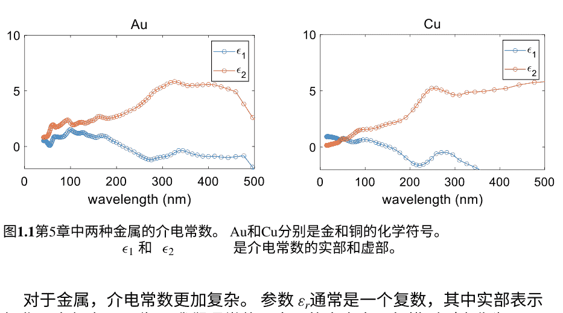

对于金属，介电常数更加复杂。参数 $\varepsilon_r$ 通常是一个复数，其中实部表示极化，虚部表示吸收。我们通常使用金属的自由电子气模型（也称为Drude模型）[13, 14]来推导介电常数的表达式。

$$\varepsilon_{r}(\omega)=1-\frac{\omega_{p}^{2}}{\omega(\omega-j\omega_{c})}, \quad (1.29)$$

其中 $\omega_p$ 是等离子体共振频率， $\omega_c$ 是等离子体碰撞频率。当频率不超过可见光时，Drude模型可以准确描述金属的电磁特性。拟合结果与实验数据非常吻合。然而，在紫外光波段中，由于禁止跃迁，需要引入Lorentz-Drude模型来修正该模型。一个简单的修改是将(1.29)中的“1”替换为 $\varepsilon_{\infty}$ 。需要注意的是，上述修正仅适用于特定的窄带（大约几十纳米）。图1.1显示了本书第5章中选择的两种金属在入射波长低于500 nm时的介电常数。

#### 1.1.3 边界条件

Maxwell方程的微分形式要求场矢量是空间和时间的单值、有界、连续函数，并且具有连续的导数。然而，由于介质在电磁性质上存在不连续性，场矢量也是不连续的。事实上，界面两侧的场

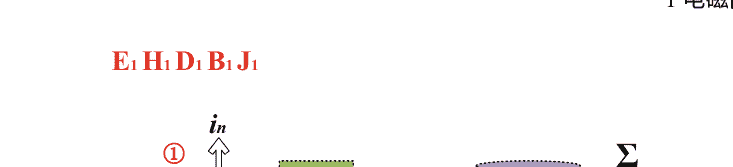

图1.2 界面处的边界条件。绿色矩形代表Stokes曲线积分，紫色圆柱体代表Gauss面积分。

界面受边界条件控制。由于场定律的积分形式的普适性，我们可以利用它们与散度定理和Stokes定理在矢量分析中获得边界条件。有两个切向边界条件和三个法向边界条件，如(1.30)到(1.34)所示。

$\mathbf{i} \times (\mathbf{E}_1 - \mathbf{E}_2) = 0$

$\mathbf{i} \times (\mathbf{H}_1 - \mathbf{H}_2) = \mathbf{K}$

$\mathbf{i} \cdot (\mathbf{D}_1 - \mathbf{D}_2) = \eta$

$\mathbf{i} \cdot (\mathbf{B}_1 - \mathbf{B}_2) = 0$

$\mathbf{i} \cdot (\mathbf{J}_1 - \mathbf{J}_2) = -\nabla \cdot \mathbf{K} \frac{\partial \eta}{\partial t}$

在这里，我们假设i是从区域2指向区域1的单位法向量，如图1.2所示，①和②分别位于边界的两侧，是两个不同的介质，在这些介质中，场量为E1, H1, D1电磁参数为ε1, μ1, σ1和ε2, μ2, σ2. K, η, ∇分别表示表面电流、表面电荷和表面散度。

通过将边界条件添加到麦克斯韦方程和介质关系中，我们可以解决复杂的边界值问题。

#### 1.1.4 平面波

本书讨论的电磁散射问题的源是平面波[17]，可以表示为

$\mathbf{A} = \mathbf{A}_0 e^{-j \mathbf{k} \cdot \mathbf{r}}$

其中 $\mathbf{A}_0$, $\mathbf{k}$, $\mathbf{r}$分别是初始场矢量、波矢量和半径矢量，所谓的平面波是指其等相位面为平面的波，即

$$ \mathbf{k} \cdot \mathbf{r} = k_x x + k_y y + k_z z = C $$ (1.36)

图1.3显示了等相位面与波矢之间的垂直关系。

根据在传播方向上是否存在电磁场分量，平面波可以分为TEM波、TE波和TM波。 TEM波指的是在传播方向上既没有电场也没有磁场的电磁波；TE波指的是在传播方向上只有磁场而没有电场的波，而TM波则只有电场而没有磁场。 图1.4a-c展示了TEM波、TE波和TM波中E、H和k之间的关系。

对于TE波，只需要获得磁场在传播方向上的分量就可以得到电磁场的所有分量。 以在z方向传播的TE波为例，假设$H_z$已知，则有

$$ E_x = -\frac{j \omega \mu_0}{k_c^2} \frac{\partial H_z}{\partial y} $$ (1.37)

# 图1.4 TEM波，TE波和TM波

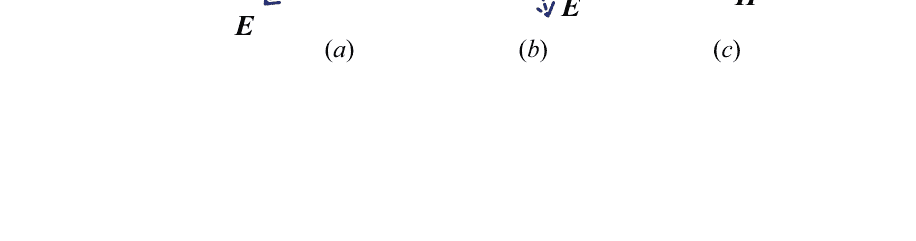

$$E_y = \frac{j\omega\mu_0}{k_c^2} \frac{\partial H_z}{\partial x}, \quad (1.38)$$
$$H_x = \mp \frac{j\beta}{k_c^2} \frac{\partial H_z}{\partial x}, \quad (1.39)$$
$$H_y = \mp \frac{j\beta}{k_c^2} \frac{\partial H_z}{\partial y}. \quad (1.40)$$

对于沿z方向传播的TM波，假设$E_z$已知，则我们有

$$E_x = \mp \frac{j\beta}{k_c^2} \frac{\partial E_z}{\partial x}, \quad (1.41)$$
$$E_y = \mp \frac{j\beta}{k_c^2} \frac{\partial E_z}{\partial y}, \quad (1.42)$$
$$H_x = \frac{j\omega\mu_0}{k_c^2} \frac{\partial E_z}{\partial y}, \quad (1.43)$$
$$H_y = -\frac{j\omega\mu_0}{k_c^2} \frac{\partial E_z}{\partial x}. \quad (1.44)$$

### 1.2 前向散射模型

从广义上讲，电磁前向问题通常指解决已知源类型和位置以及构成参数分布的电磁场问题。典型的电磁前向问题可能涉及许多方面。例如，在静电场中，当给定电荷密度分布和介电常数时，解决电势或电场的分布；在静磁场中，当给定电流密度和磁导率时，解决磁场的分布。在电磁散射问题中，当给定入射场和散射体时，解决散射场和总场。

由于本书主要讨论电动力学散射问题的解决方案，我们将在本部分重点介绍散射的基本原理。

如图1.5所示，当一组源（包括点源、平面波等）遇到障碍物（散射体）时，它们将与障碍物发生电磁相互作用。基于惠更斯原理，障碍物可以被视为次级源来产生电磁辐射。假设没有障碍物时的场分别为$\mathbf{E}^i$和$\mathbf{H}^i$，它们被定义为入射电场和磁场。

$\mathbf{E}$和$\mathbf{H}$是总场，它们被定义为在有障碍物时实际存在于空间中的场。总场和入射场之间的差异是

# 图1.5 散射模型

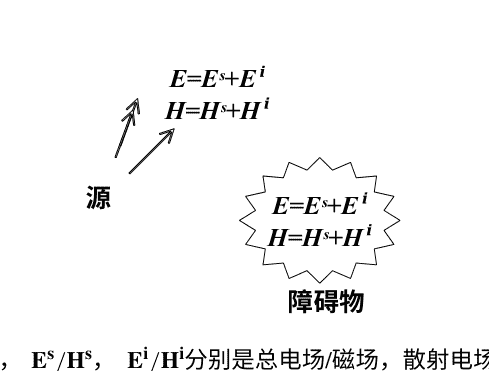

图1.5 散射模型。E/H，E^s/H^s，E^i/H^i分别是总电场/磁场，散射电场/磁场和入射电场/磁场。

被定义为散射场。

$$E^s = E - E^i, \quad (1.45)$$

$$H^s = H - H^i. \quad (1.46)$$

散射场的源是入射场激发的传导电流、极化电流和磁化电流。在障碍物外部，散射场是被动的。我们选择 S 作为与障碍物无限接近但不重合的表面，并将等效原理应用于 S 的内部和外部[4]。图1.6显示了两个问题 a 和 b。在问题 a 中，散射场分布在 S 的内部和外部。在问题 b 中，总场分布在 S 的内部和外部。因此，可以在 S 的内部和外部建立以下等效问题。在 S 的外部只有散射场，而在 S 的内部有原始介质和总场。原始问题和等效问题如图1.7a、b所示。为了支持这些电磁场，在 S 上应该有等效表面电磁电流。可以通过切向边界条件获得电流。

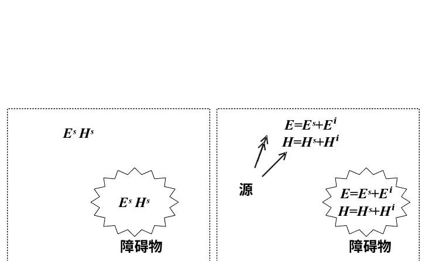

图1.6 问题a和b. a散射场分布在内部和外部 S. b总场分布在内部和外部 S

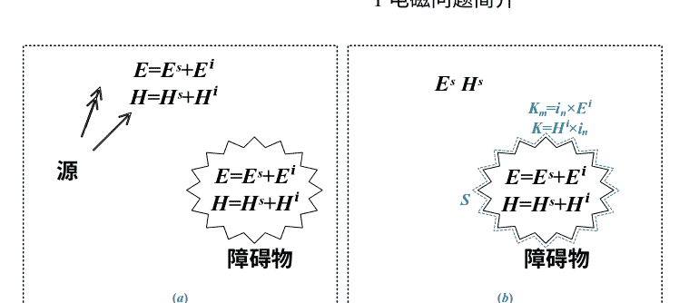

图1.7 等效原理. a原始问题. b等效问题

$$\mathbf{K} = \mathbf{i}_n \times (\mathbf{H}^s - \mathbf{H}). \quad (1.47)$$

$$\mathbf{K}_m = (\mathbf{E}^s - \mathbf{E}) \times \mathbf{i}_n. \quad (1.48)$$

根据入射场、散射场和总场之间的关系，我们可以通过简化(1.47)和(1.48)来得到

$$\mathbf{K} = -\mathbf{i}_n \times \mathbf{H}^i, \quad (1.49)$$

$$\mathbf{K}_m = -\mathbf{E}^i \times \mathbf{i}_n. \quad (1.50)$$

由于散射体分布在有限空间内，外部辐射朝向无界空间，因此需要在无穷远处施加边界条件，使散射场能够连续传播到外部世界。

这个边界条件被称为辐射边界条件。在三维问题中，辐射边界条件是

$$\lim_{r \to \infty} r(\mathbf{E}^s + \mathbf{i}_r \times \eta_0 \mathbf{H}^s) = 0, \quad (1.51)$$

$$\lim_{r \to \infty} r(\mathbf{H}^s - \mathbf{i}_r \times \frac{\mathbf{E}^s}{\eta_0}) = 0, \quad (1.52)$$

其中

$$\eta_0 = \sqrt{\frac{\mu_0}{\varepsilon_0}}. \quad (1.53)$$

在这里，$\eta_0$是真空中的波阻抗，单位是欧姆。

## **1.3 前向建模算法**

电磁散射中的正向问题是指在已知入射场和散射体的情况下求解散射场和总场的过程。 经过几十年的发展，正向建模的研究相对成熟，并且已经提出了各种方法[18-20]。 这些方法通常可以分为解析方法和数值方法。 解析方法适用于规则和对称的区域。 尽管解决方案准确，但很少用于解决实际的电磁问题。 对于大多数正向问题，数值方法更广泛应用。 在这里，我们将简要介绍这两种方法。

### **1.3.1 分析方法**

常见的分析方法[21–24]包括图像法、电轴法、变量分离法[25]、傅里叶变换法、级数展开法等。由于空间限制，我们主要介绍级数展开法，该方法在第3章中用于验证第3章中的前向程序的正确性。 其他分析方法的深入介绍可以在[1–7]中找到。

级数展开的核心是将一个函数展开为正交函数族的叠加级数。 这种展开通常需要满足边界条件的数学形式，以便更容易找到相应的解。 以最常见的傅里叶级数展开为例，其基函数是正交的正弦和余弦函数。 对于满足迪利克雷条件的任意函数 \(f(x)\)，可以用傅里叶级数表示。

$$f(x) = \sum_{n=1}^{+\infty} (a_n \cos nx + b_n \sin nx) \quad (1.54)$$

假设\(f(x)\)的周期为\(T\)，傅里叶系数可以表示为

$$a_{n} = \frac{2}{T} \int_{0}^{T} f(x) \cos \frac{2\pi n x}{T} dx \quad (1.55)$$

$$b_n = \frac{2}{T} \int_{0}^{T} f(x) \sin \frac{2\pi n x}{T} dx \quad (1.56)$$

在二维散射问题中，我们通常使用贝塞尔函数[26–28]来分解入射平面波以满足相应的边界条件。在第3章中，我们通过计算来验证FDFD程序的正确性

通过计算无限长圆柱体[29, 30]的TM_z波的散射，我们验证了FDFD程序的正确性。在三维散射问题中，我们通常使用球贝塞尔函数[31]来分解入射平面波。在第3章中，我们还通过计算TM_z波在球体上的散射来验证3D-FDFD程序的正确性。图1.8显示了0-4阶的贝塞尔函数和球贝塞尔函数。

##### 1. 2D情况

在我们的2D情况中，假设入射平面波沿着 +x direction传播，电场可以表示为

$$E_z^i = E_0 \sum_{n=-\infty}^{+\infty} j^{-n} J_n(k\rho) e^{jn\varphi},$$

其中 J_n(kρ)表示一系列柱状驻波。在这里，我们只考虑完美电导体和完美介质的散射。图1.9中显示的散射体是一个放置在 x = 0, y = 0半径为a的完美电导体圆柱体。

根据等效原理，散射场可以被看作是以圆柱体上的电磁电流为源的向外传播的波。因此，我们有

$$E_z^s = E_0 \sum_{n=-\infty}^{+\infty} j^{-n} a_n H_n^{(2)}(k\rho) e^{jn\varphi},$$

其中 H_n^{(2)}(kρ)表示一系列向外传播的波。总场可以表示为表达为

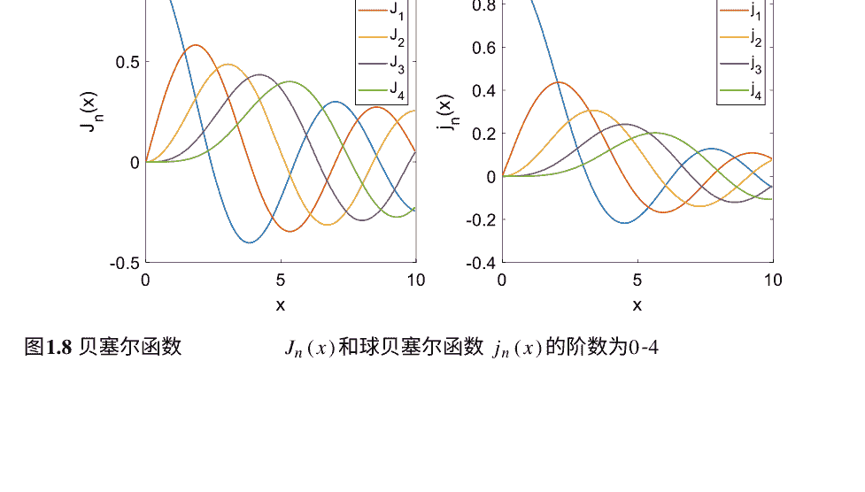

# 图1.9 一个PEC圆柱体放置在原点

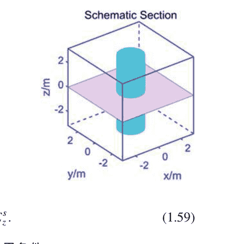

$E_z = E_z^i + E_z^s$.

对于PEC圆柱体，满足切向电场为零的边界条件，

$E_z(a) = 0$.

因此，可以得到 $a_n$的值为

$a_n = \frac{-J_n(ka)}{H_n^{(2)}(ka)}$.

通过公式(1.60)可以计算得到总场

$E_z = E_0 \sum_{n=-\infty}^{+\infty} j^{-n} \left[ J_n(k\rho) - \frac{J_n(ka)}{H_n^{(2)}(ka)} H_n^{(2)}(k\rho) \right] e^{jn\varphi}$.

在图1.10中显示了入射电场、散射电场、总电场和PEC的表面电流的分布。图1.11中显示的散射体是一个放置在 $x =0, y =0$处的完美介质圆柱体，其半径为 $a$。相对介电常数为 $\varepsilon_r$，磁导率为 $\mu_r$。

由于电场和磁场满足麦克斯韦方程，我们有

$\mathbf{H} = -\frac{1}{j\omega\mu} \nabla \times \mathbf{E} = \frac{1}{j\omega\mu} \left( \frac{E_z^i}{\rho} + \frac{\partial E_z^i}{\partial \rho} \right) \mathbf{i}_\varphi$.

因此，我们可以得到入射磁场的两个分量

$H_\varphi^i = \frac{1}{j\omega\mu\rho} \cdot \frac{\partial \rho E_z^i}{\partial \rho} = \frac{1}{j\omega\mu} \left( \frac{E_z^i}{\rho} + \frac{\partial E_z^i}{\partial \rho} \right)$,## 图1.10 入射电场、散射电场、总电场和表面电流的分布

## 图1.11 放置在原点的完美电介质圆柱体

$$H_{\rho}^{i} = -\frac{1}{j\omega\mu\rho} \cdot \frac{\partial E_z}{\partial \varphi} = -\frac{E_0}{j\omega\mu\rho} \sum_{n=-\infty}^{+\infty} n \cdot j^{-n+1} J_n(k\rho) e^{j n \varphi}.$$

由于界面上没有表面电荷或表面电流，电场和磁场的切向分量必须连续。

$$\mathbf{i}_{\rho} \times (\mathbf{E}^{i} + \mathbf{E}^{s} - \mathbf{E}^{t}) = \mathbf{0},$$
$$\mathbf{i}_{\rho} \times (\mathbf{H}^{i} + \mathbf{H}^{s} - \mathbf{H}^{t}) = \mathbf{0}.$$

即

$$E_z^{i} + E_z^{s} = E_z^{t},$$
$$H_z^{i} + H_z^{s} = H_z^{t}.$$

由于 $E_z^{s}$ 是一种向外传播的波，可以表示为

$$E_z^s = E_0 \sum_{n=-\infty}^{+\infty} j^{-n} a_n H_n^{(2)}(k\rho) e^{jn\varphi}$$

由于场值在原点有限，$E_z^t$可以表示为

$$E_z^t = E_0 \sum_{n=-\infty}^{+\infty} j^{-n} b_n J_n(k_1\rho) e^{jn\varphi}$$

类似地，磁场可以表示为

$$H_\varphi^s = \frac{E_0}{j\omega\mu} \sum_{n=-\infty}^{+\infty} a_n j^{-n} \left( \frac{1}{\rho} H_n^{(2)}(k\rho) + k H_n^{(2)'}(k\rho) \right) e^{jn\varphi}$$

$$H_\varphi^t = \frac{E_0}{j\omega\mu} \sum_{n=-\infty}^{+\infty} j^{-n} \left( \frac{1}{\rho} J_n(k\rho) + k J_n'(k\rho) \right) e^{jn\varphi}$$

$$H_\varphi^t = \frac{E_0}{j\omega\mu} \sum_{n=-\infty}^{+\infty} b_n j^{-n} \left( \frac{1}{\rho} J_n(k_1\rho) + k J_n'(k_1\rho) \right) e^{jn\varphi}$$

应用边界条件 $\rho = a$，我们可以得到

$$J_n(ka) + a_n H_n^{(2)}(ka) = b_n J_n(k_1a)$$

$$\frac{1}{\mu} \left( \frac{1}{a} J_n(ka) + k J_n'(ka) \right) + \frac{a_n}{\mu} \left( \frac{1}{a} H_n^{(2)}(ka) + k H_n^{(2)'}(ka) \right) = \frac{b_n}{\mu} \left( \frac{1}{a} J_n(k_1a) + k_1 J_n'(k_1a) \right)$$

由于两种介质都是完美的电介质，所以磁导率满足 $\mu = \mu_1 = \mu_0$。我们有

$$\sqrt{\varepsilon} J_n'(ka) + \sqrt{\varepsilon} a_n H_n^{(2)'}(ka) = \sqrt{\varepsilon_1} b_n J_n'(k_1a)$$

因此，

$$a_{-n} = \frac{ \sqrt{\varepsilon_1} J_n(ka) J_n'(k_1a) - \sqrt{\varepsilon} J_n(k_1a) J_n'(ka) }{ \sqrt{\varepsilon} J_n(k_1a) H_n^{(2)'}(ka) - \sqrt{\varepsilon_1} J_n'(k_1a) H_n^{(2)}(ka) }$$

$$b_n = \frac{ J_n(ka) + a_n H_n^{(2)}(ka) }{ J_n(k_1a) }$$

## 图1.12 完美介质圆柱体的入射电场分布、散射电场分布、透射电场分布和总电场分布

图1.12显示了入射电场、散射电场、透射电场和总场在 z-direction 的分布。

##### 2. 3D情况

在我们的3D情况中，假设入射平面波沿 +z-direction 传播，并沿 +x-direction 极化，电场可以表示为

$$E_z = E_0 e^{j k z} = E_0 \sum_{n=0}^{+\infty} j^n (2n+1) j_n(r) P_n(\cos \theta)$$

其中 $j_n(k\rho)$ 表示一系列球形驻波。与2D情况类似，我们只考虑完美电导体和完美介质的散射。

图1.13中显示的散射体是完美电导体球和完美介质球。半径为 $a$ 的球体放置在原点。

完美导体球满足切向电场为零的边界条件，

## 图1.13 完美导体球和完美介质球的示意剖面图

$$E_{\varphi}(a) = 0, \quad (1.81)$$
$$E_{\theta}(a) = 0. \quad (1.82)$$

完美介质球满足切向电磁场连续的边界条件，

$$E_{\varphi}^i(a) + E_{\varphi}^s(a) = E_{\varphi}^t(a), \quad (1.83)$$
$$H_{\varphi}^i(a) + H_{\varphi}^s(a) = H_{\varphi}^t(a), \quad (1.84)$$
$$E_{\theta}^i(a) + E_{\theta}^s(a) = E_{\theta}^t(a), \quad (1.85)$$
$$H_{\theta}^i(a) + H_{\theta}^s(a) = H_{\theta}^t(a). \quad (1.86)$$

磁矢量势 $A_r$ 和电矢量势 $F_r$ 如下所示，

$$A_r = E_0 \frac{\cos \varphi}{\omega} \sum_{n=1}^{\infty} \left( a_n \hat{J}_n(kr) + b_n H_n^{(2)}(kr) \right) P_n^1(\cos \theta), \quad (1.87)$$
$$F_r = E_0 \frac{\sin \varphi}{\omega \eta} \sum_{n=1}^{\infty} \left( a_n \hat{J}_n(kr) + c_n H_n^{(2)}(kr) \right) P_n^1(\cos \theta), \quad (1.88)$$

其中

$$a_n = j^{-n} \frac{2n+1}{n(n+1)}. \quad (1.89)$$

在求解电磁场时，首先应用边界条件来获得 $b_n$ 和 $c_n$。然后，利用已知的系数 $a_n$、$b_n$ 和 $c_n$ 来求解磁矢量势 $A_r$ 和电矢量势 $F_r$。最后，通过矢势可以获得电磁场。由于空间限制，这里不再重复。

#### 1.3.2 数值方法

如上所述，当面对复杂的几何形状或非均匀结构时，解析方法可能不再适用。因此，必须采用数值方法。根据适用的电尺寸，我们可以将数值方法分为高频方法和低频方法。高频方法包括几何光学方法（GO）[32, 33]，物理光学方法（PO）[33–35]，几何衍射理论（GTD）[36–38]，物理衍射理论（PTD）[39]等。这些方法具有相对较高的计算速度但精度较低。因此，它们主要用于解决大规模问题。

对于小尺度的前向问题，更广泛使用低频方法来保证高精度。常见的低频方法包括基于微分方程的方法和基于积分方程的方法。微分方程（DE）方法主要用于处理细微结构和非均匀介质。方法中的系数矩阵是稀疏矩阵，需要较少的内存。

然而，微分方程方法的精度较低，需要复杂的边界条件，如完美匹配层（PML）[40]。一般来说，这些方法包括有限元法（FEM）[41]、有限差分法（FDM）[42]、有限体积法（FVM）[43]、矩法[44]等。

积分方程方法可以在相对较低的空间采样密度下获得较高的精度。此外，它们不需要任何复杂的吸收边界。然而，该方法的主要缺点是由于密集的阻抗矩阵而导致的高计算负载。积分方程方法可以进一步分为表面积分方程方法（SIEM）和体积分方程方法（VIEM）。根据被积物理量，积分方程方法还可以分为电场积分方程（EFIE）、磁场积分方程（MFIE）、电流积分方程（CFIE）等。对于传统的计算电磁算法，我们主要集中在最容易理解的有限差分法，该方法在第3章中用于生成训练数据。

有限差分法（FDM）最早由A. Thom在1920年代提出，用于求解非线性流体力学方程。从那时起，它已经被引入到其他领域，并广泛用于科学计算。有限差分法通过有限差分方程来近似微分方程。

给定函数 $f(x)$，割线法被应用于逼近切线，从而得到在某一点 $x_0$ 处的导数。差分格式可以分为前向差分（1.90）、后向差分（1.91）和中心差分（1.92）[20]。图1.14显示了这三种差分格式。

$$f'(x_0) = \frac{f(x_0 + \Delta x) - f(x_0)}{\Delta x}, \quad (1.90)$$
$$f'(x_0) = \frac{f(x_0) - f(x_0 - \Delta x)}{\Delta x}, \quad (1.91)$$
$$f'(x_0) = \frac{f(x_0 + \Delta x) - f(x_0 - \Delta x)}{2\Delta x}. \quad (1.92)$$

可以得出结论，中心差分法可以更准确地近似导数。通过两次使用中心差分法的近似，我们可以得到二阶导数。

$$f''(x_0) = \frac{f(x_0 + \Delta x) + f(x_0 - \Delta x) - 2f(x_0)}{(\Delta x)^2}, \quad (1.93)$$

前向问题中的波动方程可以从上述公式推导出来。为了简化表达式，我们定义

$$\Phi(i, j) = \Phi(i \Delta x, j \Delta t), \quad (1.94)$$

其中 $\Phi(i \Delta x, j \Delta t)$ 表示在 $x = i \Delta x, t = j \Delta t$ 处的场值。每个点的位置在图1.15中显示。要解决的波动方程是

$$u^2 \frac{\partial^2 \Phi}{\partial x^2} = \frac{\partial^2 \Phi}{\partial t^2}, \quad (1.95)$$

假设纵横比 $r$ 为

$$r = \left( \frac{u \Delta t}{\Delta x} \right)^2, \quad (1.96)$$

## 图1.15 差分方案中的点

对于显式方法，为了确保收敛，要求 $r \le 1$。我们有

$$\Phi(i, j+1) = 2(1-r)\Phi(i, j) + r[\Phi(i+1, j) + \Phi(i-1, j)] - \Phi(i, j-1).$$

图1.16分别显示了当 $r < 1$ 和 $r = 1$ 时的计算分子。通过使用该算法，可以在任何时间获得每个点的场量。

此外，FDM可以分为FDTD [45]和FDFD [46]。由于本书主要讨论如何使用深度学习技术来解决频域中的电磁问题，因此选择FDFD作为传统方法来生成训练数据。有关内容，请参阅第3章。

### 1.4 总结

本章介绍了基本的电磁问题、散射模型和后续章节中使用的传统算法。从麦克斯韦方程开始，我们介绍了场的定律、介质关系、边界条件和平面波的基本概念。接下来，讨论了电磁散射模型和等效原理。最后，本章还阐述了生成训练数据的差分算法的基本原理和验证差分程序正确性的级数展开方法。本章中描述的基本电磁概念也为后续的深度学习过程铺平了道路。

## 参考文献

- 1. Balanis CA (2012) 高级工程电磁学. Wiley, 新泽西
- 2. Bladel JV (2007) 电磁场. Wiley-Interscience, 纽约
- 3. Griffiths DJ (2017) 电动力学导论. Pearson, 波士顿
- 4. Harrington RF (2001) 时谐电磁场。Wiley-IEEE Press, Piscataway
- 5. Jackson JD (1962) 经典电动力学。Wiley, 纽约
- 6. Jin JM (2015) 电磁场的理论和计算。Wiley-IEEE出版社, 皮斯卡塔韦
- 7. Kong JA (1986) 电磁波理论。Wiley, 新泽西
- 8. Landau LD, Lifshitz EM (1980) 场的经典理论。Butterworth-Heinemann, 牛津
- 9. Landau LD, Lifshitz EM, Pitaevskii LP (1980) 连续介质的电动力学。Butterworth-Heinemann, 牛津
- 10. Purcell EM (2013) 电学和磁学。剑桥大学出版社, 剑桥
- 11. Schwartz M (1987) 电动力学原理。多佛出版社, 纽约
- 12. Zangwill A (2012) 现代电动力学。剑桥大学出版社, 剑桥
- 13. Ashcroft NW, Mermin ND (1976) 固体物理学。Cengage Learning, 斯坦福
- 14. Kittel C (2004) 固体物理学导论。Wiley, 新泽西
- 15. Rumble J (2020) CRC化学和物理手册。CRC Press, 纽约
- 16. Speight JG (2005) Lange化学手册。McGraw-Hill Education, 纽约
- 17. Chew WC (1999) 不均匀介质中的波和场。Wiley-IEEE Press, Piscataway
- 18. Mittra R (2014) 计算电磁学: 最新进展和工程应用。Springer, 柏林
- 19. Taflowe A (2005) 计算电动力学: 有限差分时域方法。Artech House Publishers, 伦敦
- 20. Sadiku MNO (2018) 使用MATLAB的计算电磁学。CRC Press, 纽约
- 21. Evans G, Blackledge J, Yardley P (1999) 偏微分方程的解析方法。Springer, 柏林
- 22. Henner V, Belozerova T, Nepomnyashchy A (2019) 偏微分方程: 分析方法和应用。CRC出版社, 纽约
- 23. Morse PM, Feshbach H (1953) 理论物理方法。麦格劳-希尔, 纽约
- 24. Rylander T, Ingelström P, Bondeson A (2013) 计算电磁学（应用数学文本（51））。Springer, 柏林
- 25. Cain G, Meyer GH (2006) 偏微分方程的变量分离: 一种特征函数方法。CRC出版社, 纽约
- 26. Jahnke E, Emde F (1945) 函数表。多佛, 纽约
- 27. Kreyszig E (2010) 高级工程数学。Wiley, 新泽西
- 28. Watson GN (1948) 贝塞尔函数理论论文。剑桥大学出版社, 剑桥
- 29. Richmond JH (1965) 任意横截面形状的介质圆柱体散射。IEEE Trans Antennas Propag 13(3):334–341
- 30. Wait JR (1959) 来自圆柱结构的电磁辐射。佩尔加蒙, 纽约
- 31. Zhang S (1996) 特殊函数的计算。Wiley-Interscience, 皮斯卡塔韦
- 32. Lin PD (2014) 几何光学的新计算方法。斯普林格, 纽约
- 33. Meng X, Guo LX, Dong CL, Jiao YC (2019) 用于具有多个小尺度槽的物体的太赫兹散射计算的GO/PO方法。IEEE Access 7: 40738–40745
- 34. Asvestas JS (1980) 电磁散射中的物理光学方法。数学物理21: 290–299
- 35. Gutiérrez-Meana J, Martínez-Lorenzo JA, Las-Heras F (2011) 高频技术: 物理光学近似和改进的等效电流近似（MECA）。IntechOpen, 伦敦
- 36. Keller JB (1962) 绕射的几何理论。J Opt Soc Am 3(52): 116–130
- 37. Pathak PH, Kouyoumjian RG (1974) 完全导电表面上边缘的均匀几何绕射理论。Proc IEEE 62(11): 1448–1461
- 38. Tiberio R, Kouyoumjian RG (1979) 被斜入射照亮的条带的均匀GTD解决方案。Radio Sci 14: 933–941
- 39. Paknys R (2016) 应用频域电磁学。Wiley, 新泽西, 第317–334页
- 40. Shin W, Fan S (2012) 频域Maxwell方程求解器的完美匹配层边界条件的选择。J Comput Phys 23(1): 3406–3431

## 第2章 基于深度学习的揭示电磁问题的基本原理

在上一章中，我们介绍了工作背后的基本电磁理论。在本章中，我们将重点讨论如何使用深度学习方法来解决与电磁相关的问题。首先，我们将讨论深度学习基础知识和相关物理背景。然后，我们全面回顾了数据采集、神经网络训练和性能测试的技术细节。之后，我们还将介绍验证过程。在后面的章节中，我们将展示如何应用这些方法来解决具体问题的实例。

### 2.1 深度学习基础

#### 2.1.1 前向传播

前馈神经网络，也被称为多层感知器，是许多深度学习框架的基础，衍生出了各种相关应用。它基本上形成了一个从输入$x$到输出 $y$ 的映射关系 $y = f(x, 	heta)$，其中$	heta$是神经网络的可训练权重，表示底层映射关系的最佳函数近似。信息直接从输入流向输出，没有切断的反馈连接。具有前馈结构的神经网络可以是复杂的多层结构，因为中间计算函数 $f$可能由不同的函数单元 $f^1, f^2, f^3 \cdots f^n$组成，具有矢量输入和输出，并且这些函数被称为神经网络的第$n$层。具体来说，第一层称为输入层，而最后一层称为输出层。通常，多个层将输入层和输出层连接成链式结构，形成构成映射原理 $f(x, 	heta) = f^1(f^2(\cdots f^n(x)))$，它们也被称为隐藏层，因为链式计算中没有外部信息输入。这种神经网络结构被证明在很多情况下非常高效。从大量数据中提取有意义的特征[1]。前向传播在图2.1中有所说明。

#### 2.1.2 反向传播

神经网络的训练从反向传播过程开始，这是一种基于多元导数链式法则的简单机制。一般而言，前馈神经网络的输出继续产生一个标量损失函数$L(y, y^*)$以进行优化。当损失函数被优化以更新神经网络中的所有可训练权重以获得期望的输出 $y^*$ 时，反向传播发生。主流的深度学习计算平台将整个神经网络形式化为计算图，其中每个节点表示具有标量、矩阵和张量形式的变量，而边表示神经网络内的操作，如加法、乘法、平方等。计算图帮助算法检索损失函数相对于所有可训练参数的偏导数，例如神经网络中第$n$层的权重$\theta_n$和偏置$b_n$。然后，基于梯度的优化算法被应用于相应地调整这些参数。详细的过程将在下一节中适当地说明。

### 2.2 深度学习配置

在过去几年中，深度学习（DL）技术被广泛认可为从大量数据中学习复杂表示的最高方法，具有多个抽象层次[2]。在全球范围内的努力下，这项技术推动了人工智能领域的前沿，如机器人技术[3]、计算机视觉[4]以及自然语言处理[5]等。与此同时，深度学习凭借其在输入和输出之间执行映射的固有优势，输出已成功与其他研究领域（如物理学[6]、化学[7]、材料学[8]和工程学[9]）合并。传统上，这些领域的基本机制的发现仅通过严格的演绎和复杂的分析才能获得，这需要领域专业知识和耗时的计算。通过直接求解复杂的控制方程，深度学习有助于通过将其简化为动态网络系统的权重学习过程来加快分析速度。这些参数化网络主要通过大量的可训练参数来模拟任何给定系统的基本机制。它可以建立一个以最终产品为驱动的工程过程，在这个过程中，数学严谨性暂时被强大的问题解决能力所取代。

普遍认为，回归和分类是深度学习方法执行的两个主要任务，现在在揭示输入和输出之间的非平凡模式方面起着重要作用。在大多数情况下，电磁问题的物理机制由偏微分方程（PDEs）表示，这些方程足够动态，可以定量地将不同的初始值与它们的物理响应相关联（如果存在）。这进一步揭示了一个事实，即即使在相同的映射关系下，系统的输出也可能非常不同，并且很难归入某个特定的类别，这是由不同的初始输入引起的。

因此，解决电磁问题的主流方法是使用DL实现回归，而不是分类。电磁问题的基本物理原理可以简化为网络学习过程，表示为$y = f(x)$，其中$x$表示初始设置，$y$表示响应空间（参见图2.2）。

#### 2.2.1 输入和输出数据结构的类别

一般来说，由于广泛的目标物理量（如场预测[10-12]、频谱分析[13, 14]、设备设计[15-17]和优化[18-20]），电磁问题具有多样的输入和输出数据结构。有两种常用的数据结构非常适合定义初始输入值和物理响应，一种是由二维（2D）或三维（3D）矩阵定义的图像数据，另一种是由一维（1D）行或列向量定义的离散数据。可以对1D数据进行子分类，第一类是定义电磁系统的参数，而第二类是按照时间、波长等物理量的有序序列。

不同的映射模式在不同的数据结构中是物理建模的明确形式，是从基本物理原理的统计推导结果。值得注意的是，两种类型数据结构之间的映射关系决定了参考数据集、网络架构以及训练方法。在下一章中，详细阐述了相关电磁问题中的几种映射模式（图2.3）。

离散到离散：通常，具有周期结构的电磁或光子器件的基本几何特征可以参数化为设计变量的向量，例如宽度、高度、厚度和角度等。相同的策略也可以应用于器件的其他属性，包括光学性质（介电常数、折射率等），照明设置（波长，入射波的方向，极化），组成部分的固有属性（结晶化分数）[21]。同时，从采样点获得的光谱响应或端口信号以固定间隔进行采样，遵循离散化表示的相同形式。在这种情况下，离散到离散的映射模式已经建立，无论是用于正向分析还是逆向设计，输入和输出数据结构都很容易形成为1-D向量。

图像到离散：与离散化参数相比，图像能够直接描绘具有高维特征的输入。这有助于表示高度复杂的几何形状，这些形状很难由一组设计变量参数化。通过添加图像输入的通道，可以将更多信息合并到输入对中，例如照明设置或具有复数形式的光学属性。提出了图像到离散映射模式，用于描述特定范围的现象，例如共振模态分析[22]或复杂纳米结构的光谱计算[23]。在这种情况下，输入采用多维矩阵形式，而输出被形成为1-D向量。

图像到图像：所有种类的电磁问题的物理响应不仅限于离散数据类型，一个例外是场分布或电极化密度。如果输入和输出都是2D矩阵形式，图像到图像的映射模式很容易建立。这种数据结构具有物理可解释性和适应性的优势，因为2D矩阵是设备结构、场模式等的自然表示。许多研究表明，这种数据格式非常适合逐像素预测近场响应[23]。需要注意的是，输入和输出矩阵不需要具有相同的大小或维度，这赋予了定制特定应用的输入-输出流水线设计的自由度。

这些是输入和输出方案的三种代表性数据结构。随着这一领域研究活动的迅速增长趋势，其他类型的数据结构似乎在解决特定的电磁相关问题上非常高效。一个例子是用于分布式电路的电磁行为预测的图形数据结构[24]。在这种情况下，节点被赋予每个电路组件的电路参数，而边表示这些组件之间的电磁耦合效应。显然，不同的数据结构应该与首要关注的问题相符合，毫无疑问，它们还需要进一步适应特定的深度学习模型。

#### 2.2.2 深度学习模型的构建

在前一节中，我们介绍了几种输入和输出数据的格式，这些格式有助于表示电磁问题的物理特性。为了进一步实现初始输入和期望解决方案之间的映射，应该仔细选择依赖于数据的神经网络架构。迄今为止，已经提出了各种具有复杂内部结构的神经网络架构，用于解决各种问题[2]，它们的大小从个位数到数百个隐藏网络层不等。因此，选择适当的DL模型非常重要，它能够在学习输入和输出之间的函数映射方面展现最佳性能。

鉴于每种DL模型处理的固定数据格式，可以将从EM问题的输入和输出数据结构派生出的映射模式视为评估特定DL模型适用性的第一个标准。此外，针对特定问题复杂性的网络结构调整是实现更好学习结果的另一个关键步骤。在接下来的部分中，我们将简要介绍几种主流的DL模型，并建立它们与手头的EM问题之间的关联。

全连接：正如之前讨论的那样，深度神经网络的基本单元是神经元。在全连接神经网络中，一层的神经元与下一层的所有神经元相连，这种层与层之间的连接方式被称为全连接（图2.4）。值得注意的是，全连接神经网络由一系列全连接层组成，每一层可以有不同数量的神经元，这取决于神经网络解决问题的复杂程度。

数学上，将 $x_i \in \mathbb{R}^m$ 设置为全连接层的第 $i$ 个输入，将 $y_i \in \mathbb{R}^n$ 设置为第 $i$ 个输出， $x$ 到 $y$ 的映射可以列举如下

$$y_i = f\left(\sum_i w_i x_i + b\right), \qquad (2.1)$$

其中， $w_i$ 表示 $x_i$ 和 $y_i$ 之间的第 $i$ 个连接的权重， $b$ 是用来改善网络学习的偏置， $f(x)$ 是非线性激活函数。显然，全连接连接非常适合离散数据，特别是对于一个数字，在电磁建模中出现了设备变量或采样响应，它们没有明确的空间和顺序相关性[25, 26]。

卷积神经网络：与完全连接的神经网络不同，卷积层出现为所谓的特征图，通过对前一层的局部加权汇总来形成（图2.5）。对于单个加权计算，执行一个局部批次和卷积滤波器之间的点积，然后进行非线性激活函数[27-29]。计算将从相邻批次开始，以固定的步长遍历输入特征图的所有元素，然后每个计算的输出形成下一个特征图。通常，卷积滤波器的大小小于特征图的大小，它包含一个可训练权重的矩阵，这些权重由两个局部连接层共享，允许网络在不存储大量参数的情况下更深入地进行。借助这些特征，卷积神经网络在处理具有大尺寸和更高维度的数据结构（如2D或3D图像）时非常高效。也就是说，如果特定的电磁系统可以自然地表示为2D或3D的数据结构，则可以采用卷积层。

例如，用于图像到图像映射模式的DL模型可能纯粹是卷积层，而对于图像到离散的情况，DL模型更可能由卷积层和全连接层组成。

循环神经网络：RNN（见图2.6）已被深度学习社区广泛采用作为处理有序序列的有效工具，例如语音和语言，它使用隐藏状态 h^{t-1} 来存储来自前一个时间步的信息，输入序列 x^t, t ∈ [0, size(x)] 逐个输入到网络中的每个给定时间 t，使用 h_t 更新隐藏状态并产生输出元素 y^t，其控制方程可以写成

$$h^t = f(W_h h^{t-1} + W_x x^t + b_h),    (2.2)$$
$$y^t = g(W_y h^t + b_y),                (2.3)$$

其中 $W_h$, $W_x$, $W_y$是密集权重矩阵，网络需要在训练过程中学习，$b_h$和$b_y$是隐藏状态 $h^t$和输出 $y^t$的偏置项，$f(x)$,$g(x)$是非线性激活函数。对于多物理建模领域的一些问题，给定时间点上动态系统的解不仅取决于该时间点上的激励源，还取决于系统在前一个时间步的隐藏状态。一个例子是热传导问题[30]，给定表面的当前温度分布是其前一个温度分布和该时间点上的热源的组合效应的结果。同样适用于电磁问题，其中波动方程被广泛应用。事实上，时域电磁波现象的物理建模与深度递归神经网络（RNNs）的实现非常相似[31]。

生成对抗网络：生成对抗网络（GAN）是由Ian Goodfellow于2014年提出的[32]。这种网络结构旨在通过构建两个子模型的对抗过程来提供生成模型的估计。这两个模型分别被命名为生成模型 $G$和判别模型 $D$，它们都是由特定类型的神经网络构建而成，并在同一训练过程中进行训练。对于生成器，主要目标是生成与训练集相似的结构，以欺骗判别器，因此可以制定可微分的目标函数如下：

$$\min_{G} \mathbb{E}_{z\sim p_{z}(z)} [\log(1-D(G(z)))], \qquad (2.4)$$

其中 $p_{z} (z)$ 是噪声输入 $z$的先验分布。判别器通常被构建为一个0/1分类器，试图区分由 $G$生成的“假数据”和从训练数据集 $p_{data} (x)$中收集到的“真实数据$x$”。在这种情况下，目标函数具有以下明确的形式：

$$\min_{D} \mathbb{E}_{x\sim p_{\text{数据}}(x)}[\text{日志}(D(x))] + \mathbb{E}_{z\sim p_{z}(z)}[\log(1-D(G(z)))]. \qquad (2.5)$$

直观上，很容易发现对抗过程本质上是一个零和游戏，其中一个代理的收益就是另一个代理的损失。在网络训练过程中，对这两个目标函数应用基于梯度的规则，直到达平衡状态，其中 G 能够模仿训练数据集的分布并在每个地方输出1/2 [32]。最近，GAN在反向电磁问题的领域中被广泛应用于设备设计[33, 34]和成像[35]，因为它具有生成模式的强大能力，GAN的示意图（见图2.7）如下所示。

#### 2.2.3 提出的深度学习模型的训练

在前一节中，我们详细讨论了数据结构和数据相关的神经网络架构。本节旨在提供正确训练DL模型的知识。正如我们之前讨论的，监督范式是以深度学习方式解决电磁问题最常见的形式。在这种情况下，用于网络训练的数据集中的每个实例都包含一对输入对象和期望的输出模式，训练可以进一步总结为通过参考数据集来调整网络内部权重的过程。一旦完全训练完成，深度神经网络就能够对未见过的初始输入输出正确的解决方案。

##### 2.2.3.1 损失函数

有许多训练细节可能会影响最终的学习结果，第一个是神经网络的损失函数的定义。通常，在与电磁相关的问题中，损失函数是通过神经网络预测与真实物理响应之间的差异来定义的。事实上，监督深度学习本质上是一个优化问题，首先需要明确定义一个目标函数。在这种情况下，网络训练的目标是最小化损失函数。由于大部分电磁学或光子学问题涉及回归任务，$L_1$损失和$L_2$损失是两个经常使用的损失函数，它们是从矩阵的范数导出的。这两个函数的定义如下

$$L_1\text{损失} = \sum_{i=1}^{n} |y_i^{\text{预}} - y_i|, \quad (2.6)$$
$$L_2\text{损失} = \sum_{i=1}^{n} |y_i^{\text{预}} - y_i|^2, \quad (2.7)$$

其中 $y_i$ 表示训练数据中的第$i$个期望响应，$y_i^{\text{预}}$ 表示第$i$个神经网络预测，$n$ 是响应空间中的总元素数。经验上，对于卷积神经网络的训练，$L_2$损失更高效[36]，神经网络的收敛时间比$L_1$损失更短。然而，$L_2$损失会受到明显偏离正常误差范围的实例的影响。需要注意的是，在某些情况下，网络预测与真实数据之间的相似度测量可能是非平凡的，例如，输出遵循特定的概率分布[37]。在这种情况下，损失函数与$L_1$和$L_2$损失有所不同，应该进行适当的设计。

##### 2.2.3.2 优化器

神经网络训练的优化器实际上是用于通过调整神经网络的内部权重$\theta$来最小化损失函数$L(\theta)$的优化算法。优化器会引入一个额外的调整参数学习率$\eta$到DL模型中，该参数定义了每次训练迭代更新的步长$\theta = \theta - \eta \nabla \theta L(\theta)$。$\eta$的不可训练特性意味着需要手动设置适当的值，这需要试错和对深度神经网络训练的经验知识。

通常有两种经常用于训练网络的优化器，都基于梯度下降的相同思想$\nabla_{\theta} L(\theta)$。它们之间的关键区别在于学习率是否随着训练的进行而自适应。选择不同的优化器是基于问题的。一般来说，具有自适应学习率的优化器在处理复杂的深度神经网络时非常高效，其中优化函数是高度非凸的，Adam优化器[38]是其中一种性能更好的优化器。

##### 2.2.3.3 权重初始化

当神经网络的结构非常简单时，例如只有几个隐藏层的全连接神经网络，权重初始化可能相当简单，这可以在非常基本的电磁问题中看到，例如计算光子散射谱。

### 2.3 验证和评估

对于任何旨在模拟解决EM问题的复杂底层机制的DL模型来说，在第一轮训练之后几乎不可能得到满意的结果。这是因为不可训练的参数，如训练数据集的大小、隐藏层的数量，都对DL模型的最终性能起作用，而这些参数需要手动设置。因此，获得正确训练的DL模型可能是一个迭代的过程。为了解决这个问题，提出了验证方法来帮助分析和加速微调过程。它提供了合理的方法来调整上述不可训练的参数。从网络验证中获得的实验结果可以帮助我们改进深度学习系统。

#### 2.3.1 网络验证

与网络训练一样，验证需要一个独立且分布相同的数据集，与训练数据集相互独立。常见的做法是将原始数据集划分为训练集、验证集和测试集。划分比例根据数据集的大小而变化。例如，如果数据集的大小约为一万或更小，将更大比例的数据分配给验证集和测试集（例如60%:20%:20%），可以得到更小的验证结果方差，更有效地作为参数调整的参考。然而，如果数据集有数百万个实例，较小比例的验证集和测试集就足以优化和测试模型，因为足够的实例已经包含在内，可以代表数据中的大部分变化，建议的划分比例为99.5%:0.25%:0.25%。值得注意的是，对于一般的EM问题，用于深度学习的数据集要么是通过大量的计算机模拟，要么是通过实验室规模的实验构建的，这两种方法都可能非常耗时。在所有这些情况下，数据集的规模应保持在1000到100,000之间，较小的数据集可能会导致过拟合问题。

41. Jin JM (2014) 电磁学中的有限元方法。 Wiley-IEEE Press, 皮斯卡塔韦
42. Porsching TA (1980) 偏微分方程的数值解：有限差分方法 (G. D. Smith) 。 SIAM Rev 22 (3) : 376
43. LeVeque RJ (2002) 双曲问题的有限体积方法。 剑桥大学出版社, 剑桥
44. Harrington RF (1993) 矩量法的场计算。 Wiley-IEEE Press, 皮斯卡塔韦
45. Yee KS (1966) 在各向同性介质中数值解决涉及麦克斯韦方程的初边值问题。 IEEE Trans Antennas Propag 14 (3) : 302–307
46. Champagne NJ, Berryman JG, Buettner HM (2001) FDFD: 一种用于电磁感应层析成像的三维有限差分频域代码。 J Comput Phys 170 (2) : 830–848## 2.3.2 超参数调优

##### 2.3.2.1 手动调整

在大多数情况下，我们通过在验证集上调整神经网络来最大化工作效率，最重要的是最小化特定任务的错误率。由于深度学习算法通常由许多超参数组成，这些超参数用于控制算法的行为，调整过程就是寻找一组超参数，使神经网络性能更好。

在训练过程中，大多数超参数是不可训练的，这意味着超参数应该被赋予一定的值，并在整个训练轮次中保持不变。选择这些超参数有两种常用方法，第一种是根据对深度学习算法质量影响的了解进行手动选择，第二种是借助优化算法进行自动选择。

如今，深度学习社区已经建立了一个关于不同超参数如何影响所提出的深度学习算法的有效网络容量的系统指导。一般来说，这种容量需要与特定任务的水平相匹配。对于电磁问题，具有大容量的模型很难训练，并且很可能过拟合问题，而相对较小的容量可能很难学习控制方程，也就是说，随着问题的规模增长，例如3D计算域超过2D，电动力学系统与静电问题，模型的有效容量应相应增加。在这些情况下，隐藏单元的数量、滤波器大小、权重衰减率和丢弃率等超参数限制了模型的容量，并且需要适当调整。

在讨论这些超参数如何影响所提出的神经网络的有效容量之后，有必要找到能够代表它的任何数量。值得注意的是，测试误差和总损失可以用来诊断网络训练，这两个指标直接给出了网络训练的结果，并且对于手动调整超参数非常有帮助。

##### 2.3.2.2 自动调整

手动调整超参数需要专业水平的经验，并且是一个迭代的过程，鉴于电磁学中的大多数问题没有用于评估基于深度学习的方法的基准，也就是说，没有作为参数调整的良好起点的参考，这可能非常耗时。最重要的是，研究界对将深度学习方法应用于传统的电磁问题有浓厚的兴趣的原因之一是，这种方法可以实现一定程度的自洽性，这对于问题解决和设备优化是有益的。

如今，优化算法被引入到自动超参数调整中。基本上，选择合适的参数以最小化损失值并降低错误率可以看作是一个多目标优化问题。网络调优的一个好的实践是贝叶斯优化[41]。与其他类型的优化不同，在贝叶斯优化中，算法不是使用局部梯度进行近似，而是充分利用之前优化函数 $f(x_n), \{x_n \in \mathcal{X}\}_{n=1}^N$ 的评估来决定在 $\mathcal{X}$ 中下一个评估的位置。在我们的情况下，$\mathcal{X}$ 是观察行为的集合，每个 $x_n$ 表示观察 $n$ 处的超参数的并集，而 $N$ 是观察次数。特别地，$f(x_n)$ 遵循高斯过程（GP）先验分布（$y_n \sim \mathcal{N}(f(x_n), v)$），因为它具有灵活性和可处理性。贝叶斯优化的关键思想是确定下一个观察点 $(x_{n+1}, y_{n+1})$，采用获取函数 $\alpha(x_n)$ 来处理这个问题。一般来说，有两种策略来定义获取函数，一种是期望改进（EI）准则，另一种是高斯过程上置信界（GP-UCB）。由于前者在最小化问题中表现良好且不包含可调参数的项，因此EI准则更常用，其显式形式如下所示

$$\gamma(x_n) = \frac{f(x_n) - \mu(x_n)}{\sigma(x_n)},\tag{2.8}$$

$$\alpha_{EI}(x_n) = \sigma(x_n) \big[ \gamma(x_n)\Phi(\gamma(x_n)) + \phi(\gamma(x_n)) \big],\tag{2.9}$$

其中 $\mu(x)$ 是预测均值函数，$\sigma(x)$ 是预测方差函数，$\Phi(\cdot)$ 是标准正态分布的累积分布函数，$\phi(\cdot)$ 是标准正态分布的概率分布函数。因此，下一个观测点 $x_{n+1} = \argmax_x \alpha(x_n)$。需要注意的是，最佳超参数组合 $x_{best}$ 可以从 $\argmin_x \mu(x)$ 中得出。最近，一些与电磁问题相关的研究已经将这种方法整合到超参数的更好调整中[13, 42]，主要用于卷积神经网络，他们的数值结果证明了贝叶斯优化所带来的性能改进。

### 2.3 验证和评估

#### 2.3.3 参考测试数据集

大多数基于深度学习的电磁问题的实现依赖于通过计算机模拟生成的大量数据，而不是直接从实验室实验中收集的数据。这是因为从真实世界实验中收集的数据往往不足以模拟底层物理定律。一般来说，在电磁学领域的大多数计算任务可以通过现有的数值求解器[43, 44]准确解决，可以完全自由选择自定义的几何模型来解决手头的问题，因此最好使用大量无噪声的模拟数据来训练神经网络。

然而，仅仅应用自动生成的数据集进行训练和测试会对所提出的深度学习模型的泛化能力产生怀疑，在这种情况下，神经网络可能在自动生成的数据点之外表现不佳，或者对真实世界实验中的随机噪声不够稳健，显然，这些特性削弱了通用设计和分析方法的进一步应用。当神经网络被迫近似一小部分数据点的有限情景时，就会出现这个问题。

为了避免神经网络的不良泛化能力，最好收集更多的数据，以便训练和测试数据集具有更丰富的特征集。此外，还可以参考更广义的参考测试数据集进行进一步验证。这种测试方式现在在人工智能社区中被广泛使用，作为不同深度学习模型之间性能比较的常见标准。以下是一些开放-源数据集，当电磁问题涉及某种几何表示时，可以作为标准参考，无论是用于正向分析还是反向设计。

##### MNIST数据集

MNIST数据库首先由Yann LeCun收集，包含了从0到9的28x28手写数字图像，它有一个包含60,000个示例的训练数据集和一个包含10,000个示例的测试数据集[45]。这个数据集现在在机器学习社区中被广泛用作基本基准测试。详细描述和下载链接可以参考[http://yann.lecun.com/exdb/mnist/](http://yann.lecun.com/exdb/mnist/)。在这里，MNIST数据集的一些示例显示在图2.8中。

MNIST数据集的优点在于其简单的格式和丰富的隐藏模式。该数据集中的图像被很好地分成不同的数字组，并且每组图像都是黑白的，可以很容易地进行二值化处理，以生成具有明显特征的许多几何形状，这在我们想要增强机器学习模型的泛化能力时特别有用。此外，这些几何形状可以进行后处理，以进一步具有特定的物理特性，例如相对介电常数。

##### 2D形状结构数据集

神经网络以学习输入和输出之间的非线性映射关系而闻名，但同时，使用这种方法可能会遇到过拟合的问题，这会导致它们无法在训练样本之外生成准确的结果。

然而，这个特征在训练阶段很难检测出来，特别是对于自动生成的数据集来说，数据集可能重叠或容易被插值。测试所提出的神经网络架构的泛化能力的一种高效方法是采用更复杂的测试数据集。对于涉及几何属性的电磁问题，可以使用具有丰富和复杂几何形状的2D形状数据集进行性能验证和案例分析。该数据集涉及70个形状类别中的1200多个真实物体，可以轻松投影到2D笛卡尔网格上，详细描述和下载链接可以参考网站[http://ubee.enseeiht.fr/ShapesDataset](http://ubee.enseeiht.fr/ShapesDataset)。这里，图2.9显示了2D形状结构数据集的示例。

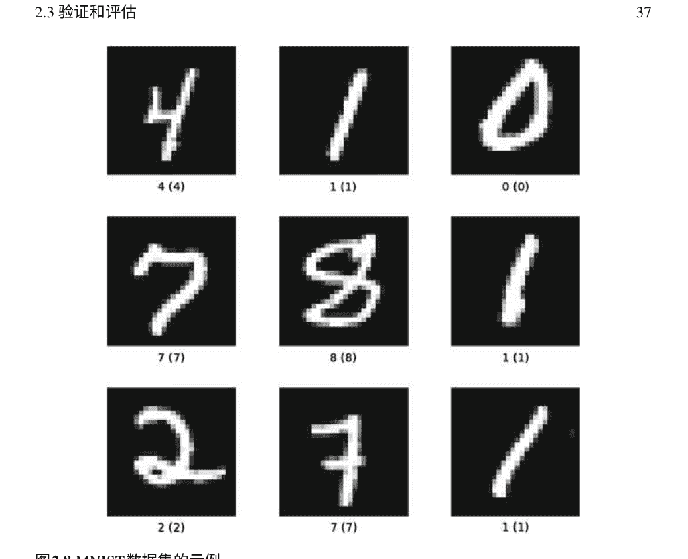

图2.8 MNIST数据集的示例

#### 2.3.4 性能指标

加速比：与传统的基于分析或数值的计算电磁问题求解方法相比，深度学习方法凭借其固有的工作方案和高速并行计算平台，在计算速度上表现出色。因此，加速比是评估深度学习方法性能的关键指标。 需要注意的是，尽管深度神经网络的在线训练在大多数情况下确实耗时，但由神经网络强制执行的离线预测由于不涉及数值迭代，因此非常快速，与传统方法（FDFD，FEM）相比，后续阶段的时间消耗主要用于比较。 还需要提醒的另一个细节是，为了进行比较实验，应采用相同的计算设备（GPU，CPU，RAM...），否则结果将不可信。 据我们所知，深度学习方法的计算加速比可以达到2D或3D计算域的两到四个数量级[10-12，23]。

准确性：与解析或半解析方法相比，深度学习在准确性方面存在一定程度的降级，主要是因为这种方法实际上是基于统计学习[47]，仍然存在一些限制。


图2.9 2D形状结构数据集的示例

数值模拟不同物理场景，具有极高的复杂性。因此，计算精度是评估提出的神经网络的另一个重要标准，特别是对于正向分析。可以使用参考结果和神经网络预测之间的相对误差来轻松评估此度量。在大多数情况下，均方误差（MSE）用于表示相对误差，其定义为

$$误差 = \frac{1}{N} \sum_{k=1}^{N} (Y_k - \hat{Y}_k)^2.\tag{}$$

还需要注意，物理响应的复杂输出应该考虑到实部和虚部。

$$误差 = \frac{1}{N^2} \sum_{k=1}^{N} \frac{(Y_k^r - Y_k^{r'})^2 + (Y_k^i - Y_k^{i'})^2}{Y_k^{r^2} + Y_k^{i^2}}.\tag{}$$

泛化能力：确保DL方法通过模仿底层物理定律而不是简单地过度拟合训练样本来进行分析非常重要。这个性能指标被称为

### 2.4 总结

在本章中，我们系统地讨论了如何使用深度学习方法来解决与电磁相关的问题。还讨论了深度学习基础知识和相关的物理背景。全面回顾了数据采集、神经网络训练和性能测试的技术细节。在后面的章节中，我们将看到更多具体的例子，说明这些方法如何应用于解决特定问题。

## 参考文献

- 1. Schmidhuber J (2015) 深度学习在神经网络中的应用概述. Neural Netw 61:85–117
- 2. LeCun Y, Bengio Y, Hinton G (2015) 深度学习. Nature 521(7553):436–444
- 3. Thuruthel TG, Shih B, Laschi C, Tolley MT (2019) 使用嵌入式软传感器和循环神经网络的软机器人感知. Sci Robot 4(26)
- 4. 邓杰, 董伟, Socher R, 李立军, 李凯, 费飞飞L (2009) Imagenet: 一个大规模的分层图像数据库。 在： 2009年IEEE计算机视觉和模式识别会议。 IEEE, pp 248-255
- 5. Chowdhary K (2020) 自然语言处理。 在： 人工智能基础知识。 Springer, 柏林, pp 603-649
- 6. Cong I, Choi S, Lukin MD (2019) 量子卷积神经网络。 Nat Phys 15（12）: 1273-1278
- 7. Schütt K, Gastegger M, Tkatchenko A, Müller K-R, Maurer RJ (2019) 用于分子波函数的深度神经网络统一机器学习和量子化学。 Nat Commun 10（1）: 1-10
- 8. Xie T, Grossman JC (2018) 用于准确和可解释的材料性质预测的晶体图卷积神经网络。 Phys Rev Lett 120（14）: 145301
- 9. Silver D, Huang A, Maddison CJ, Guez A, Sifre L, Van Den Driessche G, Schrittwieser J, Antonoglou I, Panneershelvam V, Lanctot M (2016) 用深度神经网络和树搜索掌握围棋。 自然529（7587）: 484-489
- 10. 齐S, 王Y, 李Y, 吴X, 任Q, 任Y (2020) 基于深度学习技术的二维电磁求解器。 IEE EJ多尺度多物理计算技术5: 83-88
- 11. 单T, 党X, 李M, 杨F, 徐S, 吴J (2018) 基于深度学习技术的三维泊松方程求解器研究。在：2018年IEEE国际计算电磁学会议（ICCEM）。IEEE，第1-3页
- 12. Wiecha PR, Muskens OL (2019) 深度学习遇见纳米光子学：任意三维纳米结构的广义准确预测器。Nano Lett 20 (1)：329-338
- 13. 李Y, 徐Y, 姜M, 李B, 韩T, 迟C, 林F, 沈B, 朱X, 赖L (2019) 通过深度神经网络实现自学习完美光学手性。Phys Rev Lett 1 23 (21)：213902
- 14. Peurifoy J, 沈Y, 景L, 杨Y, Cano-Renteria F, DeLacy B G, Joannopoulos JD, TegmarkM, Soljacic M (2018) 纳米光子颗粒模拟和逆向设计使用人工神经网络。Sci Adv 4 (6)：eaar4206
- 15. Liu D, Tan Y, Khoram E, Yu Z (2018) 训练深度神经网络用于纳米光子结构的逆向设计。ACS Photonics 5(4):1365–1369
- 16. Liu Z, Zhu D, Rodrigues SP, Lee K-T, Cai W (2018) 用于元表面逆向设计的生成模型。Nano Lett 18(10):6570–6576
- 17. Malkiel I, Mrejen M, Nagler A, Arieli U, Wolf L, Suchowski H (2018) 通过深度学习进行等离子体纳米结构设计和表征。
- 18. Campbell SD, Sell D, Jenkins RP, Whiting EB, Fan JA, Werner DH (2019) 用于元器件设计的数值优化技术综述。Opt Mater Express 9(4):1842–1863
- 19. Jiang J, Fan JA (2019) 使用物理驱动的神经网络全局优化介质元表面。Nano Lett 19(8):5366–5372
- 20. Kudyshev ZA, Kildishev AV, Shalaev VM, Boltasseva A (2020) 机器学习辅助元表面设计以实现高效热辐射器优化。Appl Phys Rev 7(2):021407
- 21. Kiarashinejad Y, Abdollahramezani S, Adibi A (2020) 基于降维的深度学习方法用于设计电磁纳米结构。npj Comput Mater 6(1):1–12
- 22. Barth C, Becker C (2018) 用于光子模式场分布的机器学习分类。Commun Phys 1 ( )：1–11
- 23. Li Y, Wang Y, Qi S, Ren Q, Kang L, Campbell SD, Werner PL, Werner DH (2020) 通过深度学习预测复杂纳米结构的散射。IEEE Access 8: 139983–139993
- 24. Zhang G, He H, Katabi D (2019) Circuit-GNN: 用于分布式电路设计的图神经网络。在：机器学习国际会议，pp 7364–7373
- 25. Nadell CC, Huang B, Malof JM, Padilla WJ (2019) 用于加速全介质介质表面设计的深度学习。Opt Express 27(20):27523–27535
- 26. Qu Y, Jing L, Shen Y, Qiu M, Soljacic M (2019) 基于人工神经网络的物理场景之间的知识迁移。ACS Photonics 6(5):1168–1174
- 27. Glorot X, Bordes A, Bengio Y (2011) 深度稀疏整流器神经网络。在：Proceedingsof the fourteenth international conference on artificial intelligence and statistics, 2011. JMLRworkshop and conference proceedings, pp 315–323
- 28. Maas AL, Hannun AY, Ng AY (2013) 整流器非线性改善神经网络声学模型。在：Proceed ings icml, vol 1, Citeseer, p 3
- 29. Xu B, Wang N, Chen T, Li M (2015) 卷积网络中整流激活的经验评估。arXiv预印本 arXi v:150500853
- 30. Ozisk MN (1989) 热传导的边界值问题。Courier Corporation, 美国
- 31. Hughes TW, Williamson IA, Minkov M, Fan S (2019) 波物理作为一种模拟循环神经网络。Sci Adv 5(12):eay6946
- 32. Goodfellow I, Pouget-Abadie J, Mirza M, Xu B, Warde-Farley D, Ozair S, Courville A, Bengio Y (2014) 生成对抗网络。在：神经信息处理系统的进展，pp 2672–2680
- 33. Jiang J, Sell D, Hoyer S, Hickey J, Yang J, Fan JA (2019) 基于生成对抗网络的自由形式衍射元光栅设计。ACS Nano 13(8):8872–8878
- 34. So S, Rho J (2019) 使用条件深度卷积生成对抗网络设计纳米光子结构。纳米光子学 8(7):1255–1261
- 35. 叶X，白Y，宋R，徐K，安J（2020年）基于生成对抗网络的非均匀背景成像方法。IE EE Trans Microwave Theor Tech 68(11):4684–4693
- 36. 任S，何K，Girshick R，孙J（2015年）更快的R-CNN：基于区域建议网络的实时目标检测。 arXiv预印本arXiv:150601497
- 36. Hinton G, Vinyals O, Dean J (2015年) 蒸馏神经网络中的知识。arXiv预印本 arXiv:150302531
- 37. Kingma DP, Ba J (2014年) Adam: 一种随机优化方法。arXiv预印本arXiv:14126980
- 38. Glorot X, Bengio Y (2010年) 理解训练深度前馈神经网络的困难。在：第十三届国际人工智能和统计学会议论文集，第249-256页
- 39. He K, Zhang X, Ren S, Sun J (2015) 深入研究整流器：在Imagenet分类上超越人类水平的性能。在：IEEE国际计算机视觉会议论文集，第1026-1034页
- 40. Snoek J, Larochelle H, Adams RP (2012) 机器学习算法的实用贝叶斯优化。在：神经信息处理系统进展，第2951-2959页
- 41. Khan A, Ghorbanian V, Lowther D (2019) 用于磁场估计的深度学习。IEEETrans Magn 55(6):1–4
- 42. Taflate A, Hagness SC (2000) 计算电磁学：有限差分时域方法。Artech House，美国
- 43. Shin W, Fan S (2012) 频域Maxwell方程求解器的完美匹配层边界条件的选择。J Comput Phys 231(8):3406–3431
- 44. 邓L（2012）手写数字图像的mnist数据库用于机器学习研究 [最佳网络资源]. IEEE信号处理杂志29（6）：141-142
- 45. Carlier A, Leonard K, Hahmann S, Morin G, Collins M (2016) 2D形状结构数据集：用户注释的开放访问数据库。计算机图形学58：23-30
- 46. Vapnik V (2013) 统计学习理论的本质。Springer Science & Business Media，柏林
- 47. Jiang J, Chen M, Fan JA (2020) 用于光子器件评估和设计的深度神经网络。自然材料评论1-22
- 48. Ma W, Liu Z, Kudyshev ZA, Boltasseva A, Cai W, Liu Y (2020) 用于设计光子结构的深度学习。自然光子学1-14

## 第3章 构建数据库

在机器学习项目中，最关键的组成部分之一是数据库。在训练过程中，它将向网络提供信息，以便网络可以根据信息自动调整内部参数。在测试过程中，数据将指示网络训练的程度。因此，适当的数据库对于深度学习问题非常重要。在某些情况下，公共数据库，例如计算机视觉中的'cifar' ([1] https://www.cs.toronto.edu/~kriz/cifar.html)和自然语言处理中的'Big Bad NLP Database' ([2] https://datasets.quantumstat.com)，将减轻这些问题的数据负担。但在计算物理领域，没有这样的公共数据库可用。因此，建立一个用于训练和测试的数据库是必要的。

在这项工作中，构建了一个端到端的卷积神经网络来预测电磁场。输入数据是呈现散射体信息和入射波特征的图片。而输出是预测的电磁场的实部和虚部。因此，这项工作的独特数据库将包含用于训练网络和测试结果的信息。

为了训练EM-net的数据集，需要使用传统的计算电磁学（CEM）程序生成真实的EM场数据。这些数据将在训练和测试过程中作为基准。此外，这种传统方法还应该通过随机几何生成器来包装，以满足数据的多样性和普适性。生成大量数据后，输入数据和基准数据应该被封装成特定的格式，以便网络可以读取。

接下来，详细说明了本工作中使用的传统CEM方法以及随机几何生成器的工作原理。然后，说明了数据集的格式。最后，总结了构建数据集的所有工作。

### 3.1 FDFD方法

在我们的工作中，使用传统的计算技术来生成基准结果。经典的计算电磁方法包括有限差分时域（FDTD）方法，最初由 Kane S. Yee 在他于 1966 年发表的开创性论文中提出 [3]，有限差分频域（FDFD）方法，也是基于有限差分逼近求解微分方程中的导数算子，矩量法（MoM）[4] 和有限元法（FEM）。在这些方法中，选择有限差分频域（FDFD）来计算平面波照射下随机散射体所散射的电磁场。虽然 FDFD 不像 FDTD 那样流行，但它们是分析电磁现象的互补工具，FDFD 更适用于频域分析和处理色散材料。

麦克斯韦方程说明了电场和磁场如何相互作用和控制电磁现象。在时域中，它们是

$$\nabla \times \mathbf{E} = -\frac{\partial \mathbf{B}}{\partial t}$$

$$\nabla \times \mathbf{H} = \mathbf{J} + \frac{\partial \mathbf{D}}{\partial t}$$

$$\nabla \cdot \mathbf{D} = \rho$$

$$\nabla \cdot \mathbf{B} = 0$$

其中 $\mathbf{E}$ 和 $\mathbf{H}$ 是电场和磁场（以下简称为E场和H场）；$\mathbf{J}$ 是电流源密度；根据构成方程，$\mathbf{D} = \varepsilon\mathbf{E}$ 和 $\mathbf{B} = \mu\mathbf{H}$，$\varepsilon$ 和 $\mu$ 分别是电介质常数和磁导率。

对于一个特定的问题，$\mathbf{E}$ 场和 $\mathbf{H}$ 场是位置 $\mathbf{r}$ 和时间 $t$ 的函数。这样，法拉第感应定律和安培环路定律就是

$$\nabla \times \mathbf{E}(\mathbf{r}, t) = -\partial_t \mathbf{B}(\mathbf{r}, t)$$

$$\nabla \times \mathbf{H}(\mathbf{r}, t) = \partial_t \mathbf{D}(\mathbf{r}, t) + \mathbf{J}(\mathbf{r}, t)$$

频域麦克斯韦方程可以从时域麦克斯韦方程推导出来。对于给定的 $\omega$，假设每个时变量 $F(\mathbf{r}, t)$ 的时间依赖性为 $e^{j\omega t}$，则使用构成方程 $\mathbf{D} = \varepsilon\mathbf{E}$ 和 $\mathbf{B} = \mu\mathbf{H}$ 来替换 $\mathbf{D}$ 和 $\mathbf{B}$。在频域中，法拉第感应定律和安培环路定律的微分表达式为

$$\nabla \times \mathbf{E}(\mathbf{r}, \omega) = -j\omega\mu(\mathbf{r}, \omega)\mathbf{H}(\mathbf{r}, \omega),$$

$$\nabla \times \mathbf{H}(\mathbf{r}, \omega) = j\omega\varepsilon(\mathbf{r}, \omega)\mathbf{E}(\mathbf{r}, \omega) + \mathbf{J}(\mathbf{r}, \omega).$$

当使用FDFD方法解决给定电流源密度 $\mathbf{J}$ 的频域Maxwell方程（3.7-3.8）的 $\mathbf{E}$-和 $\mathbf{H}$-场时，有几种不同的方程组合可供选择。首先，直观地考虑同时解决 $\mathbf{E}$-和 $\mathbf{H}$-场的方程（3.7-3.8）。这个选择等同于解决

$$
\begin{bmatrix} -j\omega\varepsilon & \nabla\times \\ \nabla\times & j\omega\mu \end{bmatrix} \begin{bmatrix} \mathbf{E} \\ \mathbf{H} \end{bmatrix} = \begin{bmatrix} \mathbf{J} \\ \mathbf{0} \end{bmatrix}.
$$

另一种选择是从方程（3.3）中消除 $\mathbf{E}$-或 $\mathbf{H}$-场，得到

$$
\nabla \times \mu^{-1} \nabla \times \mathbf{E} - \omega^2\varepsilon\mathbf{E} = -j\omega\mathbf{J},
$$

或者

$$
\nabla \times \varepsilon^{-1} \nabla \times \mathbf{H} - \omega^2\mu\mathbf{H} = \nabla \times \varepsilon^{-1}\mathbf{J}.
$$

通过这种方式，一个方程中只存在 $\mathbf{E}$-场或 $\mathbf{H}$-场。当通过这个公式求解电磁场时，解向量的大小从(3.4)式的一半开始，这进一步有利于求解过程。一旦(3.10)式或(3.11)式中的任一方程被求解出来，另一个方程可以通过将求解出的场简单地代入(3.1)式中来轻松恢复。

在纳米光子系统中，求解(3.10)式是更好的选择，因为它避免了方程中数量级的巨大差异。在纳米光子学中，(3.10)式左侧的第二项通常比第一项小得多，即 $|\omega^2\varepsilon\mathbf{E}| \ll |\nabla \times \mu^{-1}\nabla \times \mathbf{E}|$，因为纳米光子学对象比波长小得多。因此，方程（3.10）的算子可以很好地近似为 $\nabla \times \mu^{-1}\nabla\times$，因为大多数纳米光子器件中使用的材料满足 $\mu = \mu_0$。此外，这个算子是Hermitian正半定的，这对数值求解器非常有利。尽管方程（3.11）左侧的第二项由于相同的原因也可以忽略，但是第一项的算子既不是Hermitian也不是正半定的，因为金属是有损介质，其 $\varepsilon$ 是复数，其实部为负。

当以笛卡尔坐标系写成频域的麦克斯韦方程（3.7-3.8）时，它们是

$$\partial_y E_z - \partial_z E_y = -j\omega\mu H_x, \quad (3.12)$$

$$\partial_z E_x - \partial_x E_z = -j\omega\mu H_y, \quad (3.13)$$

$$\partial_x E_y - \partial_y E_x = -j\omega\mu H_z, \quad (3.14)$$

和

$$\partial_y H_z - \partial_z H_y = j\omega\varepsilon E_x + J_x, \quad (3.15)$$

$$\partial_z H_x - \partial_x H_z = j\omega\varepsilon E_y + J_y, \quad (3.16)$$

$$\partial_x H_y - \partial_y H_x = j\omega\varepsilon E_z + J_z. \quad (3.17)$$

通过有限差分法数值求解方程(3.12)到(3.17)，每个导数可以近似为有限差分之间的比率

$$(E_z^{i,j+1,k} - E_z^{i,j,k})/\Delta_y^j - (E_y^{i,j,k+1} - E_y^{i,j,k})/\Delta_z^k = -j\omega\mu_x^{i,j,k}H_x^{i,j,k}, \quad (3.18)$$

$$(E_x^{i,j,k+1} - E_x^{i,j,k})/\Delta_z^k - (E_x^{i+1,j,k} - E_x^{i,j,k})/\Delta_x^i = -j\omega\mu_y^{i,j,k}H_y^{i,j,k}, \quad (3.19)$$

$$(E_y^{i+1,j,k} - E_y^{i,j,k})/\Delta_x^i - (E_x^{i,j+1,k} - E_x^{i,j,k})/\Delta_y^j = -j\omega\mu_z^{i,j,k}H_z^{i,j,k}, \quad (3.20)$$

和

$$(H_z^{i,j,k} - H_z^{i,j-1,k})/\Delta_y^j - (H_y^{i,j,k} - H_y^{i,j,k-1})/\Delta_z^k = j\omega\varepsilon_x^{i,j,k}E_x^{i,j,k} + J_x^{i,j,k}, \quad (3.21)$$

$$(H_x^{i,j,k} - H_x^{i,j,k-1})/\Delta_z^k - (H_z^{i,j,k} - H_z^{i-1,j,k})/\Delta_x^i = j\omega\varepsilon_y^{i,j,k}E_y^{i,j,k} + J_y^{i,j,k}, \quad (3.22)$$

$$(H_y^{i,j,k} - H_y^{i-1,j,k})/\Delta_x^i - (H_x^{i,j,k} - H_x^{i,j-1,k})/\Delta_y^j = j\omega\varepsilon_z^{i,j,k}E_z^{i,j,k} + J_z^{i,j,k}, \quad (3.23)$$

其中 $\varepsilon_w^{i,j,k}$ 和 $\mu_w^{i,j,k}$ 分别是细胞的介电常数和磁导率，而 $\Delta_w^l = (\Delta_w^l + \Delta_w^{l-1})/2, (w = x, y, z)$。

从所有单元的微分方程中收集以建立系统方程，

$$\mathbf{C}_e \mathbf{e} = -j\omega \mathbf{D}_\mu \mathbf{h}, \quad (3.24)$$

$$\mathbf{C}_h \mathbf{h} = j\omega \mathbf{D}_\varepsilon \mathbf{e} + \mathbf{j}, \quad (3.25)$$

其中

$$\mathbf{e} = [\cdots E_x^{i,j,k} E_y^{i,j,k} E_z^{i,j,k} \cdots]^T, \quad (3.26)$$

$$\mathbf{h} = [\cdots H_x^{i,j,k} H_y^{i,j,k} H_z^{i,j,k} \cdots]^T, \quad (3.27)$$

$$\mathbf{m} = [\cdots M_x^{i,j,k} M_y^{i,j,k} M_z^{i,j,k} \cdots]^T, \quad (3.28)$$

$$\mathbf{j} = [\cdots J_x^{i,j,k} J_y^{i,j,k} J_z^{i,j,k} \cdots]^T, \quad (3.29)$$

是列向量，表示相关场和源；$\mathbf{C}_e$ 和 $\mathbf{C}_h$ 分别是 $\mathbf{E}$ 和 $\mathbf{H}$ 上的旋度算子的矩阵。$\mathbf{D}_\mu$ 和 $\mathbf{D}_\varepsilon$ 是表示渗透率和介电常数的对角矩阵。

在消除 $\mathbf{e}$ 后，具有单个场未知数 $\mathbf{h}$ 的方程系统如下

$$(\mathbf{C}_h - \omega^2 \mathbf{D}_\varepsilon \mathbf{C}_e^{-1} \mathbf{D}_\mu) \mathbf{h} = \mathbf{j}, \quad (3.30)$$

这只是一个线性方程组

$$\mathbf{A} \mathbf{x} = \mathbf{b}, \quad (3.31)$$

其中 $\mathbf{A}$ 表示算子，$\mathbf{x}$ 表示我们要求解的 $\mathbf{E}$ 场，$\mathbf{b}$ 是由给定电流源密度确定的列向量。

用于求解方程(3.31)的方法可以分为两类：直接方法和迭代方法。直接方法将 $\mathbf{A}$ 分解为几个（通常是两个或三个）因子，可以高效地计算 $\mathbf{A}^{-1}\mathbf{b}$，并且它们在固定的步骤中产生解。根据 $\mathbf{A}$ 的结构和性质，可以使用不同的分解方法，如Cholesky分解、LU分解、LDM^T分解、LDLT分解等[5]。

另一类方法是迭代方法，在每次迭代步骤中产生一个近似解，直到解收敛到足够接近精确解[6]。更具体地说，假设 $\mathbf{x}_m$ 是第 $m$ 次迭代步骤产生的近似解。然后迭代方法继续这个过程，直到残差向量

$$\mathbf{r}_m = \mathbf{b} - \mathbf{A} \mathbf{x}_m, \quad (3.32)$$

满足 $\|\mathbf{r}_m\| / \|\mathbf{b}\| < \tau$，其中 $\|\cdot\|$ 是列向量的范数，$\tau$ 是用户定义的小正数；通常使用2范数作为范数，但一些迭代方法（例如共轭梯度法）使用不同的范数，如A-范数，在实践中，$\tau = 10^{-6}$ 足够小以获得准确的解。

迭代方法不能保证在固定的迭代步数内收敛，但通常使用较少的计算资源产生准确的解决方案，而不是直接方法。

方程（3.32）的矩阵 $\mathbf{A}$ 通过有限差分法构造，通常非常大（对于3D问题，通常有超过1000万行和列），但非常稀疏（每行最多有13个非零元素）。对于这样一个非常大且稀疏的矩阵，通常优先使用迭代方法而不是直接方法，因为直接方法需要太多的计算机内存。

在众多迭代方法中，我们使用Krylov子空间方法[7]，这被认为是最高效的迭代方法之一。由 $\mathbf{A}$ 和 $\mathbf{r}_0$ 生成的维度为 $m$ 的Krylov子空间是

$$\mathcal{K}_m(\mathbf{A}, \mathbf{r}_0) = \text{span} \{ \mathbf{r}_0, \mathbf{A}\mathbf{r}_0, \mathbf{A}^2\mathbf{r}_0, ..., \mathbf{A}^{m-1}\mathbf{r}_0 \}, \quad (3.33)$$

其中 $\mathbf{r}_0$ 是方程（3.32）的初始残差向量，用于初始猜测解 $\mathbf{x}_0$。Krylov子空间方法在空间 $\mathbf{x}_0 + \mathcal{K}_m(\mathbf{A}, \mathbf{r}_0)$ 中找到“最佳” $m$ 阶近似解 $\mathbf{x}_m$ of 方程（3.32）。每个Krylov子空间方法通过其自己的准则来确定最佳近似解，与其他方法有所区别。一般来说，随着 $m$ 的增加，所有Krylov子空间方法都能找到越来越好的近似解，因为搜索空间变得越来越大，即 $\mathbf{x}_0 + \mathcal{K}_m(\mathbf{A}, \mathbf{r}_0) \subseteq \mathbf{x}_0 + \mathcal{K}_{m+1}(\mathbf{A}, \mathbf{r}_0)$。

与直接方法类似，Krylov子空间方法专门用于具有特定结构和性质的矩阵，例如实对称矩阵、复共轭矩阵或正定矩阵。不幸的是，我们从麦克斯韦方程构造的矩阵不满足这些属性：它是复数、非对称和不定的。因此，我们需要依靠能处理最通用矩阵的Krylov子空间方法。

在生成EM场数据集时，使用了Krylov子空间方法来处理一般矩阵。在测试中使用2-范数 $\|\mathbf{r}_m\| / \|\mathbf{b}\|$，我们使用 $\mathbf{x}_0 = \mathbf{0}$ 作为初始猜测来创建方程(3.31)的子空间。
除了应用适当的方法来解决矩阵方程外，选择完美匹配层(PML)对于FDFD方法也很重要。博士 Shin在他的论文[8]中详细阐述了这个过程。由于PML的选择与本文的主题关系不大，不会详细讨论。

### 3.2 随机几何生成器

在建立计算EM场的算法之后，下一步是确定散射体的配置。为了保证网络具有良好的泛化能力，用于训练模型的数据集应该是多样的。此外，为了满足实际需求，散射体的形状应该是常见的。因此，散射体包括不同大小的圆、椭圆、多边形以及它们在2D实验中的组合，以及在3D实验中的各种球体和椭球体。在这部分中，介绍了生成这些散射体的方法。

#### 3.2.1 2D几何生成器

在2D实验中，域区域是一个边长为128纳米的正方形，如图3.1所示。

通过程序生成圆和椭圆是很直观的。根据定义，给定中心点和半径，可以直接生成一个圆。在我们的程序中，圆的半径范围从13到28纳米，圆的中心范围从(32, 32)纳米到(96, 96)纳米，如图3.2所示。

图3.3展示了一些示例。同样地，通过具有半长轴、离心率和旋转角度，可以生成椭圆。在生成程序中，椭圆的半长轴范围从19到26纳米，离心率范围从0.65到0.95，椭圆的中心范围从(32, 32)纳米到(96, 96)纳米。旋转角度范围从0到π。如图3.4所示，展示了椭圆的生成方式。图3.5展示了一些生成的椭圆示例。与生成圆或椭圆不同，通过程序生成多边形并不那么直观。为了实现随机多边形的生成，我们需要了解叉乘的概念。以下是生成随机多边形散射的逻辑。

- 首先，确定多边形的边数N。
- 其次，确定多边形的顶点。在定义域中设置一个中心点O，并随机生成N条弦和N个角度。对这些角度进行排序，并为每个角度分配一条弦。通过这种方式，在计算域中以顺时针或逆时针的顺序设置N个顶点。将它们定义为 P1，P2，P3，...，PN。
- 第三步，遍历每一个生成域中的点。 计算从点到顶点的向量的叉积，例如对于生成域中的随机点 S，计算 $[\mathbf{SP}_1, \mathbf{SP}_2], [\mathbf{SP}_2, \mathbf{SP}_3], ..., [\mathbf{SP}_{N-1}, \mathbf{SP}_N], [\mathbf{SP}_N, \mathbf{SP}_1]$ 的叉积。如果所有结果都具有相同的符号，则该点在多边形内，反之亦然。

现在遍历所有点，生成图形。 该算法的复杂度与用于生成圆或椭圆的算法相同。

在这里，算法1展示了算法的细节。

如果需要一个正多边形，只需指定多边形的顶点。 确定顶点时，每个弦应该是相同的。

**算法1 多边形生成**

```
Algorithm 1: Polygons generation algorithm

Input: Number of vertex (N), length of each chord (L), angle of corresponding chord (θ) and length of figure (C)
Output: An figure contains one polygon (F)

F ← 0;
for k = 0 to N - 1 do
    V(k,0) = O(0) + L(k)cos(θ(k,0)) /*V is the vertex and O represents the center point*/
    V(k,1) = O(1) + L(k)sin(θ(k,1))
end
for i = 0 to C - 1 do
    for j = 0 to C - 1 do
        cnt = 0
        for k = 0 to N - 1 do
            temp0(0) = i - V(k,0)
            temp0(1) = j - V(k,1)
            if k == N - 1 then
                k_next = 0
            else
                k_next = k + 1
            end
            temp1(0) = i - V(k_next,0)
            temp1(1) = j - V(k_next,1)
            if temp0 × temp1 > 0 then
                cnt = cnt + 1
            end
        end
        if cnt == 0 or cnt == N then
            F(i,j) = 1
        end
    end
end
```

图3.6和图3.7展示了多边形的生成过程。 多边形的边长范围从32到64纳米，离心率范围从0.65到0.95，而圆心范围从(30,30)纳米到(100,100)纳米。图3.8展示了一些随机多边形的示例。

这种方法只能用于生成凸多边形。 对于凹多边形，可以通过多个凸多边形的组合来实现。

### 3.2 随机几何生成器

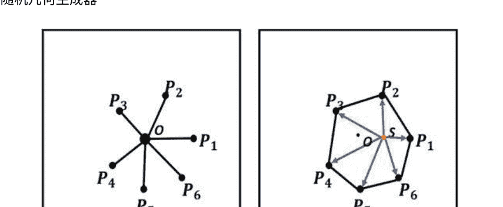

(a) Set vertexes of polygons

(b) Traverse every point in the domain

图3.6多边形生成的示意图

图3.7多边形生成的原理

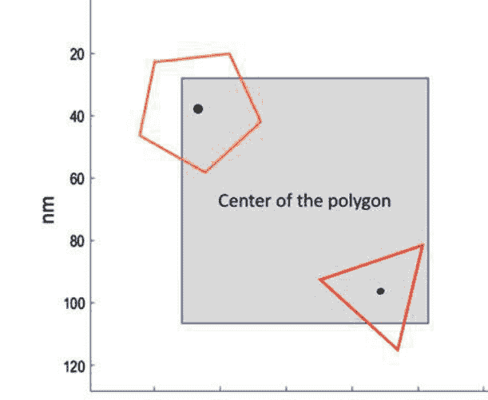

#### 3.2.2 3D几何生成器

在3D实验中，为了减少计算负担，域区域被设置为边长为32纳米的立方体，如图3.9所示。球体的中心在三个方向上的区域为(7,25)纳米，其半径范围从7到15纳米。同时，椭球体的中心在三个方向上的区域为(7,25)纳米，其三个半轴范围从7到15纳米。图3.10展示了一些球体和椭球体的示例。

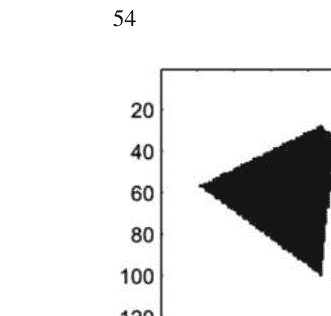

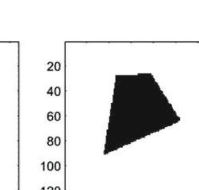

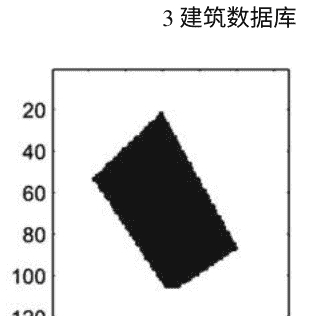

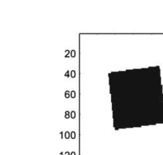

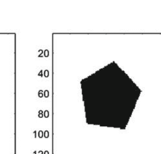

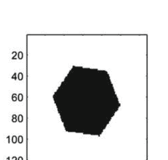

图3.8 多边形样本

图3.9 2D实验的域区域

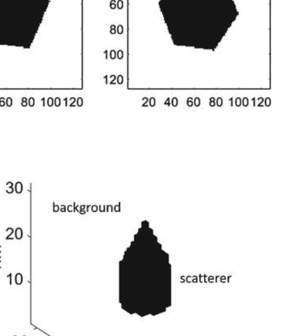

### 3.3 数据验证

通过随机散射生成和FDFD程序的结合，可以自动计算散射场的数据。然而，在构建数据集之前，我们需要验证生成的电磁场。

在这项工作中，我们使用解析方法（级数展开）[9-13]和有限元方法（COMSOL Multiphysics）来验证FDFD程序。具体而言，我们使用FDFD程序和其他方法来计算相同的案例并比较每个像素的差异。此外，我们将提供统计差异以验证FDFD程序的数据准确性。

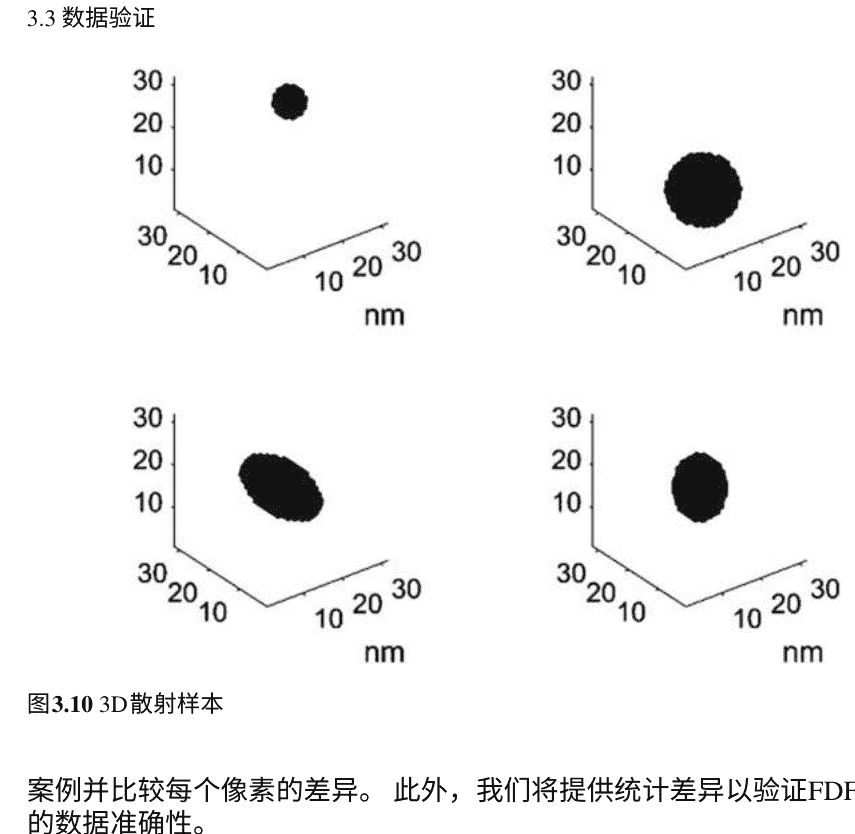

图3.10 3D散射样本

#### 3.3.1 分析解

在所有计算方法中，只有解析解是绝对准确的，因此通常被用作其他方法的标准。对于大多数实际问题，不存在解析解。因此，我们只考虑无限长圆柱体（2D）和球体（3D）的解决方案。

对于二维情况，我们比较FDFD程序和解析方法在计算平面波通过无限长圆柱介质的散射场时的结果[14, 15]。计算图示如图3.11所示。

我们的第一个例子是一个位于原点的圆柱体，半径为15纳米，相对磁导率为2。要计算的区域是一个边长为128纳米的正方形。平面波是一个TEz极化波，沿着+x方向传播，波长为80纳米。在第一章中，我们已经描述了介质散射的平面波理论。对于TEz波，只需要磁场的z分量来表示电磁场的其他分量。为了简化计算，在这里我们只计算z方向上的磁场。图3.12a显示了散射体的示意图和分别是入射电磁波的振幅。假设入射电场的振幅为100 V/m，磁场可以表示为

$$ H_z^i = H_0 e^{-jkx} = H_0 \sum_{n=-\infty}^{+\infty} j^{-n} J_n(k\rho) e^{jn\varphi}, \quad (3.34) $$

其中 $H_0 = 100/\eta_0$。总场可以表示为

$$ H_z = \begin{cases} H_0 \sum_{n=-\infty}^{+\infty} j^{-n} b_n J_n(k\rho) e^{jn\varphi}, & \rho \leq a \\ H_0 \sum_{n=-\infty}^{+\infty} j^{-n}[a_n H_n^{(2)}(k\rho) + J_n(k\rho)] e^{jn\varphi}, & \rho > a \end{cases}. \quad (3.35) $$

可以得到系数

$$ a_{-n}=\frac{\sqrt{\mu_1} J_n(k a) J_n^{\prime}\left(k_1 a\right)-\sqrt{\mu} J_n\left(k_1 a\right) J_n^{\prime}(k a)}{\sqrt{\mu} J_n\left(k_1 a\right) H_n^{(2) \prime}(k a)-\sqrt{\mu_1} J_n^{\prime}\left(k_1 a\right) H_n^{(2)}(k a)}, \quad (3.36) $$

$$ b_n=\frac{J_n(k a)+a_n H_n^{(2)}(k a)}{J_n\left(k_1 a\right)} . \quad (3.37) $$

物理量满足

$$ \left\{\begin{array}{l} k a=\frac{3 \pi}{8} \\ k_1 a=\frac{3 \sqrt{2} \pi}{8} \end{array}, \quad (3.38) \right. $$

$$ \left\{\begin{array}{l} \mu=\mu_0 \\ \mu_1=\sqrt{2} \mu_0 \end{array}\right. . \quad (3.39) $$

将截断项取为 $n=30$ (即 $\sum_{n=-30}^{30}(\cdot)$ ), 因此我们可以得到相应的解析解。实部和虚部分别显示在图3.12b中。我们还在图3.12c中显示了由FDFD程序计算得到的实部和虚部。图3.12d显示了误差，该误差定义为两者之间的差的绝对值。

$$ H_{\text {err }}=\left|H_{F D F D}-H_{\text {解析 }}\right|. \quad (3.40) $$

从计算结果可以看出，FDFD算法计算得到的散射场与解析解非常接近，误差可以忽略不计。为了定量计算误差值，我们定义相对误差和平均相对误差为

$$ \text { 误差 }(i, j)=\frac{\sqrt{\left(H_{r_{F D F D}}(i, j)-H_{r_{\text {解析 }}}(i, j)\right)^2+\left(H_{i_{F D F D}}(i, j)-H_{i_{\text {解析 }}}(i, j)\right)^2}}{\sqrt{H_{r_{\text {解析 }}}^2(i, j)+H_{i_{\text {解析 }}}^2(i, j)}}, \quad (3.41) $$

$$ \text { 误差平均 }=\frac{\sum_{i=1}^{128} \sum_{j=1}^{128} \text { 误差 }(i, j)}{128^2} . \quad (3.42) $$

根据上述定义，该情况下的平均相对误差为2.82%。考虑到差分算法的精度，结果是令人满意的。为了进一步验证算法的合理性，我们测试了另一个目标。

第二种情况是一个位于原点的半径为25纳米的圆柱体，其相对磁导率为5。平面波是一个TEz极化波，沿着 $+x$ 方向传播，其波长为40纳米。通过FDFD和解析方法分别计算 $z$ 方向的磁场。图3.13a显示了散射体和入射电磁波的示意图，其中入射电场的幅度为100 V/m，物理量满足

$$
\left\{\begin{array}{l}
ka = \dfrac{3\pi}{8} \\ k_1a = \dfrac{3\sqrt{2}\pi}{8}
\end{array}\right.
$$ (3.43)

$$
\left\{\begin{array}{l}
\mu = \mu_0 \\ \mu_1 = \sqrt{5}\mu_0
\end{array}\right.
$$ (3.44)

根据上述定义，该情况下的平均相对误差为2.31%。因此，我们的FDFD前向程序可以高精度计算散射体的电磁场。由于深度学习的目标散射场是由FDFD代码生成的，高精度的前向程序确保了训练数据集的准确性。

除了验证二维程序的正确性，我们还需要验证三维程序。因此，我们需要使用平面波经球体散射的解析公式。假设平面波沿着z方向传播，在真空中的波数为k，可以表示为

$$
\mathbf{E}^i = \mathbf{i}_x E_0 e^{-jkz} = \mathbf{i}_x E_0 e^{-jkr\cos\theta}
$$ (3.45)

$$
\mathbf{H}^i = \mathbf{i}_y \dfrac{E_0}{\eta_0} e^{-jkz} = \mathbf{i}_y \dfrac{E_0}{\eta_0} e^{-jkr\cos\theta}
$$ (3.46)

一个半径为 a 的完全导电球体放置在原点上。波矢量、极化方向和球体的几何位置之间的关系如图3.14所示。

为了在球坐标系中获得电磁场的解析解，我们通常首先计算电磁矢量势，然后从矢量势中导出电磁场，如下所示：

$$ A_r = E_0 \frac{\cos \varphi}{\omega} \sum_{n=1}^{\infty} \left[ a_n \hat{J}_n(kr) + b_n \hat{H}_n^{(2)}(kr) \right] P_n^1(\cos \theta), \quad (3.47) $$

$$ F_r = \frac{E_0}{\eta} \frac{\sin \varphi}{\omega} \sum_{n=1}^{\infty} \left[ a_n \hat{J}_n(kr) + c_n \hat{H}_n^{(2)}(kr) \right] P_n^1(\cos \theta), \quad (3.48) $$

其中

$$ \hat{J}_n(kr) = \frac{J_n(kr)}{kr}, \quad (3.49) $$

$$ \hat{H}_n^{(2)}(kr) = \frac{H_n^{(2)}(kr)}{kr}, \quad (3.50) $$

通过矢量势可以获得总场。

$$ E_r = \frac{1}{j\omega\mu\varepsilon} \left( \frac{\partial^2}{\partial r^2} + k^2 \right) A_r, \quad (3.51) $$

$$ E_{\theta} = \frac{1}{j\omega\mu\varepsilon} \frac{1}{r} \frac{\partial^2 A_r}{\partial r \partial \theta} - \frac{1}{\varepsilon} \frac{1}{r \sin \theta} \frac{\partial F_r}{\partial \varphi}, \quad (3.52) $$

图3.14 波矢量、极化方向和球体的几何位置之间的关系

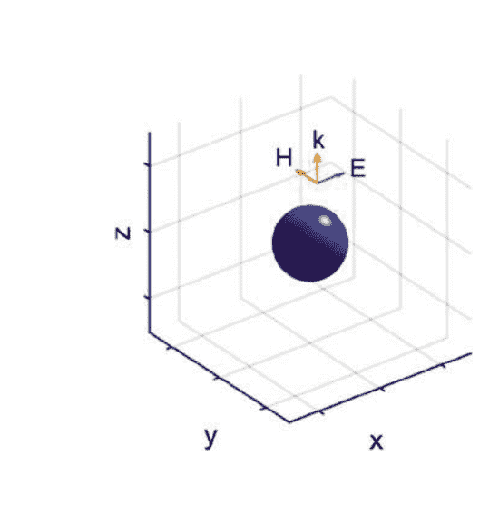

$$ E_{\varphi} = \frac{1}{j \omega \mu \varepsilon} \frac{1}{r \sin \theta} \frac{\partial^{2} A_{r}}{\partial r \partial \varphi} + \frac{1}{\varepsilon} \frac{1}{r} \frac{\partial F_{r}}{\partial \theta} \tag{3.53} $$

$$ H_{r} = \frac{1}{j \omega \mu \varepsilon}\left(\frac{\partial^{2}}{\partial r^{2}}+k^{2}\right) F_{r} \tag{3.54} $$

$$ H_{\theta} = \frac{1}{\mu} \frac{1}{r \sin \theta} \frac{\partial A_{r}}{\partial \varphi}+\frac{1}{j \omega \mu \varepsilon} \frac{1}{r} \frac{\partial^{2} F_{r}}{\partial r \partial \theta} \tag{3.55} $$

$$ H_{\varphi}=-\frac{1}{\mu} \frac{1}{r} \frac{\partial A_{r}}{\partial \theta}+\frac{1}{j \omega \mu \varepsilon} \frac{1}{r \sin \theta} \frac{\partial^{2} F_{r}}{\partial r \partial \varphi} \tag{3.56} $$

其中

$$ a_{n}=j^{-n} \frac{(2 n+1)}{n(n+1)} \tag{3.57} $$

为了求解 $|b_n|$ 和 $|c_n|$，引入边界条件 $|E_{\theta}^{t}|$ 和 $|E_{\varphi}^{t}|$ 被引入。

$$ \left\{\begin{array}{l} b_{n}=-a_{n} \frac{\hat{J}_{n}^{\prime}(k a)}{H_{n}^{(2) \prime}(k a)} \\ c_{n}=-a_{n} \frac{J_{n}(k a)}{H_{n}^{(2)}(k a)} \end{array}\right. \tag{3.58} $$

通过将系数 $a_n$、$b_n$ 和 $c_n$ 代入公式中，可以得到总场。

在这里，我们考虑一个半径为10纳米的完全导电球，放置在一个边长为84纳米的立方体区域的中心。均匀平面波沿着 $+z$ 方向入射，而电场和磁场分别沿着 $+x$ 和 $+y$ 方向极化。波在真空中的波长为20纳米。我们应用上述解析公式和FDFD程序来计算在 $z=0$ 平面上的电场的三个分量（通过Maxwell方程可以计算出磁场的三个分量）。我们仔细比较通过解析方法和FDFD方法计算出的电场的实部和虚部的三个分量。结果显示在图3.15中。

通过将FDFD结果与解析解进行比较，我们可以得出结论它们是一致的。精确的3D-FDFD求解器确保了我们的数据生成的可靠性。

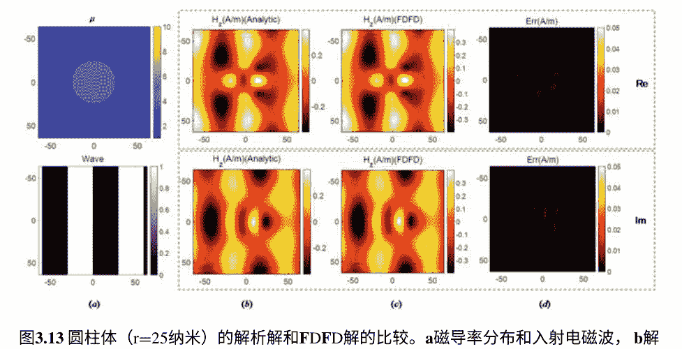

图3.13 圆柱体（r=25纳米）的解析解和FDFD解的比较。a磁导率分布和入射电磁波，b解析解的实部和虚部，cFDFD结果的实部和虚部，d误差的实部和虚部

图3.15 FDFD和解析解在3D情况下的比较。a-1散射体的横截面（z=0）。a-2散射体的空间位置和横截面。a-3电磁波的传播方向和波长。b通过FDFD计算得到的电场。c解析解。dFDFD和解析解之间的误差分布

#### 3.3.2 有限元方法

由于大多数具有复杂几何形状的散射体没有解析解，仅通过与解析解进行比较来验证FDFD程序的性能是不够的。我们还需要用更广义的方法验证解决方案散射体。出于这个原因，我们使用商业仿真软件COMSOL作为FDFD程序的参考。该软件使用有限元方法（FEM）[16-18]对偏微分方程进行离散化。首先，将空间离散化为非重叠元素。推导出Maxwell方程的弱形式，并组装系统矩阵形成一组带有时间变量的常微分方程（ODE）系统。然后，使用隐式和/或显式的时间步进方法来求解这些常微分方程并获得相应的解。在这里，我们相信成熟的商业软件获得的解是准确的。为了定量计算FDFD和COMSOL之间的差异，我们定义相对差异和平均相对差异为

$$ Diff(i, j) = \frac{\sqrt{(E_{r_{FDFD}}(i, j)-E_{r_{COMSOL}}(i, j))^2+(E_{i_{FDFD}}(i, j)-E_{i_{COMSOL}}(i, j))^2}}{\sqrt{H_r^2(i, j)+H_i^2(i, j)}}, \quad (3.59) $$

$$ Diff_{ave}=\frac{\sum_{i=1}^{128}\sum_{j=1}^{128} Diff(i, j)}{128^2}, \quad (3.60) $$

其中，$E_{r_{FDFD}}$和$E_{r_{COMSOL}}$表示来自FDFD和COMSOL的结果的实部，而$E_{i_{FDFD}}$和$E_{i_{COMSOL}}$表示来自FDFD和COMSOL的结果的虚部。$(i, j)$是单元的索引。$Diff_{ave}$表示来自FDFD代码和COMSOL Multiphysics的结果之间的差异。在2D实验中，计算域是一个边长为128纳米的正方形。使用四种情况验证FDFD代码在不同情况下的有效性。在每种情况下，激励源的强度设置为1 V/m，波长为80纳米。

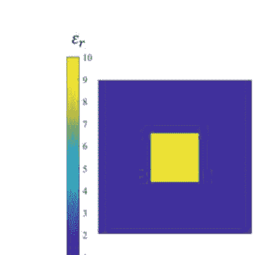

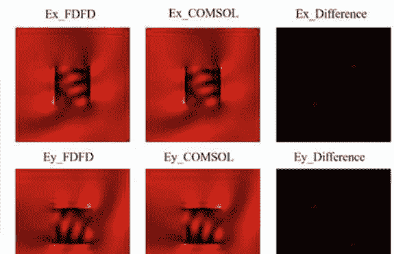

图3.17椭圆散射的2D验证FDFD代码

在第一种情况下，如图3.16所示，散射体是一个位于中心的简单正方形，边长为40纳米，相对介电常数为10。激励源的传播方向可以表示为[-1 1 0]，而极化方向为[1 1 0]。

比较这两个结果后，从FDFD和COMSOL Multiphysics得到的电场的x和y分量的差异分别为0.0350和0.0354。第二种情况如图3.17所示，是一个位于域中心的椭圆散射体。椭圆的半长轴为30纳米，半短轴为15纳米。散射体的相对介电常数为6。激励源的传播方向可以表示为[3 4 0]，而极化方向为[-4 3 0]。从FDFD和COMSOL Multiphysics得到的电场的x和y分量的差异分别为0.0380和0.0388。

如图3.18所示的第三种情况是一个由椭圆和正方形组成的组合散射体。正方形位于域的中心，边长为40纳米。椭圆位于中心的上方20纳米，其半长轴为30纳米，半短轴为15纳米。散射体的相对介电常数为4。激励源的传播方向和极化方向分别为[-1 2 0]和[2 1 0]。FDFD和COMSOL Multiphysics的电场的x和y分量之间的差异分别为0.0364和0.0508。

如图3.19所示的最后一种情况中，散射体由两个相同的椭圆组成，彼此垂直。椭圆的半长轴为20纳米，半短轴为10纳米。散射体位于域的中心，其相对介电常数为7。激励源的传播方向和极化方向分别为[1 1 0]和[1 -1 0]。FDFD和COMSOL Multiphysics的x和y分量的差异分别为0.0330和0.0326。

为了验证3D-FDFD求解器的可靠性，还将结果与商业仿真软件COMSOL进行比较。由于我们使用TE波，电场的方向垂直于传播矢量的方向。因此，

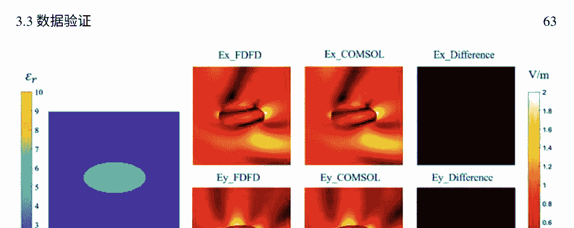

图3.17椭圆散射的2D验证FDFD代码通过计算电场的旋度可以得到磁场，因此我们只展示电场的分布。在3D实验中，选择了6个案例来验证FDFD程序。计算域是一个边长为64纳米的立方体。在每个案例中，激励源的强度设置为1 V/m。为了定量计算3D-FDFD和COMSOL之间的差异，我们定义平均相对差异为

$$\frac{1}{N^3} \sum_{i=1}^{N} \sum_{j=1}^{N} \sum_{k=1}^{N} \left\| \frac{E_{FDFD}(i,j,k) - E_{COMSOL}(i,j,k)}{E_{COMSOL}(i,j,k)} \right\|, \quad (3.61)$$

图3.20展示了3D验证的第一个案例，即一个半径为10纳米的球体位于域的中心。散射体的相对介电常数为4。激励源是一个波长为40纳米的平面波，其传播方向可以表示为 [0.8, −0.6, 0]，而极化方向为[3/(5√2), 4/(5√2), 1/√2]。FDFD和COMSOL Multiphysics的电场的x、y和z分量的差别分别为0.676、0.0519和0.0361。

第二个3D案例，如图3.21所示，是一个边长为20纳米的立方体，位于域的中心。散射体的相对介电常数为5。激励源是一个波长为40纳米的平面波，其传播方向可以表示为[0, -1/√2, 1/√2]，极化方向为[1/√3, 1/√3, 1/√3]。FDFD和COMSOL Multiphysics的电场的x、y和z分量之间的差异分别为0.0593、0.0596和0.0596。

第三个3D案例，如图3.22所示，散射体是一个椭球体，位于域的中心。椭球体的三个半轴长度分别为10纳米、6纳米和6纳米。散射体的相对介电常数为3。激励源的传播方向可以表示为[-1, 0, 1]，极化方向为[1, -1, 1]。FDFD和COMSOL Multiphysics的电场的x、y和z分量之间的差异分别为0.0591、0.0446和0.0606。

在最后的3D情况下，散射体由一个半球和一个圆柱组成，如图3.23所示。圆柱位于域的中心，沿z方向放置，半径为10纳米，高度为20纳米。半球的半径为10纳米，位于中心的上方10纳米处。散射体的相对介电常数为3。激励源的传播方向为[1, 0, −1]，极化方向为[1, 1/√3, 1/√3]。FDFD和COMSOL Multiphysics的电场的x、y和z分量之间的差异分别为0.0461、0.0303和0.0451。

通过上述FDFD代码和商业软件COMSOL之间的比较，我们验证了程序的可靠性。这为我们使用该代码生成大量训练数据打下了坚实的基础。

### 3.4 数据集的格式

在这项工作中，一个数据集包括三个部分：散射体的形状，激励源的特性和来自FDFD求解器的真实值。散射体的材料特性和波特性将被用作训练网络的输入。网络的输出被假设为电磁场。因此，在训练阶段，将使用来自FDFD求解器的结果来帮助网络收敛，并在测试阶段验证网络的准确性。

#### 3.4.1 散射体的表示

在训练阶段，使用一个矩阵来存储散射体的信息。矩阵中的每个像素是该位置材料的相对介电常数。如果一个像素位于散射体内部，则矩阵中该像素的值将是像素的相对介电常数。而如果像素位于背景中，则该像素的值将为0。通过这种方式，散射体的形状和材料可以由该矩阵表示。

在2D实验中，散射矩阵只在z方向上包含一层，因此可以表示为一个图形。图3.24提供了实验中使用的散射矩阵的一些示例。

在3D实验中，散射矩阵在每个维度上包含多个层，因此只能通过特定角度来感知。图3.25给出了3D实验中使用的散射矩阵的一些示例。

#### 3.4.2 波的表示

在训练阶段，另一个矩阵用于存储激励波的特征。在波矩阵中，值为1和0表示激励源在该位置的相位处于 [0, π)和 [−π, 0)范围内。由于平面波的相位在零相位点附近从正变为负，传播方向，我们将这一点固定在正方形的中心，从图像中可以轻松地得到波的传播方向。此外，2D实验中使用TEz极化，因此只将Hz输入网络进行训练。对于3D情况，我们利用线性变换将沿任意方向传播的TEM波转换为沿+z方向传播且极化为+x方向的波。由于转换后入射场是相同的，我们的3D网络不包含入射场。

此外，在2D实验中，一个波矩阵可以通过一张图片来表示。在图3.26中，很容易判断波的传播方向是从黄色部分到蓝色部分（在中心）。

由于电磁场的强度线性变化，本工作中激励波的幅度设置为1 V/m。然后，波矩阵将不包括波的幅度。

#### 3.4.3 真实值

在每个数据集中，真实值包含了电磁场的所有分量。两个矩阵将用于表示电磁场的一个分量，一个用于实部，另一个用于虚部，它们将用于训练和测试阶段。在训练阶段，真实值用于确定训练的水平和网络输出与真实值之间的差异。在测试阶段，真实值用于评估经过良好训练的网络的准确性。

在二维实验中，由于我们使用TE波，E_x和E_y可以通过公式(3.15-3.17)从H_z计算得到。网络的输出是H_z的实部和虚部。在训练过程中，它们将与相应数据集中的真实值进行比较，并为网络提供信息。通过这种方式，网络将找到收敛的路径并自动改变网络参数。在测试过程中，输出结果还将与实际结果进行比较，并用于指示网络训练的程度和最终错误率。图3.27显示了一个数据集中 Hz 的实部和虚部。

类似地，在三维实验中，网络的输出是 Ex、Ey 和 Ez 的实部和虚部。然后，可以根据方程 (3.12-3.14)推导出磁场的分量。图3.28显示了一个三维数据集中 Ex、Ey 和 Ez 的实部和虚部。

### 3.5 总结

在这部分中，介绍了建立数据库的过程。使用随机几何生成器将有限差分频域代码输入，以获取丰富而通用的2D和3D实验中用于网络训练和测试的数据。然后，澄清了数据的格式。使用表示照明波、散射体的几何和材料的矩阵来训练网络。

来自FDFD代码的真实数据可以提高网络的收敛性，并显示错误率，这将反映训练的成熟度。基于多功能数据集，网络可以进行不同形式的训练尝试，并反馈EM-net的最佳使用。

## 参考文献

1.  cifar 10数据集。 https://www.cs.toronto.edu/~kriz/cifar.html
2.  大坏NLP数据库。 https://datasets.quantumstat.com
3.  Kane Y (1966) 在各向同性介质中数值解决涉及Maxwell方程的初边值问题。 IEEE Trans Antennas Propag 14(3):302–307. https://doi.org/10.1109/TAP.1966.1138693
4.  Golub GH, Loan CFV (1996) 矩阵计算，第3版。约翰霍普金斯大学出版社，美国
5.  Demmel JW (1997) 应用数值线性代数。 工业和应用数学学会，费城
6.  Saad Y (2003) 稀疏线性系统的迭代方法，第二版。SIAM，费城
7.  Simoncini V, Szyld DB (2007) 线性系统的Krylov子空间计算方法的最新发展。 Numer Linear Algebra Appl 14(1):1–59
8.  Shin W, Fan SH (2012) 频域Maxwell方程求解器中完美匹配层边界条件的选择。 J Comput Phys 231(8):3406–3431. https://doi.org/10.1016/j.jcp.2012.01.013
9.  Harrington RF (1993) 矩量法的场计算。 Wiley-IEEE Press, Piscataway
10. Balanis CA (2012) 高级工程电磁学。Wiley，新泽西
11. Kong JA (1986) 电磁波理论。Wiley，新泽西
12. Jin JM (2015) 电磁场的理论和计算。 Wiley-IEEE Press, Piscataway
13. Chew WC (1999) 不均匀介质中的波和场. Wiley-IEEE出版社, Piscataway
14. Zhang S (1996) 特殊函数的计算. Wiley-Interscience出版社, Piscataway
15. Sadiku MNO (2018) 使用MATLAB的计算电磁学. CRC出版社, 纽约
16. Mittra R (2014) 计算电磁学: 最新进展和工程应用. Springer出版社, 柏林
17. Rylander T, Ingelström P, Bondeson A (2013) 计算电磁学 (应用数学文库 (51)). Springer出版社, 柏林
18. Ciarlet PG (2002) 椭圆问题的有限元方法. 应用数学经典著作, 第40卷. 工业与应用数学学会, 费城, 宾夕法尼亚

## 第4章 二维电磁散射求解器

在第3章生成的几何体内，可以预测散射场。在本章中，我们展示了数据库准备、训练和验证的详细过程。在数据库准备阶段，我们首先应用第3章的方法获得大量的几何体。然后，给这些几何体分配随机介电常数。同时，通过另一个程序生成照明场。几何体和照明场将被输入传统的FDFD求解器来计算电磁场。在训练过程中，照明场、散射体和电磁场将被输入到提出的框架中。在验证过程中，分析网络的加速和泛化能力。在本部分末尾还显示了测试集上错误率的统计分布。

### 4.1 数据库准备

#### 4.1.1 问题描述

首先，清楚地描述问题是必要的。如第1章所示，我们的主要目标是解决入射平面波的散射场问题。计算区域是一个边长为128纳米的正方形。该区域被划分为128 × 128个网格，每个网格的面积为1纳米²。在每个网格内，我们假设电磁参数和场量是均匀的。如图4.1所示，点(0, 0)被设置为区域的中心。

为了获得数据库，我们必须生成大量的散射体和入射波。

#### 4.1.2 散射体的几何形状

构建二维散射体数据库的第一步是生成足够的几何形状。生成算法已在第三章中详细讨论，因此这里不再重复。我们的数据库中的二维几何形状包括圆、椭圆、多边形以及它们的组合[1]。图 4.2 显示了这些几何形状的组合。

复杂的几何形状增加了训练过程的复杂性，因此对网络的泛化能力有积极影响。为了测试能力，我们引入了一个开源数据集，其中包含70个类别的1200多种形状[2]。这些复杂的几何形状被调整为128 ×128像素，其中一些在图4.3中显示。

#### 4.1.3 散射体的介电常数

在生成这些几何形状之后，我们需要为散射体分配介电常数。根据相对介电常数的不同，有两种类型的散射体。对于介电材料，相对介电常数是一个实数。对于有损材料，它是一个复数。

表4.1显示了几种常见的无机固体材料的相对介电常数，如非金属元素、氧化物和盐[3–5]。可以看出，大多数固体无机材料的相对介电常数在2到10之间。

表4.1 无机材料的介电常数

| 化学式 | 名称 | ε_ijk |
| :--- | :--- | :--- |
| AgNO₃ | 硝酸银 | 9.0 |
| BN | 氮化硼 | 7.1 |
| C | 金刚石 | 5.87 ± 0.19 |
| CuSO₄·5H₂O | 硫酸铜五水合物 | 6.60 |
| Fe₂O₃ | 三氧化二铁 | 4.5 |
| KCl | 氯化钾 | 4.86 ± 0.02 |
| KI | 碘化钾 | 5.00 |
| MgCO₃ | 碳酸镁 | 8.1 |
| P₄ | 白磷 | 3.6 |
| Pb(CH₃COO)₂ | 醋酸铅 | 2.6 |
| SiC | 碳化硅 | 9.72 |

根据所列介电常数，我们将散射体的相对介电常数分配为2到10之间的随机数。实际上，有两种介电常数数据集。一种类型是整数，另一种类型是实数。这两个子集分别称为D1和D2。显然，D1是D2的子集，具有较低的复杂性。在图4.4和4.5中，我们绘制了D1和D2的几个示例。

对于低频电磁波，许多材料可以被视为无损耗的。具有实数相对介电常数的电磁波可以无衰减地传播。当频率非常高（如可见光和紫外线），许多材料变得有损耗。因此，有必要将电磁场求解器扩展到有损耗介质。对于有损耗材料，相对介电常数是一个复数[6， 7]。当电磁波在这些材料中传播时，振幅衰减，部分能量转化为焦耳热。复介电常数可以写成

$\dot{\epsilon} = \epsilon_1 - j\epsilon_2, \quad (4.1)$
其中 $\epsilon_1$ 和 $\epsilon_2$ 表示色散和损耗[8-11]。根据复折射率（$\dot{N}$）的定义，我们有
$\dot{N} = n - jk, \quad (4.2)$
其中 $n$ 是实折射率，$k$ 是吸收指数[12, 13]。由于
$\dot{\epsilon} = \dot{N}^2, \quad (4.3)$
我们有
$\epsilon_1 = n^2 - k^2, \quad (4.4)$
$\epsilon_2 = 2nk. \quad (4.5)$
根据普朗克-爱因斯坦关系[14]，我们有
$E = h\nu = h \frac{c}{\lambda}, \quad (4.6)$
其中 $E(\text{eV})$ 是光子的能量。考虑到普朗克常数 $h$ 为 $6.626 \times 10^{-34}$[14]，光速 $c$ 为 $2.9979 \times 10^8 \text{m/s}$，波长 $\lambda(\mu\text{m})$ 和光子能量之间的关系可以得到

$\lambda = \frac{1.2398}{E} \quad (4.7)$

假设λ为123.98纳米，E等于10电子伏特。在给定的情况下[3,4]，几种金属介质的光学性质[15]列在表4.2中。类似于D1和D2，我们建立了数据集D3和D4。在这两个数据集中，散射体的相对介电常数是表4.2中列出的复数。值得指出的是，D3和D4中的几何形状分别来自自动生成和开源数据集。D3和D4中的几个示例分别显示在图4.6和图4.7中。

表4.2 金属的光学性质

| 金属 | n | k | εr |
|---|---|---|---|
| 铜 | 1.04 | 0.82 | 0.41−1.71j |
| 银 | 1.46 | 0.56 | 1.82−1.64j |
| 金 | 1.37 | 0.80 | 1.24−2.19j |
| 铑 | 1.17 | 0.69 | 0.89−1.61j |
| 铂 | 1.46 | 1.15 | 0.81−3.36j |
| 钯 | 1.14 | 0.65 | 0.88−1.48j |
| 汞 | 1.06 | 0.57 | 0.81−1.20j |
| 铋 | 1.45 | 1.01 | 1.08−2.93j |

在四个子数据集中，相对介电常数被存储为矩阵。在D1和D2中，矩阵元素是相对介电常数的值，而在D3和D4中，它是从1到8的标签，代表表4.2中列出的8种金属。

#### 4.1.4 照明设置

为了获得总场，散射体和激励源都是必不可少的。一般来说，在电磁散射问题中广泛使用两种类型的源，即平面波源和偶极子源[16]。

在我们的研究中，我们主要关注平面波源。平面波的基本概念已在第1章中说明。这里的入射波可以表示为

$$ \mathbf{A} = \mathbf{A}_0 e^{-j \mathbf{k} \cdot \mathbf{r}} $$

其中 $\mathbf{A}_0$ 表示场强的振幅，$\mathbf{A}$ 表示场强在 $\mathbf{r}$ 处，$\mathbf{k}$ 表示波矢。由于我们的研究中 $\mathbf{A}_0$ 是固定的，我们可以使用 $\mathbf{A}$ 来代表整个入射场[16-18]。由于我们只关心传播方向和波长，我们可以通过利用其符号而不是值来简化相位 $\varphi(\mathbf{r})$。

$$ W(\mathbf{r}) = \begin{cases} 0 & \varphi(\mathbf{r}) < 0 \\ 1 & \varphi(\mathbf{r}) \geq 0 \end{cases} $$

图4.8展示了相位 $\varphi(\mathbf{r})$ 及其符号 $W(\mathbf{r})$。很明显，该框架可以通过 $W(\mathbf{r})$ 轻松获取传播方向和波长。数据集包括4个子数据集。在W1中，波的传播方向沿着x轴，而在W2、W3和W4中，传播方向可以是任意的。W1和W2的波长为80纳米，W3的波长为123.98纳米。而在W4中，波长是一个在W4中，随机整数范围为75到85纳米。与相对介电常数类似，W1、W2、W3和W4都存储为矩阵，其元素为 W(r)。

#### 4.1.5 模型计算

通过第3章中的FDFD程序[19]，可以通过散射体和入射场获得散射场。这里，图4.9展示了程序计算得到的散射场的一个例子。

由于我们在频域求解麦克斯韦方程，场量是一个复数。我们提取结果的实部和虚部，并将它们与预先获取的散射体和入射场一起输入到框架中。

### 4.2 深度学习框架的架构

在生成训练数据库之后，我们将处理神经网络架构的细节，该网络旨在解决一个特殊的物理问题[20-22]。所提出的方法主要基于U-net [23-26]，这是一种特定类型的卷积神经网络，最初用于生物医学图像分割，并且后来证明在输入和输出对在空间上相关的预测任务中也很有用。

具体而言，U-net能够通过下采样路径从输入图像对中提取高级信息。通过这种方式，具有由通用超参数（高度×宽度×通道）定义的滤波器的分步卷积层增加了神经网络的有效感受野，而后续的池化操作使其可训练并有助于聚合输入特征图的大区域信息，直观地揭示了散射体与入射波之间的物理相互作用。然而，为了从输入图像对中获取最重要的粗略特征，下采样路径会增加通道数以提取高级特征，同时不可避免地缩小输入图像的尺寸。因此，引入了一个上采样路径来恢复每个像素磁场预测的原始尺寸。与下采样不同，上采样路径涉及所谓的转置卷积层[27]，它们用于从不同通道中重新收集粗略特征，以生成精细的场预测。

面对选择的散射问题中存在的大量变化，与原始U-net相比进行了改进。

- 1. 短连接：下采样路径的一个明显缺点是信息丢失。除此之外，我们在下采样路径的相应较低层中实现了上采样，并添加了快捷连接。通过这样做，可以恢复在下采样中发生的信息丢失。已经证明这种结构在提高预测准确性方面是有效的。
- 2. 残差连接：多变量学习任务需要大容量的网络。简单地添加更多的网络层可以扩展容量，但是伴随的问题，如梯度爆炸和梯度消失，限制了其应用范围。因此，我们采用具有门控结构的残差连接[28]的神经网络模型，进一步证明了这种结构在应用大量层时保证了预测的准确性和快速收敛。因此，通过将残差结构与每个卷积/转置卷积操作合并，我们构建了超过80层的磁场预测模型。
- 3. 输入和输出特征图的定制设计：我们提出的深度学习方法需要以复数形式进行场预测，而通常通过U-net进行的通用任务大多是在实数领域进行的，例如生物医学图像分割。因此，确保框架中使用的输入和输出特征图（通常指散射变量和场模式）能够生成复杂的场分布尤为重要。

神经网络的详细结构如图4.10所示。它由六个单元组成，每个单元包含2个实现下采样的残差块。

# 图4.10 详细的神经网络结构。来源Li等人[2]

逐步进行。一个块包含3 × 3的卷积层，步长为2，另一个块的步长为1。在每次下采样时，输出通道数量翻倍，而输入尺寸减小了4倍。同时，6个单元，每个单元由1个残差块和一个3 × 3的转置卷积层组成，逐步实现上采样。在每次上采样时，输出通道数量减半，而输入尺寸增加了4倍。在U形架构的底部，还使用了一个额外的残差块，其中包含一个步长为1的3 × 3卷积层，用于连接下采样和上采样模块，实质上充当中间单元。值得注意的是，每个卷积/转置卷积层之后都会添加一个激活函数以增加非线性。在接下来的章节中，这个网络简称为EM-net。

在这里，进行了几个实验来证明我们的结构可以获得更高的预测准确性和更快的收敛速度。首先研究了残差块和跳跃连接对EM-net的影响。将EM-net与其他3个网络进行了比较，它们分别是带有跳跃连接的U-Net，带有残差块的U-Net和没有这两者的简单U-Net。这四个网络在相同条件下进行训练，实验结果如图4.11a所示。显然，EM-net的错误率较低，收敛速度较快。

此外，进一步研究了采样单元数量对EM-net的影响。采样单元的数量设置为3、4、5、6，并在相同条件下进行训练。实验结果如图4.11b所示。已经证明更多的下采样单元可以增加网络容量，这对于更好地近似FDFD方法是必要的。对于我们的问题，6个下采样单元足以产生令人满意的优化结果。

### 4.3 深度学习框架的训练

在生成数据库和构建框架之后，我们可以开始训练过程。深度学习框架在TensorFlow 1.0[31,32]上执行，这是一个端到端的开源机器学习平台。它拥有全面、灵活和强大的工具、库和社区资源，可以促进深度学习的深入研究和进展。

训练的目标是优化损失函数[33–35]，可以被定义为

$$ 损失 = \frac{1}{2} \sum_{i=1}^{N} \sum_{j=1}^{N} |F_{FDFD}(i,j) - F_{Framework}(i,j)|^2, \quad (4.10) $$

其中 $F_{FDFD}$ 和 $F_{Framework}$ 分别指的是由FDFD程序计算和网络预测的电磁场。Adam优化器被用来减小迭代过程中的损失函数。训练是在Think station P920上的两个NVIDIA GTX 1080 Ti显卡上进行的。充足的计算能力确保了训练的稳定性。

实际上，在最终训练之前，进行几次预实验以确定相关参数是不可或缺的，这些参数优化了训练过程。预实验和相关参数的选择将在第5章中详细讨论。

### 4.4 测试集上的结果

经过足够的训练，网络在预测相应输入的场方面表现出色。为了定量衡量网络的性能，我们引入了平均相对误差。假设 $p$ 是像素的序号，其相对误差可以定义为

表4.3 实验条件
| 实验组索引 | 数据库 | 波长 (纳米) | 入射波的方向 | 相对介电常数 |
| :--- | :--- | :--- | :--- | :--- |
| #1 | D1 + W1 | 80 | +x | 整数 |
| #2 | D1 + W2 | 80 | 任意的 | 整数 |
| #3 | D3 + W3 | 123.98 | 任意的 | 复数 |

$$ Err(p) = \frac{\sqrt{|H_r(p) - H_r'(p)|^2 + |H_i(p) - H_i'(p)|^2}}{\sqrt{H_r^2(p) + H_i^2(p)}}, \quad (4.11) $$

其中 $H_i (p) /H_r (p) , H_i' (p) /H_r' (p)$ 指的是计算和预测场的虚部/实部。然后，平均相对误差可以表示为

$$ \text{Err}_{\text{ave}} = \frac{\sum_{i=1}^{N} Err (i)}{N}, \quad (4.12) $$

其中 $N$ 是像素的总数。为了在不同情况下评估所提出的网络的性能，我们进行了一系列实验。如前所示，我们主要关注散射体和入射波的影响，具体的实验条件在表4.3中显示。在每个实验中，从测试集中随机选择了一些结果进行展示。

#### 4.4.1 实验组 #1

在实验组#1中，入射波是沿着 $+x$ 方向传播的TM波，波长为80纳米 (W1)。散射体是自动生成的几何形状，其相对介电常数是从2到10的随机整数 (D1)。数据集包含60,000个样本，其中10%是测试集。图4.12展示了从测试集中随机选择的几个样本。这里，(a)反映了散射体的几何形状和相对介电常数，(b)表示入射场的传播方向和波长。(c)和(d)分别表示由FDFD程序计算和网络预测的场。(e)是误差。

很明显，DL框架的预测与FDFD计算非常吻合。事实上，在测试集上的平均相对误差仅为0.81%，表明具有很强的预测能力。

图4.12 实验组1的示例。a散射体的几何形状和相对介电常数，b入射场的传播方向和波长，cFDFD程序计算的场，d网络预测的场，e(c)和(d)之间的误差

#### 4.4.2 实验组 #2

在实际的计算场景中，电磁波总是沿不同的方向传播，因此有必要验证相应的情况。在实验组2中，入射波是一条TM波，沿任意方向传播，波长为80纳米（W2）。散射体与实验组1相同，其相对介电常数也是从2到10的随机整数（D1）。整个数据集包含60,000个样本，其中6,000个是测试用例。图4.13显示了随机选择的几个测试集样本。这里，(a)表示散射体的几何形状和相对介电常数，(b)反映了入射场的传播方向和波长。(c)和(d)分别是由FDFD程序计算和网络预测的场。(e)是(c)和(d)之间的误差。

图4.13表明，即使入射场沿任意方向传播，DL框架也能给出有效的预测。事实上，在测试集上的平均相对误差仅为1.18%。尽管比实验组#1稍高，但考虑到更复杂的数据集，仍然非常准确。

图4.13 实验组#2的示例。a散射体的几何形状和相对介电常数，b入射场的传播方向和波长，c由FDFD程序计算得到的场，d网络预测得到的场，e(c)和(d)之间的误差

#### 4.4.3 实验组 #3

前两组实验中讨论的介电常数是实数。事实上，对于可见光或紫外光，许多材料表现出有损耗的特性。因此，介电常数可以是复数。为了处理复介电常数，需要两个矩阵分别反映实部和虚部，但在不改变输入结构的情况下在理论上是不可行的。然而，如果我们牺牲框架的泛化能力，只考虑表4.2中列出的八种材料，复介电常数可以被视为从1到8编号的八个类别。通过实施这种巧妙的技术，可以在不对网络进行任何修改的情况下预测磁场。

在实验组#3中，入射波是沿任意方向传播的TM波，波长为123.98纳米（W3）。几何形状与前两个实验相同，而相对介电常数是表4.2中的复数（D3）。数据集还包含60,000个样本，其中10%是测试集。

图4.14展示了测试集中的一些示例。这里，（a）/（b）显示了散射体的几何形状和相对介电常数，而（c）反映了入射场的传播方向和波长。（d）和（e）展示了FDFD程序计算的场和网络预测的场。（f）是（d）和（e）之间的误差。

图4.14说明该框架能够预测具有复杂介电常数的散射体的散射场。测试集上的平均相对误差仅为0.792%，表明在预测场方面表现出优异的性能。

#### 4.4.4 加速度

所提出的EM-net的目的是比传统的数值方法更快地预测磁场。经过充分训练，EM-net可以在输入表示入射波和散射体的矩阵后几乎同时获得磁场。然而，传统的数值算法通常非常耗时。为了定量衡量网络的加速能力，我们分别记录了传统算法和神经网络的计算时间。为了确保实验的准确性，两组测量在相同的计算平台和相同的数据集上进行。

图4.15展示了EM-net和FDFD程序的求解时间。这两种方法都呈现出时间消耗与样本数量之间的线性关系。解决100个样本，FDFD算法需要大约3626秒，而EM-net只需要1.76秒。因此，可以得出结论。

EM-net可以在不牺牲准确性的情况下加速求解过程超过三个数量级。

### 4.5 泛化能力

深度学习技术以其高准确性和计算速度而闻名。尽管这种技术在计算物理学中被广泛应用，但它也存在一些缺陷。一个致命的问题是在训练过程中经常出现过拟合。也就是说，只有当输入数据与训练集相似时，它才能产生良好的结果，而当输入不同时，它的性能会非常差。因此，验证所提出的EM-net确切地学习了散射问题的基本物理原理，而不仅仅是记忆训练样本是非常重要的。这个标准通常被称为泛化能力。验证泛化能力的一个典型模式是观察预训练网络在具有完全不同特征的测试集上的性能。

为了验证训练框架，我们构建了几个数据集。在这里，我们主要关注介电常数、波长和几何形状的泛化能力。测试实验组分别标记为#4、#5和#6，其具体条件在表4.4中说明。

表4.4 实验条件
| 实验组索引 | 数据库 | 波长（纳米） | 相对介电常数 | 待测试的网络 |
| :--- | :--- | :--- | :--- | :--- |
| #4 | D2 + W2 | 80 | 实数 | #2 |
| #5 | D1 + W4 | 75-85 | 整数 | #2 |
| #6 | D4 + W3 | 123.98 | 复数 | #3 |

#### 4.5.1 实验组 #4

在实验组#4中，研究了EM-net对介电常数的泛化能力。在这里，入射波是一个沿任意方向传播的TM波，波长为80纳米（W2）。散射体是自动生成的几何形状，其相对介电常数是一个从2到10的随机实数（D2）。待测试的框架是在实验组#2中训练的，其介电常数是一个整数。图4.16展示了随机选择的几个样本。在这里，

(a)显示散射体的几何形状和相对介电常数，(b)显示入射场的传播方向和波长。(c)和(d)分别表示FDFD程序计算得到的场和网络预测得到的场。(e)是(c)和(d)之间的误差。

从图4.16可以看出，即使要预测的介电常数是实数，实验组#2中训练的DL框架也能给出相对准确的预测。事实上，平均相对误差率约为8.85%，表明该模型在预测场时具有较强的泛化能力，考虑到训练数据集只包含整数介电常数。

图4.16 实验组#4中的示例。a散射体的几何形状和相对介电常数，b入射场的传播方向和波长，cFDFD程序计算得到的场，d网络预测得到的场，e(c)和(d)之间的误差。

#### 4.5.2 实验组 #5

在实验组#5中，研究了EM-net对波长的泛化能力。在这里，入射波是沿任意方向传播的TM波，波长范围为75到85纳米（W4）。散射体与实验组#2相同，由整数相对介电常数为2到10的自动生成的几何形状组成（D1）。要测试的框架也是在实验组#2中训练的，其波长固定为80纳米。图4.17展示了一些随机选择的一些测试集示例。在这里，

(a)表示散射体的几何形状和相对介电常数，(b)说明入射场的传播方向和波长。(c)和(d)分别反映了FDFD程序代码计算的场和网络预测的场。(e)是(c)和(d)之间的误差。

图4.17表明，即使波长是可变的，DL框架也能给出相对可靠的预测。事实上，平均相对误差率约为11%。尽管它不能与之前的实验相媲美，但它仍然展示了在预测场强时的一定的泛化能力，考虑到训练数据集只包含一个固定波长。

图4.17 实验组#5的示例。a散射体的几何形状和相对介电常数，b入射场的传播方向和波长，c由FDFD程序计算得到的场强，d网络预测得到的场强，e(c)和(d)之间的误差。

图4.18 不同波长下的误差率范围从75到85纳米

远离80纳米。因此，波长的泛化能力不如其他参数。

#### 4.5.3 实验组 #6

在实验组#6中，考虑了几何形状的泛化能力。这里，入射波与实验组#3相同，是一个沿任意方向传播的TM波，波长为123.98纳米（W3）。

散射体是从一个开源数据集中获得的，其相对介电常数是表4.2中的复数（D4）。要测试的框架也是在实验组#3中进行训练的，其几何形状是自动生成的。图4.19清晰地展示了测试集中随机选择的几个样本。类似地，（a）/（b）反映了几何形状和相对介电常数，而（c）表示入射场的传播方向和波长。（d）和（e）分别是由FDFD程序计算和网络预测的场。（f）是（d）和（e）之间的误差。

从图4.19可以看出，即使测试的几何形状有很大变化，DL框架仍然能够给出相对准确的预测。事实上，平均相对误差率约为4.98%。对于这样复杂的散射体来说，能够达到如此低的平均相对误差率是非常出色的，表现出了相当强大的泛化能力。

总之，这三个实验验证了EM-net的泛化能力。其中，DL框架在介电常数和几何形状方面具有相对较强的泛化能力。当涉及到波长时，未来的工作还有很大的改进空间。

### 4.6 统计分析

在前面的章节中，已经分析了提出的框架的预测能力和泛化能力。平均相对误差率被利用

用于测量地面真实值和预测值之间的不匹配度。这种误差测量是从整体的角度来看的，并不适用于不均匀的误差分布。例如，当散射场的一小部分误差很大，而绝大部分误差很小时，平均值无法反映误差特征。对于这种方案，对结果进行了统计分析。

在这里，使用箱线图[36-38]来分析结果。在描述统计学中，箱线图是一种通过四分位数图形化表示数值数据组的方法。它还有从箱子延伸出来的线来表示上下四分位数之外的变异性。通常，显示方案基于五数总结，即最小值（$Q_0$）、第一四分位数（$Q_1$）、中位数（$Q_2$）、第三四分位数（$Q_3$）和最大值($Q_4$)分别为。四分位距(IQR)定义为第三个四分位数和第一个四分位数之间的距离。

$$ IQR = Q_3 - Q_1 \quad (4.13) $$

盒子从 $Q_1$ 到 $Q_3$ 绘制，中间有一条水平线表示中位数。此外，从 $Q_3$ 到距离为1.5$IQR$的最大观测点绘制一个须。类似地，从 $Q_1$ 到距离为1.5$IQR$的最小点绘制另一个须。其他点被绘制为异常值，表明该值异常。在我们的研究中，错误率作为要考虑的统计量，绘制成箱线图以展示特征。在接下来的部分中，对代表性实验#3和#6的错误率分布进行分析。

#### 4.6.1 实验组 #3

在实验组#3中，从测试集中随机选择了3600个样本。首先，根据几何形状将其分为五类，包括圆形、椭圆形、三角形、四边形和它们的组合。每个类别的大小和平均错误率在表4.5中有所说明。我们使用专业的统计工具Origin®绘制箱线图，显示在图4.20中。从表4.5和图4.20可以得出结论，混合子集的平均错误率和异常值比例最高，这是由于其最高的复杂性。值得注意的是，所有子集中的异常值比例低于6%，这证明了模型的鲁棒性。

在调查不同几何形状的误差率分布之后，将转向不同的金属材料。数据集根据其介电常数被分为8个类别。表4.6展示了尺寸和平均误差率。

表4.5 不同几何形状的尺寸和平均误差率
| 类别 | 尺寸 | 平均误差 (%) |
|---|---|---|
| 圆形 | 600 | 0.482 |
| 椭圆形 | 600 | 0.537 |
| 混合 | 1200 | 1.181 |
| 四边形 | 600 | 0.821 |
| 三角形 | 600 | 0.660 |
| 总计 | 3600 | 0.792 |

# 表4.6 不同金属材料的尺寸和平均误差率

| 类别 | 平均误差 (%) | 类别 | 平均误差 (%) |
|------|--------------|------|--------------|
| 铜   | 0.907        | 铂   | 1.127        |
| 银   | 0.691        | 钯   | 0.604        |
| 金   | 0.789        | 汞   | 0.669        |
| 铑   | 0.620        | 锇   | 1.003        |

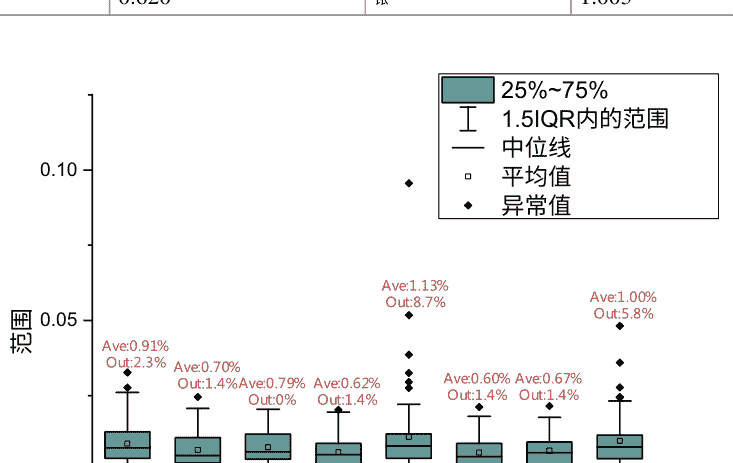

# 图4.21 不同金属材料的误差率分布

每个类别的误差率。类似地，结果以箱线图的形式呈现，如图4.21所示。

从表4.6和图4.21可以得出，在不同子集中的平均误差率差异不显著。在所有金属中，铂（Pt）由于散射最强，离群值比率最高。然而，该比率仍然低于9%，验证了模型的可靠性。

#### 4.6.2 实验组 #6

在实验组#6中，从开源数据集中随机选择了500个样本。整体误差分布在表4.7和图4.22中进行了说明。由于复杂的几何形状，误差率和离群值比率都高于之前的实验，但都在可接受范围内。

与实验组#3类似，不同材料的误差率分布在表4.8和图4.23中进行了说明。

# 表4.7 开源数据集上的大小和误差率

| 类别 | 尺寸 | 平均误差 |
| --- | --- | --- |
| 开源数据集 | 500 | 4.909% |

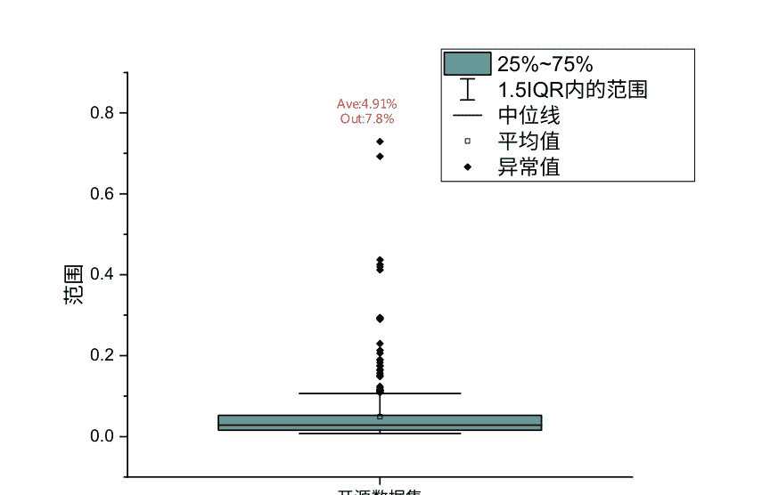

# 图4.22 开源数据集上的误差率分布

# 表4.8 开源数据集上不同金属材料的误差率

| 类别 | 平均误差 (%) | 类别 | 平均误差 (%) |
| --- | --- | --- | --- |
| 铜 | 5.173 | 铂 | 9.163 |
| 银 | 3.002 | 钯 | 3.749 |
| 金 | 4.478 | 汞 | 4.096 |
| 铑 | 2.893 | 钛 | 7.147 |

从表4.8和图4.23可以明显看出，不同子集中平均误差率的差异并不显著。然而，对于异常值来说，情况大不相同。大多数材料的误差率都低于20%，这证明了模型的鲁棒性。然而，对于铂金来说，误差率甚至跃升到了80%左右。尽管这种金属具有很强的散射能力，但如此高的误差率令人难以接受。因此，如何降低强散射材料的误差率是我们未来工作的努力方向。

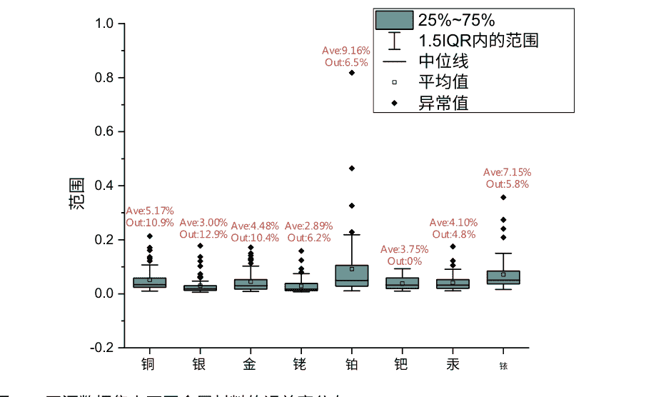

### 4.7 总结

本章详细介绍了基于提出的EM网络构建二维电磁散射求解器的过程。首先利用FDFD算法准备后续训练的数据库。然后介绍了EM网络的架构。同时进行了几个实验来验证修改的有效性。经过良好训练，测试结果表明所提出的框架可以在不牺牲准确性的情况下加速求解过程超过三个数量级。此外，还引入了一个开源数据集来验证泛化能力。结果表明，深度学习网络能够处理具有完全不同几何形状的复杂散射体。本章末尾使用箱线图分析了测试集的统计特性。误差率和异常值比例在大多数样本上表现良好，为第5章中三维求解器的挑战奠定了坚实基础。

## 参考文献

1. 齐ST，王Y，李YZ，吴X，任Q，任Y (2020) 基于深度学习技术的二维电磁求解器 IEEE J Multiscale Multiphys Comput Tech 5:83–882.
2. 李YZ，王YP，齐ST，任Q，康L，坎贝尔SD，沃纳PL，沃纳DH (2020) 通过深度学习预测复杂纳米结构的散射。 IEEE Access 8:139983–139993
3. Rumble J (2020) CRC化学和物理手册。CRC出版社，纽约
4. Jonscher AK (1983) 固体中的介电弛豫。Chelsea Dielectric Press，伦敦
5. Young KF, Frederikse HPR (1973) 无机固体的静态介电常数汇编 J Phys Chem Ref Data 2:313
6. 美国物理学会，格雷DE (1972) 美国物理学会手册。部分编辑：比林斯BH [等人]。协调编辑：格雷DE，第3版。麦格劳希尔，纽约
7. Cottancin E, Celep G, Lerme J, Pellarin M, Huntzinger JR, Vialle JL, Broyer M (2006) 贵金属团簇的光学性质与尺寸的关系：实验与半量子理论的比较。 Theor Chem Acc 116 (4-5) : 514-523。 https://doi.org/10.1007/s00214-006-0089-1
8. Lipson SG, Lipson H (1981) 光学物理学。剑桥大学出版社，剑桥
9. Motulevich GP, Malyshev VI, Skobel'tsyn DV (1973) 金属的光学性质。列别杰夫物理研究所论文集，第55卷。顾问局，纽约
10. Palik ED, Ghosh G (1998) 固体的光学常数手册。学术出版社，圣地亚哥
11. Rakić AD, Djurišić AB, Elazar JM, Majewski ML (1998) 金属薄膜的光学性质，用于垂直腔光电子器件。 Appl Opt 37(22):5271–5283. https://doi.org/10.1364/AO.37.005271
12. Herrera LJM, Arboleda DM, Schinca DC, Scaffardi LB (2014) 通过贵金属纳米颗粒的复介电函数确定等离子体频率、阻尼常数和尺寸分布。 http://doi.org/10.1063/1.4904349
13. Johnson PB, Christy RW (1972) 贵金属的光学常数。 Phys Rev B 6(12):4370–4379. https://doi.org/10.1103/PhysRevB.6.4370
14. Dirac PAM (1958年) 量子力学原理。物理学国际专著系列，第四版。牛津大学出版社，牛津
15. Speight JG (2005年) Lange化学手册。麦格劳-希尔教育，纽约
16. Balanis CA (2012年) 高级工程电磁学，第二版。约翰威利，新泽西霍博肯
17. Griffiths DJ (2017年) 电动力学导论。皮尔逊，波士顿
18. Jackson JD (1962年) 经典电动力学。约翰威利，纽约
19. Shin W, Fan SH (2012年) 频域Maxwell方程求解器的完美匹配层边界条件的选择。 J Comput Phys 231 (8) : 3406-3431。 https://doi.org/10.1016/j.jcp.2012.01.013
20. Salimans T, Karpathy A, Chen X, Kingma DP (2017年) PixelCNN ++：改进PixelCNN的离散逻辑混合似然和其他修改。 ArXiv: 1701.05517
21. Gupta A, Shillingford B, Assael Y, Walters TC (2019年) 使用Wavenet进行语音带宽扩展。 在：2019年IEEE信号处理应用于音频和声学的研讨会（WASPAA），第205-208页
22. Krizhevsky A, Sutskever I, Hinton G (2012) 使用深度卷积神经网络的ImageNet分类. 发表于第25届国际神经信息处理系统会议论文集
23. Ronneberger O, Fischer P, Brox T (2015) U-net: 用于生物医学图像分割的卷积网络. 在: 国际医学图像计算与计算机辅助干预会议上. Springer, Berlin, 第234-241页
24. Lee B, Yamanakkanavar N, Choi JY (2021) 使用新颖的基于块的U-net深度架构自动分割脑MRI (vol 15, e0236493, 2020). Plos One 16(1). ARTNe0246105. http://doi.org/10.1371/journal.pone.0246105
25. Saood A, Hatem I (2021) 使用深度学习方法进行COVID-19肺部CT图像分割：U-Net与SegNet. Bmc Med Imaging 21(1). ARTN 19. http://doi.org/10.1186/s12880-020-00529-5
26. 郑S, 何ZZ, 刘HL (2021) 通过U-Net卷积神经网络生成三维结构拓扑。薄壁结构159. ARTN 107263. http://doi.org/10.1016/j.tws.2020.107263
27. Dumoulin V, Visin F (2016) 深度学习中的卷积算术指南。 ArXiv: 1603.07285v2
28. He K, Zhang X, Ren S, Sun J (2016) 用于图像识别的深度残差学习。 发表在IEEE计算机视觉和模式识别会议论文集上
29. Chung J, Gulcehre C, Cho K, Bengio Y (2014) 对门控循环神经网络在序列建模中的实证评估。计算机科学
30. Wang HZ, Wang Y, Zhang Q, Xiang SM, Pan CH (2017) 用于高分辨率图像语义分割的门控卷积神经网络。 遥感9 (5) : 44631.
31. Abadi M, Barham P, Chen J, Chen Z, Davis A, Dean J, Devin M, Ghemawat S, Irving G, IsardM (2016) TensorFlow: 用于大规模机器学习的系统。 发表在第12届操作系统设计和实现研讨会上，萨凡纳，乔治亚州
32. Atienza R (2020) 使用TensorFlow 2和Keras进行高级深度学习：应用DL, GAN, VAE, 深度RL, 无监督学习，目标检测和分割等。 PacktPublishing Ltd., 伯明翰
33. Chollet F (2017) 使用Python进行深度学习。 Manning出版社，纽约
34. Efron B, Hastie T (2016) 计算机时代的统计推断：算法、证据和数据科学。 数学统计学研究所专著。 剑桥大学出版社，纽约
35. Goodfellow I, Bengio Y, Courville A (2016) 深度学习。 MIT出版社，剑桥，马萨诸塞州
36. Bickel PJ, Doksum KA (2015) 数理统计学。 基本思想和选定主题。 Chapman and Hall/CRC，伦敦
37. Hastie T, Tibshirani R, Friedman JH (2009) 统计学习的要素：数据挖掘、推断和预测。 统计学系列，第二版。 Springer，纽约，纽约
38. James G, Witten D, Hastie T, Tibshirani R (2013) 统计学习导论：在R中的应用。 Springer统计学文本，第103卷。 Springer，纽约

# 第五章 三维电磁散射求解器

在第四章中，讨论了通过深度学习技术预测二维散射场的过程。本章将集中讨论三维情况。与第四章类似，将介绍数据库的准备、训练和验证。首先，使用第三章中所示的算法生成散射体。

然后将它们与入射场一起输入到三维有限差分时域程序中，生成足够的训练数据。所提出的框架被训练用于挖掘散射体和散射场之间的内在关系。本章还研究了如何选择适用的模型参数进行预实验。本章末尾展示了在测试集上的最终结果。

### 5.1 数据库准备

#### 5.1.1 问题描述

首先，有必要对三维散射模型进行简要介绍。如前一章所示，我们主要致力于解决入射平面波的散射场问题。计算区域是一个边长为32纳米的立方体。该区域被网格化为32 × 32 × 32个网格，每个网格大小为1纳米³。在每个网格中，电磁参数和场量被假设为均匀的。如图5.1所示，区域的中心点设置为(0, 0, 0)。

为了获得数据库，需要生成大量散射体和相应的散射场。

#### 5.1.2 散射体的几何形状

在构建三维散射体数据库时，需要生成足够的几何形状。生成算法已在第3章中详细讨论，因此这里不再重复。数据库中的三维几何形状包括球体和椭球体。

本章考虑了两个子类。在第一个子类中，散射体位于区域中心。图5.2显示了几个示例。

第二类散射体随机放置在立方体中，其中一些在图5.3中显示。

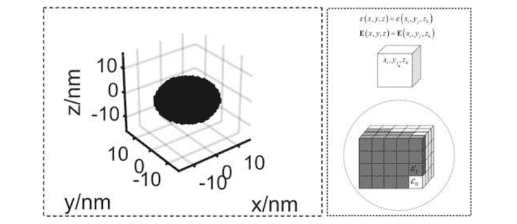

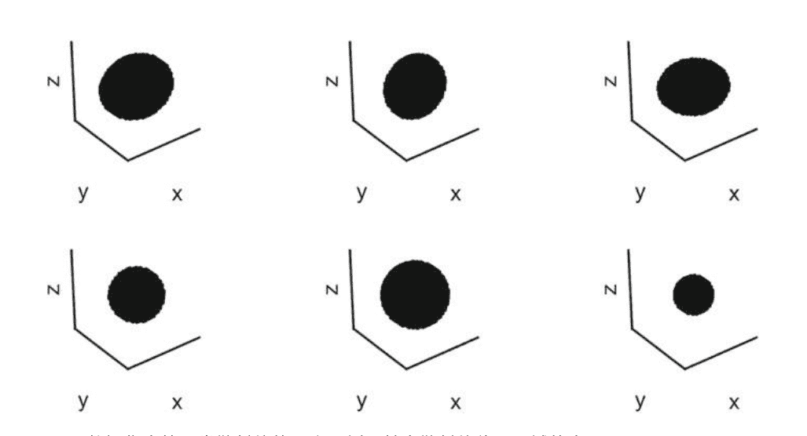


图5.3 数据集中第二类散射体的几个示例，其中散射体随机放置在区域中

#### 5.1.3 散射体的介电常数

生成这些几何结构后，需要为散射体分配介电常数。根据表4.1，相对介电常数可以分为两类，一个是常数4，另一个是从2到5的随机整数。

结合几何结构和介电常数，构建了三个数据集，分别是D5、D6和D7。在D5中，散射体位于中心，介电常数为4。图5.4显示了D5中的几个示例。在D6中，散射体位于中心，介电常数范围为2到5。图5.5显示了D6中的几个示例。

在D7中，散射体随机放置在立方体中，介电常数范围从2到5。图5.6显示了D7中的几个示例。

#### 5.1.4 照明设置

在3D散射过程的正向传递中，入射波是TEM波。如图1所示，TEM波指的是在传播方向上没有电场和磁场的电磁波[1, 2]。特别地，图5.7a展示了一个沿 +z方向传播且电场沿 x轴极化的TEM波。更一般地，图5.7b展示了一个具有随机传播和极化方向的TEM波。

显然，处理任意方向的波是资源密集型的。然而，通过对坐标系进行简单的转换[3, 4]，可以将情况(b)转变为(a)。假设O是全局坐标系，其中每个点的坐标反映了真实位置。相应地，O'是局部坐标系，其x、y轴定义为电场和磁场的偏振方向，而z轴定义为传播方向。一个点的坐标分别在全局坐标和局部坐标中表示为(x0, y0, z0)和(x1, y1, z1)。此外，O'中的基向量为

### 5.1 数据库准备

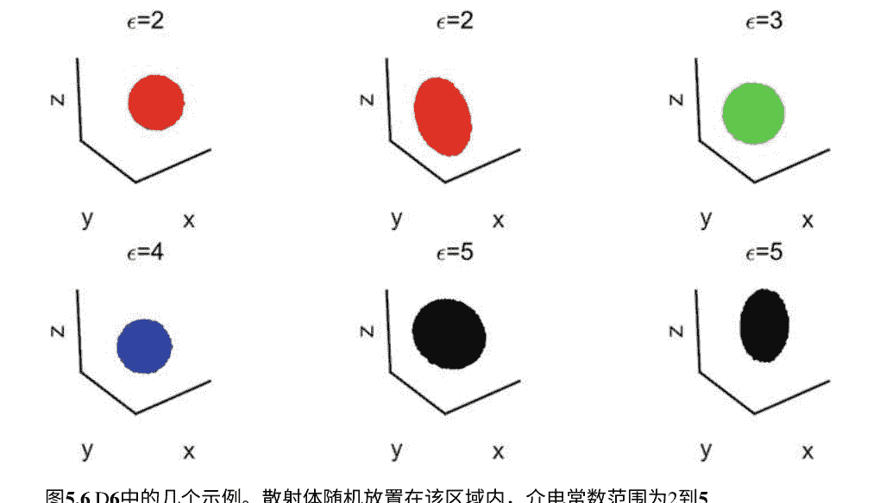

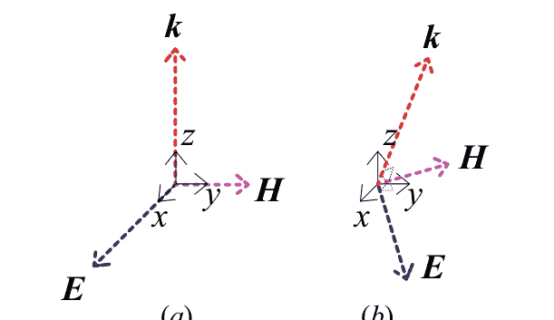

定义为

$$ \mathbf{i}_1 = \frac{\mathbf{E}}{|\mathbf{E}|}, \quad (5.1) $$
$$ \mathbf{i}_2 = \frac{\mathbf{H}}{|\mathbf{H}|}, \quad (5.2) $$
$$ \mathbf{i}_3 = \frac{\mathbf{k}}{|\mathbf{k}|}. \quad (5.3) $$

局部坐标系和全局坐标系之间的基向量关系为

$$\begin{bmatrix} \mathbf{i}_1 & \mathbf{i}_2 & \mathbf{i}_3 \end{bmatrix} = \begin{bmatrix} g_{11} & g_{12} & g_{13} \\ g_{21} & g_{22} & g_{23} \\ g_{31} & g_{32} & g_{33} \end{bmatrix} \begin{bmatrix} \mathbf{i}_x \\ \mathbf{i}_y \\ \mathbf{i}_z \end{bmatrix} = \mathbf{G} \begin{bmatrix} \mathbf{i}_x \\ \mathbf{i}_y \\ \mathbf{i}_z \end{bmatrix} , \quad (5.4)$$

其中 $(g_{i1}, g_{i2}, g_{i3})(i = 1, 2, 3)$ 是 $(x, y, z)$ 在全局坐标系 $O$ 中，$\mathbf{G}$ 是两组基之间的过渡矩阵。对于全局坐标系中的任意点 $(x_0, y_0, z_0)$，电场可以表示为

$$\mathbf{E}(x_0, y_0, z_0) = E_{-x} \mathbf{i}_x + E_{-y} \mathbf{i}_y + E_{-z} \mathbf{i}_z = \begin{bmatrix} E_{-x} \\ E_{-y} \\ E_{-z} \end{bmatrix} , \quad (5.5)$$

其中 $E_{-x}$, $E_{-y}$, $E_{-z}$ 是待计算的场分量。由 $(x_1, y_1, z_1)$ 可以得到

$$\begin{bmatrix} x_{-} \mathbf{i}_{-x} \\ y_{-} \mathbf{i}_{-y} \\ z_{-} \mathbf{i}_{-z} \end{bmatrix} = \begin{bmatrix} x_0 & 0 & 0 \\ 0 & y_0 & 0 \\ 0 & 0 & z_0 \end{bmatrix} \begin{bmatrix} \mathbf{i}_x \\ \mathbf{i}_y \\ \mathbf{i}_z \end{bmatrix} = \begin{bmatrix} x_0 & 0 & 0 \\ 0 & y_0 & 0 \\ 0 & 0 & z_0 \end{bmatrix} \mathbf{G}^{-1} \begin{bmatrix} \mathbf{i}_1 \\ \mathbf{i}_2 \\ \mathbf{i}_3 \end{bmatrix} = \begin{bmatrix} x_1 \mathbf{i}_1 \\ x_2 \mathbf{i}_2 \\ x_3 \mathbf{i}_3 \end{bmatrix} , \quad (5.6)$$

通过3D-FDFD程序可以获得在 $(x_1, y_1, z_1)$ 处的场。利用 (5.4)，我们有

$$\mathbf{E}(x_1, y_1, z_1) = \begin{bmatrix} E_1 & 0 & 0 \\ 0 & E_2 & 0 \\ 0 & 0 & E_3 \end{bmatrix} \begin{bmatrix} \mathbf{i}_1 \\ \mathbf{i}_2 \\ \mathbf{i}_3 \end{bmatrix} = \begin{bmatrix} E_1 g_{11} & E_1 g_{12} & E_1 g_{13} \\ E_2 g_{21} & E_2 g_{22} & E_2 g_{23} \\ E_3 g_{31} & E_3 g_{32} & E_3 g_{33} \end{bmatrix} \begin{bmatrix} \mathbf{i}_x \\ \mathbf{i}_y \\ \mathbf{i}_z \end{bmatrix} . \quad (5.7)$$

由于 $\mathbf{E}(x_0, y_0, z_0) = \mathbf{E}(x_1, y_1, z_1)$，因此可以通过任意点 $(x_0, y_0, z_0)$ 获得电场分量。

$$\begin{cases} E_x = E_1 g_{11} + E_2 g_{21} + E_3 g_{31} \\ E_y = E_1 g_{12} + E_2 g_{22} + E_3 g_{32} \\ E_z = E_1 g_{13} + E_2 g_{23} + E_3 g_{33} \end{cases} \quad (5.8)$$

因此，只考虑沿 $+z$ 方向传播的波，并且其电场沿着 $x$ 轴极化是合理的。波长为20纳米，大约是边长的 $2/3$。由于入射场的方向固定，我们只需通过训练过程匹配散射体和场模式。

#### 5.1.5 模型计算

通过第3章介绍的3D FDFD程序[5-7]，可以获得散射场分布。与2D情况略有不同，场量不能直接获取。事实上，生成过程包含2个步骤。首先使用预处理程序生成网格。然后将处理后的数据输入求解器并计算场量。这两个步骤都在Ubuntu 20.02上进行。毫无疑问，与2D情况相比，3D情况的计算时间将大大增加。

### 5.2 预实验

预实验是在正式实验之前，用可变的超参数、分割比例和激活函数训练少量样本，以找到最佳实验条件，并为正式实验打下基础。因此，它可以避免由于设计不良的实验而浪费计算资源。为了简单起见，首先集中在学习率、批量大小和衰减率上，然后转向分割比例和激活函数[8-10]。

#### 5.2.1 学习率

在深度学习中，学习率是优化算法中的一个参数，它确定在每次迭代中向损失函数的最小值移动时的步长[11-13]。通常，学习率满足

```
$$\theta = \theta - \alpha \frac{\partial}{\partial\theta}J(\theta),\qquad\qquad(5.9)$$
```

其中 $\alpha$、$\theta$、$J(\theta)$分别是学习率、待学习参数和损失函数。可以看出，$\alpha$在形象上决定了模型更新的速度。实际上，在选择学习率时存在收敛和过冲之间的权衡。因此，配置适当的值是困难的。图5.8说明了确定学习率时可能遇到的不同情况。

图5.8 不同学习率对训练过程的影响

从图5.8可以得出，学习率过高会导致学习跳过最小值，而学习率过低要么收敛时间过长，要么停留在局部最小值[14, 15]。因此，精心选择的学习率意味着我们可以在更短的时间内获得更好的收敛性。寻找这样一个合适的值是一项复杂而重复的任务。然而，通过一系列实验可以获得相对精确的学习率。在我们的实验中，学习率范围为$1.2 \times 10^{-5}$, $3.79 \times 10^{-5}$, $1.2 \times 10^{-4}$和$3.79 \times 10^{-4}$。为了确保严格的实验条件，批量大小固定为16而衰减率为0.95。如图5.9a所示，当学习率为$3.79 \times 10^{-4}$时，训练过程非常不稳定。而当学习率小于$3.79 \times 10^{-5}$时，收敛过程非常耗时。因此，我们妥协地将学习率设置为$1.2 \times 10^{-4}$。

#### 5.2.2 衰减率

学习率衰减是现代深度学习中的一种事实标准技术，它从一个较大的学习率开始，然后多次衰减[15, 16]。经验上观察到它对优化和泛化都有积极影响。然而，寻找合适的衰减率是具有挑战性的。在这里，通过实验使用了一个合理的值。在这些研究中，衰减率从0.95开始逐渐减小到0.50。为了确保严格的实验条件，学习率被固定为$1.2 \times 10^{-4}$，批量大小设置为16。结果展示在图5.9a中。可以总结出，随着衰减率的减小，误差率收敛较慢。因此，在正式实验中我们将衰减率设为0.95。

图5.9 超参数对训练过程的影响 a 学习率 $\alpha$ 和 b 衰减率 $\beta$

#### 5.2.3 批量大小

批量大小是现代深度学习技术中需要调整的另一个关键超参数[17, 18]，它定义了一次通过网络传播的样本数量。一般来说，这种技术提供了一个资源需求较少的训练过程。当无法将整个数据集放入内存时，引入这个概念是必要的。事实上，选择适当的批量大小非常重要。通常情况下，使用小批量可以加快网络训练速度，但波动性更大。实践者通常希望使用较大的批量大小来训练模型，因为这样可以从GPU的并行性中获得计算速度的提升。然而，众所周知，过大的批量大小会导致较差的泛化能力。这可以直观地解释为较小的批量大小允许框架在看到所有数据之前就开始学习。因此，对于要优化的凸损失函数来说，较小批量大小和较大批量大小之间存在着固有的博弈关系。

在这里，在计算约束较小的情况下，通常建议从小批量大小开始训练，以获得更快的训练动态，并逐渐增加批量大小，同时也获得了收敛的好处。

在我们的研究中，批量大小从4逐渐增加到32。为了确保严格的实验条件，学习率固定为$1.2 \times 10^{-4}$，而衰减率为0.95。

图5.10a、b展示了不同批量大小下的错误率和训练时间。可以得出结论，随着批量大小的增加，错误率会增加。

图5.10 批量大小B对训练过程的影响。a 错误率和 b 训练时间

收敛到较低水平。然而，训练时间同时迅速增加。因此，在正式实验中，我们妥协地将批量大小设置为16。

#### 5.2.4 分割比例

验证过程需要一个独立于训练数据集的分离数据集[19]。常见的模式是将数据集分为训练集和测试集，并且有一定的比例。这个分割比例可以根据数据集的大小而变化。一般来说，样本数量少于1000个的数据集具有较大的验证集，其比例可以达到1/4。当涉及到数百万个样本的数据集时，建议使用1%的分割比例。为了确定分割比例对训练的影响，进行了一系列实验来找出合适的值。

这里采用了控制变量的方法。预实验是在实验组#4上进行的，该散射体由八种金属材料组成。初始学习率设置为$1.2 \times 10^{-4}$，衰减率为0.95，批量大小为16。结果在训练比例分别为90%、80%和70%时进行了比较。不同分割比例的错误率曲线如图5.11所示。

可以得出结论，所提出的模型对分割比例不敏感。在正式实验中，这里将其设置为0.9。

#### 5.2.5 激活函数

在神经网络中，节点的激活函数决定了给定输入的节点输出[20-23]。事实上，只有非线性激活函数才能使神经网络使用少量节点解决非平凡问题。一般来说，激活函数可以分为三类：岭、径向和折叠激活函数。岭激活函数是一个作用于线性函数的单变量函数输入变量的组合是最广泛使用的。它受生物启发，代表神经元的发射速率。激活函数具有以下数学特性。

非线性：可以证明包含非线性激活函数的两层网络可以是一个通用函数逼近器。由多层相同激活函数组成的网络等效于一个两层网络。

连续可微性：激活函数在除有限个不连续点外是连续可微的，确保梯度算法的可靠性。

单调性：当激活函数是单调的时候，系统的损失函数可以保证是凸函数，适用于凸优化。

介绍了几种常用的激活函数，并将在下面的实验中对它们的性能进行研究。首先比较了三种基本的激活函数，然后讨论了三种修改后的激活函数。

##### 5.2.5.1 基本激活函数

分别解释了Sigmoid、Tanh和ReLU激活函数。Sigmoid首先由Hinton等人引入到机器学习中，并用于自动语音识别。它可以表示为

```
$$\sigma (x) = \frac{1}{1 + e^{-x}}.$$
```

图5.12展示了Sigmoid函数及其导数。从图5.12可以看出，Sigmoid函数将$[-\infty, +\infty]$映射到$[0, 1]$。值得指出的是，Sigmoid函数的输出始终为正，因此每个参数在迭代过程中都朝着同一方向更新（同时增加或减小），导致优化过程曲折。

Tanh函数在自然语言处理中被广泛使用。它与Sigmoid函数有类似的表达式，Sigmoid函数的定义为

```
$$ \tanh(x) = \frac{e^{x} - e^{-x}}{e^{x} + e^{-x}} $$ (5.11)
```

这个函数也是单调递增的，将$[-\infty, +\infty]$映射到$[-1, 1]$。图5.13展示了Tanh函数及其导数。可以观察到Tanh函数的梯度范围在0到1之间。在大多数优化算法中，参数更新过程完全依赖于梯度值。在这种方法中，框架中的每个权重都会在每次迭代过程中根据损失函数对当前值的偏导数接收一个与之成比例的更新。由于反向传播通过链式法则计算梯度，梯度会随着这些小数的乘积指数级地减小。在这种情况下，梯度将变得非常小，有效地阻止权重改变其值。在最坏的情况下，它可能完全阻止网络进一步训练。这被称为梯度消失问题。为了避免这种现象，提出了一种称为ReLU的激活函数。它首先由Hahnloser等人在2000年提出，具有生物学动机和数学证明。著名的应用包括2012年的Alex-net计算机视觉和2015年的Resnet。这种结构及其变种已成为深度学习中最广泛使用的激活函数[29, 30]。ReLU函数定义为

```
$$ \text{ReLU}(x) = \begin{cases} 0 & \text{for } x < 0 \\ x & \text{for } x \geq 0 \end{cases} $$ (5.12)
```

图5.14展示了ReLU函数及其导数。值得注意的是，ReLU的梯度只能取0或1，这确保了梯度乘法永远不会收敛到0，结果只能取0或1。如果值为1，梯度保持不变并继续前向传播；而如果值为0，梯度在那里停止传播。此外，ReLU函数是单侧饱和的（当输入为负时，函数值等于零），因此神经元对噪声更具鲁棒性。此外，与Sigmoid或tanh函数相比，ReLU在计算导数时具有更高的计算效率，因为它只能取0或1。通过截断负值，它加速了传播过程。

图5.14 ReLU激活函数。a ReLU函数和 b ReLU函数的导数

图5.15不同激活函数的误差率

在EM-net [31, 32]中，每个卷积/转置层后面都跟着一个激活函数以增加非线性。分别对Sigmoid、tanh和ReLU激活函数进行实验以测量性能。为了确保实验的合理性，采用了控制变量法。

在实验组#4上进行了预实验，其散射体由八种金属材料组成。初始学习率设置为$1.2 \times 10^{-4}$，衰减率为0.95，批量大小为16。

图5.15展示了三个函数在测试集上的误差率。可以得出结论，ReLU在这些函数中表现最佳，与之前的理论分析一致。

##### 5.2.5.2 修改的激活函数

尽管ReLU激活函数通常比Sigmoid和Tanh函数表现更好，但它也有固有的缺陷，即所谓的死亡问题。也就是说，神经元有时会被推入一种状态，在这种状态下，它们对于所有输入都变得不活跃。在这种状态下，没有梯度通过神经元向后传播，因此神经元陷入了永久性的不活跃状态。通过引入修改的激活函数，可以缓解这种现象，这些函数为 $x < 0$分配了一个小的正斜率。

PReLU [33] 定义为

```
$$\text{PReLU}(x) = \begin{cases} \alpha x & \text{当 } x < 0 \text{时} \\ x & \text{当 } x \ge 0 \text{时} \end{cases} \qquad (5.13)$$
```

当 $\alpha = 0.01$时，它会退化为LeakyReLU [34]。与传统的ReLU相比，PReLU引入了一个额外的参数来学习，同时克服了死亡问题。图5.16展示了当$\alpha = 0.1$时的PReLU及其导数。

尽管PReLU解决了死亡问题，但它不是一个单侧饱和的激活函数。因此，ELU [35]登场了。这个函数被定义为

```
$$\text{ELU}(x) = \begin{cases} \alpha(e^x - 1) & \text{for } x < 0 \\ x & \text{for } x \ge 0 \end{cases} \qquad (5.14)$$
```

图5.17展示了当 $\alpha =1$时的ELU及其导数。可以得到ELU函数是完全连续可微的。与传统的ReLU相比，ELU不仅解决了死亡问题，而且趋于更快的收敛并具有更好的泛化能力。

比较了ReLU、PReLU和ELU激活函数的性能。采用控制变量法来确保合理性。实验。预实验在实验组#4上进行，散射体由八种金属材料组成。初始学习率设置为$1.2 \times 10^{-4}$，衰减率为0.95，批量大小为16。

在三种修改后的激活函数上的测试集错误率显示在图5.18中。结果表明这些激活函数之间几乎没有差异，而ELU稍微好一些。因此，在卷积/转置层之间采用ELU作为非线性单元。实验结果与先前的理论分析一致。

### 5.3 深度学习框架的训练

在生成数据集之后，可以开始训练过程。深度学习框架在TensorFlow 2.0上执行[36-38]。这个更新版本为研究人员提供了一个更灵活的调试环境。

训练的目标是优化损失函数，可以定义为

```
$$\text{损失} = \frac{1}{2} \sum_{i=1}^{N} \sum_{j=1}^{N} \sum_{k=1}^{N} |F_{FDFD}(i, j, k) - F_{Framework}(i, j, k)|^2, \qquad (5.15)$$
```

其中 $F_{FDFD}$ 是由3D-FDFD程序计算得到的电磁场，而 $F_{Framework}$ 是网络预测的。Adam优化器用于在迭代过程中减小损失函数。随着计算复杂性的急剧增加，强大的处理器是必不可少的。训练是在Dell Precision 7920 Tower上的NVIDIA RTX 2080Ti显卡上进行的。与之前实验中使用的GTX 1080Ti相比，RTX 2080Ti在FP32计算上的平均性能提升了41%[39]。充足的计算能力确保了训练的稳定性。

### 5.4 测试集上的结果

通过在前一章中提出的架构和由预实验确定的合理实验条件，必须检验框架的预测能力。进行了一系列实验，定量地测量了所提出网络在不同情况下的性能。与2D情况类似，我们采用了在公式4.11中定义的相对平均误差率。正如在前一节中所示，我们主要关注散射体的影响。

具体的实验条件列在表5.1中。在每个实验中，从测试集中随机选择了一些结果进行展示。

表5.1 实验条件
| 实验组索引 | 数据库 | 散射体的位置 | 相对介电常数 |
| :--- | :--- | :--- | :--- |
| #7 | D5 | 中心 | 4 |
| #8 | D6 | 中心 | 2/3/4/5 |
| #9 | D7 | 任意的 | 2/3/4/5 |

#### 5.4.1 实验组 #7

在实验组#7中，入射波是沿着 +z 方向传播并沿着 +x 方向（电场）极化的TEM波，在本地坐标系 O'中。散射体是位于中心的球体或椭球体，其相对介电常数为4。数据集总共包含6000个样本，其中10%是测试集。图5.19展示了训练时的误差率和损失曲线。

经过210,000轮次的训练，在2小时内，测试集上的错误率降低到0.89%，损失减少到11.98。图5.20和5.21展示了测试集中随机选择的几个样本。在这里，（a）反映了散射体的几何形状和相对介电常数，（b）和（c）表示实部（Re）和虚部（Im）的真实值、预测值和绝对误差 Ex，而（d）和（e）表示 Ey的真实值、预测值和绝对误差。可以得出结论，该框架的预测与3D-FDFD程序的数值解一致。

#### 5.4.2 实验组 #8

在实验组#8中，入射波与实验组#7相同。散射体具有相同的几何形状和位置，相对介电常数范围为2到5。数据集总共包含8000个样本，其中800个是测试集。图5.22展示了训练周期内的错误率和损失曲线。

由于数据集更大且更复杂，框架需要29500个周期和约3小时才能达到收敛。测试集上的最终错误率和损失分别为2.0%和30。测试集中随机选择的一些样本显示在图5.23和5.24中。这里，(a)展示了散射体的几何形状和相对介电常数；(b)和(c)反映了真实/虚部分的Ex的真实值、预测值和绝对误差；(d)和(e)则是Ey的真实值、预测值和绝对误差。

通过比较结果，可以得出结论，该框架的预测与3D-FDFD程序的数值解一致。

#### 5.4.3 实验组 #9

在实验组#9中，入射波与前两个实验相同。值得注意的是，尽管散射体仍然是球体和椭球体，但它们的位置是随机分布在立方体中的。由于该数据集包含了更复杂的散射体，因此需要更多的样本进行训练。事实上，整个数据集包含了总共24000个样本，其中2400个用作测试样例。同样地，## 5.4.4 加速度

训练过程中误差率和损失的曲线在图5.25中呈现。为了达到收敛，训练需要大约45,500个周期和4.5小时。最终的误差率降低到4.2%，损失降低到78。为了直观展示网络的预测能力，在测试集中随机选择了两个示例，分别在图5.26和5.27中展示。这里，(a)展示了散射体的几何形状和相对介电常数，(b)和(c)展示了$E_x$的实部的真实值、预测值和绝对误差，(c)和(d)反映了$E_y$的实部的真实值、预测值和绝对误差。

尽管实验组#9的相对平均速率高于之前的两个实验组，但考虑到更复杂的情况，这仍然是可以接受的。

图5.26 实验组#9的一个例子。a 散射体的几何形状和相对介电常数；b ℜ的真实值、预测值和绝对误差$E_x$；c ℑ的真实值、预测值和绝对误差$E_x$；d ℜ的真实值、预测值和绝对误差$E_y$；e 真实值、预测值和绝对误差ℑ$E_y$。

图5.27 实验组#9的另一个例子。a 散射体的几何形状和相对介电常数；b ℜ的真实值、预测值和绝对误差$E_x$；c ℑ的真实值、预测值和绝对误差$E_x$；d ℜ的真实值、预测值和绝对误差$E_y$；e 真实值、预测值和绝对误差ℑ$E_y$。

总结一下，三个实验组表明EM-net框架在预测三维情况下的场具有出色的性能，进一步展示了其强大的计算能力。

与传统的数值算法相比，所提出的EM-net的一个显著优势是预测速度。事实上，给定输入的散射体，经过良好训练的框架几乎可以同时给出输出场量，而不会失去精度。为了定量衡量加速能力，记录了传统算法（FDFD）和训练好的神经网络所花费的计算时间。为了确保实验的准确性，两组测量都在相同的计算平台上进行，使用相同的数据集。

图5.28展示了EM-net和3D FDFD程序计算散射场所花费的时间。这两种方法都呈现出时间和样本数量之间的线性关系。对于解决100个样本，3D FDFD算法需要大约8977秒，而EM-net只需要2.11秒。因此，可以得出结论，EM-net可以在不牺牲准确性的情况下加速解决过程4000多倍。

## 图5.28 使用3D FDFD和EM-net计算3D散射问题的时间消耗

### 5.5 总结

本章详细讨论了构建3D电磁散射求解器的过程。首先利用3D FDFD算法准备数据库以供后续训练。然后进行了几次预实验，确定最合适的实验条件。结果表明，所提出的框架能够在不牺牲准确性的情况下加速求解过程超过4000倍，从而大大提高求解效率。我们预见到深度学习技术的兴起将在计算电磁学中产生许多应用。

## 参考文献

- 1. Balanis CA (2012) 高级工程电磁学，第2版。Wiley, Hoboken, N.J。
- 2. Jackson JD (1962) 经典电动力学。Wiley，纽约
- 3. Lay DC (2006) 线性代数及其应用，第3版。Pearson/Addison-Wesley，波士顿
- 4. Cai G, Chen BM, Lee TH (2011) 坐标系和变换。在：Cai G, Chen BM, Lee TH (eds) 无人旋翼机系统。Springer London，伦敦，第23-34页。http://doi.org/10.1007/978-0-85729-635-1_2
- 5. Shin W, Fan SH (2012) 频域 Maxwell 方程求解器的完美匹配层边界条件的选择。J Comput Phys 231(8):3406–3431。https://doi.org/10.1016/j.jcp.2012.01.013
- 6. Shin W, Fan SH (2012) 迭代求解频域 Maxwell 方程的完美匹配层边界条件的选择。Proc Spie 8255. Artn 82550n。http://doi.org/10.1117/12.906869
- 7. Shin W (2015) MaxwellFDFD网页。https://github.com/wsshin/maxwellfdfd
- 8. Murphy KP (2012) 机器学习：概率观点。自适应计算和机器学习系列。麻省理工学院出版社，剑桥，马萨诸塞州
- 9. Chollet F (2017) Python深度学习。曼宁出版社，纽约
- 10. Goodfellow I, Bengio Y, Courville A (2016) 深度学习。麻省理工学院出版社，剑桥，马萨诸塞州
- 11. Smith LN (2017) 循环学习率用于训练神经网络。Ieee Wint Conf Appl 464–472。http://doi.org/10.1109/Wacv.2017.58
- 12. Bengio Y (2012) 深度架构基于梯度的训练的实际建议。arXiv:1206.5533
- 13. Ruder S (2016) 梯度下降优化算法概述。arXiv:1609.04747
- 14. Plagianakos VP, Magoulas GD, Vrahatis MN (2001) 学习率在随机梯度下降中的自适应。在: Hadjissavvas N, Pardalos PM (eds) 凸分析和全局优化的进展: 纪念C. Carath eodory (1873-1950) 的记忆。Springer US, 波士顿，马萨诸塞州, pp 433-444。http:// /doi.org/10.1007/978-1-4613-0279-7_27
- 15. You K, Long M, Wang J, Jordan MI (2019) 学习率衰减如何帮助现代神经网络? arX iv:1908.01878
- 16. Zhang T, Li W (2020) k-decay：一种新的学习率调度方法。arXiv:2004.05909
- 17. Smith SL, Kindermans P-J, Ying C, Le QV (2017) 不要衰减学习率，增加批量大小。arXiv:1711.00489
- 18. Goceri E, Gooya A (2018) 关于深度学习中批量大小的重要性。在伊斯坦布尔世界数学家会议上发表的论文，关于逼近理论和数学教育的小型研讨会，土耳其伊斯坦布尔。
- 19. Pawluszek-Filipiak K, Borkowski A (2020) 关于数据集中训练-测试分割比例在自动滑坡检测中的重要性的研究。 Remote Sens 12(18):3054
- 20. Ramachandran P, Zoph B, Le QV (2017) 寻找激活函数。arXiv:1710.05941
- 21. Mhasker HN, Micchelli CA (1993) 如何选择激活函数。在第六届国际神经信息处理系统会议论文集上发表的论文。
- 22. Nwankpa C, Ijomah W, Gachagan A, Marshall S (2018) 激活函数：深度学习实践和研究趋势的比较。arXiv:1811.03378
- 23. Pedamonti D (2018) 非线性激活函数在MNIST分类任务中的比较。arXiv:1804.02763
- 24. Hinton GE, Osindero S, Teh YW (2006) 深度信念网络的快速学习算法。神经计算18（7）：1527-1554。https://doi.org/10.1162/neco.2006.18.7.1527
- 25. Hahnloser RLT (1998) 关于线性阈值神经元网络的分段分析。神经网络11（4）：691-697。https://doi.org/10.1016/S0893-6080(98)00012-4
- 26. Hahnloser RHR, Sarpeshkar R, Mahowald MA, Douglas RJ, Seung HS (2000) 数字选择和模拟放大共存于一个受皮层启发的硅电路中。Nature 405（6789）：947-951。https:// doi.org/10.1038/35016072
- 27. Krizhevsky A, Sutskever I, Hinton G (2012) 使用深度卷积神经网络的ImageNet分类。发表在第25届国际神经信息处理系统会议论文集上。
- 28. He K, Zhang X, Ren S, Sun J (2015) 深度残差学习用于图像识别。arXiv:1512。03385
- 29. Nair V, Hinton GE (2010) 矫正线性单元改进了受限玻尔兹曼机。在：ICML 2010。
- 30. Jarrett K, Kavukcuoglu K, Ranzato M, LeCun Y (2009) 对象识别的最佳多阶段架构是什么？在：2009年IEEE第12届国际计算机视觉会议，2009年9月29日-10月2日，第2146-2153页。http://doi.org/10.1109/ICCV.2009.5459469
- 31. 基于深度学习技术的二维电磁求解器。IEEE J Multiscale Multiphys Comput Tech 5:83–88
- 32. Li YZ, Wang YP, Qi ST, Ren Q, Kang L, Campbell SD, Werner PL, Werner DH (2020) 通过深度学习预测复杂纳米结构的散射。IEEE Access 8:139983–139993
- 33. He K, Zhang X, Ren S, Sun J (2015) 深入研究整流器：在ImageNet分类上超越人类水平性能。在：2015年IEEE国际计算机视觉会议（ICCV），2015年12月7日至13日，第1026-1034页。http://doi.org/10.1109/ICCV.2015.12334
- 34. Zhang X, Zou Y, Shi W (2017) 带有LeakyReLU的扩张卷积神经网络用于环境声音分类。在：2017年第22届国际数字信号处理会议（DSP），第1-5页
- 35. Clevert D-A, Unterthiner T, Hochreiter S (2016) 通过指数线性单元（ELUs）实现快速准确的深度网络学习。
- 36. Abadi M, Barham P, Chen J, Chen Z, Davis A, Dean J, Devin M, Ghemawat S, Irving G, Isard M (2016) Tensorflow：一个用于大规模机器学习的系统。发表于第12届操作系统设计与实现研讨会，萨凡纳，乔治亚州
- 37. Géron A (2019) 通过Scikit-Learn、Keras和TensorFlow进行实践机器学习：构建智能系统的概念、工具和技术，第2版。O'Reilly Media, Inc., Sebastopol, CA
- 38. Atienza R (2020) TensorFlow 2和Keras的高级深度学习：应用DL、GAN、VAE、深度RL、无监督学习、目标检测和分割等等。Packt出版社，伯明翰
- 39. Nvidia (2019) 性能。https://www.nvidia.com/en-us/geforce/20-series/

## 索引

- A
    - 激活函数，28-30，33，105，108-113
    - AI，36
    - 安培定律，44
    - 分析方法，11，17，37，54，55，57，60
    - 角频率，3
    - 衰减，76
    - 收敛性，20，32，47，69，71，81，82，105-107，116，118
    - 坐标系，45，101，102，104，114
    - 叉积，49，52
    - 电流积分方程（CFIE），18
- B
    - 向后差分，18
    - 向后传播，24
    - 批量大小，105-108，111，113
    - 贝叶斯优化，35
    - 贝塞尔函数，11，12
    - 生物医学图像分割，81
    - 边界条件，1，5，6，9-11，13，15-18，20，60
    - 箱线图，92-94，96
- D
    - 衰减率，34，105-108，111，113
    - 深度学习（DL），1，20，23-25，27-29，31-39，43，58，81，83-85，88-91，96，99，105-107，110，113，120
    - 介电材料，74
    - 微分方程（DE），18，44，46，62
    - 散度定理，6
    - 点积，29
- C
    - 中心差分，18，19
    - 链式计算，23
    - 链式法则，24，110
    - 乔列斯基，47
    - 系数矩阵，18
    - 复共轭-共轭，48
    - 计算电磁学（CEM），18，37，43，44，120
    - 计算图，24
    - COMSOL多物理，54，62，63，65，66
    - 传导电流，9
    - 本构关系，3，4，6，20
    - 连续可微性，109
- E
    - 电场，2，7，8，12-14，16，44，56，58，60，61，63-66，101-104
    - 电场积分方程（EFIE），18
    - 电势，8
    - 电磁（EM），1，3，5-9，11，12，17，20，23，25-36，39，43-45，48，54-56，58，59，61，67，69，71，73，74，76，79，82，83，85，87-91，96，99-101，111，113，119，120
    - 静电场，8
    - 等效原理，9，12，20
    - 误差率，34，35，70，71，73，82，84，85，87，89-96，107，108，111，113，114，116，118
    - 激励源，30，62-65，67，68，79
    - 期望改进（EI），35
    - 指数线性单元（ELU），112，113
- F
    - 法拉第定律，1，44
    - 有限差分时域法（FDTD），20，44
    - 特征映射，29，81
    - 场强度，2，79
    - 有限差分 频域法（FDFD），11，12，20，37，44，45，48，54-58，60-67，71，73，80，82-92，96，99，104，105，113，116，119，120
    - 有限差分法（FDM），18，20
    - 有限元法（FEM），18，37，44，54，61，62
    - 有限体积法（FVM），18
    - 前向差分，18
    - 前向传递，23，24，101
    - 频域，20，44，80
- G
    - 门控结构，81
    - 高斯过程（GP），35
    - 高斯定律，1
    - 泛化能力，38，39，48，73，74，86，88-91，96，107，112
    - 生成对抗网络（GAN），30，31
    - 几何光学方法（GO），18
    - 几何衍射理论（GTD），18
    - 梯度下降，32
    - 真实值，32，43，44，67，69-71，92，115-119
- H
    - 厄米正半定，45
    - 隐藏层，23，32，33
- I
    - 入射场，8-11，69，79，80，84-87，89-92，99，104
    - 无机固体材料，74
- K
    - 克里洛夫子空间方法，48
- L
    - LDM，47
    - LDL，47
    - 学习率，32，105-108，111，113
    - 洛伦兹-德鲁德模型，5
    - 损失函数，24，31，32，83，105，107，109，110，113
    - 有损材料，74，76
    - LU，47
- M
    - 磁场，1，2，7-9，13-15，44，55-57，60，64，70，80，81，86，87，101，102
    - 磁场积分方程（MFIE），18
    - 磁化电流，9
    - 均方误差（MSE），38
    - 金属介质，78
    - 矩量法（MoM），44
    - 小批量，107
    - 单调，109
    - 多层感知器，23
    - 多物理建模，30
- N
    - 网络验证，33
    - 神经网络，23，24，27-39，81，82，87，108，119
    - 非线性流体力学方程，18
    - 非线性性，33，82，109，111
    - 数值方法，11，17，87
- O
    - 过拟合，33，36，38，88
- P
    - 参数化修正线性单元（PReLU），111，112
    - 偏微分方程，1，25，62
    - PEC，13，14
    - 完美介质，4，12，13，16，17，56
    - 完美匹配层（PML），18，48
    - 介电常数，4，5，8，26，44，46，47，73，74，76-79，86-89，91，93，101-103
    - 物理光学方法（PO），18
    - 物理衍射理论（PTD），18
    - 普朗克-爱因斯坦关系，77
    - 平面波，6-8，11，12，16，20，44，55-58，60，68，73，79，99
    - 普朗克常数，77
    - 极化率，4
    - 极化电流，9
    - 正定矩阵，48
- R
    - 实对称，48
    - 修正线性单元（ReLU），33，109-112
    - 相对介电常数，4，13，36，63，65，67，74，76，78，80，84-92，101，114-119
    - 残差连接，81
- S
    - 散射场，9-12，55，57，58，73，80，87，92，99，105，119
    - 快捷连接，81
    - Sigmoid函数，109-111
    - 跳跃连接，82，83
    - 稀疏矩阵，48
    - 加速比，37
    - 球坐标系，59
    - 分裂比，105，108
    - 标准正态分布，35
    - 驻波，12，16
    - 斯托克斯定理，6
    - 表面电流，13，14
    - 表面积分方程方法（SIEM），18
- T
    - 双曲正切，109-111
    - Tensorflow，83，113
    - 时变，44
    - 时谐场，3
    - TM，7，8，84-86，89-91
    - 总场，8-13，16，56，59，60，79
    - 横向电场（TE），7，63，69
    - 横向电磁（TEM），7，69，101，103，114
    - 行波，12，14
- U
    - 紫外波段，5
    - 紫外光，76，86
    - U-net，81-83
- V
    - 体积积分方程方法（VIEM），18
- W
    - 波长，5，26，27，45，55，57，60-62，65，77，79，80，84-92，104
    - 波矢，3，7，59，79