# 区块链和深度学习


大数据研究105辑

Khaled R. Ahmed
Henry Hexmoor编辑

未来趋势和支持技术

## 大数据研究

### 第105辑

### 系列编辑

Janusz Kacprzyk, 波兰科学院, 华沙, 波兰

《大数据研究》系列（SBD）快速出版并以高质量出版物的形式发布大数据领域的新发展和进展。其目的是涵盖大数据在工程学、计算机科学、物理学、经济学和生命科学等领域的理论、研究、开发和应用。

该系列的书籍涉及对最近的数字来源产生的大型、复杂和/或分布式数据集的分析和理解，这些来源包括传感器或其他物理仪器生成的数据、模拟、众包、社交网络或其他互联网交易，如电子邮件或视频点击流等。该系列包含大数据领域的专著、讲义和编辑的专著，涵盖了计算智能领域，包括神经网络、进化计算、软计算、模糊系统，以及人工智能、数据挖掘、现代统计学和运筹学，以及自组织系统。对于投稿者和读者来说，短时间的出版周期和全球分发都具有特殊的价值，这使得研究成果能够广泛而迅速地传播。

这个系列的书籍经过单盲同行评审过程进行审查。

被SCOPUS、EI Compendex、SCIMAGO和zbMATH索引。

该系列中的所有书籍都提交给Web of Science进行考虑。

有关该系列的更多信息，请访问https://link.springer.com/bookseries/11970

## 区块链和深度学习

未来趋势和启用技术

### 编辑

Khaled R. Ahmed
计算机学院
南伊利诺伊大学
卡本代尔，伊利诺伊州，美国

Henry Hexmoor
计算机科学
南伊利诺伊大学
卡本代尔，伊利诺伊州，美国

ISSN 2197-6503
大数据研究
ISBN 978-3-030-95418-5
https://doi.org/10.1007/978-3-030-95419-2

ISSN 2197-6511 (电子版)
ISBN 978-3-030-95419-2 (电子书)

© 版权所有编辑（如适用）和作者，独家许可给Springer Nature Switzerland AG 2022
本作品受版权保护。 所有权利仅由出版商独家许可，无论是整体还是部分材料，特别是翻译、再版、插图重用、朗诵、广播、微缩胶片复制或以任何其他实体方式复制、传输或信息存储和检索、电子适应、计算机软件或类似或不同的已知或今后开发的方法。

本出版物中使用的一般描述性名称、注册名称、商标、服务标志等，并不意味着即使在没有明确声明的情况下，这些名称免于相关的保护法律和法规，并因此可以自由使用。

出版商、作者和编辑可以安全地假设本书中的建议和信息在出版日期时被认为是真实和准确的。 出版商、作者或编辑对本文所含材料不提供明示或暗示的保证，也不对可能存在的任何错误或遗漏承担责任。 出版商在已发表的地图和机构隶属方面保持中立。

这本Springer印记由注册公司Springer Nature Switzerland AG出版
注册公司地址为: Gewerbestrasse 11, 6330 Cham, Switzerland

## 前言

本书分为三个不同的部分，包含当代的投稿文章。

本系列的第一部分包含五章，涵盖了对我们的焦点主题做出贡献的新兴基础技术。第一篇文章阐述了区块链上的证书认证ShareCert的概念，并解决了区块链使用中的安全性和隐私问题，而智能合约则通过自动化、逻辑控制的合约对动态交易进行建模。

我们的第二篇文章讨论了语义网和区块链作为双重框架，为图书馆和信息中心提供了在分散和防篡改环境中存储数据的能力。这些框架有助于简化各种文档类型的采购，扩大了图书馆维护的电子和数字化材料的范围。

工作量证明共识机制以及可扩展性是我们第三篇文章的重点，强调可扩展性。为了克服工作量证明共识机制中的区块大小限制，人们正在寻求可扩展性解决方案。他们对比了常见的共识算法，并进行了基于模拟的广泛分析，阐述了不同区块大小的影响，并为可扩展性提供了指导。

我们的第四篇文章从传统的企业法律合同回顾开始。然后，这个讨论延伸到了区块链和法律合同的自动化，即软件启用的智能合同。智能合同代码负责促进、验证和执行交易或协议的谈判或履行。与传统合同不同，智能合同能够自动执行和跟踪合同条款。这对于将企业之间的重复互动编码化，并减轻繁琐的监控和验证传统合同的负担非常理想。

我们本节的第五篇和最后一篇论文介绍了专为安全公共通信而设计的MyEtherWallet，它依赖于智能合同。他们使用了以太坊区块链平台上的Solidity语言。区块链和加密交易管理改善了欺诈和腐败问题。在整个过程中，我们提出了一些论点，关于印度食品分配基础设施。 引入MyEtherWallet将极大地增强印度公民的能力。

我们见证了大量证据表明区块链和深度学习是基础性的当代技术，并在各个领域和广泛的用例中作为工具。 第二部分包含一组论文，概述了应用，并提供了更实用的观点，共有九篇文章。

我们从第一篇文章开始，讨论智能交通系统（ITS）和车联网应用。 新兴的通信和复杂控制系统在ITS中需要一种分散和安全的方法论，以确保延迟敏感和任务关键应用的包容，并自然地引入区块链框架。 车辆互联网被概述为一类在现代车辆上与路边和其他交通基础设施上的实体感知和控制设备以及相应的网络环境进行物理环境中参数远程监控和控制的物理系统。 及时和高效的交通需要对现有模式以及预期未来变化有预见性。 机器学习和深度学习已被证明是强大的预测工具，并且在本文中被认为是有益的。 对于一个车辆必须合作共同工作，共享能力和资源的世界，详细说明了几个车辆场景。 其中一个场景是共享乘车，区块链提供了增加安全性和隐私性的措施。 他们得出结论，区块链和机器学习对智能交通具有有希望的好处。

我们的第二篇文章提供了关于区块链增强物联网的想法。 物联网通常与配备有有限功耗和微小计算资源的终端用户设备相关联，这些设备被称为轻量级设备，并位于网络的边缘。 区块链在网络内部的指定多个级别和远离边缘处提供快速连接和处理能力。 本文概述了物联网和区块链在电子健康和农业等几个应用领域的细微差别，并对其他领域进行了普遍推测。

本节的第三篇文章介绍了机器学习在扭曲语音方面的应用。 他们专注于一种称为失语症的语音障碍。 他们讨论了机器学习方法，并勾勒出有助于确定和改善失语症的深度神经网络布局。 作者们对半打算法进行了实证比较，并建议在失语症方面需要进一步探索机器学习。

我们的第四篇文章是关于生成对抗网络（GAN）作为一种深度学习的类型。 在这里，网络作为生成器和判别器进行竞争。 本文的主要部分是对GAN在文献中的综述和广泛调查。

我们的第五篇文章关注蛋白质模式周围的生物数据整合。 他们研究了异质生物数据库，并引入了基于语义中介的蛋白质组学数据整合系统。 这个系统可以让用户通过他们的工具在数据集中进行访问和导航，以便高效地形成和操作用户友好的数据库查询。 他们的查询复杂性在四个关键的异质蛋白质组学数据源上得到了证明。

第六篇文章探讨了区块链技术在阿曼的应用，并研究了采用区块链技术的障碍和推动因素，并提出了对区块链技术应用的愿景。除了进行大量的采访外，他们还回顾了2017年的研讨会，该研讨会邀请了来自公共和私营部门的利益相关者。2018年，成立了一个名为区块链解决方案与服务（BSS）的政府组织。在概述了许多采用理论之后，他们得出结论，区块链是不可避免的，并提供了快速交易、透明度和改善安全性等好处。尽管有更多的意识和鼓励，但采用率仍然有些滞后。

本节中的第七篇论文概述了深度学习和生物信息学中的大数据的进展和挑战。每个主题都有详细讨论，并对深度学习算法进行了回顾。他们认为，大型行业正准备生产越来越多的工具来处理可用的大量数据，并预计数据的扩散。

第八篇论文探讨了医学信息学和公共卫生中的深度学习。典型的数据可能包括临床图像、结果预测、基因型和表型之间的关系以及患者治疗信息。在回顾了一些常见的神经网络模型之后，他们指出了健康数据的异质性，以及它自然地跨越不同的领域和学科。正如作者所指出的，这需要各相关学科的利益相关者积极合作，以协调数据处理和深度学习方法的一致应用。

我们的第九篇论文探讨了使用卷积神经网络的深度学习方法进行系外行星搜索。使用NASA Kepler太空望远镜观测数据进行分析。利用卷积神经网络自动分类Kepler过境行星数据。

我们收集的最后一个部分包含一篇展望未来的文章，勾勒出新的前景。本文探讨了区块链技术的前景。本文概述了区块链的起源，并详细介绍了区块链的各个组成部分作为入门。重点强调了交易的加密性质，以及吸引企业自动化合同义务的智能合约。突出显示的有前景的应用领域是制造业供应链，沃尔玛等知名组织的早期采用为区块链在私营和公共部门的广泛采用照亮了明亮的前景。

我们希望我们提供的文章集能够作为技术入门指南，介绍关键的当前主题和方法。

美国，卡本代尔
Khaled R. Ahmed
Henry Hexmoor

## 目录

# 启用技术

- ShareCert：在区块链上共享和验证证书和凭证
Vasista Sai Venkata Durga Prasad Lodagala和Pallav Kumar Baruah

- 语义网和区块链技术的前景在图书馆
Faiza Bashir和Nosheen Fatima Warraich

- 基于工作量证明的区块链的可扩展性分析
Diksha Malhotra, Shilpa Dhiman, Poonam Saini, 和Awadhesh Kumar Singh

- 智能合约：现代数字世界的一种方式
A. D. N. Sarma

- 以太坊上的分散式公共分发系统区块链与MyEtherWallet的互动
C. Devi Parameswari和M. Ilayaraja

# 应用

- 采用与机器学习集成的区块链在智能交通系统中
Mahadev A. Gawas和Aishwarya R. Parab

- 通过集成物联网的赋能区块链技术的整合
C. Muralidharan, Y. Mohamed Sirajudeen和Y. Rajkumar

- 应用机器学习算法于混乱的语音
Seedahmed S. Mahmoud, Qiang Fang, Musleh Alsulami, 和 Akshay Kumar

- 通过深度学习模型的深入分析生成对抗网络
Alankrita Aggarwal, Shivani Gaba, Shally Nagpal, 和 Anoopa Arya

- 一种用于语义集成异构蛋白质组学数据的中介方法
Chaimaa Messaoudi, Rachida Fissoune, 和 Hassan Badir

- 区块链对技术和思维方式的革命: 阿曼苏丹国的定性研究
Salam Saif Said Al-Riyami 和 Smitha Sunil Kumaran Nair

- 深度学习、大数据在生物信息学中的最新进展和挑战
Ajay Sharma 和 Raj Kumar

- 医学信息学和公共卫生的深度学习
K. Aditya Shastry, H. A. Sanjay, M. Lakshmi, 和 N. Preetham

- 使用卷积神经网络进行过渡系外行星探测
Dhruv Kaliraman, Gopal Joshi和Suchitra Khoje

# 新兴技术

- 区块链技术的未来，最新进展和挑战
Ajay Sharma, Vandana Guleria和Varun Jaiswal

# 启用技术

## ShareCert: 在区块链上共享和验证证书和证件

Vasista Sai Venkata Durga Prasad Lodagala和Pallav Kumar Baruah

摘要每个候选人的证书和证件验证过程是每个组织招聘阶段的重要步骤。如今，大多数工作通常外包给外部机构。由于第三方的存在和验证过程的缺乏透明度，每个阶段都可能出现欺诈或未检测到的错误。招聘人员面临雇佣欺诈候选人的风险，候选人面临由于验证效率低下而面临拒绝的风险。此外，目前的验证过程每个候选人大约需要30天的时间。如今，区块链技术与智能合约相结合，应用范围从供应链管理到数字身份、银行、保险等多个场景，其中多个实体组成网络进行资产交易或查询。通过使用智能合约、分散式数据存储、基于内容哈希的验证和区块链，我们已经开发出了一种用于解决证书和证件验证问题的分散式应用设计。这些分散式应用为共享和验证证书和证件的过程带来了透明度、隐私、溯源和信任。我们通过在以太坊和Hyperledger Fabric上实施的结果来展示所提出设计的有效性。在效率方面，我们的实现支持几乎实时验证证书和证件，从而提供了更快、更安全和更透明的验证机制。

关键词证书验证·区块链·智能合约·以太坊·Hyperledger composer·Hyperledger fabric

V. S. V. D. P. Lodagala (📧) · P. K. Baruah
数学与计算机科学系，斯里萨蒂亚萨伊高等学院，
安得拉邦，印度
P. K. Baruah
电子邮件：pkbaruah@sssiihl.edu.in

© 作者，独家许可给 Springer Nature Switzerland AG 2022
K. R. Ahmed 和 H. Hexmoor (编者)，区块链和深度学习, 大数据研究105辑, https://doi.org/10.1007/978-3-030-95419-2_1

### 1 引言

区块链技术是计算机科学中少数几个超越其初始应用（比特币加密货币）的创新之一。虽然比特币加密货币是第一个引入区块链技术作为其基础强度的，但区块链的各种应用最终超越了加密货币的热潮。教育部门在日常运作中采用区块链技术具有巨大潜力。在这项工作中，我们介绍了区块链技术与智能合约和分散式数据存储相结合的应用，以有效解决证书验证问题。

#### 1.1 动机

高效运营组织的关键阶段是招聘过程。这个过程的一个重要方面是验证候选人提供的证书是否真实。可以从下面的流程图（图1）中找到现有的教育证书验证过程的概述。

整个过程涉及第三方组织的参与。现有的流程速度慢，候选人在验证过程中的参与有限。

#### 1.2 现有系统的限制

我们从三个实体的角度讨论现有方法的限制。

#### (A) 候选人:

- A.1. 在将证书提交给雇主后，候选人不参与验证程序。
- A.2. 它不透明。整个验证过程由雇主和为雇主工作的外部机构完成。一般来说，验证的细节由雇主保密。
- A.3. 因为候选人在验证过程中没有发言权，所以他/她无法确定验证过程的合法性。
- A.4. 当前的方法不考虑候选人的隐私问题。由于候选人的个人数据（如证书和成绩单）由外部机构处理，可能导致数据泄露。同样，候选人不知道是谁发起了隐私泄露。

#### (B) 大学:

- B.1. 每年毕业的候选人总数增加，需要进行的潜在验证数量也随之增加。
- B.2. 由于当前的流程不完全数字化，大学需要雇用额外的人力来处理验证工作。
- B.3. 大学内部可能存在内部欺诈，可能促使虚假记录和证书的验证。
- B.4. 这个过程涉及很多人工操作，容易出错。

#### (C) 雇主:

- C.1. 现有的验证方法对雇主来说是一种负担，因为在招聘候选人进入组织时需要进行验证。
- C.2. 这种方法不具备成本效益，因为它涉及运输费用、验证费用等。对于需要招聘许多候选人的公司来说，需要投入相当大的资金来支持验证过程。
- C.3. 目前的验证程序每个候选人需要大约30天的时间，这对雇主来说是相当长的时间，雇主需要暂停招聘。
- C.4. 雇主需要信任中介机构，这些机构执行实际的验证工作。

正如我们所注意到的，整个验证过程对这三个实体都存在风险和限制。当前系统的核心威胁是缺乏隐私、缺乏透明度、信任中介机构和验证过程的集中化（只有大学参与最终的验证过程）。此外，现有的程序平均需要30天来验证候选人的资格。

#### 1.3 直观解决方案

鉴于现有的方法耗时，毫无疑问，将整个过程数字化将大大缩短验证时间。在这个方向上的一个可能的解决方案是使用集中式数据库来创建、读取、更新和删除记录（CRUD操作）（图2）。

尽管使用集中式数据库的解决方案有助于提高验证速度，但它未能解决现有方法的大部分限制。这是因为使用集中式数据库的解决方案无法保证内容的隐私性和验证过程的透明性，因为验证过程仍然可以外包给外部机构。

传统数据库模型面临的另一个主要威胁是网络攻击。例如，2018年2月，GitHub遭受了一次最大规模的分布式拒绝服务（DDoS）攻击。这是一次Memcached DDoS攻击，没有涉及僵尸网络。攻击者利用了一种名为Memcached的流行数据库缓存系统的放大效应。通过向Memcached服务器发送伪造的请求，攻击者能够将攻击放大约50,000倍。在攻击的高峰期，每秒传入的流量达到1.3太字节（TBps），每秒发送的数据包达到1.269亿个[3]。

在这个关键时刻，我们提议以高效的方式解决这个验证问题，使用区块链、智能合约和分散式数据存储，以下部分详细介绍了这些内容。

### 2 区块链和智能合约简介

在本节中，我们介绍了区块链、智能合约和分散式数据存储，这些构成了我们解决在分散、透明和保护隐私的方式下共享和验证证书和证件的基本结构。

权力分散和治理透明是任何组织或社会赢得参与者信任和信心的基本原则。区块链技术通过设计将这两个原则结合在一起，并具有保护用户隐私和不可变记录等附加功能。

区块链最初是通过Satoshi Nakamoto引入比特币[9]而变得流行起来的。区块链的强大之处在于它是不可变的，并提供隐私和透明度。现在，同时拥有隐私和透明度的想法可能看起来是相互矛盾的。但在这里，隐私保护是指对网络中的用户（实体）进行匿名化处理。另一方面，透明度是指交易方面的透明性。区块链上的所有交易通常对参与者公开。因此，区块链确保交易数据对所有人透明，但同时不会明确揭示发送者和接收者的身份。

以通俗的说法，区块链可以被视为一种安全的不可变的方式来存储任何类型的数据，确保隐私和数据完整性。更技术性的定义是：区块链是一种分布式账本技术，网络中的一些或所有实体都有写入账本的权限，网络中的一些或所有实体必须就分布式账本达成一致，网络中的所有实体都有读取或查询账本的权限。简单来说，区块链是一个分散、分布和不可变的数据库，保护用户隐私。

区块链也可以被视为哈希指针的链表[1]。哈希指针指向数据存储的位置，并包含数据值的哈希。区块链中的一个块只是由分散网络中的同行验证的交易捆绑。区块链也被称为账本。通过分散网络上的共识机制，这个账本被更新和保持一致。区块链中的每个块都包含其前一个块的加密哈希。使用加密哈希链接块的方法是区块链具有不可变性的原因。这是因为，如果对已经存在于多个同行上的块中的交易内容进行更改，将导致下一个块的修改。一旦一个块被修改，块的哈希值也会改变，并且与账本中后续块中存储的哈希值不匹配。为了成功，攻击者需要修改添加到区块链中的所有后续块。这在计算上是不可行的，尤其是在实施工作量证明（PoW）作为底层共识机制的区块链网络中。

#### 2.1 计算-记录-存储

在当今世界上，数据变得越来越有价值，隐私泄露并不罕见。借助一种高效的记录保留机制，该机制是不可变的并且保护用户隐私，区块链技术提供了一种可信赖的处理敏感用户数据的方式。这些特性为用户数据带来价值。因此，我们可以将用户数据称为区块链的一部分资产。本质上，正是这些资产的交易带来了区块链在银行、保险、医疗保健、社交网络、凭证认证、投票、土地所有权记录、文件共享等各个领域的应用。

尽管区块链可以托管所需的数据摘要（数据的哈希）以供所提及的应用程序运行，但我们需要高效的程序来对这些数据进行计算。但是，如果这些程序不是区块链的一部分，那么将数据的哈希保留在区块链上的整个过程就变得毫无意义。存储在账本上的程序通常被称为“智能合约”。智能合约包含了业务逻辑，该逻辑由参与业务网络的所有各方共同商定。一旦网络中的某些实体触发了某些交易，就会执行这个业务逻辑。嵌入在智能合约中的代码由区块链中的每个节点执行，从而提供计算冗余，使得可靠性非常高，几乎没有停机时间。

正如前面所讨论的，区块链是一种有效的记录工具。众所周知，记录只涉及存储资产的详细信息，而不是资产本身。同样，当区块链用作用户数据的记录保管者时，分散式数据存储用于存储数据本身。我们强调分散式数据存储，因为数据的集中化可能导致多个问题，例如：单点故障、拒绝服务（DoS）攻击和数据篡改[3]。

基本上，智能合约执行交易（计算），区块链记录这些交易（记录），而分散式数据存储（如星际文件系统（IPFS）[2]）提供了数据存储的必要空间。现在我们将深入探讨我们用于开发解决方案的区块链框架的某些细节。

#### 2.2 框架

我们已经开发了一个设计来解决证书验证问题，并在两个流行的区块链平台上实现了它，即以太坊和Hyperledger Fabric。在讨论我们的设计和实现之前，我们介绍以太坊和Hyperledger Fabric的目的和功能。

##### 2.2.1 以太坊

尽管将区块链应用于比特币和其他加密货币被视为区块链1.0 [10]，但由Vitalik Buterin共同创立的以太坊平台在区块链应用于计算方面带来了一场革命[11]。以太坊带来的这场革命被称为区块链2.0 [10]。以太坊支持分布式数据存储和计算，并提供了一种本地加密货币Ether作为其实现的一部分。以太坊平台的最大贡献是利用区块链技术开发分散式应用程序。这种以智能合约为基础的分散式应用程序在以太坊网络中的每个节点上执行，没有任何可能的停机时间、审查或第三方干预。通过工作量证明算法，在执行智能合约时，节点之间达成共识以更新全局状态。以太坊体现了单个区块链运行任意计算的理念。将业务或交易逻辑嵌入智能合约中确保其正确执行，从而防止任何欺诈可能性。智能合约有助于显著降低涉及的业务成本，并帮助运行无风险的业务。

合约位于链上的特定地址，可以向该地址发送交易以启动状态更改。以太坊中的合约包括代码和数据。此外，合约账户还可以相互发送消息以执行必要的合约功能或访问数据。这些合约由以太坊虚拟机（EVM）执行，该虚拟机由以太坊网络中的每个节点运行。合约代码以EVM字节码的二进制格式存储在以太坊区块链中。为了方便编写合约，提供了许多高级语言。使用这些语言编写的合约然后编译成EVM字节码，可以存储在区块链上。此外，还可以从合约字节码创建中间的JavaScript对象表示（JSON）文件以进行本地部署。选择JSON是因为它可以描述合约的功能并保持人类可读性。用于以太坊平台的编写智能合约的最常见语言是Solidity。

执行智能合约的是EVM。Gas是用来衡量EVM资源使用的单位。交易中的Gas使用取决于EVM执行的指令数量和交易使用的存储空间。EVM中的每个操作码都有固定的Gas单位。执行交易的矿工需要花费一些硬件资源进行计算。为了激励矿工，需要支付交易费用，就像比特币一样。与比特币不同，这里的交易费用是根据用户在提交交易之前设定的Gas价格计算的。用户在提交交易之前需要定义两个参数。它们是：

- 起始Gas（单位）：交易发起者愿意花费的最大Gas单位数。
- Gas价格（以以太币计）：交易发起者愿意支付的每单位Gas价格。

费用处理：在交易得到验证之前，用户愿意花费的最大以太币数量被保留在托管中。因此，托管中包含的以太币数量等于起始燃料和燃料价格的乘积。支付给成功矿工的费用是燃料使用量和燃料价格的乘积。任何额外的以太币将退还给用户。成功的交易执行会更新以太坊状态，其中包括外部拥有账户（EOA）的余额，以及合约账户的余额、代码和数据。如果最初指定的以太币数量不足以进行计算，则会向发起者指定一个燃料不足异常，并回滚交易。然而，托管中的以太币将作为对进行的计算的矿工的奖励。

##### 2.2.2 Hyperledger Fabric

Hyperledger Fabric是由Linux基金会在Hyperledger项目的伞下开发的众多开源区块链平台之一。正如Hyperledger项目所述，只有开源协作才能确保将区块链技术推向主流商业应用的透明度、持久性、互操作性和支持[4]。

Fabric旨在为定制企业网络提供基础架构。它是模块化的，允许可插拔实现区块链组件，如智能合约（称为链码）、加密算法、共识协议和数据存储解决方案。它可以使用容器技术部署，并提供安全的链码执行环境，保护网络免受恶意代码的侵害。它是一个强大而灵活的区块链网络架构，具备企业级的安全性、可扩展性、机密性和性能。

Fabric的关键设计特点包括：

- 它提供了开发私有许可区块链所需的必要支持，这是大多数商业应用所需的。
- 为了提高资产和交易的隐私和机密性，Fabric支持通道的概念。只有通道的成员才能查看账本上记录的交易。
- 它提供身份服务，包括证书颁发机构和成员服务提供商（MSPs）的形式。
- 不可变的共享账本记录了每个通道的完整交易历史，并支持类似SQL的查询以进行审计和解决争议。
- 网络设计人员可以选择特定的共识、身份管理和加密算法来适应他们的需求。
- 大多数区块链平台中的交易处理是顺序执行的。也就是说，交易被排序并形成区块，然后交易被执行，其余节点执行交易验证。这导致了显著的停机时间，因为在工作量证明等共识机制的情况下，形成区块本身需要时间。在Fabric上另一方面采用执行-顺序-验证策略，有助于提高交易处理速度。

Fabric架构包括对等节点、排序节点、客户端应用程序和链码，可以使用任何支持的Fabric软件开发工具包（SDK）进行编写。目前，有Go、Node.js、Java和Python的SDK。Fabric还提供了一个证书颁发机构服务，根据其模块化原则，可以再次被自定义实现所替代。

在Fabric网络中，数据存储在两个地方。一个是不可变的账本（区块链），另一个更重要的地方是世界状态。世界状态以键值对的形式保存了业务对象属性的当前值作为唯一的账本状态。这很有用，因为程序通常需要对象的当前值。如果要计算对象的当前值，遍历整个区块链将会很麻烦，你可以直接从世界状态获取。这个状态以键值对的形式存储。

Fabric网络中的节点具有明确定义的角色。Fabric网络中有3种类型的节点。它们是对等节点、背书节点和排序节点。所有的对等节点都是提交者，负责通过提交交易来维护账本。一些节点还负责模拟交易。它们执行链码并背书结果。因此它们被称为背书节点。对于某些交易，对等节点可以是背书节点，对于其他交易，它们只是提交者。将交易排序到一个区块中的责任在排序节点上。提交者和排序节点的角色在常见的区块链架构中通常是统一的。

### 3 文献调查

在文献中，我们发现有两项工作旨在使用区块链共享凭证。其中一种设计是由名为Serokell和Disciplina的两个组织完成的，另一种实现是由麻省理工学院（MIT）的媒体实验室开发的，名为Blockcerts。

#### 3.1 Disciplina

Disciplina是一个旨在充当分散式账本并特别关注隐私机制和数据披露的平台[6]。作为一个平台，Disciplina旨在改变教育记录的生成、存储和访问方式。像Disciplina这样的平台的主要要求包括：

i. 该平台应支持存储大量的私人数据，如成绩、作业、解决方案等。
ii. 只有买家/雇主才能获得数据披露的实体。
iii. 在验证过程中不应有第三方干预，平台必须支持数据的公平性。

基于以下理由，选择使用混合区块链的设计方案。尽管我们可以在加密后使用公共账本存储数据，但由于网络中的节点必须能够存储来自世界各地教育机构提供的记录，因此它存在激励和可扩展性问题。因此，对于验证过程来说，使用公共区块链是经济上不合理的。

##### 3.1.1 架构

整个验证过程涉及四个实体。它们分别是候选人、教育者、招聘者和见证人。候选人和教育者之间维护着一个私有链。招聘者和见证人之间维护着一个公共链。我们必须注意，私有层由每个教育者独立维护。教育者和候选人之间的所有交互都被视为私有链上的交易。候选人可以通过网络或移动应用程序访问这个私有链（图3）。

从平台的角度来看，验证过程如下：

- i. 候选人在选择教育者后，可以选择自己喜欢的课程进行注册。
- ii. 随着课程的进行，教育者会给候选人布置作业，候选人需要完成作业才能获得有效的分数。
- iii. 在从教育者那里获得作业后，候选人将签署的解决方案提交给教育者。这种候选人和教育者之间的沟通完全是离线的。
- iv. 在本地评分后，教育者将分数和其哈希值转移到私有区块链上。
- v. 在课程完成后，候选人获得最终分数，该分数也被添加到教育者的链上。

尽管教育者维护着一个私有链，但所有私有交易都是公开可验证的，因此无法篡改交易。通过这种方式引入了第二个公共层的区块链。这个公共部分包括见证人。这些是见证人，他们见证了教育者产生的私有区块。见证人通过将每个私有区块的认证信息写入公链来验证私有区块。公链上的这些数据可以被任何随机的验证者在未来使用，以证实候选人或教育者给予其的交易包含证明。此外，见证人处理教育者发布的公共信息。例如，这些信息可能是教育者停止提供某个特定课程。招聘者可以从教育者那里购买候选人数据。

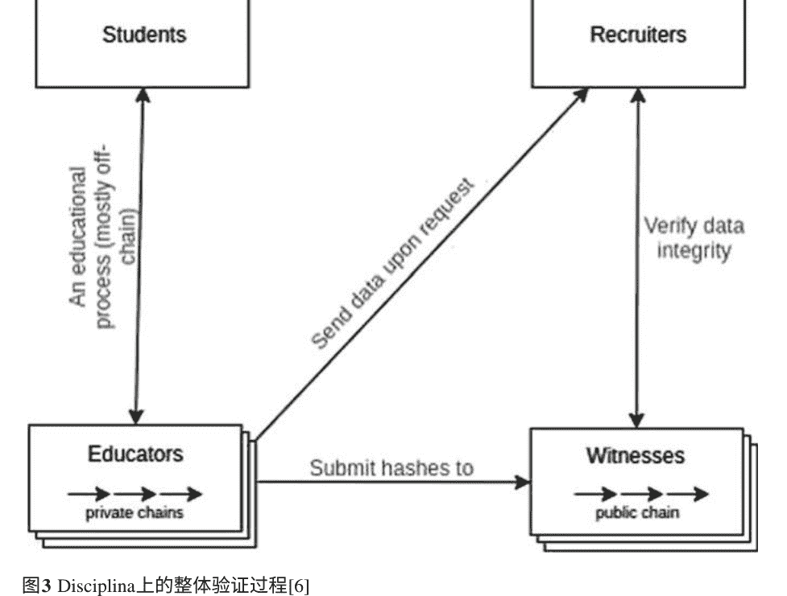

图3 Disciplina上的整体验证过程[6]

#### 3.2 Blockcerts

它是在比特币区块链上共享学术证书的开放基础设施。Blockcerts提供了一个分散的证书系统。比特币区块链充当了信任提供者，证书是防篡改和可验证的。Blockcerts可以在学术、职业和职业资格认证的背景下使用[7]。

Blockcerts实施涉及四个组成部分：

1. 发行者：大学创建数字化学术证书，可以包含描述个人技能和成就的属性数组。这些证书在比特币区块链上注册。
2. 证书：遵循开放徽章标准来创建证书。
3. 验证者：任何节点都可以验证证书是否防篡改，并且是否由特定机构发行给指定用户。
4. 钱包：个体实体使用钱包安全存储他们的证书，并与其他实体共享，如雇主。

##### 3.2.1 设计

以下三个存储库构成了架构：

1. Cert-schema: 描述创建和管理数字证书的数据标准。数字证书是一个JSON文档，其中包含存储在区块链上的证书发行者代码所需的字段。该模式类似于开放徽章规范。
2. Cert-issuer: 在这里，数字证书的哈希值被生成并作为比特币交易进行广播，从发行者的地址到接收者的地址，哈希值作为返回字段的一部分。
3. Cert-viewer: 用于显示和验证已发行的数字证书。它还为用户提供了在比特币区块链上请求证书和生成新ID的权限。

该设计使用非对称密钥加密来验证发行者和接收者。通过在区块链上设置一个标志来撤销证书，表示特定证书无效。

##### 3.2.2 优势

- 候选人拥有自己的记录。
- 独立于供应商的blockcerts验证。
- 证书的可移植性：因为使用了开放徽章标准。
- 私密：交易是私密的，只有数字指纹存储在区块链上。

在解释了现有解决方案之后，我们将在下一节中描述我们的证书和凭证验证解决方案。

### 4 ShareCert: 设计和实现

考虑到区块链技术提供的功能和特点，我们可以得出结论，在区块链上共享和验证证书和凭证是智能合约的完美应用。随着区块链的引入，用户隐私得到了公钥身份（PKI）的帮助来维护。由于任何节点都可以查看交易历史记录，透明性被引入到验证过程中。通过智能合约的帮助，消除了对中间人服务的依赖。通过采用区块链技术设计一个高效的解决方案，我们使整个验证过程变得透明。我们的实现侧重于将责任转移到候选人身上，以启动验证过程。这减少了雇主和大学进行验证程序的负担。此外，不需要委托中间人负责验证过程。

以下几点概述了我们的设计：

- 证书通过分散的数据存储在三个实体之间进行加密和共享。每次数据交换都会记录为区块链上的一笔交易进行验证。
- 一旦记录在区块链上，交易就无法被篡改，并分布在参与验证过程的节点之间。
- 证书和资格的验证不涉及任何中央机构或中间人。验证是通过智能合约进行的，几乎实时完成的。
- 我们提出的模型的一个显著特点：大学和雇主之间的互动现在是可选的。完整的验证是由候选人触发的交易完成的。

构成我们分散应用程序骨干的智能合约是与底层区块链进行交互的部分。尽管分散数据存储包含证书，但证书是加密的，然后上传到分散数据存储。这确保了候选人数据的隐私得到考虑。尽管分散数据存储是公开的，任何人都可以访问文件，但这种加密机制可以防止访问文件内容。我们强调，在验证过程中，雇主与大学之间没有任何形式的互动，除了雇主最初的注册与大学。随着我们进行实施，原因将更加清楚。所有交易都记录在区块链上作为不可变记录，可以随时用简单的查询进行审计。此外，交易对于任一方都是可见的设计之一。这三个实体需要就智能合约达成一致作为验证过程的一部分（图4）。

此外，我们没有限制大学遵循任何特定的格式，因为在颁发证书时并没有统一的格式。因此，我们的设计灵活适应大学颁发证书的各种格式。我们在两个不同的区块链平台上实施了上述设计，分别是以太坊和超级账本。选择这两个平台是在考虑到这两个平台提供的功能和架构之后做出的。以太坊是一个公共无权限的区块链，任何节点都有权限成为区块链的一部分并参与共识过程。Hyperledger Composer本质上是一个用于与Hyperledger Fabric交互的软件开发工具包（SDK）。Hyperledger Fabric是一个支持维护任何类型账本的平台，包括公共有权限、公共无权限、私有有权限和私有无权限的区块链。但是在开发者中，Fabric在维护私有许可和无许可区块链方面很受欢迎。现在我们将通过描述如何在这些平台上实现设计的方式更详细地探索这两种实现。

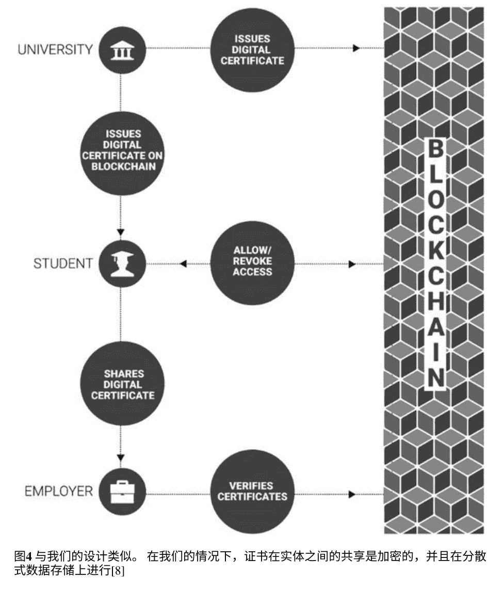

图4 与我们的设计类似。在我们的情况下，证书在实体之间的共享是加密的，并且在分散式数据存储上进行[8]

#### 4.1 以太坊上的实现

作为最流行的智能合约平台，以太坊推广了智能合约在商业应用中的使用。用于底层分散式应用的智能合约首先在在线可用的Remix IDE上编写和测试。智能合约通过在以太坊网络上进行交易来发布。由于以太坊主网不用于开发目的，我们将智能合约部署到了Ropsten测试网上。

候选人、大学和雇主这三个实体之间通过使用ReactJS开发的基于浏览器的分散式应用进行交互，该应用提供与智能合约的交互界面。分散式应用与底层智能合约的实际交互是通过web3.js来实现的，web3.js是一组支持使用HTTP或IPC连接与本地或远程以太坊节点进行交互的库集合。Openpgp.js是一个支持非对称密钥加密的JavaScript库，用于在上传到IPFS之前加密证书。这确保只有指定的候选人才能获得查看证书内容的权限，而无需访问私钥。由于以太坊上的存储资源使用需要付费，因此我们选择了InterPlanetary FileSystem (IPFS) 作为上传加密证书的分散式数据存储。Ipfs.js是分散式应用程序使用的JavaScript库，用于直接将加密内容上传到IPFS (图5)。我们使用了一个名为download.js的简单JavaScript库来方便从IPFS下载文件。这减少了从守护程序或IPFS提供的浏览器界面下载文件所需的时间。

我们的实现提供的新颖之处在于雇主可以在不需要与大学进行任何交互的情况下验证证书的真实性。这样可以节省大约30天的验证时间，因为应用程序支持的验证是基于准实时的。

##### 4.1.1 IPFS基于内容的寻址

为了了解验证过程的细节，了解IPFS（星际文件系统）如何存储数据是至关重要的。在我们的设计和实现中，我们选择了IPFS作为我们的分散式数据存储。星际文件系统 (InterPlanetary FileSystem) 或IPFS是一个分散式的点对点数据存储，提供存储和与智能合约交互的API。在基于客户端-服务器的互联网时代，数据是通过位置地址检索的，IPFS通过引入内容可寻址性带来了一场革命。IPFS最大的优势之一是其基于内容的寻址，使其具有数据去重的特性。当文件上传到IPFS时，它会经过# 图5 整个去中心化应用的流程

通过哈希函数对文件进行处理，生成唯一的摘要。然后将摘要转换为内容标识符（CID）。CID是IPFS节点在分布式哈希表（DHT）中搜索文件的依据。因此，即使另一个节点将相同的文件添加到IPFS上，由于IPFS的设计使用基于内容的哈希，CID不会改变。此外，通过CID或IPFS哈希，我们可以从IPFS网关检索文件。这是因为，正如我们之前提到的，IPFS使用基于内容的哈希来寻址，而不是常规的基于位置的寻址。

##### 4.1.2 以太坊上的证书验证步骤

i. （交易1-请求）：候选人通过调用名为sendRequest的智能合约函数，使用交易向大学请求证书。该函数接受候选人的姓名、注册号、名为metadata的字段以及Openpgp.js生成的公钥和私钥作为输入。当然，确保候选人外没有其他实体可以访问私钥。私钥作为输入提供，以便候选人可以在智能合约中记录并以后用于解密。metadata字段用于指定候选人希望提供的其他相关数据。所有字段都是字符串类型。成功执行此交易后，将为此请求生成一个请求ID。

ii. （第2笔交易—回应）：大学审核请求。作为审核的一部分，大学首先决定候选人的请求是否真实。这可以通过大学检查候选人作为请求的一部分提供的详细信息并与他们的记录进行交叉检查来完成。如果发现请求不真实，大学将其标记为恶意请求并发送回应。这个检查是必要的，因为以太坊是一个公共区块链，任何拥有以太坊地址的人都可以发出请求（尽管需要花费以太币，使其在大规模攻击上变得不可行）。如果大学认为请求是真实的，它会使用候选人的公钥加密证书，并将文件上传到IPFS后生成回应。此外，它会计算未加密证书的IPFS哈希（不上传未加密证书，只计算IPFS哈希）并更新唯一哈希字段。作为验证过程的一部分，该字段非常重要。然后，通过调用智能合约中定义的sendResponse函数，通过交易发送回应。该函数接受请求ID、一个布尔输入（指示请求是否真实）、加密证书的IPFS哈希和未加密证书的IPFS哈希作为输入。

iii. 候选人使用download.js下载加密文件，并使用自己的私钥解密。候选人之所以能够这样做，是因为拥有文件的IPFS哈希值的任何人都可以从IPFS网关下载该特定文件。同时，我们必须注意，这不会产生任何隐私问题，因为正如我们所知，大学上传的证书已经使用候选人的公钥进行了加密。

iv. （交易3-注册请求）：雇主在招聘大学的学生之前必须向大学注册。如果没有这个，雇主将无法验证候选人作为招聘程序的一部分提交的证书。这个注册是由雇主发起一个sendRegRequest交易来完成的。该函数接受组织名称、原籍国、雇主的公钥和私钥作为输入。当然，已经注意到除了雇主之外的任何实体都无法访问私钥。私钥作为输入给出。这样，雇主就可以记录下来，并且以后可以从智能合约中访问，以进行解密。在执行此交易后，会生成一个雇主ID，并且雇主等待大学的注册批准。

v. （第4笔交易-注册响应）：大学审核注册请求，并决定批准或拒绝雇主的注册。然后生成一笔名为employerRegistration的交易，该交易接收雇主ID和一个布尔输入，表示雇主的注册是否被批准或拒绝。只有注册成功的雇主才能参与证书验证。

vi. （第5笔交易-申请）：候选人使用雇主的公钥对证书进行加密，然后将文件上传到IPFS。候选人随后生成一笔名为sendProof的交易，该交易接收候选人的姓名、注册号码、元数据、从大学获取证书的请求ID、雇主ID以及上传文件的IPFS哈希（使用雇主的公钥进行加密）。这个交易是候选人申请招聘过程的关键点。在成功执行此交易后，将生成一个证明ID。

vii. （第6个交易-验证）：雇主收到候选人的申请和相关细节，作为sendProof交易的一部分提交。然后，雇主使用私钥解密候选人上传的证书。使用ipfs.js库提供的API，雇主计算此解密文件（即证书）的哈希值，而不实际将证书上传到IPFS。此哈希值与proofID一起作为输入提供给verifyProof交易。verifyProof函数将此哈希值与由大学更新的onlyHash字段进行比较（作为响应交易的一部分计算）。如果这两个哈希值匹配，则候选人确实作为招聘的一部分提交了正确的证书。这导致验证成功。如果哈希值不匹配，则验证被视为失败，并通知候选人。我们必须注意到这个验证是通过智能合约本身进行的，不需要大学和雇主之间的任何交互，除了最初的注册。

这个七步验证程序是在以太坊上实现的。从上面提到的步骤可以看出，这种验证方式消除了雇主和大学之间的直接互动。这是一个很大的好处，因为它使整个验证过程由候选人直接驱动，并且是一个完全透明的过程。此外，我们必须注意，雇主的注册只需一次，并且在成功注册后，雇主可以随后收到候选人的多个申请。因此，实际上步骤的数量通常少于七步。

作为这个实现的一部分，为候选人、大学和雇主分别开发了三个独立的门户网页。基本上，这三个门户与智能合约的交互构成了我们在以太坊上设计的实现。

#### 4.2 在Hyperledger Composer上的实现

Hyperledger Composer是由Linux基金会的开源Hyperledger项目下开发的一个框架。这个框架有助于加速在Hyperledger Fabric上构建基于区块链的业务应用程序的开发。与Fabric一样，Composer支持模块化的方法来构建去中心化应用程序。尽管Composer是由Linux基金会开发的一个独立项目，但它可以被视为一个软件开发工具包（SDK），可以更快、更高效地构建去中心化应用程序。

人们必须意识到与其他SDK（如节点SDK、Python SDK等）相比，Fabric和Composer支持的SDK之间的区别。与那些SDK相比，Composer通过根据开发人员指定的配置和业务逻辑自动生成链代码，简化了应用程序开发过程。此外，它通过提供必要的抽象来降低与底层Fabric网络的直接交互，开发人员可以定义不同的参与者、资产、交易、权限、业务逻辑和查询。

除了本地开发，Composer还提供了一个在线游乐场，使开发人员能够更快地测试代码和构建查询。Hyperledger Composer使用一种表现状态转移（REST）服务器来处理请求，分布式应用程序与之交互。

与在以太坊上开发智能合约相比，Composer上的智能合约开发完全是模块化的。尽管以太坊提供了使用前端库构建完整分布式应用程序的模块化能力，但Composer有助于将智能合约本身模块化。在Composer上开发应用程序涉及编写单独的文件，这些文件一起形成一个业务网络存档，然后与底层的Fabric网络进行交互。

Composer上的业务网络存档包括：

- **模型文件（.cto）**：该文件用于定义应用程序中的所有资产、参与者和交易。资产具有价值，并通过交易在网络上在参与者之间进行交易。
- **脚本文件（.js）**：该文件包含在网络中的参与者提交交易时将调用的交易函数。在此阶段，使用交易函数来更新资产。此外，通过这些函数进行所有权转移。
- **访问控制（.acl）**：正如我们之前提到的，Composer和Fabric在开发权限区块链方面非常有帮助。这个文件包含了访问控制规则。这些规则用于为应用程序中涉及的不同实体分配权限。通常，这个文件包含规则的描述，适用规则的参与者，允许的操作，适用规则的资源以及规则允许的操作。
- **查询文件（.qry）**：此查询文件定义了用户可以执行的所有可能查询。这些查询按设计遵守访问控制规则，即用户无法在其无权访问的资源上运行查询。

上述所有文件都打包成一个业务网络存档，可以在本地Hyperledger Fabric环境或在线游乐场上部署。此实现的前端界面使用AngularJS开发，其代码是使用名为Yeoman的开源客户端脚手架工具自动生成的。

为了发行和存储证书，我们使用IPFS作为去中心化数据存储。我们做出这个选择是因为，虽然Fabric支持的状态数据库（LevelDB或Couch DB）支持文件存储，但IPFS是一个公共的去中心化数据存储，为整个过程带来了更多的透明度。使用IPFS的一个主要优势是，证书可以通过独立的点对点系统提供，而无需查询区块链。

Composer中的身份是作为业务网络卡发行的。用户使用这些业务网络卡与网络进行交互。一个身份存储在一个业务网络卡中。历史记录注册表用于记录所有成功的交易，包括提交它们的参与者和身份。REST服务器为业务网络生成开放API，并支持创建、检索、更新和删除（CRUD）操作。

编写的智能合约使雇主能够验证候选人的证书和认证的真实性，即使没有直接访问证书内容。此外，我们假设雇主已经与大学进行了预注册，并成为这个私有区块链网络的一部分。

##### 4.2.1 Hyperledger Composer上证书验证的逐步过程

i. （交易1-请求）：候选人通过提供必要的输入，如他/她的ID和请求的原因，向大学请求证书。他通过创建一个名为请求的资产来完成这个操作，该资产将包含上述输入以及请求ID。使用sendRequest事务将此资产发送给大学。请求资产还具有两个其他属性，即事务ID和提交状态。这些属性不能由任何用户直接控制，它们在请求提交后由智能合约更新。

ii. （交易2—响应）：大学审核候选人的请求，并在去中心化数据存储上发布加密数字证书。加密是使用候选人的公钥进行的，该公钥可以在候选人注册时或通过智能合约交互时由大学获得。去中心化数据存储返回加密证书的哈希值。大学创建一个包含由去中心化数据存储返回的已发布证书的哈希值的响应资产。该资产包含一个名为responseID的字段，通过该字段可以在查询时识别此响应。此外，作为该资产的一部分，大学还将指定授予的学位或文凭的名称和获得的等级。然后，大学将此资产通过sendResponse交易发送给候选人。此sendResponse交易包含对大学正在响应的请求的引用和对生成的响应的另一个引用。响应资产还具有其他两个属性，如交易ID和提交状态。这些属性不能由任何用户控制，它们在提交响应时由智能合约更新。

iii. 候选人使用私钥解密证书，在从去中心化数据存储中下载加密证书的副本后进行解密。

iv. （交易3-验证）：候选人创建一个名为proof的资产，该资产将包含候选人发送给大学的请求的requestID和大学发送给候选人的响应的responseID。此外，proof资产还将包含候选人提及的加密证书的哈希值。该proof包含一个名为check hash status的字段，候选人无法设置该字段。除此之外，proof还包含两个其他字段，即transaction ID和submit status。这些属性不能由任何用户控制。在提交sendProof交易后，智能合约会更新这些字段。候选人将proof作为send proof交易的一部分提交后，底层智能合约会将候选人提及的证书哈希与大学响应中提及的证书哈希进行比对。

检查哈希状态是一个布尔字段，根据验证结果进行设置。由于此交易是寄给雇主的，雇主可以查看验证结果。此外，在此交易之后，雇主将获得查看请求、响应和证明的权限。这样，雇主可以获取候选人的证书验证，甚至无需查看它们。

在这里，大学无需明确参与验证过程。候选人的凭证可以由雇主查看，在发送证明交易后获得对响应资产的读取权限。雇主实际上不需要查看证书的内容，因为验证是通过所有参与方都信任的智能合约进行的。此外，雇主可以访问包含候选人的证书和学位的响应资产。

这个四步验证过程是在Hyperledger Composer上实现的。从所提到的步骤可以看出，这种验证方式消除了雇主和大学之间的直接互动。这是一个很大的好处，因为它使整个验证过程由候选人直接驱动，并且是一个完全透明的过程。除此之外，雇主无需创建任何资产或提交任何交易。此外，整个验证过程是通过记录在区块链上的交易来进行记录的。

## ### 4.3 结果与分析

本节重点介绍了在以太坊和Hyperledger Fabric上实施我们设计后获得的结果。此外，我们将讨论每个平台上每个交易所花费的时间性能。

必须注意的是，我们在公共区块链（以太坊）和私有区块链（Hyperledger Composer）上实施了我们的设计。在以太坊的情况下，我们用于去中心化应用的智能合约是用Solidity编程语言编写的，这是一种用于编写智能合约的标准编程语言。该智能合约已部署在以太坊网络的Ropsten测试网上。合约的部署细节如下：

- 交易哈希：https://ropsten.etherscan.io/tx/0x7480e356dfd5f24e6f990b3a78c55ad434a833cf801434cda281b4271736f5ca
- 合约地址：https://ropsten.etherscan.io/address/0xe8546f21b032151106121601b51eb7dc7517353d
- 区块编号：https://ropsten.etherscan.io/block/9619434
- 交易费用：0.00689404265216 以太币
- 燃气限制：3,249,191
- 燃气使用：3,249,191（100%）
- 燃气价格：0.000000002121772051 以太币（2.121772051 Gwei）
- 确认时间：约43秒

使用上述交易哈希，可以在以太坊网络的Ropsten测试网站https://ropsten.etherscan.io/上查看交易详情。由于我们在部署过程中使用了测试网，所以使用的以太币是虚拟的。如果我们要给合约部署的成本一个真实的货币价值，那么截至2021年2月10日下午4:26，它是12.40美元或903.54印度卢比。确认时间表示从触发交易到成功挖掘包含该交易的区块所花费的时间。在下表中，我们记录了在Ropsten测试网上提交的10个请求交易的交易详情。我们这样做是为了提供我们的应用在以太坊和Fabric平台上性能的比较。尽管任何交易都可以用于此比较，但我们选择了请求交易，因为它是验证过程中的第一笔交易（表1）。

##### 表1 以太坊上10个请求交易的交易详情

| 交易哈希 | 交易费用（以太币） | 确认时间（秒） |
| :--- | :--- | :--- |
| https://ropsten.etherscan.io/tx/0x9fefbd20b682344124839e0a92d27c82b1adc286230f7e3def2814881b8c75d5 | 0.00957054486563 | 31.738 |
| https://ropsten.etherscan.io/tx/0x671b26254f7731148063962166c3faab85380d2a0be9389c8660494bf5fc9e77 | 0.00957066400996 | 23.003 |
| https://ropsten.etherscan.io/tx/0x2d6359d9d423dd1eb0da5f455174dd51814a506a505dc44cc7296b106e830965 | 0.00957057890687 | 23.109 |
| https://ropsten.etherscan.io/tx/0x4b66bc82d2e3b04f13417006fe09bc67f9092a0cd273cc7888183af1e12ee6a0 | 0.00957047678315 | 63.662 |
| https://ropsten.etherscan.io/tx/0xa3885fc1567c9bc16eb305acba10b824a89518a77cf2afb73f3c7118832d9269 | 0.01631792378315 | 22.940 |
| https://ropsten.etherscan.io/tx/0xc194752002da4f83ffc1836020321eb5705f2ee7f3146a52b2deb0462f2a2fa1 | 0.01294426934501 | 25.114 |
| https://ropsten.etherscan.io/tx/0xf51c4449682b2e65d5af63b9b8c19505a023a24017fee773040f48804ab7fa8a | 0.01496840776254 | 45.230 |
| https://ropsten.etherscan.io/tx/0x8c939b9d9e2f96ad4ca67b67c17478d5ef474af7b9514d4547bbb9cd9c60f238 | 0.02306541180377 | 22.898 |
| https://ropsten.etherscan.io/tx/0xf15c019c35dde90b91271e44611b9d2acd918e927d2c10d8e4e6a2796e0e1bf6 | 0.02306545282439 | 35.916 |
| https://ropsten.etherscan.io/tx/0xb7b9139b678a9defbc314ed6425084351ab19e38ea789ace352033ad7d1b8447 | 0.00957047678315 | 62.222 |

我们可以使用交易哈希从https://ropsten.etherscan.io/获取交易的详细信息。从上表可以看出，确认时间有很大的变化，尽管所有的交易都是相同类型的（请求交易）。这是因为确认时间取决于多种因素。一旦触发了一笔交易，它就成为待处理交易池的一部分。矿工通过从交易池中选择一组交易来形成区块。为了从挖掘一个区块中获得最大的利益，矿工选择那些提供最高交易费的交易。触发交易的节点通过决定燃气价格和燃气限制来设置交易费。交易费是燃气使用量和燃气价格的乘积。任何多余的以太币都会退还给触发交易的节点。由于以太坊上每个操作的燃气量是固定的，燃气价格决定了所提供的交易费。因此，交易的确认时间取决于诸多因素，如所提供的燃气价格。矿工的可用性，计算工作证明的难度，以及交易池中其他待处理交易提供的燃气价格都会影响交易的确认。我们对交易的燃气价格进行了变动，并观察了在Ropsten测试网络上确认交易所花费的时间。我们观察到，在这些迭代中，我们的请求交易在Ropsten测试网络上的平均确认时间为35.583秒。此外，平均交易费用为：0.013821421以太币。将其转换为真实货币后，相当于2021年2月10日下午4:27的24.87美元，即1811.45印度卢比。

在Composer上编写的智能合约由4个文件组成，分别是模型文件（.cto）、访问控制文件（.acl）、事务函数文件（.js）和查询文件（.qry）。这些文件一起形成了业务网络存档文件（.bna）。该文件可以部署在任何Hyperledger Fabric网络上。

作为一个私有许可的区块链，交易细节存储在本地历史记录中，只有网络中的参与者才能访问。因此，没有公开可见的日志来查看交易细节，就像我们在以太坊的情况下可以通过名为https://ropsten.etherscan.io/的网站来做的那样。在Composer上部署智能合约所需的时间为：4秒。

我们使用请求交易作为Composer交易确认时间的基准。请记住，我们在以太坊实现中也使用了请求交易作为性能基准。作为一个私有许可的区块链，在Hyperledger Fabric（Composer）上确认交易不需要交易费用。

> 观察到在Composer上确认请求交易的平均时间为：0.86秒。

###### 4.3.1 分析

我们注意到在这些平台上，交易处理速度存在显著差异。在以太坊上，我们发现用户需要等待平均请求交易确认时间为38.2秒。而在Hyperledger Composer上，平均请求交易确认时间仅为0.86秒。

基于以上观察，我们不能得出Hyperledger Composer比以太坊更适合开发去中心化应用的结论。这是因为以太坊的设计是一个公共无权限的区块链。因此，在任何给定时间点，参与的节点数量都非常庞大。此外，以太坊采用了工作量证明共识机制。由于这种共识机制涉及的计算强度很大，交易的确认需要相当长的时间。使用公共区块链（如以太坊）的一个主要优势是在验证过程中没有透明度的缺乏。此外，交易数据始终可以进行公开审计。

另一方面，Hyperledger Composer是一个用于开发分散应用的私有许可区块链平台。因此，参与网络的节点数量相对较低，与公共区块链相比。此外，所涉及的共识机制与以太坊使用的工作量证明共识机制相比，并不需要大量计算。

对于这些平台上获得的结果的另一个比较是与实施成本相关的。在以太坊上，我们需要支付0.00689404265216个以太币来部署我们的合约。在Composer上部署合约不需要任何费用。此外，我们在以太坊上支付的平均交易费用为0.013821421个以太币。在Composer上不需要任何交易费用。同样，这并不意味着Hyperledger Composer平台比以太坊更优。这是因为以太坊作为一个公共区块链平台需要激励在区块链上形成区块的矿工。此外，在公共区块链上收取交易费用有助于防止拒绝服务或分布式拒绝服务攻击的可能性。

我们还必须记住两个平台在处理交易时采用的不同方法。以太坊采用顺序执行的方法。也就是说，交易首先被汇集成一个区块，然后执行和验证。由于使用了工作量证明共识机制，区块的形成需要很长时间。另一方面，Hyperledger Fabric采用了执行-顺序-验证的策略。这是Hyperledger Fabric交易执行时间低的一个主要原因。

尽管两个平台的交易延迟差异巨大，但选择每个平台都是合理的，因为以太坊等公共区块链提供了透明度的优势，而Hyperledger Composer则提供了定义权限的便利。此外，与现有的验证过程相比，我们将验证速度显著降低延迟到接近实时。

##### 4.3.2 ShareCert与Disciplina和Blockcerts的比较

我们已经将Disciplina和Blockcerts的模型与我们的模型在几个参数上进行了比较，具体总结可以在下表2中找到。

### 5 结论

在这项工作中，我们试图解决候选人、雇主和大学之间的证书和资格验证问题。现有的方法不透明，并涉及对第三方的信任。由于现有程序的缺乏透明度，可能会发生欺诈性验证，这对雇主和候选人都有风险。此外，现有流程耗时且对大学和雇主来说是额外的负担。

为了解决这些现有问题，我们提出了一个设计，以透明和分散的方式完成这个验证过程，同时保护参与验证的实体的隐私。我们借助区块链技术实现了这一点。区块链技术有助于将去中心化、透明度和数据的不可变性结合起来，同时保护用户和数据的隐私。我们注意到这些正是现有方法所缺乏的特性。

以太坊和Hyperledger Composer上的这个设计的两种实现将责任转移到候选人身上，由其发起和完成验证过程。此外，在验证过程中，大学和雇主之间没有必要进行互动。所有验证都作为智能合约中嵌入的业务逻辑的一部分完成。这有助于减少大学和雇主的重大开销。

选择以太坊和Hyperledger Fabric的原因是，以太坊是一个公共区块链，Hyperledger Fabric通常用于创建私有区块链。因此，所提出的设计可以成功地作为分散应用程序实现在这两种类型的区块链上。此外，我们观察到所提出的设计可以在几乎实时的情况下完成验证过程，而不是现有的平均需要30天的过程。

致谢我们的工作致力于Sri Sathya Sai Institute of Higher Learning的尊敬的创始人校长BhagaWan Sri Sathya Sai Baba。

### 参考文献

- 1. Arvind Narayanan, J.B.: 比特币和加密货币技术. 普林斯顿大学出版社 (2016)
- 2. Benet, J. IPFS-内容寻址、版本化、P2P文件系统 (2014)
- 3. Cloudfare. 著名的DDoS攻击|有史以来最大的DDoS攻击。 来自Cloudfare的获取: https://www.cloudflare.com/learning/ddos/famous-ddos-attacks/(2020)
- 4. Hyperledger. Hyperledger简介 (2018)
- 5. Khan, N.M 区块链是新的数据库吗? 来自Quora的获取: https://www.quora.com/Is-blockchain-the-new-database(2019)
- 6. Kuvshinov, K.N. Disciplina: 教育区块链 (2018)
- 7. MIT媒体实验室学习计划. Blockcerts—区块链上的学术证书开放基础设施。来自Medium的获取: https://medium.com/mit-media-lab/blockcerts-an-open-infrastructure-for-academic-credentials-on-the-blockchain-899a6b880b2f. (2016)
- 8. Murali, A. 不可篡改的学位证书将成为印度政府的第一个区块链项目。 来源: Factor Daily: https://archive.factordaily.com/degree-certificates-india-blockchain-project/(2018)
- 9. Nakamoto, S. 比特币: 一种点对点的电子现金系统 (2008年)
- 10. Swan, M. 区块链: 新经济的蓝图. O'Reilly Media (2015年)
- 11. Wood, G. 以太坊: 安全的去中心化广义交易分类账eip-150修订版 (2017年)

## 语义Web和区块链技术在图书馆中的前景

**Faiza Bashir和Nosheen Fatima Warraich**

摘要区块链和语义Web是最近已经开始改变行业、社会和政治互动以及任何其他价值交换的革命。这不仅仅是一个趋势，它是一个正在进行中的增长现象。 对于图书馆信息中心来说，语义Web和区块链是新兴技术，产生了新形式的记录或记录保管的新模式，信息专业人员需要参与其中。 图书馆采用这些技术，连接了图书馆提供的支持与快速发展和不断增长的用户需求之间的联系。 这些新兴技术有许多好处，例如信任、去中心化、保护隐私、分布式、无需许可的元数据、馆际互借、资源共享和凭证系统、知识产权、数字版权管理以及在许多方面提高效率。 这些技术也存在一些限制和挑战，例如法律挑战、技术问题、财务挑战和社会限制和挑战。 图书馆信息专业人员需要更多的努力和技术技能来理解语义Web和区块链技术。决策者必须为图书馆信息专业人员准备好迎接这些即将到来且不可避免的技术。

### 缩写

| 缩写 | 全称 |
|---|---|
| 人工智能 | 人工智能 |
| 区块链技术 | 区块链技术 |
| 数字版权管理 | 数字版权管理 |
| 超文本标记语言 | 超文本标记语言 |
| 超文本传输协议 | 超文本传输协议 |
| 知识产权 | 互联网协议 |
| IPFS | 星际文件系统 |
| LAM | 图书馆、档案馆和博物馆 |
| LIC | 图书馆和信息中心 |
| LIS | 图书馆与信息科学 |
| OWL | Web本体语言 |
| RDF | 资源描述框架 |
| SKOS | 简单知识组织系统 |
| SW | 语义网 |
| W3C | 万维网联盟 |
| WWW | 万维网 |
| XML | 可扩展标记语言 |

F. 巴什尔 (✉) 
巴基斯坦拉合尔政府女子研究生学院图书馆学系 
巴基斯坦拉合尔市

N. F. Warraich 
旁遮普大学信息管理学院，巴基斯坦拉合尔，巴基斯坦 
e-mail: nosheen.im@pu.edu.pk

### 章节的学习成果

本章的重要性主要对图书馆、图书馆利益相关者、决策者、研究社区、出版商和第三方调解者感兴趣。预计本章填补了知识空白。在图书馆中寻找进步，并鼓励参与新技术的有创造力的个人，将帮助图书馆为这些潜在的颠覆性技术做好准备。

本章的学习成果包括：

- 引入语义网和区块链技术。
- 语义网和区块链技术的组成部分；其框架、架构、标准、语言等。
- 了解语义网（SW）和区块链（BC）技术在图书馆设置中的能力和潜在好处。
- 这些技术的核心限制和挑战可能成为实现这些目标的障碍，并提出了在图书馆未来有效使用这些技术的方法。

### 亮点

- 区块链和语义网是最近已经开始改变行业、社会和政治互动以及任何其他价值交换的革命。这不仅仅是一个趋势，它是一个正在进行中的增长现象。
- 对于图书馆信息中心来说，语义网和区块链是新兴技术，产生了新形式的记录或记录保管的新模式，图书馆和信息专业人员需要与之接触。
- 图书馆采用这些技术，连接了图书馆提供的支持和客户不断发展和增长的兴趣。
- 这些新兴技术有许多好处，例如信任、去中心化、保护隐私、分布式、无需许可的元数据、馆际互借、资源共享和凭证系统、知识产权、数字版权管理，以及在许多方面提高效率。
- 这些技术都有各自的局限性和挑战，例如法律挑战，技术问题，财务挑战和社会限制和挑战。
- LIS专业人员需要更多的努力和技术技能来理解SW和BCT。决策者必须为LIS社区准备这些即将到来和不可避免的技术。

### 1 引言

我们生活在一个以信息为中心的世界。快速的技术发展改变了整个信息场景。目前，人们已经习惯了数字信息。万维网只需点击一下就能打开信息的大门。这场革命带来了新的渠道，并提供了更多获取额外资源的机会。通过人工智能技术将相似概念进行互联和展示，使网络世界更加动态。

区块链和语义Web是最近已经开始改变行业、社会和政治互动以及任何其他价值交换的革命。图书馆有很大的机会利用这些技术获得期望的好处，并充分利用这些技术。这两种技术都用于在分散和防篡改的环境中存储数据。

本章旨在解释语义网和区块链作为技术和平台在图书馆和信息中心实施这些技术的潜力。这些技术仍在不断发展，预计将带来更多技术变革，对图书馆和信息中心产生影响。图书馆采用这些技术连接了图书馆提供的支持和客户日益增长的兴趣，进而与快速发展的客户需求相适应。图书馆正在成为不仅仅局限于图书馆内部的信息中心。这些技术已经对图书馆的整体管理工作产生了影响，特别是文献类型的采购已扩展到电子和数字化材料。日常管理这些材料也变得越来越具有挑战性。这些技术是解决这些挑战的完美解决方案[4]。MARC、ISBD、WebOPAC、Dublin Core、联合编目、OAI-PMH等是图书馆用于存储、管理、检索和传播各种资源以服务用户的常见技术[34, 36, 45]。

### 1.1 什么是语义网?

术语“语义学”来自希腊词“smantik ”（中性复数smantik s），意思是“研究意义”。语义网是一个平台，用于在应用程序、企业和社区之间共享和重用数据。这是一个由W3C领导的合作努力，涵盖了大量的学术和商业合作伙伴。 它的目的是将所有非结构化的在线文档转换为网络数据。 它是建立在资源描述框架（RDF）之上的。 根据蒂姆·伯纳斯-李（Tim Berners-Lee）的说法，语义网是“一种可以直接和间接地由机器处理的数据网络”[7]。 语义网标准由万维网联盟（W3C）开发。 近年来，语义网（SW）作为传统网页的扩展，成为一个热门话题。 SW是人们和计算机使信息更相关和可理解的一种非常有价值的工具。 它为互联网页面建立了一个语义上下文，使人类代理和人工代理能够在网络应用程序中学习内容[7]。 因此，语义网提供了一个环境，软件代理可以通过网络资源进行交互并完成高级任务。

##### 1.1.1 语义网的组成部分和架构

在讨论语义网在不同社会领域的应用之前，了解其技术方面非常重要。 语义网扩展了解决方案。 它使用了数据特定的语言，如资源描述框架（RDF）、Web本体语言（OWL）和可扩展标记语言（XML）。 HTML是一种表示文档及其之间关系的标记语言（图1）。

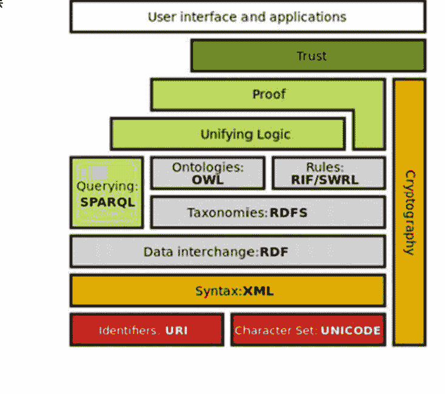

#### 1.2 区块链

区块链是一个点对点网络，使两个参与方能够进行交易业务，无需第三方提供验证和可信度[1, 11, 15–17]。比特币区块链是一组相连的区块，记录比特币交易。 每个数据块包含比特币网络上的一批交易信息[8, 9, 14]。 比特币的理论最初是在2008年由化名“中本聪”的白皮书中解释的。尽管区块链数据库系统已作为加密货币技术的一部分建立起来，但它还有其他几个潜在的应用。很快，从医疗记录到图书馆借阅记录，都可以与包含可验证的时间戳生产和所有权记录的区块链数据库相链接[23]。

##### 1.2.1 区块链技术的框架和架构

区块链技术及其底层应用是一种新兴的颠覆性技术，最近出现了：由于其“改变一切的潜力”，它引起了许多人的兴奋[26, 27, 40]。BCT是由密码学生成的一系列数据块组成的，是一种“分布式账本”或“分布式账本技术”的一种。它是比特币的底层技术，比特币是一种数字货币，于2009年1月首次发布。简单来说，它是一个包含信息的区块链 (图2)。它最初是用来给数字文档打时间戳和防止记录被篡改的[19, 22]。

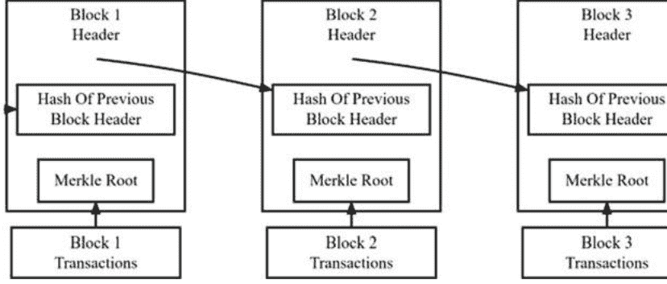

### 2 为什么要使用颠覆性技术来建立图书馆信息中心

对于信息工作者来说，使用的技术来创建和维护记录的变化并不新鲜。近几十年来发生了一些变化，导致了新类型的记录和记录管理系统的出现[24]。语义网和区块链是新兴技术，导致了新的记录和记录管理机制，记录和信息工作者需要学习[5, 6, 10, 12, 29]。

图书馆和信息中心面临着不可逾越的挑战和难以想象的转变。创新已经从一个关注点转变为必需品[21, 23, 31, 33, 45]。信息专业人员的管理者在资源有限的环境中面临着如何采用和实施技术的压力。尽管区块链账本系统是作为比特币技术的一部分开发的，但它还有许多其他应用。从医疗数据到图书馆借阅记录，很快就可能与区块链账本相连接，其中将包含可验证的、时间戳记录的生产和所有权[2, 3, 13, 32, 35, 46]。这些系统还可以在用户之间传输价值，检测文档变更，并保护数据免受篡改。图书馆员和其他医疗领域的人员应该考虑他们当前的系统和流程，并看看将它们迁移到区块链是否有益 (23)。图书馆和信息中心目前有很多机会充分利用这项技术。

LIS专业人员有很大的机会充分利用现代技术并实现所需的结果。圣何塞州立大学信息学院多年来一直致力于说服和鼓励人们在这个学科中继续深造。该项目的网站上有大量关于区块链技术在图书馆中应用的信息。

### 3 图书馆信息中心中区块链技术的能力和潜在好处

由于其独特的特点：防篡改记录、真实性、透明性和消除第三方经纪人，SW&BCT目前在多个行业中得到应用。除了在生活的不同领域中应用之外，这些技术还具有巨大的潜力，为图书馆信息中心开辟了新的机会[19, 21, 24, 33, 46]。这些技术的特点，如去中心化、共识机制、稳定的时序和可靠的数据关系，可以解决许多问题。让我们快速了解一下这些能力。

**数字版权管理(DRM)** 工具是这些技术最常见的潜在用途之一。对于图书馆来说，区块链技术可能改变电子资源的购买和付款方式，包括维护年度定价计划。图书馆和供应商可以使用“智能合约”通过这些技术验证购买和合同条款。基于区块链的货币用于国际金融交易将成为图书馆中心的另一个潜在好处。

**知识产权** 这些技术提供了一个电子书平台，使作者能够自行出版并完全控制其书籍向读者、图书馆、出版商等的分发，这将改变我们对知识产权的看法，特别是在数字对象方面。此外，这些技术的不可更改和可追溯的特性可以有效保护知识产权。SW和BCT的另一个有前景的应用是协调、认可和激励研究和学术出版活动[21, 23, 38, 45]。

**去中心化** 可能是有利的。这些技术可以以分散的方式提供可信赖的平台，并且对抗者具有韧性，承认当前互联网上的安全解决方案容易受到攻击，因为存在集中化和缺乏不可变属性的问题[39, 41, 42]。

**建立对记录有效性的信任。** 此外，假新闻、错误信息和虚假信息的问题可以通过区块链技术和软件在信息领域中得到削弱。

通过这些技术可以对图书馆的证书进行验证。它们可以快速推动图书馆智能服务模式的转变，为各种资源的流通创建可信的数据链接，建立图书馆与读者之间的交流和学习平台，并真正实现以读者阅读需求为中心的图书馆服务功能。

对于现有的图书馆资源共享服务管理系统，馆际互借、资源共享和凭证系统将打破图书馆之间的障碍，并提供另一种运作模式。

**效率和安全性** 是这些技术可以受益的领域，例如增加的安全性、隐私性或效率，并且SW和BCT应用目前正在这些领域之外的图书馆中开发和测试。在LI中心，这些技术直接适用于同行评审过程和数字存储库的责任链。

**完整性** 是这些技术的关键优势，它通过记录和验证交易的方式来确保记录的完整性。它还可以帮助保护隐私以确保用户记录的安全。

**构建一个分布式、无需许可的元数据存档** 可能具有最具颠覆性的潜力。LI中心可能会使用这些技术来进行星际文件系统（IPFS）的存储。数字保存和追踪、企业图书馆记录保留、基于社区的集合共享对象、工具、服务和组织数据管理是其他潜在的好处。

### 4 这些技术的四个核心限制和挑战

这些技术的技术复杂性可能使其难以理解。这些技术有其局限性和挑战，可以分为（1）法律，（2）技术，（3）财务和（4）社会局限性和挑战（图3）。

#### 4.1 法律问题

在LI中心应用这些技术时，分散式账本的所有权是一个巨大的挑战。张（2019）提出了一个问题，即谁拥有分散式账本的所有权？[45]。

#### 4.2 技术问题

缺乏统一的管理元数据和流程的标准是这些技术在LI中心应用中的一个主要挑战。速度可能较慢，存储容量可能不足。可靠性和安全性是这些技术崛起的另一个重要关注点。完全删除数据需要一些操作从运行该区块链的每个节点中删除它。 这将使得区块链对于存储受这些隐私法规约束的任何数据都无法使用。

此外，由于法律可能会发生变化，因此考虑法律变化如何从区块链系统中删除数据是很重要的。 甚至完全关闭区块链本身。 记录在区块链上的交易应该是不可变的。 当不可变数据错误并需要更正时会发生什么？ 技术无法删除交易，即使是不准确或非法的交易，这对从业者来说是一个巨大的挑战。

**最终用户技能** 对于人们来说，在复杂的设置中获取或管理他们的记录并不容易。 因此，一般公众在导航和使用系统时可能会遇到麻烦。

**需要大量的电力** 单个比特币交易的能源成本可以为1.5个美国家庭提供一天的电力[22]。 运行区块链还需要大量的计算能力，这是一个真正的环境和经济问题。

不同区块链系统之间的**互操作性不足**以及大规模数据扩展的困难是其他潜在的缺点。在交易的可靠性方面存在问题通过适当的安全架构和基础设施管理控制进行适当的验证。

**图书馆专业人员缺乏培训/技能** 图书馆需要具备技术技能的员工来维持正常运作。 培训信息专业人员对于这些技术是什么，如何工作以及如何在图书馆中应用有着真正的需求？

**关机问题** 区块链对于永久或长期记录的身份验证还不是最佳方法，因为如果区块链的参与者或节点太少，存在着重大风险。 因此，这引发了关于区块链系统的问题，例如当一个系统最终希望停止运作时会发生什么。

| 法律 | 技术 | 金融 | 社会 |
| :--- | :--- | :--- | :--- |
| •数据的所有权 | •速度<br>•可靠性<br>•安全性<br>•数据删除<br>•最终用户技能<br>•电力<br>•互操作性不足<br>•缺乏专业培训和技能 | •成本效益分析 | •不确定性<br>•替代传统方法 |

**图3 软件和区块链技术的挑战**## 4.3 金融问题

实施元数据区块链的成本效益分析也是一个巨大的挑战。对于普通用户来说，这些技术非常昂贵。此外，还存在资金问题：过高的互联网价格、额外的维护、硬件和人力资源增加了已经困扰的图书馆预算的压力。

#### 4.4 社会问题

这些技术存在许多社会限制和挑战。这些技术效率低下且环境不可持续。围绕着这些技术存在很多炒作、不确定性和欺诈。总的来说，加密货币普遍存在形象问题，被视为用于邪恶或犯罪目的的东西。传统方法的替代将会面临将图书馆从传统会计实践转向在线加密货币购买的困难。

图书馆及其工作人员传统上非常保守，这给引入新技术带来了挑战。由于一些社区对变革非常谨慎，这样的技术在最好的情况下会进展缓慢，在最坏的情况下可能根本不存在。

### 5 摘要

本章旨在探讨SW和BCT平台在LIS场景中的实施潜力。此外，该研究还调查了这些技术的核心挑战和限制。这些技术仍在不断发展，预计将对LI中心产生更多技术变革的影响。本章旨在分享对这些技术的潜在应用、核心挑战和限制的理解。我们希望本章能帮助LIS专业人员为未来做好准备。近几十年来，许多行业都受到技术创新的严重干扰。这些技术有可能成为下一个重大颠覆。自2009年引入以来，区块链技术在生活的各个领域引起了人们的兴趣。每个行业都相信区块链技术有创造效率的潜力。毫无疑问，SW和BCT相对于现有技术具有许多优势。然而，信任和去中心化是其两个主要特征。专家们正在进行许多讨论，探索这些SW和BCT是否适合解决传统工作流程、相关历史记录以及改善学术交流以帮助向公众传播学术作品。这些技术可能会改变我们对知识产权的看法，特别是在应用于数字对象时。另一方面，许多因素决定了任何新技术的成功或失败。软件和区块链技术仍处于初级阶段。和任何其他革命性技术一样，软件和区块链技术都有优点和缺点。分布式账本的所有权是与图书馆中的区块链相关的最突出的问题之一。许多研究人员提出了一个问题，即谁拥有分布式账本的所有权？这些技术还存在许多技术问题和挑战。

### 6 结论和建议

快速的技术发展影响了生活的方方面面，包括图书馆信息中心。这些发展和创新改变了整个信息景观。图书馆必须面对减少技术效用的技术挑战。需要消除与这些技术在LIS领域相关的挑战，以获得最大的好处。LIS专业人员需要更多的努力和技术技能来理解语义Web（SW）和区块链技术（BCT）以探索机会。为了充分利用这些新兴技术，所有利益相关者需要合作。因此，决策者应该意识到并采取措施为LIS社区做好准备，以迎接即将到来和不可避免的技术。需要设计一个课程来教育和告知从业人员有关新兴技术及其潜在用途的知识，建立一个感兴趣的各方联盟，并发展合作伙伴关系。无论这些语义Web（SW）和区块链技术（BCT）是否对图书馆来说是可用的解决方案，直到图书馆愿意开始尝试应用它，这仍然主要是理论性的。然而，图书馆员似乎对其可能性感到好奇。需要进行更深入的研究，以更好地了解它可以应用于哪些领域，并克服法律、技术、财务和社会方面的挑战，以及监管监督。对于这些技术的潜力，可能存在过于怀疑的态度，但它们展示了不同意见的分歧。因此，建议进行进一步的研究。

### 7 关键术语

- **OWL:** Web本体语言是一种处理网络信息内容的机制。它通过为现有语义提供额外的词汇，提供比XML、RDF和RDF模式更多的机器可解释性。
- **SKOS:** 简单知识组织系统是一种标准，用于支持和组织系统化的知识，如词表、分类方案、主题头系统、分类法等。
- **标记语言:** 它是通过网络以一种语法可区分的格式定义和呈现内容的过程。超文本标记语言（HTML）是第一种基本的标记语言，然后扩展标记语言（XML）作为扩展版本出现。
- **W3C:** 万维网联盟是一个领导网络发展到其全面潜力并通过标准运行和维护网络的网络标准社区。
- **RDF:** 资源描述框架是一种用于在互联网上交换数据的标准数据模型。它是描述或建模数据概念的一种方法。一组具有特定属性的类提供了描述这些数据的基本元素，被称为RDF模式。这组类在网络语言中被称为词汇或本体。
- **万维网:** 万维网或网络是一个由任何支持网络的设备编写的可用和可访问的空间网络。现在，网络从以文档为中心转变为以数据为中心的语义网络。
- **链接数据:** 它是两个或多个相关思想文档之间的互联技术。现在，链接成为大多数思想内容使用的开放许可证。
- **HTTP:** 超文本传输协议是一种基于应用程序的协议，用于通过WWW传输信息。通过协议可以通过文本或媒体交换信息，或者可以超链接到其他资源/网页。
- **区块链:** 从创世区块（树的根）到叶子的最长路径就是区块链。区块链充当了一致的交易历史，所有节点最终都会达成一致。
- **区块:** 区块是用于传递本地状态的增量变化的数据结构。它由一系列交易、对先前区块的引用和一个随机数组成。
- **交易（比特币）:** 交易是描述比特币从付款方到收款方转移的数据结构。
- **智能合约:** 尼克·萨博（Nick Szabo）创造了智能合约这个术语，用于定义自动化人类互动的工具。只有在比特币出现之后，才存在一个可以将其编程为能够自我执行、自我强制执行、自我验证和自我约束合约性能的算法的平台。
- **本体论:** 本体论是一个明确的形式化规范集，用于描述领域中的术语（类或概念）和它们之间的关系（属性或角色）。
- **语义区块链:** 语义区块链是在基于区块链的系统上使用语义网标准。这些标准促进了在区块链上使用资源描述框架（RDF）的常见数据格式和交换协议。

### 参考文献

1. Alaklabi, S., Kang, K. 影响采用区块链技术行为意图的因素。在：第32届国际商务信息管理协会会议论文集，IBIMA 2018-Vision 2020：可持续经济发展和创新管理的应用，从区域扩张到全球增长（2018）
2. Ayre, L., Craner, J.: 技术专栏：区块链，链接数据和您。公共图书馆季刊。38（1），116-120（2019）。https://doi.org/10.1080/01616846.2018.1562317
3. Bambara, J.J., Allen, P.R. 区块链：开发商业、法律和技术解决方案的实用指南，Xviii, 302页。McGraw-Hill Education, 纽约（2018）
4. Bashir, F., Warraich, N.F. (2020)。语义Web用于远程学习的系统性文献综述。互动学习环境。1-17（2020）
5. Batista, D., Hofman, D., Joo, A., Lemieux, V. 区块链技术和记录-保持. ARMA杂志. 14–17 (2019)
6. Begley, R. (2017). 信息与记录管理和区块链技术: 了解其潜力. 硕士论文, Northumbria大学.
7. Berners-Lee, T., Hendler, J., Lassila, O. (2001). 语义网. Sci. Am. 284(5), 34–43. https://doi.org/10.1038/scientificamerican0501-34
8. Bhatia, S., Wright de Hernandez, A.D. 区块链已经到来. 这对记录管理和档案意味着什么？ J. Arch. Organ. 1–10 (2019)
9. Chen, G., Xu, B., Lu, M., Chen, N.S.: 探索区块链技术及其在教育中的应用. 智能学习环境. 5(1), 1–10 (2018)
10. Coghill, J.G. 区块链及其对图书馆的影响. 电子资源医学图书馆杂志 1–5 (2018)
11. Davis, P. 比特币：出版商认证和使用记账的解决方案，学术厨房。检索自https://scholarlykitchen.sspnet.org/2016/06/01/bitcoin-a-solution-to-publisherauthentication-and-usage-accounting/Enis (2016)
12. Dolan, L., Kavanaugh, B., Korinek, K., Sandler, B.: 脱离链条：区块链技术-一种信息系统. 技术服务季刊. 36(3), 281–295 (2019)
13. Ensign, D.: 版权角：区块链和版权. 肯塔基图书馆. 82(3), 4–5 (2018)
14. Figueroa, M., Griffey, J., Tomer, C., Howley, B., Garmer, A., Hess, R.R., Voto, A. 调查图书馆-信息中心通过区块链技术支持城市社区目标的可能用途（提案编号. LG-98-17-0209） 调查图书馆-信息中心通过区块链技术支持C (2018)
15. Findlay, C.: 参与性文化、信任技术和去中心化：记录保管的创新机遇. 档案手稿. 45(3), 176–190 (2017)
16. Frederick, D.: 区块链、图书馆和数据洪流. 图书馆高科技新闻 36(10), 1–7 (2019)
17. Ginsberg, D. 区块链3.0还是web 3.no? 区块链：它是什么，它如何被使用，以及对法律图书馆未来的意义. AALL Spectrum 22(1), 36–39 (2017)
18. Griffery, J. 区块链知识产权. 检索自https://speakerd.s3.amazonaws.com/presentations/a6e4b49a7c9e4892b90041fb786b9bdc/Blockchain_for_Libraries_Internet_Librarian_2016.pdf (2016)
19. Hau, Y.S., Lee, J.M., Park, J., Chang, M.C. (2019). 对区块链技术在管理医疗信息方面的态度：调查研究. 医学互联网研究. 21(12) (2019)
20. Herther, N.K.: 图书馆中的区块链技术. 在线搜索. 42(5), 37–43 (2018)
21. Hirsh, S. 调查区块链技术在图书馆-信息中心支持城市社区目标的可能用途. 在：2017年全国领导力图书馆拨款(2017)
22. Howley, B.: 区块链，分类账的戏法和公共图书馆. Inf. Today 33(9), 14-15 (2016)
23. Hoy, M.B.: 区块链及其对图书馆和医学的影响简介. Med. Ref. Serv. Q. 36(3), 273-279 (2017)
24. Hughes, L., Dwivedi, Y.K., Misra, S.K., Rana, N.P., Raghavan, V., Akella, V.: 区块链研究，实践和政策：应用，好处，限制，新兴研究主题和研究议程。 Int. J. Inf. Manage. **49**, 114-129 (2019)
25. Huwe, T.K.: 区块链和图书馆：超越数字游戏。 计算机图书馆 **39**(1), 8-10 (2019)
26. Ito, J., Narula, N., Ali, R.: 区块链将对金融系统产生的影响，就像互联网对媒体产生的影响一样。 哈佛商业评论 (2017). https://hbr.org/2017/03/the-blockchain-will-do-to-banks-and-law-firms-what-the-internet-did-to-media
27. Jo, J., Rathore, S., Loia, V., Park, J.: 基于区块链的可信安全区域架构。 电子图书馆 **37**(5), 796-810 (2019)
28. Lemieux, V.: 区块链记录保管：SWOT分析。 信息管理杂志 **51**(6), 20-27 (2017)
29. Lemieux, V.L.: 信任记录：区块链技术是答案吗？ 记录管理杂志 **26**(2), 110–139 (2016)
30. Meth, M.: 图书馆中的区块链。 图书馆技术报告 **55**(8), 1–24 (2019). https://doi.org/10.5860/ltr.55n8
31. Meth, M.: 理解区块链：图书馆的机遇。 美国图书馆 **51**(1/2), 65 (2020)
32. Nicholson, J.: 图书馆作为促进者：比特币和区块链技术如何帮助发展中国家。 系列图书馆 **73**(3–4), 357–364 (2017)
33. Ojala, M.: 图书馆的区块链。 在线搜索 **42**(1), 15 (2018)
34. Olnes, S., Ubacht, J., Janssen, M.: 政府中的区块链：分布式账本技术在信息共享方面的益处和影响。 政府信息季刊 **34**(3), 355–364 (2017)
35. Rubel, D. 无需询问：创建无需许可的元数据记录区块链。 信息技术图书馆 (2019)
36. Sicilia, M.A., Visvizi, A.: 区块链和OECD数据存储库：机遇和政策制定的影响。 图书馆高科技 (2018)
37. Singhal, B., Dhameja, G., Panda, P.S. 开始区块链：初学者构建区块链解决方案的指南。 Apress, 印度, Xv, 386页 (2018). https://doi.org/10.1007/978-1-4842-3444-0
38. Smith, C. 区块链反应：图书馆专业人员如何应对区块链技术及其潜在影响。 (封面故事)。 美国图书馆 **50** (3/4), 26-33页 (2019)
39. Swan, M. 区块链：新经济的蓝图。 O'Reilly Media, Inc, 北京, Xvii, 128页 (2015)
40. Tapscott, D. 区块链如何改变货币和商业。 TED峰会 (2016)
41. Ugarte, H. 更实用的Web 3.0：链式区块数据。 德国波恩 (2017)
42. Van Rossum, J.: 研究区块链。 数字科学报告 (2017). https://doi.org/10.6084/m9.figshare.5607778.v1
43. Vazirani, A.A., O’Donoghue, O., Brindley, D., Meinert, E. 实施区块链以实现高效医疗保健：系统综述。 J. Med. Internet Res. **21**(2) (2019)
44. Wang, L., Luo, X. (Robert), Lee, F. 揭示区块链与忠诚度计划参与之间的相互作用：基于Bubichain的定性方法。 Int. J. Inf. Manage. **49**, 397-410 (2019)
45. Xidong, L. 基于区块链平台的智能图书管理系统。 基于区块链平台的智能图书管理系统 (2019)
46. 张, L.: 区块链: 新技术及其在图书馆中的应用. 电子资源与图书馆学 **31**(4), 278–280 (2019)

Faiza Bashir 是图书馆和信息科学领域充满活力和雄心勃勃的专业人士。目前，她在巴基斯坦拉合尔政府女子研究生院担任助理教授/图书馆科学系主任。她在图书馆和教师方面拥有超过十八年的工作经验。

她正在巴基斯坦旁遮普大学信息管理学院攻读信息管理博士学位。她在2003年获得图书馆科学硕士学位，2006年获得历史学硕士学位。她在知名国际和国内期刊上发表了自己的研究成果。她经常在不同的国内和国际会议上展示自己的研究成果。Faiza是许多国内外知名期刊的编辑委员会成员和审稿人。

Nosheen Fatima Warraich（博士）在巴基斯坦拉合尔旁遮普大学信息管理学院担任主任、教授。她于2005年至2011年在旁遮普大学获得博士学位，并荣幸成为该系的第一位博士生。她有幸获得富布莱特奖学金，在2015年至2016年间在纽约州立大学奥尔巴尼分校完成博士后研究。Warraich博士已发表了75多篇论文，包括影响因子和巴基斯坦高等教育委员会认可的国内外学术期刊、会议论文集、书籍和书籍章节。她还指导了许多硕士、MPhil和博士研究生的研究论文。她经常在该领域的知名会议上展示她的研究成果。她获得了2017年至2019年的ASIS&T新领导者奖和SIG/III（国际信息问题）奖，并目前担任IPC（国际论文竞赛）2021年的主席。

## 基于工作量证明的区块链的可扩展性分析

Diksha Malhotra, Shilpa Dhiman, Poonam Saini, 和Awadhesh Kumar Singh

摘要：最近技术的进步和当今数字时代对安全和隐私的高度需求。区块链的概念已经成为一种有前途的技术。由于对等网络中的任何节点都不完全信任其他节点，该技术使用密码哈希函数（实质上是消息摘要）作为数字签名。本章重点讨论区块链的基础知识、工作原理、区块链的类型、架构以及各种区块链应用。此外，我们还详细讨论了各种现有的区块链共识机制，如权益证明、工作量证明、活动证明等。基于工作量证明的区块链（如比特币）的区块大小通常限制为1 MB。因此，当交易数量增加时，系统往往变得更慢、更昂贵和低效。因此，有必要对网络进行可扩展性分析并引入必要的可扩展性解决方案。本章详细讨论了与区块链可扩展性问题相关的各种系统参数。此外，我们将介绍我们使用模拟工具对基于工作量证明的区块链进行可扩展性分析的一系列实验。它提供了详细的过程说明和分析结果，以检查区块大小、节点数量和交易费用等各种参数变化对系统的影响。

- 应用
- 区块链
- 共识
- 可扩展性分析

### 1 引言

区块链的概念诞生于2008年，当时Satoshi Nakamoto发表了一篇重要论文，题为《比特币：一种点对点的电子现金系统》[1]，并将这项技术描述为一种去中心化的分布式账本。

区块链是新兴加密货币（如比特币、以太坊）背后的核心技术。它的诞生引发了整个科技行业的变革。热衷者将这一变革称为Web 3.0，因为这项技术实现了全球范围内的去中心化。区块链可以被定义为一种基于共识的分布式账本，它通过对等网络存储数据。

这些账本分布在各个不可信的参与节点之间，并根据全局信息进行更新。账本的去中心化解决了中心化数据库所面临的问题，如需要可信第三方、单点故障和缺乏安全性。

区块链可以被看作是一个由块组成的链，每个块包含父块的哈希值，以实现不可变性。每个信息都以交易的形式存储，这些交易共同形成块。每个块包含一组交易、哈希值、随机数和父块的哈希值。

此外，一旦任何交易或事件被记录在一个区块上，就不可能修改已经在网络中共享的细节。一组被称为矿工的节点参与竞争，通过假设一个随机数或nonce来验证新创建的区块，并借助签名将区块包含进去（图1）。区块链技术的一些特点包括去中心化、分布式网络、不可变性、匿名性、开源和自治性。此外，Hofmann等人[2]通过图示的方式区分了集中式、去中心化和分布式系统（图2，表1）。

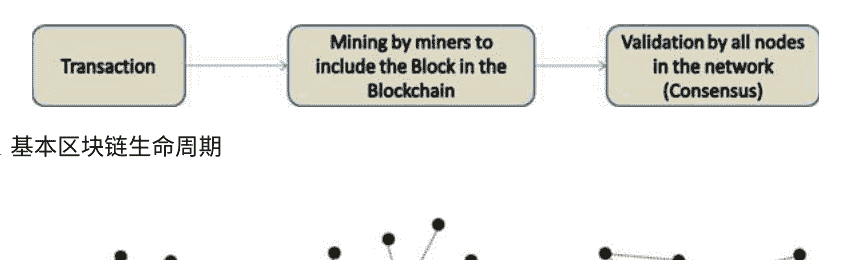

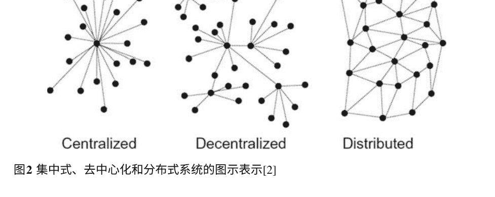表1 集中式对比去中心化对比分布式网络

|      | 集中式 | 去中心化 | 分布式 |
|------|--------|----------|--------|
| 故障 | 单点故障 | 可以容忍多个故障 | 无故障 |
| 可扩展性 | 不可扩展 | 可扩展 | 可扩展 |
| 协调点 | 单一协调点 | 多个协调点 | 无集中式协调 |

此外，基于工作证明的区块链（如比特币）的区块大小通常限制为1 MB。因此，随着交易数量的增加，会出现许多可扩展性问题，如响应时间增加、吞吐量减少和计算成本增加。因此，目前的技术可能无法满足不断增长的需求。区块链开始面临每个交易完成的等待时间增加。为了改善这些问题，有必要对网络进行可扩展性分析，并采用必要的可扩展性解决方案。

在接下来的章节中，本章讨论了区块链的基础知识、工作原理、类型和架构，以及各种区块链应用。此外，它还比较了一些共识机制，如权益证明（PoS）、工作证明（PoW）、活动证明（PoA）等，比较了能源效率、51%攻击、双重支付、区块创建速度和矿池挖矿等特性。此外，它还对模拟比特币区块链进行了可扩展性分析，并分析了区块大小、节点数量和交易费用等各种参数的影响。

### 2 区块链基础知识

本节讨论了区块链的架构、工作原理、类型、世代以及在各个领域中的应用，以及相关的工具和接口。

#### 2.1 区块链架构

一般来说，一个区块包含根据区块链的类型而定的数据，以及前一个/父区块的哈希和自己的哈希。区块按顺序添加。区块链的第一个区块[1]被称为创世区块，并且网络中的每个节点都会广播相同的创世区块。区块链的内部结构由头部和块体组成。

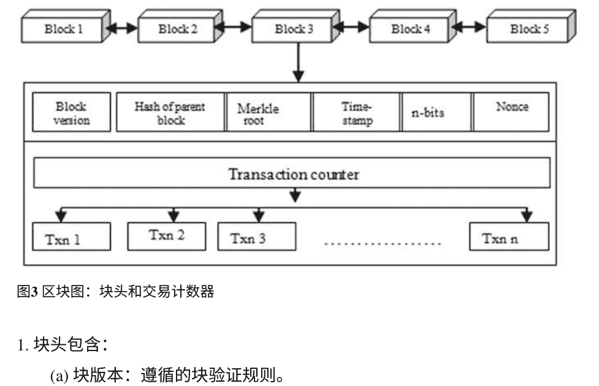

图3 区块图：块头和交易计数器

1. 块头包含：
   (a) 块版本：遵循的块验证规则。
   (b) Merkle树根哈希：所有块交易的哈希值。
   (c) 时间戳：生成块的时间。
   (d) n-bits：块的有效哈希目标限制。
   (e) Nonce：一个初始化为0并随着每次哈希计算递增的字段。
   (f) 父块哈希：指向前一个块的256位哈希值。

2. 块体[3]由交易和交易计数器组成，如图3所示。一个块可以容纳的最大交易数量取决于块的大小以及每个交易的大小。

区块链的一个基本组成部分是Merkle树。它是一种基于哈希的数据结构，也称为哈希树。Merkle树与二叉树类似，具有分支因子，即每个节点最多可以有2个子节点。每个叶节点包含交易的哈希值，每个非叶节点包含其子节点的哈希值。从叶节点开始创建二叉哈希树，如图4所示。在这里，哈希树是二进制的，需要偶数个叶节点。如果交易数量为奇数，则最后一个交易哈希会被复制一次，以获得偶数个叶节点[4]。所有叶节点被分组成对，分组对的哈希创建一个新的父块。最后，所有父节点被分组成对，重复相同的过程，直到只剩下一个节点，称为根哈希或Merkle根。Merkle根包含与交易数据相关的所有细节。为了检查特定块中是否存在任何交易，只需要Merkle根来轻松扫描所有交易。它还有助于维护数据完整性。只要交易细节或顺序发生微小变化，Merkle根就会改变。Merkle树所需的资源非常少，存储空间并且计算速度快。它执行数据验证和数据同步。默克尔树被用于各种现有的区块链，如比特币、以太坊等。

区块链技术用于网络节点之间的协议的主要机制被称为共识机制。由于区块链是一个分布式网络，没有主要实体来管理区块链账本。因此，共识机制负责确保区块链账本的有效性。一旦区块被验证，区块将被添加到区块链中。下一节将描述几种基于区块链的共识算法，以实现网络中的共识。

#### 2.2 区块链工作原理

以下步骤描述了区块链网络的工作原理：

1. 假设一个节点 k 想要将数据发送给区块链网络中的另一个节点 l。发送节点将一些交易存储到一个区块中，并将该区块广播到整个区块链网络中。
2. 网络中的其他节点将接收该区块，并尝试使用共识算法（如工作量证明、活动证明等）进行验证。为了验证交易，在区块链中使用了非对称加密机制。在非受信任的环境中可以使用非对称密码学建立数字签名。每个用户都有一对密钥，即公钥和私钥。公钥向网络中的所有其他节点进行广告宣传。用户将私钥保留给自己用于签署交易。
3. 一旦区块经过身份验证，即验证了所有正确的交易，它将附加到区块链上。接收者随后可以从区块链中检索数据，并确保数据未被篡改。

#### 2.3 区块链类型

区块链可以在更广泛的范围内分为三种类型，即公共的、私有的和联盟的[5]（图5）。在公共（无需许可）区块链网络中，任何人都可以进入，参与验证过程并访问网络。比特币、以太坊等现有的区块链网络是公共区块链网络的一些例子。然而，私有或受许可的区块链仅对成员节点开放，即只有经过区块链管理员验证的用户才能参与区块链机制。虽然任何人都可以阅读交易，但只有经过验证的用户才能参与验证过程。在某种程度上，它可以被看作是一个集中化的系统。私有区块链的一些例子包括Quorum、Blockstack和Multichain。此外，在联盟区块链（如Hyperledger和Ripple）中，任何人都可以与网络进行交互，但只有少数预定节点被允许参与验证过程。预定节点可以属于不同的实体，而不是一个实体。联盟区块链因此是部分去中心化的。

#### 2.4 区块链的发展

随着区块链被称为比特币背后的术语和核心技术，不同的区块链世代被称为：

1. 区块链1.0（加密货币）：由比特币的匿名开发者中本聪于2008年引入。这个最早的区块链世代专注于使用区块链技术实现加密货币/数字支付。该技术有助于维护数字账本，使货币无法被双重花费。加密货币的各种例子包括比特币、莱特币、瑞波币、门罗币等。
2. 区块链2.0（以太坊和智能合约）：由维塔利克·布特林于2015年引入。以太坊允许区块链开发者使用智能合约在加密货币之外的应用中使用区块链技术。智能合约类似于法律合同，但是是一段可以部署的代码，用于在各方之间执行交易。
3. 区块链3.0（其他应用）：包括健康、政府、科学等其他潜在应用领域。

#### 2.5 应用、工具和接口

区块链技术可以应用于医疗保健、金融、存储、物联网等各个领域[6, 7]。本小节讨论了区块链在不同领域的各种应用，并讨论了与区块链相关的一些工具和接口。

1. 去中心化加密货币

比特币是基于区块链技术的主要加密货币[1]。在这里，交易独立于任何中央实体，加密货币使用公钥加密等加密技术，因此用户的身份得到匿名。区块链网络中的每个节点记录和验证发生在网络上的每笔交易（工作量证明）。

2. 智能合约

智能合约是一种定义了一定规则或条件的数字交易协议。在区块链的背景下，智能合约是一种保存在区块链上的脚本形式。每个智能合约都有一个唯一的地址，并通过向其发送交易来触发。之后，智能合约在网络的每个节点上以预定义的方式独立执行[8, 9]。

3. 物联网 (IoT)

物联网具有更广泛的应用范围，例如智能电网、智能城市等。然而，不断增长的数据量引发了各种隐私和安全问题[10]，例如缺乏控制、可扩展性、访问管理等。为了克服这些问题，可以在物联网中使用区块链，从而实现完全分布式的系统以及访问控制管理[8, 9]。

4. 医疗保健

区块链现在被认为是医疗保健行业的有价值工具[11]。使用区块链技术可以实现跟踪药物、去中心化的病人健康历史记录和改进支付选项等各种任务。因此，它将有助于改变全球医疗保健行业。然而，由于数据的敏感性，医疗记录不能存储在公共区块链上。

5. 其他应用

区块链在许多领域有许多其他用例，例如身份管理[12]、审计追踪[13]、供应链、保险、预测市场、存储等。

此外，在表2[14]中提到了可以用于开发区块链应用的各种工具和接口。

## 3. 共识机制

为了在网络的节点之间达成一致，通常在区块链中采用共识机制 [15]。本节概述了一些广泛使用的共识机制及其变体，并在各种参数上进行了比较。

表2 区块链应用工具与接口

| 应用/用例 | 工具/接口 |
| --- | --- |
| 前端 | HTML, CSS |
| 后端 | Javascript, Python, C++, C# |
| 去中心化应用 | 区块链即服务, Truffle, Embark, 区块链测试网, IOTA Tangle |
| 比特币应用 | Coinbase的API, Tieron |
| 智能合约 | 以太坊（Solidity）, Serpent, Mist, Geth |
| 智能合约编译器 | Remix, Solc, Ether合约 |
| 区块链仿真器 | Ganache CLI |
| 存储 | Storj, BigchainDB, Zcash |

#### 3.1 工作量证明 (PoW)

工作量证明共识机制最初在比特币区块链中使用。它包括一个复杂的计算方案，用于验证和验证交易块。在PoW中，每个矿工都参与计算一个块的哈希值以进行验证。当计算得到的哈希值等于或小于预定义的困难值时，达成共识。首先，需要验证的块与一个随机数（nonce）一起进行哈希运算，以获得所需的输出，即具有一定数量前缀零的哈希值（n位）。如果矿工在一轮哈希运算后没有达到所需的输出，将使用多个随机数重复哈希过程。一旦其中一个矿工获得结果，所有其他矿工都会确认块验证的正确性。最后，将块添加到区块链中同时奖励计算所需哈希的矿工。示例：在比特币中，成功验证块后，矿工将获得12.5个比特币作为激励。PoW使用SHA-256哈希算法，使任何用户难以猜测随机数的值。在每添加2016个块后，PoW的难度会调整以限制新块的添加速率。

此外，在2015年，提出了一种内存绑定和可扩展的工作证明系统， Cuckoo Cycle[16]。该系统允许矿工节点成功附加区块。作者提出了一个由两个相同大小的哈希表组成的布谷鸟哈希表[17]，但使用不同的哈希函数，从而为每个哈希函数产生两个位置。在插入新键时，如果其中一个位置为空，则插入该键。然而，如果两个位置都被占用，则将新键插入第一个位置，替换旧键。然后，将被替换的键插入另一个位置，并重复相同的过程，直到找到一个空位置，或达到最大迭代次数。Cuckoo哈希函数可以创建一个称为Cuckoo图的二分图。在这个图中，顶点包含被替换的位置，而边包含被移除位置的被替换值。原始的工作证明被一个新的难题工作所取代，矿工需要猜测许多随机数，并将猜测的随机数插入哈希函数，直到创建一个具有足够迭代次数的图形。最后，矿工广播包含猜测的随机数的区块。

此外，Primecoin[18]实现了一种探索素数链的工作机制。它是一种开源的点对点加密货币。作者们提出了搜索最长素数链而不是无意义的随机数的方法。Primecoin使用双生链和Cunningham链[19]。它有三个要求，即长度大于给定值，Cunningham链形式和原始值（第一个和第二个链素数的中点）可被所需数字整除。每当一个节点广播一个区块，其他矿工使用一种叫做费马素性测试算法的算法来检查链。随着链的长度增加，找到一串素数链的任务变得指数级困难。

PoW通过要求矿工解决计算难题来防止Sybil攻击。然而，它也有一些缺点。比特币区块链中的PoW算法如下：为一个区块找到许多可能的随机数。它由许多追加轮次组成，在每一轮中，每个矿工为他们新创建的区块找到可能的随机数。如果矿工找到任何随机数，它会将区块和随机数广播给所有其他负责验证区块的矿工，并将验证的区块存储在临时数组中。随后，为该轮选择一个随机数。如果矿工的区块索引等于随机数，矿工成为该组的成员，并将区块添加到区块链中。为了控制和检查组中的矿工数量，在一定时间内对该组进行少量矿工的轮换。每一轮追加区块后，奖励均等分配给该组的矿工。然而，PoW具有以下权衡：

- Sybil攻击韧性: 不存在恶意用户攻击创建虚假节点并压制诚实节点以控制区块链的可能性。
- 激励: 激励金额取决于矿工的哈希率。
- 51%攻击漏洞: 一旦矿工开始在一个矿池中挖矿，并且他们的控制超过50%，该矿池就可以完全控制区块链以满足其恶意需求。
- 分叉创建可能性: 当两个矿工同时找到所需的随机数时，就会创建一个分叉。当一个矿工的随机数被广播到一些节点时，其他节点会得到另一个矿工的随机数，这可能导致分叉的创建。
- 计算时间和效率: 共识机制需要更长的计算时间，即每个区块需要10分钟。此外，PoW的能源效率低。

#### 3.2 权益证明 (PoS)

由于PoW在计算上具有困难，并且耗时和耗能，因此在文献中提出了一种叫做权益证明（PoS）的替代机制。PoS更加能源高效，因为该方案不需要所有矿工计算哈希值。在PoS中，权益（份额百分比）用于决定下一个区块的矿工，即拥有1%比特币的节点只能挖掘1%的PoS区块。此外，PoS对攻击更具弹性。为了进行攻击，恶意用户需要拥有最大的权益份额，即超过总份额的50%。

Nxt [21]，一种加密货币和支付平台，使用纯权益证明共识机制。在这种情况下，如果矿工拥有更多的权益，他就有更多的机会添加一个区块。假设矿工A拥有'm'个硬币，而所有矿工总共拥有'n'个硬币，其中 m < n，那么矿工A的挖矿机会为 m/n。每隔60分钟，根据矿工的权益随机选择一个矿工。一旦选择矿工来挖掘一个区块，矿工将验证所有新添加的交易并将它们存储到一个区块中。之后，矿工广播新创建的区块并获得回报。此外，在2016年，作者提出了一种方法，矿工不仅可以基于权益的基础上有机会添加一个区块，还可以基于区块状态的基础上[22]。作者还提出了跟随Satoshi的方法。货币的最小单位，Satoshi的价值，已被考虑在内。Satoshi指数，介于0和总Satoshi之间，作为跟随Satoshi方法的输入。之后，基于Satoshi指数，矿工将找到区块的Satoshi。为了找到一个新的矿工（给定Satoshi的最后所有者），将找到所有与给定Satoshi相关的交易。所使用的哈希函数需要三个输入来选择Satoshi。第一个输入是一个函数返回的值，第二个输入是区块链中的总块数，第三个是一个随机整数。对于无法创建区块的选定Satoshi，作者提出了一个解决方案。提出的解决方案是，如果连续三次选择Satoshi后仍无法创建新的区块，则将选定的Satoshi列入黑名单。

后来，在2014年，作者们不再使用股份来获得挖掘新区块的机会，而是使用股份进行投票，称为委托权益证明[23]。在这里，拥有股份的节点将为见证人或代表进行投票，代表被称为负责交易验证的矿工。如果一个节点拥有足够大的股份，分配给代表的投票权将更强大。

随后，成立了一个验证委员会。委员会内的代表验证交易，并且产生新的区块，无论是有效还是无效。代表的角色，基本上，一个矿工在委员会内轮流保持公平性保护。所提出的方法以2秒的顺序创建一个新的区块。如果证人无法产生一个区块，则被从委员会中移除。否则，区块被添加到链中，并且证人得到回报。PoS具有以下权衡：

- 与PoW相比，能源消耗较低。
- 在决策方面高效，即计算时间较短。
- 51%攻击具有抵抗性，因为矿工需要掌握51%的区块链股份。
- 较大的系统具有51%攻击的防护能力，而较小的网络则容易受到51%攻击。这反过来导致中心化和由选定实体完全控制区块链。

#### 3.3 活动证明（PoA）

PoA是一种混合共识机制[24]，结合了PoW和PoS。它的工作原理如下：首先，矿工们在共识中生成一个空块，即一个只有前一个块哈希而没有任何交易细节的块头。其次，矿工猜测空块的随机数。一旦找到某个随机数，矿工就会将空块广播给其他负责接收块并进行验证的矿工。上述步骤遵循工作证明，然后由权益证明机制进一步处理。

在验证和验证过程中，每个矿工都会检查自己是否是具有更高权益的利益相关者。利益相关者即第N个矿工将生成一个由空块和多个交易以及N-1个矿工的签名和他自己的签名（第N个矿工）组成的块，以创建完整块的哈希。然后，第N个矿工将块广播到网络上，并将块附加到区块链上。为了保持公平，利益相关者和N个矿工都会获得相等的激励[24]。此外，为了减少流量，第N个矿工将交易列表添加到空块中。从防止双重支付问题的角度来看，权威证明更加高效。表3根据某些方面比较了三种共识机制。权益证明是为了解决工作量证明算法的缺点而引入的，例如51%攻击、能源效率低等。大多数区块链应用都是基于工作量证明和权益证明。新的共识机制，例如活动证明（PoA），通常使用工作量证明和权益证明设计[26]。

表3 共识机制比较

| 参数 | 工作量证明 | 权益证明 | 权威证明 |
|------|------------|----------|----------|
| 能源效率 | 否 | 是 | 否 |
| 51%攻击 | 是 | 不会在较大的网络中发生但在较小的网络中可能发生 | 是 |
| 分叉创建 | 是 | 非常困难 | 可能的 |
| 双重支付 | 是 | 困难的 | 是的（对比工作量证明影响较小） |
| 区块创建速度 | 低 | 快 | 低 |
| 矿池挖矿 | 是的（容易预防） | 是的（难以预防） | 是 |
| 例子 | 比特币 [1] | 以太坊 | 点对点币 [25] |

## 4. 区块链的可扩展性分析

近年来，加密货币和区块链获得了巨大的流行，尽管最初的范围并不广泛。随着交易数量的增加，许多问题出现，如响应时间增加、吞吐量减少和计算成本增加。因此，目前的技术可能无法满足不断增长的需求。以太坊和比特币都使用区块来存储和处理交易。然而，区块的最大大小（比特币为1MB）最初是有限制的。尽管限制大小是为了使比特币更加安全，但也导致了可扩展性问题[27]。众所周知，随着区块链中的每一笔交易，数据变得越来越庞大。因此，每个区块只有1 MB的情况下，一次只能处理很少的支付，从而导致性能不佳。此外，比特币的吞吐量为每秒三到四笔交易。

然而，为了在物联网、医疗保健等领域实施区块链，每秒处理大量交易而没有任何延迟变得至关重要。以太坊也存在类似的问题，即网络的最大容量为每秒15笔交易。在这里，通过提高可扩展性可以增加每秒交易数。加密货币中的主要可扩展性问题如下：

- 延迟：即记录交易在一个区块中所花费的时间。
- 共识时间：即达成最终共识所花费的时间。

本节涵盖了与区块链相关的可扩展性可能性，通过彻底分析那些使其在某种程度上不可扩展的因素。各种因素，如区块大小、区块间隔、吞吐量和交易费用等，都会影响区块链的性能以及其安全性。它们彼此相关。

此外，还经常讨论各种区块链技术的可扩展性限制。影响区块链可扩展性的几个系统参数如下所述：

1. 区块间隔：它定义了延迟，即将数据记录在区块链的一个区块中所花费的时间。区块间隔与交易确认时间成反比，即较小的区块间隔将导致更快的交易确认。因此，产生陈旧区块的概率变得更高。在PoW区块链中，区块间隔的变化与难度直接相关。

如前所述，低难度会导致网络中的区块数量增加，而高难度会导致相同时间间隔内的区块数量减少。因此，分析难度变化如何影响基于PoW的区块链的安全性非常重要。

2. 区块大小：它定义了一个区块中存储的交易数量。如前所述，比特币的区块大小固定为1MB，因此一个区块最多可以存储2400个交易，即每秒7个交易，而像Visa这样的支付平台每秒处理超过6000个交易。

为了使基于PoW的区块链能够与Visa等支付平台相匹配，需要分析各种因素，如区块大小。通过增加区块大小可以实现这些交易数量。然而，增加基于PoW的区块链的区块大小会带来一些相关的权衡。

- 增加区块大小需要大量的能源消耗来存储区块中的交易并挖掘该区块。
- 增加区块大小会导致较大的区块在先前的网络带宽上传输。因此，网络传播时间增加，速度减慢。
- 增加区块大小会导致陈旧区块的概率增加。

因此，区块大小控制着网络的吞吐量。此外，较大的区块导致传播速度变慢，因此陈旧区块率增加，区块链的安全性减弱。

3. 交易费用：在基于PoW的区块链中，当用户创建一个交易时，它包含一个交易费用，该费用由将该交易添加到区块链中的矿工收取。对于不带费用的交易，矿工没有奖励将其存储在区块中。由于PoW区块链中的区块大小是固定的，它也限制了一个区块可以容纳的交易数量。因此，矿工选择具有较高费用的交易。交易费用直接影响确认时间。因此，具有较小费用的交易具有较长的确认时间，而较高的交易费用则导致较短的确认时间。然而，4. 节点数量：网络中节点数量的增加对交易速率即每秒交易数（tps）几乎没有影响，因为每个节点独立处理交易。与其影响交易速率，它对网络的延迟有影响，因为带有交易的区块需要更多的跳数才能在整个网络中传播。

5. 矿工数量：对交易确认时间几乎没有影响。然而，随着矿工数量的增加，陈旧区块率也逐渐增加。当一个区块被多个矿工挖掘时，每个人都会通过网络传播挖掘的区块，以确保其他矿工知道谁最先挖掘了该区块以添加到区块链中。由于多个矿工传播了挖掘的区块，节点可能会收到不同的区块，这会导致区块链中出现分叉。由于基于PoW的区块链在一定时间后丢弃分叉，始终选择最长的分叉，这将导致废弃区块的增加。因此，矿工数量的增加将增加陈旧区块率，并可能导致双重待定攻击。

#### 4.1 模拟细节

本节讨论通过模拟基于PoW的区块链来分析可扩展性问题的过程。这里的问题是“为什么不能在真实的区块链上进行模拟？”答案是由于巨大的利用率和更高的计算成本，研究和分析真实的基于PoW的区块链的行为是困难的。因此，模拟是分析区块链性能的可行选择，取决于各种参数。这个模拟基于一个现有的框架[15]，在其中进行了一些更新和添加了一些功能，以支持基于PoW的区块链的可扩展性分析。在我们的方法中，我们舍弃了网络延迟以及所有网络。分析和硬件配置的各种参数分别在表4和表5中提到。

在这里，我们分析了上述参数，如区块大小、区块数量等，并研究了它们对交易确认时间和区块确认时间的影响。伪代码1展示了根据交易费用生成交易并将其添加到一个区块中的伪代码。

表4 可扩展性分析参数

| 参数 | 描述 |
|------|------|
| 交易费用 | 给矿工的费用以确认交易 |
| 区块大小 | 以字节为单位的区块大小 |
| 交易确认时间 | 交易被添加到确认块中所需的时间 |
| 交易数量 | 根据区块大小而定的块中的交易数量 |
| 区块数量 | 在一定时间内挖掘的区块数量 |
| 矿工数量 | 负责挖矿的矿工数量，如果数量庞大，可能会 |
| 区块生成时间 | 将区块添加到区块链所需的时间 |

表5 硬件配置

| 硬件配置 | 值 |
|----------|----|
| 操作系统 | Ubuntu 18.04.2 |
| 模拟器 | ns3.29 |
| 处理器 | Intel(R) Xeon(R) W-2155 CPU @ 3.30 GHz 3.31 GHz |
| 内存 | 64.0 GB RAM |

```
Pseudocode 1: Transactions (N, S)

Q = ∅                            // Q is the priority queue
Total_size = N * S               // N is the number of blocks and S is the block size
while Total_size > 0:
    Transaction t = new Transaction
    t.startTime = currentTime()
    Q.enqueue(t, t.fee)
    Total_size = Total_size - t.size
//Add Block to Blockchain
while N > 0
    c = 0
    Block b = new Block;
    while c < S
        t = Q.dequeue
        b.add(t)
        c = c + t.size
    Mine block
    Add Block to Blockchain
    for each Transaction t in Block b:
        t.finishTime = currentTime()
for each Transaction:
    Print Confirmation time
```

在这里，Q根据交易的增加顺序维护交易费用。交易费用是通过使用方程式1隐式计算的。

> 总交易费用 = (a * 180 + b * 34 + 10) * 1聪 (1)

在这里，a和b分别是随机生成的输入和输出的数量，范围在1-5之间。对于总费用的计算，我们将基本费用视为1聪，相当于0.00000001 BTC。

#### 4.2 模拟结果

由于区块链是模拟的，因此模拟结果比实时区块链快得多。模拟是根据不同的参数运行的，然后根据模拟结果得出结论。

- (1) 节点的影响: 在这里，我们研究了节点数量对工作量证明区块链的块确认时间和块传播时间的影响。为此，模拟器运行了不同数量的节点，范围从100到6000个节点。每个模拟运行1000个连续的1 MB大小的区块。首先，观察到在1000个节点之前，块确认时间迅速增加，在1000个节点之后，呈线性增加（图6）。

其次，观察到在700个节点之前，块传播时间迅速增加，达到峰值，而在第700个节点时，时间突然减少到1400个节点。之后，时间缓慢减少，在第2500个节点之后，时间逐渐稳定（图7）。因此，从模拟中观察到，随着节点数量的增加，块确认时间呈线性增加，而块传播时间在增加和减少后逐渐稳定。

- (2) 块大小的影响：在这里，研究了块大小对工作量证明区块链中块确认时间和交易数量的影响。为此，模拟器运行了不同块大小的范围，从1 KB到8 MB。首先，从模拟中观察到，随着块大小从1 KB增加到1 MB，交易数量也呈线性增加（图8）。其次，观察到随着块大小的增加，块确认时间在4 MB之前几乎保持恒定，时间增长缓慢。在4 MB之后，在8 MB块大小之前，确认时间增长非常缓慢，而在8 MB块大小之后，确认时间迅速增长（图9）。

- (3) 交易费用的影响：在这里，我们研究了交易费用对工作量证明区块链中交易确认时间的影响。为此，模拟运行了8 MB块大小，并根据交易情况进行了趋势分析。已经进行了趋势分析。观察到交易费用越低，交易确认时间越长（图10），反之亦然。并不是每次交易费用与交易确认时间成反比。在模拟研究中，我们发现有些情况下，较低的费用意味着较短的时间，而较高的费用则意味着较长的时间。因此，如果用户支付更高的交易费用，获得交易确认的机会就会更高[28]。

### 5 结论

区块链是一种快速发展的技术，被应用于医疗保健、物联网、供应链、保险等多个领域。它提供了去中心化的分布式点对点网络，同时实现了无信任的节点间交互。本章详细讨论了区块链的基础知识、架构、类型、世代以及各种应用领域。此外，为了成功实施区块链，需要高效的共识算法和混合协议。本章介绍了区块链使用的各种共识技术，如PoW、PoS和PoA，并对它们在能源效率、51%攻击等各个方面进行了比较。观察到，相比其他共识机制，PoW在安全性方面更加高效。它被广泛应用于比特币的共识机制。此外，需要注意的是，随着交易数量的增加，区块链的可扩展性变得不可行。因此，本章对基于PoW的区块链（模拟比特币区块链）进行了可扩展性分析。模拟结果表明，交易费用越高，交易确认时间越短。此外，随着区块大小的增加，一个区块中的交易数量也增加，而每个8 MB区块大小后，区块确认时间呈指数增长。最后，结果还表明，区块链网络中节点数量的增加对性能有影响。可扩展性问题可以通过不同的解决方案来解决，如分片、闪电网络等。[29]

### 参考文献

- 1. 中本聪, S.: 比特币：一种点对点的电子现金系统。 分散式公交车评论21260 (2008年)
- 2. 霍夫曼, E., 斯特鲁, U.M., 博西亚, N.: 背景III-什么是区块链技术？ 在：供应链金融和区块链技术，第35-49页。Springer (2018年)
- 3. 阿里, O., 贾拉达特, A., 库拉克利, A., 阿布哈利默, A.: 比较研究：区块链技术利用好处，挑战和功能。 IEEE Access 9, 12730-12749 (2021年)
- 4. 加雷瓦尔, K.S.: 默克尔树。 在：实用区块链和加密货币，第137-148页。Springer (2020年)
- 5. 尼兰贾纳穆尔蒂, M., 尼蒂亚, B., 贾加纳塔, S.: 区块链技术分析：优势，劣势和SWOT。 集群计算。 22, 14743-14757 (2019年)
- 6. 郭, Y.-M., 黄, Z.-L., 郭, J.等：区块链的文献计量分析和可视化。 未来。 计算机系统 116, 316-332 (2021年)
- 7. Malhotra, D., Saini, P., Singh, A.K.: 区块链如何自动化KYC：系统性回顾。 无线。 个人通信。 1-35 (2021年)
- 8. Novo, O.: 区块链与物联网相遇：物联网可扩展访问管理架构。 IEEE物联网杂志 5, 1184-1195 (2018年)
- 9. Christidis, K., Devetsikiotis, M.: 区块链和智能合约用于物联网。 IEEE Access 4, 2292-2303 (2016年)
- 10. Dorri, A., Kanhere, S.S., Jurdak, R.: 面向物联网的优化区块链。 在：2017年IEEE/ACM第二届国际物联网设计和实施会议（IoTDI），第173-178页（2017年）
- 11. Mettler, M.: 区块链技术在医疗保健领域的应用：革命由此开始。 在：2016年IEEE第18届国际电子健康网络、应用和服务会议（Healthcom），第1-3页（2016年）
- 12. Yasin, A., Liu, L.: 一种在线身份和智能合约管理系统。 在：2016年IEEE第40届计算机软件和应用会议（COMPSAC），第192-198页（2016年）
- 13. Malhotra, D., Srivastava, S., Saini, P., Singh, A.K.: 基于区块链的XAI决策审计追踪：存储在IPFS和以太坊区块链上。 在：2021年国际通信系统和网络会议（COMSNETS），第1-5页。IEEE（2021年）
- 14. Bahga, A., Madisetti, V.: 区块链应用：实践方法（2017年）
- 15. Rebello, G.A.F., Camilo, G.F., Guimaraes, L.C.等：关于基于证明的共识协议的安全性和性能。 在：2020年第四届云计算和物联网会议(CIoT)，第67-74页(2020年)
- 16. Tromp, J.: Cuckoo循环：一种内存硬证明工作系统。 IACR Cryptol ePrint Arch 2014, 59 (2014)
- 17. Pagh, R., Rodler, F.F.: 杜鹃哈希。 J. Algorithms 51, 122-144 (2004)
- 18. King, S.: Primecoin：具有素数工作证明的加密货币(2013)
- 19. Hardy, G., Littlewood, J.: 坎宁安链(2020)
- 20. Tang, S., Liu, Z., Chow, S.S.,等：无分叉的混合共识与广义证明-活动。 IACR Cryptol ePrint Arch 2017, 367 (2017)
- 21. Nxt维基（2020年）。 https://nxtwiki.org/wiki/Whitepaper:Nxt。 于2021年5月15日访问
- 22. Bentov, I., Gabizon, A., Mizrahi, A.: 无工作证明的加密货币。 在：国际金融密码学和数据安全会议，第142-157页。Springer (2016年)
- 23. Yang, F., Zhou, W., Wu, Q.等：带降级的委托权益证明：一种具有降级机制的安全高效的区块链共识算法。 IEEE Access 7, 118541–118555 (2019年)
- 24. Bentov, I., Lee, C., Mizrahi, A., Rosenfeld, M.: 活动证明：通过权益证明扩展比特币的工作证明。 ACM SIGMETRICS Perform. Eval. Rev. 42, 34-37 (2014年)
- 25. King, S., Nadal, S.: PPCoin：具有权益证明的点对点加密货币（2012年）
- 26. Bamakan, S.M.H., Motavali, A., Bondarti, A.B.: 区块链共识算法调查 性能评估标准. 专家系统应用. 113385 (2020)
- 27. Chauhan, A., Malviya, O.P., Verma, M., Mor, T.S.: 区块链与可扩展性. 在: 2018 IEEE 国际软件质量、可靠性和安全性会议附属会议 (QRS-C), pp 122–128 (2018)
- 28. Kasahara S, Kawahara J (2016) 比特币交易确认过程中的费用影响. arXiv Prepr
- 29. Zhou, Q., Huang, H., Zheng, Z., Bian, J.: 区块链可扩展性解决方案: 一项调查. IEEE Access 8, 16440–16455 (2020)

## 智能合约：进入现代数字世界的一种方式

A. D. N. Sarma

摘要 本章介绍了一个包括传统合同制度及其局限性的背景的引言。 在过去的五四年里，许多企业、组织、政府和社区都非常关注区块链技术，因为它开辟了一种被称为智能合约的法律合同的新模式。 智能合约是比特币之后的区块链技术的一个应用，它可以在数字经济中找到广泛的潜在应用，包括金融、保险、医疗保健、供应链、贸易、商业、零售和物联网，将世界转变为现代数字世界。 区块链技术使我们能够从开始到结束以数字方式执行、维护和监控合同系统的流程。 此外，解释了智能合约在现代数字世界中的重要性。 此外，简要解释了什么是智能合约，并提到了智能合约的要素。 此外，提及了各种智能合约技术平台的演变。 此外，介绍了智能合约的生命周期，并解释了每个阶段的功能。 此外，简要介绍了智能合约的主要特点和好处。 此外，提到了开发智能合约面临的三个挑战。 最后，讨论了智能合约可能的未来趋势和方向。 还提供了其他阅读材料，如相关书籍和论文，以深入探讨智能合约。

**关键词** 区块链 · 区块链平台 · 区块链类型 · 去中心化 · 数字身份 · 分布式账本 · 智能合约要素 · 超级账本框架 · 链下和链上 · 记录保留 · 自动执行条款和条件 · 智能合约生命周期 · 智能合约类型 · 第三方

目标
本章的目标是通过区块链提供智能合约的整体视图。 此外，提供现有法律合同的概念视图及其主要限制。 此外，介绍智能合约，智能合约的主要要素及其在现代数字世界中的重要性。 此外，为了提供理解智能合约系统所需的背景，包括什么是法律合约，以及如何将法律合约转变为现代数字世界中的智能合约。 提供构成智能合约框架和智能合约的生命周期的关键要素。 提及智能合约的关键特征、优势和挑战。 此外，提及基于区块链的智能合约开发中的三个挑战，并讨论未来的趋势和方向。

### 1 引言

在过去的五年中，许多企业、组织、政府和社区都非常关注区块链技术，因为它为法律合约开辟了一种新模式。 区块链技术使我们能够从开始到结束执行、维护和监控合约系统的流程。 术语智能合约主要指的是法律合约的自动化[1]。 更准确地说，智能合约可以被视为法律合约的数字版本。 从技术上讲，智能合约这个术语指的是在区块链平台上执行的一段软件代码。

一般来说，传统合同是在法律顾问的协助下由两个或多个当事方之间达成的，并转化为一份法律文件，通常称为合同。 这份合同文件是合同当事方之间的具有法律约束力的协议。 在商业中，合同往往涉及超过两个当事方。 主要的，任何合同都可以包括以下组成部分：当事方的详细信息、期限、货物或服务的价值以及条款和条件。 合同根据合同中规定的条款和条件执行，然后合同终止，而在其他情况下，合同可能进入维护阶段并持续多年。 合同的条款和条件需要在合同有效期内进行持续监控，这意味着需要监控合同的服务水平协议（SLA）以交付货物或服务。

在合同的维护阶段，如果合同的条款和条件得到正确履行，那么这样的合同可以被视为符合正式要求，否则合同可能变得不符合要求。 由于任何原因，当事方之间的合同义务无法履行，比如说支付结算超过规定时间，这意味着当事方之间存在合同义务的偏差。 此外，当合同的条款和条件未得到履行时，当事方之间的赔偿事项将会出现，如罚款、利息等，这将作为一个单独的解决过程。 传统合同系统存在以下几个限制： (i) 合同的手动处理， (ii) 在准备合同过程中法律咨询的角色， (iii) 缺乏实时结算， (iv) 在不符合要求的情况下完成交易时可能涉及很多摩擦， (iv) 在法律解决过程中需要第三方的参与， (v) 在结算执行过程中存在长时间延迟，(vi) 合同的精神可能会被稀释，这可能导致双方之间的争议。

Hyperledger Fabric是最受欢迎的许可区块链平台之一，它是由Linux基金会开发的开源平台。这些平台可以使我们构建从小型和中型到企业规模的多个应用程序。Hyperledger [2, p. 37]将智能代码的术语描述为链码，其中包括一组规则，确定合同各方如何相互交互。在协议（或合同）中，只要满足预定义的规则，协议就会自动执行，这是最纯粹的分散式自动化形式。智能合约代码负责促进、验证和执行交易或协议的谈判或履行。在本章中，作者重点介绍了基于Hyperledger Fabric区块链平台的智能合约方法。

在文献中，“数字世界”一词有许多含义。它被描述为“一个由数字系统和当代社会中新兴技术构成的数字技术世界”。在[3]中，数字世界一词被定义为在互联网上进行通信、使用数字工具、数字设备、智能设备和其他技术的可用性和使用。在本文中，“数字世界”一词是指利用新兴技术构建基于分布式账本技术（广义上的区块链）的智能合约，以造福现代社会的用户、组织和政府。

- (a) 合同过程完全数字化
- (b) 通过高效管理合同生命周期使合同过程智能化
- (c) 改善商业透明度[4]
- (d) 提高速度和准确性[5]
- (e) 降低交易成本[6]和执行速度
- (f) 减少对法律等中间人的依赖
- (g) 参与者之间的信任[5]
- (h) 开发新的商业模式[6]

从而提高组织的价值生成能力。目前关于区块链技术及其应用（如智能合约）的经济研究文献相对较少。最近的一项研究[6]展示了区块链技术如何塑造数字平台的创新和竞争。此外，该研究描述了两个受区块链技术影响的成本。这些成本包括

- (i) 验证成本
- (ii) 网络成本

验证成本与廉价验证交易状态的能力有关，而网络成本则指在不将控制权交给中心化中介的情况下引导和运营市场的能力。

这些成本对数字平台的设计和效率有着重要影响，并为数据所有权、隐私和许可证的新方法，数字内容的货币化，拍卖和声誉系统提供了机会。成本的降低是以增加市场力量和平台运营商对数据访问的代价为代价的。根据市场报告[7]，预测显示全球区块链技术收入将在未来几年内经历巨大增长，市场规模预计到2025年将超过390亿美元。

### 2 背景

在本节中，简要介绍区块链的背景知识。这包括对中心化计算和点对点网络等各种计算类型的解释。此外，简要介绍分布式账本的概念，并提及各种类型的区块链网络。此外，解释区块链中链上和链下交易的工作原理。此外，简要概述了区块链中的交易验证机制。

在章节结束时，提供了额外的阅读材料，其中列出了更深入探讨智能合约的相关标准、书籍和论文的参考资料。

#### 2.1 集中式计算系统

在20世纪70年代初，互联网的概念引导了网络技术的出现，这将传统的客户-服务器系统架构转变为集中式架构。在这种环境中，所有的计算都在一个特定的计算机上进行，这个计算机被称为专用服务器，用于处理数据。此外，存储和网络资源也集中在服务器基础设施中，如图1所示。

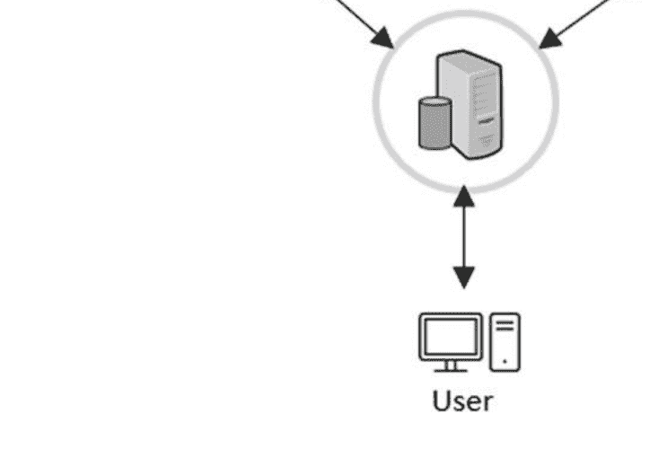

这些系统的优点是设计简单，易于维护，并且可以通过增加计算资源来扩展，以满足应用程序的工作负载。大多数网络应用程序使用集中式数据库（或账本）构建，这使其更容易受到网络攻击和欺诈的威胁，因为它具有单点故障。在分布式环境中，计算被分布到多台计算机上，它们联合起来解决任务，与集中式系统不同。

#### 2.2 点对点网络

在点对点（P2P）网络架构中，计算机（或节点）通过互联网相互连接，这是分布式应用架构的一个例子。图2显示了一个简单的P2P网络。在这个网络中，每个节点都是平等的，工作负载分布在各个节点上。加入P2P网络的两个主要要求是：（一）互联网连接和（二）P2P软件。市场上常见的P2P软件有Acquisition、BearShare、Kazaa、Limewire和Morpheus等。当网络中的所有节点不一致时，这样的网络被称为无组织的P2P网络。P2P网络更容易受到安全攻击，因为节点可以交换数据。因此，参与节点在网络中路由流量，这为安全攻击打开了机会。

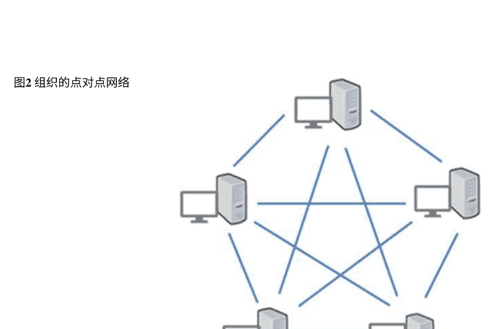

#### 2.3 分布式账本

单词账本指的是一组被描述为交易数据记录集合的文件。通常，账本可以被描述为一个数据库，一个存储在存储介质中的文件集合，以良好管理的方式提供数据的访问、检索和使用。分布式账本是一个数字记录系统，通常被称为共享账本或分布式账本技术(DLT)。在这种情况下，账本被分布、共享并在网络中的节点之间同步，供用户访问。区块链网络上的所有节点都相互连接。每台计算机在区块链网络中都维护着账本的副本，与其他节点上的账本进行同步。区块链是分布式账本的一种类型[8]。分布式账本使用独立的计算机(称为节点)来记录、共享和同步各自的电子账本中的交易(而不是像传统账本那样将数据集中存储)。此外，数据以块的形式在区块链中组织，这些块通过加密哈希链接和保护。区块链技术通常被分布式账本技术使用，它使各方之间能够进行安全的交易，无需中介机构，不同于集中式系统。

#### 2.4 区块链

近年来，区块链作为一种新兴的颠覆性技术，在学术界、商业界、工业界、政府界和研究与开发界引起了越来越多的关注。它诞生了比特币，这是一种没有中央银行或单一管理者的去中心化数字货币，它使用了智能合约的概念。自诞生以来，智能合约的使用不仅局限于加密货币应用，还扩展了其功能以开发通用应用。这些应用涵盖了银行、金融、保险、医疗保健、贸易与商业、政府等多个领域。

##### 2.4.1 区块链的定义

根据[9]，区块链是以分布式方式实现的不可变数字分类帐系统，意味着没有中央存储库，通常也没有中央权威机构。在其最基本的层面上，它们使用户社区能够在对该社区公开的分类帐中记录交易，以便一旦发布，就无法更改任何交易。

根据[10]，区块链最好被理解为一种新的制度技术，它使得新类型的合同和组织成为可能。通过节约交易成本，实现了经济组织和治理的高效制度结构。

根据[10]，交易成本的降低导致了一种高效的经济组织和治理的制度结构。

根据[11]，区块链允许共同利益的不信任方共同创建一种永久、不可更改和透明的交换和处理记录，而无需依赖中央机构。

##### 2.4.2 智能合约的定义

以下是各种实践专业人士、行业专家和学者对智能合约的几个定义。

根据[5]，智能合约只是存储在区块链上的程序，在满足预定条件时运行。它们通常用于自动化协议的执行，以便所有参与者可以立即确定结果，而无需任何中介的参与或时间损失。它们还可以自动化工作流程，在满足条件时触发下一步操作。在最基本的层面上，它们是由开发人员按照设定运行的程序。

根据[12]，智能合约通过可执行代码定义了不同组织之间的规则。应用程序调用智能合约生成交易，这些交易被记录在账本上。简而言之，智能合约定义了可执行逻辑，生成新的事实并添加到账本中。

智能合约的术语[13]定义为设计用于自动促进、验证和执行数字合约的计算机协议，无需中央机构。

根据[14]，基于区块链的智能合约或简称智能合约是一种旨在满足特定条件时直接在用户之间数字化促进协商或合同条款的计算机程序。

##### 2.4.3 区块链系统的概念视图

图3显示了区块链网络系统的概念视图。这种网络系统的重要组成部分包括节点、账本、矿工和共识。它基本上是由节点的对等网络（P2P）组成的。节点本质上是一台计算机系统，它维护着一个分布式账本的副本和一个称为链码的智能合约应用程序，该应用程序作为用户可使用的智能合约服务的应用软件。用户将发起一笔交易，这是区块链系统的最小构建块，这些交易被分组在一个预定义的数据结构中，称为区块，并且这些区块分布在P2P网络中的所有节点上。这里的链是按特定顺序排列的一系列区块，而矿工验证新的交易并将其记录在全局账本上。矿工通过一种称为挖矿的过程在链上创建新的区块。共识是一种机制，由一组规则和安排组成，用于执行区块链操作。

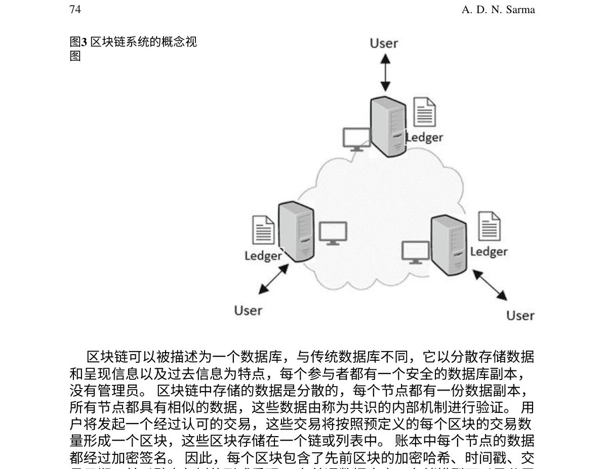

区块链可以被描述为一个数据库，与传统数据库不同，它以分散存储数据和呈现信息以及过去信息为特点，每个参与者都有一个安全的数据库副本，没有管理员。区块链中存储的数据是分散的，每个节点都有一份数据副本，所有节点都具有相似的数据，这些数据由称为共识的内部机制进行验证。用户将发起一个经过认可的交易，这些交易将按照预定义的每个区块的交易数量形成一个区块，这些区块存储在一个链或列表中。账本中每个节点的数据都经过加密签名。因此，每个区块包含了先前区块的加密哈希、时间戳、交易日期，并以默克尔树的形式重现。在普通数据库中，存储模型可以是分层、网络和面向对象的，而区块链使用链表（或一系列区块）的数据存储结构，以平面文件的形式。有向无环图（DAG）使用树结构来存储数据。在DAG中，没有交易区块，但是单个交易与多个其他交易相关联，就像一棵树一样。区块链存储数据库的例子有比特币、以太坊、莱特币等，而DAG的例子有Iota、Byteball、Nano（以前称为Railblocks）、XDAG、NXT和Orumesh。此外，其他存储模型还有Hashgraph、Hallochain和Tempo等。基于Tempo的区块链的例子是RadixDLT。在一项研究[13]中，提出了一个智能合约框架，涉及六个层次，即基础设施、合约、运营智能、表现和应用层。基础设施层处理与可信开发、执行和可信数据源相关的活动，通常称为Oracles。合约层处理静态合约数据、合约条款、场景响应规则和交互准则。此外，合约层涵盖了关于合同调用、执行和通信的规则，作为智能合同的静态数据库。操作层封装了对静态合同的动态操作，包括机制设计、形式验证、安全分析和自毁。智能层封装了各种智能算法、学习和决策，结果将反馈给合同层和操作层，以优化合同设计和操作，实现真正的“智能”合同。表现层封装了智能合同的各种表现形式，用于潜在的应用，包括DApps、去中心化自治组织、公司和社会。应用层维护了建立在表现层之上的所有智能合同应用程序。

在一项研究[15]中，提出了一个基于区块链的智能合同分类法，重点关注智能合同改进（即解决智能合同安全、隐私和性能问题）和智能合同使用（即解决特定领域问题），如图4所示。

在一项研究中[16]，概述了基于区块链的面向服务的计算范式。该研究确定了智能合约的面向服务架构（SoA）解释与传统Web服务技术之间的类比和差异。

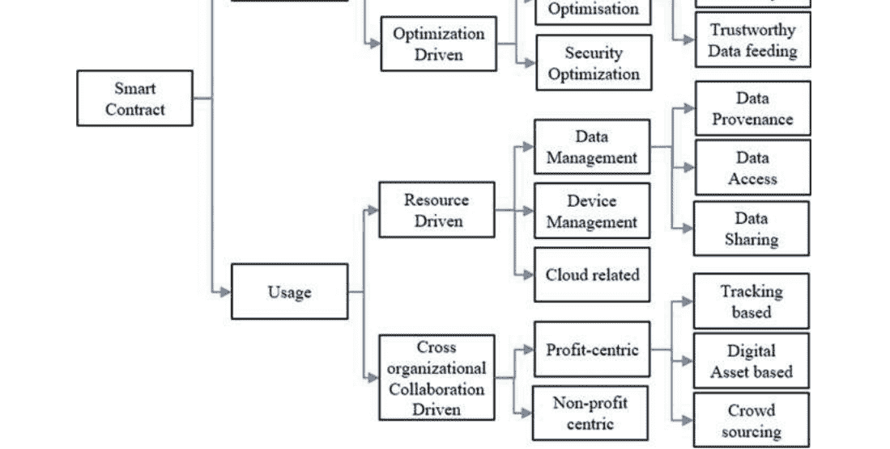

图4 区块链智能合约的分类法（来源 [15]）

该研究提到了以太坊智能合约中实现SoA所面临的各种挑战，如搜索、发现和重用、成本意识、互操作性和标准化以及性能。

#### 2.5 链上和链下交易

在区块链平台上执行的链上交易是公开的，这意味着交易的详细信息对网络中的参与者可见。因此，区块链网络的用户可以看到所有交易的详细信息。因此，智能合约的链上交易没有隐私可言。这些交易大多是结构化数据，如字符、数字格式。在区块链网络中执行这些交易所需的时间取决于交易的数量和网络中的节点数量。随着网络中节点数量的增加，交易时间会增加，因为网络拥堵会导致交易延迟。此外，在公共区块链网络中，矿工完成交易所需的时间更长。链上交易不仅需要更高的计算资源，还需要时间，这会大幅增加交易成本。为了降低交易成本并为交易提供隐私[17]，引入了链下交易的概念。

离链交易发生在区块链平台之外，对公众不可见。这些交易可以在传统数据库中进行，而且没有延迟。因此，离链交易比链上交易快得多。此外，这些交易不能被撤销，因为它们不在区块链中。通常，这些交易将存储在第三方服务器中，这不是一个分散存储系统，并且这些交易通过指针指向区块链。这也可以称为“预言机数据”。离链交易大多是非结构化的，如Word文档、图像、对象、PDF文件、电子邮件、网页、音频和视频文件。在少数情况下，链上和离链的特性可以结合使用，设计一个可扩展的区块链系统，以在区块链网络的各方之间实现必要的检查和平衡，以降低交易成本并提高数据的隐私，这被称为混合链。

#### 2.6 区块链的类型

分布式账本和区块链这两个术语经常被互换使用，但是它们之间有区别。区块链是分布式账本的一个子集，而分布式账本是建立在分布式数据库之上的。从最终用户的角度来看，区块链可以分为公共和私有两种类型，而根据网络基础设施，区块链可以分为三种类型，即许可、无许可和混合。图5展示了不同类型的区块链网络。在无许可区块链中，任何人都可以成为区块链的验证者，而在许可区块链中，只有指定的（或预选的）参与方可以验证交易。

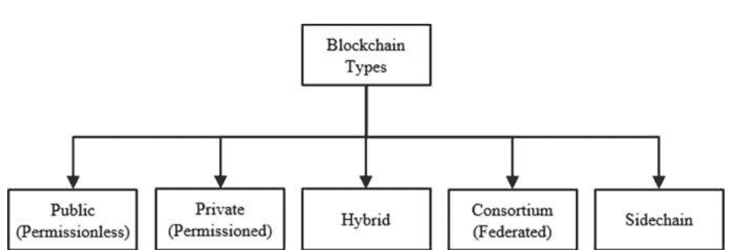

##### 2.6.1 公共区块链

公共区块链对用户没有任何访问限制。参与者可以是任何个人，其身份不需要进行交易。用户可以进行买卖加密货币的交易，并成为共识协议执行中的验证者。

这些类型的区块链网络为那些保护并利用某种权益证明或工作证明算法的人提供了经济激励。一些最大、最知名的公共区块链是比特币区块链和以太坊区块链。其他一些公共区块链的例子包括：莱特币、门罗币、Steemit、比特币、比特币现金、达世币、以太坊、IoTA、莱特币、门罗币和恒星等。公共区块链的主要应用是发行数字货币。

##### 2.6.2 私有区块链

私有区块链是由单个组织拥有的基本上是许可的分布式账本系统。区块链网络上的读取权限可以授予公众，也可以限制给参与者，而写入权限则限制在组织的单个个体上。与公共区块链相比，这些私有区块链在一定程度上具有外部管理或控制。

##### 2.6.3 混合区块链

它是公共和私有区块链网络特性的结合。在这种类型的网络中，参与度不像公共区块链那样开放，但也不像私有区块链那样完全受限，而是有限制和受控的参与度。与公共区块链相比，混合区块链具有更高的安全性和可扩展性。另外，混合区块链是集中化和去中心化区块链网络特性的结合。因此，它既包括集中化网络，也包括去中心化网络，网络的一部分在集中化环境下运行，而剩余的部分则基于网络的配置而去中心化。

##### 2.6.4 联盟区块链

基于联盟的区块链被称为许可区块链，也被称为联邦区块链。在这种类型的区块链中，多个组织形成一个组（或联盟），为组织成员提供服务。联邦区块链系统可以被描述为半私有和半公共的，由用户组控制，并在多个组织之间运作。联盟方法可能最适合金融、银行、保险、医疗保健、贸易、商业和物流等行业。因此，私有区块链中的单一组织的影响将被消除，同时它没有公共区块链的自由程度。它是一个分布式系统，不同于部分去中心化的公共区块链，只控制给定的几个节点。然而，控制权由联盟决定的几个成员拥有。此外，联盟必须决定区块链平台的管理规则、设置、配置以及向组织成员提供的服务类型。联盟系统相对于公共和私有区块链有几个优势。首先，设置区块链平台的基础设施成本大大降低，这为联盟成员提供了支持。其次，联盟成员可以为其最终用户提供各种服务，以实现机构间和跨机构的解决方案。第三，与公共区块链相比，这种类型的区块链的交易吞吐量更快、更可扩展。

##### 2.6.5 侧链区块链

侧链是指与主要区块链并行运行的区块链账本的称号[18, 19]。侧链是区块链的一种扩展技术，可以提供一个去中心化的点对点平台，用于在不同系统之间安全地传输关键信息并维护保存的数据[20]。侧链是一个独立的区块链是通过双向钉子与其父区块链相连的区块链。双向钉子使得父区块链和侧链之间的资产可以以预定的比率互换。主链和侧链都不需要遵循区块链技术的基本结构，包括区块结构、工作量证明共识机制和新区块生成过程[21]。侧链的主要功能是允许关键信息在链之间传输，并减轻主链的负担[22]，从而帮助系统获得灵活性和使用多个网络的自由。

##### 2.6.6 各种类型的区块链比较

见表1。

表1 各种类型的区块链比较

| 参数 | 公共区块链 | 私有区块链 | 联盟区块链 |
|---|---|---|---|
| 所有权 | 无人 | 单一组织 | 一组组织 |
| 参与者 | 任何个人，无需透露身份 | 已知身份 | 已知身份 |
| 权限类型 | 无权限和匿名 | 有权限和已知身份 | 有权限和已知身份 |
| 访问 | 任何人 | 单一组织 | 一组组织 |
| 读取 | 任何人 | 注册参与者 | 批准的参与者 |
| 写入 | 无人 | 批准的参与者 | 批准的参与者 |
| 去中心化 | 去中心化 | 去中心化或集中化 | 部分去中心化 |
| 安全性 | 低 | 高 | 中等 |
| 共识 | PoW和PoS | PBFT, RAFT 预先批准的参与者投票/多方共识和多重签名 | 预先批准的参与者投票/多方共识 |
| 交易速度 | 慢 | 快 | 快 |
| 可扩展性 | 低 | 中等 | 高 |
| 例子 | 比特币, Dash, 以太坊, 莱特币, 门罗币, Steemit和恒星 | 瑞波（XRP）和超级账本 | Quorum, Hyperledger, Corda, R3 (银行), EWF (能源), Corda, 和 B3I |

#### 2.7 交易验证

一种在区块链上进行交易的身份验证和验证的方法，无需信任或依赖中央机构进行。它还被定义为在不信任彼此的各方之间达成一致的过程。

换句话说，它意味着多个服务器对相同的信息达成一致，这对于设计容错分布式系统至关重要。在交易添加到区块链之前，必须对其进行身份验证和授权。用于交易验证的各种共识算法包括：工作量证明 (PoW)，权益证明 (PoS)，委托权益证明 (DPoS)，拜占庭容错 (BFT)，重要性证明 (PoI)，授权证明 (PoA)，容量证明 (PoC)，燃烧证明 (PoB) 等等。

#### 2.8 区块链的经济方面

关于区块链技术的经济方面，目前发表的文献相对较少[6]，主要讨论了两个与区块链技术相关的成本。这些成本包括 (i) 验证成本和 (ii) 网络成本。验证成本与廉价验证交易状态的能力有关，而网络成本与在没有分配控制权给中心化中介的情况下引导和运营市场的能力有关。这些成本对数字平台的设计和效率产生影响，并为数据所有权、隐私和许可证、数字内容的货币化、拍卖和声誉系统等方面提供了新的机会。

#### 2.9 区块链平台

在本节中，我们介绍了各种类型的区块链平台，并简要描述了它们的重要性。此外，还对比了不同的区块链平台，如比特币、以太坊、超级账本和R3 Corda等。

#### 2.10 区块链平台列表

智能合约允许基于区块链的应用程序的开发，并托管在区块链平台上。这些应用程序可以是许可或无许可或混合或联盟的。市场上有几个参与者提供区块链平台。各种区块链平台包括以太坊、超级账本、R3、Ripple和EOS等，详细列表请见表2。

表2 区块链平台列表

| 序号 | 区块链平台名称 | 平台图像/微标 | 平台网址 |
|---|---|---|---|
| 1 | Aeternity | aeternity logo | http://aeternity.com |
| 2 | Ark | ARK.io logo | https://ark.io |
| 3 | BigChainDB | BIGCHAIN DB logo | https://www.bigchaindb.com |
| 4 | 比特币 | bitcoin logo | https://bitcoin.org |
| 5 | Cardano | CARDANO logo | https://cardano.org |
| 6 | Chain | Chain logo | https://chain.com |
| 7 | EoS | eosio logo | https://eos.io |
| 8 | 以太坊 | ethereum logo | https://ethereum.org/en |
| 9 | Heochain | HOLOCHAIN logo | https://holochain.org/ |
| 10 | 超级账本 | HYPERLEDGER logo | https://www.hyperledger.org |
| 11 | IBM Bluemix | IBM BlueMix logo | https://cloud.ibm.com/catalog/services/blockchain-platform |
| 12 | Lisk | Lisk logo | https://lisk.io |
| 13 | LTO Network | LTO NETWORK logo | https://www.ltonetwork.com |
| 14 | Microsoft Azure Blockchain | Microsoft Azure Blockchain as a Service logo | https://azure.microsoft.com/en-in/services/blockchain-service/ |
| 15 | Monax | MONAX logo | https://monax.io |
| 16 | Monet | MONET logo | https://monet.network/ || 序号 | 区块链平台名称 | 平台图像/徽标 | 平台网址 |
| :--- | :--- | :--- | :--- |
| 17 | Nem | [Nem Logo] | [https://nem.io](https://nem.io) |
| 18 | NEO | [NEO Logo] | [https://neo.org](https://neo.org) |
| 19 | Openchain | [Openchain Logo] | [https://www.openchain.org](https://www.openchain.org) |
| 20 | Oracle Blockchain | [Oracle Blockchain Logo] | [https://www.oracle.com/blockchain](https://www.oracle.com/blockchain) |
| 21 | Qtum | [Qtum Logo] | [https://qtum.org/en](https://qtum.org/en) |
| 22 | Quorum | [Quorum Logo] | [https://consensys.net/quorum](https://consensys.net/quorum) |
| 23 | R3 Corda | [R3 Corda Logo] | [https://www.r3.com](https://www.r3.com) |
| 24 | 涟漪 | [Ripple Logo] | [https://ripple.com](https://ripple.com) |
| 25 | RSK | [RSK Logo] | [https://www.rsk.co](https://www.rsk.co) |
| 26 | Sovrin | [Sovrin Logo] | [https://sovrin.org/](https://sovrin.org/) |
| 27 | Stellar | [Stellar Logo] | [https://www.stellar.org](https://www.stellar.org) |
| 28 | Stratis | [Stratis Logo] | [https://www.stratisplatform.com/](https://www.stratisplatform.com/) |
| 29 | Swirls | [Swirls Logo] | [https://www.swirls.com/](https://www.swirls.com/) |
| 30 | Tron | [Tron Logo] | [https://tron.network](https://tron.network) |
| 31 | Waves | [Waves Logo] | [https://wavesplatform.com](https://wavesplatform.com) |

#### 2.11 Hyperledger Greenhouse

Hyperledger^[1]是一个专注于开发稳定框架、工具和库，用于企业级区块链部署的开源项目，由Linux Foundation发起。Hyperledger项目的目标是通过开发区块链和分布式账本来推进行业合作，特别关注提高系统的性能和可靠性。它已经得到IBM、Intel和SAP Ariba的贡献，以支持基于区块链的分布式账本的协作开发。这是一个中立的家园，用于各种分布式账本框架，包括Hyperledger Fabric、Sawtooth、Indy，以及像Hyperledger Calliper和Hyperledger Ursa这样的工具。它拥有像Fabric、Iroha和Sawtooth这样的框架，以及像Caliper、Cello、Composer、Explorer、Quilt和Ursa这样的工具。在Hyperledger绿色温室中正在开发各种业务区块链技术，其中包括DLT框架、工具、库和领域特定应用，如图6所示。

##### 2.11.1 Hyperledger框架

除了Hyperledger Indy之外，所有框架都是通用的DLT，可以存储任何类型的资产。 Hyperledger Indy是一个专注于去中心化身份的框架。

###### Hyperledger Besu

Hyperledger Besu²是一个在Apache 2.0许可下开发的开源以太坊客户端，使用Java编写。它的全面权限方案专门设计用于联盟环境中的使用。 它可以在以太坊公共网络、私有网络和测试网络（如Rinkeby、Ropsten和Görli）上运行。Hyperledger Besu包括多种共识算法，包括PoW和PoA（IBFT、IBFT 2.0、Etherhash和Clique）。Besu支持企业级功能，包括隐私和权限，并可用于开发在私有网络中需要安全、高性能事务处理的企业应用。Besu包括命令行界面和JSON-RPC API，用于运行、维护、调试和监控以太坊网络中的节点。此API调用可以通过HTTP或WebSockets进行。它还支持发布/订阅。该API支持典型的以太坊功能，如：以太币挖掘，智能合约开发，和去中心化应用（DApp）开发。

² https://www.hyperledger.org/use/besu.

###### Hyperledger Burrow

Hyperledger Burrow³是Hyperledger项目之一，作为一个许可的以太坊智能合约区块链节点运行。 Burrow的主要功能是在许可的虚拟机上执行以太坊智能合约编程代码。它支持基于以太坊虚拟机（EVM）和WebAssembly（简称WASM）的智能合约。 WASM是一种新型的代码，可以在现代Web浏览器中运行，标准的WebAssembly虚拟机，利用低级源语言（如C和C++）的特性。 它使用Tendermint算法的BFT共识，并具有复杂的事件系统，可以维护链上数据的关系数据库映射。 治理和许可是内置的，并可以通过链上提案交易进行修改。 它针对公共许可的权益证明用例进行了优化，但也可以用于私有/联盟网络。

###### 超级账本

超级账本[2, p. 8]是一个开源的企业级权限分布式账本技术（DLT）平台，由Linux基金会创建。 超级账本是第一个支持使用通用编程语言（如Java、Go和Node.js）编写智能合约的分布式账本平台。 超级账本具有高度模块化和可配置的架构，能够为银行、金融、保险、医疗、人力资源、供应链甚至数字音乐传输等广泛的行业应用案例提供创新、灵活性和优化。 通常，一个超级账本网络由“节点”和“排序节点”组成。执行智能合约（或链码）、访问账本数据、认可交易并与应用程序进行接口的是“节点”，而“排序节点”则确保区块链的一致性并将认可的交易传递给网络中的节点。 通过使用成员服务提供商（MSPs）对成员身份和角色进行认证，通常实现为证书颁发机构（CA）的方式。Hyperledger Fabric支持使用一个或多个网络，每个网络管理不同的资产、协议和不同成员节点之间的交易。 Hyperledger中的各种节点可以描述为：客户端、对等节点和排序节点。 客户端向背书者提交实际的事务调用，并向排序服务广播事务提案，对等节点提交事务并维护状态和账本的副本。 此外，对等节点可以担任特殊的背书者角色。 排序节点运行实现传递保证的通信服务，例如原子或全序广播。

###### Hyperledger Indy

Hyperledger Indy<sup>4</sup>是一个分布式账本，专为去中心化身份而构建。Hyperledger Indy提供工具、库和可重用组件，用于在区块链或其他分布式账本上提供数字身份，以便在管理域、应用程序和任何其他孤立环境中实现互操作性。 Indy与其他区块链具有互操作性，也可以作为独立使用，推动身份的去中心化。

###### Hyperledger Iroha

Hyperledger Iroha<sup>5</sup>是一个支持分布式账本系统的框架，重点是开发移动应用程序。 Hyperledger Iroha的特点是简单易用，支持权限网络，用C+ +编写，支持Java、Python、JS和Swift的客户端库，提供一套可立即使用的命令和查询，并支持多签名交易。 此外，它还支持一种名为YetAnotherConsensus (YAC)的新的BFT共识算法。 Hyperledger Iroha正在柬埔寨与柬埔寨国家银行一起用于创建新的零售支付系统，并在医疗保健、金融和身份管理等各种其他项目中使用。

###### Hyperledger Sawtooth

Hyperledger Sawtooth<sup>6</sup>是一个模块化的区块链套件，将事务业务逻辑与共识层分离。 因此，智能合约可以指定应用程序的业务规则，而不需要了解核心系统的底层设计。 Hyperledger Sawtooth支持多种共识算法，包括实用拜占庭容错 (PBFT) 和经过时间证明 (PoET)。

##### 2.11.2 Hyperledger工具

在Hyperledger生态系统下，除了框架之外，还开发了各种类型的工具，可以更有效地使用Hyperledger区块链技术构建各种应用程序。 这些工具包括Avalon、Cactus、Caliper、Cello、Composer、Explorer和Quilt。

###### Hyperledger Avalon

Hyperledger Avalon是企业以太坊联盟发布的可信计算规范的独立实现。它旨在将区块链处理安全地从主链移至专用计算资源。 Avalon旨在帮助开发人员获得计算信任的好处并减轻其缺点。

###### Hyperledger Cactus

Cactus^7是一种区块链集成工具，旨在允许用户安全地集成不同的区块链。通过使用Cactus，企业可以自信地选择最适合其需求的区块链平台，并确保能够与未来的任何其他技术进行集成、通信、操作和交易。

###### Hyperledger Caliper

Hyperledger Caliper是一个区块链基准测试工具，也是由Linux基金会托管的Hyperledger项目之一。Hyperledger Caliper允许用户使用一组预定义的用例来测量特定区块链实现的性能。 Hyperledger Caliper将生成包含多个性能指标的报告，例如TPS（每秒事务数），事务延迟，资源利用率等。其目的是让Caliper的结果可以被其他Hyperledger项目用于构建其框架，并作为支持用户选择适合其特定需求的区块链实现的参考。该项目最初由华为，Hyperchain，Oracle，Bitwise，Soramitsu，IBM和布达佩斯科技经济大学的开发人员贡献。

###### Hyperledger Cello

Hyperledger Cello旨在将按需的“即服务”部署模型引入区块链生态系统，以减少创建，管理和终止区块链所需的工作量。 它在各种基础设施上（如裸金属，虚拟机和更多容器平台）上高效自动地提供多租户链服务。

###### Hyperledger Composer

Hyperledger Composer是一套用于构建区块链业务网络的协作工具，使企业所有者和开发人员能够简单快速地创建智能合约和区块链应用程序来解决业务问题。 使用JavaScript构建，利用包括node.js、npm、CLI和流行的编辑器在内的现代工具，Composer提供面向业务的抽象以及带有易于测试的DevOps流程的示例应用程序，以创建驱动业务需求与技术开发之间的一致性的强大区块链解决方案。[^8]Hyperledger Composer为应用程序提供了一个GUI用户界面“Playground”，因此是Proof-of-Concept工作的绝佳起点。 这在Hyperledger Fabric之上运行，它允许轻松管理资产（存储在区块链上的数据）、参与者（身份管理或成员服务）和交易（链码，也称为智能合约，代表参与者对资产进行操作）。 生成的应用程序可以导出为一个包（BNA文件），可以在Hyperledger Fabric实例上执行，并通过一个基于Loopback应用程序框架的Node.js应用程序提供REST接口给外部应用程序。

###### Hyperledger Explorer

Hyperledger Explorer是一个区块链模块，也是由Linux基金会托管的Hyperledger项目之一，最初由IBM、Intel和DTCC [16]贡献。 Hyperledger Explorer旨在创建一个用户友好的Web应用程序，可以查看、调用、部署或查询区块、交易和相关数据、网络信息（名称、状态、节点列表）、链码和交易族，以及存储在账本中的任何其他相关信息。

##### 2.11.3 Hyperledger Libraries

Hyperledger Aries[^9]提供了一个共享、可重用、可互操作的工具包，专为创建、传输和存储可验证的数字凭证的倡议和解决方案而设计。 它是基于区块链的点对点互动的基础设施。 该项目利用Hyperledger Ursa提供的加密支持，提供安全的秘密管理和分散式密钥管理功能。

Hyperledger Quilt[^10]是一个区块链库，是Interledger协议的Java实现，可以在任何支付网络（法定货币或加密货币）上实现支付。 Quilt提供了以一种与账本无关的方式发送和接收支付的所有核心原语的实现，允许开发人员编写应用程序支付逻辑一次，同时获得对任何其他启用Interledger的支付系统的访问权限。Hyperledger Quilt和Interledger得到了各种组织的重要开发者支持，最重要的是Xpring。

###### Hyperledger Transact

Hyperledger Transact^11是Hyperledger Greenhouse的一个库。该项目的目标是通过将智能合约的执行与分布式账本实现分离，使开发分布式账本解决方案更加容易。Hyperledger Transact采用可扩展的方法来实现称为“智能合约引擎”的新智能合约语言，该引擎实现了处理智能合约的虚拟机或解释器。

###### Hyperledger Ursa

Hyperledger Ursa^12是一个共享的密码库，它使实现能够避免重复其他密码工作，并希望提高安全性。该库是一个选择性的存储库（适用于Hyperledger和非Hyperledger项目），用于存放和使用加密。Hyperledger Ursa由子项目组成，这些子项目是对密码代码或密码代码接口的一致实现。

##### 2.11.4 Hyperledger领域特定应用

Hyperledger Grid^13是一个构建包含分布式账本组件的供应链解决方案的平台。它旨在提供基于现有开放标准和行业最佳实践的供应链中心化数据类型、数据模型和基于智能合约的业务逻辑的参考实现。它以真实和实用的方式展示了如何将Hyperledger堆栈中的组件组合成一个有效的业务解决方案。

Hyperledger Labs允许社区启动新项目，并在法律框架内进行工作，以便更容易过渡到项目中。Hyperledger Labs不直接受技术指导委员会的控制。实验室由社区提出和运行。可以通过向实验室管理员提交拉取请求的方式来创建它们。Hyperledger Labs的目标是鼓励更多开发人员参与和在社区中进行实验。

- 11. https://www.hyperledger.org/use/transact.
- 12. https://www.hyperledger.org/use/ursa.
- 13. https://www.hyperledger.org/use/grid.

#### 2.12 以太坊

以太坊 [24] 是第一个开放的公共区块链平台，支持构建运行在区块链技术上的去中心化应用程序，并且是最先进的编码和处理智能合约的平台。以太坊是可编程的区块链。以太坊的创始人是Vitalik Buterin、Gavin Wood和Jeffrey Wilcke。它作为一个平台，用于许多不同类型的去中心化区块链应用程序，包括但不限于加密货币。它具有一套协议，包括对等网络协议，用于定义去中心化应用程序的平台。它的核心是以太坊虚拟机 (“EVM”)，可以执行任意算法复杂度的代码。用于编程在EVM上运行的智能合约应用程序的各种编程语言，如JavaScript和Python。此外，它可以使用任何编程语言，但需要用“ETH”代币支付计算能力。如今，以太坊不仅被描述为基于公共区块链的分布式计算平台，还被描述为分布式操作系统[25]，因为其架构的流行程度。

#### 2.13 R3 Corda

R3¹⁴是一家开创数字行业转型和企业区块链技术基础的企业软件公司，它最常用于提供金融服务行业及其他行业的信任的区块链解决方案。Corda [26] 中的代码是使用Kotlin编写的，Kotlin是一种针对JVM和JavaScript的编程语言，选择Kotlin的主要原因是其高度集成性。

#### 2.14 Quorum

Quorum¹⁵ 基于以太坊，是Go-Ethereum的一个分支，是为企业应用设计的分布式账本和智能合约平台。该平台可以根据具体业务需求进行定制，并提供交易级隐私支持和网络范围的透明度。该项目于2016年启动，后来被J.P. Morgan的区块链平台ConsenSys收购。

#### 2.15 Chain Core

Chain Core [26]是企业区块链平台之一，使机构能够发行和转移金融资产。该解决方案主要设计用于金融机构，可以启动和运营区块链网络或连接到不断增长的其他网络，改变了资产在世界范围内的流动方式。该平台的特点如下：权限网络访问、不可变账本、智能合约、本地数字资产、联邦共识和交易隐私。该公司于2018年被Lightyear收购，并更名为Interstellar。

#### 2.16 Stellar

Stellar Development Foundation是一个非营利组织，成立于2014年，旨在支持开源Stellar网络的发展和增长。Stellar是一个用于存储和移动资金的开放网络，是一个基于区块链的分布式账本网络，连接银行、支付系统和人们，以促进低成本的跨资产价值转移，包括支付。Stellar被认为是一种成熟的分布式账本技术（DLT）平台，支持跨境转移和支付系统，连接金融机构。

#### 2.17 瑞波币

瑞波币¹⁷前身为OpenCoin，提供全球支付网络，采用区块链技术。该公司开发了RippleNet，这是一种用于全球支付的企业去中心化解决方案。其解决方案连接银行、支付提供商、数字资产交易所和企业，利用区块链技术全球范围内进行资金转移。该公司的解决方案包括XRP，一种用于支付的数字资产，以加密货币的形式存在；xCurrent，一种为银行提供跨境支付服务的软件；xRapid，用于支付提供商和其他金融机构管理流动性成本；以及xVia，用于企业、支付提供商和银行通过标准接口进行支付。Ripple以前被称为OpenCoin，于2013年9月改名为Ripple。瑞波币是一个点对点的数字支付网络，与比特币在许多方面相似，但具有一些独特的特点。

#### 2.18 Waves

Waves是一种企业混合区块链结合了私有和公共许可区块链技术的优势。根据客户的要求，可以在公共许可或私有网络上实现解决方案。租赁权益证明（LPoS）是一种增强的权益证明共识算法，允许您将代币租赁给Waves节点，作为奖励获得节点支付的一部分。Waves的安全性由经过时间验证的权益证明共识保证，全球范围内拥有300多个节点。Ride语言构建在一个旨在避免潜在严重错误的技术堆栈上。与区块链应用的交互是无缝且安全的。Ride是一种简单易用、开发者友好的函数式编程语言，用于Waves区块链上的智能合约和去中心化应用（DApps）。

#### 2.19 Cardano

Cardano是一种开创性的权益证明区块链网络，发展成为一个具有多资产账本和可验证智能合约的去中心化应用开发平台。Cardano采用高保证形式开发方法的严谨性，旨在实现实际应用所需的可扩展性、互操作性和可持续性。这是一个区块链系统之一，是一个加密货币生态系统。它旨在成为未来经济的基础的大规模、关键任务的DApps的首选平台。

#### 2.20 区块链技术平台的比较

见表3。

##### 表3 各种区块链平台的比较

| 区块链平台 | 参数 | 区块链的性质 | 行业匹配 | 位置 | 原作者/创始人 | 公司 | 首次发布 | 语言 |
| :--- | :--- | :--- | :--- | :--- | :--- | :--- | :--- | :--- |
| 比特币 | 加密货币 | 金融科技 | 圣基茨和尼维斯 | 中本聪和Matti Malmi | Satoshi Bits有限责任公司 | 2008 | C++ |
| 以太坊 | 通用区块链 | 金融科技 | 苏黎世，瑞士 | Vitalik Buterin、Gavin Wood和Jeffrey Wilcke；以及Charles Hoskinson | 以太坊基金会 | 2014 | Go, C++, Rust, Python和Solidity |
| 超级账本 | 模块化区块链 | 跨行业 | 旧金山，加利福尼亚 | Tram Blummer和Christopher Ferris | 超级账本 | 2018年1月 | Go, Java, JavaScript, Python和Python |
| R3 Corda | 企业区块链 | 金融 | 纽约 | David E Rutter | R3 Corda有限责任公司 | 2015年9月 | Kotlin |
| Quorum EEA | 加密货币 | 金融 | 纽约 | JP摩根 | Quorum Chain有限责任公司 | 2016 | Solidity |
| Cardano | 加密货币 | 金融科技 | 苏黎世，瑞士 | Charles Hoskinson | Cardano基金会 | 2015 | Haskell |
| Stellar | 一个用于加密货币、外汇和证券的去中心化交易 | 金融科技 | 旧金山 | Jed McCaleb和Joyce Kim | Stellar Development Foundation | 2014年7月 | C++, Go, Java, JavaScript, Ruby和Python |
| Waves | 一个用于自定义代币、ICO和众筹集的去中心化交易所 | 金融科技 | 在瑞士注册，但总部在俄罗斯 | Sasha Ivanov | Waves Tech | 2016 | Scala |
| IOTA | 加密货币 | 金融科技 | 柏林 | Sergey Ivancheglo、Serguei Popov、David Sønstebø和Dominik Schiener | IOTA基金会 | 2015年10月 | C++, Go, JavaScript, Java和Rust |
| 涟漪 | 跨境转账和支付系统 | 金融科技 | 旧金山，加利福尼亚 | Chris Larsen和Jed McCaleb | Ripple Labs公司 | 2012 | C++, Node.js和JavaScript |
| 表3 (续) | 许可证 | 分布式账本 | 智能合约 | 去中心化/集中化 | 区块链类型 | 共识 | 支持的语言 | 货币 |
| :--- | :--- | :--- | :--- | :--- | :--- | :--- | :--- | :--- |
| 比特币 | 开源 | 是 | 是 | 去中心化 | 公共 | 工作证明 | Solidity | 比特币 |
| 以太坊 | 开源<br>以太坊用于交易和计算服务 | 是 | 是 | 去中心化 | 权限，公共，私有 | 基于工作量证明的挖矿，账本级 | Solidity | 任一 |
| 超级账本 | 开源 | 是 | 是 | 去中心化 | 权限，和私有 | 可插拔框架 | Go, Java, Python | 无 |
| R3 Corda | 开源 | 是 | 是 | 非去中心化 | 权限，和私有 | 特定（即公证节点）交易级别 | Java和Kotlin | 无 |
| Quorum EEA | 开源 | 是 | 是 | 集中式 | 共共和私有 | BFT, PBFT | Java, Kotlin和Solidity | 无 |
| Cardano | 开源 | 是 | 是 | 去中心化 | 公共 | Ouroboros（内部协议）类似于PoS | Plutus和Solidity | 无 |
| Stellar | 开源 | 是 | 是 | 较少的去中心化 | 公共 | 恒星共识 | 不可用 | 流明 |
| Waves | 开源 | 是 | 是 | 去中心化 | 共共和私有（权限） | 租赁PoS | Ride | 无 |
| IOTA | 开源，IOTA代币 | 是的，Tangle | 是 | 非去中心化 | 权限 | 快速概率共识和细胞共识 | C, JavaScript和Python | 无 |
| 涟漪 | 开源 | 是 | 是 | 去中心化 | 共共和私人 | 涟漪协议 | JavaScript | 无 |

## 3个智能合约系统

### 3.1智能合约系统的概念视图

现有的大多数合约模型都集中在一个人控制的集中式方法上。因此，系统中发生的所有交易都存储在一个对系统所有用户都是中心的存储位置中。这种类型的系统有一些例子，如银行、保险公司、第三方金融服务机构和大多数在线平台公司。这种类型的系统有几个优点，如设计、部署、操作和维护简单。尽管有其优点，集中式系统有以下限制：（i）交易双方不相互了解以进行商品和服务的交换，因此对交易的承诺较少；（ii）个人执行交易的可信任机构；（iii）难以维护个人数据以执行交易；（iii）对集中式系统的底层平台缺乏信任；（iv）由于单一或有限的用户权限，平台的可扩展性有限。

区块链技术的演进开启了去中心化应用开发的新时代，尽管在实施系统时存在一些挑战，但它克服了集中式系统的局限性。在这种情况下，交易是在点对点网络中进行的。此外，每个交易都分布在该网络中的所有节点上，而不是在集中式系统中的单个副本中。图7展示了智能合约系统的概念视图，包括三个主要元素：（i）参与方，（ii）智能合约，（iii）执行和（iv）操作。

参与方可以是个人、组织或事物，他们进入合约以执行业务交易。通常，业务交易可能是商品或服务的销售。智能合约是一种具有各方协议条款和条件的自动执行合约。它是以代码形式编写的，可以直接在给定环境中运行。运行代码行的平台合约的执行被称为执行。行动是从合约执行中获得的结果，导致各方之间的反馈循环，如图所示。例如，甲方和乙方在特定城市的某一天进行天气投注智能合约。根据甲方，那天的天气是雨天，而乙方是晴天。那天的天气是雨天，所以甲方应向乙方支付10美元，这将在智能合约执行时自动进行，这种类型的行动在智能合约中被称为事件。在这里，没有第三方参与这个合约，系统会自动执行合约，这被称为自动执行的合约。智能合约的目的是在建立关系时消除第三方的参与。这意味着合约各方可以直接进行交易，无需第三方的参与。

区块链技术是分布式账本技术的一个子集，而智能合约是区块链的一个子集。智能合约是一种存储在区块链上的计算机程序，用于数字化存储合同的条款和条件。当合同开始执行时，根据合同中定义的条款和条件，合同的行动会自动进行，无需第三方的参与。智能合约相比传统合约有几个优势，消除了传统合约的限制，例如无需中介的参与，参与者之间的信任等等。一个典型的智能合约系统包含了完成合同所需的所有条件。为了确定条款，参与区块链平台的参与者必须确定如何表示交易及其数据，就交易规则达成一致，探索所有可能的异常情况，并定义解决争议的框架。

整个过程通常是迭代性质的，涉及开发人员和业务利益相关者。

## **3.2构建智能合约的框架**

构建智能合约的过程是整个智能合约生态系统中最重要的活动之一。智能合约生态系统将涵盖从合约启动到合约结束的整个生命周期的活动。

构建智能合约的过程可以分为三个阶段，如图8所示。第一阶段是形成人类形式的合约，而第二阶段是从第一阶段生成法律形式的合约。在最后阶段，从法律形式的合约生成业务逻辑。每个阶段的过程由一个椭圆表示，其中包含一组参数，如a₁， a₂， …， a₁₀。这些参数将具有用户定义的值，并且这些参数将映射到下一个阶段的相应参数。这样，一种形式的合约可以转化为另一种形式。在最后阶段，法律形式的参数将映射到相应的代码段或块。

合同的人类形式：合同各方将相互讨论并达成一致的理解，通过协议进行业务交易。业务交易可以是商品或服务的销售。例如，甲方希望将资产卖给乙方。构建智能合约的参数映射的典型过程如图9所示。为了获得合同的人类形式，需要捕捉各方的详细信息，如姓名、年龄、位置和身份。此外，还需要指定时间表、资产价值和付款条款等参数。

合同的法律形式：在这个阶段，将人类形式的合同参数转化为标准的法律形式的合同，包括合同的日期和时间、各方的数字身份、根据合同的资产价值、条款和条件以及如果有的话，服务级别协议。此外，还需要指定合同的结束。

- Party #A sells an asset to party #B
- Time lines
- Value of the asset
- Payment details of party #B to #A
- Terms and conditions

- Date and time of contract execution
- Parties Identify
- Value of the asst contract
- Payment details
- Other terms and conditions
- SLA definition
- Closure

- Unique ID of Contract
- Time stamp of contract creation
- Parties Identify
- Value of Asset details
- Transfer of asset details
- Monitoring
- Condition #1, Condition #2 etc.,
- Closure

合约的机器形式：在这个阶段，合约的法律形式被转化为相应的业务逻辑，然后转化为代码的位和片段（或者根据Hyperledger术语的链码或代码行）逻辑，这些逻辑可以在给定的智能合约平台上执行。合约的机器形式包含逻辑细节，如每个合约的唯一标识符、合约创建的时间戳、参与方身份细节、资产价值细节以及根据法律合约中规定的条件转移资产的细节。

合约参数的人工形式应映射到法律形式的合约，通常由法律顾问完成。文件的法律形式结构应符合法律义务。传统合约系统只有前两个阶段，而智能合约系统包括所有三个阶段。在第三阶段，主要关注的是业务逻辑的生成。生成的业务逻辑根据法律形式合约中规定的条款和条件执行相应的操作。因此，第三阶段在构建智能合约的整个过程中至关重要。从上面可以清楚地看出，在合约的每个阶段中，可以通过适当的映射将合约的关键参数从一个状态转换为另一个状态。上述所述的整个映射过程可以通过构建适合自动生成智能合约的模型来完成。系统的输入是合约的手动形式，而输出是源代码（或业务逻辑）。因此，建立智能合约的工具非常需要，以确保智能合约代码的无误和标准形式的生成。整个过程可以通过一个自动化工具来完成，该工具称为智能合约生成系统，如图10所示。

对于研究人员、顾问和从业人员来说，这个提出的框架具有一定的理论模式和实际价值。该框架涵盖了智能合约完整生命周期所需的关键要素。此外，该框架指出了研究方向和可能的发展趋势。

在一项研究中[28]，概述了一种新的方法论，用于自动生成强制执行交易重点系统规范的智能合约。该框架使用本体论和语义规则来编码领域特定知识，然后利用抽象语法树的结构来整合所需的约束条件。它首先将智能合约模板转换为抽象语法树（AST）。可以遍历和操作AST，将实例特定的限制插入适当的函数中，从而生成源代码文件，从而生成一个新的智能合约，它是我们从本体派生的模板和从特定设置中提取的动态值的组合。这个智能合约封装了管理所有未来交易的规则和流程。

#### 3.3 智能合约的生命周期

智能合约的生命周期管理是指从开始到结束管理合约的整个生命周期活动的过程。智能合约的生命周期可以分为以下五个主要阶段，即（i）谈判，（ii）创建，（iii）执行，（iv）治理和（v）关闭。图11显示了智能合约生命周期中的各个阶段。在谈判阶段，合同各方将就特定交易进行讨论，并达成协议形成合同。该阶段的结果是一份人工形式的合同。

在此阶段，各方在未达成协议并签署合同之前，没有法律约束力。创建阶段主要包括以下活动：将人工形式的合同映射到法律形式，生成代码，将代码部署在区块链平台上，并由用户签署。在执行阶段，合同在给定的区块链平台上执行。与合同执行后相关的活动将属于治理阶段。治理阶段包括指导和控制合同的功能，如存储、签署、搜索、检索、结算、合规、审计、续约、修订、监控和履行义务。合同的解除通常指退出阶段。合同结束是指完成与合同条款和条件相关的所有活动的过程。在结束阶段，合同的退出标准得到适当验证。最后，合同被关闭。

##### 图11 智能合约的生命周期管理

#### 3.4 智能合约问题和解决方案映射

作者[29]对智能合约进行了系统的映射研究，以识别和解决智能合约问题。该研究确定了四个关键问题，即编码、安全、隐私和性能。该研究的结果可以在表4中得到体现。

表4 智能合约问题和解决方案映射摘要

| 智能合约问题 |  | 提出的解决方案 |
| :--- | :--- | :--- |
| 编码问题 | 编写正确的智能合约的困难 | 半自动化智能合约创建<br>使用形式验证方法 |
|  |  | 教育（例如在线教程） |
|  | 无法修改或终止智能合约 | 一套修改/终止智能合约的标准 |
|  | 缺乏支持以识别未优化的智能合约 | 使用‘GASPER’工具 |
|  | 编程语言的复杂性 | 逻辑语言的使用 |
| 安全问题 | 交易顺序依赖性漏洞 | 使用‘SendIfReceived’函数<br>使用守卫条件<br>使用‘OYENTE’工具 |
|  | 时间戳依赖性漏洞 | 使用‘SendIfReceived’函数<br>使用守卫条件<br>使用‘OYENTE’工具 |
|  | 处理异常漏洞 | 使用块号作为随机种子<br>而不是使用时间戳<br>使用‘OYENTE’工具 |
|  | 重入漏洞 | 检查返回值<br>使用‘OYENTE’工具 |
|  | 使用‘OYENTE’工具 | 使用‘Town Crier (TC)’工具 |
| 隐私问题 | 缺乏交易隐私 | 使用‘Hawk’工具<br>使用加密技术 |
|  | 缺乏数据源隐私 | 使用‘Town Crier (TC)’工具<br>使用加密技术 |
| 性能问题 | 智能合约的顺序执行 | 智能合约的并行执行 |

#### 3.5 使用案例

图12显示了基于垂直领域的区块链的真实世界应用案例，如政府、能源、房地产、铁路、供应链等等。

#### 3.6 智能合约的特点、优势和挑战

##### 3.6.1 智能合约的特点

智能合约的主要特点如下所示。

- 数字身份- 在区块链中创建的每个智能合约都必须有唯一的标识，不仅用于访问合约的详细信息，还有助于持续监控合约的各种服务水平。
- 记录保留- 智能合约需要在分布式账本上存储数据，既不能损害数据安全性，也不能影响应用程序的性能。因此，它提供了合同条款和条件的电子记录保留。
- 各方之间的信任- 智能合约在合同各方之间建立了信任。
- 自动执行、自我验证和防篡改- 智能合约的另一个主要特点是能够自行执行和验证详细信息。此外，智能合约的数据是防篡改的。

##### 3.6.2 智能合约的好处

智能合约的好处在商业领域最为明显。

- 不可变性—区块链的最大好处是一旦记录创建，就无法轻易更改，这被称为系统的不可变性。
- 去中心化—区块链的核心功能是通过分布式账本进行记录保存。因此，数据存储在网络的每个节点中。
- 消除中介—智能合约是自我执行和自我验证的，能够在各方之间建立信任，并采用分散化的方法。所有这些都有助于消除中介的审批和信任服务。

###### 图12 区块链的实际应用案例 (来源[30])

##### 3.6.3 智能合约的挑战

智能合约面临以下几个挑战：普遍接受度，如标准合同形式，互操作性和自定义信任模型。

- 合同的标准形式—现在，组织和社区正在不断发展新的区块链平台。在区块链平台上，没有共同的智能合约执行方法。此外，没有两个区块链平台会具有相似的功能。这导致智能合约代码在平台之间的可重用性成为一个重大挑战。
- 互操作性—区块链的参考架构因平台而异。一般来说，整合多个区块链网络将增加组织和系统用户的价值链。由于区块链平台的参考架构不同，整合多个区块链平台变得困难。
- 信任模型—在过去的3年中，区块链网络中链下交易的重要性稳步增长，这将进一步增加，因为相对于链上交易，链下交易具有更大的私有访问自由度。为私有区块链网络构建合适的信任模型是一个有趣且具有挑战性的任务。因此，该模型必须适应网络组织的需求，以支持链下和链上交易的平衡混合。在区块链网络中。

## 智能合约的4个未来发展趋势

本节介绍智能合约未来发展趋势的三个主要方面，即映射工具、互操作性和安全模型的需求。

智能合约的概念可以为构建各种全新的业务应用提供支持，并在持续演进中进一步发展。

由于区块链的固有特性，智能合约的使用将在未来二十年内继续增加，并继续增加需求。一旦智能合约建立，对其进行更改变得非常困难。

因此，有必要开发自动化智能合约过程的工具，例如构建和验证智能合约等。这些自动化工具不仅提高了智能合约的效率和效果，还减少了人为错误。

在第3.2节中提出了构建智能合约的概念框架（或理论模型）。通过映射过程解释了该框架的工作原理。因此，从构建智能合约的过程来看，该框架的主要活动可以总结如下：（i）将合同从一种形式转化为另一种形式，例如将人工形式的合同翻译为法律形式，以及（ii）生成代码。实施此类的范围可以进一步研究映射工具，并提出进一步的研究建议，以扩展框架。这种模型的设计可以用几种方式呈现。以下是模型设计的几种方法，如模板驱动方法用于将合同从一种形式转换为另一种形式，以及有限状态机（FSM）的原则用于从合法形式的合同生成代码。我们的方法专注于仅使用映射工具构建智能合约，但它可以为进一步开发该框架打开以下领域，例如为智能合约设计验证模型，并探索代码（从工具生成的代码）在运行时如何保持各种条款和条件，并提供适当的信任模型。

进一步研究的第一个方向是探索使用工具生成的代码在部署到区块链平台之前如何进行安全保护，即在没有任何篡改的情况下保护代码。可以将其中一个或多个作为未来的研究建议，并确保在采纳任何此类建议之前，要么通过自己的发现，要么通过文献来证明其合理性。

进一步研究的第二个方面应考虑通过识别所需的应用程序编程接口来集成区块链平台的方向。这可以从两个方面来看，第一是在单个区块链网络中在链上和链下之间的集成，第二是在不同类型的私有区块链网络之间的集成。

进一步研究智能合约的第三个方向是构建一个安全模型，根据参与组织建立大型区块链网络的需求和要求，包括链上和链下交易的平衡混合，并在私有区块链网络中实现离线交易的安全性。

### 5 结论

本章讨论了传统合同系统的功能及其局限性。此外，解释了智能合约系统及其在现代数字世界中的重要性。此外，介绍了一些主要的区块链平台，并简要解释了其中几个。同时，解释了Hyperledger生态系统中提供的各种框架、工具和库。此外，以表格形式对比了各种区块链平台。此外，提出了一个构建智能合约的框架（或理论模型），并对其进行了简要解释。最后，概述了智能合约的未来发展趋势，包括映射工具、互操作性和安全模型等三个主要方面。

### 参考文献

1. Szabo, N. 智能合约的概念。Nick Szabo的论文和简明教程，第6卷（1997年）
2. Hyperledger-fabricdocs文档，Release master，2020年9月2日。 https://readthedocs.org/projects/hyperledger-fabric/downloads/pdf/release-1.2/（2020年）。 访问日期：2021年8月22日
3. Keenan, D. “数字世界”。这是什么意思？ https://donnaakeenan.wordpress.com/2015/03/24/the-digital-world-what-does-it-mean/（2015年）
4. Kukkuru, M.G. 智能合约：引入透明的商业方式。https://www.infosys.com/insights/digital-future/smart-contracts.html（2021年）。 访问日期：2021年5月17日
5. Gopie, N. 区块链上的智能合约是什么？ https://www.ibm.com/blogs/blockchain/2018/07/what-are-smart-contracts-on-blockchain/（2018年）
6. Catalini, C., Gans, J.S.: 区块链的一些简单经济学。ACM通信 63(7), 80–90 (2020)
7. 刘, S. 区块链技术市场的全球规模从2018年到2025年。 https://www.statista.com/statistics/647231/worldwide-blockchain-technology-market-size/ 访问日期 2021年8月1日
8. DLT. 区块链和分布式账本技术（DLT）。 https://www.worldbank.org/en/topic/financialsector/brief/blockchain-dlt (2018)
9. Yaga, D., Mell, P., Roby, N., Scarfone, K. 区块链技术概述，草案NISTIR8202，国家标准与技术研究所，2018年1月，美国商务部
10. MacDonald, T.J., Allen, D.W.E., Potts, J. 区块链和自组织经济的边界：对银行业未来的预测。 In: Tasca, P., Aste, T., Pelizzon, L., Perony, N.(eds) 超越银行和货币的银行业。新经济窗口。Springer, Cham (2016). https://doi.org/10.1007/978-3-319-42448-4_14
11. Mulligan, C. 区块链-简要概述（第10页），伦敦帝国学院加密货币研究与工程中心，伦敦帝国学院（2021） https://na.eventscloud.com/file_uploads/b4d722450d854c8b9fdaf14823c49a0c_MULLIGAN_Blockchain-brief-overview.pdf.访问日期：2021年8月18日
12. 智能合约和链码。 https://hyperledger-fabric.readthedocs.io/en/release-2.2/smartcontract/smartcontract.html。 访问日期：2021年8月25日
13. Wang, S., Ouyang, L., Yuan, Y., Ni, X., Han, X., Wang, F.: 基于区块链的智能合约：架构、应用和未来趋势。IEEE Trans. Syst. Man Cybern. Syst. 49(11), 2266–2277 (2019). https://doi.org/10.1109/TSMC.2019.2895123
14. 胡, Y. 李扬, M., 曼祖尔, A., 蒂拉卡拉特纳, K., 乔尔琼, G., 塞内维拉特纳, A. 基于区块链的智能合约，应用和挑战（2019），arXiv:1810.04699v2
15. 汗, S., 卢基尔, F., 盖迪拉, C., 本赫利法, E., 巴尼-哈尼, A.: 区块链智能合约：应用，挑战和未来趋势。点对点网络应用 14, 2901-2925 (2021)。 https://doi.org/10.1007/s12083-021-01127-0
16. 丹尼尔, F., 吉达, L. 关于区块链智能合约的面向服务的视角。IEEE互联网计算 23（1），46-53（2019）。 https://doi.org/10.1109/MIC.2018.2890624, https://ieeexplore.ieee.org/document/8598947
17. Idelberger F., Governatori G., Riveret R., Sartor G. 评估基于逻辑的智能合约对于区块链系统的影响。 在：Alferes J., Bertossi L., Governatori G., Fodor P., Roman D. (Eds.) RuleTec hnologies. Research, Tools, and Applications, RuleML 2016. 计算机科学讲义，第9718卷。 Springer, Cham (2016). https://doi.org/10.1007/978-3-319-42019-6_11
18. Raval, S. 分散式应用：利用比特币的区块链技术。 O’ReillyMedia, Inc. 第22页 (2016). ISBN 978-1-4919-2452-5
19. Chowdhury, N. 区块链、比特币和加密货币内幕。 CRC Press, 第22页 (2019). ISBN 978-1-00-050770-6
20. 辛格, A., 克利克, K., 帕里兹, R.M., 张, Q., 德赫甘坦哈, A., 朱, K.K.R. 区块链网络中的侧链技术：检查和最新研究综述。 网络计算应用 149, 102471 (2020年)
21. 李，M.，唐，H.，侯赛因，A.R.，王，X. 基于侧链的智能社区优化双向锚定协议的去中心化认证方案（2020年）
22. 卡萨多-瓦拉，R.，查莫索，P.，德普里塔拉，F.，普里埃托，J.，科查多，J.M. 用于改善物联网区块链管理效率的非线性自适应闭环控制系统。信息融合49，227-239（2019年）。https://doi.org/10.1016/j.infus.2018.12.007
23. Hyperledger景观。https://www.hyperledger.org/use. 2021年8月20日访问
24. 以太坊是什么。https://ethdocs.org/en/latest/introduction/what-is-ethereum.html (2021)
25. Androulaki, E., Barger, A., Bortnikov, V., Cachin, C., Christidis, K., Caro, A., Enyeart, D.,Ferris, C., Laventman, G., Manevich, Y., Muralidharan, S., Murthy, C., Nguyen, B., Sethi, M.,Singh, G., Smith, K., Sorniotti, A., Stathakopoulou, C., Vukolic, M., Yellick, J. Hyperledgerfabric: 一个用于权限区块链的分布式操作系统。在：第十三届EuroSys会议论文集，第1-15页。EuroSys (2018) https://doi.org/10.1145/3190508.3190538
26. Corda. https://www.corda.net/blog/kotlin/#:~:text=当人们开始看待时，他们会发现Kotlin是一种新的编程语言，它针对JVM和Javascript进行了优化。(2021)
27. https://chain.com/docs/protocol/papers/whitepaper (2021)
28. Choudhury, O., Dhuliawala, M., Fay, N., Rudolph, N., Sylla, I; Fairoza, N., Gruen, D., Das.A. 将监管文件自动翻译为智能合约。IEEE区块链技术简报，IBM研究，马萨诸塞州剑桥市(2018)
29. Alharby, M., van Moorsel, A. 基于区块链的智能合约：系统映射研究，AIS, CSIT, IPPR, IPDCA-2017, pp 125-140, CS & IT-CSCP 2017. https://doi.org/10.5121/csit.2017.71 011
30. 区块链如何改变世界的50个例子。https://medium.com/@essential/50-examples-of-how-blockchains-are-taking-over-the-world-4276bf488a4b

### 额外阅读

31. IEEE是全球最大的技术专业组织，致力于推动技术发展，造福人类。IEEE及其会员通过其高度引用的出版物、会议、技术标准以及专业和教育活动，激励全球社区为更美好的未来创新。IEEE已经认识到区块链标准对于多个行业部门的区块链技术的发展和采用的重要性。网址如下：https://blockchain.ieee.org/standards
32. 除了标准，IEEE致力于推广技术标准，并庆祝全球范围内推动技术发展的个人和组织的贡献。该网站的内容包括但不限于以下方面：展示市场上新的标准应用，展示新兴技术，突出标准发展的创新领域，庆祝推动标准和技术发展的创新者和颠覆者，鼓励参与标准制定，活动和教育机会等。网址如下：https://beyondstandards.ieee.org/beyond-standards/
33. 区块链-能源生产者和消费者的机遇？ https://www.pwc.com/gx/en/industries/assets/pwc-blockchain-opportunity-for-energy-producers-and-consumers.pdf
34. 《区块链：印度战略》讨论稿，2020年1月，印度国家发展政策委员会，印度政府。[在线]可用：https://niti.gov.in/sites/default/files/2020-01/Blockchain_The_India_Strategy_Part_I.pdf
35. 世界领先的软件开发平台GitHub上维护着一个精选的区块链资源列表，由一个团队负责，其中包括区块链书籍、密码学、白皮书、比特币、网络效应、以太坊和智能合约、信息图和演讲、课程、博客、文章、讨论组、教程、YouTube频道等等。该资源库的URL如下：https://github.com/blockchainedindia/resources
36. Manav Gupta. 区块链入门，IBM限量版，[在线] 可获取: http://gunkelweb.com/coms465/texts/ibm_blockchain.pdf, Jhon Wiley & Sons, Inc, Hoboken, NJ (2017)
37. Esra Ufacki解释了如何使区块链在业务中真实存在，URL如下: https://tekinvestor.s3-eu-west-1.amazonaws.com/original/2X/f/fe2c93811cda816267c77aca180700dee341394b.pdf (2016)
38. 区块链用于企业，涵盖企业采用模式，实践中的用例示例，Hyperledger Meetup, Frankfurt, 11. 2017年5月，https://www.hyperledger.org/wp-content/uploads/2017/05/HL_Meetup_Blockchain_IBM__Mai_v2a-1.pdf
39. Lin William Cong和Zhiguo He. 区块链颠覆和智能合约，国家经济研究局，马萨诸塞大道1050号，剑桥，工作论文24399，http://www.nber.org/papers/w24399 (2018)
40. 《区块链技术的价值构建：如何评估区块链的益处》是2019年7月世界经济论坛发布的一份白皮书。这份白皮书可以帮助组织了解区块链环境的现状和采用的路径。分析突出了该技术的主要优势（按行业划分），访谈揭示了区块链技术的益处和挑战。对于不确定如何开始或如何建立一个评估该技术的商业案例的组织来说，价值框架展示了区块链的能力以及可以从中获得价值的领域。该资源的URL如下：http://www3.weforum.org/docs/WEF_Building_Value_with_Blockchain.pdf

## 基于以太坊区块链的去中心化公共分发系统与MyEtherWallet互动

C. Devi Parameswari和M. Ilayaraja

摘要区块链技术是一种创新平台，提供分布式账本。 通过许多企业和企业之间的去中心化和透明的传输机制。 在这项工作中，我们提出了使用区块链平台的公共分发系统的未来创新。 我们提出了一个基于以太坊网络的去中心化公共分发系统，使用Solidity语言，并与MyEtherWallet互动，该平台具有最多的功能和功能。

在这里，我们创建了一个基于区块链的应用程序，用于记录各方之间的所有交易。 这篇论文是关于涉及中央政府、州政府、地区级办公室、零售配给商店和消费者的所有食品交易的要求。

- 区块链
- 公共分发系统
- 智能合约
- Solidity
- 以太坊
- MyEtherWallet

### 1 引言

中本聪于2009年创立了比特币[1]，其数字交易（虚拟货币）被认为是金融交易的第一个例子。 区块链被描述为一种价值转移协议。 价值可以包含任何可以作为记录/数据量的一部分的东西。 基于区块链的价值转移比传统系统更安全、更快、更便宜。 因此，任何两个交易方都可以使用区块链高效地和永久地记录交易。 由于区块链设计是最安全的区块链交易方式[2]。这项技术可以在大多数应用领域中实施和集成，例如事件、医疗信息、身份组织和交易处理[3-5]。

在这个图1中显示了区块链的架构。区块链本质上是一系列相互链接的区块。每个区块包含有关交易或合同的数据。具有自己的签名和较早的容量。唯一的例外是前一个容量的未签名创世区块[6]。这是因为创世区块是区块链的初始区块。交易细节在网络的多个系统之间传播，无需中间人的要求。区块链有能力改变企业和组织间的业务流程[7]。技术可以通过为利益相关者之间的交易提供数字存储库，实现实时跟踪和交换信息。在供应链中，联盟链以其大部分去中心化或半去中心化的治理结构，使参与组织在共识和决策过程中同等参与，这对供应链应用非常有吸引力[8]。

#### 1.1 区块链技术的好处

区块链技术可以在许多实际应用中使用，尤其是在金融科技行业中。

- 区块链记录并验证每个交易，作为公开的、开放的账本系统，使其安全准确。
- 所有交易仅由经过认证的矿工进行检查，使其永久不可更改。这降低了被黑客攻击的可能性。
- 点对点交易可以在无需中间人或第三方处理的情况下实现。
- 最后，还有技术的去中心化。

此外，使用这种技术的智能合约能够自动执行供应链中的特殊事件协议。由于NITI Aayog正确地认为区块链有可能解决许多已经遇到的PDS问题，因此呼吁对如何在复杂的供应链框架中高效使用技术进行深入研究和构思。PDS是世界上最大的分配网络。

### 2 文献综述

目前，食品行业的供应链将被简要考虑。例如[9]，他曾指出中国农业食品链生产仍存在许多问题。为了解决这些问题，我们需要抓住农业食品链的基础[10]。农业食品链管理的概念是研究如何创建农产品和物流系统的食品链，除了先进的农业食品链技术，市场服务体系和质量管理也在政府职能中起到积极作用。

通过信息和通信技术（ICT）以及物联网（IoT）、大数据和人工智能信息（AIT）的供应链，可以提高分配效率、履行义务、反腐败和决策。ICT可能彻底改变整个供应链，通过新的商业模式提高现有供应链运营的效率。然而，对食品可追溯性数据的控制、互操作性和不可变性、保证记录保护是需要解决的问题之一。作为一种不断发展和快速发展的技术，区块链也具有解决这些问题的能力。区块链技术也被用于各种非金融领域。健康领域涵盖了互联网接入患者、公立医院、医疗准确性和药品防伪等应用领域[11]。它还被应用于电子投票、公民身份和用户支持等方面，以增强治理能力[12]。

区块链发现为我们提供了管理物联网设备的指导[13]。通过与智能设备合并，扩展一个基于安全的系统，为智能城市提供一个安全通信平台，借助区块链的帮助[14]。区块链可以在各种农产品供应链结构中实施，创建一个分散的系统，可以为食品链网络中的所有功能提供透明度、安全性、中立性和可持续性[15-17]。农业链在将稻谷从农民供应到每个个体盘子上起着重要作用。农产品供应链中涉及的人员之间缺乏沟通和合作是其无效的主要原因[18]。因此，适当的农产品供应链结构对于有效的制造、实施、供应和交易交付至关重要，从而应对消费者的挑战并提供最优质的稻谷。它具有在企业和工业应用中开发、简化和自动化流程的能力，例如供应链管理和其他应用，如教育和完整性验证。此外，还进行了各种研究在基于区块链的供应链应用领域中，出现了一些改进的监控和追溯、改进的供应链知识管理、更好的库存和绩效管理以及智能运输系统等技术。

## 3个PDS设计

1947年6月，印度启动了公共分配系统（PDS）。 通过确保所有活动都得到注册和安全保障，区块链技术可以用来执行这些系统，并完全消除未经授权的活动。 在当前系统下，供应链的较低层级（直到配给商店）所进行的正确交易无法被供应链的较高层级，特别是政府所监控。 因此，公共分配系统中的这个缺陷为非法或欺诈活动提供了动机。 所提出的框架是在以太坊区块链平台上使用坚实的语言创建的，区块链技术确保了保护。 任何人都可以在公共分配系统中找到转移食品产品，并且它使各级当局受益。

在这个图2中，由中央政府、印度食品公司(FCI)、各州政府、地区办事处、配给商店和顾客/受益人组成。 中央政府是该网络的最高权威。 登录用于验证上述元素。 在有效的身份验证之后，可以进行组件级交换。 材料、州和地区的详细信息被添加到中央政府级别的区块链网络中。 每种商品的价格，以及注册的配给商店的价格，都会飙升。 FCI将粮食产品分发给各个国家。 各个地区从州政府获得粮食。 地区办事处向各个配给商店提供粮食，并在地区内分发。 最后，配给商店将粮食销售和分发给那些需要它们的人。 商品交易详细信息在每个阶段都在区块链网络上注册。 所有食品供应信息将由中央政府监控。

#### 3.1 以太坊和智能合约

以太坊于2015年推出，是世界上可编程的区块链。 这是一个分散的开源区块链，具有智能合约功能。 Vitalik是Putter的以太坊的联合创始人。 它允许您在没有第三方干预、重复、控制的情况下配置和执行智能合约和分布式应用程序（Dapp）。

智能合约是两个使用计算机语言的人之间的合约。 详细信息存储在区块链数据库中，记录无法更改。 交易自动发送，无需第三方。 您可以使用Solidarity、Serpent、Viper和LLC语言编写智能合约。 智能合约通过在以太坊平台上使用以太坊虚拟机（EVM）运行，然后在公共以太坊区块链中使用。

#### 3.2 MyEtherWallet

- Taylor Monahan于2015年与Kosala“Kvhnuke” Hemachandra共同推出了MyEtherWallet.com（MEW），并宣布了另一个组织和钱包服务MyCrypto.com。
- MyEtherWallet，也被称为MEW钱包，是最流行的以太坊钱包之一。
- MEW钱包是一个允许你创建以太坊钱包的网站。
- 你可以使用这个钱包来存储、发送和保护以太币。

### 4 实施

我们介绍了公共分发系统的系统实施。 我们将使用ganache-cli、Remix IDE和MytherWallet v3.40.0。Remix是一个基于浏览器的编译器和IDE，可以让用户使用Solidarity语言创建以太坊交易并调试。 ganache-cli是一个快速且可定制的区块链原型。 MyEtherWallet作为客户端界面。 这个实施是在Intel® Pentium®3558U @1.70 GHz处理器和4 GB RAM上完成的。这个框架解释了如何实施不同的工具并使用它们。

我们使用的是我们本地的操作系统，它无法在线访问，如图3所示，所以你可以从https://github.com/kvhnuke/etherwallet/releases下载并运行本地主机。

ganache-cli使用Node.js包通过npm安装，并使用JavaScript编写。 我们使用命令npm install -g ganache-cli。 安装完成后，输入ganache-cli命令并按回车键。默认有10个带有私钥的账户，如图4所示。

如图5所示，打开Remix IDE并修改上面的代码。 点击开始编辑，如果成功编译。 您的代码已成功编译，现在可以部署和测试。

#### 4.1 部署智能合约并进行测试

我们使用这个来运行MyStherWallet与ganache-cli的区块链。 打开cmd提示符并捕获服务器URL链接。 目前，打开MyEhter-Wallet的index.html。 在MyEtherWallet的下拉菜单中选择并点击添加自定义网络/节点。

现在去菜单中的联系人，选择智能合约，在这里你将需要特定合约的字节码。 进入Remix IDE，选择详细信息并复制字节码，如图6所示。

在图7中，我们选择一个对象的特定合约，将其复制并粘贴到MyEtherWallet中的字节码中，粘贴字节码后，燃气限制将出现。 要访问你的钱包，MyEtherWallet需要一个私钥。打开ganache，从其中一个钱包中复制一个密钥，然后选择解锁按钮。

打开命令提示符，从任何账户中复制一个私钥，然后选择解锁按钮，如图8所示。

在图9中，输入字节码并访问钱包后，点击签名交易按钮，这将使交易可验证。 现在你可以点击部署合约按钮，并点击确认交易按钮将你的智能合约发送到区块链网络。

在图10中显示，您可以在ganache-cli中检查是否已成功使用。 打开命令窗口，您可以看到一个合约创建交易正在一个块中创建。

在图11中，现在让我们进行测试，打开命令提示符并复制创建的合约地址。然后转到MyEtherWallet并粘贴合约地址。 然后转到Remix IDE，然后复制ABI（应用程序二进制接口）并粘贴。ABI接口包含特定合约中可用方法的详细信息。选择访问按钮后，您可以获得所有功能。现在我们需要检查它。

##### PDS计划实施（中央政府）

该模块包含以下内容：

- 在不同的地区添加州、县信息和授权的配给商店
- 在区块链网络中添加商品名称
- 从农民购买谷物
- 为每个FCI网络提供固定价格的粮食
- 提供或委派授权用户

```
function AddCommodity (string memory name) public {
    commodityname.push(name);
}

function AddState(string memory state) public {
    stateinfo.push(state);
}

function AddDistrict(string memory District,uint rcode) public {
    districts.push(district(District,rcode));
}

function GetCommodityArray() public view returns (string[] memory){
    return commodityname;
}

function Getstate() public view returns (string[] memory){
    return stateinfo;
}
```

##### FCI (印度食品公司)

该模块包括以下内容:

- 获取中央政府保留的产品详细信息
- 将各种商品分配给不同的州
- 将粮食详细信息转移给各个州政府

```
function DistributetoFCI(uint name,uint pwd,uint x,uint qu) public returns(string memory){
    for(uint i=0; i<addauthorizedusers.length; i++){
        if(addauthorizedusers[i].uname==name &&addauthorizedusers[i].pwd==pwd){
            string memory cname=comdits[x].cname;
            uint quan=comdits[x].quantity-qu;
            string memory measure=comdits[x].measurement;
            uint price=comdits[x].price;
            uint da=block.timestamp;
            distritofps.push(distofps(cname,quan,measure,da,price));
            emit addcom(cname,quan,measure,da,price);
            return "授权用户, 商品分发给FCI";
        }
        else {
            return "未经授权的用户";
        }
    }
}

function GetFPSstock() public view returns (distofps[] memory){
    return distritofps;
}
```

##### 州政府

该模块包含以下内容:

- 接收从FCI转移的物品详细信息
- 将各种商品分配给不同的地区
- 查看粮食转移到各个区办事处的详细信息。

```
function statetodistrictt(uint name,uint pwd,uint x,string memory s,uint qu) public returns (string memory){
    for(uint i=0; i<addauthorizedusers.length; i++){
        if(addauthorizedusers[i].uname==name && addauthorizedusers[i].pwd==pwd){
            string memory cname=fpsostates[x].cname;
            uint quan=fpsostates[x].quantity-qu;
            string memory measure=fpsostates[x].measurement;
            uint da=block.timestamp;
            string memory dis=s;
            uint price=fpsostates[x].price;
            statetodistricts.push(statetodistrict(cname,quan,measure,da,dis,price));
            emit addstatecom(cname,quan,measure,da,dis,price);
            return "授权用户，将州分发到区";
        }
        else{ return "未经授权的用户"; }
    }
}

function Getdistrictstock() public view returns (statetodistrict[] memory){
    return statetodistricts;
}
```

##### 区办公室

- 将货物的转移细节提交给州政府
- 将物品分配给区内各个批准的定量
- 查看转移到配给商店的粮食细节。

```
function districttoration(uint name,uint pwd,uint x,string memory s,uint qu) public returns (string memory){
    for(uint i=0; i<addauthorizedusers.length; i++){
        if(addauthorizedusers[i].uname==name &&addauthorizedusers[i].pwd==pwd){
            string memory cname=statetodistricts[x].cname;
            uint quan=statetodistricts[x].quantity-qu;
            string memory measure=statetodistricts[x].measurement;
            uint da=block.timestamp;
            string memory ration=s;
            uint price=statetodistricts[x].price;
            districttorats.push(districttora(cname,quan,measure,da,ration,price));
            emit addstatecom(cname,quan,measure,da,ration,price);
            return "授权用户，将区分给配给商店";
        }
        else{ return "未经授权的用户"; }
    }
}

function Getrationstock() public view returns (districttora[] memory){
    return districttorats;
}
```

##### 配给商店

- 获取从区办公室转移的货物详细信息
- 向受益人出售/分发谷物
- 查看谷物福利变更的食品谷物详细信息

```
function rationtopeople(uint x,uint ranum,string memory name,string memory rattype,string memory distri,uint qu) public{
    string memory cname=districttorats[x].cname;
    uint quan=districttorats[x].quantity-qu;
    string memory measure=districttorats[x].measurement;
    uint da=block.timestamp;
    rationtopeoples.push(ratopeop(cname,quan,measure,da,ranum,name,rattype,distri));
    emit rationtopeo(cname,quan,measure,da,ranum,name,rattype,distri);
}

function Getpeoplestock() public view returns (ratopeop[] memory){
    return rationtopeoples;
}
```

在这些图12、13和14中，显示了组件之间的分发活动和ganache-cli模拟器中的块创建细节。

### 5 成本估算

在整合区块链用于PDS方面，量化智能PDS合约实施的成本是重要的。最终目标是引入一种能够为PDS提供可行性的区块链方案的所有好处。

以防止网络滥用和解决其他计算机相关问题，以太坊区块链中的所有可编程计算都需要支付一定费用。因此，要执行所有这些活动，所有操作、计算、消息调用、智能合约的创建/部署和EVM上的存储都需要燃气。已编制公共分发框架的智能合约部署成本。在以太坊区块链上运行应用程序需要一种称为燃气的费用。作为公司运营的基本要求，所有交易都需要21,000燃气。如果消费者与以太坊的智能合约进行交互，需要21,000燃气，还需要与该特定智能合约运行相关的额外燃气。为了与各种合约进行通信，医疗智能合约的燃气已经编制完成。智能合约中涉及的功能/操作消耗更多的燃气，导致更高的费用，这更加复杂。从可行性的角度来看，从研究结果可以明确得出结论，公共分发系统的智能合约实施成本非常低。从PDS系统的角度来看，这个成本非常经济实惠，每个人都愿意支付这个小费用并保留他们的终身PDS数据。

### 6 结论

在这项工作中，我们提出了公共分发框架与MyEtherWallet接口安全通信的建议。推广区块链是政府监视、监控、审计农产品供应链以及帮助制造商注册可信度的良好创新。这项技术不仅使客户、制造商和监管部门受益，而且还提高了农产品供应链的生产力和功能。为了防止当前PDS计划实施中的欺诈和腐败，我们可以使用区块链技术来消除它，并建立一个更好的系统来帮助印度公民增长和受益。系统中的每笔交易都由区块链原型记录，并保留了从开始到现在的记录历史。

致谢第一作者对卡拉萨林甘研究与教育学院的管理层表示感谢，他们提供了奖学金来进行研究。

### 参考文献

- 1. 中本聪：比特币：一种点对点的电子现金系统（2008年）。https://www.Bitcoin.Org/Bitcoin.Pdf
- 2. 郑，Z.：区块链技术概述：架构，共识和未来趋势。在：大数据（BigData Congress），IEEE国际大会（2017年）
- 3. Ølnes，S.，Ubacht，J.，Janssen，M.：政府区块链：分布式账本技术在信息共享中的益处和影响（2017年）
- 4. Sullivan，C.，Burger，E.：电子居民身份和区块链。计算机法律与安全报告33（4），470-481（2017年）
- 5. Mansfield-Devine，S.：超越比特币：使用区块链技术在商业世界中提供保证。计算机欺诈与安全5，14-18（2017年）
- 6. 赵，H.：健康区块链密钥的轻量级备份和高效恢复方案。在：IEEE第13届自治分散系统国际研讨会（ISADS）。IEEE（2017年）
- 7. Al-Jaroodi，J.，Mohamed，N.：行业中的区块链：一项调查。IEEE Access 7，36500–36515（2019）。https://doi.org/10.1109/ACCESS.2019.2903554
- 8. Mazumdar，S.，Ruj，S.：超级账本中的匿名认可系统设计。IEEE Trans. Emerg. Top. Comput. 1（2018）。https://doi.org/10.1109/TETC.2019.2920719
- 9. Jin, X.U.: 农产品供应链: 食品安全的保障, 中国物流与采购, pp. 68–68 (2005)
- 10. Hua, D.I.N.G.: 供应链理论在农产品企业分销中的应用, 中国商业与市场, pp. 17–21 (2004)
- 11. Farouk, A., Alahmadi, A., Ghos’, S., Mashatan, A.: 工业医疗保健的区块链平台: 视野和未来机遇。计算机通信。154, 223–235 (2020). [https://doi.org/10.1016/j.comcom.2020.02.058](https://doi.org/10.1016/j.comcom.2020.02.058)
- 12. Warkentin, M., Orgero, C.: 使用安全三元组评估公共部门应用中的区块链技术。信息管理国际期刊 52(2020)。 [https://doi.org/10.1016/j.ijinfomgt.2020.102090](https://doi.org/10.1016/j.ijinfomgt.2020.102090)
- 13. Huh, S., Cho, S.: 使用区块链平台管理物联网设备。 在: ICACT2017, 韩国, pp. 19–22 (2017)
- 14. Biswas, K., Muthukkumarasamy, V.: 使用区块链技术保护智能城市。 在: IEEE第14届智慧城市国际会议, 悉尼, 澳大利亚 (2016)
- 15. Tian, F.: 基于RFID和区块链技术的中国农产品供应链溯源系统。 在: 第13届服务系统和服务管理国际会议 (ICSSSM) , 中国, pp. 1–6, 6月24–26日 (2016)
- 16. Bocek, T., Rodrigues, B.: 区块链无处不在-区块链在制药供应链中的应用案例。 在: IFIP/IEEE综合网络和服务管理研讨会 (IM2017) , 葡萄牙, 第772-777页, 5月8日至12日 (2017年)
- 17. Devi Parameswari C., Mandadi V.: 基于区块链的公共分发系统, 使用solidity。 在: 创新数据通信技术和应用。数据工程和通信技术讲义, 第59卷 (2021年) [https://doi.org/10.1007/978-981-15-9651-3_15](https://doi.org/10.1007/978-981-15-9651-3_15)
- 18. Somashekhar, I.C., Raju, J.K.: 农业供应链管理: 印度的一个场景。社会科学管理研究杂志RJSSM 04 (07) , 89-99 (2014年)

# 应用

## 采用与机器学习集成的区块链在智能交通系统中的应用

Mahadev A. Gawas和Aishwarya R. Parab

摘要 智能交通系统（ITS）是一种非传统的应用，旨在向其他车辆提供交通拥堵信息和紧急信息。 在ITS中，车辆编制和分发交通事件信息是最重要的。 为了在ITS中建立一个有效的数据共享网络，车辆需要以实时的受保护形式共享数据。 传统的ITS系统包括从车载单元（OBU）传感器通过路侧单元（RSU）到集中式云服务器的数据流。 然而，在动态ITS环境下，在特定区域内分发重要事件信息仍然是一个挑战，在存在恶意车辆的情况下更是如此。 目前出现的基本问题包括由于云服务器的第三方管理而引起的隐私问题，单点故障成为车辆之间数据流的瓶颈。 近年来，在加密货币中得到有效应用的区块链技术潜在地成为互联网车辆（IoV）应用中极其安全和保护隐私的技术。 区块链是一种新兴的分散式计算范式，支持比特币加密货币，在点对点网络中提供隐私和安全性。 在互联网车辆（IoV）上采用区块链可以克服单点故障，并作为安全高效地存储和处理互联网车辆（IoV）数据的适当手段。 然而，在基于区块链的ITS中引入高效可扩展的共识机制仍然是一个开放的研究挑战，考虑到车辆网络中的高移动性和资源限制。 由于通信网络的开放性，ITS安全性可能会受到影响。

M. A. Gawas (✉)
计算机科学系，政府艺术、科学和商业学院，
桑奎林，果阿，印度
e-mail: gawas-dhe.goa@gov.in

A. R. Parab
计算机科学系，政府艺术、科学和商业学院，Quepem，
果阿，印度

受损。我们还关注在ITS中使用机器学习的能力，以及机器学习如何整合和改进管理和预测任务。机器学习模型可以广泛用于交通预测。由于机器学习模型在适用的交通场景中的应用，它已经越来越受欢迎。在ITS中构建一致可靠的应用程序需要有效的协议来实现机密性、数据完整性和身份验证。

### 1 引言

车辆环境的动态组件和资源限制给设计高效车辆物联网框架带来了巨大困难。传统的云计算系统需要将车辆数据传输到云端，导致延迟较高。为了解决这个问题，移动边缘计算（MEC）在车辆网络中的创新引起了极大关注[1]。未来的车辆物联网框架应考虑到特殊的高可靠性和超低延迟要求，以支持新兴应用，包括协同自主驾驶和智能交通信号控制。

在车辆网络中，为了在不同实体之间交换数据，引入了两种方法：车对车（V2V）和车对一切（V2X）。通过这些通信，包括基站、车辆、人员、路侧单元（RSU）等实体之间的协调可以实现[2]。然而，由于安全和隐私问题，不同所有者之间的各种实体之间的有效协作是困难的。由于车辆的多样性、严格的应用要求和通信资源的限制，常规的集中式控制无法为连接的车辆提供足够的服务质量，因此需要一种分散的方法来满足延迟敏感和任务关键型应用的要求[3]。

#### A. 区块链技术

由于其提供去中心化、开放和永久性框架的有希望特性，区块链在学术界和工业界引起了越来越多的关注[4]。区块链已被证明是一种有效的在线数据存储方式。此外，分散式网络提供了对其他用户的访问权限。

网络上的不同用户将交易细节存储在不同的账本中。区块链可以为所有这些用户提供一个单一的网络访问。相关用户可以在网络上存储和验证交易细节。由于所有数据都存储在区块链中，因此很容易获取交易细节。区块链使组织能够自信地确定所生成数据的完整性。随着区块链变得更加标准化，基于共识的时间戳、适当的审计追踪和绝对条目将得到改善。

区块链还可以引发以下变化，从而导致新类型的信息适应:

- 与网络相关的所有组织都可以访问数据。这加快了数据共享、获取和分析的过程。
- 交易将被列入并保存在一个单一的文件中，提供了交易的总体概述，同时消除了对多个强大系统的先决条件。
- 组织将能够在没有任何第三方帮助的情况下管理和控制他们的数据。

区块链是一组块，所有块都使用一些加密技术连接在一起形成链。这些块充当交易、数据和脚本的存储空间。新创建的块持续地添加到数字账本中，并由网络的所有成员维护。

因此，区块链也被称为分布式账本技术(DLT) [5]。区块链技术允许在不安全的环境中执行任何安全交易的框架，而无需任何第三方安全单位。区块链技术已应用于各个领域。图1展示了区块链在物联网(IoT)中的一些应用。

区块链被定义为“先进的、去中心化的和分布式的账本，在其中交易被记录并按顺序包含，以完全意图创建稳定和精心设计的记录”。区块链依赖于一个开放的账本，为分布式系统中的交易提供稳定和可验证的处理方式，这激发了许多科学家研究在车联网中使用区块链的可能性。

区块链的主要优势如下:

- 去中心化: 在区块链中可以实现分布式网络，无需中间控制器。通过使用密码学技术，区块链可以在不使用任何第三方应用程序的情况下，在两个区块之间建立连接。
- 不可逆性和可追溯性: 单个区块的微小变化可能会导致其他区块之间的不一致，因为相邻区块之间的连接是由哈希函数认证的。这导致了区块链的不可逆性。这个组件使交易记录不可更改。通过向网络中的所有成员公开所有区块，区块链可以为人们所做的所有安排提供可追溯性。
- 故障容忍性: 区块链可以在没有中心实体的情况下实现全球一致。这使得系统对单元故障有更好的容忍度，例如在隐私攻击或灾难期间。这个特性可以用来提高系统的安全级别或设计一个容错系统。

这些特性已经在不同领域中的区块链应用的快速发展中发挥了作用，包括成本、资金、供应链、医疗服务、保险、资源管理等方面。[6] 许多车联网系统都需要车辆以在分散的环境中指导快速而准确的活动。然而，在研究区块链在车辆网络中的相关性时，还有一些重要问题需要进一步研究:

- 带有错误数据的分散协议：区块链使分布式框架成为可能，而无需使用集中式控制器。一个基本问题是如何在复杂的车辆网络中达成一致，其中每个单元的数据都是有限且可能存在错误的。
- 车辆流动效应：车辆的移动给区块链的管理带来了困难。一个基本问题是在一个经常变化的环境中如何达成一致，而不牺牲分布式系统的可靠性。
- 共识延迟效应：车联网中的大多数应用需要低延迟，这对于设计需要一定时间才能达成一致的区块链来说是一个巨大的挑战。因此，设计一个既稳定又轻量级的共识算法变得尤为重要。
- 区块分布：为了达成共识，区块链将区块分布到整个网络中。由于车联网环境中的无线资源受限，区块的分布效率直接影响系统的性能。因此，解决如何确保账本能够高效地传播到网络中的所有单元的问题至关重要。

如图2所示，区块链创新的兴起为解决当前物联网框架的难点带来了另一种视角。区块链是一种将交易块和记录列表连接起来的创新技术，使用密码学以分散的方式维护交易数据。

#### B. 智能交通系统和车联网

传输、检测和数字系统的发展，导致了传统系统被称为网络物理系统（CPS）的高级系统所取代。这种CPS通常与互联网的进步相结合，形成物理世界和数字世界之间的联系。近年来，CPS在生活的各个领域中得到了广泛应用和普及[7]。CPS的一个例子是ITS，被称为未来的交通方式。ITS的主要目标是促进更加舒适、更加安全的交通。动态和高效的交通以及良好的基础设施。 同时，随着汽车行业致力于开发更智能的车辆，乘坐车辆的体验也在发生变化。 在智能交通系统中，如图3a所示，车辆通常配备车载计算和存储单元、OBUs、编程系统、多个传感器和无线设备。

在这种特定情况下，控制单元依赖传感器和摄像头生成的信息以及各个组件之间的连接，这些连接基于各种有线（CAN总线和LIN总线）和无线（蓝牙）系统。 这些引领潮流的创新可能很快就会融入传统车辆中。 此外，由于这些先进技术，车辆变得更加自治，这可能会在智能交通系统中引发一场革命。智能交通系统中还提出了另一个模型，即IoV，它由智能车辆、物联网（IoT）和人工智能方法驱动。 在这个模型中，车辆通过通信系统与彼此、个人和框架相连，以便通过监测和检测周围环境来安全而智能地驾驶车辆。 因此，IoV系统被认为是CPS的一个扩展组件。 除了智能车辆，智能交通系统中的IoV环境还包括车辆通信系统、路侧单元（RSU）和云存储，如图3b所示。 车辆通信框架通常被称为车辆对一切（V2X），它只是一个通信模型。V2X使车辆与任何单元（即车辆、结构、网格、行人等）之间的通信更加强大。或者，RSU通常充当访问点和基站，以帮助VCS。

#### C. 与IoV相关的挑战

IoV领域的增长速度比近年来任何时候都要快，这是因为互联网革命和车辆使用的工具的进步。本质上，这个有前途的IoV领域被设想为在未来几年内改善车辆资源、交通结构和生活方式，并提升驾驶员的安全。大量的信息将从车辆和它们的服务中产生并传输到云端和边缘存储中，这些信息将用于IoV [9]。未来几年的车辆也将具备出色的计算和存储能力。为了为用户提供广泛的好处，这些信息和资源将相互共享。特别是对于基于人工智能（AI）的系统，车辆依赖云端和边缘计算单元来分配任务。

然而，将现有的互联网系统与IoV模型相结合，会带来许多困难[10-12]，包括隐私、完整性、可用性和执行等问题。随着IoV网络的发展，与之相关的困难也会增加。在这种情况下，许多问题与ITS相关。实际上，IoV环境代表了各种属性，更具体地说，其中一些与其他物联网应用程序相比是独特的。因此，IoV环境可能带来各种新的困难。下面描述了IoV的一些独特特点。

- 高移动性：在IoV环境中，自主和半自主车辆被称为在道路上行驶的移动单元，与其他智能设备不同。车辆的速度可能各不相同，这对于手动驾驶的车辆来说尤其具有不同的移动性。然而，车辆有足够的能量来发送计算和通信资源，当车辆与其他单元连接时，由于不同和高速的移动性，保持稳定的通信将是一个挑战。
- 无线网络的复杂性：IoV系统依赖于异构无线通信网络，其中还存在其他无线技术。在这个网络中，所有车辆彼此相连。诸如蓝牙、毫米波和专用短程通信（DSRC）等使用各种无线网络服务的技术。
- 延迟关键应用：在IoV网络中，需要更有效的协议来在其他车辆之间传输数据。实际上，这些应用程序对延迟非常敏感，通常具有短到中等的传输距离。因此，源和目的地之间引起的数据传输延迟应尽量小[13]。例如，在与安全和紧急情况相关的应用中，传输和通信必须在指定的时间限制内完成，以避免任何事故。由于这些限制，应该避免在通信传输中出现任何延迟的潜在于基于互联网的IoV模型的进展。
- 可扩展性和异构性：访问较大区域的车辆通过RSU边缘计算单元、无线网络等获得可扩展性的优势。和车辆自组织网络。此外，IoV工具显示异构设备，期望通过考虑异构性实现现有数据和通信技术的无缝集成。
人工智能（AI）：AI方法的使用将成为IoV应用场景中车辆网络的重要组成部分，以适应各种车辆信息的使用。从数据收集到部署的整个方法基本上都受到各种AI算法的影响，以保证自学习能力[14]。然而，由于许多AI算法基本上依赖于车辆生成的数据来训练模型，IoV环境的动态和异构特性进一步增加了执行机器学习方法的挑战。

#### D. 使用区块链在IoV中的动机

区块链具有为大量IoV应用提供创新解决方案的能力[15]。大多数IoV应用是移动和实时的，并且它们生成和传输大量数据。许多传统技术在IoV应用中可能不太有效。此外，在这种情况下扩展网络可能使攻击者攻击较弱的节点。另一方面，将区块链纳入IoV不仅提高了系统的安全性、隐私性和可靠性，还提升了自动化和性能[16, 17]。因此，为了适应性和处理大量数据，必须使用类似区块链的强大创新技术。以下是这些主要动机。

首先，我们知道区块链的主要亮点之一是去中心化。区块链允许创建包含分布式单元（如RSUs、车辆和个人）的分布式IoV网络。同时，这些分布式单元实体可以自主处理它们的任务。当前IoV网络的运行主要依赖于单一决策，将被转移到去中心化模型并变得更加高效。最终，去中心化将提升车辆用户体验。其次，区块链不依赖于类似云的框架进行数据存储和执行，也不使用任何第三方实体。区块链网络中的单元可以自行进行交易和车辆服务，从而降低运营成本。

第三，采用区块链技术可以解决IoV中的安全攻击问题，如可访问性、中断和单点故障。这是因为区块链在与网络相关的所有单元之间进行组织和复制。因此，即使一个或多个单元受到损害，服务仍然可以正常运行。区块链技术基于现代密码技术，以确保系统的安全性和隐私性。因此，通过加密实现了IoV网络在区块链中的安全性和隐私性。

区块链的另一个特点是对IoV网络的不变性。区块链中的区块通过使用每个区块的哈希值与彼此保持链接。区块链的这种不变性特性防止了数据的任何更改，并且有助于精确审计。此外，它通过使用智能合约来赋予组织和实施任何预定义的规则或脚本。区块链提供分布式交易，如点对点（p2p）交换、共享和互动两个实体之间的交互。在p2p网络中，请求和提供服务的实体之间建立直接通信。p2p的这个特性在IoV网络中用于安全地交换车辆和RSU之间的数据。由于元素在p2p网络中不必与任何中介进行交互，最终带来了低延迟的应用和服务。IoV关联着各种彼此不信任的单位。由于区块链基于新颖的共识机制，它能够在不信任的实体之间建立坚实的信任。除了共识机制，区块链还可以利用智能合约来实现实体之间的信任。最后，公共区块链不需要任何授权，并且可以提供对存储在区块链中的所有数据的访问，从而在IoV系统中提供透明度。

### 2 交通智能系统的机器学习

为了实现对交通流量的改进预测，已经提出了许多预测策略，如数值建模技术、参数化和非参数化策略。在非参数化策略中，最常用的技术是基于机器学习（ML）[19]。在本节中，我们重点关注在交通智能系统中使用机器学习的能力，以及机器学习如何整合和改进管理和预测任务。机器学习是软件工程的一部分，强调机器在执行类似人类工作方面的知识。传统的机器学习方法包括监督学习（SL）[20]、无监督学习（UL）[21]、强化学习（RL）[22]和深度学习（DL）[23]。使用这些机器学习方法，研究人员已经实现了各种模型来解决智能交通系统中的问题。

近年来，全球范围内的几位研究人员评估了先进交通预测策略的状况。在[24]中，研究人员不仅对朴素模型、参数模型和非参数模型进行了调查，还深入审查了各种类型的开源数据集。该数据集具有传感器的灵活性，研究人员对这些数据集的优缺点进行了研究。此外，研究人员还研究了在不同情况下用于预测交通的各种数据模型。

在[25]中，作者们利用基于神经网络（NN）的模型来预测交通情况。NN模型预测中使用的基本思想已经讨论过。还对神经结构、层设计和激活函数进行了NN模型的分类和回顾。结果是基于NN网络在不同情况下的预测。

随着深度学习（DL）结构在NN模型中的进展，一些研究也基于基于深度学习的交通预测模型。在[26]中，作者调查了各种DL模型和相关工作流程用于开发可用的DL预测模型。他们还通过将DL模型应用于各种类型的交通状态预测并利用相同的数据集进行了研究，这可以给读者更直观地了解各种DL预测模型的优缺点。

根据研究，基于机器学习的预测模型在过去几年中越来越受欢迎。这是因为对交通模式过去的了解有限，预测任务受限以及改进的非线性特征[27]。

机器学习模型在交通预测中被广泛使用。由于适用的交通场景，它变得越来越受欢迎。在本文中，我们将重点关注在交通拥堵预测项目中使用的机器学习模型。同时，我们还关注了机器学习模型应用的场景。重要的是，我们要考虑不同类型的模型在正确性、处理特定问题的能力、模型的效率、硬件和数据依赖性等方面的特点。正如我们所知，机器学习是一个非常广泛的主题，根据不同的观点，有许多基于机器学习模型的分类模型。在本文中，我们讨论的方法根据不同类型的机器学习算法进行分类，参考文献[28-31]，并且如下所述：

- 回归模型：通过考虑可靠变量和自主变量之间的关系，回归模型试图使用曲线或直线来拟合数据集。
- 基于示例的模型：该模型通过找到输入数据和先前数据样本之间的差异和相似之处，并使用结果来生成最终的预测模型。其中一个例子是k-最近邻（KNN）模型。
- 基于核的模型：在这种类型的模型中，使用核函数将输入函数映射到高维向量空间，预测任务变得不那么困难。这种模型的一些例子包括支持向量机（SVM）和径向基函数（RBF）模型。
- 神经网络模型：神经网络模型是通过模拟数据在人脑中经过神经元的方式来开发的一种模型。数据通过不同类型的神经网络模型中的各种组织结构传递。在这种类型的网络中，使用激活函数将数据转换为激活信号。最终，根据激活信号进行预测。神经网络模型的例子包括前馈神经网络（FFNN）、循环神经网络（RNN）和卷积神经网络（CNN）。
- 混合模型：在这种模型中，最终的预测是通过整合来自不同预测模型的至少两个期望结果来进行的。

### 3 区块链启用的物联网应用的3个应用

由于其实现去中心化、透明和防篡改的能力，区块链创新引起了广泛关注[32]。许多研究正在关注在车辆中管理交易和数据的区块链的利用（图4）。

在本节中，我们将看到区块链创新如何在物联网应用场景中使用，我们确认区块链预计将适应各种物联网应用和服务，包括车辆数据安全、车辆管理和按需交通服务。以下是将区块链技术纳入此类物联网应用场景的调查。

#### (a) 数据保护和管理

随着物联网应用的日益受到关注，车辆在物联网网络中将产生大量信息，以提高车辆的安全性和服务。现在，车辆将依赖RSUs来共享、存储、管理和使用数据。然而，计算节点位于道路上，因此容易受到安全和隐私漏洞的影响。然而，这些节点很难被信任，因为它们由不同的服务提供商操作。事实上，由于这些条件，网络上的车辆可能无法共享数据。

近年来，在IoV应用中实施区块链的情况不断增加，这不仅是因为它的隐私和安全性，还因为网络中节点之间的信任。在[33]中，作者们利用联盟链区块链，在其中他们提出了一种基于区块链的安全信息系统在车辆网络中。在这个提议的框架中使用智能合约的好处是双重的。首先，智能合约用于安全地共享信息。此外，智能合约保证信息在未经批准的情况下无法共享。

#### (b) 数据和资源交易

在IoV框架中，与车辆和其他相关单位相关的企业已经通过数据和资源交易得到了增强。这种交易可能引发安全问题，例如访问控制授权和用户保护。此外，考虑到车辆的多功能性和远程连接，交易情况可能容易受到DoS攻击的影响。这些攻击也可能是无意的。消除由这些攻击可能引起的任何干扰，并确保实体之间可靠的交易也是一个问题。

最近的研究证明，区块链是解决上述问题的潜在解决方案。特别是，在IoV框架中，区块链可以为数据和资源交易提供安全、共享和分散的解决方案。

#### (c) 资源共享

IoV具有为所有车辆开发资源共享平台的潜力。相关实体可以使用该平台共享计算数据。该平台可以管理延迟敏感的服务和人工智能应用程序。尽管它具有所有的优势，但仍然存在两个问题。首先，很难跟上这个平台，因为车辆可能不信任彼此。然而，使用区块链可以在一定程度上解决这个问题。其次，需要一种合适的方法论，以便车辆可以参与资源共享。

#### (d) 车辆管理

智能停车和车队行驶是车辆管理的一些著名例子。在智能停车系统中，用户可以提前了解到可用的停车位并预订。从而减少用户的时间，避免交通拥堵。在车队行驶中，一些具有共同兴趣的车辆被组合在一起。实质上，在车队中，一个被称为车队首领的车辆引领其他车辆，车辆之间有一定的间隔。

大量的车辆、停车场和路边单元导致了IoV框架的复杂管理。这可能进一步引起这些单元的安全和隐私问题。区块链的使用可以从根本上解决这些问题。区块链可以特别解决集中式停车系统的问题，该系统需要向用户显示数据以进行预订，并使用一个防止攻击和数据泄露的框架。

#### (e) 拼车

Uber提供的服务是拼车的一个例子，因其便利性引起了很多关注。这些服务被希望去同一个目的地的人使用，从而减少了道路上的交通拥堵。在不久的将来，拼车服务将成为智能交通系统的一部分，因为需求不断增加。

尽管当前的云辅助拼车服务具有不可否认的优势，但存在两个无法解释的困难。首先，由于云连接集中，用户可能会遇到通信延迟。此外，用户的隐私面临风险，因为用户数据会被曝光。因此，为了鼓励车辆和用户共享他们的数据，创建高效且安全的拼车服务非常重要。

最近，区块链已经在这些应用中被使用。在[34]中，针对自主车辆共享框架在传统集中式架构下的挑战进行了讨论。作者们开发了一个基于区块链的去中心化共享出行系统，旨在使自主车辆能够在系统中提供服务。

#### (f) 内容广播

在互联网上连接的车辆之间广播数据旨在改善车内和安全服务。这些服务可以提供各种应用，如广告、互联网购物、推广商业产品、娱乐和紧急数据声明。此外，像RSUs这样的边缘计算单元可以通过存储重要数据、将数据传输给附近的车辆并减少延迟来帮助车辆，从而改善用户体验。

然而，区块链有可能通过V2V和V2I通信使车辆之间的点对点内容共享和广播成为可能。事实上，基于区块链的点对点模型可以为物联网提供高效、经济和可靠的平台。此外，为了加快数据传输，区块链还能够促进创新思想的发展。

#### (g) 交通控制与管理

车辆产生的数据，如交通信息、事故发生情况和其他车辆共享的数据，将有助于更轻松地管理交通和其他相关服务。利用这些数据可以为ITS框架中的车辆带来各种机会和进步，例如实时交通管理和缓解交通拥堵。在这种情况下，安全性是一个重要问题。车辆与路边单元之间的数据传输可能容易受到安全攻击。另一个重要的挑战是开发自主交通控制管理系统。

#### (h) 取证应用

区块链的潜在应用之一是数字取证。这个应用在物联网车辆中包括对车祸的调查，尤其是对自主车辆的调查。在这种情况下，区块链可以通过使用智能合约计算事故后的损失成本，并通过与其他车辆通信收集数据来提供帮助。

一种名为Block4Forensic的广泛车辆系统利用许可的区块链和车辆公钥基础（VPKI）在[35]中介绍。Block4Forensic系统的目的是为车辆事故提供法医辅助分析。在表1中，总结了上述区块链应用。

表1 物联网中区块链应用场景总结

| 应用 | 描述 | 区块链中的机遇 |
|------|------|----------------|
| 数据保护和管理 | - 物联网中的车辆产生了大量信息，以提高车辆的安全性和服务。<br><br>这些数据在网络上共享给车辆，车辆依赖RSUs来共享、存储、管理和使用这些数据。 | - 区块链提供了由车辆生成的数据的去中心化，并且不依赖于任何集中式管理。<br>- 区块链用于保护车辆数据，因为它的不可变性和去中心化特性可以解决数据完整性和可访问性问题。<br>- 它提供了一个高效的车辆数据管理系统，相比传统的数据库管理系统，通过现代加密技术保证安全需求。 |
| 数据和资源交易 | - 在IoV框架中，车辆和其他相关单位的业务已经通过数据和资源交易得到增强，用于通信和计算。 | - 区块链可以帮助建立点对点（p2p）的数据和资源交易，其中车辆作为用户在一个去中心化的账本网络中进行交易。<br>- 这种自治交易显著降低了交易成本。 |
| 资源共享 | - 车辆之间的共识资源共享可能会导致延迟感知和人工智能相关服务的发展。<br>- 由于信任和移动性问题，实现这一点是困难的。 | - 为了加速车辆之间的资源共享，区块链排除了对可信第三方和中介的依赖。<br>- 区块链在服务提供商和用户之间提供直接资源共享从而降低延迟服务并提高服务的完整性能。 |
| 车辆管理 | - 由于网络中涉及的实体多样性和数量众多保护用户隐私以及在集中控制的智能停车系统中实施访问控制是具有挑战性的。<br>- 因此，管理IoV网络是困难的。 | - 区块链通过其分散特性改进了智能停车和车辆编队系统。<br>- 在分散网络上的车辆管理已经采用了服务请求的认证和智能合约的影响。 |
| 共享乘车 | - 将车辆和用户整合到互联网上的共享乘车服务通常基于云平台。<br>- 将用户数据外包给云可能会影响用户的隐私。 | - 区块链在通信方面延迟较小，有助于更快地检索数据，相比云服务。<br>- 区块链使共享乘车服务更加便捷，通过RSU找到用户和车辆，而不是云平台。 |
| 内容广播 | - 内容广播是IoV系统分发车辆和RSU的非安全和安全内容的能力，这些内容可能部分可信、不可信且容易受到攻击。 | - 区块链可以通过将内容存储到多个节点来确保内容的可靠性，也有助于快速检索。<br>- 区块链的不变性特性可以防止任何数据完整性攻击。 |
| 交通控制和管理 | - 车辆交通管理系统依赖于车辆产生的数据以及RSUs。<br>- 这个系统可能容易受到安全和隐私攻击的影响。 | - 与传统系统相比，区块链通过共识机制提供了分散化的管理和控制。<br>- 区块链的强不变性和多重存储特性提高了可访问性，同时保证了更好的安全防护，抵御了DoS攻击。<br>- 智能合约在交通管理和控制方面非常有用，可以进行身份验证和授权，而不依赖于可信密钥生成中心。 |
| 法证应用 | - 这个应用在物联网车辆中结合了对车祸的调查，特别是对自动驾驶车辆。 | - 区块链可以通过使用智能合约计算事故后的损害成本，并通过与其他车辆通信收集数据。<br>- 在法医应用系统中使用区块链与现代密码技术可以增强可追溯性和透明度。 |

### 4 设计一个高效的区块链系统以满足车联网应用的需求

- 区块链用于开发车联网应用：每个车联网应用的特性和需求都可能不同。例如，碰撞避免系统需要非常低的延迟，而车辆中的数据分析系统需要严格的协议。在规划一个高效的区块链系统时，考虑到每个应用的特性是至关重要的。在涌现的车联网应用中，仍然需要大量关于高效区块链系统的研究。
- 注重隐私的区块链：在区块链系统中实现共识的基础是将所有先前的交易分散在整个网络中。这带来了一个安全问题，因为所有交易信息都对授权实体可见，从而有可能揭示实体的真实性质。在大数据时代，将来自各个实体的数据结合起来可能对系统的隐私和安全构成威胁。因此，就车联网网络而言，讨论区块链交易的安全问题是当务之急。
- 隐私和安全问题：尽管区块链的安全级别高于传统的集中式系统，但仍存在一些安全问题。尽管区块链的安全级别高于普通的集中式框架，但仍存在51%攻击的担忧[36]。由于车辆的移动性，一些合法的车辆可能无法及时加入区块链系统，从而造成安全问题。因此，在动态网络环境中避免隐私攻击需要更多的研究。
- 智能协作的区块链：车联网由大量设备进行感知、通信和计算。为了实现更大的计算能力和更低的延迟，未来的车联网设备可以考虑将多个实体组合在一起作为每辆车的资源，因为资源有限。最近，联邦学习在使用中引起了极大的重视从众多设备中获取信息以提高系统智能。传统的联邦学习技术依赖于单个服务器从各个实体收集反馈。然而，在一些车联网系统中，集中控制服务器并不存在。区块链使得一个或多个实体之间的通信不依赖于任何集中式服务器。利用区块链增强分散式框架的问题可能是一个研究领域。

### 5 改进车联网物联网协议以支持区块链

- 区块链网络性能：在区块链框架中，在系统达成共识之前，大量信息会在网络上发送。研究人员仍然无法解决维护区块链所需的巨大开销，这在车联网系统中尤为严重，因为传输速度受限。尽管区块链提供了一种分散的方法，但它比集中式方法产生更高的开销，因为它需要将信息传输给网络上的所有实体。因此，必须考虑分散和网络系统之间的平衡。车联网物联网环境中的区块链网络性能仍然是一个需要探索的课题。
- 通信、存储和计算区块链的方法：区块链框架受到通信、存储和计算区块链的共同努力的影响。由于区块链框架中没有集中控制服务器，共同分配变得更加复杂。车联网物联网环境中的资源分配面临新的挑战，因为它使用了动态框架。首先，有限的通信资源可能是实现分散框架的一个挑战。其次，车辆可以进行协作计算，因为某些车辆可能没有执行复杂计算的能力。最后，通过在某些节点上高效缓存数据，可以提高系统性能。
- 车辆条件的区块链：区块链框架应考虑车辆条件的特性，如车辆的移动性、密度、通信网络和其他应用。例如，研究表明使用RSU作为区块链框架中添加区块的媒介。由于车辆与路边单元（V2R）之间可能发生持续通信，与同一RSU相关的车辆在一定时间后会发生变化。随着时间和位置的变化，车辆密度也会不同。在规划共识算法时需要考虑这些特性。

### 6 结论

智能交通系统（ITS）在区块链中的发展尚不清楚。考虑到可持续性，很少有研究探讨了ITS中的区块链主题。随着通信和计算系统的发展，分析通信和计算资源的有效利用对于帮助车辆条件下的区块链至关重要。ITS是一个快速发展技术的创新工作领域，涵盖了各种不同类型的平台和先进应用。车辆网络中的区块链有着许多独特应用的潜力。然而，车辆条件的动态性给设计高效的区块链系统带来了许多困难。为了运行应用程序的有效性，管理和服务大量数据是一项基本要求。因此，机器学习的进步对推动技术革命的技术产生了重要影响。

### 参考文献

1. 张, X., 李, R., 崔, B.基于区块链和移动边缘计算的VANET安全架构。 在: 2018年第一届IEEE国际热点信息中心网络会议 (HotICN), 第258-259页 (2018年)
2. 彭, C.; 吴, C., 高, L., 张, J., Alvin Yau, K.L, 季, Y.区块链用于车联网的最新进展和开放问题。 传感器20 (18), 5079 (2020年)
3. 莫拉, M.B., 赵, J., 尼亚托, D., 关, Y.L., 袁, C., 孙, S., 林, K.Y., 许, L.区块链用于智能交通系统的车联网: 一项调查 (2020年)
4. 阮, Q.K., 邓, Q.V.区块链技术为未来的进步做出贡献。 在: 2018年第四届国际绿色技术和可持续发展会议 (GTSD), 第483-486页 (2018年)
5. ivi'c, N.分布式账本技术在汽车生产4.0中的应用。 在: 2020年第28届电信论坛 (TELFOR), 第1-3页 (2020年)
6. Wan, L., Eyers, D., Zhang, H. 评估网络延迟对区块链交易安全性的影响。 在: IEEE国际区块链会议 (Blockchain), 第194-201页 (2019年)
7. Tuo, M., Zhou, X., Yang, G., Fu, N. 基于模型转换的网络物理系统安全分析方法。 在: 2016年IEEE物联网国际会议 (iThings) 和IEEE绿色计算与通信 (GreenCom) 和IEEE网络、物理和社交计算 (CPSCom) 和IEEE智能数据 (SmartData), 第636-639页 (2016年)
8. Gupta, R., Tanwar, S., Al-Turjman, F., Italiya, P., Nauman, A., Kim, S.W.: 使用人工智能保护智能合约隐私在网络物理系统中的应用: 工具、技术和挑战。 IEEE Access 8, 第24746-24772页 (2020年)
9. Hassan, N.U., Yuen, C., Niyato, D.: 区块链技术用于智能能源系统的基础知识、挑战和解决方案。 IEEE工业电子杂志 13(4), 106–118 (2019)
10. Chattopadhyay, A., Lam, K.Y., Tavva, Y. 自主车辆: 安全设计。 IEEE智能交通系统杂志 (2020)
11. Hahn, D.A., Munir, A., Behzadan, V. 智能交通系统中的安全和隐私问题: 分类和挑战。 IEEE智能交通系统杂志 (2019)

## 通过集成区块链技术实现物联网的赋能
C. Muralidharan, Y. Mohamed Sirajudeen, and Y. Rajkumar

摘要 由于先进技术的融合，电子设备的出现趋势呈现出巨大增长。物联网 (IoT) 是一种将传感器、软件等巨大物体嵌入在一起以实现数据连接和通信的技术。随着工业物联网的发展，监控用于自动化的物体成为行业的重点之一。通过集成区块链技术，监控可以得到赋能。

不仅限于监控，它还丰富了物联网设备的可扩展性、互操作性、耐久性、设备可靠性、隐私、安全性、孤立思维和标准化。区块链技术是使用密码学链接的增长记录或块的分布式账本。

区块链技术的主要优势之一是所有交易都带有其相应的时间戳，并且记录在区块中的数据不能被追溯地更改。这强制了及时更新信息，不能被更改。工业物联网在物联网平台中起着重要作用，因为存在着涵盖大量资产的智能连接操作，显然需要高级连接性、大数据分析和应用程序开发的能力。为了解决工业物联网的这些挑战，需要考虑资产可见性、大数据处理、技术整合和安全性等多个要求。此外，人们认为大多数现有的工业设施（如临时网络、智能电网等）无法连接到物联网系统，因为它们没有内置的智能。这需要一个用于调用通信的接口。

由于区块链技术具有分散化的特性，两个设备之间发生的通信信息，如设备状态、交互和数据摘要，可以一个点上获取。这可能会减少行业面临的业务流程风险。此外，在物流领域，这是最重要的领域之一，关于商品的信息将被保密，不会泄露给非法人员。因此，人们认为区块链技术将为个人和企业提供更安全的环境。因此，将区块链与物联网相结合将通过分散控制来规范物联网的过程，这比其他技术实现更安全。本章讨论了区块链启用的不同组件物联网系统以及在物联网中实施区块链的应用。

关键词 区块链·物联网·工业物联网·区块链和物联网

### 1 引言

随着便携式互联网服务和轻量级计算设备的发展，连接性呈指数增长。轻量级计算设备的一个例子是物联网（IoT）。它在制造、智能交通、军事应用和公用事业组织、社交媒体、医疗保健和智能城市等许多领域提供了巨大的潜力。物联网（IoT）是一组计算能力低、存储能力低、电池寿命有限的异构设备，连接到互联网。连接到物联网微处理器的传感器感知环境中的信息，并通过互联网将其传输到云服务器[1, 2]。收集到的信息稍后在云存储中进行处理和分析，以获取知识。分析结果有助于改进流程和做出更好的商业决策。物联网技术的一些优点是节省人力、节省时间、提高数据收集的性能、收集大量数据并帮助获得最佳知识。

尽管物联网有很多优点，但也有一些问题需要解决。根据国际数据公司（IDC）的报告，到2025年，连接到互联网的物联网设备数量将达到416亿台，预计这些物联网设备生成的数据总量将超过79.4个泽塔字节（ZB）。在云存储中管理和保护如此大量的物联网生成数据仍然是云服务提供商（CSP）面临的挑战。世界经济论坛（WEF）发布的“2019全球风险报告”提到，网络安全攻击和数据泄露是第四大威胁。根据HIPPA Journal的统计报告，2009年至2019年共发生了3054起数据泄露事件。近期，有230,954,141条数据被盗窃、泄露和未经许可披露。报告还提到，2018年至2019年间，暴露的记录数量增加了两倍。

基于物联网的数据收集在医疗和军事应用中被使用。丢失这些机密信息可能会带来巨大的危险。云架构是基于集中式结构创建的。物联网设备收集的数据存储在由云服务提供商维护的集中式云存储中。这种模型的问题在于中央服务器可能会恶意行事，并且可以劫持和欺诈性地使用用户的机密数据。就云存储而言，安全性和隐私性仍然是一个未解决的挑战。通过将集中式存储设置转换为分散式形式，可以提高用户数据的安全性和隐私性。分散式物联网存储系统允许用户在附近的分散式服务器中安全地存储他们的机密数据，并且赋予用户对其数据的完全控制权。宋等人[3]提出了在物联网(IoT)网络中使用区块链技术的想法。它支持分散式容错管理和数据不可变性[3]。后来，Mocnej等人[4]提出了分散式物联网存储架构的概念。它提出了分散式物联网平台的五个关键特性，如多网络方法、可扩展和互操作实现、低功耗、直观的数据和设备管理、边缘节点上的人工智能[4]。

区块链（BC）技术是一种分散式范式，为机密数据提供隐私和安全性。区块链技术的美妙之处在于，它省去了管理机密数据的中央权威机构的需求[1,5]。此外，它消除了集中式服务器，并与多个分散式服务一起工作。物联网设备向分散式服务器进行的数据交易由连接到网络的其他分散式服务器进行验证。它在没有中央权威机构的情况下建立了网络中涉及的实体之间的信任[2]。

自从物联网诞生以来，大数据和云计算等颠覆性技术已被利用来克服其局限性，我们认为区块链将是下一个颠覆性技术之一。本文重点研究了这种关系，调查了区块链物联网应用中的挑战，并对最相关的工作进行了调查，以分析区块链如何潜在地改进物联网。在区块链技术中，整个数据或分类账基于共识算法共享给连接到区块链网络的所有节点。在区块链网络中，用户数据的安全性和隐私性得到了保证，因为分类账的副本存储在多个节点中。区块链技术的优势包括透明度、不可变性、可审计性、公共可验证性、安全性和隐私性[5,6]。区块链主要用于加密货币。然而，区块链技术的优势已经扩展到智能交通系统、供应链管理、工业、农业等领域。使用分散式服务器、连续算法和自执行智能合约使其成为保护物联网生成数据的有前途的技术。

本章的其余部分分为以下几个部分。第2节介绍了物联网及其安全和隐私问题的简要背景。第3节讨论了区块链技术及其组成部分，第4节讨论了区块链和物联网的整合，第5节讨论了区块链和物联网整合的场景，第6节总结了本章。

### 2 物联网（IoT）简介

在20世纪80年代和90年代，人们讨论了将传感器和智能添加到基本物体的想法（可以说还有一些更早的祖先），但除了一些早期项目，包括一个连接到互联网的自动售货机，进展缓慢，仅仅因为技术还没有准备好[6-8]。芯片太大而笨重，物体之间无法有效地进行通信。在连接数十亿设备之前，需要便宜且功耗低到几乎可以丢弃的处理器，才能使其成本效益高。

目前，全球范围内有数十亿个嵌入式物联网物理设备连接到互联网。这些设备配备了各种传感器，用于感知环境中的信息。物联网设备中的微处理器收集信息并将其发送到集中式云服务器。物联网设备价格低廉，并具有与无线通信模型连接以传输感知信息的能力。物联网使我们周围的世界变得更加智能和响应，将数字和物理宇宙融合在一起。

#### 2.1 物联网的增长

物联网设备的数量和由它们生成的数据量呈指数增长。根据2018年全球物联网市场的报告，连接到互联网的物联网设备总数已达到23.1亿。预计到2025年将达到754亿。物联网设备生成的数据是可以用于优化制造和业务运营的宝贵资源。预计到2026年，全球物联网市场价值将从2020年的7614亿美元增长到1386.06亿美元，年复合增长率为10.53%（2021年至2026年）。

#### 2.2 工业物联网

工业物联网（IIoT）实现了产品和过程之间的连接，为数字化转型提供支持。将物联网提升为工业物联网是为了支持行业的监测、分析和自动化操作[9]。实施IIoT的一个重要原因是优化运营效率，并实现自动监测和维护。这显然降低了支出和维护成本。这还通过提供及时服务来提高管理消费者需求的效率。

#### 2.3 IoT的应用

以下是一些启用了IoT的应用：

- (a) **智能可穿戴设备**
  可穿戴设备如手表、健身手环等启用了IoT技术，用于追踪燃烧的卡路里、步行步数、心跳等。这避免了单独使用特定的健康设备，因为所有这些功能都集成在一个设备中。
- (b) **电子健康**
  医生可以通过物联网设备监测患者的健康状况。这些可穿戴设备与不同的传感器连接，收集患者的实时数据[10]。这有助于医生及时管理患者。
- (c) **交通监控**
  车辆交通是全球面临的重要问题之一。因此，物联网的实施对于管理交通非常有用。世界各地都倾向于发展智能城市，实现物联网连接。通过使用地图和智能设备，可以观察到交通情况的更新详情，从而避免交通拥堵。这也支持用户找到出行的备选路线。
- (d) **农业**
  智能农业是世界各地的目标。通过使用物联网设备，可以观察到农业领域的各种变化数据。这有助于农民及时观察变化并采取必要的措施。这也支持农民更新有关作物的知识。

### 3 区块链技术

区块链是一种数字化的信息跟踪系统，及时跟踪所有交易的信息，无法修改或被黑客攻击。它是一个分布式账本，跟踪所有参与者的信息，存储并分布在网络系统中[11]。每个区块都包含交易，每次发生新的交易都会更新到特定参与者的账本中。它通常被称为分布式账本技术，因为它由多个参与者管理[12]。它们的特点是不可变的，因为链中存储的数据未经参与者的适当许可不会被修改，并且会附带适当的时间戳。

#### 3.1 区块链技术的组成部分

为了更好地理解区块链，有必要了解以下必要的组成部分：

- 应用节点
- 共享账本
- 共识属性
- 虚拟机

##### (a) 应用节点
必须安装和使用特定的应用节点来正确实施。在类似Bankchai的应用中，所有参与者都将受到限制，每个参与者都可以通过特殊权限加入[13]。Bankchain类似的应用只允许银行实施节点，而在比特币生态系统中，任何参与者都可以下载和安装应用程序。

##### (b) 共享账本
区块链采用分布式数据结构，数据将分布在网络上。一旦参与者运行节点应用程序[13]，就可以查看这些数据。例如，如果参与者运行以太坊客户端，他们可以看到以太坊生态系统的账本。

##### (c) 共识属性
这似乎是一个逻辑组件，共识算法将与节点应用程序一起实施。它为账本上到达的数据提供一组规则。根据该属性，单个生态系统可以在同一时间到达。如果一个生态系统在一秒钟内发生，而另一个生态系统在次秒内发生，依此类推。

##### (d) 虚拟机
它是节点应用的最后一个组件，由所有参与者实现。虚拟机是一种用特定语言的一组指令制作的机器的表示形式。它是物理机器的抽象，用于以虚拟形式高效利用物理资源。

### 4 区块链和物联网

吸引多个领域的快速增长技术之一是区块链技术，它是一种分布式账本技术的形式。自2014年以来，加密货币是区块链的根本形式之一。同样，物联网是另一个在世界各地的各个部分都在使用的领域，使一切都连接起来。连接这两个领域将增强网络安全、物流、金融等方面的能力。物联网是一种技术，其中多个传感器收集信息以实现自动化过程，而区块链是一种账本技术，其中信息或数据将以分布式方式存储。这两种技术所需的唯一共同点是互联网[14, 15]。当这两个领域相互连接时，从物品收集的数据将使用区块链技术存储在分布式账本中。

物联网涵盖了广泛的应用，如智能电网、健康管理和智能城市。专家们表示，它正在以不可见的方式增长，这些密集的数据收集和处理数据。但物联网中需要考虑的严重问题是数据的安全性和隐私问题，因为它处理敏感数据[15]。隐私和安全挑战中的一些问题包括资源的异构性、缺乏中央控制、可扩展性等等。因此，在物联网领域，安全性和隐私性是需要集中关注的主要问题。通过将区块链与物联网相结合，可以克服这些问题。

所有研究机构都表示，区块链正在迅速发展，并不仅仅用于金融目的。最初它是为加强加密货币而开发的，但后来建议将其用于不同的目的，如加强网络安全、分布式数据管理等。许多公司都期望通过这些技术的整合来找到解决方案，解决许多服务的问题[16]。将区块链与物联网集成支持我们找到设备之间的通信方式，从而找到过程中发生的缺陷。

#### 4.1 区块链和物联网集成的优势

下面讨论了将区块链与物联网集成的优势：

- (a) **去中心化**
  区块链具有去中心化的特性，减少了物联网网络中对第三方的需求，从而解决了单点故障问题。如果区块链发生任何中断，它不会影响物联网网络，因为数据将存储在多个节点中，整个系统对技术故障具有高度的弹性[16, 17]。因此，区块链通过其点对点架构对网络进行适当的验证处理。
- (b) **透明度**
  在区块链上发生的所有交易都是透明的，并且对所有网络合法参与者都是可访问的。由于区块链采用分布式模型，任何文档都可以共享给网络中的任何参与者，而无需个别副本。共享文档可以通过适当的共识即所有用户的批准进行修改。
- (c) **安全增强**
  区块链在管理记录方面似乎更安全可靠。在启用服务本身时，所有参与者都将同意记录所有交易。所有交易都经过加密，并相互连接。数据或信息存储在多个网络中，而不是存储在单个服务器中，从而防止黑客入侵。通常在区块链中使用非对称加密，这样可以随机生成密钥，并防止黑客找到私钥。当与物联网网络集成时，用户将获得可信的访问控制，授权所有物联网操作。
- (d) **可追溯性**
  通过区块链的集成，任何交易都可以轻松追溯，这支持供应链追踪货物的起源。由于区块链保存了数据的历史记录，因此可以随时检查任何商品的真实性。
- (e) **数据隐私**
  所有数据在物联网网络中高效管理，并且具有不可变性，可以保护数据免受篡改。通过使用数字签名和哈希链，数据的完整性得到保护，从而保护用户数据的隐私。
- (f) **成本降低**
  对于每个企业来说，成本是一个重要因素。由于在物联网中实施区块链可以避免第三方和基础设施的部署，因此成本大大降低。
- (g) **不可变性**
  所有发生的交易都记录有时间戳，因此数据是不可变的。在记录之前，每个交易都将由区块链进行验证，因此在验证之后无法删除或更改数据。

#### 4.2 区块链和物联网集成的挑战

- 1. 计算区块链算法需要高功率，这在功耗和算法性能之间产生了权衡。
- 2. 物联网设备持续产生大量数据，因此连续数据流将增加并发率。
- 3. 数据持续流动，需要连接更高的存储和计算资源。

12. Li, W., Song, H.: ART: 一种用于保护车载自组织网络的抗攻击信任管理方案。IEEE智能交通系统杂志 17(4), 960-969 (2015)
13. Baee, M.A.R., Simpson, L., Foo, E., Pieprzyk, J.: 延迟关键应用中的广播认证: IEEE 1609.2的效率。IEEE Trans. Veh. Technol. 68(12), 11577-11587(2019)
14. Yuan, T., da Rocha Neto, W.B., Rothenberg, C., Obrazcka, K., Barakat, C. et al. 下一代智能交通系统的机器学习:一项调查 (2020)
15. Du, X., Gao, Y., Wu, C.H., Wang, R., Bi, D., Wu, W. 基于区块链的智能交通:一个可持续的GCU应用系统。J. Adv. Transp. 2020, 1-14 (2020)
16. Ren, Q., Man, K.L., Li, M., Gao, B., Ma, J. 基于区块链和物联网的交通系统的智能设计与实现。Int. J. Distrib. Sensor Netw. (2019)
17. Yuan, Y., Wang, F. 面向基于区块链的智能交通系统。在: 2016 IEEE第19届智能交通系统国际会议 (ITSC), p p. 2663-2668(2016)
18. 吴, X., 吴, H. 基于区块链的移动用户P2P节点的信任管理。在: 2020年IEEE第六届计算机与通信国际会议 (ICCC), 第507-511页 (2020年)
19. Boukerche, A., 王, J. 基于机器学习的智能交通系统的交通预测模型。计算机网络。181, 107530 (2020年)。ISSN 1389-1286
20. Garcia, S., Luengo, J., Sáez, J. A., Lopez, V., Herrera, F. 离散化技术综述: 分类和监督学习中的实证分析。IEEE Trans. Knowl. Data Eng. 25(4), 734-750 (2013年)
21. Hastie, T., Tibshirani, R., Friedman, J.: 无监督学习。在: 统计学的要素学习, 第485-585页。Springer (2009年)
22. Kaelbling, L.P., Littman, M.L., Moore, A.W.: 强化学习综述. 人工智能研究杂志 4, 237-285 (1996)
23. LeCun, Y., Bengio, Y., Hinton, G. 深度学习. 自然 521(7553), 436 (2015)
24. Nagy, A.M., Simon, V.: 智能城市交通预测综述. 普适移动计算50, 148-163 (2018)
25. Do, L.N., Taherifar, N., Vu, H.L. 基于神经网络的短期交通状态预测模型综述,Wiley数据挖掘与知识发现综述 9(1), e1285 (2019)
26. Aqib, M., Mehmood, R., Alzahrani, A., Kaib, I., Albeshri, A., Altowaijri, S.M.: 利用大数据、内存计算、深度学习和GPU的智能交通预测. 传感器 19(9), 2206(2019)
27. Arrieta, A.B., Díaz, N., Del Ser, J., Bennetot, A., Tabik, S., Barbado, A., García, S., Gil-López, S., Molina, D., Benjamins, R., et al.: 可解释的人工智能 (XAI) : 概念、分类、机会和面向负责任的挑战。AI. Inf. Fusion 58, 82-115 (2020)
28. Goodfellow, I., Bengio, Y., Courville, A. 深度学习。MIT Press (2016)
29. Shalev-Shwartz, S., Ben-David, S. 理解机器学习。剑桥大学出版社 (2014)
30. Wang, J., Boukerche, A. 基于机器学习模型的道路交通流量预测的可扩展性分析。在: 2020年IEEE国际通信会议, 第1-6页。IEEE (2020年)
31. Sun, P., Aljeri, N., Boukerche, A.: 基于机器学习的实时交通流预测模型在车载网络中的应用. IEEE网络杂志 34(3), 178-185 (2020)
32. Liu, Y., Yu, F.R., Li, X., Ji, H., Leung, V.C.: 区块链和机器学习在通信和网络系统中的应用. IEEE通信调查与教程 22(2), 1392-1431(2020)
33. Kang, J., Yu, R., Huang, X., Wu, M., Maharjan, S., Xie, S., Zhang, Y. 区块链在车载边缘计算和网络中的安全高效数据共享. IEEE物联网杂志(2018)
34. Shivers, R.M. 面向自动驾驶车辆的安全去中心化区块链打车平台. 博士学位论文, Tennessee Technological University (2019)
35. Cebe, M., Erdin, E., Akkaya, K., Aksu, H., Uluagac, S.: Block4forensic: 一种集成轻量级区块链框架的连接车辆取证应用. IEEE Commun. Mag. 56(10), 50–57 (2018)
36. Viriyasitavat, W., Xu, L.D., Bi, Z., Hoonsopon, D.: 区块链技术在物联网应用中的系统设计视角. IEEE Internet Things J. 6, 8155–8168 (2019)

## 区块链和物联网集成的5个应用案例

以下是对区块链和物联网集成产生重大影响的应用案例：

#### (a) 汽车行业

由于数字化，汽车行业对自动化的需求急剧增加。物联网使得传感器被用于汽车，使其实现自主驾驶。工业物联网中分布式网络的增强使得信息交换变得容易。在物联网中实施区块链将支持汽车行业在多个方面进行改变，如生产自动驾驶汽车、自动交通控制、自动加油支付和智能停车。NetObjex是一个已经在物联网中实施了区块链的行业，以实现智能停车。这支持系统找到空余的停车位，并使用加密钱包进行停车付款。

#### (b) 物流与供应链

通常，供应链包括多个参与者，如物料供应商、经纪人、投资者等，这使得端到端可见性的过程变得复杂，因为参与者不同。这显然增加了货物的交付时间。因此，公司正在投资于区块链集成，以便更容易进行跟踪。Crisp是一种实施这种集成以便更容易进行货运的行业之一。他们使用运动传感器、温度传感器、GPS、连接设备和其他传感器来丰富货物。从传感器收集的所有信息将存储在区块链中，使交易分布式化。

#### (c) 智能家居

另一个所有人都期望的重要方面是智能家居。这支持我们管理所有物联网设备。当区块链与物联网网络集成时，用户可以远程控制家庭安全系统。位置和每一次变化都可以记录下来。Telstra是一家提供智能家居解决方案的电信公司。他们将所有智能设备与区块链和生物识别设备连接起来，以防止收集到的数据被非法篡改。

#### (d) 制药行业

制药行业的主要问题是生产假药产品。他们负责药品的研发、生产和分销。因此，每一种药品的完整历史都必须被追踪。通过区块链和物联网的整合，这是可能的。Mediledger是一个集成了区块链和物联网的模块，用于追踪药品的所有交易。从制造商到最终消费者，所有参与者都可以访问这些追踪信息。

#### (e) 农业

农业是区块链与物联网结合实施的最有希望的领域，许多物联网设备被使用。农场中使用了许多传感器，通过这些传感器连续采集数据。当这些设备连接到区块链时，所有信息都被追踪，这对食品行业产生了影响。Pavo实施了区块链与物联网的结合。数据从Pavo设备中收集，并存储在区块链中。这支持农民通过追踪信息来提高农业技术。这也支持分销商和最终用户更好地了解特定作物或食品。

### 结论

因此，本章详细阐述了物联网的重要性及其出现的原因。本文还讨论了区块链的概念及其所需的组成部分。此外，详细讨论了区块链与物联网的集成，该集成通过分散控制来规范物联网的过程，比其他技术应用更安全可靠。本章讨论了区块链启用的物联网系统的不同组成部分以及在物联网中实施区块链的应用。

### 参考文献

1.  Panarello, A., Tapas, N., Merlino, G., Longo, F., Puliafito, A.: 区块链与物联网集成：系统调查。传感器 18(8), 1-37 (2019)
2.  Dwivedi, A.D., Srivastava, G., Dhar, S., Sigh, R.: 一种去中心化的保护隐私的物联网医疗区块链。传感器 19(2), 1-17 (2019)。https://doi.org/10.3390/s19020326
3.  宋, J.C., Demir, M.A., Prevost, J.J, Rad, P.: 用于可信分散式物联网网络的区块链设计。在：2018年第13届系统工程年会，pp. 169-174 (2018)
4.  Mocnej, J., Pekar, A., Seah, W., Kajti, E., Zolotov, I.: 物联网统一协议栈。Acta Electrotechnica et Informatica 19, 24-32 (2019)
5.  Atlam, H.F., Wills, G.B.: 区块链和物联网的技术方面。在：计算机进展, vol. 115, pp. 1-39 (2019)
6.  Dorri, A., Kanhere, S.S., Jurdak, R., Gauravaram, P.: LSB：一种轻量级可扩展的物联网安全和匿名区块链。J. Parallel Distrib. Comput. 134, 180-197 (2019)
7.  Buccafurri, F., Lax, G., Nicolazzo, S., Nocera, A.: 克服物联网应用中区块链的限制，在：第12届可用性、可靠性和安全性国际会议论文集, pp. 1-6 (2017)
8.  林, J., 沈, Z., 张, A., 柴, Y.: 基于区块链和物联网的智能农业食品溯源。在：第三届众包科学与工程国际会议论文集, 第1-6页 (2019)
9.  周, L., 王, L., 孙, Y., 吕, P.: 蜜蜂养殖者：基于区块链的物联网系统，具有安全存储和同态计算。IEEE Access 6, 43472-43488 (2018)
10. Novo, O.: 区块链与物联网相遇：物联网中可扩展访问管理的架构。IEEE物联网杂志 5(2), 1184-1195 (2018)
11. Dedeoglu, V., Jurdak, R., Putra, G.D., Dorri, A., Kanhere, S.S.: 物联网中的区块链信任架构。在：第16届EAI国际移动和普适系统会议论文集, 第190-199页 (2019)
12. 廖, C.F., 鲍, S.W., 程, C.J., 陈, K.: 基于区块链驱动的物联网服务的设计问题和架构风格。在：2017年IEEE国际消费电子台湾会议 (ICCE-TW), 第351-352页 (2017)
13. Roy, S., Ashaduzzaman, M., Hassan, M., Chowdhury, A.R.: 物联网安全和管理的区块链：当前前景、挑战和未来方向。在：2018年第5届国际网络、系统和安全会议 (NSysS), 第1-9页 (2018)
14. Cui, P., Guin, U., Skjellum, A., Umphress, D.: 物联网中的区块链：当前趋势、挑战和未来路线图。J.硬件系统安全。3(4), 338-364页 (2019)
15. Pavithran, D., Shaalan, K., Al-Karaki, J.N., Gawanmeh, A.: 为物联网构建区块链框架。集群计算。23(3), 2089-2103页 (2020)
16. Alkurdi, F., Elgendi, I., Munasinghe, K.S., Sharma, D., Jamalipour, A.: 物联网安全中的区块链：一项调查。在：第28届国际电信网络和应用会议 (ITNAC), 第1-4页 (2018)
17. 雷纳, A., 马丁, C., 陈, J., 索勒, E., 迪亚兹, M.: 关于区块链及其与物联网的整合。挑战与机遇。未来计算机系统 88, 173-190 (2018)

# 机器学习算法在语音障碍中的应用

Seedahmed S. Mahmoud, Qiang Fang, Musleh Alsulami 和 Akshay Kumar

**摘要** 失语症是一种后天获得的神经性语言/言语障碍，可以通过一种众所周知的评估标准进行评估，例如中国康复研究中心失语症检查（CRRCAE，适用于方言讲中文的患者），亚琛失语症测试（AAT，适用于讲德语的患者）和波士顿诊断性失语症检查（BDAE，适用于讲英语的患者）。这些标准由熟练的言语病理学家（SLP）用于评估失语症患者（PWA）。通常，言语病理学家会进行三项失语症评估任务对患者的交流能力进行全面检查，包括说话、表达思想、理解语言、阅读和写作。这些任务是区分健康和失语症言语，评估失语症患者的严重程度和失语症综合征的分类（如全面性失语症、布洛卡失语症、维尼克失语症和健忘失语症）。失语症评估的传统方法和康复是资源密集型的过程，需要言语病理学家的存在。由于失语症患者众多，涉及到的大数据评估和财务困难，手动满足这一要求是复杂的。因此，自动化失语症评估过程对吸引研究人员的注意至关重要。有几项研究努力正在使用机器学习（ML）算法自动化失语症和言语障碍评估过程。本章介绍了经典机器学习（CML）和深度神经网络（DNN）在失语症言语评估中的应用。此外，还介绍了面对混乱言语数据集的机器学习算法所面临的挑战和限制。此外，本章还根据各种CML分类器和CNN算法在失语症言语上的比较性能结果，提供了对失语症评估适用的机器学习框架的建议。本章还介绍了机器学习在失语症评估中的两个实际应用示例。

**关键词** 失语评估 · 深度神经网络 · 机器学习框架 · 普通话 · 言语障碍

### 1 引言

失语症是一种影响个体理解和产生言语能力的状况。它也会影响阅读和写作技能[1]。失语症的两个主要类型是流利性失语，如果患者能够轻松说话但有语法错误，或者非流利性失语，如果患者说话缓慢并且发音困难[2]。以下是失语症的类型：表达性失语、传导性失语、接受性失语和遗忘性失语[2, 3]。失语症通常由中风、脑损伤、脑肿瘤和进行性神经退行性疾病引起[2, 3]。然而，原发性进行性失语症（PPA）与帕金森病等神经退行性疾病相关[4]。PPA的特征症状包括忘记某些单词的含义、发音错误或说话困难，以及无法回忆某些单词[5]。失语症患者通常生活质量较差，因为他们面临着多种挑战，例如由于无法良好沟通而导致的社交孤立、挫折和失去独立决策能力[3]。图1表示了在理解书面或口头单词时涉及的电路的概要。书面单词和口头单词分别由主视觉皮层和主听觉皮层感知。这两个信号都被传递到文氏区，该区域负责理解。在理解口头或书面单词后，会向布洛卡区发送一条消息，该区域负责运动处理。在布洛卡区，消息会产生一个响应，并通过运动皮层执行。

失语症评估和康复是资源密集型的过程，需要有言语病理学家（SLP）的参与。由于患有失语症的患者（PWAs）数量众多且资源有限，这一要求很难满足。财务困难和患者的健康状况也给失语症评估和康复带来了困难[3]。根据美国国立聋哑和其他沟通障碍研究所（NIDCD）的研究，美国约有一百万人患有失语症[2]。另一项研究估计印度的失语症病例为300万[2]，而英国至少有25万名PWAs[7]。包括美国、澳大利亚和中国在内，全球缺乏SLP，这是一个普遍问题[3, 8, 9]，原因是人口老龄化和早期诊断儿童的需求[10]。SLP通过进行评估、诊断和治疗等功能积极管理和照顾PWAs[11]。此外，SLP还对失语综合征进行分类并确定损伤的严重程度。这些服务是资源密集型的[12]，患者需要亲自与SLP见面。对患者来说，有时候这是耗时且不方便的[13, 14]。此外，这些服务是昂贵的，特别是如果持续时间很长，患者需要照顾[5]。

自动语音评估和治疗是所有患者的潜在解决方案，因此，大量患者可以方便地接受护理。这些解决方案还将减轻语言病理学家的工作负担，从而提高他们的护理质量。这些形式的治疗还使患者能够在家中自我监测他们的语音[3]。人工智能（AI）算法越来越多地被用于自动失语症评估[3]。机器学习（ML）随着大量数据集的可用性而不断改进。因此，该系统可以训练以与语言病理学家的评估相媲美的方式评估失语症患者[15]。ML的其他优点包括更好的诊断准确性和早期识别治疗中可能导致增加成功率的障碍[16]。机器学习（ML）因此将提高在家语音治疗的效果[17]。

在本章中，将讨论和介绍将经典机器学习（CML）和深度神经网络（DNN）应用于失语症评估和言语治疗的应用。一般来说，CML利用特征工程技术，即特征提取和特征选择，来处理输入，而DNN通过一系列算法层自动进行特征检测，以处理以3D图像形式的输入数据。图2展示了这两种机器学习类型的关键特征。这个图展示了自然语言处理（NLP）作为语音和语言处理领域中另一个机器学习应用。图2(a)展示了使用特征创建和特征提取来处理输入的CML的语言识别示例[18]。另一方面，图2b展示了NLP应用中使用DNN[18]。类似的框架可以在失语症评估应用中使用，并对数据类型和预处理阶段进行一些调整。在本章中，混乱的言语将指的是失语症言语。

本章的组织如下。第2节介绍了CML和DNN在失语症评估中的应用。它提供了在CML框架内可以使用的特征提取方法、分类器算法的示例，卷积神经网络（CNN）和递归神经网络。第3节介绍了在失语症数据集上应用ML算法的实际示例和应用。它还讨论了自动失语症评估面临的挑战和限制。在第4节中，给出了结论和未来的范围。

### 2 机器学习在失语症评估中的应用

人工智能（AI）算法在自动失语症评估中的应用越来越多。机器学习是人工智能的一个组成部分，它可以自动改进并从经验中学习[19]。它包括将数据加载到计算机程序中，选择适合数据的分类模型，并允许计算机在没有专家帮助的情况下预测正确的类别[20]。机器学习不需要显式的计算机编程[21]。开发能够自主学习和访问数据集的算法是机器学习的关键[14, 22]。机器学习可以通过定义言语障碍的严重程度来评估失语症[12, 23]。在文献中，应用于评估言语障碍严重程度的两组机器学习方法是深度神经网络（DNN）和经典机器学习（CML）[24]。失语症中的机器学习技术对决策具有重要意义，并对患者的生活和生活质量产生积极影响[25]。通常，有三个失语症评估任务，语言病理学家对患者的沟通能力进行全面检查，包括说话、表达思想、理解语言、阅读和写作。这些任务包括区分健康和失语症的言语、评估失语症患者的严重程度以及分类失语症综合症（如全面性失语症、布洛卡失语症、韦尼克失语症和健忘失语症）[12]。基于机器学习，特别是卷积神经网络（CNN）的三个失语症评估任务的通用框架如图3所示。

图3所示的失语症评估框架的有效性取决于数据集的质量和大小，机器学习框架的选择（无论是基于经典机器学习（CML）还是基于深度神经网络（DNN）框架），适当的分类器选择和合适的训练数据集的选择。失语评估任务的训练数据集包括健康和失语数据集，如图3所示。基于机器学习的失语评估模型的训练数据集类型（健康、失语或联合失语和健康数据集）决定了评估任务是区分健康和失语言，评估失语患者的言语障碍程度，还是分类失语障碍综合症（见图3）。评估、调查和描述机器学习技术在失语评估中的有效性对于实施它们并为适当的数据集收集奠定基础非常重要[26]。在下一小节中，将详细介绍CML（特征提取方法和分类器算法）和DNN算法的组成模块。

#### 2.1 失语的经典机器学习

康复和评估失语患者（PWA）需要应用经典机器学习来评估语音清晰度/可懂性特征，如流利度、语调、发音。语音清晰度特征对语音的整体清晰度和口语理解有重要影响。评估语音特征是有效评估失语的重要先决条件[12]。

研究人员已经研究了针对语言障碍和失语患者的有效自动语音评估方法[27]。经典机器学习（CML）是其中一种用于自动评估语音障碍的方法。CML中常用的分类器包括支持向量机（SVM）、贝叶斯分类器、决策树、最近邻、k均值聚类、线性回归和逻辑回归[28]。机器学习是应用于经典机器学习的理论，结合统计学和计算机科学的方面，其主要目标是理解学习[29, 30]。这个科学领域的主要目标是在准确的数学水平上理解学习和理解算法所需的信息和能力，以及它们在从反馈中改善计算机性能和从数据中学习方面的应用。这个理论旨在帮助理解学习中的基本问题，并帮助创建更好的自动学习方法[30]。

在[12, 31]中，研究人员提出了一种基于机器学习技术的自动语音清晰度评估方法，用于评估中文失语患者。[31]中的方法建立了失语患者语音严重程度与语音清晰度的三个特征（发音、流畅度和语调）之间的关系。该研究重点关注了评估失语患者损伤严重程度的一项失语评估任务。[31]中的研究还对健康数据集上的CML学习和DNN算法进行了性能比较。在CML模拟中，基于Mel频率倒谱系数（MFCCs）、共振峰频率和信号能量计算了总共51个特征。根据[31]进行了分类。所有数据样本的特征向量都通过减去均值并除以数据样本的标准差进行了标准化，以避免某些特征由于较大的数值而对其他特征产生过大影响。评估了几种经典的机器学习算法用于语音信号的分类，具体包括二次支持向量机（QSVM）、径向基函数（RBF）核支持向量机和线性判别分析（LDA），随机森林和k最近邻（kNN）进行了评估。在ML的实际应用中，将展示使用CML和DNN的比较结果，用于失语症评估部分（第2节）。

CML中的自动语音识别（ASR）包括以下组件块：特征提取阶段、特征选择、分类器和决策阶段，可用于语音识别。失序语音自动评估与ASR具有类似的组件块，包括（1）定义基本病理方面（2）特征提取和特征选择以及（3）特定失序语音组件的回归或分类[26]。在接下来的小节中，将介绍CML框架的组件块。

##### 2.1.1 特征提取方法

有许多特征提取方法，从简单的信号能量到基于时间-频率域的复杂特征，可以应用于语音识别和语音评估。这些方法将在后续章节中讨论。

###### 梅尔频率倒谱系数（MFCC）

最初，这个特征被用于在连续和自发语音中识别单音节词[28, 32]。它是人耳的复制品，旨在重新创建耳朵的工作原理，而不假设耳朵是可靠的说话者识别器[28]。MFCC的重要方面是它可以识别人耳重要带宽的差异，使用频率滤波器在高频率上以对数间隔线性地在低频率上，从而保留人类语音信号的重要方面[28]。人类语音信号包含不同的音调频率，每个音调都有个人音高和实际频率（f）Hz，可以从梅尔刻度中推断出[28]。MFCC可以表示为
```
梅尔(f) = 2595 × log₁₀(1 + f/700)
```
其中梅尔(f)是梅尔刻度中的频率，f是信号频率（Hz），而x是时域信号。大多数人类产生的能量声音具有最大值5 kHz的频率可以被MFCC准确捕捉到。当背景声音存在时，MFCC不适用于泛化。

###### 线性预测系数（LPC）

线性预测系数模拟人类的声道，对于鲁棒的语音识别非常重要[28]。它通过近似共振峰来评估语音信号，减轻语音信号的影响，并估计剩余频率和浓度谱[28]。每个采样信号都被表示为前一次采样的直接组合。差分方程的系数描述了共振峰，LPC近似了这些系数。这种方法被广泛用作语音分析技术和共振峰估计方法[28]。

LPC的另一种变体是线性预测倒谱系数（LPCC）。LPCC是LPC的傅里叶变换表示的系数。它在语音处理中常被用来表示语音特征和波形[28]。

###### 感知线性预测（PLP）

PLP特征结合了线性预测分析和频谱分析[28]。它应用线性预测来平滑频谱[28]。它通过将强度与响度相结合，从语音中提取信息并保持均衡，以及关键频带的处理方式。最初，它被用于语音识别，通过消除用户相关的特征，但它主要用于非线性的巴克尺度[28]。

###### 离散小波变换（DWT）

离散小波变换基于使用不同频率和时间尺度的信号分析[28]。Jean Morlet和Alex Grossman引入了一种小波变换，它允许在时间区域内以增加的分辨率进行高频识别。它具有较短的持续时间，平均值为零。

小波变换过程可以高效地应用于表示现实生活中的非平稳信号。它可以从瞬态信号中获取频率和时间域的信息。连续小波变换的应用可能导致信息冗余，需要大量人力计算平移和尺度，限制了它的使用。这种小波变换的优势在于它提供了高时间分辨率分析，可以用作强大的特征提取方法。

## 2.1.2经典机器学习分类器

在语音识别和语音障碍评估的CML框架中，有许多可以使用的分类器。下面讨论了选定的分类器。

###### 支持向量机（SVM）

在经典机器学习中，SVM模型与分析数据的回归或分类应用算法一起使用[28]。这些模型是有监督的可靠预测方法。它们可以用于对有标签和无标签类别进行分类，使得SVM能够进行非线性和线性分类。

此外，SVM还可以应用于各种失语症评估任务，例如[12, 31]中提出的研究。

SVM还可以用于进行经颅磁刺激的脑癌患者的分类。在这个应用中，SVM被用来突出显示失语症的一个重要部分[28]。

###### 二次支持向量机（QSVM）

二次核缺乏非线性支持向量网络，在适当的数据类型分类中可靠地使用[28]。它专注于在训练数据集中找到一个能够区分和分离类别的最佳超平面[28]。二次支持向量机被用于评估患有脑肿瘤的患者的失语症[33]。它还被用于[31]中比较CML和DNN在失语症数据集上的性能。

与传统方法相比，它具有良好的预测能力，并专注于在庞杂而丰富的数据中寻找模式[34]。

###### 随机森林

该算法专注于将训练数据的子集建模为基于树的集合[28]。与单棵树技术相比，它减少了方差。子集中的每棵树都是在完整训练的随机样本上训练的，因此整个集合的过拟合可能性较小。随机森林分类器是用于分类挑战中最准确的工具之一。它涉及问题的设定和解决，随机森林的预测，数据的分类和回归。它可以在失语症应用中用于回归和分类。随机森林可以改善未经处理和经过处理的动词，从而有助于数据分析过程[35]。随机森林的有效性可以与其他评估算法进行比较，从而帮助临床医生在评估和治疗失语症时做出选择机器学习算法的决策[12, 31, 36]。

##### 2.1.3 分类器输出的决策

在机器学习框架中，将分类器的输出分配给正确的类别需要一个决策逻辑作为最后阶段（见图3）。决策阶段的逻辑可以从简单的评分方法，如二元分类，到复杂的映射和回归算法。机器学习框架中的这个阶段在失语症评估任务中非常重要。二元分类的决策逻辑示例，例如区分健康和失语言的语音，由算法1中的伪代码给出。

```
算法1.二元分类的决策逻辑
//下面的过程通常使用分类器的输出
//二元分类器具有单个输出节点
1: 开始
2: κ ←           分类阈值（截断）
3: C1 健康类
4: C2 失语类
5: Q分类器输出//在0和1之间归一化
6: 如果 Q κ
那么
C1 /被测试的语音是健康的
否则
C2 /被测试的语音是失语的
7: 结束
```

#### 2.2 失语中的深度神经网络（DNN）

深度神经网络（DNN）是人工智能（AI）的一个子集。DNNs是从人工神经网络（ANNs）演化而来的。神经网络ANN和DNN都由用于处理输入数据的隐藏层算法组成。ANNs由一个隐藏层组成，而DNNs包含多个隐藏层。

因此，由于其大量的层次，DNNs在处理输入数据时更高效[37]。在DNN中，层数和大小成正比。

因此，更多的层数使网络变得复杂、更大和更难训练[38]。就像我们大脑中的神经元一样，DNN的神经元顺序类似于人类神经元的顺序。神经元将信息传递给下一级的神经元，形成一个学习的网络，并带有一些反馈机制。第一级神经元向第二级神经元提供输出，然后向下一级神经元提供后续输出。这个过程继续将信息传递给输出层的神经元。典型的DNN模型如图4所示。

DNN模型具有输入层（蓝色），一组带有神经元的隐藏层（绿色），和输出层（紫色）。三个层中的节点相互连接以帮助每个神经元之间的通信。该网络通过从输入数据中识别一组模式来实现输出分类。输入数据必须激活多个隐藏节点集合。然后使用大量的训练系统输入以区分不同的模式[39]。与经典的机器学习不同（CML），DNN可以自动从输入数据/图像中进行特征提取[39]。在下面的小节中，介绍了两种类型的DNN模型。

##### 2.2.1 卷积神经网络（CNN）

前馈神经网络包括这类深度神经网络。 CNN由输入、输出和多个隐藏层组成。前馈网络（FFN）在节点之间没有双向连接，只允许信息在一个方向上传递，即输入-隐藏层-输出层，如图5所示。

CNN的多层结构使得能够计算非线性可分函数[41]。 CNN主要应用于视觉图像分析和语音/音频分类。然而，它们也可以用于语音障碍评估[12，15，31]。它在评分口语流利度和区分失语症和健康语音方面起到重要作用[12，15，31]。对粤语失语症患者进行的一项研究表明，CNN模型在语音评估方面的表现与普通的两步模型相当。CNN模型还具有其他优点，如效率高。

并减少手动工作[42]。在[31]中，CNN模型在自动化中文普通话词汇和元音识别方面优于传统的基于机器学习的技术，用于失语症评估。

CNN在与帕金森病等神经退行性疾病相关的原发性进行性失语症（PPA）中也很有效[42]。

##### 2.2.2 递归神经网络（RNN）

RNN处理任意长度的输出/输入；而CNN基于固定大小的输入产生固定大小的输出。RNN中的内部记忆使其能够处理随机序列的输入信息[43]。通过对输入数据进行数学执行，然后将输出值与正确值进行比较以识别错误[43]。RNN用于学习类似树状结构的数据；然而，一个缺点是输入值的树状结构必须事先知道[44]。输入值应按照入口点 x₁，x₂的方式进行结构化[45]（见图6）。

RNN观察 x₁， x₂... x₆的输入数据并生成输出数据[45]。RNN在语音和文本分析方面非常高效[46]。它们进行音频的情感分析，以确定其是否积极、消极或中性以及语调[47]。这种类型的神经网络可以用于诊断与中风相关的失语症，例如布洛卡失语症[48]。

表1突出了CML和DNN网络之间的差异[49-60]。
图形处理单元（GPU）管道宽度的限制是使深度神经网络变慢的因素之一。改进的GPU将显著减少实时处理[61]。高性能CPU还确保实时产生输出[18]。

| 特征 | CML | DNN |
|---|---|---|
| 准确性 | 准确性较低 | 准确性更高 |
| 精确度 | 精确度较低，因为对输入数据的范围有限制 | 精确度更高，可以处理复杂的数据片段，因为隐藏层中有许多算法 |
| 召回率 | 召回率略低 | 召回率更高 |
| 速度 | 更快 | 由于加载时间较长，它们较慢 |
| 复杂性 | 较简单 | 更复杂。复杂程度取决于几个隐藏层 |
| 适用于实时处理 | 是的。它可以实时产生输出，因为处理速度更快 | 由于处理速度慢，可能无法实时产生输出 |

### 3. 失语症评估中机器学习的实际应用

在本节中，将介绍机器学习技术在健康和失语症数据集上的实际应用示例。这些示例包括利用机器学习评估失语症患者的损伤程度。

#### 3.1 健康语音数据集上CML和CNN算法的性能比较

在[12]中研究了经典机器学习（CML）框架和CNN框架在各种失语症数据集上的性能评估。构建了两个独立的数据集来研究性能：一个包含所有普通话元音和词语的语音数据（26个类别）的健康参与者数据集（以下简称为元音+词语数据集），另一个只包含普通话词语的语音数据（20个类别）的健康参与者数据集（以下简称为仅词语数据集）。使用五折交叉验证估计分类器对这两个数据集的性能[12, 31]。

两个框架的性能结果在图7中进行了比较。结果显示，ResNet-34 CNN框架在三个性能评估指标（准确率、精确率和召回率）方面优于所有用于分类两个数据集的CML算法。在CML分类算法中，LDA算法优于其他分类器[12]。CNN模型具有更高的准确率。

图7显示了CNN和经典机器学习（CML）分类框架在健康数据集的汉语单词（20类）和汉语元音+单词（26类）上的性能评估[12]。

与相同数据集上的LDA相比，仅单词数据集的准确率为99.23 ±0.003%，而LDA的准确率为95.28 ±0.79%。此外，对于26个类别的数据集，CNN模型的准确率为97.39 ±0.004%，高于其他CML算法。此外，除了kNN之外，所有分类器在该数据集上表现良好，准确率超过90%[12]。

性能比较练习的目的是为了帮助选择适合评估失语症言语的机器学习技术。

#### 3.2 失语症言语清晰度评估方法

在[31]中，研究人员提出了一种基于深度学习技术的自动普通话失语症患者言语清晰度评估方法。根据前一小节的性能比较结果，[31]中的研究人员选择了ResNet-34卷积神经网络模型，并以基于双曲线T分布的时频图像作为输入来建模普通话失语症言语清晰度。

[31]中的方法建立了失语症患者言语严重程度与三个言语清晰度特征（发音、流畅度和语调）之间的关系。

[31]中的研究侧重于之前提到的失语症评估任务之一，即评估失语症患者的损害程度。

图8a-c显示了基于卷积神经网络的失语症言语模型输出概率与五点李克特量表得分之间的散点表示，由五位普通语言学专家为发音、流畅度和语调特征分别评分[31]。图8的结果显示，招募的患者的言语严重程度范围很广。这种表示旨在研究所提出的自动普通话失语症言语模型在预测人工评分方面的效率。结果表明，所提出的模型与五位普通话专家的人工评分之间的关系遵循一个线性模型[31]。

$$L_s = \mu M_p + \beta$$ (2)

图8 真实类别概率和关节得分、流利度得分以及音调得分之间的散点图。三个图中的实线红线表示使用简单线性回归得到的最佳拟合线，虚线红线表示99%的置信区间[31]。

表2 真实类别概率与普通话三个基本特征得分（关节、流利度和音调）之间的Spearman等级相关系数（CC）、99%置信区间和相应的p值[31]。

| 特征 | Spearman (CC) | 99%置信区间 | p值（双尾） |
|---|---|---|---|
| 关节 | 0.7121 | 0.6402到0.7715 | <0.0001 |
| 流利度 | 0.6034 | 0.5122到0.6811 | <0.0001 |
| 语气 | 0.5840 | 0.4897到0.6647 | <0.0001 |

其中 \(L_s\) 是Likert量表从1到5的刻度，\(M_p\) 是语音清晰度评估模型的输出概率，\(\mu\) 是斜率，而 \(\beta\) 是与Likert量表轴的y轴截距。
表2显示了关联系数（CC）和99%置信区间（CI）对于语音清晰度、流利度和语调特征的线性图[31]。

图8a中的语音清晰度结果显示了失语症对招募患者的语音清晰度系统的影响。模型预测了最小语音清晰度为1.826，这在招募的患者中得到了体现。招募的患者中包括五名患有发音障碍的患者，这是原因。发音障碍是一种导致语音不清晰的语音障碍。这样的患者在研究中被招募[31]，以检查所提出的语音模型在更广泛的语音障碍患者中的表现。此外，该模型在回应发音障碍方面显示出其有效性，而语调和流利度特征则受到了显著影响[31]。

语调和流利度的结果显示，与发音特征相比，这两个特征的保留效果更好。语调产生在发音的基频变化中，这取决于声带的紧张程度[31]。

本章中提出的两个实际例子展示了机器学习算法在失语症评估任务中的有效性。然而，失语症评估面临挑战和限制。这些挑战将在下一节中介绍。

#### 3.3 自动失语症评估：挑战和限制

使用机器学习进行失语症评估是一项非常复杂的任务。在开发高效的失语症言语评估应用程序时，面临着许多挑战和限制。精心设计基于机器学习的评估应用程序是克服这些问题的关键。以下是此类限制的示例。

-   由于言语语言病理学家（SLP）的数量有限，在缺乏标准评估分数的情况下，构建PWA言语数据集的基准标签是一个真正的问题。很难完成这个任务

### 4 结论和未来范围

考虑到使用传统的语音评估标准（如CRRCAE、AAT和BDAE）进行语音评估所花费的时间和资源，必须采用耗时较少、成本效益较高的机器学习语音评估技术，以减少使用相同标准的评估时间。两种机器学习模型，深度神经网络（DNN）和经典机器学习（CML），已被用于设计失语症患者的语音评估模型。这些模型能够快速诊断失语症和其他语音障碍，从而及时治疗和康复失语症患者和其他语音障碍患者。语音评估的算法选择应适用于所选数据集，以确保有效的语音评估和康复。随着计算机科学、统计学和医学技术的进步，仍然需要进一步研究使用机器学习进行语音评估和康复的方法，以及改进这一研究领域的最佳途径。

本章介绍了一种基于机器学习的通用框架，用于失语症评估任务。此外，还介绍和讨论了自动失语症评估面临的挑战和限制。

建议在这个领域进行更多的研究，以便发明和实施更可靠、准确的失语症患者和其他言语障碍患者的语音评估方法。还应制定用于评估失语症患者的标准化工具。对于言语障碍患者的言语评估和康复方法和工具，还应重点关注特定的言语清晰度特征，如流利度、语调和语言和言语清晰度。此外，由于失语症综合征数据集的稀缺性，需要从该领域收集数据，以提高基于CNN的失语症综合征评估和区分的准确性。

### 参考文献

-  1. 失语症定义[互联网]。 帕金森资源组织。2021年6月11日访问。 https://www.parkinsonsresource.org/news/articles/aphasia-definitions/ (2021)
-  2. 失语症是什么？ -类型、原因和治疗[互联网]。国家听力语言障碍研究所。2021年6月11日访问。 https://www.nidcd.nih.gov/health/aphasia (2021)
-  3. Teshaboyeva, G. 幼儿言语缺陷及其克服方法. ACADEMICIA Int. Multidiscip. Res. J. 10(6), 1761–1767 (2020)
-  4. Ruksenaite, J., Volkmer, A., Jiang, J., Johnson, J.C., Marshall, C.R., Warren, J.D., Hardy, C.J.: 初级进行性失语症：走向病理生理综合. Curr. Neurol. Neurosci. Rep. 21(3), 1–2 (2021)
-  5. de Aguiar, V., Zhao, Y., Ficek, B. et al. 认知和语言表现预测初级进行性失语症中拼写干预和tDCS的效果 (2019)
-  6. Tong, Y., Gandour, J., Talavage, T., Wong, D., Dzemidzic, M., Xu, Y., Li, X., Lowe, M.: 句子级语言韵律的神经回路. Neuroimage 28(2), 417–428 (2005)
-  7. 失语症统计数据. National Aphasia Association. National Aphasia Association (2016)
-  8. Chahda, L., Carey, L.B., Mathisen, B.A., Threats, T.: 澳大利亚的言语语言病理学家和成年临终关怀. 国际言语语言病理学杂志 23(1), 57–69 (2021)
-  9. Zhang, Z., Xu, Q., Joshi, R.M. 对儿童言语和语言延迟/障碍干预效果的荟萃分析：以中国和美国为例。临床心理学与心理治疗。 (2020)
-  10. Horton, R. 面向学龄儿童的基于系统的言语语言病理学服务交付方法。 在：多元文化人群中的沟通障碍案例，第113–136页。IGI Global (2020)
-  11. Rumbach, A.F., Clayton, N.A., Muller, M.J., Maitz, P.K.: 言语语言病理学家在多学科烧伤护理中的角色：国际视角。 烧伤 42(4), 863–871 (2016)
-  12. Mahmoud, S., Kumar, A., Li, Y., Tang, Y., Fang, Q.: 用于失语症评估的机器学习框架的性能评估。 传感器 21(8), 2582 (2021)
-  13. Briffa, C., Porter, J.: 用于指导言语语言病理学实践的协作临床教育模型的系统综述。国际言语语言病理学杂志 15(6), 564–574 (2013)
-  14. Hickok, G.: 语言的功能性神经解剖学。 物理生命评论 6(3), 121–143 (2009)
-  15. Jothi, K., Sivaraju, S., Yawalkar, P. 基于人工智能的语言疗法，使用语音质量参数对失语症患者进行全面评估。 In: 第四届国际电子、通信和航空技术会议 (ICECA)，第538-5392页 (2021)
-  16. Myers, E. 人工智能和机器学习在语音识别中的作用。 Rev. https://www.rev.com/blog/artificial-intelligence-machine-learning-speech-recognition (2019)
-  17. Panch, T., Szolovits, P., Atun, R. 人工智能、机器学习和健康系统。 J. Glob. Health 8(2) (2018)
-  18. McGonagle, J., Alonso Garc a, J., Mollick, S. 前馈神经网络|卓越数学和科学维基。 Brilliant.org (2021)
-  19. Kohlschein, C., Schmitt, M., Schuller, B., Jeschke, S., Werner, C. 基于机器学习的自动评估失语症言语系统。 In: IEEE第19届国际电子健康网络、应用和服务会议 (Healthcom) (2017年)
-  20. Fernando, T., Denman, S., Sridharan, S., Fookes, C. 软+硬连线注意力：用于人类轨迹预测和异常事件检测的LSTM框架。 神经网络。 (2018年)
-  21. Gasparetti, F., De Medio, C., Limongelli, C., Sciarrone, F., Temperini, M.: 基于机器学习方法的学习对象之间的先决条件提取。 Telematics Inform. 35(3), 595–610 (2018)
-  22. Qin, Y.: 基于机器学习的英语学习者翻译错误的分类和分析。 Int. J. Comput. Assist. Lang. Learn. Teach. 9(3), 68–83 (2019)
-  23. Kohlschein, C., Schmitt, M., Sch ller, B., Jeschke, S., Werner, C.J. 一个基于机器学习的系统，用于自动评估失语症语音。 In: 第19届IEEE国际电子健康网络、应用和服务会议 (Healthcom)，第1-6页 (2017年)

24. Subasi, A. 机器学习技术。 In: 使用Python进行实用机器学习数据分析。 学术出版社，第2章-数据预处理，第27-89页（2020年）。 ISBN 978-0-12-821379-7

25. Nayak, A., Dutta, K. 机器学习和人工智能对人类的影响。 In: IEEE智能计算与控制国际会议（I2C2），第1-3页（2017年）

26. Le, D., Licata, K., Persad, C., Provost, E.: 自动评估失语症患者的语音可懂度。 IEEE/ACM Trans. Audio Speech Lang. Process. 24(11), 2187–2199 (2016)

27. Aishwarya, J., Kundapur, P., Kumar, S., Hareesha, K.S. 为失语症患者设计的卡纳达语语音识别系统。 在：国际计算、通信和信息学会议(ICACCI)，第1753–1756页(2018)

28. Alim, S.A., Rashid, N.K.A. 一些常用的语音特征提取算法，第2–19页。 IntechOpen (2018)

29. Bzdok, D., Altman, N., Krzywinski, M. 统计学与机器学习。自然方法 (2018)

30. Wang, C., Chen, M., Schifano, E., Wu, J., Yan, J.: 大数据的统计方法和计算。 Stat Interface 9(4), 399–414页(2016)

31. Mahmoud, S., Kumar, A., Tang, Y., 等：一种用于评估普通话失语症患者语音的高效深度学习方法。 IEEE J. Biomed. Health Inf. 24(11), 3191–3202页(2020)

32. Le, D., Licata, K., Mower Provost, E.: 自发性失语症言语的自动定量分析。 语音通信 100 , 1-12 (2018年)

33. Latif, G., Iskandar, D.A., Alghazo, J., Butt, M., Khan, A.H. 基于深度卷积神经网络的磁共振图像去噪，用于肿瘤分割，使用分水岭变换。

34. 人工智能概述及自然语言处理在大数据中的作用 (2021年)

35. Lopez-Ruiz, R. 从自然到人工智能-算法和应用，第1-236页。 IntechOpen (2018年)

36. Mousavirad, S.J., Schaefer, G., Jalali, S.M.J., Korovin, I. 最近基于群体的元启发式算法在多层神经网络训练中的基准测试。 在：2020年遗传和进化计算会议伴侣论文集，第1402 -1408页 (2020年)

37. Johnson, J. 什么是深度神经网络？深度网络解释。 BMC博客 (2020年)

38. Eckle, K., Schmidt-Hieber, J. 使用ReLU激活函数的深度网络与线性样条方法的比较. Neural Netw. (2019)

39. Bouwmans, T., Javed, S., Sultana, M., Jung, S.: 背景减除的深度神经网络概念: 一项系统性评估和比较研究. Neural Netw. 117, 8–66 (2019)

40. Espejo, S., Carmona, R., Dominguez-Castro, R., Rodriguez-Vazquez, A.: 面向VLSI的连续时间CNN模型. Int. J. Circuit Theory Appl . 24(3), 341–356 (1996)

41. Akilan, T., Wu, Q.J., Safaei, A., Jiang, W. 一种利用多个CNN模型高层特征的后期融合方法. In: IEEE国际系统、人类和智能网络大会 (SMC), pp. 566–571 (2017)

42. Qin, Y., Wu, Y., Li, T., Kong, A.: 一种面向阿弗拉西亚人的粤语自动语音评估的端到端方法。 J Signal Process Syst 92 (8) , 819-830 (2020)

43. Seker, E. 递归神经网络 (RvNNs) 和循环神经网络 (RNNs) (2021)

44. Buda, M., Maki, A., Mazurowski, M. 卷积神经网络中类不平衡问题的系统研究。神经网络。 (2018)

45. Nejati, A. 张量流中的递归（而不是循环！）神经网络。 KDnuggets。 (2016)

46. Van, V.D., Thai, T., Nghiem, M.Q. 结合卷积和递归神经网络进行情感分析。 在：第8届国际信息和通信技术研讨会论文集，第151-158页 (2017)

47. Parisi, G., Kemker, R., Part, J., Kanan, C., Wermter, S.: 用神经网络进行持续终身学习的综述. 神经网络 113, 54–71 (2019)

48. Xiao, L., Liao, B., Li, S., Chen, K.: 用于解决一般时变线性矩阵方程的非线性循环神经网络. 神经网络 98, 102–113 (2018)

49. Kuo, C.C., Zhang, M., Li, S., Duan, J., Chen, Y.: 通过前馈设计实现可解释的卷积神经网络. 视觉通信和图像表示杂志 60, 346–359 (2019)

50. TensorFlow. CNN和RNN的区别 -Tutorialspoint. Tutorialspoint.com (2021)

51. Sewak, M., Sahay, S.K., Rathore, H. 深度学习与经典机器学习算法在恶意软件检测中的比较. 在: 第19届IEEE/ACIS国际软件工程、人工智能、网络和并行/分布式计算会议(S NPD), pp. 293–296 (2018)

52. Iba, H. 机器学习和深度神经网络的进化方法。神经进化。 基因调控网络。 (2018)

53. Ruder, S. 深度神经网络中多任务学习的概述。 arXiv预印本arXiv: 1706.05098 (2017)

54. Vodrahalli, K., Bhowmik, A.K.: 基于机器学习和深度神经网络的3D计算机视觉：综述. J. Soc. Inform. Display 25(11), 676–694 (2017)

55. Samek, W., Montavon, G., Lapuschkin, S., Anders, C.J., Mueller, K.R. 迈向可解释的机器学习：透明的深度神经网络及其更多应用。 arXiv预印本arXiv:2003. 07631 (2020)

56. Vishnukumar, H.J., Butting, B., Mueller, C., Sax, E. 机器学习和深度神经网络-自动驾驶辅助系统和自动驾驶车辆的人工智能核心：高效和质量的测试和验证的AI。 在：IEEE 智能系统会议 (IntelliSys)，第714-721页 (2017)

57. Rathore, H., Sahay, S.K., Thukral, S., Sewak. M. 恶意安卓应用的检测：传统机器学习与深度神经网络与聚类的集成。 在：国际宽带通信、网络和系统会议，第109-128页。 斯普林格，Cham (2020年)

58. Molchanov, D., Ashukha, A., Vetrov, D. 变分丢失稀疏化深度神经网络。 在: 国际机器学习会议，第2498-2507页 (2017年)

59. Desai, V.S., Crook, J.N., Overstreet, G.A., Jr.: 信用合作社环境中神经网络和线性评分模型的比较。 欧洲运营研究。 95 (1) , 24-37页 (1996年)

60. Guresen, E., Kayakutlu, G.: 人工神经网络的定义及与其他网络的比较。 计算机科学会议。 3, 426-433页 (2011年)

61. Fan, J., Ma, C., Zhong, Y. 深度学习的选择性概述. 统计科学 36(2) (2021)

62. Byun, T.M., Halpin, P.F., Szeredi, D.: 在线众包用于有效评估语音：一项验证研究. 交流障碍杂志 53, 70–83 (2015)

63. Christensen, H., Cunningham, S., Fox, C., Green, P., Hain, T.A. 自适应、自动识别失语症语音的比较研究. 在: 第十三届国际语音通信协会年会,美国俄勒冈州波特兰 (2012)

64. Mengistu, K.T., Rudzicz, F. 在识别发音障碍语音方面比较人类和自动语音识别系统. 发表于人工智能进展,柏林、海德堡 (2011)

65. Mostafa, M.B., Rosdi, F., Salim, S.S., Mugalar, M.U.: 探索一种ASR系统对发音障碍者的识别准确性的一般和特定因素的影响。 专家系统应用 42 (8), 3924-3932 (2015年)

通过生成对抗网络对深度学习模型的深入分析

Alankrita Aggarwal, Shivani Gaba, Shally Nagpal和Anoopa Arya

摘要一种相对较新的深度学习领域是生成对抗网络（GAN）。如果这些不同类型的网络开始相互配合，而不是互相竞争，而是开始保持紧密联系，它们的世界将会不同。 GAN是一类用于生成图像的机器学习框架，其中神经网络以游戏的形式相互挑战。 一个网络生成隐喻，也称为生成器，另一个网络试图区分数据集中的假和真实数据，称为判别器。 如果假设提供了一个训练集，这个过程将引导生成一个类似于训练集的新信息。通过GAN生成的图片与真实图片具有相同的特征，给任何观察者以真实的感觉。

GAN网络可以用于监督、无监督和强化学习，但之前只应用或使用无监督学习。 这个生成网络产生候选者，而判别网络评估它们。

这里的生成器是一个复杂的神经网络，而判别器是一个卷积神经网络。 GAN网络分为三类，用概率思想产生生成模型学习和生成数据。 下一次模型的训练可以在矛盾的状态下完成。 最后使用神经网络、深度学习和人工智能方法进行训练。 如果生成网络使用深度学习方法，那么深度学习模型可以使用大量的数据集，严重依赖高端机器，尝试从端到端的机器解决问题，训练时间较长，意味着在训练后结果更好，而测试数据的时间较短。 GAN网络的应用正在日益增加，因为它触及到我们日常生活的各个领域。 深度学习的一些好处是创建人工智能功能，模仿人脑处理数据进行决策。 如果将深度学习与人工智能相结合，可以学习被认为是无标签和无结构的数据。 本章将涉及不同的深度学习模型，通过研究不同的方法、模型和模拟技术来衡量它们的效率。

关键词生成对抗网络 · GAN · 生成对抗网络在3D图像中 · 数据分析 · 深度学习模型 · 深度学习 · 人工智能

### 1 引言和范围

基于声音对比判断和损失函数的生成对抗网络，以及在GAN中使用的对抗网络，受到Olli Niemitalo写的博客的启发而创建的类似想法。在二十世纪二十年代，科学家们创造了一个类似的想法来复制动物行为，并且这是深度学习领域中的一个相对较新的发明，其中使用两个不同的网络来生成图像。 例子：想象一下鞋子的图像（称为生成器）和第二个尝试从数据集中区分假鞋和真鞋的图像（称为鉴别器）。 当模型收敛后，很难区分生成的图像和真实的图像，如图1所示。 约翰·冯·诺伊曼在1940年左右提出了大脑和计算机的关联，引入了记忆、器官和神经元等术语，并在现代计算机架构和EDVAC的创建中发挥了重要作用。沃伦·麦卡洛克和沃尔特·皮茨等研究人员的努力帮助发展了布尔逻辑的风格化神经网络领域。但在后期阶段，研究人员和图灵奖得主马文·明斯基与西摩·帕帕特展示了一类神经网络，其中输入直接连接到输出，但在能力上有一定的限制。 大卫·鲁梅尔哈特和罗纳德·J·威廉姆斯与杰弗里·埃弗雷斯特·辛顿扩展了这项工作，并提出了一种称为监督学习的方法，该方法将随机网络配置暴露给一组输入数据，并建议初始响应与输入数据的特征无关，算法必须重新配置网络，因为猜测的得分与输入的标签相对，需要学习算法重新配置网络用于识别输入数据中的特征与正确输出相关。 在1986年，反向传播算法通过与输出和中间隐藏神经元相连的神经元向后传播误差，以有效学习并消除Minsky和Papert所提出的障碍。 Hinton的研究启发了一个被称为深度学习的领域，该领域利用具有多层隐藏神经元的神经网络从输入数据中提取更高级别的特征。 Hinton与David Ackley和Terry Sejnowski早期引入了一类适用于分层方法的Boltzmann机。 人工智能领域正式开始于1956年的夏季会议，这次会议是由DARPA在新罕布什尔州汉诺威举办的，庆祝人工智能成立50周年，参加的有包括John McCarthy、Claude Shannon、Marvin Minsky、Arthur Samuel、Trenchard Moore、Ray Solomonoff、Oliver Selfridge、Allen Newell和Herbert Simon在内的十个智囊团，Moore、Newell & Simon，人工智能这个术语也是在那里创造的，同时还介绍了逻辑理论，这有助于证明命题演算中的基本定理。 伟大的研究者和数学家Alan Turing提出了关于计算机与智能的思考，并提出了“机器能否思考”的思想，这个思想已经被“机器能否做到我们（作为思考实体）能做到的事情”所取代。

## 2个工作原则

在这个网络中，工作原理是神经网络在任何应用中互相竞争。 训练集已经给出，前者学习以与训练集相同的方式生成新的数据。 如果用GAN训练的照片能够生成与真实图像相似的新照片，这些照片在人类观察者看来具有相同的特征。 最初，基于生成的模型是为无监督学习而发明的，但它们在半监督、全监督和强化学习方面也具有强大的作用。 对抗性原则与机器学习结合在一起，生成建模和创建的模型可以从其他网络理论中模拟出来。

例如，在机械工程中，模型生成是基于控制理论的。 基于对抗学习的网络在过去几年中被用于通过在迭代之间闪烁来训练博弈论中的控制器。 实际上，使用GAN的工作始于2017年左右，最初创建的面孔被用于图像增强，这使得关注点放在了真实文本上，而不是像素的准确性，并产生了具有更高强度的优质插图。 在生成网络中，任何随机变量的示例都被转换为输出随机变量，并且可以再次重塑，如下图所示。

图2一个随机变量被转换成输出随机变量，然后再重新调整形状。来源 https://towardsdatascience.com/understanding-generative-adversarial-networks-gans-cd6e4651a29

图3对抗网络工作示例[1]

## GAN的3个独特应用

随着时间的推移，GAN应用的范围正在迅速扩大。

- 使用Speech2Face模型进行语音到图像的构建
- 生成与纤维化、癌症和炎症相关的分子
- 通过面部外貌来表示和预测人的年龄
- 将地图样式转移到制图或街景图像以进行增强
- 早期检测青光眼图像，避免视力损失
- Facebook使用的逼真图像
- 设计、服装或电脑游戏场景图像生成
- 在视频中引入动作，从图像中重新创建3D物体模型
- 可视化特定地区、地点或房屋的气候变化
- 为网络训练近似非线性最优控制，生成逼真的照片
- 生成新的人体姿势
- 生成正面人脸视图
- 生成逼真和真实的照片
- 文本到图像或图像到图像的转换
- 生成图像数据集
- 生成人脸图片
- 语义图像到照片的转换
- 生成卡通角色
- 超分辨率
- 照片印刷
- 照片到表情符号
- 照片编辑
- 图像到照片的转换
- 服装翻译
- 人脸老化
- 照片混合
- 视频预测
- 物体生成
- 科学
- 广告和时尚，无需雇佣摄影师、化妆师，最重要的是节省在工作室上的费用
- 视频游戏：为了保留原始的细节和颜色水平，开发2D图像用于视频游戏
- 分类：图像可以被分类以预测图像的类别
- 关于恶意应用程序：图像可以被开发用于在社交媒体上误导人们，这必须得到关注[2]。

## 现有工作的文献综述

Yu等人[3]建议使用没有标签的模糊数据处理网络，并通过输入值和混合重建损失函数来衡量两组无序数据之间的差异。

Go等人[4]建议通过比较3D全息图的生成来实现训练网络的效率。

Chen等人[5]提出了3D CNN轻量级多层结构设计的架构，可以创建具有丰富质量细节的密集锐利图像。

Baek等人[6]建议使用GAN在遮挡像素中生成MR，并通过带标签的图像和不带标签的图像进行训练。使用物体数据集进行的实验表明，我们的手部图像方法与HOI数据进行了比较。

Jain等人[7]提出了一种称为Poser GAN的技术，用于猜测具有3D输入人体骨架的人体动作。双向GAN框架迭代方案，用传统的欧几里德损失进行训练预测比使用传统欧几里德损失更好。

Cirillo等人[8]建议使用3D体积和生成对抗网络分割的Vox2Vox模型多通道3D MR图像来生成脑肿瘤图像，并且当生成器损失相对于鉴别器损失较高时可以获得输出。

Singh等人[9]开发了一个框架，其中使用GAN进行临床应用，帮助无监督的图像转换和医学图像的发明和交叉模态融合。 开发了框架并与深度卷积GAN、拉普拉斯GAN、pix2pix、cycleGAN进行了比较，并创建了一个混合架构以提高性能。

Islamic和Zhang[10]提出了使用生成对抗网络的人工医学隐喻，并为不同阶段的阿尔茨海默病创建了脑PET图像，即正常对照组、轻度认知障碍和阿尔茨海默病。

Zhang等人[11]研究了序列和模态的联盟，当使用无监督学习和梯度下降进行三维医学图像的可变形配准时，图像可以应对噪声和模糊，并使用深度学习和对抗性方法生成准确的可变形GAN，从而将多模态相似性转化为单模态相似性，从而提高基于精度的配准。

He等人[12]提出了一种解决超声图像分辨率的方法，通过将深度监督建模与依赖框架的GAN相结合，实现端到端的编码和解码学习。 生成的网络学习了高分辨率图像和低分辨率图像之间的差异，并使用GAN和注意力框架改进了超声图像。 深度注意力GAN用于对高分辨率图像进行端到端的编码和解码，以捕捉前列腺超声图像。 注意力模型用于恢复序列中的相关信息。 通过对超过20名患者进行验证，验证了低分辨率图像和高分辨率图像之间的差异。

Amyar等人[13]提出了一个模型，可以生成不同类别的病变，能够适用于深度卷积生成对抗网络的每个病变的小试验规模，从2D图像中快速分析3D图像[11]。

Zhou等人[14]提出了一种需要详细图像配准的方法，通过使用图像的光学清除，生成与低分辨率体积图像匹配的高分辨率体积图像。

Lan等人[15]使用光谱归一化的条件GAN系统，通过特征的稳定化匹配来实现收敛优化。 除此之外，元音可以被分离以建立关系，添加了一个自注意力模块。

Mokhayeri等人[16]建议，在视频监控中，通过模拟面部生成来创建设计，可以提高面部识别的性能，使用GAN和称为CGAN的跨区域面部仿真。 经过多次模拟，将3D面部模型模拟到图像中，并给CGAN添加噪声以对真实图像进行改进。

Taesik等人[17]提出了一种记录3D全息神经网络和GAN的系统。通过比较生成的3D图像和真实全息图像的微球，将图像从不确定于简单白光资源的图像转换为全息图像。

Ye等人[18]提出了一种生成对抗网络聚焦增强方法，该方法确认了2D单色成像系统的聚焦增强能力，以减少实现逼真3D成像的系统复杂性。

Jyoti和Zhang [19]提出了一种名为增强深度超分辨率GAN的模型，用于创建大脑的不同阶段的图像，包括正常对照、轻度认知障碍和阿尔茨海默病图像。

Wang等人[20]提出了一种使用EDSRGAN和SRCNN进行文本再生的比较方法，结果显示在眼部有相似性。其中一个网络通过恢复边缘特征进行再生，另一个网络则使用差异图进行再生以区分高频文本。通过拓扑相位和渗透率来衡量分割图像的准确性，结果显示EDSRGAN的图像非常接近。噪音和模糊可以通过增强来适应。一种改进的生成对抗网络称为深度超分辨率EDSRGAN，使用2D和3D的SR图像进行训练[18]。

李和汤[21]引入了一个名为Mimicry的轻量级PyTorch库，该库实现了大多数著名的GAN，并且作者提供了对大多数常用数据集上不同GAN的全面理解，通过训练这些GAN并满足一些条件来减轻使用不同框架实现模型时的问题，并在使用度量时进行评估。

Jung [22]引入了基于GAN的纹理渲染，需要计算来生成高分辨率的纹理采样和着色。在最近几年，科学家们使用深度学习从称为纹理转换的图像域中提取和融合内容和风格的表示。作者所做的是将一个没有纹理的3D渲染图像输入到我们的生成模型中，结果是以单一颜色渲染。目标图像是带有纹理的3D渲染图像。例如，如果我们从高分辨率纹理中提取风格表示并将其与仅作为内容表示的多边形融合，

Oulbacha和Kadoury [23]建议使用无监督的Pseudo 3D Cycle GAN完全卷积网络，通过循环损失函数融合CT图像和引导手术MRI图像的调查和可训练的预处理流程来规范化MRI数据以进行椎体分割。

Zhang等人[24]建议使用3D块匹配算法来清除图像，使用阈值维纳滤波解决染色图像模具，通过训练潜在图像获得系数，通过GAN获得闪亮图像。成功去除图像噪声，改善视觉效果，峰值信噪比、结构相似度和边缘保持指数的工作。

Liu等人[25]提出了一种使用级联条件生成对抗网络的方法，用于基于深度学习方法的高光谱图像空间-光谱样本生成。C²GAN包括两个阶段，在第一阶段类别使用窗口大小生成标签和空间信息需要提供随机噪声，并且第二阶段是通过给出区域的标签在空间区域中生成光谱信息波段的空间-光谱信息生成。数据集样本来自大学，并经过验证和验证以展示更好的性能。

赵等人[26]提出了一种贝叶斯条件生成对抗网络，通过重要的丢失来获得图像的准确性。通过在脑肿瘤数据集样本上使用贝叶斯网络生成的不确定性可解释性，与传统的贝叶斯神经网络和蒙特卡洛丢失相比，使用不确定性校准。

尹等人[27]提出了一种DA-GAN正面化逼真的面部捕捉GAN训练中的上下文依赖性和局部一致性，突出了姿势和照明在图像中的差异。面部正面化为面部数据增强提供了一种有效和高效的方法，并进一步改善了极端姿势场景下的面部识别性能。

杨等人[28]建议使用生成对抗网络、机器学习、计算机视觉等技术在医学图像分割中创建深度图像网络作为基本方法，以实现增强分割和图像合成的语义分割。

马等人[29]提出了一种名为Mesh-VAE-GAN的3D生成模型，通过条件化的衣物网格变形和从SMPL身体模型学习的服装变形，对进行3D扫描的穿衣人物进行网格化。

史等人[30]开发了一种基于深度学习的模型，可以直接从SPECT发射数据估计衰减图。该过程还能够生成可靠的衰减图，为SPECT仅扫描仪进行心脏灌注成像提供衰减校正。

科瓦尔斯基等人[31]建议使用ConfigNet模型进行属性检测，神经人脸模型通过真实人脸和合成渲染数据进行训练，将潜在空间分解为与传统渲染流水线相对应的元素。它揭示了头发的造型和真实事实中的启示。

Spick等人[32]提出了基于体素的三维生成对抗网络模型，包括阴影，通过调整体素输入通道的无监督学习来生成样本，以创建高质量的表面，以改善测试编译输入集和24个变体模型的纹理模型数据集的周转时间，并通过生成模型接收的输出显示出有希望的结果。

Wang等人[33]建议使用健康图像、机器学习和深度学习创建一个有符号距离图（SDM），在输入参数上创建一个耳蜗有符号距离图，与传统的SDM方法相比，计算时间有所改善。

Tang等人[34]展示了基于雷达的地图处理信号和地图的困难，地图是根据气候变化和光照生成的，与传感器的自然兼容，当图像放置在地面上时，进行本地化。

Minaee等人[35]提出了使用深度学习评估图像分割的方法，对语义和细节级别的分割进行了广泛的文献综述，涵盖了循环网络、多尺度金字塔

Zhou等人[36]基于不平衡数据实现了缺陷检测深度学习，通过通用生成对抗网络的全局优化，可以导致不一致性，因此需要新的生成器和鉴别器来生成更具区分性的错误样本

Zihao等人[37]提出了一种基于有符号距离图神经网络和机器学习方法的生成标记距离图的方法，依赖于输入结构，并证实了深度学习在开发中的成果

Tang等人[38]专注于基于引导场景生成小物体图像的方法，由于引导场景的复杂性，解决方案是通过生成具有语义地图的场景来设计生成网络

Ye等人[39]提出了基于深度学习的端到端无线通信，使用DNN对信道效应和传输的DNN进行编码、解码、调制和解调。接收器可以将DNN作为未知信道反向传播。在学习网络期间，判断即时信道传输对于优化接收器在解码时的增益是必要的。

Waheed等人[40]提出了一个模型，生成了合成的胸部X射线图像，开发了名为CovidGAN的补充分类器，并展示了从CovidGAN生成的合成图像，COVID-19是一种使用辅助分类器GAN进行增强的急性呼吸综合征冠状病毒。使用CNN对模型进行分类，得到了约85%的准确结果，但通过添加合成图像，准确率提高到了95%。

Sed dik等人[41]表示，生成对抗网络生成的数据是强烈非正式向量，类似于混合高斯，使用深度学习。

Xu等人[42]提出了一个名为GAN的道路估计框架，在其中研究了两个城市的两条车道。通过检测器准确预测了近似交通情况，通过从相邻单元获取数据来估计高速公路交通情况，使用图示来说明街道网络和生成对抗网络信息来实时创建道路交通状况。

Loey等人[43]展示了使用三个深度学习模型的GAN来检测X射线图像中的冠状病毒暴露，并生成数据集，以收集尽可能多的高准确性的COVID-19图像以便检测该病毒。该数据集是从不同的站点收集的，可以下载。一个包含307张图像的数据集，分为四类。深度学习模型包括Alexnet、Google net和ResNet18，它们是较少层次的架构，有助于降低复杂性。

Beery等人[44]提出了一种实验方法，使图像能够检测和分类各种类型的事件，从而解决像自动驾驶汽车的交通控制等应用类型的问题，通过与Adhoc可用数据进行比较，并分析其在各个方面的影响。 轴的例子包括光照、姿势等。Fu等人[45]提出了一个3D CNN训练网络，用于从放射和MR图像中自动生成肿瘤轮廓，展示了更好的患者分层和预测GBM患者的持续生存能力。 通过应用深度学习和采集超过三百个和两百个患者样本的自动工作流程，对脑胶质母细胞瘤患者的生存情况进行研究。

Li等人[46]提出了一种在3D CAD对象和RGB-D对象恢复中应用无监督学习的实验方法，通过学习3D表示和对齐领域，减少了来自不同领域的统计收敛。通过应用无监督学习，减少了来自不同领域的统计收敛，从而实现了3D对象恢复和对齐领域的学习。

Wang等人[47]提出了一个叙事生成模型，使得可以从中性图像中创建带有或不带有标签的立面视频。 例如微笑。 该框架图像和序列生成器是基于深度神经模型和GAN实现的，另一方面，序列生成器是有条件的标记循环神经网络。

Zhu等人[48]建议，由于CTP期间的辐射图像存在健康风险，因此为了完成CT灌注成像，采用了随时间变化的利用率和提高的MR图像价格，选择了CTP成像。

Alom等人[49]理论上展示了使用深度学习和监督、半监督和无监督学习以及机器学习。 通过使用开发的框架、用于实施和评估的标准数据集，对DL方法在各种应用中进行了调查和评估。

Jin等人[50]通过使用生成对抗学习自动创建面部图像，解决了创建动漫角色面部图像数据集的问题。 通过收集干净的数据集进行Dragon经验评估的应用，并为预训练模型创建了一个网站。

吴等人[51]创建了一个名为3D生成对抗网络的新框架，使用对抗原则而不是启发式生成器来捕捉生成高质量的3D对象的结构，通过将生产者映射的维度缩小到3D对象的样本对象，使用卷积网络和GANs来创建3D对象。 对抗性鉴别器通过无监督学习和有监督学习对3D图像进行建模和识别，Mittal等人[52]建议可以使用深度学习方法对脑部医学图像进行分割。

Kaur等人[53]创建了一种有效的算法，用于通过分析背景和前景脑图像来检测物体。

Verma等人和Dash等人[54, 55]表明，使用机器学习智能技术和深度学习技术可以更容易地识别和分析生物医学和健康疾病。

Mittal [56]建议使用卷积动态胶囊路由来检测胸部X射线图像上的肺炎。

Aggarwal等人[57-60]提出了控制各种项目风险的各种方法，并在GAN网络中使用随机森林来最小化风险。Gaba等人[61]和Sharma等人[62]解释了遗传密码学和机器学习在各种类型的特设网络中的作用。

### 5 一些著名的GAN可用数据集

- https://github.com/timzhang642/3D-Machine-Learning
- http://homepages.inf.ed.ac.uk/rbf/CVonline/Imagedbase.htm
- www.kaggle.com/tags/gan.

### 6 深度学习简介

这种类型的学习可以被看作是具有大量参数和不同涂层的神经网络。此外，它类似于下一个机器学习算法领域，受到了被称为神经网络的大脑的配置和功能的启发。最初，深度学习的概念只是神经网络的概念，在过去的二十年里没有其他东西，但是前景超出了神经网络。深度学习的想法由Coursera的创始人和百度研究的首席科学家Andrew Ng提出，Google的脑袋实际上是一个大型神经网络，深度学习技术的创建可在许多平台上使用。深度学习的发明者已经对这个概念写了很多，并且他开始描述传统ANN背景下的深度学习，后来几年，深度学习被揭示为基于监督（或从标记数据中学习）和无监督特征学习的自学习。此外，无监督领域也在处理非标记数据的可用性方面成熟。Google的高级研究员Jeff Dean还关注深度学习的采用规模化和主要深度学习软件的开发，即DistBelief，现在被称为TensorFlow。重点是神经网络的可扩展性，代表结果将通过优化更大的数据和更大的模型来实现，因此训练需要更多的计算能力。如果将深度学习方法与达到平台水平的传统方法进行比较。

#### 6.1 深度学习的目标

通过接收各种丰富的数据，如图像、具有语音的波形、自然语言中的符号等，实现人工智能应用程序的实现，从而构建表示概率分布的丰富和分层模型。深度学习的一个重要特点是将差分模型应用于高维输入，以发送到一类标签。这些特征依赖于使用分段线性单元和梯度行为的反向传播和丢弃算法。这样一个基于深度学习的生成模型，其影响较小，因为估计不灵活的概率计算很难找到。

## 7 个深度学习模型

著名的深度学习方法，AI从业者需要在各种应用中应用。深度学习的动机来自于人脑如何精炼信息。基本上，机器学习中的深度学习领域教会计算机通过层次结构来精炼输入，以预测和分类信息。输出形式为图像、声音或文本。深度学习技术分为有监督、无监督和半监督，还有一种强化深度学习，即有监督和无监督的结合。深度学习方法的类型如图4所示。

根据它们使用的学习方式，可以将各种类型的深度学习方法分为有监督、无监督、半监督和强化学习，如图5和表1所示。

## 图4学习类型的维恩图

> 来源https://www.slideshare.net/ssuser77ee21/convolutional-neural-network-in-practice

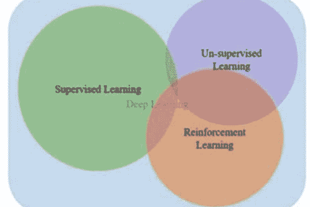

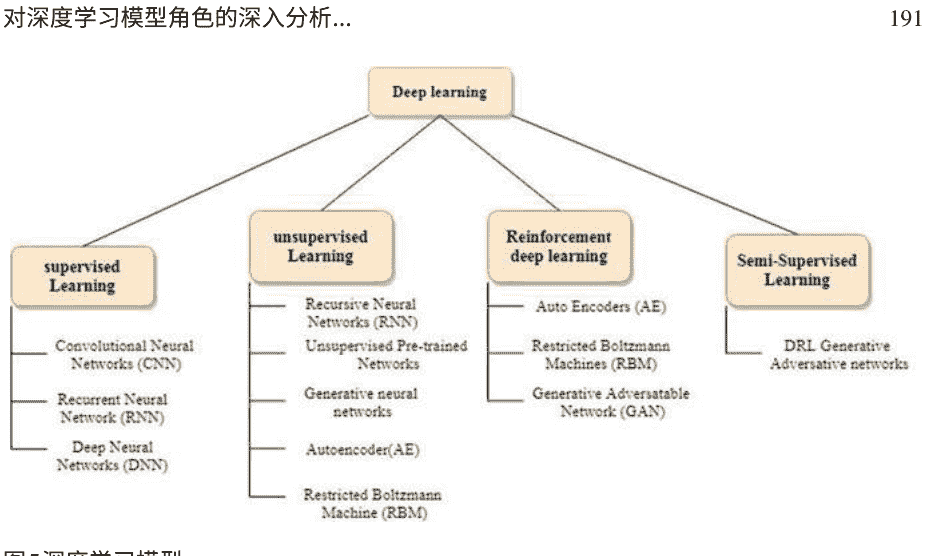

##### 7.1 依赖有监督学习的深度学习

- 卷积神经网络（CNN）
- 循环神经网络（RNN）
- 深度神经网络（DNN）

表1深度学习模型与图像转换中的GAN的比较

| 深度学习模型 | 改进 | 优点/缺点/场景 |
| :--- | :--- | :--- |
| CovidGAN [40] | 用于改进的Covid-19检测和数据增强，使用辅助分类器GAN | 更准确，易于收敛生成多样化的样本/调整参数以训练不同的数据 模型崩溃梯度消失/爆炸/适用于呼吸综合征冠状病毒2即SARS-CoV-2 |
| SC-GAN [15] | 对于光谱归一化和多模型神经影像3D，使用条件GAN进行自注意力 | 图像合成和减少扫描周期以改善图像/在2D图像中出现问题/基于深度学习的神经影像合成/基于深度学习的神经影像合成 |
| Deform-GAN[1] | 无监督学习可变形配准模型 | 可以处理非功能性数据，强度关系，噪声和模糊/有时在训练期间需要背景标签/其他GAN模型不收敛且模型崩溃 |
| 深度学习依赖的E2E无线通信[39] | 使用DNN提供端到端的无线通信系统完成 | 在加性白噪声信道、瑞利衰落信道和频率选择性信道上取得成功/为了实现端到端的通信，构建了一个数据驱动的DNN/当设计发射机时，在无线通信中很难获得随时间和位置变化的信道状态信息 |
| 3D-GAN[8] | 使用3D生成对抗进行物体塑造 | 生成高质量的3D物体和基于特征的物体识别/有时学习速度较慢/为了结合高质量的3D物体，使用对抗性而不是传统的启发式准则，以隐式捕捉物体结构 |

##### 7.2 依赖于无监督学习的深度学习模型

- 递归神经网络（RNN）
- 无监督预训练网络
- 生成式神经网络
- 自编码器（AE）
- 受限玻尔兹曼机（RBM）.

##### 7.3 基于半监督学习的深度学习模型

- DRL生成对抗网络.

##### 7.4 基于强化深度学习（RDL）的深度学习模型

- 自动编码器（AE）,
- 受限玻尔兹曼机（RBM）,
- 生成对抗网络（GAN）.

## 深度学习的常见数据集

- MNIST是最受欢迎的深度学习数据集
- MS-COCO是用于目标检测、分割和字幕数据集的数据集
- ImageNet
- 开放图像数据集
- VisualQA
- House Numbers (SVHN)
- CIFAR-10
- 时尚-MNIST
- IMDB评论
- VoxCeleb
- Twitter情感分析
- 印度演员的年龄检测
- 城市声音分类.

## 使用GAN进行3D物体生成的常见数据集

- 2D到3D可变形草图
- ANN_SIFT1M
- CIFAR-10
- CLEF-IP 2011
- 轮廓绘图数据集
- 深度时尚

## 10个算法发展

下面给出了用GAN对图像模式的3D模式进行操作的提议算法的步骤：

- 初始化随机生成器 (G) 和鉴别器 (G) ，交替生成 (假X (标签Y =0) → (Y, Y) ) 和真实对 (标签Y =1)
- 使用生成器创建图像类型
- 现在使用判别器标记为Y = 1的实际标记的2D图像进行训练，并使用标记为Y = 0的生成的3D图像
- 冻结鉴别器的权重并堆叠生成器
- 使用强制标记为Y = 1的生成的图像训练堆叠的排列
- 迭代并转到步骤2

## 11个研究方法

1. 分析和检查使用GAN从2D到3D图像的全面影响，以预测多个实例
   a. 获取相关数据集
   b. 构建具有重要要点和特征的基准。

2. 为了分析阈值和适应性得分。为此，进行阈值分析和属性的适应性分析。

3. 数据图像的形成和模拟结果的融合。

4. 生成数据集并对数据集中的数据进行清洗和预处理。
   a. 应用数据分析和形成3D图像。
   b. 使用GAN创建图像。

5. 建立GAN的训练。
   a. 对数据进行图像分割的训练和测试。

6. 检查图像生成的准确性和组合。

7. 形成图像和模式的分析。

所提出的步骤展示了使用GAN进行深度学习的模式流程，包括对多个插图的预测的深刻影响的分析，阈值的分析，得分的可接受性，模型和数据的融合，数据集的生成，数据的清洗，数据的预处理以及预测分析的激活。

## 12结论和未来范围

在审查深度学习和深度学习的深度之后，本章研究了GAN的许多应用，以及它们在以前几年中使用多个重要学习模型（无论是有监督的、无监督的还是强化学习）的适用性。此外，可以使用各种深度学习数据集和框架来描述与深度学习相关的问题的性能。他们提供了一种可以在实际数据集中实施的努力，以扩大免疫力并减轻像COVID-19这样的流行呼吸道疾病。深度学习和GAN模型可以在医疗保健、制药、生物技术、生物信息学、计算生物学、计算辅助医疗、药物设计、结构生物学和免疫学等领域中使用。在不久的将来，深度学习模型可以用于挖掘大量数据，从复杂的无监督数据中识别模式并提取特征，而不需要人类参与，从而成为估计未知未来结果的重要工具。最后但并非最不重要的是，可以通过平衡生成器和判别器之间的损失来改进深度学习和GAN模型，因为它提供了一种难以捉摸的解决方案。可以通过在鉴别器和生成器之间保持梯度下降迭代次数的静态比率来实现。

### 参考文献

1. https://zh.wikipedia.org/wiki/生成对抗网络
2. Aggarwal, A., Mittal, M., Battineni, G. 生成对抗网络：理论和应用概述. 信息管理与数据洞察国际期刊 100004 (2021)
3. Yu, Y., Huang, Z., Li, F., Zhang, H., Le, X. 点编码生成对抗网络：用于3D点云修复的深度学习模型。 Neurocomputing 384,192–199 (2020)
4. Go, T., Lee, S., You, D., Lee, S.J. 基于深度学习的全息图生成使用白光源。科学报告 10(1), 1–12 (2020)
5. Chen, Y., Christodoulou, A.G., Zhou, Z., Shi, F., Xie, Y., Li, D. 利用GAN和3D多级DenseNet进行MRI超分辨率：更小、更快、更好。 arXiv预印本 arXiv:2003.01217 (2020)
6. 白克, S., 金, K.I., 金, T.K. 通过GAN和网格模型进行弱监督领域适应，用于估计与物体交互的3D手势姿势。在：IEEE/CVF计算机视觉和模式识别会议论文集，第6121-6131页（2020年）
7. 贾恩, D.K., 扎雷阿普尔, M., 贾恩, R., 卡图里亚, A., 巴切蒂, S. GAN-Poser：一种改进的双向GAN模型用于人体运动预测。神经计算应用。1-13页（2020年）
8. C irillo, M. D., Abramian, D., Eklund, A. Vox2Vox：用于脑肿瘤分割的3D-GAN。arXiv预印本arXiv:2003.13653 (2020年)
9. 辛格, N.K., 拉扎, K. 利用生成对抗网络进行医学图像生成。 arXiv预印本arXiv:2005.10687 (2020年)。
10. 伊斯兰, J., 张, Y.：基于GAN的合成脑PET图像生成。脑信息学 7, 1-12 (2020年)
11. 张, X., 简, W., 陈, Y., 杨, S. Deform-GAN：一种用于可变形配准的无监督学习模型。arXiv预印本arXiv:2002.11430 (2020年)
12. 何, X., 雷, Y., 刘, Y., 田, Z., 王, T., Curran, W.J., 杨, X. 深度注意力GAN-基于高分辨率超声成像。在：医学成像2020年：超声成像和断层成像 (Vol. 11319, p. 113190B)。国际光学和光子学学会 (2020年)
13. Amyar, A.等。RADIOGAN：深度卷积条件生成对抗网络生成PET图像。arXiv预印本arXiv:2003.08663 (2020年)
14. 周, H., 蔡, R., 权, T., 刘, S., 李, S., 黄, Q., 曾, S.：用于荧光显微镜成像的3D高分辨率生成deep-learning网络。Opt. Lett. 45(7), 1695-1698 (2020)
15. 兰, H., Toga, A.W., Sepehrband, F., 阿尔茨海默病神经影像学倡议。SC-GAN：3D自我注意力条件GAN与谱归一化用于多模态神经影像合成。bioRxiv (2020)
16. Mokhayeri, F., Kamali, K., Granger, E. (2020). 使用可控的跨领域面部合成GAN。在：The IEEE Winter Conference on Applications of Computer Vision (pp. 252-260)
17. 基于深度学习的全息图生成使用白光源。Sci. Rep. (Nature Publisher Group) 10(1) (2020)
18. 叶, G., 张, Z., 丁, L., 李, Y., 朱, Y. GAN基于聚焦增强方法的单色合成孔径成像。IEEE传感器杂志 （2020年）
19. Jyoti, I., 张, Y. GAN基于合成脑PET图像生成。Brain Inf. 7 (1) （2020年）
20. 王, Y.D., 阿姆斯特朗, R.T., 莫斯塔吉米, P. 用深度学习提高2D和3D微CT图像的分辨率和恢复纹理。水资源研究。56 (1), e2019WR026052 (2020年)
21. 李, K.S., 汤, C. 模仿：实现GAN研究的可重复性。arXiv预印本arXiv:2005.02494 (2020年)

## 一种用于异构蛋白质组学数据源的语义中介器方法

Chaimaa Messaoudi, Rachida Fissoune, 和 Hassan Badir

摘要 随着高通量技术的进步，生物数据源以指数级增长。将来自异构数据源的数据整合系统有助于生物学家研究实验结果。 然而，不同数据源在句法、模式和语义层面上的异构性仍然对实现生物数据源的互操作性构成重大挑战。 在本章中，提出了一种新的语义数据整合系统，采用中介器方法。 该系统为四个著名的蛋白质组学数据源（UniProt（蛋白质注释）、String（蛋白质相互作用）、PDB（蛋白质结构）和PubMed（生物医学引文））提供了统一的查询处理和数据探索界面。 我们使用一个领域本体，允许用户根据本体中定义的术语来制定查询。

我们提出了一种查询重写算法，使用注释的本体，将在本体上提出的查询转换为对源的查询。 该架构利用Apache Spark框架来执行查询重写和执行所需的操作，以查询集成数据源。

### 1 引言

生物数据库在过去几十年中呈指数增长，特别是随着高通量组学技术的进步。 研究实验室产生的数据量和类型在近年来显著增加。 2010年，欧洲生物信息学研究所（EBI）的数据源有4亿个条目。2014年，它超过了十亿条目[34]。生物数据库现在被认为是大数据[31, 39]，强调了它们的大容量，存储的各种数据类型以及数据生成、收集和处理的速度。此外，在蛋白质组学领域，数据量已经大幅增长。

如今，生物学家面临着对不同数据源的质疑，并处理不断增长的异质性以收集数据并回答特定的研究问题。在过去的几十年里，已经开展了大量的研究工作，以整合多个数据源，为生物学家提供对这些源的统一访问。

数据集成是指以统一的方式将来自多个源的数据组合在一起的问题，通过为用户提供单一的集成源和单一的全局模式。虽然数据集成的研究已经进行了几十年，但仍然存在一些挑战，特别是对数据的异构性的适应。这些异构性范围从具有各种语法（例如文件格式、访问协议）的数据格式，可以从压缩到平面和其他格式（例如JSON、BAM、MITAB）的异构性，到模式的异构性，其中数据可以是结构化的（例如关系表），半结构化的（例如JSON、XML）或非结构化的（例如文本），最后是语义的异构性，其中需要连接不同源的属性的含义和解释。

已经开发了几种方法来解决数据库集成问题。

生物数据库集成的两种常见策略如下。

数据仓库方法在[21]中被定义为面向主题、集成、时变和非易失性的数据集合，以支持管理决策过程。构建数据仓库包括从源中获取数据并在本地材料化，将其转换为与先前定义的全局模式兼容，考虑冗余和互补性，然后在合并的数据上执行查询。文献中给出的一些最成熟的系统有：宾夕法尼亚大学的Genomics Unified Schema (GUS) [15]项目是为了集成序列数据库（GenBank/EMBL/DDBJ、dbEST和SWISS-Prot）而设计的最早的数据仓库之一。GUS使用关系数据模型，其中表格保存核苷酸和氨基酸序列以及相关注释，并在Oracle和PostgreSQL DBMS上实现。YeastHub [12]是一个基于RDF数据仓库的Web应用程序，用于支持不同类型的酵母基因组数据的集成。该应用程序允许用户注册数据集并将其转换为RDF格式（如果数据集是表格格式）。一旦数据集加载到存储库中，就可以进行查询。类似的工作是YeastMine [2]，它是一个用于酵母Saccharomyces cerevisiae的集成数据仓库。此外，InterMine [22, 33]是一个用于集成和分析不同类型生物数据库的数据仓库系统，它将生物实体（如基因和蛋白质）建模为由一组属性描述的对象，并将其与其他对象的关系建模为引用。InterMine系统允许集成不同类型的生物数据库，并且它预装有直接解析常用数据格式和来源（如UniProt、OBO、FASTA BioPAX）。InterMine还允许用户设计自己的数据解析器。TargetMine [10,11]是核心InterMine数据模型的定制版本。它最初是为了在早期药物发现中进行靶点发现和候选基因优先级排序而开发的。作者的目标是将TargetMine转变为一个综合性的数据分析平台，可以更有效地解释信息丰富的组学数据集以进行生物知识发现。数据仓库方法受到维护问题的限制[1]。研究人员在保持数据的最新和一致性方面面临挑战。此外，更新数据仓库可能代价高昂。

中介者方法或虚拟集成是指在代理人（人类或软件）提出请求和通过Web访问的所有潜在相关源之间定义一个中介系统来回答请求[41]。通过这样做，它隐藏了各种异构性，使用户能够像查询单个数据源一样查询多个数据源。中介系统的主要组成部分是中介者和每个数据源的包装器。

中介者处理数据源分布，而包装器处理数据源的异构性和自治性。给定对全局模式的用户查询，中介者将其透明地分解为相应源的组成本地子查询，从源中收集部分查询结果，并经过适当的后处理，将合并的结果报告给用户。有两种主要的技术将源模式映射到全局模式：本地作为视图（LAV）和全局作为视图（GAV）。几个生物医学集成系统已经采用了中介者-包装器架构。计算机社区中开发的第一个中介者利用了非常流行的面向对象技术，并没有考虑语义知识。例如，基于对象交换模型（OEM）的TSIMMIS[9]系统，用于全局模式和视图的面向对象语言，以及一种名为OEM-QL的查询语言，它是一种类似于SQL的语言，用于处理标签和对象嵌套。该系统采用了GAV方法。K2/Kleisli[15]是宾夕法尼亚大学开发的最早的数据集成项目之一。K2是从1997年起的旧项目的新版本：Kleisli。K2选择的数据模型是对象模型。K2/Kleisli支持多种高级查询语言，如集合编程语言（CPL），SQL和OQL的嵌套关系版本。然而，K2/Kleisli不使用任何本体，用户可以在其上制定查询，并且不提供有关数据来源的信息。传统系统的其他例子是Garlic[8]和Interbase [5]。

TAMBIS[36]遵循与K2项目在管理异构性问题上相同的方向。然而，它被认为是在生物信息学和分子生物学时代进行本体集成的第一个项目。它基于复杂且能够描述生物数据源中遇到的所有概念的TaO本体论提供了一种集成。TAMBIS提供对五个生物医学源（Swiss-prot、Enzyme、Cath、blast和Prosite）的访问。它为用户提供了一个图形查询界面，用于查询构造，用户必须浏览本体论中定义的多个概念来构建他们的查询。虽然这种方法很强大，但创建查询并不是次要的，可能会对于生物学家来说，理解本体的数据结构是复杂的。 类似的工作是SEMEDA [23]，它是基于本体的生物源语义集成，如Swiss-prot、OMIM、RZPD、EMP、MDDB和KEGG。 Biomediator[6]是一个基于XML的联合生物数据集成系统。BioMediator系统的核心元素是其知识库，包括各种数据源的描述、源映射和中介模式。 该系统还包括执行语法转换的包装器，将返回的结果转换为XML文档，执行语义转换的元适配器，将该XML文档映射到中介模式，并使用XQuery语言查询中介模式的查询处理器。 最近，类似的工作还有YeastMed[4]，这是一个基于中介的酵母数据源集成系统，如SGD、YEASTRACT、MIPS-CYGD、BioGRID和PhosphoGRID。 YeastMed提供了一个领域本体论，起到全局模式的作用，并支持用户查询。Zhang等人。 [43]开发了一个基于本体的语义数据集成系统，以帮助癌症生存的综合数据分析。他们调整了现有的语义资源，例如国家癌症研究所（NCI）的词库，以创建一个名为癌症研究变量本体论（OCRV）的本体。 该框架采用了GAV方法和映射公理，将不同来源的数据元素连接到本体。

在本章中，我们主要涵盖基于语义中介的数据集成。 在语义层面上的集成意味着以主题领域本体论的形式明确描述数据的语义属性[20]。 在我们之前的论文[27]中，我们建立了一个基于语义中介的数据集成方法，以支持蛋白质组学数据集成。 在这个扩展的书籍章节中，我们显著扩展了我们的查询执行机制。

定义了语义数据集成技术。 此外，我们还提供了一个蛋白质组学语义数据集成系统的案例研究。 它采用基于中介的方法，旨在提供对不同蛋白质组学数据源的透明访问。 该系统提供了用户提交查询和通过网络访问的一组四个数据源之间的统一接口。 它依赖于查询重写引擎来执行查询转换，以对数据源进行查询。 这些数据源包括UniProt [38]、PubMed [30]、PDB [29]和StringDB [37]。

它们分别提供了关于蛋白质注释、生物医学引用、蛋白质结构和蛋白质相互作用的互补数据。 本章结构如下。 第2节介绍了理解本章术语所需的背景知识。 第3节介绍了蛋白质组学数据语义集成系统的主要组成部分和特点。 第4节对系统进行了性能评估。 最后，在第5节中我们总结并提出未来的工作。

22. 郑, J. RenderGAN：基于GAN的纹理渲染

23. Oulbacha, R., Kadoury, S. MRI对腰椎的CT合成来自伪3D循环GAN。在：2020年IEEE第17届国际生物医学成像研讨会（ISBI），第1784-1787页。IEEE（2020年）

24. 张, S., 王, L., 常, C., 刘, C., 张, L., 崔, H. 基于BM4D和GAN的三维剪切域图像去噪方法。数学。问题。工程。（2020年）

25. 刘, X., 乔, Y., 熊, Y., 蔡, Z., 刘, P.：级联条件生成对抗网络用于空间光谱高光谱样本生成。信息科学。63（140306），1-140306（2020年）

26. 赵, G., Meyerand, M.E., Birn, R.M. 贝叶斯条件GAN用于MRI脑图像合成。arXiv预印本arXiv:2005.11875（2020年）

27. Yin, Y., Jiang, S., Robinson, J.P., Fu, Y. 双重关注GAN用于大姿态人脸正脸化。arXiv预印本arXiv:2002.07227（2020）

28. Yang, D., Xiong, T., Xu, D., Zhou, S.K. 使用对抗图像到图像的分割网络。在：医学图像计算和计算机辅助干预手册，第165-182页。学术出版社 (2020)

29. Ma, Q., Yang, J., Ranjan, A., Pujades, S., Pons-Moll, G., Tang, S., Black, M.J. 学习在生成的服装中为3D人物着装。在：IEEE/CVF计算机视觉和模式识别会议论文集，第6469-6478页（2020）

30. Shi, L., Onofrey, J.A., Liu, H., Liu, Y.H., Liu, C. 基于深度学习的心肌灌注SPECT衰减图生成。欧洲核医学与分子影像学1-13页（2020）

31. Kowalski, M., Garbin, S.J., Estellers, V., Baltrusaitis, T., Johnson, M., Shotton, J. CONFIG：可控神经人脸图像生成。arXiv预印本arXiv:2005.02671（2020）

32. Spick, R., Demediuk, S., Alfred Walker, J. 使用3D GAN进行朴素的网格式网格彩色模型生成。在：澳大利亚计算机科学周多会议论文集，第1-6页（2020）

33. 王, Z., 范德斯汀, C., 德马西, T., 格南西亚, D., 拉法埃利, C., 格瓦拉, N., 德林盖特, H. 基于深度学习的快速有符号距离图生成。arXiv预印本arXiv:2005.12662（2020年）

34. 唐, T.Y., 德马蒂尼, D., 巴恩斯, D., 纽曼, P.：RSL-Net：从地面上的雷达定位卫星图像。IEEE机器人与自动化快报5（2），1087-1094（2020年）

35. Minaee, S., Boykov, Y., Porikli, F., Plaza, A., Kehtarnavaz, N., Terzopoulos, D. 使用深度学习进行图像分割：一项调查。arXiv预印本arXiv:2001.05566（2020年）

36. 周, F., 杨, S., 藤田, H., 陈, D., 温, C. 基于全局优化GAN的深度学习故障诊断方法用于不平衡数据。基于知识的系统187，104837（2020年）

37. Zihao, WANG., 范德斯汀, C., 德马西, T., 格南西亚, D., 拉法埃利, C., 格瓦拉, N., 德林盖特, H. 基于深度学习的快速有符号距离图生成

38. 唐, H., 徐, D., 严, Y., 托尔, P.H., 塞贝, N. 用于语义引导场景生成的本地类别特定和全局图像级生成对抗网络。在：计算机视觉和模式识别IEEE/CVF会议论文集，第7870-7879页（2020年）

39. 叶, H., 梁, L., 李, G.Y., 蒋, B.H.：基于深度学习的端到端无线通信系统，使用条件GAN作为未知信道。IEEE无线通信交易。19（5），3133-3143页（2020年）

40. Waheed, A., Goyal, M., Gupta, D., Khanna, A., Al-Turjman, F., Pinheiro, P.R. Covidgan：使用辅助分类器GAN进行改进的COVID-19检测的数据增强。IEEE Access 8，91916-91923页（2020年）

41. Seddik, M.E.A., Louart, C., Tamaazousti, M., Couillet, R. 随机矩阵理论证明了gan数据的深度学习表示行为类似于高斯混合模型。arXiv预印本 arXiv:2001.08370（2020）

42. Xu, D., Wei, C., Peng, P., Xuan, Q., Guo, H. GE-GAN：一种新颖的用于道路交通状态估计的深度学习框架。交通研究C部分新兴技术117，102635（2020）

43. Loey, M., Smarandache, F., Khalifa, N.E.M. 在缺乏胸部COVID-19 X射线数据集的情况下：基于GAN和深度迁移学习的新型检测模型。Symmetry 12(4)，651（2020）

44. Beery, S., Liu, Y., Morris, D., Piavis, J., Kapoor, A., Joshi, N., Perona, P. 合成样本提高了罕见类别的泛化能力。在：IEEE 冬季计算机视觉应用会议，第863-873页（2020）

45. Fu, J., Singhrao, K., Zhong, X., Gao, Y., Qi, S., Yang, Y., Lewis, J.H. 使用术前多模态MR图像的基于深度学习的自动工作流进行胶质母细胞瘤生存预测。arXiv预印本arXiv:2001.11155 (2020)

46. Li, W.H., Xiang, S., Nie, W.Z., Song, D., Liu, A.A., Li, X.Y., Hao, T. 联合深度特征学习和无监督视觉领域适应进行跨领域3D物体检索。信息处理与管理57(5), 102275 (2020)

47. Wang, W., Alameda-Pineda, X., Xu, D., Ricci, E., Sebe, N. 学习如何微笑：条件对抗递归网络的表情视频生成。IEEE多媒体交易(2020)

48. Zhu, H., Tong, D., Zhang, L., Wang, S., Wu, W., Tang, H., Li, B.: 使用深度残差学习进行时间下采样脑CT灌注图像恢复。国际计算机辅助放射外科学杂志15(2), 193–201 (2020)

49. Alom, M.Z., Taha, T.M., Yakopcic, C., Westberg, S., Sidike, P., Nasrin, M.S., Asari, V.K. 历史始于alexnet：关于深度学习方法的综合调查。arXiv 预印本 arXiv:1803.01164 (2018)

50. Jin, Y.等. 通过生成对抗网络实现自动动漫角色创作的研究展示了使用GAN生成动漫角色（即日本漫画角色）面部的训练和使用（2017年）

51. Wu, J., Zhang, C., Xue, T., Freeman, B., Tenenbaum, J. 通过3D生成对抗建模学习物体形状的概率潜在空间。在：神经信息处理系统进展，第82-90页（2016年）

52. Mittal, M., Arora, M., Pandey, T., Goyal, L.M. 在医学图像中使用深度学习技术进行图像分割。在：交互式医学图像分析中的机器智能进展，第41-63页。Springer, 新加坡（2020年）

53. Kaur, B., Sharma, M., Mittal, M., Verma, A., Goyal, L.M., Hemanth, D.J.: 一种改进的显著性目标检测算法，结合背景和前景连接性用于脑图像分析。计算机与电气工程71, 692-703 (2018)

54. Verma, O.P., Roy, S., Pandey, S.C., Mittal, M. (eds.) 机器智能在交互式医学图像分析中的进展。Springer Nature (2019)

55. Dash, S., Acharya, B.R., Mittal, M., Abraham, A. 生物医学和健康信息学的深度学习技术。在：Kelemen, A. (ed.). Springer Nature (2020)

56. Mittal, A., Kumar, D., Mittal, M., Saba, T., Abunadi, I., Rehman, A., Roy, S.: 使用卷积和动态胶囊路由检测胸部X射线图像中的肺炎。传感器20(4), 1068 (2020)

57. Aggarwal, A., Dhindsa, K.S., Suri, P.K.: 软件风险管理框架中方法和范例的实用评估。国际自然计算研究杂志 (IJNCR) 9(1), 13–26 (2020)

58. Aggarwal, A., Dhindsa, K.S., Suri, P. K.: 使用随机森林算法的性能感知软件风险管理方法。国际软件创新杂志 (IJSI) 9(1), 12–19 (2021)

59. Aggarwal, A., Gaba, S., & Mittal, M. 协作物联网和区块链共识算法的比较研究。在：使用区块链转变网络安全解决方案, 115页 (2021)

60. Aggarwal, A., Gaba, S., Nagpal, S., Vig, B. 生物启发式路由在VANET中的应用。在：基于云和物联网的车载自组织网络, 199页 (2021)

61. Gaba, S., Aggarwal, A., Nagpal, S. 机器学习在Ad Hoc网络中的作用。在：基于云和物联网的车载自组织网络, 269页 (2021年)

62. Sharma, A., Kumar, S., Gaba, S., Singla, S., 等。 一种基于遗传改进的量子密码学模型, 用于优化网络通信, Int. J. Innov. Technol. Exploring Eng. (IJITEE) 8 (9S), 256-259 (2019年)## 2 建模语义生物数据集成系统

#### 2.1 生物数据源的特点

生物数据源是从科学调查、高通量实验技术、可用文献和计算分析中收集的生命科学信息的集合[3]。大多数生物数据源都可以在网站上公开获取，生物学家可以在线浏览这些数据。生物数据源的特点包括：

##### 容量

近年来，质谱仪、液相色谱和下一代测序技术的技术发展导致了数据量和生成速度的巨大飞跃。这些进展导致了生物医学数据量的指数增长，如图1所示。事实上，过去十年中UniProtKB[38]中的序列数量大大增加。在2015年去除冗余数据后，我们看到数据的数量和容量呈指数增长。例如，从2016年到2020年，数据的大小和数量几乎增加了三倍。此外，预计生物医学数据在未来几年内将快速增长，到2025年每年将达到一泽字节以上[35]。

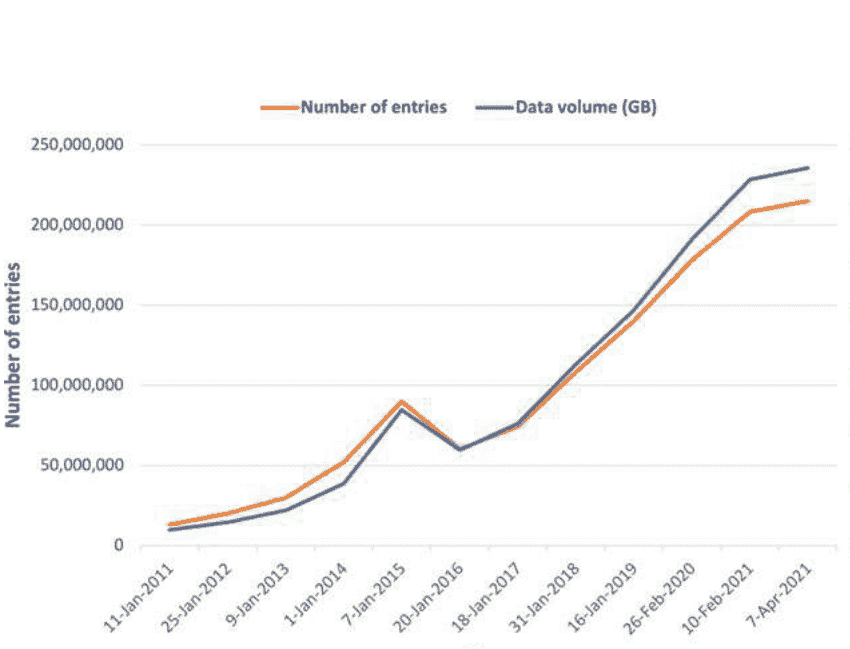

##### 速度

速度描述数据生成、捕获和共享的频率。最近的技术发展，如新的高通量测序技术，每天以相对较低的成本产生数十亿条DNA序列数据。

##### 异质性

生物数据源的异质性有几个方面。首先，它可以来自模式的异质性。每个数据源采用自己的模型或数据模式，与其他数据源不同。例如，在数据库ENSEMBL [14]中采用关系模型，在数据仓库Gedaw [19]中采用对象模型，在UniProt中采用半结构化XML模型。

其次，生物数据有多种类型。它们包括序列、图形、几何信息、图像等等。例如，科学文献、图像和其他自由文本文档通常以非结构化或半结构化格式存储（原始文本文件、HTML或XML文件、二进制文件）。另一个例子是BLAST（基本局部比对搜索工具），它是分子生物学界最常用的程序。它需要特定的格式（FASTA）作为输入序列，并输出每对序列的序列比对列表。

最后，语义异构性是连接不同来源所需的主要努力的属性的含义和解释的异质性。例如，同一个基因或同一个蛋白质往往有多个名称（同义词），不仅在同一来源中，而且在不同来源和物种之间也是如此。

同样，两个蛋白质或两个不同的基因可能有相同的名称或共同的名称（同名词）。

##### 多样性

随着生物研究的进步和对其的更深入理解，通常会获得与旧数据相矛盾的新数据。经常出现新的数据组织方案变得至关重要，甚至可能出现新类型的数据或完全新的数据库[13]。

##### 自治性

生物数据源被认为是自治的，因为它们大多由个别研究小组或研究机构开发和管理。起初，它们是为这些小组或机构的个人使用而开发的，即使它们证明对更大的社区有价值，这些小组的数据管理实践也得以保留。因此，生物数据库始终具有自己的形式和基础设施。

所有这些特征都对整合不同生物数据库的数据提出了挑战。在下一小节中，我们将介绍中介者架构作为生物数据整合的解决方案。

#### 2.2 基于中介者的整合

一般而言，数据整合涉及将存储在不同来源中的数据组合起来，为用户提供统一的视图 [24]。它使用两个模式来定义：全局模式和源模式，以及这两个模式之间的对应关系，称为映射。

定义 数据整合系统 I 是一个三元组 < G, S, M >[7]。

- G是全局模式，用关系模型表示，可能带有约束条件。
- S是源模式，也用关系模型表示。
- M是G和S之间的映射，由一组断言组成，形式为 $q_S \rightarrow q_G$，其中 $q_S$ 和 $q_G$ 分别是相同元数的查询，分别在源模式 S和全局模式 G上。

查询自主和异构数据源具有挑战性。在生物学数据集成中，有两种主要方法来解决这个问题：数据仓库[21]和中介和包装器[41]。在本节中，我们重点关心中介方法，因为这是我们在这项工作中使用的方法。

根据[41]，中介方法包括在代理（人或软件）提出请求和通过Web访问的所有潜在相关源之间定义一个中介系统来回答请求。目标是通过避免用户不必为了查询而找到相关数据源，逐个使用它们的特定语言和本地模式进行查询，并组合所获得的信息，给用户一种查询均匀和集中的系统的错觉。中介系统的主要组成部分是每个数据源的中介和包装器。中介包括一个名为全局模式 G（见定义1）的中间层。它在不同的可访问数据源之间创建连接。此外，它可以是系统应用领域的模型。它通过主题领域本体论的显式形式描述语义数据属性，作为查询表达的支持。在本章中，我们使用Gruber [18]在数据和知识工程中给出的广泛接受的定义来解释本体论：“共享概念化的正式、显式规范”。根据这个定义，本体论为希望共享给定领域的基本术语和关系的研究人员指定了一个共同的词汇。它通过整合领域的定义、概念和它们之间的关系来建模知识。因此，本体论允许知识的建模、共享和重用。本体论已广泛用于语义数据集成[43]。它们在生物学中的重要性是显著的，像OBO Foundry [32]这样的仓库包括超过200个本体论，Bioportal [40]包括800多个生物医学本体论，Ontobee [42]过去有200多个本体论。

数据源的模式，称为源模式 S，表示作为存储在此源中的数据的容器的结构。包装器包含源的技术和数据模型细节。中介者不能直接访问对他发出的请求，因为数据以分布式方式存储在独立的源中。

它只有对数据源的抽象视图。这些视图是预定义的查询，以全局模式的函数形式表达，使用特定的语言，称为视图语言。

为了处理数据源的异构性，包装器将通用查询语言转换为数据源查询语言。每个数据源都有一个关联的包装器，导出关于源模式、数据和查询处理能力的信息。中介者使用映射形式将包装器提供的信息统一视图。

文献中提出了三种映射形式：全局作为视图（GAV）[25]，本地作为视图（LAV）[25]和全局-本地作为视图（GLAV）[17]。

在GAV方法中，全局模式被定义为对数据源的一组视图。也就是说，映射M将查询 $q_S$ 映射到每个元素 g 在 G 上。因此，GAV映射是一组断言，对于G的每个元素g，形式为 $q_S \rightarrow g$。

LAV方法采用与GAV相反的方法，即根据整体模式定义要集成的数据源模式。映射M将源模式S的每个元素 s 映射到查询 $q_G$ 上。因此，LAV映射是一组断言，对于S的每个元素s，形式为 $s \rightarrow q_G$。

GLAV方法是GAV和LAV形式主义的结合。它提供了两种技术的表达能力，旨在克服它们的限制。GLAV基于这样一个思想，即对集成数据源的模式的视图应该以中介者的整体模式的视图来描述。

在接下来的内容中，我们首先提供了我们的数据集成方法的高级描述，然后我们评估了系统的性能。

##### 案例研究3：蛋白质组学数据的语义集成

###### 来源

为了清楚地了解来自不同来源的生物数据集成的问题，考虑以下简单的生物学问题，以获取有关一个或多个蛋白质的信息：“蛋白质结构标识符'1FIK'所涉及的序列和蛋白质相互作用网络是什么？”回答这个问题通常需要访问至少三个不同的来源：

1.  蛋白质结构数据库，如PDB [29]，我们将检索蛋白质的UniProt标识符。
2.  蛋白质注释数据库，如UniProt [38]，我们将提取序列和相互作用网络的标识符。
3.  蛋白质相互作用数据库，如String [37]，我们将展开蛋白质相互作用网络。

根据这些来源，相应的查询系统和数据模型可能会有所不同。生物学家需要质疑每一个数据来源。也就是说，他们应该至少熟悉一种查询语言。此外，为了恢复相关条目，他/她需要使用特定的标识符（IDs）和蛋白质的名称（同义词）。这就是处理异构数据库模式、数据冗余、众多独立标识符以及不同的策划标准和实践所需的耗时任务，这可能会减少从可用来源中获得的优势。相反，一个集成视图将为生物学家提供对这些来源的统一访问，而无需了解任何关于数据来源的细节。我们的挑战是捕捉不断增长的异构性和广度的信息，并使其对生物学家易于访问。此外，我们通过使用Apache Spark来执行查询转换和执行所需的操作，以优化查询性能，以质疑集成数据来源。

#### 3.1 系统概述

综合蛋白质组学数据系统（IPDS）[27]是一个基于语义中介的系统，使用Spark进行异构蛋白质组学数据源的集成，例如：

-   UniProt (通用蛋白质资源) [38] 为科学界提供了全面、高质量且免费获取的蛋白质序列和功能信息资源。UniProt知识库 (UniProtKB) 拥有超过1.2亿个蛋白质，并支持多个应用程序编程接口 (API) 来查询其数据。在UniProt REST API中，所有资源都可以通过简单的URL (REST) 进行访问。数据以文本、XML、RDF、FASTA、GFF和制表符分隔格式提供。
-   String (互作基因/蛋白质检索工具) [37] 是一个已知和预测的蛋白质相互作用的生物数据库和Web资源。其最新版本11包含来自5090个生物体的2460万个蛋白质的信息。String通过使用URI格式进行API调用，并以JSON、tsv、tsv-no-header、psi-mi和psi-mi-tab格式返回数据。
-   PubMed [30] 是一个免费的搜索引擎，主要访问MEDLINE数据库的参考文献和摘要，涵盖生命科学和生物医学主题。PubMed包含超过3000万篇生物医学文献的引用，来自MEDLINE、生命科学期刊和在线图书。PubMed的引文和摘要涵盖了生物医学和健康领域，涵盖了生命科学、行为科学、化学科学和生物工程的部分内容。它还通过RESTful API提供访问，使用简单的URL返回以制表符分隔的文本文件、XML或JSON格式的数据。
-   蛋白质数据银行 (PDB) [29] 是一个存储大型生物分子 (如蛋白质和核酸) 三维结构数据的数据库。截至目前，PDB共有156101个生物大分子结构。PDB支持RESTful (表现层状态转移) Web服务来访问其数据。RESTful Web服务接受PDB特定的XML格式查询，并返回一个ID列表。

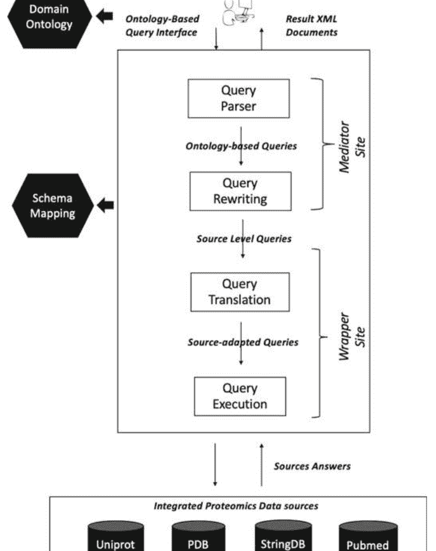

图2 介绍了应用于UniProt、PDB、StringDB和PubMed的基于中介者的数据集成架构的概述。

为了实现UniProt、String、PDB和PubMed之间的互操作性，我们选择了基于中介者的集成方法。中介者方法的优势在于避免了对数据更新的管理，因为数据仍然保留在源中，而不是维护一个集中式的数据仓库，这是一项繁琐且耗时的任务。这个优势在生物数据不断进展的背景下非常重要。图2展示了系统的架构。

为了克服生物医学数据源的语义挑战，我们开发了一个领域特定的本体论（在第3.2节中进一步描述）作为全局模式。它允许用户根据本体中定义的术语来制定查询。此外，为了解决语法异构性，我们依赖于基于本体的查询。

Welcome to the Ontology-based Search page of IPDS System

> IPDS (Integrated Proteomics Data System) allows a single access point to several proteomics data sources (UniProt, String, ProteinDataBank, and PubMed). It is a Spark mediator-based system that uses a domain ontology as a support for the user request to find data from the currently integrated data sources. Further information on how to use the system can be found here.

##### Search Form

Search metadata for IPDS integrated data sources (UniProt, String, ProteinDataBank, and PubMed.)

-   Accession Number
-   Protein Name
-   Gene Name
-   Keyword
-   String ID
-   Organism
-   Required score
-   Network limit
-   Structure Id
-   Structure Title
-   Structure Description
-   Experimental Method
-   Pubmed ID
-   Molecular Weight Min/Max
-   Chain Length Min/Max
-   X-ray Resolution Min/Max
-   X-ray Average B Factor Min/Max
-   Sequence
-   Sequence Mass (Da)
-   Sequence Length

##### 图3 用户界面

接口用于查询所有数据源。图3展示了一个搜索表单，允许生物学家用自然语言表达他们的请求。例如，通过提供关于蛋白质注释、蛋白质相互作用（例如，所需的分数、网络限制）、结构注释和特征（例如，结构标题、实验方法）、蛋白质序列和文献参考的具体信息。这个搜索表单利用本体术语，以自然语言呈现，以便为大多数生物学家（他们大多不习惯使用知识表示和查询语言）简化查询制定过程。用户通过选择表单字段中的项目来制定查询。这些项目在本体中有它们的等价物（概念和属性），并以自然语言书写。

#### 3.2 领域本体

我们系统的目标是提供对异构蛋白质组学数据源的单一访问点。因此，我们开发了一个领域本体来支持用户查询。搜索表单中的每个元素在本体中都有对应的元素。为了提供集成蛋白质组学数据源的语义封装，本体是通过将各种数据源模式协调一致而从头开始建立的。它描述了一个概念层次结构，这是系统使用的所有生物实体的分类。它代表了一个知识模型，以简单的层次概念框架捕捉生物学和生物信息学知识，并受到父子关系的约束，其中子元素被定义为父元素的子集。每个子元素都继承了其父元素的所有属性，尽管它还具有自己更具体的属性。我们将本体概念分为两种类型：

-   基于生物的概念类，它是集成源中建模生物实体的所有类的组合。例如，SubCellular-Location概念是表示不同类型的亚细胞定位（例如细胞质和高尔基体）的12个类的超类。
-   基于源的概念类表示与每个源相关的概念。例如，数据属性hasID表示了四个集成数据源的ID，它们是hasPDBID、hasPubmedID、hasStringID和hasUniprotID。

此外，本体定义了两种类型的属性，以提供关于概念的进一步语义信息。第一种类型由一组对象属性特征化，它模拟了本体中属于一个或两个不同类的两个个体之间的关系。第二种类型定义了数据属性，它是将个体与文字数据连接起来的关系。

为了进一步说明属性在传达语义给开发的本体中的作用，我们在图4中举了一个真实世界的例子。阿拉伯芥的PRO1基因对应于Q42449 UniProt ID，并且还可以在PDB和StringDB中找到，因为UniProt交叉引用了PDB和StringDB。该蛋白质的名称是Profilin-1，交互得分为0.999。图4还显示了诸如Gene、Protein和Interaction之类的概念，以及一些对象属性，例如codeFor和codedBy，它们将Gene链接到Protein。接下来，属性hasInteraction及其逆属性hasInteractor将Protein链接到Interaction。我们还可以观察到数据类型属性：hasScore、hasProteinName、hasID和hasGeneName将Interaction、Protein和Gene分别链接到String类型的文字值。此外，使用本体示例，我们可以回答例如以下查询：在“阿拉伯芥”的“PRO1”基因产物中涉及的蛋白质相互作用是什么？这个问题涉及到基因和蛋白质（阿拉伯芥中的那些）及其相互作用网络的配对。除了Organism类没有明确呈现外，图4已经捕捉到了所有的信息。

系统本体论是在W3C Web本体语言(OWL)[26]中定义的，并使用Protégé工具[28]构建。图5显示了本体的屏幕截图。

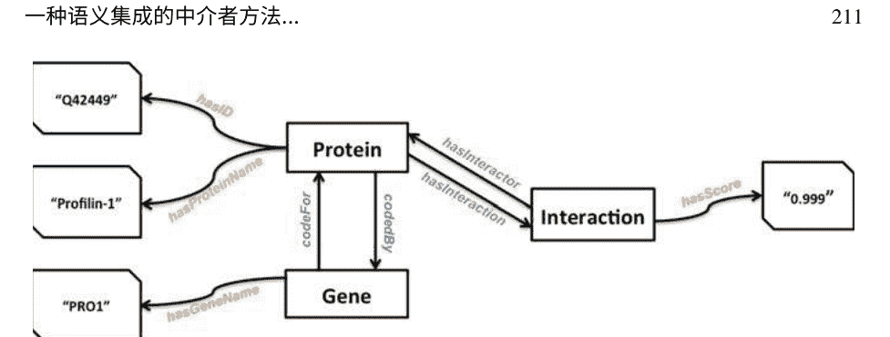

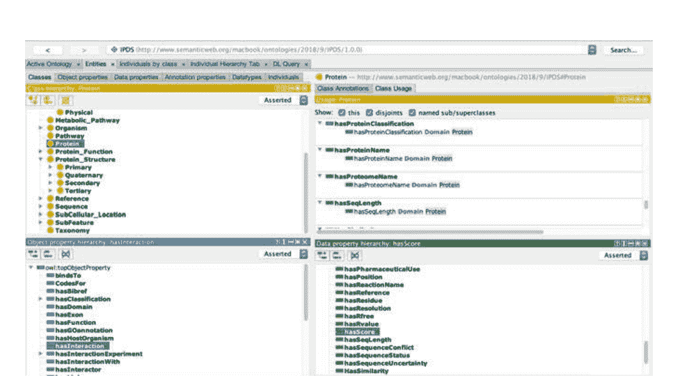

#### 3.3 中介者站点

一旦中介者接收到提交的查询，查询解析器将查询重新构造为本体定义的一组查询。表单字段的每个元素在本体中都有对应的等价物。例如，本体中的数据类型属性hasStrucID在表单字段中被解释为Structure ID，而对象属性hasProteinSequence在搜索界面中被翻译为Protein Sequence。为了阐明查询解析器的作用，图6显示了提取具有结构标识符“1FJK”的蛋白质序列和相互作用网络的查询的构造。

一旦查询解析器重新组织了用户查询，中介者就使用应用领域定义的模式映射来翻译查询。本体模式转换为源模式上的可执行查询。这个过程被称为查询重写。

然而，模式映射需要描述源模式和领域模式之间的关系。这些映射通过一组声明性逻辑规则来描述。中介者使用一组声明性规则来定义领域模式的谓词与源模式的谓词之间的关系。我们的系统设计用于基于GAV方法的映射上的查询分解。这意味着本体中的每个概念和属性都是以源模式元素为基础定义的视图。这个视图指定了如何从源获取中介模式元素的实例。在这个上下文中，我们使用的映射规则被定义为一对（P, Q）。P是以本体术语表示的值，Q是以源模式为基础定义的相应表达式。已定义了两种类型的映射：

1.  数据类型属性映射：它将本体数据类型属性映射到源模式。映射形式为（本体类名.本体属性名，值元素源）。以下示例涉及本体类Protein在源模式UniProt中的数据类型属性hasProteinName：（Protein.hasProteinName，name）。
2.  对象属性映射：它将本体对象属性映射到源模式。它的形式如下：（本体类名.本体属性名，Spark-XML属性，数据源名称，值元素源）。以下示例显示了对象属性hasInteraction如何映射到源模式UniProt：（Protein.hasInteraction，_id，STRING，hasID）。

除了映射规则外，该算法还接受本体术语表示的合取查询作为输入，并根据其执行顺序返回一组按Spark图结构化的子查询作为输出。算法的步骤如下所述：

##### 算法1：查询重写

输入：本体术语和映射规则中的查询。

输出：查询执行的Spark图。

1.  根据具有值和没有值的谓词将获取的查询谓词分类为两组。第一组G1将包含数据类型属性谓词，第二组G2将包含对象属性谓词。
2.  根据每个属性类型谓词的参数，在每个组中添加类类型谓词。添加后删除这些参数。
3.  在G1中添加G2中缺失的类谓词列表。G1将构建图的顶点数据框。
4.  对G2中的类类型谓词进行排序，从具有G1中的值开始。G2将形成边缘数据框。创建Spark图（G1，G2）。
5.  查询具有值的每个顶点，并用映射列表中的等效顶点替换它。
6.  查询每个边缘，并用映射列表中的等效边缘替换它。

该算法将返回一个查询执行的Spark图作为输出。Spark图的边和顶点的类型为Dataframe。Spark图的边由对象谓词形成，而Spark图的顶点是类谓词的实例，并具有数据类型属性谓词作为属性。

图7展示了在图6中制定的Spark查询执行图的示例。

**Dataframe of vertices**

| ClassID         | Datatype     | Value |
|-----------------|--------------|-------|
| Protein-Structure | hasStrucID   | 1fik  |

**Dataframe of edges**

| ClassSrc        | ObjectProperty | ClassDest     |
|-----------------|----------------|---------------|
| Protein-Structure | hasStructure   | Protein       |
| Protein         | hasProteinSequence | Sequence    |
| Protein         | hasInteraction | Interaction   |

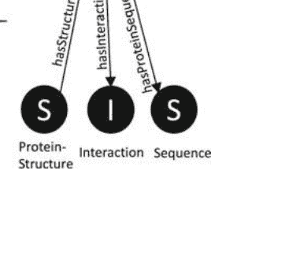

### 图7 查询执行图示例## 3.4 包装站点

在查询重写之后，包装器将查询的Spark图执行转换为数据源的本机查询语言。换句话说，包装器将顶点Dataframe转换为每个数据源的本机请求（PDB的XML文档和UniProt的参数/值文档，String和Pubmed）。

这个过程使用两个Spark API完成：

- Spark-XML提供了数据源“com.databricks.spark.xml”，允许将Spark DataFrame写入XML文件。在这种情况下，当涉及到PDB数据源时，我们将把顶点Dataframe转换为XML文件（见图8）。
- Spark-CSV提供了数据源“com.databricks.spark.csv”，允许将Spark DataFrame写入CSV文件（见图9）。

因此，这些查询将按照执行图确定的顺序调用数据服务来执行。随着执行的进展，查询执行器从已执行的子查询的结果中生成要执行的子查询的变量实例。

数据服务返回的结果是由XML模式预定义的XML文件。我们使用SPARK-XML将这些文件转换为Dataframe，以便能够轻松提取和获取所需的结果，如图10所示。

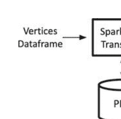

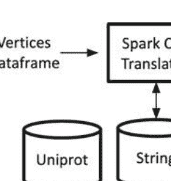

| Entry | Protein names | Gene names | Organism | Sequence |
| :--- | :--- | :--- | :--- | :--- |
| B7C2A | Flowering control protein FCA | FCA_Osl_30H26 | Oryza sativa sp indica. Rice | MHRGGRSTDPSSGPAPGSRGGGGGFRGRGPSRWSGGGGSGPPHRFRSGGGGGGGGGGGGGGNFHRGRPSQHG |
| P07737<br>Q53TE6 | Epididymis tissue protein Li 184a | PFN1 | Homo sapiens. Human | MAGWNAVGMNLAMDGTCDQAAANYGYDSPSVMAAGKTFVNITUREVGAGDRSSPYYNGTLGGGKCSVWRLLDQGEPSM |
| Q6K2Y1<br>ADAP250900<br>Q0JDR1<br>Q0JDR2<br>Q0WPE5<br>Q0WPE6<br>Q0WPG18 | Flowering control protein FCA | FCA_LOC_Os09g36100,Os09g0123200,OSJNBa0091K22.20,PO415D04.461 | Oryza sativa sp Japonica. Rice | MHRGGRSTDPSSGPAPGSRGGGGGFRGRGPSRWSGGGGSGPPHRFRSGGGGGGGGGGGGGGNFHRGRPSQHG |

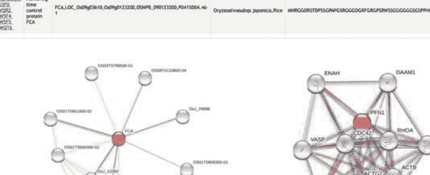

### 4 系统评估

我们对四个公共蛋白质组学数据源（UniProt、PDB、String和PubMed）进行了系统性能评估。我们对系统的性能进行了研究，以揭示运行时间如何随查询大小（字段数）的增加而变化。

这个性能研究是在系统架构的两个主要方面的运行时间上进行的：（i）中介站点和（ii）包装站点。用户制定一个查询，首先由查询解析器将其重写为一组与本体相关的查询，然后使用映射断言对其进行重构和分解到源模式上。查询重写后，包装器解析源级查询并生成源适应的查询，然后将其转发到每个数据源的数据服务进行执行。每个场景显示的所有运行时间都对应于三十次连续执行的平均时间。实验是在一台Intel i5 3 GHz的机器上进行的，配备8 GB RAM。我们使用Java实现了我们的框架，并使用Apache Spark 2.3.0作为Spark提供的独立部署模式中的查询执行工具。此外，我们使用HDFS 3.1.1作为系统的存储层。

#### 4.1 中介者网站性能

中介者是像IPDS这样的数据集成系统中至关重要的模块。它负责解决语法和语义冲突。 首先，它具有查询解析器的特点。该组件负责将用户输入的自然语言请求转换为本体定义的一组请求。 然后，查询重写机制负责使用映射规则对查询进行重写和分解。 我们通过计算二十个不同查询的响应时间来评估其性能，并通过增加字段的数量（例如3到13个字段）进行测试。 总共测试了120个查询。

为了捕捉处理时间的变化，我们重复测试了30次。 所有输入查询都固定为显示交互网络、蛋白质序列、蛋白质结构和文献参考。

图11显示了中介者执行查询的运行时间，给出了它们字段的数量（从3到13）。图中还显示了均值。 结果显示，随着查询字段数量的增加，执行时间呈指数增长。 执行时间从平均值为2.12（0.14）秒的具有三个字段的查询，增加到平均值为22.22（2.13）秒的具有十三个字段的查询。 标准差也随均值增加而增加。 这是预期的，因为当有更多字段时，重写变得更加复杂。 事实上，查询解析器和查询重写机制在处理具有大量字段的查询时需要更长的时间。

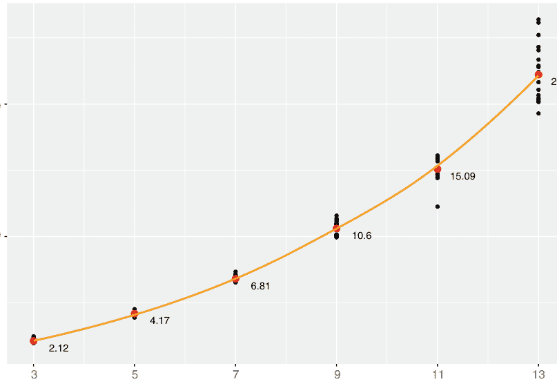

#### 4.2 包装站点性能

IPDS系统性能的第二个方面是在包装站点上。这些包括在源级别翻译查询和为每个数据源生成本地查询以执行它们。数据服务返回的结果被制定并返回给用户。我们通过计算二十个不同查询的执行时间来评估这个性能，并通过增加字段的数量来进行计算（例如3到13个字段）。总共测试了120个查询。为了捕捉处理时间的变化，我们重复测试了30次。

图12显示了包装器对二十个查询的执行时间，通过改变它们的字段数量（从3到13）。结果显示，随着字段数量的增加，执行时间略微增加。执行时间从具有三个字段的查询的平均值为6.83（标准偏差为7.75）增加到具有十三个字段的查询的平均值为6.44（标准偏差为0.58）。我们观察到平均执行时间在字段数量上没有显著变化。当使用少量字段时，响应数量可能变得很大。因此，我们可以观察到某些查询的时间较长。例如，在图12中，我们观察到有3个字段的查询，但它们的执行时间明显高于其他3个字段的查询时间。

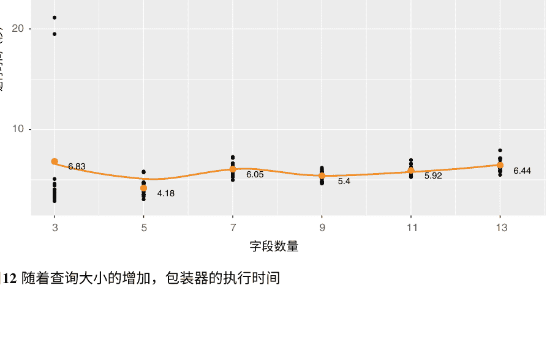

图12 随着查询大小的增加，包装器的执行时间

### 5 结论和未来工作

在蛋白质组学时代，异质生物数据库的数据整合是获得新的生物学见解的重要因素。在这里，我们介绍了一个基于语义中介的蛋白质组学数据整合系统。这种方法提供了一种新的查询处理机制，其组成部分包括查询解析器、查询重写算法、查询转换器和执行机制。这种方法利用Apache Spark框架来执行必要的转换和查询执行。它建立在一个中介系统上，整合了四个异构蛋白质组学数据源：UniProt（蛋白质注释）、String（蛋白质相互作用）、PDB（蛋白质结构）和PubMed（生物医学引文）。在未来，我们计划在中介系统中包括更多的数据源，主要关注公开可用的通路数据库，如Kyoto Encyclopedia of Genes and Genomes（KEGG）。在第二步中，扩展不同的查询语言（如SPARQL）的覆盖范围将是有趣的，因为大多数生物数据源开始提供SPARQL访问点。

### 参考文献

- 1. Abiteboul, S., Manolescu, I., Rousset, M.-C., Senellart, P.: Web Data Management. Cambridge University Press, Philippe Rigaux (2011)
- 2. Balakrishnan, R., Park, J., Karra, K., Hitz, B.C., Binkley, G., Hong, E.L., Sullivan, J., Micklem, G., Michael Cherry, J.: Yeastmine an integrated data warehouse for saccharomyces cerevisiae data as a multipurpose tool-kit. Database (2012)
- 3. Bhatt, V.D., Patel, M., Joshi, C.G.: An insight of biological databases used in bioinformatics. In: Current Trends in Bioinformatics: An Insight, pp. 3–25. Springer (2018)
- 4. Briache, A., Marrakchi, K., Kerzazi, A., Navas-Delgado, I., Rossi Hassani, B.D., Lairini, K., Aldana-Montes, J.F.: Transparent mediation-based access to multiple yeast data sources using an ontology driven interface. BMC Bioinform. 13(1), S7 (2012)
- 5. Bukhres, O.A., Chen, J., Weimin, D., Elmagarmid, A.K., Pezzoli, R.: Interbase: 一个用于异构软件系统的执行环境。 计算机 26(8), 57–69 (1993)
- 6. Cadag, E., Louie, B., Myler, P.J., Tarczy-Hornoch, P.: 生物中介数据集成和推理，用于匿名序列的功能注释。 在：生物计算2007年，第343–354页。世界科学 (2007年)
- 7. Calvanese, D., De Giacomo, G., Lenzerini, M.: 关于数据集成系统的表达能力。在：国际概念建模会议，第338–350页。Springer(2002)
- 8. Carey, M.J., Haas, L.M., Schwarz, P.M., Arya, M., Cody, W.F., Fagin, R., Flickner, M., Luniewski, A.W., Niblack, W., Petkovic, D., et al.: 朝着异构多媒体信息系统：大蒜方法。 在：RIDE-DOM'95会议论文集。第五届国际数据工程研究问题-分布式对象管理研讨会，第124–131页。IEEE (1995年)
- 9. Chawathe, S., Garcia-Molina, H., Hammer, J., Ireland, K., Papakonstantinou, Y., Ullman, J., Widom, J.: Tsimmlis项目：异构信息源的集成 (1994年)
- 10. Chen, Y.-A., Tripathi, L.P., Fujiwara, T., Kameyama, T., Itoh, M.N., Mizuguchi, K.: targetmine数据仓库：增强和更新。 Front. Genet. 10, 934 (2019年)
- 11. Chen, Y.-A., Tripathi, L.P., Mizuguchi, K.: Targetmine，一个用于候选基因优先级排序和目标发现的集成数据仓库。 PloS one 6（3），e17844 (2011年)
- 12. Cheung, K.-H., Yip, K.Y., Smith, A., Deknikker, R., Masiar, A., Gerstein, M.: YeastHub: 生命科学领域中集成数据的语义Web用例。 Bioinformatics **21** (Suppl1)， i85–i96 (2005年)
- 13. Chung, S.Y., Wooley, J.C.: 在生物信息集成中面临的挑战。在: 生物信息学, 第11-34页。爱思唯尔 (2003年)
- 14. Cunningham, F., Achuthan, P., Akanni, W., Allen, J., Ridwan Amode, M., Armean, I.M., Bennett, R., Bhai, J., Billis, K., Boddu, S., et al.: Ensembl 2019.核酸酸研究。 **47**(D1), D745–D751 (2019)
- 15. Davidson, S.B., Crabtree, J., Brunk, B.P., Schug, J., Tannen, V., Christian Overton, G., Stoeckert, C.J.: K2/Kleisli和GUS: 集成访问基因组数据源的实验。IBM Syst. J. **40**(2), 512–531 (2001)
- 16. Doan, A.H., Halevy, A., Ives, Z.: 数据集成原理. Elsevier (2012)
- 17. Friedman, M., Levy, A.Y., Millstein, T.D., et al.: 数据集成的导航计划。AAAI/IAAI 67–73 (1999)
- 18. Gruber, T.R.: 一种便携本体规范的翻译方法. 知识获取 **5**(2), 199–220 (1993)
- 19. Guerin, H., Marquet, G., Burgun, A., Loréal, O., Berti-Quille, L., Leser, U., Moussouni, F.: 在GEDAW中集成和存储肝脏基因表达数据和相关生物医学资源. 在: 生命科学中的数据集成国际研讨会, pp. 158–174. Springer (2005)
- 20. Gusenkov, A., Bukharaev, N., Birialtsev, E.: 基于本体的数据集成: 问题和解决方案. 物理学会系列(IOP Publishing) **1203**, 012059 (2019)
- 21. Inmon, W.H.: 构建数据仓库. Wiley (2005)
- 22. Kalderimis, A., Lyne, R., Butano, D., Contrino, S., Lyne, M., Heimbach, J., Fengyuan, H., Smith, R., Stephen, R., Sullivan, J., et al.: Intermine: extensive web services for modern biology. Nucleic Acids Res. **42**(W1), W468–W472 (2014)
- 23. Köhler, J., Philippi, S., Lange, M.: SEMEDA: ontology based semantic integration of biological databases. Bioinformatics **19**(18), 2420–2427 (2003)
- 24. Lenzerini, M.: Data integration: a theoretical perspective. In: Proceedings of the Twenty-First ACM SIGMOD-SIGACT-SIGART Symposium on Principles of Database Systems, pp. 233–246. ACM (2002)
- 25. Levy, A.Y.: Logic-based techniques in data integration. In: Logic-Based Artificial Intelligence, pp. 575–595. Springer (2000)
- 26. McGuinness, D.L., Harmelen, F.V., 等: OWL web本体语言概述。 W3C推荐 **10**(10) (2004 )
- 27. Messaoudi, C., Fissoune, R., Badir. H.: IPDS: 基于Spark的语义中介系统，用于整合异构蛋白质组学数据源。 在: 并发与计算: 实践与经验, 第e5814页 (2020)
- 28. Musen, M.A., 等: Protégé项目: 回顾与展望。 AI Matters **1**(4), 第4页 (2015)
- 29. 蛋白质数据库: 3D大分子结构数据的单一全球存档。核酸研究 **47**(D1), D520–D528 (2018)
- 30. Pubmed, 一个免费的搜索引擎，主要访问生命科学和生物医学主题的Medline数据库的参考文献和摘要。 https://www.ncbi.nlm.nih.gov/pubmed/
- 31. Sima, A.C., Stockinger, K., de Farias, T.M., Gil, M.: 异构生物数据库的语义集成和丰富。 在: 进化基因组学, 第655-690页. Springer (2019)
- 32. Smith, B., Ashburner, M., Rosse, C., Bard, J., Bug, W., Ceusters, W., Goldberg, L.J., Eilbeck,K., Ireland, A., Mungall, C.J., 等: OBO工厂: 支持生物医学数据集成的本体协调演化。自然生物技术 **25**(11), 1251–1255 (2007)
- 33. Smith, R.N., Aleksic, J., Butano, D., Carr, A., Contrino, S., Hu, F., Lyne, M., Lyne, R., Kalderimis, A., Rutherford, K., 等: Intermine: 用于整合和分析异构生物数据的灵活数据仓库系统。生物信息学 **28**(23), 3163–3165 (2012)
- 34. Squizzato, S., Mi Park, Y., Buso, N., Gur, T., Cowley, A., Li, W., Uludag, M., Pundir, S., Cham,J.A., McWilliam, H., 等: EBI搜索引擎: 提供来自EMBL-EBI的生物数据的搜索和检索功能。核酸研究 **43**(W1), W585–W588 (2015)

## 区块链对技术和思维革命的影响：阿曼苏丹国的定性研究

Salam Saif Said Al-Riyami 和 Smitha Sunil Kumaran Nair

摘要 区块链被定义为一种分散和分布式的公共账本，记录和复制存储在网络中的多个计算机上的信息，代表着第四次工业革命时代的最具创新性的技术。尽管该技术的发展是为了改善在线交易，但它已经在安全性、透明性和去中心化等核心特性的基础上得到了各种用途的应用。然而，这项技术在阿曼苏丹国尚未得到广泛采用。本研究旨在通过调查障碍和推动因素，并最终提出区块链技术采用的框架，探索阿曼苏丹国对区块链技术的采用情况。采用定性方法，对阿曼苏丹国私营和公共部门的关键利益相关者进行了访谈，这些利益相关者对区块链技术有着深入的见解或经验。采用内容分析方法，确定了主题和类别。

研究发现，关键障碍包括缺乏意识、缺乏潜在应用、缺乏经验和专业知识，以及缺乏足够的基础设施。此外，缺乏政府监管和政策限制了采用。推动因素包括政府致力于增加对该技术的认识，并提供必要的资源和基础设施，此外还有一个明确负责的权威机构负责政策和法规。提出了三项建议，作为未来采用区块链的框架，这也有助于该国成为该地区的技术中心。设计和实施一项策略，以减轻障碍，并为该技术设定激励措施和推动因素，是一种被建议的方法，以提高区块链技术的采用。

关键词 障碍·区块链·推动因素·框架·阿曼苏丹国

### 1 引言

区块链技术是一种分散和分布式的公共账本，记录并复制存储在网络中的多个计算机上的信息。区块链技术改善了信息记录和存储的安全性和透明度[19]。这项技术已经成为当前第四次工业革命时代的普遍趋势[5]。企业和个人已经意识到他们可以从这项技术中获得的其他创新无法提供的好处。

所述的好处包括更快的交易、透明度和提高的安全性[40]。然而，这项技术尚未在全国范围内得到采用，这促使我们进行了本研究，以探讨其采用的障碍和推动因素。

#### 1.1 阿曼苏丹国的区块链

阿曼苏丹国在推进该国区块链技术的采用方面取得了重要进展。政府意识到分散和分布式账本系统对各个行业的企业可能带来的好处。

为了加快技术的采用，阿曼采取了一系列措施，其中之一是举办一次座谈会，邀请来自公共和私营部门的利益相关者参与。阿曼于2017年举办了第一次区块链座谈会[8]。该座谈会由外交部（MOFA）的科学、知识和技术转移办公室、资本市场管理局（CMA）和信息技术局（ITA）等政府机构组织。

这次活动吸引了本地和国际区块链技术专家，讨论了采用问题。这次研讨会在推动阿曼区块链技术采用方面取得了很高的成果。首先，它提出了提高人们对该技术的认识和认可，以帮助人们欣赏其前所未有的机遇。其次，它提议在政府中使用技术来奠定基础，并吸引未来的其他行业利益相关者。

阿曼为加快区块链技术采用所做的第二个努力是创建一个机构来处理区块链采用问题。在2017年的研讨会上，政府决定成立一个名为区块链解决方案与服务（BSS）的机构来处理与区块链技术相关的所有问题。该组织的核心任务将是开发支持区块链技术采用所需的关键基础设施。此外，它将帮助传播技术的认识，并通过整合和共享信息向公众和其他相关利益相关者改善全国范围的采用。除了成立BSS，政府还创建了区块链俱乐部，旨在汇集具有丰富区块链技术知识和经验的个人和组织。该俱乐部的会员对所有认为自己足够精通的个人和组织免费开放。

关于区块链技术的一些内容。该俱乐部的最终目标是增加大众对区块链技术的认识，并为加快采用该技术提供所需的动力。

阿曼政府为支持区块链技术的采用所做的第三项努力是举办一次会议，评估2017年座谈会后取得的进展。2018年，商业流程外包服务（BPOS）与ITA组织了一次为期两天的会议，讨论座谈会后采用努力取得的进展。会议的目标是在座谈会上提出的建议基础上，制定实现预期结果的策略。ITA发现了一些有益于政府数字化转型的策略，从而为其他利益相关者采用区块链技术奠定必要的基础。

最后，关键行业已经积极采用区块链技术来改善运营。一个关键例子是Bank Dhofar，它加入了全球企业区块链网络（Ripple）以改善其支付服务。该网络提供即时全球支付、无摩擦支付和安全在线交易等解决方案。Muscat Clearing and Depository Company（MCD）是区块链技术的另一个早期采用者。该公司选择实施一种电子认购系统，为客户提供出色的投资体验。该系统将具有全球范围内可访问、无错误和安全等优点。投资者将能够通过该系统进行所有所需的交易，如收取股息和获取所有信息和服务，以做出明智的投资决策。

显然，苏丹国正在努力改善该国对区块链技术的采用。同样明显的是，私营部门的利益相关者已经采取了主动行动，领导了这项技术带来的好处和机遇。然而，需要进一步努力加快进程，确保全国范围内的采用。

#### 1.2 问题陈述

21世纪的发展主要是基于技术的进步。自20世纪最后十年以来，技术的重要作用在推动文明进步到下一个水平上变得明显[27]。随着互联网的普及，技术将成为所有未来进步的基础，这已经成为不可逃避的事实。一项证明其有多种用例的技术是区块链技术。这项技术在过去的二十年中变得流行，并且现在在发达国家中得到了相当的应用[1]。例如，大型银行和企业接受了由区块链发展而来的比特币货币。发展中国家利用区块链技术提高了交易的速度和透明度。

还有计划将该技术用于其他用例，例如保留患者记录[6]。然而，需要开发使用案例。例如，金融部门需要法规和政策来处理加密货币在苏丹的情况。

此外，苏丹的私营和公共部门在采用区块链技术方面并不积极。在这方面，有必要调查阻止阿曼公共和私营企业采用该技术的障碍。此外，有必要调查促进技术采用的因素，以促进其采用。因此，本研究旨在调查阿曼区块链技术的障碍和推动因素，并提出一个适用于阿曼苏丹国的区块链采用框架，以确定阿曼苏丹国如何成为区块链技术创新和业务发展的区域中心。

### 2 文献综述

#### 2.1 技术采用理论

技术对人们的社会、文化和经济福祉的影响是不可忽视的。在这方面，研究人员努力建立能够预测技术传播或使用的理论[18]。虽然迄今为止提出了许多理论，但它们通常可以分为五个不同的群体。这五个群体是扩散理论、用户接受理论、决策理论、个性理论和组织结构理论。

##### 2.1.1 扩散理论

扩散理论关注的是技术被设计用来改善当代环境中的任务和功能的事实。技术的历史和演变表明，简化日常任务处理的需求一直是推动力[26]。例如，一些技术被设计用于提高效率。其他技术则是为了提高生产力。因此，技术的采用是不可避免的，因为它们增强了促进更高生活水平的活动。扩散理论认为，在任何给定的环境中，只要技术能够提供有用的目的，技术的采用就是不可避免的。随着技术从新发展变为不可忽视的常规物品，技术被称为扩散。

扩散理论在解释技术采用方面具有两个重要和独特的特点。从根本上说，理论的研究者认为所有技术在社会中都起着至关重要的作用，这是不能被忽视的。然而，虽然技术是新的，但它的实用性对潜在用户来说并不明显。因此，需要时间和资源来实现已知技术对潜在用户来说是非常重要的。由于技术被认为在功能上起着重要作用，扩散理论认为即使需要更长的时间，它们最终也会被采纳。例如，[20]认为新技术向采纳的时间可以从一个生命周期的角度来看，从技术的推广开始，到最终被接受为止。影响技术生命周期的方面将对其采纳路径至关重要。

尽管一些技术很容易被接受（容易扩散），但其他技术在成为主流之前必须经历多次迭代和重大变化。其次，扩散理论假设存在一个框架在环境中促进技术的采用。即使所说的技术承诺解决重要问题或提供专业功能，技术采用也不总是有保证的，这将极大改善人们的生活。社会、政治和经济因素可能阻碍技术的采用。例如，在存在更便宜但效率较低的替代品的环境中，昂贵的技术可能不会被迅速采用。扩散理论假设总会有促进所述技术采用的积极因素[25]。扩散理论在解释不受社会、政治或经济因素阻碍的技术采用方面具有相关性。因此，它们在追踪进展方面非常理想，特别是当采用某项技术对人民福祉至关重要时。

##### 2.1.2 用户接受理论

用户接受理论是技术采纳理论的另一类。这些理论建立在个体可能基于采纳希望获得的价值而对某项技术表现出兴趣的基础上。正如[38]所指出的，有一群消费者会积极寻求新技术，以便第一个从中受益。此外，某些技术在实用性和可用性方面突出。因此，个体有时会主动采纳几乎没有受到外部影响的技术。用户接受理论关注这样一个前提，并假设一旦技术被其目标受众接受，就会被采纳。

用户接受理论具有几个独特的特点。最重要的特点是在技术被接受之前，它们预设了应该存在的属性。首先，目标个体必须对该技术表现出明显的兴趣。只有在环境对人们接受特定技术没有过多影响的情况下，才会发生接受。过去曾经争论过，如果某项技术符合人们的利益，以一种不可忽视的方式，人口可能会考虑采纳它[12]。因此，有知识和兴趣的相关方的存在对确保技术被接受至关重要。

其次，接受理论强调需要一个支持接受的框架。尽管利益相关方可能在技术出现之前就表现出兴趣成为主流之前，需要一个框架来确保这种兴趣长期保持。接受可以支持一个强调给定技术对特定人群有用性的框架。过去，政府曾经使用这种策略来确保公民朝着接受技术的新方向前进。正如[35]所指出的，框架对于确保个人认识和欣赏给定技术在他们生活中的有用性至关重要。以区块链技术为例，用户接受的理想框架包括提供支持该技术的必要基础设施和指导其在各种用例中使用的规定。

第三，它认为用户接受理论还着重关注人口的经济和社会状况，以及新技术如何带来巨大改进。人类每天都在努力通过利用过去获得的知识来在未来做出更好的决策[29]。在这方面，个人始终意识到新的发展以及它们如何积极地影响他们的生活。当采用这样的观点时，可以看到用户如何接受技术，因为每个人都希望改善自己并改善自己的状况。用户接受理论甚至认识到这样的现实及其对个人如何接受给定技术的影响。

用户接受理论在任何促进新技术接受的讨论中都是相关的。这些理论明确指出，根据个人的兴趣，会有一些人对新技术感兴趣。因此，重要的是考虑这样的人群以及如何帮助他们影响其他人采用技术[12]。

##### 2.1.3 决策理论

决策理论代表了技术采纳理论的第三类。决策理论关注的是个人和组织根据自身兴趣或环境中需要解决的问题来寻找新技术。传统上，新技术通常是根据所需功能和目标人群来设计的[25]。新技术的开发者会意识到市场上存在需求以及可能从中受益的人群。然而，并不总是存在一个技术与个人或组织的需求相匹配的情况。例如，组织已经开始依赖自动化来提高效率和完成日常任务的速度。此外，自动化还对降低成本和确保公司在长期内保持竞争力和可持续性起到了关键作用。虽然市场上有多种技术可以满足这样的需求，但公司可能无法找到完全适合他们情况的技术。因此，他们会积极寻找这样的技术，以确保能够如期改善运营[37]。

尽管决策理论在特征上相似，但与其他类别的技术采纳理论相比，它们是多样化的。一种理论侧重于理性选择以及个人和组织如何有意识地寻求新技术以获得利益。理性选择理论的支持者认为，社会越来越意识到技术的好处，并将继续做出有意识的决策来寻求新的发展。例如，鉴于当前困扰商业界的可持续性挑战，公司正在寻找采用新技术来应对这些挑战的方法[31]。一些公司采取了绿色政策以减少其整体环境影响和气候变化。其他公司正在采用技术来从世界各地外包员工。因此，根据理性选择理论，个人和组织仍然需要寻求能够改善采纳的新技术。

决策理论也是多样化的，因为其他人试图解决多年来影响组织的现有挑战。其中一个挑战是风险管理。公司存在于一个动荡的环境中，自然风险和人为风险都可能逆转组织所取得的进展。因此，风险管理是他们运营中至关重要的一个领域。适当的风险管理确保实体能够应对任何突发事件而不会遭受灾难性损失。一些决策理论关注如何通过使用技术更好地处理风险。例如，在运输和物流管理中，使用互联网和全球定位系统跟踪货物现在已经成为主流[29]。这种做法减少了货物在运输过程中丢失或未能准备好延迟交货的风险。因此，组织可以根据他们在运营中需要解决的问题来理性选择采用一种基于技术的解决方案。

在讨论技术采用时，决策理论仍然相关。这些理论在个人和组织都致力于寻找解决紧迫需求的新技术的情况下是理想的，公司决定使用区块链技术可以通过这些理论来解释。正如之前指出的那样，技术带来了透明度、责任和安全等新的可取属性。因此，一个寻求增强安全性或在其运营中促进透明度和责任的组织可能会选择区块链技术[12]。

##### 2.1.4 人格理论

人格理论代表了技术采用理论的另一类别。这些理论的支持者认为，某些技术之所以引起个人的兴趣，是因为它们符合他们个性的某个方面。正如[10]所指出的，一些技术创新已经超越了为个人提供特定的理想功能。这样的技术已经成为个人陈述，而其他一些则成为文化符号。智能手机是这样的技术的一个很好的例子。尽管过去被视为帮助人们沟通和组织生活的设备，智能手机现在代表着符合买家个性的个人物品[25]。公司已经采取了就服务和产品提供方面而言，它们不同于其他公司，以至于吸引了不同的消费者群体。人格理论承认并强调了技术与个体人格之间的关系，因此技术在自然状态下是可接受的，因为它与个体的人格相共鸣。

与其他技术采用理论类别相比，人格理论并不多见。由于这个事实，它们只在极少数情况下解决了技术的功能和效用不是唯一影响采用的因素的场合。目前，可以用这些理论解释的技术还很有限。它们主要由具有重要文化意义的物品组成，尽管它们能够提供特定的功能。正如[37]所指出的，目前存在一个关于技术是否符合以用户人格为设计理念还是吸引只是偶然的辩论。例如，一种被更多地购买因其个性属性而不是其实际功能而被视为理论的崇拜物品。

然而，可能无法确定物品是吸引了感兴趣的个体的个性，还是其实用性和功能使其对特定群体有吸引力。

人格理论在区块链技术的背景下仍然具有一定的相关性。自从诞生以来，区块链技术一直保持着三个关键特征，这些特征在许多执行类似功能的系统中都缺乏。其中一个关键特征是去中心化。技术的去中心化性质使其成为珍视民主并对政府和组织控制人们所需资源感到不舒服的用户所渴望的技术。因此，当接受区块链技术时，个人可能会将其视为个人事务，因为它通过去中心化促进了自由。第二个关键特征是透明度。使用区块链技术进行的交易是透明的，因为它们记录在可验证的账本中。许多行业，如银行业，缺乏这种透明度。第三，区块链技术在记录存储方面是安全的，因为记录存储在多个位置，以防止其被篡改并影响现有记录的完整性。区块链技术所能实现的完整性水平是无与伦比的。在这方面，那些认为透明度和完整性是可靠特征的个体可能会直接采用这项技术，因为它符合他们的个性和价值观。因此，在采用区块链技术的背景下，人格理论是适用的。

##### 2.1.5 组织结构理论

技术采纳理论的最后一类是组织结构理论。这些理论关注组织可能具有的战略利益，这可能促进技术的采纳。显然，组织处于开发和推广新技术采纳的前沿。正如[28]所指出的，这些技术可能代表组织的战略利益。

因此，尽管技术将给用户带来好处，它也将能够在未来维持实体的运营。组织结构理论关注的是基于组织的战略利益如何采用技术。

组织结构理论具有各种不同的特点。首先，他们认识到组织比个人拥有更多的资源和途径来推动新技术的采用。像使用信用卡这样的技术是由那些在战略利益中发挥作用的组织开发和推广的。同样适用于移动支付和电子支付，在今天的商业世界中已经广泛接受。组织发展和推动新技术的采用的能力可以解释为什么一些技术被社会接受。

在区块链技术的背景下，这些理论非常相关。研究表明，区块链技术具有多种用例，它将成为一种颠覆性的技术应用。例如，在金融世界中，该技术可以实现更快的交易，因为不需要第三方机构（如银行）来验证交易。在医疗保健领域，该系统用于安全存储和共享患者信息，以改善结果。该技术为任何用例带来的好处足以产生颠覆性影响。在这方面，组织可以制定战略使命，拥抱技术并在人们中推广其使用。这样做，个人和组织都会受益。因此，在讨论新技术的采用时，组织结构理论仍然具有相关性。

#### 2.2 采用区块链技术的障碍

##### 2.2.1 关于区块链的知识和信息

与其他具有类似用例的技术相比，区块链是一种相对较新的技术。因此，组织和公众对此了解有限。这种有限的认知是由于对该技术的知识和信息不足。正如[23]所指出的，采用和实施新技术严重依赖于组织和潜在用户对该主题的了解。知识和信息创造了一个有专业知识来成功实施技术的氛围[23]。此外，认知增加了用例，并使公众更有可能接受该技术。由于对该主题的知识和信息不足，区块链技术的实施受到了限制。

##### 2.2.2 群体行为的恐惧

群体行为和盲从效应是研究者们广泛研究的概念[3, 4]。关于这些概念如何影响决策

35. Stephens, Z.D., Lee, S.Y., Faghri, F., Campbell, R.H., Zhai, C., Efron, M.J., Iyer, R., Schatz, M.C., Sinha, S., Robinson, G.E.: Big data: Astronomy or genomics? PLoS Biol. 13(7), e1002195 (2015)

36. Stevens, R., Baker, P., Bechhofer, S., Ng, G., Jacoby, A., Paton, N.W., Goble, C.A., Brass, A.: TAMBIS: Transparent access to multiple bioinformatics sources. Bioinformatics 16(2), 184–186 (2000)

37. Szklarczyk, D., Franceschini, A., Wyder, S., Forslund, K., Heller, D., Huerta-Cepas, J., Simonovic, M., Roth, A., Santos, A., Tsafou, K.P., et al.: String v10: protein-protein interaction networks, integrated over the tree of life. Nucleic Acids Res. 43(D1), D447–D452 (2014)

38. UniProt Consortium: UniProt: a worldwide hub of protein knowledge. Nucleic Acids Res. 47(D1), D506–D515 (2018)

39. Vidal, M.-E., Endris, K.M., Jozashoori, S., Karim, F., Palma, G.: Semantic Data Integration for Large Biomedical Data to Support Personalized Medicine. In: Current Trends in Semantic Web Technology: Theory and Practice, pp. 25-56. Springer (2019)

40. Whetzel, P.L., Noy, N.F., Shah, N.H., Alexander, P.R., Nyulas, C., Tudorache, T., Musen, M.A.: BioPortal: enhancements and new web services from the National Center for Biomedical Ontology to access and use ontologies in software applications. Nucleic Acids Res. 39 (Suppl 2), W541-W545 (2011)

41. Wiederhold, G.: Mediators in the architecture of future information systems. IEEE Comput. 25(3), 38-49 (1992)

42. Xiang, Z., Mungall, C., Ruttenberg, A., He, Y.: Ontobee: a linked data server and browser for ontology terms. In: ICBO (2011)

43. Zhang, H., Guo, Y., Li, Q., George, T.J., Shenkman, E., Modave, F., Bian, J.: An ontology-guided semantic data integration framework to support integrative data analysis of cancer survival. BMC Med. Inf. Decis. Making 18(2), 41 (2018)

在组织中，群体行为指的是一群人选择追随一个流行的想法或路径，即使他们的直觉告诉他们不应该这样做。这种现象通常导致组织失败，因为组织做出的决策与其目标和现状不符合[21]。盲从效应指的是个人或一群人由于害怕落后而选择加入一个流行的想法。例如，在90年代末互联网兴起时，拥有在线存在，尤其是对于企业来说，是一个流行的想法。然而，并不是所有拥有在线存在的企业都取得了成功[3]。在区块链技术的情况下，群体行为和盲从效应一直是主要的障碍。组织害怕接受这项技术，因为他们不确定它是否会持久存在。他们担心在技术失去效用之后长期失去竞争力。因此，对于采用区块链技术真正感兴趣的公司较少。

##### 2.2.3 监管挑战

法规对于新技术的成功采用和实施至关重要。法规提供了一个平衡竞争环境的框架，使企业能够公平竞争[32]。此外，监管框架为组织提供了必要的指导，以成功采用和使用新技术。在区块链技术的情况下，监管一直是主要挑战。由于其新颖性，负责监管各个行业的机构尚未跟上技术带来的益处和挑战[9]。例如，在银行业，没有规定应采用哪种形式的区块链技术以及谁将控制用户数据。数字货币缺乏足够的监管限制了区块链技术的采用，尤其是大型组织[1]。新技术带来的监管挑战一直是其成功采用和实施的障碍。

##### 2.2.4 隐私保护和安全

区块链技术获得的声誉和认可源于其与现有任何其他技术根本不同的核心特征。然而，赋予该技术优势的核心特征在考虑隐私保护和安全问题时也成为一道障碍。

区块链是一种旨在开放和透明的技术[5]。开放性意味着链中的个体可以访问存储在区块中的数据。透明性增加了信任，因为任何存储的数据的真实性都可以由一群个体验证。然而，开放性对于那些传统上依靠限制数据访问的企业来说是一个挑战。例如，银行将对用户账户和交易的信息访问限制在用户本人和少数个体之间[30]。然而，如果区块链技术在相同的用例中使用，银行面临着在保护用户数据隐私的同时保持足够透明以符合区块链技术的核心价值观的挑战。因此，依赖于对用户数据进行受控访问的组织在采用区块链技术方面面临挑战[13]。

其次，区块链技术是分散的。没有单个个人或实体对其运作有控制权。虽然这种特性在技术的早期应用中非常理想，但分散化对于传统上通过集中控制取得成功的组织来说是一个重大挑战。

政府是不愿意采用这种技术的实体的一个很好的例子，因为它是分散的[11]。政府通过控制大部分活动而取得成功。区块链技术通过将控制权扩展到政府之外的实体来威胁这种传统。因此，对于依赖集中化的政府和其他组织来说，采用区块链技术一直是困难的。

最后，区块链技术对于用户真实身份的隐私保护也是组织关注的一个重要原因。利用区块链技术提供的匿名性进行非法活动已经显著影响了采用该技术[15]。

##### 2.2.5 实施挑战

新技术都面临着一系列的实施挑战，区块链技术也不例外。正如前面所指出的，对于这项技术的知识和信息并不如人们所期望的那样广泛。因此，采用者面临着理解技术的几个用例以及在实施过程中选择最佳方法的挑战[24]。此外，像银行这样的机构已经拥有了能够执行大部分区块链技术试图替代的活动的系统。如何将新技术与旧技术良好地集成并逐步淘汰旧技术是一个挑战[24]。实施挑战是一个重要的障碍，因为组织缺乏学习更多关于技术并承诺在日常活动中使用它的动力。

##### 2.2.6 初始成本

成本是采用区块链技术所面临的另一个挑战。研究表明，区块链技术在当代组织中的采用和成功实施是一个复杂而新颖的事务[22]。这种复杂性是由于其新颖性和缺乏足够的知识和专业技能来保证成功实施。此外，采用和实施区块链技术需要对技术基础设施进行重大投资[24]。这些挑战增加了采用该技术所需的初始成本。目前尚不清楚实施成本是否会在未来降低，考虑到技术仍在不断发展和其他目前不相关的因素可能在未来变得相关。克服初始成本将在促进采用方面起到很大作用。

##### 2.2.7 匿名性

区块链技术使用户能够使用假名而不是真实身份进行交易。由于技术的架构是开放的，使用假名为用户提供所需的隐私。然而，已经显示通过一些技巧来妥协隐私，例如报告一个非法活动，他们将需要揭示其真实身份以进行调查[22]。平台上的隐私可能受到威胁的事实影响了银行业等提出的使用案例，其中用户账户信息不能与他人共享。

##### 2.2.8 信任问题

尽管区块链技术在安全和隐私方面赢得了声誉，但隐私方面却引发了信任问题。由于个人可以在平台上匿名交易，其他人开始不信任该平台，因为它为持续进行非法活动创造了环境[2]。这些担忧在各种场合得到了证实，例如黑客等犯罪分子利用该平台为他们的非法活动收取赎金[34]。因此，组织在采用这项技术时犹豫不决，因为他们不相信其隐私功能不会被用于非法活动。

##### 2.2.9 技术的可扩展性

区块链技术的设计限制了每分钟可以进行的交易数量，以便提供足够的时间进行验证。目前，最流行的两个区块链平台比特币和以太坊分别允许每分钟进行7次和15次交易[24]。这种限制在某些行业中带来了可扩展性的挑战，特别是在每分钟可以处理多达1000次交易的行业中。因此，各行各业的组织一直在犹豫是否采用这项技术，因为它可能无法满足他们未来的需求。

##### 2.2.10 能源效率和消耗

区块链技术依赖于网络中计算机的计算能力来执行基本功能，如验证交易和挖掘加密货币（在需要的情况下）。这种活动导致了高能耗，特别是当网络增长并且需要更多的计算能力来验证和增加交易数量以及挖掘加密货币时[24]。能源使用是一个重要的问题，特别是对于可能在一分钟内处理成千上万笔交易的行业，如银行业。对未来能源效率的担忧阻碍了组织采用这项技术。

##### 2.2.11 可用性

目前使用区块链技术的用户，如比特币的用户，赞扬其安全功能，同时批评其易用性[1]。区块链是一种复杂的技术，在正常交易中可能具有挑战性。例如，输入的记录无法更改。因此，没有简单的方法来纠正错误，例如银行错误[14]。其次，需要使用复杂的加密算法生成的包含字母数字字符的私钥和公钥来验证交易[23]。对于大多数习惯于简单步骤（如输入简单密码来验证交易）的人来说，使用这些密钥可能会很困难。因此，区块链的易用性一直是其采用的障碍。

##### 2.2.12 存储问题

区块链技术的一个安全特性是信息或数据在网络的所有节点中复制。因此，很难丢失数据或通过影响整个网络的完整性来妥协一个节点。虽然这种措施增加了安全性和可靠性，但也引发了存储问题。数据的复制占用了更多的空间，特别是考虑到信息必须存储在网络中的所有可用节点中[42]。存储问题阻碍了组织采用这项技术，因为未来可能存在可扩展性和效率低下的问题。

##### 2.2.13 51%的共识

虽然区块链技术以其安全性而闻名，但通过51%的攻击有损整个平台的风险。区块链安全性源于没有一个单一节点控制网络的事实。信息在链中被复制，从而消除了数据被窃取或被控制网络或数据库的人篡改的事件。当区块链中的一个数据损坏时，可以通过引用存储了类似信息的其他节点来轻松纠正，作为一种安全措施[42]。然而，如果一个人能够在平台上积累51%的计算能力，仍然存在控制整个网络的风险。虽然这样的壮举很困难，特别是在由多台计算机组成的广泛网络中，但这仍然是一个可能发生的事件[42]。51%的共识使得组织不愿采用这项技术，因为他们不想面临将网络和数据失去控制权的危险，以及被犯罪分子利用的风险。

##### 2.2.14 技术的成熟度

区块链技术也面临着它是新技术的。最初，该技术是为了通过提供一种用户在线可接受的数字货币来促进有限数量的在线交易而创建的。然而，随后提出了当前使用案例，例如银行和医疗保健行业中使用的案例。由于该技术并非针对这些使用案例而设计，因此它在满足行业需求方面缺乏成熟度。因此，组织一直不愿采用这项技术，因为他们担心它可能永远无法满足他们的需求，无论是现在还是将来。目前，成熟度问题通过创建能够满足当代需求的新形式的区块链技术来解决。由于其开放性质，组织可以采用这项技术并对其进行修改以适应自己的需求，而不会受到任何后果。然而，这种方法会导致碎片化，可能会影响未来的合作[24]。在这方面，组织需要说服人们区块链是一项成熟的技术，以增加采用率。

#### 2.3 区块链技术采用的最新技术

在中东国家中，阿拉伯联合酋长国（UAE）一直在推动该技术在该国各个领域的采用。迪拜智能城市旨在在区块链平台上进行政府交易[39]。一位研究人员在瑞典和丹麦的大学任职的研究表明，包括约旦、埃及、卡塔尔、沙特阿拉伯王国、阿联酋、科威特和阿曼在内的几个中东国家曾试图在银行、保险、教育、政府/公共部门和房地产等各个领域实施区块链技术。然而，成功的实施是稀缺的。该研究得出结论，从组织和国家的角度来看，从监管和技术的角度来看，找出挑战和机遇。有四个主要因素导致挑战和机遇，即法规或政策、教育或意识、合作和文化[16]。每个国家都会发现采用新技术（如区块链）的推动因素和障碍。文献综述明显显示，潜在领域采用区块链技术的范围很大。

#### 2.4 阿曼区块链技术的现状

##### 2.4.1 区块链基础设施

一家名为BSS的政府拥有的实体于2017年11月在阿曼苏丹国成立。成立的目的是向公众宣传区块链技术的好处和用途，并使阿曼政府能够建立自己的区块链交易货币。BSS寻求与当地公司合作，以便他们愿意成为政府建立的区块链基础设施的一部分。

在阿曼资本市场引入区块链技术将需要转变趋势，允许在苏丹国内交易数字货币。这个决定需要咨询和吸纳许多投资者和利益相关者。最重要的是，政府决心确保公民了解所认为的好处，并参与计划。

BSS的第一步是在全国范围内举办座谈会。这些座谈会由私营部门资助，但由政府机构和当局代表。该方法是让所有利益相关者提交他们对过渡到区块链的建议。

阿曼政府的经济基础一直以商业贸易为主。为了建立一个简洁的交易单位，以吸引该国的兴趣，将传统的交易实体赋予数字价值是明智的选择[41]。参与区块链交易的美国投资者受邀参加了2018年及以后的区块链研讨会[29]。这将有助于向公共部门提供建议，说明该技术在美国的成功实施情况，特别是比特币加密货币的采用。

##### 2.4.2 电子治理服务的普及

阿曼政府确保尽快全面采用区块链技术的方法始于对电子政府的呼吁。发展电子政府服务需要将价值和贸易转换为数十亿部门，以确保政府与承包商之间的安全交换系统。意识到区块链的需求是为了保证更好和更安全的交易，同样为底层政府实体赋予价值[41]。政府采用电子服务和使用区块链将进一步导致该国在使用加密货币方面形成国家趋势。政府接受的加密货币的选择随时间推移而讨论，甚至提出了阿曼拥有自己的加密货币的潜力[31]。确保全面过渡到政府电子服务的趋势将使该国成为该地区区块链技术的领导者。

电子政务服务确保顺畅可靠地访问许可证和与政府或公众进行贸易等方面。政府服务的数字化需要一个安全的过程，以保护公众的利益。阿曼政府在数字化服务方面致力于使用区块链技术。为了建立一个安全的通信渠道和服务请求门户，需要应用先进的加密算法，这些算法常用于安全货币，如比特币和以太坊。这些货币将成为该国数字化努力中使用区块链技术的基础[37]。

同样，政府致力于允许公众发表意见和建议，以实现政府服务向更快速和安全的现代电子形式过渡，通过区块链技术实现[41]。

##### 2.4.3 阿曼的加密货币

尽管目前有超过十种不同的加密货币与比特币和以太坊这两种主要货币竞争，政府应该推出并启动自己的加密货币。目前，该国在中东地区在采用区块链技术方面取得了最重要的进展[31]。与印度合作，阿曼政府可以开发一种以政府金融服务为主的货币。这可能是一项困难且昂贵的冒险，但基于全球贸易动态来看，加密货币将是未来的货币。政府有机会加入这一趋势并从早期接触中获益，这是不可低估的。利用全球加密货币交易的机会至关重要，因为市场需求不断增加。这样做可以确保阿曼政府在世界顶级贸易货币中确立自己的地位。

开发加密货币需要大量的研究、合作、政策和监管以及数据挖掘[31]。这些是阿曼政府已经在进行的努力，得益于BSS的建立。也许，需要更多的专业知识参与其中。无论如何，阿曼这样一个有影响力的政府参与加密货币挖掘是中东和亚洲技术专家中的一个受欢迎的趋势[41]。阿曼政府在吸引投资者方面做出了努力，并且确实提高了该国的投资概况，因为对政府服务数字化的研究仍在继续。然而，确保尽早采取行动以便成为区块链技术在该地区的先驱是至关重要的。阿曼需要掌握这个过程，并确保他们在决策上勇敢，因为加密货币也被认为是有风险的。然而，在当前时代，这仍然是一个值得冒险的风险[29]。

### 3 研究方法论

研究人员可以采用多种方法进行研究并生成必要的数据以进行分析。这些方法包括定性方法、定量方法、相关设计和准实验设计等。选择的方法对于研究目标的适应性对于成功的数据收集至关重要。

#### 3.1 研究设计

选择了定性方法作为研究的方法选择。定性研究涉及从观察和人类经验中收集数据，以便深入了解感兴趣的主题。有几个因素使得定性研究设计适合这项研究。该研究的目标是确定阻碍和促进阿曼区块链技术采用的因素。参与者提供的信息将包括他们基于经验或观察到的观点和意见。

在涉及人们对一个主题的观点和看法的情况下，定性研究方法是合适的。

其次，定性研究方法在分析和解释收集到的数据时具有流动性。有各种工具可以用来分析定性研究收集到的数据。它们从简单的经验推理到复杂的统计分析不等。研究人员通常有责任确定适当的数据分析工具或方法来评估定性数据。选择应基于收集到的数据类型和研究目标。定性研究中数据分析的流动性使得可以专注于数据收集，而无需担心将数据适应特定的分析工具。因此，这种方法将使得从受访者那里收集到尽可能多的有用信息，并选择适当的分析方法进行评估。

此外，定性研究中的流动性使得在数据解释方面特别容易捕捉到上下文。在收集人们对某一主题的观点和意见时，上下文非常重要。例如，对于忠于某一政府的人来说，他们对其运作的看法可能是积极的，而对于没有任何附属关系的人来说则不同。因此，对于研究人员来说，在特定的研究中保持上下文是提高研究结果的有效性和可靠性的关键。

最后，定性研究适用于无法获得经验数据的情况。研究人员始终偏爱经验数据，因为它产生客观结果并避免了人们分享意见或观点可能导致的偏见。然而，并非所有类型的研究都能收集到经验数据。例如，当前的研究目标是识别阻碍和促进阿曼区块链技术采用的因素。通过寻求具有丰富经验或与区块链技术有关联的个人的意见和观点，可以轻松地确定这些阻碍和促进因素。因此，定性研究方法非常适合所提出的研究，并且只从受访者那里收集了定性数据。

#### 3.2 抽样

研究的参与者来自私营和公共部门。目标是识别在阿曼区块链技术方面具有深入见解或经验的参与者。这些个人提供了可靠的观点和意见，这些观点和意见被用作研究结果的基础。

值得注意的是，有经验或与区块链技术相关的私人和公共组织被确定出来。在阿曼，政府在过去五年中对这项技术表现出了显著的兴趣。政府甚至组织了一次会议，旨在探索区块链技术如何使公共和私人组织受益。因此，选择的公共组织与政府及其增加公众对该技术采用的努力有关。

对于私营部门组织来说，此前已经显示出区块链技术在医疗保健、金融和物流管理等行业中的应用。在这方面，私营部门组织的选择是基于区块链技术在其行业中是否有用例。问题包括他们是否采用了区块链技术以及是什么因素阻碍或促进了采用。

在确定了组织机构之后，下一步是确定选定组织中的个人作为实际参与者。个人的选择是基于他们在组织中做出决策的能力。采用区块链技术是一项主要由高层管理层决策的倡议。决定是否使用区块链技术以及它是否对公司有益的是首席执行官和董事们。因此，这些个人对于为什么某个实体采用或未能采用区块链技术有着深入的了解。因此，对于这个问题的观点将是可靠且有深度的。

最后，采样过程将通过列举所有对参与研究表现出兴趣的个人来结束。由于时间和资源限制，研究目标是对最多40个个体和最少30个个体进行采样。因此，将从潜在候选人中选择40个个体来组成样本人群。在选择过程中使用的标准是选择多样化的人员，以使收集到的数据能够代表整个人群。

#### 3.3 数据收集和分析

数据通过访谈收集。对样本人口进行了访谈，以了解阻碍和促进阿曼苏丹国区块链技术的因素。首先，创建了一个问卷来指导访谈过程。在向每个参与者提问时，根据参与者提出的后续问题和对基本问题的回答，访谈略有不同。已经获得了各个组织的必要许可，以进行访谈。获得许可的过程包括为每个访谈创建一个时间表，并签署保密协议表格。最后，已经测试了用于访谈的工具，以确保它们按预期运行。每次访谈的数据都被单独汇总进行分析。

### 4 数据结果和分析

分析始于受访者的回答。如前所述，本研究的目标是确定公共和私营部门公司，以便实现对阿曼实施区块链技术的更广泛视角。在确定的七家公司中，其中两家是私营部门，而其余五家是政府附属组织。在选择公司的过程中，注意到愿意参与访谈的私营公司较少，相比之下，公共实体更多。

面试安排和进行于2019年7月。在获得必要的许可和收集所需工具后，面试进行了40到90分钟。值得注意的是，参与选定组织面试的人员在职位和对各自公司和区块链技术的了解方面并不广泛多样。他们都是可以信赖提供可靠和有价值信息的高级管理人员。他们包括首席执行官、副首席执行官、董事、研究分析师和应用支持专员。在一些面试中，房间里有多个人。然而，问题是针对主要个体提出的，其他成员提供支持性信息。

虽然用于指导面试的问卷包含各种问题，但面试本身是根据反映研究目标的主题进行的。它包括阻碍区块链技术采用的因素，促进因素以及阿曼苏丹国可以采取的措施来增加采用并成为区域技术中心。在每次面试中都会确保涵盖这三个主题。关于上述主题的面试者提供的回答摘要在后续章节中总结。

#### 4.1 分析

图1所示的研究结果从障碍和促进因素方面提供了关于阿曼苏丹国采用区块链技术的几个关键见解。这些见解来自于促进或阻碍阿曼采用区块链技术的因素。第一个见解是只有少数公司尝试采用这项技术。然而，观察到采用的障碍要多于促进因素。显然，公司在采用这项技术时面临着不同的挑战。已经建立了可靠的采用区块链技术的程序的发展中国家通过过去的尝试积累了丰富的经验[27]。当更多公司成功尝试采用这项技术时，阿曼苏丹国将达到这样的水平。

第二个见解是与公共组织相比，私营公司对采用区块链技术的动力较小。这一点从参与访谈的意愿中可以看出。BSS在该国和该地区致力于开发区块链技术解决方案。此外，与私营机构相比，公共组织在技术方面表现出更多的知识和经验。在采用区块链技术取得积极成果的发展中国家，私营部门在提供和影响公众使用该技术方面发挥了重要作用[36]。阿曼苏丹国缺乏大量投资于接受新的颠覆性技术，如区块链技术的私营部门。

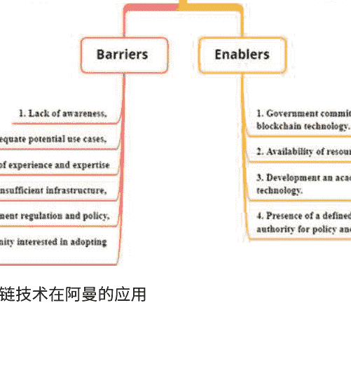

**图1 阻碍和促进区块链技术在阿曼的应用**

**阻碍因素**
1. 缺乏意识。
2. 不足的潜在用例。
3. 缺乏经验和专业知识。
4. 基础设施不足。
5. 政府监管和政策不力。
6. 对采用该技术感兴趣的社区内部分裂。

**促进因素**
1. 政府对采用区块链技术的承诺。
2. 有资源支持采用。
3. 建立培养该技术能力的学院。
4. 存在明确、负责任且负责政策和监管的当局。

##### 4.1.1 研究问题（RQ）1：阿曼苏丹国区块链技术采用和发展的促进因素是什么？

确定促进区块链技术采用的因素是研究的一个关键目标。在访谈中，注意到在选定的组织中，大多数组织在采用和实施区块链技术解决方案方面参与很少。因此，与阻碍相比，对促进因素的了解有限。除非组织在实施区块链技术解决方案方面具有足够的经验，否则无法可靠地确定潜在的促进因素。尽管如此，两个关键的促进因素是政府的承诺和资源的可用性。

政府的承诺是采用区块链技术最常提到的促进因素。组织们认识到阿曼政府在使区块链技术成为现实方面已经投入了足够的时间和资源。政府对这一努力的承诺的一个例子是举办旨在增加区块链技术知识的会议[8]。政府迄今已经举办了两次重要的会议，邀请来自发展中国家的嘉宾分享他们对该技术的知识和经验。另一次会议旨在将关键利益相关者聚集在一起，并制定出增加区块链技术采用的路径[8]。政府计划在未来举办更多的会议，以检查过去的目标并监测采用努力的进展。

政府在建立一个公共组织来处理与区块链技术采用相关的问题方面表现出了承诺。该组织是公共和私人实体寻求了解更多关于区块链技术或实施所需解决方案的首选来源。

在采访中确定的第二个促进因素是有资源支持采用。与西方世界相比，在阿曼苏丹国，区块链是一项相对较新的技术。在过去的3-5年里，能够帮助采用和实施的资源有限[8]。然而，通过政府、公共部门和私营部门的努力，目前存在可以帮助采用的资源。例如，ITA已经开发了各种框架，可以帮助各个行业实施。虽然这些框架尚未经过充分测试，但它们的可用性激励了组织采用区块链技术。

##### 4.1.2 RQ2: 阿曼苏丹国采用和发展区块链技术的障碍是什么？

建立阻碍区块链技术在阿曼推广的关键障碍是研究的一个重要目标。受访者提到了几个障碍。其中一个关键障碍是缺乏意识。区块链相对来说是一个新的技术，即使在发达国家，区块链技术也仍然是一个新兴的领域[3]。此外，它目前的主要吸引力在于其扩展的应用场景，例如在金融和医疗保健行业，即使在发达国家也没有得到全面实施。此外，人们对技术的了解是有限的。正如[28]所指出的，公众在公共或私人组织实施新技术之前必须对其有足够的认识，才能准备好接受它。

在采访中，阿曼苏丹国的公共和私人部门组织都提到对这项技术的认识非常有限。缺乏认识主要存在于两个层面。第一个层面是组织和其他利益相关者，他们需要帮助实施这项技术。阿曼的大多数公共和私人组织对区块链技术的了解不足。他们不了解区块链技术在他们所在行业的实际应用案例以及实施该技术所带来的好处。因此，他们对采用该技术没有太多动力。第二个层面是公众缺乏意识。组织存在是为了服务公众的利益。商品和服务的生产依赖于人们使用/消费这些商品和服务的能力。此外，人口的需求影响组织采用新的工作方式，以使其与人们的偏好保持一致。在阿曼的区块链技术案例中，公众对此几乎没有意识。因此，组织没有动力去采用公众不理解的技术。

在访谈中，第二个关键障碍是缺乏潜在的应用案例。区块链技术最初设计为在互联网上进行去中心化的价值交换[3]。然而，由于该技术的可取核心属性，如安全性和透明性，它还发现了其他潜在的应用案例，例如金融行业的价值交换和医疗保健行业的患者记录存储。然而，在阿曼苏丹国，受访者提到没有潜在的应用案例。阿曼仍然是一个年轻而不断发展的经济体，这可以解释缺乏潜在的应用案例。尽管发展中国家目前面临着可以通过使用区块链技术来解决的重大挑战，但阿曼苏丹国的年轻而不断发展的产业尚未做好准备迎接颠覆。

第三个障碍是技术方面的经验和专业知识的缺乏。这尤其适用于对采用该技术表现出兴趣的私营公司和增加对该技术的认识的公共公司。受访者提到，阿曼没有一家公司在可靠的规模上实施了这项技术。此外，他们提到组织在这个领域缺乏专业知识。例如，一家公共机构的主管提到，他们被 dissuaded 采用区块链技术，因为他们找不到可靠的实施框架和能够进行实施并提供支持服务的公司或个人。还提到，一些涉及技术的公司仅仅在有限的领域测试其实用性。因此，阿曼在区块链技术方面的专业知识相对较少，这使得有兴趣的各方不愿采用这项技术。第四个障碍是缺乏足够的基础设施和公共政策来支持采用。阿曼苏丹国与已经在各个行业开始采用区块链技术的发展中国家有很大的不同。其中一个关键区别是阿曼政府对于建立基础设施和政策来支持任何新事物都有重要影响。尽管阿曼政府致力于促进技术的采用，但缺乏足够的基础设施和政策来支持采用。

政策和监管的一个关键领域是区块链技术的开源性质，这要求随时间收集的数据得到保护和适当使用。缺乏监管引发了组织对处理公众敏感数据的担忧。制定一个政策，为采用区块链技术提供数据保护和安全的长期标准被认为是鼓励采用的关键步骤。

最后一个识别出的障碍是区块链技术中利益相关方和利益相关者之间缺乏合作带来的碎片化。正如前面提到的，阿曼参与区块链技术的大多数公司主要在有限的用例中测试其实用性。由于不同公司有不同的需求，为该技术开发的潜在解决方案存在碎片化。因此，人们担心在未来可能出现不兼容的实施，特别是在当前技术已经将组织中的多种实践和活动统一起来的世界中。通过合作努力解决碎片化问题将有助于消除担忧并促进采用。

##### 4.1.3 RQ3: 如何改善区块链技术的使用质量和广泛接受度的建议是什么？

研究的另一个目标是找出阿曼苏丹国增加区块链技术采用并成为区域中心的方法。在访谈中得到了三个重要建议。第一个建议是政府制定一项指导国家采用区块链技术的政策。该政策的作用将是为实施提供基准，并解决与采用该技术相关的担忧，如用户数据的保护和控制。在大多数有潜力引发颠覆的行业中，活动的集中化是常态。集中化有助于明确谁对用户数据拥有控制权，并负责公平使用。然而，由于区块链技术的去中心化特性，用户数据的保护和控制是一个重要问题。制定政策将有助于缓解这种担忧并促进采用。此外，政策变化可以用来解决可能由技术使用引起的未来问题。

第二个建议是应该采取措施在区块链技术中创建知识和专业知识。组织依赖于对特定技术的知识和专业知识的可用性，以便能够可靠地实施它[17]。知识和专业知识的可用性意味着组织可以依赖个人来实施所需的技术并提供长期所需的支持。阿曼苏丹国缺乏能够为各行业提供区块链技术解决方案并在未来实施和提供支持的公司。它还缺乏能够提供细分解决方案的开发人员，例如开发可以被普通公众用于访问在区块链技术下构建的服务的应用程序。增加该国的知识、专业知识和经验的努力将在很大程度上改善采用情况，并使该国成为技术的区域中心。

在面试过程中提出的最后建议是政府应提供足够的基础设施和资源来支持区块链技术的采用。采用区块链技术所需的基础设施和资源包括可靠和强大的互联网和通信网络以及对该主题的增加意识。政府应教育群众了解这项技术，以便他们能够为组织采用该技术提供激励。采取这种方法将增加采用率并将阿曼转变为技术的区域中心。

#### 4.2 一个辅助区块链技术采用的框架

研究结果以及确定的见解为在阿曼苏丹国推动区块链技术采用提供了基础。此外，该框架可以帮助将该国转变为技术的区域中心。该框架基于研究结果得出的三个关键支柱（表1）。第一支柱是制定一项政策，该政策将指导私营和公共实体采用区块链技术。该政策将有助于解决与区块链技术相关的担忧，如用户数据的保护和控制，并提供可被所有组织采用的标准。

第二支柱是为了支持该国采用区块链技术而提供基础设施和资源。显然，与发达国家不同，在新技术方面，阿曼政府在国家发展方向上拥有更大的权力，而不是私营部门。实质上，公共和私营行业都很重要。依赖政府的批准来采用变革性技术。政府通过提供必要的基础设施和资源来实现这一目标。尽管政府已经表现出了自己的承诺，但还需要更多的努力来创建必要的基础设施和开发所需的资源以促进采用。

第三支柱是增加该国的认识和知识的发展。缺乏认识、知识和专业知识被认为是采用区块链技术的关键障碍之一。私营和公共部门组织都缺乏可以依靠来实施技术并提供未来所需支持的人员。虽然过去的会议在欢迎专家来到该地区方面取得了很大进展，但知识和专业知识的转移尚未以可靠的规模发生。在这方面，有必要增加认识和发展知识和专业知识以促进采用该技术。图2说明了业务流程的优先级框架。根据研究中确定的障碍、推动因素和将阿曼转变为技术区域中心的建议，提出了建议框架，如图3所示。该框架将帮助阿曼在采用区块链技术方面取得重大进展。

表1采用框架的三个支柱

| 支柱 | 重要性 |
|------|--------|
| 制定指导区块链技术采用的政策 | 该政策将解决与区块链技术相关的担忧，如用户数据的保护和控制，并提供一个可以作为所有组织采用的基准。 |
| 提供基础设施和资源以支持区块链技术的采用 | 阿曼政府在新技术的采用方面具有重要影响力。因此，它应该成为提供必要基础设施和资源以促进采用的先驱。 |
| 增加该国对区块链技术的认识 | 这将增加该国对区块链技术的知识和专业知识，从而鼓励采用 |

图2 业务流程优先级框架

| Potential business impact \ Ease of adoption | Low (Process Criticality, Data confidentiality) | High (Process re-engineering need, Existing technology investment, Current data standards) |
| :--- | :--- | :--- |
| **High** (Cycle time reduction potential, Effort elimination potential, Additional benefits) | **Opportunistic**<br>Typical Characteristics: Multiple ecosystem players and high transaction friction, but high resistance to change.<br>Recommended action: Evaluate high potential areas for blockchain implementation in the medium term by continuously monitoring external ecosystem | **Ideal**<br>Typical Characteristics: Multiple ecosystem players and high transaction friction; relatively easier to standardize and implementation, does not require a complete redesign of the ecosystem and process.<br>Recommended action: Run PoC as a first step to full scale implementation |
| **Low** | **Avoidable**<br>Typical Characteristics: Low business impact and high resistance to change.<br>Recommended action: Non/ Status quo. | **Selective**<br>Typical Characteristics: Lower transaction friction and inefficiencies; easy to standardize and implement, blockchain implementation does not require a redesign of the ecosystem and process.<br>Recommended action: Wait for the technology to become more mature (and hence have better Role due to lower cost of implementation) |

图3 鱼骨图，用于说明障碍、推动因素和未来努力

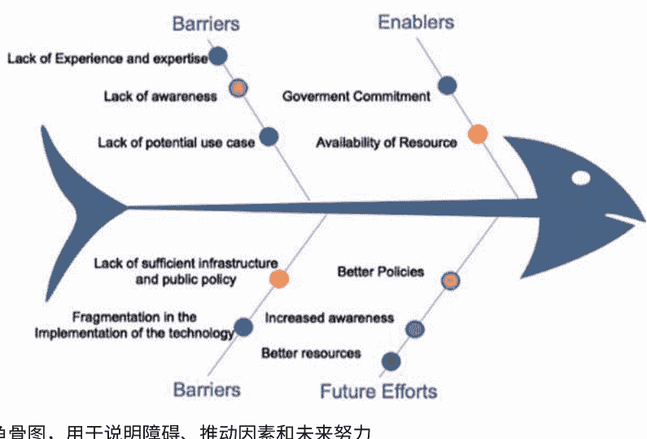

#### 4.3 区块链技术可以在哪些领域得到应用？

研究结果揭示了区块链技术可能被应用的领域。事实上，每个领域的采用都取决于政府解决的问题，这些问题成为采用的障碍。其中一个主要领域是金融行业。银行和金融依赖于准确记录和存储用户信息，并促进更快的交易。目前，区块链技术提供了前所未有的安全水平和可靠性可以保护银行存储的信息。它还提供更快的交易时间，这将使顾客受益。因此，金融行业是可以从采用区块链技术中受益的一个领域。然而，政府需要制定适当的监管措施，为在区块链中存储的数据提供指导方针。

第二个领域是医疗保健。通过采用区块链技术来安全存储患者信息并在需要时方便访问，医疗保健行业可以取得重大进展。然而，政府仍然需要制定指导如何控制此类数据的政策，以鼓励医疗机构采用这项技术。

该国另一个有前途的领域是物流和供应链行业。在过去的五年中，政府专注于建立了ASYAD集团的许多子公司。在当前的商业世界中，组织交易的信息通常是私下存储的，并且通常没有所有活动的主记录可供使用。另一方面，这些数据通常分散在内部功能和专业部门之间。例如，频繁的股票交易在微秒内执行，但股票的交易可能需要更长时间，主要是因为存储网络中涉及的各方无法访问彼此的记录，并且无法自动验证资产是否真正拥有并且可以通过超级账本平台进行转移，该平台是分布式账本系统的开源实现[7]。

### 5 结论

区块链代表了二十一世纪最具革命性的技术之一。这项技术已经成为发达世界的一个普遍趋势。企业和个人已经意识到他们可以从这项技术中获得的好处，这是其他创新所无法提供的。这些好处包括更快的交易、透明度和提高的安全性。然而，尽管区块链技术的有用性和各种应用案例，但其采用仍然滞后。

在这项研究中，将调查阿曼苏丹国对区块链技术的采用情况。该研究旨在通过提出一个基于当前技术在该国的推动因素和障碍的框架来增加采用率。观察到主要的障碍包括缺乏意识、缺乏潜在的应用案例、缺乏经验和专业知识、缺乏足够的基础设施、政府监管和政策薄弱，以及在对采用该技术感兴趣的社区中的碎片化。推动因素包括政府致力于创建更多意识和提供必要的基础设施。基于三个支柱提出了区块链采用的框架，首先，政府应制定指导该国区块链采用的政策，其次，建立区块链技术的专业知识库并向社区提供意识，最后，政府应提供足够的基础设施和资源来支持区块链技术的采用。

未来的研究调查是必要的，以验证可以从这项研究中得出的结论。然而，未来的研究应该在政策和监管方面进行战略性的考察，以在该国实施加密货币。在这种背景下，未来的研究可以考察降低采用区块链技术的障碍的可能途径，以及如何利用现有的推动因素在人们中间创建意识。作为拟议研究的研究成果，所开发的框架将有助于区块链技术的采用，以及该国如何成为第四次工业革命技术的区域中心，并吸引投资和专业人士在阿曼建立业务和实验潜在的应用案例。

### 参考文献

- 1. Abramova, S., B hme, R.: 比特币使用的感知利益和风险作为多维度决定因素的定量探索性研究。 在：2016年国际信息系统会议，ICIS 2016, (Zohar 2015), 第1-20页 (2016年)。 https://doi.org/10.17705/4icis.000012. Avital, M., Beck, R., King, J.L., Rossi, M., Teigland, R., Kursh, S.R., Gold, N.A.: 跳上区块链的浪潮：过去的经验教训和未来的展望。商业教育创新杂志。 8(2), 1-12页 (2018年)。 https://doi.org/10.1007/s00203-007-0327-5
- 3. Avital, M., Beck, R., King, J.L., Rossi, M., Teigland, R.: 跳上区块链的浪潮：过去的经验教训和未来的展望。 在：2016年国际信息系统会议，ICIS 2016, 第1-6页 (2016年)
- 4. Banerjee, A.V.: 兽群行为的简单模型。经济学季刊 107 (3) , 797-817 (1992年)。 https://doi.org/10.2307/2118364
- 5. Beck, R., Czepluch, J.S., Lollike, N., Malone, S.: 区块链-无需信任的加密交易的入口。 在：ECIS 2016会议论文集，第1-15页 (2016年)
- 6. B hme, R., Christin, N., Edelman, B., Moore, T.: 比特币：经济学，技术和治理。经济学视角 29 (2) , 213-238 (2015年)。 https://doi.org/10.1257/jep.29.2.2137. Cachin, C.: Hyperledger区块链架构。 在：分布式加密货币和共识账本研讨会 (DCCL 2016) (2016年)。 https://www.zurich.ibm.com/dccl/papers/cachin_dccl
- 8. CBO: 金融稳定报告。马斯喀特 (2018年)
- 9. 克里斯托弗, C.: 打地鼠游戏：为什么起诉数字货币交易所无法阻止在线洗钱, 第1-36页 (2014年)
- 10. 科明, D., 霍比恩, B.: 跨国技术采用：让理论面对事实。 J. Monet. Econ. 51(1), 39–83 (2004年)。 https://doi.org/10.1016/j.jmoneco.2003.07.003
- 11. Dhillon, G.: 洗钱和技术犯罪：文化分析。 在：AMCIS 2016: 冲浪IT创新浪潮-第22届美洲信息系统会议，第1-9页 (2016年)
- 12. Disspain, C., Szyndler, P.: 在多利益相关者的泥潭中航行：互联网治理的过去、现在和未来电信。澳大利亚杂志 63(3), 1-12 (2013年)。 https://doi.org/10.7790/tja.v63i2.431
- 13. Egelund-M ller, B., Elsman, M., Henglein, F., Ross, O.: 在区块链上自动执行金融合同。商业信息系统工程。 59(6), 457–467 (2017). https://doi.org/10.1007/s12599-017-0507-z
- 14. Fabian, B., Ermakova, T., Sander, U.: 比特币的匿名性-用户的观点。 在：2016年国际信息系统会议，ICIS 2016, 第1-12页 (2016年) 15. Fabian, B., Ermakova, T., Sander, U.: 比特币的匿名性-用户的观点-电子邮件和网络追踪-实证分析，隐私影响，对策视图项目隐私政策可读性，内容，影响视图项目。在：ICIS 2016会议论文集，第1-12页（2016年）。访问自 https://aisel.aisnet.org/cgi/viewcontent.cgi?article=1040&context=icis2016 https://www.scopus.com/inward/record.uri?eid=2-s2.0-85019460049&partnerID=40&md5=0d6a90ae395672cd63d5efa6f8f35f22

1. Ghazawneh, A.: 区块链在中东的挑战与机遇。在：MCIS 会议论文集，第1-13页（2019年）。访问自 http://www.itais.org/ITAIS-MCIS2019_pub/ITAISandMCIS2019-pages/pdf/85.pdf

2. Goldenfein, J., Hunter, D., Brennan, D., Dyball, A., Hawthorn, R., Kingsley, J., Wan, A., 等：区块链、孤儿作品和公共领域。哥伦比亚法律与艺术杂志，第1, 41页（2017年）。访问自 https://perma.cc/4B6X-9ZUD

3. Jackson, T., Daly, H., Mckibben, B., Robinson, M., Suhdev, P.: 无增长的繁荣经济学，第一版。地球出版社，伦敦（2009年）

4. Kamble, S., Gunasekaran, A., Arha, H.: 理解供应链中的区块链技术采用-印度背景。国际生产研究杂志1-25（2018年）。 https://doi.org/10.1080/00207543.2018.1518610

5. Lai, P.: 新颖技术的技术采用模型和理论的文献综述。信息系统与技术管理杂志14 (1)，21-38（2017年）。 https://doi.org/10.4301/S1807-17752017000100002

6. Leibenstein, H.: 消费者需求理论。经济学季刊64（2），183-207（1950年）

7. Manski, S.: 构建区块链世界：技术共和国还是更多的相同？战略变革 26(5), 511-522 (2017)。 https://doi.org/10.1002/jsc.21512

8. Mori, T.: 金融科技：区块链和证券结算。证券运营和托管杂志8(3), 208-227 (2016)

9. Mougayar, W.: 商业区块链：承诺、实践和应用 (2016)

10. Norta, A., Vedeshin, A., Rand, H., Tobies, S., Rull, A., Poola, M., Rull, T.: 基于区块链的自我感知代理合同管理以实现法律问责。 https://Whitepaper.Agrello.Org/Agrello_Self-Aware_Whitepaper.Pdf, (Cc), pp. 1-35 (2017)。访问 https://docs.agrello.org/Agrello-Self-Aware_Whitepaper-English.pdf

11. Oliveira, T., Martins, M.F.: 企业级信息技术采用模型的文献综述。电子信息系统评估杂志14(1), 110–121（2011）。 https://doi.org/10.1017/CBO9781107415324.004

12. Ølnes, S.: 超越比特币，利用区块链技术实现智能政府。In: Scholl, H.J., Glassey, O., Jansen, M., Kljevink, B., Lindgren, I., Parycek, P., Soares, D., et al. (eds.) 电子政府，第253–264页。 Springer International Publishing, Cham (2016)

13. Patrick, Y., Chau, K.: 个人专业人士对信息技术的接受：一种模型比较方法。决策科学 32(4), 1–14 (2001)

14. Queiroz, M.M., Fosso Wamba, S.: 供应链中的区块链采用挑战：对印度和美国主要驱动因素的实证调查。信息管理国际期刊 46, 70–82 (2019)。 https://doi.org/10.1016/J.IJINFOMGT.2018.11.021

15. Rainer, Christin, N., Edelman, B., Moore, T.: 比特币：经济学、技术和治理。J. Econ. Perspect. 29(2), 213–238 (2015)。访问网址：http://www.jstor.org/stable/24292130

16. Rashid, S.K.: 瓦克夫在当代世界的潜力。J. King Abdulaziz University, Islamic Econ. 31(2), 53–69 (2018). https://doi.org/10.4197/Islec.31-2.4

17. Risius, M., Spohrer, K.: 区块链研究框架：我们（不）知道的，我们从这里去哪里，以及我们如何到达那里。Bus. Inf. Syst. Eng. 59(6), 385–409 (2017). https://doi.org/10.1007/s12599-017-0506-0

18. Saadeh, Y.: 区块链实施对阿联酋金融部门网络风险缓解策略的影响，第1-121页（2018年）。访问网址 https://bspace.buid.ac.ae/bitstream/1234/1239/1/2014303006.pdf

19. Sas, C., Khairuddin, I.E.: 信任设计：比特币用户的挑战和机遇探索。在：人机交互会议-论文集，2017年5月，第6499-6510页（2017年）。 https://doi.org/10.1145/3025453.3025886

20. Straub, E.T.: 理解技术采用：非正式学习的理论和未来方向。教育研究评论 79（2），625-649页（2009年）。 https://doi.org/10.3102/0034654308325896

21. Sullivan, C., Burger, E.: 区块链，数字身份，电子政务。在：通过区块链进行业务转型，第233-258页 (2019年)。 https://doi.org/10.1007/978-3-319-99058-3_9

22. Tarhini, A., Arachchilage, N.A.G., Masa'deh, R., Abbasi, M.S.: 对信息系统研究中技术采纳和接受的理论和模型的批判性评论。国际技术传播学刊6(4), 58-77页 (2015年)。 https://doi.org/10.4018/IJTD.2015100104

23. Venkatesh, V., Thong, J.Y.L., Xu, X.: 消费者对信息技术的接受和使用：扩展统一接受和使用技术理论。管理信息系统36(1), 157-178页 (2012年)。 https://doi.org/10.2307/41410412

24. Wass, S.: 迪拜推出推动区块链采用的平台 (2018年)。 访问MENA网站: https://www.gtreview.com/news/mena/dubai-launches-platform-to-push-blockchain-adoption/

25. Yli-Huumo, J., Ko, D., Choi, S., Park, S., Smolander, K.: 当前区块链技术研究在哪里？—系统综述。 PLoS ONE 11(10), e0163477 (2016年)。 https://doi.org/10.1371/journal.pone.0163477

26. Zamani, E., He, Y., Phillips, M.: 区块链的安全风险。计算机信息系统杂志60(6), 495–506 (2018年)。 https://doi.org/10.1080/08874417.2018.1538709

27. Zohar, A.: 比特币的神话、炒作和真正价值。ACM通讯58(9) (2015年)。 https://doi.org/10.1145/2701411

## 深度学习、大数据在生物信息学中的最新进展和挑战

Ajay Sharma 和 Raj Kumar

摘要 近年来，产生的数据比人类历史上的几千年还要多。这些数据对于决策者来说代表着重要的金矿，具有商业价值和参考资料。但是，大部分价值仍未被开发，更糟糕的是，只要无法使用处理大量信息所需的工具，就会错误地理解这些价值。在本书章节中，我们将探讨机器学习如何让我们一窥大数据中的模式，并在生物学、医疗保健等领域获取关键信息。在这个领域中，对于电子设备产生的大量数据的多样性和真实性，分析、存储和深度学习算法的效果至关重要。基于Hadoop的地图和卷积神经网络、循环神经网络等深度学习算法的架构已经改变了我们分析海量数据的方式。本书章节讨论了深度学习算法、强化学习在生物信息学、计算机辅助药物设计、结构生物学和计算生物学领域管理大数据的角色、影响和前景。在最后一节中，作者讨论了深度学习在下一代测序、生物医学图像处理、药物发现以及分子建模和动力学研究中的作用。

关键词 大数据 · 医疗保健 · 深度学习 · 强化学习 · 卷积神经网络（CNN） · Map-reduce · Hadoop · 生物信息学 · 结构生物学 · 药物设计

### 1 引言

随着时间的推移，数据无处不在，并成为历史，为了保留历史，人类以某种有组织的方式存储数据。数据以一种非结构化、未经处理的形式存在。人类应用一些技术从这些数据中提取一些信息，以增强对特定领域的理解。

由于生物问题/疾病仍然是人类生活和人类生活的主要罪魁祸首，人们试图理解这些自然现象背后的机制。人类开始借助人工技术使用计算机来理解生物问题。在每个领域都取得了进展，包括生物技术、医学、生命科学和信息技术。在微阵列的生物实验中，NGS测序仪器产生了大量的数据。为了使用这些海量数据，我们需要一种存储和分析的系统，因此我们将在这个背景下看到生物技术和医学科学如何被机器学习[1, 2]转变。在当前的书籍章节中，我们将学习大数据和深度学习。让我们简要介绍机器学习、深度学习和大数据分析以及它们在生物信息学和其他医学科学领域的应用案例。

大数据：指的是可以是结构化或非结构化的数据，每天通过手动输入到系统或通过一些物联网电子传感器（如热量、温度、压力等）从各种资源中生成，并具有5V属性（容量、变异性、真实性、速度、价值）。上世纪90年代，约翰·马什首次提出了大数据这个术语，但是在21世纪初，随着计算能力的不断增强和越来越多的数据从各种资源（如Facebook、YouTube、NCBI（国家生物技术信息中心）、PDB（蛋白质数据库）、DDBJ（日本DNA数据库））等生成，大数据才开始受到关注。稍后我们将更多地了解大数据在生物信息学中的应用[3]。在第2节中，您将更多地了解大数据在生物信息学中的重要性，以及大数据的不同V（容量、速度、多样性、真实性、价值）与生物信息学的关系。

机器学习：机器学习（ML）是人工智能的一个子集，它使系统能够从输入数据（特征）中学习，并能够让用户构建、训练模型。基于这些模型，人们可以对未知数据集进行预测。典型的机器学习模型通常分为有监督、无监督和半监督学习。机器学习是一个古老的概念，阿瑟·塞缪尔在1952年提出了这个词语。自1950年至1990年，我们没有那么多的计算能力，也无法访问数据。随着互联网在1990年代末和21世纪初的普及以及人们对数据的访问权，半导体行业的硬件的巨大改进，我们看到了机器学习算法的巨大崛起。在本书章节中，我们将学习如何使用机器学习算法处理生物数据。

### 2 生物信息学中的大数据

生物信息学是一个多学科领域，包括计算机科学、数学、生物技术、制药学和分子生物学。生物信息学的目标是开发基于计算的解决方案，用于存储和分析生物实验产生的数据。在组学世界中，有基因组学、蛋白质组学和代谢组学，基因组学是一个涉及整个生物体基因组的新科学领域。

测序和研究生物体整个基因组的遗传构成。基因组序列用于研究基因的功能（功能基因组学），将序列与另一个生物体进行比较以进行进化遗传学分析（比较基因组学），结构基因组学用于比较或生成蛋白质的新结构。蛋白质组学涉及细胞中的任务。在细胞中，完整的蛋白质集被称为蛋白质组学，了解每个细胞在身体中的功能。蛋白质组学的主要目标是理解蛋白质的结构和功能。随着科学家对人体/动物体内细胞、分子合成、修饰和解释不同机制的认识越来越深入。如果我们谈论生命的中心法则，那么分子生物学涉及DNA如何转录为RNA，然后转录为蛋白质。在人体中，许多蛋白质通过激活/过表达、抑制/低表达基因来负责不同的功能。随着技术的发展，研究人员/科学家在实验过程中产生了更多的数据，为了分析和存储这些信息，我们需要一些解决方案，如算法、大数据、Hadoop、数据库和其他编程语言来解决这个问题。

数据由计算机格式化的数字、单词、度量和观察组成。大数据指的是这些数据的庞大、结构化或非结构化集合。对于传统的数据处理软件来说，数字时代带来了一些挑战：信息以如此大的容量、速度和真实性可用，计算集中在人们身上，研究人员对此并不了解。数据中存在着五个V，我们可以将其描述为大数据：容量、多样性、真实性、速度、价值。容量指的是可用数据的规模，速度是数据收集的速率，多样性指的是上述数据来源的各种来源，在上述三个V之外，通常还会添加两个V：真实性指的是所获得数据的一致性和确定性，而价值则衡量了从所接收数据中提取的数据的效用。

良好的分析数据需要具备商业技能、编程知识、广泛的数学和分析技能的人员。但是传统技术如何处理数百万个信用卡分数或数十亿个在各个银行发生的交易？如何找到、存储和检索生物体的基因组数据。蛋白质结构预测是如何进行的，蛋白质配体数据存储的方式。如何研究蛋白质-配体相互作用。这些都是一些需要回答的神秘而复杂的问题。为了回答这些问题，机器学习、深度学习和大数据成为科学家、研究人员和其他数据科学开发人员、分析工程师的救星[3,4]。

通过使用大数据，研究人员能够解决与生物实验数据的存储和检索相关的问题。在这里，我们将详细了解大数据分析中使用的不同V。

#### 大数据的5V：

在这里讨论数据的生物学时，我们将在本书章节中了解在生物信息学中使用5V的用途。不同的研究人员提供了以下大数据的5V：体积，速度，多样性，真实性，价值。体积指的是实验产生的数据量。速度讨论了数据生成的频率。

新数据的高效创建和存储。由于我们有各种实验，数据的异质性是不同的。真实性，生物实验数据的“真实性”或“无序性”。价值，数据的重要性和我们从中得到的结果结果。图1显示了大数据分析中的不同类型的V [5, 6]。

##### 2.1 卷

在大数据的世界中，除非是以艾字节、拍字节等为单位的数据量，否则你不算是大数据。大数据技术的巨头，如亚马逊、谷歌、微软和其他电子商务平台，从全球数百万客户（尤其是智能手机用户）那里获取实时、结构化和非结构化的数据，每秒之间的数据量介于千字节和泽字节之间。他们几乎实时地处理数据，并通过运行机器学习算法来分析大数据，以做出决策，以提供最佳的客户体验。在类似的情况下，一个生物实验，如一个生物体的NGS，会产生大量的数据，有时是GB或TB级别的。这些数据可能来自不同的样本，因此生物实验会产生大量的数据，从大数据的角度来看，这就是所谓的数据量。

数据量是一个问题，解决方法是什么？

一个典型的人类基因组序列大约为200 GB，假设你想对感染COVID-19疫情的人类群体进行基因组测序，并且我们取样了100个人，大约是10 TB。为了简单起见，想象一下一个体面的10 TB硬盘上至少需要300美元。管理100 × 300美元的数据百万兆字节需要3万美元。你可能会获得折扣，但仅仅存储成本就超过1万美元。

50%折扣。想象一下只是保留一个冗余的灾难恢复版本的数据。你需要更多的磁盘空间。如果数据量超出了正常限制，超出了本地存储设备的容量，那么数据的体积就变得困难和昂贵。因此，可以想象数据量是一个巨大的挑战，不仅仅限于生物实验数据，还有其他资源，如药物设计实验或高通量测序实验，这些资源有可能产生大量需要高效和有效分析的数据。解决这个问题的合适方案是使用流行的存储选项之一，即亚马逊Redshift，这是AWS提供的云托管数据仓库服务。它将信息分布在多个节点上，具有抗灾能力，并且在计算方面比地面上的关系型数据库（如Postgres和MySQL）更快。从关系型数据库到Redshift的数据也可以轻松复制而无需停机时间。

##### 2.2 速度

速度是指生物实验中数据生成的速率。想象一种机器学习服务，它可以不断从癌症患者或其他NGS测序实验平台的数据流中学习，这些平台包括成千上万个样本或以图像或文本形式的长/短读取（基因组序列BAM、BAD文件）24×7×365，并将其上传到分析服务器。每秒钟发生数百万次交易，这意味着每个时间间隔从一个或多个设备传输到数据中心的数据量达到了千兆字节级。每秒钟的高容量数据流入速率定义了数据速度。

速度是一个问题，什么是适当的解决方案？

速度*时间 = 容量，容量导致愿景，愿景带来更多的金钱。然而，这条增加收入的道路并非没有代价。许多问题出现了：如何处理通过防火墙传入的每个数据包的恶意性？如何处理如此结构化和非结构化的高频率飞行数据？此外，如果您具有高数据速度，几乎总是意味着每秒处理的数据量会大幅波动。解决这个问题的方法是使用“流数据”，这些数据在数据开始时进行处理。Apache公司有一些流行的解决方案，如Spark和Kafka，其中Spark在批处理和流处理方面都非常出色，Kafka运行发布/订阅机制。Amazon Kinesis也是一种解决方案，它具有几个相关的用于流数据处理的API。另一个流行的无服务器函数API是Google Cloud Functions（Google Firebase也包括在内）。这些都是处理实验数据复杂负载的优秀黑盒解决方案，但它们都需要时间和精力来构建数据管道进行分析。

##### 2.3 多样性

现实世界因为不同类型的数据而变得混乱，所以处理混乱的数据是有意义的。我们有不同类型的生物数据，这些数据是通过实验生成的，包括文本、图像等。数据的异质性经常是构建数据存储的一个压力源。这些异构数据集对生物研究人员、数据科学家和学生在大数据分析方面构成了巨大挑战。

多样性作为一个问题，解决方案是什么？

当分析师消耗大量数据时，可以使用各种类型的数据（JSON、YAML、CSV（x ＝ C（逗号）、P（饼图）、T（柱状图）等）和统一类型的数据（XML）来处理数据仓库中的数据库。当列和键（如反驳、引入和/或废弃键）在API中并不总是保证存在时，数据处理变得更加痛苦。因此，不仅要统一各种数据类型，而且数据类型可能会随时间而变化。解决这个问题的方法是在管道中应用任何转换里程碑时，将其记录在各种数据类型中。首先，将原始数据存储在数据存储集群中（数据集群是一个超灵活的数据存储库，以其最原始的形式收集和保存数据，如亚马逊S3文件存储）。然后，将原始数据转换为各种类型的数据，并存储在数据存储的其他位置。进一步，将其加载到关系数据数据库或数据仓库中。

##### 2.4 真实性

在现实世界中，数据是如此动态，以至于很难知道什么是正确的。真实性指的是数据的可信度或混乱程度，如果信息的可信度提高，混乱程度就会降低。真实性和价值共同定义了数据质量，这为数据科学家提供了重要见解。

真实性是一个问题，解决方案是什么？

在NGS测序的情况下，所有这些数据都非常嘈杂，并且数据的数量也随着信息的增加而增加，有时可能呈指数增长。想象一下在不同国家和不同人群中对不同SARS-COV2菌株的序列进行实验，并且样本大小也不同。在NGS测序或药物设计实验中，如蛋白质-配体对接和分子模拟动力学研究的不同模拟中存在嘈杂的数据，噪声会降低数据的整体质量，影响数据管理。在典型的机器学习中，我们必须考虑与模型构建相关的许多特征向量，这不必要地增加了实验的计算复杂性，使得构建和训练机器学习模型变得困难。解决这个问题的方法是，如果数据不够可信，只能提取高价值信息因为收集所有数据并不总是有意义的，因为这是昂贵的并且需要进一步的努力，因此我们可以去除不需要的数据并选择只有那些在模型构建中有用的特征。数据处理流水线尽快过滤数据中的噪声并提取它们。这样只能处理和加载所需和可靠的数据进行数据分析。

##### 2.5 价值

在大数据中价值非常重要。除非我们能够将大数据转化为有价值的东西，否则它是无用的。资源成本和大数据收集的努力以及数据处理结束时的价值非常重要，需要理解。价值非常重要，因为它对业务决策和竞争优势有影响。生物数据库存储库，如NCBI（国家生物技术信息中心https://www.ncbi.nlm.nih.gov/）提供生物和基因组信息的信息和访问，PDB（蛋白质数据银行）https://www.rcsb.org/ 是一个数据库，存储了由X射线晶体学和核磁共振（NMR）生成的所有蛋白质、核酸和复合物组装的3D注释。Drug bank https://go.drugbank.com/ 是由阿尔伯塔大学维护的包含所有与药物相关的分子（化学、药理学和制药数据以及药物靶点）的数据库。考虑到NCBI、Drug bank、PDB从各种数据源收集数据，数据可视化、浏览模式被提取并转化为数据处理流程，仅生成高价值信息，提供相应用户兴趣的有用推荐。反过来，这有助于这些生物服务器避免将数据浏览给用户和数据库带来的困难。如果用户不满意，所得的信息可能价值低。因此，大数据的价值对许多与研究相关的决策产生影响，并对他人具有竞争优势。

### 3 提出的Map-Reduce架构Hadoop

#### 集群模型

在第2节中，你已经了解了大数据的V因素。现在我们有实验数据。你有没有想过这些文件是如何存储在大数据集群中的？答案是MapReduce架构，它是一种用于并行处理数据的数据处理工具。这篇名为“MapReduce：大规模集群上的简化数据处理”的论文于2004年由Google [7, 8]开发并发表。MapReduce是一个两阶段的范式，包括映射器和减少器。Mapper中的输入是以键值对的形式提供的。Mapper的输出被提供给输入减少器。Mapper结束后，只有减少器在工作。减少器也使用键值格式的输入，减少器的输出是最终输出。减少器阶段在映射器阶段完成后发生，正如MapReduce的名称所暗示的那样。第一个是映射作业，它读取和处理一组数据以生成键值对。映射器/映射作业的输出（键值对）输入到减少器中。减少器由多个映射作业提供键值对。然后，减少器将这些中间元组添加到较小的元组集或键值对中，这是最终输出。减少器还对它们进行聚合。让我们获取关于MapReduce及其组件的更多信息。

MapReduce主要有三个类别。Hadoop中的map-reduce函数的工作原理如下：

- Mapper类：Mapper类是使用MapReduce进行数据处理的第一步。在这里，记录读取器处理每个记录输入的相应键值对。这些中间数据存储在Hadoop的Mapper上的本地磁盘上。
- 输入分割：它是数据的逻辑显示。它是MapReduce程序中一个map任务的工作包。
- 记录读取器：它与分割输入进行交互，并将收集到的数据转换为键值对。
- Reducer类：中间的mapper输出被提供给reducer，它进行处理并生成最终输出，然后保存在HDFS中。
- 驱动程序类：驱动程序类是MapReduce作业的主要组件。他必须设置一个MapReduce作业来运行Hadoop。指定了Mapper和Reducer类的名称以及它们的数据类型和相应的作业名称。

#### Map Reduce的步骤

- Map函数接收成对的数据并返回一个<键，值>对列表。在这种情况下，键不是唯一的。
- Hadoop架构使用Map的输出进行排序和洗牌。这种类型和洗牌将作用于<键，值>对列表，并发送唯一键和与该唯一键相关的值列表。
- 排序和洗牌的输出被发送到Reducer阶段。Reducer函数接收单个键的值列表，并保存/显示最终的<键，值>输出（图2）。

#### MapReduce的特点

MapReduce的两个最大优势是：

- 并行处理
- 数据本地性
- 降低成本

并行处理：软件将作业分割在MapReduce的多个节点之间，每个节点处理作业的一部分。因此，MapReduce基于分而治之的范例，帮助我们在多台机器上处理数据。

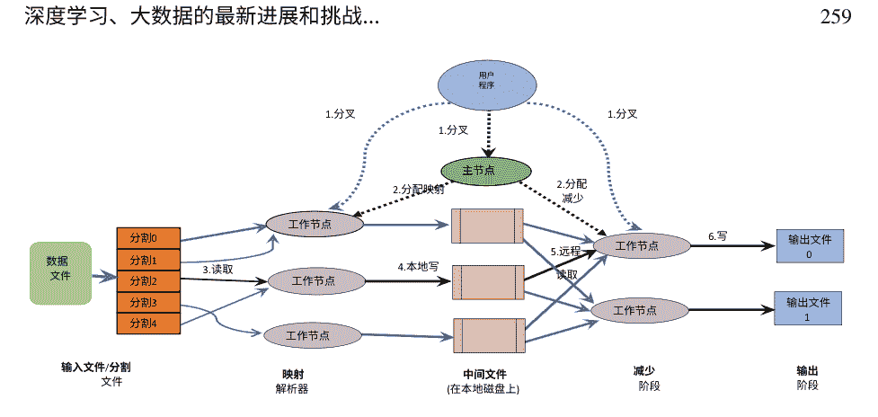

通过多台机器而不是一台机器并行处理，大大减少了数据处理所需的时间[9]。

数据本地性：在MapReduce框架中，处理单元被移动到数据而不是处理单元。在传统系统中，我们习惯将数据带到处理单元并进行处理[9]。然而，随着数据的积累和变得非常庞大，将如此大量的数据传输到处理单元会导致以下问题的产生：

将庞大的数据传输到处理过程中是昂贵的，并且会降低网络性能。数据由一个单元处理，这构成了一个瓶颈问题，处理数据需要时间。

降低成本：MapReduce现在通过将处理单元带到信息中来克服上述问题。如上图所示，数据分布在多个节点上，每个节点上的数据部分都会被处理。这使我们能够从以下方面受益：将处理单元转移到数据非常经济。由于所有节点都与其信息部分并行工作，处理时间缩短。每个节点处理一部分数据，因此不存在节点过载的机会。

### 生物信息学中的机器学习

机器学习的基础是自学习算法，它们通过改进任务不断演化。这些算法最终将在正确结构化和提供正确数据的情况下产生模式识别和预测建模的上下文。数据就像机器学习算法的补充，以实现更好的性能。算法根据信息（输入数据）定期进行设计和训练，就像教练训练奥运会运动员改善他们的身体和技能一样每天通过训练。 许多语言，包括Python、R、Java、JavaScript和Scala，都可以与机器学习一起使用。 多亏了Google的TensorFlow库，它提供了一个完整的机器学习工具生态系统，Python是许多开发者的首选。 机器学习分为监督学习、无监督学习、半监督学习和强化学习等多种形式。 基本区别在于算法用于分类的数据是标记的还是未标记的[10-12]。 关于这些不同机器学习模型之间的差异的完整信息在表1中显示。

表1 不同机器学习算法在生物实验数据[10-12]上训练模型的差异

| 序号 | 测量标准 | 监督学习 | 无监督学习 | 强化学习 |
| :--- | :--- | :--- | :--- | :--- |
| 1 | 定义 | 使用标记数据 | 无先验知识的无标记数据 | 与环境集成工作-无定义的数据集 |
| 2 | 问题类型 | 回归、分类问题 | 聚类和关联算法 | 基于开发或探索的工作 |
| 3 | 使用的算法 | 使用SVM、KNN、ANN、线性回归、逻辑回归 | 使用K-均值、C-均值和Apriori算法 | 使用Q-learning和SARASA算法 |
| 4 | 训练 | 用于外部监督 | 不需要监督 | 没有预定义数据 |
| 5 | 解决问题的方法 | 这将标记的输入映射到已知的输出 | 理解模式并发现输出 | 它采用试错方法 |
| 6 | 实时应用 | 用于风险评估，预测公司销售预测 | 用于推荐系统（聊天机器人）和医学科学中的异常检测 | 用于自动驾驶车辆、游戏和医疗保健系统 |

#### 4.1 人工神经网络和深度神经网络

一种被称为神经元的简单特征的宇宙数量构成了人工神经网络（ANN），每个神经元都做出简单的决策。 神经元可以一起为处理自然语言、计算机视图和人工智能等复杂问题提供精确的答案。 一个典型的神经网络可以有一个输入神经元层，一个/两个/多个“隐藏层”来处理输入，或者一个输出层来提供模型的最终输出。 通常还会有2-8层的神经网络

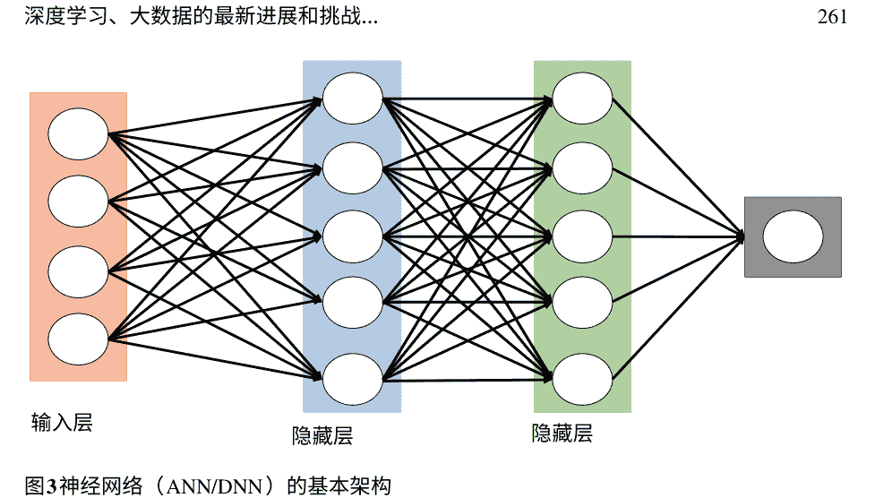

图3神经网络（ANN/DNN）的基本架构

Goodfellow、Bengio和Courville等专家对深度神经网络（DNN）的研究表明，隐藏层的数量随着神经网络的增加而增加。 神经网络由输入层、隐藏层和输出层组成[13, 14]。 激活函数用于确定神经网络的输出，因此如果有人想学习机器学习，在处理激活函数时往往会感到困惑。在这里，我们将详细了解激活函数（图3）。

#### 4.2 激活函数

模型中的激活函数是一个数学方程，它决定了神经网络的输出。 该函数附加到网络中的每个神经元上，并根据每个神经元的输入是否与模型的预测相关来决定是否激活它。 激活函数还有助于将每个神经元的输出归一化到1到0或-1到1的范围内[15, 16]。 激活函数的另一个方面是计算效率，因为需要计算每个样本的成千上万甚至百万个神经元。 现代神经网络使用反向传播技术来训练模型，这对函数和导数函数施加了更大的计算压力。 由于需要速度，出现了新的函数，如ReLu和Swish，它们进一步分为线性和非线性函数。 在这里，我们将学习更多关于ANN中使用的非线性和线性激活函数。

##### 激活函数在神经网络模型中的作用

数值输入数据点被馈送到神经网络的输入层的神经元中。每个神经元都有一个权重，通过乘以权重将其传递到下一层。

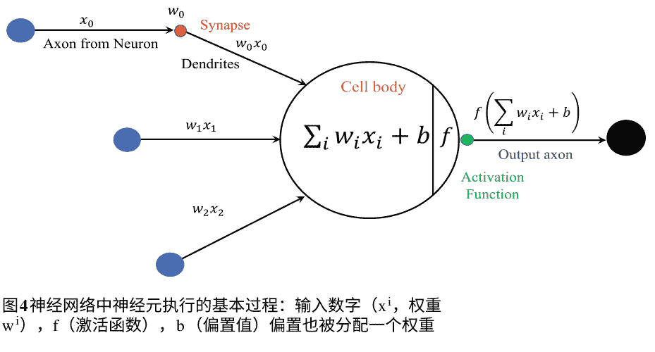

图4神经网络中神经元执行的基本过程：输入数字（x^i，权重w^i），f（激活函数），b（偏置值）偏置也被分配一个权重

通过权重将输入数字传递给神经元。激活函数是当前神经元与下一层的输出之间的‘门’。根据规则或阈值，它可以是一个简单的阶跃函数，用于开关神经元的输出。它也可以是一个将输入信号映射到神经网络所需的输出信号的转换。神经网络越来越多地使用非线性函数，这可以帮助网络学习复杂的数据，计算和学习几乎每个与问题相关的函数，并提供准确的预测[17]（图4）。

##### 激活函数的类型

- 二进制阶跃函数
- 线性激活函数
- 非线性激活函数

###### 4.2.1 二进制阶跃函数

二进制阶跃函数是基于阈值的激活函数。如果输入值高于或低于指定的阈值，神经元将被激活并将准确的信号发送到下一层。阶跃函数的问题在于不允许多值输出，例如将输入分类为多个类别之一的问题无法得到支持。

###### 4.2.2 线性激活函数

线性激活函数的计算公式为：A = cx，每个神经元的输入和权重相乘，输出信号与输入成比例。从某种意义上说，线性函数比阶跃函数更好，因为它允许多个输出，而不仅仅是是或否[18]。然而，线性激活函数存在两个主要问题：

1. 无法使用反向传播（梯度下降）来训练模型，因为函数的导数是常数，它没有与输入相关的关系X。因此，无法反转并理解输入神经元中的权重可以更好地预测什么[18]。
2. 所有神经网络层都会合并成一个单一的层，最后一层将是第一层的线性函数，无论神经网络有多少层（因为线性函数的线性组合仍然是线性函数）。神经网络变成了一个具有线性激活函数的单一层。线性激活网络只不过是一个线性回归模型。

处理不同输入数据参数的能力和能力有限[18]。

###### 4.2.3 非线性激活函数

现代神经网络（NN）模型使用非线性激活函数。机器学习模型允许从网络中学习和建模复杂的映射输入和输出，这对于学习和建模非线性、高维图像、视频、音频和数据集等复杂数据是必要的。它们也是必要的。几乎任何可想象的过程都可以看作是神经网络中的一个功能计算机，前提是激活函数是非线性的[19, 20]。

##### 非线性函数解决了线性激活函数的问题

在神经网络中，它们有一个导数函数，它们允许反向传播，这与深度神经网络相连，允许多个神经元层被堆叠。需要多个隐藏层的神经元来实现高精度的复杂数据。有七种常见的非线性函数，可以选择一个函数。

- Sigmoid或Logistic激活函数
- Tanh或双曲正切激活函数
- ReLU（修正线性单元）激活函数
- Leaky ReLU
- SoftMax函数

Sigmoid或Logistic激活函数：使用Sigmoid的主要原因是它存在于两个值之间（0到1之间）。因此，它特别适用于需要预测概率的模型。由于任何事物只有0到1之间的可能性，所以Sigmoid是正确的选择。该函数可以被区分开。换句话说，在任意两点上，我们可以找到Sigmoid曲线的斜率。该函数是单调的，但函数的导数不是。Sigmoid函数的逻辑可能导致神经网络在训练过程中停滞不前。SoftMax函数是一种更常见的多类别逻辑激活函数。Sigmoid函数是最常用的，但还有许多更有效的替代方法存在[21, 22]。

`s(x) = \frac{1}{1 + e^{-x}}`

Sigmoid函数的主要优势是：

- 该函数可以进行微分。换句话说，在任意两点上，我们可以找到Sigmoid曲线的斜率。
- 它是一种单调函数。
- 平滑的梯度将防止输出值“跳跃”。
- 输出值范围从0到1，标准化神经元的输出。 因此，它特别适用于需要预测概率输出的模型。 由于只有0到1之间的可能性，Sigmoid是正确的选择。
- 明确的预测：当X大于2或小于 - 2时，值Y（预测）趋向于曲线的边缘，接近1或0。 这样可以进行清晰的预测。

缺点

梯度消失：如果我们仔细观察函数末端的图形，y值对x的变化反应很小。 让我们考虑一下这是一个什么问题！ 在这些区域，导数值非常低且趋于0。 这被称为消失梯度，从中吸取教训。 如果为0，则没有学徒。 当学习速率较慢时，可以将最小化错误的优化算法附加到局部最小值上，人工神经网络模型无法达到最大效率。

- 输出不是零中心化的
- 计算开销很大

双曲正切激活函数：双曲正切函数类似于Sigmoid逻辑函数，但更好。 双曲正切函数的范围是从（-1到1）。 双曲正切函数也是S形的。 优点是负输入非常负，而在双曲正切图中的零输入映射到接近零[21, 23, 24]。

`f(x) = \tanh(x) = \frac{(e^{x} - e^{-x})}{(e^{x} + e^{-x})}`

双曲正切函数的主要优点如下：

- 函数的可区分性和可微性。
- 它是单调的，但其导数不是单调的。
- 双曲正切函数主要用于两个类之间。
- 前馈网络同时使用双曲正切函数和逻辑Sigmoid函数。
- 它具有非常类似Sigmoid的结构。 然而，当函数被定义为(-1, +1)时，它是以零为中心的。

与Sigmoid特征相比，它的导数更陡峭。因此，由于有更广泛的范围用于更快的学习和评分，它将更加有效。 然而，它也有与Sigmoid函数类似的缺点。

##### ReLu（修正线性单元）激活函数

ReLU目前是世界上使用最多的激活函数。 从那时起，它几乎被用于所有神经网络或深度学习中。 ReLU是半修正的，正如你可以看到（从底部）。如果z小于零，则f(z)为零，如果z大于或等于零，则f(z)为z。ReLu在自然界中的范围从0到无穷大。该函数既是单调的，也是可导的。然而，问题在于将所有负值变为零，这降低了模型适应或训练数据的能力。这意味着对ReLU激活函数的任何负输入都会将值变为零，这在图形上产生了影响，因为负值没有被正确映射[21, 25, 26]。

`f(x) = \begin{cases} \text{当} x \leq 0 \text{时，结果为} 0 \\ \text{当} x > 0 \text{时，结果为} x \end{cases}`

优势

- 计算效率高：ReLU的值域为[0,+无穷大]，但是有哪些好处和回报呢？想象一下一个具有太多输入和隐藏层的大型神经网络。几乎所有的神经元都以相同的方式通过sigmoid和双曲正切函数激活。因此，激活非常强烈。我们希望在网络中的一些神经元处于活跃状态且激活不频繁时具有有效的计算负荷。我们通过ReLU实现了这一点。在负轴上使用0值，网络将运行更快。由于计算负荷低于sigmoid和双曲正切函数，多层网络变得更受欢迎。

- 非线性：乍一看，似乎正轴的线性函数具有相同的特性。但是ReLU首先不是线性的。一个好的估计器或任何其他函数也可以通过ReLU的组合来收敛。

缺点

- 濒危的ReLU问题：当输入为零或负数时，函数的梯度变为零，网络无法复制和学习。为了解决这个问题，我们有另一种非线性激活函数，称为LeakyReLU网络。

Leaky ReLU：泄漏帮助ReLU函数扩大其范围。通常情况下，a的值约为0.01。如果a不是0.01，则称为随机ReLU。这就是为什么Leaky ReLU范围可用（-infinity to +infinity）。Leaky和Randomized ReLU的函数都是单调的。而且，它们的导数也是单调的。泄漏帮助ReLU函数扩大其范围。通常情况下，a的值约为0.01。如果a不是0.01，则称为随机ReLU。这就是为什么Leaky ReLU范围可用（-infinity to infinity）。Leaky和Randomized ReLU的函数都是单调的。而且，它们的导数也是单调的[21, 27]。

`f(x) = \begin{cases} \text{当} x < 0 \text{时，} 0.01x \\ \text{当} x \geq 0 \text{时，} x \end{cases}`

优势

- 防止ReLU死亡问题：负数区域的ReLU变化具有较低的正斜率，因此即使对于负输入值，它也允许反向传播。如果函数名称随机更改，则泄漏值为0.01，作为接近零的不同值的**Leaky ReLU**。**Leaky-ReLU**的定义范围仍然较小。这几乎是0，但在负学习环境中，具有非零梯度值的RELU为0。

缺点

- 结果不一致：对于负输入值，Leaky ReLU不能产生一致的预测。

SoftMax函数：SoftMax的回归是一种逻辑回归形式，将输入值归一化为遵循概率分布的值向量，其总和为1。输出值在[0, 1]范围内，这很好，因为我们可以避免二元分类，并在我们的模型中容纳尽可能多的类别或维度。因此，SoftMax通常被称为多项式逻辑回归。此外，最大熵（MaxEnt）分类器是SoftMax回归的另一个名称。在诸如交叉熵和噪声对比估计等歧视模型中，SoftMax回归的已知案例通常用于计算在训练数据集时预期的损失。这些只是尝试优化当前训练以增加正确单词或句子预测机会的两种不同技术之一。如果从一开始看，这个定义可能听起来很琐碎，但在机器学习和自然语言处理领域中，这个回归函数h非常有用。如果从一开始看，这个定义可能听起来很琐碎，但作为基准比较器，它在机器学习和自然语言处理领域中非常有用。设计新解决方案的研究人员需要实验SoftMax的结果。然而，SoftMax不能理想地用作激活函数，如Sigmoid或ReLU，而是用于多层或一揽子层。在训练数据集时，通常使用该特征来计算预期的损失[21]。

`f_i(\vec{x}) = \frac{e^{x_i}}{\sum_{j=1}^{J} e^{x_j}} \text{ for } i = 1, 2, \ldots, J`

优势

- 能够通过一个类处理其他函数中的多个类
- 将输出归一化到0和1之间的每个类并除以其总和，从而给定输入值在某个类中的概率。
- 对神经元有用：通常只在输出层使用SoftMax，用于需要多类别化输入的神经网络。

##### 现实世界中的神经网络激活函数

在创建模型和训练神经网络时，选择激活函数至关重要。尝试不同的激活函数将帮助您在解决各种问题时获得显著更好的解决方案。在实际的神经网络项目中，您可以使用您选择的深度学习框架在激活函数之间切换。例如，使用Keras库来激活ReLU函数。虽然在深度学习框架中选择和切换激活函数很容易，但在大数据集上管理多个实验和测试不同的激活函数可能很困难。这可能很难做到：

- 随着时间的推移，跟踪实验源代码、参数和指标，尝试为模型或相同模型的变体使用新的激活函数。
- 通常需要在多台机器上运行多个大规模实验，您必须提供和维护这些机器。
- 管理训练数据管理，您需要在不同的机器上为几种模型变体测试各种测试数据集，以获得良好的结果。当需要进行实验时，尤其是处理图像或视频等重型输入时，移动训练数据是困难的。

Missing Link可以帮助您通过对模型的最佳激活特性进行实验来管理所有这些事情。了解更多信息，了解进行深入学习实验有多容易。

# 5 结论 大数据深度学习架构和挑战

随着训练数据集的增大，机器学习算法更加有效。因此，我们从大数据和机器学习的结合中获得了两倍的好处：算法帮助我们跟上不断变化的数据流，而数据的数量和多样性则为算法的发展提供了帮助。让我们看看这个整合过程是如何工作的：我们可以期望看到定义和分析的结果，如隐藏的模式和分析结果，这些结果可以通过将大数据添加到机器学习算法中来支持预测建模。这些算法可以自动化以前由人为中心的过程，适用于多个公司。但是，大多数情况下，公司会审查算法的发现，并寻找有价值的见解，以指导业务。这就是人们回归到图像的地方。虽然人工智能和数据分析在计算机上超过人类很多，但它们无法做出某些决策。计算机仍然具有许多人类固有的特征，包括批判性思维、意图和采用整体方法的能力[28, 29]。

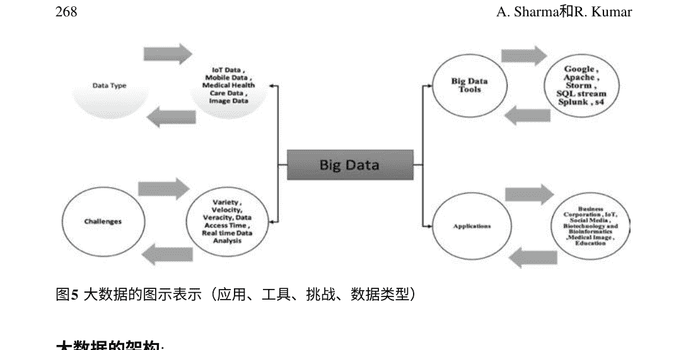

图5 大数据的图示表示（应用、工具、挑战、数据类型）

#### 大数据的架构：

见图5。

#### 机器学习/深度学习的挑战：

深度学习仍处于初级阶段，具有巨大的潜力，可以帮助科学家、研究人员和从业者创造价值，但也面临着重大挑战。其中一些问题是：

1. 需要足够质量的数据来训练深度学习模型
2. 安全问题
3. 基于神经网络的输出（黑盒方法）
4. 实时决策

● 深度学习需要足够质量的数据：通常来说，神经网络需要额外的数据来使抽象更加强大。数据并不总是正确的或者质量足够高，而大数据场景下有丰富的信息可以用于训练。微小的变化或者意外的输入数据特征可能会完全破坏神经网络模型。深度学习不容易改变上下文，很难在神经网络模型上解决在另一个上下文中出现的非常相似的问题。例如，当MRI图像以不同的特征表示时，能够有效检测一组图像的深度学习系统可能会遇到困难（灰度 vs. 彩色，不同的分辨率等）[30, 31]。

● 安全问题：深度学习必须在大规模、逼真的数据集上进行训练和重新训练，并且在算法开发过程中必须传输、存储和安全处理数据。在关键任务环境中，当部署深度学习算法时，攻击或黑客可能通过微小的恶意输入更改神经网络的输出。这可能会改变实验结果，导致对患者的误诊[30, 32]。

● 实时决策：世界上许多大数据正在实时流式传输，并且实时数据分析变得越来越重要。深度学习用于实时数据分析很难使用，因为它需要极高的计算能力。例如，20多年来，计算机视觉算法已经被用于几代人的实时X射线或MRI扫描中检测物体[30,31]。

● 神经网络是黑盒：大数据组织需要的不仅仅是好答案。这些答案必须得到证明，并解释为什么它们是正确的。深度学习算法依赖于数百万个参数进行决策，而神经网络为什么选择一个标签而不选择另一个标签通常无法解释。这种不透明性限制了利用深度知识进行关键决策，如医疗治疗或大额金融投资[30,33]。

# 6个深度学习框架用于生物信息学中的大数据分析

近几十年来，深度学习已经展示了其作为一个非常强大的工具来处理大量数据的能力。传统方法，特别是在设计识别方面，已经超越了使用隐藏层的兴趣。卷积神经网络是最受欢迎的深度神经网络之一。自从人工智能的早期时代1950年以来，研究人员一直在努力构建一个能够理解视觉数据的系统。随后的几年中，这个领域被命名为计算机视觉。计算机视觉在2012年迈出了重要的一步，当时一群大学科学家设计了一个克服了最佳图像识别算法的人工智能模型。AlexNet，以其主要创造者Alex Krizhevsky命名，赢得了2012年ImageNet视觉竞赛中令人难以置信的85%的准确率[34,35]。亚军的结果只有74%。深度学习算法广泛应用于生物生命科学、医学科学和制药学领域的药物发现。在深度学习CNN中，RNN是用于构建DL模型的方法。在这里，我们将详细了解这些方法在构建DL模型中的工作原理[36]。

- 卷积神经网络（CNN）
- 强化学习（RNN）

#### 6.1 卷积神经网络（CNN）

人工智能的巨大增长见证了人类和机器能力之间的缩小差距。为了实现令人惊叹的成就，研究人员和爱好者都在该领域的许多方面进行工作。计算机视觉领域是许多领域之一。该领域的议程是使机器能够观察世界，以相同的方式观察世界，甚至可以将这些知识用于各种任务，如图像和视频识别，图像分析和分类，媒体重建，推荐和自然语言处理。计算机视觉中的深度学习进展是通过一个名为卷积神经网络的算法进行构建和改进的。CNN是AlexNet的核心，它近似模拟人类视觉。多年来，CNN已成为许多计算机视觉应用的重要组成部分。卷积神经网络（CNN / ConvNet）是一种深度学习算法，允许输入图像进行处理，重点关注各个方面/对象（可学习的权重和偏差），并对它们进行区分。与其他分类算法相比，ConvNet中所需的预处理要小得多。虽然原始方法是手工设计的，但ConvNet可以通过足够的训练学习这些滤波器/特征[35]（图6）。

ConvNet架构类似于人脑中神经元的连接模式，并受到视觉皮层生物体的启发。在有限的视觉场区域中，单个神经元只对刺激做出反应。这些场区的集合覆盖了整个视野。因此，让我们来研究CNN的功能。CNN架构的组成部分包括：

- 输入图像
- 池化层
- 全连接层（FCC层）
- 输出层
- 损失函数

输入层：卷积神经网络由许多人工神经元层组成。人工神经元是计算多个输入的加权量并输出激活值的数学函数。它们是对生物神经元的粗略模仿。每一层在输入图像进入ConvNet时生成多个激活函数，并将其转发到下一层。通常，第一层提取基本特征，如水平或对角边界。

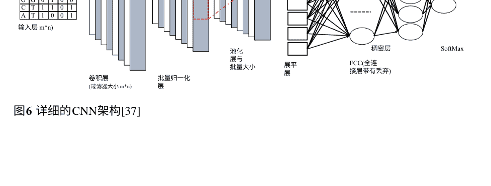

输出传递到下一层，在那里检测到复杂的属性，如角或针织边缘。当我们深入网络时，甚至可以识别出更复杂的特征，如物体和面部。分类级别产生一组置信度分数板(值从0到1)，这些分数板指示图像基于最终卷积层激活图的一部分可能属于“类”的可能性。例如，如果您有检测疾病细胞、癌细胞和其他细胞的ConvNets，完成层的输出可能是这些疾病细胞之一输入到输入层的图像中[37, 38]。

通过应用适当的过滤器，ConvNets可以捕捉图像中的空间和时间依赖关系。由于涉及的参数数量减少以及权重的可重用性，该架构在图像数据集上表现更好。换句话说，网络可以被训练得更好地理解图像的复杂性。ConvNet的作用是将图像转化为更易处理的形式，同时不丢失对良好预测至关重要的特征。这在设计既适合学习又可以扩展到大规模数据集的架构中非常重要（图7和图8）。

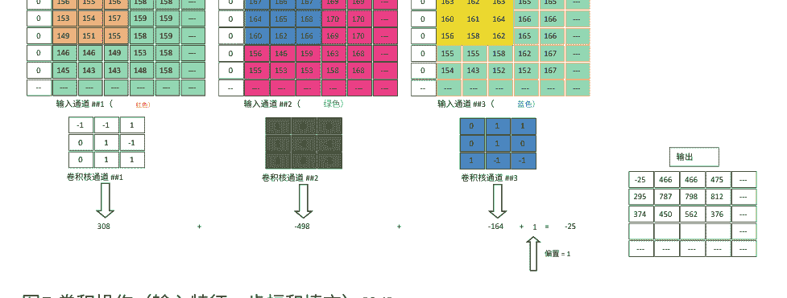

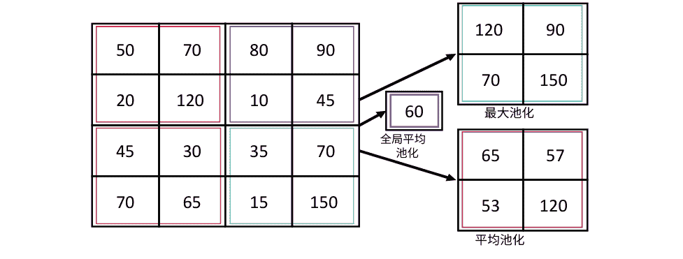

核层（卷积层）：CNN架构中最重要的组件是卷积层。它由一组所谓的滤波器（也称为核）组成。输入图像被表示为用于生成输出特征图的N维CNN度量[38]。在卷积过程中会发生一些操作，需要理解和学习的有以下几点：

* 核：核由一个离散数值或值的网格描述。每个值的核权重是已知的。在CNN训练过程开始时，将随机数分配为核的权重。此外，还使用了几种不同的权重初始化方法。然后，核在每个训练周期中学习提取显著特征[38]。

* CNN中的卷积操作：CNN的输入格式在开头有描述。经典神经网络的输入格式是向量格式，而CNN的输入格式是多通道图像。例如，灰度图像的单通道格式是RGB的3通道图像格式。这些是在CNN架构中执行的卷积操作，尽管为每个点计算这些指标的点积是一项计算开销较大的任务。因此，为了简单起见，让我们学习如何在3 * 3的指标中执行此操作[38]。

- 输入图像：绿色部分类似于上面演示中的输入图像5 × 5 × 1，记作I。卷积操作的第一部分中，卷积核/滤波器K代表黄色，是参与卷积操作的元素。K被选择为3 × 3 × 1的矩阵。
- 步幅长度：当在图像的部分P和核心之间执行矩阵乘法时。因此，步幅长度取决于架构。使用特定的步长，滤波器向右移动，直到检查完整的宽度。它以相同的步长值继续，并重复该过程，直到整个图像被传递（左）图像相同的步长值。
- 对于具有多个通道（例如RGB）的图像，核心与输入图像具有相同的深度。在堆栈中进行矩阵乘法（[K1, I1]; [K2, I2]; [K3, I3]）并将所有结果添加到偏置以获得单深度压缩特征输出通道。卷积操作旨在从输入图像中提取高级特征，例如边缘。不仅仅需要将卷积层限制为Conv Nets。传统上，第一个ConvLayer捕获低级特征，例如边缘、颜色、梯度等。具有额外层的架构还适应高级特征，为我们提供了一种全面理解数据集中图像的网络，类似于我们的方式。
- 填充：对于操作，有两种结果，一种是与输入相比，卷积函数的大小减小，另一种是增加或保持相同的维度。在前者或后者的情况下，这是通过使用相同的有效填充来完成的。当5 × 5 ×1的图片添加到6 × 6 ×1的图片中，并且之后应用核函数，结果是卷积矩阵的维度为5 × 5 ×1。这就是所谓的相同填充。相反，如果我们在没有填充的情况下进行相同的操作，将得到一个与核函数（3 × 3 ×1）本身具有相同维度的矩阵，即有效填充。

* 池化层：与卷积层类似，池化层中的卷积特征的空间大小减小。这通过降低维度来减少处理数据所需的计算能力。此外，有效模型训练的过程对于提取旋转和位置不变的主要特征非常有用。池化有不同的类型：最大池化和平均池化以及全局池化。最大池化返回核函数图像部分的最大值。另一方面，平均池化给出了核函数部分覆盖的所有图像值的平均值。输入层和池化层在第i层形成了一个卷积神经网络。

在典型的CNN模型中，这种层的数量可以根据图像数据集的复杂性而增加或减少，以捕捉更多的低级数据，但代价是额外的计算能力。我们已经完成了上述过程，使模型能够理解特征。我们将对最终输出进行扁平化处理，并将其提供给常规神经网络进行分类[34]。

* FCC层：添加一个全连接层（通常）是一种经济的方式，可以学习由卷积层输出表示的非线性高级组合。在这个空间中，全连接层可以用来学习一个可能是非线性的函数。在我们的输入图像被转换成适当的形式以供我们的多功能感知器使用之后，图像将被扁平化成一个列向量。

扁平化的输出被传输到神经前馈网络和每个训练迭代的反向传播中。该模型可以在几个周期内从图像中区分主导特征和某些低级特征，并通过使用应用的分类技术[36, 38]对它们进行分类。

| 类型 | SoftMax损失函数 | Hinge损失函数 | 欧几里得函数 |
| :--- | :--- | :--- | :--- |
| 定义 | CNN模型性能测量函数通常由SoftMax使用。对数损失函数也被称为。概率[2]是它的输出。此外，它通常用于多类分类问题，作为平方误差损失函数的替代。SoftMax激活函数用于输出层以创建概率分布的输出 | 该函数通常用于二元分类问题。这对于使用Hinge损失函数的SVMs非常重要，当优化器尝试最大化双目标类别周围的边界时 | 欧几里得函数广泛应用于回归问题。它也被称为中方差误差 |
| 数学方程 | $H(q, x) = -\sum_{i} q_i \log(x_i)$ 其中 $i \in [1, N]$
$q_i = \frac{e^{a_i}}{\sum_{k=1}^N e^{a_k}}$
这里 $e^{a_i}$ 是上一层的未使用输出而 $N$ 表示输出层中的神经元数量。
最后，交叉熵损失函数数学表示 | $H(q, x) = \sum_{i=1}^N \max(0, m - (2q_i - 1)x_i)$
边界 $m$ 通常设置为1。预测结果也标记为 $q_i$，而期望结果标记为 $x$ | $H(q, x) = \frac{1}{2N} \sum_{i=1}^N (q_i - x_i)^2$
欧几里得函数，数学表示表示 $q_i$的初始值，$x_i$表示值 |

损失函数：在前一节中介绍了几种CNN架构的层类型。此外，CNN架构的最后一层输出层的最终分数也被实现。在输出层中，使用一些损失函数来计算，在训练样本中CNN模型产生的预测误差。这个错误揭示了实际输出与预测输出的不同。

通过CNN学习过程，然后进行优化。然而，损失函数使用两个参数来计算错误。第一个参数是估计的CNN输出（称为预测）。第二个参数是实际输出（称为标签）[40]。在不同的问题类型中，使用了几种类型的损失函数。以下简要解释了一些类型的损失函数。

- SoftMax损失函数（交叉熵）[41]
- Hinge损失函数[42]
- 欧几里德损失函数[43]。

##### 使用CNN的优势

在计算机视觉环境中，使用CNN相对于其他传统神经网络的好处如下所示：

- CNN主要考虑权重共享特性，减少可训练网络的参数数量。反过来，它有助于提高泛化能力并防止过拟合。
- 在学习提取层和分类层的同时，模型的输出高度有组织并且严重依赖于提取的特征。
- CNN比其他神经网络更容易实现大规模网络。

#### 6.2 RNN（循环神经网络）

在深度学习领域中，RNN是常用且熟悉的。RNN主要用于语言和自然语言处理（NLP）的上下文中。与传统网络不同，RNN在网络中使用顺序数据。由于这个函数对于一系列应用非常重要，数据序列中的集成结构提供了有价值的信息。例如，要确定一个特定单词的意义，理解句子的上下文是很重要的。因此，RNN可以被看作是一个短期记忆单元，其中x是输入层，y是输出层，而是一个（隐藏的）状态层。在图9中，针对特定的输入序列，展示了三种不同的深度RNN技术，分别是“隐藏到隐藏”，“隐藏到输出”和“输入到隐藏”[44]。图9描绘了一个典型的展开的RNN图。有一个深度RNN，它通过这三种技术减少了深度网络学习的问题，并从更深的RNN中获得了好处[44]。

然而，这种方法的一个主要问题是RNN对梯度下降和其他消失问题的敏感性。具体而言，在训练阶段多个大或小导数的重复可能会导致梯度在强化学习中呈指数级增长或下降。随着新输入的进入，网络不再考虑原始输入；因此，这种敏感性随时间减弱。此外，LSTM可以用来处理这个问题。这种方法提供了对网络内存块的重复链接。每个内存块中包含多个内存单元，可以存储网络的时间状态[45, 46]（图10）。

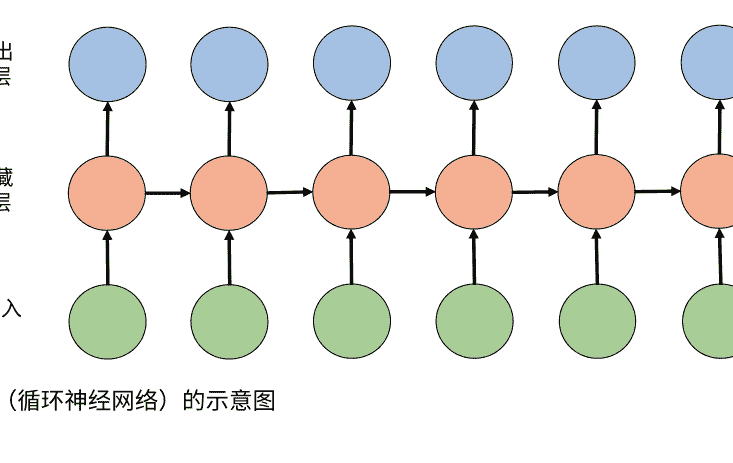

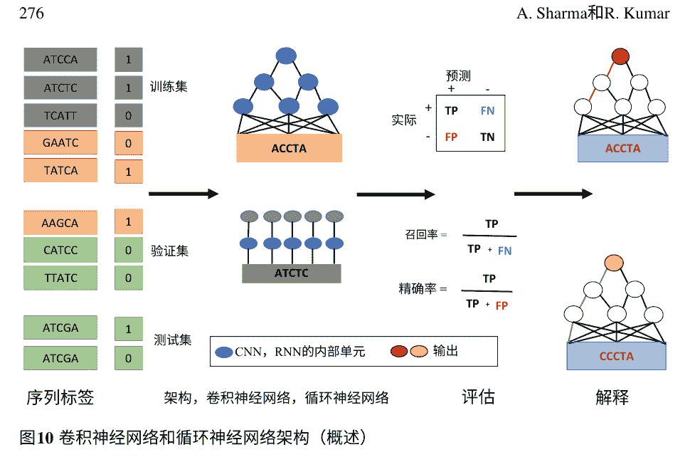

图10 卷积神经网络和循环神经网络架构（概述）

# 应用机器学习于大数据的七个领域

机械和几何特性在FRP包裹柱的抗压强度中起着重要作用。机器学习是人工智能的一个子领域，通过一些学习算法实现任务的自动化。

ML/DL广泛应用于几乎各个领域。在这里我们将讨论如何在生物信息学中使用了机器学习/深度学习算法。

- 基于NGS（下一代测序）的测序
- 生物图像处理（生物医学信息学）
- 药物发现和分子动力学模拟研究

基于NGS（下一代测序）的测序：下一代测序（NGS）的测序方法几乎涵盖了生物学和医学研究的各个领域。它对处理和分析产生的数据集至关重要，解决了诸如宏基因组分类、变异检测、数据量化、基因组特征检测、在更大的生物学或医学背景下的下游分析等问题，这些问题一直在稳步增加。

需求中。除了经典的算法方法外，机器学习（ML）技术经常用于这些任务。特别是深度学习（DL）已经在这些应用中获得了显著的发展，使用人工神经网络（ANNs）和多层方法进行监督、半监督和无监督学习。作者在NGS的背景下，重点介绍了主要的网络拓扑、应用领域和DL框架。在生命科学、生物技术领域产生的数据量近年来稳步增长，特别是由于高性能测序技术（如Illumina系统）的快速进展。低基因组测序成本（www.genome.gov/sequencingcosts）使得大型项目成为可能，从而增加了更大数据集的统计能力。产生的基因组和转录组测序数据的丰富性使我们能够解决以前无法回答的许多问题，无论是准确和个性化的应用还是药物发现，例如，更可靠的转录组研究可以识别与疾病相关的表达模式或表达差异，如不良药物反应。对于个体医学来说，改进变异调用和全基因组关联研究（GWAS）非常重要。增强的宏基因组学可以提供关键的生态系统信息，如人类肠道微生物组、医院细菌菌群落或病毒患者进展。NGS方法也是涉及各种疾病的表观遗传学研究的重要组成部分。它还有助于了解严重冠状病毒（SARS-CoV2）、急性呼吸综合征的根源和流行病学。

巨大的数据增长不断将生命科学从模型驱动的科学转变为数据驱动的科学。与其他科学领域一样，我们现在看到了统计学习方法的日益增长，这些方法不是以生物模型为基础的，而是直接从数据中学习。基于多层人工神经网络的深度学习方法变得越来越流行[47-49]。

#### 深度学习在NGS中的应用:

- 变异调用：变异调用的目的是直接从NGS数据中检测基因组变异。点突变是最简单的变异类型（单核苷酸变异；SNV）。单核苷酸多态性（SNP）基因分型和在具有多个组织样本的个体中检测SNV包括典型的SNV调用应用。从NGS数据中识别更复杂的遗传变化，如长片段或拷贝数变异（CNV），也很重要，但通常更困难。计算过程基于将NGS读数与参考基因组序列进行初始协调。在每个位置上预测变异的机会，例如：基于质量分数和每个位置上的所有对齐读数的统计模型和手动调整的启发式算法，传统算法（如GTK）应用不同的统计模型。然而，测序错误通常取决于对齐位置和仪器类型。这使得设计准确的统计模型来区分变异和测序错误或对齐设备变得困难。使用受控的深度学习变体模型。可以用直接从技能中获取数据来学习特征模式，从而替代手工启发式方法的需求。基本思想是将对齐读数转化为感兴趣的位置和应用。

##### 宏基因组学
宏基因组学处理环境样本测序data。分类重新分配是一个重要的处理步骤。传统的方法，如Kraken或MetaCache，只需将准确的k-mer匹配编号to a database to assign readings to a likely type of origin. 这个问题也可以被定义为一个监控学习任务，考虑到每个物种的输出类别和输入读数。这个分类问题is more complex and suitable for RNN architectures due to the size of reference genomes (which are significantly longer than short reads) and a large number of classes (typically thousands for bacterial samples) [51].

##### 单细胞转录组学
单细胞RNA-seq协议（scRNA-seq）正在变得越来越重要，因为它们可以在单个测试中对数千甚至数百万个细胞进行分析。相应分析任务的输入通常是一个基因表达矩阵，可以通过对参考转录组的映射来计算每个细胞中每个基因的表达量的估计值。假定细胞类型的聚类是非常重要的。大尺寸，高维度和丢失（由于低基因导致表达矩阵中的许多零条目）是具有挑战性的，这促使在此领域应用无人值守的ML方法进行聚类，输入和降维ality DL技术目前主要由不同类型的AE主导，因为它们可以通过降低维度有效地学习固有分布而无需监督[52-55].

##### 生物图像处理（生物医学信息学）
生物信息学和生物医学成像是一门跨学科的学科，源自综合的计算机科学、生命科学和生物学理论和方法论，在疾病诊断和治疗中起着重要作用。近年来，医学科学和医疗计算领域取得了巨大进展，并引领了对大规模数据收集的深入分析的需求，传统的分析技术已不再胜任。相反，深度学习在生物信息学和生物医学图像分析方面取得了显著改进，包括卷积神经网络（CNN）、循环神经网络（RNN）、自编码器、生成对抗网络（GAN）等。因此，学术界和医学界都强调在生物信息学、研究和生物医学图像（放射学）中应用深度学习，以从数据中获取深入的洞察知识。

由于当今生物技术的快速发展，历史时期产生的生物医学数据在多个研究和应用领域呈指数增长，涵盖了从分子水平（基因功能、蛋白质相互作用（PPI）、代谢途径等）到组织的生物水平（脑神经元图、X射线图像（重症监护室、电子病历等）[56]。不可避免的事实是，处理具有上升速度和异构结构等特点的生物医学数据比处理传统数据分析方法更加困难。因此，需要更强大的理论方法和实用工具。需要分析和提取上述复杂生物数据中富有表达力的有意义信息。 这种复杂和异构的数据分析是系统中的典型复杂问题。 需要分析各种数据层次及其环境之间的依赖、关系或相互作用。 在这种情况下，由于原始数据具有非线性、突现、自适应和反馈特性，我们很难对传统方法进行建模。 我们只能通过深度学习来解决这些问题。 作者在本节中重点介绍了先进深度学习技术在生物信息学和生物图像分析中的最新发展[12, 57]。

#### 在生物医学图像处理中，机器学习方法被应用于以下领域
- 深度基因组序列和单细胞序列学习方法。
- 深度学习方法在表观基因组学和基因组学3D-基因组学、功能基因组学和医学基因组学学习方法中的调控分析中。
- 多组学整合深度学习方法。
- 生物医学信号/图像分析深度学习方法。
- 用于超声/CT/MRI组织、病变和疾病分级的深度学习方法。
- 计算机辅助超声/CT/MRI深度学习方法。
- 深度图像配准和/或超声/CT/MRI融合学习方法。
- 生物信息学和生物医学图像人工智能和算法。
- 人工智能在线数据库和网络服务器，并行生物信息学和生物医学成像加速技术。

##### 药物发现和分子动力学模拟研究
药物发现的过程非常耗时和昂贵。 计算建模是加速药物候选物在发现流程中进展的重要工具，以期优化引物化合物的概念。

尽管在计算化学领域，基于物理的建模（例如蛋白质对接或分子动力学）已经成为事实上的标准多年，但机器学习方法现在是建模的一个强大替代品。特别是，深度学习范式可以被视为黑盒方法，因为很难从训练模型中提取规则或规定。 分子动力学（MD）基于统计力学。 为复杂系统设置MD运行仍然是一个容易实现的任务，以便在学术和工业环境中更广泛地使用连续自动化工具。 在这个背景下的贡献讨论了一个用于创建混合分子力学和与其蛋白质-配体分子复合物相关的模拟的Web服务器的实现。 蛋白质和配体构成了可药物化目标的最重要类别，因此拥有方便的工具来建立它们的系统模拟是很重要的。 大数据和机器学习可以在药物发现领域以各种方式使用[58, 59]。 以下是我们可以在药物发现和药物设计中使用大数据分析和机器学习方法的一些领域：

- 为了理解身体中的系统和疾病的生物学机制：在大多数情况下，只有在科学家们理解了特定疾病、病原体或医疗条件背后的原因和作用机制之后，才能启动药物研发计划。毫不夸张地说，生物系统是世界上最复杂的系统，了解它们的唯一方法是采用全面的方法，从基因、蛋白质、代谢物甚至外部因素等多个组织层面进行研究。人类基因组解码过程始于1990年，由一群科学家进行，历时13年，耗资27亿美元才完成该项目。基因组揭示了生物体的‘功能’类型，以告诉我们哪些蛋白质以及为什么。通过对基因组的全面理解，我们对身体的理解将打开更多的门，了解它们可能出现什么问题，以及在哪些条件下基因组是一种‘指导’。通过对基因组的全面了解，我们的身体可以变得更加可理解，了解可能出现什么问题以及在什么情况下。生物系统研究产生了大量需要存储、处理和分析的数据。

三十亿个化学编码单元组成的DNA无法通过传统的存储系统处理。到目前为止，已经确定了人类蛋白质组，其中有超过30,000种不同的蛋白质。此外，还有超过40,000种小分子代谢产物。数据映射来自不同的实验、关联、因素和条件组合，生成了数十亿个信息点。大数据分析和机器学习算法在这里开始发挥作用，可以推导出以前未知的隐藏数据模式、依赖关系和关联。

- 寻找正确的药物分子：当科学家提出一个合适的生物靶点时，就需要搜索能够与靶点有选择性相互作用并刺激分子‘命中’的分子。为了识别命中的分子，存在几种筛选范例。例如，一种流行的HTS（高通量筛选）方法涉及对药物靶点进行数百万化学化合物的直接筛选。这种筛选范例涉及使用复杂的机器设备，成本高，成功率低。但好处是它不假设事先已知与靶蛋白可能具有活性的化学物质的性质。因此，HTS似乎是进一步研究的实验性见解的来源，提供有价值的‘负面’结果。其他方法包括筛选片段和更专门的生理筛选方法。这种在组织上的技术旨在提供与体内效果更一致的答案，而不是针对特定药物靶点的答案。计算科学家已经采用了先进的CADD（计算机辅助药物发现）技术，借助蛋白质配体相互作用来研究人体中不同疾病的不同蛋白质之间的相互作用（Auto Dock，Discovery Studio，Schrodinger等）。这些方法利用药效团和分子建模从化合物库中进行所谓的‘虚拟’筛选，以降低实验室展示成本，提高上述复杂筛选的效率和可预测性。可以在硅中对已知的目标蛋白质的三维结构进行百万级化合物的测试（基于结构的通过使用这种方法，可以根据已知在目标方向上具有活性的其他分子的知识来识别候选药物，即使结构未知。

- 个性化药物：一种药物通常与多个目标（包括靶点和非靶点）相互作用，而这种相互作用受药物效能和副作用的影响很大。不同的遗传、表观遗传和环境因素会影响药物分子对个体生物系统（例如患者）的干扰。个性化医学旨在根据个体患者的特征来识别这些隐藏的分层数据。个性化药物在很大程度上依赖于科学理解，使患者易受疾病侵害，并对其独特特征（如分子和遗传特征）对治疗师敏感。在20世纪90年代末，通过生物标志物研究，已经确定了数百个基因对人类疾病的贡献，并且患者的遗传变异被用于区分个体对数十种治疗方法的反应。尽管这些研究产生了大量数据，如人类基因组计划，但计算机建模已成为个性化医学的关键工具之一。代谢网络建模和人群遗传模式识别是该领域的几个最新进展，依赖于计算机建模。美国国立卫生研究院的精准医学计划已经引发了广泛的数据生成、共享和计算机建模倡议，以推动精准医学的发展。例如，美国国家癌症研究所的基因组数据共享计划旨在提供一个数据集，以促进癌症基因组研究领域的精准医学数据共享。通过这个门户网站 (https://gdc.cancer.gov/)，迄今为止已经提交和共享了许多案例研究。人工智能的方法被广泛应用，并且有许多关于这一热门生物信息学领域的评论文章可供参考[60, 61]。

- 临床前试验：制药行业研究和开发陷入危机并且衰退的一个原因是年轻的药物候选者通过动物实验无法反映人类的结果。药物在后期阶段失败，给投资者带来巨额损失，企业浪费了时间。更重要的是，这导致了患者的生命损失。现在有了新的人工智能算法和大数据方法来模拟许多药物在许多方面的活动，就像在一个“虚拟”的人体中一样[62]。

### 8 结论
本书章节包括不同的部分，其中一部分描述了深度学习的重要性，另一部分包含了大数据。本书章节中对这两个领域进行了简要介绍。深度学习部分介绍了数据分析的可用算法以及深度学习模型生成所需的激活函数。大数据部分包含了数据管理的5个V以及可用的HADOOP系统和Map-Reduce函数。在本书章节中在编写书籍章节作者的菜单脚本时，发现了以下观察结果：

- 如今，高容量实时数据流不断从智能手机、物联网设备、计算机等设备中产生，所有这些大数据流和5个V（如果你愿意，可以称之为大数据框架）是帮助你在数据流被缩小时识别所有需要研究的重要特征。
- 在人工智能（AI）、商业智能（BI）、数据科学和机器学习（ML）等许多领域，大数据发挥着重要作用，其中数据处理（提取、转换和加载）产生新的见解、创新和优秀的决策。
- 大数据爆炸使那些在做出关于那些使用传统数据经营业务的决策之前进行数据分析的人具有竞争优势。像Amazon Redshift这样的解决方案肯定会成为基于关系的数据仓库和Spark和Kafka是有前途的数据仓库解决方案的先驱。

### 致谢
作者感谢Coursera课程“大数据导论”和“深度学习专项课程”，这些课程帮助理解机器学习和大数据分析的基本概念。作者真诚地感谢并献给所有审稿人，他们审查了本书的章节并帮助改进。

### 作者贡献
两位作者在准备和设计本书章节的手稿方面有着相等的贡献。Ajay博士研究学者（生物技术与生物信息学系）在准备手稿方面负责，而Dr. Raj负责书章节的所有修订部分。

### 利益冲突
没有利益冲突。

### 参考文献
1. Greene, C.S.等：大数据生物信息学。细胞生理学杂志 229(12), 1896–1900 (2014)
2. Li, Y.等：生物信息学中的深度学习：大数据时代的介绍、应用和展望。方法 166, 4–21 (2019)
3. Azmoodah, A., Dehghantanha, A.: 大数据和隐私：挑战与机遇。在：大数据隐私手册，第1-5页。Springer (2020年)。
4. Wang, J.等：大数据服务架构：一项调查。互联网技术杂志 21（2），393-405 (2020年)
5. Sagiroglu, S., Sinanc, D.: 大数据综述。在：2013年国际合作技术和系统会议（CTS）。IEEE (2013年)
6. Anuradha, J.: 大数据5V特征和Hadoop技术简介。Procedia Comput. Sci. 48, 319-324 (2015年)
7. Dean, J., Ghemawat, S.: MapReduce: 大规模集群上的简化数据处理。Commun. ACM 51（1），107-113 (2008年)
8. Dean, J., Ghemawat, S.: MapReduce:大规模集群上的简化数据处理 (2004)
9. Liu, J., et al.: 一种基于特征选择的Hadoop MapReduce配置调优方法. IEEE Access 8, 63862–63871 (2020)
10. Shastry, K.A., Sanjay, H.: 生物信息学的机器学习. 在: 统计建模和生物信息学技术、工具和应用的机器学习原理, pp. 25-39. Springer (2020)
11. Li, H., et al.: 生物信息学中的现代深度学习. J. Mol. Cell Biol. (2020)
12. Srinivasa, K., Siddesh, G., Manisekhar, S.: 统计建模和机器学习 生物信息学技术、工具和应用. Springer Nature (2020)
13. Pezeshki, M., et al.: 梯度饥饿: 神经网络中的学习倾向. arXiv 预印本 arXiv:2011.09468 (2020)
14. Havaei, M., 等: 深度神经网络在脑肿瘤分割中的应用. 医学图像分析 35, 18-31 (2017)
15. Leshno, M., 等: 多层前馈网络具有非多项式激活函数，可以逼近任何函数. 神经网络 6 (6), 861-867 (1993)
16. Ramachandran, P., Zoph, B., Le, Q.V.: 激活函数的搜索. arXiv预印本 arXiv:1710.05941 (2017)
17. Gomes, G.S.d.S., Ludermir, T.B., Lima, L.M.: 神经网络中中新激活函数在金融时间序列预测中的比较. 神经计算应用 20(3), 417-439 (2011)
18. Sharma, S., Sharma, S.: 神经网络中的激活函数. 走向数据科学 6(12), 310-316 (2017)
19. Agostinelli, F.,等: 学习激活函数以改善深度神经网络. arXiv 预印本 arXiv:1412.6830 (2014年)
20. Obla, S.,等: 用于同态评估深度神经网络的有效激活函数. IEEE Access 8, 153098-153112 (2020年)
21. Goyal, M.,等: 激活函数. 在: 深度学习: 算法和应用, 第1-30. Springer (2020年)
22. Zadeh, M.R.,等: 逻辑S型函数和双曲正切函数的多层感知器进行每日流出预测. 水资源管理. 24 (11), 2673-2688 (2010年)
23. Gomar, S., Mirhassani, M., Ahmadi, M. : 双曲正切和S型函数的精确数字实现. 在: 2016年第50届Asilomar信号、系统和计算机会议. IEEE (2016年)
24. Kalman, B.L., Kwasny, S.C.: 为什么选择tanh作为一个S型函数. 在: 1992年国际神经网络联合会议论文集. IEEE (1992年)
25. Xu, B., 等: 对卷积网络中的修正线性激活进行实证评估. arXiv 预印本 arXiv:1505.00853 (2015年)
26. Agarap, A.F.: 使用修正线性单元 (RELU) 进行深度学习. arXiv预印本 arXiv:1803.08375 (2018)
27. Zhang, X., Zou, Y., Shi, W.: 带有LeakyReLU的扩张卷积神经网络用于环境声音分类. 在: 2017年第22届数字信号处理国际会议 (DSP). IEEE (2017年)
28. Chan, J.O.: 大数据分析的架构. IIMA通信 13 (2), 1 (2013年)
29. Boja, C., Pocovnicu, A., Batagan, L.: “大数据”分布式并行架构. Inf. Econ. 16(2), 116 (2012年)
30. Hutter, F., Kotthoff, L., Vanschoren, J.: 自动化机器学习: 方法, 系统, 挑战. Springer Nature (2019)
31. Li, H.: 深度学习在自然语言处理中的优势和挑战. Natl. Sci. Rev. (2017)
32. Sharma, O.: 深度学习面临的挑战. In: 2019国际会议 机器学习, 大数据, 云计算和并行计算 (COMITCon). IEEE (2019)
33. Angelov, P., Sperduti, A.: 深度学习中的挑战. In: ESANN (2016)
34. Krizhevsky, A., Sutskever, I., Hinton, G.E.: 使用深度卷积神经网络进行Imagenet分类. Adv. Neural. Inf. Process. Syst. 25, 1097-1105 (2012)
37. Ma, N.等：ShuffleNet v2：高效CNN架构设计的实用指南。在：欧洲计算机视觉会议 (ECCV) 论文集 (2018年)
38. Sun, Y.等：基于块的完全自动化CNN架构设计。IEEE Trans.Neural Netw. Learn. Syst. 31(4)，1242–1254 (2019年)
39. Yu, D.等：混合池化用于卷积神经网络。在：国际粗糙集与知识技术会议。Springer (2014年)
40. 赵, H.等：用神经网络进行图像恢复的损失函数。IEEE计算机成像 3(1), 47-57 (2016年)
41. 刘, W.等：卷积神经网络的大边界softmax损失。在：ICML (2016年)
42. 巴特利特, P.L., Wegkamp, M.H.：使用铰链损失的带有拒绝选项的分类。机器学习研究 9(8) (2008年)
43. De Soete, G., Carroll, J.D.：在低维欧几里德空间中的K均值聚类。在：新的分类和数据分析方法, 第212-219页。Springer (1994年)
44. Sherstinsky, A.：循环神经网络 (RNN) 和长短期记忆 (LSTM) 网络的基础。物理学D：非线性现象 404, 132306 (2020年)
45. 尹, R.等：通过基于注意力的循环神经网络对流感A病毒的时间序列突变进行预测。生物信息学 36(9), 2697-2704 (2020)
46. Millham, R., Agbeadji, I.E., Yang, H.：参数调整到循环神经网络和长短期记忆 (RNN-LSTM) 网络中，用于高维生物信息学数据集的特征选择。在：生物启发式算法用于数据流和可视化，大数据管理和计算, 第21-42页, Springer (2021)
47. Gerratana, L.等：基于下一代测序的转基因乳腺癌转移性特征定向分析：使用ctDNA的创新分析。AACR (2020)
48. Schmidt, B., Hildebrandt, A.：深度学习在下一代测序中的应用。药物发现。今天 (2020)
49. Naito, T., 等：一种用于HLA推断和跨种族MHC精细定位1型糖尿病的深度学习方法。自然通讯 12(1), 1-14 (2021年)
50. Cosgun, E., Oh, M.：探索机器学习在下一代测序实验中与质量分数的一致性。生物医学研究国际 (2020年)
51. Tonkovic, P., 等：应用机器学习在宏基因组分类中的文献综述。生物学 9(12), 453 (2020年)
52. Huang, Y., Zhang, P.：评估机器学习方法在单细胞转录组数据中的细胞类型识别中的应用。简要生物信息学 (2021年)
53. Loher, P., Karathanasis, N.：机器学习方法从单细胞转录组数据中识别包含空间信息的基因。前沿遗传学 11, 1743 (2021年)
54. Oller-Moreno, S., 等：单细胞表达分析中机器学习算法的进展。当前系统生物学观点 (2021年)
55. Kupari, J,等：灵长类感觉神经元的单细胞转录组学鉴定与慢性疼痛相关的细胞类型。自然通讯 12(1), 1-15 (2021)
56. Zhu, W.,等：深度学习在癌症预后预测中的应用。癌症 12(3), 603 (2020)
57. Wei, R., Mahmood, A.：生物医学信息学中变分自动编码器与表示学习的最新进展：一项调查。IEEE Access (2020)
58. De Vivo, M.,等：分子动力学及相关方法在药物发现中的作用。医学化学 59(9), 4035-4061 (2016)
59. Lima, A.N.,等：机器学习方法在新药发现中的应用。专家意见药物发现 11(3), 225-239 (2016)
60. Gertrudes, J., 等：机器学习技术和药物设计。Curr. Med. Chem. 19(25), 4289–4297 (2012)
61. Klambauer, G.N., Hochreiter, S., Rarey, M.：药物发现中的机器学习。ACS Publications (2019)
62. Zhang, S., 等：个性化医学的学习：深度学习视角的综述。IEEE Rev. Biomed. Eng. 12, 194–208 (2018)

## 医学信息学和公共卫生的深度学习

K. Aditya Shastry , H. A. Sanjay, M. Lakshmi和N. Preetham

摘要：技术与医疗保健相交，构成医学信息学（MI）。MI通过医学和计算机科学的技能提高了患者和医疗保健的结果。这两个学科的融合使相关人员能够改善患者护理以及研究和临床环境。

公共卫生（PH）代表着保护和改善社区健康的科学。通过鼓励健康的生活方式，调查新疾病，预防伤害和传染病，实现这一目标。总的来说，公共卫生关注的是整个社区的健康。这些社区可以是小型的（地方社区）或大型的（整个国家/全球地区）。在这方面，深度学习（DL）代表着一个有趣的研究领域。由于数据和计算能力的快速增长，DL的应用已经在多个领域观察到。近年来，DL在医学领域的应用由于DL在医疗保健方面的潜在优势而增加。DL可以帮助医学专家诊断多种疾病，检测癌症部位，确定药物对每个患者的影响，理解表型和基因型之间的关联，发现新的表型，并更准确地预测传染病的爆发。与传统技术相比，DL不需要特定领域的数据。DL有可能改变人类的生活。尽管有这些好处，DL面临着与数据相关的一些缺点（特征数量较多，数据不同，对时间的依赖，无监督数据等）和模型（可靠性、可理解性、可能性、可扩展性、安全性）用于现实世界应用。本章重点介绍了在MI和PH中应用DL技术的案例研究以及一些关键的研究问题。

K. 阿迪蒂亚·沙斯特里 (✉) ·M. 拉克什米 ·N. 普里塔姆
信息科学与工程系，尼特·米纳克西技术学院，
耶拉哈卡，班加罗尔，卡纳塔克邦560064，印度
e-mail: adityashastry.k@nmit.ac.in

M. 拉克什米
e-mail: lakshmi.m@nmit.ac.in

N. 普里塔姆
e-mail: preetham.nagaraju@nmit.ac.in

H. A. Sanjay
M S Ramaiah技术学院，班加罗尔560054，印度
e-mail: sanjay.ha@msrit.edu

* 关键词
* 大数据分析
* 农业
* 预测
* 分析

### 1 引言

用于数据分析的分层算法架构，如DL或深度结构化学习。分层学习是DL的另一个名称，它是一种机器学习（ML）的类型。DL中的模型通过多个隐藏层过滤数据。每个连续的层利用前一层的输出来预测其结果。通过处理更多的数据和改进以前的结果，可以实现更高的准确性，从而产生更多的相关性和连接。DL的思想大致集中在动物大脑中生物神经元之间的基本连接上，用于处理信息。这类似于电信号在生物体细胞之间传播的方式。当节点接收到其相邻神经元的刺激时，后续层中的节点被激活[1]。

图1展示了深度学习架构的基本设计。

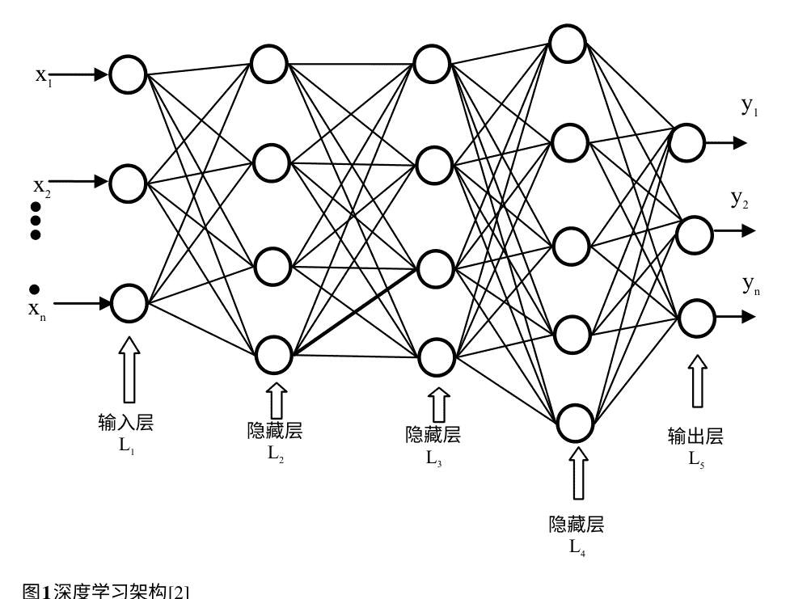

## 深度学习在医学信息学和公共卫生领域的应用

如图1所示，网络模型由许多隐藏层组成，每个层中包含多个神经元。当每个层被分配一个转换任务的一部分时，层会多次处理数据以进一步优化最终输出。隐藏层使用数学转换任务将原始输入转换为更有意义的输出[2, 3]。

相比于其他深度学习技术，数据的预处理较少。在其他几种机器学习技术中，过滤和归一化任务需要由人工程序员完成，而在深度学习中，这些任务由网络自行处理。正如《自然》杂志中所指出的，传统的机器学习技术在处理原始数据方面的能力有限。

几十年来，为了创建一个能够将原始数据（如图像像素值）转换为适当的属性向量的属性提取器的机器学习系统，需要大量的领域专业知识和谨慎的工程技术。这个转换后的数据被传递给学习子系统，通常是一个分类器，它可以识别或分类模式。深度学习网络具有确定自动分类所需模式的能力，从而减少了对监督的需求，并加快了从未经广泛组织的数据集中挖掘关键理解的过程。深度学习模型利用先进的数学模型来开发网络。在这个领域中存在着控制不同子策略的网络的多种变体。深度学习这一发展中的学科正在迅速推动世界上的先进计算能力，桥接各个行业，并为用户体验和可行决策增加了重要价值[1]。

MI和与支持决策相关的系统是健康信息学中深度学习的基本组成部分。研究人员通过分析临床医生提供的临床信息所获得的数据来训练模型，以分析患者的状况。数据可能包括阅读临床图像，预测结果，确定基因型和表型之间或疾病和表型之间的关系，研究对治疗的反应，追踪结构的变化。基于风险分析预测疾病结果的能力可以扩展到开发一个检测疾病早期症状的系统。识别相关性和模式可以推广到全球模式研究和人口健康护理，为整个人口提供预测性治疗[2, 3]。

在医学影像中，深度学习可以在没有先验知识的情况下进行训练，这导致缺乏标记数据，并对临床医生成负担。例如，在处理重叠的3D/4D医学图像时，目标点的复杂性需要处理。科学家们通过采用监督/半监督学习、迁移学习、信息增强和与多模态相关的架构，提供了改进的和可理解的结果[4-8]。此外，研究帮助科学家们确定变量之间的非线性关联，从而帮助医学专家理解疾病及其相关解决方案。由于决策是基于提供的数据，没有模型或人为干预可以将类别划分为其临床数据的子组。生物信息学中的RNA/DNA序列研究了导致疾病的基因等位基因以及生态因素。其次，它有助于研究蛋白质之间的相互作用，理解更高层次的过程，设计个性化的治疗方案，确定2个表型之间的相似性等[9]。

DL算法被应用于预测外显子的交织运动，RNA/DNA结合蛋白的特性和DNA甲基化[10-12]。

第三，它验证了其有效性，特别是在预测急速发展的疾病如急性肾衰竭时。研究发现，与定期就医相比，使用新型表型进行实时预测是足够的[13-21]。

第四，它预计将广泛应用于转院患者、首次住院患者、没有病历信息和医疗基础设施薄弱的门诊患者[22, 23]。

例如，神经信号如脑电图（EEG）、脉搏波图（PPG）等被用于预测帕金森病的冻结。此外，加速度计和移动应用程序的信息被用于筛查健康状况、关节炎、糖尿病、心脏相关疾病和慢性疾病，以提供患者在紧急情况下住院前的健康信息[24, 25]。此外，通过手机拍摄的X射线图像的分析有助于治疗边缘化社区和资源匮乏的人群[26]。临床记录和出院记录的总结旨在确定总结记录如何表达准确、有效和可靠的信息，以与医疗记录进行比较。最后，社会行为、疾病爆发、药物研究和治疗分析已被证明可以预防疾病、延长寿命并监测流行病[2, 27-33]。

几家医院正在使用电子病历系统。根据[34, 35]的数据，约有70%的临床医生和90%的美国医院正在利用电子病历系统来提高他们的能力水平和效率。可以通过使用与成像、基因组和可穿戴传感器相关的技术来记录患者信息。具有先进计算能力支持GPU的深度学习架构对深度学习的实际应用产生了重大影响。因此，许多实验性工作已经将深度学习模型应用于医学影像，这主要是由许多临床专家使用的。然而，深度学习在健康信息学中的应用还存在一些问题需要解决，包括缺乏数据（缺失值、昂贵的标注、类别不平衡）、数据解释（异质性、高维度、多模态）、信息和完整性的可靠性、可靠性和模型可解释性（收敛问题和跟踪以及过拟合）、可行性、可扩展性和安全性[2]。

本章剩余部分分为4个小节。第二节强调了医学信息学和公共卫生中不同的深度学习方法。第三节通过不同的实际案例研究展示了深度学习在医学信息学和公共卫生领域的应用。第四节分析了与医学信息学和公共卫生中的深度学习相关的各种研究问题，这些问题可以由医疗保健领域的各方利益相关者确定。本章的总结在最后给出。

#### 医学信息学和公共卫生中的5种深度学习技术[36]

在这一部分，我们详细介绍了5种深度学习模型的操作功能，每个模型都有各种形式。根据逼近函数的基本原理，当给定输入时，会产生预期的输出。不同的模型更适合处理不同的挑战和不同类型的数据，以执行预期的任务[36]。

语音或时间序列分类模型与图像分类模型有明显的区别。通过在模型中应用预处理阶段，可以降低数据的维度。主要的模型结构由相互连接的神经元和连接输入与输出的隐藏层组成。

因此，通过神经元之间的加权连接生成激活序列。这个过程被称为前馈[37]。DL和NN模型之间的比较表明，DL模型包含更多的隐藏层，而NN模型只能用于监督学习任务，而DL用于训练无监督和监督学习任务。前馈过程结束时，输出层的结果与实际值进行比较。通过计算预测值和实际目标值之间的差异来计算错误值。前馈过程结束后，更新ANN模型的权重，以减小误差并使预测值和实际值更接近。

这种技术被称为反向传播[38, 39]。

##### 2.1 自编码器（AE）

AE旨在通过利用信息驱动学习来提取特征。AE经过无监督训练，因为训练是为了重新创建输入向量，而不是分配类别标签。AE中存在相同数量的输入和输出神经元，这些神经元与下一层的神经元完全连接。输入神经元的数量通常小于隐藏神经元的数量。这种设计的原因是在减少特征空间中编码信息并实现属性挖掘。当数据维度较高时，可以将多个AE堆叠在一起创建深度AE系统。在过去的十年中，已经设计出了多种AE的变体，用于处理不同的数据模式和执行特定的功能。例如，Vincent等人[40]提出了去噪AE。它的目的是加强传统的AE模型。这种技术通过对模式引入一定的扰动来重建输入，从而迫使设计理解输入设计。

稀疏自编码器代表了经典自编码器模型的另一种变体。在这种变体中，利用稀疏表示使数据更易分离[41]。另一种自编码器的变体被称为卷积自编码器[42]，它在节点之间引入了共享权重，用于处理二维模式并保留空间局部性。收缩自编码器与去噪自编码器类似，但与其对训练数据集引入噪声不同，它通过包含分析性收缩成本[43, 44]来改变函数以确定误差。自编码器的学习过程被描述为限制一个成本函数C，使得C(k, m(t(u)))。t(u)是一个将u映射到h的函数，而函数k将h映射到输出，即输入的重构。r表示连接层之间的权重。图2展示了自编码器的简单架构。图2显示了一个简单自编码器的设计，展示了i、h和o层。箭头的方向表示神经元之间的相互连接。

##### 2.2 循环神经网络（RNN）

RNN是深度学习的一类，它由'h'层中的神经元之间的关联组成，创建了一系列的有向图。这个组件为它提供了一个渐进的独特机制。这在输出依赖于过去的计算的情况下非常重要，例如文本、噪声、DNA序列和持续的电体信号的分析。RNN的训练是在具有依赖性的信息上进行的，以保持关于前一个时间间隔的信息。时间‘t-1’的性能结果影响时间t的选择。它考虑了前一个输出（O）和当前输入（I），并从细胞状态M生成一个在0到1范围内的数字。这里，1表示保存该值，而0表示丢弃该值。

Sigmoid层（门层）做出这个选择。因此，RNN原理定义了相对于时间步骤的循环函数，使用方程式进行计算：M = f(M × W × I ×W)，其中M表示时间状态k，M表示先前的门输出，I表示时间k的输入，W是网络权重参数。RNN可以被看作是一个包含反馈环路的状态。前馈RNN的实现如图3所示。

输出层的结果被循环回作为输入层的一部分。I_t和O_t表示时间t的输入和输出，O_{t-1}表示前一个时间t-1的输出。除了结构上的差异，RNN在所有层中使用相似的权重，而其他深度学习方法使用不同的权重。这显著减少了系统需要学习的总特征。尽管如此有效模型的应用，由于广泛的输入顺序和爆炸性斜率问题，导致了斜率消失问题，这是主要的障碍，如[46]所示。为了解决这个限制，LSTM由[47]发明。特别是，图4所示的LSTM主要适用于具有长时间滞后和关键事件之间未定义大小的应用。

为了实现这一点，LSTM在每一步都使用新的信息源来存储、写入和读取节点。在训练时，通过允许读取/写入来减少分类错误[48]。另一种形式的RNN是门控重复组件，它表示增强形式的LSTM，其性能与LSTM相当[49]。

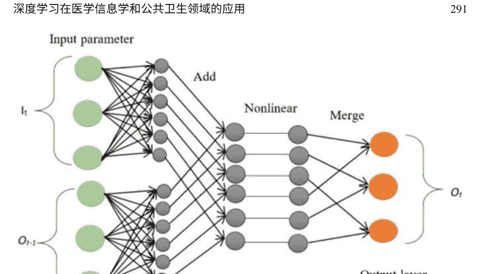

图3 前馈RNN [36]

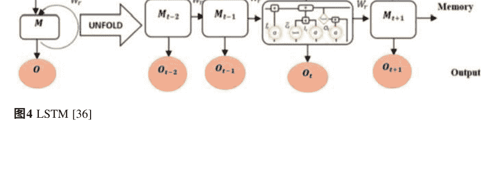

图4 LSTM [36]

##### 2.3 卷积神经网络（CNN）

CNN的动机来自于人脑的自然过程，其中模式的连接类似于人脑 [50, 51]。经典的CNN由输入层、多个隐藏层和输出层组成。以下是CNN中隐藏层的重要元素：归一化层、全连接层（FC）、池化层、卷积层。例如，分析图像数据是CNN的一个很好的例子 [52]。图5展示了一个用于识别3×3矩阵图像中字符的CNN架构。

该模型旨在识别X、O和/字符。卷积层将滤波器应用于输入图像。使用2个具有相似权重的滤波器对输入图像进行操作。因此，生成了8个参数。对于这个例子，简单性优于偏见。通常，在卷积层之后会添加一个激活（非线性）层，称为修正线性单元（ReLU）层。

函数g(l) = max (0, l)应用于卷积层的所有值通过激活层。这个过程增强了非线性模型的特性和整个网络，而不影响卷积层的领域。

通过这种方式，解决了传统人工神经网络中出现的消失问题。卷积层中的神经元群输出通过池化层合并成一个单一的神经元[48]。平均值、最大值或求和池化被用来实现这一点[53]。

在图6中，介绍了通用的CNN模型，描述了输入、输出、全连接和卷积 + 池化层。

属性挖掘是通过卷积+池化层来进行的。为了对输出进行表征，全连接层在特征之上扮演了分类器的角色，并为信息图像分配了一个可能性得分。在这一层中，m×m×r图像是输入（m→图像高度，w→图像宽度，r→通道数）。滤波器的大小（一个私有关联结构）可以根据测量结果形成。

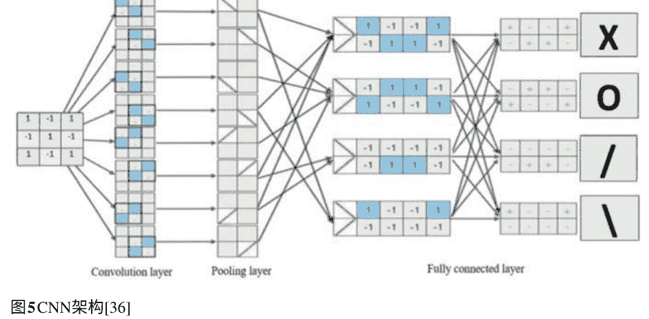

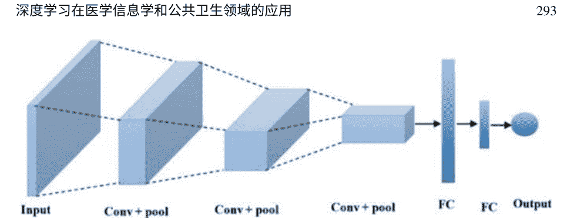

具有m-n +1的k的 每个属性映射都应用了Sigmoid非线性函数和加性偏置。信息的属性向量是由卷积+池化层的复合数据表示的，通过全连接层进行表示。利用最终特征向量[36]对输入图像进行预测。

##### 2.4 深度玻尔兹曼机（DBM）

均匀耦合的随机可见单元和隐藏单元的系统被称为玻尔兹曼机（BM）[54]。BM的设计概述在图7的第一个图表中。为了评估一对连接的二进制特征中的数据相关和独立前景，BM算法需要任意初始化的马尔可夫链来达到对称分布[55]。使用这个框架，实时学习策略非常缓慢[54]。限制玻尔兹曼机（RBM）被设计用来实现有效的学习。RBM的隐藏单元之间没有连接[56]。

一个简单的RBM设计，神经元之间的关联如图7的第二个轮廓所示。一个有价值的RBM特征是隐藏单元给定可见单元的分布。通过直接增加概率，通过考虑RBM的属性表示来获得一组边缘后验分布，其中推理是可处理的。此外，DBM和DBN是这个类别中两个基本的深度学习系统，已经在文献中介绍[57]。

与RBM相比，DBM NN具有更多的变量和隐藏层。在所有层中，DBM设计具有完全无向的神经元之间的关联。在图7中，右侧的图像描述了一个基本DBM NN的工程，其中包括一个可见层和一个隐藏层。然而，在一个层中的神经元之间，系统的所有层之间都有无向连接。为了提高似然的下界，DBM训练中采用了基于随机最大似然的算法。这是因为直接最大化概率无法计算给定可见神经元的后验隐藏神经元分布，这是由于隐藏神经元之间的相互作用。

此外，在半监督学习的情况下，可以通过有限的标记信息和大量的未标记输入来源来工作高级表示，然后可以用于调整模型以适应特定任务。可以将自上而下的反馈方式纳入，以促进不确定性的传播，从而更加稳健地处理模糊的输入。

##### 2.5 深度置信网络（DBN）

DBN表示另一种RBM变体，其中多个隐藏层通过将一个RBM输出作为另一个RBM层的输入来学习[55, 56]。其最顶层的2个层之间的连接是无向的，而下一层直接相连。训练技术遵循贪婪的方法，在DBN的无监督训练过程中进行。根据期望的输出进行参数的微调。

图8左侧的图示了由对称连接组成的3层配置的DBN设计。该设计包含多层隐藏神经元，利用BP算法进行训练[58, 59]。如图8所示，DBN设计包括不同层中神经元之间的连接单元。然而，与RBM相比，层内神经元之间不存在连接。

## 深度学习在医学信息学和公共卫生中的应用[60-62]

本节描述了应用于医学信息学和公共卫生的不同案例研究中使用的深度学习方法。

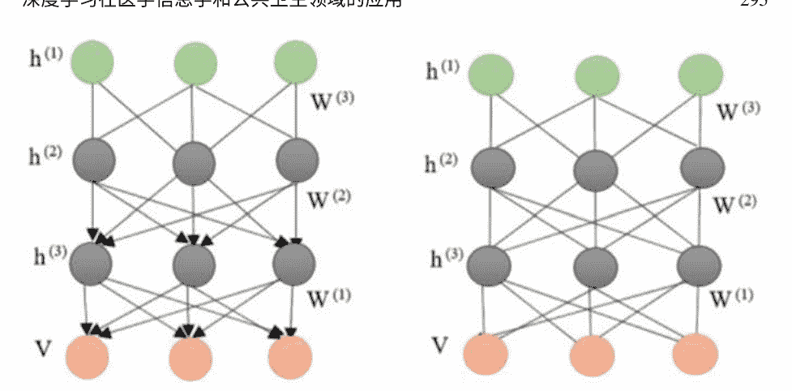

深度学习方法利用电子健康记录中收集的数据来解决与医疗保健相关的多个问题，例如减少误诊率和预测手术结果。人工神经网络能够帮助医学专家分析大量数据，并识别出许多因素，例如：

- 分析血液样本
- 跟踪糖尿病患者的血糖水平
- 识别与心脏相关的问题
- 通过应用图像分析来检测肿瘤
- 通过检测癌细胞来诊断癌症
- 通过MRI扫描早期诊断骨关节炎。

#### 3.1 使用深度学习进行癌症诊断

多年来，肿瘤学家一直使用计算机断层扫描（CT）、磁共振成像（MRI）和X射线等医学影像方法来诊断癌症。尽管这些方法对于检测多种癌症类型是有效的，但仍然存在一些无法准确诊断的癌症。卷积神经网络在检测这些癌症类型方面显示出巨大潜力。人工神经网络能够在类似的医学图像上减少误诊率，从而提供改善患者结果的早期癌症诊断。以下是一些研究，科学家们在其中有效地利用深度学习模型来诊断不同类型的癌症，具有更高的准确性：

- 根据Nvidia的研究，采用DL模型将乳腺癌误诊率降低了约85%。
- Hossam Haick设计了一种治疗癌症的设备，受到他的室友被诊断出白血病的事实的启发。一队科学家训练了一个ANN模型基于他的设计的模型。该模型根据患者的呼吸气味识别出17种不同的病例，准确率达到86%。
- Enlitic的一个研究团队展示了从CT图像中有效检测肺癌的能力。与一组专家放射科医生相比，他们在测试数据上实现了50%更高的检测率。
- Haensile等人使用CNN模型进行了皮肤癌检测的训练，通过评估数字图像中显示的皮肤病变是否会导致癌症，以与熟练的皮肤专家具有相同或更高的准确性。
- 谷歌研究人员设计了一个CNN模型，用于从病理图像中更快地检测与乳腺癌相关的癌症，并提高了准确性。该模型名为LYmph Node Assistant（LYNA），与只有38%准确率的医生相比，取得了约99%的非常高的成功率。
- 在全球范围内，已有100多家医院进行了基于深度学习的放射学图像分析，这帮助放射科医生治疗了数百万患者[60-62]。

#### 3.2 深度学习在疾病预测和治疗中的应用

2006年，美国的住院费用达到了数十亿美元。所有这些住院可以被预防。大多数住院患者患有心脏疾病或糖尿病。深度学习可以用于提高诊断率和更准确地预测，从而减少住院次数，降低费用。

一些研究团队已经将他们的解决方案应用到了这个问题上。波士顿大学的研究团队与波士顿地区的医院合作。他们成功地预测了哪些患有心脏疾病和糖尿病的患者在接下来的一年内需要住院，准确率达到了82%。在医学专家预测之前，使用深度学习模型分析了电子病历记录，预测了接下来9个月的心脏衰竭情况[60-62]。

- 糖尿病性视网膜病变（DR）：DR是由于糖尿病控制不佳而导致的一种失明形式。发展中国家约有4.15亿人患有DR。DL在预防DR方面非常有效。例如，CNN技术分析视网膜图像数据以识别眼睛内部出血、初期症状和任何指示DR的特征。DR的主要原因是血糖水平的极端波动。定期监测糖尿病患者的血糖水平是控制糖尿病和预防DR的好方法。因此，DL模型在分析血糖水平数据以预测急剧升高或急剧降低方面非常有效。这反过来可以帮助患者控制饮食。例如，如果出现低血糖，则可以食用与糖有关的食物；如果出现高血糖，则可以注射胰岛素[60-62]。
- 人类免疫缺陷病毒（HIV）：全球约有3600万人感染HIV。HIV感染患者需要定期服用抗逆转录病毒药物。由于HIV可以迅速变异，给患者的药物需要定期更换。一种称为强化学习（RL）的DL模型可以帮助这一活动。为了持续治疗HIV患者，RL技术可以在每次给药时跟踪环境中的多个指标。这有助于提供最佳行动，以修改连续治疗的药物顺序。多伦多大学设计了一个名为DeepBind的CNN模型，它使用基因组数据预测DNA和RNA序列结合蛋白质。它可以检测到DNA序列的变化，从而为医学诊断和药物研发提供改进工具[60-62]。

- 药物发现：DL在药物的发现和开发方面起到了重要的辅助作用。分析患者的病史，为他们提供更好的治疗。此外，DL还从患者的症状和检查中获取洞察力。药物发现领域为ML应用程序开发人员和其他利益相关者（如医生、首席执行官、患者、护士、保险公司等）增加了重要的经济价值，因为它涉及巨大的激励和利润。制药或药物公司是非常有利可图的行业，将成为药物开发过程的潜在客户。IBM从早期就开始了药物发现的概念。现在，谷歌也参与了使用DL进行药物发现的过程，还有其他主要组织[60-62]。

- 医学影像学：利用医学影像学方法如MRI、CT和ECG扫描可以诊断出几种危险疾病，如癌症、与脑部相关的肿瘤和与心脏相关的疾病。在这方面，深度学习协助医学专家分析疾病。

计算机视觉是由机器学习和深度学习带来的一项重要创新之一，广泛应用于医学信息学。例如，微软于2010年成立的InnerEve项目目前正在开发图像诊断工具。在这方面，他们发布了几个描述他们进展的视频。深度学习在诊断相关应用开发中起着主要作用。这是完全可能的，因为越来越多的数据源提供了丰富多样的医学图像，并且这些数据变得更加可用和可访问。然而，深度学习是一个“黑盒子”，即使它们的预测准确，也无法解释。在医学相关应用中，这种“黑盒子”问题变得更加具有挑战性，因为这关系到生死。这是因为医学专家需要清楚地了解深度学习应用是如何得出结果的，即使这些预测在之前被认为是准确的[60-62]。

- 保险欺诈：通过分析医疗保险政策，DL可以有效地识别欺诈性索赔。未来的欺诈行为也可以使用DL技术进行检测。此外，DL还帮助保险公司针对潜在客户/患者并向他们发送折扣以吸引他们[60-62]。

- 阿尔茨海默病：早期检测这种疾病对医疗机构来说是一个重大挑战。目前，只有在人体出现病症时才能识别出这种疾病。使用传统方法，早期目前无法诊断阿尔茨海默病。然而，深度学习正在早期阶段用于识别这种疾病 [60–62]。

- 基因组：深度学习方法被用于理解基因组并帮助患者了解可能影响他们的疾病。深度学习在基因组学和保险行业的未来前景很有希望。例如，Entilic采用深度学习方法帮助医生更快、更准确地进行诊断。Cellscope利用深度学习策略帮助父母通过智能设备监测孩子的健康状况，减少频繁看医生的次数。这减少了频繁看医生的次数。深度学习在公共卫生和医学信息学领域具有提供改进医疗治疗的显著应用的能力 [60–62]。

- 治疗问题和建议：疾病诊断是一个非常困难的过程，包括多种因素的变化，从人的肤色到他/她消费的食物。目前，机器还不能完全匹配人类医生的诊断。然而，未来的深度学习方法可以帮助医学专家在诊断和治疗过程中，通过提供医学知识的扩展来进行辅助。例如，纪念斯隆·凯特琳癌症中心（MSK）的肿瘤科与IBM沃森合作。MSK拥有多年来癌症患者及相关治疗的大量医疗数据。利用这些信息，它可以从历史数据中提取有用信息，当医生在未来遇到癌症病例时，向医生提供各种治疗选择。这个工具目前处于初步使用阶段[60-62]。

- 扩大规模/众包医疗数据收集：如今，人们非常关注收集和分析移动医疗信息和公共卫生数据。例如，苹果的ResearchKit专注于帕金森病和亚斯伯格综合症的治疗，允许用户访问交互式应用程序（如用于面部识别的机器学习应用程序）。它能够评估患者的状况一段时间。这个应用程序允许数据持续输入，创建了一个巨大的数据池，用于实验和未来的预测。IBM与Medtronic合作收集与胰岛素和糖尿病相关的实时健康数据，以提取有用的糖尿病知识。IBM还以26亿美元收购了一家与医疗保健相关的分析公司Truven。尽管进行了大量的医疗数据收集，但IT行业仍然在努力分析这些数据并实时提供治疗建议。然而，随着患者数据的汇集不断推进，未来的研究人员可能会在处理各种疾病方面提出更好的创新[60-62]。

- 机器人手术：最近，由机器人执行的手术变得越来越重要。在这个领域中，达芬奇机器人使外科医生能够使机器人的肢体更灵活，从而在与人类手部相比时进行精确手术并减少颤抖。尽管所有由机器人执行的手术都不使用深度学习，但某些系统利用计算机视觉，深度学习在识别特定身体部位时提供帮助（例如在毛发移植手术中检测毛囊）。此外，深度学习可以用于在从控制机器人的人类那里获得指令时稳定机器人的运动[60-62]。

#### 3.3 未来应用

快速发展的医疗保健领域中，深度学习应用的列表如下：

- **个性化医学 (PM)**
它指的是根据个性化建议自动开药的过程。例如，当从儿童身上拔掉智齿时，通常会给予一种叫做Vicodin的药物。同样，患有尿路感染的人通常会得到一种叫做Bactrim的药物。在不久的将来，预计某些患者可能会得到相同的药物剂量。了解患者的历史和遗传学，某些患者可能会被开同样的药物。个性化医学有潜力根据患者的遗传学、压力水平、过去的病史、饮食等，定制每个人的医疗建议和疾病治疗。它适用于轻微的医疗情况，例如给予尿路感染患者减少的Bactrim剂量，以及决定是否根据年龄、性别、遗传学等对某个人进行化疗[60-62]。

- **自动治疗或推荐**
自主治疗是指在不干扰患者日常生活的情况下自动治疗患者的过程。例如，可以开发一台机器，通过跟踪患者的血液水平、饮食、压力水平和睡眠情况，自动调整患者的抗生素药物剂量。在这种情况下，人们不需要记住应该服用多少药物，因为像Alexa这样的机器学习代理可以提醒他应该服用哪些药片、服用多少剂量、什么时间服用，或者在病情恶化时拨打医生的电话。例如，Medtronic开发的Hooman Hakami能够自主监测血糖水平并根据需要注射胰岛素，而不会干扰患者的日常活动。但在将这种权力交给机器之前，需要解决一些法律问题，特别是在医疗领域，因为即使是小错误也可能导致生命损失。

因此，在将自主治疗引入现实生活之前，需要进行漫长的试验[60-62]。

- **提升性能 (超越改善)**
最近，IBM和Orreco合作开发了一款可以提升运动员表现的软件。IBM和Armor之间也存在类似的合作关系。尽管西方医学的主要目标是治疗和治愈疾病，但更应该关注疾病的预防。在这方面，正在使用物联网设备。除了预防疾病和提高运动员的表现外，基于深度学习的医疗应用还可以用于追踪工人的表现，降低工作压力或寻求对处于较高健康风险的群体进行乐观的改进。然而，在这些应用变得可行之前，需要解决许多伦理问题[60-62]。

##### 自主机器人手术

目前，机器人主要作为人类外科医生能力的延伸，如精确度。为了掌握手术技巧，可以使用深度学习将视觉数据和运动模式整合到机器人中。在某些绘画和视觉艺术中，机器已经适应了超越人类专业知识的技能。例如，如果一台机器能够模拟毕加索的创造能力，那么经过足够的训练，机器可以比人类更好地进行手术[60-62]。

## 4个关于医学信息学和公共卫生中深度学习的未解决问题[63]

在现代统计方法中，深度学习为利用以前可用和快速增加的数据源为患者的优势提供了新的前景。尽管最近进行了进步性研究，特别是在成像方面，但文献仍然缺乏透明度，在潜在的伦理担忧方面探索不足，报告清晰度不足以鼓励重复性，并且没有有效地证明。如果跨学科团队结合进行涉及明确回答可重复性、有效性、透明度和伦理（TREE）相关问题的深度学习研究和项目开发，对医疗保健可能是有益的。这里建议的9个关键问题为研究人员提供了一个背景，用于强调报告、设计和实施，供编辑和同行评审人员评估对文献的贡献，并对决策者和临床医生的新发现进行批判性审查，以造福患者。以下是对一些关键问题的重点强调：

(Q.1) 患者价值的安全问题是什么？

大多数发表的预测模型并未被临床医生实际应用[64]。其中一个因素是缺乏医疗决策过程，模型无法从中学习有意义的信息/优化数据。这在过去几年中对健康领域的深度学习产生了临时性的创新[65]。因此，研究人员强烈建议从更广泛的组织角度看待上下文。在开发和实施医疗数据科学的提出的研究部分时，研究人员需要理性。关键是要提前表达这一要求，就像研究注册的原则一样。

(Q.2) 有哪些证据表明最佳临床研究实践和流行病学研究设计影响了算法的创建？

深度学习研究中开始出现与过去医学调查问题相似的模式，例如将结果属性用作预测因子，不考虑底层机制，对深度学习输出的解释不足，以及准确记录参与研究的患者类型。PECO流行病学设计规则（即确定样本居民、使用的联系人和医疗结果）在医学科学中出现的某些问题中起着重要作用。这些规则构成了有效的研究证据的有效指南和重要性[66]。

#### （问题3）患者在数据收集、审查、交付和利用中的参与是什么？

随着常规收集患者数据的使用增加，通常对特定许可（即合法利益）有备用法律依据，患者参与被视为补充医疗研究的重要性。豁免研究人员获得单独许可并不意味着他们完全免除了患者和社区的参与。因此（如果适用），医疗深度学习计划必须包括对所设计技术和结果适用性的清晰评估策略，适用于特定的数据收集实体、消费者（即临床医生）和受影响者（即使用模型通知临床管理的人员）。

几个现有的框架[67]解释了一个研究项目如何包括患者和公众。强烈建议研究人员决定他们的项目的阶段，如果有的话，适合公众和患者参与（在开始时）。例如，定义预测建模方法的需求，支持算法的改进，并评估算法的适用性。

#### （问题4）收集到的数据是否回答了医学问题，即它们是否在现实世界中具有异质性，并且数据的质量是否足够？

这里的主要问题是验证可用数据是否能够回答临床问题。例如，一个数据集如果不包含（已知的）适当或重要的预测因子，很难对其进行合理的查询。没有足够的数据，任何深度学习策略都无法产生准确的结果。为了帮助解释在确定信息是否具有适当价值时可能存在的一些问题，以下是研究人员经常发现难以将深度学习技术应用于与医疗保健相关的数据的两个关键领域：

- 固有样本特征：当数据可用但质量低或不合适时，无法产生成功的深度学习应用。对于评估有效和可推广的深度学习策略的潜力，应考虑数据收集方法、参与者抽样、资格要求和缺失信息的正确性 [68]。
- 任务重要性：由于在训练数据范围之外工作时失败的可能性，技术通常无法达到训练期间观察到的准确性。例如，当你在夜晚首次遇到一个骑自行车的人时，用于识别图像/无人驾驶汽车的深度学习系统可能会失败。因此，数据（包括时间尺度、异质性）必须保持一致。

#### （问题5）验证方法是否代表与信息收集和存储相关的实际限制和操作过程？

深度学习工作逐渐使用定期收集的数据，包括医疗保健数据（例如基因组信息和电子病历）、市政组织信息（例如教育成就和死亡记录）以及便携式和可穿戴设备数据[69]。尽管存在现实世界的限制，深度学习算法主要在过去的数据上进行测试，如果生成信息的过程不改变，可以提供明确的结果。

这些约定在实践中经常没有遵循，导致深度学习技术在安装时表现不佳，与开发中观察到的性能相比[70]。

研究人员可以将这个问题视为两个不同但相关的问题。第一个问题是确保开发一个防错身份验证系统。例如，在收集和处理数据时可以考虑考虑时间并产生瞬时混乱的训练和测试数据的方法[71, 72]。问题2是避免由于机构数据收集或存储方法的漂移而导致适当结果的冗余。然而，开发人员和研究人员在未来很难证明他们的工作，除非利用最佳的可重复性实践来减少重新安装适当服务所需的工作量。

#### (Q.6) 为了完成这个任务，需要哪些计算和技术资源？现有资源是否足够解决这个问题？

与健康相关的预测建模中，使用多个因素是普遍存在的，例如基于深度学习的图像和计算遗传学[73]。因此，确定数据复杂性和可用资源进行计算是一种常规操作，因为这些资源构成了限制性特征（与传统统计模型相比），决定了要执行的分析[74]。在某些情况下，额外的计算资源可能允许训练改进的模型。

#### (Q.7) 所述性能指标是否适用于模型应用的临床背景？

选择性能指标是将训练期间的良好性能转化为系统在实际临床部署时的良好性能所必需的环境。方法性能的差异可能出现的原因有很多，其中最重要的是评估指标并不是患者展示更好结果的良好替代品（例如，不平衡类别筛查应用的误分类错误）。另一个常见错误是选择与患者更好医疗结果强相关但并不具有证明性的成功度量标准[79]。然而，已发表的解释WFO的研究并未透露适用于统计学（例如，校准、区分度）和临床（例如，净效益类型）的性能指标。相反，它们侧重于一致性（真阳性率，其中医生提供了真实情况）。为了避免这些陷阱，为研究人员提供以下指南：[80-82]

- 与所有相关利益相关者（如患者、研究人员、医生等）协商，评估适当的统计目标制定，如预测事件的绝对风险，或确定排名或趋势检测或分类。
- 选择正确的性能指标。该目标包括具体的标准，明确统计目标可以帮助科学家决定每个特定情况下适用的预测成功指标是什么。例如，如果预测是目标，那么标准化和区分是基本的报告需求。此外，应使用正确的评分规则（或至少是并列直方图）来比较两个版本[83]。
- 要报告的结果。尽管训练结果可能不足以证明模型的有用性，但它们提供了有关样本特征和任何产生的样本外结果的宝贵见解。然而，最重要的是提到可靠的估计值（即已经正确修正过拟合的估计值）[84]。

### 5 结论

近年来，深度学习在医学影像和公共卫生领域取得了重要地位。机器学习正在逐渐影响与医疗保健和护理相关的治疗方式。这是由于深度学习的原因。与机器学习和特征工程相比，深度学习能够有效地分析大数据。在处理健康记录、生物医学图像、传感器和生理信号处理、人体运动和情感分析等多个领域，已经开发出了多种深度学习方法。本章讨论了在医学影像和公共卫生领域中使用的不同深度学习技术，如循环神经网络（RNN）、深度信念网络（DBN）、自编码器（AE）、卷积神经网络（CNN）和深度玻尔兹曼机（DBM）。还介绍了癌症诊断、糖尿病视网膜病变预测、艾滋病毒及其相关治疗等真实世界的案例研究以及未来应用。还讨论了深度学习在医学影像和公共卫生领域中使用时存在的一些开放性研究问题。

与其他领域相比，医疗保健领域需要各学科之间的互动、专门的流程和信息存储库。因此，如果在医疗保健领域生成大型模型而不完全理解其结果，将会带来实际上的灾难。与其他领域的研究人员可以独自工作而不需要太多互动相比，医疗保健领域需要

### 参考文献

1.  Lauzon, F.Q. 深度学习简介。在: 第11届国际信息科学、信号处理及其应用会议(ISSPA)，蒙特利尔，魁北克，第1438-1439页(2012)
2.  Hyunjung Kwak, G., Hui, P. DeepHealth: 人工智能在健康信息学中的回顾和挑战，42页(2019)(待出版)
3.  Ravi, D., Wong, C., Deligianni, F., Berthelot, M., Andreu-Perez, J., Lo, B., Yang, G.Z. 健康信息学中的深度学习。IEEE J. Biomed. Health Inf. 21(1), 4-21页(2017)
4.  Chang, H., Han, J., Zhong, C., Snijders, A.M., Mao, J.H. 基于多尺度卷积稀疏编码的无监督迁移学习用于生物医学应用。IEEE Trans. Pattern Anal.Machine Intell. 40(5), 1182-1194页(2017)
5.  Nie, D., Zhang, H., Adeli, E., Liu, L., Shen, D. 3D深度学习用于多模态成像引导的脑肿瘤患者生存时间预测。在: 国际医学图像计算与计算辅助干预会议上，第212-220页。Springer (2016)
6.  Samala, R.K., Chan, H.P., Hadjiiski, L., Helvie, M.A., Wei, J., Cha, K. 数字乳腺摄影中的肿块检测: 深度卷积神经网络与从乳腺摄影中迁移学习。医学物理学。43(12)，6654-6666 (2016)
7.  Xu, T., Zhang, H., Huang, X., Zhang, S., Metaxas, D.N. 宫颈异型增生诊断的多模态深度学习。在: 国际医学图像计算与计算辅助干预会议上，第115-123页，Springer (2016)
8.  Yan, Z., Zhan, Y., Peng, Z., Liao, S., Shinagawa, Y., Zhang, S., Metaxas, D.N., Zhou, X.S. 多实例深度学习: 发现具有辨别力的局部解剖结构用于身体部位识别。IEEETrans. Med. Imag. 35(5), 1332–1343 (2016)
9.  Cho, K., Van Merri nboer, B., Gulcehre, C., Bahdanau, D., Bougares, F., Schwenk, H., Bengio, Y. 使用RNN编码器-解码器学习短语表示用于统计机器翻译。In: Proceedings of the 2014 Conference on Empirical Methods in Natural LanguageProcessing (EMNLP), pp. 1724–1734. 多哈，卡塔尔 (2014)
10. Alipanahi, B., Delong, A., Weirauch, M.T., Frey, B.J. 通过深度学习预测DNA和RNA结合蛋白的序列特异性。Nature Biotechnol. 33(8), 831–838 (2015)
11. Angermueller, C., Lee, H.J., Reik, W., Stegle, O. 使用深度学习准确预测单细胞DNA甲基化状态。Genome Biol. 18(1), 1-13 (2016)
12. Xiong, H.Y., Alipanahi, B., Lee, L.J., Bretschneider, H., Merico, D., Yuen, R.K., Hua, Y.,Guerroussov, S., Najafabadi, H.S., Hughes, T.R., Morris, Q., Barash, Y., Krainer, A.R., Jovic,N., S cherer, S.W., Blencowe, B.J., Frey, B.J.: 人类剪接密码揭示了疾病的遗传决定因素的新见解。科学 347，6218 (2015)
13. Bamgbola, O.: 万古霉素引起的肾毒性的综述。内分泌和代谢的治疗进展。7(3)，136–147 (2016)
14. Davis, S.E., Lasko, T.A., Chen, G., Siew, E.D., Matheny, M.E.: 急性肾损伤的回归和机器学习模型中的校准漂移。美国医学信息学协会杂志。24(6)，1052–1061 (2017)
15. Goldstein, S.L. 肾毒性。F1000Research。6, 55 (2017)
16. Hoste, E.A.J., Kashani, K., Gibney, N., Perry Wilson, F., Ronco, C., Goldstein, S.L., Kellum, J.A., Bagshaw, S.M. 急性肾损伤的电子警报影响: 来自第15thADQI共识会议的工作组声明。Can. J. Kidney Health Disease 3(1), 1--9 (2016)

- 17. Knaus, W.A., Marks, R.D. 脓毒症的新表型。 JAMA 321(20) (2019)

- 18. Predecki, M., Blacker, E., Sadeghi-Alavijeh, O., Edwards, R., Montgomery, H., Gillis, S., Harber, M.: 改善急性肾损伤患者的预后：基于医院的自动化AKI警报的影响。 Postgrad. Med. J. 92(1083), 9–13 (2016)

- 19. Seymour, C.W., Kennedy, J.N., Wang, S., Chang, C.C., Elliott, C.F., Zhongying, X., Berry, S., Clermont, G., Cooper, G., Gomez, H., Huang, D.T., Kellum, J.A., Mi, Q., Opal, S.M., Talisa, V., Poll van der, T., Visweswaran, S., Vodovotz, Y., Weiss, J.C., Yealy, D.M., Yende, S., Angus, D.C. 提取、验证和新的临床表型的潜在治疗影响对于败血症。 JAMA 321(20), 2003-2017 (2019)

- 20. Tomašev, N., Glorot, X., Rae, J.W., Zielinski, M., Askham, H., Saraiva, A., Mottram, A., Meyer, C., Ravuri, S., Protsyuk, I., Connell, A., Hughes, C.O., Karthikesalingam, A., Cornebise, J., Montgomery, H., Rees, G., Laing, C., Baker, C.R., Peterson, K., Reeves, R., Hassabis, D., King, D., Suleyman, M., Back, T., Nielson, C., Ledsam, J.R., Mohamed, S.: 一种临床可应用的连续预测未来急性肾损伤的方法。 Nature 572, 116–119 (2019)

- 21. Wang, L., Zhang, W., He, X., Zha, H. 使用循环神经网络的监督强化学习进行动态治疗推荐。在: Proceedings of the 24th ACM SIGKDD International Conference on Knowledge Discovery & Data Mining, pp. 2447-2456. ACM (2018)

- 22. 巴斯，J.，克鲁肯，J.，库格勒，P.，卡梅尔，T.，斯泰德尔，R.，温克勒，J.，霍恩格尔，J.，埃斯科菲尔，B. 生物特征和移动步态分析在帕金森病早期诊断和治疗监测中的应用。在：IEEE工程医学与生物学学会年度国际会议，第868-871页。IEEE（2011年）

- 23. 威尔逊，S.，拉斯科，W.，查普曼，M.，米勒，R.：全科医生-医院沟通：出院总结的回顾。J.质量临床实践。21，104-108（2002年）

- 24. 金德尔，V.，比尔詹德塔拉布，J.，巴兰普扬，M.，努拉尼，M. 基于PPG的自适应深度学习方法用于识别。在：IEEE工程医学与生物学学会第38届年会（EMBC），第6401-6404页。IEEE（2016年）

- 25. Nurse, E., Mashford, B.S., Yepes, A.J., Kiral-Kornek, I., Harrer, S., Freestone, D.R. 使用深度学习解码EEG和LFP信号：以TrueNorth为例。在：ACM国际计算前沿会议论文集，第259-266页。ACM（2016）

- 26. Cao, Y., Liu, C., Liu, B., Brunette, M.J., Zhang, N., Sun, T., Zhang, P., Peinado, J., Garavito, E.S., Garcia, L.L. 利用深度学习和移动健康技术改善结核病诊断：在资源匮乏和边缘化社区中的应用。在：IEEE第一届连接健康应用、系统和工程技术国际会议（CHASE），第274-281页。IEEE（2016）

- 27. Alimova, I., Tutubalina, E., Alferova, J., Gafiyatullina, G. 俄语药物评论分类的机器学习方法。在：Ivannikov ISPRAS开放会议（ISPRAS），第64-69页。IEEE，莫斯科（2017）

- 28. Bodnar, T., Barclay, V.C., Ram, N., Tucker, C.S., Salath, T. 通过Twitter和医疗记录进行在线诊断的现场验证。在：第23届国际万维网会议论文集，第651-656页。ACM（2014年）

- 29. Chae, S., Kwon, S., Lee, D.: 使用深度学习和大数据预测传染病。环境研究和公共健康 15（8），1-20（2018年）

- 30. de Quincey, E., Kyriacou, T., Pantin, T. #枯草热:对英国枯草热相关推文的纵向研究。在：第6届国际数字健康会议论文集，第85-89页。ACM（2016年）

- 31. Garimella, V.R.K., Alfayad, A., Weber, I. 社交媒体图像分析用于公共卫生。在：人机交互计算系统CHI会议论文集，第5543-5547页。ACM (2016年)

- 32. Phan, N.H., Dou, D., Piniewski, B., Kil, D. 社交受限玻尔兹曼机：在健康社交网络中预测人类行为。在：2015年IEEE/ACM国际社交网络分析与挖掘会议论文集，第424-431页。ACM (2015年)

- 33. Tuarob, S., Tucker, C.S., Salathe, M., Ram, N. 一种用于在社交媒体信息中发现与健康相关知识的异构集成分类方法。生物医学信息学杂志 49, 255–268 (2014年)

- 34. Birkhead, G.S., Klompas, M., Shah, N.R. 利用电子健康记录进行公共卫生监测以推进公共卫生。年度公共卫生综述 36, 345–359 (2015年)

- 35. Henry, J., Pylypchuk, Y., Searcy, T., Patel, V. 美国非联邦急救医疗机构采用电子健康记录系统：2008年至2015年。ONC数据简报。35, 1–9 (2016年)

- 36. Tobore, I., Li, J., Yuhang, L., Al-Handarish, Y., Kandwal, A., Nie, Z., Wang, L. 深度学习干预健康护理挑战：一些生物医学领域的考虑。JMIR移动健康 7 (8) (2019年)

- 37. Schmidhuber, J.: 神经网络中的深度学习综述. Neural Netw. 61, 85–117 (2015)

- 38. Yousoff, S.N., Baharin, A., Abdullah, A. 生物信息学领域深度学习方法的优化算法综述. In: 生物医学工程与科学会议论文集and Sciences, pp. 707–711. 吉隆坡, 马来西亚, IEEE (2016)

- 39. LeCun, Y., Bengio, Y., Hinton, G.: 深度学习. Nature 521(7553), 436–444 (2015)

- 40. Vincent, P., Larochelle, H., Bengio, Y., Manzagol, P.A. 用去噪自编码器提取和组合稳健特征. In: 机器学习国际会议论文集on Machine learning; ICML'08; 2008年7月5日至9日, pp. 1096–103. 赫尔辛基, 芬兰 (2008)

- 41. Ranzato, M.A., Poultney, C., Chopra, S., LeCun, Y. 基于能量模型的稀疏表示的高效学习. In: 神经信息处理系统国际会议论文集Information Processing Systems; NIPS'06; 2006年12月4日至7日, pp. 1137–44. 温哥华,不列颠哥伦比亚省, 加拿大 (2006)

- 42. Masci, J., Meier, U., Cirean, D., Schmidhuber, J. 堆叠卷积自编码器用于分层特征提取. 在: 人工神经网络和机器学习会议论文集; ICANN'11; 2011年6月14日至17日, 第52-9页。芬兰埃斯波 (2011)

- 43. Ororbia, L.A., Kifer, D., Giles, C.L.: 用数据梯度正则化统一对抗训练算法. 神经计算. 29(4), 867–887 (2017). https://doi.org/10.1162/NECO_a_00928

- 44. Rifai, S., Vincent, P., Muller, X., Glorot, X., Bengio, Y. 压缩自编码器: 特征提取过程中的显式不变性. 在: 第28届国际机器学习会议论文集; ICML'11; 2011年6月28日至7月2日, 第833-40页。美国华盛顿州贝尔维尤 (2011)

- 45. Schmidhuber, J. WebCite. [展示了在展开的RNN中跨等效于1,200层的信用分配] http://www.webcitation.org/71i6G4Jawwebcite (1993)

- 46. Bengio, Y., Simard, P., Frasconi, P.: 用梯度下降学习长期依赖性是困难的. IEEE Trans Neural Netw. 5(2), 157–166 (1994). https://doi.org/10.1109/72.27918147

- 47. Hochreiter, S., Schmidhuber, J.: 长短期记忆. Neural Comput. 9(8), 1735–1780(1997). https://doi.org/10.1162/neco.1997.9.8.1735

- 48. Krizhevsky, A., Sutskever, I., Hinton, G.E.: 使用深度卷积神经网络进行ImageNet分类. Commun. ACM 60(6), 84–90 (2017). https://doi.org/10.1145/306538649.

- 49. Cho, K., van Merrienboer, B., Gulcehre, C., Bahdanau, D., Bougares, F., Schwenk, H., Bengio, Y. 使用RNN编码器-解码器学习短语表示用于统计机器翻译. 在: 会议论文集Empirical Methods in Natural Language Processing;EMNLP'14; 2014年10月25日至29日, pp. 1724–34. 卡塔尔多哈 (2014)

- 50. Matsugu, M., Mori, K., Mitari, Y., Kaneda, Y.: 使用卷积神经网络进行鲁棒的人脸检测的主体无关的面部表情识别. 神经网络. 16(5–6), 555–559 (2003). https://doi.org/10.1016/S0893-6080(03)00115-1

- 51. Hubel, D.H., Wiesel, T.N.: 猫的视觉皮层中的感受野, 双眼互动和功能结构. 生理学杂志. 160(1), 106–154 (1962). https://doi.org/10.1113/jphysiol.1962.sp006837

- 52. Lecun, Y., Bottou, L., Bengio, Y., Haffner, P.: 基于梯度的学习应用于文档识别. IEEE会议录. 86(11), 2278–2324 (1998). https://doi.org/10.1109/5.726791

- 53. Cirean, D., Meier, U., Schmidhuber, J. 用于图像分类的多列深度神经网络。 在：计算机视觉和模式识别会议论文集; IEEE'12; 2012年6月16日至21日，第3642-9页。 美国罗得岛普罗维登斯 (2012年)

- 54. Salakhutdinov, R., Larochelle, H. 高效学习深度玻尔兹曼机。 在：第十三届国际人工智能与统计学会会议论文集; AISTATS'10; 2010年5月13日至15日，第693-700页。 意大利撒丁岛 (2010年)

- 55. Hinton, G.E., Osindero, S., Teh, Y.W.: 一种用于深度信念网络的快速学习算法。神经计算. 18(7), 1527-1554 (2006年). https://doi.org/10.1162/neco.2006.18.7.15256.

- 56. Hinton, G.E., Salakhutdinov, R.R.: 用神经网络降低数据的维度。科学 313(5786), 504–507 (2006). https://doi.org/10.1126/science.112764757.

- 57. Ravi, D., Wong, C., Deligianni, F., Berthelot, M., Andreu-Perez, J., Lo, B., Yang, G.Z.: 深度学习在健康信息学中的应用。IEEE J. Biomed. Health Inform. 21(1), 4–21 (2017). https://doi.org/10.1109/JBHI.2016.2636665

- 58. Ryu, S., Noh, J., Kim, H.: 基于深度神经网络的需求侧短期负荷预测. 能源 10(1), 3 (2016). https://doi.org/10.3390/en10010003

- 59. Goodfellow, I., Bengio, Y., Courville, A.: 深度学习 (自适应计算与机器学习系列) 剑桥. MIT Press, 麻省 (2016)

- 60. Esteva, A., Robicquet, A., Ramsundar, B., Kuleshov, V., DePristo, M., Chou, K., Cui, C., Corrado, G., Thrun, S., Dean, J.: 医疗保健中深度学习指南。 Nat Med 25, 24–29 (2019). https://doi.org/10.1038/s41591-018-0316-z

- 61. https://www.allerion.com/blog/top-5-applications-of-deep-learning-in-healthcare.

- 62. https://emerj.com/ai-sector-overviews/machine-learning-healthcare-applications/.

- 63. Vollmer, S., Mateen, B.A., Bohner, G., Kirly, F.J., Ghani, R., Jonsson, P., Cumbers, S., Jonas, A., McAllister, K.S.L., Myles, P., Granger, D., Birse, M., Branson, R., Moons, K.G.M., Collins, G.S., Ioannidis, J.P.A., Holmes, C., Hemingway, H. 机器学习和人工智能研究对患者福祉的影响：关于透明度、可复制性、伦理和有效性的20个关键问题。BMJ. 368, l6927 (2020). https://doi.org/10.1136/bmj.l6927

- 64. Steyerberg, E.W., Moons, K.G., van der Windt, D.A. et al. PROGRESS Group. Prognosis Research Strategy (PROGRESS) 3: prognostic model research. PLoS Med. 10, e1001381 (2013). https://doi.org/10.1371/journal.pmed.1001381

- 65. Snooks, H., Bailey-Jones, K., Burge-Jones, D., et al.: Effects and costs of implementing predictive risk stratification in primary care: a randomised stepped wedge trial. BMJ Qual. Saf. 28, 697–705 (2019). https://doi.org/10.1136/bmjqs-2018-007976

- 66. Avati, A., Jung, K., Harman, S., Downing, L., Ng, A., Shah, N.H.: Improving palliative care with deep learning. BMC Med. Inform. Decis. Mak. 18(Suppl 4), 122 (2018). https://doi.org/10.1186/s12911-018-0677-8

- 67. 英国研究中公众参与的标准。 主页。 https://sites.google.com/nihr.ac.uk/pi-standards/home (2018)

- 68. Cortes, C., Jackel, L.D., Chiang, W.P. 数据质量对学习机准确性的限制。 在：神经信息处理系统的进展，第239-46页 (1995)

- 69. Willetts, M., Hollowell, S., Aslett, L., Holmes, C., Doherty, A.: 从传感器数据中对96,220名英国生物库参与者的睡眠和身体活动表型进行统计机器学习。 Sci. Rep. 8, 7961 (2018). https://doi.org/10.1038/s41598-018-26174-1

- 70. Siontis, G.C., Tzoulaki, I., Castaldi, P.J., Ioannidis, J.P.: 新风险预测模型的外部验证很少，并显示出更差的预后鉴别能力。 J. Clin. Epidemiol. 68, 25–34 (2015). https://doi.org/10.1016/j.jclinepi.2014.09.007

- 71. Hyndman, R.J., Athanasopoulos, G. 预测：原理与实践。OTexts. https://otexts.com/fpp2/ (2018)

- 72. Lyddon S, Walker S, Holmes CC. 从贝叶斯模型中非参数学习随机化目标函数。 在：神经信息处理系统的进展, 2018:2072–82.

- 73. Simonyan, K., Zisserman, A. 非常深的卷积网络用于大规模图像识别。 https://arxiv.org/abs/1409.1556 (2014)

74. Inouye, M., Abraham, G., Nelson, C.P. et al. 英国生物库心脏代谢综合征协会冠心病工作组。在48万名成年人中的冠状动脉疾病基因风险预测：对初级预防的影响。美国心脏学院杂志。 **72**, 1883–93 (2018). [https://doi.org/10.1016/j.jacc.2018.07.079](https://doi.org/10.1016/j.jacc.2018.07.079)

75. Canziani A, Paszke A, Culurciello E. 深度神经网络模型在实际应用中的分析。arXiv [预印本] 2016年5月24日。https://arxiv.org/abs/1605.07678.

76. Hinton, G.E., Srivastava, N., Krizhevsky, A., Sutskever, I., Salakhutdinov, R.R. 通过防止特征检测器的共适应性来改进神经网络 (2012) https://arxiv.org/abs/1207.0580

77. Collins, G.S., Moons, K.G.M. 比较风险预测模型。BMJ **344**, e3186 (2012)

78. Morin, A., Urban, J., Sliz, P.: 科学家-程序员软件许可的快速指南。PLoS Comput. Biol. **8**, e1002598 (2012). [https://doi.org/10.1371/journal.pcbi.1002598](https://doi.org/10.1371/journal.pcbi.1002598)

79. Epstein, A.S., Zauderer, M.G., Gucalp, A., et al.: IBM Watson Oncology的下一步：扩展到其他恶性肿瘤。J. Clin. Oncol. **32**(suppl), 6618 (2014). [https://doi.org/10.1200/jco.2014.32.15_suppl.6618](https://doi.org/10.1200/jco.2014.32.15_suppl.6618)

80. Suwanvecho, S., Suwanrusme, H., Sangtian, M., Norden, A., Urman, A., Hicks, A. 等 在泰国对认知计算系统的一致性评估。J. Clin. Oncol. **35**(15), 6589 (2017)

81. Somashekhar, S., Kumarc, R., Rauthan, A., Arun, K., Patil, P., Ramya, Y.: 双盲验证研究，评估IBM人工智能平台Watson在与Manipal多学科肿瘤委员会比较中的表现-首个638例乳腺癌病例研究。Cancer Res. **77**(4 suppl), S6-07 (2017)

82. Baek, J., Ahn, S., Urman, A., 等。在韩国治疗结肠和胃癌中使用认知计算系统。J. Clin. Oncol. **35**(15), e18204 (2017)

83. Moons, K.G.M., Altman, D.G., Reitsma, J.B., et al.: 透明报告多变量预测模型用于个体预后或诊断（TRIPOD）：解释和阐述。Ann Intern Med **162**, W1-73 (2015). [https://doi.org/10.7326/M14-0698](https://doi.org/10.7326/M14-0698)

84. Rieke, N., Hancox, J., Li, W. et al. 基于联邦学习的数字健康的未来。NPJ Digit. Med. **3**, 119 (2020). [https://doi.org/10.1038/s41746-020-00323-1](https://doi.org/10.1038/s41746-020-00323-1)

## 使用卷积神经网络进行凌日系外行星探测

Dhruv Kaliraman, Gopal Joshi和Suchitra Khoje

摘要 人类投入了大量资源来理解太阳系的过程。然而，自从发现系外行星以来，我们有了手段来确定我们是否真正理解这些过程。寻找系外行星最引人注目的原因是它为我们打开了寻找其他适居行星以及更好地理解我们自己太阳系的大门。多年来，科学家一直在利用NASA的Kepler太空望远镜的数据来寻找和识别成千上万个凌日系外行星。由于新的和更好的望远镜，天文数据正在迅速增加。传统的基于人类判断的预测和分类方法效率低下，容易受到进行研究的专家的影响。例如，用于系外行星发现的广泛使用的Box-fitting Least Squares技术（BLS）会产生大量的假阳性，在嘈杂的数据情况下必须进行手动检查。因此，需要一种自动化且无偏见的方法来检测系外行星，同时去除模仿凌日行星信号的假阳性信号。引入了一种基于卷积神经网络的新机制来寻找系外行星，使用凌日技术。由于数据集庞大且高度不平衡，使用SMOTE对数据进行重新采样，同时采用指数衰减方法以及dropout和early stopping技术来减少模型过拟合。此外，该模型采用了GridSearchCV方法来优化超参数。最后，为了得到一个稳健且完整的模型，该模型使用了k折交叉验证进行评估。研究中使用了准确率、精确度、召回率、F1分数、敏感度和特异度等性能指标。在分析数据后，研究得出结论，卷积神经网络在测试数据上的最高准确率达到了99.6%。

关键词 卷积神经网络 · GridSearchCV · k折交叉验证 · 机器学习 · SMOTE · 系外行星探测 · 凌日法

D. Kaliraman (✉️) · G. Joshi
麻省理工学院WPU计算机科学学院，浦那，马哈拉施特拉邦，印度
S. Khoje
麻省理工学院WPU电子与通信工程学院，浦那，马哈拉施特拉邦，印度
电子邮件：suc hitra.khoje@mitwpu.edu.in

© 作者（们），独家许可给Springer Nature Switzerland AG 2022
K. R. Ahmed和H. Hexmoor（编辑），区块链和深度学习，大数据研究105辑，https://doi.org/10.1007/978-3-030-95419-2_14

### 1 引言

系外行星是指远离我们行星系统的行星。大多数系外行星绕其他恒星运转，而流浪行星，也被称为自由漂浮的系外行星，绕银河系中心运转，不与任何恒星相连。

由于现代望远镜只能观察到那一点，迄今为止发现的大多数系外行星仅限于我们银河系恒星群的一个有限区域。美国国家航空航天局的开普勒太空望远镜声称，银河系中的行星比恒星多[1]。

已经发现并验证了数千颗围绕其他恒星运转的系外行星。范·马宁在1917年发现了第一个新型亚行星，发现了第一个系外行星的踪迹。直到1990年代才得到确认。开普勒太空望远镜的引入使发现系外行星的速度显著增加。

开普勒太空望远镜的主要目标是寻找与地球相似并位于适居带或接近适居带的行星（太阳周围的区域，行星可能在其表面上有液态水，也被称为“金发女孩区域”），并确定恒星与行星的关联。尽管开普勒航天器在2018年停用，但它收集的细节仍然被用于识别系外行星。

斯皮策太空望远镜凭借其红外能力对TRAPPIST-1系统进行了重要的探索。为了找到更多绕星球运转的系外行星，2018年引入了凌日系外行星巡天卫星（TESS）作为开普勒的下一代替。诸如NASA的詹姆斯·韦伯太空望远镜和南希·格雷斯·罗曼太空望远镜等系外行星任务在我们可能学到的领域方面具有很大的潜力。天文学家采用光谱学方法（一种测量光指纹的方法）来更多地了解行星的大气和条件[2]。

寻找系外行星的动机源于人类最深刻和发人深省的问题之一：“我们在宇宙中是否孤独？”几千年来，哲学家和好奇的人们一直在思考这个问题，但这是第一代拥有工具开始回答科学观察的人。不仅有数千颗围绕其他恒星运行的行星，还有数百亿颗行星的存在被推断出来，发现了各种各样的行星，其中一些与我们的行星系统非常不同。随着一个新的恒星系统的发现，宇宙如何运作的问题得到了回答。

这有助于弄清楚我们的太阳系在这个宇宙中的位置。新的方法正在被利用来改进天体物理学中检测系外行星的基于算法的方式。神经网络是一个相对年轻的领域，涉及基于人脑结构和功能的算法（NN）。深度学习是机器学习的一个子集，它可以从有标签和无标签的输入中学习数据。通过使用开普勒望远镜提供的照片数据，本文讨论了使用深度学习进行系外行星发现的主题。

以下是论文的概述。本文介绍了以往使用机器学习发现系外行星的尝试的概述，在第2节中进行了介绍。本文的基本原理在第3节中概述。我们的发现和分析在第4节中呈现。在第5节中，我们介绍并详细说明了我们深度学习模型的最终架构和超参数。我们的结论在论文的最后部分呈现。

### 2 文献调研

Aisha等人[1]提出了一种使用无人机的自动化陨石检测系统的方法。使用机器学习对其进行编程以检测和找到陨石。这是通过使用多种架构（如Mobile NetV2和InceptionV3）来实现的。卷积神经网络中的参数在不同的卷积层中有所不同（InceptionV3使用了最显著的参数数量）。机器学习算法使用Python、Keras和Tensorflow实现。

单板计算机（SBC）通过检查视频的单个帧并将其应用于深度学习模型来执行板上处理。在卷积神经网络上进行迁移学习，使用各种常见陨石的照片来训练该模型（CNN）。结果令人鼓舞，准确率约为90%。Abhishek等人[2]提出了一种利用凌日方法提供新型基于机器学习的工具来检测系外行星的方法。他们利用这些技术改进了天体物理学中检测系外行星的当前基于算法的方法。他们使用时间序列分析软件包TSFresh分析光曲线，从每个曲线中提取789个特征，提取有关曲线特性的数据。然后，他们利用机器学习应用程序lightgbm构建了一个梯度提升分类器，利用这些特征。这种方法在模拟数据上进行了测试，证明比标准的盒式最小二乘拟合（BLS）方法更成功。他们还发现，他们的策略在同时达到与现有深度学习模型相当的结果的同时，计算效率更高，不需要折叠。这种方法使用开普勒数据预测了一个准确率为0.948的行星，这意味着94.8%的实际行星信号被评为高于非行星信号。最终的召回值为0.96。在凌日系外行星巡天卫星（TESS）数据集上，他们的结果指标为：准确率为0.98，召回率为0.82，精确率为0.63。Erqian等人介绍了一个高效准确地发现和分类星系的星系检测和分类工具（GalaDC）。GalaDC是一个易于使用的统计分析工具，可以进行批处理，并且可以处理带有多个星系的图片。GalaDC在这项研究中使用卷积神经网络和各种计算机视觉技术。90%的数据用于训练网络，剩下的10%用于评估网络的泛化和过拟合情况。测试准确率为91.0%，而训练准确率为91.5%。

### 3 方法论

用于此分析的数据已经过清洗，并来自NASA的开普勒太空望远镜观测。卷积神经网络被用于构建一种自动分类开普勒行星候选者的方法。本研究使用SMOTE对数据进行重新采样，同时采用指数衰减和提前停止方法来减少模型过拟合。此外，该模型采用GridSearchCV方法来优化超参数。最后，为了得到稳健和完整的模型，该模型使用k折交叉验证进行测试。研究中使用了准确率、精确度、召回率、F1分数、敏感度和特异度等性能指标。网络模型如图1所示。

#### 3.1 数据集分析

什么是凌日法？

凌日法测量了外行星的光强度。在这种方法中，当一个行星在观测者（太空望远镜）和其周围的恒星之间经过时，那颗恒星的亮度会真实地暗淡一段时间。这是一个微小的差异，但足以让天体物理学家发现一个围绕着遥远恒星运行的系外行星的存在。

天文学家将其称为图2中的‘光曲线’。这是一个显示星体光输出的图表。随着时间的推移，当行星经过恒星前方并阻挡其部分光线时，恒星的亮度会短暂地减弱。

| 论文名称 | 作者 | 研究年份 | 使用的数据集 | 使用的方法 | 准确率（%） | 研究间隙 |
| :--- | :--- | :--- | :--- | :--- | :--- | :--- |
| 使用深度学习算法在深空中发现外行星 | M. A. Khan, M. Dixit | 2020 | NASA的Kepler太空望远镜数据集（Kaggle） | 深度神经网络和支持向量机 | 99.1% | 该模型无法正确分类真正的阳性外行星 |
| 使用机器学习进行外行星检测 | Abhishek Malik, Benjamin P. Moster和Christian Obermeier | 2020 | Kepler数据集，TESS数据集 | 时间序列分析库TSFresh，使用机器学习工具lightgbm训练特征，使用梯度提升分类器 | 开普勒数据 - 94.8%，TESS数据 - 98% | 与其他两个数据集相比，他们的模型在TESS数据集上表现更差。TESS数据中的严重类别不平衡是其背后的关键解释 |
| 通过卷积神经网络使用机器学习技术检测外行星凌星现象 | Pattana Chintarungruangchai 和 Guo Yue Jiang | 2019 | 开普勒数据集 | MLP，1D CNN 折叠0，1D-CNN-折叠-1，2D-CNN-折叠-0，2D-CNN-折叠 | 98% | 即使S/N小于10，所有具有折叠的模型的准确率都可以达到98%以上。当S/N小于10时，没有折叠的模型的准确率可能下降至约85%。精确度和召回率具有类似的趋势 |
| 使用深度学习和无人机进行陨石狩猎 | Aisha AlOwais, Safa Naseem, Takwa Dawdi, Mariam Abdisalam, Yusra Elkalyoubi, Anas Adwan, Khawla Hassan和... | 2019 | 谷歌图片 | 卷积神经网络，迁移学习 | 90% | 数据集中的图像较少导致准确性较低 |
| GalaDC: 星系检测和分类工具 | 蔡二千 | 2020 | 在Kaggle上的“星系动物园-星系挑战” | 卷积神经网络开放CV，PyQt5 | 91% | 该模型在不同红移波段的图像上表现不佳 |

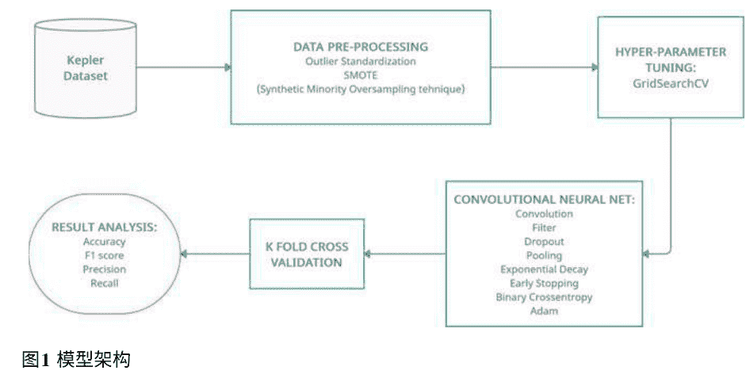

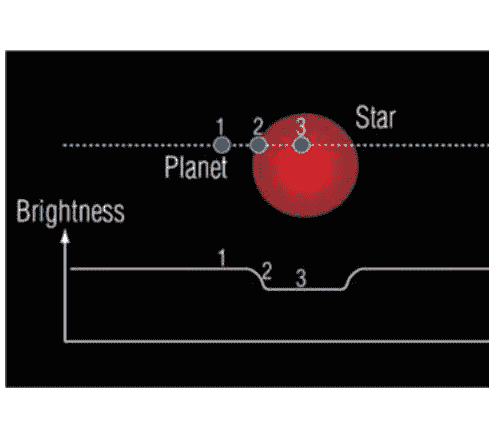

最终，当行星远离观察者和恒星时，光强度恢复正常[3]。

光强度下降的持续时间和幅度可以揭示目标行星的许多信息。较大的行星会阻挡更多的光线，导致更明显的光曲线。此外，行星距离恒星越远，绕行一周所需的时间就越长。因此，光曲线的特征可以准确地告诉我们恒星与行星之间的距离。

除了探索系外行星，这项技术还可以用于研究行星的大气和温度。一部分恒星光穿过系外行星的大气层，然后在凌星光曲线中被探测到。天体物理学家通过研究这种光谱来了解行星大气中存在的元素。借助这项技术，科学家已经发现了从甲烷到水等各种元素（图2）。

次级食（在此过程中，行星从恒星后方经过，观察者无法看到来自行星的光）也可以揭示行星的温度和辐射数据。天文学家在这一时刻测量恒星的光度强度，然后从之前的读数中减去第二次日食。这使得除了检测行星臭氧层中的云形态外，还能进行温度读数[4]。

使用凌日法找到新的系外行星非常有效。NASA的开普勒太空飞船发现了成千上万个可能的系外行星，该飞船使用了这种技术，为科学家提供了有关银河系系外行星分布的重要信息。

##### 数据集

这个数据集是从Kaggle获取的，包含了数千颗恒星的流量强度变化。每个数据点或恒星被分配一个目标标签1或2。2表示目标恒星周围至少有一颗系外行星；少数观测结果是由于多行星系统的性质[5]。

正如前面的部分所述，行星本身不会发光，但它们通过遮挡母星的光线来进行凌日。如果在长时间内监测恒星，光通量强度会持续减小。这证明了一颗行星围绕着一颗恒星旋转，因此有资格成为候选系外行星。

一个蓝色的行星围绕着一个目标恒星旋转。在这里使用的数据集中。给定望远镜的位置，星体的光通量在t=1时下降，因为它被旋转的外行星遮挡。在t=2时，星体的光恢复到原来的值。

##### 训练集

- 5087行或观测数据。
- 3198列或特征。
- 第1列是标签向量。第2-3198列是随时间变化的光通量值。

##### 测试集

- 3198列或特征。第1列是标签向量。第2-3198列是随时间变化的光通量值。5个确认的外行星恒星和565个非外行星恒星。

图3显示了具有外行星实例的光通量强度时间序列数据。
图4显示了没有外行星实例的光通量强度时间序列数据。

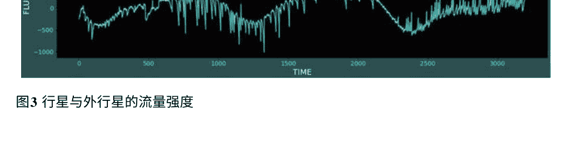

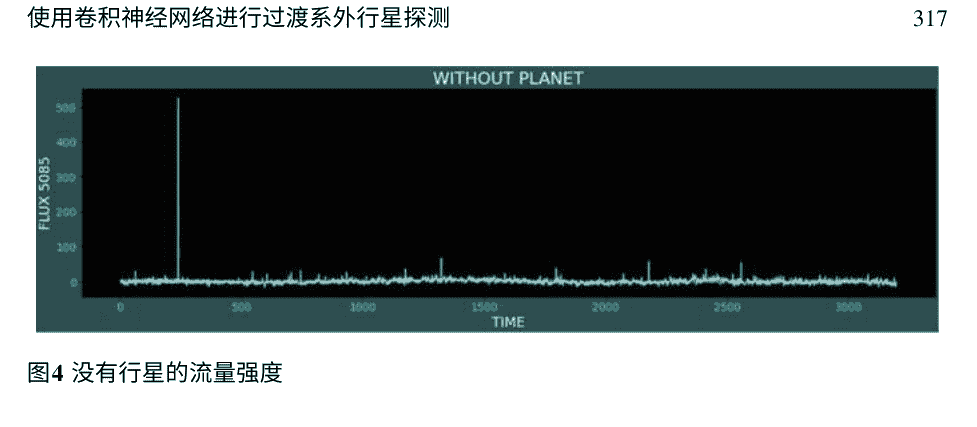

#### 3.2 数据预处理（异常值）

我们的模型不使用标准化程序，因为缩放数据会减少具有和没有外行星的恒星之间的对比度。统计学中存在很多异常值，因此必须考虑这个事实。因为我们没有应用缩放，确定截断阈值是一个敏感的操作。经过多次测试后，用每颗恒星的最大流量值替换其平均值是一个好主意。

数据在异常值修正之前和之后的绘图比较如图5和图6所示。

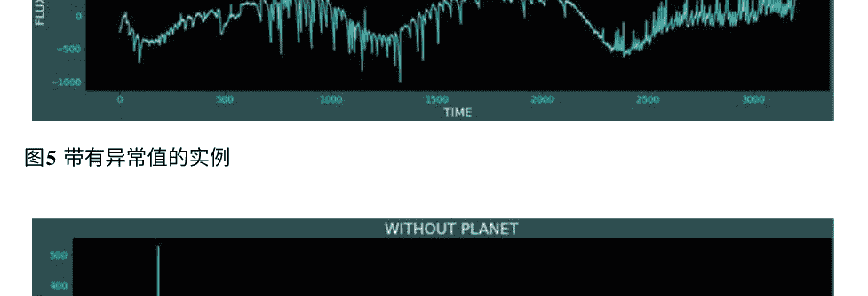

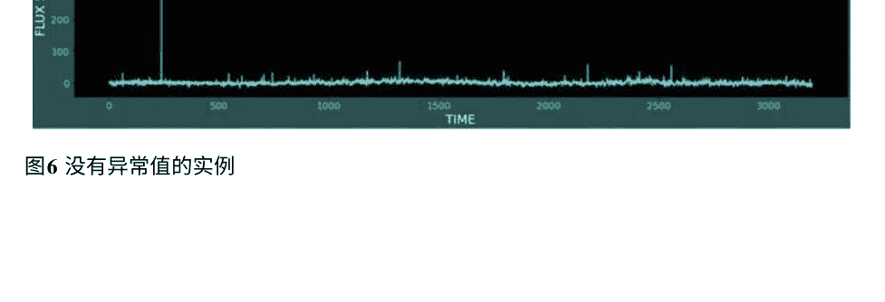

#### 3.3 SMOTE

不平衡分类的一个困难是少数类别的样本太少，无法成功学习决策阈值。SMOTE（合成少数类过采样技术）解决了这个问题[6]。

SMOTE通过在特征空间中选择彼此靠近的实例，在特征空间中的实例之间创建一条线，并在该线上的某个位置生成一个新的示例。

更具体地说，首先从少数类中随机选择一个案例。然后，对于该示例，找到k个最近的邻居（通常k =5）。随机选择一个确定的邻居，并在两个实例之间的特征空间中的随机确定位置构造一个合成示例。

使用随机欠采样来减少属于多数类的实例，然后。为了平衡类别分布，使用SMOTE来过采样少数类。

该方法的工作原理是构造出与当前少数类实例在特征上完全相同的逼真的合成实例。

该方法的缺点是在创建合成实例时没有考虑主导类别，这可能导致在类别之间存在重叠的情况下产生模糊的实例。

由于我们的数据集严重不平衡，我们使用了SMOTE来增加少数类的数据。

#### 3.4 卷积神经网络

卷积神经网络（CNN）是一种特殊设计用于分析像素输入的人工神经网络，用于图像识别和处理。

通过卷积神经网络（CNN）实现了局部连接（每个滤波器根据特定的大小和步幅在整个图像上移动，从而能够发现和匹配图像中的模式），权重较小且共享。因此，它们比多层感知机更节省资源且更容易训练。还可以进一步加深网络。层之间不是完全连接的，而是稀疏连接的。它可以接受矩阵和向量作为输入。层之间不是完全连接的，而是部分连接或稀疏连接的。

网络中的每个节点并非与其他节点完全连接。

CNN的滤波平移功能有效地实现了参数和权重共享，使得滤波器能够在图像的任何位置检测特定的模式，从而具有位置不变性，能够识别图像中任何位置存在的模式。这对于检测物体非常有用。图像中的模式可能出现在各种不同的位置。

| Layer (type) | Output Shape | Param # |
|--------------|--------------|---------|
| reshape_11 (Reshape) | (None, 3197, 1) | 0 |
| conv1d_11 (Conv1D) | (None, 3196, 10) | 30 |
| max_pooling1d_11 (MaxPooling) | (None, 1598, 10) | 0 |
| dropout_22 (Dropout) | (None, 1598, 10) | 0 |
| flatten_11 (Flatten) | (None, 15980) | 0 |
| dense_33 (Dense) | (None, 44) | 703164 |
| dropout_23 (Dropout) | (None, 44) | 0 |
| dense_34 (Dense) | (None, 20) | 900 |
| dense_35 (Dense) | (None, 1) | 21 |

##### 图7 神经网络架构

##### 1D最大池化

1D最大池化技术可以减少数据量、参数数量和计算量，同时还可以防止过拟合。1D最大池化块通过预定的步长将一定大小的池（窗口）在输入数据中滑动，计算每个窗口中的最大值。

在一个或多个卷积层之后，实现最大池化层，使得内部卷积层可以从原始向量的较大部分获取输入。如果我们将卷积层视为单个特征的检测器，最大池化仅保留池化矩形内特征的“最强”值。

每个通道（因此每个特征）都有自己的处理方式。

图7表示所使用的卷积神经网络架构。

步幅：在池化时沿向量移动的单元格数。2是默认值。

填充：通过添加输入使输出与原始输入长度相同，可以获得相同的结果。“无填充”是“valid”所表示的意思。

#### 3.5 卷积神经网络架构的优化

Dropout：
Dropout是一种训练方法，随机选择的神经元被拒绝。它们随机“消失”。这意味着神经元对于向下传递到较低层神经元的贡献在暂时停止，同样，在向后传递的过程中，不会应用权重变化[7]。

神经元的权重在神经网络不断学习的过程中会在附近稳定下来。所有神经元都具有为特定专业化或特征配置的权重。因此，同一邻域中的神经元开始依赖于使模型过于刚性的这些特定特征，这是合乎逻辑的。

解决这个问题的一个可行方法是随机从训练模型中取出神经元，使得相邻的神经元更加独立，不依赖于缺失的神经元。事实证明，这种方法有效，使得这些相邻的神经元学习到了各种特征，就像它们没有被随机移除一样。

这样可以得到一个更加稳健的模型，不依赖于单个神经元的权重，模型和网络能够做出更好的泛化，进一步减少模型过拟合的风险。

为了减少过拟合，我们的模型有两个独立的dropout层。

早停和指数衰减：
很难预测或猜测训练神经网络所需的最优神经元数量。过拟合训练数据集可能来自于使用过多的迭代次数，而使用较少的迭代次数也可能对模型产生不利影响，导致欠拟合模型。

为了避免上述情况，一种称为早停技术的方法允许用户给模型随机大量的训练周期，然后在验证数据集性能指标不再增加时停止训练[8]。

这需要将验证集拆分传递给fit()函数，以及一个EarlyStopping回调函数来定义在验证集上监视的性能指标。

本研究采用早停方法来避免过拟合。
在开发深度神经网络时，随着训练的进行，降低学习率是常见的做法。可以使用预先确定的学习率计划或可调节的学习率方法来实现这一点。学习率计划旨在在训练过程中根据预先确定的时间表降低学习率。

为了避免过拟合，我们的研究也采用了指数衰减方法。

#### 3.6 参数优化

##### 网格搜索

GridSearchCV是包含在模型选择包中的sklearn库函数。GridSearchCV是一种从给定参数集中找到最优参数值的方法。它本质上是一种交叉验证技术。模型和参数都必须输入。提取最佳参数值后，进行预测[9]。

决定要进行实验的超参数是下一个阶段。这取决于所使用的评估器。只需构建一个字典，将超参数作为输入键，并通过循环迭代要进行实验的设置的列表。

只需创建一个GridSearchCV对象即可。这里必须声明这些命名参数：

- Estimator：创建一个作为估计器的对象。
- Params_grid：这是一个字典类型的对象，包含超参数。
- Scoring：要使用的评估指标。
- Cv：k折交叉验证的输入值。
- N_jobs：表示并行执行的总处理器数。

本研究采用GridSearchCV方法找到两个隐藏层中最优的隐藏神经元数和最优的dropout率[10]。图8表示隐藏层中使用的最佳神经元数量。

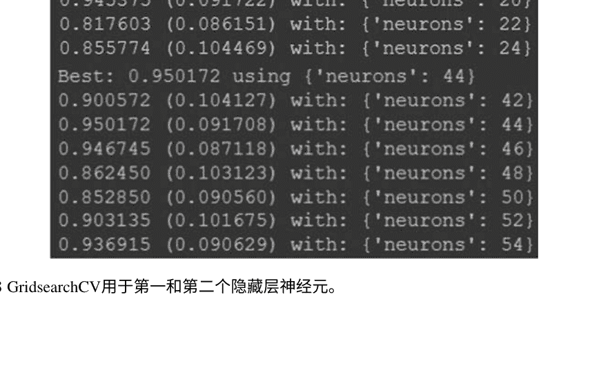

```
Best: 0.945375 using {'neurons': 20}
0.871589 (0.092483) with: {'neurons': 12}
0.823596 (0.089241) with: {'neurons': 14}
0.904053 (0.099269) with: {'neurons': 16}
0.900572 (0.104683) with: {'neurons': 18}
0.945375 (0.091722) with: {'neurons': 20}
0.817603 (0.086151) with: {'neurons': 22}
0.855774 (0.104469) with: {'neurons': 24}
Best: 0.950172 using {'neurons': 44}
0.900572 (0.104127) with: {'neurons': 42}
0.950172 (0.091708) with: {'neurons': 44}
0.946745 (0.087118) with: {'neurons': 46}
0.862450 (0.103123) with: {'neurons': 48}
0.852850 (0.090560) with: {'neurons': 50}
0.903135 (0.101675) with: {'neurons': 52}
0.936915 (0.090629) with: {'neurons': 54}
```

图9 GridSearchCV用于第一和第二个dropout。

图9表示卷积神经网络中使用的最佳dropout率。

#### 3.7 模型验证的提出方法

##### K折交叉验证

交叉验证是一种在有限数据集上测试预测模型的重采样方法。该算法只有一个变量k，用于确定给定数据样本将被分成多少组。因此，整个过程被称为k折交叉验证[11]。

使用小样本来评估模型在总体上的表现，并用于对未被使用的实例生成预测。

这是一种流行的策略，因为它易于理解，并且相对于其他方法（如简单的训练和测试数据分割）得到了更低的偏差或乐观的模型能力近似。

为了提高模型的准确性和泛化能力，采用了k折交叉验证的方法。

表2 GridSearchCV-dropout
| Dropout | 第一个dropout层的准确率 (%) | 第二个dropout层的准确率 (%) |
| :--- | :--- | :--- |
| 0.1 | 87.9 | 91.1 |
| 0.2 | 80.9 | 90.9 |
| 0.3 | 91.1 | 89 |
| 0.4 | 76.3 | 97.2 |
| 0.5 | 95.7 | 97.7 |
| 0.6 | 84.1 | 74.1 |
| 0.7 | 78.3 | 59 |
| 0.8 | 94.4 | 58.8 |
| 0.9 | 65.5 | 58.8 |

### 4 结果

#### 4.1 实验结果和讨论

应用GridSearchCV方法后，我们得到了两个隐藏层和两个dropout层的最佳隐藏神经元值和最佳dropout值，如表2所示。

从上述表格可以得出，两个dropout层的最佳dropout值为0.5，两个隐藏层神经元的最佳值分别为20和44，如表3所示。

应用k折交叉验证方法后，我们得到了最佳准确率和精确度[12]。

从上述观察结果可以得出，五折交叉验证在所有评估模型的指标上都获得了最高分数，如表4所示。此外，准确率作为评估模型性能的基础是有缺陷的，因为数据集中存在的系外行星数量只有5个。因此，精确度是必须评估模型的指标，因为它提供了真正例的明确指示。对于五折交叉验证，精确度最高。下面的图10和图11表示迭代次数与准确率以及迭代次数与损失，以证明30是训练模型的最佳迭代次数[13]。

图12表示混淆矩阵，展示了我们的模型的独特之处。以往的研究无法达到高精确度，而我们的模型达到了80%的精确度[14]。

表3 网格搜索CV-隐藏层神经元
| 隐藏层1的神经元数量 | 隐藏层1的准确率 (以%表示) | 隐藏层2的神经元数量 | 隐藏层2的准确率 (以%表示) |
| :--- | :--- | :--- | :--- |
| 12 | 87.1 | 42 | 90 |
| 14 | 82.3 | 44 | 95 |
| 16 | 90.4 | 46 | 94.6 |
| 18 | 90 | 48 | 86.2 |
| 20 | 94.5 | 50 | 85.2 |
| 22 | 81.7 | 52 | 90.3 |
| 24 | 85.5 | 54 | 93.6 |

|          | 3折交叉验证 | 5折交叉验证 | 10折交叉验证 |
|----------|--------------|--------------|---------------|
| 准确性   | 0.995        | 0.996        | 0.995         |
| 精确度   | 0.667        | 0.8          | 0.667         |
| 召回率   | 0.8          | 0.8          | 0.8           |
| F1得分   | 0.727        | 0.8          | 0.727         |
| 敏感性   | 0.8          | 0.8          | 0.8           |
| 特异性   | 0.996        | 0.998        | 0.996         |

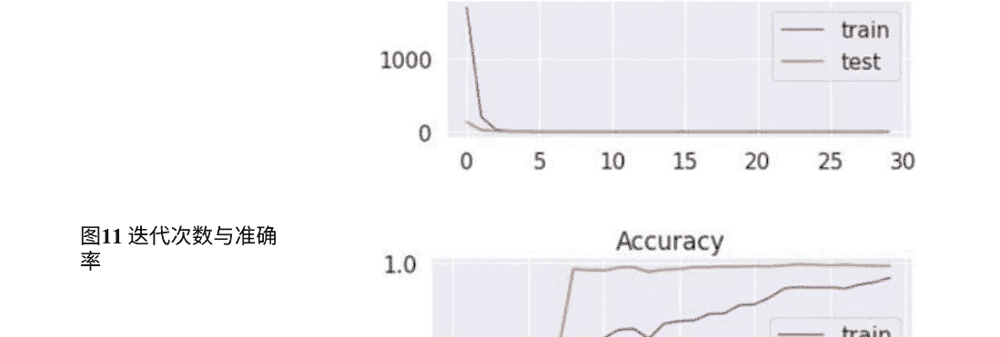

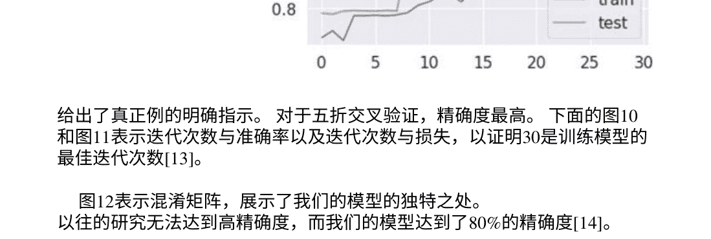

##### 最终模型

网络架构：

- 输入层；
- 1D卷积层，包括10个2 ×2的滤波器，L2正则化和RELU激活函数；
- 1D最大池化层，窗口大小：2 ×2，步长：2；
- 以50%的概率进行Dropout；
- 具有44个神经元和RELU激活函数的全连接层；
- 以50%的概率进行Dropout；
- 具有20个神经元和RELU激活函数的全连接层；

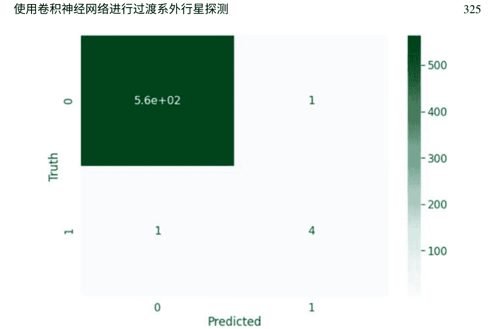

##### 图12 混淆矩阵

输出层使用sigmoid函数。该模型实际上包括6个层，包括一个卷积层，一个最大池化层，两个全连接层和最后一个输出层。在训练中使用了Adam优化技术，30个epochs，初始学习率为0.01，批量大小为64。训练数据集被分成了两半[15]。数据被分成了4:1的比例，分别用于训练和验证数据集。测试准确率为99.6%，而整体训练准确率为99.3%。我们使用了五折交叉验证来达到最大准确率。我们的模型无法预测所有真正的阳性，并且在一个案例中失败，如混淆矩阵所示。

### 5 结论

深度学习被用来构建一种自动分类开普勒过境行星候选者的方法。数据集中并不包含很多系外行星，因此使用SMOTE对真正的阳性样本进行了重新采样。使用GridSearchCV确定了隐藏层中的dropout和神经元数量。构建了3折、5折和10折模型，并在开普勒数据集上进行了测试，分别达到了99.5%、99.6%和99.5%的准确率。以前的论文在达到高准确率方面取得了成功，但准确率并不是评估模型的可靠指标，因为数据中真正的阳性样本非常少。这项研究的独特之处在于解决了这个问题，并成功地实现了高精度。

这是评判模型的真正指标。尽管进行了重新采样和k折交叉验证，但模型仍然无法准确分类所有的系外行星，因此需要进行更多的研究。此外，我们论文中使用的方法在不平衡数据集上表现得非常好，但需要对我们的模型在平衡数据集上的表现进行更多的研究。最后，使用SMOTE的一个缺点是它没有考虑来自其他类别的相邻示例，这导致额外的噪音和类别重叠增加，因此可以对类似的方法进行更多的研究。当前和未来的太空任务，如过境系外行星调查卫星（TESS）和恒星行星过境和振荡（PLATO），将产生大量数据集。

一个旨在寻找类似地球的岩石外行星的未来太空任务是NASA的罗马太空望远镜任务，预计将于2025年发射。我们研究中实施的深度学习技术可以作为这类任务的高效分析工具。

### 参考文献

1.  https://exoplanets.nasa.gov/what-is-an-exoplanet/overview/
2.  https://exoplanets.nasa.gov/what-is-an-exoplanet/in-depth/
3.  https://exoplanets.nasa.gov/faq/31/whats-a-transit/
4.  https://www.universetoday.com/137480/what-is-the-transit-method/
5.  https://www.kaggle.com/keplersmachines/kepler-labelled-time-series-data
6.  Chawla, N.V., et al.: SMOTE: synthetic minority over-sampling technique. J. Artif. Intell. Res. 16, 321–357 (2002)
7.  Park, S., Kwak, N.: 卷积神经网络中的辍学效应分析。 在: 亚洲计算机视觉会议。 斯普林格， Cham (2016年)
8.  Hinton, G.E.等：通过防止特征检测器的共适应来改进神经网络。 arXiv预印本arXiv:1207.0580 (2012年)
9.  González, R.E., Munoz, R.P., Hernández, C.A.: 使用深度学习和数据增强进行星系检测和识别。 天文计算. 25, 103-109 (2018年)
10. Shallue, C.J., Vanderburg, A.: 使用深度学习识别外行星： 围绕开普勒-80的五行星共振链和开普勒-90的第八行星。 天文学家. 155 (2), 94 (2018年)
11. Dattilo, A.等：使用深度学习识别外行星。 II.由神经网络在k2数据中发现的两个新的超级地球。 天文学家。 157 (5), 169 (2019年)
12. Pearson, K.A., Palafox, L., Griffith, C.A.: 使用人工智能搜索外行星。 Mon. Not. R. Astron. Soc. 474(1), 478–491 (2018). https://doi.org/10.1093/mnras/stx2761
13. Akeson, R.L., et al.: NASA外行星档案： 外行星研究的数据和工具。 Publ. Astron. Soc. Pacific 125(930), 989 (2013)
14. Williams, D.M., Pollard, D.: 偏心轨道上的类地球世界： 超越宜居区的探索。 Int. J. Astrobiol. 1(1), 61–69 (2002)
15. Linde, A., Linde, D., Mezhłumian, A.: 从宇宙大爆炸理论到稳态宇宙理论。 Phys. Rev. D 4 9(4), 1783 (1994)

# 新兴技术

## 区块链技术的未来，最新进展和挑战

Ajay Sharma, Vandana Guleria和Varun Jaiswal

**摘要** 区块链现在成为新闻热点，许多公司正在研究区块链技术。区块链首次出现在加密货币的案例中，采用了分散式架构进行挖矿和存储。加密货币的趋势日益增长，在其他领域中，区块链正在发展。本书的章节作者讨论了区块链技术的未来和最新趋势，以及历史背景。如何创建一个区块，并且构建区块链的初始要求是什么。本书章节概述了与这项技术相关的挑战。在接下来的部分中，您将了解区块链的工作原理以及区块的基本功能，还将介绍一些案例研究，如智能农业、信用欺诈检测等。

**关键词** 区块链 · 医疗保健 · 比特币 · 智能合约 · 数据库 · 加密货币 · 数据挖掘 · 区块链架构

### 1 引言

区块链看起来很复杂，确实可以是，但它的基本理论是相对简单的。区块链的概念最早由中本聪提出。日期仍然未知，人物仍然匿名，许多人声称是中本聪，但仍然是一个谜[1]。区块链是一种去中心化的A. Sharma 生物技术与生物信息学系，杰普信息技术大学 (JUIT)，瓦克纳加特索兰173234，喜马拉雅邦，印度

A. Sharma · V. Guleria 电气与计算机科学学院，生物技术系，舒利尼大学，索兰173212，喜马拉雅邦，印度

V. Guleria 生物技术系，舒利尼大学，索兰173212，喜马拉雅邦，印度

V. Jaiswal (✉) 食品与营养学系，生物纳米技术学院，加昌大学，城南市13120，京畿道，韩国

一种存储数据的数据库类型。要能够理解区块链，你必须了解数据库，数据库是在计算机系统上以不同或相同位置电子存储的数据集合。信息或数据通常以表格格式在数据库中结构化，以便更容易搜索和过滤信息。本书章节重点介绍了使用电子表格存储信息与使用数据库或区块链技术存储信息之间的区别。区块链被设计用于存储个人或小团体的有限数量信息。相比之下，数据库被开发用于包含大量信息，多个用户可以快速、轻松地同时访问、过滤和处理数据。这是通过容纳强大计算机构成的服务器上的大型数据库实现的。这些服务器有时可以由数百或数千台计算机构建，因此许多用户可以同时使用具备计算能力和存储容量的数据库。虽然设备或数据库可供多个人使用，但通常由一家公司拥有并由一个个人管理，该个人对其功能和其中的数据具有完全控制权。效率、安全性和共识机制是每个区块链网络的主要特点（表1）。

为了实现这一目标，可以将区块链视为一组相互关联的组件，为系统提供明确的功能，如图1所示。在这个基础设施的最低层次上，我们之间进行了签名交易同行之间。这些交易表示两个参与者之间的协议，可能涉及物理或数字资产的交换，任务的完成等。至少有一个参与者签署了这个交易，并将其分发给其邻居。通常，与区块链交互的任何实体都被称为节点。然而，符合所有区块链规则的节点被称为完整节点。这些节点将交易分组成一个块，并负责

表1 区块链网络的分类和主要特征
| 属性 | 公共 | 私有 | 联邦 |
| --- | --- | --- | --- |
| 共识机制 | 昂贵<br>所有矿工 | 轻量级，集中化组织 | 轻量级<br>领导节点集 |
| 身份匿名性 | 匿名<br>恶意 | 已识别用户<br>可信任的 | 已识别用户<br>可信任的 |
| 协议效率和消耗 | 低效率<br>高能耗 | 高效率<br>低能耗 | 高效率<br>低能耗 |
| 不可变性 | 几乎不可能 | 串通攻击 | 串通攻击 |
| 所有权和管理 | 公共<br>无需许可 | 集中式<br>有权限的<br>白名单 | 半集中式<br>有权限节点 |
| 交易批准 | 几分钟的时间 | 几毫秒的时间 | 几毫秒的时间 |决定交易是否重要，并应该保留在区块链中，以及哪些不重要[3, 4]。

#### 1.1 区块链的历史

2008年，一个名叫Satoshi Nakamoto的人或一群人，构思了第一个区块链。Nakamoto通过使用哈希现金策略对时间签名块进行了重大升级，而不需要可信任的方签名并知道块添加到链中的平衡速率的问题限制。该计划在接下来的一年由Nakamoto作为数字货币比特币的核心组成部分实施，在其中充当了所有交易的公共记录在互联网络上[1, 5]。

2014年8月，比特币区块链文档的大小，包含了网络上发生的所有交易账户，达到了20 GB（千兆字节）的大小。2015年1月，大小增长到了将近30 GB，从2016年1月到2017年1月，比特币区块链的大小从50 GB增长到了100 GB。到2020年中期，记录的大小已经超过了200 GB。单词“block”和“chain”在中本聪的原始论文中被单独使用，但在2016年被提倡为一个词“区块链”。根据Accenture的数据，扩散邀请理论的使用表明，2016年区块链在金融服务领域实现了13.5%的采用率，从而达到了早期采用者阶段。行业交易团体于2016年联合成立了全球区块链讨论会，这是数字商务委员会的一项举措[6, 7]。

2018年5月，Gartner指出只有1%的首席信息官在合作伙伴关系中显示出任何区块链应用，只有8%的首席信息官“安排或关注动态区块链实验”。2019年，Gartner披露CIO接受了5%的区块链技术作为信息技术领域的“游戏改变者”[7, 8]。

#### 1.2 区块链特点

区块链概念有三个支柱。以下是区块链的一些关键特点。

- 点对点网络
- 去中心化方法
- 不可篡改和不可变

点对点网络：在区块链网络中，组织内的两个节点直接进行交换。不需要外部调解者。例如，如果在区块链金融交易中发生了两个节点，它们可以直接进行交易，而不需要通过银行进行。这也被称为点对点（P2P）网络，在区块链网络中，交易由各种节点确认。随后，区块链组织的成员可以在几秒钟内进行即时和安全的交换[8]。

去中心化方法：整个区块链框架是分散和分布式的。这意味着没有中央实体来控制和处理区块链，而是组织中的每个节点都具有相同的地位，并且可以访问数据块、节点中的文档和记录。每个计算节点都有一份记录的副本，并且有权确认交易或进行交易。它确保了一个安全和透明的区块链网络[8, 9]。

不可篡改和不可变：由于其突出的特点和分散的性质，在交易中没有中间人，组织中的每个人都有一份记录的副本。这使得信息在区块链中被封存和永久保存。此外，由于区块链使用密码学或哈希方法来获取一个块（一组规则），因此任何人都无法黑客和更改记录[8]。每个块都有自己独特的哈希，并与上一个块的哈希相连。如果有人试图干扰区块链中的记录，它将改变哈希函数并干扰整个哈希链。这使得干扰记录和进行干扰变得容易（图2）。

#### 1.3 区块链的类型

主要存在两种类型的区块链：公共区块链和私有区块链。然而，还有一些类似于联盟和混合区块链的其他类型可用。在我们深入了解细节之前，让我们先看看它们之间的相似之处。

##### 图2 区块链的特点

各种类型的区块链。每个区块链都包括一组在分布式网络（P2P）框架上工作的节点。每个节点在网络中都有一个共同记录的副本，很容易更新。每个节点可以监视、开始或交换交易并生成区块[10]。

- 公共区块链
- 私有区块链
- 联盟区块链
- 混合区块链

公共区块链：公共区块链没有任何访问限制。任何人都可以通过计算机网络发送、进行交互，就像成为验证者一样参与协议的执行[11]。通常，这些组织为保护它们的个人提供财务激励，并使用某种形式的权益证明或工作确认算法[12]。例子：比特币、以太坊、莱特币。

私有区块链：私有区块链是允许的[11]。除非你被组织的高管们问候，否则你不能这样做。成员和验证者的访问是有限制的。分布式账本（DLT）这个术语通常用于私有区块链，以区分开公开区块链和其他不公开注册的去中心化对等数据库应用[11]。私有网络用于投票、供应链管理、数字身份和资产所有权[13]。例子：多链和超级账本项目（**Fabric**、**Sawtooth**）、**Corda**等。

联盟区块链：联盟区块链是一种半去中心化的类型，它处理与多个协会相关的区块链网络。这与私有区块链相反，私有区块链由一个协会运行。在这类类型的区块链中，使用交易信息或挖矿，不仅组织能够充当节点。银行、政府协会[14，15]等经常使用区块链联盟。例子：能源网络基金会，R3。

混合区块链：混合区块链是私有区块链的混合体。它使用并突出了相互区块链的特点，这是一个私有拥有的框架-以及一个用于公共共识的较小框架。客户可以处理谁是特定交叉机构在区块链中可以接收哪些信息。只有区块链信息或日志的一部分可以对外公开，而其余部分保持在私有网络中保密。区块链混合系统是可适应的，因此客户可以加入不同的公共区块链和私有区块链而不会有太大变形。在这个组织中，私有区块链混合网络中的交换通常会得到验证。公共区块链增加了迷雾并包含了额外的控制节点。这提高了区块链网络的安全性和透明度[16, 17]（图3）。示例：Dragonchain。

#### 1.4 区块链技术的好处

区块链技术得到了适当的接受和实施，区块链技术是一种创新技术。在网络中进行金融交易或替换文件的方式是有方向和安全的（图4）。以数字自由和去中心化的形式提供的信息，匿名性和隐私是不可改变和安全的[18, 19]。以下是区块链设备的不同主要优势，使其如此独特和受欢迎：

区块链技术的应用：区块链技术是一个新兴领域，正在进行一系列的研究和进展，因此它在各种不同的系统中得到了广泛的应用。区块链技术的应用如下。

云存储：区块链为在云上存储记录提供了一个去中心化的框架。它类似于一个星际文件系统（IPFS）的概念，在这个概念中，共享和存储记录发生在一个分布式的网络框架中，而不是我们已经拥有的客户服务器网络。每个网站都可以充当一个节点，与其他节点直接进行文件的P2P传输，而不是请求一个中央服务器[20]。

##### 图4 区块链技术的好处

加密货币：区块链创新充当加密货币系统（如比特币）的基础。加密货币是加密的数字货币，每个人都可以用作交易的工具。这种交易通过区块链网络进行。区块链中的块永久存储了与加密货币的产生和交易相关的记录，这些交易发生在两个节点之间。现在，甚至存在可以发送和接收加密货币或将其交换为其他货币的数字货币钱包[21]。

医疗保健：借助区块链技术，我们可以安全地将患者和药物的数据存储在数据集中。医生可以访问患者的记录和历史，以更好地研究案例并确保适当的治疗。此外，组织可以监控和管理临床供应链中的药物伪造。这是因为他们可以将供应链数据永久存储为区块链中的块[21]。

智能合约：如果两个当事人同意或达成安排，最好是一份纸质协议签署的协议。但是这种策略取决于欺诈和降级的危险，适用于安排和合同。智能协议的概念是以区块链为基础的创新。智能协议被签署并放入区块链中，这是自动执行的。定制的智能合约交易将包括双方协议的所有条款和条件，并在满足这些条件后立即生效[22, 23]。这可以百分之百地保证免受任何欺诈的交易（图5）。

### 2 区块链技术的优势和劣势

#### 2.1 区块链的优势

去中心化：区块链创新的去中心化框架是这项创新的基本优势。为什么它对我们的生活很重要？对于这个问题的答案非常简单-与外部组织或中心监管机构合作并不重要。这意味着该框架在没有中介的情况下工作，所有区块链成员都做出决策。每个系统都有一个数据集，这个数据集是必不可少的。数据集的安全性处理可能需要很长时间并花费大量资金。这也意味着交易可以独立确认和处理[24]。

保护：每个活动都记录在区块链上，数据可供每个成员查看，无法更改或删除。这种记录的结果为区块链提供了透明度、耐久性和信任 [25]。

信任因素：至少有两个不相识的成员依赖于他们对区块链的信任。主要思想是这些未知的个体是真实的，不是无谓地进行交易。随着更多的周期和记录的共享，信心可以进一步扩展 [25]。

经济可行性：由于没有第三方的贡献，成本自动紧凑。与其他人不同，区块链中的账户持有人可以公开进行点对点交易，避免所有额外的成本削减[25]。

更快的交易：交易的重复测量实现了区块链的透明度。区块链组织中的每笔交易都被复制，就像它被编写的那样。这也意味着每个成员都可以查看所有交易，每个成员都可以看到区块链中的每个活动。没有人可以不知不觉地做任何事情。区块链的设计使其能够显示任何问题并在必要时进行修正。这种好处使得区块链技术具有可追溯性[25]。

全天候可访问：最后一个优点是处理更快。一般来说，准备和启动银行协会需要很长时间来完成交易。使用区块链技术可以将操作和启动时间缩短到几分钟甚至几秒钟[25]。

易于共享的企业间数据库安排：各个组织依赖于不同的计算机进行不同的数据库。此外，当一个人需要与另一个企业共享这个数据集时，这变得困难。基本解决方案是区块链技术，因为它保持了一个共享的账本。并且与其他企业共享这个记录并不困难（图6）。

#### 2.2 区块链的缺点

能源消耗：高能耗是区块链网络的主要缺点。为了保持记录，需要电力消耗和计算能力。每次创建新节点时，它们会同时进行通信。通过这种方式，建立了透明度。组织的矿工每秒尝试解决大量的交易。他们使用大量的个人计算能力[26]。

签名性能：签名验证是区块链的测试，因为重要的是计算能力对于与签名的交互估计，每个交易都应该在密码学中签名。这是能源消耗高的原因之一[26]。

性能慢：当将这个分散的数据集与集中的数据集进行对比时，你会发现它比后者慢得多[26]。

冗余数据：区块链系统中所需的计算量比集中的数据集要多得多。每个在这个共享网络上运行的节点都需要独立地进行相同的处理[25]。

高成本：区块链的高成本是一个重大的缺点。正常交易的成本在75到160美元之间，其中大部分交易涉及能源消耗。一个原因已经在上面描述过了。第二个原因是区块链的高初始资本成本（图7）。

### 3 区块链技术的架构

区块链的普遍接受的定义是“具有智能合约的分布式账本”。账本很重要，因为它记录了捕捉一组业务对象的所有变更的交易。在分布式账本系统中，组织合作维护一个一致的复制账本副本的过程被称为共识。智能合约很重要，因为它定义了查询账本和生成记录在上面的新交易的规则和条件。智能合约以代码形式描述了存储在账本上的一个或多个业务对象的生命周期。它描述了它们如何被创建、更新和查询[3, 27]。例如：制造商、分销商、供应商和零售商的供应链可能使用一组智能合约和分布式账本来维护交易记录。该记录详细描述了货物和服务在供应链中的流动。区块链的逻辑架构分为三个重要概念：区块、节点和矿工（图8）。区块链的逻辑架构和每个区块分别显示在图8和10中。

#### 节点

去中心化是区块链技术中最重要的概念之一。任何计算机或组织都无法维护这个链。相反，它是通过链接节点分布式传播的账本。节点可以是任何类型的电子设备，它们保留了区块链和网络的副本并保持运行。每个节点都有自己的区块链和一个待更新的新挖掘块，必须通过网络进行算法验证。去中心化是区块链创新的关键思想之一。任何个人计算机系统或一组较小的组织都无法维护这个链。作为平等的一部分，它是通过链相关节点传递的记录。节点可以是任何类型的电子设备，它们保留了区块链的副本并保持网络运行。每个节点都有自己的区块链副本，公司必须支持一种算法来更新、验证和验证新的挖掘块[28, 29]。

区块：区块包括区块头信息和交易。区块是设计用来捆绑和复制所有网络节点的数据结构。矿工正在创建新的区块并添加到区块链中。挖矿是创建一个被整个网络接受的有效区块的过程。节点接收待处理的交易，检查其加密准确性，并将其打包成区块存储在区块链上。区块头是用于验证区块有效性的元数据[30]。区块元数据的内容分别显示在（图9和图10）中。剩余区块中有一个交易。根据矿工的选择，可能会将多个交易分组成区块[3, 28, 29]。每个链由不同的区块组成，每个区块有三个基本组成部分：

区块类型：每个链中都有多个区块，每个区块都有三个元素，即数据块、Nonce和哈希函数。

- 数据块：存储与区块链相关的数据，如医疗保健、智能农业等数据。
- Nonce：一个称为全数字32位的随机数。Nonce是通过生成一个块和生成一个危险的块头来随机生成的。
- 哈希函数：哈希是一个256位的数字。它必须以一个巨大的整数开始（即非常小）。当创建链的第一个块时，会生成加密哈希。除非被挖掘，否则块数据被视为已签名并始终与Nonce相关联。

当前的主区块链只是由许多块扩大而成，也是最长的网络链。这些块被称为主分支块”。其他最长的区块链父块。这些块被称为“侧分支块”。一些块引用了处理该块的节点不知道的父块。这些被称为“孤立块”。侧分支块可能目前不是主分支的一部分，但如果创建了更多引用父区块的区块，则特定的侧分支可能会在主分支中重构。这导致了区块链网络中的分叉概念[3]。

#### 矿工

通过挖矿过程，矿工在链上创建新的区块。在区块链中，每个区块都有自己独特的随机数和哈希函数，但它还提到了前一个区块的哈希函数，因此很难替换一个区块，尤其是在大型链上。矿工使用特殊软件来解决极其复杂的数学问题，找到一个被接受的哈希随机数。因为随机数由于只有32位，而哈希值为256位，因此需要提取大约40亿个可能的nonce-hash组合才能找到正确的组合。一旦发生这种情况，矿工就会找到“黄金nonce”，并且他们的区块已被添加到链中。更改链中的每个块之前，需要保留不仅包含更改的块，还有所有后续的块。因此，操纵区块链技术非常困难。将其视为“数学上的可靠性”，因为找到黄金nonce需要大量的时间和计算能力。如果成功挖掘出一个数据块，网格中的所有节点都会接受这个更改，并且矿工会得到经济上的补偿[28-30]。

去中心化是区块链技术中最重要的概念之一。区块链不能仅由任何计算机或组织单独维护。相反，它是通过链式节点分布的账本。节点可以是任何类型的电子设备，它们保存着区块链和网络的副本，并保持运行。每个计算节点都有自己的区块链副本和一个新挖掘的区块，用于更新和信任链必须经过算法批准的网络。账本中的每个完成交易都可以被确定地验证、检查和查看，因为区块链是透明的。提供了每个参与者交易的单个字母数字ID编号。公共信息与制衡系统的结合有助于区块链维护、调节完整性并建立用户信任。区块链可以被视为实时环境中的技术信任框架[3]。

#### 智能合约

智能合约是定义一个或多个业务对象的生命周期的代码。应用程序使用它来生成记录这些对象变化的交易。它还可以用于查询这些对象的当前值和交易历史。将智能合约视为对分布式账本上的公共、私有和机密信息提供受控访问的方式[22, 24]。

以车辆生命周期为例。它被制造、分销、销售、保险、驾驶、修理、再销售，最终报废。智能合约可以用来生成捕捉整个生命周期的交易。这些车辆交易被不可变地记录在一组账本实例中，这些实例由区块链网络的每个成员拥有。这些组织可以查询他们的账本副本，以确定车辆的当前状态或其之前的任何交易，并生成新的交易[22]。

智能合约还可以定义影响交易生成的业务条件和规则。例如，销售条件可能是只有车辆的所有者才能出售。或者规定每当车辆更换所有权时，会生成一个事件通知适当的政府机构[22, 24]。

由于智能合约生成多方交易，因此必须在每个需要签署交易的组织中安装。为了使交易被视为有效，必须根据网络协商的认可政策由所需的组织签署。

共识描述了多方交易在每个组织的账本副本中是如何生成、分布和不可变地记录的过程。所有多方交易都对账本历史做出贡献，但只有有效的交易才会更新其当前值[22, 24]。

#### 账本

你经常接触到的最常见的账本类型是你的银行账户。它是一个很好的账本示例，因为它包含了当前值和交易历史。对于一个银行账户，当前值就是账户的余额。在一个包含与一组业务对象相关的交易的账本中，当前值是这些对象的最新状态。账本的当前值通常是最相关的值。在你的银行账户中，你的余额决定了可用于消费的金额。在你的银行账户的例子中，交易历史包含了所有对账户的借方和贷方。一般来说，交易历史包含了与一组业务对象相关的所有交易。一个账本通过将所有交易按顺序重放来重新生成当前值，因此账本的交易历史比当前值更重要[3, 30]。

区块链账本在两个方面上是特殊的：它们是分布式的。区块链网络由一组参与者组成，每个参与者都持有账本的相同副本。区块链账本是去中心化的，因为没有单个参与者拥有它。相反，所有复制的副本在一个被称为共识的过程中保持同步。

它们是不可变的。在区块链账本中，无法篡改交易，因为每个交易块都经过密码哈希处理并链接到前一个块。在不使哈希无效的情况下，无法更改此链中的任何交易。由于账本和托管网络的不同，区块链被分为不同的类别。表2显示了一些属性以及具有各自账本的公共、私有和联盟基础区块链网络之间的差异。

与中心化管理的账本相比，去中心化和不可变性使区块链账本具有显著增加的透明度、信任和弹性（表2）。

##### 3.1 区块链架构摘要

在本节中，作者总结了区块链的快速摘要。以下是最重要的要点：

- 区块链是一个对所有人开放的分布式账本。一旦记录在区块链中，很难更改数据。
- 区块链架构支持一个有序记录列表，称为区块。每个区块都保留了时间戳和指向前一个区块的链接。

表2 公共、联盟和私有区块链网络之间的差异和特性

| 序号 | 属性 | 公共区块链 | 联盟区块链 | 私有区块链 |
|------|------|------------|------------|------------|
| 1 | 共识确定 | 所有矿工 | 选定的节点集合 | 同一组织内部 |
| 2 | 读取权限 | 公共 | 公共或受限制的 | 公共或受限制的 |
| 3 | 不可篡改程度 | 几乎不可能篡改 | 可能被篡改 | 可能被篡改 |
| 4 | 效率（资源使用） | 低 | 高 | 高 |
| 5 | 集中化 | 否 | 部分 | 是 |
| 6 | 共识过程 | 无需许可 | 需要许可 | 需要许可 |
| 7 | 属性 | 公共区块链 | 联盟区块链 | 私有区块链 |

在智能合约、众筹、供应链管理、KYC和AML流程、医疗记录、透明管理和去中心化经济共享项目中，可以使用区块链架构。

要使用区块链架构，区块链开发人员需要强大的经验，计算机科学或技术背景。此外，对共识方法、数据结构、去中心化、密码学和数据安全的知识需求很高。

在区块链中开发架构需要功能规范、用户界面设计和架构计划。定义应用程序功能和用户角色以及考虑系统流程和用户交互是至关重要的。

## 区块链提供的4项服务

几个区块链在工程和生物技术、银行/金融交易等各个领域提供各种服务。区块链提供的一些服务包括：

- 保密性：保密性原则认为，只有发件人和预期的受益人才能访问消息的内容。通过区块链挖掘生成的区块具有很高的保密性。其中的数据非常机密，并遵循分散存储数据的方法[31]。
- 认证：认证机制有助于建立身份证明。该过程确认了消息来源的正确识别。该区块经过256位哈希函数和32位nonce函数进行了高度认证，其中一个组合是一个黄金随机数[32]。
- 完整性：完整性机制确认当接收者接收到消息时，消息的主题是相同的。该区块被整合成一个区块链，从而进行更大规模的区块链[33]。
- 不可否认：不可否认会发送一条消息来反驳消息未被传输的说法。区块链中没有区块的否认。每个区块在性质上都是独特的，并包含高度安全的数据[34]。
- 访问控制：检查谁可以访问什么。访问控制规定经过身份验证的用户将能够访问区块内的数据。数据通过各种加密算法（SHA、SSH）等进行保护和加密[34]。
- 可用性：可用性原则规定资源应始终对授权方可访问。只有授权人员可以访问数据，数据以安全加密格式提供[34]。

## 区块链在各个领域的应用案例研究

区块链在银行业、众包、保险业、许可和支付系统行业、医疗治疗和保健行业、版权管理行业、电子政府、公共部门、环保管理系统行业和共享经济行业等方面的应用。

- 银行业：银行服务，如存储和贷款，可能考虑利用区块链技术提高其可靠性和质量。此外，类似的技术也可以应用于国际贸易组织。国际结算和信用证发行以及贸易管理可以以更低的成本和更高的速度进行。例如，Ripple币（XRP）在区块链技术中的影响被认为是重大的。Ripple是一个实时的总体结算系统，也是由美国科技公司Ripple Labs创建的货币交易和结算网络。
- 众包：区块链技术还可以应用于与互联网上的服务提供商进行协调，以解决不同的问题，包括订单和交付业务以及职位搜索和客户服务。这些问题包括匹配的准确性、结果的速度或高额佣金费用。此外，区块链技术在众筹领域的应用也在增加。个人或组织为产品或服务创建公共财务支持的能力是群体众筹的重要优势。这种互动允许通过小额财务承诺进行财务捐助，这对于小事情来说是一个重要的关注点。因此，众包是一种直接关联个人和组织而无需中介的结构，这与区块链的特点非常契合。
- 保险行业：通过区块链，另一种安全管理系统可以轻松识别和使用保险合同中包含的大量数据。在这个过程中，区块链结合了真实信息和智能合约。目前有不同的项目正在研究这些进展。在一个著名的案例中，美国环球保险公司的一家保险商与IBM合作，在保险业中应用了区块链[37]。
- 许可和支付系统行业：基于区块链的数字货币在各种支付系统中被使用。此外，这些数字货币可以广泛应用于授予特定实体（例如音乐、电影）一定次数或一定时间使用许可的领域[38]。
- 医疗治疗和保健行业：医院和医疗机构难以管理、维护和修复医疗治疗系统，导致大量财务和人力资源的分配。据估计，引入区块链技术可以意外地降低医疗机构的成本。一个重要的贡献是将医疗记录记录在区块链上，以便可以轻松从行业内的任何地方访问患者的独特临床记录[39]。
- 版权管理部门：区块链技术的利用将在版权管理方面带来巨大的变革，因为它可以追踪所有权并防止伪造。例如，区块链技术可以将演出门票数字化，以防止黄牛党非法转售门票。同样，它可以防止个人电脑和电子游戏软件的非法复制和分享。这两个例子进一步加强了各种创意作品的版权保护[40]。
- 电子政府、公共部门：中央和地方政府可以利用基于区块链的行政服务来完成各种任务：官方记录保存、在线电子投票、教育、税收、公共保险、新能源和环境管理以及相关交易。具体而言，将从这些升级中受益的服务包括销售和注册、产权记录以及维修。在所有情况下，区块链技术都将在降低成本方面发挥重要作用。通过这样的管理变革，社会可以变得更加有吸引力和简单，从而为所有居民带来更大的便利和生活质量[41]。
- 生态友好的管理系统部门：通过利用运行在物联网区块链平台上的人工智能和大数据技术，可以改进管理和改善水和空气污染记录的流程。区块链技术的一种先进应用是将传感器与光线、空气温度、湿度以及细颗粒物、温室气体、土壤污染物和废水等环境污染物相互连接[42]。
- 共享经济领域：作为共享经济的重要参与者，Uber和Airbnb分别在交通和便利领域做出了重大改变。同样地，对临床行业的影响之一是Folding Coin。Folding Coin是一个项目，参与者通过提供计算机的处理能力来帮助治愈癌症和其他疾病，作为交换获得加密货币[43]。从这个模型可以预见，区块链技术将加速共享经济实体的发展。例如，每个创造增值产品（例如电力、艺术品）的个人都将成为一个商业经营者。因此，预计这将引入一个新的全球交易和产品分配时代。随着更稳定的交易系统的建立，对数字货币的需求也将增加。
- 区块链技术利用的其他领域：区块链技术的不同用途包括可靠官方声明的持续和永久管理，加速通知和旅行产品的开发以吸引游客，高光谱成像[43]，可靠和可利用的租赁行业的扩大，减少繁琐和多余的法律问题或哲学争论，以及普及文化。

### 6 结论

上述书籍章节描述了区块链技术的基础到高级水平以及与区块链相关的未来趋势。根据作者的观点，在撰写本书章节时，作者发现了以下观察结果。

- 区块链是用于描述分布式账本技术的术语，它使用智能合约与商业网络的成员组织共享多方交易。它通过提供一组事实的加密证明来在这些网络中建立信任。一个参与者看到的信息与另一个参与者看到的信息相同。这个想法非常强大，并且正在推动新一代的交易应用。
- 这也是一个简单的想法，当你开始使用区块链时，记住这一点是很好的。通常情况下，你不需要理解区块链的底层数据结构，例如树形数据结构，或者节点之间的共识如何工作。这些信息最好留给那些致力于推进区块链技术的人。相反，考虑使用区块链来可靠地共享组织之间的交易。网络将处理信息的分发方式。
- 区块链技术是一项革命性的创新，可以使许多传统系统更安全、分布式、透明和协作，同时赋予用户权力。结合所有上述方面，通过区块链技术提供的即时、低成本的信任保证可以通过使任何提供者和每个生产者立即、相互开始交易业务来引发客户创新。
- 以沃尔玛的案例研究为例，给出了一个典型的制造业供应链模型，并在其基础上构建了一个区块链。它解决了区块链作为解决日常任务相关工作的工具，并帮助公司理解智能合约在区块链中的重要性，然后集中精力进行概念验证。这项研究将区块链作为解决日常任务相关工作的工具，并帮助公司理解智能合约在区块链中对他们的重要性，然后集中精力进行概念验证。
- 参与区块链系统的组织可以更好地了解他们的交易是如何在供应链中触发和解释的。反馈水平可以用来改进市场营销、生产和销售账户等。
- 智能合约可以更好地整合到这个系统中，以提高交易的灵活性。该应用程序是一个前端工具，用于测试后端架构的可用性和性能，同时使用户能够直接交互。
- 区块链技术在制造供应链领域的应用是无限的。目标用户根据实际业务需求期待更多其他功能，例如审计追踪、实时协商、供应链可见性和可追溯性，从物联网收集数据，基于构建的后端区块链系统和“黑盒子”内部的计算机制进行产品开发中的知识产权管理。
- 来自各个领域的人们期待区块链的颠覆创新步伐在不久的将来加快。作为绝对主导地位的区块链给制造业带来的影响。

致谢 本书章节“区块链技术的未来趋势、最新进展和挑战”是作为作者¹的硕士项目和作者¹的博士项目的一部分编写的。作者要感谢Shoolini大学计算机科学系提供的实验室空间，以便进行工作和构思本书章节的概念。作者将本书章节献给匿名审稿人。

作者贡献 所有作者都有平等的参与，Ajay和Vandana准备了菜单脚本，所有评估和更正工作由Varun博士完成。

利益冲突 本书章节没有任何利益冲突。作者已经注意到了正确引用工作并进行了适当的致谢，以及与冲突相关的其他事项。

### 参考文献

- 1. 中本聪：比特币白皮书。https://bitcoin.org/bitcoin.pdf (Дата обращения: 17.07.2019) (2008)
- 2. Cachin, C.: Hyperledger区块链架构。在：分布式加密货币和共识分类帐研讨会，芝加哥，伊利诺伊州（2016年）
- 3. Zheng, Z.等：区块链技术概述：架构，共识和未来趋势。在：2017年IEEE国际大数据大会（BigData Congress）。IEEE（2017年）
- 4. Hamida, E.B.等：企业区块链：概述，机遇和挑战。在：第十三届无线和移动通信国际会议（ICWMC2017）（2017年）
- 5. Ateniese, G.等：可编辑的区块链-或-在比特币和朋友中重写历史。在：2017年IEEE欧洲安全与隐私研讨会（EuroS&P）。IEEE（2017年）
- 6. Urquhart, A. : 比特币的低效率。经济学快报 148, 80-82 (2016年)
- 7. Nadarajah, S., Chu, J. : 对比特币的低效率问题。经济学通讯 150, 6-9 (2017)
- 8. Böhme, R., et al. : 比特币：经济学、技术和治理。经济学展望 29(2), 213-238 (2015)
- 9. Muzammal, M., Qu, Q., Nasrulin, B. : 用分布式数据库改进区块链：一个开源系统。未来的计算系统 90, 105-117 (2019)
- 10. Andreev, R., et al. : 区块链技术综述：区块链类型及其应用。智能系统与产品 16(1), 11-14 (2018)
- 11. Prajapati, S., et al. : 区块链简介。国际科学研究评论 7, 1800-1805 (2019)
- 12. 唐, H., 史, Y., 董, P. : 使用熵和TOPSIS评估公共区块链。专家系统应用 117, 204-210 (2019年)
- 13. Dinh, T.T.A.等: Blockbench: 用于分析私有区块链的框架。在: 2017年ACM国际数据管理会议论文集 (2017年)
- 14. 李, Z.等: 用于安全能源交易的联盟区块链在工业物联网中。IEEE Trans. Industr. Inf. 14 (8) , 3690-3700 (2017年)
- 15. 盖, K.等: 使用联盟区块链在智能电网中实现隐私保护能源交易。IEEE Trans. Industr. Inf. 15 (6) , 3548-3558 (2019年)
- 16. Sagirlar, G.等: 混合物联网: 用于物联网的混合区块链架构-pow子区块链。在: 2018年IEEE物联网国际会议 (iThings) 和IEEE 绿色计算与通信 (GreenCom) 和IEEE Cyber, Physical and Social Computing (CPSCom) 和IEEE Smart Data (SmartData)。IEEE (2018年)
- 17. Li, Z., 等: 供应链可见性的混合区块链账本。在: 2018年第17届国际并行与分布式计算研讨会 (ISPDC)。IEEE (2018)
- 18. Ali, O., 等: 比较研究: 区块链技术的利用益处、挑战和功能。IEEE Access 9, 12730-12749 (2021)
- 19. ØInes, S., Ubacht, J., Janssen, M. : 政府中的区块链: 信息共享的分布式账本技术的益处和影响。爱思唯尔 (2017)
- 20. Sukhodolskiy, I., Zapechnikov, S. : 基于区块链的云存储访问控制系统。在: 2018年俄罗斯青年研究员电气与电子工程会议 (EiConRus)。IEEE (2018)
- 21. Mukhopadhyay, U., 等: 加密货币系统简要调查。在: 2016年第14届隐私、安全和信任年会 (PST)。IEEE (2016)
- 22. Christidis, K., Devetsikiotis, M. : 物联网的区块链和智能合约. IEEE Access 4, 2292-2303 (2016年)
- 23. Bartoletti, M., Pompianu, L. : 智能合约的实证分析: 平台、应用和设计模式。在: 国际金融密码学和数据安全会议。Springer (2017)
- 24. Croman, K., et al. : 关于扩展去中心化区块链的研究。在: 国际金融密码学和数据安全会议。Springer (2016)
- 25. Belotti, M., et al. : 区块链技术指南: 何时、哪种和如何使用。IEEE通信调查教程。 21(4) , 3796-3838 (2019)
- 26. Golosova, J., Romanovs, A. : 区块链技术的优势和劣势。在: 2018年IEEE第六届信息、电子和电气工程进展研讨会(AIEEE)。IEEE (2018)
- 27. Syed, T.A.,等: 区块链架构及其应用的比较分析: 问题和建议。IEEE Access 7, 176838-176869 (2019)
- 28. 袁勇, 王飞宇: 基于区块链的智能交通系统。在: 2016 IEEE第19届智能交通系统国际会议 (ITSC)。IEEE (2016)
- 29. 袁勇, 王飞宇: 区块链和加密货币: 模型、技术和应用。IEEE Trans. Syst. Man Cyber. Syst. 48(9), 1421-1428 (2018)
- 30. 李静, 吴军, 陈亮: 基于区块链的安全P2P云存储方案。Inf. Sci. 465, 219-231 (2018)
- 31. 王勇, 科甘, A. : 设计保密性保护的基于区块链的交易处理系统。国际会计信息系统杂志。 30, 1-18 (2018)
- 32. Hammi, M.T., 等：信任泡沫：基于区块链的物联网身份验证系统。计算机安全 78, 126–142 (2018)
- 33. Zikratov, I., 等：使用区块链技术确保数据完整性。在：2017年第20届开放创新协会会议（FRUCT）。IEEE (2017年)
- 34. Fang, W., 等：区块链中用于信息不可否认的数字签名方案：现状综述。EURASIP J. Wirel. Commun. Netw. 2020(1), 1–15 (2020)
- 35. Gupta, A., Gupta, S.：区块链技术：在印度银行业的应用。德里商业评论 19(2), 75–84 (2018)
- 36. Li, M., 等：Crowdbc：基于区块链的众包分布式框架。IEEE Trans. Parallel Distrib. Syst. 30(6), 1251–1266 (2018)
- 37. Gatteschi, V., 等：使用区块链还是不使用区块链：这是个问题。IT专业人员 20(2), 62-74 (2018年)
- 38. Yoo, S.：基于区块链的金融案例分析及其影响。亚太创新创业杂志 (2017年)
- 39. Ahmed, S., Tarique, K.M., Arif, I.：孟加拉国医疗保健部门的服务质量、患者满意度和忠诚度。国际医疗保健质量保证杂志 (2017年)
- 40. Holland, M., Nigischer, C., Stjepandic, J.：使用区块链方法保护增材制造中的版权。跨学科工程范式转变 5, 914-921 (2017年)
- 41. Warkentin, M., Orgeron, C.：使用安全三元组评估公共部门应用中的区块链技术。国际信息管理杂志 52, 102090 (2020年)
- 42. Sharma, A.：使用深度学习、大数据和物联网的智能农业服务。In: 使用深度学习、大数据和物联网的智能农业服务, IGI Global,pp. 166–202 (2021)
- 43. Sharma, A., et al.: 高光谱成像的应用和分析。In: 2019第5届信号处理、计算和控制国际会议(ISPCC). IEEE (2019)