# 区块链物联网和深度学习在建筑中的应用


Faris Elghaish · Farzad Pour Rahimian · Tara Brooks · Nashwan Dawood · Sepehr Abrishami

## 数字化建筑转型

## 区块链与深度学习在建筑行业的应用

Faris Elghaish · Farzad Pour Rahimian · Tara Brooks · Nashwan Dawood · Sepehr Abrishami

## 区块链与物联网、深度学习在建筑行业的应用

## 数字化建筑转型

Faris Elghaish
自然与建筑环境学院
贝尔法斯特女王大学
英国贝尔法斯特

Tara Brooks
自然与建筑环境学院
贝尔法斯特女王大学
英国贝尔法斯特

Sepehr Abrishami
朴茨茅斯大学
英国朴茨茅斯

Farzad Pour Rahimian
计算机、工程与数字技术学院
提赛德大学
英国米德尔斯堡、诺森伯兰

Nashwan Dawood
计算机、工程与数字技术学院
提赛德大学
英国米德尔斯堡、诺森伯兰

ISBN 978-3-031-06828-7 ISBN 978-3-031-06829-4 (电子书)
https://doi.org/10.1007/978-3-031-06829-4

© 编辑（如适用）和作者，独家许可给 Springer Nature Switzerland AG 2023
本作品受版权保护。出版商独家授权所有权，无论是整体还是部分材料，特别是翻译、重印、重用插图、朗诵、广播、微缩胶片复制或以任何其他实体方式复制、传输或信息存储和检索、电子适应、计算机软件，或通过类似或不同的已知或今后开发的方法。

本出版物中使用的一般描述性名称、注册名称、商标、服务标志等，并不意味，即使在没有明确声明的情况下，这些名称不受相关保护法律和法规的约束，因此可以自由使用。

出版商、作者和编辑可以安全地假设本书中的建议和信息在出版日期时是真实准确的。出版商、作者或编辑对本书中所含材料不提供明示或暗示的保证，也不对可能存在的任何错误或遗漏负责。出版商在已发表的地图和机构隶属方面保持中立。

这个Springer印记由注册公司Springer Nature Switzerland AG出版
注册公司地址为：Gewerbestrasse 11, 6330 Cham, Switzerland

## 目录

### 1 引言

# 第2章：区块链物联网（BCoT）在建筑行业中的应用

### 第3章：利用区块链实现更安全和互联的建筑项目成本管理

### 第4章：开发一个概念框架来实施分布式账本技术（DLT）在建筑行业中

### 第5章：基于网络的风险/回报共享管理系统用于IPD项目

### 第6章：利用深度学习改进施工现场管理任务

# 第7章：基于深度学习技术检测建筑物和公路的损坏（基于路面的深度学习技术）

# 第8章：自动化的4D BIM模型开发和优化

### 第9章：利用深度学习检测和分类公路损坏（基于优化的CNN模型的损伤评估）

# 参考文献

# 第2章：区块链物联网（BCoT）在建筑行业中的应用

## 介绍

## 以往的综述论文、总结和差距

## 研究方法

### 数据分析结果

### 出版物趋势

## 关键研究领域

### 物联网和区块链集成网络可视化

物联网（IoT）在建筑行业中的应用
预制建筑行业的物联网应用
运营和资产管理中的物联网应用
物联网对项目进展测量的影响参数

区块链和智能合约
区块链/分布式账本技术（DLT）
建筑行业中的区块链/智能合约
BIM和区块链的整合
实施区块链/智能合约的障碍用于建筑项目交付
物联网和区块链的整合应用案例
研究结果讨论
结论
参考文献

### 第3章：利用区块链实现更安全和互联的建筑项目成本管理

## 介绍

## 概念背景

建筑项目的财务管理挑战
建筑行业中的区块链
区块链和BIM

### 研究空白和动机

### 研究方法论

### 框架开发

基于交易的智能合约制定
总承包商与业主之间
承包商与分包商及供应商之间
基于链码的建筑交易结构

## 区块链和智能合约组件结构

基于背书政策的BIM
认可政策参数
基于超级账本的建筑项目交接系统
去中心化金融系统的对齐与建筑交付阶段的对齐

## 概念验证开发和案例研究

### 第4章 开发一个概念框架来实施分布式账本技术（DLT）在建筑行业中的应用

## 介绍

## 区块链和智能合约概述

#### 区块链/智能合约在建筑行业中的影响

##### 行业

#### 关于区块链和智能合约的先前研究

##### 在建筑行业中

## 方法论

### 框架开发

## 前期准备阶段

## 施工阶段

## 竣工阶段

## 模型互操作性

## 研究意义和结论

# 参考文献

### 第5章 基于网络的管理系统来共享风险/回报

#### 用于IPD项目

## 介绍

#### 信息与通信技术（ICT）在建筑行业中的应用

#### 管理

### BIM和IPD中成本管理的影响

### 挣值管理

### 基于活动的成本核算

### 研究方法论

### 制定框架

### 基于ABC制定IPD的成本结构

### 开发基于EVM的ABC扩展

### EVM-Grid Web系统与BIM的集成

## 验证和结果分析

### 确定风险/回报值

### BIM和EVM-Web系统的适用性和集成

## 结论和未来方向

# 参考文献

### 第6章 利用深度学习改善施工现场管理

#### 任务

## 介绍

## 方法和逻辑

## 科学计量分析

## 现场物体和信息检测

### 现场检测

### 自动化进度监控

### 分析项目历史记录

利用深度学习提高健康和安全性
安全文本分析
安全监测
建筑工地安全
建筑工人检测
建筑机械检测
个人防护装备

物联网（IoT）和深度学习（DL）
深度学习和物联网实现智慧城市和结构
深度学习和物联网用于建筑评估

研究结果讨论
结论
参考文献

### 第7章 检测建筑物和公路的损坏（基于路面的深度学习技术）

## 介绍

## 方法和逻辑

基于深度学习的裂缝检测每年发表的论文
基于深度学习的裂缝检测研究进展
按国家/地区

基于裂缝检测的深度学习：概念背景
卷积神经网络（CNN）用于裂缝检测
基于深度学习的路面裂缝相关检测
基于深度学习的混凝土裂缝检测
基于深度学习的健康结构评估
利用深度学习和地下探测雷达（GPR）进行裂缝检测

讨论、意义和限制
结论
参考文献

### 第8章 自动化的4D BIM模型开发和优化

## 介绍

## 方法论

研究方法

## 开发框架和提出工具

## 结果和分析

案例研究的描述
ABC层次结构的配置
从提议的库中建立活动列表
优化每个活动的施工可行性方法
基于ABC层次结构的贡献水平

研究意义
结论和未来方向
参考文献

### 第9章 利用深度学习检测和分类公路损坏（基于优化的CNN模型）

## 介绍

## 基于深度学习的裂缝检测

## 方法论

## 数据收集和分析

预训练深度学习模型的比较
提出和评估新的CNN模型
提议模型的分类准确度
不同优化算法的比较以提高准确性

## 意义和贡献

## 结论

#### 参考文献## 关于作者

博士 法里斯·埃尔盖什（Faris Elghaish）是贝尔法斯特女王大学（QUB）自然与建筑环境学院的建筑项目管理讲师。法里斯在BIM、人工智能、成本优化/自动化以及分散式系统（即区块链和智能合约）领域进行了广泛的研究。法里斯已经开发出许多可行的解决方案，通过将新兴技术整合到BIM中来自动化流程和任务。法里斯在顶级期刊上发表了22多篇论文，并担任多个知名期刊的客座编辑。

教授 法扎德·普尔·拉希米安（Farzad Pour Rahimian）是数字工程和制造学教授，拥有超过150篇高质量出版物和超过1600次引用的强大研究记录。他的研究生涯经历包括（1）10年的高质量建筑、数字设计和创新建筑技术教育（1996年至2002年+2007年至2010年），（2）20年的学术工作经验，包括研究为基础的教学和教学支持的研究，涉及数字建筑和IT集成设计与施工的不同领域（自2002年以来），（3）作为英国特许建筑师学会（MCIOB-UK）的全会员和伊朗一等注册建筑师的15年密集行业参与，以及（4）各种实践虚拟建模和开发技能以及不同定性和定量研究方法的知识。这些支持他对建筑4.0各个方面的研究，包括数字孪生、智能合约、建筑信息管理/建模（BIM）、分布式账本技术、大数据、AI/机器学习、综合项目交付（IPD）、智能家居、物联网、控制论以及在建筑环境中使用智能代理人、虚拟原型和使用VR/AR/MR界面进行建筑模拟、自动化和设计集成、离场施工、精益和六西格玛思维以及为集成施工开发新的商业模式。法扎德还成功领导了几个高调的研究项目，包括英国创新基金、艺术与人文研究委员会（AHRC）、欧洲区域发展基金（ERDF）、苏格兰建筑创新中心（CSIC）、苏格兰资助委员会（SFC）数据实验室和先进成型研究中心（AFRC）。这种专业知识和地位也得到了许多高知名度机构的认可，包括国际建筑委员会（CIB）和building SMART International。Rahimian博士在担任编辑、副编辑、客座编辑和编辑委员会成员方面拥有超过10年的国际期刊领导经验。他是Emerald Journal of Smart and Sustainable Built Environment的主编；ISSN：2046-6099。

Tara Brooks是女王大学的高级讲师，拥有20年的建筑行业经验。她于2000年在UCL获得注册建筑师资格，并在伦敦的公司（包括Foster and Partners）担任建筑师和副职。她搬到贝尔法斯特，并于2010年开始在承包部门担任投标经理。自2018年以来，她一直担任女王大学BIM项目管理硕士课程的项目主任。

作为一名成熟的学生重返大学，她在皇后大学兼职学习建筑项目管理硕士学位，并于2014年毕业。她致力于搭建学术研究、教学和实践之间的桥梁，如她参与的成功KTP项目所示，包括BIM实施、数字工具开发和BIM自动化等。她于2020年获得博士学位。塔拉的研究兴趣包括建筑质量管理、采购和BIM以及新兴数字技术。

教授 纳什万·道伍德是项目建设管理和建筑信息技术应用方面的专家，包括建筑物的整个“信息生命周期”、BIM技术和流程、可持续性、信息技术和系统。他在BIM技术和流程以及在建筑过程中应用5D建模方面具有丰富的领导国际认可的研究工作经验，并成功从工程和物理科学研究委员会、技术战略委员会和欧盟/框架计划获得同行评审的资助项目。道伍德教授还在与英国和国际主要工业合作伙伴合作开展进一步合作项目的过程中积累了重要而长期的经验，以开发和应用研究成果。特别是他目前正在国际研究和开发项目中进行5D建模、严肃游戏引擎技术应用于培训和ICT（用于能源高效建筑）等领域的研究。道伍德教授已发表了180多篇研究论文，并担任多个期刊和会议的编辑委员会成员。他的工作在学术界之外也得到了认可，为建设卓越做出了贡献。

博士 Sepehr Abrishami是英国朴茨茅斯大学BIM相关研究生课程的高级讲师和项目负责人。他是一位建筑师和研究员，在欧洲和中东地区有工作经验。他开始国际职业生涯时创建了AA设计工作室，在那里执行了多个建筑和室内设计项目，赢得了几个建筑设计项目，包括酒店、住宅综合体和银行。研究经验涵盖了几个新颖和创新的领域，从BIM、设计和施工自动化到：预制和制造与装配设计（DfMA）；区块链和智能合约，以及环境设计。专长包括：生成和参数进化设计；数字设计和施工；IT集成建筑设计；以及应用区块链技术促进建筑工程行业的数字化转型。

## 第一章 引言

尽管对工业就业产生了重大影响（即贡献超过6.6%），并且占英国国内生产总值的9.8%（Rhodes，2019），但建筑工程行业由于长达五十年的碎片化而不断受到批评，导致了几份重要的行业报告。许多研究都认为设计和施工之间的知识差距是这种不连续性的主要原因（Abrishami等，2014; Fruchter等，2016; Goulding & Pour Rahimian，2019; Goulding等，2015; Pour Rahimian等，2008,2019; Rahimian等，2011）。

同时，更广泛的世界（包括建筑环境）正在经历一种由工业4.0革命的出现引起的范式转变。建筑环境中最近的技术和其他基于过程的进步以及创新技术在这一过程中起着关键作用。正如广泛报道的那样，在流行和科学媒体中，支持工业4.0的九大支柱是（1）物联网，（2）大数据，（3）增强现实，（4）高级可视化，虚拟现实和模拟，（5）增材制造，（6）系统集成，（7）云计算，（8）自主系统和（9）网络安全。

- 1. 物联网
- 2. 大数据
- 3. 增强现实
- 4. 高级可视化，虚拟现实和模拟
- 5. 增材制造
- 6. 系统集成
- 7. 云计算
- 8. 自主系统
- 9. 网络安全

对于建筑环境部门而言，这九大支柱可以说是以BIM为基础的，被广泛认为是解决诸如行业碎片化、价值驱动解决方案、决策制定、客户参与和设计/流程流程等关键问题的选择工具。因此，可以认为建筑4.0有十大支柱，包括九个工业4.0的支柱和BIM。来自汽车、航空航天和石油天然气等其他行业的典范目前展示了这些技术的力量和应用。然而，建筑环境只是刚刚承认“黄金钥匙”和“黄金线索”等词汇作为BIM流程和工作流的一部分。建筑4.0提供了一系列潜在解决方案，以弥合设计、施工和运营之间的知识和信息差距（Gomez-Trujillo和Gonzalez-Perez，2021；Newman等，2020；Sawhney等，2020）。

这导致了一系列尖端技术在AEC领域的出现，包括但不限于基于虚拟现实的协作技术（Pour Rahimian等，2019），基于人工智能的优化（Pilechiha等，2020），数据驱动的决策支持（Seyedzadeh等，2019），智能数据建模（Seyedzadeh等，2020），区块链和分布式账本技术（Alizadehsalehi和Yitmen，2021；Brand和Abrishami，2021；Elghaish等，2020，2022；Wong等，2020），以及计算机视觉和图形学（Moshtaghian等，2020；Pour Rahimian等，2020）。例如，这些进展可以帮助决策者预测最佳设计方案的成本和性能（Elghaish和Abrishami，2020）。

先前的研究已经证明了针对OpenBIM的实时集中式解决方案。此外，研究已经开始展示了去中心化这些OpenBIM系统的可行性（Oliver等，2020）。总的来说，这些发展正在迫使设计从异步数据交换转变为实时数据交换，这些数据交换不容否认，最终改善了组织间对社交存在的感知（Oliver，2019），并为OpenBIM所期望的设计转变注入了信心。

由于处理和计算速度的提高，5G网络的推出，软件市场的繁荣以及学术界对探索建筑行业数字化可能性的兴趣，该行业正经历着对数字技术的不断推动。分布式账本技术通过引入基于共识的决策，消除了许多破坏性冲突中的社会身份和恶意通信，从而与这些进展相辅相成（Jaffar等，2011）。密码学和只读数据管理优化的进步为数字孪生和资产生命周期管理的完全分布式账本技术铺平了道路（Alizadehsalehi和Yitmen，2021；Ogunseiju等，2021）。

人工智能和分布式账本技术在解决我们今天面临的问题方面具有巨大的潜力：在合同中建立信任、延长现有建筑基础设施的使用寿命和提高效率，以及在建筑行业中公平共享稀缺资源——这在传统上被认为是分散和对抗性的。随着世界面临可持续性和资源挑战，研究领域也在不断发展。

最近对在线活动的转向，加上新冠疫情和随之而来的对实体活动的限制，凸显了构建弹性数字网络的需求。区块链、智能合约和深度学习是建筑行业快速发展的技术，具有巨大的潜力。希望本书能够成为研究这些技术的入门指南。

本书关注的两种技术是人工智能/深度学习和区块链。区块链是一种分布式账本技术，这意味着所有交易记录（账本）保存在多个地方，它是一个去中心化的数据库。数据库中的每个交易都被记录为一个“块”，一旦经过验证，就会作为透明且不可变的记录存储在数据库中。每个后续的交易都被记录为链中的另一个块，因此得名为区块链。

每个区块都包含了关于之前所有区块的信息，从而使其具有审计和防篡改的功能。区块链与其他技术（如4D和5D BIM）集成，有潜力实现成本和进度编制的自动化，并根据输入的数据自动执行和实施协议，正如本书所探讨的那样。

深度学习技术是一种基于“神经网络”的机器学习技术，有效地模拟了大脑的工作原理。它有潜力自动化建筑任务，最初的研究重点是相对简单的任务，但随着时间的推移和技术的发展以及对这一概念的信任建立，越来越多的复杂任务将能够自动化。例如，这项技术可以通过物联网连接和控制传感器，在建筑工地上帮助预测和管理风险，识别和分类道路和建筑物的结构裂缝，并监测建筑进展，正如本书所探讨的那样。

本书分为九章，每章都研究了区块链和深度学习在建筑行业的一个方面。

## 第二章：区块链物联网（BCoT）在建筑行业的应用

第二章结合了对603篇期刊文章的科学计量分析和对88篇选定论文的定性批判性评论，研究了区块链和物联网集成（物联网的区块链）领域的研究趋势，并确定了区块链物联网研究的现状，研究了该技术在建筑行业的潜在用途。在此基础上，确定了文献中提供进一步探索的有益领域的空白。

确定了物联网技术的几个有前景的应用领域，包括预制建筑行业、资产管理和项目进展测量。

本章还探讨了区块链和智能合约，描述了它们的发展以及它们在建筑行业中的应用，包括通过BIMchain（作为插件）实现BIM和区块链的集成。最后，探讨了实施的障碍，包括一些法律术语的编码、版权问题、现有法规的限制和带宽的限制。

最后，探讨了物联网和区块链在建筑行业中的应用案例，并确定了它们的局限性。

## 第三章：利用区块链实现建筑项目更安全和互联的成本管理

第三章探讨了建筑行业的财务管理，建议采用分散式区块链支付技术和智能合约来解决供应链支付中的固有问题，包括延迟支付、损失信任和人为错误。区块链的透明度和可审计性，以及对底层数据的加密保护，使其非常适合建立信任和自动化支付功能。

本章旨在开发一个基于区块链的金融平台的‘概念验证’，以测试其在建筑项目支付中的有效性和实用性。首先，开发了一个解决建筑供应链中已知问题的解决方案，然后在一个医院建筑项目上进行验证，用于完成几笔交易。交易是在‘承包商-客户’、‘客户-承包商’和承包商-分包商/供应商之间进行的。所开发的解决方案基于IBM®区块链和IBM®VSCode区块链扩展。此外，还使用了4D和5D BIM来生成交易的时间和价值。所提出的系统可以确保在责任期结束时释放保留款项，不会不公平地扣留或减缓支付，并有助于建立建筑团队之间的信任。

## 第四章：构建一个概念框架以实施分布式账本技术（DLT）在建筑行业中

第四章探讨了区块链在项目交付中的潜力（前期准备、施工和竣工），作为一个平台可以实现复杂商业网络间的支付。本章发展了第三章中测试的概念，研究了在每个项目阶段实现这一金融系统所需的BIM 4D和5D数据。要求这些4D和5D BIM信息是最新的，在实施智能合约和支付系统时变得更加重要。本章开发了一个在每个施工阶段实施该系统的概念框架作为“概念验证”。在前期准备阶段进行的共识建立是从所有项目参与者那里获得对该系统的支持的重要方面。在这里，保留金、支付和合同条件被输入到系统中。在施工阶段，承包商充当数据发送方，请求客户端作为背书人对任何调用的交易进行批准。在交接时，提议的系统可以彻底改变财务操作，使扣留付款和对供应链中较弱成员的财务剥削成为过去的事情。

## 第五章：基于Web的管理系统用于共享风险/回报的IPD项目

使用集成项目交付（IDP）和BIM进行成本管理是第5章的重点。在IPD系统下，项目团队共享风险并根据合同使用公开账本会计进行奖励。建立了选项，以便在IPD系统中自动共享风险和回报。开发了将挣值管理和基于活动的成本核算整合的模型。ABC区分直接成本、间接成本和管理费用。4D和5D BIM输入有助于计算付款的时间和金额。因此，在IPD系统中的主要财务操作——报销成本、节约成本和共享利润——可以自动化。提出了基于Web的“网格”来向所有团队成员提供更大的支付透明度和模型透明度。该网格显示项目成本绩效比（CPR）和进度绩效比（SPR），以提供项目进展的快照。

通过结合案例研究和实验研究方法，该系统和仪表板在一个真实案例研究项目中进行了试验，证明该系统可以在实际项目中运行。该系统被发现易于使用。支付的透明度和自动化有助于在IPD项目中建立信任。

## 第六章：利用深度学习改进施工现场管理任务

第六章对建筑行业中深度学习应用的现有文献进行了研究，对181篇文章进行了科学计量分析，以确定当前的研究兴趣领域、知识状况和知识空白。结合其他技术（包括BIM、物联网、RFID），深度学习可以成为现场自动化和数据收集的强大工具。该综述考虑了现场上的物体检测、施工工人和机器检测、历史项目记录分析、成本估算、气候预测和个人防护装备检测。分析确定了四个主要应用主题：自动化进度监控、自动化工人安全警告、管理施工设备以及通过深度学习和物联网自动收集现场数据。

## 第七章：基于深度学习技术的建筑和公路损坏检测

在第七章中，深度学习的一个应用是使用深度学习来检测路面和建筑物中的裂缝和损害，详细讨论了这一应用。手动条件检查是主观的、耗时且昂贵的；自动化这些过程可以更具成本效益和高效地评估和分类路面和建筑物的损害。这反过来应该导致更有效地分配有限的修复资源。在本章中，对181篇发表的论文进行了批判性分析，以评估当前的研究状况。在提取、转换和分析模式时进行了多层次的分析。已经研究了几种深度学习工具、技术和算法。这些技术包括但不限于使用人工神经网络（ANN）、卷积神经网络（CNN）、支持向量机（SVM）、深度贝叶斯信念网络（DBBN）和修改的深度初始神经网络（DINN）。然而，卷积神经网络（CNN）是最常用的特征提取和分类工具。分析将论文分为以下几类：基于深度学习的路面裂缝检测、基于深度学习的建筑裂缝检测、基于深度学习的建筑结构健康评估以及基于GPR的深度学习研究用于建筑物检测。

# 第8章：自动化的4D BIM模型开发和优化

第8章开发了一种创新的方法，支持在使用集成项目交付（IPD）方法管理项目时集成4D BIM。传统上，进度计划的制定常常是通过手动方式定义关键路径和非关键路径，并依赖于项目规划者的判断和经验，这可能导致项目进度不够优化。

通过文献综述来开发支持4D BIM优化的框架和系统，本章还探讨了该框架在一个真实案例研究项目（一个小型住宅建筑）上的适用性测量。在第5章提出的系统的基础上，再次使用基于活动的成本核算（ABC）系统，将活动从嵌入到Navisworks中的活动库中链接和整合。然后使用遗传算法模型自动化和优化项目进度，从而实现最高效的进度并降低项目成本。

## 第9章：基于优化的CNN模型检测和分类公路损坏

本章最后测试了四个预训练的深度学习CNN模型在路面裂缝检测方面的能力（AlexNet、VGG16、VGG19和GoogleNet）。利用这些知识，开发了一个新的CNN模型，以最大限度地提高裂缝检测的准确性。

用于裂缝检测的深度学习模块分为两大主要组别——基于区域和基于像素。基于区域的方法计算量较小，但其提供的信息除了轨迹的存在、大致形状和位置之外有限；因此，本文研究了基于像素的方法。使用一组路面裂缝数据库（按照裂缝的方向和大小进行分类）对这四个CNN模型进行了测试。最后，开发了新的CNN模型，并应用优化算法来提高其准确性。

我们希望本书能让您对区块链和深度学习这个令人兴奋且快速发展的研究领域有所了解，了解它们在建筑行业中的潜在应用和改进，并可能激发您进行研究，以扩展这些发现，造福学术界和工业界。

# 参考文献

Abrishami, S., Goulding, J., Rahimian, F. P., & Ganah, A. (2014). BIM和生成设计的集成，以利用AEC概念设计创新。建筑信息技术, 19, 350–359.

Alizadehsalehi, S., & Yitmen, I. (2021). 基于数字孪生的实时捕捉到扩展现实技术的进度监控管理模型（DRX）。智能和可持续建筑环境（提前出版）。 https://doi.org/10.1108/SASBE-01-2021-0016.

Brand, R., & Abrishami, S. (2021). 资产数据生命周期的信息可追溯平台：基于区块链的技术。智能和可持续建筑环境（提前出版）。

Elghaish, F., & Abrishami, S. (2020). 开发一个框架来改变4D BIM过程：基于IPD的解决方案。建筑创新.

Elghaish, F., Abrishami, S., & Hosseini, M. R. (2020). 基于区块链的集成项目交付：自动化财务系统。Automation in Construction, 114, 103182. https://doi.org/10.1016/j.autcon.2020.103182.

Elghaish, F., Rahimian, F. P., Hosseini, M. R., Edwards, D., & Shelbourn, M. (2022). 建筑项目的财务管理: Hyperledger fabric和chaincode解决方案。Automation in Construction, 137, 104185.

Fruchter, R., Herzog, S., Hallermann, N., & Morgenthal, G. (2016). 用于AEC全球团队合作的无人机现场数据。在第16届国际土木与建筑工程计算会议, 大阪。

Gomez-Trujillo, A. M., & Gonzalez-Perez, M. A. (2021). 数字化转型作为达到可持续性的策略。智能和可持续建筑环境(提前出版)。 https://doi.org/10.1108/SASBE-01-2021-0011.

Goulding, J. S., & Pour Rahimian, F. (2019).创新建筑的离场生产和制造: 人们. Routledge. ISBN: 1351376888.

Goulding, J. S., Pour Rahimian, F., Arif, M., & Sharp, M. D. (2015). 建筑行业中的新离场生产和商业模式:未来研究议程的优先事项.建筑工程与设计管理, 11(3), 163–184.https://doi.org/10.1080/17452007.2014.891501.

Jaffar, N., Tharim, A. H. A., & Shuib, M. N. (2011). 建筑行业冲突因素的文献综述.Procedia Engineering, 20, 193–202. https://doi.org/10.1016/j.proeng.2011.11.156.

Moshtagian, F., Golabchi, M., & Noorzai, E. (2020). 一个动态识别项目风险的框架。智能和可持续建筑环境。 https://doi.org/10.1108/SASBE-09-2019-0123.

Newman, C., Edwards, D., Martek, I., Lai, J., Thwala, W. D., & Rillie, I. (2020). 工业4.0在建筑行业的部署：基于英国案例研究的文献综述和分析。智能和可持续建筑环境。 https://doi.org/10.1108/SASBE-02-2020-0016.

Ogunseiju, O. R., Olayiwola, J., Akanmu, A. A., & Nnaji, C. (2021). 数字孪生驱动的框架，用于改善人体工程风险的自我管理。智能和可持续建筑环境(提前出版)。 https://doi.org/10.1108/SASBE-03-2021-0035.

Oliver, S. (2019). 沟通与信任：重新思考建筑行业专业人员和软件供应商利用计算机通信媒介的方式。工程可视化，7(1), 1. https://doi.org/10.1186/s40327-019-0068-y.

Oliver, S., Rahimian, F. P., Seyedzadeh, S., Rodriguez, S., & Dawood, N. (2020). 将开放标准CAD格式转换为分散的共享数据环境。CONVR 2020会议论文集.

Pilechiha, P., Mahdavinejad, M., Pour Rahimian, F., Carnemolla, P., & Seyedzadeh, S. (2020). 多目标优化框架用于设计办公窗户：视野质量、日光和能源效率。Applied Energy, 261, 114356. https://doi.org/10.1016/j.apenergy.2019.114356.

Pour Rahimian, F., Chavdarova, V., Oliver, S., Chamo, F., & Potseluyko Amobi, L. (2019). OpenBIM-Tango集成的虚拟展厅，用于离场制造的自建住房生产。建筑自动化，102, 1-16。 https://doi.org/10.1016/j.autcon.2019.02.009.

Pour Rahimian, F., Ibrahim, R., & Baharudin, M. N. (2008). 将IT/ICT作为实施互动式建筑交流文化的新媒介。在2008年信息技术国际研讨会上的论文集，ITSim. https://doi.org/10.1109/ITSIM.2008.4631984.

Pour Rahimian, F., Seyedzadeh, S., Oliver, S., Rodriguez, S., & Dawood, N. (2020). 通过BIM和机器学习的游戏化混合应用实现对建筑项目的按需监控。建筑自动化，110, 103012。 https://doi.org/10.1016/j.autcon.2019.103012.

Rahimian, F. P., Ibrahim, R., Rahmat, R. W. B. O. K., Abdullah, M. T. B., & Jaafar, M. S. B. H. (2011). 在概念建筑设计过程中通过VR 3D素描进行认知转变的调解。Archnet-IJAR, 5(1), 99-113.

Rhodes, C. (2019). 建筑行业：统计数据和政策。从英国下议院图书馆检索：http://researchbriefings.files.parliament.uk/documents/SN01432/SN01432.pdf.

Sawhney, A., Riley, M., & Irizarry, J. (2020). 建筑4.0：建筑环境创新平台。Routledge. ISBN: 0429398107.

Seyedzadeh, S., Pour Rahimian, F., Rastogi, P., & Glesk, I. (2019). 调整机器学习模型以预测建筑能源负荷。可持续城市与社会, 47, 101484. https://doi.org/10.1016/j.scs.2019.101484.

Seyedzadeh, S., Rahimian, F. P., Oliver, S., Glesk, I., & Kumar, B. (2020). 通过多目标优化改进的数据驱动模型，用于建筑能源负荷预测。Automation in Construction, 116. https://doi.org/10.1016/j.autcon.2020.103188.

Wong, P. F., Chia, F. C., Kiu, M. S., & Lou, E. C. W. (2020). 将区块链技术整合到智能可持续城市（SSC）发展中的潜力：系统综述。智能和可持续建筑环境(提前出版)。 https://doi.org/10.1108/SASBE-09-2020-0140.

## 第二章 区块链物联网（BCoT）在建筑行业的应用

摘要 近年来，出现了许多将区块链与物联网（IoT）集成的各种应用。尽管像汽车等行业已经接受了这种集成，但在建筑等其他领域的应用仍然有限。对648篇论文进行了科学计量分析，识别了物联网和区块链在工程领域的应用，并评估了建筑行业研究的进展。对88篇论文进行了定性批判性评论，并分析了建筑行业中成功的物联网和区块链应用案例，同时强调了挑战和限制。物联网与区块链的结合被引入为一种新概念，称为物联网的区块链（BCoT），以利用其优势。本章介绍了BCoT在建筑行业中的潜在用途。本章为研究人员提供了相关文献和研究空白的全面视角，并指出了未来的研究方向。

关键词 区块链的物联网 · BCoT · 工业互联网 · 分布式账本技术（DLT） · 工业4.0 · 数字化

## 介绍

工业4.0是一个技术丰富的平台，用于自动化传统制造和工业流程和实践。它还可以是现有机械化、电气化和计算机化过程的延伸（Elghaish等, 2022年；Kagermann等, 2013年；Rahimian等, 2021年）。此外，工业4.0的概念和过程近年来在建筑行业引起了关注（Ghosh等, 2020年）。Newman等（2020年）认为，工业4.0、业务分析和物联网已经有了大量的研究。区块链仍处于初级阶段。区块链的某些方面，如去中心化、透明度和公开可用的交易，已经得到了研究，但区块链的其他方面，如可扩展性和网络，需要进一步研究。工业4.0在建筑行业的应用（有时被称为建筑4.0）主要包括工业化生产（例如预制、增材制造、模块化）、智能物理系统（例如物联网（IoT）、传感器、无人机）和数字化（例如建筑信息模型（BIM）、激光扫描、云计算等）（Hosseini等人，2020; Newman等人，2020）。然而，工业4.0在建筑行业的应用变革进展缓慢，这是由于建筑供应链上活动的碎片化，建筑项目交付在许多独立的、离散的过程中分隔开来（Arayici和Coates，2012）。缺乏意识和组织文化（Reinhardt等人，2020）。因此，应越来越多地采用先进的信息和通信技术（ICT）来自动化建筑任务，并减少固有的过程碎片化（Elghaish等人，2020b; Newman等人，2020）。

证据表明，建筑行业向工业4.0转型依赖于整合区块链和物联网等先进技术作为自动化增值任务和数据采集系统的必要先决条件（Hosseini等，2020年; Mohamed & Al-Jaroodi，2019年; Wollschlaeger等，2017年）。区块链被定义为一种分布式账本技术，其特点是通过共识机制网络（即点对点）进行分散操作（Zheng等，2018年），其中所有数据都存储为一次连接和验证的块（Kinnaird等，2018年; Turk & Klinc，2017年）的链，一旦加入和验证，就无法更改（Das等，2020年; Elghaish等，2020a年）。在过去的几年中，建筑行业已经开发出了可行的基于区块链的解决方案，例如：

（1）自动化财务交易和保障中期付款（Das等，2020年; Elghaish等，2020a年）

（2）减少供应链中的碎片化，跟踪资源和高效的货运管理（Hamledari & Fischer，2021年; Hasan等，2019年; Wang等，2020b年）

（3）基于超级账本织物的增强质量信息管理作为分散系统（Sheng等，2020年）

然而，与其他领先行业（如汽车行业）相比，建筑行业仍然落后。物联网是互联网的演进，集成了数十亿个智能物体（Iqbal等，2019年）。它还是一种通过唯一标识符（UID）将多个计算设备和数字机器相互关联以在设备之间交换数据而不需要人类交互的过程（Tan & Wang，2010）。此外，通过集成物联网传感器为互联网设备增加了增值服务，例如确保网络用户之间共享数据的隐私（Butt等，2019）。通过回顾文献综述，可以看出物联网在建筑行业中有不同的应用，例如运营和资产管理，项目进展评估，促进预制行业的交付。本章对这三个主要应用进行了批判性讨论。

物联网和区块链的整合已在先前的研究中进行了讨论，涉及技术潜力和挑战（Alladi等，2019; Banafa，2017; Panarello等，2018; Reyna等，2018）。研究还讨论了不同行业（如食品和汽车等）的不同整合用例，如Ourad等人（2018）提出了一种基于以太坊智能合约的基于区块链的解决方案，为物联网设备提供身份验证和安全通信。

然而，目前还没有可用的研究考虑将这两者整合到建筑领域中的潜在用途（Ghosh等，2020年）。像李等人这样的研究人员（2019a）和Perera等人（2020年）提供了对区块链在建筑行业中潜在用途的全面视角，并得出结论认为区块链具有重要意义，在建筑行业中具有潜力。这主要是由于在采购方面的转变，将现场施工转变为离场施工。至于物联网，现有文献在很大程度上由概念框架组成，或者专注于为技术问题创建点解决方案（Ding等，2018年；李等，2018a年；Pour Rahimian等，2020年）。鉴于物联网和区块链（Alladi等，2019年；王等，2020a年）之间有充分的机会进行整合，例如自动跟踪项目资源，管理供应链流程，解决复杂项目中的断连问题，远程管理设备并支持向智能城市转型。结合文献中明显的空白，对于在建筑行业中整合这两种技术的各个方面有一个全面的理解是非常必要的。

本章是试图填补这一空白的尝试。为此，通过综合科学计量学和文献的批判性回顾，分析了现有尝试将区块链和物联网相结合以自动化建筑活动的情况，涉及到汽车、医疗保健和交通运输等领先行业中的教训和类似尝试。同时，还强调了现有的挑战。

本章的研究结果将帮助研究人员开发适用于建筑工程的各种解决方案，以整合物联网和区块链。此外，它还提供了物联网和区块链各自最新发展的最新情况。因此，重点突出了现有的限制和差距，为未来在这些领域的研究提供了跳板。下一节简要回顾了类似的重要研究和领域内的研究，以证实在文献中发现的差距的必要性和重要性。

## 以往的综述论文、总结和差距

关于这两种技术已经有几项综述研究。表2.1总结了与主题相关的综述论文以及每篇论文的局限性。鉴于表2.1中所示的局限性，未来需要进行进一步研究来解决以下几个问题：

1.  通过进行科学计量分析评估物联网和区块链在建筑领域的研究现状。
2.  批判性地审查物联网和区块链在建筑领域的现有研究，为未来研究人员绘制一张应对现有局限性的地图。
3.  讨论物联网和区块链的可能组合安排，进而反映将它们整合到建筑行业中的使用案例和潜在应用。

因此，需要本章来填补类似综述论文中提到的这三个差距。

### 表2.1 相关文献综述研究

| 作者/年份 | 方法论 | 研究重点 | 局限性 |
|-----------|--------|----------|--------|
| Panarello等人（2018年） | 系统性文献综述 | 讨论将物联网和区块链整合到不同行业的潜力 | 该论文发表于2018年，过去三年中这两项技术都取得了显著进展 |
| Reyna等人（2018） | 手动文献综述 | 评估区块链提升物联网技术应用性能的能力 | 该论文没有批判性地讨论每个行业的使用案例，因为它是一篇系统调查论文 |
| Lo等人（2019） | 系统性文献综述 | 讨论整合物联网和区块链的技术特点以及现有挑战 | 探索整合区块链和物联网的技术优势，而不提及不同行业/部门的潜在应用案例 |
| Alladi等人（2019） | 手动文献综述 | 探索利用区块链和物联网实现工业4.0 | 本文讨论了几个行业，然而，对建筑行业的重点不够突出 |
| Alammi等人（2019） | 手动文献综述 | 列举将物联网集成到区块链中存在的挑战 | 除了提出的集成方案外，没有列出其他使用案例 |
| Mistry等人（2020） | 手动文献综述 | 对基于区块链的5G物联网进行全面评估 | 尽管讨论了提出的集成方案在智能家居中的应用案例，但对建筑环境领域的潜在应用并没有进行充分的批判性分析 |

## 研究方法

McGowan和Sampson（2005）指出，混合方法系统性综述是研究目标是定义知识体系中的差距并确定未来研究趋势的最有效方法。采用混合方法系统性综述使研究人员能够形成客观的领域呈现。与研究人员可能存在偏见和主观判断和解释的单方法手动综述研究相比，混合方法系统性综述研究更为优越（He等，2017）。此外，依赖混合方法系统性综述可以增强文献综述研究的深度和广度（Heyvaert等，2016）。

本研究的科学计量分析包括一系列连续的步骤，如图2.1所示。首先，在Web of Science数据库中进行了关键词搜索，使用了不同的关键词：（1）'区块链/分布式账本技术（DLT）'，（2）'智能合约在建筑中的应用'，（3）'物联网在建筑中的应用'，（4）'BIM和区块链'和（5）'BIM和物联网'。然后，保留了作为Q1和Q2分类的知名期刊和会议。最终，两个列表（区块链的n = 415和物联网的n = 188）被下载。

因此，将分别对物联网和区块链进行科学计量分析，并将两个列表结合起来，以确定它们之间的相互关系。

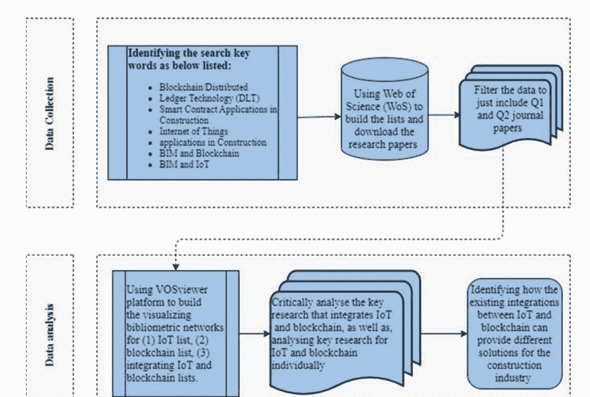

科学计量分析的主要目的是创建特定科学知识领域的地图。这使得对该领域进行批判性审查成为可能（Zhong等，2019年）。因此，本研究采用对内容的批判性分析，根据每篇文章的技术方面，提取所选文章的定性数据分析，以得出模式并提出未来的研究方向。

图2.2显示了区块链和物联网在建筑领域可以提供可行解决方案的建筑主题分类。区块链和物联网可以整合到整个建筑过程中，包括供应链管理、协作、运营和资产管理、项目进展评估、利用BIM实施以及增强预制建筑交付等主要七个主题。该分类法提供了研究背景的概述。

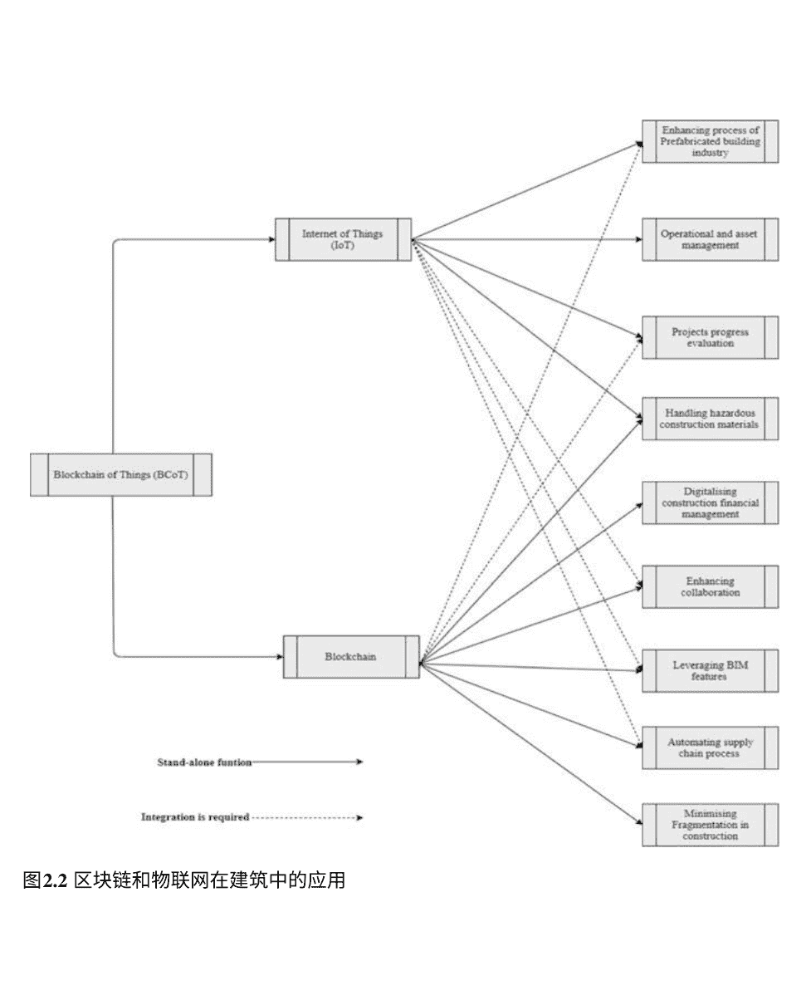

### 数据分析结果

对这两个主题进行科学计量分析，分析关键词的共现性，并进行文献共引分析、引文爆发分析、直接引用分析、出版物分析和合著分析。

### 出版物趋势

科学计量分析结果显示，过去十年中，关于物联网在建筑行业的出版物数量明显增加，始于2013年，并持续增加至2018年（图2.3）。有趣的是，89%的出版物是在过去五年中发表的，这意味着物联网在建筑行业是一个新的领域，引起了越来越多的关注，特别是在2018年，该年发表了42%（30篇文章）的出版物。然而，在2019年和2020年，出版物数量仅为16篇论文和4篇论文。因此，研究需要提供不同的应用案例，以激励研究人员在这个领域发表更多的论文。

图2.4显示了每年关于区块链的出版物数量。可以看出，出版物的高峰期是2020年，有30篇期刊论文。这反映了区块链在建筑行业受到的重视。

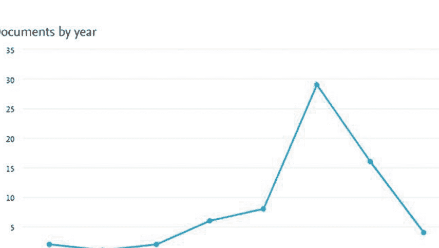

图2.3 建筑物联网的发表论文（按年份）

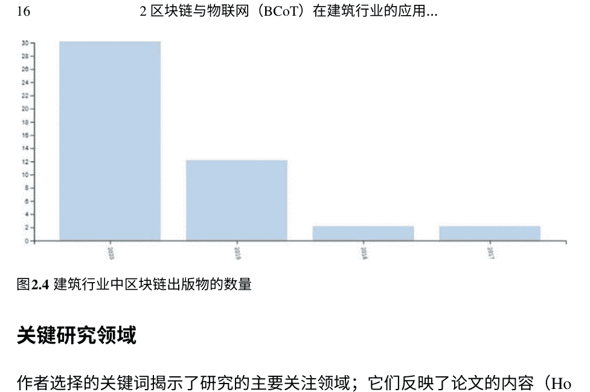

## 关键研究领域

作者选择的关键词揭示了研究的主要关注领域；它们反映了论文的内容（Hosseini等，2018）。在从关键词分析中去除（物联网）后，最常见的关键词有：（1）维护，（2）实时跟踪，（3）资产管理，（4）利益相关者管理，如图2.5所示。图2.5中所有呈现节点之间的短距离表明所有这些主题之间存在显著相关性，下面将进行讨论。

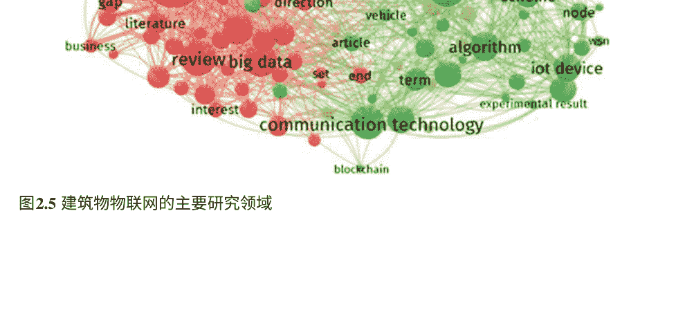

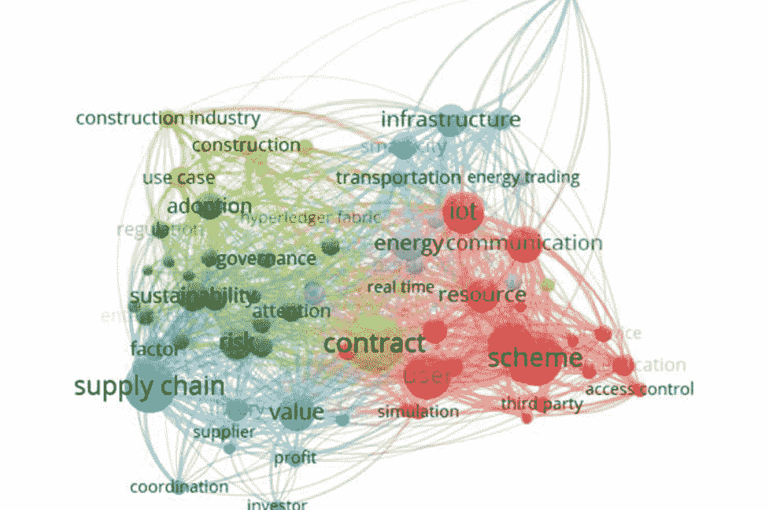

图2.6 建筑物联网和相关工程领域中的区块链主要研究领域

通过分析建筑和相关工程领域约450篇论文，图2.6显示了区块链出版物的叠加可视化。主要出版领域包括：安全、供应链管理、创新、与物联网的整合、交通和深度学习。鉴于网络节点之间的距离和节点的大小代表了知识之间的关系强度（Perianes-Rodriguez等，2016），应用的主要领域是供应链、合同、可持续性和物联网应用。此外，其他较小的节点，如能源、实时监测、智能城市和访问控制与物联网密切相关。因此，区块链和物联网的用例之间的相互关系非常紧密。

### 物联网和区块链集成网络可视化

图2.7展示了分析（n=648）在物联网和区块链集成领域发表的论文的网络可视化。可以看出，与物联网相比，区块链的出版物相对较新，大部分研究是在2019年发表的。然而，该网络也证明了两个主题之间存在良好的相互关系，尤其是位于节点的位置。

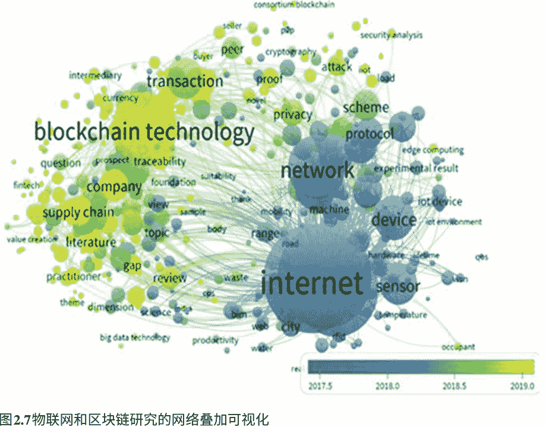

图2.7 物联网和区块链研究的网络叠加可视化

接近两个主要节点（物联网和区块链）。这些节点是BIM、大数据、安全性、生产力和可持续性。

### 物联网（IoT）在建筑行业中的应用

在本节中，对建筑物联网的所有已发表研究进行了批判性讨论，以突出成功的解决方案和限制，以便未来的研究人员能够探索不同的解决方案，即预制建筑行业的物联网、运营和资产管理中的物联网以及物联网对测量项目进展参数的影响。

### 预制建筑行业的物联网应用

已经做出了几项贡献，以利用物联网来进行预制建筑。钟等人（2017年）开发了一个综合模型，将从BIM模型和物联网中收集的数据与射频识别（RFID）相结合。开发这个模型的目的是实现预制建筑的实时可见性和可追溯性。

此模型的目的是实现预制建筑的实时可见性和可追溯性。此外，卢（2017年）提出了一种新的物联网利用方式，用于预制行业的自动化装配方法。作者提出了一种概念性方法，用于自动化制造商和装配工之间的过程；然而，并未提出实际模型。随后，物联网的实际工业应用被开发出来，以促进预制建筑的实施，例如物联网平台（李等，2018a）。该物联网平台为预制建筑利益相关者提供了一个工具，用于跟踪他们的日常操作和决策过程，在预制建筑的装配过程中进行协作和监督。然而，该开发工具仅设计用于收集成本和进度数据。

同时，其他健康安全、质量和建筑环境数据未被考虑。物联网被用于小规模应用，以衡量其有效性并加速预制梁性能管理过程（Zhuo，2018年）。该系统采用不同的硬件构建，如RFID、云技术和大数据，在一个集成系统中检索数据并自动发送到可视化平台。该系统在预应力结构元件的整个过程中证明了其自动化、可视化和远程控制的能力。然而，该系统被制造用于测量张力因素；因此，需要进一步研究将物联网应用于不同场景中的整体结构性能测量。

除了利用物联网为大型预制承包商提供技术解决方案的研究外，还有研究探索物联网如何帮助中小型企业（SMEs）执行预制。例如，徐等人（2018年）提出了一种经济灵活的基于物联网系统的云资产，支持信息和通信技术（ICT）在预制作业中的应用。然而，这项研究使用了来自香港的数据进行验证，因此需要进一步研究来衡量模型在不同建筑环境中的有效性。

在建筑阶段，还利用物联网来测量气体排放，通过在生产线上安装激光系统进行测量读数（Tao等人，2018年）。因此，制造商和建筑商可以避免高排放期间；然而，这项研究是在中国进行的，限制了研究结果的效益。随后的研究测量了物联网在制造阶段减少故障诊断和提供早期警报系统的可行性；进行了一个建筑案例研究，结果证明了利用物联网确保制造的建筑构件质量的可行性。

此外，物联网已被用于支持建筑行业中的预制供应链过程（Wang等人，2018a年）。研究人员开发了一个使用物联网自动化供应链的楼板材料管理系统的自动化管理系统。尽管提出的自动化供应链系统经过了单个案例研究的验证，但该系统的可扩展性是一个问题。因此，可以进行更多的验证来衡量其在不同场景中的可扩展性。

## 运营和资产管理中的物联网应用

Lilis和Kayal（2018）提出了一种基于智能消息导向中间件（MoM）的物联网（IoT）系统。该系统可以使智能建筑的数字和物理资产高效地进行交互。它也是分散的，因此任何单一的缺陷都不会影响整个系统。然而，这个系统只在一个小的案例研究中进行了测试，因此作者建议通过一个更大的“库”来扩展该系统，其中包含这种协议抽象模块。

物联网技术的利用改善了智能城市的性能，特别是基础设施方面，如道路规划（Bermudez-Edo等，2018年）。研究人员构建了一套算法来分析基于时空相关性的物联网流数据的运动。然而，还需要更多的工作来寻找增强的方法和解决方案，以分析多个因果关系之间的相关性与因果关系，考虑到双向相互关系（Bermudez-Edo等，2018年）。根据Silverio-Fernandez等人（2019年）的研究，物联网传感器在管理智能建筑方面显示出了有效的继承。研究人员指出，物联网传感器提高了时间表、员工、客户和文档的高效管理。然而，更多的案例研究应该提高建筑商和运营商之间的技术意识。这些发现在Love和Matthews（2019年）的另一项研究中得到了证实，他们提供了一个用于系统信息建模（SIM）的通用利益依赖网络。该系统展示了不同技术的作用以及它们如何为业务流程增加价值。然而，这个系统只进行了测试，并需要进一步验证，正如作者所建议的：“未来的研究需要探讨如何将其与资产的更广泛生态系统相结合，其中包括ECIS”（Love & Matthews，2019年）。

Costin和Eastman（2019）提出了一个本体框架，列出了物联网在智能和可持续城市系统中提供无缝信息交流的挑战和潜力。

主要发现表明，技术挑战包括：
- 跨学科领域之间缺乏实际的互操作性；
- 缺乏自动化；
- 在建筑、工程、施工和业主行业中缺乏物联网方法。

## 物联网对项目进展参数的影响

物联网概念早期被用于通过采用RFID技术（读卡器和传感器）来测量项目进展，特别是在施工阶段的“健康与安全”和疏散计划方面（Kiani等，2014）。这项研究提出了对已开发系统的有价值的扩展，以增强和支持施工健康与安全管理任务的可视化和可靠数据获取。随后，进行了大量研究，涵盖了许多物联网领域测量建筑项目进展的应用。周和丁（2017年）利用物联网为地下场地提供自动警报系统和安全屏障策略，以避免事故发生。然而，尽管该系统经过了案例研究的测试——长江跨江地铁隧道，但不同国家的健康和安全法规是不同的。因此，仍然需要更多的应用和扩展来最大化利益。

Kochovski和Stankovski（2018年）探索了边缘计算应用，如视频通信和施工过程文档，如何支持智能施工和高质量服务（QoS）的发展。然而，数据安全是一个问题，因此研究人员建议将提出的应用程序与区块链技术集成。已经进行了进一步的案例研究，以衡量物联网在管理智能建筑方面的重要性。周等人（2019年）开发了一个基于网络物理系统的地铁和地下施工安全监控系统，特别是盲目托管。在复杂的现实案例研究中，测量了该系统在复杂场地环境中的有效性。研究结果表明，将BIM模型与实际活动相结合可以为现场所有设备移动提供实时反馈信息，从而实现自动识别风险。然而，作者建议研究和优化安全问题与施工条件之间的关系，以便建立未来的模拟来预测类似问题。还提出了更多在健康和安全方面利用物联网的应用，例如使用基于物联网的架构来自动化非硬帽使用（NHU）测试（张等，2019年）。研究人员提出了一个依赖红外光束探测器和热红外传感器进行非侵入式NHU检测的系统，以解决使用传统传感器无法高效检测人体动作的问题。

工业4.0的建筑流动性需要一个生态系统来利用物联网在整个建筑运营中的应用，而不仅仅是在单个操作中（Woodhead等，2018年）。这项研究揭示了在获得高度安全的物联网环境和共享数据之间存在矛盾。因此，应该开发一套新的流程和系统，以实现物联网在建筑行业的应用，例如新的信息工作流和新的商业模式。换句话说，如果建筑公司获得了长期维护成本并收取定期服务费，随后，行业各方将获得回报利润，用以创新以最大化利润。

## 区块链和智能合约

在本节中，通过（1）概述区块链和智能合约，（2）对直接涉及建筑行业的已发表区块链论文进行批判性分析，（3）强调建筑行业在促进区块链实施方面面临的挑战，（4）探索区块链和BIM集成，对建筑行业的区块链应用进行了批判性分析。

## 区块链/分布式账本技术 (DLT)

区块链网络 (BCN) 分为两类。第一类是公共区块链网络，可以在共识机制下公开访问 (Li等，2018c)。这个网络之所以安全，是因为它具有密码学机制的能力，比如比特币 (Andoni等，2019)。第二类是私有区块链网络，其特点是具有预先识别的用户，对于他们的共识机制也应该明确识别 (Li等，2018d)。

私有区块链网络代表了一个特定组织的单一平台，在区块链网络中保护数据，并且只有预先识别的用户可以看到网络中存储的信息 (Andoni等，2019; Butt等，2019)。

Kumar和Mallick（2018）将BCN定义为一种适用于各种应用的防篡改技术。因此，它是一种有前景的技术，可以避免各行各业中的许多不良行为。同样，BCN提供了高水平的安全性，因为区块记录器可以检查网络中所有记录数据的顺序和数据之间的相互关系 (Banafa，2017)。这可以防止数据在BCN内被篡改 (Kumar & Mallick, 2018)。

此外，BCN有效地支持计算解决方案（（ICE），2018; Lamb，2018; Turk & Klinc，2017）。因此，与使用第三方实施金融任务相比，区块链实施的成本是可以被证明的 (Alternative，2018)。此外，区块链在银行业有机会应用，包括透明度、智能合约、安全性和交易速度。然而，挑战包括立法和监管、运营成本以及标准化要求，这些都是实现这一目标的障碍 (Hassani等，2018)。

智能合约的发展可以追溯到1994年。智能合约被定义为通过自动/协商的协议执行合同条款，如支付交易的自动化系统 (Christidis & Devetsikiotis, 2016; Tapscott & Tapscott, 2016)。因此，由于合同条款基于预先确定的共识机制执行，传统的可信第三方不再需要 (Mason，2017)。同时，Peters和Panayi（2016）提出了智能合约的全面定义：一个平台，用于强制执行和监控由可信来源输入的数据存储在BCN中，基于预先确定的合同条款。这些预先确定的条款应使用诸如Go的编程语言进行编码/编写（有关详细信息，请参阅Donovan和Kernighan（2015））。这是区块链的一个特点，也是BCN在过去十年中发展的结果：通过区块链传输加密货币或数据的能力 (Christidis & Devetsikiotis，2016)。

此外，智能合约减少了对律师/第三方的依赖，以执行和监控合同条款，如金融交易。因此，数据的准确性和透明度可以得到提高 (Mason & Escott，2018)。正如Christidis和Devetsikiotis（2016）所指出的，智能合约通过自动审核转移的数据来使用户受益。一旦数据显示有效性，数据就可以不可变，以增强透明度和安全性。智能合约被命名为在超级账本中，智能合约被称为链码；链码确保所有交易都被正确链接和排序。

区块链在过去几年中已被用于开发可行的解决方案。例如，Viriyasitavat等人（2019b）开发了一个由PBFT和智能合约等关键技术构成的架构，以克服时间不一致性和共识偏见的挑战，促进区块链在业务流程中的采用。

## 建筑行业中的区块链/智能合约

区块链在建筑行业尚未被广泛采用。然而，已经有几次尝试使用它来开发商业模型（Tozzi，2018年）。以Bimchain为例，它是将BIM集成到区块链中的概念验证，以BIM平台的插件形式存在（Bimchain，2018年；Lamb，2018年）。Fox（2019年）指出，在建筑行业已经有几个采用智能合约的案例：自动交付协议中约定的合同，并允许各方更新任何变动；增强项目文档的版权保护；项目各方之间的自动支付；还可以作为认领提交平台（Lamb，2018年；Tozzi，2018年）。因此，智能合约在一些传统上依赖项目参与者多次互动和贡献来做出决策的建筑过程自动化方面具有价值（Mason，2017年；Mason & Escott，2018年）。

表2.2显示了选择相关论文对于提高在建筑管理和建筑环境中实施区块链和智能合约的意识以及基于区块链和智能合约技术提供不同解决方案的贡献（见表2.2）。大多数发展和研究都集中在提供基于理论的区块链技术解决方案和审查区块链在其他领先行业（如汽车行业）中的用例，并将这些用例反映在建筑行业的类似场景中。然而，只有少数研究提供了可行的解决方案。例如，Elghaish等人（2020a）开发了一个基于Hyperledger Fabric的集成项目交付（IPD）自动化财务系统。Wang等人（2020b）提出了一个基于区块链的供应链可追溯性系统，以增强预制建筑中的协作。Das等人（2020）利用区块链作为分散环境来保护建筑项目的中期付款。已发表的关于建筑行业的区块链研究已经根据贡献、方法论和结果进行了分析，如表2.2所示。未来的研究人员可以直接导航以定义这项研究中的知识差距，并开始提供可行且可靠的解决方案。

## 2 区块链与物联网（BCoT）在建筑行业的应用...

表2.2 建筑管理和建筑环境中区块链相关工作

| 作者/年份 | 研究重点 | 研究方法 |
|---|---|---|
| Turk和Klinc (2017年) | 突出区块链在建筑管理中的潜力<br>为潜在用户提供选择适合的区块链类型的指南，根据数据的性质和组织的层次结构<br>说明区块链与其他系统（数据存储）的互操作性 | 概念框架 |
| Mason (2017年) | 通过节省雇佣第三方的成本和减少执行新交易所需的时间，强调智能合同（智能合约）对建筑行业的重要性<br>强调将智能合同整合到BIM中以自动化整个建筑过程的重要性 | 批判性评论 |
| Wang等人 (2017) | 提出了实施区块链以彻底改变供应链管理、合同管理和资源管理（特别是设备租赁）中存在的问题的展望<br>提供了建筑行业（特别是在使用许可区块链的情况下）中实施区块链的挑战的分类（即技术挑战）和人员挑战<br>与其他实施的资源管理系统（如ERP）之间的冲突 | 概念框架 |
| Mason和Escott (2018年) | 突出显示建筑行业中智能合约实施面临的挑战<br>明确行业参与者在未来实施智能合约时应考虑的具体步骤 | 关键审查和概念框架 |
| 李等人 (2019b)，Mason和Escott (2018年) | 提供一个新兴框架，考虑多个维度，即社会、政治和技术。这是为了使建筑行业中的潜在开发者/用户能够突出显示潜力和挑战 | 手动审查和概念框架 |
| Macrinici等人 (2018年) | 提供一个研究地图，指出未来实施区块链和智能合约所需的研究。作者总结了（n=16）在实施智能合约时的问题。本文的研究结果可以供研究人员和开发人员使用，以找到解决上述问题的方法，并让用户了解潜力和挑战 | 重要的评论 |
| 李等人 (2019a) | 将当前建筑行业面临的挑战与区块链的潜在好处联系起来，以提供可靠的解决方案。研究人员提出了一个框架——呈现社会技术维度，可以促进建筑区块链在建筑环境的七个领域中的实施，这些领域由研究人员进行了分类。在采用区块链的决策标准中，对于组织结构来说，它将是一个有用的或多余的技术特性。 | 案例研究的重要评论 |
| 帕恩和爱德华兹 (2019) | 作者建议将区块链技术与共享数据环境（CDE）结合使用，以便能够跟踪记录的数据，并将记录器显示为一组节点存储数据。 | 概念框架 |
| Shojaei等人 (2019) | 通过利用超级账本作为区块链工具，将BIM和区块链整合起来，以管理建筑项目合同。<br>作者还指出，“将所有传统合同条款翻译成计算机程序的概念被证明是不必要的，也不适合建筑行业，因为每个项目都涉及复杂性、流动性和高度不确定性”。 | 框架开发 |
| Safa等人 (2019) | 提供一个战略计划，将区块链整合到建筑过程中，解决建筑管理领域中存在的挑战。<br>这项研究为建筑管理中进一步的真实区块链应用奠定了基础。 | 概念框架 |
| Andoni等人 (2019) | 强调在能源领域使用区块链的潜在好处，如价格发现、物流、客户识别以及问题调解和报告。<br>提出了一种基于微网的区块链，用于管理和控制生产者、自给自足者和最终消费者之间的能源需求。 | 框架开发 |
| Elghaish等人 (2020a) | 新方法管理IPD项目中的财务交易和风险/回报共享。<br>BIM/区块链集成的新工具集提供了一个自动化的财务平台。<br>为建筑项目创建基于区块链的智能合约的蓝图。<br>为IPD财务管理开创性的超级账本应用。 | 概念框架 |
| Yang等人 (2020) | 使用两个真实案例来衡量在AEC行业中采用公共和私有区块链的适用性<br>为两个平台（即Hyperledger Fabric和Ethereum平台）开发区块链架构 | 原型开发 |
| Das等人 (2020) | 提供一个安全的系统，使用智能合约执行中期支付<br>探索在建筑项目中使用区块链的成本和安全性 |  |
| Wang等人 (2020b) | 开发一个框架，利用区块链和智能合约来应对预制建筑供应链管理的挑战<br>解决方案包括：“（1）信息共享管理；（2）实时调度控制；和（3）信息可追溯性” | 框架开发 |
| Hamledar i和Fischer (2021) | 增强基于区块链的供应链流程集成<br>通过根据生产进展自动化支付，减少现金和产品流动之间的碎片化 | 原型开发 |

## BIM和区块链的整合

Turk和Klinc（2017）指出，区块链平台（如Ethereum、Hyperledger）可以集成到BIM中，增加新功能。这些功能可以记录3D BIM模型在设计和施工阶段的所有变化，使利益相关者能够轻松跟踪这些变化（Lohry，2015）。Mason和Escott（2018）声称，由于设备中传感器数量的预见性增加，到2020年，BIM与智能合约的集成将是可实现的，几乎达到250亿个。

然而，BIM 2级的承诺是最大限度地减少基于纸张的沟通和交流（Gibbs等，2015）；因此，需要一个在项目各方之间共享信息、具有高度透明度并跟踪所有可能变化的平台（Mosey，2014）。

Cousins（2018b）认为，BIM流程需要一个包含所有必要数据以验证和授权所有可能任务的3D合同模型。Bimchain是BIM平台的插件，旨在最小化3D BIM模型与基于纸张的法律文件之间的差距（Bimchain，2018）。事实上，这是一种使用智能合约来管理BIM的尝试，可以实现自动支付、保险和项目信息跟踪（Bimchain，2018；Lamb，2018）。因此，智能合约可以编码以集成到BIM流程和平台中，以实现传统条款的自动执行。这将以安全的方式为所有利益相关者提供访问所有可用数据的方式，以管理项目资金并根据一套约定的规则释放应付款项（Cardeira，2015；Fox，2019）。

此外，区块链可以为BIM过程提供安全和协作环境（Ahmad等，2018；Li等，2019a），从而使所有项目参与方都能获得关于所有信息访问的相同利益。利益相关者还将有机会控制项目变更，因为区块链的主要原则是中立性（Li等，2019a）。

Mathews等人（2017）认为，IPD需要高度的信任和核心团队成员之间的协作网络；所有IPD成员都应该是“一个人为所有人，所有人为一个人”（Ashcraft，2012）。通过其透明度、不可变性和自动化数据验证，区块链将能够创造一个新的提案（Li等，2019a；Vukoli´c，2016；Watanabe等，2016）。因此，无论是有形的还是无形的，都可以提取各种奖励（Elghaish等，2019；Pishdad-Bozorgi等，2013）。此外，区块链允许多个参与者共同在一个项目上工作，并支持基于数据的数字环境，以实现更好的项目交付（Koutsogiannis和Berntsen，2019；Li等，2019a）。Bimchain（2018），Cousins（2018b）声称BIM和区块链的结合可以提供一个不可腐败、可靠和透明的系统，用于记录、更新和维护项目数据库。此外，区块链和智能合约可以增强建筑行业的协作，并让所有参与者了解项目状态以及与3D BIM设计、施工现场程序和供应材料流动相关的所有变化（Mathews等，2017）。

## 在建筑项目交付中实施区块链/智能合约的障碍

鉴于建筑行业依赖法定货币进行支付，区块链需要改变以转移法定货币而不是加密货币（Cousins，2018b）。此外，银行目前使用私有账本，因此无法链接智能合约和银行账户（Pisa & Juden，2017）。然而，如果任何商业/中央银行同意成为分布式账本的一部分，支付可以以法定货币发送/接收（Brody）。编码冗长的法律概念被认为是使用智能合约的实际挑战。这些概念包括在其法律叙述中的“善意”、“疏忽”和“合理性”（Sherborne，2017）。此外，Raskin（2017）认为智能合约无法完全包含所有法律条款；例如，法律合同应包括“要约”、“接受”和明确表达以显示各方进入法律协议的意图的要素。然而，用户可以阐述一份草案合同，随后对所有可能的条款进行编码；因此，草案合同可以作为未编码的任何问题的恢复（Clack，2018）。

知识产权对建筑公司来说非常敏感和重要；然而，在超级账本中共享的数据是分散的，潜在的版权问题应该得到考虑和处理（Cousins，2018b）。Bimchain的创始人兼首席执行官Arnaud Gueguen认为：“我们认为像英国这样更加合同化的国家，或者像法国或斯堪的纳维亚国家这样的国家，可以更充分地部署我们的解决方案”（Cousins，2018a）。

Allison等人（2018）指出，区块链应用需要新的法规、法律和治理体系来应对所有可能的挑战。此外，区块链的当前设置成本非常高。然而，实施区块链的潜在好处可以迅速弥补必要的资源（Andoni等，2019）。

建筑行业在实施区块链时面临着一些技术问题，例如需要的带宽和容量，以确保所有数据都能够无延迟地传输（Kasireddy，2017）。此外，建筑工程行业还没有完全数字化以采用区块链和智能合约技术（Mason和Escott，2018）。Andoni等人（2019）断言，区块链必须在不同情况下证明其可扩展性、可行性和速度。此外，共识算法的研究仍在进行中，以在集成的共识协议中结合所有所需的特性（Wang等，2018b）。

ICAEW（2018）提到了不同的挑战：每笔交易的费用在£5到£8之间；连续交易之间的时间约为五分钟；与传统银行签证相比，交易容量较低。尽管区块链在安全方面声誉很高（Kollewe，2018），但在过去几年中已经有几次成功的黑客攻击，最近的一次盗窃金额约为2700万英镑（Lamb，2018）。每个组织都应该使用网络安全确定每种情况下的潜在小规模和大规模违规行为。

确实，Pradhan等人（2017）指出：“完整的区块链开发可能需要五年或更长时间，或者可能不会发生。”

七年或更长时间，或者可能不会发生。在供应链上测试区块链的早期采用者必须准备接受重大的风险，并准备快速失败并再次尝试。

## 物联网和区块链的整合应用案例

自2016年以来，物联网和区块链技术的整合已在许多领域中进行讨论，以收集实时数据并通过区块链系统共享这些数据，以确保隐私、安全和可扩展性（见表2.3）。Lu（2018, 2019）证实，区块链有潜力通过创建分布式系统来创新和显著改进物联网相关系统。区块链技术是解决业务流程管理（BPM）中某些挑战的有希望的解决方案。区块链必须与通常包括物联网设备的BPM系统组件进行集成（Viriyasitavat等，2019a，2019b）。此外，Iqbal等人（2019）指出，在为社交物联网开发信任模型时存在关键挑战（例如上下文感知、隐私、可靠性、一般声誉、架构选择、伦理）。最终，作者们概述了趋势技术（例如区块链），这些技术可以在考虑系统的动态性的同时，帮助开发基于信任的社交车联网模型。分析不同领域中类似的整合的重要性可以帮助建筑环境研究人员在建筑环境中应用类似的整合架构，例如开发远程控制系统的施工现场和开发自动化系统以跟踪资产的性能并将收集的数据保存在区块链系统中，并增强施工项目的健康与安全管理（见表2.3）。

## 研究结果讨论

物联网在建筑行业中用于管理以下内容：预制建筑行业、运营和资产管理，以及测量项目进展参数的影响。关于物联网在预制建筑中的使用，研究发现：

- 需要开发一个平台，以促进制造商和装配商之间的合作。
- 物联网可以跟踪健康安全、质量和环境影响方面的日常运营。
- 鉴于物联网被用于跟踪混凝土构件（例如桥梁中的梁）的张力性能，需要进一步研究在不同情景下测量整体结构性能。

此外，尽管物联网目前被用于增强运营和资产管理，但应进行更多的实际案例研究，以提高建筑商和运营商之间对技术的认识，特别是对于建设新智能城市。还存在着技术挑战。

## 表2.3 集成区块链和物联网的主要先工作

| 作者/年份 | 研究重点 | 建筑行业的应用案例 | 研究方法 | 框架开发 |
| :--- | :--- | :--- | :--- | :--- |
| Huckle等人(2016) | 指出区块链和物联网对支持共享经济（如Uber）的好处，提供共享经济应用的例子，如AutoPay用于支付停车费并使用智能合约功能记录数据。 | 这可以用于通过特定传感器（物联网）自动跟踪资源（O'Connell, 2017）在建筑工地上，例如设备，然后使用区块链处理这些数据（Jayanth等人，2017）跟踪库存存在工地上。 | 批判性评论和概念框架 |  |
| 雷纳等人(2018) | 提供一个模型来展示将区块链整合到物联网中的可能性，并突出了这种整合的潜力。 | 其他技术被用于管理建筑资源，例如射频识别（RFID）(Ren et al., 2011)。然而，实施物联网和区块链来跟踪资源（即设备）更加可行，因为整个过程是自动化的，所有观测数据将被安全检查和存储，无需人为干预。建筑供应链中的碎片化问题由各方之间的沟通不畅(Dainty et al., 2001)，可以得到最小化。涉及所有参与方的分散式区块链网络。 | 框架开发 | 原型开发 |
| Dwivedi等人（2019）和Aceto等人（2020） | 提供一个区块链系统，用于安全管理和分析大型医疗数据。使用物联网设备收集实时数据并将这些数据传输到区块链网络。 | 在建筑行业中使用复杂的大数据应用存在连接问题，特别是BIM大数据应用（Bilal等，2016年）。因此，这个设计系统可以解决这些连接问题从建筑工地收集实时数据/可以用于项目管理（Asadi, Boroujeni & Han, 2017年）。因此，区块链和物联网的集成可以用于开发实时数据收集系统，以及基于区块链的项目进度测量（Elghaish等，2020年）。 | 原型开发 |  |
| Viriyasitavat等人（2019b） | 区块链可以通过消除可信中介来确保信任。该研究开发了一种基于代理的方法，利用区块链支持服务质量（QoS）的测量。 | 鉴于先进的信息通信技术在建筑行业的复杂性中的应用（Adriaanse & Voordijk，2005年）。因此，提高物联网设备的可扩展性可以支持其在复杂建筑项目中的应用。处理建筑物中的危险材料是建筑行业的健康和安全问题之一（Kim & Yu, 2014年）。物联网与区块链相结合可以检测危险材料并在处理过程中警告建筑从业人员。 | 系统开发 |  |
| Domri等人（2019年） | 利用区块链作为一种有效的技术，在物联网中提供安全性和匿名性，并解决使用物联网时存在的挑战，如复杂性、带宽和延迟开销以及可扩展性。 | （继续） |  |  |
| Pavithran等人 (2020) | 通过比较其存储和安全级别，设计一个集成系统来同时应用物联网和区块链技术。 |  | 原型开发 |  |
| Rahman等人 (2019) | 提出了基于区块链的共享经济系统，用于将数据存储在不可变的账本中。该系统由人工智能(AI)基础设施支持。它被设计用于未来的智能城市，可以通过物联网数据提供网络物理共享经济服务。 | 建设智能城市需要使用先进的物联网设备，将所有资产连接起来，在一个集中的系统中进行便利的管理(Telouabou, 2020年)。当将人工智能和区块链集成在一起时，正如本研究所提出的，可以实现自动化和自动排序，无需任何人工干预。基于物联网和区块链集成的安全数据共享系统可以与BIM集成，开发一个异步生产控制室来管理复杂的项目，正如(Ezzedine等，2019年; Nascimento等，2018年)所推荐的。 | 原型开发 |  |
| Sultana等人 (2020) | 使用物联网设备开发数据共享系统所提出的系统在交易成本方面非常高效。 |  | 概念框架 |  |
| Minaz (2020年) | 通过物联网的区块链概念 (BCoT) 验证区块链与物联网的集成。 |  | 概念框架和案例研究 |  |
| Aich等人 (2019年) | 开发一个概念框架，将区块链和物联网集成起来，以开发一个自动化的供应链系统，通过改善供应链信息流程来获得优势。 | 该框架可以扩展到建筑供应链，以增强不同方之间共享供应数据的碎片化(Dana Broft, 2020年)。 | 概念框架和案例研究 |  |

物联网在智能城市中的应用存在一些问题，例如跨学科领域之间缺乏实际的互操作性，缺乏自动化，以及在建筑、工程、施工和业主行业中缺乏物联网方法。物联网在建筑行业中被用于测量项目的进展参数，以管理现场的健康与安全任务。然而，需要更多的应用和扩展来利用物联网在健康与安全测量方面的优势。此外，应该开发新的流程和系统，以实现物联网在建筑行业的应用，例如新的信息工作流和新的商业模式。

自2017年以来，区块链技术在建筑行业受到了重视。然而，大多数出版物要么是概念框架，要么是综述论文。一些论文包括可行的解决方案，例如为IPD开发自动化财务系统(Elghaish等，2020a)，供应链可追溯性框架(Wang等，2020b)和保障中期支付方法(Das等，2020)。因此，本研究为研究人员提供了一个地图，(1)来定义研究问题并了解这些问题在其他领域是如何解决的，以及(2)开发原型来验证研究人员提出的主题和概念框架。

Hyperledger Fabric是最适合自动化支付的区块链平台，适用于所有建筑交付阶段。这是因为(1)它的共识机制是模块化的，使项目各方能够根据项目条件建立一致的机制，以及(2)由于超级账本(Linux)、IBM、Oracle和SAP之间的集成带来的适用性，促进了实施。

尽管区块链被引入以增强建筑供应链管理流程，但实际应用尚未提供。因此，本研究总结了不同行业的成功尝试，以便研究人员能够利用这些行业的进展。

关于物联网和区块链集成可以找到几项研究；然而，这种集成在建筑领域尚未被探索。这种集成可以显著有助于开发远程控制系统，用于建筑工地。对于这个主题的九篇论文的结果被讨论为建筑研究人员的出发点。特别是对于资源的自动跟踪，增强供应商之间的协作，更好地连接不同的流程和来源，并促进向新一代智能城市的转型。

## 结论

本研究探讨了物联网、区块链以及将物联网和区块链整合到建筑行业的潜在研究现状。近年来，该领域引起了很大的兴趣，已经进行了一些研究和文献综述。然而，本研究是第一次对物联网和区块链整合文献进行文献计量学研究。

通过使用“科学映射”和“批判性分析”方法，系统地研究了603篇排名靠前的期刊文章。

在过去几年中，区块链和物联网的利用明显增加，应用于安全、可见性、可追溯性和自动化数据收集和处理。所有这些特性可以促进建筑行业向工业4.0的转变。本文通过分析现有的物联网和区块链研究以及大部分间接相关的应用（如工程、管理），对这两种技术的应用进行了批判性讨论，以确定研究空白。

在建筑行业中，物联网的采用相对较高，而区块链应用的采用相对较低。物联网在2013年出现在建筑行业，而区块链自2017年以来仅在理论上进行了研究。物联网存在着不同目的的实际案例研究，如进展评估、建筑工地的健康和安全监测，以及测量结构元素（如桥梁和设施管理）的性能。然而，所有这些案例研究都是为了研究目的而进行的。因此，有重要的建议扩展物联网的应用范围，以获得更可靠的结果。

相比之下，区块链的实际案例研究仍然有限。只有少数原型被提出用于各种应用，例如自动化风险/回报共享系统、安全的临时支付平台和质量管理系统。需要进一步研究将提出的概念性提案转化为实际解决方案。

已经有有效的尝试将物联网和区块链整合起来，以提供实际解决方案，例如跟踪建筑工地的资源，减少供应链中的数据碎片化，并促进向智能城市的转变。这就是为什么引入了“物联网区块链”（BCoT）术语到工程领域。此外，该研究基于相关领域的类似应用，提出了建筑行业中不同的BCoT案例。

尽管本研究提供了一些贡献，但研究结果需要考虑一定的限制条件。首先，由于在建筑领域中没有足够的物联网和区块链的直接出版物，科学计量分析聚焦于工程领域，以推断其在建筑领域的应用主题。因此，当物联网和区块链在建筑领域的研究数量达到一定规模时，将需要专门的基于建筑的科学研究。

# 参考文献

- (ICE), I. o. c. e. (2018). 区块链技术在建筑行业数字化转型中的高效生产力。
- Aceto, G., Persico, V., & Pescap, A. (2020). 工业4.0和健康：物联网、大数据和云计算在医疗保健4.0中的应用。《工业信息集成杂志》，18, 100129。
- Adriaanse, A., & Voordijk, H. (2005). 建筑项目中的组织间沟通和ICT：一项使用元三角测量法的综述。Construction Innovation, 5(3), 159–177.
- Ahmad, I., Azhar, N., & Chowdhury, A. (2018). 信息和通信技术推动的IPD特性增强。*Journal of Management in Engineering*, *35*(1), 04018055. https://doi.org/10.1061/(ASCE)ME.1943-5479.0000670.
- Aich, S., Chakraborty, S., Sain, M., Lee, H.-I., & Kim, H.-C. (2019). 基于物联网的区块链供应链管理在不同行业中的实施好处综述与案例研究。 In *2019 21st International Conference on Advanced Communication Technology (ICACT)* (pp. 138–141). IEEE.
- Alamri, M., Jhanjhi, N., & Humayun, M. (2019). 物联网（IoT）研究中的区块链问题、挑战和未来方向：一项综述。*国际计算机科学与网络安全杂志*, *19*, 244–258.
- Alladi, T., Chamola, V., Parizi, R. M., & Choo, K.-K.R. (2019). 工业4.0和工业物联网的区块链应用：一项综述。*IEEE Access*, *7*, 176935–176951.
- Allison, M., Ashcraft, H., Cheng, R., Klawens, S., & Pease, J. (2018). 综合项目交付：领导者的行动指南。 https://leanipd.com/integrated-project-delivery-an-action-guide-for-leaders/.
- Alternative, W. B. (2018). Do you need? 数据隐私管理、加密货币和区块链技术。 在 *ESORICS 2018 国际研讨会上，DPM 2018和CBT 2018*，巴塞罗那，西班牙，2018年9月6日至7日，论文集（第113页）。 Springer.
- Andoni, M., Robu, V., Flynn, D., Abram, S., Geach, D., Jenkins, D., McCallum, P., & Peacock, A. (2019). 能源领域的区块链技术：挑战和机遇的系统性综述。*可再生与可持续能源评论*, *100*, 143–174.
- Arayici, Y., & Coates, P. (2012). 基于系统工程的知识转移：BIM采用的案例研究。*虚拟现实-人机交互*, *2006*, 179–206.
- Asadi Boroujeni, K., & Han, K. (2017). 基于视角的图像到BIM对齐，用于自动化视觉数据收集和施工绩效监测。 在 *土木工程中的计算* (pp. 171–178).
- Ashcraft, H. W. (2012). *IPD框架*. 检索于6月26日，来自 https://www.hansonbridgett.com/Publications/pdf/ipd-framework.aspx.
- Banafa, A. (2017). 物联网和区块链的融合：好处和挑战。*IEEE物联网 Things*.
- Bermudez-Edo, M., Barnaghi, P., & Moessner, K. (2018). 分析具有时空相关性的实时数据流：熵与皮尔逊相关性。*自动化在建筑中的应用*, *88*, 87–100.
- Bilal, M., Oyedele, L. O., Qadir, J., Munir, K., Ajayi, S. O., Akinade, O. O., Owolabi, H. A., Alaka, H. A., & Pasha, M. (2016). 建筑行业中的大数据：现状、机遇和未来趋势。*高级工程信息学*, *30*(3), 500–521.
- Bimchain. (2018). 通过区块链加速BIM. 检索于2019年4月14日，来自 https://bimchain.io/.
- Brody, P. 法定货币即将成为公共区块链的必需品. 2019年4月17日检索，来自 https://www.coindesk.com/fiat-currencies-are-about-to-become-essential-to-public-blockchains.
- Butt, T. A., Iqbal, R., Salah, K., Aloqaily, M., & Jararweh, Y. (2019). 社交物联网车辆的隐私管理：回顾、挑战和基于区块链的解决方案. *IEEE Access*, *7*, 79694–79713.
- Cardeira, H. (2015). 智能合约及其在建筑行业的应用. 在*罗马尼亚建筑法评论中*.
- Christidis, K., & Devetsikiotis, M. (2016). 区块链和物联网的智能合约。*IEEE Access*, *4*, 2292–2303.
- Clack, C. D. (2018). 智能合约模板：法律语义和代码验证. *数字银行杂志*, *2*(4), 338–352.
- Costin, A., & Eastman, C. (2019). 需要互操作性以实现智能和可持续城市系统中的无缝信息交换。 *土木工程计算杂志*, *33*(3), 04019008.
- Cousins, S. (2018a). 区块链可能成为解锁BIM Level 3的关键. CIOB. 2018年9月20日检索自http://www.bimplus.co.uk/news/blockchain-could-hold-key-unlocking-bim-level-3/.
- Cousins, S. (2018b). 法国初创公司为BIM开发了区块链解决方案. 2019年4月14日检索自http://www.bimplus.co.uk/news/french-start-develops-blockchain-solution-bim/.
- Dainy, A. R., Millett, S. J., & Briscoe, G. H. (2001). 建筑供应链一体化的新视角. 《供应链管理：国际期刊》.
- Dana Broft, R. (2020). 建筑行业中的精益供应链管理：在建筑供应链的“下层”实施成功的建筑供应链管理：概念与案例研究, 271–287.
- Das, M., Luo, H., & Cheng, J. C. (2020). 通过基于区块链的框架确保建筑项目的中期付款. Automation in Construction, 118, 103284. https://doi.org/10.1016/j.autcon.2020.103284.
- Ding, K., Shi, H., Hui, J., Liu, Y., Zhu, B., Zhang, F., & Cao, W. (2018). 智能钢桥建设：基于BIM和物联网的工业4.0框架. 在2018年IEEE第15届国际网络、感知和控制会议(ICNSC)中(p. 1–5). IEEE.
- Donovan, A. A., & Kernighan, B. W. (2015). Go编程语言. Addison-Wesley Professional. ISBN: 0134190564.
- Dorri, A., Kanhere, S. S., Jurdak, R., & Gauravaram, P. (2019). LSB:一种轻量级可扩展的物联网安全和匿名性区块链. 并行与分布式计算杂志, 134, 180–197.
- Dwivedi, A. D., Srivastava, G., Dhar, S., & Singh, R. (2019). 一种去中心化的隐私保护物联网医疗区块链. 传感器, 19(2), 326.
- Elghaish, F., Abrishami, S., Abu Samra, S., Gaterell, M., Hosseini, M. R., & Wise, R. (2019). 使用BIM工具在集成项目交付(IPD)中开发的现金流系统框架. 国际建筑管理杂志, 1–16.
- Elghaish, F., Abrishami, S., & Hosseini, M. R. (2020a). 使用区块链的集成项目交付：一种自动化的财务系统. 建筑自动化, 114, 103182. https://doi.org/10.1016/j.autcon.2020.103182.
- Elghaish, F., Matarneh, S., Talebi, S., Kagioglou, M., Hosseini, M. R., & Abrishami, S. (2020b). 以沉浸式和无人机技术推进建筑行业的数字化：一项批判性文献综述. 智能和可持续建筑环境.
- Elghaish, F., Rahimian, F. P., Hosseini, M. R., Edwards, D., & Shelbourn, M. (2022). 建筑项目的财务管理：Hyperledger fabric和chaincode解决方案. Automation in Construction, 137, 104185.
- Ezzeddine, A., Shehab, L., Srour, I., Power, W., Zankoul, E., & Freiha, E. (2021). CCC在快节奏项目上实施建筑控制室：贝鲁特港爆炸案例研究. 国际建筑管理杂志, 1–11.
- Fox, S. (2019). 为什么建筑行业需要智能合约. 检索日期：2019年4月13日.
- Ghosh, A., Edwards, D. J., & Hosseini, M. R. (2020). 物联网研究中的模式和趋势：建筑行业的未来应用. 工程、建筑和建筑管理.
- Gibbs, D.-J., Emmitt, S., Lord, W., & Ruikar, K. (2015). BIM和建筑合同-CPC 2013年的方法. 土木工程师学会.管理、采购和法律的论文集, 168(6), 285–293.

- He, Q., Wang, G., Luo, L., Shi, Q., Xie, J., & Meng, X. (2017). 通过科学计量分析，对建筑信息模型（BIM）的管理领域进行映射。国际项目管理杂志，35(4)，670–685。
- Heyvaert, M., Hannes, K., & Onghena, P. (2016). 使用混合方法研究综述进行文献综述：混合方法研究综述方法(第4卷)：Sage出版社。ISBN：1483358283。
- Hosseini, M. R., Jupp, J., Papadonikolaki, E., Mumford, T., Joske, W., & Nikmehr, B. (2020). 立场文件：澳大利亚的数字工程和建筑信息建模。智能和可持续建筑环境(提前出版)。https://doi.org/10.1108/SASBE-10-2020-0154。
- Hosseini, M. R., Maghrebi, M., Akbarnezhad, A., Martek, I., & Arashpour, M. (2018). 对建筑信息建模研究中的引用网络进行分析。建筑工程与管理杂志，144(8)，04018064。https://doi.org/10.1061/(ASCE)CO.1943-7862.0001492。
- Huckle, S., Bhattacharya, R., White, M., & Beloff, N. (2016). 物联网、区块链和共享经济应用。Procedia Computer Science, 98, 461–466。
- ICAEW, I. F. (2018). 区块链与会计的未来。
- Iqbal, R., Butt, T. A., Afzaal, M., & Salah, K. (2019). 社交物联网中的信任管理：因素、挑战、区块链和雾计算解决方案。International Journal of Distributed Sensor Networks, 15(1), 1550147719825820。
- Jayanth, S., Poorvi, M., & Sunil, M. (2017). 基于物联网的库存管理系统。在计算智能与信息学第一届国际会议论文集中(pp. 201–210). Springer。
- Kagermann, H., Helbig, J., Hellinger, A., & Wahlster, W. (2013). 实施战略倡议INDUSTRIE 4.0的建议：确保德国制造业的未来产业；工业4.0工作组的最终报告。Forschungsunion。
- Kasireddy, P. (2017). 公共区块链的基本挑战。2019年4月14日检索自https://medium.com/@preethikasireddy/fundamental-challenges-with-public-blockchains-253c800e9428。
- Kiani, A., Salman, A., & Riaz, Z. (2014). 用于建筑H&S管理的实时环境监测、可视化和通知系统。建筑信息技术杂志, 19, 72–91。
- Kim, J. T., & Yu, C. W. (2014). 建筑中的有害物质。室内与建筑环境, 23(1), 44–61。
- Kinna, C., Geipel, M., & Bew, M. (2018). 区块链技术：比特币背后的发明如何为建筑环境提供信任网络。
- Kochovski, P., & Stankovski, V. (2018). 支持可靠边缘计算基础设施和应用的智能建筑施工。建筑自动化, 85, 182–192。
- Kollewe, J. (2018). 加密货币交易所被黑客攻击后，比特币价格暴跌。检索日期：2019年4月14日，来自https://www.theguardian.com/technology/2018/jun/11/bitcoin-price-cryptocurrency-hacked-south-korea-coincheck。
- Koutsogiannis, A., & Berntsen, N. (2019). 区块链和建筑：如何、为什么和何时。2019年4月14日检索，来自http://www.bimplus.co.uk/people/blockchain-and-construction-how-why-and-when/。
- Kumar, N. M., & Mallick, P. K. (2018). 区块链技术在物联网安全问题和挑战中的应用。计算机科学学报, 132, 1815–1823. https://doi.org/10.1016/j.procs.2018.05.140。
- Lamb, K. (2018). 区块链和智能合约：建筑工程领域需要了解的内容。
- Li, C. Z., Xue, F., Li, X., Hong, J., & Shen, G. Q. (2018a). 一种用于预制建筑现场组装服务的物联网BIM平台。建筑自动化, 89, 146–161。
- Li, J., Greenwood, D., & Kassem, M. (2019a). 建筑行业和建筑行业中的区块链：系统性综述、概念模型和实际应用案例。自动化在建筑行业中的应用, 102, 288–307。
- Li, J., Greenwood, D., & Kassem, M. (2019b). 建筑行业中的区块链：建筑行业的社会技术系统框架。在土木与建筑工程的信息学和计算方面的进展(pp. 51–57). Springer。
- Li, Z., Barenji, A. V., & Huang, G. Q. (2018c). 作为点对点分布式网络平台的区块链云制造系统的发展。机器人技术与计算机集成制造, 54, 133–144。
- Li, Z., Kang, J., Yu, R., Ye, D., Deng, Q., & Zhang, Y. (2018d). 工业物联网中安全能源交易的联盟区块链。IEEE工业信息学交易, 14(8), 3690–3700。
- Lilis, G., & Kayal, M. (2018). 一种安全分布式的面向消息的中间件用于智能建筑应用。Automation in Construction, 86, 163–175。
- Lo, S. K., Liu, Y., Chia, S. Y., Xu, X., Lu, Q., Zhu, L., & Ning, H. (2019). 对物联网的区块链解决方案进行分析：系统文献综述。IEEE Access, 7, 58822–58835。
- Lohry, M. (2015). 区块链启用的共居住。检索于2019年4月14日，来自https://medium.com/@MatthewLohry/blockchain-enabled-co-housing-de48e4f2b441
- Love, P. E., & Matthews, J. (2019). 数字技术的效益管理的“如何”：从工程到资产管理。Automation in Construction, 107, 102930。
- Lu, A. (2017). 自主装配作为通用建筑的第四种方法。建筑设计，87(4)，128–133。
- Lu, Y. (2018). 区块链及相关问题：当前研究主题综述。管理分析杂志，5(4)，231–255。
- Lu, Y. (2019). 区块链：现状和研究挑战。工业信息集成杂志，15，80–90。
- Macrinici, D., Cartofeanu, C., & Gao, S. (2018). 区块链技术中的智能合约应用：系统性映射研究。遥测与信息学。
- Mason, J. (2017). 智能合同与建筑行业。工程与建筑领域的法律事务和争议解决杂志，9(3)，04517012。
- Mason, J., & Escott, H. (2018). 建筑中的智能合同：利益相关者的观点和看法。在FIG会议论文集，2018年5月，伊斯坦布尔。FIG。
- Mathews, M., Robles, D., & Bowe, B. (2017). BIM+区块链：解决协作中的信任问题？
- McGowan, J., & Sampson, M. (2005). 系统性综述需要系统性搜索者。医学图书馆协会杂志，93(1)，74。
- Miraz, M. H. (2020). 物联网与区块链的融合：物联网的区块链。在区块链技术的高级应用(pp. 141–159). Springer。
- Mistry, I., Tanwar, S., Tyagi, S., & Kumar, N. (2020). 面向5G启用的工业物联网的区块链：系统性综述、解决方案和挑战。机械系统和信号处理，135, 106382。
- Mohamed, N., & Al-Jaroodi, J. (2019). 将区块链应用于工业4.0应用。在2019年IEEE第9届计算与通信研讨会和会议（CCWC）(pp. 0852–0858). IEEE。
- Mosey, D. (2014). BIM和相关革命：Cookham Wood试验项目的回顾。建筑法学会。
- Nascimento, D., Caiado, R., Tortorella, G., Ivson, P., & Meiri o, M. (2018). 数字Obeya房间：探索BIM和精益之间的协同作用，以实现可视化施工管理。创新的基础设施解决方案，3(1)，1–10。
- Newman, C., Edwards, D., Martek, I., Lai, J., Thwala, W. D., & Rillie, I. (2020). 工业4.0在建筑行业的部署：文献综述和基于英国的案例研究。智能和可持续建筑环境。
- O’Connell, B. (2017). 在大学创客空间内设计和分析物联网使用跟踪和设备管理系统。塔夫茨大学。
- Ourad, A. Z., Belgacem, B., & Salah, K. (2018). 使用区块链进行物联网访问控制和身份验证管理。在国际物联网会议上(pp. 150–164). Springer。
- Panarello, A., Tapas, N., Merlino, G., Longo, F., & Puliafito, A. (2018). 区块链和物联网集成:一项系统性调查。传感器，18(8)，2575。
- Parn, E. A., & Edwards, D. (2019). 面临数字化建筑环境的网络威胁:共同的数据环境漏洞和区块链威慑。工程、建筑和建筑管理, 26(2), 245–266。
- Pavithran, D., Shaalan, K., Al-Karaki, J. N., & Gawanmeh, A. (2020). 构建物联网区块链框架的探索。集群计算，1–15。
- Perera, S., Nanayakkkara, S., Rodrigo, M., Senaratne, S., & Weinand, R. (2020). 区块链技术：在建筑行业中是炒作还是真实。工业信息集成杂志, 17，100125。
- Perianes-Rodriguez, A., Waltman, L., & Van Eck, N. J. (2016). 构建文献计量网络:全计数与分数计数的比较。信息计量学杂志, 10(4), 1178–1195。
- Peters, G. W., & Panayi, E. (2016). 通过区块链技术理解现代银行分类账：未来的交易处理和智能合约在货币互联网上的应用。在超越银行和货币的银行业中 (第239-278页)。 Springer。
- Pisa, M., & Juden, M. (2017). 区块链与经济发展：炒作与现实。全球发展政策论文中心，107，150。
- Pishdad-Bozorgi, P., Moghaddam, E. H., & Karasulu, Y. (2013). 利用BIM和风险共担方法推进IPD中的目标价格和目标价值设计过程。论文发表于第49届ASC年度国际会议加利福尼亚州理工大学。检索日期为2019年1月15日，来自http://ascpro0.ascweb.org/archives/cd/2013/paper/CPRT115002013.pdf。
- Pour Rahimian, F., Seyedzadeh, S., Oliver, S., Rodriguez, S., & Dawood, N. (2020). 通过BIM和机器学习的游戏化混合应用实现建筑项目的按需监控。Automation in Construction, 110, 103012. https://doi.org/10.1016/j.autcon.2019.103012。
- Pradhan, A., Stevens, A., & Johnson, J. (2017). 供应链正竞相了解区块链——供应链首席官员需要了解的内容。Gartner。
- Rahimian, F. P., Goulding, J. S., Abrishami, S., Seyedzadeh, S., & Elghaish, F. (2021). 建筑设计和施工的工业4.0解决方案：新机遇的范例 (第1卷) Routledge. ISBN: 1003106943。
- Rahman, M. A., Rashid, M. M., Hossain, M. S., Hassanain, E., Alhamid, M. F., & Guizani, M. (2019). 基于区块链和物联网的认知边缘框架在智能城市中的共享经济服务。IEEE Access, 7, 18611–18621。
- Raskin, M. (2017). 智能合约的法律和合法性。Georgetown Law Technology Review, 1, 304。
- Reinhardt, I. C., Oliveira, J. C., & Ring, D. T. (2020). 制药行业中工业4.0发展的当前视角。Journal of Industrial Information Integration, 18, 100131。
- Ren, Z., Anumba, C. J., & Tah, J. (2011). RFID辅助建筑材料管理 (RFID-CMM)——以供水项目为例。高级工程信息学, 25(2), 198–207。
- Reyna, A., Martín, C., Chen, J., Soler, E., & Díaz, M. (2018). 关于区块链及其与物联网的整合的挑战与机遇。未来一代计算机系统, 88, 173–190。
- Safa, M., Baeza, S., & Weeks, K. (2019). 将区块链技术纳入建筑管理中。战略方向。
- Sheng, D., Ding, L., Zhong, B., Love, P. E., Luo, H., & Chen, J. (2020). 使用区块链进行建筑质量信息管理。建筑自动化, 120, 103373。
- Sherborne, A. (2017). 区块链、智能合约和律师。检索于2018年2月26日。
- Shojaei, A., Flood, I., Moud, H. I., Hatami, M., & Zhang, X. (2019). 通过集成BIM和区块链实现智能合约。在未来技术会议论文集中(pp. 519–527). Springer。
- Silverio-Fernandez, M. A., Renukappa, S., & Suresh, S. (2019). 评估在建筑行业中实施智能设备的关键成功因素：多米尼加共和国的实证研究。工程、建筑和建筑管理。
- Sultana, T., Almogren, A., Akbar, M., Zuair, M., Ullah, I., & Javaid, N. (2020). 基于区块链智能合约的物联网设备数据共享系统集成访问控制机制。应用科学, 10(2), 488。
- Tan, L., & Wang, N. (2010). 未来互联网：物联网。在2010年第三届国际高级计算机理论与工程会议(ICACTE) (pp. V5-376–V5-380). IEEE。
- Tao, X., Mao, C., Xie, F., Liu, G., & Xu, P. (2018). 制造预制构件的温室气体排放监测系统。自动化在建筑中, 93, 361–374。
- Tapscott, D., & Tapscott, A. (2016). 区块链革命：比特币背后的技术如何改变货币、商业和世界。企鹅出版社。 ISBN: 0143196871。
- Tekouabou, S. C. K., Cherif, W., & Silkan, H. (2020). 利用物联网和集成模型改进智能城市中的停车可用性预测。沙特阿拉伯国王大学计算机和信息科学。
- Tozzi, C. (2018). 区块链创新如何帮助建筑行业的成本效益。检索于2019年，来自https://www.nasdaq.com/article/how-blockchain-innovation-can-help-cost-efficiency-in-the-construction-industry-cm956525。
- Turk, Ž., & Klinc, R. (2017). 区块链技术在建筑管理中的潜力。Procedia Engineering, 196, 638–645。
- Viriyasitavat, W., Anuphaptrirong, T., & Hoonsopon, D. (2019a). 当区块链遇见物联网：特点、挑战和商业机会。Journal of Industrial Information Integration, 15, 21–28。
- Viriyasitavat, W., Da Xu, L., Bi, Z., & Pungpapong, V. (2019b). 区块链和物联网在数字经济中的现代业务流程—现状。IEEE Transactions on Computational Social Systems, 6(6), 1420–1432。
- Viriyasitavat, W., Da Xu, L., Bi, Z., & Sapsomboon, A. (2019c). 基于区块链的新服务互操作架构在物联网中的应用。IEEE计算社会系统交易, 6(4), 739–748。
- Vukolić, M. (2016). Hyperledger fabric: 面向企业的可扩展区块链。
- Wang, J., Wu, P., Wang, X., & Shou, W. (2017). 区块链技术在建筑工程管理中的前景展望。工程管理前沿, 4(1), 67–75。
- Wang, M., Altaf, M. S., Al-Hussein, M., & Ma, Y. (2018a). 基于物联网的车间材料管理系统框架用于面板式住宅建筑。国际建筑管理杂志, 1–16。
- Wang, Q., Zhu, X., Ni, Y., Gu, L., & Zhu, H. (2020a). 物联网和工业物联网的区块链: 一项综述。物联网, 10, 100081。
- Wang, W., Hoang, D. T., Xiong, Z., Niyato, D., Wang, P., Hu, P., & Wen, Y. (2018b). 区块链网络中共识机制和挖矿管理的调查。arXiv:1805.02070。
- Wang, Z., Wang, T., Hu, H., Gong, J., Ren, X., & Xiao, Q. (2020b). 基于区块链的框架，用于提高预制建筑中的供应链可追溯性和信息共享。建筑自动化, 111, 103063. https://doi.org/10.1016/j.autcon.2019.103063。

Watanabe, H., Fujimura, S., Nakadaira, A., Miyazaki, Y., Akutsu, A., & Kishigami, J. (2016). 区块链合同：保护应用于智能合同的区块链。在2016年IEEE国际消费电子会议(ICCE)(p. 467–468)中。*IEEE*。

Wollschlaeger, M., Sauter, T., & Jasperneite, J. (2017). 工业通信的未来：物联网和工业4.0时代的自动化网络。*IEEE工业电子杂志*, 11(1), 17–27。

Woodhead, R., Stephenson, P., & Morrey, D. (2018). 数字化建筑：从点解决方案到物联网生态系统。*Automation in Construction*, 93, 35–46. https://doi.org/10.1016/j.autcon.2018.05.004.

Xu, G., Li, M., Chen, C.-H., & Wei, Y. (2018). 基于云资产的集成物联网平台用于精益预制建筑。*Automation in Construction*, 93, 123–134.

Yang, R., Wakefield, R., Lyu, S., Jayasuriya, S., Han, F., Yi, X., Yang, X., Amarasinghe, G., & Chen, S. (2020). 建筑业中的公共和私有区块链在业务流程和信息集成中的应用。*Automation in Construction*, 118, 103276. https://doi.org/10.1016/j.autcon.2020.103276.

Zhang, H., Yan, X., Li, H., Jin, R., & Fu, H. (2019). 用于建筑行业非硬帽使用的实时报警、监测和定位。*Journal of Construction Engineering and Management*, 145(3), 04019006.

Zheng, Z., Xie, S., Dai, H.-N., Chen, X., & Wang, H. (2018). 区块链的挑战和机遇：一项调查。*国际网络与网格服务杂志*, 14(4), 352–375.

Zhong, B., Wu, H., Li, H., Sepasgozar, S., Luo, H., & He, L. (2019). 建筑相关本体研究的科学计量分析和批判性评论。*建筑自动化*, 101, 17–31.

Zhong, R. Y., Peng, Y., Xue, F., Fang, J., Zou, W., Luo, H., Ng, S. T., Lu, W., Shen, G. Q., & Huang, G. Q. (2017). 物联网推动的预制建筑。*建筑自动化*, 76, 59–70.

Zhou, C., & Ding, L. (2017). 基于物联网技术的地下施工场地安全防护警示系统。*自动化在建筑中的应用*, 83, 372–389.

Zhou, C., Luo, H., Fang, W., Wei, R., & Ding, L. (2019). 基于物联网的盲井吊装安全监测系统：案例研究。*自动化在建筑中的应用*, 97, 138–150.

Zhuo, Y. (2018). 高速铁路预应力混凝土梁智能张拉控制与管理一体化系统。*土木结构健康监测杂志*, 8(3), 499–508.

## 第三章 利用区块链实现建筑项目更安全和互联的成本管理


摘要本章提出了一种基于Hyperledger fabric和链码解决方案的新型互联金融管理系统，以解决建筑项目中普遍存在的财务管理问题。日益复杂的建筑项目需要相应的财务管理工具和系统来增强安全性和控制。利用区块链技术，引入了一个分散的财务管理系统，用于处理各个建筑阶段的所有财务任务。在不同的交付方式和支付方法下，所提出的系统使各方能够安全自动地记录/调用他们的交易，无需第三方参与。此外，所提出的方法允许非业主方在缺陷责任期（DLP）期间通过预先协商的认可政策自动控制其剩余的财务权益。最后，所提出的系统在一个真实案例项目上进行了测试，结果证实了其提供安全可扩展平台给所有项目参与方的能力和可行性。

- 超级账本
- 建筑信息模型
- 数字化建筑
- 分布式账本技术（DLT）
- 财务管理挑战
- 缺陷责任期（DLP）

## 介绍

建筑项目现金流管理的不足之处很多，包括（Omopariola等, 2019年）：业主付款/部分付款缓慢（Abdul-Rahman等, 2014年）；雇主暂扣中期付款（Ansah, 2011年）；支付时支付条款问题（Loulakis & Santiago, 2000年）；提交发票时的人为错误（Zaneldin, 2020年）；由于合同问题和客户不公平行为导致的延迟付款（Abdul-Rahman等, 2014年；Gad等, 2020年）；客户滥用缺陷责任期（DLP）以保留剩余付款（Asante等, 2018年）；以及利用建筑信息模型（BIM）开发可靠的项目现金流出流的不足（Ranjbar等, 2021年）。

已经尝试使用数字技术工具来减轻传统建筑金融系统的不足。例如，Lu等人（2016年）开发了基于现金流的5D BIM以促进决策。然而，该提议的解决方案是部分的，因为它没有考虑到分包商的现金流数据，新数据需要手动输入。Elghaish和Abrishami（2020年）开发了一个基于Web的管理系统来实施三个成本管理任务：估算、预算和控制。然而，该系统是集中式的，人为错误问题仍然存在。此外，所有提到的解决方案都是集中式的，需要服务器和手动数据输入。因此，需要一个分散式系统，使项目各方能够自动控制其交易，并在此过程中最大程度地减少人为干预，从而增加项目各方之间的信任和透明度。

最近，区块链被引入作为一种分布式账本，其特点是将信息分散在所有网络参与者之间。根据约定的排序策略，所有信息将通过批准的共识机制自动获得认可，该机制会自动在参与者之间共享（Moşteanu & Faccia, 2020；Ølnes等, 2017）。因此，研究人员和实践者已经开始开发基于区块链的解决方案，以减少不同项目阶段的碎片化。建筑管理学界已经非常关注将区块链用于自动化各种任务，例如：开发自动共享风险/回报系统（Elghaish等, 2020）；在建筑阶段保障中期付款（Das等, 2020）；提高建筑信息工作流程的质量（Zhong等, 2020）；自动跟踪预制构件（Wang等, 2020）；以及在不同项目阶段通过安全的分散式系统管理文档工作流程（Das等, 2022）。尽管在建筑管理中区块链的利用有了明显的增长，但大多数解决方案仍被视为探索性解决方案。

现有的解决方案存在于基于区块链技术的施工现金流管理中，例如：安全的中期支付系统（Das等, 2020年）；用于管理施工财务交易的公共和私有区块链网络（Yang等, 2020年）；以及基于自主进展评估的提出的工作流程，以整合新兴技术和区块链来发放支付认证（Hamledari和Fischer, 2021a年）。然而，这些系统在以下方面没有提供全面的解决方案：（1）为所有参与方（即客户、承包商和分包商）提供智能合约功能；（2）在收尾阶段自动化报告以确定剩余的财务职责；（3）利用BIM集成作为成本信息的来源；以及（4）提供智能合约功能来管理DLP期间的剩余职责。

在这种背景下，本章提出了一个基于Hyperledger Fabric和链码解决方案的互联金融管理系统。所提出的‘概念验证’解决方案将使所有项目参与方能够在整个项目生命周期中调用交易。这些功能将被分类为‘客户到承包商’、‘承包商到客户’和‘分包商到承包商’。因此，该系统将在一个互联平台上促进所有财务流动的跟踪。此外，所提出的解决方案适用于所有采购方式。

## 概念背景

### 建筑项目的财务管理挑战

在项目的生命周期和运营阶段（Ogunde等, 2017; Okoye等, 2015）中，建筑项目交付面临着各种各样的财务管理挑战。Abdul-Rahman等（2014）指出，延迟和/或部分付款是导致建筑项目交付终止和/或延迟的关键问题。延迟付款可能源于不公平的合同条款，这妨碍了项目交付（Gad等, 2020）。还存在一种基于财务挑战的合同问题，即“付款时付款条款问题”（Loulakis & Santiago, 2000; Mustaffa等, 2019）。这个问题导致了对分包商发票付款的延迟。分包商的付款是基于客户对总包商的付款。

通常情况下，分包商和客户之间没有直接合同（Alsbrook, 2005; Fisher等, 2005）。此外，Gad等人（2020）提出，总价设计-建造交付方式中的不公平支付条款构成了延迟中期付款的主要障碍。

尽管合同中包含明确的条款来管理中期付款，但客户存在延迟批准付款的不公平做法，例如延迟发放付款认证（Peters等, 2019; Swai等, 2020）。此外，在交付项目后，客户扣留付款会导致重大财务挑战（Ansah, 2011）。除了项目参与方和合同问题所带来的挑战之外，提交付款发票时的错误也是延迟中期付款的一个关键问题（Zaneldin, 2020）。

DLP是承包商有义务返回项目以纠正任何发现的缺陷的约定期限。通常情况下，客户在此期间扣留承包商的付款（Davey等, 2006; Hong等, 2016）。然而，对DLP的明显滥用会导致客户方面的争议，要求承包商在此期间提供额外的工作以获得约定的付款（Asante等, 2018）。

数字技术（如BIM）在过去几年中被用作项目现金流管理的万灵药。然而，采用的数字解决方案缺乏集成和互操作性，无法开发和监控现金流（Elghaish等, 2021a）。此外，在施工项目中，基于BIM的现金流监控的手动过程效率不高。因此，有迫切的需求使用Hyperledger Fabric - 分布式账本技术（DLT）与BIM相结合来自动化该过程（Abrishami & Elghaish, 2019; Hewavitharana等, 2019）。

### 建筑行业中的区块链

Kumar和Mallick（2018）将区块链定义为一种防篡改技术，为不同行业避免各种不良行为提供了广泛的解决方案。同样，由于区块链网络能够检查所有记录的数据以及新添加块之间的相互关系，因此区块链网络保持了高水平的安全性（Ølnes等，2017）。这最大程度地减少了区块链网络内数据被篡改的可能性（Kumar & Mallick，2018）。因此，它对于安全的计算解决方案非常高效（Park & Park，2017; Politou等，2019）。此外，区块链在银行业具有增强金融交易透明度和安全性的巨大潜力。Parn和Edwards（2019）提出将区块链整合到共享数据环境（CDE）中，以自动记录文档状态的更改，并将所有信息表示为一组经过验证的区块。

Shojaei等人（2019年）通过将条款转换为智能合约函数，研究了区块链在开发建筑合同方面的有效性。结果显示出高度的复杂性，需要进行深入研究以实现这一目标。建筑行业中成熟的区块链发展主要集中在以下方面：

- (1) 在项目各方之间自动化进行中期支付（Das等，2020年；Elghaish等，2020年，2021b年）；
- (2) 自动追踪预制构件的供应链（Wang等，2020年）；
- (3) 在综合项目交付（IPD）核心团队成员之间公平分享风险/回报（Elghaish等，2020年）；
- (4) 检查共享信息的质量（Zhong等，2020年）；以及
- (5) 自动链接现金流入和项目进展（Hamledari & Fischer，2021b年）。

此外，最近，Elghaish等人（2021b年）还引入了物联网区块链（BCoT）技术到建筑行业，以利用区块链和物联网（IoT）在建筑行业中减少供应链、沟通和项目资源远程控制方面的碎片化问题。然而，尽管在建筑行业的区块链研究和开发方面取得了显著增长，但尚未通过真实案例研究验证所开发的解决方案（Rahimian等，2021年）。因此，与其他行业（如汽车行业）不同，建筑行业尚未弥合现有的碎片化差距，正如Elghaish等人（2021b年）所建议的。

### 区块链和BIM

BIM已被用作支持建筑行业数字化转型的主要过程和技术（Ding等，2019; Tetik等，2019）。根本性的变革需要将BIM与其他新兴数字技术（如区块链和物联网）整合起来，以利用BIM的能力来自动化设计、施工和管理任务（Rahimian等，2021）。区块链和BIM的结合研究始于2018年，Mason和Escott（2018）声称区块链和鉴于物联网传感器的日益普及，BIM集成很快就能实现，以自动收集和共享数据，使区块链能够自动处理收集到的数据。与此相符，Cousins（2018）指出，向BIM第三级的过渡需要像区块链这样的技术，以使所有项目参与方能够在BIM采用过程和阶段中自动共享、管理和验证信息。最近，Abrishami和Elghaish（2019）提出了一个框架，其中包括在不同的项目阶段中与BIM维度对齐的相应区块链应用。由于高度推荐将BIM和区块链集成，BIMCHAIN是一个插件，通过自动验证BIM数据并实现开放协作，创建了一个可信的环境（Hargaden等，2019；Pradeep等，2020）。BIM和区块链集成的其他示例包括Elghaish等（2020），他们开发了一个概念验证，以在项目参与方之间自动共享风险/回报。此外，Xue和Lu（2020）通过使用语义差异交易（SDT）技术记录BIM模型中的变化，减少了信息冗余，并为所有变化开发了一个带有时间戳的链。随后，所有变化将自动同步到区块链网络中。BIM和区块链还被用于通过从3D BIM模型中检索信息，然后根据智能合约中约定的认可政策下订单和支付供应商来自动化供应链流程（Shojaei等，2019）。在其他相关研究中，Srećković等（2020）提出了一个建模过程，利用区块链在不同的设计阶段开发自主检查和验证BIM信息的过程。

考虑到上述所有内容，很明显BIM和区块链是推荐的，以促进向BIM第3级的过渡。然而，最近的发展主要关注理论的有效性和开发探索性的“概念验证”解决方案。因此，需要进一步研究，将区块链与BIM结合起来，使用更实用和可扩展的解决方案。

### 研究空白和动机

自2019年以来，区块链解决方案已被提供，以弥合在交付建筑项目方面的知识和实践差距。然而，只有少数研究进行了可行性研究- “概念验证” 和原型开发。表3.1显示了研究的重点、方法、发现和每个研究输出的限制。基于这些限制，需要一个全面的解决方案，使所有项目参与方能够在一个集成/互连的平台上自动调用他们的付款。此外，认可政策要求开发人员包括所有参数来检查交易的有效性，而不考虑发送者的角色（项目参与方）。

表3.1 相关的基于研究的概念验证和原型开发

| 项目 | 作者 | 研究重点 | 方法 | 局限性 |
| :--- | :--- | :--- | :--- | :--- |
| 1 | Das等人 (2020年) | 开发一个框架，以在安全的分散环境中自动化中期支付 | 开发一个包括区块链网络组件架构的概念验证 | 智能合约的变量没有为每个项目方结构化。此外，创建的智能合约不涵盖DLP |
| 2 | Elghaish等人 (2020年) | 开发基于Hyperledger Fabric的自动化风险/回报共享系统 | 使用IBM区块链beta cloud-2开发区块链网络，并使用VScode扩展开发链码（智能合约）。通过实际案例研究验证了结果 | 创建的链码是为满足综合项目交付（IPD）方法的特点而开发的，无法与其他交付方法配合使用 |
| 3 | Hamledari和Fischer (2021b) | 开发一个框架，将区块链整合到机器人现实捕捉技术中，以确保建筑支付的安全性 | 提出一个软件架构系统，用于上述整合 | 提出的智能合约是概念性的，应扩展以涵盖所有支付场景和所有项目参与方 |
| 4 | Wang等人 (2020年) | 利用区块链提高预制建筑供应链物品的可追溯性 | 创建一个基于Hyperledger Fabric（版本1）的模型，称为‘BIM F-PSC’ | 该模型无法从设计公司、监理单位和维护部门等各种来源中检索信息 |
| 5 | Yang等人 (2020年) | 使用两个真实案例测量在AEC行业中利用公共和私有区块链网络的有效性和可扩展性 | 在建筑领域的两个案例研究中测试以太坊和Hyperledger Fabric | 开发的解决方案是为了验证目的。因此，提出的采购智能合约不包括大多数情况下使用的所有功能。 |
| 6 | 钟等人（2020年） | 利用Hyperledger fabric自动化建筑项目的质量管理任务 | “概念验证”是基于Hyperledger fabric的开发，用于自动检查来自所有项目参与方的记录信息的质量。 | 提出的解决方案是探索性的，需要进行额外的验证。 |

### 研究方法论

本研究采用实验方法作为测试提出的基于分散式金融平台的区块链在建筑项目中的有效性和可行性的主要方法。这是因为实验有效地揭示了真实数据是否支持或反驳了发展性研究中提出的概念化。此外，根据Zellmer-Bruhn等人（2016年）的观点，“实验隔离因果变量并能够对理论的稳健性进行强有力的测试：它们为理论提供了令人信服的证据。”换句话说，本研究提出的关于因果关系的假设的有效性（观察到数据和理论之间的匹配）通过实验得到证明（Hajjar & AbouRizk, 2002年；Yin, 1981年）。图3.1说明了研究的逻辑和设计。图3.1说明了所创建的框架提出了一个解决方案，解决了传统金融管理在不同交付方式中的问题，特别是设计-投标-建造（DBB）和设计与建造（DB）方法。然后开发了概念验证，使用以下工具测试框架的适用性：IBM®区块链平台用户友好（Elghaish等, 2020），不需要高水平的能力。因此，这个易于使用的平台适用于建筑工程行业的开发人员（Bhuvana & Aithal, 2020；Smith & Christidis, 2016）；IBM® VSCode区块链扩展通过提供函数和变量来支持新手用户正确构建链码，从而实现智能合约开发。

### 框架开发

为了在建筑财务管理中实施区块链，开发了一个框架，以革新传统的建筑交易和流程，以适应Hyperledger Fabric环境。框架的开发分为两个主要部分：第一部分开发和阐述不同的交易方式在传统承包和设计建造方法下的建筑参与方。第二部分详细介绍了所有要求，如智能合约功能和从BIM到区块链的数据检索方法。为了在建筑财务管理中实施区块链，需要开发新的流程，如交易结构、共识机制条件和在设计的区块链通道之间排序交易的机制，以确保项目参与方的隐私。

## 基于交易的智能合约制定

在建筑过程中采用区块链需要开发能够量化代表不同财务任务的所有潜在交易的数学模型。本章中设计的交易旨在满足传统承包和设计建造方法。因此，这确保了所提出系统的适用性和可扩展性。此外，所提出的交易是根据BIM维度设计的，即4D BIM（规划和进度管理）维度和5D BIM（成本管理）维度结果被考虑用于确定交易的价值。这些交易被分类为以下特定部分：

### 总承包商与业主之间

这代表了主承包商在整个项目生命周期中提交的发票。如果采用传统的承包方式，主承包商应在建设和收尾阶段提交发票。主承包商可以在设计、建设和收尾阶段提交发票，以实施设计-建设方法。方程3.1显示了主承包商向客户提交付款请求的结构。

$$
T_{i,n} = (V C W_n + M V) - (R V) \quad (3.1)
$$

其中，$T_{i,n}$是关于项目 $i$ 在第 $n$ 个月执行的工作的付款请求，$VCW_n$是付款里程碑中执行工作的货币价值，$MV$是标记值（英镑‘£’），$RV$代表合同中所有约定的保留价值（£）。

确定了 $T_{i,n}$ 货币价值后，交易应按照图3.2中所示的结构发送。

承包商代表发起交易后，应根据约定的共识机制（即交易收集时间、交易价值范围等）自动进行检查。下一节将详细介绍。

### 业主到承包商

业主到承包商的交易是对之前提交的“承包商到业主”的交易的响应。因此，应考虑两个交易之间的同步；如果承包商发起的交易被拒绝，则不应发起业主到承包商的交易。图3.3显示了基于“业主到承包商”交易的智能合约的参数。

### 承包商与分包商及供应商之间

鉴于区块链网络使网络各方能够通过指定的通道共享不同的信息，承包商可以将分包商和供应商纳入项目的单个区块链中。所有积累的数据将被加密，其他各方（如业主和顾问）无法访问这些数据。因此，智能合约交易的参数应设计为包括分包商/供应商的名称和施工贸易包的指示。与设计-建造和传统承包方法一样，在早期设计和施工阶段通常不涉及分包商和供应商。因此，交易参数应包括他们公司的名称和贸易包（如天花板包、照明和装置包等），参见图3.4。

### 基于链码的建筑交易结构

图3.5显示了建议链码的结构，包括三个类别：在建筑阶段的分包商，金融交易和查询交易。

由于交易的参数可以用于建筑阶段，所以建议的智能合约与设计-建造和传统合同一致。

## 区块链和智能合约组件结构

本节介绍了Hyperledger组件的设计，包括背书和排序策略。考虑到BIM用于检索进度和成本数据（4D和5D BIM），必须考虑BIM与区块链系统之间的相互关系。

### 基于背书政策的BIM

根据Hyperledger fabric中的约定条件，交易可以被接受或拒绝。这些条件被称为背书策略。

超级账本是开发建筑项目现金流系统的合适平台（Elghaish等，2020年）。因此，认可和排序交易应符合建筑过程。图3.6显示了提交交易的四个过程。该过程从调用交易开始。

此交易必须符合约定的认可策略，然后将认可的交易分配给承诺节点（即业主、承包商、分包商）通过设计的通道。在建筑项目方法中，应设计三个主要通道，以为各方提供高级别的隐私，即：通道1用于将认可的交易从承包商传输给业主（参与方可以是承包商、业主和顾问）；通道2用于将认可的交易从业主传输给承包商（它可以包括与通道1相同的成员，以便顾问可以跟踪项目中的所有财务动态），以及通道3用于将主承包商与所有其他分包商连接起来。因此，根据涉及的分包商和供应商的数量，此通道类别可以不止一个（如果分包商是国内的，没有提名，则顾问和业主可能不参与此处）。

### 认可政策参数

每个交易必须满足两个主要条件：调用交易的时间和交易的价值（£）。因此，4D和5D BIM的结果应与Hyperledger共识机制之间存在相关性，包括认可和排序策略。图3.7描述了BIM和Hyperledger-fabric之间的相互关系。4D BIM用于检索项目中每个交易包的每个里程碑付款的信息。同时，5D BIM用于(1)定义每个里程碑和每个交易包的预估和实际成本；(2)计算绩效百分比，作为与“承包商对业主”交易一起提交的参数。

图3.7说明了BIM、认可策略和排序通道之间的关系。认可策略包括三个主要参数：时间、货币价值和项目绩效百分比。该框架中提出的方法使各方能够将项目绩效与每个里程碑的验收/拒绝联系起来。如果存在额外付款（其中付款方法是目标成本），这可以使主要项目各方避免争议。

## 基于超级账本的建筑项目交接系统

鉴于所有认可的交易都记录在双方的账本中，它可以支持自动计算结算阶段。根据所采用和约定的支付方式（如总价、成本加等），应计算所有项目参与方的未决财务义务和权利。图3.7显示了使用提议的区块链网络和智能合约（链码）检索数据和估计各方财务义务和权利的机制。对于总价付款，财务结算将很简单。所有参与方都可以调用查询交易来检查累积付款，并将累积交易值与约定的合同价值进行比较。然而，对于成本加或目标成本支付方法，该过程并不那么简单。首先，业主和承包商应检查已收到的报销成本与约定的项目价值（包括价格和约定的加价）是否一致。如果各方同意所有发票已支付，区块链网络和智能合约可以接收保留百分比。然而，当未付清的发票未完全支付时，智能合约可以用于获取这些发票，并且结算阶段将暂停，直到所有财务义务交付完毕（见图3.8）。

在制定认可政策时，应考虑结算阶段，通过添加认可参数（如DLP）来实现。因此，任何在约定日期之后发起的交易都应自动拒绝。如果支付方式是总价付款，客户应支付的剩余财务责任（RFD）应通过确定客户（i）向承包商（j）支付的累计价值（AV）以及客户（i）向承包商（j）支付的已接受项目交易价值（APTV）来计算。如果采用成本加目标成本付款方式，应通过确定客户（i）向承包商（j）支付的APTV与已支付项目成本（PC）之间的差额来计算已支付利润（PP），然后估计剩余利润价值。

## 分布式金融系统与建筑交付阶段的对齐

分布式金融的“概念验证”应在整个建筑项目交付阶段开发。图3.9显示了设计考虑了付款方式特性之间的差异，特别是总价和成本加目标成本。在施工阶段，应为每个付款里程碑重复调用交易。应收集包含它们之间相互关系的三个交易；如果来自承包商到业主的交易被拒绝，那么来自业主到承包商和分包商到承包商的两个交易也不应被调用。这可以确保所有各方的成本会计系统之间的一致性。即使在结算阶段的最后一次付款中也应收集相同的交易，但在DLP期间之前必须完成特定的检查。例如，检查已支付的成本和利润（特别是如果支付方式是成本报销合同），并将已支付成本与约定成本进行比较。因此，可以估计未偿收益。

## 概念验证开发和案例研究

为了一个采用传统承包方式执行的医院项目建立了一个区块链网络。因此，项目参与方包括客户、顾问、总承包商和幕墙包的专业贸易承包商。在这个项目中，实施了BIM技术；因此，所有的进度和成本数据都应该从4D和5D的BIM模型中获取。项目参与方同意使用区块链技术来自动化项目财务交易的认可，并将这些交易记录在每个参与方的正确账本中。

由于IBM区块链平台具有用户友好的特性 (Bhuvana & Aithal, 2020) 和易于使用的特点，因此该平台被用于开发该项目的区块链网络。因此，即使对于初级和新手用户 (Elghaish等, 2020)，这个易于使用的工具也适用于建筑工程、施工和运营 (AECO) 行业的从业人员。

## 开发区块链网络

Hyperledger Fabric平台被用作权限区块链工具来开发网络组件，即：（1）代表项目参与方的网络节点；（2）证书机构（CA）和会员服务提供商（M.S.P.）用于识别参与方；（3）用于在项目参与方之间共享交易的通道；以及（4）项目管理团队的每个成员都有一个钱包。

### 区块链网络节点
图3.10显示了为项目参与方开发的节点。每个节点都携带者一个项目参与方的信息，并且所有项目参与方之间的通信都通过这些节点进行。此外，每个参与方都有一个证书机构和会员服务提供商来发放证书、验证证书和认证用户。

### 开发一个排序节点
应该开发一个排序节点来在通道中注册项目参与方的节点。例如，图3.11展示了一个名为“医院排序节点”的快照。这四个参与方的节点被注册在联盟成员面板上，这使得开发者可以将这些注册的参与方添加到不同的通道中。

### 开发项目渠道
根据提出的框架，建筑项目应该开发四种类型的媒体：‘客户到承包商’，‘顾问到客户’，‘顾问到承包商’和‘承包商到分包商’。

拥有多个渠道尊重项目各方之间的信息共享隐私，特别是在传统承包（设计-投标-建造）的交付方式下。例如，分包商不应该接收关于客户、承包商和顾问之间交易的信息。该渠道包括每个参与方的节点和排序节点。例如，图3.11中的客户到承包商渠道由三个节点组成，分别是承包商、客户和医院排序节点。每个参与渠道的成员也包括MSP（成员服务提供者）。

### 参与方的钱包
钱包提供了一个接口，用于存储和访问区块链网络中注册成员的身份信息，因此，钱包中存储的身份信息被参与方用于连接到Hyperledger Fabric网络，并且在所提出的案例研究中被采用（参见图3.12）。

## 基于链码的建筑交易开发

图3.13展示了所提出的智能合约的快照，它被分为三个主要类别，即：在区块链网络中添加任何新方的交易，因为供应商和分包商可能在项目生命周期中参与；“承包商对客户”的交易，“客户对承包商”的交易以及“承包商对分包商/供应商”的交易——因此，所有各方都可以添加他们的财务交易；以及使各方能够查询其分类账数据的交易。

这个链码应该被实例化并上传到区块链网络中，项目各方可以在每个里程碑支付时调用这些交易。此外，查询交易使各方能够在建设和结算阶段探索其分类账的状态，并通过DLP进行监控支付。此外，所有各方都可以使用存储的数据评估所有先前项目的财务绩效，并避免未来项目中的任何不足。

| Display name | Location | URL | Status |
|--------------|----------|-----|--------|
| Cladding-SubcontractorSA | IBM Cloud | https://159.122.175.21... | Running |
| ClientCA | IBM Cloud | https://159.122.175.21... | Running |
| ConsultantCA | IBM Cloud | https://159.122.175.21... | Running |
| Hospital-OrdererCA | IBM Cloud | https://159.122.175.21... | Running |
| Main-ContractorCA | IBM Cloud | https://159.122.175.21... | Running |

| MSP ID | Available organizations | MSP display name |
|--------|------------------------|------------------|
| Cladding-Subcontractor-MSP | - | Cladding-Subcontractor |
| Client-MSP | - | Client |
| Consultant-MSP | - | Consultant |
| Hospital-Orderer-MSP | - | Hospital-Orderer |
| Main-Contractor-MSP | - | Main-Contractor |

```javascript
//update ledger with a greeting
async instantiate(ctx) {
    let greeting = { text: 'Instantiate was called!' };
    await ctx.stub.putState('GREETING', Buffer.from(JSON.stringify(greeting)));
}

//add a member along with their email, name, address, and number
async addParty(ctx, email, name, address, phoneNumber) {
    let member = {
        name: name,
        address: address,
        number: phoneNumber,
        email: email
    };
    await ctx.stub.putState(email, Buffer.from(JSON.stringify(member)));
    return JSON.stringify(member);
}

async Contractortoowner(ctx, Transactionvalue, milestone, Performance, Transactionmanager) {
    let Contractortoowner = {
        Transactionvalue: Transactionvalue,
        milestone: milestone,
        Performance: Performance,
        Transactionmanager: Transactionmanager
    };
    await ctx.stub.putState(milestone, Buffer.from(JSON.stringify(Contractortoowner)));
    return JSON.stringify(Contractortoowner);
}

async Ownertocontractor(ctx, EndorsedContractortoownerValue, DateofTransaction, valueofTransaction, Transactionmanager) {
    let Ownertocontractor = {
        EndorsedContractortoownerValue: EndorsedContractortoownerValue,
        DateofTransaction: DateofTransaction,
        valueofTransaction: valueofTransaction,
        Transactionmanager: Transactionmanager
    };
    await ctx.stub.putState(Transactionmanager, Buffer.from(JSON.stringify(Ownertocontractor)));
    return JSON.stringify(Ownertocontractor);
}

//look up data by key
async ContractorTosubcontractors(ctx, Transactionmanager, TradePackage, value, DateofTransaction, Transactionmanager) {
    let ContractorTosubcontractors = {
        Transactionmanager: sender,
        TradePackage: TradePackage,
        value: value,
        DateofTransaction: DateofTransaction
    };
    await ctx.stub.putState(Transactionmanager, Buffer.from(JSON.stringify(ContractorTosubcontractors)));
    return JSON.stringify(ContractorTosubcontractors);
}

//look up data by key
async query(ctx, Transactionmanager) {
    console.info('querying for key: ' + Transactionmanager);
    let returnAsBytes = await ctx.stub.getState(Transactionmanager);
    let result = JSON.parse(returnAsBytes);
    return JSON.stringify(result);
}
```

- 一个用于向区块链网络添加新参与方的交易
- 三个用于管理建筑项目中所有各方之间所有可能财务流动的交易
- 一个查询交易

## 讨论、限制和未来研究

提出的基于金融系统的区块链为建筑项目交付过程中出现的各种金融管理挑战提供了全面的解决方案。针对每个挑战提供的解决方案是：业主付款缓慢/部分付款：Abdul-Rahman等人（2014）指出，部分付款是关键的延迟原因之一。提出的基于金融的区块链系统将使非业主方能够提交发票，并根据约定的背书政策自动背书。

雇主的代扣付款：为了避免交付项目后各方之间关于代扣财务付款的冲突（Ansah，2011年），所提出的系统会根据约定的认可政策自动启用付款。

支付条款问题：延迟向分包商支付款项是由于客户和总包商之间的任何财务问题引起的（Loulakis & Santiago，2000年）。所提出的区块链系统将客户、总包商和分包商联系起来，使得分包商在总包商收到任何付款时得到通知。这种透明度水平可以增强承包商和分包商之间的关系，并在他们之间建立信任——这有助于更加协作的文化（正如BIM等数字技术的最初目的）。

提交索赔中的错误：当承包商提交包含错误的发票时，付款会延迟，项目的进展受到影响（Zaneldin，2020年）。因此，建议系统中的自动化通过自动检查背书政策来管理此问题。如果发现任何错误，交易将被同时拒绝，从而避免延迟。承包商将能够直接调用正确的交易。

由于合同问题导致的延迟付款：建筑合同中的不公平条款可能导致延迟付款（Gad等，2020年）。使用建议的区块链金融系统可以让各方编码背书政策并提前制定付款计划，从而检测到任何不公平的书面条款。

临时付款的不公平做法：临时付款的延迟对项目进度产生不利影响（Abdul-Rahman等，2014年）。因此，建议系统中安排了整个项目的预定临时付款（如所述的），并在背书政策中突出了每个里程碑付款的最低和最高金额。尽管Das等人（2020年）开发了基于区块链的安全临时付款平台，但本研究提出的系统考虑了临时付款的准备、背书政策的条件和DLP付款。因此，本研究开发的区块链解决方案提出了一个更全面的解决方案，而不仅仅是一个安全的支付平台。

将BIM整合到预算/支付计划中：强烈建议使用BIM来准备和估算中期付款（Elghaish & Abrishami，2020；Ranjbar等，2021）。然而，实际解决方案仅限于利用BIM来实现该目的。因此，本研究将BIM整合到区块链中，以开发一种自动化的财务解决方案，用于解决建筑项目中存在的关键财务管理问题。

客户滥用DLP：在此期间，客户存在一些不良行为，以保留承包商的付款并要求不同意的工作（Asante等，2018）。通过使用提出的解决方案，此问题得到解决，付款将根据早期达成的认可政策自动发放。因此，任何权利的滥用机会都被消除了。

鉴于这些实际好处，本章提供了一种灵活实用的解决方案，通过将BIM整合到区块链中来管理关键的建筑现金流管理问题。此外，自动化管理建筑财务交易可以显著增强项目各方之间的信任，从而减少争议并促进真正的合作。

尽管研究结果是通过一个说明性案例研究进行验证的，但方法和结果表明所创建的分散式金融系统在不同的项目阶段是有效和实用的。然而，该系统必须通过一个长期的实际案例研究来验证，以观察其在不同场景和多个项目中的能力。

现有的将区块链整合到其他先进技术中的尝试是显而易见的。这样的项目包括Teisserenc和Sepasgozar（2021年）开发了一个框架，将数字孪生引入区块链，用于建筑行业4.0。创建的链码可以用于开发智能供应链系统，包括根据4D BIM进度自动下订单，并使所有供应商能够调用交易以获得他们的财务权益。区块链还被用于监控能源消耗，例如Tahreen等人（2021年）提出了一种基于智能解决方案的区块链，用于自动优化和监控能源消耗。此外，无人机和物联网等新兴技术可以收集建筑工地上的材料消耗数据，可以自动与区块链网络交互以下订单。这将是数字建筑转型的重要一步。

## 结论

本研究提供了一个分散且互联的金融“概念验证”系统，解决了建筑项目不同阶段的财务管理中所暴露的缺陷。该研究对知识体系的主要增值是通过一个实际案例项目，超越了现有研究的概念阶段，开展了基于区块链的实证研究。这为未来的研究提供了一个起点。

随着建筑行业朝着基于BIM的完全数字化的过程和任务迈进，该框架将BIM集成到区块链中，以检索相关的成本和进度信息。这些检索到的信息用于制定认可政策，并基于4D和5D BIM模型估计每个里程碑付款的交易价值。

从更广泛的角度来看，这项研究为建筑项目所需的超越复杂财务管理系统提供了一个起点，展示了Hyperledger Fabric的能力及其作为项目和资产生命周期中现金流管理的未来要素的适用性。

所创建的系统提供了一系列解决临时付款问题的解决方案，例如通过包含预先准备的付款计划与认可政策紧密相连来延迟付款。因此，如果在预先约定的日期之外调用，交易将不被接受。此外，通过事先约定和编码的付款日期范围与特定值解决了DLP的误用问题。因此，在交付项目后，无需第三方管理财务交易。

该系统是基于传统付款方法（例如总价、成本加和目标成本）开发的提供财务管理解决方案的。然而，现代的融资方式，如公私合作伙伴关系（PPP），需要向系统添加新的功能，例如特许期间的财务交易和客户的角色。例如，与传统的融资方式不同，客户与承包商之间没有交易。

# 参考文献

- Abdul-Rahman, H., Kho, M., & Wang, C. (2014). 在一个快速发展的经济体中，承包公司遇到的延迟付款和未付款问题。《工程教育与实践的专业问题杂志》，140(2), 04013013. https://doi.org/10.1061/(ASCE)EI.1943-5541.0000189.
- Abrishami, S., & Elghaish, F. (2019). 在项目交付阶段革命性地改变AEC金融系统：一种经过许可的区块链数字化框架。 在英国纽卡斯尔举行的第36届CIB W78中。
- Alsbrook, M. (2005). 通过建筑合同中的有条件支付条款来剥夺诚实劳动的报酬：一个研究。《阿肯色州法律评论》，58, 353.
- Ansah, S. K. (2011). 加纳建筑项目中客户延迟付款的原因和影响。《建筑项目管理与创新杂志》，1(1), 27–45.
- Asante, L. A., Gavu, E. K., Quansah, D. P. O., & Tutu, D. O. (2018). 在加纳城市阿克拉，租房和建房的困难组合：分析低收入和中等收入者的感知。 *GeoJournal*, *83*(6), 1223–1237. https://doi.org/10.1007/s10708-017-9827-2.
- Bhuvana, R., & Aithal, P. (2020). 基于区块链的服务：IBM区块链服务和超级账本案例研究。 国际商业、IT和教育案例研究杂志(IJCSBE), 4(1), 94–102.
- Cousins, S. (2018). 区块链可能是解锁BIM Level 3的关键。在 *BIM+*(Vol. 2022)中。 2022年1月20日从https://www.bimplus.co.uk/blockchain-could-hold-key-unlocking-bim-level-3/#:~:text=Blockchain%20technology%20could%20dramatically%20improve,report%20from%20Arup%20has%20revealed.
- Das, M., Luo, H., & Cheng, J. C. (2020). 通过基于区块链的框架确保建筑项目的中期付款 *Automation in Construction*, *118*, 103284. https://doi.org/10.1016/j.autcon.2020.103284.
- Das, M., Tao, X., Liu, Y., & Cheng, J. C. (2022). 基于区块链的集成文档管理框架用于建筑应用。 *Automation in Construction*, *133*, 104001. https://doi.org/10.1016/j.autcon.2021.104001.
- Davey, C. L., McDonald, J., Lowe, D., Duff, R., Powell, J. A., & Powell, J. E. (2006). 通过设计进行缺陷责任管理。 *Building Research & Information*, *34*(2), 145–153. https://doi.org/10.1080/09613210500492991.
- Ding, Z., Liu, S., Liao, L., & Zhang, L. (2019). 一个将建筑信息模型和逆向工程技术整合的数字建筑框架，用于翻新项目。 *Automation in Construction*, *102*, 45–58. https://doi.org/10.1016/j.autcon.2019.02.012.
- Elghaish, F., & Abrishami, S. (2020). 一个集中式成本管理系统：利用EVM和ABC在IPD中。 工程、建筑和建筑管理。 https://doi.org/10.1108/ECAM-11-2019-0623.
- Elghaish, F., Abrishami, S., Abu Samra, S., Gaterell, M., Hosseini, M. R., & Wise, R. (2021a). 使用BIM工具在集成项目交付（IPD）中开发现金流系统的框架。国际建筑管理杂志，21(6)，555–570。 https://doi.org/10.1080/15623599.2019.1573477。
- Elghaish, F., Abrishami, S., & Hosseini, M. R. (2020). 基于区块链的集成项目交付: 自动化财务系统。Automation in Construction, 114, 103182. https://doi.org/10.1016/j.autcon.2020.103182.
- Elghaish, F., Hosseini, M. R., Matarneh, S., Talebi, S., Wu, S., Martek, I., Poshdar, M., & Ghodrati, N. (2021b). 区块链和物联网在建筑行业的应用: 研究趋势和机遇。自动化在建筑行业中, 132, 103942. https://doi.org/10.1016/j.autcon.2021.103942。
- Fisher, T. S., Kirk, F., DeDonato, J., & Fornaciari, S. (2005). 建筑合同中十个最重要的条款。Defense Counsel Journal, 72, 250.
- Gad, G. M., Davis, B., Shrestha, P. P., & Fathi, M. (2020). 大型机场项目中总价设计-施工实施的法律和合同问题。工程与建筑领域的法律事务和争议解决杂志, 12(1), 05019011。https://doi.org/10.1061/(ASCE)LA.1943-4170.0000364。
- Hajjar, D., & AbouRizk, S. M. (2002). 建筑模拟的统一建模方法论。Journal of Construction Engineering and Management, 128(2), 174–185. https://doi.org/10.1061/(ASCE)0733-9364(2002)128:2(174).
- Hamledari, H., & Fischer, M. (2021a). 使用区块链智能合约和机器人现实捕捉技术的建筑支付自动化。Automation in Construction, 132, 103926. https://doi.org/10.1016/j.autcon.2021.103926.
- Hamledari, H., & Fischer, M. (2021b). 区块链智能合约在自动化建筑进度支付中的作用。Journal of Legal Affairs and Dispute Resolution in Engineering and Construction, 13(1), 04520038. https://doi.org/10.1061/(ASCE)LA.1943-4170.0000442.
- Hargaden, V., Papakostas, N., Newell, A., Khavia, A., & Scanlon, A. (2019). 区块链技术在建筑工程项目管理中的作用。在2019年IEEE国际工程、技术和创新大会（ICE/ITMC）中(pp. 1–6). IEEE. https://doi.org/10.1109/ICE.2019.8792582.
- Hewavitharana, T., Nanayakkara, S., & Perera, S. (2019). 区块链作为项目管理平台。论文发表于第八届世界建筑研讨会，科伦坡。检索日期为2022年1月01日。
- Hong, K., Yanqiu, L., & Jian, L. (2016). 对工程缺陷责任期间因工程损害引起的索赔问题的研究。建筑经济, 01。
- Kumar, N. M., & Mallick, P. K. (2018). 区块链技术在物联网安全问题和挑战中的应用。Procedia Computer Science, 132, 1815–1823。https://doi.org/10.1016/j.procs.2018.05.140。
- Loulakis, M. C., & Santiago, S. J (2000). 承包商的行为否定了付款条件。土木工程, 70(9), 96.
- Lu, Q., Won, J., & Cheng, J. C. (2016). 基于5D建筑信息模型（BIM）的建筑项目财务决策框架。国际项目管理杂志, 34(1), 3–21。https://doi.org/10.1016/j.ijproman.2015.09.004。
- Mason, J., & Escott, H. (2018). 建筑中的智能合约: 真理的单一来源还是纯粹的双关语？检索于2022年1月19日，来自: https://pig-uat.opencloudcrm.co.uk/sites/default/files/paper127.pdf。
- Moşteanu, N., & Faccia, A. (2020). 数字系统和财务管理的新挑战–FinTech、XBRL、区块链和加密货币。Quality-Access to Success Journal, 21(174), 159–166.
- Mustaffa, N. E., Ariffin, H. L. T., Othman, N., & Shamsudin, S. S. (2019). 直接支付条款30A.0在亚洲国际仲裁中心（AIAC）标准合同（带数量）中的应用。国际建环境与可持续性杂志, 6(1), 44–50. https://doi.org/10.11113/ijbes.v6.n1.329.
- Ogunde, A., Olaolu, O., Afolabi, A., Owolabi, J., & Ojelabi, R. A. (2017). 挑战面临的可持续建筑发展中的建筑项目管理系统: 专业人士的观点（尼日利亚案例研究）。建筑绩效杂志, 8(1), 1–11。
- Okoye, P., Ngwu, C., & Ugochukwu, S. (2015). 评估尼日利亚建筑实践面临的管理挑战。国际应用或创新工程与管理杂志，4(1)，19–28.
- Ølnes, S., Ubacht, J., & Janssen, M. (2017). 政府中的区块链：分布式账本技术在信息共享中的益处和影响政府信息季刊。https://doi.org/10.1016/j.giq.2017.09.007.
- Omopariola, E. D., Windapo, A., Edwards, D. J., & Thwala, W. D. (2019). 承包商对现金流对建筑项目的影响的感知工程、设计和技术杂志。https://doi.org/10.1108/JEDT-04-2019-0099.
- Park, J. H., & Park, J. H. (2017). 区块链安全：用例、挑战和解决方案Symmetry, 9(8), 164. https://doi.org/10.3390/sym9080164.
- Parn, E. A., & Edwards, D. (2019). 面临数字建筑环境的网络威胁：常见的数据环境漏洞和区块链威慑。工程、建筑和建筑管理。https://doi.org/10.1108/ECAM-03-2018-0101.
- Peters, E., Subar, K., & Martin, H. (2019). 建筑行业中的延迟付款和未付款：原因、影响和解决方案。工程和建筑领域的法律事务和争议解决杂志，11(3), 04519013. https://doi.org/10.1061/(ASCE)LA.1943-4170.0000314.
- Politou, E., Casino, F., Alepis, E., & Patsakis, C. (2019). 区块链的可变性：挑战和提出的解决方案。IEEE计算机学科新兴主题交易。https://doi.org/10.1109/TETC.2019.2949510.
- Pradeep, A. S. E., Amor, R., & Yiu, T. W. (2020). 区块链改善BIM数据交换中的信任：BIMCHAIN案例研究。在Construction Research Congress, Tempe, Arizona. American Society of Civil Engineers. https://doi.org/10.1061/9780784482865.124.
- Rahimian, F. P., Goulding, J. S., Abrishami, S., Seyedzadeh, S., & Elghaish, F. (2021). 建筑设计和施工的工业4.0解决方案：新机遇的范例（第1卷）Routledge. ISBN: 1003106943.
- Ranjbar, A. A., Ansari, R., Taherkhani, R., & Hosseini, M. R. (2021). 基于5D BIM的建筑项目现金流风险分析框架的开发。Journal of Building Engineering, 44, 103341. https://doi.org/10.1016/j.jobe.2021.103341.
- Shojaei, A., Flood, I., Moud, H. I., Hatami, M., & Zhang, X. (2019). 通过集成BIM和区块链实现智能合约。在未来技术会议论文集中(pp. 519–527). Springer.
- Smith, B., & Christidis, K. (2016). IBM区块链：分布式共识交易日志的企业部署。在Proceedings of the Fourth International IBM Cloud Academy Conference (Vol. 210). 检索于2022年1月1日，来自：http://bensmith.s3.amazonaws.com/website/papers/icacon-2016.pdf.
- Srećković, M., Ibenik, G., Breitfuß, D., Preindl, T., & Kastner, W. (2020). 通过BIM分析设计阶段流程，以实现区块链的应用。SSRN, 125–131. https://doi.org/10.2139/ssrn.3577529.
- Swai, L. P., Arewa, A. O., & Ugulu, R. A. (2020). 建筑中的不公平支付问题：重新思考一级承包商对分包商的替代支付方法。论文发表于卡塔尔国际土木基础设施与建筑会议（CIC 2020）。检索日期：2022年1月1日，来自https://pureportal.coventry.ac.uk/en/publications/unfair-payment-issues-in-constructionre-thinking-alternative-paym.
- Tahreen, F., Kumar, S., Krishna, G., & Zarin, F. (2021). 使用超级账本技术进行智能电力和消费者管理。在数据科学和安全（第295-302页）。Springer。https://doi.org/10.1007/978-981-16-4486-3_32.
- Teisserenc, B., & Sepasgozar, S. (2021). 项目数据分类、采用因素和基于区块链的建筑行业4.0数字孪生的非功能性要求。建筑物, 11(12), 626. https://doi.org/10.3390/buildings11120626.

Tetik, M., Peltokorpi, A., Seppänen, O., & Holmström, J. (2019). 直接数字化建筑:基于技术的运营管理实践，持续改进建筑行业绩效。 Automation in Construction, 107, 102910. [https://doi.org/10.1016/j.autcon.2019.102910](https://doi.org/10.1016/j.autcon.2019.102910)

Wang, Z., Wang, T., Hu, H., Gong, J., Ren, X., & Xiao, Q. (2020). 基于区块链的预制建筑供应链可追溯性和信息共享框架。 Automation in Construction, 111, 103063. [https://doi.org/10.1016/j.autcon.2019.103063](https://doi.org/10.1016/j.autcon.2019.103063)

Xue, F., & Lu, W. (2020). 最小化BIM和区块链集成中的信息冗余的语义差异交易方法。 Automation in Construction, 118, 103270. [https://doi.org/10.1016/j.autcon.2020.103270](https://doi.org/10.1016/j.autcon.2020.103270)

Yang, R., Wakefield, R., Lyu, S., Jayasuriya, S., Han, F., Yi, X., Yang, X., Amarasinghe, G., & Chen, S. (2020). 建筑业中的公共和私有区块链在业务流程和信息集成中的应用。 Automation in Construction, 118, 103276. [https://doi.org/10.1016/j.autcon.2020.103276](https://doi.org/10.1016/j.autcon.2020.103276)

Yin, R. K. (1981). 案例研究危机：一些答案。 Administrative Science Quarterly, 26(1), 58–65.

Zaneldin, E. K. (2020). 调查阿联酋建筑项目中的索赔类型、原因和严重程度。 国际建筑管理杂志, 20(5), 385–401. https://doi.org/10.1080/15623599.2018.1484863.

Zellmer-Bruhn, M., Caligiuri, P., & Thomas, D. C. (2016). 编辑观点：国际商务研究中的实验设计。 国际商务研究杂志. [https://doi.org/10.1057/jibs.2016.12](https://doi.org/10.1057/jibs.2016.12)

Zhong, B., Wu, H., Ding, L., Luo, H., Luo, Y., & Pan, X. (2020). 基于Hyperledger Fabric的联合体区块链用于建筑质量信息管理。 工程管理前沿, 7(4), 512–527. [https://doi.org/10.1007/s42524-020-0128-y](https://doi.org/10.1007/s42524-020-0128-y)

## 第四章 开发一个概念框架来实施分布式账本技术（DLT）在建筑行业中的应用

### 摘要
现有文献强调了区块链在建筑行业中的潜力以及将其整合到建筑项目中以自动化财务交易的前景；以实现更好的透明度、安全性和控制。 现有研究强调了许可的区块链可以作为一个平台，在项目参与者之间创建一个商业网络，因为其特性与建筑行业的性质一致。 本文介绍了一个框架，将许可的区块链，特别是Hyperledger Fabric，整合到建筑交付阶段。 提出的框架包括具体的步骤，展示了在前期准备、建设和竣工阶段建立网络的要求。 此外，提出的框架揭示了财务交易在提出的财务系统中的流程。 由于建筑信息模型/管理（BIM）的能力和成本规划。 因此，该框架确定了从4D/5D BIM中获取的所需数据，以进入区块链财务系统。 系统性文献综述强调了在建筑行业使用区块链的优势，并确定了适当的区块链平台。 此外，行业从业者可以使用该框架来确定智能合约（链码）在建筑行业中的架构，例如明确认可和验证策略。 最后，本章的结果将用于开发一个概念验证原型，通过将提出的概念框架应用于一个真实案例研究来测试和验证其适用性。

### 关键词
BIM · 区块链 · AEC · 建筑 · Hyperledger

## 介绍
区块链被定义为比特币加密货币的分布式账本（Swan，2015）。 然而，区块链已经成为在高安全平台上共享和记录数据的综合技术（Andoni等，2019）。 许多组织广泛推荐利用区块链来增强整个建筑项目（ICE，2018; Kinnaird等，2018; Lamb，2018）。 此外，区块链研究在过去几年中成为一种趋势（Li等，2018b; Turk & Klinc，2017）。

Mason (2017年, Mason和Escott (2018年))强调了在建筑行业项目中实施区块链的特定功能的重要性，例如智能合约自动化支付。

根据研究人员的建议，像Arup这样的AEC公司开始宣布对整合区块链优势到行业中以提高建筑行业在多个服务方面的性能，如自动化支付流程、供应链和智能城市(Kinnaird等，2018年)。此外，BIM已成为许多国家的强制性流程。因此，研究探索了区块链和BIM的整合，即Mathews等人(2017年)提出了在AEC行业中增加项目参与者之间的信任的整合。此外，建议在建筑行业中使用区块链和BIM来构建一个全面的智能环境-数字建筑计划(ICE, 2018年; Kinnaird等，2018年; Lamb, 2018年)。然而，尽管对于区块链和支付自动化的重要性有很高的宣言，但在建筑行业中尚未开发/呈现真正的应用。在本章中，通过文献综述来调查AEC部门中区块链/智能合约实施的当前状态，并对提出的潜力和揭示的挑战的现实性进行批判性分析。之后，将开发一个概念框架，以绘制项目交付阶段的具体步骤，例如如何在建设前阶段构建区块链共识机制，以及如何通过采用区块链来革新结束阶段。

在这个实质上，这项研究试图通过阐述一个概念框架来推动区块链/智能合约的应用。它提出了智能合约如何在整个项目交付阶段（前期准备、施工和收尾阶段）中应用/利用。此外，所提出的框架考虑了BIM过程与自动支付智能合约框架的相互关系。

## 区块链和智能合约概述
ICAEW (2018) 定义区块链为一种分布式账本，记录了网络中不同成员之间共享的所有数据。每个交易在网络中代表一个区块，随后新的区块与之前的区块相连，形成一个链 (Li等，2018c)。所有区块之间的相互关系最大化了安全性的机会 (Liang等，2017)。每个区块携带着数据和前面区块的哈希值，从而降低了被黑客攻击的机会 (Nofer等，2017)。Li等 (2018c) 提到了两种区块链网络 (BCN) 的类别。首先，公共BCN可以由公众在通用共识机制下访问，并且由于其加密能力而保持安全，例如比特币 (Andoni等，2019)。其次，联盟BCN的用户应该是预先识别的。因此，应该明确并提前确定他们达成共识的机制 (Li等，2018a)。即使

尽管私有BCN代表了一个特定组织的单个BCN平台其中包含集中式数据，但它在网络用户之间是分散的。Hamledari和Fischer（2021）将智能合约定义为一个平台，用于根据预先确定的合同条款由可信来源在BCN中执行和监控输入的数据。智能合约是BCN在过去十年中能够通过区块链传输加密货币/数据的能力的结果（Chris tidis & Devetsikiotis, 2016）。Andoni等人（2019）断言，智能合约使用点对点（PTP）网络，使多个可信方能够同时管理数据以便BCN中的每个链都携带其数据。随后，所有数据将根据约定的共识机制存储在账本中（Elghaish et al., 2021; Rahimian等，2021）。

此外，智能合约减少了对律师/第三方的依赖，以执行和监控合同条款，如金融交易。因此，数据的准确性和透明度可以得到提高（Mason & Escott，2018年）。这就是为什么Christidis和Devetsikiotis（2016年）认为智能合约为用户提供了自动审计转移数据的优势，以及一旦数据有效，它将是不可变的，从而增强了透明度和安全性。有几个平台可以开发区块链平台，智能合约可以开发并集成到网络中。最著名的平台是以太坊智能合约，它是一个云2.0中的分散式平台，可以共享数据（即支付、罚款）（Wood，2014年）。该过程在以太坊虚拟机（EVM）上运行，并且可以生成具有相同特性的多个智能合约（Hildenbrandt等，2017年）。因此，有数据发送者和申请人。应自动检查共享信息，以确保没有损坏的数据、公正的支付等（Liu等，2018年）。

此外，智能合约确保共享数据，如业务代码和组织中不同部门之间的信息，可以被可靠地记录和保护免受竞争对手的侵害（Nakasumi，2017年）。每个交易都需要网络核心成员的接受才能达成共识（Andoni等，2019年）。

由于分布式账本依赖加密货币，区块链与传统银行账户之间的链接被视为第四次工业革命的一部分（Mason，2017年）。

区块链有两种类型：无许可和有许可（Wüst & Gervais，2018年）。无许可区块链允许匿名用户根据通用共识机制（如工作量证明）执行并添加新的交易（Cachin，2016年）。在有许可区块链中，参与者是已知的、经过审查的，并包括调节参与者之间关系的治理方法，以最大程度地增加信任（Vukolić，2017年）。此外，由于链中的所有实体都被明确定义，有许可区块链可以使用诸如崩溃容错（CFT）或拜占庭容错（BFT）等共识模型，因为恶意机会减少了（Baliga，2017年；Cachin，2016年）。

根据Androulaki等人（2018）的说法，超级账本中的智能合约被称为链码，可以用不同的编程语言编写，如GO和Javascript（Cachin，2016）。该程序可以使用API单独进行描述，以与区块链进行交互（Androulaki等人，2017）。用户通过通道与多个节点同时进行交互。

这样可以创建一个业务层软件开发过程（Vukolić，2016）。在任何组织中，通道可以将特定信息共享给特定节点，以保持信息的私密性（Cachin，2016）。事务管理是将事务日志拆分和排序的理念；因此，这允许并行执行事务。因此，排序将仅用于背书交易（Androulaki等人，2018）。

Dhillon等人（2017）；Hyperledger（2018）指出，区块链网络包括多个对等节点，包括不同的智能合约和账本。该应用程序用于提出执行智能合约的交易。因此，在验证之后，提出的智能合约将被记录在特定的账本中（Androulaki等人，2018；Vukolić，2016）。为了连接不同对等节点的相互智能合约，使用通道发送提出的交易并反映响应给应用程序（Benhamouda等人，2018）。事务顺序是在单个区块中处理多个打包事务并将该区块记录到其对等节点的关键任务（Dhillon等人，2017；Hyperledger，2018）。

Xu等人（2017）将共识机制定义为一组规则（算法），通过区块链网络来确保执行一组交易的正确性。这些具体算法在一个函数中统一。共识机制负责对交易进行排序，通过不同的认可者检查其有效性，并将经过验证的交易分配到账本中（Androulaki等人，2018；Hyperledger，2018）。共识机制具有两个主要属性：安全性和活跃性（Cachin和Vukolić，2017；Hyperledger，2018）。现有的智能合约使用的是顺序执行架构，要求所有节点验证和执行每个交易，并且共识应该完全被识别/达成一致（Androulaki等人，2018）。

在这个意义上，Hyperledger基于一个模块化环境工作，其中包括可插拔的共识机制、管理流程、排序方法、链码和成员服务（Androulaki等人，2018；Benhamouda等人，2018；Cachin，2016）。因此，每个组织都可以根据其数据共享的层次结构来适应Hyperledger，并且Hyperledger可以由多个用户进行配置，为不同的行业目的提供灵活的平台（Hyperledger，2018）。

Klaokliang等人（2018）提到Hyperledger Fabric的结构包括（1）账本，它是记录多个交易的区块集合，（2）节点，它是包含账本和智能合约的池子，（3）链码，它是根据Hyperledger概念执行交易的智能合约，（4）通道，它是交易和区块分配给不同节点的路径，（5）背书策略，它是一组指令，为节点提供特定的度量标准来决定接收的交易是否有效或无效（Hyperledger），（6）排序服务，它是一个节点（排序服务节点（OSN）），用于根据达成的共识机制对交易和区块进行排序，例如Kafka。该节点应包含有关区块大小、最大时间和允许的交易数量的特2018）

## 区块链/智能合约在建筑行业的影响
尽管区块链并没有像其他一些技术那样广泛应用于建筑行业，但有几个尝试采用它的新兴商业模式（Rahimian等，2021年）。例如，Bimchain是一个将BIM作为插件集成到区块链中的概念验证（Bimchain，2018年；Lamb，2018年）。Abrishami和Elghaish（2019年）指出，在建筑行业采用智能合约有几个好处，例如：自动交付协议约定的内容，使各方能够更新任何变更，增强项目文档的版权，实现项目各方之间的自动支付，并且潜在地可以作为索赔提交平台（Lamb，2018年；Tozzi，2018年）。

因此，智能合约在自动化某些传统上依赖于多方互动和项目参与者做出决策的建筑过程中将具有价值（Elghaish等，2021年，2022年；Mason，2017年；Mason和Escott，2018年）。

建筑付款的不确定性是发展可靠现金流并随后导致影响业务增长的多项索赔的挑战（Carmichael和Balatbat，2010年；Elghaish等，2019年）。然而，由于建筑信托账户被推荐（Cardeira，2015年），智能合约可以作为一个持有资金并自动转移给有保证的一方的信托账户（Cardeira，2015年）。项目参与者将信任智能合约的输出，因为所有嵌入的数据都是不可变的和分散的（Christidis和Devetsikiotis，2016年；Lamb，2018年；Mason和Escott，2018年；Watanabe等，2016年）。Koutsogiannis和Berntsen（2019年）认为数字化建筑是一个综合过程；因此，当建筑的实时数字化得以实施时，智能合约将更加有效和适用。此外，利用加密货币支持智能合约可以制定一个具体资金嵌入的合同草案，以避免建筑行业常见的破产问题或延迟付款（Cardeira，2015年）。此外，通过多个参考进行交叉验证可以获得一个高效、强大、安全和可靠的系统，从而在项目各方之间建立一个值得信赖的环境（Mason，2017年；Mason和Escott，2018年）。

## 建筑行业中区块链和智能合约的先前研究
研究人员使用Scopus、Web of Science (WoS)和谷歌学术研究库，使用相关关键词在建筑行业/建筑环境中实施区块链和智能合约的相关论文。使用的关键词是“建筑行业中的区块链”和“建筑环境中的区块链和智能合约”。搜索结果为12篇论文。

表4.1显示了每篇论文对于提高在建筑行业中实施区块链和智能合约的意识的贡献，无论是直接还是间接地在不同学科中进行。

## 方法论
由于结构化文献综述被高度推荐用于对特定主题进行全面理解，换句话说，文献综述应该以概念为中心（Webster & Watson, 2002）。此外，Langley（1999）指出“综述文章可以从差异和过程研究中汲取，以发展概念模型来指导未来”。因此，文献综述被用于定义研究空白并探索所有可能的解决方案，以应对/填补揭示的空白，包括在建筑行业中采用区块链（自动支付）的先前尝试，以及利用区块链潜力在不同行业中的现有建议/方向（Gregory & Watson, 2008）。随后，将开发一个概念框架，以提供关于实施智能合约的强大解决方案，包括整个建筑交付阶段的自动支付。

### 框架开发
建筑过程包括三个主要阶段：前期准备、施工和竣工。在所有提到的阶段中，项目参与者之间有很多信息传递的交易，这需要一个平台来记录所有这些数据，特别是业主和非业主方之间的付款交易。自从BIM在英国成为强制性要求后，所需的支付平台应与BIM流程/应用程序兼容和互操作。现有的文献综述证明了区块链记录交易并使其不可变的能力。因此，采用区块链开发一个自动化平台来自动化项目参与者之间的付款。使用该平台的机制被设计为能够与建筑阶段并行工作。

### 表4.1 相关研究
| 学科 | 贡献 | 作者 |
|------|------|------|
| 建筑管理和建筑环境 | 突出区块链在建筑管理中的潜力，并为潜在用户提供适合数据性质和组织层级的区块链类型的指南<br>说明区块链与其他系统（数据存储）的互操作性<br>强调在建筑行业实施智能合约面临的挑战<br>明确行业参与者应考虑的具体步骤<br>提供一个新兴框架，考虑多个维度，包括社会、政治和技术。这使得建筑领域的潜在开发者/用户能够突出显示潜力和挑战<br>强调智能合约（智能）对建筑行业的重要性，通过节省雇佣第三方的成本和减少执行新交易所需的时间。强调将智能合约整合到BIM中以自动化建筑过程的重要性 | Turk和Klinc（2017）<br>Mason和Escott（2018）<br>Li等人（2018b, 2019b）<br>Mason（2017） |
| 区块链物联网和供应链 | 展示了彻底改变供应链管理、合同和资源管理，以及（特别是租赁设备）中存在的问题的展望<br>将当前面临的建筑行业挑战与区块链的潜在好处联系起来，提供可靠的解决方案。研究人员指出，这一框架-展示了社会技术维度-这可以促进研究人员分类的实施环境七个领域区块链<br>提供了一个模型来展示区块链与物联网整合到现有物联网网络中的可能性，并且突出了这种整合的潜力。此外，作者还使用了所提出的模型详细列出了不同行业中的区块链和物联网链接概念，此外，作者还强调了物联网链接使用新的概念<br>提出了一个基于分散式区块链供应管理模型，以克服当前供应链的挑战，通过区块链供应智能系统将智能合约应用于区块链中 | Wang等人（2017）<br>Li等人（2019）<br>Reyman等人（2018）<br>Casado-Vara等人（2018） |

表4.1 (续)

| 学科 | 贡献 | 作者 |
|------|------|------|
| 能源行业中的数据流动 | 指出在支持共享经济和物联网的区块链的好处，介绍共享经济应用的例子，如AutoPay，用于支付停车费。 | Huckle等(2016) |
| 区块链和智能合约的通用应用 | 强调在能源行业中使用区块链的潜在好处，如价格发现物流、识别客户、解决任何问题并报告基于微电网的区块链来管理控制能源需求。 | Andoni等(2019) |
| | 提供研究地图，指出实施区块链和智能合约的未来研究所需（n=16）在实施智能合约方面的问题。因此，本文的研究结果可以被研究人员和开发人员用来尝试找到上述问题的方法。 | Macrinici等(2018) |

## 前期准备阶段

在建筑前期阶段，各方就项目合同条件达成一致，包括支付机制、保留金等。这些条件将被编码成验证数据，用于区块链平台。验证过程被称为共识机制，它是一组算法，用于确保在区块链网络上调用和记录的数据的有效性（Baliga，2017；Cachin & Vukolić，2017；Wang等，2018）。正如文献综述中批判性讨论的那样，权限区块链必须适应建筑环境，以限制一般区块链的负面影响，如网络的隐私、私人成员资格和合法性。因此，应指定特权方使用区块链平台分配责任和角色（即数据发送方和接收方）。在部署区块链（建筑过程）之前，所有各方应就共识机制达成一致。

由于权限区块链具有预定义的对应项，需要自动化共识机制，因此应包括可量化的数据，可作为自动化共识机制的验证点。一旦建筑过程开始，区块链开发者可以部署它，并可用于共享信息，特别是支付数据。建筑信息模型（BIM）在此阶段可以发挥重要作用，通过为每个包提供建议价格（5D BIM）并将这些价格与时间表（4D BIM）关联起来，为所有非业主方提供持续的支付里程碑。

## 施工阶段

在建筑过程中，特权方可以开始在每个支付里程碑上分配数据发送者/接收者。与建筑行业的传统金融系统类似，承包商作为数据发送者（即发票），客户代表可以是数据接收者。因此，认可政策应包括客户和建筑师作为任何调用交易的主要认可者，并应列在通用认可政策中。这意味着Hyperledger Fabric的共识机制依赖于两个阶段来验证交易。第一个阶段是包括谁应接受交易的认可政策。第二个阶段是通过特定通道分配数据块，如理论背景部分所述。约定的共识机制将自动应用于每个块（交易），以根据约定的条款和条件（如支付时间表和每张发票的最大价值）检查其有效性。因此，一旦交易被验证，数据将被发送到各方的账本。相反，如果发送的数据无效（无论是由共识机制还是接收者），特权人（投票者）将检查交易的性质并探索无效性的来源。随后，将交易再次插入作为新的块，满足所有共识标准并通过相同的过程。区块链最重要的优势之一是在区块之间进行内部验证，使得所有参与方之间的支付顺序能够自动检查。例如，一方在建筑过程中可能多次充当数据发送方，因此所有记录的交易都可以被识别和检查，以确保不超过合同的最大价值，并通知各方是否存在重大成本超支。

关于BIM在建筑阶段与区块链的角色，承包商（数据发送方）应该根据计划的产出（4D和5D BIM）检查生产产出，以准备发票金额并获得应有的价值。而客户代表使用BIM来检查发票金额。由于所有数据都集中在联邦BIM模型中，使得所有参与方能够同时获取相同的信息。

在许可的区块链中，特权方可以在其工作完成后使某些参与方保持沉默，而各方可以从不同的地理位置跟踪项目的进展。这证实了区块链支持未来协作交付方法（如综合项目交付）的能力，因此参与方不一定需要在整个项目时间线上都可用，但可以通过检查区块链中的所有新区块来跟踪所有进展。此外，沉默的参与方将能够检查共享数据环境（CDE）上上传的数据，以提高各方之间的透明度。输入到区块链中的数据可以由各方或客户代表使用联邦BIM模型进行检查。

## 竣工阶段

一旦项目完成，区块链可以在结算阶段发挥关键作用，因为在准备建筑项目的历史成本数据时存在固有问题。尽管使用区块链使用户能够导出所有记录的数据，但客户可以通过整个建筑过程评估所有参与方的进展，以便在新项目中选择未来的参与方时有清晰的视野。因此，业主和非业主参与方从区块链的最终输出中获得了多个好处，在结算阶段发挥了作用。例如，业主可以评估其他参与方，非业主参与方可以追踪其剩余权益，如收取累积保留款。这可以在区块链记录中突出显示，以检测货币价值。

为了总结所提出的框架的机制，它是一个自动化平台，用于接收、验证、记录和显示整个建筑过程中的不可变支付数据。一旦区块变得有效，就无法修改。因此，所有非业主参与方的权益将被保留，可能减少支付索赔。关于在交付项目后接收非业主参与方的剩余权益，如收取保留款，区块链仍然活跃，根据记录的保留值发送请求。一旦客户接受这些值，它们将直接转入他们的账户。此外，提出的框架通过提供可靠的历史成本数据，增强了未来项目中的估算过程。成本数据将在联盟或企业内持续存在。

## 模型互操作性

图4.1显示了每个阶段应该实施的任务。有序的任务可以促进实施过程；因此，它可以作为行业确定所需资源和能力以使用许可的区块链的出发点。BIM在提出的区块链采用过程中概念上嵌入，以建立一个强大而适用的提案。

## 研究意义和结论

从文献综述调查中可以得知，超级账本是自动化整个建筑交付过程中支付最合适的区块链平台。 这是因为：(1)它的共识机制是模块化的，使项目各方能够根据项目条件建立一致的机制(Androulaki等，2018; Brandenburger等，2018; Dhillon等，2017)，(2)由于超级账本(Linux)、IBM、Oracle和SAP之间的多次合作，使其实现更加便利(Elghaish等，2020，2022; Van Mieghem，2018; Vukolić，2016)。

通过对建筑工程行业中以前的区块链研究进行重要分析，大部分研究都集中在建立一个理论基础上，该基础可以作为进一步应用或开发原型来验证研究人员提出的主题和概念框架的出发点。

因此，本研究试图通过在施工阶段之前定义要求，如建立共识机制，来实现对智能合约的现实应用。 此外，该提议的框架还仔细考虑了施工阶段，并突出了数据流向（即数据发送者和接收者）。 收尾阶段不足以调查财务问题（Elghaish等，2022年），大部分索赔都是在这个阶段提出的。 因此，提议的框架包括一系列应该通过智能合约实施的任务清单，无论是最小化潜在索赔还是作为解决争议的手段。 通过利用智能合约的功能来添加更多功能并记录所有类型的财务问题（如预付款、定期付款和保留款），这一目标可以实现。

# 参考文献

(ICE), I. o. c. e. (2018).区块链技术在建筑行业数字化转型中的应用以提高生产力.
Abrishami, S., & Elghaish, F. (2019).在项目交付阶段革新AEC金融系统：一种许可区块链数字化框架。 在第36届CIB W78会议上发表的论文英国纽卡斯尔。2022年1月15日检索自https://researchportal.port.ac.uk/en/publications/revolutionising-aec-financial-system-within-project-delivery-stag.
Andoni, M., Robu, V., Flynn, D., Abram, S., Geach, D., Jenkins, D., McCallum, P., & Peacock,A. (2019). 能源领域的区块链技术：挑战和机遇的系统性综述。 可再生与可持续能源评论, 100, 143–174.
Androulaki, E., Barger, A., Bortnikov, V., Cachin, C., Christidis, K., De Caro, A., Enyeart, D., Ferris,C., Laventman, G., & Manevich, Y. (2018). Hyperledger fabric：一种用于许可区块链的分布式操作系统。 在第十三届EuroSys Conference(p. 30)的论文集中。 ACM.
Androulaki, E., Cachin, C., De Caro, A., Kind, A., & Osborne, M. (2017). Cryptography andprotocols in hyper ledger fabric. 在Real-World Cryptography Conference中。
Baliga, A. (2017).理解区块链共识模型。 在Persistent.
Benhamouda, F., Halevi, S., & Halevi, T. (2018). 在hyperledger fabric上支持私有数据的安全多方计算。 在2018年IEEE云工程国际会议(IC2E)(pp. 357–363)中。 IEEE.
Bimchain. (2018).通过区块链加速BIM. 检索于2019年4月14日，来自https://bimchain.io/.
Brandenburger, M., Cachin, C., Kapitza, R., & Sorniotti, A. (2018).区块链和可信计算：问题、陷阱和超级账本的解决方案.arXiv:1805.08541.
Cachin, C. (2016). 超级账本区块链的架构。 在分布式加密货币和共识账本研讨会中。
Cachin, C., & Vukolić, M. (2017).野外的区块链共识协议.arXiv:1707.01873.
Cardeira, H. (2015). 智能合约及其在建筑行业的应用。 在罗马尼亚建筑法评论中。
Carmichael, D. G., & Balatbat, M. C. (2010). 承包商对索赔支付可能性的分析。财产和建筑金融管理杂志，15(2)，102–117。
Casado-Vara, R., Prieto, J., De la Prieta, F., & Corchado, J. M. (2018). 区块链如何改善供应链：食品供应链案例研究。Procedia Computer Science, 134, 393–398.
Christidis, K., & Devetsikiotis, M. (2016). 区块链和物联网的智能合约.IEEE Access, 4, 2292–2303.
Dhillon, V., Metcalf, D., & Hooper, M. (2017). The hyperledger project. 在区块链启用的应用(p p. 139–149). Springer.
Elghaish, F., Abrishami, S., Abu Samra, S., Gaterell, M., Hosseini, M. R., & Wise, R. (2019). 使用BIM工具在集成项目交付(IPD)中开发的现金流系统框架。国际建筑管理杂志，1–16.
Elghaish, F., Abrishami, S., & Hosseini, M. R. (2020). 基于区块链的集成项目交付:自动化财务系统。Automation in Construction, 114, 103182. https://doi.org/10.1016/j.autcon.2020.103182.
Elghaish, F., Hosseini, M. R., Matarneh, S., Talebi, S., Wu, S., Martek, I., Poshdar, M., & Ghodrati,N. (2021). 区块链和物联网在建筑行业的研究趋势和机遇。Automation in Construction, 132, 103942. https://doi.org/10.1016/j.autcon.2021.103942.
Elghaish, F., Rahimian, F. P., Hosseini, M. R., Edwards, D., & Shelbourn, M. (2022). 建筑项目的财务管理: Hyperledger fabric和chaincode解决方案。Automation in Construction, 137, 104185.
Gregory, A., & Watson, T. (2008). 定义公关研究与实践之间的差距——走向新的研究议程。市场营销传播杂志，14(5)，337–350。
Hamledari, H., & Fischer, M. (2021). 区块链智能合约在自动化建筑进度支付中的作用。工程与建筑领域法律事务与争议解决期刊，13(1)，04520038。 https://doi.org/10.1061/(ASCE)LA.1943-4170.0000442.
Hildenbrandt, E., Saxena, M., Zhu, X., Rodrigues, N., Daian, P., Guth, D., & Rosu, G. (2017). Kevm: 以太坊虚拟机的完整语义。
Huckle, S., Bhattacharya, R., White, M., & Beloff, N. (2016). 物联网、区块链和共享经济应用。Procedia Computer Science, 98, 461–466.
Hyperledger. (2018).企业区块链平台（交易流程）。 https://hyperledger-fabric.readthedocs.io/en/release-1.3/txflow.html.
ICAEW, I. F. (2018). 区块链与会计的未来。
Kinnaird, C., Geipel, M., & Bew, M. (2018). 区块链技术：比特币背后的发明如何为建筑环境提供信任网络。
Klaokliang, N., Teawtim, P., Aimtongkham, P., So-In, C., & Niruntasukrat, A. (2018). 一种基于遗传算法的超级账本上的新型物联网授权架构。在2018年第七届ICT国际学生项目会议上（第1-5页）。IEEE。
Koutsogiannis, A., & Berntsen, N. (2019).区块链和建筑：如何、为什么和何时。2019年4月14日检索，来自http://www.bimplus.co.uk/people/blockchain-and-construction-how-why-and-when/.
Lamb, K. (2018). 区块链和智能合约：建筑工程领域需要了解的内容。
Langley, A. (1999). 从过程数据进行理论化的策略。管理学评论, 24(4), 691–710。
Li, J., Greenwood, D., & Kassem, M. (2018a). 建筑环境中的区块链：分析当前应用并开发新框架。 Diamond Congress Ltd.
Li, J., Greenwood, D., & Kassem, M. (2019a). 建筑环境和建筑行业中的区块链：系统综述、概念模型和实际应用案例。自动化在建筑中, 102, 288–307。
Li, J., Greenwood, D., & Kassem, M. (2019b). 建筑行业中的区块链：建筑行业的社会技术系统框架。 在土木与建筑工程的信息学和计算方面的进展(pp. 51–57). Springer.
Li, Z., Barenji, A. V., & Huang, G. Q. (2018b). 朝着一个区块链云制造系统作为一个点对点分布式网络平台。机器人技术与计算机集成制造, 54, 133–144.
Li, Z., Kang, J., Yu, R., Ye, D., Deng, Q., & Zhang, Y. (2018c). 联盟区块链用于安全工业物联网能源交易。IEEE工业信息学报, 14(8), 3690–3700.
Liang, X., Shetty, S., Tosh, D., Kamhoua, C., Kwiat, K., & Njilla, L. (2017). Provchain: 一种基于区块链的云环境中增强隐私和可用性的数据溯源架构。在第17届IEEE/ACM国际簇、云和网格计算研讨会论文集(pp. 468–477). IEEE出版社.
Liu, K., Desai, H., Kagah, L., & Kantarcioglu, M. (2018). 使用智能合约实施可执行的数据共享协议. arXiv:1804.10645.
Macrinici, D., Cartofeanu, C., & Gao, S. (2018). 区块链技术中的智能合约应用：系统性映射研究。遥测与信息学。
Mason, J. (2017). 智能合约与建筑行业。工程与建筑领域的法律事务和争议解决杂志, 9(3), 04517012.
Mason, J., & Escott, H. (2018). 建筑中的智能合约：相关方的观点和看法.在FIG会议中的论文集, 2018年5月, 伊斯坦布尔. FIG.
Mathews, M., Robles, D., & Bowe, B. (2017). BIM+区块链：解决协作中的信任问题?
Nakasumi, M. (2017). 基于区块链技术的供应链管理信息共享.在2017年IEEE第19届商务信息学会议(CBI)(pp. 140–149). IEEE.
Nofer, M., Gomber, P., Hinz, O., & Schiereck, D. (2017). 区块链. 商业与信息系统工程, 59(3), 183–187.
Rahimian, F. P., Goulding, J. S., Abrishami, S., Seyedzadeh, S., & Elghaish, F. (2021).建筑设计和施工的工业4.0解决方案：新机遇的范例（第1卷） Routledge. ISBN: 1003106943.
Reyna, A., Martín, C., Chen, J., Soler, E., & Díaz, M. (2018). 关于区块链及其与物联网的整合的挑战与机遇未来一代计算机系统, 88, 173–190.
Swan, M. (2015). 区块链: 新经济的蓝图. O’Reilly Media, Inc. ISBN: 1491920475.
Tozzi, C. (2018).区块链创新如何帮助建筑行业的成本效益. 2019年从https://www.nasdaq.com/article/how-blockchain-innovation-can-help-cost-efficiency-in-the-construction-industry-cm956525检索.
Turk, & Klinc, R. (2017). 区块链技术在建筑管理中的潜力. Procedia Engineering, 196, 638–645.
Van Mieghem, R. (2018).区块链Oracle：了解区块链对Oracle开发人员和客户的细节和影响。Packt Publishing Ltd. ISBN: 1788472160.
Vukolić, M. (2016). Hyperledger fabric: 面向企业的可扩展区块链.
Vukolić, M. (2017). 重新思考许可区块链。在ACM Workshop on Blockchain, Cryptocurrencies and Contracts(pp. 3–7)的论文集中。ACM.
Wang, J., Wu, P., Wang, X., & Shou, W. (2017). 区块链技术在建筑工程管理中的前景展望.工程管理前沿, 4(1), 67–75.

Wang, W., Hoang, D. T., Xiong, Z., Niyato, D., Wang, P., Hu, P., & Wen, Y. (2018). 关于共识机制和区块链网络中的挖矿管理的调查. arXiv:1805.02707.

Watanabe, H., Fujimura, S., Nakadaira, A., Miyazaki, Y., Akutsu, A., & Kishigami, J. (2016). 区块链合同：保护应用于智能合同的区块链. 在 2016年IEEE国际消费电子会议(ICCE) (pp. 467–468). IEEE.

Webster, J., & Watson, R. T. (2002). 分析过去以准备未来：撰写文献综述. MIS Quarterly, xiii–xxiii.

Wood, G. (2014). 以太坊：一个安全的去中心化通用交易账本. 以太坊项目黄皮书, 151, 1–32.

Wüst, K., & Gervais, A. (2018). 你需要区块链吗？ 在 2018年加密谷区块链技术会议（CVCBT） (第45-54页). IEEE.

Xu, X., Weber, I., Staples, M., Zhu, L., Bosch, J., Bass, L., Pautasso, C., & Rimba, P. (2017). 基于区块链的建筑设计系统分类. 在 2017年IEEE国际软件架构会议（ICSA） (第243-252页). IEEE.

## 第五章 基于Web的管理系统，用于共享IPD项目的风险/回报

摘要 集成项目交付（IPD）强烈建议与建筑信息管理一起使用，特别是与BIM 3级实施过程一起使用。尽管文献综述强调了提出的整合面临的财务管理挑战，但这些挑战主要与IPD补偿方法和传统成本控制方法不一致的问题有关。本文提出了几种方法的整合，以支持项目各方自动共享风险/回报，从而增强IPD核心团队成员之间的关系。将基于活动的成本核算（ABC）整合到挣值管理（EVM）中，以开发可以公平确定三个主要IPD财务交易的数学模型（报销成本、节约成本和利润）。这是因为ABC能够准确区分直接成本、间接成本和间接成本。由于IPD核心团队成员通常在项目结束时获得利润，因此无论项目时间如何，都非常需要一个数据共享系统。开发了一个基于Web的管理系统，用于显示所提出的风险/回报共享模型的输出。此外，还开发了一个创新的网格，以图形方式显示项目状态，以尊重核心团队成员的教育背景的多样性。为了证明所开发系统的适用性，使用了一个真实案例研究，其中收集了有关可视化成本控制数据和对项目成本和进度的累积状态的易于理解的有希望的结果。此外，案例研究显示了不同方法的整合是可互操作和适用的，特别是BIM和EVM-web系统。

- IPD
- BIM
- ABC
- EVM
- 风险/回报共享

## 介绍

综合项目交付（IPD）的特点是关键利益相关者在所有项目交付阶段早期、协作和集体参与（Ahmad等，2019年）。传统形式的IPD，如联盟，可以在没有BIM的情况下实施。然而，新形式的IPD是根据其与BIM的集成来定义的（Rowlinson，2017年），这有助于项目之间的平滑数据交换与IPD的目标一致，根据包和参与方进行分配（AIA，2007年）。集成BIM和IPD改善了所有设计和施工过程的可能结果，包括成本/利润、进度、投资回报率（RoI）、安全性、生产力和关系（Elghaish等，2019年）。综合项目交付（IPD）依赖于参与者之间的公开定价技术和财务透明度（Ahmad等，2019年；Khanna等，2021年）。此外，项目利益相关者（如设计师和承包商）通常根据实际成本与目标成本之间的偏差评估和确定其利润和共享风险（AIA，2007年）。然而，成功通过IPD交付项目并不容易；IPD需要满足广泛的要求（Fischer等，2017年）。在这些要求中，IPD补偿模型，也称为风险/回报补偿，至关重要（Ma等，2018年）。它被描述为IPD的一个关键原则（Zhang等，2018年），在激发创造力、促进协作和保持绩效方面起着关键作用（Zhang和Li，2014年）。风险和回报必须共享和分配给核心项目团队中的所有参与者，需要联合项目控制（Fischer等，2017年）。为了设计风险和回报模型（以下简称为补偿方法），经济模型提供了基于项目成本的坚实基础（AIA，2007年）。

IPD的成本结构需要一些改进，以确保估算成本中没有隐藏利润（Allison等，2018），以实现使用IPD增加项目各方之间的信任的目的（Ma等，2018）。风险/回报不是由IPD核心团队成员个别分享的（AIA，2007；Elghaish等，2020a，2020b；Pishdad-Bozorgi & Srivastava，2018；Rahimian等，2021）。因此，确定个别交易包的任何误导都将影响IPD团队每个成员的风险百分比比例的价值。IPD的主要原则之一是将各方的利润分配推迟到项目结束时。因此，这对于加快IPD的实施构成了挑战，因为这要求所有成员都参加所有会议，即使他们的工作提前完成（Roy等，2018）。因此，使用信息技术（IT）来在各方之间共享信息非常重要，无论他们的地理位置如何。

文献综述显示了关于这个主题的几个研究趋势。研究的一个重要部分是探索可用工具和技术（即EVM和ABC在IPD中）的潜力（Hosseini等，2018）。在很大程度上，这些研究仅提供了这些方法和技术如何增加IPD中的风险/回报共享机制的概述（Pishdad-Bozorgi & Srivastava，2018）。BIM与IPD实践的整合也在几项研究中进行了讨论（Allison等，2018；Fischer等，2017；Rowlinson，2017）。另一组研究探讨了这种整合的挑战；财务挑战，参与者之间成本会计的差异，以及所有参与者都能接受的风险/回报共享机制的缺乏（Zahra Kahvandi等，2018）。

然而，目前没有可行的方法论来实际演示BIM工具/维度与IPD阶段之间的相互关系（Roy等人，2018年）。为此，本章概述了将ABC集成到EVM中以开发支持EVM的数学方程的IPD项目成本控制系统的自动化模型的设计，以确定业主和所有非业主方的风险/回报。一个网格扩展了EVM以分配其CPR和SPR的输出。随后，所有方可以在网络系统上跟踪他们的职责。EVM-web系统包括两种类型的报告。

1.  图形报告显示先前的绩效和项目的当前状态。每个里程碑都被呈现为EVM网格内的一个星星，分为四个区域；每个区域代表一个通用案例。
2.  度量报告显示业主和非业主方的三个主要价值（报销成本、利润和节约成本）。

### 信息与通信技术（ICT）在建筑管理中的应用

Jacobsson和Linderoth (2010) 指出，在建筑行业中增加共享信息会导致利用信息与通信技术 (ICT)。 然而，对于在建筑行业中调用ICT应用存在几个原因，即设计和生产（施工阶段）之间缺乏集成，促进不同学科（团队）之间的沟通，无论是在同一组织内部还是跨不同组织之间 (Söderholm, 2006)。

最近，BIM被认为是建筑行业中的ICT应用之一 (Latiffi等, 2013)。在过去几年中，BIM已经在许多国家成为强制性要求。 因此，ICT采用率普遍提高 (Eadie等, 2013)。 ICT网络系统在建筑行业的成本控制任务中被证明能够高效有效地工作。 它们使所有项目参与者能够轻松查看项目状态，无论参与者的地理位置如何 (Ozorhon等, 2014)。 例如，Li等 (2006) 开发和测试了使用EVM方法管理和显示项目绩效的网络系统。 网络系统在建筑数据管理中已经被使用了十年，特别是承包商使用基于地图的知识管理 (MBKM) 的应用 (Lin等, 2006)。 ICT在数据管理中通过将知识数字化为地图形式促进了理解。因此，信息以符号的形式以图形方式呈现，并嵌入了大量的数据。 因此，制造商和用户可以通过特定的符号进行简单的沟通。因此，冗余文本将被最小化 (Wexler, 2001)。 利用网络系统监控成本/进度项目的研究受到了重视 (Chou等, 2010)，特别是利用EVM方法同时显示进度和成本，以便利益相关者能够轻松理解和跟踪他们的任务 (Li等, 2006)。

### BIM和IPD中成本管理的影响

在迈向高效项目交付的过程中，最终目标是拥有一个对所有项目参与者可用的信息数据库，对其准确性、通用性和清晰度有信心（Oraee等，2017年）。采用BIM的主要动力是在单一/动态的上下文中管理所有项目文件和阶段（即设计、规划和成本），以确保对可用信息的正确利用（Abrishami等，2015年）。BIM设计元素必须包含各种性质的所需信息，包括设计或管理（Banihashemi等，2018年），以获取智能设计元素而不是传统的3D组件（Pärm & Edwards，2017年）。BIM用户应从单个BIM元素（Elghaish等，2019年）获取所有所需信息。四维建模（4D BIM）可以通过调整任务-对象关系将进度数据嵌入3D模型对象中（Hamledari等，2017年）。应用4D BIM可以实现易于操作的工作流程、高效的现场管理和可构建性评估（Hartmann等，2008年）。至于成本管理，BIM是增加建筑、工程和施工（AEC）项目生产力的最有效工具之一（Wang等，2016年）。俗称5D BIM（Aibinu & Venkatesh，2013年），BIM提供了从3D模型中提取数量的首选技术，允许成本顾问纳入生产力津贴和定价值（Lee等，2014年）。成本估算过程始于将数据从3D模型导出到基于BIM的成本估算软件（例如CostX®）中进行数量清单准备。随后，生成并导出工程量清单（BoQ）到外部数据库（Aibinu & Venkatesh，2013年）。价格和生产力津贴也可以添加到项目进度准备中（Lee等，2014年）。这种自动化的量化将缩短数量清单处理时间，并自动考虑设计中的任何变化，这在快速跟踪项目中很可能发生（Wang等，2016年）。

因此，成本估计在应用IPD（AIA，2007; Elghaishet al.，2019）中起着至关重要的作用。因此，必须通过核心团队成员的审查方法来跟踪成本，以确定其利润和共享的利益/风险，根据实际成本和目标成本之间的偏差（Zhang &Li，2014）。补偿方法结构必须依靠有效的方法来确定成本超支比例，成本低估以及在约定成本下的总预算节省（Elghaish等，2019）。风险/回报比例取决于整个项目阶段的成就程度（Elghaish等，2019）。补偿方法有两个限制。首先，直接、间接和间接成本可以被指定为约定成本。第二个问题是在估计约定成本之后的风险利润百分比（AIA，2007; Zhang &Li，2014）。

确定风险感知对于确保项目中正确实施约定的补偿结构至关重要。风险/回报比可以在项目参与者之间公平分配。因此，执行更不确定工作的参与者可以以更高的风险利润百分比得到补偿(Das & Teng, 2001)。

### 挣值管理

挣值管理(EVM)是一种量化的项目管理技术，用于衡量项目进展，并为项目参与者提供项目“超预算”或“进度落后”的早期警告(PMI,2013)。

Khamooshi和Abdi(2016)提供了EVM在几个实际项目中成功应用以提供准确的成本/进度指标的证据。根据Naeni等人(2011, p. 764)的说法，“挣值技术是分析和控制项目绩效的关键技术”。EVM，如PMI(2013)建议的那样，是提供成本和进度指标以衡量绩效的有效工具，通过成本绩效比(CPR)和进度绩效比(SPR)值。然而，项目进度表通过WBS表示的粒度与通过支出表示的真实方式之间的差异是EVM准确实施中的一个问题(Pajares & López-Paredes, 2011)。因此，EVM系统需要更智能，具备先进的能力，以实现来自多个来源的数据之间的相关性，并自动生成成本控制报告(Lipke等人, 2009)。此外，使用先进的技术和可视化技术解决各种数据源之间的互操作性，以构建联合项目成本控制表(Chou等人, 2010)。

### 基于活动的成本核算

建筑项目通常依赖于一个碎片化的结构 - 参与者和这种碎片化导致了开销活动的增加，因此也增加了开销成本（Mignone等，2016年）。有几种传统的成本会计方法。例如，基于资源的成本核算（RBC）依赖于资源的成本和基于容量的分配（VBA）。它基于将资源的成本直接分配给对象，而不考虑成本结构 - 直接成本、间接成本和开销成本（Holland和Jr，1999年）。然而，使用这些传统方法会导致成本扭曲由于将所有间接成本混合在一起，这扭曲了公司产品的定价（Miller，1996年）。基于活动的成本核算（ABC）是解决这种扭曲的方法，通过分配多个池的成本并确定开销活动和相关成本，以将资源转化为可以交付最终产品的活动（Kim和Ballard，2001年）。

### 研究方法论

根据Bani-hashemi等人（2018）的论点，将探索性案例研究和实验相结合被认为是实现这一目标的合适方法。因此，文献综述突出了研究空白就所提出的方法和过程（ABC、EVM和BIM）在IPD内部自动化财务交易方面的能力而言，研究开始将ABC与EVM整合起来，以开发可以为IPD提供可靠指标的数学公式。所提出的公式应该显示每个参与方的风险/回报值和整个项目的绩效。随后，应开发一种基于EVM的数据可视化技术。最后，通过真实案例研究验证所开发的框架，因为实验能够有效地揭示真实数据是否支持或反驳任何提出的程序。 根据Zellmer-Bruhn等人（2016）的观点，实验可以证明数据与提出的理论之间的匹配程度。

### 制定框架

该框架的开发分为几个部分。第一部分是基于ABC构建稳健的IPD成本结构。第二部分是开发基于EVM的ABC数学公式来确定风险/回报值。因此，这可以帮助确定三个财务交易（报销成本、利润和成本节约）的正确性。最后，第三部分是如何利用BIM和基于Web的信息系统。

### 基于ABC制定IPD的成本结构

IPD中的补偿结构依赖于区分直接成本和间接成本，以便业主和非业主方可以根据每个环节的成果管理他们的活动。这就是为什么本研究采用ABC，并且成本估计应该在ABC表中进行估计和记录，如图5.1所示。鉴于BIM强烈建议与IPD一起使用以实现成功的项目交付（Elghaish等，2019; Rowlinson, 2017），因此，图5.1显示了如何在BIM平台（例如Autodesk Navisworks）中实施ABC表。在该框架中，直接成本和间接成本被确定为直接活动成本的总和。同样，每个行业包的间接成本是根据ABC估算表中的间接活动成本的总和来估计的。

使用ABC来表达补偿方法的能力在于能够测量每个参与者的节约程度，从而有效和精确地计算风险/回报共享比例，如图5.2所示。此外，业主的成本节约份额与非业主参与者不同，这是由于组织维持水平和项目水平的成本开销节约之间的差异。因此，使用这种方法确定参与者共享风险/回报比例的目标是确保一种公平和更适用的方法。

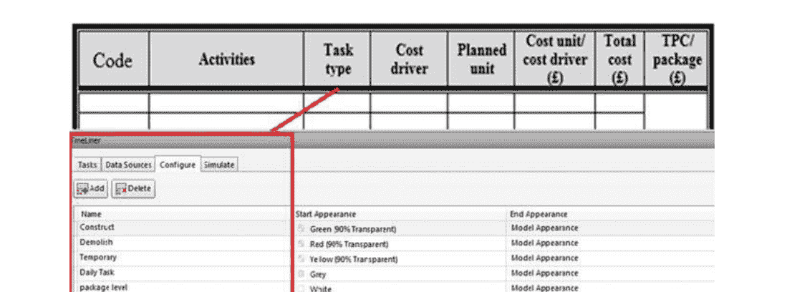

图5.1 ABC结构表与4D/5D BIM之间的相关性

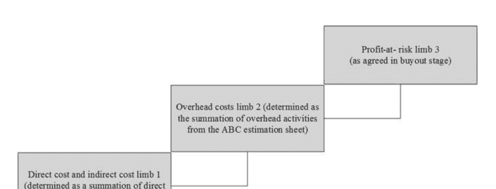

图5.2 使用ABC估算的IPD方法下的补偿

### 开发基于EVM的ABC扩展

表5.1展示了基于EVM和ABC的发展数学公式，用于确定业主和非业主方的风险/回报值。 可以看到每种情况都有相应的模型。 因此，这将使支付过程自动化（自动记录风险/回报值），从而加快采用IPD进行成功项目交付的速度。

开发了一个EVM网格来显示EVM的CPR和SPR的结果。 首先，EVM网格将项目分为四个区域（见图5.3），每个区域代表项目的情况，并通过特定的颜色进行区分。 然后，通过在网格上分配潜在的项目案例，每个区域都被划分为围绕计划点的小方块，同时考虑X轴作为进度和Y轴作为成本。 接下来，用户应确定CPR和SPR的值，并将它们作为正数或负数百分比输入到网格中，以确定每个里程碑或每个包的项目情况。此外，工料测量员应该标记CPR和SPR百分比后的方框，以确定项目执行阶段的累积进展。之后，根据开发的基于EVM的IPD网格的输出，将分享“风险利润”百分比。

表5.1 提出的基于EVM的ABC扩展

| 案例 | EVO | 开发的模型 | 术语 |
|------|-----|------------|------|
| 关于成本/进度 | EVO = 1 | (1) 奖励值 = (EVO) × P@R Per × MVoLIMB2<br>每个方当事方的MV或RD = <br>× PoO或PoNO (2) | MVoLIMB2代表LIMB2的货币价值 (£)；MV代表每个参与方的风险或回报的货币价值 (£)，PoO/PoNO代表业主或非业主方的比例 (%) |
| 提前完成和/或成本低于预算 | EVO > 1 | CSoOC for NO = ∑来自ABC表的CSoOOA + <br>∑来自ABC表的CSoOPA × NOARP (3)<br>sheet × O ARP (4) | CSoOC for NO代表非业主参与者的间接成本节约 (£)；来自ABC估算表的CSoOOA代表间接组织活动成本节约 (£)；来自ABC估算表的CSoOPA代表间接项目活动成本节约 (£)；NOARP代表非业主同意的回报比例 (%)；CSoOC for O代表业主参与者的间接成本节约 (£)；OARP代表业主同意的回报比例 (%) |
| 进度延误和/或成本超支 | EVO < 1 | 估算表 (5)<br>奖励价值 = ((OoEVMG - 1) + P@R每) × MVoP@R每) (6)<br>*AcronymExplanation See Glossary.* | DC代表直接成本（£）；ABC估算表中的DAC代表ABC表中的直接活动成本（BCWS）（£）；RV代表奖励价值（£）；MVoP@Rper代表风险利润百分比的货币价值（£） |

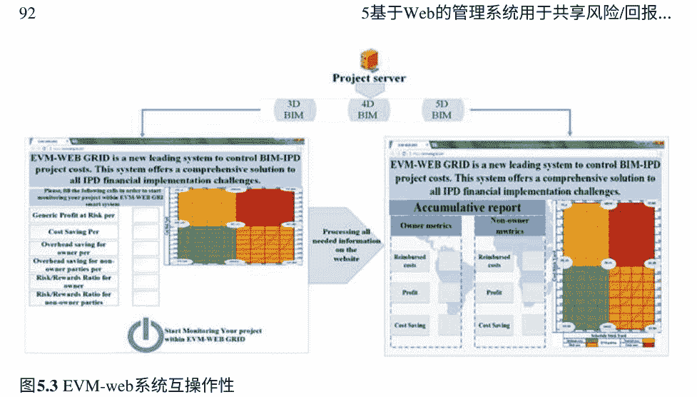

图5.3 EVM-web系统互操作性

### EVM-Grid Web系统与BIM的集成

所提出模型中的数据流将从文档和采购阶段流向竣工阶段，突出了每个阶段的BIM集成，如下所述。

在文档阶段，核心团队成员根据ABC进行成本估算，并将成本加载到相关活动中-无论该活动是直接的、间接的还是间接的。这可以通过使用5D BIM平台（即Navisworks）根据ABC级别配置其图层后进行成本估算来实现。

随后，可以通过将通过4D/5D BIM平台创建的数据导出到其他软件包（如Microsoft Project）来准备BCWS值。因此，采购阶段将进行，以就风险/回报和利益风险（P@R %）在业主/非业主方之间的百分比达成一致。随后，将同意的P@R%添加到BCWS中，以制定项目补偿方法。最后，将记录所有项目数据（每个包的BCWS、P@R百分比、风险/回报分享百分比），以确定施工阶段内的实际百分比。一旦进入施工阶段，项目经理应开始将项目信息（CPR和SPR）加载到EVM-Web网格中，如图5.5所示。

## 验证和结果分析

该模型应用于一个案例研究，一个房地产开发公司，其经理决定建造一座新房屋来验证提出的方法。实施IPD的成本可以从概念阶段确定到收购阶段。达成的补偿结构如下：（1）约定的风险利润百分比为20%，（2）用于项目级间接成本的节约成本分配百分比为非业主参与方70%，业主30%，（3）非业主风险/回报比为80，业主方为20%。尽管在现有的IPD模型中，业主不从P@R%中获得任何比例，但假设业主从P@R%中获得比例有两个原因。第一个原因是提供任何服务，例如参与管理项目工作流程。第二个原因是展示所提出框架在各种场景下的能力。（4）直接和间接成本限制（Limb 1）为£118,484.9；（5）Limb 2包括直接、间接和项目级间接成本，为£190,484.9；（6）Limb 3包括总成本和风险利润百分比，为£228,581.9。

### 确定风险/回报值

图5.4总结了上述情景的步骤和结果，以及对业主和非业主方实施框架的情况。实施EVM框架的好处是在IPD方法中在核心团队成员之间分配风险/回报，如前所述。所展示的情景显示了EVM输出小于和大于1的两种情况。根据开发的框架，按比例计算共享比例。

### BIM和EVM-Web系统的适用性和集成

为了展示BIM和EVM-web的应用，图5.5显示了情景（2）中呈现的数据。图5.5显示了为该案例研究开发的BIM维度（3D、4D和5D），所有项目数据将从这三个模型中检索，因为该案例研究支持IPD和BIM的集成。根据图5.5中清晰显示的4D BIM的审查，一些工作已经完成，里程碑1将在3月第1周结束。随后，项目各方应能够以图形或指标报告的方式跟踪整体绩效。

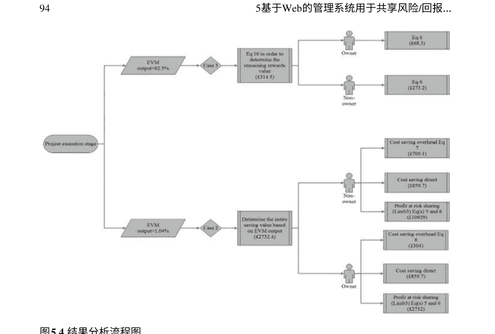

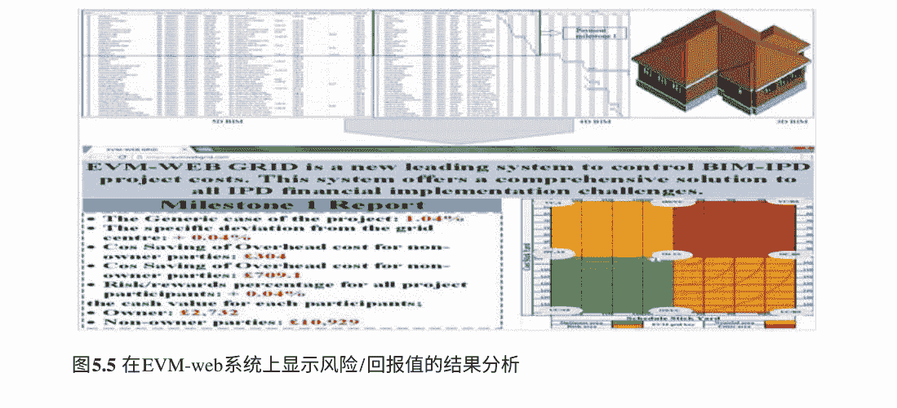

## 结论和未来方向

本研究提出了一种综合管理IPD方法中财务任务的方法。首先，对整个IPD成本管理过程进行访问，以确定弱点/能力点。然后，将ABC、EVM和BIM等方法集成到一个单一/动态过程中。

这项研究在几个方面是新颖的。本章介绍了一种创新的网格，用于定位成本绩效比（CPR）和进度绩效比（SPR），以说明项目在成本和进度方面的位置。此外，它将EVM-Grid与ABC估算方法集成在一起，以优化成本结构，从而积极反映在补偿结构中。此外，研究结果提出了考虑ABC表格使用的风险/回报共享模型，并区分直接成本和间接成本节约的新方向。该框架区分了维持/组织层和项目层的间接成本。此外，EVM-Grid已经开发成为一个Web系统，使参与者可以轻松跟踪他们的项目。

从实际角度来看，这些发现对于新手BIM用户来说将是非常宝贵的，因为所提出的模型简单易用。所有任务都与实施阶段保持一致，并且易于表达，以便新手用户能够及时收集所需数据。这项研究的干预和结果将用于基于Hyperledger fabric（区块链）开发自动化支付平台。

# 参考文献

-   Abrishami, S., Goulding, J., Pour Rahimian, F., & Ganah, A. (2015). 用于最大化AEC概念设计创新的虚拟生成BIM工作空间：未来机遇的范例。Construction Innovation, 15(1), 24–41.
-   Ahmad, I., Azhar, N., & Chowdhury, A. (2019). 信息和通信技术推动了IPD特性的增强。Journal of Management in Engineering, 35(1), 04018055. https://doi.org/10.1061/(ASCE)ME.1943-5479.0000670.
-   AIA. (2007). 综合项目交付：指南。从 https://www.aia.org/resources/64146-integrated-project-delivery-a-guide 检索于6月26日。
-   Aibinu, A., & Venkatesh, S. (2013). 澳大利亚BIM采用状况和造价顾问的BIM经验。《工程教育与实践中的专业问题杂志》, 140(3), 04013021. https://doi.org/10.1061/(ASCE)EI.1943-5541.0000193.
-   Allison, M., Ashcraft, H., Cheng, R., Klawens, S., & Pease, J. (2018). 综合项目交付：领导者的行动指南。
-   Banihashemi, S., Tabadkani, A., & Hosseini, M. R. (2018). 将参数化设计整合到模块化协调中：建筑废弃物减量工作流程。建筑自动化, 88, 1–12. https://doi.org/10.1016/j.autcon.2017.12.026.
-   Chou, J.-S., Chen, H.-M., Hou, C.-C., & Lin, C.-W. (2010). 用于评估项目绩效的可视化EVM系统。Automation in Construction, 19(5), 596–607. https://doi.org/10.1016/j.autcon.2010.02.006.
-   Das, T., & Teng, B.-S. (2001). 联盟结构的风险感知模型。国际管理杂志, 7(1), 1–29. https://doi.org/10.1016/S1075-4253(00)00037-5.
-   Eadie, R., Browne, M., Odeyinka, H., McKeown, C., & McNiff, S. (2013). BIM在英国建筑项目生命周期中的实施分析。Automation in Construction, 36, 145–151.
-   Elghaish, F., Abrishami, S., Abu Samra, S., Gaterell, M., Hosseini, M. R., & Wise, R. (2019). 使用BIM工具在集成项目交付(IPD)中开发的现金流系统框架。国际建筑管理杂志, 1–16.
-   Elghaish, F., Abrishami, S., & Hosseini, M. R. (2020a). 使用区块链的集成项目交付：一种自动化的财务系统。建筑自动化, 114, 103182. https://doi.org/10.1016/j.autcon.2020.103182.
-   Elghaish, F., Hosseini, M. R., Talebi, S., Abrishami, S., Martek, I., & Kagioglou, M. (2020b). 推动综合项目交付（IPD）成本管理实践成功的因素。可持续性, 12(22), 9539.
-   Fischer, M. J., Khanzode, A., Reed, D. P., & Ashcraft, H. W., Jr. (2017). 整合项目交付. Wiley. ISBN: 978-0470587355.
-   Hamledari, H., McCabe, B., Davari, S., & Shahi, A. (2017). 基于IFC的4D BIM的自动化进度更新。《土木工程计算》, 31(4), 04017012. https://doi.org/10.1061/(ASCE)CP.1943-5487.0000660.
-   Hartmann, T., Gao, J., & Fischer, M. (2008). 在建筑项目中3D和4D模型的应用领域。《建筑工程与管理杂志》, 134(10), 776–785. https://doi.org/10.1061/(ASCE)0733-9364(2008)134:10(776).
-   Holland, N. L., & Jr, D. H. (1999). 建筑承包商对间接成本的分类和分配。《建筑工程杂志》, 5(2), 49–56. https://doi.org/10.1061/(ASCE)1076-0431(1999)5:2(49).
-   Hosseini, M. R., Maghrebi, M., Akbarnezhad, A., Martek, I., & Arashpour, M. (2018). 建筑信息建模研究中的引用网络分析。《建筑工程与管理杂志》, 144(8), 04018064. https://doi.org/10.1061/(ASCE)CO.1943-7862.0001492.
-   Jacobsson, M., & Linderoth, H. C. (2010). 环境因素、参与者的参考框架和技术对建筑项目中ICT的采用和使用的影响：瑞典案例研究。《建筑管理与经济学》, 28(1), 13–23.
-   Khamooshi, H., & Abdi, A. (2016). 使用指数平滑技术的挣得工期管理进行项目工期预测。《工程管理学报》, 33(1), 04016032. https://doi.org/10.1061/(ASCE)ME.1943-5479.0000475.
-   Khanna, M., Elghaish, F., McIlwaine, S., & Brooks, T. (2021). 在发展中国家实施IPD方法的可行性研究。《建筑信息技术杂志》, 26, 902–921.
-   Kim, Y.-W., & Ballard, G. (2001). 基于活动成本核算及其在精益施工中的应用。在第9届国际精益施工学会年会上的论文集，新加坡，2001年8月。新加坡国立大学。
-   Latiffi, A. A., Mohd, S., Kasim, N., & Fathi, M. S. (2013). 建筑信息模型(BIM)在马来西亚建筑行业的应用。国际建筑工程与管理杂志, 2(4A), 1–6.
-   Lee, S.-K., Kim, K.-R., & Yu, J.-H. (2014). 基于BIM和本体论的建筑成本估算方法。建筑自动化, 41, 96–105. https://doi.org/10.1016/j.autcon.2013.10.020.
-   Li, J., Moselhi, O., & Alkass, S. (2006). 基于互联网的项目数据库管理系统。工程、施工和建筑管理, 13(3), 242–253.
-   Lin, Y.-C., Wang, L.-C., & Tserng, H. P. (2006). 通过基于网络地图的知识管理系统增强知识交流：台湾的经验教训。建筑自动化, 15(6), 693–705.
-   Lipke, W., Zwikael, O., Henderson, K., & Anbari, F. (2009). 项目结果的预测：将统计方法应用于挣值管理和挣值进度绩效指标。国际项目管理杂志, 27(4), 400–407. https://doi.org/10.1016/j.ijproman.2008.02.009.
-   Ma, Z., Zhang, D., & Li, J. (2018). 一个专门的协作平台用于集成项目交付。建筑自动化, 86, 199–209. https://doi.org/10.1016/j.autcon.2017.10.024.
-   Mignone, G., Hosseini, M. R., Chileshe, N., & Arashpour, M. (2016). 通过组织间断理论增强基于BIM的建筑网络中的协作：新的阿德莱德皇家医院的案例研究。建筑工程与设计管理, 12(5), 333–352. https://doi.org/10.1080/17452007.2016.1169987.
-   Miller, J. A. (1996). 在日常运营中实施基于活动的管理. Wiley. ISBN: 9780471040033.
-   Naeni, L. M., Shadrokh, S., & Salehipour, A. (2011). 一种模糊方法用于挣值管理。国际项目管理杂志, 29(6), 764–772. https://doi.org/10.1016/j.ijproman.2010.07.012.
-   Oraee, M., Hosseini, M. R., Papadonikolaki, E., Palliyaguru, R., & Arashpour, M. (2017). 基于BIM的建筑网络中的协作-文献计量-定性综述。国际项目管理杂志, 35(7), 1288–1301. https://doi.org/10.1016/j.ijproman.2017.07.001.
-   Ozorhon, B., Karatas, C. G., & Demirkesen, S. (2014). 用于管理建筑项目知识的基于Web的数据库系统。Procedia-Social and Behavioral Sciences, 119, 377–386.
-   Pajares, J., & López-Paredes, A. (2011). EVM分析的扩展用于项目监控：成本控制指数和进度控制指数。国际项目管理杂志, 29(5), 615–621. https://doi.org/10.1016/j.ijproman.2010.04.005.
-   Pärn, E. A., & Edwards, D. J. (2017). FinDD API/插件的概念化：BIM-FM集成研究。Automation in Construction, 80, 11–21. https://doi.org/10.1016/j.autcon.2017.03.015.
-   Pishdad-Bozorgi, P., & Srivastava, D. (2018). 从合作的角度评估集成项目交付（IPD）的风险和奖励共享策略：一种博弈论方法。在2018年建筑研究大会上发表的论文，新奥尔良，路易斯安那州。https://doi.org/10.1061/9780784481271.020.
-   PMI. (2013). 项目管理知识体系指南（PMBOK®指南）（第5版）。项目管理协会。ISBN: 978-1-935589-67-9.
-   Rahimian, F. P., Goulding, J. S., Abrishami, S., Seyedzadeh, S., & Elghaish, F. (2021). 建筑设计和施工的工业4.0解决方案：新机遇的范例（第1卷） Routledge. ISBN: 1003106943.
-   Rowlinson, S. (2017). 建筑信息模型，集成项目交付等等。建筑创新, 17(1), 45–49. https://doi.org/10.1108/CI-05-2016-0025.
-   Roy, D., Malsane, S., & Samanta, P. K. (2018). 识别集成项目交付采用的关键挑战。精益建筑杂志.
-   Söderholm, A. (2006). Kampen om kommunikationen. Kampen om kommunikationen - Om projektledningens Informationsteknologi. Research report, Royal Institute of Technology.
-   Wang, K.-C., Wang, W.-C., Wang, H.-H., Hsu, P.-Y., Wu, W.-H., & Kung, C.-J. (2016). 应用建筑信息模型来整合进度和成本以建立施工进度曲线。Automation in Construction, 72, 397–410. https://doi.org/10.1016/j.autcon.2016.10.005.
-   Wexler, M. N. (2001). 知识映射的何人、何物和何因。Journal of Knowledge Management, 5(3), 249–264.
-   Zahra Kahvandi, E. S., Ravasan, A. Z., & Mansouri, T. (2018). 基于FCM的动态建模集成项目交付在建筑项目中的挑战。精益施工杂志(2018), 63–87.
-   Zellmer-Bruhn, M., Caligiuri, P., & Thomas, D. C. (2016). 编辑观点：国际商务研究中的实验设计。国际商务研究杂志, 47(4), 399–407. https://doi.org/10.1057/jibs.2016.12.
-   Zhang, L., Cao, T., & Wang, Y. (2018). 领导风格在综合项目协作中的调解作用：情商视角。项目管理国际期刊, 36(2), 317–330. https://doi.org/10.1016/j.ijproman.2017.08.014.
-   Zhang, L., & Li, F. (2014). 综合项目交付的风险/回报补偿模型。工程经济学, 25(5), 558–567.

## 第六章 利用深度学习改进建筑工地管理任务

摘要 数字建设转型需要利用新兴数字技术，如深度学习，来自动...弥合揭示的知识差距。

关键词 深度学习 · 物联网(IoT) · 自动化健康与安全警告 · 进度监测 · 物体检测

## 介绍

数字化建筑的转型需要采用不同的新兴技术来自动化大部分建筑任务。 其中一种技术是人工智能(AI)。采用人工智能可以为建筑行业带来多种好处(Blanco et al., 2018; Cao et al., 2021)。在过去几年中，人工智能得到了改进，并且开发了不同的子集以提供更广泛的解决方案。例如，深度学习被定义为一组包含多个处理层的计算模型，用于学习不同类型数据的表示，具有不同的抽象级别(LeCun et al., 2015)。尽管在过去几年中开始了深度学习在建筑行业中的研究，但这方面的研究密度主要集中在使用深度学习来检测建筑物和路面的损伤(Hou et al., 2020; Qin et al., 2021)。然而，深度学习也被用于开发解决方案，以自动化建筑工地管理任务，包括设备检测、工地健康与安全、劳动力管理和进度评估。

整合不同的新兴技术是发展可行解决方案的高度推荐，作为数字建筑转型的一部分(Elghaish et al., 2021a, 2021b)。深度学习与其他新兴数字技术的结合始于2015年，用于使用物联网(IoT)传感器自动识别对象，如工人和设备。

有一些尝试对建筑行业的深度学习应用进行回顾。然而，大多数研究要么专注于损害检测，要么是一般性的回顾。例如，Elghaish等人(2021a, 2021b)研究了关于利用深度学习检测路面和建筑物损害的最近发表的文章。此外，Akinosho等人(2020)提出了一项研究，总结了建筑行业中不同的深度学习应用。然而，建筑工地管理应用并未得到重点强调。因此，有必要进行这样的研究，对现有和未来的深度学习应用进行批判性分析，以增强建筑工地管理实践。

对181篇文章进行了科学计量分析。主要揭示的建筑管理应用基于深度学习的是工地工人的健康和安全；管理风险项目中的机器，如挖掘机；风险预测；进展监测。同时，一些应用在分析中具有低密度水平，例如决策制定、设计防护服和智能城市。对每个主题的所有发表文章进行了分析，以突出研究知识的差距。

在本研究中，考虑了三种类型的分析：科学计量分析以分析发表文章之间的关系（主题），以突出应用领域中最具成就的领域。主题分析将应用（发表文章）分类到特定主题中。最后，差距分析根据研究重点、方法、发现和限制，分析每个领域的关键发表文章。

考虑到以上所有内容，本文提供了深度学习与新兴数字技术相结合来管理建筑管理任务，特别是现场管理操作的利用的清晰视角。这将使未来的研究人员能够找到关键发表文章中的知识空白和现有解决方案的成熟水平，随后努力填补上述空白或提高现有应用的成熟水平。

## 方法和逻辑

Wright (2020) 确定文献综述的差距分析是为了找到任何研究、文献综述或项目分析中的遗漏部分。因此，本研究在 Scopus 数据库中搜索相关文章。本研究讨论了深度学习在建筑管理中与物联网等新兴数字技术的应用。因此，使用了特定的关键词来检索相关文章，如（深度 AND 学习 AND 在 AND 建筑中） AND （LIMIT-TO (DOCTYPE, “ar”)） AND （LIMIT-TO (SUBJAREA, “ENGI”)） AND (LIMIT-TO (EXACTKEYWORD, “建筑设备”) OR LIMIT-TO (EXACTKEYWORD, “物体识别”) OR LIMIT-TO (EXACTKEYWORD, “建筑工地”) OR LIMIT-TO (EXACTKEYWORD, “监测”) OR LIMIT-TO (EXACTKEYWORD, “项目管理”) OR LIMIT-TO (EXACTKEYWORD, “建筑工人”) OR LIMIT-TO (EXACTKEYWORD, “质量控制”) OR LIMIT-TO (EXACTKEYWORD, “数据采集”) OR LIMIT-TO (EXACTKEYWORD, “自动化”) OR LIMIT-TO (EXACTKEYWORD, “挖掘”) OR LIMIT-TO (EXACTKEYWORD, “大数据”) OR LIMIT-TO (EXACTKEYWORD, “建筑项目”) OR LIMIT-TO (EXACTKEYWORD, “建筑安全”) OR LIMIT-TO (EXACTKEYWORD, “建筑设计”) OR LIMIT-TO (EXACTKEYWORD, “可视化”) OR LIMIT-TO (EXACTKEYWORD, “决策制定”) OR LIMIT-TO (EXACTKEYWORD, “风险评估”))。之后，结果被精炼为仅包括 2015 年至 2021 年间发表的文章和“Q1 和 Q2”期刊。

Mooghali 等人（2012）指出，科学计量分析是衡量科学产出进展和定义与文献计量学和信息学重叠兴趣的有效方法。因此，所述搜索的结果是 181 篇期刊文章。进行了科学计量分析，以检查这些广泛应用之间的关系和每个应用的密度。随后，使用主题分析对深度学习和新兴数字技术在建筑管理中的应用进行分类，并通过进行更多研究来定义需要弥合的能力和弱点。图 6.1 显示了进行这种科学计量、主题和差距分析研究的过程。因此，建议使用扫描和浏览技术来获取研究文章中呈现的主题并对相关文章进行排序（Machi & McEvoy, 2016）。因此，对结果进行了分析和分类，以主题和子主题进行批判性分析，以突出研究的目的、方法和局限性。

## 科学计量分析

图 6.2 展示了深度学习应用与新兴数字技术在建筑行业中的进展。可以看到基于深度学习的新兴技术（如物联网、建筑信息模型、射频识别等）的利用始于 2015 年，并从 2018 年开始稳步增加。这表明深度学习与新兴技术在过去五年中受到了重视。

大多数选定的出版物发表在排名靠前的期刊上，如图 6.3 所示。例如，自动化建筑杂志发表了 36 篇文章，计算民用工程杂志发表了 8 篇文章，建筑工程与管理杂志发表了另外八篇文章。

图 6.4 显示了 (m = 181) 篇论文的网络分析。从图 6.4 可以看出，深度学习和新兴数字技术的集成具有特定的用途，即设备管理、智能安全警告、现场劳动生产力管理、项目进展监控和风险挖掘机检测。图 6.5 展示了分析 (n = 181) 篇论文中提到的应用的密度。物联网技术在集成深度学习中得到广泛应用，提供了多种可行的解决方案。

图 6.3 可靠数据收集的示例来源

| Source | Documents |
| :--- | :--- |
| Automation In Construction | 36 |
| Journal Of Computing In Civil Engineering | 8 |
| Journal Of Construction Engineering And Management | 8 |
| Computer Aided Civil And Infrastructure Engineering | 3 |
| Engineering Construction And Architectural Management | 3 |
| Sensors Switzerland | 3 |

## 现场物体和信息检测

### 现场检测

表 6.1 包括基于目标和信息检测的深度学习的主要研究。文章被分为两个主要应用：现场检查和施工进度监测。从表 6.1 可以看出，大多数与目标检测相关的文章侧重于使用深度学习来检测结构钢筋的位置，检查预制构件的准确性，特别是桥梁的大型构件，以及检测隧道中的大型岩石碎片。

关于信息检测，大多数出版物都与在执行日常任务时收集工人和设备信息有关。

### 自动化进度监控

表 6.2 列出了基于深度数据学习分析自动化进展监测的关键发表文章。这些应用主要集中在：（1）将现场执行的工作与预期（计划）设计模型进行比较，（2）分析设备的运动并估计生产力。

### 分析项目历史记录

表 6.3 包括了利用深度学习分析以往现场报告的历史记录来分类和预测问题/事故的研究文章，从而避免新项目中出现这些问题的原因。

这些应用存在一些限制，包括训练数据集有限，需要手动标注数据。秦等人（2021）利用深度卷积网络和数据增强技术，开发了一种从 GPR 图像中自动识别隧道衬砌元素的方法，以便于隧道衬砌检查。然而，该研究基于个人经验而不是真实情况，对 GPR 图像进行了手动标注的训练和测试。因此，网络的性能可能受到人工判断的影响。为了实现实时泥土分析，辅助隧道掘进机（TBMs），周等人（2021）开发了一种基于深度学习的方法，用于获取岩屑的粒度分布和形状估计。然而，泥土图像的注释准确性还需要进一步提高。由于岩屑是通过在图像上绘制多边形进行标注的，它们复杂的轮廓无法被准确地注释，导致地面真实性的降低。在其他情况下，分类可能是一个多标签文本分类任务。为了避免发生多个类别的事故，钟等人（2020）建议根据识别主要和首次出现的情况分配标签。

表 6.1 使用深度学习进行物体和信息检测的文章

| 作者/年份 | 研究重点 | 方法 | 局限性 |
| :--- | :--- | :--- | :--- |
| **现场检查** | | | |
| 秦等人（2021年） | 开发一种自动识别方法，用于识别隧道衬砌中的钢筋、空洞和初始衬砌 | 基于 Mask R-CNN | 训练和测试 GPR 图像是根据个人经验而不是地面真实情况进行手动标记的。因此，网络的性能可能受到人工判断的影响 |
| Kruachottikul 等人（2021） | 开发一种用于钢筋混凝土桥梁下部结构的视觉缺陷检测系统，以支持现场检查员开发更快速、准确度高的缺陷检测和检查流程 | 通过使用改进的 ResNet-50 CNN 模型和 ANN | 在这项研究中，桥梁图像数据集的数量有限。此外，本研究中的严重程度预测仍限于二进制输出 |
| Zhou 等人（2021年） | 利用深度学习技术解决复杂垃圾图像中岩石碎片的自动分割问题，以确定岩石碎片的大小和形状 | 基于深度学习方法，包括具有多尺度输入和侧输出（MSD-UNet）的双 UNet 和后处理算法 | 在过程中出现了过分割的问题 |
| Yang 等人（2021年） | 利用卷积神经网络检测隧道掘进机产生的大型岩石碎片 | 基于卷积神经网络（CNN）的 AlexNet | 缺乏开源的岩石碎片数据集 |
| **现场对象和信息检测** | | | |
| Wang 等人（2021年） | 实现对建筑工地对象的综合视觉理解 | 基于 DeepLabV3+ 网络，数据增强和迁移学习 | 人们担心系统需要多少 mIoU 才足够可靠 |
| Lu 等人 (2021年) | 用于估计填充因子和定位施工现场上手动控制和自主施工车辆的铲斗 | 通过将 ResNet 整合到 Faster R-CNN 中进行填充因子估计和铲斗检测 | 该研究重点关注一种施工车辆 |
| Hou 等人 (2020年) | 用于检测结构内的物体 | 基于深度监督目标检测器（DSOD） | 数据集数量有限 |
| Sharma 和 Sen (2020) | 用于检测关节损伤以定位半刚性框架中的弱化关节 | 基于 CNN 架构 | 所提出的方法观察到显著降低的误报/漏报警报 |
| Fang 等人 (2020a年) | 为了增强单目视觉技术，以帮助实现安全预警、活动识别和生产力分析，对于定位建筑相关实体的技术 | 基于 Mask R-CNN 模型 | 最大的限制是如果遮挡物阻挡了实体的关键部分，提出的方法无法知道图像中实体的位置 |
| 郭等人 (2020年) | 精确检测多个建筑车辆的密度 | 基于深度学习和卷积神经网络的端到端方法，使用来自无人机的图像 | 深度学习模型的复杂性几乎无法部署到无人机上实现实时在线检测 |
| 元等人 (2020年) | 为了定位建筑资源，以了解建筑工地的背景 | 基于无人机平台，集成 RFID 接收器并基于深度学习、LSTM 模型处理收集的信号 | 仍然可能存在高层建筑的障碍物，如塔吊、电线杆和电线，这可能对平台的运作产生不利影响 |

如果在事故识别过程中可能发生多个事件，就可能出现无法控制或意外的行动。然而，金等人（2020年）进行的一项有趣研究开发了一种施工监测方法，可以节省人工标注所需的时间和成本，从而提高视觉系统在施工现场的实际可接受性。

表 6.1 (续)

| 作者/年份 | 研究重点 | 方法 | 局限性 |
| :--- | :--- | :--- | :--- |
| 王等人（2019年） | 自动检测历史砖砌结构的损坏 | 基于深度卷积神经网络，用于识别和定位砖砌结构的两类损伤：盐华和剥落 | 通过扩展数据库，增加更多类型的损伤、损伤与摄像机之间的距离和角度的范围，以及更多类型的结构样本，可以提高检测精度。 |
| 郑等人（2020年） | 自动检测实时模块化建筑中的进度监控和控制 | 通过结合迁移学习（基于 Mask R-CNN 的模型）和虚拟原型技术 | 该研究仅关注从图像或视频中检测模块，而未考虑从一个摄像头到另一个摄像头的模块跟踪 |

一个关键限制是如果遮挡物阻挡了实体的关键部分，提出的方法无法知道实体在图像中的位置。在 Fang 等人（2020a, 2020b）的研究中，他们的方法的一个关键缺点是实体关键部分的遮挡对结果产生了影响。Luo 等人（2020年）报告了其他提出的方法的类似缺点，即设备的关键点被遮挡导致了错误的估计结果。此外，背景的复杂性会影响物体检测。在他们的研究中，Guo 等人（2020年）注意到背景越复杂，物体检测就越困难。Nath 等人（2020年）指出，基于视觉的检测方法的主要局限性之一是它们容易受到遮挡、光照不良和模糊的影响。

两个常见的限制与 CNN 模型作为黑盒子有关，多层非线性结构的透明度不足仍然是一个常见问题。杨等人（2021年）在他们的研究中报告了这个问题，当他们使用 CNN 模型来检测大型岩石碎片时。低误报/漏报警报是几项研究中普遍存在的限制。Sharma 和 Sen（2020年）指出，他们提出的方法观察到了非常低的误报/漏报警报。

有限的数据严重阻碍了用于自动化建筑的深度学习模型的训练。几项研究强调了图像数据集数量有限的问题。例如，Kruachottikul 等人（2021年）在开发深度学习的视觉缺陷检测系统时报告了图像数据集数量有限的挑战，用于钢筋混凝土桥梁下部结构。Hou 等人（2020年）的研究由于数据集数量有限，未能比较多组测试实验，以确定所提出系统的有效性和普适性。Wang 等人（2019年）建议扩大数据库以克服这一限制，并提高其所提出系统的准确性。为了克服这个问题，郑等人（2020年）使用基于 Mask R-CNN 的模型自动检测模块安装过程中的模块。他们的研究方法证明在现实数据不足的情况下，实施深度学习方法在建筑行业中是有效的。

表 6.2 主要文章的自动进展监测

| 作者/年份 | 研究重点 | 方法 | 局限性 |
| :--- | :--- | :--- | :--- |
| Braun 等人 (2020年) | 通过验证与数字模型中的预期数据相比的元素类别，支持进展监测 | 通过使用 Structure-from-Motion 过程提供的附加信息（图像和相机位置），以及设计好的建筑信息模型（语义数据、元素的几何表示以及元素的位置和依赖关系） | 需要手动步骤来找到准确的方向和缩放 |
| Kim 等人 (2020年) | 开发一种基于视觉的施工现场监测工具 | 基于深度主动学习方法 | |
| Rashid 和 Louis (2019) | 开发一种自动、实时、可靠的施工设备活动识别框架，用于监测和评估施工现场的生产力、安全性和环境影响 | 基于 LSTM 的活动识别框架，使用多个附加在不同关节元素上的 IMU | 数据的手动标注 |
| 罗等人 (2020年) | 开发一个框架，以便在建筑工地上实时监测安全情况 | 使用计算机视觉和深度学习技术 | 建筑设备的位置在施工活动期间可能会发生变化，这意味着在估计全身姿势时也应考虑设备的位置信息 |

表 6.3 利用深度学习分析项目历史记录

| 作者/年份 | 研究重点 | 方法 | 局限性 |
| :--- | :--- | :--- | :--- |
| 钟等人 (2020年) | 为了能够自动分类和可视化事故叙述，从而帮助提高决策的效果 | 通过将自然语言处理与卷积神经网络深度学习相结合，然后使用视觉网络分 | NA |
| Nath 等人 (2020年) | 开发和评估三种基于深度学习的方法来验证工人的个人防护设备合规性，即工人是否佩戴安全帽、背心或两者都佩戴 | 基于 You-Only-Look-Once (YOLO) 架构构建 | 基于视觉的检测方法的主要局限性之一是容易受到遮挡、光照不良和模糊的影响 |
| Fang 等人 (2020年b) | 自动分类包含在安全报告中的近失数据，以便使现场工程师和管理人员更好地了解可能存在于建筑工地上的危险的细微差别 | 基于深度学习的方法，使用双向转换器进行语言理解 (BERT) | 由于类别过多 (L = 170)，开发的模型无法 100% 准确地分类近似事故报告，其中包含的事件太少 |

## 6 深度学习改进建筑工地管理任务

### 利用深度学习提高健康和安全性

尽管安全问题几十年来一直是建筑行业的关注重点，但全球范围内的行业职业健康和安全记录仍然不尽人意。这是因为建筑工地是最困难的环境之一，可能发生许多潜在的危险。为了提高行业的安全表现，许多研究提出了使用深度学习来增强建筑工地安全。

文献综述发现了两个主要相关主题：健康和安全文本分析以及使用图片、视频和传感器进行健康和安全监测。

### 安全文本分析

如今，建筑行业增加了数字化记录的安全报告的可用性。这影响了我们开发利用这些数据来改善对建筑安全和风险的理解和行动的需求。例如，Jallan 和 Ashuri (2020) 创建了一种最先进的学习方法使用名为 FastText 的算法来识别风险和安全模式，并将文本分类为适当的风险类型。另一项研究专注于文本分析，通过开发双向长短期记忆和条件随机场（Bi-LSTM-CRF）模型和知识表示学习（KRL）模型（Wu 等，2021年）来改善安全性，有效管理施工约束。其他研究使用先进的深度学习架构进行自然语言处理（NLP），卷积神经网络（CNN）和分层注意力网络（HAN），自动分类事故叙述并从施工事故报告中学习伤害前兆（Baker 等，2020年；Zhong 等，2020年）。

## 安全监测

正如前面所述，建筑工地是最危险的环境之一，可能发生许多潜在的危险。这提高了对监测和检测施工活动、施工工人和施工机械的重要需求。因此，许多研究都专注于使用深度学习应用来检测和监测施工现场、工人和设备。

## 建筑工地安全

在建筑、工程、施工和设施管理（AEC/FM）中，现场测量对于施工进展监测等活动至关重要。表 6.4 显示了许多使用深度学习方法改善施工现场安全性的研究。Angah 和 Chen（2020）应用了一种原始的深度学习架构（上下文编码器模型），通过去除图像中的冗余对象和背景环境来消除常常妨碍视野的移动障碍物。因此，清晰的施工图像将积极影响施工活动场景。图像字幕的一般模型架构是通过将编码器-解码器框架与深度神经网络相结合来建立的（Liu 等，2020）。另一项研究使用基于视觉的方法自动生成施工视频的亮点，以支持安全控制（Xiao，Yin 和 Kang，2021）。Lin 等人（2021b）研究了使用深度学习方法分析施工现场的连续图像和数据。数据分析包括四个步骤：目标检测、目标跟踪、动作识别和操作分析，其中使用了 Faster R-CNN、SORT 方法、将 CNN 和长短期记忆（LSTM）相结合的混合模型和折线图（Lin 等，2021a, 2021b）。施工现场数据分析将增强对不安全条件的识别。Kim 等人（2021）使用深度学习、基于游戏引擎的 ITCP 和无人机系统（UAS）作为安全监控系统，有效地识别不安全条件。

表 6.4 施工现场安全

| 作者/年份 | 研究的重点 | 方法 | 局限性 |
| :--- | :--- | :--- | :--- |
| Angah 和 Chen (2020) | 本研究应用上下文编码器来去除图像中的冗余对象，并修复背景环境 | 基于深度学习架构的 U-Net | 图像是在特定时间拍摄的，以避免其他设备或材料的干扰<br><br>因此，模型需要用更完整的数据集进行训练 |
| Liu 等人 (2020年) | 本研究提出了一种基于图像字幕的自动化方法，用于展示施工活动场景，这是一种基于计算机视觉和自然语言生成的方法 | 图像字幕的通用模型架构通过将编码器-解码器框架与深度神经网络相结合来建立 | 尚未在实际案例研究中实施 |
| Xiao, Yin 等人 (2021年) | 系统地和简洁地获取和存储有用的视频素材，以优化项目管理任务，如生产力分析和安全控制 | 提出一种基于视觉的方法，从建筑视频中自动生成视频亮点，以支持项目管理任务，如生产力分析和安全控制 | 所提出的方法仅在显著减少视频存储空间和高效索引建筑视频素材方面为建筑管理带来潜在的好处 |
| Lin 等人 (2021a, 2021b) | 提出对连续图像序列进行分析，自动识别不规则操作并进行可视化 | 利用 Faster R-CNN、Simple Online and Realtime Tracking (SORT) 方法、集成 CNN 和 LSTM 的混合模型以及线图 | 提出的图像分析框架仅在土方工程中进行了验证。<br><br>此外，多台挖掘机和其他活动的场景尚未经过测试。 |

在建筑工地上，对安全行为和条件的检查严重依赖于有限的人力。这引发了对高效自动化方法的需求，以识别和检测不安全的条件。Kolar 等人（2018）专注于使用卷积神经网络（CNN）开发安全护栏检测模型。Shen 等人（2021b）已经开发了用于建筑工地上二维（2D）物体的自动化识别，以提高工地安全。他使用了增强的特征金字塔网络、R-CNN、自动相机参数估计、基于视觉的方法和空间滤波器。

# 表6.4（续）

| 作者/年份 | 研究的重点 | 方法 | 局限性 |
| --- | --- | --- | --- |
| Kim等人（2021） | 为了有效地识别由于内部交通控制计划（ITCP）与安全监测系统之间缺乏集成而导致的不安全条件。 | 通过利用无人机系统（UAS）、基于游戏引擎的ITCP和深度学习，提出了一种新颖的安全监测系统的概念 | 用于训练深度学习模型的航空影像数量较少 |
| Kolar等人（2018） | 本研究开发了一种安全护栏检测模型 | 基于卷积神经网络（CNN） | 本研究仅使用了一种类型的安全护栏数据集。此外，本研究未考虑遮挡情况，假设护栏始终可见 |
| Shen等人（2021b） | 利用2D目标检测、实例分割和相机视觉计算伪光探测和测距（LiDAR）点云进行3D物体识别 | 增强特征金字塔网络、R-CNN、自动相机参数估计、基于视觉的方法和空间滤波器 | AIM数据集和我们的新数据集很少包含一些挑战，如雾、灰尘和雨天。此外，数据集只包括一种带有口罩的重型设备。最后，深度估计范围有限。 |

### 建筑工人检测

许多研究认识到建筑工人的行为和位置，为安全管理提供有益信息。不同的深度学习方法被用于改进建筑工人的检测（见表6.5）。Yu等人（2021）对建筑工人的姿势相关数据进行了回顾和评估。Son等人（2019）使用（ResNet-152）和边界框回归以及从原始图像中通过（R-CNN）进行标注，以更准确、更快速地检测建筑工人。Roberts、Torres Calderon、Tang和Golparvar-Fard（2020）还使用了一种新颖的深度学习方法，利用建筑工人操作的红绿蓝（RGB）视频镜头来跟踪二维（2D）工人姿势。Son和Kim（2021）通过使用（CMOS）图像传感器和基于CNN的YOLO和Siamese网络，开发了一种集成建筑实时工人检测和跟踪方案。运动传感器在其有效性方面进行了研究。

### 表6.5 建筑工人的检测

| 作者/年份 | 研究的重点 | 方法 | 局限性 |
|---|---|---|---|
| 于等人 (2021) | 回顾以前的方法来收集与建筑工人姿势相关的数据 | (1) 总结建筑管理中与姿势相关数据收集的工作原理和应用 (2) 基于数据质量和在建筑工地上的可行性对上述方法进行比较 | 研究中没有考虑姿势相关数据在机器人技术中的应用。此外，它只在模拟案例中使用，而不是在现场应用 |
| 孙等人 (2019) | 在图像序列中准确快速地检测不同姿势下的建筑工人，并对不断变化的背景进行检测 | 基于非常深的残差网络（ResNet-152）和来自原始图像的边界框回归和标记（R-CNN） | 该研究仅检测建筑工人，没有包括其他项目实体，如建筑设备 |
| Roberts等人 (2020) | 本研究估计和跟踪二维（2D）工人姿势，并在给定建筑工人操作的红绿蓝（RGB）视频镜头的输入下输出每帧工人活动标签 | 使用一种新颖的深度学习方法。使用317个注释视频的砖砌和抹灰操作来训练和验证所提出的方法 | 数据集包含单个工人的视频。此外，本文仅关注砖砌和抹灰活动的视频。最后，未考虑建筑工人之间的潜在互动 |
| Son和Kim (2021) | 本研究提出了一种使用互补金属氧化物半导体（CMOS）图像传感器进行实时监测的综合建筑工人检测和跟踪方案 | 基于第四版的你只看一次（YOLO）和连体网络，这些网络基于卷积神经网络 | 这项研究仅使用现有的公开可用数据集。需要收集额外的数据集来训练该过程，以进一步改进网络的可靠性。 |
| 金南金和Cho (2021) | 本研究提出了用于识别建筑工人动作的长短期记忆（LSTM）网络。 | 通过在一个桥梁建设现场和两个道路铺设现场进行案例研究，验证了LSTM网络的有效性。 | 开发的网络无法识别手部动作，例如摆动和握持工具或材料。 |
| 金南金和Cho (2020) | 本研究提出了一种使用长短期记忆（LSTM）的建筑工人动作识别模型。 | 1. 生成包含从不同身体部位传感器收集的运动传感器数据的不同数据集。比较使用数据集、所需的数字和运动传感器位置训练的五种机器学习模型的性能。 | 这些数据集并非来自真实的建筑工人 |
| Yu等人 (2019b) | 本文提出了一种基于联合级别的基于视觉的建筑工人人体工学评估工具（JVEC），可以根据建筑视频自动和详细地评估建筑工人的人体工学情况 | 该研究利用先进的深度学习方法从视频中提取建筑工人的骨骼数据 | 目前的JVEC版本只能应用于仅包含一个工人的帧。此外，现场实验仅为每个工人记录了10分钟的视频。需要更长的视频 |
| Yu等人 (2019a) | 该研究提出了一种新颖的非侵入式方法，利用计算机视觉监测建筑工人的全身力疲劳情况 | 基于计算机视觉的3D动作捕捉算法，可以使用RGB摄像头对各个身体部位的运动进行建模 | 本研究中的3D运动估计方法在存在严重视觉障碍或自上而下的视角时无法提供准确的3D运动估计。此外，本研究手动识别了工人的工作/休息状态。 |

通过使用长短期记忆（LSTM）网络（Kinam Kim & Cho，2020，2021），开发了一个基于数字和位置的施工工人运动检测模型。

其他研究集中于使用深度学习方法检测和评估建筑工人的健康状况。Yu等人（2019b）使用先进的深度学习方法和建筑工人的骨架数据从视频中开发了自动和详细的人体工程学评估方法。Yu等人（2019a）的另一项研究是开发一种非侵入式的计算机视觉方法，用于监测建筑工人的全身力疲劳。

### 建筑机械检测

跟踪建筑机械是自动化监控建筑安全的重要步骤。然而，目前基于视觉的跟踪方法无法实现高精度的跟踪。许多研究通过实施各种深度学习方法来解决这个问题（表6.6）。为了简化建筑机械的跟踪，肖和康（2021a）通过手动收集了1万张图像，开发了一个名为阿尔伯塔建筑图像数据集（ACID）的图像数据集。该数据集使用了四种现有的深度学习目标检测算法Inception-SSD，Faster-RCNN-ResNet101，Inception-SSD和YOLO-v3进行验证。此外，肖和康（2021b）提出了一种名为建筑机械跟踪器（CMT）的基于视觉的方法，用于跟踪视频中的多个建筑机械。肖等人（2021）还提出了一种专门用于夜间自动跟踪建筑机械的基于视觉的方法，通过整合深度学习照明增强技术。Slaton等人（2020）进一步提出了一个框架来识别建筑设备的活动。通过使用深度学习架构预测通过加速度计监测的重型建筑设备的活动。

深度学习方法的其他应用是为了增强建筑机械的跟踪和操作。Shi等人（2020）提出了一个深度、短期记忆网络，用于预测不同制动类型的刹车踏板开度。Lee等人（2020）提出了一种用于检测过载的自动技术（DeTECLoad）使用混合卷积神经网络-长短期记忆来同时预测载重和姿势。

### 表6.6 建筑机械检测

| 作者/年份 | 研究的重点 | 方法 | 局限性 |
| --- | --- | --- | --- |
| 肖和康 (2021a) | 本研究提出了一个关于开发专门用于建筑机械的图像数据集的案例研究，名为阿尔伯塔建筑图像数据集（ACID） | 在ACID的情况下，手动收集了10,000张图像。为了验证ACID的可行性，使用了四种现有的深度学习目标检测算法，包括YOLO-v3、Inception-SSD、R-FCN-ResNet101和Faster-RCNN-ResNet101。 | ACID数据集仅用于目标检测任务。 |
| 肖和康 (2021b) | 本研究提出了一种基于视觉的方法，称为施工机械跟踪器（CMT），用于跟踪视频中的多个施工机械。 | 所提出的CMT被整合到一个分析挖掘机生产力的框架中，并实现了96.9%的准确率。 | 本研究仅适用于跟踪施工机械。 |
| 肖等人 (2021) | 为了减少夜间施工中由于低照明条件和疲劳环境而导致的事故风险。 | 本研究提出了一种基于视觉的方法，专门用于在夜间自动跟踪建筑机械，通过整合深度学习照明增强技术 | 这项研究仅适用于从夜间视频中跟踪建筑机械 |
| Slaton等人 (2020) | 本文提出了一种建筑设备活动识别框架，利用深度学习架构预测通过加速度计监测的重型建筑设备的活动 | 将简单的基线卷积神经网络（CNN）的性能与同时包含卷积和循环短期记忆（LSTM）层的混合网络进行比较 | 获取更多的训练数据以提高模型的准确性和可靠性 |
| Shi等人 (2020) | 本研究提出了一种深度长短期记忆网络，用于预测不同制动类型的制动踏板开度 | 通过将不同驾驶环境中经验丰富的驾驶员的驾驶数据与深度学习相结合 | 本研究仅使用了在有限驾驶环境中将经验丰富的驾驶员的驾驶数据与机器学习相结合的方法来实现刹车踏板的预测 |
| 李等人（2020） | 本研究提出了一种用于预测载重量和姿势的过载检测技术（DeTECLoad） | 基于使用DeTECLoad将IMU数据转换为图像数据，然后使用混合卷积神经网络-长短期记忆来从图像数据中分类载重模式 | DeTECLoad根据预定义的载重模式的训练数据来分类载重模式，这限制了该技术的实用性 |

### 个人防护装备

碰撞和颅脑损伤是建筑事故致死的主要原因。许多国际健康和安全组织要求承包商强制执行和监控工人个人防护装备（PPE）的适当使用。Nath等人（2020）使用了一个卷积神经网络（CNN）基于(YOLO)架构的框架和三个深度学习模型来验证工人的个人防护设备合规性。其他研究使用深度学习方法检测建筑工人是否佩戴安全帽合规。沈等人(2021a)提出了一种基于CNN的人脸检测、边界框回归和基于DenseNet的深度迁移学习的安全帽识别方法。吴等人(2019a)使用CNN方法自动检测建筑工人是否佩戴硬帽并识别相应的颜色。

另一方面，方等人(2018)使用R-CNN方法检测建筑工人是否佩戴非硬帽。表6.7列出了开发智能个人防护设备的关键发表文章。

### 表6.7 个人防护装备

| 作者/年份 | 研究的重点 | 方法 | 局限性 |
| :--- | :--- | :--- | :--- |
| Nath等人（2020） | 本文提出了基于You-Only-Look-Once（YOLO）架构构建的三个深度学习模型，用于验证工人的个人防护合规性 | 本研究使用了一个单一的卷积神经网络（CNN）框架，并通过基于CNN的分类器进行分类 | 所提出的方法仅在帽子和背心类别上进行了测试。此外，所提出的方法没有识别出个人防护装备组件的颜色。 |
| 沈等人（2021a） | 本文提出了一种检测安全帽佩戴情况的新方法。 | 本研究使用基于CNN的人脸检测和边界框回归，以及基于DenseNet的深度迁移学习。 | 所提出的模型无法检测背对监控摄像头的工人。此外，还使用了人脸识别算法来识别安全帽的佩戴者。 |
| 吴等人（2019a） | 自动监测施工人员是否佩戴安全帽，并识别相应的颜色。 | 基于CNN方法 | 难以检测到小型安全帽 |
| 方等人（2018） | 本文提出使用高精度、高速和广泛适用的Faster R-CNN方法来检测施工人员的非安全帽使用情况。 | 基于Faster R-CNN | 该算法能够检测到NHU工人，但无法识别涉及的工人 |

由深度学习算法支持的闭路电视（CCTV）摄像头（Cheng等，2021年）。

## 物联网（IoT）和深度学习（DL）

最近，物联网(IoT)技术越来越多地被使用。这些技术导致大量的数据生成。这些数据需要可靠的数据分析技术以实现高效的利用。一种称为深度学习的人工智能(AI)新领域已经展示了在物联网大数据分析中更高效的性能。文献综述揭示了三个主要主题：深度学习和物联网用于智能城市和结构、深度学习和物联网应用、以及深度学习和物联网用于评估。

利用深度学习和物联网应用来节能是具有挑战性的。问题是物联网和现有开发系统如何改进和进一步发展以解决节能问题（Sepasgozar等，2020年）。Rafsanjani等（2020年）开展了一项基于物联网的智能手机能源助手（iSEA）框架的新颖研究，以促进商业建筑中的节能行为。采用深度学习方法和物联网。

很少有研究关注使用深度学习和物联网的实际应用。张等人（2021年）提出了一种细传输图像深度卷积回归网络（FT-DCRN）来获取粗糙的传输图像。FT-DCRN去雾算法生成的去雾图像用于3D重建。

另一项研究旨在开发一种适应性路径规划方法以应对火灾中的快速环境变化，作者将MAT、VG和缓冲区域集成为基于图的网络，然后使用该网络从实时视频中检测和计算目标区域的人数。

### 深度学习和物联网实现智慧城市和结构

实现智慧城市和结构的目的是提高居民的生活质量和优化有限资源的使用。然而，很少有研究专注于探索利用物联网实现智慧城市和结构的深度学习应用。Muhammad等（2021年）对深度学习在智慧城市中的应用进行了专门调查，揭示了许多深度学习与物联网结合利用的应用。Atitallah等（2020年）回顾了关于物联网和深度学习发展智慧城市的文献。列出了物联网的定义和物联网生成的大数据的特征。

通过实施深度学习和物联网，实现不同类型的智能项目也是研究人员的关注重点。一项研究专注于智能家居，报告了在家庭中使用物联网、人工智能（AI）和地理信息系统（GIS）的应用、系统或方法（Sepasgozar等，2020年）。使用物联网和深度学习提供智能公共服务也得到了研究（Ma等，2020年）。Lin等（2021a）解决了一个重要问题，他关注通过建立智能医院评估系统来在COVID-19大流行期间提供智能医院，该系统具有评估标准和子标准，并进一步优先考虑和映射到与BIM相关的替代方案，以提供资产信息管理（AIM）实践。需要进一步研究深入探索深度学习和物联网在不同案例研究中的当前应用，以实现智能城市。

### 深度学习和物联网用于建筑评估

条件评估是物联网的一个关键应用。研究人员使用深度学习来利用物联网的应用。Wu等（2019b）将深度学习算法应用于边缘设备，用于评估和损伤检测，通过迁移学习和网络修剪实现快速推理和低内存需求。

另一项研究研究了独立腐蚀评估钢筋混凝土结构的技术可行性。推荐使用物联网和机器学习对钢筋混凝土结构进行独立腐蚀状况评估(Taffese & Nigussie，2020)。Maraveas和Bartzanas(2021)研究了另一种类型的结构，通过使用各种传感器对农业建筑结构进行准确和实时监测，包括电化学、超声波、光纤、压电、无线、光纤布拉格光栅传感器和自感应混凝土。他们通过部署机器学习、深度学习和人工智能在智能物联网农业中，确认了这些传感器评估混凝土结构的功能和准确性的改善。另一篇论文关注的是通过探索数字化和智能桥梁裂缝系统来改善桥梁安全诊断的效率和风险因素的道路基础设施的运行状况。

## 研究结果讨论

深度学习和人工智能已经证明了它们在检查混凝土桥梁结构方面的增强效果 (Chehri & Saeidi, 2021) .

本文讨论了深度学习在建筑管理任务和流程中的利用，包括通过整合物联网传感器和自动化设备跟踪来预警建筑工地中的健康和安全问题，特别是挖掘机在危险的建筑环境中工作。这项研究发现，深度学习成功地应用于几个案例研究中，可以检测出不同的物体，包括在执行各种任务时检测工人。

深度学习被用于检测实施工作的质量，例如混凝土表面，并检查放置基础设施物体的公差值，特别是桥梁和隧道。此外，在使用建筑工程中的原材料（如岩石）之前，还要检查其质量。然而，所有这些应用都是在小型案例研究中使用的。因此，研究人员提出的CNN深度学习模型应该进行测试。

除了在现场检查中使用深度学习外，人们还认识到深度学习也被用于确定场地上的资源位置和数量，以及在拥挤的建筑工地上使用多种类型的设备进行管理，以避免事故并通过找到最佳位置来最大限度地提高设备的生产力。

不同建筑工程的进展监测在数据分析中显著出现（181篇文章）。例如，深度学习被用于评估预制项目的进展情况，检测已完成的建筑工程，并将这些数据与4D BIM模型中的图像进行比较。然而，这些监测工具并不是完全自动化的。摄像头和传感器被连接在一起，从工地收集数据并将这些数据输入深度学习模型以与输入的训练数据进行处理。此外，深度学习模型还将检测特定类型的工作，其中它们的图像（信息）被输入为训练集。

研究人员重视建筑健康与安全，以利用深度学习技术。数据分析表明，深度学习被用于通过佩戴特定的传感器装备（例如安全帽、背心等）来实时监测建筑工人的安全情况，并将数据同步发送给深度学习系统。研究提议使用短期长期记忆（LSTM）来收集工人在工地上的动作，然后分析工人的动作以了解他们在执行不同任务时的态度。此外，分析历史的健康与安全报告以了解危险的细微差别，然后提出减轻这些危险的计划。此外，使建筑工人和从业人员能够通过佩戴安全帽来检测是否存在危险。

物联网与深度学习相结合，自动化地收集建筑工地的数据。随后，深度学习的卷积神经网络模型开始处理这些数据，以提供高准确度的结果，如设计所预期。然而，所有呈现的案例研究都很小，应该使用大规模案例研究来验证提出的解决方案。此外，应该考虑更广泛的行业视角，通过进行访谈和焦点小组来衡量工人和从业者采用这些解决方案的态度。

本研究对使用深度学习在建筑管理任务中的主要研究进行了批判性和广泛的评估。根据本研究的结果，未来的研究人员可以定义每项研究的差距和贡献。然后，进一步的发展可以使用相同成功的方法重新验证解决方案，或者开发新的解决方案来弥补突出的差距。研究人员通过评估研究的重点、方法、发现和限制来进行结构化分析。因此，基于这个分析的结果是全面的。图6.6显示了深度学习在建筑工地管理中的应用总结。

本研究侧重于深度学习在建筑管理任务中的应用。因此，本章不涵盖建筑行业深度学习应用的所有方面。此外，还需要进一步研究来涵盖其他应用，如裂缝检测、结构健康评估等。

## 结论

本章对深度学习应用于建筑管理任务的关键发表文章（n=181）进行了全面的科学计量学和批判性评论。在对深度学习基于建筑工地管理任务的一般应用进行评估之后，进行了科学计量学分析，以对这些应用进行分类并清晰地展示其密度。

科学计量分析的结果表明，深度学习在检测设备和工人等物体方面起到了重要作用，用于(1)自动控制设备运动，(2)检测工人在执行任务时的动作，(3)通过使用智能帽收集和处理数据进行早期安全警告。此外，科学计量分析还指出物联网在自动收集现场数据方面得到了广泛应用。

科学计量分析的结果支持根据深度学习应用对文章进行分类。因此，本章对现场检查、建筑机械检测、健康与安全、物联网和深度学习等应用进行了分类和分析。结果显示了深度学习在所有提到的类别中的成功应用案例。然而，需要进行额外的验证，可以使用大规模案例研究和/或从行业角度评估应用程序，以评估工人在日常任务中采用此类技术的态度。

本文使研究人员能够确定基于深度学习的建筑管理应用的关键研究空白。因此，它可以被视为评估当前研究状况的知识库。

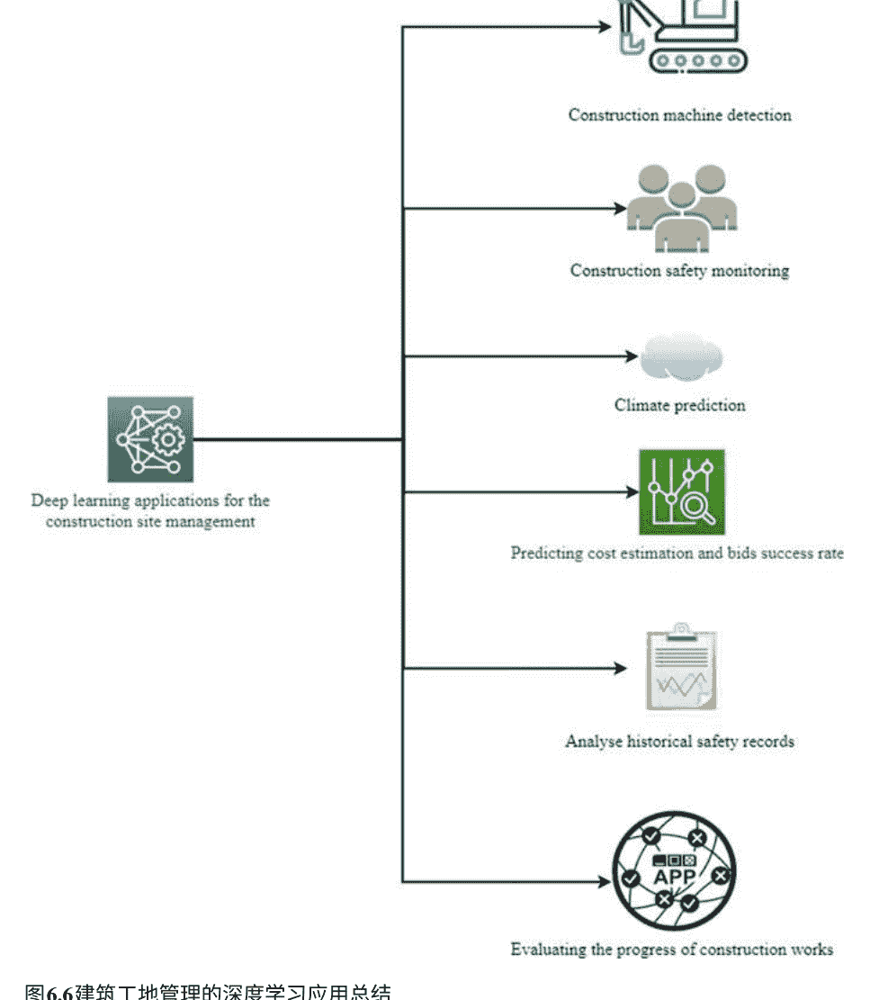

## 图6.6 建筑工地管理的深度学习应用总结

这个领域。然而，鉴于本文仅考虑了深度学习在建筑工地管理中的应用。因此，需要进行其他研究来调查不同的应用。建议进行科学计量分析，以展示深度学习在建筑中的所有应用，以评估当前深度学习在建筑中的艺术和实践状态。

# 参考文献

Akinosho, T. D., Oyedele, L. O., Bilal, M., Ajayi, A. O., Delgado, M. D., Akinade, O. O., & Ahmed, A. A. (2020). 深度 learning in the construction industry: A review of the state-of-the-art and future innovations. Journal of Building Engineering, 101827.

Angah, O., & Chen, A. Y. (2020). Masked deep learning for removing obstructions from construction site imagery using U-Net based contextual encoders. Automation in Construction, 119. https://doi.org/10.1016/j.autcon.2020.103332.

Atitallah, S. B., Driss, M., Boulila, W., & Ghezala, H. B. (2020). Leveraging deep learning and IoT big data analytics to support smart city development: A review and future directions. Computer Science Review. https://doi.org/10.1016/j.cosrev.2020.100303.

Baker, H., Hallowell, M. R., & Tixier, A. J. P. (2020). Automated learning of precursors to construction accidents from text. Automation in Construction, 118. https://doi.org/10.1016/j.autcon.2020.103145.

Blanco, J. L., Fuchs, S., Parsons, M., & Ribeirinho, M. J. (2018). Artificial intelligence: The next frontier in construction technology. Construction Economics, (September 2018), 7-13.

Braun, A., Tuttas, S., Borrmann, A., & Stilla, U. (2020). Improving progress monitoring by fusing point clouds, semantic data and computer vision. Automation in Construction, 116, 103210. https://doi.org/10.1016/j.autcon.2020.103210.

Cao, Y., Zandi, Y., Agdas, A. S., Wang, Q., Qian, X., Fu, L., Wakil, K., Selmi, A., Issakhov, A., & Roco-Videla, A. (2021). A review study of artificial intelligence applications in construction management and composite beams. Steel and Composite Structures, 39(6), 685–700.

Chehri, A., & Saeidi, A. (2021). IoT and deep learning solutions for automated crack detection for inspection of concrete bridge structures. In Smart Innovation, Systems and Technologies (Vol. 244). https://doi.org/10.1007/978-981-16-3264-8_11.

Cheng, J. C. P., Chen, K., Wong, P. K. Y., Chen, W., & Li, C. T. (2021). Graph-based network generation and CCTV processing techniques for fire evacuation. Building Research & Information, 49(2). https://doi.org/10.1080/09613218.2020.1759397.

Elghaish, F., Hosseini, M. R., Matarneh, S., Talebi, S., Wu, S., Martek, I., Poshdar, M., & Ghodrati, N. (2021a). Blockchain and ‘IoT’ in the construction industry: Research trends and opportunities. Automation in Construction, 132, 103942.

Elghaish, F., Matarneh, S. T., Talebi, S., Abu-Samra, S., Salimi, G., & Rausch, C. (2021b). Deep learning for detecting building and pavement damages: A critical gap analysis. Construction Innovation.

Fang, Q., Li, H., Luo, X., Ding, L., Luo, H., Rose, T. M., & An, W. (2018). Detecting non-hardhat-use by a deep learning method from far-field surveillance videos. Automation in Construction, 85. https://doi.org/10.1016/j.autcon.2017.09.018.

Fang, Q., Li, H., Luo, X., Li, C., & An, W. (2020a). A monocular localization method for construction-related entities based on semantic and prior knowledge-aided. Computer-Aided Civil and Infrastructure Engineering, 35(9), 979–996. https://doi.org/10.1111/mice.12541.

Fang, W., Ding, L., Love, P. E. D., Luo, H., Li, H., Pea-Mora, F., Zhong, B., & Zhou, C. (2020b). Computer vision applications in construction safety assurance. Automation in Construction, 110. https://doi.org/10.1016/j.autcon.2019.103013.

Guo, Y., Xu, Y., & Li, S. (2020). Dense construction vehicle detection based on orientation-aware feature fusion convolutional neural network. Automation in Construction, 112. https://doi.org/10.1016/j.autcon.2020.103124.

Hou, X., Zeng, Y., & Xue, J. (2020). Detection of construction engineering structural components based on deep learning method. Journal of Construction Engineering and Management, 146(2). https://doi.org/10.1061/(ASCE)CO.1943-7862.0001751.

Jialan, Y., & Ashuri, B. (2020). Text mining of SEC financial filings for construction companies using deep learning to identify and assess risk. Journal of Construction Engineering and Management, 146(12). https://doi.org/10.1061/(asce)co.1943-7862.0001932.

Kim, J., Hwang, J., Chi, S., & Seo, J. (2020). Vision-based database-free construction site monitoring: A deep active learning approach. Automation in Construction, 120. https://doi.org/10.1016/j.autcon.2020.103376.

Kim, K., & Cho, Y. K. (2020). Effectiveness of inertial sensor number and placement for deep learning-based worker action recognition. Automation in Construction, 113. https://doi.org/10.1016/j.autcon.2020.103126.

Kim, Kinam, & Cho, Y. K. (2021). Automatic identification of worker actions in highway construction using motion sensors and long short-term memory networks. Journal of Construction Engineering and Management, 147(3). https://doi.org/10.1061/(asce)co.1943-7862.0002001.

Kim, K., Kim, S., & Shchur, D. (2021). Drone-RFID integrated system for construction work area safety monitoring by integrating internal traffic control plan (ITCP) and automated object detection into a game engine environment. Automation in Construction, 128. https://doi.org/10.1016/j.autcon.2021.103736.

Kolar, Z., Chen, H., & Luo, X. (2018). Transfer learning and deep convolutional neural networks for safety guardrail detection in 2D images. Automation in Construction, 89. https://doi.org/10.1016/j.autcon.2018.01.003.

Kruachottikul, P., Cooharojananone, N., Phanomchoeng, G., Chavarnakul, T., Kovitanggoon, K., & Trakulwaranont, D. (2021). A deep learning-based visual defect detection system for reinforced concrete bridge substructures: A case study of the Thailand highway department. Journal of Civil Structural Health Monitoring, 11(4), 949–965. https://doi.org/10.1007/s13349-021-00490-z.

LeCun, Y., Bengio, Y., & Hinton, G. (2015). Deep learning. Nature, 521(7553), 436–444.

Lee, H., Yang, K., Kim, N., & Ahn, C. R. (2020). Deep learning network for detecting overexertion tasks using Gramian Angular Field. Automation in Construction, 120. https://doi.org/10.1016/j.autcon.2020.103390.

Lin, C. L., Chen, J. K. C., & He, H. H. (2021a). BIM use in smart hospital management during COVID-19 using MCDM. Sustainability (Switzerland), 13(11). https://doi.org/10.3390/su13111618.

Lin, Z. H., Chen, A. Y., & Xie, S. H. (2021b). Temporal image analysis for abnormal construction activity recognition. Automation in Construction, 124. https://doi.org/10.1016/j.autcon.2021.103572.

Liu, H., Wang, G., Huang, T., He, P., Skitmore, M., & Luo, X. (2020). Demonstrating construction activity scenes via image captioning. Automation in Construction, 119. https://doi.org/10.1016/j.autcon.2020.103334.

Lu, J., Yao, Z., Bi, Q., & Li, X. (2021). Neural network-based method for construction vehicle fill factor estimation and bucket detection in Computer-Aided Civil and Infrastructure Engineering. https://doi.org/10.1111/mice.12675.

Luo, H., Wang, M., Wong, P. K. Y., & Cheng, J. C. P. (2020). Full body pose estimation of construction equipment using computer vision and deep learning techniques. Automation in Construction, 110. https://doi.org/10.1016/j.autcon.2019.103016.

Ma, Y., Ping, K., Wu, C., Chen, L., Shi, H., & Chong, D. (2020). AI-driven IoT and smart public service library for high-tech. https://doi.org/10.1108/LHT-12-2017-0274.

Machi, L. A., & McEvoy, B. T. (2016). The literature review: Six steps to success.

Maraveas, C., & Bartzanas, T. (2021). Sensors for agricultural structure health monitoring. Sensors (Switzerland). https://doi.org/10.3390/s21010314.

Mooghali, A., Aljiani, R., Karami, N., & Khasseh, A. (2012). Scientometric analysis of scientometric literature. International Journal of Information Science and Management (IJISM), 9(1), 19–31.

Muhammad, A. N., Aseere, A. M., Chiroma, H., Shah, H., Gital, A. Y., & Hashem, I. A. T. (2021). Deep learning applications in smart cities: Recent developments, taxonomy, challenges, and research outlooks. Neural Computing and Applications. https://doi.org/10.1007/s00521-020-05151-8.

Nath, N. D., Behzadan, A. H., & Paal, S. G. (2020). Deep learning for site safety: Real-time detection of personal protective equipment. Automation in Construction, 112. https://doi.org/10.1016/j.autcon.2020.103085.

Qin, H., Zhang, D., Tang, Y., & Wang, Y. (2021). Automated recognition of tunnel lining elements from GPR images using deep convolutional networks and data augmentation. Automation in Construction, 130. https://doi.org/10.1016/j.autcon.2021.103830.

Rafsanjani, H. N., Ghahramani, A., & Nabizadeh, A. H. (2020). iSEA: IoT-based smartphone energy assistant for promoting energy-saving behaviors in commercial buildings. Applied Energy, 266. https://doi.org/10.1016/j.apenergy.2020.114892.

Rashid, K. M., & Louis, J. (2019). Time-series data augmentation and deep learning for construction equipment activity recognition. Advanced Engineering Informatics, 42. https://doi.org/10.1016/j.aei.2019.100944.

Roberts, D., Torres Calderon, W., Tang, S., & Golparvar-Fard, M. (2020). Vision-based activity analysis of construction workers inspired by body posture. Journal of Computing in Civil Engineering, 34(4). https://doi.org/10.1061/(asce)cp.1943-5487.0000898.

Sepasgozar, S., Karimi, R., Farahzadi, L., Moezzi, F., Shirowzhan, S., Ebrahimzadeh, S. M., Aye, L., et al. (2020). A systematic content review of artificial intelligence and the Internet of Things applications in smart home. Applied Sciences (Switzerland), 10(9). https://doi.org/10.3390/app10093074.

Sharma, S., & Sen, S. (2020). Damage detection at structural connection using 1D convolutional neural network. Journal of Civil Structural Health Monitoring, 10(5), 1057–1072. https://doi.org/10.1007/s13349-020-00434-z.

Shen, J., Xiong, X., Li, Y., He, W., Li, P., & Zheng, X. (2021a). Detecting safety helmet wearing on construction sites with bounding box regression and deep transfer learning. Computer-Aided Civil and Infrastructure Engineering, 36(2). https://doi.org/10.1111/mice.12579.

Shen, J., Yan, W., Li, P., & Xiong, X. (2021b). Instance segmentation and pseudo LiDAR point cloud based object recognition for work zone safety with deep learning. Computer-Aided Civil and Infrastructure Engineering. https://doi.org/10.1111/mice.12749.

Shi, J., Sun, D., Hu, M., Liu, S., Kan, Y., Chen, R., & Ma, K. (2020). Deep learning-based automatic loading mechanism brake pedal aperture prediction. Automation in Construction, 119. https://doi.org/10.1016/j.autcon.2020.103313.

Slaton, T., Hernandez, C., & Akhavian, R. (2020). Construction activity recognition using convolutional recurrent networks. Automation in Construction, 113. https://doi.org/10.1016/j.autcon.2020.103138.

Son, H., & Kim, C. (2021). Integrated worker detection and tracking for safe operation of construction machinery. Automation in Construction, 126. https://doi.org/10.1016/j.autcon.2021.103670.

Son, H., Choi, H., Seong, H., & Kim, C. (2019). Detection of construction workers under varying poses and changing background using deep convolutional neural networks. Automation in Construction, 99. https://doi.org/10.1016/j.autcon.2018.11.033.

Taffese, W. Z., & Nigussie, E. (2020). Autonomous corrosion assessment of reinforced concrete structures: A feasibility study. Sensors (Switzerland). https://doi.org/10.3390/s20236825.

Wang, N., Zhao, X., Zhao, P., Zhang, Y., Zou, Z., & Ou, J. (2019). Automated damage detection of historical masonry buildings using mobile deep learning. Automation in Construction, 103, 53–66. https://doi.org/10.1016/j.autcon.2019.03.003.

Wang, Z., Zhang, Y., Mosalam, K. M., Gao, Y., & Huang, S. L. (2021). Deep semantic segmentation for visual understanding of construction sites. Computer-Aided Civil and Infrastructure Engineering. https://doi.org/10.1111/mice.12701.

Won, D., Chi, S., & Park, M. W. (2020). Drone-RFID integration for construction resource localization. KSCE Journal of Civil Engineering, 24(6), 1683–1695. https://doi.org/10.1007/s12205-020-2074-y.

Wright, S. W. A. B. (2020). Gap analysis for literature reviews and advancing useful knowledge. https://www.researchtoaction.org/2020/06/gap-analysis-for-literature-reviews-and-advancing-useful-knowledge/.

Wu, C., Wang, X., Wu, P., Wang, J., Jiang, R., Chen, M., & Swapan, M. (2021). Hybrid deep learning models for automated constraint modelling in advanced construction packaging. Automation in Construction, 127. https://doi.org/10.1016/j.autcon.2021.103733.

Wu, J., Cai, N., Chen, W., Wang, H., & Wang, G. (2019a). Automatic detection of hardhats worn by construction personnel: A deep learning method and benchmark dataset. Automation in Construction, 106. https://doi.org/10.1016/j.autcon.2019.102894.

Wu, R. T., Singla, A., Jahanshahi, M. R., & Bertino, E. (2019b). Pruning deep neural networks for efficient edge computing in IoT: A case study of structural health monitoring. In Structural Health Monitoring 2019b: Proceedings of the 12th International Workshop on Structural Health Monitoring for Industrial Internet of Things (IIoT) (Vol. 2). https://doi.org/10.12783/shm2019/32475.

Xiao, B., & Kang, S.-C. (2021a). Development of construction machinery image datasets for deep learning-based object detection. Journal of Computing in Civil Engineering, 35(2). https://doi.org/10.1061/(asce)cp.1943-5487.0000945.

Xiao, B., & Kang, S.-C. (2021b). Vision-based method using deep learning detection for tracking multiple construction machinery. Journal of Computing in Civil Engineering, 35(2). https://doi.org/10.1061/(asce)cp.1943-5487.0000957.

Xiao, B., Lin, Q., & Chen, Y. (2021). Vision-based method for automatically tracking construction machinery at night using deep learning-based illumination enhancement. Automation in Construction, 127. https://doi.org/10.1016/j.autcon.2021.103721.

Xiao, B., Yin, X., & Kang, S. (2021). Vision-based automatic method for detecting construction video highlights by integrating machine tracking and CNN feature extraction. Automation in Construction, 129, 103817.

Yang, Z., He, B., Liu, Y., Wang, D., & Zhu, G. (2021). Classification of rock fragments produced by tunnel boring machines using convolutional neural networks. Automation in Construction, 125. https://doi.org/10.1016/j.autcon.2021.103612.

Yu, Y., Li, H., Yang, X., Kong, L., Luo, X., & Wong, A. Y. L. (2019a). An automated and non-invasive method for assessing physical fatigue of construction workers. Automation in Construction, 103. https://doi.org/10.1016/j.autcon.2019.02.020.

Yu, Y., Umer, W., Yang, X., & Antwi-Afari, M. F. (2021). Posture-related data collection methods for construction workers: A review. Automation in Construction. https://doi.org/10.1016/j.autcon.2020.103538.

Yu, Y., Yang, X., Li, H., Luo, X., Guo, H., & Fang, Q. (2019b). Joint-level-based visual ergonomic assessment tool for construction workers. Journal of Construction Engineering and Management, 145(5). https://doi.org/10.1061/(asce)co.1943-7862.0001647.

Zhang, J., Qi, X., Myint, S. H., & Wen, Z. (2021). Deep learning-based 3D reconstruction of dehazed images in IoT-enhanced smart cities. Computers, Materials and Continua, 68(2). https://doi.org/10.32604/cmc.2021.017410.

Zheng, Zhang, Pan (2020). Module detection in modular integrated construction based on virtual prototyping and transfer learning. Automation in Construction, 120. https://doi.org/10.1016/j.autcon.2020.103387.

Zhong, Pan, Love, Ding, Fang (2020). Deep learning and network analysis: Classifying and visualizing construction accident narratives. Automation in Construction, 113. https://doi.org/10.1016/j.autcon.2020.103089.

Zhou, Gong, Liu, Yin (2021). Automated segmentation of TBM muck images via deep learning methods to estimate rock fragment size and shape. Automation in Construction, 126. https://doi.org/10.1016/j.autcon.2021.103685.

第7章 基于深度学习技术的建筑物和公路路面损伤检测

摘要 大量的路面和建筑物以及有限的检测资源（包括资金和人力）导致了快速的损伤恶化、使用寿命降低、服务水平降低和社区干扰增加。因此，本章旨在提供以下内容：（1）关于深度学习技术在路面和建筑物损伤检测方面的文献综述；（2）不同资产/结构类型的研究进展；（3）深度学习在损伤检测方面的未来应用建议。对181篇基于深度学习的裂缝检测论文进行了批判性分析。采用结构化分析方法对主要文章进行了分析，包括研究重点、采用的方法、研究结果和局限性。与评估建筑物结构健康相比，利用深度学习检测路面裂缝的应用更为先进。需要进行比较不同的CNN模型的研究，以促进开发考虑数据收集方法的综合解决方案。需要进一步研究设置、实施、运行成本、数据采集频率和深度学习工具。总之，将深度学习算法应用于损伤检测，而不是手动检查，展示了有希望的结果。

以前的研究成果和提出的改进要求（例如，人工智能、深度学习等）的可用性，正在促使研究人员和实践者改进损害检测过程，并更好地利用有限的资源。首次对基于深度学习的路面和建筑裂缝检测进行了关键和有结构的分析，以使新手研究人员能够突出每篇文章中的知识差距，并从其他研究的发现中建立知识库，以支持未来可行的解决方案的开发。

关键词 深度学习 · 卷积神经网络 · 路面裂缝 · 损伤检测 · 结构健康评估 · 公路维护

## 介绍

在建筑行业中，利用新兴数字技术是提高生产力和优化资源利用的关键（Building & Rahimian, 2012; Pour Rahimian et al., 2008）。其中一种技术就是深度学习。传统上，裂缝检测是基于人工检查和依赖专业人员主观判断的。这就引发了对可靠和高效的裂缝检测方法的需求，以提高视觉检查结果的质量。因此，已经开发了几种自动化或半自动化的计算机辅助裂缝检测方法，例如直方图变换（Patricio et al., 2005）、阈值分割（Zhu et al., 2007）、边缘检测（Attoh-Okine & Ayenu-Prah, 2008; Zhao et al., 2010）、区域生长（Li et al., 2011; Zhou et al., 2016）。作为机器学习的延伸和子集，深度学习因其在目标检测和语义分割方面的卓越性能而成为裂缝检测领域的新研究前沿（Abdelkader, 2021; Liu et al., 2020b）。

随着计算机技术的发展，深度学习在检测诸如开裂等问题上的应用得到了广泛研究。为了提高开裂检测的性能，张等人（2019a）使用残差网络开发了具有不同膨胀率的扩张卷积和多分支融合策略。周和宋（2020）开发了深度卷积神经网络（CNN）和激光扫描的距离图像，实现了裂缝的像素级分类。陈和贾汉沙希（2018）使用CNN和朴素贝叶斯分析单个视频帧进行裂缝检测。

深度学习最近在计算机视觉领域得到了推广，为自动化裂缝检测提供了可行的方法（Ogunseiju等，2021）。深度学习允许计算机通过人工神经网络和其他机器学习算法从经验中学习（Xiong & Tang, 2021）。这种技术之所以被称为“深度学习”，是因为它包含了用于特征提取、转换和模式分析的多层结构，可以使用有监督或无监督学习进行训练（Ongsulee, 2018）。深度学习的关键优势在于它支持由多个处理层组成的计算模型，可以学习具有多个抽象层次的数据表示，并通过反向传播训练模型如何更新内部参数，无需手动参与特征工程的设计（Goodfellow等，2016）。

一般来说，深度学习模型包含三种类型的层：输入层、隐藏层和输出层。一个层的输出被用作下一个层的输入。深度学习可以实现多种架构（Mansuri和Patel, 2021年; Saadi和Belhadef, 2019年）。每种架构都有其特定的应用和兼容性。然而，值得注意的是，卷积网络（CNNs/ConvNets）是自动特征学习和监督分类最常见的架构。由于其部分连接、权重共享和池化层的能力，CNN可以在较少的计算量下自动捕捉图像的网格拓扑，并生成有希望的检测结果（Cha等人，2017年）。CNN通过插入图像像素的值来识别特征，用于图像识别（Jiang和Bai，2020年）。CNN的主要优势在于特征提取和表示学习，主要弱点在于需要参数调整（Da’u和Salim，2020年）。CNN技术有多种变体，例如基于区域的CNN（或R-CNN）、快速R-CNN和更快的R-CNN。支持向量机（SVM）被用于通过手工制作的特征提取将混凝土图像分类为裂缝和非裂缝（Na和Tao，2012年）。Abdel-Qader等人（2006年）将SVM与主成分分析（PCA）相结合，从大量特征中提取健康特征。通过将模糊逻辑、遗传算法、人工神经网络（ANN）和k最近邻（k-NN）等混合方法与SVM相结合，显著提高了裂缝识别的准确性（Choudhary和Dey，2012年；Sri Preethaa和Sabari，2020年）。然而，裂缝图像的复杂性使得这些传统算法在高效管理大量裂缝图像特征时的泛化性能不高效（Li等人，2017年）。

住房市场需求巨大，这需要采取前所未有的步骤来建造所需的房屋（Kolo等，2014年）。因此，包括深度学习在内的人工智能可以帮助提高生产力并避免重复工作。

在过去的两年中，已经发表了两篇综述论文，分析了建筑环境领域中发表的深度学习论文。例如，Akinosho等人（2020年）对建筑行业中深度学习的一般应用进行了全面的综述。然而，基于深度学习的检测特性没有得到批判性分析，自该章节发表以来已经发表了许多文章。此外，Khallaf和Khallaf（2021年）发表了一章系统文献综述，列出了深度学习的应用。然而，裂缝检测和物体识别并没有得到批判性分析。考虑到建筑行业中深度学习应用的大部分与检测物体有关，包括路面和混凝土的损伤，据作者所知，还没有一项专门研究讨论和分析这些应用以帮助研究人员改进现有解决方案。

鉴于所有这些问题，本章对已发表的主要文章进行了深入分析，这些文章利用深度学习来检测和分类道路和建筑物的裂缝。考虑到大多数已发表的文章都集中在利用深度学习来检测和分类道路和建筑物的各种损害，本研究旨在通过突出每项研究的重点、采用的方法和限制来进行批判性分析已发表的文章。因此，初学者研究人员可以根据本研究的建议开始开发可行的解决方案。

## 方法和逻辑

研究表明，混合方法系统性综述是研究目标是定义知识体系中的空白并确定未来研究趋势时最有效的方法。采用混合方法系统性综述使研究人员能够形成客观的领域展示。混合方法系统性综述研究优于单一方法手动综述研究，研究人员可能存在偏见，并且他们的判断和解释是主观的 (He et al.,2017) 。此外，依赖混合方法系统性综述可以增强文献综述研究的深度和广度 (Heyvaert et al.,2017)。

图7.1展示了数据收集和分析的研究设计和流程。本章重点介绍利用深度学习来检测路面和建筑结构的裂缝/损伤。因此，使用的关键词是具体的，例如（深度学习和裂缝检测）和（限制为（DOCTYPE，“ar”））和（限制为（SUBJAREA，“ENGI”））和（限制为（EXACTKEYWORD，“裂缝检测”）或限制为（EXACTKEYWORD，“卷积神经网络”）或限制为（EXACTKEYWORD，“损伤检测”）或限制为（EXACTKEYWORD，“神经网络”））和（限制为（SRCTYPE，“j”））和（限制为（EXACTSRCTITLE，“自动化建筑”）或限制为（EXACTSRCTITLE，“计算机辅助土木和基础设施工程”））。结果被细化以包括Q1和Q2 Scopus期刊，以确保来源的质量。建议使用扫描和略读技术来找到文章的主题和相关文章 (Machi和McEvoy, 2008) 。因此，结果被分析和分类为两个主题：“深度学习用于路面损伤”和“深度学习用于检测建筑结构中的损伤。此后，从这两个主题中发展出了子主题。大多数文章都以特定的方式进行了分析：研究的重点、采用的方法、发现以及每篇文章中作者提到的限制。为了避免认知偏差，采用了提及的系统方法来查找和列出相关研究，并采用一致的方式分析文章。

### 基于深度学习的裂缝检测每年发表的论文

图7.2显示了每年的出版物数量。如图7.2所示，自2017年以来已经发表了181篇论文，这反映了近四年来深度学习在检测道路和建筑裂缝方面所受到的极大关注。

### 基于深度学习的裂缝检测研究进展按国家分类

图7.3描述了每个国家的181篇论文的分配情况。大约45%的论文来自中国，其次是美国，占总论文的23%。其他32%的论文来自加拿大、澳大利亚、新加坡、英国、法国、香港和印度。

### 图7.3 出版物的地理分布

### 基于深度学习的裂缝检测：概念背景

基于区域的深度学习检测方法依赖于窗口滑动或区域提案；对图像中每个可能的对象寻找边界框是该过程的核心。R-CNN （基于区域的卷积神经网络）使用选择性搜索生成区域，然后使用CNN对这些区域进行分类。Cha等人（2018）将CNN与滑动窗口技术相结合，以更准确地分类裂缝和非裂缝图像。Zhang等人（2018）使用R-CNN模型在执行裂缝和密封裂缝检测之前去除噪声区域。 然而，由于处理大量图像时使用基于窗口滑动的方法需要巨大的工作量，因此这种方法（R-CNN）是不实际的。

此外，传统的区域提议方法在从嘈杂的图像中选择好的候选区域方面效率低下（Uijlings等，2013年）。 为了提高基于区域的方法的计算效率，Zhang等人（2017b年）应用了并行处理。 然而，计算和资源成本很高。

Fast R-CNN和Faster R-CNN通过使用区域提议网络（RPN）自动产生提议来提高预测的速度和准确性（Ren等，2015年）。 为了检测混凝土路面上的裂缝，Haciefendioğlu和Başaga（2021年）开发了一种使用预训练的Faster R-CNN的方法。Kang等人（2020年）开发了一种集成方法，利用更快的区域提议卷积神经网络（Faster R-CNN）算法、修改的TuFF方法和修改的DTM进行裂缝检测和定位。Gou等人（2019年）使用了更快的R-CNN模型进行路面裂缝检测。Cha等人（2018年）开发了一种更快的R-CNN来检测包括混凝土裂缝在内的多种损伤类型。Wang等人（2018）还使用Faster R-CNN来检测砖石历史建筑中的混凝土损伤。

许多工作已经致力于在裂缝检测任务中实现与CNN相关的方法，例如由Zhu等人（2019）提出的U-net卷积神经网络，通过开发U-net卷积神经网络的裂缝检测算法，使用U-net网络作为前端提取裂缝，然后使用阈值方法和Dijkstra连接准确提取裂缝。然而，这种方法仍然难以解决由连续池化引起的特征分辨率降低的问题。为了增加图像特征的细节并增强密集预测的效果，Chen等人（2017）和Qiao等人（2021）在U-net网络中添加了Atrous Spatial Pyramid Pooling（ASPP）模块。

一些研究人员采用了另一种轻量级的端到端像素级分类架构，称为SegNet。例如，Song等人（2019年）使用它来训练和测试2068张桥梁裂缝图像的SegNet模型。Chen等人（2020年）将其应用于检查混凝土路面、沥青路面和桥梁甲板裂缝。Jun Zhao等人（2020年）将其用于解决沥青路面图像中的光照不均匀性和杂质问题。最后，Ren等人（2020年）利用它进行高效的多尺度特征提取、聚合和分辨率重建，极大地提高了网络的整体裂缝分割能力。

基于卷积神经网络的CrackNet由Zhang等人（2017a年）提出，用于自动检测路面裂缝。CrackNet由五层组成。两个输入数据层是由特征提取器生成的特征图。输出层是所有像素的预测类别分数集合。两个隐藏层分别是卷积层和全连接层。CrackNet在学习过程中训练了一百多万个参数，以提高裂缝提取的准确性。受CrackNet的启发，Fei等人（2020年）提出了一种基于更深层次架构和更少参数的CrackNet-V对3D沥青路面图像进行自动像素级裂缝检测。Huyan等人（2020年）开发了CrackU-net，它利用卷积、池化、转置卷积和连接操作构建了“U”形模型架构。无论是CrackNet-V还是CrackU-net，在计算准确性和效率方面都优于CrackNet。

本章提出了一个基于三个级联阶段的裂缝图像特征选择和分类框架。第一阶段通过CNN模型自动从裂缝图像中提取特征。然后，采用随机分形搜索（SFS）和引导鲸鱼优化算法（Guided WOA）技术的特征选择算法被应用于适当地选择有价值的特征。最后一个阶段通过提出的投票分类器对所选特征进行分类，使用粒子群优化（PSO）和引导鲸鱼优化技术来提高集成的准确性。

Huang等人（2018）基于深度学习开发了一种用于地铁盾构隧道中裂缝和泄漏检测的双流语义分割算法。Feng等人（2020）提出了一种基于分类的算法，用于检测不同结构混凝土表面的裂缝，用于混凝土坝表面的裂缝检测（Cha等人，2017）。Kim和Cho（2018）实施了一种类似的方法，通过使用ScrapeBox从互联网网络搜索中获取裂缝图像，然后基于深度神经网络开发了一个分类算法。其他研究人员开发了一种基于掩膜区域卷积神经网络的裂缝区域分割方法（He等，2017；Kim和Cho，2019）。

Tong等人（2020）提出了一种将完全卷积网络（FCN）与高斯条件随机场（G-CRF）、不确定性框架和基于概率的拒绝相结合的方法，用于检测路面缺陷。Lee等人（2019）提出了一种使用二维高斯核和布朗运动过程的裂缝图像生成算法，以解决裂缝检测中数据不足的问题。Jenkins等人（2018）提出了一种深度完全卷积神经网络，用于对道路和路面图像上的表面裂缝进行像素级分类。Pan等人（2020）提出了一种基于空间通道层次网络（SCHNet）和基础网络Visual Geometry Group 19（VGG19）的更准确和高效的裂缝检测方法。Yang等人（2018）利用VGG19开发了一种名为完全卷积网络（FCN）的深度学习技术，以提高裂缝检测任务的效率。Zhang等人（2020a）开发了一种基于实例分割的自动像素级裂缝检测网络，以改进Mask R-CNN网络，可以同时输出裂缝的类型、位置和掩膜。Liu等人（2020b）提出了一种基于卷积神经网络的两步路面裂缝检测和分割方法。Ayele等人（2020）提出了一套集成的无人机辅助检测和自动损伤识别流程，包括三个关键阶段：(i) 数据收集和模型训练，（ii）三维摄影测量/建模，（iii）裂缝识别和分割，其中应用基于深度学习的数据分析和建模来处理和分析无人机图像数据并进行损伤评估。Zhang等人（2019b）提出了一种基于上下文感知的深度语义分割网络的视觉裂缝检测系统，该系统整合了多个局部重叠图像块的像素级预测结果。

Xu等人（2019年）提出并采用了一种改进的FCNN架构，用于识别包含复杂、干扰背景和手写的桥梁钢箱梁中的裂缝。Li等人（2020年）提出了一种半监督的对抗学习架构，并应用于路面裂缝检测，Shim等人（2020年）则应用于混凝土结构的裂缝检测。

## 卷积神经网络（CNN）用于裂缝检测

在众多传统深度学习架构中，卷积神经网络（CNN）以捕捉关键的局部空间特征而闻名，在裂缝检测方面产生了有希望的结果（Cha等人，2018年）。Kumar和Ghosh（2020年）开发了一种基于视觉的方法，使用卷积神经网络（CNNs）来检测混凝土裂缝，而无需计算缺陷特征。设计的CNN是在256 × 256像素分辨率的40K图像上进行训练的，通过单独对每个区域进行分类来检测裂缝。

Chuang等人（2019年）通过朴素贝叶斯分类器对图像进行预处理，然后使用CNN识别裂缝。Hoang等人（2018年）将CNN模型与元启发式优化的边缘检测算法进行了比较。该研究的结果表明，CNN的性能明显优于边缘检测器。Ye等人（2019年）的后续研究提出了一种基于CNN的结构裂缝检测方法，该方法通过深度神经网络和随机森林对图像进行分割和处理。

然而，基于区域的方法只能提供裂缝的存在信息以及根据区域大小的粗略形状和位置信息。如果无法提供裂缝的精确模式和位置，裂缝检测的价值将降低。Liang（2019年）提出了一种用于检测混凝土柱表面裂缝或剥落的CNN方法。为了克服这个问题，研究了像素级裂缝检测方法。例如，Fan等人（2019年）通过边缘优化算法与CNN的集成将检测准确率提高到92.08%。Ni等人（2019年）提出了一种基于卷积神经网络的框架，通过卷积特征融合和像素级分类自动准确提取裂缝。Liu和Zhang（2020年）提出了一种新颖的上下文感知深度卷积语义分割网络，可以有效地检测各种条件下结构基础设施中的裂缝。该方法应用像素级深度语义分割网络，在任意大小的图像上分割裂缝，无需重新训练预测网络。

同时，Won等人（2020）提出了一种上下文感知的融合算法，通过采用U-Net来检测混凝土裂缝，利用局部跨状态和跨空间约束来融合图像块的预测结果。选择了焦点损失函数作为评估函数，并应用Adam算法进行优化。经过训练的U-Net可以在各种条件下（如光照、杂乱背景、裂缝宽度等）从输入的原始图像中高效准确地识别裂缝位置。Fan等人（2020）提出了一种稳健的裂缝检测方法，采用迁移学习的概念作为训练原始神经网络的替代方法。训练裂缝分类器的三种标准深度学习方法如下：

1. 从头开始构建的浅层卷积神经网络，
2. 之前在通用ImageNet数据集上训练的VGG16网络架构的输出特征，以及
3. 对VGG16的顶层进行微调。

数据增强可以减少由有限和不平衡的训练数据集引起的过拟合问题。图像数据集包括在不受控制的距离、光照、角度和模糊条件下捕获的疲劳测试照片和实际检查照片。Zhu和Song（2020）开发了一种用于沥青混凝土桥面裂缝分割和检测的弱监督网络。首先，通过自动编码器对数据进行区分，突出显示未标记数据的特征，使原始数据自动生成弱监督的起始点以便收敛。其次，通过k均值聚类（KMC）对特征进行分类。第三，对桥面缺陷图像的裂缝进行弱监督的语义分割。手动标记了一个包含六种类型缺陷的沥青混凝土桥面数据集中的缺陷。最近的研究利用了循环一致性生成模型对于裂缝检测，对抗性学习(Nath等人, 2020)被提出。在这项研究中，作者提出了一种自监督结构学习网络，可以在没有配对数据或基准数据(GTs)的情况下进行训练。这是通过训练一个额外的反向网络来实现的，同时将输出翻译回输入。

近年来，Mirjalili和Lewis(2016)提出的鲸鱼优化算法(WOA)引起了越来越多的关注。鲸鱼的觅食行为启发了WOA的概念。气泡被用来通过螺旋形状将猎物推向水面(Mirjalili和Lewis, 2016; Mirjalili等人, 2020)。最近的文献表明，WOA在解决复杂的工程优化问题方面具有显著的能力(Ling等人, 2017)。Abdel-Basset等人(2018)提出了一种将WOA和局部搜索策略相结合来解决排列流水车间调度问题的方法。Mafarja和Mirjalili(2017)将WOA与模拟退火相结合进行特征提取。Aljarah等人(2018)提出了一种基于WOA的训练器，用于训练多层感知器(MLP)神经网络。此外，还有研究机构尝试利用WOA解决其他问题，如多目标优化(Wang等人, 2017; Aziz等人, 2018; Got等人, 2020)、图像处理(Hassanien等人, 2017; Mostafa等人, 2017; Aziz等人, 2018)、软件测试(Harikarthik等人, 2019)和电力系统应用(Hasanien, 2018; Raj和Bhattacharyya, 2018)。为了实现这个算法，需要建立三个机制: (1)缩小包围猎物的范围，(2)气泡网攻击方法(开发阶段)和(3)寻找猎物(探索阶段)。第一个机制是猎物包围，当WOA将当前位置视为猎物的最佳位置时，启动最佳搜索代理。其余的代理根据最佳搜索代理相应地调整它们的位置。这可以用数学方式表达(Mirjalili和Lewis, 2016)。

### 基于深度学习的路面裂缝检测相关研究

表7.1显示了主要的已发表研究，重点是使用深度学习来检测和分类路面裂缝。为了帮助研究人员开发解决这些限制的新解决方案，对每篇论文进行了研究目标（研究重点）、方法、发现和限制的分析。

### 基于深度学习的混凝土裂缝检测

鉴于本研究重点分析了关于路面和建筑物裂缝检测的主要已发表文章，表7.2呈现了包括使用深度学习来检测建筑物裂缝的关键文章的分析结果。

### 表7.1 基于深度学习的道路裂缝检测的关键研究

| 作者 | 目标 | 方法论 | 发现 | 限制 |
| :--- | :--- | :--- | :--- | :--- |
| Ali等人 2021年 | 为在混凝土结构中进行裂缝检测和定位的研究人员提供参考 | 应用了五种深度学习模型，包括一个提出的定制CNN模型 | 使用少量数据和高性能训练定制的CNN模型是混凝土表面裂缝检测的最佳选择 | 定制的CNN模型无法分析裂缝的各种特征，如裂缝宽度、长度和方向 |
| Chun等人 2021年 | 克服图像和GIS可视化在沥青路面裂缝检测中的弱点 | 使用卷积神经网络（CNN） | 本研究开发的模型在具有裂缝的路面图像中显示出高检测准确性 | 在没有裂缝的路面图像中，由细长阴影和接缝引起的误报很少 |
| Le等人 2021年 | 高效分类裂缝图像，节省时间，避免高计算成本 | 基于图像的CNN识别模型用于检测混凝土表面裂缝 | 提出的CNN模型改善了裂缝图像的分类 | 在这项工作中，没有考虑不同类型的裂缝 |
| 杨等人 2021年 | 根据测试集比较训练模型的优越性；然后根据实验结果选择最合适的模型 | 使用三个神经网络，AlexNet、VGGNet13和ResNet18，来识别和分类裂缝图像 | 测试表明，ResNet18模型产生了最令人满意的结果 | 比较仅限于三个神经网络 |
| 饶等人 2021年 | 从图像中检测混凝土结构的裂缝/非裂缝条件 | 基于CNN模型和非重叠窗口方法的自动检测方法 | 所提出的方法在准确性和推理时间方面优于现有模型 | 无 |
| 周和宋 2021 | 通过数据融合获得更好的分类性能 | 基于DCNN的道路裂缝分类方法 | 实验案例表明，所提出的数据融合方法可以减少误检测，从而提高分类性能 | 在表面区域检测裂缝的困难在于强度图像中的低对比度和深度图像中的浅深度 |
| 方等人 2020年 | 开发一种新的框架来解决具有挑战性的视觉问题 | 结合Faster R-CNN进行裂缝补丁检测，使用DCNN进行裂缝方向识别，并使用贝叶斯算法进行集成 | 所提出的方法在深度CNN分类器上优于现有的基准方法 | 错过小裂缝的风险 |
| 范等人 2020年 | 开发一种高效的自动路面裂缝检测和测量模型 | 使用CNN模型的集成 | 该算法充分地执行裂缝测量：不同裂缝类型的长度和宽度可以以令人满意的准确性进行测量 | 无法执行端到端的裂缝检测，只能用于检测静态图像 |
| 冯等人 2020 | 提高裂缝检测准确性和生成更好的检测框以包围裂缝 | 基于深度卷积神经网络融合模型的裂缝识别方法 | 开发的方法可以为路面裂缝提供类别信息以及准确的定位和几何参数信息，可直接用于评估路面状况 | 无 |
| 曲等人 2020 | 提高裂缝检测的效率 | 使用卷积神经网络 | 基于图像处理的渗透算法对于清晰线性裂缝的背景具有更好的检测结果 | 图像中更复杂裂缝的效果较差，尤其是在干扰噪声的背景下 |
| Li和Zhao 2019 | 从包含各种噪声、粗糙表面和阴影的混凝土表面图像中检测裂缝 | 基于深度卷积神经网络（CNN）的基于图像的裂缝检测方法 | 所提出的方法可以在真实混凝土表面上检测裂缝，而不受噪声的干扰 | 提供更多类型的混凝土损伤图像，并将其添加到现有数据库中，以增加所提出方法的适应性和鲁棒性 |
| Xu等人 2019 | 减少混凝土桥梁裂缝检测中的网络参数数量 | 基于CNN的混凝土桥梁裂缝检测模型，利用Atrous卷积、Atrous空间金字塔池化（ASPP）模块和深度可分离卷积的优势 | 所提出的模型在没有预测训练的情况下实现了93.7%的检测准确率 | 无 |
| Zhang等人 2018 | 开发一个基于ImageNet的预训练模型，用于识别和修复路面图像中的裂缝 | 训练一个DCNN来预分类路面图像，并使用分块阈值法来分割裂缝/修复裂缝像素，并使用张量投票法曲线检测来提取裂缝/修复裂缝 | 所提出的方法能够准确区分裂缝和修复裂缝，并实现非常好的检测性能 | 无 |
| Yang等人 2018 | 开发一种新颖的方法，用于自动检测和测量像素级的破损混凝土结构 | 深度学习方法，名为全卷积网络（FCN），该架构由下采样（传统CNN层）和上采样（反卷积层）组成 | 结果表明，FCN对于裂缝的识别和测量是可行且足够的 | 准确性不如 CrackNet高 |
| Cha等人 2017 | 在不计算缺陷特征的情况下检测混凝土裂缝 | 基于视觉的方法使用卷积神经网络（CNNs）和滑动窗口技术的深度架构 | 所提出的方法在光照条件下尤其在检测细裂缝方面表现出更好的性能 | 由于摄影图像的特性，IPT和CNN的实现无法感知内部特征 |
| Wang等人 2017 | 提出一种基于从大量多样化示例数据中学习的路面裂缝检测方法，以更好地考虑路面表面的复杂性和多样性 | 用于沥青路面裂缝识别的CNN架构，包括三个卷积层和两个全连接层 | 所提出的CNN逐步改进，并且泛化性也得到增强。实验验证，经过训练的CNN在训练数据和测试数据上分别可以达到96.32%和94.29%的高准确率 | 所提出的卷积神经网络在图像单元中识别裂缝，而不是在像素级别检测它们 |

### 表7.2 基于深度学习的建筑裂缝检测的关键文章

| 作者 | 目标 | 方法论 | 发现 | 限制 |
| :--- | :--- | :--- | :--- | :--- |
| Chow 等人 2020 | 取代目前繁琐的土木基础设施混凝土缺陷检查程序 | 基于深度学习的图像检查 | 该方法成功地检测和分类了在各种环境条件下受损的缺陷 | 通过使用更复杂的深度学习模型和训练策略，整体准确性需要改进 |
| Zhang 等人 2020a | 提出了一种基于视觉的单阶段检测算法，用于检测混凝土桥梁上的损伤 | 实时目标检测技术， You Only Look Once (YOLOv3) | 开发的算法可以检测混凝土裂缝、凸起、剥落和暴露的钢筋 | 数据集包含许多小的损伤和复杂的背景信息，这可能会抑制算法的泛化能力和容量 |
| Ghosh Mondal 等人 2020 | 通过机器人上的传感器捕获的视觉数据，评估钢筋混凝土建筑物在地震中的多个损坏类别 | 基于深度学习的方法用于检测和分类损坏（例如，表面裂缝、剥落、暴露的钢筋、剥落和严重弯曲的钢筋） | 发现Inception-ResNet-v2的性能更好（产生60.8%的mAP值），相比Inception v2、ResNet-50和ResNet-101。此外，发现随着准确性的提高，处理速度会降低 | 将算法与无人机或检测机器人集成的实际实施尚未完成 |
| Kim等人 2020 | 开发一种用于自动化桥梁构件识别的3D点云数据方法学 | 深度学习与子空间划分组合，用于对每个子空间中的3D点进行分类 | 开发的方法可以将桥梁组件与3D点桥梁的甲板、桥墩和背景区分开来，即使是弯曲的桥梁和桥墩高度不同的桥梁 | 无法评估点云上的表面损伤 |
| Doraishan和Azari 2020 | 研究使用深度学习模型（DLM）从冲击回声（IE）数据中检测地下缺陷和覆盖层剥离的可行性 | 使用一维和二维卷积神经网络（CNN）对IE波形进行分类 | 开发的方法在水泥覆盖层上的准确率在45%到81%之间（比沥青覆盖层更准确） | 需要更大的数据库规模 |
| Fiorillo和Nassif 2020 | 使用红外热像技术（IRT）检测钢桁架桥中钢构件的地下损伤 | 修改后的深度内部神经网络（DINN） | 该方法具有96%的准确率和97.79%的特异性 | 该方法无法检测到小型或非常低的地下损伤 |
| 梁 2019 | 开发一种用于加固混凝土桥梁的灾后检查的方法 | 用于图像分类、目标检测和语义分割的卷积神经网络 | 基于三级图像的灾后桥梁检查方法。这三个级别分别用于系统级故障分析、结构组件级别的检测和局部级别的损伤定位 | 无 |
| 李等人 2019 | 开发一种损伤检测方法来检测四种混凝土损伤：裂缝、剥落、盐华和孔洞 | 全卷积网络（FCN） | 所提出的FCN在检测混凝土损伤方面表现出色：裂缝、剥落、盐华和孔洞，并且噪声水平低 | 无法检测深度 |
| Kim和Cho 2020 | 开发一个能够识别和量化混凝土结构中裂缝的框架 | 基于掩膜和区域的卷积神经网络（Mask R-CNN） | 能够检测大多数宽度为3毫米或更宽的裂缝，并且能够以小于0.1毫米的误差量化宽度，为0.3毫米或更大的裂缝 | 宽度小于0.3毫米的裂缝由于图像分辨率的原因显示出相对较大的误差 |
| Ali和Cha 2019 | 克服传统CNN的挑战，通过边界框来定位和量化缺陷，无法有效定位和量化 | 基于Mask R-CNN的实例级别识别和量化方法 | 该方法能够识别混凝土表面图像上的虫洞，并直接输出虫洞的面积和最大直径，反映出优秀的虫洞检测和量化性能 | 该方法无法检测多种损伤类型 |

## 基于深度学习的健康结构评估

表7.3显示了相关研究，这些研究开发了用于评估现有建筑物结构健康的深度学习模型。因此，初学者研究人员可以利用这些研究中提到的限制来开发解决方案，弥合差距，并促进建筑行业的应用。

### 利用深度学习和地下探测雷达（GPR）来检测裂缝

一些研究提出了将GPR和深度学习相结合来检测建筑物和裂缝的方法。这提高了CNN模型的能力和准确性。表7.4显示了利用深度学习与GPR相结合来检测物体的研究。

## 讨论、意义和限制

本研究全面回顾了使用深度学习来检测道路和建筑物各种损伤的方法。这些论文将深度学习的利用分为两个主要主题：用于道路损伤的深度学习和用于评估建筑物结构健康的深度学习。研究结果令人鼓舞，并且已经认识到深度学习已成功应用于高精度检测各种裂缝。

例如，Elghaish等人 2021年 开发了一个CNN模型，可以以超过97%的准确率检测和分类各种裂缝。此外，本研究比较了三种优化算法，以最大程度地提高准确性水平。关于深度学习评估结构健康状况，与路面研究相比，研究较少。这些研究大多集中在开发解决方案上，用于检测和评估特定结构元素（例如钢结构中的疲劳裂纹，松动的螺栓，滑动窗户的腐蚀），而不是提供基于深度学习的综合评估解决方案。

根据众多研究的综述，发现大多数研究存在一个共同的限制，“数据库大小”。因此，需要进一步研究开发能够容纳大型数据库并确保在实际环境中准确性的解决方案。此外，发展应该专注于提供一个全面的工具，例如阐明最佳数据收集方法，根据裂缝/损伤类型提供不同的CNN模型，并呈现分析收集图像的结果。

这可以导致公路钢铁和混凝土建筑物的综合维护系统。

### 表7.3 基于深度学习的健康结构评估的关键文章

| 作者 | 目标 | 方法论 | 发现 | 局限性 |
| :--- | :--- | :--- | :--- | :--- |
| Sajedi 和 Liang 2021 | 开发一个框架，用于量化计算机视觉和深度学习模型在基于视觉的结构健康监测中的置信水平。 | 贝叶斯神经网络用于深度视觉结构健康监测模型。 | 提出贝叶斯推断，为检测过程中的相应预测提供不确定性输出。 | 需要更大的数据库规模。 |
| Bae 等人 2021 | 通过增加原始数字图像的像素分辨率来增强裂缝的可检测性，这些图像由于分辨率不足、运动和模糊等问题而受损。 | 将超分辨率 (SR) 和自动裂缝检测网络组合成端到端的数据解释网络。 | 一种深度超分辨率裂缝网络 (SrcNet)，与使用无人机巡检机器人进行裂缝检测结果相比，其裂缝检测能力提高了24% | 需要更多验证以扩大所提方法的适用性 |
| Kohiyama 等人 2020 | 开发一种检测未学习损伤模式的输入数据的方法 | 使用存储在深度神经网络输出层中的训练数据的特征向量 | 该方法可以检测到不相关模式的数据 | 承认不同的特征，例如脉冲状地面运动，以进一步验证所开发的方法 |
| Zhang 等人 2020c | 开发一个用于结构条件识别案例的框架，即钢框架螺栓连接损伤 | 深度卷积神经网络 | 开发的算法 SHMnet 在至少四个独立训练数据集上具有100%的准确性 | 算法的性能严重依赖于训练数据的数量和质量 |
| Gonzalez 等人 2020 | 自动检测建筑材料和后期承载系统的类型（例如建筑的结构类型） | 在街道级别的近10,000张手动注释的照片数据集中的CNN | 开发的算法在材料类型上的召回准确率为95%，在八种建筑类型中的三种上为60% | 建筑类型的预测可能不准确，应与人口普查数据和专家判断相结合使用 |
| Dong等人 2020 | 开发一种非接触式结构位移测量方法，减少用户参与 | 基于深度学习的光流 | 所提出的方法FlowNet2与传统光流算法相比具有更高的准确性，并减少了人工参与的需求 | 仅限于处理统一的样本图像数据 |
| 于等人 2019 | 开发一种非侵入式的方法来监测全身的体力疲劳 | 使用RGB相机对建筑工人进行计算机视觉 | 三步法用于关节水平的体力疲劳评估，非侵入性和自动化 | 该方法需要测量材料或设备的质量才能正常运行，这限制了该方法在实际建筑项目中的适用性 |
| 倪等人 2019 | 在土木结构中快速准确地自动提取裂缝像素级别 | 卷积特征融合和像素级别分类 | 该方法能够准确快速地在图像中识别裂缝，与其他一些方法不同，它不需要手动设计的低级特征 | 需要考虑更自主地检测其他损伤类型并从任意大小的图像中进行分割 |
| Huynh等人 2019 | 检测关键连接中松动的螺栓 | 区域卷积神经网络（R-CNN）和霍夫线变换（HLT）图像处理算法的组合 | 该算法可以克服现有基于视觉的螺栓松动方法的挑战，例如能够识别任意拍摄角度下的图像中的螺栓 | 图像的拍摄角度不应超过40度，以确保检测结果的准确性 |
| Athan和Jahanshahi 2018 | 检测图像上滑动窗口的腐蚀 | 对比了CNN架构ZF Net和VGG16与三个提出的CNNs，Corrosion7, Corrosion5和VGG15，用于腐蚀检测 | CNN优于先前最先进的腐蚀检测方法 | 无法确定腐蚀类型，也无法测量腐蚀量 |
| 潘等人 2018 | 提取结构信息，确定带有不确定性的复杂结构的条件 | 深度贝叶斯信念网络（DBBN） | DBBN可以准确地确定结构的健康状态，以损伤程度为指标 | 需要更大的数据库规模 |
| 徐等人 2018 | 从包含复杂背景的图像中识别和提取钢结构表面的疲劳裂纹 | 由多个处理受限玻尔兹曼机（RBM）组成的深度学习网络 | 对于低分辨率图像，正确识别的能力会降低 | 需要多尺度深度学习来识别具有不同分辨率的裂纹图像 |

### 表7.4 基于GPR的深度学习研究用于建筑物检测

| 作者 | 目标 | 方法论 | 发现 | 局限性 |
| :--- | :--- | :--- | :--- | :--- |
| 刘等人 (2020a) | 开发一种算法来检测和定位来自GPR的钢筋数据中的钢筋 | 传统图像处理技术和深度卷积神经网络的集成 | 检测的整体准确率为99.60% ± 0.85% | 需要更大的数据库规模 |
| Zhang等人 (2020) | 从地下探测雷达(GPR)的B扫描图像中检测和定位沥青路面的湿气损伤 | 将混合深度卷积神经网络与ResNet50网络作为特征提取器，YOLO v2网络作为目标检测器进行集成，并使用提出的增量随机采样(IRS)方法将原始GPR图像自动转换为适合绘图比例的GPR图像 | 所提出的检测卷积神经网络模型显示了F1得分(91.97%)、召回率(94.53%)和精确度(91.00%)，表明深度学习在检测和定位沥青路面的湿气损伤方面是可靠的 | 最新的深度学习框架以提高精确度和召回率 |
| Asadi等人 (2022) | 开发一种从混凝土桥面GPR图像中检测钢筋的计算机视觉方法 | 通过对URIGPR数据集进行训练的基于直方图梯度/多层感知器的二值图像分类器进行微调，然后应用后处理算法来去除错误检测 | 该方法的性能比GSSI RADAN（GPR软件）在劣化桥面上获得的结果准确率提高了54.35% | 需要更大的数据库规模 |
| Lei等人 (2019) | 自动从GPR剖面中检测埋藏物体 | 将Faster R-CNN与DA策略相结合，有助于增加训练数据的数量和多样性 | 与GPR相比，所提出的算法在实时检测和定位埋藏物体方面更准确和稳健 | 需要额外的基于验证的准确的CNN模型 |

利用深度学习来评估钢铁和混凝土表面的健康状况得到了显著改善，特别是在识别疲劳、检测后期负载抵抗系统、自动收集结构信息以确定复杂结构的状态和预测损伤模式方面。

然而，所有尝试都没有考虑到整个数据收集过程和数据。

## 基于深度学习分析结果的数据分析型深度学习CNN模型和维护决策系统

不同的技术已经整合到深度学习中，以提高其准确性（例如CNN模型）和收集可靠的数据（例如损伤图像）。其中一种技术是GPR，它在一些研究中被用于：

-   1.  检测混凝土中的钢筋位置和数量
    2.  检测和定位路面的湿气损害
    3.  探测埋藏物体

鉴于许多可行的深度学习模型已经开发出来，然而，为了促进其实施，深度学习模型应该与其他技术（如BIM、物联网和沉浸式技术）集成。一个可以集成到深度学习中的解决方案的例子是Sheikhhoshkar等人（2019）提出的基于4D BIM的混凝土接缝布局规划解决方案。

这样的模型可以集成到深度学习中，提供一个综合的解决方案。本研究采用了一种结构化的技术，通过以相同的方式分析所有文章来呈现研究的重点、采用的方法、主要发现和局限性，从而使未来的研究人员能够轻松找到每个工具的不足之处，其他研究人员如何为解决这些不足做出贡献，并提出进一步解决方案/改进现有工具的建议。此外，本章为希望在课程中采用深度学习的教育工作者和学生提供了坚实的知识基础，通过决定在实验室中使用的最佳方法，并使学生能够比较传统的困扰方法和深度学习，或者比较深度学习模型。

由于存在各种不同的困扰，这种情况因案例而异。因此，本章提出需要进行额外的研究，以比较广泛的预训练深度学习模型，以准确识别能够检测和分类各种不同困扰的特征。随后，可以根据现有数据的特征开发更多新的指定CNN模型。此外，对每个CNN模型进行不同的优化算法测试，以提高CNN模型的准确性。

鉴于本研究方法应用于特定点，即基于深度学习的裂缝检测和文章根据研究重点、方法、贡献/建议和限制进行分析。这种结构化分析提供了对利用此类技术进行困扰检测和分类的优势和劣势的深入概述。建议进行另一项研究，使用相同的结构化关键分析方法，探索深度学习在其他应用领域的应用，如建筑工地健康与安全、设备检测、能源性能管理等。

## 结论

本章提供了关于不同深度学习技术在路面和建筑物损害检测和评估中的应用的最新综述。

已经研究了多种深度学习工具、技术和算法。 这些技术包括但不限于ANN、CNN、SVM、DBBN、DINN、GPR等。此外，还讨论和分析了这些技术在路面和建筑物裂缝检测中的应用。

-   根据最新综述，将深度学习算法应用于替代手动检查的未来显示出了有希望的结果。关键发现可以总结如下：
    (1) 使用少量数据训练定制模型在混凝土结构和路面的检测准确性方面表现出较高的准确性；
    (2) 数据的质量和数量对于提高裂缝的检测和评估准确性至关重要；
    (3) SVM能够检测到具有无关模式的数据；
    (4) 图像的质量（例如图像分辨率、光照条件等）会影响裂缝检测的准确性；
    (5) 现有模型的准确性以及巨大的时间和资源节省是采用这些算法而不是手动系统的关键优势。

尽管研究已经显示出将深度学习应用于裂缝检测的未来前景，但还需要进一步研究来分析设置、实施和运营成本。此外，应调查捕获数据的最佳频率，以确保及时检测裂缝并最小化运营和数据存储成本。最后，还需要进一步分析以选择理想的深度学习算法，同时考虑结构类型、可用数据等因素。

# 参考文献

Abdel-Basset, M., Manogaran, G., El-Shahat, D., & Mirjalili, S. (2018). 基于局部搜索策略的混合鲸鱼优化算法用于排列流水车间调度问题。85, 129–145. https://doi.org/10.1016/j.future.2018.03.020.

Abdel-Qader, I., Pashaie-Rad, S., Abudayyeh, O., & Yehia, S. (2006). 基于PCA的无监督桥梁裂缝检测算法。37(12), 771–778. https://doi.org/10.1016/j.advengsoft.2006.06.002.

Abdelkader, M. E. (2021). 关于基础设施集合中预训练深度学习和差分进化算法在语义裂缝检测和识别中的混合化研究。 https://doi.org/10.1108/SASBE-01-2021-0010.

Akintayo, T. D., Oyedele, L. O., Bilal, M., Ajayi, A. O., Delgado, M. D., Akinade, O. O., & Ahmed, A. A. (2020). 建筑行业中的深度学习：现状和未来创新综述。32. https://doi.org/10.1016/j.jobe.2020.101827.

Ali, L., Alnajjar, F., Jassmi, H. A., Gooch, M., Khan, W., & Serhani, M. A. (2021). 混凝土结构的深度卷积神经网络裂缝检测和定位技术的性能评估。21 (5), 1-22。https://doi.org/10.3390/s21051688。

Ali, R., & Cha, Y. J. (2019). 使用深度学习和非冷却微型热像仪检测钢桥的地下损伤。226, 376-387。 https://doi.org/10.1016/j.conbuildmat.2019.07.293。

Aljarah, I., Faris, H., & Mirjalili, S. (2018). 使用鲸鱼优化算法优化神经网络中的连接权重。22 (1) 。 https://doi.org/10.1007/s00500-016-2442-1。

Asadi, P., Gindy, M., Alvarez, M., & Asadi, A. (2020). 基于计算机视觉的钢筋探测链，用于混凝土桥面GPR数据的自动处理。112。 https://doi.org/10.1016/j.autcon.2020.103106。

Atha, D. J., & Jahanshahi, M. R. (2018). 基于卷积神经网络的深度学习方法在腐蚀检测中的评估。 17(5), 1110–1128. https://doi.org/10.1177/1475921717737051.

Attoh-Okine, N., & Ayenu-Prah, A. (2008). 使用二维经验模态分解评估路面裂缝。 Eurasip信号处理进展杂志, 2008年, 文章861701. https://doi.org/10.1155/2008/861701.

Ayele, Y. Z., Aliyari, M., Griffiths, D., & Droguett, E. L. (2020). 无人机辅助桥梁检查的自动裂缝分割。 13(23). https://doi.org/10.3390/en13236250.

Aziz, M. A. E., Ewees, A. A., & Hassanien, A. E. (2018). 基于内容的图像检索的多目标鲸鱼优化算法。 77(19), 26135–26172. https://doi.org/10.1007/s11042-018-5840-9.

Bae, H., Jang, K., & An, Y. K. (2021). 用于改善现场桥梁的计算机视觉自动裂缝可检测性的深度超分辨率裂缝网络 (SrcNet)。 20 (4), 1428-1442.https://doi.org/10.1177/1475921720917227.

Cha, Y. J., Choi, W., & Buyukozturk, O. (2017). 基于深度学习的裂缝损伤检测使用卷积神经网络。 32 (5), 361-378. https://doi.org/10.1111/mice.12263.

Cha, Y. J., Choi, W., Suh, G., Mahmoudkhani, S., & Buyukozturk, O. (2018). 使用基于区域的深度学习进行自主结构视觉检测以检测多种损伤类型。 33 (9), 731-747. https://doi.org/10.1111/mice.12334.

Chen, F. C., & Jahanshahi, M. R. (2018). NB-CNN: 基于深度学习的裂缝检测，使用卷积神经网络和朴素贝叶斯数据融合。 IEEE工业电子学交易, 65(5), 4392–4400, 文章8074762 。 https://doi.org/10.1109/TIE.2017.2764844.

Chen, L.-C., Papandreou, G., Schroff, F., & Adam, H. (2017). 重新思考空洞卷积语义图像分割。 ArXiv, abs/1706.05587.

Chen, T., Cai, Z., Zhao, X., Chen, C., Liang, X., Zou, T., & Wang, P. (2020). 使用SegNet架构的路面裂缝检测和识别。 18.https://doi.org/10.1016/j.jii.2020.100144.

Choudhary, G. K., & Dey, S. (2012). 使用图像处理、模糊逻辑和神经网络进行混凝土表面裂缝检测。 404-411. https://doi.org/10.1109/ICACI.2012.6463195.

Chow, J. K., Su, Z., Wu, J., Li, Z., Tan, P. S., Liu, K. F., Mao, X., & Wang, Y. H. (2020). 基于人工智能的混凝土结构基于图像的检测流水线。 120。 https://doi.org/10.1016/j.autcon.2020.103372.

Chuang, T. Y., Perng, N. H., & Han, J. Y. (2019). 基于众包时空数据的路面性能监测和异常识别。 106. https://doi.org/10.1016/j.autcon.2019.102882.

Chun, P. J., Yamane, T., & Tsuzuki, Y. (2021). 使用深度学习自动检测沥青路面裂缝，以克服图像和GIS可视化的弱点。 11(3), 1–15.https://doi.org/10.3390/app11030892.

Da’u, A., & Salim, N. (2020). 基于深度学习方法的推荐系统：一个系统性综述和新方向。 53(4), 2709–2748. https://doi.org/10.1007/s10462-019-09744-1.

Dong, C. Z., Celik, O., Catbas, F. N., O’Brien, E. J., & Taylor, S. (2020). 使用基于深度学习的全场光流方法进行结构位移监测。 16(1), 51–71. https://doi.org/10.1080/15732479.2019.1650078.

Dorafshan, S., & Azari, H. (2020). 使用冲击回声和深度学习方法评估桥梁面层。 113. https://doi.org/10.1016/j.autcon.2020.103133.

Elghaish, F., Talebi, S., Abdellatef, E., Matarneh, S. T., Hosseini, M. R., Wu, S., Mayouf, M., Hajirasouli, A., & Nguyen, T. Q. (2021). 开发一种新的深度学习CNN模型来检测和分类高速公路裂缝。 https://doi.org/10.1108/JEDT-04-2021-0192.

Fan, C., Sun, Y., Xiao, F., Ma, J., Lee, D., Wang, J., & Tseng, Y. C. (2020). 基于迁移学习的短期建筑能源预测的统计调查。 262. https://doi.org/10.1016/j.apenergy.2020.114499.

Fan, C., Sun, Y., Zhao, Y., Song, M., & Wang, J. (2019). 基于深度学习的特征工程方法用于改进建筑能源预测。 240, 35–45.https://doi.org/10.1016/j.apenergy.2019.02.052.

Fang, F., Li, L., Zhu, H., & Lim, J. H. (2020). 将更快的 R-CNN 和模型驱动的聚类相结合用于长形物体检测。 29(1), 2052–2065. https://doi.org/10.1109/TIP.2019.2947792.

Fei, Y., Wang, K. C. P., Zhang, A., Chen, C., Li, J. Q., Liu, Y., Yang, G., & Li, B. (2020). 基于深度学习的 CrackNet-V 在 3D 沥青路面图像中的像素级裂缝检测。 21(1), 273–284. https://doi.org/10.1109/TITS.2019.2891167.

Feng, C., Zhang, H., Wang, H., Wang, S., & Li, Y. (2020). 使用深度卷积网络在水坝表面进行自动像素级裂缝检测 20(7). https://doi.org/10.3390/s20072069.

Fiorillo, G., & Nassif, H. (2020). 使用深度卷积神经网络改善桥梁构件条件与NBI评级之间的转换准确性 16(12), 1669–1682.https://doi.org/10.1080/15732479.2020.1725065.

Ghosh Mondal, T., Jahanshahi, M. R., Wu, R. T., & Wu, Z. Y. (2020). 基于深度学习的多类损伤检测用于自主灾后勘察 27(4). https://doi.org/10.1002/stc.2507.

Gonzalez, D., Rueda-Plata, D., Acevedo, A. B., Duque, J. C., Ramos-Pollán, R., Betancourt, A., & García, S. (2020). 利用深度学习方法在街景图像上自动检测建筑物类型。 177。 https://doi.org/10.1016/j.buildenv.2020.106805.

Goodfellow, I., Bengio, Y., & Courville, A. (2016). 深度学习 . MIT Press. http://www.deeplearningbook.org.

Got, A., Moussaoui, A., & Zouache, D. (2020). 用于解决多目标优化问题的引导种群存档鲸鱼优化算法。 141。 https://doi.org/10.1016/j.eswa.2019.112972.

Gou, C., Peng, B., Li, T., & Gao, Z. (2019). 基于改进的更快-RCNN的路面裂缝检测。 962-967 。 https://doi.org/10.1109/ISKE47853.2019.9170456.

Goulding, J. S., & Rahimian, F. P. (2012). 行业准备： 用于开发的先进学习范式 在建筑创新和流程改进中 （第409-433页） Wiley-Blackwell.https://doi.org/10.1002/9781118280294.ch 18.

Hacıfendioğlu, K., & Başağa, H. B. (2021). 使用基于深度学习的更快 R-CNN 方法进行混凝土路面裂缝检测 https://doi.org/10.1007/s40996-021-00671-2.

Harikarthik, S. K., Palanisamy, V., & Ramanathan, P. (2019). 使用修改的Ann和鲸鱼优化算法进行回归测试中的最佳测试套件选择 22, 11425–11434. https://doi.org/10.1007/s10586-017-1401-7.

Hasanien, H. M. (2018). 基于鲸鱼优化算法的光伏电力系统性能改进的最优控制策略。 157, 168–176。 https://doi.org/10.1016/j.epsr.2017.12.019.

Hassanien, A. E., Elfattah, M. A., Aboulenin, S., Schaefer, G., Zhu, S. Y., & Korovin, I. (2017). 使用鲸鱼优化进行历史手写手稿二值化。 3842–3846。 https://doi.org/10.1109/SMC.2016.7844833.

He, K., Gkioxari, G., Dollár, P., & Girshick, R. (2017). Mask R-CNN. 2017-October, 2980–2988. https://doi.org/10.1109/ICCV.2017.322

Heyvaert, M., Hannes, K., & Onghena, P. (2017).使用混合方法研究综合进行文献综述。 SAGE出版社， https://doi.org/10.4135/9781506333243。

Hoang, N. D., Nguyen, Q. L., & Tien Bui, D. (2018). 基于图像处理的沥青路面裂缝分类， 使用人工蜜蜂群优化的支持向量机 。 32(5). https://doi.org/10.1061/(ASCE)CP.1943-5487.0000781.

Huang, H. W., Li, Q. T., & Zhang, D. M. (2018). 基于深度学习的地铁盾构隧道裂缝和泄漏缺陷图像识别。 77, 166–176. https://doi.org/10.1016/j.tust.2018.04.002.

Huyan, J., Li, W., Ting, S., Xu, Z., & Zhai, J. (2020). CrackU-net: 一种新颖的深度卷积神经网络用于像素级路面裂缝检测。 27(8). https://doi.org/10.1002/stc.2551.

Huynh, T. C., Park, J. H., Jung, H. J., & Kim, J. T. (2019). 基于视觉深度学习和图像处理的准自主螺栓松动检测方法。105. https://doi.org/10.1016/j.autcon.2019.102844

Jenkins, M. D., Carr, T. A., Iglesias, M. I., Buggy, T., & Morison, G. (2018). 用于道路和人行道表面裂缝语义像素级分割的深度卷积神经网络。2018-September, 2120–2124. https://doi.org/10.23919/EUSIPCO.2018.8553280

Jiang, Y., & Bai, Y. (2020). 使用基于无人机正射影像和深度学习的施工现场高程估计。146(8). https://doi.org/10.1061/(ASCE)CO.1943-7862.0001869

Jun Zhao, M., Song, B., Fan He, M., Suina Ma, M., & Fangfang Kong, M. (2020). 基于SegNet网络的沥青路面裂缝检测。1930–1942. https://www.scopus.com/inward/record.uri?eid=2-s2.0-85098285065&partnerID=40&md5=6688af58b4069bb3953b3bbc513066e4

Kang, D., Benipal, S. S., Gopal, D. L., & Cha, Y. J. (2020). 使用深度学习在复杂背景下进行像素级混合混凝土裂缝分割和定量化。118. https://doi.org/10.1016/j.autcon.2020.103291

Khallaf, R., & Khallaf, M. (2021). 深度学习在建筑行业的分类和分析：系统文献综述。129. https://doi.org/10.1016/j.autcon.2021.103760

Kim, B., & Cho, S. (2018). 基于深度学习技术的混凝土表面裂缝自动视觉检测。18(10). https://doi.org/10.3390/s18103452

Kim, B., & Cho, S. (2019). 基于掩膜和区域卷积神经网络的基于图像的混凝土裂缝评估。26(8). https://doi.org/10.1002/stc.2381

Kim, H., Yoon, J., & Sim, S. H. (2020). 基于深度学习的点云自动桥梁构件识别。27(9). https://doi.org/10.1002/stc.2591

Kohiyama, M., Oka, K., & Yamashita, T. (2020). 基于深度神经网络的损伤分类中使用支持向量机的未学习模式检测方法。27(8). https://doi.org/10.1002/stc.2552

Kolo, S. J., Rahimian, F. P., & Goulding, J. S. (2014). 离场制造建筑：尼日利亚住房交付的重大机遇。85, 319–327. https://doi.org/10.1016/j.proeng.2014.10.557

Kumar, B., & Ghosh, S. (2020). 使用双通道深度卷积网络检测混凝土裂缝。 https://doi.org/10.1109/ICCCNT49239.2020.9225391

Le, T. T., Nguyen, V. H., & Le, M. V. (2021). 用于混凝土表面裂缝识别的深度学习模型的开发。2021. https://doi.org/10.1155/2021/8858545

Lee, D., Kim, J., & Lee, D. (2019). 基于深度学习的语义分割的鲁棒混凝土裂缝检测。20(1), 287–299. https://doi.org/10.1007/s42405-018-0120-5

Lei, W., Hou, F., Xi, J., Tan, Q., Xu, M., Jiang, X., Liu, G., & Gu, Q. (2019). GPR B扫描图像中的自动双曲线检测和拟合。106. https://doi.org/10.1016/j.autcon.2019.102839

Li, G., Wan, J., He, S., Liu, Q., & Ma, B. (2020). 使用对抗学习的半监督语义分割进行路面裂缝检测。8, 51446–51459. https://doi.org/10.1109/ACCESS.2020.2980086

Li, G., Zhao, X., Du, K., Ru, F., & Zhang, Y. (2017). 基于改进主动轮廓模型和贪婪搜索支持向量机的桥梁裂缝识别与评估。78, 51–61. https://doi.org/10.1016/j.autcon.2017.01.019

Li, Q., Zou, Q., Zhang, D., & Mao, Q. (2011). FoSA: 基于种子生长法的路面图像裂缝线检测。图像与视觉计算, 29(12), 861–872. https://doi.org/10.1016/j.imavis.2011.10.003

Li, S., & Zhao, X. (2019). 基于卷积神经网络和穷举搜索技术的基于图像的混凝土裂缝检测。2019. https://doi.org/10.1155/2019/6520620

Li, S., Zhao, X., & Zhou, G. (2019). 基于全卷积网络的混凝土结构像素级多损伤检测。34(7), 616–634. https://doi.org/10.1111/mice.12433

Liang, X. (2019). 基于深度学习和贝叶斯优化的灾后钢筋混凝土桥梁系统图像检测。34(5), 415–430. https://doi.org/10.1111/mice.12425

Ling, Y., Zhou, Y., & Luo, Q. (2017). 基于Lévy飞行轨迹的鲸鱼优化算法用于全局优化。5, 6168–6186. https://doi.org/10.1109/ACCESS.2017.2695498

Liu, H., Lin, C., Cui, J., Fan, L., Xie, X., & Spencer, B. F. (2020a). 使用地下探测雷达的深度学习检测和定位混凝土中的钢筋。118. https://doi.org/10.1016/j.autcon.2020.103279

Liu, H., & Zhang, Y. (2020). 使用深度学习算法进行桥梁状况评级数据建模。16(10), 1447–1460. https://doi.org/10.1080/15732479.2020.1712610

Liu, J., Yang, X., Lau, S., Wang, X., Luo, S., Lee, V. C. S., & Ding, L. (2020b). 基于两步卷积神经网络的自动化路面裂缝检测和分割。计算机辅助土木与基础设施工程, 35(11), 1291–1305. https://doi.org/10.1111/mice.12622

Machi, L., & McEvoy, B. (2008). 文献综述：成功的六个步骤。

Mafarja, M. M., & Mirjalili, S. (2017). 混合鲸鱼优化算法与模拟退火进行特征选择。260, 302–312. https://doi.org/10.1016/j.neucom.2017.04.053

Mansuri, L. E., & Patel, D. A. (2021). 基于人工智能的建筑遗产自动视觉检测系统。https://doi.org/10.1108/SASBE-09-2020-0139

Mirjalili, S., & Lewis, A. (2016). 鲸鱼优化算法。95, 51–67. https://doi.org/10.1016/j.advengsoft.2016.01.008

Mirjalili, S., Mirjalili, S. M., Saremi, S., & Mirjalili, S. (2020). 鲸鱼优化算法：理论、文献综述和光子晶体滤波器设计中的应用。811, 219–238. https://doi.org/10.1007/978-3-030-12127-3_13

Mostafa, A., Hassanien, A. E., Houseni, M., & Hefny, H. (2017). 基于鲸鱼优化算法的MRI图像肝脏分割。76(23), 24931–24954. https://doi.org/10.1007/s11042-017-4638-5

Na, W., & Tao, W. (2012). 基于近端支持向量机的路面图像分类。686–688. https://doi.org/10.1109/ICACI.2012.6463255

Nath, N. D., Behzadan, A. H., & Paal, S. G. (2020). 基于深度学习的现场安全性：个人防护装备的实时检测。112. https://doi.org/10.1016/j.autcon.2020.103085

Ni, F., Zhang, J., & Chen, Z. (2019). 基于卷积特征融合的像素级裂缝划分图像。26(1). https://doi.org/10.1002/stc.2286

Ogunseiju, O. R., Olayiwola, J., Akanmu, A. A., & Nnaji, C. (2021). 利用深度卷积神经网络从时间序列信号图像中识别工人的动作。https://doi.org/10.1108/SASBE-11-2020-0170

Ongsulee, P. (2018). 人工智能、机器学习和深度学习。1-6. https://doi.org/10.1109/ICTKE.2017.8259629

Pan, H., Gui, G., Lin, Z., & Yan, C. (2018). 深度BBN学习用于健康评估，以支持在不确定性下进行结构决策。22(3), 928-940. https://doi.org/10.1007/s12205-018-1301-2

Pan, Y., Zhang, G., & Zhang, L. (2020). 一种用于像素级自动裂缝检测的空间通道分层深度学习网络。119. https://doi.org/10.1016/j.autcon.2020.103357

Patricio, M. A., Maravall, D., Usero, L., & Rejón, J. (2005). 利用直方图的小波变换进行木托盘裂缝检测。在第8届国际人工神经网络研讨会IWANN 2005上：计算智能和生物启发式系统，Vilanova i la Geltru。

Pour Rahimian, F., Ibrahim, R., & Baharudin, M. N. (2008). 利用IT/ICT作为实施互动建筑交流文化的新媒介。在2008年国际信息技术研讨会（ITSim）上，吉隆坡。

Qiao, W., Zhang, H., Zhu, F., & Wu, Q. (2021). 一种使用改进的U-Net卷积神经网络进行混凝土结构裂缝识别的方法。2021年。 https://doi.org/10.1155/2021/6654996

Qu, Z., Mei, J., Liu, L., & Zhou, D. Y. (2020). 使用交叉熵损失函数和改进的VGG16网络模型进行混凝土路面裂缝检测。8, 54564–54573. https://doi.org/10.1109/ACCESS.2020.2981561

Raj, S., & Bhattacharyya, B. (2018). 使用鲸鱼优化算法进行无功功率规划中TCSC和SVC的最佳放置。40, 131–143. https://doi.org/10.1016/j.swevo.2017.12.008

Rao, A. S., Nguyen, T., Palaniswami, M., & Ngo, T. (2021). 基于视觉的基础设施状况评估的卷积神经网络自动裂缝检测。20(4), 2124–2142. https://doi.org/10.1177/1475921720965445

Ren, S., He, K., Girshick, R., & Sun, J. (2015). Faster R-CNN: 基于区域建议网络的实时目标检测。2015年1月, 91–99. https://www.scopus.com/inward/record.uri?eid=2-s2.0-84960980241&partnerID=40&md5=18aaa500235b11fb99e953f8b227f46d

Ren, Y., Huang, J., Hong, Z., Lu, W., Yin, J., Zou, L., & Shen, X. (2020). 基于深度全卷积网络的隧道混凝土裂缝检测图像。234. https://doi.org/10.1016/j.conbuildmat.2019.117367

Saadi, A., & Belhade, H. (2019). 针对深度神经网络架构的最佳初始权重集。29(6), 403–426. https://doi.org/10.14311/NNW.2019.29.025

Sajedi, S. O., & Liang, X. (2021). 基于不确定性的深度视觉结构健康监测。36(2), 126–142. https://doi.org/10.1111/mice.12580

Sheikhkhoshkar, M., Pour Rahimian, F., Kaveh, M. H., Hosseini, M. R., & Edwards, D. J. (2019). 使用4D-BIM自动规划混凝土接缝布局。107. https://doi.org/10.1016/j.autcon.2019.102943

Shim, S., Kim, J., Cho, G. C., & Lee, S. W. (2020). 基于多尺度和对抗学习的半监督语义分割方法用于混凝土结构中的裂缝检测。8, 170939–170950. https://doi.org/10.1109/ACCESS.2020.3022786

Song, C., Wu, L., Chen, Z., Zhou, H., Lin, P., Cheng, S., & Wu, Z. (2019). 使用SegNet在图像中进行像素级裂缝检测。LNAI, 11909, 247-254. https://doi.org/10.1007/978-3-030-33709-4_22

Sri Preethaa, K. R., & Sabari, A. (2020). 通过混合元启发式方法进行智能视频分析以增强行人检测。24(16), 12303-12311. https://doi.org/10.1007/s00500-020-04674-5

Tong, Z., Yuan, D., Gao, J., & Wang, Z. (2020). 使用完全卷积网络和不确定性框架进行路面缺陷检测。35(8), 832-849. https://doi.org/10.1111/mice.12533

Uijlings, J. R. R., Van De Sande, K. E. A., Gevers, T., & Smeulders, A. W. M. (2013). 用于目标识别的选择性搜索。104(2), 154-171. https://doi.org/10.1007/s11263-013-0620-5

Wang, K. C. P., Zhang, A., Li, J. Q., Fei, Y., Chen, C., & Li, B. (2017). 使用卷积神经网络进行沥青铺设裂缝识别的深度学习。2017年8月, 166-177. https://doi.org/10.1061/9780784480922.015

Wang, N., Zhao, Q., Li, S., Zhao, X., & Zhao, P. (2018). 基于静态图像的卷积神经网络在砖石历史建筑结构损伤分类中的应用。33(12), 1073–1089. https://doi.org/10.1111/mice.12411

Won, D., Chi, S., & Park, M. W. (2020). 无人机射频识别技术在建筑资源定位中的应用。24(6), 1683–1695. https://doi.org/10.1007/s12205-020-2074-y

Xiong, R., & Tang, P. (2021). 使用合成图像进行建筑工地尘埃排放检测的机器学习研究。https://doi.org/10.1108/SASBE-04-2021-0066

Xu, Y., Bao, Y., Chen, J., Zuo, W., & Li, H. (2019). 基于消费级相机图像的深度融合卷积神经网络在桥梁钢箱梁表面疲劳裂纹识别中的应用。18(3), 653–674. https://doi.org/10.1177/1475921718764873

Xu, Y., Li, S., Zhang, D., Jin, Y., Zhang, F., Li, N., & Li, H. (2018). 基于受限玻尔兹曼机算法的消费级相机图像钢结构表面裂纹识别框架。25(2). https://doi.org/10.1002/stc.2075

Yang, C., Chen, J., Li, Z., & Huang, Y. (2021). 基于深度学习的结构裂缝检测和识别。11(6). https://doi.org/10.3390/app11062868

- Yang, X., Li, H., Yu, Y., Luo, X., Huang, T., & Yang, X. (2018). 使用完全卷积网络的自动像素级裂缝检测和测量。 33(12), 1090–1109. https://doi.org/10.1111/mice.12412.
- Ye, X. W., Jin, T., & Chen, P. Y. (2019). 基于深度学习的完全卷积网络的结构裂缝检测。 22(16), 3412–3419. https://doi.org/10.1177/1369433219836292.
- Yu, Y., Li, H., Yang, X., Kong, L., Luo, X., & Huang, A. Y. L. (2019). 一种用于建筑工人的自动非侵入式体力疲劳评估方法。 103, 1–12. https://doi.org/10.1016/j.autcon.2019.02.020.
- Zhang, A., Wang, K. C. P., Li, B., Yang, E., Dai, X., Peng, Y., Fei, Y., Liu, Y., Li, J. Q., & Chen, C. (2017a). 使用深度学习网络在3D沥青表面上自动检测像素级路面裂缝。 32(10), 805–819. https://doi.org/10.1111/mice.12297.
- Zhang, C., Chang, C. C., & Jamshidi, M. (2020a). 使用单级检测器进行混凝土桥面损伤检测。 35(4), 389–409. https://doi.org/10.1111/mice.12500.
- Zhang, H., Tan, J., Liu, L., Wu, Q. M. J., Wang, Y., & Jie, L. (2017b). 基于机器视觉的混凝土桥底表面自动裂缝检测。 2017, 4938–4943. https://doi.org/10.1109/CAC.2017.8243654.
- Zhang, J., Yang, X., Li, W., Zhang, S., & Jia, Y. (2020b). 使用深度CNN和IRS方法从GPR数据中自动检测沥青路面的湿气损害。 113. https://doi.org/10.1016/j.autcon.2020.
- Zhang, K., Cheng, H. D., & Zhang, B. (2018). 基于迁移学习的路面裂缝和密封裂缝检测的统一方法。 32(2). https://doi.org/10.1061/(ASCE)CP.1943-5487.0000736.
- Zhang, T., Biswal, S., & Wang, Y. (2020c). SHMnet: 超越人类水平性能的螺栓连接条件评估 。 19(4), 1188–1201. https://doi.org/10.1177/1475921719881237.
- Zhang, X., Rajan, D., & Story, B. (2019a). 利用上下文感知的深度学习进行混凝土裂缝检测。 《计算机辅助土木与基础设施工程》, 34(11), 951–971. https://doi.org/10.1111/mice.12477.
- Zhang, X., Rajan, D., & Story, B. (2019b). 利用上下文感知的深度学习进行混凝土裂缝检测。 34(11), 951–971. https://doi.org/10.1111/mice.12477.
- Zhao, H., Qin, G., & Wang, X. (2010). 基于路面边缘检测的改进Canny算法。 在2010年第三届图像与信号处理国际大会, CISP 2010, 烟台.
- Zhou, S., & Song, W. (2020). 基于激光扫描的深度学习道路裂缝分类研究:超参数选择的比较研究。 《建筑自动化》, 114, 文章103171. https://doi.org/10.1016/j.autcon.2020.103171.
- Zhou, S., & Song, W. (2021). 基于深度学习的道路裂缝分类与异构图像数据融合。 20(3), 1274–1293. https://doi.org/10.1177/1475921720948434.
- Zhou, Y., Wang, F., Meghanathan, N., & Huang, Y. (2016). 基于种子的自动裂缝检测方法。 在交通研究记录中 (Vol. 2589, pp. 162–171). 国家研究委员会.
- Zhu, J., & Song, J. (2020). 基于弱监督网络的沥青混凝土桥面裂缝智能识别。 59(3), 1307–1317. https://doi.org/10.1016/j.aej.2020.02.027.
- Zhu, S., Du, J., Li, Y., & Wang, X. (2019). 基于U-Net卷积网络的桥梁裂缝检测方法。 46(4), 35–42. https://doi.org/10.19665/j.issn1001-2400.2019.04.006.
- Zhu, S., Xia, X., Zhang, Q., & Belloulata, K. (2007). 基于阈值分割的图像处理中的图像分割算法。 在第三届IEEE国际信号图像技术和基于互联网的系统会议上，SITIS'07, 江宫锦江, 上海.

## 第8章 自动化的4D BIM模型开发和优化

### 摘要

将建筑信息模型（BIM）和综合项目交付（IPD）相结合，对于更好的项目交付非常推荐。尽管存在一种用于此集成的方法论，但BIM需要一些改进来促进IPD的采用。本章介绍了一种创新的方式来支持IPD方法中的4D BIM自动化/优化。本研究提出了一个规划库，类似于结构和建筑设计库，用于自动化制定进度并将多目标优化嵌入到4D BIM中。文献综述被用来突出使用4D BIM和多目标进度优化的现有改进。通过使用案例研究来验证开发的框架并衡量其适用性，结果显示由于提出的自动化多目标优化，成本节约了22.86%。此外，案例研究显示将基于活动成本核算（ABC）整合到4D BIM中，以配置与IPD方法相结合的间接活动的层次结构的重要性。因此，管理IPD项目中最大的贡献水平是通过贸易包级别达到33.33%，而最小的贡献水平约为项目级别的8.33%。本研究提出了一种开发4D BIM模型的新理念——规划和调度——开发了一个项目活动的BIM库，以实现根据3D BIM设计顺序自动创建项目进度。项目持续时间的优化被认为是在创建过程中自动化的，使用了提出的遗传算法模型。

关键词 建筑规划·4D BIM·IPD·ABC·BIM库

## 介绍

建筑规划和进度安排是主要的建筑管理过程之一，它在过去几十年中得到了发展（Gould & Joyce, 2003）。建筑规划包括定义项目活动，估计资源并确定执行定义活动所需的持续时间，然后定义项目任务之间的相互关系（Ritz, 1994）。

项目进度安排过程确定了定义活动的顺序，并通过定义关键/非关键路径（Illingworth, 2017）来确定执行每个活动所需的确切资源。随着计算机在计算过程中的日益广泛使用，建筑规划和调度过程通过减少所需时间、减少错误和更好地可视化呈现的数据得到了改进，例如使用Autodesk Microsoft Project（Baldwin & Bordoli, 2014）。同样，建筑信息模型（BIM）在过去几年中彻底改变了整个建筑过程（Abrishami等, 2014）。

因此，建筑规划和调度被呈现为4D BIM（Han & Golparvar-Fard, 2015）。然而，BIM采用了传统的规划和调度模型，例如手动输入活动列表。因此，在3D BIM模型中估算活动持续时间和资源之间没有链接。

本研究介绍了在BIM过程中创建项目进度的新理念。由于建筑过程的复杂性，这需要安排成千上万个活动来规划项目。因此，本研究提出了通过在Navisworks内部的建议插件库中附加设计元素并分配所需活动来改变项目进度的路径。另一方面，本研究将基于活动成本核算（ABC）方法整合到4D/5D BIM中，以创建补充进度，将间接活动添加到4D模型中。随后，项目资源的消耗层次结构已按照核心团队组织的活动层次进行分类，从核心团队层次开始，到日常任务层次。

因此，可视化/动画功能将更加高效和有效，因为本研究包括一个模型，通过出现在动画视频中所选颜色的持续时间相对于总持续时间来确定每个参与方或成员的贡献。

此外，该框架提出了一个嵌入到4D/5D BIM Navisworks平台的活动库。该库包括不同的施工活动，并且每个活动都通过所有可能的方法加载，以在不同的情况下执行。因此，通过选择提出的浏览器中的多标准，可以实现施工进度的整体优化。该过程将使用遗传算法优化方法自动进行。

文献综述已被用来通过探索所有的研究来支持4D/5D自动化和整合4D/5D生成一个综合预算的差距。Fan等人（2015）开发了一个利用BIM生成综合预算的模型。然而，研究人员通过开发另一个模型提出了对他们研究的改进，该模型允许在此阶段直接链接BIM元素和成本，并覆盖进度，然后将BIM元素与其成本链接起来（Fan等人, 2015）。因此，本研究采用了这个问题，并引入了一种管理方法。此外，Montaser和Moselhi（2015）开发了一个模型，将BIM 3D设计元素与活动的开始/结束日期相关联，以跟踪项目。然而，该模型依赖于多个平台，因为它需要将Microsoft Project与Revit链接起来执行所提出的任务。然而，本研究中提出的框架通过使用Navisworks应用程序编程接口（API）以C#.NET编码，将支持动态/单一数据源的所有任务通过Navisworks执行。

关于多目标调度优化，Elbeltagi等人（2016）提出了一个基于时间、成本、资源和现金流等多个标准的模型来优化进度安排。该方法采用粒子群优化算法来达到最优进度。然而，所提出的模型依赖于手动收集数据来完成优化模型。此外，由于在开发的模型中活动是手动链接的，因此对于复杂项目的实际应用将不适用，特别是对于建筑项目。

如前所述，本研究中提出的框架将考虑所有因素，以自动化规划/调度过程，以实施和利用4D BIM的功能。所提出的模型以创新的方式利用4D BIM的功能，如动画和模拟。所提出的模型已与产生间接成本的间接活动相链接。由于BIM通过提供结构、建筑、机械等库来支持设计的自动化，因此本研究引入了一个用于4D BIM优化的规划/调度库。

### 理论背景

#### 4D BIM

4D BIM过程的起源可以追溯到20世纪80年代，当时Bechtel和Hitachi Ltd合作生成了一个4D可视化模型（Rischmiller & Alarcón, 2002）。然而，4D技术的核心是由斯坦福大学的Fischer和合作者开发的，用于创建可视化的计划和进度安排（Dawood & Mallasi, 2006）。4D BIM模型目前可以将多个模型与项目进度表集成，实现多重装载资源，并在项目活动之间建立智能和逻辑关系（Gledson & Greenwood, 2016）。

4D BIM的主要功能是通过项目进度表链接3D BIM模型（Gledson & Greenwood, 2016）。该功能包括多个特性，如模型空间和设计元素的时间可视化（Bchmann-Slorup & Andersson, 2010; Heesom & Mahdjoubi, 2004; Liston等, 2003），考虑执行每个活动的可施工性方法（Koo & Fischer, 2000）。此外，它支持所有利益相关者之间的沟通，从而减少错误（Dawood, 2010）。

4D BIM的特点是（1）可视化属性，可以帮助非专业雇主在不同阶段融入和参与建筑过程（Heesom & Mahdjoubi, 2004）。此外，决策需要可视化来澄清信息，以建立有效的论证以获得最佳决策（Dawood, 2010），（2）通过建立信息渠道实现高效沟通，促进将所有项目利益相关者整合和结合在动态面板中（Hartmann等, 2008）。这个动态面板从概念阶段开始形成，通过将业主与建筑师整合起来制定项目概要；这个过程需要来自行业承包商和其他专家的信息（Hakkarainen等, 2009; Hamledari等, 2017），（3）协作、规划、进度安排和可施工性（Gledson & Greenwood, 2016), (4) 通过利用4D BIM中的冲突检测功能来解决索赔和争议 (Slot等, 2019)。

#### 关于4D/5D自动化流程的相关研究

对于BIM 4D自动化，Montaser和Moselhi (2015) 开发了一个模型，允许用户使用Revit应用程序编程接口 (API) 通过C#.NET编写的BIM模型从MS Project导入数据。该模型的主要特点是能够将设计元素的实施与活动的开始和结束日期进行关联。此外，该研究还设计了一种基于过程的颜色编码的项目进度控制方法。例如，已完成的活动以绿色突出显示，正在进行中的活动以另一种颜色突出显示，等等。此外，特定施工操作的已实施活动在完成后将被隐藏，以便规划者能够轻松跟踪项目进展 (Montaser, 2013)。

此外，Omar和Dulaimi (2015) 报告称，将BIM嵌入日常施工活动中将有助于克服现存问题。此外，自动更新所有现场信息将提高生产力并加强所有利益相关者之间的关系，增加对现场收集数据的信任。

El-Omari和Mosehi (2011) 断言，使用非系统化的程序收集现场数据会导致大量信息丢失并揭示出不可靠的结果。因此，BIM 4D自动化将提高收集数据的质量，并减少数据收集过程中的人为干预 (Boton等, 2015; Hakkarainen等, 2009)。

Lawrence等人 (2014) 开发了一个模型，根据成本参数的变化自动更新成本数据，例如;由于设计或项目范围的任何变化而导致的数量变化。然而，(Elghaish & Abrishami, 2020b; Elghaish等, 2021) 认为，没有一个全面的基于BIM的成本管理平台能够执行所有与成本相关的流程，即估算，预算和控制。因此，Lee等人 (2014) 建议BIM成本系统参与决策，而不仅仅生成清单 (BoQ)。例如，该平台应根据预设标准 (即每种材料的成本) 从不同类型的材料中进行选择。尽管通过条形码、射频识别、3D激光扫描、摄影测量、多媒体和基于笔的计算机等不同类型的技术，建筑施工进展的数据收集得到了大幅改善 (El-Omari & Moselhi, 2011; Kim等, 2013; Turkan等, 2012, 2013) ，但收集到的数据在AEC行业中仍然没有得到理想的利用。

因此，Hamledari等人 (2017) 建议通过先进的信息技术自动分析进展数据。此外，Wang等人 (2016) 开发了一个利用BIM创建项目预算曲线 (即S曲线) 的模型。该模型基于多准则生成了一个优化的成本预算曲线，使其在实施和成本/进度案例方面更可靠。

#### 综合项目交付 (IPD) 及早期决策的重要性

综合项目交付 (IPD) 的特点是关键利益相关者在所有项目交付阶段早期、协作和集体参与 (Ahmad等人, 2019; Ashcraft, 2014)。Rowlinson (2017) 指出，在BIM项目中使用IPD有一些标准，如多方协议、所有方的早期参与以及共同承担风险和回报 (Ashcraft, 2012; Ballard等, 2015)。此外，Bedrick和Rinella (2006) 断言，BIM通过增强不同阶段的项目参与者之间的协作，无论是设计还是施工，提高了施工过程的效率。因此，在早期设计阶段必须考虑全面的决策制定 (Ashcraft, 2008)。随后，实施IPD可以通过在更好的规划和共享风险/回报中减少浪费来优化施工项目的交付时间表 (Ahmad等, 2018; Rowlinson, 2017)。因此，4D BIM的优化可以在降低成本和提高整个施工过程效率方面发挥重要作用 (Han和Golparvar-Fard, 2015)。

目标价值设计 (TVD) 被推荐作为集成项目交付 (IPD) 项目的有效解决方案 (de Melo等, 2016; Pishdad-Bozorgi等, 2013)。然而，成功的TVD需要设计师、建筑商、数量测量员和贸易伙伴之间的广泛合作 (Alwisy等, 2018)。所有这些参与方必须坐在一起，并提供持续的反馈，以影响设计并实现业主的目标，同时遵守预算，正如Pishdad-Bozorgi等人 (2013) 和Allison等人 (2017) 所提出的观点。这种合作基于多次互动和快速的建议、分析和反馈，以实现持续改进并找到符合客户或多个利益相关者对价值定义的解决方案 (Alves等, 2017; Silveira和Alves, 2018)。因此，TVD在精益管理工具的支持下实施，以促进有效的合作，并实现这些概念化、分析和估算的快速循环 (Allison等, 2017; Alves等, 2017; Alwisy等, 2018; Meijon Mor da Neto等, 2019)。

### 基于活动的成本核算

建筑项目通常依赖于一个碎片化的结构 - 参与者的结构。这种碎片化导致了增加的间接活动和间接成本 (Ashcraft, 2008; Mignone等, 2016)。有几种传统的成本会计方法：基于资源成本的成本核算 (RBC) 依赖于资源的成本；基于数量分配的成本核算 (VBA) 根据资源的成本直接分配给对象，而不考虑成本结构 - 直接成本、间接成本和间接成本 (Holland和Jr, 1999)。然而，使用这些传统方法会导致成本扭曲，因为所有间接成本都被混合在一起，这扭曲了公司产品的定价 (Miller, 1996)。基于活动的成本核算 (ABC) 是解决这种扭曲的方法，通过将成本分配给多个池，并确定将资源转化为可以交付最终产品的活动所需的间接活动和相关成本 (El ghaish等, 2020a, 2020b; Kim和Ballard, 2001; Kim等, 2011)。

#### 关于进化调度优化的相关研究

Hegazy (1999) 开发了一个模型，通过嵌入遗传算法同时组装基于资源平衡和分配的最优调度路径。然而，这种方法没有考虑成本因素。此外，Hegazy和Ersahin (2001) 创建了电子表格，以优化项目进度为基础。关于资源平衡、成本和时间。Senouci和Eldin（2004）还开发了另一个模型，以最小化项目成本来考虑时间成本权衡。然而，该模型没有考虑到执行活动的多种可能方法。关于遗传算法的多目标优化，Leu和Yang（1999）开发了一个模型，该模型考虑了时间-成本权衡、资源约束分配和无限资源平衡模型，但该模型分为两个阶段实施，第一阶段是为了达到最佳成本，而不考虑资源平衡约束，然而第二阶段专注于平衡资源，这可能会影响模型的最终结果，因为平衡阶段可能会影响所选的成本，反之亦然。

Ghoddousi等人（2013）开发了一个模型，考虑了多目标，即多模式资源受限项目调度问题（MRCPSP），离散时间-成本权衡问题（DTCTP）以及资源分配和资源平衡问题（RLP），尽管这项研究的结果呈现了高水平的多目标优化。然而，它似乎不适用于复杂项目，通常包括大量的活动，每个活动都有执行的总可能解。

此外，Elbeltagi等人（2016）开发了一个基于多标准的调度优化模型。这些标准包括时间、成本、资源和现金流。所使用的方法是粒子群优化，以确定基于多种可能解来执行每个活动的最佳路径（Elbeltagi等人，2016）。然而，所提出的模型依赖于手动收集数据以实现优化模型的实施。此外，由于在所呈现的模型中活动是手动链接的，因此在复杂项目中的应用将是不可实现的，特别是在AEC行业中。

## 研究空白

有大量研究讨论了建筑规划和进度的多目标优化，例如Hyari和El-Rayes（2006），Sriprasert和Dawood（2003），Leu等（2001），Liu和Wang（2007）和Anvari等（2016）。

然而，所有提到的尝试都是在4D BIM出现之前进行的。因此，在这些研究中尚未探索基于BIM的进度优化。早些时候，Kymmell（2007）将4D BIM的概念用作管理建筑项目的工具。其他研究利用4D BIM来改进规划和成本控制过程，特别是Elghaish和Abrishami（2020a），Kim等（2013）的研究自动化成本控制任务。此外，Boton等人（2015）探讨了在建筑行业中采用4D BIM所面临的挑战。关于4D BIM的优化，建平等人（2011）进行了研究，建立了一个4D施工资源信息模型来优化项目资源。此外，Hakkarainen等人（2009）提出了将4D BIM与增强现实（AR）技术相结合，为移动用户提供服务。

随后，许多研究在不同的建筑环境（例如英国）中探索了4D BIM在建筑行业内的应用。例如，Gledson和Greenwood（2016）在英国的行业公司中进行了一项调查，以衡量4D BIM在英国的适用性，并获得了积极的结果。

大部分研究探索了4D BIM的应用，而忽视了其功能和过程的改进。因此，有必要进行这项研究，它试图改进4D BIM过程的功能，包括：

- 提出一种创建活动（过程）列表的新方法
- 提出一种将遗传算法集成到BIM平台中的API的方式
- 阐述一种理解/利用4D BIM输出的新方法

## 方法论

## 研究方法

当前研究的目标是提出一个可行的解决方案，并在实际环境中探索其实用性。正如Yin（1981）所指出的，探索性案例研究和实验方法是实现这种目标最适用的方法。具体而言，情境是案例研究研究的重要组成部分。太多的变量可能会影响结果，并对所研究的方法和程序的原因和效果产生推论（Yin，1981）。因此，评估这种工作流程的影响在实际案例中不仅受到许多因素的影响，而且还通过各种程序进行调节：因此，进行案例研究并应用观察技术被认为是不相关的。

实验有效地揭示了真实数据是否支持或反驳研究者的概念。根据Zellmer-Bruhn等人（2016年，第400页）的说法，“实验隔离因果变量，并能够对理论的稳健性进行强有力的测试：它们为理论提供了令人信服的证据”。此外，实验还通过观察数据和理论之间的匹配来证明关于原因和效果的假设的有效性（Shadish等人，2002年；Yin，1981年）。因此，本研究选择使用实验作为测试所提出的成本估算方法的正面效果假设的主要方法。因此，本研究采用混合研究方法策略进行实施和设计，因为文献综述（定性方法）被用于发展研究假设。随后，开发了一个框架来提供解决方案。最后，应用比较案例研究（定量案例研究）来验证所提出的解决方案。

### 逻辑

通过深入的文献综述，突出了在集成4D/5D BIM和自动化过程中存在的差距。然后，将制定框架来管理文献综述中确定的集成/自动化不足。为了应用所开发的框架，需要进行验证。

将开发概念原型作为插件嵌入Navisworks中。然后，将进行案例研究，以衡量所开发原型的适用性、有效性和实用性。图8.1展示了进行这项研究的所有方法。

## 开发框架和提出工具

所提出的框架从详细设计阶段开始，当3D BIM模型准备就绪时。然后，4D/5D BIM经理将3D设计模型导入Navisworks作为4D/5D BIM平台，同时进行进度/成本过程模拟。由于ABC公司对消耗项目资源的兴趣（项目组织的层次结构），Navisworks平台将通过不同的颜色进行配置，以识别每种类型的任务（即包级别、日常任务级别）。

之后，研究将从提议的库中选择最合适的工作分解结构（WBS）。然后，4D BIM规划师将开始通过在4D BIM中使用相反的方向来创建活动列表。传统路径是通过手动编写活动列表或从任何传统调度软件（如Microsoft Project、Primavera）导入活动列表开始的。然后，规划师根据可用资源和项目数量估计持续时间。最后，为了模拟项目，规划师将相应的设计元素附加到模型中的每个活动上。然而，在这个框架中，4D规划师将首先开始附加设计元素。之后，将从提议的库中选择相应的活动，以支持自动化并以最小的人力贡献自动完成整个过程，以最小化错误的可能性，特别是对于复杂的项目进度。

关于支持自动化选择最佳施工方法来执行活动，该库包括执行活动的所有可能方法。因此，规划师将能够为每个活动选择合适的方法，并且选择的标准可以从提议的库中提供的广泛范围中选择。然后，4D规划师可以根据每个标准进行勾选（例如，复杂度程度、持续时间）。遗传算法模型将在这里工作，根据给定的标准选择每个活动的最佳施工方法，同时考虑代表模型设计顺序的活动顺序。

$$ MV = \min_{MV} \sum AC(Ie,复杂度,持续时间, ..) \times CoA \quad (8.1) $$

其中MV代表方法值；AC代表活动标准；CoA代表活动成本。实施建议的可构建性优化方法的步骤如下：

1.  用户定义需要特定构建性方法的活动，换句话说，可以使用不同工具执行的活动。
2.  为所选活动分配适当的资源（即不同类型的设备）。
3.  从设计面板中选择优化标准（如复杂度、不确定性程度等）。
4.  运行优化过程，然后接收与优化成本相对应的适当活动列表。

图8.2显示了基于项目进度的建议解决方案的发展。

图8.2建议的调度路径

应配置4D BIM层次结构，并确定特定颜色，以帮助4D规划师跟踪项目中的所有消耗资源，并将正确的责任分配给所有项目相关方。另一方面，当动画选项起作用时，每个活动都有两种不同的颜色：执行期间的外观颜色和完成活动后的另一种颜色。因此，这种配置可以通过测量在动画视频中出现的持续时间来检查项目中每个资源的性能。

此外，核心团队成员中每个成员的贡献是通过他们在动画特征中出现的颜色的持续时间之和来计算的。下面的方程式显示了如何计算这个值：

$$ CL = \sum \frac{DoC A}{T D} \% \quad (8.2) $$

其中 CL：每个成员的贡献水平；DoCA：颜色出现的持续时间；TD：项目动画规模的总持续时间。

图8.3中的提议的库已经通过使用C#.NET编写的应用程序编程接口（API）嵌入到Navisworks中。这可以通过使用单个平台来支持动态/单一自动化过程，而不是将数据导出到多个平台来执行每个任务，例如从Microsoft Project导入活动列表以生成4D模型，然后再将4D BIM模型导出到Microsoft Project以提取预算成本工作计划（BCWS），该预算代表项目预算。通过采用提议的模型，规划师将能够在同一平台上完成所有的规划和调度任务。

另一方面，当建筑过程开始时，4D/5D BIM经理将使用相同的平台跟踪项目。

图8.3提出的BIM活动库

在使用提出的库创建活动列表后，嵌入的工程量清单（BoQ）和嵌入的可施工性方法之间存在相关性。因此，通过以下公式自动确定持续时间：

$$ D = \frac{\text{每种材料的}Q}{\text{每个过程的}P} \quad (8.3) $$

其中D：每个活动/方法的持续时间；Q：从3D BIM模型自动导出的数量；P：更新到提出的库的生产力。

材料、设备和劳动力的价格将更新到库中。最后，可以从提出的浏览器中选择启用遗传算法的标准，如图8.7所示。

施工方法的优化和选择将基于遗传算法过程的输出，以便每个活动都有三种施工方法。这些方法包括多次迭代，成功的方法将实现执行施工过程所需的最小值（见图8.7和8.8）。

遗传算法种群将是具有相应潜在方法的项目活动。最优解将是能够实现最小方法值（MV）的方法，该值表示通过将其与之前选择的所有不同标准相乘后的初始成本，参见图8.8。因此，数学模型应如下所示：

$$ Min(MV) = IC \times F(1,2,3,\ldots,n) \quad (8.4) $$

其中IC表示初始成本；F表示因素。

此后，活动的最优路径应如下所示：

$$ OPA = Min(MV) \text{ for Activity } A + \cdots + Min(MV) \text{ for Activity } n \quad (8.5) $$

其中OPA表示活动的最佳路径。

通过开发的框架进行数据整合：图8.4展示了通过IPD项目的三个关键阶段进行数据整合的情况：详细设计阶段、文档编制和采购阶段。在这三个阶段中，项目信息得到了完全塑造。由于IPD方法支持风险/回报共享和公开定价技术，这使得能够公平确定项目成本并充分利用所有核心团队成员（客户、主要施工商、行业施工商和建筑师）提供的所有可用资源。

图8.4通过开发的框架进行数据整合

## 结果和分析

## 案例研究的描述

本案例研究是一座小房屋，包括并分析了本章节中的所有数据。所选房屋是一个由房地产开发公司（X）决定建造的100座相同房屋组成的小区的一部分。每座房屋的规格如下：

1.  总建筑面积约为192平方米
2.  房屋为单层
3.  通过查看Revit建筑平面图，可以得知空间包括一个主卧室及其配套的浴室和更衣室，三个卧室，大客厅，厨房，餐厅，另一个浴室，家庭活动室和杂物间。

由于集成项目交付方法能够在所有参与方之间共享风险/回报，增强/维持项目中所有传统参与方之间的关系，因此公司选择将IPD作为这个大型项目的交付方法。这是实施这种交付方法的主要目标。X公司打算基于相同的设计和使用相同的承包商、分包商和建筑师来建造一系列的复合物。因此，本案例研究将重点关注其中一个相同的房屋，在3D BIM模型可用后应用开发的框架。

为了确保所有参与方之间的持续关系，成本估算必须在IPD方法的所有不同阶段更加准确和明确。

## ABC层次结构的配置

如前文所述，在框架的背景下，此配置的主要目的是通过动画视频中每个参与者的资源消耗水平来衡量每个参与者的贡献，并通过出现其配置的颜色的持续时间来衡量。图8.5显示了将ABC层次结构级别应用于Autodesk Navisworks平台的配置。

## 从提议的库中建立活动列表

图8.6显示所有活动都是使用提议的库开发的，包括直接、间接和间接活动。此外，任务类型列显示了间接活动已被分类为核心团队、批次、包和日常任务。另一方面，每种类型都有不同的颜色，在动画过程中显示，这将在本章中用于评估每个方面的贡献水平。

| Active | Name | Planned Start | Planned End | Task Type | Attached |
| :--- | :--- | :--- | :--- | :--- | :--- |
| ✓ | Setting out | 12/02/2017 | 12/02/2017 | Temporary | Sets->foundation |
| ✓ | Excavation works | 13/02/2017 | 14/02/2017 | Temporary | Sets->foundation |
| ✓ | Formwork for foundation | 15/02/2017 | 16/02/2017 | Temporary | Sets->foundation |
| ✓ | Inspection | 16/02/2017 | 16/02/2017 | Daily Task | Sets->foundation |
| ✓ | Rebar works | 17/02/2017 | 18/02/2017 | Demolish | Sets->foundation |
| ✓ | Inspection | 18/02/2017 | 18/02/2017 | Daily Task | Sets->foundation |
| ✓ | Pour of foundation concrete | 19/02/2017 | 19/02/2017 | Construct | Sets->foundation |
| ✓ | Inspection Foundation Batch | 19/02/2017 | 19/02/2017 | package level | Sets->foundation |
| ✓ | Setting out walls | 20/02/2017 | 20/02/2017 | Daily Task | Sets->walls |
| ✓ | Masonary works | 21/02/2017 | 26/02/2017 | Construct | Sets->walls |
| ✓ | Inspection | 26/02/2017 | 26/02/2017 | package level | Sets->walls |
| ✓ | Setting out seperation rooms | 27/02/2017 | 27/02/2017 | Construct | Sets->room seperation |
| ✓ | Mobilizing material | 28/02/2017 | 28/02/2017 | package level | Sets->room seperation |
| ✓ | Erect the seperation plates | 01/03/2017 | 01/03/2017 | Construct | Sets->room seperation |
| ✓ | Inspection | 01/03/2017 | 01/03/2017 | Daily Task | Sets->room seperation |
| ✓ | Mobilizing roof material | 02/03/2017 | 11/03/2017 | package level | Sets->roof |
| ✓ | Setting out | 03/03/2017 | 03/03/2017 | Daily Task | Sets->roof |
| ✓ | Erect the roof | 04/03/2017 | 16/03/2017 | Construct | Sets->roof |
| ✓ | Inspection roof package | 16/03/2017 | 16/03/2017 | package level | Sets->Floors |
| ✓ | Setting out floors | 17/03/2017 | 17/03/2017 | Daily Task | Sets->Floors |
| ✓ | Erect floor | 18/03/2017 | 28/03/2017 | Construct | Sets->Floors |
| ✓ | Inspection | 28/03/2017 | 28/03/2017 | Project level | Sets->Floors |
| ✓ | Cost control report for General works | 28/03/2017 | 28/03/2017 | Core team level | Sets->Floors |
| ✓ | Mobilizing windows and doors | 29/03/2017 | 29/03/2017 | package level | Sets->Doors and Windows |
| ✓ | Erect doors and windows | 30/03/2017 | 20/04/2017 | Construct | Sets->Doors and Windows |
| ✓ | Inspection D&W package | 20/04/2017 | 20/04/2017 | Project level | Sets->Doors and Windows |
| ✓ | Cost control report for D&W works | 20/04/2017 | 20/04/2017 | Core team level | Sets->Doors and Windows |
| ✓ | Mobilizing ceiling material | 29/03/2017 | 29/03/2017 | package level | Sets->Ceiling |
| ✓ | Setting out for ceiling | 30/03/2017 | 30/03/2017 | Daily Task | Sets->Ceiling |
| ✓ | Erect ceiling grids | 31/03/2017 | 05/04/2017 | Construct | Sets->Ceiling |
| ✓ | Inspect the ceiling grids | 05/04/2017 | 05/04/2017 | Daily Task | Sets->Ceiling |
| ✓ | Mobilize lighting fixtures | 29/03/2017 | 29/03/2017 | package level | Sets->Lighting fixtures |
| ✓ | Set up lighting fixtures | 30/03/2017 | 09/04/2017 | Construct | Sets->Lighting fixtures |
| ✓ | Erect the ceiling plates | 10/04/2017 | 10/04/2017 | Construct | Sets->Ceiling |
| ✓ | Inspect the ceiling package | 10/04/2017 | 10/04/2017 | package level | Sets->Ceiling |
| ✓ | Cost control report for ceiling works | 10/04/2017 | 10/04/2017 | Core team level | Sets->Ceiling |
| ✓ | Inspection the lighting fixture package | 10/04/2017 | 10/04/2017 | package level | Sets->Lighting fixtures |
| ✓ | Cost control report for lighting and fixture works | 10/04/2017 | 10/04/2017 | Core team level | Sets->Lighting fixtures |
| ✓ | Mobilizing finishing works | 10/04/2017 | 10/04/2017 | package level | Sets->finishing works |
| ✓ | Installation the carpet floor | 11/04/2017 | 15/04/2017 | Construct | Sets->finishing works |
| ✓ | Inspection the carpet floor | 15/04/2017 | 15/04/2017 | Daily Task | Sets->finishing works |
| ✓ | Implementing the painting works | 11/04/2017 | 13/04/2017 | Construct | Sets->finishing works |
| ✓ | Inspection the painting works | 14/04/2017 | 14/04/2017 | Daily Task | Sets->finishing works |
| ✓ | Cost control report for finishing package | 16/04/2017 | 16/04/2017 | Core team level | Sets->finishing works |
| ✓ | The final cost control report for whole works | 17/04/2017 | 17/04/2017 | Core team level | Sets->the whole project |

图8.6 活动列表

## 优化每个活动的施工可行性方法

如前所述，此优化过程将通过将遗传算法嵌入到Navisworks作为插件来自动进行，因此，遗传算法模型将基于从提议的浏览器中选择的标准来构建。之后，遗传算法模型将自动生成。图8.7显示了遗传算法优化的选定标准。

根据上述图，为此优化选择了三个标准（复杂度、风险和成本）。因此，遗传算法模型应如下所示（参见公式8.4和8.5）：+   - Degree of complexity (复杂程度)
- Contribution of labour (劳动力贡献)
- Degree of uncertainty (不确定程度)
- proportion of work subcontracted (分包工作比例)
- Duration (工期)
- Cost (成本)
- Add other factors (添加其他因素)

$$Min(MV) \ for \ the \ entire \ project = \sum IC_{ij} \times DC_{ij} \times RF_{ij}$$
IC是初始成本，DC是复杂度，RF是风险因素

图8.7 优化标准浏览器

$$Min(MV) 整个项目 = \sum IC_{ij} \times DC_{ij} \times RF_{ij}$$ (8.6)

图8.8显示了优化过程的结果。因此，通过基于设计的GA模型，已经通过达到最适应性的三种方法对十三个直接活动进行了优化。下图显示了与每个直接活动相对应的最优方法。所提出的成本代表了每个活动的人工设备成本。执行直接活动的总成本为£32,524。

然而，执行这些活动的最大成本为£42,165。因此，节省的成本占22.86%。对于单个房屋来说，这个百分比是£9,641，正如在案例研究的背景中提到的，该复合物包括100个相同的房屋；因此，节省的成本约为£964,100。

## 基于ABC层次结构的贡献水平

在分析动画视频并应用公式8.2后，表8.1显示了每个开销层次结构对总体团队成员到日常任务层次的贡献百分比。

如图8.9所示，日常任务层次的最大贡献为37.5%。这反映了监督员和现场工程师高消耗水平的重要性。然而，核心团队层次的贡献为20.83%。这反映了业主、施工方和建筑师的高贡献水平。

### 图8.8 优化浏览器

## 开销贡献水平

### 图8.9 所有参与者之间的开销贡献水平

项目管理。这也可以通过检查项目层的间接费用水平来证明，该水平为8.33%。这是由于IPD方法减少了项目承包商和分包商管理的主导地位所致的最低贡献水平。

| 姓名 | 开始出现 | 百分比 (%) |
| :--- | :--- | :--- |
| **核心团队成员级别** |  | 20.83 |
| 项目级别 |  | 8.33 |
| 包级别 |  | 33.33 |
| 日常任务级别 |  | 37.5 |

## 研究意义

该框架为项目规划和进度安排的自动化开辟了新的视野，因为它提出了项目设计和系统化活动之间的新理念——活动将从一个提议的库中选择。

鉴于用户的目标是用户友好的平台和流程，建议将基因算法用于4D BIM平台的优化任务，以促进其实施。

多目标优化通常被认为是一个复杂的过程，需要高技能的用户，特别是研究人员。然而，在这项研究中，多目标优化以实际步骤呈现，使潜在用户能够高效地进行。

鉴于在BIM集成中高度推荐采用IPD方法，本研究提出了一种工具，以最大程度地提高自动化水平，增强核心团队成员之间的协作和信任。

该开发框架增强了4D和5D BIM模型的集成，因为施工可行性优化的输出与活动成本相关联。

## 结论和未来方向

本章介绍了一个框架，支持IPD方法中的4D BIM自动化/优化，通过整合ABC来确保考虑所有活动，特别是间接费用。通过启用IPD方法中各方贡献水平的分析，采用一种新的方法来利用4D BIM的仿真功能，本研究促进了风险/回报的公平共享。事实上，通过案例研究证明，在不同环境中减少承包商管理项目的主导/传统角色是可行的，核心团队的贡献比例为20.83%。与此同时，项目的贡献水平为8.33%。本研究使用遗传算法搜索最佳的施工可行性方法。

执行与多目标优化相关的每个活动。通过使用Navisworks开发的原型自动构建优化模型，将所有提出的过程链接在一个单一/动态平台中。所提出的“概念验证”原型包括浏览器，通过仅选择潜在选择标准并启用创建新标准和配置来自动制定遗传算法模型。

关于创建活动列表的自动化，这项研究改变了手动或导入方式创建它的理念。由于自动化需要结构、建筑等库，因此这项研究提出了一个规划/调度库，其中包含AEC行业中所有需要的活动，并通过所有可能的方法加载每个活动以执行。通过链接提出的库和3D模型，将直接确定每种方法的标准。随后，它将准备好在多目标优化过程中被利用。

尽管这个模型涉及整个规划/调度过程，但其他部分将被添加到4和5D BIM之间的链接，以支持优化阶段，以得出所有使用资源的实际价格。此外，这项研究是在IPD方法中建立一个集成成本管理系统的项目的一部分。因此，进一步的研究正在进行中，以使所提出的模型能够生成考虑资源可用性的优化现金流，并显示4D BIM中所有资源的分配，以检查空间/区域管理因素。

# 参考文献

> Abrishami, S., Goulding, J., Rahimian, F. P., & Ganah, A. (2014). BIM和生成设计的集成，以开发AEC概念设计创新。建筑信息技术, 19, 350-359. http://www.itcon.org/2014/21。

> Ahmad, I., Azhar, N., & Chowdhury, A. (2018). 信息和通信技术推动的IPD特性增强。Journal of Management in Engineering, 35(1),04018055. https://doi.org/10.1061/(ASCE)ME.1943-5479.0000670.

> Ahmad, I., Azhar, N., & Chowdhury, A. (2019). 信息和通信技术推动了IPD特性的增强。Journal of Management in Engineering, 35(1),04018055. https://doi.org/10.1061/(ASCE)ME.1943-5479.0000670.

> Allison, M., Ashcraft, H., Cheng, R., Klawans, S., & Pease, J. (2017).集成项目交付行动指南。检索于12月20日，来自https://www.leanconstruction.org/lci-news/integrated-project-delivery-an-action-guide-for-leaders/。

> Alves, T. d. C. L., Lichtig, W., & Rybkowski, Z. K. (2017). 实施目标价值设计：管理过程的工具和技术。HERD: 健康环境研究与设计杂志, 10(3), 18–29. https://doi.org/10.1177/1937586717690865.

> Alwisy, A., Bouferguene, A., & Al-Hussein, M. (2018). 建筑项目中目标成本建模框架。国际建筑管理杂志, 1–16.https://doi.org/10.1080/15623599.2018.1462446.

> Anvari, B., Angeloudis, P., & Ochieng, W. (2016). 基于多目标遗传算法的预制建筑制造、运输和装配的综合优化。自动化在建筑中, 71, 226–241.

Ashcraft, H. W. (2008). 建筑信息模型：协作框架。建筑法，28(3)，5–18。

Ashcraft, H. W. (2012).IPD框架2018。 <https://www.hansonbridgett.com/Publications/pdf/ipd-framework.aspx>.

Ashcraft, H. W. (2014).综合项目交付：对一个不景气行业的处方。国际宪法法，9，21。

Baldwin, A., & Bordoli, D. (2014).建筑规划和进度安排手册。Wiley。ISBN：1118826930。

Ballard, G., Dilsworth, B., Do, D., Low, W., Mobley, J., Phillips, P., Reed, D., Sargent, Z., Tillma nn.P., & Wood10, N. (2015). 如何使共享风险和回报可持续。在第23届国际精益建设集团年会论文集(pp. 257–266)。

Bedrick, J., & Rinella, T. (2006).关于集成项目交付的报告.美国建筑师协会.

Boton, C., Kubicki, S., & Halin, G. (2015). 4D/BIM模拟中发展水平的挑战跨AEC项目生命周期的案例研究。Procedia Engineering, 123, 59–67.

B chmann-Slorup, R., & Andersson, N. (2010). 基于BIM的施工进度安排—流行和基于BIM的进度安排流程的比较分析。在Proceedings 27th International Conference of the CIB W78 (pp. 113–123).

Dawood, N. (2010). 建筑行业基于4D的绩效指标的发展。Engineering, Construction and Architectural Management, 17(2), 210–230.

Dawood, N., & Mallasi, Z. (2006). 施工工作区规划：利用4D可视化技术进行任务分配和分析。计算机辅助土木与基础设施工程, 21(7), 498–513。

de Melo, R. S. S., Do, D., Tillmann, P., Ballard, G., & Granja, A. D. (2016). 公共部门的目标价值设计：来自加利福尼亚州旧金山一家医院项目的证据。建筑工程与设计管理, 12(2), 125–137。 <https://doi.org/10.1080/17452007.2015.1106398>。El-Omari, S., & Moselhi, O. (2011). 整合自动化数据采集技术用于施工项目的进展报告。Automation in Construction, 20(6), 699–705。 <https://doi.org/10.1016/j.autcon.2010.12.001>.

Elbeltagi, E., Ammar, M., Sanad, H., & Kassab, M. (2016). 使用粒子群算法进行建筑项目调度的整体多目标优化。工程、建筑和建筑管理, 23(3), 265–282.

Elghaish, F., & Abrishami, S. (2020a). 一种集中式成本管理系统：利用EVM和ABC在IPD中。工程、建筑和建筑管理.<https://doi.org/10.1108/ECAM-11-2019-0623>.

Elghaish, F., & Abrishami, S. (2020b). 开发一个基于IPD的框架来革新4D BIM流程。建筑创新.

Elghaish, F., Abrishami, S., Abu Samra, S., Gaterell, M., Hosseini, M. R., & Wise, R. (2021). 使用BIM工具在集成项目交付（IPD）中开发现金流系统的框架。国际建筑管理杂志, 21(6), 555–570。 <https://doi.org/10.1080/15623599.2019.1573477>。

Elghaish, F., Abrishami, S., & Hosseini, M. R. (2020a). 使用区块链的集成项目交付：一种自动化的财务系统。建筑自动化, 114, 103182。 <https://doi.org/10.1016/j.autcon.2020.103182>.

Elghaish, F., Hosseini, M. R., Talebi, S., Abrishami, S., Martek, I., & Kagioglou, M. (2020b). 推动综合项目交付（IPD）成本管理实践成功的因素可持续性.12(22), 9539.

Fan, S.-L., Wu, C.-H., & Hun, C.-C. (2015). 使用BIM集成成本和进度淡江理工学刊, 18(3), 223–232.

Ghoddousi, P., Eshtehardian, E., Jooybanpour, S., & Javanmardi, A. (2013). 使用非支配排序遗传算法进行多模式资源约束离散时间-成本-资源优化的项目调度。建筑自动化, 30, 216–227.

> Gledson, B., & Greenwood, D. (2016). 调查英国4D BIM的范围和使用情况。建筑信息技术杂志 (ITcon), 21, 57–71.

> Gould, F. E., & Joyce, N. E. (2003).建筑项目管理。Prentice Hall. ISBN: 0130480541.

> Hakkarainen, M., Woodward, C., & Rainio, K. (2009). 移动混合现实和4D BIM交互的软件架构。在第25届CIB W78会议论文集中(pp. 1–8).

> Hamledari, H., McCabe, B., Davari, S., & Shahi, A. (2017). 基于IFC的4D BIM的自动化进度更新 《土木工程计算》, 31(4), 04017012. https://doi.org/10.1061/(ASCE)CP.1943-5487.0000660

> Han, K. K., & Golparvar-Fard, M. (2015). 基于外观的材料分类，用于使用4D BIM和现场照片记录监控操作级施工进展。自动化在建筑中的应用, 53, 44–57.

> Hartmann, T., Gao, J., & Fischer, M. (2008). 在建筑项目中3D和4D模型的应用领域。《建筑工程与管理杂志》, 134(10), 776–785. https://doi.org/10.1061/(ASCE)0733-9364(2008)134:10(776).

> Heesom, D., & Mahdjoubi, L. (2004). 建筑规划中4D CAD应用的趋势。 Construction Management and Economics, 22(2), 171–182.

> Hegazy, T. (1999). 使用遗传算法优化资源分配和平衡。 Journal of Construction Engineering and Management, 125(3), 167–175.

> Hegazy, T., & Ersahin, T. (2001). 简化的电子表格解决方案. II: 总体进度优化. 建筑工程与管理杂志, 127(6), 469–475.

> Holland, N. L., & Jr, D. H. (1999). 建筑承包商对间接成本的分类和分配。《建筑工程杂志》, 5(2), 49–56. https://doi.org/10.1061/(ASCE)1076-0431(1999)5:2(49).

> Hyari, K., & El-Rayes, K. (2006). 重复建筑项目的最佳规划和调度方案.工程管理杂志, 22(1), 11–19.

> Illingworth, J. R. (2017).施工方法和规划. CRC出版社. ISBN: 1482272202.

> Jianping, Z., Zhe, F., Yangli, W., & Zhigang, H. (2011). 基于4D-BIM的建筑施工中资源动态管理和成本实时监控.建筑技术, 4.

> Kim, C., Son, H., & Kim, C. (2013). 使用4D建筑信息模型和3D数据进行自动化施工进度测量.建筑自动化, 31, 75–82.

> Kim, Y.-W., & Ballard, G. (2001). 基于活动成本核算及其在精益施工中的应用。在第9届国际精益建筑集团年会论文集中，新加坡，2001年8月，新加坡国立大学。

> Kim, Y. W., Han, S., Shin, S., & Choi, K. (2011). 一项基于活动成本核算的案例研究，用于将钢筋加工成本分配给项目。建筑管理与经济学, 29(5), 449-461. https://doi.org/10.1080/01446193.2011.570354.

> Koo, B., & Fischer, M. (2000). 商业建筑中4D CAD的可行性研究。建筑工程与管理杂志, 12 6(4), 251-260.

> Kymmell, W. (2007). 建筑信息模型：用4D CAD和模拟规划和管理建筑项目 (McGraw-Hill建筑系列) : 用4D CAD和模拟规划和管理建筑项目。McGraw Hill Professional. ISBN:00 71595457.

> Lawrence, M., Pottinger, R., Staub-French, S., & Nepal, M. P. (2014). 在建筑信息模型和成本信息之间创建灵活的映射Automation in Construction, 45,107–118. https://doi.org/10.1016/j.aut con.2014.05.006.

> Lee, S.-K., Kim, K.-R., & Yu, J.-H. (2014). 基于BIM和本体论的建筑成本估算方法。建筑自动化, 41, 96–105. https://doi.org/10.1016/j.autcon.2013.10.020.

> Leu, S.-S., Chen, A.-T., & Yang, C.-H. (2001). 基于遗传算法的模糊最优建模方法用于施工时间-成本权衡。International Journal of Project Management, 19(1), 47–58.

> Leu, S.-S., & Yang, C.-H. (1999). 基于遗传算法的多准则最优建模方法用于施工调度。 Journal of Construction Engineering and Management, 125(6), 420–427.

Liston, K., Fischer, M., & Winograd, T. (2003). 项目团队的多学科决策信息集中共享。*Journal of Information Technology in Construction (ITcon)*, 6(6), 69–82.

Liu, S.-S., & Wang, C.-J. (2007). 线性建筑项目资源分配问题的优化模型。*Automation in Construction*, 16(4), 460–473.

Meijon Mordá Neto, H., Bastos Costa, D., & Coelho Ravazzano, T. (2019). 巴西房地产开发中目标价值设计实施的建议。《建筑工程与设计管理》, 15(1), 48–65. https://doi.org/10.1080/17452007.2018.1509054.

Mignone, G., Hosseini, M. R., Chileshe, N., & Arashpour, M. (2016). 通过组织间断理论增强基于BIM的建筑网络中的协作：新阿德莱德皇家医院的案例研究。《建筑工程与设计管理》, 12(5), 333–352. https://doi.org/10.1080/17452007.2016.1169987.

Miller, J. A. (1996). 在日常运营中实施基于活动的管理. Wiley. ISBN: 9780471040033.

Montaser, A. (2013). 自动化工地数据采集以实现有效的项目控制。康考迪亚大学。

Montaser, A., & Moselhi, O. (2015). 自动生成4D BIM的方法论。在加拿大土木工程学会第11届建筑专业会议论文集。

Omar, H., & Dulaimi, M. (2015). 利用BIM自动化施工现场活动建筑信息模型（BIM）在设计、施工和运营中的应用, 149, 45. https://doi.org/10.2495/BIM150051.

Pishdad-Bozorgi, P., Moghaddam, E. H., & Karasulu, Y. (2013). 利用BIM和风险共担方法推进IPD中的目标价格和目标价值设计过程。论文发表于第49届ASC年度国际会议加利福尼亚州理工大学。检索日期：2019年1月15日，来自 http://ascpro0.ascweb.org/archives/cd/2013/paper/CPRT115002013.pdf。

Rahimian, F. P., Goulding, J. S., Abrishami, S., Seyedzadeh, S., & Elghaish, F. (2021). 工业4.0解决方案用于建筑设计和施工：新机遇的范式（第1卷）。 Routledge. ISBN: 1003106943.

Rischmoller, L., & Alarcón, L. F. (2002). 4D-PS：将新的IT工作流程付诸实施。在*CIB w78 2002年建筑信息技术会议论文集*中(pp. 109–114)。

Ritz, G. J. (1994). 总建筑项目管理. ISBN: 0070529868.

Rowlinson, S. (2017). 建筑信息模型，集成项目交付等等。*Construction Innovation*, 17(1), 45–49. https://doi.org/10.1108/CI-05-2016-0025.

Senouci, A. B., & Eldin, N. N. (2004). 遗传算法在建筑项目资源调度中的应用。*Journal of Construction Engineering and Management*, 130(6), 869–877.

Shadish, W. R., Cook, T. D., & Campbell, D. T. (2002). 实验和准实验设计用于广义因果推断。*Wadsworth Cengage learning*. ISBN: 0395615569.

Silveira, S., & Alves, T. (2018). 以目标价值设计为灵感的可持续建筑实践。《建筑物》, 8(9), 16. https://doi.org/10.3390/buildings8090116.

Sloot, R., Heutink, A., & Voordijk, J. (2019). 评估4D BIM工具在风险缓解策略中的实用性。《建筑自动化》, 106, 102881.

Sriprasert, E., & Dawood, N. (2003). 用于建筑行业的多约束调度的遗传算法：一种应用。在国际建筑与建筑创新研究委员会。

Turkan, Y., Bosche, F., Haas, C. T., & Haas, R. (2012). 使用4D进度表和3D感应技术进行自动化进度跟踪。《建筑自动化》, 22, 414–421. https://doi.org/10.1016/j.autcon.2011.10.003.

Turkan, Y., Bosch, F., Haas, C. T., & Haas, R. (2013). 利用3D成像工具实现自动化挣值跟踪。*《建筑工程与管理杂志》*, 139(4), 423–433. https://doi.org/10.1061/(ASCE)CO.1943-7862.0000629.

## 8个自动化的4D BIM模型开发和优化

Wang, K.-C., Wang, W.-C., Wang, H.-H., Hsu, P.-Y., Wu, W.-H., & Kung, C.-J. (2016). 应用建筑信息模型整合进度和成本以建立施工进度曲线。《自动化建筑》, 72, 397–410. https://doi.org/10.1016/j.autcon.2016.10.005.

Yin, R. K. (1981). 案例研究危机：一些答案。《行政科学季刊》, 26(1), 58–65. https://www.jstor.org/stable/2392599.

Zellmer-Bruhn, M., Caligiuri, P., & Thomas, D. C. (2016). 编辑观点：国际商务研究中的实验设计《国际商务研究杂志》, 47(4), 399–407. https://doi.org/10.1057/jibs.2016.12.

# 第9章 基于优化的CNN模型的深度学习用于检测和分类高速公路损坏


摘要测试四个深度学习预训练的CNN模型的能力/准确性，以检测和分类不同类型的公路裂缝，并开发一种新的CNN模型，以在不同的学习率下最大化准确性。收集了4,663张公路裂缝图像样本，并将其分类为三类裂缝，即垂直裂缝、水平和垂直裂缝以及对角裂缝，随后使用'Matlab'将样本分类为训练（70%）和测试（30%），应用四个深度学习CNN模型并计算它们的准确性，然后开发一种新的深度学习CNN模型，以在不同的学习率下最大化检测和分类公路裂缝的准确性，并使用三种优化算法测试准确性。四个深度学习预训练模型的准确性在top-1和top-5之间的平均值以上。对于预训练的AlexNet模型，样本的分类和检测准确性超过了top-5准确性约3%，对于GoogleNet模型，准确性提高了0.2%。

准确的模型在这里是GoogleNet模型，准确率为89.08%，比AlexNet高1.26%。同时，使用Adam优化算法，在学习率为0.001的情况下，新创建的深度学习CNN模型的计算准确率超过了所有预训练模型，达到了97.62%。创建的深度学习CNN模型将使用户（例如高速公路管理机构）能够在很短的时间内准确地扫描一条长长的公路并检测出不同类型的裂缝，相比传统方法更加高效。基于测试四个预训练CNN模型并分析每个模型的能力以最大化提高所提出的CNN的准确性，开发了一种新的基于深度学习CNN的公路裂缝检测方法。

关键词深度学习·公路裂缝·分类·卷积神经网络（CNN）·优化算法

## 介绍

作为机器学习的延伸和补充，深度学习已成为裂缝检测领域的新研究前沿，因其在目标检测和语义分割方面具有卓越的性能（Elghaish等，2021a; Rahimian等，2021; Reichstein等，2019）。一般而言，基于深度学习的裂缝检测方法可以分为两大类，即基于区域和基于像素的方法。近年来，新的深度学习模型已被引入到结构裂缝检测中。例如，Lorenzoni等人（2020）依赖Seq-Net实现了裂缝图像的端到端语义分割。Zhang等人（2020）通过将管道与深度卷积神经网络（T-DCNN）和多方法检测集成到统一的环路检测过程中，提高了模型的检测准确性。Huyan等人（2020）采用卷积神经网络（CNN）实现了像素级别的检测。通过编码器和解码器过程，输出保证与输入大小相同。因此，预测包含在输出概率图中。Kang等人（2020）设计了一个名为CrackNet-V的深度神经网络，用于自动化处理3D沥青路面图像的像素级别裂缝检测。

一些研究已经应用深度学习算法对从行驶车辆的摄像头收集的图像进行道路裂缝检测。Mei和G I（2020b）利用车辆上的智能手机收集了日本的道路图像，并对其应用了深度神经网络进行道路缺陷检测。本研究关注多种缺陷类型。在缺陷周围绘制了边界框。然而，关于裂缝的精确位置、形状或方向仍无法提供详细信息。Park等人（2019）提出了一种用于在黑盒图像中识别道路裂缝的像素级检测方法，该方法使用了深度卷积编码器-解码器网络。编码器由残差网络的卷积层组成，用于提取裂缝特征，解码器由反卷积层组成，用于定位输入图像中的裂缝。所提出的网络在从黑盒视频中提取的527张图像中训练，并在剩余的100张图像上进行测试。Mei和G I（2020a）在车辆后部安装了一个运动相机，以模拟倒车摄像头的行为。然后，他们开发了一个带有条件Wasserstein生成对抗网络（cWGAN）和连接图的算法，以提高裂缝检测的准确性。

文献综述显示，在过去几年中，人们进行了大量研究，利用深度学习和卷积神经网络来检测公路和隧道的裂缝。因此，有必要评估不同卷积神经网络模型的能力，以最大限度地提高检测各种类型裂缝的准确性。基于以上考虑，本研究探讨了四个预训练的深度学习卷积神经网络模型的有效性和准确性，并分析了最准确的卷积神经网络模型的参数，以开发一种新的基于卷积神经网络的方法，以最大限度地提高深度学习检测和分类公路裂缝的准确性，特别是水平、水平垂直和对角裂缝。本研究的结果表明，四个预训练的深度学习模型的计算准确性均高于平均水平。预训练的AlexNet模型的前5准确性高出3个百分点，而GoogleNet模型高出0.2个百分点。最准确的模型是GoogleNet模型，准确率为89.08%。关于提出的基于卷积神经网络的公路裂缝准确性，它在Adam优化算法下以0.001的学习率超过了所有预训练模型的97.62%。

## 基于深度学习的裂缝检测

由于计算量较小，一些研究采用了基于区域的方法。Ren等人（2020年）使用了更深的深度学习网络来检测裂缝，进一步提高了裂缝检测的准确性。Elghaish等人（2021年b）和Kumar等人（2020年）开发了一种基于视觉的方法，使用卷积神经网络（CNNs）的深度架构来检测混凝土裂缝，而无需计算缺陷特征。设计的CNN是在256 ×256像素分辨率的40K图像上进行训练的，通过单独对每个区域进行分类来检测裂缝。Chuang等人（2019年）通过朴素贝叶斯分类器对图像进行预处理，然后使用CNN识别裂缝。Zhu和Song（2020年）采用了在包含数百万图像的“大数据”ImageNet数据库上训练的深度卷积神经网络（DCNN），并将该学习应用于自动检测热拌沥青（HMA）和波特兰水泥混凝土（PCC）路面图像中的裂缝，同时还包括各种非裂缝异常和缺陷。Ye等人（2019年）提出了一种基于卷积神经网络（CNN）的结构裂缝检测方法。该方法将图像分割并使用深度神经网络和随机森林进行处理。Hoang等人（2018年）比较了卷积神经网络模型与元启发式优化边缘检测算法。他们表明，卷积神经网络的性能明显优于边缘检测器。然而，基于区域的方法只能提供关于裂缝存在以及粗糙形状和位置的信息，这取决于区域的大小。如果无法提供裂缝的确切模式和位置，裂缝检测的价值将降低。Liang（2019年）提出了一种用于检测混凝土柱表面裂缝或剥落的卷积神经网络方法。

为了解决这个问题，研究了像素级裂缝检测方法。Fan等人（2019年）通过边缘优化算法和卷积神经网络的集成，将检测准确率提高到92.08%。Ni等人（2019年）提出了一种基于卷积特征融合和像素级分类的卷积神经网络框架，可以快速准确地提取像素级裂缝。Liu和Zhang（2020年）提出了一种新颖的上下文感知深度卷积语义分割网络，可以有效地检测各种条件下的结构基础设施中的裂缝。该方法应用了像素级深度语义分割网络，在任意大小的图像上分割裂缝，无需重新训练预测网络。同时，提出了一种上下文感知融合算法，利用局部交叉状态和交叉空间约束来融合图像块的预测结果。Won等人（2020年）采用U-Net来检测混凝土裂缝。选择焦点损失函数作为评估函数，并应用Adam算法进行优化。经过训练的U-Net可以在各种条件下（如光照、杂乱背景、裂缝宽度等）从输入原始图像中高效准确地识别裂缝位置。Fan等人（2020年）开发了一种稳健的裂缝检测方法，使用迁移学习的概念作为训练原始神经网络的替代方法。使用（1）从头开始构建的外部卷积神经网络，（2）VGG16网络的输出特征来训练裂缝分类器的三种标准深度学习方法。研究了在建筑行业中，(1)使用预先在通用ImageNet数据集上训练的卷积神经网络架构，(2)使用预先在通用ImageNet数据集上训练的卷积神经网络架构和(3)微调的VGG16模型的顶层。数据增强可以减少由于有限和不平衡的训练数据集导致的过拟合问题。图像数据集包括在未受控制的距离、光照、角度和模糊条件下拍摄的疲劳测试照片和实际检查照片。Zhu和Song（2020）开发了一个弱监督网络，用于沥青混凝土桥面的裂缝分割和检测。首先，通过自动编码器对数据进行区分，突出显示未标记数据的特征，使原始数据自主生成一个弱监督的起始点以便收敛。其次，通过k-means聚类（KMC）对特征进行分类。第三，使用弱监督方法对桥面缺陷图像进行语义分割，检测裂缝。最后，手动标记了一个包含六种类型缺陷的沥青混凝土桥面数据集中的缺陷。一篇论文利用循环一致的生成对抗学习进行裂缝检测（Nath等，2020）。在这项研究中，作者提出了一种自监督结构学习网络，可以在没有配对数据甚至没有使用地面真值（GTs）的情况下进行训练；这是通过训练一个额外的反向网络将输出反向转换回输入来实现的。

## 方法论

当前研究的目标是提出一个可行的解决方案，并在实际环境中探索其可行性。正如Yin（1981）所指出的，探索性案例研究是实施此类依赖于上下文的研究的最可行方法。从这个意义上讲，案例研究就像是一种模拟和实验。主要区别在于，案例研究在其实际环境中测试现象，而实验则是有意将现象与其上下文分离开来（Yin，1981）。一个说明性案例研究检查了解决方案的有效性、可靠性和可扩展性（深度学习CNN模型）。图9.1显示了开发新的CNN来检测和分类公路裂缝的采用过程。该过程从收集不同公路裂缝的图像（n=4663）开始，然后将这些图像分为三个类别，即垂直裂缝、水平和垂直裂缝以及对角裂缝。接下来，选择了四个预训练的CNN模型，并将其应用于这三个图像类别，以检查开发和定制公路裂缝专用CNN模型的最合适参数。随后，评估每个预训练模型的能力点/参数，并使用这些参数开发一个定制的CNN模型，以实现对公路裂缝的检测和分类，达到可能的最高准确性。

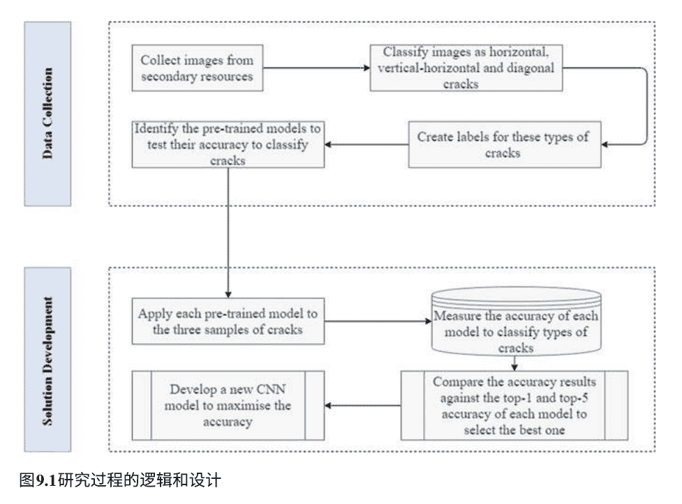

图9.1 研究过程的逻辑和设计

## 数据收集和分析

收集了四组裂缝图像作为二次数据（见图9.2）。样本的大小为'垂直裂缝约1 359个'，'水平和垂直裂缝约2184'和'1120'周围的对角裂缝。在将这些图像导入Matlab平台并对其进行分类后，使用了四个预训练模型，分别是AlexNet、VGG16、VGG19和GoogleNet。

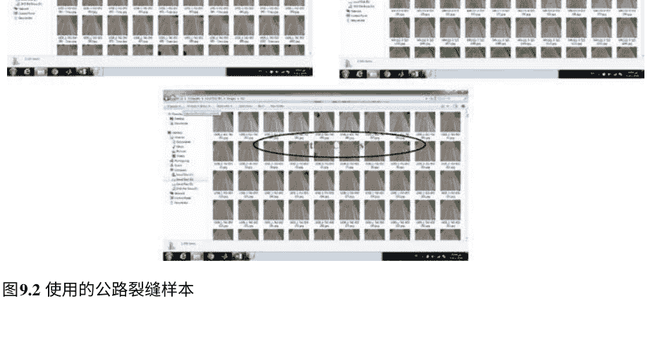

### 预训练深度学习模型的比较

图9.3展示了定义裂缝类别的过程，包括Dia（对角线）、Ver（垂直）和H-V（水平-垂直）。随后，这些定义的裂缝类别应该被分类为训练集和验证集。最后，所有预训练的CNN模型将使用这些确定的集合进行应用和测试（70%用于训练，30%用于测试）。

如表9.1所示，选择了四个模型来测试它们在分类和识别裂缝方面的准确性，如方法部分所述。为了检查所收集数据的可靠性与预训练模型的准确性相对应，准确率百分比应该位于前1和前5准确率之间。表9.1中的准确性结果表明，所有模型的图像质量非常高，因为所有模型的准确性都超过了前1和前5之间的平均值，并且样本的准确性超过了预训练的AlexNet模型的前5约3%，以及GoogleNet模型的0.2%。因此，准确率为89.08%的GoogleNet模型是准确的模型，比AlexNet高出1.26%。因此，GoogleNet是这些高速公路上的最佳模型。表9.1的结果证实了所有这些预训练的CNN模型可以以超过85%的准确率对裂缝类型进行分类，例如水平、垂直-水平和对角线。所有类型的裂缝的大样本量提高了所有预训练模型的准确性。一旦输入了一组新数据，系统将能够对裂缝的新图像进行分类，无论图像的大小和数量如何。因此，决策者可以扫描数百公里的公路并将图像导入系统，以确定各种类型的裂缝的百分比，从而开始维护过程。

表9.1 预训练的深度学习模型

| CNN模型 | 准确率（%） | 准确率范围（从前1到前5） |
| :--- | :--- | :--- |
| AlexNet | 87.83 | 63.3–84.6% |
| VGG16 | 85.14 | 74.4–91.9% |
| VGG19 | 85.93 | 47.5–92% |
| GoogleNet | 89.09 | 68.93–88.9% |

### 提出和评估新的CNN模型

图9.4描述了基于提出的CNN模型的公路裂缝的创建代码，包括提出的层、定义'优化算法、小批量大小、学习率、验证频率和最大Epochs'的训练选项，以及训练网络和计算不同学习率下创建的CNN模型的准确性的代码，以达到最大优化准确性。

图9.4显示了所提出的CNN模型的细节，包括层的类型、激活函数和可学习参数。CNN包括具有可学习权重和偏置的神经元。神经元接收到大量输入，通过加权求和来处理这些输入。最后，输入的加权和通过激活函数产生输出。

CNN的每一层都有两种参数：权重和偏置。可以按以下方式计算每一层的参数数量；

$$W_c = K^2 \times C \times N$$

$$B_c = N$$

$$P_c = W_c + B_c$$

其中，$W_c$是权重的数量，$B_c$是偏置的数量，N是卷积核的数量，C是输入图像的通道数，$P_c$是一层的总参数数量。

图9.5还提供了卷积和池化层的步幅和填充方式。步幅确定输入矩阵的像素移动数量。当步幅等于“1”时，卷积核每次移动1个像素。填充是向输入图像添加零层的过程。

## 图9.4基于卷积神经网络的高速公路裂缝模型的代码

## 提议模型的分类准确度

表9.2展示了提出模型的各种超参数的值。这些参数是基于预训练模型之间的比较选择的，以确定每个模型从一组高质量图像中检测小裂缝的能力。

| Index | Name | Type | Activations | Learnables |
|-------|------|------|-------------|------------|
| 1 | imageinput | Image Input | 224x224x3 | - |
| 2 | conv_1 | Convolution | 224x224x16 | Weights 3x3x3x16<br>Bias 1x1x16 |
| 3 | batchnorm_1 | Batch Normalization | 224x224x16 | Offset 1x1x16<br>Scale 1x1x16 |
| 4 | relu_1 | ReLU | 224x224x16 | - |
| 5 | maxpool_1 | Max Pooling | 112x112x16 | - |
| 6 | conv_2 | Convolution | 112x112x32 | Weights 3x3x16x32<br>Bias 1x1x32 |
| 7 | batchnorm_2 | Batch Normalization | 112x112x32 | Offset 1x1x32<br>Scale 1x1x32 |
| 8 | relu_2 | ReLU | 112x112x32 | - |
| 9 | maxpool_2 | Max Pooling | 56x56x32 | - |
| 10 | conv_3 | Convolution | 56x56x64 | Weights 3x3x32x64<br>Bias 1x1x64 |
| 11 | batchnorm_3 | Batch Normalization | 56x56x64 | Offset 1x1x64<br>Scale 1x1x64 |
| 12 | relu_3 | ReLU | 56x56x64 | - |
| 13 | fc | Fully Connected | 1x1x3 | Weights 3x200704<br>Bias 3x1 |
| 14 | softmax | Softmax | 1x1x3 | - |
| 15 | classoutput | Classification Output | - | - |

## 图9.5提出的卷积神经网络模型参数

## 表9.2提出模型的各种超参数的值

| 参数 | 值 |
|------|-----|
| 权重衰减 | $5 \times 10^{-4}$ |
| 动量 | 0.9 |
| 每个周期的迭代次数 | 73 |
| 最大迭代次数 | 365 |
| 小批量大小 | 32 |
| 最大周期数 | 5 |

## 比较不同优化算法以提高准确性

为了提高准确性，将三种优化算法应用于提出的卷积神经网络模型，如表9.3所示。可以看到，在不同的学习率下，准确率范围从82.54%到97.62%，比最准确的预训练模型（GoogleNet）高出8.53%。准确性是根据三个学习率来测量的，以检查提出的卷积神经网络模型的可靠性、有效性和可扩展性。例如，SGDM和Rmsprop算法的最高准确率为0.001。相比之下，Adam算法在学习率为0.0001时达到最高准确率。这是提出的卷积神经网络模型的优化和推荐算法。

图9.6显示了准确率曲线与不同迭代次数和损失值对不同迭代次数的曲线，以达到推荐优化算法的终点点，该算法是Adam学习率，如表9.3所示。

| 优化算法 | 学习率 | 准确率 (%) |
| --- | --- | --- |
| SGDM | 0.01 | 90.08 |
| SGDM | 0.001 | 97.42 |
| SGDM | 0.0001 | 97.32 |
| Rmsprop | 0.01 | 88 |
| Rmsprop | 0.001 | 95.24 |
| Rmsprop | 0.0001 | 82.54 |
| Adam | 0.01 | 91.47 |
| Adam | 0.001 | 92.56 |
| Adam | 0.0001 | 97.62 |

## 意义和贡献

所提出的基于CNN的公路裂缝与现有的预训练模型和不同方面有所区别，具体如下：

其参数是基于四个预训练CNN模型检测公路裂缝的能力揭示而建立的。因此，所提出的基于CNN的公路模型从测试这些预训练模型使用相同样本的观察中获益。

三种优化算法被应用于所提出的CNN模型，以不同的学习率找到使用该模型最大化准确率的最佳情况。

潜在用户将能够使用该模型在几分钟内扫描一条长公路并评估其健康状况，因为所提出的CNN是使用大规模高质量图像样本构建和测试的，准确率非常高。因此，质量较差的图像也将在较低的准确性水平被检测出来。然而，该模型在不同的场景和广泛的输入下都是可行的。

所提出的基于CNN的公路裂缝在不同的学习率下使用不同的优化算法进行了测试。因此，无论何时使用，准确性都会提高。 这意味着像公路管理机构这样的用户可以将其用于他们的公路。 此外，该模型将自动调整到它们的裂缝类型、图像质量和其他标准。 因此，与用于检测类似研究中的公路裂缝的预训练CNN模型相比，所提出的基于CNN的公路裂缝是可扩展的模型。

所创建的基于CNN的公路裂缝的准确性高于经过测试的预训练CNN模型的前5个准确性，因为VGG19的最高前5个准确性为92%。 与此同时，所提出的CNN模型的准确性高于97%。

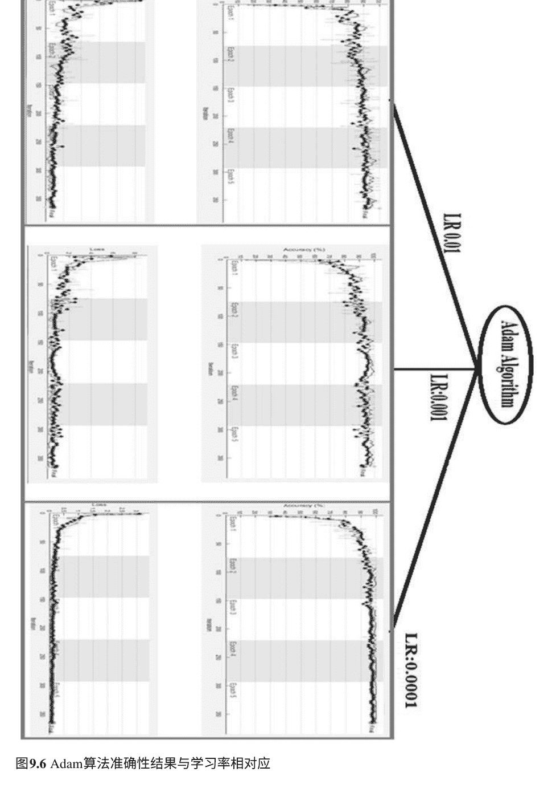

### 图9.6 Adam算法准确性结果与学习率相对应

## 结论

对四个预训练的CNN模型（即AlexNet、VGG16、VGG19、GoogLeNet）进行了测试，以对公路上的裂缝类型进行分类和检测，并将计算得到的准确率与最高准确率和前五准确率进行了比较。所有预训练模型的准确率都高于平均水平。AlexNet和GoogLeNet模型的计算准确率高于前五准确率。

这反映了所使用的裂缝样本的有效性和可靠性。

在分析每个预训练CNN模型的能力后，提出了一种专门针对公路裂缝特征的CNN模型。创建的CNN模型的准确率为97.62%，比预训练CNN模型的最高准确率高出5%以上。为了达到最大的准确率，使用三种不同的学习率对三种优化算法进行了计算。对于创建的CNN模型，Adam的优化算法在学习率为0.001时达到了最大准确率（79.62%）。提出的基于CNN的公路模型对公路管理机构来说非常有价值，可以通过将图像导入到创建的基于CNN的公路模型中进行长公路的扫描，并对裂缝进行分类。这使得公路管理机构能够开始维护工作，并根据裂缝的类型和密度将道路划分为特定的区段。

使用大样本的裂缝（n =4663）训练和测试了基于CNN的高速公路模型。然而，所有这些图像都被分类为三类裂缝：‘垂直裂缝’、‘水平和垂直裂缝’和‘对角裂缝’。值得注意的是，这项研究中没有考虑其他类型的裂缝。

因此，可以向提出的CNN模型添加其他类型的裂缝样本，以便能够检测到各种高速公路裂缝。此外，创建的基于CNN的高速公路裂缝将被纳入一个综合性维修系统中，该系统将考虑各种高速公路损害并评估裂缝的严重程度。

# 参考文献

- Chuang, T.-Y., Perng, N.-H., & Han, J.-Y. (2019). 基于众包时空数据的路面性能监测和异常识别。Automation in Construction, 106,102882。
- Elghaish, F., Matarneh, S. T., & Alhusban, M. (2021a). “深度学习”在建筑工地管理中的应用：科学计量、主题和批判性分析。建筑创新。
- Elghaish, F., Matarneh, S. T., Talebi, S., Abu-Samra, S., Salimi, G., & Rausch, C. (2021b). 用于检测建筑物和路面损坏的深度学习：关键差距分析。建筑创新。
- Fan, C., Sun, Y., Xiao, F., Ma, J., Lee, D., Wang, J., & Tseng, Y. C. (2020). 基于迁移学习的短期建筑能源预测方法的统计调查。应用能源, 262, 114499。
- Fan, C., Sun, Y., Zhao, Y., Song, M., & Wang, J. (2019). 基于深度学习的特征工程方法用于改进建筑能源预测。应用能源, 240, 35-45。
- Hoang, N.D., Nguyen, Q.L., & Tien Bui, D. (2018). 基于图像处理的支持向量机优化的沥青路面裂缝分类。土木工程计算杂志，32(5), 04018037。
- Huyan, J., Li, W., Tighe, S., Xu, Z., & Zhai, J. (2020). CrackU-net: 一种新颖的深度卷积神经网络用于像素级路面裂缝检测。Structural Control and Health Monitoring, 27(8), e2551.
- Kang, D., Benipal, S. S., Gopal, D. L., & Cha, Y.-J. (2020). 基于深度学习的像素级混凝土裂缝分割和定量化方法在复杂背景下的应用。Automation in Construction, 118, 103291.
- Kumar, S.S., Wang, M., Abraham, D. M., Jahanshahi, M. R., Iseley, T., & Cheng, J. C. (2020). 基于深度学习的污水管道缺陷在CCTV视频中的自动检测。Journal of Computing in Civil Engineering, 34(1), 04019047。
- Liang, X. (2019). 基于图像的深度学习与贝叶斯优化在钢筋混凝土桥梁系统灾后检测中的应用。计算机辅助土木与基础设施工程, 34(5), 415–430.
- Liu, H., & Zhang, Y. (2020). 使用深度学习算法进行桥梁状况评级数据建模。结构与基础设施工程, 16(10), 1447–1460.
- Lorenzoni, R., Curosu, I., Leonard, F., Paciornik, S., Mechtcherine, V., Silva, F. A., & Bruno, G. (2020). 通过原位X射线显微成像对应变硬化水泥基复合材料（SHCC）进行机械和三维微观结构分析的组合。水泥与混凝土研究, 136, 106139.
- Mei, Q., & Gil, M. (2020a). 使用摄像头和深度神经网络进行经济有效的路面裂缝检测的解决方案。建筑与建筑材料, 256, 119397.
- Mei, Q., & Gil, M. (2020b). 多层特征融合在密集连接的深度学习架构和深度优先搜索中，用于智能手机采集的图像中的裂缝分割。结构健康监测, 19(6), 1726–1744。
- Nath, N. D., Behzadan, A. H., & Paal, S. G. (2020). 用于现场安全的深度学习：实时检测个人防护装备。建筑自动化, 112, 103085。
- Ni, F., Zhang, J., & Chen, Z. (2019). 像素级裂缝描绘在图像中使用卷积特征融合。结构控制与健康监测, 26(1), e2286。
- Park, S., Bang, S., Kim, H., & Kim, H. (2019). 基于补丁的黑盒图像中的裂缝检测，使用卷积神经网络。土木工程计算期刊, 33(3), 04019017。
- Rahimian, F. P., Goulding, J. S., Abrishami, S., Seyedzadeh, S., & Elghaish, F. (2021). 建筑设计和施工的工业4.0解决方案：新机遇的范例（第1卷）。Routledge. ISBN: 1003106943。
- Reichstein, M., Camps-Valls, G., Stevens, B., Jung, M., Denzler, J., & Carvalhais, N. (2019). 基于数据驱动的地球系统科学的深度学习和过程理解。自然, 566(7743), 195–204.
- Ren, Y., Huang, J., Hong, Z., Lu, W., Yin, J., Zou, L., & Shen, X. (2020). 基于深度全卷积网络的隧道混凝土裂缝检测。建筑与建筑材料, 234, 117367.
- Won, D., Chi, S., & Park, M.-W. (2020). 用于建筑资源定位的无人机-RFID集成。KSCE土木工程学报, 24(6), 1683–1695.
- Ye, X.-W., Jin, T., & Chen, P.-Y. (2019). 基于深度学习的全卷积网络的结构裂缝检测。结构工程的进展, 22(16), 3412–3419.
- Yin, R. K. (1981). 案例研究危机：一些答案。Administrative Science Quarterly, 26(1), 58–65。
- Zhang, K., Zhang, Y., & Cheng, H. (2020). 基于循环一致生成对抗网络的自监督结构学习用于裂缝检测。土木工程计算杂志，34(3), 04020004。
- Zhu, J., & Song, J. (2020). 基于弱监督网络的沥青混凝土桥面裂缝智能识别。亚历山大工程杂志，59(3), 1307–1317。