# 医学中的机器学习和深度学习基础

## 前言

不久前，机器学习和深度学习是计算机科学和统计学系中只有少数人知道的晦涩主题。然而，如今，这些技术已经进入了学术界的每一个角落，包括医学。从医学影像数据的自动分割，到诊断医疗状况和疾病，到预测临床结果，再到招募临床试验患者，机器学习和深度学习模型已经取得了与人类性能相媲美甚至超越的结果。

这些开创性的成功引起了学术界和工业界医疗保健利益相关者的关注，许多人预计并倡导对当前教育课程进行全面改革，以便为医学从“信息时代”过渡到“人工智能时代”做好学生准备。当医学和与健康相关的项目开始将机器学习和深度学习纳入其课程时，一个重要问题出现了，即在研究人员和从业人员在这些领域中可以并且经常使用各种技术的情况下，应该教授这些学科的程度。例如，一个诊断医师不一定需要熟悉磁共振扫描仪内部如何产生磁场才能准确解读MRI。同样，外科医生可以有效地学习操作机器人手术系统，而无需知道如何构建、修复或维护这些系统。我们认为在医学中使用人工智能时不能说同样的话。例如，肿瘤学家不能仅仅成为机器学习模型的最终用户，该模型为给定的癌症患者推荐最佳治疗方案。他们需要了解这些模型的工作原理，并在理想情况下参与其中的开发。

由于机器学习和深度学习的广泛流行，市场上充斥着大量关于这些主题的教材。然而，这些教材通常是由数学家和工程师编写的，面向的也是数学家和工程师。

这些教材并不适合医学生、研究人员和从业者的特定教育需求。换句话说，它们使用的“语言”对于通常没有数学和计算机科学研究生背景的医学学者来说是难以理解的。将近六十年前，英国医学科学家哈罗德·帕西瓦尔·希姆斯沃斯在1964年生物学和医学数学计算机科学会议上提到了这个问题：“医学生物学家、数学家、物理学家和计算机学家之间的观点可能比我们想象的更相似。但是他们使用不同的方言，有不同的观点。对于医学研究这样的多学科课题来说，这并不是一个新问题。

如果要解决问题并意识到合作的必要性，有一件事是必不可少的：我们必须学习彼此的语言。
在你面前的这本书是为了实现这一愿景，通过提供一个易于理解的介绍，来介绍医学中机器学习和深度学习的基础知识。为了服务于医学研究人员和专业人士的受众，我们在整本书中精选了一系列来自医学和相关领域的机器学习应用。此外，我们优先选择直观的描述，而不是抽象的数学形式，以消除常常围绕机器学习和深度学习概念的不必要复杂性。已经修过至少一门本科水平的数学课程的读者（例如生物统计学或微积分）将能够在不需要任何额外先修知识的情况下使用本书。这使得我们的入门教材适用于来自各种医学背景的读者，他们不一定具备高级数学的知识，但渴望更好地理解这些颠覆性技术如何塑造医学的未来。

伊凡斯顿，伊利诺伊州，美国
休斯顿，德克萨斯州，美国
伊凡斯顿，伊利诺伊州，美国

Reza Borhani
Soheila Borhani
Aggelos K. Katsaggelos


## 第1章
## 引言

纵观历史，人类一直努力更好地理解直接影响他们生活的自然现象。降水是一个例子。对于人类来说，能够预测降雨是神圣的圣杯，因为他们的生计不断受到长期干旱和大洪水的威胁。

对水文学原理一无所知，出于绝望，一些人诉诸于祭祀人类希望取悦神灵并拯救庄稼。

启蒙运动彻底改变了我们思考我们感兴趣的现象的方式，用科学推理和实验的工具取代了宗教和哲学的教条。例如，正是通过仔细而反复的实验，伽利略发现了抛物线运动的性质，正如他的书中所描述的：“关于两个新科学的对话”[1]。伽利略的发现推翻了持久的亚里士多德线性运动理论，为他那个时代最先进的火炮的轨迹的精确计算铺平了道路（见图1.1）。几十年后，艾萨克·牛顿通过一组微分方程正式描述了伽利略的观察，这些方程完全描述了我们周围几乎所有运动物体的行为，包括火炮。

在第三个千年的黎明时刻，我们不再祈求神明降雨，也不再在战争期间交叉手指希望炮弹能够命中目标。作为一个文明社会，我们现在能够通过人工降雨（通过云种植）和发射具有精确打击能力的洲际弹道导弹。与之相比，当今未解决的问题更加复杂，其中一个例子就是癌症和自身免疫性疾病等人类疾病，尽管我们尽力而为，但每年仍然夺走数百万人的生命。为了比较这些现代问题的复杂性

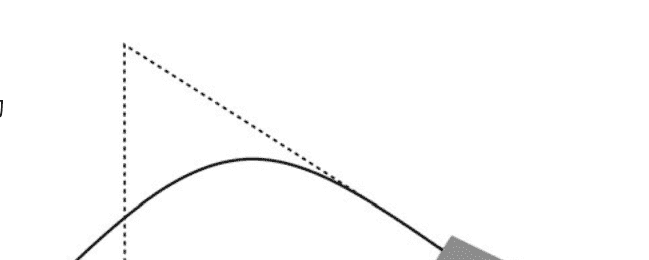

以牛顿力学中的第二定律为例，考虑过去的定律。这个众所周知的定律通常表达为 $\mathbf{F} = m \mathbf{a}$，它说明了任何运动物体的加速度 $\mathbf{a}$ 只受到两个因素的影响：物体的质量 $m$ 和作用在它上面的净力 $\mathbf{F}$。此外，加速度和力之间的关系恰好是线性的，这是最容易进行数学建模的。此外，这种简单的线性关系是普遍的，这意味着它同样适用于所有运动物体和所有时间，无论它们的位置、速度和其他物理属性如何。

相比之下，疾病不是单因素或双因素现象。癌症的数学模型（如果有的话）可能包括成千上万个遗传和环境变量。此外，这些变量可能不一定以方便的线性方式相互作用，使得它们的数学建模变得非常困难。最后，人类疾病没有普遍性，因为它们在所有受影响的个体中并不总是表现相同。由于这种固有的差异和复杂性，传统的数学工具和演绎推理工具无法充分解决二十一世纪复杂的生物学问题。$^2$

幸运的是，我们今天可以利用一种非常宝贵的资源来建模复杂现象：数据。与我们的祖先不同，他们没有技术来生成和存储大量的数据，我们生活在一个充斥着数据的世界中。目前，全球每年产生超过2个泽字节（即 $2 \times 10^{21}$ 字节）的医疗数据，包括电子健康记录、高分辨率医学图像、生物信号、基因组测序数据等。这些海量数据可以通过大型分布式网络连接的服务器群（即“云”）轻松访问。

19世纪，原子模型和元素周期表的发展彻底改变了化学。20世纪，随着量子力学的出现，物理学经历了一次范式转变。许多人相信，人类基因组的完整映射以及正在进行的信息技术革命将为21世纪的生物学带来类似的飞跃进展。

这种过剩的数据已经改变了许多科学学科，包括人工智能（AI）。AI在医学中的第一个应用之一是一个名为ELIZA的聊天机器人[2]，由约瑟夫·魏泽恩鲍姆于1964年在麻省理工学院创建，用于模拟患者与心理治疗师之间的对话。像当时的其他原始AI技术一样，ELIZA遵循一套明确编程的规则。例如，对于患者以“我是——”（例如，“我很伤心”或“我很焦虑”）的形式说出的任何句子，ELIZA都被编程回答“你已经——多久了？”而不管空格中的单词或短语的含义。这种基于规则的编程方式在AI领域长期占主导地位，因为当时的专家们认为“例如，内科专家团队完全可以制定出一套复杂的规则，以便从症状集合中得出诊断”[3]。然而，到了20世纪80年代，人们开始意识到医学领域“如此广泛而复杂，以至于很难，如果不是不可能，用规则来捕捉相关信息”[4]。因此，AI社区采用了一种完全不同的方法，称为机器学习，计算机不再被明确编程规则，而是利用数据来推导出自己的规则。

作为从数据中学习的计算框架，机器学习在医学以及其他科学和技术领域取得了突破性进展。一种特殊类型的机器学习模型（称为深度学习）现在在执行某些临床任务，包括基于图像的皮肤癌诊断方面与人类专家不相上下（参见[5]）。在下一节中，我们将以这个特定应用为例，介绍标准的机器学习流程。

在本章的后面，我们将讨论机器学习问题的基本分类，并介绍这种强大技术在医学中的其他应用。

### 机器学习流程

在本节中，我们将描述构建一个原型机器学习系统以进行常规皮肤病学评估的步骤：区分良性和恶性皮肤病变。通过这个例子，我们将介绍机器学习流程（以其最基本的形式）并描述其基本概念。

### 数据收集

由于机器学习是建立在从数据中学习的原则上，因此收集数据是机器学习流程的第一步是很直观的。在我们的皮肤病学示例中，要收集的数据是皮肤病变的图像，每个图像由人类标记为良性或恶性。

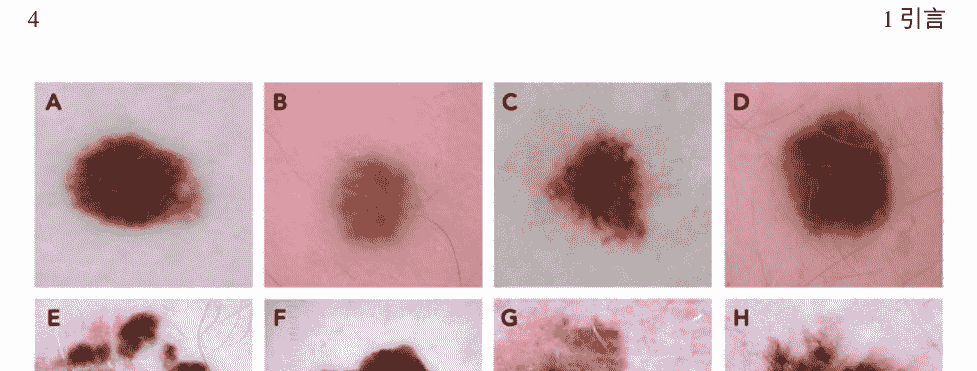

图1.2一个包含四个良性病变（上排）和四个恶性病变（下排）的小型分类数据集。本图中显示的图像来自国际皮肤成像合作组织（ISIC）数据集[6]。

专家，例如皮肤科医生。需要注意的是，虽然皮肤科医生接受了对各种类型的皮肤癌进行视觉检测的训练（即使在疾病的早期阶段），但癌症的确诊只能通过实验室对活检病变进行组织病理学检查来确定。在机器学习的术语中，病理学家为每个样本提供了“地面真相”，而我们教计算机区分两种类型或数据类别（在这里是良性和恶性病变）的任务被称为“分类”。在图1.2中，我们展示了一个小型数据集，用于手头的任务，包含八个样本或数据点。

作为一般规则，我们希望训练数据集尽可能大且多样化，因为更多的示例可以给机器学习系统更多的经验。实际上，机器学习数据集可以包含数百万个数据点。

### 特征设计

为了区分良性和恶性病变，皮肤科医生考虑病变的不同属性，包括其形态、颜色和大小。这些属性在机器学习的语言中被称为特征。

众所周知，恶性病变通常具有较不对称的形状和

> 3其他因素，如患者的生活方式、过度暴露于紫外线以及家族病史，也在指导医生进行癌症诊断时起到一定作用。尽管如此，我们仍然仅使用病变的外观来构建我们的机器学习系统。

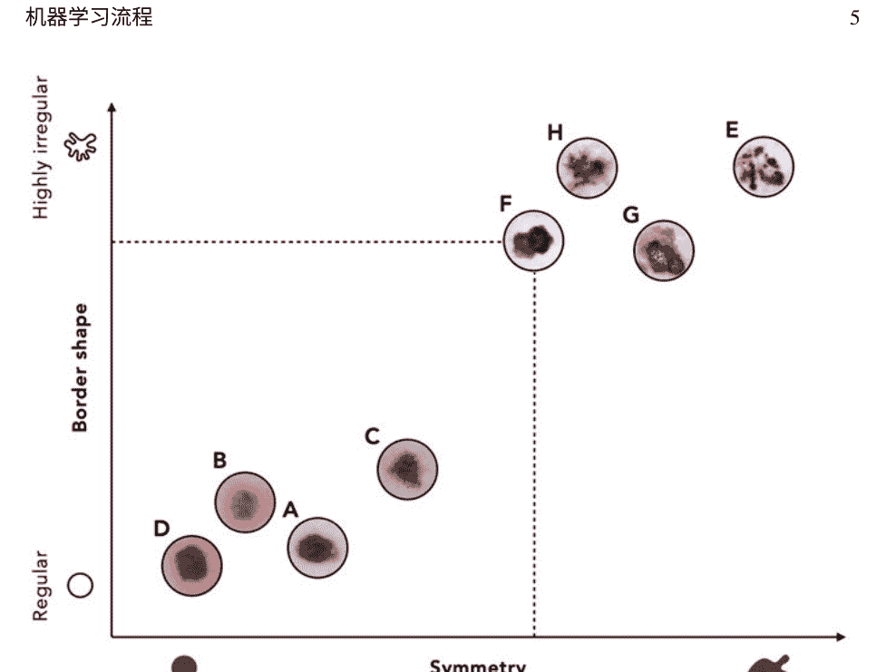

图1.3 以前在图1.2中显示的数据集的特征空间表示。这里的水平和垂直轴分别表示对称性和边界形状特征。良性和恶性病变位于特征空间的不同区域，这反映了良好的特征选择。

与良性黑痣相比，恶性黑痣的边界更不规则，如图1.2所示的小数据集中所反映的那样。尽管量化这些定性特征并不是一项简单的任务，但为了简单起见，假设我们可以轻松提取我们数据集中每个图像的以下两个特征：首先，对称性，从完全对称到高度不对称；其次，边界形状，从完全规则到高度不规则。通过选择这些特征，每个图像可以在一个二维特征空间中表示，如图1.3所示，只需两个数字：一个测量病变对称性的数字决定图像的水平位置，另一个捕捉病变边界形状的数字决定其在特征空间中的垂直位置。

设计合适的特征对于分类系统的整体成功至关重要。优质的特征使得两类数据在特征空间中能够很好地分离，就像我们在图1.3中选择的特征一样。

### 模型训练

通过在精心设计的特征空间中表示数据，将良性和恶性病变区分开来的问题可以简化为在每个类别中用一条线分隔数据点。在机器学习的术语中，这条线被称为分类模型（或简称为分类器），找到最佳分类模型的过程被称为模型训练。一旦分类器被训练，特征空间将被分割成两个子空间，分别位于分类器的两侧。图1.4展示了一个经过训练的线性分类器，将特征空间分割成良性和恶性子空间。请注意，这个分类器提供了一个简单的规则来区分良性和恶性病变：当一个病变的特征表示位于线下方（在蓝色区域），它将被分类为良性，同样地，任何特征表示位于线上方（在黄色区域）的将被分类为恶性。

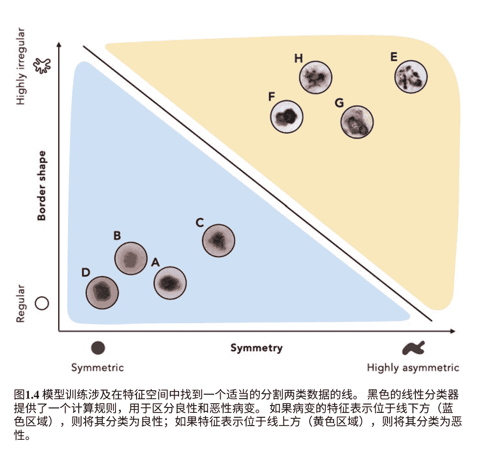

图1.4 模型训练涉及在特征空间中找到一个适当的分割两类数据的线。黑色的线性分类器提供了一个计算规则，用于区分良性和恶性病变。如果病变的特征表示位于线下方（蓝色区域），则将其分类为良性；如果特征表示位于线上方（黄色区域），则将其分类为恶性。

### 模型测试

图1.4中的分类模型在区分良性和恶性病变的特征表示方面表现出色，没有任何数据点被错误分类。然而，这并不应该让我们对分类器的效果过于自信。分类器真正的测试是当它能够将所学到的知识推广到新的或以前未见过的数据实例时。这个评估是通过模型测试的过程来完成的。

为了测试一个分类模型，我们必须收集一批新的数据，称为测试数据，如图1.5所示。显然，测试数据集与之前用于训练的数据集之间不应有重叠，我们将其称为训练数据集。

模型测试过程始于使用先前设计的特征集（即对称性和边界形状）获取测试数据集中每个图像的特征表示。提取了这两个特征后，我们可以找到每个测试图像在特征空间中相对于训练好的线性分类器的位置。如图1.6所示，所有四个良性病变都位于蓝色区域的线下方，因此被分类器正确地分类为良性。同样，四个恶性病变中的两个位于黄色区域的线上方，因此被正确地分类为恶性。然而，两个恶性病变（即数据点M和N）位于蓝色区域的线的错误一侧，因此被分类器错误地分类为良性。

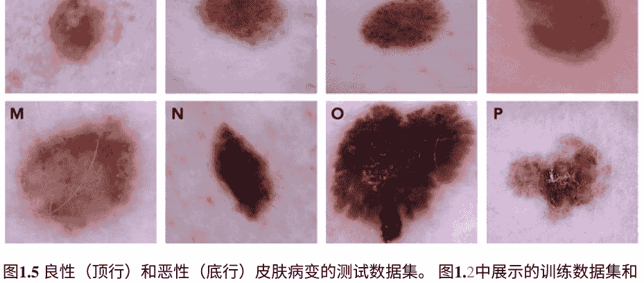

图1.5 良性（顶行）和恶性（底行）皮肤病变的测试数据集。图1.2中展示的训练数据集和此处展示的测试数据集不能有任何共同的数据点。本图中展示的图像来自国际皮肤成像合作（ISIC）数据集[6]。

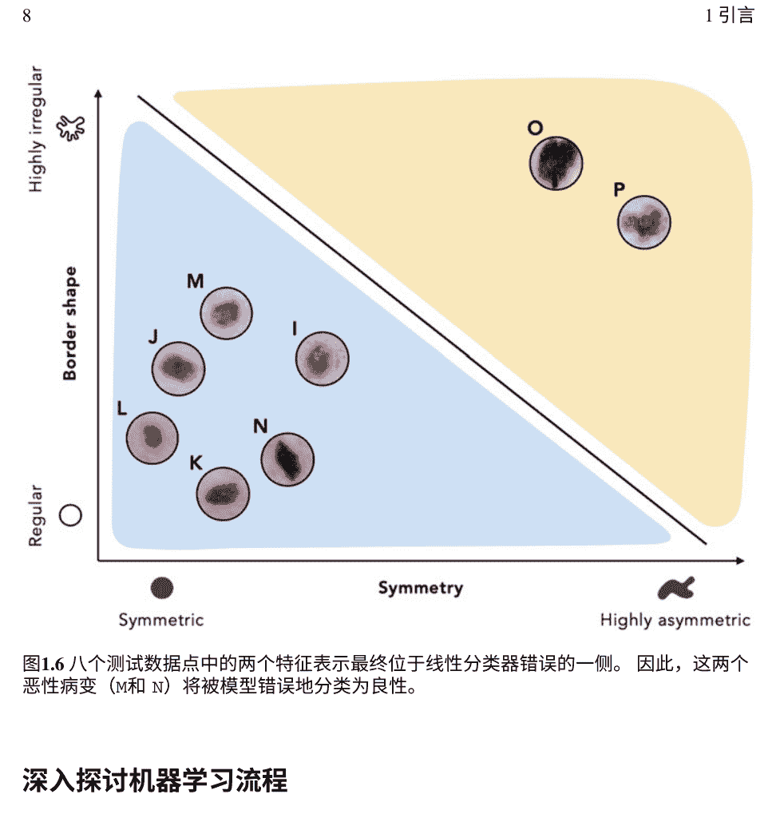

图1.6 八个测试数据点中的两个特征表示最终位于线性分类器错误的一侧。因此，这两个恶性病变（M和N）将被模型错误地分类为良性。

## 深入探讨机器学习流程

在前一节中，我们以相当非正式的方式描述了开发原型皮肤癌分类系统所涉及的四个步骤。这些步骤在图1.7中以可视化方式总结，包括数据收集、特征设计、模型训练和模型测试。有了这种高层次的理解，我们现在可以深入探讨管道的每个步骤，并进一步讨论相关的思想和概念。

### 重新审视数据收集

数据是驱动机器学习的燃料，因此在数据方面，“越多越好”是一直被认可的。然而，在实践中，常常会存在成本、安全和患者隐私方面的考虑，这些因素都可能严重限制数据的可用性。在这种情况下，合理地分配可用数据到训练集和测试集之间变得很重要。

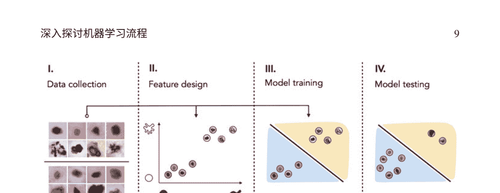

对于给定数据集的哪一部分应该用于测试，没有明确的规则。一方面，我们希望训练集尽可能大，以便分类器可以从各种数据样本中学习。另一方面，大而多样的测试集确保训练模型可以可靠地对以前未见过的实例进行分类。作为经验法则，通常将整个数据的10%到30%随机分配给测试集。一般来说，原始数据分配给测试集的百分比随着数据量的增加而增加。这样做的直觉是，当数据充足时，即使删除了相对较大的一部分测试数据，训练集仍然准确地表示感兴趣的基本现象。相反，对于较小的数据集，我们通常将较小的百分比用于测试，因为较大的训练集需要保留原始数据所捕获的有关基本现象的少量信息，因此可以为测试保留较少的数据量。

### 重新审视特征设计

在评估皮肤病变是否潜在恶性时，皮肤科医生有时会应用所谓的ABCDE规则：即病变的不对称性、边界、颜色、直径和演变或变化的外观的缩写。这个规则是在第“机器学习流程”章节中选择对称性和边界形状作为特征的基础。不幸的是，我们不能总是依赖我们之前的临床知识来设计特征，因为它可能是不完整的，甚至不存在，这取决于手头的任务。因此，如果我们能够直接使用原始输入数据来训练分类模型，那将非常方便和理想。让我们花点时间更深入地探讨这个选项。

用于皮肤癌分类任务的数据包括尺寸为512×512的彩色图像。彩色图像本质上是三个单色图像的叠加。

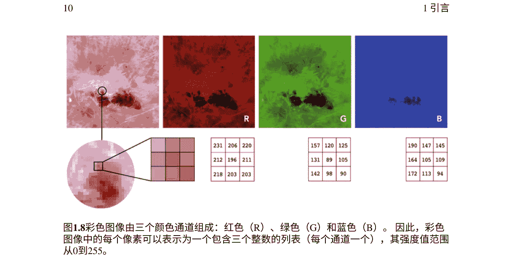

图1.8 彩色图像由三个颜色通道组成：红色（R）、绿色（G）和蓝色（B）。因此，彩色图像中的每个像素可以表示为一个包含三个整数的列表（每个通道一个），其强度值范围从0到255。

如图1.8所示，通过将像素的总数（即512²）乘以每个像素的颜色通道数（即3），我们得到一个接近800,000的数字。如果我们使用原始像素值作为特征，那么这将是特征空间的维度！

像这样的超高维空间会导致一种不希望出现的现象，称为维度灾难。为了直观地描述这种现象，我们从一个简单的一维空间开始，并逐渐向更高的维度发展。假设我们的目标是了解一维空间（即一条线）内部发生了什么。我们在这条线上放置一系列传感器，每个传感器与相邻传感器的距离为 d。显然，d的值越小，所需传感器的数量就越多，我们对所研究的空间的理解就越精细。将 d 设置为一个固定的预定值，如图1.9左侧所示，我们需要3个传感器来覆盖长度为2d的线段。现在让我们提升一个维度。如图1.9中间面板所示，在二维空间（即平面）中，我们需要9个传感器来覆盖一个2d × 2d的区域，以达到相同的分辨率（或粒度）。类似地，在三维空间中，我们将需要总共27个传感器，如图1.9右侧所示。将这种模式推广到更高的维度，一般N维空间中需要3^N个传感器。换句话说，传感器的数量随着空间的维度呈指数增长。

数据点本质上就像传感器，因为它们向我们传递有用的关于所在空间的信息。数据点（传感器）的数量越多，我们对特征空间的理解就越充分。问题是，随着特征空间的维度 N 增加，我们需要指数级更多的数据点来有效地进行分类，而当 N 非常大时，这是不可行的。

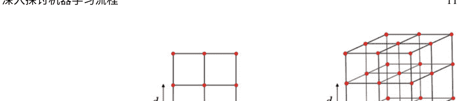

图1.9 我们必须放置的传感器数量（以红点表示），使得每个传感器与其相邻传感器的距离为 d，随着空间维度的增加呈指数级增长。这种指数级增长行为通常被称为维度灾难。

我们刚刚看到，“维度灾难”实际上禁止了使用原始像素值作为特征。⁴好消息是，正如我们将在本书中看到的那样，深度学习允许从数据中自动学习特征。事实上，在典型的深度学习分类系统中，特征设计和模型训练步骤被合并为一步，以便同时从数据中学习特征和分类器。

⁴即使特征空间的维度非常大也不是问题，通过使用原始像素值作为特征，我们将忽视从图像中每个像素的位置中可以推断出的有价值的信息。在第7章中，我们将研究一类称为卷积神经网络的深度学习模型，这些模型专门设计用于利用图像数据中存在的空间相关性。

### 重新审视模型训练

如前面在“机器学习流程”一节中讨论的，线性分类器的训练归结为找到一条将特征空间分成两个区域的直线，每个区域对应一个数据类别。在这里，我们将详细讨论找到这条直线的过程。

在二维空间中，任何一条直线都可以用三个参数来描述：两个斜率参数分别测量直线在每个维度上的方向，以及一个偏置参数。将两个维度表示为 x₁ 和 x₂，相应的斜率参数表示为x₁和x₂，偏置参数表示为x₀，直线的方程可以形式化地写成

```
x₀ + x₁x₁ + x₂x₂ = 0。
```

例如，设置 x₀ = 0， x₁ = 1， x₂ = -1，得到的直线方程为x1-x2 = 0，该直线经过原点，与水平轴和垂直轴都形成45度角。对于 w0、 w1和 w2的所有可能值，

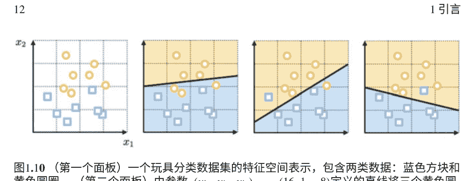

图1.10 （第一个面板）一个玩具分类数据集的特征空间表示，包含两类数据：蓝色方块和黄色圆圈。（第二个面板）由参数（w0, w1, w2）=（16, 1, -8）定义的直线将三个黄色圆圈错误分类，因此g(16, 1, -8) =3。（第三个面板）由参数（w0, w1, w2）=（4, 5, -8）定义的直线将一个黄色圆圈和一个蓝色方块错误分类，因此g(4, 5, -8) =2。（第四个面板）由参数（w0, w1, w2）=（-8, 1, 4）定义的直线只将一个蓝色方块错误分类，因此g(-8, 1, 4) =1。

我们寻找那些能够尽可能好地将数据分为两类的线。更准确地说，我们希望设置线的参数，以最小化分类器所犯的错误或误分类的数量。我们可以通过将 g(w0, w1, w2) 表示为一个函数来数学地表达这个想法，该函数以特定的线参数作为输入，并返回分类器 w0 + w1x1 + w2x2 =0 所犯的分类错误的数量作为输出。在图1.10中，我们展示了一个玩具分类数据集的三种不同的 (w0, w1, w2) 设置，得到了三个不同的分类器和三个不同的 g 值。

在机器学习术语中，函数 g 通常被称为成本函数或误差函数。我们的目标是通过找到 w0, w1, 和 w2 的最优值，分别用 w0*, w1*, 和 w2* 表示，来最小化这个函数。

```
g(w0*, w1*, w2*) ≤ g(w0, w1, w2)  (1.2)
```

对于所有的 w0, w1, 和 w2 的值。例如，对于图1.10中显示的玩具分类数据集，我们有 w0* = -8, w1* = 1. 和 w2* = 4。这对应着 g(w0*, w1*, w2*) = 1 的最小成本值，这是在这个特定数据集上任何线性分类器可以达到的最小错误数。确定给定成本函数的最优参数值的过程被称为数学优化。

请注意，与图1.4中显示的皮肤癌分类数据集不同，图1.10中的玩具数据集不是线性可分的，这意味着没有线性模型可以完全正确地对其进行分类。这种类型的数据在实践中很常见，并且需要更复杂的非线性分类模型，例如图1.11中所示的模型。在该图的第二、第三和第四个面板中，我们分别展示了多项式、决策树和人工神经网络分类器的实例。这些是最流行的三个非线性分类模型家族，而后者是我们在第6和第7章中研究的重点。

### 重新审视模型测试

通过评估图1.6中显示的线性分类器的性能，我们可以看到它在测试数据集中正确分类了八个样本中的六个。将第一个数字除以第二个数字得到了一个被广泛使用的分类质量度量标准，称为准确率，定义为

```
准确率 = (测试集中被正确分类的数据点的数量) / (测试集中的总数据点数量).  (1.3)
```

根据上述定义，该度量标准始终在0和1之间，数值越大越理想。在我们的例子中，准确率 = 6/8 = 0.75。虽然准确率为分类器的整体性能提供了有用的度量标准，但它不能区分良性病变被错误分类为恶性（第一类错误）和恶性病变被错误分类为良性（第二类错误）。由于在医学领域中这种区分尤为重要，因此通常使用两个额外的度量标准来报告分类结果。

将恶性类别表示为阳性（用于癌症），良性类别表示为阴性，两个度量指标敏感性和特异性分别定义为

```
敏感性 = (正确分类为阳性的阳性数据点数量) / (阳性类别中的总数据点数量)
```

```
特异性 = (正确分类为阴性的阴性数据点数量) / (阴性类别中的总数据点数量). (1.4)
```

与准确度一样，敏感性和特异性的取值范围始终在0和1之间，值越大越理想。在我们的例子中，敏感性 = 2/4 = 0.5 特异性 = 4/4 = 1。

到目前为止，介绍的这三个分类度量指标（准确度、敏感性和特异性）可以更简洁、优雅地使用所谓的

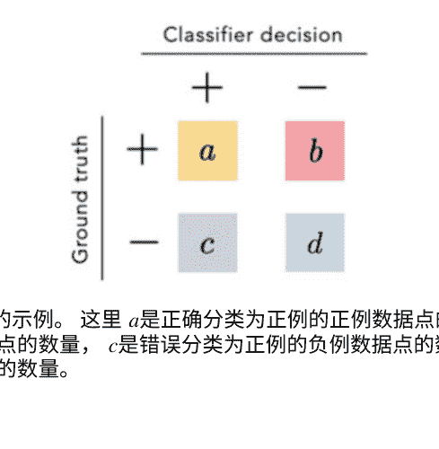

图1.12 一个混淆矩阵的示例。这里 $a$ 是正确分类为正例的正例数据点的数量，$b$ 是错误分类为负例的正例数据点的数量，$c$ 是错误分类为正例的负例数据点的数量，$d$ 是正确分类为负例的负例数据点的数量。

混淆矩阵。如图1.12所示，混淆矩阵是一个简单的查找表，用于将分类结果按照真实情况（行）和分类器决策（列）进行分解。

利用混淆矩阵，我们可以更简洁地重新表示公式（1.3）和（1.4）中的分类度量指标。

```
$$ \text{准确率} = \frac{a + d}{a + b + c + d}, \quad \text{敏感度} = \frac{a}{a + b}, \quad \text{特异度} = \frac{d}{c + d}. $$
```

)除了方程（1.5）中的指标外，还可以使用混淆矩阵计算其他一些分类指标，其中平衡准确率、精确度和F-得分（如下所定义）在文献中更常用。

```
$$ \text{平衡准确率} = \frac{ \frac{a}{a+b} + \frac{d}{c+d} }{2}, \quad \text{精确度} = \frac{a}{a + c}, \quad \text{F-得分} = \frac{2a}{2a + b + c}. $$
```

## 机器学习分类

在“机器学习流程”和“深入探讨机器学习流程”章节中，我们通过基于图像的皮肤癌诊断（参见[5]）来推动引入机器学习流程的介绍。这只是许多诊断任务之一，机器学习已经达到了人类水平的准确性。

其他例子包括使用视网膜底部照片诊断糖尿病视网膜病变（参见[7]），使用乳房X光照片诊断乳腺癌（参见[8]），使用胸部CT扫描图像诊断肺癌（参见[9]），使用膀胱镜图像诊断膀胱癌（参见[10]），以及更多（图1.13）。

图1.13 视网膜底部图像捕捉眼睛中的重要结构。这种成像方式通常用于糖尿病视网膜病变、高血压性视网膜病变、黄斑变性等的诊断和监测。


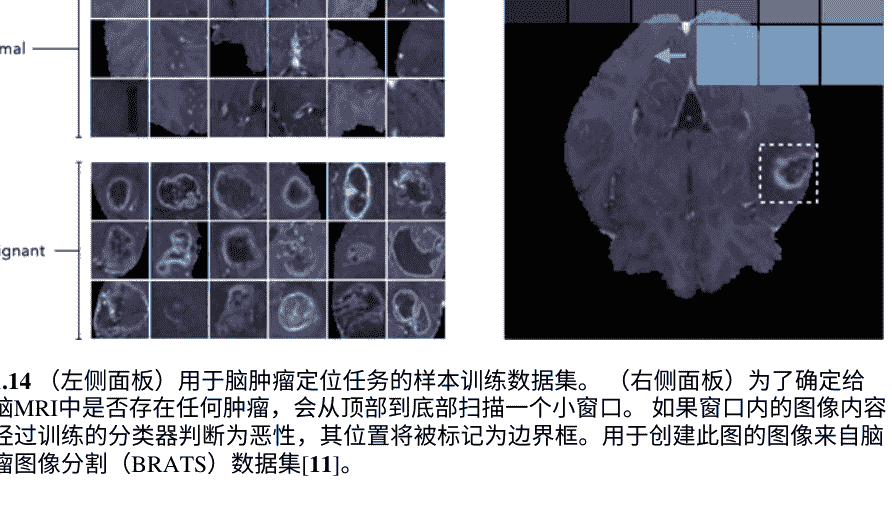

图1.14 （左侧面板）用于脑肿瘤定位任务的样本训练数据集。（右侧面板）为了确定给定脑MRI中是否存在任何肿瘤，会从顶部到底部扫描一个小窗口。如果窗口内的图像内容被经过训练的分类器判断为恶性，其位置将被标记为边界框。用于创建此图的图像来自脑肿瘤图像分割（BRATS）数据集[11]。

除了医学诊断外，分类框架还适用于定位任务，在这些任务中，我们旨在自动识别一组医学图像（例如，脑部MRI扫描）中感兴趣的特定对象（例如，肿瘤）的位置。在皮肤癌分类的情况下，我们之前学习的相同类型的分类流程可以用来解决定位问题。例如，可以使用包含肿瘤图像以及脑部正常组织图像的数据集来训练分类器（参见图1.14左侧面板）。训练完成后，通过在新的MRI扫描中滑动一个小窗口来寻找肿瘤。在滑动窗口的每个位置，测试其内部图像内容位于分类器的哪一侧。如果位于分类器的“肿瘤侧”，则将其内容分类为肿瘤，并在其周围绘制一个边界框以突出其位置（参见图1.14右侧面板）。

分类框架还可以用于对具有“未来组成部分”的医学事件进行预测。例如，对癌症患者1年或5年生存的预测自然是一个分类问题，只有两种可能的结果（或类别）。预测患者是否会再次发作


图1.15 （中间面板）乳腺组织的全切片图像。除了组成幻灯片绝大部分的正常区域外，该图像中还突出了多个良性、原位癌和浸润癌区域，分别以绿色、黄色和蓝色表示。（侧面板）四个800 × 800的补丁，每个补丁代表数据中的四个类别之一，被放大在侧面板上以便更好地可视化。用于创建此图像的数据来自乳腺癌组织学（BACH）数据集[13]。

出院后不久就被送往医院是另一个感兴趣的问题在医疗保健中，可以将其视为分类问题。

在所有讨论过的分类示例中，我们总是试图区分两类数据（例如，良性与恶性皮肤病变）。由于输出的二进制性质，每种情况下解决的问题更加准确地被称为二进制或两类分类。然而，分类可以更广泛地应用于医学任务，其中我们希望区分的不仅仅是两类，例如肿瘤分级/分期。在图1.15中，我们展示了一位患有癌症的乳腺组织的全切片图像，其中图像的每个区域都由专家病理学家标记为正常、良性、原位癌或浸润性癌。在这种情况下，可以训练一个多类分类器自动将整个图像分割为前述四类之一。请注意，虽然图1.15中显示的活检样本只有几厘米长和宽，但其高分辨率的全切片图像由大约24亿个像素组成！病理学家工作中耗时的一个方面是仔细检查这个千兆像素图像中的每一个点，以寻找恶性肿瘤。在疾病的早期阶段，整个切片中可能只有几个癌细胞存在，这在视觉检查中很容易被忽视。可以使用多类分类器简化这个艰巨的过程，以引导病理学家注意切片的不规则区域。

有时，我们希望使用医学数据来预测的变量是连续的，例如收缩压、体重指数（BMI）、年龄等。这些变量可以在给定范围内取任何值。例如，88 mmHg、124 mmHg和165 mmHg都是有效的血压值。同样，17 kg/m²、24.1 kg/m²和32.8 kg/m²都是可能的BMI值。在这方面，连续变量

与其离散的对应物（如血型或肿瘤分期）有本质上的不同，后者总是取几个预定的值：血型为{O、A、B、AB}，肿瘤分期为{Ⅰ、Ⅱ、Ⅲ、Ⅳ}。在机器学习的术语中，从输入数据中预测连续输出的任务称为回归。有趣的是，令人惊讶的是，所有在这里提到的连续变量（即血压、BMI和年龄）都可以使用视网膜扫描（如图1.13所示）以不同程度的准确性进行预测[12]。

在我们迄今为止看到的所有问题实例中，总是存在一个离散值（在分类问题中）或连续值（在回归问题中）的输出，我们希望使用输入数据来预测。机器学习的分类器或回归器尝试使用由人类监督员标记的数据来学习这种输入/输出关系。由于对标记数据的依赖，分类和回归都被认为是监督学习方案。另一类机器学习问题称为无监督学习，仅使用输入数据进行学习。在接下来的内容中，我们简要介绍了这个类别中的两个基本问题：聚类和降维。

聚类的目标是识别相互相似的输入数据点的群组或簇。例如，在图1.16的左侧面板中，我们展示了一个基因表达微阵列，它是一个33行（患者样本）和20列（基因）的二维矩阵。这个33 × 20的网格上的每个方块表示从患有白血病的患者采集的组织样本中特定基因的色彩编码表达水平。在图1.16的右侧面板中，我们展示了对这个微阵列数据的行和列进行聚类的结果。可以看到，微阵列的列之间的基因形成了两个大小相等的簇。类似地，微阵列的行之间的患者被聚类成了两个大小分别为22和11的群组。自动识别这种基因和患者簇可以发现用于药物治疗的新基因靶点（参见例如[14,15]）。

现代医学数据集可以是非常高维的。这既是一种福音，也是一种诅咒。高分辨率的病理学和放射学扫描使医生能够看到可能导致疾病早期诊断的细微细节。同样，大规模的RNA测序数据集使研究人员能够在核苷酸水平上检测基因变异。然而，这种分辨率的提高是有代价的。回顾我们在“机器学习流程的深入探讨”一节中对维度诅咒的讨论，随着数据维度的增加，我们需要指数级更大的数据集（以数据点的数量为单位）。当无法获取如此大量的数据时，如果可能的话，减少数据的维度将对训练有效模型至关重要。

从几何角度来看，为了降低数据集的维度，我们必须找到一个较低维度的表示（有时称为流形），以表示原始高维空间中的数据点。这个一般的想法在图1.17中用一个过于简化的二维数据集来说明，该数据集由八个数据点组成。如图的左侧面板所示，该二维空间中的每个数据点通常由两个数字表示——a和b，表示其水平和垂直坐标。然而，如果数据点恰好位于图1.16 （左侧面板）20个基因（列）和33名白血病患者（行）的基因表达微阵列。（右侧面板）对这些数据进行聚类，发现两组相似的患者和两组相似的基因。用于创建此图的数据来自[16]。

我们能够发现数据在一个圆形流形上（如图1.17的右侧面板所示），然后每个数据点可以用一个数字来表示：与水平轴和连接数据点与原点的线段之间的角度θ。这将原始数据集的维度从二维降低到一维。降维技术的假设是原始高维数据（近似地）位于一个较低维的子空间中，并且我们可以相对容易地发现这个子空间。有时这个假设是不成立的。在这种情况下，我们可以采取另一种方法来应对维度灾难。与其降低数据的维度，我们可以通过创建合成数据点来增加数据的大小。图1.18显示了一组真实的皮肤病变图像以及一批合成但看起来逼真的病变图像，用于增加原始数据的大小。值得注意的是

图1.17（左侧面板）一个玩具二维数据集，其中显示了八个数据点，用红色表示。每个数据点由一对数字 a 和 b 表示，表示其相对于水平和垂直轴的位置。（右侧面板）由于这个特定的数据集恰好位于一个圆形流形上，因此可以仅使用角度 θ 来编码每个数据点的位置。请注意，发现这个圆形流形对于将该数据集的维度从二维降低到一维非常关键。

图1.18（左侧面板）来自国际皮肤成像合作组织（ISIC）数据集[6]的真实皮肤病变的集合。（右侧面板）使用机器学习[18]生成的假病变的集合。

在医学中，监督式机器学习的应用远远超过了无监督式机器学习的应用。此外，研究能够生成图1.18中数据的模型类型⁵需要具备机器学习和深度学习的先修知识，本书旨在提供这方面的知识。出于这些原因，我们在本入门书中没有讨论无监督学习模型，并将有兴趣的读者参考更高级的相关资料（例如，参见[17]）。

当数据的大小小于所需大小时，可以采用另一种机器学习策略，称为迁移学习。使用这种方法，我们可以将解决一个问题时获得的知识转移到一个不同但相关的问题上。当处理没有历史数据的新现象时，迁移学习尤其有用。例如，在COVID-19大流行期间，研究人员利用大量其他呼吸系统疾病患者的胸部X射线图像来训练深度学习模型，使用迁移学习诊断COVID-19（参见，例如，[19]）。我们在第7章中更详细地讨论迁移学习。

在每个机器学习问题中，到目前为止我们看到的是模型被训练来做出一个单一的决策，为此它会获得即时的奖励。例如，给定一个皮肤病变的图像，皮肤癌分类器只需要做出一个决策：该病变是良性还是恶性？如果分类器正确回答了这个问题，它的准确率将会提高。强化学习将这个通用框架扩展到更复杂的场景，其中计算机代理被训练来做出一系列决策，以追求一个长期的目标。为了更好地理解这个区别，考虑下国际象棋游戏：一个被训练来下国际象棋的计算机必须做出一系列决策，以达到将对手将军的长期目标。在强化学习的背景下，每个决策被称为一个动作。“将皇后向上移动两个方格”是一个动作的例子。然而，请注意，根据国际象棋棋盘的状态，这个动作可能被允许或不被允许。例如，如果敌方棋子在皇后正上方的方格上，她必须先消灭它，然后才能移动到她想要的位置。在强化学习的术语中，状态是一个变量，将问题环境的特征信息（例如，棋盘上每个棋子的位置）传达给计算机代理。

强化学习问题本质上是动态的，因为代理所采取的每个动作都会改变环境的状态。

在医学领域，强化学习已经应用于制定糖尿病[20]、癌症[21]和败血症[22]的治疗策略。例如，在重症监护病房中实现败血症的完全康复这一长期目标，计算机代理可以根据患者的状态学习采取适当的行动。这个问题的行动空间包括给予抗生素、给予静脉输液、将患者置于机械通气等。每个行动都会导致患者状态的改变（好或坏），通过他们的生命体征和实验室检查来捕捉（参见，例如，[23]）。我们将在第8章研究强化学习。

## 问题

#### 1.1 应对维度诅咒的策略

假设一个数据训练集由 *P* 个数据点组成，位于一个 *N* 维空间中。维度诅咒规定，为了有效地训练机器学习模型，分数 $N/P$ 理想情况下应该尽可能大。

在“机器学习分类法”章节中，我们讨论了两种可以用来增加 $N/P$ 值的策略。

图1.19与练习 1.2和 1.3相关的图。详细信息请参阅正文。

#### 1.2 试错分类：第一部分

图1.19显示了三个玩具分类数据集。使用一个有直边的物体（例如尺子），为每个数据集尝试一系列不同的线性分类器，并找到产生最少错误或误分类的分类器。

- (a) 报告在每种情况下找到的最佳分类器的参数 $w_0$、$w_1$和 $w_2$。提示：参考公式（1.1）和图1.10。
- (b) 如果数据集是三维的，这种试错策略还有效吗？如果数据集是四维的，会怎样？

#### 1.3 通过试错进行分类：第二部分

对于你在练习1.2中找到的每个分类器：

- (a) 构建混淆矩阵。
- (b) 计算准确率、敏感度和特异度。

#### 1.4 真或假？

> “对于任何给定的训练数据集，无论其形状和大小如何，总是存在一个线性或非线性分类器可以完美地分离两类数据。”这个陈述是真还是假？如果是真的，请尽可能严谨地证明。否则，请提供一个反例。

#### 1.5 分类质量指标

一个线性分类器在二元分类数据集上取得了0.84的准确率，0.8的敏感度和0.9的特异度。在没有任何关于每个类别数据点数量的信息的情况下，确定是否可能（或不可能）计算分类器的：

- (a) 平衡准确率
- (b) 精确度
- (c) F分数

#### 1.6 包含分类质量度量的不等式

- (a) 证明准确率和平衡准确率的值如方程(1.5)和(1.6)所定义的总是介于敏感性和特异性之间。
- (b) 证明F分数总是介于敏感性和精确度之间，但从不超过它们的平均值。

#### 1.7 进一步的机器学习和深度学习应用

根据下面提供的描述，确定每种情况下解决的机器学习问题类型。

- (a) Spampinato等人[24]开发了一个机器学习系统，用于预测手部X射线图像中的骨龄。骨龄评估是一种放射学程序，用于确定生长和内分泌障碍儿童的骨龄。理想情况下，患者的骨龄应与他们的年龄相同。这个应用是二元分类、多类分类、回归、聚类还是降维的实例？解释。
- (b) Miotto等人[25]开发了一个深度学习系统，用于推导患者电子健康记录（EHR）的紧凑表示。使用这个表示得到的结果在许多疾病预测任务中比使用原始EHR数据得到的结果更好。这个应用是二元分类、多类分类、回归、聚类还是降维的实例？解释。
- (c) Hannun等人[26]开发了一个深度学习系统，用于检测单导联心电图（ECG）中的多种心律，包括窦性心律和10种不同的心律失常模式，他们的模型的平均F分数超过了平均心脏病专家的F分数。这个应用是二元分类、多类分类、回归、聚类还是降维的实例？解释。
- (d) Razavian等人[27]开发了一个用于患者风险分层的深度学习系统。他们的模型使用实验室结果作为输入，在预测时能够有效地预测患者在未来3-15个月内是否会被诊断出具体疾病。这个应用是二元分类、多类分类、回归、聚类还是降维的实例？请解释。
- (e) Tian等人[28]开发了一个深度学习系统，根据单细胞RNA测序（scRNA-seq）数据的转录组相似性将个体细胞分组在一起。这种类型的数据允许对细胞的转录组进行细粒度的比较。这个应用是二元分类、多类分类、回归、聚类还是降维的实例？请解释。

## 参考文献

- 1. Galilei G, Crew H, Salvio AD. 关于两个新科学的对话. 纽约: 麦格劳-希尔出版社; 1963
- 2. Weizenbaum J. ELIZA: 一种用于研究人与机器之间自然语言交流的计算机程序. 通信ACM. 1966;9(1):36–45
- 3. Galler BA. 计算机在医学中的价值. JAMA. 1960;174(17):2161–2
- 4. Schwartz WB, Patil RS, Szolovits P. 医学中的人工智能 - 我们的现状如何？ N Engl J Med. 1987;316:685–8
- 5. Esteva A, Kuprel B, Novoa R, 等. 用深度神经网络对皮肤癌进行皮肤科医生级别的分类. 自然. 2017;542:115–8
- 6. Rotenberg V, Kurtansky N, Betz-Stablein B, 等. 用临床背景识别黑素瘤的患者为中心的图像和元数据数据集. 自然科学数据. 2021;8(34)
- 7. Gulshan V, Peng L, Coram M, 等 .开发和验证一种用于检测视网膜底部照片中糖尿病视网膜病变的深度学习算法. JAMA. 2016;316(22):2402–10
- 8. McKinney SM, Sieniek M, Godbole V等. 针对乳腺癌筛查的人工智能系统的国际评估 。自然。2020;577:89–94
- 9. Ardila D, Kiraly AP, Bharadwaj S等. 低剂量胸部计算机断层扫描的三维深度学习端到端肺癌筛查。自然医学。2019;25:954–61
- 10. Borhani S, Borhani R, Kajdacsy-Balla A. 人工智能：膀胱癌诊断和预后预测的有希望的前沿。临床肿瘤学和血液学评论。2022;171:103601。 https://doi.org/10.1016/j.critrevo nc.2022.103601
- 11. Menze BH, Jakab A, Bauer S等. 多模式脑肿瘤图像分割基准（BRATS）。IEEE医学成像杂志。2015;34(10):1993–2024
- 12. Poplin R, Varadarajan AV, Blumer K等. 通过深度学习从视网膜底部照片预测心血管风险因素。 Nat Biomed Eng. 2018;2:158–64
- 13. Aresta G, Arajo T, Kwok S等. BACH：乳腺癌组织学图像的大挑战。Med Image Anal. 2019;56:122–39
- 14. Alizadeh A, Eisen M, Davis R等. 通过基因表达谱鉴定出不同类型的弥漫性大B细胞淋巴瘤。Nature. 2000;403:503–11
- 15. Chesnokov MS, Halasi M, Borhani S等. 通过基因网络分析鉴定出的新型FOXM1抑制剂诱导自噬性FOXM1降解，以克服人类癌细胞的化疗耐药性。Cell Death Dis. 2021;12:704. https://doi.org/10.1038/s41419-021-03978-0
- 16. Golub TR, Slonim DK, Tamayo P等. 癌症的分子分类：通过基因表达监测进行类别发现和类别预测。Science. 1999;286(5439):531–37
- 17. Watt J, Borhani R, Katsaggelos AK。机器学习精炼：基础、算法和应用。剑桥：剑桥大学出版社；2020
- 18. Baur C, Albarqouni S, Navab N. 使用GAN生成高度逼真的皮肤病变图像; 2018. arXiv预印本180901410
- 19. Webe RM, Sheng J, Dutta S, 等. 一种用于检测胸部X射线上COVID-19的人工智能算法，该算法在大型美国临床数据集上进行了训练和测试。放射学。2021;299(1):E167–76
- 20. Tejedor M, Woldaregay A, Godtliebsen F. 强化学习在糖尿病血糖控制中的应用：一项系统综述。人工智能医学。2020;104:101836
- 21. Tseng H, Luo Y, Cui S, 等. 深度强化学习用于肺癌自动化放射适应的研究。医学物理学。2017;44(12):66906705
- 22. Petersen B, Yang J, Grathwohl W, 等. 精准医学作为控制问题: 使用模拟和深度强化学习发现适应性个体化多细胞因子治疗脓毒症; 2018. 预印本. arXiv:1802.10440
- 23. Komorowski M, Celi LA, Badawi O, 等. 人工智能临床医生学习重症监护中脓毒症的最佳治疗策略。自然医学。2018年;24:1716–20
- 24. Spampinato C, Palazzo S, Giordano D, 等. 深度学习用于X射线图像中自动骨龄评估。医学图像分析。2017年;36:41–51
- 25. Miotto R, Li L, Kidd B, 等. 深度患者：一种无监督的表示方法，用于预测患者的未来情况从电子健康记录中。科学报告。2016;6
- 26. Hannun AY, Rajpurkar P, Haghpanahi M, 等. 使用深度神经网络在日常心电图中实现心脏病学级别的心律失常检测和分类。自然医学。2019年;25:65–9
- 27. Razavian N, Marcus J, Sontag D. 多任务预测疾病发作的纵向实验室测试; 2016. arXiv预印本160800647v3
- 28. Tian T, Wan J, Song Q, 等. 用基于模型的深度学习方法对单细胞RNA-seq数据进行聚类. 自然机器智能. 2019;1:191-8

# 第2章 医学数据的数学编码

正如我们在第1章中所看到的，数据是开发有效机器学习模型的最重要的因素。医学数据以各种形状和格式存在，从临床图像（病理切片、计算机断层扫描、磁共振成像等）到电生物信号（心电图、脑电图、肌电图等），再到文本数据（患者笔记、诊断和药物记录等），以及遗传数据（全基因组关联研究数据、测序和基因表达数据等），等等。在本章中，我们研究了现代机器学习中使用的医学数据的常见类型和形式，特别关注原始输入数据在输入机器学习模型之前所需的数据转换。在介绍这些数据类型的过程中，我们回顾了线性代数中的基本但重要的概念，这些概念使得可以使用向量、矩阵和张量等数学构造来表示和操作数据。

### 数值数据

考虑以下玩具数据集，该数据集由5个患者在入院时测量的收缩压数值（以毫米汞柱或mmHG表示）组成

患者1：124，
患者2：227，
患者3：105，
患者4：160，
患者5：202。

(2.1)

在数学中，这样的数据通常存储在一个称为向量的对象中，并由其表示，向量只是一组有序的数字

$$ \mathbf{x} = [124\ 227\ 105\ 160\ 202]。\quad\quad\quad\quad (2.2) $$

在整本书中，我们用粗体小写字母（通常是罗马字母）表示向量，例如\(\mathbf{x}\)，以便与通常用非粗体罗马字母或希腊字母表示的标量值区分开，例如\(x\)或\(\alpha\)。

当向量中的元素或条目在水平方向上（或在一行中）列出时，我们将得到的向量称为行向量。或者，向量的条目可以垂直列出（或在一列中），这种情况下我们称之为列向量。我们可以通过一种称为转置的向量操作在行向量和列向量之间来回切换。

在符号上，转置用字母\(T\)放在向量的右上方，将行向量转换为列向量，反之亦然，例如

$$ \mathbf{x}^{T} = [124\ 227\ 105\ 160\ 202]^{T} = \begin{bmatrix} 124 \\ 227 \\ 105 \\ 160 \\ 202 \end{bmatrix}. \quad\quad\quad\quad (2.3) $$

一般来说，向量可以有任意数量的元素，这被称为它的维度。例如，向量\(\mathbf{x}\)和向量\(\mathbf{y}\)

$$ \mathbf{x} = \begin{bmatrix} x_1 \\ x_2 \\ \vdots \\ x_N \end{bmatrix}, \quad \mathbf{y} = \begin{bmatrix} y_1 \\ y_2 \\ \vdots \\ y_N \end{bmatrix} \quad\quad\quad\quad (2.4) $$

都是 \(N\)维的或者维度为 \(N\)的。因为 \(\mathbf{x}\)和 \(\mathbf{y}\)具有相同的维度和方向（即它们都是列向量），我们可以逐元素将它们相加得到它们的加法，可以写成

$$ \mathbf{x} + \mathbf{y} = \begin{bmatrix} x_1 + y_1 \\ x_2 + y_2 \\ \vdots \\ x_N + y_N \end{bmatrix}. \quad\quad\quad\quad (2.5) $$

将 \(\mathbf{y}\)从 \(\mathbf{x}\)中减去的操作可以类似地定义为

$$ \mathbf{x} - \mathbf{y} = \begin{bmatrix} x_1 - y_1 \\ x_2 - y_2 \\ \vdots \\ x_N - y_N \end{bmatrix}. \quad\quad\quad\quad (2.6) $$

除了基本的加法和减法操作外，向量$\mathbf{x}$和$\mathbf{y}$在（2.4）中还可以以多种方式相乘，其中一种被称为内积在本书中特别感兴趣。内积也被称为点积，向量 $\mathbf{x}$ 和 $\mathbf{y}$的内积产生一个标量输出，该输出是$\mathbf{x}$和$\mathbf{y}$中对应元素相乘的和。用$\mathbf{x}^T \mathbf{y}$表示，向量$\mathbf{x}$和$\mathbf{y}$的内积可以写成

$$ \mathbf{x}^T \mathbf{y} = [x_1 \; x_2 \; \cdots \; x_N] \begin{bmatrix} y_1 \\ y_2 \\ \vdots \\ y_N \end{bmatrix} = x_1 y_1 + x_2 y_2 + \cdots + x_N y_N = \sum_{n=1}^{N} x_n y_n. \quad\quad\quad\quad (2.7) $$

当一个向量 $\mathbf{x}$乘以一个标量 $\alpha$时，结果向量的所有元素都会被$\alpha$缩放

$$ \alpha \mathbf{x} = \begin{bmatrix} \alpha \; x_1 \\ \alpha \; x_2 \\ \vdots \\ \alpha \; x_N \end{bmatrix}. \quad\quad\quad\quad (2.8) $$

因为我们的感官在一个三维物理空间中进化，我们可以直观地理解一维、二维和三维向量。例如，如图2.1左侧面板所示，我们可以将二维向量可视化为从原点开始的箭头在二维平面上延伸。两个向量的加法以及向量-标量乘法也可以通过图2.1中中间和右侧面板的示例进行几何解释。

将向量视为箭头有助于我们定义向量的范数（或大小）为表示它的箭头的长度。对于一般的二维向量

$$ \mathbf{x} = \begin{bmatrix} x_1 \\ x_2 \end{bmatrix}, \quad\quad\quad\quad (2.9) $$

勾股定理提供了一个简单的公式来计算向量 $\mathbf{x}$的范数，表示为 $\|\mathbf{x}\|$，即

$$ \|\mathbf{x}\| = \sqrt{x_1^2 + x_2^2}, \quad\quad\quad\quad (2.10) $$

图2.1 (左图) 向量 \(\mathbf{x} = [3, 3]\) 和 \(\mathbf{y} = [-2, 1]\) 从原点开始画成箭头，结束于水平和垂直坐标分别存储在 x 和 y 中的点。

(中间图) x 和 y 的相加等于连接原点与以 x 和 y 为边的平行四边形的向量。

(右图) 当乘以标量 \(\alpha\) 时，结果向量将保持与原始向量平行，但其长度将根据 \(\alpha\) 的大小而改变。请注意，当 \(\alpha\) 为负时，结果向量将指向原始向量的相反方向。

这可以等价地表示为 \(\mathbf{x}\) 和它本身的内积的平方根，或者 \(\sqrt{\mathbf{x}^T \mathbf{x}}\)。这也适用于任意维度的向量，这意味着当 \(\mathbf{x}\) 是一般的 \(N\) 维时，我们可以类似地定义它的范数为¹

\[ \|\mathbf{x}\| = \sqrt{\mathbf{x}^T \mathbf{x}} = \sqrt{x_1^2 + x_2^2 + \cdots + x_N^2} \tag{2.11} \]

到目前为止，我们已经将向量描绘为从原点开始的箭头。这是向量通常在任何标准数学或线性代数文本中所描述的传统方式。然而，在深度学习的背景下，如图2.2所示，将向量绘制为一组箭头而不是一个点的散点图通常更有助于直观理解，每个箭头的终点或尖端编码了其位置。

### 分类数据

在深度学习的背景下使用的数学函数要求输入严格为数字或数量，就像前一节中提到的收缩压一样。然而，医学数据并不总是以这种方式预先打包。有时，感兴趣的医学变量是分类的性质。例如，美国个人接种的COVID-19疫苗类型不具有数值，而是属于以下类别之一：Moderna、Pfizer-BioNTech (或简称为Pfizer) 和Johnson & Johnson（或简称为J&J）这些类别在使用深度学习算法之前需要转化为数值。

图2.2分类数据集最初在图1.10中展示，从两个不同但等效的角度来看：数据的每个实例在顶部面板中表示为箭头，在底部面板中表示为单个点（方形或圆形）。显然，底部的图更容易将其视为分类数据集，而顶部的图则不太容易。

可以将每个类别表示为不同的数字，例如，将Moderna分配为1，Pfizer分配为2，J&J分配为3。然而，如图2.3左侧面板所示，这样做意味着我们做出了一个假设，即Pfizer疫苗（编码为2）与J&J疫苗（编码为3）比Moderna疫苗（编码为1）更接近或更“相似”。这个假设在现实中可能成立，也可能不成立。一般来说，最好避免做出这样的假设，因为这可能会改变问题的几何结构，特别是当我们缺乏判断不同类别之间相似性或差异性的直觉或知识时。

独热编码是编码分类变量的正确方法，其中每个类别不再由单个数字表示，而是由长度为c的向量表示，其中包含c-1个“0”和一个“1”。这样，向量中唯一非零（热）的位置确定了所编码类别的身份。在上述讨论的COVID-19疫苗示例中，由于数据中存在c=3个类别，我们可以使用向量[1 0 0]表示Moderna疫苗，使用向量[0 1 0]表示Pfizer疫苗，使用向量[0 0 1]表示J&J疫苗。请注意，如图2.3的右侧面板所示，使用独热编码后，所有三个类别的表示现在在几何上等距离。

## 影像数据

数字图像如今无处不在，大小、颜色和格式各不相同。我们从最基本的数字图像开始，称为黑白或二进制图像，可以表示为二维位数组（即0和1），如图2.4所示。数组中的每个单元格称为像素，可以是黑色（如果像素值为0）或白色（如果像素值为1）。

总的来说，二进制图像传达的信息非常有限。这是因为二进制图像中的每个像素只能保存一位信息。为了解决这个限制，灰度图像允许每个像素保存多达8位（或1字节）的信息。因此，灰度图像可以由2的8次方（即256）个不同的灰度级组成，如图2.5所示。除了每个像素使用的位数之外，图像的分辨率（即图像中的总像素数）也决定了图像中所包含的信息量。直观地说，图像分辨率越高，图像中可以存储的视觉信息就越多（参见图2.6）。

鉴于它们是二维的，很明显我们需要数学对象来存储灰度图像。矩阵恰好是理想的数据对应字母“T”的数值矩阵（0和1组成）。

图2.4 字母“T”的黑白图像。传统上，黑色和白色分别被赋予值0和1

图2.5 （左侧面板）灰度图像由256个灰度级组成，每个像素在0到255的整数范围内取值，其中0表示最小的光强度（黑色），255表示最大的强度（白色）。（右侧面板）（I）CT扫描，（II）MRI，（III）X射线，（IV）超声心动图以及现代医学中使用的许多其他成像模式都是灰度图像

为此目的提供了结构。一个 $N \times M$ 矩阵，在本书中用粗体大写字母 $\mathbf{X}$ 表示，是一个二维数组

```
$$ \mathbf{X} = \begin{bmatrix} x_{11} & x_{12} & \cdots & x_{1M} \\ x_{21} & x_{22} & \cdots & x_{2M} \\ \vdots & \vdots & \ddots & \vdots \\ x_{N1} & x_{N2} & \cdots & x_{NM} \end{bmatrix} $$
```

(2.12)

可以构建为一组 N 行向量堆叠在一起，也可以构建为一组 M 列向量堆叠在一起。因此，X 被称为具有 N 行和 M 列的矩阵，其第 i 行和第 j 列的元素可以表示为 X_{i,j} 或更简单地表示为 x_{ij}。

矩阵本质上是向量的二维推广。因此，具有 M 个元素的行向量可以被视为特殊的 1 × M 矩阵。类似地，具有 N 个元素的列向量是一个 N × 1 矩阵。许多在“数值数据”章节中讨论的向量操作在矩阵中也有相应的类似物。例如，X 的转置，表示为

> $$\mathbf{X}^T = \begin{bmatrix} x_{11} & x_{21} & \cdots & x_{N1} \\ x_{12} & x_{22} & \cdots & x_{N2} \\ \vdots & \vdots & \ddots & \vdots \\ x_{1M} & x_{2M} & \cdots & x_{NM} \end{bmatrix}$$, (2.13)

将整个矩阵翻转，使得 X 中的第 i 行变为 X^T 中的第 i 列，X 中的第 j 列变为 X^T 中的第 j 行。与向量一样，具有相同维度的矩阵的加法和减法可以逐元素进行，与方程 (2.5) 和 (2.6) 相对应。虽然矩阵的内积（或点积）未定义，但常见的矩阵乘法是基于内积概念构建的。要能够乘以矩阵 X 和 Y，第一个矩阵的列数必须与第二个矩阵的行数相匹配。假设 X 和 Y 分别为 M × N 和 N × P 的矩阵，X 和 Y 的乘积（表示为 XY）将是一个 M × P 的矩阵，其 (i, j) th 条目是 X 的第 i 行和 Y 的第 j 列的内积。(2.14) 中显示了矩阵乘法的一个简单示例。

> $$\begin{bmatrix} a & b \\ c & d \\ e & f \end{bmatrix} \begin{bmatrix} u & v & w \\ x & y & z \end{bmatrix} = \begin{bmatrix} au + bx & av + by & aw + bz \\ cu + dx & cv + dy & cw + dz \\ eu + fx & ev + fy & ew + fz \end{bmatrix}$$, (2.14)

就像向量一样，我们也可以将矩阵的范数定义为表示其整体大小的数字。回顾一下 (2.11)，向量的范数被定义为其各个分量平方和的平方根。矩阵的范数被定义为所有矩阵元素平方和的平方根。

可以将矩阵的范数写为（2.12）中的矩阵 X 的所有元素平方和的平方根。

```
$$\|\mathbf{X}\| = \sqrt{\sum_{n=1}^{N} \sum_{m=1}^{M} x_{nm}^2} \quad (2.15)$$
```

如图2.7所示，几种医学成像模式产生的彩色图像在外观和结构上与灰度图像不同。临床中使用的彩色图像示例包括皮肤镜、眼底镜、膀胱镜和结肠镜图像，仅举几例。通过叠加红、绿、蓝三原色来创建彩色的常见方法。在这种颜色系统中，通常称为RGB系统，三原色的级别或强度决定了它们组合后的最终颜色。使用RGB系统，并假设每个原色有256个强度级别，我们可以定义256 × 256 × 256 = 16,777,216种独特的颜色，每种颜色由形如 [r b g]的三元组表示，其中0 ≤ r, b, g ≤255是整数（见图2.7左侧面板）。

由于RGB图像中的像素值不再是标量，所以(2.12)中显示的矩阵数据结构无法支持彩色图像。为了存储这样的图像，我们需要一种称为张量的新数据结构，它是二维矩阵向三维的自然扩展，就像矩阵本身是二维的一样。

图2.7 (左侧面板) RGB颜色空间。该空间中的每种颜色都表示为一个整数三元组 [r b g]其中0 ≤ r, b, g ≤255。(右侧面板) (I) 结肠镜图像，(II) 组织学切片，(III) 皮肤镜图像和(IV) 眼底镜图像都是彩色成像模式的示例。

2矩阵范数定义在(2.15)中，通常称为弗罗贝尼乌斯范数，是矩阵范数的最常见但并不是唯一的定义方式之一。

向量在二维中的自然扩展。一个 M × N × P张量是一个具有 M行、N列和 P层的三维结构。因此，我们可以使用一个具有 P =3个层的张量来表示任何RGB图像，每个层代表一个主要颜色。

请注意，如果需要，我们可以将张量的概念扩展到高于三维的维度。一般来说，秩为-t的张量是一个数组，其每个元素都是一个可以由维向量索引的标量。使用这个总体定义，向量和矩阵可以被视为秩为1和秩为2的张量，分别。

## 时间序列数据

时间序列是一系列随时间变化的数值。在其最一般的形式中，时间序列可以表示为一系列时间-值对。

```
(t1, x1), (t2, x2), ..., (tN, xN),   (2.16)
```

其中 t1, t2, ..., tN是按升序排列的时间标记或时间戳 (t1 < t2 < ··· < tN) ，而 x1, x2, ..., xN是在每个时间标记处捕获的感兴趣数量的相应值。在图2.8的左上面板中，我们展示了一个玩具时间序列数据集，其中 N =5个时间-值对。在右上面板中，我们展示了相同的数据集；只是这次每两个连续的时间-值对，即 (ti, xi)和(ti+1, xi+1)，通过一条线段连接起来。请注意，尽管这些线段不是原始数据的一部分，但它们的添加使数据具有更连续的外观。将连续的时间-值对用直线段连接起来的做法通常被称为线性插值，主要是为了便于对此类数据进行可视化。

在大多数情况下，时间序列数据是在等间隔的时间点上收集的。在图2.8的底部面板中，我们展示了两家美国电影发行公司（即Blockbuster和Netflix）在2003年至2010年期间每天报告的股票价格。在这种情况下，任意两个连续数据点之间的时间差为一天或24小时。这个时间差通常被称为时间分辨率，可以比一天更小或更大。例如，世界各地的股票交易所现在每隔几分钟发布一次数据，而美国联邦政府支出占GDP的百分比（也是时间序列数据）每年只发布一次。

注意，当时间序列数据在等间隔的时间点上捕获时，我们可以方便地省略时间戳 t1, t2, ..., tN并将数据更紧凑地表示为 (2.16)

```
x1, x2, ..., xN。   (2.17)
```

只要初始时间戳 (t₁) 和时间分辨率 (t₂ - t₁) 已知, 我们始终可以使用上述紧凑表示来恢复到需要的更完整的表示 (2.16)。

医学中遇到的最常见的时间序列数据是电生理生物信号, 如心电图和脑电图, 以及可以跟踪个体日常活动和运动的可穿戴技术生成的数据。

心电图 (ECG) 本质上是一种时间序列, 其中随时间测量的是心脏的电活动, 它传递了有关心脏结构和功能的宝贵信息。在最常见的ECG形式中, 10个电极放置在身体的不同部位, 如图2.9顶部面板所示。这些电极, 六个放置在胸部, 四个放置在四肢上, 在每次心跳期间测量整个身体中引起的小电压变化。在图2.9的底部面板中, 我们展示了一个健康个体中其中一个电极的典型输出。水平方向上的每个单位 (即时间) 代表40毫秒 (ms), 而垂直方向上的每个单位 (即电压) 代表0.1毫伏 (mV)。如图所示, 正常心跳的电压模式由三个明显的组成部分组成: P波、QRS波群和T波, 每个波形代表心脏肌肉的收缩和舒张引起的电活动变化。与正常的P-QRS-T模式偏离可以用作诊断许多医疗条件的依据, 包括心肌缺血/梗死、心律失常、心肌肥厚、心肌炎、心包炎、心包积液、瓣膜疾病和某些电解质失衡, 等等。

图2.9（顶部面板）ECG电极在身体上的大致位置。（底部面板）一个心脏周期（心跳）的电压与时间的图形

从图2.9中的三个肢体电极读数（即RA、LA和LL）线性组合产生六个导联信号（即I、II、III、aVR、aVL和aVF），分别定义为

> I = LA - RA,
> II = LL - RA,
> III = LL - LA,
> aVR = RA - \frac{LA + LL}{2},
> aVL = LA - \frac{RA + LL}{2},
> aVF = LL - \frac{RA + LA}{2}. (2.18)

使用向量和矩阵表示，我们可以将方程组 (2.18) 更紧凑地写成

> \begin{bmatrix} I \\ II \\ III \\ aVR \\ aVL \\ aVF \end{bmatrix} = \begin{bmatrix} -1 & 1 & 0 \\ -1 & 0 & 1 \\ 0 & -1 & 1 \\ 1 & -0.5 & -0.5 \\ -0.5 & 1 & -0.5 \\ -0.5 & -0.5 & 1 \end{bmatrix} \begin{bmatrix} RA \\ LA \\ LL \end{bmatrix} . (2.19)

通常，将 (2.19) 中定义的六个导联信号与直接从六个胸电极读取的另一组导联信号组合在一起，产生所谓的12导联心电图，其中的一个实例如图2.10所示。

## 文本数据

在医学领域，文本信息通常以电子健康记录 (EHR) 的形式产生，并且数量庞大。这些记录包括患者的笔记、体格评估和检查记录、药物医嘱、放射学和病理学报告、出院小结等。文本数据与我们之前讨论过的其他数据类型不同的一个重要方面是，它通常是由人类（如医生、护士、医疗工作者等）生成的，而不是通常由机器（如成像扫描仪、心电监护仪等）生成的。由于数据来源的这种区别，前者相对于后者具有更多的固有变异性。

为了更好地突出这一点，考虑一个假设的例子，一个患者去两个不同的皮肤科医生那里评估他手臂上新长的痣。两位皮肤科医生都拍摄了痣的图像并提供了书面描述（见图2.11）。请注意，这两个图像并不相同（因为它们是使用不同的相机从不同的角度获取的）

图2.10 12导联心电图是从胸部采集的六个导联信号和从四肢采集的六个导联信号，如(2.19)所定义## 2.2 向量计算

假设

$$\mathbf{x} = \begin{bmatrix} -1 \\ 1 \\ 0 \end{bmatrix}, \mathbf{y} = \begin{bmatrix} 2 \\ 5 \\ -1 \end{bmatrix}, \text{和} \mathbf{z} = \begin{bmatrix} 0 \\ 0 \\ -3 \end{bmatrix} \quad (2.27)$$

计算以下表达式的结果：

- (a) $\mathbf{x} + \mathbf{y} + \mathbf{z}$。
- (b) $\mathbf{x}^T \mathbf{y} + \mathbf{y}^T \mathbf{z} + \mathbf{z}^T \mathbf{x}$。
- (c) $\|\mathbf{x} + \mathbf{y} + \mathbf{z}\|$。
- (d) $\|\mathbf{x}\| + \|\mathbf{y}\| + \|\mathbf{z}\|$。

## 2.3 向量内积的几何

- (a) 使用(2.7)中的定义，找出向量 $\mathbf{x}$ 和图2.14中显示的八个向量 $\mathbf{y}_1$ 到 $\mathbf{y}_8$ 的内积。
- (b) 对于部分(a)中的每对向量 $(\mathbf{x}, \mathbf{y}_i)$，找出相应的向量范数 $\|\mathbf{x}\|$ 和 $\|\mathbf{y}_i\|$，以及 $\mathbf{x}$ 和 $\mathbf{y}_i$ 之间的角度 $\theta_i$，并确认对于所有 $i = 1, 2, \ldots, 8$，$\mathbf{x}$ 和 $\mathbf{y}_i$ 的内积等于 $\|\mathbf{x}\| \|\mathbf{y}_i\| \cos(\theta_i)$。
- (c) 对于任意维度相同的向量 $\mathbf{x}$ 和 $\mathbf{y}$，恒等式 $\mathbf{x}^T \mathbf{y} = \|\mathbf{x}\| \|\mathbf{y}\| \cos(\theta)$ 是成立的。使用这个规则证明，如果两个非零向量的内积为零，则这两个向量互相垂直或正交。

## 2.4 向量范数的性质

使用(2.11)中的定义来：

- (a) 证明任意向量 $\mathbf{x}$ 的范数始终为非负数。更准确地证明，当且仅当 $\mathbf{x}$ 除了零以外没有其他元素时，有 $\|\mathbf{x}\| \geq 0$，并且等号成立。
- (b) 用 $\|\mathbf{x}\|$ 和 $\alpha$（标量，实数）来表示 $\|\alpha \mathbf{x}\|$。
- (c) 证明对于相同维度的向量 $\mathbf{x}$ 和 $\mathbf{y}$，我们总是可以写成 $\|\mathbf{x}\| + \|\mathbf{y}\| \geq \|\mathbf{x} + \mathbf{y}\|$。在证明这个不等式时，通常称为三角不等式，你可能会发现在Exercise 2.3的(c)部分中使用内积规则很有用。

## 2.5 矩阵计算

假设

```
A = \begin{bmatrix} 1 & 1 \\ -1 & 2 \\ 0 & -1 \end{bmatrix}, B = \begin{bmatrix} 2 & 0 \\ -1 & 1 \end{bmatrix}, 和 x = \begin{bmatrix} 1 \\ -1 \end{bmatrix}, \qquad (2.28)
```

计算以下表达式的结果:

- (a) Ax.
- (b) x^T Bx.
- (c) ||A|| \times ||B||.
- (d) ||AB||.

## 2.6 One-Hot 编码

使用表2.1确定药物订单的独热编码表示，该订单最初显示在(2.23)中。

## 2.7 ECG 计算

图2.15显示了成年患者心电图中某个导联的多个心脏周期。
使用“时间序列数据”部分提供的信息回答以下问题:

(a) 患者的心率是多少？以每分钟心跳数（bpm）表示你的答案。心率低于60 bpm表示心动过缓。

(b) 病人的平均QRS振幅是多少？ QRS振幅是通过测量R波峰和S波峰之间的电压差来衡量的。以毫伏（mV）为单位给出你的答案。 QRS振幅大于4.5 mV可能表明心脏肥大。

(c) 病人的平均QRS持续时间是多少？ QRS持续时间是指从Q波开始到S波结束所经过的时间。 以毫秒（ms）为单位给出你的答案。 QRS持续时间大于120 ms可能表明心脏的电传导系统存在问题。

(d) 病人的平均T/QRS比率是多少？ T/QRS比率定义为T波振幅（相对于基线测量）除以QRS振幅。 T/QRS比率在区分左室瘤和急性心肌梗死方面很有用。

## 第三章 基本函数和操作

在前一章中介绍了数据作为机器学习系统的构建块之后，我们在这里讨论另一个至关重要的构建块的基础知识：数学函数。在科学和医学中，数学函数是如此普遍，以至于大多数读者肯定在生活中的某个时刻以某种方式遇到过它们。特别是在机器学习中，我们始终在处理数学函数：从学习问题的构建，到成本函数的推导，再到数学优化技术的开发和使用，以及特征的设计。在本章中，我们回顾了关于数学函数的一些基本思想，这些思想将在我们学习机器学习的过程中反复使用。我们还介绍了常见的函数表示法，并详细介绍了函数在机器学习中最常见的形式：作为值表或数据集合。

### 数学函数的不同表示

为了直观地理解数学函数是什么，最好通过一系列简单的例子来介绍这个概念。

> 例子3.1（麦当劳的历史收入）图3.1左侧面板中的表格显示了快餐连锁餐厅麦当劳在2005年至2016年期间12年的年总收入清单。这个数据包括两列：年份列和收入列。当我们看到这样的表格时，我们自然会逐个扫描。

| Year | Revenue [$ billion] |
| :--- | :--- |
| 2005 | 19.12 |
| 2006 | 20.90 |
| 2007 | 22.79 |
| 2008 | 23.52 |
| 2009 | 22.75 |
| 2010 | 24.08 |
| 2011 | 27.01 |
| 2012 | 27.57 |
| 2013 | 28.11 |
| 2014 | 27.44 |
| 2015 | 25.41 |
| 2016 | 26.42 |

图3.1与例子3.1相关的图。快餐连锁餐厅麦当劳从2005年到2016年的年总收入。详细信息请参阅正文

### 示例 3.1(续)

行来处理其信息。例如，在2005年，收入为19.12亿美元，在2006年，收入为22.90亿美元，等等。在处理这些信息时，我们开始理解输入值（即年份）和输出值（即收入）之间的关系。我们开始将每一行视为一个数据点，由一个输入值和一个输出值组成，或者一起构成一个输入-输出对。例如，第一行包含数据点或输入-输出对（年份，收入） = （2005, 19.12），第二行（年份，收入） = （2006, 20.90），等等。虽然这可能不是你期望的“数学函数”的样子，但它确实是我们在机器学习中处理的最常见的函数形式之一：定义输入值和输出值之间关系的规则。在这个例子中，规则在数据本身中是明确的：当输入（年份）为2005时，输出（收入）为19.12亿美元，当输入为2006时，输出为20.90亿美元，等等。换句话说，在这里，“数学函数”这个词组简单地意味着“一个由输入-输出对组成的数据集。”

我们经常绘制这样一个数学函数，以使其关系更加明确可见，就像在图3.1的右侧面板中所做的那样，其中数据的每个输入-输出对都被绘制为一个独特的红色圆圈。由于输入（年份）自然地从小到大排序，因此绘图可以很容易地与左侧的原始值表相关联：从表中开始的点，从上到下移动，在图中从左到右绘制。

图3.2示例3.1相关的图。详细信息请参阅正文。

示例3.2（麦当劳菜单） 餐厅菜单（如表3.1中打印出的麦当劳菜单）提供了丰富多样的数学函数。 在这里，我们有一组食物项目的数据集，以及每个项目的大量特征。 与前面的示例不同，我们不再具有唯一且易于识别的输入-输出对。 例如，我们可以决定研究食物项目与其卡路里分配之间的关系，或者食物项目与其总脂肪含量之间的关系。

注意，在任何一种情况下（与前面的例子不同），输入不再是数字。

例子3.3（数字图像） 并不总是数学函数以标记的表格形式出现，其中输入和输出被整齐地放在不同的列中。 以手写数字0的标准灰度图像为例，如图3.2所示。左侧面板显示了原始图像本身，它足够小，我们实际上可以看到构成它的每个像素。

虽然我们可能不总是将它们视为一体，但灰度图像实际上是一个数学函数。 回想一下我们在“成像数据”一节中的讨论，灰度图像是二维数组（或矩阵）。 我们的数字图像的这个视图在图3.2的中间面板中绘制，我们可以看到每个像素值以红色打印在其相应的像素上方。

作为一个数学函数，灰度图像将一对指示数组的特定行和列（输入）与给定的像素强度值（输出）相关联。 因此，我们可以将这个函数写成一个表格，就像我们在表3.2中所做的那样。无论我们如何记录它们，灰度图像中的每个输入-输出对都是一个三维点。 因此，我们可以将任何灰度图像绘制成三维空间中的一个表面。 我们在图3.2右侧面板中对数字图像进行了这样的绘制，可以直观地观察每个输入与其输出的关系。

表3.1 麦当劳菜单上的一部分食物项目以及每个项目的膳食信息

| 项目 | 卡路里 | 脂肪 | 钠 | 碳水化合物 | 纤维 | 糖 | 蛋白质 |
|------|--------|------|----|------------|------|----|--------|
| 麦香鸡 | 360 | 16 | 800 | 40 | 2 | 5 | 14 |
| 麦肉排 | 500 | 26 | 980 | 44 | 3 | 11 | 22 |
| 巨无霸 | 530 | 27 | 960 | 47 | 3 | 9 | 24 |
| 鱼柳堡 | 390 | 19 | 590 | 39 | 2 | 5 | 15 |
| 肉桂融化 | 460 | 19 | 370 | 66 | 3 | 32 | 6 |
| 麦辣鸡腿堡 | 380 | 17 | 840 | 34 | 2 | 7 | 22 |
| 汉堡包 | 240 | 8 | 480 | 32 | 1 | 6 | 12 |
| 麦乐鸡块 [4] | 190 | 12 | 360 | 12 | 1 | 0 | 9 |
| 麦乐鸡块 [6] | 280 | 18 | 540 | 18 | 1 | 0 | 13 |
| 麦乐鸡块 [40] | 1880 | 118 | 3600 | 118 | 6 | 1 | 87 |
| 土豆饼 | 150 | 9 | 310 | 15 | 2 | 0 | 1 |
| 配菜沙拉 | 20 | 0 | 10 | 4 | 1 | 2 | 1 |
| 培根俱乐部汉堡 | 720 | 40 | 1470 | 51 | 4 | 14 | 39 |
| 水牛牧场麦香鸡腿堡 | 360 | 16 | 990 | 40 | 2 | 5 | 14 |
| 每日双层汉堡 | 430 | 22 | 760 | 34 | 2 | 7 | 22 |
| 芝士汉堡 | 290 | 11 | 680 | 33 | 2 | 7 | 15 |
| 水果枫糖燕麦粥 | 290 | 4 | 160 | 58 | 5 | 32 | 5 |
| 燕麦葡萄干饼干 | 150 | 6 | 135 | 22 | 1 | 13 | 2 |
| 蛋麦麦芬 | 300 | 13 | 750 | 31 | 4 | 3 | 17 |
| 苹果片 | 15 | 0 | 0 | 4 | 0 | 3 | 0 |
| 小摩卡 | 340 | 11 | 150 | 49 | 2 | 42 | 10 |
| 大摩卡 | 500 | 17 | 240 | 72 | 2 | 63 | 16 |
| 培根麦辣鸡腿堡 | 440 | 22 | 1110 | 35 | 2 | 7 | 27 |
| 墨西哥辣椒双层汉堡 | 430 | 23 | 1030 | 35 | 2 | 6 | 22 |
| 烤苹果派 | 250 | 13 | 170 | 32 | 4 | 13 | 2 |
| 脆皮牛肉卷 | 360 | 20 | 810 | 32 | 1 | 3 | 15 |
| 烤牛肉卷 | 280 | 13 | 720 | 25 | 1 | 2 | 16 |
| 香肠卷 | 300 | 16 | 790 | 26 | 1 | 2 | 12 |
| 香肠麦芬 | 370 | 23 | 780 | 29 | 4 | 2 | 14 |
| 热巧克力冰淇淋杯 | 330 | 9 | 170 | 53 | 1 | 48 | 8 |
| 草莓冰淇淋杯 | 280 | 6 | 85 | 49 | 0 | 45 | 6 |
| 大薯条 | 510 | 24 | 290 | 67 | 5 | 0 | 6 |
| 热饼 | 350 | 9 | 590 | 60 | 3 | 14 | 8 |
| 热焦糖冰淇淋杯 | 340 | 8 | 150 | 60 | 0 | 43 | 7 |
| 香肠麦格里德尔斯 | 420 | 22 | 1030 | 44 | 2 | 15 | 11 |
| 小薯条 | 230 | 11 | 130 | 30 | 2 | 0 | 2 |
| 小拿铁 | 170 | 9 | 115 | 15 | 1 | 12 | 9 |
| 大拿铁 | 280 | 14 | 180 | 24 | 1 | 20 | 15 |
| 双层芝士汉堡 | 430 | 21 | 1040 | 35 | 2 | 7 | 24 |
| 牛排和蛋麦麦早餐 | 430 | 23 | 960 | 31 | 4 | 3 | 26 |
| 热饼和香肠 | 520 | 24 | 930 | 61 | 3 | 14 | 15 |
| 蛋白质美味 | 250 | 8 | 770 | 30 | 4 | 3 | 18 |
| 巧克力曲奇饼 | 160 | 8 | 90 | 21 | 1 | 15 | 2 |
| 豪华四分之一磅汉堡 | 540 | 27 | 960 | 45 | 3 | 9 | 29 |
| 香肠麦满分 +蛋 | 450 | 28 | 860 | 30 | 4 | 2 | 21 |
| 香肠饼 | 480 | 31 | 1190 | 39 | 3 | 3 | 11 |
| 大早餐 | 740 | 48 | 1560 | 51 | 3 | 3 | 28 |

表3.2 图3.2中的灰度图像表示为输入-输出对的表格

| 输入 | 输出 | 输入 | 输出 | 输入 | 输出 | 输入 | 输出 |
| :--- | :--- | :--- | :--- | :--- | :--- | :--- | :--- |
| (0,0) | 255 | (2,0) | 255 | (4,0) | 255 | (6,0) | 255 |
| (0,1) | 255 | (2,1) | 204 | (4,1) | 170 | (6,1) | 221 |
| (0,2) | 170 | (2,2) | 0 | (4,2) | 119 | (6,2) | 17 |
| (0,3) | 34 | (2,3) | 221 | (4,3) | 255 | (6,3) | 170 |
| (0,4) | 102 | (2,4) | 255 | (4,4) | 255 | (6,4) | 85 |
| (0,5) | 238 | (2,5) | 68 | (4,5) | 102 | (6,5) | 51 |
| (0,6) | 255 | (2,6) | 119 | (4,6) | 119 | (6,6) | 255 |
| (0,7) | 255 | (2,7) | 255 | (4,7) | 255 | (6,7) | 255 |
| (1,0) | 255 | (3,0) | 255 | (5,0) | 255 | (7,0) | 255 |
| (1,1) | 255 | (3,1) | 187 | (5,1) | 187 | (7,1) | 255 |
| (1,2) | 34 | (3,2) | 51 | (5,2) | 68 | (7,2) | 153 |
| (1,3) | 0 | (3,3) | 255 | (5,3) | 255 | (7,3) | 34 |
| (1,4) | 85 | (3,4) | 255 | (5,4) | 238 | (7,4) | 85 |
| (1,5) | 0 | (3,5) | 119 | (5,5) | 51 | (7,5) | 255 |
| (1,6) | 170 | (3,6) | 119 | (5,6) | 136 | (7,6) | 255 |
| (1,7) | 255 | (3,7) | 255 | (5,7) | 255 | (7,7) | 255 |

从我们在本章中所见到的，我们可以将数学函数总结为将输入与输出相关联的规则。在数据集中，就像我们在之前的例子中遇到的那样，这个规则是明确的：它实际上就是数据本身。有时候（就像例子3.2中那样），我们必须从众多选择中挑选出一个数学函数，有时候（就像例子3.3中那样）输入-输出关系可能一开始并不明确。尽管如此，数学函数随处可见。这种无处不在的存在激发了我们使用数学符号来更自由地讨论函数，通过某些共享属性对其进行分类，并基于非常通用的原则构建多用途工具的动机。

为了表示将输入 x 与输出 y 相关联的数学函数，我们使用符号 y(x)。例如，在示例3.2中，我们看到麦当劳公司在2005年的总收入为19.12亿美元，因此我们可以写成 y(2010) = 19.12。同样，在示例3.3中，我们看到图像左上角的像素强度值为255，因此我们可以写成 y(0, 0) = 255。

在本节的其余部分中，我们回顾了描述数学函数的经典方式：使用代数方程或公式。在这个过程中，我们讨论了这些函数如何隐式地生成类似之前见过的数据集。

以一条直线的熟悉方程为例

```
$$y(x) = -1 + \frac{1}{2}x$$
```

| Input x | Output y |
|---------|----------|
| 0       | -1       |
| 3.6     | 0.8      |
| 2       | 0        |
| -1      | -1.5     |
| 2.5     | 0.25     |
| 6       | 2        |
| -0.5    | -1.25    |
| -4      | -3       |
| 5       | 1.5      |
| -3.5    | -2.75    |
| ...     | ...      |

图3.3（左侧面板）数学函数 \(y(x) = -1 + \frac{1}{2}x\) 的表格视图。在表格中列出每个可能的输入-输出对是不可能的，因为有无限多个。（右侧面板）相同的函数在输入范围从 x = -6 到 x = 6 上绘制。

例如。这是一个明确写下的规则，用于将输入 x 转换为相关的输出 y。写下线条或任何其他公式的方程式，给出了它的规则明确地：将输入转换为输出的方法。

请注意，有了数学函数的代数公式，我们可以轻松地创建其表格视图，如图3.3的左侧面板所示，用于在（3.1）中定义的函数。在表格的每一列中，垂直的点表示我们可以继续列出输入和输出对（没有特定的顺序）。如果我们列出每个可能的输入-输出对，这个表格将等同于在（3.1）中定义它的方程式-尽管列表将是无限长的！

有时候可以将数学函数可视化（当输入只有一维或二维时）。例如，在图3.3的右侧面板中，我们展示了（3.1）中定义的数学函数的图。尽管这个图看起来是连续的，但实际上并非如此。如果你能够仔细观察，你将能够看到构成这条线的细粒度采样但不连续的输入-输出对。

如果我们使用足够高的采样分辨率，这个图对人眼来说看起来是连续的，就像我们用铅笔和纸绘制它一样。

哪种方式更好地描述了数学函数：它的代数方程还是它的等价表格视图，其中包含了所有明确列出的输入-输出对？为了回答这个问题，请注意，如果我们可以访问前者，我们总是可以通过使用方程生成这些对来生成后者—至少在理论上是这样的。但反过来并不总是成立。如果我们只能访问描述一个数据集/表的数学函数（而不是它的代数表达式），通常不明显如何从原始函数的代数形式中得出结论。我们可以尝试绘制数值表格，或者绘制其中的一部分，就像我们在图3.3中所做的那样，并通过观察图形直观地猜测方程 \(y = -1 + \frac{1}{2}x\)。为了确定这种策略是否普遍适用，我们在图3.4中绘制了另外两个示例。请花点时间，看看你是否能够使用视觉直觉确定这些图的代数方程。

如果你熟悉基本函数，你可能已经能够找到左侧示例的方程，如

```
\(y(x) = \sin(2\pi x)\)。\tag{3.2}\)
```

右边的第二个例子怎么样？即使是数学家，也没有多少人能够正确地识别函数的基本方程为

```
\(y(x) = e^{3x} \frac{\sin (24(x - 0.5))}{120 (x - 0.5)}\)。\tag{3.3}\)
```

关键在于，即使输入只有一维，通过绘制部分数值表来识别函数的方程也是非常困难的，仅凭肉眼是无法做到的。而且，值得强调的是，我们只能尝试对一到两个输入的函数进行这样的操作，因为我们无法有意义地可视化接受三个或更多输入的函数。

## 初等函数

在本节中，我们将回顾在机器学习的研究以及许多其他科学领域中广泛使用的基本函数。

### 多项式函数

多项式函数可能是人们首先学习的一组基本函数，因为它们几乎出现在所有科学和技术领域。当我们只处理一个输入变量x时，每个多项式函数只是将输入变量提升到给定的幂。前几个多项式函数可以写成

```
f1(x) = x^1,  f2(x) = x^2,  f3(x) = x^3,  f4(x) = x^4. (3.4)
```

(3.4) 中的第一个元素通常被简写为 f1(x) = x，忽略上标1），它是一条斜率为1、纵截距为0的简单直线，而第二个函数，f2(x) = x^2，则是一个简单的抛物线。我们可以继续列举更多的多项式，每个正整数k对应一个多项式，形式为 f k(x) = xk。由于这种特殊的指数幂索引，这些多项式自然地形成了一个目录或函数族。在本书中，我们特别关注的是这个函数族中的第一个成员，它是我们在第4章和第5章中详细研究的线性机器学习模型的基本构建块。

习惯上将一个度为-d polynomial定义为第一个d polynomial函数的线性组合（加上一个常数项）。例如，f(x) = 1 + 2x - 3x^2 + x^3是一个三次多项式。一般来说，当我们有N个输入x1, x2, ..., xN，一个多项式函数涉及将每个输入xi提高到非零整数幂ki，并将结果相乘形成

```
f(x1, x2, ..., xN) = x1^{k1} x2^{k2} ... xN^{kN}. (3.5)
```

在图3.5的顶部和底部面板中绘制了几个具有一个和两个输入的多项式函数。

### 倒数函数

倒数函数与多项式函数类似，只是有一个不同之处：我们将输入提高到负整数而不是正整数。因此，前几个倒数函数可以写成

```
f1(x) = x^{-1} = 1/x,  f2(x) = x^{-2} = 1/x^2,  f3(x) = x^{-3} = 1/x^3. (3.6)
```

等等。图3.6中绘制了几个倒数函数的示例。

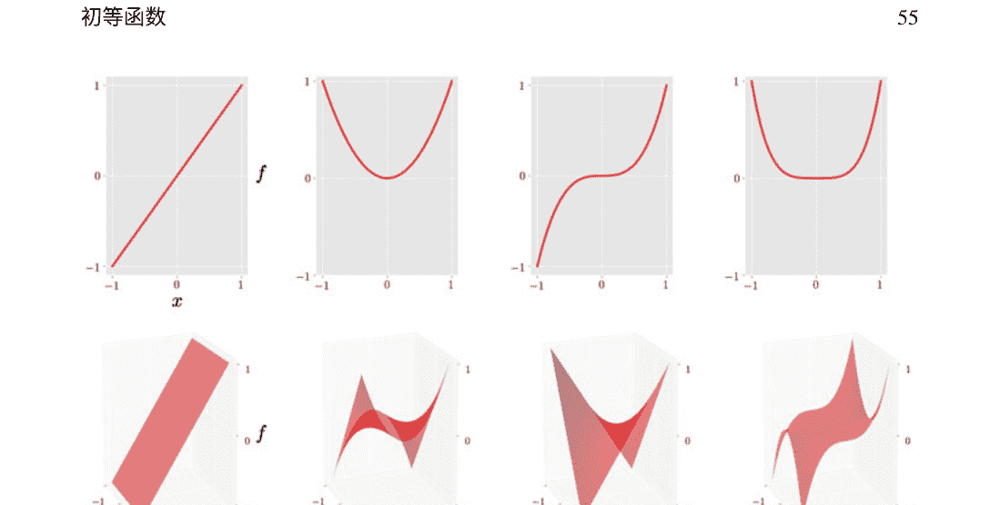

图3.5几个多项式函数。（顶部面板）从左到右，绘制了 $f(x) = x$, $f(x) = x^2$, $f(x) = x^3$, 和 $f(x) = x^4$。（底部面板）从左到右，绘制了 $f(x_1, x_2) = x_2$, $f(x_1, x_2) = x_1 x_2^2$, $f(x_1, x_2) = x_1 x_2$, 和 $f(x_1, x_2) = x_1^2 x_2^3$

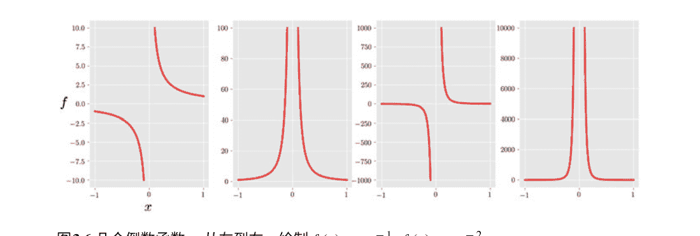

图3.6几个倒数函数。从左到右，绘制 $f(x) = x^{-1}$, $f(x) = x^{-2}$, $f(x) = x^{-3}$, 和 $f(x) = x^{-4}$

### 三角和双曲函数

基本三角函数是从直角三角形的简单关系中导出的，并具有重复的波状形状。其中第一个是正弦函数和余弦函数，分别用标量输入 $x$ 表示为 $\sin(x)$ 和 $\cos(x)$。这两个基本函数起源于跟踪单位圆上单个点的垂直和水平坐标

$$x^2 + y^2 = 1 \quad (3.7)$$

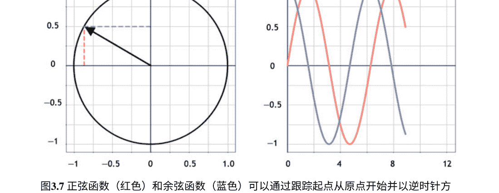

图3.7 正弦函数（红色）和余弦函数（蓝色）可以通过跟踪起点从原点开始并以逆时针方向移动到单位圆上的终点的垂直和水平位置来绘制。每当终点完成一圈绕圆运动时，每个函数自然地重复自身，使正弦和余弦成为周期函数

如图3.7所示，它顺时针方向平滑移动。从历史上看，正弦和余弦函数被用来模拟天体的（周期性）运动。其他常见的三角函数是基于这两个基本函数的各种比率。例如，正切函数被定义为正弦与余弦的比值，即 tan(x) = sin(x) / cos(x)。

对于两个输入（x1和x2）分别在每个变量中创建波动元素，并将结果相乘，对于一般的N维输入也保持类似的模式。

类似于三角函数，基本的双曲函数——称为双曲正弦和双曲余弦——是由一个点在单位双曲线上的垂直和水平位置给出

$x^2 - y^2 = 1$  (3.8)

其他常见的双曲函数是基于这两个基本函数的各种比率。例如，双曲正切函数被定义为双曲正弦与双曲余弦的比值，即 tanh(x) = sinh(x) / cosh(x)。

### 指数函数

一个著名的印度民间故事讲述了一个国王喜欢邀请人们与他下国际象棋。一天，国王提出如果旅行的智者在游戏中击败了国王，他可以得到任何奖励。智者同意了，但以一种非常奇怪的方式要求国王支付他的报酬：如果智者赢了，国王要在国际象棋棋盘的第一个方格上放一粒米，并在后续的每个方格上加倍。两人进行了比赛，智者赢了。

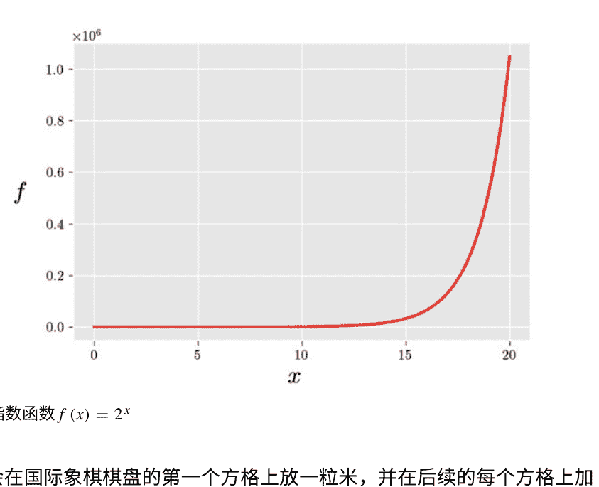

国王会在国际象棋棋盘的第一个方格上放一粒米，并在后续的每个方格上加倍。两人进行了比赛，智者赢了。

国王下令带来一大袋米，并开始按照事先商定的安排放置谷粒第一个方格放一粒，第二个方格放两粒，第三个方格放四粒，以此类推。当他到达第21个方格时，他已经把整袋米都倒空了。国王很快意识到他整个王国的米都不够兑现他对这位学者的承诺。

这个寓言中的国王没有意识到指数函数f(x) = 2^x的极快增长，如图3.8所示。一般来说，指数函数可以根据任意基值来定义。例如，f(x) = 10^x定义了以10为底的指数函数。

另一个广泛使用的基值选择是自然常数欧拉数，表示为e = 2.71828…，其中小数部分是无限不循环的。这个数字——归功于十七世纪数学家雅各布·伯努利——最初是由一个关于复利支付的思想实验提出的。假设我们在银行有1.00美元的本金，并且每年从银行获得100%的利息，年底一次性计入。这意味着我们在一年后会将我们的金额翻倍，即我们将本金乘以2。请注意，如果我们不是在本金上获得100%的一次性利息支付，而是在一年内获得2次50%的利息支付，会发生什么变化。在第一次计入时，我们将本金乘以1.5（以获得50%的利息）。然而，在第二次计入时，我们将更新后的值乘以1.5，换句话说，我们将本金乘以(1.5)^2 = (1+1/2)^2。如果我们继续这样做，假设每年3次以33.33…%的利息计入，我们最终将本金乘以(1+1/3)^3，将利息分成四份，我们最终将本金乘以(1+1/4)^4，等等。一般来说，如果我们将利息支付分成n等份，我们将本金乘以

将本金乘以 \((1 + \frac{1}{n})^n\)。正是这个数量——随着 \(n\) 趋近于无穷大——收敛到 \(e\)。

> 有趣的是，以 \(e\) 为底数的指数函数出现是为了表示我们在“三角函数和双曲函数”一节中看到的双曲正切函数。

```
tanh(x) = \frac{e^x - e^{-x}}{e^x + e^{-x}} \tag{3.9}
```

### 对数函数

810, 456, 018 \(\times\) 6, 388, 100, 279是多少？现在，只需要几秒钟就可以将这些数字输入到可靠的计算器中并找到答案。但在计算器出现之前，人们别无选择，只能手工计算这样两个大数的乘积：这显然是一项繁琐而耗时的任务，需要仔细的记账以避免出现错误。然而，必需品是所有发明的母亲，人们发明了各种各样的技巧，使这种计算变得更加容易。

对数是一种最初用于将大乘法问题简化为加法问题的基本函数，具有广泛的现代应用。基于具有通用底数 \(b\) 的指数函数，对数的底数 \(b\) 定义为

```
y = \log_b(x) \iff b^y = x \tag{3.10}
```

使用这个定义，人们可以快速验证，无论选择什么底数 \(b\)，这个函数确实将乘法转化为加法。对数函数和指数函数是彼此的反函数。这使得我们可以通过对数（通常在表中查找 \(\log_b(p)\) 和 \(\log_b(q)\) 的值）来计算两个大数 \(p\) 和 \(q\) 的乘积，而不是直接进行乘法运算，然后将结果相加，再进行指数运算得到结果 \(p \cdot q\)。以底数为 \(e\)（自然常数）的对数函数通常被称为自然对数，并在图3.9中绘制。在处理自然对数时，常常（为了简洁起见）省略底数 \(e\) 的符号，将自然对数函数简单地写为 \(f(x) = \log(x)\)。

### 阶梯函数

与以前通过单个方程定义整个输入域的函数相比，阶跃函数在其输入的子区域上定义。在每个子区域上，阶跃函数是常数，但在每个子区域上可以取不同的值。例如，具有两个阶跃的阶跃函数的代数形式为

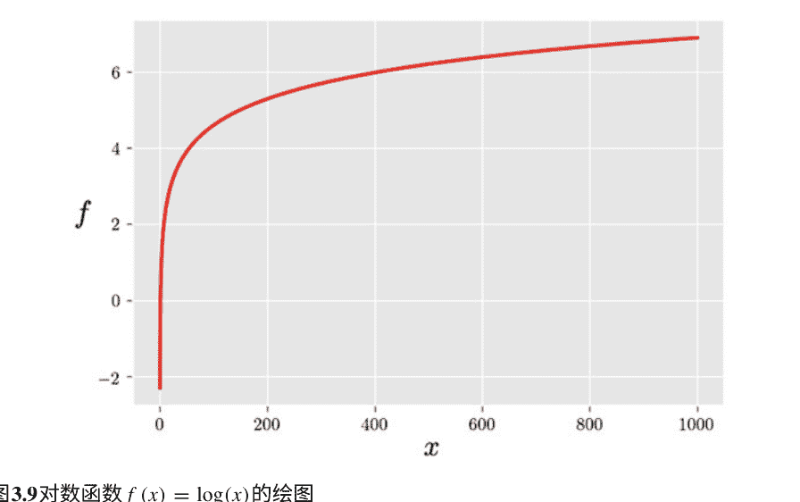

图3.9对数函数$f(x)=\log(x)$的绘图

```
$$f(x)=\begin{cases} v_1 & \text{如果}x<s\ v_2 & \text{如果}x>s\end{cases},$$
```

其中$s$被称为分割点，$v_1$和$v_2$是两个常数值。通常，在分割点$x=s$处的函数值并不重要，并且通常设置为$v_1$和$v_2$的平均值，即$f(s)=\frac{v_1+v_2}{2}$。

符号函数是一个主要且经常使用的阶跃函数的例子，其中$s=0, v_1=-1, \text{and } v_2=+1$。一般来说，具有$N$个步骤的阶跃函数将输入分成$N$个子区域，在每个子区域上取不同的值

```
$$f(x)=\begin{cases} v_1 & \text{如果}x<s_1\ v_2 & \text{如果}s_1<x<s_2\ \vdots & \vdots\ & \text{如果}s_{N-2}<x<s_{N-1}, \text{则}v_{N-1}\ v_N & \text{如果}s_{N-1}<x\end{cases}$$
```

因此，它具有$N-1$个分割点$s_1$到$s_{N-1}$，其中$N$个常数水平被表示为$v_1$到$v_N$。

许多模拟（连续）信号，如广播电台和电视信号，通常在广播时看起来像某种正弦函数。然而，在接收器上，电子设备将对这些信号进行数字化（或量化），这意味着将原始的波状模拟信号转换为与之相似的阶跃函数。通过这样做，只需要更少的值来存储和处理信号（只需

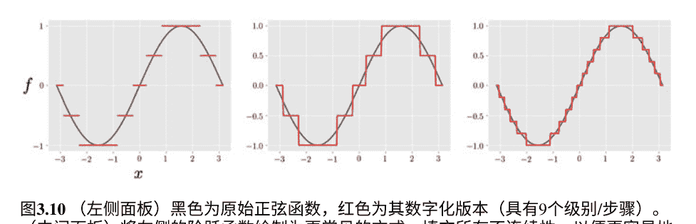

步骤和分割点的值，而不是整个原始函数）。图3.10说明了一个简单正弦函数的类似物。

## 基本运算

在本节中，我们讨论了调整在“基本函数”章节中介绍的基本函数的多种方法，以及将这些基本函数组合成一系列有趣且复杂的数学函数的各种方法，这些函数具有已知的代数方程。

## 基本函数调整

将函数 \( f(x) \) 乘以标量权重 \( w \) 会得到一个新的函数 \( w \cdot f(x) \) 这是原函数 \( f(x) \) 的放大版本，当 \( w > 1 \) 时。这本质上是电子放大器对输入信号的处理方式。另一方面，当 \( 0 < w < 1 \) 时，得到的函数将是原函数 \( f(x) \) 的衰减版本。特殊情况下，当 \( w = -1 \) 时，结果就是原函数 \( f(x) \) 关于水平轴的翻转。

将输入乘以标量权重 \( w \) 得到一个新的函数 \( f(wx) \)，这是原函数 \( f(x) \) 在水平轴上缩小的版本，当 \( w > 1 \) 时。另一方面，当 \( 0 < w < 1 \) 时，得到的函数将是原函数 \( f(x) \) 的拉伸版本。特殊情况下，当 \( w = -1 \) 时，结果就是原函数 \( f(x) \) 关于垂直轴的翻转。

最后，将标量权重 \( w \) 添加到函数 \( f(x) \) 中，只是将其图形沿垂直轴上升 \( w \) 个单位。另一方面，将 \( w \) 添加到输入 \( x \) 中会导致 \( f(x) \) 沿水平轴移动。这些基本调整在图3.11中进行了说明。

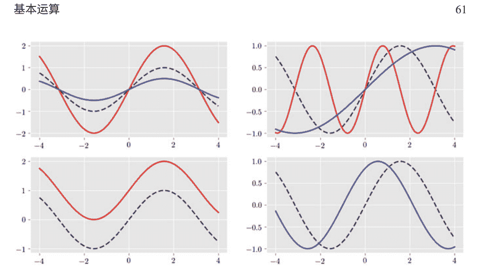

图3.11 说明了各种函数调整，包括放大、衰减、挤压、拉伸以及水平和垂直移动。原始函数$f(x) = \sin(x)$用虚线表示以进行比较。（左上方面板）红色和蓝色分别表示函数$2f(x)$和$\frac{1}{2}f(x)$的图形，以示函数放大和衰减。（右上方面板）红色和蓝色分别表示函数$f(2x)$和$f(\frac{1}{2}x)$的图形，以示挤压和拉伸。（左下方面板）红色表示函数$f(x)+1$的图形，示例了垂直移动。（右下方面板）蓝色表示函数$f(x+1)$的图形，示例了水平移动。

### 函数的加法和乘法

就像数字一样，基本的算术运算包括加法（或减法）和乘法（或除法）可以用来组合两个（或更多）函数。例如，$f_1(x) + f_2(x)$是通过在它们的共同定义域上的每个点上相加$f_1(x)$和$f_2(x)$的值而形成的一个新函数。

类似于加法，我们可以定义两个函数$f_1(x)$和$f_2(x)$的乘法，表示为$f_1(x) \times f_2(x)$，或者简单地表示为$f_1(x) f_2(x)$。有趣的是，幅度调制（AM）广播是在20世纪初基于一个简单的想法而发明的，即在发射端将一个消息信号乘以一个正弦函数（称为载波信号）。幅度调制使得在共享介质（或信道）上同时广播多个消息成为可能。

函数的加法和乘法在图3.12中有所说明。

### 函数的组合

另一种常见的组合两个函数的方式是通过组合它们。简单地说，这意味着我们将一个函数的输出作为另一个函数的输入。以函数$x^3$和$\sin(x)$为例。我们可以将$x^3$代入$\sin(x)$中

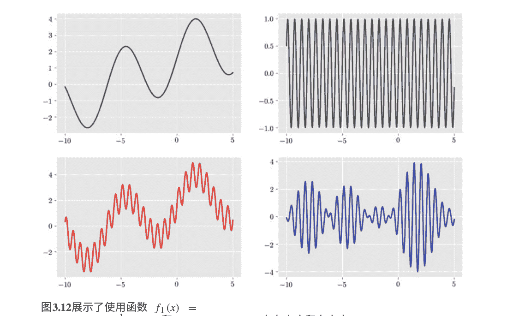

图3.12展示了使用函数 $f_1(x) = 2\sin(x) + 3\cos(10x) - 1$ 和 $f_2(x) = \sin(10x)$ 在左上方和右上方 面板中绘制的函数。两个函数的加法，$f_1(x) + f_2(x)$，在左下方 面板中绘制，两个函数的乘法，$f_1(x) \times f_2(x)$，在右下方 面板中绘制。

得到正弦$(x^3)$或者，我们可以将正弦函数插入到三次函数中以得到 $(\sin(x))^3$.

重要的是，我们组合这两个函数的顺序很重要。这与我们在加法或乘法 中看到的情况不同，我们总是有$x^3 + \sin(x) = \sin(x) + x^3$，类似地，$x^3 \times \sin(x) = \sin(x) \times x^3$。这使得组合函数比加法或乘法更具灵活性，特别是在处理多个函数时。

让我们通过添加第三个函数来验证这个观察结果：指数函数$e^x$。虽然再次通 过加法（即$x^3 + \sin(x) + e^x$）或乘法（即$x^3 \times \sin(x) \times e^x$）只有一种方式可 以组合$x^3$，$\sin(x)$和$e^x$，但现在我们有许多不同的方式来组合这三个函数： 我们可以选择其中任意一个，将其插入到剩下的两个函数中，取结果，并将 其插入到最后一个函数中。图3.13显示了通过这$3! = 3 \times 2 \times 1$种方式组合这 三个函数所得到的函数。

在符号上，将$f_1(x)$与$f_2(x)$的组合写作$f_1(f_2(x))$，并且 一般来说，我们有 $$f_1(f_2(x)) = f_2(f_1(x)).$$ (3.13)

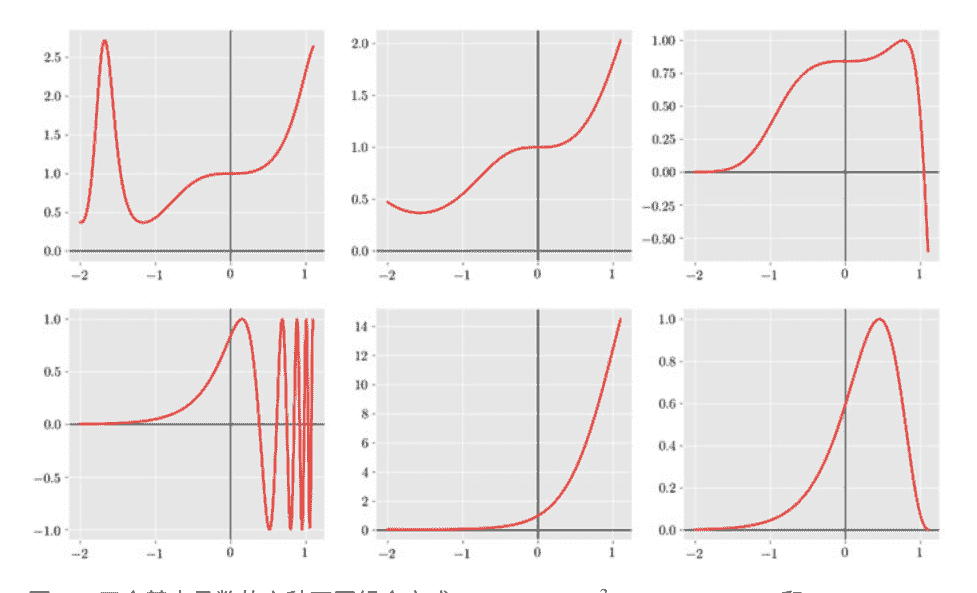

图3.13 三个基本函数的六种不同组合方式：$f_1(x) = x^3$, $f_2(x)=\sin(x)$, 和 $f_3(x) = e^x$. (左上面板) 函数 $f_3(f_2(f_1(x))) = e^{\sin(x^3)}$ 的图像。 (上中方面板) 函数 $f_3(f_1(f_2(x))) = e^{\sin^3(x)}$ 的图像。 (右上面板) 函数 $f_2(f_3(f_1(x))) = \sin (e^{x^3})$. (左下面板) 函数 $f_2 (f_1 (f_3 (x))) = \sin ((e^x)^3)$. (中下面板) 函数 $f_1 (f_3 (f_2 (x))) = (e^{\sin(x)})^3$. (右下面板) 函数 $f_1 (f_2 (f_3 (x))) = (\sin (e^x))^3$ 的图像

### 最小-最大运算

两个函数 $f_1(x)$ 和 $f_2(x)$ 的最大值，表示为$\max (f_1(x), f_2(x))$，是通过将输出设置为 $f_1(x)$ 和 $f_2(x)$ 的较大值来形成的，对于每个 $x$ 在 $f_1(x)$ 和 $f_2(x)$ 的公共定义域中。两个函数的最小值以类似的方式定义，只是这次将输出设置为两个中较小的值。以下是电气工程领域中这个函数操作的实际应用案例。

电力以交流 (Alternating Current) 模式传送到消费点，这意味着你在插座上得到的电压是一个正弦波形，既有正周期也有负周期。而几乎每个电子设备（手机、笔记本电脑等）都使用直流 (direct current) 电源运行，因此需要稳定的电压供应。因此，从交流到直流的转换必须在电源适配器内部进行，这是整流器的功能。在其最简单的形式中，整流器由一个单个二极管组成，它阻止交流波形的负周期，只允许正周期通过。二极管的输出电压 $f_{\text{out}}$ 可以用输入电压 $f_{\text{in}}$ 表示为 $f_{\text{out}}(x) = \max(0, f_{\text{in}}(x))$。在图3.14的左侧面板中，我们展示了当输入为简单正弦函数 $f_{\text{in}}(x) = \sin(x)$时，$f_{\text{out}}(x)$的形状。当 $f_{\text{in}}(x) = x$时，输出 $f_{\text{out}}(x) =

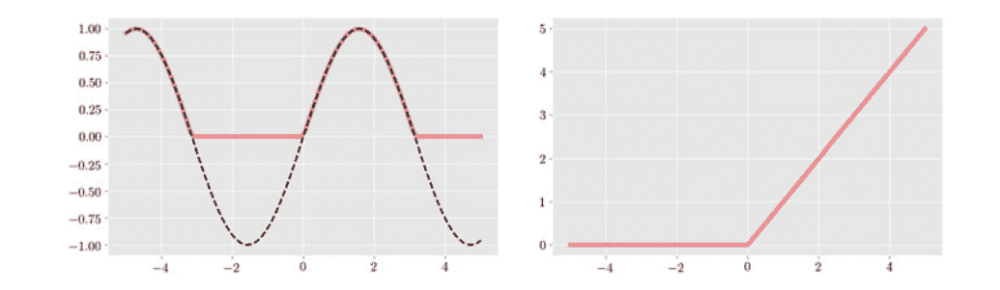

max(0, x)被称为整流线性单元——也因其形状而被称为斜坡函数——在图3.14的右侧面板中绘制。

### 使用基本函数和运算构建复杂函数

在“基本函数”和“基本运算”章节中，我们回顾了基本数学函数（例如三角函数、指数函数等）和运算（例如加法、乘法、组合等）。这些基本函数和运算分别总结在表3.3和表3.4中，可以组合使用以构建任意复杂度的新函数。取函数

```
$$f(x)=\frac{\cos(16x)}{1+x^2} \qquad\qquad\qquad(3.14)$$
```

例如，其图形显示在图3.15的左侧面板中。很容易验证，这个看似复杂的函数只使用了表3.3和表3.4中的基本函数和运算符，根据图3.15右侧面板中的图形步骤进行创建。

## 问题

**3.1 一个有效的函数还是无效的？**
正如我们在本章中看到的，数学函数是将输入与输出连接起来的任何规则。虽然两个（或更多）不同的输入值可以共享相同的输出值，但反之则不成立：一个输入不能生成多个输出。

### 表3.3 基本数学函数（非详尽）列表

| 行 | 基本函数 | 代数符号 |
|---|---|---|
| 1 | 常数函数 | $f(x) = c$ |
| 2 | 恒等函数 | $f(x) = x$ |
| 3 | 正弦函数 | $f(x) = \sin(x)$ |
| 4 | 余弦函数 | $f(x) = \cos(x)$ |
| 5 | 指数函数 | $f(x) = e^x$ |
| 6 | 自然对数函数 | $f(x) = \log(x)$ |
| 7 | 修正线性单元（ReLU）函数 | $f(x) = \max(0, x)$ |
| $\vdots$ | $\vdots$ | $\vdots$ |

### 表3.4 一个（非完全）列举的基本函数操作列表

| 行 | 基本操作 | 代数符号 |
|---|---|---|
| 1 | 对 $f_1(x)$ 和 $f_2(x)$ 进行加法 | $f_1(x) + f_2(x)$ |
| 2 | 对 $f_1(x)$ 和 $f_2(x)$ 进行乘法 | $f_1(x) \cdot f_2(x)$ |
| 3 | 对 $f_1(x)$ 除以 $f_2(x)$ | $\frac{f_1(x)}{f_2(x)}$ |
| 4 | 对 $f_1(x)$ 和 $f_2(x)$ 进行组合 | $f_1(f_2(x))$ |
| $\vdots$ | $\vdots$ | $\vdots$ |

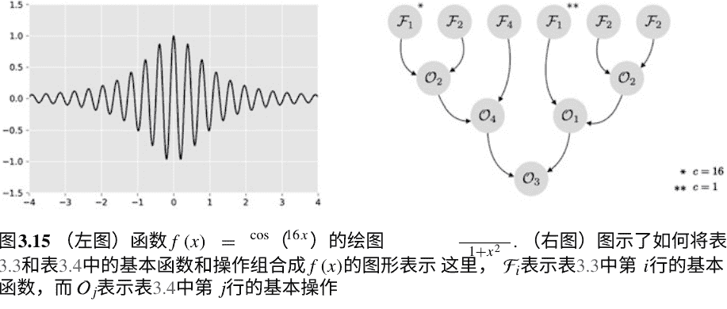

一个输出。根据这个定义，确定以下每个输入-输出关系是否定义了一个有效的函数：

- (a) 食物项目（输入）与其钠含量（输出）之间的关系，如表3.1所示
- (b) 食物项目中蛋白质含量（输入）与总热量（输出）之间的关系，如表3.1所示
- (c) 通过方程 $2x + 3y + xy = 1$ 定义的 $x$（输入）和 $y$（输出）之间的关系
- (d) 通过方程 $x^{\wedge}2 + y^{\wedge}2 = xy$ 定义的 $x$（输入）和 $y$（输出）之间的关系
- (e) 通过S形图示所示的x（输入）和y（输出）之间的关系

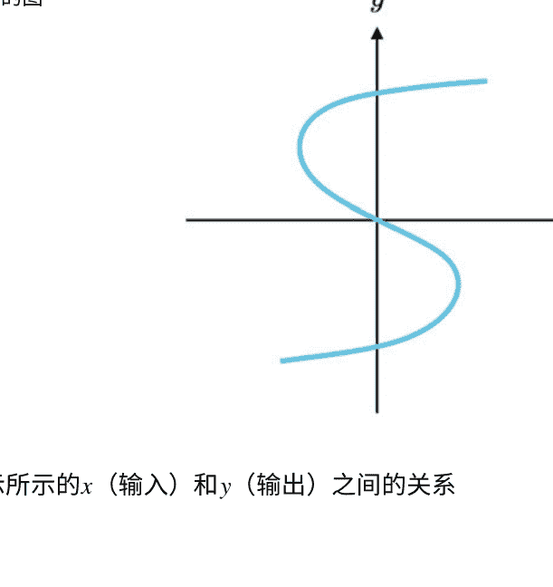

### 3.2 大数的乘法

使用(3.10)中的定义，展示如何通过加法而不是乘法来相乘两个非常大的数。

### 3.3 基本函数调整

图3.11说明了各种基本调整（如放大、衰减、挤压、拉伸等）如何改变给定函数的形状。从余弦函数f(x)=cos(x)开始，使用这些基本调整创建一个新的三角函数，其输出始终在-0.2和+0.3之间，并且在单位区间上的水平轴上穿过3次，即当0≤x≤1时。

### 3.4 反函数

如果两个函数的组合始终等于1，则函数g(x)被称为函数f(x)的反函数，即g(f(x))=1。确定以下函数的反函数:

- (a) f(x)=x.
- (b) f(x)=e^x.
- (c) f(x)=e^{10x}.

### 3.5 通过基本构建块构建无尽复杂函数

在第“使用基本函数和运算构建复杂函数”节中，我们展示了如何使用函数f(x)=\frac{\cos(16x)}{1+x^2}可以使用表3.3和表3.4中列出的基本函数和运算进行构建。在这个练习中，你需要展示如何对下面提供的每个函数进行构建。

## 使用基本函数和运算符构建复杂函数

通过生成类似于右侧面板中显示的图形表示来实现。图3.15中的(a) $f(x) = 1 + x^2 + x^4$。

- (b) $f(x) = \tanh(x) = \frac{e^x - e^{-x}}{e^x + e^{-x}}$
- (c) $f(x) = \log \left( \frac{1}{1 + e^{-x}} \right)$

# 第4章 线性回归

我们日常经历和活动中的许多事情都受线性现象的控制。例如，汽车以一定速度行驶的距离与行程的持续时间成线性关系。当物体被投掷时，其加速度是投掷物体所施加力量的线性函数。购买物品所欠的销售税与物品的原始价格成线性变化。许多药物的推荐剂量是患者体重的线性函数。等等，还有更多例子。

线性回归是揭示输入和输出数据之间隐藏的线性关系的机器学习任务。在本章中，我们从基础开始研究线性回归，为接下来讨论更复杂的非线性模型打下基础。

## 具有一维输入的线性回归

我们通过研究一个非常简单的回归数据集，开始讨论线性回归

$$
\[ (x_1, y_1) = (0, -1), \\ (x_2, y_2) = (2, 0), \\ (x_3, y_3) = (4, 1), \\ (x_4, y_4) = (6, 2), \] (4.1)
$$

其中每对的第一个元素是样本输入，第二个元素是相应的输出。在继续之前，花点时间自己尝试解决这个回归问题，通过找到一个能解释这些数据的数学关系（线性或非线性）。换句话说，利用你的数学直觉找到一个函数 f(·)，使得

$$
f(0) = -1,
f(2) = 0,
f(4) = 1,
f(6) = 2.  (4.2)
$$

如果你还没有找到解决方案，你可能会发现绘制这些数据（如图4.1所示）并进行视觉检查会有帮助。你看到了趋势或模式吗？

在这种情况下，大多数（如果不是全部）人会立即认出输入和输出之间的线性关系，尽管还存在无数其他满足方程（4.2）的（非线性）函数。三角函数 f(x) = sin^2(π/4 x) - sin(π/4 x) - cos(π/4 x) 就是一个例子。

我们更容易选择线性解决方案而不是非线性解决方案的原因可以通过线性函数的普遍性和简单性来解释。正如在本章引言中讨论的，我们周围都是线性现象，因此我们的大脑已经进化出了轻松识别线性的能力。此外，奥卡姆剃刀原则指出，当面临具有相同预测能力的竞争假设时，最简单的解决方案总是更可取的。用公元2世纪希腊数学家克劳狄乌斯·托勒密的话来说，“一般来说，我们认为用最简单的假设来解释现象是一个好原则。”

图4.1 (4.1)中回归数据集的绘图，其中所有四个数据点似乎都位于一条直线上。详细信息请参阅正文

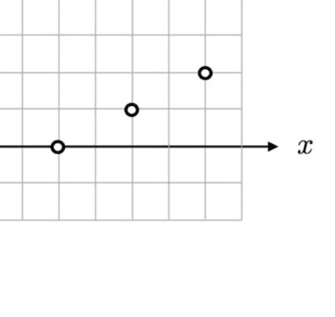

线性函数是所有数学函数中最简单的，无论是代数上还是几何上，这使得人类能够轻松理解、直观理解、解释和运用。具有一维输入的线性函数的一般形式为

$$
f(x) = w_0 + w_1x, \tag{4.3}
$$

其中参数 $w_0$ 表示函数的偏置（或纵截距），参数 $w_1$ 表示其斜率（或上升与水平移动的比例）。解决线性回归问题就等同于以一种方式找到 $w_0$ 和 $w_1$ 的正确值，使得（4.2）中的所有方程成立。

将（4.3）中的 $f(\cdot)$ 的参数表达式代入（4.2），我们有

$$
\begin{aligned}
w_0 & = -1, \\
w_0 + 2w_1 & = 0, \\
w_0 + 4w_1 & = 1, \\
w_0 + 6w_1 & = 2.
\end{aligned} \tag{4.4}
$$

这个线性方程组有唯一解 $(w_0, w_1) = (-1, \frac{1}{2})$，从而得到 $f(x) = -1 + \frac{1}{2}x$ 作为回归数据集（4.1）的线性模型。

## 最小二乘代价函数

实践中遇到的回归数据集与之前研究的玩具数据集(4.1)有两个重要的不同之处。首先，真实世界的数据集通常规模更大，有些数据集甚至超过了数百万个数据点。因此，从这一点开始，我们假设回归数据集一般由 $p$ 个输入-输出对组成，其中 $p$ 可以是任意大的数。线性回归问题的一般设置可以被简洁地表示为一组 $p$ 个线性方程，写作

$$
w_0 + w_1 x_i = y_i, \quad i = 1, 2, \ldots, p. \tag{4.5}
$$

其次，更重要的是，并不保证给定回归数据集中的所有 $p$ 个数据点共线，即它们都恰好落在一条直线上。实际上，即使输入和输出之间的基本关系确实是线性的，在现实生活中也很难遇到完全共线的数据集。这是因为数据中总是存在一定程度的噪声，这是由于各种类型的观测和测量误差造成的，无法完全消除。从数学上讲，这意味着线性系统的

如果不考虑噪声的存在，(4.5)中的方程几乎不会有任何解。

我们可以通过在输出 $y_i$ 中添加一个新变量 $\epsilon_i$ 来模拟噪声的存在，从而形成以下“有噪声”的方程系统：

$$
w_0 + w_1 x_i = y_i + \epsilon_i, \quad i = 1, 2, \ldots, p. \tag{4.6}
$$

然而，请注意，通过这种调整，上述线性系统的未知变量数目 $(p+2)$ 多于方程数目 $(p)$，导致它有无穷多个解。因此，需要一种新的策略来解决 (4.6) 以获取 $w_0$ 和 $w_1$ 的最优值。

通过将项 $y_i$ 移到左边并对两边进行平方，重新排列 (4.6) 可得到一个等价的方程系统。

$$
(w_0 + w_1 x_i - y_i)^2 = \epsilon_i^2, \quad i = 1, 2, \ldots, p, \tag{4.7}
$$

其中噪声/误差项现在与其他变量隔离开来。此外，通过平方两边，我们可以确保相同大小的正负误差值对均方误差（或MSE）的贡献相等，该均方误差在整个数据集上定义为

$$
\text{MSE} = \frac{1}{p} \sum_{i=1}^{p} \epsilon_i^2. \tag{4.8}
$$

理想情况下，我们希望MSE为0。然而，这意味着所有的 $\epsilon_i$ 都应该为零，而正如前面所述，这是不现实的。如果我们无法完全消除均方误差，那么我们能做的下一件最好的事情就是尽可能地将其减小。这种愿望构成了最小二乘法框架的基础，如图4.2所示，我们通过最小化最小二乘代价函数来确定 $w_0$ 和 $w_1$ 的最优值。

$$
g(w_0, w_1) = \frac{1}{p} \sum_{i=1}^{p} \epsilon_i^2 = \frac{1}{p} \sum_{i=1}^{p} (w_0 + w_1 x_i - y_i)^2. \tag{4.9}
$$

通过将 $g(\cdot)$ 的偏导数设置为0，可以最小化最小二乘代价函数(4.9)，这并不是一项艰巨的任务。对于 $w_0$， $g(\cdot)$ 的偏导数可以写成以下形式，并进行简化

$$
\frac{\partial g}{\partial w_0} = \frac{1}{p} \sum_{i=1}^{p} 2(w_0 + w_1 x_i - y_i) \frac{\partial (w_0 + w_1 x_i - y_i)}{\partial w_0} = \frac{2}{p} \sum_{i=1}^{p} (w_0 + w_1 x_i - y_i). \tag{4.10}
$$

类似地，对于 $w_1$， $g(\cdot)$ 的偏导数可以写成以下形式，并进行简化

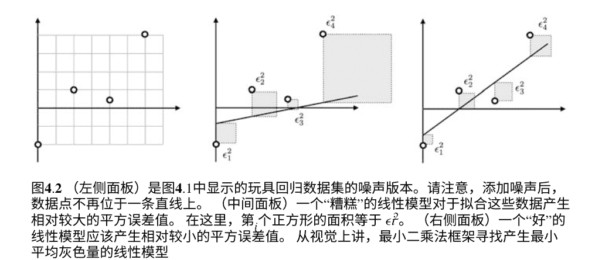

$$
\frac{\partial g}{\partial w_1} = \frac{1}{p} \sum_{i=1}^{p} 2(w_0 + w_1 x_i - y_i) \frac{\partial(w_0 + w_1 x_i - y_i)}{\partial w_1} = \frac{2}{p} \sum_{i=1}^{p}(w_0 + w_1 x_i - y_i)x_i. \tag{4.11}
$$

将(4.10)和(4.11)设为零，并应用简单的代数重排，得到以下线性方程组

$$
\begin{aligned}
w_0\, p + w_1 \sum_{i=1}^{p} x_i &= \sum_{i=1}^{p} y_i, \\
w_0 \sum_{i=1}^{p} x_i + w_1 \sum_{i=1}^{p} x_i^2 &= \sum_{i=1}^{p} y_i x_i,
\end{aligned} \tag{4.12}
$$

可以写成矩阵形式

$$
\begin{bmatrix}
p & \sum_{i=1}^{p} x_i \\
\sum_{i=1}^{p} x_i & \sum_{i=1}^{p} x_i^2
\end{bmatrix}
\begin{bmatrix}
w_0 \\
w_1
\end{bmatrix}
=
\begin{bmatrix}
\sum_{i=1}^{p} y_i \\
\sum_{i=1}^{p} y_i x_i
\end{bmatrix}. \tag{4.13}
$$

最后，将(4.13)中的方阵的逆矩阵乘以两边，得到 w_0 和 w_1 的最优值

$$
\begin{bmatrix}
w_0 \\
w_1
\end{bmatrix}
=
\begin{bmatrix}
p & \sum_{i=1}^{p} x_i \\
\sum_{i=1}^{p} x_i & \sum_{i=1}^{p} x_i^2
\end{bmatrix}^{-1}
\begin{bmatrix}
\sum_{i=1}^{p} y_i \\
\sum_{i=1}^{p} y_i x_i
\end{bmatrix}. \tag{4.14}
$$

例4.1（训练线性回归器）在这里，我们使用(4.14)中推导出的最小二乘解来找到最适合嘈杂数据集的拟合线，如图4.2所示，其中

- $(x_1, y_1) = (0, -2),$  
- $(x_2, y_2) = (2, 1),$  
- $(x_3, y_3) = (4, 0.5),$  
- $(x_4, y_4) = (6, 4).$

$$
\sum_{i=1}^4 x_i = 12, \quad \sum_{i=1}^4 x_i^2 = 56, \quad \sum_{i=1}^4 y_i = 3.5, \quad \sum_{i=1}^4 y_i x_i = 28,
$$

$$
\begin{bmatrix} w_0 \\ w_1 \end{bmatrix} = \begin{bmatrix} 4 & 12 \\ 12 & 56 \end{bmatrix}^{-1} \begin{bmatrix} 3.5 \\ 28 \end{bmatrix} = \begin{bmatrix} -1.75 \\ 0.875 \end{bmatrix}.
$$

因此，f(x)= -1.75 + 0.875 x是表示数据集的最佳线性函数(4.15)。

## 具有多维输入的线性回归

在本章的这一部分，我们处理的输入都是标量或一维的，这使得我们可以像图4.1和4.2中那样可视化它们。然而，一般情况下，回归问题的输入可以是多维的。虽然我们无法可视化输入具有超过两个分量或维度的数据集，但是最小二乘法框架可以进行最小调整以处理多维输入。

首先，我们必须扩展线性函数的定义以适应一般n维输入。类似于 (4.3) ，n维空间中的线性函数被定义为

$$
f(x_1, x_2, \ldots, x_n) = w_0 + w_1x_1 + w_2x_2 + \cdots + w_nx_n,
$$

其中 $w_0$仍然是偏置参数，每个输入 $x_i$都乘以相应的斜率参数 $w_i$，对于所有 $i = 1, 2, \ldots, n$。类似于第“最小二乘代价函数”部分中讨论的内容，并在(4.9)中展示的方式，可以推导出$n$维输入的最小二乘代价函数。

$$
 g(w_0, w_1, \ldots, w_n) = \frac{1}{p} \sum_{i=1}^{p} (w_0 + w_1 x_i + \cdots + w_n x_n - y_i)^2.
$$

在这一点上，将所有的输入 $x_1$到 $x_n$方便地放入一个单一的输入向量中，表示为

$$
 \mathbf{x} = \begin{bmatrix} x_1 \\ x_2 \\ \vdots \\ x_n \end{bmatrix},
$$

将所有的斜率参数 $w_1$到 $w_n$方便地放入一个单一的权重向量中，表示为

$$
 \mathbf{w} = \begin{bmatrix} w_1 \\ w_2 \\ \vdots \\ w_n \end{bmatrix},
$$

这样，在(4.19)中的最小二乘代价函数可以更简洁地表示为

$$
 g(w_0, \mathbf{w}) = \frac{1}{p} \sum_{i=1}^{p} (w_0 + \mathbf{w}^T \mathbf{x}_i - y_i)^2.
$$

接下来，我们找到 $g(\cdot)$相对于 $w_0$的偏导数

$$
 \frac{\partial g}{\partial w_0} = \frac{1}{p} \sum_{i=1}^{p} 2(w_0 + \mathbf{w}^T \mathbf{x}_i - y_i) \frac{\partial (w_0 + \mathbf{w}^T \mathbf{x}_i - y_i)}{\partial w_0} = \frac{2}{p} \sum_{i=1}^{p} (w_0 + \mathbf{w}^T \mathbf{x}_i - y_i)
$$

并将其设置为 0，这样得到（经过简单的重新排列后）

$$
 p w_0 + \left( \sum_{i=1}^{p} \mathbf{x}_i^T \right) \mathbf{w} = \sum_{i=1}^{p} y_i.
$$

由于 $\mathbf{w}$是一个 $n \times 1$向量，我们必须找到对 $\mathbf{w}$的 $g(\cdot)$的梯度

$$
\nabla_{\mathbf{w}} g = \frac{1}{p} \sum_{i=1}^{p} 2(w_0 + \mathbf{w}^T \mathbf{x}_i - y_i) \nabla_{\mathbf{w}} (w_0 + \mathbf{w}^T \mathbf{x}_i - y_i) = \frac{2}{p} \sum_{i=1}^{p} (w_0 + \mathbf{w}^T \mathbf{x}_i - y_i) \mathbf{x}_i \qquad (4.25)
$$

并将其设置为 $\mathbf{0}_{n \times 1}$。同样，在几个简单的重新排列后，我们得到

$$
\left( \sum_{i=1}^{p} \mathbf{x}_i \right) w_0 + \left( \sum_{i=1}^{p} \mathbf{x}_i \mathbf{x}_i^T \right) \mathbf{w} = \sum_{i=1}^{p} y_i \mathbf{x}_i. \qquad (4.26)
$$

将 $(n + 1) \times (n + 1)$ 的方阵 $\mathbf{A}$ 定义为

$$
\mathbf{A} = \begin{bmatrix} p & \sum_{i=1}^{p} \mathbf{x}_i^T \\ \sum_{i=1}^{p} \mathbf{x}_i & \sum_{i=1}^{p} \mathbf{x}_i \mathbf{x}_i^T \end{bmatrix}, \qquad (4.27)
$$

将 $(n + 1) \times 1$ 的列向量 $\mathbf{b}$ 定义为

$$
\mathbf{b} = \begin{bmatrix} \sum_{i=1}^{p} y_i \\ \sum_{i=1}^{p} y_i \mathbf{x}_i \end{bmatrix}, \qquad (4.28)
$$

我们可以将(4.24)和(4.26)合并为以下线性方程组：

$$
\mathbf{A} \begin{bmatrix} w_0 \\ \mathbf{w} \end{bmatrix} = \mathbf{b}, \qquad (4.29)
$$

其解揭示了线性函数(4.18)参数的最优值，即

$$
\begin{bmatrix} w_0 \\ \mathbf{w} \end{bmatrix} = \mathbf{A}^{-1} \mathbf{b}. \qquad (4.30)
$$

> 例4.2（预测预期寿命）全球卫生观察是由世界卫生组织（WHO）维护的公共数据存储库，包含来自全球190多个国家的各种与健康相关的统计数据。这些与健康相关的统计数据包括成人、儿童和婴儿的死亡率、免疫信息、某些传染病的患病率等等。

### 例子 4.2 (继续)

在这里，我们在表4.1中展示了这个数据集的一个小部分，我们将使用它来训练一个线性回归模型，以预测基于三个输入因素的预期寿命，包括：
- 每1000人口的成年人死亡率（“死亡率”）
- 接种脊髓灰质炎疫苗的婴儿的百分比（“脊髓灰质炎免疫”）
- 以美元报告的人均国内生产总值（“GDP”）

输出（“预期寿命”）以年为单位衡量。我们使用表4.1中显示的数据的前一半（即以字母“A”开头的国家）进行训练，使用后一半（即以字母“B”开头的国家）进行验证。

专注于数据的前一半，我们可以计算矩阵 A 如(4.27)所示

```
A = [
    [9, 1245.5, 745.2, 90265.6],
    [1245.5, 263018.6, 92854.8, 7402681.9],
    [745.2, 92854.8, 63700.6, 7963111.5],
    [90265.6, 7402681.9, 7963111.5, 2445298875.4]
]
```

以及向量 b 如(4.28)所示

**表4.1 与示例 4.2相关的数据集。详见正文。**

| 国家 | 死亡率 | 脊髓灰质炎免疫率（%） | GDP | 预期寿命 |
| :--- | :--- | :--- | :--- | :--- |
| 阿富汗 | 269.06 | 48.38 | 340.02 | 58.19 |
| 阿尔巴尼亚 | 45.06 | 98.13 | 2119.73 | 75.16 |
| 阿尔及利亚 | 102.82 | 93.18 | 3261.29 | 74.21 |
| 安哥拉 | 362.75 | 70.88 | 2935.76 | 50.68 |
| 阿根廷 | 100.38 | 94.46 | 6932.55 | 75.24 |
| 亚美尼亚 | 117.33 | 88.67 | 2108.68 | 73.31 |
| 澳大利亚 | 62.43 | 91.86 | 35,391.20 | 81.91 |
| 奥地利 | 65.80 | 85.53 | 33,171.58 | 81.48 |
| 阿塞拜疆 | 119.85 | 74.08 | 4004.78 | 71.15 |
| 孟加拉国 | 135.67 | 87.67 | 573.58 | 69.97 |
| 白俄罗斯 | 220.27 | 89.27 | 3669.02 | 69.75 |
| 比利时 | 69.93 | 97.67 | 17,752.53 | 80.65 |
| 伯利兹 | 154.20 | 95.60 | 3871.88 | 69.15 |
| 贝宁 | 269.31 | 65.38 | 572.45 | 57.71 |
| 不丹 | 231.53 | 88.80 | 1270.01 | 65.92 |
| 波斯尼亚 | 63.55 | 75.18 | 2216.64 | 76.18 |
| 巴西 | 151.27 | 98.33 | 5968.89 | 73.27 |
| 保加利亚 | 124.73 | 94.47 | 4802.02 | 72.74 |

### 例子 4.2 (继续)

```
$$\mathbf{b} = \begin{bmatrix} 641.3 \\ 80212.3 \\ 54066.7 \\ 7132595.6 \end{bmatrix} \quad (4.32)$$
```

计算模型参数的方法为

```
$$\begin{bmatrix} w_0 \\ w_1 \\ w_2 \\ w_3 \end{bmatrix} = \mathbf{A}^{-1} \mathbf{b} = \begin{bmatrix} 79.0 \\ -0.08174 \\ 0.02152 \\ 0.00018 \end{bmatrix}. \quad (4.33)$$
```

通过这些获取的参数，预期寿命的最终线性模型可以表示为

```
$$\begin{aligned} \text{预期寿命} &= 79.0 - (0.08174 \times \text{死亡率}) \\ &\quad + (0.02152 \times \text{脊髓灰质炎免疫率}) \\ &\quad + (0.00018 \times \text{国内生产总值}). \quad (4.34) \end{aligned}$$
```

现在我们可以使用这个模型来预测验证集中各个国家的预期寿命，首先是孟加拉国，根据表4.1，孟加拉国的死亡率为每1000人口135.67，婴儿脊髓灰质炎免疫率为87.67%，人均国内生产总值为573.58美元。将这些值代入线性回归模型(4.34)中，我们可以得到预测的预期寿命

```
$$79.0 - (0.08174 \times 135.6) + (0.02152 \times 87.67) + (0.00018 \times 573.58) = 69.91. \quad (4.35)$$
```

这个值与孟加拉国实际的预期寿命69.97非常接近。同样的过程可以用于验证集中的所有国家(见图4.3)。最后，可以使用(4.9)找到验证集的均方误差

```
$$\text{MSE} = 7.79. \quad (4.36)$$
```

### 输入归一化

线性回归模型的权重或参数携带着有关输入和输出数据之间关系的宝贵信息。我们在(4.34)中看到，预期寿命(输出)可以线性地与包括三个输入因素在内的因素相连接。

图4.3 预测与实际预期寿命值的视觉比较，这些国家的名称以字母“B”开头。实际预期寿命值（蓝色）来自表4.1中的数据集，而预测值（黄色）是使用线性回归模型（4.34）获得的。重要的是要强调，在此图中显示的国家的数据在训练过程中没有使用过。

死亡率、脊髓灰质炎免疫和国内生产总值。在这个模型中，与死亡率相关的权重是负数。这意味着降低死亡率会增加预期寿命。另一方面，与其他两个输入相关的权重是正数，这意味着增加脊髓灰质炎免疫和国内生产总值会增加预期寿命。换句话说，在线性回归模型中，特定参数的数学符号决定了该参数所附加的输入对输出的负面或正面贡献。

参数的大小也告诉我们输出与与该参数相关联的输入之间的强相关性。直观上，输入的权重越大，对输出的影响就越大。这个洞察力可以用来根据它们对输出的贡献创建输入重要性的排名。

然而，有一个注意事项：当 |w_i| > |w_j| 时，我们可以得出结论，第 i 个输入比第 j 个输入有更大的影响，只有当这两个输入在可比较的范围内。

例如，从（4.34）中，不立即清楚脊髓灰质炎免疫对确定预期寿命的影响比国内生产总值更大，仅仅因为脊髓灰质炎免疫的权重（即 0.02152）比国内生产总值的权重（即 0.00018）更大。这是因为脊髓灰质炎免疫（作为百分比）始终在 0 和 100 之间，而人均国内生产总值可以在发展中国家，医疗机器学习和深度学习的费用从几百美元到一些发达国家的数万美元不等（见表4.1）。幸运的是，我们可以通过输入归一化来解决这种不和谐。假设回归数据集中的输入 $x_i$ 的范围是 $a_i$ 到 $b_i$，即 $a_i \leq x_i \leq b_i$。通过将 $x_i$ 减去 $a_i$ 并将结果除以 $b_i - a_i$，我们可以定义一个线性缩放版本的 $x_i$，表示为

```
$$x'_i = \frac{x_i - a_i}{b_i - a_i}, \quad i = 1, 2, \ldots, p. \quad (4.37)$$
```

这种简单的输入归一化方案正是我们想要的，因为它确保 $x'_i$ 始终位于 0 和 1 之间（见练习4.3）。此外，它不会使我们之前的建模假设无效，因为从数学角度来看，以 $x'_i$ 作为输入的可调参数的线性函数等效于以 $x_i$ 作为输入的线性函数。回顾一下（4.18）中以 $x'_1, x'_2, \ldots, x'_n$ 作为输入的线性模型可以写成

```
$$f (x'_1, x'_2, \ldots, x'_n) = w_0 + \sum_{i=1}^{n} w_i x'_i$$
$$= w_0 + \sum_{i=1}^{n} w_i \left( \frac{x_i - a_i}{b_i - a_i} \right)$$
$$= w_0 - \sum_{i=1}^{n} \frac{w_i a_i}{b_i - a_i} + \sum_{i=1}^{n} \frac{w_i}{b_i - a_i} x_i \quad (4.38)$$
$$= v_0 + \sum_{i=1}^{n} v_i x_i,$$
```

尽管使用不同的参数集合 ($v_0$ 到 $v_n$)。$x_1, x_2, \ldots, x_n$ 仍然是一个线性函数。

> **例子 4.3 (重新预测预期寿命)**
> 在这里，我们重复了例子 4.2 中的步骤，创建了一个关于预期寿命的线性回归模型。这次，我们首先对输入数据进行归一化，以便可以使用得到的最小二乘解来比较每个输入在估计输出中的相对重要性。对于表4.1中的每个输入列，我们找到所有国家中的最小值和最大值，分别表示为 $a$ 和 $b$。然后我们使用线性变换 $x \rightarrow \frac{x - a}{b - a}$ 来形成表4.2中显示的归一化数据集。注意，归一化过程必须在包括训练和验证数据子集的整个数据集上进行。

**表4.2 示例4.3相关的数据集。详细信息请参阅正文。**

| 国家 | 归一化死亡率 | 归一化脊髓灰质炎免疫 | 归一化GDP | 预期寿命 |
| :--- | :--- | :--- | :--- | :--- |
| 阿富汗 | 0.70510 | 0.0000 | 0.0000 | 58.19 |
| 阿尔巴尼亚 | 0.0000 | 0.9958 | 0.05078 | 75.16 |
| 阿尔及利亚 | 0.1818 | 0.8969 | 0.0833 | 74.21 |
| 安哥拉 | 1.0000 | 0.4504 | 0.0741 | 50.68 |
| 阿根廷 | 0.1741 | 0.9225 | 0.1881 | 75.24 |
| 亚美尼亚 | 0.2275 | 0.8065 | 0.0505 | 73.31 |
| 澳大利亚 | 0.0547 | 0.8704 | 1.0000 | 81.91 |
| 奥地利 | 0.0653 | 0.7438 | 0.9367 | 81.48 |
| 阿塞拜疆 | 0.2354 | 0.5145 | 0.1046 | 71.15 |
| 孟加拉国 | 0.2852 | 0.7865 | 0.0067 | 69.97 |
| 白俄罗斯 | 0.5515 | 0.8185 | 0.0950 | 69.75 |
| 比利时 | 0.0783 | 0.9867 | 0.4968 | 80.65 |
| 伯利兹 | 0.3435 | 0.9453 | 0.1008 | 69.15 |
| 贝宁 | 0.7059 | 0.3405 | 0.0066 | 57.71 |
| 不丹 | 0.5870 | 0.8092 | 0.0265 | 65.92 |
| 波斯尼亚 | 0.0582 | 0.5366 | 0.0535 | 76.18 |
| 巴西 | 0.3343 | 1.0000 | 0.1606 | 73.27 |
| 保加利亚 | 0.2508 | 0.9226 | 0.1273 | 72.74 |

### 示例4.3 (续)

根据（4.30），最小二乘解可以计算为

$$
\begin{bmatrix}
w_0 \\ w_1 \\ w_2 \\ w_3
\end{bmatrix}
=
\begin{bmatrix}
9.0000 & 2.6439 & 6.2007 & 2.4879 \\
2.6439 & 1.6749 & 1.1748 & 0.2739 \\
6.2007 & 1.1748 & 5.0758 & 1.9937 \\
2.4879 & 0.2739 & 1.9937 & 1.9412
\end{bmatrix}^{-1}
\begin{bmatrix}
641.31 \\
161.52 \\
461.25 \\
197.27
\end{bmatrix}
=
\begin{bmatrix}
76.42 \\
-25.97 \\
1.08 \\
6.24
\end{bmatrix}
.
$$
(4.39)

使用这些参数，（4.34）中的线性模型可以重写为

$$
\begin{aligned}
\text{预期寿命} &= 76.42 - (25.97 \times \text{死亡率}) \\
&\quad + (1.08 \times \text{脊髓灰质炎免疫}) \\
&\quad + (6.24 \times \text{国内生产总值}) .
\end{aligned}
$$
(4.40)

现在可以使用每个输入的权重的大小作为确定其对估计输出的贡献程度的代理。在这个例子中，与死亡率相关的权重具有最大的大小，其次是GDP和脊髓灰质炎免疫。

## 正则化

在所有回归问题中，我们讨论过的数据点的数量 $p$ 总是超过输入的数量 $n$。在本节中，我们讨论当反过来成立时会发生什么，即 $n \geq p$。与之前一样，我们从一个简单的玩具数据集开始，其中 $n = p = 2$。

$(x_{1,1}, x_{1,2}, y_1) = (0, 0, 1),$ (4.41)
$(x_{2,1}, x_{2,2}, y_2) = (1, 1, 2),$

为了充实涉及的重要思想。
通过利用线性函数 $f(x_1, x_2) = w_0 + w_1 x_1 + w_2 x_2$，我们可以得到以下线性方程组：

$w_0 \quad\quad\quad\quad= 1,$ (4.42)
$w_0 + w_1 + w_2 = 2,$

来对(4.41)中的数据进行建模。很快就会发现这个方程组有很多解。更准确地说，任何形如 $(w_0, w_1, w_2) = (1, t, 1-t)$ 的参数集都是(4.42)的解，其中 $t$ 可以是任意实数。例如，$t = 1$， $t = 10$，和 $t = 100$ 分别得到线性函数 $1 + x_1$， $1 + 10x_1 - 9x_2$，和 $1 + 100x_1 - 90x_2$，这些函数都可以完美地解释(4.41)中的数据，没有误差。

当 $n \geq p$ 时，所得到的线性方程组，如(4.42)所示，方程数量少于未知数数量，这导致可能有无穷多个解。这导致了最小二乘代价函数

$g(w_0, w_1, w_2) = \frac{1}{2} \sum_{i=1}^2 (w_0 + w_1 x_{i,1} + w_2 x_{i,2} - y_i)^2$ (4.43)

会有无穷多个最小值，从实际角度来看，这是不可取的。解决这个问题的一种方法是通过在原始代价函数中添加一个非负函数 $r(w_1, w_2)$ 来调整最小二乘代价函数

$g(w_0, w_1, w_2) + r(w_1, w_2)$ (4.44)

这样新的代价函数就有唯一的最小值。函数 $r(\cdot)$ 被称为正则化函数，上述调整过程被称为正则化。在深度学习中最常用的正则化函数是二次或岭正则化函数，定义如下

$r(w_1, w_2) = \lambda \left( w_1^2 + w_2^2 \right),$ (4.45)

其中 $\lambda \ge 0$ 是一个可调参数，通常被称为正则化参数。当我们在(4.44)中最小化正则化最小二乘代价时，注意到正则化函数的存在会阻止 $w_1$ 和 $w_2$ 取得非常大的值。当 $\lambda = 0$ 时，正则化代价减少到(4.43)中的原始最小二乘代价。相反，当 $\lambda$ 被设置得相当大时，正则化函数会主导原始代价，将 $w_1$ 和 $w_2$ 推向代价函数的最小值。在实践中，正则化参数 $\lambda$ 可以被设置为一个小值，特别是当输入数据被归一化时（如前一节所讨论的）。

使用一般的 $n$ 和 $p$，将正则化最小二乘代价函数写成(4.44)中的形式

```
$$\frac{1}{p} \sum_{i=1}^{p} (w_0 + \mathbf{w}^T \mathbf{x}_i - y_i)^2 + \lambda \mathbf{w}^T \mathbf{w},$$
```

我们可以按照(4.23)到(4.30)中的步骤找到最小二乘解

```
$$\begin{bmatrix} w_0 \\ \mathbf{w} \end{bmatrix} = \mathbf{A}^{-1} \mathbf{b},$$
```

其中

```
$$\mathbf{A} = \begin{bmatrix} p & \sum_{i=1}^{p} \mathbf{x}_i^T \\ \sum_{i=1}^{p} \mathbf{x}_i & \left( \sum_{i=1}^{p} \mathbf{x}_i \mathbf{x}_i^T \right) + \lambda \mathbf{I}_{n \times n} \end{bmatrix}, \quad \mathbf{b} = \begin{bmatrix} \sum_{i=1}^{p} y_i \\ \sum_{i=1}^{p} y_i \mathbf{x}_i \end{bmatrix},$$
```

而 $\mathbf{I}_{n \times n}$ 是单位矩阵。

> **例子4.4 (正则化线性回归)**
> 在这里，我们使用(4.47)中推导出的正则化最小二乘解来训练一个线性回归模型，针对(4.41)中的玩具数据集。代入

```
$$p = 2, \quad \mathbf{x}_1 = \begin{bmatrix} 0 \\ 0 \end{bmatrix}, \quad \mathbf{x}_2 = \begin{bmatrix} 1 \\ 1 \end{bmatrix}, \quad y_1 = 1, \quad y_2 = 2,$$
```

将(4.48)代入，我们有

```
$$\begin{bmatrix} w_0 \\ w_1 \\ w_2 \end{bmatrix} = \begin{bmatrix} 2 & 1 & 1 \\ 1 & 1+\lambda & 1 \\ 1 & 1 & 1+\lambda \end{bmatrix}^{-1} \begin{bmatrix} 3 \\ 2 \\ 2 \end{bmatrix}.$$
```

例子4.4(续)
请注意，当 λ = 0 时，方阵 A 在(4.50)中是不可逆的。这确实是我们首先对最小二乘代价函数进行正则化的原因。然而，当λ > 0时，无论λ是多么小或大，矩阵 A 都是可逆的。通常，λ被设置得相当小，以便正则化函数r(·)不会淹没原始的最小二乘函数 g(·)在(4.44)中。例如，在(4.50)中设置 λ = 0. 001给出
$$
\begin{bmatrix} w_0 \\ w_1 \\ w_2 \end{bmatrix} = \begin{bmatrix} 2 & 1 & 1 \\ 1 & 1.001 & 1 \\ 1 & 1 & 1.001 \end{bmatrix}^{-1} \begin{bmatrix} 3 \\ 2 \\ 2 \end{bmatrix} = \begin{bmatrix} 1.0 \\ 0.5 \\ 0.5 \end{bmatrix}.
\quad (4.51)
$$
更一般地，在矩阵 A 的内部添加项 λ I_{n×n} 可以保证A是可逆的（参见练习4.2）。

## 问题

### 4.1 线性、可加性和齐次性

- (a) 如果一个函数 f 满足 f(x_1 + x_2) = f(x_1) + f(x_2) 对于每一对输入 x_1 和 x_2。所有线性函数是否都满足定义中的可加性？如果不是，你能找到一个子集族的线性函数，总是满足可加性属性吗？
- (b) 如果一个函数 f 满足 f(αx) = αf(x) 对于每一个标量 α。所有线性函数是否都满足定义中的齐次性？如果不是，你能找到一个子集族的线性函数，总是满足齐次性属性吗？
- (c) 证明如果一个函数 f 既是可加的又是齐次的，那么我们可以写成 f(α_1 x_1 + α_2 x_2 + ··· + α_N x_N) = α_1 f(x_1) + α_2 f(x_2) + ··· + α_N f(x_N)，其中 α_1，α_2，...，α_N 和 x_1，x_2，...，x_N 是一组N任意标量和输入。

### 4.2 最小二乘解

- (a) 证明当 n = 1 时，(4.30)中提供的最小二乘解等于(4.14)中推导的解。
- (b) 证明(4.30)中的最小二乘解可以等价地表示为
$$
\begin{bmatrix} w_0 \\ \mathbf{w} \end{bmatrix} = \left( \mathbf{X} \mathbf{X}^T \right)^{-1} \mathbf{X} \mathbf{y},
\quad (4.52)
$$
其中向量 y 由所有输出组成一个单独的向量
$$\mathbf{y}_{p\times1}=\begin{bmatrix} y_1\ y_2\ \vdots\ y_p \end{bmatrix} \quad\quad (4.53)$$
其中矩阵 $\mathbf{X}$ 由将所有输入向量 $\mathbf{x}_1$ 到 $\mathbf{x}_p$ 按列堆叠形成，并通过添加一个只包含1的行向量来扩展其行空间，如下所示
$$\mathbf{X}_{(n+1)\times p}=\begin{bmatrix} 1 & 1 & \cdots & 1 \ \mathbf{x}_1 & \mathbf{x}_2 & \cdots & \mathbf{x}_p \end{bmatrix}. \quad\quad (4.54)$$
- (c) 按照(4.23)到(4.30)中描述的类似步骤，推导出(4.47)作为最小化正则化最小二乘函数(4.46)的最优参数集。
- (d) 证明当最小二乘代价函数通过 $r(\mathbf{w})=\lambda\mathbf{w}^T\mathbf{w}$ 进行正则化时，(4.52)中的最小二乘解可以进行调整并写成
$$\begin{bmatrix} w_0 \ \mathbf{w} \end{bmatrix} = (\mathbf{X}\mathbf{X}^T + \lambda\mathring{\mathbf{I}})^{-1} \mathbf{X}\mathbf{y}, \quad\quad (4.55)$$
其中 $\mathring{\mathbf{I}}$ 是一个 $(n+1)\times(n+1)$ 的单位矩阵，其第一个对角元素设为0。
$$\mathring{\mathbf{I}}=\begin{bmatrix} 0 & 0 & 0 & \cdots & 0 \ 0 & 1 & 0 & \cdots & 0 \ 0 & 0 & 1 & \cdots & 0 \ \vdots & \vdots & \vdots & \ddots & \vdots \ 0 & 0 & 0 & \cdots & 1 \end{bmatrix}. \quad\quad (4.56)$$
- (e) 当 $\lambda > 0$ 时，证明矩阵 $\mathbf{X}\mathbf{X}^T + \lambda\mathring{\mathbf{I}}$ 在(4.55)中始终可逆，无论 $\mathbf{X}$ 的维度或元素如何。

### 4.3 输入归一化

- (a) 给定两个实数 $c$ 和 $d$ (其中 $c < d$)，以及一组测量值 $\{x_1, x_2, \ldots, x_p\}$，找到一个线性函数 $f(\cdot)$，使得对于所有的 $i = 1, 2, \ldots, p$，都有 $c \leqslant f(x_i) \leqslant d$。
- (b) 从我们在第“输入归一化”节中讨论的输入归一化中回顾，原始的寿命预测线性模型(4.34)不能用于推断相对输入的重要性。为了解决这个问题，在示例4.3中，我们线性转换了所有的输入，如表4.2所示，并对这个归一化的数据应用了最小二乘解法，得到了一个新的线性模型(4.40)，其中

### 4.4 寿命预测：第一部分

在示例4.2中，我们使用了一个相对较小的数据集，包括 p = 18个国家，根据 n = 3个输入因素，包括死亡率、脊髓灰质炎免疫率和国内生产总值来预测寿命。在这里，我们使用了一个包含 p = 133个国家的扩展版本的数据集。这个数据的版本存储在life-expectancy-133-countries.csv中，该文件包含在本章的补充材料中。这个练习的目标是评估增加数据规模对线性回归的预测能力的影响，通过在验证数据集上使用均方误差(MSE)度量(4.8)来衡量：

- (a) 根据“输入归一化”部分的描述，对输入数据进行归一化处理。
- (b) 使用以字母“A-M”开头的所有国家的归一化数据来训练生命预期的线性回归模型。
- (c) 基于你的模型，哪个输入因素对于预测输出最重要？哪个输入因素对于预测输出最不重要？
- (d) 使用训练好的模型计算包含以字母“N-Z”开头的所有国家的验证数据集的均方误差（MSE）。这个MSE值与表4.2中计算的较小数据集的MSE值相比如何？

### 4.5 生命预期的预测：第二部分

在这个练习中，我们使用一个扩展版本的数据集来训练一个线性回归模型，该数据集与练习4.4中引用的数据集相同（具有18个输入因素）。这个数据版本存储在life-expectancy-18-factors.csv文件中，该文件包含在本章的补充材料中。这个练习的目标是评估增加输入维度对线性回归的预测能力的影响，使用验证数据集上的均方误差（MSE）度量，该度量在（4.8）中定义：

- (a) 根据“输入归一化”部分的描述，对输入数据进行归一化处理。
- (b) 使用以字母“A-M”开头的所有国家的归一化数据来训练生命预期的线性回归模型。
- (c) 基于你的模型，哪个输入因素对于预测输出最重要？哪个输入因素对于预测输出最不重要？
- (d) 使用训练好的模型计算以“N-Z”开头的所有国家的验证数据的均方误差（MSE）。这个MSE值与示例4.2和练习4.4中计算的其他较小版本的MSE值相比如何？

### 4.6 医疗保险费用的预测

在这个练习中，我们利用某些人口统计和医疗信息（输入）来训练线性回归模型，以预测医疗保险费用（输出）。输入因素包括年龄、体重指数（BMI）、子女数量和吸烟状态（1表示吸烟者，0表示非吸烟者）。这里使用的数据集是从[1]中获取的“insurance”数据集的简化版本，该数据集包含在本章的补充材料中（名称为medical-insurance.csv）：
- (a) 根据“输入归一化”一节的描述对输入数据进行归一化。
- (b) 将数据随机分成两个大小相等的训练集和验证集，并使用前者训练线性回归模型。
- (c) 基于你的模型，哪个输入因素对于预测输出最重要？哪个输入因素对于预测输出最不重要？
- (d) 使用训练好的模型计算训练集和验证集的均方误差（MSE）。在这种情况下，哪个MSE值更大？这是否符合你的预期？请解释。

## 参考

> 1. Lantz B. Machine learning with R. Birmingham: Packt Publishing; 2013

# 第5章 线性分类

在前一章中，我们研究了线性回归作为捕捉输入和输出数据之间关系的最基本模型，适用于输出值在连续范围内的情况。类似地，线性分类被认为是使用线性边界将数据分为两个（或多个）类别的基础分类模型。

由于这两种范式都在其核心使用线性模型，因此我们在本章对线性分类的整体处理将与我们在第4章中对线性回归的讨论非常相似。然而，正如我们很快将看到的，回归和分类之间看似微妙的区别（就输出的性质而言）导致了在每种情况下使用的代价函数以及用于最小化这些代价以检索最佳模型参数的优化策略上的显著差异。

## 具有一维输入的线性分类

我们开始本章，就像在第“一维线性回归输入”节中一样，考虑一个模拟的分类数据集，该数据集仅由形式为 \((x_i, y_i)\) 的 6个输入-输出对组成

$$(-2.0, 0),$$
$$(-1.5, 0),$$
$$(-1.0, 0),$$
$$(-0.5, 1),$$
$$(0.5, 1),$$
$$(2.5, 1), \quad (5.1)$$

图 5.1 (5.1) 中模拟分类数据集的绘图，以及最佳线性回归器来拟合这个数据。显然，回归线是表示分类数据的不良模型。

其中 x_i 和 y_i 分别表示第 i 个输入和输出。与回归一样，分类的目标是找到一个函数 f(·)，使得对于 i = 1, 2, ..., 6，有 f(x_i) = y_i 成立。请注意，因为输出 y_i 始终限制为二进制值（即0或1），所以可以将分类看作是回归的一种特殊情况（在这种情况下对输出可以获得的值施加了一种特殊类型的约束）。因此，不难想象我们是否可以重用前一章中开发的数学框架来找到 f(·) 在这种情况下也适用。让我们试试看！

按照示例4.1中概述的相同步骤，可以得出函数 f(x) = 0.5875 + 0.2625 x 作为最佳线性回归器来拟合(5.1)中的分类数据，这两者（函数和数据）在图5.1中绘制。对这个图进行快速查看可以发现 f(·) 的输出没有约束和边界，对底层数据集的表示效果较差。

这个问题可以通过使用所谓的海维赛德阶跃函数 h(·)来解决，该函数定义为
$$ h(x) = \begin{cases} 0, & x < 0 \\ 1, & x \geq 0 \end{cases} \quad (5.2) $$
并在图5.2的左侧面板中绘制。由于 h(·) 的输出在所有时间点上都是二进制的，它具有我们在一个合适的分类函数中期望看到的属性。因此，我们可以通过线性函数 f(x) = w0 + w1 x 通过 h(·) 并使用组合函数 h(f(x)) 作为我们的新分类器。可以形成相应的最小二乘代价函数，按照“最小二乘代价函数”一节中描述的步骤进行
$$ g(w_0, w_1) = \frac{1}{p} \sum_{i=1}^{p} (h(f(x_i)) - y_i)^2 = \frac{1}{p} \sum_{i=1}^{p} (h(w_0 + w_1 x_i) - y_i)^2 \quad (5.3) $$
这与(4.9)中的最小二乘代价函数非常相似。然而，这一次，我们不能简单地将 g(·) 的偏导数设为零并解出 w0 和 w_1，因为函数 h(·) 在 g(·) 中是不连续的，因此不可微分。¹

解决这个问题的一个聪明方法是用另一个逼近它的平滑可微函数来替换 h(·)。逻辑函数定义为
$$ \sigma(x) = \frac{1}{1+e^{-x}} \tag{5.4} $$
并在图5.2的右侧面板中绘制。在下一节中，我们将更详细地研究这个函数，它的历史起源和数学性质。

## 逻辑函数

逻辑函数的首次记录使用可以追溯到19世纪中叶，比利时数学家皮埃尔·弗朗索瓦·韦尔胡斯特在他对人口增长的研究中使用了这个函数。在韦尔胡斯特之前，当涉及到建模生物群体随时间增长的方式时，马尔萨斯模型是唯一的选择。马尔萨斯模型假设人口在每个时间点的增长率与人口规模成比例。

¹从技术上讲，可以使用子导数和子梯度[1]来绕过Heaviside函数的不可微性问题。然而，正如我们将在本章后面看到的那样，还有其他原因使得最小二乘代价函数在(5.3)中不适用于分类问题。

数学上表达，马尔萨斯模型假设
$$ \frac{d}{dt} N(t) \propto N(t) \quad (5.5) $$
其中 N(t)表示时间 t时的人口规模，∝符号表示比例关系。² 根据马尔萨斯模型，随着人口规模的增大，人口增长的速率也会增加，导致 N(t)在时间上呈指数增长。事实上，可以轻松验证指数函数N(t) = e^t满足 (5.5)。

马尔萨斯模型在解释细菌生长等许多生物过程中非常有效。从时间 t = 0 开始只有一个细菌，假设二分裂（即一个细菌分裂成两个）需要一秒钟完成，在 t =1时有 N =2个细菌，在 t =2时有 N =4个细菌，在 t =3时有 N =8个细菌，等等。问题是：这种指数增长的模式能够永远持续下去吗?

当用于人口增长的资源（例如食物、空间等）有限时，增长开始放缓。为了将这一现实纳入他的增长模型中，Verhulst使用了一个调整后的增长率 N(t)(K - N(t))，其中常数 K表示承载人口的系统的容量。这样，增长率不仅受到时间 t的人口影响，还受到时间 t系统中剩余容量的影响，通过术语 K - N(t)。

通过这个调整，Verhulst将微分方程(5.5)重写为
$$ \frac{d}{dt} N(t) \propto N(t)(K - N(t)) \quad (5.6) $$
并通过解(见图5.3和练习5.3)得到了logistic函数(5.4)。常被称为logistic方程的微分方程(5.6)在其生态学领域之外也有许多应用。在医学中，logistic方程已被用于模拟小鼠和人体中的肿瘤生长[3, 4]，在这个背景下，N(t)表示时间t时的肿瘤体积。在另一组医学应用中，logistic方程被用于模拟传染病的传播，在这个背景下，N(t)表示时间t时的病例数。在某些情况下，N(t)的变化趋势与logistic模式非常接近，例如21世纪初的SARS爆发[5]，以及最近的Covid-19大流行[6]。从2020年1月3日到2020年4月3日的3个月期间，中国的Covid-19病例数量呈现出明显的logistic趋势(见图5.4)。

² f (t) ∝ g(t)是另一种陈述的方式，即总是存在一个常数 α使得 f(t) = α g(t).

图5.3 1845年Verhulst的一篇论文中手绘的logistic（“Logistique”）函数的描绘，他在其中将他的人口增长模型与指数（“Logarithmique”）模型进行了比较。在Verhulst对logistic函数的草图中，增长率在标记为Oᵢ的点附近达到峰值，人口曲线在标记为O’的点附近开始趋于平缓。

图5.4世界卫生组织[7]报告的2020年第一季度中国新冠病例的累计数量。

logistic函数具有许多有趣的数学性质。然而，对我们而言，以下性质在本章的其余部分中经常使用。

首先，逻辑函数σ(·)是单调递增的，这意味着σ(t₁) > σ(t₂)当且仅当t₁ > t₂。它始终在0和1之间，并满足
$$ \sigma(-t) = 1 - \sigma(t) \quad (5.7) $$
逻辑函数的导数可以用逻辑函数本身来表示，即
$$ \frac{d}{dt}\sigma(t) = \sigma(t)\sigma(-t) = \sigma(t)(1 - \sigma(t)) \quad (5.8) $$
最后，逻辑函数与双曲正切函数密切相关
$$ \tanh(t) = \frac{\sinh(t)}{\cosh(t)} = \frac{\frac{1}{2}(e^t - e^{-t})}{\frac{1}{2}(e^t + e^{-t})} = \frac{e^{2t} - 1}{e^{2t} + 1} \quad (5.9) $$
通过这个等式
$$ \sigma(t) = \frac{1 + \tanh(\frac{t}{2})}{2} \quad (5.10) $$

## 交叉熵代价函数

将海维赛德阶跃函数 h(·) 替换为逻辑函数 σ(·) 在(5.3)中给出了一个新的最小二乘代价函数
$$ g(w_0, w_1) = \frac{1}{p} \sum_{i=1}^{p} (\sigma(w_0 + w_1 x_i) - y_i)^2 \quad (5.11) $$
现在可以对其输入变量进行微分。具体来说，我们可以使用微积分的链式法则以及(5.8)中的公式来推导 g(·) 相对于 w_0 的偏导数，得到
$$ \begin{align*} \frac{\partial g}{\partial w_0} &= \frac{1}{p} \sum_{i=1}^{p} 2 (\sigma_i - y_i) \frac{\partial (\sigma_i - y_i)}{\partial w_0} \\ &= \frac{2}{p} \sum_{i=1}^{p} (\sigma_i - y_i) \sigma_i (1 - \sigma_i) \frac{\partial (w_0 + w_1 x_i)}{\partial w_0} \quad (5.12) \\ &= \frac{2}{p} \sum_{i=1}^{p} (\sigma_i - y_i) \sigma_i (1 - \sigma_i). \end{align*} $$
我们用 σ_i 代替 σ(w_0 + w_1 x_i) 来简化符号。同样地，对于 g(·) 关于 w_1 的偏导数可以写成，并简化为
$$ \frac{\partial g}{\partial w_1} = \frac{2}{p} \sum_{i=1}^{p} (\sigma_i - y_i) \sigma_i (1 - \sigma_i) x_i \quad (5.13) $$
将两个偏导数都设为零，得到以下方程组：## 梯度下降算法

在本书的这一部分中，我们最小化给定成本函数的方法涉及将函数的偏导数（关于其输入的）设置为零，并解决得到的方程组以获得最佳输入值。这种策略在最小化与线性回归相关的最小二乘成本函数（4.9）、（4.22）和（4.46）时是有效的。在每种情况下，得到的方程组在其未知变量上是线性的，因此可以使用基本线性代数运算轻松解决。尽管这些系统都有唯一解，但这种通用策略在导数系统具有多个解时仍然有效。

考虑单输入函数

$$g(w) = \frac{1}{6}w^6 - \frac{3}{5}w^5 + \frac{1}{4}w^4 + w^3 - w^2 + 2 \quad (5.20)$$

例如。可以计算该多项式函数的导数为

$$\frac{dg}{dw} = w^5 - 3w^4 + w^3 + 3w^2 - 2w = (w-2)(w-1)^2 w (w+1), \quad (5.21)$$

在 $w=2, w=1, w=0$ 和 $w=-1$ 处有多个零点。函数的驻点。这些可能包括局部最小值、局部最大值和鞍点。图5.5中的 $g(\cdot)$ 的绘图显示了 $w=2$ 和 $w=-1$ 处的两个局部最小值，$w=0$ 处的一个局部最大值和 $w=1$ 处的一个鞍点。

为了确定这些驻点中的哪一个（如果有的话）是函数的全局最小值，我们可以评估所有驻点处的 $g(\cdot)$ 并选择返回最小输出值的那个。在这里，我们有 $g(2)=1.47$，$g(1)=1.82$，$g(0)=2.00$。

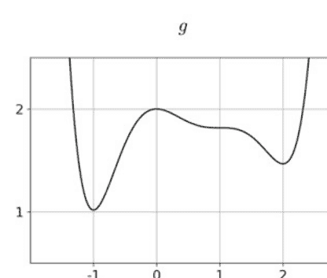

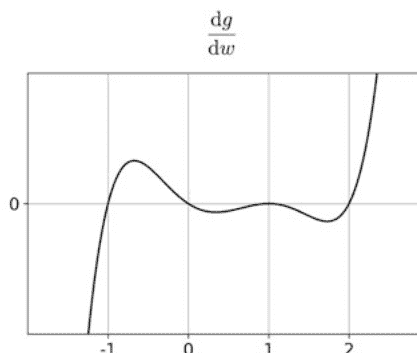

图5.5（左图）是多项式函数g(·)的绘图（定义在5.20中）。（右图）是g(·)的导数的绘图（根据5.21计算）。导数函数与零相交的点是它的驻点。有关详细信息，请参阅正文

图5.6 是函数的绘图

$$g(w) = w^4 - w^2 - w - \sin(w)$$

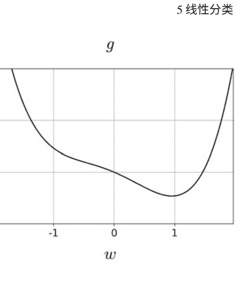

在这种情况下，$w=-1$ 返回最小的输出，因此是函数的全局最小值。⁴

我们能够因式分解 $g(\cdot)$ 在(5.21)中的导数，从而快速且轻松地确定其稳定点。然而，这是一个例外，而不是规则。一般来说，找到函数的稳定点并不是一项简单的任务，就像我们在最小二乘和交叉熵代价函数中所看到的那样，在(5.14)和(5.19)中。在这种情况下，一组强大的数值优化工具可以帮助我们近似地找到稳定点。在接下来的内容中，我们通过一个简单的例子描述了机器学习和深度学习中最常用的数值优化技术之一：梯度下降算法。

在这里，我们以一种缓慢、逐步的方式介绍梯度下降算法以追求最小化函数

$$g(w) = w^4 - w^2 - w - \sin(w), \quad (5.22)$$

其图形如图5.6所示，其导数

$$\frac{dg}{dw} = 4w^3 - 2w - 1 - \cos(w) \quad (5.23)$$

没有容易识别的零点。为了估计 $g(\cdot)$ 的稳定点（或等效地估计其导数的零点），梯度下降算法从一个随机点 $w^{[0]}$ 开始初始化，然后通过一系列数学定义的 $steps$ 进行反复改进，直到达到一个合理的近似解。

> 4注意，这个论证只适用于函数 $g(\cdot)$ 从下方有界的情况。本书介绍的所有代价函数，包括但不限于最小二乘和交叉熵代价函数，都被设计为在其输入域上非负且从下方有界。

在这里，我们从 $w^{[0]}=0$ 开始算法，并使用 $g'(\cdot)$ 来表示 $g(\cdot)$ 的导数，以方便表示。由于 $g'(0) = -2$ 不等于零，$w^{[0]}$ 不是 $g(\cdot)$ 的最小值，算法将继续进行。

接下来，我们搜索一个新的点，用 $w^{[1]}$ 表示，该点必须是函数最小值的更好近似比 $w^{[0]}$。换句话说，我们的目标是改进和替换 $w^{[0]}$ 为 $w^{[1]}$，使得 $g(w^{[1]}) < g(w^{[0]})$。那么问题就是我们应该向左还是向右移动 $w^{[0]}$ 来搜索 $w^{[1]}$。

幸运的是，这个问题的答案隐藏在导数的数学定义中。回顾基本微积分，函数 $g(\cdot)$ 在 $w^{[0]}$ 处的导数可以近似表示为

$$g'(w^{[0]}) \approx \frac{g(w^{[0]} + \varepsilon) - g(w^{[0]})}{\varepsilon}, \quad (5.24)$$

其中ε是一个小的正数。5当 $g'(w^{[0]})$ 为负数时（如本例），我们有 $g(w^{[0]} +\varepsilon) < g(w^{[0]})$。因此，向右移动 $\varepsilon$ 个单位的 $w^{[0]}$ 会减少 $g(\cdot)$ 的计算结果。另一方面，当 $g'(w^{[0]})$ 为正数时，我们应该向相反的方向移动（即向左）以减小 $g(\cdot)$ 的值。使用数学符号函数，我们可以将这两种情况结合起来，并得出结论：这个点

$$w^{[1]} = w^{[0]} - \varepsilon \, \text{sign} \left( g'(w^{[0]}) \right), \quad (5.25)$$

比 $w^{[0]}$ 更接近的 $g(\cdot)$ 的最小值。注意到 $\text{sign}(t) = t/|t|$，我们可以将(5.25)重写为

$$w^{[1]} = w^{[0]} - \alpha^{[0]} g' \left( w^{[0]} \right), \quad (5.26)$$

我们将该项表示为 $\frac{\varepsilon}{|g'(w^{[0]})|}$，通常在机器学习中称为学习率 $\alpha^{[0]}$。公式(5.26)中更新 $w^{[0]}$ 的优雅之处在于它可以以递归的方式重复使用来更新 $w^{[1]}$ 本身。在 $w^{[1]}$ 处，如果 $g(\cdot)$ 的导数仍然为负数，我们继续向右移动，以寻求对函数最小值的更好逼近。否则，如果 $g(\cdot)$ 的导数在 $w^{[1]}$ 处突然变为正数，这意味着我们跳过了现在位于 $w^{[1]}$ 左侧的最小值。再次，在任何情况下，

$$w^{[2]} = w^{[1]} - \alpha^{[1]} g' \left( w^{[1]} \right), \quad (5.27)$$

5一般来说，$\varepsilon$ 的值越小，逼近越好。在极限情况下，当 $\varepsilon \to 0$ 时，我们有严格的相等关系。

这将使我们更接近 $g(\cdot)$ 的真正最小值。这个过程可以重复进行，产生一个形式为的点序列

$$w^{[k+1]} = w^{[k]} - \alpha^{[k]} g' \left( w^{[k]} \right), \qquad (5.28)$$

随着 $k$ 的增大，最终会收敛到函数的最小值。为了简单起见，我们可以将学习率 $\alpha^{[k]}$ 固定在某个小值上（例如，0.1），对于所有的 $k$ 使用（5.28）产生在表5.1中显示的点序列。从表5.1中可以看出，随着 $k$ 的增加，函数在 $w^{[k]}$ 处的导数趋于缩小，直到某个点上，项 $\alpha^{[k]} g'(w^{[k]})$ 接近于零，更新之间的差异有效地消失，梯度下降算法收敛到 $w = 0.9554$，作为 $g(w) = w^4 - w^2 - w - \sin(w)$ 的（近似）最小值。

表5.1 梯度下降算法创建的点序列，以找到函数 $g(w) = w^4 - w^2 - w - \sin(w)$ 的最小值。学习率 $\alpha^{[k]}$ 在算法的所有迭代中设置为0.1

| $k$ | $w^{[k]}$ | $\alpha^{[k]}$ | $g'(w^{[k]})$ | $w^{[k+1]} = w^{[k]} - \alpha^{[k]}g'(w^{[k]})$ |
| :--- | :--- | :--- | :--- | :--- |
| 0 | 0.0000 | 0.1 | $-2.0000$ | 0.2000 |
| 1 | 0.2000 | 0.1 | $-2.3481$ | 0.4348 |
| 2 | 0.4348 | 0.1 | $-2.4478$ | 0.6796 |
| 3 | 0.6796 | 0.1 | $-1.8816$ | 0.8677 |
| 4 | 0.8677 | 0.1 | $-0.7685$ | 0.9446 |
| 5 | 0.9446 | 0.1 | $-0.1040$ | 0.9550 |
| 6 | 0.9550 | 0.1 | $-0.0038$ | 0.9554 |
| 7 | 0.9554 | 0.1 | $-8.8 \times 10^{-5}$ | 0.9554 |
| 8 | 0.9554 | 0.1 | $-2.0 \times 10^{-6}$ | 0.9554 |
| 9 | 0.9554 | 0.1 | $-4.7 \times 10^{-8}$ | 0.9554 |

学习率的选择 $\alpha^{[k]}$ 对梯度下降算法的整体速度和性能非常重要。从（5.24）中可以看出，$\varepsilon$ 的值越小，逼近效果越好。考虑到 $\varepsilon$ 和学习率成正比关系，梯度下降算法的 $\alpha^{[k]}$ 应尽量小。如果 $\alpha^{[k]}$ 设置得太大，（5.24）中的逼近将不再成立，梯度下降算法可能发散。为了展示增大学习率对算法的负面影响，在表5.2中总结了使用学习率 $\alpha^{[k]} = 1.0$ 进行梯度下降最小化 $g(\cdot)$ 的结果。

从表5.2可以看出，即使是适中的学习率值1.0也使得（5.24）中的梯度下降基础失效，在几次迭代后算法就会发散。

表5.2 梯度下降算法创建的点序列以找到函数 $g(w)=w^4-w^2-w-sin(w)$ 的最小值。学习率 $\alpha^{[k]}$ 在算法的所有迭代中设置为1.0。在这里，$\infty$ 表示大于普通计算机的计算能力的数字

| $k$ | $w^{[k]}$ | $\alpha^{[k]}$ | $g'(w^{[k]})$ | $w^{[k+1]}$ |
|:---:|:---:|:---:|:---:|:---:|
| 0 | 0.0 | 1.0 | -2.0 | 2.0 |
| 1 | 2.0 | 1.0 | 27.4 | -25.4 |
| 2 | -25.4 | 1.0 | -65624.5 | 65599.1 |
| 3 | 65599.1 | 1.0 | -1.1 × 10¹⁵ | 1.1 × 10¹⁵ |
| 4 | 1.1 × 10¹⁵ | 1.0 | -5.8 × 10⁴⁵ | 5.8 × 10⁴⁵ |
| 5 | 5.8 × 10⁴⁵ | 1.0 | 7.6 × 10¹³⁷ | -7.6 × 10¹³⁷ |
| 6 | -7.6 × 10¹³⁷ | 1.0 | -∞ | +∞ |

相反，如果我们将学习率设置得太小，也会出现问题。虽然非常小的学习率可以确保梯度下降算法正常运行，但可能需要非常多的迭代或步骤来恢复函数的稳定点。作为一个经验法则，学习率越小，收敛到最小值的速度越慢。在表5.3中，我们总结了使用相对较小的学习率 $\alpha^{[k]}=0.01$ 将梯度下降应用于最小化函数 $g(\cdot)$ 在(5.23)中的结果。因为在这种情况下学习率设置得太小，我们需要超过100次迭代才能达到与表5.1中最小值相近的位置。

比较表5.1、5.2和5.3中报告的结果表明，选择梯度下降的学习率必须小心处理。否则，算法可能无法收敛到最小值，或者收敛速度非常缓慢。必须注意的是，梯度下降算法存在许多高级变体，其中学习率由算法自动设置，并通过利用成本函数的局部几何特性在每次迭代中自适应调整。

这些高级算法的内部工作大部分超出了本书的范围。鼓励感兴趣的读者参考[8]和其中的参考文献。

## 具有多维输入的线性分类

在本节中，我们将线性分类框架扩展到处理一般的多维输入。回顾我们在“一维输入的线性分类”一节中对线性分类的讨论，线性分类器可以建模为 $h(f(x))$，其中 $h(\cdot)$ 是在 (5.2) 中定义的海维赛德阶跃函数， $f(x)=w_0+w_1x$ 是一个关于 $x$ 的线性模型，具有可调参数 $w_0$ 和 $w_1$。然后，我们通过引入 (5.4) 中的逻辑函数 $\sigma(\cdot)$ 来解决 $h(f(x))$ 的不可微性，推导出 (5.18) 中的交叉熵损失函数，最后，我们介绍了 (5.28) 中的梯度下降算法作为最小化交叉熵损失和确定最优模型参数的手段。

表5.3 梯度下降算法创建的点序列以找到函数 $g(w) = w^4 - w^2 - w - \sin(w)$ 的最小值。学习率 $\alpha^{[k]}$ 在算法的所有迭代中设置为0.01

| $k$ | $w^{[k]}$ | $\alpha^{[k]}$ | $g'(w^{[k]})$ | $w^{[k+1]}$ | $k$ | $w^{[k]}$ | $\alpha^{[k]}$ | $g'(w^{[k]})$ | $w^{[k+1]}$ |
|---|---|---|---|---|---|---|---|---|---|
| 0 | 0 | 0.01 | -2.0000 | 0.0200 | 50 | 0.9063 | 0.01 | -0.4515 | 0.9108 |
| 1 | 0.0200 | 0.01 | -2.0398 | 0.0404 | 51 | 0.9108 | 0.01 | -0.4123 | 0.9149 |
| 2 | 0.0404 | 0.01 | -2.0797 | 0.0612 | 52 | 0.9149 | 0.01 | -0.3760 | 0.9187 |
| 3 | 0.0612 | 0.01 | -2.1196 | 0.0824 | 53 | 0.9187 | 0.01 | -0.3426 | 0.9221 |
| 4 | 0.0824 | 0.01 | -2.1592 | 0.1040 | 54 | 0.9221 | 0.01 | -0.3119 | 0.9253 |
| 5 | 0.1040 | 0.01 | -2.1981 | 0.1260 | 55 | 0.9253 | 0.01 | -0.2837 | 0.9281 |
| 6 | 0.1260 | 0.01 | -2.2360 | 0.1483 | 56 | 0.9281 | 0.01 | -0.2579 | 0.9307 |
| 7 | 0.1483 | 0.01 | -2.2726 | 0.1710 | 57 | 0.9307 | 0.01 | -0.2343 | 0.9330 |
| 8 | 0.1710 | 0.01 | -2.3075 | 0.1941 | 58 | 0.9330 | 0.01 | -0.2127 | 0.9351 |
| 9 | 0.1941 | 0.01 | -2.3402 | 0.2175 | 59 | 0.9351 | 0.01 | -0.1929 | 0.9371 |
| 10 | 0.2175 | 0.01 | -2.3703 | 0.2412 | 60 | 0.9371 | 0.01 | -0.1750 | 0.9388 |
| 11 | 0.2412 | 0.01 | -2.3974 | 0.2652 | 61 | 0.9388 | 0.01 | -0.1586 | 0.9404 |
| 12 | 0.2652 | 0.01 | -2.4208 | 0.2894 | 62 | 0.9404 | 0.01 | -0.1437 | 0.9418 |
| 13 | 0.2894 | 0.01 | -2.4403 | 0.3138 | 63 | 0.9418 | 0.01 | -0.1301 | 0.9431 |
| 14 | 0.3138 | 0.01 | -2.4552 | 0.3384 | 64 | 0.9431 | 0.01 | -0.1178 | 0.9443 |
| 15 | 0.3384 | 0.01 | -2.4651 | 0.3630 | 65 | 0.9443 | 0.01 | -0.1066 | 0.9454 |
| 16 | 0.3630 | 0.01 | -2.4695 | 0.3877 | 66 | 0.9454 | 0.01 | -0.0964 | 0.9463 |
| 17 | 0.3877 | 0.01 | -2.4681 | 0.4124 | 67 | 0.9463 | 0.01 | -0.0872 | 0.9472 |
| 18 | 0.4124 | 0.01 | -2.4604 | 0.4370 | 68 | 0.9472 | 0.01 | -0.0789 | 0.9480 |
| 19 | 0.4370 | 0.01 | -2.4462 | 0.4615 | 69 | 0.9480 | 0.01 | -0.0713 | 0.9487 |
| 20 | 0.4615 | 0.01 | -2.4253 | 0.4857 | 70 | 0.9487 | 0.01 | -0.0645 | 0.9494 |
| 21 | 0.4857 | 0.01 | -2.3974 | 0.5097 | 71 | 0.9494 | 0.01 | -0.0583 | 0.9500 |
| 22 | 0.5097 | 0.01 | -2.3626 | 0.5333 | 72 | 0.9500 | 0.01 | -0.0527 | 0.9505 |
| 23 | 0.5333 | 0.01 | -2.3210 | 0.5565 | 73 | 0.9505 | 0.01 | -0.0476 | 0.9510 |
| 24 | 0.5565 | 0.01 | -2.2727 | 0.5792 | 74 | 0.9510 | 0.01 | -0.0430 | 0.9514 |
| 25 | 0.5792 | 0.01 | -2.2180 | 0.6014 | 75 | 0.9514 | 0.01 | -0.0388 | 0.9518 |
| 26 | 0.6014 | 0.01 | -2.1572 | 0.6230 | 76 | 0.9518 | 0.01 | -0.0351 | 0.9521 |
| 27 | 0.6230 | 0.01 | -2.0909 | 0.6439 | 77 | 0.9521 | 0.01 | -0.0317 | 0.9524 |
| 28 | 0.6439 | 0.01 | -2.0197 | 0.6641 | 78 | 0.9524 | 0.01 | -0.0286 | 0.9527 |
| 29 | 0.6641 | 0.01 | -1.9441 | 0.6835 | 79 | 0.9527 | 0.01 | -0.0258 | 0.9530 |
| 30 | 0.6835 | 0.01 | -1.8649 | 0.7022 | 80 | 0.9530 | 0.01 | -0.0233 | 0.9532 |
| 31 | 0.7022 | 0.01 | -1.7829 | 0.7200 | 81 | 0.9532 | 0.01 | -0.0211 | 0.9534 |
| 32 | 0.7200 | 0.01 | -1.6987 | 0.7370 | 82 | 0.9534 | 0.01 | -0.0190 | 0.9536 |
| 33 | 0.7370 | 0.01 | -1.6132 | 0.7531 | 83 | 0.9536 | 0.01 | -0.0172 | 0.9538 |
| 34 | 0.7531 | 0.01 | -1.5270 | 0.7684 | 84 | 0.9538 | 0.01 | -0.0155 | 0.9539 |
| 35 | 0.7684 | 0.01 | -1.4410 | 0.7828 | 85 | 0.9539 | 0.01 | -0.0140 | 0.9541 |
| 36 | 0.7828 | 0.01 | -1.3557 | 0.7964 | 86 | 0.9541 | 0.01 | -0.0126 | 0.9542 |
| 37 | 0.7964 | 0.01 | -1.2717 | 0.8091 | 87 | 0.9542 | 0.01 | -0.0114 | 0.9543 |
| 38 | 0.8091 | 0.01 | -1.1897 | 0.8210 | 88 | 0.9543 | 0.01 | -0.0103 | 0.9544 |
| 39 | 0.8210 | 0.01 | -1.1100 | 0.8321 | 89 | 0.9544 | 0.01 | -0.0093 | 0.9545 |
| 40 | 0.8321 | 0.01 | -1.0330 | 0.8424 | 90 | 0.9545 | 0.01 | -0.0084 | 0.9546 || k | w^{[k]} | α^{[k]} | g'(w^{[k]}) | w^{[k+1]} | k | w^{[k]} | α^{[k]} | g'(w^{[k]}) | w^{[k+1]} |
|:---|:---|:---|:---|:---|:---|:---|:---|:---|:---|
| 41 | 0.8424 | 0.01 | -0.9591 | 0.8520 | 91 | 0.9546 | 0.01 | -0.0076 | 0.9547 |
| 42 | 0.8520 | 0.01 | -0.8885 | 0.8609 | 92 | 0.9547 | 0.01 | -0.0068 | 0.9547 |
| 43 | 0.8609 | 0.01 | -0.8213 | 0.8691 | 93 | 0.9547 | 0.01 | -0.0062 | 0.9548 |
| 44 | 0.8691 | 0.01 | -0.7578 | 0.8767 | 94 | 0.9548 | 0.01 | -0.0056 | 0.9549 |
| 45 | 0.8767 | 0.01 | -0.6978 | 0.8837 | 95 | 0.9549 | 0.01 | -0.0050 | 0.9549 |
| 46 | 0.8837 | 0.01 | -0.6415 | 0.8901 | 96 | 0.9549 | 0.01 | -0.0045 | 0.9550 |
| 47 | 0.8901 | 0.01 | -0.5888 | 0.8960 | 97 | 0.9550 | 0.01 | -0.0041 | 0.9550 |
| 48 | 0.8960 | 0.01 | -0.5397 | 0.9014 | 98 | 0.9550 | 0.01 | -0.0037 | 0.9550 |
| 49 | 0.9014 | 0.01 | -0.4939 | 0.9063 | 99 | 0.9550 | 0.01 | -0.0033 | 0.9551 |

上述描述的每个步骤都可以稍微调整以适应一个 $n$-维输入向量 $\mathbf{x}$。首先，正如我们之前在第“线性回归与多维输入”节中看到的，线性函数 $f(\cdot)$ 以 $\mathbf{x}$ 作为输入可以被写成

$$f(\mathbf{x}) = w_0 + \mathbf{w}^T \mathbf{x} \quad (5.29)$$

其中标量 $w_0$ 和 $n \times 1$ 向量 $\mathbf{w}$ 作为参数。为了符号上的方便，临时重新定义向量 $\mathbf{x}$ 和 $\mathbf{w}$，将 $1$ 和 $w_0$ 作为它们的第一个元素，并将 (5.29) 更加简洁地写成

$$f(\mathbf{x}) = \mathbf{w}^T \mathbf{x}. \quad (5.30)$$

接下来，交叉熵损失可以类似地推导出来

$$g(\mathbf{w}) = -\frac{1}{p} \sum_{i=1}^{p} \left[ y_i \log\left(\sigma(\mathbf{w}^T \mathbf{x}_i)\right) + (1 - y_i) \log\left(1 - \sigma(\mathbf{w}^T \mathbf{x}_i)\right) \right]. \quad (5.31)$$

正如其名称所示，梯度下降是一种基于梯度的算法。当处理向量时，梯度下降更新公式 (5.28) 可以修改为

$$\mathbf{w}^{[k+1]} = \mathbf{w}^{[k]} - \alpha^{[k]} \nabla g\left(\mathbf{w}^{[k]}\right), \quad (5.32)$$

其中标量 $w^{[k]}$ 被其向量模拟 $\mathbf{w}^{[k]}$ 替换，导数函数 $g'(\cdot)$ 被梯度函数 $\nabla g(\cdot)$ 替换。如前所述，梯度下降算法可以从任意随机点 $\mathbf{w}^{[0]}$ 开始初始化，并使用 (5.32) 进行逐步改进，直达到函数最小值的“足够好”的近似。在实践中，我们在达到最大迭代次数或梯度范数低于某个小用户定义值时停止算法（图5.7）。

图5.7 (5.33)中分类数据集的输入空间示意图。这里，每个输入点根据其输出值进行颜色编码，红色用于表示属于‘0’类的点，蓝色用于表示属于‘1’类的点

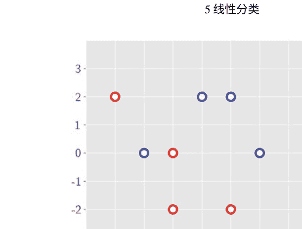

### 例5.1 (模拟数据集的线性分类)

在这个例子中，我们为一个由 $p =8$ 个数据点组成的模拟数据集训练一个线性分类器，其中数据点的形式为 $(\mathbf{x}_i, y_i)$

$$\left(\begin{bmatrix} 1 \\ -2 \end{bmatrix}, 0\right), \left(\begin{bmatrix} -1 \\ 0 \end{bmatrix}, 0\right), \left(\begin{bmatrix} -3 \\ 2 \end{bmatrix}, 0\right), \left(\begin{bmatrix} -1 \\ -2 \end{bmatrix}, 0\right),$$
$$\left(\begin{bmatrix} 1 \\ 2 \end{bmatrix}, 1\right), \left(\begin{bmatrix} 0 \\ 2 \end{bmatrix}, 1\right), \left(\begin{bmatrix} 2 \\ 0 \end{bmatrix}, 1\right), \left(\begin{bmatrix} -2 \\ 0 \end{bmatrix}, 1\right).$$

其中 $\mathbf{x}_i$ 是一个二维输入，$y_i$ 是一个二进制输出。这个特定的数据集在图5.9中绘制出来。

要使用梯度下降算法，我们首先必须找到交叉熵损失函数在(5.31)中的梯度的函数形式，如你将在练习5.5中展示的那样

$$\nabla g(\mathbf{w}) = \frac{1}{p} \sum_{i=1}^{p} \left( \sigma (\mathbf{w}^T \mathbf{x}_i) - y_i \right) \mathbf{x}_i.$$

为了选择合适的梯度下降学习率，建议使用一系列不同的值对算法进行有限次迭代，并绘制每一步的结果代价函数评估。$\alpha^{[k]}$ 我们在图5.8的左侧面板中进行了这样的操作，使用了三个学习率值：10、1和0.1。从图中可以看出，$\alpha^{[k]} =10$明显过大，导致算法发散。另一方面，学习率为0.1则太小了。

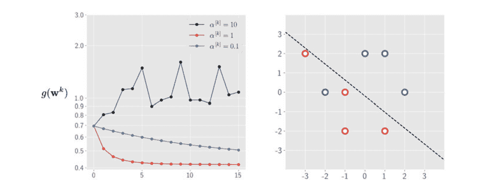

图5.8（左侧面板）是三次梯度下降运行的代价函数评估结果，用于最小化与图5.9中数据集相关的交叉熵代价。这些运行是在相同的起始点上进行的，但使用了不同的学习率。垂直轴采用对数刻度。（右侧面板）通过方程（5.36）描述的线性边界以虚线黑线的形式绘制，用于分隔数据的两个类别。

### 例子 5.1(继续)

因为它导致成本函数的评估缓慢下降。相比之下，学习率为1似乎对于手头的数据集是理想的。将梯度下降初始化为 `w^[0] = 0_(3×1)`，`α^[k] = 1`，我们在（5.32）中运行算法共100次迭代，将结果存储在表5.4中。请注意，梯度的范数在表的底部低于 `10^(-5)`，表明最后记录的点，即

`w^[99] = [0.2184; 0.9107; 1.1016]`，   (5.35)

非常接近成本函数的真实最小值。分类边界可以写成

`f (x1, x2) = 0.2184 + 0.9107 x1 + 1.1016 x2 = 0`   (5.36)

并且如图5.8的右侧面板所示绘制。

| k | w^[k] | α^[k] | ∇g(w^[k]) | ||∇g(w^[k])|| |
|---|-------|-------|-----------|--------------|
| 0 | [0, 0, 0]^T | 1.0 | [0, -0.3125, -0.3750]^T | 0.4881 |
| 1 | [0, 0.3125, 0.3750]^T | 1.0 | [-0.0066, -0.1623, -0.1934]^T | 0.2525 |
| 2 | [0.0066, 0.4748, 0.5684]^T | 1.0 | [-0.0100, -0.0978, -0.1215]^T | 0.1563 |
| ⋮ | ⋮ | ⋮ | ⋮ | ⋮ |
| 98 | [0.2184, 0.9107, 1.1016]^T | 1.0 | [-3.4 × 10^{-6}, -1.7 × 10^{-6}, -1.3 × 10^{-6}]^T | 4.0 × 10^{-6} |
| 99 | [0.2184, 0.9107, 1.1016]^T | 1.0 | [-3.1 × 10^{-6}, -1.6 × 10^{-6}, -1.2 × 10^{-6}]^T | 3.7 × 10^{-6} |

## 具有多个类别的线性分类

到目前为止，在本章中，我们主要关注的是二元分类，其中输出只有两个可能的值或结果。然而，在实践中，具有多于两个类别的分类问题与其二元对应问题一样常见。例如，在许多肿瘤学应用中，我们有兴趣将某些组织图像分类为三个类别之一：“正常”，“良性”或“恶性”。一旦确定了癌症诊断，我们可能有兴趣通过将其分配为四个病理分级之一来评估其侵袭性：“低级”（G1），“中级”（G2），“高级”（G3）或“间变性”（G4）。肿瘤级别越高，生长和扩散速度越快。因此，准确的肿瘤分级对于制定最佳治疗方法至关重要。

在本节中，我们讨论了如何将我们之前开发的二分类框架扩展到处理多类问题，例如上面提到的例子。一般来说，多类分类问题涉及到m > 2个类别。暂时关注第 j个类别，我们已经知道如何使用二分类器将其与其他数据区分开来。这可以通过将除了第 j个类别之外的每个类别的数据合并到一个新的类别中，称为“非 j”类别来实现。接下来，我们将临时将标签“1”分配给第 j个类别，将标签“0”分配给“非 j”类别，并训练一个线性分类器来将两者分开，如例5.1中所讨论的那样。用 w0,j和 wj表示这个线性分类器的偏置和斜率参数，分离边界的方程可以写成

$f_j(\mathbf{x}) = w_{0,j} + \mathbf{w}_j^T \mathbf{x} = 0.$ (5.37)

可以通过基本线性代数计算证明该表达式

$\mathcal{D}_j(\mathbf{x}) = \frac{f_j(\mathbf{x})}{\|\mathbf{w}_j\|} = \frac{w_{0,j} + \mathbf{w}_j^T \mathbf{x}}{\|\mathbf{w}_j\|}$ (5.38)

计算从输入点 $\mathbf{x}$ 到线性边界(5.37)的距离。在(5.38)中的距离度量是正的，如果 $\mathbf{x}$ 位于边界的正侧（类别“1”所在的位置），则为负的，如果 $\mathbf{x}$ 位于边界的负侧（类别“0”所在的位置）。

重复上述过程 $m$ 次，每次针对一个数据类别，我们得到 $m$ 个线性函数 $f_1(\cdot)$ 到 $f_m(\cdot)$。然后我们可以使用这些函数来计算 $m$ 个相应的距离值 $\mathcal{D}_1$ 到 $\mathcal{D}_m$。与最大距离相关联的索引

$y = \underset{j=1,\ldots,m}{\text{argmax}} \mathcal{D}_j(\mathbf{x})$ (5.39)

决定了 $\mathbf{x}$ 的输出。式(5.39)有时被称为一对多分类器。

> 例5.2（多类数据集的线性分类） 在这个例子中，我们为以下模拟数据集训练一个多类分类器，该数据集由 $p =12$ 个数据点组成，形式为 $(\mathbf{x}_i, y_i)$
$\left(\begin{bmatrix} -2 \\ -1 \end{bmatrix}, 1\right), \left(\begin{bmatrix} -3 \\ 1 \end{bmatrix}, 1\right), \left(\begin{bmatrix} -3 \\ -2 \end{bmatrix}, 1\right), \left(\begin{bmatrix} -2 \\ 0 \end{bmatrix}, 1\right),$
$\left(\begin{bmatrix} 1 \\ -1 \end{bmatrix}, 2\right), \left(\begin{bmatrix} 2 \\ -2 \end{bmatrix}, 2\right), \left(\begin{bmatrix} 3 \\ 0 \end{bmatrix}, 2\right), \left(\begin{bmatrix} 0 \\ -3 \end{bmatrix}, 2\right), \quad (5.40)$
$\left(\begin{bmatrix} 2 \\ 2 \end{bmatrix}, 3\right), \left(\begin{bmatrix} 1 \\ 2 \end{bmatrix}, 3\right), \left(\begin{bmatrix} 1 \\ 3 \end{bmatrix}, 3\right), \left(\begin{bmatrix} 2 \\ 3 \end{bmatrix}, 3\right),$
其中输入 $\mathbf{x}_i$ 是二维的，输出 $y_i$ 等于1、2或3。 这个特定的数据集在图5.9中绘制出来。
首先，我们训练一个线性分类器来将类别“1”与其他数据分开。 按照例5.1中提出的过程，与这个二分类子问题相关的线性边界可以定义为 $f_1(\mathbf{x}) = w_{0,1} + \mathbf{w}_1^T \mathbf{x} = 0$，其中参数 $w_{0,1}$ 和 $\mathbf{w}_1$ 可以通过梯度下降法恢复。
（续）

图5.9 (5.40)中分类数据集的输入空间示意图。每个输入点根据其输出值进行颜色编码，红色、蓝色和绿色分别表示属于类别“1”、“2”和“3”的点

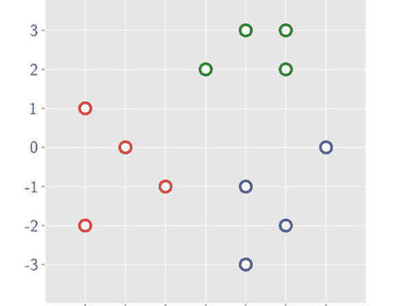

### 例5.2(续)

$$w_{0,1} = -3.56, \quad \mathbf{w}_1 = \begin{bmatrix} -5.82 \\ 0.88 \end{bmatrix}. \tag{5.41}$$

类似地，可以找到 $f_2(\cdot)$ 和 $f_3(\cdot)$ 的参数

$$\begin{aligned} w_{0,2} = -3.87, \quad \mathbf{w}_2 &= \begin{bmatrix} 4.46 \\ -5.45 \end{bmatrix}, \\ w_{0,3} = -8.19, \quad \mathbf{w}_3 &= \begin{bmatrix} 1.10 \\ 6.29 \end{bmatrix}. \tag{5.42} \end{aligned}$$

最后，每个二元分类器的距离函数可以通过(5.38)计算

$$\begin{aligned} \mathcal{D}_1 &= -0.60 - 0.99\,x_1 + 0.15\,x_2, \\ \mathcal{D}_2 &= -0.55 + 0.63\,x_1 - 0.77\,x_2, \\ \mathcal{D}_3 &= -1.28 + 0.17\,x_1 + 0.99\,x_2. \tag{5.43} \end{aligned}$$

图5.10显示了由(5.39)中的规则和(5.43)中推导出的距离函数所特征化的多类别分类边界。

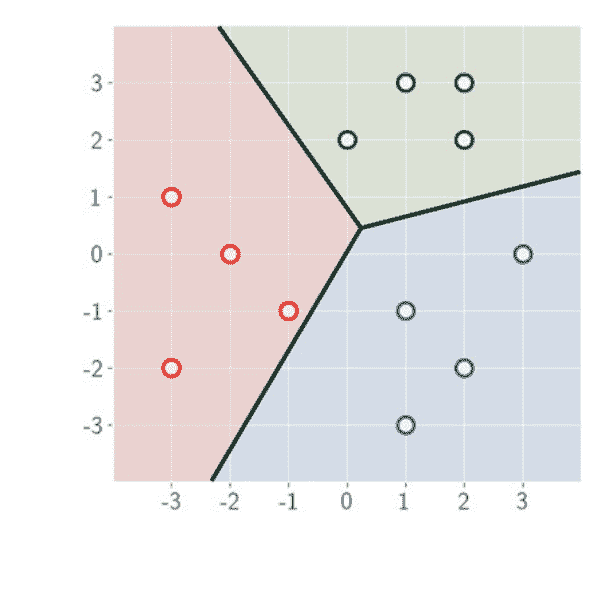

图5.10 (5.40)中分类数据集的输入空间示意图，以及(5.43)中定义的分隔边界。特别要注意的是，三条黑色线段在点(0. 24, 0.48)处相交，其中$\mathcal{D}_1 = \mathcal{D}_2 = \mathcal{D}_3$

## 问题

- **5.1 使用线性回归解决分类问题**
按照示例4.1中的步骤，在（5.1）中找到最佳的线性回归拟合。

- **5.2 交叉熵损失函数的稳定点**
验证将交叉熵损失函数在（5.18）中的偏导数设置为（5.19）中所示的方程组。

- **5.3 逻辑函数**
- (a) 使用（5.4）中逻辑函数$\sigma(\cdot)$的定义来证明（5.7）、（5.8）和（5.10）的性质确实成立。
- (b) 对于什么值的 $K$，逻辑函数成为（5.6）中的解？
- (c) 一般来说，你会如何调整$\sigma(t)$的定义，使其始终成为（5.6）的解，无论 $K$ 的值如何？

- **5.4 梯度下降**
应用梯度下降算法来寻找多项式函数的最小值
$$g(w) = w^6 - w^5 + w^4 - w$$
使用学习率值为
- (a) $\alpha = 10$.
- (b) $\alpha = 0.1$.
- (c) $\alpha = 0.01$.

### 5.5 交叉熵函数的梯度

验证交叉熵代价函数在(5.31)中的梯度可以写成(5.34)中所示的形式。

## 参考文献

+   1. Shor NZ. 非可微函数的最小化方法. 柏林: Springer; 1985
2. Verhulst PF. 对人口增长规律的数学研究。 Nouveaux Mires de l’Acade Royale des Sciences et Belles-Lettres de Bruxelles. 1845;18:8
3. Benzekry S, Lamont C, Beheshti A, 等。经典数学模型用于描述和预测实验性肿瘤生长。PLoS Comput Biol. 2014;10(8):e100380
4. Vaidya V, Alexandro F. 对一些肿瘤生长的数学模型进行评估。 Int J Biomed Comput. 1982;13(1):19–36
5. Hsieh Y, Lee J, Chang H. SARS流行病学建模。 Emerg Infect Dis. 2004;10(6):11651168
6. Wang P, Zheng X, Li J, 等。使用逻辑模型和机器学习技术预测COVID-19的流行趋势。 Chaos, Solitons Fractals. 2020;139:1100587.
7. 世界卫生组织（WHO）COVID-19全球数据集。2022年4月访问。 https://covid19.who.int/data
8. Watt J, Borhani R, Katsaggelos AK. 机器学习的改进：基础、算法和应用。 剑桥：剑桥大学出版社；2020年

# 第6章 从特征工程到深度学习

到目前为止，我们在本书中研究的模型都是线性的。在本章中，我们通过正式引入特征作为将输入数据转换为数学函数的方式，开始探索非线性模型。我们讨论了两种定义特征的主要方法：由人类专家的领域知识驱动的特征工程和完全由数据驱动的特征学习。对后一种方法的讨论自然地引出了深度神经网络作为该领域最新进展的主要推动力。

## 非线性回归的特征工程

在第“多维输入的线性回归”节中，我们研究了回归的线性模型，其形式为

$$ f (x_1, x_2, \ldots, x_n) = w_0 + w_1x_1 + w_2x_2 + \cdots + w_nx_n, \quad (6.1) $$

或者，更简洁地说，

$$ f (\mathbf{x}) = w_0 + \mathbf{w}^T \mathbf{x} \quad (6.2) $$

如果我们将所有的输入 $x_1$ 到 $x_n$ 排列成一个单独的输入向量，表示为

$$ \mathbf{x} = \begin{bmatrix} x_1 \\ x_2 \\ \vdots \\ x_n \end{bmatrix}, \quad (6.3) $$

将所有的参数 $w_1$ 到 $w_n$ 排列成一个单独的参数向量，表示为

$$ \mathbf{w} = \begin{bmatrix} w_1 \\ w_2 \\ \vdots \\ w_n \end{bmatrix} \quad (6.4) $$

然而，对于许多真实世界的回归数据集来说，(6.2)中的线性模型无法捕捉到可能存在于输入和输出之间的复杂非线性关系。解决这个问题的一种方法是通过在这个模型中注入非线性，这在机器学习的术语中称为特征。特征 $h(\mathbf{x})$ 是输入 $\mathbf{x}$ 的非线性数学函数。例如，

$$ h(x_1, x_2, \ldots, x_n) = x_1^2 + x_2^2 + \cdots + x_n^2 \quad (6.5) $$

是输入的多项式特征，而

$$ h(x_1, x_2, \ldots, x_n) = \cos(x_1) \quad (6.6) $$

是三角函数特征。从(6.6)可以看出，一个特征不一定需要涉及所有的输入 $x_1$ 到 $x_n$，但通常可以。一般而言，非线性回归模型可以使用 $m$ 个这样的特征 $h_1$ 到 $h_m$

$$ f(\mathbf{x}) = v_0 + v_1 h_1(\mathbf{x}) + v_2 h_2(\mathbf{x}) + \cdots + v_m h_m(\mathbf{x}) \quad (6.7) $$

可以更简洁地写成

$$ f(\mathbf{x}) = v_0 + \mathbf{v}^T \mathbf{h}(\mathbf{x}) \quad (6.8) $$

表示

$$ \mathbf{v} = \begin{bmatrix} v_1 \\ v_2 \\ \vdots \\ v_m \end{bmatrix} \quad (6.9) $$

和

$$ \mathbf{h}(\mathbf{x}) = \begin{bmatrix} h_1(\mathbf{x}) \\ h_2(\mathbf{x}) \\ \vdots \\ h_m(\mathbf{x}) \end{bmatrix} \quad (6.10) $$

无论如何选择(6.10)中的特征，我们在正式解决(6.7)中的非线性回归模型时所采取的步骤与我们之前看到的线性回归的多维输入的步骤完全相似。

在“线性回归与多维输入”章节中，我们对这个过程进行了详细回顾。简要回顾一下这个过程，我们首先构建一个最小二乘代价函数

$$ g(v_0, \mathbf{v}) = \frac{1}{p} \sum_{i=1}^{p} (v_0 + \mathbf{v}^T \mathbf{h}(\mathbf{x}_i) - y_i)^2 $$

在一个由 $p$ 个输入-输出对组成的回归数据集上 $\{ (\mathbf{x}_1, y_1), \dots, (\mathbf{x}_p, y_p) \}$。然后，我们通过将 $g$ 对 $v_0$ 的导数和 $g$ 对 $\mathbf{v}$ 的梯度同时置零来最小化这个代价函数。解决得到的线性系统将揭示 $v_0$ 和 $\mathbf{v}$ 的最优值。唯一的问题是确定适当的非线性函数来构成(6.10)中的特征向量。让我们通过一个例子进一步探讨这个问题。

> 例子6.1 (细菌生长的特征工程) 乳酸杆菌是一种可以导致女性尿路感染的乳酸菌。尽管如此，这种微生物在酒和酸奶生产中找到了工业应用。表6.1总结了这种细菌在空间受限实验室条件下的相关数据。这个回归数据集的输入是以小时为单位测量的时间（第一列），输出是以克每升为单位测量的生物体浓度或质量（第二列）。在“逻辑函数”节中，我们讨论了人口增长的各种模型，重点是Verhulst的逻辑增长模型。这导致了S形函数的引入
> 
> $$ \sigma(x) = \frac{1}{1 + e^{-x}} $$

**表6.1 数据乳酸杆菌从[1]中获取的增长**

| 时间[h] | 浓度[g/L] |
|--------|------------|
| 0      | 0.229      |
| 3      | 0.286      |
| 6      | 0.503      |
| 9      | 1.035      |
| 12     | 2.070      |
| 15     | 2.770      |
| 18     | 3.320      |
| 21     | 3.650      |
| 24     | 3.610      |

可以对空间受限环境中的细菌生长进行建模。
利用这一先验知识，我们可以假设使用Sigmoid函数作为非线性特征对输入进行转换，可能会“线性化”这个回归数据集。图6.1表明确实如此。在图的左侧面板中，我们绘制了表6.1中提供的原始数据集，水平轴表示时间，垂直轴表示细菌浓度。在右侧面板中，我们绘制了相同的数据，这次输入经过了以下非线性特征转换：

$$ h(x) = \sigma\left( \frac{x - 12}{3} \right) $$

我们提出的特征发挥了作用：在原始空间中非线性的输入-输出关系在特征空间中变为线性关系。

$$ h(x) = \sigma\left( \frac{x - 12}{3} \right) $$

在示例6.1中，我们依靠对细菌生长性质的了解，来确定一个适当的非线性特征转换（sigmoid函数），以线性化转换后的输入和输出之间的关系。

这是更广泛地称为特征工程的一个实例，其中非线性的函数形式是由人类通过他们的专业知识、领域知识、对问题的直觉等来确定（或设计）的。一个正确设计的特征（或一组特征）是在特征空间中提供良好线性拟合的特征，其中输入经过非线性特征转换。

## 非线性分类的特征工程

与我们在前一节中对非线性回归的特征工程处理相呼应，在这里我们介绍非线性分类的一般框架。[^1]正如我们在“多类线性分类”一节中所看到的，线性分类边界可以用代数方式表示

$$ f(\mathbf{x}) = w_0 + \mathbf{w}^T \mathbf{x} = 0, \qquad \qquad (6.14) $$

我们在(6.3)和(6.4)中使用了符号来更简洁地写出边界方程。当两类数据不是线性可分时，我们可以通过向其中注入非线性来调整这个方程，方法与前一节中类似。具体来说，我们用如下形式的非线性模型替换(6.14)中的线性模型

$$ f(\mathbf{x}) = v_0 + \mathbf{v}^T \mathbf{h}(\mathbf{x}) = 0, \qquad \qquad (6.15) $$

其中权重向量 $\mathbf{v}$ 和特征向量 $\mathbf{h}(\mathbf{x})$ 分别定义在(6.9)和(6.10)中。接下来，我们需要定义一个适当的代价函数来最小化这个非线性模型。如“多类线性分类”一节所讨论的，一个适合用于分类的代价函数是交叉熵代价函数，在这种情况下可以写成

$$ g(v_0, \mathbf{v}) = -\frac{1}{p} \sum_{i=1}^{p} y_i \log \left( \sigma \left( v_0 + \mathbf{v}^T \mathbf{h}(\mathbf{x}_i) \right) \right) + (1 - y_i) \log \left( 1 - \sigma \left( \mathbf{v}^T \mathbf{h}(\mathbf{x}_i) \right) \right) \qquad \qquad (6.16) $$

并使用梯度下降法进行最小化。

> 例6.2（用于分类的特征工程）在图6.2中，我们展示了一个玩具分类数据集，其中包含 $p = 100$ 个二维输入，属于两个类别之一：红色或蓝色。从图中可以明显看出，线性模型无法将这两类数据分开。
> 
> 在这种情况下，由于输入是低维的，我们可以直观地检查数据并利用我们的数学直觉来设计适当的非线性特征。在这种情况下，蓝色类别似乎落在以原点为中心的一个圆形区域内。从初等几何学中我们知道，这样的圆可以用数学方式表示为 $x_1^2 + x_2^2 = r^2$，其中 $r$ 是某个半径，可以提出以下非线性特征：
> 
> $$ h_1(x_1, x_2) = x_1^2, $$
> $$ h_2(x_1, x_2) = x_2^2. \quad (6.17) $$
> 
> 如图6.3所示，一旦我们使用（6.17）中定义的特征转换输入，原始输入空间中不可线性分离的两类数据在特征空间中变得线性可分。

## 特征学习

在“非线性回归的特征工程”和“非线性分类的特征工程”章节中，我们描述了特征工程的一般概念，将非线性回归和分类转化为线性问题的方法。

在示例6.1中，我们利用我们对受限环境中人口增长的数学知识，设计了一个逻辑特征，使得图6.1中的回归数据集线性化。在示例6.2中，我们利用我们对低维数据集的可视化能力，构建了(6.17)中的二次特征，帮助我们线性化了图6.3中分隔两类数据的边界。虽然我们在上述两个示例中成功地设计了合适的特征，但在绝大多数现实世界的机器学习问题中，我们不能依赖这些特征工程策略。 实际上，所有现代感兴趣的问题在医学中，维度过高，无法可视化。此外，往往我们对所研究问题的现象了解甚少或者没有了解。即使在研究对象的现象有先验知识的情况下，工程化特征的过程也是非常复杂和耗时的，通常需要医学专家和机器学习开发人员之间进行多轮讨论和改进[2]。受到这些挑战的启发，在本节中，我们介绍了一种替代的特征工程方法，即直接从数据中学习特征，无需人类参与。这种新方法，通常被称为特征学习，使我们能够自动化手动（有些乏味）的特征工程任务。

特征学习的关键思想是在训练过程中使用参数化特征（6.7），其参数与其他模型参数一起进行调整。换句话说，在特征学习设置中，非线性回归模型（6.7）可以进行调整和编写。

$$ f(\mathbf{x}) = v_0 + v_1 h_1(\mathbf{x}; \theta_1) + v_2 h_2(\mathbf{x}; \theta_2) + \cdots + v_m h_m(\mathbf{x}; \theta_m), \quad (6.18) $$

其中 $\theta_i$ 表示内部特征参数集合 $h_i$。特征 $h_1$ 到 $h_m$ 通常来自同一目录或函数族。最流行的特征学习函数族是所谓的人工神经网络，它起源于二十世纪中叶，作为对生物神经网络的一种粗略数学近似。在图6.4中，我们展示了一个人工神经元的图形表示，它本质上是一个“多输入参数化非线性”函数。让我们解析引号中的最后一句话。

如图6.4所示，一个人工神经元是一个接收一般情况下 $n$ 个输入 $x_1$ 到 $x_n$ 的多输入函数。它也是一个参数化函数，因为它的每个输入（$x_1$ 到 $x_n$）都乘以相应的参数（$w_1$ 到 $w_n$）。在图6.4中，所有这些加权输入在一个求和单元中聚合，该单元显示为一个小黄色圆圈。最后，一个人工神经元是一个非线性函数，因为它由一个“激活”单元（在图中显示为一个蓝色圆圈）组成，其输出是线性加权组合 $w_1x_1 + \cdots + w_nx_n$ 的非线性变换。将所有这些部分组合在一起，一个人工神经元可以被建模为

$$ h(x_1, x_2, \ldots, x_n; \theta) = \phi (w_0 + w_1x_1 + w_2x_2 + \cdots + w_nx_n), \quad (6.19) $$

其中 $\phi$ 是非线性激活函数，集合 $\theta = \{w_0, w_1, \ldots, w_n\}$ 表示神经元的内部参数。

原则上， $\phi$ 可以是任何非线性函数。 最初，海维赛德阶跃函数

$$ \phi(\alpha) = \begin{cases} 0, & \alpha < 0 \\ 1, & \alpha \geq 0 \end{cases}, \quad (6.20) $$

被用作激活函数，因为生物神经元被认为像数字开关一样工作。 只要输入 $\alpha$ 低于某个激活阈值，开关将保持关闭，输出为0。 一旦输入超过阈值，开关被打开，产生等于1的输出。 这种建模与信念相符，即生物神经元在通过树突传来的足够大的输入激活之前不会与其他下游神经元通信。

正如我们在第5章中讨论的那样，海维赛德阶跃函数的平坦和不连续形状在使用梯度下降优化涉及该函数的机器学习模型时会产生严重问题。 幸运的是，我们可以用其平滑近似替换海维赛德阶跃函数，即逻辑sigmoid函数

$$ \phi(\alpha) = \frac{1}{1 + e^{-\alpha}}, \quad (6.21) $$

改善这些优化问题。 因此，直到二十一世纪初，大多数神经网络模型使用逻辑sigmoid函数或其近亲，双曲正切函数

$$ \phi(\alpha) = \frac{e^{2\alpha} - 1}{e^{2\alpha} + 1} \quad (6.22) $$

作为激活函数。但是从图6.5可以看出，当输入远离原点时，逻辑函数和双曲正切函数几乎是平坦的。这意味着当输入稍微大一些时（无论是正方向还是负方向），导数几乎为零。这个问题有时被称为梯度消失问题，它阻碍了参数调整和激活函数在（6.21）和（6.22）中的实际使用。

最近，基于修正线性单元（ReLU）函数的一种新型非线性激活函数出现了。

$$ \phi(\alpha) = \max(0, \alpha) \quad (6.23) $$

相比以前和更多的生物学上合理的选择，已经显示出更好的优化性能。请注意，在ReLU函数中（6.23），只要输入保持为正值（参见图6.5左下角面板），导数就不会消失。然而，负输入仍然可能会导致问题。为了解决这个问题，引入了原始ReLU的变体，称为渗漏ReLU

$$ \phi(\alpha) = \begin{cases} \alpha, & \alpha \geq 0 \\ \tau \alpha, & \alpha < 0 \end{cases} \quad (6.24) $$

其中左侧的“铰链”不再是平的，而是有一个小的斜率（参见图6.5中下面的面板）。ReLU的另一个流行变体是所谓的maxout激活函数，定义为

$$ \phi(\alpha) = \max(\tau_1 + \tau_2 \alpha, \tau_3 + \tau_4 \alpha) \quad (6.25) $$

它取两个输入的线性组合的最大值。经验上，使用maxout激活函数的人工神经网络在优化过程中往往没有太多技术问题，并且通常更快地收敛到一个解。然而，它有更多的内部参数需要调整。maxout激活函数的一个实例在图6.5的最后一个面板中绘制出来。

将几个人工神经元（如图6.4所示）排列在一列中，并将它们的输出连接到另一个求和单元，就可以创建一个单层神经网络，如图6.6所示。请注意，这正是模型（6.18）的图形表示，除了偏置参数 $v_0$ 之外。

为了避免图中的混乱，与将输入连接到人工神经元的线段相关的参数存储在 $\theta_1$ 到 $\theta_m$ 中。这些参数的不同设置定义了不同的特征。因此，在模型训练过程中，我们可以调整它们以及外部参数 $v_0$ 到 $v_m$，并通过最小化与问题相关的适当成本函数来实现。

### 多层神经网络

在本节中，我们研究多层感知机作为单层神经网络的自然扩展。回顾一下“特征学习”一节和其中的图6.6，我们通过对输入进行多个线性组合，并通过非线性激活函数和线性组合将结果线性组合。我们可以大致总结这个过程为：

线性组合 → 非线性激活 → 线性组合。 (6.26)

这也在图6.7的顶部行中有所说明。请注意，我们可以继续这个过程，如图6.7的底部行所示，其中单层神经网络的输出通过额外的非线性激活和线性组合模块，创建了一个两层神经网络。

我们可以根据需要重复这个过程多次，以创建一个通用的多层神经网络，也被称为多层感知器。在机器学习的术语中，具有多个（通常超过三个）层的神经网络被认为是一个深层网络。

在图6.8中，我们展示了一个三层神经网络的图形表示，类似于图6.6中显示的单层版本。在这里，将输入层与输出层之间的三个人工神经元层称为隐藏层。这种命名约定背后的原理是，外部观察者只能“看到”网络中的输入和输出，而不能看到中间的任何中间层。

图6.8还说明了为什么多层感知器被认为是完全连接的网络架构：因为每个层中的每个单元都与下一层中的每个单元相连。在这一点上，一个重要的问题是：使用“更深”的神经网络如何使我们受益？让我们通过一个简单的例子来探讨这个问题。

### 示例6.3 （从浅层到深层神经网络）

在这个示例中，我们使用双曲正切函数作为激活函数，随机初始化网络的所有内部参数，构建一个三层神经网络。然后，我们在图6.9中可视化地检查网络每一层的几个神经元的输出。具体来说，我们在图的顶部行中绘制了第一层的四个神经元的输出，在中间行中绘制了第二层的四个神经元的输出，在底部行中绘制了第三层的四个神经元的输出。正如预期的那样，随着我们从图的顶部向底部移动（或从网络的浅层向深层移动），结果函数的形状变得更加多样化。

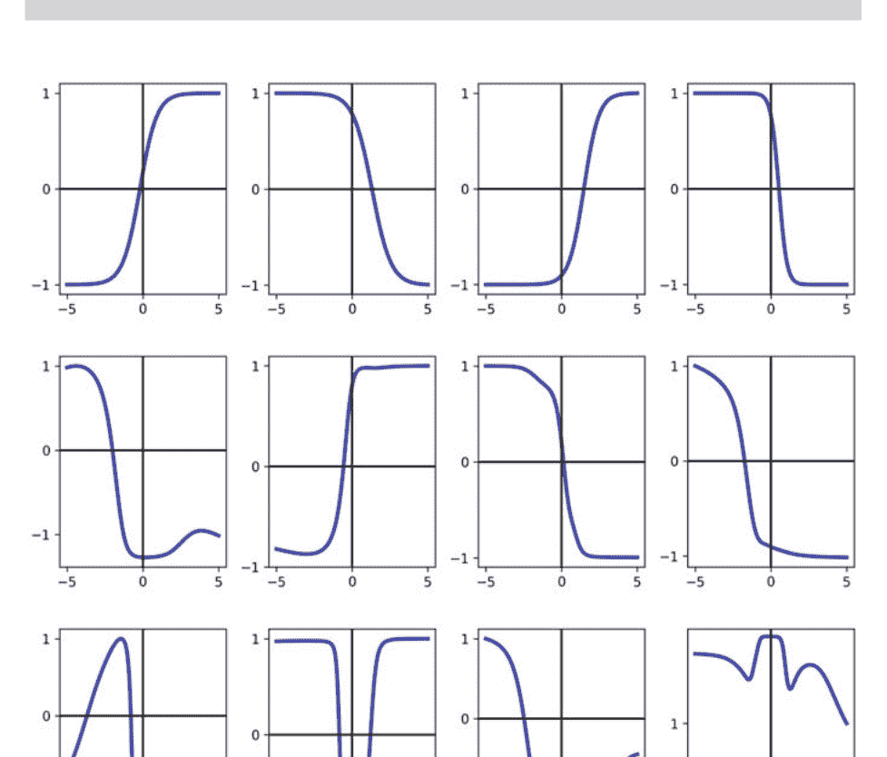

图6.9 示例6.3相关的图。详细信息请参阅正文。

示例6.3直观地说明了为什么深层神经网络优于浅层神经网络：因为它们可以表示更复杂的非线性函数。
然而，这是有代价的。深度网络具有更多的内部参数，并且一般来说，更难以优化，尽管过去十年计算速度变得极快且更便宜。接下来，我们深入探讨深度神经网络的优化。

## 神经网络的优化

虽然有很多形式的最小化神经网络代价函数的算法存在，但其中绝大多数都建立在几个主要基础之上。首先，这些算法使用代价函数的梯度，就像第“梯度下降算法”节介绍的普通梯度下降算法一样，用于最小化线性分类的交叉熵代价。在（5.34）中，我们手动计算了梯度，并以闭合的代数形式表示。然而，对于神经网络来说，由于涉及到大量参数以及这些网络的组合结构需要反复使用链式法则，这变成了一项极其繁琐的任务。³

幸运的是，通过使用所谓的自动微分器，可以自动且轻松地计算梯度，就像使用传统计算器乘以两个大数一样。自动微分器的内部工作大部分超出了本书的范围。⁴然而，值得一提的是，自动微分的一个具体模式（即反向模式）通常在机器学习文献中被称为反向传播。换句话说，反向传播算法是用于计算涉及人工神经网络的代价函数梯度的名称。

大多数神经网络优化器共享的另一个常见主题是在“随机模式”下使用梯度下降（或其他优化器）。在随机优化中，我们不使用整个训练数据来计算代价函数的梯度。请注意，从（4.22）和（5.18）中可以看出，回归的最小二乘代价和分类的交叉熵代价都可以分解为各个数据点上的代价函数。换句话说，我们可以将通用的回归或分类代价函数写为 $g(w)$

> ³根据链式法则，如果我们有 $y = f_1(u)$ 和 $u = f_2(x)$，那么复合函数 $f_1$ 和 $f_2$，即 $f_1(f_2(x))$，的导数可以找到
> $$\frac{dy}{dx} = \frac{dy}{du} \times \frac{du}{dx}$$

> ⁴鼓励感兴趣的读者参阅[3]和其中的参考文献。

$$g(\mathbf{w}) = \frac{1}{p} \sum_{i=1}^{p} g_i(\mathbf{w}),$$

其中 $g_1$ 到 $g_p$ 是与每个 $p$ 数据点相关的个体成本函数。为了计算 $g$ 的梯度，我们可以写成

$$\nabla g(\mathbf{w}) = \nabla \left( \frac{1}{p} \sum_{i=1}^{p} g_i(\mathbf{w}) \right) = \frac{1}{p} \sum_{i=1}^{p} \nabla g_i(\mathbf{w}).$$

这意味着完整（或批量）梯度是与每个个体数据点相关的梯度的总和。基于这个观察，公平地问一下，如果我们在 $g$ 中不是使用完整梯度进行一次下降步骤，而是在 $g_1$，$g_2$，...中进行一系列的 $p$ 下降步骤，会发生什么。，$g_p$按顺序进行。也就是说，我们首先使用 $\nabla g_1(\mathbf{w})$在$g_1$中下降，然后使用 $\nabla g_2(\mathbf{w})$在$g_2$中下降，依此类推。事实证明，这种方法在实践中更快地收敛到$g$的最小值。

一般来说，我们可以将多个数据点分组成一个小批量，并在与整个小批量相关的损失函数中进行下降步骤。假设我们将完整的训练集分成 $\{(\mathbf{x}_1, y_1), \ldots, (\mathbf{x}_p, y_p)\}$ 个不重叠的子集或小批量，大小大致相同，表示为 $\Omega_1$到 $\Omega_T$。在这种方法中，我们将完整的梯度分解为每个小批量上的梯度

$$\nabla g(\mathbf{w}) = \nabla \left( \frac{1}{p} \sum_{i=1}^{T} \sum_{j \in \Omega_i} g_j(\mathbf{w}) \right) = \frac{1}{p} \sum_{i=1}^{T} \nabla \left( \sum_{j \in \Omega_i} g_j(\mathbf{w}) \right)$$

并按顺序进行下降步骤，首先是在 $\sum_{j \in \Omega_1} g_j(\mathbf{w})$，然后是在 $\sum_{j \in \Omega_2} g_j(\mathbf{w})$，依此类推。最佳的小批量大小因问题而异，但在大多数情况下相对较小，与训练数据集的完整大小相比较小。请注意，使用随机梯度下降时，小批量大小等于1。

## 神经网络架构的设计

正如我们在“多层神经网络”一节中讨论的那样，神经网络中层数越多，模拟复杂非线性关系的能力就越强。这表明，在决定神经网络架构中最佳层数时，层数越多越好，我们应该尽可能使网络变得更深，直到我们的计算资源耗尽。然而，这个看似合乎逻辑的结论并不正确。在下面的例子中，我们将探讨为什么会出现这种情况。

图6.10 一个有噪音的两类分类数据集

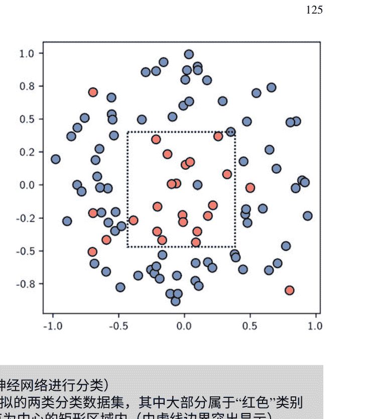

### 例子6.4（使用多层神经网络进行分类）

图6.10展示了一个模拟的两类分类数据集，其中大部分属于“红色”类别的数据点位于以原点为中心的矩形区域内（由虚线边界突出显示）。请注意，这个数据集是有噪音的，意味着有一些“红色”点意外地位于小矩形框之外，就像有一个“蓝色”点位于被几个“红色”点包围的框内一样。在任何真实的分类数据集中，存在这种程度的噪音是可以预期的。

在图6.11中，我们展示了使用三种不同的神经网络架构对这些数据进行分类的结果。从左到右，这些网络分别具有一层、两层和三层隐藏层，每层隐藏层中的人工神经元数量相同。由于缺乏足够的非线性容量，单层网络导致了大量的分类错误（左侧面板）。两层网络似乎恢复了一个类似于图6.10中显示的真实矩形边界的决策边界（中间面板）。由于其丰富的非线性容量，三层网络学习了一个相当复杂的决策边界（右侧面板），可以“正确”地对每个数据点进行分类，包括噪声数据点。

正如我们在示例6.4中所看到的，通过向神经网络层添加更多的隐藏层来增加非线性容量可以减少分类错误的数量。然而，学习到的分类边界往往变得更糟糕-在一定程度上之后，点是重要的。图6.11左侧面板中显示的单层分类边界是一个机器学习模型的实例，它对训练数据进行了欠拟合。这通常是因为所选择的模型没有足够的非线性容量来捕捉底层数据的复杂性。另一方面，图6.11右侧面板中显示的三层分类边界是一个过拟合训练数据的模型的实例。这是因为所选择的模型具有过多的非线性容量，使其不仅适应信号，还适应数据中不可避免的噪声。虽然这样的模型非常适应训练数据，但代价是不能很好地表示底层现象。结果是在训练中表现极好，但在测试或部署中失败的模型。

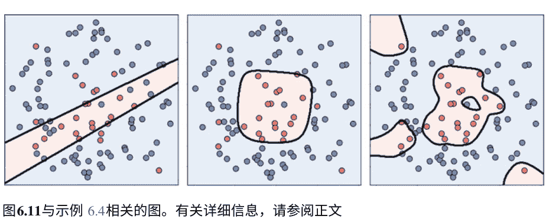

图6.11 与示例 6.4 相关的图。有关详细信息，请参阅正文

在表示生成分类数据的基础现象方面，点是重要的。图6.11左侧面板中显示的单层分类边界是一个机器学习模型的实例，它对训练数据进行了欠拟合。这通常是因为所选择的模型没有足够的非线性容量来捕捉底层数据的复杂性。另一方面，图6.11右侧面板中显示的三层分类边界是一个过拟合训练数据的模型的实例。这是因为所选择的模型具有过多的非线性容量，使其不仅适应信号，还适应数据中不可避免的噪声。虽然这样的模型非常适应训练数据，但代价是不能很好地表示底层现象。结果是在训练中表现极好，但在测试或部署中失败的模型。

诊断机器模型是欠拟合还是过拟合数据相对容易。如果在参数调整完成后，训练误差仍然很高，那么我们可以推断模型是欠拟合数据的，这种情况下应该增加模型的非线性能力（例如，增加更多的隐藏层）。然而，如果模型在训练集上表现良好，我们在评估未包含在训练中的数据时才能知道它是否过拟合数据。因此，为了验证模型的性能以诊断过拟合，有必要留出一部分训练数据，通常称为验证数据。过拟合的模型会产生（相对）较小的训练误差，但同时会产生（相对）较大的验证误差。

没有确切的规则来确定训练数据的哪一部分应该留作验证。一般而言，训练数据越大，可以用于验证的比例就越大。当数据很多时，这个比例可以达到 $\frac{1}{2}$。然而，当处理较小的数据集时，模型不应该失去太多宝贵的训练数据。在这种情况下，我们可以随机将训练数据分成 $k$ 个不重叠的子集或折叠。接下来，我们留出一个折叠用于验证，将剩下的 $k -1$ 个折叠用于训练。$\frac{k-1}{k}$ 个原始数据将用于训练。我们重复这个过程 $k$ 次，每次使用不同的折叠进行验证，最后对得到的 $k$ 个验证错误进行平均。这种验证方案通常被称为 k折交叉验证，它允许模型使用更大的数据份额来换取增加的计算量。一般而言，数据越小，应该设置的 k越大。在极端情况下，当数据严重有限时，建议将 k设置为最大可能值（即训练集中的数据点数）。通过这样做，我们每次只留出一个数据点进行验证。这种特定的设置被称为留一法交叉验证。

交叉验证提供了一种回答我们在本节开始时提出的问题的方法：我们应该如何选择神经网络模型中包含的隐藏层的正确数量？简而言之，为了设计一个在给定数据集上表现良好的神经网络架构，我们交叉验证一系列选择，选择导致最低交叉验证误差的模型。重要的是要记住，在构建神经网络架构时，我们的设计选择除了网络的深度之外，还包括每层的人工神经元数量以及激活函数的非线性形式。

## 问题

### 6.1 完成示例 6.1

在示例 6.1 中，我们研究了细菌种群随时间的增长模式，并设计了一个逻辑特征，使得最初的非线性数据集在 Table6.1 中线性化。使用 (6.13) 中提出的特征，并为图 6.1 右侧面板中的线性化数据训练一个线性回归模型（如第 4 章所述）。然后，将学习到的模型重新表示为原始输入的函数，并在问题的原始空间中绘制它（如图 6.1 的左侧面板所示）。

### 6.2 非线性特征工程用于回归

一个模拟的回归数据集包含 p = 16个输入-输出对，表6.2中提供，并在图6.12中绘制。使用你在第3章中对数学函数和运算的知识来设计一个适当的非线性特征，使得该数据集线性化。然后，你应该使用你设计的特征来转换输入，并解决得到的线性回归问题。最后，在问题的原始空间和特征空间中绘制学习到的回归器。

### 6.3 特征工程与特征学习

比较特征工程和特征学习范式在模型性能和计算方面的差异。一个范式在提高性能方面是否比另一个范式更有优势？哪个范式需要更多的计算资源，为什么？

### 6.4 ReLUs的胜利

在“特征学习”章节中，我们介绍了一系列在设计人工神经网络中使用的旧的和现代的激活函数。描述为什么基于修正线性单元（ReLU）的激活函数在很大程度上取代了旧的激活函数吗？

### 6.5 计算多层神经网络的参数数量

+   （a）计算图6.6中单层神经网络中可调参数的总数。用输入维度$n$和隐藏层中的人工神经元数量$m$表示你的答案。
（b）计算图6.8中三层神经网络中可调参数的总数。用输入维度$n$和每个隐藏层中的人工神经元数量$m_1$、$m_2$和$m_3$表示你的答案。
（c）使用你在(a)部分和(b)部分的答案，找到一个计算神经网络中可调参数总数的通用公式。再次，用输入维度n和每个隐藏层中的人工神经元数量来表达你的答案。

### 6.6 单层神经网络的反向传播

计算与单层神经网络相关的交叉熵损失函数的梯度。交叉熵损失函数在(5.31)中定义。为了简单起见，假设网络的隐藏层只包含两个人工神经元。

### 6.7 两层神经网络的反向传播

计算与两层神经网络相关的最小二乘损失函数的梯度。最小二乘损失函数在(4.22)中定义。为了简单起见，假设网络的两个隐藏层都只包含两个人工神经元。

## 参考文献

+   1. 林杰，李思敏，李慧娟，古亚敏。典型微生物细胞在批量培养中的建模。生物技术与生物过程工程。2000年;5(5):382-85
2. Borhani S, Borhani R, Kajdacsy-Balla A. 人工智能：膀胱癌诊断和预测结果的一个有希望的前沿。Crit Rev Oncol Hematol. 2022;171:103601. https://doi.org/10.1016/j.critrevonc.2022.103601
3. 瓦特 J，博尔哈尼 R，Katsaggelos AK。机器学习的改进：基础，算法和应用。剑桥：剑桥大学出版社；2020年

# 第7章 卷积和循环神经网络

正如我们在前一章中所看到的，人工神经网络（更准确地说单层和多层感知器）是建模非线性输入-输出关系的强大工具。例如，我们可以使用类似于图7.1中所示的单层感知器模型，来揭示患者的实验室检查结果（输入）与近期住院再入院的可能性（输出）之间的关系（如果存在这样的关系）。重要的是要注意，这样的模型对输入的顺序不敏感。在这里，前四个输入是肝功能检查结果，接下来的四个是尿液检查结果。如果我们改变一下顺序，先输入尿液检查结果（作为输入1到4），然后输入肝功能检查结果（作为输入5到8），对于使用这些数据训练的基础模型来说，基本上不会有任何根本性的变化。

事实上，对于全连接感知器来说，没有所谓的第一个输入和最后一个输入，因为这里的顺序是完全任意的。

然而，情况并不总是如此。有时，输入数据将具有某种结构，可以在解决涉及该数据类型的机器学习和深度学习问题时利用和发挥作用。换句话说，我们不能简单地交换输入并期望模型表现同样好。图像和文本是这种类型数据的典型例子。

如第“Imaging Data”节所讨论的，图像中的信息存储在一个矩形网格（矩阵）上的小方块单元（条目）中，称为像素。仅仅像素值本身，在大多数情况下是没有多大用处的，除非知道它们在网格上的确切位置。为了看出这一点，比较一下图7.2中显示的两个图像，其中右侧的图像与左侧的图像具有完全相同的像素值。然而，通过对像素进行重新排列，所有的空间原始图像中的信息被丢失，导致生成的乱序图像与原始图像完全不同，尽管像素值完全相同。

同样，文本数据（以及一系列其他数据类型，如基因测序数据、时间序列数据等）具有特殊的顺序结构，在建模过程中不能忽视。例如，一条医生的指示笔记“早餐前服用40毫克奥美拉唑和晚上服用10毫克阿托伐他汀”如果我们随机打乱其中的单词（参见图7.3顶部面板），或者更糟糕的是，会产生一个可理解但不同含义的指令，可能对患者的健康有害（参见图7.3底部面板）。

出于上述原因，通用的多层感知器不适用于建模图像和文本数据。在本章中，我们讨论了两种流行的神经网络架构，分别用于处理图像和文本数据作为输入，即卷积神经网络和循环神经网络。

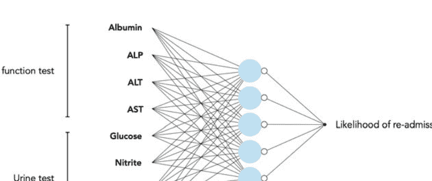

图 7.1 一个单层感知器，以四项肝功能检查结果（白蛋白、ALP、ALT 和 AST 水平）和四项尿液检查结果（葡萄糖、亚硝酸盐、pH 和尿胆原水平）作为输入，并输出患者未来近期住院的可能性

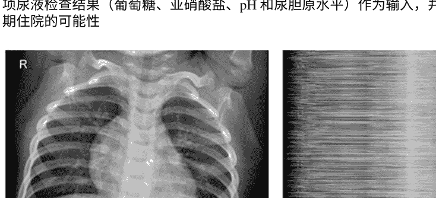

图 7.2 右侧面板中的图像是通过对左侧原始 X 光进行行的随机洗牌创建的。虽然这两个图像具有完全相同的像素值，但在改变像素的空间位置后，原始图像中几乎所有有用的医学信息都丢失了

同样，文本数据（以及一系列其他数据类型，如基因测序数据、时间序列数据等）具有特殊的顺序结构，在建模过程中不能忽视。例如，一条医生的指示笔记“早餐前服用40毫克奥美拉唑和晚上服用10毫克阿托伐他汀”如果我们随机打乱其中的单词（参见图7.3顶部面板），或者更糟糕的是，会产生一个可理解但不同含义的指令，可能对患者的健康有害（参见图7.3底部面板）。

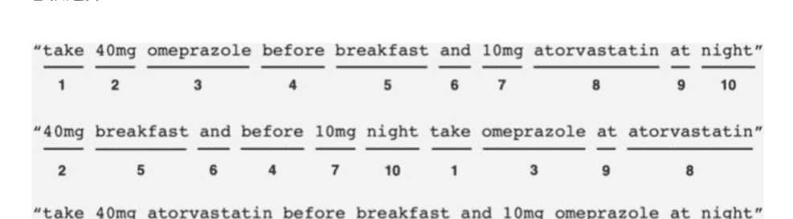

图7.3 医生指示患者服用两种药物的不同单词排列顺序：一种是用于治疗胃酸逆流的非处方药（奥美拉唑），另一种是用于治疗高胆固醇的处方药（阿托伐他汀）。虽然中间行的乱序版本无法理解，但底部行的排列顺序改变了原始顺序的含义，可能对患者有害。

出于上述原因，通用的多层感知器不适用于建模图像和文本数据。在本章中，我们讨论了两种流行的神经网络架构，分别用于处理图像和文本数据作为输入，即卷积神经网络和循环神经网络。

## 卷积运算

在“时间序列数据”一节中，我们介绍了时间序列数据作为一种常用于机器学习的一维数据类型。图7.4显示了一个时间序列数据集，描述了科克县在2020年6月1日至2021年6月1日期间收集的每日新冠病例数量。从图中可以看出，时间序列数据在一天到下一天之间波动较快，呈现出整体上的“崎岖”外观。大多数时间序列数据集都表现出一定程度的崎岖性，这通常归因于扰动基础低频（或平滑）信号的高频（或快速变化）噪声的存在。

例如，在2020年11月1日的图7.4中可以看到一个明显的尖峰，这很可能是由于前一天报告的病例数量延迟导致的（请注意，2020年10月最后一天没有报告任何病例）。修复这种错误的一种快速方法是只保留11月1日报告的病例数量的一半，并将剩余的一半分配给前一天。¹总的来说，识别时间序列数据中的错误/噪声的来源并不总是容易的（就像我们在这里所做的那样）。

> ¹类似的报告错误似乎发生在2021年1月1日。

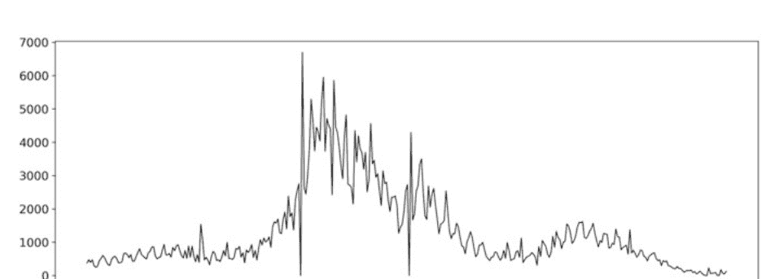

去噪——或者说自动从观测数据中去除噪声——是信号处理中的一个经典问题。在时间序列分析的背景下，去噪通常作为预处理步骤来改善我们对数据整体趋势的理解和总结。正如我们将很快看到的，卷积操作自然而然地成为解决去噪问题的一种方法。

为了正式陈述问题，我们假设观测数据 $x$ 由两个部分组成：一个信号部分 $s$ 和一个噪声部分 $\varepsilon$。因此，时间序列中的 $N$ 个数据点，$x_1, x_2, \dots$，$x_N$ 可以分解并写成
$$\begin{aligned}
x_1 &= s_1 + \varepsilon_1, \\
x_2 &= s_2 + \varepsilon_2, \\
&\vdots \\
x_N &= s_N + \varepsilon_N.
\end{aligned}$$
(7.1)

为了从观测数据 $x$ 中恢复信号 $s$，我们做出两个相对合理的假设：噪声 $\varepsilon$ 没有偏差（因此均值为零），并且底层信号 $s$ 相对平滑。后者在机器学习术语中有时被称为局部平滑性假设。这个假设在图7.4中的Covid时间序列数据的情况下是有效的，因为在没有噪声的情况下，我们预期一个地区 (Cook County) 的新Covid病例数量不会在一天之内发生剧烈变化。

根据 (7.1) ，在 $x$ 的 $L$-邻域内观察到的所有数据的平均值（即 $2L+1$ 个连续数据点 $x_{n-L}, x_{n-L+1}, \dots, x_n, \dots, x_{n+L-1}, x_{n+L}$）可以写成

| 输入 $x$ | 输出 $y$ |
|---------|----------|
| 0.96    | 1.28     |
| 0.46    | 2.47     |
| 0.39    | 3.11     |
| 0.48    | 2.17     |
| 0.11    | 3.42     |
| 0.09    | 2.92     |
| 0.72    | -0.04    |
| 0.66    | 0.48     |
| 0.61    | 0.63     |
| 0.76    | -0.05    |
| 0.41    | 3.1      |
| 0.58    | 0.95     |
| 0.88    | 0.48     |
| 0.23    | 3.95     |
| 0.94    | 1.23     |
| 0.12    | 3.44     |

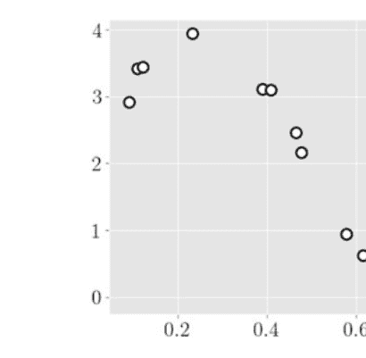

现在，利用我们的第一个假设，即$\varepsilon$具有零均值，我们可以写成

$$
\frac{1}{2L+1}\sum_{\ell=-L}^{L} \varepsilon_{n+\ell} \approx 0.
\quad (7.3)
$$

接下来，利用我们的第二个假设，即$s$是平滑的，我们可以写成

$$
\frac{1}{2L+1}\sum_{\ell=-L}^{L} s_{n+\ell} \approx s_{n}.
\quad (7.4)
$$

最后，将 (7.3) 和 (7.4) 代入 (7.2)，我们得到了对$s_{n}$值的以下估计

$$
s_{n} \approx \frac{1}{2L+1}\sum_{\ell=-L}^{L} x_{n+\ell}.
\quad (7.5)
$$

从统计学角度来看，$L$的值越大，近似公式 (7.3) 越可靠，因为更多的样本通常会使“样本平均值”更接近“总体平均值”（假设为零）。另一方面，随着$L$的增大，近似公式 (7.4) 变得更糟糕，因为$s_{n}$被其邻近值所淹没。幸运的是，我们可以通过调整 (7.5) 中的平均值计算方法来改善这个问题。具体来说，我们不再使用均匀平均值，而是采用在$x_{n}$的$L$-邻域内的元素的加权平均值，使较靠近$x_{n}$的元素分配较大的权重，而较远离$x_{n}$的元素分配较小的权重。

用 $w_{\ell}$ 表示在 (7.5) 中给予 $x_{n+\ell}$ 的权重，我们可以更一般地表示为

$$
s_{n} = \sum_{\ell=-L}^{L} w_{\ell} x_{n+\ell},
\quad (7.6)
$$

在这里，我们还用其严格版本替换了“约等于”符号。注意，当权重选择均匀时，(7.6)简化为(7.5)，如

$$
w_{\ell} = \frac{1}{2L+1}, \qquad \ell = -L, \ldots, L.
\quad (7.7)
$$

图7.5显示了(7.7)中均匀权重序列的图形说明，以及逐个定义的非均匀权重序列

$$
w_{\ell} = \frac{L+1-|\ell|}{(L+1)^2}, \quad \ell = -L, \dots, L. \tag{7.8}
$$

请注意，(7.8)中的非均匀权重序列在ℓ = 0时达到最大值（这是分配给 x_n 的权重）。然后，随着我们离中心点 x_n 越来越远，权重逐渐减小。还要注意，(7.7)和(7.8)中的权重总是加起来等于1。

术语卷积指的是 (7.6) 中的加权和。更准确地说，卷积是指在范围 -L, ..., L 上定义的长度为 2L + 1 的序列 w 和在范围 1, ..., N 上定义的长度为 N 的序列 x 之间的新序列 s，用²表示

$$
s_n = \sum_{\ell=-L}^{L} w_{\ell} x_{n+\ell} \quad n = 1, 2, \dots, N. \tag{7.9}
$$

图7.5两种加权方案的示意图：均匀加权（黄色）如（7.7）所定义和非均匀加权（蓝色）如（7.8）所定义。在两种情况下，L=3

> 2在(7.9)中定义的操作更准确地称为交叉相关，与定义为卷积操作密切相关

$$
s_n = \sum_{\ell=-L}^{L} w_{-\ell} x_{n+\ell}, \tag{7.10}
$$

在将权重序列 w 首先围绕其中心翻转后，再与 x 相乘。翻转权重序列可以保证卷积操作具有交换性质，在本书中这不是我们关心的问题。因此，在稍微滥用术语的情况下，我们在整个章节中继续将 (7.10) 中定义的操作称为卷积。

权重序列 w有时被称为卷积滤波器或核。这与其他机器学习上下文中使用的核函数术语不同（例如，核技巧）。

需要注意的是，为了使用 (7.10) 中的定义计算卷积序列的第一个条目，我们需要访问一些不存在的 x 元素！换句话说，为了计算 s₁，我们需要的值是 x₀。同样，sₙ的值取决于x_{N+1}, x_{N+2}, …, x_{N+L}是未定义的。

为了解决这个问题，我们必须在 x 的开头和结尾都添加 L 个条目，以便对于每个1 ≤ n ≤ N，序列 x 可以在 L-邻域内定义。这个插入操作通常被称为填充。我们选择如何填充 x 对大部分情况来说都不重要，特别是当 L 远小于 N（因为填充只影响结果卷积的第一个和最后一个 L 元素）。

图7.6展示了填充的三种常见方式：(i) 零填充，即在输入 x 的两侧填充零；(ii) 重复填充，即在左侧填充 x₁的值，在右侧填充 x_N的值；(iii) 对称填充，即在左侧以 x₁为中心镜像填充，在右侧以 x_N为中心镜像填充。

> 例7.1（去噪Covid-19时间序列数据）在这个例子中，我们使用(7.10)中定义的卷积操作来去噪Covid-19时间序列数据，该数据最初在图7.4中绘制。在图7.7中，我们展示了对输入 x使用权重核 w（定义在(7.8)中）进行卷积的结果，对应不同的 L 值。请注意，随着卷积核长度的增加，恢复的信号（以红色显示）变得更加平滑。

图7.8 示例 7.2相关的图。(左侧面板)应用(7.7)中的均匀核与底层时间序列数据(灰色)的卷积。(右侧面板)应用(7.8)中的非均匀核与时间序列数据的卷积。在这两种情况下 L = 10

示例7.2 (均匀与非均匀卷积核) 在这个例子中，我们研究了改变卷积核加权方案对Covid-19时间序列数据在图7.4中恢复信号形状的影响。具体来说，我们将这些数据与(7.7)和(7.8)中定义的均匀和非均匀权重序列进行卷积，并在图7.8中进行比较。正如您所看到的，与均匀方案相比，非均匀方案能够更平滑地恢复信号。

在 (7.10) 中定义的一维序列的卷积运算可以直接推广到更高维度。在这里，我们特别关注二维情况，其中卷积运算在条目上写为w与x之间的卷积（表示为s=w*x）。

$$
s_{n_1,n_2} = \sum_{\ell_1=-L_1}^{L_1} \sum_{\ell_2=-L_2}^{L_2} w_{\ell_1,\ell_2} x_{n_1+\ell_1,n_2+\ell_2} \quad n_1=1,2,...,N_1; n_2=1,2,...,N_2 \tag{7.11}
$$

其中w是一个(2L_1+1)×(2L_2+1)的核矩阵，而x——原本是一个N_1×N_2的矩阵——已经被填充（例如，用零填充）成为一个大小为 (N1 + 2L1) x (N2 + 2L2) 的矩阵 X，其中 n1 = 1,2, ..., N1 和 n2 = 1,2, ..., N2。

图7.9二维卷积的示意图。卷积核 w（蓝色显示）在（填充的）输入 x上滑动，对当前位置的图像部分进行逐元素乘法，并将结果相加得到单个输出像素（黄色显示）。这个过程在 x的每个位置上重复进行，形成矩阵 s = w * x

> > 例子7.2（续）
> 二维卷积的概念在图7.9中进行了说明。要计算 s_{n_1,n_2}（以黄色显示），卷积核 w（以深蓝色显示）被放置在 x 的顶部，以 x_{n_1,n_2} 为中心，位于相同的位置上。在 w 和 x 的重叠部分，逐个元素相乘后求和得到 s_{n_1,n_2} 的结果值

### 例7.3（使用二维卷积查找图像梯度）

回顾一下我们在例3.3中的讨论，灰度图像可以被看作是一个具有两个输入和一个输出的函数：第一个输入是行号，第二个输入是列号，输出是由两个输入决定的像素在图像中的强度值。

然而，数字图像并不是可微分的函数。换句话说，我们不能简单地使用极限

$$
\frac{1}{2\epsilon}\left[\begin{array}{l}x\left(n_{1}+\epsilon, n_{2}\right)-x\left(n_{1}-\epsilon, n_{2}\right) \\ x\left(n_{1}, n_{2}+\epsilon\right)-x\left(n_{1}, n_{2}-\epsilon\right)\end{array}\right] \tag{7.12}
$$

为了定义图像在点$(n_1, n_2)$处的梯度，通过将$\epsilon \rightarrow 0$来实现。这是因为$\epsilon$不能任意小，因为输入的离散性质。我们能做的最好的事通过将$\epsilon$设置为最小的有效值（在这种情况下$\epsilon = 1$）来近似(7.12)中的梯度，从而得到近似的图像梯度

$$
\frac{1}{2}\left[\begin{array}{l}x\left(n_{1}+1, n_{2}\right)-x\left(n_{1}-1, n_{2}\right) \\ x\left(n_{1}, n_{2}+1\right)-x\left(n_{1}, n_{2}-1\right)\end{array}\right] \tag{7.13}
$$

或者，等价地使用我们的下标表示法，为

$$
\frac{1}{2}\left[\begin{array}{l}x_{n_{1}+1, n_{2}}-x_{n_{1}-1, n_{2}} \\ x_{n_{1}, n_{2}+1}-x_{n_{1}, n_{2}-1}\end{array}\right] \tag{7.14}
$$

图像梯度中的每个元素(7.14)可以写成图像$x$和某个卷积核之间的卷积。更具体地说，我们可以写成

$$
\frac{1}{2}\left[\begin{array}{l}x_{n_{1}+1, n_{2}}-x_{n_{1}-1, n_{2}} \\ x_{n_{1}, n_{2}+1}-x_{n_{1}, n_{2}-1}\end{array}\right]=\left[\begin{array}{l}w_{h} * x \\ w_{v} * x\end{array}\right] \tag{7.15}
$$

其中

$$
w_{h}=\left[\begin{array}{lll}-0.5 & 0 & +0.5\end{array}\right] \tag{7.16}
$$

和

$$
w_{v}=\left[\begin{array}{c}-0.5 \\ 0 \\ +0.5\end{array}\right] \tag{7.17}
$$

图7.10 示例7.3相关的图。详细信息请参阅正文

> 示例7.3(续)
在图7.10中，我们展示了使用(7.16)和(7.17)中的水平和垂直卷积核对输入图像进行卷积的结果。在这种情况下，得到的图像经过对比度归一化以增强可视化效果。

## 卷积神经网络

实验证明，将单个原始像素值作为特征在几乎所有涉及图像的机器学习任务中产生低质量的结果。此外，如果直接使用像素值作为特征，今天的高分辨率医学图像将创建容易受到机器学习中所谓的维度灾难的负面现象的超高维特征空间（请参见第“重新审视特征设计”节进行复习）。

一种替代的更高效的方法是仅使用图像的边缘内容来表示图像。图7.11中的示例说明了这个想法，左侧面板显示了输入图像，右侧面板显示了仅由原始图像中最显著的边缘组成的相应图像。

图7.11中右侧面板中的边缘检测图像是原始图像的高效表示，我们仍然可以在很大程度上了解图像内部的情况，同时丢弃了大量不属于任何边缘的不太有用的像素信息。

图7.11 (左侧面板) 一张来自[2]的X射线照片，显示右股骨粉笔骨折。（右侧面板）这张图像的边缘检测版本，亮黄色像素表示较大的边缘内容

这一般情况下是正确的：图像中最相关的视觉信息主要包含在图像内相对较少的边缘中[3]。有趣的是，对哺乳动物进行的几项研究还确定了早期视觉处理中的个别神经元作为边缘检测器[4, 5]。

在计算机视觉中，基于边缘的特征设计一直是许多流行的特征工程方案的基石，包括方向梯度直方图（或HoG）[6]和尺度不变特征变换（或SIFT）[7]。

可以使用卷积操作提取图像中的边缘。如图7.10所示，将图像与特定的水平和垂直卷积核进行卷积运算，可以得到这些方向上的图像梯度，其中较大的像素值表示较强的边缘内容。还可以添加其他卷积核来检测不严格水平或垂直但倾斜的边缘。例如，图7.12中显示的八个卷积核对应于从0°开始的八个等间距边缘方向，每个方向增加45°（或π/4弧度）。

为了捕捉输入图像在图7.12中所示的八个方向中的所有边缘内容，我们将输入图像与相应的卷积核进行卷积，将结果通过修正线性单元（ReLU）函数³用于去除任何负数条目，最后将剩余的像素值相加得到一个标量。将输入图像表示为 x，卷积核表示为 w₁, w₂, ..., w₈，这个边缘提取过程返回八个特征图 f₁, f₂, ..., f₈来表示 x，可以用代数方式表示为

$$
f_i = \sum_{\text{所有像素}} \max(0, w_i * x) \quad i = 1, 2, \ldots, 8. \tag{7.18}
$$

我们在(7.18)中使用ReLU函数，这样矩阵中的负值 w_i * x 不会在进行最终求和时抵消其中的正值。⁴将所有的 f_i 堆叠成一个单一的向量 f，我们现在得到了一个（原始的）特征表示，可以进行归一化处理，使其长度为单位长度。⁵

> ³参见“Min-Max Operations”章节，了解ReLU函数的基本知识。

⁴请注意，通过删除 w_i * x 中的负项，我们并没有丢失任何信息，因为这些负项正好是 w_j * x 中的正项，当 |i-j|=4时，反之亦然（见图7.12）。

⁵这可以通过将向量 f 中的每个元素除以向量的范数来实现，即

$$\mathbf{f} \leftarrow \frac{\mathbf{f}}{\|\mathbf{f}\|}.$$

图7.13基于(7.18)的简单基于边缘的特征表示的示意图。详见文本了解更多细节

这个特征提取过程在图7.13中以三个简单图像为例说明：一个矩形（顶部面板），一个圆（中间面板）和一个八角星或八角星（底部面板）。对于每个基本形状，我们绘制输入图像与图7.12中的八个卷积核之间的卷积映射（通过ReLU传递每个映射），以及图像的最后一列中的最终直方图表示。到目前为止，我们设计的基于边缘的特征提取器在过于简单的情况下效果良好。例如，我们可以通过比较它们的特征表示来区分圆形图像和正方形图像。如图7.13所示，圆形的特征表示比正方形更加均匀（因此更加独特）。然而，当应用于

图7.14汇总池化操作的示意图。左侧的6 × 6矩阵在四个非重叠的3 × 3补丁上进行池化，生成右侧较小的2 × 2矩阵。

由于圆和星的特征表示具有对称性，很难区分它们。

实际上，真实世界中的图像比这些简单的几何形状要复杂得多，仅使用八个特征来总结它们将非常低效。为了解决这个问题，我们不再像(7.18)中那样计算整个图像的每个特征，而是将图像分解为相对较小的补丁（可能重叠），并在每个补丁上计算特征。

$$
f_{i,j} = \sum_{\text{第j个补丁}} \max(0, w_i * x) \quad i = 1, 2, \ldots, 8. \qquad (7.19)
$$

这个过程，即将图像分成小的（可能重叠的）补丁，并通过其像素的总和（或平均值）表示每个补丁，在机器学习的术语中被称为池化，在示例6 × 6矩阵中显示如图7.14。

在过程上，池化操作与卷积非常相似，但有两个不同之处：首先，池化时滑动窗口可以一次跳过多个像素，具体取决于相邻窗口或补丁之间需要多少重叠。
滑动窗口每次移动的像素数通常被称为步幅。在卷积中，步幅通常设置为1。卷积和池化的第二个区别在于如何处理滑动窗口的内容，然后将其总结为一个单一的值。回想一下，在卷积中，我们必须首先计算核矩阵与滑动窗口内捕获的矩阵之间的逐元素乘积。然而，在池化中，没有涉及核，我们只需将滑动窗口内的所有像素相加即可。

图7.15中显示的特征提取方案具有几个可调整的超参数，包括：

-   卷积核的数量，$k$
-   卷积核的维度，$q \times q$
-   池化窗口的维度，$r \times r$
-   池化步长，$s$

特征图的总数量由下式给出：

$$
k \left(\left\lfloor \frac{N_1 - r}{s} \right\rfloor + 1\right) \left(\left\lfloor \frac{N_2 - r}{s} \right\rfloor + 1\right), \tag{7.20}
$$

其中假设输入图像的尺寸为 $N_1 \times N_2$，$\lfloor.\rfloor$表示向下取整函数，返回不大于输入的最大整数。例如，图7.15中的输入图像尺寸为 $N_1 = N_2 = 512$。

图中的特征提取器具有 $k = 8$ 个大小为 $3 \times 3$ 的卷积核（因此，$q = 3$）。池化窗口的大小为 $256 \times 256$（因此，$r = 256$），步长为 $s = 256$。将这些数字代入 (7.20) 中，可以得到32作为图7.15中所示流水线的总特征数。在图7.15中，我们构建了一个非常基本的流水线，用于从输入图像中提取基于边缘的特征。这个想法的更复杂的变体已经在实践中有效地用于各种计算机视觉任务[6, 7]。虽然这些方案比图7.15中显示的简单流水线要复杂得多，但它们的核心仍然是使用类似于图7.12中显示的固定卷积核来提取特征。换句话说，这一类“工程特征提取器”中使用的卷积核矩阵是预定义的，并且不会根据输入数据而改变。

一个简单的卷积神经网络（如图7.16底部所示）与我们之前看到的固定内核架构（如图7.16顶部所示）在一个主要方面有所不同：使用卷积神经网络，内核不再是固定的，而是使用训练数据进行学习或调整。这意味着与工程化特征提取器不同，卷积神经网络在训练过程中具有学习数据中最佳特征的能力。

最早的卷积神经网络之一是LeNet架构，在1980年代和1990年代由LeCun和他的同事们在贝尔实验室开发。LeNet架构专为解决自动数字识别的计算机视觉问题而设计，输入是一个低分辨率（$32 \times 32$像素）的手写数字图像，如图7.17所示。在第一个卷积层中，学习了$5 \times 5$大小的$^{6}$个内核，得到了$^{6}$个相应的卷积映射，大小为$28 \times 28$。6然后，这些映射通过sigmoid函数$^{7}$进行处理，并使用池化步长$s = 2$进行池化，形成了大小为$14 \times 14$的$^{6}$个池化映射。在第二个卷积层中，这个过程再次重复，这次使用了大小为$5 \times 5$的$^{16}$个卷积内核（池化步长仍然为$s = 2$，与前一层相同）。第二个卷积层的输出然后被展平成一个列向量，并输入到一个全连接的多层感知器中。

## 递归关系

正如我们在第2章中看到的，各种类型的医学数据以有序的方式连续出现。这些包括时间序列、文本和基因测序数据，仅举几例。这种数据有时被称为动态数据，以与无特定顺序生成的静态数据进行对比。虽然我们可以继续应用前几章讨论的标准机器学习工具来处理动态数据，但它具有这种额外的结构，这就引发了一个问题：我们能否利用这种结构来获得优势？这与我们之前在本章中讨论的卷积神经网络非常相似，我们在神经网络架构中引入了卷积操作，以利用图像数据中存在的局部空间相关性。在这里，类似地，我们研究如何编码和利用动态数据中存在的顺序，以设计一类新的神经网络架构，称为递归神经网络，用于处理这种数据。我们通过介绍固定顺序动态系统作为建模动态数据集的最基本数学工具来开始本节。

正如我们在第“卷积运算”章节中详细讨论的那样，当分析一个时间序列数据集时，比如图7.4所示的数据集，通常会先进行去噪处理。我们在一维卷积的背景下看到，平滑这种类型的一种方法是通过移动（或滑动）平均，即我们取一个小窗口并沿着时间序列从开始到结束滑动它。在每个滑动窗口内取平均值往往会抵消噪声值，从而得到原始序列的平滑版本，更容易进行可视化和研究。

在这里，我们按照方程（7.2）到（7.6）中所述的相同步骤，使用在循环神经网络研究中常用的稍微不同的符号表示法。将原始时间序列表示为 $x_1, x_2, \ldots$ ，移动平均值——一个时间序列本身——可以表示为

$$ h_t = \begin{cases} x_t & t=1,\ldots,L-1 \\ \frac{1}{L} \sum_{i=0}^{L-1} x_{t-i} & t=L,\ldots,N \end{cases} \quad (7.21) $$

其中，移动平均的前 $L-1$ 个值设置为输入时间序列 $x$ 本身的值。在这些初始值之后，我们通过对输入序列的前 $L$ 个元素进行平均来创建后续的值。这个简单移动平均过程是固定阶动态系统的一个常见例子。这个短语中的动态系统部分指的是系统是根据输入序列 $x$ 的最近值来定义的。固定阶部分指的是用于计算 $h$ 值的前面几个输入 $x$ 元素的数量。在公式(7.21)中，每个 $h_t$ 值的这个数量被设置为 $L$（在初始值之后创建）。

具有固定阶数的动态系统的一般形式与(7.21)中表示的移动平均过程非常相似；只是它使用了一个通用的（可能是非线性函数$f(\cdot)$代替简单的平均函数，以便将输入序列的$L - 1$个先前元素组合起来

$$
h_t = 
\begin{cases}
\gamma_t & t=1,\dots,L-1, \\
f\left(x_t,\dots,x_{t-L+1}\right) & t=L,\dots,N
\end{cases}
\quad (7.22)
$$

在这里，$L$是动态系统的固定阶数，前$L - 1$个值$\gamma_1, \gamma_2,\dots,\gamma_{L-1}$被称为系统的初始条件。这些初始条件通常依赖于输入序列，但一般可以设置为任意值。固定阶数的动态系统在各种科学和工程学科中被使用。卷积操作是一个典型的具有固定阶数的动态系统的例子，经常用于过滤和调整数字信号。当$L$设置为$1$时，动态系统的一个特殊情况是每个输出序列元素$h_t$仅依赖于当前输入点$x_t$，即$h_t = f(x_t)$。这种类型的系统被称为无记忆系统，因为动态系统在构建时没有任何关于过去输入值的知识。

另一种特殊的固定阶动态系统是递归关系，在这种情况下，不是根据给定的输入序列构建输出序列，而是根据自身定义输入序列，如

$$
x_t = f\left(x_{t-1},\dots,x_{t-L}\right) \quad t=L+1,\dots,N. \quad (7.23)
$$

在这种情况下，我们不是从输入序列$x$开始并对其进行过滤以创建输出序列$h$。相反，我们通过在一组如(7.23)所示的公式上进行递归来生成输入本身。因此，这些递归关系有时被称为生成模型。请注意，对于递归关系，仍然需要设置初始条件，即输入序列的前$L - 1$个条目。

> 示例7.4（指数增长建模） 以下是一个简单的递归关系，阶数为$L = 1$
> 
> $$
> \begin{aligned}
> x_1 &= \gamma \\
> x_t &= w_0 + w_1x_{t-1}
> \end{aligned}
> \quad (7.24)
> $$
> 
> 使用线性函数$f(x) = w_0 + w_1x$生成呈指数增长的序列。在这里，$\gamma$，$w_0$和$w_1$都是可调节的标量。
> 在图7.19中，我们展示了使用(7.24)生成的长度为$N = 10$的两个示例序列。在图7.19的左侧面板中显示的第一个实例中，我们设置了
> 
> （续）

### 示例7.4(续)

初始条件和线性函数的权重如下：γ = 2， w_0 = 0，和 w_1 = 2。这导致指数增长的序列。在图的右侧面板中，我们使用另一组初始条件和线性权重，即 γ = 1， w_0 = -2，和 w_1 = 2，这导致（这次）指数递减的序列。

假设此刻 w_0 = 0，我们可以通过将递归式（7.24）中的 x_{t-1}替换为其递归定义来回滚递归，即 x_{t-1} = w_0 + w_1 x_{t-2} = w_1 x_{t-2}，并写成 x_t 为

$$x_t = w_1 (w_1 x_{t-2}) = w_1^2 x_{t-2}. \qquad (7.25)$$

如果我们重复这个过程，用 x_{t-2}的递归公式替换，然后 x_{t-3}，以此类推，我们可以将 x_t连接到初始条件，并写成

$$x_t = w_1^t x_1 = w_1^t \gamma. \qquad (7.26)$$

这显示了序列如何根据 w_1的值呈指数级变化。如果 w_0 = 0，可以通过回滚到初始条件（见练习7.6）推导出类似的指数关系。正如我们之前在第“逻辑函数”节中看到的，这种动态系统在马尔萨斯人口增长建模中出现。

### 例子 7.5(自回归建模)

指数增长模型的一个扩展是所谓的自回归系统，其中递归更新公式由 L个先前的线性组合组成

### 例子 7.5(续)

输入序列中的元素（加上一些小的噪音）。一个 $L$ 阶自回归系统的一般形式为

$$
\begin{aligned}
x_1 &= \gamma_1,\\
x_2 &= \gamma_2,\\
&\vdots\\
x_L &= \gamma_L,\\
x_t &= w_0 + \left( \sum_{i=1}^{L} w_i x_{t-i} \right) + \epsilon_t, \quad \text{if } t > L,
\end{aligned}
\quad (7.27)
$$

其中 $\epsilon_t$ 表示每一步引入的小量噪音。在图7.20中，我们展示了通过自回归系统 (7.27) 生成的两个序列。在两种情况下，$L =4$，并且我们使用了相同的初始条件和线性函数权重。两个序列之间唯一的区别是每种情况下 $\epsilon_t$ 的值。在左侧面板中，没有添加噪音，即 $\epsilon_t = 0$，而在右侧面板中，对序列添加了一些小的随机（高斯）噪音。

另一个自回归模型的经典例子是斐波那契序列，递归定义为

$$
\begin{aligned}
x_1 &= 0\\
x_2 &= 1\\
x_t &= x_{t-1} + x_{t-2} \quad \text{if } t > 2,
\end{aligned}
\quad (7.28)
$$

这是(7.27)的特例，其中 $L = 2$, $\gamma_1 = 0$, $\gamma_2 = 1$, $w_0 = 0$, $w_1 = 1$, 和 $w_2 = 1$, 以及 $\epsilon_t = 0$.

### 例7.6 (混沌建模)

在这里，我们通过以下动态系统的示例来说明可以生成的几种递归关系的排序，其阶数为 $L = 1$

$$
\begin{aligned}
x_1 &= \gamma \\
x_t &= w x_{t-1} (1 - x_{t-1})
\end{aligned}
\quad (7.29)
$$

其中递归更新函数不再是线性的，而是二次的。花点时间回顾一下第“逻辑函数”节，并注意(7.29)中的动态系统与(5.6)中的微分方程之间的相似性。实际上，通过正确设置 $\gamma$ 和 $w$，我们可以生成熟悉的s-形状的逻辑曲线，如图7.21所示，

这个动态系统通常是混沌的，这意味着对初始条件 $\gamma$ 和权重 $w$ 的微小调整可能会产生截然不同的结果。例如，在图7.22中，我们展示了两个具有相同初始条件 $\gamma = 10^{-4}$ 但不同权重值的序列：在左侧面板中 $w = 3$，而在右侧面板中 $w = 4$。通过比较两个面板可以看出，$w$ 的相对小变化可以将一个收敛良好的序列（左侧）转变为一个混沌伪随机序列（右侧）。

示例7.4-7.6展示了递归关系的一个普遍特性：它们的行为受其初始条件的极大影响。如果我们从 $x_t$ 开始“回滚”系统，这个事实就变得清晰起来。为了简单起见，假设 $L = 1$，并且 $x_t = f(x_{t-1})$ 对于某个函数 $f$ 成立。利用这个递归定义，我们可以直接将 $x_t$ 与初始条件 $x_1$ 联系起来。

$$
x_t = f(f(...f(x_1)...)) = f^{(t-1)}(x_1)
\quad (7.30)
$$

图7.21 通过(7.29)生成的逻辑序列的示例，其中 $\gamma = 10^{-4}$ 和 $w = 1.75$

我们将 $f$ 与自身 $t$ 次组合。这证实了由 $L = 1$ 阶递推关系生成的序列中的每个点都完全由其初始条件确定。对于阶数 $L > 1$ 的递推关系，一般情况下也是如此。

重要的是要注意，从递推关系的定义中可以看出，order $L$

$$
x_t = f(x_{t-1}, \dots, x_{t-L}),\qquad(7.31)
$$

我们可以看到每个 $x_t$ 只依赖于 $x_{t-1}$ 到 $x_{t-L}$ 的值，而不依赖于 $x_{t-L}$ 之前的任何点。因此，用于构建每个后续点的值范围——根据系统的阶数——是有限的。这种具有“有限记忆”的系统有两个主要缺点。首先，选择适当的 $L$ 值通常并不容易。如果设置得太小，系统可能缺乏足够的内存来建模递归现象。另一方面，较大的 $L$ 值可能导致过于复杂的模型，难以优化和应用。

其次——更重要的是——许多动态数据的模态（例如文本）可能具有可变长度。以患者记录为例。如果你要使用患者记录来预测住院患者的健康状况（即二元标签，可以是正面或负面），在选择一个固定的 $L$ 值时，你会如何选择，知道有些患者记录可能只有几个字，而其他记录可能相当长，有时超过几页？因为固定阶数的动态系统受其阶数的限制，不能使用序列中早期的任何信息，所以无论我们选择什么阶数 $L$，都可能出现这个问题。在下一节，我们介绍可变阶数的动态系统来解决这个问题。

## 循环神经网络

之前，我们讨论了移动平均作为动态系统的一个典型示例，其具有固定的顺序。在本节中，我们介绍指数平均作为具有可变顺序的动态系统的原型。在后一种平均方案中，我们不是采用滑动窗口并对其中的输入序列进行平均，而是以在线方式计算整个输入序列的平均值，逐个元素添加每个输入的贡献。

在讨论指数平均如何计算之前，首先定义输入序列$x_1, x_2, \dots, x_N$的运行平均，如下所示：$h_1 = x_1$

$$
\begin{aligned}
h_1 &= x_1 \\
h_2 &= x_1 \\
h_3 &= \frac{x_1 + x_2}{2} \\
h_4 &= \frac{x_1 + x_2 + x_3}{3} \\
&\vdots \\
h_t &= \frac{x_1 + x_2 + \dots + x_{t-1}}{t-1}
\end{aligned}
\quad (7.32)
$$

在这里，运行平均序列的每个点$h_t$都是输入序列前$t-1$个点的平均值。

换句话说，运行平均序列$h_t$通过一个简单的摘要统计量（样本均值）总结了输入序列中的数据，包括了$x_t$在内。换句话说，运行平均序列$h_t$通过一个简单的摘要统计量（样本均值）总结了输入序列中的数据，包括了$x_t$在内。

请注意，(7.32)中的移动平均是一个动态系统，可以递归地表示为

$$h_t = \left( \frac{t-1}{t} \right) h_{t-1} + \frac{1}{t} x_t \quad (7.33)$$

对于所有的$t = 1, 2, \dots, N$。一旦你花时间验证了(7.32)和(7.33)确实是等价的，还要注意到$h_t$没有固定的顺序因为$h_1$只依赖于一个输入点，$h_2$依赖于两个输入点，$h_3$依赖于三个输入点，以此类推。如果$h_t$是一个固定顺序的系统，那么它的值在每一步都会依赖相同数量的输入点。

虽然(7.32)和(7.33)是同一个动态系统的两种等价表示，但从计算的角度来看，后者更加高效。为了理解为什么这样，让我们使用两种表示方法计算整个移动平均序列$h_1, h_2, \dots, h_N$，计算沿途必须执行的数学运算（加法、乘法、除法等）的数量。使用(7.32)，我们不需要进行加法或除法来计算$h_1$，需要1次加法和1次除法来计算$h_2$，需要2次加法和1次除法来计算$h_3$，以此类推，总计

$$0 + 1 + 2 + \dots + (N - 1) = \frac{1}{2}(N - 1)N \quad (7.34)$$

总共进行了$N - 1$次加法和除法。请注意，加法的次数是$N$的二次方，随着$N$的增长而变得非常大。另一方面，使用根据(7.33)中的定义，我们需要执行恒定数量的操作（一个加法，一个乘法，一个除法⁸）来计算每个步骤的运行平均值，总共需要3N个操作，这在 N 中是线性的，因此随着输入序列的大小而逐渐扩展。

此外，与(7.32)中的展开表示相比，(7.33)中的递归表示具有内存优势。对于后者，在计算运行平均值 h_t 时，我们需要访问直到 x_t（即 x_1到 x_t）的每个值，而对于前者，我们只需要访问两个值：x_t和 h_{t-1}。

指数平均值是运行平均值（在 (7.33) 中）的一个简单概括，其中 h_{t-1} 和 x_t 通过不同的权重或系数进行线性组合。更具体地说，我们不是将 h_{t-1} 和 x_t 相乘，然后将结果相加，而是分别将它们乘以 α 和 1-α，其中 α 是一个在每一步中保持不变的标量。表达式如下 我们有

$$ h_t = \alpha h_{t-1} + (1 - \alpha) x_t $$

这个稍微调整过的滑动平均值被称为指数平均值，因为如果我们将(7.35)回滚到初始状态（就像在(7.26)中所做的那样），就会出现以下指数加权平均值（见练习7.7）

$$ h_t = \alpha^t x_1 + \alpha^{t-1} (1 - \alpha) x_2 + \cdots + \alpha (1 - \alpha) x_{t-1} + (1 - \alpha) x_t $$

具有可变阶数的动态系统的通用形式与 (7.36) 中所示的指数平均非常相似，可以写成

$$ h_1 = \gamma (x_1) $$
$$ h_t = f (h_{t-1}, x_t) \quad t > 1, $$

其中 $\gamma(\cdot)$ 和 $f(\cdot)$ 可以是任何数学函数。虽然在这个通用主题上有许多变化，但所有具有可变阶数的动态系统都共享两个普遍属性：首先，$h_t$ 在自身中递归地定义，其次，它提供了所有先前输入值 $x_1$ 到 $x_t$ 的摘要，并且在可变阶数动态系统的背景下有时被称为状态变量。如果我们通过(7.37)将 $h_t$ 一直回滚到 $h_1$，我们就可以看到为什么会这样。

$$ h_t = f (f (f (\cdots f (\gamma (x_1), x_2), x_3) \cdots , x_{t-1}), x_t) $$

8 如果我们将(7.33)写成这样，就可以更清楚地看到
$$ h_t = \frac{(t - 1) h_{t-1} + x_t}{t} $$图7.23动态系统的图形模型表示，包括固定和可变阶数。（顶部面板）固定阶数动态系统的记忆仅限于系统的阶数 $L$，这意味着系统只知道输入序列中最近的 $L$ 个元素。这里$L =2$，对于 $h_t$的值起作用的输入点用红色标记。（底部面板）可变阶数动态系统的记忆是完整的，也就是说，每个先前的输入都对确定时间或步骤 $t$ 的输出值起作用。

这暴露了一个事实，即 $h_t$依赖于输入序列$x_1$到 $x_t$的所有先前值。换句话说，在每一步， $h_t$提供了输入的摘要直到该序列的那一点，因此，它对所有输入之前的内容都有“完全记忆”。这与前一节中描述的固定顺序动态系统形成鲜明对比，在该系统中，每个值仅依赖于有限数量的输入。这种比较在图7.23中有所说明。图7.23底部面板中显示的可变顺序动态系统为构建循环神经网络提供了蓝图，其中的典型示例在图7.24中有所说明。在这里，除了输入序列（红色）和状态序列（黄色），我们还有一个输出序列（蓝色）位于状态层之上。与图7.23底部面板中的表示不同，在递归神经网络中， $f$可以在状态之间改变。然而，在实践中， $f_t$的功能形式往往相同但使用不同的参数。例如，

$$
f_1(h_1, x_2) = \tanh(v_1 h_1 + w_1 x_2) \\
f_2(h_2, x_3) = \tanh(v_2 h_2 + w_2 x_3) \\
\vdots \\
f_{t-1}(h_{t-1}, x_t) = \tanh(v_{t-1} h_{t-1} + w_{t-1} x_t)
$$
(7.39)

对于函数 $f_1$到 $f_{t-1}$的选择，通常选择 $v_i$和 $w_i$为可调参数。对于预测函数 $g_1$到 $g_t$的选择也是如此从状态 $h_1$ 到 $h_t$ 的输出 $y_1$ 到 $y_t$。与我们迄今遇到的所有其他机器学习和深度学习模型一样，在训练过程中必须学习所有函数参数。

最后，需要注意的是，有时候（取决于应用程序），递归神经网络的输出不是一个序列，而是一个单一的变量。例如，在涉及动态或序列数据的分类任务中，我们可以从图7.24的架构中移除所有输出点 $y_1$ 到 $y_{t-1}$，只保留包含预测分类标签的 $y_t$。

## 问题

### 7.1 图像去噪

在示例7.1中，我们使用一维卷积对图7.4中绘制的Covid-19时间序列数据进行去噪。在这个练习中，你将应用二维卷积对一个二维数据片段进行去噪：胸部X光图像，如图7.25所示。图的左侧面板显示了原始（即清晰）图像，中间和右侧面板显示了两个噪声版本的图像，分别受到中等和高水平的噪声干扰。具体来说，你将使用一个均匀的卷积核对每个噪声图像进行卷积。

$$w = \frac{1}{(2\ell + 1)^2} \begin{bmatrix} 1 & 1 & \cdots & 1 \\ 1 & 1 & \cdots & 1 \\ \vdots & \vdots & \ddots & \vdots \\ 1 & 1 & \cdots & 1 \end{bmatrix}_{(2\ell+1)\times(2\ell+1)}$$

和一个非均匀卷积核

$$ w = \frac{1}{L} \begin{bmatrix} 1 & 2 & \dots & \ell & \ell+1 & \ell & \dots & 2 & 1 \\ 2 & 3 & \dots & \ell+1 & \ell+2 & \ell+1 & \dots & 3 & 2 \\ \vdots & \vdots & \ddots & \vdots & \vdots & \vdots & \ddots & \vdots & \vdots \\ \ell & \ell+1 & \dots & 2\ell-1 & 2\ell & 2\ell-1 & \dots & \ell+1 & \ell \\ \ell+1 & \ell+2 & \dots & 2\ell & 2\ell+1 & 2\ell & \dots & \ell+2 & \ell+1 \\ \ell & \ell+1 & \dots & 2\ell-1 & 2\ell & 2\ell-1 & \dots & \ell+1 & \ell \\ \vdots & \vdots & \ddots & \vdots & \vdots & \vdots & \ddots & \vdots & \vdots \\ 2 & 3 & \dots & \ell+1 & \ell+2 & \ell+1 & \dots & 3 & 2 \\ 1 & 2 & \dots & \ell & \ell+1 & \ell & \dots & 2 & 1 \end{bmatrix}, $$
其中 $L = (2\ell+1)(2\ell^{2}+2\ell+1)$，在每种情况下的不同值的范围内：

- (a) 哪种核类型（均匀或非均匀）提供了最佳的整体结果？
- (b) 哪个核大小 $\ell$ 在中度噪声图像上提供了最佳结果？
- (c) 哪个核大小 $\ell$ 在高噪声图像上提供了最佳结果？
- (d) 你对部分(b)和(c)的答案相同吗？如果不同，请解释原因。

### 7.2 使用卷积进行边缘检测

找到由图7.26中显示的图像/矩阵与以下每个核进行卷积得到的输出图像：

- (a) $w_{1} = \begin{bmatrix} +1 & 0 & -1 \\ +1 & 0 & -1 \\ +1 & 0 & -1 \end{bmatrix}$.
- (b) $w_{2} = \begin{bmatrix} +1 & +1 & +1 \\ 0 & 0 & 0 \\ -1 & -1 & -1 \end{bmatrix}$.
- (c) $w_{3} = \begin{bmatrix} +1 & +1 & 0 \\ +1 & 0 & -1 \\ 0 & -1 & -1 \end{bmatrix}$.

### 7.3 圆形缺陷

你能解释为什么图7.13中间面板所示的圆的基于边缘的特征表示不完全均匀（意味着某些边缘方向包含更多“能量”）吗？

### 7.4 计算卷积神经网络中的可调参数数量

使用（7.20）中的公式以及[8]中的LeNet，[9]中的AlexNet和[10]中的VGGNet的描述，计算图7.18中经典卷积神经网络的可调参数总数。

### 7.5 在数值序列中识别循环

我们在本章中看到了所谓的斐波那契数列

0, 1, 1, 2, 3, 5, 8, 13, 21, 34, 55, ...

通过递归定义

$$
x_1 = 0 \\
x_2 = 1 \\
x_t = x_{t-1} + x_{t-2} \quad \text{if } t > 2
$$

对于以下每个序列，你能定义一个类似的递归公式，从某个初始条件开始生成整个序列吗？如果不能，为什么？

- (a) 1, 1, 2, 4, 7, 13, 24, 44, 81, ...
- (b) 1, 2, 4, 8, 16, 32, 64, 128, ...
- (c) 1, 2, 6, 24, 120, 720, 5040, ...
- (d) 2, 3, 5, 7, 11, 13, 17, 19, 23, 29, ...

### 7.6 滚动回指数增长

在示例7.4中，我们回滚了递归(7.24)，假设 $w_0 =0$，并将连接的 $x_t$连接到系统的初始条件，如(7.26)所示。按照类似的步骤来回滚一般的递归，即不假设 $w_0 =0$。

### 7.7 滚动回指数平均

验证将(7.35)回滚到其初始条件会得到(7.36)中所示的指数加权平均值。

### 7.8 监测血糖水平的动态系统

糖尿病患者定期监测其血糖水平，以确保其始终保持在所需范围内。用 $x_t$表示患者在时间 $t$的血糖水平，使用(7.37)定义一个变量阶动态系统 $h$来表示输入序列 $x_1, x_2, x_3, \ldots, x_t$的历史最大值。换句话说，定义函数$\gamma(\cdot)$和$f(\cdot)$，使得每一步 $h$表示患者的最高记录的血糖水平。对于历史最小值，即最低记录的血糖水平，重复相同的步骤。

## 参考文献

- 1. 纽约时报。美国的冠状病毒 (Covid-19) 数据。2022年7月访问。
   https://github.com/nytimes/covid-19-data
- 2. Keshavamurthy J. 病例研究：双膦酸盐引起的股骨骨折。2022年8月访问。
   https://doi.org/10.53347/rID-4453
- 3. Barlow H. 冗余减少再探讨。 Netw Comput Neural Syst. 2001;12(3):241–53
- 4. Mar`celja S. 对简单皮层细胞响应的数学描述。 JOSA。 1980年;70(11):1297–300
- 5. Jones JP, Palmer LA. 对猫脑皮层简单感受野的二维Gabor滤波器模型的评估。 神经生理学杂志。1987年;58(6):1233–58.
- 6. Dalal N, Triggs B. 用于人体检测的梯度方向直方图。 Proc IEEE Comput Soc Conf Comput Vis Pattern Recognit. 2005;1:886–93
- 7. Lowe DG. 尺度不变关键点的独特图像特征。 Int J Comput Vis. 2004;60(2):91–110
- 8. LeCun Y, Boser B, Denker JS等。 应用于手写邮政编码识别的反向传播。神经计算。 1989;4(1):541–51
- 9. Krizhevsky A, Sutskever I, Hinton GE。 使用深度卷积神经网络的ImageNet分类。 在：第25届国际神经信息处理系统会议论文集。第1卷。 NIPS'12。红钩：Curran Associates Inc.; 2012年。第1097-1105页
- 10. Simonyan K, Zisserman A。 用于大规模图像识别的非常深的卷积网络。 在：第3届国际学习表示会议，ICLR 2015，圣地亚哥，2015年5月7日至9日。会议跟踪论文集；2015年。可从：http://arxiv.org/abs/1409.1556获取
- 11. 邓L。用于机器学习研究的手写数字图像MNIST数据库。IEEE信号处理杂志。2012;29(6):141–2
- 12. 邓J，董W，Socher R，李LJ，李K，费-费L。ImageNet：一个大规模的分层图像数据库。在：2009年IEEE计算机视觉和模式识别会议。皮斯卡塔韦：IEEE；2009年。第248-55页

# 第8章 强化学习

强化学习是一种与前几章讨论的监督学习框架根本不同的通用机器学习框架。经过适当的训练，强化学习使计算机代理能够在复杂（通常是动态的）环境中智能地行动，以实现一个狭义定义的目标。该框架的应用包括游戏人工智能（例如AlphaGo，国际象棋和Atari/Nintendo游戏）以及机器人技术和自动控制中的各种具有挑战性的问题。在医学领域，强化学习已成功应用于机器人辅助手术以及为患者制定个性化治疗策略。

强化学习中涉及的复杂概念数量之多，使其比之前讨论的监督学习框架更具挑战性。这就是为什么在本章中，我们通过逐步介绍每个概念来引入强化学习，以便更好地理解整个过程。通过一次只关注系统的一个部分，我们可以更全面地了解每个组件的工作原理以及其必要性。此外，通过这样做，我们还能对强化学习的各个组件如何定义过程的优势和局限性获得一些非常重要的直觉。

### 强化学习应用

我们从描述强化学习框架的高层次上开始讨论其在医学内外多个领域中的常见应用。这些示例应用代表了可以使用强化学习方法执行的任务类型。在本章的后续部分，我们将反复回顾这些示例，以便发展强化学习的概念。

路径规划人工智能

路径规划问题在机器人应用、视频游戏和地图服务中经常遇到。对于许多机器人（例如清洁机器人），路径规划对于高效运行至关重要。在视频游戏中，敌方 AI 使用路径规划尽快到达关卡中的人类玩家。在数字地图服务中，路径规划用于高效地从点 A 到点 B 进行路线规划。

在本章中，我们将研究路径规划问题的一个玩具版本，称为 Gridworld，在这个版本中，机器人（代理）必须学会如何在类似网格的地图上高效导航，以达到目标位置（目标）。图8.1 的左侧面板显示了 Gridworld 的一个简单示例：一个小迷宫。黑色圆圈表示机器人/代理，绿色方块表示目标位置。在 Gridworld 环境中，机器人可以一次向左、右、上或下移动一个单位，到达任何“安全”方块（白色）。虽然机器人也可以穿过“危险”方块（红色），但如果这样做，它将受到严重惩罚，因为这些方块模拟危险位置（例如滑动或阻塞的地板部分）。在 Gridworld 中，代理从任意给定位置开始，必须学习到达绿色方块的最短路径，同时避开途中的危险。重要的是要注意，在 Gridworld 中，代理无法“看到”整个地图，就像图8.1 的左侧面板所示。从代理的角度来看，世界看起来像图中右侧面板所示，机器人只能看到它被允许进入的地图部分。

网格世界有各种形状和大小。图8.2的左侧面板显示了一个小型网格世界，其中危险区域以一定的方式排列，形成了一个狭窄的通道，将网格的一半与另一半分隔开。如果机器人从网格的“错误”一侧开始（如图所示），那么它必须穿过一个狭窄的桥梁才能到达绿色目标。另一个网格世界示例显示在右侧面板中，世界相对于之前的例子要大得多。此外，这种情况下的危险是随机放置的，因此似乎没有遵循任何特定的模式。在这里，机器人必须学会在没有危险的路径上高效地到达绿色目标。

自动控制

许多自动控制问题涉及教导一个代理人如何控制特定的机械、电气或空气动力系统。在这个领域中的一个经典例子是教导一个代理人如何在移动的小车上平衡杆，有时被称为小车-杆或倒立摆问题。如图8.3左侧面板所示，杆可以绕小车上的轴自由旋转，小车在轨道上可以左右移动，影响杆的位置。杆感受到地球引力的作用，如果不平衡，将会倒下。

自动驾驶系统是另一种可以利用强化学习的技术。在这个领域中的一个经典问题是所谓的月球着陆器问题，目标是训练一个强化学习代理，能够正确地将宇宙飞船降落在两个红旗之间的特定着陆区域，如图8.3右侧面板所示。

游戏对战人工智能

强化学习的另一个常见应用是训练人工智能代理赢得特定的视频和棋类游戏。例如，在象棋游戏中（图8.4左面板），目标是训练一个代理，根据游戏规则能够始终将对手将军。2016年，一个经过强化学习训练的代理（图8.4右面板）在一系列五局比赛中以4比1击败了世界上最强的围棋选手。

自主机器人手术

自主机器人手术是强化学习在医学中的应用领域之一，在这个领域中，一个代理被训练来执行某些手术程序，没有人类参与。图8.5显示了一对机器人臂在腹腔镜手术过程中拍摄的四个快照。这个过程被称为模式切割，它涉及使用手术刀（从右侧进入画面的手臂）和组织夹子在组织模型上切割一个圆形模式。夹子手臂的功能是通过抓住软组织并施加不同大小和方向的力来促进手术过程，而另一只手臂则切割组织。

放射治疗自动规划

放射治疗是一种常见的癌症治疗方法，通过使用能够破坏癌细胞DNA结构的电离辐射束来照射恶性组织。 如图8.6所示，准确确定放射治疗的最佳剂量和照射角度对整体治疗的成功至关重要。

如果辐射的影响区域没有完全包围肿瘤和/或剂量过低或过高，治疗将无法达到预期目标。重要的是要注意，任何暴露于电离辐射的正常细胞也会受到无差别的损伤。 因此，放射治疗的目标是在最小化周围健康组织的辐射暴露的同时，向肿瘤输送足够高的剂量。

放射治疗通常在一段时间内分多个疗程进行，以便让正常细胞修复辐射造成的损伤。传统上，每个疗程都会分配相同剂量的辐射。 然而，这种均匀剂量分布是次优的，因为肿瘤在时间上动态变化。 在第一疗程中适用的剂量在第二疗程中可能不那么有效。 例如，如果肿瘤对第一剂量没有良好反应，可能需要增加剂量。 另一方面，对于在初始剂量后明显缩小的肿瘤，可能需要降低第二剂量，以最小化对周围正常细胞的附带损伤。

这里的固有的行动-响应动力学使强化学习成为放射治疗的理想建模方法。

## 基本概念

在“强化学习应用”一节中讨论的应用虽然看起来非常不同，但它们有一个共同的元素：它们都有狭义的目标，强化学习代理被训练来实现这些目标。例如，在飞机上的自动驾驶系统中，目标是使飞机安全地飞向预定目的地。为了实现这个目标，可以尝试收集和编码一系列“如果-那么”类型的规则来解决这个问题。然而，当编制列表时必须考虑到的感知数据的数量（飞机的速度、高度、环境气压、飞机各部分的应力等）将极大地复杂化这个过程。此外，还有许多环境因素需要处理（例如空气密度、风速和洋流），这些因素在每次飞行中都可能大不相同。

强化学习方法放弃了产生一长串工程条件来解决这类问题的概念，而是训练一个计算代理来实现所需的目标。为了做到这一点，代理必须具备在给定问题的实际空间中进行实验的能力，或者是问题环境的逼真模拟。因此，在学习过程中，它必须对问题环境（或模拟器）有所了解。这些信息通过强化学习术语中称为状态的方式传递给代理。换句话说，状态是一种变量，用于向代理传递有关问题环境的特征信息。

但是，代理在与问题环境交互时如何学习呢？与人类在被投入一个没有理论或原则支撑的新环境中学习的方式相同：通过反复的试错交互。

例如，在自动驾驶系统的情况下，我们会通过让强化学习代理控制一个在模拟环境中的飞机来训练它。然后，在各种条件下运行飞机的许多模拟，每次模拟都让代理完全控制飞机的转向。起初，代理会进行随机的转向动作，很可能导致飞机坠毁并结束模拟。经过多轮这种类型的训练后，代理慢慢开始学习如何正确地操纵飞机以达到预定的目的地。实质上，在追求所需目标的过程中，强化学习代理以试错的方式采取一系列动作。

在这里至关重要的是，我们希望成功地完成目标的是整个行动序列的组合。例如，在自动驾驶系统的情况下，代理可能在最终崩溃之前采取数万次行动。而且，正如你可以想象的那样，要确定哪个个别行动或一组行动导致了崩溃，这一点并不是微不足道的。

这引出了一个重要的问题：我们如何向代理传达一个抽象的目标（例如，“安全到达目的地”），以便它可以通过许多模拟学习采取正确的行动？在强化学习框架中，我们将期望的目标转化为一系列称为奖励的数值。这些奖励值在模拟运行的每一步向代理提供反馈。基本上，它们告诉代理它在实现期望目标方面的表现如何，最终帮助代理学习实现所需的正确行动序列。换句话说，奖励是在代理采取行动后给予强化学习代理的数值，用于向代理传达我们认为该行动是否有助于或阻碍了实现期望目标。

请注意，完全由我们（人类）决定奖励结构。直观地说，我们希望对于给定的动作，其奖励对于使我们接近实现目标的动作来说更大（对于那些不是的动作来说则较小）。因此，在解决任何强化学习问题时，设计一个良好的奖励结构非常重要，因为这是（唯一的）我们向代理传达我们期望的目标的方式。

状态、动作和奖励是强化学习中的三个基本概念，它们相互连接以创建一个反馈系统，当正确设计时，可以让我们训练一个代理来完成任务。基于我们设计的奖励结构，在训练过程中，代理根据接收到的反馈学习如何采取最大化奖励的动作，最终达到期望的目标。为了进一步理解这些基本思想，在接下来的内容中，我们将使用“强化学习应用”一节中介绍的几个示例。

## 网格世界中的状态、动作和奖励

对于任何给定的网格世界，如图8.1和8.2所示，了解代理的当前位置足以完全描述问题环境。因此，在这种情况下，状态由地图上黑色圆圈的水平和垂直坐标组成。请记住，Gridworld中的机器人只允许向上、向下、向左或向右移动一单位。这些定义了Gridworld代理可以采取的行动集合。

请注意，根据代理的位置（状态），只有一部分行动对代理可用。例如，如果代理位于地图的左上角，它只能向右或向下移动一单位。

我们可以设计各种奖励结构来向代理传达我们的目标，即以高效的方式达到目标（绿色方块），同时避免危险（红色方块）。例如，我们可以为导致非目标且非危险状态的所有行动（一单位移动）分配一个相对较小的负值（例如，-1），为导致危险状态的行动分配一个较大的负值（例如，-100），并为导致目标状态本身的行动分配一个非负数（例如，0）。这样，代理就有动力不踩在危险的方块上（因为每次这样做都会减少其奖励100），并且尽可能少地步行到达目标状态（因为每个白色方块上的步行仍会减少其奖励1）。

总结一下，在Gridworld中从一个状态（位置）开始，采取一个动作将代理移动到一个新的状态。为了执行这个动作并移动到新的状态，代理会获得一个奖励。

## 杆车中的状态、动作和奖励

在“自动控制”章节中描述的倒立摆问题中，一个状态是关于小车和杆的位置的完整信息。这包括小车的位置、小车的速度、杆与垂直位置的偏差角度以及杆的角速度。虽然这些技术上是连续值，但在实践中它们被细分为离散值。重要的是要注意，在强化学习框架中解决倒立摆问题时，我们不需要对环境做任何假设，例如重力的存在、它的精确力量等等。

在倒立放示例中，动作的范围完全由直接控制的机器的可用运动范围定义。在图8.3左侧面板中的示例中，代理可以保持小车静止，或沿水平轴向左或向右移动一个单位。在这种情况下，一种常见的奖励结构选择如下：在每个角度超过一定阈值的状态下，代理会获得1分奖励，否则为0分。因此，从一个状态（上述四个系统描述符的特定配置）开始，采取一个动作（保持小车静止或移动），系统会产生一个新的状态。为了采取这个行动并移动到新的状态，智能体会获得奖励。

## 国际象棋中的状态、动作和奖励

在下棋游戏中，一个状态是指棋盘上所有（剩余的）白棋和黑棋的（合法的）配置，而一个行动是指根据国际象棋规则，对棋盘上任意当前棋子的合法移动。在这种情况下，为了让我们的智能体学会如何赢棋，一个奖励结构可以设定如下：任何不立即导致目标状态（将对手将军）的移动会获得一个负奖励（例如，-1），而成功将对手将军的移动会获得一个较大的正奖励（例如，10,000）。

## 放射治疗规划中的状态、动作和奖励

在放射治疗中（在“放射治疗的自动化计划”一节中讨论），一个状态包括有关肿瘤的确切大小和位置以及周围健康组织是否存在任何结构性损伤的所有信息。通常，在每次放射治疗会话之前，状态信息会使用CT扫描或MRI等放射学成像模式进行捕捉。然后，强化学习智能体将采取辐照肿瘤的具体角度/剂量的行动。一个可能的奖励结构可以设定如下：智能体在肿瘤体积减少每个单位时获得正奖励（例如，+2），而由于放射而导致健康组织体积增加每个单位时获得较小（绝对值）的负奖励（例如，-1）。

## 数学符号

在前一节中讨论了强化学习的基本概念（状态、动作和奖励），现在我们准备引入符号表示法，以便能够代数地表示这些概念。为了简单起见，我们假设（暂时）任何给定的强化学习问题只有有限数量的状态和动作。我们将所有状态的集合表示为

$$S = \{\sigma_1, \sigma_2, \ldots, \sigma_n\}$$

将所有动作的集合表示为

$$A = \{\alpha_1, \alpha_2, \ldots, \alpha_m\}$$

在解决强化学习问题的第 $k$ 步中，代理开始于一个状态 $s_k \in S$并采取一个动作 $a_k \in \mathcal{A}$将系统移动到一个状态 $s_{k+1} \in S$。重要的是不要将（8.1）中的 $s$ 表示法与 $\sigma$ 表示法混淆，也不要将（8.2）中的 $a$ 表示法与 $\alpha$ 表示法混淆。$s_k$ 表示法是一个变量，表示过程的第 $k$ 步开始时的状态，因此可以是 $S = \{\sigma_1, \sigma_2, \dots, \sigma_n\}$中的任何一个可能实现的状态。类似地，$a_k$ 表示法是表示第 $k$ 步采取的动作的变量，它是从集合 $\mathcal{A} = \{\alpha_1, \alpha_2, \dots, \alpha_m\}$中的可行动作之一。

回想一下，代理学习在给定状态下采取最佳行动的机制是奖励结构。我们使用符号 $r_k$ 来表示代理在第 $k$ 步接收到的奖励。一般来说，$r_k$ 是一个关于过程第 $k$ 步的初始状态以及强化学习代理在该步骤中采取的行动的函数。

$$r_k = f(s_k, a_k)。\quad \quad (8.3)$$

在解决强化学习问题时，代理在每一步都经历一系列事件。一开始，代理从初始状态 $s_1$ 开始，并采取由 $a_1$ 表示的行动，将问题的状态改变为 $s_2$。对于在状态 $s_1$ 采取行动 $a_1$，代理还会获得奖励 $r_1$。在下一步（即第二步）中，代理从状态 $s_2$ 开始，采取行动 $a_2$，获得奖励 $r_2$，并移动到 $s_3$。这个顺序过程在图8.7中以可视化方式总结。总的来说，这样的一系列步骤，要么在达到目标状态时结束（如Gridworld或国际象棋），要么在完成最大迭代次数后结束（如杆车示例），在强化学习的语言中被称为一个“episode”。必须注意的是，并不是所有的强化学习问题都是确定性的，即在给定状态下采取的某个行动 $a_k$ 总是导致相同的下一个状态 $s_{k+1}$。在随机强化学习问题中，给定状态下的某个行动可能导致不同的结论。例如，一个机器人可能在某个状态下执行某个行动（例如，向前加速一个推力单位），但由于行动的应用不一致等原因，达到不同的结果。

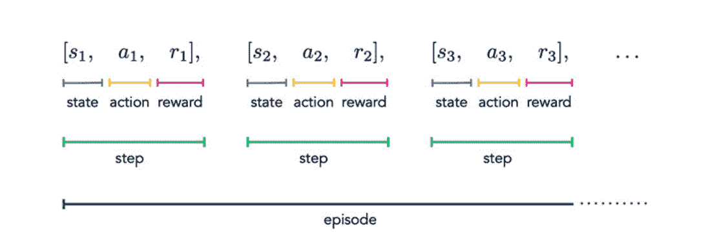

传感器问题、摩擦等。几乎与本节讨论的建模相同，捕捉了这种随机问题的变异性，主要区别在于奖励函数必须同时是状态 $s_{k+1}$ 的函数除了 $s_k$ 和 $a_k$ 之外，即

$$r_k = f(s_k, a_k, s_{k+1}) . \tag{8.4}$$

## 贝尔曼方程

现在，我们已经解决了符号问题，准备回答强化学习中可能最重要的问题：我们如何实际训练代理？答案是——像其他任何机器学习问题一样——通过优化适当的成本函数。然而，与线性回归或逻辑回归等其他机器学习问题不同，在这里我们无法直接得出精确的参数化成本函数的形式。相反，我们形式化了一个理想情况下这个函数应该具备的某个属性，并且通过倒推，我们可以得到计算它的方法。

让我们将 $Q(s_1, a_1)$ 定义为从状态 $s_1$ 开始并采取行动 $a_1$ 时可能获得的最大总奖励。回想一下，采取行动 $a_1$ 会将我们带到某个状态 $s_2$，并且代理会获得一些奖励 $r_1$。因此， $Q(s_1, a_1)$ 可以计算为实现奖励 $r_1$ 与从状态 $s_2$ 开始的所有后续步骤中可能获得的最大总奖励之和。根据 Q 函数的定义，这个后一项可以写成

$$\max_{i \in \Omega(s_2)} Q(s_2, \alpha_i) . \tag{8.5}$$

其中 $\Omega(s_2)$ 表示当代理处于状态 $s_2$ 时可以采取的所有有效行动的索引集合。将上述等式代数化，我们得到

$$Q(s_1, a_1) = r_1 + \max_{i \in \Omega(s_2)} Q(s_2, \alpha_i) . \tag{8.6}$$

请注意，无论我们从哪个状态和动作开始，式（8.6）中的表达式通常成立。换句话说，在过程的第 $k$ 步，我们可以写成

$$Q(s_k, a_k) = r_k + \max_{i \in \Omega(s_{k+1})} Q(s_{k+1}, \alpha_i) . \tag{8.7}$$

这个递归定义的 Q 函数通常被称为贝尔曼方程。乍一看，这个递归方程似乎对我们确定最优 Q 函数没有什么帮助，因为 Q 出现在（8.7）的两边。幸运的是，我们可以利用代理与问题环境进行交互的内在能力来解决 Q。这个想法是将 Q 初始化为某个（随机）值，运行大量的通过Bellman的递归方程更新 Q 的剧集数量。这实质上构成了强化学习的训练阶段。在下一节中，我们将详细讨论如何解决 Q 函数，或者换句话说，通过所谓的 Q学习算法训练RL代理。

## 基本 Q学习算法

当处理具有有限状态和动作数量的强化学习问题时， Q函数可以表示为二维矩阵。回顾(8.1)和(8.2)，我们将所有状态的集合表示为 $S= \{\sigma_1, \sigma_2, \dots, \sigma_n\}$，将所有可能的动作的集合表示为 $A= \{\alpha_1, \alpha_2, \dots, \alpha_m\}$。因此， Q可以表示为 $n \times m$矩阵。

$$\left[
\begin{array}{cccc}
Q (\sigma_1, \alpha_1) & Q (\sigma_1, \alpha_2) & \cdots & Q (\sigma_1, \alpha_m) \\
Q (\sigma_2, \alpha_1) & Q (\sigma_2, \alpha_2) & \cdots & Q (\sigma_2, \alpha_m) \\
\vdots & \vdots & \ddots & \vdots \\
Q (\sigma_n, \alpha_1) & Q (\sigma_n, \alpha_2) & \cdots & Q (\sigma_n, \alpha_m)
\end{array}
\right],$$

该矩阵的行表示所有可能的状态，列表示所有可能的动作。在开始时，该矩阵可以随机初始化（或初始化为零）。接下来，通过模拟一个完整的过程 $[s_1, a_1, r_1], [s_2, a_2, r_2], [s_3, a_3, r_3], \ldots$ 我们通过模拟生成的数据可以逐步解决最优 Q函数的递归定义 (8.7)。在初始化 Q矩阵后，智能体随机选择第一个动作，获得奖励 $r_1$。基于这个奖励，我们可以通过 (8.6) 更新 $Q(s_1, a_1)$。

$$Q(s_1, a_1) \leftarrow r_1 + \max_{i \in \Omega(s_2)} Q(s_2, \alpha_i).$$

然后代理随机选择第二个动作，获得奖励 $r_2$，并更新 $Q(s_2, a_2)$通过

$$Q(s_2, a_2) \leftarrow r_2 + \max_{i \in \Omega(s_3)} Q(s_3, \alpha_i).$$

这个顺序更新过程会一直持续，直到达到目标状态或达到最大步数。当当前的情节结束时，我们开始一个新的情节，并继续更新 Q。经过足够的训练情节后，我们的 Q矩阵/函数最终会变得最优，因为（通过构建）它将满足所需的递归性定义。注意，为了使Q对于所有状态-动作对都是最优的，每个这样的对必须至少被访问一次。实际上，为了使Q得到适当的训练，通常需要多次循环遍历每个对，或者使用函数逼近器从一个小的状态-动作对子集泛化到整个空间。

总结一下，通过运行大量的剧集（因此尽可能多次地通过许多状态-动作对），并使用递归贝尔曼方程在每一步更新 Q，我们通过与环境的试错交互来学习 Q。我们的计算收敛到真实 Q函数的程度在很大程度上取决于我们如何通过试错交互来采样状态-动作空间。基本版本的 Q 学习算法的伪代码如下所示。

```
基本 Q学习算法
1： 初始化 Q
2： 设置剧集数量 E
3： 设置每个剧集的最大步数 T
4： 对于 e = 1, 2, ..., E 执行
5：     k = 1
6：     选择一个随机初始状态   s1
7：     当未达到目标状态且 k ≤ T 时执行
8：         从随机选择的Ω(s_k)中选择一个动作 a_k
9：         记录结果状态 s_{k+1} 和相应的奖励 r_k
10：        Q(s_k, a_k) ← r_k + max_{i ∈ Ω(s_{k+1})} Q(s_{k+1}, α_i)
11：        k ← k + 1
12：    结束循环
13：结束循环
```

> 例子8.1 (将Q-Learning应用于Gridworld) 在这个例子中，我们使用Q-learning来训练一个代理器，使其能够在左侧图8.2中显示的小Gridworld地图上高效地到达目标方格（绿色方格），同时避开危险方格（红色方格），从网格上的任何方格开始。在这里，每个状态可以用代理器在地图上的坐标表示，如图8.8左侧面板所示。因此，状态的总数等于网格上的方格数，即 $n=25$。如图8.8右侧面板所示，代理器可以执行四个动作之一：向上、向下、向左和向右移动一个方格。因此，$m=4$。

接下来，我们用所有零条目初始化一个 $25 \times 4$矩阵 Q，并将训练周期数 $E$和每个周期的步数 $T$都设置为100。我们将简要讨论如何调整这些参数。

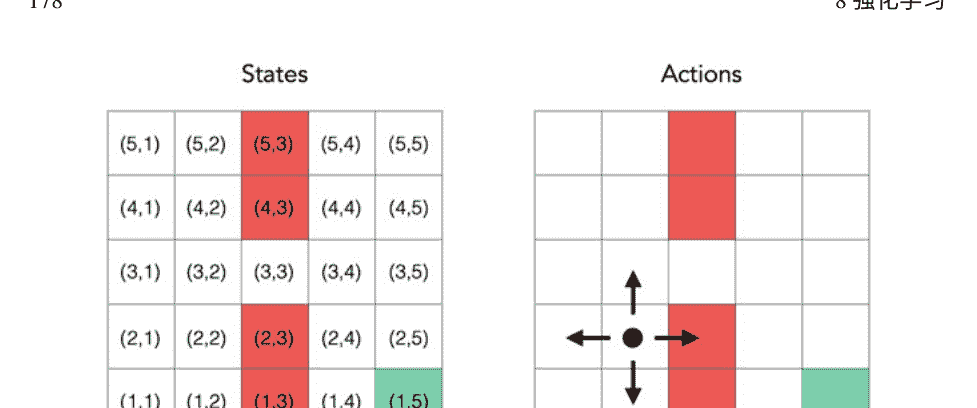

### 例8.1（续）

第“调整 Q-Learning参数”。最后，我们为网格上每个位置的代理设置奖励值

$$r_k = \begin{cases} -0.001 & (\text{如果在标准方格上}), \\ -1 & \text{如果在危险的方格上}, \\ 0 & \text{如果在目标处} \end{cases} \quad (8.12)$$

并运行 Q学习算法。初始和最终 Q矩阵（在第1个和第100个回合开始和结束时）显示在表8.1中。

## Q学习的测试阶段

在示例 8.1中，我们看到了如何通过 Q-learning来训练一个强化学习代理。在本节中，我们研究代理应该如何利用学到的 Q矩阵/函数来导航问题环境。

回顾一下我们在第“贝尔曼方程”节中的讨论， $Q(s_k, a_k)$是代理从 $s_k$开始采取行动 $a_k$时可能获得的最大总奖励。其中

$$i^* = \underset{i \in \Omega(s_k)}{\text{argmax}} \ Q(s_k, \alpha_i)$$

方程式 (8.13) 和 (8.14) 定义了强化学习代理在任何状态 $s_k$ 下使用的策略。一旦 Q 被正确地解决和充分地解决，代理可以使用该策略采取行动，使其沿着最大化奖励的状态路径移动，直到达到目标（或达到最大步数）。

表8.1：示例8.1相关的初始（左）和最终（右）Q矩阵。在这里，每一行是一个状态，每一列是一个行动。左边的Q矩阵被初始化为零。右边的Q矩阵是在运行100个Q-learning算法的情况下得出的。

| 状态 | 下↓ | 上↑ | 左← | 右→ | 下↓ | 上↑ | 左← | 右→ |
| :--- | :---: | :---: | :---: | :---: | :---: | :---: | :---: | :---: |
| (1, 1) | 0 | 0 | 0 | 0 | -0.008 | -0.007 | -0.008 | -0.007 |
| (1, 2) | 0 | 0 | 0 | 0 | -0.007 | -0.006 | -0.008 | -1.001 |
| (1, 3) | 0 | 0 | 0 | 0 | -1.001 | -1.002 | -0.007 | -0.001 |
| (1, 4) | 0 | 0 | 0 | 0 | -0.001 | -0.002 | -1.001 | 0 |
| (1, 5) | 0 | 0 | 0 | 0 | 0 | 0 | 0 | 0 |
| (2, 1) | 0 | 0 | 0 | 0 | -0.008 | -0.006 | -0.007 | -0.006 |
| (2, 2) | 0 | 0 | 0 | 0 | -0.007 | -0.005 | -0.007 | -1.002 |
| (2, 3) | 0 | 0 | 0 | 0 | -1.001 | -0.004 | -0.006 | -0.002 |
| (2, 4) | 0 | 0 | 0 | 0 | -0.001 | -0.003 | -1.002 | -0.001 |
| (2, 5) | 0 | 0 | 0 | 0 | 0 | -0.002 | -0.002 | -0.001 |
| (3, 1) | 0 | 0 | 0 | 0 | -0.007 | -0.007 | -0.006 | -0.005 |
| (3, 2) | 0 | 0 | 0 | 0 | -0.006 | -0.006 | -0.006 | -0.004 |
| (3, 3) | 0 | 0 | 0 | 0 | -1.002 | -1.004 | -0.005 | -0.003 |
| (3, 4) | 0 | 0 | 0 | 0 | -0.002 | -0.004 | -0.004 | -0.002 |
| (3, 5) | 0 | 0 | 0 | 0 | -0.001 | -0.003 | -0.003 | -0.002 |
| (4, 1) | 0 | 0 | 0 | 0 | -0.006 | -0.008 | -0.007 | -0.006 |
| (4, 2) | 0 | 0 | 0 | 0 | -0.005 | -0.007 | -0.007 | -1.004 |
| (4, 3) | 0 | 0 | 0 | 0 | -0.004 | -1.005 | -0.006 | -0.004 |
| (4, 4) | 0 | 0 | 0 | 0 | -0.003 | -0.005 | -1.004 | -0.003 |
| (4, 5) | 0 | 0 | 0 | 0 | -0.002 | -0.004 | -0.004 | -0.003 |
| (5, 1) | 0 | 0 | 0 | 0 | -0.007 | -0.008 | -0.008 | -0.007 |
| (5, 2) | 0 | 0 | 0 | 0 | -0.006 | -0.007 | -0.008 | -1.005 |
| (5, 3) | 0 | 0 | 0 | 0 | -1.004 | -1.005 | -0.007 | -0.005 |
| (5, 4) | 0 | 0 | 0 | 0 | -0.004 | -0.005 | -1.005 | -0.004 |
| (5, 5) | 0 | 0 | 0 | 0 | -0.003 | -0.004 | -0.005 | -0.004 |示例 8.2 （在网格世界中测试强化学习代理） 在这个示例中，我们使用在示例 8.1 中学到的 $Q$ 矩阵，并在表 8.1 的右侧显示，以测试强化学习代理在网格世界中的导航，从棋盘上的任何给定位置（状态）开始。

在这里，我们将代理初始化为 $s_1 = (2, 2)$。

如图 8.9 所示，通过检查与 $s_1$ 相关的行在 $Q$ 矩阵中的条目，我们可以轻松地看到“向上/↑”列中的条目在整行中具有最大的值（即 $-0.005$）。因此，在这个状态下，最优的行动是将代理向上移动一单位，到达 $s_2 = (3, 2)$。接下来，我们检查与 $s_2 = (3, 2)$ 相关的行。现在，最大的条目是 $-0.004$，在“向右/→”列中，这意味着最好的行动是将代理向右移动一单位到一个新的状态 $s_3 = (3, 3)$。再次，与 $s_3$ 相关的行中“向右/→”列下的条目是最大的，代理继续向右移动到 $s_4 = (3, 4)$。

如图 8.10 所示，在与 $s_4$ 相关的行上，“向下/↓”或“向右/→”两个动作具有相同的最大值 $-0.002$。在这种情况下，代理可以采取任何一个动作，到达 $s_4 = (2, 4)$（实线蓝色表示）或 $s_4 = (3, 5)$（虚线蓝色表示）。这个过程会重复，直到达到目标状态（或者达到预先确定的最大步数）。图 8.11 显示了代理从 $s_1 = (2, 2)$ 开始，到达目标状态 $s_7 = (1, 5)$ 的所有可能路径。

| 状态 | Down ↓ | Up ↑ | Left ← | Right → |
|------|--------|------|--------|---------|
| (1,1) | -0.008 | -0.007 | -0.008 | -0.007 |
| (1,2) | -0.007 | -0.006 | -0.008 | -1.001 |
| (1,3) | -1.001 | -1.002 | -0.007 | -0.001 |
| (1,4) | -0.001 | -0.002 | -1.001 | 0 |
| (1,5) | 0 | 0 | 0 | 0 |
| (2,1) | -0.008 | -0.006 | -0.007 | -0.006 |
| (2,2) | -0.007 | -0.005 | -0.007 | -1.002 |
| (2,3) | -1.001 | -0.004 | -0.006 | -0.002 |
| (2,4) | -0.001 | -0.003 | -1.002 | -0.001 |
| (2,5) | 0 | -0.002 | -0.002 | -0.001 |
| (3,1) | -0.007 | -0.007 | -0.006 | -0.005 |
| (3,2) | -0.006 | -0.006 | -0.006 | -0.004 |
| (3,3) | -1.002 | -1.004 | -0.005 | -0.003 |
| (3,4) | -0.002 | -0.004 | -0.004 | -0.002 |
| (3,5) | -0.001 | -0.003 | -0.003 | -0.002 |
| (4,1) | -0.006 | -0.008 | -0.007 | -0.006 |

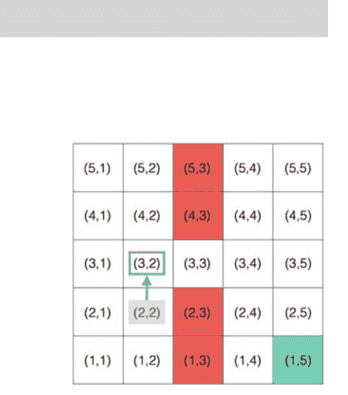

图 8.9 从状态 $s_1 = (2, 2)$ 开始，代理人在搜索与 $s_1$ 相关的行中最大值的 $Q$ 时，发现最大值是“上/↑”列下的 $-0.005$。采取这个推荐的动作，代理人将到达 $s_2 = (3, 2)$

| State | Down (↓) | Up (↑) | Left (←) | Right (→) |
|---|---|---|---|---|
| (1,1) | -0.008 | -0.007 | -0.008 | -0.007 |
| (1,2) | -0.007 | -0.006 | -0.008 | -1.001 |
| (1,3) | -1.001 | -1.002 | -0.007 | -0.001 |
| (1,4) | -0.001 | -0.002 | -1.001 | 0 |
| (1,5) | 0 | 0 | 0 | 0 |
| (2,1) | -0.008 | -0.006 | -0.007 | -0.006 |
| (2,2) | -0.007 | -0.005 | -0.007 | -1.002 |
| (2,3) | -1.001 | -0.004 | -0.006 | -0.002 |
| (2,4) | -0.001 | -0.003 | -1.002 | -0.001 |
| (2,5) | 0 | -0.002 | -0.002 | -0.001 |
| (3,1) | -0.007 | -0.007 | -0.006 | -0.005 |
| (3,2) | -0.006 | -0.006 | -0.006 | -0.004 |
| (3,3) | -1.002 | -1.004 | -0.005 | -0.003 |
| (3,4) | -0.002 | -0.004 | -0.004 | -0.002 |
| (3,5) | -0.004 | -0.003 | -0.003 | -0.002 |
| (4,1) | -0.006 | -0.008 | -0.007 | -0.006 |

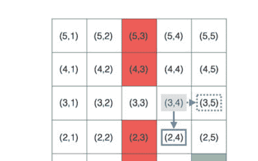

图8.10 在 Q 的给定行中，最大值并不总是唯一的。在这种情况下，代理人可以随机选择任何可用的最优动作。在这里，从 (3,4) 开始，代理人可以向下移动到 (2,4) 或向右移动到 (3,5)

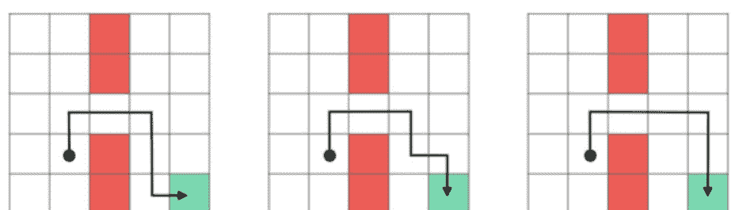

图8.11 从 s₁ = (2,2)开始，按照(8.13)和(8.14)定义的策略，代理人有三条路径到达目标状态，显示为绿色

## 调整 Q 学习参数

基本的 Q-学习算法有一些需要设置的参数。这些参数包括每个训练周期的最大步数 T，以及总的训练周期数 E。这些参数都会严重影响训练代理的性能。在光谱的一端，如果 T 没有设置得足够高，代理可能永远无法达到目标状态。对于像 Gridworld 这样的问题，只有一个这样的状态，这将是灾难性的，因为系统（和 Q）永远不会学会如何达到目标。另一方面，如果步数设置得太大，训练时间可能会非常长。

对于训练周期数 E 也可以说类似的情况：太小，Q 将无法正确学习，太大则会浪费大量时间和计算资源。

正如我们将在本章后面看到的，基本 Q-学习算法的其他变体还有其他需要设置的参数。

为了调整 Q学习参数，我们需要一个验证策略来评估我们训练好的智能体在不同参数设置下的性能。这个验证策略包括运行一组验证回合，每个回合从不同的起始位置开始，智能体使用最优策略进行转移。

在每个训练回合完成后，计算一组验证回合的平均奖励可以帮助我们评估特定参数设置对训练的效率和速度的影响。

因为像例子8.1和8.2中讨论的Gridworld问题具有较少的状态，所以步数 T 和回合数 E可以相对较低。然而，理想情况下，我们将两者都设置为一个较大的数值——尽可能大——考虑到时间和计算约束。

## Q学习的改进

在前一节中，我们介绍了基本的 Q学习算法作为逼近每个强化学习问题相关的基本 Q函数的手段。在本节中，我们将继续讨论并介绍两个简单但强大的增强方法来改进基本的 Q学习算法。

回想一下，在基本 Q学习算法的核心是以下的递归更新方程：

```
$$Q(s_k, a_k) = r_k + \max_{i \in \Omega(s_{k+1})} Q(s_{k+1}, a_i) , \qquad \qquad (8.15)$$
```

在这个方程的左边，即 $Q(s_k, a_k)$，代表着如果代理从状态 $s_k$ 开始采取行动 $a_k$，可以获得的最大可能奖励。这等于方程右边的两个项的和：第一个项($r_k$)代表着代理在状态 $s_k$采取行动$a_k$时立即获得的短期奖励，第二个项代表着代理从状态 $s_{k+1}$开始可能获得的最大长期奖励。

请注意，方程(8.15)中的递归方程最初是在假设 Q是最优的情况下推导出来的。但是当我们开始训练$^{1}$时，这显然是不正确的，因为我们对最优 Q没有任何了解（这就是为什么我们首先需要进行训练的原因）。因此，在这个过程的初始阶段，方程(8.15)中涉及Q的左右两边的项都不能给我们一个最大值。然而，我们可以对基本 Q学习算法进行多次调整，以弥补最优 Q（以及递归更新方程的有效性）需要多次模拟才能正确解决的事实。

> 1回想一下， Q是随机初始化或置零的。

### 探索-利用的权衡

基本 Q 学习算法中一个明显的低效性是代理在训练过程中采取随机动作（参见基本 Q 学习算法中的第8行，在“基本 Q 学习算法”一节中）。如果我们仅仅看一下每个训练回合的总奖励，这种低效性就变得更加明显。在图8.12中，我们绘制了左侧图8.2中小型 Gridworld 的每个训练回合的总奖励。这个图中总奖励每个回合的快速波动是使用随机动作选择训练强化学习代理的直接结果。尽管 Q 随着训练的进行变得更加准确，但随着时间的推移，平均奖励并没有改善。换句话说，平均计算时间的数量级大致相同，无论我们对 Q 解决得多好。

虽然在随机动作选择的训练中，强制代理在训练过程中充分探索问题环境，但我们从不在训练过程中利用解决 Q 矩阵/函数来采取行动。直觉上，经过一段时间后，代理不再完全依赖随机采取行动。

相反，在训练过程中，它可以使用（部分）已解决的 Q 来采取适当的行动。随着 Q 越来越接近最优，这显然会降低后续训练中的训练时间，因为代理现在采取的行动是由 Q 函数/矩阵提供的信息，而不仅仅是随机的行动。

重要的问题是：代理在训练过程中何时开始利用 Q？如果代理从不这样做，我们已经知道会发生什么：训练效率非常低。另一方面，如果代理过早或过多地开始利用 Q，它可能无法充分探索问题的状态空间，从而无法创建一个稳健的学习者，因为 Q 的学习会严重偏向早期成功的情节。

在实践中，有多种方法可以在训练过程中应用这种探索-利用权衡来选择动作。这些方案中大多数使用了简单的

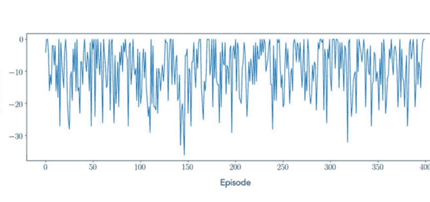

图8.12 在图8.2左侧面板上显示的 Gridworld 上运行基本的 Q-学习算法 400 个回合后记录的每个回合的总奖励

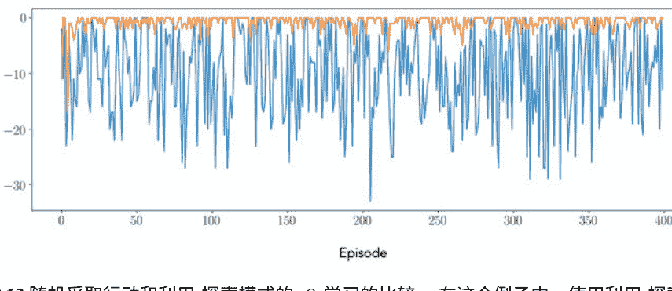

图8.13 随机采取行动和利用-探索模式的 Q-学习的比较。在这个例子中，使用利用-探索（橙色）的 Q-学习算法比使用严格随机采取行动（蓝色）的基本版本快5倍。

随机切换：在模拟的每个步骤中，以一定的概率 p随机选择下一个动作，或者以概率1 - p通过最优策略选择。在最简单的方法中，概率 p可以保持在0和1之间的某个固定值，并用于所有步骤/回合的训练。更加深思熟虑的实现会随着训练的进行逐渐将概率 p逼近零，因为随着时间的推移，对 Q的近似变得更加可靠。

为了看到多少利用 Q有助于使训练更加高效，我们重复创建图8.12的过程，这次将探索-利用概率 p设置为0.5，适用于所有步骤/剧集。如图8.13所示，探索-利用方法产生的剧集具有更大的稳定性（即，波动较小）和更大的总奖励。

### 短期-长期奖励的权衡

如果在 Q学习的初始训练剧集中，长期奖励不太可靠，那么我们可以减弱其对更新的贡献。可以通过向长期奖励添加一个参数来实现，有时被称为惩罚参数或正则化参数。这个短期长期权衡参数被附加到长期奖励上，通常用 γ表示。包含这个权衡参数后，我们的递归更新公式现在采用以下形式：

```
Q(s_k, a_k) = r_k + γ · max_{i∈Ω(s_{k+1})} Q(s_{k+1}, a_i) (8.16)
```

我们将γ限制在0和1之间，通过缩放它的大小，我们可以调整短期和长期奖励对Q学习的影响。特别是通过将γ设置为较小的值，我们赋予短期奖励r_k更大的权重。在这种情况下，代理学习采取更加贪婪的方法来实现目标，在每个状态下，采取下一步最大化短期奖励的步骤。

另一方面，通过将γ接近1，我们基本上恢复了原始的更新公式，同时考虑短期和长期奖励的平等贡献。与探索-利用权衡一样，可以将γ设置为训练过程中所有步骤/回合的固定值，或者根据预定义的计划在每个回合中更改其值。有时，将γ设置为小于1的某个值有助于证明Q-learning的数学收敛性。然而，在实践中，γ通常接近1（如果不是1），我们只是调整探索-利用概率，因为最终两个权衡（探索-利用和短期-长期奖励）解决了同样的问题：我们对Q的初始不信任。将这两个权衡修改整合到基本的Q-learning算法中，我们得到以下增强版本的Q-learning伪代码。

## 增强型Q学习算法

```
1: 初始化Q
2: 设置剧集数量E
3: 设置每个剧集的最大步数T
4: 设置探索-利用概率p ∈ [0,1]
5: 设置短期长期奖励权衡γ ∈ [0,1]
6: 对于e = 1, 2, …, E do
7: k = 1
8: 选择一个随机初始状态 s₁
9: 当目标状态未达到且k ≤ T时
10: 选择一个随机数 r ∈ [0,1]
11: 如果r ≤ p则
12:  从随机选择的动作aₖ中选择
13: 否则
14:  选择使Q(sₖ, aₖ)最大化的动作aₖ
15: 结束如果
16: 记录产生的状态sₖ₊₁和相应的奖励rₖ
17: Q(sₖ, aₖ) ← rₖ + γ · max_{i∈Ω(sₖ₊₁)} Q(sₖ₊₁, αᵢ)
18: k ← k + 1
19: 结束循环
20: 结束循环
```

## 解决大状态空间问题

在前一节中，我们介绍了两个改进，使得 Q-learning更加高效。然而，在许多强化学习场景中，问题的状态空间非常大，仅仅依靠这些改进是无法使 Q-learning可行的。以国际象棋为例，每个状态都是棋盘上的一种布局。据估计²这样的布局数量大致为 \( \frac{64!}{32! (8!)^2 (2!)^6} \)，约为10⁴³。存储和计算如此大的矩阵 Q 是极具挑战性的，如果不是实际上不可能的话。更糟糕的是，有时候强化学习问题具有连续的状态空间，这使得将 Q表示为一个矩阵在理论上是不可能的（因为这样的矩阵需要有无限多行）。在本节中，我们讨论了监督学习在改善这个问题中的关键作用，使我们能够将强化学习范式扩展到具有非常大的状态空间的问题。

为了正式地描述这个问题，假设我们有一个 \( n \times m \) 矩阵 Q，如(8.8)所示，其中 n非常大（或者可能是无限的）。解决这个问题的一种常见方法是使用监督学习来学习每列 Q的紧凑代数表达式。使用这种策略，Q的第j列

```
$$
\begin{bmatrix}
Q(\sigma_1, \alpha_j) \\
Q(\sigma_2, \alpha_j) \\
\vdots \\
Q(\sigma_n, \alpha_j)
\end{bmatrix}
\quad (8.17)
$$
```

将被一个数学函数 \( q_j(s) \) 替换，该函数在 \( s = \sigma_i \)（近似地）等于 \( Q(\sigma_i, \alpha_j) \)。换句话说，之前由 Q中的(i, j)元素表示的 \( Q(\sigma_i, \alpha_j) \) 现在由 \( q_j(\sigma_i) \) 表示，其中 \( q_j(·) \) 是一个数学函数（例如，\( q_j(s) = 1 - 2s \)）。请注意，函数 \( q_j(s) \) 的输入可以取自一个有限集合的任意值（例如，\( S= \{\sigma_1, \sigma_2, ..., \sigma_n\} \)）甚至是一个无限范围。如果 \( q_j(s) \) 的代数方程已知，代理可以简单地将任何状态值插入函数并读取输出，而不必在一个非常大的矩阵中查找。

那么问题就变成了：我们如何学习方程 \( q_1(s), q_2(s), ..., q_m(s) \) 的？在最简单的情况下，我们可以假设所有这些函数都可以被线性地建模，并且彼此之间是独立的。换句话说，第 j个函数 \( q_j(s) \) 可以被建模为

```
$$q_j(s) = w_{0,j} + w_{1,j} s, \quad (8.18)$$
```

其中 $w_{0,j}$ 和 $w_{1,j}$ 是可调的权重或参数。在每一步的 $Q$-学习中，我们不是更新某个 $Q(\sigma_k, \alpha_j)$ 的值，而是更新相应函数 $q_j(s)$ 的参数，通常是通过在线学习的方式。

```
$$q_j(\sigma_k) \approx r_k + \max_{i \in \Omega(s_{k+1})} q_i (s_{k+1}), \quad (8.19)$$
```

请注意，这与第4章中描述的线性回归设置非常相似其中与线性函数相关联的输入-输出对³以顺序方式偶尔出现，因为代理在问题环境中导航。

有时线性函数不足以准确地建模 $q_j(s)$。在这种情况下，我们可以选择非线性函数逼近器，并将(8.18)重写为

```
$$q_j(s) = f_j(s; \mathcal{W}_j), \quad (8.20)$$
```

其中 $f_j(s; \mathcal{W}_j)$ 是一个参数化的非线性函数，存储在集合 $\mathcal{W}_j$ 中。在使用神经网络时，根据解决的强化学习问题，我们可以选择独立地学习 $f_j$ (即，每个动作一个网络) 或共同学习 (即，所有状态函数共享权重的一个网络) 。

## 问题

### 8.1 定义状态、动作和奖励

对于以下每个问题，定义： (i) 问题的状态空间和 (ii) 动作空间，以及 (iii) 强化学习代理实现目标的适当奖励结构。参见第“放射治疗计划中的状态、动作和奖励”节的示例。

- (a) 根据“自动控制”节中描述的月球着陆器问题
- (b) 根据“自主机器人手术”节中描述的机器人手术模式切割

### 8.2 在新的网格世界中的Q-Learning

在示例8.1中，我们学习了与图8.8中显示的网格世界相关联的Q矩阵。在这个练习中，你将把Q-learning应用到图8.14中显示的新网格世界地图上。具体来说，你应该：图8.14 与练习8.2相关的图

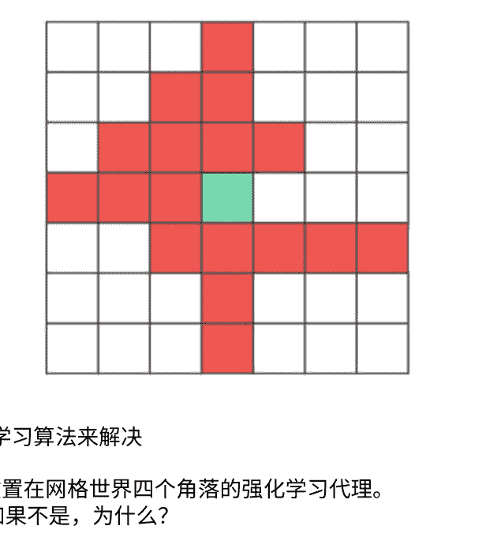

- (a) 随机初始化Q矩阵并运行Q学习算法来解决。
- (b) 使用解决后的Q来测试最初放置在网格世界四个角落的强化学习代理。代理是否按预期导航地图？如果不是，为什么？

### 8.3 Q学习增强

在“探索-利用权衡”和“短期长期奖励权衡”章节中，我们讨论了两种改进基本Q学习算法效率的方法，即引入探索-利用概率p和短期长期奖励权衡参数γ。

- (a) 证明增强的Q学习算法（其伪代码在“Q学习增强”章节末尾显示）在p和γ都设置为1时退化为基本Q学习算法。
- (b) 当p和γ都设置为0时会发生什么。

### 8.4 计算国际象棋中行动空间的大小

我们在第“处理大状态空间问题”节中看到，国际象棋的状态空间是巨大的，大约为10^43的数量级。这促使我们使用函数逼近器来代替以矩阵格式明确地编写Q。那么国际象棋的行动空间呢？行动空间是否也过于庞大？在这个练习中，您将通过使用表8.2中提供的信息并注意到国际象棋棋盘本身是一个8×8的正方形来估计（上限）国际象棋行动空间的大小。

表8.2 国际象棋中每个玩家的棋子数量以及每个棋子在棋盘上的移动方式的描述。这个表与练习8.4相关

| 符号 | 件数 | 合法移动 |
|------|------|----------|
| ♙ | 8 | 向上移动1格；向上移动2格（仅限第一次移动）；在捕获敌方棋子时，对角线向前移动1格(吃过路兵) |
| ♖ | 2 | 水平或垂直方向上的任意格数；与国王或皇后进行易位 |
| ♘ | 2 | 垂直方向上移动2格，水平方向上移动1格；水平方向上移动2格，垂直方向上移动1格 |
| ♗ | 2 | 对角线上的任意格数 |
| ♕ | 1 | 垂直、水平或对角线上的任意格数；与车进行易位 |
| ♔ | 1 | 垂直、水平或对角线上移动1格；与车进行易位 |

## 参考文献

1. Murali A, Sen S, Kehoe B, et al. 通过观察学习外科手术子任务：多边形切割3D粘弹性和2D正交异性组织模型。在：2015年机器人与自动化国际会议论文集; 2015年。第1202-9页。
2. Shannon CE. 编程下棋的计算机。Philos Mag. 1959;41(312)

# 索引

- A
  - 美国电影发行公司，34，35
  - 美国信息交换标准代码（ASCII），40-42
  - 亚里士多德理论，1，2
  - 人工智能（AI），3
  - 人工神经网络，12，117，119，120，131
  - 自动微分器，123
  - 自主机器人手术，168-169
  - 自动驾驶系统，167，170，171
  - 自回归建模，153-154

- B
  - 贝尔曼方程，175-177
  - 二元分类框架，106
  - 体重指数（BMI），16，17，87

- C
  - 癌症
    - 自身免疫性疾病，1
    - 膀胱癌，14
    - 乳腺癌，14
    - 肺癌，14
    - 数学模型，2
    - 患者，15
    - 放射治疗，169
    - 皮肤癌，3，4，8，9，12，14，15，20
  - 杆车问题，172
  - 分类模型，4，6，7，9，12，89
  - 计算框架，3，15，101
  - 计算机断层扫描（CT），14，25，31，44，173
  - 凸函数，96
  - 卷积神经网络基于边缘的特征提取器，145
  - 边缘检测图像，142
  - 端到端基于边缘的特征提取流程，147
  - LnNet架构，148，149
  - 问题
  - 可调参数，162
  - 圆形缺陷，161
  - 使用卷积进行边缘检测，161
  - 真实世界图像，146
  - ReLU，144
  - 步幅，146
  - VGGNet，150
  - 视觉处理，143
  - 卷积操作 Covid时间序列数据，134，137-138
  - 去噪，134
  - 找到图像梯度，二维卷积，141，142
  - 不规则外观，133
  - 填充序列，137
  - 样本平均，135
  - 时间序列数据，133
  - 二维卷积，140
  - 均匀 vs. 非均匀卷积核，139-140
  - 均匀权重序列，136
  - Covid-19大流行，19，92
  - 交叉熵损失函数，94-96，98，104-106，109，110，129
  - 维度诅咒，10，11，17，20，142

- D
  - 深度学习应用，22
  - 深度学习，特征工程，参见特征工程
  - 深度神经网络，121，122
  - 数字图像，30，49，141
  - 降维技术，18
  - 疾病，2，36，43，76，92
  - 泄漏的ReLU，119
  - 非平凡且耗时，117
  - 真实世界的机器学习问题，116
  - 梯度消失问题，119
  - 斐波那契数列，154，162

- G
  - 全球卫生观察，76
  - 梯度下降算法
    - 学习率，101
    - 最小二乘/交叉熵函数，98
    - 数学符号函数，99
    - 多项式函数，97
    - 速度/性能，100
    - 稳定点，97
  - Gridworld，166，167，172，174，177，178，180-183，187，188

- E
  - 心电图 (ECG)，22，35-38，45-46
  - 电子健康记录 (EHR)，2，22，37
  - 基本函数
    - 复杂函数，64-65，67
    - 指数函数，56-58
    - 双曲函数，56
    - 对数函数，58，59
    - 多项式函数，54
    - 倒数函数，54-55
    - 阶跃函数，59-60
    - 三角函数，55-56
  - 基本运算
    - 算术运算，61，66
    - 复杂函数，64-67
    - 函数组合，61-63
    - 函数调整，60-61，66
    - 最小-最大运算，63-64
  - ELIZA，3
  - 指数平均值，156-158，163
  - 指数函数，56-58，65，92
  - 指数增长建模，153

- H
  - 海维赛德阶跃函数，90，91，94，101，118，120
  - 人类疾病，1
  - 双曲函数，56
  - 双曲正切函数，56，93，118-120，122

- I
  - 图像去噪，160-161
  - 国际皮肤成像合作 (ISIC)，4，7，19

- F
  - 特征工程
    - 非线性分类，115-116
    - 非线性回归
      - *Lactobacillus delbrueckii*生长，113
      - 线性化数据，114
      - 机器学习，112
      - 多维输入，111
    - 问题
      - 特征工程与特征学习，127
      - 多层神经网络，128
      - 非线性回归，127
      - ReLUs，127
      - 单层神经网络，129
      - 双层神经网络，129
  - 特征学习
    - 生物神经元，118
    - 历史和现代激活函数，120

- K
  - K折交叉验证，127

- L
  - Leaky ReLU，119，120
  - 最小二乘代价函数
    - 共线，71
    - 框架，72
    - 输入归一化
      - 输入因素，78
      - 参数大小，79
      - 脊髓灰质炎免疫和GDP，79
      - 预测 *vs.* 实际寿命，79
      - 寿命预测，80-81
      - 可调参数，80
  - MSE，72
  - 多维输入
    - 数据集示例，77

## 方程

- n维输入，74，75
- 预测寿命，76-78
- 单个输入向量，75
- 嘈杂的数据集，74

## 问题

- 输入归一化，85-86
- 最小二乘解，84，85
- 线性/可加性/齐次性，84
- 医疗保险费用，预测，86-87
- 预测寿命，86
- 回归数据集，71，73
- 正则化，82-84
- 留一交叉验证，127

## 线性分类

- 代价函数，89
- 交叉熵代价函数
  - 凸函数，96
  - 复杂的方程系统，95
  - 海维赛德阶跃函数，94
- 优化算法，96
- 逻辑函数（见逻辑函数）

### 多维输入

- 分类数据集，104，106
- 梯度下降算法，102，103
- 模拟数据集，104
- 可调参数，101

### 多类

- 二元分类，106
- 分类数据集，108，109
- 肿瘤学应用，105
- 一对其余分类器，107
- 问题，109-110
- 模拟数据集，107-108
- 一维输入，89-91
- Verhulst，92

## 线性回归

- 定义，69
- 最小二乘代价函数（参见最小二乘代价函数）
- 一维输出，69-71
- 局部平滑性，134
- 对数函数，58，59
- 对数模型，93

## 逻辑函数

- Covid-19病例，93
- 双曲正切函数，93，94
- 对数模型，93
- Malthusian模型，91，92
- 肿瘤生长模型，92
- 逻辑S型函数，109，118，120

## M

- 机器学习模型，3，20，25，54，118，126

### 机器学习流程

- 分类，9
- 代价函数/误差函数，12
- 数据收集
  - 数据，8
  - 数据集，4，9
  - 皮肤科医生，4
  - 病理学家，4
  - 经验法则，9
  - 皮肤病变，3-4
- 特征设计，4-5
  - ABCDE法则，9
  - 良性和恶性病变，3
  - 边界形状，4
  - 数据点，10
  - 多维空间，10
  - 特征，3
  - 特征空间，4
  - 传感器，10
  - 皮肤癌分类任务，9，10
  - 对称性，4
- 数学优化，12

### 模型测试

- 良性和恶性病变，7
- 分类指标，13，14，21-22
- 混淆矩阵，14
- 数据点，8
- 测试数据，7
- 训练数据集，7

### 模型训练

- 良性和恶性病变，6
- 线性分类器，6，11
- 玩具分类数据集，12，13
- 二维空间，11
- 非线性分类模型，12

### 机器学习分类法

- 脑肿瘤定位，15
- 乳腺组织，16
- 癌症，14
- 分类，16
- 分类框架，15
- 分类器，21
- 聚类，17，18
- COVID-19大流行，19
- 决策，20
- 未来组件，15
- 流形，17，18
- 医学数据集，17
- 微阵列，18
- 回归，17
- 强化学习，20
- 皮肤病变，18，19
- 监督学习，17
- 玩具二维数据集，19，21
- 迁移学习，19
- 无监督学习，17
- 变量，16

- 磁共振成像 (MRI)，15，25，31，44，173
- 马尔萨斯模型，91，92，153
- 数学函数，28，47，49，53，64，65
  - 代数方程，51
  - 数字图像，49，51
  - 初等函数，53
  - 明确地，52
  - 麦当劳的历史收入，47–49
  - 输入输出对，52
  - 输入输出关系，51，65–66
  - 反函数，66
  - 麦当劳菜单，49，50
  - 符号，51
  - 图表，53
  - 表格视图，52
  - 可视化，52
- 最大激活函数，119，120
- 均方误差 (MSE)，72，78，86，87
- 医学数据，2

### 分类数据

- 类别，28，29
- COVID-19疫苗，28–30
- 数据集，29
- 独热编码，30
- 数据类型/维度，43–44
- 电生理生物信号，25
- 基因数据，25
- 基因组数据，41–43

### 成像数据

- 二值图像，30，31
- 灰度图像，30–32
- 矩阵，30，32，34
- 医学成像模态，33
- RGB图像，33，34
- 张量，33，34
- 二维数组，31
- 向量，32

- 矩阵计算，45

### 数值数据

- 维度，26
- 点积，27
- 内积，27，44
- N维，26，28
- 物理尺寸，27
- 收缩压值，25
- 转置，26
- 向量，26-28
- 独热编码，45
- 文本数据，25
- ASCII码，40，41
- 词袋模型，39，40
- 皮肤科医生，37
- 人类数据与机器数据，39
- 导联信号，38
- 药物订单，41
- 与其他数据类型，37
- 预处理步骤，40
- 进展记录，39
- 表示，40，41
- 停用词，40
- 时间序列数据转换为数据集，34，35
  - 心电图，35-37
  - 电生理生物信号，35
  - 心跳组成部分，36
  - 导联信号，36，37
  - P-QRS-T模式，36
  - 表示，35
  - 时间分辨率，34
  - 时间戳，34，35
  - 时间-值对，34
  - 向量和矩阵表示，37
  - T/QRS比率，46
- 向量计算，44
- 向量范数，44-45
- 无记忆性，152
- 多输入函数，117
- 多层神经网络，120-123，125，128
- 多层感知器，120，121，131，133，148，149

## N

### 神经网络架构

- 多层神经网络，125
- 嘈杂的两类分类数据集，125
- 非线性关系，124
- 训练数据，126
- 验证方案，127

### 神经网络，优化

- 自动微分器，123
- 反向传播，123
- 个体成本函数，124
- 随机模式，123

- 非凸函数，96
- 非线性函数，112，113，118，123，187

# 索引

O
奥卡姆剃刀原理，70
独热编码，30，41，45

P
填充，137
参数化函数，117
路径寻找问题，166-167
图案切割，168，169，187
像素，10，16，30，49，131，132，142-144，146
脊髓灰质炎免疫接种，77-79，81，86
聚合酶链反应（PCR），43
多项式函数，54，55，97
水文学原理，1
勾股定理，27

循环神经网络动态系统，156，159
指数平均，158
机器学习/深度学习模型，160
数学运算，157
问题
监测血糖水平，163
数值序列，162
回滚指数平均，163
回滚指数增长，163
正则化器，82，83
强化学习，20
应用
自动控制，167-168
自主机器人手术，168-169
游戏AI，168
路径规划AI，166-167
放射治疗，169-170
贝尔曼方程，175-176
复杂概念，165
计算代理，165
概念
自动驾驶系统，170，171
计算代理，170
环境因素，170
目标，170，171
感知数据，170
试错交互，170，171
数学符号，173-175
非线性函数，187
Q学习算法（见Q学习算法）
Q学习增强
探索-利用权衡，183-184，188
递归方程，182
奖励，182
短期长期权衡，184-185，188
状态/动作/奖励，170，171，187
杆车问题，172-173
国际象棋，173，188-189
网格世界，172
放射治疗，173
状态空间，186-187
随机的，174

Q
Q学习算法
网格世界，177-178，187-188
伪代码，177
Q矩阵/函数，176
表示，176
模拟，176
状态-动作对，177
测试
贝尔曼方程，178
列，180
网格世界，180
矩阵/函数，178
最优动作，180
参数，181-182
策略，179，181
Q矩阵，179
试错交互，177
更新过程，176
二次/岭，82

R
放射治疗，169，170，173
倒数函数，54-55
修正线性单元（ReLU），65，119，120，127-128，144，145，148，149
递归关系
自回归系统，153-154
动态系统，151
指数增长，153
固定阶数，151
系统的初始条件，152
有限记忆，156
时间序列，151

S
尺度不变特征变换（SIFT），143
第二运动定律，2
单层神经网络，119-121，129
单层感知器，132

### **V**

阶跃函数，58-60
Verhulst的逻辑模型，113

### **T**

### **W**

- 迁移学习，19，20，150
- 三角函数，55-56，64，66，70
世界卫生组织（WHO），76，93