# 医学图像分析中的深度学习和用于临床决策支持的多模式学习

## DLMIA 2017前言

欢迎参加第三届MICCAI深度学习在医学图像分析研讨会（DLMIA）。深度学习方法在医学图像分析领域引起了极大的兴趣，因为它们能够处理非常大的训练集，能够在不同数据库之间传递学习到的特征，并能够分析多模态数据。深度学习在医学图像分析（DLMIA）是一个专注于深度学习方法在医学图像分析应用中设计和使用的研讨会。我们相信这个研讨会正在设定趋势并确定深度学习方法在医学图像分析中面临的挑战。对于主题演讲，我们邀请了蒙特利尔理工学院副教授克里斯托弗·帕尔、西门子医疗器械公司的周凯文博士以及美国国立卫生研究院（NIH）的罗纳德·M·萨默斯博士，他们是医学图像分析领域深度学习的杰出研究人员。

第三届DLMIA的第一次征稿于2017年3月25日发布，最后一次征稿于2017年6月7日结束，论文截止日期定为2017年6月16日。DLMIA的投稿网站共收到82篇论文注册，其中73篇转化为全文投稿，每篇投稿由2至5名评审人进行评审。主办方根据评审人的评分和评论，决定从73篇投稿中选出38篇（接受率为52%）。

评审得分最高的14篇论文被选为口头报告，其余24篇论文被接受为海报展示。我们要感谢Nvidia和Butterfly Network提供的财务支持，使本次研讨会得以实现。

最后，我们要感谢澳大利亚研究委员会（Australian Research Council）对本次研讨会（发现项目DP140102794）的支持，也要感谢论文的评审人。

2017年9月
Gustavo Carneiro
Joao Manuel R.S. Tavares
Andrew Bradley
Joao Paulo Papa
Jacinto C. Nascimento
Jaime S. Cardoso
Vasileios Belagiannis
Zhi Lu

## 组织

### 组织委员会

-   Gustavo Carneiro - 澳大利亚阿德莱德大学
-   João Manuel R.S. Tavares - 葡萄牙波尔图大学
-   Andrew Bradley - 澳大利亚昆士兰大学
-   João Paulo Papa - 巴西圣保罗州立大学
-   Jacinto C. Nascimento - 葡萄牙理工学院
-   Jaime S. Cardoso - 葡萄牙波尔图大学
-   Vasileios Belagiannis - 英国牛津大学
-   Zhi Lu - 澳大利亚南澳大学

### 程序委员会

-   Aaron Carass - 美国约翰霍普金斯大学
-   Adrian Barbu - 美国佛罗里达州立大学
-   Adrien Depeursinge - 瑞士HES-SO和EPFL
-   阿尔伯特·蒙蒂洛 - 美国德克萨斯大学西南医学中心
-   阿马尔乔特·辛格
-   阿敏·卡塔米 - 澳大利亚迪肯大学
-   阿米尔·贾马鲁丁 - 英国牛津大学
-   安格舒尔·马朱姆达尔 - 印度德里理工学院
-   安库什·古普塔 - 英国牛津大学
-   安妮·马尔特尔 - 加拿大阳光布鲁克研究所
-   阿里尔·贝努 - 以色列本古里安大学
-   艾莱特·阿克塞洛德-巴林 - 以色列IBM研究院
-   卡洛斯·阿尔泰塔 - 英国牛津大学
-   卡罗尔·苏德尔 - 英国伦敦大学学院
-   大光·徐 - 美国西门子医疗
-   达娜·科布扎斯 - 加拿大阿尔伯塔大学
-   丹尼尔·沃拉尔 - 英国伦敦大学学院
-   达尼埃拉·雅科维洛 - 意大利罗马大学
-   达里奥·奥利韦拉 - IBM研究院，巴西
-   Deepak Mishra - 印度德里理工学院，印度
-   Diogo Pernes - INESC TEC和波尔图大学，葡萄牙
-   Erik Smista - 挪威科技大学，挪威
-   Evangelia Zacharaki - CentraleSupélec，法国
-   Felix Achilles - 慕尼黑工业大学，德国
-   Gabriel Maicas - 阿德莱德大学，澳大利亚
-   Ghassan Hamarneh - 西蒙弗雷泽大学，加拿大

| 姓名 | 机构 |
|---|---|
| Gregory Slabaugh | 伦敦城市大学，英国 |
| Grzegorz Chlebus | Fraunhofer MEVIS，德国不来梅 |
| Guilherme Aresta | INESC TEC和波尔图大学，葡萄牙 |
| Gustavo Souza | 巴西圣卡洛斯联邦大学，巴西 |
| Haifang Qin | 北京大学，中国 |
| Hariharan Ravishankar | GE全球研究中心，美国 |
| Hayit Greenspan | 特拉维夫大学，以色列 |
| Helder Oliveira | 葡萄牙波尔图大学 |
| Holger Roth | 日本名古屋大学 |
| Hyun Jun Kim | 韩国VUNO公司 |
| Islem Rekik | 英国邓迪大学 |
| Itzik Avital | 以色列特拉维夫大学 |
| Jianming Liang | 美国亚利桑那州立大学 |
| John (Zhaoyang) Xu | 英国伦敦玛丽女王大学 |
| Jose Costa Pereira | 葡萄牙INESC TEC和波尔图大学 |
| Kelwin Fernandes | 葡萄牙波尔图大学 |
| Kyu-Hwan Jung | 韩国VUNO公司 |
| Le Lu | 美国国立卫生研究院 |
| Maria Gabrani | 瑞士IBM研究苏黎世分部 |
| Marleen de Bruijne | 荷兰鹿特丹Erasmus医学中心/丹麦哥本哈根大学 |
| Mehmet Aygün | 土耳其伊斯坦布尔工业大学 |
| Michal Drozdzal | 加拿大蒙特利尔理工大学 |
| Mohammad Arafat Hussain | 加拿大英属哥伦比亚大学 |
| Narayanan Babu | 美国GE全球研究中心 |
| 尼拉吉·杜恩格尔 | 加拿大英属哥伦比亚大学 |
| 尼科·霍夫曼 | 德国德累斯顿工业大学 |
| 尼希坎特·德什穆克 | 美国约翰霍普金斯大学 |
| 裴天研 | 美国北卡罗来纳大学教堂山分校 |
| 彭安恒 | 中国香港中文大学 |
| 菲利普·C·卡廷 | 瑞士巴塞尔大学 |
| 普拉萨德·苏达卡尔 | 美国GE全球研究中心 |
| 拉菲夫·阿布加尔比 | 加拿大英属哥伦比亚大学 |
| 拉米·本-阿里 | 以色列IBM研究中心 |
| 罗杰·塔姆 | 加拿大英属哥伦比亚大学 |
| S·查克拉·切努布霍特拉 | 美国匹兹堡大学 |
| 萨德·乌拉·阿克拉姆 | 芬兰奥卢大学 |
| 沙迪·阿尔巴尔库尼 | 德国慕尼黑工业大学 |
| 西蒙·佩佐尔德 | 瑞士巴塞尔大学医学影像与计算机辅助诊断中心 |
| 包思琪 | 香港科技大学，中国 |
| 宋旺 |  |
| 斯特芬·施耐德 | 南卡罗来纳大学，美国 |
| 北坂隆之 | 亚琛工业大学，德国 |
| 塔米·里克林·拉维夫 | 爱知工艺研究所，日本 |
| 特蕾莎·阿劳霍 | 波尔图大学和INESC TEC，葡萄牙 |

| 姓名 | 机构 |
| --- | --- |
| 托马斯·舒尔茨 | 波恩大学，德国 |
| 汤姆·布罗施 | 英属哥伦比亚大学，加拿大 |
| 维杰·库马尔 | 阿德莱德大学，澳大利亚 |
| 维韦克·瓦迪亚 | 通用电气全球研究中心，美国 |
| 蔡卫东 | 悉尼大学，澳大利亚 |
| 向翔 | 约翰霍普金斯大学，美国 |
| 肖扬 | 北卡罗来纳大学教堂山分校，美国 |
| 肖东吴 | 爱荷华大学，美国 |
| 肖光路 | 西门子医疗，美国 |
| 谢晓辉 | 加利福尼亚大学尔湾分校，美国 |
| Yefeng Zheng | 西门子，美国 |
| Yong Xia | 西北工业大学，中国 |
| Youngjin Yoo | 英属哥伦比亚大学，加拿大 |
| Zhi Huang | 普渡大学，美国 |
| Zhibin Liao | 阿德莱德大学，澳大利亚 |
| Zita Marinho | 里斯本理工大学，葡萄牙 |
| Ziyue Xu | 美国国立卫生研究院 |

## ML-CDS 2017前言

代表组织委员会，欢迎您参加第七届多模态学习在临床决策支持研讨会。这一系列研讨会的目标是汇集医学图像分析、医学图像检索、数据挖掘、文本检索以及机器学习/人工智能领域的研究人员，讨论多模态挖掘/检索的最新技术及其在临床决策支持中的应用。尽管研讨会的标题多年来略有变化，但保留的共同主题是临床决策支持和多模态分析的需求。此前在雅典（2016年）、慕尼黑（2015年）、名古屋（2013年）、尼斯（2012年）、多伦多（2011年）和伦敦（2009年）举办的六届研讨会在MICCAI上得到了良好的反响。

在这些研讨会积累的动力下，我们今年扩大了范围，包括多模态学习的决策支持。与这些研讨会一贯的做法一样，论文以八页双盲格式提交，并经过审查后被接受。与往年一样，本次会议的议程中包括一位实践放射科医生的特邀演讲，以弥合医学图像解读和临床信息学之间的差距。今年我们选择了口头报告的形式进行所有演示。当天将以一个由更多医生、医学影像研究人员和行业专家组成的活跃讨论小组结束。

由于不到5%的医学图像分析技术能够应用于临床实践，关于这个主题的研讨会有助于提高我们领域对临床从业者的认识。研讨会采取的方法是将其扩展到大量的患者数据，揭示多模态学习的有趣问题以及其在临床决策支持中的具体应用。通过引入智能浏览和摘要方法，我们希望解决向临床医生传达派生信息的易用性问题，以促进其采用。最后，这些方法的最终影响将在它们开始影响临床实践的治疗计划时得以评判。我们希望您会喜欢我们组织的议程，并积极参与论文和小组讨论的话题。

2017年9月

Tanveer Syeda-Mahmood
Hayit Greenspan
Anant Madabhushi
Mehdi Moradi

## 组织

### 组织委员会

-   Tanveer Syeda-Mahmood: IBM研究院-阿尔马登，圣何塞，加利福尼亚州，美国
-   Mehdi Moradi: IBM研究院-阿尔马登，圣何塞，加利福尼亚州，美国
-   Hayit Greenspan: 特拉维夫大学，特拉维夫，以色列
-   Anant Madabhushi: Case Western Reserve University，克利夫兰，俄亥俄州，美国

### 程序委员会

-   Amir Amini: 路易斯维尔大学，美国
-   Sameer Antani: 美国国家医学图书馆
-   Rivka Colen: MD安德森研究中心，美国
-   Keyvan Farahani: 美国国家癌症研究所
-   Alejandro Frangi: 谢菲尔德大学，英国
-   Guido Gerig: 犹他大学，美国
-   David Gutman: 埃默里大学，美国
-   Allan Halpern: 斯隆-凯特琳癌症研究中心，美国
-   Ghassan Hamarneh: 加拿大西蒙菲莎大学
-   Jayshree Kalpathy-Cramer: 美国麻省总医院
-   Ron Kikinis: 美国哈佛大学
-   Georg Langs: 奥地利维也纳医科大学
-   Robert Lundstrom: 美国凯泽永久医疗集团
-   B. Manjunath: 美国加州圣巴巴拉大学
-   Dimitris Metaxas: 美国罗格斯大学
-   Nikos Paragios: 法国巴黎中央理工学院
-   Daniel Racoceanu: 新加坡国立大学
-   Eduardo Romero: 哥伦比亚国立大学
-   Daniel Rubin: 美国斯坦福大学
-   Russ Taylor: 美国约翰霍普金斯大学
-   Agma Traina: 巴西圣保罗大学
-   Max Viergever: 荷兰乌得勒支大学
-   Sean Zhou: 美国西门子公司研究部门

## 第三届深度学习在医学图像分析国际研讨会（DLMIA 2017）

# 使用深度学习进行同时多表面分割

Abhay Shah<sup>1(📧)</sup>, Michael D. Abramoff<sup>1,3</sup> 和 Xiaodong Wu<sup>1,2</sup>

<sup>1</sup> 爱荷华大学电气与计算机工程系，爱荷华城，美国

abhay-shah-1@uiowa.edu

<sup>2</sup> 爱荷华大学放射肿瘤学系，爱荷华城，美国

<sup>3</sup> 爱荷华大学眼科学系，爱荷华城，美国

摘要。自动分割代表物体边界的三维表面对体积图像的定量分析非常重要，并在生物医学图像分析中起着至关重要的作用。最近，基于图的具有全局优化性质的方法已经被开发和优化，用于各种医学成像应用。尽管它们被广泛使用，但这些方法需要人工专家设计转换、图像特征、表面平滑先验，并重新设计以适应不同的组织、器官或成像模态。在这里，我们提出了一种基于深度学习的方法，用于对体积医学图像中的表面进行分割，通过从训练数据中学习基本特征和转换，无需任何人工专家干预。我们采用区域方法来学习局部表面特征。所提出的方法在正常视网膜和年龄相关性黄斑变性（AMD）患者的光学相干断层扫描（OCT）图像的同时内层分割上进行了评估。所提出的方法在包括20个正常和20个AMD患者的40个视网膜OCT体积上进行了验证。实验证明，与基于图的凸先验（G-OSC）的最优表面分割方法相比，我们的方法在准确性上有显著改进。使用单个卷积神经网络（CNN）来学习正常和疾病图像的表面。使用我们的新方法，G-OSC方法2的平均无符号表面定位误差从2.31体素（95% CI 2.02-2.60体素）改善到1.27体素（95% CI 1.14-1.40体素）。平均而言，我们的方法只需94.34秒，需要95.35 MB内存，比在同一计算机系统上使用G-OSC方法所需的2837.46秒和6.87 GB内存要快得多。

关键词：光学相干断层扫描（OCT）·深度学习·卷积神经网络（CNN）·多表面分割

## 1 引言

对于疾病的诊断和管理，器官和组织图像的分割是医学图像定量化的关键步骤。分割算法找到图像中分离器官、组织或感兴趣区域的边界或表面，仅限于三维情况下的表面。当前自动化三维表面分割的最先进方法使用专家设计的图搜索/图割方法[5]或主动形状/轮廓建模[8]，都基于经典的专家设计的图像特性，使用精心设计的转换，包括数学形态学和小波变换，用于分割OCT体积中的视网膜表面。例如，OCT是一种广泛用于诊断和治疗视网膜疾病的三维成像技术。OCT图像中的组织边界根据疾病的存在和严重程度而变化。图1显示了正常眼和患有AMD的眼睛中内界膜（ILM）和内视网膜色素上皮（IRPE）的剖面差异。为了克服这些不同的表现，专家们专门为目标表面剖面设计了基于图的方法[5-7]，包括转换、平滑度约束、感兴趣区域提取和多分辨率方法。轮廓建模方法[8]需要特定于表面的和专家设计的基于区域和形状先验的项。当前的OCT图像表面分割方法高度依赖于专家设计的目标表面特定转换（成本函数设计），因此需要不需要人工专家干预的方法。深度学习，其中所有转换级别都是根据训练数据确定的，而不是由专家设计的，已经在大量计算机视觉[4]和医学图像分析任务[1,3]中取得了巨大成功，明显优于所有经典图像分析技术，并且由于图像的空间一致性，通常实现为卷积神经网络（CNN）[4]。所有这些例子都是使用CNN来识别像素或体素属于某个类别，称为分类，而不是识别图像中表面边界的确切位置，即表面分割。

在这项研究中，我们提出了一种基于CNN的深度学习方法，用于目标物体的边界表面分割，其中特征都是从训练数据中学习而来，无需人工专家干预。我们特别关注类似地形的表面。图像体积通常表示为由体素列组成的三维体积立方体，在其中类似地形的表面与每个列交叉于一个单一的体素位置。给定表面的平滑性可以解释为相邻两列表面位置的分段变化。基于图的最优表面分割方法[5,7]使用凸函数来施加分段平滑性，同时全局最小化分割的目标函数。为了使用CNN进行表面分割，需要回答两个关键问题。首先，由于大多数基于CNN的方法都用于分类，如何使用CNN进行边界分割？其次，CNN如何隐式地学习表面的平滑性和两个相互作用表面之间的表面距离？

我们通过将给定输入图像的连续目标表面位置表示为向量来回答这些问题。例如，连续目标表面1的位置单个表面的位置被表示为一个 m1-D向量，可以解释为 m1-D空间中的一个点，同时保持与目标表面位置的连续性的严格顺序。目标表面位置的排序部分地体现了表面的平滑性。然后，在CNN中用于反向传播误差的误差（损失）函数选择为欧氏距离损失函数，如公式（1）所示，其中网络调整网络内各种非线性变换的权重，以使CNN输出与 m1-D空间中的目标表面位置之间的欧氏距离最小化。类似地，对于检测 λ表面，表面位置被表示为 m2-D向量，其中 λ = {1, 2, …λ}, m2 = λ × m1, 对于表面索引 i (i ∈ λ) 的 m1连续表面位置由 {((i-1) × m1) + 1, ((i-1) × m1) + 2, …((i-1) × m1) + m1}索引元素在 m2-D向量中。

图1.单个B扫描中表面轮廓的差异示意图。（左）正常眼（右）患有AMD的眼睛。S1=ILM和S2=IRPE，以红色显示。（在线彩图）

在目前使用的表面分割方法中，表面的平滑性是分段的。这些方法中强制执行的表面平滑性惩罚（成本）是通过两个连续表面位置的差异确定的。因此，这些方法需要专家设计和应用特定的平滑性项来获得准确的分割结果。相反，使用CNN进行分割应该也能学习目标表面的不同平滑性轮廓。

## 2 方法

考虑一个大小为 X × Y × Z 的体积图像 I(x, y, z)。表面定义为 S(x, y)，其中 x ∈ x = {0, 1, ...X-1}, y ∈ y = {0, 1, ...Y-1}, 且 S(x, y) ∈ z = {0, 1, ...Z-1}。每个 (x, y) 对形成与 z 轴平行的体素列。其中表面 $S(x, y)$ 在每个列上与一个体素位置相交。对于同时分割 $\lambda$ ($\lambda \geq 2$) 个表面，CNN 的目标是学习每个 $(x, y)$ 对形成的列的表面位置 $S_i(x, y)$ ($i \in \lambda$)。在这项工作中，我们提出了对 OCT 体积进行逐层分割的方法。补丁是从具有目标参考标准 (R.S) 的 B 扫描中提取的。一个大小为 $N \times Z$ 的补丁 $P(x_1, z)$，其中 $x_1 \in x_1 = \{0, 1, ...N-1\}$, $z \in z = \{0, 1, ...Z-1\}$, 且 $N$ 是 4 的倍数。要同时从 $P$ 中学习的目标表面 $S_i(x_2) \in z = \{0, 1, ...Z-1\}$，其中 $x_2 \in x_2 = \{N/4, N/4 + 1, ... 3N/4 - 1\}$。本质上，要学习的目标表面是中间的表面位置 $N/2$ 在 $P$ 中的 2 个连续列。连续块之间的重叠确保在块边界处不会发生突变。通过在具有 $N$ 列的块大小中分割中间 $N/2$ 列，块的边界与连续表面段块重叠。然后，进行数据增强，对于每个训练块，创建三个额外的训练块。首先，在范围为 $-50$ 到 $50$ 个体素之间选择一个随机平移值，使得平移在块大小范围内。相应地，训练块和相应的表面 $S_i$ 的 R.S 在 $z$ 维度上进行平移。其次，在 $-45^{\circ}$ 和 $45^{\circ}$ 之间选择一个随机旋转值。相应地，训练块和相应的表面 $S_i$ 的 R.S 进行旋转。最后，使用旋转和平移的组合生成另一个块。图$_{2}$展示了对单个表面的块进行数据增强的示例。

为了同时分割 $\lambda$ 表面，CNN学习每个块的 $\lambda$ 表面。我们工作中使用的CNN架构如图3所示，用于 $\lambda = 2$ 和块大小为 $N = 32$。CNN包含三个卷积层[4]，每个卷积层后面跟着一个步长为2的最大池化层[4]。然后，它后面跟着两个全连接层[4]，其中最后一个全连接层表示中间 $N/2$ 的最终输出。在 $P$ 中的 2 个目标表面。最后，使用欧氏损失函数（用于回归到实值标签），如公式（1）所示，计算CNN输出与 $P$ 中 $S_i$ ($i \in \lambda$) 的 R.S 之间的误差，以进行反向传播。

图3. 我们工作中学习的CNN的架构，对于 $N=32$ 和 $\lambda=2$。立方体的每一侧上的数字表示特征图的尺寸。内部立方体（绿色）表示卷积核，内部正方形（绿色）表示池化区域的大小。完全连接层中的隐藏神经元数目标记在旁边。IP = 输入块，CV-L = 卷积层，MP-L = 最大池化层，FC-L = 完全连接层，E = 欧几里得损失层。（彩色图在线查看）

训练阶段。无符号平均表面定位误差（UMSPE）[5]是用于评估表面分割准确性的常用误差度量之一。欧几里得损失函数（E）实际上计算了 $N$ 个 $C^{NN}$ 输出的 $S_i$ 的两个连续表面位置和 $P$ 的平方无符号表面定位误差的总和。对于 $P$ 的 $S_i$ 的CNN输出的$_2$个连续表面位置，欧几里得损失函数（E）计算了平方无符号表面定位误差的总和

$$E = \sum_{i=1}^{i=\lambda} \sum_{k_1=0}^{k_1=\frac{N}{2}-1} (\bar{a}_{k_1}^{i} - a_{k_2}^{i})^2 \tag{1}$$

其中，$k_2=((i-1) \times N/2) + k_1$，$\bar{a}_{k_1}^{i}$ 以及 $a_{k_2}^{i}$ 是给定 $P$ 中表面 $S_i$ 的参考标准和CNN输出的第 $k_1$ 个位置。

## 3 实验

实验比较了基于CNN的分割准确性的方法（CNN-S）和G-OSC方法[7]。本研究同时分割了两个表面，即 $S_1$-ILM和 $S_2$-IRPE，如图1所示。从公开可用的存储库[2]中获取了115个正常眼的OCT扫描，269个患有AMD的眼睛的OCT扫描以及它们各自的参考标准（由专家在DOCTRAB软件[2]的帮助下创建）。3D体积大小为 $1000 \times 100 \times 512$ 个体素。数据体积被分为训练集（79个正常和187个AMD）、测试集（16个正常和62个AMD）和验证集（20个正常和20个AMD）。体积通过应用大小为 $5 \times 5 \times 5$ 的中值滤波器进行去噪，并通过结果体素的强度归一化，范围从 $-1$ 到 $1$。然后，大小为 $N \times 512$ 的图块与其相应的参考标准一起用于中间的 $N/2$ 个连续表面位置。

使用数据增强从训练和测试体积中提取 $S_1$ 和 $S_2$ 的$_2$个连续表面位置，结果是训练集包含340,000个图块，测试集包含70,000个图块。在我们的工作中，我们使用N = 32。使用UMSPE评估准确性。使用CNN-S方法对每个验证体积的完整表面进行分割，创建10^16个图块。

从每个B扫描中提取N/2个图块，每个B扫描在两端填充8个体素列。通过配对的Student t检验确定观察到的差异的统计显著性，其中p值为0.05被认为是显著的。在我们的研究中，我们使用一块NVIDIA Titan X GPU进行CNN的训练。使用G-OSC和CNN-S方法进行验证在一台Linux工作站上进行（3.4 GHz，16 GB内存）。训练了一个单独的CNN来推断正常和AMD OCT扫描。为了全面比较，使用G-OSC方法进行了三个实验。第一个实验（G-OSC 1）涉及使用相同的优化参数对正常和AMD OCT扫描进行表面分割。第二个实验（G-OSC 2）和第三个实验（G-OSC 3）分别涉及使用不同的优化参数对正常和AMD OCT扫描进行分割。

## 4 结果

在验证数据上，对提出的CNN-S方法和G-OSC方法进行了定量比较，结果总结在表1中。对于整个验证数据，与G-OSC 1、G-OSC 2和G-OSC 3的分割结果相比，提出的方法在表面S1 (p < 0.01) 和表面S2 (p < 0.01) 上产生了显著较低的UMSPE。图4展示了在验证数据上CNN-S、G-OSC 2和G-OSC 3方法的分割结果。可以观察到CNN-S方法相对于G-OSC方法产生了一致且质量更好的分割结果。在对验证数据中的一些B扫描进行更仔细的分析时，CNN-S方法在一些情况下产生了高质量的分割结果，而RS并不准确，这已经由专家验证（图4中的第4行）。CNN的训练需要7天在GPU上进行。CNN-S方法的平均计算时间为94.34秒（95.35 MB内存），比G-OSC的平均计算时间2837.46秒（6.87 GB内存）要快得多。

表1. UMSPE表示为（平均值±95%置信区间）的体素。RS - 参考标准。N= 32作为图块大小（32 × 512）使用。

| 表面 | 正常和AMD |      | 正常 |      | AMD |      |
| :--- | :-------- | :--- | :--- | :--- | :--- | :--- |
|      | G-OSC 1对RS | CNN-S对RS | G-OSC 2对RS | CNN-S对RS | G-OSC 3对RS | CNN-S对RS |
| S1   | 1.45 ± 0.19 | 0.98 ± 0.08 | 1.19 ± 0.05 | 0.89 ± 0.07 | 1.37 ± 0.22 | 1.06 ± 0.11 |
| S2   | 3.17 ± 0.43 | 1.56 ± 0.15 | 1.41 ± 0.11 | 1.28 ± 0.10 | 2.88 ± 0.54 | 1.83 ± 0.26 |
| 总体 | 2.31 ± 0.29 | 1.27 ± 0.13 | 1.31 ± 0.07 | 1.08 ± 0.08 | 2.13 ± 0.39 | 1.44 ± 0.19 |

图4. 每行显示来自正常或AMD OCT体积的相同B扫描图像。（a） CNN-S vs. RS （b） G-OSC vs. RS，对于表面 \(S_1 = \text{ILM}\) 和 \(S_2 = \text{IRPE}\)。RS = 参考标准，红色 = 参考标准，绿色 = 使用提出的方法进行分割，蓝色 = 使用G-OSC方法进行分割。在第四行，我们请一位经过专业培训的视网膜专家对参考标准进行了审查，他表示CNN-S方法比参考标准更接近真实表面。（彩色图在线查看）

## 第5章 讨论与结论

结果表明，与G-OSC方法相比，分割质量更好，同时消除了对专家设计的转换的要求。所提出的方法使用单个CNN学习正常和AMD数据的各种局部表面特征。我们的结果与G-OSC 1相比，CNN-S方法的性能更好。如果参数是根据专家先验知识专门针对每种类型的数据进行调整的，就像G-OSC 2和G-OSC 3的情况一样，结果显示CNN-S方法仍然具有更好的性能。使用CNN-S进行推理比G-OSC方法快得多，并且需要更少的内存。因此，推理可以并行化处理多个图块，从而进一步减少计算时间，使其更适用于临床应用。然而，医学图像学习应用的一个缺点是可用的训练数据有限。所提出的方法是在一种类型的扫描仪图像上进行训练的，因此训练的CNN可能在来自不同扫描仪的图像上产生不一致的分割结果，这是由于纹理和空间信息的差异造成的。该方法可以通过使用3D卷积来进行3D分割。本文提出了一种基于CNN的方法，用于体积图像中表面的分割，具有隐式学习的表面平滑性和表面分离模型。通过在OCT体积上应用该方法来分割ILM和IRPE表面，我们展示了该方法的性能和潜力。实验结果显示与G-OSC方法相比，分割准确性更高。

## 参考文献

1. Challenge, M.B.G.: 多模态脑肿瘤分割基准：变化检测。 http://braintumorsegmentation.org/。 访问日期：2016年11月5日
2. Farsiu, S., Chiu, S.J., O'Connell, R.V., Folgar, F.A., Yuan, E., Izatt, J.A., Toth,C.A.: 使用光学相干断层扫描定量分类具有和不具有中度年龄相关性黄斑变性的眼睛。 眼科学 **121**(1), 162-172 (2014)
3. Kaggle: 糖尿病视网膜病变检测。 http://www.kaggle.com/c/diabetic-retinopathy-detection/。 访问日期：2016年7月15日
4. Krizhevsky, A., Sutskever, I., Hinton, G.E.: 使用深度卷积神经网络进行ImageNet分类。 In: Advances in Neural Information Processing Systems,pp. 1097-1105 (2012)
5. Lee, K., Garvin, M., Russell, S., Sonka, M., Abr`amoff, M.: 使用多尺度图搜索的自动化三维黄斑OCT扫描的视网膜内层分割。 Invest.Ophthalmol. Vis. Sci. **51**(13), 1767 (2010)
6. Shah, A., Bai, J., Hu, Z., Sadda, S., Wu, X.: 使用截断的凸先验进行多表面分割。 In: Navab, N., Hornegger, J., Wells, W.M., Frangi, A.F.(eds.) MICCAI 2015. LNCS, vol. 9351, pp. 97-104. Springer, Cham (2015). doi:10.1007/978-3-319-24574-4_12
7. Song, Q., Bai, J., Garvin, M.K., Sonka, M., Buatti, J.M., Wu, X.: 具有形状和上下文先验的最佳多表面分割。 IEEE Trans. Med. Imag. 32(2),376–386 (2013)
8. Yazdanpanah, A., Hamarneh, G., Smith, B., Sarunic, M.: 使用主动轮廓方法进行光学相干断层扫描的视网膜内层分割。 在： Yang, G.-Z., Hawkes, D., Rueckert, D., Noble, A., Taylor, C. (eds.) MICCAI 2009. LNCS, vol. 5762, pp. 649–656. Springer, Heidelberg (2009). doi:10.1007/978-3-642-04271-3_79

# 一种用于HEp-2细胞分类的深度残差Inception网络

李岳翔和沈琳琳
深圳大学计算机视觉研究所，中国深圳
llshen@szu.edu.cn

摘要。间接免疫荧光（IIF）是一种常用于自身免疫性疾病诊断的方法，用于人类上皮细胞-2（HEp-2）细胞。传统方法依赖专家通过荧光显微镜观察HEp-2玻片，这种方法存在一些缺点，如主观性和劳动密集性。本文提出了一种混合深度学习网络，结合了最新的高性能网络架构，即ResNet和Inception，用于自动分类HEp-2细胞图像。所提出的深度残差Inception（DRI）网络用残差模块替换了Inception中的普通卷积层，以实现更好的网络优化，并融合了浅层、中层和深层提取的特征以提高性能。所提出的模型在公开可用的I3A（间接免疫荧光图像分析）数据集上进行了评估。实验结果表明，我们提出的DRI明显优于基准方法。

- 关键词：
- HEp-2细胞
- 图像分类
- 深度学习网络

## 1 引言

通过人类上皮细胞-2（HEp-2）细胞模式检测抗核抗体（ANAs）是一种推荐的自身免疫性疾病诊断方法。然而，在当前的临床实践中，间接免疫荧光（IIF）玻片的检查需要高技能的病理学家，导致耗时的分析容易受到观察者之间的差异影响。为了解决这个问题，提出了计算机辅助诊断（CAD）系统来辅助病理学家。作为最具挑战性的任务之一，HEp-2染色模式识别受到研究界的越来越多的关注。最近的HEp-2细胞图像处理比赛[1-3]进一步推动了自动分类HEp-2细胞的CAD系统的发展。

以往关于HEp-2细胞模式分类的工作性能高度依赖于手工特征的选择。Nosaka等人[4]提出了一种旋转不变的局部二值模式描述符（CoALBP）用于HEp-2细胞分类，赢得了2012年ICPR比赛的第一名。在2013年ICIP比赛中，由Shen等人提出的结合LBP和词袋的框架达到了最高的准确率，即83.65%。在2014年ICPR比赛中，Manivannan等人从HEp-2细胞中提取了Root-SIFT特征和多分辨率局部模式，获得了冠军。图像和使用SVM集成进行分类。在最近的研究中，提出了越来越多使用手工特征的方法来自动分类HEp-2细胞图像。例如，Xu等人[7]使用共现差异Texton（CoDT）特征训练了一个线性SVM来识别HEp-2细胞的染色模式。Taalimi等人[8]使用了HEp-2细胞图像的联合稀疏表示进行分类。Kastaniotis等人[9]开发了一种名为VHAR的方法，通过层次聚合从SIFT描述符导出的特征向量的稀疏表示的残差来进行HEp-2图像分类。

与传统方法不同，卷积神经网络（CNN）不需要设计手工特征。它们通过多层处理自动构建输入图像的特征表示。从CNN学到的特征被证实能够提供比手工特征更好的分类性能[10]。研究人员已经努力实现CNN用于HEp-2细胞分类。Gao等人[11]首次提出了使用CNN对HEp-2细胞图像进行分类的工作。他们的模型是基于VGG的网络[12]，由8层组成。

Bayramoglu等人在[13]中报道了他们在HEp-2分类中使用CNN的新进展。Phan等人[14]对在ImageNet上预训练的模型进行了HEp-2数据集的微调。已发表的HEp-2分类的CNN框架具有相同的特点：网络架构简单，只有一个softmax分类器。随着深度学习模型的发展，多分支网络，如ResNet [15]和Inception [16, 17]，逐渐超越了简单的网络，成为研究人员的主流模型。

在本文中，我们提出了一个混合多分支模型，Deep Residual Inception（DRI），而不是简单的CNN，以提高HEp-2细胞图像的分类准确性。所提出的模型通过将Inception中的普通卷积层替换为残差模块，结合了两个先进高性能的深度学习网络的架构，即ResNet和Inception。因此，所提出的DRI可以充分利用ResNet和Inception的优势进行网络训练和图像分类，即从ResNet进行简单的网络优化，从Inception进行多尺度特征提取。此外，为了更好地利用DRI学到的特征，我们提出了一种新的方案来融合浅层、中层和深层提取的特征。在I3A数据集上进行了性能评估。

实验结果表明，我们的DRI能够提供出色的HEp-2细胞分类性能。

## 2 深度残差Inception

### 2.1 网络架构

所提出的深度残差Inception网络的架构如图1所示。输入的细胞图像被重新调整为76×76的尺寸。1/2和1/3的参数分别表示步长为2和3。绿色层是卷积层。数字表示卷积核的大小和数量。我们的DRI使用了两种池化方法，即最大池化和平均池化。池化层中的数字表示核的大小。以‘FC’命名的层是全连接层。全连接层的第二个参数是包含神经元的数量。FC1-0和FC2-0的第三个参数表示这些层后面跟着一个0.7的dropout层[18]。DRI中使用的非线性激活函数是PReLU[19]。在提出的DRI中，包括两个辅助分类器FC1和FC2，以及一个主分类器FC3。这三个分类器分别使用独立的softmax损失函数(L)进行训练，如式(1)所定义。

$$L = \frac{1}{N} \sum_i L_i = \frac{1}{N} \sum_i -\log\left(\frac{e^{f_{y_i}}}{\sum_j e^{f_j}}\right) \qquad (1)$$

其中，$f_j$表示向量中的第$j$个元素（$j$属于$[1, K]$，$K$为类别数），$f_i$表示第$i$个输入特征的标签，$N$为训练数据的数量。不同的分类器的softmax损失函数被赋予不同的权重（$w$）。假设$L_n$表示分类器FCn的softmax损失函数，DRI的总联合损失函数（$L_{total}$）可以定义为：

$$L_{total} = \sum_{n=1}^{3} w_n \times L_n \qquad (2)$$

其中，$w$的取值分别为0.3、0.3和1，对应于$L_1$、$L_2$和$L_3$。根据计算得出的总损失，使用随机梯度下降（SGD）和反向传播[20]来优化DRI。

原始的Inception网络在训练过程中使用辅助分类器来提高深度网络的收敛性。在我们的实验中，我们发现辅助分类器的使用不仅有助于网络的收敛，还对测试分类性能有积极影响。因此，提出的DRI通过一个求和层将浅层（FC1）、中层（FC2）和深层（FC3）分类器的特征集成起来，并相应地预测测试HEp-2图像的染色细胞模式。

### 2.2 DRI模块

DRI有7个多分支模块，称为DRI块，其架构如图2所示。具有不同卷积核大小的分支，即1 × 1，3 ×3，5 ×5，使网络能够提取多尺度特征。受[21]的启发，批处理归一化[22]和PReLU被放置在卷积层之前。与原始的Inception模块[16]相比，我们在3 ×3和5 ×5分支上添加了两个身份快捷连接[15]，以减轻网络加深时的梯度消失问题。提出的DRI模块与原始的Inception模块的另一个区别是，我们通过在5 ×5卷积之后添加一个3 ×3卷积层来增加了5 ×5分支的深度。网络结构的这种变化受到最近的研究[23]的启发，该研究说明了不同深度的分支可以对多分支模型的整体性能有益。

DRI的详细配置如表1所示。表1中每个条目的第一个数字是卷积核大小，第二个数字是卷积核数量。与原始的Inception类似，我们的DRI中卷积核的数量平滑增加，以提取具有更好表示能力的特征。

### 2.3 网络训练

所提出的DRI是利用Caffe工具箱[24]实现的。网络使用‘xavier’方案进行初始化，并在一个GPU上使用24个小批量进行训练（GeForce GTX TITANX，12 GB RAM）。使用0.9的动量来辅助网络优化。初始学习率设置为0.001，并以0.79的gamma进行衰减。网络在290,000次迭代后收敛。

表1. 所提出的DRI架构的配置

| | DRI 1-1 | DRI 1-2 | DRI 2-1 | DRI 2-2 | DRI 2-3 | DRI 3-1 | DRI 3-2 |
| :--- | :--- | :--- | :--- | :--- | :--- | :--- | :--- |
| 1 × 1分支 | 1 × 1, 64 | 1 × 1, 128 | 1 × 1, 192 | 1 × 1, 160 | 1 × 1, 244 | 1 × 1, 256 | 1 × 1, 384 |
| 3 × 3分支 | 1 × 1, 96 | 1 × 1, 128 | 1 × 1, 112 | 1 × 1, 128 | 1 × 1, 144 | 1 × 1, 160 | 1 × 1, 192 |
| | 3 × 3, 128 | 3 × 3, 192 | 3 × 3, 224 | 3 × 3, 256 | 3 × 3, 288 | 3 × 3, 320 | 3 × 3, 384 |
| 5 × 5分支 | 1 × 1, 16 | 1 × 1, 32 | 1 × 1, 16 | 1 × 1, 24 | 1 × 1, 24 | 1 × 1, 32 | 1 × 1, 48 |
| | 5 × 5, 32 | 5 × 5, 96 | 5 × 5, 48 | 5 × 5, 64 | 5 × 5, 64 | 5 × 5, 128 | 5 × 5, 128 |
| | 3 × 3, 64 | 3 × 3, 128 | 3 × 3, 96 | 3 × 3, 128 | 3 × 3, 128 | 3 × 3, 256 | 3 × 3, 256 |
| 3 × 3最大值 | 1 × 1, 32 | 1 × 1, 64 | 1 × 1, 64 | 1 × 1, 64 | 1 × 1, 64 | 1 × 1, 128 | 1 × 1, 128 |

## 3 结果

### 3.1 数据集

我们在本文中使用I3A（间接免疫荧光图像分析）数据集进行测试。该I3A数据集 $^1$ 首次发布于ICIP 2013举办的HEp-2细胞分类竞赛，并在ICPR 2014组织的比赛中再次使用。参与者在公开可用的I3A训练集上训练他们的算法，并将其提交给竞赛组织者进行测试。由于I3A测试集不公开可用，我们根据[11]中所述的协议将I3A训练集分割，以评估所提出的DRI的性能。该数据集包含13,596个细胞图像，可以分为六个类别：均匀（**H**），斑点（**S**），核仁（**N**），着丝粒（**C**），核膜（**Nm**）和高尔基（**G**）（图3）。

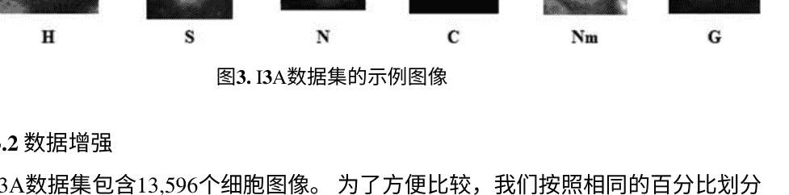

### 3.2 数据增强

I3A数据集包含13,596个细胞图像。为了方便比较，我们按照相同的百分比划分数据集，即64%用于训练，16%用于验证，20%用于测试，就像[11]中报告的那样。采用了一种类平衡的数据增强方案[25]来处理训练集。每个高尔基（**G**）图像旋转了59°，即每次旋转6°，这比其他细胞图案的图像旋转多三倍，即每次旋转18°。类平衡的数据增强方法解决了I3A数据集中细胞图像数量不平衡的问题。详细信息

表2. 增强训练数据集的详细信息

| | H | S | N | C | Nm | G | 总计 |
|---|---|---|---|---|---|---|---|
| I3A | 2,494 | 2,831 | 2,598 | 2,741 | 2,208 | 724 | 13,596 |
| 训练集 | 1,596 | 1,812 | 1,663 | 1,754 | 1,413 | 463 | 8,701 |
| 增强集 | 31,920 | 36,240 | 33,260 | 35,080 | 28,260 | 27,780 | 192,540 |

表3. 使用DRI模块的性能评估。(a) 使用DRI模块的MCA（%） (b) 使用辅助分类器的MCA（%）

| | MCA | | MCA |
|---|---|---|---|
| 浅层Inception | 96.54 | DRI_3 | 96.23 |
| SRI | 97.85 | DRI_{1+3} | 97.41 |
| Inception [16] | 97.93 | DRI_{2+3} | 96.23 |
| DRI | 98.37 | DRI_{1+2+3} | 98.37 |

增强的训练集列在表2中. 原始训练集从8,701张图像增强到192,540张图像.

### 3.3 性能分析

我们使用ICPR 2014竞赛采用的平均类别准确率（MCA）作为性能评估的标准[3]. 它衡量了每个类别准确率的平均值，如（3）所定义的.

```
$$MCA = \frac{1}{K}\sum_{k=1}^{K} CCR_k \tag{3}$$
```

其中CCR_k是类别k的正确分类率，K是类别的数量。

DRI模块。为了研究DRI模型和网络深度的影响，我们从DRI中开发了一个浅层残差Inception（SRI），通过移除DRI 1-2、DRI 2-3和DRI 3-2模块来实现。浅层Inception也是通过将SRI中的DRI模块替换为原始的Inception模块而开发的。表3(a)列出了浅层Inception、SRI和使用原始Inception/DRI模块的深度框架在测试集上的MCA评估结果。可以观察到，在相似的网络深度下，使用提出的DRI模块的框架，即SRI和DRI，优于使用原始Inception模块的框架，即浅层和深度Inception，说明DRI是一种比原始Inception更先进的网络架构。此外，更深的网络，即Inception和DRI，产生更好的结果，即97.93%和98.37%，而浅层网络，即浅层Inception（96.54%）和SRI（97.85%），表明网络深度使模型能够学习更好的HEp-2细胞分类特征表示。

辅助分类器。辅助分类器仅用作原始Inception中训练过程中的正则化器，以提高网络收敛性。在我们的实验中，通过辅助分类器分支提取的特征组合，即FC-1，FC-2，发现可以提高分类性能。表3(b)展示了不同分类器分支组合的准确率。通过添加FC1分支，MCA从96.23%提高到97.41%。由于FC2分支与FC3提取的特征相似，仅使用FC2和FC3无法提高分类准确率。然而，FC2分支可以作为修正器来纠正使用浅层分类器分支（即DRI1+3）的模型中出现的错误。使用所有分支的模型，即DRI1+2+3，实现了最高的MCA，达到98.37%。

### 3.4 比较

表4将我们的DRI与基准算法进行了比较，即VHAR方法[9]，基于特征包的模型[11]，Fisher向量模型[11]和Gao等人提出的CNN模型[11]。还测量了平均分类准确率（ACA）[11]进行评估。所有深度学习方法都优于使用手工特征的模型，即VHAR，BoF和FV。我们的DRI实现了最高的MCA，即98.37%，和ACA，即98.49%，比Gao等人提出的直接CNN模型高1.61%和1.25%。

| | VHAR [9] | BoF | FV | Gao等 [11] | SRI (我们的) | DRI (我们的) |
| :--- | :--- | :--- | :--- | :--- | :--- | :--- |
| **MCA** | 93.60 | 94.23 | 95.73 | 96.76 | 97.85 | **98.37** |
| **ACA** | - | 94.38 | 96.07 | 97.24 | 97.98 | **98.49** |

## 4 结论

本文提出了一种混合深度学习网络，名为Deep Residual Inception（DRI），结合了两种最先进的框架，即ResNet和Inception，用于HEp-2细胞图像分类。DRI模型为原始Inception模型添加了快捷连接，以实现更好的网络收敛性，并融合了从浅层，中层和深层分类器分支提取的特征，以提高分类性能。实验结果表明，与现有的HEp-2分类方法相比，我们的DRI提供了显著的改进。

## 参考文献

- 1. Foggia, P., Percannella, G., Soda, P., Vento, M.: 基准测试HEp-2细胞分类方法. IEEE Trans . Med. Imag. **32**, 1878–1889 (2013)
- 2. Hobson, P., Lovell, B.C., Percannella, G., Vento, M., Wiliem, A.: 在非常大的数据集上基准测试人类上皮细胞2期细胞分类方法. Artif. Intell.Med. **65**, 239–250 (2015)
- 3. Hobson, P., Lovell, B.C., Percannella, G., Saggese, A., Vento, M., Wiliem, A.: HEp-2染色模式识别在细胞和样本级别上的数据集、算法和结果。Pattern Recognit. Lett. 82, 12–22 (2016)
- 4. Nosaka, R., Fukui, K.: 使用局部二值模式的旋转不变共生矩阵在HEp-2细胞分类中的应用。Pattern Recognit. 47, 2428–2436 (2014)
- 5. Shen, L., Lin, J., Wu, S., Yu, S.: 使用基于强度排序池化的特征和词袋模型的HEp-2图像分类。Pattern Recognit. 47, 2419–2427 (2014)
- 6. Manivannan, S., Li, W., Akbar, S., Wang, R., Zhang, J., Mckenna, S.J.: 一种用于分类HEp-2细胞和样本的间接免疫荧光图像的自动化模式识别系统。Pattern Recognit. 51, 12–26 (2016)
- 7. Xu, X., Lin, F., Ng, C., Leong, K.P.: 自适应共现差异文本空间用于HEp-2细胞分类。在：Navab, N., Hornegger, J., Wells, W.M., Frangi, A.F. (eds.)MICCAI 2015. LNCS, vol. 9351, pp. 260–267. Springer, Cham (2015). doi:10.1007/978-3-319-24574-4_31
- 8. Taalimi, A., Ensafi, S., Qi, H., Lu, S., Kassim, A.A., Tan, C.L.: 多模态字典学习和联合稀疏表示用于HEp-2细胞分类。在：Navab, N., Hornegger, J., Wells, W.M., Frangi, A.F. (eds.) MICCAI 2015. LNCS, vol. 9351, pp. 308–315. Springer,Cham (2015). doi:10.1007/978-3-319-24574-4_37
- 9. Kastaniotis, D., Fotopoulou, F., Theodorakopoulos, I., Economou, G., Fotopoulos, S.: 使用层次聚合残差向量进行HEp-2细胞分类。Pattern Recognit. 65, 47–57 (2017)
- 10. Lecun, Y., Bengio, Y., Hinton, G.: 深度学习。Nature 521, 436–444 (2015)
- 11. Gao, Z., Wang, L., Zhou, L., Zhang, J.: 使用深度卷积神经网络进行HEp-2细胞图像分类。IEEE J. Biomed. Health Inform. 21(2), 416–428 (2016)
- 12. Simonyan, K., Zisserman, A.: 用于大规模图像识别的非常深的卷积网络。arXiv e-print arXiv:1409.1556 (2015)
- 13. Bayramoglu, N., Kannala, J., Heikkila, J.: 使用卷积神经网络对人类上皮细胞类型2进行分类. 在：BIBE，第1–6页（2015年）
- 14. Phan, H.T.H., Kumar, A., Kim, J., Feng, D.: 使用卷积神经网络进行HEp-2细胞图像分类的迁移学习. 在：ISBI，第1208–1211页（2016年）
- 15. He, K., Zhang, X., Ren, S., Sun, J.: 深度残差学习用于图像识别. 在：CVPR，第770–778页（2016年）
- 16. Szegedy, C., Liu, W., Jia, Y., Sermanet, P.: 使用卷积进行更深层次的学习. 在：CVPR，第1–9页（2015年）
- 17. Szegedy, C., Ioffe, S., Vanhoucke, V., Alemi, A.: Inception-v4, inception-ResNet和残差连接对学习的影响。arXiv e-print arXiv:1602.07261 (2016)
- 18. Hinton, G.E., Srivastava, N., Krizhevsky, A., Sutskever, I., Salakhutdinov, R.R.: 通过防止特征检测器的共适应来改进神经网络。arXiv e-print arXiv:1207.0580 (2012)
- 19. He, K., Zhang, X., Ren, S., Sun, J.: 深入研究整流器：在Imagenet分类上超越人类水平的性能。
- 20. Lecun, Y., Boser, B., Denker, J.S., Henderson, R.E., Howard, R.E., Hubbard, W., Jackel, L.D.:反向传播应用于手写邮政编码识别。神经计算。1, 541–551(1989)
- 21. He, K., Zhang, X., Ren, S., Sun, J.: 深度残差网络中的身份映射. 在：ECCV, pp. 630–645 (2016)
- 22. Ioffe, S., Szegedy, C.: 批归一化：通过减少内部协变量偏移加速深度网络训练. 在：ICML, pp. 448–456 (2015)
- 23. Zhao, L., Wang, J., Li, X., Tu, Z., Zeng, W.: 深度融合与集成的联系. arXiv电子打印版arXiv:1611.07718 (2016)
- 24. Jia, Y., Shelhamer, E., Donahue, J., Karayev, S., Long, J., Girshick, R., Guadarrama, S., Darrell, T.: Caffe: 用于快速特征嵌入的卷积架构. arXiv电子打印版 [arXiv:1408.5093](https://arxiv.org/abs/1408.5093) (2014)
- 25. 贾, X., 沈, L., 周, X., 于, S.: 基于深度卷积神经网络的HEp-2细胞分类. 在: ICPR竞赛和研讨会: 间接免疫荧光图像分析的模式识别技术 (2016)

# 在CT图像中联合分割多个胸部器官的两个协同深度架构

Roger Trullo$^{1,2(\text{\ LETTER\symbol{64}})}$, Caroline Petitjean$^{1}$, Dong Nie$^{2}$, Dinggang Shen$^{2}$, and Su Ruan$^{1}$

$^{1}$ 诺曼底大学，鲁昂大学，哈佛大学，鲁昂高级应用科学学院，LITIS，法国鲁昂76000
rogertrullo@gmail.com
$^{2}$ 放射学和BRIC部门，北卡罗来纳大学教堂山分校，教堂山，美国

摘要。计算机断层扫描（CT）是放射治疗计划的标准成像技术。在胸部CT图像中划定危险器官（OAR）是放射治疗前的必要步骤，以防止健康器官的辐射。然而，由于对比度低，多器官分割是一个挑战。在本文中，我们专注于开发一种新的框架来自动划定OAR。与以前的OAR分割工作不同，在那里每个器官都被单独分割，我们提出了两种协作的深度架构，以共同分割所有器官，包括食管，心脏，主动脉和气管。由于大多数器官边界不明确，我们认为必须考虑空间关系来克服对比度不足。结合两个网络的目的是在第一个网络中学习解剖约束，并在第二个网络中使用，依次分割每个OAR。具体而言，我们使用第一个深度架构，即深度SharpMask架构，以有效地结合低级表示和深层高级特征，然后通过条件随机场（CRF）考虑器官之间的空间关系。接下来，使用第二个深度架构来通过使用在第一个深度架构上获得的地图来学习解剖约束，以指导和改进分割。实验结果显示，在30个CT扫描中，与其他最先进的方法相比，性能更好。

关键词：解剖约束 · CT分割 · 全卷积网络（FCN） · CRF · CRFasRNN · 自动上下文模型

## 1 引言

在医学图像分割中，许多临床环境需要对多个对象或器官进行划分，例如心脏室、胸部或腹部器官。从方法论的角度来看，进行多器官分割的方法多种多样。

分割方法多种多样。例如，在基于块的多图谱方法中，已经证明对于腹部器官的分割是有效的[11]。许多其他方法结合了多种技术，例如在[4]中使用了阈值分割、广义霍夫变换和基于图谱配准的方法。

这些方法的性能受限于使用单独的方法，这些方法也可能计算成本高昂。通常，器官被单独分割，忽略它们之间的空间关系，尽管这些信息对分割过程可能很有价值。

本文重点研究胸部CT（图1）中OAR（器官风险）的分割，即主动脉、食道、气管和心脏的分割，这是放射治疗计划的重要前提，以防止对健康器官的辐射。通常情况下，划定边界主要是手动进行的，内部或者不同操作者之间的一致性很差。需要注意的是，食道的自动分割在研究中几乎没有得到解决，因为它异常具有挑战性：CT图像中的边界几乎是看不见的（图2）。放射治疗师根据强度信息和解剖学知识手动分割食道，即食道位于上部气管后方，下部心脏后方，并且在几个部位与主动脉相邻。

更一般地，这个观察也适用于其他器官。我们的目标是设计一个框架，能够自动学习这种约束条件，以改善所有OAR和食管的分割。

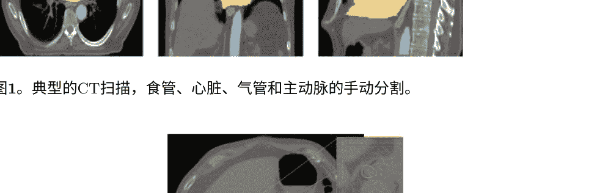

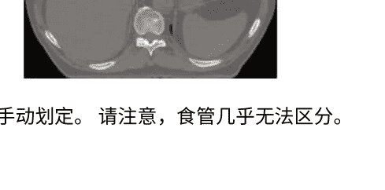

我们提出通过应用两个协同深度架构来解决OAR分割问题，这将隐式地学习每个器官的解剖约束，以减轻图像对比度不足所带来的困难。特别地，我们使用第一个深度Sharpmask网络进行初始分割，受到[8]中提出的细化框架的启发，该框架允许有效地结合低层特征和深层高级表示。为了强制器官之间的空间和强度关系，初始分割结果进一步通过CRFasRNN架构的条件随机场（CRF）进行改进。我们提出使用第二个深度架构，该架构被设计成能够利用所有器官的第一个深度架构获得的分割图，以学习当前正在改进其分割的一个器官的解剖约束。我们通过实验证明，我们的框架优于其他最先进的方法。请注意，我们的框架也足够通用，可以应用于其他多标签联合分割问题。

## 2 方法

### 2.1 SharpMask特征融合架构和CRF细化

第一个深度架构执行初始分割，其输出是每个体素属于背景、食管、心脏、主动脉或气管的概率图。为了减轻常规卷积神经网络（CNN）中使用池化操作导致的图像分辨率损失，全卷积网络（FCN）[5]和一些其他最近的作品，如U-Net[9]和Facebook的SharpMask（SM）[8]，使用了跳跃连接，优于许多传统架构。主要思想是从早期层到深层添加连接，可以看作是一种多尺度特征融合的形式，其中低层特征与深层的高语义表示相结合。

在这项工作中，我们使用了一种在胸部CT分割中表现出优越性的SM架构[12]。随后，使用CRFasRNN架构进行CRF细化，该架构使用可反向传播的操作来形成均值场近似[15]，使操作成为网络的一部分（而不是单独的后处理步骤），甚至可以学习其中的一些参数。因此，对第一步学习到的权重进行新的训练，以及学习CRF的一些参数[12]。在下面描述的第二个深度架构中，第一个深度架构对周围器官的分割初始结果将用于单独改进每个目标器官的分割。

### 2.2 学习解剖约束

第二种深度架构使用SharpMask进行训练，以在单独的细化下区分背景和每个目标器官。该架构有两组输入，即（1）原始CT图像和（2）目标器官周围邻近器官的初始分割结果，在分割的细化下与表示不同器官和背景的多个输出通道的第一种深度架构相比，第二种深度架构的主要区别在于最后一层只有两个输出通道，即表示每个体素属于背景或在分割的细化下属于目标器官的概率图。基本假设是第二种深度架构将学习目标器官在分割的细化下的解剖约束，并因此有助于产生更好的目标器官分割。在图3中，我们展示了包含第一种深度架构（顶部）和第二种深度架构的完整框架。

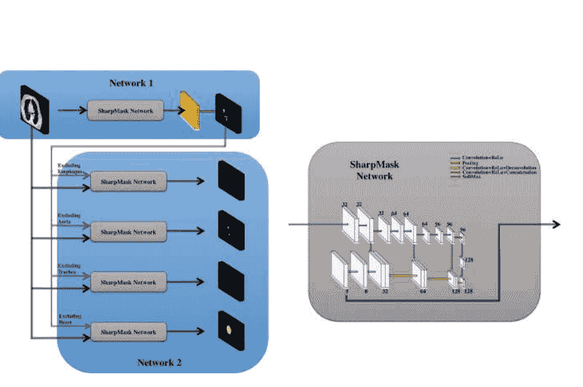

图3. 多器官分割的提出架构。核心锐化掩蔽网络在右侧详细说明。数字表示每个层的通道数。

请注意，我们的框架（使用两个深度架构）与称为自动上下文模型（ACM）[13]的细化步骤具有一些相似性，该模型已成功应用于脑图像分割[14]，通过使用传统的随机森林等分类器。ACM的主要思想是在标签上迭代地细化后验概率图，不仅给出输入特征，还给出大量上下文位置的先前概率，这些位置提供关于相邻器官的信息，迫使深度网络学习每个目标器官的空间约束[14]。在实践中，这意味着迭代地训练多个分类器，其中每个分类器不仅使用原始图像数据进行训练，还使用从先前分类器获得的概率图进行训练，这为新的分类器提供了额外的上下文信息。将我们提出的框架与ACM进行比较，我们使用了深度架构。总体而言，我们的方法有三个优点：（1）它可以避免设计手工特征的选择（1）我们的网络可以自动学习上下文特征的选择（2）我们的方法使用较少的冗余信息。注意在经典的ACM中，这些特征的选择必须是硬编码的；也就是说，算法设计师必须选择一定数量的稀疏位置（即使用来自中心点不同角度的稀疏点[13]），这使得上下文信息在算法设计师的某个范围内受限。另一方面，在我们的方法中，上下文信息可以由深度网络自动学习，并且仅受网络的感受野限制（在深度网络中甚至可以是整个图像范围）。关于冗余性，ACM使用所有器官的概率图作为输入，这通常与地面真值标签图非常相似。这样，ACM无法进一步改进结果。在我们的方法中，我们仅使用互补信息，即在分割改进下目标器官周围的邻近器官的标签概率图。

## 3 实验

在我们的实现中，CT扫描的完整切片是我们提出框架的输入。第一和第二架构都使用大的滤波器（即7×7或7×7×7），因为大的滤波器已经被证明对CT分割有益[2]。我们的研究中实现了2D和3D设置。我们发现，与MRI分割[7]不同，小的补丁无法产生良好的CT分割结果。因此，我们使用大小为160×160×48的补丁作为训练样本。具体而言，我们首先为所有训练CT图像中的每个器官构建一个3D网格模型，然后将每个顶点定义为具有对角协方差的某个高斯分布的均值，从中我们可以采样点作为相应补丁的中心。通过这种方式，训练样本将包含重要的边界信息和背景信息。特别是，对角线上的元素被选择为5，这样，在边界上居中时，使用的卷积核尺寸将包括它们。此外，对器官内部进行采样也很重要，因此我们还在均匀网格上进行采样。

### 3.1 数据集和预处理

本文使用的数据集包含30个CT扫描，每个扫描都有肺癌或霍奇金淋巴瘤，并进行了6折交叉验证。每个CT扫描都有四个OAR的手动分割结果，以及身体轮廓（在训练过程中可用于去除背景体素）。扫描的尺寸为512×512×(150～284)体素，分辨率为0.98×0.98×2.5 mm³。

对于每个CT扫描，其强度被归一化为零均值和单位方差，并通过一组随机仿射变换和随机变形场（使用B样条插值[6]生成）进行增强，以生成更多的CT样本（以提高训练的鲁棒性）。特别地，随机选择一个角度在－5到5°之间，并随机选择一个缩放因子在0.9到1.1之间。为了生成随机仿射变换，为每个CT扫描选择了这些值。这些值是根据经验选择的，试图生成与现有数据集中的CT扫描类似的逼真的CT扫描。

### 3.2 训练

对于CT图像中的器官分割，数据样本通常存在严重的不平衡，即背景体素多于目标器官体素。在训练中计算损失函数时需要考虑这一点。我们使用加权交叉熵损失函数，其中每个权重都被计算为每个类别的概率的补。通过这种方式，将更多的重要性赋予小器官，并且每个类别将更平等地对损失函数做出贡献。我们发现，这种损失函数比使用常规（等权重）损失函数效果更好。然而，结果仍然没有达到我们预期的水平。为了进一步改进，我们使用上述获得的权重作为网络的初始化，然后通过使用常规的交叉熵损失进行微调。这种新的综合策略总是优于加权或常规的交叉熵损失函数。在我们的优化中，使用随机梯度下降作为优化器，初始学习率为0.1，每20个epoch减小10倍，网络权重使用Xavier算法进行初始化。

### 3.3 结果

在图4中，我们展示了使用我们提出的具有学习的解剖约束的框架改进食管分割的结果。最后一列显示了使用第一个网络的输出作为解剖约束的结果。我们可以看到解剖约束如何帮助产生更准确的食管分割结果，即使在食管内部有空气（黑色体素）。有趣的是，使用第一个网络的输出或地面实况标签作为解剖约束得到的结果非常相似，几乎没有可忽略的差异。类似的结论也适用于其他器官的分割。在图5中，我们展示了主动脉、气管和心脏的分割结果，包括使用和不使用解剖约束的情况。在主动脉和气管的分割中，使用解剖约束可以提高分割的准确性。对于气管，我们的网络能够推广到分割右肺的整个部分（即图像的左侧），即使在手动实况标签中它只被部分分割。然而，对于心脏，使用解剖约束时会出现一些误报，如第三列所示。然而，我们得到了准确的轮廓，甚至比没有解剖约束时更好，如第四列所示。

在表1中，我们报告了使用每种比较方法获得的Dice系数（DR），包括一种最先进的基于3D多模板补丁的方法（称为OPAL（用于近实时和准确标签融合的优化PatchMatch [10]）以及使用2D或3D的不同深度架构变体作为不同策略的不同组合。具体而言，SM2D和SM3D分别指的是图3中使用2D或3D的网络1。我们还测试了它们与ACM和CRF的改进，最后，提出的框架被称为SM2D + 约束。由于OPAL主要比较用于引导分割的补丁，因此OPAL在分割明显可观察到的器官（如可识别的黑色区域气管）方面应该是有效的，这在表中也得到了证实。但是，对于对比度较低或切片和受试者之间强度变化较大的器官（如食道）来说，其性能受到严重影响，如表所示。SM2D为基础的架构获得了每个器官的最佳性能，而所有基于3D的架构都没有改善分割性能。这可能是由于CT扫描中的切片厚度较大，正如[1]中也注意到的那样，该论文的作者相比于3D卷积，我们更倾向于使用递归神经网络来处理第三维度。另一个观察结果是，ACM模型无法超越CRF细化方法。我们认为这主要是因为所使用的CRF是全连接的，而不是基于相邻区域的。后者被用作ACM的比较对象[13]，以证明该框架能够获得上下文范围信息的优势。另一方面，我们提出的框架能够提高除心脏外的所有器官的性能，心脏的定量结果与第一个网络非常相似，并且可以通过它很好地分割，但是通过利用大心脏尺寸和良好的图像对比度，我们提出的框架获得的轮廓质量更好，如图5所示。虽然食道仍有改进的空间（平均DR值为0.69），但实验结果表明，与其他方法相比，我们提出的框架确实带来了改进。

|          | OPAL        | SM3D        | SM3D + ACM  | SM2D        | SM2D + CRF  | SM2D + ACM  | SM + 约束   |
| :------- | :---------- | :---------- | :---------- | :---------- | :---------- | :---------- | :---------- |
| 食管     | 0.39 ± 0.05 | 0.55 ± 0.08 | 0.56 ± 0.05 | 0.66 ± 0.08 | 0.67 ± 0.04 | 0.67 ± 0.04 | **0.69 ± 0.05** |
| 心脏     | 0.62 ± 0.07 | 0.77 ± 0.05 | 0.83 ± 0.02 | 0.89 ± 0.02 | 0.90 ± 0.01 | **0.91 ± 0.01** | 0.90 ± 0.03 |
| 气管     | 0.80 ± 0.03 | 0.71 ± 0.06 | 0.82 ± 0.03 | 0.83 ± 0.06 | 0.82 ± 0.06 | 0.79 ± 0.06 | **0.87 ± 0.02** |
| 主动脉   | 0.49 ± 0.10 | 0.79 ± 0.06 | 0.77 ± 0.04 | 0.85 ± 0.06 | 0.86 ± 0.05 | 0.85 ± 0.06 | **0.89 ± 0.04** |

表1. 不同方法的平均DR ±标准差比较。最后一列表示我们提出的框架。

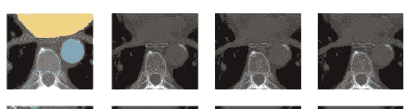

图4 食道分割结果. (a) 第二个网络的输入数据，叠加了解剖约束; 使用 (b) 仅第一个网络而没有解剖约束的结果, (c) 使用相邻器官的手动标签作为解剖约束的结果, (d) 使用第一个网络的输出作为解剖约束的结果

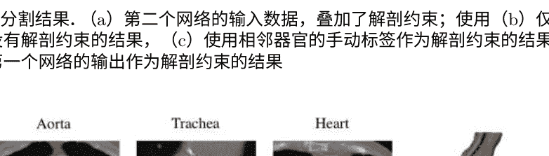

图5 没有解剖约束的分割（第一行）和有解剖约束的分割（第二行）绿色轮廓表示手动标准，红色轮廓表示我们的自动分割结果 右侧面板显示了我们分割的四个器官的3D渲染，即主动脉（蓝色），心脏（米色），气管（棕色）和食道（绿色）（在线彩图）

## 4 结论

我们提出了一种新的框架，用于CT图像中器官的联合分割。它提供了一种学习器官之间关系的方式，可以在分割细化过程中提供解剖上下文约束，以提高性能。我们提出的框架包括两个协作架构，都基于SharpMask网络，可以有效地结合低级特征和深度高语义表示。主要思想是通过使用第一个深度架构的所有器官（但是在分割细化过程中不包括目标器官）的初始分割，隐式学习第二个深度架构中的空间解剖约束。我们的实验表明，周围器官的初始分割可以有效地指导目标器官的分割细化。有趣的观察是，我们的网络能够自动学习空间约束，无需特定的手动指导。

致谢。本工作由欧洲联盟与欧洲区域发展基金（ERDF，HN0002137）以及诺曼底地区理事会通过M2NUM项目共同资助。

## 参考文献

1.  Chen, J., Yang, L., Zhang, Y., Alber, M., Chen, D.Z.: 结合全卷积和循环神经网络进行三维生物医学图像分割。在: NIPS, 3036-3044页 (2016年)
2.  Dou, Q., Chen, H., Jin, Y., Yu, L., Qin, J., Heng, P.: 3D深度监督网络用于CT体积的自动肝脏分割。 CoRR abs/1607.00582 (2016)
3.  Glorot, X., Bengio, Y.: 理解训练深度前馈神经网络的困难。在: AISTATS (2010年)
4.  韩, M., 马, J., 李, Y., 李, M., 宋, Y., 李, Q.: 头部、胸部、腹部和盆腔CT体积中的风险器官分割。 在: SPIE会议录, 第9413卷 (2015年)。编号: 94133J-6
5.  Long, J., Shelhamer, E., Darrell, T.: 用于语义分割的全卷积网络。在: CVPR (2015年)
6.  Milletari, F., Navab, N., Ahmadi, S.: 用于体积医学图像分割的全卷积神经网络。 CoRR abs/1606.04797 (2016年)
7.  Nie, D., Wang, L., Gao, Y., S hen, D.: 用于多模态等强度婴儿脑图像分割的全卷积网络。在: ISBI, 第1342-1345页 (2016年)
8.  Pinheiro, P.H.O., Lin, T., Collobert, R., Dollár, P.: 学习细化目标分割。 CoRR abs/1603.08695 (2016)
9.  Ronneberger, O., Fischer, P., Brox, T.: U-Net: 生物医学图像分割的卷积网络。 In: N avab, N., Hornegger, J., Wells, W.M., Frangi, A.F.(eds.) MICCAI 2015. LNCS, vol. 9351, pp. 234–241. Springer, Cham (2015). doi:10. 1007/978-3-319-24574-4_28
10. Ta, V.-T., Giraud, R., Collins, D.L., Coupé, P.: 优化的PatchMatch用于近实时和准确的标签融合。 In: Golland, P., Hata, N., Barillot, C., Hornegger,J., Howe, R. (eds. ) MICCAI 2014. LNCS, vol. 8675, pp. 105–112. Springer, Cham(2014). doi:10.1007/ 978-3-319-10443-0_14
11. Tong, T., 等: 腹部多器官分割的判别式字典学习。医学图像分析 23, 92–104 (2015)
12. Trullo, R., Petitjean, C., Ruan, S., Dubray, B., Nie, D., Shen, D.: 使用锐化掩膜架构和条件随机场在胸部CT图像中分割风险器官。ISBI (2017)
13. Tu, Z., Bai, X.: 自动上下文及其在高级视觉任务和3D脑图像分割中的应用。IEEE T rans. Pattern Anal. Mach. Intel. 32(10),1744–1757 (2010)
14. Wang, L., 等: Links: 基于学习的多源集成框架用于婴儿脑图像分割。NeuroImage 108, 160–172 (2015)
15. Zheng, S., 等: 条件随机场作为循环神经网络。ICCV (2015)

# 通过对抗神经网络加速磁共振成像

Ohad Shitrit (✉) 和Tammy Riklin Raviv
以色列贝尔谢巴内盖夫本古里安大学神经科学中心电气工程系 shohad25@gmail.com, rrtammy@bgu.ac.il

摘要。 磁共振成像（MRI）在临床应用中的一个主要挑战是加快扫描时间。除了改善患者体验和降低运营成本外，更快的扫描对于时间敏感的成像至关重要，其中目标运动是不可避免的，但必须显著减少，例如胎儿MRI、心脏影像和肺部成像。此外，短暂的扫描时间可以提高动态扫描的时间分辨率，例如功能性MRI或动态对比增强MRI。当前的成像方法通过降低空间分辨率和昂贵的硬件解决方案来促进MRI采集。我们引入了一个基于深度学习的实用软件框架，用于加速MRI扫描时间，同时保持良好的图像质量。这是通过部分MRI采样实现的，同时使用对抗神经网络来估计缺失的样本。生成器和判别器网络之间的相互作用使得除了用于优化峰值信噪比（PSNR）的保真度损失外，还引入了对抗成本。在仅使用原始数据的52%的情况下，获得了令人满意的图像重建结果。

## 1 引言

磁共振成像（MRI）是一种非电离辐射成像技术，因此在诊断医学和生物医学研究中被广泛使用。MRI的物理原理基于强磁场和射频（RF）电磁辐射的脉冲。当生物体中普遍存在的氢原子发射吸收的射频能量时，就会产生图像，这些图像由靠近解剖结构的天线接收。通过改变磁场梯度来实现对检测到的MRI信号的空间定位。离散化的射频输出以傅里叶空间（称为K空间）的形式呈现，其中x轴表示频率，y轴表示相位。然后对K空间进行逆快速傅里叶变换（IFFT）用于生成解剖学上有意义的MRI扫描。图1展示了传统成像中使用的K-空间遍历模式。每一行的k空间是在一个RF激发脉冲之后获取的。行数乘以切片数（z轴）决定了总的扫描时间。标准单一结构性MRI采集的持续时间约为5分钟。通常，会采集几种不同模态的扫描或者一系列扫描，以使整体扫描时间更长。冗长的成像过程降低了患者的舒适度，并且更容易产生运动伪影。在不可避免出现运动的情况下，例如胎儿MRI、心脏影像和肺部影像，必须显著缩短扫描时间，否则产生的图像可能是无用的。此外，在动态MRI序列中，采集必须简短，以使序列的时间分辨率能够捕捉到显著的时间变化，例如DCE-MRI中对比增强物质浓度的瞬时增加或fMRI中表达的血液动力学响应差异[10]。通过采样较少的切片，从而降低z轴的空间分辨率，可以直接减少扫描时间。胎儿MRI或fMRI相邻切片之间的空间距离通常高达0.5厘米。因此，大部分潜在的输入信息无法通过成像传达。另一方面，在x-y域中进行欠采样会导致混叠，这符合奈奎斯特采样定理的预测。许多研究团队以及领先的MRI扫描仪制造商都在加速MRI采集过程方面做出了重大努力。硬件解决方案通过使用多个线圈[17]对k空间数据进行采样，实现并行成像。目前在商业MRI设备中实施的两种主要方法[3]。两种方法都是从每个线圈提供的欠采样k空间数据中重建图像。敏感度编码器（SENSE）将部分k空间转换为图像，然后将得到的混叠图像合并为一幅连贯的图像[14]。广义自校准部分并行采集（GRAPPA）技术[7]在复频域内对信号数据进行操作，然后进行逆傅里叶变换。压缩感知（CS）技术[4]允许以比奈奎斯特-香农采样定理要求更少的样本对信号进行高效采集和重建，前提是信号在已知变换域中具有稀疏表示。在[9]中提出了使用CS进行MRI重建的方法，通过对k空间网格的子集进行采样。基本假设是采样是随机的，使得零填充傅里叶重建呈现出类似于加性随机噪声的不相干伪影。然而，这需要指定的脉冲编程。最近，基于流形学习[1,18]和字典学习[2,16]的机器学习技术被提出用于MRI重建。在[19]中引入了使用卷积神经网络（CNN）进行MRI重建的方法。该网络学习了零填充和完全采样MR图像之间的映射关系。在[12]中，提出了用于MRI超分辨率的残差网络。他们的模型能够接收从不同视角获取的多个输入。

更好的图像重建。这两项工作都解决了图像领域中的重建问题，而不是k空间领域。所提出的框架利用了深度学习的最新进展，与CS方法类似，直接从k空间进行MRI重建。具体来说，我们使用生成对抗网络（GAN）[6,13,15]。GAN基于两个网络之间的相互作用：生成器和判别器。生成器能够学习数据库上的分布，并对该分布进行样本生成。判别器被训练用于区分“生成”的样本和真实样本。这种强大的组合已被用于从MRI生成类似于计算机断层扫描（CT）的图像[11]。在这里，生成器用于从欠采样数据中重建整个k空间网格。它的损失是基于判别器输出的对抗损失和与完全采样的MRI的保真度损失的组合。仅使用52%的数据对脑部MRI重建取得了有希望的结果。

本文的组织结构如下。第2节介绍了一些理论基础和我们的方法。第3节描述了实验结果。结论和未来方向在第4节中描述。

## 2 方法

### 2.1 K空间

让 u 表示所需的信号，即2D MR图像，通过I_{FF}T得到的复杂K空间信号 s_0。让 M_F 表示一个完全采样掩模，使得重建的MR图像为：

```
u = F^H M_F \odot s_0 \quad (1)
```

其中 H 是共轭转置操作，⊙表示逐元素乘法，F^H 是一个正交的2D IFFT操作符，使得 F^H F = I。在采样部分K空间时，使用 M_D 作为采样掩模，重建的MR图像会出现伪影和混叠。图1展示了欠采样（52%）伪影的一个例子。

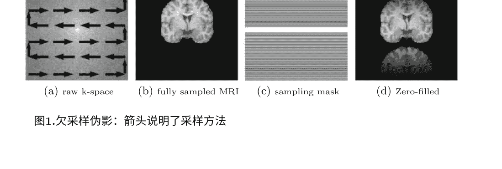

### 2.2 目标

令 s_p = M_p ⊙ s_0 表示欠采样的k空间。给定一个采样掩模和一个模型 f，由参数集 Θ定义，我们的目标是估计缺失的k空间样本，使得：

```
Θ = arg min_Θ L(F^H f(s_p; Θ), u)
```

其中 L(·)是损失函数。对于自然图像来说，选择L2范数作为损失是合理的，但对于具有不同空间特征的k空间来说，可能不够。正如[13]中所提到的，L2最小化会得到模糊的解。在k空间域中平均高频细节会导致重建效果非常差。为了解决这个问题，我们使用了基于GAN的对抗损失。

我们使用对抗策略训练了我们的模型，如[6,15]所述。这种方法基于一个生成器G，它以均匀分布的噪声z作为输入，并从数据分布中生成样本。一个判别器D被训练来区分数据中的“真实”示例和生成的“假”示例。在训练过程中，我们优化G以最大化判别器的错误概率。同时，D变得更好并提供更准确的预测。

让s_0表示来自分布p_{t_r}的“真实”k空间样本。以下优化过程可以描述为两个玩家的极小极大博弈：

```
min_G max_D E_{s_0∼p_{t_r}} log [D(s_0)] + E_{z∼p_u(z)} log [1 - D(G(z))]
```

在平衡状态下，生成器G能够生成看起来像真实数据的样本。在我们的情况下，G通过对采样数据和服从分布p_u(z)的均匀噪声的线性组合来估计缺失的k空间样本。在生成器的副损失中添加了一个L2保真度约束，如下所示：

```
L_G = α · E_{z∼p_u(z)} log [1 - D(F^{-1}(Ŝ_0))] + β · ||(1 - M_p) ⊙ (Ŝ_0 - s_0)||_2^2
```

其中 Ŝ_0 是估计的k空间，α=1, β=0.8是通过交叉验证过程调整的超参数。鉴别器的输入是重建的MR图像，即IFFT后的图像。通过这样做，我们将重建阶段整合到我们的优化中。

### 2.3 网络架构

生成器的输入是一个表示部分采样k空间图像的实部和虚部的双通道图像，s_p。每个缺失的样本都由均匀独立同分布的噪声初始化。生成器输入图像中的像素(i, j)是：

```
G_{in}(i, j) = s_p(i, j) + (1 - M_p(i, j)) z_{i,j}
```

由于对抗性损失和保真度损失的结合，\(G\)从给定的样本和噪声分布\(p_u(z)\)产生合理的k空间样本。为了使用采样数据，\(s_p\)，并仅估计缺失的样本，我们使用了一个残差网络[8]，如[12]中所用的那样：

\(s^{\wedge}_0 = s_{pt} + (1-M_{pt})G_{out}\)

其中\(G_{out}\)是生成器的输出。图2描述了我们的框架：

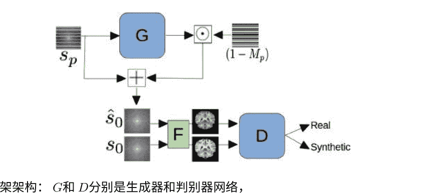

判别器使用了一个常见的架构，由卷积层、批量归一化和泄漏ReLU组成，如[15]所建议的。对于生成器，我们根据多通道输入构建了一个专用架构，用于表示实部和虚部。两个架构如图3所示。训练方法是对于每个判别器单步，进行\(k_g\)生成器更新步骤。

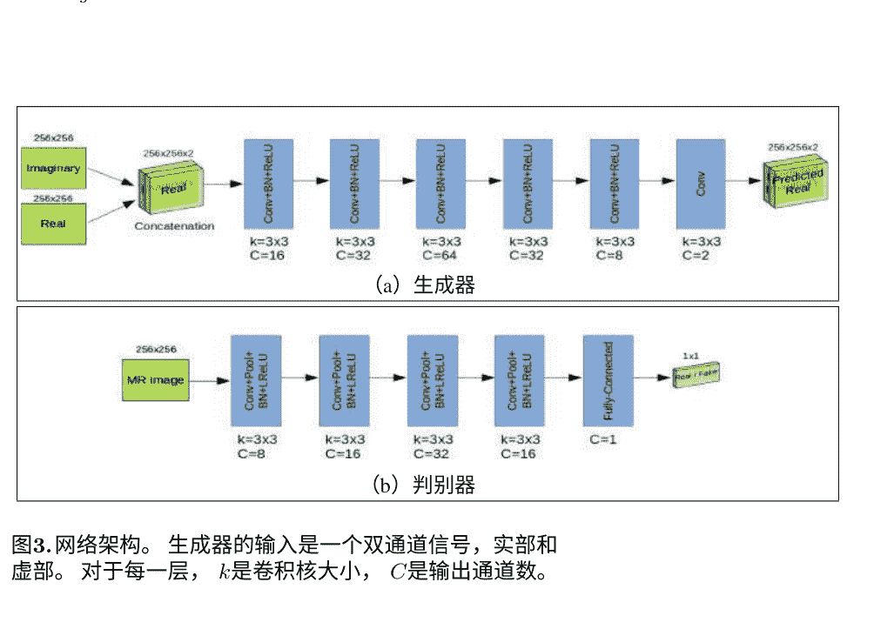

## 3 实验结果

训练数据包括55个3D脑部MRI（T1）扫描，来自不同患者，采用256 ×256像素分辨率的1.5T MR机器。 我们使用3k2D切片进行训练，1.2k进行测试。 为了创建训练的k空间图像，对完全采样的MR图像应用反正交2D FFT。 我们沿着相位轴使用笛卡尔方式对k空间图像进行采样。

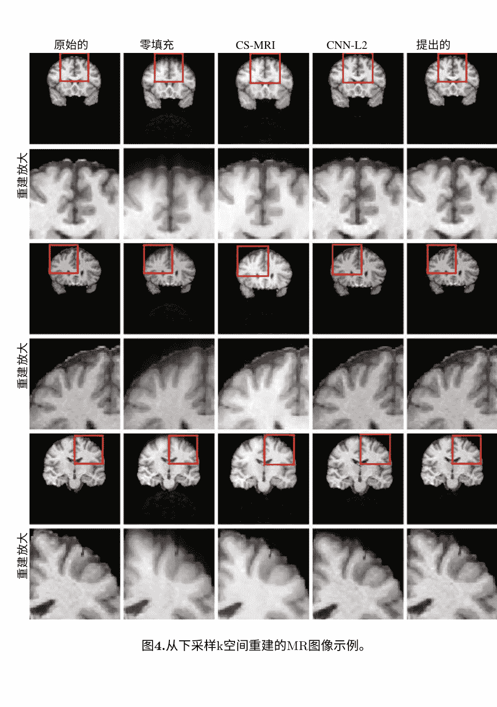

二进制掩模，同时保留中心相位的5%，即包含能量的95%区域（见图1）。数据增强通过随机偏移提出的掩模和图像翻转来创建。这使我们能够从原始k空间数据的仅52%进行MR图像重建。

生成器由5个CONV-BatchNorm-ReLU块组成，输出通道分别为16, 32, 64, 32, 8。最后一层是具有两个输出通道（实部和虚部）的CONV层。鉴别器由4个CONV-Pool-BatchNorm-LReLU块和一个全连接层组成，输出通道分别为8, 16, 32, 16。所有CONV层的卷积核大小为3×3。所有权值都使用Xavier [5]进行初始化。我们使用固定学习率为0.0005的Adam求解器，并将k_g设置为20。

我们将提出的方法与使用传统压缩感知方法CS-MRI [9]和零填充得到的重建结果进行比较。此外，我们还使用仅L2损失（CNN-L2）训练了一个生成器（G）。所有情况下都使用相同的采样掩模。图4显示了视觉比较。使用建议的对抗损失重建的MRI具有更强的对比度，没有明显的混叠或伪影。表1中给出了使用PSNR值进行的定量评估。值得注意的是，所提出的方法优于其他方法。

表1. PSNR误差

| PSNR | 平均值 | 标准差 |
| --- | --- | --- |
| 零填充 | 30.48 | 0.13 |
| CS-MRI | 36.78 | 0.4 |
| CNN-L2 | 37.12 | 0.82 |
| 提出的 | 37.95 | 0.6 |

## 4 结论

我们提出了一个仅基于软件的框架，使用GAN加速MRI采集。具体而言，仅使用原始k空间数据的52%进行高质量的MRI重建。关键思想是除了L2损失外还利用对抗损失。值得一提的是，所提出的采样掩模目前已在商用MRI机器中实现，无需额外的硬件或专用脉冲编程。未来的工作将集中在存在病理情况下生成MRI。

致谢。这项研究得到以色列科学基金会（T.R.R. 1638/16）和以色列国防军医疗部（T.R.R.）的部分支持。

## 参考文献

- 1. Bhatia, K.K., Caballero, J., Price, A.N., Sun, Y., Hajnal, J.V., Rueckert, D.: 使用流形核回归快速重建加速动态MRI。 在：Navab, N., Hornegger, J., Wells, W.M., Frangi, A.F. (eds.) MICCAI 2015. LNCS,vol. 9351, pp. 510–518. Springer, Cham (2015). doi:10.1007/978-3-319-24574-4 6
- 2. Caballero, J., Price, A.N., Rueckert, D., Hajnal, J.V.: 使用字典学习和时间稀疏性进行动态MR数据重建。IEEE Trans. Med. Imaging 33(4),979–994 (2014)
- 3. Deshmanc, A., Gulani, V., Griswold, M.A., Seiberlich, N.: 并行磁共振成像。 J. Magn. Reson. Imaging 36(1), 55–72 (2012)
- 4. Donoho, D.L.: 压缩感知。 IEEE Trans. Inf. Theory 52(4), 1289–1306 (2006)
- 5. Glorot, X., Bengio, Y.: 理解训练深度前馈神经网络的困难。 在：AISTATS, vol. 9, pp. 249–256 (2010)
- 6. Goodfellow, I., Pouget-Abadie, J., Mirza, M., Xu, B., Warde-Farley, D., Ozair, S., Courville, A., Bengio, Y.: 生成对抗网络。 在：Advances in Neural Information Processing Systems, pp. 2672–2680 (2014)
- 7. Griswold, M.A., Jakob, P.M., Heidemann, R.M., Nittka, M., Jellus, V., Wang, J., Kiefer, B., Haase, A.: 广义自动校准部分并行采集（GRAPPA）。磁共振医学。 47(6), 1202–1210 (2002年)
- 8. He, K., Zhang, X., Ren, S., Sun, J.: 深度残差学习用于图像识别。 在：计算机视觉与模式识别IEEE会议论文集，pp. 770-778 (2016年)
- 9. Lustig, M., Donoho, D., Pauly, J.M.: 稀疏MRI：压缩感知在快速MR成像中的应用。磁共振医学。 58(6), 1182-1195 (2007年)
- 10. Moeller, S., Yacoub, E., Olman, C.A., Auerbach, E., Strupp, J., Harel, N., U`gurbil,K.: 7特斯拉的多带多层GE-EPI，使用部分并行成像实现16倍加速，应用于高空间和时间全脑fMRI。 Magn. Reson. Med. 63(5), 1144–1153 (2010)
- 11. Nie, D., Trullo, R., Petitjean, C., Ruan, S., Shen, D.: 基于上下文感知生成对抗网络的医学图像合成。arXiv预印本 arXiv:1612.05362(2016)
- 12. Oktay, O., et al.: 使用卷积神经网络进行多输入心脏图像超分辨率。In: Ourselin, S., Joskowicz, L., Sabuncu, M.R., Unal, G., Wells,W. (eds.) MICCAI 2016. LNCS, vol. 9902, pp. 246–254. Springer, Cham (2016). doi:10.1007/978-3-319-46726-9 29
- 13. Pathak, D., Krahenbuhl, P., Donahue, J., Darrell, T., Efros, A.A.: 上下文编码器：通过修复进行特征学习。In: Proceedings of the IEEE Conference on Computer Vision and Pattern Recognition, pp. 2536–2544 (2016)
- 14. Pruessmann, K.P., Weiger, M., Scheidegger, M.B., Boesiger, P., et al.: Sense: 快速MRI的敏感度编码。Magn. Reson. Med. 42(5), 952–962 (1999)
- 15. Radford, A., Metz, L., Chintala, S.: 无监督表示学习与深度卷积生成对抗网络。arXiv预印本 arXiv:1511.06434(2015)
- 16. Ravishankar, S., Bresler, Y.: 通过字典学习从高度欠采样的k空间数据中重建MR图像。IEEE Trans. Med. Imaging 30(5), 1028–1041(2011)
- 17. Roemer, P.B., Edelstein, W.A., Hayes, C.E., Souza, S.P., Mueller, O.: NMR相位阵列。磁共振医学 16(2), 192–225 (1990)
- 18. Usman, M., Vaillant, G., Atkinson, D., Schaeffer, T., Prieto, C.: 压缩流形学习：直接从欠采样的k空间数据中估计一维呼吸运动。磁共振医学 **72**(4), 1130–1140 (2014)
- 19. Wang, S., Su, Z., Ying, L., Peng, X., Zhu, S., Liang, F., Feng, D., Liang, D:通过深度学习加速磁共振成像。 在：2016年IEEE第13届生物医学成像国际研讨会（ISBI），第514-517页。IEEE (2016)

# 使用完全卷积网络在CT体积中进行左心房分割

刘洪辉，冯建江 (✉)，冯子顺，陆继文，周杰

清华大学自动化系，中国北京
liuhh15@mails.tsinghua.edu.cn, jfeng@tsinghua.edu.cn

摘要。左心房（LA）的自动分割是心房颤动诊断和计算机辅助消融手术支持系统的基本任务。本文提出了一种使用完全卷积神经网络（FCN）自动分割3D CT体积中左心房的方法。我们训练FCN自动分割左心房，然后使用基于ASM的方法对FCN的分割结果进行细化，以获得左心室的知识。所提出的FCN模型是在STACOM’13 CT数据集上训练的。结果表明，基于FCN的左心房分割在计算时间低于35秒的情况下，达到了超过93%的Dice系数得分，尽管左心房存在较大的变异性。

## 1 引言

在最常见和危险的心血管疾病中，心房颤动（AF）通常以异常快速和不规则的心律为特征。近年来，对于AF的外科治疗，通常是消融手术（AP），逐渐成为主流[9]。AP是微创的，这是一些患者的主要考虑因素。计算机辅助的心房检测和精确分割可以帮助医生获得宝贵的术前信息。

计算机断层扫描（CT）已广泛用于心血管疾病的诊断和治疗。然而，从CT数据中自动分割左心房仍然是一项非常困难的任务。由于左心房的形状变化比其他器官更大，尤其是四个肺静脉（PV）和左心房附属物（LAA）。一些现有方法已经取得了良好的结果，但训练成本很高[13]。

在本文中，我们提出了一个基于传统CT的全自动左心房分割系统。基于最先进的全卷积网络（FCN）和统计形状模型，所提出的方法高效、稳健，并能够在小训练数据集上获得良好的结果。

## 2 相关工作

图像分割是医学图像分析中的基本任务。由于许多影响因素，如噪声、病理学、遮挡和物体形状复杂性，产生准确的分割是困难的。一些半自动化或自动化的已经应用了一些算法来解决LA分割问题。Daoudi等人[3]提出了一种基于主动轮廓、区域生长和蛇的算法。这种经典方法简单快速，但对图像质量敏感。Sandoval等人[6]提出了一种基于多模板的算法。多模板具有鲁棒性和充分利用先验解剖信息的显著优势。多模板的主要缺点是计算成本高。即使应用了GPU并行加速策略，对于3D体积的图像配准仍然非常耗时。Zuluaga等人[15]提出了另一种基于多模板传播的分割方法。如今，统计形状模型在图像分割中被广泛使用。Zheng等人[14]提出了一种基于多部分形状模型和边缘空间学习的算法，将LA分为六个部分：LA主体、LAA和四个PVS。该算法高效且对图像质量鲁棒。然而，需要大量手动标记的数据集。

对于医学图像应用来说，这个限制直到现在都不能被忽视。此外，与LA体相比，LAA具有更大的解剖变异，因此使用强形状先验的方法不适用[5]。

我们的工作借鉴了深度神经网络的最新进展[12]。图像分割可以看作是像素级别的分类任务。近年来，卷积神经网络（CNN）在图像分类问题上取得了成功。因此，利用粗糙但高度抽象的隐藏层输出是有益的。

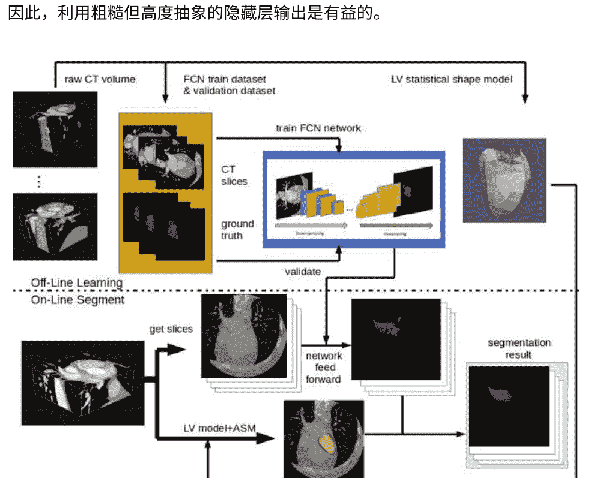

像素级别的分类也可以用CNN来解决[10]。对于分割任务，目标是一个与输入大小相同的密集标签图。具体来说，为了实现这种粗糙到精细的处理，我们可以在CNN上添加上采样层和反卷积层，然后得到所谓的全卷积网络（FCN）。由于其学习局部和全局信息的强大能力，FCN在图像分割方面取得了巨大进展。

在这项工作中，我们提出了一种用于3D CT的自动LA分割方法。我们将深度神经网络架构从自然场景转移到医学任务中，因此可以期望良好的泛化能力。此外，为了实现强大的可变形能力和形状约束，我们结合了FCN和统计形状模型，从而提高了准确性同时保持了效率。

在接下来的章节中，我们将展示我们提出的流程，包括预处理（第3.1节），FCN（第3.2节）和基于形状模型的后处理（第3.3节），报告实验（第4节），并总结本文（第5节）。

## 3 方法

我们使用一个呈现沙漏形状的架构，并使用像素交叉联合度指标进行标准像素逻辑损失的验证。我们的网络包括12个堆叠的卷积层，每个卷积层后面跟随一个最大池化层和ReLU激活层。在CNN架构的顶部添加了两个反卷积层。

使用小训练数据集训练FCN一直是一个棘手的问题。为了解决这个问题，我们采取了两个措施。首先，我们在一个大数据集[4]上进行了网络的预训练，并进行了监督。接下来，我们对我们的医学数据集进行了微调。我们选择了来自原始体积数据的不同轴上的切片。因此，一个包含1000多个切片的丰富的训练数据集可以满足网络训练的需求。这种处理可能会不可避免地丢失一些3D结构信息。然而，通过从3D角度进行后处理，可以将这种丢失的3D信息最小化。图1展示了我们提出方法的步骤。

### 3.1 预处理

我们的预处理包括两个方面。首先，使用直方图均衡化增加图像对比度。接下来，我们将灰度图像转换为伪彩色图像。利用三个颜色通道，可以提高网络训练的效果。

### 3.2 全卷积网络

我们将3D原始CT体积表示为 I。对于我们的两类问题，可能的标签集合为 L = {0,1}。前景LA体素标记为标签1而其他背景体素标记为0。对于每个体素 \(v\)，我们定义一个变量 \(y_v \in L\)表示分配的标签。给定图像 \(I\)，FCN计算将标签 \(k\)分配给体素 \(v\)的概率，描述为 \(P(y_v = k|I)\)。

训练过程中的第一步，我们训练了FCN-32s网络。FCN-32s网络给出了粗糙的分割结果，通过卷积和池化层传递时，输入的大部分局部信息被丢弃。因此，我们添加了从较低层到最终层的连接，整个网络变成了一个有向无环图（DAG）。与简单的线性网络相比，DAG-风格的网络将全局结构与局部信息相结合，因此结果变得更加复杂。

通过组合倒数第二个和倒数第三个池化层，依次生成了FCN-16s和FCN-8s结构。

我们的数据集包括1200个切片，这些切片来自10个CT体积。这些切片被分为两部分：1000个切片作为训练集，另外200个作为验证集。

由于FCN是在切片上训练的，因此不可避免地丢失了一些三维结构信息，无法保证最终的三维模型的连续性和平滑性。一些微小的组织被错误地分类为前景。因此，我们从FCN分割结果中提取最大连通组件，并对最大连通组件应用孔填充算法。通过这样做，大多数误报可以被排除，从而使分割结果变得平滑和完整。

### 3.3 形状约束

LA分割任务的难题是确定LA和LV的模糊边界。这两个腔室在结构上相连，并且对于某些图像可能具有相似的灰度（见图2(a)）。因此，许多机器学习方法[8]在确定LA和LV的边界上存在缺陷，包括FCN方法。这些方法主要关注LA分割，而忽视了LV。

一些先前的工作[1]采用3D CRF作为后处理来改善分割结果。Dense CRF主要关注先验和后验分布像素类别的分布，而不是全局形状约束。此外，CRF方法在离线学习和在线测试中都需要耗费时间。对于模糊边界问题，带有约束的形状模型被证明更加稳健[13]。与LA壁相比，LV心外膜更厚，LV和LA的明显可见的后缘是平坦的。我们使用主动形状模型（ASM）方法建立了一个统计形状模型来分割LV心外膜[2]。LV的顶部被视为这两个腔室的边界。

因此，这两个腔室可以清晰地区分开（见图2）。

表1. 三个评估指标对LA分割性能的比较。方法的缩写来自于[13]。

| 方法 | DC | 时间 (秒) | 训练数据集大小 |
| :--- | :--- | :--- | :--- |
| BECHAR [3] | 0.66 | 900 | 10 |
| INRIA [8] | 0.82 | 1500 | 10 |
| LTSLVRG [6] | 0.88 | 4700 | 10 |
| SIE_PMB [14] | 0.94 | 3 | 457 |
| UCL_1C [15] | 0.93 | 4200 | 30 |
| 提出的 | **0.93** | **32** | **30** |

## 4 实验

我们在STACOM'13研讨会上进行的左心房分割挑战（LASC）的基准CT数据集上训练了网络[13]。提供了十个CT体积的专家手动分割结果，其他二十个体积用于算法评估。对于统计形状模型方法，我们从使用Philips Brilliance iCT256扫描仪进行CTA检查的患者中随机选择了其他二十个体积。整个数据集中的体积包含210到455个切片，每个切片的大小为512 ×512像素。每个切片内的分辨率是等距的，但对于不同的体积，分辨率在0.314毫米和0.508毫米之间变化，切片厚度在0.450毫米和0.510毫米之间变化。

对于训练过程，FCN-32s，16s和8s的平均验证像素准确率分别为86%，92%和95%。总体而言，32s网络给出粗糙的结果，误报率非常低。此外，16s网络提供更高的准确性，但误报率也很高。此外，8s网络的结果明显优于其他网络。

测试数据集包括20个体积。我们选择Dice系数作为评估标准，其定义如下：

$$DC = \frac{2|V_{GT} \cap V_{SEG}|}{|V_{GT}| + |V_{SEG}|},$$

其中，我们用 $V_{GT}$ 表示地面真值体积掩模，用 $V_{SEG}$ 表示分割结果掩模。

表1显示了一些不同方法的结果。分割准确性是算法评估的主要考虑因素，而另外两个方面则影响了其适用性。

作为比较实验，我们选择了密集的3D CRF [7]作为后处理方法，结果表明基于ASM的左心室分割提供了更简单但更稳健的左心房/左心室边界。对于另一个比较实验，我们建立了左心房统计形状模型，并对左心房和左心室都应用了ASM方法，以比较FCN和ASM方法在左心房分割中的效果。表2显示了这些比较实验的结果。

例如，图3展示了CT体积B002、B007和B013的分割结果。图3(b)、(e)、(h)比较了结果和真实值。

STACOM'13挑战在评估每种方法时忽略了左心房附属器（LAA）。然而，房颤通常导致左心房附属器排空受阻、血液滞留并引发血栓形成[11]。我们方法的另一个优点，也没有在表1中反映出来，是它能够准确地分割左心房附属器（见图4），这对基于ASM的方法来说很困难。

| 方法 | DC | 时间（秒） | 训练数据集大小 |
| :--- | :--- | :--- | :--- |
| FCN + CRF [7] | 0.87 | 120 | 30 |
| LA ASM + LV ASM | 0.85 | 15 | 30 |
| FCN + LV ASM (提出的方法) | 0.93 | 32 | 30 |

## 5 结论

本文提出了一种基于完全卷积网络的自动化左心房分割方法，并采用统计形状模型来弥补约束的不足。实验证明，我们提出的方法在仅使用少量训练集的情况下与最先进的方法相当。此外，我们初步尝试将神经网络与统计形状模型相结合。

提出的方法可以从多个角度进行改进。为了可靠性和简单性，我们更喜欢在FCN模型本身中学习LA/LV模糊边界。神经网络和形状模型各自具有优势，下一步我们将尝试将两者更好地统一到同一框架中。随着数据集的增加，预计未来FCN模型的训练效果会更好。

致谢。本工作得到中国国家自然科学基金（Grant 61622207、61373074、61225008和61572271）的支持。

## 参考文献

- 1. Christ, P.F., Elshaer, M.E.A., 等: 使用级联全卷积神经网络和3D条件随机场在CT中自动分割肝脏和病变。 在: 国际医学图像计算与计算机辅助干预会议论文集, 第41 5-423页 (2016年)
- 2. Cootes, T.F., Taylor, C.J., Cooper, D.H., Graham, J.: 主动形状模型的训练和应用。 计算机视觉与图像理解 **61**(1), 38-59页 (1995年)
- 3. Daoudi, A., Mahmoudi, S., Chikh, M.A.: CT图像上左心房的自动分割。 在: 统计心脏图谱和计算模型国际研讨会论文集, 第14-23页 (2013年)
- 4. Everingham, M., Eslami, S.M.A., Gool, L.V., Williams, C.K.I., Winn, J., Zisserman, A.: PASCAL视觉对象类别挑战赛: 回顾。 国际计算机视觉杂志 **111**(1), 98-136 (2015)
- 5. Heimann, T., Meinzer, H.: 三维医学图像分割的统计形状模型: 综述。 医学图像分析 **13**(4), 543-563 (2009)
- 6. Iglesias, J.E., Sabuncu, M.R.: 生物医学图像的多图谱分割: 综述。 医学图像分析 **24**(1), 205-219 (2015)
- 7. Koltun, V.: 具有高斯边缘潜力的全连接CRF的高效推断。 神经信息处理系统进展 **2**(3), 4 (2011)
- 8. Margita, J., McLeod, K., Criminisi, A., Ayache, N.: 决策森林用于从3D MRI中分割左心房。 在: 国际心脏统计图和计算模型研讨会论文集, 第49-56页 (2013年)
- 9. Marrouche, N.F., Wilber, D.J., Hindricks, G., 等: 通过延迟增强MRI识别的心房组织纤维化与心房颤动导管消融的关联: DECAAF研究. 美国医学协会杂志 **311**(5), 498-506页 (2014年)
- 10. Noh, H., Hong, S., Han, B.: 学习反卷积网络进行语义分割. 在: IEEE国际计算机视觉会议论文集, 第1520-1528页 (2015年)
- 11. Patti, G., Pengo, V., Marcucci, R., 等: 左心房附属物: 从胚胎学到预防血栓栓塞。 欧洲心脏杂志 (2016年). doi:10.1093/eurheartj/ehw159
- 12. Shelhamer, E., Long, J., Darrell, T.: 用于语义分割的全卷积网络。 在: IEEE计算机视觉和模式识别会议论文集, 第3431-3440页 (2015年)
- 13. Tobongomez, C., Geers, A.J., Peters, J., 等: 用于分割3D CT和MRI数据集中左心房的算法基准。 IEEE医学成像杂志 **34**(7), 1460-1473页 (2015年)
- 14. Zheng, Y., Wang, T., John, M., Zhou, S.K., Boese, J., Comaniciu, D.: 用于心房颤动消融的C臂CT体积中多部分左心房建模和分割。 在: 国际医学图像计算和计算机辅助干预会议论文集, 第487-495页. Springer, 纽约 (2011年)
- 15. Zuluaga, M., Cardoso, M.J., Modat, M., 等: 使用局部归一化相关系数准则从MRI和CTA中进行多图谱传播全心分割。 在: 国际心脏功能成像和建模会议论文集, 第174-181页 (2013年)

# 基于图推理的3D随机连接网络

包思琪 (✉), 王佩, 和钟志成
香港科技大学计算机科学与工程系罗桂祥医学图像分析实验室，香港九龙
sbao@cse.ust.hk

摘要。本文提出了一种新颖的基于随机连接的3D深度学习网络，用于脑MR图像分割，可以减少层之间的依赖性并增加网络容量。. 卷积LSTM和3D卷积被用作网络单元，分别捕捉长期和短期的3D特性。为了组合这两种空间-时间信息并改进深度学习结果，我们进一步引入了一种高效的基于图的节点选择和标签推理方法。实验已在公开可用的数据库上进行，结果表明所提出的方法与其他最先进的方法相比，可以获得最佳性能。

## 1 引言

对脑磁共振（MR）图像中的亚皮质结构进行分析对临床诊断、治疗计划和术后评估至关重要。最近，深度学习技术，如卷积神经网络（CNN），已被引入到脑图像分析中，并在图像标注方面取得了显著改进。为了在3D图像分析中利用CNN，传统方法是在每个图像切片上应用2D CNN网络，然后沿第三个图像方向连接结果。然而，在2D卷积过程中，时间信息被折叠了。为了学习时空特征，最近在视频分析任务中引入了3D卷积[6,12]。考虑到计算成本高昂，实践中通常将卷积核的大小设置为一个较小的数值，这只能捕捉到短期依赖关系。

对于使用CNN进行图像分割，经典的架构是全卷积网络（FCN）[8]。然而，由于具有大的感受野和池化层，FCN倾向于产生在物体边界周围定位不准确的分割结果。因此，深度学习的结果通常与概率图模型结合，以进一步改善分割结果。

全连接CRF [7] 是在FCN后处理中常用的图形模型之一，其中每个图像像素被视为一个图节点，并与其余图节点密切连接。与基于颜色的方法不同

## 2 方法论

### 2.1 卷积LSTM和三维卷积

长短期记忆（LSTM）[5]广泛用于序列建模，以捕捉长期的时间信息。与循环神经网络（RNN）相比，LSTM采用了更复杂的神经网络块来控制信息流动。LSTM中的关键组件是记忆细胞状态$c_t$，它通过一些次要的线性操作在整个链条中传递信息。这个记忆细胞可以通过三个门来访问和更新：遗忘门$f_t$，输入门$i_t$和输出门$o_t$。在经典的LSTM中，输入到状态和状态到状态的转换中使用全连接转换。因此，空间属性被忽略了。为了收集空时信息，最近提出了卷积LSTM（ConvLSTM）[9,14]，用局部卷积操作代替了全连接转换。

在本文中，我们利用ConvLSTM来收集3D图像的长期依赖关系，其中第三个图像轴被视为时间维度。图1展示了用于3D图像处理的ConvLSTM。为了计算一层中的像素值，将上一层（在相同时间戳）的相应局部区域内的像素和当前层（在上一个时间戳）的像素作为输入。例如，可以通过以下方式估计层$l$中ConvLSTM的响应$h_t$（紫色像素）：

```
i_t = σ(W_{xi} * X_t + W_{hi} * H_{t-1} + b_i),
f_t = σ(W_{xf} * X_t + W_{hf} * H_{t-1} + b_f),
c_t = f_t ∘ c_{t-1} + i_t ∘ tanh(W_{xc} * X_t + W_{hc} * H_{t-1} + b_c),
o_t = σ(W_{xo} * X_t + W_{ho} * H_{t-1} + b_o),
h_t = o_t ∘ tanh(c_t),
```

其中，*表示卷积操作，∘表示Hadamard乘积，σ(·)和tanh(·)分别表示sigmoid函数和双曲正切函数。

如图1所示，$X_t$是上一时间戳的输入（红色区域），$H_{t-1}$是当前层的上一个时间戳的输入（绿色区域）。$W_x$和$W_h$分别表示输入到隐藏层和隐藏层到隐藏层的权重矩阵，$b$表示相应的偏置。与经典LSTM中的权重矩阵不同，ConvLSTM中的输入权重$W_x$和循环权重$W_h$都是4D张量，尺寸分别为$n \times m \times k \times k$和$n \times n \times k \times k$，其中$n$是预定义的卷积核数量（当前层的特征图数），$m$是上一层的特征图数，$k$是卷积核大小。ConvLSTM可以看作是经典LSTM的一种推广版本，最后两个张量维度都等于1。

本文还利用3D卷积来捕捉3D图像的短期依赖关系。在层h中，可以通过以下方式估计3D卷积响应$h_t$：$h_t = max(W * X_t + b, 0)$，其中$W$是卷积权重矩阵，$b$是相应的偏置。$X_t$是来自上一层的输入，大小为$m \times d \times k \times k$（d是沿第三个方向的卷积核大小）。

在3D卷积中，使用ReLU $max(·,0)$作为非线性激活函数。

通过将convLSTM和3D卷积作为网络单元来捕捉全面的时空信息，下一个考虑的是整个网络架构的设计。

### 2.2 随机连接网络

FCN是一种经典的深度学习网络，用于图像分割，通过将预训练分类网络中的全连接层转换为卷积层。为了提取抽象特征，在FCN中，池化操作是不可或缺的，这导致了估计的概率图与原始输入图像之间的显著尺寸差异。为了弥补尺寸差异，需要使用额外的上采样或插值步骤，而通过一次直接上采样得到的分割质量可能会非常粗糙。为了解决这个问题，FCN的网络架构从线性拓扑结构变成了一个有向无环图（DAG），通过添加链接将较低分辨率的底层与最终的预测层连接起来。U-Net [10]是另一个具有对称收缩和扩展架构的DAG，在生物医学图像分割方面取得了巨大成功。最近，通过将2D卷积替换为3D卷积，引入了3D U-Net [3]用于体积分割。

受到使用U-Net进行生物医学图像分析的改进的启发，在本文中，我们也保留了对3D脑图像分割的对称收缩和扩展结构，并在图2中详细展示了网络结构。ConvLSTM/3D卷积（黑色箭头）用于捕捉长期或短期的时空特性。绿色箭头表示池化或上采样操作。与U-Net不同，其中所有连接都是固定的（静态DAG），在提出的方法中，收缩路径和扩展路径之间的连接（红色箭头）在训练过程中是随机建立的（动态DAG）。为了进一步说明这个概念，我们以一层为例来分析其输入和输出。对于具有随机连接（灰色虚线方框）的第i层沿着扩展路径，其输出可以估计为：

```
y_i = \mathcal{U}(y_{i-1}) + \mathcal{R}(y_{i^{*}}, \alpha), \qquad (2)
```

其中 \(y_{i-1}\)是来自扩张路径上一层的输入，\(\mathcal{U}(\cdot)\)是上采样操作，而 \(y_{i^{*}}\)是来自收缩路径上相应层的输入。\(\mathcal{R}(y_{i^{*}}, \alpha)\)是一个随机函数，其结果是 \(y_{i^{*}}\)的概率为 \(\alpha\)，为0的概率为 \(1-\alpha\)。在训练过程中，输入 \(y_{i^{*}}\)将在每次迭代中以概率 \(\alpha\)添加到第 \(i\)层。

随机连接可以提高模型的鲁棒性和效率，因为它减少了层之间的依赖关系并增加了模型的容量。通过随机丢弃求和连接，层可以被完全激活并强制学习，而不是依赖于之前的层。如[13]所讨论的，具有恒等跳跃连接的残差网络表现出类似于相对较浅网络的集成效果。在提出的方法中，求和连接在每次迭代中都是随机建立的，因此在训练过程中隐式地组装了许多不同的模型。如果有 $N$ 个连接将这两个路径连接起来，那么在训练过程中将会组合 $2^N$ 个模型。在提出的方法中，使用 ConvLSTM 和 3D 卷积分别训练了两个随机连接网络，以捕捉长期和短期的时空信息。

### 2.3 基于图的推理

与一般的图像不同，医学图像通常是 3D 图像，组织之间的边界模糊不清，因为对比度较差。尽管全连接 CRF 和 BNF 可以提高一般图像的分割性能，但是直接应用这些方法于 3D 医学图像分割可能会导致一些问题，因为图像属性的差异。有必要为 3D 脑图像分割设计有效的基于图的推理方法。

所提出的基于图的推理方法包括两个步骤：节点选择和标签推理。为了提高效率，最好修剪大多数像素，并专注于那些需要重新调整结果的像素。基于基本图 $G= (V, E)$ 引入了节点选择和标签推理，其中节点集 $V$ 包括 3D 图像中的所有像素，边集 $E$ 对应于图像的格点连接。如果 3D 图像中的 $v_i$ 和 $v_j$ 相邻，则建立一条边 $e_{ij}$，边权重为 $w_{ij}$。由于节点选择过程中既需要长期的空间-时间信息，又需要短期的空间-时间信息，因此需要卷积 LSTM 估计的标签结果和 3D 卷积的标签结果进行协同使用。请注意，本小节中的示例和图示仅用于简化，仅使用了两个网络的结果。实际上，节点选择和标签推理并不限于网络的数量。

对于每个节点 $v_i \in V$，可以表示为 $v_i = \{v_i^1, v_i^2, ..., v_i^K\} = \{ (p_i^1, 1-p_i^1), (p_i^2, 1-p_i^2), ..., (p_i^K, 1-p_i^K) \}$，其中 $p_i^k$ 是第 $k$ 个深度学习网络估计的 $v_i$ 属于前景的概率。在节点选择过程中，考虑了两个标准：每个节点的标签置信度和邻域中的标签一致性。我们希望过滤掉那些具有高标签置信度和一致性的节点，以便我们可以将重点放在其余节点上进行进一步处理。在图 3 中，从两个结果图像中提取了两个小图像块进行说明。对于第 $k$ 个结果图像中的节点 $v_i$（黄色节点），其置信度通过前景和背景概率之间的对比来评估，定义如下：

$$C_f(v_i^k) = (1 - p_i^k)^2. \qquad (3)$$

至于一致性，它是通过邻居节点之间的余弦相似度来衡量的，定义如下：

$$C_s(v_i^k, v_j^k) = \text{cos}(v_i^k, v_j^k) = \frac{v_i^{kT} v_j^k}{\|v_i^k\| \|v_j^k\|}, \qquad (4)$$

其中 $v_j \in \mathcal{N}(v_i^k)$，$\mathcal{N}()$ 包括第 $k$ 个结果图中的 6 个最近邻节点（蓝色节点）和其余图像中的相应节点 $v_i$（黄色节点）。

这两个标准被结合在一起用于节点选择，并给出了详细的公式如下：

$$
\max \sum_{v_i \in V^*} \sum_k \left( C_f(v_i^k) + \sum_{v_j \in \mathcal{N}(v_i^k)} C_s(v_i^k, v_j) \right), \quad \text{满足条件} \ |V^*| \le |V| \times \theta, \tag{5}
$$

其中 $\theta$ 是预定义的阈值，表示要修剪的节点的百分比，而 $|V^*|$ 是可以修剪的可信节点集。第一个一元项 $C_f$ 衡量标签的置信度，第二个成对项 $C_s$ 访问标签的一致性。方程（5）可以通过按降序对每个 $v_i$ 的能量进行排序，然后将前 $|V| \times \theta$ 个节点设置为可信节点来高效地解决。其余的节点被视为候选节点，需要进一步进行标签推断。

标签推断是在一个紧凑图 $G^C = (V^C, E^C)$ 上开发的，其中 $V^C$ 是候选节点集合，$E^C$ 是连接候选节点的格子边。推断问题在随机行者框架下进行[4]，具体定义如下：

$$
\min_{x} \sum_{v_i} \sum_k \left[ w_{iF}^k (x_i - 1)^2 + w_{iB}^k x_i^2 \right] + \sum_{e_{ij}} w_{ij}^2 (x_i - x_j)^2, \quad \text{满足条件} \ x_F = 1, \ x_B = 0, \tag{6}
$$

其中 $x_i$ 是节点 $v_i$ 属于前景的概率，$F$ 和 $B$ 分别指前景和背景种子，如图 3 所示。

在第一个一元项中，$w_{iF}^k$ 和 $w_{iB}^k$ 是来自深度学习网络的先验，分别被赋予 $p_i^k$ 和 $1-p_i^k$。在第二个成对项中，$w_{ij}$ 是格子连接（蓝色虚线）的边权重，通过传统的高斯函数估计得到：$w_{ij} = \exp(-\beta(I(v_i) - I(v_j))^2)$，其中 $I(\cdot)$ 是强度值，$\beta$ 是一个调节参数。通过最小化方程（6），可以得到每个候选节点的概率 $x_i$，并相应地更新标签：$L(v_i) = 1$，如果 $x_i \ge 0.5$，否则 $L(v_i) = 0$。

## 3 实验

本文在公开可用的脑部 MR 图像数据库 LPBA40 [11]上进行了实验，该数据库包含 40 个卷积和 56 个结构的标定。数据库被随机分为两个相等的集合，分别用于训练和测试。使用弹性变换进行数据增强，将训练数据量增加 20 倍，并将训练过程设置为 60 个 epochs，学习率为 $10^{-4}$。实验中使用的其余参数设置如下：随机连接的概率 $\alpha= 0.5$，修剪节点的百分比 $\theta= 0.999$，高斯函数中的调整参数 $\beta= 100$。

使用 Dice 系数（DC）来衡量分割结果的质量。表 1 给出了可用的亚皮质结构的定量结果，最高值以红色显示。每个亚皮质结构都有两个部分（位于左半球和右半球），分别提供了左右两部分的结果。在评估过程中，使用 FCN 作为基准，首先训练一个基于补丁的分类网络，然后通过将全连接层转换为卷积层来适应图像分割网络。提供了使用 3D 卷积和 ConvLSTM 的随机连接网络生成的中间结果。为了测试随机连接的性能，将使用 ConvLSTM 作为网络单元的对称 U-Net 与固定连接的 U-Net 进行比较。与传统的 FCN 和 U-Net 相比，随机连接网络可以获得更好的结果。ConvLSTM U-Net 和 ConvLSTM 随机网络之间的比较表明，随机连接可以通过 2.15% 显著提高标签质量。通过基于图的推理，长期和短期信息可以汇集在一起以进一步提高性能。图 4 展示了一些视觉结果，离群值用红色圈出。如第四列所示，在随机网络中，这些离群值可以在基于图的推理之后被去除。

表1. 在 LPBA40 数据库上的实验结果，使用 DC 进行测量。最高值用红色书写。

| 方法 | FCN | ConvLSTM U-Net | ConvLSTM 随机网络 | 3D卷积 随机网络 | 基于图的 推理 |
| :--- | :--- | :--- | :--- | :--- | :--- |
| 尾状核 | 0.8232-0.8107 | 0.8276-0.8204 | 0.8352-0.8053 | 0.8489-0.8455 | 0.8495-0.8379 |
| 壳核 | 0.8358-0.8321 | 0.8273-0.7722 | 0.8362-0.8407 | 0.8500-0.8443 | 0.8533-0.8572 |
| 海马体 | 0.7827-0.7747 | 0.8201-0.7826 | 0.8213-0.8344 | 0.8353-0.8165 | 0.8413-0.8445 |
| 平均 | 0.8099±0.0258 | 0.8084±0.0244 | 0.8289±0.0133 | 0.8401±0.0127 | 0.8473±0.0074 |

## 4 结论

本文提出了一种新颖的具有随机连接的深度网络，用于 3D 脑图像分割，其中 ConvLSTM 和 3D 卷积网络单元分别捕捉长期和短期的时空信息。为了高效地确定每个像素的标签，引入了基于图的节点选择，用于修剪大多数质量节点，并专注于真正需要进一步标签推理的节点。长期和短期的依赖关系被编码为先验，并在基于图的推理中协同利用。在公开可用的数据库上进行的实验证明，与其他最先进的方法相比，我们的方法可以获得最佳性能。

## 参考文献

1.  Bertasius, G., Shi, J., Torresani, L.: 基于边界神经场的语义分割. 在: IEEE CVPR, pp. 3602–3610 (2016)
2.  Chen, L.C., Papandreou, G., Kokkinos, I., 等: 基于深度卷积网络和全连接 CRFs 的语义图像分割 (2014). arxiv:1412.7062
3.  Çiçek, O., Abdulkadir, A., Lienkamp, S.S., Brox, T., Ronneberger, O.: 3D U-net:从稀疏标注中学习密集体积分割. 在: 医学图像计算与计算机辅助干预, pp. 424–432. Springer, 纽约(2016)
4.  Grady, L.: 随机游走用于图像分割. IEEE TPAMI 28(11), 1768–1783 (2006)
5.  Hochreiter, S., Schmidhuber, J.: 长短期记忆. 神经计算 9(8), 1735–1780 (1997)
6.  Ji, S., Xu, W., Yang, M., Yu, K.: 三维卷积神经网络用于人类动作识别. IEEE TPAMI 35(1), 221–231 (2013)
7.  Koltun, V.: 具有高斯边缘势的全连接 CRF 的高效推断. NIPS 2(3), 4 (2011)
8.  Long, J., Shelhamer, E., Darrell, T.: 全卷积网络用于语义分割. 在: IEEE CVPR, pp. 3431–3440 (2015)
9.  Patraucean, V., Handa, A., Cipolla, R.: 具有可微分记忆的时空视频自编码器 (2015). arxiv:1511.06309
10. Ronneberger, O., Fischer, P., Brox, T.: U-net: 生物医学图像分割的卷积网络. 在: 医学图像计算与计算机辅助干预, 第234-241页. Springer, 纽约 (2015年)
11. Shattuck, D.W., Mirza, M., Adisetiyo, V., Hojatkashani, C., Salamon, G., Narr,K.L., Poldrack, R.A., Bilder, R.M., Toga, A.W.: 构建一个人类皮层结构的三维概率图. 神经影像 39(3), 1064–1080 (2008)
12. Tran, D., Bourdev, L., Fergus, R., 等: 学习时空特征的三维卷积网络. 在: IEEE ICCV, 第4489-4497页 (2015年)
13. Veit, A., Wilber, M.J., Belongie, S.: 残差网络表现得像相对较浅的网络集合。在：NIPS, pp. 550–558 (2016)
14. Xingjian, S., Chen, Z., Wang, H., 等：卷积 LSTM 网络：一种用于降雨预测的机器学习方法。在：NIPS, pp. 802–810 (2015)

# 对抗训练和扩张卷积用于脑MRI分割

Pim Moeskops(✉), Mitko Veta, Maxime W. Lafarge, Koen A.J. Eppenhof, 和 Josien P.W. Pluim

医学图像分析小组, 生物医学工程系, 埃因霍温科技大学, 荷兰埃因霍温
p.moeskops@tue.nl

摘要。 卷积神经网络（CNNs）已经应用于医学图像分析中的各种自动图像分割任务，包括脑MRI分割。生成对抗网络最近因其在生成难以与真实图像区分的图像方面的能力而受到关注。

在这项研究中，我们采用对抗训练方法来改进基于卷积神经网络的脑部MRI分割。为此，我们引入了一个额外的损失函数，激励网络生成与手动分割难以区分的分割结果。在训练过程中，这个损失函数与传统的平均像素交叉熵损失一起进行优化。

结果显示，使用这种对抗训练方法进行两组不同图像的分割以及两种不同网络架构的分割，分割性能得到了改善，无论是在视觉上还是在Dice系数上。

关键词：对抗网络·深度学习·卷积神经网络·扩张卷积·医学图像分割·脑部MRI

## 1 引言

卷积神经网络（CNNs）已成为医学图像分割的一种非常流行的方法。 在脑部MRI分割领域，CNNs已被应用于组织分割[13,14,20]和各种脑部异常分割任务[3,5,8]。

使用CNN进行分割的一个相对较新的方法是使用扩张卷积，其中卷积层的权重在更大的感受野上稀疏分布，而不会在输入图像上失去覆盖范围[18,19]。因此，扩张卷积神经网络是一种有效的方法，可以在有限数量的可训练权重和有限数量的卷积层的情况下实现较大的感受野，而无需使用子采样层。

生成对抗网络（GANs）提供了一种生成难以与真实图像区分的图像的方法[4,15,17]。 为此，GAN使用一个优化过的鉴别器网络来区分真实图像和生成图像，这激励生成器网络生成看起来真实的图像。类似的对抗训练方法也被用于领域适应，使用一个训练过的鉴别器网络来区分不同领域的图像[2,7]，以及用于改进图像分割，使用一个训练过的鉴别器网络来区分手动标记和生成的分割[11]。 最近，这种分割方法也被应用于医学影像中的前列腺癌分割[9]和胸部X射线中的器官分割[1]。

在本文中，我们使用对抗训练来改进脑MRI分割的性能，使用全卷积和扩张网络架构在两组图像上进行实验。

## 2 材料和方法

### 2.1 数据
**成年受试者。** 35个T1加权MR脑部图像（15个训练，20个测试）在西门子Vision 1.5T扫描仪上获取，年龄（平均值±标准差）为32.9±19.2岁，数据由MICCAI 2012多模板标记挑战赛提供[10]。图像被分割为六个类别：白质（WM）、皮质灰质（cGM）、基底节和丘脑（BGT）、小脑（CB）、脑干（BS）和侧脑室脑脊液（lvCSF）。

**老年人对象。** 在飞利浦Achieva 3T扫描仪上获得了20个轴向T1加权MR脑图像（5个训练，15个测试），年龄（μ±σ）为70.5±4.0岁，由MRBrainS13挑战赛提供[12]。图像被分割为七个类别：WM、cGM、BGT、CB、BS、lvCSF和外周脑脊液（pCSF）。可能的白质病变被包括在WM类别中。

### 2.2 网络架构
为了评估对分割性能的改进是否有帮助，使用了两种不同的网络架构进行对抗训练：完全卷积网络和具有扩张卷积的网络。这些网络的输出是鉴别器网络的输入，该网络区分生成的分割和手动分割。这两个网络都具有完全卷积的特性，在测试过程中可以接受任意大小的输入。两个分割网络的详细信息列在图1左侧。

**完全卷积网络。** 使用了15个卷积层，每层有32个3×3的卷积核（图1左），结果是一个感受野为31×31的体素。在训练过程中，使用了一个51×51的输入体素，对应一个21×21的输出体素。该网络对于C= 7个类别（6个类别加上背景；成年人）有140,039个可训练参数，对于C= 8个类别（7个类别加上背景；老年人）有140,296个可训练参数。

**扩张网络。** 扩张网络采用了与Yu等人[19]提出的相同架构，使用了一系列3×3的卷积核，并增加了扩张因子（图1，左侧）。这样可以在只使用7层3×3的卷积层的情况下，得到一个67×67像素的感受野，而无需任何下采样层。在训练过程中，使用了一个87×87像素的输入，对应于一个21×21像素的输出。每一层训练了32个卷积核。该网络对于C=7个类别（6个类别加上背景；成年人）有56039个可训练参数，对于C=8个类别（7个类别加上背景；老年人）有56072个可训练参数。

**判别器网络。** 判别器网络的输入是分割结果，以one-hot编码或softmax输出的形式，以及一个25×25的图像块。通过这种方式，网络可以区分真实的图像和分割块的组合与生成的组合。在图像块上经过两层3×3的卷积核后，将图像块和分割结果进行连接。鉴别器网络还包括三层32个3×3的卷积核，一个3×3的最大池化层，两层32个3×3的卷积核，以及一个256个节点的全连接层。输出层有两个节点，用于区分手动和生成的分割结果。

完全卷积网络架构参数：

| 卷积核尺寸 | 膨胀 | 卷积核 | 层数 |
| :--- | :--- | :--- | :--- |
| 3×3 | 1 | 32 | 15 |
| 1×1 | 1 | 256 | 1 |
| 1×1 | 1 | C | 1 |

扩张网络架构参数：

| 卷积核尺寸 | 膨胀 | 卷积核 | 层数 |
| :--- | :--- | :--- | :--- |
| 3×3 | 1 | 32 | 2 |
| 3×3 | 2 | 32 | 1 |
| 3×3 | 4 | 32 | 1 |
| 3×3 | 8 | 32 | 1 |
| 3×3 | 16 | 32 | 1 |
| 3×3 | 1 | 32 | 1 |
| 1×1 | 1 | C | 1 |

图1。左：17层完全卷积分割网络（上）和8层膨胀分割网络（下）的网络架构。膨胀网络的感受野为67×67，完全卷积网络的感受野为31×31。两个网络都没有使用子采样层。右：对抗训练的概述。红色连接表示鉴别器损失如何在反向传播过程中影响分割网络。（在线彩图）

#### 成年人主体（FCN）

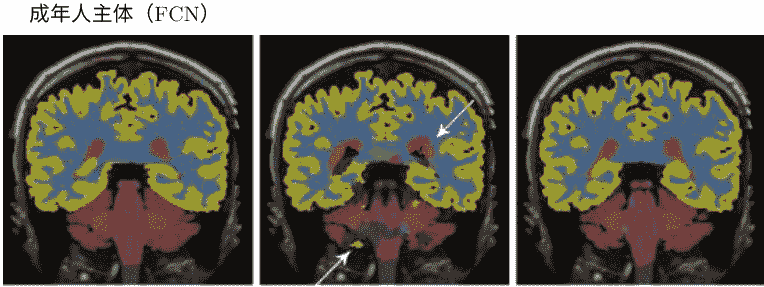

#### 成年人主体（DN）

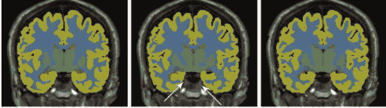

#### 老年人主体（FCN）

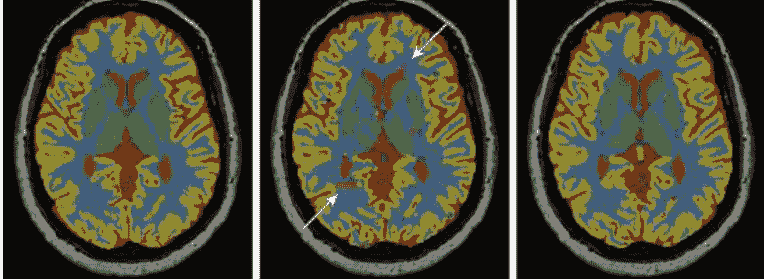

#### 老年人主体（DN）

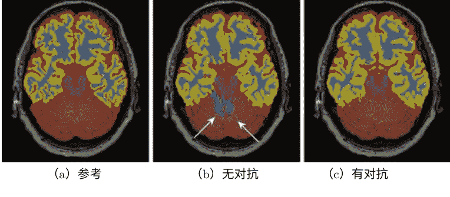

图2. 四个测试图像的示例分割结果。从上到下依次为使用全卷积网络（FCN）的成年人主体，使用扩张网络（DN）的成年人主体，使用全卷积网络（FCN）的老年人主体，以及使用扩张网络（DN）的老年人主体。颜色对应关系如下：蓝色表示白质，黄色表示灰质，绿色表示背景，棕色表示脑脊液，紫色表示脑干，橙色表示侧脑室，红色表示脑室。箭头表示在使用对抗训练过程中进行了修正的错误。（在线彩图）

### 2.3 对抗训练

对抗训练过程的概述如图1所示，位于右侧。

-   1. 仅基于分割图的交叉熵损失对分割网络进行更新，$L_s(\theta_s)$；
-   2. 基于手动分割作为输入的判别器损失对判别器网络进行更新，$L_d(\theta_d)$；
-   3. 基于图像作为输入的判别器损失对整个网络（分割网络和判别器网络）进行更新，$L_a(\theta_s, \theta_d)$。

只有 $L_s(\theta_s)$ 和 $L_a(\theta_s, \theta_d)$ 会影响分割网络。参数 $\theta_s$ 被更新以最大化判别器损失 $L_a(\theta_s, \theta_d)$，即分割网络的更新是朝着损失增加的方向进行，而不是减少的方向。

三种类型的更新以交替方式进行。基于分割损失的更新和基于判别器损失的更新使用不同的优化器和学习率进行。

使用较小的学习率，判别器网络的适应速度比分割网络慢，这样判别器损失不会过快收敛，并且能对分割网络产生足够的影响。

对于每个网络，都使用修正线性单元，所有层都使用批量归一化[6]，并且 $1\times1$ 卷积层使用dropout[16]。

## 3 实验和结果

### 3.1 实验

作为基准，分割网络在没有对抗网络的情况下进行训练。使用RMSprop进行更新，学习率为 $10^{-3}$，每个小批量包含300个样本。网络在5个时期进行训练，每个时期对应每个类别每个图像的50,000个训练图块。请注意，在此训练样本平衡过程中，类别标签对应于中心体素的标签，即使使用了更大的图像图块进行标记。

判别器和分割网络使用交替更新方案进行训练。两个损失函数的更新使用RMSprop进行，分割损失的学习率为 $10^{-3}$，判别器损失的学习率为 $10^{-5}$。更新在 $L_s$、$L_d$ 和 $L_a$ 损失函数之间交替进行，每次使用 $300/3 = 100$ 个样本的小批量。

### 3.2 评估

图2提供了使用对抗训练和不使用对抗训练得到的分割结果的视觉比较，显示对抗方法通常会得到更少噪声的分割结果。从组成总数（包括背景类）可以看出相同的情况。对于成年受试者，每张图像的组件数量（$\mu \pm \sigma$）从 $1745 \pm 400$ 减少到 $626 \pm 247$，使用全卷积网络；使用扩张网络从 $417 \pm 152$ 减少到 $365 \pm 122$。对于老年受试者，每张图像的组件数量（$\mu \pm \sigma$）从 $926 \pm 134$ 减少到 $692 \pm 88$，使用全卷积网络；使用扩张网络从 $601 \pm 104$ 减少到 $481 \pm 90$。

自动分割和手动分割之间的Dice系数（DC）评估结果如图3所示，以箱线图形式呈现。基于配对t检验，每个组织类别在两个图像集和两个网络中都获得了显著提高的DC。唯一的例外是老年受试者使用扩张网络的lvCSF。对于成年受试者，所有6个类别的平均DC（$\mu \pm \sigma$）从 $0.67 \pm 0.04$ 增加到 $0.91 \pm 0.03$，使用全卷积网络；使用扩张网络从 $0.91 \pm 0.03$ 增加到 $0.92 \pm 0.03$。对于老年受试者，所有7个类别的平均DC（$\mu \pm \sigma$）使用全卷积网络从 $0.80 \pm 0.02$ 增加到 $0.83 \pm 0.02$，并使用扩张网络从 $0.83 \pm 0.02$ 增加到 $0.85 \pm 0.01$。

## 4 讨论与结论

我们提出了一种通过对抗训练来改善脑MRI分割的方法。结果显示，在定性上（图2）和定量上（图3）都改善了分割性能。与浅层扩张网络相比，改进在更深、更难训练的全卷积网络上尤为明显。此外，该方法改善了结构一致性，例如在分割中组件数量减少。由于这些改进通常规模较小，它们对DC的影响有限。

该方法包括一个额外的损失函数，用于区分真实和生成的分割，并能够捕捉到普通的逐像素损失函数无法捕捉到的不一致性。所提出的方法可以应用于任何在训练过程中使用图像块、图像切片或完整图像而不是单个体素作为输出的网络架构。

未来的工作可以评估对分割网络进行的各种改变，例如不同的感受野、多个输入、跳跃连接、3D输入等。使用更大的输出图块大小甚至整个图像作为输出可能会增加对抗训练的效果，因为这样可以包含更多的信息，有助于区分手动分割和生成的分割。然而，这也可能减少局部信息的影响，导致过于全局的决策。需要进一步研究来评估网络架构和训练过程中哪些选择对结果产生最大影响。

致谢。作者们要感谢MRBrainS13和多模态标记挑战的组织者提供的数据。作者们衷心感谢NVIDIA Corporation捐赠的Titan X Pascal GPU的支持。

## 参考文献

-   1. Dai, W., Doyle, J., Liang, X., Zhang, H., Dong, N., Li, Y., Xing, E.P.: 用于胸部X射线器官分割的结构修正对抗网络。arXiv预印本 arXiv:1703.08770 (2017)
-   2. Ganin, Y., Ustinova, E., Ajakan, H., Germain, P., Larochelle, H., Laviolette, F., Marchand, M., Lempitsky, V.: 神经网络的领域对抗训练。Journal of Machine Learning Research 17(59), 1-35 (2016)
-   3. Ghafoorian, M., Karssemeijer, N., Heskes, T., van Uden, I.W.M., Sanchez, C.I., Litjens, G., de Leeuw, F.E., van Ginneken, B., Marchiori, E., Platel, B.: 用于自动检测血管源性腔隙的深度多尺度位置感知3D卷积神经网络。NeuroImage: Clinical 14, 391-399 (2017)
-   4. Goodfellow, I., Pouget-Abadie, J., Mirza, M., Xu, B., Warde-Farley, D., Ozair, S., Courville, A., Bengio, Y.: 生成对抗网络。In: NIPS, pp. 2672–2680 (2014)
-   5. Havaei, M., Davy, A., Warde-Farley, D., Biard, A., Courville, A., Bengio, Y., Pal, C., Jodoin, P.M., Larochelle, H.: 使用深度神经网络进行脑肿瘤分割。Medical Image Analysis. 35, 18–31 (2017)
-   6. Ioffe, S., Szegedy, C.: 批归一化：通过减少内部协变量偏移加速深度网络训练。In: ICML (2015)
-   7. Kamnitsas, K., et al.: 使用对抗网络进行脑部病变分割的无监督领域适应。In: Niethammer, M., Styner, M., Aylward, S., Zhu, H., Oguz, I., Yap, P.-T., Shen, D. (eds.) IPMI 2017. LNCS, vol. 10265, pp.597–609. Springer, Cham (2017). doi:10.1007/978-3-319-59050-9_47
-   8. Kamnitsas, K., Ledig, C., Newcombe, V.F., Simpson, J.P., Kane, A.D., Menon, D.K., Rueckert, D., Glocker, B.: 高效多尺度3D CNN与全连接CRF用于准确的脑部病变分割。Medical Image Analysis. 36, 61–78 (2017)
-   9. Kohl, S., Bonekamp, D., Schlemmer, H.P., Yaqubi, K., Hohenfellner, M., Hadaschik, B., Radtke, J.P., Maier-Hein, K.: 对抗网络用于侵袭性前列腺癌的检测。arXiv预印本 arXiv:1702.08014 (2017)
-   10. Landman, B.A., Ribbens, A., Lucas, B., Davatzikos, C., Avants, B., Ledig, C., Ma, D., Rueckert, D., Vandermeulen, D., Maes, F., Erus, G., Wang, J., Holmes, H., Wang, H., Doshi, J., Kornegay, J., Manjon, J., Hammers, A., Akhondi-Asl, A., Asman, A.J., Warfield, S.K.: MICCAI 2012多图谱标记研讨会。CreateSpace Independent Publishing Platform, Nice (2012)
-   11. Luc, P., Couprie, C., Chintala, S., Verbeek, J.: 使用对抗网络进行语义分割。In: NIPS对抗训练研讨会 (2016)
-   12. Mendrik, A.M., Vincken, K.L., Kuijf, H.J., Breeuwer, M., Bouvy, W.H., de Bresser, J., Alansary, A., de Bruijne, M., Carass, A., El-Baz, A., Jog, A., Katyal, R., Khan, A.R., van der Lijn, F., Mahmood, Q., Mukherjee, R., van Opbroek, A., Paneri, S., Pereira, S., et al.: MRBrainS挑战：3T MRI扫描中的脑图像分割在线评估框架。Computational Intelligence and Neuroscience. 2015 (2015). Article ID 813696
-   13. Moeskops, P., Viergever, M.A., Mendrik, A.M., de Vries, L.S., Benders, M.J., Išgum, I.: 使用卷积神经网络自动分割MR脑图像。IEEE Trans. Med. Imag. 35(5), 1252 –1261 (2016)
-   14. Moeskops, P., Wolterink, J.M., Velden, B.H.M., Gilhuijs, K.G.A., Leiner, T., Viergever, M.A., Išgum, I.: 多任务医学图像分割的深度学习方法。In: Ourselin, S., Joskowicz, L., Sabuncu, M.R., Unal, G., Wells, W. (eds.) MICCAI 2016. LNCS, vol. 9901, pp. 478–486. Springer, Cham (2016). doi:10.1007/978-3-319-46723-8_55
-   15. Radford, A., Metz, L., Chintala, S.: 无监督表示学习与深度卷积生成对抗网络。In: ICLR (2016)
-   16. Srivastava, N., Hinton, G., Krizhevsky, A., Sutskever, I., Salakhutdinov, R.: Dropout: 一种简单的防止神经网络过拟合的方法。Journal of Machine Learning Research. 15 (1), 1929–1958 (2014)
-   17. Wolterink, J.M., Leiner, T., Viergever, M.A., Išgum, I.: 生成对抗网络用于低剂量CT噪声降低。IEEE Trans. Med. Imag. (2017). https://doi.org/10.1109/TMI.2017.2708987
-   18. Wolterink, J.M., Leiner, T., Viergever, M.A., Išgum, I.: 扩张卷积神经网络用于先天性心脏病心血管MR分割。In: Zuluaga, M.A., Bhatia, K., Kainz, B., Moghari, M.H., Pace, D.F. (eds.) RAMBO/HVSMR-2016. LNCS, vol. 10129, pp. 95–102. Springer, Cham (2017). doi:10.1007/978-3-319-52280-7_9
-   19. Yu, F., Koltun, V.: 通过扩张卷积进行多尺度上下文聚合。In: ICLR (2016)
-   20. Zhang, W., Li, R., Deng, H., Wang, L., Lin, W., Ji, S., Shen, D.: 深度卷积神经网络用于等强度婴儿脑图像分割。NeuroImage **108**, 214–224 (2015)

# 卷积神经网络能够准确快速地分割光学相干断层扫描中的黄斑病变

Shekoufeh Gorgi Zadeh^{1(✉)}, Maximilian W.M. Wintergerst^{2}, Vitalis Wiens^{1}, Sarah Thiele^{2}, Frank G. Holz^{2}, Robert P. Finger^{2}, and Thomas Schultz^{1}

1 波恩大学计算机科学系，德国波恩
gorgi@cs.uni-bonn.de
2 波恩大学眼科学系，德国波恩

**摘要。** 光学相干断层扫描（OCT）用于诊断和追踪老年性黄斑变性（AMD）的进展。Drusen是出现在Bruch膜（BM）和视网膜色素上皮（RPE）层之间的凸起，是AMD分期中最重要的生物标志物之一。在这项工作中，我们基于U-Net卷积神经网络架构开发和比较了三种自动化的Drusen分割方法。通过对超过50,000张注释图像进行交叉验证，我们证明这三种方法的准确性远远优于当前最先进的方法。当CNN被训练用于分割BM和RPE，并且通过在后处理中结合最短路径查找和多项式拟合来检测Drusen时，可以实现最高的准确性。

## 1 引言

年龄相关性黄斑变性（AMD）是发达国家50岁以上人群中最常见的不可逆视力损失原因[7]。

Drusen，即视网膜色素上皮层和布鲁克膜之间的细胞外残留物沉积，通常是AMD的第一个临床征兆。它们的大小、数量和位置可以作为疾病进展的生物标志物。

光学相干断层扫描（OCT）是一种快速且无创的获取视网膜三维图像的方法，越来越多地用于监测AMD的发病和进展[1]。我们希望在大规模流行病学研究中使用OCT，这需要检测和量化成千上万只眼睛中的Drusen，而手动分析是不可行的。

尽管近年来在（半）自动化的OCT图像定量分析方面取得了相当大的进展[14]，但目前的方法仍然无法达到足够的准确性，或者需要过多的交互，无法在大规模研究中实际使用。卷积神经网络（CNN）最近在相关的生物医学图像分析任务中取得了出色的结果[11]，这激发了我们开发和比较三种基于CNN的Drusen分割方法的动力。在对超过50,000个半自动标注的B扫描（即通过OCT获取的二维横断面图像）进行评估时，我们证明了这三种方法都优于当前最先进的用于黄斑病变分割的技术。将CNN与应用特定的后处理相结合可以实现最高的准确性。

## 2 相关工作

在众多黄斑病变分割方法[2,4,6,8]中，我们确定了Chen等人[2]的方法作为最先进的参考方法，基于其报告的准确性和在一项纵向研究中的成功应用[13]。在第4.2节中，我们将展示我们基于CNN的结果与该方法相比非常有利。

尽管我们不知道有任何先前的工作将深度学习应用于黄斑病变或视网膜层的分割，但最近的两项研究[10]和[15]已经使用卷积神经网络将OCT图像分类为健康或患有AMD。我们的工作在分割方面的优势在于可以得出直观的测量结果，如黄斑病变的大小和数量，这些结果可以输入到进展模型[12,13]中，或与遗传或生活方式变量相关联。

## 3 方法

### 3.1 数据准备

在每个OCT扫描中，一个三维体积由若干个非连续的二维切片图像（称为B扫描）覆盖。我们的数据集是作为MODIAMD（年龄相关黄斑变性的分子诊断）研究的一部分生成的，这是一项关于中度AMD的观察性队列研究，包括来自98个不同受试者的682个OCT扫描中的52,377个这样的B扫描（512×496像素），每个受试者拥有不同数量的随访扫描。每只眼睛的扫描密度为19或145个覆盖约5-6毫米的B扫描。由于密度的差异，我们独立地分割B扫描；考虑3D上下文留待将来研究。

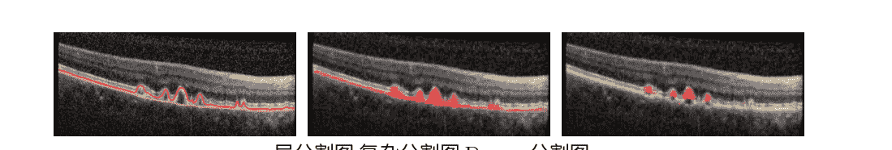

层分割图 复杂分割图 Drusen分割图
图1. 不同的标签图像叠加在相应的B扫描上。层分割图具有RPE（红色）层和BM（黄色）层的不同类别。（在线彩图）

提供的数据注释是RPE和BM的分割图，如图1（左）所示。对于每个B扫描，医学专家进行了对使用专有算法创建的初始分割进行仔细的手动校正，平均每个B扫描花费约两分钟。由于没有可用的黄斑病变本身的黄金标准分割，我们从RPE和BM曲线生成了参考黄斑病变地图。为此，我们通过垂直移动每一列来矫正图像，使得BM形成一条直线。然后，我们通过将三次多项式拟合到矫正图像中的分割RPE来估计正常的RPE层，然后将其扭曲回原始图像坐标，其中黄斑病变被检测为分割RPE高于正常RPE两个像素以上的区域，参见图1（右侧）。经验丰富的评估员确认这个过程产生了合理的黄斑病变分割掩膜。图2说明了矫正如何避免误报检测。

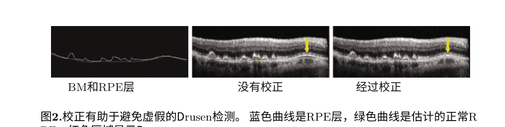

### 3.2 网络架构和训练

由于U-Net架构[11]在相关分割任务中表现良好，我们选择了它作为我们方法的基础。它由两个对称路径组成，一个收缩路径用于捕捉图像上下文，一个扩展路径用于恢复原始分辨率。

由于背景是所有地图中占主导地位的类别，因此对于分配空间变化的像素权重至关重要。与[11]类似，我们根据以下定义权重
$w(x) = w_c(x) + w_0G_{\sigma}(x)$ (1)
其中 $w_c$ 被定义为总像素数除以类别c的像素数，以考虑类别频率。此外，训练侧重于通过在分割掩模中居中二维高斯权重 $G_{\sigma}(x)$ 来确定精确边界。如果相邻高斯权重重叠，我们保留最大权重。

由于我们三种方法中前景像素和边界像素的数量差异很大，我们不得不相应地调整$w$和$\sigma$的值。我们将提及每个实验中使用的确切数值。它们是通过一个小规模的试验经验性地找到的，该试验仅涉及所有数据的一小部分（训练中的3个扫描，测试中的一个扫描）。

我们使用了来自caffe框架[9]的随机梯度下降进行训练。动量设置为0.99。初始学习率为10^{-3}，并且在每200,000步时按0.1的因子进行降低。当验证准确率停滞不前时，即在603,000次迭代时，我们停止了训练。我们使用了作者提供的U-Net实现，包括他们的数据增强层，并使用了每个图像2个瓦片的重叠-平铺策略。我们在ReLU层后添加了批归一化层，以避免内部协变量漂移[5]。

### 3.3 针对玻璃膜疣分割的三种方法

将U-Net应用于我们的问题最直接的方法是直接分割，即在第3.1节中得到的玻璃膜疣图上进行训练。我们使用了根据公式（1）的权重，其中参数 w0=150和 σ=30。正如在第4.2节中所示，这种简单策略已经比最先进的方法取得了更好的准确性。我们的主要技术贡献是探索两种更复杂的方法，通过将CNN与应用特定的后处理相结合，进一步提高准确性。

在我们的基于层的方法中，我们训练U-Net来分割RPE层和BM层，并从结果中估计玻璃膜疣。在这种情况下，网络被设置为为每个像素输出四个类别的概率，即背景、RPE层、BM层和捕捉两层重叠情况的类别。我们根据公式（1）使用权重 w0=100和 σ=15。

$$ \chi^{c+} = -\log \left( \frac{p_{c+i}^{j}}{\max(p_{:j}^{c+})} \right) $$ (2)

其中max(p_{:j}^{c+})是列 j中的最大组合概率。使用Dijkstra算法找到连接左右图像边界的累积成本最低的连续曲线。为了获得更平滑的曲线，我们通过将步长乘以局部路径成本来偏好非对角线移动而不是对角线移动。

基于这些层估计，我们继续通过矫正、多项式拟合和阈值化来检测玻璃膜疣，方法与第3.1节中描述的方式相同。在我们的RPE+玻璃膜疣复合方法中，U-Net对RPE层和BM之间的区域进行分割，该区域在图1的中心图像中显示。我们只需对RPE+玻璃膜疣复合或背景进行硬分割。我们使用参数为w0=30和σ=15的公式（1）中的权重。

在几乎所有情况下，分割的最大组件连接左右图像边界，其上下边界可用作RPE层和BM。

## 4 实验和结果

### 4.1 交叉验证设置

我们使用五折交叉验证来评估所有可用数据的方法。为了确保结果无偏，同一受试者的所有扫描都放在同一折中。对于第3.3节中描述的三种方法，这导致了五次训练，每次训练使用约70个受试者（约37,500张图像）进行训练，8个受试者（约4,000张图像）进行验证，约20个受试者（约10,500张图像）进行测试。U-Net是使用随机初始权重进行端到端训练的，这些权重是从标准差为大小的高斯分布中采样得到的 $\sqrt{2/N}$，其中 $N$ 是每个神经元的输入节点数。在Titan X GPU上，这15个实验每个大约需要三天的时间。

### 4.2 定量评估

我们使用两个质量度量标准对玻璃膜疣分割进行评估，这些度量标准是为该应用程序预先建立的[2]。玻璃膜疣的总面积是玻璃膜疣负荷的重要总结，而绝对玻璃膜疣面积差异（ADAD）衡量了估计误差。形式上，$ADAD(Y^k, X^k) = |Area(Y^k) - Area(X^k)|$，其中 $Y$ 和 $X$ 分别是真实标注和预测分割，是B扫描索引。根据[2]，ADAD的均值和标准差仅计算包含玻璃膜疣的列。

由于ADAD无法捕捉玻璃膜疣的空间定位准确性，因此它与重叠比率（OR）相结合，重叠比率定义为$OR(Y^k, X^k) = \frac{X^k \cap Y^k}{X^k \cup Y^k}$，即，真正的阳性黄斑病变检测像素与真阳性、假阳性和假阴性像素之和的比率。再次，计算均值和标准差。

除了最终的黄斑病变分割外，我们基于层和RPE+黄斑病变复合物的方法还产生了RPE层和BM的分割。我们通过计算这两个层之间区域的OR来比较这两种方法的准确性。

表1比较了我们三种方法在所有52,377张图像上的误差（ADAD）和准确性（OR）。作为基准，它还包括了陈等人[2]提出的最先进方法的结果，该方法通过双边滤波、视网膜神经纤维层的检测和去除（即在图2顶部可见的亮层）、基于阈值的RPE分割、通过将RPE分割与多项式拟合结果进行比较来检测黄斑病变，最后使用假阳性消除。

表1. 所有基于CNN的方法都比Chen等人[2]取得了更好的结果，这是之前的最佳结果。我们基于层的方法实现了最低的绝对玻璃膜疣面积差异（ADAD）和最高的重叠比率（OR）。底部两行显示了在额外的假阳性消除（FPE）步骤之后的结果。

| 测量 | Chen等人 | 直接 | 基于层 | 基于复杂度 |
| :--- | :--- | :--- | :--- | :--- |
| ADAD | 92.33 ± 460.95 | 28.45 ± 74.08 | **7.19 ± 36.04** | 11.14 ± 52.92 |
| OR（玻璃膜疣） | 20.48% ± 26.87 | 41.35% ± 31.3 | **55.88% ± 33.85** | 47.42% ± 33.45 |
| OR（复杂度） | - | - | **82.6% ± 7.26** | 76.74% ± 6.9 |
| ADAD（FPE） | 55.67 ± 277.97 | 15.08 ± 44.76 | **4.92 ± 29.69** | 9.58 ± 50.87 |
| OR（FPE，玻璃膜疣） | 24.20% ± 31.52 | 47.90% ± 33.23 | **64.24% ± 36.09** | 58.66% ± 35.63 |

一张人脸投影图像。表格的前三行是没有进行假阳性消除（FPE）步骤的评估结果，底部两行是使用与[2]中类似参数的FPE步骤后的结果。[1]显然，FPE步骤对所有方法都有积极的整体效果。

我们注意到，我们使用陈等人的方法得到的结果明显比[2]中报告的结果差。我们认为主要原因是我们的B扫描的轴向分辨率（496像素）比他们的（1024像素）要低得多。因此，他们可以通过阈值分割轻松区分的层在我们的数据中经常合并在一起。表1清楚地显示，在我们可用的图像分辨率下，无论是否使用FPE步骤，所有三种基于CNN的方法都能比先前的最先进技术更准确地分割玻璃膜疣。通过我们的定制层和复杂基于方法，我们获得了进一步的改进，这些方法利用了更高级的知识，例如玻璃膜疣可以被识别为与平滑正常RPE层的偏差，该层与BM平行运行。基于层的方法达到最高准确率的事实，部分原因可能是因为它利用了连续的CNN派生类概率。

在没有FPE步骤的情况下，所有方法每个B扫描所需的时间都少于一秒：陈氏方法需要0.31秒；直接玻璃体分割需要0.34秒；基于复杂度的方法需要0.57秒；基于层的方法需要0.81秒。

### 4.3 对其他病理的稳健性

在AMD的更高级阶段，自动玻璃膜疣检测方法对于存在其他类型的病理（如地理萎缩）的鲁棒性非常重要，这可以从图3中所有图像中心的相对高反射度中看出。我们的训练数据包括带有此类病理的正确注释图像，因此CNN应该已经学会了如何处理它。

> [1]选择性的面部投影依赖于RPE层的估计，而直接玻璃膜疣分割则无法提供这一估计。因此，在直接分割的情况下，只能应用不依赖于面部的FPE步骤。

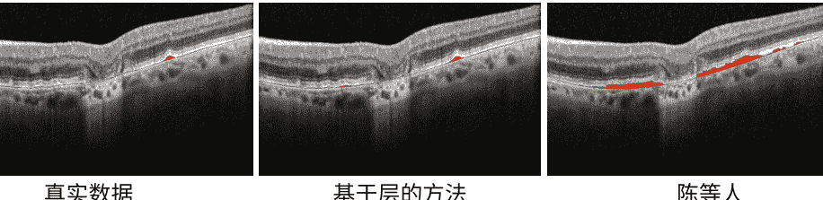

图3. 这种视觉比较表明，使用我们的方法进行玻璃膜疣分割比陈等人的方法[2]更能抵抗额外的病理学，如GA。

我们对包含GA的49个OCT扫描的子集进行了与表1相同的测量。结果相似，无论是否进行了FPE步骤。对于基于层的方法，结果为ADAD = 2.84 ± 8.28，OR = 49.87% ±28.08；对于基于复杂度的方法，ADAD = 5.66±19.74，40.94% ±24.76。这些数字与整体数据集中的数字相似，说明这些方法在存在GA的情况下具有鲁棒性。

### 4.4 结果的三维可视化

作为对分割质量的额外视觉检查，图4显示了具有高分辨率扫描的眼睛中完整的三维OCT数据的摘要。

Chen等人[2]提出了一种选择性体积投影方法，将这些数据减少到一个2D的面部图像，其中玻璃膜疣以明亮的斑点显示出来。图4（左侧）显示了这样一张图像，上面覆盖着地面真实和CNN推导的玻璃膜疣分割曲线。可以看到它们强烈重叠。

中间和右侧的子图以3D表面的形式可视化了同一眼中的地面真实和分割的RPE层，这些层基于BM进行了矫正以获得更好的可视化效果。尽管我们独立处理每个B扫描，但观察到相邻B扫描之间存在很高的连续性。

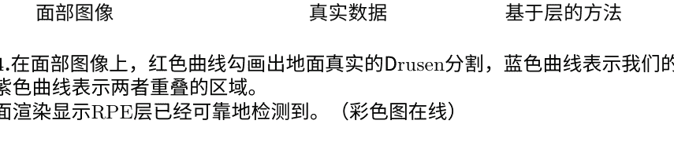

图4. 在面部图像上，红色曲线勾画出地面真实的玻璃膜疣分割，蓝色曲线表示我们的分割，紫色曲线表示两者重叠的区域。表面渲染显示RPE层已经可靠地检测到。（彩色图在线）

## 5 结论

我们提出了第一批基于CNN的方法，用于全自动分割OCT图像中的玻璃膜疣，这是诊断年龄相关性黄斑变性和建模疾病进展的重要任务。在我们可用的52,377张标注图像上，所有三种方法的结果都比最先进的方法要好得多。通过将U-Net架构与应用特定的后处理相结合，获得了最佳结果。

训练后，分割结果足够快速，可以用于流行病学研究，并且已经证明对于额外的地理萎缩存在鲁棒性。在未来的工作中，我们希望研究如何最好地考虑具有高度可变分辨率的三维上下文。

## 参考文献

1.  Abràmoff, M.D., Garvin, M.K., Sonka, M.: 视网膜成像和图像分析。IEEE Rev. Biomed. Eng. 3, 169–208 (2010)
2.  Chen, Q., Leng, T., Zheng, L., Kutzscher, L., Ma, J., de Sisternes, L., Rubin, D.L.: 自动化SD-OCT图像中的玻璃膜疣分割和定量化。Med. Image Anal. 17(8), 1058–1072 (2013)
3.  Chiu, S.J., Izatt, J.A., O'Connell, R.V., Winter, K.P., Toth, C.A., Farsiu, S.: 经验证的自动化AMD病理包括玻璃膜疣和地理性萎缩在SD-OCT图像中的分割。Invest. Ophthalmol. Vis. Sci. 53(1), 53 (2012)
4.  Farsiu, S., Chiu, S.J., Izatt, J.A., Toth, C.A.: 快速检测和分割视网膜光学相干断层扫描图像中的玻璃膜疣。In: Proceedings of SPIE, Ophthalmic Technologies XVIII, vol. 6844, p. 68440D (2008)
5.  Ioffe, S., Szegedy, C.: 批归一化：通过减少内部协变量偏移加速深度网络训练。arXiv预印本arXiv:1502.03167 (2015)
6.  Iwama, D., Hangai, M., Ooto, S., Sakamoto, A., Nakanishi, H., Fujimura, T., Domalpally, A., Danis, R.P., Yoshimura, N.: 使用三维光谱域光学相干断层扫描自动评估玻璃样变。Invest. Ophthalmol. Vis. Sci. 53(3), 1576–1583 (2012)
7.  Jager, R.D., Mieler, W.F., Miller, J.W.: 年龄相关性黄斑变性。New Engl. J. Med. 358(24), 2606–2617 (2008)
8.  Jain, N., Farsiu, S., Khanifar, A.A., Bearelly, S., Smith, R.T., Izatt, J.A., Toth, C.A.: 通过SD-OCT定量比较与彩色眼底照片划定的玻璃膜疣。Invest. Ophthalmol. Vis. Sci. 51(10), 4875–4883 (2010)
9.  Jia, Y., Shelhamer, E., Donahue, J., Karayev, S., Long, J., Girshick, R., Guadarrama, S., Darrell, T.: Caffe: 用于快速特征嵌入的卷积架构。arXiv预印本 arXiv:1408.5093 (2014)
10. Lee, C.S., Baughman, D.M., Lee, A.Y.: 深度学习用于分类正常与年龄相关性黄斑变性光学相干断层扫描图像是有效的。眼科学 视网膜 1(4), 322–327 (2017)
11. Ronneberger, O., Fischer, P., Brox, T.: U-Net: 用于生物医学图像分割的卷积网络。在: Navab, N., Hornegger, J., Wells, W.M., Frangi, A.F.(eds.) MICCAI 2015. LNCS, vol. 9351, pp. 234–241. Springer, Cham (2015). doi:10.1007/978-3-319-24574-4 28
12. Schmidt-Erfurth, U., Bogunovic, H., Klimscha, S., Hu, X., Schlegl, T., Sadeghipour, A., Gerendas, B.S., Osborne, A., Waldstein, S.M.: 机器学习预测AMD的个体进展，基于图像生物标志物。在: Association for Research in Vision and Ophthalmology 会议论文集，第3398页 (2017)
13. de Sisternes, L., Simon, N., Tibshirani, R., Le ng, T., Rubin, D.L.: 定量SD-OCT成像生物标志物作为年龄相关性黄斑变性进展的指标，使用SD-OCT特征预测AMD的进展。Invest. Ophthalmol. Vis. Sci. 55(11), 7093–7103 (2014)
14. Sonka, M., Abràmoff, M.D.: 视网膜OCT的定量分析。医学图像分析。 33, 165–169 (2016)
15. Zheng, Y., Williams, B.M., Pratt, H., Al-Bander, B., Wu, X., Zhao, Y.: 通过深度学习对3D OCT图像中的年龄相关性黄斑变性进行计算机辅助诊断。 在: 视觉与眼科研究协会会议论文集, 第824页 (2017年)

# 基于区域感知的X射线图像中颈椎的深度定位框架

S.M. Masudur Rahman Al Arif<sup>1</sup>(✉), Karen Knapp<sup>2</sup>, 和 Greg Slabaugh<sup>1</sup>

<sup>1</sup> 伦敦城市大学, 伦敦, 英格兰
S.Al-Arif@city.ac.uk
<sup>2</sup> 埃克塞特大学, 埃克塞特, 英格兰

**摘要。** 颈椎是一种柔韧的解剖结构，容易受伤，在放射学检查中可能被忽视。为了构建一个自动损伤检测系统，我们提出了一种用于X射线图像中颈椎定位的定位框架。所提出的框架采用分割方法来解决定位问题。由于颈椎是一个单一的连通组件，我们引入了一种新颖的区域感知损失函数来训练深度分割网络，惩罚不连续的预测。通过数据增强，该框架在一个由124张图像组成的数据集上进行了训练，并在另外124张图像上进行了测试，所有这些图像都来自真实的医疗急诊室。结果显示，与先前的颈椎定位框架相比，性能有了显著提高。

**关键词:** 颈椎 · X射线 · 定位 · FCN · 区域感知

## 1 引言

颈椎是人体的重要部分，容易受到高冲击碰撞、运动损伤和摔倒的影响。大约20%的损伤在X射线图像中未被发现，其中67%的被忽视的损伤导致了悲剧性后果[1,2]。计算机辅助检测有潜力减少放射学图像上未检测到的损伤数量。为了实现这个目标，我们提出了一个稳健的侧面颈椎X射线图像定位框架。我们将定位问题重新定义为低分辨率的分割问题。给定一组高分辨率图像和手动分割的椎骨真值，在低分辨率下，真值变成了一个单一的连通区域。我们训练一个深度分割网络来预测这个区域。为了强制网络预测一个单一的连通区域，我们在损失函数中引入了一个新颖的项，惩罚小的不连续区域并鼓励单一区域的预测。这种新颖的损失函数在定位性能上产生了显著的改进。以前的椎骨定位工作包括基于广义Hough变换的方法[3,4]和最近基于随机森林的方法[5–7]。颈椎椎骨定位的最新工作[7]使用滑动窗口技术从图像中提取补丁。一个随机森林分类器决定哪些补丁属于脊柱区域。然后，生成一个矩形边界框来定位脊柱区域。相比之下，该提出的框架可以在一次过程中生成任意形状的定位图，并提供比矩形框更好地模拟颈椎的定位结果。我们使用数据增强在一个包含124张图像的数据集上训练了我们的框架，并在一个包含124张不同形状、大小、年龄和医疗状况的独立图像上进行了测试。达到了99.1%的平均像素级准确率和93.6%的敏感度。本文有两个主要贡献。首先，提出了一种新颖的损失函数，将分割限制为形成单个连通区域；其次，将深度分割网络应用于真实急诊室X射线图像中的颈椎定位，并进行了适应性调整。这些网络从一个小数据集中学习，并在定量和定性上都表现出优于现有技术的鲁棒性。

## 2 数据

我们的数据集包含从皇家德文和埃克塞特医院收集的248张急诊室侧面X射线图像。数据集中的图像大小、方向、分辨率、患者体位、年龄、医疗状况和扫描系统都有很大的差异。一些图像可以在图1中看到。除了图像外，我们的医疗合作伙伴还为我们提供了颈椎C3-C7的手动分割结果。前两个椎骨C1-C2被排除在研究之外，因为只有C3到C7的地面真实值可用。图1中突出显示了图像的分割（绿色）和定位（蓝色）的地面真实值（GT）。

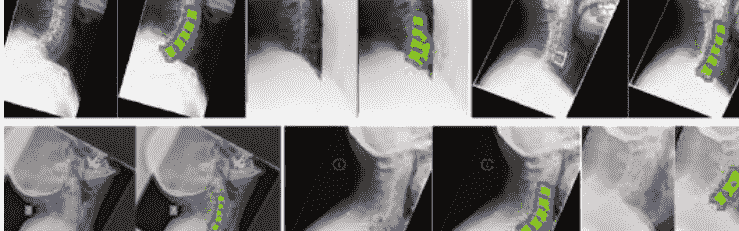

图1. X射线图像和相应地面真实值的示例。（彩色图在线）

## 3 方法

我们将定位问题作为较低分辨率的分割问题来解决。通过在较小的维度上填充适当数量的零，将X射线图像转换为方形图像。使用双三次插值将其调整为较低分辨率。这个分辨率可以根据可用内存和训练网络的大小而变化。对于我们的情况，我们选择将分辨率设置为100 × 100像素。相应的椎骨二值分割也被调整为相同的分辨率。在这个分辨率下，提供的椎骨分割成为一个包围脊柱的单个局部区域（图1中的蓝色区域）。在这项工作中，我们尝试了三种不同的深度分割架构：全卷积网络（FCN）[8]，反卷积网络（DeConvNet）[9]和U-Net [10]。在这项工作中，我们从头开始训练网络。这些网络接受100 × 100像素的X射线图像作为输入，并生成相同分辨率的概率二值分割图。

### 3.1 定位地面真实值

正如前面所述，我们的目标是在颈椎X射线图像中定位脊柱区域。为此，我们将手动椎骨分割转换为定位地面真实值。由于我们的网络设计用于生成一个100 × 100像素的输出定位地图，我们将定位地面真实值创建为这些尺寸。由于我们的原始图像尺寸大约在1000到5000像素的范围内，基于双三次插值的椎骨分割简单缩放会在较小的尺寸上产生一个连通的定位地面真实值。为了可视化定位地面真实值，可以将其转换回原始尺寸。图1中的蓝色叠加显示了除实际椎骨（绿色）之外定位地面真实值覆盖的区域。

### 3.2 网络架构

原始的FCN [8]和DeConvNet [9]是为处理自然图像上具有多个类别的语义分割问题而设计的。由于我们的任务是定位脊柱区域，因此我们实际上有一个二进制分割问题。因此，我们使用一个较浅的版本，参数较少。在我们的

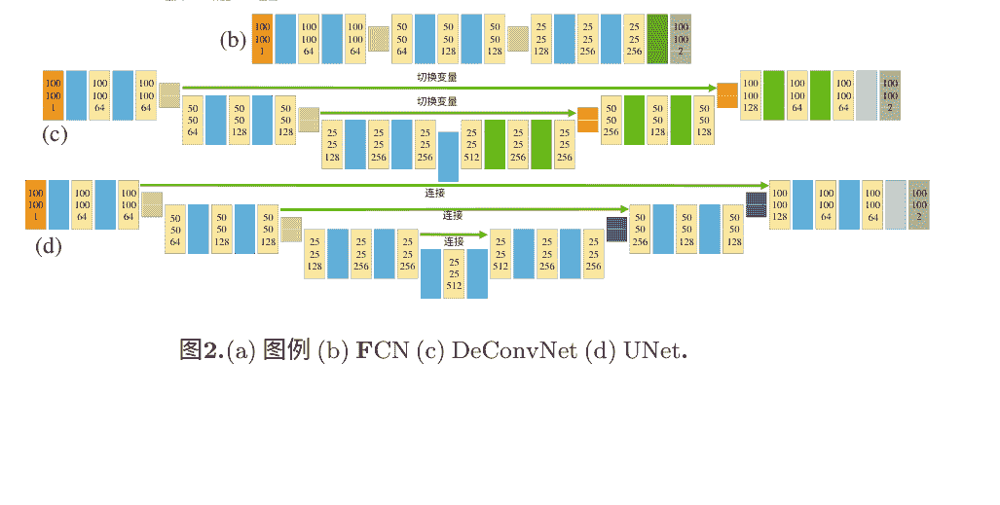

### 3.3 训练

我们只有248个手动分割的图像数据集。我们将数据随机分成124个训练图像和124个测试图像。为了训练任何具有大量参数的网络，124个图像是不够的。为了增加训练数据的数量，我们通过将每个图像从5°到355°旋转，步长为5°进行图像增强。这样得到了一个包含8928个图像的训练集。这也使得框架具有旋转不变性。我们选择的数据增强方法仅限于刚性变换，因为非刚性变换会影响图像中脊柱的自然外观。所有网络都是从随机初始化的参数开始，使用小批量梯度下降优化算法从这个增强的训练数据集中进行训练。

给定一个训练图像(x)-分割标签(y)对的数据集，训练一个深度分割网络意味着找到一组参数W，使得损失函数L_t最小化。分割问题的损失函数的最简单形式是像素级别的对数损失。

```
\hat{W} = \arg \min_W \sum_{n=1}^N L_t(\{x^{(n)}, y^{(n)}\}; W) \tag{1}
```

其中，N是训练样本的数量，\{x^{(n)}, y^{(n)}\}表示训练集中第n个样本及其对应的手动分割。每个图像的像素级分割损失可以定义为：

```
L_t(\{x, y\}; W) = -\sum_{i \in \Omega_p} \sum_{j=1}^M y_i^j \log P(y_i^j = 1 | x_i; W) \tag{2}
```

$$P(y_i^j = 1|x_i; W) = \frac{\exp(a_j(x_i))}{\sum_{k=1}^M \exp(a_k(x_i))} \quad (3)$$

其中，$a_j(x_i)$是网络倒数第二层对像素$x_i$的输出，$\Omega_p$表示像素空间，$M$是类别标签的数量，$P$是对应的类别概率。然而，这个项并不限制预测的地图必须是连通的。由于定位问题的目标是找到一个包围脊柱区域的单个连通区域，我们在损失函数中添加了一个新的区域感知项，以强制网络学习惩罚小的和不连通的区域。

### 3.4 区域感知术语

我们通过添加基于区域的术语$L_r$，将领域知识转化为训练过程中。该术语通过惩罚小的不连续区域，迫使网络生成单一区域。该术语可以定义为：

$$L_r(\{x, y\}; W) = \frac{1}{2} \sum_{i \in \Omega_p} \sum_{j=1}^M y_i^j E_i P^2(y_i^j = 1|x_i; W) \quad (4)$$

$$E_i = \begin{cases} \max(N_r - N_t, 0) \frac{A_{max_t} - A_q}{A_{max_t}} & \text{如果 } i \in R_q \\ 0 & \text{否则} \end{cases} \quad (5)$$

其中，$N_r$是预测为脊柱区域的数量，$N_t$是我们要寻找的目标区域的数量，$A_q$是第$q$个区域的面积，$A_{max_t}$是第$t$个最大区域的面积，$R_q$是区域$q$中的像素集合，$q$表示面积小于$A_{max_t}$的区域。在我们的，$N_t=1$。注意，如果$N_r$小于或等于$N_t$和/或$A_{max_t} = A_q$，损失函数(Eq.1)中不会添加基于区域的错误。

### 3.5 更新的损失函数

最后，损失函数（Eq.1）可以扩展为：

$$\hat{W} = \arg \min_W \sum_{n=1}^N L_t(\{x^{(n)}, y^{(n)}\}; W) + L_r(\{x^{(n)}, y^{(n)}\}; W) \quad (6)$$

通过在Eq.6中引入权重参数，可以控制总损失中每个项的贡献。然而，在我们的情况下，当两个项的贡献相等时，性能最佳。

### 3.6 实验和推断

网络在一台配备两个NVidia Quadro M4000 GPU的服务器上进行训练。每个网络训练30个epochs需要22到30小时。训练过程中的批量大小选择为10张图像，并使用RMSprop [11]版本的小批量梯度下降算法来更新每个epoch中的参数。我们有三个不同的网络和两个版本的损失函数，带有和不带有区域感知项。 总共训练了六个网络：FCN、DeConvNet、UNet以及FCN-R、DeConvNet-R、UNet-R，其中'-R'表示是否使用了公式6的区域感知项。

在测试时，测试图像用零填充成一个正方形，调整大小为100×100像素，并通过网络前向传播生成概率定位图。将该图转换为单一的二进制图并与相应的定位真值进行比较。 计算像素级准确度、物体级Dice系数、敏感度和特异度。这些指标展示了训练网络在生成预测时的较低分辨率下的性能。 从实际角度来看，还应计算出在原始分辨率下使用手动分割的椎骨真值的定位性能。 为了实现这一点，将预测的定位图转换（调整大小和去除填充），恢复到原始图像尺寸，并通过与椎骨分割进行比较计算敏感度和特异度。

## 4 结果与讨论

在低分辨率和原始分辨率下，对124个测试图像的指标进行平均值和标准差报告如表1所示。在所有情况和所有指标（除了特异性之外），在损失函数中包含区域感知项可以提高性能。 根据配对t检验，在5%的显著性水平上，大多数指标的改进都是统计上显著的（表中的粗体数字表示该指标在同一网络架构的另一个版本上与之相比具有统计显著性）。 可以注意到，当灵敏度增加时，特异性可能会降低。 这是因为当预测区域增大以覆盖更多脊柱区域时，它也可能开始包含其他区域。 这种效应也可以在图4的定性结果中看到。 然而，特异性始终在97.2%至97.7%的高范围内。定量上，FCN的表现优于UNet和DeConvNet。但在定性上，UNet和DeConvNet产生了更好的定位图（图4b，d）。 FCN的较粗糙的定位图可以归因于网络的单阶段上采样策略。 图4展示了测试数据集中一些困难的图像：骨质疏松（a），图像伪影（b）和严重退行性变化（c，e）。 在大多数这些图像中，我们的区域感知项能够产生更好的结果。 它还降低了指标的标准差（表1和图3），证明了它在规范化定位图中的有用性。 然而，图3的箱线图中的异常值表明存在一些所有方法都失败的图像。 这些图像中大多数都存在严重的临床问题。 图4f展示了我们的算法在一个有骨植入物的图像上完全失败的一个例子。

为了与颈椎定位方面的先前最先进技术（SOTA）进行比较[7]，我们在我们的数据集上实现并训练了基于随机森林的框架。 我们的算法在平均灵敏度上产生了17.1%的相对改进，仅降低了0.9%的特异性。就时间而言，我们最慢的框架（UNet）比[7]快大约60倍。为了证明鲁棒性，我们在NHANES-II数据集的275张颈椎X射线图像上测试了提出的框架，即使没有对网络进行任何适应或迁移学习，它也显示出了在定位颈椎方面的有希望的泛化能力。然而，由于缺乏足够的真实信息，无法得到定量结果。在该数据集上展示了一些定性的定位结果，如图5所示。

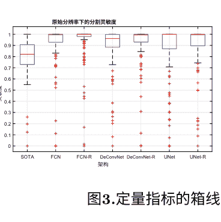

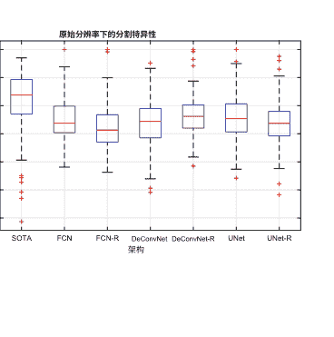

图3.定量指标的箱线图。

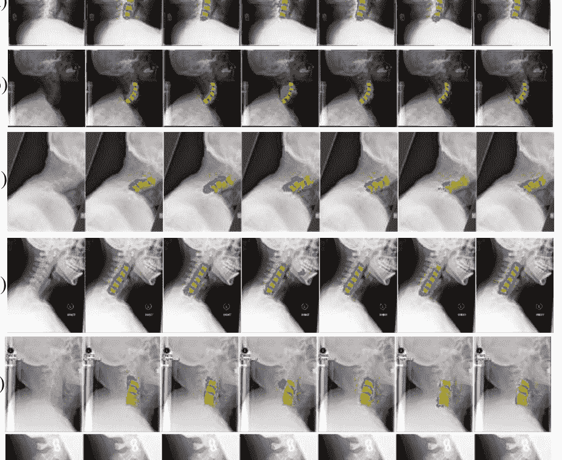

原始的 FCN FCN-R DeConvNet DeConvNet-R UNet UNet-R

图4.定性结果：基于手动椎骨分割的真阳性（绿色）、假阳性（蓝色）和假阴性（红色）。（在线彩图）

表1. 低分辨率和原始分辨率下测试集的平均性能±标准差（%）。粗体值表示与同一网络架构的另一版本相比，在统计学上显著改进（p < 0.05）。

| 网络 | 较低分辨率 - 像素准确度 | 较低分辨率 - 骰子 | 较低分辨率 - 灵敏度 | 较低分辨率 - 特异性 | 原始分辨率 - 灵敏度 | 原始分辨率 - 特异性 |
| :--- | :--- | :--- | :--- | :--- | :--- | :--- |
| SOTA [7] | 不可用 | | | | 79.9 ± 16.7 | 98.1 ± 1.1 |
| FCN | 98.9 ± 1.0 | 83.8 ± 15.6 | 80.2 ± 18.1 | **99.7 ± 0.3** | 91.5 ± 18.4 | **97.5 ± 0.7** |
| FCN-R | 99.1 ± 1.0 | **85.8 ± 14.7** | **85.0 ± 17.6** | 99.6 ± 0.3 | **93.6 ± 17.6** | 97.2 ± 0.8 |
| DeConvNet | 98.6 ± 1.1 | 79.7 ± 16.4 | 77.2 ± 19.1 | 99.5 ± 0.5 | 88.2 ± 20.4 | 97.3 ± 0.8 |
| DeConvNet-R | 99.1 ± 1.0 | 85.7 ± 15.6 | 81.0 ± 18.1 | **99.8 ± 0.2** | 91.5 ± 18.3 | **97.7 ± 0.7** |
| UNet | 98.9 ± 1.1 | 84.1 ± 18.5 | 79.9 ± 21.9 | 99.8 ± 0.3 | 87.5 ± 23.3 | **97.6 ± 0.8** |
| UNet-R | 99.0 ± 1.0 | 85.1 ± 17.0 | **82.5 ± 20.8** | 99.7 ± 0.2 | **89.6 ± 21.1** | 97.4 ± 0.8 |

## 5 结论

本文提出了一种用于颈椎X射线图像中脊柱定位的框架。定位问题已经被重新定义为低分辨率下的二进制分割问题。基于领域知识，将一个新颖的区域感知项添加到损失函数中，以产生单个区域作为定位输出。研究了三个分割网络，并且这个新颖的损失函数显著提高了所有这些网络的性能。最大平均灵敏度达到了93.6%，特异性达到了97.7%。目前，我们正在将提出的方法用于精确的椎骨分割。在未来的工作中，我们计划构建一个全自动的计算机辅助颈椎损伤检测系统。

## 参考文献

- Platzer, P., Hauswirth, N., Jaindl, M., Chatwani, S., Vecsei, V., Gaebler, C.: 颈椎损伤的延迟或漏诊。创伤急救外科杂志 61(1), 150–155 (2006)
- Morris, C., McCoy, E.: 在意识不清的多伤员中清除颈椎，平衡风险和有效筛查。麻醉 59(5), 464–482 (2004)
- Tezmo l, A., Sari-Sarraf, H., Mitra, S., Long, R., Gurur ajan, A.: 自定义的Hough变换用于X射线图像中颈椎的稳健分割。 在:第五届IEEE西南图像分析和解释研讨会论文集，第224-228页。IEEE (2002)
- Larhmam, M.A., Mahmoodi, S., Benjelloun, M.: 使用广义Hough变换在X射线图像中半自动检测颈椎。 在: 2012年第三届国际图像处理理论、工具和应用会议（IPT A）论文集，第396-401页。IEEE (2012)
- Glocker, B., Feulner, J., Criminisi, A., Haynor, D.R., Konukoglu, E.: 在任意视野CT扫描中的椎骨自动定位和识别。 在: Ayache, N., Delingette, H., Golland, P., Mori, K. (eds.) MICCAI 2012. LNCS, vol. 7512, pp. 590–598. Springer, Heidelberg (2012). doi:10.1007/978-3-642-33454-2_7
- Glocker, B., Zikic, D., Konukoglu, E., Haynor, D.R., Criminisi, A.: 通过稀疏注释的密集分类在病理脊柱CT中定位椎骨。 在: Mori, K., Sakuma, I., Sato, Y., Barillot, C., Navab, N. (eds.) MICCAI 2013. LNCS, vol. 8150, pp. 262–270. Springer, Heidelberg (2013). doi:10.1007/978-3-642-40763-5_33
- Al Arif, S.M.M.R., Gundry, M., Knapp, K., Slabaugh, G.: X射线图像中颈椎的全球定位和方向。 在: Yao, J., Vrtovec, T., Zheng,G., Frangi, A., Glocker, B., Li, S. (eds.) CSI 2016. LNCS, vol. 10182, pp. 3–15. Springer, Cham (2016). doi:10.1007/978-3-319-55050-3_1
- Shelhamer, E., Long, J., Darrell, T.: 用于语义分割的全卷积网络。IEEE Trans. Pattern Anal. Mach. Intell. 39(4), 640–651 (2016)
- Noh, H., Hong, S., Han, B.: 用于语义分割的反卷积网络学习。 在: IEEE国际计算机视觉会议论文集, pp. 1520–1528 (2015)
- Ronneberger, O., Fischer, P., Brox, T.: U-Net: 卷积神经网络用于生物医学图像分割。 在: Navab, N., Hornegger, J., Wells, W.M., Frangi, A.F.(eds.) MICCAI 2015. LNCS, vol. 9351, pp. 234–241. Springer, Cham (2015). doi:10.1007/978-3-319-24574-4_28
- Ruder, S.: 梯度下降优化算法概述, arXiv预印本 arXiv:1609.04747 (2016)
- NHANES-II 数据集。https://ceb.nlm.nih.gov/proj/ftp/ftp.php。 访问日期：2017年2月19日

# 域对抗神经网络解决组织病理学图像的外观变异性

Maxime W. Lafarge(✉), Josien P.W. Pluim, Koen A.J. Eppenhof, Pim Moeskops, 和 Mitko Veta
医学图像分析小组, 生物医学工程系, 埃因霍温科技大学, 荷兰埃因霍温
m.w.lafarge@tue.nl

摘要。准备和扫描组织病理学切片包括多个步骤，每个步骤都有大量参数。这些参数在病理实验室之间和同一实验室的不同时间内可能会有所不同，导致组织外观的显著变异，从而阻碍了自动图像分析方法的普适性。通常，可以通过诸如染色标准化之类的临时方法来解决这个问题，以减少外观变异。在本文中，我们提出了一种基于领域对抗神经网络的系统解决方案。我们假设从模型表示中去除领域信息会导致更好的泛化能力。我们针对乳腺癌组织病理学图像中的有丝分裂检测问题测试了我们的假设，并与其他两种方法进行了比较分析。我们展示了将颜色增强与领域对抗训练相结合是改善深度学习方法泛化能力的更好选择。

关键词：领域对抗训练 · 组织病理学图像分析

## 1 引言

组织病理学图像分析旨在自动化病理学家难以执行的任务，这些任务费时费力。组织病理学图像的外观变异性很高，这是组织制备过程不一致的结果，这是一个众所周知的观察结果。这阻碍了图像分析方法的泛化，特别是对来自外部病理实验室的数据集。

在分析之前，通常通过标准化图像来解决组织病理学图像的外观变异性，例如进行染色标准化[6,7]。这些方法在标准化颜色方面非常有效，同时保持结构完整，但不能处理其他变异源，例如组织固定的差异。我们假设在深度卷积神经网络（CNNs）的背景下，一种更通用和高效的方法是通过领域对抗训练[3]来施加约束，忽略非相关的外观变异。我们在来自一个病理实验室的有限数据上训练了乳腺癌组织病理学图像中有丝分裂检测的CNN模型，并在来自不同的外部病理实验室的测试数据集上进行了评估。除了领域对抗训练，我们还研究了两种额外的方法（颜色增强和染色归一化），并进行了比较分析。作为主要贡献，我们展示了领域对抗神经网络是改善组织病理学图像分析深度学习方法泛化性能的新选择。

## 2 材料和方法

### 2.1 数据集

本研究使用了TUPAC16数据集[1]，该数据集包含了73个乳腺癌病例的有丝分裂图像标注。有丝分裂图像的密度可以直接与肿瘤增殖活性相关，并且是乳腺癌预后的重要生物标志物。

这些病例来自三个不同的病理实验室（每个实验室23、25和25个病例），并且使用了两台不同的全切片图像扫描仪（来自后两个病理实验室的图像使用了同一台扫描仪）。所有的CNN模型都是使用来自第一个病理实验室的八个病例（458个有丝分裂图像）进行训练的。其中四个病例用作验证集（92个有丝分裂图像）。剩下的12个病例（533个有丝分裂图像）来自第一个病理实验室，被用作内部测试集1，而来自其他两个病理实验室的50个病例（469个有丝分裂图像）则用于评估实验室间的泛化性能。

### 2.2 卷积神经网络的基本架构

乳腺癌组织病理学图像中检测有丝分裂的最成功方法是基于卷积神经网络（CNN）。这些方法通过训练模型来对图像块进行分类，基于多位专家病理学家的有丝分裂注释结果[1,2,9]。

本研究中所有实验都使用基线架构，该架构是一个6层神经网络，包括四个卷积层和两个全连接层，以63 ×63的图像块作为输入，并输出中心区域是否存在有丝分裂图像的概率。第一个卷积层使用4×4的卷积核，其余三个卷积层使用3×3的卷积核。所有卷积层都有16个特征图。第一个全连接层有64个神经元，第二个全连接层作为输出层，使用softmax激活函数。批量归一化、最大池化和ReLU非线性激活函数

1这个测试集与AMIDA13挑战赛中使用的测试集完全相同。

在整个过程中都使用了它们。这个架构与[2]中提出的架构类似。神经网络可以密集地应用于图像，以生成用于检测的有丝分裂概率图。

### 2.3 处理外观变异性的三种方法

当训练数据和测试数据的分布不一致时，会出现泛化能力差的情况。增加训练数据量可能会有所帮助，但是组织病理学图像的标注是一项耗时的过程，需要稀缺的专业知识。因此，我们需要更可行的解决方案，因此我们选择研究三种方法。

一个直接的替代方法是人工生成新的训练样本。标准的数据增强方法包括随机的空间和强度/颜色转换（例如旋转、镜像和缩放，以及颜色变换）。

在这项研究中，我们在所有模型的训练过程中使用空间数据增强（任意旋转、镜像和±20%缩放）。由于组织病理学图像中最显著的变异源是染色颜色的外观，因此在训练过程中评估了颜色增强（CA）的贡献，这是分开评估的。

相反的策略是在训练和评估CNN模型之前，将所有图像的外观变异性降低为预处理步骤。对于血红蛋白和嗜酸性染色（H&E）的染色切片，可以使用染色归一化（SN）方法[6,7]。

一种更直接的策略是限制模型的权重，以促进学习与任何输入图像外观一致的有关有丝分裂的特征。我们观察到基线CNN有丝分裂分类器提取的特征携带有关输入补丁的来源信息（见第3节）。我们预计通过使用领域对抗训练[3]从学习表示中消除这些信息，可以实现更好的泛化效果。

最后，除了这三种个别方法，我们还研究了所有可能的组合。

#### 颜色增强
通过对原始训练样本应用随机颜色变换，可以增加颜色的变异性。我们通过对每个颜色通道进行颜色增强来实现，其中 a_c 和 b_c 是从均匀分布中抽取的值，$a_c \sim U[0.9, 1.1]$, $b_c \sim U[-10, +10]$。

#### 染色归一化
H&E染色组织病理图像的RGB像素强度可以用光吸收的Beer-Lambert定律来建模：$I_c = I_0 \exp(-A_c * C)$。在这个表达式中，$c = 1,2,3$是颜色通道索引，$A \in [0, +\infty)^{3 \times 2}$是吸光系数矩阵，$C \in [0, +\infty)^2$是染料浓度[7]。我们使用[6]中描述的方法进行染色归一化。这是一种无监督方法，可以分解任何图像并估计其潜在的A和C。然后，通过使用一些固定的吸光系数重新组合所有图像，可以减少数据集上的外观变异性（图1）。

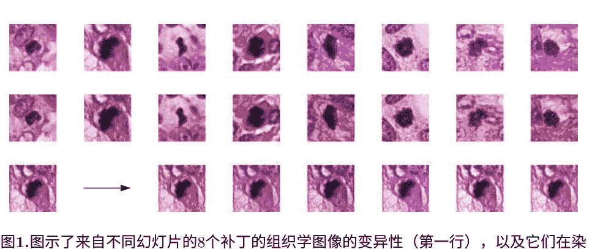

#### 领域对抗神经网络
由于每个数字幻灯片都是由一组唯一的制备参数组合而成，我们假设从同一幻灯片中提取的所有图像补丁来自同一唯一的数据分布，因此构成一个领域。领域对抗神经网络（DANN）允许学习一个分类任务，同时确保无法从学习到的特征表示中恢复出训练数据的来源领域[3]。这种领域无关的表示改善了训练模型的跨领域泛化能力。

从训练数据中提取的任何图像补丁 x 可以被赋予两个标签：其类别标签 y（如果补丁以有丝分裂图像为中心，则标记为“1”，否则标记为“0”），以及其领域标签 d（补丁所属幻灯片的唯一标识符）。

在第2.2节中介绍的有关有丝分裂分类器的训练是通过最小化交叉熵损失 L_M (x, y; θ_M) 来进行的，其中 θ_M 是网络的参数。

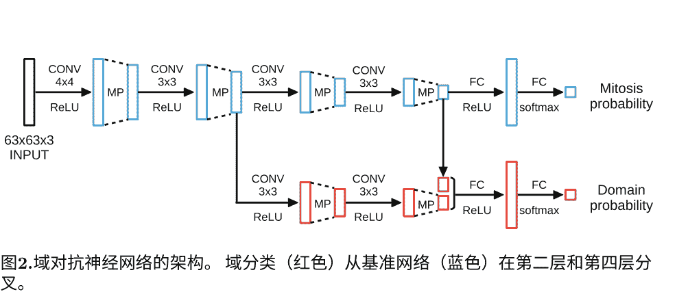

DANN由第二个卷积神经网络组成，该网络以有丝分裂分类器的第二层和第四层的激活作为输入，并预测域标识符 $d$。该网络与有丝分裂分类器并行构建，具有相同的对应架构（图2）。使用多个分叉使得从不同的抽象层级进行域分类成为可能，并且像[4]中一样提高训练稳定性。域分类器的交叉熵损失为 $\mathcal{L}_D(\mathbf{x}, d; \theta_M, \theta_D)$，其中 $\theta_D$ 是分叉网络的参数（但请注意损失也是 $\theta_M$ 的函数）。

整个网络的权重通过梯度反向传播进行优化，在由三个连续的更新规则组成的迭代训练过程中进行。

有关有丝分裂分类器的优化
学习率为 $\lambda_M$:
$\theta_M \leftarrow \theta_M - \lambda_M \frac{\partial \mathcal{L}_M}{\partial \theta_M}$ (1)

有关领域分类器的优化
学习率为 $\lambda_D$:
$\theta_D \leftarrow \theta_D - \lambda_D \frac{\partial \mathcal{L}_D}{\partial \theta_D}$ (2)

有关有丝分裂分类器的对抗更新:
$\theta_M \leftarrow \theta_M + \alpha \lambda_D \frac{\partial \mathcal{L}_D}{\partial \theta_M}$ (3)
更新规则（1）和（2）以对抗的方式工作：通过（1），参数 $\theta_M$ 被更新以进行有丝分裂检测任务（通过最小化 $\mathcal{L}_M$），并且通过（3），相同的参数被更新以防止从学习表示中恢复出原始领域（通过最大化 $\mathcal{L}_D$）。参数 $\alpha \in [0,1]$ 控制对抗成分的强度。

### 2.4 评估

通过F1-得分对有丝分裂检测模型的性能进行评估，如[1,2,9]所述。我们使用训练好的分类器为所有测试图像生成密集的有丝分裂概率图。所有高于操作点的局部极大值都被视为检测到的有丝分裂图像。操作点被确定为在验证集上最大化F1-得分的阈值。我们使用t分布随机邻居嵌入（t-SNE）[5]方法对低维特征进行嵌入，以定性比较不同方法的领域重叠。

## 3 实验和结果

对于2.3节中开发的三种方法的每种可能组合，我们使用相同的基线架构、相同的训练过程，但使用随机初始化种子训练了三个卷积神经网络，以评估方法的一致性。

### 基线训练
训练使用带有动量的随机梯度下降法进行，参数如下：批量大小为64（具有平衡的类分布），学习率 λ_M 为0.01，每5000次迭代衰减因子为0.9，权重衰减为0.0005，动量为0.9。训练在40000次迭代后停止。

由于训练集存在严重的类别不平衡问题，因此进行了硬负样本挖掘，如先前描述的[2,8]。为此，使用基线CNN模型训练了一个初始分类器。然后，通过概率采样这个第一个分类器产生的概率图，排除了地面真值位置，得到了一组困难负样本补丁。我们在所有实验中使用相同的困难负样本集。

### 领域对抗训练
DANN模型的每个训练迭代包括两个步骤。第一步骤与基线训练过程相同，并涉及更新（1）。第二步骤使用平衡于训练集领域的批次，并用于更新（2）和（3）。鉴于训练集包含八个领域，因此第二步骤的批次由每个训练案例的8个随机补丁组成。

这些更新的学习率 λ_D 被固定为0.0025。正如[3,4]中所述，领域对抗训练是一个不稳定的过程。因此，我们使用循环调度参数 α 参与对抗更新（3）。这样可以在两个分支学习各自任务而不干扰的阶段和领域对抗训练发生的阶段之间交替进行。为了避免陷入局部最大值并确保在主分支的迭代中不恢复领域信息，领域分类器 θ_D 的权重在每个周期开始时重新初始化。

### 性能
表1给出了三种方法及其组合的F1分数。基线模型和三种研究方法学习到的特征表示的t-SNE嵌入结果如图3所示。

表1. 在三次重复实验中，F1分数的平均值和标准差。表的每一列表示一种方法在内部测试集（ITS；来自同一病理实验室）和外部测试集（ETS；来自不同病理实验室）上的性能。方框表示不同的研究方法。多个方框表示方法的组合。

| 方法 | Baseline ITS | Baseline ETS | CA ITS | CA ETS | SN ITS | SN ETS | DANN ITS | DANN ETS | CA+SN ITS | CA+SN ETS | CA+DANN ITS | CA+DANN ETS | SN+DANN ITS | SN+DANN ETS | CA+SN+DANN ITS | CA+SN+DANN ETS |
| :--- | :---: | :---: | :---: | :---: | :---: | :---: | :---: | :---: | :---: | :---: | :---: | :---: | :---: | :---: | :---: | :---: |
| **F1分数** | .61±.02 | .33±.08 | .61±.01 | .58±.03 | .57±.06 | .46±.02 | .61±.02 | .55±.05 | .55±.01 | .48±.08 | .62±.02 | .62±.00 | .61±.01 | .51±.02 | .57±.01 | .53±.03 |

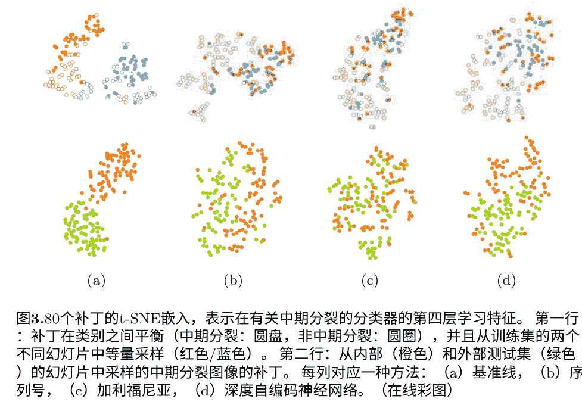

图3. 80个补丁的t-SNE嵌入，表示在有关有丝分裂分类器的第四层学习特征。 第一行：补丁在类别之间平衡（有丝分裂：圆盘，非有丝分裂：圆圈），并且从训练集的两个不同幻灯片中等量采样（红色/蓝色）。 第二行：从内部（橙色）和外部测试集（绿色）的幻灯片中采样的有丝分裂图像的补丁。每列对应一种方法：（a） 基线，（b） CA，（c） SN，（d） DANN。（在线彩图）

尽管第一行的t-SNE嵌入只显示了两个域以便清晰，但几乎所有域对的观察结果都是相同的。

## 4 讨论与结论

在内部测试集上，所有方法和组合都表现良好，与先前报道的结果一致[1,2,8,9]。颜色增强和领域对抗训练的组合具有最佳性能（F1分数为0.62±0.02）。染色归一化方法和染色归一化与其他方法的组合具有最差的性能（F1分数低于基线方法）。

与内部测试集一样，通过颜色增强和领域对抗训练的组合在外部测试集上取得了最佳性能（F1分数为0.62±0.00）。在外部测试集上，三种研究方法都显示出改进，因为基线方法的性能最差（F1分数为0.33±0.08）。

图3第一行展示的内部实验室t-SNE嵌入显示，基线模型学习了一个对领域有信息量的特征表示，如嵌入图像块的领域对应的明确聚类所示。相比之下，三种方法中的每一种都在模型表示中产生了一些领域混淆，因为在相同条件下，t-SNE不会产生这样的领域聚类。

尽管染色归一化改善了模型对来自外部病理实验室的数据的泛化能力，但与不使用染色归一化的组合相比，它明显产生了一般不良影响。这种影响的可能原因是通过进行染色归一化，训练数据集的变异性被减少到可能导致过拟合的程度。

对于两个测试数据集，最佳的个体方法是颜色增强。图3第二行的t-SNE嵌入显示，使用颜色增强训练的模型产生了一个更独立于实验室的特征表示，相比于基线、SN或DANN。这与观察到的组织病理学图像中的外观变异主要表现为染色变异的观察结果一致。

对于两个数据集，颜色增强和领域对抗训练的组合取得了最佳性能。这种互补效应表明领域对抗训练能够考虑除颜色以外的变异源。

总之，我们研究了领域对抗神经网络作为标准增强和归一化方法的替代方案，并进行了比较分析。颜色增强和领域对抗神经网络的组合具有最佳性能，证实了领域对抗方法在组织病理学图像分析中的相关性。本研究基于单个组织病理学图像分析问题的性能，并且只调查了一种染色归一化方法。这些是限制因素，需要进一步确认我们所得出的结论。

## 参考文献

1. 肿瘤增殖评估挑战2016. http://tupac.tue-image.nl
2. Cireşan, D.C., Giusti, A., Gambardella, L.M., Schmidhuber, J.: 基于深度神经网络的乳腺癌组织学图像中的有丝分裂检测. In: Mori, K., Sakuma, I., Sato, Y., Barillot, C., Navab, N. (eds.) MICCAI 2013. LNCS, vol. 8150, pp. 411–418. Springer, 海德堡 (2013). doi: 10.1007/978-3-642-40763-5\_51
3. Ganin, Y., Ustinova, E., Ajakan, H., Germain, P., Larochelle, H., Laviolette, F., Marchand, M., Lempitsky, V.: 领域对抗训练的神经网络. J. Mach. Learn. Res. 17(59), 1–35 (2016)
4. Kamnitsas, K., Baumgartner, C., Ledig, C., Newcombe, V., Simpson, J., Kane, A., Menon, D., Nori, A., Criminisi, A., Rueckert, D., Glocker, B.: 通过对抗网络进行脑损伤分割的无监督领域适应. In: Niethammer, M., Styner, M., Aylward, S., Zhu, H., Oğuz, I., Yap, P.-T., Shen, D. (eds.) IPMI 2017. LNCS, vol. 10265, pp. 597–609. Springer, Cham (2017). doi:10. 1007/978-3-319-59050-9\_47
5. van der Maaten, L., Hinton, G.: 使用t-SNE可视化数据. J. Mach. Learn. Res. 9, 2579–2605 (2008)
6. Macenko, M., Niethammer, M., Marron, J., Borland, D., Woosley, J.T., Guan, X., Schmitt, C., Thomas, N.E.: 一种用于定量分析的组织学切片归一化方法.
7. Ruifrok, A.C., Johnston, D.A., 等: 通过颜色分离定量组织化学染色. 分析与计量细胞学 23(4), 291-299 (2001年)
8. Veta, M., van Diest, P.J., Jiwa, M., Al-Janabi, S., Pluim, J.P.: 乳腺癌中的有丝分裂计数：物体级别的观察者间一致性和与自动方法的比较. PloS one 11(8), e0161286 (2016年)
9. Veta, M., Van Diest, P.J., Willems, S.M., Wang, H., Madabhushi, A., Cruz-Roa, A., Gonzalez, F., Larsen, A.B., Vestergaard, J.S., Dahl, A.B., 等: 乳腺癌组织病理图像中有丝分裂检测算法的评估. 医学图像分析 20(1), 237-248 (2015年)

# 通过卷积网络的网络智能训练实现准确的肺部分割

Sangheum Hwang (✉) 和Sunggyun Park
韩国首尔Lunit公司
{shwang,sgpark}@lunit.io

摘要. 我们基于深度卷积神经网络介绍了一种用于胸部X射线片的准确肺部分割模型。我们的模型基于扩张卷积层，可以有效地增加滤波器的视野。为了进一步提高分割性能，我们还提出了一种多阶段训练策略，即网络智能训练，当前阶段网络同时接收输入图像和前阶段网络的输出。实验证明，这种策略能够减少错误预测标签，并产生平滑的肺部边界。我们在常见的基准数据集JSRT上评估了提出的模型，并取得了最先进的分割性能，同时模型参数更少。

- 肺分割
- 网络训练
- 扩张卷积

## 1 引言

准确的肺边界提供了宝贵的基于图像的信息，如总肺容积或形状不规则性，但它也在开发计算机辅助诊断（CAD）系统的先决步骤中起着重要作用。然而，由于不同胸部X射线之间形状和大小的高度变化，肺部自动分割是一个具有挑战性的问题。

在过去的十年中，已经提出了许多自动检测肺部区域的方法[1,3,10,12]。早期的分割方法可以分为基于规则的、基于像素分类的、基于可变形模型的和混合方法[3]。最近，基于深度神经网络的方法[10,12]已经被提出，这是由于深度学习在各种计算机视觉任务中的成功，包括对象分类[8]、定位[13]和分割[2,11]。

对于语义分割，编码器-解码器架构通常被使用[11]。在这个架构中，编码器是一个典型的卷积神经网络（CNN），而解码器由转置卷积和上采样操作组成。解码器的作用是通过学习如何密集化稀疏激活来恢复抽象的特征图。解码器的最终输出是一个与真实掩膜相同大小的概率图，训练时使用像素级交叉熵损失。这种编码器-解码器架构在各种医学图像问题中也显示出了很有前景的表现[12,14]。例如，U-Net[14]，作为编码器-解码器架构的一种变体，在电子显微镜堆栈中对神经结构的分割显示出了令人印象深刻的结果。对于肺部分割任务，[12]的作者提出了基于U-Net的CNN架构，用于自动分割胸部X射线中的解剖器官（如肺部、空腔和心脏）。他们还提出了一种修改的损失函数来处理多类别分割问题。

另一种成功的语义分割方法是使用空洞卷积层来替换一些卷积层[2]。众所周知，空洞卷积有效地扩大了CNN的全局感受野[9]，因此可以高效地利用更大的上下文信息来预测像素级标签。

在本文中，我们介绍了一种基于深度CNN和空洞卷积的准确肺部分割模型，用于胸部X射线图像。所提出的模型采用深而薄的架构设计，与其他基于CNN的肺部分割模型相比，参数数量要少得多。为了进一步提高性能，我们提出了一种多阶段训练策略，即网络级训练，当前阶段网络同时接收输入图像和前一阶段网络的输出。研究表明，这种策略能够减少错误预测的标签（即假阳性和假阴性），并产生平滑的肺部分割边界。

我们在一个常见的基准数据集上评估了所提出的方法，即日本放射技术学会(JSRT)[15]，并在四个流行的分割度量标准下取得了最先进的结果：Jaccard相似系数、Dice系数、平均轮廓距离和平均表面距离。为了研究我们方法的泛化能力，我们在另一个数据集蒙哥马利县（MC）[6]上进行了测试。观察到在这个数据集上的性能在均值上是可比较的，但是由于训练（JSRT）和测试（MC）分布之间存在一定程度的偏移，方差较高。

## 2 方法

### 2.1 基于空洞卷积的肺部分割

我们提出了一种基于残差学习[5]的深而薄的CNN架构，该架构具有跳跃连接以防止梯度消失问题。密集预测问题应该考虑到大范围的上下文来预测像素的类别标签。通过增加网络的全局感受野，可以简单地扩大上下文范围，通过堆叠更多的卷积层或使用下采样操作（例如池化或步幅卷积）[9]。

最近，人们发现空洞卷积对于扩大滤波器的感受野（即感受野）非常有用。这种扩大对于分割任务特别有效，因为它需要考虑所需预测类别标签周围的上下文[2]。空洞卷积在滤波器权重之间包含“孔”，因此它涉及更大的范围来计算激活。

给定一个滤波器 k = [k(m, n)]，其中 m, n = 1, ..., 2k+1，以及输入 x = [x(i, j)] 在位置 (i, j)，带孔卷积通过率 r 计算输出 y = [y(i, j)] 如下所示：

```
y(i, j) = \sum_{m=-k}^{k} \sum_{n=-k}^{k} x(i + rm, j + rn)k(m, n) \quad (1)
```

需要注意的是，如果 r = 1，方程 1 表示标准卷积操作。因此，通过率 r 可以控制网络的全局感受野，同时保持权重的数量。

图 1 展示了我们用于肺分割任务的网络架构。它由 3 个卷积层和 6 个残差块（即 15 个卷积层）组成。我们在两个残差块的末尾使用了 r = 3 的带孔卷积。每个卷积层后面都跟着批归一化层。我们的网络的全局步长为 4，即特定残差块的开始处的两个卷积层（图 1 中每个红色块的第一层）使用步长为 2 的卷积（即步长为 2 的卷积）。为了计算像素级的交叉熵损失和真值掩码，我们通过双线性插值对网络输出进行上采样。

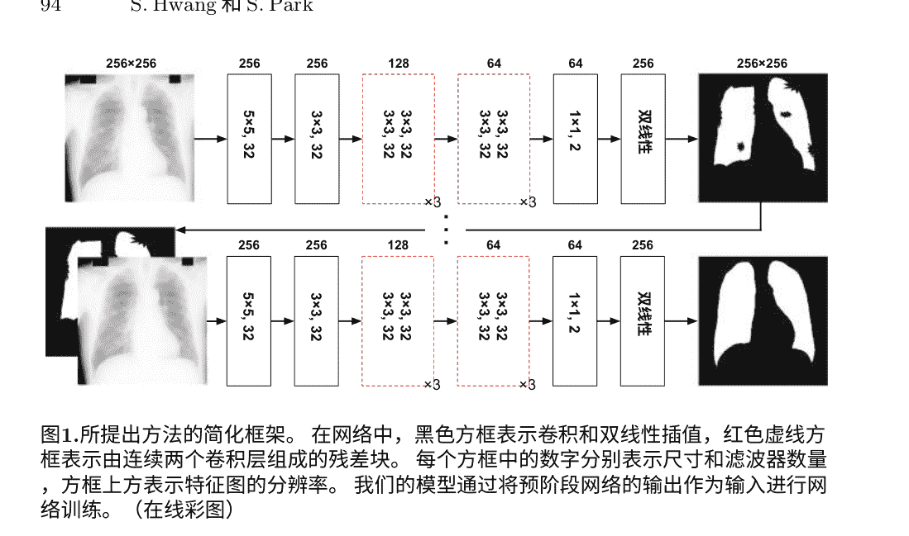

图1. 所提出方法的简化框架。在网络中，黑色方框表示卷积和双线性插值，红色虚线方框表示由连续两个卷积层组成的残差块。每个方框中的数字分别表示尺寸和滤波器数量，方框上方表示特征图的分辨率。我们的模型通过将前阶段网络的输出作为输入进行网络训练。（在线彩图）

所提出的深而窄的架构的优势在于与其他基于CNN的肺分割模型相比，它具有更少的模型参数。例如，我们的模型有120,672个权重（比参数少26倍），而像U-Net这样的编码器-解码器网络有3,140,771个权重[12]。

### 2.2 CNN的网络训练

一般来说，具有空洞卷积和双线性插值的CNN存在一些限制。首先，它可能产生小的误报或漏报区域。这主要是由于像素级的交叉熵损失独立处理每个像素。其次，它会输出模糊的物体边界，这是不可避免的，如果我们使用双线性插值来上采样下采样的特征图。为了克服这些问题，通过条件随机场[7]进行后处理广泛用于平滑这些嘈杂的分割图[2]。

我们提出了另一种策略，即网络训练，来改进分割结果。它被设计为一个重复的训练流程，其中预阶段模型的输出作为输入（见图1）。在第一阶段（即第1阶段），仅使用输入的胸部X射线训练网络。在训练完后，将输入的胸部X射线和第1阶段训练模型的网络输出一起输入到第二个网络中。具体而言，将输入的胸部X射线和相应的预阶段网络输出在通道维度上进行连接。

从相对粗糙的分割结果中，网络可以更加关注细节，学习准确的肺部边界。这个过程迭代进行，直到验证性能达到饱和。请注意，这种策略可以被视为迭代级联，是级联网络[4]的扩展版本。

## 3 计算实验

我们使用一个常见的基准数据集，即日本放射技术学会（JSRT）数据集[15]，来评估我们模型的肺部分割性能。JSRT数据库包含247张胸部正后位（PA）X射线照片，其中154张有肺结节，93张没有结节。可以在胸部X射线分割（SCR）数据库[3]中获取真实的肺部掩膜。

按照文献中的先前做法，JSRT数据集被分为两个折叠：一个包含124张奇数编号的胸部X射线照片，另一个包含123张偶数编号的胸部X射线照片。然后，一个折叠用于训练²，另一个折叠用于测试，反之亦然。最终的性能通过对两种情况的结果进行平均计算。此外，所有训练图像的大小被调整为256×256，与文献中的做法相同。该网络通过带有动量0.9的随机梯度下降进行训练。对于学习率调度，我们将初始学习率设置为0.1，并在训练70个周期后将其降低到0.01。

²在随机选择的30%训练数据上搜索超参数后，使用整个训练数据重新训练网络。

我们使用蒙哥马利县（MC）数据集[6]作为另一个测试集，以研究我们模型的泛化能力。MC数据集包含从美国国家医学图书馆（National Library of Medicine）和美国国立卫生研究院（National Institutes of Health）收集的PA胸部X射线照片。它包括80个正常和58个肺结核表现异常的病例。由于该数据集与训练集（JSRT）具有不同的特点，如图像采集设备、异常疾病、患者国籍等，因此在该数据集上观察分割性能非常有趣。

### 3.1 性能指标

我们使用文献中常用的四个指标：Jaccard相似系数（JSC）、Dice系数（DC）、平均轮廓距离（ACD）、平均表面距离（ASD）³。JSC和DC在只考虑真阳性、假阳性和假阴性数量方面相似。因此，它们是忽略预测位置的指标。另一方面，ACD和ASD是基于距离的指标。如果将预测为肺边界的特定像素到真实边界的最小距离较大，则会受到惩罚。因此，即使JSC和DC几乎相同，这些指标的性能可能会有所不同。

设 \( s_i, \ i=1, \ldots, n_S \), 和 \( g_j, \ i=1, \ldots, n_G \), 为分割边界 \( S \) 和真实边界 \( G \) 上的像素。分割边界 \( S \) 上的像素 \( i \) 到真实边界 \( G \) 的最小距离定义为 \( d \left( s_i, G \right) = \min_j \| g_j - s_i \| \)。然后，ACD和ASD的计算如下：
\[
\mathrm{ACD}(S,G) = \frac{1}{2} \left( \frac{\sum_{i} d(s_i, G)}{n_S} + \frac{\sum_{j} d(g_j, S)}{n_G} \right)
\]
\[
\mathrm{ASD}(S,G) = \frac{1}{n_S + n_G} \left( \sum_{i} d(s_i, G) + \sum_{j} d(g_j, S) \right). \tag{2}
\]

### 3.2 定量和定性结果

表1总结了我们模型与之前方法的分割性能⁴。首先，我们评估了第1和第3阶段的模型，这些模型没有经过任何预处理方法，如直方图均衡化和数据增强技术，以排除可能影响性能的其他潜在因素。这些结果表明，通过网络训练，分割性能不断提高，第3阶段的模型优于其他方法。图2左侧显示了所提出的网络训练、假阳性和假阴性减少以及边界平滑的效果。顶行

³平均表面距离也被称为对称平均绝对表面距离[12]。
⁴请注意，Candemir [1]中的JSC和DC数字是不正确的，因为DC应为 2JSC/(1+JSC)。

## 通过网络智能训练实现准确的肺部分割

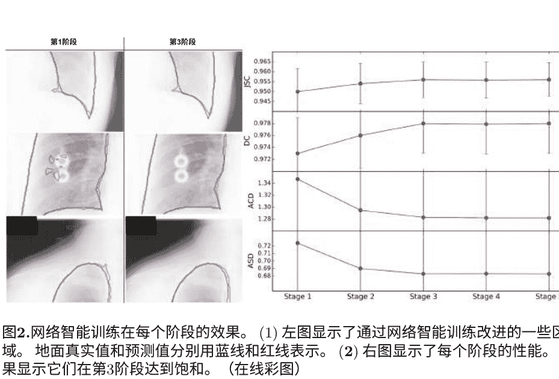

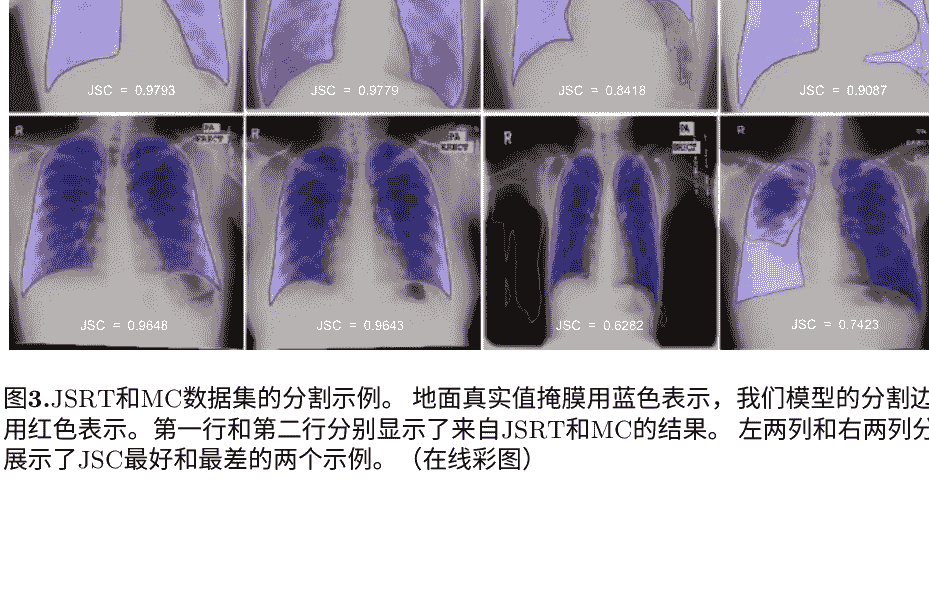

## 表1.JSRT和MC数据集分割性能的均值和标准差。每个数据集的最佳平均性能以粗体显示。

| 数据集 | 方法 | JSC | DC | ACD (mm) | ASD (mm) |
|---|---|---|---|---|---|
| JSRT | 人类观察者[3] | 0.946±0.018 | – | 1.64±0.69 | – |
|  | 混合投票[3] | 0.949±0.020 | – | 1.62±0.66 | – |
|  | Candemir [1] | 0.954±0.015 | 0.967±0.008 | 1.321±0.316 | – |
|  | InvertedNet [12] | 0.950 | 0.973 | – | 0.69 |
|  | 提出的（第一阶段） | 0.950±0.023 | 0.974±0.012 | 1.347±0.919 | 0.724±0.163 |
|  | 提出的（第二阶段） | 0.954±0.020 | 0.976±0.011 | 1.295±0.846 | 0.690±0.151 |
|  | 提出的（第三阶段） | 0.956±0.018 | 0.977±0.010 | 1.283±0.814 | 0.683±0.145 |
|  | 提出的（带增强的第三阶段） | **0.961**±0.015 | **0.980**±0.008 | **1.237**±0.702 | **0.675**±0.122 |
| MC | Candemir [1] | **0.941**±0.034 | 0.960±0.018 | **1.599**±0.742 | – |
|  | 提出的（带增强的第三阶段） | 0.931±0.049 | **0.964**±0.028 | 2.186±1.795 | 0.915±0.258 |

研究表明，第三阶段训练模型的肺边界比第一阶段的模型更加平滑。此外，第二行和第三行支持随着阶段的进行，假阳性和假阴性可以被抑制。图2右侧的性能图显示了随着阶段的变化而改变的性能。观察到它们在第三阶段饱和，因此我们报告了第三阶段模型的性能。

此外，我们还研究了数据增强的效果。为此，我们通过调整亮度和对比度来随机调整像素值，使网络对像素值扰动具有不变性⁵。如表1所示，经过数据增强的第三阶段训练模型在分割性能上表现更好。

然而，需要注意的是，在MC数据集上的性能并不如JSRT数据集上的好。均值性能稍低于[1]中的混合方法，但标准差要高得多，即使模型经过数据增强训练。这意味着我们使用JSRT训练的模型在MC上对一些情况的分割结果不稳定，如图3所示。这是由于训练集和测试集之间分布存在偏移，需要解决领域适应问题。

图3中可视化了分割的肺边界样本。左两列显示了JSC最好的两个结果，右两列显示了JSRT和MC数据集中最差的两个结果。

## 4 结论

在本文中，我们提出了一种基于CNN和空洞卷积的准确肺部分割模型。此外，还提出了一种新颖的多阶段训练策略，即网络级训练，用于改进分割结果。在基准数据集JSRT上进行的计算实验表明，所提出的架构和网络级训练对于获得准确的肺部分割模型非常有效。 我们还在MC数据集上评估了训练好的模型，这使我们需要开发对领域转移不敏感的模型。

## 参考文献

- 1. Candemir, S., Jaeger, S., Palaniappan, K., Musco, J.P., Singh, R.K., Xue, Z., Karargyris, A., Antani, S., Thoma, G., McDonald, C.J.: 使用非刚性配准的解剖图谱在胸部X射线中进行肺部分割。IEEE Trans.Med. Imaging 33(2), 577-590 (2014)
- 2. Chen, L.C., Papandreou, G., Kokkinos, I., Murphy, K., Yuille, A.L.: DeepLab: 深度卷积神经网络、空洞卷积和全连接CRFs的语义图像分割（2016）。 arXiv:1606.00915
- 3. van Ginneken, B., Stegmann, M.B., Loog, M.: 使用监督方法在胸部X射线图像中分割解剖结构：对公共数据库的比较研究。医学图像分析 10（1），19-40（2006）
- 4. Havaei, M., Davy, A., Warde-Farley, D., Biard, A., Courville, A., Bengio, Y., Pal, C., Jodoin, P.M., Larochelle, H.: 使用深度神经网络进行脑肿瘤分割。医学图像分析 35，18-31（2017）
- 5. He, K., Zhang, X., Ren, S., Sun, J.: 深度残差学习用于图像识别。在: CVPR, 第770-778页（2016）
- 6. Jaeger, S., et al.: 使用胸部X射线自动筛查结核病。IEEE Trans. Med. Imaging 33(2), 233-245（2014）
- 7. Kr¨ahenb¨uhl P., Koltun, V.: 具有高斯边缘潜力的全连接CRF中的高效推断。在: NIPS, pp. 109-117 (2011)
- 8. Krizhevsky, A., Sutskever, I., Hinton, G.E.: 使用深度卷积神经网络进行Imagenet分类。在: NIPS, pp. 1097-1105 (2012)
- 9. Luo, W., Li, Y., Urtasun, R., Zemel, R.: 深度卷积神经网络中的有效感受野理解. 在: NIPS, 第4898-4906页（2016）
- 10. Ngo, T.A., Carneiro, G.: 使用距离正则化水平集和深度结构化学习和推理进行胸部X射线图像的肺分割。在：2015年IEEE国际图像处理会议, 第2140-2143页（2015）
- 11. Noh, H., Hong, S., Han, B.: 学习解卷积网络进行语义分割。在: ICCV, 第1520-1528页（2015）
- 12. Novikov, A.A., Major, D., Lenis, D., Hlad˚uvka, J., Wimmer, M., B¨uhler, K.: 全卷积架构用于胸部X射线的多类别分割（2017）. arXiv:1701.08816
- 13. Ren, S., He, K., Girshick, R., Sun, J.: Faster R-CNN: 基于区域建议网络的实时目标检测. In: NIPS, pp. 91-99 (2012)
- 14. Ronneberger, O., Fischer, P., Brox, T.: U-net: 用于生物医学图像分割的卷积网络. In: Navab, N., Hornegger, J., Wells, W.M., Frangi, A.F.(eds.) MICCAI 2015. LNCS, vol. 9351, pp. 234-241. Springer, Cham (2015). doi:10.1007/978-3-319-24574-4_28
- 15. Shiraishi, J., Katsuragawa, S., Ikezoe, J., Matsumoto, T., Kobayashi, T., ichi Komatsu, K., Matsui, M., Fujita, H., Kodera, Y., Doi, K.: 开发了一个带有和不带有肺结节的胸部X射线图像数据库：放射科医生检测肺结节的接收器操作特性分析。Am. J. Roentgenol. 174(1), 71-74 (2000)

# 深度残差循环神经网络用于超声心动图中心脏周期相位的表征

Fatemeh Taheri Dezaki¹✉, Neeraj Dhungel¹, Amir H. Abdi¹,
Christina Luong², Teresa Tsang², John Jue², Ken Gin², Dale Hawley²,
Robert Rohling¹, and Purang Abolmaesumi¹✉

¹ 加拿大不列颠哥伦比亚大学，温哥华，加拿大
{fatemeh,purang}@ece.ubc.ca
2 温哥华综合医院心脏病学实验室，
温哥华，加拿大

摘要。 对超声心动图中的心脏周期相进行特征化是开发自动化系统测量各种心脏参数的必要预处理步骤。由于心脏解剖的外观差异和个体心率的变异，准确的特征化是具有挑战性的。 在这里，我们提出了一种使用新的深度神经网络架构自动识别超声心动图中心脏周期相的方法。 具体而言，我们建议将深度残差神经网络（ResNets）与循环神经网络（RNNs）相结合，从个别超声心动图帧中提取分层特征，并建模顺序帧之间的时间依赖性。 我们证明了这种新的架构在包含不同病理条件的大型超声心动图数据集中自动特征化心脏周期相的结果优于基线架构。

- 深度残差神经网络
- 循环神经网络
- 长短期记忆
- 超声心动图
- 帧识别

## 1 引言

根据世界卫生组织的数据，全球有数百万人患有与心脏相关的疾病，这是一种重要的死亡原因。 二维超声心动图（echo）检查是一种广泛应用于早期诊断的成像技术。

> F.T. Dezaki和N. Dhungel—同等贡献。
T. Tsang是温哥华综合医院和英属哥伦比亚大学超声心动图实验室的主任，也是支持这项工作的CIHR-NSERC资助项目的首席研究员。

1. 2014年非传染性疾病全球状况报告。
© Springer International Publishing AG 2017
M.J. Cardoso等人（编）：DLMIA/ML-CDS 2017, LNCS 10553, 第100-108页, 2017年。
DOI: 10.1007/978-3-319-67558-9_12

可以用于估计多个心脏参数，如射血容量、舒张末期容量和射血分数[1]。这些参数通常通过从电影式超声中识别收缩末期和舒张末期帧来测量[1,2]。

目前的检测方法要么是手动的，要么是半自动的[3,4]，主要依赖于心电图（ECG）数据的可用性，这在急诊和非专科诊所中可能具有挑战性。此外，这些检测技术增加了医务人员的工作量，并且存在用户间的差异性。自动检测回声中的心脏周期相可以潜在地缓解这些问题。

然而，由于回声数据中的信噪比低、连续帧之间的细微差异、心脏相变异性以及这些帧之间的时间依赖性，这种检测具有挑战性。

- (a) 心脏舒张末期(ED)帧
- (b) 心脏收缩末期(ES)帧

## 图1.2D超声心动图中心脏舒张末期和心脏收缩末期帧的示例。

自动检测和标记心脏超声图像帧已经有多次尝试 [2,4,5]。最常见的方法是使用分割策略，如水平集或图割，来识别心脏超声序列中左心室的边界 [2,5]。对应于最大和最小心室面积的边界被视为舒张末期（ED）和收缩末期（ES）帧 [5]（图1）。这些基于分割的方法的一个主要缺点是需要良好的初始化和左心室的定位。

在另一种方法中 [4]，将心脏超声图像帧的信息投影到低维度的二维流形上，然后使用流形上点之间的距离差异来确定ED和ES帧。然而，这种方法没有考虑帧之间的复杂时间依赖关系，可能导致次优的结果。最近，基于卷积神经网络（CNNs）和循环神经网络（RNNs）的方法在许多计算机视觉问题上取得了最先进的结果 [6-9]。CNNs和RNNs的组合已成功应用于各种问题领域，如视频帧检测、自然语言处理、目标检测和跟踪 [3,8,10,11]。然而，我们的经验是这种网络结构不容易扩展到心脏超声数据的分析，因为其信噪比较低，解剖边界可能不如其他成像模态清晰可见。

在这里，我们使用残差神经网络（ResNets）[7]构建了一个非常深的卷积神经网络架构，用于提取深层次的特征，然后将这些特征传递给包含两个长短期记忆（LSTM）[12]块的循环神经网络（RNNs）以解码这些特征之间的时间依赖关系。使用ResNets和LSTMs的主要动机是在深层卷积神经网络中学习相对于输入层的残差函数，以解决在深度增加时的梯度消失或梯度爆炸问题[7]。

此外，我们最小化结构化损失函数，模拟收缩期和舒张期左心室体积的时间变化[3]。 我们证明了使用ResNets和LSTMs以及结构化损失函数的提出方法，在无需分割的回声数据中检测心脏相位周期时能够产生最先进的准确性。

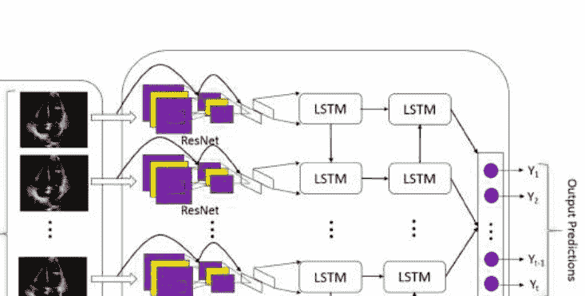

## 2 方法

### 2.1 数据集

设 \( D = \{(c^{(i)}, y^{(i)})\}_{i=1}^N \) 表示数据集， \( i \in \{1, 2, ..., N\} \) 表示个体研究中心脏周期的数量， \( c = \{x_1, x_2, ..., x_t\} \) 表示每个患者的帧集合 \( x \)，其中 \( x_t : \Omega \to \mathbb{R} \)， \( \Omega \subset \mathbb{R}^2 \)， \( y = \{y_1, y_2, ..., y_t\} \) 表示每个帧的类别标签，使用以下函数计算[3] :

$$ y_t = \begin{cases} \left( \frac{|t - T_{ES}^i|}{|T_{ES}^i - T_{ED}^i|} \right)^{\tau}, & \text{如果 } T_{ED}^i < t < T_{ES}^i \\ \left( \frac{|t - T_{ES}^i|}{|T_{ES}^i - T_{ED}^{i+1}|} \right)^{\frac{1}{\tau}}, & \text{如果 } T_{ES}^i < t < T_{ED}^{i+1} \end{cases} $$

其中 \( T_{ES}^i \) 和 \( T_{ED}^i \) 是第 \( i \) 个心脏周期中 ES 和 ED 帧的位置， \( \tau \) 是一个整数常数。 方程式1模拟了心脏周期的收缩和舒张阶段中心室体积的变化[3]。

### 2.2 深度残差循环神经网络（RRNs）

我们提出了深度残差循环神经网络（RRNs）来解码超声数据中的相位信息。RRNs由一系列残差单元组成，用于从超声数据中提取分层空间特征，使用LSTM来解码时间信息，并在末尾添加一个全连接层。如图3(a)所示，每个残差单元由残差函数和恒等映射的相加构成，并可以用以下表达式表示[7]：

$$ \mathbf{x}^{(t)}_L = \mathbf{x}^{(t)}_l + \sum_{l=1}^{L-1} f_{\mathrm{RES}}(\mathbf{x}^{(t)}_l; \mathcal{W}_l), $$

其中，$\mathbf{x}^{(t)}_l$是输入特征，$l \in \{1, ..., L\}$表示第$l$个残差单元（对于$l =1, \mathbf{x}^{(t)}_l = \mathbf{x}^{(t)}_l$），$\mathcal{W}_l = \mathbf{w}_{l,k}$是第$l$个残差单元的权重集合，$k \in \{1, ..., K\}$表示残差单元中的层数，$f_{\mathrm{RES}}(\cdot)$是由卷积层（权重）[6,13]、批归一化（BN）[14]和修正线性单元（ReLU）[7,15]表示的残差函数（图3(a)）。

我们使用RNN来解码回声序列中的时间依赖关系。如图3(b)所示，LSTM网络是一种带有记忆单元的RNN，允许网络学习记住或忘记隐藏状态。特别地，LSTM使用以下表达式[8]来更新隐藏状态$\mathbf{h}_t$和其记忆单元$c_t$，使用给定的顺序输入$\mathbf{x}_t$:

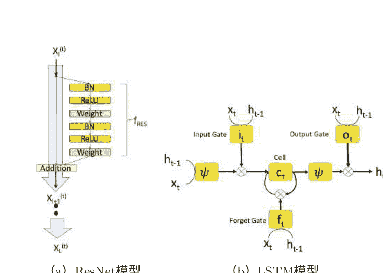

$$\begin{aligned} \mathbf{i}_t &= \phi(\mathbf{w}_{xi} \mathbf{x}_t + \mathbf{w}_{hi} \mathbf{h}_{t-1} + \mathbf{b}_i); \\ \mathbf{f}_t &= \phi(\mathbf{w}_{xf} \mathbf{x}_t + \mathbf{w}_{hf} \mathbf{h}_{t-1} + \mathbf{b}_f); \\ \mathbf{o}_t &= \phi(\mathbf{w}_{xo} \mathbf{x}_t + \mathbf{w}_{ho} \mathbf{h}_{t-1} + \mathbf{b}_o); \end{aligned}$$

其中⊙表示逐元素乘积，ψ表示双曲正切函数，φ表示sigmoid函数，w_xi、w_hi和b_i是输入i_t和隐藏状态h_{t-1}之间的权重和偏置项；w_xf、w_hf和b_f是遗忘状态f_t和隐藏状态h_{t-1}之间的权重和偏置项；w_xo、w_ho和b_o是输出o_t和隐藏状态h_{t-1}之间的权重和偏置项。

我们提出的RRNs（图2）可以表示为以下函数：

$$\begin{aligned} \mathbf{c}_t &= \mathbf{f}_t \odot \mathbf{c}_{t-1} + \mathbf{i}_t \odot \psi(\mathbf{w}_{xi} \mathbf{x}_t + \mathbf{w}_{hi} \mathbf{h}_{t-1} + \mathbf{b}_i), \\ \mathbf{h}_t &= \mathbf{o}_t \odot \psi(\mathbf{c}_t), \end{aligned}$$

其中，f_{RRNs}将顺序回波图像作为输入传递给RRNs，并输出具有RRNs参数的预测值ŷ_t，其中RRNs的参数为W_{RRNs} = [W_{ResNets}, W_{LSTM}, w_{fc}]。其中，W_{ResNets}表示ResNets的参数，W_{LSTM}表示LSTM的参数，w_{fc}与最终全连接层的权重相关。我们使用随机梯度下降的端到端方式训练提出的RRNs，以最小化以下损失函数[3]，其中包含第一项为L^2范数，第二项为结构化损失（为了简化表示，我们省略了表示回波序列的索引i）：

$$\{\tilde{y}_1, \tilde{y}_2, ..., \tilde{y}_t\} = f_{\text{RRNs}}(\mathbf{x}_1, \mathbf{x}_2, ..., \mathbf{x}_t; \mathcal{W}_{\text{RRNs}}),$$

$$\ell(\mathcal{W}_{\text{RRNs}}) = \sum_{j=1}^{|\mathcal{D}|} \left[ \frac{\alpha}{T} \sum_{t=1}^{T} ||y_{(j,t)} - \tilde{y}_{(j,t)}||^2 + \frac{2\beta}{T} \sum_{t=2}^{T} \left( \mathbb{I}(y_{(j,t)} > y_{(j,t-1)}) \max(0, \tilde{y}_{(j,t-1)} - \tilde{y}_{(j,t)}) + \mathbb{I}(y_{(j,t)} < y_{(j,t-1)}) \max(0, \tilde{y}_{(j,t)} - \tilde{y}_{(j,t-1)}) \right) \right],$$

其中I表示指示函数，T是最大帧长度，α, β是在实验过程中进行交叉验证的用户定义变量。结构化损失项考虑了心脏容积在收缩期的单调递减性质和舒张期的心脏容积变化的单调递增性质。最后，所提出的方法使用学习模型以前馈方式进行推理。

## 3 实验

我们在温哥华综合医院（VGH）获得了伦理批准的2-D心尖四腔（AP4）超声心动图，并进行了实验，伦理批准来自温哥华沿海卫生局（VCH）的临床医学研究伦理委员会（H13-02370）。该项目使用的数据集包含1,868个独立的患者研究，涵盖了一系列病理条件。数据是使用不同类型的超声探头从各个制造商获取的。

数据集包括正常和异常情况。实验通过随机将这些案例分成互斥的子集来运行，其中60%的案例用于训练，20%用于验证，20%用于测试。每个研究中回声序列的平均长度约为30帧。

与心动图剪辑同步的心电图 (ECG) 信号也可用。我们考虑使用ECG信号生成ED和ES帧的基准标签，通过识别该信号中的R点和T点的结束来实现。随后，使用公式 (1) 推导出每个回声序列中所有帧的中间标签，其中τ的值选择为3，并且标签在[0-1]范围内进行归一化（注意，0表示ES，1表示ED）。实验在图像分辨率为120×120的情况下进行，我们使用双三次插值对原始图像分辨率进行子采样。

我们提出的RRNs，如图2所示，将包含30帧的心脏序列作为输入，不考虑其在心脏相位中的位置。每一帧都通过卷积层 (权重) 加上ReLU传递，其中卷积层包含8个大小为3×3的滤波器，后面跟着九个连续的残差单元。每个残差单元由批量归一化 (BN) 加上ReLU加上权重组成。在前三个残差单元中，每个卷积层都包含相同的8个滤波器 (大小为3×3)，第四、第五和第六个残差单元包含16个大小为3×3的滤波器，第七、第八和第九个单元包含32个大小为3×3的滤波器。在倒数第二层中，我们将每个ResNet的32个输出特征连接起来形成192个特征 (32×6)，然后跟随两个LSTM层块和一个包含30个神经元的最终全连接层，为心脏周期的每一帧生成一个标签。为了比较，我们还使用了浅层CNN模型Zeiler-Fergus (ZF) [3]与不同的损失函数相结合。我们的方法的性能基于三个指标计算，即确定系数 (R^2score)，平均绝对帧检测误差和每个样本的计算时间。确定系数 (R^2score) 定义为 R^2 = 1 - Σ(y_i - \bar{y})^2 / Σ(y_i - y)^2，其中 \bar{y} 是真实标签的平均值。平均绝对帧检测误差计算公式为 Err_S = \frac{1}{|D|} \sum |T_S - \tilde{T}_S|，其中 S 可以是 ED 或 ES 帧。

所有实验都在一台配备Intel(R) Core(TM) i7-2600k 3.40 GHz × 8 CPU和8 GB RAM的系统上进行，配备了NVIDIA GeForce GTX 980Ti显卡。

## 4 结果与讨论

表1显示了使用两种不同损失函数的提出方法的结果：a) L_2损失，和b) L_2损失 + 结构化损失[3]。这两种设置的R_2值分别为0.36和0.66。类似地，这两种设置的 (Err_ED, Err_ES) 分别为 (4.4, 4.7) 和 (3.7, 4.1)。使用相同设置的基准方法[3]使用CNN得到的R_2分数为0.13，而在设置(a)中，ED和ES误差的平均绝对帧检测误差分别为6.3和7.3，在设置(b)中为6.4和7.3。

表1中的结果显示，所提出的RRN方法在两种设置下都比基准方法表现出更好的性能。所提出方法的优势在于其能够在ResNets中使用126层进行更深入的学习，而基准模型 (CNN) 中的架构较浅。

此外，我们注意到所提出的RRNs模型在使用结构化损失时性能得到了改善，具有更高的R²分数和较低的帧检测误差，相比仅使用L²损失。这是因为结构化损失在损失函数中引入了结构约束，有助于平滑预测标签，从而提高整体准确性。还需要注意的是，我们提出的模型的R²分数远远优于基准模型（0.66 vs. 0.13），这表明我们的方法在全局上更好地近似了正确的标签分配。该方法每个心脏周期只需要80毫秒进行特征化，显示出其在计算成本方面的高效性。图4展示了作为标签函数的30帧序列中帧特征化的一些视觉结果（参考公式（1））。特别地，图4（a和b）展示了序列中第一帧作为ED帧的情况，而图4（c和d）展示了ED帧位置发生变化的情况。同样，在图5中，我们还展示了使用所提出方法在测试集中准确检测ED和ES帧的一个视觉示例。

### 表1. 在测试集上，所提出的方法与现有方法的性能比较

| 方法 | R² 分数 | 误差_ED | 误差_ES |
| :--- | :---: | :---: | :---: |
| ResNet+LSTM+L₂损失（提出的方法） | 0.36 | 4.4 | 4.7 |
| **ResNet+LSTM+L₂损失+结构损失（提出的方法）** | **0.66** | **3.7** | **4.1** |
| CNN+LSTM+L₂ 损失[3] | 0.13 | 6.3 | 7.3 |
| CNN+LSTM+L₂ 损失+结构损失[3] | 0.13 | 6.4 | 7.3 |

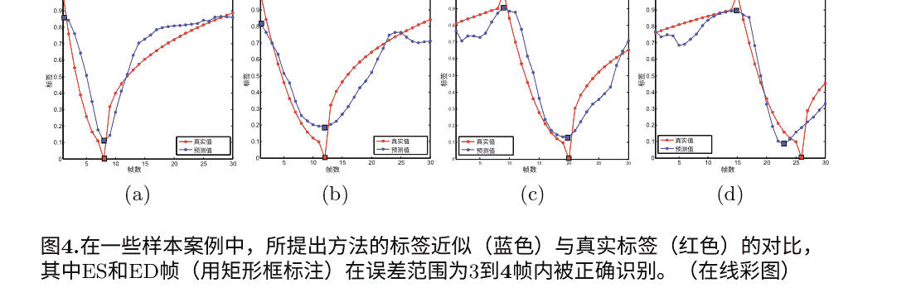

图4. 在一些样本案例中，所提出方法的标签近似（蓝色）与真实标签（红色）的对比，其中ES和ED帧（用矩形框标注）在误差范围为3到4帧内被正确识别。（在线彩图）

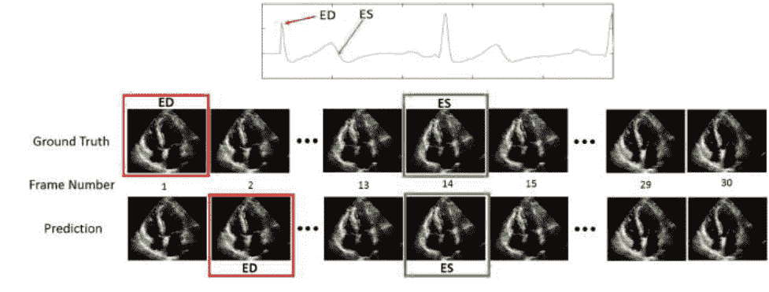

## 5 结论和未来工作

在本文中，我们提出了一种深度残差循环神经网络（RRN），用于从超声心动图中自动识别心脏周期相位（ED和ES）。我们还展示了所提出的方法在检测ED和ES帧方面相对于使用CNN的基准方法有很大的优势。我们实现了0.66的$R^2$分数和ED和ES的平均绝对帧检测误差分别为3.7和4.1。我们的结果表明该方法有潜力在临床环境中使用，并且对患者的各种病理条件具有鲁棒性。未来，我们计划将该方法用作评估多个心脏功能参数（包括射血分数）的预处理步骤。

## 参考文献

- 1. Barcaro, U., Moroni, D., Salvetti, O.: 从动态超声图像中自动计算左心室射血分数。模式识别与图像分析。**18**(2), 351 (2008)
- 2. Abboud, A.A., Rahmat, R.W., 等： 自动检测4D超声心动图像中的舒张末期和收缩末期。JCS **11**(1), 230-240 (2015)
- 3. Kong, B., Zhan, Y., Shin, M., Denny, T., Zhang, S.: 通过深度时间回归网络识别舒张末期和收缩末期帧。在: Ourselin, S., Joskowicz, L., Sabuncu, M.R., Unal, G., Wells, W. (eds.) MICCAI 2016. LNCS, vol. 9902, pp. 264–272. Springer, Cham (2016). doi:10.1007/978-3-319-46726-9_31
- 4. Gifani, P., Behnam, H., Shalbaf, A., Sani, Z.A.: 使用流形学习自动检测超声心动图像中的舒张末期和收缩末期。Physiol.Meas. **31**(9), 1091 (2010)
- 5. Darvishi, S., Behnam, H., Pouledian, M., Samiei, N.: 使用水平集方法在二维超声心动图图像序列中测量左心室体积，用于自动检测舒张末期和收缩末期帧。心血管研究与医学，第2卷，第1期，39页（2013年）
- 6. Krizhevsky, A., Sutskever, I., Hinton, G.E.: 使用深度卷积神经网络进行ImageNet分类。在：神经信息处理系统进展，第1097-1105页（2012年）
- 7. He, K., Zhang, X., Ren, S., Sun, J.: 深度残差学习用于图像识别。在：IEEE CVPR，第770-778页（2016年）
- 8. Donahue, J., Anne Hendricks, L., 等： 用于视觉识别和描述的长期循环卷积网络。在：IEEE CVPR，第2625-2634页（2015年）
- 9. Wang, J., Yang, Y., Mao, J., Huang, Z., Huang, C., Xu, W.: CNN-RNN：用于多标签图像分类的统一框架。在：IEEE计算机视觉和模式识别会议论文集，第2285-2294页（2016年）
- 10. Sundermeyer, M., Schlüter, R., Ney, H.: 用于语言建模的LSTM神经网络。在：Interspeech，第194-197页（2012年）
- 11. Milan, A., Rezatofighi, S.H., Dick, A., Reid, I., Schindler, K.: 使用循环神经网络进行在线多目标跟踪，arXiv预印本arXiv:1604.03635（2016）
- 12. Hochreiter, S., Schmidhuber, J.: 长短期记忆。神经计算。 9（8），1735-1780（1997）
- 13. LeCun, Y., Bengio, Y.: 卷积网络用于图像、语音和时间序列。在：Arbib，M.A.（编辑）脑理论和神经网络手册，第3361卷。MIT出版社（1995）
- 14. Ioffe, S., Szegedy, C.: 通过减少内部协变量偏移加速深度网络训练，arXiv预印本arXiv:1502.03167（2015）
- 15. Nair, V., Hinton, G.E.: 修正线性单元改进了受限玻尔兹曼机。在：ICML，pp. 807-814（2010）

# 使用3D卷积神经网络进行计算效率高的心脏视图投影

Matthieu Le(✉), Jesse Lieman-Sifry, Felix Lau, Sean Sall, Albert Hsiao, 和 Daniel Golden

Arterys Inc., 美国旧金山
matthieu@arterys.com

摘要。4D流动是一种MRI序列，可以获取心脏的3D图像。数据通常以体积的形式获取，因此必须重新格式化以生成心脏长轴和短轴视图进行诊断解读。这些视图可以通过放置6个标志点来生成：左心室尖、右心室尖以及主动脉、二尖瓣、肺动脉和三尖瓣。在本文中，我们提出了一种自动定位标志点的方法，以计算心脏视图。我们的方法首先计算一个紧密裁剪心脏的边界框，然后在这个边界框内进行标志点定位。这两个步骤都基于最近引入的ENet的3D扩展。我们证明，使用我们的自动化方法计算的长轴和短轴投影与由经验丰富的心脏放射科医师放置的标志点生成的投影在质量上是等同的，这是基于对另一位心脏放射科医师进行的盲测。

## 1 引言

心脏病理学通常最好通过心脏的主轴（长轴和短轴视图）进行评估。由于4D流动扫描通常是体积扫描，因此这些平面视图必须经过重建，以供心脏放射科医生解释。为了生成标准的心脏视图，用户可以手动放置6个心脏标志点：左心室尖（LVA）和右心室尖（RVA），以及主动脉瓣（AV）、二尖瓣（MV）、肺动脉瓣（PV）和三尖瓣（TV）。经过培训，使用交互式临床工具定位标志点大约需要经过训练的放射科医生3分钟。然后，使用标志点位置计算2、3和4腔心室视图，以及短轴堆叠（图1）。

尽管这些视图可以计算左心室和右心室，但为了简洁起见，我们重点关注左心室心脏视图。四腔心室视图定义为通过TV、MV和LVA的平面，其中LVA位于图像顶部。三腔心室视图定义为通过AV、MV和LVA的平面，其中LVA位于图像左侧。

二腔心视图被定义为平分3和4腔心视图的大角度平面，左心室在图像的左侧。短轴

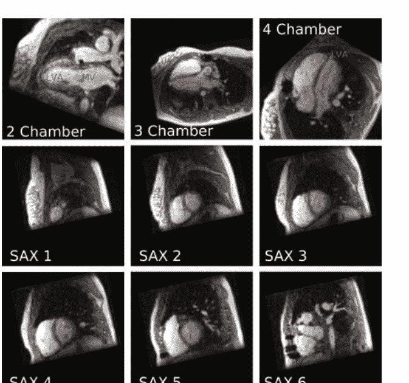

图1. 第一行：二腔心视图，三腔心视图和四腔心视图；第二行和第三行，从左到右，从上到下：从心尖到心底的短轴视图的6个切片，左心室位于图像中心。

（短轴堆叠视图）是通过采样与左心室和二尖瓣垂直的平面生成的，左心室位于图像中心，右心室位于图像左侧。

最近，利用深度学习技术在2D或3D图像中确定关键点的方法已经展示出了最先进的结果。Payer等人[1]提出了一种通过回归关键点位置的热图来检测2D和3D医学图像中的地标的方法。还有其他方法用于地标检测，例如使用强化学习[2]，其中一个代理在图像中移动并在找到地标时停止。一些方法提出了从左心室分割开始检测心脏地标的方法[3]。

在本文中，我们在[1,4]的基础上引入了一种基于地标检测网络自动计算心脏视图的方法。我们的方法可以避免手动放置地标，完全自动化计算心脏视图。我们通过对一位获得心脏放射学认证的专家进行盲测，证明我们自动化方法计算得到的长轴和短轴投影与专家标注者创建的投影质量相当。最后，我们展示了我们的模型可以应用于其他心脏MRI序列，例如体积采集的3D-cine单次屏气MRI。

## 2 方法

流水线。我们采用两步方法来定位定义心脏视图的六个标志点。首先，我们预测心脏周围的紧密边界框。

图2：从左到右：原始输入，用于边界框预测的预处理图像，裁剪的预处理输入，标志点检测（这里是主动脉瓣）。

其次，我们使用裁剪的图像来预测标志点位置（图2）。对于这两个步骤，我们使用基于原始2D实现的3D ENet架构[5]。对于边界框预测，输入是3D图像，输出是边界框内体积的语义分割图（图3）。我们通过对非考虑轴上的累积总和取第5和第95百分位数的位置，将边界框分割图转换为边界框坐标。对于标志点预测，网络的输入是原始3D图像中心周围的裁剪图像，输出是一个6通道热图（每个标志点一个通道），峰值的位置对应于预测的标志点位置（图4）。

图3：测试集中一个3D图像的边界框预测示例。上方是解剖图像，下方是网络的输出。红线标出了从输出图中推断出的边界框。从左到右依次是矢状面、冠状面和轴向面。（在线彩图）

数据。对于边界框检测，数据库包括81个独特的患者。对于每个患者，平均手动注释了2.9个时间点，用一个包围心脏的边界框，共得到了234个不同的3D图像。网络的真实值是一个二进制掩模，在手动定义的边界框内为1，在其他地方为0。对于地标检测，数据库包括310个独特的患者。对于每个患者，由专业心脏放射科医生注释了平均2.1个时间点，共得到了664个不同的3D图像。请注意，对于每个图像，并不一定都注释了所有六个地标（表1）。真实值是一个6通道的3D热图，每个地标的位置由一个具有固定方差为4个体素的3D各向同性高斯函数编码。

### 预处理

-   (i) 将图像调整为各向同性重新采样的64 × 64 × 64立方体，必要时用零填充
-   (ii) 将图像像素强度剪裁在第1和第99百分位数之间
-   (iii) 将图像强度归一化为0到1之间
-   (iv) 应用自适应直方图均衡化[6]
-   (v) 将图像居中和缩放

图2显示了边界框和地标检测步骤的预处理结果。

### 3D ENet

在两个步骤中，我们使用了2D ENet神经网络的3D扩展[5]。它是一个完全卷积网络，由一个下采样路径和一个上采样路径组成，可以在与输入图像相同分辨率下生成分割地图。ENet利用了深度学习的最新进展，以提高计算效率[5]。该网络架构利用了早期下采样和比收缩路径更小的扩展路径。它还使用了瓶颈模块，这是一种具有小感受野的卷积，用于将特征图投影到较低维度，可以应用更大的卷积核的空间[7]。最后，在整个网络中，ENet利用了各种低成本的卷积操作，如不对称的(1×1×1, 1×1×n, 1×n×1和n×1×1)卷积和扩张卷积[8]。

训练。我们将数据分成三个部分，其中80%的患者在训练集中，10%在验证集中，10%在测试集中，确保患者图像只出现在一个集合中。对于边界框ENet，我们使用[5]中描述的参数。我们使用Adam优化器[9]和像素级交叉熵损失进行训练。我们使用Adam优化器和l2损失进行地标检测模型的训练。我们只计算与考虑的注释中存在的地标相对应的损失。这样可以使用每个3D图像训练所有6个地标，即使并非所有图像都有所有6个地标的真实值。我们进行超参数搜索，训练50个模型进行40个时期，并选择具有最低l2损失的3个模型。然后，我们重新训练这三个最佳模型100个时期。然后，我们将具有最低中位误差的最佳模型指定为最佳模型。我们搜索以下内容：应用的扭曲水平（是否翻转图像，高斯噪声的强度，弹性扭曲，仿射变换，亮度，对比度和模糊参数），不对称卷积的大小，1.x瓶颈的数量，重复的Sect. 2的数量，初始滤波器的数量，池化类型（最大或平均），在瓶颈中降低维度的投影比例，学习率和dropout的数量（有关命名约定的详细信息，请参见[5]）。我们还测试了跳跃连接和金字塔场景解析模块[10]的使用，但发现它并没有改善结果。

## 3 结果

边界框。边界框的目标是能够裁剪包含标志物的心脏区域。这样可以将更高分辨率的图像输入到后续的标志物检测网络中。出于这个原因，以及由于“好”的边界框的确切范围是可以解释的，传统的语义分割问题的准确度度量不太适用。我们更关心的是确保标志物在边界框内，并且它们通过裁剪原始图像来获得足够的量。在标志物数据库上，边界框的平均体积为原始图像的18%，并且98%的所有真实标志物都包含在边界框内。边界框的像素级验证准确度为95%，验证Dice系数为0.83。

图3显示了一个患者的边界框预测结果，以及我们如何从输出的分割图中计算边界框坐标（在顶部行的红色轮廓中）。请注意，由于图像随后被调整为具有等间距的立方体以进行标志物预测，最终裁剪的图像通常比预测的边界框要大。

地标。在测试集上指定最佳模型的结果见表1。每个地标的中位误差（与实际距离之间的距离）对于测试集中的所有6个标记点，真实值和预测值之间的平均误差为8.9毫米，所有预测值的中位数误差为8.8毫米。[11]的尸体研究发现最小瓣膜（PV）的平均半径为10.8毫米。因此，我们的平均定位误差小于最小心脏瓣膜的平均半径。图4展示了一个患者的标记点检测结果。

一项研究的推理时间平均略低于一秒，在NVIDIA Maxwell Titan X上，具体取决于输入图像的原始大小。

表1：地标检测误差结果和数据库中的注释数量。误差定义为地面真实值与预测值之间的距离（以毫米为单位）。

|          | 训练集（注释数） | 验证集（注释数） | 测试集（注释数） |
|----------|------------------|------------------|------------------|
| LVA      | 6.6 (403)        | 5.5 (50)         | 7.1 (62)         |
| MV       | 8.4 (514)        | 8.8 (59)         | 9.5 (68)         |
| AV       | 6.3 (284)        | 6.2 (35)         | 6.5 (34)         |
| RVA      | 7.5 (453)        | 6.0 (48)         | 9.3 (45)         |
| TV       | 8.9 (513)        | 10.5 (64)        | 10.6 (67)        |
| PV       | 8.8 (326)        | 13.6 (34)        | 10.2 (34)        |
| 平均中位误差 | 7.7              | 8.4              | 8.9              |
| 中位误差 | 7.7              | 7.9              | 8.8              |

心脏视图。图1显示了左心室单个时间点的预测心脏视图。尽管模型是在心脏周期的稀疏注释时间点（主要是对应于舒张末期和收缩末期的时间点）进行训练的，我们可以预测每个时间点的地标位置。

为了计算心脏视图，我们预测每个时间点的地标位置，然后在时间上取中位数位置，以计算具有固定地标的投影（否则，投影的心脏视图会在周期中移动，这可能会让临床医生感到困惑）。为了评估心脏视图的质量，我们将它们盲目呈现给一位未参与真实数据收集或本研究的任何其他方面的心脏放射学专家。我们向临床医生展示了来自完整测试集的基于真实注释和预测地标的2D心脏电影。电影的顺序是随机的，所以临床医生不知道任何给定的电影是来自真实注释还是预测地标。我们要求临床医生对每个投影（2/3/4腔室和SAX视图）进行评分，评分从1（不适合诊断的差投影）到5（临床相关的心脏视图）。表2显示了结果。评分表明预测的心脏视图的质量与真实视图相当，平均评分差异为0.5。两者中，倾向于预测的心脏视图。心脏视图计算的故障模式主要包括右心室的一部分存在于左心室的二腔视图中。

其他MR序列。我们在图5中展示了使用3D-cine单次屏气MRI进行心脏视图计算的结果，这是一种不同的序列，与4D流动不同。我们可以看到学习模型很好地推广到类似的MRI模态。

表2：由获得认证的心脏放射科医师评估的心脏视图等级。

|          | 自动化视图 | 放射科医生视图 | 差异 |
| :------- | :--------- | :------------- | :--- |
| 2腔室    | 4.0        | 3.6            | 0.4  |
| 3腔室    | 4.7        | 4.6            | 0.1  |
| 4腔室    | 4.8        | 4.1            | 0.7  |
| 短轴     | 4.1        | 4.1            | 0.0  |
| **平均** | **4.4**    | **4.1**        | **0.5** |

## 4 结论

我们提出了一种自动计算体积心脏磁共振成像的长轴和短轴视图的方法。我们证明了我们的误差接近解剖变异，并通过来自经过认证的心脏放射科医师的盲比较测试中的质量评级证实了我们的方法的有效性。

所提出的方法可能消除手动放置标记点的需求，完全自动化计算心脏视图。未来的工作可以探索使用非立方裁剪图像输入到地标检测网络中，因为它是完全卷积的。我们还将研究如何将流动信息整合到其中，帮助定位地标。这些额外的数据可能对定位瓣膜最有帮助。然而，流量数据需要仔细处理，因为它可能特别嘈杂。

## 参考文献

-   1. 地标定位。在：Ourselin, S., Joskowicz, L., Sabuncu, M.R., Unal, G., Wells, W. (eds.) MICCAI 2016. LNCS, vol. 9901, pp. 230–238. Springer, Cham (2016). doi:10.1007/978-3-319-46723-8_27
-   2. Ghesu, F.C., Georgescu, B., Mansi, T., Neumann, D., Hornegger, J., Comaniciu, D.: 医学图像中解剖标志检测的人工智能代理。在：Ourselin, S., Joskowicz, L., Sabuncu, M.R., Unal, G., Wells, W. (eds.) MICCAI 2016. LNCS, vol. 9902, pp. 229–237. Springer, Cham (2016). doi:10.1007/978-3-319-46726-9_27
-   3. Lu, X., Jolly, M.-P., Georgescu, B., Hayes, C., Speier, P., Schmidt, M., Bi, X., Kroeker, R., Comaniciu, D., Kellman, P., Mueller, E., Guehring, J.: 自动视图规划用于心脏MRI采集。在：Fichtinger, G., Martel, A., Peters, T. (eds.) MICCAI 2011. LNCS, vol. 6893, pp. 479–486. Springer, Heidelberg (2011). doi:10.1007/978-3-642-23626-6_59
-   4. Pfister, T., Charles, J., Zisserman, A.: 在视频中用于人体姿势估计的流动卷积神经网络。在：ICCV, pp. 1913–1921 (2015)
-   5. Paszke, A., et al.: Enet: 用于实时语义分割的深度神经网络架构 arXiv:1606.02147 (2016)
-   6. Zuiderveld, K.: 对比度有限自适应直方图均衡化。在：图形 gems IV. Academic Press Professional Inc., pp. 474–485 (1994年)
-   7. He, K., Zhang, X., Ren, S., Sun, J.: 深度残差学习用于图像识别。在：IEEE CVPR会议论文集，pp. 770–778 (2016年)
-   8. Yu, F., Koltun, V.: 通过扩张卷积进行多尺度上下文聚合 arXiv:1511.07122 (2015年)
-   9. Kingma, D., Ba, J.: Adam: 一种随机优化方法 arXiv:1412.6980 (2014年)
-   10. Zhao, H., Shi, J., Qi, X., Wang, X., Jia, J.: 金字塔场景解析网络 arXiv:1612.01105 (2016年)
-   11. Ilankathir, S.: 成年人心脏瓣膜环周长的尸体研究及其临床意义。IOSR-JDMS 1 (14)，60–64 (2015年)

# 使用基于CNN回归的非刚性颅面2D-3D配准

裴宇如1 (✉)，张云耕1，秦海芳1，马庚宇2，郭宇科3，徐天民4，赵宏斌1

1 机器感知（MOE）重点实验室，机器智能系，北京大学，中国
Peiyuru@cis.pku.edu.cn
2 USens公司，圣何塞，美
3 洛阳科技学院，洛阳，中国
4 北京大学口腔医学院，北京，中国

摘要：2D-3D配准是将治疗过程中的X射线图像与现有的体积图像对齐的基石。在本文中，我们提出了一种基于CNN回归的非刚性2D-3D配准方法。引入了迭代细化方案，用于更新参考体积图像和数字重建放射图（DRR），以便收敛到目标X射线图像。基于CNN的回归器表示图像对和中间变形参数之间的映射。特别地，卷积块中的短残差连接和多尺度特征图融合的长跳跃连接有助于在训练回归器时进行信息传播。所提出的方法已应用于合成X射线和临床捕获的CBCT图像的2D-3D配准。实验结果表明，所提出的方法实现了颅面图像的准确且高效的2D-3D配准。

## 1 引言

长期的正畸治疗通常需要几年时间，在此期间会拍摄多张图像，用于结构形态评估，特别是对于青少年患者。在临床正畸学中，使用体积图像（如CBCT图像）之前，2D X射线颅面侧位片是记录颅面形态的唯一媒介。非刚性的2D-3D配准是从治疗间的X射线图像中获取3D体积图像的关键步骤。

传统的2D-3D配准技术依赖于迭代优化来最小化数字重建射线图（DRR）与目标X射线图之间的差异，以求解变换参数，这被认为是非常耗时的，因为需要进行大量的在线DRR评估[7,12,15]。非刚性的2D-3D配准的时间复杂度随着需要求解的参数数量的增加而增加。已经有几种3D图像配准度量标准被应用于基于强度的2D-3D配准，包括基于随机秩相关的度量标准[9]，基于稀疏直方图的度量标准[15]和变分互信息度量标准[12]。为了减轻度量标准的时间复杂度，在评估中，基于特征的方法已经被用于2D-3D配准，通过使用角点、线条和分割基于度量[1]。然而，考虑到结构重叠引起的模糊图像，准确检测几何特征本身是具有挑战性的[4]。此外，基于优化的配准容易传播特征检测错误。

统计表面和强度模型可以减少2D-3D配准中的参数空间[10,11,13]。然而，对于复杂结构（如头骨）的紧密拟合，通过有限的参数来微调表面模型并不是一项简单的任务。此外，基于统计模型的配准仍然依赖于大量的在线DRRs。回归模型通过无需在线DRRs的2D X射线图像和3D变换参数之间的映射来弥合差距[5,6,14]。郑等人[14]提出了一种基于偏最小二乘回归（PLSR）的三维体积图像重建技术。然而，该系统需要额外的3D替代网格进行模型学习。回归森林作为X射线图像特征空间和体积图像特征空间之间的映射函数，尽管该模型依赖于特征提取[6]。苗等人[5]提出了一种基于CNN回归的刚性2D-3D配准系统，其一次性变换估计仅限于处理颅面配准中的细粒度结构。

在本文中，我们提出了一种基于CNN回归的方法，用于2D颅面X线图像和3D体积CBCT图像之间的非刚性2D-3D配准（图1）。CNN在各种计算机视觉和医学图像处理任务中展现出了惊人的性能[2,8]。在这里，我们利用基于CNN的回归器将图像对映射到相应的中间非刚性变形参数。特别地，短和长的残差连接被引入到神经网络中，以增强图像信息的传播。从训练体积图像张成的子空间中随机采样的变形对以及相应的合成DRR用于训练基于CNN的回归器。在基于回归的2D-3D配准中，引入了一种反馈方案，通过迭代微调变形参数。通过基于CNN的回归器，迭代更新输入图像对的参考图像，直到新生成的DRR与目标X射线图像一致。所提出的方法通过混合残差CNN和迭代细化方案，实现了可靠且高效的在线非刚性2D-3D配准。我们展示了与传统方法相比，通过混合残差CNN和迭代细化的多尺度特征融合，可以改善颅面X线图像和CBCT图像的2D-3D配准结果。

## 2 方法

### 2.1 基于回归的二维-三维配准

我们将目标X射线图像表示为$I_{tar}$，参考体积图像表示为$V_{ref}$。二维-三维配准的目标是得到变形后的体积图像与$I_{tar}$一致的变换$V_{ref}$到DRR投影的意义。所提出系统的输入是图像对($I_{tar}, I_{ref}$)，其中$I_{ref}$表示$V_{ref}$的DRR投影。输出是定义在B样条变形模型控制网格上的$^3$D位移向量的变换参数。使用三次B样条的$^3$D张量积来定义非刚性变形，其中控制网格$G$定义在$V_{ref}$上。目标函数定义为$g=d(I_{tar}, P(M(V_{ref}, G \circ \delta T)))$。变换$\delta T = f(I_{tar}, I_{ref})$，其中$f$表示基于CNN回归的函数。$M$表示基于B样条的变形，且$M = \sum_{i=0}^{3}\sum_{j=0}^{3} \sum_{k=0}^{3} B_{ijk} T_{ijk}$表示三次B样条的基函数。$P$表示DRR投影函数，用于从变形体积图像生成2D X射线图像。$d$表示基于互信息的2D图像度量。

迭代细化。如图1所示，引入了迭代反馈方案来处理颅面结构的细粒度形状变化，而不是基于一次回归的注册。首先，将目标X射线图像$I_{tar}$与参考CBCT的$I_{ref}$结合输入到回归器中。输出的变形参数被施加到参考CBCT上，以得到与$I_{tar}$一致的体积图像。如果目标X射线图像$I_{tar}$和新生成的DRR$I_{ref}^{'}$之间的差异足够大，则将输入图像对替换为$(I_{tar}, I_{ref}^{'})$，并再次输入到回归器中。当迭代更新的DRR与$I_{tar}$一致时，过程终止。目标函数重新定义为

$$g^{(t)} = d\left( I_{tar}, P\left( M\left( V_{ref}^{(t-1)}, G^{(t)} \circ \delta T^{(t)} \right) \right) \right), \quad \quad (1)$$

其中 $\delta T^{(t)} = f(I_{tar}, I_{ref}^{(t-1)})$。在第 $t$ 次迭代中，控制网格 $G$ 由前几次迭代中获得的变形参数确定，并 $G^{(t)} = G^{(0)} \circ \sum_{k=1}^{t} \delta T^{(k)}$。最终体积图像 $V^{(t)}$ 在前几次迭代中获得的变形参数确定后确定。

$$V^{(t)} = M\left( V_{ref}^{(t-1)}, G^{(t)} \circ \delta T^{(t)} \right). \quad \quad (2)$$

由于迭代的改进，系统还包括在线DRR和2D度量评估，尽管有限的迭代足以实现收敛如实验所述。

## 2.1 输入通道

与传统的基于特征的2D-3D配准方法不同，整个X射线图像被用作基于CNN的回归器的输入，而无需进行特征提取，如角点和线段。考虑到X射线图像是单通道灰度图像，我们通过一组各向异性扩散滤波通道[7]以及相关的梯度幅度来强化输入X射线图像（见图2）。各向异性扩散过程由热函数建模 ∂I/∂t = c(x, y, t)ΔI + ∇c·∇I，其中流函数c控制扩散速率。热函数的离散数值解如下：

```
I^{(t)} = I^{(t-1)} + α \sum_{r=1} \beta_r \nabla_r I^{(t-1)} , (3)
```

其中常数 α与数值解的稳定性相关，并且设置为0.1。系数 β根据梯度大小设置，β= exp(-||∇I||^2/κ)。常数 κ设置为0.3。 r的值从1到4变化，对应四个方向，包括上、下、左、右，在梯度估计中。如图2所示，经过各向异性扩散滤波的图像I^{(t)}，以及梯度大小 I_G^{(t)} 作为回归器的输入，其中 t∈{0,...,8}。因此，回归器的输入图像对 I 有18个通道，I = [I^{(t)}, I_G^{(t)} | t=0, ..., 8]。

## 2.2 基于CNN的回归器

如图1所示，回归网络由卷积部分和全连接（FC）部分组成。第一部分用作自动特征图提取的编码器。卷积部分的基本单元，即Conv-block，遵循残差卷积神经网络[2]的常见模式。Conv-block由两个卷积层组成，后面跟着修正线性单元（RELU）。所有卷积滤波器的感受野大小设置为3，步长为1。卷积层后面跟着一个2×2×2的池化层。在重复的卷积层的输入和输出之间添加了短的残差连接，以增强信息传播。

FC部分由三个全连接层组成，用于转换参数预测。近期的研究中已经应用了长短连接，并证明有助于网络训练[11]。在这项工作中，长跳残差连接被添加在多尺度Conv-blocks和第一个FC层之间，以实现多尺度特征图融合，从而实现准确的转换预测。特征图从Conv-block 1、2和3以1/8、1/4和1/2的速率进行下采样分别与Conv-block 4的输出相结合，作为FC部分的输入。长短连接在图1中用侧箭头表示分别通过步长为8、4和2的卷积实现。与四个Conv-block对应的四个FC层的融合后跟着另外两个FC层。CNN回归器的损失函数 $\mathcal{L}$ 被简单地定义为预测变换参数与真实变换参数之间的欧氏距离，分别表示为 $\delta T^p$ 和 $\delta T^g$，则 $\mathcal{L} = \|\delta T^p - \delta T^g\|^2$。

## 3 实验

数据集。数据集包含由NewTom拍摄的120张CBCT图像视场为12英寸。CBCT图像被重新采样为分辨率为200 × 200 × 190，体素大小为1 × 1 ×1 mm³。2D X-射线颅面图像通过DRR技术生成，分辨率为200 ×200。获取颅面2D-3D图像配准的真实数据并不是一项简单的任务。在实验中，我们使用合成数据来训练和测试所提出的模型。我们使用Plastimatch工具箱的非刚性B-样条配准方法来获取变形参数，与随机选择的参考图像进行比较。B样条变形的控制网格设置为20 × 20 ×20，每个体积图像关联一个8000 ×3维度的变形向量。主成分分析用于对非刚性变形参数进行低维子空间表示。在我们的实验中，保留80个主成分，覆盖了99.5%以上的方差。我们在子空间中随机采样了30k对点对 $(T_s, T_{s'})$，对应的合成X-射线图像对为 $[P(M(V_{ref}, T_s)), P(M(V_{ref}, T_{s'}))]$。合成图像对的各向异性扩散和梯度幅值通道（第2.1节）与中间变换 $\delta T = T_{s'} - T_s$，一起用于训练CNN回归器。

训练细节。使用Caffe [3] 在一台带有一块Titan X GPU的机器上执行CNN回归器的训练。批量大小设置为1000。动量设置为0.9。学习率设置为1e-4，在每10 000个epoch后除以10。权重衰减设置为5e-4。批量归一化是为了避免内部协方差偏移，通过使每层的输入数据均值为零，方差为单位来执行。

### 3.1 定性评估

提出的2D-3D配准方法在具有可用基准的合成测试数据集上通过三个指标进行评估。第一个指标是2D目标X射线图像与输出变形体积图像的DRR之间的轮廓距离，即 $e_c = 1/n_c \sum_{i=1}^{c} \|p_i - p_{gi}\|$。$p_i$ 和 $p^g_i$ 分别表示 DRR 和目标 X 射线图像轮廓上均匀采样的点。我们的实验报告了三种结构的C值，即前颅底（A_C B）、上颌骨（MAX）和下颌骨（MAD）。第二个度量指标是输出体积图像与真实值之间的平均强度差异，即 $I = 1/n_v \sum_{i=1}^{v} |v_i - v_{ig i}|$，其中 $n_v$ 是体素数量。$v_i$ 和 $v_{ig}$ 分别表示重建和真实体积图像的强度值。我们还测量了估计的变形参数与真实值之间的距离，即 $T = 1/n^g \sum_{i=1}^{g} \|T_i - T_{ig}\|$，其中 $T_i$ 和 $T_i^g$ 是基于B样条变形模型的第 $i$ 个控制点的估计位移向量和真实位移向量。我们使用均方差度量(Inten-MS)[9]和互信息度量(Inten-MI)[12]与传统的基于强度的2D-3D配准方法进行比较。我们还进行消融实验来评估短期和长期残差连接。我们与基于CNN网络的单次回归(CNN)[5]进行比较，其中没有残差连接，与Conv-blocks中的短期残差连接(Short)[2]，具有长期残差连接(Long)[11]，以及同时具有短期和长期残差连接(Both)的网络。此外，我们与偏最小二乘回归(PLSR)[14]进行比较。

表1.通过所提出的方法与迭代细化（Refine），Inten-MS，Inten-MI以及基于一次性PLSR和带有长短残差连接的CNN的回归模型的比较，以e_C（毫米），e_I（HU）和e_T（毫米）为指标。

|    | Inten-MI | Inten-MSD | PLSR | CNN | 短 | 长 | 两者 | 细化 |
|----|----------|-----------|------|-----|----|----|------|------|
| e_C CB | 0.57 ±0.23 | 0.55±0.21 | 9.7±1.0 | 0.95±0.35 | 0.59±0.18 | 0.54±0.15 | 0.42±0.08 | **0.41±0.12** |
| MAD | 0.64±0.23 | 0.55±0.19 | 5.8±1.1 | 0.79±0.20 | 0.54±0.12 | 0.54±0.13 | 0.50±0.14 | **0.48±0.17** |
| MAX | 0.99 ±0.42 | 0.74±0.34 | 7.7±0.44 | 0.63±0.43 | 0.56±0.14 | 0.56±0.12 | 0.42±0.12 | **0.35±0.08** |
| e_I (×10^2) | 2.3 ±0.32 | 2.2±0.26 | 6.2 ±0.37 | 1.1±0.44 | 1.0±0.38 | 1.05±0.65 | 0.94±0.31 | **0.92±0.30** |
| e_T | 3.5±0.43 | 3.4±0.51 | 16±1.0 | 0.83±0.36 | 0.77±0.32 | 0.76±0.35 | 0.73±0.33 | **0.60±0.33** |

如表1所示，所提出的方法（Refine）在2D X射线图像的轮廓距离和体积图像的强度差异方面优于其他方法。在消融实验中，具有长短残差连接的所提出的CNN回归模型对其他CNN变体产生了改进。我们认为原因是残差连接加强了信息传播，特别是在多级特征图中容纳的细粒度结构。所提出的方法甚至优于传统的基于强度的2D-3D配准方法，在每次迭代中进行了数千次DRR评估。我们认为原因是基于学习的回归模型考虑了2D X射线和3D体积图像中的颅面形状分布。此外，迭代细化方案倾向于获得准确的变形参数。CNN回归模型解决了X射线图像对和变换参数之间的非线性映射，并显示出更好的性能。

图3.非刚性2D-3D配准前（a, e）和配准后（b, f）的半透明轴向、矢状和冠状切片重叠显示（灰色-真实值，红色-配准前后参考）。2D X射线图像上前颅底、上颌骨和下颌骨的轮廓重叠显示在配准前（c, g）和配准后（d, h）（黄色-参考，红色-目标，蓝色-变形参考）。（在线彩图）

与PLSR相比，两个案例的2D-3D配准前后地面真实值和参考体积图像的重叠显示如图3所示。正如我们所看到的，输出的变形体积图像与真实值一致。此外，输出体积图像的DRR上的ACB、MAX和MAD的轮廓与目标X射线图像上的轮廓重合（见图3（d，h））。我们还在图4（a，b）中用所提出的方法和CNN变体对30个测试案例的$e_I$、$e_T$进行了箱线图展示。

图4.在30个测试案例中，(a) $e_I$和(b) $e_T$的箱线图。经过不同次数的迭代后的(c) $e_T$通过提出的方法。

所提出的方法利用了迭代细化方案。在每次迭代中，需要进行一次耗时的三维非刚性变形和一次DRR投影来更新参考X射线图像。幸运的是，只需要几次迭代就足以实现成功的配准，如图4(c)所示。在我们的实验中，大约使用三次迭代来获得所需的变形参数。

## 4 结论

我们提出了一种基于CNN回归的非刚性二维-三维配准方法。CNN回归器考虑了图像对之间的非线性映射以及基于B样条的变形模型的控制网格上定义的中间变换。细化方案迭代地更新参考DRR图像，以便收敛到目标X射线图像。所提出的方法已应用于合成X射线和临床CBCT图像的二维-三维配准。所提出的方法在X射线图像的轮廓一致性和体积图像的强度差异方面优于比较的传统方法。

致谢。本工作得到了中国国家自然科学基金委员会的支持，项目编号为61272342。

## 参考文献

- 1. Groher, M., Bender, F., Hoffmann, R.T., Navab, N.: 基于分割的腹部导管介入的2D-3D配准。 In: 医学图像计算与计算机辅助干预-MICCAI, pp. 527–535 (2007)
- 2. He, K., Zhang, X., Ren, S., Sun, J.: 深度残差学习用于图像识别。 在： CVPR, 第770-778页 (2016)
- 3. Jia, Y., Shelhamer, E., Donahue, J., Karayev, S., Long, J., Girshick, R., Guadarrama, S., Darrell, T.: Caffe: 用于快速特征嵌入的卷积架构。 In: ACM多媒体, pp. 675–678 (2014)
- 4. Mahfouz, M.R., Hoff, W.A., Komistek, R.D., Dennis, D.A.: 分割错误对X射线图像中植入物模型的3D到2D配准的影响。 J. Biomech.38(2), 229–239 (2005)
- 5. Miao, S., Wang, Z.J., Liao, R.: 用于实时2D/3D配准的CNN回归方法。IEEE Trans. Med. imaging 35(5), 1352-1363 (2016)
- 6. Pei, Y., Dai, F., Xu, T., Zhang, H., Ma, G.: 通过回归森林从2D侧面颅骨结构进行体积重建。 在：IEEE ICIP, pp. 4052-4056 (2016)
- 7. Perona, P., Shiota, T., Malik, J.: 各向异性扩散。 在：几何驱动的计算机视觉扩散, pp. 73-92 (1994)
- 8. Shen, D., Wu, G., Suk, H.I.: 医学图像分析中的深度学习。 Ann. Rev. Biomed. Eng. 19， 221-248 (2017)
- 9. Steininger, P., Neuner, M., Birkfellner, W., Gendrin, C., Mooslechner, M., Bloch, C., Pawiro, S., Sedlmayer, F., Deutschmann, H.: 基于ITK的随机秩相关（SRC）度量的实现。 Insight J. 11, 5 (2010)
- 10. Whitmarsh, T., Humbert, L., De Craene, M., Luis, M., Fritscher, K., Schubert, R., Eckstein, F., Link, T., Frangi, A.F.: 来自单个模拟DXA图像的近端股骨三维骨密度分布和形状重建：一项体外研究。 在：SPIE医学成像, 第76234U-76234U页 (2010)
- 11. Yu, W., Tannast, M., Zheng, G.: 使用基于B样条的统计变形模型进行非刚性自由形式2D-3D配准。 Pattern Recognn. 6 3, 689–699 (2017)
- 12. Zheng, G.: 在基于互信息的CT体积到X射线图像的3D-2D配准中有效地融合空间信息。 Comput. Med. Imaging Graph. 34(7), 553–562 (2010)
- 13. Zheng, G.: 基于强度的非刚性二维-三维配准的个性化髋骨X射线重建。 在：医学图像计算与计算机辅助干预-MICCAI, 第598-606页 (2011)
- 14. Zheng, G.: 使用偏最小二乘回归从二维X射线图像中进行三维体积强度重建。 在: IEEE I SBI, 第1268-1271页 (2013)
- 15. Zollei, L.: X射线荧光和CT图像的二维-三维刚体配准。 博士论文, 哈佛医学院 (2001)

# 一种用于图像分割的深度水平集方法

Min Tang^{(\boxtimes)}, Sepehr Valipour, Zichen Zhang, Dana Cobzas, 和 Martin Jagersand
阿尔伯塔大学计算科学系, 加拿大埃德蒙顿
min.tang@ualberta.ca

摘要。本文提出了一种新颖的图像分割方法，将完全卷积网络 (FCN) 与水平集模型相结合。与FCN相比，集成方法可以结合平滑和先验信息，实现准确的分割。此外，与将水平集模型用作后处理工具不同，我们将其集成到训练阶段以微调FCN。这允许在半监督设置下使用未标记的数据进行训练。使用两种类型的医学成像数据 (肝脏CT和左心室MRI数据)，我们展示了集成方法在训练数据有限的情况下也能取得良好的性能，优于单独使用FCN或水平集模型。

- 图像分割
- 水平集
- 深度学习
- FCN
- 半监督学习
- 形状先验

## 1 引言

图像分割是医学成像中的核心问题之一。与自然图像分割相比，医学图像分割通常更具挑战性，因为结果要求高度准确，但同时提供的训练数据很少。为了解决这些问题，通常对预期的分割结果施加强大的假设和解剖先验知识。在相当长的一段时间里，该领域主要由基于能量的方法主导，其中分割任务被建模为能量最小化问题。不同类型的正则化器和先验知识[1]可以很容易地纳入到这种形式中。自从Chan和Vese的开创性工作[2]以来，水平集一直是首选模型之一，因为它能够处理分割函数的拓扑变化。然而，传统水平集方法存在一些局限性：它们依赖于良好的轮廓初始化和模型中涉及的参数的良好猜测。此外，尽管取得了一些进展[1,3]，它们通常具有相对简单的外观模型。

最近引入的深度神经网络架构通过从大量注释的数据中自动学习外观模型来解决其中一些问题数据集。此外，FCNs [4] 在许多分割任务中取得了成功，包括医学成像 [5,6]。尽管它们取得了成功，但与传统的基于能量的方法相比，FCNs 有一些限制：它们没有明确的方法来结合正则化和先验信息。由于步幅卷积和池化层中的子采样，网络通常需要大量的训练数据，并且倾向于产生低分辨率的结果。

我们通过提出一个集成的 FCN-levelset 模型来解决这些限制，该模型通过级集模块迭代地改进 FCN。 我们展示了（1）即使只有少量的训练数据可用，集成模型也能取得良好的性能，优于单独的 FCN 或级集模型，以及（2）统一的迭代模型以半监督的方式训练 FCN，从而有效利用未标记的数据。 特别是，我们展示了仅使用带有标签的训练数据的子集，联合训练的 FCN 可以达到与使用整个训练集训练的 FCN 相当的性能。很少有其他作品在成本函数中使用显式正则化项或使用条件随机场（CRF）作为后处理步骤[8,9]或与FCN或CNN一起进行联合训练[10]，以解决卷积神经网络中引入平滑性的问题。 然而，只有特定的图形模型可以使用FCN流水线进行训练，并且它们不能轻松地集成形状先验。 最近还提出了一种联合深度学习和水平集方法[11,12]，但他们的工作考虑了一个生成模型（深度信念网络DBM ），该模型不是由联合模型训练的。

## 2 方法

图1显示了提出的FCN水平集框架的概述。 FCN使用带有标签的小数据集进行预训练。 然后，在半监督训练阶段，集成的FCN和水平集模型使用带有标签的数据（图1的上半部分）和无标签的数据（图1的下半部分）进行训练。 在每次迭代中，水平集逐渐改进分割结果。 基于改进的分割结果，计算损失并通过网络进行反向传播以改善FCN。 通过以这种方式训练的FCN进行推理，可以以传统方式完成。 将新图像输入网络，获取分割的概率图。 如果需要，可以通过水平集进一步改进输出结果。 下面的小节详细介绍了水平集模型以及与FCN的集成。

### 2.1 水平集方法

根据传统的水平集公式[2,13]，通过最小化以下形式的函数来找到最优分割：

```
E(\Phi, \mathcal{A}) = E_{\text{形状}}(\Phi, \mathcal{A}) + \mu E_{\text{平滑}}(\Phi) + \lambda E_{\text{数据}}(\Phi)
```

其中$\Phi(\cdot)$，定义在图像域$\Omega$上，是一个编码分割边界的有符号距离函数。$\mu$和$\lambda$是手动调整的常数。

## Joint Training

图1.提出的FCN-levelset模型概述。预训练的FCN通过进一步使用标记的（顶部）和未标记的数据（底部）进行训练来进行改进。水平集使用预训练的FCN生成的概率图进行初始化，并为微调FCN提供了一个改进的轮廓。绿色和蓝色箭头分别表示前向传递和反向传播。（在线彩色图）

在实验过程中保持不变。非均匀平滑项的形式为加权曲线长度：

$$E_{smooth}(\Phi) = \iint_{\Omega} \delta_{\alpha}(\Phi(x)) b(\cdot) |\nabla\Phi(x)| \,d\Omega,$$ (2)

其中 $\delta_{\alpha}(\cdot)$ 是正则化的Dirac函数。权重 $b(\cdot)$ 与图像梯度成反比。数据项将对象/背景的强度分布建模为：

$$E_{data}(\Phi) = \iint_{\Omega} H_{\alpha}(\Phi(x)) \log(P_O(x))d\Omega + \iint_{\Omega} (1 - H_{\alpha}(\Phi(x))) \log(P_B(x))d\Omega$$ (3)

其中 $H_{\alpha}(\cdot)$ 是海氏函数。$P_O : \mathcal{R}^+ \rightarrow [0,1]$ 和 $P_B : \mathcal{R}^+ \rightarrow[0,1]$ 是属于目标/背景区域的概率。在我们的模型中，使用了由FCN估计的概率。形状项是基于知识的分割中的关键组成部分。基于演化水平集和形状先验水平集之间的平方差异，我们选择 [14]:

$$E_{shape}(\Phi) = \iint_{\Omega} \delta_{\alpha}(\Phi(x)) \left( S\Phi(x) - \Phi(x)_{\mathcal{M}}(\mathcal{A}(x)) \right)^2 d\Omega$$ (4)

其中$\Phi(\cdot)_\mathcal{M}$表示形状模型。$\mathcal{A}(x) = SRx + T$是形状先验和当前分割之间的仿射变换。
为了优化分割能量函数方程（1），利用变分法。曲线的位置通过几何流进行更新。与$\Phi$的演化一起，也估计了变换参数$\mathcal{A}$。

### 2.2 综合FCN-Levelset模型

FCN。我们创建了一个浅层FCN，使网络在小训练集上不容易过拟合。添加较少的池化层以实现更精细的分割。我们只有4个卷积层，共23938个参数和总下采样率为8，用于肝脏分割，而用于左心室分割的是7个卷积层，共51238个参数和总下采样率为6。每个卷积包含一个3×3×3的滤波器，后面是一个修正线性单元（ReLU），然后是步长为2的最大池化。在1×1×1卷积之后添加了一个上采样以实现密集预测。在训练过程中，我们通过从零均值高斯分布中随机抽取权重来随机初始化所有新层，并使用ADADELTA [15]来优化交叉熵损失：

$$L(y, x; \theta) = -\frac{1}{N}\sum_{i=1}^{N}\left[y^{(i)}\ln P(x^{(i)};\theta)+(1-y^{(i)})\ln(1-P(x^{(i)};\theta))\right] \tag{5}$$

其中$N$是图像中的像素数，$(x^{(i)},y^{(i)})$表示像素 $i$及其标签，$\theta$是网络参数，$P(x^{(i)};\theta)$表示网络预测的$x^{(i)}$属于对象的概率。

FCN-Levelset。预训练的FCN通过集成的水平集模块进一步改进。每个未标记的图像都被输入到FCN中，并产生一个概率图。它为水平集模块提供可靠的初始化和前景/背景分布，用于公式（3）中的E数据（$\Phi$）。水平集进一步改进了FCN的输出。我们计算FCN预测和水平集输出之间的交叉熵损失作为标签。这个损失通过网络进行反向传播，更新权重$\theta$。通过这种方式，FCN可以隐式地学习先验知识，特别是从数据集的未标记部分施加在水平集上的先验知识。仅使用未标记的数据调整模型权重可能会导致剧烈变化，并破坏从标记数据中学到的良好权重$\theta$。这在联合训练的开始阶段尤为重要，此时系统的性能还不好。为了使学习过程平滑，集成的FCN-levelset模型使用标记和未标记的数据进行训练，如图1所示。

在联合训练期间，为了确保稳定的改进，使用了记忆回放技术。它可以防止一些异常值干扰训练。在这种技术中，使用动态缓冲区来缓存最近训练的样本。每当缓冲区达到上限时，会触发对缓冲区数据的训练，更新网络权重。然后，最旧的样本将从缓冲区中移除，并启动下一次训练迭代。

推理。为了推断分割结果，需要通过FCN进行前向传播以获取概率图。级集被初始化，并根据该概率图设置数据项。然后通过从FCN中优化输出轮廓来获得最终的分割结果。与训练不同，训练主要用于改善FCN的性能，推理是一个后处理步骤，优化后的输出结果不会反向传播到FCN。

## 3 实验和结果

### 3.1 数据

肝脏分割包含20个CT扫描[16]。所有分割都是由放射学专家手动创建的，逐层逐层地在横断面视图中工作。扫描结果被随机洗牌并分为训练集（10个扫描）、验证集（5个扫描）和测试集（5个扫描）。我们从每个扫描中选择中间的6个切片，并形成我们的数据集。

左心室分割是一组45个心脏MR序列（每个序列约20个切片），在一个呼吸保持周期内拍摄[17]。手动分割由专家提供，用于舒张末期（ED）和收缩末期（ES）相位的图像。在我们的实验中使用了原始数据划分，其中45个序列随机分为3个子集，每个子集包含15个序列，用于训练、验证和测试。所有切片都是从扫描中选择的。

对于这两个数据集，我们将训练集分为两部分，有标签部分（占肝脏数据的30%和左心室数据的50%）和无标签部分。无标签部分没有提供地面真值分割，以模拟只有一部分数据可用于监督训练的情况。

### 3.2 实验

实验中使用的网络在第2.2节中有描述。由于水平集方法对初始化非常敏感，FCN需要在标记数据的部分上进行预训练。训练期间，批量大小为12，最大迭代次数设置为500。在验证集上存储并用于评估的是最佳模型。

用于肝脏和左心室数据的水平集模型略有不同，取决于它们的特性。对于肝脏数据，我们使用加权曲线长度作为平滑项，其中 \( b(\cdot) = \frac{1}{1+|\nabla I(x)|^2} \)。左心室数据没有明显的边缘，因此使用 \( b(\cdot) = 1 \)。所有实验都在2D切片上进行。形状先验是从真实分割中随机选择的。为了展示提出的集成FCN-levelset模型的优越性和半监督学习的潜力，我们比较了五个模型：

- (i) 预训练的FCN: 使用训练集中的标记图像进行训练（肝脏数据的30%；左心室数据的50%）；
- (ii) 后处理水平集: 模型（i）与后处理水平集；
- (iii) 联合训练的FCN: 综合模型的FCN模块与水平集联合训练；
- (iv) FCN-levelset: 如第2.2节所述的提出的综合模型。
- (v) 基准FCN: 在训练集中的所有图像上训练的FCN。

### 3.3 结果

为了说明水平集方法对初始化的敏感性，我们比较了在不同初始化下的输出轮廓，如图2所示。手动初始化的水平集图2(a)收敛到一个适当的形状（红色），但精度较低。使用FCN预测的概率图进行初始化的图2(b)在几次迭代后收敛更快且更准确。值得注意的是，当使用概率图进行初始化时，水平集成功消除了FCN输出中的错误分割部分（黄色）。

在两个数据集上，第3.2节中描述的五个模型的性能总结在表1中，并在图3中进行了说明。两个数据集都显示出联合半监督训练改善了深度网络的性能。对于肝脏数据，使用概率图初始化的水平集优于预训练的FCN性能提高了4%。通过联合训练，FCN进行了微调，并获得了3%的改进。与预训练的FCN相比，FCN-levelset的性能在Dice分数上提高了8%，在IoU分数上提高了13%。值得注意的是，尽管只使用了少量手动标记的图像，集成模型在Dice分数和IoU方面，综合的FCN-levelset模型比基准FCN表现更好，改进约为3%和4%。在分割对象呈现明显形状的数据集中，综合的FCN-levelset模型具有明显优势。

左心室数据对于水平集模型来说更具挑战性，难以区分对象和背景。主要是由于缺乏明确的区域特性。然而，联合模型在训练过程中仍然提高了FCN的性能2%。FCN-levelset（仅使用50%的数据进行训练）能够将分割结果提高3%，相比预训练的FCN，达到了与基准FCN相当的性能（使用所有数据进行训练）。

表1.在第3.2节中详细介绍的五个模型在肝脏和左心室数据集上的性能比较

| 数据集 | 模型 | Dice分数 | IoU |
| :--- | :--- | :--- | :--- |
| 肝脏 | 预训练的FCN | 0.843 | 0.729 |
| | 后处理水平集 | 0.885 | 0.794 |
| | 联合训练的FCN | 0.879 | 0.784 |
| | FCN水平集 | 0.923 | 0.857 |
| | 基准FCN | 0.896 | 0.811 |
| 左心室 | 预训练的FCN | 0.754 | 0.605 |
| | 后处理水平集 | 0.678 | 0.620 |
| | 联合训练的FCN | 0.772 | 0.623 |
| | FCN水平集 | 0.788 | 0.635 |
| | 基准FCN | 0.804 | 0.672 |

## 4 讨论

本文介绍了一种将水平集与完全卷积网络集成的新技术。这种技术将卷积网络的通用性与水平集方法的精确性相结合。本文展示了这种集成的两个优点。首先，使用以FCN输出为初始值的水平集可以比单独使用FCN获得更好的性能。其次，作为一种训练技术，通过利用无标签数据并联合训练FCN和水平集，可以提高FCN的性能。虽然提出的模型只是2D二值分割，并且具有简单的形状先验知识，但将其扩展到3D和更复杂的概率形状模型是直接的，我们目前正在进行相关工作。

## 参考文献

- 1. Cremers, D., Rousson, M., Deriche, R.: 一种统计方法综合颜色、纹理、运动和形状的水平集分割综述. Int. J. Comput.Vis. **72** (2007)
- 2. Chan, T., Vese, L.: 无边缘主动轮廓. IEEE Trans. Image Process. **10**(2), 266–277 (2001)
- 3. Salah, M.B., Mitiche, A., Ayed, I.B.: 带有核引导数据项的有效水平集图像分割. Trans. Img. Proc. **19**(1), 220–232 (2010)
- 4. Long, J., Shelhamer, E., Darrell, T.: 全卷积网络用于语义分割. In: CVPR, pp. 3431–3440 (2015)
- 5. Ronneberger, O., Fischer, P., Brox, T.: U-Net: 用于生物医学图像分割的卷积网络. In: Navab, N., Hornegger, J., Wells, W.M., Frangi, A.F.(eds.) MICCAI 2015. LNCS, vol. 9351, pp. 234–241. Springer, Cham (2015). doi:10.1007/978-3-319-24574-4_28
- 6. Brosch, T., Yoo, Y., Tang, L.Y.W., Li, D.K.B., Traboulsee, A., Tam, R.: 多发性硬化症病灶分割的深度卷积编码器网络. In: Navab, N., Hornegger, J., Wells, W.M., Frangi, A.F. (eds.) MICCAI 2015. LNCS, vol.9351, pp. 3–11. Springer, Cham (2015). doi:10.1007/978-3-319-24574-4_17
- 7. BenTaieb, A., Hamarneh, G.: 拓扑感知的全卷积网络用于组织腺体分割. In: Ourselin, S., Joskowicz, L., Sabuncu, M.R., Unal, G., Wells, W. (eds.) MICCAI 2016. LNCS, vol. 9901, pp. 460–468. Springer, Cham(2016). doi:10.1007/978-3-319-46723-8_53
- 8. Kamnitsas, K., Ledig, C., Newcombe, V.F., Simpson, J.P., Kane, A.D., Menon, D.K., Glocker, B., Rueckert, D.: 高效多尺度3D卷积神经网络与全连接CRF在准确脑损伤分割中的应用. 医学图像分析 **36**, 61–78 (2017)
- 9. Cai, J., Lu, L., Zhang, Z., Xing, F., Yang, L., Yin, Q.: 基于卷积神经网络的图形决策融合在MRI胰腺分割中的应用. In: Ourselin, S., Joskowicz, L., Sabuncu, M.R., Unal, G., Wells, W. (eds.) MICCAI 2016. LNCS, vol. 9901, pp. 442–450. Springer, Cham (2016). doi:10.1007/978-3-319-46723-8_51
- 10. Zheng, S., Jayasumana, S., Romera-Paredes, B., Vineet, V., Su, Z., Du, D., Huang, C., Tor, P.H.S.: 条件随机场作为循环神经网络. In: ICCV, pp. 1529–1537 (2015)
- 11. Ngo, T.A., Lu, Z., Carneiro, G.: 结合深度学习和水平集进行心脏磁共振心脏影像的自动分割. 医学图像分析. 35, 159–171 (2017)
- 12. Chen, F., Yu, H., Hu, R., Zeng, X.: 用于目标分割的深度学习形状先验. In: IEEE 计算机视觉和模式识别会议论文集, pp. 1870–1877 (2013)
- 13. Paragios, N., Deriche, R.: 几何主动区域：处理计算机视觉中的帧分割问题的新范式. Vis. Commun. Image Representation13, 249–268 (2002)
- 14. Cremers, D., Osher, S.J., Soatto, S.: 核密度估计和水平集分割中的内在对齐形状先验. 计算机视觉国际期刊 69(3), 335–351(2006)
- 15. Zeiler, M.D.: ADADELTA: 一种自适应学习率方法. arXiv预印本 arXiv:1212.5701 (2012)
- 16. Van Ginneken, B., Heimann, T., Styner, M.: 临床中的3D分割：一个大挑战, 第7页至第15页 (2007)
- 17. Radau, P.: 心脏MR左心室分割挑战 (2008). http://smial.sri.utoronto.ca/LV_Challenge/Home.html. 于2016年12月10日访问

# 基于上下文的组织学染色深度卷积特征归一化

D. Bug^(✉), S. Schneider^1, A. Grote^2, E. Oswald^3, F. Feuerhake^2, J. Schüler^3, 和 D. Merhof ^1

^1 德国亚琛RWTH大学成像与计算机视觉研究所，亚琛
daniel.bug@lfb.rwth-aachen.de
^2 汉诺威医学院病理学研究所, 汉诺威, 德国
^3 Oncotest GmbH, 弗莱堡, 德国

摘要. 尽管人类观察者能够应对组织学染色的颜色和外观变化，但数字病理学算法通常需要一个良好标准化的环境来达到最佳性能，尤其是当有限的标记数据可用时。本研究提供了一个完全自动化的、端到端的基于学习的组织学染色标准化设置，考虑了组织的纹理背景。

我们引入了特征感知归一化，它在批归一化的基础上结合了来自长短期记忆单元的门控元素，用于归一化不同空间感兴趣区域之间的数据。通过将预训练的深度神经网络作为特征提取器，引导像素级处理流程，我们实现了出色的归一化结果，并确保了颜色和纹理的一致表示。评估包括对颜色直方图偏差、结构相似性的比较，并测量不同方法得到的颜色体积。

关键词：归一化 · 机器学习 · 深度学习 · 组织学

## 1 引言

在数字病理学中，组织学样本经历固定和嵌入、切片和染色，最后通过全扫描仪进行数字化。每个处理步骤都可能引入变异。除了这种固有的变异性外，不同机构之间通常存在不同的染色方案。虽然经过训练的人类观察者可以处理大部分由此产生的变异性，但算法通常需要一个统一的数据表示来可靠地运行。从任意染色方案获取的图像的颜色值分布转换为由不同模型建模的定义参考空间是任何归一化任务中的挑战。

D. Bug 和 S. Schneider - 这些作者对这项工作做出了同等贡献。
© Springer International Publishing AG 2017
M.J. Cardoso 等人 (编者)：DLMIA/ML-CDS 2017, LNCS 10553, 第135-142页, 2017年。
DOI: 10.1007/978-3-319-67558-9_16

图1.使用特征感知归一化（FAN）的网络架构：多尺度深度网络（这里是VGG-19）的特征在与图像处理并行路径中计算。在FAN单元中，来自不同尺度的特征表示被上采样到图像大小，并通过主路径中的T进行特征图的像素级缩放和移位。在网络下方，可视化了RGB直方图沿路径的变化。在特征提取器中只使用卷积的有效部分，这就是为什么图像会被裁剪的原因。

分布。从时间上看，组织病理学中应用的归一化算法从颜色矩阵投影[8]发展到解卷积方法[7,10]，而许多现代方法则结合了上下文信息[1,6]来改善归一化结果。这种趋势是受到组织病理学图像中发现的内部结构的影响，例如细胞核或血管，在不同条件下可能具有类似的颜色范围，因此需要基于它们的上下文而不是单个像素强度进行归一化。

特别地，方法“StaNoSa” [6] 使用自动编码器提供特征，这些特征引入了组织上下文的直方图匹配。在这项工作中，我们通过将整个归一化过程纳入深度神经网络中来推进这个想法，其中所有算法参数都通过随机梯度下降进行优化。这需要对常规归一化设置进行几个改变，我们在第2节中进行讨论。我们使用一个专门用于归一化问题的大规模数据集来评估这种方法，该数据集在第3节中进行了描述。数据集和我们方法的实现可在github.com/stes/fan上获得。

## 2 方法

组织上下文中的视觉相关特征根据每个像素的颜色来调整，这是组织上下文中的染色归一化的目标。类似的要求可以在艺术风格转换[2,3]中找到，其中特定艺术风格（例如梵高）的特征被映射到任意图像上。

然而，尽管艺术风格转移可能改变像素之间的空间关系，例如边缘和角落，数字病理学中的归一化需要改变这仅限于颜色而保留结构。这类似于域适应问题，其中来自任意源域的图像应该转移到目标域上现有算法操作的地方。根据这个观点，我们考虑表示来自不同颜色协议的图像的流形 \(\mathcal{X}_i\)。此外，我们假设每个图像是从共享的潜在表示 \(\Omega\) 生成的，即图像的“内容”。在图像获取过程中，我们考虑将潜在表示中的点映射到 \(\mathcal{X}_i\) 的（未知）函数 \(g_i: \Omega \rightarrow \mathcal{X}_i\)。在颜色归一化中，我们选择协议 \(k\) 作为参考 \(\mathcal{X} := \mathcal{X}_k\)，而所有其他数据集被视为噪声数据集 \(\tilde{\mathcal{X}} := \bigcup\)

我们提出了一种新颖的无监督学习算法，能够计算 \(f_\theta: \tilde{\mathcal{X}} \rightarrow \mathcal{X}\)，仅使用来自固定参考协议 \(k\) 的样本，使得对于任何潜在特征表示 \(\mathbf{z} \in \Omega\)，有 \(f(\mathbf{x}_i) = \mathbf{x}_k\)，其中 \(\mathbf{x}_i = g_i(\mathbf{z})\) 且 \(\mathbf{x}_k = g_k(\mathbf{z})\)。

### 2.1 特征感知归一化

从风格转移中，我们借鉴了使用两个并行网络路径的思想，如图1所示。主路径是一个变换网络 \(\mathcal{T}\) 及其逆变换 \(\mathcal{T}^{-1}\)，通过学习进行 \(1 \times 1\) 卷积来增强颜色空间，而特征提取器 \(\mathcal{F}\) 在并行路径上提供上下文信息。

作为耦合机制，我们引入了特征感知归一化（FAN）单元，受到批归一化（BN）[5]和长短期记忆（LSTM）单元[4]中的门控机制的启发。正如[2]所研究的，通过仅调整批归一化层的平移和缩放参数 \(\beta\) 和 \(\gamma\)，可以将不同的风格集成到同一网络中。我们将颜色协议视为一种特定的简单风格形式，仅限于基于特征表示 \(\mathbf{z}\) 的像素级变换，这允许根据像素上下文进行变化，例如核或质粒，同时在很大程度上保留图像结构。需要注意的是，尽管有限制，每个归一化像素仍然通过 \(\mathcal{F}\) 链接回一个感知域。在将输入图像 \(\mathbf{x}^{\sim}\) 转换为特征空间 \(\mathbf{y} = \mathcal{T}(\mathbf{x}^{\sim})\) 和 \(\mathbf{z} = \mathcal{F}(\mathbf{x}^{\sim})\) 之后，特征图 \(k\) 的归一化过程如下所示

> \[ \bar{\mathbf{y}}^{(k)} = \frac{\mathbf{y}^{(k)} - \mu_k(\mathbf{y})}{\sqrt{\sigma_k^2(\mathbf{y}) + \epsilon}} \cdot \text{sigm}\biggl(\sum_j W_M^{(k,j)} \cdot \mathbf{z}^{(j)}\biggr) + \max\biggl(\sum_j W_A^{(k,j)} \cdot \mathbf{z}^{(j)}, 0\biggr), \quad (1) \]
\[ \underbrace{\hspace{5em}}_{=:\gamma^{(k)}(\mathbf{z})} \hspace{6em} \underbrace{\hspace{5em}}_{=:\beta^{(k)}(\mathbf{z})} \]
其中 \(\mu_k(\mathbf{y})\) 和 \(\sigma_k^2(\mathbf{y})\) 表示在特征图 \(k\) 的空间和批次维度上计算的均值和方差。将其视为一种错误校正的方式，其中 \(\text{sigm} \in (0,1]\) 抑制不正确的颜色值，而加性ReLU激活则提供了校正。一个小的常数值 \(\epsilon\) 提供了数值稳定性。用于乘法门的权重矩阵 \(W_M\) 和加法门的权重矩阵 \(W_A\) 用于将表示从 \(\mathcal{F}\) 映射到 \(\mathcal{T}\) 提供的特征维度数量。结果被上采样以更好地匹配输入。

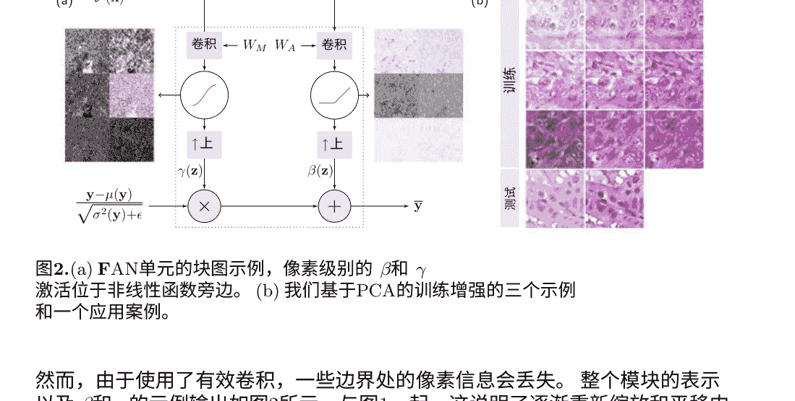

图2.(a) FAN单元的块图示例，像素级别的β和γ激活位于非线性函数旁边。(b) 我们基于PCA的训练增强的三个示例和一个应用案例。

然而，由于使用了有效卷积，一些边界处的像素信息会丢失。整个模块的表示以及β和γ的示例输出如图2所示。与图1一起，这说明了逐渐重新缩放和平移内部表示的基本思想。

我们使用预训练的VGG-19架构，其权重来自ILSVRC挑战赛[9]作为特征提取器F。选择这个网络是因为它在风格转换和各种分类任务中取得了成功，这表明了在一个颜色变化远远超过组织病理学染色的数据集上计算的相关内部特征。然而，我们强调一个事实，即竞争的高分架构，可能对图像领域进行了微调，也可以轻松地部署在这个模型中。为了整合来自不同尺度的上下文信息，我们部署了三个FAN单元，这是一个经验性的数字。为了使F向FAN单元提供有意义的信息，我们暗示存在一个变换z′=W·z，使得结果与染色协议无关，即使用两种不同协议染色的相同组织会在潜在变量空间中产生相同的表示，这是一个可行的假设。

在这项工作中，F的权重是固定的。相反，训练过程只调整所有FAN单元和变换网络T的参数。

### 2.2 通过去噪进行归一化

训练网络fθ:X→X是具有挑战性的，因为没有直接可用的匹配潜在表示z的样本(x, ̃x)。为了解决这个问题，我们提出使用一个噪声模型，其中参考图像x被噪声分布p(̃x|x)扰动。在训练过程中，对于每个训练样本xi∈X，我们使用噪声分布来绘制相应的样本̃xi ∼ p(̃x|xi)，xi∈X并最小化归一化样本与原始样本之间的均方误差，得到目标函数。

\[
\min_{\theta} \sum_{i=0}^{N} \| f_{\theta}(\tilde{\mathbf{x}}_i) - \mathbf{x}_i \|^2, \quad \tilde{\mathbf{x}}_i \sim p(\tilde{\mathbf{x}}|\mathbf{x}_i) \ \forall i \in [N]. \quad (2)
\]

这个目标的最小化器将所有扰动图像˜x从˜𝒳映射到𝒳下所选择的噪声模型下。为了使这个训练方案起作用，p(˜x|x)必须对𝒳上的样本分配高概率。为了确保这个属性，我们遵循常用的数据增强原则，根据像素值的主要组成部分。然后，噪声模型由正态分布给出𝒩(x, W Σ W^T ε)。在这里，W, Σ ∈ R^{3×3}表示从RGB颜色值到主要组成部分的转换和组成部分的解释方差。噪声幅度由ε ∈ (0,1)控制，通过对样本进行视觉检查来确定。图2b给出了这种训练增强的一个例子。

## 3 实验

为了全面评估归一化性能，我们引入了一个专用数据集，其中包括来自患者源异种移植物的五个肺癌组织块，每个块连续切割成九个切片。

除了在[6]中引入的血红蛋白（H）和嗪（E）成分的变化之外，我们还改变了切片厚度（T）。对于每个切片，参数进行迭代，得到染色方案1. HET↑, 2. HE T↓, 3. 标准HET方案, 4. HE↑T, 5. HE↓T, 6. H↑ET, 7. H↓ET, 8. H↑E↑T, 9 .H↓E↓T，其中‘↑’表示浓度或厚度加倍，‘↓’表示浓度或厚度减半，标准值为H（液体成分）为1:10, E（粉末）为0.6 g/200 ml, T为3μm。从每个数字化的全切片图像（Aperio AT2扫描仪, Leica Biosystems, Wetzlar, 德国）中，我们提取并手动注册了五个具有1000×1000像素的区域，从而得到一个测试集，其中由于连续切割和注册，九个图像的协议集之间的组织分布在很大程度上是共享的。对于每个协议，都训练了一个单独的归一化网络，以该协议作为参考数据集𝒳。从切片中分别提取了大约15000个大小为192×192的补丁，并用于训练。然后在剩余协议的组织样本上进行验证，排除了训练补丁。

我们定义了三个实验来评估我们提出的算法与之前提出的 Reinhard (REI, [8] ), Macenko (MAR, [7]), Vahadane (VAH, [10]) 和 Bejnordi (BEJ, [1]) 方法的性能。对于所有的方法，我们使用九个协议中的每一个作为归一化目标进行实验，除了 BEJ，我们使用提供的参考协议。在可能的情况下，我们将未归一化图像上计算的度量作为基准线 (BAS) 进行展示。

-   1. 消除协议偏差。如相关出版物所建议的，我们测量组织连续切片中注册补丁的颜色分布之间的距离。作为真实分布的估计器，我们计算

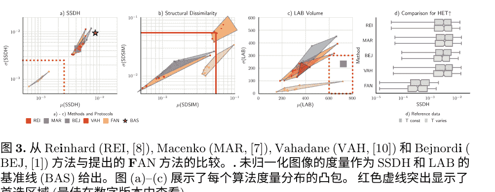

图 3. 从 Reinhard (REI, [8]), Macenko (MAR, [7]), Vahadane (VAH, [10]) 和 Bejnordi (BEJ, [1]) 方法与提出的 FAN 方法的比较。未归一化图像的度量作为 SSDH 和 LAB 的基准线 (BAS) 给出。图 (a)-(c) 展示了每个算法度量分布的凸包。红色虚线突出显示了首选区域 (最佳在数字版本中查看)。

对每个颜色通道的256-bin直方图进行核密度估计（KDE）。使用长度为七的二项式滤波器作为KDE核。为了清晰起见，我们现在稍微偏离之前的符号表示法，将x_i视为来自协议j的补丁，将f_j视为参考数据集j的归一化函数。这导致度量值i,j = SSDH(f_j(x_i), x_j)，其中SSDH表示f_j(x_i)和x_j的颜色直方图之间的平方差之和。在图3a中，误差分布以凸包图的形式可视化，凸包内的每个点表示归一化函数f_j的性能，其由所有对应的i,j的均值和标准差来描述。

-   2. 对纹理的影响。虽然逐像素方法通常不会干扰像素之间的关系，但引入上下文到归一化中会带来错误的像素组变化的风险，因为输出像素通过F连接到感知域。因此，我们应用结构相似性指数（SDSIM, [11]) 作为度量标准，通过比较归一化前后图像的一阶和二阶统计量来量化感知差异。零值表示相同的图像结构，而较高的值表示不相似。这导致度量值i,j = SDSIM(f_j(x_i), x_i)，如图3b所示。

-   3. 色彩丰富度。从理论上讲，通过计算具有相关通道的低饱和度子空间，可能会错误地创建与直方图偏差度量相关的归一化效果，从而导致类似灰度的外观。为了确保有效的归一化，我们使用Lab颜色空间中的颜色数量作为归一化后可感知颜色的度量。由于Lab空间的所有分量都是不相关的，近似颜色体积计算为每个通道的标准差的乘积LAB := std(L) * std(a) * std(b)。这产生了度量值 i,j = LAB(f_j(x_i))，如图3c所示。理想情况下，低方差下实现高颜色体积。

## 4 讨论

从图3的质量指标和图4的概述中，我们得出结论，在SSDH和颜色体积方面，我们提出的方法优于以前的方法。

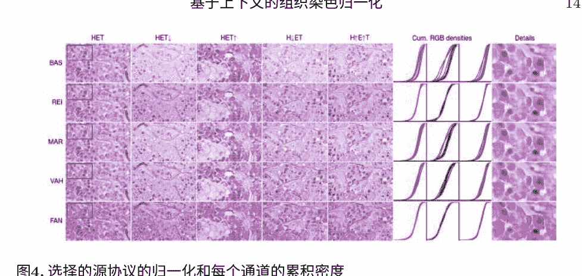

图4. 选择的源协议的归一化和每个通道的累积密度（所有协议）以及详细视图。. 请注意，每个算法都显示了根据SSDH和LAB的最佳目标协议。

明显优于其他方法。如预期的那样，引入上下文信息可能会导致轻微的纹理变化，这源于FAN单元的不同尺度和选择的f和在输出图像中显示为淡淡的“瓷砖”。根据视觉检查，例如在图4的详细视图中，这些效果可以被认为是可以忽略的。在许多情况下，FAN中可感知颜色的体积与传统方法相比减少。然而，颜色体积的低方差表明了结果的颜色空间的强一致性。相反，MAR方法在某些情况下的高方差是由于源或目标颜色空间估计失败导致的不真实强烈和过饱和的颜色。我们还可以注意到，MAR和REI的性能强烈依赖于源和参考补丁中具有相似组织分布，这是数据集的属性，但不是普遍存在的。因此，我们报告的这些算法的性能可以看作是一个上限。VAH实现了非常可靠的颜色归一化，但如果稀疏分解找不到好的最优解，则可能会影响结构。以HET↑协议为目标，我们获得了一个显示出异常大颜色体积的模型。在应用中，并不是每个目标协议都同样重要。

通过找到具有高颜色体积和对比度的适当目标协议，我们克服了提供适合各种组织统计的参考图像的挑战。然后通过训练将这些特性编码到网络参数中。正如所有测量结果中的低方差所示，FAN单元中编码的归一化特性超过了以前方法的能力。通过将中等染色变化（协议3-9）与厚度偏差（协议1-3）在图3d中进行比较，我们进一步发现了这一点。在这方面，以前的方法在质量指标上显示出明显的衰减，而FAN提供了非常一致的归一化。

特征提取器和变换器路径之间明确的分离的一个有益优势是，目前使用的VGG-19架构可以很容易被任何其他特征提取器替换。特别是，计算更高效的网络结构，参数更少，是很好的选择。此外，与剩余网络一起训练特征提取步骤可能是有希望的，这需要进一步研究。

从更广泛的视角来看，将网络功能分为不同的部分的一般方法可能也适用于其他领域，比如最初激发我们工作的艺术风格转换网络。我们假设可以通过在变换网络$T$中使用更大的滤波器尺寸来实现艺术风格转换，从而在这条路径上实现空间上下文聚合。

## 参考文献

| 序号 | 作者 | 标题 | 期刊/会议 | 年份 |
| :--- | :--- | :--- | :--- | :--- |
| 1. | Bejnordi, B.E., Litjens, G., Timofeeva, N., Otte-Höller, I., Homeyer, A., Karssemeijer, N., van der Laak, J.A. | 全幅组织病理图像染色特异性标准化 | IEEE Trans. Med. Imaging **35**(2), 404–415 | 2016 |
| 2. | Dumoulin, V., Shlens, J., Kudlur, M. | 一种用于艺术风格的学习表示 | CoRR abs/1610.07629 | 2016 |
| 3. | Gatys, L.A., Ecker, A.S., Bethge, M. | 使用卷积神经网络进行图像风格转换 | 在：计算机视觉和模式识别（CVPR）IEEE会议 | 2016 |
| 4. | Hochreiter, S., Schmidhuber, J. | 长短期记忆 | 神经计算 **9** (8), 1735-1780 | 1997 |
| 5. | Ioffe, S., Szegedy, C. | 批归一化：通过减少内部协变量偏移加速深度网络训练 | 在：第32届国际机器学习会议ICML 2015的论文集，第448-456页 | 2015 |
| 6. | Janowczyk, A., Basavanhally, A., Madabhushi, A. | 使用稀疏自编码器进行染色归一化（StaNoSA）：应用于数字病理学 | 计算机医学。图像图形。 **57**, 50-61 | 2017 |
| 7. | Macenko, M., Niethammer, M., Marron, J.S., Borland, D., Woosley, J.T., Guan,X., Schmitt, C., Thomas, N.E. | 一种用于定量分析的组织学切片归一化方法 | In: 2009 IEEE国际生物医学成像研讨会：从纳米到宏观，第1107-1110页 | 2009 |
| 8. | Reinhard, E., Adhikhmin, M., Gooch, B., Shirley, P. | 图像之间的颜色转换 | IEEE计算机图形学应用 **21**(5), 34-41页 | 2001 |
| 9. | Simonyan, K., Zisserman, A. | 用于大规模图像识别的非常深的卷积网络 | CoRR abs/1409.1556 | 2014 |
| 10. | Vahadane, A., Peng, T., Sethi, A., Albarqouni, S., Wang, L., Baust, M., Steiger, K., Schlitter, A.M., Esposito, I., Navab, N. | 用于组织学图像的结构保持颜色归一化和稀疏染色分离 | IEEE医学成像交易 **35**(8), 1962-1971页 | 2016 |
| 11. | Wang, Z., Bovik, A.C., Sheikh, H.R., Simoncelli, E.P. | 图像质量评估：从错误可见性到结构相似性 | IEEE图像处理期刊 **13**(4), 600–612 | 2004 |

# 在神经网络中卷积层和全连接层之间的过渡

Shazia Akbar$^{1(\text{✉})}$, Mohammad Peikari$^{1}$, Sherine Salama$^{2}$,
Sharon Nofech-Mozes$^{2}$, 和 Anne Martel$^{1}$

$^{1}$ Sunnybrook研究所，多伦多大学，加拿大多伦多
{sakbar,mpeikari,amartel}@sri.utoronto.ca

$^{2}$ 病理学系，Sunnybrook健康科学中心，加拿大多伦多
{sherine.salama,sharon.nofech-mozes}@sunnybrook.ca

摘要。数字病理学在过去十年中取得了很大的进展，但肿瘤定位仍然是一个具有挑战性的问题，因为底层组织中存在高度复杂的模式和纹理。卷积神经网络（CNNs）在分析这种复杂图像方面已经被广泛采用。然而，在最近几年中，CNNs的架构已经发生了变化，引入了inception模块，这对于分类任务显示出了巨大的潜力。在本文中，我们提出了一个修改后的“过渡”模块，该模块从不同尺寸的滤波器中学习全局平均池化层，以鼓励多个空间分辨率的类别特定滤波器。我们在AlexNet和ZFNet中展示了过渡模块在两个独立数据集的扫描组织学切片中对乳腺肿瘤分类的性能，其中过渡模块表现优异。

关键词: 卷积神经网络 · 组织学 · 转变 · 启动 · 乳腺肿瘤

## 1 引言

在病理学中，对肿瘤识别的需求越来越大，因为这些任务耗时，如测量肿瘤负担、分级组织样本、确定细胞细胞密度等。由于组织床中的复杂纹理模式和外观，识别组织学图像中的肿瘤仍然是一个具有挑战性的问题。随着肿瘤的添加，底层形态学中发生的细微变化很难与健康结构区分开，并且需要经验丰富的病理学家来解释。对于广泛异质病理数据集中的肿瘤识别，准确的自动化解决方案将非常有益，可以实现高通量实验、更高的标准化水平，并减轻数字切片的手动评估负担。

深度卷积神经网络（CNN）现在是机器学习中广泛采用的架构。事实上，CNN已经被应用于乳腺全切片图像（WSI）的肿瘤分类等应用中。

使用AlexNet [9] 对组织进行分析，并使用CT扫描 [16] 对肿瘤进行分割的体素级分析。CNN的这些应用不断增长，自1998年起，CNN的传统架构也发生了演变 [5]。基本的CNN架构包括卷积和池化操作的组合。

随着我们在网络中深入，网络的大小会减小，从而产生一系列的输出，无论是分类分数还是回归结果。在典型的CNN的较低层中，需要全连接（FC）层来学习特征的非线性组合。然而，在二维卷积层和一维FC层之间的过渡是突然的，使得网络容易过拟合 [7]。在本文中，我们提出了一种过渡卷积层和FC层的方法，引入了一个鼓励泛化的框架。与其他正则化方法 [4,11] 不同，我们的方法在扁平化之前以高效的方式汇集了卷积层产生的高维数据特征图。

为了简化卷积层和全连接层之间的维度降低，我们提出了一个过渡模块，受到了Inception模块[14]的启发。我们的方法包括不同滤波器尺寸的卷积层，捕捉多个尺度上学习到的特征属性，然后将它们折叠成一系列的平均池化层。我们展示了这种配置在乳腺癌组织扫描图像的肿瘤分类问题中给出了相当大的性能提升。

我们还评估了过渡模块与其他常用正则化器的性能比较（第5.1节）。

## 2 相关工作

在组织病理学文献中，CNN架构往往遵循一个线性趋势，从输入层到softmax输出层依次排列一系列层[8,9]。然而，最近对这种结构进行了改进，以在CNN设计的各个阶段鼓励多尺度信息。

例如，Xu等人提出了一个多通道边缘监督CNN，在每个卷积层中合并腺体的边缘和轮廓以进行腺体分割。在细胞核分类中，Bussens等人[2]在并行处理输入图像的多个分辨率下学习多个CNN，然后聚合分类得分。这些方法在组织学图像中表现出特殊优势，因为它模拟了病理学家在多个目标上查看数字幻灯片时的解读（图1）。

然而，在单个层中捕捉多尺度信息是近期的一项进展，这是在引入inception模块（第3.1节）之后的。此后，已经有一些改进，但这些改进仅限于CNN中的卷积层。Liao和Carneiro [6]提出了一个模块，通过最大化操作将多个卷积层组合在一起，而不是连接。Jin等人[3]设计了一个CNN网络，其中独立的FC层是从在网络结构的不同层级上创建的inception层的输出中学习的。在本文中，我们专注于在卷积层和FC层之间发生维度变化时改进网络结构。当网络已经经历了大量的减少并接近最终输出层时，这种变化发生，因此对于最佳类别分离，泛化是关键。

## 3 方法

### 3.1 Inception模块

Inception模块最初由Szegedy等人提出[14]，是一种逐渐增加特征图维度从而增加CNN深度而不增加极高计算成本的方法。特别地，Inception模块使得可以在单个层中同时学习多个尺度的滤波器，也被称为子网络。自从它的提出以来，已经有多个包含不同类型Inception模块的Inception网络[13,15]，包括GoogleNet。原始Inception模块的基本表示如图2所示（左侧）。

每个Inception模块都是一系列平行的卷积层，限制了过滤器的尺寸为1 × 1、3 × 3和5 × 5。通过包含各种卷积，通过将多个子层组合成一个深层，可以同时探索多个尺度的特征。在训练过程中，根据最佳性能加权考虑各种过滤器尺寸的组合。然而，单独使用这种配置会导致网络非常庞大且复杂。因此，为了实用性的目的，Inception模块还包括1×1的卷积层，用作降维机制。Inception网络被定义为一堆Inception模块，偶尔进行最大池化操作。Inception网络的原始实现包括九个Inception模块[14]。

### 3.2 过渡模块

在本文中，我们提出了一种修改的inception模块，称为“过渡”模块，专门设计用于CNN的最后阶段，在该阶段中，学习到的特征被映射到FC层。虽然inception模块成功地捕捉到了输入数据的多尺度特征，但学习到的特征图与分类得分之间的桥梁仍然被视为黑盒子。为了简化这个过渡过程，我们提出了一种方法，可以在调整FC层之前大幅缩小2D特征图。在过渡模块中，不同于[14]中将每个滤波器尺寸的输出连接在一起，我们在学习卷积层之后配置了独立的全局平均池化层，通过平均操作使特征图可以被压缩。

全局平均池化层最初由Lin等人[7]提出，作为一种强制分类任务（即softmax输出层）和滤波器映射之间对应关系的方法。顾名思义，在全局平均池化层中，通过对前面的卷积层中的每个滤波器映射进行平均，从每个滤波器映射中检索到一个输出。例如，如果给定一个256个3×3特征图的输入，全局平均池化层将形成一个大小为256的输出。在过渡模块中，我们使用全局平均池化来在多个尺度上消除空间信息，然后将每个平均滤波器折叠到独立的1D输出层。这种方法的优点是引入了泛化性，并鼓励网络结构早期的逐渐减小。因此，网络中的后续FC层也更小，使得划分分类类别的任务更容易。此外，没有额外的参数需要调整。

过渡模块的结构如图2（右侧）所示。卷积层采用了Inception-v2中提出的批量归一化方法进行进一步的正则化。

## 4 实验

我们使用了一个数据集对提出的过渡模块的性能进行评估，该数据集包含从乳腺WSIs扫描图像中提取和标记的1229个图像块，扫描仪为Scanscope XT（Aperio technologies，Leica Biosystems），放大倍数为×20。每个大小为512×512的RGB图像块是由经过训练的病理学家从31个WSIs中手动选择的，每个WSI来自一个单独的患者。经过训练的病理学家从患者中提取活检样本。活检样本来自接受新辅助治疗的浸润性乳腺癌患者；新辅助治疗后的组织切片显示有浸润性和/或导管内癌。使用5折交叉验证评估了该数据集的性能。每个图像块都经过专家病理学家确认，其中包含肿瘤或健康组织。“健康”指的是不含癌细胞但可能含有健康上皮细胞等其他组织结构（如基质、脂肪等）。结果报告了100个时期的结果。

我们还在公共数据集BreaKHis [10]（第5.3节）上验证了我们的方法，该数据集包含良性（腺病，纤维腺瘤，叶状肿瘤，管状腺瘤）和恶性（导管癌，小叶癌，粘液癌，乳头状癌）乳腺肿瘤的扫描图像，目标放大倍数为 ×40。图像被重新采样为228 ×228的尺寸，适用于CNN，总共生成了11,800个图像块。BreaKHis使用2折交叉验证和30个epochs进行验证。

在第5.2节中，报告了三种不同的CNN架构（AlexNet，ZFNet，Inception-v3）的结果，其中在AlexNet和ZFNet中引入了过渡模块。所有CNN都是从头开始训练的，没有预训练。两种实现中的过渡模块包括3 × 3、5 × 5和7 × 7的卷积，从而产生了三个平均池化层。每个卷积层的步长为2，AlexNet和ZFNet分别具有1024和2048个滤波器单元。请注意，滤波器单元的数量根据过渡模块之后的第一个FC层的大小进行调整。

使用Lasagne 0.2 [1]实现了CNNs。使用softmax函数获得分类预测结果，并且卷积层采用ReLU激活函数。在两个数据集中，每个批次使用了10个训练实例。我们使用Nestorov Momentum [12]进行更新，学习率为1e⁻⁵。

## 5 结果

### 5.1 实验1：与正则化方法比较

+   (a) 在第一个全连接层之前添加一个过渡模块，
-   (b) 在每个全连接层之后添加两个Dropout层，其中p=0.5，
-   (c) 在每个最大池化操作之后添加归一化层，类似于[4]中的使用方法。

过渡模块的整体准确率达到了91.5%，与Dropout（86.8%）和局部归一化（88.5%）相比，显示出了显著的改进，表明过渡模块相对于现有方法是一种有效的正则化方法。当局部响应归一化与过渡模块在ZFNet中结合使用时，我们实现了稍高的测试准确率，达到了91.9%。

### 5.2 实验2：比较架构

接下来，我们评估了过渡模块在两种不同的CNN架构中的性能：AlexNet和ZFNet。我们还报告了Inception-v3的性能，该架构已经内置了1 × 1卷积的正则化方法，以进行比较。ROC曲线如图3所示。

AlexNet和ZFNet都受益于单一过渡模块的添加，平均提高了4.3%的测试准确率，尤其是在较低的假阳性率下。在这种情况下，较小的CNN架构在肿瘤分类中表现更好，因为避免了过拟合，与Inception-v3的比较结果显示。令人惊讶的是，在架构设计的早期使用降维并不能有效提高分类准确率。我们还发现，在过渡模块中加入全局平均池化稍微改善了结果，并使整体测试准确率提高了3.1%。

### 5.3 实验3：BreaKHis

我们使用了上述相同的AlexNet架构来验证BreaKHis。ROC曲线如图4所示。当引入过渡模块时，有明显的改善，AUC增加了0.06，这表明即使有更多的训练数据，更平滑的网络缩减也是有益的。

过渡模块在整体测试准确率上达到了82.7%，与[10]中使用SVM达到的81.6%相当，但这些结果不能直接比较，应谨慎解释。

## 6 结论

本文提出了一种名为过渡模块的CNN新型正则化技术，它通过多尺度捕获滤波器，然后通过平均池化将它们合并，以便从卷积层到全连接层的网络尺寸缩减。我们展示了在两个CNN（AlexNet，ZFNet）中，这种设计对于在数字切片中区分肿瘤和健康组织是有益的。我们还展示了一个更大的公开可用数据集BreaKHis中的改进。

致谢。这项工作得到了加拿大乳腺癌基金会、加拿大癌症协会（703006号资助）和美国国立卫生研究院国家癌症研究所（U24CA199374-01号资助）的支持。

## 参考文献

1.  Lasagne. http://lasagne.readthedocs.io/en/latest/. 于2017年2月18日访问
2.  Buyssens, P., Elmoataz, A., Lézoray, O.: 基于多尺度卷积神经网络的细胞视觉分类。在：李克明，松下康夫，Rehg, J.M.，胡志 (编)：ACCV 2012. LNCS, 第7725卷，第342-352页。Springer, Heidelberg (2013年)。doi:10.1007/978-3-642-37444-9 27
3.  Jin, X., Chi, J., Peng, S., Tian, Y., Ye, C., Li, X.: 使用Inception模块和微调连接层的深度图像美学分类。在：第8届无线通信和信号处理国际会议（WCSP）（2016年）
4.  Krizhevsky, A., Sutskever, I., Hinton, G.E.: 使用深度卷积神经网络的ImageNet分类。在：Pereira, F., Burges, C.J.C., Bottou, L., Weinberger, K.Q. (编)：神经信息处理系统的进展，第25卷，第1097-1105页（2012年）
5.  LeCun, Y., Bottou, L., Bengio, Y., Haffner, P.: 基于梯度的学习应用于文档识别。IEEE会议记录 86(11), 2278–2324 (1998)
6.  Liao, Z., Carneiro, G.: 竞争性多尺度卷积。CoRR abs/1511.05635 (2015). http://arxiv.org/abs/1511.05635
7.  Lin, M., Chen, Q., Yan, S.: 网络中的网络。在：ICLR会议记录 (2014)
8.  Litjens, G., Sánchez, C.I., Timofeeva, N., Hermsen, M., Nagtegaal, I., Kovacs, I., Hulsbergen-van de Kaa, C., Bult, P., van Ginneken, B., van der Laak, J.: 深度学习作为增加组织病理学诊断准确性和效率的工具。科学报告 6, 26286 (2016)
9.  Spanhol, F., Oliveira, L.S., Petitjean, C., Heutte, L.: 使用卷积神经网络进行乳腺癌组织病理学图像分类。在：国际神经网络联合会议，第2560-2567页
10. Spanhol, F.A., Oliveira, L.S., Petitjean, C., Heutte, L.: 乳腺癌组织病理学图像分类数据集。IEEE Trans. Biomed. Eng. 63, 1455-1462(2016)
11. Srivastava, N., Hinton, G., Krizhevsky, A., Sutskever, I., Salakhutdinov, R.: Dropout: 一种防止神经网络过拟合的简单方法。J. Mach. Learn. Res. 15(1), 1929-1958 (2014)
12. Sutskever, I.: 训练循环神经网络。论文 (2013)
13. Szegedy, C., Ioffe, S., Vanhoucke, V., Alemi, A.: Inception-v4, Inception-ResNet和残差连接对学习的影响. arXiv预印本 arXiv:1602.07261 (2016)
14. Szegedy, C., Liu, W., Jia, Y., Sermanet, P., Reed, S., Anguelov, D., Erhan, D., Vanhoucke, V., Rabinovich, A.: 使用卷积进行更深入的研究. 在: 计算机视觉和模式识别 (CVPR) (2015)
15. Szegedy, C., Vanhoucke, V., Ioffe, S., Shlens, J., Wojna, Z.: 重新思考计算机视觉中的inception架构. 在: IEEE计算机视觉和模式识别会议论文集, pp. 2818–2826 (2016)
16. Vivanti, R., Ephrat, A., Joskowicz, L., Karaaslan, O.A., Lev-Cohain, N., Sosna, J.: 使用卷积神经网络在随访CT研究中自动分割肝肿瘤. 在: 医学图像处理中基于补丁的方法研讨会, MICCAI
17. Xu, Y., Li, Y., Wang, Y., Liu, M., Fan, Y., Lai, M., Chang, E.I.C.: 使用深度多通道神经网络进行腺体实例分割。CoRR abs/1611.06661(2016)
18. Zeiler, M.D., Fergus, R.: 可视化和理解卷积网络。在: 计算机视觉和模式识别 (CVPR) (2013)

# 使用深度神经网络量化2型糖尿病对脑灌注的影响

Behrouz Saghafi1, Prabhat Garg1, Benjamin C. Wagner1, S. Carrie Smith2, Jianzhao Xu2, Ananth J. Madhuranthakam1, Youngkyoo Jung2, Jasmin Divers2, Barry I. Freedman2, Joseph A. Maldjian1, 和 Albert Montillo1(✉)

1 德克萨斯大学西南医学中心，达拉斯，德克萨斯州，美国
Albert.Montillo@utsouthwestern.edu
2 维克森林医学院，温斯顿-塞勒姆，北卡罗来纳州，美国

摘要。2型糖尿病（T2D）对大脑健康的影响尚不清楚。本研究旨在量化T2D与脑灌注之间的关联。T2D是一种非常常见的代谢紊乱，可能会对肾脏和心血管系统造成长期损害。先前的研究发现T2D显著影响大脑的形状、体积和白质微结构。我们提出了一个全连接的深度神经网络，根据16个临床指标作为预测因子，将区域脑血流分类为低水平或高水平。临床指标包括糖尿病、肾脏、心血管和人口统计学指标。我们的模型使我们能够发现输入特征与目标之间可能存在的非线性关联。此外，我们的端到端架构可以自动学习最相关的特征并将它们组合起来，无需应用特征选择方法。我们取得了有希望的分类性能。此外，与六种经典机器学习算法和六种类似调整的深度神经网络相比，我们提出的模型表现优于所有其他模型。

## 1 引言

在美国，超过2900万人口（9.3%）患有糖尿病 [2]。在成年人中，2型糖尿病（T2D）占所有确诊糖尿病病例的95%。T2D是一种代谢紊乱，其特征是高血糖，由胰岛素抵抗或相对缺乏胰岛素引起。已经证明，长期患有T2D可能导致慢性肾脏疾病（CKD）、心血管疾病（CVD）和糖尿病视网膜病变。由于大脑相对于整体质量消耗了不成比例的能量，因此合理怀疑糖尿病可能会影响大脑健康。目前，关于T2D对大脑健康的影响研究还不足。了解这些影响将有助于揭示这种复杂疾病，并实现对候选新疗法的更全面评估。

对T2D患者的初步研究发现，糖尿病 [3,11] 和肾脏 [9,14] 疾病指标与某些神经解剖结构的体积相关。然而，糖尿病与脑实质灌注之间的关系仍然大部分未知。此外，根据美国疾病控制中心的数据，非洲裔美国成年人被诊断为糖尿病的可能性是欧洲裔美国人的两倍。因此，在这项研究中，我们旨在确定糖尿病相关疾病指标与非洲裔美国人脑灌注之间的关联。

一些研究已经将糖尿病与脑结构改变联系起来。Sink等人发现非洲裔美国人患有糖尿病性肾脏病的肾脏指标与海马白质体积存在显著关联，包括尿白蛋白/肌酐比值（UACR）和估计的肾小球滤过率（GFR）。Freedman等人报告了非洲裔美国人T2D患者主动脉钙化斑块（一种心血管疾病指标）与海马灰质体积之间的负相关。在一项使用扩散张量成像（DTI）的研究中，Hsu等人发现糖尿病持续时间与多个脑区域的白质微结构指标（如双侧小脑、颞叶、双侧扣带回、脑桥、海马旁回和右侧尾状核的平均弥散度）显著相关。

鉴于这些研究已经显示了糖尿病和脑结构之间的关联，我们假设T2D也会改变脑灌注。本文测试了我们的假设。我们的主要贡献有三个。首先，我们采用大规模单变量线性分析方法来识别符合最严格的多重比较校正标准的候选区域。其次，我们提出了一个全连接的深度神经网络（DNN）架构，用于预测脑灌注水平，该架构可以自动学习最佳特征组合和表征T2D与灌注之间的关联，包括任何非线性关系。第三，我们进行置换测试来评估所提模型的准确性，通过统计显著性的概念。

## 2 材料

这项横断面研究包括152名非洲裔美国人患有T2D。进行了实验室测试，以获取糖尿病及相关肾脏和心血管疾病指标。糖尿病指标包括血红蛋白A1c（HbA1c）和糖尿病持续时间。肾脏疾病指标包括尿白蛋白/肌酐比值（UACR）、肾小球滤过率（GFR）、血尿素氮（BUN）、血清钾、总血清蛋白和尿微量白蛋白。血液基础的心血管疾病和炎症指标包括冠状动脉钙化斑块（CAC）和C-反应蛋白（CRP）。获得的人口统计学指标包括性别（56.8%女性）、年龄（平均59.2岁）、体质指数、吸烟状况和高血压。这些指标在表1中总结。

每个受试者使用一台3.0特斯拉西门子Skyra磁共振成像仪（西门子医疗，埃朗根，德国）进行解剖和灌注MRI扫描，配备高分辨率的20通道头颈线圈。使用3D体积磁化准备快速采集梯度回波序列（重复时间[TR] 2,300毫秒；回波时间[TE] 2.02毫秒）获取T1加权解剖图像。

表1.研究中包括的糖尿病和人口统计学指标。

| 糖尿病指标 | | 人口统计学指标 | |
| :--- | :--- | :--- | :--- |
| 尿白蛋白/肌酐比值 (mg/g) | 83.7 (284.2) | 年龄 (岁) | 59.2 (9.4) |
| C-反应蛋白 (mg/dL) | 0.9 (1.5) | 女性性别 (%) | 56.8 |
| 糖化血红蛋白 (%) | 8.0 (1.8) | 教育程度 (%) | |
| 糖尿病持续时间 (年) | 8.9 (7.5) | 高中以下 | 9.0 |
| 冠状动脉钙化 (质量评分, mg) | 475.4 (1142.2) | 高中毕业 | 23.9 |
| GFR (mL/min/1.73 m²) | 90.6 (23.5) | 大学部分学历 | 39.4 |
| 血清钾浓度 (mmol/L) | 4.1 (0.4) | 大专学历 | 7.7 |
| 总血清蛋白 (g/dL) | 7.2 (0.5) | 大学本科毕业 | 11.6 |
| 尿素氮 (mg/dL) | 15.6 (5.8) | 研究生及以上 | 8.4 |
| 尿微量白蛋白 (微克/肌酐毫克) | 110.2 (344.0) | BMI (kg/m²) | 34.1 (7.2) |
| | | 吸烟 | |
| | | 从不 (%) | 52.3 |
| | | 过去吸烟者 (%) | 28.8 |
| | | 现在吸烟者 (%) | 18.9 |
| | | 高血压 (%) | 86.4 |

反转时间 [TI] 900 毫秒; 翻转角度 [FA] 9°; 192 切片; 像素尺寸0.97 × 0.97 ×1 毫米³). 通过重复时间 [TR] 4,000 毫秒;回波时间 [TE] 12 毫秒; 反转时间 [TI] 3000 毫秒; 翻转角度 [FA] 90°; 26 切片/49体积; 像素尺寸 3.4 × 3.4 ×5 毫米³.

## 3 方法

我们的整体流程包括以下步骤: (1) 计算每个脑区的平均脑血流量 (CBF), (2) 通过统计分析确定候选脑区, 以及 (3) 拟合一个深度神经网络来量化候选区域的 CBF 与糖尿病指标之间的关联。 每个步骤的详细说明如下。

### 3.1 计算每个解剖区域的平均灰质脑血流量

CBF体积是根据原始空间中的pCASL灌注图像计算得出的。 为了将CBF图像分割成区域测量值, 每个受试者的pCASL体积通过仿射变换与同一受试者的T¹加权图像进行配准。 然后, 使用非线性变换[1]将每个受试者的T¹加权图像空间标准化到蒙特利尔神经研究所 (MNI) 空间, 该变换是使用VBM8工具箱[1]计算得出的。 这些变换被组合起来, 将CBF图像空间标准化到MNI空间。 使用WFU PickAtlas [7]实现的自动解剖标签 (AAL) 图谱[5]将CBF图分割成116个解剖区域。 应用来自VBM8分割的灰质脑体积掩膜, 限制在灰质CBF体素中。 最后, 计算每个区域中体素的平均灰质脑血流量, 形成包含116个平均区域CBF测量值的向量。

### 3.2 识别候选区域以进行进一步分析

此时，数据包括16个与糖尿病相关的预测因子和116个候选区域CBF目标测量。为了剪枝候选区域列表，对152个受试者进行了大规模单变量分析。在这种方法中，拟合了116个多元线性回归模型，每个模型定义为 y = b0 + b1x1 + b2x2 + ... + b16x16 其中 y是区域CBF测量之一， xi是临床测量。 对于每个模型，计算决定系数或 R²分数来衡量拟合的好坏，同时计算F统计量的概率， p(F统计量)来衡量回归模型的显著性。

应用Bonferroni多重比较校正，得到了一个显著性水平为 α= 0.01/116 = 0.000086的标准。图1显示了根据线性模型对每个区域的 R²进行排序的区域。 还显示了 p(F统计量)。17个结构通过了显著性检验， p(F统计量) < 0.000086。最显著的区域是右侧尾状核， p(F统计量) = 1.16e -07， R²= 0.36。 这与[4]中的发现一致，即糖尿病持续时间与右侧尾状核的平均弥散性之间存在关联，详见第1节。该分析揭示了尾状核是受2型糖尿病显著影响的结构之一，因此在下一节中，我们训练一个深度神经网络来预测尾状核的血流量，以量化这种关联。

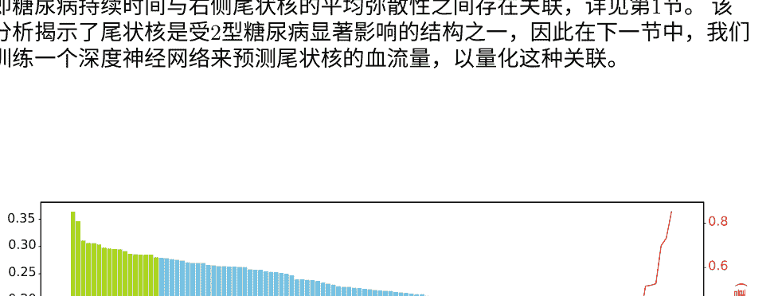

图1.对每个AAL ROI，拟合116个多变量单变量线性模型来预测灌注。结构根据模型的R²进行排名。红色显示了p(F统计量)。绿色水平线表示基于Bonferroni校正的显著性阈值，高度为α=0.000086。显著区域以绿色突出显示。（在线彩图）

### 3.3 使用深度神经网络估计候选区域关联

根据右侧尾状核的灌注情况对受试者进行排名，然后选择排名前30%和排名后30%的样本进行分类。这样得到了92个受试者：46个CBF低的和46个CBF高的。将包括教育、性别、高血压和吸烟量在内的分类特征转换为数值特征。每个特征都被缩放到0和1之间。评估了几种全连接的深度神经网络模型结构来分类尾状核的灌注水平。在每个测试的模型结构中，选择了类似于AlexNet [6]和VGGNet [13]中的全连接层的策略，即每个隐藏层的神经元数量逐渐减少，直到输出层。这样可以逐渐从低层特征构建更抽象、更高层次的特征。对于每个隐藏层神经元，使用修正线性单元（ReLU）作为激活函数，定义为 $ReLU(z) = max(0, z)$。通过使用softmax激活函数实现了一个包含每个类别的单个神经元的分类输出层，softmax激活函数定义为 $S_j(z) = \frac{e^{z_j}}{\sum_{k=1}^{2} e^{z_k}}; j=1,2.$

在训练过程中，根据经验选择了批量大小为10和学习率为0.001。使用ADAM优化方法[5]，其中 $\beta_1 = 0.5$, $\beta_2 = 0.999$, $\epsilon = 1e-08$, 并且权重初始化为接近零的小随机值。在每次验证测试中，采用了提前停止策略，即当网络在15个周期内没有在验证准确率上显示出改善时，训练停止。为了进行模型选择，从92个主题中随机选择了72个作为训练集，剩下的20个主题作为测试集，在模型选择过程中不使用。训练集和测试集都是平衡的。通过5折交叉验证，将训练集进一步划分为训练集和验证集。

评估的模型及其平均交叉验证准确率如表2所示。这些模型包括欠拟合的较浅的架构（模型16-8-2）和过拟合的非常深的架构（模型16-16-8-8-8-4-4-4-2）。我们提出的获胜架构和DNN模型在图2中进一步说明。该模型包含5个密集隐藏层，第一隐藏层使用16个神经元，第二和第三隐藏层使用8个神经元，第四和第五层使用4个神经元。在选择了提出的架构后，它在完整的训练集上进行训练，并在未见过的测试集上进行评估。

表2.使用5折交叉验证评估的全连接神经网络架构比较，每折使用58个训练样本和14个测试样本。

| 模型 | 5折交叉验证准确率 (%) |
|------|-----------------------|
| 16-8-2 | 69.1 (±8.1) |
| 16-16-8-2 | 75.9 (±14.9) |
| 16-16-8-8-2 | 69.3 (±11.0) |
| 16-16-8-8-4-2 | 74.8 (±8.9) |
| **16-16-8-8-4-4-2** | **76.3 (±9.9)** |
| 16-16-8-8-4-4-4-2 | 70.5 (±6.2) |
| 16-16-8-8-8-4-4-4-2 | 65.0 (±9.7) |

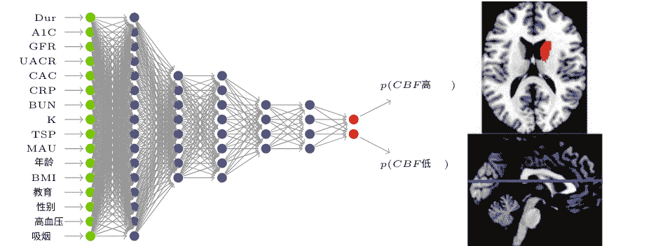

## 4 结果

### 4.1 学习模型的性能比较

所提出的模型在准确率达到90%，敏感性达到100%，特异性达到80%。表3显示了所提出模型与广泛使用的经典机器学习分类器的性能比较。所提出的DNN模型在几乎所有性能指标上优于其他算法。虽然随机森林的特异性稍高，但其F1得分、AUC、准确率和敏感性较差。

### 4.2 提出模型的统计显著性

零假设是DNN无法根据训练集预测灌注水平。选择的检验统计量是在未见的20个样本的测试集上的准确率。排列测试过程如下：

表3.不同分类器在保留测试集上的性能比较。每个模型在72个受试者上进行训练，并在20个受试者上进行测试。

| 分类器 | 准确率 (%) | 敏感度 (%) | 特异度 (%) | AUC (%) | F1得分 (%) |
| :--- | :--- | :--- | :--- | :--- | :--- |
| 提出的DNN | 90.0 | 100.0 | 80.0 | 90.0 | 90.9 |
| 线性支持向量机 | 80.0 | 90.0 | 70.0 | 80.0 | 81.8 |
| 径向基支持向量机 | 80.0 | 90.0 | 70.0 | 80.0 | 81.8 |
| 额外树 | 80.0 | 90.0 | 70.0 | 80.0 | 81.8 |
| 随机森林 | 85.0 | 80.0 | 90.0 | 85.0 | 84.2 |
| Adaboost | 80.0 | 90.0 | 70.0 | 80.0 | 81.8 |
| Gradboost | 70.0 | 80.0 | 60.0 | 70.0 | 72.7 |

1.  重复 $R = 1000$次:
    a. 随机排列 $N$灌注测量值与 $N$糖尿病特征向量。
    b. 计算当前排列的检验统计量的值。
2.  构建测试统计量的经验概率分布函数（PDF）。
3.  计算没有置换的测试统计量的p值。

准确性测试统计量的PDF如图3所示。经评估，提出的模型达到了统计上显著的可靠性；观察到比提出的模型更高准确性的分类器的概率小于1%（p=0.0009 99）。因此，在α=0.01的显著性水平下，我们拒绝零假设，支持备择假设，即该模型已经学会以较小的预期误差预测灌注水平。

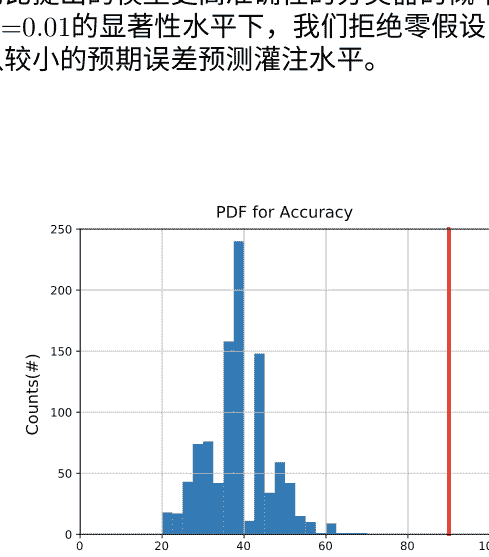

图3.基于置换分析的概率分布函数（PDF）用于提出的DNN模型。红线表示模型得到的分类准确率。

## 5 讨论

我们的研究发现，尾状核是受糖尿病影响最大的结构。这是一个值得注意的发现，因为尾状核对于脑部健康至关重要。尾状核位于基底节的背侧纹状体内，与运动过程以及包括程序学习和联想学习在内的认知功能相关[8]。它也是奖赏系统的组成结构之一[16]。

之前的研究[4,10,12,17]表明，尤其是右侧尾状核的结构受到T2D的显著影响。彭等人[10]报告称，与正常对照组相比，T2D患者尾状核的灰质体积显著减少。在儿科中进行的类似研究显示T2D患者与非糖尿病对照组相比，尾状核体积显著减少。张等人[17]发现高血糖（糖尿病患者常见）与尾状核形状之间存在关联。此外，徐等人[4]发现糖尿病持续时间与多个脑区域（包括右侧尾状核）的白质微结构特性（如平均扩散性）存在显著关联。这些与T2D相关的互补研究证实了我们的发现，即T2D影响尾状核的血液灌注。

## 6 结论

在本文中，我们量化了T2D相关指标与脑灌注之间的关联。我们提出了一个全连接的深度神经网络，基于16个糖尿病、肾脏、心血管和人口统计学指标，将尾状核的灌注分为低和高两类。所提出的模型优于所有经过测试的深度学习和经典机器学习模型，达到了90%的分类准确率、100%的敏感性和80%的特异性，并且排列测试显示该模型具有统计学上显著的可靠性。

## 参考文献

1.  Ashburner, J.: 一种快速的形变图像配准算法。神经影像学 **38**(1), 95–113 (2007)
2.  CDC: 估计美国的糖尿病及其负担。国家糖尿病统计报告 (2014)
3.  Freedman, B.I., Divers, J., Whitlow, C.T., Bowden, D.W., Palmer, N.D., et al.:亚临床动脉粥样硬化与非洲裔美国人2型糖尿病患者的灰质体积呈负相关。Diab. Care **38** (11), 2158–2165 (2015)
4.  Hsu, J.L., Chen, Y.L., Leu, J.G., Jaw, F.S., Lee, C.H., Tsai, Y.F., Hsu, C.Y., Bai,C.H., Leemans, A.: 2型糖尿病患者微结构白质异常的弥散张量成像研究。NeuroImage **59**(2), 1098–1105 (2012)
5.  Kingma, D., Ba, J.: Adam: 一种随机优化方法。arXiv预印本arXiv:1412.6980 (2014)
6.  Krizhevsky, A., Sutskever, I., Hinton, G.E.: 使用深度卷积神经网络进行Imagenet分类。在: NIPS (2012)
7.  Maldjian, J.A., Laurienti, P.J., Kraft, R.A., Burdette, J.H.: 一种用于FMRI数据集的神经解剖和细胞构架图谱的自动化方法。Neuroimage **19**(3), 1233–1239 (2003)
8.  Malenka, R.C., Nestler, E., Hyman, S., Sydor, A., Brown, R., et al.: 分子神经药理学：临床神经科学的基础。麦格劳希尔医学, 纽约 (2009)
9.  Murea, M., Hsu, F.C., Cox, A.J., Hugenschmidt, C.E., Xu, J., Adams, J.N., et al.:欧洲裔美国人轻至中度肾脏疾病患者的脑结构和功能评估：糖尿病心脏研究-心智。肾脏病透析移植。**30**(8), 1322–1329 (2015)
10. 彭, B., 陈, Z., 马, L., 戴, Y.: 2型糖尿病在MRI上的脑变化：一项初步研究。神经科学快报 **606**, 100-105 (2015年)
11. 拉菲尔德，L.M.，考克斯，A.J.，弗里德曼，B.I.，休根斯密特，C.E.，许，F.C.，等：糖尿病心脏研究中2型糖尿病状态、血糖控制和神经影像测量之间的关系分析。糖尿病学报53（3），439-447（2016年）
12. 罗菲，D.L.，阿斯拉尼安，S.A.，埃尔诺卡利，N.E.，维斯蒂宁，T.，瓦特，J.C.，布莱克，J.J.，等：与非糖尿病肥胖和正常体重的青少年相比，2型糖尿病患者的脑容积和白质：一项初步研究。国际发展神经科学杂志46，88-91（2015年）
13. Simonyan, K., Zisserman, A.: 非常深的卷积网络用于大规模图像识别. 在: ICLR (2015)
14. Sink, K.M., Divers, J., Whitlow, C.T., Palmer, N.D., Smith, S.C., Xu, J., 等: 糖尿病肾病的脑结构变化: 非洲裔美国人-糖尿病心脏研究. 糖尿病护理 38(2), 206–212 (2015)
15. Tzourio-Mazoyer, N., Landeau, B., Papathanassiou, D., Crivello, F., Etard, O.,等: 使用MNI MRI单个受试者大脑的宏观解剖分区自动标记SPM中的激活. 神经影像 15 (1),273–289 (2002)
16. Yager, L., Garcia, A., Wunsch, A., Ferguson, S.: 纹状体的内外: 在药物成瘾中的作用. 神经科学 301, 529–541 (2015)
17. Zhang, T., Shaw, M., Humphries, J., Sachdev, P., Anstey, K.J., Cherbuin, N.:更高的空腹血糖与纹状体和海马形状差异相关: 2sweet项目. BMJ Open Diab. Res. Care 4 (1),1–8 (2016)

# 利用不完整的多模态数据进行阿尔茨海默病多阶段诊断通过多任务深度学习

Kim-Han Thung, Pew-Thian Yap, and Dinggang Shen (✉)
北卡罗来纳大学教堂山分校放射学和
BRIC部门，美国
dgshen@med.unc.edu

摘要。利用来自多种模态的生物医学数据可以提高神经退行性疾病的诊断准确性。然而，多模态数据通常是不完整的，因为并非所有数据都可以收集到每个个体。在使用这种不完整数据进行诊断时，目前的方法对于处理缺失数据的问题，如插补、矩阵补全和多任务学习，隐含地假设了线性的数据与标签关系，从而限制了它们的性能。因此，我们提出了不完整数据的多任务深度学习，其中与不同模态组合相关的预测任务被联合学习，以提高每个任务的性能。

具体来说，我们设计了一个多输入多输出的深度学习框架，并根据模态数据的可用性部分更新其权重。使用ADNI数据集的实验结果表明，我们的方法优于现有的方法。

## 1 引言

神经影像技术，如磁共振成像（MRI）和正电子发射断层扫描（PET），可以从结构和功能两个方面提供人脑的不同视角。将神经影像数据与其他非影像数据联合使用可以显著提高诊断准确性[13]。然而，多模态或纵向数据集往往是不完整的，因为并非所有数据都可以收集到每个个体。我们将在这项工作中展示如何有效地使用阿尔茨海默病神经影像计划（ADNI）数据集进行诊断。

尽管不完整的数据仍然可以通过丢弃不完整的样本来使用，但这会减少样本的数量。这样做会导致ADNI数据损失约50%的数据。为了在不丢弃样本的情况下使用数据，可以使用诸如 k最近邻、期望最大化、低秩矩阵补全（LRMC）等方法来填补缺失值。[2,11]。然而，这些只有在数据随机缺失时，插补方法才能很好地工作。 在临床研究设计中，这种情况很少见，例如，ADNI中的数据是以块（例如，一个完整的模态）缺失的。 为了解决这个问题，Goldberg等人提出了同时填补缺失数据和诊断标签的低秩矩阵补全方法。 在矩阵补全之前，[7]中通过选择有区分度的特征和样本来改进这种方法。

另一种解决这个问题的方法是使用多任务学习[16]。具体来说，该方法首先将不完整的数据集分成几个具有不同模态组合的完整数据子集。 然后，为每个子集训练一个分类模型，并在子集之间共同训练所有模型。这样可以避免进行插补，并充分利用所有可用的数据。 然而，与矩阵补全方法类似，该方法仍然假设预测变量（多模态数据）与目标（类别标签）之间存在线性关系，因此对它们的关系有着强烈的假设[13]。

深度学习可以学习复杂的非线性映射，但大多数深度学习模型都假设数据是完整的。 虽然有些模型适用于不完整的数据，但几乎所有这些模型都是基于数据合成/插补[5,6]，这对于大量缺失数据可能效果不佳[7]。 在这项工作中，我们展示了如何在不完整的多模态数据上使用深度学习进行多任务学习，而不涉及数据合成。 与[16]类似，我们将每个数据子集与一个学习任务相关联，并共同学习这些任务。 具体而言，我们设计了一个多输入多输出的深度学习框架，即一个输入对应一个模态，一个输出对应一个学习任务，并根据数据的可用性进行迭代和部分训练。 所提出的方法允许多类别分类，与大多数当前方法专注于二分类不同[1,7-10,15,16]。

## 2 方法

### 2.1 多任务学习

图1展示了一个典型的多任务学习（MTL）框架，用于处理涉及不完整多模态数据的分类问题[16]。 不失一般性，我们假设有两种模态，分别为M1和M2，可能是不完整的（即，某些主体没有来自M1或M2的数据）。 由于缺失的数据，我们无法直接构建预测模型。 然而，通过将数据分组为具有不同模态组合的完整数据子集，我们可以为每个子集定义一个分类任务（图2右侧）。 Yuan等人[16]通过约束所有任务选择每个模态的公共特征来共同学习这些任务。 然而，Yuan的方法存在几个限制。 首先，它隐含地假设数据与标签之间的关系是线性的。 其次，它没有充分利用每个任务的最大样本数。 例如，对于任务1，需要学习模态M1与目标Y之间的关系，只使用了M1样本的一部分（图1左侧）。 第三，它对于分类使用了所有模态的原始特征，忽略了模态之间的异质性。 第四，它目前的图1.左：具有不完整多模态数据的原始分类问题。右：不完整多模态数据的多任务学习。（X：输入数据；Y：目标数据；M1，M2：多模态数据；白色：缺失数据；灰色：可用数据）

该公式仅支持二元分类。

使用深度学习可以轻松克服这些弱点之一。

### 2.2 不完整多模态数据的多任务深度学习

图2显示了提出的两种不完整模态的多任务深度学习（MTDL）框架的概述。这是一个多输入多输出的深度学习框架，因为我们有两种类型的输入（即每种模态一个），以及三种类型的输出（即每个分类任务一个）。该架构主要由三层组成，即输入层，隐藏层和输出层。每个蓝色矩形框表示一组神经元，箭头表示神经元之间的连接。请注意，输入层中有两组神经元，每组神经元从一个模态接收输入数据。此外，输出层中有三组神经元，分别对应三种模态组合的三个分类任务。每个分类任务都使用最大数量的可用样本进行学习，如图2右侧所示。我们的框架中有两种类型的隐藏层，即‘模态特定层’和‘任务特定层’，分别专注于学习特定模态的潜在数据表示以及学习特定分类任务的数据到标签关系。下面详细介绍这两个层。

模态特定层。多模态数据中不可避免存在异质性。在我们的案例中，我们使用MRI和PET数据来获取结构和功能信息。每种模态的样本数量是不同的。与MRI数据相比，PET数据的样本数量要少得多。因此，为了有效地学习潜在表示，即每种模态的高级特征，我们在我们的框架中采用了模态特定的隐藏层。

神经元的数量和层数可以因不同的模态而异。

## 图2. 通过多输入多输出神经网络提出的多任务深度学习（MTDL）。

任务特定层。每种模态组合都与一个分类问题相关联。使用图2中的例子，我们总共有三个任务，即（任务1）仅使用M1数据进行分类，（任务2）仅使用M2数据进行分类，以及（任务3）使用M1+M2数据进行分类。在“任务特定层”中，我们首先根据上述组合将从每种模态学习到的高级特征（通过“模态特定层”）进行连接，适用于所有三个分类任务（图2）。然后我们在该层中学习每个任务的数据到标签的映射。

迭代子网训练。图2中的网络训练并不简单，因为不同模态的样本数量不同。为了在训练过程中最大限度地利用所有样本，我们按照图2中的MTDL网络进行迭代和子网训练，如图3所示。再次以图2为例，我们首先将数据分成三个子集，即M1、M2和M1+M2，每个子集包含每种模态数据组合的最大样本数量。然后，在每个训练批次中，只有网络的某个部分（即子网）使用相应的数据子集进行更新。

实现。我们使用Keras [3]来实现我们的框架。为了对网络权重进行正则化，我们使用$l_1$范数加上$l_2$范数来对第一个隐藏层进行正则化，并对其他隐藏层使用$l_2$范数。我们使用$l_1$范数对网络权重进行正则化，因为它对特征选择有用，可以对网络权重矩阵进行行稀疏化。我们使用softmax激活函数作为输出层，并使用分类交叉熵作为每个任务的损失函数。

根据[14]，我们还将数据分成十个部分，然后使用八个部分进行训练，一个部分进行验证，剩下的一个部分进行测试。对于每个子网，我们使用包含所需模态组合的所有可用训练样本进行200个epoch的训练，并在验证损失连续20个epoch不再改善时停止训练。然后，我们使用验证损失最小时获得的网络权重来更新网络，对每个子网进行训练。我们迭代地训练所有子网多次。

在每个子网的训练过程中，只有红色块内的网络权重会被更新，而其余的网络权重（灰色块内）会被冻结。图2中的网络按照（a）→（b）→（c）→（a）→···的顺序进行迭代学习，直到收敛。

图3. 直到收敛条件（例如，损失最小化没有改善）或达到最大迭代次数为止。

## 3 材料、预处理和特征提取

在这项研究中，我们使用了来自ADNI数据集的MRI和PET数据¹（MRI数据完整，而PET数据在基线时不完整）进行多阶段AD诊断，即区分正常对照组（NC）、轻度认知障碍（MCI - AD的前期阶段）和阿尔茨海默病（AD）。此外，为了提高诊断性能，我们还包括了人口统计信息（即年龄、性别、教育）和遗传信息（即Apoe4）。此外，我们还使用了每个训练对象的所有时间点的样本，以显著增加训练样本的数量。我们在表1中总结了本研究中使用的受试者的人口统计信息。从表1中可以看出，在基线时收集了805个样本（这里我们将一个样本定义为从一个受试者在某个时间点收集的数据），对应于本研究中使用的805个受试者。在包括这805个受试者的所有时间点的样本后，本研究总共得到了4830个样本。

我们使用以下处理流程从MRI和PET图像中提取基于感兴趣区域（ROI）的特征。每个MR图像都经过AC-PC对齐、N3强度均匀性校正、去除颅骨、组织分割，并注册到一个包含93个ROI的模板中[12]。然后，我们将93个ROI的标准化灰质（GM）体积作为MRI特征。我们还将每个PET图像线性对齐到其对应的MRI图像，并将每个ROI的平均强度值作为PET特征。

表1. 参与本研究的受试者的人口统计信息。（教育：教育）

|      | # 受试者 | 性别（男/女） | 年龄（岁）   | 教育（年）   |
| ---- | -------- | ------------- | ------------ | ------------ |
| NC   | 226      | 118/108       | 75.8 ± 5.0 | 16.0 ± 2.9 |
| MCI  | 393      | 253/140       | 74.9 ± 7.3 | 15.6 ± 3.0 |
| AD   | 186      | 99/87         | 75.3 ± 7.6 | 14.7 ± 3.1 |
| 总计 | 805      | 470/335       | -          | -          |

## 4 结果与讨论

我们将我们提出的方法与基准方法（即稀疏多标签特征选择，然后使用多类支持向量分类器）进行比较，该方法仅使用数据的完整部分，以及使用不完整多模态数据的其他两种流行方法，即低秩矩阵补全与稀疏特征选择（LRMC）[7]和不完整多源联合特征学习（iMSF）[16]。我们使用[14]中的标准交叉验证指数对所有比较方法进行10折交叉验证实验，并报告平均准确率作为评估指标。分类的准确率定义为正确分类的样本总数除以样本总数。

我们进行了两个实验。第一个实验（即Exp.1）使用不完整的多模态数据通过提出的多任务深度学习方法进行多阶段AD诊断。第二个实验（即Exp.2）使用额外的人口统计信息（即年龄、性别、教育和Apoe4）。我们将这些额外信息附加到MRI和PET数据中，以增加其特征维度为97（93+4），并使用相同的框架解决问题。图4显示了使用提出的框架进行的这两个实验的结果。左侧的两个柱状图组是第一个实验，右侧的另外两个是第二个实验。每组柱状图有4种结果，分别是“MRI”、“MRI+PET”、“Overall-bl”和“Overall”，分别表示仅使用MRI数据进行预测任务的结果、使用MRI和PET数据进行预测任务的结果、使用所有基线测试样本进行整体分类结果以及使用不同时间点的所有测试样本进行整体分类结果。可以看出，“MRI+PET”通常具有比其他方法更高的分类准确性，因为它使用了更多信息。为了证明我们框架中的所有任务相互补充，并且将它们联合和迭代地训练将改善每个单独的任务，我们还在图4中分别呈现了第一次和最后一次迭代的结果，分别用“Initial”和“Final”表示。从图4可以看出，最终网络通常比初始网络具有更高的分类准确性，例如对于第一个实验，使用MRI数据的初始分类准确性为55.5%，但经过多次迭代后，提高到58.0%。对于第二个实验也是如此，使用MRI+PET数据的准确率从62.4%提高到65.8%。同时需要注意的是，这里报告的多阶段分类结果低于文献[7]中报告的二元分类结果，因为多阶段分类更具挑战性，需要同时区分NC、MCI和早期AD样本之间的细微差异。

此外，我们还在表2中与最先进的方法进行了比较，即iMSF [16]和LRMC [7]。我们修改了iMSF代码，将其转换为多类别分类的一对多设置。基准方法只能处理完整的数据，因此使用了较小的数据样本量（用'*'标记）。其结果与使用所有样本的结果不可比较（即表2的第3、4和5列）。为了比较，我们还在表2的最后一列中包含了这些样本子集的结果，并同样用'*'标记。从表中可以看出，我们的方法比使用不完整或完整数据的比较方法更好。有趣的是，iMSF算法也使用了多任务学习策略，但在多阶段分类中表现不佳。这可能是因为它使用了线性回归模型，在这个多阶段AD研究中无法学习复杂的数据与标签之间的关系。在MTDL之后，LRMC是表现最好的方法。值得注意的是，MTDL可以通过简单地用卷积层替换全连接的模态特定层来轻松扩展使用更复杂的神经影像数据，例如原始图像。

表2. 与基准、iMSF [16]和LRMC [7]的比较。粗体：最佳结果，*: 完整数据结果（样本数量较少）

| 数据             | 基准     | iMSF   | LRMC   | MTDL         |
| :--------------- | :------: | :----: | :----: | :----------- |
| MRI              | 55.1     | 54.4   | 56.9   | **58.0**      |
| MRI+PET          | 56.9*    | 54.0   | 58.5   | **61.1** 65.6* |
| MRI+PET+DEM      | 62.0*    | 58.3   | 61.9   | **63.6** 65.8* |

## 5 结论

我们已经展示了如何使用多任务学习策略将深度神经网络应用于不完整的多模态数据，因此不需要数据合成。为此，我们设计了一个多输入多输出的深度神经网络，可以使用迭代子网络训练策略进行训练。实验结果表明，在训练过程中，不同的分类任务可以互相受益。此外，结果还表明，所提出的方法（MTDL）优于其他用于不完整多模态数据的方法，如LRMC和iMSF。此外，我们的框架可以通过将模态特定层中的全连接网络替换为卷积层来轻松扩展以使用更复杂的成像数据。

## 参考文献

1.  Adeli-Mosabbeb, E., 等: 用于大脑疾病诊断的稳健特征样本线性判别分析。 在: 神经信息处理系统进展, 第658-666页 (2015年)
2.  Candès, E.J., 等: 通过凸优化实现精确矩阵补全。 基金。计算机数学 **9** (6), 717-772 (2009年)
3.  Chollet, F.: Keras (2015年)。 https://github.com/fchollet/keras
4.  Goldberg, A., 等: 矩阵补全的转导: 一石三鸟。进展神经信息处理系统。 **23**, 757-765 (2010年)
5.  Li, F., 等: 用于改进AD/MCI患者分类的稳健深度模型。IEEE J. Biomed. Health Inf. **19** (5), 1610-1616 (2015年)
6.  Liu, S., 等: 多模态神经影像特征学习用于阿尔茨海默病的多类别诊断。IEEE Trans. Biomed. Eng. **62**(4), 1132-1140 (2015年)
7.  Thung, K.H., 等: 使用不完整的多模态数据通过矩阵收缩和补全进行神经退行性疾病诊断。Neuroimage **91**, 386-400 (2014年)
8.  Thung, K.H., 等: 使用不完整的纵向MRI扫描识别进行性轻度认知障碍患者。Brain Struct. Funct. **221**(8), 3979-3995 (2016年)
9.  Thung, K.-H., Yap, P.-T., Adeli-M, E., Shen, D.: 使用低秩子空间聚类和矩阵补全进行进行性轻度认知障碍 (pMCI) 的联合诊断和转化时间预测。In: Navab, N., Hornegger, J., Wells, W.M., Frangi, A.F. (eds.) MICCAI 2015. LNCS, vol. 9351, pp. 527–534. Springer, Cham (2015). doi:10.1007/978-3-319-24574-4_63
10. Thung, K.-H., Adeli, E., Yap, P.-T., Shen, D.: 基于稳定性加权的矩阵补全方法用于不完整多模态数据的疾病诊断。In: Ourselin, S., Joskowicz, L., Sabuncu, M.R., Unal, G., Wells, W. (eds.) MICCAI 2016. LNCS, vol. 9901, pp.88–96. Springer, Cham (2016). doi:10.1007/978-3-319-46723-8_11
11. Troyanskaya, O., et.al.: DNA微阵列的缺失值估计方法。Bioinformatics **17**(6), 520–525 (2001年)
12. Wang, Y., Nie, J., Yap, P.-T., Shi, F., Guo, L., Shen, D.: 基于鲁棒变形表面的大规模研究中的头骨剥离方法。In: Fichtinger, G., Martel, A., Peters, T. (eds.) MICCAI 2011. LNCS, vol. 6893, pp. 635–642. Springer, Heidelberg (2011). doi:10.1007/978-3-642-23626-6_78
13. Weiner, M.W., 等: 阿尔茨海默病神经影像学计划：自成立以来发表论文的回顾。阿尔茨海默病 9(5), e111–e194 (2013)
14. Wyman, B.T., 等: ADNI MRI数据报告结果的分析集标准化。阿尔茨海默病 9(3), 332–337 (2013)
15. Yu, G., 等: 多任务线性规划判别分析用于识别进展性轻度认知障碍个体。 PLoS ONE 9(5), e96458 (2014)
16. Yuan, L., 等: 多源特征学习用于不完整多种异质神经影像数据的联合分析。 NeuroImage 61(3), 622–632 (2012)

# 一种用于乳腺X光分类的多尺度CNN和课程学习策略

William Lotter^{1,2}(\textcopyright), Greg Sorensen^{2}, 和 David Cox^{1,2}

1 哈佛大学，剑桥，美国
2 DeepHealth 公司，剑桥，美国

{lotter,sorensen,davidcox}@deephealth.io

摘要。 乳腺癌筛查乳腺X线摄影是早期检测乳腺癌的重要前线工具，仅在美国每年就进行了约3900万次检查。在这里，我们描述了一种多尺度卷积神经网络（CNN），该网络采用课程学习策略进行训练，在乳腺X线摄影分类中达到了高水平的准确性。具体来说，我们首先在乳腺X线摄影的分割掩模上训练基于CNN的补丁分类器，然后使用学到的特征初始化一个基于扫描的模型，该模型在整个图像上进行决策，并在结果数据上进行端到端训练。我们证明了我们的方法有效地处理了全图像乳腺X线摄影分类中的“大海捞针”问题，在DDSM数据集上实现了0.92的AUROC。

## 1 引言

在美国，大约有八分之一的妇女在其一生中会患上乳腺癌[26]。早期干预非常重要-相对于晚期发现的癌症，五年相对生存率可以高出3-4倍[5]。早期检测的一个重要工具是乳腺X线摄影术，它被认为可以显著降低乳腺癌死亡率[3]。然而，乳腺X线摄影术的整体价值受到几个因素的限制：阅读乳腺X线摄影图像是一项繁琐且容易出错的过程，并且并非所有放射科医生都能达到统一的高准确性水平[9,15]。

特别是，在乳腺X线摄影术中经验上高假阳性率可能导致显著的不必要的费用和患者压力[4,19]。基于机器视觉的有效解决方案用于阅读乳腺X线摄影图像具有显著的潜力来改善患者预后。

传统的计算机辅助诊断（CAD）系统对乳腺X线摄影通常依赖于手工设计的特征[20]。随着深度学习在其他领域的成功，已经有几次有希望的尝试将这些技术应用于乳腺X线摄影[1,6-8,10,14,16,17,27,29]。其中许多方法都是为特定任务或完整评估流程的子任务设计的，例如肿块分割[7,30]或感兴趣区域（ROI）微钙化分类[17]。在这里，我们解决了二元癌症状态分类的完整问题：给定一张完整的乳腺X线摄影图像，我们寻找用于分类癌症是否存在[6,14,29]。正如最近的努力所显示的[10]，创建一个有效的端到端可微分模型，即监督深度学习的基石，鉴于问题的“大海捞针”性质，是具有挑战性的。为了解决这个挑战，我们开发了一个基于课程学习的两阶段方法[2]。我们首先在多个尺度上训练补丁级别的CNN分类器，然后以滑动窗口的方式将其用作特征提取器来构建图像级模型。在使用补丁训练的权重初始化后，可以有效地端到端训练图像级模型。我们在最大的公共乳腺X线摄影数据库，即数字化乳腺筛查数据库（DDSM）[12]上展示了我们方法的有效性。根据最终的病理结果评估，我们实现了0.92的AUROC。

## 2 多尺度卷积神经网络与课程学习策略

图1展示了乳腺X光照片中两种最常见的病变类别，肿块和钙化的典型示例。放射学家绘制的分割掩模以红色显示[12]。尽管掩模通常包围周围组织，但钙化的掩模仅占整个图像面积的约0.5%，肿块的掩模占整个图像面积的约1.2%。图1中的插图说明了检测所需的高精细度细节水平。正如[10]中所指出的，需要在高分辨率图像（例如DDSM数据集中的5500 × 3000像素）中找到小而微妙的特征，这意味着标准的图像降采样方法在处理许多标准自然图像时已被证明是有效的

图1. DDSM数据集中乳腺X光照片中两种最常见的病变类别，钙化和肿块的示例[12]。以红色显示放射学家注释的分割掩模。选择这些示例是为了使掩模大小近似于数据集中的中位数大小。（在线彩色图）

数据集[22]对于乳房X光检查来说很难成功。正因为这些原因，传统的乳房X光分类流程通常由一系列步骤组成，例如候选感兴趣区域（ROI）提议，接着是特征提取，也许还有分割，最后是分类[14]。虽然深度学习原则上可以用于这些各个部分中的任何一个或全部，但是多项研究表明，深度学习在整个流程中进行“端到端”训练时，可以获得最大的收益，这样错误就可以无间断地通过整个流程进行反向传播。

图2. 我们的方法示意图，首先训练一个块分类器，然后使用扫描窗口方案进行图像级训练。我们使用一种ResNet卷积神经网络[11, 28]在不同尺度上分别训练钙化和肿块的块分类器。对于图像级训练，我们在每个尺度上对最后一个ResNet特征层进行全局池化，然后进行连接和分类，并使用二元癌症标签进行端到端训练。

我们的训练策略如图2所示。第一阶段包括训练一个分类器来估计给定图像块中病变存在的概率。对于训练，我们从一组训练图像中随机采样图像块，并依靠（有噪声的）分割图来为每个图像块创建标签。

考虑到钙化和肿块的不同典型尺度，我们为每个类别训练一个单独的分类器。我们使用ResNet CNNs [11]作为分类器，具体使用“Wide ResNet” [28]的形式。我们首先进行异常检测的训练（即是否存在病变），然后进行病理确定的恶性训练微调。

我们方法的第二阶段是图像级别的训练。考虑到检测病变所需的高审查水平以及与端到端训练的兼容性，我们使用扫描窗口（例如卷积）方法。

我们将图像分割成一组补丁，使得每个补丁完全包含在图像中，并且图像完全平铺，但是重叠和补丁数量尽可能小。对于每个补丁，使用分类模型的最后一层之前的层提取特征。最终的分类涉及跨补丁和两个尺度的聚合，我们尝试了各种池化方法和完全连接层的数量。最终表现最好的策略是在每个尺度上对补丁特征进行全局平均池化，然后进行连接和单个softmax分类层。使用这种模型形式，我们进行端到端的训练，包括对补丁模型权重的微调，使用二进制图像级标签。

## 3 实验

我们在原始版本的数字乳腺X线摄影数据库（DDSM）[12]上评估我们的方法，该数据库包含来自2620个病例的10480张图像。每个病例包含每个乳房的标准两个视图，头尾位（CC）和前后位（MLO）。由于没有标准的交叉验证划分，我们将数据划分为87%的训练集/5%的验证集/8%的测试集，其中交叉验证是按病人进行的。划分百分比是为了最大化训练数据量，同时确保最终测试结果的可接受置信区间。

在训练的第一阶段，我们从训练图像中采样创建一个大型图像块数据集。我们通过首先使用Otsu的方法[21]进行分割，强制大多数图像块来自乳房。在采样之前，我们将原始图像按不同的因子进行调整大小，用于钙化和肿块图像块。我们不将图像调整为固定大小，因为这会导致图像在数据集中的纵横比变化而产生扭曲，也不进行裁剪，因为这可能导致信息丢失，而是调整大小以使结果图像落在特定范围内。我们将钙化尺度的目标大小设置为2750 × 1500像素，将肿块尺度的目标大小设置为1100 × 600像素。给定输入图像，我们计算两个维度上的最小和最大调整大小因子的范围作为允许的调整大小因子。也就是说，给定一个尺寸为3000 × 2000的示例，钙化尺度的调整大小因子范围将是[1500/2000 = 0.75, 2750/3000 = 0.92]，我们从中均匀采样。对于其他数据增强的来源，我们使用水平翻转、最多30°的旋转，并选择0.75到1.25之间的因子进行额外的重新缩放。然后我们采样大小为256 × 256的图像块。在图像块分类训练的第一阶段，即无恶性分类的病变检测阶段，我们为每个病变类别创建了800K个图像块，正负样本平均分配。在第二阶段，我们创建了900K个图像块，正常、良性和恶性样本平均分配。

如上所述，我们使用ResNets [11]来进行补丁分类器。我们具体地使用“Wide ResNet” [28]的公式，尽管为了训练速度和避免过拟合，我们的网络并不特别宽。Wide ResNet由具有残差连接的卷积块组成，在组之间进行2×2的平均池化。每个块中的卷积都是在批量归一化[13]之后，ReLU激活函数之前进行的。在最后一个组之后，特征进行全局平均池化，然后是一个单一的分类层。模型的主要超参数是每层的滤波器数量和每个组的残差块数量，N。对于我们的模型，我们使用了五个组，每个组的滤波器数量分别为(16、32、48、64、96)，对于钙化和肿块模型，N分别为2和4。有关架构的更多细节，请参阅[28]。我们唯一的偏差是在初始卷积层中使用了5×5的卷积核和3×3的步长，以适应我们使用的相对较大的输入尺寸256×256。

为了训练补丁模型，我们使用RMSProp [25]，学习率为2×10⁻⁴，批量大小为32。在初始的异常检测阶段，我们每个时期训练50个时期，每个时期有10K个补丁样本，正负样本比例相等，然后进行125个时期的训练，每个时期有15K个样本，阳性样本比例为25%。然后我们进行恶性微调。对于钙化模型，我们使用正常/良性/恶性的标签方案。我们每个时期训练225个时期，每个时期有15K个样本，三个类别的比例相等。三分类标签方案导致了肿块模型的过拟合，因此我们改为使用二分类的恶性/非恶性标签。该模型训练150个时期，采样比例为20%正常/40%良性/40%恶性。为了说明补丁分类器学到的信息，我们在测试集中展示了得分最高的几个恶性补丁，如图3所示。

对于图像级别的训练，我们使用最终的补丁权重来初始化模型，并遵循类似的图像调整方案。我们再次使用增强技术：水平反射和额外的0.8到1.2倍缩放。在每个尺度上，我们将图像分成256 × 256的补丁，使用之前解释的步幅策略。我们还跟踪补丁之间的重叠区域，并在全局池化时对这些区域进行归一化，否则最终特征会对这些位置产生偏差。对于图像级别的标签，我们根据乳房的任一视图中是否存在恶性病变进行分类。

由于每个图像可能具有不同数量的补丁，并且由于内存占用较高，我们在训练过程中使用批量大小为1。我们使用RMSProp [25]进行100 K次迭代训练，学习率为2 × 10^{-4}，然后进行50 K次迭代训练，学习率为4 × 10^{-5}。通过监控验证集上的接收器操作特征曲线（ROC）绘图的曲线下面积（AUC），选择最终权重。虽然我们是基于每个图像进行训练，但我们报告的最终结果是基于（患者，侧面）的平均最终得分，包括乳房的CC和MLO视图。对于最终的测试结果，我们在水平方向和五个等间距的缩放因子上进行预测，并对预测结果进行平均，这些缩放因子是在每个图像上允许的范围内选择的。

图4显示了我们提出模型在测试集上的ROC曲线。我们使用自助法估计得到标准差误差条。我们的模型在AUC为0.92 ± 0.02。由于全图乳腺X光分类缺乏标准化评估框架，直接与其他工作进行比较有一定困难。相关论文包括Carneiro等人的工作[6]，Zhu等人的工作[29]，Kooi等人的工作[14]和Geras等人的工作[10]。Carneiro等人使用InBreast [18]数据集和不同版本的DDSM，并将放射科医生的分割掩模作为输入到他们的最终模型中。Zhu等人使用InBreast进行肿块分类，并且在训练或推断中不依赖分割掩模。Kooi等人和Geras等人都使用私有数据集。

| 模型 | Pre-Training | Data Augment. | AUC |
| :--- | :--- | :--- | :--- |
| Multi-scale CNN | DDSM lesions | size, flips | 0.92 ± 0.02 |
| Multi-scale CNN | DDSM lesions | flips | 0.89 ± 0.02 |
| Multi-scale CNN | none | flips | 0.65 ± 0.04 |
| InceptionV3 | ImageNet | flips | 0.77 ± 0.03 |
| InceptionV3 | none | flips | 0.59 ± 0.04 |

图4. 左：我们模型在DDSM数据集的测试分区上的ROC曲线。预测结果和真实结果在乳房级别进行比较。下方：通过预训练和数据增强得到的ROC AUC。InceptionV3假设固定的输入尺寸，因此“尺寸”增强，即随机调整输入图像大小，不直接可行。左侧的ROC曲线对应于顶部行。

为了提供一种有意义的比较，我们在这里使用了一个专为ImageNet分类设计的CNN模型来报告结果。我们使用InceptionV3模型[23,24]，选择该模型而不是其他模型，因为其输入尺寸相对较大，为299×299。由于InceptionV3设计为固定的输入尺寸，因此无法使用调整大小的增强进行训练，但我们确实使用水平翻转增强进行训练。与文献中的许多其他结果一致[6,29]，我们发现在DDSM数据集上进行ImageNet预训练有助于最终的训练。然而，InceptionV3模型仍然表现不佳，AUC为0.77±0.03。没有进行ImageNet预训练时，InceptionV3模型的AUC为0.59±0.04。在这两种情况下，结果仍然基于（患者，侧面）进行报告，并在视图和可能的水平方向上进行平均。结果的摘要包含在图4的表格中。为了进行更有控制的比较，我们还报告了没有尺寸增强训练的模型的结果。性能略微下降至0.89±0.02，但仍然显著高于InceptionV3模型。表格的第三行还包含了没有DDSM病变预训练的模型的结果，这将性能降低至0.65±0.04，然而该模型仍然略优于没有预训练的InceptionV3模型（最后一行）。总的来说，这些结果表明我们方法的所有要素，包括模型构建和预训练方案，对于准确的全图乳房X光分类性能至关重要。

## 4 结论

针对乳腺X光检查的计算机辅助诊断是一个经过深入研究的问题，因为它具有巨大的现实影响潜力。像许多其他领域一样，这个领域正在从手工设计的特征转向在深度学习框架中学习的特征。虽然已经有很多努力将深度学习应用于乳腺X光检查的子组件，但我们关注的是完整图像分类。考虑到高分辨率和相对较小的感兴趣区域，有效地设计端到端的解决方案是具有挑战性的。我们提出了一个多尺度CNN扫描窗口方案，配合病变特定的课程学习策略，取得了令人满意的结果。我们的方法比标准的“开箱即用”CNN模型表现更好，我们的实验表明，架构和训练方案的选择在实现这种性能方面起着重要作用。未来的工作包括以更无监督的方式学习感兴趣点，以减少对手绘分割掩模的依赖。

总体而言，我们认为乳腺X光分类是一项非常适合现代深度学习方法的任务，并且它可以作为一个具有明显潜在社会影响的应用领域中新深度学习技术发展的自然试验场。

## 参考文献

1.  Arevalo, J., Gonzalez, F., Ramos-Pollan, R., 等: 卷积神经网络在乳腺X光肿块分类中的表示学习。计算方法与程序生物医学学报。 **127**, 248–257 (2016)
2.  Bengio, Y., Louradour, J., Collobert, R., 等: 课程学习。在: ICML (2009)
3.  Berry, D.A., Cronin, K.A., Plevritis, S.K., 等: 筛查和辅助治疗对乳腺癌死亡率的影响。在: NEJM (2005)
4.  Brewer, N.T., Salz, T., Lillie, S.E.: 乳房X光片误诊的长期影响的系统综述。Ann. Intern Med. **146**(7), 502–510 (2007)
5.  癌症统计事实：女性乳腺癌。https://seer.cancer.gov/
6.  Carneiro, G., Nascimento, J., Bradley, A.P.: 使用预训练的深度学习模型进行未注册的多视图乳房X光片分析。In: Navab, N., Hornegger, J., Wells, W.M., Frangi, A.F. (eds.) MICCAI 2015. LNCS, vol. 9351, pp. 652–660. Springer, Cham (2015). doi:10.1007/978-3-319-24574-4_78
7.  Dhungel, N., Carneiro, G., Bradley, A.P.: 从乳房X光片中进行深度结构化学习进行肿块分割。arXiv:1410.7454 (2014)
8.  Dhungel, N., Carneiro, G., Bradley, A.P.: 使用级联深度学习和随机森林在乳腺X光照片中自动检测肿块. 在: DICTA (2015)
9.  Elmore, J.G., Jackson, S.L., Abraham, L., 等: 乳腺X光照片筛查中解释性能的变异性及与放射科医师准确性相关的特征. 放射学 **253**(3), 587–589 (2009)
10. Geras, K.J., Wolfson, S., Kim, S.G., 等: 使用多视角深度卷积神经网络进行高分辨率乳腺癌筛查. arXiv:1703.07047 (2017)
11. He, K., Zhang, X., Ren, X., Sun, J.: 深度残差学习用于图像识别. arXiv:1512.03385 (2012)
12. Heath, M., Bowyer, K., Kopans, D., 等: 用于乳腺X光照片筛查的数字数据库. 在: 第五届数字乳腺X光照片国际研讨会论文集 (2001)
13. Ioffe, S., Szegedy, C.: 批归一化：通过减少内部协变量偏移加速深度网络训练。arXiv:1502.03167 (2015)
14. Kooi, T., Litjens, G., van Ginneken, B., 等: 大规模深度学习用于乳腺病灶的计算机辅助检测。医学图像分析 **35**, 303–312(2017)
15. Lehman, C., Arao, R., Sprague, B., 等: 现代筛查数字乳腺摄影的国家性能基准：来自乳腺癌监测联盟的更新。放射学 **283**(1), 49–58 (2017)
16. Levy, D., Jain, A.: 使用深度卷积神经网络从乳腺X线照片中进行乳房肿块分类。arXiv:1612.00542 (2016)
17. Mordang, J.-J., Janssen, T., Bria, A., Kooi, T., Gubern-Mérida, A., Karssemeijer, N.: 使用卷积神经网络在多供应商乳腺X光摄影中自动检测微钙化. In: Tingberg, A., Lång, K., Timberg, P. (eds.) IWDM 2016. LNCS, vol. 9699, pp. 35–42. Springer, Cham (2016). doi:10.1007/978-3-319-41546-8_5
18. Moreira, I.C., Amaral, I., Domingues, I., et al.: INbreast: 朝着一个全数字乳腺X光摄影数据库. Acad. Radiol. **19**(2), 236–248 (2012)
19. Myers, E.R., Moorman, P., Gierisch, J.M., et al.: 乳腺癌筛查的益处和危害: 一项系统综述. JAMA **314**(15), 1615–1634 (2015)
20. Nishikawa, R.M.: 计算机辅助诊断在乳腺X线摄影中的现状和未来发展方向。计算机医学成像图形学 **31**, 224-235 (2007)
21. Otsu, N.: 一种基于灰度直方图的阈值选择方法。IEEE Trans. Syst. Man Cybern. **9** (1), 62-66 (1979)
22. Russakovsky, O., Deng, J., Su, H., 等: ImageNet大规模视觉识别挑战。arXiv:1409.0575 (2014)
23. Szegedy, C., Liu, W., 等: 卷积神经网络的深入研究。在：CVPR (2015)
24. Szegedy, C., Vanhoucke, V., Ioffe, S., 等: 重新思考计算机视觉中的Inception架构。arXiv:1512.00567 (2015)
25. Tieleman, T., Hinton, G.: 第6.5讲 - rmsprop, coursera. 神经网络用于机器学习 (2012年)。http://www.cs.toronto.edu/~tijmen/csc321/slides/lecture_slides_lec6.pdf
26. 美国乳腺癌统计数据。http://www.breastcancer.org/
27. Yi, D., Sawyer, R.L., Cohn III., D., et al.: 优化和可视化乳腺肿瘤良性/恶性分类的深度学习。arXiv:1705.06362 (2017)
28. Zagoruyko, S., Komodakis, N.: 宽残差网络。arXiv:1605.07146 (2016)
29. Zhu, W., Lou, Q., Vang, Y.S., Xie, X.: 带有稀疏标签分配的深度多实例网络用于全乳腺X线照片分类。arXiv:1612.05968 (2016)
30. Zhu, W., Xie, X.: 对抗性深度结构网络用于乳腺X线照片肿块分割。arXiv:1612.05970 (2016)

# 使用深度学习分析外周血涂片的显微图像

Dheeraj Mundhra (\copyright), Bharath Cheluvaraju, Jaiprasad Rampure, 和 Tathagato Rai Dastidar

SigTuple Technologies Pvt. Ltd., 印度班加罗尔
{dmundhra,bharath,jaiprasad,trd}@sigtuple.com
https://www.sigtuple.com

摘要。本文介绍了一种新的自动化外周血涂片分析系统，*Shonit*™ [1]。它包括一个用于捕捉血样显微图像的自动化显微镜，以及一个用于图像分析的软件组件。该软件组件采用一组深度学习模型来分析外周血涂片图像，以定位和分类三种主要的血细胞类型（红细胞、白细胞和血小板）及其亚类型[2]。我们展示了在各种血样上进行分类和分割的结果。常见细胞类型的特异性和敏感性分别超过98%和91%。

与其他自动化血涂片分析系统[3-5]相比，*Shonit*™的主要优势在于对血涂片质量变化的稳健性和图像捕获设备的低成本。

## 1 引言

手工显微镜检查外周血涂片（PBS）仍被认为是检测多种血液学疾病的黄金标准[2]。该过程涉及计数不同类型的细胞，观察形态异常等。手工分类技术容易出错且繁琐。因此，自动化该过程可以提高结果的可重复性并降低成本，这是可取的。*Shonit*™受到这样的愿景的启发。

外周血涂片（PBS）主要由三种细胞类型组成 - 红细胞（红血球或红细胞），白细胞（白血球或白细胞）和血小板（或血小板）。这些主要类别中的每一个都有子类。有兴趣的读者可以参考[2]了解更多关于PBS分析的细节。由于手动分析工作繁琐且容易出错，因此已经尝试自动化该过程。

现有的自动系统[3-6]使用不同形式的基于图像或流式细胞术的技术，其中并非所有技术都已发表。[3]使用人工神经网络（ANN）对血细胞进行分类。

*Shonit*™旨在自动化PBS分析过程并提供难以手动计算的定量指标。它由硬件和软件组成。硬件部分是低成本的自动化显微镜，用于捕捉PBS的图像。软件部分分析这些图像。它执行以下功能：## 2 Shonit™外周血涂片分析系统

- 定位和分类图像中可见的所有白细胞，并计算白细胞亚型的差异计数。
- 定位和分类成千上万个红细胞和血小板。
- 还计算红细胞亚型的差异计数。这通常在手动过程中不会进行，因为红细胞数量太多，无法手动计数。然而，这个指标对于某些类型的贫血等疾病具有医学意义。

Shonit™ 使用深度学习技术的集合进行定位和分类任务。据我们所知，这是首次尝试在PBS图像中使用深度学习网络（U-net [7]）进行目标定位。Shonit™ 相对于现有的PBS分析系统的优势是：

- 它能够分析手动制备和机器制备的涂片。现有系统要么仅依赖于自动涂片[3]，要么提供自己的系统来制作血涂片[4]。
- 与现有系统相比，用于创建PBS数字图像的硬件成本极低。

本文的结构如下：第2节描述了系统的整体功能。第3节详细介绍了使用的方法。实验结果在第4节中呈现。最后，第5节总结了本文。

Shonit™有硬件和软件两个组成部分。硬件部分由自动显微镜组成。它由标准光学显微镜（目前是Labomed LX500 [8]）组装而成，配备了机器人附件，自动化了舞台（放置载玻片的平台）的移动。图像通过手机相机（目前是iPhone-6s [9]）连接到显微镜的双目镜眼镜片上进行捕捉。手机同时也是机器人组件的控制器。它控制移动和焦点。

从涂片的不同部位以400倍放大率拍摄了多张图像（目前超过120张）。扫描软件会自动识别出适合（可手动分析）的涂片区域，并避开其他区域。

通常，只从涂片上那些红细胞刚好相互接触且有限重叠的区域拍摄图像[2]。

拍摄的图像会传输到一个计算云中，该云托管着基于人工智能（AI）的软件组件，用于分析这些图像。所有在拍摄图像中可见的白细胞都会被分类。还会提取并分类成不同类别的成千上万个红细胞（约30,000个）和血小板（约5,000个）。

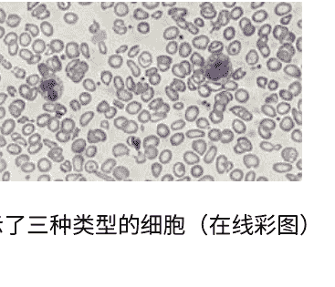

图1. 一个视野中的一部分显示了三种类型的细胞（在线彩图）

## 3种用于分析PBS图像的深度学习技术

图1显示了通过显微镜捕获的一个示例视野（FOV）。大的蓝色细胞是白细胞，小的蓝色点状物体是血小板，其余的是红细胞。可以看到，一个典型的图像中有很多细胞。因此，不同的细胞类型需要首先被定位，然后才能进行分类。分析分为两个独立的步骤：提取步骤，其中三种主要类型的细胞被分别定位，然后是分类步骤，将它们分类为亚型。

### 3.1 细胞提取

最近，基于卷积神经网络（CNN）的同时定位和分类技术变得越来越受关注[10,11]。然而，对于这个问题，这样的技术很难应用，因为它们大多数都使用预训练的分类模型，通常是在ImageNet数据集上训练的[12]。

白细胞和血小板的提取。如图1所示，白细胞和血小板呈现出特征性的深蓝色或紫色，这是由于在原始血液上施加的染料引起的[2]。基于阈值的朴素方法（无论是固定的还是自适应的）由于手工染料的颜色变化而不准确。

为了克服这个问题，我们采用了U-net深度学习架构[7]，该架构在细胞分割方面取得了良好的结果，用于白细胞和血小板分割。深度学习模型能够理解物体出现的“上下文”，因此预计其性能优于朴素方法。

U-net训练。我们创建了一个由专家手动分割的300张图像的小型训练集。图像尺寸保持较小（白细胞为128×128像素，血小板为32×32像素），通常只有一个感兴趣的对象位于图像中心。使用这个训练数据，我们训练了一个类似U-net的模型，每个“U”的分支有4个卷积层。

我们在保留验证集上获得了0.93的交并比分数。尽管U-net提供了精确的分割掩模，但我们将其作为一种定位白细胞的技术。

图2展示了一张非常浅染的图像中检测到的白细胞的示例。与图1相比，注意到白细胞的颜色变得更加淡。模型对白细胞的不同着色没有产生混淆。基于阈值的技术通常在这种图像上失败。

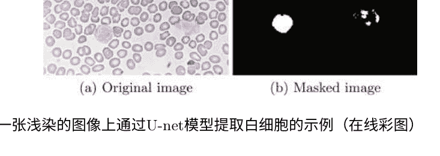

图2. 在一张浅染的图像上通过U-net模型提取白细胞的示例（在线彩图）

红细胞提取。另一方面，红细胞的提取更有效地通过图像处理完成。红细胞比白细胞更多，不需要定位每一个红细胞 - 随机采样就足够了。

我们使用类似于[13]的方法从图像中提取红细胞。它在RGB图像的绿色通道上工作，并依赖于基于Otsu阈值的方法来分离白色背景和粉红色前景。

然后我们对RBC的最小直径和最大直径应用阈值，以排除小的伪影和聚集的RBC。

### 3.2 细胞分类

如前一节所述，我们采用三种不同的提取器来提取每种主要细胞类型的细胞候选对象。候选对象被提取为小的补丁（WBC为128×128，RBC为64×64，血小板为48×48），其中感兴趣的中心。每种主要细胞类型都使用单独的提取器。每个提取器还可以从其他类中提取对象。接下来，我们使用一组CNN对每个主要类别进行分类，以及拒绝提取的伪影。

伪影包括其他类别的对象以及染色污点、异物等。

每种主要细胞类型的子类型如下：
- WBC: 亚型包括中性粒细胞、淋巴细胞、单核细胞、嗜酸粒细胞、嗜碱粒细胞以及包括所有非典型细胞（如未成熟粒细胞、原始细胞等）的类别[2]。图3显示了一些示例。
- RBC: 亚型包括正常红细胞、小红细胞、大红细胞、椭圆细胞、泪滴细胞、靶细胞、刺状细胞、碎片细胞以及用于拒绝伪影、聚集或重叠细胞、退化细胞等的“无效”类别。前三种类型的细胞形状都是圆形，仅通过大小区分。

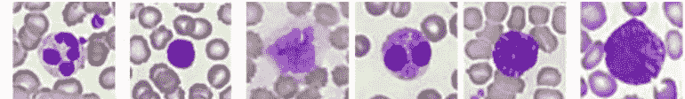

图3显示了不同的WBC亚型。

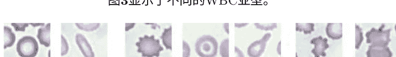

图4显示了不同的RBC亚型。

拒绝伪影、聚集或重叠细胞、退化细胞等。前三种类型的细胞形状都是圆形，仅通过大小区分。图4显示了一些示例。

- Platelet: 我们不对血小板进行细分，而是使用模型区分真正的血小板和看起来像血小板的伪影。

尽管CNN在自然图像分类方面显示出了很高的效果[15]，但在应用最先进的深度架构进行血细胞图像分类时存在一些挑战。

血细胞图像的注释需要经过认证的医学专家。因此，生成与ImageNet规模相当的训练数据几乎是不可能的。小规模的训练集是不可避免的。

细胞亚型之间的区分通常模糊不清。因此，专家对这些细胞的注释存在差异。我们的经验表明，随着专家数量的增加，观察者之间的变异性可以高达25%。

细胞类型的自然不平衡使得构建更大的数据集变得困难。例如，中性粒细胞和淋巴细胞共占白细胞总数的85%以上，而圆形细胞则占红细胞总数的近90%。

所有上述情况都可能导致训练过程中的过拟合问题。最先进的深度架构，如ResNet [15]，在这个问题上可能很难应用。为了对抗过拟合，我们使用以下技术：

- 较浅的架构，最多有6个卷积层和一个相对较小的全连接层（最多256个单元，2层）
- 通过旋转、翻转和平移进行积极的数据增强。例如，我们对细胞图像进行12次旋转（每次30度），以创建12个旋转副本。反射沿垂直和水平轴进行。在随机图像上添加小的平移（小于30个像素），可以是水平或垂直方向。
- 在训练过程中，对权重使用较大的L2正则化（WBC为0.005，RBC和Platelet为0.001）。在全连接层中使用较大的dropout [16]，为0.5。
- 当训练和验证误差开始发散时，我们提前停止训练。

我们使用一系列模型进行白细胞分类。除了有效的白细胞外，白细胞的提取过程还会产生巨大的血小板、血小板团块、有核红细胞和其他伪影。所有这些都可能与某些类型的白细胞在大小和外观上相似。层次结构中的第一个模型将提取的补丁分为5类：白细胞、大型血小板、血小板团块、有核红细胞和伪影。第一个模型中识别出的有效白细胞会进一步由第二个模型进行亚分类。

红细胞和血小板的亚分类使用单个模型，每个细胞类型一个。红细胞模型使用一个类别“圆形”来表示正常细胞、小细胞和大细胞。这些类别之间的亚分类是基于细胞的大小进行的，细胞的大小是从提取过程中生成的掩膜中获得的。这两个模型都有一个“伪影”输出类别，用于拒绝不属于相应细胞类别的补丁。

在每个模型中，我们为每个类别设置了一个概率阈值。如果具有最大概率的类别的预测概率小于阈值，我们将该细胞放入“未分类”桶中（类似于[3]）。例如，WBC亚型的概率阈值为- 中性粒细胞：0.6，淋巴细胞：0.4，单核细胞：0.7，嗜酸性粒细胞：0.6，嗜碱性粒细胞：0.5，非典型细胞：0.5。阈值是通过网格搜索选择的，以在特异性和敏感性之间取得平衡。

## 4 实验结果

现有的外周血涂片分析仪通常只能使用机器制备的载玻片[3]，或者具有自己的内部载玻片制备过程[4]。另一方面，Shonit™被训练用于处理自动化和手动制备的涂片，还可以处理多种染色类型- May-Grünwald-Giemsa (MGG) 和Leishman，其结果与[3,4]相当。这确保它在没有先进设备的较小实验室中也能适用。手动涂片是根据我们的标准操作程序（SOP）制备的，该程序类似于在正常条件下制备血涂片的过程。SOP的详细信息超出了本文的范围。

我们对40个匿名异常血液样本进行了Shonit™的验证研究，其中每种染色和涂片组合各有10个样本，包括自动MGG、自动Leishman、手动MGG和手动Leishman。样本来自三个主要实验室的正常工作负荷。该研究已获得机构伦理委员会的批准。机器对每个样本中可见的所有白细胞进行了分类。我们的系统将约2.8%的白细胞标记为“未分类”，这符合医学标准[17,18]。

三名医学专家独立验证了分类结果。还验证了大约12,000个红细胞和20,000个血小板的随机样本。如果专家之间意见不一致的细胞将被排除。

表1. 白细胞亚型分类的特异性和敏感性

| 细胞类型 | 特异性 (%) | 敏感性 (%) | 细胞计数 |
|----------|------------|------------|----------|
| 中性粒细胞 | 99.16 | 98.28 | 13,640 |
| 淋巴细胞 | 98.85 | 98.97 | 2,838 |
| 单核细胞 | 99.93 | 99.00 | 482 |
| 嗜酸性粒细胞 | 99.86 | 91.49 | 380 |

表2. 红细胞亚型分类的特异性和敏感性

| 细胞类型 | 特异性 (%) | 敏感性 (%) | 细胞计数 |
|----------|------------|------------|----------|
| 圆形 | 100 | 97.17 | 6719 |
| 椭圆细胞 | 99.11 | 100 | 962 |
| 目标 | 99.91 | 100 | 236 |
| 泪滴形细胞 | 99.87 | 100 | 120 |
| 刺状细胞 | 99.57 | 99.88 | 2606 |
| 碎片状细胞 | 99.62 | 100 | 141 |

表3. 血小板分类的特异性和敏感性

| 细胞类型 | 特异性 (%) | 敏感性 (%) | 细胞计数 |
|----------|------------|------------|----------|
| 血小板 | 93.4 | 99.7 | 10,355 |
| 伪影 | 99.7 | 93.4 | 9,240 |

避免歧义。每个类别的特异性和敏感性列在表1、表2和表3中。白细胞提取的敏感性为99.5%。嗜碱性粒细胞和非典型细胞的样本极少（分别为4和12），因此没有报告它们的特异性和敏感性。

## 5 结论

在外周血涂片的显微图像上应用深度学习技术具有其独特的挑战，与自然图像的挑战不同。本文描述了使用深度学习方法进行PBS图像分析的ShonitTM系统，旨在有效应对这些挑战。它由低成本自动显微镜和软件组件组成。使用深度学习和图像处理技术的集成进行细胞定位和分类。实验结果展示了各种涂片和染色类型。特异性和敏感性与[3]中[17]报告的结果相比具有优势。由于对输入变化的稳健性和硬件成本低廉，ShonitTM系统具有广泛的适用性。

## 参考文献

1. SigTuple, Shonit™: 完整的外周血涂片分析解决方案。 https://www.sigtuple.com。于2017年5月1日访问
2. Bain, B.J.: 《血细胞初学者指南》。 Wiley, Chichester (2008年)
3. Cellavision: 介绍CellaVision DM9600。 http://www.cellavision.com/en/our-products/products/cellavision-dm9600。于2016年10月20日访问
4. Roche Diagnostics Limited, cobas m511集成血液分析仪。 http://www.cobas.com/home/product/hematology-testing/cobas-m-511.html。于2016年10月15日访问
5. West Medica, Vision Hema Ultimate。 http://visionhemaultimate.com/。于2016年11月1日访问
6. Fujimoto, K.: Sysmex公司生产的血液分析仪测量原理。Sysmex J. Int. 9(1), 31-44 (1999年)。SEAS SUM7. Ronneberger, O., Fischer, P., Brox, T.: U-net: 用于生物医学图像分割的卷积网络。In: Navab, N., Hornegger, J., Wells, W.M., Frangi, A.F.(eds.) MICCAI 2015. LNCS, vol. 9351, pp. 234-241. Springer, Cham (2015). doi:10.1007/978-3-319-24574-4_28
7. Labo America, Lx 500. http://www.laboamerica.com/products/compound/lx500. 访问日期: 2016年9月27日
8. Apple, iPhone 6s. http://www.apple.com/iphone-6s/. 访问日期: 2016年11月1日
9. Ren, S., He, K., Girshick, R., Sun, J.: Faster R-CNN: 基于区域建议网络的实时目标检测. In: Advances in neural informationprocessing systems, pp. 91–99 (2015)
10. He, K., Gkioxari, G., Dollár, P., Girshick, R.: Mask R-CNN (2017). arXiv preprint arXiv:1703.06870
11. Deng, J., Dong, W., Socher, R., Li, L. J., Li, K., Fei-Fei, L.: Imagenet: 一个大规模的分层图像数据库. In: IEEE Conference on Computer Vision and Pattern Recognition, CVPR 2009, pp. 248–255. IEEE (2009)
12. Angulo, J., Flandrin, G.: 使用数学形态学自动检测外周血涂片的工作区域。细胞病理学分析。 25(1), 37–49 (2003)
13. Otsu, N.: 一种基于灰度直方图的阈值选择方法。IEEE Trans. Syst. Man Cybern. 9(1), 62–66 (1979)
14. He, K., Zhang, X., Ren, S., Sun, J.: 深度残差学习用于图像识别。 在: IEEE计算机视觉与模式识别会议论文集, pp. 770–778 (2016)
15. Srivastava, N., Hinton, G.E., Krizhevsky, A., Sutskever, I., Salakhutdinov, R.: Dropout: 一种防止神经网络过拟合的简单方法。机器学习杂志。 15(1), 1929–1958 (2014)
16. Rollins-Raval, M.A., Raval, J.S., Contis, L.: 在一个大型多中心学术医院系统中使用CellaVision DM96进行外周血液差异诊断的经验。 J. Pathol. Inf. 3(1), 29 (2012)
17. Kratz, A., et al.: Cellavision DM96系统的性能评估。 Am. J. Clin. Pathol. 124(5), 770–781 (2005)

# AGNet: 用于手术工具存在检测的注意力引导网络

Xiaowei Hu^(1)(✉), Lequan Yu^(1), Hao Chen^(1), Jing Qin^(2), 和 Pheng-Ann Heng ^(1) 

^(1) 香港中文大学计算机科学与工程系，中国香港特别行政区 

xwhu@cse.cuhk.edu.hk 

^(2) 香港理工大学护理学院智能健康中心，中国香港特别行政区

摘要。 我们提出了一种新颖的方法来自动识别手术视频中的手术工具，这是非常具有挑战性的，因为手术工具的外观变化大，部分出现，手术场景复杂，同一帧中的一些工具同时出现。 受人类视觉注意机制的启发，该机制首先定位和选择一些重要的视觉线索，然后仔细分析这些注意焦点，我们提出首先利用全局预测网络获得一组视觉注意图和每个工具的全局预测，然后利用局部预测网络根据这些注意图预测工具的存在。 我们应用门函数通过平衡全局和局部预测来获得最终的预测结果。 提出的注意引导网络（AGNet）在m2cai16-tool数据集上实现了最先进的性能，并且超过了2016年的冠军。

- 关键词: 手术工具识别 · 注意力引导网络 · 腹腔镜视频 · 胆囊切除术 · 深度学习

## 1 引言

自动标注手术视频中的手术工具对于智能手术工作流分析至关重要，并且可以找到许多相关应用，包括手术室排班优化、手术报告生成和实时决策支持。 然而，这项任务在以下几个方面具有挑战性。 首先，复杂的手术场景使得准确区分各种手术工具与背景变得困难。 其次，手术工具的种类繁多使得这项任务更加困难。 特别是，某些帧中手术工具的部分出现使得基于设计或学习的特征根据手术工具的完整视图进行识别变得复杂。 第三，当两个或多个手术工具出现在同一场景（或帧）中，甚至彼此重叠时，从背景中找出所有手术工具变得困难。 此外，只有图像级别的标签。

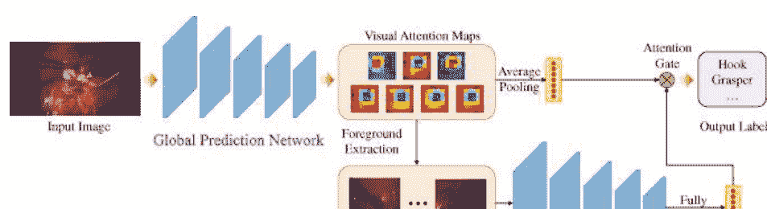

图1. 所提出的AGNet的示意图。（在线彩图）

对于每个手术视频帧，没有提供边界框。原则上，这个任务是一个多标签分类问题，因为我们需要应用多个标签来描述一个帧，以防不同种类的工具可能同时出现。

现有的方法以两种方式解决这个任务。一种是基于手工特征或学习特征[2,3]直接识别每种工具，忽略了不同种类工具之间的潜在关系。另一种将这个任务视为一个多标签分类问题，并以数据驱动的方式学习工具的特征[5,8,10,12]。尽管使用固有的视觉特征对工具存在进行检测是有效的，但准确性仍然不尽人意，特别是当图像中只有一小部分工具出现或工具被其他种类的工具遮挡时。这是因为被关注的工具的响应被其他工具或复杂的背景所抑制，因此被关注的工具在空间上并不占主导地位。

为了应对上述挑战并更好地解决这个任务，我们提出了一种新颖的基于人类视觉注意机制的深度学习方法。类似于人类的视觉注意，我们的方法首先通过深度神经网络提取一些具有相对较高包含手术工具概率的区域，然后通过另一个深度神经网络仔细分析这些区域（如图1所示）。

我们将第一个神经网络称为全局预测网络，它以原始帧作为输入，并输出一个视觉注意图和每个工具的全局预测。视觉注意图是基于神经网络产生的特征图的激活区域生成的。我们将第二个神经网络称为局部预测网络，因为它以编码了丰富的局部信息的视觉注意图作为输入，并输出每个工具的另一个预测，这个预测更多地基于局部信息。我们应用门函数通过平衡全局和局部预测来获得最终的预测结果。提出的注意引导网络（AGNet）在m2cai16tool数据集[1]上实现了最先进的性能，并且明显超过了2016年的冠军。

## 2 注意力引导网络

图1展示了所提出的AGNet的架构。它将整个图像（帧）作为输入，并输出识别结果。首先，它通过全局预测网络生成一组带有每种工具位置信息的视觉注意力图。为了获得这些图，我们在全局预测网络的末尾添加了一个卷积层，将卷积层的通道数设置为手术工具类别的数量（在我们的研究中共有7个）。在这种情况下，我们可以获得每个工具的视觉注意力图，如图1所示（红色表示高响应，蓝色表示低响应）。然后，通过对每个视觉注意力图上的特征值进行平均，预测每个工具的存在置信度。

之后，我们从输入图像中提取包含在视觉注意力图中特征值超过阈值的区域，然后将这些区域调整为与输入图像相同大小的图像。我们将这些生成的图像称为手术工具的前景，因为它们包含了可能包含工具的高概率区域。每个前景图像都被输入到另一个深度神经网络中，即局部预测网络，以获得另一组预测结果。

最后，这些预测被应用为门，用于调整由全局预测网络生成的预测，以实现最终结果。由于局部预测网络专注于注意区域，因此它更容易学习更具辨别力的局部特征，以更准确地识别被遮挡或部分出现的手术工具，并将关注的工具与复杂背景或其他不同类型的工具区分开来。

### 2.1 全局预测网络

为了基于图像级监督获得视觉注意力图，我们采用了一个具有101层的残差网络[1]作为基本网络，从输入图像生成一组特征图，并在原始残差网络的最后一个卷积层之后添加了一个新的卷积层。我们将新添加的卷积层的通道数设置为手术工具类别的数量，以便我们可以为每个工具获得一个视觉注意力图。在获得这些图像后，我们可以通过计算每个图像的平均值来计算每个工具的全局预测。

> $$L = -\frac{1}{N} \sum_{i=1}^{N} \sum_{j=1}^{c} (T_{i,j} log(p_{i,j}) + (1 - T_{i,j})log(1 - p_{i,j})),$$

其中 N 和 c 分别表示图像数量和工具类别数量； T_{i,j} 在图像 i 中表示第 j 个手术工具是否存在，如果存在则为1，否则为0；工具 j 在图像 i 中的置信度用 p_{i,j} 表示，通过sigmoid函数归一化到[0,1]。需要注意的是，这个全局网络生成的预测是基于整个图像的，因此很容易忽略被遮挡、部分可见或尺寸较小的工具的信息，因为这些工具的激活通常比大型完全可见的工具低。

从这个全局网络生成的预测是基于整个图像的，因此很容易忽略被遮挡、部分可见或尺寸较小的工具的信息，因为这些工具的激活通常比大型完全可见的工具低。

然而，正如前面提到的，全局网络的最后一个卷积网络生成的视觉注意力图能够独立地表示每种手术工具，并包含丰富的局部信息。毕竟，在困难案例中，虽然工具的激活程度低于易于识别的工具，但仍然比背景具有更高的激活程度（如图1所示）。

在每个视觉注意力图上，我们使用Otsu算法[4]通过最大化类间方差动态地将像素分为两类。每个视觉注意力图上具有较大特征值的类别相对来说更有可能包含手术工具。然后，提取属于该类别的区域的最小边界框，并将其调整为与输入图像相同大小的前景图像。我们按照图1所示的方式提取每种类型的工具的前景图像。这些前景图像的标签是相应类型的工具。

### 2.2 本地预测网络

本地预测网络将全局预测网络推断出的前景作为输入，并基于这些前景预测出每种工具的另一个置信度。该网络与全局预测网络具有相同的结构，只是使用全连接层来生成固定长度的手术工具预测向量，而不仅仅是对特征图进行平均。

此外，该网络使用与公式1中所示的相同损失函数。本地网络生成的预测用作控制全局预测网络预测的置信度的门控。每种工具i的最终预测置信度Pfi是：

$$P_{fi} = G(σ(P_{gi}), σ(P_{li}))$$

其中，G是门控函数，它计算全局和本地网络的置信度Pgi和Pli的内积；σ是用于归一化的sigmoid函数。在这个多标签问题中，我们使用sigmoid而不是softmax，因为工具的分类分布是独立的。

根据方程式2，在我们的AGNet中，如果“注意力”确实包含手术工具，无论其大小或是否被其他工具遮挡，都很可能获得高置信度，因为注意力图主要包含一种类型的工具并且包含更多的局部上下文信息。另一方面，如果“注意力”图是背景或其他类型的工具，即使该图像部分与真实类型的工具相似，也很可能获得低置信度，因为这些困难实例经过子采样和重新训练，专注于它们。

总之，提出的AGNet可以从三个方面应对手术工具存在检测的挑战。首先，遮挡或部分可见的工具更容易被识别，因为一个注意力图中只有一种类型的工具。

因此，我们可以从局部网络中获取更具辨别力的这种工具的特征。其次，小工具很容易被识别，因为高注意力区域从输入图像中提取并放大以获取更多的上下文信息。最后，难以识别的工具或背景通过该网络进行重新训练，因此它具有与困难负样本挖掘[9]相同的功能，通过专注于困难示例来提高准确性。

## 3 实验

### 3.1 数据集和预处理

数据集。我们在m2cai16-tool数据集[11]上评估了提出的AGNet，该数据集包括10个胆囊切除术视频用于训练和5个视频用于测试。这些视频以25帧每秒的速度捕获，但每25帧中只有一帧有标签。我们忽略没有标签的帧（图像）。最后，我们大约有23k个训练图像和12k个测试图像。这些视频中总共有七种手术工具（如图2所示）。性能通过平均精度进行评估，整体性能是这七种工具的平均精度的均值。

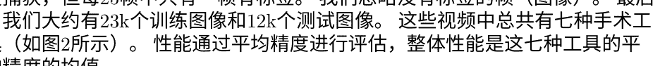

> 图2. m2cai16-tool数据集上的七种工具。

图像对齐。由腹腔镜拍摄的手术视频始终包含具有零梯度的“黑边”，这些边界对于理解图像是无用的（如图1所示）。为了减少空间和时间复杂度，我们通过找到具有非零梯度的最大连通区域的最小边界框来自动剪切掉边界。只有具有上下文信息的图像区域才会被发送到深度神经网络，这样我们可以保留更多图像的详细上下文信息，这对于识别小型或部分可见的手术工具至关重要。

### 3.2 训练过程

基于在其他相关任务的预训练权重上微调网络，利用大量训练图像有助于加速训练过程，因为图像的知识从大型数据集转移到新数据集。在我们的AGNet中，我们首先使用在ImageNet [7]上预训练的101层残差网络的权重来初始化全局预测网络的权重。

### 3.3 消融分析

我们在m2cai16-tool训练数据集上进行了消融分析，包括十个视频。我们将这些视频分为训练集（最后八个视频）和验证集（前两个视频），并将所有视频帧调整为224 × 224作为输入。

图像对齐和注意力引导。表1显示了不同步骤对性能的影响。在这里，全局预测网络的预测结果被表示为GPN。在应用图像对齐选择具有丰富上下文信息的图像部分（GPN-A）之后，识别准确率有了很大提高。而且，“剪刀”、“灌注器”和“夹子”有了很大的改进，这表明细节特征对于区分它们与其他类型的工具非常重要。此外，我们的注意力引导网络（AGNet）进一步提高了准确性，特别是对于“钩子”和“夹子”，平均精度超过99%。这表明具有区分性的局部特征对于识别难以看清的工具和区分外观相似的工具非常有用。需要注意的是，“灌注器”的准确性远低于其他类别，因为该工具的外观不明显（如图2所示，呈金属光泽的圆柱体），且训练样本有限。

**表格 1. 在m2cai16-tool验证数据集上的平均精度（%）。**

| 方法 | 总体 | 夹持器 | 双极钩 | 剪刀 | 夹子 | 灌注器 | 标本袋 |
| :--- | :--- | :--- | :--- | :--- | :--- | :--- | :--- |
| GPN | 81.295 | 95.091 | 88.526 | 96.381 | 63.827 | 87.659 | 50.458 | 87.120 |
| GPN-A | 88.540 | **95.200** | 91.057 | 96.528 | 88.486 | 90.964 | 69.334 | 88.214 |
| AGNet | **91.102** | 94.963 | **91.556** | **99.616** | **90.409** | **99.312** | **72.645** | **89.213** |

注意力引导的重要性。模型集成是一种常见的技术，通过结合多个模型的预测结果来提高图像识别的准确性，因为模型之间的多样性能够能够降低过拟合的风险。在我们的AGNet中，我们还使用了两个子网络来进行手术工具的存在检测。然而，我们的两个网络不仅充分利用了

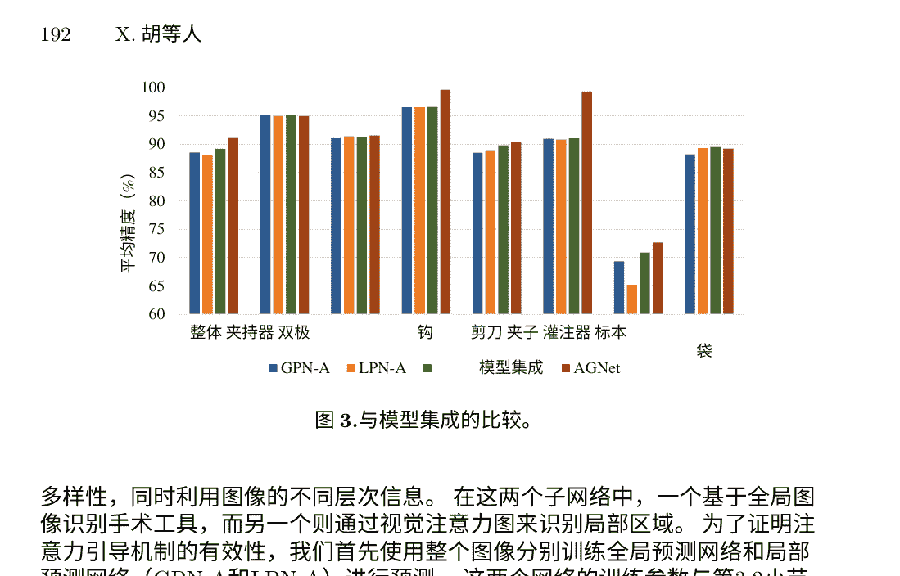

图 3. 与模型集成的比较。

多样性，同时利用图像的不同层次信息。在这两个子网络中，一个基于全局图像识别手术工具，而另一个则通过视觉注意力图来识别局部区域。为了证明注意力引导机制的有效性，我们首先使用整个图像分别训练全局预测网络和局部预测网络（GPN-A和LPN-A）进行预测。这两个网络的训练参数与第3.2小节中描述的相同。

然后，在获得这两个网络的预测结果之后，我们将它们平均作为模型集成结果（模型集成）。如图3所示，将这两个模型进行平均比每个单独的网络稍微好一些。然而，它比我们的AGNet要差得多，特别是对于“Hook”和“Clipper”这两种容易被其他工具遮挡的工具。这表明我们的AGNet不仅仅是组合多个网络，而是利用了不同层次的信息。

### 3.4 与现有技术的比较

我们将提出的AGNet与m2cai16-tool数据集上的现有技术进行比较。在这个实验中，整个训练集被用来训练我们的模型。表2列出了提交到这个挑战的所有方法。我们可以发现基于手工特征的算法[2]具有最低的准确率。对于基于深度卷积神经网络的算法，Luo等人[3]使用七个卷积神经网络分别识别七种工具，而其他方法[5,8,10,12]则使用单个深度神经网络基于整个图像提取特征。然而，它们都没有使用足够深的网络和局部信息来获得更具区分性的特征。很明显，我们的AGNet结合了全局和局部信息，达到了最高的精度，并超过第二名算法23%。

| 方法 | 平均精度（%） |
| :--- | :--- |
| 我们的 | 86.9 |
| Raju等人[5] | 63.8 |
| Sahu等人[8] | 61.5 |
| Winanda等人[10] | 52.5 |
| Zia等人[12] | 37.8 |
| Luo等人[3] | 27.9 |
| Letouzey等人[2] | 21.1 |

## 4 结论

本文提出了一种注意力引导网络，称为AGNet，用于手术工具存在检测。提出了全局预测网络，基于图像级标签获取包含手术工具的区域，并对整个图像进行预测，而局部预测网络则对全局预测网络提取的关注区域进行预测。通过考虑全局和局部特征，AGNet可以识别部分可见或小型工具，并将工具与复杂背景区分开。我们的算法在m2cai16-tool数据集上实现了最先进的性能，并显著超过其他方法。

致谢。本文所述工作得到了中国香港特别行政区研究资助委员会的以下研究资助（项目编号：CUHK 14202514和CUHK 14203115）。

## 参考文献

1.  He, K., Zhang, X., Ren, S., Sun, J.: 深度残差学习用于图像识别。 在：CVPR，第770-778页（2016）
2.  Letouzey, A., Decrouez, M., Agustinos, A., Voros, S.: 腹腔镜手术器械定位和识别（2016年）。 http://camma.u-strasbg.fr/m2cai2016/reports/Letouzey-Tool.pdf
3.  Luo, H., Hu, Q., Jia, F.: 通过多个卷积神经网络进行手术工具检测（2016年）。 http://camma.u-strasbg.fr/m2cai2016/reports/Luo-Tool.pdf
4.  Otsu, N.: 一种基于灰度直方图的阈值选择方法。IEEE Trans.Syst. Man Cybern. 9(1), 62-66 (1979)
5.  Raju, A., Wang, S., Huang, J.: M2CAI手术工具检测挑战报告(2016). http://camma.u-strasbg.fr/m2cai2016/reports/Raju-Tool.pdf
6.  Rosen, M.L., Stern, C.E., Michalka, S.W., Devaney, K.J., Somers, D.C.: 认知控制网络对记忆引导的视觉注意力的贡献. 大脑皮层, 纽约 (2015). bhv028
7.  Russakovsky, O., Deng, J., Su, H., Krause, J., Satheesh, S., Ma, S., Huang, Z., Karpathy, A., Khosla, A., Bernstein, M., et al.: ImageNet大规模视觉识别挑战. IJCV 115 (3), 211-252 (2015)
8.  Sahu, M., Mukhopadhyay, A., Szengel, A., Zachow, S.: 使用上下文CNN特征进行工具和阶段识别。 arXiv预印本arXiv:1610.08854 (2016)
9.  Shrivastava, A., Gupta, A., Girshick, R.: 在线困难样本挖掘训练基于区域的目标检测器。在： CVPR，pp. 761–769 (2016)
10. Twinanda, A.P., Mutter, D., Marescaux, J., de Mathelin, M., Padoy, N.: M2CAI 2016工具存在检测挑战的单任务和多任务架构。 arXiv预印本arXiv:1610.08851 (2016)
11. Twinanda, A.P., Shehata, S., Mutter, D., Marescaux, J., de Mathelin, M., Padoy, N.: EndoNet: 用于腹腔镜视频识别任务的深度架构。 IEEE Trans. Med. Imaging 36(1), 86–97 (2017)
12. Zia, A., Castro, D., Essa, I.: 用于手术工具检测的深度架构微调（2016年）。 http://camma.u-strasbg.fr/m2cai2016/reports/Zia-Tool.pdf

# 使用渐进全面嵌套神经网络和随机行者从CT图像中进行病理性肺叶分割

Kevin George, Adam P. Harrison, Dakai Jin, Ziyue Xu, 和 Daniel J. Mollura
美国国立卫生研究院，马里兰州贝塞斯达
ziyue.xu@nih.gov

**摘要。** 自动病理性肺叶分割（PPLS）使得对肺部疾病进行区域分析成为可能，这是临床上非常重要的能力。由于肺叶边界通常不完整，即使对专家来说，PPLS也很困难，并且大多数先前的方法需要从上下文信息中进行推断。 为了解决这个问题，我们提出了一种将深度学习与随机行者（RW）算法相结合的新型PPLS方法。 我们首先使用最近的渐进全面嵌套网络（P-HNN）模型来识别潜在的肺叶边界，然后使用由P-HNN输出种子和加权的RW生成最终的分割。 我们是第一个将深度学习应用于PPLS的研究。其优点包括独立于先前的气道/血管分割，对病变肺部的鲁棒性增强，以及方法的简单性而不牺牲准确性。 我们的方法在一个包含154个肺部疾病患者的CT扫描的保留集上获得了高达0.888 ± 0.164的平均Jaccard分数，同时还显著（p < 0.001）优于一种最先进的方法。

**关键词：** 肺叶分割 · CT ·全面嵌套神经网络 ·裂隙 ·随机行者

## 1 引言

由于全球肺疾病的流行，自动肺部分析工具是医学影像学的主要目标。 人类肺分为五个相对独立的叶，每个叶都有单独的支气管和血管系统。 这导致一些肺部疾病更倾向于影响特定的叶 [1]。

本工作得到美国国立卫生研究院临床中心和国家过敏和传染病研究所的内部研究计划的支持。加拿大大自然科学和工程研究委员会也提供了支持。我们还感谢Nvidia捐赠了一台Tesla K40 GPU。 根据17 §105 U.S.C.的规定，本作品的权利在可转让的范围内转让。 © Springer International Publishing AG（美国以外）2017 M.J. Cardoso等人（编辑）：DLMIA/ML-CDS 2017, LNCS 10553, 第195-203页, 2017年。 DOI: 10.1007/978-3-319-67558-9_23

因此，病理性肺叶分割（PPLS）是计算机辅助疾病分析工具的重要步骤。

对于PPLS存在几个解剖学上的挑战。在健康的肺部中，肺叶边界通常由可见的裂隙定义。然而，裂隙经常是不完整的，即它们无法延伸到整个肺叶边界[2]。因此，裂隙检测和肺叶边界检测并不总是等价的问题。即使裂隙可见，由于呼吸和心脏运动的影响，它们的厚度、位置和形状也会有所变化[3]。此外，附属裂隙是与主要裂隙在外观上相似但实际上不会分割肺叶区域的结构，这种情况很常见[4]。最后，尽管PPLS在病理性肺部中具有最大的临床效用，但肺部疾病通常会完全遮盖裂隙。

出于这些原因，大多数先前的研究依赖于肺血管/气道分割或半自动方法[1]。Bragman等人的工作是前一类别的典范[5]，在肺血管和气道分割以及基于人口模型的裂隙位置和表面拟合方面取得了良好的准确性，但方案相对复杂。

除了涉及的复杂性外，肺气道和血管分割在病理存在的情况下并不总是可靠。这就是为什么Doel等人[6]试图通过主要用于初始化其方法中的裂隙检测来最小化对这些先验知识质量的依赖。

目前已经提出了两种既自动又不依赖先验气道/血管分割的肺叶分割方法[7,8]。然而，这两种方法都有明显的局限性。Ross等人[7]使用手动定义的图谱，创建过程繁琐，在高度变异的病理性肺部测试时结果不佳，并增加了执行时间[1]。Pu等人[8]也实现了不依赖先验气道/血管分割的肺叶分割，但在裂隙不完整、存在大的附加裂隙以及肺叶边界具有异常方向的情况下，成功率较低。最后，他们的方法仅在健康体积上进行了验证，并且仅报告了定性结果。到目前为止，还没有提出基于深度学习的算法。

为了填补这个空白，我们开发了一种将最先进的深度全卷积网络（FCN）与随机行走（RW）算法相结合的PPLS方法。观察到FCN在分割方面非常强大，我们使用最近提出的渐进全面嵌套网络（P-HNN）架构[9]来分割肺部内的肺叶边界。重要的是，即使裂隙不完整，P-HNN也能表现出色。然后，P-HNN概率图用于生成RW算法[10]的种子和边缘概率，从而产生最终的肺叶分割掩模。我们将我们的方法称为P-HNN+RW，这是第一个将深度学习应用于PPLS的方法。重要的是，P-HNN+RW只需要一个肺掩模来运行，并且保持简单、快速、高效和稳健。我们在具有挑战性的肺组织研究联盟（LTRC）数据集[11]上测试了P-HNN+RW，该数据集包括患有慢性阻塞性肺疾病（COPD）和间质性肺疾病（ILD）的患者的CT扫描，并且在执行上比一种最先进的方法[6]更简单，但仍然取得了改进。在一个保留的测试集上154个体积，迄今为止最大的肺叶分割分析，我们实现了高Jaccard分数（JS）为0.888 ± 0.164。

## 2 方法

图1展示了我们PPLS流程的流程图。为了避免依赖先前的血管/气道分割，我们改用P-HNN深度学习架构[9]与著名的RW算法[10]的结合。

唯一的先决条件是一个肺掩膜，可靠的方法已经存在[9]。

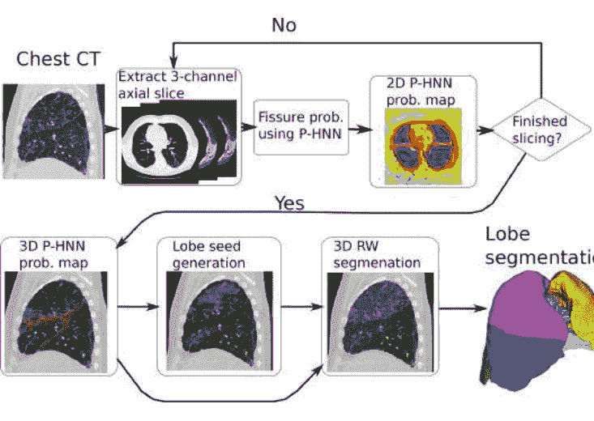

图1. P-HNN+RW操作的流程图。

### 2.1 肺叶边界分割

给定一个体积和一个肺掩膜，如果能够计算出可靠的肺叶边界图，分割五个肺叶将相对容易。不幸的是，肺叶边界很难检测，常见的不完整特征和其他干扰因素导致大部分先前的研究依赖于气道或血管分割提供的补充信息。

从衰减值直接可靠地分割肺叶界限仍然具有吸引力，因为这将避免这种相当复杂的情况。最近在高度具有挑战性的分割任务中，FCN取得了显著的突破和成功，为更可靠的肺叶界限分割打开了可能性。

沿着这些线路，我们方法的第一步是将FCN模型应用于肺叶界限分割。不失一般性，我们采用了最近的P-HNN模型[9]，该模型已成功应用于病理性肺分割。

图2展示了P-HNN模型，它是高度成功的HNN模型[12]的改编版本，引入了对FCN的深度监督侧输出的概念。重要的是，该模型避免了复杂的上采样。

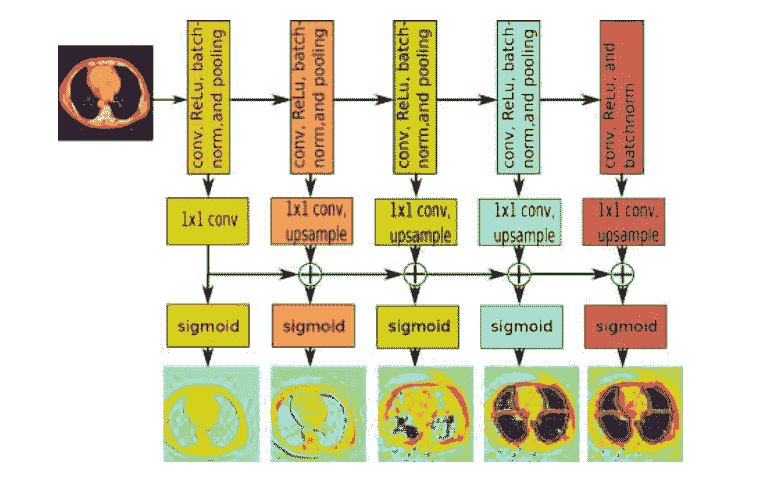

图2. 使用P-HNN进行肺叶界限分割。与HNN [12]类似，P-HNN模型计算侧输出，所有侧输出都与损失函数相连。与HNN不同，P-HNN没有融合输出，而是限制侧输出以逐步改进先前的输出。训练时忽略肺部掩膜外的区域。

图9经过许可改编。

最近的FCN架构中使用的路径，而是使用渐进式多路径连接来解决FCN的粗化分辨率问题。因此，该模型保持简单直接，相对简单，非常适合PPLS。

无论使用哪种具体的FCN，该模型的功能是通过训练一组数据 $S = \{(X_n, Y_n), n=1\ldots,N\}$ 来实现的，其中 $X_n = \{x_j^{(n)}, j=1\ldots,|X_n|\}$ 和 $Y_n = \{y_j^{(n)}, j=1\ldots,|X_n|\}, y_j^{(n)} \in \{0,1\}$ 分别表示输入和二进制真值图像。后者表示哪些像素位于边界区域上，即 $x_j \in \Omega_{\text{bound}}$，我们不区分分离的具体肺叶。给定一张图像和一组参数 $\mathbf{W}$，网络然后估计

$$ p_j = P(x_j \in \Omega_{\text{bound}}|X_n; \mathbf{W}). \qquad (1) $$

我们在2D轴向切片上进行训练和推断，选择2D领域有两个主要原因。首先，当前的3D FCN解决方案需要一个滑动框，限制了空间上下文，我们认为这对于划分肺叶界限尤其重要，特别是当裂隙不完整或被遮挡时。此外，滑动框增加了复杂性和推断时间，我们的目标是将其最小化。其次，由于内存限制，3D FCN比其2D对应物更窄更深。鉴于在2D中分割解剖结构已经取得了出色的性能[9,13,14]，我们选择了一个2D解决方案，在网络深度和宽度上不需要妥协，并且在应用上更简单。在训练中忽略肺部掩膜外的区域。

### 2.2 三维随机行走

虽然P-HNN模型可以提供相对可靠的肺叶界限图，但输出仍然存在噪声，经常导致间隙。因此，最终的分割结果不能仅仅从边界图中获得，需要一个对噪声具有鲁棒性的后续处理步骤。传统上，可以通过简单地将表面拟合到潜在的裂隙位置[8]来完成这一步骤，但这种方法可能效率低下且容易出错。相反，我们将P-HNN输出的所有轴向切片组合起来，并执行3D随机行走分割[10]。RW算法通常用于交互式环境中，但只要存在明确定义的种子，即限制在特定分割掩模中的区域，就可以使用RW算法。

我们选择RW算法而不是其他基于图的方法，例如密集CRF，是因为它具有全局最优解、高效和简单的特点。

正式地，假设我们有五组种子点，\(R_k, k=1...5\)，对应于明确属于五个肺叶的区域。如果我们将种子点分成\(S_f = R_1\)和\(S_b = \{R_m, m=2...5\}\)，那么未种子点属于肺叶\(_1\)的伪概率通过最小化以下能量函数来计算：

\(E(\mathbf{y}) = \sum_{e_{ij}} w_{ij} (y_i - y_j)^2 + \sum_i \lambda_i (y_i - b_i)^2\) (2)

其中\(y_j\)是结果概率，\(w_{ij}\)表示惩罚每个像素与其邻居之间差异的权重\(e_{ij}\)的边。我们使用一个6连通的邻域，并忽略肺部掩膜外的区域。最小化 (2) 可以通过线性方式完成[10]。对于所有其他肺叶，该过程重复进行，除了不同的肺叶必须被视为前景，即\(S_f\)，其余部分为背景，即\(S_b\)。因为所有伪概率之和为1 [10]，所以最后一个肺叶的分割可以从前四个计算出来，节省一次RW执行。

为了最小化 (2) ，必须生成种子区域和边缘权重。为了计算种子区域，我们首先反转P-HNN边界掩模，然后迭代地侵蚀它，直到我们获得五个完全连接的区域，每个区域对应一个肺叶。区域质心用于识别特定的肺叶，并在无法确定五个区域的情况下使用停止阈值。这种迭代侵蚀方法会打破由不完整或弱P-HNN边界引起的肺叶之间的连接，并在RW的最大可能种子点处停止。这些扩大的种子区域减小了线性系统的大小，使完全3D的RW实现在内存限制内。

生成种子后，我们根据P-HNN输出计算边缘权重：

\(w_{ij} = \exp(-\beta(p_i - p_j)^2)\), (3)

其中 \(p\)（）是从 (1) 中获得的，\(\beta\)是类似于物理系统中的扩散常数的全局参数，其值是基于验证子集选择的。因此，RW对P-HNN边界之间的肺叶掩模泄漏进行惩罚，同时产生对间隙或噪声具有鲁棒性的结果。

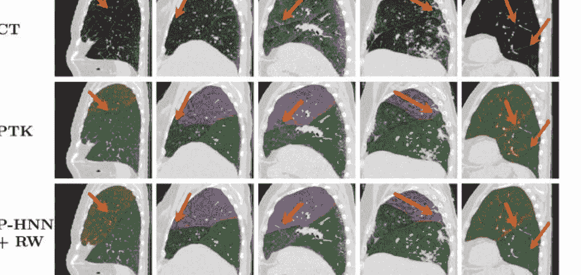

图3. 示例PPLSs，红线表示地面真实边界。 (a) P-HNN+RW正确分割了左肺叶，而PTK遵循了错误的边界。 (b) P-HNN+RW成功处理了不完整的裂隙。 (c) PTK过度分割了一个肺叶。 (d) P-HNN+RW与PTK不同，成功区分了纤维化和肺叶边界。 (e) 尽管没有可见的裂隙，P-HNN+RW能够利用上下文推断出一个更合理的肺叶边界。 注意，附属裂隙被忽略。 (在线彩图)

## 3 实验和结果

我们在LTRC数据集[11]的540个标注卷上进行训练，测试集包含154个卷。 重要的是，每个卷都展示了ILD和/或COPD的挑战性衰减模式；因此，我们在可能提供临床效用的病理学案例上进行测试。 我们将每个切片重新缩放为一个3通道8位图像，使用的窗口分别是[-1000, 200]、[-160, 240]和[-1000, -775] Houns field单位。 我们从ImageNet VGG-16模型[15]进行微调，并在大约2个epochs后停止训练。 侵蚀步骤和RW的参数是基于60个卷的验证集选择的。 在推断过程中，完整的流程平均需要4-8分钟来处理一个典型的卷，使用的是Tesla K40 GPU和12核处理器。 据我们所知，这是迄今为止对PPLS技术进行的最大规模评估。

为了衡量P-HNN+RW的性能，我们首先使用地面真实的肺部掩膜进行测试，以消除肺部掩膜作为混淆因素的影响。 表1显示了完整测试集中每个肺叶的平均JS值及其标准差。 P-HNN+RW在左肺中最强，在右中叶最弱，这是当前方法中的一种一致趋势[5, 16]。 重要的是，我们获得了0.888 ± 0.164的高整体Jaccard分数，与在类似具有挑战性的病理肺部上测试的最高性能已发表方法[5, 16, 17]相比非常有利。

| 肺叶 | 左上 | 左下 | 右上 | 右中 | 右下 | 总体 |
| :--- | :--- | :--- | :--- | :--- | :--- | :--- |
| P-HNN+RW (GT掩膜) | 0.925 ± 0.175 | 0.945 ± 0.116 | 0.929 ± 0.057 | 0.824 ± 0.142 | 0.887 ± 0.239 | 0.888 ± 0.164 |
| P-HNN+RW* | 0.930 ± 0.144 | 0.925 ± 0.130 | 0.927 ± 0.044 | 0.848 ± 0.091 | 0.873 ± 0.244 | 0.888 ± 0.146 |
| PTK* | 0.884 ± 0.171 | 0.853 ± 0.202 | 0.835 ± 0.148 | 0.683 ± 0.222 | 0.865 ± 0.170 | 0.838 ± 0.140 |

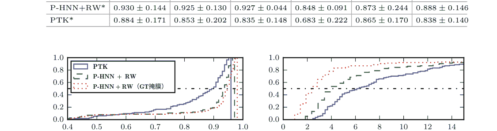

但不需要血管/气道分割、群体先验和其他复杂过程。

我们还直接与先前的方法进行比较。由于没有其他深度学习方法被发表，我们将与肺工具包（PTK）的自动和非深度学习方案进行比较。为了公平比较，我们使用PTK肺掩膜重新生成了我们的结果。PTK未能为40个体积产生最终的肺叶分割。对于剩下的114个体积，图4显示了P-HNN+RW的JS和平均表面距离（ASD）的累积直方图，包括有和没有地面真值掩膜的情况，以及PTK的情况。表1的最后两行提供了肺叶特定的结果，用于与PTK进行比较。可以看出，当使用相同的掩膜时，我们的方法（0.89 JS）明显优于PTK（0.84 JS），在两个指标上产生了统计显著的改进（p < 0.001 Wilcoxon符号秩检验），尽管排除了PTK无法分割的体积。图3提供了一些定性示例，展示了P-HNN+RW在视觉质量和分割可用性方面的改进影响。

## 4 结论

本研究介绍了一种简单但非常强大的PPLS方法，它使用深度FCN结合RW细化来实现高准确性，而无需依赖先前的气道或血管分割。此外，该方法是专门针对病理性肺部开发和验证的。在154个保留的病理性计算机断层扫描（CT）上进行测试时，这是迄今为止最大规模的PPLS评估，该方法产生了强大的肺叶特异性和整体JS。我们的方法在ASD和JS方面也始终优于基于气道和血管的PPLS方法[6]（p < 0.001）。重要的是，这些结果是在相对于现有技术更少的复杂性下获得的，从而增加了我们方法的泛化能力。因此，我们的方法代表了朝着临床实用的PPLS工具迈出的重要一步。

## 参考文献

- 1. Doel, T., Gavaghan, D.J., Grau, V.: CT图像自动肺叶分割方法综述. 计算机医学影像图形学. **40**, 13-29 (2015)
- 2. Raasch, B.N., Carsky, E.W., Lane, E.J., O’Callaghan, J.P., Heitzman, E.R.: 放射学肺间裂的解剖学研究：100个标本的研究. 美国放射学杂志. **138**(6), 1043-1049 (1982)
- 3. Wang, J., Betke, M., Ko, J.P.: CT图像肺裂分割. 医学图像分析. **10**(4), 530-547 (2006)
- 4. Cronin, P., Gross, B.H., Kelly, A.M., Patel, S., Kazerooni, E.A., Carlos, R.C.: 肺正常和附属裂的连续体积薄层多探测器CT评估. 欧洲放射学杂志. **75**(2), e1-e8 (2010)
- 5. Bragman, F., McClelland, J., Jacob, J., Hurst, J., Hawkes, D.: 基于概率分割和群体裂先验的肺叶分割. IEEE医学成像杂志. **36**(8), 1650-1663 (2017)
- 6. Doel, T., Matin, T.N., Gleeson, F.V., Gavaghan, D.J., Grau, V.: 利用裂纹、气道、血管和多级b样条对CT图像进行肺叶分割. In: 2012年第9届IEEE生物医学成像国际研讨会（ISBI）, 2012年5月, 第1491-1494页。
- 7. Ross, J.C., San Jos´e Est´epar, R., Kindlmann, G., D´iaz, A., Westin, C.-F., Silverman, E.K., Washko, G.R.: 利用粒子、薄板样条和最大后验估计进行肺叶自动分割. In: Jiang, T., Navab, N., Pluim, J.P.W., Viergever, M.A. (eds.) MICCAI 2010. LNCS, vol. 6363, pp. 163–171. Springer, Heidelberg (2010). doi:10.1007/978-3-642-15711-0
- 8. Pu, J., Zheng, B., Leader, J.K., Fuhrman, C., Knollmann, F., Klym, A., Gur, D.: 利用隐式曲面拟合对CT检查进行肺叶分割. IEEE Trans. Med. Imaging **28**(12), 1986–1996 (2009)
- 9. Harrison, A.P., Xu, Z., George, K., Lu, L., Summers, R.M., Mollura, D.J.: 从CT图像中进行病理性肺分割的渐进和多路径整体嵌套神经网络。 In: MICCAI 2017, Proceedings (2017)
- 10. Grady, L.: 用于图像分割的随机游走. IEEE Trans. Pattern Anal. Mach. Intell. **28**(11), 1768–1783 (2006)
- 11. Karwoski, R.A., Bartholmai, B., Zavaletta, V.A., Holmes, D., Robb, R.A.: 用于肺组织研究联盟中弥漫性肺疾病分析的CT图像处理。 In: Proceedings of SPIE 6916, Medical Imaging 2008: Physiology, Function, and Structure from Medical Images (2008)
- 12. Xie, S., Tu, Z.: 整体嵌套边缘检测。 在：IEEE国际计算机视觉会议（ICCV），2015年12月
- 13. Roth, H.R., Lu, L., Farag, A., Sohn, A., Summers, R.M.: 全局嵌套网络的空间聚合用于自动胰腺分割。 在: Ourselin, S., Joskowicz, L., Sabuncu, M.R., Unal, G., Wells, W. (编辑) MICCAI 2016. LNCS, 卷. 9901, pp. 451–459. Springer, Cham (2016). doi: 10.1007/978-3-319-46723-8
- 14. Zhou, Y., Xie, L., Shen, W., Fishman, E., Yuille, A.: 腹部CT扫描中的胰腺分割：从粗到细的方法。 CoRR/abs/1612.08230 (2016)
- 15. Simonyan, K., Zisserman, A.: 用于大规模视觉识别的非常深的卷积网络。 在: ICLR (2015)
- 16. Lassen, B., van Rikxoort, E.M.: 基于裂隙、血管和支气管的胸部CT扫描肺叶自动分割。 IEEE Trans. Med. Imaging **32**(2), 210–222 (2013)
- 17. van Rikxoort, E.M., Prokop, M., de Hoop, B., Viergever, M.A., Pluim, J.P.W., van Ginneken, B.: 对不完整裂隙鲁棒的肺叶自动分割。 IEEE Trans. Med. Imaging **29**(6), 1286–1296 (2010)

# 基于卷积神经网络的端到端无监督可变形图像配准

Bob D. de Vos^{1(※)}, Floris F. Berendsen^{2}, Max A. Viergever^{1}, Marius Staring^{2}, 和 Ivana Išgum^{1}

^{1} Image Sciences Institute, University Medical Center Utrecht,
荷兰乌得勒支大学医学中心图像科学研究所
B.D.deVos-2@umcutrecht.nl

^{2} Division of Image Processing, Leiden University Medical Center,
荷兰莱顿大学医学中心图像处理部

摘要。 在这项工作中，我们提出了一个用于可变形图像配准 (DIRNet) 的深度学习网络。DIRNet由一个卷积神经网络 (ConvNet) 回归器、一个空间变换器和一个重采样器组成。 ConvNet分析一对固定和移动图像，并输出空间变换器的参数，该参数生成位移向量场，使重采样器能够将移动图像变形到固定图像上。 DIRNet通过无监督优化输入图像对之间的相似度度量来进行端到端训练。 经过训练的DIRNet可以一次性在未见过的图像对上执行配准，因此非迭代。 使用手写数字图像 (MNIST) 和心脏连续MR扫描图像 (Sunnybrook Cardiac Data) 进行了评估。 结果表明，DIRNet的配准精度与传统的可变形图像配准方法相当，并且执行时间短。

关键词：
- 深度学习
- 可变形图像配准
- 卷积神经网络
- 空间变换器
- 心脏影像MRI

## 1 引言

图像配准是许多医学图像分析任务中的基本步骤。 传统上，图像配准是通过利用固定图像和移动图像之间的强度信息来执行的。 最近，深度学习方法被用于辅助图像配准。 Wu等人[11]使用卷积堆叠自编码器 (CAE) 从固定图像和移动图像中提取特征，然后将这些特征用于传统的可变形图像配准算法。 然而，CAE与图像配准任务解耦，因此不一定提取最具描述性的特征用于图像配准。 CAE的训练是无监督的，但配准任务并没有端到端地学习。 Miao等人[8]和Liao等人[6]使用了深度学习方法来使用预定义的配准示例进行刚性配准。 Miao等人[8]使用卷积神经网络(ConvNet)预测刚性配准的变换矩阵，用于合成的2D到3D图像配准。 Liao等人[6]使用ConvNet进行患者内部的CT到锥形束CT的刚性配准，适用于心脏或腹部图像。 这个ConvNet学会了使用强化学习预测配准的迭代更新。 这两种方法都是端到端的，但使用了监督技术，即训练时需要配准示例，这通常是任务特定且非常具有挑战性的。

Jaderberg等人[3]引入了空间变换网络(STN)，它可以作为一个构建块，将输入图像对齐到执行特定任务的更大网络中。 通过端到端训练整个网络，嵌入的STN可以推断出解决特定任务的最佳对齐方式。 然而，对齐并不是必须的，只有在整个网络的任务需要时才会执行。 STN被用于仿射变换，以及使用薄板样条进行可变形变换。 然而，STN需要许多标记的训练示例，据我们所知，尚未在医学图像领域中使用过。

在这项工作中，我们提出了可变形图像配准网络（DIRNet）。 DIRNet将固定图像和移动图像的配对作为输入，并输出将移动图像变形到固定图像的结果。 DIRNet的训练是无监督的。 与以往的方法不同，DIRNet不是通过已知的配准示例进行训练，而是通过直接优化固定图像和移动图像之间的相似度度量来学习图像配准。 因此，类似于传统的基于强度的图像配准，它直接端到端地学习配准任务，并且是真正的无监督的。 此外，经过训练的DIRNet能够在未见数据上非迭代地执行可变形图像配准。据我们所知，这是第一个用于端到端无监督可变形图像配准的深度学习方法。

## 2 方法

所提出的DIRNet由ConvNet回归器、空间变换器和重采样器组成（图1）。ConvNet回归器分析一对固定图像和移动图像中的空间对应补丁，并输出空间变换器的局部变形参数。空间变换器生成一个密集的位移向量场（DVF），使重采样器能够将移动图像变形到固定图像。DIRNet通过无监督训练和图像相似度度量来端到端地学习配准任务。由于训练阶段涉及对许多图像对的配准的同时优化，ConvNet隐式地学习了对于预测局部位移的重要图像特征的表示。与通常需要对每个图像对进行迭代优化的常规图像配准方法不同，经过训练的DIRNet可以一次性地配准图像。

ConvNet回归器期望将移动图像和固定图像的连接对作为输入，并应用四个交替的3×3卷积层和2×2下采样层。下采样减少了ConvNet参数的数量，但与平移不变性相关。我们假设这种效应在用于图像配准的ConvNet中应该是最小的，因此我们使用平均池化在下采样过程中保留最多的信息。随后，添加了3×3卷积层，以增加ConvNet的感受野，与空间变换器的控制点的捕获范围相一致。最后，应用了三个1×1卷积层。网络中始终使用批量归一化[2]和指数线性单元[1]，除了最后一层。每层的卷积核数量可以是任意大小，但最后一层的卷积核数量由输入图像的维度确定（例如，对于需要2D位移的2D图像，使用2个卷积核）。完全卷积的设计结合下采样，可以快速分析固定图像和移动图像的分离空间对应的补丁对。输入图像的大小和下采样层数共同定义了输出参数的数量，即控制点网格的大小和间距。这样，对于不同大小的图像，可以确保相似的网格间距。使用控制点位移，空间变换器生成用于将移动图像变形为固定图像的DVF。与[3]中一样，可以使用薄板样条作为空间变换器，但由于其全局支持，它被认为不太适合基于补丁的方法。因此，我们实现了一个具有局部支持的三次B样条[10]变换器。然后，使用重采样器生成具有线性插值的变形移动图像。

DIRNet通过优化图像相似度度量（即通过反向传播不相似度）来训练，使用小批量随机梯度下降（Adam [4]）从训练集中的移动图像和固定图像对中学习。任何相似度常规图像配准中使用的度量都可以使用。 在这项工作中，采用了归一化互相关。

训练后，DIRNet可以用于来自单独数据集的未见图像对的配准。

## 3 数据

DIRNet使用了来自MNIST数据库[5]的手写数字和来自Sunnybrook心脏数据（SCD）[9]的临床MRI扫描进行评估。

MNIST数据库包含28 × 28像素的手写数字灰度图像，这些图像通过计算像素的质心进行居中。 测试图像（10,000个数字）与训练图像（60,000个数字）分开保存。训练数据的六分之一被用于验证，以在训练过程中监测过拟合。

SCD包含45个心脏心动周期的心脏磁共振成像扫描，这些扫描是在一台MRI扫描仪上获取的。这些扫描包括包含20个时间点的短轴心脏图像切片，覆盖整个心脏周期。 切片厚度和间距为8毫米，切片尺寸为256×256，像素大小为1.25毫米×1.25毫米。SCD被平均分为15个训练扫描（183个切片），15个验证扫描（168个切片）和15个测试扫描（176个切片）。 专家根据SCD的注释协议，在舒张末期（ED）和收缩末期（ES）时间点上对左心室心肌进行了注释。注释是在测试扫描中进行的，并且仅用于最终的定量评估。 总共注释了129个图像切片，即258个注释时间点。

## 4 实验和结果

DIRNet使用Theano¹和Lasagne²实现，使用SimpleElastix [7]进行传统配准。

### 4.1 手写数字的配准

为了证明该方法的可行性，我们首先将其应用于来自MNIST数据集的手写数字的配准。 为了图像配准的特定类别，我们训练了单独的DIRNet实例：每个数字一个。 DIRNet设计为每个卷积层有16个卷积核，第三和第四个下采样层被移除。 这导致了一个7×7的控制点网格（网格间距为4个像素）。 每个DIRNet都是单独训练的，使用其类别中的随机数字组合，每个迭代使用32个随机固定和移动图像对进行5,000次迭代（即反向传播）。 请参见图2（左）的学习曲线。

> 1 http://deeplearning.net/software/theano/ (版本0.8.2)。
> 2 https://lasagne.readthedocs.io/en/latest/ (版本0.2.dev1)。

训练的DIRNets的配准性能在测试数据上进行了定性评估。对于每个数字，随机选择一个样本作为固定图像。然后，将所有剩余的数字（每类约1,000个）配准到相应的固定图像上。图2（右侧）显示了配准结果。

图2。左侧：学习曲线显示了在5,000次迭代中训练的DIRNets在MNIST数字配准的验证集上的负归一化互相关损失（L_NCC）。右侧：训练的DIRNets在一个独立的测试集上的配准结果。顶部一行显示了每类移动图像的平均值（约1,000个数字），中间一行显示了每类随机选择的固定图像，底部一行显示了移动图像独立配准到选择的固定图像的配准结果的平均值。配准后的移动图像的平均值比配准前要清晰得多，表明配准结果良好。结果图像中模糊的区域表示配准具有挑战性的地方。

### 4.2 心脏MRI的配准

接下来，为了证明该方法在真实医学数据上的可行性，我们对SCD的心脏MR图像进行了配准。DIRNet是通过随机选择心脏MR扫描（4D数据）中的固定图像和移动图像切片对进行训练的。这些固定和移动图像对是来自同一患者的同一4D扫描的解剖对应切片，但在心脏周期的不同时间点获取的。这样得到了69,540个用于训练的图像对和63,840个用于验证的图像对。

基准的DIRNet，如第2节所述，每个卷积层设计了16个卷积核。这样得到了一个16 × 16的控制点网格，即网格间距为16个像素（20毫米）。为了评估各种DIRNet参数的影响，进行了额外的实验。首先，为了评估下采样方法的影响，设计了DIRNet-A1，其中包含最大池化层，以及DIRNet-A2，其中包含2×2的步幅卷积。其次，为了评估空间变换器的影响，设计了DIRNet-B1，其中包含二次B样条变换器，以及DIRNet-B2，其中包含薄板样条变换器。最后，为了展示感受野大小（即补丁大小）的影响，设计了DIRNet-C1，通过省略最后两个3 × 3的卷积层，使用相邻（非重叠）补丁进行分析。此外，DIRNet-C2对每个控制点分析了完整的图像切片，通过将1×1的卷积层替换为3×3的卷积层，然后是一个下采样层，两个具有1,024个节点的全连接层，以及一个最终输出层，包含16 × 16个2D控制点。

图3.学习曲线显示了在验证集上的负归一化交叉相关损失（L<sub>NCC</sub>）。基线DIRNet、具有不同下采样技术（A1、A2）的DIRNet、具有不同空间变换器（B1、B2）的DIRNet以及具有不同感受野（C1、C2）的DIRNet在10,000次迭代中的网络损失。

表1.通过对图像切片进行配准并对应的左心室注释进行转换，对心脏MRI的配准性能进行了量化。计算参考分割与变形分割之间的Dice系数的均值和标准差。此外，还计算了表面距离的95<sup>th</sup>百分位数（95<sup>th</sup>SD）和平均绝对表面距离（MAD）。行列表示配准前的结果，使用SimpleElastix进行传统迭代图像配准的结果以及使用DIRNet获得的结果。最右列显示了传统方法和性能最佳的DIRNet的推理运行时间。

| 配准方法 | 迭代次数 | 骰子系数 | 95<sup>th</sup>标准差 (毫米) | 平均绝对偏差 (毫米) | 时间 (秒) |
| :--- | :--- | :--- | :--- | :--- | :--- |
| 无配准 | - | 0.62 ± 0.15 | 7.79 ± 2.92 | 2.89 ± 1.07 | - |
| SimpleElastix | 2 × 100 | 0.79 ± 0.08 | 5.09 ± 2.36 | 1.91 ± 0.94 | 0.51 ± 0.07 |
| SimpleElastix | 2 × 2000 | **0.81 ± 0.08** | 5.09 ± 7.25 | **1.75 ± 1.29** | 7.38 ± 0.94 |
| DIRNet | BL | 0.80 ± 0.08 | **5.03 ± 2.30** | 1.83 ± 0.89 | 0.049 ± 0.004 |
| | A1 | 0.78 ± 0.08 | 5.26 ± 2.16 | 1.95 ± 0.85 | - |
| | A2 | 0.78 ± 0.08 | 5.30 ± 2.28 | 1.97 ± 0.87 | - |
| | B1 | 0.72 ± 0.11 | 6.41 ± 2.61 | 2.40 ± 0.96 | - |
| | B2 | 0.78 ± 0.09 | 5.48 ± 2.36 | 2.01 ± 0.89 | - |
| | C1 | 0.79 ± 0.08 | 5.20 ± 2.30 | 1.92 ± 0.89 | - |
| | C2 | 0.76 ± 0.09 | 5.55 ± 2.24 | 2.10 ± 0.90 | - |

每个DIRNet在至少10,000次迭代的小批次中训练直到收敛。在每个实验中，训练损失与验证损失非常接近，没有出现过拟合的迹象。图3显示了所有实验在10,000次迭代期间的验证损失。除了DIRNet-B2之外，每个实验中的DIRNet都很快收敛，DIRNet-B2在大约30,000次迭代后达到收敛。基准DIRNet的最终损失最低。

通过将ED到ES和ES到ED的图像切片进行配准，对测试集进行了定量评估，共进行了258次独立的配准实验。获得的变换参数用于变形移动图像的左心室标注映射到固定图像上。将变换后的标注与固定图像中的参考标注进行比较。结果列在表1中。为了比较，表中还列出了传统的基于强度的迭代配准方法（SimpleElastix），并针对此任务进行了特定调整的参数。使用与DIRNet类似的网格间距，但采用多分辨率方法，先进行2倍下采样，然后使用原始分辨率。进行了两个传统图像配准实验，一个用于最佳速度（100次迭代×2次），一个用于最佳配准精度（2000次迭代×2次），但计算时间更长。DIRNet实验使用NVIDIA Titan X Maxwell GPU进行，SimpleElastix实验使用Intel Xeon 1620-v3 3.5 GHz CPU和8个线程进行。图4显示了随机选择的图像对的配准结果。

## 5 讨论与结论

提出了一种用于无监督端到端学习可变形图像配准的深度学习方法。该方法已经在手写数字图像和心脏MRI扫描图像切片的配准中进行了评估。所提出的DIRNet在执行时间上与传统的可变形图像配准方法相比，具有相同的准确性但更短的执行时间。该方法不需要训练数据，而对于医学图像来说，获取训练数据通常很困难。据我们所知，这是第一次这样的尝试。深度学习方法使用无监督的端到端训练来进行可变形图像配准。

尽管手写数字图像的配准是一个简单的任务，但实验表明，一个单一的DIRNet架构可以在不同的图像领域中进行配准，只需进行特定领域的训练。进一步研究一个单一的DIRNet实例是否可以用于跨不同图像领域的配准将是有趣的。

对心脏连续MRI扫描的切片进行配准在ES和ED时间点进行了定量评估，即心脏最大收缩和最大舒张。传统的配准方法（SimpleElastix）专门针对这个任务进行了调整，而DIRNet没有，因为它是为了配准心脏周期的任何时间点的切片而训练的。然而，DIRNet的结果与传统方法相当。

本研究中使用的数据不需要图像预对齐。然而，为了将所提出的方法在未来的工作中扩展应用，将研究仿射配准。此外，所提出的方法设计用于2D图像的配准。在未来的工作中，该方法将扩展到3D图像的配准。此外，实验仅使用归一化互相关作为相似度度量，但可以使用任何可微分的度量。

总之，DIRNet能够通过图像相似度度量进行优化，以无监督的端到端方式学习图像配准任务。图像配准是一次性进行的，因此不需要迭代。结果表明，该网络在更短的执行时间内实现了与传统可变形图像配准方法相当准确的性能。

致谢。本研究由荷兰科学研究组织（NWO）资助：项目编号12726。

## 参考文献

1.  Clevert, D.A., Unterthiner, T., Hochreiter, S.: 通过指数线性单元（ELUs）实现快速准确的深度网络学习。在：ICLR (2016)
2.  Ioffe, S., Szegedy, C.: 批归一化：通过减少内部协变量偏移加速深度网络训练。在：PMLR，卷37，第448-456页 (2015)
3.  Jaderberg, M., Simonyan, K., Zisserman, A., Kavukcuoglu, K.: 空间变换网络。在：Cortes, C., Lawrence, N.D., Lee, D.D., Sugiyama, M., Garnett, R. (编) Advances in Neural Information Processing Systems 28，第2017-2025页。Cur-ran Associates, Inc., Red Hook (2015)
4.  Kingma, D., Ba, J.: Adam: 一种用于随机优化的方法. 在: ICLR (2015)
5.  LeCun, Y., Cortes, C.: MNIST手写数字数据库 (1998)
6.  Liao, R., Miao, S., de Tournemire, P., Grbic, S., Kamen, A., Mansi, T., Comaniciu, D.: 一个用于稳健图像配准的人工智能代理. arXiv预印本 arXiv:1611.10336 (2016)

# 通过染色颜色归一化改善乳腺组织学图像中的有丝分裂检测

Azam Hamidinekoo 和 Reyer Zwiggelaar

阿伯里斯特威斯大学计算机科学系，阿伯里斯特威斯，英国
azh2@aber.ac.uk

摘要。 在组织学图像中，有一个被认为是乳腺癌分级的主要组成部分的有丝分裂计数，用于评估肿瘤增殖。在乳腺组织学切片上，使用不同颜色的染料来突出显示现有的细胞组分。 为了保留染料颜色表示中的丰富信息，并减少检测和分类模型对染料变化的敏感性，在修改的深度卷积神经网络的训练中使用了RGB直方图规范化方法作为预处理步骤。 使用不同的数据库对原始图像和染料归一化图像进行了训练。 评估结果显示在各种成像条件下具有更稳定的检测性能。 通过结合不同的数据源，采用染料颜色归一化和迁移学习，训练了一个可以用于一般有丝分裂检测任务并处理染色和扫描仪变化的网络。

## 1 引言

乳腺癌是最常见的癌症类型，占全球癌症相关死亡的25.2% [10]。 在乳腺组织的组织学成像中，使用染色来可视化不同的组织成分。 乳腺组织的标准染色方案是用于选择性染色细胞核结构的血红素和伊红（H&E）染色 [12]。 图1a和c展示了从两个不同的全切片成像（WSI）扫描仪获取的不同H&E染色的乳腺组织图像帧。 乳腺癌组织学中的肿瘤分化是通过布鲁姆-理查德森和诺丁汉分级方案进行分析的，该方案由世界卫生组织推荐 [3]。 它是根据三个形态特征的评估得出的：小管形成、核形态异质性和有丝分裂计数。 对每个组分分配1-3的数值分数，当组合在一起时，提供了整体乳腺癌分级。

近年来，深度学习已被用于乳腺组织病理学切片的自动分析，并举办了几项竞赛[2,7]。 在评估乳腺癌分级的三个主要组成部分中，用于评估肿瘤增殖的有丝分裂检测是具有预后意义的。 已经有几个适当注释的数据库公开可用于有丝分裂检测。

在基于深度学习的方法中，训练于一个特定数据集上的网络仅对该中心收集的数据有用。 这样的模型通常需要在用于其他中心的切片时进行调整。

© Springer International Publishing AG 2017
M.J. Cardoso等人（编）：DLMIA/ML-CDS 2017，LNCS 10553，第213-221页，2017年。
DOI: 10.1007/978-3-319-67558-9_25

然而，如果训练源没有提供足够数量的数据，基于深度学习的方法对特定训练源的依赖性问题会变得更加严重。尽管如此，迁移学习是解决方案之一，即在训练解决一种类型问题时所获得的知识被用于训练解决另一种类似问题的模型[11]。然而，基于深度学习的方法对特定训练源的依赖性问题会变得更加严重，尤其是当该训练源没有提供深度学习所需的足够数量的数据时。对于乳腺组织组织学图像中的有丝分裂检测，可以在大型注释数据集上预训练深度卷积神经网络（CNN），但随后使用新的但较小的数据集进行微调，得到的网络性能可能会降低。这种数据依赖性问题存在于深度学习和传统机器学习方法中。本研究的动机是提出一种方法，可以减少这种数据依赖性问题，并为分类有丝分裂和非有丝分裂样本、检测乳腺组织病理学切片中的有丝分裂以及估计乳腺分级系统中考虑的有丝分裂计数得分提供更通用的模型。

在这项工作中，提出了一种染色颜色归一化方法作为预处理阶段，以及一种改进的深度卷积神经网络，用于解决不同数据源之间染色颜色变化的问题。研究了几个经过训练的深度网络对于不同临床条件的敏感性，以便在检测有丝分裂和估计感兴趣区域（ROI）中的有丝分裂发生次数的任务中探索其鲁棒性。我们展示了如何使用染色颜色归一化和迁移学习的概念来改善有丝分裂检测结果，并提供一个通用框架用于外部测试数据。

## 2 相关工作

由于乳腺组织切片图像的尺寸较小且具有各种形状配置，估计乳腺组织切片图像中的有丝分裂计数是具有挑战性的。最近报道了使用基于深度学习的方法取得了有希望的结果。Cireşan等人[6]直接在原始数据上使用了深度最大池化卷积神经网络。使用相同的方法，他们使用了多列卷积神经网络赢得了有丝分裂检测竞赛[2]。他们对具有不同架构的多个分类器的输出进行平均，以减少特定数据集上的卷积神经网络的方差和偏差。Wang等人[13]将轻量级卷积神经网络与手工特征和两个随机森林级联分类器相结合。Chen等人[5]提出了一种深度级联神经网络，首先检索可能的有丝分裂候选细胞，然后在第一个卷积神经网络确定的所有阳性样本中检测有丝分裂细胞。为了克服缺乏足够的标注训练样本的问题，[1]中提出了从众包学习和生成非专家众包注释的真实标签的概念。然而，这些方法是在特定数据集上进行训练和测试的，不能推广到用于其他/不同的图像数据。此外，对于具有不同临床/协议的各种数据源的鲁棒性问题尚未得到研究，这在本研究中得到了涵盖。

## 3 数据集

一个病例的WSI由病理学家检查以识别RoI，然后通过细分RoI创建图像帧。我们使用了来自两个数据集（AMIDA13 [2]和ICPR14 [7]）的图像帧，这些图像帧通过两个不同的扫描仪在各个实验室中以x40放大倍数获取，并按病人分为训练、验证和测试集。详细信息可以在表1中找到。

## 4 方法

### 4.1 补丁生成

首先，根据预先检测到的RoIs生成不同类型的图像帧，包括原始图像帧和染色颜色归一化图像帧，如下所示：

原始图像帧：原始数据包含在第3节介绍的图像数据库中。这两组数据分别命名为AM-raw（图1b）和IC-raw（图1d），代表来自AMIDA13和ICPR14数据库的图像。

标准化染色图像帧：如前所述，组织学图像容易受到数字化过程中使用的不同扫描仪、不同染色外观特征和放大倍数引起的变化的影响。这些组织变异经常妨碍了提出的方法。我们使用RGB直方图规范化[8]作为一种简单快速的标准化方法。在这种方法中，目标图像的颜色值被重新调整，使其直方图与源图像的直方图分布相匹配。因此，使用从AMIDA13数据集中实验选择的包含各种细胞区域的源图像生成了两个新的标准化染色图像帧：

表1. 在我们的实验中，使用了两个公开可用的用于有丝分裂检测和实施分配信息的数据库。

| 数据库 | AMIDA13 [2] | ICPR14 [7] |
| :--- | :--- | :--- |
| 使用的案例数量 | 21 | 11 |
| 图像格式 | .TIF | .TIFF |
| 放大 | x40 | x10, x20, x40 |
| 滑动扫描仪 | Aperio ScanScope XT | Hamamatsu 2.0HT |
| 空间分辨率 | 0.25 µm/像素 | 0.227 µm/像素 |
| 图像尺寸 | 2000 × 2000 | 1663 × 1485 |
| 数据来源 | 荷兰 | 法国 |
| 宣布年份 | 2013 | 2014 |
| 实施任务 | 训练集: 14个案例 (65%), 共448个图像帧<br>验证集: 4个案例 (20%), 共135个图像帧<br>测试集: 3个案例 (15%), 共80个图像帧 | 训练集: 5个案例 (46%), 共624个图像帧<br>验证集: 3个案例 (27%), 共288个图像帧<br>测试集: 3个案例 (27%), 共288个图像帧 |

-   1. AM-AM-Norm：AMIDA13图像与AMIDA13源图像进行直方图匹配（见图1c）。
-   2. IC-AM-Norm：ICPR14图像与AMIDA13源图像进行直方图匹配（见图1e）。

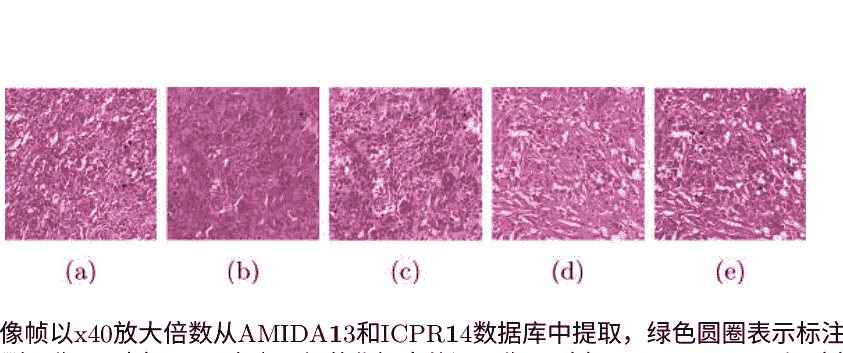

图1. 图像帧以x40放大倍数从AMIDA13和ICPR14数据库中提取，绿色圆圈表示标注的有丝分裂图像。（a）RGB直方图规范化概念的源图像；（c）AM-AM-Norm和（e）IC-AM-Norm是（b）AM-raw和（d）IC-raw的染色归一化图像。（在线彩色图）

使用修改后的图像帧，提取补丁以构建训练和验证集。为了确保创建足够丰富的表示集合，采用了[9]中提出的补丁提取方法。使用蓝色比例分割[4]和注释掩模来创建用于训练的补丁候选集。为了捕捉足够的上下文和周围区域的有丝分裂图像，我们从x40帧中提取64 × 64的补丁。进行数据增强，包括对正例进行随机裁剪和旋转（0:45:315度），对负例进行随机裁剪和旋转（0:90:270度），以提供平衡的数据集。

### 4.2 卷积神经网络架构

受[9]中的工作启发，我们使用相同的架构，但通过删除最后一个卷积层并用全连接层替换它来修改最后的层。该架构由6个卷积层组成，后面跟着批量归一化和ReLU层，以及带有dropout和ReLU层的全连接层的组合，最后是用于平滑梯度的softmax损失函数。这样，卷积层中捕获的高级不变特征被展平并馈送到全连接层，以学习这些特征的非线性组合，并防止节点之间的相互依赖。在这个架构中，每个层的输入大小是通过卷积层而不是池化层来减小的。这些特点使网络能够学习更强大的关系。我们使用与[9]中相同的权重初始化方案，并在从头开始训练时使用学习率乘数1.0，在使用预训练权重时使用学习率乘数0.1。在所有实现中，全连接层都是随机高斯初始化的。网络使用自适应梯度求解器进行训练，基础学习率为0.001，采用步进下降策略，丢弃率为50%。其他参数设置为：权重衰减0.005，动量为0.9，训练批次大小为128，验证批次大小为64，最多进行10个周期。该网络需要学习约103K个参数。

### 4.3 训练和测试工作流程

一旦为第4.1小节中的四个准备好的图像集创建了训练和验证补丁，就会分别使用具有定义的超参数的修改后的CNN架构在每个集合上训练不同的网络，将补丁分类为有丝分裂和非有丝分裂类别。这些网络有两种训练方式：（i）从头开始训练和（ii）使用迁移学习。

为了研究进行染色颜色归一化对分类改进的影响，我们训练了六个网络，分别为：

-   - 网络1：从头开始训练AM-raw数据集。
-   - 网络2：从头开始训练AM-AM-Norm数据集。
-   - 网络3：从头开始在IC-raw数据集上进行训练。
-   - 网络4：从头开始在IC-AM-Norm数据集上进行训练。
-   - 网络5：基于网络1在IC-raw数据集上进行微调。
-   - 网络6：基于网络2在IC-AM-Norm数据集上进行微调。

因此，在一系列时期内，一系列均值减去的图像补丁被馈送到网络中，并计算误差导数。通过网络进行反向传播并随时间缩小学习率，得到局部最小值。

我们在来自IC-raw数据库的测试图像集上测试了网络1、3、5的性能。类似地，我们在来自IC-AM-Norm数据库的测试图像集上评估了网络2、4、6的性能。为此，我们只考虑从蓝色比例分割掩模中得到的测试候选者。使用这些候选者的中心，可以提取靠近每个候选者的几个补丁。将这些测试补丁馈送给训练好的模型，为每个补丁分配一个标签（0表示非有丝分裂，1表示有丝分裂）。检测到的有丝分裂的定义细节在竞赛规则中描述[7]。对于给定候选者的不同补丁所给出的标签进行投票，并决定最终类别。如果一个补丁被分配了超过三个正面投票（经验确定），则被确定为有丝分裂。因此，基于组织学图像分类任务的常见评估指标对网络进行比较，并报告平均F分数最高的网络。

在我们的实现的第一部分中，使用最好的网络，在第二部分中，我们解决了将两个数据集连接起来并基于大量但杂乱的归一化样本进行训练的效果问题。该网络是在AM-AM-Norm和IC-AM-Norm数据集的组合上进行训练，并使用最佳网络的权重进行微调。最终训练好的网络（称为Network-7）在额外的数据上进行测试。最后，我们将我们的结果与提到的竞赛的最佳结果进行比较和报告。

## 5 结果与讨论

本研究的第一个目标是调查执行染色颜色归一化的效果，以使图像直方图处于相似范围内。通过评估在不同数据集上训练的六个网络的分类性能来研究这种效果。使用评估指标：D = 检测到的有丝分裂数目/注释的有丝分裂数目；TP = 真正检测到的有丝分裂数目；FN = 错误检测到的非有丝分裂数目；FP = 错误检测到的有丝分裂数目；召回率 = $\frac{TP}{(TP+FN)}$；精确度 = $\frac{TP}{(TP+FP)}$ 和 F-分数 = $\frac{2 \times (精确度 \times 敏感度)}{(精确度 + 敏感度)}$。 在我们的实验中，从AMIDA13数据集中选择一张图像作为源图像，并将所有ICPR14图像映射到该源图像。正如预期的那样，当网络在AM-raw数据上进行训练并在IC-raw测试集上进行测试时，由于不同的固有图像特征和各种染料浓度值，无法获得有利的分类结果。此外，如果网络在IC-raw上进行训练并在同一数据集上进行测试，由于训练时使用的数据量较小（见表2），同样无法获得良好的结果。然而，Network-2和Network-4上的结果证实，如果数据集中的图像都经过染料归一化处理，那么不同图像中存在的各种染料浓度可以映射到一个唯一的源图像，并且分类性能会提高。所提出的CNN分类器不仅提取低到高级的形状和形态特征，还考虑颜色分布。作为预处理步骤，执行染料颜色归一化的一个重要结果是可以训练一个模型，然后用于对映射到源图像的附加测试数据进行分类。此外，这种策略导致了稳定的性能，对一般的成像条件和特定的扫描仪变化不敏感。将染料颜色归一化和迁移学习的两个概念相结合体现在Network-6中，该网络显示了分类和检测性能的改进。

我们最佳网络（Network-6）的结果F-score的平均值为0.78，优于使用来自Mitosis-Atypia-14大挑战竞赛的数据进行有丝分裂检测的顶级结果报告中的结果。

表2. 在从ICPR14随机选择的测试案例上的性能结果。

| 网络 | ICPR14测试案例 |  |  |  |  |  |  |  |  |  |  |  |  |
| --- | --- | --- | --- | --- | --- | --- | --- | --- | --- | --- | --- | --- | --- |
|  | 案例-1: H03 |  |  |  |  | 案例-2: H04 |  |  |  |  | 案例-3: H07 |  |  |
|  | D | 真阳性 | FN | FP | F-score | D | 真阳性 | FN | FP | F-score | D | 真阳性 | FN | FP | F-score |
| 网络-1 | 144/136 | 60 | 76 | 68 | 0.42 | 94/267 | 33 | 233 | 61 | 0.17 | 33/39 | 23 | 16 | 10 | 0.63 |
| 网络-2 | 165/136 | 112 | 24 | 53 | 0.73 | 151/267 | 100 | 167 | 51 | 0.47 | 45/39 | 34 | 5 | 11 | 0.80 |
| 网络-3 | 104/136 | 88 | 48 | 16 | 0.72 | 180/267 | 139 | 128 | 41 | 0.62 | 2/39 | 2 | 37 | 0 | 0.095 |
| 网络-4 | 108/136 | 92 | 44 | 16 | 0.74 | 131/267 | 113 | 154 | 18 | 0.56 | 35/39 | 28 | 11 | 7 | 0.75 |
| 网络-5 | 94/136 | 69 | 67 | 26 | 0.59 | 195/267 | 163 | 104 | 35 | 0.70 | 34/39 | 25 | 14 | 9 | 0.68 |
| 网络-6 | 133/136 | 116 | 20 | 17 | **0.87** | 164/267 | 159 | 108 | 15 | **0.73** | 36/39 | 29 | 10 | 7 | **0.76** |

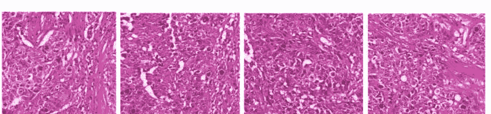

图2. ICPR14测试集输入到网络-6的检测和分类结果。绿色、黄色和红色圆圈分别代表真阳性、假阳性和假阴性。（彩色图片在线查看）

Hamamatsu扫描仪[7]。总之，在我们评估的第一部分的实验结果中，彩色归一化的概念显著提高了检测率，这可以扩展到其他医学图像。

原因是医学图像（如H&E组织学图像）具有相同的特征，但范围不同。因此，将其映射到源图像后，这些差异可以成功消除，这对医学图像来说是特定的。

图2显示了使用Network-6对ICPR14测试数据进行基于补丁的有丝分裂分类的检测结果。

我们研究的第二个目标是调查使用两个训练集（AM-AM-Norm和IC-AM-Norm）的混合网络的性能，并使用Network-6的权重进行微调（使用预训练权重初始化卷积层，并从头开始重新训练完全连接层）。我们在几个测试数据上测试了这个网络（Network-7）的性能，并在表3中定量地呈现了我们的结果，这些结果稳定、通用且优于AMIDA13（61.1%）[2]和ICPR14（71%）[7]挑战中报告的最佳F-score结果，而我们实验中获得的平均F-score为81.4%。

表格 3. 对来自不同来源的各种测试数据进行训练的 Network-7 性能评估结果，该网络是在连接-归一化训练数据（IC-AM-Norm 和 AM-AM-Norm）上进行训练的。

| 测试集来源 | ID | D | 精确度 | 灵敏度 | F-score |
| :--- | :--- | :--- | :--- | :--- | :--- |
| AMIDA13 测试集 | 案例 01 | 59/74 | 0.79 | 1 | 0.88 |
| | 案例 02 | 35/37 | 0.94 | 1 | 0.96 |
| | 案例 11 | 9/15 | 0.60 | 1 | 0.75 |
| ICPR14 测试集 | 案例 H03 | 168/136 | 0.85 | 0.69 | 0.76 |
| | 案例 H04 | 186/267 | 0.61 | 0.88 | 0.72 |
| | 案例 H07 | 32/39 | 0.82 | 0.80 | 0.80 |
| 额外的匿名测试集 | - | 14/21 | 0.66 | 1 | 0.79 |
| - | - | 32/39 | 0.82 | 0.86 | 0.83 |
| - | - | 21/25 | 0.84 | 0.84 | 0.84 |

## 参考文献

-   Marstal, K., Berendsen, F., Staring, M., Klein, S.: SimpleElastix: 一个用户友好的、多语言的医学图像配准库. 在: IEEE计算机视觉与模式识别会议工作坊论文集 (2016)
-   Miao, S., Wang, Z.J., Liao, R.: 一种用于实时2D/3D配准的CNN回归方法. IEEE Trans. Med. Imaging **35**(5), 1352–1363 (2016)
-   Radau, P., Lu, Y., Connelly, K., Paul, G., Dick, A., Wright, G.: 用于分割短轴心脏MRI的评估框架 (2009)
-   Rueckert, D., Sonoda, L.I., Hayes, C., Hill, D.L.G., Leach, M.O., Hawkes, D.J.: 非刚性配准使用自由形变：应用于乳腺MR图像。 IEEE Trans. Med. Imaging **18**(8), 712–721 (1999)
-   Wu, G., Kim, M., Wang, Q., Munsell, B.C., Shen, D.: 通过无监督深度特征表示学习的可扩展高性能图像配准框架。 IEEE Trans. Biomed. Eng. **63**(7), 1505–1516 (2016)

## 6 结论

在组织学图像上评估肿瘤增殖的三个主要组成部分之一是检测有丝分裂的能力，用于对乳腺癌进行分级。本研究描述了一种改进的基于深度学习的网络架构，用于检测乳腺组织学图像的感兴趣区域（RoI）中的有丝分裂。我们使用了一种称为RGB直方图规范化的预处理步骤，该方法用于处理从不同来源或扫描仪捕获的原始图像。在这个过程中，目标图像的颜色值被重新调整以匹配源图像的颜色分布，以像素为单位进行调整。这种策略的目标是减少不同图像之间的染色浓度变化，并在各种成像条件下实现更稳定和不敏感的检测或分类性能。最终，通过使用颜色规范化和迁移学习来连接不同的数据源，训练和测试了一个网络，该网络在额外的乳腺图像数据上表现出显著的鲁棒性。

## 参考文献

1.  Albarqouni, S., Baur, C., Achilles, F., Belagiannis, V., Demirci, S., Navab, N.: AggNet: 深度学习从众包中用于乳腺癌组织学中的有丝分裂检测. IEEE Trans. Med. Imaging 35(5), 1313–1321 (2016)
2.  Mitosis检测算法评估（AMIDA13），MICCAI大挑战（2013）。http://amida13.isi.uu.nl
3.  Bloom, H.J.G., Richardson, W.W.: 乳腺癌的组织学分级和预后：研究了1409例病例，其中359例随访了15年。Br. J. Cancer. 11(3), 359–377 (1957)
4.  Chang, H., Loss, L.A., Parvin, B.: H&E切片中的核分割通过多参考图割（MRGC）。In: 国际生物医学成像研讨会(2012)
5.  Chen, H., Dou, Q., Wang, X., Qin, J., Heng, P.-A.: 通过深度级联网络在乳腺癌组织图像中检测有丝分裂。In: 第三十届人工智能国际会议论文集，第1160-1166页 (2016)
6.  Cireşan, D.C., Giusti, A., Gambardella, L.M., Schmidhuber, J.: 通过深度神经网络在乳腺癌组织图像中检测有丝分裂。In: Mori, K., Sakuma, I., Sato, Y., Barillot, C., Navab, N. (eds.) MICCAI 2013. LNCS, vol. 8150, pp. 411–418. Springer, Heidelberg (2013). doi:10.1007/978-3-642-40763-5_517.
7.  在乳腺癌组织图像中检测有丝分裂并评估核异型性分数。在国际模式识别大会（ICPR）上。(2014). https://mitos-atypia-14.grand-challenge.org/
8.  Jain, A.K.: 数字图像处理基础。Prentice-Hall Inc., Upper Saddle River (1989)
9.  Janowczyk, A., Madabhushi, A.: 数字病理图像分析的深度学习：带有选定用例的综合教程。病理学信息学杂志 7 (2016)
10. Stewart, B.W.K.P., Christopher P.W.: 国际癌症研究机构，世界癌症报告（2014）
11. Tajbakhsh, N., Shin, J.Y., Gurudu, S.R., Hurst, R.T., Kendall, C.B., Gotway, M.B., Liang, J.: 用于医学图像分析的卷积神经网络：全面训练还是微调？IEEE医学成像杂志 35（5），1299–1312 (2016)
12. Veta, M., Pluim, J.P., van Diest, P.J., Viergever, M.A.: 乳腺癌组织病理学图像分析综述。IEEE生物医学工程杂志 61 (5), 1400–1411 (2014)
13. Wang, H., Cruz-Roa, A., Basavanahally, A., Gilmore, H., Shih, N., Feldman, M., Tomaszewski, J., Gonzalez, F., Madabhushi, A.: 级联集成的卷积神经网络和手工特征用于有丝分裂检测。在：SPIE医学成像, p. 90410B (2014)。doi: 10.1117/12.2043902

# 基于3D FCN特征驱动回归森林的胰腺定位和分割

Masahiro Oda^{1(邮件)}, Natsuki Shimizu^2, Holger R. Roth^1, Ken'ichi Karasawa^2, Takayuki Kitasaka^3, Kazunari Misawa^4, Michitaka Fujiwara^5, Daniel Rueckert^6, 和 Kensaku Mori^{1,7}

1 名古屋大学信息学研究生院，日本名古屋
moda@mori.m.is.nagoya-u.ac.jp
2 名古屋大学信息科学研究生院，日本名古屋
3 爱知工艺学院信息科学学院，日本丰田
4 爱知癌症中心，日本名古屋
5 名古屋大学医学研究生院，日本名古屋
6 伦敦帝国理工学院计算机系，英国伦敦
7 名古屋大学信息与通信战略办公室，日本名古屋

摘要。本文提出了一种完全自动化的基于图谱的CT体积胰腺分割方法，利用3D全卷积网络（FCN）特征进行胰腺定位。胰腺分割很困难，因为它在不同患者之间具有较大的空间变化。以前的胰腺分割方法无法处理这种变化。我们提出了一种包含新颖定位和分割的完全自动化胰腺分割方法。

由于胰腺与许多其他器官相邻，它的位置和大小与周围器官的位置密切相关。我们通过回归森林从全局特征中估计胰腺的位置和大小（定位）。作为全局特征，我们使用强度差异和3D FCN深度学习特征，其中包括用于分割的自动提取的关键特征。我们选择了经过训练的3D U-Net的3D FCN特征，该网络用于执行多器官分割。全局特征包括胰腺和周围器官的信息。定位后，执行特定于患者的概率图谱胰腺分割。在对146个CT体积进行评估的结果中，我们实现了60.6%的Jaccard指数和73.9%的Dice重叠度。

关键词：分割 · 胰腺 · 全卷积网络 · 回归森林

## 1 引言

医学图像包含了很多有用的信息，可用于计算机辅助诊断和干预。从医学图像中进行器官分割是必要的利用这些信息进行许多应用。已经报道了许多腹部器官分割方法[1-8]。我们在诊断、可视化、手术规划和手术模拟中使用了从中获得的胰腺分割结果。以前的方法中，CT体积中的胰腺分割准确度通常低于其他腹部器官。困难的主要原因是胰腺的空间（位置和大小）变异较大。由于胰腺较小且与许多器官相邻，其行为和形状受到其邻近器官的运动和变形的影响。因此，在进行胰腺分割之前，应该使用全局信息对胰腺进行定位，这些信息可能包括周围器官的强度、纹理、外观或结构，以提高分割准确性。胰腺定位指的是对胰腺位置和大小的粗略估计。

大多数先前的胰腺分割方法采用概率图谱-基于分割方法 [1-5,8]。已经使用了患者特定图谱 [1,4,5,8] 和分层图谱 [3]。然而，这种基于图谱的方法无法处理器官的空间变化。一些方法使用手动指定的信息 [1,4] 或其他器官的分割结果 [2,3] 来定位胰腺图谱。这些方法依赖于其他器官的分割结果或需要手动交互。最近，已经提出了使用自动定位技术的胰腺分割方法 [7,8]。Roth等人 [7] 使用全面嵌套网络的深度卷积神经网络进行定位。

Oda等人 [8] 使用回归森林技术来定位基于全局特征值的胰腺图谱。其他方法 [7,8] 显示出比先前方法更高的胰腺分割准确性。他们的结果表明，准确的定位技术对于胰腺分割至关重要。

胰腺定位也类似于通过周围组织或器官的信息来回归胰腺位置和大小。Roth等人[7]使用从胰腺周围获取的小的2D块外观进行定位。胰腺周围的三维信息，这一点尚未充分考虑，对于更准确的定位非常重要。Oda等人[8]使用全局特征值进行定位。全局特征值是在CT体积中的许多局部区域采样的CT值的一阶差分。全局特征值仅捕捉CT值的边缘信息，不利用CT体积中包含的更有用的纹理或外观信息进行定位。在这些方法[7,8]中，胰腺周围的组织或器官信息没有很好地用于定位。

我们提出了一种利用3D全卷积网络（FCN）特征进行胰腺定位和分割的方法。我们使用回归森林技术进行定位，然后使用患者特定的概率图进行分割。在定位中，我们引入了从训练用于分割腹部器官（包括胰腺）的3D FCN获得的3D FCN特征。我们使用3D U-Net [9]作为3D FCN结构。回归森林通过3D FCN特征和计算在在整个CT体积中获得了许多局部区域。3D FCN特征从训练数据集中捕捉到了有统计学意义的器官定位信息。我们还介绍了一种从3D FCN特征中计算器官纹理特征的新方法。由于直接在每个体素上使用它们对于定位是无效的，我们引入了一种基于局部二值模式（LBP）的纹理特征计算方法，从3D FCN特征中提高了定位精度。在估计胰腺边界框之后，我们生成了一个特定于患者的概率图，并使用它进行胰腺分割。

本文的贡献如下：（1）引入了一种准确的胰腺定位技术，利用深度学习特征解决器官定位问题，这些特征在统计上是有用的；（2）引入了一种基于LBP-like特征计算的新的深度学习纹理特征度量方法；（3）实现了胰腺分割的全自动化。

## 2 方法

### 2.1 概述

我们的方法从输入的CT体积中分割胰腺区域，包括定位和分割过程。在定位过程中，使用回归森林技术估计胰腺的边界框。回归森林从3D FCN和包含自动提取的全局特征的强度差异特征中估计边界框。在完成定位过程后，我们在边界框中生成一个患者特定的胰腺概率图。使用生成的概率图进行胰腺分割。

### 2.2 胰腺定位

3D FCN特征提取：我们使用两阶段粗到精的方法训练一个3D U-Net [9]，在第一阶段使用FCN模型粗略地勾画感兴趣的器官：查看患者体内简单自动生成的二进制掩膜中的约40%体素。然后，我们使用第一阶段FCN的预测结果定义一个候选区域，用于训练第二个FCN。这一步将FCN需要分类的体素数量减少到约10%，同时保持召回率高于99%。第二阶段的FCN现在可以专注于更详细的器官分割。3D U-Net的最后一层包含一个1 × 1 × 1的卷积，将输出通道数减少到类别标签的数量，在我们的数量下为八个：动脉、静脉、肝脏、脾脏、胃、胆囊、胰腺和背景。我们分别使用281个临床CT体积的训练集和50个验证集。验证数据集用于确定模型的良好训练并避免过拟合。本数据集与本文其余部分的测试数据是独立的。

对于特征提取，我们使用非重叠的切片方法在目标体积上部署训练好的模型，并从中提取一个64维特征向量。对于体积中的每个体素，我们使用3D U-Net的倒数第二层。出于计算原因，并且为了在计算每个切片时增加网络的视野，所有体积的分辨率在每个维度上减半。对于实现，我们使用基于Caffe深度学习库[10]的开源3D U-Net分发。

使用回归森林进行定位：胰腺边界框与包含胰腺区域的最小尺寸轴对齐，可以表示为 $b = (b_{x1}, b_{x2}, b_{y1}, b_{y2}, b_{z1}, b_{z2})$。我们定义大小为 $p \times p \times p$ 体素的补丁，并将其中心位置 $v = (v_x, v_y, v_z)$ 分配在 CT 体积上的规则网格上。补丁相对于 $b$ 的偏移量表示为 $d = b - \hat{v}$，其中 $\hat{v} = (v_x, v_x, v_y, v_y, v_z, v_z)$。它们也显示在图1(a)中。

我们使用回归森林来估计补丁在补丁中计算的特征值上的偏移量。构建回归森林来估计胰腺边界框的每个面。为胰腺边界框构建了六个回归森林。在补丁中计算的特征值包括：(a) CT值的一阶和二阶差分，(b) 基于3D FCN深度学习特征值的类似LBP的特征，以及(c) 从3D FCN获得的器官概率。

(a) CT值的差异：在一个区域中，CT值的一阶和二阶差异被用作特征值。一阶差异的特征值可以在之前的研究中找到[8]。我们新引入了二阶差异，它可以捕捉到更多有用的定位信息，例如CT值的变化。例如CT值的过渡。一阶差异特征$f_1(\mathbf{v})$和二阶差异特征$f_2(\mathbf{v})$表示为

$$f_1(\mathbf{v}) = \frac{1}{|F_1|} \sum_{\mathbf{q} \in F_1} I(\mathbf{q}) - \frac{1}{|F_2|} \sum_{\mathbf{q} \in F_2} I(\mathbf{q}), \quad (1)$$

$$f_2(\mathbf{v}) = \frac{1}{|F_1|} \sum_{\mathbf{q} \in F_1} I(\mathbf{q}) - \frac{2}{|F_2|} \sum_{\mathbf{q} \in F_2} I(\mathbf{q}) + \frac{1}{|F_3|} \sum_{\mathbf{q} \in F_3} I(\mathbf{q}), \quad (2)$$

其中，$I(\mathbf{q})$是CT体积中体素$\mathbf{q}$的CT值。$F_1$，$F_2$和$F_3$是任意排列在一个补丁中的立方体。$|F_1|$，$|F_2|$和$|F_3|$表示立方体中的体素数量。立方体的位置和大小是随机选择的。补丁和立方体的排列如图1（b）和（c）所示。

(b) $3D~FCN$深度学习特征值为基础的类$LBP$特征：从训练好的$3D~FCN$的最后一个卷积层获得的深度学习特征值包含了用于分割的有用信息。对于每个案例，从$3D~U$-$Net$的输出中获得特征体积，其中每个体素包含64维特征。特征体积中的强度或纹理的局部分布代表了分割的关键信息。我们根据特征体积计算代表特征值的纹理，然后根据以下方式计算补丁的类$LBP$特征。我们获得了在通过点$\mathbf{v}$并与轴向、冠状和矢状面平行的三个平面上的特征体积的强度值的$2D$图像。其中一个平面是随机选择的。在$p \times p$体素的$2D$图像中，我们定义了相同大小的$3 \times 3$区域，并计算每个区域中的平均强度值。这些$3 \times 3$平均强度值用于计算补丁的类$LBP$特征。类$LBP$特征被用作补丁的特征值。该计算过程如图2所示。

(c) 从$3D~FCN$获取的器官可能性：经过训练的$3D~FCN$在每个体素处输出八个器官（包括胰腺）的可能性。我们使用$\mathbf{v}$处的可能性作为一个块的特征值。

回归森林使用包括CT体积和相应手动分割的胰腺区域的训练数据库进行训练。使用从训练数据库获取的块构建回归树，如之前解释的[8,11]。

在从未知输入CT体积估计胰腺边界框的过程中，将从CT体积获取的块输入训练好的回归树。每个回归树输出块位置的偏移量。我们将偏移量和块位置的总和作为边界框的面部估计结果。所有块的平均估计结果是边界框面部的最终估计结果。

表1. 提出的和之前的胰腺分割方法的准确率。

| 方法 | 数据编号 | JI (%) | DICE (%) |
| :--- | :--- | :--- | :--- |
| 提出的 | 146 | 60.6 ± 16.5 | 73.9 ± 15.2 |
| Okada等人[1] | 86 | 59.2 | 71.8 |
| Chu等人[2] | 100 | 54.6 ± 15.9 | 69.1 ± 15.3 |
| Wolz等人[3] | 150 | 55.0 ± 17.1 | 69.6 ± 16.7 |
| Karasawa等人[4] | 150 | 61.6 ± 16.6 | 74.7 ± 15.1 |
| Tong等人[5] | 150 | 56.9 ± 15.2 | 71.1 ± 14.7 |
| Saito等人[6] | 140 | 62.3 ± 19.5 | 74.4 ± 20.2 |
| Roth等人[7] | 82 | – | 78.0 ± 8.2 |
| Oda等人[8] | 147 | 62.1 ± 16.6 | 75.1 ± 15.4 |

### 2.3 患者特异性概率图生成和胰腺分割

基于血管信息的患者特异性概率图[8]对于胰腺分割非常有效。我们使用计算得到的边界框生成这个概率图。对于输入的CT体积，我们使用患者特异性概率图进行粗略分割。然后使用图割方法[12]进行精确分割。我们从这个精确分割过程中得到最终的胰腺分割结果。

## 3 实验和讨论

我们提出的方法使用146个腹部CT体积进行评估。以下是CT体积的采集参数：图像大小，512×512体素，263-1061层，0.546-0.820毫米像素间距和0.40-0.80毫米层间距。地面真实器官区域是由半自动方式制作的三名经过训练的研究人员。所有地面真实区域都由医生检查过。我们的方法参数经过实验选择为$p=25$。

我们通过测量估计的边界框和地面真实边界框之间的平均距离来评估定位准确性。当我们仅使用CT值的二阶差分作为回归森林特征时，平均距离为11.4±4.5毫米。当我们使用本文提出的所有回归森林特征时，平均距离改善为11.0±4.0毫米。

胰腺分割准确性通过五折交叉验证进行评估，评估指标如下：Jaccard指数（JI）和Dice重叠系数（DICE）。表1比较了提出方法和之前方法的准确性。CT体积的部分在[8]和我们的方法中是相同的。图3显示了结果。

图3。（a）在估计的边界框中的胰腺分割结果的轴向切片。蓝色区域表示真实值和分割区域。（b）和（c）使用相同案例比较了与之前方法[8]的分割结果。DICE在（b）中从28.0%提高到72.7%，在（c）中从25.4%提高到60.3%。（在线彩图）

我们在回归森林中引入了基于3D FCN的特征，以提高胰腺定位的准确性。从实验结果来看，当我们使用新特征时，定位准确性的平均值和标准差都有所提高。回归森林根据在整个CT体积中计算的特征值估计边界框。CT值特征的差异仅捕捉到边缘信息。我们的新的基于3D FCN的特征捕捉到更多有用的信息，包括纹理、外观和与其他器官的关系。如果手工设计的特征经过精心设计，它们是有用的。我们的基于3D FCN的特征是自动设计用于器官分割的。它们还包含有用的器官定位信息。手工设计和深度学习特征的组合使用提高了胰腺定位的准确性。

[1] http://lmb.informatik.uni-freiburg.de/resources/opensource/unet.en.html.

# 基于3D FCN特征的胰腺定位和分割

我们使用类似LBP的特征计算方案从3D FCN特征体积中提取特征。直接使用特征体积中的体素值作为回归森林的特征值是一种可能的定位方法。

回归森林中使用的特征值应该包含与位置相关的信息，因为它可以被视为找到边界框位置的线索。如果我们使用特征体积的体素值，在体积中的许多位置会得到许多相似的值。这种特征值对于定位不是有效的。我们的类似LBP的特征值捕捉到特征体积中的局部纹理。因此，计算得到的特征值与位置相关，并且对于定位是有效的。

我们还使用定位结果进行胰腺分割。最近的分割方法中，分割准确率很高。特别是在[8]中DICE低于30%的四个“难以分割”的案例中，分割准确率得到了改善。其中，在[8]中的DICE值中，28.0%、25.4%、29.1%、18.9%分别提高到了72.7%、60.3%、35.6%、20.1%。图3(b)和(c)展示了这些案例的示例。在这些案例中，胰腺与周围器官相接触。通过提出的方法，假阳性（FP）和假阴性（FN）大大减少。在[8]中，回归森林特征值对它们并不有效。即使在这种情况下，提出的深度学习特征值有效地表示了定位信息。

所提出的方法准确地定位了胰腺，并导致了假阳性和假阴性的减少。

我们提出了一种利用基于3D FCN的特征和强度差异特征的胰腺定位方法。回归森林从特征中计算出胰腺的边界框。此外，我们的方法使用患者特定的概率图进行胰腺区域分割。使用146个CT体积的实验结果显示与其他最先进的方法相当的结果。未来的工作包括根据它们的位置对补丁的贡献率进行加权，并应用于多器官分割。

致谢。本研究的部分内容得到了MEXT/JSPS KAKENHI Grant Numbers 25242047、26108006、17H00867、JSPS Bilateral International Collaboration Grants和JST ACT-I (JPMJPR16U9)的支持。

## 参考文献

+   1. 岡田等人：使用概率图和多级统计形状模型从3D CT图像中自动分割肝脏。在：Ayache, N., Ourselin, S., Maeder, A. (eds.) MICCAI 2007. LNCS, vol. 4791, pp. 86–93. Springer, Heidelberg (2007). doi:10.1007/978-3-540-75757-3 11
+   2. Chu, C., 等：基于三维腹部CT图像的空间分割概率图谱的多器官分割。在：Mori, K., Sakuma, I., Sato, Y., Barillot, C., Navab, N. (编) MICCAI 2013. LNCS, vol. 8150, pp. 165–172. Springer, Heidelberg (2013). doi:10.1007/978-3-642-40763-5 21
+   3. Wolz, R., Chu, C., Misawa, K., 等: 具有特定主体的腹部多器官分割的自动化。 IEEE TMI 32(9), 1723-1730 (2013)
+   4. Karasawa, K., 等: 结构特定的图谱生成及其在对比腹部CT体积中的胰腺分割中的应用。 在: Menze, B., Langs, G., Montillo, A., Kelm, M., Müller, H., Zhang, S., Cai, W., Metaxas, D. (编) MCV 2015. LNCS, vol. 9601, pp. 47-56. Springer, Cham (2016). doi:10.1007/978-3-319-42016-5_5
+   5. Tong, T., Wolz, R., Wang, Z., 等: 腹部多器官分割的判别式字典学习。 医学图像分析, 23 (1), 92-104 (2015)
+   6. Saito, A., Nawano, S., Shimizu, A.: 基于水平集统计形状模型的分割和形状先验的联合优化及其在腹部器官自动分割中的应用。 医学图像分析, 28, 46-65 (2016)
+   7. Roth, H.R., Lu, L., Farag, A., Sohn, A., Summers, R.M.: 全面嵌套网络的空间聚合用于自动胰腺分割。 在: Ourselin, S., Joskowicz, L., Sabuncu, M.R., Unal, G., Wells, W. (编) MICCAI 2016. LNCS, 卷9901, 页451-459。 Springer, Cham (2016)。 doi:10.1007/978-3-319-46723-8_52
+   8. Oda, M., 等: 基于回归森林的地图定位和方向特定地图生成用于胰腺分割。 在: Ourselin, S., Joskowicz, L., Sabuncu, M.R., Unal, G., Wells, W. (编) MICCAI 2016. LNCS, 卷9901, 页556-563。 Springer, Cham (2016)。 doi:10.1007/978-3-319-46723-8_64
+   9. Çiçek, O., Abdulkadir, A., Lienkamp, S.S., Brox, T., Ronneberger, O.: 3D U-Net: 从稀疏注释中学习密集体积分割。 在: Ourselin, S., Joskowicz, L., Sabuncu, M.R., Unal, G., Wells, W. (编) MICCAI 2016. LNCS, 卷9901, 页424-432。 Springer, Cham (2016)。 doi:10.1007/978-3-319-46723-8_49
+   10. Jia, Y., Shelhamer, E., Donahue, J., 等: Caffe: 用于快速特征嵌入的卷积架构。 在: 第22届ACM多媒体国际会议, 页675-678。 ACM (2014)
+   11. Criminisi, A., Robertson, D., Konukoglu, E., 等: 回归森林用于计算机断层扫描中的解剖检测和定位。 医学图像分析, 17, 1293-1303 (2013)
+   12. Boykov, Y., Veksler, O., Zabih, R.: 通过图割进行快速近似能量最小化。 IEEE PAMI, 23 (11), 1222-1239 (2001)

# 乳腺组织病理学中肿瘤增殖评分预测的统一框架

Kyunghyun Paeng<sup>✉</sup>, Sangheum Hwang, Sunggyun Park和Minsoo Kim

韩国首尔Lunit公司

{khpaeng,shwang,sgpark,mskim}@lunit.io

摘要。 我们提出了一个统一的框架，用于从乳腺组织病理学全切片图像中预测肿瘤增殖评分。我们的系统提供了一个完全自动化的解决方案，可以预测基于分子数据和计数的肿瘤增殖评分。该框架集成了三个模块，每个模块都经过微调以最大化整体性能：用于处理全切片图像的图像处理组件，基于深度学习的有丝分裂检测网络和增殖评分预测模块。 我们在基于计数的评分预测中实现了0.567的二次加权Cohen's kappa系数，以及0.652的有丝分裂检测F1分数。 在评估基于分子数据的预测准确性的Spearman相关系数上，该系统获得了0.617。我们的方法在Tumor Proliferation Assessment Challenge 2016中获得了三个任务的第一名，该挑战赛是MICCAI大赛。

关键词：肿瘤增殖 · 有丝分裂检测 · 卷积神经网络 · 乳腺组织病理学

## 1 引言

肿瘤增殖速度是评估乳腺癌患者预后的重要生物标志物[12]。 有丝分裂计数是Bloom & Richardson分级系统的一部分[5]，也是一个公认的预后因素[2]。 然而，病理学家目前用于计数有丝分裂的方法繁琐且主观，并且可能存在重复性问题[13]。 自动化方法已经快速推动了有丝分裂检测的最新技术进展[1,4,14]。 特别是基于深度卷积神经网络（DCNN）的系统已成功应用于有丝分裂检测[4]。 后一类算法已将自动有丝分裂检测的性能提升到接近人类水平，为解决主观性和重复性问题提供了希望[13]。

在实际场景中，希望能够在整个切片图像（WSI）级别上提供肿瘤增殖评估。 WSI的大小非常大，对应用自动技术提出了额外的挑战。 以前的研究在WSI的ROI补丁中进行有丝分裂检测被病理学家预先选择。相反，WSI的自动分析必须在没有人类指导的情况下解决ROI选择的问题。需要一个额外的模块来执行从有丝分裂计数结果到肿瘤增殖评分的最终映射。

在本文中，我们以一个统一的框架的形式介绍了我们在解决上述每个问题方面的工作，用于直接从乳腺组织病理WSI预测肿瘤增殖评分。我们的流水线系统可以完全自动地从WSI预测肿瘤增殖评分。我们的系统参加了一个广为认可的挑战，并且在每个子任务以及最终的增殖评分预测任务中都能够胜过其他系统，验证了每个模块的设计选择以及集成系统的能力。

## 2 方法论

### 2.1 整个切片图像处理

组织区域和块提取：我们首先通过WSI调整大小、Otsu方法[11]提取组织区域和二值膨胀的组合来识别WSI中的组织斑块。一旦确定了组织斑块，我们从中采样块用于有丝分裂计数。在块采样方面，有很多方法可以选择，包括块大小和采样步长的选择。

回顾一下布鲁姆和理查森（B&R）分级依赖于10个连续高倍视野（HPFs）区域内的有丝分裂数目，该区域大约为2平方毫米²，我们提取与10个HPFs相对应的补丁。然而，10个连续HPFs区域的定义是高度变异的，例如，它可能只有水平或垂直方向。为了通用性，我们将10个连续HPFs定义为一个正方形。每个切片提取的补丁平均数量大约为300个。组织区域和补丁提取的结果如图2所示。

感兴趣区域检测：为了从采样补丁中选择感兴趣区域（ROIs），我们利用了高细胞密度区域通常存在许多有丝分裂的事实。我们使用CellProfiler [3,7]来估计补丁的细胞密度。最后，我们获得每个补丁中的细胞数量，并根据细胞数量对补丁进行排序，选择前K个补丁作为ROIs。我们将K设置为30，考虑到计算成本。

染色归一化：由于WSIs在外观上变化很大，对ROI补丁的染色质量进行归一化是有益的。为了归一化补丁的染色，我们采用了[9]中描述的方法。我们将α和β分别设置为1.0和0.15。

### 2.2 基于深度卷积神经网络的有丝分裂检测

训练过程：在选择ROI补丁后，我们使用训练好的模型检测有丝分裂。有丝分裂检测器是在辅助数据集中提取的128×128补丁上进行训练的。为了降低误报率，我们采用了两步训练过程[4]。首先，在初始数据集上进行网络的第一次训练。然后，通过训练好的网络提取出网络识别为误报有丝分裂案例的图像区域列表。

之后，我们构建了一个新的第二个训练数据集，其中包含了与之前相同的真实有丝分裂样本和正常样本，但是额外增加了100,000个正常样本（即假阳性），这些样本是通过对最初训练的网络进行随机平移增强生成的。总共，新的数据集包含70,000个有丝分裂图像块和280,000个正常图像块。我们从头开始在这个新的数据集上重新训练网络，以获得最终的有丝分裂检测模型。

架构：有丝分裂检测网络的架构基于残差网络（ResNet）[6]，它由6个或9个残差块组成。我们在$128 \times 128$的输入补丁上训练一个网络，然后将训练好的网络转换为一个完全卷积网络[8]，可以直接应用于整个感兴趣区域补丁进行推断。与将感兴趣区域补丁细分并进行逐块推断的替代方法相比，这种方法在计算效率上提供了更大的优势。然而，尽管完全卷积方法速度更快，但无法完全匹配标准细分方法的性能。这个问题源于在使用完全卷积技术进行训练和推断时，网络的输入尺寸之间存在很大差异，而ResNet的深度较大，导致感受野更大，相应地零填充暴露面积也更大。为了缓解这个问题，我们引入了一种名为大视野（$L$-view）模型的新型架构。

图3展示了 $L$-view架构。尽管 $L$-view架构具有$128 \times 128$的输入尺寸，但在最后的全局池化层中，我们只激活与输入补丁中心$64 \times 64$区域相对应的较小区域。这样可以忽略零填充区域，在训练阶段解决零填充效应问题，从而显著提高有丝分裂检测分数。图4展示了有丝分裂检测结果的示例。

### 2.3 肿瘤增殖评分预测

在最终模块中，我们将每个切片编码为特征向量，并训练一个SVM来预测肿瘤增殖评分。特征向量由每个补丁中的有丝分裂和细胞数量以及基于统计信息的21个特征组成，如表1所示。

由于我们对于肿瘤增殖评分预测的相关特征没有先验知识，我们通过交叉验证从各种特征组合中找到最佳特征向量。我们使用具有不同支持向量机（SVM）的C值的径向基函数（RBF）核进行了10折交叉验证，其中RBF核的gamma值固定为特征的维度的倒数。最后，我们选择了性能最佳的特征组合。为了减少搜索排列，我们将特征向量的维度减少到14个特征。

## 3 结果

在本节中，我们介绍了用于训练和验证的数据集，并展示了所提出系统中每个单独组件的性能。此外，除了验证之外，所有实验结果都在公共挑战中进行了评估。

### 3.1 数据集

我们使用了两个数据集¹来开发完全自动化的肿瘤增殖评分预测系统。首先，使用两位病理学家注释的有丝分裂区域构建有丝分裂检测器的辅助数据集。训练数据集包括来自三个病理中心的73名患者的656个1 HPF或10 HPF的图像块。

> ¹ http://tupac.tue-image.nl/node/3.

病理中心的34名患者的34个10 HPF图像块用于测试。训练数据集被随机分割以验证有丝分裂检测器，验证数据集包括来自6名患者的142个有丝分裂图像。其次，为了训练整个系统，我们使用了主要数据集，该数据集包括500个训练WSI和321个测试WSI。每个WSI都有两个相应的评分，一个基于有丝分裂计数的评分表示三个类别之一，一个基于分子数据的连续值评分[10]。为了验证整个系统，我们使用了10折交叉验证。

### 3.2 实验

我们评估了三个任务来验证所提出系统的性能。我们的结果与挑战中的其他方法进行了比较。首先，通过F1分数来衡量有丝分裂检测的性能。整个系统的性能基于两个评估指标：基于有丝分裂计数的二次加权Cohen's kappa分数和基于分子的Spearman相关系数。

有丝分裂检测：我们将批量大小固定为128，初始学习率为0.1，并在训练过程中对所有模型配置应用相同的两步训练程序。我们的L-view架构在第一训练阶段的k值为3，并且在不同组合中使用颜色、亮度和对比度增强。第一训练阶段的学习率为0.1，前8个epoch，第二训练阶段的学习率为0.1、0.01和0.001，分别对应第8、12和14个epoch。

评估结果显示在表2中。使用L-view架构，我们在验证和测试中分别获得了0.731和0.652的F1分数。在没有误报的情况下进行训练时，我们在验证集中观察到0.1的F1分数性能下降。

基于有丝分裂计数的增殖评分预测：在选择性能最佳的有丝分裂检测器后，我们训练了肿瘤增殖评分预测模块。我们使用10折交叉验证评估了二次加权Cohen's kappa分数，并找到了最佳的特征组合。最小相关特征值被发现是不重要的，因此特征11、12、13、16、17已从组合列表中移除。最终，我们发现表1中的特征0、1、2、3、4、5、6、7、10、15、18、20构成的12维特征向量表现最佳。SVM的 C值为0.03125。评估结果见表3。验证数据集的kappa得分为0.504，测试数据集的kappa得分为0.567，该系统优于所有其他方法。此外，我们的系统甚至比半自动模型和使用额外数据训练的模型更好。

基于分子数据的增殖评分预测：使用相同的方法寻找预测基于分子数据的最佳特征组合。再次发现与最小相关的特征不重要，并将其移除。评估结果见表4。13维最佳特征向量包括表1中的特征0、1、2、3、4、5、6、7、8、10、14、18、20，SVM的 C值为0.25。验证数据集上的Spearman得分为0.642，测试数据集上的得分为0.617。我们的系统明显优于所有其他方法。通过最佳特征组合，我们发现预测基于分子数据的评分时，特征8和14的值比特征15重要。换句话说，估计该评分的关键因素不是细胞信息，而是有丝分裂的数量。这证实了有丝分裂计数与肿瘤增殖速度的高相关性。

**表1. 用于预测肿瘤增殖评分的特征组件。** #和mts分别表示数量和有丝分裂。 B&R是Bloom & Richardson分级。前10%和30-70%表示从排序的ROI中排名1-3和排名9-21。 min，avg和max表示所选部分中的最小值，平均值和最大值。

| 编号 | 特征描述 | 编号 | 特征描述 | 编号 | 特征描述 |
|------|----------|------|----------|------|----------|
| 0 | 平均值 # 有丝分裂 | 7 | 标准差 # 细胞 | 14 | 前10%中有丝分裂的标准差 |
| 1 | 最大值 # 有丝分裂 | 8 | 平均有丝分裂/细胞比率 | 15 | 前10%中细胞的标准差 |
| 2 | 标准差 # 有丝分裂 | 9 | 最大值有丝分裂/细胞比率 | 16 | 前10%中最小值 # 有丝分裂 |
| 3 | 平均有丝分裂的B&R | 10 | 前10%中的平均值 # 有丝分裂 | 17 | 前10%中最小细胞数 |
| 4 | 最大细胞数的B & R | 11 | 最小细胞数 | 18 | 30-70%范围内的平均细胞数 |
| 5 | 平均细胞数 | 12 | 最小细胞数 | 19 | 30-70%范围内的最大细胞数 |
| 6 | 最大细胞数 | 13 | 最小细胞数/细胞数比率 | 20 | 30-70%范围内的标准细胞数 |

**表2. 有丝分裂检测的F1分数。** *表示使用了额外的数据进行训练。所提出的方法基于128×128输入尺寸的L-view架构。

| 方法 | 验证 | 测试 |
|------|------|------|
| 提出的 | 0.731 | 0.652 |
| A团队* | - | 0.648 |
| B团队 | - | 0.616 |
| C团队* | - | 0.601 |

**表3. 基于有丝分裂计数的增殖评分预测结果在验证和测试中。** 评估指标是二次加权Cohen's kappa分数。* 表示额外的数据用于训练。** 是半自动方法，其中ROI由病理学家选择。

| 方法 | 验证 | 测试 |
|------|------|------|
| 提出的 | 0.504 | 0.567 |
| D团队** | - | 0.543 |
| B团队 | - | 0.534 |
| E团队* | - | 0.462 |

**表4. 基于分子数据的增殖评分预测结果在验证和测试中。** 评估指标是Spearman相关系数。

| 方法 | 验证 | 测试 |
|------|------|------|
| 提出的 | 0.642 | 0.617 |
| F团队 | - | 0.516 |
| B团队 | - | 0.503 |## 4 结论

我们提出了一个完全自动化的统一系统，可以直接从乳腺组织病理WSI中预测肿瘤增殖评分。所提出的系统能够基于有丝分裂计数和分子数据进行完全自动化的模块化预测两种肿瘤增殖评分。我们的工作证实，有丝分裂检测模块可以集成到更实用的临床场景中的预后分级系统中。此外，我们证明了我们的系统在增殖评分预测方面达到了最先进的性能。

## 参考文献

1.  Albarqouni, S., Baur, C., Achilles, F., Belagiannis, V., Demirci, S., Navab, N.: Aggnet: 深度学习从众包中用于乳腺癌组织学图像中的有丝分裂检测。 IEEE Trans. Med. Imaging 35(5), 1313–1321 (2016)
2.  Baak, J.P., van Diest, P.J., Voorhorst, F.J., van der Wall, E., Beex, L.V., Vermorken, J.B., Janssen, E.A.: 55岁以下淋巴结阴性乳腺癌患者有丝分裂活性指数独立预后价值的前瞻性多中心验证。 J. Clin. Oncol. 23(25), 5993–6001 (2005)
3.  Carpenter, A.E., Jones, T.R., Lamprecht, M.R., Clarke, C., Kang, I.H., Friman, O., Guertin, D.A., Chang, J.H., Lindquist, R.A., Moffat, J., et al.: Cellprofiler: 用于识别和量化细胞表型的图像分析软件。 Genome Biol. 7(10), R100 (2006)
4.  Cireşan, D.C., Giusti, A., Gambardella, L.M., Schmidhuber, J.: 使用深度神经网络在乳腺癌组织图像中检测有丝分裂。 在: Mori, K., Sakuma, I., Sato, Y., Barillot, C., Navab, N. (eds.) MICCAI 2013. LNCS, vol. 8150, pp.411–418. Springer, Heidelberg (2013). doi:10.1007/978-3-642-40763-5
5.  Elston, C.W., Ellis, I.O.: 乳腺癌中的病理预后因素。 I. 乳腺癌组织学分级的价值：来自一项大型研究的经验和长期随访。 组织病理学 19(5), 403–410 (1991)
6.  He, K., Zhang, X., Ren, S., Sun, J.: 深度残差网络中的身份映射。 arXiv预印本 arXiv:1603.05027 (2016)
7.  Kamentsky, L., Jones, T.R., Fraser, A., Bray, M.A., Logan, D.J., Madden, K.L, Ljosa, V., Rueden, C., Eliceiri, K.W., Carpenter, A.E.: 改进的结构、功能和兼容性的CellProfiler: 模块化高通量图像分析软件。 生物信息学 27(8), 1179–1180 (2011)
8.  Long, J., Shelhamer, E., Darrell, T.: 全卷积网络用于语义分割。 在: CVPR, pp. 3431–3440 (2015)
9.  Macenko, M., Niethammer, M., Marron, J.S., Borland, D., Woosley, J.T., Guan, X., Schmitt, C., Thomas, N.E.: 一种用于定量分析的组织学切片归一化方法。 在: ISBI, vol. 9, pp. 1107–1110 (2009)
10. Nielsen, T.O., Parker, J.S., Leung, S., Voduc, D., Ebbert, M., Vickery, T., Davies, S.R., Snider, J., Stijleman, I.J., Reed, J., 等: PAM50内在亚型与免疫组织化学和临床预后因素在使用他莫昔芬治疗的雌激素受体阳性乳腺癌中的比较。 临床癌症研究 16 (21), 5222–5232 (2010)
11. Otsu, N.: 一种基于灰度直方图的阈值选择方法。 Automatica 11(2), 285–296 (1975)
12. Van Diest, P., Van Der Wall, E., Baak, J.: 浸润性乳腺癌中增殖的预后价值：一项综述。临床病理学杂志 57(7), 675–681 (2004)
13. Veta, M., van Diest, P.J., Jiwa, M., Al-Janabi, S., Pluim, J.P.: 乳腺癌中的有丝分裂计数：物体级别的观察者间一致性与自动方法的比较。PLoS ONE 11(8), e0161286 (2016)
14. Veta, M., Van Diest, P.J., Willems, S.M., Wang, H., Madabhushi, A., Cruz-Roa, A., Gonzalez, F., Larsen, A.B., Vestergaard, J.S., Dahl, A.B., 等: 乳腺癌组织病理学图像中有丝分裂检测算法的评估。医学图像分析 20(1), 237-248 (2015)

# 广义Dice重叠作为高度不平衡分割的深度学习损失函数

Carole H. Sudre<sup>1,2</sup> (✉), Wenqi Li<sup>1</sup>, Tom Vercauteren<sup>1</sup>, Sebastien Ourselin<sup>1,2</sup>, 和 M. Jorge Cardoso<sup>1,2</sup>

<sup>1</sup> 转化成像组，CMIC，伦敦大学学院，伦敦 NW1 2HE，英国
<sup>2</sup> 痴呆研究中心，伦敦大学神经学研究所，伦敦 WC1N 3BG，英国
carole.sudre.12@ucl.ac.uk

摘要。近年来，深度学习在图像分析领域证明了其强大的能力，并广泛应用于二维和三维医学图像的分割。深度学习分割框架不仅依赖于网络架构的选择，还依赖于损失函数的选择。当分割过程针对罕见观察时，候选标签之间可能会出现严重的类别不平衡，从而导致次优的性能。为了缓解这个问题，已经提出了一些策略，如加权交叉熵函数、敏感性函数或Dice损失函数。在这项工作中，我们研究了这些损失函数的行为以及它们对于2D和3D分割任务中不同标签不平衡率的学习率调整的敏感性。我们还提出使用广义Dice重叠的类别再平衡特性，作为用于不平衡任务的稳健准确的深度学习损失函数。

## 1 引言

在医学图像分析中，一个常见的任务是能够检测、分割和表征代表整个图像中非常小部分的病理区域。例如，这种情况在脑肿瘤或多发性硬化症或老龄人群中的白质病变中都存在。这种不平衡的问题已知会导致已经建立起来的生成和判别分割框架的不稳定性。深度学习框架已成功应用于二维生物数据的分割，并最近扩展到三维问题[10]。近年来，已经设计出多种应对类别不平衡的策略（例如特定器官、病理等）。在这些策略中，有些策略通过选择要分析的训练样本来减少不平衡，但可能会降低训练的变异性[3,5]，而其他策略则提出了更合适和更稳健的损失函数[1,8,9]。

在这项工作中，我们研究了三个先前发表的损失函数在不同的二维和三维多类别分割问题中的训练行为，评估它们对学习率和样本率的稳健性。我们还提议使用广义Dice重叠的类别重新平衡属性作为新的损失函数，用于平衡和不平衡数据。

## 2 方法

### 2.1 不平衡数据的损失函数

本研究中比较的损失函数是由于它们解决类别不平衡问题的潜力而选择的。所有的损失函数都在二元分类（前景 vs. 背景）的框架下进行了分析，因为它代表了最简单的设置，可以量化类别不平衡。请注意，将其中一些损失函数形式化为单类问题会在一定程度上缓解不平衡问题，但结果不容易推广到多个类别。设 $R$ 为参考前景分割（黄金标准），具有体素值 $r_n$，$P$ 为前景标签在 $N$ 个图像元素 $p_n$ 上的预测概率图，背景类别的概率为 $1-P$。

加权交叉熵（WCE）：加权交叉熵在[9]中得到了显著应用。加权交叉熵的两类形式可以表示为
$$\text{WCE} = -\frac{1}{N} \sum_{n=1}^{N} w r_n \log(p_n) + (1 - r_n) \log(1 - p_n)$$
其中 $w$ 是赋予前景类别的权重，在这里定义为 $w = \frac{N - \sum_n p_n}{\sum_n p_n}$。加权交叉熵可以轻松扩展到多于两类的情况。

Dice损失（DL）：Dice分数系数（DSC）是一种广泛用于评估分割性能的重叠度量，当存在黄金标准或真实值时使用。在Milletari等人的研究中[8]，Dice损失的两类变体，表示为 $DL_2$，可以表示为
$$\text{DL}_2 = 1 - \frac{\sum_{n=1}^{N} p_n r_n + \epsilon}{\sum_{n=1}^{N} p_n + r_n + \epsilon} - \frac{\sum_{n=1}^{N} (1 - p_n)(1 - r_n) + \epsilon}{\sum_{n=1}^{N} 2 - p_n - r_n + \epsilon}$$
这里使用该项来确保损失函数的稳定性，避免除以0的数值问题，即 $R$ 和 $P$ 为空。

敏感性 - 特异性（SS）：在评估分割结果时，敏感性和特异性是两个非常重要的特征。这些评估的转化为损失函数已经由Brosch等人[1]描述为
$$\text{SS} = \lambda \frac{\sum_{n=1}^{N} (r_n - p_n)^2 r_n}{\sum_{n=1}^{N} r_n + \epsilon} + (1 - \lambda) \frac{\sum_{n=1}^{N} (r_n - p_n)^2 (1 - r_n)}{\sum_{n=1}^{N} (1 - r_n) + \epsilon}$$
参数 λ，用于平衡灵敏度和特异性的权重，根据[1]的建议设置为0.05。 当其中一个集合为空时，再次需要使用 ϵ项来处理除以0的情况。

广义Dice Loss（GDL）：Crum等人[2]提出了广义Dice分数（GDS）作为评估多类别分割的一种方法，但尚未在判别模型训练的背景下使用。
$$\text{GDL} = 1 - 2 \frac{\sum_{l=1}^{2} w_l \sum_n r_{ln} p_{ln}}{\sum_{l=1}^{2} w_l \sum_n r_{ln} + p_{ln}}$$
其中 $w_l$ 用于提供对不同标签集属性的不变性。在接下来的内容中，我们采用符号 $\text{GDL}_v$ 表示 $w_l=1/(\sum_{n=1}^{N} r_{ln})^2$。如[2]所述，在选择 $\text{GDL}_v$ 权重时，通过其体积的倒数来校正每个标签的贡献，从而减少了区域大小与 Dice 分数之间的已知相关性。在随机梯度下降的训练中，在两类问题中，对于 $p_i$ 的梯度为：
$$\frac{\partial \text{GDL}}{\partial p_i} = -2 \frac{(w_1^2 - w_2^2) \left[ \sum_{n=1}^{N} p_n r_n - r_i \sum_{n=1}^{N} (p_n + r_n) \right] + N w_2 (w_1 + w_2)(1 - 2r_i)}{\left[ (w_1 - w_2) \sum_{n=1}^{N} (p_n + r_n) + 2N w_2 \right]^2}$$
请注意，这个梯度可以轻松地扩展到超过两个类别。

### 2.2 深度学习框架

为了广泛研究不同网络架构中的损失函数，选择了四个先前发表的网络作为分割的代表性网络，因为它们具有最先进的性能，并使用Tensorflow重新实现。

2D网络：使用两个设计用于2D图像的网络来评估损失函数的行为：UNet [9] 和TwoPathCNN [3]。UNet架构呈U形模式，其中一个步骤下降是一系列两个卷积，后跟一个下采样层，而一个步骤上升是一系列两个卷积，后跟上采样。在每个尺度上，下采样路径和上采样路径之间建立连接。TwoPathCNN [3] 是为肿瘤分割而设计的，在这里以全卷积2D设置中使用，常见的假设是在切片厚度较大的情况下，可以通过2D网络来近似3D分割问题。该网络涉及两个网络的并行训练-一个局部子网络和一个全局子网络。前者由两个卷积层组成，内核大小分别为7²和5²，并与大小为4²和2²的最大池化层交替进行最大输出正则化；而后者网络由一个卷积层组成，内核大小为13²之后是大小为2²的最大池化。在输入图像的中心位置进行分类之前，将局部和全局网络的特征连接在一起，然后进行最终的全连接层分类。

3D网络：在3D环境中使用了DeepMedic架构[4]和HighResNet网络[6]。DeepMedic包括对完整分辨率图像进行训练的网络和对图像降采样版本进行训练的网络。在最终分割之前，将得到的特征连接在一起，并应用两个全连接层。HighResNet是一个紧凑的端到端网络，通过一系列卷积块和残差连接将图像体积映射到逐像素分割。为了在多个尺度上融合图像特征，卷积核采用了二倍或四倍的膨胀因子。网络在整个过程中保持输入体积的空间分辨率。

## 3 实验和结果

### 3.1 实验

我们选择了两个分割任务来突出损失函数对脑部病理的影响：第一个任务是肿瘤分割，这是一个肿瘤位置通常未知且大小变化很大的任务；第二个任务是年龄相关的白质高信号区域分割，这是一个病变形状、位置和大小各异的任务。

为了评估每个损失函数的训练行为，我们对两个网络进行了不同的样本和学习率测试。学习率（LR）选择为对数间隔，并设置为10^{-3}、10^{-4}和10^{-5}。对于每个网络，使用了三种不同的补丁尺寸（小：S，中等：M，大：L），根据网络设计的不同有效视野来训练模型。根据补丁尺寸使用了不同的批量大小。

初始和有效的补丁大小，批量大小和每个网络的结果不平衡性在表1中收集。为了确保所有损失函数的合理行为，如果训练补丁中至少包含一个前景元素，则选择训练补丁。较大的补丁大小通常表示训练集更不平衡。为了确保训练行为之间的更多可比性，网络在没有训练数据增强的情况下进行训练。补丁中的不平衡性有所变化，根据网络和上下文的不同，最差情况下达到0.2%的中位数，对于一个3D块。

2D网络应用于BRATS [7]，这是一个神经肿瘤数据集，在这里分割任务是定位图像中的背景（健康组织）和前景（病理组织，即肿瘤）。3D网络应用于一个内部数据集，包含524个年龄相关的白质高信号病变患者。在这两种情况下，T1加权、T2加权和FLAIR数据通过根据WM强度分布对数据进行z-score标准化。对于2D（3D）实验，训练在1000（3000）次迭代后任意停止，因为发现对于所有指标来说这足够收敛。

表1. 四个网络的补丁大小和采样率的比较。

|          | UNet   |          |          | TwoPathCNN |          |          | DeepMedic |          |          | HighResNet |          |          |
|----------|--------|----------|----------|------------|----------|----------|-----------|----------|----------|------------|----------|----------|
| 批量大小 | 5      | 3        | 1        | 5          | 3        | 1        | 5         | 3        | 1        | 5          | 3        | 1        |
| 初始补丁大小 | 56     | 64       | 88       | 51         | 63       | 85       | 51        | 63       | 87       | 51         | 63       | 85       |
| 有效补丁大小 | 16     | 24       | 48       | 19         | 31       | 53       | 3         | 15       | 39       | 15         | 27       | 49       |
| 不平衡比例 | 0.52   | 0.33     | 0.15     | 0.29       | 0.25     | 0.16     | 0.20      | 0.01     | 0.002    | 0.02       | 0.01     | 0.003    |

### 3.2 2D结果

表2展示了不同学习率和不同网络下最后200个训练步骤的DSC统计数据，针对四种损失函数。

表2. UNet和TwoPathCNN在2D环境中过去200次迭代的DSC比较结果。结果以中位数（四分位距）的格式给出。

| 补丁 | 学习率 | UNet 加权交叉熵 | UNet DL₂ | UNet 敏感性-特异性 | UNet 广义Dice损失 | TwoPathCNN 加权交叉熵 | TwoPathCNN DL₂ | TwoPathCNN 敏感性-特异性 | TwoPathCNN 广义Dice损失 |
|------|--------|-------------------|------------|---------------------|---------------------|-------------------------|------------------|-----------------------------|---------------------------|
| S    | -5     | 0.71 (0.17)       | 0.73 (0.13)| 0.37 (0.17)         | 0.75 (0.14)         | 0.56 (0.48)             | 0 (0)            | 0.53 (0.41)                 | 0.49 (0.44)               |
| S    | -4     | 0.77 (0.18)       | 0.76 (0.13)| 0.74 (0.16)         | 0.80 (0.12)         | 0.80 (0.12)             | 0.79 (0.11)      | 0.81 (0.12)                 | 0.80 (0.12)               |
| S    | -3     | 0.70 (0.17)       | 0.72 (0.15)| 0.39 (0.16)         | 0.72 (0.15)         | 0 (0)                   | 0 (0)            | 0.77 (0.11)                 | 0.72 (0.15)               |
| M    | -5     | 0.71 (0.23)       | 0.70 (0.22)| 0.65 (0.25)         | 0.74 (0.19)         | 0 (0)                   | 0.73 (0.18)      | 0.69 (0.21)                 | 0.73 (0.19)               |
| M    | -4     | 0.73 (0.18)       | 0.70 (0.22)| 0.61 (0.25)         | 0.72 (0.19)         | 0.77 (0.16)             | 0.76 (0.17)      | 0.71 (0.18)                 | 0.76 (0.17)               |
| M    | -3     | 0.68 (0.23)       | 0.67 (0.21)| 0.70 (0.26)         | 0.69 (0.22)         | 0 (0)                   | 0.71 (0.22)      | 0.67 (0.21)                 | 0.72 (0.19)               |
| L    | -5     | 0.63 (0.46)       | 0.62 (0.40)| 0.49 (0.42)         | 0.56 (0.44)         | 0.62 (0.50)             | 0.50 (0.41)      | 0.50 (0.38)                 | 0.56 (0.35)               |
| L    | -4     | 0.68 (0.34)       | 0.64 (0.44)| 0.18 (0.24)         | 0.66 (0.39)         | 0.64 (0.42)             | 0.59 (0.43)      | 0.52 (0.38)                 | 0.64 (0.35)               |
| L    | -3     | 0.59 (0.39)       | 0.57 (0.53)| 0.16 (0.22)         | 0.59 (0.45)         | 0.77 (0.12)             | 0.77 (0.14)      | 0.79 (0.12)                 | 0.79 (0.11)               |

图1.在2D环境下，以有效补丁大小和学习率为条件，通过DSC的中位数（最后200次迭代）观察损失函数的行为。为了可视化目的，等值线进行了线性插值。

# 广义Dice重叠作为深度学习损失函数

表3. 在3D环境下，DeepMedic和HighResNet在最后200次迭代中的DSC比较结果，格式为中位数（四分位距）。

| 补丁 | 学习率 | DeepMedic 加权交叉熵 | DeepMedic DL₂ | DeepMedic 结构相似性 | DeepMedic 梯度损失下降 | HighResNet 加权交叉熵 | HighResNet DL₂ | HighResNet 结构相似性 | HighResNet 梯度损失下降 |
| :--- | :--- | :--- | :--- | :--- | :--- | :--- | :--- | :--- | :--- |
| S | -5 | 0.49 (0.17) | 0.44 (0.19) | 0.42 (0.14) | 0.46 (0.17) | 0 (0) | 0 (0) | 0.06 (0.15) | 0.47 (0.32) |
| | -4 | 0.58 (0.20) | 0.60 (0.15) | 0.61 (0.22) | 0.61 (0.18) | 0 (0) | 0.71 (0.18) | 0.34 (0.20) | 0.74 (0.15) |
| | -3 | 0.61 (0.12) | 0.59 (0.14) | 0.63 (0.15) | 0.60 (0.15) | 0 (0) | 0 (0) | 0 (0) | 0 (0) |
| M | -5 | 0.05 (0.07) | 0.05 (0.07) | 0.05 (0.06) | 0.04 (0.06) | 0 (0) | 0.60 (0.27) | 0.15 (0.13) | 0.64 (0.19) |
| | -4 | 0.09 (0.11) | 0.07 (0.09) | 0.08 (0.09) | 0.08 (0.10) | 0 (0) | 0.71 (0.20) | 0.20 (0.20) | 0.69 (0.20) |
| | -3 | 0.45 (0.31) | 0.42 (0.31) | 0.17 (0.24) | 0.48 (0.32) | 0 (0) | 0 (0) | 0 (0) | 0.65 (0.23) |
| L | -5 | 0.01 (0.03) | 0.01 (0.03) | 0.01 (0.03) | 0.01 (0.03) | 0 (0) | 0.54 (0.27) | 0.03 (0.06) | 0.50 (0.32) |
| | -4 | 0.01 (0.04) | 0.02 (0.04) | 0.02 (0.04) | 0.01 (0.04) | 0 (0) | 0.57 (0.32) | 0.08 (0.19) | 0.60 (0.30) |
| | -3 | 0.21 (0.33) | 0.18 (0.30) | 0.05 (0.12) | 0.20 (0.33) | 0 (0) | 0.62 (0.18) | 0.22 (0.15) | 0.49 (0.34) |

图1展示了学习率和有效补丁大小空间中相应的等值线，突出了GDL对超参数空间的鲁棒性。不同损失函数之间的主要差异是对学习率的鲁棒性，使用TwoPath CNN时，WCE和DL₂在快速学习率（10⁻³）下的适应能力较差，而SS的效率更依赖于网络。中等学习率（10⁻⁴）似乎在所有情况下都能获得最佳训练效果。在不同采样策略下，性能模式在不同损失函数之间相似，使用较小的补丁但较大的批量大小时性能更好。

### 3.3 三维结果

与前一节类似，表3展示了在3D实验中损失函数、样本大小和学习率的统计数据，而图2则绘制了损失函数对参数空间的鲁棒性表示。它对超参数有很强的依赖性，使DeepMedic不受损失函数选择的影响。在3D环境中，由于数据不平衡更严重，WCE无法训练，与GDL_u相比，性能显著下降。对于低学习率，DL₂与GLD_u表现相似，但对于较高的训练率无法训练。与2D情况下的学习率相似的模式，在3000次迭代后，学习率为10⁻⁵的损失函数无法达到平稳状态。

我们还观察到学习率对网络性能的影响在较小的补丁尺寸上更大，但在适当的条件下（LR = 10⁻⁴），较小的补丁（和较大的批量大小）导致更高的整体性能。

3D测试集。对于3D实验，10%的可用数据被保留用于测试目的。最终的HighResNet模型被用于推断测试数据的分割。图3显示了不同采样策略（右侧）和学习率（左侧）下损失函数之间的DSC比较。总体而言，相对于其他损失函数，GDL_u在实验中表现更加稳健，对于不太不平衡的样本，相对性能有轻微变化。

图4展示了在学习率为10⁻⁴时，使用最大补丁尺寸的HighResNet在3D实验中得到的分割示例。

## 4 讨论

通过观察四种损失函数在不同任务/网络的学习率和采样策略下的训练行为，可以看出大多数针对不平衡数据集设计的损失策略对轻微不平衡处理得很好。然而，当不平衡程度增加时，基于重叠度量的损失函数表现更加稳健。使用GDL时在各种设置下表现最可靠。总体而言，本研究展示了在深度学习框架中选择损失函数的重要性，特别是在处理高度不平衡问题时。本研究中最不平衡情况下的前景-背景比例为0.02%（白质病变的3D实验）。未来的工作将重点关注更极端的不平衡情况，例如在检测小梗死和血管周围空间（1/100000）的情况下观察到的情况，深度学习框架必须在学习所有类别的内在解剖变异性和可容忍的类别不平衡水平之间找到平衡。研究中使用的损失函数已作为开源NiftyNet软件包的一部分实现（http://www.niftynet.io）。

致谢。本工作使用Emerald进行了GPU加速的HPC，由Science & Engineering South Consortium与STFC Rutherford-Appleton Laboratory合作提供。本工作得到了EPSRC（EP/H046410/1, EP/J020990/1, EP/K005278, EP/H046410/1），MRC（MR/J01107X/1），EU-FP7项目VPH-DARE@IT（FP7-ICT-2011-9-601055），Welcome Trust（WT101957），NIHR Biomedical Research Unit（Demen-tia）在UCL和NIHR University College London Hospitals BRC（NIHR BRC UCLH/UCL High Impact Initiative- BW.mn.BRC10269）的资助。

## 参考文献

1. Brosch, T., Yoo, Y., Tang, L.Y.W., Li, D.K.B., Traboulsee, A., Tam, R.: 深度卷积编码器网络用于多发性硬化病变分割。 In: Navab, N., Hornegger, J., Wells, W.M., Frangi, A.F. (eds.) MICCAI 2015. LNCS, vol. 9351, pp. 3–11. Springer, Cham (2015). doi:10.1007/978-3-319-24574-4
2. Crum, W., Camara, O., Hill, D.: 用于医学图像分析的广义重叠度量的评估和验证。 IEEE TMI 25 (11), 1451–1461 (2006)
3. Havaei, M., Davy, A., Warde-Farley, D., Biard, A., Courville, A., Bengio, Y., Pal, C., Jodoin, P.M., Larochelle, H.: 使用深度神经网络进行脑肿瘤分割。 MIA 35, 18–31 (2017)
4. Kamnitsas, K., Ledig, C., Newcombe, V.F., Simpson, J.P., Kane, A.D., Menon,D.K., Rueckert, D., Glocker, B.: 高效多尺度3D卷积神经网络与全连接CRF用于准确的脑部病变分割。 MIA 36, 61–78 (2017)
5. Lai, M.: 深度学习在医学图像分割中的应用 arXiv:1505.02000 (2015)
6. Li, W., Wang, G., Fidon, L., Ourselin, S., Cardoso, M.J., Vercrauteren, T.: 关于3D卷积神经网络的紧凑性、效率和表示：以脑部分割为预训练任务。 In: Niethammer, M., Styner, M., Aylward, S., Zhu,H., Oguz, I., Yap, P.-T., Shen, D. (eds.) IPMI 2017. LNCS, vol. 10265, pp. 348–360. Springer, Cham (2017). doi:10.1007/978-3-319-59050-9
7. Menze, B.H., et al.: 多模态脑肿瘤图像分割基准 (BRATS)。 IEEE TMI 34(10), 1993–2024 (2015)
8. Milletari, F., Navab, N., Ahmadi, S.A.: V-Net: 用于体积医学图像分割的全卷积神经网络。 In: 2016年第四届三维视觉国际会议 (3DV), 第565-571页。IEEE, 2016年10月
9. Ronneberger, O., Fischer, P., Brox, T.: U-Net: 生物医学图像分割的卷积网络。 In: Navab, N., Hornegger, J., Wells, W.M., Frangi, A.F.(eds.) MICCAI 2015. LNCS, vol. 9351, pp. 234–241. Springer, Cham (2015). doi:10.1007/978-3-319-24574-4_28
10. Zheng, Y., Liu, D., Georgescu, B., Nguyen, H., Comaniciu, D.: 用于体积数据中高效和鲁棒的地标检测的三维深度学习。 In: Navab, N.,Hornegger, J., Wells, W.M., Frangi, A.F. (eds.) MICCAI 2015. LNCS, vol. 9349,pp. 565–572. Springer, Cham (2015). doi:10.1007/978-3-319-24553-9_69

# ssEMnet: 使用空间变换器和学习特征的串行切片电子显微镜图像配准

Inwan Yoo¹, David G.C. Hildebrand², Willie F. Tobin³, Wei-Chung Allen Lee³, 和 Won-Ki Jeong ¹✉
¹ 乌山国立科学技术大学，韩国乌山
{ iwyoo,wkjeong}@unist.ac.kr
² 洛克菲勒大学，美国纽约
³ 哈佛医学院，美国波士顿

摘要。 串行切片电子显微镜（ssEM）图像的对齐对于神经科学中重建神经回路的努力至关重要。然而，每个ssEM平面包包含密集堆积的结构，这些结构在不同的切片之间变化，使得跨图像匹配特征成为一项挑战。深度学习的进展在类似的计算机视觉问题中取得了前所未有的性能，但据我们所知，它们尚未成功应用于ssEM图像配准。在本文中，我们介绍了一种新颖的深度网络模型，它结合了用于图像变形的空间变换器和用于无监督特征学习的卷积自编码器，用于稳健的ssEM图像对齐。这样可以提高准确性和稳健性，同时需要比传统方法更少的用户干预。我们通过比较多个数据集上的配准质量来评估我们的方法。

## 1 引言

神经科学领域的雄心勃勃的努力，被称为“连接组学”，旨在生成全面的脑连接图。这个领域利用电子显微镜（EM）的高分辨率来解析神经元结构，如树突棘颈和突触，其尺寸仅为几十纳米[5]。

获取这种数据集的标准程序是将脑组织切割成30-50纳米厚的切片（例如ATUM [4]），为每个切片获取2-5纳米横向分辨率的图像，并将二维（2D）图像对齐成三维（3D）体积。尽管组织经过化学固定并嵌入环氧树脂以保护超结构，在这个连续切片电子显微镜（ssEM）过程中会发生一些变形。这些变形包括切片过程中的组织收缩、压缩或膨胀，以及由于电子束的加热或充电而引起的变形。克服这些非线性畸变对于重现尽可能接近原生生物样本的三维图像是体积必要的。因此，优秀的图像对齐是后续分析的重要前提。

针对医学图像需求，图像配准方面进行了重要的研究努力。然而，ssEM图像配准仍然具有挑战性，因为其图像特征包括：大规模和不规则的组织变形，以及灰尘和褶皱等伪影，长图像序列对齐时的漂移，以及找到最佳对齐参数的困难。有几个开源的ssEM图像配准工具可用，例如bUnwarpJ [1]和Elastic alignment [9] (通过TrakEM2 [2]提供)。它们部分地解决了上述问题，但仍然存在一些问题，例如缺乏全局正则化和复杂的参数调整。

我们的工作受到深度神经网络的最新进展的启发。卷积神经网络（CNN）及其变种通过大幅超越手工设计特征描述符的传统计算机视觉算法，展示了前所未有的潜力，但它们在ssEM图像配准方面的应用尚未被探索。Wu等人[10]使用3D自编码器从MRI体积中提取特征，然后与传统的稀疏特征驱动的配准方法相结合。Jaderberg等人[6]最近在空间变换网络（STN）上的工作使用CNN内部的可微网络模块来克服CNN的缺点（即缺乏尺度和旋转不变性）。

深度神经网络的另一个有趣应用是使用反向传播进行能量优化，如Gatys等人[3]提出的神经艺术风格转换。受到这些研究的启发，我们提出了一种专门为ssEM图像配准设计的新型深度网络模型。所提出的模型是STN和卷积自编码器的新颖组合，通过网络的反向传播生成整个图像对齐的变形图（即向量图）。我们提出了一种基于特征的图像相似度度量方法，该方法通过自编码器以无监督的方式从训练图像中学习。与其他传统的手工设计特征（如SIFT和块匹配）不同，我们方法中使用的学习特征显著减少了所需的用户参数，使方法易于使用且更少出错。据我们所知，这是基于深度学习的第一个数据驱动的ssEM图像配准方法，可以通过采用不同的特征编码网络轻松扩展到各种应用中。

## 2 方法

### 2.1 使用卷积自编码器进行特征生成

为了计算相邻EM切片之间的相似性，我们通过卷积自编码器生成数据驱动的特征，该自编码器包括（1）由具有ReLU激活函数的卷积层组成的卷积编码器和（2）由具有ReLU激活函数的反卷积层组成的反卷积解码器，其与编码器对称且没有全连接层。因此，我们的方法适用于任何大小的数据集（即，网络大小不受限于输入数据大小）。

我们的自编码器可以形式化地定义如下:

$$h = f_{\theta}(x) \tag{1}$$
$$y = g_{\phi}(h) \tag{2}$$
$$L_{\theta,\phi} = \sum_{i=1}^{N} \|x_i - y_i\|_2^2 + \lambda(\sum_{k} \|\theta_k\|_2^2 + \sum_{k} \|\phi_k\|_2^2) \tag{3}$$

其中 $f_{\theta}$ 和 $g_{\phi}$ 分别是编码器和解码器，$\theta$ 和 $\phi$ 是它们的参数。损失函数 (方程3) 由重构项和正则化项组成，重构项最小化输入和输出图像之间的差异，正则化项最小化网络权重的 $\ell_2$-范数以避免过拟合。

图1显示，与传统的像素强度为基础的配准相比，我们的自动编码器特征配准生成了更准确的结果，即 (d) 显示了对齐图像之间较小的归一化互相关 (NCC) 误差，比 (c) 更小。

### 2.2 使用空间变换器的可变形图像配准网络

在自动编码器训练完成后，将一个空间变换器 (ST) 模块 $T$ 附加到前半部分 (即编码器) 上，形成所提出的空间变换器网络 (参见图2，有关ST模块的详细信息请参考[6])。这种设计旨在通过ST找到输入图像的适当变形，通过最小化预训练自动编码器测量的配准误差。参考图像和移动图像之间的配准误差的目标函数表示为方程4。参考图像 $I_1$ 固定，移动图像 $I_0$ 通过具有相应向量映射 $v$ 的ST进行变形。值得注意的是，向量映射 $v$ 的分辨率通常比输入图像的分辨率更粗糙。

因此，我们需要对粗糙的向量地图进行平滑插值，以获得每个像素的移动向量，用于实际变形的移动图像。原始STN中使用了薄板样条（TPS）进行平滑可变形变换，但也可以使用其他插值方案，如双线性插值、双三次插值、B样条等。在我们的实验中，双线性插值相比于TPS产生了更好的结果，变形更细腻。

$$L(v(I_0, I_1)) = ||f_\theta(I_1) - f_\theta(T_v(I_0))||^2 + \alpha||v||^2 + \beta||\nabla_{v-x}||^2 + \gamma||\nabla_{v-y}||^2 \tag{4}$$

方程4的第一项通过训练好的自编码器来衡量两个图像在上下文上的差异。我们假设如果两个图像的编码特征相似，则它们本身也是相似且对齐良好的。方程4中的其余项反映了向量地图v的正则化，惩罚大的变形同时促进向量地图的平滑变化，α、β、γ是它们对应的权重。因为每一层都是可微分的，包括ST，我们通过链式法则直接通过反向传播来优化v，其中只有v被更新，自编码器中的权重被固定。我们在所有实验中使用了ADAM优化器[7]。

仅使用相邻图像对的目标函数可能容易受到成像伪影的影响，当对齐许多切片时可能会导致漂移。为了增加对齐的鲁棒性，我们将目标函数（公式4）扩展为利用多个相邻切片。设移动图像为I0，其相邻参考图像为I1到In，它们对应的权重为wi。所提出的目标函数（公式5）结合了相邻图像的配准误差，可以减小带有伪影的图像的强配准误差并避免大变形。

为了仅在变形后的图像内累积配准误差，我们应用了表示图像外空白区域的空白区域掩码。图像变形后，我们收集有效图像区域外的像素，并生成一个二值掩码图像。我们使用双线性插值将此掩码图像调整大小以匹配自动编码器特征图的大小（在公式5中表示为M(T)）。基于这个目标函数，可以使用滑动窗口方法以离线方式对许多EM切片进行对齐。

$L_v(I_0, ..., I_n) = \sum_{i=1}^{n} w_i M(T_v)||f_\theta(I_i) - f_\theta(T_v(I_0))||_2^2 + \alpha||v||_2^2 + \beta||\nabla v_x||_2^2 + \gamma||\nabla v_y||_2^2$ (5)

我们还开发了一种处理带有灰尘和褶皱的图像的技术。由于损坏区域的特征误差较高，我们在优化过程中有选择地忽略了这些区域，我们称之为损失降低。这类似于应用空白空间掩码，只是像素选择是基于特征误差的。在我们的实现中，我们首先丢弃了高误差特征的前50%，然后每次迭代将丢弃率减半。通过这样做，我们有效地防止了局部最小值，并获得了更平滑的配准结果。

## 3 结果

我们使用TensorFlow实现了我们的方法，并使用配备NVIDIA Titan X GPU的GPU工作站。我们使用了三个EM数据集：果蝇大脑的透射电子显微镜（TEM）图像，由CREMI挑战提供的另一个果蝇大脑的人工标记TEM图像（这两个果蝇图像是在不同的成像系统上独立采集的），以及带有折叠伪影的小鼠大脑扫描电子显微镜（SEM）图像。我们使用了两个卷积自编码器：一个是更深的网络（如图2所示），使用3×3的滤波器用于果蝇TEM数据集，另一个是更浅的网络，使用更大的滤波器尺寸（即7×7的滤波器）用于小鼠SEM数据集。在bUnwarpJ和弹性对齐实验中，我们进行了各种实验以找到最佳参数，并选择了产生最佳结果的参数。

果蝇TEM数据。原始体积数据集包括成年雌性果蝇大脑的前部切面。每个切片以4×4×40 nm³ vx⁻¹的分辨率获取，总共有400万个相机图像和50 TB的原始数据。原始大规模数据集使用AlignTK（http://mmbios.org/align tk-home）进行了对齐，需要大量人力和超级计算资源。尽管对齐足够用于手动追踪神经元，但为了准确和高效的自动分割方法，必须改进对齐。导出了小体积（512×512×47）以重新对齐，以便于识别嗅觉感受器神经元和二级投射神经元之间的连接。

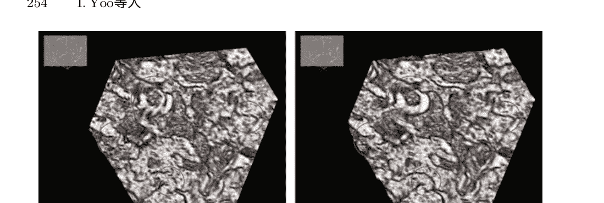

图3.果蝇黑色素瘤TEM数据集。左：预对齐结果。右：使用我们的方法进行配准后的结果。（在线彩图）

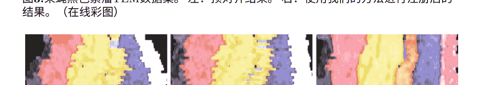

图4.随机变形的CREMI数据集的垂直视图对齐结果。 (a) bUnwarpJ, (b) 弹性对齐, (c) 我们的方法。每个神经元被分配一个唯一的颜色。（在线彩图）

触角叶。图3显示了我们的配准方法的结果。图3左是原始堆栈的斜（即非轴对齐）横截面视图。由于不准确的预对齐，一些不连续的膜显示出来（见红色圆圈区域），这在使用我们的方法进行对齐后得到了修正（图3右）。

CREMI挑战中的标记果蝇TEM数据。为了定量评估配准质量，我们使用CREMI挑战中已配准和标记的TEM数据的一个小子体积（512 × 512 × 31）作为基准。

我们首先使用随机向量和随机位置定义的TPS对原始图像和标记图像进行随机变形。随机位置在空间中均匀分布，随机向量从零均值的正态分布中采样。然后我们使用三种方法（bUnwarpJ、弹性对齐和我们的方法）进行图像配准。

图4显示了每个结果的垂直剖面。bUnwarpJ的结果在堆栈之间显示出较大的变形（即漂移）（请参见两侧的黑色区域）。虽然弹性对齐和我们的方法显示出较少的变形，但我们的方法明显显示出更准确的垂直膜对齐。为了定量测量配准精度，我们选择了50个最大的神经元

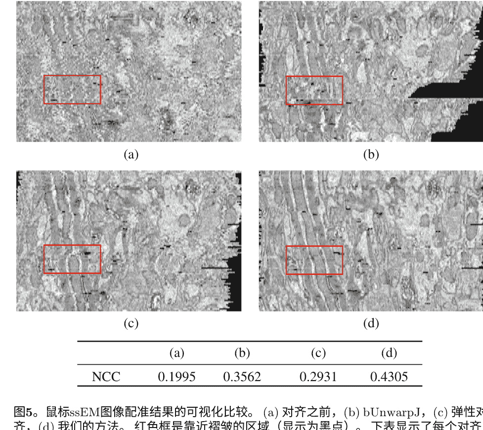

| | (a) | (b) | (c) | (d) |
|---|-----|-----|-----|-----|
| NCC | 0.1995 | 0.3562 | 0.2931 | 0.4305 |

图5.小鼠ssEM图像配准结果的可视化比较。(a) 对齐之前, (b) bUnwarpJ, (c) 弹性对齐, (d) 我们的方法。红色框是靠近褶皱的区域 (显示为黑点)。下表显示了每个对齐结果内部区域的NCC (黑色背景区域不计入NCC计算)。(在线彩色图)

然后计算了每个结果的平均Dice系数, 分别为bUnwarpJ、弹性和我们的方法分别为0.60、0.73和0.83。这个结果表明我们的配准方法更加稳健, 对随机变形更具韧性。

带有折叠伪影的小鼠外侧膝状核扫描电镜数据。接下来, 我们试图评估我们的新对齐方法在使用不同的电子显微成像方法、不同的模型生物和包含折叠伪影的数据中的适用性。从Lichtman实验室慷慨提供的小鼠外侧膝状核数据集中选择了一个小体积 (1520 × 2500 × 100)。该数据集使用分辨率为4 × 4 × 30 nm³vx⁻¹的扫描电镜获取, 并且包含由基底裂纹引起的折叠。图5显示了与传统配准方法相比的配准结果的垂直剖面。我们的方法的整体配准质量高于其他方法。

## 4 讨论和结论

卷积操作符的一个问题是它既不具有尺度不变性也不具有旋转不变性。我们通过在每次迭代中在变形图像上生成特征并动态计算特征差异来解决这个问题。我们的方法由于学习算法的性质而较慢，但参数调整比现有方法更容易，这使得它在实际中有用。

在本文中，我们介绍了一种新颖的深度网络用于ssEM图像配准，它更易于使用并且对成像伪影具有鲁棒性。所提出的方法是一个通用的基于学习的配准模型，可以通过修改网络轻松扩展到各种应用。通过并行系统改进运行时间，并在Tera级别的EM堆栈上部署我们的方法将是一个有趣且重要的未来研究方向。我们还计划在未来采用各种插值方案和特征编码网络。

致谢。本工作部分得到韩国教育部国家研究基金会通过基础科学研究计划（NRF-2017 R1D1A1A09000841）和韩国科学技术部软件融合技术发展计划（S0503-17-1007）的支持。

## 参考文献

- 1. Arganda-Carreras, I., Sorzano, C.O., Marabini, R., Carazo, J.M., Ortiz-deSolorzano, C., Kybic, J.: 一致和弹性的组织切片配准，使用矢量样条正则化。在：计算机视觉方法在医学图像分析国际研讨会上，第85-95页。Springer，纽约（2006）
- 2. Cardona, A., Saalfeld, S., Schindelin, J., Arganda-Carreras, I., Preibisch, S.,Longair, M., Tomancak, P., Hartenstein, V., Douglas, R.J.: TrakEM2软件用于神经回路重建。 PloS One 7(6), e38011 (2012)
- 3. Gatys, L.A., Ecker, A.S., Bethge, M.: 使用卷积神经网络进行图像风格转换。 在：IEEE计算机视觉和模式识别会议论文集，第2414-2423页（2016年）
- 4. Hayworth, K.J., Morgan, J.L., Schalek, R., Berger, D.R., Hildebrand, D.G.C., Lichtman, J.W.: 使用WaferMapper对ATUM超薄切片库进行成像：神经回路的多尺度EM重建方法。Front. Neural Circuits 8, 68 (2014)
- 5. Helmstaedter, M.: 细胞分辨率连接组学：密集神经回路重建的挑战。Nat. Methods 10(6), 501–507 (2013)
- 6. Jaderberg, M., Simonyan, K., Zisserman, A., et al.: 空间变换网络。在：神经信息处理系统进展，第2017-2025页（2015年）
- 7. Kingma, D., Ba, J.: Adam: 一种用于随机优化的方法arXiv预印本 arXiv: 1412.6980 (2014年)
- 8. Morgan, J.L., Berger, D.R., Wetzel, A.W., Lichtman, J.W.: 小鼠视觉丘脑中网络连接性的模糊逻辑。细胞 1，192-206页 (2017年)
- 9. Saalfeld, S., Fetter, R., Cardona, A., Tomancak, P.: 弹性体积重建来自超薄显微镜切片系列。自然方法 9 (7)，717-720页 (2012年)
- 10. Wu, G., Kim, M.J., Wang, Q., Munsell, B., Shen, D.: 通过无监督深度特征表示学习的可扩展高性能图像配准框架 (2015年)

# 全卷积回归网络用于准确检测测量点

Michal Sofka（?），Fausto Milletari, Jimmy Jia和Alex Rothberg

4Catalyzer, 纽约, 美国
msofka@4catalyzer.com

摘要。由于噪声、阴影、解剖差异和扫描平面变化，准确自动检测超声视频序列中的测量点具有挑战性。本文提出通过训练全卷积神经网络（FCN）来解决这些挑战，以回归点的位置。卷积和池化层的系列之后是一系列上采样和卷积层，从较早的层中进行特征传递。最终的位置估计通过计算最后一层中回归图的质心来产生。通过长短期记忆单元实现估计的时间一致性，该单元处理几个先前帧以改进当前帧的估计。在心脏剖面长轴视图中自动测量左心室的结果显示检测误差低于测量线的5%，在观察者之间的变异范围内。

## 1 引言

回归建模是一种描述自变量和一个或多个因变量之间关系的方法。在机器学习中，这种关系由一个函数描述，其参数是从训练样本中学习得到的。在深度学习模型中，这个函数是网络每一层上逻辑（Sigmoid）、双曲正切或最近的修正线性函数的组合。在许多应用中，该函数学习了输入图像块与连续预测变量之间的映射关系。

回归已被用于检测图像中的器官[4]或标志物位置[2]，视觉跟踪对象和特征[8]，以及估计身体姿势[14,15]。当有大量注释的训练数据集可用时，深度学习方法表现出色，特别是在先前的技术之上。所提出的架构使用级联回归器[15]，细化定位阶段[4,12]和结合多个标志物的线索[9]来定位标志物。在医学图像中，对准确的定位要求很高，因为标志物或测量点用于辅助诊断[11]。在视频序列中跟踪测量时，必须在每一帧中准确检测到这些点，同时确保检测的时间一致性。

本文提出了一种用于准确定位视频序列中解剖测量点的全卷积网络。全卷积网络的优势在于可以在单个步骤中计算覆盖输入图像的多个窗口的响应。该网络进行端到端训练，并输出点的位置。通过新的质心层将回归的位置映射到最后一个卷积层，该质心层计算预测的平均位置。与回归热图相比，这种方法具有优势，因为预测值可以具有亚像素值，并且回归目标可以惩罚与真值之间的测量长度差异。通过卷积长短期记忆（CLSTM）单元处理来自多个先前帧的特征图，并为当前帧生成更新的特征，以改进测量的时间一致性。该评估可以以接近帧速率的速度快速处理视频序列的每一帧。

## 2 相关工作

以前使用回归森林来训练，以预测解剖结构的位置和大小[2]。通过Hough回归森林[3]或由概率图谱引导的局部回归器[4]，对初始估计进行了改进。在[1]中，通过考虑相对位置定义的几何约束，使用数据驱动的非凸优化方法估计了X射线标志点的位置。

最近，深度学习方法已被证明能够有效地训练超越传统方法的表示[7,10]。在[9]中，通过结合每个标志点的局部外观和所有其他标志点的空间配置，实现了多个标志点的定位。通过卷积层计算的外观和空间配置热图的组合最终得到可能的标志点位置的热图。这种方法需要在地面真实位置指定热图高斯的超参数。

长短期记忆（LSTM）架构[5]被提出来解决训练循环神经网络（RNNs）的困难。长短期记忆（LSTM）网络在时间域中的回归能力可以将由CNN产生的高级视觉特征与区域信息[8]进行连接。利用联合时空模型，直接回归目标坐标。卷积LSTM [16]通过卷积来替代矩阵乘法和权重向量。因此，该模型捕捉到了空间上下文。

## 3 回归点位置

将宽度为w和高度为h的输入图像表示为I ∈ R^{w×h}（自变量），将关键点位置按列堆叠为p（因变量）。回归的目标是学习一个由θ参数化的函数f（I; θ）。我们通过卷积神经网络来近似f，并进行训练。使用图像数据库$\bar{I}_1, \ldots$来调整参数$\theta$以及它们对应的注释$\bar{\mathcal{P}} = \{\bar{\mathbf{p}}_1, \ldots, \bar{\mathbf{p}}_k\}$通常，欧几里德损失$L(\bar{I}, \bar{\mathcal{P}}; \theta) = \frac{1}{2N}\sum_{k=1}^{N} \| f(I_k; \theta) - \bar{\mathbf{p}}_k \|^2$进行训练$f$，其中每个注释图像都使用了该公式。以前，回归估计直接从网络的最后一层获得，该层与前一层完全连接。这是一个高度非线性的映射[14]，估计值是从卷积块后的全连接层计算得出的。

### 3.1 具有质心层的全卷积网络

我们提出使用全卷积网络（FCN）来回归关键点位置，而不是全连接网络。FCN先前已被用于图像分割[6]、回归热图[9]和物体定位[13]。它们的优点是可以在单次评估步骤中计算出估计值。在我们的架构中，我们在每个图像位置获得点坐标估计。

点坐标预测是在每个预测位置的新质心层中从输入中计算得出的$l_{ij}$（见图1）。

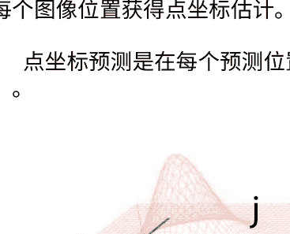

$\hat{\mathbf{p}} = \frac{1}{w \times h} \sum_{i=1}^{h} \sum_{j=1}^{w} \mathbf{l}_{ij}$

图1.质心层通过计算每个位置的回归位置估计的质心来计算估计值。

质心层使得可以设计一个具有对测量线长度误差的惩罚的损失函数。我们的惩罚定义为相对于真实长度的估计值与真实长度之间的差的绝对值。这个惩罚与上面讨论的欧几里得损失相结合。该模型使用学习率为0.0002的Adam优化器进行训练，在100个周期内收敛。基于点位置估计误差最小的模型被选为最佳模型。

### 3.2 用于时间一致性的卷积长短期记忆

递归神经网络（RNN）可以通过接受输入$x_t$并在每个时间步骤$t$更新隐藏向量$h_t$来学习顺序上下文依赖关系。RNN网络可以由长短期记忆（LSTM）单元组成，每个单元都由一个包含三种类型更新的门控机制控制，即 \( i_t、f_t、 o_t \in R^n \)，其取值范围在0和1之间。值 \( i_t \) 控制每个记忆单元的更新，\( f_t \) 控制每个记忆单元的遗忘，\( o_t \) 控制记忆状态对隐藏向量的影响。在卷积LSTM（CLSTM）中，输入权重和隐藏向量权重是卷积而不是乘法，以建模空间约束。该函数引入了一个非线性，我们选择了 \( \tanh \) 作为该非线性函数。将卷积运算符表示为 \( * \)，门控值的计算如下：

遗忘门: \( f_t = \text{sigm}(W_f * [h_{t-1}, x_t] + b_f) \) (2)
输入门: \( i_t = \text{sigm}(W_i * [h_{t-1}, x_t] + b_i) \) (3)
输出门: \( o_t = \text{sigm}(W_o * [h_{t-1}, x_t] + b_o) \) (4)

权重参数 \( W \) 和偏置 \( b \) 是从训练序列中学习得到的。除了门值之外，每个CLSTM单元还计算状态候选值
\( g_t = \tanh(W_g * [h_{t-1}, x_t] + b_g), \)
其中 \( g_t \in R^n \) 范围在-1和1之间，影响记忆内容。记忆细胞通过以下方式更新

\( c_t = f_t \odot c_{t-1} + i_t \odot g_t \)

它对每个记忆单元进行加法修改。更新过程导致梯度在反向传播期间分布。符号 \( \odot \) 表示Hadamard乘积。最后，隐藏状态更新为：

\( h_t = o_t \odot \tanh(c_t) \)。

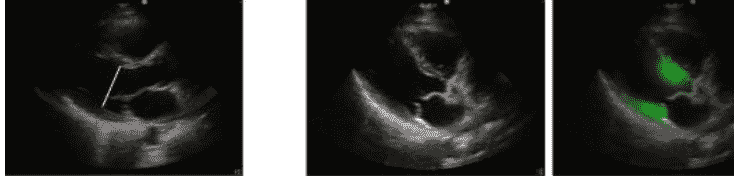

图2。（左）来自左心室PLAx视图的超声序列帧，并叠加测量线。注释点存在一个模糊性，可以沿心肌壁和腔隙之间的界面以及沿壁和心包之间的界面滑动，如FCN回归模型的聚合预测图所示（右）。

在图像序列的顺序处理中，LSTM的输入由卷积神经网络计算得到的特征图组成。在这项工作中，我们提出使用两种架构来计算特征图。第一种架构是一个具有卷积和池化层的神经网络。在CLSTM中顺序处理特征图后，输出被馈送到全连接层以计算点位置估计（图3）。在第二个架构中，CLSTM的输入是完全卷积网络（FCN）的卷积路径的最后一层。点位置估计是通过FCN网络的转置卷积部分处理CLSTM输出来计算的（图4）。与[7,10]类似，特征图通过与前一层的连接进行转发。

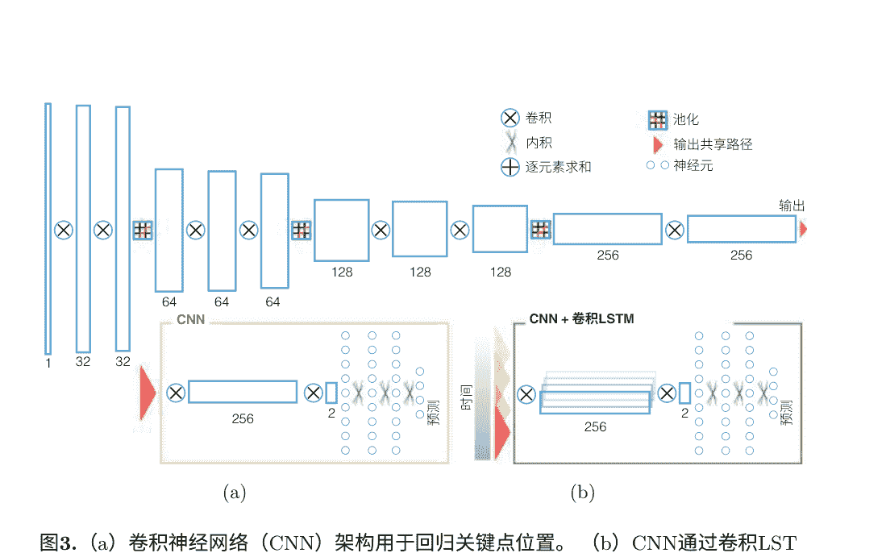

图3. (a) 卷积神经网络（CNN）架构用于回归关键点位置。（b）CNN通过卷积LSTM处理特征图以建模时间约束。CLSTM处理256个特征图，其输出用于计算点位置估计。

## 4 结果

我们在一个超声视频数据集上评估了提出的网络架构，该数据集显示了心脏的剖面长轴（PLAx）视图（图2）。数据是在几家诊所和医院使用四个超声系统采集的：西门子Acuson Aspen 7.0和X300，飞利浦iE33和Sonosite M-Turbo。共使用了4981个带注释的视频帧进行训练，628个用于验证（模型选择）。测试数据集共有90501帧，其中2048帧带有注释。我们的数据集比医学文献中经常使用的数据集要大得多。两名经验丰富的超声医生通过手动放置两个测量线卡尺（关键点），垂直于左心室（LV）长轴，并在二尖瓣叶尖的水平测量。卡尺被放置在心肌壁与腔室之间的界面和壁与心包之间的界面上。训练时使用了两位注释者的平均位置。

# 用于准确检测的全卷积回归网络

图4. (a) FCN通过卷积LSTM处理特征图来建模时间约束。 (b) 完全卷积网络（FCN）架构用于回归关键点位置。 CLSTM处理256个特征图，其输出用于计算点位置估计。在这两种情况下，质心层用于计算最终估计值。

我们计算了以下误差度量来比较不同的架构。根据两个关键点定义地面真实测量线为 $\bar{l}$。

类似地，估计的测量线 $\hat{l}_k$ 使用在 $\hat{\mathbf{r}}_k$ 和 $\hat{\mathbf{s}}_k$ 检测到的点来定义。长度误差定义为 $e_{l_k} = |t_k - \hat{t}_k|/t_k$。

时间误差定义为 $et_k = |||\hat{\mathbf{r}}_k - \hat{\mathbf{r}}_{k-1}|| + ||\hat{\mathbf{s}}_k - \hat{\mathbf{s}}_{k-1}||$。我们尝试了不同的帧序列长度，并报告了CNN + CLSTM模型的3帧序列和FCN + CSLSTM模型的6帧序列的结果。表1总结的结果显示了50th、75th和95th百分位数，以直观评估错误的分布和困难案例。

总体而言，CLSTM的时间建模改善了逐帧处理的结果。在测量长度的50th百分位数上，最终的检测准确率为4.87%，这在平均观察者误差4.98%的范围内。

表1. 在测试数据集上计算的平均长度和时间误差。对于不同的百分位数（50th、75th、95th），误差是相对于测量线长度计算的。卷积LSTM提高了准确性和时间稳定性。FCN + CLSTM模型在整体上表现最好。

| 网络 | 长度 × 100% (第50个) | 长度 × 100% (第75个) | 长度 × 100% (第95个) | 时间 × 100% (第75个) | 时间 × 100% (第95个) |
|---|---|---|---|---|---|
| CNN | 5.67 | 10.02 | 21.10 | 3.52 | 8.73 |
| CNN+CLSTM | 4.89 | 8.68 | 17.51 | 2.92 | 7.13 |
| FCN | 5.00 | 9.36 | 19.32 | 3.36 | 8.28 |
| FCN+CLSTM | 4.87 | 8.86 | 18.27 | 2.67 | 6.70 |

## 5 结论

本文提出使用全卷积网络（FCN）计算测量关键点位置的回归估计。每个像素位置的估计值通过新的质心（CoM）层映射到预测位置。CoM层使得可以在测量线上定义惩罚损失。空间上下文使用卷积长短期记忆（CLSTM）单元建模。

结果显示，左心室测量误差在5%以下，处于观察者间变异范围内。自动测量是在心脏的剖面长轴（PLAx）视图中计算的，这在文献中以前没有提出过。该测量是左心室功能的重要指标，可以用于计算射血分数。

我们目前的工作重点是利用回归预测的方差进行正则化，并估计额外的测量值。

## 参考文献

- 1. Chen, C., Xie, W., Franke, J., Grutzner, P., Nolte, L.P., Zheng, G.: 通过数据驱动的联合估计图像位移的自动X射线标志点检测和形状分割。医学图像分析，18(3)，487-499 (2014)
- 2. Criminisi, A., Robertson, D., Konukoglu, E., Shotton, J., Pathak, S., White, S., Siddiqui, K.: 用于计算机断层扫描中高效解剖检测和定位的回归森林。医学图像分析，17(8)，1293-1303 (2013)
- 3. Donner, R., Menze, B.H., Bischof, H., Langs, G.: 通过预过滤的Hough森林和离散优化进行全局定位3D解剖结构。医学图像分析，17(8)，1304-1314 (2013)
- 4. Gauriau, R., Cuingnet, R., Lesage, D., Bloch, I.: 基于级联全局到局部回归和形状先验的多器官定位。医学图像分析。23(1)，70-83 (2015)
- 5. Hochreiter, S., Schmidhuber, J.: 长短期记忆. 神经计算 9(8), 1735-1780 (1997)
- 6. Long, J., Shelhamer, E., Darrell, T.: 全卷积网络用于语义分割。在：计算机视觉和模式识别IEEE会议论文集，3431-3440页 (2015)
- 7. Milletari, F., Navab, N., Ahmadi, S.A.: V-net: 用于体积医学图像分割的全卷积神经网络。在：2016年第四届三维视觉国际会议（3DV），565-571页 (2016)
- 8. Ning, G., Zhang, Z., Huang, C., He, Z., Ren, X., Wang, H.: 空间监督的循环卷积神经网络用于视觉目标跟踪。arXiv预印本arXiv:1607.05781 (2016)
- 9. Payer, C., Stern, D., Bischof, H., Urschler, M.: 使用CNN回归热图进行多个地标定位。在：国际医学图像计算与计算机辅助干预会议，第230-238页。Springer，纽约 (2016年)
- 10. Ronneberger, O., Fischer, P., Brox, T.: U-net: 用于生物医学图像分割的卷积网络。在：国际医学图像计算与计算机辅助干预会议，第234-241页 (2015年)
- 11. Sofka, M., Zhang, J., Good, S., Zhou, S.K., Comaniciu, D.: 使用顺序估计和集成检测网络（IDN）在胎儿头部超声成像体积中自动检测和测量结构。IEEE Trans. Med. Imaging33(5), 1054-1070 (2014年)
- 12. Szegedy, C., Toshev, A., Erhan, D.: 深度神经网络用于目标检测。在：神经信息处理系统进展，第2553-2561页 (2013)
- 13. Tompson, J., Goroshin, R., Jain, A., LeCun, Y., Bregler, C.: 使用卷积网络进行高效的目标定位。在：计算机视觉和模式识别IEEE会议论文集，第648-656页 (2015)
- 14. Tompson, J.J., Jain, A., LeCun, Y., Bregler, C.: 联合训练卷积网络和图模型进行人体姿态估计。在：神经信息处理系统进展，第1799-1807页（2014）
- 15. Toshev, A., Szegedy, C.: Deeppose: 通过深度神经网络进行人体姿态估计。在：计算机视觉和模式识别IEEE会议论文集，第1653-1660页（2014）
- 16. 邢健，陈志，王华，杨大勇，黄伟强：卷积-长短期记忆网络：一种用于降雨预测的机器学习方法。在：神经信息处理系统进展，第802-810页（2015年）

# 快速预测简单测地回归

Zhipeng Ding<sup>1,5</sup>(☒), Greg Fleishman<sup>3,4,5</sup>, Xiao Yang<sup>1,5</sup>, Paul Thompson<sup>3,5</sup>, Roland Kwitt<sup>4,5</sup>, Marc Niethammer<sup>1,2,5</sup>, 和阿尔茨海默病神经影像学倡议

1 北卡罗来纳大学教堂山分校计算机科学系，美国教堂山
zp-ding@cs.unc.edu
2 北卡罗来纳大学教堂山分校生物医学研究影像中心，美国教堂山
3 南加州大学影像遗传学中心，美国洛杉矶
4 宾夕法尼亚大学放射学系，美国费城
5 萨尔茨堡大学计算机科学系，奥地利萨尔茨堡

摘要. 分析成千上万张大规模图像研究在计算上是昂贵的。为了评估局部形态差异，可变形图像配准是一个关键工具。然而，由于配准计算成本高昂，大规模研究通常需要大型计算集群。本文探讨了一种快速的预测近似图像配准方法。特别地，它使用这些快速配准来近似一个简化的测地线回归模型以捕捉纵向脑变化。由此产生的方法比基于优化的回归方法快几个数量级，从而在单个图形处理单元上方便进行大规模分析。我们展示了来自OASIS和ADNI的2D和3D脑磁共振图像的结果。

## 1 引言

关于脑发育、疾病和衰老的成像研究将继续大幅增加：ADNI [10]和鹿特丹研究[9]包含数千名受试者，英国生物库[1]在完成后将达到10万张图像。分析大规模研究很快就会变得计算上的难以承受；计算集群通常用于并行化分析，如可变形图像配准的3D脑图像。展望未来，非常大规模的研究将需要更大的计算集群或高效的算法来降低计算成本。此外，越来越多的纵向研究需要高效的算法来分析纵向图像数据。

测地回归（GR）[5,12,14]是一种捕捉纵向成像数据趋势的有吸引力的方法。GR将线性回归推广到黎曼流形。应用于纵向图像数据，它可以紧凑地表示随时间变化的空间图像变换。不幸的是，GR需要解决一个计算代价高昂的优化问题。因此，提出了一种简化的、近似的GR方法（SGR）[6]，通过成对图像配准计算回归测地线。但即使是SGR也需要在单个图形处理单元（GPU）上花费数月的计算时间来处理大规模成像研究中的数千个3D图像配准。

然而，最近已经提出了用于可变形图像配准的高效方法。特别是对于大位移的微分同胚度量映射（LDDMM）模型，它是图像GR方法的基础，可以通过使用有限维李代数[18]或快速预测图像配准（FPIR）[15,16]来大大加快配准速度。FPIR使用基于补丁的深度回归模型来预测LDDMM的初始动量，从而描述了空间变换。通过将标准LDDMM配准的数值优化替换为单个预测步骤，然后进行可选的校正步骤[16]，FPIR可以将速度提高数个数量级。除了FPIR，还存在其他预测图像配准（即光流）方法[2,11,13]。然而，与这些光流方法相比，FPIR更适用于脑图像配准，原因如下：（1）FPIR预测LDDMM的初始动量，因此继承了其理论特性。因此，尽管预测是基于补丁的，但FPIR产生了微分同胚变换和测地线。光流预测方法无法保证这一点。（2）基于补丁的预测允许使用很少数量的图像进行训练，利用大量的补丁。（3）通过使用补丁而不是完整图像，即使在当前GPU的内存限制下，也可以对大型高分辨率图像进行预测。（4）现有的预测方法都没有解决纵向图像数据的问题。此外，由于FPIR和SGR都基于LDDMM，它们自然地集成在一起，从而产生了我们提出的快速预测简单测地线回归（FPSGR）方法。

贡献。（1）预测测地回归：我们引入了第一个快速预测测地回归方法用于图像。（2）大规模数据集能力：我们的预测方法可以在一天内在单个$GPU$上完成大规模图像配准/回归，而不是像基于优化的方法那样需要数月时间。（3）准确性：我们展示了$FPSGR$很好地近似了基于优化的简单$GR$结果。（4）验证：我们通过分析$ADNI-1/ADNI-2$数据集中的$>6,000$张图像展示了我们$FPSGR$方法的性能。

组织。第2节描述了FPSGR。第3节讨论了实验设置和预测模型的训练。第4节介绍了大脑的2D和3D磁共振图像（MRI）的实验结果。本文总结了摘要，并展望了未来的工作。

## 2 快速预测简单测地回归（FPSGR）

我们的快速预测简单测地回归包括两个主要组成部分：（1）快速预测图像配准（FPIR）方法和（2）将FPIR集成到简单测地回归（SGR）公式中。FPIR和SGR都基于LDDMM的射击公式[14]。图1展示了我们的整体方法。各个组成部分的描述如下。

### LDDMM。
基于射击的LDDMM和测地回归最小化

$$
E(I_0, m_0) = \frac{1}{2} \langle m_0, K m_0 \rangle + \frac{1}{\sigma^2} \sum_i d^2(I(t_i), Y^i), \\
s.t. m_t + ad_v^* m = 0, I_t + \nabla I^T v = 0, m - L v = 0, \quad (1)
$$

其中， $I_0$是初始图像（对于图像到图像的配准已知，对于测地回归待确定）， $m_0$是初始动量， $K$是连接速度 $v$和动量 $m$的平滑算子， $K = L^{-1}$， $\sigma>0$是权重， $Y^i$是时间 $t_i$的测量图像（对于图像到图像的配准只有一个这样的图像，即 $t = 1$）， $d^2（ I_1， I_2）$表示 $I_1$和 $I_2$之间的图像相似度度量（例如 $L_2$或测地距离）； $ad^*$是向量场的负Jacobi-Lie括号的对偶： $ad_v w = -[v, w] = Dv w - D w v$， $D$表示Jacobian。源图像$I_0$的变形 $\Phi^{-1}$。$\Phi^{-1}$可以通过求解$\Phi_t^{-1} + D\Phi^{-1} v = 0$， $\Phi_0^{-1} = id$来计算，其中$id$表示恒等映射。

图1. 快速预测简单测地回归（FPSGR）原理。 在编码器-解码器网络中，输入是源图像和目标图像在相同位置的补丁；输出是对应补丁的预测初始动量。在简单测地回归中，根据公式2对所有成对的初始动量进行平均，得到回归测地的初始动量。

### FPIR。
快速预测图像配准[15,16]旨在逐个补丁地预测源图像和目标图像之间的初始动量 $m_0$。

具体来说，我们使用深度编码器-解码器网络来预测逐个补丁的动量。如图1所示，在3D中，输入是两层15 × 15 × 15的图像补丁（2D中为15 × 15），其中两层分别来自源图像和目标图像。通过两个并行的编码器在相同位置取两个补丁，它们独立地学习特征。输出是在 $x, y$和 $z$方向上的预测初始动量（通过数值优化获得训练样本）。该网络可以分为编码器和解码器。

编码器由2个3 × 3 × 3卷积层块和带有PReLU激活函数的另一个2 × 2 × 2卷积+PReLU层组成，步长为2，用作“池化”操作。第一个卷积层中的特征数量为64，在第二个卷积层中增加到128。在解码器中，三个并行解码器共享由编码器生成的相同输入。每个解码器都是编码器的逆过程，除了使用步长为2的3D转置卷积层进行“解池化”，末尾没有非线性层。为了加快计算速度，我们使用修剪补丁（即在大脑外部的补丁不被预测，因为动量为零）和大像素步长（例如，对于15 × 15 × 15的滑动窗口的预测补丁，使用14）。

### 校正网络。
我们还使用额外的校正步骤来提高预测准确性，具体方法如[16]所述。图2以图形方式说明了这种方法。校正网络具有与预测网络相同的结构。只有输入和输出发生变化。

### SGR。
确定初始图像$I_0$和初始动量$m_0$的计算代价很高。在简单的测地线回归中，初始图像被固定为主题的第一张图像。此外，相似度度量$d(.,.)$被选择为图像之间的测地线距离，并进行近似计算，以便通过计算相对于第一张图像的成对图像配准来计算测地线回归问题。对于固定的$I_0$，能量泛函(1)的近似最优$m_0$为

$$
m_0 \approx \frac{\sum(t_i - t_0)^2 m_0^{Y_i}}{\sum(t_i - t_0)^2} = \frac{\sum(t_i - t_0) \overline{m}_0^{Y_i}}{\sum(t_i - t_0)^2} \quad (2)
$$

其中，$\overline{m}_0^{Y_i}$是通过将$I_0$注册到$Y^i$并在单位时间内重新调整动量来获得的，以适应原始时间长度：$m_0^{Y_i} = \frac{1}{t_i - t_0}$。在我们的FPSGR方法中，我们通过FPIR计算动量$m_0^{Y_i}$。

## 3 实验设置和预测模型的训练

我们在OASIS数据集的2D轴向MRI脑片和ADNI数据集的3D图像上进行实验。2D：我们验证了我们的假设，即对于纵向配准，使用纵向数据训练FPIR优于使用横向数据训练；对于横向配准，使用横向数据训练FPIR优于使用纵向数据训练。与数值优化得到的配准结果进行比较。3D：由于ADNI数据集是纵向的，并且基于我们对2D数据的发现，我们只使用纵向配准来训练我们的模型。

预测模型的训练和测试。我们使用OASIS数据集中的150名患者的MRI进行2D模型的训练，并测试FPIR的性能。通过仿射配准，从3D OASIS图像的同一轴向切片中提取大小为128×128的重采样2D图像。ADNI数据包括6471个大小为220×220×220的3D MR脑部图像（ADNI-1有3479个，833个受试者；ADNI-2有2992个，823个受试者）。我们使用了所有的ADNI数据。2D：我们使用前100名患者进行训练，后50名进行测试。对于纵向训练，我们对患者的第一和第二个时间点进行配准。

对于横向训练，我们将一个患者的第一个时间点配准到另一个患者的第二个时间点。为了测试纵向和横向配准，我们对50个测试集进行相同类型的配准。我们将变形误差与通过数值优化获得的LDDMM解进行比较。表1显示了结果，证实了我们的假设，即使用纵向配准案例训练预测模型比使用横向数据更适合纵向配准。纵向训练/测试的变形误差非常小，预测方法的性能与基于昂贵优化的LDDMM相当。这些结果表明，训练一个预测模型与其预期遇到的变形是有益的，即对于纵向配准来说，变形相对较小，而对于横向配准来说，变形较大。因此，对于ADNI数据，我们只使用纵向配准来训练3D模型。3D：我们随机选择每个诊断类别中的1/6患者，形成139名ADNI-1患者和150名ADNI-2患者的训练组。将第一个时间点的图像与每个患者的后续时间点进行配准。

表1. 在纵向和横向数据上测试的纵向和横向模型的变形误差。与通过数值优化获得的地面真实变形相比，以像素为单位的2-范数变形误差。

**2D纵向测试案例变形误差[像素]**

| 数据百分位数 | 0.3% | 5% | 25% | 50% | 75% | 95% | 99.7% |
|---|---|---|---|---|---|---|---|
| 纵向训练 | 0.0027 | 0.0112 | 0.0267 | 0.0425 | 0.0630 | 0.1222 | 0.2221 |
| 横向训练 | 0.0050 | 0.0201 | 0.0475 | 0.0744 | 0.1093 | 0.1862 | 0.2253 |

**2D横向测试案例变形误差[像素]**

| 数据百分位数 | 0.3% | 5% | 25% | 50% | 75% | 95% | 99.7% |
|---|---|---|---|---|---|---|---|
| 纵向训练 | 0.0256 | 0.1068 | 0.2669 | 0.4552 | 0.7433 | 1.4966 | 1.9007 |
| 横向训练 | 0.0120 | 0.0508 | 0.1248 | 0.2047 | 0.3196 | 0.5781 | 0.6973 |

匹配诊断类别的分布后，我们随机选择了其中165个注册作为ADNI-1的训练集，以及140个注册作为ADNI-2的训练集。我们训练了4个预测模型和相应的纠正模型，总共有8个预测模型，即ADNI-1 Pred-1、ADNI-1 Pred+Corr-1、ADNI-1 Pred-2、ADNI-1 Pred+Corr-2，ADNI-2 Pred-1、ADNI-2 Pred+Corr-1、ADNI-2 Pred-2、ADNI-2 Pred+Corr-2。ADNI-1/2内的训练集没有重叠，这使得我们可以对完整的ADNI-1/2数据集进行预测（不使用训练数据）。

## 参数选择

我们使用正则化核函数 \(K = L^{-1}=(-a\nabla^2 -b\nabla(\nabla \cdot) + c)^{-2}\)，其中\([a, b, c]\)设置为\([0.05, 0.05, 0.005]\)（2D图像）和\([1, 0, 0.1]\)（3D图像）；\(\sigma\)为0.1（2D和3D）。我们使用Adam优化网络，进行10个epochs的训练，2D和3D的学习率分别为0.0005和0.0001。

## 效率

一旦训练完成，预测模型可以快速计算注册。我们使用一块TITAN X (Pascal) GPU和PyTorch，在2D中，FPIR平均需要4秒来预测50对128 × 128的MRI（用于4个纵向/横向实验），而基于GPU的优化LDDMM实现需要150分钟。对于3D ADNI-1数据（220 ×220 ×220的MRI），FPIR需要大约一天来预测2646对配准（每个预测25秒）并计算回归结果。基于优化的LDDMM需要≈40天的运行时间。ADNI-2上的FPIR运行时间与ADNI-1相同，因为图像具有相同的尺寸。

## 对于3D ADNI数据的实验结果讨论

我们研究了10个实验组：使用传统LDDMM的所有ADNI-1受试者，使用FPSGR进行训练数据纠正的两个ADNI-1组，以及使用FPSGR和纠正网络的两个ADNI-1组。对于ADNI-2也进行了类似的研究。我们计算了每个计算变形的雅可比行列式（JD）。然后，使用[3,4]中的现有变形将JD映射到整个ADNI数据集的公共坐标系中。然后，在感兴趣区域（ROI）内对这些空间归一化的JD进行平均。具体而言，我们将萎缩定义为（1 - \(\frac{1}{|\omega|} \int_{\omega} |D\phi(x)|dx \times 100\)），其中\(|D\phi(x)|\)是行列式，\(\omega\)是在颞叶中确定的一个区域，先前的研究[3,4]表明它与阿尔茨海默病（AD）的加速萎缩显著相关。结果标量值是该区域在基线和随访图像采集之间的相对体积变化的估计。因此，当该区域随时间减少体积时，其符号为正，如果该区域随时间增加体积，则为负。参见图3。

表2. 体积变化随时间的简单线性回归的斜率和截距值 [95% C.I.的下限，点估计值，95% C.I.的上限]

| ADNI-1 | 斜率 | 截距 |
|--------|------|------|
| 正常 | LDDMM-1 [0.65, 0.73, 0.81] | [-0.23, -0.07, 0.09] |
|  | Pred-1 [0.39, 0.45, 0.52] | [-0.20, -0.08, 0.05] |
|  | Pred+Corr-1 [0.64, 0.71, 0.77] | [-0.14, -0.01, 0.13] |
|  | LDDMM-2 [0.63, 0.72, 0.81] | [-0.21, -0.03, 0.15] |
|  | Pred-2 [0.49, 0.56, 0.63] | [-0.17, -0.03, 0.11] |
|  | Pred+Corr-2 [0.56, 0.64, 0.71] | [-0.14, 0.00, 0.14] |
| MCI | LDDMM-1 [1.55, 1.68, 1.82] | [-0.28, -0.04, 0.19] |
|  | Pred-1 [1.03, 1.13, 1.23] | [-0.24, -0.07, 0.10] |
|  | Pred+Corr-1 [1.39, 1.50, 1.61] | [-0.14, 0.05, 0.25] |
|  | LDDMM-2 [1.41, 1.54, 1.66] | [-0.25, -0.03, 0.18] |
|  | Pred-2 [1.15, 1.25, 1.36] | [-0.20, -0.02, 0.16] |
|  | Pred+Corr-2 [1.22, 1.33, 1.43] | [-0.16, 0.02, 0.20] |
| AD | LDDMM-1 [2.07, 2.42, 2.77] | [-0.28, 0.14, 0.57] |
|  | Pred-1 [1.31, 1.57, 1.84] | [-0.22, 0.11, 0.43] |
|  | Pred+Corr-1 [1.83, 2.13, 2.42] | [-0.14, 0.22, 0.58] |
|  | LDDMM-2 [2.03, 2.39, 2.75] | [-0.29, 0.14, 0.57] |
|  | Pred-2 [1.66, 1.94, 2.23] | [-0.21, 0.13, 0.47] |
|  | Pred+Corr-2 [1.75, 2.03, 2.32] | [-0.18, 0.16, 0.51] |

我们将实验限制在[7,8]中的应用程序中，其中非线性配准/回归用于量化与AD（2）、轻度认知障碍（MCI）（1）（包括晚期轻度认知障碍）和正常衰老（0）有不同程度关联的区域内的萎缩。这些应用程序针对的是老年人群体。

此外，我们对以下两个关键验证感兴趣：(1) 萎缩是否存在从FPSGR偏差导出的测量结果是否过高或过低？（2）这些萎缩测量结果与通过优化过程（LDDMM）产生的变形一致吗？该优化过程产生了训练数据集。如果实验结果显示（1）和（2）得到了有利的解决，那么FPSGR的计算效率显著提高可能会为某些应用程序的使用提供合理的理由。

偏差。萎缩的估计容易受到偏差的影响[17]。我们按照[8]的方法，在每个诊断类别中通过所有这些时间上的萎缩测量结果拟合一条直线（线性回归）。截距项是在同一天注册的两个扫描中测量到的萎缩的估计值；因此，它应该接近于零，并且其95%置信区间应该包含零。表2显示了所有五组ADNI-1的斜率、截距和95%置信区间。ADNI-2的结果（未显示）类似。所有这些截距相对于观察到的变化范围都接近于零，并且所有预测截距的置信区间都包含零。此外，所有的斜率都是正的，表明随着时间的推移，平均体积损失增加，这与衰老和神经退行性人群的预期一致。斜率捕捉到了随着疾病严重程度的增加而出现的萎缩。我们得出结论，无论是LDDMM优化还是FPSGR都没有产生明显的偏差来过高或低估体积变化。请注意，我们的LDDMM优化结果和预测结果显示相同的趋势，并且可以直接进行比较，因为结果基于相同的测试图像（萎缩测量也是如此）。

萎缩。研究还显示，萎缩估计与临床变量相关。根据上述验证（2），我们计算了相关性。

我们的萎缩估计与诊断之间，以及我们的萎缩估计与迷你心理状态检查（MMSE）分数之间的相关性（图4）。我们观察到的所有八个预测模型（四个带有校正网络和四个不带校正网络）的相关性大小在MMSE为-0.4至-0.8之间，诊断为0.2至0.6之间。先前的研究报告显示，萎缩估计与临床变量之间的相关性高达MSE为-0.7，诊断为0.5，针对100个受试者[3,4]。所有预测结果与基线LDDMM结果相当。校正网络通常提高了预测性能。

雅可比矩阵。平均JD图像在定性上与之前的结果[7,8]一致：随着诊断的严重程度和时间的增加，体积变化的严重程度也增加。变化最显著的是在海马附近的颞叶区域（见图3）。

## 5 结论和未来工作

我们提出了一种快速的测地线回归方法（FPSGR）来研究纵向图像数据。FPSGR比现有方法快几个数量级，并且有助于大规模成像研究的分析。对ADNI-1/2数据集的实验表明，FPSGR捕捉到了预期的萎缩趋势，偏差可忽略不计，并且与临床变量具有很高的相关性。

支持。本工作得到了NSF资助的EECS-1148870/1711776项目的支持。

## 参考文献

- 1. 生物库网站。www.ukbiobank.ac.uk
- 2. Dosovitskiy, A., Fischer, P., Ilg, E., Hausser, P., Hazirbas, C., Golkov, V., van der Smagt, P., Cremers, D., Brox, T.: Flownet: learning optical flow with convolutional networks. In: ICCV, pp. 2758–2766 (2015)
- 3. Fleishman, G., Thompson, P.M.: 自适应梯度下降优化初始动量在测地线射击中的应用. In: ISBI (2017)
- 4. Fleishman, G., Thompson, P.M.: 匹配功能对测地线射击中萎缩测量的影响. In: ISBI (2017)
- 5. Fletcher, P.T.: 测地线回归与黎曼流形上的最小二乘理论. IJCV 105(2), 171–185 (2013)
- 6. Hong, Y., Shi, Y., Styner, M., Sanchez, M., Niethammer, M.: 简单的图像时间序列测地线回归. In: Dawant, B.M., Christensen, G.E., Fitzpatrick,J.M., Rueckert, D. (eds.) WBIR 2012. LNCS, vol. 7359, pp. 11–20. Springer,Heidelberg (2012). doi:10.1007/978-3-642-31340-0_2
- 7. Hua, X., Ching, C.R.K., Mezher, A., Gutman, B., Hibar, D.P., Bhatt, P., Leow,A.D., Jack Jr., C.R., Bernstein, M.A., Weiner, M.W., Thompson, P.M., 阿尔茨海默病神经影像学计划：ADNI第二阶段基于MRI的脑萎缩速率：临床试验的加速和丰富考虑。神经老化 37, 26–37 (2016)
- 8. Hua, X., Hibar, D.P., Ching, C.R.K., Boyle, C.P., Rajagopalan, P., Gutman, B.,Leo w, A.D., Toga Jr., A.W., C.R.J., Harvey, D.J., Weiner, M.W., Thompson, P.M.: 无偏的基于张量的形态学：改进的鲁棒性和样本量估计用于阿尔茨海默病临床试验。神经影像 66, 648-661 (2013)
- 9. Ikram, M.A., van der Lugt, A., Niessen, W.J., Koudstaal, P.J., Krestin, G.P.,Hofman, A., Bos, D., Vernooij, M.W.: 鹿特丹扫描研究：2016年设计更新和主要发现。欧洲流行病学杂志 30 (12) , 1299-1315 (2015)
- 10. Jack, C.R., Barnes, J., Bernstein, M.A., Borowski, B.J., Brewer, J., Clegg, S., Dale,A.M., Carmichael, O., Ching, C., DeCarli, C., et al.: ADNI 2中的磁共振成像。阿尔茨海默病痴呆症。 11 (7) , 740-756 (2015)
- 11. 刘, Z., 叶, R., 唐, X., 刘, Y., Agarwala, A.: 使用深度体素流进行视频帧合成。arXiv预印本arXiv:1702.02463 (2017年)
- 12. Niethammer, M., Huang, Y., Vialard, F.-X.: 图像时间-序列的测地回归。在：Fichtinger, G., Martel, A., Peters, T. (编辑) MICCAI 2011. LNCS, 卷6892, 页655-662。Springer, Heidelberg (2011年)。 doi:10.1007/978-3-642-23629-7_80
- 13. Schuster, T., Wolf, L., Gadot, D.: 光流需要多种策略（但只需要一个网络）。arXiv预印本arXiv:1611.05607 (2016年)
- 14. Singh, N., Hinkle, J., Joshi, S., Fletcher, P.T.: 一种改进的测地线回归和图谱构建的矢量动量形式的表达。在：ISBI, pp. 1219-1222 (2013年)
- 15. Yang, X., Kwitt, R., Niethammer, M.: 快速预测图像配准。在：Carneiro, G., et al. (eds.) LABELS/DLMIA -2016. LNCS, 卷。10008, pp. 48-57。Springer, Cham (2016年)。 doi:10.1007/978-3-319-46976-8_6
- 16. Yang, X., Kwitt, R., Niethammer, M.: Quicksilver: 快速预测图像配准-一种深度学习方法。NeuroImage (2017年，待出版)
- 17. Yushkevich, P.A., Avants, B.B., Das, S.R., Pluta, J., Altinay, M., Craige, C.: 使用基于变形的形态测量估计海马萎缩的偏差来自于不对称的全局归一化：以ADNI 3T MRI数据为例。NeuroImage 50(2), 434–445 (2010)
- 18. Zhang, M., Fletcher, P.T.: 用于快速同构图像配准的有限维李代数。在：Ourselin, S., Alexander, D.C., Westin, C.-F., Cardoso, M.J. (编辑) IPMI 2015. LNCS, vol. 9123, pp. 249–260. Springer, Cham (2015). doi:10.1007/978-3-319-19992-4_19

# 在超声视频中学习胎儿心脏分析的时空聚合

Arijit Patra, Weilin Huang, 和 J. Alison Noble
牛津大学生物医学工程研究所，英国牛津
arijit.patra@eng.ox.ac.uk

## 摘要

我们研究了最近用于自动描述超声（US）视频中胎儿心脏的多个临床相关特性的深度卷积架构，目标是学习深度表示的时空聚合。我们研究了多个时空编码模型，结合了超声视频的空间和时间特征。我们将任务转化为一个层次卷积模型中的多任务学习问题，该模型在帧级别上联合预测胎儿心脏的可见性、视平面和定位。我们研究了针对视频分类开发的深度卷积网络，并通过查看架构和特定模态（US视频）的多任务损失来分析它们。

我们通过实验证明，逐渐在网络中编码时间信息的发展的分层卷积模型能够保留空间细节和丰富的时间特征，从而在真实世界的临床数据集上表现出高性能。

## 1 引言

胎儿超声（US）是产前护理的标准部分，主要是因为其无创性和其他成像模式在整个妊娠期间的不适用性。理解胎儿心脏筛查超声视频对于诊断先天性心脏病至关重要。由于训练有素的临床医生短缺以及胎儿心脏筛查所需的专业知识和设备，导致胎儿心脏病常常被忽视，从而被排除在20周异常扫描的强制筛查要求之外。即使对于人类专家来说，精确分析胎儿心脏超声视频也是一项具有挑战性的任务，因为小区域内存在不同解剖结构的复杂外观。此外，超声图像中存在斑点、阴影、增强和对比度水平的变化。此外，临床医生在典型的超声扫描过程中还必须执行多个活动，如视图平面识别、异常检测、性别识别等。在这项工作中，我们分析了在超声视频中使用深度学习技术描述胎儿心脏关键参数的可能性，重点是在深度卷积结构中聚合时空特征。

卷积神经网络（CNN）已成功应用于许多计算机视觉任务。最近已经开发了各种CNN模型用于动作识别，目标是从视频中学习时空特征[5,8,9]。这些模型主要设计用于视频级别的分类，将一个整个视频分配给一个动作类别。对于视频分类任务，高级全局上下文信息非常重要，而我们的任务更具挑战性，因为它同时考虑了分类和定位，其中详细的局部信息对于心脏多个参数的精确预测至关重要。此外，动作识别主要建立在RGB领域，其中单个图像可以包含用于识别动作类别的强视觉信息。相比之下，超声图像中的物体结构通常定义不明确，局部的时间动态对于产生可靠的预测至关重要。

我们通过将胎儿心脏的自动分析问题定义为多任务预测来解决该问题，在帧级别上联合预测心脏的可见性、视图平面和定位。我们研究了在短时超声视频剪辑中聚合时空信息的问题，通过研究卷积架构中的各种时间连接性。我们研究了时态信息对胎儿心脏分析任务的影响。我们的主要贡献如下：

- 我们将胎儿心脏分析问题转化为一个分层卷积架构中的多任务预测问题，逐步在网络中编码时态信息。这对于保留空间细节和有意义的时态模式非常重要，这对于准确和自动地描述胎儿超声视频中的心脏至关重要。
- 我们研究了多种时态编码架构，学习适用于超声视频表示的强时空表示。我们通过分析架构、特定的超声图像模态以及为联合分类和定位设计的损失函数来研究这些方法。
- 我们在一个真实的临床数据集上进行了实验。结果表明，编码时间信息的能力对于我们的任务非常重要，因为图像级别的信息相对较弱且容易产生歧义。

### 1.1 相关工作

深度学习方法最近被应用于视频中的动作识别，重点是高效准确地学习时空信息。Karpathy等人[5]开发了一些深度融合方法，可以在CNN架构中编码时间特征。类似地，[8]中研究了各种池化方法，用于聚合时空CNN特征进行动作识别。在[9]中引入了双流CNN，通过使用单独的CNN处理光流来捕捉短期时间信息。这些方法是为视频中的动作识别而开发的，其中CNN被设计为从RGB图像序列中计算全局高级上下文。我们的工作重点是为我们的超声视频分析聚合时空信息，我们的任务要求在空间和时间域中进行联合分类和定位的局部细节。

最近关于自动超声视频分析的研究主要集中在解剖结构的图像级别分类，例如[7]。卷积神经网络也被应用于这个任务，包括迁移学习[3]和循环模型[2]。胎儿心脏描述是一个更复杂的应用，它同时预测胎儿心脏的多个参数。我们的工作与最近的研究[1,4]密切相关，其中估计了胎儿心脏的多个属性。在[1]中，使用CRF-滤波器和手工特征来预测胎儿心脏的定义参数。我们基于先进的深度学习方法，使我们的模型能够以端到端的方式学习更强大的深度表示。在[4]中，提出了一种称为Temporal HeartNet的方法，使用循环模型来编码时间信息。在本文中，我们专注于在CNN架构内直接聚合时空特征，与[4]有所不同。

图2. 用于多任务胎儿心脏预测的CNN架构。左: 基于AlexNet（$SBM_{alex}$）和VGGnet（$SBM_{vgg}$）的空间基准模型。中间: 从AlexNet和VGGnet修改的直接时态编码（DTE）模型。右: 逐步在网络中引入时空信息的发展的分层时态编码（HTE）。

## 使用时空CNN描述胎儿心脏

我们的任务是联合预测胎儿心脏在超声视频中的可见性、视图平面和位置，这与[1]类似。可见性与每帧中心脏的存在或缺失有关（部分可见性低于50%被视为不可见）。当心脏存在时，视图平面可以是四腔（4C）视图、左心室流出道（LVOT）或三血管（3V）视图，如图1所示。通过同时考虑可见性和视图平面识别，我们将背景类包括在内，定义为4类分类问题。心脏的位置由其中心和半径定义，可以看作是一个3参数回归问题。

在这项工作中，分类和定位都被联合地构建为卷积架构中的多任务学习问题。这两个任务的输出连接到卷积神经网络（如AlexNet [6]或VGGnet [10]）的最后一个全连接（FC）层，如图2所示。分类任务使用带有softmax函数的交叉熵损失，而心脏中心和半径的值的回归任务使用L2损失。这些配置将常规的卷积神经网络定制为我们的任务，并形成了我们的基线空间架构，其中输入是单个超声图像。我们的时间模型是从这个基线架构扩展而来，允许输入连续帧的序列。为了研究模型对学习时空细节的能力，我们将最近引入的用于动作识别的时空编码方法扩展到超声视频中胎儿心脏的多任务预测。

### 2.1 空间基准模型

对于创建空间基准模型的第一步，我们利用经典的AlexNet [6]和16层的VGGnet [10]，两者都被修改为接受单通道灰度图像。这两个空间基准模型分别被称为SBM_alex和SBM_vgg。这些网络的输入是一个尺寸为224×224像素的超声图像。架构的细节在图2（左）中呈现。请注意，FC层中的神经元数量从原来的4096变为1024。这个修改是为了避免过拟合，因为我们的任务中预测的参数数量明显小于ImageNet中的1000个物体分类。最后一个FC层连接到输出层，计算4个类别（3个视图平面和背景）的softmax概率，同时预测心脏的中心和半径。

### 2.2 直接时间编码

为了计算时间信息，一种直接的方法是修改卷积神经网络的架构，以允许输入多个连续的帧。这样的多帧输入自然地包含了重要的时间上下文，以产生更可靠的预测。由于卷积神经网络的架构大小是固定的，而且卷积神经网络的参数数量应该是可扩展的，所以卷积神经网络的输入被配置和固定为一个短的、固定长度的连续帧的超声视频剪辑，从时间上连续的帧中裁剪。在实验中，我们使用一个包含8个帧的视频剪辑作为所有时间模型的输入，其中第4帧的标签被应用。

对于模型配置，主要思想是在时间域中扩展网络连接性，允许这些连接性自动学习连续超声图像之间的时间动态。为此，我们将空间基线模型扩展为直接时间编码（DTE），通过在第一个卷积层引入直接时间滤波器，滤波器的核大小为 \( k \times k \times T \)，其中 \( T \) 是时间维度，在我们的实验中设置为 \( T=8 \)。 \( k \times k \) 是卷积核的空间大小，与空间基线模型的卷积核大小相同，例如，对于AlexNet和VGGnet分别为 \( 11 \times 11 \) 和 \( 3 \times 3 \)。这些时间滤波器能够直接编码连续超声帧的空间细节和时间连接。这增强了第一个卷积层中的低级表示，从而通过网络传播它们，产生更强的深度高级表示。

### 2.3 分层时间编码

DTE方法直接在像素级别计算局部时间特征，能够捕捉到详细的低级运动特征。然而，CNN的预测是建立在高级深度表示（例如FC特征）之上的。重要的是要研究：（i）如何高效准确地传播这种低级时间信息到最终的深度表示；（ii）哪个层次的时间信息对最终的预测至关重要。由于超声图像通常在像素级别上包含相对较弱的视觉信息，DTE在第一层立即计算的时间表示可能不够稳健，并且整个网络中的多层传播可能导致一定程度的信息损失。需要开发一种新的时间编码方法，能够更准确、更稳健地计算超声视频的时间细节，并在整个网络中更高效地传播，而不会有显著的信息损失。

考虑到这些因素，我们开发了一种新的分层时间编码（HTE）方法，该方法是从用于动作识别的慢融合模型[5]扩展而来的。我们提出了一些技术改进，使其更加适应我们的胎儿超声描述任务：（i）我们将多任务预测纳入到这个分层架构中，共同估计胎儿心脏的视图平面和定位。（ii）我们使用小的 \( 3 \times 3 \) 卷积层，使模型更深，能够捕捉更多的时空细节，这对我们的任务尤为重要。这些设计特点旨在捕捉超声视频解释的关键特征，编码时间域和空间域，并且更好地从前一层提取特征以在整个网络中传播特征更加理想。HTE模型的详细信息如图2（右侧）所示，视频剪辑的帧被分组为3个一组，然后输入到多组共享相同参数的CNN的第一层。

直到第3个池化层，它们充当准独立的CNN。在第3个池化层，输出被收集并传递给下一层的CNN池化层以2个为一组，并进一步输入到分别具有相同参数的2个CNN结构中。这种方式一直保持到最后的编码，在第一个全连接层之前发生，随后的全连接层有效地处理视频的整体信息。因此，学习特征的缓慢而渐进的组合使得编码在时间空间中的信息多样性得以传播。

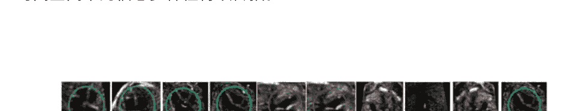

## 3 实现细节

真实世界的临床数据集。我们的数据集包含了来自12个孕周在20到35周之间的12个主题的91个常规临床心脏筛查视频。每个视频的持续时间在2到10秒之间，帧速率在每秒25到76帧之间（总共39556帧）。它包含了胎儿心脏的三个视图中的一个或多个。用于训练的视频来自10个主题，剩下的2个用于测试。

数据预处理。在训练步骤中，我们将可用的视频分割成帧，并通过上下翻转和顶部-底部翻转进行数据增强。然后，我们按照视频中帧的原始顺序每次选择8帧，并将它们拼接成8帧序列，并对增强数据重复相同的操作。这使我们能够获得9337个视频剪辑，其中包含来自不同视角类别的大致相等的样本。当前帧是8帧视频剪辑中的第4帧。数据集中的所有帧大小为430×510，被裁剪为以心脏中心为中心的224×224。

训练细节。网络中的所有新层都使用随机权重进行初始化。我们的空间基准模型使用25帧小批量进行训练，学习率为0.01。DTE模型使用8帧视频块进行训练，批量大小为25，学习率为0.01。HTE使用批量大小为20和学习率为0.001进行训练。

## 4 实验结果和比较

我们对分类和回归任务进行了多组实验。我们首先生成了一个基于强特征的基准线，我们使用视频序列的单帧开始，然后通过网络对时态编码模型进行增强，从而实现了空时细节的分层传输。我们通过关注每个任务所需的感兴趣区域，分析了我们的多任务学习模型。

### 表1. 在真实世界的胎儿心脏筛查视频中的准确率（%）。正确的定位定义为交并比大于0.25。

| 方法 | 分类 | | | | 定位 |
| :--- | :--- | :--- | :--- | :--- | :--- |
| | 4个心腔 | 左心室流出道 | 3个血管 | 背景 | 总体 |
| $SBM_{alex}$ | 89.22 | 67.60 | 59.11 | 90.36 | 78.95 | 69.71 |
| $SBM_{vgg}$ | 90.84 | 69.83 | 62.07 | 91.37 | 80.73 | 72.29 |
| $DTE_{alex}$ | 88.68 | 73.18 | 57.63 | 88.83 | 79.16 | 72.21 |
| $DTE_{vgg}$ | 91.11 | 70.95 | 67.00 | 89.34 | 81.78 | 77.26 |
| $HTE$ | 81.67 | 88.27 | 79.80 | 86.80 | 83.58 | 79.68 |

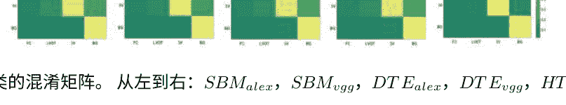

我们的模型在真实世界的胎儿心脏筛查视频上进行评估。在几个示例帧上的结果显示在图3中，完整的结果在表1中进行了比较，其中时间模型获得了更好的性能，特别是在分类方面。重要的是，对于具有挑战性的类别的改进是显著的：LVOT从67.60%提高到88.27%，3个血管从59.11%提高到79.80%。HTE模型在这两个类别上的表现优于DTE模型超过15%，这表明HTE提供了一种更有原则的方法来编码胎儿心脏描述的详细和有意义的时空特征。这可以通过图4中显示的混淆矩阵进一步验证。HTE的优势也在定位任务中得到了证实。我们将我们的模型与使用手工特征和CRF滤波器的[1]进行了比较。HTE的交并比定位误差方面达到了20.32%，而[1]中的最佳结果为34%。我们的模型探索了更强大的深度时空表示，通过多个任务共享特征进行端到端学习。此外，我们的模型能够预测心脏定位的中心和半径，而[1]中只估计中心并使用半径作为强先验信息。

最后，我们对卷积神经网络架构中的超声表示的时空聚合进行进一步分析。直接编码架构DTE_alex的性能可以接近更深的基准模型SBM_vgg VGGnet。这表明了深度网络在优化学习空间和时间信息的能力方面的动态相互作用。虽然在不同时间步骤或帧的提取特征的信息融合可以捕捉到更多的上下文细节，但聚合可能会导致不同空间特征之间的重叠，从而损害学习独特空间特征的能力。这种效应与超声波模态相关，因为成像伪影、阴影和斑点的影响并不平凡。特别是在第一个卷积层之前的像素级组合，如DTE结构中所描述的，往往会通过沿时间方向直接融合来削弱空间信息的帧间变化。

这个权衡在HTE模型中间接地得到了解决，通过在卷积网络中提供相对较小的时间范围，并通过逐渐在CNN架构中聚合多层次的时空信息来实现。这提供了一种更有原则性的时空编码方法，使得最终的深度表示能够基本上捕捉到整个视频片段的整个时间范围。因此，我们的HTE网络能够在分类和定位任务中取得显著的准确度提升。值得注意的是，在这个权衡中实现最佳收益所需的最佳帧数会因模态、数据集大小和空间和时间域特征的复杂性而有显著变化。

## 5 结论

我们提出并比较了多个CNN模型，用于联合预测超声视频中胎儿心脏的可见性、视平面和定位。我们开发了一种分层时空编码（HTE）与多任务CNN，允许逐渐通过网络聚合时空信息。这种方法被证明能够高效地保留关键的空间和时间细节，对于在超声视频中实现多任务预测至关重要。我们还在一个真实世界的临床数据集上研究了不同的时间编码模型，其中提出的HTE实现了显著的性能提升。

致谢。本工作得到EPSRC计划资助，参见See-bibyte (EP/M013774/1)。Arijit Patra得到罗兹基金会的支持。

## 参考文献

- 1. Bridge, C.P., Ioannou, C., Noble, J.A.: 胎儿心脏超声视频的自动注释和定量描述。医学图像分析 36, 147–161(2017)
- 2. Chen, H., Dou, Q., Ni, D., Cheng, J.-Z., Qin, J., Li, S., Heng, P.-A.: 使用知识迁移循环神经网络的自动胎儿超声标准平面检测。 In: Navab, N., Hornegger, J., Wells, W. M., Frangi, A.F. (eds.)MICCAI 2015. LNCS, vol. 9349, pp. 507–514. Springer, Cham (2015). doi:10.1007/978-3-319-24553-9_62
- 3. Gao, Y., Malawski, M.A., Noble, J.A.: 使用深度卷积神经网络描述超声视频内容。 在: ISBI (2016)
- 4. Huang, W., Bridge, C.P., Noble, J.A., Zisserman, A.: Temporal HeartNet: 朝着人类水平的自动胎儿心脏筛查视频分析。 在: MICCAI (2017)
- 5. Karpathy, A., Toderici, G., Shetty, S., Leung, T., Sukthankar, R., Fei-Fei, L.: 使用卷积神经网络进行大规模视频分类。 在: CVPR (2014)
- 6. Krizhevsky, A., Sutskever, I., Hinton, G.E.: 使用深度卷积神经网络进行ImageNet分类。 在: NIPS (2012)
- 7. Malawski, M.A., Napoletano, R., Papageorgiou, A., Noble, J.A.: 在超声视频序列中搜索感兴趣的结构。医学图像分析。 37, 22-36 (2017)
- 8. Ng, J.Y.H., Hausknecht, M., Vijayanarasimhan, S., Vinyals, O., Monga, R., Toderici, G.: 超越短片段：用于视频分类的深度网络。 在: CVPR (2015)
- 9. Simonyan, K., Zisserman, A.: 用于视频动作识别的双流卷积网络。 在: NIPS (2014)
- 10. Simonyan, K., Zisserman, A.: 用于大规模图像识别的非常深的卷积网络。 在: ICLR (2015)

# 使用全卷积网络进行快速简单的钙成像分割

Aleksander Klibisz<sup>1</sup>(<span>✉</span>), Derek Rose<sup>1</sup>, Matthew Eicholtz<sup>1</sup>, Jay Blundon<sup>2</sup>, 和 Stanislav Zakharenko<sup>2</sup>

<sup>1</sup> 奥克岭国家实验室，奥克岭，TN 37831，美国 {klibisza,rosedc,eicholtzmr}@ornl.gov
<sup>2</sup> 圣裘德儿童研究医院，美国田纳西州38105 {jay.blundon,stanislav.zakharenko}@stjude.org

摘要。 钙成像是一种观察神经元活动的技术，通过一系列显示指示物质荧光随时间变化的图像。手动分割神经元是耗时的，因此进行了自动钙成像分割（ACIS）的研究。我们在Neurofinder竞赛数据集上评估了几种深度学习模型用于ACIS，并报告了我们的最佳模型：U-Net2DS，这是一个在2D均值摘要图像上操作的全卷积网络。U-Net2DS需要最少的领域特定的预处理和后处理以及参数调整，并且每分钟可以对512 × 512的完整图像进行约9K次预测。它在Neurofinder竞赛中排名第三（F<sub>1</sub>=0.57），并且是唯一使用深度学习的最佳模型。我们还展示了对竞赛之外的数据的有用分割。该模型的简单性、速度和质量结果使其成为ACIS的实用选择，并为未来更复杂的模型提供了强大的基线。

关键词： 钙成像 · 全卷积网络 · 深度学习 · 显微镜分割

## 1 引言

钙成像记录显示实验标本中的神经元随时间发光，持续时间从几分钟到几小时，分辨率为512 × 512像素。识别神经元是工作流程中的一步，通常涉及运动校正和峰值识别，目标是理解大量神经元的活动。给定一个3D时空（高度、宽度、时间）图像序列，ACIS模型生成一个2D二进制掩码，用于识别神经元像素。

直到最近，流行的ACIS模型大多是无监督的，并在进行预测时需要对数据做出相当多的假设。例如，[8,16,17,20]每个都需要预期的神经元数量和/或它们的维度来分割新的序列。此外，许多模型在不同的数据集上进行了测试，使得客观比较变得困难。

正在进行的Neurofinder竞赛[4]有19个带标签的训练数据集和9个测试数据集。据我们所知，这是ACIS的最佳基准，数据的数量使其对深度学习非常有吸引力。

我们在Neurofinder数据集上的最佳模型是U-Net2DS，它是完全卷积U-Net架构[21]的改编版本，以2D摘要图像作为输入。与不使用深度学习的其他模型相比，U-Net2DS在进行预测时需要最少的假设、参数调整和预/后处理。完全卷积架构使得可以在小窗口上进行训练，并在完整的摘要图像上进行预测。它在Neurofinder竞赛中排名第三，并且对于没有直接训练的数据集也表现出了鲁棒性。Keras [2]的实现和训练权重可在https://github.com/alexklibisz/deep-calcium 上获得。

本文由UT-Battelle, LLC根据合同编号DE-AC05-00OR22725与美国能源部合作撰写。美国政府保留并且出版商在接受文章发表时承认，美国政府保留对该文章的非独占性、付费、不可撤销的全球许可，以出版或复制该文章的发表形式，或允许他人这样做，以供美国政府目的的使用。 根据美国能源部公共访问计划（http://energy.gov/downloads/doe-public-access-plan），能源部将提供对这些联邦赞助研究结果的公共访问。

## 2 相关工作

深度学习在医学图像分析方面得到了广泛的探索，详细介绍可参考[10]。具有跳跃连接的完全卷积网络被用于自然图像的语义分割[11]，并应用于2D医学图像[21]和3D体积[3,13]。关于跳跃连接在生物医学分割的完全卷积架构中的作用的分析可参考[5]。

ACIS模型可以分为几个类别：矩阵分解、聚类、字典学习和深度学习。一般来说，矩阵分解模型[12,14,17-20]将钙成像序列视为空间和时间分量的矩阵，并提出了提取信号的方法。聚类模型[8,22]为像素对定义相似度度量，并使用分区算法将它们分割。字典学习模型[16,18]提取或生成神经元模板，并使用它们匹配新的神经元。最后，深度学习模型从标记的数据集中学习相关神经元特征的层次结构。[1]提出的深度网络使用2D和3D卷积以及一些预处理/后处理，而[6]使用2D卷积。两者都使用具有固定大小滑动窗口输入和输出的全连接分类层。

## 3 数据和度量

### 3.1 钙成像数据集

Neurofinder [4] 训练数据集包含60K张图像，由四个实验室的研究人员进行标记，其中包含7K个神经元，使用了不同的实验设置。测试数据集的标签被保留，提交的结果将在竞赛服务器上进行评估。数据集样本显示在图1和图3中。为了补充这些数据，我们还包括了我们自己的钙成像数据集，称为圣裘德数据集。它们包含来自听觉皮层的GCaMP6f表达神经元，这是Neurofinder中没有的一个皮层区域，并且具有边界框的真实掩膜，而不是精确的轮廓。Neurofinder和圣裘德数据集都是经过运动校正的，具有512 × 512分辨率和长度从1800到8000张的16位TIFF图像。

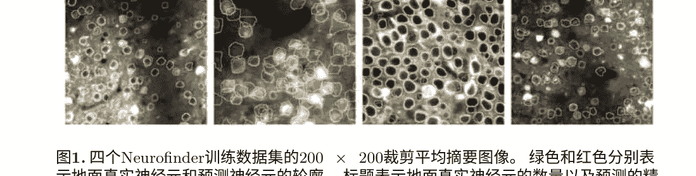

图1. 四个Neurofinder训练数据集的200 × 200裁剪平均摘要图像。绿色和红色分别表示地面真实神经元和预测神经元的轮廓。标题表示地面真实神经元的数量以及预测的精确度和召回率指标。（在线彩图）

我们在Neurofinder数据集中发现了几个值得注意的挑战。它们在外观上高度异质，使得定义一个特征神经元变得困难。图像的亮度变化很大，每个数据集的平均像素值范围从57到2998不等。标签存在严重的不平衡，平均有12%的像素被标记为神经元。最后，标注偏好可能导致不一致的真实情况。例如，04.00标签是为特定类型的实验进行优化的，相对于其他数据集可能被认为是不一致的。

### 3.2 摘要图像

钙成像的常见可视化模式是2D摘要图像，通过对所有帧的每个像素应用函数来展平时间维度创建。与[1,6]类似，我们发现平均摘要图像以低计算成本清晰地显示了大多数神经元。示例见图1和图3。其他摘要函数包括最大值、最小值和标准差。

### 3.3 评估指标

Neurofinder竞赛通过计算F1分数、精确度、召回率、包含度和排除度来衡量，提交的结果按照所有测试数据集上的平均F1分数进行排名。精确度和召回率是通过将每个真实神经元与空间上最近的预测神经元进行匹配计算的，不允许重复匹配。与像素级指标不同，即使预测神经元的区域包含多个真实神经元，一个预测神经元也只能对应一个真实神经元。包含度和排除度衡量匹配的真实神经元和预测神经元的结构相似性。

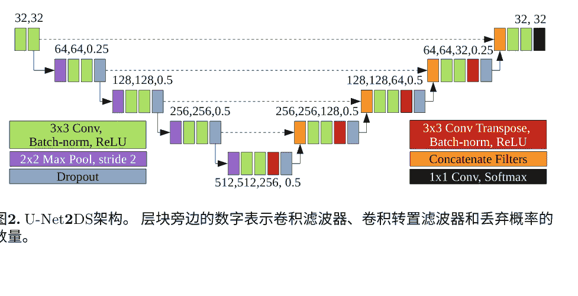

图2. U-Net2DS架构。层块旁边的数字表示卷积滤波器、卷积转置滤波器和丢弃概率的数量。

## 4 提出的模型

### 4.1 使用2D摘要图像的U-Net

架构。完全卷积U-Net架构[21]有四个卷积/最大池化块来降低维度，然后有四个卷积/转置卷积（反卷积）块来恢复输入维度。每个卷积层后面都有ReLU激活函数，并且通过跳跃连接将每个卷积/最大池化块的输出传递给相应的卷积/转置卷积块，通过滤波器连接。U-Net2DS对原始U-Net进行了小的修改以减少过拟合。

我们在每个卷积层中添加了零填充，将每个卷积层的滤波器数量减少了50%，在每个卷积层之后添加了批归一化[7]，并增加了dropout。最后的层是一个1×1卷积层，带有两个滤波器，后面是softmax激活函数，生成一个h×w×2通道的掩膜，其中两个通道是每个像素属于神经元或背景的概率。U-Net2DS有780万个参数，并且在图2中有示意图。

训练。我们在所有Neurofinder训练数据集上训练了一个单一的U-Net2DS。每个摘要图像都通过减去其均值并除以其标准差进行了归一化。对于每个数据集，我们将所有神经元掩膜合并为一个单一的掩膜，并删除属于不同神经元的重叠和相邻像素，以保留独立神经元的真实数量。我们使用每个摘要图像的前75%进行训练，后25%进行验证。

我们随机采样了二十个128 ×128的图像和掩膜窗口的批次，确保每个窗口都包含一个神经元，并应用了随机旋转和翻转。我们使用Adam优化器[9]和学习率为0.002进行了十个时期的训练，每个时期有100个训练步骤。每个时期结束后，我们对验证数据进行了完整图像预测，并计算了Neurofinder F1指标。当平均F1得分提高时，我们保存权重。像素级F1在0.7左右趋于稳定，而Neurofinder F1在0.85左右。在NVIDIA Titan-X GPU上的训练时间不到半小时。

损失函数。平均而言，128 ×128的训练窗口中包含9%的神经元像素。这种不平衡导致我们考虑了修改的Dice系数（MDC）损失函数[13]。我们将MDC与标准的对数损失（LL）进行了比较，并发现MDC具有更高的像素级召回率，但LL的平均测试F1得分始终更好。LL独立计算每个像素的损失，这允许对召回率或精确度进行加权。我们通过将2×到10×之间的假阴性像素损失相乘来进行实验，并观察到像素级召回率增加，但F1得分降低。我们最终发现标准的LL得到了最好的F1得分。

预测。通过将U-Net2DS调整为接受512 ×512的输入来实现全图像预测。这个改变简化了实现，并消除了使用滑动窗口时出现的遮罩平铺伪影。我们发现测试时数据增强始终提高了平均F1得分。这包括对摘要图像进行八次旋转和翻转的预测平均。

给定原始的TIFF文件，摘要和预测在每分钟≈9K图像上计算。

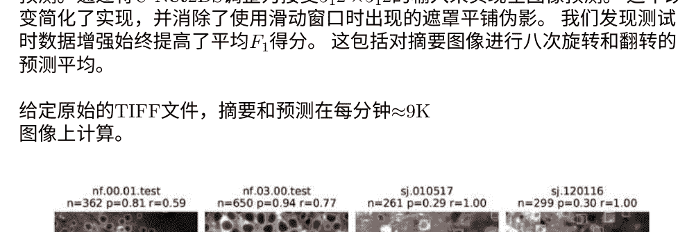

图3.从Neurofinder测试和St. Jude数据集中裁剪的200 ×200平均摘要图像，标题中包含预测的神经元数量、精确度和召回率。绿色轮廓表示真实的神经元，红色轮廓表示预测的神经元。Neurofinder测试数据的真实情况不公开。（在线彩图）

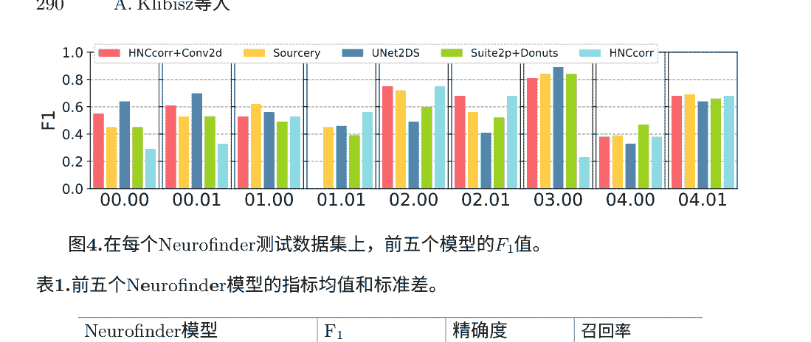

## 图4.在每个Neurofinder测试数据集上，前五个模型的$F_1$值。

## 表1.前五个Neurofinder模型的指标均值和标准差。

| Neurofinder模型 | F1 | 精确度 | 召回率 |
|----------------|----|--------|--------|
| HNCcorr [22] + Conv2d [6] | 0.617 ± 0.122 | 0.702 ± 0.170 | 0.602 ± 0.197 |
| Sourcery [15] | 0.583 ± 0.139 | 0.599 ± 0.197 | 0.629 ± 0.168 |
| UNet2DS | 0.569 ± 0.160 | 0.618 ± 0.235 | 0.609 ± 0.185 |
| Suite2p [17] + Donuts [16] | 0.550 ± 0.127 | 0.578 ± 0.156 | 0.568 ± 0.181 |
| HNCcorr [22] | 0.492 ± 0.180 | 0.618 ± 0.169 | 0.479 ± 0.268 |

Neurofinder和St. Jude数据集的结果。截至2017年7月，Neurofinder的最高得分提交是HNCcorr [22]的集合，它基于时间上的相关性对像素进行聚类，以及Conv2D [6]，一个具有40 ×40输入和20 ×20输出窗口的卷积神经网络。第二和第四名使用了来自[16,17]的矩阵分解方法。U-Net2DS排名第三，是唯一使用深度学习的最高得分模型。表1和图4比较了顶级模型的F1，精确度和召回率指标。明确使用时间信息的模型在02.00和02.01数据集上表现明显优于使用摘要的模型。这可能对应于Neurofinder竞赛所承认的地面真实标签技术的差异。为了评估超出Neurofinder数据集的鲁棒性，我们对St. Jude的听觉皮层数据集进行了预测，并且尽管这些数据集在不同的实验设置下收集，并且来自大脑的一个不同区域，但F1得分分别为0.45和0.47。图3显示了两个Neurofinder和两个St. Jude数据集的分割结果。

针对钙成像数据的深度学习洞察。我们最初考虑了几个预处理步骤，包括剪裁最大值以减少噪音，并拉伸每个序列的值以最大化对比度。这些步骤使得识别神经元在视觉上更容易，但并没有改善性能。

> 3从网站上得知：对于00数据，标签是根据解剖标记来确定每个神经元的精确位置，并包括没有活动的神经元。对于01、02、03、04数据，标签是通过手工绘制或手动筛选使用原始数据和各种摘要统计量得到的，其中一些统计量对活跃神经元有偏差。

神经元与背景之间的类别不平衡需要注意训练。一些学习率和损失函数的组合导致网络在早期预测100%的背景并且无法恢复。增加窗口大小并监控预测的神经元像素与实际像素的比例有所帮助。最后，训练数据集在语义上存在差异（标注技术、脑部部分等）。在某些情况下，通过对每个数据集训练一个模型来提高性能，但最终发现在所有数据上训练一个单一模型更实际。

### 4.2 其他深度学习模型

**U-Net2DS with Temporal Summaries.** 通过使用均值摘要，U-Net2DS忽略了时间信息，并且在分离重叠神经元方面存在困难。U-Net2DS的一个可能扩展是添加沿时间轴的摘要图像作为时间输入（即YZ，XZ摘要）。

使用更好的2D摘要图像进行分割。一个放大神经元并最小化背景的摘要图像应该能够改进像U-Net2DS这样的模型。受[22]的启发，我们尝试了计算每个像素与其邻居的平均相关性和余弦距离的摘要。与[17]类似，我们发现大多数神经元像素与附近的背景像素具有很高的相似性，使得邻域相似性成为一个较差的摘要函数。

逐帧分割。摘要图像可能会保留不需要的背景噪声，因此训练模型逐帧分割系列时，可以在噪声最小化的帧中识别神经元是可行的。不幸的是，很难选择用于训练的帧，因为大多数神经元在任意时间与背景混合，并且只提供2D标签。我们尝试了一种基于对比度的加权方案，降低了对对比度较低的神经元的损失，并增加了对高对比度神经元的损失。

然而，我们发现大多数神经元在平均摘要中比在最高对比度的帧中更易区分。似乎摘要平滑了在单帧中本来嘈杂的区域。

**3D卷积网络。** 直观地说，直接包含来自时间维度的输入应该提高性能。我们探索了3D卷积网络，类似于[1,3,13]。由于系列具有可变长度，我们发现很难确定所有数据集的输入深度。这些3D模型也非常慢，至少需要一个小时才能分割一个系列。

## 5 结论

像Neurofinder这样的大型标记数据集使得可以使用深度学习进行自动钙成像分割。我们展示了U-Net2DS，这是U-Net [21] 的一种改编版本，它使用钙成像序列的均值摘要来进行分割。

在最小化参数调整、预/后处理和对新数据集的假设的同时，快速生成完整的分割掩模。尽管相对简单，它是在Neurofinder竞赛中表现最好的非集成和深度学习模型。我们描述了几种其他深度学习公式来解决这个问题，我们相信一个能够高效地结合空间和时间信息的模型是一个有前途的下一步。

致谢。本工作部分得到了圣裘德儿童研究医院发展神经生物学部和美国能源部科学办公室科学家和教师劳动力发展办公室（WDTS）在科学本科实验室实习计划下的支持。

## 参考文献

- 1. Apthorpe, N., Riordan, A., Aguilar, R., Homann, J., Gu, Y., Tank, D., Seung, H.S.：使用卷积网络在钙成像数据中自动检测神经元。 在：神经信息处理系统进展，第3270-3278页（2016年）
- 2. Chollet, F.等：Keras（2015年）。 https://github.com/fchollet/keras
- 3. Çiçek, O., Abdulkadir, A., Lienkamp, S.S., Brox, T., Ronneberger, O.：3D U-net: 从稀疏注释中学习密集体积分割。 在：Ourselin, S., Joskowicz, L., Sabuncu, M.R., Unal, G., Wells, W. (eds.) MICCAI 2016. LNCS，卷9901，第424-432页。Springer, Cham（2016年）。 doi:10.1007/978-3-319-46723-8 494.
- 4. CodeNeuro.org：神经发现者挑战（2016年）。 http://neurofinder.codeneuro.org/
- 5. Drozdzal, M., Vorontsov, E., Chartrand, G., Kadoury, S., Pal, C.：在生物医学图像分割中跳跃连接的重要性。 在：Carneiro, G.等（编）LABELS/DLMIA -2016. LNCS, vol. 10008, pp. 179–187. Springer, Cham (2016). doi:10.1007/978-3-319-46976-8 19
- 6. Gao, S.: Conv2d（2016）。 https://github.com/iamshang1/Projects/tree/master/Advanced_ML/Neuron_Detection
- 7. Ioffe, S., Szegedy, C.：批归一化：通过减少内部协变量偏移加速深度网络训练。 arXiv预印本arXiv:1502.03167（2015）
- 8. Kaifosh, P., Zaremba, J.D., Danielson, N.B., Losonczy, A.：Sima: 用于动态荧光成像数据分析的Python软件。 Front. Neuroinform. 8, 80（2014）
- 9. Kingma, D., Ba, J.：Adam: 一种用于随机优化的方法。 arXiv预印本arXiv:1412.6980（2014）
- 10. Litjens, G., Kooi, T., Bejnordi, B.E., Setio, A.A.A., Ciompi, F., Ghafoorian, M., van der Laak, J.A., van Ginneken, B., S´anchez, C.I.：关于深度学习在医学图像分析中的调查。 arXiv预印本 arXiv:1702.05747（2017）
- 11. Long, J., Shelhamer, E., Darrell, T.：全卷积网络用于语义分割。 在：IEEE计算机视觉和模式识别会议论文集，第3431-3440页（2015）
- 12. Maruyama, R., Maeda, K., Moroda, H., Kato, I., Inoue, M., Miyakawa, H., Aonishi, T.：使用非负矩阵分解在钙成像数据上检测细胞。 神经网络 55, 11-19页（2014）
- 13. Milletari, F., Navab, N., Ahmadi, S.A.：V-net: 全卷积神经网络用于体积分割。 在：2016年第四届三维视觉国际会议（3DV），第565-571页。IEEE（2016年）
- 14. Mukamel, E.A., Nimmerjahn, A., Schnitzer, M.J.: 大规模钙成像数据中细胞信号的自动分析。 神经元 63（6），747-760页（2009年）
- 15. Pachitariu, M.: Source ry（2016年）。 https://github.com/marius10p/suite2p-for-neurofinder
- 16. Pachitariu, M., Packer, A.M., Pettit, N., Dalgleish, H., Hausser, M., Sahani, M.:使用卷积稀疏块编码从生物图像中提取感兴趣区域。 在：神经信息处理系统进展，第1745-1753页（2013年）
- 17. Pachitariu, M., Stringer, C., Schr¨oder, S., Dipoppa, M., Rossi, L.F., Carandini, M., Harris, K.D.: Suite2p: 超过10,000个神经元的标准双光子显微镜. bioRxiv, p. 061507 (2016)
- 18. Petersen, A., Simon, N., Witten, D.: Scalpel: 从钙成像数据中提取神经元. arXiv预印本 arXiv:1703.06946 (2017)
- 19. Pnevmatikakis, E.A., Paninski, L.: 稀疏非负解卷积用于全面钙成像: 算法和相变. 在：神经信息处理系统进展, pp. 1250–1258 (2013)
- 20. Pnevmatikakis, E.A., Soudry, D., Gao, Y., Machado, T.A., Merel, J., Pfau, D., Rear don, T., Mu, Y., Lacefield, C., Yang, W., et al.: 同时去噪、解卷积和混合钙成像数据. 神经元 89(2), 285–299 (2016)
- 21. Ronneberger, O., Fischer, P., Brox, T.: U-net: 用于生物医学图像分割的卷积网络. 在: Navab, N., Hornegger, J., Wells, W.M., Frangi, A.F.(eds.) MICCAI 2015. LNCS, vol. 9351, pp. 234–241. Springer, Cham (2015). doi:10. 1007/978-3-319-24574-4 28
- 22. Spaen, Q., Hochbaum, D.S., As ´in-Ach ´a, R.: HNCcorr: 一种新的钙成像电影中细胞识别的组合方法。 arXiv预印本 arXiv:1703.01999 (2017)

# 自监督学习用于脊柱磁共振图像

Amir Jamaludin¹ (✉), Timor Kadir², 和 Andrew Zisserman¹

¹ VGG，牛津大学工程科学系，英国牛津
{amirj,az}@robots.ox.ac.uk

² Optellum，英国牛津
timor.kadir@optellum.com

摘要。 在临床环境中，有很大一部分患者进行了随访扫描。我们在在这项工作中展示，这种纵向扫描本身可以作为一种“免费”的自我监督形式来训练深度网络。 我们展示了这种自我监督学习在T2加权矢状腰椎磁共振图像（MRI）的情况下。 使用两种损失函数训练了一个孪生卷积神经网络（CNN）: (i) 对扫描是否属于同一个人（即纵向扫描）的对比损失, 以及（ii）对预测椎体水平的分类损失。 然后评估了这个预训练网络在分级分类任务上的性能。 我们在一个包含1016个受试者的数据集上进行了实验，其中423个受试者有随访扫描，最终目标是学习与椎间盘相关的退行性变放射学分级。 我们展示了预训练CNN在监督分类任务上的性能: (i) 优于从头开始训练的网络; (ii) 需要更少的注释训练样本才能达到与从头开始训练的网络相当的性能。

## 1 引言

在医学图像理解问题中利用机器学习方法的先决条件是收集适当策划和注释的临床数据集进行训练和测试。 由于收集大规模医学数据集及其相关的真实数据的费用昂贵, 因此重要的是开发新技术来最大限度地利用现有数据并最小化收集新案例所需的工作量。

在本文中，我们提出了一种自我监督的方法，可以利用标准临床图像数据中已有的嵌入信息来预训练卷积神经网络（CNN）。 许多患者以所谓的纵向方式进行多次扫描，例如评估疾病状态的变化或监测治疗效果。 我们定义了一种预训练方案，仅利用关于哪些扫描属于同一患者的信息。 请注意，我们不需要知道患者的身份，只需要知道哪些图像属于同一患者。 这些信息通常在DICOM（医学数字成像和通信）等格式中提供，其中通常包括丰富的元数据，如患者身份、出生日期和成像协议（以及DICOM匿名化软件通常将相同的“伪身份”分配给同一患者的图像。

在这里，我们实现了对T2加权矢状腰椎MRI进行自我监督预训练的情况。我们训练了一个孪生卷积神经网络，用于区分包含同一患者在不同时间点扫描的图像对和完全不同患者的图像对。我们还说明了可以通过指定预测椎体水平的辅助任务，并在多任务训练方案中包含这两种自我监督任务，来包含额外的数据相关的自我监督任务。在预训练之后，学到的权重被转移到一个分类卷积神经网络中，在我们感兴趣的特定应用中，该网络被训练用于预测与椎体和椎间盘退变相关的一系列分级。分类卷积神经网络的性能然后用于评估预训练的成功程度。我们还将与在完全注释了八个放射学分级的大型腰椎T2加权矢状MRI数据集上进行预训练的卷积神经网络进行比较。

相关工作：仅使用图像内部信息作为监督信号训练的模型已被证明是有效的特征描述符，例如[4]表明，训练用于预测图像块对的相对位置的CNN，在经过微调后比从头开始训练的CNN在分类任务上表现更好。学习来自相同唯一身份的扫描任务与视频中的慢特征学习相关[7,10,11]。

CNN中的迁移学习已被证明非常有效，特别是当模型在像ImageNet[3]这样的大型数据集上进行预训练时，并且已经在使用预训练的自然图像模型对医学图像进行了多个成功的应用，例如肺部疾病分类[8]。然而，由于大部分医学图像具有体积性质，因此使用与同一模态的扫描进行迁移学习也是合适的，而不是使用ImageNet训练的模型。

## 2 自监督学习

本节首先描述了输入体积提取的细节：用于自监督训练的椎体（VBs）和用于监督分类实验的椎间盘（IVDs）。然后我们描述了损失函数和网络架构。

### 2.1 提取椎体和椎间盘

对于每个T2加权矢状MRI，我们使用[5,6]中概述的流程自动检测(T12到S1)椎体的边界体积以及级别标签。根据[5]，我们还从椎骨对（例如L5和S1之间的椎骨对）中提取相应的椎间盘体积（T12-L1到L5-S1，其中T，L和S分别指胸椎，腰椎和骶椎）。图1显示了提取流程的输入和输出。椎体和椎间盘体积的切片是中矢状对齐的（以防止图1. 提取VB和IVD体积：对于每个MRI，我们提取7个VB（T12到S1）和6个IVD（T12-L1到L5-S1）体积。体积的尺寸为：（i）VB的尺寸为224 × 224 × 9，（ii）IVD的尺寸为112 × 224 × 9。整个体积以VB/IVD的检测到的中间切片为中心。

如果切片数低于预定义的9个通道，则通过零填充对切片进行对齐（这可能是由于脊柱侧弯和其他疾病引起的）。体积根据VB或IVD的宽度进行重新缩放，并进行归一化，使得当前VB或IVD上下的中位强度为0.5。

### 2.2 通过对比损失进行纵向学习

扫描的纵向信息用于训练一个孪生网络，使得同一个人的扫描的嵌入接近，而不同人的扫描则不接近。输入是同一级别的VB对；S1 VB只与S1 VB进行比较，反之亦然。我们使用[2]中的对比损失，$\mathcal{L}_C = \sum_{n=1}^{N} (y) d^2 + (1-y) \max(0, m-d)^2$，其中$d=\| a_n - b_n \|^2$，$a_n$和$b_n$是输入对中第一个和第二个VB的1024维$F_{C7}$（嵌入）向量，$m$是预定义的边界。正样本，$y=1$，是从同一个唯一主体（在不同时间点扫描的同一个VB）获得的VB对，负样本，$y=0$，是来自不同个体的VB对（见图3）。

由于椎骨在形状和外观上更加稳定，我们使用VBs而不是IVDs。图2展示了不同时刻的VB和IVD的示例。在其他医学任务中，这对是

图2. VB和IVD随时间的变化：VB的外观没有变化，但IVD的核心强度和高度随时间减弱。此外，在IVD的例子中，我们可以观察到椎骨滑脱，即腰椎滑脱，这不会改变VB本身的外观，但会显著改变IVD。

图3：生成正/负对：箭头标记了一对VBs，蓝色箭头表示正对，红色箭头表示负对。每对对应两次扫描。t₀表示初始扫描的时间，τ是基线扫描和随访扫描之间的时间间隔，通常为我们的数据集中的10年。

(彩色图像在线)

例如，在胸部X光片中比较肺部，VB的形态可以轻松地改变。

### 2.3 辅助损失 - 预测VB的级别

除了对比损失，我们还使用辅助损失来提供补充监督。由于每个VB对由相同级别的VB组成，我们在 FC7层（即判别层）上训练一个分类器，来预测VB的七个级别（从T12到S1）。整体损失可以描述为对比损失和softmax log损失的组合，

$$\mathcal{L} = \mathcal{L}_c - \sum_{n=1}^{N} \alpha_c \left( y_c(x_n) - \log \sum_{j=1}^{7} e^{y_j(x_n)} \right)$$

其中 $y_j$ 是 FC8 输出的第 $j$ 个分量，$c$ 是 $x_n$ 的真实类别，$\alpha_c$ 是类别平衡权重，如[5]中所述。

### 2.4 架构

用于区分VB对的基础架构基于[1]中的VGG-M网络（见图4）。Siamese CNN的输入是VB对，维度为224 × 224 × 9。我们使用从Conv1到Conv4层的3D卷积核。

接着是一个2D Conv5。为了使张量与2D卷积核兼容，Conv4的卷积核设置为3×3×9，没有填充，在Conv4之后，切片维度减小。我们使用2×2最大池化。
FC8层的输出维度取决于类别的数量，即用于预测七个VB级别的自监督辅助任务的类别数。

## 3 数据集和实现细节

我们在1016名招募的受试者（主要为女性）的数据集上进行了实验，这些受试者来自TwinsUK注册表（www.twinsuk.ac.uk），没有将背痛作为排除或选择标准。除了每个受试者的基线扫描外，423名受试者在原始基线后8-12年进行了随访扫描。大多数进行随访扫描的受试者只有两次扫描（一个基线和一个随访），而少数受试者有三次扫描（一个基线和两个随访）。基线扫描使用1.0-Tesla扫描仪进行，而随访扫描使用1.5-Tesla机器进行，但两者都遵循相同的扫描协议（切片厚度、恢复和回波时间，TR和TE）。每个受试者只收集了T2加权矢状位扫描。

### 3.1 放射学分级

受试者的分级是根据椎间盘退变的测量进行的，与Pfirrmann分级类似。这些分级由临床医生进行注释，并且是基于每个椎间盘进行的：从L1-L2到L5-S1椎间盘（每个受试者5个椎间盘）。我们使用这些分级来评估预训练分类网络的好处

基于纵向信息。图5显示了分级的示例。1016个受试者中有920个被分级。

### 3.2 训练

数据增强：增强策略与[5]中描述的分类CNN相同，而我们使用稍微不同的增强策略来训练Siamese网络。增强策略包括：

- (i) 旋转角度为-15°至15°
- (ii) 在x轴上平移±48个像素，在y轴上平移±24个像素，在z轴上平移±2个切片，
- (iii) 缩放因子在90%至110%之间进行缩放，
- (iv) 强度变化在±0.2之间，
- (v) 随机沿着切片翻转，即沿着中矢翻转（基于每个VB对进行）。

详情：我们的实现基于MatConvNet工具箱[9]和NVIDIA Titan X GPU进行训练。超参数为：分类批量大小为128，Siamese网络批量大小为32；动量为0.9；权重衰减为0.0005；学习率为1e-3（分类）和1e-5（自监督），当验证错误率趋于平稳时，学习率会降低10倍，这也是我们的停止准则，通常分类网络训练大约2000个时期，Siamese网络训练大约500个时期。

图6.左：测试集中VB对距离的直方图。蓝色表示正样本对，红色表示负样本对。右：正/VB对分类的ROC曲线。(彩色图像在线)

## 4 实验和结果

### 4.1 纵向学习和自监督

数据集按照主题80:10:10的比例划分为训练集、验证集和测试集。对于423个具有多个扫描的主题，这导致了339:42:42的划分。注意，一对双胞胎只会出现在一个集合中，即双胞胎中的一个主题不能出现在两个集合中。

### 4.2 预训练的好处

为了衡量使用纵向信息进行预训练所获得的性能提升，我们使用在Siamese网络中学习到的卷积权重，并训练一个分类CNN来预测椎间盘退行的放射学分级（见图7）。对于这个分类任务，我们使用了920个具有分级的受试者，并将它们分为以下几组：670个用于训练，50个用于验证，200个用于测试。具有随访扫描（>1次扫描）的受试者仅用于训练，而不用于测试，因此从本质上讲，Siamese网络从未见过分类测试集中的受试者。

我们传输并冻结Siamese网络的卷积权重，只训练随机初始化的全连接层。我们还尝试了微调卷积层，但我们发现性能差异可以忽略不计。为了比较，我们还训练了：（i）从头开始训练的CNN，（ii）冻结随机初始化的卷积层的CNN（以评估仅在全连接层上进行训练的效果）作为基准，以及（iii）使用在[5]中对多个放射学分级的脊柱MRI数据集进行完全注释的CNN的卷积权重的CNN。性能度量是平均类别准确率，计算方法是归一化混淆矩阵的对角线元素的平均值。

图8展示了所有模型在训练样本数量变化时的性能，样本数量为[240, 361, 670]个受试者或[444, 667, 976]个扫描。可以看出，通过纵向预训练，达到与从头开始训练相当的性能所需的数据量更少，例如，仅使用667个扫描进行预训练的性能为74.4%，而从头开始训练需要976个扫描才能达到74.7%。这种性能提升在较少的训练数据上也能看到。

训练数据越少，性能提升越明显。 如预期，使用[5]中的数据进行强监督训练的卷积神经网络的迁移学习效果更好，准确率至少高出2.5%以上，相比从头开始训练。 毫不奇怪，基于完全随机的卷积权重训练的分类器表现最差。

由于在收集数据时纵向信息基本上是免费的，所以纵向预训练带来的性能提升也是免费的。 有趣的是，即使Siamese网络是在略微不同的输入（VBs而不是IVDs）上训练的，将权重转移到IVDs上的分类任务仍然比从头开始训练获得更好的性能。 然而，我们怀疑输入差异是训练数据量较小时性能提升较低的主要原因，因为网络需要更多数据来适应IVD的输入/任务（相比之下，强监督CNN同时在VB和IVD分类上进行训练）。

图8.随着IVD分类的训练样本数量的增加，准确率也增加。纵向预训练相比从头开始训练有所改善，显示出其优势，并且这种性能提升在976个扫描中仍然存在。 从在强监督数据集上训练的CNN进行迁移学习（包括IVVD分类）效果更好，并提供了迁移性能的“上限”。 值得注意的是，即使在训练集中有976个扫描，性能仍未达到平稳状态，这暗示着随着更多数据的可用性，仍有进一步的改进空间。

## 5 结论

我们已经证明了使用自监督可以提高放射学分级分类任务的性能，并希望在不久的将来探索添加更多辅助任务的好处，例如预测性别、年龄和体重。性能改进接近于从完全注释数据集训练的模型进行迁移学习，前提是目标训练集本身包含足够的数据。 此外，通过在椎体对之间建立距离函数，可以识别使用其MRI的人的可能性。

致谢。我们感谢与Jeremy Fairbank教授、Jill Urban博士和Frances Williams博士的讨论。本工作得到了RCUK CDT在医疗创新（EP/G036861/1）和EPSRC Seebibyte计划资助（EP/M013774/1）。.TwinsUK由Wellcome Trust和欧洲社区第七框架计划（FP7/2007-2013）资助。该研究还得到了国家卫生研究院（NIHR）在Guys & St Thomas NHS Foundation Trust的临床研究设施以及基于Guy's and St Thomas' NHS Foundation Trust和King's College London的NIHR生物医学研究中心的支持。

## 参考文献

1. Chatfield, K., Simonyan, K., Vedaldi, A., Zisserman, A.: 深入卷积神经网络的细节：恶魔的回归。 在： BMVC会议论文集（2014）
2. Chopra, S., Hadsell, R., LeCun, Y.: 通过应用于人脸验证的相似度度量学习鉴别性相似度度量。 在： CVPR会议论文集（2005）
3. Deng, J., Dong, W., Socher, R., Li, L.J., Li, K., Fei-Fei, L.: ImageNet: 一个大规模分层图像数据库。 在： CVPR会议论文集（2009）
4. Doersch, C., Gupta, A., Efros, A.A.: 通过上下文预测进行无监督的视觉表示学习。 在： ICCV (2015)会议论文集中
5. Jamaludin, A., Kadir, T., Zisserman, A.: SpineNet: 自动定位脊柱MRI中的分类证据。 在： Ourselin, S., Joskowicz, L., Sabuncu, M.R., Unal, G., Wells, W. (eds.) MICCAI 2016. LNCS, vol. 9901, pp. 166–175. Springer, Cham (2016). doi:10.1007/978-3-319-46723-8 20
6. Lootus, M., Kadir, T., Zisserman, A.: 在腰椎MR图像中的椎骨检测和标记。 在： MICCAI研讨会：CSI（2013）
7. Mobahi, H., Collobert, R., Weston, J.: 从视频的时间一致性中进行深度学习。 在： ICML（2009）
8. Shin, H.C., Roth, H.R., Gao, M., Lu, L., Xu, Z., Nogues, I., Yao, J., Mollura, D., Summers, R.M.: 用于计算机辅助检测的深度卷积神经网络：CNN架构，数据集特征和迁移学习。 IEEE Trans. Med. Imaging 35（5），1285-1298（2016）
9. Vedaldi, A., Lenc, K.: MatConvNet - 用于MATLAB的卷积神经网络。 CoRR abs/1412.4564（2014）
10. 王晓，古普塔，A.: 使用视频进行无监督学习的视觉表示。 在： ICCV（2015）
11. Wiskott, L., Sejnowski, T.J.: 慢特征分析：无监督学习的不变性。 神经计算。 14（4），715-770（2002）

# 通过深度重fineNet进行皮肤病变分割

何新子，余振，王天福，雷百英 ✉️

国家-地区医学超声技术工程实验室，广东生物医学测量与超声成像重点实验室，深圳大学生物医学工程学院，健康科学中心，中国深圳

leiby@szu.edu.cn

摘要。 皮肤镜成像已成为皮肤病变诊断的常规检查方法。.准确的分割是自动皮肤镜图像评估的第一步。 皮肤病变分割的主要挑战是皮肤病变区域的视角和尺度的多样性。 为了应对这些挑战，我们提出了一种基于皮肤镜图像的非常深的残差神经网络的新型皮肤病变分割框架。 深度残差神经网络和通用多路径深度细化网络被结合起来提高分割性能。 使用跳跃连接将所有可用层的深度表示聚合形成全局特征图。 此外，利用链式残差池化来捕捉基于上下文的多样外观特征。 最后，我们应用条件随机场（CRF）来平滑分割图。 我们提出的方法在公共皮肤病变挑战数据集上表现优于现有方法。

关键词： 皮肤镜图像 · 皮肤病变分割 · 深度残差网络 · 条件随机场 field · 深度细化网络

## 1 引言

根据美国癌症学会发布的癌症统计数据，黑色素瘤的增长率为14%，皮肤癌的死亡率为75%[1]。然而，如果及时诊断并正确治疗，这些疾病是可以治愈的。在临床上，皮肤镜被用于辅助皮肤科医生对黑色素瘤和痣进行分类。 最近的报告表明，人类的视觉检查仅依赖于“丑小鸭”征或经验[2]。 因此，获得准确的皮肤病变分割条件下的有效形态特征非常重要。 手动分割过程通常需要大量的人力和主观判断。 然而，在贫困国家，具备足够专业水平的临床医生很少见。同时，模糊和不规则的边界会降低分割的准确性。 图1展示了准确诊断面临的主要挑战。此外，分割在减少筛查错误和帮助鉴别良性和恶性黑色素瘤方面至关重要。 基于大量信息的自动化皮肤镜图像分析是解决这些问题的有效方法。

深度学习因其提升性能的能力而受到了广泛关注，并成为焦点。目前，最流行的深度学习方法是卷积神经网络（CNN）。然而，多尺度CNN的输出过于粗糙，无法满足分割的要求。一种新型的CNN，全卷积网络（FCN），在分割的发展[4]中取得了巨大的成功和前所未有的进展，并消除了复杂的预处理和后处理算法的需求，使研究人员能够专注于网络架构设计。尽管使用了CNN，自动分割结果与皮肤科医生的描绘仍存在显著差异。

同时，最近的研究表明增加网络深度可以进一步提高性能，因为深层网络具有区分性表示[6]。由He等人提出的最新一代CNN深度残差神经网络（ResNet）在分类任务中优于最先进的技术，解决了梯度消失/爆炸问题，从而促进了收敛[7]。然而，由于分类和定位之间的矛盾，ResNet的分割准确性有所降低。当网络变得更深时，训练准确性会饱和并迅速下降。因此，提出了深度细化网络（DRN）。在前向传播过程中，特征图（层输出）的分辨率降低，特征图更深，维度增加。为了解决这个问题，我们在DRN中集成了一种多路径处理策略，以整合多层级表示。

为了获得具有空间变换不变性的特征，分类器需要丢弃局部信息。为了解决这个问题，Krahenbuhl和Koltun [5]提出了条件随机场（CRF）算法，该算法整合了图像上的所有像素对，以利用空间低级信息。受到深度网络获取高级特征的最新研究的启发，我们构建了一个使用多路径特征进行分割的网络，并使用长距离跳跃连接。本文提出了RN网络和CRF的组合用于皮肤镜分割。图2展示了我们提出方法的流程图。

图2. 提出的用于黑色素瘤分割的网络架构流程图；（a）多路径处理，将各种对比度信息与深度监督相融合；（b）Dice损失和分类损失的比较；（c）使用密集条件随机场进一步优化轮廓。

## 2 方法论

### 2.1 残差学习

残差块：我们的网络以ResNet为灵感开始，残差块的第一部分通过微调包含自适应卷积层，以保持预训练的ResNet权重用于我们的任务。通过直接应用跳跃连接，我们的网络遭受了感受野较小的缺点。为了解决这个缺点，每个输入路径后面跟随两个残差块，这些残差块与原始的ResNet类似，但去除了批归一化层。由于RN只接受来自一个路径的输入，每个输入路径的滤波器通道被设置为512，其余通道在我们的实验中被固定为256，以保持维度平衡。

多分辨率融合：由于FCN和完全连接残差网络（FCRN）仍然存在下采样和丢失细节结构的问题，因此开发了一种从粗到细的策略来恢复高分辨率。我们不是一次性将所有路径输入融合到最高分辨率的特征图中，而是在每个阶段只集成两个相邻尺寸的特征。该块首先对输入进行卷积适应，生成相同数量的特征图，然后用输入的最大分辨率双线性插值法插值较小的特征图。所有特征图通过求和进行融合。

链式残差池化：在观察和分析皮肤病变的大小后，发现存在丰富的上下文信息。最近，池化可以利用全局图像级特征来支持我们的研究。特征图按顺序传递给链式残差池化块，并在图2中进行了示意描述。融合的特征图依次经过一个最大池化层和一个卷积层。然而，对于分割任务，池化一次需要较大的池化窗口。提出的链式残差池化方法将池化层串联起来，并具有可学习的参数。

权重。值得注意的是，采用了ReLU来提高池化效率。在训练过程中，采用了两个池化块，每个块的步长为1。所有池化块的输出通过跳跃连接与输入特征图进行连接，通过求和操作实现。我们选择使用跳跃连接来促进训练过程中的梯度传播。在一个池化块中，每个池化操作后面都跟着卷积操作，作为加权层用于求和融合。我们期望通过链式残差池化来学习识别池化层在训练过程中的重要性。

ResNet的主要部分是跳跃连接和残差块。为了训练一个非常深的用于分割的网络，我们利用了一种名为残差学习的新方法。残差学习的特点是跳跃连接来改善梯度的流动。此外，多个跳跃连接结构的组合已经证明了早期层的明显活动。因此，残差学习可以加快深度网络的收敛速度，并通过大幅增加网络深度来保持准确性的提高。通过dropout机制[8]、批量归一化[9]和谨慎的初始化，我们解决了梯度消失的问题。具有恒等映射的残差块的公式为

$$h_{l+1} = Relu((h_l) + F(h_l, w_l))$$

其中 $h_{l+1}$ 表示第l个残差块的输出，$h_l$ 表示相同的映射，$F(h_l, w_l)$ 是残差映射。

### 2.2 深度RefineNet

分割的第一阶段是获取每个像素的预测。由于ResNet的输出是每个类别的概率，用于分类，因此单标签预测层应该被多预测层所取代。因此，分割可以被视为一种密集预测问题。最终的预测基于来自不同感受野的特征图。复杂边界的划分要求通过仅在前向传播的早期阶段出现的局部强度信息来满足。

所提出的Deep RefineNet的主要思想如图3所示。

直接训练这样深层网络可能会导致优化困难，因为存在梯度消失的问题。受以前关于使用深度监督训练神经网络的研究的启发，我们在我们的网络中使用了四个侧输出层来监督早期层。每个侧输出层负责一个尺寸的特征图。然而，在高级别的侧输出层上的爆炸效果并不好。通过探测与最小特征图相关联的第一个侧输出层的输出，我们无法找到密集预测和真实值之间的任何线索。这背后的原因是无法捕捉到小的皮肤病变。因此，我们只在最后两层上利用侧输出层。为了解决上述问题，我们将所有侧输出层和最终输出层结合起来，形式化为

$$\mathcal{L}(I, W) = \sum_s w_s \mathcal{L}_s(I, W) + \mathcal{L}_m w_m(I, W)$$

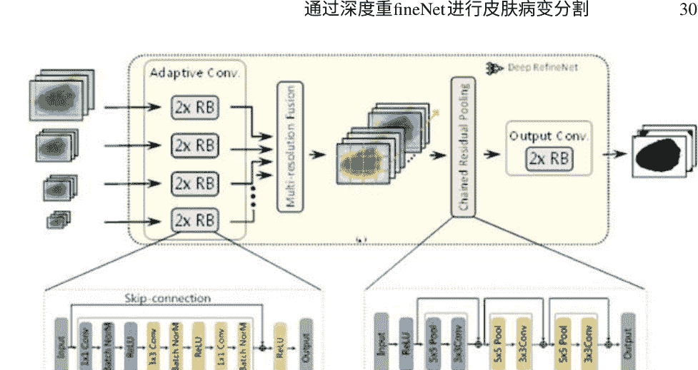

$$\mathcal{L}_s(I, W) = -\log(p_0(x_{i,j}, t_{i,j}))$$

其中第一部分是边输出损失项，另一部分是预测结果和真实结果之间的主要函数，$w_s$和$w_m$是用于平衡损失层权重的超参数，$p_0(x_{i,j}, t_{i,j})$是指预测结果和真实结果之间的权重（被预测的真实标签的概率）。

皮肤病变仅占据小区域，学习过程陷入局部最小值。因此，我们通过考虑不同的损失函数来描述皮肤镜图像的特征[10]。因此，我们的网络被定义为逐像素分类。主要的损失层被制定为

$$\mathcal{L}_m(I, W) = \frac{2 \sum_i^N \sum_j^M x_{i,j} t_{i,j}}{\sum_i^N \sum_j^M x_{i,j}^2 + \sum_i^N \sum_j^M t_{i,j}^2}$$

其中$x_{i,j}$表示预测的分割结果，$t_{i,j}$表示真实的分割结果。$\mathcal{L}_m(I, W)$损失函数基于预测结果和真实结果之间的 Dice 系数。使用 Dice 损失函数可以平衡不同大小的皮肤病变的权重。

### 2.3 条件随机场用于边界细化

虽然我们的网络将特征图从侧输出集成到输出中以进一步细化输出的边界，但分数图无法适应异构的真实结果。在一般情况下，获取过多的低级信息对于泛化复杂的验证集是有害的。因此，我们使用条件随机场来细化网络的输出，而不是输入高分辨率图像来克服粗糙的输出，因为后处理优于高分辨率输入。

与基于无监督图像分割的基本CRF相比，RN生成的分数图更加平滑和均匀。如图2所示，我们在系统中集成了全连接CRF，而不是使用过时的短程CRF。该模型使用能量函数

$$E(x) = \sum_i P(x_i) + \sum_{i,j} P(x_i, x_j), \tag{5}$$

其中，$x$表示像素的标签，$P(x_i)$表示一元势函数，$P(x_i, x_j)$表示二元势函数。一元势函数$P_i^x$与RN无关，它是标签分配概率$Pi_x$的负对数。

手动描述符始终产生粗糙和不规则的标签图，而RN的输出通常是一致和平滑的。在我们的方案中，成对潜力$P(x_i, x_j)$被制定为

$$P(x_i, x_j) = \mu(x_i, x_j) \sum_{m=1}^{K} \omega^{(m)} k^{(m)} (f_i, f_j), \tag{6}$$

其中$k^{(m)}$表示高斯核函数，$\mu(x_i, x_j)$是一个标签兼容性函数，其中$\mu(x_i, x_j)=1$如果$x_i = x_j$，否则为0。成对潜力将每对像素$i$和像素$j$连接到完全连接的图中，表示为

$$\omega_1 exp\left(-\frac{||p_i - p_j||^2}{2\sigma_a^2} - \frac{||I_i - I_j||^2}{2\sigma_b^2}\right) + \omega_2 exp\left(-\frac{||p_i - p_j||^2}{2\sigma_{ac}^2}\right), \tag{7}$$

其中$p_i$表示像素的位置，$I_i$表示颜色强度，超参数$\sigma_a, \sigma_b, \sigma_c$表示高斯核的“尺度”。

## 3 实验

### 3.1 数据集和实现

在本研究中，我们使用2016年和2017年发布的公共挑战数据集- ISBI皮肤病变分割数据集进行实验评估我们提出的方法的性能。皮肤图像基于国际皮肤成像合作（ISIC）档案，来自各个国际临床中心的设备。2016年发布的数据集包括900张训练图像和350张验证图像，在2017年分别扩展到2000张和600张。

由于独立评估，组织者排除了验证部分的真实结果。

我们的算法基于MatConvNet在MATLAB R2014b上实现，并使用NVDIA TITAN X GPU。我们利用随机梯度下降（SGD）来优化我们的目标函数。小批量包含20张图像。我们采用0.0001的权重衰减和0.9的动量。学习率在前300个时期为0.00001，在接下来的300个时期为0.000001。除了上述设置的超参数外，我们在网络中引入了dropout层（dropout率设置为0.5）来防止特征检测器的共适应。

为了计算效率，我们将算法分为两个阶段。我们在没有CRF的情况下训练我们的网络。对于CRF参数，我们假设一元项是固定的。

### 3.2 结果

由于需要学习的参数较多，我们的网络在没有足够的训练图像的情况下无法高效训练。尽管由ISBI 2016挑战提供了皮肤病变图像，但由于巨大的类内变化，分割性能仍然受到图像处理的极大影响。标记额外的医学图像非常繁琐。因此，数据扩充或增强对于提升分割性能非常重要。进行空间变换是解决这个问题最有效的方法之一。受此启发，病变图像被旋转成四个角度（0°、90°、180°、270°）以扩大数据集。在挑战数据集中，分割错误主要由光照变化和染料浓度引起。同时，巨大的类间变化进一步加剧了这个问题。我们使用每张图像的均值方法而不是所有图像的均值方法，因此在处理我们的网络之前，每张图像都被归一化为零，这减轻了由于不明显的类间变化引起的不良影响。

我们应用我们提出的方法，并在2016年和2017年发布的ISBI皮肤病变数据集中评估我们的模型。我们使用在ImageNet预训练的模型，并且所有设置都是一致的，以公正地评估我们的方法。模型经过有监督的深度训练、dice损失和CRF进行训练，以进行性能比较。基于Dice系数（DC）、Jaccard指数（JA）和准确率（AC）评估分割性能。表1显示了各种方法的分割结果，其中ML是多路径损失。我们可以看到，由于多路径信息的探索和CRF，我们提出的RN-ML-CRF方法取得了最好的结果。通过比较，我们可以看到我们提出的方法克服了CN-CRF方法由于多路径信息的缺点。此外，CRF重复使用像素对信息，在皮肤病变恢复中进行了一步，从而提高了分割性能。在表2中，我们基于ISBI 2016和2017数据集提供了分割算法的比较。与列出的方法相比，我们提出的方法获得了最佳的分割性能。主要的解释是我们整合了局部信息、全局信息和自上而下的信息。我们提出的方法在良好的DC和JA值方面取得了相当大的改进。

### 表1. ISBI 2016和2017数据集的分割结果。

| 网络 | 参数 | DC | JA | AC | 数据集 | DC | JA | AC | 数据集 |
|------|------|----|----|----|--------|----|----|----|--------|
| FCRN | 91M | 0.889 | 0.816 | 0.905 | 2016 | 0.814 | 0.721 | 0.928 | 2017 |
| RN | 410M | 0.890 | 0.824 | 0.941 | 2016 | 0.828 | 0.735 | 0.931 | 2017 |
| RN-CRF | 410M | 0.908 | 0.841 | 0.952 | 2016 | 0.830 | 0.741 | 0.934 | 2017 |
| RN-ML-CRF | 410M | 0.924 | 0.860 | 0.956 | 2016 | 0.843 | 0.758 | 0.938 | 2017 |

表2. 基于ISBI 2016和2017数据集的分割算法比较。

| 方法 | DC | JA | AC | 数据集 | 方法 | DC | JA | AC | 数据集 |
| :--- | :--- | :--- | :--- | :--- | :--- | :--- | :--- | :--- | :--- |
| EXB | 0.910 | 0.843 | 0.953 | 2016 | USYD-BMIT | 0.842 | 0.758 | 0.934 | 2017 |
| CUMED | 0.897 | 0.829 | 0.949 | 2016 | RECOD | 0.839 | 0.754 | 0.931 | 2017 |
| Mahmudur | 0.895 | 0.822 | 0.952 | 2016 | FCN | 0.837 | 0.752 | 0.930 | 2017 |
| SFU-mial | 0.885 | 0.811 | 0.944 | 2016 | SMCP | 0.839 | 0.749 | 0.930 | 2017 |
| UiT-Seg | 0.881 | 0.806 | 0.939 | 2016 | INESC TECNALIA | 0.810 | 0.718 | 0.922 | 2017 |
| 我们提出的 | 0.924 | 0.860 | 0.956 | 2016 | 我们提出的 | 0.843 | 0.758 | 0.938 | 2017 |

图4展示了各种方法的分割结果。通过对比提出的自动方法和提供的医生标准答案，我们可以看到提出的分割方法与标准答案一致。此外，我们提出的方法优于传统的FCRN方法。

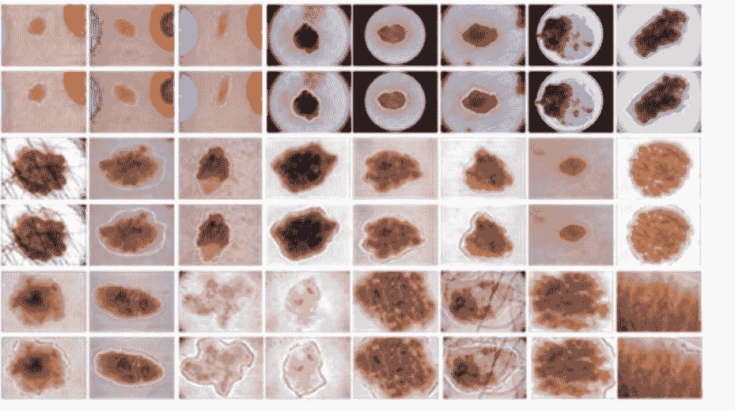

## 4 结论

本文提出了一种基于RN和多路径处理的皮肤镜图像分割深度学习框架。我们提出的基于多路径的网络的优势得到了充分的证明。同时，我们在公开可用的ISBI 2016和2017挑战皮肤病变数据集上进行了大量实验。实验证明我们提出的方法优于现有方法。我们未来的工作将重点研究如何在我们的网络中整合纹理信息。

## 参考文献

+   1. Siegel, R.L., Miller, K.D., Jemal, A.: 2017年癌症统计数据。 CA-Cancer J. Clin. **67**, 7–30 (2017)
2. Gaudy-Marqueste, C., Wazaefi, Y., Bruneu, Y., Triller, R., Thomas, L., Pellacani, G., Malvely, J., Avril, M.F., Monestier, S., Richard, M.A., Fertil, B., Grob, J.J.: 丑小鸭征作为黑色素瘤检测的主要因素。 JAMA Dermatol. **153**, 279–284(2017)
3. Eigen, D., Puhrsch, C., Fergus, R.: 使用多尺度深度网络从单张图像预测深度图。 在： NIPS， 第2366–2374页 (2014年)
4. Long, J., Shelhamer, E., Darrell, T.: 用于语义分割的全卷积网络。 在： CVPR， 第3431–3440页 (2015年)
5. Krähenbühl, P., Koltun, V.: 具有高斯边缘潜力的全连接CRF的高效推断。 在： NIPS， 第109–117页 (2011年)
6. Szegedy, C., Liu, W., Jia, Y., Sermanet, P., Reed, S., Anguelov, D., Erhan, D., Vanhoucke, V., Rabinovich, A.: 使用卷积进行更深层次的学习。 在： CVPR， 第1–9页 (2015年)
7. He, K., Zhang, X., Ren, S., Sun, J.: 用于图像识别的深度残差学习。 在： CVPR， 第770–778页 (2016年)
8. Hinton, G.E., Srivastava, N., Krizhevsky, A., Sutskever, I., Salakhutdinov, R.R.: 通过防止特征检测器的共适应性来改进神经网络。 CoRR 3, pp. 212–223(2012)
9. Ioffe, S., Szegedy, C.: 批归一化：通过减少内部协变量转移来加速深度网络训练。 arXiv预印本 arXiv:1502.03167 (2015)
10. Milletari, F., Navab, N., Ahmadi, S.A.: V-net： 用于体积医学图像分割的全卷积神经网络。 arXiv预印本 arXiv:1606.04797 (2016)

# 多尺度网络用于脑磁共振图像分割

Jie Wei¹ 和 Yong Xia²(✉)

¹陕西省语音与图像信息处理重点实验室（SAIIP），西北工业大学计算机科学与工程学院，西安 710072，中华人民共和国²西北工业大学计算机科学与技术学院，多学科融合计算中心（CMCC），西安 710072，中华人民共和国

yxia@nwpu.edu.cn

摘要。利用磁共振（MR）图像测量主要脑组织的分布已经引起了广泛的研究。由于其显著的成功，基于深度学习的图像分割已经应用于这个问题，其中补丁的大小通常代表了复杂性和准确性之间的权衡。在本文中，我们提出了用于脑MR图像分割的多尺寸和位置神经网络（MSPNN）。我们的贡献包括（1）联合使用在大型补丁上训练的U-Net和在小型补丁上训练的反向传播神经网络（BPNN）进行分割，以及（2）采用卷积自编码器（CAE）在应用于BPNN之前恢复MR图像。我们已经在合成和真实的MR研究中评估了这个算法，与五种广泛使用的脑MR图像分割方法进行了比较。我们的结果表明，该算法能够有效地分割脑MR图像并提供主要脑组织的精确分布。

+   - 脑MR图像分割
- 深度学习
- U-Net
- 卷积自编码器（CAE）
- 反向传播神经网络（BPNN）

## 1 引言

脑磁共振（MR）图像的分割旨在将脑体素分类为灰质（GM）、白质（WM）和脑脊液（CSF），在临床应用和研究环境中起着重要作用，如异常检测、手术规划、进展评估和人脑映射。由于手动分割耗时、昂贵且受操作者变异性影响，自动化算法在文献[1-3]中得到了深入研究和提出。其中，基于图谱的配准和比较、基于统计模型的分割[1]、模糊聚类及其变种[4, 5]、统计和模糊方法的组合[6]以及基于可变形模型的方法[7]是最常用的方法。

## 用于分割的多尺度网络

近年来，深度学习已成为解决许多计算机视觉问题最成功的工具[8-10]，由于其在学习图像表示和同时分类模式方面相对传统方法的独特优势。

将深度学习技术应用于图像分割时，直观地将此问题视为基于补丁的体素分类。例如，Zhang等人[8]在T1加权、T2加权和分数各向异性（FA）图像的横断面上提取2D补丁，用于训练婴儿脑MR图像分割的DCNN，而Moeskops等人[10]则使用多个尺寸的补丁和核来训练成人脑MR图像分割的多尺度深度卷积神经网络（DCNN）。

然而，大多数在边界附近提取的补丁包含来自多个类别的体素，对这样的补丁进行分类是麻烦的。这个固有的缺点极大地限制了基于补丁的体素分类策略的性能。

为了克服这个缺点，提出了“端到端”模型，例如完全卷积网络（FCN）[11]。在这些模型中，输入和输出都是图像补丁。Nie等人[12]联合使用T1加权、T2加权和FA图像训练了多全卷积网络（mFCNs）用于像素级婴儿脑MR图像分割。Chen等人[13]提出了一个深度体素残差网络（VoxResNet）的自动上下文版本，通过无缝地整合低级图像外观特征、隐含形状信息和高级上下文，用于MR图像中的体积脑分割。尽管这些方法取得了成功，但计算复杂度很高。Ronneberger等人[14]提出了另一种形式的端到端FCN，称为U-Net，它可以从很少的图像中高效地进行训练，并在电子显微镜堆叠中的神经结构分割和透射光显微镜图像中的细胞分割方面表现良好。

在大多数基于深度学习的分割方法中，补丁大小对性能有很大影响。小的补丁可能无法训练足够深的模型，并且容易受到伪影的影响；而大的补丁包含了过于复杂的图像信息，可能导致结果不够准确。在本文中，我们同时使用小的补丁来训练浅层模型和大的补丁来训练深度全卷积网络（FCN），从而提出了多尺寸和位置神经网络（MSPNN）用于脑部MR图像分割。该算法的独特之处在于在横断面、矢状面和冠状面上提取多尺寸的图像补丁，使用大的补丁来训练U-Net，使用小的补丁来训练反向传播神经网络（BPNN）[15]。

此外，由于BPNN对图像中的噪声和其他伪影相对敏感，我们采用卷积自编码器（CAE）[16]来恢复图像的质量，然后再应用于BPNN。为了进一步提高性能，我们还使用了从多个视角提取的MRI切片，并融合了分割结果。我们对提出的MSPNN算法在合成和真实的脑部MR图像上进行了评估，与四种广泛使用的脑部MR图像分割方法进行了比较。

## 2 算法

所提出的MSPNN算法分别在横断面（TRA）、矢状面（SAG）和冠状面（COR）的MR切片上提取图像块以训练神经网络模块，该模块由多尺度U-Net、CAE和多尺度BPNN组成。该算法的示意图如图1所示。

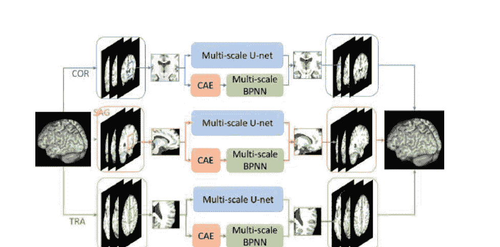

### 2.1 用于体素分类的多尺度U-Net

本研究使用的U-Net由两部分组成：用于下采样的典型卷积网络和用于上采样的另一个卷积网络。该网络的结构和主要参数如图2所示。为了探索不同尺寸的图像块中包含的信息，我们分别提取48 × 48、40 × 40和32 × 32的图像块，并使用每种类型的图像块分别训练一个U-Net。最后，我们将三个U-Net的输出组合成多尺度U-Net组件的输出。

### 2.2 多尺度BPNNs用于体素分类

为了补充基于多尺度U-Net的分割，我们提取小块来训练多个BPNNs进行体素分类。在每个脑体素上，以其为中心分别取一个5 × 5、一个7 × 7和一个9 × 9的窗口。每种窗口内的图像块，以及对应的中心体素的类别标签，分别用于训练两个隐藏层的BPNNs。我们添加一个新的输出层来组合三个BPNNs。在误差反向传播过程中，学习每个BPNN与新的输出层之间的权重。这个多尺度BPNNs组件的架构如图4所示，每一层的图形表示神经元的数量。

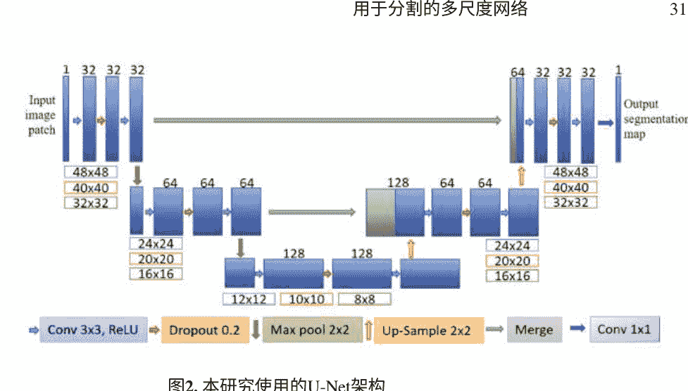

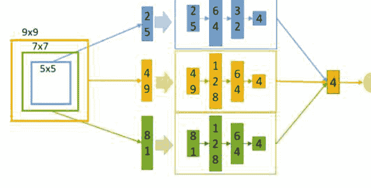

### 2.3 基于CAE的图像恢复

在小块图像上训练的BPNN对图像质量敏感。众所周知，MR图像通常受到噪声和偏差的影响。因此，我们采用CAE进行图像去噪和偏差校正。

本研究中使用的CAE包括具有dropout的卷积层，2 × 2最大池化层和2 × 2上采样层。该CAE的架构和主要参数如图3所示。我们将每个MR切片分成20 × 20个小块，并将这些小块应用于CAE进行图像恢复。

### 2.4 实现

提出的MSPNN算法可以分为四个步骤进行实现：（1）分别使用在每个切割平面上提取的图像小块训练CAE、每个U-Net和每个BPNN；（2）将三个U-Net和三个BPNN组合成多尺度U-Net组件和多尺度BPNN组件；（3）进一步将U-Net和BPNN组件结合起来，使得MSPNN模型可以以“端到端”的方式进行微调；（4）将从三个切片获得的分割结果进行平均，形成最终的分割结果。

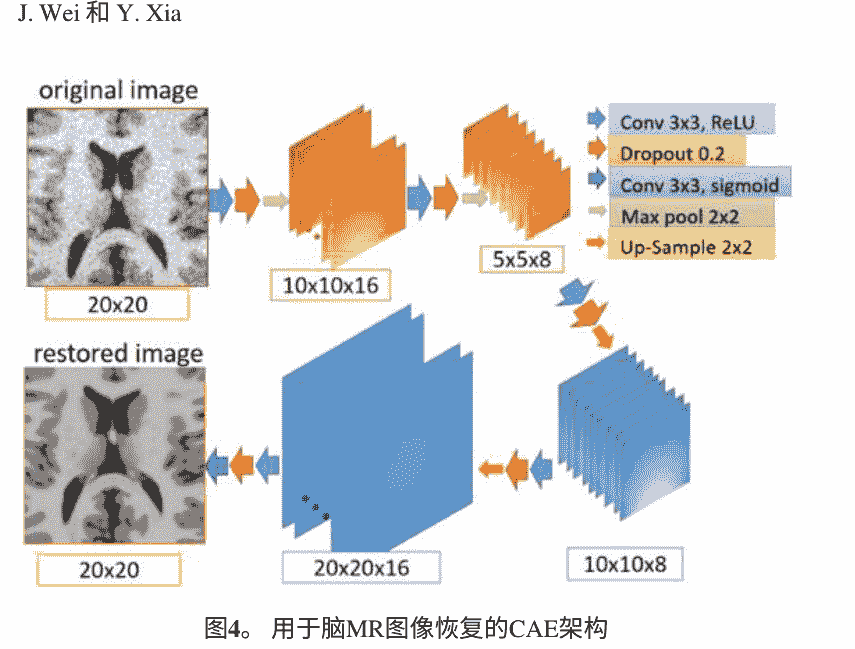

## 3 实验和结果

所提出的MSPNN算法已经在两个数据集上与五种广泛使用的脑MR图像分割方法进行了评估，包括基于GA的GMM估计（GMM-GA）算法[1]，基于克隆选择算法的HMRF模型估计（HMRF-CSA）算法[2]，变分期望-最大化（VEM）贝叶斯推断算法[3]以及统计参数映射（SPM）软件包[17]和FMRIB软件库（FSL）软件包[18]中的分割例程。

BrainWeb数据集[19]包含18个模拟的脑MRI图像，每个图像的尺寸为181 × 217 × 181，像素大小为1 × 1 × 1毫米³。这些图像中的噪声水平范围从0%到9%，强度不均匀性（INU）范围从0%到40%。互联网脑分割库（IBSR，V2.0）[20，21]包含18个临床脑MRI图像，尺寸为256 × 256 × 128，像素大小为1.0 × 1.0 × 1.5毫米³。这些图像已经应用了颅骨剥离技术，通过使用CMA “autoseg”例程[20，21]来去除非脑组织。

由于所提出的算法需要训练案例，我们采用了留一法交叉验证策略，在每个数据集上进行测试。图5显示了模拟研究中带有7%噪声和40% INU的第88个横断面、第100个矢状面和第112个冠状面，以及采用六种分割方法得到的相应分割结果。标记的矩形框显示了相应分割区域的部分放大视图。在标记区域的放大视图中可以看出

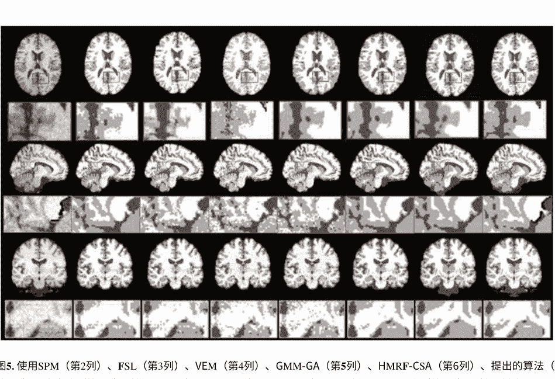

图5. 使用SPM（第2列）、FSL（第3列）、VEM（第4列）、GMM-GA（第5列）、HMRF-CSA（第6列）、提出的算法（第7列）和真实值（第8列）对带有7%噪声和40% INU的BrainWeb研究进行分割：脑MR图像（第1列）及其分割结果。六种算法（均值±标准差）在两个数据集上的性能如表1所示。

我们提出的算法能够比其他五种方法产生更准确的分割结果。

使用Dice相似系数（DSC）[22]评估了对每种类型的脑组织进行描绘的准确性，并将脑图像分割的整体准确性计算为正确分类的脑体素的百分比。在表1中比较了六种算法的性能，其中DSC和整体分割准确性的均值和标准差分别在18个BrainWeb研究和18个IBSR研究中计算。结果显示，平均而言，所提出的算法在模拟和真实的MR数据集上都优于其他五种方法，尤其是在真实数据集上。

### 表1. 六种算法在两个数据集上的性能（均值±标准差）

| 数据类型 | BrainWeb | | | IBSR V2.0 | | |
| :--- | :--- | :--- | :--- | :--- | :--- | :--- |
| | 灰质 | 白质 | 全部 | 灰质 | 白质 | 全部 |
| SPM | 92.55 ± 2.37 | 95.82 ± 1.88 | 94.15 ± 1.88 | 84.42 ± 2.45 | 87.38 ± 1.30 | 81.26 ± 2.32 |
| FSL | 89.18 ± 2.95 | 95.82 ± 2.06 | 91.03 ± 1.89 | 77.35 ± 3.70 | 87.08 ± 3.09 | 75.06 ± 3.24 |
| VEM | 90.67 ± 2.52 | 90.62 ± 1.32 | 91.37 ± 1.66 | 86.67 ± 4.54 | 79.22 ± 5.22 | 82.55 ± 5.02 |
| GMM-GA | 88.59 ± 2.66 | 91.62 ± 1.59 | 92.31 ± 1.76 | 77.35 ± 6.01 | 87.23 ± 2.79 | 74.97 ± 6.09 |
| HMRF-CSA | 94.30 ± 1.58 | 96.67 ± 0.94 | 95.43 ± 1.20 | 84.81 ± 1.69 | 83.54 ± 2.26 | 82.79 ± 1.48 |
| 提出的 | **95.49 ± 1.04** | 96.33 ± 0.83 | **95.69 ± 1.03** | **96.10 ± 0.39** | **92.87 ± 1.04** | **94.92 ± 0.59** |

## 4 讨论

为了展示U-Net和CAE的贡献，我们选择了BrainWeb的五个合成扫描作为案例研究，并将它们应用于不同的分割方法。表2显示了平均分割准确率。从第2、3和4列可以看出，当单独使用时，U-Net的表现优于LeNet-5和单隐藏层BPNN。从第6和7列可以看出，当与CAE和BPNN联合使用时，U-Net的表现优于LeNet-5。同时，从第4和5列可以看出，使用CAE恢复图像质量可以提高BPNN的分割准确性。

### 表2. 不同分割方法在五个BrainWeb研究中的平均准确率

| 方法 | U-Net | LeNet-5 | BPNN | CAE + BPNN | LeNet-5 + BPNN + CAE | U-Net + BPNN + CAE |
| :--- | :--- | :--- | :--- | :--- | :--- | :--- |
| 平均 | 94.09% | 92.68% | 90.24% | 91.58% | 93.78% | **95.28%** |

提出的MSPNN算法可以自动分割脑部MR图像。然而，它具有非常复杂的网络结构，因此在训练时非常耗时，特别是在应用于大型3D图像数据时。

然而，使用训练好的MSPNN模型对脑部MR研究进行分割是相对高效的。所提出模型（Intel E5-2600V4 CPU X2, NVIDIA TITAN X GPU, 512 GB内存和使用Keras 1.1.0和Theano的Python）的训练和测试时间成本的均值和标准差列在表3中。

### 表3. 提出算法在两个数据集上的时间成本（平均±标准差）

| 数据集 | 图像数量 | 图像尺寸 | 训练时间（小时） | 测试时间（秒） |
| :--- | :--- | :--- | :--- | :--- |
| BrainWeb | 18 | 181 × 217 × 181 | 37.6 ± 0.41 | 180 ± 1.22 |
| IBSR V2.0 | 18 | 256 × 256 × 128 | 32.3 ± 0.35 | 146 ± 1.57 |

## 5 结论

在本文中，我们提出了一种用于脑部MR图像分割的MSPNN算法。我们使用多个U-Net来分割大块图像，并使用多个BPNN来分割经CAE修复的小块图像。通过集成学习，所提出的模型可以以端到端的方式进行训练。我们已经在合成和真实的MR图像数据集上对该算法进行了评估，与五种广泛使用的方法进行了比较。我们的结果表明，所提出的算法在两个数据集上都优于其他五种方法。

致谢。本工作得到了中国国家自然科学基金会61471297号资助。

## 参考文献

1. Tohka, J., Krestyannikov, E., Dinov, I.D., Graham, A.M., Shattuck, D.W., Ruotsalainen, U., Toga, A.W.: 基于有限混合模型的遗传算法在神经影像学中的体素分类。IEEE Trans. Med. Imaging 26(5), 696–711 (2007)

2. Zhang, T., Xia, Y., Feng, D.D.: 基于克隆选择算法和马尔可夫链蒙特卡罗方法的隐马尔可夫随机场模型的脑MR图像分割。Biomed. Signal Process. Control 12(1), 10–18 (2014)

3. Tzikas, D.G., Likas, A.C., Galatsanos, N.P.: 贝叶斯推理的变分近似。IEEE信号处理杂志 25(6), 131–146 (2008)

4. Dubey, Y.K., Mushrif, M.M., Mitra, K.: 基于粗糙集和直觉模糊聚类的脑MR图像分割。生物控制与生物医学工程 36(2), 413–426 (2016)

5. Ouarda, A., Fadila, B.: 基于区间类型-2模糊C-Means的MR脑图像分割改进。第三届复杂系统世界会议 (2016)

6. Ji, Z., Xia, Y., Sun, Q., Chen, Q., Xia, D., Feng, D.D.: 脑MR图像分割的模糊局部高斯混合模型。IEEE信息技术生物医学杂志 16(3), 339–347(2012). IEEE工程医学与生物学学会出版物

7. Su, C.M., Chang, H.H.: 基于水平集的可变形模型用于人脑MR图像分割。在：IEEE国际生物医学工程与信息学会议，第105–109页 (2014)

8. Zhang, W., Li, R., Deng, H., Wang, L., Lin, W., Ji, S., Shen, D.: 深度卷积神经网络用于多模态等强度婴儿脑图像分割。神经影像学 108, 214–224 (2015)

9. Brébisson, A.D., Montana, G.: 深度神经网络用于解剖脑分割。在：计算机视觉和模式识别研讨会，第20–28页 (2015)

10. Moeskops, P., Viergever, M.A., Mendrik, A. M., Vries, L.S.D., Benders, M.J.N.L., Işgum, I.: 用卷积神经网络自动分割MR脑图像。IEEE Trans. Med. Imaging 35(5), 1252–1261 (2016)

11. Long, J., Shelhamer, E., Darrell, T.: 全卷积网络用于语义分割。在：IEEE计算机视觉和模式识别研讨会，第1337–1342页(2015)

12. Nie, D., Wang, L., Gao, Y., Shen, D.: 全卷积网络用于多模态等强度婴儿脑图像分割。在：IEEE国际生物医学成像研讨会，第1342–1345页 (2016年)

13. Chen, H., Dou, Q., Yu, L., Qin, J., Heng, P.A.: VoxResNet：用于从3D MR图像中进行脑分割的深度体素残差网络。神经影像学 (2017年)

14. Ronneberger, O., Fischer, P., Brox, T.: U-Net：用于生物医学图像分割的卷积网络。在：国际医学图像计算与计算机辅助干预会议，第234–241页 (2015年)

15. Rumelhart, D., Mcclelland, J.: 并行分布式处理：认知微结构的探索：基础。MIT出版社，剑桥 (1986年)

16. Masci, J., Meier, U., Dan, C., Schmidhuber, J.: 堆叠卷积自编码器用于分层特征提取。在：国际人工神经网络会议，第52–59页 (2011年)

17. Dale, A.M., Liu, A.K., Fischl, B.R., Buckner, R.L., Belliveau, J.W., Lewine, J.D., Halgren, E.: 动态统计参数映射：结合fMRI和MEG进行高分辨率的大脑皮层活动成像。神经元 26(1), 55–67 (2000)

18. Smith, S.M., Jenkinson, M., Woolrich, M.W., Beckmann, C.F., Behrens, T.E.J., Johansen-Berg, H., Bannister, P.R., Luca, M.D., Drobnjak, I., Flitney, D.E.: 功能和结构MR图像分析的进展及其作为FSL的实现。

19. Collins, D.L., Zijdenbos, A.P., Kollokian, V., Sled, J.G., Kabani, N., Holmes, C.J., Evans, A.C.: 一个真实的数字化大脑模型的设计和构建。

20. School, M.G.H.H.M.: 互联网脑分割库（IBSR）。 http://www.cma.mgh.harvard.edu/ibsr/index.html

21. Rohlfing, T.: 图像相似度和组织重叠作为图像配准准确性的替代指标：被广泛使用但不可靠。 IEEE Trans. Med. Imaging 31(2), 153–163 (2012)

22. Bharatha, A., Hirose, M., Hata, N., Warfield, S.K., Ferrant, M., Zou, K.H., Suarez-Santana, E., Ruiz-Alzola, J., Amico, A.D., Cormack, R.A.: 三维有限元变形配准术前和术中前列腺成像的评估。 Med. Phys. 28(12), 2551–2560 (2001)

# 深度学习在乳腺X光摄影中自动检测异常发现

Ayelet Akselrod-Ballin (✉), Leonid. Karlinsky, Alon Hazan, Ran Bakalo, Ami Ben Horesh, Yoel Shoshan, 和 Ella Barkan

IBM研究院，以色列海法
ayeletb@il.ibm.com

摘要。 自动识别异常是医学成像中的一个关键问题。尽管以前的大部分乳腺X光摄影研究都集中在异常分类而不是检测和定位上，但我们在这里介绍了一种新的深度学习方法，用于检测肿块和钙化。 这种方法的优势在于生成一组个别的Faster-RCNN模型，每个模型针对一组特定的异常临床类别进行训练，并将修改后的两阶段Faster-RCNN方案扩展为三阶段级联。 第三阶段是在图像像素上直接工作的额外分类器，使用第一和第二阶段生成的少量量子窗口。 该算法的性能在INBreast基准测试和大型内部多中心数据集上进行评估。 定量结果在准确性方面与最先进的技术相媲美。 在计算上，该方法的运行速度明显快于当前最先进的技术。

## 1 引言

许多研究表明，早期发现乳腺癌既可以增加治疗选择，又可以降低死亡率[1]。乳腺X光照片（MG）中检测到的异常物体主要有两种类型——肿块是看起来比周围组织更亮的紧凑区域，而钙化物[2]则是指钙化物质。 宏钙化物（宏）通常是良性的较大的钙化物块，在乳房中呈现为粗糙的钙沉积物，比如粗糙的或者“爆米花状”的、营养不良的或者边缘状的（例如贝壳状）。微钙化物（微）是微小的矿物质沉积物，可以以各种方式分布，包括聚集、特定模式或者散布。某些微钙化物的特征和表现，特别是无定形、多形态的形状和聚集分布，可能与恶性乳腺癌相关联。 然而，由于细粒度的视觉类别和不同类别外观的大变异性，检测和识别非常困难。 因此，自动检测、定位和量化异常发现在筛查中有可能将正常阴性与阳性检查分开。这些过程使放射科医生能够专注于具有挑战性的病例，并避免不必要的乳腺活检。

深度学习在识别任务中表现出色，如检测和分类[3-6]。下面我们简要回顾了主要的检测算法，强调与我们方法的区别。

**R-CNN及其变种使用外部区域提议而不是滑动窗口来在图像中找到对象。** 通常，传统方法用于生成这些区域提议。在**R-CNN [5]**中，使用Selective Search [7]生成候选对象框，使用CNN [3]为每个框生成特征向量，训练SVM来对框的特征向量进行分类，然后使用线性回归和非极大值抑制来调整边界框并消除重复检测。这个复杂流程的每个阶段都必须精确地独立调整，而且结果系统很慢，在GPU上每个测试需要超过40秒的时间[8]。

其他基于CNN的检测器，如Deep MultiBox [9]、Fast [8]和Faster [6] R-CNN，以及YOLO [10]，专注于通过共享计算和使用区域建议网络（RPN）来加速R-CNN框架，RPN以完全卷积的方式在一组接收域的网格上有效地执行滑动窗口搜索[11]，以生成对象建议，而不是选择性搜索[6-8]。YOLO [10]还对网格单元建议施加了空间约束。虽然它们在R-CNN上提供了速度和准确性的改进，但它们仍然无法实现实时性能，运行速度约为2-3 FPS，类似于Faster-RCNN。

深度学习方法在医学成像领域[12, 13]，特别是在乳腺钼靶（MG）的肿块和钙化分类[14, 15]方面，最近取得了成功的应用。我们的研究与大多数先前的工作不同，它侧重于异常的检测和定位，而不是钙化或肿块的二分类。一个例外是基于多尺度深度置信网络分类器的肿块检测的重要工作[16]，它后面跟着一系列的R-CNN和随机森林分类器。同一作者的最近一项研究[17]目前被认为是检测微小钙化最有效的研究，它利用了一系列的增强分类器和形状、外观特征。基于这些方法[18]，最近提出了一个深度残差神经网络，旨在将MG分类为良性或恶性。肿块和微钙化的最终分割图尚未评估，但它们展示了在INBreast [19]将正常和良性分开的ROC AUC为0.8。Faster-RCNN框架的一个重要组成部分，使其与YOLO [10]等类似的检测框架不同，是在ROI池化层之后运行的分类器，该层从RPN和分类器之间共享的基础网络的最顶层中汇集特征[6]。这可以看作是一个两阶段级联，RPN是第一阶段，分类器是第二阶段。然而，ROI池化生成的表示并没有专门针对分类进行优化（它在检测器和分类器之间共享）。因此，本研究遵循[20]中提出的Faster-RCNN架构，但提议将该方案扩展为三阶段级联，第三阶段是在由前两个阶段生成的少量子窗口上直接对图像像素进行分类的额外分类器。

我们的贡献有三个方面：首先，据我们所知，目前没有研究利用统一的深度学习方法来结合检测和多种类型的肿块和钙化的定位和分类。其次，我们采用了一个三阶段级联，将两阶段的RPN和Faster-RCNN模型与第三个CNN分类器集成在一起，并证明了它在减少假阳性检测数量方面的有效性。最后，我们的方法在推理时间和准确性方面与最先进的方法相媲美，即使在大型数据集上也是如此。

## 2 方法

问题形式化：给定一组训练图像作为输入，对应于异常发现的边界框 $l_i$; $y_{1i}$; $x_{1i}$; $y_{2i}$; $x_{2i}$; $c_i$。通过使用一组训练图像和一组测试图像，我们试图检测测试集中的异常结果，并定位具有相应置信度分数的边界框。

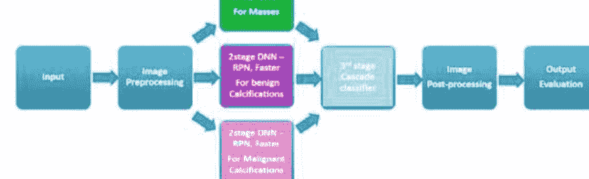

图1。用于乳腺X光摄影异常检测和分类的深度框架。

系统通过将输入的MG图像预处理为重叠网格上的4k x 3k像素，利用下面描述的三阶段级联深度神经网络（DNN）进行训练，使每个子部分（网格单元）提取候选边界框并预测这些边界框的置信度分数。然后，图像后处理对所有DNN部分的结果进行网格组合。图1概述了系统的架构，由下面详细介绍三个主要组件组成。粗略地说，这些阶段是“初始检测”、“分类”和“分类细化”。在设置这些阶段时，我们扩展了Faster RCNN范例，通过添加一个额外的分类迭代来继续“重新分类”循环，并直接将检测到的裁剪区域传递给最终分类器（而不是通过ROI池化层和一组针对检测进行优化的特征来查看它们）。

-   1. 区域建议网络（RPN）：一个深度全卷积网络，经过训练可以检测输入图像上可能包含感兴趣对象的窗口，而不考虑它们的类别。RPN同时在各种尺度和长宽比上预测对象的边界和对象性得分，然后保留得分最高的500个预测结果[11]。网络以滑动窗口的方式有效地处理图像，但是由于堆叠的网络层具有局部和分层的特性，因此计算被固有地重复使用。滑动窗口在一个规则的网格上操作，x和y方向上的步长相等，等于最顶层感受野的最终步长（在我们的情况下为32像素）。对于每个网格位置，有9个种子框（采样了几种不同的长宽比和尺寸）进行分类。在训练过程中，这些框最初被称为锚点[6]，根据IoU得分与真实对象框相关联，IoU最相似的被标记为对象锚点，同时所有IoU超过一定阈值（0.5）的也被标记为对象锚点。对于被分类为对象（部分或包含）的每个锚点，使用线性回归来调整锚点边界框到候选对象框。

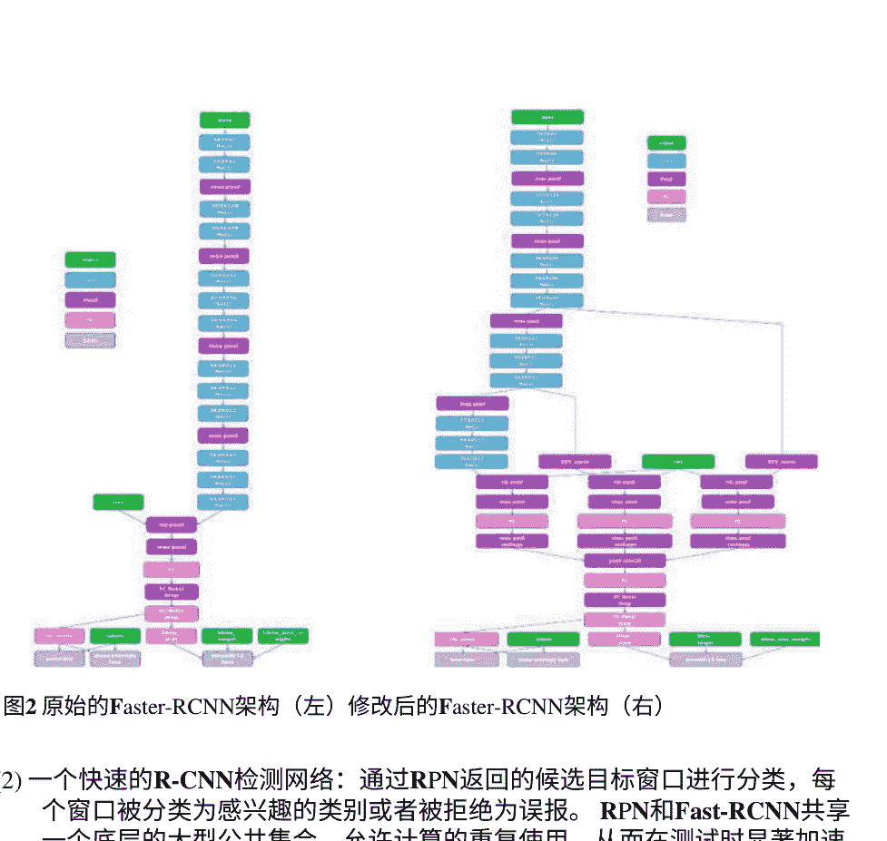

图2 原始的Faster-RCNN架构（左）修改后的Faster-RCNN架构（右）

-   2. 一个快速的R-CNN检测网络：通过RPN返回的候选目标窗口进行分类，每个窗口被分类为感兴趣的类别或者被拒绝为误报。RPN和Fast-RCNN共享一个底层的大型公共集合，允许计算的重复使用，从而在测试时显著加速。对于RPN和分类网络，我们采用了VGGNet的修改版本[4]。最初在ImageNet数据集[1]上进行训练，并由我们针对当前任务进行微调。该系统在一块12 GB显存的TitanX GPU和一台带有64 GB RAM的i7 Intel CPU上进行训练。训练时间需要36小时，而每张图片的测试时间为0.2秒。在训练过程中，从RPN中采样了2000个得分最高的框，在测试过程中，使用标准的非极大值抑制方法采样了得分最高的500个框。基于框重叠的非极大值抑制（NMS）。我们使用学习率为0.001、批大小为2、动量为0.99和60个epochs的SGD求解器。图2展示了我们采用的修改后的Faster-RCNN架构（详见[20]）。

-   3. 第三阶段级联分类器：DNN的真正阳性（TP）和假正例（FP）框候选在训练集上计算，并选择为下一训练阶段的正负样本。然后对这些框进行裁剪，并用于训练一个经过优化的VGG-16分类器，以区分最后一步（分类器）中的TP和难负例。在训练过程中，对框进行随机化和随机重新裁剪，并通过随机几何和光度变换进行增强，以丰富训练并提高泛化能力。在Faster-RCNN的两阶段级联中添加第三阶段的关键思想是允许一个经过单独优化的网络对感兴趣区域进行另一种观察，而原始的Faster-RCNN内部表示在前两个阶段（检测器和分类器）之间是共享的。完整的训练过程包括：每个批次随机选择了四张图像；从每个图像中随机选择了最多三个正框（前一阶段的真实检测）和一个负框（前一阶段的误检）；每个框随机旋转最多30°，随机重新裁剪±25%的原始大小，随机翻转，减去均值，并最终调整为224×224的大小，以符合标准的VGG-16分类器要求。在测试过程中，对前一阶段检测到的原始框进行速度处理（无增强，单次裁剪）。

## 3 实验和结果

我们评估了用于检测肿块和钙化的算法。数据集包括（1）公开可用的INBreast数据集[19]，（2）内部数据集，包括约3500张图像，由几个不同的医疗中心收集，并由专家进行了真实标注，其中包括750张、360张和2400张分别具有肿块、恶性钙化和良性钙化。肿块类别包括乳腺影像报告和数据系统（BI-RADS）的2、3、4、5亚型，即良性和恶性肿块。数据集被分为80%的训练集和20%的测试集，以便所有测试患者的图像都被排除在训练集之外。图3报告了自由响应操作特征曲线（FROC），计算真阳性率（TPR）作为每张图像的假阳性数（FPI）的函数。该图显示了每个类别模型在一种类型的图像上分别获得的结果，以及在包括正常图像在内的所有图像上所有模型的联合结果。我们比较了通过所有模型的结果的‘naive’连接或利用模型集合上的第三级级联步骤来加入集合。结果显示级联方法明显减少了FP的数量，并提高了性能。

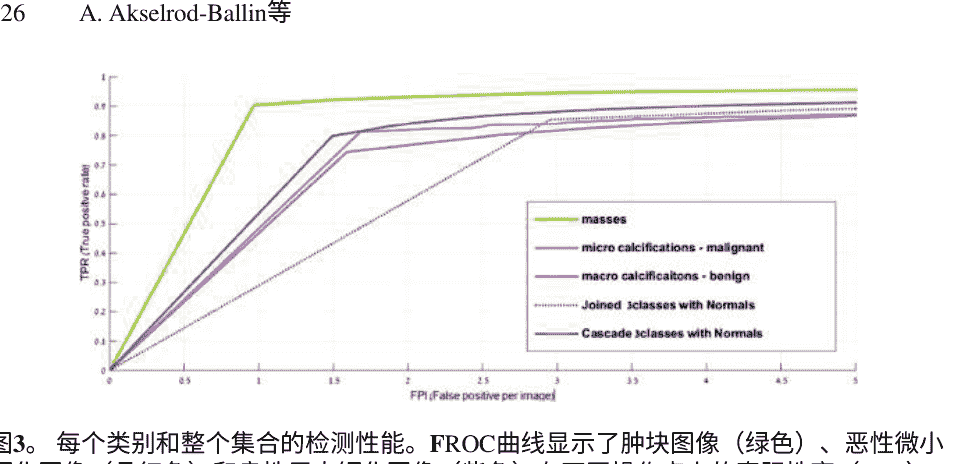

图3。每个类别和整个集合的检测性能。FROC曲线显示了肿块图像（绿色）、恶性微小钙化图像（品红色）和良性巨大钙化图像（紫色）在不同操作点上的真阳性率（TPR）与每幅图像的假阳性数（FPI）之间的结果，以及所有模型结果在所有图像上的'原始'联合（虚线蓝色）和基于第三级级联的所有模型结果的联合（粗体蓝色）。

表1总结了我们的结果与最先进的结果进行比较（详见[16, 17]）。[17]报道了在INBreast（INB）数据集上钙化检测的领先结果，其在一个FPI上的个体钙化的TPR为40%，在10个FPI上的TPR为80%。作者指出这些结果明显优于当前的最先进技术，其在一个FPI上的TPR小于0.01，而在10个FPI上的TPR为0.1。[16]提供了一张详细的乳腺肿块检测表格，其中包含了最佳的TPR。INBreast的1.2 FPI时的TPR为0.96 ±0.03，0.8 FPI时的TPR为0.87 ±0.14。这些论文还获得了运行时间最佳结果，仅为20秒。INB结果是通过对我们内部数据训练的模型分别在INB钙化和肿块图像上进行测试获得的。这并不是最优的，因为两组图像特征之间存在显著差异。因此，去除小的钙化（半径<10像素）会显著改善结果。

表1. 将我们的结果与最佳现有算法进行比较

| 钙化结果 | TPR@FPI | #图像 | 运行时间 |
|----------|---------|-------|----------|
| 我们在微小和宏大的钙化上 | 全部: TPR 0.4@1 FPI<br>无小: TPR 0.85@1.5 FPI | 310/410 INB | 5秒 |
| 我们在宏大的良性钙化上 | TPR 0.8@1.5 FPI<br>TPR 0.52@1 FPI<br>TPR 0.9@10 FPI | 2400内部 | 5秒 |
| 我们在微小的恶性钙化上 | TPR 0.81@1.7 FPI<br>TPR 0.48@1 FPI | 360内部 | 5秒 |
| 微小和宏大的钙化 [17] | TPR 0.4@1 FPI<br>TPR 0.8@10 FPI | 410 INB | 20秒 |
| 肿块结果 | TPR@FPI | #图像 | 运行时间 |
| 我们对肿块的研究 | 真阳性率 0.93@0.56 假阳性率 | 100/410 INB | 5秒 |
| 我们对肿块的研究 | 真阳性率 0.9@1 假阳性率 | 750 内部 | 5秒 |
| 良性/恶性 [16] | 真阳性率 0.96 ±0.03@1.2 假阳性率<br>真阳性率 0.87 ±0.14@0.8 假阳性率 | 410 INB | 20秒 |

与该领域中已发表的结果进行比较是困难的，因为大部分以二分类为主，并且主要报告DDSM的结果。然而，表1和图3展示了我们方法的高准确性，添加级联到Faster-RCNN模型的优势以及我们模型对不同异常类别的泛化能力。对钙化病灶的性能，特别是小病灶的性能仍需进一步研究和改进。

图4中的视觉结果显示了恶性钙化检测结果的放大。图5给出了各种异常亚型（包括微小钙化、大块钙化和肿块）的真阳性、假阴性和假阳性检测的代表性示例。

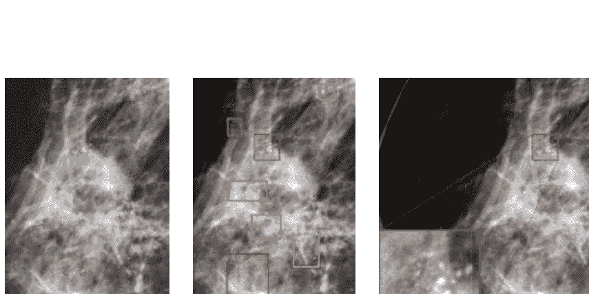

图4。定性检测结果显示在裁剪图像上，其中包含聚集的恶性微小钙化（a）原始图像（b）准确检测到的框，暖色调的线表示得分（红色和黄色分别表示高分和低分）（c）放大最高得分的检测框。

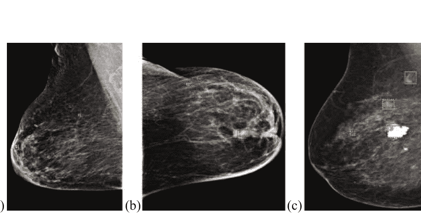

图5。全乳房图像的检测结果示例。绿色高亮显示了所示类别的真实标注，而自动检测的候选框可以以暖色调的虚线显示，对应得分（红色和黄色分别表示高分和低分）。（a）大块钙化（b）微小钙化和（c）肿块。

## 4 摘要

本文提出了一种高效的深度神经网络框架，用于检测乳腺X光图像中的异常，重点关注乳腺肿块和钙化的检测定位和分类任务。所构建的统一深度神经网络由三个级联阶段组成，包括RPN、改进的Faster-RCNN和分类器CNN，旨在减少假阳性。我们的结果在效率和准确性方面与最先进的方法相竞争，在大型数据集上显示出乳腺肿块和钙化检测的有希望的结果。未来的工作将扩展这种方法到多视角、双边方法，以整合来自右乳房和左乳房的四个乳腺X光筛查视图的信息，并将这种方法推广到其他异常类别。

## 参考文献

-   1. 美国癌症协会: 2015年癌症事实与数据。美国癌症协会, 亚特兰大 (2015年)
-   2. Saranya, R., Bharathi, M., Showbana, R.: 自动检测和分类乳腺X光图像中的微钙化. IOSR J. 电子与通信工程. (IOSR-JECE) 9(3), 65–71 (2014)
-   3. Krizhevsky, A., Sutskever, I., Hinton, G.: 使用深度卷积神经网络进行ImageNet分类. 在: NIPS, vol. 25, pp. 1097–1105 (2012)
-   4. Simonyan K., Zisserman A.: 用于大规模图像识别的非常深的卷积网络. arXiv:1409.1556 (2014)
-   5. Girshick R., Donahue J., Darrell T., Malik J.: 用于准确目标检测和语义分割的丰富特征层次结构. 在: CVPR, pp. 580–587 (2014)
-   6. Ren, S., He, K., Girshick, R., Sun, J.: Faster R-CNN: 实时目标检测与区域建议网络. 在: NIPS. arXiv:1506.01497 (2015)
-   7. Uijlings, J.R., Van de Sande, K.E., Gevers, T., Smeulders, A.W.: 选择性搜索用于目标识别. Int. J. Comput. Vis. 104(2), 154–171 (2013)
-   8. Girshick R.: 快速 R-CNN. 在: ICCV, pp. 1440–1448 (2015)
-   9. Erhan, D., Szegedy, C., Toshev, A., Anguelov, D.: 使用深度神经网络的可扩展目标检测. 在: CVPR, pp. 2155–2162 (2014)
-   10. Redmon, J., Divvala, S., Girshick, R., Farhadi, A.: You only look once: 统一的、 实时的目标检测. 在: CVPR (2016)
-   11. Long, J., Shelhamer, E., Darrell, T.: 全卷积网络用于语义分割. 在: CVPR, 波士顿, 麻省, pp. 3431–3440 (2015)
-   12. Gulshan, V., Peng, L., Coram, M., et al.: 用于检测糖尿病视网膜病变的深度学习算法的开发和验证. JAMA 316, 2402–2410 (2016)
-   13. Esteva, A., Kuprel, B., Novoa, R.A., et al.: 用深度神经网络进行皮肤癌的皮肤科医生级别分类. Nature 2017(542), 115–118 (2017)
-   14. Giger, M.L., Karssemeijer, N., Schnabel, J.A.: 乳腺图像分析用于风险评估、 癌症的检测、诊断和治疗. Annu. Rev. Biomed. Eng. 15, 327–357 (2013)
-   15. Oliver, A., Freixenet, J., Marti, J., Perez, E., Pont, J., Denton, E., Zwiggelaar, R.: 乳腺钼靶图像中自动肿块检测和分割的综述. MIA 14, 87–110 (2010)
-   16. Dhungel, N., Carneiro, G., Bradley, A.P.: 使用级联深度学习和随机森林在乳腺X线照片中自动检测肿块. In: DICTA, pp. 1–8 (2015)
-   17. Lu, Z., Carneiro, G., Dhungel, N., Bradley, A.P.: 使用多阶段级联方法在乳腺钼靶图像中自动检测微钙化. arXiv:1610.02251v(2016)
-   18. Dhungel, N., Carneiro, G., Bradley, A.P.: 使用深度残差神经网络完全自动化的乳房X光图像分类. 在: ISBI 2017 (2017)
-   19. Moreira, I.C., Amaral, I., Domingues, I., Cardoso, A., Cardoso, M.J., Cardoso, J.S.:INBreast: 迈向全场数字乳腺X光数据库. Acad. Radiology. 19(2), 236–248 (2012)
-   20. Akselrod-Ballin, A., Karlinsky, L., Alpert, S., Hasoul, S., Ben-Ari, R., Brakan, E.: 基于区域的卷积网络用于乳腺X光中的肿瘤检测和分类. 在: DLMIA (2016)

# 通过带有快捷连接的三维卷积编码器网络进行脊髓MRI的灰质分割

Adam Porisky^{1(\text{\ding{55}})}, Tom Brosch^{1}, Emil Ljungberg^{1}, Lisa Y.W. Tang^{1}, Youngjin Yoo^{1}, Benjamin De Leener^{2}, Anthony Traboulsee^{1}, Julien Cohen-Adad^{2}, 和 Roger Tam^{1}

1 英属哥伦比亚大学MS/MRI研究小组，加拿大温哥华
adam.porisky@gmail.com
2 生物医学工程学院神经多项式实验室，加拿大蒙特利尔

摘要。在神经学疾病（如多发性硬化症）的病情评估中，磁共振图像中灰质的分割是一个重要的步骤。然而，手动划定脊髓组织是耗时且容易受到评分者的变异性影响。我们提出了一种新的脊髓组织分割方法，该方法使用全卷积编码器网络（CENs）进行直接端到端训练，并包括快捷连接以组合多尺度特征，类似于u-net。虽然带有快捷连接的CENs已成功用于脑组织分割，但脊髓图像具有非常不同的特征，因此值得进行独立研究。特别地，我们通过评估层数、滤波器尺寸和快捷连接对标准分辨率脊髓MRI分割准确性的影响来开发该方法。这种基于深度学习的方法是在最近的公开挑战数据上进行训练的，该数据包括来自4个独立扫描站点的40个MRI，每个MRI都有4个专家评分者的手动分割，总共160个图像-标签对。我们使用包括Dice相似系数（DSC）和Jaccard指数在内的全面性能指标套件来评估该方法的性能，发现快捷连接对性能有最强的影响（DSC从0.60到0.80），而滤波器尺寸（从0.76到0.80）和层数（从0.77到0.80）也是重要的考虑因素。总体而言，该方法与其他最先进的方法具有很高的竞争力。

## 1 引言

在诸如多发性硬化症（MS）等疾病状态评估中，常用的度量标准是脊髓的横截面积（CSA）[7]。在获取这个测量结果时，磁共振成像（MRI）中脊髓的分割是一个重要的步骤。然而，CSA不能区分白质（WM）和灰质（GM）。在复发性MS的情况下，灰质的显著萎缩可能发生，而CSA没有全局减少[1,10]。因此，在MRI中区分组织类型可以更好地区分疾病状态，而不仅仅是测量整个脊髓区域。获取这些信息的一种方法是逐层手动勾画GM组织。然而，这是耗时的，并且容易受到评估者之间和评估者内部的变异性的影响。因此，需要一种无偏差且自动的方法来分割脊髓MRI中的灰质。

在这里，我们提出了一种自动分割脊髓轴向定位MRI图像中的灰质的方法，该方法使用完全卷积编码器网络（CEN）进行直接端到端训练[3]。我们的网络架构类似于u-net[9]，因为两者都由互补的收缩和扩张路径组成，但我们的方法在扩张路径中使用反卷积[13]而不是上采样，这样生成的分割结果与输入图像具有相同的分辨率。对于较大的图像，已经研究了快捷方式[2,5]，但对于像脊髓这样的小图像尚未研究。因此，将带有快捷方式的CEN应用于像脑MRI这样的较大图像所得到的经验教训可能不一定适用于脊髓。虽然在公开的分割挑战的出版物中包含了用于脊髓分割的CEN模型的高级描述[8]，但它没有涉及关键的设计考虑因素，如网络层数、滤波器大小和快捷方式的包含。

网络的训练通过无监督的预训练和有监督的手动分割训练完成。新的MRI分割通过以下五个步骤完成：
(1) 将原始图像的每个切片裁剪为256×256个体素的大小。
(2) 使用我们提出的CEN架构识别脊髓，但是训练时使用的是脊髓分割而不是GM分割。
(3) 然后将每个图像切片居中并裁剪为100×100个体素的平面大小。
(4) 将训练过GM分割的CEN应用于裁剪后的图像，并生成概率掩模。
(5) 对概率掩模应用阈值，生成二值掩模。

我们的工作的主要贡献如下。我们（1）描述了一个基于深度学习的脊髓GM分割流程；（2）研究了网络架构的变化以优化性能；（3）将我们的方法与当前方法进行了性能比较。

## 2 方法

### 2.1 网络

卷积网络的整体架构如图1所示。该网络分为收缩路径和扩展路径。收缩路径使用交替的卷积层（$w_c$）和池化层（2D 2×2平均池化），扩展路径应用反卷积层（$w_d$）和上采样。收缩路径的卷积层和扩展路径的反卷积层之间存在快捷连接（$w_s$）。这些连接允许在每一层同时考虑低层和高层特征。我们评估以下设计考虑因素对脊髓分割的影响。

图1. 具有11层和9×9卷积滤波器的卷积编码器网络，用于脊髓灰质分割，其中包含快捷方式。通过一系列卷积$w_c^{(L)}$、反卷积$w_d^{(L)}$和快捷方式$w_s^{(L)}$，输入图像$x^{(0)}$生成分割结果$y^{(0)}$。

组织。与脑图像相比，脊髓图像的特征更简单，尺度变化也更小，这引发了多尺度建模的重要性。因此，我们在移除快捷方式后测试网络。较小的脊髓图像使得可以训练更深的模型，相比于Brosch等人[2]用于脑部的7层模型，但是是否增加额外的层数能够提高分割准确性还不确定。我们通过在每个路径中添加两个新层，使其成为一个11层网络，来研究网络深度的影响。最后，脑部和脊髓图像特征的差异促使我们比较不同的滤波器尺寸。我们在平面滤波器尺寸上变化为5×5、9×9和13×13。对于所有网络，第一层使用经验确定的3个卷积核深度，而后续层使用1个卷积核深度。

### 2.2 训练

CEN的每一层的权重是使用一组连续的卷积受限玻尔兹曼机（convRBMs）的权重进行初始化的[6]。最近的研究表明，这种预训练过程可以提高CEN的性能[11]。第一个convRBMs是在输入图像上进行训练的，而每个后续的convRBM将前一层的隐藏激活作为输入。超参数值通过试运行的过程进行优化。训练了几个模型，每个模型使用不同的超参数进行100个时期的训练。然后使用产生最低重构误差的超参数重新启动训练。我们的最佳结果是使用表1中列出的超参数获得的。

表1. 本文中使用的网络的训练方法及其超参数。

| 训练方法 | 超参数 |
| :--- | :--- |
| 单元类型 | 修正线性单元 (ReLU) |
| 预训练中的学习率 (无监督) | AdaDelta: $\epsilon = 1e-10$ |
| 微调中的学习率 (有监督) | AdaDelta: $\epsilon = 1e-8$, $\rho = 0.95$ |
| 误差函数 (有监督) | 敏感性比率[参考公式 (1) ] |
| 小批量大小 | 20 |

在网络权重初始化后，通过有监督训练对模型进行微调。我们的方法不使用典型的平方差作为误差函数，而是使用敏感性和特异性的组合，如公式 (1)所示。这里，$S(p)$ 表示地面真实分割掩模在点$p$处的二进制值，$y^{0}(p)$ 表示在点$p$处的提议分割掩模的二进制值，$r$是一个可调节的值，表示敏感性和特异性之间的比率。

$$E = r \frac{\sum_{p} (S(p) - y^{0}(p))^{2} S(p)}{\sum_{p} S(p)} + (1 - r) \frac{\sum_{p} (S(p) - y^{0}(p))^{2} (1 - S(p))}{\sum_{p} (1 - S(p))}$$ (1)

这个误差函数对于不平衡的类别更加鲁棒，其中误差测量由多数类别主导，并且已经在脑部MRI中的多发性硬化病变分割等应用中证明了其有效性[2]。在裁剪的脊髓MRI中，灰质体素仅占总体积的约2%。因此，在我们的应用中使用这种更加鲁棒的误差函数也是有益的。在我们的实验中，对于所有的网络，我们将$r$的值设置为0.1。我们选择的梯度下降方法是AdaDelta，它使用自适应学习率[12]。

我们选择了AdaDelta而不是其他可比较的选择，如RMSprop和Adam，因为最近使用类似的网络配置的研究发现它对超参数选择更加稳健[2]。对于超参数的不同取值，在这种情况下学习率$\epsilon$和衰减率$\rho$，进行了探索和优化，使用验证集来防止过拟合。对于有监督训练，每个配置的超参数是通过使用一个包含32个图像标签对的保留验证集来确定的。使用剩余的128个图像标签对，训练了几个具有不同超参数的模型，每个模型训练100个epochs。选择具有最低训练误差的超参数值，并使用包含160个图像标签对的完整训练集重新开始训练。超参数的取值总结在表1中。使用一张GeForce GTX 780显卡，训练大约需要3小时进行1000个epochs。

作为我们的训练过程的一部分，模型的一个版本被定期保存。这使我们能够在不同的训练轮数之后测试性能。我们在每50个轮数为训练集和测试集生成分割，并计算DSC。训练集和测试数据的平均值如图2所示。很明显，在前200个轮数内，训练和测试的DSC都有快速提升。测试数据的性能表现在大约400个轮数后，DSC稳定在约0.80，除了一些轻微波动。基于训练和测试数据的类似性能，没有明显的过拟合现象，并且使用了适当的停止准则。

图2. 使用CEN生成脊髓轴向定向MRI的GM分割的平均DSC，随着训练轮数的增加，计算了训练集和测试集图像的性能。

### 2.3 分割

训练完成后，我们的方法被应用于新图像以生成分割掩模。使用两个经过训练的网络（一个用于脊髓分割，另一个用于图像中的灰质分割）完成了GM分割。首先，将输入图像裁剪为256 ×256像素的平面大小，然后使用我们的CEN架构识别整个脊髓横截面。脊髓分割的其他方法，例如Spinal Cord Toolbox [4]中提供的方法，也可以使用，但在我们的情况下使用相同的架构更加方便。通过将掩模居中并将相同的平移应用于原始图像，创建了原始扫描的居中版本。然后，将整个扫描体积中的每个切片裁剪为100 ×100体素的大小。将这个脊髓ROI的居中版本用作第二个经过训练的CEN的输入，该网络生成GM的概率掩模。使用优化的阈值将概率掩模转换为二值掩模。通过计算不同阈值下所有概率训练数据掩模的平均误差来确定该阈值。

在训练集上产生最低平均误差的阈值是应用于新扫描的概率掩模。最后，二进制掩模被转换回原始图像的本地空间。使用训练好的模型，可以在不到一秒钟内对脊髓的新MR图像进行分割。

图3显示了四个样本MRI与GM分割重叠显示。包括每个扫描站点的一张图像。GM分割以红色显示。（在线彩图）

图3. 使用我们的方法生成的脊髓的四个样本MRI与分割重叠显示。

## 3 实验和结果

为了我们的实验，我们使用了一个公开可用的数据集，该数据集是与第三届脊髓MRI研讨会[8]相关的GM分割挑战的一部分。数据集被分为训练集和测试集。训练数据集包括从4台不同扫描仪（每台扫描仪10次扫描）获得的40个T2* MRI。每个扫描由4个独立的评分者完成了4个手动脊髓和GM分割。因此，总共有160个图像-标签对可用于训练。测试数据集也包含来自与训练集相同的4台扫描仪的40个T2*扫描。然而，这些扫描没有任何公开可用的手动分割。分辨率因站点而异。有关采集参数和人口统计数据的更详细描述，请参阅[8]。提出的分割结果使用http://cmictig.cs.ucl.ac.uk/niftyweb/上的自动工具进行独立评估。

### 实验一. 网络架构的比较.

为了优化性能，我们训练了几个具有不同网络架构的CENs。在我们的方法部分中，我们使用了11层，9×9的滤波器和快捷连接，取得了最佳结果的配置。我们评估了四种不同的架构变体：（1）没有快捷连接，（2）7层网络，与之前用于脑损伤分割的相同，（3）5×5的滤波器，和（4）13×13的滤波器。所有的配置都使用开发的在线工具进行评估。

表2. CEN架构的五种变体在GM分割挑战的在线评估工具中的平均值（标准差）每个指标的最佳结果以粗体显示。性能指标包括Dice系数（DSC），平均表面距离（MSD），Hausdorff距离（HD），骨架化Hausdorff距离（SHD），骨架化中位数距离（SMD），真阳性率（TPR），真阴性率（TNR），阳性预测值（PPV），Jaccard指数（JI）和一致性系数（CC）。符号*表示与最高值相比存在统计学上显著差异（配对t检验，p <0.05）。

| | DSC | MSD | HD | SHD | SMD | TPR | TNR | PPV | JI | CC |
| :--- | :---: | :---: | :---: | :---: | :---: | :---: | :---: | :---: | :---: | :---: |
| 带有快捷方式的CEN 11层，9×9滤波器 | **0.80**<br>(0.06) | **0.53**<br>(0.57) | **3.69**<br>(3.93) | **1.22**<br>(0.51) | **0.44**<br>(0.19) | **79.65**<br>(9.56) | 99.97<br>(0.04) | 81.29<br>(5.30) | **0.67**<br>(0.07) | **48.79**<br>(18.09) |
| 没有快捷方式 | 0.60*<br>(0.10) | 0.96*<br>(1.03) | 6.57*<br>(5.42) | 1.75*<br>(0.90) | 0.57*<br>(0.37) | 57.24*<br>(12.05) | 99.96*<br>(0.05) | 64.74*<br>(8.90) | 0.44*<br>(0.10) | -43.52*<br>(76.23) |
| 7层 | 0.77*<br>(0.07) | 0.66<br>(0.80) | 11.90*<br>(8.76) | 1.88*<br>(0.93) | 0.52*<br>(0.25) | 77.08*<br>(10.38) | **99.97**<br>(0.04) | 76.89*<br>(6.99) | 0.63*<br>(0.09) | 35.69*<br>(33.45) |
| 5×5滤波器 | 0.76*<br>(0.10) | 0.69*<br>(0.74) | 7.51*<br>(7.08) | 1.49*<br>(0.80) | 0.48<br>(0.26) | 78.41<br>(14.96) | 99.97<br>(0.04) | 75.64*<br>(6.82) | 0.62*<br>(0.11) | 27.40*<br>(67.82) |
| 13×13滤波器 | 0.76*<br>(0.06) | 0.60<br>(0.59) | 3.86<br>(4.54) | 1.25<br>(0.53) | **0.42**<br>(0.19) | 74.69*<br>(8.47) | 99.97<br>(0.04) | 77.14*<br>(6.08) | 0.61*<br>(0.08) | 33.53*<br>(22.61) |

用于GM分割挑战[8]。测试集的分割结果被上传到工具中，该工具返回了10个不同性能指标的均值和标准差。使用t检验来确定统计上显著的差异，假设数据服从正态分布，因为在线评估工具不提供执行非参数检验所需的详细结果。表2显示了每个配置的性能指标概述。当删除快捷连接时，性能下降最大，Dice系数（DSC）是所有变体中最低的（从0.80降至0.60）。对卷积滤波器大小的更改（增加和减少）以及减少层数对所有指标的性能影响相对较小，除了骨架化中位距离（SMD），在使用13×13滤波器时有小幅改善（从0.44提高至0.42）。

### 实验二. 与当前方法的比较。

我们将我们的方法的性能与公开可得的ISMRM灰质分割挑战[8]的结果进行了比较。表3显示了这些性能指标的概述。表中列出的其他方法及其相关结果均来自原始分割挑战。虽然有几种方法表现良好，但我们的CEN和JCSCS两种方法在多个指标上表现出色。我们提出的方法在所有指标上都具有竞争力，甚至在Dice系数（DSC）、精确度（PPV）和Jaccard指数（JI）等关键分割指标上超过了竞争方法。

表3. 使用我们的方法生成的分割结果和挑战论文[8]中描述的方法在在线评估工具中的平均值（标准差）。每个指标的最佳结果以粗体显示。本表中显示的标题使用与表2相同的缩写。完整的CEN快捷方式方法与其他最先进的的方法具有很强的竞争力。

| | DSC | MSD | HD | SHD | SMD | TPR | TNR | PPV | JI | CC |
|---|---|---|---|---|---|---|---|---|---|---|
| 带有快捷方式的CEN 11层，9×9滤波器 | 0.80 (0.06) | 0.527 (0.572) | 3.69 (3.93) | 1.22 (0.51) | 0.44 (0.19) | 79.65 (9.56) | 99.97 (0.04) | 81.29 (5.30) | 0.67 (0.07) | 48.79 (18.09) |
| JCSCS | 0.79 (0.04) | 0.39 (0.44) | 2.65 (3.40) | 1.00 (0.35) | 0.37 (0.18) | 77.89 (4.88) | 99.98 (0.03) | 81.06 (5.97) | 0.66 (0.05) | 47.17 (11.87) |
| MGAC | 0.75 (0.07) | 0.70 (0.79) | 3.56 (1.34) | 1.07 (0.37) | 0.39 (0.17) | 87.51 (6.65) | 99.94 (0.08) | 65.60 (9.01) | 0.60 (0.08) | 29.36 (29.53) |
| GSBME | 0.76 (0.06) | 0.62 (0.64) | 4.92 (3.30) | 1.86 (0.85) | 0.61 (0.35) | 75.69 (8.08) | 99.97 (0.05) | 76.26 (7.41) | 0.61 (0.08) | 33.69 (24.23) |
| SCT | 0.69 (0.07) | 0.69 (0.76) | 3.26 (1.35) | 1.12 (0.41) | 0.39 (0.16) | 70.29 (6.76) | 99.95 (0.06) | 67.87 (8.62) | 0.53 (0.08) | 6.46 (30.59) |
| VBEM | 0.61 (0.13) | 1.04 (1.14) | 5.34 (15.35) | 2.77 (8.10) | 0.54 (0.25) | 65.66 (14.39) | 99.93 (0.09) | 59.07 (13.69) | 0.45 (0.13) | -44.25 (90.61) |

## 4 结论

我们详细描述了一种新颖的、全自动的、用于脊髓磁共振成像中灰质分割的深度学习方法。研究了网络架构的变化，我们发现，使用11层具有快捷连接和9×9滤波器的CEN获得了最佳性能。使用我们的方法生成的分割结果与2016年ISMRM灰质分割挑战中的公开结果进行了比较。我们提出的网络架构在Dice系数（DSC）和阳性预测值（PPV）等关键分割指标上优于其他当前方法。将来，我们计划将椎体水平信息纳入，并研究损失函数的变化。此外，我们计划将我们的灰质分割算法作为Spinal Cord Toolbox [4]的一部分公开提供。

## 参考文献

- 1. Bakshi, R., et al.: 利用磁共振成像测量脑和脊髓萎缩作为监测多发性硬化的工具。J. Neuroimag. **15**(3)(2004). 美国神经影像学会官方期刊
- 2. Brosch, T., et al.: 具有快捷连接的深度3D卷积编码器网络应用于多发性硬化病变分割。IEEE Trans. Med. Imaging **35**(5), 1229–1239 (2016)
- 3. Brosch, T., 等: 用于多发性硬化症病变分割的卷积编码器网络。在：计算机科学讲义（包括子系列人工智能讲义和生物信息学讲义），第9351卷，第3-11页 (2015)。ISBN 9783319245737
- 4. De Leener, B., 等: SCT：脊髓工具箱，用于处理脊髓MRI数据的开源软件。NeuroImage **145** (2017)
- 5. Drozdzal, M., 等: 在生物医学图像分割中跳跃连接的重要性。CoRR abs/1608.04117 (2016)
- 6. Lee, H., Ng, A.: 用于可扩展无监督学习的卷积深度信念网络 (2009)
- 7. Lukas, C., 等: 脊髓异常与多发性硬化的临床残疾相关性：大型患者队列的磁共振成像结果。放射学**269** (2013)
- 8. Prados, F., 等: 脊髓灰质分割挑战。神经影像学**152** (2017)
- 9. Ronneberger, O., Fischer, P., Brox, T.: U-Net: 生物医学图像分割的卷积网络。In: Navab, N., Hornegger, J., Wells, W.M., Frangi, A.F.(eds.) MICCAI 2015. LNCS, vol. 9351, pp. 234–241. Springer, Cham (2015). doi:10.1007/978-3-319-24574-4_28
- 10. Schlaeger, R., 等: 脊髓灰质萎缩与多发性硬化残疾的相关性。神经学杂志**76**(4) (2014)
- 11. Tajbakhsh, N., 等: 医学图像分析的卷积神经网络：全面训练还是微调？IEEE医学成像杂志**35**(5), 1299–1312 (2016)。ISSN 1558254X
- 12. Zeiler, M.: ADADELTA：一种自适应学习率方法。arXiv arXiv:1212.5701 (2012)
- 13. Zeiler, M., Taylor, G., Fergus, R.: 自适应反卷积网络用于中高级特征学习。在：IEEE国际计算机视觉会议论文集 (2011年)。ISSN 1550–5499

# 第七届多模态学习在临床决策支持国际研讨会（ML-CDS 2017）

# 通过多个模板将多模态常规成像数据映射到单一参考

Johannes Hofmanninger¹(✉), Bjoern Menze², Marc-André Weber³,⁴, 和 Georg Langs¹

¹ 维也纳医科大学生物医学成像与图像引导治疗计算成像研究实验室，奥地利维也纳 johannes.hofmanninger@meduniwien.ac.at ² 慕尼黑工业大学计算机科学系和高级研究所，德国慕尼黑 ³ 海德堡大学诊断和介入放射学系，德国海德堡 ⁴ 罗斯托克大学医学中心诊断和介入放射学研究所，德国罗斯托克

https://www.cir.meduniwien.ac.at

摘要。基于人口水平的医学图像数据分析依赖于在个体之间找到空间对应关系作为局部视觉特征比较的基础。在这里，我们描述并评估了一个框架，用于将涵盖人体不同部位的不同模态的常规图像归一化到一个共同的参考空间。该框架对归一化进行了两个基本步骤：（1）通过图像识别人体的位置和覆盖范围，（2）通过非线性映射将其映射到共同的参考空间。基于这些映射，可以在一组图像之间传输坐标或标签掩模。我们在一组常规CT和MR扫描上评估了该框架，这些扫描在位置和覆盖范围上具有较大的变异性。我们使用一组手动注释的地标来评估方法的准确性和稳定性。与传统的单一图谱方法相比，我们报告了稳定性和配准准确性的明显改善。

## 1 引言

分析医学常规成像数据非常相关，因为它们提供了临床人群的真实样本，并且是建模疾病进展和治疗反应自然变异性的关键。为了比较人群间的局部特征，我们需要建立空间对应关系。与脑成像研究不同，常规成像没有进行协调。

图1.左：参考空间中图像覆盖和中心位置的可视化。右：通过将49个CT和28个MR图像的强度映射到参考空间生成的平均体积。器官和骨骼边界的高对比度表明准确的配准。

根据方案进行，但根据指示和具体情况的需要进行应用和指导。在这里，我们描述和评估了一个稳健的常规成像数据多模态配准框架。许多医学成像应用和研究依赖于将体积图像与标准参考框架对齐。例如，脑MR图像的结构和功能分析[3]或基于图谱的解剖结构标记[8]。然而，医学常规图像展示出广泛的个体间变异性，如年龄、性别、疾病和健康状况，还有不受任何研究方案控制的图像特征，如质量和视野范围的变化。由于这些特性，异质多主体数据集的空间对齐是一项具有挑战性的任务。

相关工作。真实的图像对应关系是未知的，必须通过匹配解剖结构或视觉标志物的边界来推断[1]。已经提出了一些现有方法，用于特定器官或器官部分的高质量对齐。特别是对脑MR图像的归一化是具有挑战性但非常相关的。已经提出了一些先进的方法，能够应对脑部结构变异，包括使用解剖流形学习的测地线配准[6]，基于特征的方法[10]和多模板对齐[13]。对其他器官的研究通常旨在分割不同的器官或器官部分。多模板分割的标签融合是一种常用的方法，使用多个手动注释的图谱可以得到稳健准确的结果[8,9,12]。图像的多模态对齐主要适用于由于其在图像引导干预中的作用而对于intra-subject注册非常相关。因此，关于inter-subject多模态注册的研究很少。互信息（MI）[11]通常用作相似度函数来对齐多模态图像。Heinrich等人提出了点对点匹配的局部描述符[7]，用于匹配3D超声和MRI脑部扫描，以及将inter-subject全身MR和CT体积注册到生成伪CT扫描[2]。

贡献。在这项工作中，我们解决了将截断的跨主体多模态图像与视野差异很大的共同整体身体参考空间对齐的问题（图1）。本研究的贡献有三个方面：（1）我们提出了一个新颖的框架，能够可靠地对常规图像进行对齐；（2）将多模板分割的思想应用于多模板定位和归一化；（3）在一组异构的真实世界常规CT和MR图像上评估方法的准确性和有效性。

## 2 方法

归一化框架基于离线和在线阶段。离线阶段需要提前进行仔细监督的多个预定义模板图像到共同参考空间的注册（第2.2节）。在线阶段不需要与数据进行任何手动交互。对于没有地标的新图像，将其注册到模板（第2.1节），并选择最佳匹配的模板（第2.2节）。多模态多模板框架的概述如图2所示。该框架允许对覆盖人体任意区域且具有不同模态的常规图像进行归一化，使得μ（I）∈ M。该框架需要一组模板T = {T₁, ..., T_K}，其中每种模态都有代表，并且μ（T）∈ M，以便对异构图像语料库进行无偏归一化。模板的选择方式涵盖了尺寸和性别等自然变化。对于每种模态，需要一个独立的图谱 $R^m$ 以及一个中心参考空间 $C$。每个模板都与其特定模态的图谱对齐，而每个图谱都与中心参考空间对齐。模板与图谱之间的对齐是单模态的，但通过一些监督来克服潜在的配准偏差。图谱与参考空间之间的对齐是多模态的，因此需要更高程度的监督。


（a）该框架便于处理不同模态和覆盖人体不同部位的常规成像数据。（b）在归一化过程中，图像与多个相同模态的模板（c）对齐。所有模板都与特定模态的图谱（d）对齐，该图谱由手动注释的标记点支持。（e）不同模态的图谱通过标记点、身体、骨骼和器官掩膜仔细对齐到中心参考空间。通过连接三个转换（t^{mi,k}, t^{r k,m}和 t^c m）将图像中的位置映射到参考图谱，以获得最佳的配准质量。（f）归一化后，坐标和标签掩膜在整个人群中进行映射。

### 2.1 图像到模板的配准

将图像注册到模板分为两个步骤。(1) 估计图像在人体中的覆盖范围和位置，以及(2) 对第一步估计的区域进行非刚性变换。位置和覆盖范围的估计通过匹配3D尺度不变特征（3DSIFT）[10]并通过最小化特征位置之间的均方误差（MSE）进行仿射配准来完成。随后，通过进行基于强度的仿射配准并在平移上进行高正则化，优化归一化互相关（NCC）来进行细化步骤。如果没有匹配的3DSIFT特征被识别出来，则进行基于强度的仿射配准，并在平移上不进行正则化。在位置和覆盖范围估计之后，进行基于强度的非刚性配准[5]。接下来，我们定义 $t^{a}_{i,k}$ 为图像 $I_i$ 和模板 $T_k$ 之间的仿射变换，使得 $I_i \approx \hat{I}^{a}_{i,k} = t^{a}_{i,k}(T_k)$。此外，我们定义 $t^{ni,k}$ 为仿射和非刚性变换的连接，所以 $I_i \approx \hat{I}^{ni,k} = t^{ni,k}(T_k)$。

### 2.2 模板到参考注册

每个图谱 $R_m$ 都注册到其相应的模板 $T_k$（如果 $m = \mu(T_k)$）具有高度的监督。在我们的注册中，注册受到58个手动注释的解剖标志的支持，这些标志位于特定的骨骼和器官位置上。我们执行仿射和b样条注册，优化标志之间的MSE，然后基于图像强度进行非刚性图像配准。作为细化步骤，我们执行最终的b样条注册，优化标志之间的距离。我们将从图谱 $R_m$ 到模板 $T_k$ 的变换定义为 $t^r_{k,m}$。参考图谱 $C$ 注册到特定模态的图谱 $R_m$，必须进行完全监督和模态无关或多模态的注册。我们使用58个标志、分割覆盖20个器官和器官部分、一个身体掩膜和所有骨骼的分割，以便可以独立于模态进行注册。我们将从参考空间到图谱 $R_m$ 的变换定义为 $t^c_m$。

### 2.3 模板选择

图像 $I_i$ 的模板选择分为两个步骤：（1）计算 $\hat{I}^a$ 对于每个 $k$，其中 $\mu(T_k) = \mu(I_i)$，选择具有最高 $N CC(I_i, \hat{I}^a_{i,k})$ 的 $C_i \subseteq \{1, \ldots, K\}$，即图像 $\mathbf{I}_i$ 的候选模板集合。随后，仅对于 $k \in \mathcal{C}$，计算图像和模板 $t^{ni,k}$ 之间的非刚性变换。在第二步（2）中，将变换 $t^{ni,k}$ 和 $t^r_{k,m}$ 连接起来，使之成为
$$\hat{\mathbf{I}}_{i,k} = t^{ni,k}(t^r_{k,m}(\mathbf{R}_m))$$
$$ (1) $$
我们可以通过选择模板来
$$\max_k N CC(\mathbf{I}_i, \hat{\mathbf{I}}_{i,k}) \quad \text{满足} \quad \mu(\mathbf{I}_i) = \mu(\mathbf{T}_k), k \in \mathcal{C}_i$$
$$ (2) $$
给定一个模板 $x_i$ ，使得NCC最大化，从参考空间到图像的最终变换是
$$t_i = t^n_{i,x_i} \circ t^r_{x_i,\mu(i)} \circ t^c_{\mu(i)}$$
$$ (3) $$

## 3 实验

测试数据。我们对一组异构的CT（#48）和MR-T1（#28）图像进行评估，这些图像是在日常临床例行程序中记录的。这些图像涵盖了人体的不同部位，分辨率、剂量（CT）和切片（矢状和轴向）各不相同。我们在特定骨骼和器官位置（主动脉弓、气管分叉、左髂脊、右髂脊、耻骨联合、主动脉分叉、L5、L4、L3、L2、L1、剑突、左锁骨关节、右锁骨关节、左肾盂和右肾盂）上标注了16个标志点，涵盖了胸部和腹部（图3）。根据覆盖范围，每个图像可能只显示其中的一部分标志点。更正式地说，评估集由元组 $\langle \mathbf{I}_i, \mathcal{V}_i \rangle$ 组成，其中 $\mathcal{V}_i \subseteq \{1, \ldots, 16\}$ 。

模板数据。对于模板集和图谱，我们使用了VISCERAL解剖学3数据集[4]中的22个（11个CT和11个MR）全身体积，该数据集提供了手动注释的器官掩膜和标志点。对于每种模态，使用10个体积作为模板，其中一个用作模态特定的图谱。我们将CT图谱定义为代表参考空间。

评估和度量。为了评估方法的鲁棒性和准确性，并研究使用的模板数量的影响。我们将提出的模板框架与直接配准方法进行比较，其中每个图像直接配准到模态特定的图谱 R_m directly。为了进行公平比较，直接配准按照第2.1节中描述的图像到模板配准方法进行。为了评估配准质量，我们将标志点的位置从图像空间转换到参考空间。然后我们计算转换后的标志物与参考标志物之间的距离。我们报告每个标志物的配准准确性，并比较MR和CT案例之间的性能。为了评估鲁棒性，我们将偏差超过100毫米的标志物定义为错位的。

参数和预处理。我们对MR图像进行偏场校正[14]，并将所有体积（图像和模板）重新缩放为等向性像素分辨率为2毫米进行处理。除非另有说明，否则报告的结果是使用参数 K（模板数量）设置为10和 C（非刚性配准的最大数量）设置为4产生的。

## 4 结果

图4比较了使用模板方法与直接配准时与基准真值的配准误差。给出了完整数据集（CT+MR）和每个标志物的结果。准确性有明显改善。

表1. 均值、中位数、标准差和不对齐（misalig.）的地标数量。结果以地标距离（mm）给出，用于模板配准（T）和直接配准（D）。

| | CT | | MR | | 全部 | |
| :--- | :--- | :--- | :--- | :--- | :--- | :--- |
| | T | D | T | D | T | D |
| 平均值 | **17.95** | 32.42 | **22.57** | 62.91 | **19.35** | 41.64 |
| 中位数 | **13.39** | 17.60 | **17.13** | 36.15 | **14.13** | 21.72 |
| 标准差 | **16.53** | 63.65 | **18.03** | 63.65 | **17.12** | 63.65 |
| 不对齐 | **3** | 25 | **0** | 36 | **3** | 61 |
| 案例数 | 49 | | 28 | | 77 | |
| 地标数 | 476 | | 206 | | 682 | |

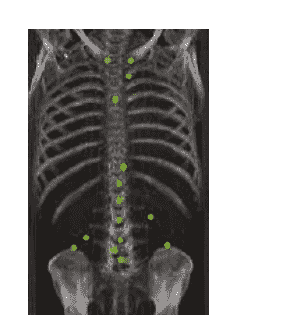

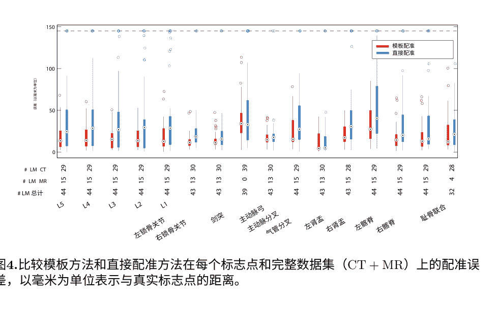

（较低的中位数），同时也可以看到稳定性（较少的异常值）。表1显示了两种模态的平均配准误差。对于CT，中位距离从17.6毫米改善到13.4毫米，对于MR，从36.2毫米改善到17.1毫米。CT的错配地标数量从25/476减少到3，MR的错配地标数量从28/206减少到0。这表明尤其是MR在稳定性方面受益于多个模板。然而，CT案例中的3个错配地标（xyphoideus和symphysis）靠近图像边界，因此对错配非常敏感。图5a展示了将所有地标映射到L5椎骨参考空间的示例。图5b展示了从参考空间映射到图像的器官标记。图6b展示了不同数量模板对平均地标误差的影响，图6a展示了不同数量模板对最终NCC值（公式2）的影响。图1展示了从图像到参考空间映射的CT和MR图像的定位、覆盖范围和平均强度值。

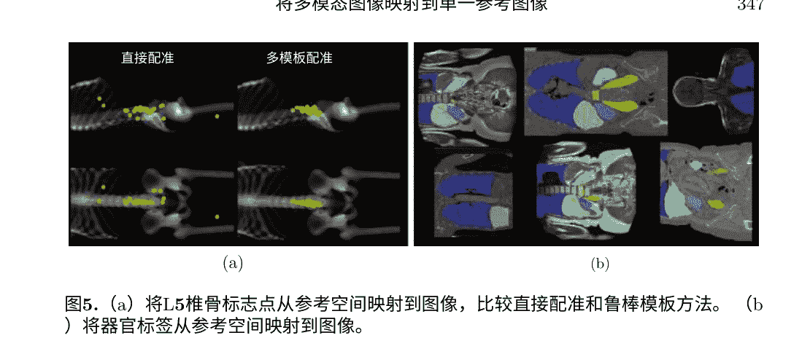
图5.（a）将L5椎骨标志点从参考空间映射到图像，比较直接配准和鲁棒模板方法。（b）将器官标签从参考空间映射到图像。

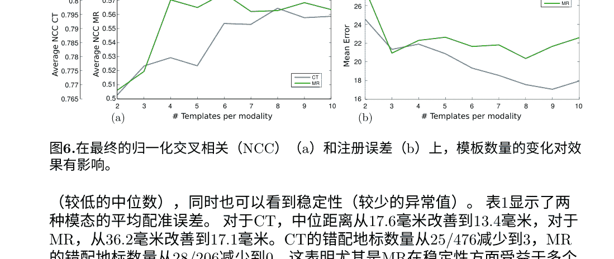
图6.在最终的归一化交叉相关（NCC）（a）和配准误差（b）上，模板数量的变化对效果有影响。

## 5 结论

本文解决了将临床常规图像从不同模态映射到一个共同参考空间的挑战性任务。提出了一种多模板方法用于定位和可变形图像配准。评估已经在一个代表性的CT和MR图像数据集上，使用手动标注的地标进行了。结果显示与直接注册到一个图谱相比，注册精度和稳定性有明显改善。我们相信，常规图像的空间归一化提供了一个有用的工具，特别是用于研究系统性疾病，如多发性骨髓瘤、转移性癌症和其他在不同成像模态下表现出视觉特征的疾病。

## 参考文献

1.  Crum, W.R., Griffin, L.D., Hill, D.L.G., Hawkes, D.J.: Zen and the art of medical image registration: correspondence, homology, and quality. NeuroImage 20(3), 1425–1437 (2003)
2.  Degen, J., Heinrich, M.P.: Multi-atlas pseudo-CT synthesis via multi-modal image registration and local atlas fusion strategies. In: Computer Vision and Pattern Recognition (CVPR), pp. 160-168 (2016)
3.  Fischl, B., Salat, D.H., Busa, E., Albert, M., Dieterich, M., Haselgrove, C., van der Kouwe, A., Killiany, R., Kennedy, D., Klaveness, S., Montillo, A., Makris, N., Rosen, B., Dale, A.M.: Whole-brain segmentation: automated labeling of neuroanatomical structures in the human brain. Neuron 33(3), 341-355 (2002)
4.  Goksel, O., Oncubierta-Rodriguez, A., del Toro, O.A.J., Muller, H., Langs, G., Weber, M.A., Menze, B.H., Egger, L., Gruenberg, K., et al.: Overview of the VISCERAL Challenge at ISBI 2015. In: VISCERAL Challenge@ ISBI, pp. 6-11 (2015)
5.  Gruslys, A., Acosta-Cabronero, J., Nestor, P.J.: Others: A new fast and accurate non-linear medical image registration scheme including surface-preserving regularization. IEEE Trans. Med. Imaging 33(11), 2118–2127 (2014)
6.  Hamm, J., Ye, D.H., Verma, R., Davatzikos, C.: GRAM: A framework for geodesic registration on anatomical manifolds. Med. Image Anal. 14(5), 633–642 (2010)
7.  Heinrich, M.P., Jenkins, M., Papiez, B.W., Brady, S.M., Schnabel, J.A.: Real-time multi-modal fusion for image-guided interventions using self-similarities. In: Mori, K., Sakuma, I., Sato, Y., Barillot, C., Navab, N. (eds.) MICCAI 2013. LNCS, vol. 8149, pp. 187–194. Springer, Heidelberg (2013). doi:10.1007/978-3-642-40811-3_24
8.  Iglesias, J.E., Sabuncu, M.R.: Multi-atlas segmentation of biomedical images: A survey. Medical image analysis 24(1), 205–19 (2015)
9.  Koch, L.M., Rajchl, M., Bai, W., Baumgartner, C.F., Tong, T., Passerat-Palmbach, J., et al.: Multi-atlas segmentation with partially labelled data: methods and label strategies, pp. 1–17. arXiv preprint, arxiv:1605.00029 (2016)
10. Toews, M., Wells, W.M.: Efficient and robust model-to-image alignment using 3D scale-invariant features. Medical image analysis 17(3), 271–282 (2013)
11. Viola, P., Wells II, W.M.: Alignment by maximization of mutual information. International journal of computer vision 9(242), 22–137 (1997)
12. Wolz, R., Chu, C., Misawa, K., Fujiwara, M., Mori, K., Rueckert, D.: Automated abdominal multi-organ segmentation using subject-specific atlas construction. IEEE Transactions on Medical Imaging 32(9), 1723–1730 (2013)
13. Xie, L., Pluta, J.B., Das, S.R., Wisse, L.E., Wang, H., Mancuso, L., Kliot, D., Avants, B.B., Ding, S.L., Manjón, J.V., Wolk, D.A., Yushkevich, P.A.: Multi-template analysis of human peri-entorhinal cortex: Explicitly considering anatomical variability. NeuroImage 144, 183–202 (2017)
14. Zhang, Y., Brady, M., Smith, S.: Segmentation of brain MR images through a hidden Markov random field model and the expectation-maximization algorithm. IEEE Trans. Med. Imaging 20(1), 45–57 (2001)

# 使用多模态MRI自动检测癫痫性皮层畸形

Ravnoor S. Gill (✉), Seok-Jun Hong, Fatemeh Fadaie, Benoit Caldairou, Boris Bernhardt, Neda Bernasconi, and Andrea Bernasconi
蒙特利尔神经研究所和医院癫痫神经影像实验室，加拿大魁北克 蒙特利尔，麦吉尔大学
ravnoor.gill@mail.mcgill.ca

摘要。局灶性皮层发育异常（FCD）是药物难治性癫痫的常见原因。这种可手术治疗的病变在组织学上表现为皮层发育异常、畸形神经元和球状细胞，可能延伸到皮层下的白质。在MRI上，FCD通常与皮层增厚、皮层边界模糊和强度异常相关。值得注意的是，即使组织学上经验证实的FCD在术前MRI上可能不明显可见。我们提出了一种新的FCD检测算法，该算法聚合了基于T1加权（T1w）MRI、T2加权液体衰减反转恢复（FLAIR）MRI和FLAIR/T1w比率图像的形态和强度的基于表面的描述符。特征在多个皮层/皮层下水平上进行系统采样，并输入到基于集成学习的两阶段分类器中进行自动病变检测。使用5折交叉验证，我们在41名组织学上验证的FCD患者和38名年龄和性别匹配的健康对照者中评估了该方法。我们的方法显示出优秀的敏感性（83%，检测到34/41个病变）和特异性（92%，35/38个对照组未发现异常），表明在术前诊断中具有益处。

- 磁共振成像
- 癫痫
- 病灶检测
- 多参数磁共振成像
- 术前诊断

## 1 引言

局灶性皮层发育异常（FCD）是皮层发育的一种常见原因，导致难治性癫痫。目前，手术切除是唯一的治疗选择，用于控制癫痫发作。FCD的主要组织病理学特征包括皮层离层与各种皮层内细胞学异常，即畸形神经元（FCD Type-IIA）和球状细胞（FCD Type-IIB）[1]。

在磁共振成像中，FCD通常与不同程度的皮层增厚、灰白质界面模糊和异常强度特征相关。值得注意的是，即使在组织学上经过验证的FCD在磁共振成像上可能不明显可见[2]。以前的研究使用基于体素[3, 4]或基于表面的方法[5-7]对从T1或T2加权磁共振成像中提取的有限数量的特征进行建模，除了一项研究[8]。

将它们结合在一个小的儿科队列中。然而，所有这些方法主要应用于MRI上可见的大中型病变，并且提供有限的敏感性[9]。此外，仅有30%的病例进行了组织学验证。

本研究提出了一种新的基于体内表面的自动检测算法，用于建模皮层和皮层下白质中不同深度的FCD。我们的方法利用T1加权和T2加权FLAIR对比以及合成的FLAIR/T1比率图；后者专门设计用于增加灰质和白质之间界面处FLAIR高信号和T1w低信号的敏感性。我们的框架在41名经组织病理学证实的FCD患者队列中进行了验证。

## 2 方法

### 2.1 MRI采集

使用32通道头线圈在3T Siemens TimTrio上获取了多模态MRI，包括3D T1加权MPRAGE (T1w; TR = 2300 ms, TE = 2.98 ms, 翻转角度 = 9°, FOV = 256 mm², 体素大小 = 1 × 1 × 1 mm³) 和液体衰减反转恢复 (FLAIR; TR = 5000 ms, TE = 389 ms, TI = 1.8 ms, 翻转角度 = 120°, FOV = 230 mm², 体素大小 = 0.9 × 0.9 ×0.9 mm³ ) 。

### 2.2 多对比度MRI预处理

T1w MRI经过强度不均匀性校正[10]，然后进行强度标准化，线性配准到MNI152空间，并进行白质（WM）、灰质（GM）和脑脊液（CSF）的分类[11]。使用依赖于强度和几何约束的CLASP算法重建了GM-WM和GM-CSF表面模型[12]。基于皮层折叠的基于表面的配准用于增加测量位置的跨个体对应性[13]。T1w图像线性共注册到FLAIR图像。在类似的预处理之后，FLAIR图像被除以T1w图像生成FLAIR/T1w比率图；该比率允许在N3校正之后对B1强度非均匀性进行额外校正。超过脑部掩模内平均比率1个标准差的高信号区域被排除，生成比率图像。

### 2.3 多表面生成

为了检查皮层内灰质，我们在内皮层和外皮层之间的25%、50%和75%皮层厚度处放置了3个表面，通过一条直线提供了表面之间的顶点对应关系[14]。虽然这些表面不一定反映皮层层片，但它们捕捉到了与皮层外壳垂直轴上的相对差异。为了评估皮层下的白质，我们生成了3个等距表面，其间隔由GM-WM界面和脑室之间的Laplacian场引导，并根据每种模态的分辨率进行调整。

### 2.4 特征提取

在给定对比度的本地空间中提取了以下特征，以最小化插值。

基于强度的特征。对于每种模态，即T1w、$FLAIR$和$FLAIR/T1w$，我们将逐像素强度除以平均GM-WM边界强度；该值相对于相应强度直方图的众数进行了归一化[15]。归一化强度在每个皮层点（或顶点）的内部和皮层下表面模型上进行了线性插值。我们没有在GM-CSF表面上采样强度，以避免CSF污染；所有其他表面的值都经过了部分容积效应的解析校正[16]。我们还计算了相对于皮层表面的垂直和切向方向的强度梯度，以模拟径向和切向分层[7]。

形态学。皮层厚度是通过计算GM-WM和GM-CSF表面上的顶点之间的欧氏距离来计算的[12]。小的FCD病变通常发生在沟底，并显示曲率变化[5]。因此，我们计算了每个顶点的沟深，作为从回脑冠状短径的最短测地距离，并测量了50%皮层内表面的绝对平均曲率[17]。

特征剖析。我们为每个顶点分配了一个唯一的矢量，该矢量由基于表面的5mm全宽度一半最大高斯核平滑的脑内和皮层下强度和形态特征组成，并相对于健康对照组的分布进行了z标准化。对于每个强度特征，我们计算了4个皮层内（25%，50%，75%，GM-WM界面）和3个皮层下表面的平均值。

对于每个个体，我们获得了3个形态学图（皮层厚度，沟深，曲率），6个强度图（T1w，FLAIR，FLAIR/T1w在皮层内和皮层下水平），6个相应的梯度图（3个切向，3个垂直），以及它们的不对称性，共计30个特征。

## 3 实验和结果

### 3.1 受试者

我们的患者队列包括41名患者（20名男性；平均年龄 = 27 ±9岁），他们被送往我们医院进行难治性局灶性癫痫的调查。术前评估包括神经病学检查，癫痫病史评估，MRI和视频-EEG遥测。在33（80%）名患者中，初步的常规放射学检查未能发现病变。由于MRI最初被报告为无异常，癫痫灶的位置是通过脑内EEG确定的；回顾性检查发现所有患者的癫痫发作区域存在细微的FCD。所有患者均接受手术，并通过组织病理学验证了FCD的诊断。

对照组包括38名年龄和性别匹配的健康个体（19名男性；平均 ±标准差：年龄 = 30 ±7岁）。

### 3.2 手动病变分割

两位与临床信息脱敏的专家独立地在配准的T1和FLAIR MRI上分割FCD病变。互评Dice一致性指数（D = 2|M1 ∩ M2|/[|M1|+|M2|]；M1, M2：第一，第二标签；M1 ∩ M2：M1和M2的交集）为0.91 ±0.11。他们的共识体积标签与表面模型相交，从而生成基于表面的病变标签。

### 3.3 分类范式（图1）

我们构建了一个两阶段的分类器。第一阶段是基于顶点的分类，旨在最大化敏感性（即检测到最多的病灶聚类），而第二阶段是基于聚类的分类，旨在提高特异性（即去除假阳性同时保持最佳敏感性）。

我们使用了一组RUSBoosted决策树来系统地测试两个分类阶段的检测性能。RUSBoost [18] 是一种混合采样/增强算法，可以在学习的同时解决类别不平衡问题，该问题在给定主体中非病灶顶点数量较多时会出现。

基于顶点的分类。RUSBoost 从非病灶顶点池中随机欠采样，直到达到平衡分布。AdaBoost [19] 是一种常见的增强算法，通过迭代构建一组基学习器（决策树）。在每次迭代中，对错误分类的顶点分配更高的惩罚权重，以提高下一轮的分类准确性。在最后一轮迭代之后，所有训练好的基学习器模型参与加权投票，对测试顶点进行病灶或非病灶的分类。根据预测结果，聚类被定义为在离散的皮层表面网格上形成6连通邻居的顶点集合。病灶（真阳性）和非病灶（假阳性）聚类被输入到后续的聚类级别分类中。

基于聚类的分类模式。 对于每个聚类，我们通过计算马氏距离（将每个患者的特征向量与对照组的分布进行多变量z变换）来评估异常的整体负荷。对于显示最大距离的顶点集合，我们使用15个原始特征（不包括其不对称性）来计算以下高阶特征：统计矩（均值、标准差、偏度、峰度、矩以及它们的不对称性）表示每个特征分布的形状，空间位置（通过解剖分区和3D坐标确定）以及病变大小。这个过程为每个受试者生成了总共95个特征。然后，使用这些聚类特征进行分类，方式与基于顶点的分类相同。

特征选择。在分类阶段，我们使用了一组极端随机树与RUSBoost结合来选择特征。 这个过程在特征选择和训练过程中引入了更多的随机性，已经证明相对于传统的基于树的分类器[20]，可以改善偏差/方差权衡和性能。

训练和测试数据集的划分。在每个阶段，使用5折交叉验证进行分类器的训练，进行10次迭代：4折数据用于模型训练（200个RUSBoosted决策树），剩余的用于测试（即病变检测）。 特征选择采用嵌套的5折交叉验证。最佳特征在10次迭代中确定，并最终求平均。 选定的特征用于分类器的训练和测试。 这个过程允许对以前未见的FCD病例进行保守评估性能和泛化能力。

分类准确性评估。性能相对于手动标签进行评估。 敏感性是指在检测到的聚类中与病变标签共定位的患者比例。 特异性是指相对于对照组确定的（即未误识别为FCD病变聚类的）对照者比例。 我们还报告了远离病变标签的患者中检测到的聚类数量（即假阳性）。

### 3.4 结果

在第一阶段的顶点级别，分类器检测到除4个病变外的所有病变（37/41 = 90%敏感性）。 然而，它也检测到了假阳性（患者中的平均聚类数：25 ±23；对照组中的平均聚类数：7 ±5）。 随后的聚类级别分类保证了83%的敏感性（34/41个聚类与标签共定位），同时大大减少了假阳性的数量（平均聚类数：4 ±5）。 我们还在3个健康受试者中获得了92%的高特异性，只有一个聚类。 两个阶段的结果总结在表1中。图2展示了一个例子。

最高的归一化权重（即超过总权重的10%）如下：顶点级别的分类主要受到垂直梯度的驱动，占总案例的69%（其中FLAIR占25%，T1w占24%，FLAIR/T1w占20%），其次是亚皮质归一化强度（由T1w占31%，FLAIR占16%，FLAIR/T1w占15%）衍生而来。集群级别的分类主要受到皮质的厚度（34%）驱动，其次是FLAIR皮质下归一化强度（33%）和病变大小（33%）。

表1. 分类结果总结。

| 分类器 | 灵敏度 | 患者中的假阳性 (均值±标准差) | 对照组中的假阳性 (均值±标准差) | 特异性 (相对于对照组) |
| :--- | :--- | :--- | :--- | :--- |
| 顶点级别 | 90% (37/41) | 25 ± 23 | 7 ± 5 | 不适用 |
| 簇级别 | 83% (34/41) | 4 ± 5 | 0.08 ± 0.27 | 92% (35/38) |

## 4 讨论

本研究提出了一种新颖的机器智能系统，用于自动检测FCD病变。我们的方法在一组连续的经组织病理验证的患者中开发和评估，其中大多数患者的病变最初在标准放射学检查中被忽视。

我们方法的核心是基于表面的形态标记物的整合，以及从共注册的T1w和FLAIR数据中派生的强度和纹理特征，以及它们的比率。后者被特别选择用于增强在灰质和白质之间交界处出现的FLAIR高信号和T1w低信号，这是一种重要的FCD特征，迄今为止尚未得到解决[21]。

为了对高维数据集中的FCD病变进行分类，我们选择了一种非参数的增强决策树集合，可以捕捉复杂的决策边界，同时避免过拟合。规避类别不平衡是病变检测中的另一个关键问题。因此，为了减少对少数类（即病变顶点）的偏见，我们实施了自适应增强的随机欠采样[18, 19]，并进行了稳健的5折交叉验证；这与对FCD特征进行全面的多对比建模相结合，可能是迄今为止与之前的研究[3-8]相比表现最好的原因。

通过在两个连续级别上进行操作，我们的方法既具有高灵敏度又具有高特异性。值得注意的是，对照组中的假阳性结果数量相当有限（仅有3/38名健康对照组中每个受试者有1个簇），患者中的非病灶簇数量也相对较少。值得注意的是，我们的患者在发作后没有再次发作。手术后，我们确信这些额外的病灶群是假阳性。
我们的自动算法提供了比传统放射学视觉检查高4倍的检测率，仅能识别出20%的病灶。
总之，我们设计了高特异性的方案，这在接受药物难治性癫痫术前评估的患者的管理中至关重要。这种经组织学验证的新FCD检测方法，与文献相比，提供了迄今为止最高的性能，有潜力成为一个有用的临床工具，用于辅助诊断常规分析常常忽视的微小病灶。

## 参考文献

-   1. Sisodiya, S.M., Fauser, S., Cross, J.H., Thom, M.: Focal cortical dysplasia type II: biological features and clinical perspectives. Lancet Neurol. 8, 830–843 (2009)
- 2. Bernasconi, A., Bernasconi, N., Bernhardt, B.C., Schrader, D.: 对于“隐源性”癫痫的MRI进展. Nat. Rev. Neurol. 7, 99–108 (2011)
- 3. Colliot, O., Bernasconi, N., Khalili, N., Antel, S.B., Naessens, V., Bernasconi, A.: 焦点性皮层发育不良的灰质个体基于体素的分析. NeuroImage 29, 162–171(2006)
- 4. Focke, N.K., Bonelli, S.B., Yogarajah, M., Scott, C., Symms, M.R., Duncan, J.S.:对于难治性局灶性癫痫的自动化标准化FLAIR成像. Epilepsia 50, 1484–1490 (2009)
- 5. Besson, P., Andermann, F., Dubeau, F., Bernasconi, A.: 小型局灶性皮层发育异常病变位于深沟底部。Brain J. Neurol. 131, 3246–3255 (2008)
- 6. Thesen, T., Quinn, B.T., Carlson, C., Devinsky, O., DuBois, J., McDonald, C.R., French, J.,Leventer, R., Felsovalyi, O., Wang, X ., Halgren, E., Kuzniecky, R.: 基于表面MRI形态学的癫痫皮层畸形的检测。 PLoS ONE 6,e16430 (2011)
- 7. Hong, S.-J., Kim, H., Schrader, D., Bernasconi, N., Bernhardt, B.C., Bernasconi, A.: MRI阴性癫痫中自动检测皮层畸形II型。 Neurology 83, 48–55 (2014)
- 8. Adler, S., Wagstyl, K., Gunny, R., Ronan, L., Carmichael, D., Cross, J.H., Fletcher, P.C.,Baldeweg, T.: 用于自动检测儿童癫痫中局灶性皮层发育异常的新型表面特征。神经影像 临床 14, 18–27 (2017)
- 9. Kini, L.G., Gee, J.C., Litt, B.: 癫痫神经影像计算分析：特征和方法综述。神经影像临床 11, 515–529 (2016)
- 10. Sled, J.G., Zijdenbos, A.P., Evans, A.C.: MRI数据中强度非均匀性的自动校正的非参数方法。IEEE医学成像交易 17, 87–97 (1998)
- 11. Kim, H., Caldairou, B., Hwang, J.-W. , Mansi, T., Hong, S.-J., Bernasconi, N., Bernasconi,A.: 通过建模皮层折叠模式在MRI上进行准确的皮层组织分类。Hum. Brain Mapp. 36, 3563–3574 (2015)
- 12. Kim, J.S., Singh, V., Lee, J.K., Lerch, J., Ad-Dab’bagh, Y., MacDonald, D., Lee, J.M., Kim.S .I., Evans, A.C.: 使用拉普拉斯图和部分体积效应分类的自动化三维提取和评估内外皮层表面。 NeuroImage 27,210–221 (2005)
- 13. Lyttelton, O., Boucher, M., Robbins, S., Evans, A.: 用于皮层表面分析的无偏迭代群组注册模板。 NeuroImage 34, 1535–1544 (2007)
- 14. Polimeni, J.R., Fischl, B., Greve, D.N., Wald, L.L.: 使用人类V1中的强制空间激活模式对7T BOLD进行层析分析。 Hong, S.-J., Bernhardt, B.C., Schrader, D., Caldairou, B., Bernasconi, N., Bernasconi, A.:基于MRI的癫痫病理性皮层畸形病变特征分析。 In: Navab, N., Hornegger, J., Wells, W.M., Frangi, A.F. (eds.) 医学图像计算与计算机辅助干预 - MICCAI 2015, pp. 501–509. Springer International Publishing, Cham (2015)
- 16. Shafee, R., Buckner, R.L., Fischl, B.: 使用部分体积校正的MRI图像对1555个人脑进行灰质髓鞘研究。 NeuroImage 105, 473–485 (2015)
- 17. Im, K., Lee, J.M., Lyttelton, O., Kim, S.H., Evans, A.C., Kim, S.I.: 成年人脑的脑大小和皮质结构。 Cereb. Cortex 18, 2181–2191 (2008)
- 18. Seiffert, C., Khoshgoftaar, T.M., Van Hulse, J., Napolitano, A.: RUSBoost: 一种缓解类别不平衡问题的混合方法。 IEEE Trans. Syst. Man Cybern. Part A Syst. Hum.40, 185–197 (2010)
- 19. Freund, Y., Schapire, R.E.: 一种决策理论的在线学习推广及其在增强学习中的应用。 J. Comput. Syst. Sci. 55, 119–139 (1997)
- 20. Geurts, P., Ernst, D., Wehenkel, L.: 极端随机树. 机器学习 63, 3–42 (2006)
- 21. Hong, S.-J., Bernhardt, B.C., Schrader, D.S., Bernasconi, N., Bernasconi, A.: 大脑全景MRI表型分析在畸形相关额叶癫痫中的应用. 神经学 86, 643–650 (2016)

# 通过神经心理学和MRI数据预测淀粉样变性，以实现临床试验中无症状前期受试者的成本效益纳入

Manon Ansart^{1,2(✉)}, Stéphane Epelbaum^{1,2,3}, Geoffroy Gagliardi^{1,3}, Olivier Collriot^{1,2,3,4}, Didier Dormont^{1,2,4}, Bruno Dubois^{1,3}, Harald Hampel^{1,3,5}, Stanley Durrleman^{1,2}, and for the ADNI, and the INSIGHT study group

1 巴黎第六大学（Sorbonne Universités），巴黎皮蒂埃-萨尔佩特里耶尔医院（ICM）-巴黎大学医学中心（UPMC Univ Paris 06），法国国家医学研究所（Inserm），manon.ansart@inserm.fr
2 法国国家计算机与自动化研究所（Inria Paris），Aramis项目组，巴黎75013，法国
3 巴黎皮蒂埃-萨尔佩特里耶尔医院（AP-HP），神经科学系，巴黎记忆与阿尔茨海默病研究所（IM2A），巴黎，法国
4 巴黎皮蒂埃-萨尔佩特里耶尔医院（AP-HP），神经放射科，巴黎
5 安盛研究基金（AXA Research Fund）和巴黎大学医学中心（UPMC）主席，巴黎，法国

摘要。 我们提出了一种方法，基于自动分析神经心理学和MRI数据，并使用交叉验证的二元分类器，选择可能在大脑中有淀粉样斑块的无症状前期受试者。通过避免对受试者进行系统性PET扫描，它减少了形成具有淀粉样斑块的受试者队列的成本，通过扫描更少的受试者但增加招募人数。我们在三个不同疾病阶段的受试者队列上验证了我们的方法，并比较了六种分类器的性能，结果显示随机森林更一致地产生良好的结果，并且该方法在未见数据集上的测试中具有良好的泛化能力。

## 1 引言

阿尔茨海默病（AD）的一个病变是大脑中淀粉样斑块的形成。一个被广泛接受的假设是，这种斑块形成是触发一系列事件，导致神经元丧失、认知能力下降，然后是痴呆的起点[9]。这些斑块在疾病过程中非常早地出现，通常早于任何认知能力下降和诊断[5,12]。它们是β-淀粉样蛋白（Aβ）肽的聚集的结果，与神经纤维缠结一起，被认为导致神经元死亡，因此可能是认知能力下降的潜在原因。

因此，淀粉样斑块在其形成的不同阶段被多种分子所靶向，目的是阻止其形成或清除它们，从而停止导致阿尔茨海默病的过程。其中一些潜在药物，如索拉奈单抗和巴皮单抗，已经进行了测试。

## 2 材料和方法

### 2.1 验证队列

该方法在3个队列上进行验证：INSIGHT、ADNI-CN和ADNI-MCI。INSIGHT是一项法国单中心研究，包括有主观记忆投诉（SMC）的无症状受试者。318名受试者有一次AV45 PET扫描，因此有一个基线的Aβ标准摄取值比率（SUVR），其中88名（27.7%）为Aβ阳性。

阿尔茨海默病神经影像学倡议（ADNI）是一项多中心纵向研究。我们使用认知正常的受试者（ADNI-CN）和轻度认知障碍的受试者（ADNI-MCI），这些受试者在没有PET扫描的情况下通过AV45 PET扫描或CSF生物标志物评估Aβ状态。使用那些在所有访问中保持Aβ+或Aβ-的受试者的基线访问。有431名CN受试者（占Aβ+的37.6%）和596名MCI受试者（占Aβ+的62.9%）可用。

### 2.2 输入特征

社会人口学特征（年龄、性别、教育）、遗传特征（APOE）和认知特征被用作输入。对于ADNI，阿尔茨海默病评估量表认知子量表（ADAS-Cog）被分为记忆、语言、注意力和操作，并且对于INSIGHT SMC问卷和认知测试（针对记忆、执行功能、行为或整体认知能力）被使用。还使用MRI特征，并与认知评估进行预测能力比较。使用FreeSurfer提取的72个区域的平均皮层厚度，并除以总皮层厚度。使用FreeSurfer计算ADNI的海马体体积，使用INSIGHT的SACHA [3]计算。

### 2.3 算法

为了比较它们的性能，使用不同的算法进行分类。通过交叉验证来调整超参数以最大化AUC。使用的算法有：随机森林[1]（验证树的数量和深度），正则化逻辑回归[8]（验证正则化参数），线性支持向量机[14]（SVM）（验证惩罚参数），加法逻辑回归[7]（AdaLogReg）（验证学习器的数量和深度以及收缩率的学习率），以及自适应Boosting[6]（AdaBoost）（与AdaLogReg相同的超参数）。数据集随机分为训练集（70%）和测试集（30%），并在训练集上进行5折交叉验证以自动选择算法的超参数。所有算法都在整个训练集上进行训练，并在测试集上评估它们的性能。计算性能的平均值和标准差（std），并用于进行t检验。

### 2.4 性能度量

AUC 用于评估方法的整体性能并调整超参数。最大平衡准确率（敏感性和特异性的平均值，记为 BAcc）也被使用。它对应于 ROC 曲线上的一个特定点。最后一个度量是招募 100 * ω Aβ+ 个受试者的最小成本，其中 ω是数据集中阳性受试者的比例。为了计算这个成本，首先计算 ROC 曲线（图2，左侧），然后对 ROC 曲线上的每个点计算需要招募的受试者数（R）和需要扫描的受试者数（S）（图2，中间）：

$$ S = 100 * \omega * \frac{TP + FP}{TP} \quad (1) $$

$$ R = 100 * \omega * \frac{N}{\text{真阳性}} \quad (2) $$

其中TP代表真阳性数量，FP代表假阳性数量而N代表测试对象数量。相应的成本在每个点上计算（图2右侧）。保留具有最小成本的点，并将相应的成本用作性能度量。我们假设招募一个受试者（具有认知分数和基因信息）的成本为100€，进行MRI的成本为400€，进行PET扫描的成本为1,000€。作为比较，招募100 * ω Aβ+受试者并为所有受试者进行PET扫描将对应于110,000€的成本（100次招募和PET扫描）。

**表1. 算法的基准，以平均性能（标准差）的形式给出**

| 数据集 | 随机森林 | 逻辑回归 | 支持向量机 | AdaLogReg | AdaBoost |
| :--- | :--- | :--- | :--- | :--- | :--- |
| **AUC** | INSIGHT | 67.5 (5.5) | 62.7 (6.1) | 62.0 (5.8) | 67.5 (5.7) | 67.2 (6.9) |
| | ADNI-CN | 69.1 (4.0) | 69.5 (4.1) | 67.3 (5.0) | 66.4 (4.6) | 66.5 (5.1) |
| | ADNI-MCI | 83.8 (2.8) | 82.5 (2.6) | 82.4 (2.7) | 82.6 (2.8) | 83.1 (3.3) |
| **BAcc** | INSIGHT | 63.9 (1.5) | 60.1 (1.6) | 59.6 (1.4) | 62.3 (1.5) | 62.3 (1.3) |
| | ADNI-CN | 63.3 (1.0) | 63.8 (1.1) | 62.3 (0.9) | 61.6 (1.3) | 61.4 (1.3) |
| | ADNI-MCI | 74.5 (0.9) | 74.2 (0.8) | 74.5 (0.8) | 73.6 (0.8) | 73.4 (1.0) |
| **成本 (€)** | INSIGHT | 80,697 (15,900) | 91,866 (15,811) | 96,813 (13,147) | 85,134 (16,137) | 85,118 (18,944) |
| | ADNI-CN | 88,206 (86,88) | 84,833 (7,694) | 88,404 (9,049) | 93,231 (8,216) | 92,921 (9,192) |
| | ADNI-MCI | 85,673 (30,56) | 86,460 (2,522) | 86,436 (2,642) | 86,056 (2,566) | 86,269 (3,485) |

## 3 实验和结果

### 3.1 算法基准

表1展示了一个算法基准（使用社会人口学、遗传学和认知特征）。没有一个算法在所有标准上始终优于其他算法。然而，如果必须做出选择，随机森林算法在所有指标和数据集上始终表现最佳。对于INSIGHT和ADNI-MCI，随机森林的性能最好，而对于ADNI-CN，略低于逻辑回归的性能。使用随机森林可以显著降低招募成本 100*ω Aβ+，相比于初始成本 110,000€ (p<0.001)。

### 3.2 特征选择

使用所有可用的INSIGHT特征（包括112个认知特征）进行预测，AUC为56.2% (±7.5)。因此，考虑进行维度缩减，比较几种方法。首先考虑使用主成分分析（PCA）和独立成分分析（ICA）进行特征选择，使用fastICA [10]进行，选择不同数量的维度，但两者的AUC都低于52%。或者，使用Lasso特征选择，使用线性回归后跟随随机森林，并保留从5到60个特征（图3）。在15个特征上获得的最佳结果对应于64.3%的AUC（±5.2），明显优于使用所有特征（p<0.001）。另一种策略是使用专家知识为每个认知测试形成聚合，以确定哪些测试变量最有可能成为AD的标记。通过这种方式构建了26个认知总结变量，并在112个原始认知特征的位置使用它们，得到了67.5%的AUC（±5.5），明显优于使用自动方法达到的性能（p<0.005）。

### 3.3 使用MRI

使用社会人口学、遗传和认知特征在INSIGHT上得到了67.5%的AUC（表1，第1列）。（±5.5）使用MRI代替认知特征导致AUC下降（表2第1行：61.9%±6.5，p<0.001）。同时使用两者导致AUC非显著增加（68.8±4.4，p>0.1），并且增加了成本，因为需要对所有潜在受试者进行MRI检查。因此，性能与成本的比值在没有MRI的情况下更好。

### 3.4 对独立队列的泛化

INSIGHT和ADNI是不同的数据库，INSIGHT是一项单中心研究，专注于SMC，而ADNI是多中心研究，具有不同的纳入标准和目标。海马体体积也使用不同的软件进行提取。为了看看所提出的方法是否能够很好地推广到其他数据集上，它在ADNI-CN上进行训练，并在INSIGHT上进行测试，因为它们对应于最相似的受试者配置文件。使用社会人口学、遗传和MRI变量，并对MRI变量进行套索选择，选择了12个特征。为了进行公平比较，训练集和测试集与来自INSIGHT的训练和测试数据集的大小相同，通过从ADNI-CN中随机选择318 * 0.7 = 223个受试者作为训练集，从INSIGHT中选择318 * 0.3 = 95个受试者作为测试集。这种抽样和为了获得平均性能，进行了50次分类操作。通过仅在INSIGHT上学习（表2第1行）或ADNI-CN上学习（表2第2行）获得的性能非常相似，这意味着如果在新的CN老年人数据集上应用该方法，可能会得到类似的结果。

**表2. 使用MRI变量、社会人口统计学和遗传信息在不同数据集上的结果**

| 数据集 | AUC百分比（标准差） | BAcc百分比（标准差） | 成本（标准差） |
| :--- | :--- | :--- | :--- |
| 在INSIGHT上进行训练和测试 | 61.9 (6.5) | 59.3 (1.5) | 146,147 (4,975) |
| 在ADNI-CN上进行训练，在INSIGHT上进行测试 | 62 (6.6) | 58 (1.7) | 145,989 (5,112) |
| 在ADNI-CN上进行训练，在INSIGHT上进行测试（所有样本） | 66.1 (3.6) | 62.5 (1.1) | 145,896 (2,663) |
| 在[INSIGHT ADNI-CN]上进行训练和测试 | 61.3 (6.6) | 58.5 (1.5) | 145,642 (3,897) |
| 在[INSIGHT ADNI-CN]上进行训练和测试（所有样本） | 66.7 (3.7) | 62.3 (1.0) | 146,613 (5,859) |

### 3.5 数据集汇总

通过将ADNI-CN和INSIGHT的受试者汇总到一个新的数据集中，同时保持与INSIGHT相同的总队列大小，该方法在该汇总数据集或INSIGHT上进行验证时得到类似的性能（表2第1行和第4行），这表明汇总数据集的异质性不会改变分类性能。

### 3.6 样本大小的影响

当分类器在INSIGHT上进行训练和测试时，使用了318 * 0.7 = 223个受试者进行训练。当在ADNI上进行训练并在INSIGHT上进行测试时，训练集可以包含多达431个受试者，使用汇总数据集时可以包含524个受试者，分别是原来的2.30倍和1.86倍。因此，我们可以在越来越大的数据集上进行训练，保持训练集和测试集之间的相同比例（70%-30%）进行比较。表2的第3行和第5行报告的结果显示，数据集的大小增加时AUC显著增加（p <0.001），这证实了创建更准确的医学模型的需求，需要创建大型数据库或合并现有数据库。

## 4 结论

我们提出了一种方法来创建Aβ+无症状前期受试者的队列，通过构建一个优化以最小化队列创建成本的分类器。所提出的方法在预筛选阶段识别出一部分Aβ+病例更高的受试者子集。我们对交叉验证算法进行了基准测试，并表明随机森林始终能够产生良好的结果。我们在3个数据集上测试了我们的方法，并表明它总是能够显著降低创建这种队列的成本。我们表明该方法在训练一个队列并在独立队列上进行测试时具有良好的泛化能力，因此显示了它在具有异质性的主题选择、数据获取和处理的真实临床环境中的潜力。

通过使用专家知识选择的社会人口学、遗传学和认知特征可以实现最佳成本。使用MRI特征会增加总体成本，但通过提取更复杂的特征或使用先验知识选择相关变量可以提高性能。

致谢。本工作部分资助来自ERC资助号N→678304，H2020欧盟资助号N→666992和ANR资助号ANR-10-IAIHU-06。HH受AXA研究基金、UPMC基金和巴黎阿尔茨海默病研究基金的支持。OC受AP-HP的“本地接口合同”支持。

## 参考文献

1.  Breiman, L.: 随机森林. 机器学习. 45(1), 5–32 (2001)
2.  Chetelat, G., La Joie, R., Villain, N., Perrotin, A., de La Sayette, V., Eustache, F., Vandenberghe, R.: 认知正常个体、风险人群和临床前阿尔茨海默病的淀粉样成像. 神经影像临床. 2, 356–365 (2013)
3.  Chupin, M., Hammers, A., Liu, R.S.N., Colliot, O., Burdett, J., Bardinet, E., Duncan, J.S., Garnero, L., Lemieux, L.: 基于混合约束的海马和杏仁核自动分割: 方法和验证. 神经影像. 46(3), 749–761 (2009)
4.  Doody, R.S., Thomas, R.G., Farlow, M., Iwatsubo, T., Vellas, B., Joffe, S., Kieburtz, K., Raman, R., Sun, X., Aisen, P.S., Siemers, E., Liu-Seifert, H., Mohs, R.: 三期试验研究solanezumab治疗轻度至中度阿尔茨海默病. N. Engl. J. Med. 370(4), 311–321 (2014)
5.  Dubois, B., Hampel, H., Feldman, H.H., Scheltens, P., Aisen, P., Andrieu, S., Bakardjian, H., Benali, H., Bertram, L., Blennow, K., Broich, K., Cavedo, E., Crutch, S., Dartigues, J.F., Duyckaerts, C., Epelbaum, S., Frisoni, G.B., Gauthier, S., Genthon, R., Gouw, A.A., et al.: 临床前阿尔茨海默病: 定义、自然历史和诊断标准. Alzheimer’s Dement. 12(3), 292–323 (2016)
6.  Friedman, J.: 贪婪函数逼近: 梯度提升机. Ann.Stat. 29(5), 1189–1232 (2001)
7.  Friedman, J., Hastie, T., Tibshirani, R.: 加法逻辑回归: 提升的统计视角. Ann. Stat. 28(2), 337–407 (2000)
8.  Friedman, J., Hastie, T., Tibshirani, R.: 广义线性模型的正则化路径: 坐标下降法. J. Stat. Softw. 33(1), 1 (2010)
9.  Hardy, J.A., Higgins, G.A.: 阿尔茨海默病: 淀粉样蛋白级联假说. Science 256(5054), 184–185 (1992)
10. Hyvarinen, A.: 快速且稳健的独立成分分析的固定点算法. IEEE Trans. Neural Netw. 10(3), 626–634 (1999)
11. Insel, P.S., Palmqvist, S., Mackin, R.S., Nosheny, R.L., Hansson, O., Weiner, M.W., Mattsson, N.: 使用APOE、认知和人口统计信息评估临床前 β-淀粉样病理风险. Alzheimer’s Dement. Diagn. Assess. Dis.Monit. 4, 76–84 (2016)
12. Jack, C.R., Knopman, D.S., Jagust, W.J., Shaw, L.M., Aisen, P.S., Weiner, M.W., Petersen, R.C., Trojanowski, J.Q.: 阿尔茨海默病病理级联假说模型. 柳叶刀神经学杂志. 9(1), 119 (2010)
13. Mielke, M.M., Wiste, H.J., Weigand, S.D., Knopman, D.S., Lowe, V.J., Roberts, R.O., Geda, Y.E., Swenson-Dravis, D.M., Boeve, B.F., Senjem, M.L., Vemuri, P., Petersen, R.C., Jack, C.R.: 在一个以认知正常为基础的人群研究中, 关于淀粉样负担的指标. 神经学 79(15), 1570–1577 (2012)
14. Muller, K.R., Mika, S., Ratsch, G., Tsuda, K., Scholkopf, B.: 基于核的学习算法简介. IEEE神经网络杂志. 12(2), 181–201 (2001)
15. O'Brien, J.T., Herholz, K.: 临床实践中的淀粉样成像用于痴呆症. BMC医学 13, 163 (2015)

# 基于MRI和两视图乳腺X线摄影的自动多模态乳腺CAD

T. Hopp（@），P. Cotic Smole和N.V. Ruiter

卡尔斯鲁厄理工学院数据处理与电子学研究所，德国卡尔斯鲁厄

torsten.hopp@kit.edu

摘要。乳腺癌的计算机辅助诊断（CAD）主要集中在单模态应用上。在这里，我们提出了一个完全自动化的多模态CAD，它使用患者特定的MRI图像配准和两视图X线乳腺摄影。图像配准估计MRI中每个体素与头尾矢状位和前后斜位乳腺X线摄影中每个像素的空间对应关系。通过这种方式，我们可以结合两种模态的特征。作为概念验证，我们将感兴趣区域（ROI）分为正常组织和可疑组织。我们在几种设置中研究了多模态分类与仅使用MRI特征的分类性能。与仅使用MRI进行检测相比，结合MRI和两种乳腺摄影视图可以提高检测可疑ROI的平均敏感性约2%，而特异性保持在恒定水平。我们得出结论，自动结合MRI和X线可以提高乳腺CAD系统的效率。

关键词：计算机辅助诊断 · 多模态图像配准 · X射线乳腺摄影 · 磁共振成像

## 1 引言

近年来，乳腺癌检测的计算机辅助诊断（CAD）已经得到广泛研究。大多数乳腺CAD应用都是针对X射线乳腺摄影[1]开发的。此外，CAD经常应用于乳腺磁共振成像（MRI）[2]和乳腺超声[3]。虽然乳腺CAD主要限于单模态成像，但一些研究[4]表明多模态的组合可以提高检测率。目前只有少数几种方法将两种成像模态的诊断信息结合起来进行乳腺CAD，例如[5]。其中一个原因是X射线乳腺摄影、MRI和超声中组织结构的空间相关性具有挑战性，乳房的患者定位和压缩状态差异较大。为了应用多模态CAD，需要手动选择多个模态中对应的组织结构[5]，这需要有经验的放射科医生并且耗时。

在我们之前的工作中，我们基于生物力学模型开发和评估了一种MRI到X射线乳房X线摄影图像配准的自动化方法[6]。它可以估计X射线乳房X线摄影图像中组织结构的位置，即对于MRI中的每个体素，计算相应的乳房X线摄影图像像素。基于这种配准，我们提出了一种使用乳房X线摄影图像和MRI相结合的自动化多模态CAD方法[7]。虽然这项研究最初仅限于头尾位乳房X线摄影图像，但我们现在将该方法扩展到了两个视图的乳房X线摄影图像，从而实现了头尾位乳房X线摄影图像、斜位乳房X线摄影图像和MRI的自动化组合CAD系统。在本文中，我们提出了一个概念验证，并首次估计了通过自动集成MRI和两个视图乳房X线摄影图像信息在乳腺CAD中的收益。

## 2 方法

### 2.1 图像配准

为了自动组合模态，需要估计MRI和两个乳房X光视图之间的空间对应关系。我们应用了一种图像配准方法，该方法使用乳房的生物力学模型来模拟乳房X光的压缩。患者特异性的生物力学模型是从分割的MR体积生成的。对于分割，应用了类似于[8]的模糊C均值聚类和边缘检测。模型的几何形状是通过四面体网格来组装的，区分脂肪和腺体组织。两种组织类型都被建模为具有个体材料参数的超弹性新胡克材料。乳房X光的压缩是通过在模拟中添加压缩板，并通过有限元方法求解接触问题来模拟的，并使用ABAQUS软件包的动态求解器进行求解。基于估计的变形场，MR体积中的每个三维点可以映射到X光乳房照片中的二维点。这是通过在变形的MRI上模拟透视X光投射来实现的。配准是针对乳房X光的两个视图进行的，即头尾位（CC）和中侧位（MLO）乳房照片。更多细节请参考我们之前的出版物[6,9]。

### 2.2 CAD系统

作为概念验证，我们设计了一个CAD系统，旨在将感兴趣的不同立方区域（ROIs）分类为正常或可疑之一。为此，MR体积中的乳房被量化为大小为（10 × 10 × 10）mm³的ROIs。为了提取多模态信息，MRI ROIs的八个顶点根据图像配准期间计算的变形场映射到CC乳房X线照片以及MLO乳房X线照片。

然后，乳房X线照片的ROIs由这八个自动映射点的凸包形成（图1）。

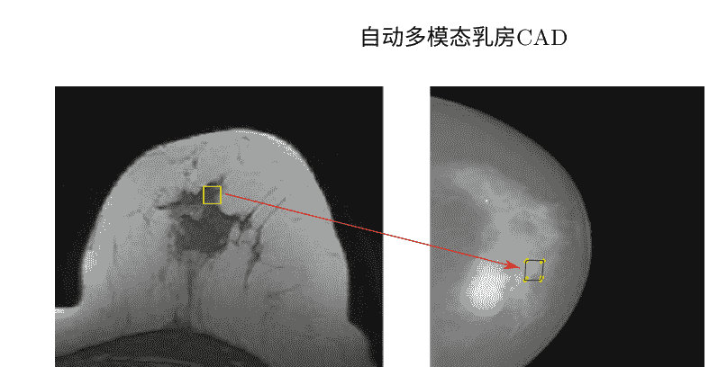

图1。基于估计的变形场，从MRI（左）到CC乳房X线照片（右）的映射。MRI ROI（黄色矩形）的顶点被映射到X射线乳房X线照片（黄色点）。乳房X线照片ROI由这些点的凸包形成（绿色）。（在线彩图）

对于每个3D MRI感兴趣区域（ROI），提取64个特征。基于强度的特征包括例如三个时间点（造影前、1分钟和6-7分钟后）的平均强度和方差。纹理特征基于3D灰度共生矩阵[10]。时间特征分析了造影前到1分钟后和1分钟后到最后一个时间点的对比增强，类似于三个时间点的方法[11]。

对于每个映射的乳腺X线摄影感兴趣区域（ROI），提取54个特征。与MRI强度特征类似，例如计算ROI中的平均强度、中位数和方差。纹理特征基于灰度共生矩阵[12]和灰度运行长度矩阵[13]。此外，应用多级Otsu阈值分割[14]并添加基于形态学增强的特征[15]。将MRI和乳腺X线摄影的所有特征汇总为一个组合特征向量。将MRI特征与CC和MLO乳腺X线摄影特征相结合，总共使用多达172个特征对每个ROI进行分类。分类问题通过WEKA模式识别工具箱[16]解决。使用基于相关性的特征子集选择方法进行最佳优先搜索的特征子集选择，使用十折交叉验证。选择在十个折叠中至少出现一次的特征进行分类。我们使用不同的随机种子重复进行特征选择的交叉验证三次，以减少由于数据集分割而导致的分析敏感性。

为了证明这种方法的可行性，我们采用了随机森林分类器，因为在我们之前的研究中它被证明能够提供稳健的结果[7]。分类器的性能再次通过十折交叉验证进行评估，并使用随机种子重复三次。

### 2.3 临床数据集和评估方法

该方法使用了来自先前研究的43个患者数据集进行评估，其中MRI与CC以及MLO斜视乳房X线摄影图像进行了图像配准[6,18]。每个数据集包括同一患者的T1加权动态增强MR体积的时间序列以及相应的CC和MLO乳房X线摄影图像。MR图像是在1.5T扫描仪（Siemens Magnetom Symphony, Sonata, Avanto）上采集的，患者采用专用的双侧乳房线圈，并处于俯卧位。MRI参数如下：矩阵大小=384×384，层厚=33，空间分辨率=0.9×0.9×3.0 mm³，采集时间=每次测量1分钟。作为对比剂，使用0.1 mmol/(kg体重)的Gd-DTPA以3 ml/s的速度静脉注射，使用注射器进行标准化注射。对比剂注射后注射20 ml生理盐水溶液。使用GE Senograph 2000D设备获取全数字乳房X线摄影图像。

分类器的训练和评估的地面真实值是基于专家注释给出的。每个注释使用自由手工工具在3D MR体积中圈定病变。注释的病变包括恶性和良性病变的混合，经过组织学或随访诊断验证。如果我们的CAD方法的ROI的体积至少有50%被专家的病变注释覆盖，则将其标记为可疑。

作为原理证明，在MRI中选择了10×10×10 mm³的ROI大小，以在MRI到乳房X线视图的映射中在可检测的病变大小和时间消耗之间进行权衡。这导致总共31,239个ROI，其中634个被标记为可疑。

这些数据集的图像配准是在之前的研究中进行的[6,9]。目标配准误差（TRE）是基于乳房X线照片中注释的病变中心与从3D MRI投影到2D乳房X线照片中的注释的病变中心之间的欧氏距离估计的。CC视图乳房X线照片的平均TRE约为13.6 mm（标准偏差（SD）9.6 mm）[6]，MLO视图乳房X线照片的平均TRE约为16.3 mm（SD 8.7 mm）[6]。

我们评估了四种设置：
- (1) 仅使用MRI特征，
- (2) 使用MRI和CC视图乳腺X线照片的特征，
- (3) 使用MRI和MLO视图乳腺X线照片的特征，
- (4) 使用MRI和CC视图以及MLO视图乳腺X线照片的特征。

对于每个设置，我们使用之前描述的特征选择和分类器评估进行了十折交叉验证。因此，总共得到了每个设置的九次分类评估运行，包括三个特征子集和三个分类器交叉验证的随机种子的所有组合。为了分析分类器的性能，根据真阳性和假阳性率计算了被错误分类的ROI的错误率以及与ROI相关的敏感性和特异性，其中可疑的ROI被视为阳性。

## 3 结果

图2和图3显示了四种设置的箱线图评估结果。如果只考虑MRI特征（设置1），平均灵敏度从平均76.1%（±标准差0.8%）增加到多模态设置2（MRI + CC）的76.9%（±0.4%），多模态设置3（MRI + MLO）的77.1%（±1.0%），以及多模态设置4（MRI + CC + MLO）的77.9%（±1.2%）。同时，ROI相关的特异性在所有设置中保持在99.8%的恒定水平。这种趋势在错误分类的ROI错误率中也存在：从0.68%（MRI）降低到0.64%（MRI + CC），0.63%（MRI + MLO）和0.62%（MRI + CC + MLO）。因此，通过结合来自MRI和两种乳房X线视图的多模态信息可以获得最佳结果。

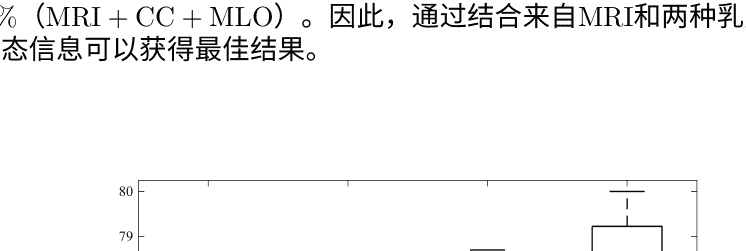

图2. 分类结果：使用评估的四种设置检测可疑ROI的敏感性。每个“箱子”的顶部和底部分别是样本的第25和第75百分位数，箱子内的线表示中位数。垂直虚线表示须，其中包括所有未被视为异常值的数据集，即低于1.5倍四分位距。

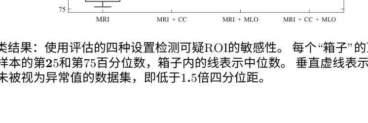

图3. 分类结果：使用评估的四种设置错误分类的ROI的百分比。每个“箱子”的顶部和底部分别是样本的第25和第75百分位数，箱子内的线表示中位数。垂直虚线表示须，其中包括所有未被视为异常值的数据集，即低于1.5倍四分位距。

为了分析TRE对分类性能的影响，我们选择了TRE在CC视图配准和MLO视图配准中均小于10毫米的数据集子集。在这个数据子集上进行了与之前相同的评估。对于设置1、2、3和4，灵敏度分别为76.2% (±4.2%)、79.6% (±3.2%)、75.7% (±4.2%)和78.3% (±3.5%)。

同时，特异性变化很小，并且通过添加多模态信息而增加：对于设置1、2、3和4，平均特异性分别为99.6% (±0.1%)、99.7% (±0.1%)、99.7% (±0.1%)和99.7% (±0.1%)。

从CC视图乳腺X线照片中添加信息比在所有数据集上进行评估时显著提高了灵敏度。然而，在MLO情况下，灵敏度略有下降，而在联合CC视图和MLO视图情况下，可以观察到中间结果。对于分类错误也是如此。对于所有多模态设置，特异性保持在大致恒定的水平上。混合结果的一个原因可能是数据子集的规模有限：它仅由三个患者数据集组成，TRE低于10毫米，总共2195个ROI。这个假设得到了支持，因为与所有数据集的评估相比，标准偏差明显较大。

## 4 讨论和结论

在本文中，我们提出了一种基于3D MRI和2D双视图X线乳腺摄影图像配准的自动多模态CAD系统的方法。我们通过将MLO乳腺X线照片添加到CAD系统中，并通过将多模态信息组合在经典的乳腺癌检测模式识别中进行分析，扩展了我们之前的方法，并分析了改进效果。

为了检查我们方法的可行性，我们使用了大小为10 ×10 ×10 mm³的不同感兴趣区域（ROI）进行实验。由于固定的ROI大小和仅有手工注释的病变信息，每个ROI的标注并不直观。我们最初决定根据ROI与病变标注的重叠程度进行标注，并使用50%的体积重叠阈值将ROI标记为可疑。因此，我们的系统能够检测到的病变大小是有限的。

我们目前的研究一方面集中在加速MRI和乳腺X线摄影之间的映射，以允许更多的ROI，从而使ROI的大小更小，甚至使用滑动窗口方法进行基于体素的分类。

另一方面，我们将进一步研究标注阈值的影响，并计划与专家对标注进行额外的审查，以清除数据集中的异常值。

与我们之前的研究类似，这项工作仅限于从临床常规中选择的数据集，其中所有的MRI检查都采用相同的协议进行。乳腺X线摄影图像都是使用相同的乳房X线摄影系统获取的，具有相同的图像特征。数据集也是根据专家在MRI和X线乳房摄影图像中能够勾画出病变来选择的，以评估TRE。

为了评估我们的CAD方法，从MRI和乳腺摄影图像中提取了一组基本的常用特征。虽然这可能还没有充分发挥CADe系统的潜力，但我们允许通过类似插件的特征提取软件架构轻松扩展系统。

尽管这项研究存在一些限制，但初步结果是令人鼓舞的：我们提出的方法能够识别大约78%的可疑标记的ROI。虽然平均配准误差大于ROI的大小，但在结合多模态信息时，结果有所改善。由于非线性变形、复杂的组织结构和患者定位过程中的手动干预，X线乳腺摄影图像和MRI的准确配准具有挑战性，是一个活跃的研究领域。然而，与当前MRI到乳腺摄影图像配准方法[6,19,20]相比，TRE已经显著提高了CADe的性能。我们在这项研究中展示了包括第二个乳腺摄影视图可以进一步提升我们的多模态CAD系统用于乳腺癌检测。

## 参考文献

1. Cheng, H., Shi, X., Min, R., Hu, L., Cai, X., Du, H.: 自动检测和分类乳腺X光照片中肿块的方法。模式识别。39(4), 646-668 (2006)
2. Dorrius, M., van der Weide, M., van Ooijen, P., Pijnappel, R., Oudkerk, M.: 乳腺MRI中的计算机辅助检测：系统综述和荟萃分析。欧洲放射学杂志 21(8), 1600-1608 (2011)
3. Cheng, H., Shan, J., Ju, W., Guo, Y., Zhang, L.: 使用超声图像进行自动乳腺癌检测和分类的调查。模式识别。43(1), 299-317 (2010)
4. Lord, S., Lei, W., Craft, P., Cawson, J., Morris, I., Walleser, S., Griffiths, A., Parker, S., Houssami, N.: 磁共振成像（MRI）作为乳腺癌高风险年轻女性筛查中乳腺X光照片和超声的补充的有效性的系统综述。欧洲癌症杂志 43(13), 1905-1917 (2007)
5. Yuan, Y., Giger, M.L., Li, H., Bhooshan, N., Sennett, C.A.: FFDM和DCE-MRI在乳腺癌诊断中的多模态计算机辅助诊断。Acad. Radiol. 17(9), 1158-1167 (2010)
6. Hopp, T., Dietzel, M., Baltzer, P., Kreisel, P., Kaiser, W., Gemmeke, H., Ruiter, N.: 使用生物力学FEM模型和基于强度的优化的自动多模态2D/3D乳腺图像配准。Med. Image Anal. 17(2), 209-218 (2013)
7. Hopp, T., Neupane, B., Ruiter, N.V.: 基于3D-2D图像配准的自动多模态计算机辅助检测。在：第13届乳腺成像国际研讨会（IWDM 2016）论文集，瑞典马尔默，pp. 400-407 (2016)
8. Wu, S., Weinstein, S., Keller, B.M., Conant, E.F., Kontos, D.: 在乳腺MRI中完全自动化的纤维腺体组织分割。在: Maidment, A.D.A., Bakic, P.R., Gavenonis, S. (eds.) IWDM 2012. LNCS, vol. 7361, pp. 244–251. Springer, Heidelberg (2012). doi:10.1007/978-3-642-31271-7_32
9. Hopp, T., de Barros Rupp Simioni, W., Perez, J.E., Ruiter, N.: MRI与X射线乳腺摄影注册的生物力学模型比较。在: Proceedings 3rd MICCAI Workshop on Breast Image Analysis, pp. 81–88 (2015)
10. Chen, W., Giger, M.L., Li, H., Bick, U., Newstead, G.M.: 对增强磁共振图像上的乳腺病变进行体积纹理分析。磁共振医学。58(3), 562–571 (2007)
11. Degani, H., Gusis, V., Weinstein, D., Fields, S., Strano, S.: 通过高空间分辨率的MRI映射乳腺肿瘤的病理生理特征。Nat. Med. 3(7), 780–782 (1997)
12. Haralick, R.M., Shanmugam, K., Dinstein, I.: 用于图像分类的纹理特征。IEEE Trans. Syst. Man Cybern. SMC-3(6), 610–621 (1973)
13. Galloway, M.M.: 使用灰度级运行长度的纹理分析。Comput. Graph. Image Process. 4(2), 172–179 (1975)
14. Otsu, N.: 一种基于灰度级直方图的阈值选择方法。IEEE Trans. Syst. Man Cybern. 9(1), 62–66 (1979)
15. Li, H., Wang, Y.J., Liu, K.J.R., Lo, S.C.B., Freedman, M.T.: 计算机辅助放射学乳房肿块检测 - 第一部分：通过形态增强和上下文分割选择病变位置。IEEE Trans. Med. Imag. 20, 289–301 (2001)
16. Hall, M., Frank, E., Holmes, G., Pfahringer, B., Reutemann, P., Witten, I.H.: WEKA数据挖掘软件的更新。SIGKDD Expl. 11(1), 10–18 (2009)
17. Hall, M.A.: 基于相关性的特征子集选择用于机器学习。博士论文, 新西兰汉密尔顿大学 (1999)
18. Hopp, T., Ruiter, N.V.: 用于乳腺MRI中乳腺肿瘤定位的2D/3D配准。In: Maidment, A.D.A., Bakic, P.R., Gavenonis, S. (eds.) IWDM 2012. LNCS, vol. 7361, pp. 627–634. Springer, Heidelberg (2012).
19. Mertzanidou, T., Hipwell, J., Johnsen, S., Han, L., Eiben, B., Taylor, Z., Ourselin, S., Huisman, H., Mann, R., Bick, U., Karssemeijer, N., Hawkes, D.: MRI到X射线乳腺X射线摄影强度基础的配准，同时优化姿势和生物力学转换参数。医学图像分析。18(4), 674–683 (2014)
20. Lee, A., Rajagopal, V., Gamage, T.P.B., Doyle, A.J., Nielsen, P., Nash, M.: 乳房病变在X射线和MR图像之间的共定位，使用有限元建模。医学图像分析。17(8), 1256–1264 (2013)

# 视神经疾病中的电子病历-放射学表型及其与视觉功能的关联

Shikha Chaganti^1(✉)^ID，Jamie R. Robinson^2^ID，
Camilo Bermudez^3^ID，Thomas Lasko^4，Louise A. Mawn^5^ID，
和 Bennett A. Landman^6^ID

^1^ 范德堡大学计算机科学系，纳什维尔，TN 37235，美国
shikha.chaganti@vanderbilt.edu
^2^ 范德堡大学医学中心，1211 Medical Center Dr，纳什维尔，TN 37232，美国
^3^ 范德堡大学生物医学工程系，纳什维尔，TN 37235，美国
^4^ 范德堡大学生物医学信息学系，纳什维尔，TN 37235，美国
^5^ 范德堡眼科研究所，2311 Pierce Avenue，纳什维尔，TN 37232，美国
^6^ 范德堡大学电气工程系，纳什维尔，TN 37235，美国

## 摘要

将放射学成像与其他电子病历（EMR）相结合，对视神经疾病进行多模态分析可以提高对视觉功能的理解。 我们对55名青光眼患者和32名甲状腺眼病（TED）患者进行了研究。 我们收集了他们的视觉评估、眼眶CT成像和EMR数据。 我们开发了一个图像处理流程，从CT图像中分割和提取结构度量。 我们借助PheWAS（来自诊断代码）和ProWAS（来自治疗代码）获得了EMR表型向量。 接下来，我们进行了主成分分析和多重对应分析，以确定它们与视觉功能评分的关联。 我们发现，从CT成像中得出的结构度量与青光眼（R²= 0.32）和TED（R²= 0.4）的功能视觉评分显著相关。 将EMR表型向量添加到模型中显著改善了（p < 1E-04）青光眼的R²为0.4和TED的R²为0.54。

- CT成像
- EMR
- 回归
- 视神经
- MCA
- PCA

## 1 引言

视神经的病理影响每年数百万美国人，并且由于视觉功能丧失而严重影响个人的生活质量[1]。 准确地表征这些疾病并及时干预可以保护视觉功能。 眼眶的三维计算机断层扫描（CT）成像可以捕捉眼眶结构变化。眼眶的成像可以指示疾病进展的程度并表征病理。在之前的研究中[2, 3]，眼眶的三维结构度量与视觉结果（如视力和视野）在视神经疾病患者中显示出定量关系。然而，由于结构数据的解释方差百分比较低（R² ≈ 0.1-0.2），模型解释结果的能力受到多种因素的影响，特别是预测特征的选择。此外，尽管放射学成像中提供了信息，但在个体的健康历史背景下评估放射学对于确定功能变化、疾病进展和预后非常重要。随着数字电子病历（EMR）系统在美国医疗保健系统中的普及[4, 5]，这些记录对于医学研究科学家来说越来越容易获取。

在这项研究中，我们开发了一个自动化流程，用于眼眶CT图像的分割和度量计算，以用于青光眼和甲状腺眼病（TED）的诊断。此外，我们还展示了将EMR数据（如ICD-9（国际疾病分类-9）代码和CPT（当前操作术语）代码）与图像生物标志相结合，可以提高疾病结果的解释方差。

## 2 方法

### 2.1 数据

该研究在范德堡大学医学中心的一组回顾性患者队列上进行。根据患者满足眼疾病临床标准并进行CT成像作为常规临床护理的一部分，通过机构审查委员会（IRB）的批准检索到受试者。收集的数据包括成像记录、视觉测试、人口统计数据、完整的ICD-9代码和CPT代码。本研究包括青光眼组（n = 55）和TED组（n = 32）的疾病群体。

### 2.2 结果：视觉功能评分

本研究的结果是基于临床视力和视觉场测试计算的。根据美国医学协会的定义，共计计算了九种不同的结果评估指标，用于完整的视觉功能评估。右眼和左眼的视力评分分别计算为VAS_od和VAS_os。对于两只眼睛的视力，VAS_ou被计算为VAS_od和VAS_os中的最佳值。功能视力评分FAS是VAS_od、VAS_os和VAS_ou的加权得分，权重为1:1:3。视野测试的得分，包括VFS_od、VFS_os、VFS_ou和FFS的计算方法类似。最终的视觉功能评分（FVS）是FAS和FFS的平均值。

### 2.3 图像处理

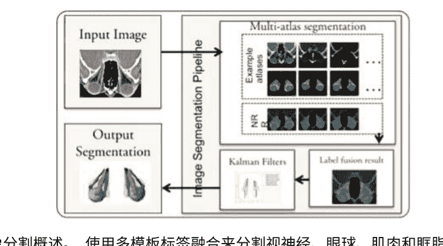

图1. 图像分割概述。使用多模板标签融合来分割视神经、眼球、肌肉和眶脂肪。卡尔曼滤波器用于基于结果分割四个单独的外眼肌，以实现最终的三维分割结果。

眼眶脂肪。使用一组二十五个专家标记的3D CT模板作为训练样本，从新的输入扫描中获取分割结果。每个示例模板都经过非刚性配准到裁剪后的输入图像空间[7]。使用非刚性变形将示例模板的相应标签传播到输入图像空间。然后，使用非局部统计标签融合方法得到具有四个标签的分割结果[8]。在病态眼中分割单个眼外直肌是具有挑战性的，因为由于炎症，在眼眶后部获得真实标签是困难的。因此，我们采用卡尔曼滤波器来从多模板算法[3]中分割肌肉标签，以识别上直肌、下直肌、外直肌、内直肌。一旦获得最终分割结果，将计算双侧的二十五个结构度量。对于每个结构，测量体积、横截面积和直径/长度。计算眼眶拥挤度指数，即巴雷特肌肉指数和体积拥挤度指数。此外，计算突眼程度和眼眶角度。对于每个患者，构建一个具有50个元素的向量，用于计算双侧的25个结构度量。

$$x_{CT}^{(i)} = [sm_{1\_os} sm_{2\_os} \dots sm_{25\_os} sm_{1\_od} sm_{2\_od} \dots sm_{25\_od}]$$

其中，$sm_{k\_os}$表示左眼的第$k$个结构度量，而$sm_{k\_od}$表示右眼的第$k$个结构度量。

### 2.4 电子病历特征

从电子病历中提取了每个患者的完整ICD-9代码和CPT代码，用于诊断和治疗信息。然而，只考虑在诊断前一个月或更长时间内可用的ICD-9和CPT代码，因为我们对了解患者的历史如何为成像信息提供背景感兴趣。

PheWAS代码。有超过14,000个ICD-9代码被定义。一个分层系统被定义，将每个ICD-9代码映射到最初在表型广泛关联研究（PheWAS）中使用的1865个表型代码的较小组。[9] 每个表型，称为PheWAS代码，表示一组相关的医学诊断和疾病。

ProWAS代码。我们引入了一个类似的分层分组，将每个CPT代码映射到一组相关的程序，我们用程序广泛关联研究（ProWAS）代码表示。我们定义了1682个ProWAS代码，这些代码是由医疗成本和利用项目（HCUP）的临床分类系统编码提供的更精细的子组。这个项目由医疗保健研究和质量机构（AHRQ）提供。[10]

对于每个患者，使用1865个元素的二进制向量 $x_{PheWAS}^{(i)}$ 定义了PheWAS。如果患者i过去曾经有过诊断表型k，则 $d_k$ 为1，否则为0。

$x_{PheWAS}^{(i)}$ 是一个包含1865个元素的二进制向量。

类似地，使用1682个元素的二进制向量 $x_{ProWAS}^{(i)}$ 定义了ProWAS。如果患者i过去曾经有过治疗表型g，则 $t_k$ 为1，否则为0。

$x_{ProWAS}^{(i)}$ 是一个包含1682个元素的二进制向量。

### 2.5 维度约简：主成分分析（PCA）和多重对应分析（MCA）

每个患者都有大量的数据；对于患者i，最终的数据向量包含3597个元素。然而，这些数据之间存在相关性，因此可能存在潜在的主要变量。对于结构度量，使用主成分分析（PCA）[11]来降低数据集的维度。提取解释了四分之三万方差的前五个主成分，得到患者i的结果。

$x_{C}^{(i)} = [sm'_1 sm'_2 … sm'_5] \quad (1)$

对于PheWAS和ProWAS二进制向量，使用多重对应分析（MCA）[12]提取正交分量，并使用χ²统计量进行分解。对于PheWAS和ProWAS向量，考虑前五个分量。通过MCA，我们得到每个患者的两个维度较小的向量。

$x_{PheWAS\_MCA}^{(i)} = [d'_1 d'_2 … d'_5] \quad (2)$

$x_{ProWAS\_MCA}^{(i)} = [t'_1 t'_2 … t'_5] \quad (3)$

### 2.6 逐步广义线性模型

视力评分介于0到100之间，大多数患者的评分接近100，接近0的值非常罕见。这使得视力结果的分布左偏。因此，使用具有泊松分布[13]的广义线性模型（GLM）来找到每组数据集的解释价值，由公式（1），（2）和（3）给出，并将所有数据一起使用。这些数据集在视力结果评分 $s_v$ 上进行回归，其中 $s_v \in \{VAS_{ou}, VAS_{od}, VAS_{os}, VAS, FAS, VFS_{ou}, VFS_{od}, VFS_{os}, FFS, FVS\}$。为每个 $v$ 定义了四个模型。

$M1: s_v = \beta_0 + \beta_1 sm'_1 + \ldots + \beta_k sm'_k + \beta_{k+1} d'_1 + \ldots + \beta_{k+l} d'_l + \beta_{k+l+1} t'_1 + \ldots + \beta_{k+l+m} t'_m + \beta_{k+l+m+1} \text{年龄} + \beta_{k+l+m+2} \text{性别} + \epsilon$

$M2: s_v = \beta_0 + \beta_1 sm_1 + \ldots + \beta_k sm_k + \beta_{k+1} \text{年龄} + \beta_{k+2} \text{性别} + \epsilon$

$M3: s_v = \beta_0 + \beta_1 d'_1 + \ldots + \beta_l d'_l + \beta_{l+1} \text{年龄} + \beta_{l+2} \text{性别} + \epsilon$

$M4: s_v = \beta_0 + \beta_1 t'_1 + \ldots + \beta_m t'_m + \beta_{m+1} \text{年龄} + \beta_{m+2} \text{性别} + \epsilon$

使用逐步回归[14]构建了四个模型，采用前向选择变量的方法。在每一步中，最显著地改善模型偏差的变量被添加，直到没有更多的改进为止。每个模型的解释方差，即 $R^2$ 被记录下来。

### 2.7 偏差测试

给定拟合参数 $\hat{\theta}$ 的模型 $M$ 的偏差为

$D(M) = -2 \left( \log \left( p(y|\hat{\theta}) \right) - \log(p(y|\theta_s)) \right)$

其中，$\theta_s$ 是饱和模型的参数，即每个数据点都被完全拟合的模型的参数。偏差可以用来测试两个嵌套模型 $M_p(\hat{\theta}_p|X)$ 和 $M_q(\hat{\theta}_q)$ 之间的显著性差异，其中 $\hat{\theta}_p \subset \hat{\theta}_q$ 是两个模型之间参数的差异，$\delta$ 是差异的偏差。两个模型之间的偏差的差异服从自由度为 $\delta$ 的 $\chi^2$ 分布。偏差测试的零假设 $H_0$ 是添加 $\delta$ 个参数到模型 $M_p$ 以得到模型 $M_q$ 不会改善模型。该测试用于比较模型M2-4和M1。

## 3 结果

青光眼队列的平均年龄组为65.4 ±19.5岁，其中72%的受试者为女性。TED受试者中91%为女性，该组的平均年龄为57.8 ±16.2岁。平均而言，每个患者有410个ICD-9代码和660个CPT代码记录。图2显示了在模型M2、M3和M4中三个数据集的前两个主成分上按性别的个体分布。对于青光眼，结构度量的主成分对应于肌肉和视神经测量，第二个组分对应于眼眶和球测量。对于TED，第一个组分主要对应于肌肉测量，第二个组分对应于视神经测量。与青光眼的ICD-9向量的第一个MCA组分相关的一些病症包括不适，骨关节炎和低血容量，与第二个组分相关的病症包括女性泌尿系统症状和与眼睛相关的症状，如疼痛和肿胀。对于TED的ICD-9向量的第一个MCA组分与高脂血症，糖尿病和循环问题等病症相关，与第二个MCA组分最相关的一些病症是肌痛和异常血液化学。对于青光眼的CPT向量，第一个维度与CT扫描和病理实验室等各种程序相关，第二个组分与心脏测试相关。对于TED，第一个组分与尿液分析和血液检查等程序相关，第二个组分与物理治疗相关的程序相关。

表1和表3显示了模型M1、M2、M3和M4在青光眼和TED的功能视觉评分上回归的R²值。这些模型在两种疾病上的行为是相同的。添加治疗和诊断表型与模型M2结合，得到模型M1的结果，在大多数视觉结果中解释方差明显提高：FVS、FFS、VFS_ou、VFS_od、VAS_od和VAS_os。在表1和表3中，通过**表示从模型M2到M1改善的R²值。使用偏差测试来测试这种改善的统计学显著性，如第2.7节所述。表2和表4显示了在M1和其嵌套模型M2、M3和M4之间进行的偏差测试的p值。然而，有趣的是，即使右眼和左眼的视力得分VAS_od和VAS_os有所改善，复合视力得分VAS_ou和FAS在模型M2和M1之间没有改善。从这些得分的定义可以看出，它们对表现最好的眼睛给予更高的权重。这可能表明在这些情况下，视力变化可能不是双侧的。然而，对于视野得分，个体眼睛得分的行为在复合得分中得到了反映，表明青光眼和TED中的视野变化可能是双侧的。

表1. 青光眼中的解释方差。**表示模型M1在表2中的p值基础上，使用结构度量单独进行建模，明显优于模型M2。

| R²  | VASod | VASos | VFSod | VFSos | VASou | VFSou | FFS  | FVS  | FAS  |
| :-- | :---- | :---- | :---- | :---- | :---- | :---- | :--- | :--- | :--- |
| M1  | 0.48** | 0.33** | 0.47** | 0.39** | 0.24  | 0.27** | 0.33** | 0.40** | 0.35 |
| M2  | 0.45  | 0.13  | 0.37  | 0.16  | 0.24  | 0.18  | 0.23  | 0.33  | 0.35 |
| M3  | 0.07  | 0.07  | 0.16  | 0.08  | 0.08  | 0.05  | 0.08  | 0.07  | 0.00 |
| M4  | 0.04  | 0.00  | 0.20  | 0.06  | 0.00  | 0.05  | 0.09  | 0.06  | 0.00 |

表2. 偏差检验。na表示模型在M1和M2中是相同的，因为选择了相同的特征。

| p值      | VAS_od  | VAS_os  | VFS_od   | VFS_os   | VAS_ou | VFS_ou  | FFS      | FVS      | FAS      |
| :------- | :------ | :------ | :------- | :------- | :----- | :------ | :------- | :------- | :------- |
| M1对M2 | 4.30E-05 | 5.89E-09 | 2.92E-26 | 3.31E-38 | na     | 5.38E-07 | 1.34E-07 | 1.18E-07 | na       |
| M1对M3 | 1.66E-28 | 1.55E-10 | 3.17E-62 | 9.70E-46 | 0.001  | 2.65E-11 | 8.46E-15 | 2.39E-26 | 2.40E-06 |
| M1对M4 | 1.42E-29 | 3.59E-12 | 3.22E-58 | 8.32E-47 | 0.0005 | 8.48E-12 | 2.35E-14 | 3.15E-26 | 2.40E-06 |

表3. TED中的解释方差。**表示模型M1在结构度量方面明显优于模型M2，即根据表4中的p值，仅使用结构度量。

| R²  | VAS_od | VAS_os | VFS_od | VFS_os | VAS_ou | VFS_ou | FFS  | FVS  | FAS  |
| :-- | :----- | :----- | :----- | :----- | :----- | :----- | :--- | :--- | :--- |
| M1  | 0.61** | 0.30** | 0.59** | 0.37** | 0.28   | 0.36** | 0.42** | 0.54** | 0.44   |
| M2  | 0.49   | 0.23   | 0.45   | 0.26   | 0.28   | 0.23   | 0.28   | 0.40   | 0.44   |
| M3  | 0.30   | 0.22   | 0.33   | 0.24   | 0.16   | 0.20   | 0.24   | 0.28   | 0.20   |
| M4  | 0.28   | 0.18   | 0.29   | 0.18   | 0.16   | 0.17   | 0.19   | 0.29   | 0.20   |

表4. 偏差测试。na表示M1和M2模型相同，因为选择了相同的特征。

| p值      | VAS_od  | VAS_os  | VFS_od   | VFS_os   | VAS_ou | VFS_ou  | FFS      | FVS      | FAS      |
| :------- | :------ | :------ | :------- | :------- | :----- | :------ | :------- | :------- | :------- |
| M1对M2 | 4.56E-06 | 0.00027 | 5.15E-24 | 6.75E-07 | na     | 4.38E-08 | 7.50E-09 | 9.70E-10 | na       |
| M1对M3 | 1.09E-17 | 0.00049 | 7.27E-45 | 1.23E-08 | na     | 7.02E-10 | 1.88E-12 | 3.53E-18 | 1.12E-05 |
| M1对M4 | 1.60E-18 | 6.84E-05 | 4.61E-52 | 1.30E-10 | na     | 9.51E-12 | 6.77E-15 | 2.36E-19 | 1.12E-05 |

## 4 讨论

为了确定与视神经疾病（如青光眼和甲状腺眼病）相关的成像生物标志物，必须建立它们与视觉功能评分的关系。这项研究表明，通过在ProWAS和PheWAS数据上使用MCA导出的治疗和诊断表型，可以改善传统成像方法。

通过提供个体的健康历史背景，从临床数据中提供生物标志物研究的上下文。这是第一个已知将ProWAS映射应用于眼科疾病治疗表型的研究。我们展示了从CT成像、治疗和诊断表型中得出的眼眶结构度量与视觉功能评分之间存在显著关联，并且解释了青光眼和甲状腺眼病视觉结果变异的40%–60%。

## 致谢
本研究得到了NSF CAREER 1452485和NIH grants 5R21EY024036的支持。本研究得到了美国国家老龄化研究所（NIH）机构内研究计划的支持。本研究部分使用了Vanderbilt University的Advanced Computing Center for Research and Education (ACCRE)的资源。该项目部分得到了ViSE/VICTR VR3029和National Center for Research Resources Grant UL1 RR024975-01的支持，现在位于National Center for Advancing Translational Sciences Grant 2 UL1 TR000445-06。

## 参考文献
1. Rein, D.B., Zhang, P., Wirth, K.E., Lee, P.P., Hoerger, T.J., McCall, N., Klein, R., Tielsch, J. M., Vijan, S., Saaddine, J.: 美国主要成年视觉障碍的经济负担。 Arch. Ophthalmol. 124, 1754–1760 (2006)
2. Xiuya Yao, S.C., Nabar, K.P., Nelson, K., Plassard, A., Harrigan, R.L., Mawn, L.A., Landman, B.A.: 眼眶成像生物标志物与临床视觉评估之间的结构功能关系。 In: SPIE医学成像会议论文集
3. Chaganti, S., Nelson, K., Mundy, K., Luo, Y., Harrigan, R.L., Damon, S., Fabbri, D., Mawn, L., Landman, B.: 甲状腺眼病中眼眶的结构功能关联：卡尔曼滤波器跟踪眼外直肌。 In: SPIE医学成像, vol. 97847, p. 97841G. 国际光学与光子学学会
4. Xierali, I.M., Hsiao, C.-J., Puffer, J.C., Green, L.A., Rinaldo, J.C., Bazemore, A.W., Burke, M.T., Phillips, R.L.: 家庭医生电子健康记录采用的崛起。 Ann. Fam. Med. 11, 14–19 (2013)
5. Patel, V., Jamoom, E., Hsiao, C.-J., Furukawa, M.F., Buntin, M.: 电子健康记录采用的变异和对有意义使用的准备情况: 2008–2011。
6. Rondinelli, R.D., Genovese, E., Brigham, C.R.: 永久损伤评估指南。
7. Avants, B.B., Epstein, C.L., Grossman, M., Gee, J.C.: 对称的互相关图像配准：评估老年人和神经退行性脑的自动标记。
8. Asman, A.J., Landman, B.A.: 非局部统计标签融合用于多图谱分割。 医学图像分析 17, 194–208 (2013)
9. Denny, J.C., Bastarache, L., Ritchie, M.D., Carroll, R.J., Zink, R., Mosley, J.D., Field, J.R., Pulley, J.M., Ramirez, A.H., Bowton, E.: 电子病历数据与全基因组关联研究数据的系统比较。 自然生物技术。 31, 1102–1111 (2013)
10. https://www.hcup-us.ahrq.gov/toolsoftware/ccs_svcsproc/ccssvcproc.jsp
11. Shlens, J.: 主成分分析教程。 arXiv预印本 arXiv:1404.1100 (2014)
12. Abdi, H., Valentin, D.: 多重对应分析。 在： 《测量与统计学百科全书》，第651–657页（2007年）
13. McCullagh, P.: 广义线性模型。欧洲运筹学杂志16, 285–292页（1984年）
14. Draper, N.R., Smith, H., Pownell, E.: 应用回归分析。Wiley出版社，纽约（1966年）

## 作者索引
- Abdi, Amir H. 100
- Abolmaesumi, Purang 100
- Abramoff, Michael D. 3
- Akbar, Shazia 143
- Akselrod-Ballin, Ayelet 321
- Al Arif, S.M.Masudur Rahman 74
- Ansart, Manon 357
- Bakalo, Ran 321
- Bao, Siqi 47
- Barkan, Ella 321
- Berendsen, Floris F. 204
- Bermudez, Camilo 373
- Bernasconi, Andrea 349
- Bernasconi, Neda 349
- Bernhardt, Boris 349
- Blundon, Jay 285
- Brosch, Tom 330
- Bug, D. 135
- Caldairou, Benoit 349
- Chaganti, Shikha 373
- Cheluv araju, Bharath 178
- Chen, Hao 186
- Chung, Albert C.S. 47
- Cobzas, Dana 126
- Cohen-Adad, Julien 330
- Colliot, Olivier 357
- Cotic Smole, P. 365
- Cox, David 169
- Dastidar, Tathagato Rai 178
- De Leener, Benjamin 330
- de Vos, Bob D. 204
- Dezaki, Fatemeh Taheri 100
- Dhungel, Neeraj 100
- Ding, Zhipeng 267
- Divers, Jasmin 151
- Dormont, Didier 357
- Dubois, Bruno 357
- Durrleman, Stanley 357
- Eicholtz, Matthew 285
- Epelbaum, Stéphane 357
- Eppenhof, Koen A.J. 56, 83
- Fadaie, Fatemeh 349
- Feng, Jianjiang 39
- 冯子顺 39
- Feuerhake, F. 135
- Finger, Robert P. 65
- Fleishman, Greg 267
- Freedman, Barry I. 151
- Fujiwara, Michitaka 222
- Gagliardi, Geoffroy 357
- Garg, Prabhat 151
- George, Kevin 195
- Gill, Ravnoor S. 349
- Gin, Ken 100
- Golden, Daniel 109
- Gorgi Zadeh, Shekoufeh 65
- Grote, A. 135
- Guo, Yuke 117
- Hamidinekoo, Azam 213
- Hampel, Harald 357
- Harrison, Adam P. 195
- Hawley, Dale 100
- Hazan, Alon 321
- He, Xinzi 303
- Heng, Pheng-Ann 186
- Hildebrand, David G.C. 249
- Hofmanninger, Johannes 341
- Holz, Frank G. 65
- Hong, Seok-Jun 349
- Hopp, T. 365
- Horesh, Ami Ben 321
- Hsiao, Albert 109
- Hu, Xiaowei 186
- Huang, Weilin 276
- Hwang, Sangheum 92, 231
- Işgum, Ivana 204
- Jagersand, Martin 126
- Jamaludin, Amir 294
- Jeong, Won-Ki 249
- Jia, Jimmy 258
- Jin, Dakai 195
- Jorge Cardoso, M. 240
- Jue, John 100
- Jung, Youngkyoo 151
- Kadir, Timor 294
- Karasawa, Ken'ichi 222
- Karlinsky, Leonid. 321
- Kim, Minsoo 231
- Kitasaka, Takayuki 222
- Klibisz, Aleksander 285
- Knapp, Karen 74
- Kwitt, Roland 267
- Lafarge, Maxime W. 56, 83
- Landman, Bennett A. 373
- Langs, Georg 341
- Lasko, Thomas 373
- Lau, Felix 109
- Le, Matthieu 109
- Lee, Wei-Chung Allen 249
- Lei, Baiying 303
- Li, Wenqi 240
- Li, Yuexiang 12
- Lieman-Sifry, Jesse 109
- Liu, Honghui 39
- Ljungberg, Emil 330
- Lotter, William 169
- Lu, Jiwen 39
- Luong, Christina 100
- Ma, Gengyu 117
- Madhuranthakam, Ananth J. 151
- Maldjian, Joseph A. 151
- Martel, Anne 143
- Mawn, Louise A. 373
- Menze, Bjoern 341
- Merhof, D. 135
- Milletari, Fausto 258
- Misawa, Kazunari 222
- Moeskops, Pim 56, 83
- Mollura, Daniel J. 195
- Montillo, Albert 151
- Mori, Kensaku 222
- Mundhra, Dheeraj 178
- 聂，东 21
- Niethammer, Marc 267
- Noble, J. Alison 276
- Nofech-Mozes, Sharon 143
- 小田，正浩 222
- 奥斯瓦尔德，E. 135
- Ourselin, Sebastien 240
- Paeng, Kyunghyun 231
- Park, Sunggyun 92, 231
- Patra, Arijit 276
- 裴，玉茹 117
- Peikari, Mohammad 143
- Petitjean, Caroline 21
- Pluim, Josien P.W. 56, 83
- Porisky, Adam 330
- 秦，海芳 117
- 秦，静 186
- Rampure, Jaiprasad 178
- Riklin Raviv, Tammy 30
- Robinson, Jamie R. 373
- Rohling, Robert 100
- Rose, Derek 285
- Roth, Holger R. 222
- Rothberg, Alex 258
- Ruan, Su 21
- Rueckert, Daniel 222
- Ruiter, N.V. 365
- Saghafi, Behrouz 151
- Salama, Sherine 143
- Sall, Sean 109
- Schneider, S. 135
- Schüler, J. 135
- Schultz, Thomas 65
- Shah, Abhay 3
- Shen, Dinggang 21, 160
- Shen, Linlin 12
- Shimizu, Natsuki 222
- Shitrit, Ohad 30
- Shoshan, Yoel 321
- Slabaugh, Greg 74
- Smith, S. Carrie 151
- Sofka, Michal 258
- Sorensen, Greg 169
- Staring, Marius 204
- Sudre, Carole H. 240
- Tam, Roger 330
- Tang, Lisa Y.W. 330
- Tang, Min 126
- Thiele, Sarah 65
- Thompson, Paul 267
- Thung, Kim-Han 160
- Tobin, Willie F. 249
- Traboulsee, Anthony 330
- Trullo, Roger 21
- Tsang, Teresa 100
- Valipour, Sepehr 126
- Vercauteren, Tom 240
- Veta, Mitko 56, 83
- Viergever, Max A. 204
- Wagner, Benjamin C. 151
- Wang, Pei 47
- Wang, Tianfu 303
- Weber, Marc-André 341
- Wei, Jie 312
- Wiens, Vitalis 65
- Wintergerst, Maximilian W.M. 65
- Wu, Xiaodong 3
- Xia, Yong 312
- Xu, Jianzhao 151
- Xu, Tianmin 117
- Xu, Ziyue 195
- Yang, Xiao 267
- Yap, Pew-Thian 160
- Yoo, Inwan 249
- Yoo, Youngjin 330
- Yu, Lequan 186
- Yu, Zhen 303
- Zakharenko, Stanislav 285
- Zha, Hongbin 117
- Zhang, Yungeng 117
- Zhang, Zichen 126
- Zhou, Jie 39
- Zisserman, Andrew 294
- Zwiggelaar, Reyer 213