# 医疗保健中的深度学习

### 前言

随着计算机技术的快速发展和大数据的爆炸性增长，对深度学习（DL）的兴趣日益增长。DL也可以被视为人工智能（AI）的一个子集。早期的AI是一种基于规则的系统。当前的AI基于机器学习。为了完成特定任务（例如，肝脏病灶的分类），首先需要训练一个模型（网络），使用带有标签的训练输入及其对应的标签。训练完成后，可以使用训练好的模型来估计未标记的测试输入的输出（标签）。在传统的机器学习（非深度学习）方法中，首先提取手工制作的低级特征或中级特征，然后将提取的特征用作模型（分类器）的输入，用于分类或其他任务。DL涉及在输入和输出（隐藏层）之间使用具有多个层次（深度结构）的神经网络。DL的主要优势在于它可以自动学习数据驱动（或任务特定的），高度代表性和分层特征，并在一个网络上执行特征提取和分类。深度学习技术在包括图像分类、图像检测和图像分割在内的许多计算机视觉任务中取得了巨大成功，并在许多学术和工业领域中发挥着重要作用。最近，DL在医学应用中也被广泛使用，例如解剖建模（解剖结构分割）、肿瘤检测、疾病分类、计算机辅助诊断和手术规划。本书的目的是报告DL在医学和医疗保健领域的最新进展和潜在未来。本书分为三个部分：医疗保健中DL的基础知识；医疗保健中的高级DL；以及医疗保健中DL的应用。

第一部分（深度学习的基础）包括四章。分别总结了基于深度学习的医学图像检测、医学图像分割、医学图像分类和医学图像增强的基本和理论描述以及当前进展。

第二部分（高级深度学习）包括七章，介绍了解决医疗和健康应用中一些重要问题或挑战的各种新方法。第5章重点关注改进基于深度学习的语义分割方法，用于3D医学图像分割。有限的训练样本。第6章提出了一种新颖的深度主动自适应自学习（DASL）策略，以减少注释工作量，并利用未标注的样本，基于主动学习（AL）和自适应学习（SPL）策略的组合。第7章提出了一种新颖的迁移学习方法，称为“两阶段特征迁移学习”，以使DCNN能够提取良好的视觉纹理特征表示。所提出的方法已应用于肺HRCT分析。第8章提出了一种基于解剖标志的深度学习方法，用于结构磁共振成像的阿尔茨海默病诊断。第9章介绍了一种用于准确分类和定量计算CT图像中肺气肿的多尺度深度卷积神经网络。第10章重点研究了使用无监督和半监督学习在CT图像中对弥漫性肺疾病进行不透明度标记。第11章报告了一种用于无监督特征学习的残差稀疏自编码器及其在HEp-2细胞染色模式识别中的应用。

第三部分（深度学习的应用）包括第12章，介绍了一款基于深度学习的计算机辅助诊断系统，名为Dr. Pecker，这是一款在中国制造的获奖医学图像分析软件产品，展示了医学影像扫描的临床应用。

尽管以上章节并未完全涵盖医疗和保健应用中的深度学习技术，但它们提供了对重要问题和使用深度学习技术在医学和保健领域中的好处的一种了解。

我们对作者和审稿人的贡献表示感谢。我们要感谢Springer在书籍发展阶段的协助。


## 关于编辑

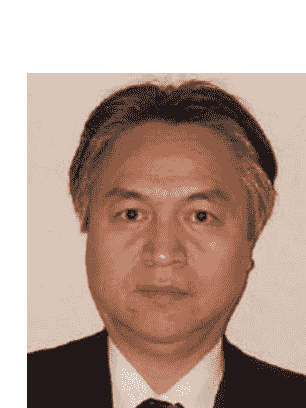

教授 Yen-Wei Chen 于1985年获得神户大学的学士学位，1987年和1990年分别获得大阪大学的硕士和博士学位。他曾在大阪的激光技术研究所担任研究员，从1991年到1994年。从1994年10月到2004年3月，他在琉球大学的电气与电子工程系担任副教授和教授。他目前是日本立命馆大学信息科学与工程学院的教授。他还是浙江大学计算机科学学院和浙江实验室的客座教授。

他的研究兴趣包括医学图像分析、计算机视觉和计算智能。他在多个顶级期刊和会议上发表了300多篇研究论文，包括IEEE图像处理、IEEE控制论、模式识别等。他获得了许多杰出奖项，包括ICPR2012最佳科学论文奖、2014JAMIT最佳论文奖、中国科学院海外杰出学者基金等。他是/曾是许多国家和工业研究项目的负责人。


Lakhmi C. Jain教授博士，硕士，学士（荣誉）（澳大利亚工程师协会）会员，现任悉尼科技大学（澳大利亚）和利物浦希望大学（英国）的教授。

Jain教授创办了KES International，为专业社区提供出版、知识交流、合作和团队合作的机会。KES吸引了来自世界各地的大约5,000名研究人员，促进国际合作并在教学和研究中产生协同效应。KES定期通过KES领域内最大的会议之一为专业社区提供网络交流机会。www.kesinternational.org

## 第一部分 医疗保健中的深度学习基础

# 第一章 使用深度学习的医学图像检测

María Inmaculada García Ocaña, Karen López-Linares Román, Nerea Lete Urzelai, Miguel Ángel González Ballester和Iván Macía Oliver

摘要本章介绍了基于深度学习的物体检测系统及其在医学图像分析中的应用。首先，简要介绍了图像检测的常见深度学习架构，包括基于扫描的方法和端到端的检测系统。还包括了一些关于训练方案和损失函数的考虑。然后，提供了使用卷积神经网络进行解剖和病理结构检测以及标志点检测的相关出版物概述。最后，提出了一些结论和未来的方向。

#### 1.1 引言

在医学领域，准确快速地检测解剖或病理结构或标志点对于各种任务至关重要。例如，定位解剖标志点对于引导图像配准或初始化器官的体积分割是必要的。病变检测是发展计算机辅助检测和诊断（CAD）系统的关键步骤，在过去几十年中越来越受欢迎。此外，检测算法

- M. I. García Ocaña (☒) · K. López-Linares Román · N. Lete Urzelai · I. Macía Oliver Vicomtech，西班牙圣塞巴斯蒂安，电子邮件： igarcia@vicomtech.org
- K. López-Linares Román 电子邮件：klopez@vicomtech.org
- N. Lete Urzelai 电子邮件：nlete@vicomtech.org
- I. Macía Oliver 电子邮件：imacia@vicomtech.org
- M. Á. González Ballester巴塞罗那Pompeu Fabra大学，西班牙，电子邮件： ma.gonzalez@upf.edu

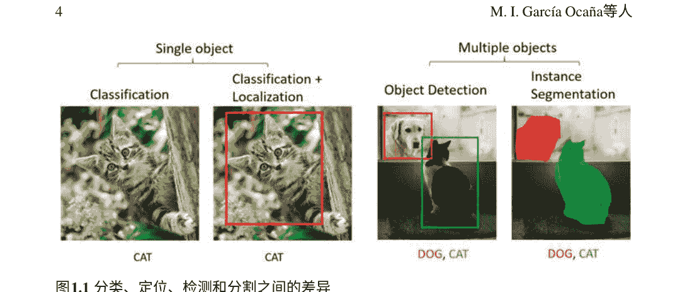

# 图1.1 分类、定位、检测和分割之间的差异

在干预过程中，这些智能系统还可以帮助跟踪结构或定位整个医学图像体积中的相关图像平面。

目标检测算法与分类算法的不同之处在于，它们不仅能够识别图像中存在的对象或结构，还能够输出它们的精确位置，即边界框。定位和检测是类似的任务：定位算法通常在图像中识别一个单一的对象，而目标检测算法能够找到图像中存在的多个对象的存在和位置（如图1.1所示）。因此，检测算法将为图像中每个对象输出一个边界框，并与每个边界框关联一个表示该对象属于该类的概率值。本章主要关注目标检测任务，但也提供了医学领域中地标定位的一些示例。

这种类型的算法被称为扫描式系统。传统上，特征提取算法（例如，SIFT[1]，HOG[2]，LBP[3]，Haar小波[4]或霍夫变换[5]）用于描述图像补丁，并将这些特征输入到支持向量机（SVM）或随机森林等分类器中。这种方法已经在医学领域的多个目标检测问题中使用[6-8]。

卷积神经网络（CNN）在图像分类任务[9]上的成功促使了深度学习在图像检测中的应用，利用CNN提取的特征而不是使用一组手工制作的特征。在2014年，

Girshick等人[10]提出了R-CNN（具有CNN特征的区域）。 对于区域提案，他们使用了一种流行的算法，称为选择性搜索[11]。 然后，将提取的图像块输入到CNN，即AlexNet [9]中提取特征，最后使用SVM进行分类。 从那时起，许多其他基于CNN的图像检测模型已经被设计和评估。 基于深度学习的最新方法用于目标检测，消除了区域提案步骤，或者直接从特征图中提取区域提案而不是从图像中提取，提高了速度，并且优于传统目标检测算法的结果。

然而，与计算机视觉领域相比，在医学影像领域的检测任务需要应对一些领域特定的挑战，例如缺乏带有注释数据的大型数据库。 这要求在医学领域工作的研究人员需要修改或开发特别适应该领域的检测算法。

基于深度学习的目标检测器已经在广泛的病理学领域中使用，例如乳腺癌、前列腺癌和视网膜病变，以及用于标志物和解剖结构的定位，这可以用作图像配准或分割的指南。 本章将提供医学图像中目标和标志物定位与检测的不同策略概述。 在关注医学应用之前，本节总结了使用深度学习进行图像检测的常见架构。 第1.2节概述了用于解剖标志物定位的深度学习，第1.3.2节概述了病理学检测的深度学习，最后第1.4节总结了结论。

## 1.2 图像检测的深度学习架构

基于扫描的系统是目标检测中最常见的方法。 它们由区域提议阶段和分类步骤组成，将检测任务作为一个基于补丁的分类问题来解决。 首个基于CNN的目标检测方法是基于这个框架的，引入了CNN用于特征提取或补丁分类（见图1.2）。 在某些情况下，使用CNN

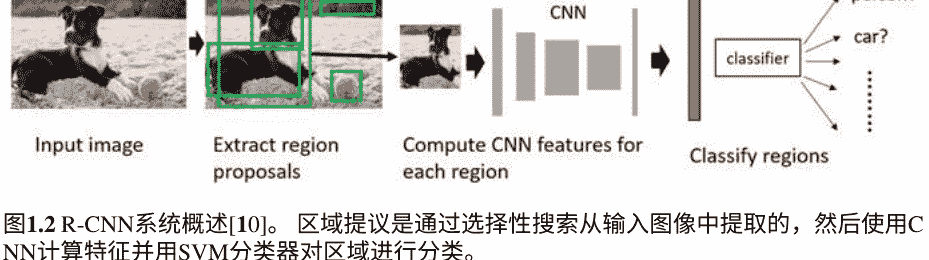

图1.2 R-CNN系统概述[10]。 区域提案是通过选择性搜索从输入图像中提取的，然后使用CNN计算特征并用SVM分类器对区域进行分类。

##### 1.2.1 基于扫描的系统

这些系统依赖于区域提议步骤来提取图像补丁，然后根据它们所包含的对象对这些补丁进行分类。卷积神经网络可以用于区域提取和分类（如Faster R-CNN中所述），也可以仅用于其中一个步骤。受到AlexNet网络[9]在分类任务中的成功启发，Ghirshick等人提出了区域卷积神经网络（R-CNN）[10]目标检测系统。他们保留了传统的区域提议、特征提取和分类方案，只在特征提取步骤中引入了卷积神经网络。他们使用了一种流行的区域提议算法，即选择性搜索[11]，生成不同的感兴趣区域，并将这些补丁输入到卷积神经网络中提取特征。网络计算的特征然后用于使用线性SVM对图像补丁进行分类，并应用贪婪非极大值抑制算法选择最终的边界框。

虽然R-CNN取得了良好的结果，但其主要缺点是计算时间。它为每个对象提议执行ConvNet前向传递，而不共享计算。因此，在[12]中设计了一种快速R-CNN来减少这种计算负担。快速R-CNN只需要一个主要的CNN来处理整个图像，但仍然依赖于选择性搜索算法来生成区域提议。然后，这些区域提议被输入到网络中，该网络以整个图像和补丁作为输入，并直接输出概率估计。

Faster R-CNN [13]包括一个区域提议网络（RPN），用于直接生成区域提议和预测边界框，无需使用选择性搜索或其他算法。RPN以图像作为输入，并输出一组具有对象性得分的矩形对象。这是通过在卷积特征图上滑动一个小型网络并生成一个低维向量来完成的，该向量被馈送到两个全连接层：一个框回归层和一个框分类层。这些提议相对于k参考框进行参数化，使其以滑动窗口为中心，并与比例和宽高比关联。在每个滑动窗口位置，同时预测k个区域提议，因此回归层编码了k个框的坐标，而分类层输出为每个提案提供2k个分数，表示每个提案是目标还是非目标（如图1.3所示）。得到的模型是Fast-RCNN和RPN的组合，其中RPN使用与Fast-RCNN共享的卷积特征进行端到端训练，从而在测试时降低了计算成本。训练方案必须在保持提案不变的同时，交替进行区域提案任务的微调和目标检测的微调。

在基于区域的全卷积网络（R-FCN）[14]中，采用了类似的方法，保持了两阶段目标检测策略，但使用ResNet [15]作为主干架构，而不是VGG [16]，所有可学习的层都是卷积层，并且对整个图像共享。

在医疗领域中，首先进行分离的区域提案步骤可以使用专门为特定任务或图像模态设计的区域提案算法，然后仅对CNN进行分类步骤的训练。例如，Savardi等人[17]使用了一种区域提案算法，利用他们对溶血对血液薄膜产生的物理效应的知识，导致光变化，提取更有可能对应于溶血区域的补丁。Setio等人[18]使用了专门设计用于实体、亚实体和大型肺结节的候选检测器，而Teramoto等人[19]通过使用特定于每种图像类型的区域提案算法来检测PET和CT结节。

##### 1.2.2 端到端系统

端到端学习是指通过对整个系统应用基于梯度的学习来训练可能复杂的学习系统。这些方法使用单个模型，允许完全的反向传播进行训练和推断，从而导致这些系统是端到端训练的，直接将输入图像映射到输出。与基于扫描的方法相反，端到端系统不依赖于先前的对象提议。

Redmon等人[20]将目标检测重新定义为一个单一的回归问题，直接从图像中预测边界框和类别概率。 他们将目标检测的组件统一到一个称为YOLO（You Only Look Once）的神经网络中。输入图像被分成一个网格，每个网格单元格预测边界框和这些边界框的置信度分数（参见图1.4）。预测了大量的边界框，因此在网络的末尾必须应用非最大抑制方法来合并高度重叠的同一对象的边界框。 该系统速度快，可以实时检测。

刘等人[21]提出了另一种一次性检测器方法，即单次多框检测器，它也消除了提案生成的需求，并将所有计算封装在一个网络中。

关于地标检测，编码器-解码器架构在图像分割中很受欢迎，也可以进行小的修改。 在编码器-解码器系统中，编码器网络将输入图像映射到特征表示，解码器网络将此特征表示作为输入，生成输出，并将其映射回像素。 为了将这种方法应用于地标检测和定位，地标定位被视为像素级热图回归问题，训练时通过在关键点真实位置处应用高斯函数来创建热图。 医学图像分割中一种流行的网络，U-Net[22]，已经在医学图像中的地标定位[23–25]以及其他编码器-解码器架构[26]中广泛应用，并进行了小的修改。

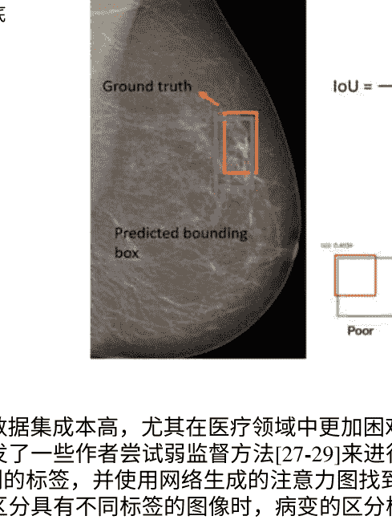

# 图1.5 计算IoU和不同边界框上的IoU的示例（底部）

生成带注释的数据集成本高，尤其在医疗领域中更加困难，因为通常需要专业知识。这激发了一些作者尝试弱监督方法[27-29]来进行目标检测。它们只需要图像级别的标签，并使用网络生成的注意力图找到地标或对象的位置。当网络学会区分具有不同标签的图像时，病变的区分模式会自动学习，并且这些特征可以用于估计病变的位置。

## 训练卷积网络检测器

选择适当的损失函数进行优化和选择最佳训练策略对于网络的收敛和性能时间具有重要影响。先前描述的一些方法需要复杂的训练策略，例如Faster R-CNN [13]必须在RPN的微调和目标检测的微调之间交替进行，而其他网络可以直接端到端地进行训练。要优化的错误度量或损失函数对于每种方法都不同，但总体上，它们必须被设计为量化分类错误和定位错误。

交并比，IoU通常用于评估目标检测结果。它是一个介于0和1之间的值，表示预测框与真实框之间的重叠区域（图1.5）。

检测网络不仅需要预测边界框，还需要对该框中包含的对象进行分类。因此，提出了将用于分类的指标与用于定位的指标相结合的多任务损失，考虑了IoU。

对于RPN [13]，分类损失是两类（对象或非对象）的对数损失，回归损失是边界框参数化坐标的平滑L1损失。它仅对正样本区域建议激活，即与真实框具有最高IoU或IoU大于0.7的区域。

在YOLO [20]中，他们优化了平方误差的和，权衡了定位误差和分类误差。每个网格单元预测多个边界框（见图1.4），如果某个边界框在该网格单元中具有最高的IoU，则被认为是检测到真实对象的责任边界框。

其他混合损失函数可以被定义，例如[30]使用对数损失进行分类，使用$L_1$损失考虑位置信息。

训练目标检测器的另一个重要考虑因素是处理强烈的类别不平衡。当生成补丁或区域提议时，提议的区域数量总是远远大于对象的数量，因此负匹配比正匹配更多。为了解决这个问题，CNN的训练方案中已经纳入了困难负样本采样的策略。

RCNN [10]将传统的SVM [31]的困难负样本采样纳入训练模型中，其中模型使用初始负样本子集进行训练，然后使用初始模型错误分类的负样本形成新的负样本集。在基于区域的CNN检测器中，一种有效的困难负样本挖掘方法是在线困难样本挖掘（OHEM）[32]。它包括计算所有区域提议的损失，并选择得分最高的区域提议；只有这个小数量的RoIs被选中用于更新模型。这是针对每个小批量（每个SGD迭代）进行的。OHEM训练方案可以与不同的架构一起使用，如Faster R-CNN、R-FCN和SSD。

最后，数据增强策略也被用于检测中，以解决训练时缺乏大型图像数据库的问题。不同的转换，如强度缩放、弹性变形、旋转或平移[18, 23, 25, 33]，被应用于图像中，以生成新的样本来供网络使用。

## 1.3 医疗应用中的检测和定位

##### 1.3.1 解剖标志定位

虽然大部分文献都集中在检测病理方面，但解剖标志的检测对于许多医学图像分析任务也很重要，例如基于标志的配准、图像分割算法的初始化和从3D体积中提取临床相关平面。

解剖标志的检测通常在端到端的方案下进行，利用众所周知的编码器-解码器类型的分割架构。Payer等人[23]使用了一个CNN框架（比较了4种不同的架构，包括U-Net和一种新提出的空间配置网络）来从手部X射线和手部MRI中提取解剖标志。他们直接以端到端的方式训练CNN，以回归出解剖标志的热图。X射线图像中检测到了37个解剖标志，MRI中检测到了28个。Mader等人[24]采用了类似的方法，使用了一个U-Net和一个条件随机场（CRF）。他们为每个点标记了16个点

胸部X光图像中的肋骨。 U-Net被用来生成定位假设，然后使用CRF来评估空间信息。Meyer等人[25]也使用了编码器-解码器架构，基于U-Net，来回归每个图像位置到感兴趣的标志物，视网膜光盘和黄斑的距离。 这样他们能够同时检测这两个结构。

另一种地标检测方法是应用基于补丁的方法。Cai等人[34]融合了来自不同模态的图像特征，即MR和CT，以改善椎骨的识别和定位。 他们使用CNN结合了不同模态的图像，并从图像补丁中提取特征，然后将其输入到SVM分类器中。Li等人[35]提出了基于补丁的迭代网络（PIN） 用于检测胎儿头部超声的10个解剖标志物。Zheng等人[36]采用了两步方法，使用浅层网络生成区域候选，并使用CNN进行分类，用于颈部CT中颈动脉分叉定位。

在整个医学体积中检测特定的图像平面是一项重要任务，可以节省临床医生长时间的搜索时间，并提出了几种解决方案。 陈等人使用CNN在胎儿超声中定位标准平面[37]。 他们使用迁移学习来减少由于训练样本数量少而引起的过拟合问题。Baumgartner等人[38]还提出了一种用于胎儿标准扫描平面检测的系统。 他们使用VGG16 [39]作为骨干架构，设计了SonoNet，这是一个可以检测13个胎儿标准视图并通过边界框提供胎儿结构定位的网络，仅基于图像级标签的弱监督进行[38]。Kumar等人使用显著性地图和CNN解决了相同的问题[40]。

##### 1.3.2 图像平面检测

在整个医学体积中检测特定的图像平面是一项重要任务，可以节省临床医生长时间的搜索时间，并提出了几种解决方案。 陈等人使用CNN在胎儿超声中定位标准平面[37]。 他们使用迁移学习来减少由于训练样本数量少而引起的过拟合问题。Baumgartner等人[38]还提出了一种用于胎儿标准扫描平面检测的系统。 他们使用VGG16 [39]作为骨干架构，设计了SonoNet，这是一个可以检测13个胎儿标准视图并通过边界框提供胎儿结构定位的网络，仅基于图像级标签的弱监督进行[38]。Kumar等人使用显著性地图和CNN解决了相同的问题[40]。

##### 1.3.3 病理检测

医学图像通常用于诊断程序，因此在医学图像分析中识别病理的存在是一项非常重要的任务。癌症病灶的定位和分类通常具有挑战性，因为良性和恶性肿瘤可能具有相似的外观，这是医学领域目标检测的关键应用之一。

在CT图像中检测肺结节的挑战创建了LUNA16 [41]，促进了该领域的研究。检测这些结节对于诊断肺癌至关重要，然而，由于形状、大小和纹理的高度可变性，这可能具有挑战性。Setio等人[18]提出了一种2D方法，包括密度阈值处理，然后进行形态学开运算，以获取候选结节，为每个候选结节从不同方向的平面提取一组2D补丁，并将它们输入到2D卷积网络中。Ding等人[42]使用了2D Faster-RCNN [13]和随后的3D CNN进行假阳性减少。Dou等人[30]使用了3D全卷积网络，并采用了在线样本过滤策略来增加难样本的比例，以提高准确性并处理难易样本之间的不平衡。Zhu等人[43]使用了Faster R-CNN，与Ding等人[42]相同，但他们的方法是完全3D的，使用3D Faster R-CNN生成候选结节，并使用类似U-Net的3D编码器-解码器架构学习特征。Teramoto等人[19]除了CT图像外，还结合了PET的信息，分别在PET和CT上识别候选区域，然后将两个图像得到的候选区域进行组合。

多种成像模式或序列的组合对于检测许多病理学是相关的。多参数MRI结果显示与前列腺癌组织病理学检查具有高度相关性，并且不同MRI序列提供的信息对于评估检测到的病变的恶性程度至关重要。Kiraly等人[26]使用多通道图像到图像编码器-解码器，并在关键点和不同输出通道中使用高斯核来表示不同的肿瘤类别。Yang等人[33]以弱监督的方式训练了一个网络，从而降低了生成注释的成本。他们修改了GoogLeNet以生成癌症响应图，模拟多个类别，并融合了来自ADC和T2w的多模态信息。

CNN也被应用于乳腺癌检测。Platania等人[44]将YOLO模型应用于乳腺X线照片。类似地，Al-masni等人[45]提出了一个基于YOLO的CAD系统，用于数字乳腺X线照片的同时乳腺肿块检测和分类。Kooi等人[46]也使用了VGG模型的缩小版本来处理乳腺X线照片。

Li等人[35]使用组织学图像诊断乳腺癌。他们使用基于Faster R-CNN的模型来检测有丝分裂，并结合基于ResNet [15]的深度验证模型来提高准确性。

癌症并不是唯一应用CNN的病理学。一些作者研究了糖尿病视网膜病变问题。Dai等人[14]采用了创新的方法，结合临床报告和图像来识别视网膜图像中的潜在微小动脉瘤。Wang等人[28]设计了Zoom-Net，一种试图模拟临床医生在检查视网膜图像时的放大过程的架构。Yang等人[29]采用了两阶段的方法，使用两个CNN不仅检测病变，还对糖尿病视网膜病变的程度进行分级。

在[47]中可以找到使用检测网络后初始化分割的示例。他们使用检测网络在CTA图像中找到包含血栓的感兴趣区域，然后在提取的区域内进行分割。

其他临床应用包括从MRI图像中检测脑损伤[27, 48]，从组织学图像中检测β-溶血[17]，在MRI中检测多发性硬化症病变[49]，心肌梗死区域[50]和脑CT中的颅内出血[51]。

#### 1.4 结论

目标检测是许多医疗应用中的重要处理任务，特别是对于病变检测。深度学习可以自动定位CT、MRI或US等多种成像模式中可疑肿块，并有时甚至可以对病变进行良性或恶性的分类，为放射科医生提供有价值的输入，并为计算机辅助检测系统提供帮助。

卷积神经网络检测系统的另一个相关应用是自动定位感兴趣的平面，这可以节省从整个体积中寻找重要结构时的大量时间。此外，解剖标志物的定位和检测可以帮助初始化其他图像处理算法，如配准或分割。

在医学图像处理中，有不同的目标检测方法可以应用。基于扫描的系统依赖于区域提议步骤来生成后续根据所包含的目标进行分类的补丁，而最近的系统直接从整个输入图像生成边界框，提高了准确性并允许实时检测。然而，针对医学图像检测训练卷积神经网络仍面临重要挑战。

主要限制是缺乏可用于训练或迁移学习的大型公共数据库。此外，当目标是检测病理结构时，存在类别不平衡问题，因为通常来自健康患者的数据比来自特定病理的数据更多。数据增强策略通常用于缓解这个问题，以及困难样本挖掘策略。一些作者尝试了弱监督方法，降低了生成注释数据库的成本。在创建可访问数据库和开发允许使用弱注释数据、噪声注释和无监督学习的训练策略方面还需要更多努力。

## 参考文献

1.  Lowe, David G.: 尺度不变关键点的显著图像特征。国际计算机视觉杂志。60(2), 91–110 (2004)
2.  Dalal, N., Triggs, B.: 用于人体检测的梯度直方图，卷1, pp. 886–893. IEEE, 美国 (2005)
3.  Ojala, T., Pietikainen, M., Harwood, D.: 基于Kullback分布判别的纹理测量性能评估，卷1， pp. 582–585。IEEEComput. Press, Soc., 以色列耶路撒冷 (1994)
4.  Viola, P., Jones, M.: 使用增强级联简单特征的快速目标检测，卷1, pp. I–511; I–518。IEEE Comput. Soc., 美国 (2001)
5.  Duda, Richard O., Hart, Peter E.: 使用Hough变换在图片中检测线条和曲线。 Commun ACM 15(1), 11–15 (1972)
6.  Zuluaga, M.A., Magnin, I.E., Hoyos, M.H., Delgado Leyton, E.J.F., Lozano, F., Orkisz, M.:基于密度水平检测和支持向量机的异常血管横截面的自动检测。Int. J. Comput. Assist. Radiol. Surg. 6(2),163–174 (2011)
7.  Donner, R., Birngruber, E., Steiner, H., Bischof, H., Langs, G.: 使用随机森林和离散优化定位3D解剖结构，第6533卷，第86-95页。Springer，Berlin (2011)
8.  Zuluaga, M.A., Delgado Leyton, E.J.F., Hoyos, M.H., Orkisz, M.: 基于SVM的血管异常检测的特征选择，第6533卷，第141-152页。Springer，Berlin (2011)
9.  Krizhevsky, A., Sutskever, I., Hinton, G.E.: 使用深度卷积神经网络进行Imagenet分类，第1097-1105页 (2012)
10. Girshick, R., Donahue, J., Darrell, T., Malik, J.: 用于准确目标检测和语义分割的丰富特征层次结构，第580-587页。IEEE，美国 (2014)
11. Uijlings, J.R.R., van de Sande, K.E.A., Gevers, T., Smeulders, A.W.M.: 用于目标识别的选择性搜索。计算机视觉国际期刊 104(2), 154-171页 (2013)
12. Girshick, R.: 快速R-CNN，第1440-1448页。IEEE，智利圣地亚哥 (2015)
13. Ren, S., He, K., Girshick, R., Sun, J.: 更快的R-CNN：基于区域建议网络的实时目标检测。IEEE模式分析与机器智能 39(6), 1137-1149页 (2017)
14. Dai, J., Li, Y., He, K., Sun, J.: R-FCN：基于区域全卷积网络的目标检测，第379-387页。Curran Associates, Inc. (2016)
15. He, K., Zhang, X., Ren, S., Sun, J.: 深度残差学习用于图像识别，第770-778页。IEEE，拉斯维加斯，美国 (2016)
16. Simonyan, K., Zisserman, A.: 用于大规模图像识别的非常深的卷积网络 (2014)。arXiv:1409.1556 [cs]
17. Savardi, M., Benini, S., Signoroni, A.: 通过卷积神经网络在培养的血液琼脂平板上检测β-溶血。计算机科学讲座笔记，第30-38页。Springer国际出版 (2018)
18. Setio, A.A.A., Ciompi, F., Litjens, G., Gerke, P., Jacobs, C., van Riel, S.J., Wille, M.M.W., Naqibullah, M., Sanchez, C.I., van Ginneken, B.: CT图像中的肺结节检测：使用多视图卷积网络进行假阳性减少。IEEE Trans. Med. Imaging 35 (5), 1160-1169 (2016)
19. Teramoto, A., Fujita, H., Yamamuro, O., Tamaki, T.: 使用卷积神经网络技术的PET/CT图像中肺结节的自动检测：集成假阳性减少。医学物理学 43 (6Part1), 2821-2827 (2016)
20. Redmon, J., Divvala, S., Girshick, R., Farhadi, A.: 你只需要看一次：统一的实时目标检测 (2015)。arXiv:1506.02640 [cs]
21. Liu, W., Anguelov, D., Erhan, D., Szegedy, S., Reed, S., Fu, C.-Y., Berg, A.C.: SSD: 单次多框检测器，第9905卷，第21-37页。Springer International Publishing，Cham (2016)
22. Ronneberger, O., Fischer, P., Brox, T.: U-Net: 用于生物医学图像分割的卷积网络 (2015)。arXiv:1505.04597 [cs]
23. Payer, C., Stern, D., Bischof, H., Urschler, M.: 使用CNN回归热图进行多个标志点的定位。计算机科学讲义，第230-238页。Springer国际出版社 (2016)
24. Mader, A.O., von Berg, J., Fabritz, A., Lorenz, C., Meyer, C.: 使用CRF正则化的FCN进行胸部X射线后肋骨的定位和标记。计算机科学讲义，第562-570页。Springer国际出版社 (2018)
25. Meyer, M.I., Galdran, A., Mendonça, A.M., Campilho, A.: 一种基于像素距离回归的联合视网膜光盘和黄斑检测方法,第11071卷,第39-47页。Springer国际出版社, Cham (2018)
26. Kiraly, A.P., Nader, C.A., Tuysuzoglu, A., Grimm, R., Kiefer, B., El-Zehiry, N., Kamen, A.: 深度卷积编码器-解码器用于前列腺癌检测和分类。计算机科学讲义，第489-497页。Springer国际出版社 (2017)
27. Dubost, F., Bortsova, G., Adams, H., Ikram, A., Niessen, W.J., Vernooij, M., De Bruijne, M.: GP-Unet: 通过3D回归网络从弱标签中检测病变。计算机科学讲义，第214-221页。Springer国际出版社 (2017)
28. Wang, Z., Yin, Y., Shi, J., Fang, W., Li, H., Wang, X.: Zoom-in-Net: 深度挖掘糖尿病视网膜病变的方法。计算机科学讲义，第267-275页。Springer国际出版社 (2017)
29. Yang, X., Wang, Z., Liu, C., Le, H.M., Chen, J., Cheng, K.-T. (Tim), Wang, L.: 基于多模态卷积神经网络的多参数MRI前列腺癌联合检测和诊断。计算机科学讲义，第426-434页。Springer International Publishing (2017)
30. Dou, Q., Chen, H., Jin, Y., Lin, H., Qin, J., Heng, P.-A.: 基于在线样本过滤和混合损失残差学习的三维ConvNets自动肺结节检测。计算机科学讲义，第630-638页。Springer International Publishing (2017)
31. Felzenszwalb, P.F., Girshick, R.B., McAllester, D., Ramanan, D.: 具有鉴别训练的基于部件模型的目标检测。IEEE Trans. Pattern Anal. Mach. Intell. 32(9), 1627-1645 (2010)
32. Shrivastava, A., Gupta, A., Girshick, R.: 使用在线困难样本挖掘训练基于区域的目标检测器。第761-769页。IEEE，美国 (2016)
33. Yang, Y., Li, T., Li, W., Wu, H., Fan, W., Zhang, W.: 通过两阶段深度卷积神经网络进行糖尿病视网膜病变的病灶检测和分级。计算机科学讲义，第533-540页。Springer International Publishing (2017)
34. Cai, Y., Landis, M., Laidley, D.T., Kornecki, A., Lum, A., Li, S.: 使用转换的深度卷积网络进行多模态椎骨识别。计算机医学成像图形学。51, 11-19 (2016)
35. Li, Y., Alansary, A., Cerrolaza, J.J., Khanal, B., Sinclair, M., Matthew, J., Gupta, C., Knight, C., Kainz, B., Rueckert, D.: 使用基于补丁的迭代网络进行快速多个标志物定位。计算机科学讲义，第563-571页。Springer International Publishing (2018)
36. Zheng, Y., Liu, D., Georgescu, B., Nguyen, H., Comaniciu, D.: 3D深度学习在体积数据中高效和鲁棒的标志点检测，第9349卷，第565-572页。Springer International Publishing，Cham (2015)
37. Chen, H., Ni, D., Qin, J., Li, S., Yang, X., Wang, T., Heng, P.-A.: 通过领域转移深度神经网络在胎儿超声中进行标准平面定位。IEEE J. Biomed. Health Inform. 19(5), 1627-1636 (2015)
38. Baumgartner, C.F., Kamnitsas, K., Matthew, J., Fletcher, T.P., Smith, S., Koch, L.M., Kainz, B., Rueckert, D.: SonoNet: 实时检测和定位自由手超声中的胎儿标准扫描平面。arXiv:1612.05601 [cs] (2016)
39. Ma, C., Huang, J.-B., Yang, X., Yang, M.-H.: 用于视觉跟踪的分层卷积特征，pp. 3074-3082. IEEE，智利圣地亚哥 (2015)
40. Kumar, A., Sridhar, P., Quinton, A., Kumar, R.K., Feng, D., Naidoo, R., Kim, J.: 使用显著性图和卷积神经网络在胎儿超声图像中进行平面识别，pp. 791-794 (2016)
41. Setio, A.A.A., Traverso, A., De Bel, T., Berens, M.S.N., van den Bogaard, C., Cerello, P., Chen, H., Dou, Q., Fantacci, M.E., Geurts, B., van der Gugten, R., Heng, P.A., Jansen, B., de Kaste, M.M.J., Kotov, V., Lin, J.-Y., Manders, J.T.M.C., Sólmengana, A., García-Naranjo, J.C., Papavasileiou, E., Prokop, M., Saleta, M., Schaefer-Prokop, C.M., Scholten, E.T., Scholten, L., Snoeren, M.M., Torres, E.L., van der Marel, J., Verkooijen, H., van Sluis, R.G., Yvernault, G.C.A., van Ginneken, B., Jacobs, C.: 用于自动检测计算机断层扫描图像中肺结节的算法的验证、比较和组合：LUNA16挑战。医学图像分析 42, 1-13 (2017)
42. Ding, J., Li, A., Hu, Z., Wang, L.: 使用深度卷积神经网络在计算机断层扫描图像中准确检测肺结节。计算机科学讲义, pp. 559–567. Springer International Publishing (2017)
43. Zhu, W., Liu, C., Fan, W., Xie, X.: DeepLung: 深度3D双路径网络用于自动肺结节检测和分类, pp. 673–681. IEEE, Lake Tahoe, NV (2018)
44. Platania, R., Shams, S., Yang, S., Zhang, J., Lee, K., Park, S.-J.: 使用深度学习和感兴趣区域检测进行自动乳腺癌诊断 (BC-DROID), pp. 536–543. ACM出版社, 美国 (2017)
45. Al-masni, M.A., Al-antari, M.A., Park, J.-M., Gi, G., Kim, T.-Y., Rivera, P., Valarezo, E., Choi, M.-T., Han, S.-M., Kim, T.-S.: 通过基于YOLO的深度学习CAD系统在数字乳腺X线照片中同时检测和分类乳腺肿块。计算方法生物医学程序。157，85-94 (2018)
46. Kooi, T., van Ginneken, B., Karssemeijer, N., den Heeten, A.: 使用预训练的深度卷积神经网络在乳腺X线照片中区分孤立囊肿和软组织病变。医学物理。44 (3) ，1017-1027 (2017)
47. López-Linares, K., Aranjuelo, N., Kabongo, L., Maclaire, G., Lete, N., Ceresa, M., García-Familiar, A., Maca, I., Gonzàlez Ballester, M.A.: 使用深度卷积神经网络在术后CTA图像中完全自动检测和分割腹主动脉血栓。医学图像分析。46, 202-214 (2018)
48. Dou, Q., Chen, H., Yu, L., Zhao, L., Qin, J., Wang, D., Mok, V.C., Shi, L., Heng, P.-A.: 通过3D卷积神经网络从MR图像中自动检测脑微出血。IEEE Trans. Med. Imaging 35(5), 1182–1195 (2016)
49. Nair, T., Precup, D., Arnold, D.L., Arbel, T.: 探索深度网络中的不确定性度量，用于多发性硬化症病变检测和分割。计算机科学讲义，pp. 655–663. Springer International Publishing (2018)
50. Xu, C., Xu, L., Gao, Z., Zhao, S., Zhang, H., Zhang, Y., Du, X., Zhao, S., Ghista, D., Li, S.: 通过深度学习算法直接检测像素级心肌梗死区域。计算机科学讲义，pp. 240–249. Springer International Publishing (2017)
51. Kuo, W., Hsu, C., Yuh, E., Mukherjee, P., Malik, J.: 成本敏感的主动学习用于颅内出血检测。计算机科学讲义，pp. 715–723. Springer International Publishing (2018)

## 第二章 使用深度学习进行医学图像分割

Karen López-Linares Román, María Inmaculada García Ocaña, Nerea Lete Urzelai, Miguel Ángel González Ballester和Iván Macía Oliver

摘要 本章旨在介绍基于深度学习的医学图像分割。首先，读者将了解医学图像分割的固有挑战，讨论了克服这些限制的实际方法。其次，描述了监督和半监督架构，其中编码器-解码器类型的网络是最常用的。然而，基于生成对抗网络的半监督方法最近引起了科学界的关注。还讨论了从传统的2D架构向3D架构的转变，以及改善医学图像分割方法性能的最常见损失函数。最后，描述了一些未来的趋势和结论。

#### 2.1 引言

语义图像分割是指将属于同一对象的图像部分聚类或隔离起来的任务[34]。它也被称为像素级分类。在医学影像中，语义分割被用于隔离从细胞到组织和器官的身体系统的部分，以实现对感兴趣区域的复杂分析。这种自动分割通常具有挑战性，由于患者之间解剖形状和大小的巨大变化以及与周围组织的低对比度。

传统的医学图像分割方法包括通常由人类专家设计的技术，基于他们对目标领域的知识。在这个意义上，通用算法，如基于强度的方法、形状和外观模型或混合方法已经被广泛应用于医学图像分割。

基于特征提取的概念和统计分类器的机器学习方法在医学图像分析中也非常流行，包括分割。同样，这些系统依赖于人类专家设计的任务特定特征向量的定义。这些手工制作的特征被认为对于某个应用具有辨别能力，然后用于训练计算机算法，在高维特征空间中确定最优决策边界。因此，这些方法的性能和成功很大程度上受到最有意义特征的正确提取的影响。

在过去几十年中，基于深度学习的方法为医学图像分析[33, 50]带来了提升，可以从图像数据中高效地学习特征，将特征工程步骤转化为学习步骤。深度学习技术不再依赖于人工设计的特征，而是仅需要数据集，从中直接推断出信息表示，以自学的方式进行。因此，基于深度学习的医学影像应用在复杂任务中明显超越了传统方法的性能。具体而言，分割是深度学习在医学影像中最常见的应用，通过从图像中直接利用形状、外观和上下文信息来提供最佳的分割结果。然而，将深度学习应用于医学图像分割需要解决特定领域的挑战，例如对非常小的结构进行分割，并克服与数据和注释数量和质量相关的限制。

## 2.2 在应用深度学习进行医学图像分割时的挑战和限制

将深度学习应用于医学图像分割与计算机视觉领域相比存在一些固有的限制。虽然大量的自然通用图像数据库对于计算机视觉研究人员来说很容易获得和使用，甚至有时是公开的，但获取和利用医学图像对于新的基于深度学习的技术的开发来说是一个重要的限制因素[33]。医学图像数据库通常是小型和私有的，即使PACS系统中存储了几百万张在几乎每个医院例行采集的图像。为什么这么多的存储数据不能直接用于医学图像分析有两个主要原因：

- 伦理和隐私方面以及法律问题：使用医学数据受到特定法规的约束，以确保其正确管理。为了在某项研究中使用一张图像，需要获得患者的知情同意，并遵循数据匿名化程序以确保患者的隐私。
- 图像缺乏注释：训练医学图像分割算法需要对图像中的每个像素进行标注，即根据其类别（对象或背景）进行标记，这非常耗时且需要专业知识。

因此，在有限的注释数据上高效学习是工程师和研究人员需要关注的重要领域。在开发基于深度学习的分割方法时，通常采用以下策略来增加数据库的大小：

- 数据增强是指通过生成新图像来扩展数据库，可以使用简单的操作（如平移和旋转）或更高级的技术来创建合成图像，例如弹性变形[21, 40, 46]、主成分分析[44]或直方图匹配[40]。
- 在许多应用中，将3D医学体积转换为独立的2D图像堆栈以使用更多数据来训练网络[13, 19, 36]。同样，从图像中提取子体积或图像块也是常见的方法来增加数据量[16, 31, 39, 41]。然而，明显的缺点是在切片平面正交方向上完全丢失了解剖上下文。
- 最近，另一种创建合成图像以增加数据库的方法已经被提出，基于生成对抗网络[51, 52]（见第2.3节）。

然而，限制不仅来自图像数据本身，还来自相关注释的质量。获取图像中每个像素的精确标签是耗时且需要专业知识的。因此，研究人员通过开发半自动注释工具、稀疏注释[12]或利用非专家标签通过众包[1]来减轻负担。在这些情况下，开发分割算法时处理标签噪声是具有挑战性的。标签始终依赖于人类，诸如知识、图像分辨率、视觉感知和疲劳等因素在输出注释的质量中起重要作用，可以被视为模糊的。因此，在这样的数据上训练深度学习系统需要仔细处理地面真实性中的噪声和不确定性，这仍然是一个未解决的挑战。

最后，设计能够处理类别不平衡挑战的深度学习系统是另一个活跃的研究领域。在最简单的二进制分割问题中，这指的是结构或组织要分割的像素数量与背景之间的巨大差异，背景由大多数像素表示。这有时会导致在分割背景时系统具有极高的准确性结果，但在界定感兴趣的对象时失败。已经提出了几种解决方案来解决这个问题：

- 将分割视为两个步骤的问题，首先检测感兴趣区域，然后在较小的区域内分割感兴趣的结构[36]。
- 仅对少数类别可见的图像或补丁进行选择性数据过采样增强。
- 重新设计损失函数和度量标准，以支持少数类别的准确性，也称为成本敏感学习，在第2.4节中将进一步解释。

#### 2.3 医学图像分割的深度学习架构

图像语义分割的方法大多是有监督的方法。半监督分割也得到了解决，主要使用无监督生成对抗网络（GANs）[61]来改进或约束以有监督方式获得的分割结果。

### 2.3.1 有监督的深度学习架构

语义图像分割的大部分进展都是在有监督的方案下完成的。它们直接从标记的训练样本中学习，提取特征和上下文信息，以进行像素（或体素）级的密集分类。

#### 2.3.1.1 全卷积网络（FCN）

全卷积神经网络（CNN）用于语义分割的第一个完全卷积网络（FCN）在[35]中被介绍，并成为计算机视觉和医学成像领域分割架构发展的基础。FCN通过调整用于密集预测的分类器，将分类网络中的最后全连接层替换为全卷积层，以保持局部图像关系。

通过整个图像进行端到端的训练，该网络在语义分割方面超过了最先进的技术，可以接受任意大小的输入并产生相应大小的输出预测。FCN网络由基本组件组成，即卷积和池化层以及激活函数。他们还引入了跳跃连接，将深层的语义信息与浅层的外观信息相结合，以产生准确和详细的分割结果。跳跃网络架构以主流为中心，在共享输出层中添加跳跃或侧连接，以合并来自不同尺度的特征响应，如图2.1所示。

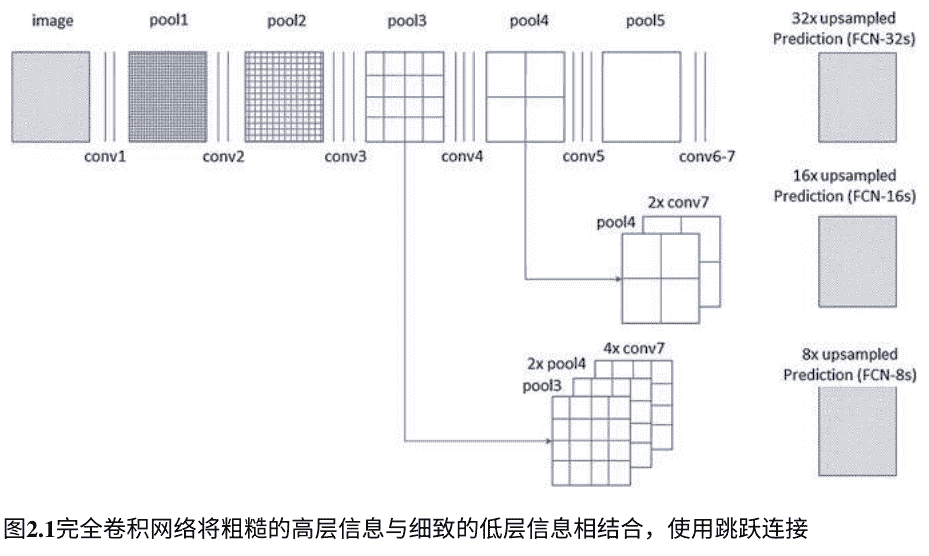

早期将CNN应用于医学影像的方法大多使用了这种架构，主要是2D。使用早期FCN的CT图像分割方法的示例包括肝脏和病变分割[6]、多器官分割[64]或胰腺分割[66]。在MRI中，FCN已成功应用于组织区分[55]或心血管结构分割[5]等领域。

#### 2.3.1.2 编码器-解码器架构

2015年，提出了一种专门用于生物医学图像分割的新的CNN架构，称为u-net[46]。该网络是基于FCN构建的，通过修改和扩展，使其能够在很少的训练图像的情况下仍能产生非常精确的分割结果。与FCN相比，u-net架构在网络的上采样部分具有更多的特征通道，这允许将上下文信息传播到更高分辨率的层。

因此，扩张路径与收缩路径几乎对称，并产生了一个U形或编码器-解码器架构，如图2.2所示。此外，下采样路径和上采样路径之间的跳跃连接使用连接运算符而不是求和运算符。

这种编码器-解码器架构是迄今为止大多数医学图像分割网络的基础。它已被广泛应用于不同成像模式下的器官和组织分割 [10, 29, 31, 43, 46]。

在文献中，编码器-解码器架构的一些主要区别包括用最近设计的复杂组件替换一些构建模块。例如，用扩张卷积或Inception模块替代典型的卷积块。

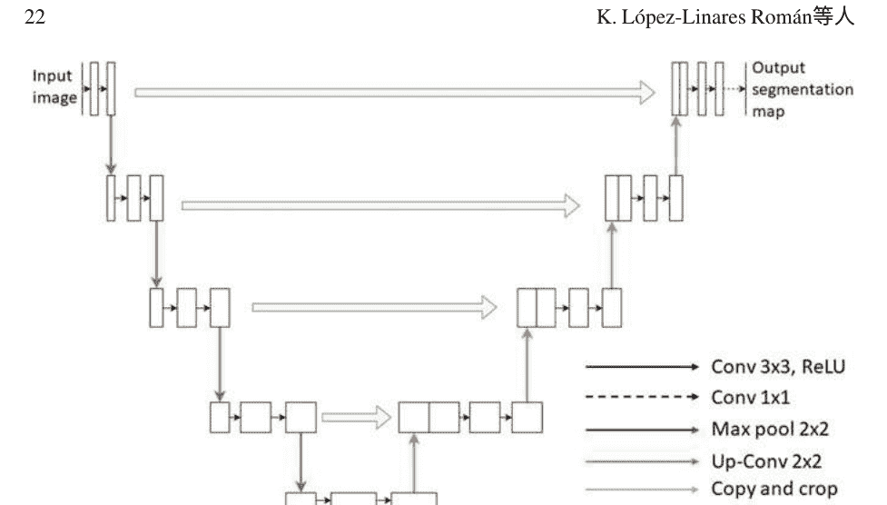

图2.2 U-net编码器-解码器架构专门用于生物医学图像分割。

图2.3 扩张卷积的可视化表示。

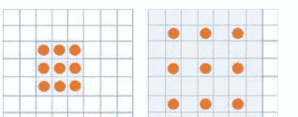

扩张卷积首次在[62]中引入，目的是实现专门适应分割任务的卷积网络，因为大多数语义分割网络是基于最初设计用于图像分类的网络的改编。这些网络主要由卷积和池化层组成，后者用于沿网络减小图像的空间尺寸。通过应用这些子采样层，特征的分辨率逐渐丢失，导致粗糙的特征，甚至使用跳跃连接也难以恢复小物体的细节。

因此，使用扩张卷积的目标是通过聚合多尺度上下文信息，使用扩展感受野来获得广阔的视野，同时保留完整的空间维度，而不会丢失分辨率。图2.3描绘了这些扩张卷积的视觉表示。使用扩张卷积在多个应用中已经显示出提高分割准确性的效果[3, 17, 22, 45, 56]。

Inception模块最初由Google [54]引入，旨在改善网络内部计算资源的利用。这个想法是在并行中应用池化操作和具有不同内核大小的卷积，然后将生成的特征图串联起来，然后进入下一层，如图2.4所示。

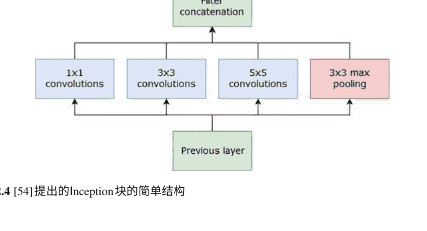

图2.4 [54]提出的Inception块的简单结构

尽管它主要应用于图像分类，但一些分割方法也利用了它的优势[11, 24, 32]。

另一个修改与信息通过网络层传递的方式有关，尤其是在网络非常深时，引入了残差连接或密集连接，导致了新的骨干架构，这在第2.3.1.3节和第2.3.1.4节中进一步解释。

#### 2.3.1.3 残差网络

网络深度，即网络的堆叠层数，对于实现良好的分割结果至关重要，特征的质量可以通过堆叠层数的数量来丰富。然而，当卷积神经网络变得越来越深，并且关于输入和梯度的信息通过许多层传递时，梯度在传回网络的初始层时可能会消失。

这个问题被称为梯度消失。此外，当更深的网络开始收敛时，它们有时会遇到退化问题，即网络的准确性达到饱和并开始下降[20]。

为了解决这个问题，2015年提出了一种名为残差网络（ResNet）的新架构[20]，它允许使用类似数量的参数构建更深的架构。ResNet的核心思想是引入一个身份快捷连接，跳过一个或多个层，形成所谓的“残差单元（RU）”（如图2.5a所示）。对于每个RU，快捷连接执行身份映射，并将其输出添加到层堆栈的输出中。他们假设让堆叠的层适应残差映射比直接适应所需的底层映射更容易，从而解决了梯度消失的问题。这些残差单元已成功应用于分割网络中，以改善乳腺X线摄影中的肿块分割[30]、CT扫描中颅内颈动脉钙化提取[7]或OCT图像中视网膜层结构的分割[4]，等等。

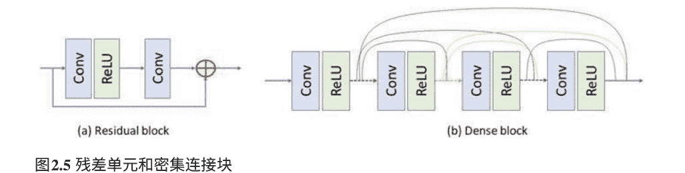

#### 2.3.1.4 密集连接卷积网络

为了改善深度网络中的信息和梯度流动，在残差架构中，通过在早期层和后续层之间创建路径来传递信息。与之不同的是，密集连接网络架构(DenseNet)通过直接连接所有层之间来确保网络层之间的最大信息流动[23]。每一层从所有前一层获得额外的输入，并将自己的特征图传递给所有后续层，通过连接进行组合。这样可以比传统的卷积神经网络少使用参数，因为不需要重新学习冗余的特征图。密集连接块的示意图如图2.5b所示。因此，DenseNet不是利用极深的架构的能力，而是通过特征重用来利用网络的潜力，从而得到易于训练和高效的紧凑模型。通过连接不同层学习到的特征图，增加了后续层输入的变异性，这是DenseNet和ResNet之间的主要区别。在医学图像分割中使用密集块的示例包括从MRI中的整个心脏和血管分割[63]，从CT扫描中的肺动脉分割[44]，从CT扫描中的多器官分割[17]或从MRI中的脑分割[8, 14]。

#### 2.3.1.5 循环神经网络

循环神经网络（RNN）被设计用于识别数据序列中的模式，例如文本、基因组等。这些算法考虑了时间和序列，因此它们具有时间维度，这意味着它们的输入不仅仅是它们当前看到的示例，还包括它们之前在时间上感知到的内容。因此，循环网络通常被认为具有记忆功能。

正如之前解释的那样，在医学图像分割中，将3D医学体积分解为2D切片或图像块以训练网络是相当常见的做法。然后，在后处理步骤中，根据每个2D切片或图像块的预测结果重建最终的3D分割结果，但由于在独立分割每个切片和块时丢失了上下文信息，因此并不总能保证3D一致性。为了解决这个问题，已经利用循环神经网络通过其记忆能力来检索全局空间依赖性[2, 9, 42, 53, 60]。

### 2.3.2 半监督深度学习架构

完全无监督的医学图像分割在文献中很少被提及，但有一些半监督方法利用了有监督和无监督架构的组合，主要依赖生成对抗网络（GANs）在一个独特的分割框架中。虽然生成方法在无监督和半监督学习中广泛应用于视觉分类任务，但在语义分割方面几乎没有什么研究。

#### 2.3.2.1 生成对抗网络（GANs）

生成对抗网络（GANs）[57, 61] 是一种特殊类型的神经网络模型，其中两个网络同时进行训练：一个是生成器（G），专注于从噪声向量生成合成图像；另一个是鉴别器，专注于区分真实图像和由G生成的假图像。GANs通过解决一个优化问题进行训练，其中鉴别器试图最大化，生成器试图最小化。

在医学图像分割中，GANs主要在半监督分割方法中被使用，目的不同。一些方法[37, 58]使用GANs来通过评估分割或分割和输入图像的组合是否合理来改进、约束或强制执行结构正确的分割。另一个应用是使用GANs生成新的分割或带注释的图像（图像合成）[25, 51]，这可以帮助减轻获取耗时的像素级注释的负担。

##### 2.3.3 从2D到3D分割网络

高效的3D卷积和池化操作的实现，以及不断增长的GPU内存能力，使得将2D分割架构扩展到3D医学成像成为可能。与2D相比，直接在3D中进行训练具有一些优势：对于3D医学图像模态，如MRI或CT，3D训练可以利用所有上下文信息，并更好地保持最终分割的一致性。当在少量体积上进行训练时，3D分割网络也显示出合理的泛化和收敛性。另一方面，2D工作的优势是更高的速度，更低的内存消耗和参数数量，以及直接或通过迁移学习利用预训练网络的能力。

最早的用于医学图像分割的3D网络实现大多是在从整个图像体积中提取的小的3D块上进行训练的[39, 47]，然后在后续的后处理步骤中进行重建。与2D图像类似，尽管这种训练方法在准确性上存在问题，存在大量冗余计算，运行时间长，并且局部和全局上下文未得到充分保留。

最近的研究重新实现了之前的2D架构，并直接对其进行整体输入体积的训练，而不是逐块进行训练。在[15]中，将[35]中提出的FCN网络以3D形式呈现，以自动分割CT体积中的肝脏。在[12]中，将原始的2D U-Net [46]扩展到3D，并使用完整的体积数据进行端到端的训练。有趣的是，他们表明网络可以从稀疏标注的训练数据中令人满意地进行训练，只需要对少数切片进行手动标注，而不是整个体积。在[40]中，他们还提出了一个类似于U-Net的3D编码器-解码器架构，但融入了残差函数的概念。该网络被称为V-Net，经过端到端的训练，用于分割3D MRI体积中的前列腺。近年来，大量的会议和期刊论文介绍了3D架构[7, 8, 15, 28, 38, 44, 59, 63]，这表明随着新的计算能力，将分割任务从二维空间转移到3D是一个趋势。

#### 2.4 医学图像分割的损失函数

在实施深度学习系统时，考虑的一个最相关的设计方面是为每个具体任务定义一个合适的损失函数。损失函数指导学习过程，确定神经网络输出与标记的真实值之间的误差如何计算。最常用的损失函数是像素级交叉熵损失，它分别评估每个像素的预测，然后对所有像素求平均，以确保每个像素在图像中具有相等的学习权重。

在医学领域训练分割架构时面临的主要挑战之一是数据不平衡，因为训练可能被最常见的类别所主导。例如，在病变分割等应用中，病变像素的数量通常远低于非病变像素的数量，这可能导致网络具有非常高的准确性，但无法对病变进行分割。为了解决这个问题，广泛应用了加权交叉熵损失函数[35, 38, 41, 44, 46]，其中分配的权重与每个类别出现的概率成反比，即出现概率越高，权重越低。

医学图像分割任务中最流行的损失函数是Dice损失，它衡量两个样本之间的重叠，并且是精确率和召回率的调和平均。它首次在[40]中引入，用于二进制分割，在结果上优于加权交叉熵损失函数。现在，它是文献中首选的二进制和多类别分割损失函数之一[26, 65]。还提出了加权Dice损失函数，其中计算每个类别的Dice系数[49]，或者Dice系数的推广，Tversky指数[48]。

此外，网络的性能严重依赖于用于训练网络的注释质量，有时注释存在噪声、模糊和不准确，如第2.2节所述。因此，研究人员尝试在训练过程中考虑地面真实标签中的错误，使用引导交叉熵等引导损失函数。主要思想是通过从已经被良好分类的体素中删除损失函数的贡献，将学习过程集中在难以分割的图像部分上的损失。

#### 2.5 结论和未来方向

医学图像分割是获取有意义信息的重要步骤，可以从器官、组织、病理或其他身体结构中获得。它使得对分割区域进行复杂分析和提取定量信息成为可能，这对于计算机辅助诊断、手术系统或预测模型的发展可能是相关的。

深度学习技术的前所未有的成功提高了无法通过传统图像处理算法解决的复杂分割任务的准确性。然而，医学图像领域固有的一些挑战必须解决，以确保深度学习系统在临床实践中的适用性。这些挑战主要涉及分割方法的泛化，需要具有大量注释的医学图像数据，这些数据是通过不同的协议、在不同的环境中获得的，并涵盖了患者之间的大部分解剖和病理变异。因此，研究人员尝试通过智能数据增强技术和专门设计的损失函数来弥补数据和注释的不足。

根据文献，监督式深度学习分割网络，特别是编码器-解码器架构的变体，是医学图像界最广泛使用的网络之一。设计新的构建模块以提高这些网络的效率和准确性是一个活跃的研究领域。然而，半监督和无监督架构的趋势是生成对抗网络的形式，这可以减少对耗时的专家注释的需求，这对于分割系统的开发始终是一个限制。这些新方法，加上计算能力的进步，将开启医学图像分割的新时代。

## 参考文献

1.  Albarqouni, Shadi, Baur, Christoph, Achilles, Felix, Belagiannis, Vasileios, Demirci, Stefanie, Navab, Nassir: AggNet:深度学习从人群中进行乳腺癌组织学图像的有丝分裂检测。IEEE Trans. Med. Imaging 35(5), 1313–1321 (2016)
2.  Alom, Z., Taha, T.M., Asari, V.K.: 基于 u-net的循环残差卷积神经网络(R2U-Net)用于医学图像分割，第12页- 3. Anthimopoulos, M., Christodoulidis, S., Ebner, L., Geiser, T., Christe, A., Mougiakakou, S.: 扩张的全卷积网络用于病理性肺组织的语义分割。IEEE J. Biomed. Health Inform. 第1页 (2018). arXiv:1803.06167

- 4. Apostolopoulos, S., De Zanet, S., Ciller, C., Wolf, S., Sznitman, R.: 使用分支残差U形网络进行病理性OCT视网膜层分割。在：Descoteaux, M., Maier-Hein, L., Franz, A., Jannin, P., Collins, D.L., Duchesne, S. (eds.) 医学图像计算与计算机辅助干预MICCAI 2017。计算机科学讲座，第294-301页。 Springer International Publishing (2017)

- 5. Bai, W., Sinclair, M., Tarroni, G., Oktay, O., Rajchl, M., Vaillant, G., Lee, A.M., Aung, N., Lukashchuk, E., Sanghvi, M.M., Zemrak, F., Fung, K., Paiva, J.M., Carapella, V., Kim, Y.J., Suzuki, H., Kainz, B., Matthews, P.M., Petersen, S.E., Piechnik, S.K., Neubauer, S., Glocker, B., Rueckert, D.: 基于完全卷积网络的自动心血管磁共振图像分析。《心血管磁共振杂志》20 (2018)

- 6. Ben-Cohen, A., Diamant, I., Klang, E., Amitai, M., Greenspan, H.: 用于肝脏分割和病变检测的完全卷积网络。 In: Carneiro, G., Mateus, D., Peter, L., Bradley, A., Tavares, J.M.R.S., Belagiannis, V., Papa, J.P., Nascimento, J.C., Loog, M., Lu, Z., Cardoso, J.S., Cornebise, J. (eds.) 深度学习和数据标注在医学应用中的应用, vol.10008, pp. 77-85. Springer International Publishing, Cham (2016)

- 7. Bortsova, G., van Tulder, G., Dubost, F., Peng, T., Navab, N., van der Lugt, A., Bos, D., De Bruijne, M.: 使用深度监督残差丢失网络对颅内动脉钙化进行分割。 In: Descoteaux, M., Maier-Hein, L., Franz, A., Jannin, P., Collins, D.L. and Duchesne, S. (eds.) 医学图像计算与计算机辅助干预MICCAI 2017，计算机科学讲座笔记，第356-364页。 Springer国际出版社 (2017年)

- 8. Bui, T.D., Shin, J., Moon, T.: 用于体积分割的3D密集卷积网络 (2017年)

- 9. Cai, J., Lu, L., Zhang, Z., Xing, F., Yang, L., Yin, Q.: 使用基于图的决策融合在卷积神经网络上进行胰腺分割的MRI。 In: Ourselin, S., Joskowicz, L., Sabuncu, M.R., Unal, G. and Wells, W. (eds.) 医学图像计算与计算机辅助干预MICCAI 2016，计算机科学讲座笔记，第442-450页。Springer国际出版社 (2016年)

- 10. Carneiro, G., Zheng, Y., Xing, F., Yang, L.: 深度学习在乳腺X光、心血管和显微镜图像分析中的方法综述。 在：Lu, L., Zheng, Y., Carneiro, G., Yang, L. (主编) 深度学习和卷积神经网络在医学图像计算中的应用：精准医学。高性能和大规模数据集，计算机视觉和模式识别进展，第11-32页。Springer国际出版社，Cham (2017年)

- 11. Chudzik, P., Majumdar, S., Caliva, F., Al-Diri, B., Hunter, A.: 使用完全卷积神经网络和inception模块进行渗出物分割。在：医学成像2018：图像处理，第10574卷，第1057430页。国际光学和光子学学会 (2018年)

- 12. Çiçek, Ö., Abdulkadir, A., Lienkamp, S.S., Brox, T., Ronneberger, O.: 3D U-net：从稀疏注释中学习密集体积分割 (2016年)。arXiv:1606.06650

- 13. Ciresan, D., Giusti, A., Gambardella, L.M., Schmidhuber, J.: 深度神经网络在电子显微镜图像中分割神经膜。在：Pereira, F., Burges, C.J.C., Bottou, L., Weinberger, K.Q. (主编) 神经信息处理系统25的进展，第2843-2851页。Curran Associates, Inc. (2012年)

- 14. Dolz, J., Gopinath, K., Yuan, J., Lombaert, H., Desrosiers, C., Ayed, I.B.: HyperDense-Net: 一种超密集连接的CNN用于多模态图像分割(2018)

- 15. Dou, Q., Chen, H., Jin, Y., Yu, L., Qin, J., Heng, P.A.: 3D深度监督网络用于自动CT体积的肝脏分割。 In: Ourselin, S., Joskowicz, L., Sabuncu, M.R., Unal, G., Wells, W. (eds.), Medical Image Computing and Computer-Assisted Intervention MICCAI 2016, 计算机科学讲座笔记, pp. 149–157. Springer International Publishing (2016)

- 16. Fritscher, K., Raudaschl, P., Zaffino, P., Spadea, M.F., Sharp, G.C., Schubert, R.: 用于快速分割3D医学图像的深度神经网络。 在：Ourselin, S., Joskowicz, L., Sabuncu, M.R., Unal, G., Wells, W. (编者) 医学图像计算与计算机辅助干预MICCAI 2016，计算机科学讲座笔记，第158-165页。Springer国际出版（2016年）

### 2 使用深度学习进行医学图像分割

- 17. Gibson, E., Giganti, F., Hu, Y., Bonmati, E., Bandula, S., Gurusamy, K., Davidson, B.R., Pereira, S.P., Clarkson, M.J. and Barratt, D.C.: 朝着图像引导的胰腺和胆道内窥镜：在腹部CT上的自动多器官分割与密集扩张网络。在：Descoteaux, M., Maier-Hein, L., Franz, A., Jannin, P., Collins, D.L., Duchesne, S.（编辑），医学图像计算与计算机辅助干预MICCAI 2017，计算机科学讲座笔记，第728-736页。Springer国际出版（2017年）

- 18. Guerrero, R., Qin, C., Oktay, O., Bowles, C., Chen, L., Joules, R., Wolz, R., Valdés-Hernández, M.C., Dickie, D.A., Wardlaw, J., Rueckert, D.: 使用卷积神经网络进行白质高信号和中风病变分割和区分。神经影像学：临床17, 918-934（2017年）

- 19. Havaei, M., Davy, A., Warde-Farley, D., Biard, A., Courville, A., Bengio, Y., Pal, C., Jodoin, P.M., Larochelle, H.: 使用深度神经网络进行脑肿瘤分割。医学图像分析35, 18–31 (2017). arXiv:1505.03540

- 20. He, K., Zhang, X., Ren, S., Sun, J.: 深度残差学习用于图像识别 (2015)

- 21. Heinrich, L., Funke, J., Pape, C., Nunez-Iglesias, J., Saalfeld, S.: 完整果蝇大脑非各向异性体积极电子显微镜中的突触间隙分割。在：Frangi, A.F., Schnabel, J.A., Davatzikos, C., Alberola-López, C., Fichtinger, G. (eds.) 医学图像计算与计算机辅助干预MICCAI 2018, 计算机科学讲义, pp. 317–325. Springer国际出版社 (2018)

- 22. Heinrich, M.P., Oktay, O.: BRIEFnet: 使用二进制稀疏卷积进行深度胰腺分割。在：Descoteaux, M., Maier-Hein, L., Franz, A., Jannin, P., Collins, D.L., Duchesne, S. (eds.) 医学图像计算与计算机辅助干预MICCAI 2017, 计算机科学讲座笔记, pp. 329–337。Springer国际出版社 (2017)

- 23. Huang, G., Liu, Z., Van Der Maaten, L., Weinberger, K.Q.: 密集连接卷积网络 (2016). arXiv:1608.06993

- 24. Hussain, S., Anwar, S.M., Majid, M.: 使用深度卷积神经网络在大脑中分割胶质瘤。Neurocomputing 248–261 (2018). arXiv:1708.00377

- 25. Iqbal, Talha, Ali, Hazrat: 用于医学图像的生成对抗网络 (MI-GAN). J.Med. Syst. 42(11), 231 (2018)

- 26. Jog, A., Fischl, B. (2018) 脉冲序列弹性快速脑分割。在：Frangi, A.F., Schnabel, J.A., Davatzikos, C., Alberola-López, C., Fichtinger, G. (eds.) 医学图像计算和计算机辅助干预MICCAI 2018, 计算机科学讲座笔记, pp. 654–662。Springer International Publishing (2018)

- 27. Keshwani, D., Kitamura, Y., Li, Y.: 使用多任务3D卷积神经网络从CT图像中计算多囊肾疾病的总肾体积，第8页

- 28. Koziski, M., Mosinska, A., Salzmann, M., Fua, P.: 仅使用2D注释学习分割3D线性结构。在：Frangi, A.F., Schnabel, J.A., Davatzikos, C., Alberola-López, C., Fichtinger, G. (eds.) 医学图像计算和计算机辅助干预MICCAI 2018, 计算机科学讲座笔记, pp. 283–291。Springer International Publishing (2018)

- 29. Kumar, A., Agarwala, S., Dhara, A.K., Nandi, D., Thakur, S.B., Bhadra, A.K., Sadhu, A.: 基于U-Net的全卷积网络在HRCT图像中的肺部分割，第10页

- 30. Li, H., Chen, D., Nailon, W.H., Davies, M.E., Laurenson, D.: 基于条件残差U-Net的乳腺肿块分割改进（2018年）。arXiv:1808.08885

- 31. Li, J., Sarma, K.V., Ho, K.C., Gertych, A., Knudsen, B.S., Arnold, C.W.: 一种用于根治性前列腺切除术组织学图像语义分割的多尺度U-Net。在：AMIA年度研讨会论文集，2017年，第1140-1148页（2018年）

- 32. Li, Rongjian, Zeng, Tao, Peng, Hanchuan, Ji, Shuiwang: 深度学习在光学显微镜图像分割中改善了三维神经重建。IEEE Trans. Med. Imaging 36(7), 1533–1541 (2017)

- 33. Litjens, G., Kooi, T., Bejnordi, B.E., Setio, A.A.A., Ciompi, F., Ghafoorian, M., Van Der Laak, J.A., Van Ginneken, B., Sanchez, C.I.: 关于深度学习在医学图像分析中的调查。医学图像分析 **42**, 60-88 (2017年)。arXiv:1702.05747

- 34. Liu, X., Deng, Z., Yang, Y.: 语义图像分割的最新进展。Artif. Intell. Rev. (2018). arXiv:1809.10198

- 35. Long, J., Shelhamer, E., Darrell, T.: 全卷积网络用于语义分割，第10页

- 36. Lopez-Linares, K., Aranjuelo, N., Kabongo, L., Maclair, G., Lete, N., Ceresa, M., Garcia-Familiar, A., Macia, I., Ballester, M.A.G.: 使用深度卷积神经网络在术后CTA图像中全自动检测和分割腹主动脉血栓。医学图像分析 **46**, 202-214 (2018年)

- 37. Luc, P., Couprie, C., Chintala, S. and Verbeek, J.: 使用对抗网络进行语义分割 (2016年). arXiv:1611.08408

- 38. Meng, Q., Roth, H.R., Kitasaka, T., Oda, M., Ueno, J., Mori, K.: 使用全卷积网络跟踪和分割胸部CT中的气道。在：Descoteaux, M., Maier-Hein, L., Franz, A., Jannin, P., Collins, D.L., Duchesne, S. (eds.) 医学图像计算与计算机辅助干预MICCAI 2017，计算机科学讲座笔记，pp.198–207。Springer International Publishing (2017年)

- 39. Milletari, F., Ahmadi, S.A., Kroll, C., Plate, A., Rozanski, V., Maiostre, J., Levin, J., Dietrich, O., Ertl-Wagner, B., Botzel, K., Navab, N.: Hough-CNN: MRI和超声深度学习用于深部脑区域分割(2016). arXiv:1601.07014

- 40. Milletari, F., Navab, N., Ahmadi, S.A.: V-Net: 全卷积神经网络用于体积医学图像分割(2016). arXiv:1606.04797

- 41. Moeskops, P., Wolterink, J.M., van der Velden, B.H., Gilhuijs, K.G., Leiner, T., Viergever, M.A., Isgum, I.: 多模态多任务医学图像分割的深度学习方法。在：Ourselin, S., Joskowicz, L., Sabuncu, M.R., Unal, G., Wells, W. (eds.) 医学图像计算与计算机辅助干预MICCAI 2016，计算机科学讲座笔记，第478-486页。Springer International Publishing (2016年)

- 42. Novikov, A.A., Major, D., Wimmer, M., Lenis, D., Buhler, K.: 体积医学扫描中器官的深度顺序分割 (2018年). arXiv:1807.02437

- 43. Novikov, A.A., Lenis, D., Major, D., Hladuvka, J., Wimmer, M.和Buhler, K.: 用于胸部X射线的多类分割的完全卷积架构 (2017年). arXiv:1701.08816

- 44. Onieva, J., Andresen, L., Holsting, J.Q., Rahaghi, F.N., Ballester, M.A.G., Estepar, R.S.J., Roman, K.L.L., de La Bruere, I.: 使用真实数据增强的深度学习从CTA扫描中进行三维肺动脉分割

- 45. Perone, Christian S., Calabrese, Evan, Cohen-Adad, Julien: 使用深度扩张卷积进行脊髓灰质分割。科学报告。**8(1)**, 5966 (2018)

- 46. Ronneberger, O., Fischer, P., Brox, T.: U-net: 用于生物医学图像分割的卷积网络。在：医学图像计算与计算机辅助干预(MICCAI), vol. 9351 of LNCS, pp. 234–241. Springer, Berlin (2015). arXiv:1505.04597

- 47. Roth, H.R., Shen, C., Oda, H., Oda, M., Hayashi, Y., Misawa, K., Mori, K.: 深度学习及其在医学图像分割中的应用 (2018). arXiv:1803.08691

- 48. Salehi, S.S.M., Erdogmus, D., Gholipour, A.: 用于图像分割的Tversky损失函数使用3D全卷积深度网络 (2017). arXiv:1706.05721

- 49. Shen, C., Roth, H.R., Oda, H., Oda, M., Hayashi, Y., Misawa, K., Mori, K.: 关于Dice损失函数在使用3D全卷积网络进行腹部CT多类器官分割中的影响 (2018). arXiv:1801.05912

- 50. Shen, Dinggang, Guorong, Wu, Suk, Heung-Il: 医学图像分析中的深度学习. 年度综述生物医学工程 **19**, 221–248 (2017)

- 51. Shin, H.C., Tenenholtz, N.A., Rogers, J.K., Schwarz, C.G., Senjem, M.L., Gunter, J.L., Andriole, K.P., Michalski, M.: 利用生成对抗网络进行数据增强和匿名化的医学图像合成 (2018). arXiv:1807.10225

- 52. Shrivastava, A., Pfister, T., Tuzel, O., Susskind, J., Wang, W., Webb, R.: 通过对抗训练从模拟和无监督图像中学习 (2016). arXiv:1612.07828

- 53. Salehi, S.S.M., Erdogmus, D., Gholipour, A.: 用于图像分割的Tversky损失函数使用3D全卷积深度网络 (2017). arXiv:1706.05721

- 54. Shrivastava, A., Pfister, T., Tuzel, O., Susskind, J., Wang, W., Webb, R.: 通过对抗训练从模拟和无监督图像中学习 (2016). arXiv:1612.07828

> 53. Stollenga, M.F., Byeon, W., Liwicki, M., Schmidhuber, J.: Parallel multi-dimensional LSTM, fast biomedical volume image segmentation application (2015). arXiv:1506.07452
54. Szegedy, C., Liu, W., Jia, Y., Sermanet, P., Reed, S., Anguelov, D., Erhan, D., Vanhoucke, V., Rabinovich, A.: Going deeper with convolutions (2014). arXiv:1409.4842
55. Tai, L., Ye, H., Ye, Q., Liu, M.: PCA-assisted fully convolutional networks for semantic segmentation of multi-channel fMRI (2016). arXiv:1610.01732
56. Vesal, S., Ravikumar, N., Maier, A.: Dilated convolutions in neural networks for left atrium segmentation in 3D gadolinium enhanced MRI (2018). arXiv:1808.01673
57. Wolterink, J.M., Kamnitsas, K., Ledig, C., Isgum, I.: Generative adversarial networks and adversarial methods in biomedical image analysis (2018). arXiv:1810.10352
58. Yang, D., Xu, D., Zhou, S.K., Georgescu, B., Chen, M., Grbic, S., Metaxas, D., Comaniciu, D.: Automatic liver segmentation using adversarial image-to-image network. In: Descoteaux, M., Maier-Hein, L., Franz, A., Jannin, P., Collins, D.L., Duchesne, S. (eds.) Medical Image Computing and Computer-Assisted Intervention MICCAI 2017, Lecture Notes in Computer Science, pp. 507–515. Springer International Publishing (2017)
59. Yang, L., Zhang, Y., Guo, I.H., Zhang, S., Chen, D.Z.: 3D segmentation of gliomas using fully convolutional networks and k-terminal cut. In: Ourselin, S., Joskowicz, L., Sabuncu, M.R., Unal, G., Wells, W. (eds.) Medical Image Computing and Computer-Assisted Intervention MICCAI 2016, Lecture Notes in Computer Science, pp. 658-666. Springer International Publishing (2016)
60. Yang, X., Yu, L., Li, S., Wang, X., Wang, N., Qin, J., Ni, D., Heng, P.A.: Towards automatic semantic segmentation of volumetric ultrasound. In: Descoteaux, M., Maier-Hein, L., Franz, A., Jannin, P., Collins, D.L., Duchesne, S. (eds.) Medical Image Computing and Computer-Assisted Intervention MICCAI 2017, Lecture Notes in Computer Science, pp. 711-719. Springer International Publishing (2017)
61. Yi, X., Walia, E., Babyn, P.: Generative adversarial network in medical imaging: A review (2018). arXiv:1809.07294
62. Yu, F., Koltun, V.: Multi-scale context aggregation by dilated convolutions (2015). arXiv:1511.07122
63. Yu, L., Cheng, J.Z., Dou, Q., Yang, X., Chen, H., Qin, J., Heng, P.A.: Automatic 3D cardiovascular MR segmentation with densely connected volumetric convolutional networks. In: Descoteaux, M., Maier-Hein, L., Franz, A., Jannin, P., Collins, D.L., Duchesne, S. (eds.) Medical Image Computing and Computer-Assisted Intervention MICCAI 2017, Lecture Notes in Computer Science, pp. 287-295. Springer International Publishing (2017)
64. Zhou, X., Ito, T., Takayama, R., Wang, S., Hara, T., Fujita, H.: 3D CT image segmentation by combining 2D fully convolutional networks with 3D majority voting. In: Carneiro, G., Mateus, D., Peter, L., Bradley, A., Tavares, J.M.R.S., Belagiannis, V., Papa, J.P., Nascimento, J.C., Loog, M., Lu, Z., Cardoso, J.S., Cornebise, J. (eds.) Deep Learning and Data Labeling for Medical Applications, Lecture Notes in Computer Science, pp. 111-120. Springer International Publishing (2016)
65. Zhou, Y., Xie, L., Fishman, E.K., Yuille, A.L.: Deep supervision for pancreatic cyst segmentation in abdominal CT scans. In: Descoteaux, M., Maier-Hein, L., Franz, A., Jannin, P., Collins, D.L., Duchesne, S. (eds.) Medical Image Computing and Computer-Assisted Intervention MICCAI 2017, Lecture Notes in Computer Science, pp. 222-230. Springer International Publishing (2017)
66. Zhou, Y., Xie, L., Shen, W., Wang, Y., Fishman, E.K., Yuille, A.L.: A fixed-point model for pancreas segmentation in abdominal CT scans. In: Descoteaux, M., Maier-Hein, L., Franz, A., Jannin, P., Collins, D.L., Duchesne, S. (eds.) Medical Image Computing and Computer-Assisted Intervention MICCAI 2017, Lecture Notes in Computer Science, pp. 693–701. Springer International Publishing (2017)

## 第3章 使用深度学习的医学图像分类

Weibin Wang, Dong Liang, Qingqing Chen, Yutaro Iwamoto, Xian-Hua Han, Qiaowei Zhang, Hongjie Hu, Lanfen Lin 和 Yen-Wei Chen

摘要 图像分类是将一个或多个标签分配给图像的任务之一，是计算机视觉和模式识别中最基本的任务之一。在传统的图像分类中，会提取低级或中级特征来表示图像，并使用可训练的分类器进行标签分配。近年来，深度卷积神经网络的高级特征表示已被证明优于手工制作的低级和中级特征。在深度卷积神经网络中，特征提取和分类网络被结合在一起，并进行端到端的训练。深度学习技术也被应用于医学图像分类和计算机辅助诊断。在本章中，我们首先介绍了用于图像分类的深度卷积神经网络的基础知识，然后介绍了深度学习在多相CT图像上对肝脏病灶进行分类的应用。基于深度学习的医学图像分类的主要挑战是缺乏注释的训练样本。我们证明了微调可以显著提高肝脏病灶分类的准确性，特别是对于训练样本较少的情况。

W. Wang · Y. Iwamoto · Y.-W. Chen (✉)
立命馆大学信息科学与工程研究生院，日本草津
电子邮件: chen@is.ritsumei.ac.jp
W. Wang 电子邮件: gr0342he@ed.ritsumei.ac.jp
Y. Iwamoto 电子邮件: yiwamoto@fc.ritsumei.ac.jp
D. Liang · L. Lin
浙江大学计算机科学与技术学院，中国杭州
电子邮件: cs_liangdong@qq.com
L. Lin 电子邮件: llf@zju.edu.cn
Q. Chen · Q. Zhang · H. Hu
浙江大学附属第二医院放射科，杭州，中国
电子邮件: 1029944278@qq.com
Q. Zhang 电子邮件: radiologist@163.com
H. Hu 电子邮件: hongjiehu@zju.edu.cn
X.-H. Han
山口大学，山口，日本
电子邮件: hanxhua@yamaguchi-u.ac.jp
Y.-W. Chen
浙江实验室，杭州，中国
© Springer Nature Switzerland AG 2020
Y.-W. Chen and L. C. Jain (eds.), Deep Learning in Healthcare, Intelligent Systems Reference Library 171, https://doi.org/10.1007/978-3-030-32606-7_3

#### 3.1 引言

##### 3.1.1 什么是图像分类

图像分类是将一个或多个标签分配给图像的过程，它是计算机视觉和模式识别中最基本的问题之一[1]，并且具有广泛的应用，例如图像和视频检索[2]，视频监控[3]，网络内容分析[4]，人机交互[5]和生物特征[6]。特征编码是图像分类的关键组成部分，过去几年已经对其进行了研究，并提出了许多编码算法。一般来说，图像分类的过程是提取图像特征，然后对提取的特征进行分类。因此，如何提取图像特征和分析图像特征是图像分类的关键点。

传统的分类方法使用低级或中级特征来表示图像。低级特征通常基于灰度密度、颜色、纹理、形状和位置信息，这些特征是由人类定义的（也称为手工特征）。中级特征以及基于学习的特征通常是通过词袋（BoVW）算法[7, 8]提取的，这些算法在过去几年的图像分类或检索框架中非常有效和流行。在计算机视觉中，提取特征后，通常使用分类器（例如SVM [9]，随机森林[10]等）将标签分配给不同类型的对象。传统的图像分类方法如图3.1a所示。与传统的图像分类方法不同，深度学习方法将图像特征提取和分类过程结合在一个网络中。深度学习分类过程如图3.1b所示。深度学习的高级特征表示已经证明优于手工设计的低级特征和中级特征，并在图像识别和图像分类中取得了良好的结果。这个概念是深度学习模型（网络）的基础，它由许多层（如卷积层和全连接层）组成，将输入数据（例如图像）转换为输出（例如分类结果），同时学习越来越高级的特征[11]。主要优势深度学习的优势在于它可以自动学习数据驱动（或任务特定的），高度代表性和分层特征，并在一个网络上执行特征提取和分类，该网络以端到端的方式进行训练。深度学习中常见架构的细节将在第3.1.2节中描述。

##### 3.1.2 使用深度学习在图像分类方面取得的成就

在详细介绍深度学习在图像分类方面的成就之前，我们先介绍图像分类中最重要的数据集之一ImageNet[12]。ImageNet是一个包含超过1500万个分类的高分辨率图像数据集，大约属于22000个类别。这些图像是通过网络收集的，并使用亚马逊的Mechanical Turk众包工具由人工标注者标记的。

自2010年开始，作为Pascal视觉对象挑战的一部分，每年都会举办一项名为ImageNet大规模视觉识别挑战（ILSVRC）的竞赛。ILSVRC使用ImageNet的一个子集，每个子集中大约有1000个图像，共有1000个类别。总共有大约120万张训练图像，5万张验证图像和15万张测试图像。

在ILSVRC-2012中，Alex Krizhevsky开发了一个具有五个卷积层和三个全连接层的卷积神经网络（CNN），被称为AlexNet，其前五错误率为15.3%，而使用非深度学习方法的亚军的前五错误率为26.2%[13]。AlexNet的架构细节将在第3.2.5节中描述。

AlexNet是一个里程碑，代表了图像分类领域中使用的方法的变化，从高维浅层特征编码[14]（ILSVRC-2011）到深度卷积神经网络（ILSVRC-2012~2017）[15-19]。

在ILSVRC-2014中，Simonyan [20]提出了一个非常深的卷积神经网络，被称为VGG网络，用于大规模图像识别。他们的团队分别在ImageNet Challenge 2014的定位和分类任务中获得了第一和第二名。其中，top-1错误率为23.7%，top-5错误率为6.8%。同时，Szegedy [17]提出了GoogLeNet，这是一个22层深的网络，以6.67%的top-5错误率获得了第一名。在ILSVRC-2015中，He等人[18]提出了一个残差学习框架，被称为ResNet。ResNet在ImageNet测试集上以3.75%的top-5错误率获得了第一名。他们的152层残差网络在其他识别任务上也具有出色的泛化性能，并在ILSVRC COCO2015竞赛中获得了ImageNet检测、ImageNet定位、COCO检测和COCO分割的第一名。所提出的残差映射比原始架构更容易优化。

正如我们之前提到的，深度学习技术在ImageNet上取得了最先进的分类准确率。它也被广泛应用于医疗应用，包括医学图像分类。2017年，Esteva [19]将深度神经网络应用于皮肤癌的分类。在他们的工作中，他们首先构建了一个包含129,450个临床图像的大型数据集，比以前的数据集大两个数量级。然后，他们专注于两个关键的二元分类案例：角质细胞癌与良性脂溢性角化病；以及恶性黑色素瘤与良性痣。卷积神经网络（Google Inception V3）在这两个任务中都达到了皮肤科医生的水平。

#### 3.2 网络架构

卷积神经网络结构是传统人工神经网络（ANN）的改进，通常包括卷积层、池化层和全连接层。事实上，卷积神经网络仍然是一个分层网络，就像ANN一样，但是层的功能和形式发生了变化。它可以分为两个部分：特征提取部分（卷积层和池化层）和分类部分（全连接层）。图像首先通过一系列的卷积、池化层进行特征提取，然后通过全连接层进行分类。

##### 3.2.1 卷积层

通过卷积层的图像可以看作是提取图像特征的过程。在理解卷积层之前，让我们比较一下人类视觉和计算机视觉中的图像差异。例如，一个苹果的灰度图像通过亮度、大小和轮廓来进行视觉识别。在计算机视觉中，这个苹果图像是一个只有数字的矩阵，如图3.2所示。

图3.2 人类视觉中的图像（左）和计算机视觉中的图像（右）

图3.3 卷积层

当计算机学习一张图像时，它需要从这个矩阵中提取图像的特征。图像的卷积就是这样一个过程。以一个5×5的图像为例，我们选择一个3×3的矩阵，称为滤波器（或卷积核），它以步长1沿着图像滑动。每次滤波器滑动时，滤波器将其值与图像的值相乘，并将所有这些乘积相加。得到的值是特征矩阵的一个元素。经过整个图像的处理，最终可以得到图像的特征矩阵。卷积的过程如图3.3所示。

##### 3.2.2 池化层

在卷积神经网络中，通常在卷积层之间添加一个池化层。池化层可以非常有效地减小参数矩阵的大小，并减少最后一个全连接层中的参数数量。使用池化层可以加快计算速度并防止过拟合。

在图像识别领域，有时训练图像的大小太大，我们需要在卷积层之间添加一个池化层来减小训练参数的数量。池化操作在每个深度维度上进行，因此图像的深度保持不变。最常见的池化形式是最大池化。最大池化的过程如下：我们对一个4x4的矩阵进行最大池化。滤波器大小为2x2，步长设置为2，滤波器沿着矩阵滑动。对于每一步，滤波器区域内的最大值被用作池化矩阵的一个元素。重复这个过程，直到滤波器遍历整个矩阵。

池化过程如图3.4所示。

##### 3.2.3 全连接层

全连接层通常用于分类任务，它是卷积神经网络的最后一部分，它将前面层的输出作为输入，并将其映射到分类任务的目标中。例如，如图3.5所示，假设我们从卷积层和池化层中得到了5个输出，并将它们映射到三个类别中，这5个输出是帮助我们确定输入图像属于哪个类别的关键特征，而这三个类别是分类任务的目标，也是全连接层的输出。全连接层的权重和偏置，以及关键特征将进行线性组合，输出3个类别，以完成分类任务。

##### 3.2.4 损失函数

在我们开始讨论神经网络的训练之前，我们需要定义的最后一件事是损失函数。损失函数可以反映模型预测的质量，告诉我们神经网络在特定任务上的表现如何。在网络的训练过程中，网络通过每一层输出预测值，然后使用损失函数计算预测值与真实值之间的差异。训练神经网络的目的是减小这种差异（损失）。

深度学习中常见的损失函数有：均方误差、交叉熵损失和合页损失。如果损失函数很大，那么我们的神经网络性能就不好。损失应该尽可能小。

图3.5 全连接层

##### 3.2.5 AlexNet

2012年，Alex等人提出了一种深度卷积神经网络（DCNN），并赢得了ImageNet大规模视觉识别竞赛（ILSVRC）[21]。DCNN的高级特征表示已被证明是图像分类的一种优越方法。随着神经网络的发展，研究人员开始将DCNN应用于医学领域。

AlexNet的网络结构如图3.6所示。AlexNet是一个8层结构，其中前5层是卷积层，后3层是全连接层。网络中有6000万个学习参数和65万个神经元。AlexNet在第2、4和5层连接了独立的GPU，第3层与前两个GPU完全连接。同一卷积层中的卷积核大小相同。例如，AlexNet的第一个卷积层包含96个大小为11 × 11 × 3的卷积核。前两个卷积层后面是重叠的池化层，第三、第四和第五个卷积层都直接连接。第五个卷积层后面是一个重叠的最大池化层，其输出进入两个全连接层。

最终的全连接层提供了1000种标签给softmax函数。

最大池化层通常用于降低张量的宽度和高度，同时保持深度。重叠池化层与最大池化层类似，只是相邻的池化窗口会重叠。AlexNet使用的池化窗口大小为3 × 3，相邻窗口的步长为2。在输出大小相同的情况下，与大小为2 × 2且相邻窗口步长为2的非重叠池化窗口相比，重叠池化窗口可以分别将第一和第五个错误率降低0.3%和0.4%。

##### 3.2.6 ResNet

深度学习网络的深度对最终的分类和识别效果有很大影响；因此，传统方法是尽可能使网络设计更深；然而，事实上并非如此。传统的卷积网络具有普通网络的形式。当网络深度增加且训练样本较少时，分类和识别效果会变差。特别是传统CNN的训练集准确率随着网络深度增加而降低。然而，浅层网络无法显著提高网络的识别效果。因此，在网络加深的情况下避免梯度消失是一个挑战。2015年，何等提出了深度残差网络（ResNet）来解决这个问题[18]；这是一个在自然图像分类方面具有良好性能的先进网络。在传统CNN中，上层卷积层的输出是下一层卷积层的输入，如图3.7所示。

相反，ResNet使用了一种快捷连接，如图3.8所示。这里，x代表输入特征，F(x)代表残差知识。如果我们假设输出为H(x)，那么残差知识F(x) = H(x) - x。对于网络来说，学习残差知识比直接学习原始特征更简单。此外，通过快捷连接可以学习新的特征知识。这可以有效解决网络退化问题并提高网络性能。

#### 3.3 训练

##### 3.3.1 从头开始训练

当我们构建网络模型时，下一步是选择训练模型的策略。在一般的分类问题中，从头开始学习是一种常用的学习策略。

在训练网络之前，我们需要初始化网络内部的参数（通常是随机初始化参数）。显然，初始化的参数不会给出好的结果。在训练过程中，我们希望从一个非常糟糕的神经网络开始，得到一个高准确度的网络，这需要大量的训练样本和时间。

##### 3.3.2 从预训练网络进行迁移学习

随着网络模型层数的加深和训练数据样本的减少，模型中后续层的参数训练变得困难。在我们的实验中，如果我们使用小数据集来训练深度网络，很容易过拟合数据。为了解决这个问题，通常使用迁移学习。迁移学习的基本思想是，我们首先用大数据集（如ImageNet）训练网络，然后使用目标数据集重新训练预训练网络。已经证明，在许多情况下，迁移学习可以在较小的训练数据集上表现更好。

用于图像分类的CNN由两部分组成：卷积层，用于特征提取，和全连接层，用于分类。因此，我们可以直接使用预训练的神经网络从图像中提取特征，然后将提取的特征向量用作训练新的全连接层来解决其他分类问题的输入。

在使用少量数据进行重新训练的过程中，只有最后一个全连接层的参数被更新，模型的其他层的参数与预训练模型的参数保持一致。

##### 3.3.3 微调

微调与迁移学习不同，尽管迁移学习和微调都首先使用大数据集（如ImageNet）对网络进行预训练，然后使用小目标图像数据集对预训练网络进行重新训练。微调的核心思想是将预训练模型的各个层参数（除了最后一个全连接层）作为重新训练的初始化参数进行存储。

在重新训练的过程中，新的训练数据将更新模型的每一层的参数。

一般来说，迁移学习适用于预训练数据与新数据相似的情况。相反，微调适用于预训练数据与新数据不太相似的情况。尽管医学图像和自然图像都属于图像组，但它们之间存在显著差异。

Tajbakhsh等人在他们的实验中发现，关于深度学习中的自然图像的知识可以转移到医学图像中[26]。即使自然图像和医学图像之间存在显著差异，这种知识转移仍然有效。Wang等人将微调方法应用于肝肿瘤分割，证明了该方法的良好性能[27]。同样，在这项研究中，我们将微调应用于肝肿瘤的分类，并根据我们的实验结果取得了良好的性能。

#### 3.4 应用于肝脏病灶的分类

##### 3.4.1 肝脏病灶和多相CT图像

肝癌是全球死亡的主要原因之一。增强型计算机断层扫描（CT）是用于检测和表征肝脏病灶（FLLs）的最重要的成像模式。增强型CT扫描在注射对比剂之前和之后分为四个阶段。在注射对比剂之前进行非增强（NC）扫描。注射后的阶段包括动脉期（ART）（注射对比剂后30-40秒）、门静脉期（PV）（注射对比剂后70-80秒）和延迟期（DL）（注射对比剂后3-5分钟）。在本章中，我们重点研究了四种常见类型的肝脏病灶（FLLs）的分类：囊肿、局灶性结节性增生（FNH）、肝细胞癌（HCC）和血管瘤（HEM）。图3.9显示了这些肝脏病灶在三个阶段（NC、ART、PV）的典型图像。

诊断肝癌的传统方法是基于医生观察患者的CT图像的经验和专业知识。这需要医生具有足够的经验和专业知识，除此之外还需要大量的时间来诊断不同的患者。许多组织目前正在研究如何使用计算机来辅助诊断其他疾病。一般来说，计算机辅助诊断包括三个部分：特征提取、特征分析和分类。最初，在特征提取阶段，如肿瘤轮廓和肿瘤大小等低级特征是由放射科医生从CT图像中手动提取的，这是耗时的。目前，使用视觉词袋方法从FLLs [28-30]中提取特征。使用这种方法提取的特征被称为中级特征，已被证明对于CT图像中FLLs的检索和分类是有效和可行的。

| | NC | ART | PV |
| :--- | :--- | :--- | :--- |
| FNH |  |  |  |
| HCC |  |  |  |
| Cyst |  |  |  |
| HEM |  |  |  |

##### 3.4.2 多通道CNN用于多相CT图像上的肝脏病灶分类

我们使用了一个具有50层的ResNet模型[18, 31]作为我们基线网络，用于使用多相CT图像进行FLL分类。多相CT扫描包括三个相位图像：在注射对比剂之前扫描的非对比剂（NC）相位和在注射对比剂后的不同时间扫描的动脉（ART）相位和门静脉（PV）相位。这三个相位图像被用作ResNet中的三个通道的输入图像，类似于红色、绿色和蓝色图像。

我们提出的框架如图3.10所示。在预处理步骤中，我们根据经验丰富的放射科医生标记的肝肿瘤轮廓从这三个相位中提取感兴趣区域（ROI）。在提取后，我们根据它们的中心点进行了配准。相位图像中的每个ROI都使用线性插值调整为227 × 227像素。我们将三个调整大小的图像合并成一个新的三通道图像（227 × 227 × 3像素），作为我们CNN模型的输入。ResNet中的每个通道对应一个CT相位图像。通过使用具有49个卷积层的ResNet块进行特征提取，我们获得了输入多相CT图像的高级特征，并通过全连接层进行FLL分类。

## 表3.1 网络结构表

| 层名称 | 卷积核大小，输出深度 |
|--------|----------------------|
| Cov1 | [7 × 7, 64] |
| 最大池化 | 3 × 3 |
| Cov2_x | [(1 × 1,64); (3 × 3,64); (1 × 1,256)] × 3 |
| Cov3_x | [(1 × 1,128); (3 × 3,128); (1 × 1,512)] × 4 |
| Cov4_x | [(1 × 1,256); (3 × 3,256); (1 × 1,1024)] × 6 |
| Cov5_x | [(1 × 1,512); (3 × 3,512); (1 × 1,2048)] × 3 |
| 全连接层 | 4维，softmax |

残差CNN块的架构如图3.11所示。表3.1显示了我们网络结构的详细信息：总共50层，包括49个卷积层和一个全连接层。Cov1是一个卷积层，使用7 ×7的卷积核，深度为64，步长为2。Cov2_x指的是三个卷积层的组合，共有三组。类似地，Cov3_x，Cov4_x和Cov5_x代表不同的卷积层组合。在最后一层，我们使用了一个全连接层来对提取的高级特征进行分类。最终的输出范围为0到3，代表四种肝肿瘤的分类结果。

我们使用的损失函数是均方误差。设N为样本数量，$x_i^{NC}$，$x_i^{ART}$，并且$x_i^{PV}$是第$i$个（$i=1,2...N$）样本（ROI）的三个通道。我们用$W$表示整个网络的权重。$p(j|x_i^{NC}, x_i^{ART}, x_i^{PV}; W)$表示第$i$个ROI属于类别$j$的概率。因为我们将肿瘤分为四个不同的类别（囊肿、FNH、HCC和HEM），网络的输出是一个4D向量。输出向量的第$j$个元素是$p(j | x_i^{NC}, x_i^{ART}, x_i^{PV}; W)(j=1,2,3,4)$。设$t_i=[t_i(1), t_i(2), t_i(3), t_i(4)](i=1,2...N)$是教学信号（第$i$个训练样本的标签向量）。如果第$i$个样本属于类别$j$，只有$t_i(j)$ in $t_i$为1，其他元素为0。损失函数如下：

$$L = \frac{1}{2N} \sum_{i=1}^{N} \sum_{j=1}^{4} \| p(j|x_i^{NC}, x_i^{ART}, x_i^{PV}; W) - t_i(j) \|^2 \quad (3.1)$$

在我们的网络模型中，我们使用了ImageNet数据集，该数据集包含了超过1百万张自然图像，用于训练模型并保存了卷积层（残差CNN块）的权重。因为预训练的ImageNet是对1000种图像进行分类，我们将模型的全连接层的输出改为四个类别。然后，我们使用我们的医疗数据对模型进行重新训练。在我们的微调模型中，所有层的参数都被更新。我们的预训练和重新训练过程如图3.12所示。

表3.2 数据集的分布
| 类型 | 囊肿 | | FNH | | HCC | | HEM | |
| :--- | :---: | :---: | :---: | :---: | :---: | :---: | :---: | :---: |
| | 集合1 | 集合2 | 集合1 | 集合2 | 集合1 | 集合2 | 集合1 | 集合2 |
| 训练 | 98 | 96 | 56 | 58 | 82 | 78 | 84 | 76 |
| 测试 | 21 | 23 | 15 | 13 | 21 | 25 | 11 | 19 |
| 总计 | 119 | | 71 | | 103 | | 95 | |

##### 3.4.3 实验结果

在我们的实验中，我们收集了2015年至2017年间在浙江大学附属邵逸夫医院的388个多相CT图像。每个多相CT图像包含三个相位（NC、ART和PV）。CT图像的分辨率为512×512像素，每个切片的厚度为7毫米。实验数据由经验丰富的放射科医生进行标记和分类。我们实验中使用的388个肝脏CT图像包括四种类型的肝脏肿瘤：囊肿、FNH、HCC和HEM。在我们的实验中，我们将数据随机分成两组，如表3.2所示。然后，每个数据集都被分成两部分：训练集（约80%）和测试集（约20%）。我们使用这两个数据集进行比较实验，以验证所提出方法的有效性。

我们首先使用AlexNet [13]和ResNet [31]进行了有和没有微调（迁移学习）的实验。比较结果如表3.3所示。在这组比较实验中，迁移学习的准确率仅为60.04%，不适用于肝肿瘤的分类。使用AlexNet和ResNet进行从头学习的准确率分别为78.23%和83.67%。我们可以看到，微调显著提高了AlexNet的分类准确率，从78.23%提高到82.94%，我们的模型（ResNet）的准确率从83.67%提高到91.22%。让我们比较一下AlexNet和ResNet。

表3.3 微调、从头学习和迁移学习的比较
| 方法 (多相) | 囊肿 | FNH | HCC | HEM | 总准确率 |
| --- | --- | --- | --- | --- | --- |
| AlexNet (从头开始学习) | 83.96 ± 3.0 | 92.82 ± 0.5 | 77.33 ± 10.67 | 58.13 ± 5.5 | 78.23 ± 1.76 |
| AlexNet (微调) | 92.86 ± 7.1 | 92.81 ± 0.5 | 78.57 ± 11.9 | 64.59 ± 17.2 | 82.94 ± 2.0 |
| ResNet50 (从头开始学习) | 93.27 ± 1.9 | 82.82 ± 9.5 | 84.47 ± 3.5 | 75.57 ± 7.1 | 83.67 ± 1.32 |
| ResNet50 (迁移学习) | 37.99 ± 14.19 | 47.69 ± 32.31 | 82.86 ± 2.86 | 62.2 ± 16.75 | 60.04 ± 1.22 |
| ResNet50 (微调) | 95.44 ± 0.2 | 88.98 ± 4.3 | 91.24 ± 0.7 | 85.64 ± 3.8 | 91.22 ± 0.03 |

无论是从头开始学习还是微调，使用ResNet的准确率都比使用AlexNet更高。结果表明，更深的网络（ResNet）可以取得更好的结果，微调可以有效提高CNN模型对肝肿瘤分类的准确率。由于网络的加深，卷积神经网络模型提取的图像特征更加详细和先进。在我们的实验中，不仅在ImageNet上的图像分类，使用ResNet对医学图像数据集的分类准确率也比使用AlexNet高得多。

由于肝肿瘤在不同阶段有不同的表现，我们将三个阶段作为单独的训练数据来训练我们的网络，结果如表3.4所示。实验结果表明，使用ART（83.27%）进行训练的准确率高于NC（73.86%）和PV（80.44%）。为了有效利用三个阶段的信息，我们将三个阶段合并为训练数据，并参考1.4.2中的详细图像预处理过程。合并三个阶段的分类准确率高于单个阶段，表明三个阶段的组合可以有效提高肝肿瘤的分类准确率。

我们还将我们提出的方法（ResNet与微调）[31]与最先进的方法[23, 24, 32, 33]在表3.5中进行了比较。我们的模型（91.22%）的准确率比最先进的方法的准确率更高。

表3.4 单相和多相的比较
| 方法 | 囊肿 | FNH | HCC | HEM | 总准确率 |
| :--- | :--- | :--- | :--- | :--- | :--- |
| ResNet50 (带有微调，单相NC) | 88.72 ± 1.76 | 67.44 ± 5.9 | 65.33 ± 1.33 | 70.58 ± 2.16 | 73.86 ± 2.61 |
| ResNet50 (带有微调，单相ART) | 90.68 ± 4.97 | 77.44 ± 15.9 | 82.1 ± 5.9 | 79.66 ± 11.24 | 83.27 ± 2.02 |
| ResNet50 (带有微调，单相PV) | 90.89 ± 0.41 | 67.44 ± 5.9 | 76.1 ± 0.1 | 83.02 ± 1.2 | 80.44 ± 0.44 |
| ResNet50 (带有微调，多相) | 95.44 ± 0.2 | 88.98 ± 4.3 | 91.24 ± 0.7 | 85.64 ± 3.8 | 91.22 ± 0.03 |

表3.5 我们提出的方法与最先进的深度学习方法的比较
| 方法 | 囊肿 | FNH | HCC | HEM | 总准确率 |
| :--- | :--- | :--- | :--- | :--- | :--- |
| Frid-Adar等人[32] | 100.0 ± 0.0 | 78.20 ± 0.5 | 84.37 ± 16.6 | 40.67 ± 16.2 | 76.16 ± 0.6 |
| Yasaka等人[33] | 97.92 ± 2.9 | 82.26 ± 25.1 | 86.82 ± 2.32 | 85.16 ± 0.7 | 87.26 ± 7.7 |
| ResGLNet[24] | 97.92 ± 2.9 | 81.99 ± 5.9 | 85.11 ± 15.6 | 85.42 ± 2.9 | 88.05 ± 4.8 |
| ResGL-BDLSTM[23] | 100.0 ± 0.0 | 86.74 ± 4.1 | 88.82 ± 10.3 | 87.75 ± 5.5 | 90.93 ± 0.7 |
| 我们的模型 (带有微调的ResNet) | 95.44 ± 0.2 | 88.98 ± 4.3 | 91.24 ± 0.7 | 85.64 ± 3.8 | 91.22 ± 0.03 |

#### 3.5 结论

最近，关于深度学习的多项研究在图像分类方面表现出色；然而，这些研究需要大量的训练数据。对于肝肿瘤图像分类任务来说，获取大量有效数据是不可行的。因此，我们提出了一种微调方法，并在解决训练数据不足的问题的同时，实现了高准确度的肝肿瘤分类。

此外，我们证明了微调可以显著提高肝病变的分类准确度，并且我们的模型在微调方面优于最先进的方法。未来，我们打算开发一种新的网络，以实现更准确的肝病变分类。

# 致谢

我们要感谢盛会医院提供的医疗数据和对这项研究的有益建议。本工作部分得到了日本文部科学省科学研究补助金的支持，编号为18H03267、18K18078；部分得到了浙江实验室计划的支持，编号为2018DG0ZX01；部分得到了杭州市重点科技创新支持计划的支持，编号为20172011A038。

## 参考文献

+   1. Huang, Y., 等：图像分类中的特征编码：一项全面的研究。IEEE Trans. Pattern Anal. Mach. Intell. 36(3), 493–506 (2014)
+   2. Vailaya, A., 等：基于内容的图像分类索引。IEEE Trans. Image Process. 10(1), 117–130 (2001)
+   3. Collins, T.R., 等：一个用于视频监控和监测的系统。VSAM 最终报告，pp. 1–68 (2000)
+   4. Kosala, R., Hendrik, B.: Web mining 研究：一项调查。ACM SIGKDD Explor. Newsl. 2(1), 1–15 (2000)
+   5. Pavlovic, I.V., Rajeev, S., 等：用于人机交互的手势视觉解释：一项综述。IEEE Trans. Pattern Anal. Mach. Intell. 7, 677–695 (1997)
+   6. Jain, A.K., Arun, R., Salil, P.: 生物识别技术简介。IEEE Trans. Circuits Syst. Video Technol. 14(1), 4–20 (2004)
+   7. Cheng, G., Guo, L., Zhao, T., 等：基于BoVW和pLSA的场景分类方法在遥感图像中的自动滑坡检测。Int. J. Remote Sens. 34(1), 45–59 (2013)
+   8. Csurka, G.,等：基于关键点的视觉分类。在：统计计算机视觉学习研讨会，ECCV，卷1, 号1-22 (2004年)
+   9. Chang, C., Lin, C.: LIBSVM：支持向量机库。ACM Trans. Intell. Syst. Technol. (TIST) 2 (3), 27 (2011年)
+   10. Breiman, L.: 随机森林。机器学习。45 (1), 5-32 (2001年)
+   11. Litjens, G.,等：医学图像分析中的深度学习综述。医学图像分析。42, 60-88 (2017年)
+   12. Deng, J.,等：Imagenet：一个大规模的分层图像数据库。在：IEEE计算机视觉和模式识别会议，2009年，CVPR 2009. IEEE (2009)
+   13. Alex, K., Sutskever, I., Hinton, E.：使用深度卷积神经网络进行Imagenet分类。在：神经信息处理系统的进展 (2012年)
+   14. Perronnin, F., Jorge, S., Thomas, M.：改进大规模图像分类的Fisher核。在：欧洲计算机视觉会议。Springer，柏林，海德堡 (2010年)
+   15. Zeiler, D-M., Rob, F.: 可视化和理解卷积网络。在：欧洲计算机视觉会议。Springer, Cham (2014年)
+   16. Sermanet, P., 等：Overfeat: 综合识别、定位和检测使用卷积神经网络 (2013). arXiv:1312.6229
+   17. Szegedy, C., 等：更深入地使用卷积。在：IEEE计算机视觉和模式识别会议论文集 (2015)
+   18. He, K., 等：深度残差学习用于图像识别。在：IEEE计算机视觉和模式识别会议论文集 (2016)

19. Esteva, A., 等：使用深度神经网络对皮肤癌进行皮肤科医生级别的分类。自然 542(7639), 115 (2017)

20. Simonyan, K., Zisserman, A.：非常深的卷积网络用于大规模图像识别 (2014), arXiv:1409.1556

21. Nair, V., Hinton, G.E.：修正线性单元改进受限玻尔兹曼机。在：第27届国际机器学习大会论文集 (ICML-10) (2010)

22. Bi, L., Kim, J., Kumar, A., 等：使用级联深度残差网络进行自动肝脏病变检测 (2017). arXiv:1704.02703

23. 梁等：结合卷积和循环神经网络对多相CT图像中的局灶性肝病变进行分类。在：国际医学图像计算与计算机辅助干预会议 (MICCAI2018) (2018年)

24. 梁等：具有全局和局部路径的残差卷积神经网络用于局灶性肝病变的分类。在：太平洋国际人工智能会议。斯普林格，香槟 (2018年)

25. 彭等：使用多尺度残差网络对肺气肿进行分类和定量化。IEEE J. Biomed. Health Inform. (2019) (待发表)

26. Tajbakhsh等人：用于医学图像分析的卷积神经网络：全面训练还是微调？IEEE Trans. Med. Imaging 35(5), 1299-1312 (2016年)

27. Wang, G., Li, W., Zuluaga, M.A., 等：使用深度学习进行交互式医学图像分割，通过图像特定的微调。IEEE Trans. Med. Imaging (2018)

28. Xu, Y., 等：基于纹理特定的视觉词袋模型和基于空间锥匹配的方法，用于多相对比增强CT图像中的肝脏病灶检索。Int. J. Comput. Assis. Radiol. Surg. 13, 151-164 (2018)

29. Wang, J., 等：基于张量的稀疏表示多相医学图像，用于分类肝脏病灶。Pattern Recognit. Lett. (2018)

30. Krizhevsky, A., Sutskever, I., Hinton, G.E.：使用深度卷积神经网络进行Imagenet分类。在：神经信息处理系统的进展，第1097-1105页 (2012)

31. Wang, W., 等：使用微调的深度学习对肝脏病灶进行分类。在：数字医学和图像处理 (DMIP2018) 会议论文集，第56-60页 (2018)

32. Frid-Adar, M., 等：使用多类基于补丁的CNN模型建模肝脏病灶检测中的类内变异性。

33. Yasaka, K., 等：使用卷积神经网络在动态对比增强CT中区分肝脏肿块的深度学习初步研究。放射学 286(3), 170706 (2017)

### 第4章 使用深度学习进行医学图像增强

李银豪，岩本雄太郎和陈彦伟

摘要本章旨在介绍使用二维和三维深度学习进行医学图像增强技术。文章从卷积层、反卷积层、损失函数和评估函数的基本方法开始，以便初学者能够轻松理解。然后，将介绍使用二维或三维卷积神经网络的典型最新超分辨率方法。通过本章介绍的网络的实验结果，读者不仅可以对网络结构进行比较，还可以对网络性能有一个总体的了解。

#### 4.1 引言

近几十年来，人们对更高质量的图像有着更高的需求，因为高质量的图像可以提供更多细节，为医生和计算机辅助诊断提供更准确和有效的信息或参考。图像是调整数字图像（例如超分辨率、降噪、去模糊、对比度改善）的过程，使结果更适合显示或进一步进行图像分析，如分类、检测和分割[1]。例如，当我们需要从低质量图像中识别关键特征时，在去噪、锐化或增加像素密度后，这将变得容易。

Y. Li · Y. Iwamoto · Y.-W. Chen (✉) 日本草津立命馆大学，日本 电子邮件：chen@is.ritsumei.ac.jp

Y. 李 电子邮件：gr0278ps@ed.ritsumei.ac.jp

Y. 岩本 电子邮件：yiwamoto@fc.ritsumei.ac.jp

© Springer Nature Switzerland AG 2020 Y.-W. Chen 和 L. C. Jain, 深度学习在医疗保健中的应用, 智能系统参考图书馆 171, https://doi.org/10.1007/978-3-030-32606-7_4

一种有前景且经典的方法是使用信号处理技术从一个或多个观察到的低分辨率（LR）图像中获得HR图像，这被称为超分辨率（SR）图像重建。 SR 处理是一个逆问题，它结合了去噪、去模糊和放大任务，旨在从退化版本中恢复高质量信号。 由于其广泛的应用领域，它一直是最活跃的研究领域之一[2， 3]。

SR方法可以分为两类：(i)经典的多帧超分辨率[4-8]，和(ii)单图像超分辨率(SISR)[9-22]。

在经典的多帧超分辨率中，需要拍摄同一场景的一组低分辨率图像，并利用多个低分辨率图像之间的位移信息。 首先，对多个具有错位的低分辨率图像进行配准。 接下来，根据多个低分辨率图像的像素值信息，利用获取的定位信息恢复高分辨率图像。 如果有足够的低分辨率图像可用，则方程组变得确定，并且可以恢复高分辨率图像。 然而，这种方法在分辨率改善方面有一定的限制（小于2倍）[23-25]。

尽管传统的多帧超分辨率在医学成像中也很有用，例如计算机断层扫描(CT)和磁共振成像(MRI)， 因为可以获取多个图像，但分辨率质量有限。

考虑到医学图像的高成本获取，从外部低分辨率和高分辨率示例对中学习映射函数的SISR方法在医学图像超分辨率问题中更受欢迎。 此外， 最近使用深度学习的基于学习的方法（通常使用来自公共自然图像数据库的大量低分辨率和高分辨率训练图像对）已被证明与经典的多帧SR相比更精确和快速。 SR的基础将在第3部分中进行说明。

在本章中，将介绍基于超分辨率和深度学习的医学图像增强方法，从卷积神经网络（CNN）的基本结构到典型的最先进的超分辨率CNN。

#### 4.2 网络架构

卷积神经网络（CNN）是学习具有多层的神经网络的成功思想之一。 通过事先创建与任务相对应的耦合结构，可以减少连接权重的自由度，从而使学习变得更容易。 此外，由于现代强大的GPU的出现和对大量数据（如Image Net [26]）的轻松访问，收敛速度大大加快[27]。

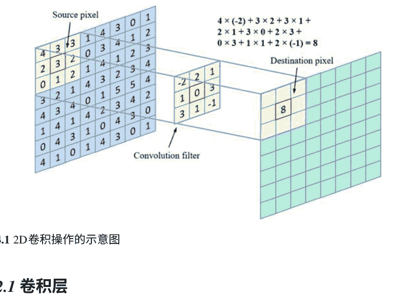

##### 4.2.1 卷积层

##### 2D卷积

在CNN的情况下，使用滤波器或内核对输入数据进行卷积，然后在特征图中生成一个特征映射，这是CNN的主要构建模块之一。

2D卷积的操作如图4.1所示：滤波器（3 ×3的黄色方块）在输入（蓝色方块）上滑动，卷积的总和进入特征图（红色方块）。滤波器的区域也被称为感受野。

在用于SR的CNN中，将在输入上执行大量的卷积操作，每个操作使用不同的滤波器，因此会产生不同的特征映射。然后，所有这些特征映射将作为卷积层的输出进行连接。

##### 3D卷积

与2D卷积不同，3D卷积（如图4.2所示）将一个三维滤波器应用于数据集，并且滤波器在三个方向（x、y、z）上移动以计算低层特征表示。它们的输出形状是一个三维体积空间，例如立方体。与传统的2D卷积相比，3D卷积可以组合更多的像素，并且可以有效地保持切片之间的连续像素信息。近年来，基于3D卷积的CNN在医学图像增强、病变分类和CT或MR图像的病变检测中越来越受欢迎。

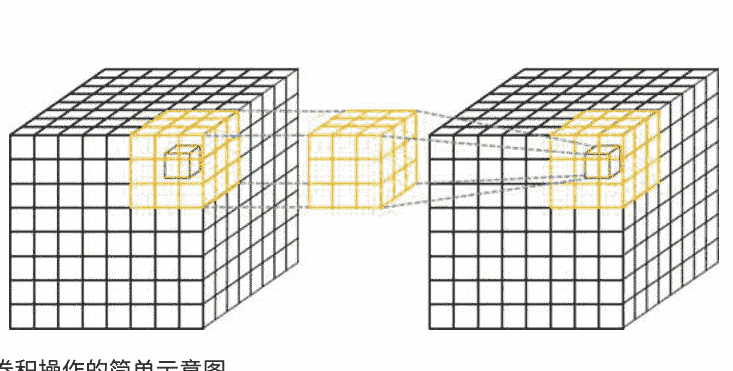

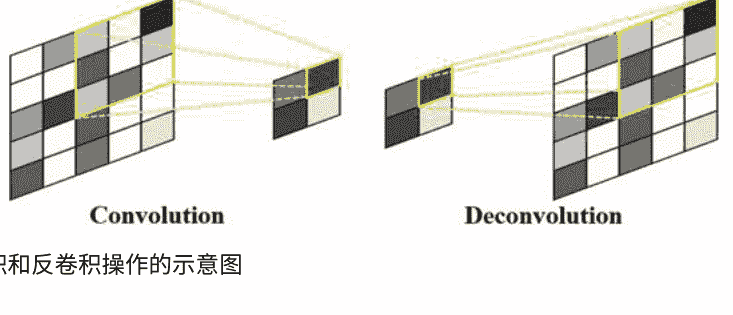

##### 4.2.2 反卷积层

反卷积是一种常用的方法，用于找到一组卷积核和特征图，使它们能够重建图像。 它是超分辨率处理中放大图像的一种非常有用的方法，因为需要正确预测和计算HR空间中的每个像素值。如图4.3所示，反卷积的工作方式类似于卷积的逆过程。

##### 4.2.3 损失层

神经网络的损失层将网络的输出与真实值进行比较。 例如，在图像处理问题中，通过该层计算损失函数[28]来比较处理后的图像和参考补丁之间的差异。

损失函数是评估算法对数据集建模效果的一种方法。对于一个误差函数 ε，补丁 P 的损失可以表示为

$$ \mathcal{L}(P) = \frac{1}{N} \sum_{p \in P} \varepsilon(p) , \tag{4.1} $$

其中 N是补丁 P中像素的数量。

均方误差（MSE） $\ell_2$ 范数，在优化问题中非常流行，因为它具有方便的性质。给定 $Y$ 作为从所有变量上的 $n$ 数据点样本生成的预测向量，$X$ 是表示真实数据的向量，则预测器的样本内均方误差计算为

$$ MSE = \frac{1}{n} \sum_{i=1}^{n} (X_i - Y_i)^2. \tag{4.2} $$

最近， $\ell_2$ 范数已成为超分辨率重建中最广泛使用的损失函数之一。然而，遗憾的是， $\ell_2$ 范数无法捕捉到人类视觉系统的复杂特征，因此 $\ell_2$ 范数和峰值信噪比（将在本章的第五部分介绍）与人类对图像质量的感知没有很好的相关性[29]。

因此，在超分辨率重建问题中，通常采用 $\ell_1$ 范数（平均绝对误差，MAE）来替代 $\ell_2$ 范数，以减少 $\ell_2$ 损失函数引起的伪影。具有 $\ell_1$ 范数的方程如下：

$$ MAE = \frac{1}{n} \sum_{i=1}^{n} |X_i - Y_i|. \tag{4.3} $$

##### 4.2.4 评估函数

峰值信噪比（**Peak signal-to-noise ratio**），简称PSNR，是信号的最大可能功率与影响其表示的噪声功率之间的比值[30]。此外，它是图像重建问题中最常用的评估函数。PSNR通过MSE定义。给定一个 $M \times N$ 的单色高分辨率图像Y（真实值）及其噪声近似值X，MSE定义如下：

$$ MSE = \frac{1}{mn} \sum_{i=0}^{m-1} \sum_{j=0}^{n-1} [X(i, j) - Y(i, j)]^2. \tag{4.4} $$

PSNR（以分贝为单位）的定义如下：

$$ PSNR = 10 \cdot \log_{10} \left( \frac{MAX^2}{MSE} \right). \tag{4.5} $$

在这里，$MAX$是图像的最大可能像素值。当像素使用每个样本8位表示时，$MAX$为255。对于每个像素具有三个RGB值的彩色图像，PSNR的定义相同，只是MSE是所有平方差值之和除以图像大小和三个的结果[31, 32]。

在有损图像中，PSNR的典型值在30到50分贝之间，位深度为8位，数值越高越好。16位数据的PSNR典型值在60到80分贝之间[33, 34]。如果PSNR指数的值较大，则两个图像的相似度较高。

结构相似性(SSIM)指数是一种用于预测数字电视和电影图片以及其他类型的数字图像和视频的感知质量的方法。

结构相似性的基本概念是自然图像具有高度结构化[35]，即自然图像中相邻像素之间存在很强的相关性，并且这种关联携带了场景中物体的结构信息。当观看图像时，人类视觉系统已经习惯于提取这种结构信息。因此，在设计图像质量度量方法来测量图像失真时，结构失真的测量是一个重要的部分。SSIM是一种用于测量两个图像之间相似性的方法。

给定两个图像 $\mathbf{x}$ 和 $\mathbf{y}$，两者之间的结构相似性定义为：
$$
SSIM(\mathbf{x}, \mathbf{y}) = [l(\mathbf{x}, \mathbf{y})]^\alpha [c(\mathbf{x}, \mathbf{y})]^\beta [s(\mathbf{x}, \mathbf{y})]^\gamma ,
$$
其中，
$$
l(\mathbf{x}, \mathbf{y}) = \frac{2\mu_x \mu_y + C_1}{\mu_x^2 + \mu_y^2 + C_1}, \quad c(\mathbf{x}, \mathbf{y}) = \frac{2\sigma_x \sigma_y + C_2}{\sigma_x^2 + \sigma_y^2 + C_2}, \quad s(\mathbf{x}, \mathbf{y}) = \frac{\sigma_{xy} + C_3}{\sigma_x \sigma_y + C_3}, \quad (4.6)
$$
其中，$l(\mathbf{x}, \mathbf{y})$、$c(\mathbf{x}, \mathbf{y})$和$s(\mathbf{x}, \mathbf{y})$分别比较了$\mathbf{x}$和$\mathbf{y}$之间的亮度、对比度和结构。$\alpha$, $\beta$和$\gamma$（它们都应该大于零）是调整$l(\mathbf{x}, \mathbf{y})$、$c(\mathbf{x}, \mathbf{y})$和$s(\mathbf{x}, \mathbf{y})$的相对重要性的参数。$\mu_x$和$\mu_y$、$\sigma_x$和$\sigma_y$是$\mathbf{x}$和$\mathbf{y}$的均值和标准差。$\sigma_{xy}$是$\mathbf{x}$和$\mathbf{y}$的协方差。$C_1$、$C_2$和$C_3$是用于保持稳定性的常数。如果结构相似性指数的值较大，则两个图像的相似性较高。

#### 4.3 通过2D超分辨率进行医学图像增强

从HR图像X到LR图像Y的分辨率降级过程可以表示为：
$$
Y = f(X), \quad (4.7)
$$
其中$f$是导致分辨率损失的函数。SISR过程是找到一个逆映射函数 $g(\cdot) \approx f^{-1}(\cdot)$来从LR图像Y恢复HR图像X：
$$
X = g(Y) = f^{-1}(Y) + R, \quad (4.8)
$$
其中$f^{-1}$和$R$分别是$f$的逆函数和重建残差。

在CNN SISR方法中，三个不同的步骤一起进行优化：特征提取、非线性映射和重建。在训练过程中，不同的

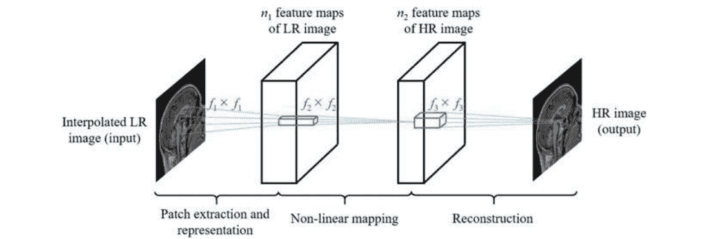

重建图像和真实图像之间的差异不仅用于调整重建层以从流形中恢复更好的图像，还用于指导准确图像特征的提取。

在这部分中，将介绍近年来提出的用于超分辨率的典型2D CNNs。

##### 4.3.1 超分辨率卷积神经网络（SRCNN）

这个结构是由Dong等人在2014年提出的，是第一个用于超分辨率重建的卷积神经网络。超分辨率卷积神经网络（SRCNN）的概述如图4.4所示，显示了用于超分辨率的CNN的基本结构。在[38]中，Dong等人提出了一种改进版本，用于更快速地处理RGB图像的SR处理。

为了将单个LR图像首先通过双三次插值预处理为所需的大小。目标是从插值图像Y中恢复目标图像F(Y)，使其与地面真实高分辨率图像X尽可能相似。尽管Y与X具有相同的大小，但它仍然是一个低分辨率图像。通过卷积神经网络学习映射函数F包括以下三个步骤：（i）提取和表示补丁，（ii）非线性映射，以及（iii）重建。接下来，将详细介绍每个操作的细节。

##### 4.3.1.1 补丁提取和表示

该操作从低分辨率图像Y中提取补丁，并将每个补丁表示为高维向量。这些向量构成了一组特征图，其数量等于向量的维度。

在图像恢复中，一种常见的策略是密集提取补丁，然后用一组预训练的基表示它们，例如[39]。这相当于将图像通过一组滤波器进行卷积，其中每个滤波器都是一种基础。Dong等人将这些基的优化纳入网络的优化中[37]。

第一层可以表示为一个操作 $F_1$:

$$ F_1(\mathbf{Y}) = \max (0, W_1 * \mathbf{Y} + B_1), \tag{4.9} $$

其中 $W_1$ 和 $B_1$ 分别表示滤波器和偏置。*表示卷积操作。这里，$W_1$ 对应于支持 $c \times f_1 \times f_1$ 的 $n_1$ 个滤波器，其中 $c$ 是输入图像的通道数，$f_1$ 是滤波器的空间尺寸。输出由 $n_1$ 个特征图组成。$B_1$ 是一个 $n_1$ 维向量，其中每个元素与一个滤波器相关联。然后常用的是修正线性单元（max (0, x)）[40]应用于滤波器响应。

##### 4.3.1.2 非线性映射

第一层为每个补丁提取一个 $n_1$ 维特征。在第二个操作中，这些 $n_1$ 维向量中的每一个都被映射为一个 $n_2$ 维向量。这相当于应用 $n_2$ 个具有微不足道的空间支持1×1的滤波器。这个解释仅适用于1×1的滤波器。第二层的操作是：

$$ F_2(\mathbf{Y}) = \max (0, W_2 * F_1(\mathbf{Y}) + B_2), \tag{4.10} $$

其中 $W_2$ 包含尺寸为 $n_1 \times f_2 \times f_2$ 的 $n_2$ 个滤波器，$B_2$ 是 $n_2$ 维的。每个输出（$n_2$ 维向量）都是一个HR补丁的表示，将用于重建。最近，增加更多的卷积层以增加非线性已经证明可以有效提高结果的准确性。但它倾向于增加模型的复杂性，因此需要更多的训练时间和GPU的内存。

##### 4.3.1.3 重建

该操作将上述HR分块表示合并以生成最终的HR，预期与真实值 $\mathbf{X}$ 相似。

在传统的SR方法中，为了生成最终的完整图像，预测的HR分块通常会重叠和平均。平均可以被视为一组特征图上的预定义滤波器，因此定义了一个卷积层来生成最终的高分辨率图像:

$$ F(\mathbf{Y}) = W_3 * F_2(\mathbf{Y}) + B_3, \tag{4.11} $$

其中 $W_3$对应于大小为 $n_2 \times f_3 \times f_3$的c个滤波器，$B_3$是一个 c维向量。当 $W_3$被设计为一组线性滤波器时，在重建部分的处理中它的作用类似于传统的平均处理。尽管上述三个操作（补丁提取或表示、非线性映射和重建）受到不同的直觉启发，但它们都导致了与卷积层相同的形式。因此，Dong等人将这三个操作放在一起，并形成了一个名为SRCNN的卷积神经网络，如图4.4所示。在训练过程中，通过机器优化该模型中的所有滤波权重和偏差。

##### 4.3.2 非常深的超分辨率网络（VDSR）

在第4.3.1节中介绍的SRCNN成功地将深度学习技术应用于超分辨率问题。然而，它在三个方面仍然存在局限性：

- 它依赖于小图像区域的上下文。换句话说，相关领域太小。
- 需要预先设置较小的学习率，因为训练收敛速度过慢。
- 该网络仅适用于单一尺度。

为了解决上述三个问题，Kim等人提出了一种新的方法，通过CNNcalledV ery Deep Super-Resolution network(VDSR) [41]. 网络结构，使用了一个非常深的CNN，灵感来自于Simonyan和Zisserman [42]，在图4.5中概述。

D层被设置，除了第一层和最后一层之外的所有层都是相同的type: 64个大小为$3 × 3 × 64$的滤波器。每个滤波器在64个通道上操作$3 × 3$的空间区域，因此64个特征图将由前一层的64个特征图重建。第一层对输入图像进行补丁提取，如第4.3.1.1节所示。最后一层由一个大小为$3 × 3 × 64$的单个滤波器组成，用于图像重建，类似于第4.3.1.3节介绍的部分。

该网络还接受一个插值的LR图像作为输入，并且像SRCNN一样预测图像细节。然而，VDSR比SRCNN要深得多。

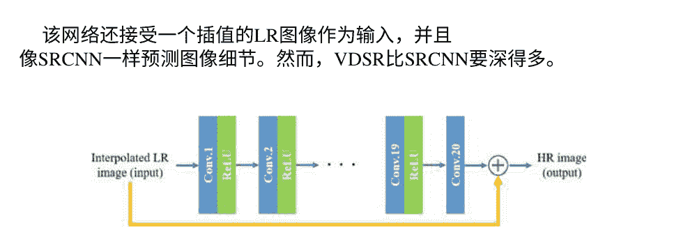使用非常深的网络来预测输出的一个问题是，在应用卷积操作时，特征图的大小会越来越小。例如，给定一个大小为 \((n+1)\times(n+1)\) 的输入应用于具有感受野大小 \(m \times n\) 的网络，输出将为 \(1 \times 1\)。

为了解决这个问题，在卷积之前填充零已被证明是非常有效的，可以保持所有特征图（包括输出图像）的大小相同。由于这个方法可以正确预测靠近图像边界的像素，因此优于传统方法。

主要改进点可以总结如下：

- VDSR使用了一个更大的感受野，大小为41 ×41，相比之前的研究，它考虑了更大的图像上下文，因为一个小的补丁中包含的信息对于大尺度的细节恢复是不够的。
- 由于LR图像和HR图像几乎共享相同的信息（低频分量），学习和建模残差图像（HR图像和LR图像之间的差异）是有优势的。此外，通过残差学习和梯度剪切，初始学习率可以设置为SRCNN的104倍，因为训练进展相对准确和快速。

##### 4.3.3 高效子像素卷积神经网络（ESPCN）

在将LR图像超分辨率到HR空间时，将LR图像的分辨率提高到与HR图像相匹配的某个点是必要且重要的。

一种常见的方法是在将其输入到网络之前添加一个预处理步骤，增加分辨率 [37, 43, 44]。然而，这种方法也有一些缺点。首先，在图像增强步骤之前增加低分辨率图像的分辨率会增加计算复杂性。其次，诸如双三次插值之类的图像放大插值方法并不能提供额外的信息来解决不适定重建问题。

因此，Shi等人提出了一种名为高效子像素卷积神经网络（ESPCN）的新型网络，该网络仅在整个网络的最后一层（通常称为子像素卷积层或像素重排层）将分辨率从低分辨率（LR）增加到高分辨率（HR），并从LR特征图中重建HR数据。如图4.6所示，为了避免在将LR图像输入网络之前进行放大，直接将类似于SRCNN的传统CNN应用于LR图像，并且使用一个子像素卷积层将LR特征图放大以生成SR图像来替换原始的卷积层（用于重建）。这种在[45]中提出的有效方法可以表示为：

\[ I^{SR} = f^{L}(I^{SR}) = \mathcal{PS}(W_{L} * f^{L-1}(I_{LR}) + b_{L}) \] (4.12)

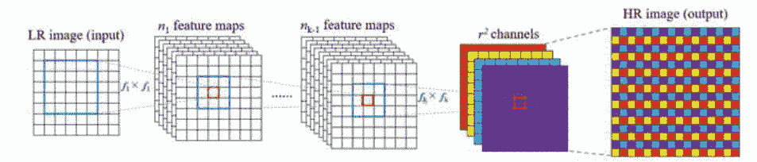

图4.6 ESPCN的结构。通常设置三个卷积层用于特征图提取和非线性映射。亚像素卷积层从LR空间聚合特征图，并将其重构为SR图像作为最终结果

其中，$\mathscr{P}\mathscr{S}$是一个周期性重排操作符，将一个 $H \times W \times (C \times r^2)$张量重新排列为一个形状为$r H \times r W \times C$的张量。该操作的效果如图4.6所示。数学上，该操作可以描述为：

$$\mathscr{P}\mathscr{S}(T)_{x,y,c} = T_{\lfloor x/r \rfloor,\lfloor y/r \rfloor, C \cdot r \cdot \text{mod}(y,r)+C \cdot r \cdot \text{mod}(x,r)+c} \ . \qquad (4.13)$$

因此，卷积算子 $W_L$ has shape $n_{L-1} \times r^2 C \times k_L \times k_L$。

在这项工作中，通过像素重排来处理上采样的最后一层。与之前的网络不同，每个低分辨率图像直接作为输入馈送到网络中，并且特征提取是通过低分辨率空间中的非线性卷积进行的。由于输入分辨率降低，使用较小尺寸的滤波器在保持给定上下文区域的同时整合相同信息变得可行。此外，分辨率和滤波器尺寸的降低大大降低了计算和内存复杂性，使得能够实时进行高清视频的超分辨率处理。

### 4.3.4 基于稠密跳跃连接的卷积神经网络用于超分辨率（SRDenseNet）

较深的网络已经证明能够在超分辨率方面取得良好的性能，因为更大的感受野从低分辨率图像中获取更多的上下文信息，从而促进在高分辨率空间中预测信息。然而，由于梯度消失问题，有效地训练非常深的卷积神经网络是具有挑战性的。使用从顶层到底层创建短路径的跳跃连接是一个不错的选择。

在大多数以前的工作中，比如SRCNN和VDSR，只有顶层的高级特征被用来重建高分辨率图像。然而，低层次的特征可能提供额外的信息来重建高频细节。在HR图像和图像SR中，不同层次的特征的集体知识可能会有益处。因此，Tong等人提出了一种新的SR方法，称为密集跳跃连接卷积神经网络超分辨率（SRDenseNet），其中使用了密集连接的卷积网络。SRDenseNet的特殊性和优势可以总结如下：

- 密集连接有效地改善了信息在网络中的流动，减轻了梯度消失问题。
- 为了避免重新学习冗余特征，允许从前面的层次重用特征图。
- 密集跳跃连接被用来结合低层次特征和高层次特征，以提供更丰富的信息用于SR重建。
- 解卷积层被整合以恢复图像细节并加速重建过程。

图4.7显示了SRDenseNet的结构。受[46]中首次提出的DenseNet结构的启发，在将卷积层应用于输入的低分辨率图像以学习低级特征后，采用了多个DenseNet块来学习高级特征。与[47]中提出的ResNet不同，DenseNet中的特征图是连接而不是直接相加的。第i层接收所有前面层的特征图作为输入：

```
$$ X_i = max (0, w_i * [X_1, X_2, ..., X_{i-1}] + b_i) $$ (4.14)
```

其中$[X_1, X_2, ..., X_{i-1}]$表示在前面的卷积层1, 2, ..., i-1生成的特征图的连接。这种密集连接结构增强了信息在深度网络中的流动，并缓解了梯度消失问题。每个DenseNet块的结构如图4.8所示。具体而言，本文中的一个DenseNet块中有8个卷积层。如果每个卷积层产生k个特征图作为输出，一个DenseNet块生成的特征图总数为 $k \times 8$，其中k被称为增长率。增长率k调节每个层对最终重建的贡献的新信息量。增长率k被实验性地设置为16。

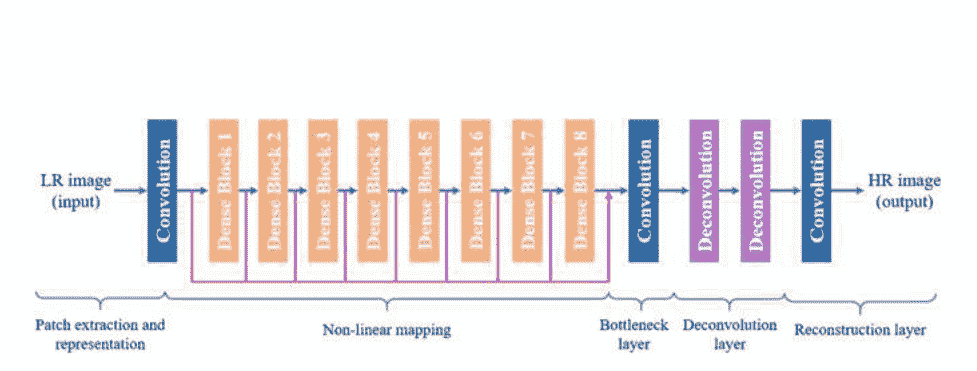

图4.7 DenseNet用于超分辨率的结构。为了重建高分辨率图像，所有层级的特征通过跳跃连接进行组合。

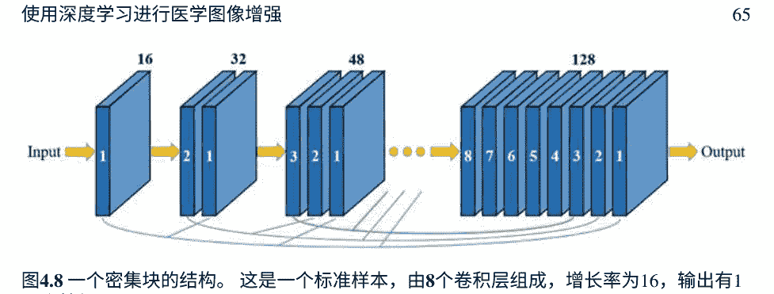

图4.8 一个密集块的结构。这是一个标准样本，由8个卷积层组成，增长率为16，输出有128个特征图。

为了防止网络变得过宽。因此，一个DenseNet块可以创建总共128个特征图。

反卷积层可以学习多样的上采样核，共同用于预测高分辨率图像，可以看作是卷积层的逆操作。使用反卷积层进行上采样有两个优点。

- SR重建过程可以加速。整个计算过程在低分辨率空间中进行，然后在反卷积处理之前计算成本显著降低。
- 从低分辨率图像中提取和学习大量的上下文信息，以推断高频细节。然后，使用3 ×3核和256个特征图训练两个连续的反卷积层进行上采样。

总之，网络中的所有特征图都被连接在一起，产生大量的特征图用于后续的反卷积层。

### 4.3.5 图像超分辨率的残差稠密网络 (RDN)

随着网络深度的增加，每个卷积层中的特征具有不同的感受野，呈现出分层的特性。然而，以前的超分辨率方法忽视了充分利用每个卷积层的信息，因为局部卷积层无法直接访问后续的层。

因此，张等人提出了残差稠密网络(RDN)，如图4.9所示，它由四个部分组成：浅层特征提取网络、残差稠密块(RDBs)、稠密特征融合和上采样网络[48]。

假设有 D个残差稠密块，第d个RDB的输出 F_d可以通过以下方式获得

```
$$F_d = H_{RDB,d}(F_{d-1}) = H_{RDB,d}(H_{RDB,d-1}(\cdots(H_{RDB,1}(F_0)\cdots)), \quad (4.15)$$
```

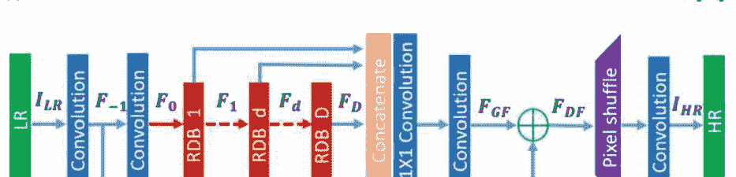

### 图4.9 残差密集网络（RDN）的架构用于图像超分辨率

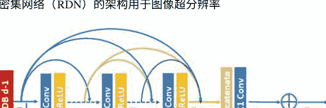

### 图4.10 残差密集块（RDB）的架构

其中 $H_{RDB,d}$ 表示第 $d$ 个RDB的操作。 $H_{RDB,d}$ 可以是由卷积和ReLU等操作组成的复合函数。 $F_d$ 可以被视为局部特征，因为它是由块内的每个卷积层产生的。

如图4.10所示，提出的RDB包含密集连接层、局部特征融合和局部残差学习，从而实现了连续的记忆机制。然后，从LR空间中提取的局部和全局特征将通过像素重排层堆叠到HR空间中。

总之，这项工作具有三个创新方面：

- 提出了一种用于高质量图像超分辨率的新框架RDN，充分利用了原始LR图像的所有分层特征。
- 残差密集块不仅可以通过连续的内存机制从前面的RDB中读取状态，还可以通过局部密集连接充分利用其中的所有层。累积的特征然后通过局部特征融合进行保留。
- 浅层特征和深层特征通过全局残差学习相结合，从原始的LR图像中得到全局密集特征。

##### 4.3.6 2D图像超分辨率的实验结果

在这部分中，将展示关于2D图像SR重建结果的比较。每个网络中的参数根据相应的原始设置。

| 方法 | 峰值信噪比 | 结构相似性指数 |
|---|---|---|
| 双三次插值 | 38.04 | 0.9581 |
| 超分辨率卷积神经网络 | 39.69 | 0.9664 |
| 超分辨率深度残差网络 | 40.55 | 0.9742 |
| 超分辨率卷积神经网络 | 39.18 | 0.9428 |
| 超分辨率稠密网络 | 32.74 | 0.8201 |
| 残差密集网络 | 40.78 | 0.9744 |

论文中的参数，如补丁大小，批处理大小，优化器，学习率和激活函数。受张的论文[48]的启发，使用DIV2K数据集[49]中的800张图像来训练上述五个网络。由于每个原始图像的尺寸非常大，因此不需要进行数据扩充，就可以产生超过15万个补丁。

对于测试，使用IXI数据集[50]中的80个体积数据，通过5种深度学习方法和传统的双线性插值进行评估。结果的峰值信噪比（PSNR）和结构相似性指数（SSIM）如表4.1所示。

从Z方向上显示的这些结果的样本在图4.11中进行了定性评估。结果表明，当训练样本足够时，更深更复杂的网络往往能够产生更好的结果。

#### 4.4 三维超分辨率下的医学图像增强

在这部分中，将介绍近年来针对MRI超分辨率的典型最新3D CNNs。

##### 4.4.1 用于超分辨率的三维卷积神经网络（3D-SRCNN）

尽管SRCNN（在第4.3.1节中介绍）最初是为2D图像处理而设计的，但许多医学图像是3D体积，并且像SRCNN这样的2D SR网络[51-53]逐层处理而没有利用3D中的连续结构。3D模型更可取，因为它直接提取3D图像特征，考虑跨多个切片的对象。

因此，Pham等人提出了一种用于MRI超分辨率的3D-SRCNN。3D-SRCNN由3层组成：n1个体素大小为f1×f1×f1的滤波器，n2个体素大小为f2×f2×f2的滤波器，以及一个体素大小为f3×f3×f3的滤波器。Chao等人[37]表明，使用更大的滤波器尺寸可以提高性能。

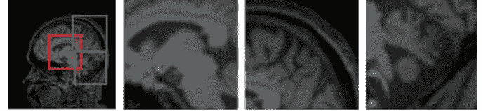

(b)

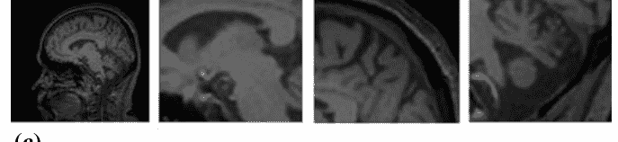

(c)

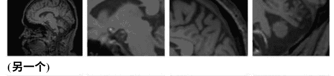

(d)

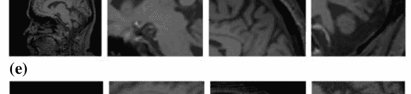

(e)

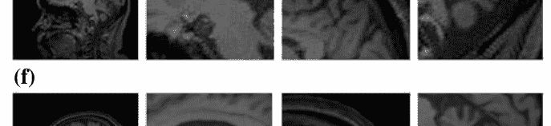

(f)

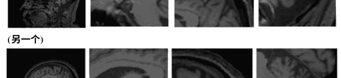

(g)

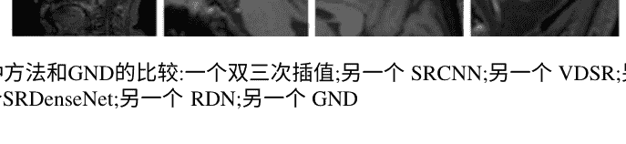

图4.11 各种方法和GND的比较: (a) 双三次插值; (b) SRCNN; (c) VDSR; (d) ESPCN; (e) SRDenseNet; (f) RDN; (g) GND

第二层，但是复杂性和内存成本也会增加，部署速度倾向于减慢。

为了避免网络复杂性的增加并确保结果的质量，3D-SRCNN的以下参数是经验性设置的: $n_1=9$, $f_1=1$, $f_2=5$, $n_1=64$ 和 $n_2=32$。

对于3D-SRCNN，观察到使用大尺寸的3D训练补丁不如使用小尺寸的补丁稳定，并且需要更高的计算时间。因此，25×25×25的3D补丁尺寸足够小，可以导致训练阶段的收敛，并且具有足够的重建信息[54]。

### 4.4.2 3D深度连接超分辨率网络 (3D-DCSRN)

最近，更深的网络已经证明在以前的2D CNNs中通常带来更好的结果。然而，将极深的网络或多个卷积神经网络堆叠成3D版本可能会导致大量的参数，从而在内存分配方面面临挑战。在这方面，最近关于使用CNN进行SR的研究主要集中在结构改进方面的效率。

作为代表性的工作之一，陈等人提出了一种3D密集连接超分辨率网络(DCSRN) [55]，它受到了密集连接卷积网络[46]的启发。它再次证明，更复杂的网络结构通过跳跃连接和层重用不仅有益于性能和速度，而且还减少了训练时间。

使用DCSRN有三个主要好处：

- 提出的网络中每条路径都更短，因此反向传播更高效，训练进展更快。
- 由于权重共享，该模型轻量且高效。
- 参数数量大大减少，特征被大量重复使用，因此几乎不会出现过拟合。

DCSRN的网络结构如图4.12所示。该网络的最典型特点是从整个3D图像中提取的补丁将被密集连接，然后输入到下一个块或层中。首先，对输入图像应用一个卷积层，卷积核大小为3，过滤器数量为2k，然后是一个具有4个单元的密集连接块。每个单元都有一个批归一化层和指数线性单元（ELUs）激活函数。然后，一个具有k个过滤器的卷积层将特征图压缩为适当的数量。最后，一个卷积层被用作重建层，提供最终的超分辨率输出。根据原作者的说法，密集连接块有四个3×3×3的卷积层，输出层的过滤器数量为48，增长率（k）为24，这将产生最佳结果。

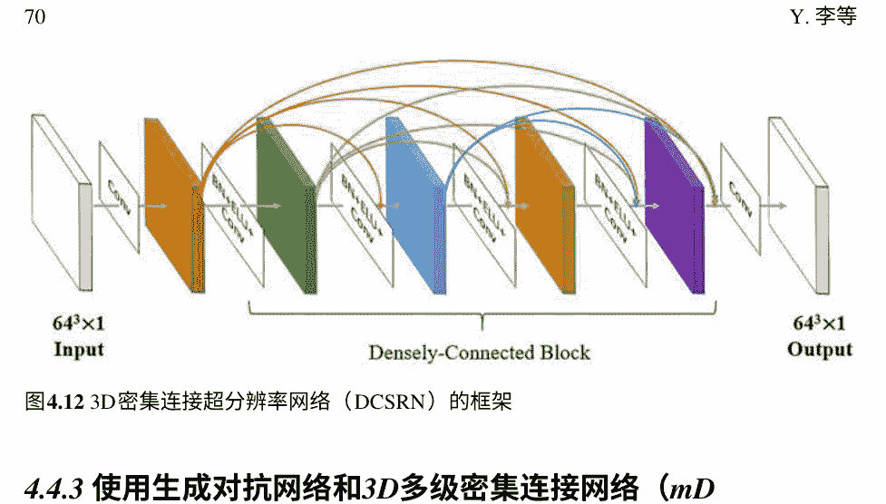

图4.12 3D密集连接超分辨率网络（DCSRN）的框架

### ### 4.4.3 使用生成对抗网络和3D多级密集连接网络（mDCSRN-GAN）进行超分辨率

大多数以深度学习方法进行的先前研究尚未完全解决医学图像超分辨率问题中的这些方面。首先，许多医学图像是3D体积，但先前的CNN逐层处理，丢弃了第三维中的连续结构信息。其次，3D模型的参数比2D模型多得多，这在内存消耗和计算开销方面提出了挑战，因此3D CNN变得不太实用。最后，CNN最广泛使用的优化目标是像素/体素误差，例如模型估计与参考HR之间的MSE。但正如[56]中提到的，MSE及其导数PSNR并不直接代表恢复图像的视觉质量。

因此，使用均方误差(MSE)往往会导致整体模糊和低感知质量。

在这部分中，陈等人提出的一种3D多级密集连接超分辨率网络(mDCSRN) [57]在图4.13中展示，用于完全解决上述问题将被简要介绍。mDCSRN通过利用密集连接网络而非常轻量级。然后，当与生成对抗网络(GAN) [58]一起训练时，它可以改善图像的清晰度和更加逼真的外观。顺便提一下，它在2018年之前提供了最先进的性能，同时通过强度差异进行了优化。

如图4.13b所示，每个DenseBlock都接收来自所有前面DenseBlock的输出，并直接连接到重建层。这些跳跃连接已被证明更加高效和不容易过拟合，因为它们直接访问所有前面的层。与原始的DenseNet不同，mDCSRN中的池化层已被移除，这样可以充分利用完整分辨率中的信息。

此外，在所有后续的DenseBlocks之前，将1 × 1 × 1卷积层设置为压缩器。令人满意的结果证明，信息压缩可以有效地迫使模型学习通用特征而不过拟合。

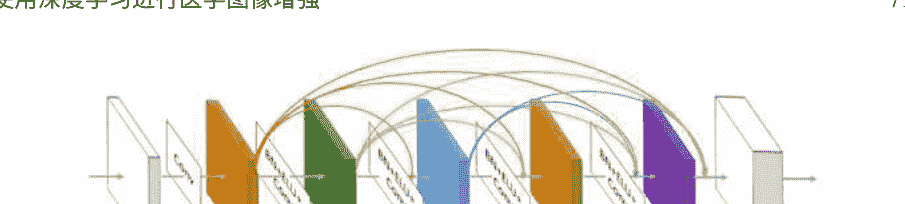

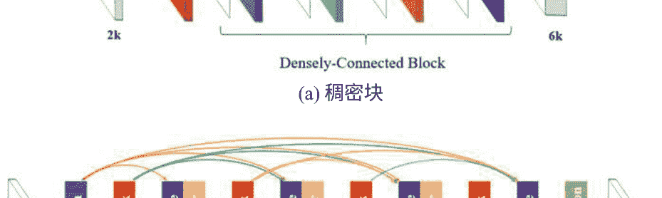

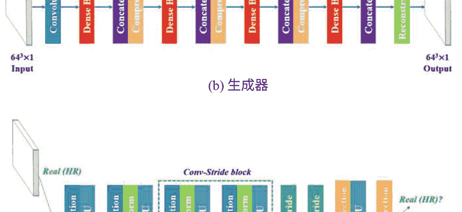

### 图4.13 (a) 3×3×3卷积和 (b, c) mDCSRN-GAN网络的DenseBlock架构

此外，压缩器层可以调整网络的宽度，使其对每个DenseBlock都相同。

在这个网络中，损失函数是两部分的总和：强度损失 $loss_{int}$ 和GAN的判别器损失 $loss_{GAN}$:

```
Loss = Loss_{int} + λ Loss_{GAN},
(4.16)
```

其中 $\lambda$ 是一个实验上设置为0.001的超参数。输出SR图像与真实HR图像之间的绝对差异（$\ell_1$ 范数）被定义为强度损失：

$$
Loss_{ell1} = \frac{1}{L H W} \sum_{z=1}^{L} \sum_{y=1}^{H} \sum_{x=1}^{W} \left| I_{x, y, z}^{H R} - I_{x, y, z}^{S R} \right| \quad (4.17)
$$

其中 $I_{x, y, z}^{S R}$ 和 $I_{x, y, z}^{H R}$ 分别是深度学习模型的SR输出和地面真实的HR图像块。GAN鉴别器损失被用作SR网络的附加损失：

$$
Loss_{GAN} = Loss_{WGAN, D} = - D_{WGAN, \theta}(I^{SR}) \quad (4.18)
$$

其中 $D_{WGAN, \theta}$ 是用于SR图像的Wasserstein GAN [59]的梯度惩罚变体的鉴别器输出数字。

##### 4.4.4 3D图像超分辨率的实验结果

在这部分中，将展示关于3D MR图像SR重建的结果比较。每个网络中的参数也根据相应的原始论文进行设置。使用IXI数据集中的500张图像进行训练，使用80张图像进行测试。结果的峰值信噪比（PSNR）和结构相似性指数（SSIM）如表4.2所示。由于训练整个mDCSRN-GAN模型需要一台工作站，因此我们只比较mDCSRN-GAN的生成器与其他3D模型。

这些结果的样本从三个方向显示在图4.14中，用于定性评估。由于通过深度3D CNN进行SR的处理需要大量的训练样本，尽管mDCSRN更深更复杂，但效果并不比没有鉴别器的DCSRN更好。

表4.2 五个网络和双三次插值的尺度因子2的PSNR(dB)和SSIM结果
| 方法 | 峰值信噪比 | 结构相似性指数 |
| :--- | :---: | :---: |
| 双三次插值 | 31.91 | 0.9817 |
| 三维超分辨率卷积神经网络 | 34.16 | 0.9897 |
| 三维深度残差网络 | 35.46 | 0.9924 |
| 三维多尺度深度残差网络 | 35.41 | 0.9922 |图4.14 各种方法和GND在3个方向上的比较：a三次插值; b 3D-SRCNN; c 3D-DCSRN; d mDCSRN; e GND

#### 4.5 结论

在本章中，我们展示了用于SR的基本卷积神经网络以及近年来提出的各种典型的最新方法。此外，由于对医学图像的质量要求越来越高，传统2D CNN的结果不够好，而3D CNN在3D医学图像增强方面表现出优势。当然，随着深度学习的发展，图像处理技术将变得更快更完善。未来，将会有更好的方法来利用神经网络进行图像增强，这值得进行研究和探索。

致谢本工作部分得到了日本文部科学省（MEXT）教育、科学、文化和体育部的科学研究补助金18K18078、18H03267的支持，以及浙江实验室计划2018DG0ZX01的支持。

## 参考文献

1.  Elad, M., Arie, F.: 从多个模糊、噪声和欠采样的测量图像中恢复单个超分辨率图像。IEEE图像处理汇刊 6(12)，1646-1658 (1997)
2.  Park, S., Park, M., Kang, M.: 超分辨率图像重建：技术概述。IEEE信号处理杂志 20(3)，21-36 (2003)
3.  Protter, M., et al.: 将非局部均值推广到超分辨率重建。IEEE图像处理汇刊 18(1)，36-51 (2009)
4.  崔, Z., 张, H., 单, S., 钟, B., 陈, X.: 用于图像超分辨率的深度网络级联。在：欧洲计算机视觉大会，第49-64页 (2014)
5.  Freedman, G., Fattal, R.: 基于本地自我示例的图像和视频放大。ACM Trans. Graph. 30(11), 12 (2011)
6.  Glasner, D., Bagon, S., Irani, M.: 从单个图像进行超分辨率。在：IEEE国际计算机视觉大会论文集，第349-356页 (2009)
7.  Huang, J.B., Singh, A., Ahuja, N.: 基于转换的自我示例的单图像超分辨率。在：IEEE计算机视觉和模式识别大会论文集，第5197-5206页 (2015)
8.  Yang, J., Lin, Z., Cohen, S.: 基于原地示例回归的快速图像超分辨率。在：计算机视觉和模式识别IEEE会议论文集，第1059-1066页 (2013)
9.  Bahrami, K.等：使用外观和解剖特征从3T MRI重建7T样图像的卷积神经网络。深度学习和数据标注在医疗应用中，第39-47页。斯普林格，尚姆 (2016)
10. Bevilacqua, M., Roumy, A., Guillemot, C., Morel, M.L.A.: 基于非负邻居嵌入的低复杂度单图像超分辨率。在：英国机器视觉会议，第1-10页 (2012)
11. Chang, H., Yeung, D.Y., Xiong, Y.: 通过邻居嵌入进行超分辨率。在：计算机视觉和模式识别IEEE会议论文集 (2004)
12. Dai, D., Timofte, R., Van Gool, L.: 联合优化的图像超分辨率回归器。Eurographics 7, 8 (2015)
13. Freeman, W.T., Pasztor, E.C., Carmichael, O.T.: 学习低级视觉。Int. J. Comput. Vis. 40(11), 25–47 (2000)
14. Jia, K., Wang, X., Tang, X.: 基于学习字典的图像转换跨图像空间。IEEE Trans. Pattern Anal. Mach. Intell. 35(11), 367–380 (2013)
15. Kim, K.I., Kwon, Y.: 使用稀疏回归和自然图像先验的单图像超分辨率。IEEE Trans. Pattern Anal. Mach. Intell. 32(6), 1127–1133 (2010)
16. Schulter, S., Leistner, C., Bischof, H.: 使用超分辨率森林进行快速准确的图像放大。In: Proceedings of the IEEE Conference on Computer Vision and Pattern Recognition, pp. 3791–3799 (2015)
17. Timofte, R., De Smet, V., Van Gool, L.: 基于锚定邻域回归的快速示例超分辨率。在: IEEE计算机视觉和模式识别会议论文集, 第1920-1927页 (2013)
18. Timofte, R., De Smet, V., Van Gool, L.: A+: 调整的锚定邻域回归用于快速超分辨率。在: 亚洲计算机视觉会议, 第111-126页 (2014)
19. Yang, J., Lin, Z., Cohen, S.: 基于原地示例回归的快速图像超分辨率。在: IEEE计算机视觉和模式识别会议论文集, 第1059-1066页 (2013)
20. Yang, J., Wang, Z., Lin, Z., Cohen, S., Huang, T.: 图像超分辨率的耦合字典训练。IEEE Transactions on Image Processing 21(11), 3467-3478 (2012)
21. 杨, J., 赖特, J., 黄, T.S., 马, Y.: 通过稀疏表示进行图像超分辨率。IEEE图像处理汇刊 19(11), 2861-2873 (2010)
22. Zeyde, R., Elad, M., Protter, M.: 使用稀疏表示进行单幅图像放大。在: 曲线和曲面国际会议, 第711-730页 (2012)
23. Glasner, D., Bagon, S., Irani, M.: 从单幅图像进行超分辨率。在: 第12届国际计算机视觉会议 (2009)
24. Baker, S., Kanade, T.: 超分辨率的限制及如何突破它们。IEEE模式分析机器智能汇刊 9, 1167-1183 (2002)
25. 林, Z., 沈, H.: 基于局部平移的重建超分辨率算法的基本限制。IEEE模式分析机器智能汇刊 26(1), 83-97 (2004)
26. 邓, J., 董, W., Socher, R., 李, L.J., 李, K., 李, F.: ImageNet: 一个大规模的分层图像数据库。在: IEEE计算机视觉和模式识别会议论文集, 第248-255页 (2009)
27. Krizhevsky, A., Sutskever, I., Hinton, G.: 使用深度卷积神经网络进行ImageNet分类。神经信息处理系统进展, 第1097-1105页 (2012)
28. Zhao, H., Gallo, O., Frosio, I., Kautz, J.: 使用神经网络进行图像恢复的损失函数。IEEE计算机成像 3(1), 第47-57页 (2017)
29. Zhang, L., Zhang, L., Mou, X., Zhang, D.: 对全参考图像质量评估算法进行全面评估。在: IEEE国际图像处理会议, 第1477-1480页 (2012)
30. https://zh.wikipedia.org/wiki/峰值信噪比
31. Oriani, E.: qpsnr: 用于Linux的快速PSNR/SSIM分析器。访问日期: 2011年4月6日
32. Pnipsnr 用户手册。2011年4月6日访问
33. Welstead, S.: 分形和小波图像压缩技术, 第155-156页。 SPIE Optical Engineering Press (1999)
34. Raouf, H., Dietmar, S., Barni, M. (编) : 分形图像压缩。文档和图像压缩, 第968卷, 第168-169页。CRC Press, Boca Raton。ISBN 9780849335563。2011年4月5日访问
35. Wang, Z., Bovik, A., Sheikh, H., Simoncelli, E.: 图像质量评估: 从误差可见性到结构相似性。IEEE Trans. Image Process 13(4), 600-612 (2004)
36. Chao, D., 等: 学习深度卷积网络进行图像超分辨率。在: 欧洲计算机视觉会议。Springer, Cham (2014)
37. Chao, D., 等: 使用深度卷积网络的图像超分辨率。IEEE Trans. Pattern Anal. Mach. Intell. 38(2), 295–307 (2016)
38. Dong, C., Loy, C.C., Tang, X.: 加速超分辨率卷积神经网络。在: 欧洲计算机视觉会议 (2016)
39. Aharon, M., Elad, M., Bruckstein, A.: K-SVD: 一种用于稀疏表示的过完备字典设计算法。IEEE Trans. Signal Process. 54(11), 4311–4322 (2006)
40. Nair, V., Hinton, G.E.: 修正线性单元改进了受限玻尔兹曼机。 在：第27届国际机器学习大会论文集，第807–814页 (2010)
41. Kim, J., Lee, J., Lee, K.: 使用非常深的卷积网络进行准确的图像超分辨率。 在：IEEE计算机视觉和模式识别会议论文集，第1646–1654页 (2016)
42. Simonyan, K., Zisserman, A.: 非常深的卷积神经网络用于大规模图像识别。 在：国际学习表示会议 (2015)
43. Wang, Z., Liu, D., Yang, J., Han, W., Huang, T.: 深度改进的稀疏编码用于图像超分辨率。arXiv:1507.08905 (2015)
44. Chen, Y., Pock, T.: 可训练的非线性反应扩散：快速和有效的图像恢复框架。IEEE Trans. Pattern Anal. Mach. Intell. 39(6), 1256-1272 (2017)
45. Shi, W.等：使用高效的子像素卷积神经网络进行实时单图像和视频超分辨率。 在：IEEE计算机视觉和模式识别会议论文集, pp. 1874-1883 (2016)
46. Huang, G., 等：密集连接的卷积网络。 在：IEEE计算机视觉和模式识别会议论文集 (2017)
47. He, K., Zhang, X., Ren, S., Sun, J.: 深度残差学习用于图像识别。 在：IEEE计算机视觉和模式识别会议论文集，第770-778页 (2016)
48. Tong, T., 等：使用密集跳跃连接的图像超分辨率。 在：IEEE国际计算机视觉会议论文集 (2017)
49. Eirikur, A., Radum, T.: NTIRE 2017年单图像超分辨率挑战：数据集和研究。 在：IEEE计算机视觉和模式识别会议研讨会 (2017)
50. https://brain-development.org/ixi-dataset/
51. Greenspan, H., 等：使用超分辨率的MRI切片间重建。磁共振成像 20(5), 437-446 (2002)
52. Greenspan, H.: 医学影像中的超分辨率。 计算机学报 52(1), 43–63 (2008)
53. Litjens, G., 等人：医学图像分析中的深度学习综述。医学图像分析 42, 60–88 (2017)
54. Pham, C., 等人：使用深度3D卷积网络的脑MRI超分辨率。 在：IEEE第14届生物医学成像国际研讨会 (2017)
55. Chen, Y., 等人：使用3D深度密集连接神经网络的脑MRI超分辨率。 在：IEEE第15届生物医学成像国际研讨会 (2018)
56. Ledig, C., 等人：使用生成对抗网络的照片逼真的单图像超分辨率。 在：IEEE计算机视觉和模式识别会议论文集(2017)
57. Chen, Y., 等人：使用生成对抗网络和3D多级密集连接网络的高效准确的MRI超分辨率。 在：医学图像计算与计算机辅助干预国际会议。 Springer, Cham (2018)
58. Goodfellow, I., Pouget-Abadie, J., Mirza, M., 等人：生成对抗网络。 神经信息处理系统进展 , pp. 2672–2680 (2014)
59. Arjovsky, M., Chintala, S., Bottou, L.: Wasserstein gan (2017). arXiv: 1701.07875

# 第五章 在有限资源下改进深度学习在医学图像分割中的性能

Saeed Mohagheghi, Amir Hossein Foruzan和Yen-Wei Chen

摘要卷积神经网络（CNN）在图像分割中取得了巨大的成功，在许多临床治疗中具有重要意义。尽管CNN已经取得了最先进的性能，但大多数使用深度学习方法进行语义分割的研究都是在计算机视觉领域，因此医学图像的研究比自然图像要不成熟得多，尤其是在3D图像分割领域。我们对CNN分割模型进行的实验表明，在网络架构和参数的修改和调整下，修改后的模型在所选任务中表现更好，尤其是在有限的训练数据集和硬件条件下。我们选择了3D肝脏分割作为我们的目标，并提出了一种选择最先进的CNN模型并针对我们特定任务和数据进行改进的路径。我们的修改包括架构、优化算法、激活函数和卷积滤波器的数量。通过设计的网络，我们使用的训练数据比其他分割方法少。我们网络的直接输出，在没有进一步的后处理的情况下，在3D肝脏分割的训练图像中得到了约99的Dice分数，在验证图像中得到了约95的Dice分数，这与使用更多训练图像和后处理的最先进模型相当。所提出的方法可以轻松适应其他医学图像分割任务。

- 深度学习
- 卷积神经网络
- 模型改进
- 医学图像分割
- 3D肝脏分割

S. Mohagheghi · A. H. Foruzan (✉) 生物医学工程系，工程学院，Shahed大学，德黑兰，伊朗 e-mail: a.foruzan@shahed.ac.ir
S. Mohagheghi 电子邮件： s.mohagheghi@shahed.ac.ir
Y.-W. Chen 信息科学与工程学院，立命馆大学，525–8577草津市，日本 电子邮件： chen@is.ritsumei.ac.jp

#### 5.1 引言

图像分割是治疗计划过程中的重要步骤，例如计算机辅助手术和放射治疗。然而，在处理医学图像时存在一些挑战，包括器官与周围组织之间的低对比度，噪声和伪影，对象形状和外观的大变化，以及不足的注释训练数据。为了克服这些限制，研究人员已经整合了领域知识，包括约束条件，采用了先进的预处理技术，并开发了无监督技术。由于软件和硬件技术的当前进展，许多研究人员倾向于使用深度神经网络来克服上述限制。

深度学习实际上是传统神经网络的一种新方法。它被认为是人工智能领域的一种机器学习方法[1]。典型机器学习技术的主要步骤包括特征表示、学习和测试阶段。首先，在特征表示步骤中提取输入数据的特征，然后在学习阶段中使用这些特征来训练所需的算法。深度学习方法从数据中学习特征层次结构和复杂函数，而不依赖于人工设计的特征[2]。在深度学习方法中，特征表示和算法学习同时进行，学习过程从输入数据到结果是端到端的。

#### 5.2 深度卷积神经网络

根据网络中的层和连接的类型，深度学习引入了各种模型，包括自动编码器（AE）网络[3]，深度置信网络（DBNs）[4]，卷积神经网络（CNNs）[5]，循环神经网络（RNNs）[6]和生成对抗网络（GANs）[7]。研究人员将这些模型应用于计算机视觉，图像和视频处理，语音识别，自然语言处理和文本分析等各种应用中。

卷积神经网络被认为是图像处理和计算机视觉领域的一次革命。自2012年以来，CNN模型一直在IMAGENET大规模视觉识别挑战（ILSVRC）中名列前茅[5, 8-12]。在目标检测和语义分割任务中，大多数最先进的方法都使用了CNN的形式。CNNs特别适用于2D/3D图像和视频帧等多维数据。CNNs可以捕捉特征的层次结构，并且对于对象的平移，旋转和小变形具有不变性。CNNs的基本结构是用于分类的，例如，模型的输入是图像，输出是图像中检测到的对象的类别。随后，这些模型的应用扩展到了目标检测（输出是检测到的对象周围的边界框）和语义分割（图像中每个像素都有一个类别标签作为输出，并且输出是检测到的对象周围的精确边界）。CNN的关键部分是卷积（Conv）层（图5.1）。卷积层在输入图像上应用一组权重窗口，输出是在整个图像区域上滑动该窗口的结果。权重窗口（卷积滤波器或核）是卷积层的可学习参数，卷积层的输出是特征图。通过在卷积层中使用多个滤波器，输出将是多个特征图的串联，这将成为下一层的输入。

有一种常见的方法是在卷积层的输出上应用非线性函数（称为激活函数）。流行的激活函数包括sigmoid函数和专门为深度CNN设计的修正线性单元(ReLu) [13]。

在特定数量的卷积层之后通常会使用下采样层（例如，最大池化）。下采样层的优点是（i）减小数据的大小，从而可以增加卷积滤波器的数量；（ii）增加下一层卷积滤波器的视野范围，从而产生更全局的特征。典型的用于分类的CNN的最后部分是一个或多个全连接或稠密层，以与数据类别数量相同的输出神经元数目结束，然后是一个softmax函数（用于多类别分类）或sigmoid函数（用于二元分类）。

还有其他类型的层，我们可以在深度卷积神经网络中使用。Dropout [14]和Batch Normalization (BN) [15]是最流行的。 Dropout层通过以一定的概率函数丢弃神经元，防止网络过度拟合训练数据。然而，在卷积层之后使用dropout不会改善结果，我们通常在全连接层之间使用它们。BN层对每个批次的数据进行归一化处理，可以与全连接层或卷积层一起使用。虽然我们在模型中使用了BN层，但我们可以从更高的学习速率中受益，并减少对权重初始化的强依赖。

#### 5.3 使用CNN进行医学图像分割

分割CNN的架构与分类CNN不同。分割模型为输入图像的每个点（像素或体素）预测一个类别，输出是一个掩码或标签图像，而分类CNN为整个输入分配一个类别。在分割任务中，我们通常有成对的图像{x, y}，其中观察到的强度图像作为输入，是期望的输出或地面真实标签ℒ = {1, y = {y_i ∈ ℒ, i ∈ S}, 2, ..., C}表示不同的组织。分割模型应该估计出具有观察到的x的y。CNN通过学习一个判别函数来执行这个任务，该函数建模了底层的条件概率分布P(y|x, θ)，其中θ是网络参数。

目前，在医学图像分割中最流行的CNN模型是完全卷积网络（FCNs）[16]。FCNs是一类专门设计用于分割任务的CNN，只包括局部连接层（即卷积、池化和上采样）。这种架构中没有全连接层，因此模型可以在训练和测试阶段使用不同的图像尺寸。这种架构还可以减少参数数量和计算时间。

分割FCN由两部分组成： (i) 特征提取（或分析），类似于类别CNN，如VGG-Net [9]，和 (ii) 重建（或合成），如U-Net [17]和3D U-Net [18]的情况。图5.2显示了分割网络的示意图。在分析路径中，我们通常会增加过滤器和特征图的数量，同时减小数据的大小。在合成路径中，我们减少特征图的数量，并通过上采样将数据的大小增长到原始输入大小。

我们还可以用Conv层替换池化和上采样层。在这种架构中，通过Conv层的步幅≥2进行下采样，通过转置卷积（也称为UpConv）层的步幅≥2进行上采样。

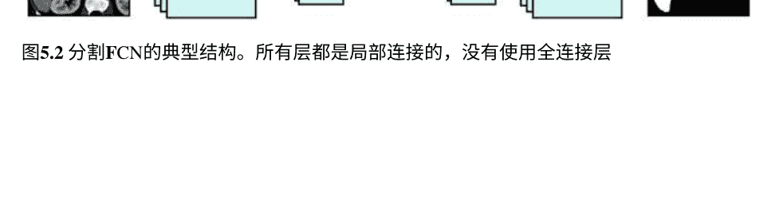

##### 5.3.1 CNN训练

在训练过程中，CNN模型通过为每个像素或体素$x_i$分配属于 $C$个类别中的每个类别的概率来学习估计类别密度$\mathbf{P}(y| x, \theta)$，从而产生 $C$组类别特征图 $f_c$。然后，我们通过对提取的类别特征图应用softmax函数来获得类别标签的结果 $\hat{y}_i =$
$$\frac{e^{-f(c,i)}}{\sum_{j=1}^{C} e^{-f(j,i)}}$$
网络通过优化损失函数$N1$来学习强度和标签之间的映射 $y_i, \hat{y}_i$：
$$-\sum_i \mathcal{L}(\text{___})$$
（例如，交叉熵或$D_{i}ce$损失），在预测的标签映射 $\hat{y}_i$和地面真实掩膜图像 $y_i$之间的损失。优化过程使用反向传播[19]和优化算法来最小化这个损失。训练过程的示意图如图5.3所示。

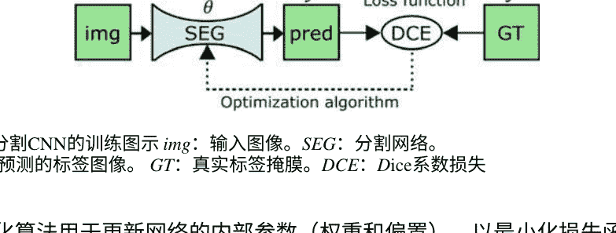

优化算法用于更新网络的内部参数（权重和偏置），以最小化损失函数。根据学习率，有两种类型的算法：具有恒定学习率的算法，如随机梯度下降（SGD），以及具有自适应学习率的算法，如RMSProp[20]和Adam [21]。目前，最流行的优化算法主要有SGD，RMSProp，AdaDelta [22]，Adam及其变种[1]。有关优化算法的概述可在[23]中找到。

##### 5.3.2 医学图像分割中的CNN挑战

在深度学习的大多数领域，许多问题仍然没有答案，需要设计新的方法和理论基础。当前的情况促使我们开发新的网络架构设计方法和训练策略。

对于自动分割方法，在处理医学图像时存在特定的挑战。这些挑战包括噪声和伪影、对象形状和外观的巨大变化、对象与相邻组织之间的低对比度，以及不同病理（如肿瘤和囊肿）的存在。我们还会遇到其他问题，例如有限的可用标记数据用于训练，以及图像的大尺寸（尤其是在体积数据中），这会导致训练过程中的硬件内存限制。在本章中，我们旨在基于当前最先进的CNN模型设计适当的网络架构和训练策略，以优化选择的模型用于CT扫描图像中的3D肝脏分割。

我们首先介绍3D U-Net模型，这是一种在3D医学图像分割中广受欢迎的模型。然后，我们提出了一些技术和修改，使模型在有限的硬件资源和标记图像的情况下针对3D肝脏分割任务进行优化。我们提出的策略可以适用于任何其他模型和任务。我们方法的贡献如下： (i) 我们使用少量图像训练高性能分割模型。
-   (ii) 我们改进的模型的参数数量比基本模型少，可以在中等硬件上进行训练。
-   (iii) 我们改进了模型在我们的数据上的收敛速度和性能。
-   (iv) 我们对数据进行了端到端的训练，没有进行特殊的预处理或后处理。

#### 5.4 材料和方法

##### 5.4.1 实验设置

我们使用了两个数据集进行我们的任务，每个数据集包含20个腹部CT图像。第一个数据集来自MICCAI 2007大挑战研讨会[24]，第二个数据集（3D-IRCADb）属于IRCAD腹腔镜培训中心[25]。我们使用从相应的肝脏掩膜图像中提取的边界框来裁剪每个图像。所有裁剪后的图像都具有相同的大小，为128 × 128 × 128个体素，并包含整个肝脏。我们还将所有图像的强度映射到[0 255]范围内。我们使用TensorFlow [26]软件库在一台个人电脑上实现了所有模型和训练会话，该电脑配备了一张GeForce®GTX™ 1070Ti显卡，拥有8 GB专用内存，一颗3.3 GHz双核Intel® Pentium® G4400 CPU和16 GB DDR4 RAM。几乎所有计算都在图形处理单元(GPU)上执行。

##### 5.4.2 基本模型

我们设计了一个初始模型，与基本的3D U-Net相似，只是我们减少了滤波器的数量以适应我们的硬件规格。然后，我们在我们的数据上训练这个模型(我们称之为基本模型)。3D U-Net [18]是一个FCN模型，它是标准U-Net [17]的扩展，所有的2D操作都被它们的3D对应物所取代。模型的分析路径有四个分辨率步骤；每个步骤包含两个Conv块，包括批量归一化(BN)和修正线性单元(rectified linear unit，ReLU)并以最大池化层结束。合成路径也有四个分辨率步骤；每个步骤都以上采样层开始，然后是两个Conv块的集合。在最后一层，1 × 1 × 1 Conv层将输出通道数减少到标签数目[18]。基本模型的架构如图5.4所示。

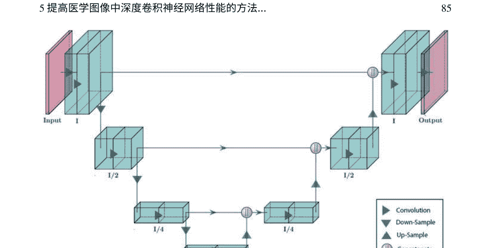

这个模型也受益于跳跃连接（也称为快捷或残差连接）。这些连接在分析和合成路径的相似分辨率层之间建立桥梁。跳跃连接在U-Net [17]、3D U-Net [18]和V-Net [27]中被证明是有用的，它们也被用于残差网络[11， 28]。Drozdzal等人[29]评估了在医学图像分割中使用跳跃连接创建深度架构的好处。

评估深度模型的常见方法是将可用数据集分为三组：训练集、验证集和测试集。训练集包含大部分数据，用于运行学习算法。验证集由少量可用数据组成（也称为开发集或dev集），我们用它来监控网络的性能，调整参数和进行其他修改[30]。我们使用测试集来评估提出的模型。在这项工作中，我们对两个输入数据集进行洗牌，并选择35个图像作为训练集，四个图像作为验证集，一个图像作为测试集。我们保持训练和验证集在所有会话中保持不变，以便在模型的不同变体之间进行公平比较。我们仅使用负的Dice相似系数（DSC）作为损失函数和评估指标。两个二进制图像y和^y的Dice系数，分别是真实标签和预测掩膜图像，定义为DSC=2*|y∩^y|/(|y|+|^y|)。测量结果始终在0和1之间，但Dice系数的结果通常以百分比(DSC × 100)报告。由于优化函数试图最小化损失，我们使用负的Dice系数，以便最佳值在 -1处。如[30]所述，使用单一评估指标可以加快整个过程，并对所有模型进行清晰的优先级排名。

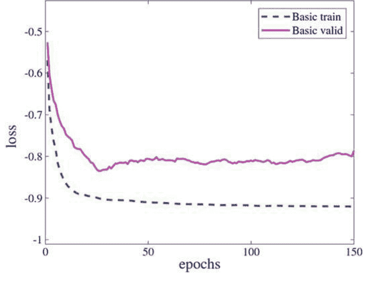

图5.5 基本模型在我们的数据上的损失图(-1是最佳值)。验证损失与训练损失的差异显示过拟合的概率

图5.5显示了基本模型在我们的数据上运行后的损失图。

#### 5.5 模型优化用于3D肝脏分割

在训练过程中监测训练损失和验证损失的变化是检查网络性能的重要工具之一，它可以帮助我们诊断问题并决定下一步的性能改进方法。如果训练误差很高，我们可以说我们的模型欠拟合，不适合我们的任务。因此，我们应该增加模型的大小或复杂性，或者改变其架构[30]。如图5.4所示，我们模型的主要问题是验证误差很高。当验证损失不收敛且不遵循训练损失时，我们可以说模型过拟合且泛化能力差。在这种情况下，我们可以减少模型的参数数量或使用更多的训练数据。降低验证损失的其他选项包括使用正则化技术约束优化过程，以及改变模型参数和超参数，如批量大小、优化算法的学习率和模型的层数。使用更多的训练数据并不是我们的解决方案，因为我们试图优化现有数据的选择模型。不使用更多的数据（即使使用数据增强方法）的另一个原因是，当我们计划使用较少的训练图像来评估多个模型时。我们可以采取一些措施来防止模型过拟合，并提高其在我们的任务中的性能。我们将在下面讨论这些步骤。

##### 5.5.1 模型架构

我们开始对模型进行修改，将最大池化层替换为其前面的卷积层的步长为2。我们还删除了上采样层，并将其后面的第一个卷积层替换为步长为2的转置卷积层。由于池化和上采样层是固定操作，这些改变不会影响参数的数量，但它减少了计算量，并使大小变化的操作可训练（特别是上采样过程）。有关卷积和转置卷积层及其对数据的影响的详细解释，请参见[31]。

在基本模型中，当我们尝试增加批量大小时，会导致GPU单元内存错误；或者当我们改变学习率时，模型将无法收敛。然而，通过新的架构，我们可以使用批量大小为三和任何其他学习率，而不会出现收敛或内存问题。结果比基本模型稍微好一些。

##### 5.5.2 优化算法

近年来提出了各种优化算法；3D U-Net模型使用了SGD优化算法。然而，最近的研究表明，具有自适应学习率的算法可以帮助模型更快地收敛，并避免陷入鞍点[1,23]。

我们在我们的模型中使用Adam [21]，因为它在计算上高效，内存要求少，并且在CNN模型上的实验中显示出了其有效性。Adam是最常用的优化算法之一，实际上是RMSprop [4]和动量技术的组合。关于其两个可调参数 β1 和 β2，我们使用推荐的默认值0.9和0.999。

##### 5.5.3 激活函数

另一个需要优化的参数是激活函数，它对模型的收敛速度和准确性都有显著影响。ReLU及其变种在CNNs中相比传统的激活函数（如sigmoid）表现出了巨大的优势[5]，但最近引入了另一种激活函数，称为指数线性单元（ELU）[32]，它可以帮助模型更快地收敛并得到更准确的结果[33]。ELU在非负输入值上与ReLU具有相同的身份函数，但在负输入上的行为不同。图5.6显示了ReLU和ELU函数的图形。我们在我们修改后的模型中评估了ReLU和ELU激活函数，并将结果显示在图5.7中。

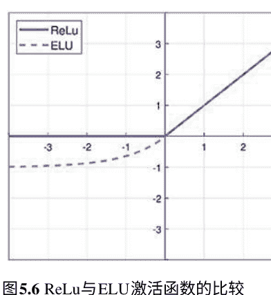

```
ReLU: f(x) = \begin{cases} 0, & x < 0 \\ x, & x \ge 0 \end{cases}
```

```
ELU: f(x) = \begin{cases} \alpha(e^x - 1), & x < 0 \\ x, & x \ge 0 \end{cases}
```

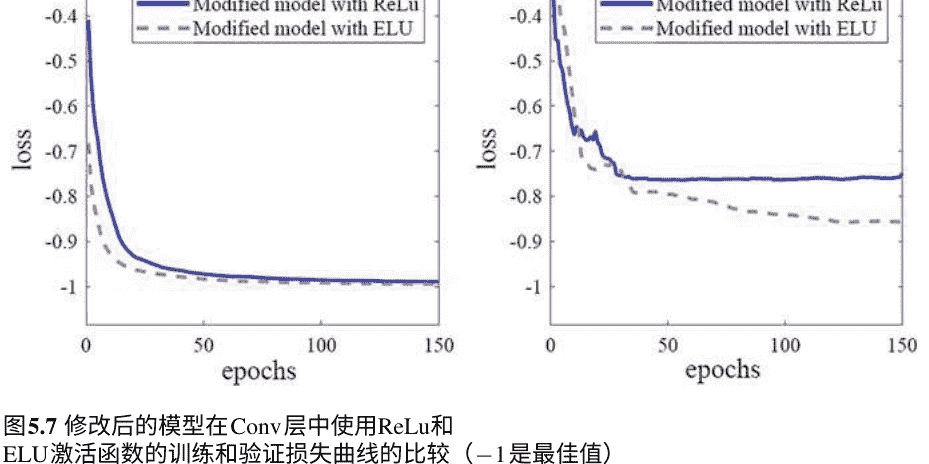

通过观察图5.7中的损失曲线，我们可以看出当我们使用ELU时，训练损失收敛得更快，验证损失继续减小并跟随训练损失。因此，过拟合问题得到解决，如果我们继续训练过程，模型的泛化能力将会提高。

##### 5.5.4 模型的复杂度

防止模型过拟合的另一种方法是减少模型的复杂度。无论数据的大小如何，深度卷积神经网络的复杂度取决于层数、卷积滤波器的大小和数量。我们将所有Conv层（最后一层除外）的滤波器数量分别除以2、4和8，并在每个配置中训练模型。如图5.8所示，滤波器数量较少的模型收敛速度较慢。然而，图5.8中的验证损失曲线显示，当我们将滤波器数量除以4和8时，验证损失仍然在减小（模型没有过拟合）。此外，如果我们继续增加批次的训练或者使用更高的学习率，我们将获得更好的结果。

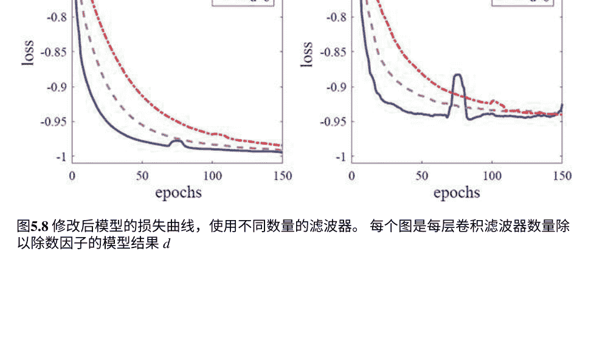

不同数量的卷积滤波器训练的结果列在表5.1中。

### 表5.1 三种不同配置的训练结果。每行中的卷积滤波器数量都被除数因子（d）除以

| 除数因子 | 参数数量（百万） | 训练时间（分钟） | 最小训练误差 | 最小验证误差 |
| :--- | :--- | :--- | :--- | :--- |
| d = 2 | ~8 | 54 | -0.994 | -0.949 |
| d = 4 | ~5 | 33 | -0.991 | -0.945 |
| d = 8 | ~4 | 25 | -0.984 | -0.941 |

##### 5.5.5 参数调整和最终结果

设置参数数量、迭代次数和学习率没有固定规则。通常，我们通过试错法找到合适的值。我们评估了不同数量的滤波器、学习率和批量大小的模型，以找到最佳配置。对于迭代次数，我们会一直训练，直到验证损失曲线保持平稳很长时间。学习率的变化由具有自适应学习率的优化算法处理，但初始学习率的值影响收敛的整体速度。我们尝试了从0.00001到0.001的不同学习率。对模型的泛化能力有影响的另一个参数是批量大小。由于我们处理的是大体积图像，我们只能使用较小的批量大小，我们只尝试了1-7的批量大小。在对不同配置的模型进行评估后，最佳结果是使用除数因子4（d=4），批量大小为3和学习率为0.0005。图5.9显示了基本模型和最终改进模型的损失曲线进行比较，表5.2包含了基本模型和改进模型的规格。图5.10和图5.11显示了基本模型和改进模型在测试和验证图像上的分割结果。

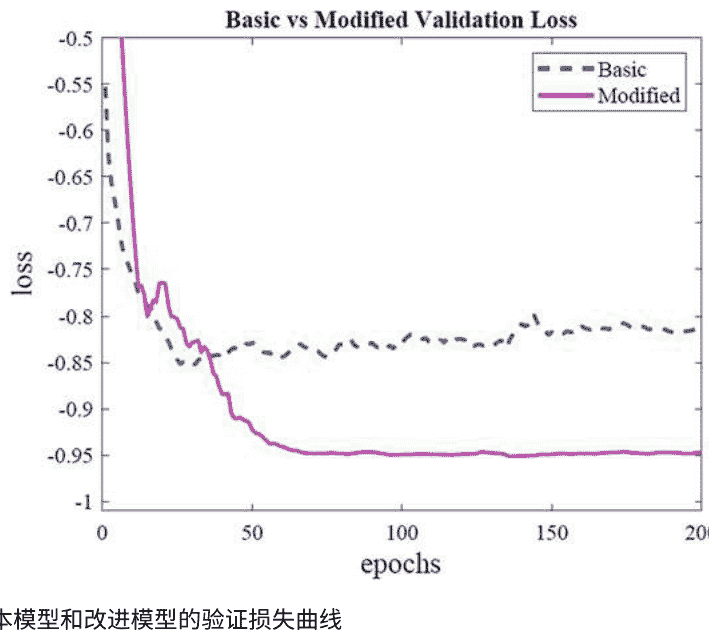

图5.9 基本模型和改进模型的验证损失曲线

### 表5.2 基本模型和改进模型的比较 这两个模型都经过了200个周期的训练

| 模型 | 参数数量（百万） | 训练时间（分钟） | 最大训练DSC（%） | 最大验证DSC（%） |
| :--- | :--- | :--- | :--- | :--- |
| 基本模型 | ~8 | 127 | 99.2 | 87.9 |
| 改进模型 | ~5 | 50 | 99.4 | 95.2 |

正如图5.9、5.10和5.11以及表5.2中明显的，通过我们的修改和改进，我们能够在未见过的图像上获得更少的验证错误和更准确的分割结果，这意味着模型的泛化能力增强了。我们还减少了改进模型的计算量和训练时间。

#### 5.6 讨论与结论

我们提出了一种选择先进的CNN模型并针对我们特定的任务和数据进行改进的路径。我们选择了3D U-Net模型，并对其在CT扫描图像中的3D肝脏分割任务进行了改进。我们修改了模型的架构、优化算法、激活函数和网络的复杂性。我们还调整了其他参数，如学习率和批量大小。我们展示了深度3D CNN在不需要大量训练图像的情况下能够取得更好的结果。我们仅使用了35张训练图像在我们提出的模型上，并且获得了与最先进模型相当的结果，这些模型使用了更多的训练图像和对结果进行了大量的后处理[34]。通过使用更多的训练数据或对我们模型的输出进行简单的后处理，我们超越了最先进的结果。

当有足够的训练数据和硬件资源时，这种方法也可以使用。我们可以从大数据集中选择一小部分，进行改进过程，并得到几个模型候选。然后，我们可以使用所有图像和所需的周期数来训练和评估最终的候选模型。

逐个检查数据集图像是非常重要的，以确保没有损坏或有问题的图像。像强度归一化或平滑这样的简单预处理对结果有重要影响。这种预处理应该在训练和测试阶段的图像上都应用。对于每个模型进行多次运行并获取损失的平均值是非常重要的，以获得更可靠的结果。

还有其他方法可以改进深度神经网络，例如知识蒸馏方法[35]和将先前知识整合到深度神经网络中的其他方法。这些方法通常需要大量的训练数据集和强大的硬件。因此，由于我们假设有限的数据集和需要进行单独研究以评估这些硬件的原因，我们在这项工作中没有包括这些方法。

## 参考文献

1.  Goodfellow, I等: 深度学习, 第1卷。麻省理工学院出版社, 剑桥 (2016年)
2.  Bengio, Y.: 为人工智能学习设计深度架构. Found. Trends® Mach. Learn. 2(1), 1–127 (2009)
3.  Hinton, G.E., Salakhutdinov, R.R.: 用神经网络降低数据的维度. 科学 313(5786), 504–507 (2006)
4.  Hinton, G.E., Osindero, S., Teh, Y.-W.: 一种用于深度信念网络的快速学习算法. Neural Comput. 18(7), 1527–1554 (2006)
5.  Krizhevsky, A., Sutskever, I., Hinton, G.E.: 使用深度卷积神经网络进行图像分类. In: Advances in Neural Information Processing Systems (2012)
6.  Graves, A.: 使用递归神经网络生成序列. arXiv预印本arXiv:1308.0850 (2013)
7.  Goodfellow, I., et al.: 生成对抗网络。 在：神经信息处理系统的进展 (2014年)
8.  Zeiler, M.D., Fergus, R.: 可视化和理解卷积网络。 在：欧洲计算机视觉会议. Springer (2014年)
9.  Simonyan, K., Zisserman, A.: 用于大规模图像识别的非常深的卷积网络。 arXiv预印本arXiv:1409.1556 (2014年)
10. Szegedy, C., et al.: 用卷积更深入地进行。 在：IEEE计算机视觉和模式识别会议论文集 (2015年)
11. He, K., et al.: 深度残差学习用于图像识别。 在：IEEE计算机视觉和模式识别会议论文集 (2016年)
12. Szegedy, C., et al.: Inception-v4, inception-resnet和残差连接对学习的影响。 在：AAAI (2017年)
13. Nair, V., Hinton, G.E.: 修正线性单元改进了受限玻尔兹曼机。 在：第27届国际机器学习大会 (ICML-10) 论文集 (2010)
14. Srivastava, N., et al.: Dropout: 一种简单的防止神经网络过拟合的方法. J.Mach. Learn. Res. 15(1), 1929–1958 (2014)
15. Ioffe, S., Szegedy, C.: 批归一化：通过减少内部协变量偏移加速深度网络训练。 arXiv预印本arXiv:1502.03167 (2015)
16. Long, J., Shelhamer, E., Darrell, T.: 全卷积网络用于语义分割。 在：IEEE计算机视觉和模式识别大会论文集 (2015)
17. Ronneberger, O., Fischer, P., Brox, T.: U-net: 用于生物医学图像分割的卷积网络。 在：医学图像计算与计算机辅助干预国际会议. Springer (2015)
18. Çiçek, Ö., 等：3D U-Net: 从稀疏注释中学习密集体积分割。 在：国际医学图像计算与计算机辅助干预会议. Springer (2016年)
19. Rumelhart, D.E., Hinton, G.E., Williams, R.J.: 通过反向传播学习表示。 Nature 323 (608 8), 533 (1986年)
20. Hinton, G.: 机器学习的神经网络。 Coursera, [视频讲座] (2012年)
21. Kingma, D., Ba, J.: Adam: 一种随机优化方法。 arXiv预印本arXiv: 1412.6980 (2014)
22. Zeiler, M.D.: ADADELTA: 一种自适应学习率方法。 arXiv预印本arXiv: 1212.5701 (2012年)
23. Ruder, S.: 梯度下降优化算法概述。 arXiv预印本arXiv: 1609.04747, 2016年
24. Van Ginneken, B., Heimann, T., Styner, M.: 临床中的3D分割：一个重大挑战。 在：临床中的3D分割：一个重大挑战，第7-15页 (2007年)
25. Soler, L., et al.: 用于算法数据库比较的3D图像重建：一个患者特定解剖和医学图像数据库 (2010年)
26. Abadi, M., et al.: Tensorflow：一个用于大规模机器学习的系统。 在：OSDI (2016年)

### 第6章 用于生物医学图像分析的深度主动自适应学习

王文哲，冯瑞伟，刘雪晨，陆一飞，王艳杰，郭若谦，林志文，陈婷婷，陈志达和吴健

摘要 在生物医学图像分析中，自动和准确的分析（例如图像分类、病变检测和分割）在计算机辅助常见人类疾病诊断中起着重要作用。然而，由于需要具有高质量注释的充足训练数据，这项任务具有挑战性，获取这些数据既耗时又昂贵。在本章中，我们提出了一种新颖的深度主动自适应学习（DASL）策略，以减少注释工作量，并利用未注释的样本，基于主动学习（AL）和自适应学习（SPL）策略的组合。为了评估DASL策略的性能，我们将其应用于生物医学图像分析中的两个典型问题，即三维CT图像中的肺结节分割和数字视网膜底片图像中的糖尿病视网膜病变（DR）识别。在每个场景中，我们提出了一种新颖的深度学习模型，并使用DASL策略进行训练。实验结果表明，使用我们的DASL策略训练的模型比使用相同数量的注释样本但没有DASL策略训练的模型表现更好。

W. Wang · R. Feng · X. Liu · Y. Lu · Y. Wang · R. Guo · Z. Lin · T. Chen · J. Wu (✉)
浙江大学计算机科学与技术学院
杭州310027，中国
e-mail: wujian2000@zju.edu.cn

W. 王
电子邮件：wangwenzhe.dl@gmail.com

W. Wang · R. Feng · X. Liu · Y. Lu · Y. Wang · R. Guo · Z. Lin · T. Chen · D. Z. Chen · J. Wu
浙江大学真实医生人工智能研究中心
杭州310027，中国

D. Z. 陈
圣母大学计算机科学与工程系
圣母大学，IN 46556，美国

+   27. Milletari, F., Navab, N., Ahmadi, S.-A.: V-Net: 用于体积医学图像分割的全卷积神经网络。 见：3D Vision（3DV），2016年第四届国际会议上。IEEE（2016年）
28. Chen, H., et al.: VoxResNet: 用于体积脑部分割的深度体素残差网络。 arXiv预印本arXiv:1608.05895（2016年）
29. Drozdzal, M., 等. 跳跃连接在生物医学图像分割中的重要性。 见：大规模生物医学数据和专家标签综合的国际研讨会。Springer（2016）
30. Ng, A.：机器学习的渴望（2017年）
31. Dumoulin, V., Visin, F.: 深度学习中的卷积算术指南。 arXiv预印本 arXiv:1603.07285（2016）
32. Clevert, D.-A., Unterthiner, T., Hochreiter, S.: 通过指数线性单元（ELUs）进行快速准确的深度网络学习。 arXiv预印本arXiv:1511.07289（2015）
33. Pedamonti, D.: 非线性激活函数在MNIST分类任务中的深度神经网络比较。 arXiv预印本arXiv:1804.02763（2018）
34. Hu, P.等. 基于深度学习和全局优化的自动三维肝脏分割. 物理医学与生物学 61(24), 8676 (2016)
35. Hinton, G., Vinyals, O., Dean, J.: 在神经网络中提取知识. arXiv预印本 arXiv:1503.02531（2015）

#### 6.1 引言

在计算机辅助常见人类疾病的诊断中，对生物医学图像进行自动和准确的分析（例如图像分类、病变检测和分割）起着重要作用。深度学习，特别是卷积神经网络（CNN）的最新进展，为解决各种生物医学图像问题（如病变检测和疾病诊断）提供了强大的工具。

然而，通常需要足够的注释来训练一个性能良好的深度网络，这可能需要大量的注释工作和成本。对于每个微小病变的外观对决策至关重要的应用，人类专家很难为深度网络训练注释每一个病变。为了更好地研究和解决这个问题，我们以3D肺结节分割和糖尿病视网膜病变（DR）的诊断为例。

肺结节分割肺癌是最具威胁生命的恶性肿瘤之一。肺结节是肺部的小生长物，有可能是癌组织的部位。肺结节的边界被视为肺癌诊断的重要标准之一[1]，计算机断层扫描（CT）是检查肺结节存在和边界特征的最常用方法之一，如图6.1所示。因此，CT体积中肺结节的自动分割通过减少对昂贵的人类专业知识的需求，促进了肺癌的早期诊断。

最近关于肺结节分割的研究[3,4]尝试使用弱标记数据。然而，受生物医学图像中粗糙标注的限制，它们的性能并不好，因为它们产生了肺结节的粗糙边界分割，并且产生了相当多的误报。另一方面，提出了一种深度主动学习框架[5]，在网络训练过程中对样本进行注释。尽管能够充分利用完全注释的样本，但这种方法没有利用模型训练中丰富的未注释样本。

糖尿病视网膜病变识别糖尿病视网膜病变（DR）是糖尿病最严重的并发症之一，可以导致视力丧失甚至失明。眼科医生可以根据视网膜底图像中观察到的病变类型和数量来识别DR。通常，DR的严重程度按照0到4的等级进行评分：正常、轻度、中度、重度和增殖。如图6.2b所示，1-3级被归类为非增殖性DR（NPDR），可以通过包括微动脉瘤（MA）、出血（HE）和渗出物（EXU）在内的病变数量来识别。第4级是增殖性糖尿病视网膜病变（PDR），其病变（如视网膜新生血管（RNV））与其他级别的病变不同。从视网膜底片图像中识别糖尿病视网膜病变是耗时且需要人工操作的，因此，开发一种自动辅助糖尿病视网膜病变诊断的方法以提高效率并减少专家劳动力非常重要。

为了充分利用视网膜底片图像中的病变特征来识别糖尿病视网膜病变，一种方法首先检测病变以进行进一步的分类。Dai等人[6]尝试使用临床报告来检测病变。van Grinsven等人[7]通过选择性数据采样来加速模型训练以进行HE检测。Seoud等人[8]使用手工特征来检测视网膜病变并识别糖尿病视网膜病变级别。Yang等人[9]提出了一种两阶段的框架，用于病变检测和糖尿病视网膜病变分级，包括MA，HE和EXU的位置注释。

然而，仍然存在一些困难需要解决：(i) 一个常见的问题是通常并非所有的病变都有注释。在视网膜底部图像中，MA和HE的数量通常相对较大，专家可能会漏掉一些病变（例如，参见图6.2a），这些病变可以被视为负样本（即背景），因此对模型来说是“噪声”。(ii) 并非所有类型的病变都有助于区分所有的DR级别。例如，DR级别4（PDR）可以通过RNV病变进行识别，但与MA和HE病变没有直接关系（参见图6.2b）。

在本章中，我们介绍了一种基于自举的新型深度主动自适应学习（DASL）策略，以减少先前提的应用中的注释工作量[5, 10]，即从CT扫描中的体积实例级肺结节分割和从视网膜底部图像中的DR识别。为了缓解完全注释样本的缺乏并利用未注释样本，我们提出的DASL策略将主动学习（AL）[11]与自适应学习（SPL）[12]策略相结合。图6.3概述了我们策略的主要步骤。从已注释样本开始，我们训练我们的CNN，并使用它来预测未注释样本。

在对每个测试样本的置信度和不确定性进行排名之后，我们分别利用高置信度和高不确定性的样本进行自适应学习和主动注释学习[13]，并将它们添加到训练集中以对CNN进行微调。测试和对CNN进行微调重复，直到主动学习过程终止。在LIDC-IDRI肺部CT数据集[2]和我们的私有视网膜底片数据集上的实验结果表明，我们的DASL策略对于减少注释工作量是有效的。

这项工作的初步版本已经在2018年MICCAI会议上发表[14, 15]。在本章中，我们在[14, 15]的基础上扩展了我们的方法，具体如下：（1）评估和进一步分析其在DR识别方面的性能，（2）提供了会议版本中未包含的实验结果的额外讨论[14, 15]。

#### 6.2 深度主动自适应学习策略

深度主动自适应学习（DASL）策略是主动学习（AL）[11]和自适应学习（SPL）[12]的结合，它缓解了完全标注样本的不足，并利用未标注样本。

主动学习策略主动学习试图通过查询最困惑的未标注实例来克服注释瓶颈[11]。我们在模型训练过程中采用了一种简单的策略来选择困惑的样本，与[5]不同，后者采用了一组完全卷积网络（FCN）进行样本选择。这个样本不确定性的计算定义为：

$$U_d = 1 - \max(P_d, 1 - P_d), \quad\quad (6.1)$$

其中 $U_d$ 表示第 $d$个样本的不确定性，$P_d$ 表示第 $d$个样本的后验概率。

请注意，初始训练集通常太小，无法覆盖整个人口分布。因此，深度学习模型通常没有（尚未）训练过的许多样本。在一个迭代中，不建议广泛注释相似模式的样本，因此需要考虑样本不确定性的计算。与[5]中一样，我们使用余弦相似度来估计体积之间的相似性。因此，第 $d$个体积的不确定性定义为：

$$U_d = (1 - \max(P_d, 1 - P_d)) \times \left( \frac{\sum_{j=1}^{D} \text{sim}(P_d, P_j) - 1}{D - 1} \right)^\beta, \quad \text{(6.2)}$$

其中，D表示未标注样本的数量，sim()表示余弦相似度，P_j表示第j个样本的后验概率，而β是一个超参数，用于控制相似性项的相对重要性。请注意，当β = 0时，这个定义退化为公式(6.1)中定义的最不确定性。我们在实验中将β = 1。

在每次迭代中，获取每个未标注样本的不确定性后，我们选择前N个样本进行标注，并将它们添加到训练集中进行进一步的微调。

自主学习策略自主学习 (SPL) 受到人类/动物逐渐将易于困难样本纳入训练的学习过程的启发[12]。它利用未标注样本，同时考虑先前知识和训练过程中获得的学习[13]。

形式上，让 L(w; x_i, p_i) 表示CNN的损失函数，其中 w 表示模型参数，x_i 和 p_i 表示模型的输入和输出，分别。SPL旨在优化以下函数：

$$\min_{w,v\in[0,1]^n} E(w, v; \lambda, \psi) = C \sum_{i=1}^{n} v_i L(w; x_i, p_i) + f(v; \lambda), \quad \text{s.t.} \quad v \in \psi \quad \text{(6.3)}$$

其中 v = [v_1, v_2, ..., v_n]^T 表示反映样本置信度的权重变量，f(v; λ) 是控制学习策略的自适应正则化项，λ是控制学习速度的参数，ψ是编码预定课程信息的可行区域，C是用于权衡损失函数和边界的标准正则化参数。在我们的实验中，我们将 C设置为 1。

自适应函数应满足以下三个条件 [16]。(1) f(v; λ) 对于 v∈ [0, 1]^n 是凸的。(2) 每个样本的最优权重 v_i* 应该与其对应的损失 l_i 单调递减。

(3) ||v||_1 = Σ_{i=1}^{n} v_i 应该与 λ 单调递增。为了根据损失线性判别样本，我们学习方案的正则化函数如下定义 [16]:

$$f(v; \lambda) = \lambda \left( \frac{1}{2} ||v||_2^2 - \sum_{i=1}^{n} v_i \right), \quad \text{(6.4)}$$

使用我们的学习方案，使用 ψ= [0, 1]^n 的方程 (6.3) 的偏导数等于

$$\frac{\partial E}{\partial v_i} = C l_i + v_i \lambda - \lambda = 0, \quad \text{(6.5)}$$

其中E表示方程（6.3）中的目标，具有固定的w，li表示第i个样本的损失。方程（6.7）给出了E的最优解。请注意，由于未标注样本的标签未知，计算它们的损失是具有挑战性的。我们通过方程（6.6）分配每个“伪标签”。

$$ y_i^* = \underset{y_i \in \{0,1\}}{\text{argmin}} \, l_i, \quad \text{(6.6)} $$

$$ v_i^* = \begin{cases} 1 - \frac{C l_i}{\lambda}, & C l_i < \lambda \\ 0, & \text{否则} \end{cases} \quad \text{(6.7)} $$

对于步长参数更新，我们将初始步长设置为λ⁰。对于第 t 次迭代，我们计算步长参数 λᵗ如下：

$$ \lambda^t = \begin{cases} \lambda^0, & t = 0 \\ \lambda^{(t-1)} + \alpha \times \eta^t, & 1 \leq t < \tau \\ \lambda^{(t-1)}, & t \geq \tau, \end{cases} \quad \text{(6.8)} $$

其中 α是控制增长速率的超参数， ηᵗ是当前迭代中的平均准确率， τ是控制更新速度的超参数。 请注意，根据上述第三个条件， $\|\mathbf{v}\|_1 = \sum_{i=1}^n v_i$应该随着λ单调递增。 由于 v∈ [0, 1]ⁿ，参数 λ的更新应在几次迭代后停止。 因此，我们引入超参数 τ来控制更新的速度。

为了验证DASL中AL和SPL之间的关系，我们使用一个“SPL-AL-SPL”的序列来对第6.3节和第6.4节中的模型进行微调。

#### 6.3 用于肺结节分割的DASL

由于CT体积中肺结节的稀疏分布[2]，使用3D全卷积网络（例如，[17, 18]）对其进行语义分割可能会遇到类别不平衡的问题。 基于3D图像分割工作[18, 19]和Mask R-CNN [20]，我们提出了一种名为Nodule R-CNN的3D区域网络，为肺结节分割提供了一种有效的方法。 当使用DASL进行训练时，Nodule R-CNN在很少的训练数据下取得了令人满意的结果。 据我们所知，这是关于3D图像中肺结节实例分割的首个工作，也是第一个同时使用AL和SPL训练3D CNN的工作。

##### 6.3.1 结节R-CNN

基于最近卷积神经网络的进展，如区域建议网络（RPN）[21]，特征金字塔网络（FPN）[22]，掩膜R-CNN[20]和DenseNet [23]，我们开发了一种新颖的深度基于区域的网络，用于三维CT图像中的肺结节实例分割。

图6.4展示了我们提出的结节R-CNN的详细架构。与Mask R-CNN [20]类似，我们的网络具有用于特征提取的卷积主干架构，一个用于输出类别标签和边界框偏移量的检测分支，以及一个用于输出目标掩码的掩码分支。在我们的主干网络中，我们通过探索类似FPN的自顶向下架构和横向连接，在不同层次上提取多样化的特征，从单尺度输入构建一个网络内的特征金字塔。我们使用三个3D DenseBlocks [19]，增长率为12，以保留最大信息流并避免学习冗余特征图，从而简化网络训练。我们采用反卷积来确保特征图的大小与输入体积的大小一致。我们的模型采用类似RPN的架构来输出分类结果和边界框回归结果。该架构为每个检测位置提供了三个锚点。由于GPU内存有限，我们使用基于补丁的训练和测试策略，而不是使用RoIAlign [20]从RoIs中提取特征图。在掩码分支中，我们利用RoIPool从每个RoI中提取一个小的特征图，并使用全卷积网络（FCN）生成肺结节分割的最终标签图。在最终的标签图中，每个体素的值 $a$ 表示其作为肺结节体素的概率。

我们将每个采样的RoI上的多任务损失定义为 $L = L_{cls} + L_{box} + L_{mask}$，其中分类损失 $L_{cls}$和边界框损失 $L_{box}$的定义如[24]。我们将分割损失 $L_{mask}$定义为Dice损失（因为输出结果使用Dice损失训练的模型几乎是二进制的，并且在视觉上更清晰[18, 25])。具体而言，Dice损失定义如下：

$$L_{Dice} = -\frac{2 \sum_i p_i y_i}{\sum_i p_i + \sum_i y_i}$$

其中 $p_i \in [0, 1]$ 是掩膜分支中最后一层的第 $i$ 个输出，通过sigmoid非线性函数处理，而 $y_i \in \{0, 1\}$ 是相应的标签。

##### 6.3.2 肺结节分割实验

我们使用LIDC-IDRI数据集[2]对我们提出的结节R-CNN与DASL进行评估。我们的实验结果见表6.1。

LIDC-IDRI数据集包含1010个CT扫描（有关此数据集的更多详细信息，请参见[2]）。在我们的实验中，除了直径小于3毫米的结节外，所有结节都被使用，并且每个扫描都通过线性插值调整大小为$512 \times 512 \times 512$个体素。我们模型的输入是从CT体积中裁剪出的大小为$128 \times 128 \times 128$个体素的3D补丁，其中70%的输入补丁至少包含一个结节。对于输入的这部分，分割掩模被裁剪为$32 \times 32 \times 32$个体素，并且结节位于其中心。我们通过随机裁剪很可能不包含结节的扫描来获得其余的输入。检测分支的输出尺寸为$32 \times 32 \times 32 \times 3 \times 5$，其中倒数第二个维度表示3个锚点，最后一个维度对应分类结果和边界框回归结果。在我们的实验中，整个数据集的10%被随机选择作为验证集。我们使用一个小的扫描子集来训练初始的结节R-CNN，并且剩余的样本在DASL过程中逐渐添加到训练集中。

首先，我们评估了我们的结节 R-CNN 在肺结节实例分割中的性能。如表6.1所示，我们实现了0.64的Dice系数和0.95的真正检测到的结节的Dice系数（TP Dice），这两个结果都是最好的结果，超过了现有技术方法。

表6.1 LIDC-IDRI数据集上的肺结节分割结果
| 方法 | Dice 平均值 (± 标准差) | TP Dice系数 平均值 (± 标准差) |
| :--- | :---: | :---: |
| 参考文献[4]中的方法 | 0.55(±0.33) | 0.74(±0.14) |
| 带有DASL的结节R-CNN (50个初始样本) | 0.56(±0.45) | 0.87(±0.09) |
| 带有DASL的结节R-CNN (100个初始样本) | 0.59(±0.45) | 0.90(±0.05) |
| 带有DASL的结节R-CNN (150个初始样本) | 0.62(±0.43) | 0.92(±0.03) |
| 结节R-CNN (完整训练样本) | **0.64(±0.44)** | **0.95(±0.12)** |## 6.4 DASL用于糖尿病视网膜病变的识别

然后我们评估了结节 R-CNN 和 DASL 策略的组合。在我们的实验中，α被设置为0.002，λ被设置为0.005，这是由于正预测的高置信度。为了验证不同数量的初始标注样本对结果的影响，我们分别进行了三个实验，分别使用了50、100和150个初始标注样本。图6.5总结了结果。我们发现，在DASL中，当使用较少的初始标注样本来训练结节R-CNN时，SPL倾向于合并更多未标注的样本。这是有道理的，因为使用较少样本训练的模型没有学习足够的模式，很可能会给更多未见样本分配高置信度。从图6.5可以看出，尽管AL选择的样本数量非常小（在我们的实验中，N=20），但AL确实有助于获得更高的Dice值。实验结果如表6.1所示。我们发现，更多的初始标注样本会带来更好的结果，而使用150个初始标注样本的实验在DASL上取得了最佳结果，与使用所有样本训练的结节R-CNN的性能相当（图6.6）。

图6.6 CT 肺部体积上肺结节实例分割结果的一些 2D 可视化示例。白色像素属于分割的肺结节，黑色像素属于背景。可以看到，我们的结节 R-CNN 模型能够获得准确清晰的结果。

为了识别DR，我们开发了一个基于视网膜底图像的新框架，该框架基于包含DR等级和MA和HE病变的边界框的注释（可能有一些缺失的注释病变）。我们首先通过检测模型将病变信息提取到病变图中，然后将其与原始图像融合用于DR识别。为了处理由于缺失注释病变引起的噪声负样本，我们的检测模型使用中心损失[26]将相似样本的特征聚类在称为病变中心的特征中心周围，并使用一种新的采样方法，称为中心采样，通过测量它们的特征与病变中心的相似性来找到噪声负样本。在分类阶段，我们使用注意力融合网络（AFN）将原始图像和病变图的特征图集成起来，并使用DASL策略训练AFN。如图6.7所示，AFN可以在识别不同的情况下学习原始图像和病变图之间的权重。

图 6.7 中心样本检测器（左）使用反噪声中心样本模块预测病变的概率。然后 AFN（右）使用原始图像和检测模型输出作为输入来识别 DR（$f_{les}$和 $f_{ori}$是特征图，$W_{les}$和 $W_{ori}$是注意力权重）。

DR 级别并且可以减少不必要的病变信息对分类的干扰。 DASL 帮助 AFN 在少量训练数据下取得了有希望的结果。

##### 6.4.1 中心样本检测器

中心样本检测器旨在检测视网膜图像中的$n$种病变（这里，$n=2$，代表MA和HE）。图6.7概述了中心样本检测器的主要组成部分，包括共享特征提取器、分类/边界框检测头和噪声样本挖掘模块。

前两部分构成了病变检测的主要网络，用于预测病变概率图。它们的主要结构来自SSD [27]。骨干网络直到conv4_3被用作特征提取器，检测头与SSD相同。第三部分包括两个组件：样本聚类用于聚类相似样本和噪声样本挖掘用于确定噪声样本并减少其采样权重。

样本聚类将分类任务中的中心损失适应到检测任务中，用于聚类相似样本。通过在共享特征提取器之后添加1×1卷积层，该组件将来自共享特征提取器的特征图（大小为h×w×c）转换为大小为h×w×d（d<<c）的特征图u。u中的每个位置u_ij是一个d维特征向量，从原始图像中的相应位置patch_ij映射到高维特征空间S，其中f_ij表示u_ij的感受野。我们为每个u_ij分配一个分类标签，因此总共有n+1个标签类别，包括背景（对应位置没有病变）。然后，我们对每个类别的u_ij的深度特征进行平均，得到n+1个特征中心（正标签的中心称为病变中心），并使用中心损失[26]使u_ij在空间S中围绕其对应的中心聚类（在图6.7中，三角形表示中心）：

```
L_C = \frac{1}{2} \sum_{i=1}^{w} \sum_{j=1}^{h} \| u_{ij} - c_{y_{ij}} \|_2^2, \quad (6.10)
```

其中，y_ij ∈ [0, n]是位置(i, j)上的标签，c_{y_ij} ∈ ℝ^d 是第y_ij类的中心。在检测训练阶段，我们通过最小化L_C并同时使用随机梯度下降（SGD）算法更新特征中心，使u_ij聚类到中心c_{y_ij}几次迭代后，它收敛得很好。

噪声样本挖掘在噪声样本挖掘模块中，我们通过降低噪声负样本的影响来减轻它们的权重。首先，对于每个被标记为负样本的u_ij，我们选择u_ij与所有病变中心之间的最小L2距离，记为min-dist_ij，并按照min-dist中的元素进行递增排序。然后，采样概率P(u_ij)被分配为：

```
P(u_{ij}) = \begin{cases} 0 & 0 < r_{ij} < t_l \\ \left( \frac{r_{ij} - t_l}{t_u - t_l} \right)^\gamma & t_l \leq r_{ij} < t_u \\ 1 & r_{ij} \geq t_u \end{cases} \quad (6.11)
```

其中，r_ij是u_ij在min-dist中的排名。请注意，如果r_ij很小，u_ij靠近病变中心。采样排名和γ的下界t_l和上界t_u是三个超参数。我们将L_C和检测损失的求和视为鲁棒性的多任务损失。与[26]中的中心损失不同，我们的方法通过大量的深度特征确保了小批量大小的稳定性。

在训练阶段，我们使用包含病变的原始图像的裁剪补丁来训练模型。在推理阶段，整个图像被输入训练好的模型，输出是一个大小为 h × w × n 的张量 M，其中每个位置的每个病变的 M_ij 向量表示该位置所有锚框中的最大概率。我们将这个张量称为病变图，作为注意力融合网络的输入。

实验和结果一个地方医院提供了一个私人数据集，其中包含大约13k个异常（比0级更严重）的视网膜图像，大小约为2000 × 2000。病变边界框由眼科医生进行注释，包括25k个MA和34k个HE病变，其中约有26%的注释病变缺失。由于它反映了每个病变的精确度和召回率，所以我们使用目标检测的常见指标 mAP 作为评估指标。

在这个阶段的实验中，我们选择 MA 和 HE 病变作为检测目标，因为其他类型的病变即使在压缩图像（512 × 512）中也很清晰。在训练过程中，我们使用从原始图像中裁剪的补丁（300 × 300）来训练模型，其中包括注释的病变。我们应用随机翻转作为数据增强。我们使用 SGD（动量 = 0.9，权重衰减 = 10^{-5}）作为优化器，批量大小为16。学习率初始化为10^{-3}，并在50k次迭代后除以10。在训练 Center-Sample 检测器时，我们首先使用中心损失和检测损失作为多任务损失进行预训练。然后，在10k次训练步骤之后，包括 Center-Sample 机制。t_l 和 t_u 在一个批次中的所有深度特征中分别设置为第1和第5百分位数。

我们通过逐个添加 Center-Sample 组件到检测模型中来评估其效果。表6.2 显示，基础检测网络（BaseNet），类似于 SSD，得到的 mAP 为 41.7%。在使用 Center Loss 作为多任务损失的一部分后，mAP 提升到 42.2%。Center-Sample 策略进一步增加了 1.4%，最终 mAP 为 43.6%。结果表明我们提出的方法对于缺失注释问题具有鲁棒性。图6.8 可视化了一些深度特征接近病变中心的区域。

### ### 6.4.2 注意力融合网络

如第6.1节所述，某些病变信息可能对于识别特定的 DR 级别是噪声。为了解决这个问题，我们提出了一种基于信息融合的方法。

表6.2 中心样本组件的结果

| BaseNet | √ | √ | √ |
| 中心损失 | | √ | √ |
| 中心-样本 | | | √ |
| mAP(%) | 41.7 | 42.2 | **43.6** |

注意机制[28]，称为注意力融合网络(AFN)，然后在其上评估DASL策略。AFN可以根据原始图像和病变图生成权重，以减少识别不同DR级别时不需要的病变信息的影响。它包含两个特征提取器和一个注意力网络（见图6.7）。两个独立的特征提取器首先提取缩放后的原始图像和病变图的特征图$f_{ori}$和$f_{les}$。然后，$f_{ori}$和$f_{les}$在通道维度上连接作为注意力网络的输入。注意力网络由一个$3 \times 3$卷积层，一个ReLU层，一个dropout层，一个$1 \times 1$卷积层和一个Sigmoid层组成。它产生两个与特征图$f_{ori}$和$f_{les}$形状相同的权重图$W_{ori}$和$W_{les}$。然后，我们计算两个特征图的加权和$f(i, j, c)$如下：$f(i, j, c) = W_{ori}(i, j, c) \circ f_{ori}(i, j, c) + W_{les}(i, j, c) \circ f_{les}(i, j, c) \quad (6.12)$其中$\circ$表示逐元素乘积。权重$W_{ori}$和$W_{les}$的计算结果为$W(i, j, c) = \frac{1}{1+e^{-h(i, j, c)}}$，其中$h(i, j, c)$是注意力网络产生的Sigmoid之前的最后一层输出。$W(i, j, c)$反映了位置$(i, j)$和通道$c$上特征的重要性。最终输出通过对$f(i, j, c)$执行softmax操作来获得所有等级的概率。

实验和结果使用的私有数据集（与上面评估中心样本不同）包含40k张眼底图像，其中DR 0到4级分别有31k/3k/4k/1.1k/1k张图像，由眼科医生评级。

我们使用两个ResNet-18 [29]作为两个输入的特征提取器。预处理包括裁剪图像并将其调整为$224 \times 224$。随机旋转/裁剪/翻转用作数据增强。首先，我们使用SGD优化器在私有数据集上训练AFN，如表6.3所示。基线只使用缩放后的原始图像作为ResNet-18的输入进行训练。我们重新实现了[9]中的特征融合方法，称为Two-stage。另一种融合方法是在通道维度上连接病变图和缩放图像（称为Concated），因为这两个输入对于使用该方法识别DR具有相同的贡献。

所有模型都经过300 k次迭代的训练，初始学习率$= 10^{-5}$，并在第120和200 k次迭代时除以10。权重衰减和动量设置为0.1和0.9。我们的方法明显优于其他方法。

表6.3 私有数据集的结果
| 算法 | Kappa | 准确率 |
|---|---|---|
| 基准 | 0.786 | 0.843 |
| 两阶段 | 0.804 | 0.849 |
| 连接 | 0.823 | 0.854 |
| AFN | 0.875 | 0.873 |

然后，我们评估了AFN和DASL策略的组合。在这个阶段，α和λ⁰都设置为0.01。为了对比不同数量的初始标注样本的影响，我们进行了三个实验，分别使用2、3.5和5 k个初始标注样本，每个实验只占训练集的6.25%、7.81%和15.6%。从图6.9可以看出，尽管AL选择的样本数量非常小（在我们的实验中N=400），但AL确实有助于实现更高的Dice系数。如图6.9所示，DASL帮助模型仅使用少量标注样本即可达到0.784的Kappa分数，而不是使用完整的标注样本。

#### 6.5 结论

在本章中，我们首先提出了一种新颖的深度主动自适应学习策略，用于生物医学图像分析。然后，我们提出了一个基于区域的框架，用于实例级肺结节分割，以及一个用于糖尿病视网膜病变识别的分类框架。 最后，我们分别对这两个任务进行了DASL的评估。 公开可用数据集上的实验结果表明，我们提出的框架在每个任务中都达到了最先进的性能，而DASL在减少注释工作量方面表现良好。 我们的DASL策略是通用的，并且可以轻松扩展到其他生物医学图像分析应用中，具有有限的训练数据。

致谢吴健的研究部分得到了中国教育部的支持，合同号为2017PT18，浙江大学教育基金会的支持，合同号为K18-511120-004，K17-511120-017和K17-518051-021，浙江实验室的重大科学项目的支持，合同号为2018DG0ZX01，以及中国国家自然科学基金的支持，合同号为61672453。 Danny Z. Chen的研究部分得到了NSF Grant CCF-1617735的支持。

## # 参考文献

+   1. Gonçalves, L., Novo, J., Campilho, A.: 基于Hessian的三维肺结节分割方法。 专家系统应用。 61， 1-15 (2016年)
2. Armato III, S.G., McLennan, G., Bidaut, L., McNitt-Gray, M.F., Meyer, C.R., Reeves, A.P.,Zhao, B., Aberle, D.R., Henschke, C.I., Hoffman, E.A., 等： 肺图像数据库联合会（LIDC）和图像数据库资源倡议（IDRI）： 一份完整的肺结节CT扫描参考数据库。 医学物理学。 38（2）， 915-931（2011年）
3. Messay, T., Hardie, R.C., Tuinstra, T.R.: 使用回归神经网络方法在计算机断层扫描中分割肺结节及其在肺图像数据库联合会和图像数据库资源倡议数据集中的应用。 医学图像分析。 22（1）， 48-62（2015年）
4. Feng, X., Yang, J., Laine, A.F., Angelini, E.D.: 用于弱监督分割肺结节的CNN中的判别定位。 在： 国际医学图像计算与计算辅助干预会议上，第568-576页。 Springer（2017）
5. Yang, L., Zhang, Y., Chen, J., Zhang, S., Chen, D.Z.: 提示性注释： 一种用于生物医学图像分割的深度主动学习框架。 在： 国际医学图像计算与计算辅助干预会议上，第399-407页。 Springer（2017）
6. Dai, L., Sheng, B., Wu, Q., Li, H., Hou, X., Jia, W., Fang, R.: 利用临床报告引导的多筛选CNN进行视网膜微动脉瘤检测。 van Grinsven, M.J.J.P., van Ginneken, B., Hoyng, C.B., Theelen, T., Sanchez, C.I.: 使用选择性数据采样的快速卷积神经网络训练： 在彩色眼底图像中应用于出血检测。 IEEE Trans. Med. Imaging 35(5), 1273-1284 (2016)
8. Seoud, L., Hurtut, T., Chelbi, J., Cheriet, F., Langlois, J.M.P.: 使用动态形状特征进行红色病变检测，用于糖尿病视网膜病变筛查。 IEEE Trans. Med. Imaging 35(4), 1116-1126 (2015)
9. 杨，李，李，吴，范，张： 通过两阶段深度卷积神经网络检测和分级糖尿病视网膜病变。 在： 国际医学图像计算与计算机辅助干预会议，第533-540页。 Springer（2017）
10. 李，钟，林，郭，孙，Sitek，叶，Thrall，李： 用于医学图像分析中的计算机辅助检测的自适应卷积神经网络。 在： 机器学习在医学图像中的应用研讨会，第212-219页。 Springer（2017）
11. Settles, B.: 主动学习文献综述。 计算机科学技术报告1648，威斯康星大学-麦迪逊（2009）
12. Kumar, M.P., Packer, B., Koller, D.: 潜变量模型的自适应学习。 在：神经信息处理系统的进展，第1189-1197页 (2010)
13. 林, L., 王, K., 孟, D., 左, W., 张, L.: 主动自主学习用于成本效益和渐进式人脸识别。IEEE Trans. Pattern Anal. Mach. Intell. 40(1), 7-19 (2018)
14. 王, W., 卢, Y., 吴, B., 陈, T., 陈, D.Z., 吴, J.: 深度主动自主学习用于准确的肺结节分割。 在：国际医学图像计算和计算机辅助干预会议，第723-731页。 Springer (2018)
15. 林, Z., 郭, R., 王, Y., 吴, B., 陈, T., 王, W., 陈, D.Z., 吴, J.: 基于抗噪声检测和注意力融合的识别糖尿病视网膜病变的框架。 在：国际医学图像计算和计算机辅助干预会议，第74-82页。 Springer (2018)
16. Jiang, L., Meng, D., Zhao, Q., Shan, S., Hauptmann, A.G.: 自主学习课程。 在：AAAI人工智能会议，第2694-2700页 (2015年)
17. Çiçek, Ö., Abdulkadir, A., Lienkamp, S.S., Brox, T., Ronneberger, O.: 3D U-Net: 从稀疏注释中学习密集体积分割。 在：国际医学图像计算与计算机辅助干预会议，第424-432页。 Springer (2016年)
18. Milletari, F., Navab, N., Ahmadi, S.A.: V-Net: 用于体积医学图像分割的全卷积神经网络。 在：第4届IEEE国际3D视觉会议，第565-571页。 IEEE (2016年)
19. Yu, L., Cheng, J.Z., Dou, Q., Yang, X., Chen, H., Qin, J., Heng, P.A.: 基于密集连接的体积卷积神经网络的自动三维心血管MR分割。 在：国际医学图像计算与计算机辅助干预会议，第287-295页。 Springer (2017年)
20. He, K., Gkioxari, G., Dollár, P., Girshick, R.: Mask R-CNN. 在：IEEE国际会议计算机视觉，第2980-2988页。 IEEE (2017年)
21. Ren, S., He, K., Girshick, R., Sun, J.: Faster R-CNN: 面向实时目标检测的区域建议网络。 在：神经信息处理系统的进展，第91-99页 (2015年)
22. Lin, T.Y., Dollár, P., Girshick, R.B., He, K., Hariharan, B., Belongie, S.J.: 特征金字塔网络-用于目标检测。 在：IEEE计算机视觉和模式识别会议，第936-944页。 IEEE (2017年)
23. Huang, G., Liu, Z., van der Maaten, L., Weinberger, K.Q.: 密集连接的卷积网络。 在：IEEE计算机视觉和模式识别会议，第4700-4708页。 IEEE (2017年)
24. Girshick, R.: 快速R-CNN。 在：IEEE国际计算机视觉会议上，第1440-1448页。 IEEE (2015年)
25. Drozdzal, M., Vorontsov, E., Chartrand, G., Kadoury, S., Pal, C.: 跳跃连接在生物医学图像分割中的重要性。 在：深度学习和数据标注用于医疗应用，第179-187页。 Springer (2016年)
26. Wen, Y., Zhang, K., Li, Z., Qiao, Y.: 一种用于深度人脸识别的判别特征学习方法。 在：欧洲计算机视觉会议上，第499-515页。 Springer (2016年)
27. Liu, W., Anguelov, D., Erhan, D., Szegedy, C., Reed, S., Fu, C.Y., Berg, A.C.: SSD: 单次拍摄多框检测器。 在：欧洲计算机视觉会议上，第21-37页。 Springer (2016年)
28. Chen, L.C., Yang, Y., Wang, J., Xu, W., Yuille, A.L.: 关注尺度：尺度感知的语义图像分割。 在：计算机视觉和模式识别，第3640-3649页。 IEEE (2016年)
29. He, K., Zhang, X., Ren, S., Sun, J.: 深度残差学习用于图像识别。 在：计算机视觉和模式识别，第770-778页。 IEEE (2016年)

### 第7章 深度学习在医学图像分析中的应用

铃木爱贵，坂梨秀典，木户正治和庄野隼

摘要 医学图像分析的一个特点是，医学图像不是自然图像领域的结构域，而是纹理域。本章介绍了一种新的迁移学习方法，称为“两阶段特征迁移”，通过深度卷积神经网络分析纹理医学图像。在两阶段特征迁移学习的过程中，模型分别使用自然图像数据集和纹理图像数据集进行预训练，以获得更好的特征表示，这些特征表示无法从这两个数据集中得出。实验结果表明，两阶段特征迁移改善了卷积神经网络在纹理肺部CT模式分类上的泛化性能。为了解释迁移学习在卷积神经网络上的机制，本章还通过激活可视化方法和测量经过训练的神经网络的频率响应，分别以定性和定量的方式展示了所获得的特征表示的分析结果。这些结果表明，这种连续的迁移学习使网络能够把握结构和纹理视觉特征，并有助于从纹理医学图像中提取出好的特征。

A. 铃木（✉）· H. 坂梨
日本高级产业科学技术研究所 (AIST),
1−1−1 梅园, 筑波, 茨城, 日本
e-mail: ai-suzuki@aist.go.jp

H. 坂梨
e-mail: h.sakanashi@aist.go.jp
筑波大学, 1−1−1 天道, 筑波, 茨城, 日本

S. 木户
大阪大学, 2−2, 山田冈, 吹田, 大阪, 日本
e-mail: kido@radiol.med.osaka-u.ac.jp

H. Shouno
电气通信大学, 1−5−1 超级高, 东京, 日本
e-mail: shouno@uec.ac.jp

#### 7.1 引言

根据目的和应用，医学图像分析的领域可以大致分为两类。一种是结构图像，其中从背景中识别出显著的局部区域，例如肿瘤检测和语义器官分割问题。换句话说，结构领域应该从“微观”角度来看，即关注区域特征。另一种类型是纹理图像，其中识别出广泛的空间特征，例如病理诊断中的结构异常和非病理诊断中的大部分弥漫性疾病发现。这些纹理领域应该从“宏观”角度来看，即从鸟瞰全景的角度来理解整个场景，而不是只关注特定区域。本章介绍了深度学习方法来分析纹理医学图像。

深度卷积神经网络（DCNNs）是一种深度学习的类型，自从Krichevsky等人在2012年的ILSVRC（大规模图像识别竞赛）中，他们的DCNN架构“Alex Net”取得了巨大成功后，已成为计算机视觉问题的事实标准解决方案[1]。大多数深度学习方法，包括DCNNs，通常需要大量的标注示例才能表现良好，因为它们缺乏可训练性。然而，随着有效训练DCNN的技术的发展，如迁移学习和半监督训练，即使在有限的训练数据下，深度学习方法也取得了成功。事实上，由于这些有效的DCNN架构的不断演化和积累的实践知识，DCNNs不仅在解决大规模自然图像识别任务方面表现出色，而且在医学图像分析方面也能够应对数据不足的问题。

然而，另一方面，在医学图像分析中，DCNNs最成功的应用仅限于肿瘤检测和语义分割问题，即“结构性”图像[2]。与结构性图像相比，DCNNs似乎较少应用于纹理图像，可能是因为DCNNs主要用于物体识别。简而言之，由于其识别机制不适合纹理分析，传统的DCNNs很难直接应用于纹理图像分析。

DCNNs源于1980年福岛提出的一种名为“新认知机”的传统人工神经模型，该模型模拟了哺乳动物视觉系统[3]。新认知机基于Hubel和Wiesel于1959年提出的初级视觉皮层模型[4]。他们发现我们的大脑在初级视觉皮层（V1）中使用两种类型的细胞来处理视觉刺激：简单细胞（S细胞）和复杂细胞（C细胞）。S细胞提取局部形状的特征，例如线条和曲线，对应于对象和背景之间的边缘。C细胞作为变形的S细胞，意味着C细胞能够容忍刺激的小局部位移。Hubel和Wiesel揭示了C细胞的功能可以通过空间组合S细胞的局部特征激活来建模。此外，他们正确推断出在我们的整个视觉系统中，局部特征与更高级的皮层结合在一起，扩大了感受野，并形成了更抽象和广泛的表示。

这种分层信息处理。 Neocognitron是视觉皮层神经处理的人工模型。 现代DCNN基本上具有相同的机制，没有其学习算法，就像Neocognitron一样。 这种S细胞的局部特征提取和C细胞的空间变形分别对应于现代DCNN架构中的卷积和空间池化操作。

这种DCNN的机制非常适合结构图像，即物体识别任务。 多项研究已经报道，DCNN可以很好地进行物体识别，并从其较低级别的表示中提取局部边缘特征以及能够表征物体的更复杂的形状结构从而提取其较高级别的表示。 这些结果与我们视觉系统的分层表示的生物事实相对应，例如V1通过类似Gabor滤波器的操作提取局部边缘结构。 然而，具有稍微复杂流程的纹理识别机制并不非常相符。

需要一些策略来充分利用DCNN在纹理识别任务中的代表能力。

在本章中，我们介绍了一种名为“两阶段特征迁移学习”的新型迁移学习方法，以使DCNN能够提取出我们在论文[5]中提出的视觉纹理的良好特征表示。 我们使用DCNN对高分辨率X射线计算机断层扫描（HRCT）图像中的弥漫性肺疾病（DLDs）进行分类，这是纹理医学图像的典型示例。 在两阶段特征迁移学习中，DCNN依次使用大规模自然图像数据集和纹理图像数据集进行训练，以获得良好的纹理特征表示，从宏观和微观的角度观察场景。 此外，我们试图回答一个重要问题：特征迁移学习在DCNN中为什么效果那么好？尽管特征迁移在训练数据不足时被广泛用作泛化的主要方式，但DCNN的特征迁移机制尚未得到讨论。 我们定性和定量地分析了特征迁移DCNN中提取的特征表示，并证明它们能够掌握在迁移学习过程中使用的领域中发生的特征表示。 这些结果可能为我们在纹理医学图像分析中应用迁移学习提供了一些启示，例如选择用于预训练的迁移领域。

#### 7.2 方法

##### 7.2.1 深度卷积神经网络（DCNNs）

DCNNs是由称为“层”的分层变换组成的多层神经网络。 大多数DCNNs可以分为两个部分。 一个是特征提取部分，从输入中提取特征表示。 另一个是分类部分，使用特征提取部分提取的特征表示来解决给定的问题。 多层感知器与全连接层，这是一种传统的分类器神经网络，通常被采用作为分类部分。DCNNs的本质是特征提取部分具有获得适合给定任务的良好压缩表示的强大能力。此外，反向传播算法使得DCNNs能够获得这样的良好表示，这些表示是由专家手工制作的，类似于传统的图像识别，通过端到端优化以及分类部分。

DCNN的特征提取部分主要包括“卷积”和“空间池化”层。卷积层作为局部特征提取器，对应于Neocognitron中的S细胞。该层通过卷积操作将输入映射到其他激活图中，强调不同的局部特征，就像图像处理中的操作一样。空间池化层在空间上压缩激活图，以容忍小的局部变形，并降低激活图的维度。这个功能对应于C细胞的功能，并有助于在我们的视觉信息处理中抽象出层次化的特征。

在大多数情况下，DCNN的层被写成确定性对应关系。没有跳跃连接的顺序DCNN的特征提取过程，如ResNet [6]，可以被写成每层的复合函数，如

$$H = h_i^{L_i} \circ \cdots \circ h_1^{L_1} \quad (7.1)$$

其中 $h_i^{L_i}$ 是 ith层的类型，例如卷积或空间池化。这种平凡的形式，意味着DCNN是确定性对应的组合形式，在我们后面的部分中分析DCNN的特征表示时将会很重要。

### 7.2.2 DCNN中的迁移学习

迁移学习在宽松的意义上是一种利用从非目标任务（称为“源域”）获得的知识来提高目标任务上模型性能的机器学习技术[7]。在DCNN中，迁移学习意味着重用从非目标任务的学习结果中获得的网络的可训练参数作为DCNN的初始状态。DCNN的迁移学习有两种常见的方式：微调和特征转移。在微调的迁移学习中，预训练的特征提取部分的权重被固定为初始状态。分类部分被初始化以适应目标任务，并进行训练以解决给定的任务。换句话说，微调方法将DCNN用作特征提取器，并且仅重新训练分类器，假设转移的特征表示适合解决目标任务。在特征转移方法中，预训练状态仅用作初始状态，这意味着整个DCNN，包括特征提取部分，都会为目标任务重新训练。这种方法稍微有些难以应用，因为不仅需要重新训练分类器，还需要重新训练整个DCNN。

分类部分和特征提取部分都需要进行训练。然而，它在泛化性能方面可以胜过微调方法，在目标任务的附加载新训练过程中获得更可行的特征表示。

在大多数迁移学习应用中，包括医学图像分析，通常采用大规模的自然图像数据集，如ImageNet作为源领域。事实上，正如我们下面所看到的，从自然图像进行迁移学习通常在大多数任务中取得良好的结果。然而，自然图像作为源领域的最优性在目标任务涉及与自然图像不同的图像（如纹理图像）时略有疑问。此外，源领域的选择强烈影响泛化性能，正如我们下面所看到的，因为选择不当的源领域可能使泛化性能比不进行预训练时更差。因此，我们应该谨慎地将迁移学习应用于特定的目标领域。

##### 7.2.3 两阶段迁移学习

让我们考虑一下，当放射科医生能够解读复杂的放射图像时，他们学习如何观察普遍事物以理解一般的视觉刺激，就像大多数幼儿在早期童年时期一样。如果深度卷积神经网络可以模拟我们的视觉系统，它们将在学习如何观察困难场景之前，知道如何观察基本场景，就像医生在学习如何做简单诊断之前学习如何做困难诊断一样。基于这种观点，两阶段特征迁移学习可以使深度卷积神经网络适用于纹理医学图像分析。

两阶段特征迁移学习是传统特征迁移的扩展。图7.1显示了两阶段特征迁移学习的示意图。在特征迁移学习中，首先，深度卷积神经网络通过大量的自然图像进行训练，以与传统特征迁移学习相同的方式对对象进行分类。在这个阶段，深度卷积神经网络掌握了观察人类在自然环境中成长时各种视觉刺激的基本方式，就像人类婴儿在充满各种视觉刺激的自然环境中成长一样。

在第二阶段，从自然图像中学习的结果再次作为训练的初始状态，用于分类大量的纹理图像，直接学习如何把握纹理视角。最后，在第三阶段，深度卷积神经网络（DCNNs）根据从自然和纹理源域获得的转移知识学习如何对目标域进行分类。这种具有不同源域的两步特征转移可以提供更好的特征表示，可以展示自然图像中不直接出现的纹理视角。

> 1 在预训练中交换源域的顺序，即在自然图像之前使用纹理图像，会导致泛化性能变差，因为知识的灾难性遗忘[8]。首先，应该使用自然图像数据集进行预训练，同时考虑到使用自然图像进行训练的计算成本和预训练模型的可用性。

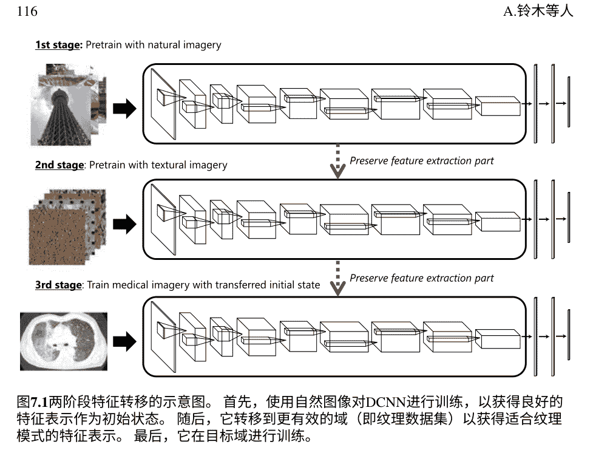

图7.1 两阶段特征转移的示意图。首先，使用自然图像对DCNN进行训练，以获得良好的特征表示作为初始状态。随后，它转移到更有效的域（即纹理数据集）以获得适合纹理模式的特征表示。最后，它在目标域进行训练。

## 7.3 两阶段特征转移在肺HRCT分析中的应用

##### 7.3.1 材料

本节通过给出一个用于分类弥漫性肺疾病（DLDs）的应用示例，展示了两阶段特征转移学习的有效性。DLDs是指扩散到肺部大面积的肺部疾病的集合术语。一些被归类为特发性肺纤维化（IPFs）的DLDs可能很容易变得无法治愈。因此，为了更好地预后，需要在DLDs仍然很小和轻微时使用高分辨率X射线计算机断层扫描（HRCT）进行检测。通过在纹理领域中对DLDs的HRCT模式进行分类，可以确定疾病的进展程度，因为DLDs的病情被视为纹理模式，如图7.2所示。

在我们的工作中，这些模式被分类为七类：实变（CON），玻璃样浸润（GGO），蜂窝状改变（HCM），网状浸润（RET），肺气肿性改变（EMP），结节状浸润（NOD）和健康/正常（NOR）。这些分类是由内山等人引入的[9]。

> 2 大多数关于DLD的研究将其分为六类，没有区分RET和GGO。这项工作以更精确和最新的方式明确区分它们。

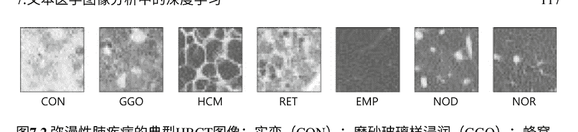

图7.2 弥漫性肺疾病的典型HRCT图像：实变（CON）；磨砂玻璃样浸润（GGO）；蜂窝状改变（HCM）；网状浸润（RET）；肺气肿改变（EMP）；结节状浸润（NOD）；健康（正常）（NOR）

DLD图像数据集来自日本大阪大学医院，我们收集了来自117个不同参与者的117个HRCT扫描。每个切片都被转换为512 × 512像素的灰度图像，切片厚度为1.0毫米。经验丰富的放射科医生对肺部区域切片进行了七种类型的模式注释。注释区域的形状和标签是三位医生的诊断结果。注释的CT图像被分割成感兴趣区域（ROI）块，每个块为32 × 32像素，相当于约4平方厘米。这对于DCNN输入来说是一个较小的ROI尺寸。因此，我们使用双三次插值将它们放大到224 × 224像素。因此，通过这些操作，我们收集了169个CON块，655个GGO块，355个HCM块，276个RET块，4702个EMP块，827个NOD块和5726个NOR块。然后，我们将这些块分为DCNN的训练和评估，因为不同类别的块不是来自同一患者。对于训练，我们使用了143个CON块，609个GGO块，282个HCM块，210个RET块，4406个EMP块，762个NOD块和5371个NOR块。剩余的26个CON块，46个GGO块，73个HCM块，66个RET块，296个EMP块，65个NOD块和355个NOR块用于评估。

在两阶段特征迁移学习中，我们需要选择自然和纹理数据集作为源域。我们使用了ILSVRC 2012数据集，它是ImageNet的一个子集，作为自然图像数据集。它的优势在于预训练模型是 readily available的，因为这个数据集是自然图像识别的一个事实上的基准。

我们还使用了哥伦比亚-乌得勒支反射和纹理（CUReT）数据库作为纹理数据集。图7.3展示了CUReT数据库中纹理图像的示例。该数据库包含了61类真实世界纹理的宏观照片。每个类别在各种光照和视角下都有大约200个样本。这个数据集包含了彩色和粗到细的各种纹理，更适合学习纹理特征表示。

##### 7.3.2 实验细节

我们比较了不同迁移过程之间的泛化性能，如下所示：

- 1. 没有迁移学习（从头开始学习，使用随机初始化权重）
- 2. 使用ILSVRC 2012数据集的传统特征转移（使用自然图像的迁移学习）
- 3. 使用CUReT数据集的传统特征转移（使用纹理图像的迁移学习）
- 4. 两阶段特征迁移学习（同时使用自然图像和纹理图像的迁移学习）

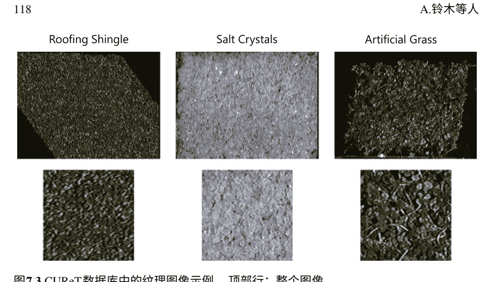

图7.3 CUReT数据库中的纹理图像示例。顶部行：整个图像“屋顶瓦片”，“盐晶”和“人工草地”类别。底部：裁剪和调整大小用作DCNN输入的纹理区域图像

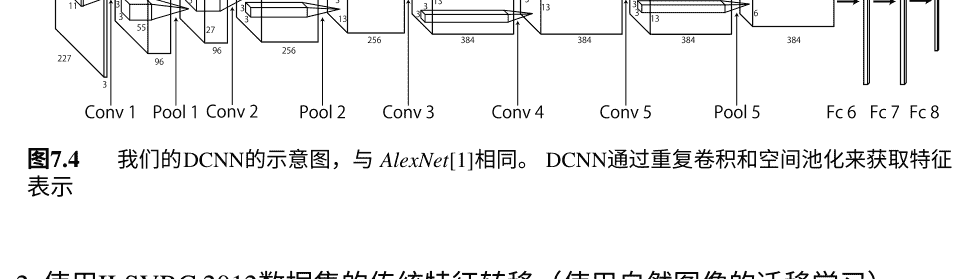

图7.4 我们的DCNN的示意图，与 AlexNet[1]相同。 DCNN通过重复卷积和空间池化来获取特征表示

在我们的实验中，我们采用了最早和最直接的DCNN之一AlexNet [1]，它经常被用作DCNN性能的参考，例如Litjens等人[2]。 图7.4说明了它的架构。AlexNet是一个纯粹的顺序DCNN，因此它可以轻松分析中间表示以揭示特征迁移学习的机制。 我们使用动量随机梯度下降（momentum-SGD）算法训练我们的DCNN，动量为0.9，丢弃率为0.5。当网络从随机初始化状态第一次训练时，我们将动量-SGD的学习率设置为0.05。否则，当网络从预训练状态训练时，即特征迁移时，我们将小的学习率设置为0.0005。在所有条件（1）-（4）下，我们训练网络直到训练损失收敛，以稳定收敛网络参数。

通过使用四个指标评估了泛化性能：准确度、召回率、精确度和F1得分。为了减小过渡中异常好结果的影响，学习过程的第75个百分位数值被用作每个评估指标的代表值。我们对每个条件进行了评估 n = 10 times，使用不同的随机种子进行平均。

##### 7.3.3 实验结果

实验结果如表7.1所示。条件（1），即从头开始学习，作为基本DCNN性能的基准。条件（2），即仅从纹理图像进行特征转移，显示出比从头开始学习（1）更差的性能。这个结果表明，仅仅使用CUREt作为源域进行传统单阶段特征转移学习是无用的。它还表明一个有趣的发现：不适当的特征转移学习可能会使泛化性能变差。条件（3），即仅从大量自然图像进行传统特征转移，显示出比（1）更好的性能。这个结果与报告一致，即从自然图像进行转移学习通常对大多数医学图像分析有效[2]。然而，在这个纹理案例中，条件（4）具有最显著的统计结果（1）-（3）（p < 0.01，非参数Wilcoxon符号秩检验，n =10）。两阶段特征转移有效地改善了纹理识别任务中的DCNN性能。

表7.1 测试数据的分类性能比较 ( ± 以下每个指标的意思是标准差)

| 迁移 | (1) | (2) | (3) | (4) |
| :--- | :--- | :--- | :--- | :--- |
| | 无 | 单阶段（传统） | 两阶段（我们的） |
| 准确率 | 0.9445 ± 0.0018 | 0.9605 ± 0.0036 | 0.9333 ± 0.0040 | 0.9677 ± 0.0027 |
| 精确度 | 0.9196 ± 0.0027 | 0.9065 ± 0.0044 | 0.9469 ± 0.0057 | 0.9555 ± 0.0037 |
| 召回率 | 0.9378 ± 0.0023 | 0.9214 ± 0.0044 | 0.9496 ± 0.0044 | 0.9539 ± 0.0028 |
| F1得分 | 0.9255 ± 0.0025 | 0.9112 ± 0.0041 | 0.9460 ± 0.0049 | 0.9527 ± 0.0035 |

#### 7.4 迁移学习是如何工作的？

我们看到，两阶段特征迁移学习，包括两阶段特征迁移，提高了DCNN的泛化性能。当我们要应用DCNN的一种学习技术时，最好考虑“为什么这个技术工作良好”，因为特别是在医学影像领域，整个方法需要被解释清楚，以便我们相信其推理结果。从自然图像中进行特征迁移学习的机制已经通过对自然图像识别的热衷研究部分地得到了阐明，以对应于我们视觉识别过程的生物学事实。

然而，对于纹理识别，特别是对于棘手的两阶段特征迁移学习，需要进行更详细的分析以揭示改进的机制。

在本节中，我们尝试解释两阶段特征迁移的工作原理，并采用两种不同的方法。

##### 7.4.1 通过可视化特征表示进行定性分析

首先，从直观的角度来看，让我们可视化特征表示在迁移学习过程中的差异，并尝试看看它们是否对应于DCNN的输入。可视化网络的激活是解释DCNN工作原理的一种常见但灵活的方式。可视化DCNN激活的方法可以广泛分为两类：基于位置的和基于内容的。

基于位置的方法揭示了深度卷积神经网络集中注意力的空间区域，例如遮挡显著性[10]和Grad-CAM[11]。相比之下，基于内容的方法揭示了在特征提取过程中提取的要素组件的重要性。目前，基于位置的方法，特别是源自Grad-CAM的方法，已成为一种主流的可视化方法，因为其具有清晰的可视化结果。然而，基于位置的方法不适用于揭示纹理领域中的显著性，因为纹理领域具有无局部性的特点。因此，我们采用了一种基于内容的可视化方法，称为“DeSaliNet”[12]，它可以将要素扩散到更广泛的区域。

DeSaliNet的主要思想是，通过训练特征提取映射的伪逆向输入空间传播提取的特征激活。如公式7.1所示，DCNNs的特征提取过程可以解释为由每个层对应的组合构成的确定性映射。在这里，DeSaliNet通过公式7.1的逆向对应，定义了一个从提取的特征表示到输入空间的反向“可视化”路径。

$$h^{(i)\dagger} = h_{1}^{L_{1}\dagger} \circ \cdots \circ h_{i}^{L_{i}\dagger}, \quad (7.2)$$

通过逐层伪逆对应关系 $h_{i}^{L_{i}\dagger}$ 与前向层相关联 $h_{i}^{L_{i}}$ 这个概念在图7.5中有所说明。DeSaliNet使得显著组件在输入空间的可视化结果中呈现为显著性。图7.6显示了提取特征的可视化结果，这是AlexNet分类部分的输入，对于模型(1)-(4)。

## Input Space

图7.5使用DeSaliNet进行特征可视化流程。在前向传播阶段计算要可视化的特征图（右侧）。当可视化神经元激活时，特征图切换到反向可视化路径（左侧），该路径由每个前向层的逆映射组成，并作为显著性图像向输入空间进行反向传播。

首先，让我们看一下从头开始学习的模型（1）。与其他模型不同，热图叠加的可视化结果清楚地显示出输入中任何区域的显著激活。模型（1）的性能指标似乎并不差；然而，由于缺乏DLD的训练样本，DCNN的代表能力并没有得到充分利用。让我们来看看传统的单阶段特征转移模型（2）和（3）。从纹理图像转移的模型（2）显示出与纹理特征出现的平坦区域相对应的扩散激活（例如，HCM示例的右下角和CON和RET示例的整个区域）。相反，从自然图像转移的模型（3）在边缘结构出现的区域显示出激活（例如，HCM示例的凹陷区域或CON的囊壁轮廓）。直观地说，特征转移学习使得DCNN能够掌握源领域中出现的特征表示。

接下来，模型（4）是从两阶段特征转移中得来的。通过可视化模型（4）的特征表示，有趣的是，两阶段特征转移模型似乎对边缘和纹理结构都有响应，这在模型（3）和（4）中展示出来。这个结果表明，深度卷积神经网络可以通过连续的特征转移从多个源领域中叠加地获得特征表示。

两阶段特征转移带来的显著改进是因为深度卷积神经网络获得了更好的特征表示，可以获取纹理和结构特征，从而对DLD模式进行分类。

##### 7.4.2 数值分析：特征提取部分的频率响应

为了使我们的解释更加精确，我们尝试通过数值和定量分析特征提取过程。

传统上，关于纹理计算机视觉的各种研究报告指出，图像中的纹理成分出现在低频率的DC附近，而结构特征则出现在低中到高频率的范围内，通过傅里叶分析可以得出这个结论[13]。根据这个普遍发现，我们通过将深度卷积神经网络视为二维傅里叶系统来分析其频率响应。为了定义深度卷积神经网络特征提取的频率响应，我们用I(ω,θ)表示只有空间频率分量为ω和相位分量为θ的参考频率图像。参考频率图像I(ω,θ)通过反傅里叶变换得到，由以下方式给出：

```
$$I(\omega, \theta) = \mathcal{F}^{-1}\left[\hat{\mathbf{I}}(r, \phi)\right] / \left\|\mathcal{F}^{-1}\left[\hat{\mathbf{I}}(r, \phi)\right]\right\|_2^2 \quad (7.3)$$
```

其中$\hat{\mathbf{I}}(r, \phi)$是傅里叶空间中的极坐标表示：

```
$$\hat{\mathbf{I}}(r, \phi) = \begin{cases} 1 & (r = \omega, \phi = \theta) \\ 0 & (\text{otherwise}) \end{cases} \quad (7.4)$$
```

$\|\cdot\|^2$表示图像的Frobenius范数，$\mathcal{F}[\cdot]$表示二维傅里叶变换。图7.7展示了生成参考频率图像的过程。然后，我们通过与参考频率响应对应的Frobenius范数增益来定义提取特征的频率响应。设$h$为特征提取的对应关系；频率响应可以用方程(7.2)，(7.3)和(7.4)中的符号表示：

```
$$G(\omega) = \sum_{\theta \in [0,\pi)} \left\| (h \circ h^\dagger)(\mathbf{I}(\omega, \theta)) \right\|_2^2 \quad (7.5)$$
```

图7.6 从DLDs图像中提取特征图的可视化结果。最左边的图显示了DCNN的输入。每一行代表了输入的DLDs图像，分别属于HCM、CON和RET类。每一列代表了DCNN的学习过程，如第6节所述。对于每个可视化结果，上面的图显示了归一化重构的输入。明亮的区域表示输入的相应组件对特征图有很强的影响。下面的图，用虚线框起来，显示了叠加在输入DLD图像上的显著性热图。

## 2-dimensional Fourier space

## Generated reference frequency image

图7.7 生成参考频率图像的机制。在二维傅里叶空间中，在半径为ω的圆上的两个相对点(ω, θ)和(ω, -θ)上设置值为1，这些点是极坐标中的点。参考频率图像是通过其反傅里叶变换给出的。在这个例子中，ω=5，θ=π/4。

图7.8 每个特征转换模型的频率响应。红虚线、蓝虚线和绿实线分别表示特征转换模型(2)、(3)和(4)，它们在第6节中有描述。两阶段特征转换模型(4)在模型(2)和(3)中都出现了峰值。

方程(7.5)表示固定范数输入I(ω, γ)在特征提取层中的显著性，因此这个度量可能适合评估频率响应。图7.8显示了特征转移模型(2)–(4)的频率响应。显著频率对特征表示产生强烈影响，在图中呈现出响应峰值。为了突出峰值结构，每个响应都被归一化到区间[0, 1]，并通过二阶Savitzky-Golay滤波器进行平滑处理。从纹理图像转移的模型(2)在低频率附近(ω≃0 [Hz])和中频率(ω=20–40 [Hz])处具有峰值响应，这对于纹理图像是必要的[13]。从自然图像转移的模型(3)在低频率附近(约10 [Hz])和中高频率处具有强烈的峰值响应。

(ω ≃70 [Hz] )。正如上一节所讨论的，从纹理和自然图像转移的模型(4)在低频率附近 (DC) 到中频率处具有峰值响应，类似于模型(2); 然而，它还在中高频率附近 (约70 [Hz]) 具有峰值，类似于模型(3)。这个结果与可视化结果一致，即两阶段特征转移模型可以从多个源域中叠加地获得纹理和结构特征表示。尽管从频率响应和特征提取对应的傅里叶视角来分析深度卷积神经网络并不是很合理，但这种分析方法可能对确定模型的特性有用。

从在HRCT浑浊度中寻找DLD的角度来看，纹理和边缘结构都是重要的标准。数值分析结果还表明，使用自然图像和纹理图像进行两阶段特征转移，可以同时捕捉纹理和边缘结构，并通过分析特征表示来提高DCNNs的性能。

#### 7.5 结论

本章解释了使用DCNNs进行纹理分析比结构分析更困难，这是由于DCNNs的识别机制。因此，需要一些特殊技巧来充分利用DCNNs在纹理识别任务中的强大能力。我们引入了一种新颖的转移学习方法，称为两阶段特征转移学习，它通过连续使用大量自然图像和纹理图像对整个DCNNs进行预训练。

在实验中，我们将两阶段特征转移应用于HRCT图像中的DLD分类任务，这是一种典型的纹理医学图像分析任务，并将其与无转移学习和传统单阶段特征转移学习的情况进行了对比。实验结果表明，两阶段特征转移学习明显优于其他方法。

此外，通过定量和数值分析DCNNs所获得的特征表示的差异，两阶段特征转移使得DCNNs能够从结构和纹理的角度进行有效的DLD识别。两阶段特征转移可以用于在纹理医学图像分析的许多应用中发挥DCNNs的最大能力。

## 参考文献

1.  Krizhevsky, A., Sutskever, I., Hinton, G.E.: 使用深度卷积神经网络进行ImageNet分类。在：神经信息处理系统的进展，第1097-1105页 (2012年)
2.  Litjens, G., Kooi, T., Bejnordi, B.E., Setio, A.A.A., Ciompi, F., Ghafoorian, M., Van Der Laak, J.A., Van Ginneken, B., Sánchez, C.I.: 医学图像分析中深度学习的综述。医学图像分析 42，60-88 (2017年)
3.  福岛，K.：新认知：一种不受位置偏移影响的模式识别自组织神经网络模型。生物控制论 36（4），193-202（1980年）
4.  Hubel，D.H.，Wiesel，T.N.：猫的视觉皮层中的感受野，双眼互动和功能架构。生理学杂志 160（1），106-154（1962年）
5.  铃木，A.，坂梨，H.，木戸，S.，早流，S.：使用两阶段特征转移的深度卷积神经网络的特征表示分析-用于弥散性肺疾病分类的应用。IPSJ 数学模型及其应用。100-110（2018年）
6.  何，K.，张，X.，任，S.，孙，J.：深度残差学习用于图像识别。在：计算机视觉和模式识别 IEEE 会议论文集，pp. 770-778（2016年）
7.  Pan，S.J.，Yang，Q.：转移学习综述。IEEE Trans. Knowl. Data Eng. 22（10），1345-1359（2010）
8.  Kirkpatrick，J.，Pascanu，R.，Rabinowitz，N.，Veness，J.，Desjardins，G.，Rusu，A.A.，Milan，K.，Quan，J.，Ramalho，T.，Grabska-Barwinska，A.，et al.：克服神经网络中的灾难性遗忘。Proc. Natl. Acad. Sci. 114（13），3521-3526（2017）
9.  Uchiyama，Y.，Katsuragawa，S.，Abe，H.，Shiraishi，J.，Li，F.，Li，Q.，Zhang，C.T.，Suzuki，K.，et al.：高分辨率计算机断层扫描中弥漫性肺疾病的定量计算机分析。Med. Phys. 30（9），2440-2454（2003）
10. Simonyan，K.，Vedaldi，A.，Zisserman，A.：深入卷积网络：可视化图像分类模型和显著性图（2013）。arXiv 预印本 arXiv:13126034
11. Selvaraju，R.R.，Cogswell，M.，Das，A.，Vedantam，R.，Parikh，D.，Batra，D.：Grad-cam：基于梯度的定位的深度网络的可视化解释。在：ICCV，第 618-626 页（2017）
12. Mahendran，A.，Vedaldi，A.：显著性解卷积网络。在：欧洲计算机视觉会议，第 120-135 页。Springer（2016）
13. Julesz，B.，Caelli，T.：傅里叶分解在视觉纹理感知中的限制。感知 8（1），69-73（1979）

### 第8章 基于解剖标志的深度学习在阿尔茨海默病结构磁共振成像诊断中的应用

## 成像

摘要结构磁共振成像（sMRI）已广泛应用于脑部疾病的计算机辅助诊断，如阿尔茨海默病（AD）及其前驱期，即轻度认知障碍（MCI）。基于sMRI数据，最近提出了基于解剖标志的深度学习方法用于AD和MCI的诊断。这些方法通常首先在脑部sMR图像中定位有信息量的解剖标志，然后将特征学习和分类器训练整合到一个统一的框架中。本章介绍了最新的基于解剖标志的深度学习方法，用于自动诊断AD和MCI。具体而言，首先介绍了一种自动解剖标志发现方法，用于识别脑部sMR图像中的有区别的区域。然后，提出了一种基于解剖标志的深度学习框架，用于AD/MCI分类，通过同时进行特征提取和分类器训练。在三个公共数据库上的实验结果表明，与几种最先进的基于sMRI的方法相比，所提出的框架提高了疾病诊断性能。

#### 8.1 引言

通过使用结构性磁共振成像（sMRI）数据进行脑形态学模式分析，可以有效区分阿尔茨海默病（AD）患者和正常对照组（NCs）之间的解剖差异。它还可以有效评估轻度认知障碍（MCI）的进展，这是AD的前驱阶段。在文献中，提出了大量基于sMRI的方法。

帮助临床医生解读大脑的结构变化。许多现有的方法是为了进行基础sMR图像分析而开发的（例如，图谱传播[1]和解剖标志点检测[2]），而其他方法则专注于AD和MCI的计算机辅助诊断[3-14]。

为了促进自动脑部疾病诊断，先前的研究从sMRI中提取了不同类型的生物标志物（测量/特征），例如体积和形状测量[4-6,15]，皮层厚度[7,8,10]和灰质组织密度图[3]。从局部到全局的尺度（见图8.1），这些测量可以大致分为四类，即（1）体素级，（2）补丁级，（3）感兴趣区域（ROI）级和（4）整体图像级特征[16]。具体而言，体素级特征旨在通过直接测量大脑的局部组织（例如，灰质，白质和脑脊液）密度来识别大脑的结构变化，通过体素级分析。然而，体素级测量通常具有非常高的维度（例如，数百万），从而导致后续学习模型的高过拟合风险[17]。与体素级测量不同，sMRI的ROI级特征试图在预定义的ROI内对大脑的结构变化进行建模。然而，ROI的定义通常需要对结构/功能角度的异常区域进行先验假设，在实践中需要专家知识[18,19]。此外，异常区域可能仅是预定义ROI的一小部分或跨越多个ROI，从而导致丧失判别信息。

与体素级和补丁级方法不同，整体图像级特征通过将每个sMRI视为整体来评估脑部异常[20]，从而忽略了图像的局部结构信息。

值得注意的是，脑部sMR图像的外观通常在全局上相似，在局部上有所不同，并且先前的研究表明早期AD仅在小的局部区域引起结构变化，而不是在孤立的体素或整个大脑中。因此，以体素级、ROI级和整体图像级定义的sMRI特征可能无法准确识别与早期AD相关的脑部结构变化。最近，补丁级（介于体素级和ROI级之间的中间尺度）特征已被开发用于表示sMR图像，显示出在区分AD/MCI患者和NCs方面的优势[14,21,22]。

补丁级方法面临的一个常见挑战是如何从每个sMR图像的数万个补丁中选择具有区分性的补丁，因为并非所有图像补丁都受到痴呆症的影响。此外，现有的大多数补丁级方法

工程化的表示（例如，强度值和/或形态特征）通常是事先定义好的，并且通常与后续的分类器学习独立[14, 23, 24]。由于特征和分类器之间可能存在异质性，预定义的特征可能导致脑疾病诊断的学习性能不佳。此外，仅使用局部图像块无法完全捕捉每个sMRI图像的全局信息。

总之，在基于图像块的方法中至少存在三个关键挑战：（1）如何高效选择信息丰富的图像块，（2）如何对每个脑sMRI的局部块级和全局图像级信息进行建模，以及（3）如何将特征学习和分类器训练整合到一个统一的框架中。为了解决这些挑战，最近提出了一种基于解剖标志的深度学习框架用于AD/MCI诊断，本章将重点介绍该框架。这种方法首先通过统计群组比较在脑sMRI中识别解剖标志，这些标志被定义为不同群组之间的区别位置（例如，AD与NC之间）。然后，它通过分层深度神经网络共同进行特征提取和分类器训练，明确地对sMRI的局部和全局结构信息进行建模，用于脑疾病诊断。

本章的其余部分按照以下方式组织。在第8.2节中，介绍了本章中使用的材料和图像预处理。然后，在第8.3节中介绍了一种从脑sMR图像中发现标志点的解剖学方法。第8.4节介绍了一种基于标志点的深度网络，用于自动诊断AD和MCI。第8.5节介绍了实验和相应的分析。第8.6节分析了几个关键参数的影响，当前框架的局限性以及可能的未来研究方向。最后，在第8.7节中对本章进行了总结。

#### 8.2 材料和图像预处理

在实验中使用了三个公共数据集，包括阿尔茨海默病神经影像学倡议-1（ADNI-1）[26]，ADNI-2和MIRIAD（阿尔茨海默病的最小间隔共振成像）[27]数据集。基线ADNI-1和ADNI-2数据集中的受试者分别具有1.5T和3T T1加权结构MRI数据。基线ADNI-1数据集中共有821名受试者，其中包括199名AD，229名NC，167名pMCI和226名sMCI受试者。ADNI-2数据集包含636名受试者，即159名AD，200名NC，38名pMCI和239名sMCI受试者。ADNI-1和ADNI-2中pMCI和sMCI的定义基于基线时间后36个月内MCI受试者是否转化为AD。值得注意的是，许多ADNI-1中的受试者也参与了ADNI-2。为了进行独立测试，从ADNI-2中删除了同时出现在ADNI-1和ADNI-2中的受试者。基线MIRIAD数据集包括23名NC和46名AD受试者的1.5T T1加权sMR图像。实验中使用的研究对象的人口统计信息如表8.1所示。

### 表8.1 三个数据集中受试者的人口和临床信息。数值报告为均值±标准差（Std）；Edu：教育年限；MMSE：迷你精神状态检查；CDR-SB：临床痴呆评定总分

| 数据集       | 类别 | 男性/女性 | 年龄       | 教育       | MMSE      | CDR-SB    |
|--------------|------|-----------|------------|------------|-----------|-----------|
| ADNI-1 [26]  | AD   | 106/93    | 75.30 ± 7.50 | 14.72 ± 3.14 | 23.30 ± 1.99 | 4.34 ± 1.61 |
|              | pMCI | 102/65    | 74.79 ± 6.79 | 15.69 ± 2.85 | 26.58 ± 1.71 | 1.85 ± 0.94 |
|              | sMCI | 151/75    | 74.89 ± 7.63 | 15.56 ± 3.17 | 27.28 ± 1.77 | 1.42 ± 0.78 |
|              | NC   | 127/102   | 75.85 ± 5.03 | 16.05 ± 2.87 | 29.11 ± 1.00 | 0.03 ± 0.12 |
| ADNI-2 [26]  | AD   | 91/68     | 74.24 ± 7.99 | 15.86 ± 2.60 | 23.16 ± 2.21 | 4.43 ± 1.75 |
|              | pMCI | 24/14     | 71.27 ± 7.28 | 16.24 ± 2.67 | 26.97 ± 1.66 | 2.24 ± 1.26 |
|              | sMCI | 134/105   | 71.66 ± 7.56 | 16.20 ± 2.69 | 28.25 ± 1.62 | 1.20 ± 0.78 |
|              | NC   | 113/87    | 73.47 ± 6.25 | 16.51 ± 2.54 | 29.03 ± 1.27 | 0.05 ± 0.23 |
| MIRIAD [27]  | AD   | 19/27     | 69.95 ± 7.07 | -          | 19.20 ± 4.01 | -         |
|              | NC   | 12/11     | 70.36 ± 7.28 | -          | 29.39 ± 0.84 | -         |

所有研究对象的脑sMR图像都使用标准流程进行处理[25, 28]。具体而言，首先使用MIPAV软件对每个sMR图像进行前交叉联合（AC）-后交叉联合（PC）校正。然后，对每个图像进行重采样，分辨率为256 × 256 ×256，然后使用N3算法[29]对图像的强度不均匀性进行校正。进一步进行头骨剥离和手动编辑，确保头骨和硬脑膜都被清除。最后，通过将标记的模板映射到每个去除头骨的图像上，去除小脑。

#### 8.3 脑部sMRI的解剖标志发现

为了从脑部sMRI中提取信息丰富的图像块用于特征学习和分类器训练，提出了一种数据驱动的标志发现算法[2]，用于定位脑部sMRI中的有区别的图像块。目标是在sMRI的局部结构中识别在AD患者和NC受试者之间具有统计学意义的标志。解剖标志发现方法的示意图如下所示。

##### 8.3.1 体素间对应关系的生成

首先使用Colin27模板[31]进行线性配准，以消除sMRI图像的全局平移、缩放和旋转差异，并以与模板图像相同的空间分辨率（即1 × 1 × 1 mm³）重新采样所有图像。由于这些线性对齐的图像无法逐体素进行比较，因此需要进行非线性配准进行空间归一化[32]。空间归一化后，扭曲的图像与模板图像处于相同的立体定向空间中。非线性配准步骤为每个受试者创建了一个变形场，估计了大脑特定区域的高度非线性变形。基于非线性配准中获得的每个sMRI图像的变形场，可以建立模板和每个线性对齐图像之间的体素对应关系（例如，参见图8.2中的粉色线和红色圆圈）。例如，对于模板图像中的一个体素（x, y, z），可以找到其在特定线性对齐图像中的对应体素（x + dx, y + dy, z + dz），其中（dx, dy, dz）是从模板图像到线性对齐图像的位移，由变形场定义。

##### 8.3.2 不同组之间的体素比较

通过线性对齐的图像（具有跨主体体素对应关系），可以提取局部形态特征，以识别具有统计学意义的组间差异的局部形态模式。在这里，使用线性对齐的图像（而不是非线性对齐的图像）进行特征提取。原因是，在仅对脑sMRI的全局形状和比例进行归一化的线性配准之后，这些线性对齐的图像仍然可以保留脑部的内部局部差异和独特的局部结构。相比之下，非线性配准后的扭曲图像非常相似，因此我们感兴趣的不同组之间的形态差异将不太显著。

为了利用邻近体素传递的上下文信息，从每个线性对齐的图像中提取以特定体素为中心的立方体块（尺寸为15 × 15 × 15），以计算形态特征的统计量。具体而言，提取每个图像块的对局能量[33]，这些能量对局部不均匀性是不变的，作为形态学特征。此外，使用词袋策略[34]进行向量量化，以获得具有相对较低特征维度的直方图特征。对于模板中以体素为中心的每个图像块，可以从AD组和NC组的训练图像中提取两组形态学特征。形态学特征的维度为50，这是在应用词袋方法时定义的聚类组数。最后，使用Hotelling's T²统计量[30]对AD组和NC组进行组间比较。结果是，可以获得与模板空间中所有体素相对应的p值图。

##### 8.3.3 AD相关解剖标志的定义

基于获得的p值图，可以从模板中的所有体素中识别出AD相关的解剖标志。具体而言，模板中p值小于0.01的体素被视为显示统计上显著差异的潜在位置。为了避免大量冗余，仅将p值图中的局部极小值（其p值也小于0.01）定义为模板中的AD相关标志。在ADNI-1数据集中，从AD组和NC组中识别出共1,741个解剖标志（在模板中定义），如图8.3a所示。在这个图中，这些解剖标志根据它们在区分AD患者和NCs方面的区分能力（即p值）进行排序。即，较小的p值表示较强的区分能力，反之亦然。使用非线性配准估计的变形场，可以通过将这些标志从模板图像映射到相应的线性对齐sMRI图像来计算每个训练图像的标志。

如图8.3a所示，许多标志在空间上彼此靠近，因此以这些标志为中心的图像块会重叠。考虑到信息冗余，除了考虑标志的p值之外，还进一步使用空间欧氏距离阈值（即20）作为控制标志之间距离的准则，以减少图像块之间的重叠。这个过程得到了所有识别出的1,741个标志的子集，其中前50个标志显示在图8.3b中。从图8.3b可以看出，许多标志位于双侧海马、双侧副海马和双侧颞叶沟回区域，这些区域在先前的研究中已被报道与AD相关[5, 35]。

在这里，MCI（包括pMCI和sMCI）受试者与AD和NC组共享相同的地标池，该地标池是从AD和NC组中确定的。这里的假设是，由于MCI是AD的前驱阶段，AD和NC受试者之间存在组别差异的地标可能是MCI受试者sMRI中的潜在萎缩位置。

##### 8.3.4 未见测试受试者的地标检测

为了快速检测未见测试图像的地标，基于训练图像中确定的地标，开发了一种基于回归森林的方法[2]。具体来说，在训练阶段，使用多变量回归森林来学习每个体素周围的图像块与其到目标地标的3D位移之间的非线性映射（参见图8.4a），其中目标的平均方差被用作分割准则。在每个体素周围，可以提取一个图像块来计算与AD地标识别中使用的相同形态特征。在回归森林中，来自训练线性对齐图像的图像块级特征被用作输入数据（参见图8.4b中的绿色方块），而从每个图像块到每个目标地标的3D位移（在线性对齐图像空间中）被视为输出。

在测试阶段，可以使用学习到的回归森林来估计从测试图像中的每个体素到潜在地标位置的三维位移，基于从以该体素为中心的图像块中提取的局部形态特征。由于回归森林中有多棵树，所以使用所有树的平均预测值作为特定地标的最终位置。因此，通过使用估计的三维位移，每个体素可以对潜在地标位置投一票。通过汇总所有体素的所有投票（参见图8.4b），最终可以得到一个投票图（参见图8.4c），从中可以确定待估计地标的位置为具有最大投票的位置。对于新的测试图像，可以通过训练好的随机森林快速计算其地标位置，而无需使用任何耗时的非线性配准过程。

#### 8.4 基于地标的深度网络用于疾病诊断

开发了一种基于地标的深度多实例学习（LDMIL）框架，用于脑部疾病诊断。与先前的基于补丁的研究[21, 36]不同，该方法可以通过解剖地标定位具有鉴别性的图像补丁，而无需对图像补丁进行任何预定义的工程特征要求。这对于医学成像应用来说尤其有意义，在脑部注释鉴别性区域并从sMRI中提取鉴别性特征通常需要临床专业知识和高成本。此外，该方法能够通过深度神经网络逐层学习sMRI的局部信息和全局信息，从而实现对sMRI图像的局部到全局表示的层次化学习。

图8.5显示了LDMIL框架的示意图。基于AD和NC受试者之间的群体比较确定的解剖地标，多个图像块（即实例）从每个脑sMRI图像中提取。然后，开发了一个多实例卷积神经网络（MICNN），以共同学习基于块的特征和自动疾病分类模型。有关基于解剖标志的深度网络用于脑疾病诊断的详细过程，请参见以下内容。

##### 8.4.1 基于标志的图像块提取

基于前L个识别的解剖标志，从每个sMRI图像（即包）中提取多个图像块（即实例），如图8.6所示。这里，以每个特定标志位置为中心的尺寸为24 × 24 × 24的图像块被提取。给定L个标志，为表示每个sMRI/受试者生成L个图像块（作为一个包）。也就是说，这L个图像块的组合可以被视为后续CNN模型的一个样本。此外，以每个标志位置为中心的多个图像块还会进行采样，采样范围为5 × 5 × 5的立方体（步长为1），旨在抑制配准误差的影响并增加训练样本。以每个标志位置为中心，每个sMRI可以生成125个图像块。因此，理论上可以从每个sMRI图像中提取125^L个样本/包，每个包包含L个图像块。

##### 8.4.2 多实例卷积神经网络

由于从一个sMRI图像中提取的并非所有图像块都受到痴呆症的影响，这些图像块的类别标签可能不明确。为此，开发了一种多实例卷积神经网络（MICNN）模型用于AD相关脑疾病诊断，其示意图如图8.7所示。给定一个输入sMRI图像，MICNN的输入是一个包含L个从L个地标位置提取的补丁（即实例）的袋子。为了学习袋中各个补丁的特征表示，首先在MICNN中开发了多个子卷积神经网络架构。这种架构使用一组L实例作为输入，对应于大脑的标志位置。它为每个单独的sMRI图像生成补丁级别的表示。更具体地说，L并行的子卷积神经网络架构嵌入了一系列6个卷积层（即Conv1、Conv2、Conv3、Conv4、Conv5和Conv6）和2个全连接层（FC）层（即FC7和FC8）。在卷积层中使用修正线性单元（ReLU）激活函数，而Conv2、Conv4和Conv6分别后跟最大池化过程进行下采样。

由于痴呆引起的结构性变化可能是微妙的，并且分布在多个脑区，只有一个或几个补丁无法提供足够的信息来表示大脑的全局结构变化。这与传统的多实例学习不同，传统多实例学习可以通过最具有区分性的补丁的估计标签来推导图像类别[37, 38]。因此，除了从L个子-CNNs学习的补丁级表示之外，还进一步学习了每个sMRI图像的袋级（即整个图像级）表示。具体而言，在FC8层的补丁级表示（即FC7的输出特征图）首先被连接起来，然后是3个全连接层（即FC9、FC10和FC11）。这样的额外全连接层能够捕捉到由地标定位的补丁之间的复杂关系，并且能够形成大脑的整体表示。最后，FC11的输出被馈送到一个软最大输出层，以预测输入sMRI属于特定类别（例如AD或NC）的概率。

让训练集为𝒳={X_n}_{n=1}^N，其中包含N个带有相应标签的袋子𝐲={y_n}_{n=1}^N。第n个训练图像的袋子X_n由L个实例组成，定义为X_n=[x_{n,1},x_{n,2},⋯,x_{n,L}]。如图8.5所示，与所有训练图像对应的袋子是MICNN模型的基本训练样本，这些袋子的标签与袋级别（即主题级别）的标签一致。在这里，主题级别的标签信息（即𝐲）在反向传播过程中用于学习全连接层中最相关的特征，并更新卷积层中的网络权重。在这里，MICNN旨在通过最小化以下损失函数来学习一个非线性映射函数Φ:𝒳→𝐲：

损失(𝐖)=∑_{X_n∈𝒳}−log (𝐏(y_n|X_n;𝐖)) \quad (8.1)

其中𝐏(y_n|X_n;𝐖)表示袋子X_n被正确分类为类别y_n的概率，使用网络系数𝐖。

总之，MICNN架构是一个基于补丁的分类模型，可以为每个sMRI图像学习局部到全局的特征表示。也就是说，首先通过多个子CNN架构学习补丁级别的表示，对应于多个地标，以捕捉位于大脑不同部位的局部结构信息。通过额外的全连接层进一步建模多个地标传递的全局信息，以表示整个图像级别的脑结构。因此，脑sMRI的局部和全局特征都可以纳入分类器学习过程中。

使用随机梯度下降（SGD）算法[39]对MICNN进行优化，动量系数为0.9，学习率为10^{-2}。每个时期使用30个样本的小批量进行权重更新。此外，该网络基于一台配备单个GPU（即NVIDIA GTX TITAN 12 GB）和Tensorflow[40]平台的计算机实现。在这里，10%的受试者进行了运行-从ADNI-1中随机选择作为验证数据，而ADNI-1中的其余受试者被视为训练数据。给定24 × 24 × 24的补丁尺寸和$L = 40$，MICNN的训练时间约为27小时，而对于新的sMRI的测试时间小于1秒。

#### 8.5 实验

本节首先介绍了比较和实验设置的方法，然后介绍了不同方法实现的AD/MCI分类结果。

##### 8.5.1 比较方法

将LDMIL方法与三种最先进的基于sMRI的AD/MCI诊断方法进行比较，包括(1)基于ROI的方法(ROI)，(2)基于体素的形态学(VBM)[3]，以及(3)传统的基于标志点的形态学(CLM)[2]。此外，LDMIL还与其单实例变体进行了进一步比较，称为基于标志点的深度单实例学习(LDSIL)方法。

- (1) 基于ROI的方法(ROI): 与几个先前的研究[41-43]类似，从预处理的sMRI图像中提取ROI特定的特征。具体来说，首先将大脑分割为三种不同的组织类型，即灰质(GM)、白质(WM)和脑脊液(CSF)，使用FSL软件包中的FAST[44]进行处理。然后，使用90个预定义的AAL大脑自动标记(Atlas)[45]将这些区域对齐到每个受试者的本地空间，使用可变形配准算法[46]。最后，提取这些90个ROI内的GM组织的体积作为每个sMRI图像的特征表示。在这里，GM组织的体积通过总颅内体积进行归一化，总颅内体积由所有ROI的GM、WM和CSF体积的总和估计得出。使用这些90维的ROI特征，使用参数$C = 1$训练了一个线性支持向量机(SVM)进行分类。

- (2) 基于体素的形态学（VBM）方法[3]: 所有sMRI图像首先使用非线性图像配准技术空间归一化到相同的模板图像，然后从归一化图像中提取GM。大脑的局部组织（即GM）密度以体素为单位直接测量，并使用t检验进行组间比较，以降低高维特征的维度。与基于ROI的方法类似，这些基于体素的特征被输入到线性SVM进行分类。

- (3) 基于传统标志点的形态学（CLM）方法[2]与工程特征表示: 作为一种基于标志点的方法，CLM与LDMIL方法共享相同的标志点池。与LDMIL不同，CLM采用工程特征用于表示每个标志点周围补丁的工程特征。具体而言，CLM首先从每个标志点周围的局部补丁中提取形态特征，然后将多个标志点的这些特征连接在一起。最后，归一化的特征被输入到线性SVM分类器中。

- (4) 基于标志点的深度单实例学习（LDSIL）：LDSIL的架构类似于LDMIL中的子卷积神经网络（见图8.7），包含6个卷积层和3个全连接层。具体而言，LDSIL通过从标志点提取的补丁作为输入和主题级别的类标签作为输出，学习与每个特定标志点对应的CNN模型。给定L个标志点，通过LDSIL可以独立地学习L个CNN模型，为测试对象生成L个概率分数。为了做出最终的分类决策，通过使用多数投票策略简单地融合补丁的估计概率分数。请注意，与LDMIL不同，LDSIL只能捕捉脑sMRI图像的局部结构信息。

##### 8.5.2 实验设置

为了验证不同方法的有效性，进行了两组实验，包括（1）AD诊断（即AD vs. NC分类），和（2）MCI转化预测（即pMCI vs. sMCI分类）。为了评估特定分类模型的鲁棒性和泛化能力，ADNI-1的受试者被用作训练集，而ADNI-2和MIRIAD的受试者被视为两个独立的测试集。

性能评估使用了七个指标，包括接收器操作特性（ROC）曲线，ROC下的面积（AUC），准确率（ACC），敏感度（SEN），特异度（SPE），F-Score和马修斯相关系数（MCC）[47]。为了公平比较，在LDMIL方法及其变体（即LDSIL）中，图像块的大小经验性地设置为24 × 24 × 24，而使用的地标数量为L=40。与LDMIL类似，LDSIL的网络通过SGD算法[39]进行优化，动量系数为0.9，学习率为10^{-2}。此外，三种基于地标的方法（即CLM，LDSIL和LDMIL）共享相同的地标池，而LDSIL和LDMIL使用相同大小的图像块。

##### 8.5.3 AD诊断结果

在第一组实验中，进行了AD与NC分类的任务，模型在ADNI-1上进行训练，在ADNI-2和MIRIAD上进行测试。表8.2和图8.8a，b报告了在ADNI-2和MIRIAD数据集上的实验结果。

表8.2 AD分类和MCI转化预测的结果

|     | AD与NC在ADNI-2上 |     |     |     |     |     | AD与NC在MIRIAD上 |     |     |     |     | ADNI-2上的pMCI与sMCI |     |     |     |     |
| --- | ---------------- | --- | --- | --- | --- | --- | ---------------- | --- | --- | --- | --- | -------------------- | --- | --- | --- | --- |
|     | ROI              | VBM | CLM | LDSIL | LDMIL |     | ROI              | VBM | CLM | LDSIL | LDMIL |     | ROI              | VBM | CLM | LDSIL | LDMIL |
| AUC | 0.867            | 0.841 | 0.881 | 0.957 | **0.959** |     | 0.918            | 0.921 | 0.954 | 0.958 | **0.972** |     | 0.638            | 0.593 | 0.636 | 0.645 | **0.776** |
| ACC | 0.792            | 0.769 | 0.822 | 0.906 | **0.911** |     | 0.870            | 0.884 | 0.899 | 0.913 | **0.928** |     | 0.661            | 0.643 | 0.686 | 0.700 | **0.769** |
| SEN | 0.786            | 0.692 | 0.774 | 0.874 | **0.881** |     | 0.913            | 0.913 | **0.978** | 0.957 | 0.935 |     | **0.474**        | 0.368 | 0.395 | 0.368 | 0.421 |
| SPE | 0.796            | 0.830 | 0.861 | 0.930 | **0.935** |     | 0.783            | 0.826 | 0.739 | 0.826 | **0.913** |     | 0.690            | 0.686 | 0.732 | 0.753 | **0.824** |
| F-Score | 0.769        | 0.726 | 0.794 | 0.891 | **0.897** |     | 0.903            | 0.913 | 0.928 | 0.936 | **0.945** |     | 0.277            | 0.221 | 0.256 | 0.252 | **0.333** |
| MCC | 0.580            | 0.530 | 0.638 | 0.808 | **0.819** |     | 0.704            | 0.739 | 0.770 | 0.802 | **0.839** |     | 0.120            | 0.040 | 0.097 | 0.095 | **0.207** |图8.8 五种不同方法在AD与NC分类上实现的ROC曲线ADNI-2上的AD与NC分类，MIRIAD上的AD与NC分类，以及ADNI-2上的pMCI与sMCI分类。分类模型是在ADNI-1上训练的

从表8.2可以看出，在AD与NC分类的ADNI-2和MIRIAD上，LDMIL方法通常优于其他竞争方法。例如，在ADNI-2数据集上，LDMIL实现的AUC值为0.959，远远优于ROI、VBM和CLM的AUC值（即0.867、0.841和0.881，分别)。值得注意的是，ADNI-2的sMR图像是使用3T扫描仪扫描的，而ADNI-1的图像是使用1.5T扫描仪扫描的。尽管训练集（即ADNI-1）和测试集（即ADNI-2）中的sMR图像具有不同的信噪比，但LDMIL学习的分类模型仍然能够可靠地区分AD患者和NCs。这意味着LDMIL方法具有很强的鲁棒性和泛化能力，在处理多中心sMRI应用中尤为重要。

如图8.8a、b所示，基于三个基准点的方法（即CLM、LDSIL和LDMIL）在AD分类中始终优于基于ROI和基于体素的方法（即ROI和VBM）。可能的原因是，在这项工作中识别出的基准点具有更强的区分能力，能够捕捉AD和NC受试者之间的结构性脑变化差异，相比于预定义的ROI和孤立的体素。此外，从图8.8a、b可以看出，LDSIL（LDMIL的单实例变体）在AD与NC分类中的AUC值与LDMIL相当。

##### 8.5.4 MCI转化预测结果

在表8.2和图8.8c中报告了MCI转化预测（pMCI vs. sMCI分类）的结果，分别在ADNI-1和ADNI-2数据集上进行了训练和测试。从表8.2可以看出，在大多数情况下，LDMIL方法在MCI转化预测中的表现优于其他四种方法。

另一方面，如图8.8所示，在pMCI与sMCI分类中，LDMIL相对于LDSIL的优势特别明显，尽管在AD与NC分类中这种优势并不明显。原因可能是LDMIL模型同时考虑了大脑的局部区域和全局区域的结构信息，而LDSIL只能捕捉到局部区域的信息。由于AD引起的结构异常与NC相比明显，只有少数几个地标足以区分AD和NC受试者。相反，MCI大脑的结构变化可能非常微妙，并且分布在大脑的多个区域，很难仅凭一个或少数几个地标确定MCI受试者是否会转化为AD。在这种情况下，多个地标传递的全局信息对于分类至关重要。此外，由于每个地标仅定义了一个潜在（而不是确定的）萎缩位置（尤其是对于MCI），在LDSIL中将相同的主题级别类标签分配给从特定地标位置提取的所有补丁是不合理的。与LDSIL不同，LDMIL可以通过在主题级别而不是补丁级别上分配类标签来建模图像补丁的局部信息和多个地标的全局信息。这解释了为什么LDMIL在pMCI与sMCI分类中优于LDSIL，尽管这两种方法在AD与NC分类中产生类似的结果。

#### 8.6 讨论

本节首先研究了关键参数对诊断性能的影响，然后阐述了当前研究的局限性，并提出了可能的未来研究方向。

##### 8.6.1 参数的影响

为了研究LDMIL方法中涉及的两个参数（即地标数量和图像块大小）对分类性能的影响，通过改变图像块大小进行了一组实验，集合为{8×8×8, 12×12×12, 24×24×24, 36×36×36, 48×48×48, 60×60×60}。 ADNI-2数据集上AD与NC分类的AUC值如图8.9a所示。从图8.9a可以看出，使用48×48×48的图像块大小时，LDMIL获得了最佳结果。此外，在[24×24×24, 48×48×48]的图像块大小范围内，LDMIL对图像块大小不太敏感。

当使用大小为8 × 8 ×8的补丁时，AUC值（0.814）不令人满意。这意味着非常小的局部补丁无法捕捉足够的信息性脑结构。同样，使用非常大的补丁（例如，60 × 60 ×60）的结果也不好，因为大补丁内微妙的结构变化可能被无信息的正常区域所主导。此外，使用大补丁会带来巨大的计算负担，从而影响LDMIL在实际应用中的效用。

图8.9 LDMIL方法在ADNI-2上使用不同补丁大小进行AD与NC分类的AUC值，以及使用不同地标数量进行AD分类（即AD vs. NC）和MCI转化预测（即pMCI vs. sMCI）任务的AUC值

此外，LDMIL使用不同数量的地标所达到的AUC值在图8.9b中报告。从图8.9b可以观察到，随着地标数量的增加，整体性能也在增加。特别是在pMCI与sMCI分类中，使用少于15个地标的LDMIL无法产生令人满意的结果。这意味着多个地标传达的全局信息可以帮助提高学习性能，特别是对于没有明显疾病诱导结构变化的MCI患者。另一方面，当地标数量大于35时，AUC值的增长趋势减缓，结果相对稳定。因此，在LDMIL中，选择地标数量在[30, 50]范围内是合理的，而使用更多地标将增加需要优化的网络权重数量。

##### 8.6.2 限制和未来研究方向

未来仍需考虑几个技术问题。首先，训练对象的数量有限（即数百个），即使可以从多个标志位置提取数百万个图像补丁用于分类器训练。其次，基于解剖标志的局部补丁的预选仍然独立于特征提取和分类器构建，这可能会影响诊断性能。第三，在当前实现中，大脑中所有位置的图像补丁大小都是固定的，而由痴呆症引起的结构变化可能在不同位置上有所不同。最后，在当前研究中，来自不同数据集的数据被平等对待，没有考虑不同数据集中数据分布的差异。这可能会对学习网络的泛化能力产生负面影响。这可能会对学习网络的泛化能力产生负面影响。

因此，可以进一步研究基于解剖标志的深度学习框架，用于AD/MCI诊断的方向如下。首先，使用三个数据集（即ADNI-1、ADNI-2）中的大量纵向sMR图像而MIRIAD）可以进一步提高学习模型的鲁棒性[48, 49]。其次，希望能够自动识别整个脑sMRI中的补丁和区域级别的判别位置，从而可以以数据驱动的方式共同学习和融合补丁和区域级别的特征表示，构建疾病分类模型[50]。第三，可以合理地扩展当前的框架，使用多尺度图像补丁来捕捉脑sMRI的更丰富的结构信息，用于疾病诊断[13, 14]。最后，有趣的是设计一系列的领域适应方法[51]来应对不同数据分布带来的挑战，预计能够进一步提高诊断性能。

#### 8.7 结论

使用sMRI的脑形态学模式分析已经广泛研究用于自动诊断AD和MCI。现有的基于sMRI的研究可以分为体素级、补丁级、ROI级和整体图像级方法。补丁级方法为脑sMRI提供中间尺度的表示，并且最近在AD/MCI诊断中得到了应用。 为了从每个sMR图像中选择有信息量的补丁，在本章中讨论了一种解剖标志检测算法，通过识别在sMRI的局部结构中AD患者和NC受试者之间具有统计学显著差异的位置。 基于这些识别出的解剖标志，本章进一步介绍了一种基于标志的深度学习框架，不仅可以学习sMRI的局部到全局表示，还可以将特征学习和分类器训练整合到一个统一的模型中，用于AD/MCI诊断。 这种方法在疾病分类中取得的提升性能表明，基于解剖标志的深度学习方法是与认知³损害/衰退相关的脑变化的临床诊断的可能替代方法。

致谢 本研究部分得到了NIH资助的支持（EB006733、EB008374、EB009634、MH100217、AG041721、AG042599、AG010129和AG030514）。本文准备所使用的数据来自阿尔茨海默病神经影像学计划（ADNI）数据库。ADNI内的调查人员为ADNI的设计和实施做出了贡献和/或提供了数据，但没有参与本报告的分析或撰写，详细信息请参见在线内容。

## 参考文献

1. Wolz, R., Aljabar, P., Hajnal, J.V., Hammers, A., Rueckert, D.: LEAP:学习嵌入用于图谱传播。 NeuroImage 49(2), 1316–1325 (2010)
2. Zhang, J., Gao, Y., Gao, Y., Munsell, B., Shen, D.: 快速检测解剖标志用于阿尔茨海默病诊断。 IEEE Trans. Med. Imaging 35(12), 2524–2533 (2016)
3. Ashburner, J., Friston, K.J.: 基于体素的形态学：方法。 NeuroImage 11(6), 805–821 (2000)
4. Jack, C., Petersen, R.C., Xu, Y.C., O’Brien, P.C., Smith, G.E., Ivnik, R.J., Boeve, B.F., Warin g,S.C., Tangalos, E.G., Kokmen, E.: 基于MRI的海马体体积对轻度认知障碍中AD的预测。 Neurology 52(7), 1397 (1999)
5. Atiya, M., Hyman, B.T., Albert, M.S., Killiany, R.: 已确立和前驱期阿尔茨海默病的结构磁共振成像：综述。阿尔茨海默病及相关疾病。 17(3),177–195 (2003)
6. Dubois, B., Chupin, M., Hampel, H., Lista, S., Cavedo, E., Croisile, B., Tisserand, G.L., Tou- chon, J., Bonafe, A., Ousset, P.J., et al.: Donepezil decreases annual rate of hippocampal atrophy in suspected prodromal Alzheimer’s disease. Alzheimer’s Dement. 11(9), 1041–1049 (2015)
7. Cuingnet, R., Gerardin, E., Tessieras, J., Auzias, G., Lehéricy, S., Habert, M.O., Chupin, M., Benali, H., Colliot, O.: Automatic classification of patients with Alzheimer’s disease from structural MRI: a comparison of ten methods using the ADNI database. NeuroImage 56(2), 766–781 (2011)
8. Lötjönen, J., Wolz, R., Koikkalainen, J., Julkunen, V., Thurfjell, L., Lundqvist, R., Waldemar, G., Soininen, H., Rueckert, D.: 从MR图像中快速且稳健地提取海马用于阿尔茨海默病诊断。 NeuroImage 56(1), 185–196 (2011)
9. Liu, M., Zhang, D., Shen, D.: 面向视图的多图谱分类用于阿尔茨海默病诊断。
10. Montagne, A., Barnes, S.R., Sweeney, M.D., Halliday, M.R., Sagare, A.P., Zhao, Z., Toga, A. W., Jacobs, R.E., Liu, C.Y., Amezcua, L., et al.: 血脑屏障在老年人海马中破裂。 Neuron 8 5(2), 296–302 (2015)
11. 刘, M., 张, J., 叶, P.T., 沈, D.: 基于视图对齐的高维超图学习用于阿尔茨海默病诊断的不完整多模态数据。医学图像分析 36, 123-134 (2017年)
12. 刘, M., 张, D., 沈, D.: 基于关系引导的多模板学习用于阿尔茨海默病和轻度认知障碍的诊断。IEEE Trans. Med. Imaging 35 (6) , 1463-1474 (2016年)
13. 连, C., 张, J., 刘, M., 宗, X., 洪, S.C., 林, W., 沈, D.: 用于7T MR图像中3D血管周围空间分割的多通道多尺度全卷积网络。医学图像分析 46, 106-117 (2018年)
14. 刘, M., 张, J., 阿德利, E., 沈, D.: 通过深度多任务多通道学习进行阿尔茨海默病诊断的联合分类和回归。IEEE Trans. Biomed. Eng. (2018年)
15. 刘, M., 张, D., 阿德利, E., 沈, D.: 基于内在结构的多视图学习与多模板特征表示用于阿尔茨海默病诊断。IEEE Trans. Biomed. Eng. 63 (7) , 1473-1482 (2016年)
16. 刘, M., 张, J., 聂, D., 叶, P.T., 沈, D.: 基于解剖标志的深度特征表示用于脑疾病诊断的MR图像。IEEE J. Biomed. Health Inform.22(5), 1476-1485 (2018年)
17. 弗里德曼, J., 哈斯蒂, T., 蒂布什拉尼, R.: 统计学习的要素。Springer Series in Statistics, vol. 1. Springer, 柏林 (2001年)
18. Small, G.W., Ercoli, L.M., Silverman, D.H., Huang, S.C., Komo, S., Bookheimer, S.Y., Lavret- sky, H., Miller, K., Siddarth, P., Rasgon, N.L., 等: 遗传风险患者的大脑代谢和认知下降在阿尔茨海默病中。Proc. Natl. Acad. Sci. 97(11), 6037-6042 (2000年)
19. Lian, C., Ruan, S., Denœux, T., Jardin, F., Vera, P.: 从FDG-PET图像中选择放射性特征用于癌症治疗结果预测。医学图像分析。 32, 257-268 (2016年)
20. Wolz, R., Aljaba r, P., Hajnal, J.V., Lötjönen, J., Rueckert, D.: 将MR成像与非成像信息相结合的非线性降维方法。医学图像分析。 16 (4) , 819-830 (2012年)
21. Tong, T., Wolz, R., Gao, Q., Guerrero, R., Hajnal, J.V., Rueckert, D.: 用于脑MRI痴呆分类的多实例学习。医学图像分析。 18 (5) , 808-818 (2014年)
22. Coupé, P., Eskildsen, S.F., Manjón, J.V., Fonov, V.S., Pruessner, J.C., Allard, M., Collins,D.L.: 用于早期检测阿尔茨海默病的非局部图像块估计器评分。NeuroImage: Clin. 1(1) (2012) 141–152
23. Lian, C., Ruan, S., Denœux, T., Li, H., Vera, P.: 基于自适应距离度量的FDG-PET图像肿瘤分割的空间证据聚类。IEEE Trans. Biomed. Eng. 65(1),21–30 (2017)
24. Lian, C., Ruan, S., Denœux, T., Li, H., Vera, P.: 基于信任函数的PET-CT图像联合肿瘤分割的共聚类和融合。IEEE Trans. Image Process. 28(2),755–766 (2019)
25. Liu, M., Zhang, J., Adeli, E., Shen, D.: 基于标志点的深度多实例学习用于脑疾病诊断。Med. Image Anal. 43, 157–168 (2018)
26. 杰克, C.R., 伯恩斯坦, M.A., 福克斯, N.C., 汤普森, P., 亚历山大, G., 哈维, D., 博罗斯基, B., 布里森, P.J., L.惠特威尔, J., 沃德, C.: 阿尔茨海默病神经影像学倡议(ADNI): MRI方法。J. Magn. Reson. Imaging 27(4), 685–691 (2008)
27. 马龙, I.B., 卡什, D., 里奇韦, G.R., 麦克马纳斯, D.G., 奥尔塞林, S., 福克斯, N.C., 肖特, J.M.: MIRIAD-公开发布多个时间点的阿尔茨海默病MR成像数据集。NeuroImage 70, 33–36 (2013)
28. 程, B., 刘, M., Suk, H.I., 沈, D., 张, D.: 多模态流形正则化转移学习用于MCI转化预测。脑成像行为。1–14 (2015)
29. Sled, J.G., Zijdenbos, A.P., Evans, A.C.: 一种非参数方法用于自动校正MRI数据的强度非均匀性。IEEE Trans. Med. Imaging 17(1), 87–97 (1998)
30. Mardia, K.: 多元正态性评估和Hotelling's T²检验的鲁棒性。Appl. Stat. 163–171 (1975)
31. Holmes, C.J., Hoge, R., Collins, L., Woods, R., Toga, A.W., Evans, A.C.: 使用配准进行信号平均的增强MR图像。J. Comput. Assist. Tomogr. 22(2), 324–333 (1998)
32. Ashburner, J., Friston, K.J.: 为什么应该使用基于体素的形态学。NeuroImage 14(6), 1238–1243 (2001)
33. Zhang, J., Liang, J., Zhao, H.: 使用自适应量化阈值的局部能量模式进行纹理分类。IEEE Trans. Image Process. 22(1), 31–42 (2013)
34. Leung, T., Malik, J.: 使用三维纹理表示和识别材料的视觉外观。Int. J. Comput. Vis. 43(1), 29–44 (2001)
35. De Jong, L., Van der Hiele, K., Veer, I., Houwing, J., Westendorp, R., Bollen, E., De Bruin, P., Middelkoop, H., Van Buchem, M., Van Der Grond, J.: 阿尔茨海默病中尾状核和丘脑体积显著减少的MRI研究。Brain 131(12), 3277–3285 (2008)
36. Liu, M., Zhang, D., Shen, D.: 阿尔茨海默病的集成稀疏分类。NeuroIm-age 60(2), 1106–1116 (2012)
37. Yan, Z., Zhan, Y., Peng, Z., Liao, S., Shinagawa, Y., Zhang, S., Metaxas, D.N., Zhou, X.S.: 多实例深度学习：发现身体部位识别的有区别的局部解剖学。IEEE Trans. Med. Imaging 35(5), 1332–1343 (2016)
38. Amores, J.: 多实例分类：综述、分类和比较研究。人工智能 201, 81–105 (2013)
39. Boyd, S., Vandenberghe, L.: 凸优化。剑桥大学出版社, 剑桥 (2004)
40. Abadi, M., Barham, P., Chen, J., Chen, Z., Davis, A., Dean, J., Devin, M., Ghemawat, S., Irving, G., Isard, M., 等: Tensorflow：一个用于大规模机器学习的系统。In: Proceedings of the 12th USENIX Symposium on Operating Systems Design and Implementation, vol. 16, pp. 265–283 (2016)
41. Zhang, D., Shen, D.: 多模态多任务学习用于阿尔茨海默病中多个回归和分类变量的联合预测。NeuroImage 59(2), 895–907 (2012)
42. Cheng, B., Liu, M., Zhang, D., Munsell, B.C., Shen, D.: 领域转移学习用于MCI转化预测。IEEE Trans. Biomed. Eng. 62(7), 1805–1817 (2015)
43. Liu, M., Zhang, D., Chen, S., Xue, H.: 基于ECOC的多类分类的联合二进制分类器学习。IEEE Trans. Pattern Anal. Mach. Intell. 38(11), 2335–2341 (2016)
44. Zhang, Y., Brady, M., Smith, S.: 通过隐马尔可夫随机场模型和期望最大化算法对脑MR图像进行分割。IEEE Trans. Med. Imaging20(1), 45–57 (2001)

45. Tzourio-Mazoyer, N., Landeau, B., Papathanassiou, D., Crivello, F., Etard, O., Delcroix, N., Mazoyer, B., Joliot, M.: 使用MNI MRI单个受试者大脑的宏观解剖分区自动标记SPM中的激活。 NeuroImage 15(1), 273–289 (2002)

46. Shen, D., Davatzikos, C.: HAMMER: 用于弹性配准的分层属性匹配机制。 IEEE Trans. Med. Imaging 21(11), 1421–1439 (2002)

47. Matthews, B.W.: T4噬菌体溶菌酶的预测和观察到的二级结构的比较。 Biochimica et Biophysica Acta (BBA)-蛋白质结构 405(2), 442–451 (1975)

48. Wang, M., Zhang, D., Shen, D., Liu, M.: 使用纵向数据进行阿尔茨海默病进展预测的多任务独占关系学习。 Med. Image Anal. 53, 111–122 (2019)

49. Jie, B., Liu, M., Liu, J., Zhang, D., Shen, D.: 用于阿尔茨海默病纵向数据分析的时间约束组稀疏学习。 IEEE Trans. Biomed. Eng. 64(1), 238–249 (2017)

50. Lian, C., Liu, M., Zhang, J., Shen, D.: 用于结构性MRI的关节萎缩定位和阿尔茨海默病诊断的分层全卷积网络。 IEEE Trans. Pattern Anal. Mach. Intell. (2019)

51. Wang, M., Zhang, D., Huang, J., Shen, D., Liu, M.: 用于多中心自闭症谱系障碍识别的低秩表示。 在: 国际医学图像计算与计算辅助干预会议, pp. 647–654. Springer (2018)

### 第9章 多尺度深度卷积神经网络用于肺气肿分类和定量化

Liying Peng, Lanfen Lin, Hongjie Hu, Qiaowei Zhang, Huali Li, Qingqing Chen, Dan Wang, Xian-Hua Han, Yutaro Iwamoto, Yen-Wei Chen, Ruofeng Tong 和 Jian Wu

摘要 在这项工作中，我们旨在对肺部计算机断层扫描（CT）图像中的肺气肿进行分类和定量化。大多数先前的工作仅限于提取低级特征或中级特征，缺乏足够的高级信息。此外，这些方法不考虑不同肺气肿的特征（尺度），这对于特征提取至关重要。与以往的工作相比，我们提出了一种基于多尺度深度卷积神经网络的新型深度学习方法。本文有三个贡献。

首先，我们提出使用一个具有20层的基础残差网络来提取更多的高级信息。其次，我们将多尺度信息融入到我们的深度神经网络中，以充分考虑不同肺气肿的特征。在我们的原始数据集上实现了92.68%的分类准确率。

最后，基于分类结果，我们还通过相关性分析对50个受试者的肺气肿进行定量分析（面积百分比-每个类别的年龄）与肺功能。我们展示了中叶性肺气肿(CLE) 和泛肺气肿 (PLE) 与肺功能以及 CLE 和 PLE 的总和之间存在强相关性，可以作为肺气肿严重程度的新的准确度量而不是传统的准确度量 (所有亚型的肺气肿的总和)。新的准确度量与各种肺功能之间的相关性高达 |r| = 0.922 (r 是相关系数)。

L. 彭·L. 林 (📧)·R. 童·J. 吴 浙江大学计算机科学与技术学院，杭州，浙江310000，中国 e-mail: llf@zju.edu.cn

L. 彭 电子邮件：liyingpeng@zju.edu.cn

H. 胡·Q. 张·H. 李·Q. 陈·D. 王 浙江大学附属第一医院放射科，杭州，浙江310000，中国 e-mail: hongjiehu@zju.edu.cn

Q. 张 e-mail: radiologist@163.com

H. 李 电子邮件：hualili@zju.edu.cn

Q. 陈 电子邮件：qingqingchen@zju.edu.cn

D. 王 电子邮件：evawd@126.com

#### 9.1 引言

肺气肿是慢性阻塞性肺疾病 (COPD) 的主要组成部分，是全球发病率和死亡率较高的疾病[1]。该疾病通过肺泡过度扩张导致呼吸困难。一般而言，肺气肿在尸检中可以分为三个主要亚型：中叶小叶性肺气肿 (CLE)，旁隔肺气肿 (PSE) 和全叶性肺气肿 (PLE) [2]。它们具有不同的病理生理学意义[3, 4]。例如，CLE通常与吸烟有关。PSE通常不伴有明显的症状或生理功能障碍。PLE通常与α1抗胰蛋白酶缺乏 (AATD) 有关。因此，肺气肿的分类和定量分析非常重要。

目前，计算机断层扫描 (CT) 被认为是检测肺气肿、确定其亚型和评估其严重程度最准确的成像技术[5]。在CT中，肺气肿的亚型具有明显的放射学特征[6]。图9.1显示了正常组织和三种肺气肿亚型的典型示例，用红色箭头或红色曲线表示。可以看到，CLE通常呈现为散布的小低密度区域。PSE显示为与脏层胸膜平行排列的低密度区域[3]。PLE通常表现为范围广泛的低密度区域，肺血管较少且较小[7]。

已经进行了许多研究来对CT图像中的肺气肿进行分类，可以分为无监督方法[6, 8–11]和有监督方法[7, 12–20, 28, 29]。无监督方法旨在发现超出尸检中确定的标准亚型的新肺气肿亚型。Binder等人构建了一个生成模型，用于发现肺气肿内的疾病亚型和通过这些亚型的不同分布来表征患者群集[8]。在[6, 9]中，作者提出根据纹理外观生成无监督的肺纹理原型，并使用原型直方图对肺CT扫描进行编码。宋等人使用潜在狄利克雷分配模型的变体无监督地发现肺部宏观模式，这些模式编码了肺气肿区域[10]。此外，杨等人提出了一种无监督的框架，用于整合空间和纹理信息，以发现肺气肿的局部纹理模式[11]。

与无监督方法相比，用于肺气肿分类的有监督方法侧重于对标准肺气肿亚型的分类，这些亚型在病理生理上具有不同的重要性[3, 4]。表征肺气肿模式的一种常见方法是基于局部强度分布的，例如自适应强度直方图[7]和核密度估计(KDE)[12]。

另一类方法使用纹理分析技术描述肺气肿的形态特征[7, 13–20]。Uppaluri等人是第一个在CT图像中使用纹理特征对肺气肿进行分类的[13]。此后，许多方法被提出来使用这个思想来分类肺气肿模式，例如自适应多特征方法(AMFM)[14]，梯度幅度[15]和灰度差异方法[16]。最近，提出了几种更准确的方法。Sørensen等人设计了一个结合了局部二值模式(LBP)和强度直方图的模型来表征肺气肿病变[7]。在[17]中，作者提出了一种基于韦伯旋转不变统一局部三值模式(JWRIULTP)的联合模型，用于分类肺气肿，该模型可以提供更丰富的表示，并考虑了图像的全面信息。

此外，一些最新的研究采用了学习方案来提取特征，例如基于纹理的方法[18, 19]和稀疏表示模型[20]。

近年来，一些尝试揭示了深度学习技术在肺部疾病分类上的潜力。例如，在著名的肺结节分析（LUNA16）挑战中，所有表现最好的系统都使用了卷积神经网络（CNN）架构[21, 22]。此外，一些CNN系统是为特定任务设计的。对于肺结节分类，当系统只处理其中一个视图时，血管可能被错误分类为结节。Setio等人提出了一种用于肺结节假阳性减少的多视角CNN [23]。对于每个候选者，作者提取了多个固定平面上的2D视图。然后，每个2D视图都由一个CNN流程处理。将CNN特征集成以计算最终得分。与自然图像中的任意对象不同，间质性肺疾病（ILD）的模式具有局部纹理特征，而不是复杂的具有特定方向的结构。Anthimopoulos等人设计了一个用于ILD模式分类的CNN，可以捕捉肺组织的低级纹理特征[24]。在另一项ILD分类研究中，为了有效提取肺组织的纹理和几何特征，[25]中的作者设计了一个具有旋转不变Gabor-LBP表示的CNN作为输入的模型。最后，在[26, 27]中，使用已建立的CNN（即AlexNet, GoogLeNet）进行迁移学习，用于ILD的分类。尽管深度学习在肺疾病的分类中被广泛应用，但仅有两项研究[28, 29]用于肺气肿的分类。这两项研究中的网络只使用了两到三个卷积层，因此无法捕捉高级特征。除了[28, 29]之外，大多数现有的肺气肿分类方法仅限于提取低级特征或中级特征，这对于区分不同模式的能力有限。与以往的研究相比，我们提出了一种基于多尺度深度卷积神经网络（DCNN）的深度学习方法。从数据中学到的特征包含了人类无法发现的更高级信息。此外，不同亚型的肺气肿具有各自独特的特征（尺度），但大多数现有的肺气肿分类方法并未考虑不同肺气肿的特征。在这项工作中，我们将多尺度信息融入到我们的深度神经网络中，原因如下：（1）CLE的大小通常远小于PLE（弥漫区域），因此我们必须在局部信息和全局信息之间进行权衡。（2）因为PSE始终与胸膜边缘相邻，所以上下文信息对于定义PSE非常重要，这可以通过具有较大尺度输入的网络来捕捉。正常组织也是我们需要分类的目标模式，其肺血管比肺气肿病变更多。较小尺度输入的网络更适合捕捉这种详细信息。这激发了一种多尺度方法，以从输入图像中捕捉多尺度信息。

#### 9.2 方法

在本节中，我们首先展示了如何通过注释生成补丁（第9.2.1节）。随后，我们介绍了用于肺气肿分类的多尺度DCNN。为了简单起见，我们首先介绍了单尺度情景下的架构（第9.2.2节），然后提出了多尺度模型（第9.2.3节）。图9.2显示了所提方法的概述。

##### 9.2.1 补丁准备

在提取补丁之前，我们首先提取了肺部区域。如图9.2（右）所示，对于每个注释像素，我们可以从其邻域中提取不同尺度的补丁（27×27、41×41和61×61）。在本文中，不同尺度意味着不同大小的输入。我们使用原始尺寸的输入，不进行调整大小。每个补丁的标签与中心像素的标签相同。所有补丁都是从3D扫描的切片图像中提取的2D样本。请注意，在拆分数据集时，我们确保所有类别都是平衡的，即训练集、验证集和测试集中的每个类别都具有相同数量的标记补丁。补丁级别上评估了分类准确率。由于数据集是按病人划分的，来自同一病人甚至同一扫描的补丁不能同时存在于训练集和测试集中。在定量化阶段，我们对测试图像中的每个像素进行一次扫描，并从焦点像素的邻域提取补丁。

##### 9.2.2 单尺度架构

基础网络建立在20层ResNet [30]上，该网络在图像分类方面取得了出色的性能。我们首先简要回顾一下ResNet。ResNet使用称为残差块的处理块来简化更深层网络的训练。残差块的表示形式为

```
H(x) = F(x) + x
```
(9.1)

其中 x是卷积层的输入， F(x)是残差函数。一个基本的残差单元由两个卷积层和批量归一化（BN）组成，在每个卷积层之后和激活函数（RELU）之前采用。通过堆叠这样的结构，可以构建20层、32层、44层、56层、110层和1202层的网络。

为了适应我们的问题（输入较小且只有4个类别），我们移除了池化层，并对一些层的滤波器数量进行了更改。图9.2（左侧）显示了详细信息。我们将在实验部分解释为什么选择了20层的结构。

##### 9.2.3 多尺度架构

如图9.2（中间）所示，研究了两种融合不同尺度信息的方法：

#### 9.2.3.1 多尺度早期融合 (MSEF)

由于肺气肿分类问题的特性，某个特定尺度上往往会识别出一个目标类别，并且不同目标类别的最适合尺度可能会有所不同。也就是说，我们无法找到适用于所有情况的最佳尺度。因此，有必要将来自不同尺度的信息融合到我们的深度神经网络中。如图9.2（右）所示，每个尺度的卷积层是独立的。我们将平均池化层产生的输出合并，并将其馈送到一个4路共享的全连接层，通过softmax计算交叉熵分类损失[31]，可以表示为

```
损失(y, z) = -\sum_{k=1}^{K} y_k log(z_k) \quad (9.2)
```

其中 K是类别数， z是softmax层产生的概率向量， y是真实标签。

#### 9.2.3.2 多尺度后融合 (MSLF)

融合多尺度信息的另一种方法是训练单独的网络，每个网络专注于特定的尺度。 请注意，在训练网络时我们使用了交叉熵损失函数。 在融合阶段，我们首先将概率向量的值相加，然后计算它们的平均值。 图9.2（右侧）显示了我们的MSLF模型的原理。 最终的输出概率可以表示为

```
P = \frac{1}{N} \sum_{i=1}^{N} p_i \quad (9.3)
```

其中， N是流的数量， pi是每个流的输出。

#### 9.3 实验

本节旨在介绍和讨论实验结果。在此之前，我们描述了本研究中使用的数据集。

##### 9.3.1 数据集

我们有两个数据集（见表9.1）。所有数据来自两家医院，使用了七种类型的CT机器（第一个数据集的扫描由三台CT扫描仪产生，第二个数据集的扫描由另外四台CT扫描仪产生），切片厚度为1-2毫米，512 ×512像素的矩阵，平面分辨率为0.62-0.71毫米。图像的重建厚度为1毫米。辐射剂量范围为2至10毫西弗。第一个数据集包括由两名经验丰富的放射科医生手动注释并由一名经验丰富的胸部放射科医生检查的91个高分辨率计算机断层扫描（HRCT）体积。由于肺气肿是一种弥漫性肺部疾病（肺气肿病变分布在肺部的广泛区域），需要专家花费大量时间和精力进行完全注释。我们估计完全注释一个病例的平均时间约为36人时。然后需要额外的3-5小时进行检查和修正注释。因此，放射科医生随机选择了约十分之一的病例进行注释。每个案例的病变的一半进行标注。通过部分标注，放射科医生的工作量显著减少。标注了四种类型的模式：CLE，PLE，PSE和非肺气肿（NE），对应于没有肺气肿的组织（但可能有其他肺部疾病）。考虑到我们任务的临床应用性，放射科医生几乎标注了所有临床常见的案例。

标注病变的多样性包括轻度CLE、中度CLE、严重CLE、轻度PSE、大量PSE和PLE。放射科医生通过手动绘制每种模式的掩膜来标注数据集。图9.3显示了一个标注数据的例子。该数据集用于评估第9.2节中所示的分类准确性。由于第一个数据集不包括完整的肺功能评估，我们从进行了完整肺功能评估的患者中收集了额外的50个HRCT体积，用于对肺气肿的定量分析（见第9.3节）。

表格 9.1 我们数据集的详细信息。N是从一个CT扫描仪获取的受试者数量

| 第一个数据集 |        |        | 第二个数据集 |        |        |
| :----------- | :----- | :----- | :----------- | :----- | :----- |
| 制造商       | 型号名称 | N      | 制造商       | 型号名称 | N      |
| 西门子       | 感觉 16 | 65     | 西门子       | 定义 AS 40 | 15     |
| GE           | LightSpeed VCT | 16     | 西门子       | 定义 AS 20 | 6      |
| 东芝         | Aquilion ONE | 10     | 西门子       | 定义 Flash | 8      |
|              |        |        | 西门子       | 力量     | 21     |

##### 9.3.2 分类准确性评估

#### 9.3.2.1 实验设置

我们的分类实验在91个标注主体（第一个数据集）上进行：59个主体（约72 0,000个补丁）用于训练，14个主体（约140,000个补丁）用于验证，18个主体（约160,000个补丁）用于测试。我们的网络中使用了Adam优化算法[32]来学习参数。学习速率从0.01指数衰减到1e-4。权重使用Bengio等人提出的归一化初始化方法进行初始化。当验证集上的准确率在3个周期后没有改善时，停止训练。批量大小设置为50。所提出的方法使用Python和Tensorflow框架实现。所有实验在一台配备CPU Intel Core i7-7700K @ 4.2 GHz、GPU NVIDIA GeForce Titan X和16GB RAM的机器上进行。

#### 9.3.2.2 参数优化

我们提出的网络有几个需要优化的超参数。架构的最关键选择是层数和输入的尺度。层数影响神经网络的分类准确率，需要谨慎选择。为了研究我们系统的性能如何随着层数的修改而变化，我们固定输入的大小，并比较不同层数下的分类准确率。如图9.4所示，随着层数的增加，分类准确率增加并趋于稳定，在n=20时达到平台期。尽管在许多应用中广泛使用具有56层的ResNet，但在我们的实验中，ResNet-56和ResNet-20之间没有显著差异，因为ResNet-20具有较少的滤波器和较低的复杂性，因此我们选择了20层的ResNet。

图9.5展示了尺度（补丁/输入大小）对每个类别准确率的影响。不同目标类别的最适合尺度是不同的：对于非肺气肿组织，27×27的输入产生最佳结果；对于CLE，最佳尺度是41×41；对于PLE和PSE，使用61×61的输入获得最高的分类准确率。这表明非肺气肿组织和CLE倾向于在较小的尺度上进行识别，而较大的尺度更适合PLE和PSE。然而，如果输入尺寸过小或过大，系统将无法准确建模分类问题。因此，选择尺寸为27×27、41×41和61×61的补丁作为多尺度神经网络的输入。

#### 9.3.2.3 单一尺度与多尺度的比较

在这个小节中，我们将研究融合多尺度信息的效果。相关结果列在表9.2中。请注意，无论是MSEF模型还是MSLF模型，都优于任何SS模型（包括27×27、41×41和61×61）。具体来说，MSEF模型在三个类别（除了PLE）中的准确率都高于其他模型。由于融合多尺度信息导致了显著提高的准确率，我们可以得出结论，多尺度方法在与单一尺度设置相比非常有效。

|      | 27 × 27 (%) | 41 × 41 (%) | 61 × 61 (%) | MSEF (%) | MSLF (%) |
| ---- | ----------- | ----------- | ----------- | -------- | -------- |
| NE   | 93.19       | 91.77       | 86.04       | 94.05    | 91.98    |
| CLE  | 86.85       | 88.87       | 86.50       | 91.17    | 89.02    |
| PLE  | 83.61       | 92.18       | 95.06       | 89.48    | 93.78    |
| PSE  | 87.35       | 89.52       | 95.52       | 95.89    | 92.36    |
| 平均 | 87.77       | 90.58       | 90.81       | 92.68    | 91.80    |

#### 9.3.2.4 与最先进技术的比较

在本小节中，我们将我们的方法与三种最先进的肺气肿分类方法和一种用于间质性肺疾病分类的深度学习方法进行比较：

-   (1) RILBP+INT: 用于肺气肿分类的联合旋转不变局部二值模式和强度直方图，发表于[7]。
-   (2) JWRIULTP+INT: 用于肺气肿分类的联合三维直方图，发表于[17]。
-   (3) 基于Texton的方法: 用于肺气肿分类的基于Texton的方法，发表于[18]。
-   (4) Anthimopoulos的方法: 用于间质性肺疾病分类的深度学习方法，发表于[24]。

结果见图9.6。当训练样本数量大于5,000个时，我们的方法明显优于其他方法。此外，当训练样本数量大于80,000个时，三种肺气肿分类方法的准确率趋于稳定在79%，而我们的方法的准确率仍在增长。

##### 9.3.3 气肿定量化

在本节中，基于分类结果，我们通过计算每个类别的面积百分比（CLE%，PLE%，PSE%）来量化50个受试者（具有完整肺功能评估的第二个数据集）的整个肺部区域，并将定量结果（面积百分比）与各种肺功能指标进行相关性分析，以诊断COPD患者[34]。图9.7显示了完整肺部分类的一些视觉结果。可以看出，所提出方法的自动注释（或分类结果）与放射科医生的注释（手动注释）相似。表9.3显示了定量结果与各种肺功能指标的相关性。肺功能指标包括用预测值除以一秒钟的强制呼气容积（FEV1%），一秒钟的强制呼气容积/强制肺活量（FEV1/FVC），峰值呼气流量（PEF），25-75%强制肺活量的强制呼气流量。（FEF25、FEF50、FEF75）、最大自愿通气量（MVV），以及一秒钟内的用力呼气量/最大肺活量（FEV1/VCmax）[34, 35]。我们发现PLE%，CLE%与表中列出的肺功能指标显著相关，相关系数范围从|r|=0.629到|r|=0.889。

图9.6 所提出方法与最先进的方法的比较

图9.7 分类结果示例。每一行代表一个受试者。a, e, i 冠状视图的分类结果。b, f, j 分别来自a, e, i受试者的典型原始HRCT切片。c, g, k 我们提出的方法的自动标注掩模。d, h, i 放射科医生的手动标注掩模。绿色掩模：CLE损害。蓝色掩模：PLE损害。黄色掩模：PSE损害

## 9 多尺度深度卷积神经网络

表9.3 定量结果与各种肺功能指标之间的相关性。在这个表中，“***”表示相关性具有统计学意义。|r| ≥ 0.8表示两个变量高度相关。0.8 > |r| ≥ 0.5表示两个变量之间存在中度相关性。0.5 > |r| ≥ 0.3表示两个变量之间弱相关。|r| < 0.3表示两个变量之间没有相关性

|  | CLE% | PLE% | PSE% | Emphy% | CLE%+PLE% |
| :--- | :--- | :--- | :--- | :--- | :--- |
| FEV₁% | r= - 0.791** | r= - 0.889** | r= - 0.061 | r= - 0.879** | r= - 0.922** |
|  | p = 0.000 | p = 0.000 | p = 0.698 | p = 0.000 | p = 0.000 |
| FEV₁/FVC | r= - 0.781** | r= - 0.805** | r= - 0.042 | r= - 0.814** | r= - 0.873** |
|  | p = 0.000 | p = 0.000 | p = 0.790 | p = 0.000 | p = 0.000 |
| PEF | r= - 0.629** | r= - 0.775** | r= - 0.002 | r= - 0.748** | r= - 0.771 |
|  | p = 0.000 | p = 0.000 | p = 0.988 | p = 0.000 | p = 0.000 |
| FEF₂₅ | r= - 0.638** | r= - 0.762** | r=0.094 | r= - 0.763** | r= - 0.794** |
|  | p = 0.000 | p = 0.000 | p = 0.556 | p = 0.000 | p = 0.000 |
| FEF₅₀ | r= - 0.672** | r= - 0.866** | r=0.140 | r= - 0.740** | r= - 0.806** |
|  | p = 0.000 | p = 0.000 | p = 0.371 | p = 0.000 | p = 0.000 |
| FEF₇₅ | r= - 0.663** | r= - 0.849** | r=0.096 | r= - 0.716** | r= - 0.785** |
|  | p = 0.000 | p = 0.000 | p = 0.540 | p = 0.000 | p = 0.000 |
| MVV | r= - 0.666** | r= - 0.852** | r= - 0.047 | r= - 0.788** | r= - 0.796** |
|  | p = 0.000 | p = 0.000 | p = 0.766 | p = 0.000 | p = 0.000 |
| FEV1/VCmax | r= - 0.796** | r= - 0.757** | r= - 0.059 | r= - 0.779** | r= - 0.851** |
|  | p = 0.000 | p = 0.000 | p = 0.710 | p = 0.000 | p = 0.000 |

具体而言，PLE%与FEV1%之间的相关性达到|r|=0.889。我们还发现，PSE%与表9.3中列出的任何肺功能指标之间没有相关性。这表明CLE和PLE是导致肺功能不良的主要因素，尤其是PLE。PSE对肺功能几乎没有影响。

根据文献[3]，PSE通常不与明显症状或生理损伤相关，这与我们的实验结果非常一致。这证明了我们提出的方法的准确性。根据我们的定量分析结果，我们将CLE%与PLE%（CLE%和PLE%的总和）结合起来，作为一种新的准确的肺气肿严重程度测量方法，与常见的肺气肿测量方法Emphy%（所有肺气肿亚型的总和）相比[36, 37]。如表9.3所示，新的测量方法（CLE%+PLE%）与肺功能指标的相关性比Emphy%更强，这表明我们提出的测量方法可能是肺气肿严重程度的更好指标。

#### 9.4 结论

在这项工作中，我们提出了一种基于多尺度深度卷积神经网络的肺气肿分类的新型深度学习方法。结果显示，多尺度方法与单尺度设置相比非常有效；我们的方法在性能上优于最先进的方法；测量的肺气肿严重程度与各种肺功能指标非常一致，相关系数可达到|r|=0.922，在50个受试者中。我们的方法可以轻松扩展到各种医学成像应用中，用于分类其他类型的病变，这些应用面临与我们任务相同的挑战。

致谢 本工作部分得到浙江实验室计划的支持，项目编号为2018DG0ZX01；部分得到杭州市重点科技创新支持计划的支持，项目编号为20172011A038；部分得到日本文部科学省科学研究补助金的支持，项目编号为18H03267和17H00754。

## 参考文献

- 1. Mannino, D.M., Kiri, V.A.: 改变COPD死亡负担。Int. J. Chron. Obstruct. Pulmon. Dis. 1, 219–233 (2006)
- 2. Takahashi, M., Fukuoka, J., Nitta, N., Takazakura, R., Nagatani, Y., Murakami, Y., Murata, K.: 肺气肿的成像：一项图片回顾。Int. J. Chron. Obstruct. Pulmon. Dis. 3, 193–204 (2008)
- 3. Lynch, D.A., Austin, J.H., Hogg, J.C., Grenier, P.A., Kauczor, H.U., Bankier, A.A., Coxson, H.O.: CT可定义的慢性阻塞性肺疾病亚型：Fleischner学会声明。Radiology 277, 192–205 (2015)
- 4. Smith, B.M., Austin, J.H., Newell Jr., J.D., D'Souza, B.M., Rozenshtein, A., Hoffman, E.A., Barr, R.G.: 通过计算机断层扫描确定的肺气肿亚型：MESA COPD 研究。美国医学杂志 127, 94–e7 (2014)
- 5. Shaker, S.B., von Wachenfeldt, K.A., Larsson, S., Mile, I., Persdotter, S., Dahlbäck, M., Fehniger, T.E.: 通过测量血浆生物标志物识别慢性阻塞性肺疾病（COPD）患者。临床呼吸杂志 2, 17–25 (2008)
- 6. Yang, J., Angelini, E.D., Smith, B.M., Austin, J.H., Hoffman, E.A., Bluemke, D.A., Laine, A.F.: 通过无监督纹理原型解释放射性肺气肿亚型：MESA COPD研究。在：医学计算机视觉和生物医学的贝叶斯和图形模型成像，第69-80页。斯普林格，Cham (2016)
- 7. Sorensen, L., Shaker, S.B., De Bruijne, M.: 使用局部二值模式对肺气肿进行定量分析。IEEE Trans. Med. Imaging 29, 559–569 (2010)
- 8. Binder, P., Batmanghelich, N.K., Estépar, R.S.J., Golland, P.: 在大型临床队列中无监督发现肺气肿亚型。In: 国际机器学习医学成像研讨会，第180-187页。Springer，Cham (2016年)
- 9. Håime, Y., Angelini, E.D., Parikh, M.A., Smith, B.M., Hoffman, E.A., Barr, R.G., Laine, A.F.: MESA COPD研究中肺气肿的稀疏采样和无监督学习的肺纹理模式。In: IEEE国际生物医学成像研讨会论文集，第109-113页 (2015年)
- 10. Song, J., Yang, J., Smith, B., Balte, P., Hoffman, E.A., Barr, R.G., Angelini, E.D.: 使用肺部宏观模式（LMPS）的无监督学习发现肺气肿亚型的生成方法：MESA COPD研究。在：IEEE国际生物医学成像研讨会论文集。第375-378页 (2017年)
- 11. Yang, J., Angelini, E.D., Balte, P.P., Hoffman, E.A., Austin, J.H., Smith, B.M., Laine, A.F.: 无监督发现用于肺气肿的具有空间信息的肺部纹理模式：MESA COPD研究。在：MICCAI会议论文集，第116-124页 (2017年)
- 12. Mendoza, C.S., Washko, G.R., Ross, J.C., Diaz, A.A., Lynch, D.A., Crapo, J.D., Estépar, R.S.J.: 使用局部强度分布在多扫描仪HRCT队列中量化肺气肿。在：IEEE国际生物医学成像研讨会论文集，第474-477页 (2012年)
- 13. Uppaluri, R., Mitsa, T., Sonka, M., Hoffman, E.A., McLennan, G.: 从肺部计算机断层扫描图像中量化肺气肿。美国呼吸和危重病医学杂志 156, 248-254页 (1997年)
- 14. Xu, Y., Sonka, M., McLennan, G., Guo, J., Hoffman, E.A.: 基于MDCT的肺气肿和早期吸烟相关肺病的三维纹理分类。IEEE医学成像杂志25, 464-475页 (2006年)
- 15. Park, Y.S., Seo, J.B., Kim, N., Chae, E.J., Oh, Y.M., Do Lee, S., Kang, S.H.: 基于纹理的高分辨率计算机断层扫描肺气肿定量化：与基于密度的定量化的比较和与肺功能的相关性。调查放射学43, 395-402页 (2008年)
- 16. Prasad, M., Sowmya, A., Wilson, P.: HRCT肺部图像中肺气肿的多级分类。模式分析应用 12, 9-20 (2009年)
- 17. Peng, L., Lin, L., Hu, H., Ling, X., Wang, D., Han, X., Chen, Y.W.: CT图像中肺气肿的联合基于韦伯旋转不变统一局部三值模式的分类。在：图像处理国际会议论文集，第2050-2054页 (2017年)
- 18. Gangeh, M.J., Sørensen, L., Shaker, S.B., Kamel, M.S., De Bruijne, M., Loog, M.: 基于纹理的CT图像肺实质分类方法。在：MICCAI会议论文集，第595-602页 (2010年)
- 19. Asherov, M., Diamant, I., Greenspan, H.: 使用视觉词袋进行肺部纹理分类。在：SPIE医学成像会议论文集 (2014年)
- 20. Yang, J., Feng, X., Angelini, E.D., Laine, A.F.: 基于Texton和稀疏表示的CT图像肺实质纹理分类。在：EMBC会议论文集，第1276-1279页 (2016年)
- 21. Litjens, G., Kooi, T., Bejnordi, B.E., Setio, A.A.A., Ciompi, F., Ghafoorian, M., Sánchez, C.I.: 关于医学图像分析中深度学习的调查。医学图像分析 42, 60-88页 (2017年)
- 22. Dou, Q., Chen, H., Yu, L., Qin, J., Heng, P.A.: 用于肺结节检测中假阳性减少的多级上下文3D卷积神经网络。IEEE Trans. Biomed. Eng. 64, 1558-1567页 (2017年)
- 23. Setio, A.A.A., Ciompi, F., Litjens, G., Gerke, P., Jacobs, C., Van Riel, S.J., Van, G.: CT图像中的肺结节检测：使用多视角卷积神经网络进行假阳性减少。IEEE Trans. Med. Imaging 35, 1160-1169页 (2016年)
- 24. Anthimopoulos, M., Christodoulidis, S., Ebner, L., Christe, A., Mougkakakou, S.: 使用深度卷积神经网络对间质性肺疾病进行肺部模式分类。IEEE Trans. Med. Imaging 35, 1207–1216 (2016)
- 25. Wang, Q., Zheng, Y., Yang, G., Jin, W., Chen, X., Yin, Y.: 多尺度旋转不变卷积神经网络用于肺纹理分类。IEEE J. Biomed. Health Inform. 1–1 (2017)
- 26. Hoo-Chang, S., Roth, H.R., Gao, M., Lu, L., Xu, Z., Nogues, I., Summers, R.M.: 用于计算机辅助检测的深度卷积神经网络: CNN架构, 数据集特征和迁移学习。IEEE Trans. Med. Imaging 35, 1285–1298 (2016)
- 27. Gao, M., Xu, Z., Lu, L., Harrison, A.P., Summers, R.M., Mollura, D.J.: 使用深度卷积神经网络的整体间质性肺疾病检测：多标签学习和无序池化。arXiv预印本arXiv:1701.05616 (2017年)
- 28. Karabulut, E.M., Ibrikci, T.: 通过卷积神经网络从原始HRCT图像中区分肺气肿。在：ELECO会议论文集，第705-708页 (2015年)
- 29. Pei, X.: 使用卷积神经网络进行肺气肿分类。在：ICIRA会议论文集，第455-461页 (2015年)
- 30. He, K., Zhang, X., Ren, S., Sun, J.: 用于图像识别的深度残差学习。在：CVPR会议论文集，第770-778页 (2016年)
- 31. Heaton, J.: Ian Goodfellow, Yoshua Bengio, and Aaron Courville: deep learning。在：遗传编程和可进化机器，第305-307页 (2017)
- 32. Kingma, D.P., Ba, J.: Adam: 一种随机优化方法。在：国际学习代表大会论文集，第1-13页 (2015)
- 33. Glorot, X., Bengio, Y.: 理解训练深度前馈神经网络的困难。在：国际人工智能和统计学会议论文集，第249-256页 (2010)
- 34. Crapo, R.O. et al.: 美国胸科学会。1994年肺活量标准化更新。美国呼吸和重症监护医学杂志 152, 1107-1136页 (1995)
- 35. Sverzellati, N., Cademartori, F., Bravi, F., Martini, C., Gira, F.A., Maffei, E., Rossi, C.: 改进的冠状动脉钙化评分、FEV1和肺气肿与肺癌筛查人群的关系和预后价值：MILD试验。放射学 262, 460-467页 (2012)
- 36. Ceresa, M., Bastarrika, G., de Torres, J.P., Montuenga, L.M., Zulueta, J.J., Ortiz-de-Solorzano, C., Muñoz-Barrutia, A.: 低剂量CT检查中肺气肿的稳健、标准化定量化。学术放射学 18, 1382-1390页 (2011)
- 37. Hame, Y.T., Angelini, E.D., Hoffman, E.A., Barr, R.G., Laine, A.F.: 使用隐马尔可夫测量场模型对肺气肿进行自适应量化和纵向分析。IEEE Trans. Med. Imaging 33, 1527–1540 (2014)

### 第10章 使用无监督和半监督学习在CT图像中对弥漫性肺疾病进行浓度标记

Shingo Mabu, Shoji Kido, Yasuhi Hirano和Takashi Kuremoto

摘要 研究计算机辅助诊断（CAD）在医学图像上使用机器学习的活动一直很活跃。然而，机器学习，尤其是深度学习，需要大量带有注释的训练数据。深度学习通常需要成千上万的训练数据，但对于放射科医生来说，给许多图像打上正常和异常标签是一项艰巨的工作。在这项研究中，为了有效地对弥漫性肺疾病进行浓度标记，引入了无监督和半监督的浓度标记算法。无监督学习基于图像的特征对浓度进行聚类，而半监督学习则有效地使用少量带有注释的训练数据来训练分类器。通过对计算机断层扫描（CT）图像中六种弥漫性肺疾病的浓度进行聚类或分类，对所提出方法的有效性进行了评估：实变、玻璃样浓度、蜂窝样浓度、肺气肿、结节和正常，并明确了所提出方法的有效性。

#### 10.1 引言

计算机辅助诊断（CAD）的研究一直在积极进行。尽管放射科医师根据自己的知识和经验对医学图像进行诊断，但CAD可以提供第二意见，以支持放射科医师的决策[12]。本章讨论的弥漫性肺疾病的CAD已经也进行了研究。例如，正常和异常的浑浊可以使用基于特征包的方法将其分类为六种肺纹理[12]。在CAD研究中，深度学习[9]因其自动特征提取能力和高准确性而受到关注。在[15]中，提出了使用卷积限制玻尔兹曼机进行肺纹理分类和气道检测的方法，结果表明生成式和判别式学习的组合比单独使用任何一种方法都具有更好的分类准确性。然而，基于监督学习的深度学习基本上需要大量带有正确注释的样本进行训练。由于放射科医生需要为成千上万张图像提供注释以制作训练样本，这是一项艰苦的工作，因此无监督和半监督学习是减少注释成本的实用和有用的解决方案。无监督学习是在不使用带注释样本的情况下训练分类器，而半监督学习仅使用少量带注释样本[3]。此外，无监督和半监督学习可用于制作带有注释的数据库，以增强深度学习的适用性。

作者提出了一种无监督学习算法，用于通过进化数据挖掘[11]对不透明度进行注释，该算法不需要任何正确的注释来进行学习。然而，注释准确性仍有很大的提升空间。因此，本章介绍了基于深度学习的无监督学习和半监督学习，以提高聚类或分类准确性。本章中无监督学习的目的是构建一种用于区分不同不透明度的特征表示方法，半监督学习的目的是提高学习效率，只使用少量的训练样本来训练分类器。半监督学习给出的对测试样本的注释也被用作新的训练样本来重新训练和改进分类器。

提出的无监督学习方法包括三个步骤：（1）使用深度自动编码器（DAE）[9]进行特征提取，（2）使用词袋模型[4]对CT数据进行直方图表示，以及使用k-means聚类[7]将不透明度分组。在图像处理中有许多传统的特征提取方法，例如尺度不变特征变换（SIFT）[10]，加速稳健特征（SURF）[1]和方向梯度直方图（HOG）[5]。然而，用于分类的最佳特征取决于具体问题。因此，提出方法的第一步使用DAE自动提取重要特征来表示不透明度。

请注意，DAE是通过无监督学习进行训练的，这适用于本章的问题。在步骤（2）中，使用一种词袋特征方法来表示每个不透明度，该方法不需要注释样本。在步骤（3）中，应用k-means聚类将不透明度分组，这些分组对应于类标签，如浸润、磨玻璃影等。在从弥漫性肺疾病的CT图像中提取特征时，纹理分析是一个重要的过程，因为图像中存在各种类型的不透明度模式。因此，所提出的方法将DAE和词袋特征相结合，提取感兴趣区域（ROIs）的纹理特征。

#### 10.2 材料和方法

图10.1显示了所提出方法的流程。我们使用了日本山口大学医院拍摄的406例肺部CT图像（SIEMENS的SOMATOM Sensation 64）。CT图像被分为32×32 [像素]感兴趣区域（ROI）图像（0.65 mm/像素），其中ROI图像不重叠。

在这项研究中，一位专家放射科医生对CT图像进行了手动分割，其中显示了正常区域和五种异常浓度。分割图像被视为基准。图10.2显示了正常和五种异常浓度（浓聚、磨玻璃影、蜂窝状、肺气肿、结节）的一些样本ROI图像。所提出方法的目标是对每个ROI进行分类并给出正确的浓度标签。

然而，在聚类或分类过程中，为了分析小的局部区域中的纹理模式（图10.3），每个ROI进一步划分为8×8 [像素]补丁图像。通过组合8×8 [像素]补丁的特征来执行每个ROI的分类。

##### 10.2.1 无监督学习

首先，通过使用所有8×8 [像素]块作为输入，执行特征提取的DAE。DAE具有将输入数据编码以获取特征值的功能，还具有将特征值解码以重构输入数据的功能。当将具有64个值（像素）的块输入到本章设计的DAE中时，通过DAE的编码函数获得12个特征值（特征向量）。图10.4显示了本章中使用的13层DAE的结构。输入的数量是64，对应于每个块的像素数量，输出的数量也是64。DAE的学习是这样实现的：原始图像输入到第一层，在输出层中重构。由于DAE的每个中间层的单元数小于输入层的单元数（=64），因此DAE必须在中间层生成有效值以重构输出层中的图像。在下一个特征包步骤中使用的特征向量是在具有12个单元的第七层获得的值；因此，原始的64个输入值被压缩为12个特征值。激活函数是修正线性单元（ReLU）[13]，DAE的权重通过Adam（自适应矩估计）[8]的随机梯度下降学习，Adam是一种适应性学习率的在线估计方法。

其次，将词袋特征方法应用于将每个ROI表示为关键点出现频率的直方图，如图10.5所示。在DAE的特征提取中，每个补丁由12个特征值表示，即特征向量。然后，使用k-means聚类在特征空间中生成显示关键点的聚类中心。图10.6显示了k-means生成的聚类的简单示例，其中补丁p被分配给最近的聚类，以使补丁p与聚类中心c之间的欧氏距离最小。分配给补丁p的聚类由下式确定

$$ \text{聚类\_块}(块) = \arg_c \min \sum_{i=1}^{12} (v_{块}(块) - v_{中心}(块))^2 \quad (10.1) $$

其中 $v_{块}(i)$ 显示特征向量中的第i个元素p，而 $v_{中心}(i)$ 显示聚类c的质心。在实验中，聚类（关键点）的数量设置为1024，这在下一个k-means聚类中显示出计算时间和准确性之间的良好平衡。生成聚类后，每个感兴趣区域通过关键点的出现频率直方图来表示，如图10.5所示；换句话说，出现频率显示属于每个聚类的块的数量。

最后，将k-means聚类应用于ROI的直方图，将具有相似直方图模式的ROI分配到同一聚类中。请注意，此步骤中的k-means聚类旨在ROI聚类，而前一步骤中的聚类旨在关键点生成。分配给ROI r的聚类由以下方式确定

$$ \text{聚类}(ROI(r)) = \arg \min \sum_{i=1}^{1024} (h_r(i) - h_c(i))^2 \qquad (10.2) $$

其中 $h_r(i)$ 表示 ROI $r$ 的直方图的第 $i$ 个元素，$h_c(i)$ 表示聚类 $c$ 的质心的第 $i$ 个元素。

##### 10.2.2 半监督学习

本章提出的半监督学习和无监督学习在步骤（1）和（2）中使用相同的方法，如图10.1所示。然而，半监督学习的步骤（3）与无监督学习不同，即执行以下迭代的半监督学习（图10.7）。

首先，准备初始训练集 $D_{train}$。在这里，所有样本中的1%（185个样本（ROIs））被用作初始训练样本，并放入 $D_{train}$。其次，使用 $D_{train}$ 训练一个 SVM，并且训练好的 SVM 对测试集 $D_{test}$ 中的测试样本（18385个样本）进行注释。SVM 还可以计算每个测试样本的类别成员概率[16]；然后，将类别成员概率超过99.0%的测试样本视为具有正确注释的新训练样本（自训练），并放入 $D_{train}$。接下来，计算每个测试样本 $d \in D_{test}$ 的分类结果的熵

$$ H(d) = \sum_{c \in C} p(c|d) \log \frac{1}{p(c|d)} \qquad (10.3) $$

其中 $C$ 是一组类别标签， $p(c|d)$ 是样本 $d$ 属于类别 $c$ 的类别成员概率。高熵表示注释的置信度低，低熵表示置信度高，因此，选择一些置信度低的测试样本进行主动学习（人工注释）。在本章中，首先从 $D_{test}$ 集中选择置信度低的前10%样本，然后从这些置信度低的样本中随机选择18个样本（占全部样本的0.1%）进行主动学习。通过主动学习注释的样本被放入 $D_{train}$ 集中。我们没有直接选择置信度低的前0.1%样本，而是从置信度最低的10%样本中随机选择，因为训练样本的变化对于构建强健的分类器很重要。如果选择置信度高的前0.1%样本进行主动学习，那么选择的样本可能具有相似的特征，这可能不利于加速学习。这种方法的重要点是通过学习阶段高效地给出注释，因此在训练之前我们没有准备很多带有注释的训练样本。通过上述过程的迭代，训练样本的数量增加。当然，在性能评估中，通过主动学习新注释的感兴趣区域（ROIs）被排除在测试集之外，仅使用没有人工注释的样本来评估分类准确性。

#### 10.3 结果

##### 10.3.1 无监督学习的结果

通过从 CT 图像中提取的 10094 个 ROIs 进行评估聚类准确性。在这个实验中，聚类数目设置为 64。聚类数目设置为 64，大于原始类别数目（即六个），原因是即使在相同类型的浑浊度中也有各种不同的浑浊模式，需要足够多的聚类来清晰地区分这些模式。

执行提出的方法后，获得了 72.8% 的聚类准确性，并生成了 64 个聚类，其中包含 23 个 NOR、5 个 CON、17 个 GGO、18 个 EMP、1 个 HCM 和 0 个 NOD 聚类。

每种浑浊度的聚类准确性如表 10.1 所示，其中浓缩和肺气肿的聚类准确性超过 80%，而蜂窝状肺和结节状聚类的准确性分别为 53.5% 和未生成。实际上，大部分结节状 ROIs 都包含在正常聚类中，因为仅基于局部纹理信息很难区分结节状 ROIs。我们执行了另外两种方法进行比较。一种是没有 DAE 的方法（仅使用 $k$-means 和词袋特征），另一种是使用 HOG 特征的 $k$-means 聚类，它们的聚类准确性分别为 69.5% 和 36.6%。因此，DAE 和词袋特征的组合的有效性得到了验证。
图10.8展示了生成的聚类示例。图10.8a被定义为一个正常的聚类，因为正常的ROI数量是所有类型中最多的。图10.8b是一个浓缩聚类。浓缩具有非常明显的浓度模式，因此其他类型的浓度不包含在这个聚类中。图10.8c是一个蜂窝状聚类，由于空间限制，只显示了属于该聚类的一部分ROI，并且括号中的值显示了分配给该聚类的ROI的总数。我们可以看到有242个蜂窝状ROI分配给该聚类，然而，还有八个正常的、三个浓缩的、135个GGO、37个肺气肿和27个结节的ROI也被分配到该聚类中。从这个结果可以看出，蜂窝状的聚类比其他浓度（即正常、浓缩、GGO和肺气肿）更难，然而，蜂窝状聚类中ROI的纹理模式非常相似。因此，特征提取基本上是有效的，但为了更清楚地强调不同浓度之间的差异，需要改进特征提取。

##### 10.3.2 迭代半监督学习的结果

所提出的半监督学习方法的分类准确率与不使用半监督学习的方法（称为传统方法）进行了比较。图10.9显示了所提出方法和传统方法所获得的分类准确率的改善。

两种方法都使用了相同的特征提取方法，即DAE和词袋模型，但在特征提取之后，所提出的方法使用了带有迭代半监督学习的SVM，而传统方法则使用了不带半监督学习的SVM，即训练数据是随机给定的。请注意，在这两种方法中，具有正确注释的训练数据数量是相同的。

在第一次迭代中，给出了1%（185个）带有注释的样本作为训练样本。然后，每次迭代都会向训练集中添加0.01%（18个）带有注释的样本。也就是说，具有注释的训练数据数量为 18 × (i - 1) + 185 在第 i 次迭代中。例如，在第20次迭代中（当训练集中有2.8%（527）带有注释的样本时），传统方法显示出78.7%的准确率，而提出的方法显示出80.0%的准确率。在第507次迭代中（当训练集中有50%（9293）带有注释的样本时），传统方法的准确率为85.9%，而提出的方法的准确率为98.5%。

表10.2显示了在第20次迭代中提出的方法的分类结果（混淆矩阵）。第20次训练样本的数量为527（2.8%），分类准确率为80.0%。每行对应实际类别，每列对应预测类别。例如，在正常（NOR）列中，我们可以看到NOR = 2509，浸润（CON）= 1，磨玻璃影（GGO）= 170，蜂窝状（HCM）= 454，肺气肿（EMP）= 2和结节（NOD）= 720。这意味着2509个正常样本，一个浸润样本，170个磨玻璃影样本，454个蜂窝状样本，两个肺气肿样本和720个结节样本被分类为正常。因此，NOR的准确率为65.1%（= 2509 / (2509 + 1 + 170 + 454 + 2 + 720)）。在正常（NOR）行中，我们可以看到被分类为正常、浸润、磨玻璃影、蜂窝状、肺气肿和结节的样本数量，并且NOR的召回率计算为83.9%（= 2509 / (2509 + 10 + 31 + 36 + 11 + 392)）。表10.3显示了在第156次迭代时，提出的方法达到90.0%准确率的分类结果。我们可以看到大多数精确度和召回率的值都有所提高。表10.4显示了在第507次迭代中，准确率达到98.5%的分类结果。所有类别的精确度都非常高（95.1-99.7%），除了NOR之外，它们的召回率也非常高（96.3-99.5%）。NOR的召回率为70.7%，低于第259次迭代的召回率。这个结果的原因将在后面讨论。

图10.10显示了每次迭代中累积的样本数量比例，这些样本的注释被固定。在提出的方法中，当自我训练或主动学习给出注释时，这些注释被固定。SVM的自我训练选择了类别成员概率超过99.0%的样本，并将其注释固定并移至训练集。固定的注释在后续迭代中不会改变。从图10.10可以看出，提出的方法的注释样本数量随着迭代的进行而增加，比例也增加。

表10.1 每种浓度的聚类准确率

| 类别标签 | 准确率 (%) |
|----------|------------|
| 正常     | 63.1       |
| 浓缩     | 83.7       |
| GGO      | 78.5       |
| 蜂窝状   | 53.5       |
| 肺气肿   | 84.4       |
| 结节     | –          |
| 总计     | 72.8       |

图10.8 生成的聚类示例

表10.2 第20次迭代的分类结果（训练样本数量 = 527 （2.8%））

| 实际类别 | NOR | CON | GGO | HCM | EMP | NOD | 总计 | 召回率 (%) |
|---|---|---|---|---|---|---|---|---|
| 正常（NOR） | 2509 | 10 | 31 | 36 | 11 | 392 | 2989 | 83.9 |
| 浸润（CON） | 1 | 2942 | 15 | 0 | 86 | 3 | 3047 | 96.6 |
| 磨玻璃样影（GGO） | 170 | 59 | 2195 | 4 | 337 | 245 | 3010 | 72.9 |
| 蜂窝状（HCM） | 454 | 2 | 15 | 2151 | 79 | 303 | 3004 | 71.6 |
| 肺气肿（EMP） | 2 | 112 | 120 | 45 | 2624 | 107 | 3010 | 87.1 |
| 结节（NOD） | 720 | 2 | 135 | 43 | 68 | 2015 | 2983 | 67.5 |
| 总计 | 3856 | 3127 | 2511 | 2279 | 3205 | 3065 | 18043 | - |
| 精确度 (%) | 65.1 | 94.1 | 87.4 | 94.4 | 81.9 | 65.7 | - | - |

表10.3 第156次迭代的分类结果（训练样本数量=2975（16.0%））

| 实际类别 | NOR | CON | GGO | HCM | EMP | NOD | 总计 | 召回率（%） |
|---|---|---|---|---|---|---|---|---|
| 正常（NOR） | 2163 | 0 | 35 | 54 | 2 | 25 | 2279 | 94.9 |
| 浸润（CON） | 0 | 2950 | 5 | 0 | 36 | 0 | 2991 | 98.6 |
| 磨玻璃样影（GGO） | 69 | 32 | 2258 | 7 | 209 | 37 | 2612 | 86.4 |
| 蜂窝状（HCM） | 175 | 0 | 18 | 2352 | 57 | 21 | 2623 | 89.7 |
| 肺气肿（EMP） | 0 | 70 | 85 | 29 | 2549 | 30 | 2763 | 89.7 |
| 结节（NOD） | 380 | 0 | 109 | 69 | 20 | 1749 | 2327 | 75.2 |
| 总计 | 2787 | 3052 | 2510 | 2511 | 2873 | 1862 | 15595 | – |
| 精确度（%） | 77.6 | 96.7 | 90.0 | 93.7 | 88.7 | 93.9 | – | – |

表10.4 第507次迭代的分类结果（训练样本数量=9293（50.0%））

| 实际类别 | NOR | CON | GGO | HCM | EMP | NOD | 总计 | 召回率（%） |
|---|---|---|---|---|---|---|---|---|
| 正常（NOR） | 58 | 0 | 10 | 14 | 0 | 0 | 82 | 70.7 |
| 浸润（CON） | 0 | 2821 | 1 | 0 | 17 | 0 | 2839 | 99.4 |
| 磨玻璃样影（GGO） | 0 | 6 | 1404 | 1 | 6 | 0 | 1417 | 99.1 |
| 蜂窝状（HCM） | 0 | 0 | 1 | 1941 | 8 | 0 | 1950 | 99.5 |
| 肺气肿（EMP） | 0 | 20 | 5 | 9 | 1816 | 3 | 1853 | 98.0 |
| 结节（NOD） | 3 | 0 | 25 | 14 | 0 | 1094 | 1136 | 96.3 |
| 总计 | 61 | 2847 | 1446 | 1979 | 1847 | 1097 | 9277 | – |
| 精确度（%） | 95.1 | 99.1 | 97.1 | 98.1 | 98.3 | 99.7 | – | – |在第682次迭代中，即大多数样本的注释完成时，完成度达到99.95%。传统方法的曲线显示了每次迭代时人工注释的样本数量比例，第682次迭代时的比例为67.01%。提出方法和传统方法之间的比例差异（99.95－67.01＝32.94%）是通过学习到的知识进行自学习而不是通过人工注释获得的。请注意，两种方法在任何迭代中都接收了相同数量的人工注释样本。

这些结果表明，提出方法的自动注释加速了不透明度标注并降低了人工注释的成本。

下面讨论了提出的半监督学习的几个问题。

首先，提出的 方法的优点如下所述。如图10.9所示，提出的 方法的分类准确率优于传统方法。在实际使用中，它非常有效，因为一开始只需要提供少量的训练样本，而且随着自我训练和主动学习的迭代，提出的注释系统将变得更加智能高效。

如果获得足够数量的训练样本，应使用标准的监督学习来获得高准确性，而提出的方法适用于无法准备大量训练样本或无法抽出时间进行注释的情况，例如在地方诊所。

其次，表10.2、10.3和10.4中的混淆矩阵被讨论。

在表10.2中，CON和HCM的精确度分别为94.1%和94.4%，这是六种浑浊度中最高的两个值。NOR（65.1%）和NOD（65.7%）的精确度分别是最低的两个值，并且发现了很多NOR和NOD之间的错误分类。例如，在NOR列中，3856个被预测为NOR的样本中有720个实际上是NOD，这显示了NOR和NOD之间分类的困难。在表10.3中，CON、GGO、HCM和NOD的精确度都超过90.0%，EMP的精确度为88.7%，NOR的精确度为77.6%。与表10.2相比，由于额外的训练样本，NOR和NOD的精确度有所提高。精确度和召回率在表10.2和10.3之间几乎是相同的。在表10.4中，NOR的精确度达到95.1%，远远优于表10.2和10.3中的精确度。这种改进是因为NOR的训练样本数量增加，NOR和NOD之间的错误分类减少。表10.4还显示，测试样本中只有82个NOR样本，这意味着其他3013个样本已经通过主动学习进行了注释和修正。因为主动学习的注释样本仅基于置信度选择，所以在这种情况下，主要选择了具有较低置信度的NOR样本进行主动学习。换句话说，大部分NOR样本都位于类别的决策边界附近，因此主要应用于NOR的主动学习。结果，NOR和NOD的精确度分别提高到95.1%和99.7%。另一方面，在表3中，NOR的召回率比表2差，因为一些难以分类的NOR样本仍然存在于测试集中。当提出的方法将一些NOR图像误分类为其他种类的浑浊度，并具有相对较高的置信度时，就会出现这种情况，然后这些NOR图像不会被选择用于主动学习。因此，剩下的问题是增强特征提取机制，以准确分类NOR，并使用有限数量的训练样本。

其次，分析了NOD的误分类。图10.11显示了一个被分类为结节的ROIs示例。一些ROIs周围的方框显示了误分类示例。图10.11包含了七个被误分类的ROIs，然而纹理模式非常相似。根据一些专家放射科医生的说法，即使是放射科医生仅基于ROI图像进行注释也很困难。放射科医生诊断浑浊度不仅基于局部图像，还基于整个扫描，也就是说，他们考虑上下文。因此，在未来的研究中，有必要结合ROIs和其周围区域的信息进行注释。

这项研究有以下限制。首先，所提出的方法适用于只能准备少量标注数据并且旨在增加标注数据的情况。因此，如果我们能准备足够数量的训练数据，最先进的深度学习技术将展现更好的分类准确性。其次，我们使用了一组CT图像进行性能评估。为了验证所提出方法的通用标注能力，有必要使用其他数据集进行评估，例如[6]。

#### 10.4 结论

本章提出了用于注释弥漫性肺部疾病浑浊度的无监督和半监督学习方法。所提出方法的目标是降低制作标注的成本。从结果中可以明确，所提出方法的聚类和分类准确性比传统方法更好。

未来，可以通过使用迁移学习或应用考虑ROI和其周围区域信息的多通道自编码器来增强所提出的方法。

致谢 本工作得到了JSPS创新领域科学研究的资助，多学科计算解剖学，JSPS KAKENHI Grant Number 26108009; JSPS青年科学家科学研究资助（B），JSPS KAKENHI Grant Number 16K16116。

## 参考文献

-   1. Bay, H., Ess, A., Tuytelaars, T., Van Gool, L.: 加速鲁棒特征（SURF）。 计算机视觉。图像理解。 **110** (3), 346-359 (2008年)
-   2. Boser, B.E., Guyon, I.M., Vapnik, V.N.: 一种用于最优边界分类器的训练算法。 在: 计算学习理论第五届年度研讨会论文集, 第144-152页。ACM (1992年)
-   3. Chapelle, O., Scholkopf, B., Zien, A.: 半监督学习 (2006)
-   4. Csurka, G., Dance, C., Fan, L., Willamowski, J., Bray, C.: 基于关键点的视觉分类. 在: 统计学习在计算机视觉中的应用研讨会, ECCV, vol. 1, pp. 1–2. 布拉格 (2004)
-   5. Dalal, N., Triggs, B.: 面向人体检测的梯度直方图. 在: 2005 IEEE 计算机学会计算机视觉与模式识别会议 (CVPR’05), vol. 1, pp. 886–893. IEEE (2005)
-   6. Depeuringe, A., Vargas, A., Platon, A., Geissbuhler, A., Poletti, P.A., Müller, H.: 构建间质性肺疾病参考多媒体数据库. 计算机医学图像图形学.**36**(3), 227–238 (2012)
-   7. Han, J., Pei, J., Kamber, M.: 数据挖掘: 概念与技术. Elsevier, 阿姆斯特丹 (2011)
-   8. Kingma, P., Ba, J.: Adam: 一种随机优化方法. arXiv预印本 arXiv:1412.6980 (2014)
-   9. LeCun, Y., Bengio, Y., Hinton, G.E.: 深度学习. 自然 **521**, 436–444 (2015)
-   10. Lowe, D.G.: 尺度不变关键点的独特图像特征. 计算机视觉国际期刊 **60**(2), 91–110 (2004)
-   11. Mabu, S., Obayashi, M., Kuremoto, T., Hashimoto, N., Hirano, Y., Kido, S.: 使用频繁属性模式对弥漫性肺疾病进行无监督的类别标记. 计算机辅助放射外科国际期刊 **12**(3), 519–528 (2017)
-   12. Moghbel, M., Mashohor, S.: 对乳腺热成像中计算机辅助检测/诊断（CAD）的回顾，用于乳腺癌检测。 人工智能评论 **39** (4), 305-313 (2013)
-   13. Nair, V., Hinton, G.E.: 矫正线性单元改进了受限玻尔兹曼机。 在: 第27届国际机器学习大会 (ICML-10)
-   14. Settles, Burr: 主动学习文献综述。 威斯康星大学, 麦迪逊 **52** (55-66), 11 (2010)
-   15. van Tulder, G., de Bruijne, M.: 结合生成和判别表示学习进行肺部CT分析，使用卷积受限玻尔兹曼机。 IEEE Trans. Med.Imaging **35** (5), 1262-1272 (2016)
-   16. Wu, T.F., Lin, C.J., Weng, R.C.: 通过配对耦合进行多类别分类的概率估计。 J. Mach. Learn. Res. **5**, 975–1005 (2004)

### 第11章 残差稀疏自编码器用于无监督特征学习及其在HEp-2细胞染色模式识别中的应用

韩贤华和陈彦伟

摘要 自学习旨在从数据本身中获取紧凑和潜在的表示，而不需要事先手动标记，这将耗时且费力。本研究提出了一种基于稀疏自编码器的新型自学习方法，以更准确地重构原始数据。众所周知，自编码器能够通过将目标值设置为输入数据来学习潜在特征，并且可以堆叠以追求高级特征学习。受数据表示的自然稀疏性的启发，对自编码器的隐藏层响应施加了稀疏性，以实现更有效的特征学习。尽管传统的基于自动编码器的特征学习旨在通过最小化输入数据的重构误差来获得潜在表示，但不可避免地会产生输入数据的重构残差误差，从而无法表示一些微小结构，这可能是医学图像分析等细粒度图像任务的重要信息。即使在基于自动编码器的学习策略中进行多层堆叠以追求高级特征，前面层中丢失的微小结构也无法再恢复。因此，本研究提出了一种残差稀疏自动编码器，用于学习原始输入数据中更多微小结构的潜在特征表示。通过不可避免地生成的重构残差误差，我们利用另一个稀疏自动编码器来追求残余微小结构的潜在特征，这个自学习过程可以一直持续，直到表示残差误差足够小。我们评估了所提出的残差稀疏自动编码器用于自学习HEp-2细胞图像的潜在表示，并证明与传统的稀疏自动编码器和最先进的方法相比，可以实现有希望的染色模式识别性能。

#### 11.1 引言

医学图像分析在协助医学专家理解人体内部器官和识别不同组织特征方面起着重要作用。与常用的在现实世界中拍摄的通用图像不同，那些特征通常是明确的[1, 2]，并且对我们来说是熟悉的，医学数据很难区分和定义特定细粒度任务的特征，因为即使对于非常微小的结构，也需要提供可接受的性能所需的可见性。此外，与在通用图像视觉应用中为训练广义机器学习模型提供足够的带有真实标签的图像相比，医学图像更难收集，特别是对于由疾病引起的异常患者数据，并且手动标签需要更多专业知识来定义，并且是一项耗时的任务，这极大地推动了对使用无标签数据开发自动化方法的广泛研究，通常称为无监督学习。

无监督学习从传统方法如主成分分析、稀疏编码到基于神经网络的方法，从未标记的训练数据中提取隐藏和紧凑的特征。最近，基于神经网络的无监督方法在不同的视觉应用中表现出令人印象深刻的性能[3-6]，主要包括两个类别：数据分布逼近模型，如受限玻尔兹曼机（RBM）[3, 4]，以及重构误差最小化策略（自学习），如自编码器[5, 6]。RBM旨在估计与数据一致的候选特征的熵，以推断隐藏特征，并已应用于广泛的视觉问题。自编码器（AE）能够通过将目标值设置为等于输入数据来学习潜在特征，并且其目标是最小化输入数据的重构误差。受到数据表示的自然稀疏性的启发，对AE的隐藏层响应施加了稀疏性，以实现更有效的特征学习，这被称为稀疏自编码器（SAE）。最近在基于神经网络的无监督学习上的研究是堆叠多个层以构建更深的框架，追求高级潜在特征，并进一步验证了几个应用的性能改进。此外，无监督学习可以作为深度网络中进一步监督学习的预训练步骤。因此，为了更有效地利用预训练知识，理解无监督学习是非常重要的基础。

本研究旨在探索一种新的无监督学习（自学习）框架，用于医学图像分析。我们知道，在医学图像处理任务中，目标数据通常只是特定器官或感兴趣区域从不同患者中提取的，这通常被称为通用图像视觉问题中的细粒度任务，并且与通用视觉问题中对象的明显差异相比，区分异常与正常组织的差异仅仅是微小的。如何学习医学数据表示的潜在和紧凑特征而不丢失微小结构，这些结构可能对特定医学任务有用，是细粒度医学任务的关键问题。尽管传统的基于自编码器的特征学习旨在通过最小化输入数据的重构误差来获得潜在表示，但不可避免地会产生重构残差误差，因此一些微小结构无法被表示，而这些结构可能是细粒度医学图像任务的重要信息。即使在基于自动编码器的学习策略中进行多层堆叠以追求高级特征，前几层中丢失的微小结构也无法再次恢复。因此，本章介绍了一种残差自动编码器，用于学习原始输入数据中更多微小结构的潜在特征表示。由于不可避免地产生重构残差误差，我们进一步利用自动编码器来追求残差微小结构的潜在特征，这个自学习过程可以一直持续，直到表示残差误差足够小。我们评估了提出的残差自动编码器对HEp-2细胞图像[7]的潜在特征提取，并可视化了一些稀疏神经元的激活图，以了解学习到的潜在特征。为了生成与HEp-2细胞表示相同维度的特征，我们将自动编码器的激活图分成环形区域，并将一个区域中的激活值聚合为平均值，形成HEp-2图像的表示向量。通过提出的残差自动编码器学习到的特征，在HEp-2染色图案识别方面的实验结果与传统自动编码器和最先进的方法相比，取得了有希望的性能。

本章的组织如下。第11.2节描述了相关工作，其中包括不同的无监督学习方法和迄今为止所探索的HEp-2细胞分类研究工作。第11.3节介绍了一种基本的基于神经网络的无监督方法：自编码器及其稀疏约束扩展：稀疏自编码器。第11.4节描述了提出的残差SAE，它可以学习原始输入数据中更小结构的潜在特征表示，第11.5节介绍了将学习到的特征聚合成固定大小的图像表示。我们实验中使用的医学背景和实验结果分别在第11.6节给出，本章的总结在第11.7节中提供。

#### 11.2 相关工作

无监督学习：无监督学习作为一种机器学习技术，在计算机视觉、社交媒体服务和医学图像分析等不同应用中得到了广泛的探索，因为它不需要标记数据，这是费时费力的，已经提出了许多算法和方法[8-31]。开发的无监督学习技术主要可以分为三类：基于聚类的方法、基于数据压缩的方法和基于神经网络的方法。最常见和最简单的聚类算法是$K$均值聚类，它在目标数据库中预定义了聚类数$K$，然后迭代计算$K$个中心并选择最接近该聚类中心的数据点。为了从给定的数据样本中自动选择聚类数字并改善计算质心的稳定性，已经开发了一些扩展，例如 X-means。K-means及其扩展聚类通常将一个确定的簇分配给每个数据项，这在实际应用中可能是不现实的，在这种情况下，将数据项分配到质心边界上作为多个簇更为合理。此外，K-means算法中的簇仅由簇中数据项的均值描述，无法提供簇中项的完整描述。为了解决上述问题，提出了混合模型，该模型将数据建模为来自混合分布，其中混合分量对应于簇[9, 11]。每个混合分量的广泛使用分布是高斯函数，称为高斯混合模型（GMM）。与K-means算法类似，GMM的实现包括两个步骤：（1）将个别观测值的概率（或权重）分配给混合模型中的假设子分量（描述子分量的参数），这类似于将数据点分配给最近的质心；（2）计算每个高斯分量的均值、偏差和比例，以及个别观测值对高斯模型的固定概率，这相当于K-means中的聚类中心计算过程。这种GMM的实现称为期望最大化（EM）过程[11]。另一方面，在文本挖掘和分析中，概率主题模型已被提出用于发现文本主体中的隐藏语义结构，并广泛应用于图像处理中，用于从输入特征中提取潜在且紧凑的主题。

基于数据压缩的无监督方法包括主成分分析（PCA）、独立成分分析（ICA）[14, 15]、稀疏编码[16-20]等。PCA是一种数学过程，它从目标信号中学习出一种正交变换，将一组可能相关的观测变量转换为一组线性不相关的变量，称为独立成分。通过仅保留几个主成分，PCA可以提取较低维度的线性组合，这些组合在数据向量中传达了大部分变异，并且可以近似原始观测数据，从而实现数据压缩。ICA是一种在多元数据中寻找线性非正交坐标系的方法。ICA中轴的方向不仅由原始数据的二阶统计量决定，还由高阶统计量决定。这两种经典的学习方法通常只产生非过完备的变换基，因此需要使用所有学习到的基来很好地表示观测信号，这导致了密集表示。另一方面，人类视觉系统的视网膜和初级视皮层（V1）中的理解过程[21]已经阐明，早期视觉过程通过仅激活数百万个感受野中的几个来将输入压缩为更高效的形式，这在数学理论上可以通过学习过完备基并仅使用少数基来表示观测信号的稀疏表示来解释这种机制。由于稀疏编码策略在表示和压缩高维数据方面的成功，它在模式识别、图像表示等领域得到了广泛应用。

最近，基于神经网络（NN）的无监督学习方法[3-6,29, 30]在不同的视觉应用中展现出了令人印象深刻的性能。基于NN的无监督学习方法主要包括数据分布逼近模型，如受限玻尔兹曼机[3, 4]，以及重构误差最小化策略（自学习），如自编码器[5, 6]。RBM的目标是估计与数据一致的候选特征的熵，以推断隐藏特征，并已应用于广泛的视觉问题。自编码器（AE）能够通过将目标值设置为输入数据的相等来学习潜在特征，并且其目标是最小化输入数据的重构误差。受数据表示的自然稀疏性的启发，对AE的隐藏层响应施加了稀疏性，以实现更有效的特征学习，这被称为稀疏自编码器（SAE）。最近，基于NN的无监督学习的研究工作是堆叠多个层以构建更深的框架，该框架可以提取高级潜在特征，并进一步验证了几个应用的性能改进。此外，无监督学习可以作为进一步监督学习的预训练步骤。因此，为了更有效地利用预训练知识，理解无监督学习是非常重要的基础。

上述提到的无监督学习方法通常需要相同维度的输入数据，并且通常会应用预处理过程来统一输入数据。在图像表示领域中，无监督学习方法如K均值、稀疏编码、GMM已被应用于学习局部图像特征的紧凑表示，如SIFT、图像块，并将图像中大量编码的局部特征组合成一个统一的维度向量，使用词袋模型（BOF）[32-40]。通过BOF模型提取的特征作为一种有效的图像表示，在不同的视觉分类应用中表现出令人印象深刻的性能。本研究探索了一种新颖的基于神经网络的无监督学习方法，称为残差稀疏自编码器，用于追求原始输入图像块中更小结构的潜在特征。通过产生的重构残差误差，我们利用另一个稀疏自编码器来追求残差微小结构的潜在特征，这个自学习过程可以一直持续，直到表示残差误差足够小。最后，我们使用我们提出的残差SAE将图像的大量局部描述符（局部块）学习到的潜在特征聚合为一个固定长度的向量，用于图像表示。

HEp-2细胞识别：间接免疫荧光（IIF）广泛应用于图像分析的诊断工具；它可以通过在患者血清中发现抗体来揭示自身免疫性疾病的存在。由于它对于诊断自身免疫性疾病[1]有效，应用IIF图像分析进行诊断测试的需求正在增加。涉及IIF图像分析的一个研究领域是使用计算机视觉和机器学习领域中发展的先进技术来识别HEp-2染色细胞模式。已经尝试了几种自动识别HEp-2染色模式的方法。Perner等人[2]提出了提取纹理和统计特征来表示细胞图像，然后将提取与决策树模型相结合，用于HEp-2细胞图像分类。Soda等人[3]研究了一种多专家系统（MES），其中将一组分类器组合起来标记单个细胞的模式；然而，IIF图像分析领域的研究仍处于早期阶段。在HEp-2染色细胞识别的性能方面仍有显著的改进潜力。

此外，尽管已经提出了几种方法，但它们通常是在不同的私有数据集和不同的条件下进行开发和测试的，例如根据不同的标准进行图像采集和不同的染色模式。因此，很难比较这些不同方法的有效性。在我们的研究中，我们旨在实现对一个开放的HEp-2数据集中的六种HEp-2染色模式的自动识别，该数据集最近作为第二届HEp-2细胞分类竞赛的一部分在ICIP2013上发布。有很多关于这个发布的HEp-2细胞数据集的识别性能的研究，并取得了有希望的结果[41-46]。在ICIP2012年的第一届HEp-2细胞分类竞赛中，LBP-based描述符，旋转不变共现LBP（RICLBP）用于细胞图像表示，取得了有希望的HEp-2细胞分类性能[4, 5]。在ICIP2013年的第二届HEp-2细胞分类竞赛中，进一步显示了另一种扩展的LBP版本，即配对旋转不变共现LBP（PRICoLBP）[44]和BOF[45]与Sift描述符[46]的组合取得了最佳的识别结果。Manivannan等人[53]使用稀疏编码和GMM对HEp-2细胞图像进行多分辨率局部模式建模，并在ICPR2014竞赛的HEp-2细胞数据集上展示了令人印象深刻的识别性能。Han等人[47]将LBP扩展到局部三值模式，并提出了RICLBP和基于Weber的RICLBP，进一步提高了HEp-2细胞分类的性能。另一方面，同一研究小组利用堆叠的Fisher网络对Weber局部描述符进行编码[48]，可以提取图像表示的高级特征，并在HEp-2细胞分类中展示了令人印象深刻的性能。本章探讨了一种基于神经网络的无监督学习方法，用于提取HEp-2细胞图像表示的潜在特征，并在HEp-2细胞分类中进一步提高性能。

#### 11.3 自动编码器及其扩展：稀疏自动编码器

自动编码器（AE）是一种基于神经网络的无监督学习算法，旨在自动学习最佳重构未标记输入数据的潜在特征，其典型目的是维度缩减-即减少考虑的随机变量数量。自动编码器主要由两个组件组成：一个编码器函数用于创建包含描述输入的代码的隐藏层（或多个隐藏层），以及一个解码器，用于从隐藏层创建输入的重构。通过设计比输入层小的隐藏层，自动编码器可以通过学习数据中的相关性来提取数据在隐藏层中的压缩表示。这有助于数据的分类、可视化、通信和存储。自动编码器的基本结构## 11.1 自动编码器的示意图

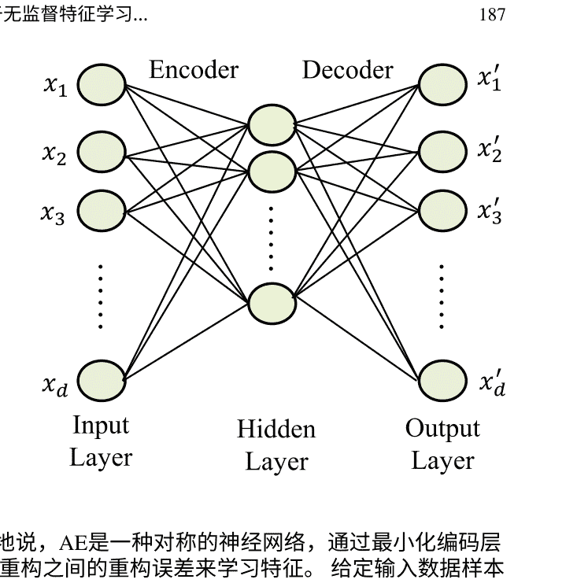

如图11.1所示。更详细地说，AE是一种对称的神经网络，通过最小化编码层的输入数据与解码层的重构之间的重构误差来学习特征。给定输入数据样本 \(\mathbf{x} \in \mathbb{R}^d\)，编码过程在AE网络中通过应用线性映射和非线性激活函数来实现：

```
\mathbf{y} = \text{sigm}(\mathbf{W}\mathbf{x} + \mathbf{b}_1), \quad (11.1)
```

其中 \(\mathbf{W} \in \mathbb{R}^{d_o \times d}\) 是一个具有 \(d_o\) 特征（编码层中的神经元数）的权重矩阵，\(\mathbf{b}_1 \in \mathbb{R}^{d_o}\) 是编码偏差，\(\text{sigm}(\cdot)\) 是逻辑sigmoid函数。通过一个单独的解码矩阵对编码层中的潜在特征 \(\mathbf{y}\) 进行解码：

```
\hat{\mathbf{x}} = \mathbf{V}^T \mathbf{y} + \mathbf{b}_2, \quad (11.2)
```

其中解码矩阵 \(\mathbf{V} \in \mathbb{R}^{d_o \times d}\)，\(\mathbf{b}_2 \in \mathbb{R}^d\) 是解码偏差。给定训练样本集合 \(\mathbf{X}=[\mathbf{x}_1, \mathbf{x}_2, \ldots, \mathbf{x}_N]\)，通过最小化似然函数的重构误差来学习数据中的潜在特征 \(\mathbf{Y}\)，其中似然函数的重构误差为 \(L(\mathbf{X}, \hat{\mathbf{X}}) = \|\mathbf{X} - \hat{\mathbf{X}}\|^2 = \sum_{i=1}^N \|\mathbf{x}_i - \hat{\mathbf{x}}_i\|^2\)，其中 \(\hat{\mathbf{X}}\) 为所有重构数据，参数 \(\mathbf{W}, \mathbf{V}, \mathbf{b}_1, \mathbf{b}_2\) 可以通过最小化 \(L(\mathbf{X}, \hat{\mathbf{X}})\) 来优化。受数据表示的自然稀疏性的启发，目标激活函数引入了稀疏自编码器（SAE）[5,6]，SAE的代价函数定义为：

```
< \mathbf{W}, \mathbf{V}, \mathbf{b} > = \arg\min_{\mathbf{W},\mathbf{V},\mathbf{b}} L(\mathbf{X}, \hat{\mathbf{X}}) + \lambda \sum_{j=1}^{d_o} K L(\rho \| \hat{\rho}_j), \quad (11.3)
```

其中 λ 是稀疏惩罚的权重，ρ 是潜在特征 Y 的目标平均激活值，而 ρ̂_j = 1/N Σ_{i=1}^N y_{ji} 是 j-th 输入向量 y_j 在 N 个训练数据上的平均激活值。KL(·) 表示 Kullback-Leibler 散度[5]，其定义如下：

$$KL(ρ \parallel \hat{ρ}_j) = ρ \log \frac{ρ}{\hat{ρ}_j} + (1 - ρ) \log \frac{1 - ρ}{1 - \hat{ρ}_j} \quad (11.4)$$

它对潜在特征施加了稀疏性约束。

#### 11.4 自学习的残差自编码器

尽管自编码器（AE）和稀疏自编码器（SAE）旨在通过最小化输入数据的重构误差来优化参数 <W, V, b>，但是在进一步处理中不可避免地会产生残差误差：X^{Res} = X - \hat{X}，这是无法再恢复的。在目标任务，尤其是细粒度图像处理中，可能会丢失残差误差，因此本研究提出了进一步堆叠 SAE 来编码残差误差，而不是传统堆叠 SAE 框架中学习到的隐藏特征。所提出的残差 SAE 的代价函数如下：

$$< \mathbf{W}^{Res}, \mathbf{V}^{Res}, \mathbf{b}^{Res} > = \text{argmin} \, L^{Res}(\mathbf{X}^{Res}, \mathbf{\hat{X}}^{Res}) + λ \sum_{j=1}^{d_o} KL(ρ^{Res} \parallel \hat{ρ}_j^{Res}) \quad (11.5)$$

其中 W^{Res}, V^{Res}, b^{Res} 是编码权重矩阵、解码矩阵和残差 SAE 中的编码/解码偏差。我们可以堆叠更多的残差层来学习非常微小结构的潜在特征，全局目标函数可以被表述为：

$$< θ, θ^{Res1}, θ^{Res2}, \ldots > = \text{argmin} \, β_1 L(\mathbf{X}, \mathbf{\hat{X}}) + β_2 L^{Res1}(\mathbf{X}^{Res1}, \mathbf{\hat{X}}^{Res1}) + \ldots + λ \sum KL(ρ, ρ^{Res1}, \ldots) \quad (11.6)$$

其中 θ = <W, V, b>, θ^{Res1} = <W^{Res1}, V^{Res1}, b^{Res1}>, θ^{Res2} = <W^{Res2}, V^{Res2}, b^{Res2}> 表示原始 SAE 中的优化参数，分别表示一级和二级残差 SAE 中的优化参数。β_1, β_2 和 β_3 是不同级别残差 SAE 中重建误差的权重。SAE、残差 SAE 中隐藏层的激活值可以作为输入数据的表示特征。图11.2显示了所提出的残差 SAE 的示意概念，其中 d, d_1, d_2, \ldots 分别表示输入层、原始 SAE 中的隐藏层、一级和二级残差 SAE 中的神经元数量。

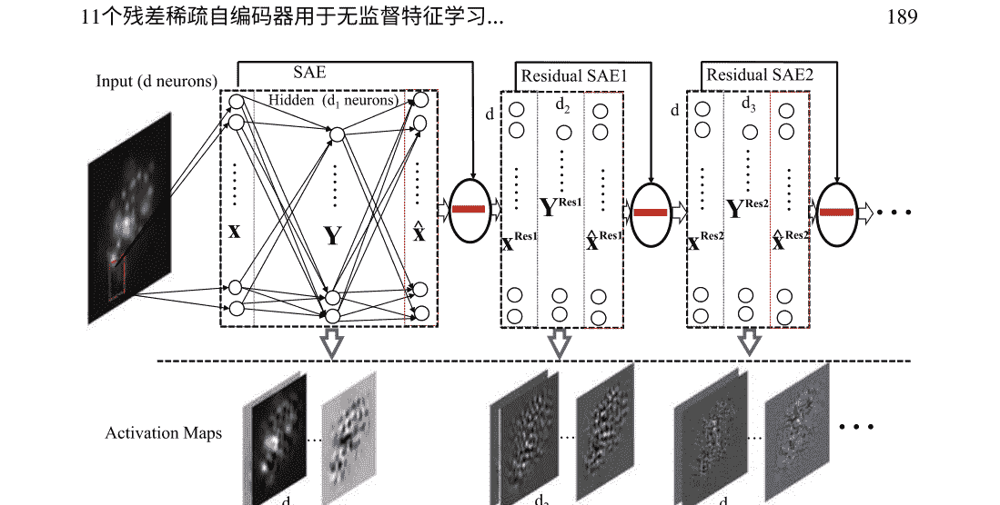

图11.2 所提出的残差SAE的示意概念。我们堆叠了几个SAE来学习前一个SAE中无法恢复的残差的潜在特征，直到重建误差足够小。

此外，我们使用目标HEp-2细胞图像提取图像块以形成$d$维向量，作为所提出的残差SAE的训练样本。学习到的权重：$\mathbf{W}$，$\mathbf{W}^{Res1}$，$\mathbf{W}^{Res2}$被重新转换为原始图像块的大小以进行可视化。残差SAE的可视化权重显示在图11.3中，这些权重在后续级别的残差SAE中展现了更多的细节结构。

#### 11.5 残差SAE的聚合激活用于图像表示

正如我们提到的，原始SAE中的输入数据是从输入图像中滑动提取的向量化的$l \times l$局部区域。我们假设原始、第一级和第二级残差SAE中隐藏层的神经元数量分别为$d_1$，$d_2$和$d_3$，因此我们可以为每个局部区域获得$d_1$，$d_2$和$d_3$的激活值。通常，给定一个$m \times n$的图像，我们可以提取$l \times l$的局部区域作为焦点像素，其中心像素为$(m-l) \times (n-l)$。因此，在具有$d_k$个神经元的（残差）SAE中，隐藏层的激活值可以重新排列为大小为$(m-l) \times (n-l)$的$d_k$个映射。图11.2的底部行展示了不同级别SAE中获得的激活映射。我们还提供了三级残差SAE中隐藏层的几个激活映射，用于2个HEp-2细胞图像。

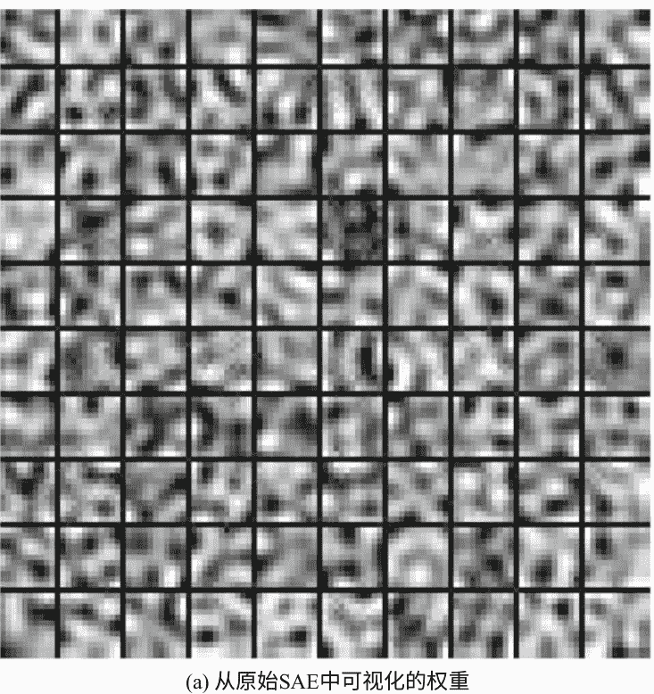

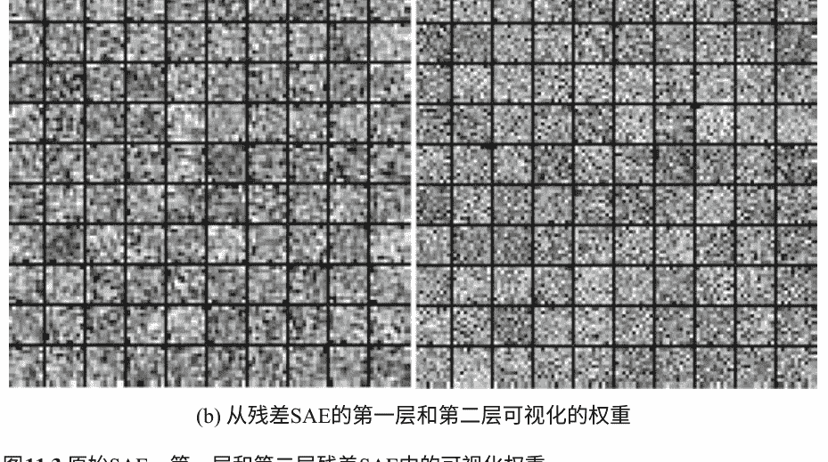

## **图11.3 原始SAE、第一层和第二层残差SAE中的可视化权重**

# Input Image Maps of Raw SAE First Res. SAE Second Res. SAE

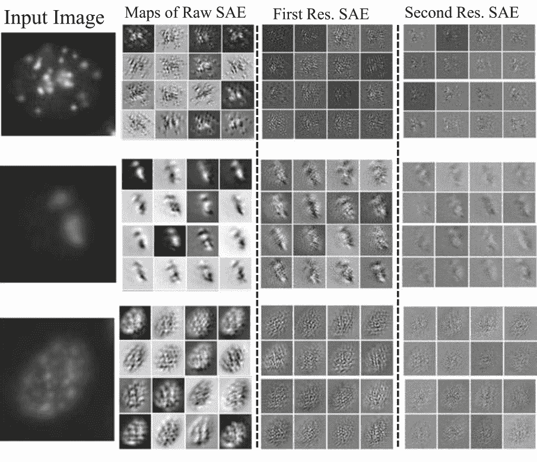

图11.4 三层残差SAE中隐藏层的多个激活图像对于2个HEp-2细胞图像

图11.4中的2个细胞图像显示了残差SAE后期的详细结构。由于HEp-2细胞图像的大小不同，残差SAE中的激活图像的大小会相应地改变。为了获得HEp-2图像表示的相同长度特征，我们将每个激活图像分成相同数量的区域，并平均聚合一个区域中的激活值以形成最终表示。在HEp-2细胞图像的陪伴下，该数据集还提供了细胞区域掩码，我们对细胞掩码图像应用形态学运算（膨胀/腐蚀等）来形成中心、中间和边界区域，用于激活聚合，这被称为基于环状空间区域的聚合方法，如图11.5所示。根据三层残差SAE中隐藏层的神经元数量：d₁, d₂和d₃可以为HEp-2图像表示生成一个 (d₁ + d₂ + d₃) * 3维特征向量。

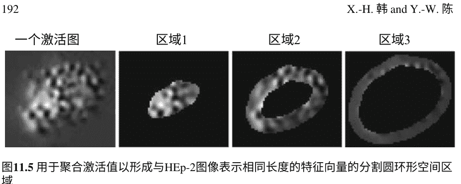

#### 11.6 实验

本节介绍了使用提出的残差SAE进行图像表示的医疗背景和实验结果。

##### 11.6.1 医疗背景

在ANA测试中，通常使用HEp-2基质，并且需要对荧光强度和染色模式进行分类，这是一项具有挑战性的任务，影响IIF诊断的可靠性。 为了分类荧光强度，亚特兰大乔治亚州疾病控制和预防中心（CDC）[49]制定的指南建议由两名医生IIF专家独立进行半定量评分。 根据强度，评分范围从0到4+：阴性（0），非常微弱的荧光（1+），明确的模式但减弱的荧光（2+），较不明亮的绿色（3+）和明亮的绿色或最大荧光（4+）。 这些值相对于阴性和阳性对照的强度。 具有阳性强度的细胞允许医生检查制备过程的正确性，而具有阴性强度的细胞代表检查中玻片的自体荧光水平。 为了减少多次阅读的变异性，Rigon等人[50]最近提出通过统计分析多名医生的荧光强度分类之间的变异性，将荧光强度分为三类：阴性、中间和阳性。

开放的ICIP2013 HEp-2数据集包括两种强度类型的HEp-2细胞，中间和阳性，研究的目的是根据强度类型（中间或阳性）识别染色模式。 研究的染色模式主要包括六类：

- (1) 均匀：特点是间期细胞核的弥漫染色和有丝分裂细胞染色质的染色；
- (2) 斑点状：特点是间期细胞核的颗粒状染色，然后由细和粗斑点状图案组成；
- (3) 核仁状：特点是间期细胞核仁中聚集的大颗粒，趋向于同质性，每个细胞少于六个颗粒；
- (4) 着丝粒状：特点是分布在间期细胞核中的几个离散斑点（~40-60），在有丝分裂期间特征性地出现在凝聚的核染色质中，形成一条紧密关联的斑点条；
- (5) 高尔基体：也称为高尔基器官，是最早被发现和详细观察的细胞器之一。它由被膜包裹的结构堆叠组成，被称为囊泡；
- (6) NuMem：缩写为核膜，以抗-gp210和抗-p62抗体产生的细胞核周围的荧光环。

在开放的ICIP2013 HEp-2细胞数据集中，有超过10000张图像，每张图像显示一个单独的细胞，这些图像是通过裁剪细胞的边界框从83个训练IIF图像中获得的。关于不同染色模式的详细信息请参见表11.1，并在图11.6中显示了所有六种染色模式的正面和中间强度类型的示例图像。使用提供的HEp-2细胞图像及其对应的模式，我们可以提取对图像表示有效的特征，并使用细胞图像的提取特征和相应的染色模式学习一个分类器（或映射函数）。使用构建的分类器（映射函数），可以自动预测任何HEp-2细胞图像的染色模式。

表格 11.1 不同染色模式和不同强度类型的细胞图像编号

|            | 均匀的 | 斑点状的 | 核仁的 | 着丝粒的 | 核膜的 | 高尔基体的 |
| :--- | :---: | :---: | :---: | :---: | :---: | :---: |
| 阳性的 | 1087 | 1457 | 934 | 1387 | 943 | 347 |
| 中间的 | 1407 | 1374 | 1664 | 1364 | 1265 | 377 |

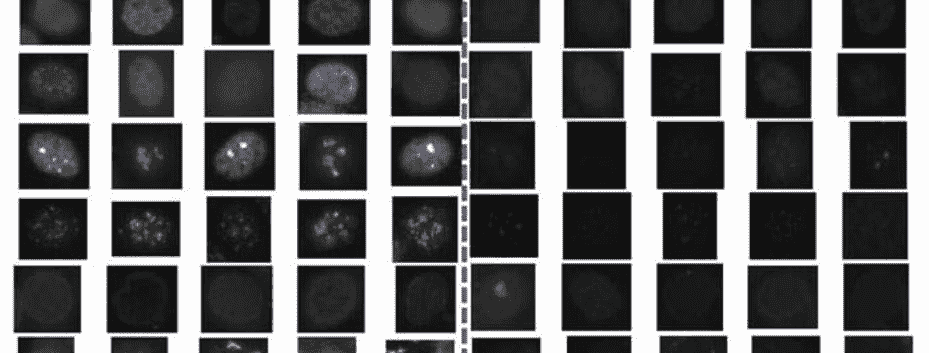

##### 11.6.2 实验结果

使用HEp-2细胞图像的两种强度类型（中间和阳性），我们通过应用我们提出的残差SAE和传统的SAE来验证识别性能。在我们的实验中，我们随机选择每种染色模式中的 Q （Q =10，30，⋯，310）个细胞图像作为训练图像，其余的图像作为中间和阳性强度类型的测试图像。提出的残差SAE的输入是从HEp-2细胞图像中矢量化的7 ×7（将l设置为7）个局部区域。对于每个HEp-2细胞图像，可以提取出许多局部区域，并且从隐藏层中提取的每个神经元的所有提取的局部区域的潜在特征可以重新排列成特征图，如图11.4所示。我们可以提取每个HEp-2细胞图像的(d1 + d2 + d3)个特征图，并使用基于环形空间区域的聚合作为HEp-2细胞图像表示的相同维度向量。为了对不同染色模式的HEp-2细胞图像进行分类，线性SVM被用作分类器，因为与其他分类器（如K最近邻）相比，线性SVM的效果更好，并且与非线性SVM相比，它的分类速度更快，需要更少的时间来对样本进行分类。上述过程重复进行20次，最终结果是20次运行的平均识别性能，计算为所有测试样本中正确分类的细胞图像的百分比。图11.7a和b分别显示了‘阳性’和‘中间’强度类型的比较识别率，其中‘第一（原始SAE）’表示使用传统SAE的图像表示，‘第二’、‘第三’表示来自单个隐藏层的特征图的聚合特征：残差SAE的第二、第三层级，‘第二和第三’表示来自残差SAE的第二和第三层级的特征图，‘2层’和‘3层’分别表示我们提出的具有两个和三个隐藏层的残差SAE。可以清楚地看到，对于‘阳性’和‘中间’强度类型，提出的残差SAE可以优于传统的SAE。

此外，我们改变了SAE和残差SAE的局部区域大小，并提取了聚合表示来评估识别性能。图11.8显示了不同局部区域大小（LR大小）的比较识别准确率，从中可以看出增加局部区域的大小对于“正面”类型的性能有一定的改善，而对于“中间”类型则有一定的降低。此外，我们将不同局部区域大小（7,9,11）的残差SAE的聚合图像表示与原始图像表示进行了结合，并对HEp-2细胞进行了识别实验。图11.8还给出了“正面”和“中间”类型的识别准确率，结果显示通过组合多尺度残差SAE进行潜在特征提取可以获得更好的性能。

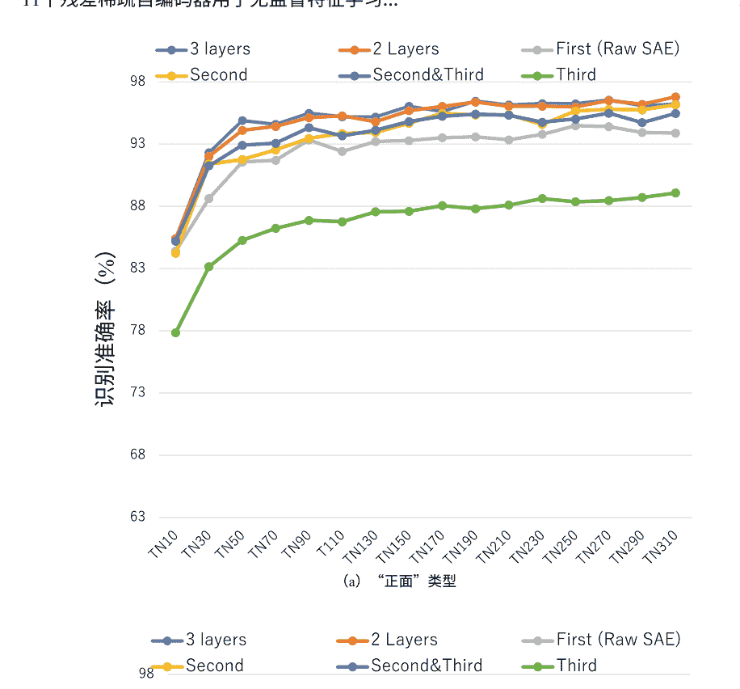

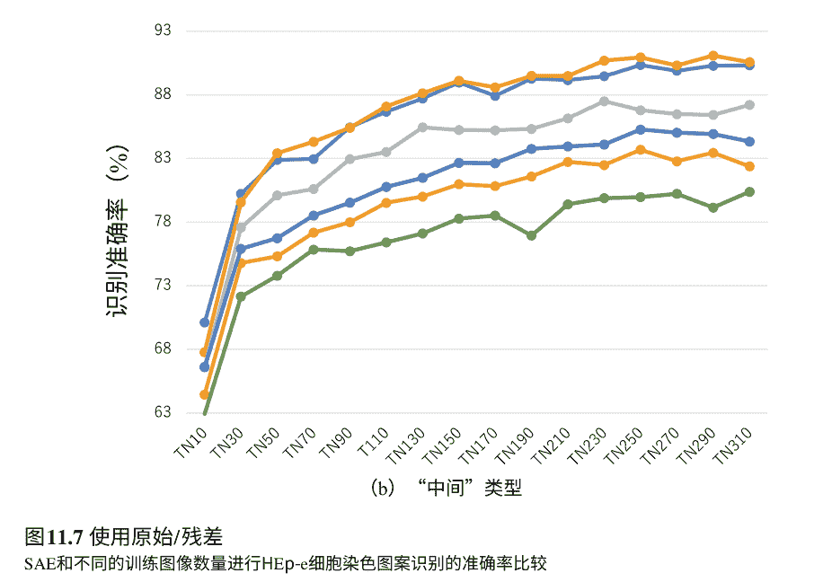

图11.7 使用原始/残差SAE和不同的训练图像数量进行HEp-2细胞染色图案识别的准确率比较

识别准确率（%）

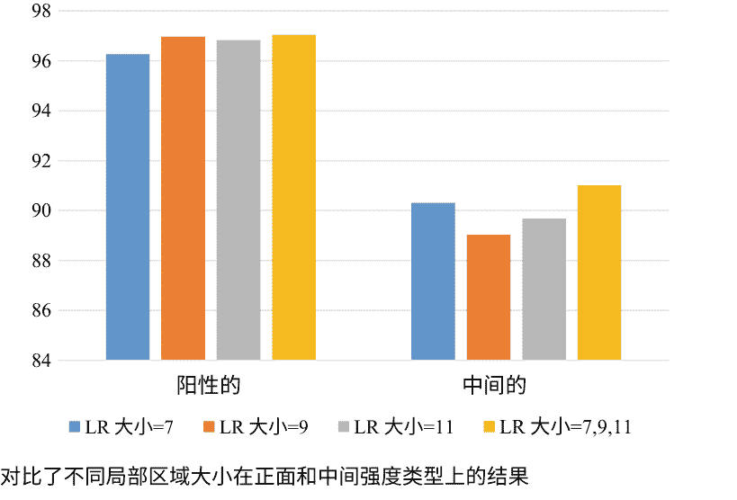

图11.8 对比了不同局部区域大小在正面和中间强度类型上的结果

表11.2 比较了我们提出的残差SAE和现有方法[48, 52, 53]的性能

|            | GLRL [52] | SGLD [52] | Laws [52] | rSIFT [53] | MP [53] | FN [48] | 我们的 |
|------------|-----------|-----------|-----------|------------|---------|---------|--------|
| 阳性的     | 77.23     | 84.37     | 94.68     | 91.9       | 95.29   | 97.90   | 98.45  |
| 中间的     | 39.33     | 49.75     | 81.06     | 78         | 86.91   | 91.93   | 92.24  |

接下来，我们在相同的实验条件下，将我们提出的残差SAE与现有方法[47, 51, 52]进行了实验结果比较，结果在HEp-2细胞染色体模式识别的表11.1中展示，并展示了我们提出的方法（表11.2）可以获得有希望的性能。

#### 11.7 结论

我们提出了一种新颖的残差SAE网络，用于自学习微小结构的潜在特征在精细医学任务中。我们利用残差SAE来建模残差重建误差，这在前一个SAE中消失并且无法再恢复，从而学习更小结构的潜在表示。我们对HEp-2图像表示进行了提出的残差SAE评估，并证明了可以实现染色体模式识别的有希望性能。

致谢 这项工作部分得到了日本MEXT的科学研究补助。

## 参考文献

1. Conrad, K., Schoessler, W., Hiepe, F., Fritzler, M.J.: 自身免疫性系统性疾病中的自身抗体。 Pabst Science Publishers, Lengerich (2002)
2. Conrad, K., Humbel, R.L., Meurer, M., Shoenfeld, Y.: 自身抗原和自身抗体：诊断工具和理解自身免疫的线索。 Pabst Science Publishers, Lengerich (2000)
3. Foggia, P., Percannella, G., Soda, P., Vento, M.: HEp-2细胞分类方法的基准测试。IEEE Trans. Med. Imaging 32(10), 1878–1889 (2013)
4. Hiemann, R., Hilger, N., Sack, U., Weigert, M.: 优化自动图像获取的荧光图像的客观质量评估。Cytom. Part A 69(3), 182–184 (2006)
5. Soda, P., Rigon, A., Afeltra, A., Iannello, G.: 免疫荧光图像的自动获取：算法和评估。在：第19届IEEE国际计算机医学系统研讨会，第386-390页 (2006)
6. Huang, Y.L., Chung, C.W., Hsieh, T.Y., Jao, Y.L.: 使用分水岭分割在间接免疫荧光图像中检测HEp-2细胞的轮廓。在：IEEE国际传感器网络、普适计算和可信计算会议上，第423-427页（2008年）
7. Huang, Y.L., Jao, Y.L., Hsieh, T.Y., Chung, C.W.: 间接免疫荧光图像中HEp-2细胞的自适应自动分割。IEEE国际传感器网络、普适计算和可信计算会议，第418-422页（2008年）
8. Bach, F.R., Jordan, M.I.: 学习谱聚类及其在语音分离中的应用。J. Mach. Learn. Res. 7, 1963–2001 (2006)
9. Banfield, J.D., Raftery, A.E.: 基于模型的高斯和非高斯聚类。生物统计学49, 803–821 (1993)
10. Boyd, S., Parikh, N., Chu, E., Peleato, B., Eckstein, J.: 通过交替方向乘子法进行分布式优化和统计学习。Found. Trends Mach. Learn. 3(1),1–122 (2011)
11. Dempster, A.P., Laird, N.M., Rubin, D.B.: 通过EM算法从不完整数据中获得最大似然估计（讨论）。JRSS-B 39, 1–38 (1977)
12. Fan, J., Li, R.: 通过非凸惩罚似然和它的oracle属性进行变量选择。JASA 96, 1348–1360 (2001)
13. Fraley, C., Raftery, A.E.: R中的MCLUST版本3：正态混合建模和基于模型的聚类。华盛顿大学统计学系技术报告504号（2006）
14. Han, X.-H., Chen, Y.-W., Nakao, Z.: 一种基于ICA的泊松噪声降噪方法。人工智能讲义，第2773卷，第1449-1454页。Springer, Berlin (2003)
15. Han, X.-H., Nakao, Z., Chen, Y.-W.: 一种基于ICA域收缩的泊松噪声降噪算法及其在半影成像中的应用。IEICE Trans. Inf. Syst. E88-D(4), 750–757(2005)
16. Elad, M., Aharon, M.: 通过学习字典和稀疏表示进行图像去噪. 在：CVPR 06 (2006)
17. Hale, E.T., Yin, W., Zhang, Y.: 11最小化的不动点延续：方法和收敛性。SIAM J. Optim. 19, 1107 (2008)
18. Hoyer, P.O.: 具有稀疏约束的非负矩阵分解。JMLR 5, 1457–1469 (2004)
19. Kavukcuoglu, K., Ranzato, M.A. LeCun, Y.: 带有稀疏编码算法的快速推理及其在目标识别中的应用, Technical Report CBLL-TR-2008-12-01. Computionaland Biological Learning Lab, Courant Institute, NYU (2008)
20. Lee, H., Battle, A., Raina, R., Ng, A.Y.: 高效的稀疏编码算法. 在：NIPS 06 (2006)

- 李, H., Chaitanya, E., 吴, A.Y.: 稀疏深度信念网络模型用于视觉区域v2。在：神经信息处理系统的进展（2007年）
- 李, H., Grosse, R., Ranganath, R., 吴, A.Y.: 用于可扩展的无监督学习的卷积深度信念网络。在：国际机器学习会议。纽约（2009年）
- 李, Y., Osher, S.: 坐标下降优化用于l1最小化及其在压缩感知中的应用；一种贪婪算法。逆问题成像 3（3），487-503（2009年）
- Mairal, J., Elad, M., Sapiro, G.: 用于彩色图像恢复的稀疏表示。IEEE Trans.Image Process. 17（1），53-69（2008年）
- Mairal, J., Bach, F., Ponce, J., Sapiro, G.: 在线字典学习用于稀疏编码。在：ICML09（2009年）
- Aljalbout, E., Golkov, V., Siddiqui, Y., Cremers, D.: 使用深度学习进行聚类: 分类和新方法（2018）. arXiv预印本 arXiv:1801.07648
- Chen, D., Lv, J., Yi, Z.: 通过学习深度表示进行无监督多流形聚类。在：第31届AAAI人工智能大会的研讨会上，第385-391页（2017）
- Chen, G.: 非参数聚类的深度学习（2015）. arXiv预印本 arXiv:1501.03084
- Coates, A., Ng, A., Lee, H.: 对无监督特征学习中的单层网络进行分析. 在：第十四届国际人工智能和统计学会议论文集, 第215-223页（2011）
- Dizaji, K.G., Herandi, A., Huang, H.: 通过联合卷积自编码器嵌入和相对熵最小化进行深度聚类（2017）. arXiv预印本 arXiv:1704.06327
- Doersch, C., Gupta, A., Efros, A.A.: 通过上下文预测进行无监督视觉表示学习. 在：IEEE国际计算机视觉会议论文集, pp.1422–1430（2015）
- Jégou, H., Douze, M., Schmid, C.: 特征包装. 在：第12届IEEE国际计算机视觉会议论文集. 京都, 日本, pp. 2357–2364（2009）
- Jégou, H., Douze, M., Schmid, C.: 改进大规模图像搜索的特征包. Int.J.Comput. Vis. 87（3）, 316–336（2010）
- Ke, Y., Sukthankar, R.: PCA-SIFT: 一种更具特色的局部图像描述符表示方法。在：IEEE国际计算机视觉模式识别会议论文集, pp. 505–513（2004）
- Kertesz, C.: 基于纹理的前景检测。信号处理、图像处理、模式识别国际杂志 4（4）, 51–62（2011）
- Lazebnik, S., Schmid, C., Ponce, J.: 使用局部仿射区域的稀疏纹理表示。IEEE模式分析与机器智能 27（8）, 1265–1278（2005）
- Lazebnik, S., Schmid, C., Ponce, J.: 超越特征包：空间金字塔匹配用于识别自然场景类别。在：IEEE计算机学会计算机视觉模式识别会议论文集，pp. 2169–2178（2006）
- 刘, L., 王, L., 刘, X.: 在软分配编码的防御中。在：计算机视觉国际会议论文集, 第2486-2493页。西班牙巴塞罗那（2011）
- Lowe, D.: 从局部尺度不变特征进行对象识别。在：计算机视觉国际会议论文集, 第1150-1157页。希腊克基拉（1999）
- Lowe, D.: 尺度不变关键点的独特图像特征。国际计算机视觉杂志 60（2）, 91-110（2004）
- 黄, Y.-L., 钟, C.-W., 谢, T.-Y., 饶, Y.-L.: 使用分水岭分割在间接免疫荧光图像中检测HEp-2细胞的轮廓。在：IEEE国际传感器网络、普适和可信计算会议论文集, 第423-427页（2008）
- Perner, P., Perner, H., Muller, B.: 为HEp-2细胞图像分类挖掘知识。人工智能医学杂志 26, 161-173（2002）
- Soda, P., Iannello, G., Vento, M.: 一种用于分类抗核自身抗体分析中荧光强度的多专家系统。Pattern Anal. Appl. 12（3）, 215–226（2009）
- Hiemann, R., Buttner, T., Krieger, T., Roggenbuck, D., Sack, U., Conrad, K.: 自动筛选和区分HEp-2细胞上非器官特异性自身抗体的挑战。自身免疫性评论 9(1), 17–22 (2009)
- Hiemann, R., Buttner, T., Krieger, T., Roggenbuck, D., Sack, U., Conrad, K.: HEp-2细胞免疫荧光图案的自动分析。纽约科学院年鉴 1109(1), 358–371 (2007)
- Soda, P., Iannello, G. : 在抗核自身抗体分析中的染色模式识别中的分类器聚合。IEEE信息技术生物医学杂志 13 (3), 322–329 (2009)
- Han, X.-H., Chen, Y.-W., Gang, X.: 在HEp-2细胞分类中整合空间和方向上下文的局部三值模式。模式识别信函 82, 23–27 (2016)
- Han, X.-H., Chen, Y.-W.: 使用堆叠的费舍尔网络对HEp-2染色图案进行识别，编码韦伯局部描述符。 Xian-Hua Han和Yen-Wei Chen，模式识别 63,542–550 (2017)
- Hinton, G.E., Salakhutdinov, R.R.: 用神经网络降低数据的维度. 科学 (2006)
- 疾病控制中心: 对间接免疫荧光试验进行质量保证 核抗原自身抗体(IF-ANA): 批准指南. NCCLS I/LA2-A 16(11) (1996)
- Rigon, A., Soda, P., Zennaro, D., Iannello, G., Afeltra, A.: 自动免疫疾病中的间接免疫荧光: 用于诊断目的的数字图像评估. Cytom. B (Clin.Cytom.) 72(3), 472–477 (2007)
- Agrawal, P., Vatsa, M., Singh, R.: Hep-2细胞图像分类: 一项比较分析. 在: 医学影像中的机器学习. 计算机科学讲义, pp. 195–202 (2013)
- Manivannan, S., Li, W., Akbar, S., Wang, R., Zhang, J., McKenna, S.J.: 一种用于分类间接免疫荧光图像的自动模式识别系统，用于分类间接免疫荧光图像的自动模式识别系统。 Pattern Recognit. 12–26 (2016)

# 第三部分 深度学习在医疗保健中的应用

# 第12章 博士Pecker:一种基于深度学习的医学成像计算机辅助诊断系统

程国华和何林阳

摘要 本章旨在展示基于深度学习算法的计算机辅助诊断（CAD）系统在临床应用中的应用，重点关注其IT基础设施设计。与大多数主要解决特定任务的独立应用程序相比，我们解释了基于云的CAD平台的设计选择，该平台可以以高效的方式运行计算密集型深度学习算法。它还提供了现成的解决方案，可以从各种数据源随时随地收集、存储和保护数据，这对于训练深度学习算法至关重要。最后，我们展示了在结论之前使用这种CAD平台分析各种模态的医学成像数据的卓越性能。

#### 12.1 引言

对于各种医疗状况的诊断和治疗在很大程度上依赖于放射学。然而，放射学人员短缺的情况正在发生，而影像需求普遍增加[3]。这种人员危机导致当前的工作人员在高压下工作，从而降低了患者护理的质量。解决这个问题的一种尝试可以通过实施计算机辅助诊断（CAD）系统来提高当前工作流程的效率。这些系统旨在自动定位、识别、分类和量化影像数据上的可疑模式，以减少阅读工作量，并提供潜在更好的解释给放射科医生。随着计算机视觉算法不断改进，在各种临床环境中应用的商业化CAD系统数量迅速增长。目前，大多数这些经过FDA批准的软件是与临床专家一起使用，例如在双重阅读协议中充当第二读者，而其中只有少数几个[9]可以完全自动化。这些系统的规格通常被缩小到预定义环境中的特定任务作为独立应用程序。其潜在原因包括它们是基于小规模数据集设计的，并且其中许多依赖于基于规则的算法设计。这些都是这些系统克服需要混合领域知识的复杂临床问题的瓶颈。随着深度学习生态系统的发展，将独立的CAD系统转向基于云的解决方案是一个自然趋势，这样可以轻松地从世界各地的不同来源收集和保护大规模数据集。这些云还在分布式环境中提供高性能计算单元，从而使计算密集型的图像分析任务成为可能。这些基础设施改进为设计复杂临床问题的算法提供了基础。在本章中，我们通过介绍一个示例：Dr. Pecker，1，展示了这种基于云的CAD解决方案的设计，这是一个屡获殊荣的医学图像分析基于云的解决方案。

除了云端设计的好处外，Pecker博士还提供了多功能和可靠的CAD功能，这些功能严重依赖于深度学习算法。用户能够远程访问诊断服务并实时提供反馈。这些反馈反过来又被转化为未来深度学习算法训练的参考标准。同时，Pecker博士允许第三方集成以丰富其CAD功能，从而能够解决各种临床场景中的复杂问题。在接下来的章节中，我们首先介绍了Pecker CAD系统的设计。然后，我们通过展示几个临床应用来回顾其成功，最后进行总结。

#### 12.2 系统概述

Dr. Pecker基于快速和可靠的图像分析，提供了基于云端的诊断服务解决方案，采用了深度学习技术。在前端方面，Pecker博士提供了用于访问诊断服务和查看结果的工作站，以及用于检查医学图像的认证DICOM查看器。在后端方面，Pecker博士采用模块化方法以确保灵活性，其中组件可以轻松添加或修改以适应临床需求的变化。

它还维护一个动态可扩展的高性能计算集群和存储基础设施，以管理日益增长的医院IT复杂性。尽管Pecker博士提供了安全丰富的公共云服务，但在许多情况下，它也可以根据医院IT基础设施的设计在私有或本地模式下运行。Pecker博士提供的所有API都符合RESTFull标准，实现了与其他服务提供商的集成的平台独立性。

##### 12.2.1 与医院IT的无缝集成

CAD系统的用户体验主要取决于其与临床工作流程的良好集成程度。这种集成涉及两个方面：（1）从最终用户的角度（与CAD交互的用户），他们的临床实践不应因引入CAD系统而受阻。一个充分集成的CAD应该导致所有相关临床应用的使用不再零散。（2）从医院IT的角度来看，CAD系统应该在现有的IT环境中易于维护。简单来说，使用CAD是为了提高诊断效率，而不是增加太多额外的成本。为了实现无缝集成，Pecker博士部署了一个专用工作站以满足在实施临床环境中阅读图像的要求。

例如，Pecker博士提供了一个经过认证的DICOM查看器，用于阅读放射学成像数据。这使用户完全依赖于Pecker博士来处理医学图像，而不需要切换到其他系统。此外，Pecker博士还与医院数据管理系统（如PACS）共享诊断结果。

##### 12.2.2 用户反馈的学习

深度学习是一种数据驱动的方法。深度学习模型需要看到大量的示例才能训练得好。通过提供友好且易于使用的云服务，临床专家可以在家中与Pecker博士进行互动。只要有空，他们就可以进行注释或提供对系统结果的反馈。通过这种方式，将训练示例积累到大规模是可行的，并且底层深度学习模型的性能可以不断提高。同时，Pecker博士还通过处理用户反馈来创新地收集样本，从而对收集的样本质量进行良好的控制。

##### 12.2.3 深度学习集群

许多深度学习算法涉及解决高维优化问题，这些问题通常需要大量的参数，计算量很大。现在许多深度学习任务，如训练和推断，都在GPU上运行，以提高速度。为了能够并行运行多个计算密集型的深度学习任务并有效地进行调度，Pecker博士构建了一个深度学习机器集群，每个集群包含多个GPU，以满足并发性和低延迟方面的服务质量要求。深度学习集群使用技术将标准CPU资源与GPU资源统一起来，以提高容量。

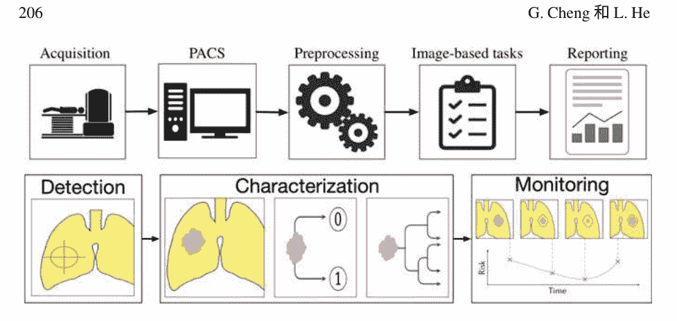

为了最大化资源利用率，集群将2个作业进行容器化，并通过kubernetes引擎进行调度。Pecker博士的深度学习集群还作为一个独立的云计算平台，允许第三方从其物理域中分离出来运行计算密集型作业。

##### 12.2.4 Dr. Pecker工作流程

图12.1展示了放射学中Dr. Pecker平台的工作流程。在放射学中，图像数据被存档到图片存档和通信系统（PACS）中，以允许从图像获取地点到多个物理分散的地点进行经济图像传输。Dr. Pecker与PACS合作，从中提取图像数据并推送结果。Dr. Pecker仅依赖PACS来访问多种模态（DR、CT、MR等）并管理从获取设备的图像数据源的生命周期。一旦在部署的工作站上进行了诊断请求，Dr. Pecker会运行预处理步骤，如去敏感化、压缩、可能的编码和分段，以确保上传到云端之前具有足够的图像质量和完整性。在云端，诊断结果和上传的图像数据的相应摘要被存档，同时通过一组预定义的唯一标识与PACS保持关联。Dr. Pecker云服务还通过使用随访扫描来跟踪同一主题的不同模态和多个时间点的图像数据，以进行综合研究，例如评估治疗反应或复发情况。

图12.2显示了Dr. Pecker工作站在放射学实践中使用的图形用户界面(GUI)。Dr. Pecker工作站配备了一个经过认证的DICOM查看器，可以防止读者在多个工具之间切换。

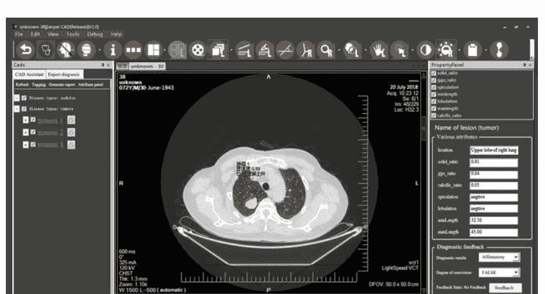

## 图12.2 Dr. Pecker平台的GUI

内置的DICOM查看器还减少了在多个工作站客户系统之间进行不必要的数据传输的复杂性。此外，工作站还可以作为注释工具，合格的读者可以在其中添加关于感兴趣对象的图形或文本描述。工作站还支持相关反馈，用户可以对检索到的诊断结果给出简要意见。来自不同读者对同一目标的反馈根据读者的资质和经验具有不同的权重。这些反馈最终存储在云存储中，并部分选作用于正在使用的深度神经网络的潜在样本更新。

**标准化报告** Pecker博士自动生成结构化医疗报告的诊断结果。与手工编写的放射学报告相比，Pecker博士的结构化报告内容丰富，包括图形可视化以进行更直观的解释，并使用交互式工具，如链接到先前的报告或按重要性进行排名的检查清单。这样的结构化报告可以根据医院规定和放射学实践轻松标准化。由于结构化数据的特性，Pecker博士对其生成的结果进行统计分析，以识别关键信息，这样的分析也对流行病学研究或部门管理和规划有用。在简单的情况下，使用分析的部门可以根据不同单位的阅片工作量分析进行战略性人员配置。在词汇方面，Pecker博士采用了RSNA定义的放射学术语统一语言Radlex，以建立系统中使用的关键词。引入这些广泛接受的词汇术语可以减少后续非关联用户对其报告的困惑，从而进一步提高可读性。

#### 12.3 临床应用

中国是世界上人口最多的国家之一，大约五分之一的全球癌症病例发生在中国，并且癌症已成为该国近年来的主要死因[1, 13]。在2003年至2013年间，有678,842例被诊断为侵袭性癌症的患者记录[14]。癌症筛查已经引入以便在早期阶段检测癌症。然而，由于需要大量的人工努力，并且由于早期癌症的检测中读者之间的不一致性较高，尤其是在多中心设置下进行筛查时，获取协议和设备可能会因中心而异，因此几乎不可能进行大规模的癌症筛查活动。然而，借助Dr. Pecker，大规模的癌症筛查试验可以在分布式环境中进行。不同的站点可以使用多媒体数据格式（如视频会议或语音消息）通过有线或移动互联网进行通信。此外，Dr. Pecker平台使用深度学习技术提供客观的自动癌症检测和定量分析，这些技术是基于对数百万个经过良好注释的临床示例进行训练的。根据预定义的置信区间，来自Dr. Pecker的高分患者将被转介绍给临床专家进行进一步阅读，而定量分析还可以提供有关感兴趣体积的体积、比例和其他特征的有价值信息，以供手动检查。

##### 12.3.1 疾病筛查：以眼科筛查为例

近年来，视网膜疾病的发病率逐渐增加。放射科学中的情况同样严峻，眼科医生人手不足，他们的数量远远不能满足眼科诊断和治疗计划的临床需求，同时，视网膜疾病的整个路径依赖于眼科图像的解释。因此，自然而然地引入像Dr. Pecker这样的CAD系统到眼科工作流程中。Dr. Pecker中用于视网膜图像的算法主要基于深度学习，而创新之处在于图像增强技术，如将低分辨率图像转换为超高分辨率图像、去噪和血管增强滤波。这些方法中的许多与低级像素图像处理的最新发展相关。

##### 12.3.2 Dr. Pecker中的糖尿病视网膜病变（DR）

糖尿病性视网膜病变（DR）是中国导致失明和视力丧失的主要原因之一。这种眼部疾病是视网膜血管的紊乱，最终几乎所有糖尿病患者都会发展出来。早期检测对于避免DR引起的持续视力问题至关重要。Pecker博士提供了一种用于自动DR筛查的CAD系统（DR-CAD），可以识别糖尿病患者需要转诊给眼科医生的患者。该系统不仅对异常组织进行纹理分析，还考虑了周围异常组织的影响。DR-CAD系统使用一组深度学习算法，最初经过训练以识别各种物体结构，如管状、圆形物体和扩散。从Pecker博士自动生成的DR检测医疗报告如图12.3所示。该报告清楚地指示患者是否需要转诊给眼科医生。

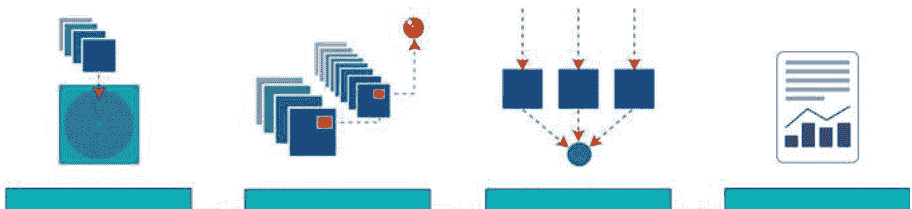

## 图12.3 Pecker博士的糖尿病视网膜病变工作流程

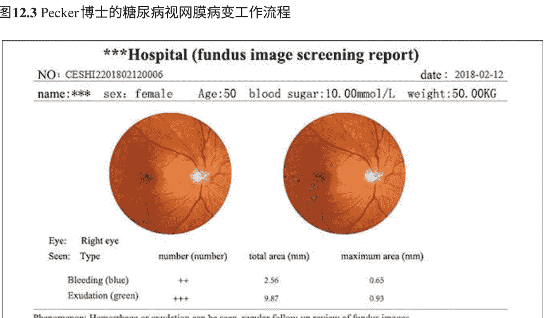

## 图12.4 Pecker博士的DR报告

在Pecker博士的DR-CAD报告中，图12.4显示了运行时效率。为了提高运行时效率，Pecker博士的深度学习模型运行非常快。阅读Kaggle糖尿病视网膜病变挑战赛提供的53276张高分辨率图像[5]总共不到26分钟，并且对所有具有临床意义的病变进行分割最多需要5秒钟。凭借如此快的速度，Pecker博士成为临床实践中的第一位读者，进行快速筛查，问题病例由临床专家进一步评估。深度学习模型在上述Kaggle挑战赛中取得了很好的测试准确率，kappa得分为0.81022。这些模型还使用积累的大规模自有数据集进行了进一步的重新训练，这些数据集来自多个中心的积累。

设置。开发Pecker系统的公司还进行了大规模的观察者研究，结果显示Pecker博士作为第二位读者与临床专家的合作可以大幅提高整体阅读准确性，超过所有参与者。

光学相干断层扫描（OCT）筛查光学相干断层扫描（OCT）是生物组织结构成像技术的一种。在眼科治疗中，通过OCT获得的视网膜组织高分辨率图像可以为医生提供精确的诊断依据。目前，OCT已成为最常用的诊断技术。随着人工智能的快速发展，结合深度学习、迁移学习和弱监督学习等先进技术，Pecker博士提供了一个OCT助理诊断模块，可以通过视网膜OCT图像自动筛查致盲性视网膜疾病，并提供诊断和治疗建议。其准确率已经达到95%以上。该模块可以快速准确地识别脉络膜新生血管化（CNV）、糖尿病性黄斑水肿（DME）、玻璃体疣（DRUSEN）和标准OCT图像，并根据识别结果确定患者是否需要进一步诊断和治疗。诊断结果与经验丰富的人类专家相似。如图12.5所示，OCT助理诊断模块还可以可视化潜在病灶的位置信息，直观地告诉医生结果的原因，增加系统的透明度，也增加诊断结果的可信度。

OCT系统在Pecker博士的合作下，与温州医科大学附属眼科医院合作建立了基于人工智能的眼科疾病筛查平台，取得了出色的临床和社会效益。

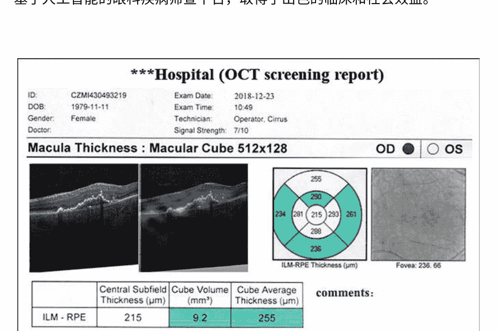

### 12.3.2 病变检测和分割

肺癌是全球癌症死亡的主要原因。癌症的阶段与生存率高度相关。不幸的是，只有16%的肺癌病例在早期被诊断出来。对于扩散到其他器官的远处肿瘤，五年生存率仅为5% [10]，而早期诊断的生存率为55%。肺癌早期诊断的缺乏是因为类似的症状，如咳嗽、胸痛或呼吸困难，也可能出现在许多其他肺部病理中。只有当肿瘤已经很大时，更明显的症状才会变得明显可见。要在早期发现肺癌，一种可能的方法是定期通过医学影像检查对高风险人群进行筛查，如计算机断层扫描（CT）或X射线。

基于国家肺部筛查试验结果[11]，具有特定高风险因素的群体通过低剂量计算机断层扫描（LDCT）进行年度筛查可以显著降低肺癌死亡率。在实践中，肺癌筛查方案分为两个阶段。

第一阶段是从CT扫描中找出所有可见结节，这需要最多的人工努力。基于这些发现，评估结节的恶性概率是至关重要的。Pecker博士设计了具有密集和残差连接的三维沙漏形深度卷积神经网络用于肺结节检测。这种方法放弃了传统的两阶段范式，通过训练单个网络进行端到端检测，无需额外的假阳性减少过程。在肺结节分析2016（LUNA2016）[7]中，Pecker博士创造了世界纪录，并在全球排名第一。我们成功地将这些技术转化为肺结节计算机辅助检测（CADe）产品通过工程化。

Pecker博士的肺结节检测用户界面如图12.6所示。这样的系统通过一组选择的变量（如结节大小和实质比率）对给定扫描的结节进行排名。因此，用户可以轻松导航到感兴趣的结节。Pecker博士还执行自动肺部和叶片分割，以用放射学术语描述结节位置。结节检测通常只指示CT扫描中的结节位置。在许多情况下，准确的分割对于许多关于结节强度、形状和纹理的定量化是有利的。手动描绘病变是昂贵的，因此Pecker博士在结节的自动分割中使用了众所周知的U-Net变体[12]。同时，基于分割结果，Pecker博士测量与肺癌高度相关的病理严重程度，如肺气肿。此外，该系统根据标准模板生成医疗报告，可以用相同的术语进行解释。

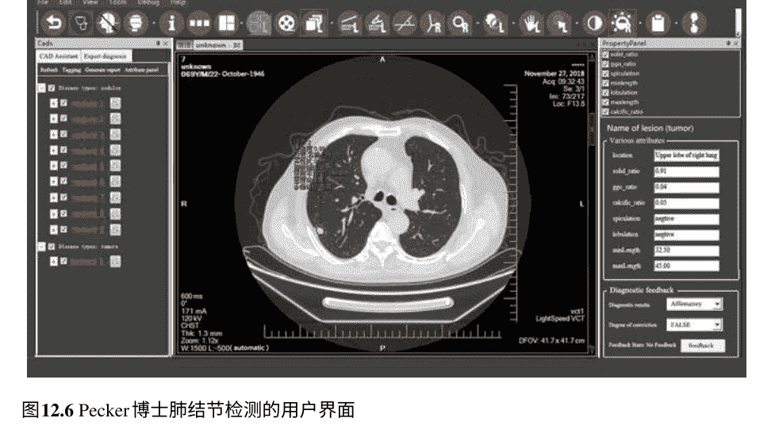

### 图12.6 Pecker博士肺结节检测的用户界面

胸部X射线CAD系统胸部X射线检查是筛查胸部疾病的最基本方法。与CT相比，DR检查具有许多优点，如应用范围广、使用限制小和成本低。然而，与CT相比，DR筛查的误诊率和漏诊率较高，因为它只呈现身体的一个切片。深度学习技术在DR筛查中的应用可以有效地帮助医生做出更准确的诊断。针对X射线图像中的疾病检测问题，Pecker博士利用迁移学习来解释2D图像。为了高效地开发这样一个系统，Pecker博士收集了来自不同医疗中心的大规模数据集，包括胸部CT和X射线。然后，这些数据集通过其云服务进行远程标记。CT成像上的标签被认为是弱监督的，每个带标签的CT扫描都被切成轴向、冠状和矢状视图的2D图像。最后，Pecker博士在手动注释的X射线的指导下以半监督的方式训练深度学习模型，同时也考虑了CT切片。

Pecker博士采用迭代方法来训练和注释图像。通过利用现有模型生成临时参考，标注过程可以被视为简单地标记包含错误的区域。一旦新的标签可用，深度模型可以重新评估和更新。Pecker博士的用户界面用于分析X射线如图12.7所示。

Pecker博士平台已成功推广到中国河南省的87家胸部联盟医院，为87家医院提供胸部疾病的自动筛查。目前，它已经惠及河南省和中国中部其他地区的超过9.5亿人。Pecker博士平台包含完整的用户手册和视频教程，供放射科医生使用。

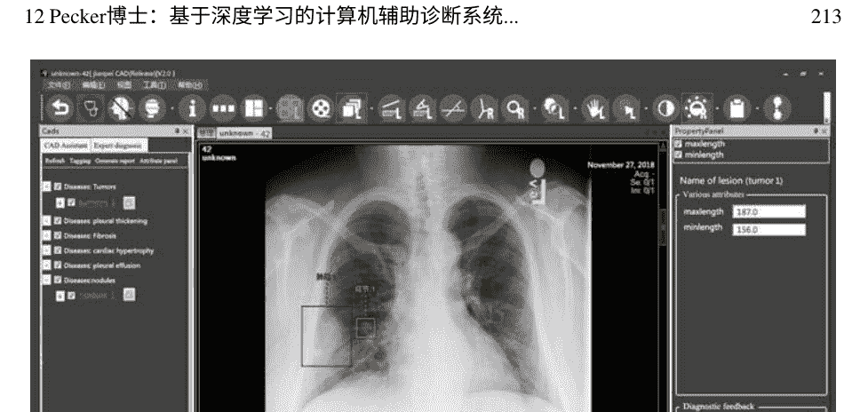

### 图12.7 Pecker博士中胸部X射线的图形用户界面

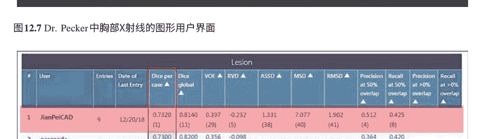

### 图12.8 Pecker博士（JianPeiCAD团队）获得了世界LiTS2018大奖

肝肿瘤分割肝肿瘤模块提供肝组织分割、肝肿瘤分割和定量分析功能。根据肝肿瘤CT图像的特点，Pecker博士设计了一个二维和三维神经网络混合模型，以克服一系列问题：肝肿瘤边界模糊、与正常组织对比度低、结构复杂、灰度多样性以及由于肝肿瘤自动分割不准确而引起的其他伪影。通过全面运用深度学习，Pecker博士相比于标准的分阶段解决方案，取得了更优秀的分割性能，前一步骤的错误不会传播到后一步骤。Pecker博士以0.7320的Dice分数赢得了2018年世界肝脏分割（LiTS）比赛。肝脏分割结果的可视化如图12.8所示。LiTS比赛由慕尼黑理工大学、以色列特拉维夫大学和其他大学、研究机构以及国际医学影像分析顶级年会MICCAI联合组织。当时，来自35个国家的1524支队伍参加了比赛。

##### 12.3.3 诊断和风险预测

### 肺结节的恶性分析

一旦病变被检测到并进行了定量分析，下一步就是进行诊断并评估死亡风险。以肺结节为例，应仔细测量和识别结节特征和恶性相关因素。需要进行随访扫描以跟踪可疑结节的进展。可能会要求进行其他影像学检查，如增强CT，以区分可疑结节的组织。一旦CT检查发现结节高度可疑，就需要进行随后的病理学检查以确认恶性。Pecker医生使用ConvNets应用程序测量检测到的结节的恶性，这归结为解决二元分类问题：良性与恶性。除了使用ConvNets外，它还设计了一种混合模型，将ConvNets的能力与基于规则或特征的结节恶性预测相结合。结节恶性的最著名的基于规则的预测模型是PanCan模型[8]，它根据与结节恶性高度相关的一组变量制定肺癌风险模型，如结节类型、结节位置、结节数量、毛刺的存在和结节大小。在Pecker医生的研究中，这些变量是基于结节分割计算的，并与ConvNet的概率合并，以产生结节被指定为恶性的最终风险因素。

### 乳腺癌筛查

乳腺癌是女性中最常见的癌症类型。早期诊断和乳腺癌筛查有助于提高患者的5年生存率，并具有重要的临床意义。自20世纪80年代以来，研究人员提出了一些钼靶图像的计算机辅助诊断方法。这些算法大多基于传统的CAD算法。

自2012年以来，深度学习逐渐成为计算机视觉的主流方法。Pecker博士使用最新的检测算法MASK RCNN [4]作为主要算法结构。首先，对乳房X线照片进行多级卷积和池化，自动提取特征，然后将特征图输入到区域建议网络（RPN）[2]中，自动提取感兴趣区域（ROI），然后将ROI区域映射到特征图上。最后，使用映射后的特征图来预测病变的分类概率和位置。

> 图12.9展示了Pecker博士在乳腺成像中对肿块的检测结果的可视化。

#### 12.4 结论

在本章中，我们介绍了Pecker博士平台的各种临床应用，并简要解释了Pecker博士在每个应用中使用的算法的设计原则。显然，有大量的训练扫描可用时，深度学习算法在许多常见的成像分析任务中可以与人类观察者相媲美。成像分析任务中，深度学习算法有时甚至优于CAD系统。作为第一读者，CAD可以从大量人群中检测出相关异常，并仅将高风险病例提交给临床专家，从而节省大量时间和人工努力。作为第二读者，CAD系统可以基于广泛的知识库（例如大量的训练数据）提供准确的定量分析和预测，最终改善临床实践中的决策。Pecker博士平台提供了对各种成像模态中各种疾病的全自动检测。它可以轻松集成第三方供应商的算法，以快速丰富其功能。

该公司还与中国多家国家医院和大学保持合作关系，共同研究兴趣。Pecker博士与许多工业合作伙伴建立了牢固的关系，他们提供高性能计算硬件单元和软件基础设施。此外，第三方与Pecker博士平台分享利润，进一步激励他们与Pecker博士合作。Pecker博士在中国的600多家医院中使用，并且每天有超过100,000个病例由Pecker博士阅读。作为基于深度学习算法的云端CAD平台的成功案例，Pecker博士进入了由中国科学院和国家电视台CCTV共同赞助的大规模科技项目“卓越智慧”，如图12.10所示。

## 参考文献

1.  Ferlay, J., et al.: 2012年全球癌症发病率和死亡率：来源、方法和主要模式。国际癌症杂志 136(5), E359–E386 (2015)
2.  Girshick, R.: “Fast r-cnn”. 在: IEEE国际计算机视觉会议论文集, 第1440-1448页 (2015)
3.  Gourd, E.: 英国放射科医师人员短缺危机达到关键水平. Lancet Oncol. 18(11), e651 (2017). ISSN: 1470-2045
4.  He, K. et al., “Mask r-cnn”. 在: 2017 IEEE国际计算机视觉会议(ICCV), 第2980-2988页.IEEE (2017)
5.  Kaggle糖尿病视网膜病变挑战. https://www.kaggle.com/c/diabetic-retinopathy-detection
6.  肝肿瘤分割挑战. https://competitions.codalab.org/competitions/17094
7.  LUNA 2016结节检测大挑战. https://luna16.grand-challenge.org/
8.  McWilliams, A., 等：在第一次筛查CT中检测到的肺结节的癌症概率。N. Engl. J. Med. 369(10), 910–919 (2013)
9.  Melendez, J. 等：结合基于X射线的计算机辅助检测和临床信息的自动化结核筛查策略。Sci. Rep. 6, 25265 (2016)
10. National Lung Screening Trial Research Team：国家肺部筛查试验：概述和研究设计。Radiology 258(1), 243–253 (2011)
11. Ronneberger, O., Fischer, P., Brox, T.: U-net：用于生物医学图像分割的卷积网络。在：国际医学图像计算和计算辅助干预会议，第234–241页。Springer，柏林 (2015)
12. Siegel, R.L., Miller, K.D., Jemal, A.：癌症统计, 2015年。CA：癌症J. Clin. 65(1), 5–29 (2015)
13. Torre, L.A., et al.: 2012年全球癌症统计数据. CA: Cancer J. Clin. 65(2), 87–108 (2015)
14. Zeng, H., et al.: 2003年至2015年中国癌症生存率变化：17个基于人口的癌症登记处的综合分析. Lancet Glob. Health 6(5), e555–e567 (2018)

## 作者索引

- 陈, 丹尼Z., 95
- 程, 国华, 203
- 陈, 清清, 33, 149
- 陈, 婷婷, 95
- 陈, 彦伟, 33, 53, 79, 149, 181
- 冯, 瑞伟, 95
- Foruzan, Amir Hossein, 79
- García Ocaña, María Inmaculada, 3, 17
- González Ballester, Miguel Ángel, 3, 17
- 郭, 若谦, 95
- 韩, 仙华, 33, 149, 181
- 何, 林阳, 203
- 平野, 康彦, 165
- 胡, 宏杰, 33, 149
- 岩本, 雄太郎, 33, 53, 149
- 莱特·乌尔泽莱, 内莱亚, 3, 17
- 连, 春峰, 127
- 梁, 东, 33
- 李, 华丽, 149
- 林, 兰芬, 33, 149
- 林, 志文, 95
- 刘, 明霞, 127
- 刘, 学晨, 95
- 李, 银浩, 53
- 洛佩斯-利纳雷斯·罗曼, 卡伦, 3, 17
- 卢, 一飞, 95
- Mabu, Shingo, 165
- Macía Oliver, Iván, 3, 17
- Mohagheghi, Saeed, 79
- 彭丽英, 149
- Sakanashi, Hidenori, 111
- 申, 丁刚, 127
- Shouno, Hayaru, 111
- 铃木, 爱贵, 111
- 童若风, 149
- 王丹, 149
- 王伟斌, 33
- 张巧薇, 33, 149
- 王文哲, 95
- 王艳杰, 95
- 吴健, 95, 149

© Springer Nature Switzerland AG 2020
Y.-W. Chen and L. C. Jain, 医疗保健中的深度学习
智能系统参考库 171,
https://doi.org/10.1007/978-3-030-32606-7