# 医疗保健中的深度学习导论


曹晓
孙济梦


曹晓·孙济梦

## 深度学习在医疗保健中的介绍

曹晓华盛顿州西雅图美国
孙济梦加利福尼亚州旧金山美国

ISBN 978-3-030-82183-8 ISBN 978-3-030-82184-5 (电子书)
https://doi.org/10.1007/978-3-030-82184-5
© 版权所有编辑（如适用）和作者，独家许可给 Springer Nature Switzerland AG 2021

本作品受版权保护。出版商独家授权，无论是全部还是部分材料，特别是翻译、重印、重用插图、朗读、广播、微缩胶片复制、或以任何其他物理方式的复制，以及传输或信息存储和检索、电子适应、计算机软件，或通过类似或不同的已知或今后开发的方法。

在本出版物中使用一般描述性名称、注册名称、商标、服务标志等，并不意味着即使在没有具体声明的情况下，这些名称也不受相关保护法律和法规的约束，因此可以自由使用。

出版商、作者和编辑可以安全地假设本书中的建议和信息在出版日期时被认为是真实和准确的。出版商、作者或编辑对本文所包含的材料不提供明示或暗示的保证，也不对可能存在的任何错误或遗漏承担责任。出版商在发表的地图和机构隶属方面保持中立。

这个Springer印记由注册公司Springer Nature Switzerland AG出版，注册公司地址是：Gewerbestrasse 11, 6330 Cham, Switzerland

# 前言

> 生活只能向后理解，但必须向前生活。
>
> Søren Kierkegaard

深度学习模型是多层神经网络，在各种应用中取得了巨大的成功。这是一本描述深度学习模型在医疗保健应用中的书籍。

故事1 当我们多年前上了一门人工智能课程时，涵盖了许多主题，包括神经网络。神经网络模型被介绍为一种监督学习方法。然而，与其他更有效的监督学习方法（如决策树和支持向量机）相比，它被认为是一个实际上的失败。当时关于神经网络的常见解释包括两个方面：（1）多层神经网络可以近似任何任意函数，因此是一个理论上强大的模型。（2）在实践中，它们效果不好，原因是学习算法（即反向传播方法）的无效。当我们问为什么反向传播效果不好时，一个典型的答案是关于层间累积误差，这最终会变得太大，无法得到准确的模型。当然，对神经网络的理解在过去几年中有了很大的发展。当大型标记数据集和并行计算基础设施（如图形处理单元（GPU））最终可用时，深度神经网络的威力将得到释放。如今，深度学习模型已成为最受欢迎和标准的机器学习模型。

故事2 当我们多年前首次涉足医疗保健机器学习时，我们与一位资深医生讨论了机器学习和人工智能（AI）在医学领域未来的潜在影响。具体而言，我们询问他是否有可能创建模仿真实世界医生实践的人工智能算法。他对这种可能性非常悲观，因为他相信医生在工作中很大程度上依赖于医疗“直觉”，这是算法无法学习的。当然，现在我们知道这不仅是可能的，而且在诊断等各种临床模式识别任务中，人工智能算法通常能够胜过人类专家。甚至商业医疗设备现在也已经可用（例如，Apple Watch中的房颤检测算法）。许多设备依赖于深度学习模型。 在我们完成这本书之前，我们看到医生在LinkedIn上的个人资料中被列为医疗保健人工智能创新者。

- 美国华盛顿州西雅图 曹晓
- 美国伊利诺伊州香槟市 孙济梦

# 目录

### 1 介绍

#### 1.1 激励应用

- 1.1.1 糖尿病视网膜病变检测
- 1.1.2 早期心力衰竭检测
- 1.1.3 睡眠分析
- 1.1.4 治疗建议
- 1.1.5 临床试验匹配
- 1.1.6 分子属性预测和生成

#### 1.2 谁应该阅读本书?

#### 1.3 作者是谁?

## 1.4 书籍组织

## 1.5 练习

### 2 健康数据

## 2.1 电子健康记录的增长

## 2.2 健康数据

- 2.2.1 健康数据的生命周期
- 2.2.2 结构化健康数据
- 2.2.3 非结构化临床笔记
- 2.2.4 连续信号
- 2.2.5 医学影像数据
- 2.2.6 生物医学数据用于体外药物发现

## 2.3 健康数据标准

## 2.4 练习

### 3 机器学习基础

## 3.3 无监督学习

### 3.3.1 主成分分析

### 3.3.2 聚类

## 3.4 评估指标

### 3.4.1 回归任务的评估指标

### 3.4.2 分类任务的评估指标

### 3.4.3 聚类任务的评估指标

### 3.4.4 评估策略

## 3.5 练习

### 4 深度神经网络（DNN）

## 4.1 单个神经元

- 4.1.1 激活函数
- 4.1.2 损失函数
- 4.1.3 训练单个神经元

## 4.2 多层神经网络

- 4.2.1 网络表示
- 4.2.2 训练多层神经网络
- 4.2.3 参数和超参数

#### 4.3 案例研究：基于电子健康记录数据的再入院预测使用DNN

#### 4.4 案例研究：DNN用于药物属性预测

## 4.5 练习

### 5 嵌入

## 5.1 概述

## 5.2 Word2Vec

- 5.2.1 Word2Vec的思想和公式
- 5.2.2 t分布随机邻域嵌入 (t-SNE)
- 5.2.3 Word2Vec在医疗保健中的应用

#### 5.3 Med2Vec：用于电子健康记录的两级嵌入

- 5.3.1 Med2Vec方法

## 5.4 MiME：嵌入内部结构

- 5.4.1 MiME的符号表示
- 5.4.2 MiME的描述
- 5.4.3 MiME的实验结果

## 5.5 练习

### 6 卷积神经网络（CNN）

# 目录

- 6.3 CNN中的反向传播算法
  - 6.3.1 一维数据的前向和后向计算
  - 6.3.2 特殊的卷积神经网络架构
- 6.4 案例研究：糖尿病视网膜病变检测
- 6.5 案例研究：皮肤癌检测
- 6.6 案例研究：颅内图像自动监测用于急性神经事件
- 6.7 案例研究：淋巴结转移的检测病理学图像
- 6.8 案例研究：心电图心律失常的心脏病专家级检测和在步行心电图中的分类
- 6.9 案例研究：COVID X射线图像分类
- 6.10 练习

- 7 循环神经网络（RNN）
  - 7.1 RNN基础知识
  - 7.2 透过时间的反向传播（BPTT）算法
    - 7.2.1 前向传递
    - 7.2.2 后向传递
  - 7.3 RNN变种
    - 7.3.1 长短期记忆（LSTM）
    - 7.3.2 门控循环单元（GRU）
    - 7.3.3 双向RNN
    - 7.3.4 编码器-解码器序列到序列模型
  - 7.4 案例研究：早期心力衰竭的检测
  - 7.5 案例研究：序列临床事件预测
  - 7.6 案例研究：临床笔记的去识别
  - 7.7 案例研究：学习处方治疗多重疾病的组合
  - 7.8 练习

- 8 自动编码器（AE）
  - 8.1 概述
  - 8.2 自动编码器
  - 8.3 稀疏自动编码器
  - 8.4 堆叠自动编码器
  - 8.5 去噪自动编码器
  - 8.6 案例研究：通过堆叠去噪自动编码器的“深度患者”自动编码器
  - 8.7 案例研究：从嘈杂、稀疏和不规则数据中学习临床数据
  - 8.8 练习

- 9 注意力模型
  - 9.1 概述
  - 9.2 注意力机制

## 9.3 案例研究：纵向电子病历上的注意力模型

## 9.4 案例研究：医学本体上的注意力模型

## 9.5 案例研究：从临床记录中进行ICD分类

## 9.6 案例研究：心脏病检测从心电图中

## 9.7 练习

## 10 图神经网络

## 10.1 概述

## 10.2 图上的符号和任务

### 10.2.1 图上的符号和操作

### 10.2.2 图上的任务

## 10.3 图神经网络

## 10.4 图卷积网络

## 10.5 消息传递神经网络（MPNN）

## 10.6 图注意力网络

## 10.7 案例研究：药物分子中的神经指纹使用GCN进行嵌入

## 10.8 案例研究：Decagon模型建模多药物副作用GCN的影响

## 10.9 案例研究：抗生素的深度学习方法发现

## 10.10 案例研究：STAN时空注意力网络用于疫情预测的GAT

## 10.11 练习

## 11 记忆网络

## 11.1 原始记忆网络

## 11.2 端到端记忆网络

## 11.3 自注意力和Transformer

## 11.4 BERT：深度双向Transformer的预训练

## 11.5 案例研究：Doctor2Vec—医生推荐临床试验招募

## 11.6 案例研究：药物推荐

## 11.7 案例研究：图形增强的预训练用于药物推荐的变压器

## 11.8 练习

## 12 生成模型

## 12.1 生成对抗网络（GAN）

- 12.1.1 GAN框架
- 12.1.2 判别器的损失函数
- 12.1.3 生成器的损失函数
- 12.1.4 GAN的注意事项## 12.2 变分自编码器 (VAE)

### 12.2.1 深度学习视角下的变分自编码器

### 12.2.2 概率模型视角下的变分自编码器

### 12.2.3 重参数化技巧

## 12.3 案例研究：使用生成对抗网络生成患者记录

## 12.4 案例研究：使用变分自编码器生成分子

## 12.5 案例研究：MolGAN，一种隐式生成模型小分子图

## 12.6 练习

# 参考文献

# 第1章 引言

人类是地球上唯一能够通过医学技术主动和系统地改善健康的物种。在整个历史中，人类的知识是推动医学和医疗进步的动力。人类创造了诊断测试、药物、医疗程序和设备等新技术。随着预期寿命的增加，医疗费用在多年来呈指数增长，被认为是不可持续的。例如，仅2019年美国的医疗费用就超过3.6万亿美元，占国内生产总值（GDP）的17.8%。在庞大的医疗支出中，存在着巨大的浪费，应该予以避免。据估计，浪费的总年度成本为7600亿美元至9350亿美元[135]。

同时，大量新的医学知识正在产生，使得人类医生的知识迅速过时。此外，人类医生正在努力跟上日益增长的患者就诊量。在电子健康记录时代，医生的疲劳是一个严重的问题，因为医生需要审查大量的患者数据和复杂的工作流程，包括繁琐的文档任务。患者在短暂的临床就诊中也对医生的有限互动和关注感到不满。医疗质量通常不理想，每年医院发生超过40万起可预防的医疗错误[78]。

随着人工智能（AI）的兴起，机器能否直接创造新的医疗技术？例如，机器能否提供比人类医生更准确的诊断？在人工智能革命的中心，深度学习技术是一组机器学习技术，它学习多层神经网络来支持预测、分类、聚类和数据生成任务。深度学习的成功来自于

-   数据：大量丰富的数据，尤其是图像和自然语言文本，可用于训练深度学习模型。
-   算法：近年来，许多研究人员提出并改进了高效的神经网络方法。
-   硬件：并行计算技术的进步，尤其是图形处理单元（GPU），为深度学习工作负载提供了快速且经济实惠的计算引擎。
-   软件：可扩展且易于使用的编程框架已经通过开源项目发布给公众。其中大多数，包括TensorFlow和Pytorch，在技术行业得到了强大的支持。

本书解释了前两个要素：丰富的健康数据和能够有效建模这些健康数据的神经网络算法。本书不涵盖相关硬件和深度学习软件的进展，因为这些主题与医疗保健应用大部分无关。

医疗数据在所有医疗技术中，电子健康记录（EHR）在近年来得到广泛采用，并对医疗服务产生了巨大影响。EHR的一个重要好处是捕捉到了所有患者的丰富多模态数据。医疗数据包括结构化和非结构化信息。结构化数据包括各种诊断和操作的医疗代码、实验室结果和药物信息。非结构化数据包括（1）临床笔记作为文本，（2）医学影像数据，如X光、心脏超声和磁共振成像（MRI），以及（3）时间序列数据，如心电图（ECG）和脑电图（EEG）。除了临床访问期间收集的数据外，由于可穿戴传感器的日益普及，患者自行生成/报告的数据开始增长。据估计，已经产生了超过100个泽字节的与健康相关的数据[38]。

深度学习模型神经网络模型是一类具有悠久历史的机器学习方法。深度学习模型是由多层神经网络组成的，可以从原始数据中提取多个层次的特征。随着大规模标记数据集和现代硬件（尤其是GPU）的可用性，具有多层的深度神经网络开始展现出明显的性能优势，超过了其他机器学习方法。例如，使用卷积神经网络（一种流行的深度学习模型）的AlexNet在ImageNet竞赛中将错误率降低到15.3%，比亚军低了10个百分点以上[90]。深度学习应用广泛应用于计算机视觉[46, 90]、语音识别[70, 128]和自然语言处理[33, 79, 166]等领域。将深度学习应用于医疗保健是一个自然而有前景的方向，已经取得了许多初步的成功[44, 61]。

## 1.1 激励应用

深度学习在技术行业取得了巨大的成功。非常困难的技术问题取得了惊人的性能提升，如图像分类、机器翻译和语音识别。医疗保健领域有各种有前途的深度学习应用，包括医学图像分析、波形分析、住院患者结果预测、门诊疾病风险预测、治疗建议、临床试验匹配和分子生成用于药物发现。接下来，我们简要介绍一些使用深度学习的具体医疗保健应用。更详细的应用将在后面的每一章中介绍。

### 1.1.1 糖尿病视网膜病变检测

糖尿病视网膜病变（DR）是糖尿病的致命并发症，可以导致失明。DR影响420万成年人。如果早期检测到DR可以治疗。然而，在早期阶段，患者通常没有任何症状。但是，如果没有及时治疗，DR会导致永久的视力损害。黄金标准诊断是由眼科医生进行视网膜照片的手动分级。在低资源环境中，这种诊断的成本和可访问性都具有挑战性。在这种情况下，深度学习模型，即卷积神经网络，已经在基于同样由眼科医生评分的视网膜照片的自动诊断方面取得了初步成功[61]。根据这项研究，训练于超过10万张图像上的深度学习模型可以在ROC曲线下的面积（AUC）上达到专家级的准确性超过99%。像这样的准确自动诊断工具有可能帮助眼科医生加快诊断过程，并快速识别出最需要帮助的患者（图1.1）。

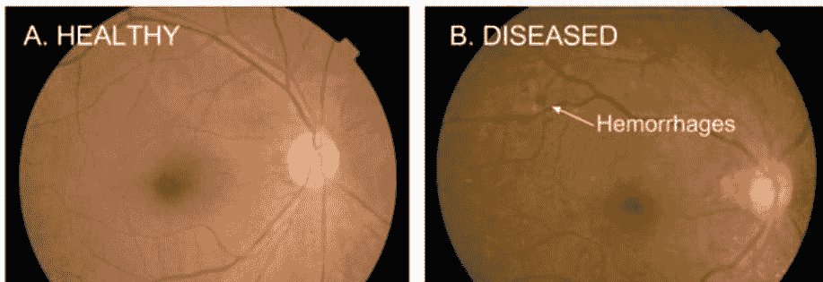

图1.1 来自健康个体和疾病患者的示例视网膜照片。来源：https://ai.googleblog.com/2016/11/deep-learning-for-detection-of-diabetic.html

AUC是一种常见的分类度量标准，将在“实值分类预测”部分详细描述。

### 1.1.2 心力衰竭的早期检测

心力衰竭（HF）是另一种致命疾病，影响着美国约570万人，每年有约825,000个新病例，总年费用约330亿美元。发展HF的终身风险为20%于40岁[2]。HF在诊断后5年内的死亡率约为50%[5]。由于没有有效的HF早期检测手段来测试干预措施，HF的进展相对较慢。Choi等人[30]使用了一种称为循环神经网络的深度学习模型来建模纵向电子健康记录，准确预测HF的发作时间在实际诊断之前的6到18个月。

### 1.1.3 睡眠分析

评分实验室多导睡眠图（PSG）数据仍然是睡眠技术人员的手动任务。他们需要对整晚的睡眠数据进行视觉处理和注释不同的诊断类别，包括睡眠阶段、睡眠呼吸障碍和肢体运动。自动化这个过程的尝试受到了PSG信号的复杂性和患者之间的生理异质性的阻碍。Biswal等人[7]使用了深度循环和卷积神经网络的组合来分配睡眠阶段、检测睡眠呼吸暂停和肢体运动事件。他们的模型分别在睡眠分期、睡眠呼吸暂停和肢体运动的PSG诊断评分中实现了87.6%、88.2%和84.7%的准确率。

### 1.1.4 治疗建议

药物错误是美国第三大死因。食品和药物管理局（FDA）每年收到超过10万份与疑似药物错误有关的报告。为了确保用药安全，已经提出了不同的药物推荐方法，使用了深度学习方法。例如，研究人员尝试基于患者信息（包括诊断、手术和用药历史）建立预测模型，利用丰富的纵向电子健康记录数据提供治疗建议。LEAP [174] 和 GAMENet [134] 是使用深度学习的模型示例，特别是序列到序列模型和记忆网络。

### 1.1.5 临床试验匹配

临床试验在药物开发中起着重要作用，但往往面临昂贵、不准确和招募患者不足的问题。电子健康记录（EHR）和试验入选标准（EC）为开发计算模型招募患者提供了新机会。一个名为患者-试验匹配的关键任务是根据结构化的EHR和非结构化的EC文本（包括纳入和排除标准）找到合格的患者参加临床试验。如何将复杂的EC文本与长期的患者EHR进行匹配？如何嵌入多对多的患者和试验关系？如何明确处理纳入和排除标准之间的差异？COMPOSE [50] 和 DeepEnroll [176] 是用于患者-试验匹配的两个深度学习模型。它们通过搜索EHR数据来识别与试验入选标准描述的匹配患者。

### 1.1.6 分子属性预测与生成

药物发现是为了找到具有治疗目标疾病所需属性的分子。传统的药物发现严重依赖于高通量筛选（HTS），其中涉及许多昂贵的湿实验。鉴于大量的分子数据库及其相关的药物属性（例如来自drugbank），机器学习模型，特别是深度学习模型，在识别有前景的药物候选物方面显示出巨大的潜力。例如，一些深度学习模型被提出用于预测给定输入分子结构的药物属性[105, 139]。还有一些被引入用于生成具有所需属性的全新分子[48, 80]。

## 1.2 谁应该阅读本书？

大多数深度学习书籍侧重于描述算法和基础数学的计算方法，然而，很少有书籍专注于特定领域的应用。我们采用以方法为导向的方法，以医疗保健为目标应用领域。主要目标是想了解深度学习方法及其在医疗保健应用中的研究生和研究人员。理想情况下，读者应具备基本的机器学习背景，但我们在第3章中提供了简要的机器学习概述。读者不需要具备医疗保健或医学背景来阅读本书。另一个目标受众是希望了解深度学习在医疗保健中使用案例的医疗研究人员和数据科学家。最后，有经验的机器学习研究人员和工程师想要了解更多关于医疗保健数据和分析问题的知识，他们可以从这本书中受益。这本书不需要任何计算机编程知识，可以作为深度学习概念及其应用的教材使用。我们故意不涉及编程细节，以便让读者的视野更加开阔。此外，我们意识到深度学习软件的快速发展，我们在编程主题上所写的内容可能很快就会过时。

尽管如此，深度学习的实践练习对于获得实际知识是必不可少的。我们鼓励读者在阅读本书的同时，结合其他实践编程练习、在线教程和其他深度学习软件包的书籍。

## 1.3 作者是谁？

当我们在2021年4月完成这本书时，这是我们的背景。博士 肖曹“Danica”是Amplitude的高级总监，负责数据科学和机器学习。在加入Amplitude之前，她是IQVIA分析中心卓越团队（ACOE）的机器学习主任，位于马萨诸塞州剑桥市。在加入IQVIA之前，她在华盛顿大学获得了博士学位，并在IBM研究部门担任研究员。她的工作重点是开发机器学习和深度学习模型来解决现实世界的医疗保健挑战。

博士 Jimeng Sun是伊利诺伊大学厄巴纳-香槟分校计算机科学系和卡尔伊利诺伊医学院的教授。在伊利诺伊大学之前，他是乔治亚理工学院计算机学院的副教授。他的研究重点是医疗人工智能（AI），包括深度学习用于药物发现、临床试验优化、计算表型学、临床预测建模、治疗推荐和健康监测。他被Deep Knowledge Analytics评为药物发现和先进医疗领域的前100位人工智能领导者之一。

## 1.4 书籍组织

我们根据神经网络技术组织章节。在每个章节中，我们首先介绍具体的神经网络技术，然后提供这些技术在医疗保健领域的案例研究。我们将书籍分为核心部分和高级部分。核心部分包括健康数据（第2章），机器学习基础知识（第3章）以及基本的神经网络架构，即深度神经网络（DNN）（第4章），嵌入（第5章），卷积神经网络（CNN）（第6章），循环神经网络（RNN）（第7章）和自编码器（AE）（第8章）。

-   第2章介绍了各种医疗保健数据，包括结构化数据，如诊断代码，以及非结构化数据，如临床笔记和医学影像数据。本章还介绍了重要的健康数据标准，如国际疾病分类（ICD）代码。
-   第3章介绍了机器学习基础知识。我们介绍了基本的机器学习任务，包括监督学习和无监督学习，以及一些经典的例子（例如，逻辑回归和主成分分析）。我们还描述了不同任务的评估指标，例如分类的接收者操作特征曲线下的面积（AUC）和回归的均方误差。
-   第4章介绍了深度神经网络（DNN），也称为前馈神经网络或多层感知器（MLP）。特别是，我们涵盖了DNN的基本组成部分，包括神经元，激活函数，损失函数和前向/后向传递。当然，我们还介绍了著名的反向传播算法用于训练DNN模型。我们还提供了两个案例研究：医院再入院预测和药物属性预测。
-   第5章介绍了使用神经网络进行嵌入的概念，包括Word2Vec等流行算法以及用于EHR数据的其他领域特定嵌入，如Mec2Vec和MiME。
-   第6章介绍了卷积神经网络（CNN），专为类似于图像和时间序列的网格状数据设计。我们将介绍CNN的重要操作，如卷积和池化，以及一些流行的CNN架构。我们还将描述CNN在医学成像数据和临床波形（如心电图）上的应用。
-   第7章介绍了递归神经网络（RNN），专为处理临床文本等序列数据设计。我们介绍了RNN的重要变体，包括长短期记忆（LSTM）和门控循环单元（GRU）。RNN的案例研究包括心力衰竭预测和临床笔记的去识别。
-   第8章介绍了自编码器模型，一种无监督的神经网络模型。我们还介绍了自编码器的案例研究，包括对EHR数据进行表型划分。

高级部分涵盖了注意力模型（第9章），图神经网络（第10章），记忆网络（第11章）和生成模型（第12章）。

-   第9章介绍了注意力模型，为许多高级深度学习模型打下了基础。我们在几个医疗应用中演示了注意力模型，包括疾病风险预测、诊断代码分配和心电图分类。
-   第10章介绍了另一个高级深度学习模型的基础，即图神经网络（GNN）。图数据在许多医疗任务中很常见，如医学本体和分子图。GNN模型是一组针对图数据的强大神经网络模型。案例研究重点关注药物发现。
-   第11章介绍了基于记忆网络的模型，这是一组用于嵌入复杂数据（如文本和时间序列）的强大模型。我们将介绍原始记忆网络及其强大扩展（如Transformer和BERT模型）的思想。我们在药物推荐任务中演示了记忆网络。
-   第12章介绍了深度生成模型，包括生成对抗网络（GAN）和变分自动编码器（VAE）。我们展示了它们在合成电子病历数据生成和药物发现中的应用。

## 1.5 练习

1.  提供一个降低医疗保健成本的数据科学应用示例，指定构建此类机器学习模型所需的数据集，并描述评估指标。
2.  哪种类型的医疗保健数据在数据量方面被认为是大型数据？
    (a) 基因组数据
    (b) 医学影像数据
    (c) 临床笔记
    (d) 医疗索赔
3.  哪种类型的医疗保健数据在速度方面被认为是最快的？
    (a) 重症监护室的实时监测数据
    (b) 医学影像数据
    (c) 结构化电子健康记录
    (d) 临床笔记
4.  哪一个不是药物发现和开发应用？
    (a) 脓毒症检测
    (b) 分子属性预测
    (c) 临床试验招募
    (d) 分子生成
5.  以下哪个不是药物发现和开发的应用？
    (a) 脓毒症检测
    (b) 分子属性预测
    (c) 临床试验招募
    (d) 分子生成
6.  以下哪个是公共卫生应用？
    (a) ICU中的死亡率预测
    (b) 患者分诊应用
    (c) 心力衰竭的治疗建议
    (d) 预测美国不同地区的COVID19病例

# 第二章 健康数据

健康数据具有多种模式。本章将介绍不同类型的健康数据，包括结构化健康数据（例如，诊断代码、操作代码）和非结构化数据（例如，临床记录、医学图像）。我们还将介绍表示这些数据的流行健康数据标准。

## 2.1 电子健康记录的增长

在过去的十年中，全球范围内越来越多的医疗服务提供者采用电子健康记录（EHR）系统来管理患者数据和医疗服务记录。例如，图2.1显示了根据美国医院协会年度调查，国家基本和认证EHR采用率随时间的增加情况。这里的基本EHR采用曲线对应于具有基本EHR功能的EHR系统，例如患者人口统计信息、医生笔记、实验室结果、药物、诊断、临床和药物安全指南。认证EHR只需涵盖符合卫生与人类服务部门采用的技术能力、功能和安全要求的基本EHR技术。从图2.1可以看出，到2015年，几乎所有报告的医院（96%）都拥有认证的EHR技术。2015年，84.8%的医院至少采用了基本EHR系统；这是自2008年以来的九倍增长。由于广泛部署EHR系统，许多医疗机构已经收集了多样化的健康数据。本章概述了健康数据：可用的不同数据类型、数据的收集方式以及收集者。所有这些数据都是用于训练支持各种医疗任务的深度学习模型的潜在输入。

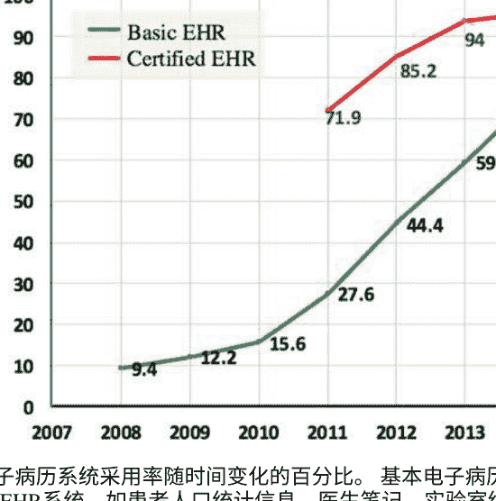

图2.1 电子病历系统采用率随时间变化的百分比。基本电子病历（EHR）是指具有一组必需功能的EHR系统，如患者人口统计信息、医生笔记、实验室结果、药物、诊断、临床和药物安全指南。认证的EHR系统意味着医院拥有由卫生和人类服务部认证的基本EHR技术。来源：美国医院协会年度调查

## 2.2 健康数据

从传统的纸质记录转向电子记录产生了大量的健康数据，为增强患者护理、数据驱动的护理交付和加速医疗保健研究创造了机会。根据美国医疗保险与医疗补助服务中心（CMS）的定义¹，EHR是“患者医疗史的电子版本，由提供者随时间维护，并可能包括与该提供者下的该人的护理相关的所有关键行政、临床数据，包括人口统计学、进展记录、问题、药物、生命体征、既往病史、免疫接种、实验室数据和放射学报告”。从建模的角度来看，EHR可以被视为对患者提供的全面医疗服务的纵向记录和患者医疗史的文档化。关于EHR数据有几个重要观察：

1.  EHR数据主要由提供者管理（尽管目前有一个运动使患者能够将额外的数据添加到他们的EHR中）。
2.  每个提供者都管理自己的EHR系统；因此，关于同一患者的部分信息可能分散在来自多个提供者的EHR系统中。
3.  EHR数据的主要目的是支持准确和高效的计费服务，这为其他EHR数据的二次使用（如研究）带来了挑战。

¹https://www.cms.gov/Medicare/E-Health/EHealthRecords/index.html.

### 2.2.1 健康数据的生命周期

让我们首先从关键医疗保健参与者的角度介绍医疗保健行业的关键参与者和健康数据的生命周期。

关键医疗保健参与者有各种各样的医疗保健机构生成和管理健康数据。

-   提供者是医院、诊所和卫生系统，为患者提供医疗保健服务。提供者使用电子健康记录（EHR）系统记录患者接诊期间发生的一切，如诊断代码、药物处方、实验室和影像结果以及临床记录。提供者与其他参与者（如支付者、药店和实验室）进行互动。
-   支付者是提供医疗保险的实体。它们可以是像联合保健和安泰姆这样的私人保险公司，也可以是像医疗保险和医疗补助这样的政府实体拥有的公共保险计划。支付者向提供者报销与医疗服务相关的全部或部分费用。支付者通过索赔与提供者和药店进行互动。更具体地说，提供者和药店向其所拥有医疗保险的相应支付者提交索赔。索赔通常是结构化的数据，包含诊断、手术和药物代码以及相关费用信息。
-   药店根据药物处方常常准备和发放药物。药店知道患者实际上何时以及何种药物。药店生成药店索赔，也将其发送给患者的支付者以获得报销。
-   制药公司发现、开发、生产和销售药物。他们进行临床试验以验证新药。制药公司产生药物发现的实验数据和临床试验数据。
-   合同研究组织（CROs）为制药公司提供外包合同服务，如临床前和临床研究以及临床试验管理。根据服务线，CROs生成支持制药公司将其药物推向市场的各种数据集。
-   政府机构在医疗保健生态系统中扮演多重角色。食品药品监督管理局（FDA）是批准新药和监控现有药物的最重要的监管机构。疾病控制与预防中心（CDC）是一个专注于监测、控制和预防疾病的公共卫生机构。例如，全球各国政府机构一直在收集来自制药公司、医疗专业人员和消费者提交的自发报告系统（SRS）的报告，以促进市场后药物监测。

这些SRS已经成为市场后药物监测的基石，FDA不良事件报告系统（FAERS）是最重要的SRS之一。

- 患者是医疗保健的核心，他们与其他参与者互动。例如，患者的医疗保险通常由支付者支付。患者也越来越有能力生成和管理自己的与健康相关的数据。大多数电子健康记录系统为患者提供患者门户网站（例如基于Web或应用程序），以评估自己的电子健康记录数据并与医疗保健提供者互动。例如，借助可穿戴传感器（如手环和智能手机），更多人可以获得活动监测数据，如运动和心率，这对于监测个体健康至关重要。

- 研究人员是一个重要的群体，他们试图推动医学和医疗保健研究的前沿。医疗保健研究人员可以具有多种背景，包括医学、生物学、化学、工程学和数据科学。一方面，他们可以在生物学和化学方面进行基础研究，帮助未来发现新药物或理解疾病机制的基础。另一方面，他们可以分析电子健康记录数据，产生能够立即改变临床实践的转化性见解。研究人员产生医学文献和临床指南，这本身就是重要的数据。

健康数据的生命周期 当患者来到诊所或医院时，将创建一个关于这次临床就诊或访问的电子健康记录。这个记录将由医生或护士（或一般的医疗保健提供者）记录下来，以描述这次就诊中发生了什么。 将创建一份临床记录，用叙述性文本描述这次就诊。 然后，将为这次就诊分配各种医疗编码，包括诊断编码、操作编码和药物处方。

可能会要求进行实验室和影像检查，这些检查可以在诊所进行，也可以发送到外部实验室。实验室报告包含结构化数据和非结构化文本。临床就诊结束后，通常由提供者代表患者向支付方提交包含大部分结构化医疗编码的医疗索赔。 然后支付方将核实并偿还与提供者或患者相关的费用。

同时，患者可以将药物处方带到药店来购买他们的药物。 相应的药物将被发放给患者。然后药房可以向付款方提交药房索赔以获得药物的报销。 同时，为了发明新药物，制药公司（pharma）经常与提供者合作，招募患者参与临床试验。许多临床试验由制药公司外部的CRO管理。一旦患者被招募参与试验，与药物疗效和安全性相关的各种测量结果将作为试验结果的一部分进行收集。完整的结果及其分析将提交给FDA进行批准。只有在进行了三个阶段的试验并获得相应的FDA批准后，新药物才能广泛分发。 图2.2展示了不同类型的健康数据及其相关参与者。

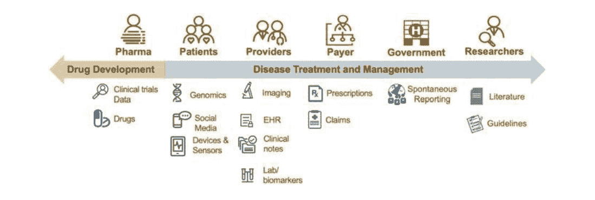

### 2.2.2 结构化健康数据

结构化数据在医疗保健中很常见，通常以医学代码表示。

在电子病历和索赔数据中使用各种医疗代码，通常遵循共同的数据标准。例如，诊断代码遵循国际疾病分类（ICD）；手术使用当前操作术语（CPT）代码。每个数据标准的唯一代码数量庞大且不断增长。

例如，ICD第9版（ICD-9）有超过13,000个诊断代码，而ICD-10有超过68,000个诊断代码。每次就诊只与少数代码相关联。由此产生的数据是高维但稀疏的。表示这种数据的一种简单直接的方法是为医疗代码创建一个独热向量，并为具有多个代码的患者创建一个多热向量，如图2.3所示。例如，要表示一次就诊中的诊断信息，可以创建一个68,000维的二进制向量，其中每个元素是相应诊断代码的二进制指示器。如果只有一个维度为1，其他维度为0，我们称之为独热向量。如果存在多个1，则为多热向量。正如我们将在后面的章节中展示的，可以使用各种深度学习方法改进这种多热向量，以构建适当的低维表示。

大多数医疗代码遵循特定的标准，如诊断的ICD代码，手术的CPT代码，以及药物的NDC代码，这些将在后面的健康数据标准中解释。这些医疗代码大多以医学本体论（如CCS代码）定义的层次结构组织。这些层次结构对于构建更有意义和低维度的深度学习模型的输入特征非常重要。例如，我们可以将每个ICD-10代码直接作为一个特征，而是将它们分组为几百个CCS代码，2个更高级的疾病类别，并将每个CCS代码视为一个特征。

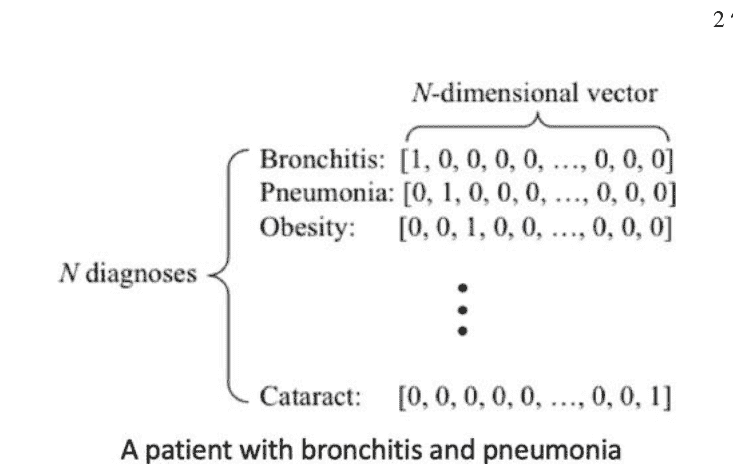

图2.3 医疗代码的独热向量示例，患者的多热向量。 这里的1或0表示特定诊断的存在或不存在

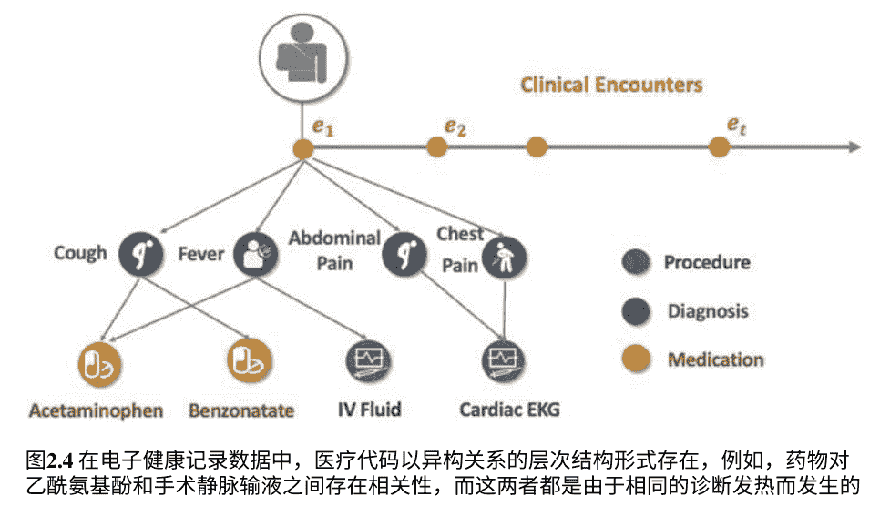

图2.4 在电子健康记录数据中，医疗代码以异构关系的层次结构形式存在，例如，药物对乙酰氨基酚和手术静脉输液之间存在相关性，而这两者都是由于相同的诊断发热而发生的。

所有医疗代码在一个就诊中以层次方式相互关联，如图2.4所示。特别是，电子病历数据可以被看作是一个个体患者记录的集合，每个患者在一段时间内有一系列的就诊。在一个就诊中，会分配多个相互关联的医疗代码。一旦分配了诊断代码，就会创建相应的药物医嘱和手术医嘱。每个药物医嘱包含药物代码、开始日期、结束日期和说明等信息。手术医嘱包含手术代码和可能的实验室结果。如图2.4所示，手术过程如下

表2.1电子病历中的结构化数据

| 代码 | 标准 | 示例 |
|------|------|------|
| 诊断 | 国际疾病分类 (ICD) | S06.0x1A |
| 手术 | 当前操作术语 (CPT) | 70010 |
| 实验室 | 逻辑观察标识符名称和代码 (LOINC) | 5792-7 |
| 药物 | RxNorm, ATC |  |
| 人口统计学 | NA | 性别，年龄 |
| 生命体征 | NA | 数值 |
| 行为状态 | NA | 吸烟状态 |

表2.2电子病历的非结构化组成部分

| 组件 | 描述 | 格式 |
|------|------|------|
| 出院小结 | 一次就诊的总结 | 文本 |
| 病程记录 | 带有时间戳的详细描述 | 文本 |
| 放射学报告 | 影像检查的总结 | 图像+文本 |
| 脑电图 (EEG) | 脑活动监测 | 时间序列 |
| 心电图 (ECG) | 心脏监测 | 时间序列 |

作为心脏EKG有几个结果（QRS持续时间，Q-T间隔，备注），但静脉注射液没有。请注意，某些诊断可能与任何药物或程序指令无关。

其他结构化数据除了医疗代码外，还有其他结构化数据，如患者人口统计学信息（例如年龄和性别）、生命体征（例如血压）和社会历史（例如吸烟状态）。这些也被存储为结构化字段在电子病历数据库中。不同的医疗代码使用各种数据标准进行记录，如表2.1和2.2所总结的。

#### 挑战

在分析结构化数据方面存在几个挑战：

1. 稀疏性: 原始数据（如医疗代码）通常是高维且极度稀疏的。例如，对于68,000个可能的ICD-10代码，每个患者就诊可能只有几个代码存在;
2. 时间性:健康数据通常具有重要的时间方面需要进行建模。例如，患者的电子健康记录数据可能包含多次就诊的信息。 发现时间关系对于准确评估或预测任何健康结果至关重要。

### 2.2.3 非结构化临床笔记

临床笔记是为了各种目的而记录的，可以是出院总结中的一次就诊记录，描述处方的原因和用途的药物笔记，用放射学报告解释医学影像结果，或分析实验室检验病理报告中的结果。

这些报告包含不同的功能组件，因此在理解上存在各种困难。

在使用机器学习处理这些非结构化的临床笔记方面，尤其是自动索引、摘要和理解方面，对深度学习方法越来越感兴趣。此外，一些研究关注于将临床自由文本自动分类为标准化的医学编码，这对于生成适当的就诊索赔非常重要[114]。例如，进展记录是一种常用于描述临床接触的临床笔记类型之一。进展记录通常分为四个部分，缩写为SOAP：

- 主观部分描述患者告诉您的内容；
- 客观部分呈现实验室检查结果和影像检查结果；
- 评估部分提供了就诊的诊断；
- 计划部分描述了患者的治疗计划。

有许多不同类型的笔记，包括入院记录、急诊科（ED）记录、进展记录、护理记录、放射学报告、心电图报告、超声心动图报告、医生记录、出院小结和社会工作记录。每种类型的笔记都可以采用非常不同的格式，长度和质量也不同。

#### 挑战

在挖掘临床文本数据方面存在几个关键技术挑战：

1. 高维度临床文本语料库中独特单词的数量很大。许多单词是首字母缩写词，通过上下文理解它们很重要。
2. 外部知识除了电子病历数据中的临床文本外，还有大量的医学知识编码在文本中，例如医学文献和临床指南。能够将这些知识纳入到电子病历数据建模中非常重要。
3. 隐私除了技术挑战外，由于数据非常敏感且涉及个人隐私，访问临床文本是具有挑战性的。因此，很少有临床记录可以公开访问以进行方法开发。而且由于主要涉及隐私问题，共享数据的数量也很有限。

### 2.2.4 连续信号

随着越来越多的新医疗和健康传感器的出现，健康数据中将包含更多的连续信号。临床中最常收集的连续信号包括心电图（ECG）和脑电图（EEG）。心电图通过在胸部、手臂和腿部放置电极来测量电活动。相比之下，脑电图通过在头皮上放置电极来测量大脑的电活动。ECG和EEG都是常规的临床信号，在多通道高频（例如200 Hz）下捕获的生理测量数据。目前，人类医生主要进行心电图和脑电图记录的解读（有时候借助机器的帮助）。除了心电图和脑电图等临床信号外，还有一些消费级可穿戴设备可以监测运动和心率。典型智能手机已经内置了多种传感器，包括加速度计、陀螺仪和心率传感器。

#### 挑战

分析连续信号涉及的两个重要挑战：

1. 噪声传感器数据通常包含大量噪声，使得许多简单模型失效。例如，心电图和脑电图信号很容易受到身体运动和电力线的干扰。
2. 缺乏标签为了创建直接的临床价值，连续信号必须映射到有意义的表型，如疾病诊断。然而，学习这样的映射需要足够的带有连续信号到表型的标记数据，这可能很难获得。因为需要人类专家花费大量时间来生成这些标签。有时候，新型传感器生成的数据还没有得到充分研究，这使得任何人都难以产生准确的标签。

### 2.2.5 医学影像数据

医学影像是为了诊断目的而创建人体的视觉表示。已经引入了各种影像技术，例如X射线摄影、计算机断层扫描（CT）、磁共振成像（MRI）、超声（例如超声心动图）。由多个2D图像和视频生成的数据是2D图像或3D表示。医学影像数据由一个名为“图像存档和通信系统”（PACS）的独立系统存储和管理。图像本身以DICOM格式（医学数字成像和通信）存储和传输。放射科医生根据原始影像数据阅读和标记图像，并编写文本报告（放射学报告）总结结果。放射学报告通常被复制到电子健康记录系统中，以便临床医生和患者可以访问影像检查的结果。由于放射学领域的数字化，大量高分辨率图像及其相应的表型（标签）可用于建模，这引发了对于在放射学任务中使用深度学习的巨大兴趣。因此，使用深度学习进行放射学任务引发了巨大的兴奋 [65, 101]。

#### 挑战

数据质量和可靠性和详细标签的缺乏仍然是分析此类数据的挑战。由于原始输入图像非常大（高维），需要足够的样本来训练准确且具有泛化能力的模型。

### 2.2.6 用于体外药物发现的生物医学数据

体外药物发现是使用计算方法为新药物创建和选择分子化合物的过程。在体外建模中使用的数据包括分子化合物图或序列、蛋白质靶点序列、基因组序列和与疾病相关的知识图。对于分子化合物，分子图表示化合物的结构式，其中节点表示原子，边表示化学键。许多计算模型不直接在其原始图形形式上进行，而是使用专门的编码：

- SMILES: 使用称为简化分子输入行入系统（SMILES）的特殊字符串编码来表示化学化合物。
- ECPF/FCFP: 可以使用功能连接指纹来描述化合物，包括扩展连接指纹（ECPF），它是一个整数标识符或固定大小的位串列表，其中每个标识符和位对应于一个邻居亚结构；类似地，功能类指纹（FCFP）是ECFP的一种变体，将功能特征集成到ECFP指纹中。
- 功能基因在基因数据库（如GeneBank）中以唯一的基因标识符进行描述。还有基因功能的文本描述。

更一般地，各种知识图谱被构建来表示不同数据类型内部和/或之间实体之间的关系。例如，人类疾病网络是疾病本身的分类，疾病-药物网络，疾病-基因网络。这些网络描述了疾病与药物以及疾病与基因之间的关联。

#### 挑战

与 *in silico studies* 相关的数据分析面临着几个重要挑战。

1. 整合领域知识—用于*in-silico*研究的数据主要是化学数据和各种知识图谱。所有这些表示在其领域中都有明确的含义。了解并整合领域知识非常重要。
2. 可解释的模型—由于这些数据的目的是支持药物发现，因此提供更有说服力的证据和可解释的预测解释非常重要。

## 2.3 健康数据标准

接下来，我们将概述医疗保健数据中常用的一组标准。

- ICD代表疾病国际分类，它是一组代表疾病、症状和临床操作的代码[12]。 ICD代码遵循一种层次结构，相关的代码可以分组到更高的类别中。级别类别。ICD代码是由世界卫生组织（WHO）维护的广泛使用的国际标准。截至2020年，最新版本是ICD-11。目前世界上大部分地区都在使用ICD-10。例如，“I50”对应心力衰竭的ICD-10类别，I50.2是收缩性（充血性）心力衰竭，I50.21是急性收缩性（充血性）心力衰竭。ICD代码用于表示电子病历和索赔数据中的疾病诊断。大部分电子病历数据都以ICD-9或ICD-10格式存在ICD代码。ICD-9代码最多有5位数字。第一位数字可以是字母或数字，剩余的数字都是数字。例如，糖尿病没有并发症的ICD-9代码是250.0x。ICD-9代码的前三位数字对应疾病类别。最后的1或2位数字表示疾病的子类别。除了数字代码，ICD-9代码还可以以V或E开头。例如，V85.x是体重指数（BMI）的ICD-9代码。特别地，V85.0对应BMI < 19，V85.1对应BMI在19到25之间，V85.2x表示BMI > 25。ICD-10代码比ICD-9代码更细致。每个ICD-10代码最多有7位数字。第一位数字始终是字母，第二位数字始终是数字，第三到第七位数字是字母数字混合。例如，E10.9是没有并发症的I型糖尿病的ICD-10代码。

• CPT 对应当前过程术语，这是由美国医学协会创建和版权保护的标准。CPT代码代表医生可以记录和计费的医疗服务和程序。CPT代码也遵循分层结构。例如，99201至99215之间的CPT代码对应办公室/其他门诊服务，而高级别类别99201-99499对应评估和管理的代码。与ICD代码一样，CPT代码通常出现在结构化的电子健康记录数据中。

• NDC代码是由食品和药物管理局管理的10位或11位国家药物代码。它由三个部分组成：标签、产品和包装。例如，0777-3105-02是一个NDC代码，其中0777对应于标签制造商Dista Products Company，3105对应于产品Prozac，02表示1瓶中的100粒胶囊的包装。相同药物的不同包装将有不同的代码。从分析建模的角度来看，NDC代码可能过于具体，不能直接用作特征。

• LOINC是实验室测试的术语标准。LOINC代表逻辑观察标识符名称和代码（LOINC）。与其他标准一样，LOINC具有LOINC代码和与代码相关的描述。为了支持实验室测试，LOINC描述遵循特定的格式，包括六个部分：（1）组成部分（分析物）：被测量或观察的物质；（2）属性：分析物的特性；（3）时间：观察的时间间隔；（4）系统（标本）：进行观察的标本；（5）刻度：观察的量化方式：定量、序数、名义；（6）方法：观察的方法（可选部分）。例如，LOINC代码806-0是脑脊液标本中白细胞手动计数的实验室测试。描述的不同部分包括组成部分：白细胞，属性：NCnc（数量浓度），时间：Pt（时间点），系统：CSF（脑脊液），规模：Qn（定量），方法：手动计数。LOINC代码展示了即使是结构化数据也可以编码多个信息方面。

• SNOMED CT是所有医学术语的综合本体论。SNOMED CT代表医学临床术语的系统化命名。SNOMED的核心组成部分包括概念代码（或SNOMED ID），概念描述以及概念之间的关系。例如，22298006是心脏病发作的SNOMED代码；有各种心脏病发作的描述，包括心肌梗死、心脏梗死、心脏梗塞和心脏病发作，心肌梗死（疾病）以及心肌梗死。心脏病发作有许多相关关系，例如与缺血性心脏病（疾病）的父母关系，与急性心肌梗死（疾病）的子关系，与梗死的相关形态关系以及与心肌结构的发现部位关系。从计算角度来看，SNOMED CT提供了一个连接许多临床术语的大型知识图谱，这对于与电子健康记录数据相结合进行预测模型构建非常有用。

除了数据标准外，各种映射软件包可以处理不同类型的医疗数据。

• CCS代码是由医疗成本和利用项目（HCUP）维护的ICD和CPT代码的分层分类。CCS代码的目的是将详细的ICD和CPT代码聚合成临床上有意义的组，以支持更好的统计分析。CCS代码的分类比原始的ICD和CPT代码要少得多。例如，CCS代码大约有几百个，而ICD和CPT有数万个代码。从机器学习建模的角度来看，CCS代码通常比原始ICD和CPT代码更具信息性。

• RxNorm是一种用于药物的术语系统，以及将各种药物提及映射到规范化药物名称的相关软件。RxNorm将药物表达式的同义词分组为药物概念。每个概念都被赋予一个规范化名称。除了药物名称的规范化外，RxNorm还为每种药物创建关系。例如，药物“Naproxen 250 MG口服片”与“口服片”具有剂量关系，与“Naproxen”具有成分关系，并且与“Naproxen口服片”具有is-a关系。

• UMLS是统一医学语言系统的标准，集成了许多生物医学术语。UMLS有三个知识来源：(1)元词库集成了包括ICD、CPT、LOINC、SNOMED和RxNorm在内的许多术语，对概念进行规范化，并为每个概念提供概念唯一标识符（CUIs）；(2)语义网络指定了概念之间的所有关系；(3)词汇工具对字符串进行规范化，处理词汇变体，并为生物医学文本提供基本的自然语言能力。

## 2.4 练习

1. 预测患者结果（例如，死亡）最有用的健康数据是什么？

2. 最易获取的健康数据是什么？为什么？

3. 最难获取和建模的健康数据是什么？

4. 本章未描述的重要健康数据是什么？

5. 以下哪个陈述关于电子健康记录（EHR）是不正确的？

- (a) 来自单个医院的EHR数据包含每个患者的完整临床历史。
(b) 门诊EHR数据被视为点事件。
(c) EHR数据包含纵向患者记录。
(d) 住院EHR数据被视为间隔事件。

6. 以下哪个陈述关于临床笔记是不正确的？

- (a) 它们可以提供患者状态的详细描述。
(b) 大多数EHR系统提供临床笔记功能。
(c) 临床笔记可能包含敏感的受保护健康信息。
(d) 由于其非结构化格式，计算机算法很容易处理这些笔记。

7. 以下哪些是索赔数据的限制？

- (a) 索赔数据中常常会出现编码错误。
(b) 由于索赔数据是用于计费目的，它们不能准确反映患者状态。
(c) 索赔数据很少且难以找到。
(d) 患者的索赔数据通常不完整，因为他们可能去不同的医院。

8. 以下哪个陈述是不正确的？

- (a) 电子健康记录比索赔数据更丰富。
(b) 电子健康记录包含药物处方信息，但不包括是否已经取药。
(c) 医院很少收集连续信号。
(d) 连续信号提供了对患者的客观评估。

9. 以下哪些不是成像数据？

- (a) X射线
(b) 计算机断层扫描
(c) 心电图
(d) 磁共振成像

10. 关于医学文献数据，哪个是正确的？

- (a) 由于自然语言格式，它们很难解析。

(b) 它们嘈杂且质量通常较低。
(c) 它们经常包含敏感的患者身份信息。
(d) 它们以机器友好的格式存在。

### 11. 以下哪个是用于药物的医学本体论？
- (a) CPT代码
- (b) RxNorm
- (c) SNOMED代码
- (d) MESH术语

### 12. 以下哪项不是临床试验数据？
- (a) 试验方案
- (b) 试验适应标准
- (c) 临床试验管理系统中的数据
- (d) 电子健康记录

### 13. 以下哪项关于药物数据不正确？
- (a) 药物通常以分子结构表示。
- (b) 药物数据是标准化的。
- (c) 药物数据通常以3D分子结构编码。
- (d) ChEMBL是一个大型生物活性数据库。

## 第三章 机器学习基础知识

机器学习已经改变了许多行业，包括医疗保健。机器学习中最基本的概念包括（1）有监督学习，用于开发目标疾病的风险预测模型，和（2）无监督学习，用于发现未知的疾病亚型。

有监督学习和无监督学习都期望将各种患者特征建模为人口统计特征，包括年龄、性别和种族，以及过去的诊断特征（例如ICD代码）。关键区别在于有监督学习中存在标签，而无监督学习中不存在标签。标签是对感兴趣目标的黄金标准，例如用于训练再入院预测模型的患者再入院状态。

正如我们将在后面的章节中描述的那样，大多数深度学习的成功都是在有监督学习中。相比之下，无监督学习的潜力是巨大的，因为有大量未标记的数据可用。本章将介绍预测模型流程、有监督和无监督学习的基本模型以及各种模型评估指标。表3.1定义了本章中使用的符号。

| 符号 | 定义 |
|------|------|
| \( x \in \mathbb{R}^M \) | \( M \) 维特征向量 |
| \( x_+ \) | 正类数据点的索引集 |
| \( x_- \) | 负类数据点的索引集 |
| \( y_i \in \{1, 2, \ldots, K\} \) | 数据点 \( i \) 的标签 |
| \( (x_i, y_i) \) | 用于监督学习的数据点 |
| \( x_i \) | 用于无监督学习的数据点 |
| \( N \) | 数据点的数量 |
| \( X \in \mathbb{R}^{M \times N}, y \in \mathbb{R}^N \) | 特征矩阵和标签向量 |
| \( w \) | 权重向量 |

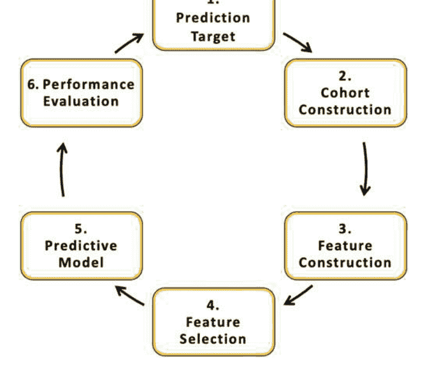

## 3.1 预测建模流程

预测建模流程是从观测数据中构建预测模型的过程。预测建模流程是有监督学习的常见用例。如图3.1所示，这样的流程不是单一的算法，而是涉及以下步骤的计算步骤序列：

1. 我们首先定义预测目标。例如，我们可能想要预测心力衰竭的未来诊断。一个合适的预测目标应该对应用程序很重要，并且在可用数据的情况下可行。

2. 然后，我们需要为这项研究构建患者队列。例如，我们可能会将所有年龄大于45岁的患者纳入心力衰竭研究中。在构建医疗预测模型时，构建队列是必要的原因有很多：（1）根据队列获取数据集可能会有财务成本；（2）我们可能希望为特定患者群体而不是一般人群构建模型；（3）所有患者的完整数据集可能存在各种数据质量问题。

3. 接下来，我们将从数据中构建所有特征，并选择与预测目标相关的特征。在传统的机器学习流程中，我们通常需要考虑特征构建和选择步骤。随着深度学习的兴起，特征通常由神经网络的多个层次隐式创建和选择。

4. 之后，我们可以构建预测模型，该模型可以是分类（例如心力衰竭或非心力衰竭等离散标签）或回归（例如住院时间等连续输出）。

5. 最后，我们需要评估模型的性能并进行迭代。

## 3.2 监督学习

我们将从疾病分类问题开始，这是医疗保健应用中的一个重要的监督学习任务：给定一组患者及其相关的患者数据，将每个患者分配一个离散的标签 \(y \in \mathcal{Y}\)，其中 \(\mathcal{Y}\)是可能的疾病集合。这个问题有许多应用，从研究癫痫检测的脑电图（EEG）时间序列到分析电子健康记录（EHR）以预测心力衰竭诊断。像疾病分类这样的监督学习任务也是许多复杂深度学习架构的基石，我们将在后面讨论。

监督学习期望输入一组\(N\)个数据点；每个数据点由\(m\)个输入特征\(x\)（也称为变量或预测因子）和一个标签组成 \(y \in \mathcal{Y}\)（也称为响应、目标或结果）。监督学习旨在基于观察到的数据点，学习从特征\(x\)到标签\(y\)的映射。如果标签是连续的（例如，医院费用），则监督学习问题被称为回归问题。如果标签是离散变量（例如，死亡状态），则问题被称为分类问题。在本章中，标签\(y\)是\(K\)个类别（即\(y \in \{1, 2, ..., K\}\)）的分类值。

### 3.2.1 逻辑回归

逻辑回归是一种流行的二分类模型。逻辑回归实际上是最简单的神经网络模型，也被称为感知机。接下来，让我们通过一个医疗保健的例子来解释逻辑回归。

假设我们想根据患者的健康特征预测心力衰竭的发作。在这个例子中，如果患者有心力衰竭，则标签\(y=1\)，如果患者没有心力衰竭，则标签\(y=0\)。每个患者都有一个表示人口特征、各种实验室检测的\(M\)维特征向量\(x\)和其他疾病的诊断。分类任务是基于这个\(M\)维特征向量\(x\)来确定一个患者是否会发生心力衰竭。数学上，逻辑回归模型了心力衰竭发生的概率

给定输入特征\(x\)，表示为\(P(y=1|x)\)。然后通过将\(P(y=1|x)\)与阈值（例如0.5）进行比较来进行分类。如果\(P(y=1|x)\)大于阈值，我们预测患者会发生心力衰竭；否则，患者不会发生。

逻辑回归的一个构建模块是对数几率或对数函数。赔率是衡量标签存在和标签不存在的相对概率的数量。

\[ \frac{P(y=1|x)}{1-P(y=1|x)}. \]

赔率越低，给定标签的概率越低。有时我们更喜欢使用对数赔率（赔率的自然对数转换），也称为对数几率函数。

\[ \mathrm{logit}(x) = \log\left(\frac{P(y=1|x)}{1-P(y=1|x)}\right). \]

现在，不再直接对输入特征建模心脏衰竭标签的概率\(P(y=1|x)\)，而是更容易将其对数几率函数建模为线性回归over \(x\):

\[ \log\left(\frac{P(y=1|x)}{1-P(y=1|x)}\right) = w^T x + b \tag{3.1} \]

其中\(w\)是权重向量，\(b\)是偏移变量。方程 (3.1) 是为什么逻辑回归被称为逻辑回归的原因。

在两边取指数并进行一些简单的转换后，我们将得到以下公式。

\[ P(y=1|x) = \frac{e^{w^T x+b}}{1+e^{w^T x+b}} \tag{3.2} \]

使用公式 (3.2) 进行逻辑回归将始终输出介于0和1之间的值，这是作为概率估计的理想情况。

为了简洁起见，我们将\(P(y=1|x)\)表示为\(P(x)\)。现在学习逻辑回归模型意味着在训练数据上估计参数\(w\)和\(b\)。

我们通常使用最大似然估计（MLE）来找到参数。这个想法是估计\(w\)和\(b\)，使得对于训练数据中的数据点\(i\)，预测\(P(x_i)\)尽可能接近实际观测值（在这种情况下为0或1）。

设\(x_+\)为属于阳性类（即心力衰竭）的数据点的索引集合，\(x_-\)为属于阴性类（即无心力衰竭）的数据点的索引集合，MLE中使用的似然函数由公式 (3.3) 给出。

\[ \mathcal{L}(\mathbf{w}, b) = \prod_{a_{+} \in \mathbf{x}_{+}} P (\mathbf{x}_{a_{+}}) \prod_{a_{-} \in \mathbf{x}_{-}} (1 - P (\mathbf{x}_{a_{-}})) \tag{3.3} \]

如果我们对MLE取对数，我们将得到以下公式的对数似然函数在方程（3.4）中。

\[ \log(\mathcal{L}(\mathbf{w}, b)) = \sum_{i=1}^{N} [y_i \log P (\mathbf{x}_i) + (1 - y_i) \log(1 - P (\mathbf{x}_i))] \tag{3.4} \]

请注意，由于 \(y_i\) 或 \(1-y_i\) 中的一个为零，只有两个概率项之一（\(\log P(\mathbf{x}_i)\) 或 \(\log(1-P(\mathbf{x}_i))\)）将被添加。
通过乘以一个负号来得到一个最小化问题，现在我们有的是负对数似然函数，也被称为（二元）交叉熵损失。

\[ J(\mathbf{w}, b) = -\sum_{i=1}^{N} [y_i \log P (\mathbf{x}_i) + (1 - y_i) \log(1 - P (\mathbf{x}_i))] \tag{3.5} \]

最大化对数似然等同于最小化交叉熵损失。
我们可以使用梯度下降法找到最优的 \(\mathbf{w}\) 和 \(b\)。

### 3.2.2 软最大回归

有时我们希望将数据点分类到超过两个类别。例如，给定疑似患有阿尔茨海默病（AD）的患者的脑影像数据，诊断结果包括（1）正常、（2）轻度认知障碍（MCI）和（3）AD。在这种情况下，我们将使用多项逻辑回归，也称为软最大回归来建模这个问题。
假设我们有 \(K\) 个类别，目标是估计类别标签取每个可能类别的概率 \(P(y=k|\mathbf{x})\) for \(k=1,\cdots,K\)。因此，我们将输出一个 \(K\) 维向量，表示所有 \(K\) 个类别的估计概率。数据点 \(i\) 属于类别 \(a\) 的概率可以由公式（3.6）建模。

\[ P(y_i = a|\mathbf{x}_i) = \frac{e^{\mathbf{w}_{a}^{T}\mathbf{x}_i + b_{a}}}{\sum_{k=1}^{K} e^{\mathbf{w}_{k}^{T}\mathbf{x}_i + b_{k}}} \tag{3.6} \]

其中 \(\mathbf{w}_{a}\) 是第 \(a\) 类的权重，\(\mathbf{x}_i\) 是数据点 \(i\) 的特征向量，\(\mathbf{w}_{a}\) 和 \(b_{a}\) 分别是类别 \(a\) 的权重向量和偏移量。为了学习softmax回归的参数，我们通常优化以下所有 \(N\) 个训练数据点的平均交叉熵损失：

\[ J (w) = -\frac{1}{N} \sum_{i=1}^{N} \sum_{k=1}^{K} I (y_i = k) \log(P (y_i = k|\mathbf{x}_i)) \]

其中 \(K\) 是标签类别的数量（例如，在AD分类中有3个类别），\(I(y_i = k)\) 是二进制指示器（0或1），表示 \(k\) 是数据点 \(i\) 的类别。而 \(P(y_i = k|\mathbf{x}_i)\) 是数据点 \(i\) 属于类别 \(k\) 的预测概率。

### 3.2.3 梯度下降

梯度下降（GD）是一种基于数据的迭代学习方法，用于找到最优参数。例如，对于softmax回归参数估计，我们可以使用梯度下降通过计算导数来更新权重。

\[ \nabla_{\mathbf{w}} J (\mathbf{w}) \]

并且根据梯度的相反方向更新权重，如下所示的规则

\[ \mathbf{w} := \mathbf{w} - \eta \nabla_{\mathbf{w}} J (\mathbf{w}) \]

对于每个类别 \(k \in \{1, \cdots, K\}\)，\(\eta\) 是学习率，这是一个需要调整的重要超参数。梯度计算和权重更新是迭代执行的，直到满足某个停止准则（例如，达到最大迭代次数）。这里 \(\nabla\) 是一个微分算子，它将函数 \(J(\mathbf{w})\) 转换为沿每个特征维度 \(x_j\) 的梯度向量。例如，\(\mathbf{x} = [x_1, x_2, x_3]\)，那么梯度向量为

\[ \nabla J (\mathbf{w}) = \left( \frac{\partial J (\mathbf{w})}{\partial x_1}, \frac{\partial J (\mathbf{w})}{\partial x_2}, \frac{\partial J (\mathbf{w})}{\partial x_3} \right) \]

### 3.2.4 随机梯度下降和小批量梯度下降

梯度下降是一种优化目标函数 \(g(\boldsymbol{\theta})\) 的方法，该目标函数由模型参数 \(\boldsymbol{\theta} \in \mathbb{R}^{d}\) 参数化，通过更新参数与目标函数的梯度 \(\nabla_{\theta} g(\theta)\) 相反方向的参数来实现。在大型数据集上计算完整梯度可能非常昂贵，因为它必须处理所有数据点。几种梯度下降变体降低了计算成本，例如随机梯度下降（SGD）和小批量梯度下降。

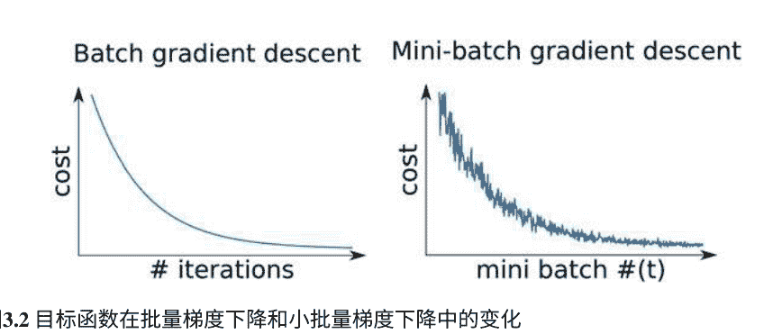

SGD对训练集中的每个数据点执行参数更新。给定数据点\(x_i\)和标签\(y_i\)，SGD执行以下更新：

\[ \theta = \theta - \eta \nabla_{\theta} g(\theta; <x_i, y_i>) \tag{3.7} \]

其中\(\eta\)是学习率，\(g(\theta; <x_i, y_i>)\)是在一个数据点\(<x_i, y_i>\)上评估的目标函数。通过一次更新一个数据点，SGD在计算上更高效。然而，由于SGD基于一个数据点进行更新，它可能具有更高的方差，导致目标函数波动。这种行为可能导致SGD偏离真正的最优解。有几种方法可以缓解这个问题。例如，我们可以逐渐降低学习率，经验上表明SGD的收敛行为与批量梯度下降类似（图3.2）。

小批量方法继承了梯度下降和随机梯度下降的优点。它计算训练数据点的小批量梯度。小批量是一个超参数，小批量梯度下降进行以下更新。

\[ \theta = \theta - \eta \nabla_{\theta} g(\theta; <x_i, y_i>, ..., <x_{i+n-1}, y_{i+n-1}>) \tag{3.8} \]

其中\(<x_i, y_i>, ..., <x_{i+n-1}, y_{i+n-1}>\)是一个批次中的数据点。在这里，梯度是使用数据点的批次进行迭代计算的。通过这样的小批量更新，我们减少了参数更新的方差，并解决了随机梯度下降中不稳定的收敛问题。

## 3.3 无监督学习

在许多医疗保健应用中，标签是不可用的。在这种情况下，我们采用无监督学习模型。无监督学习模型不用于对已知标签\(y\)进行分类（或预测）。相反，我们发现关于输入数据点\(x\)的模式或聚类。接下来，我们简要介绍一些流行的无监督学习方法。

### 3.3.1 主成分分析

假设我们想要研究 \(N\) 个由矩阵 \(\boldsymbol{X} \in \mathbb{R}^{N \times M}\) 表示的 \(M\) 个特征的数据点。在许多医疗保健数据集中，特征的数量 \(M\) 可能很大。例如，有68,000个ICD-9代码，每个代码可以是一个独立的二进制特征。主成分分析（PCA）可以应用于将数据的维度从 \(M\) 降低到一个更低的维度 \(R\)。更具体地说，PCA是一种线性变换：

\(\boldsymbol{Y} = \boldsymbol{X} \boldsymbol{W} \quad (3.9)\)

其中 \(\boldsymbol{X}\) 是原始数据矩阵，\(\boldsymbol{Y} \in \mathbb{R}^{N \times R}\) 是PCA后的低维表示，\(\boldsymbol{W} \in \mathbb{R}^{M \times R}\) 是正交投影矩阵。PCA的目标是最小化重构误差：

\(\min_{\boldsymbol{W}} \| \boldsymbol{X} - \boldsymbol{X} \boldsymbol{W} \boldsymbol{W}^{\top} \|^{2}\)

其中 \(\boldsymbol{X} \boldsymbol{W} \boldsymbol{W}^{\top} = \boldsymbol{Y} \boldsymbol{W}^{\top}\) 是重构矩阵。PCA的解与奇异值分解（SVD）相关。

\(\boldsymbol{X} \approx \boldsymbol{U} \boldsymbol{\Sigma} \boldsymbol{W}^{\top}\)

其中 \(\boldsymbol{U} \in \mathbb{R}^{M \times R}\) 和 \(\boldsymbol{W} \in \mathbb{R}^{N \times R}\) 是包含左右奇异向量的正交矩阵，而 \(\boldsymbol{\Sigma} \in \mathbb{R}^{R \times R}\)。与PCA相关，如果 \(\boldsymbol{X}\) 是高维数据矩阵，则低维表示 \(\boldsymbol{Y} = \boldsymbol{U} \boldsymbol{\Sigma} = \boldsymbol{X} \boldsymbol{W}\)。实际上，PCA可以用作从高维数据（如神经影像数据）中生成特征的特征提取方法。例如，神经影像数据（如磁共振成像（\(\mathrm{MRI}\)）或功能性\(\mathrm{MRI}\)）包含许多体素，其高维度给诊断分类任务带来许多挑战。如果我们将脑体素视为原始特征，我们可以应用PCA生成低维特征以支持下游分类任务。例如，[86]表明，将PCA特征与支持向量机（\(\mathrm{SVM}\)）分类器相结合，在早期诊断阿尔茨海默病方面具有良好的判别能力。

总结一下，作为一种无监督学习方法，主成分分析（PCA）提供了低维线性表示来近似原始的高维特征。事实上，PCA可以通过具有线性激活函数的自编码器神经网络来实现。在后面的章节中，我们可以看到更多关于神经网络如何扩展PCA思想以实现低维非线性嵌入的细节，使用的方法包括自编码器。

### 3.3.2 聚类

除了降维，聚类是无监督学习中的另一个重要主题。聚类方法旨在从数据集中找到同质的组（或簇），使得相似的点在同一个簇中，但不相似的点在不同的簇中。例如，研究人员已经将聚类算法应用于电子健康记录（EHR）数据，将2型糖尿病患者群体分为三个簇，以找到疾病亚型。

一种流行的聚类方法是K-means，它试图将数据分成K个簇，其中用户指定了簇的数量K。聚类分配是通过最小化数据点与相应簇质心（或均值向量）之间的距离总和（例如，欧氏距离）来实现的。K-means方法的描述如下：

算法1: K-means算法
输入: (1) 数据点\(x_1, ..., x_N\); (2) 簇的数量K直到收敛
执行
    初始化K个中心点。
    当未收敛时，执行
        将每个\(x_i\)分配给最近的中心 \(\arg \min_{k \in \{1,2,...,K\}} \|x_i - \mu_k\|\);
        计算此观察值 \((x_i)\) 的 \(C_i\); 更新K个中心 \(\mu_k := (1/|S_k|) \sum_{i \in S_k} x_i\).
返回
    不相交的聚类 \(S_1, S_2, ..., S_K\).

按照上述过程，我们完成了对所有样本的聚类。图3.3展示了迭代聚类过程的可视化，其中我们对具有聚类数 \(K = 2\)的一组点应用了k-means聚类。

## 3.4 评估指标

在本节中，我们将介绍一些机器学习中常见的性能度量和评估策略。

### 3.4.1 回归任务的评估指标

均方误差（MSE）是回归模型最基本的性能度量。MSE的公式如式（3.10）所示。

图3.3 K-Means聚类在具有 $K = 2$ 的一组点上的应用。从左到右，从上到下，我们首先用蓝色十字和红色十字初始化两个聚类中心。经过几次迭代，所有蓝色（红色）点都被分配到蓝色（红色）聚类中，完成了K-means聚类过程。

$$MSE = \frac{1}{N} \sum_{i=1}^{N} (f(\boldsymbol{x}_i) - y_i)^2 \quad (3.10)$$

其中 $f(\boldsymbol{x}_i)$ 是第 $i$ 个数据点的预测值。小的MSE意味着预测值平均接近真实观测值。因此，模型拟合良好。我们可以对MSE取平方根得到另一个常用的指标，称为均方根误差（RMSE）：

$$RMSE = \sqrt{\frac{1}{N} \sum_{i=1}^{N} (f(\boldsymbol{x}_i) - y_i)^2} \quad (3.11)$$

RMSE和MSE在神经网络参数调优中常被使用。例如，[150]中的作者构建了一个前馈神经网络模型，从磁心电图（MCG）数据中找到预后性缺血性心脏病模式。在训练模型时，使用RMSE作为评估指标来帮助选择模型参数，如隐藏层中的节点数和学习周期数（见图3.4）。然后选择导致最低RMSE的超参数作为最终模型。

回归问题的另一个度量是决定系数（也称为 $R^2$），它衡量预测值 $\{f(\boldsymbol{x}_i)\}$ 与实际观测值 $\{y_i\}$ 之间的相关性。$R^2$ 是通过公式(3.11)计算得出的。

## 3.4 评估指标

在 [150] 中，为了训练神经网络模型，使用了均方根误差（RMSE）作为评估指标，包括学习周期数和隐藏层节点数的参数调整。选择具有最低 RMSE 的参数作为最终模型。

$$R^2 = 1 - \frac{\sum_{i=1}^N \left(f(\boldsymbol{x}_i) - y_i\right)^2}{\sum_{i=1}^N \left(\bar{y} - y_i\right)^2} \quad (3.12)$$

其中 $\bar{y} = \frac{1}{N}\sum_{i=1}^N y_i$ 是目标观测值 $y_i$ 的样本均值。$R^2$ 衡量观测值 $y_i$ 与估计值 $f(\boldsymbol{x}_i)$ 之间的“平方相关性”。如果 $R^2$ 接近于 1，则模型的估计值与真实观测结果非常接近。如果 $R^2$ 接近于 0（甚至为负），则意味着估计值与观测结果相差较远。请注意，$R^2$ 可能为负值，这种情况下模型的拟合效果比预测目标观测值 $y_i$ 的简单平均值更差，而与 $\boldsymbol{x}_i$ 的值无关。

### 3.4.2 分类任务的评估指标

对于二元分类，标签 $y_i$ 可以是 1 或 0。例如，$y_i=1$ 表示患者 $i$ 是心力衰竭患者（病例），$y_i=0$ 表示没有心力衰竭的患者（对照）。分类模型有许多性能指标。对于二元分类，预测分数可以是实数值（例如，0 到 1 之间的概率风险分数）或二进制值。

#### 分类的二元预测

如果预测是二进制值，我们可以构建一个 2x2 的混淆矩阵来量化预测和标签之间的所有可能性。特别地，我们统计以下四个数字：正确分类的病例患者数量被预测为病例的真正例（TP）；被错误预测为对照组的病例患者数量为假负例（FN）；被正确预测为对照组的对照组患者数量为真负例（TN）；被错误预测为病例的对照组患者数量为假正例（FP）（表3.2）。

|          | 实际病例 | 实际对照组 |                |
| :------- | :------- | :--------- | :------------- |
| **预测病例**   | 真正例 (TP) | 假正例 (FP) | **精确度** = TP/(TP+FP) |
| **预测对照组** | 假负例 (FN) | 真负例 (TN) | **召回率**=敏感度 = TP/(TP+FN) |
|          |          |            | **特异性** = TN/(FP+TN) |
|          |          |            | **假正例率** = FP/(FP+TN) |
|          |          | **准确率** = (TP+TN)/总计 |                |

表3.2 分类的混淆矩阵和性能指标

混淆矩阵可以得出一些重要的性能指标，包括准确率、精确度（也称为阳性预测值）、召回率（也称为敏感度）、假正例率、特异性和F1分数：准确率是正确预测的比例与总体人口的比值，或者正式地说：

准确率 = $\frac{\text{真正例} + \text{真负例}}{\text{真正例} + \text{真负例} + \text{假正例} + \text{假负例}}$

然而，准确率不能区分真正例（TP）或真负例（TN）。如果有更多的对照组（例如，没有疾病的患者）而不是病例（患有疾病的患者），高准确率可以通过将每个人都分类为对照组（或阴性）而轻松实现。其他指标间接解决了这种类别不平衡的挑战，例如精确度和召回率，它们专注于正类别。精确度或阳性预测值（PPV）是所有病例预测中正确的病例预测的比例：

精确度 = $\frac{\text{真正例}}{\text{真正例} + \text{假正例}} \quad (3.13)$

而召回率，也称为敏感性和真正例率（TPR），是正确预测为病例的病例的比例。

召回率 = $\frac{\text{真正例}}{\text{真正例} + \text{假负例}} \quad (3.14)$

由于精确度和召回率通常是一种权衡，F1分数是一种流行的度量方法，通过将假正例和假负例视为同等重要来将它们结合起来。更具体地说，F1分数定义为精确度和召回率的调和平均值，由以下公式给出：

$$F_{1}=2 \times \frac{\text { 精确率 } \times \text { 召回率 }}{\text { 精确率 }+\text { 召回率 }}$$

关于F1得分的更详细解释可以在[130]找到。特异度也被称为真阴性率，它衡量了正确预测为阴性的比例：

$$\text { 特异度 }=\frac{\text { 真阴性 }}{\text { 假阳性 }+\text { 真阴性 }}$$

一个相关的指标是假阳性率（FPR），它是1-特异度。

#### 分类的实值预测

大多数分类器输出一个介于0和1之间的软预测分数$x$，而不是二进制值。在这些情况下，人们经常需要定义一个分类阈值$\theta$。也就是说，如果$x \geq \theta$，则分类器输出1，否则输出0。然而，正确的分类阈值通常是未知的。为了避免选择$\theta$的值，可以评估在不同$\theta$下的平均性能。

我们将介绍接收操作特征曲线下的区域，称为ROC-AUC或AUROC。在描述ROC-AUC之前，我们需要了解接收操作特征曲线（ROC），其中真正例率（TPR）或召回率或敏感性作为$y$轴，假正例率（FPR）或1-特异性作为$x$轴。ROC-AUC通常用于模型比较，并可以解释为分类器将随机选择的正例分配比随机选择的负例更高的概率。具有更高ROC-AUC的模型被认为是更好的模型。

ROC-AUC相对于准确率的优势在于不需要选择分类阈值。这样，ROC-AUC对于类别不平衡更具鲁棒性。

类似的度量指标是精确率-召回率曲线下的区域，称为PR-AUC或AUPR。精确率-召回率（PR）曲线使用召回率作为$x$轴，精确率作为$y$轴。精确率-召回率曲线下的面积与ROC-AUC具有非常相似的解释，但曲线的可视化表示不同。查看PR曲线可以揭示ROC曲线中不明显的算法差异。例如，图3.5显示了使用ROC和PR曲线进行性能比较。该图来自[167]，其中作者使用药物的分子结构数据构建了机器学习模型来预测不良药物反应。

在性能比较中，结果表明提出的模型（在两个图中均标记为“lda-dummy”）在ROC-AUC和PR-AUC方面均取得了最佳性能。

在ROC空间中，目标是位于左上角，在图3.5的ROC曲线中，基线模型“lasso”与最佳模型“lda-dummy”相当接近。在PR空间中，目标是位于右上角。

图3.5 在[167]中，作者们利用药物的分子结构数据构建了机器学习模型来预测不良药物反应。在性能比较中，结果表明，结合医学本体论的模型在ROC-AUC和PR-AUC方面表现最好。图3.5中的PR曲线显示，“lasso”和“lda-dummy”的性能仍然存在显著差距。

类似的效果在[35]中也被观察和讨论过，作者提供了以下见解：“这种差异的存在是因为在这个领域中，负例的数量远远超过正例的数量”。因此，在ROC分析中，假阳性数目的大幅变化可能导致假阳性率的小幅变化。另一方面，通过将假阳性与真阳性进行比较，而不是真阴性，精确度捕捉了负例数量对算法性能的影响。在医疗保健应用中，由于通常有许多负样本（例如对照组），PR曲线和PR-AUC可能比ROC-AUC更有意义。

#### 多类别分类

除了二元分类，例如心脏衰竭预测，我们还有许多情况下有多个类别，例如疾病预测，其中每种疾病都是一个独立的类别。因此，每个类别都成为一个独立的二元分类任务，这导致了一组不同的性能指标，如精确度和召回率。

在评估多类别分类的整体性能时，人们经常需要对不同类别的性能指标进行平均。计算平均性能有两种常见方法：宏平均或微平均。

假设我们有 $K$ 个类别，令 $TP_k$，$FP_k$，$TN_k$，$FN_k$ 分别表示属于类别 $k$ 的真正预测、假正预测、真负预测和假负预测的数据点数量（其中 $k \in \{1, \cdots, K\}$）。对于每个类别 $k$，我们可以使用（3.15）计算上述指标，例如 $F1$ 得分，表示为 $F1_k(TP_k, FP_k, TN_k, FN_k)$，因为 $F1$ 得分是一个混淆矩阵中的四个值的功能。然后，宏F1是根据公式（3.16）对所有 K类别进行简单平均。

$$ \text{宏F1} = \frac{1}{K} \sum_{k=1}^{K} F1_k(\text{真正例}_k, \text{假正例}_k, \text{真反例}_k, \text{假反例}_k) \quad (3.16)$$

微平均指标的计算方式不同。我们首先将模型对不同类别的真正例、假正例、真反例和假反例的计数相加，构建一个新的混淆矩阵，其中我们有

$$ \text{真正例} = \sum_{k=1}^{K} \text{真正例}_k, \quad \text{假正例} = \sum_{k=1}^{K} \text{假正例}_k $$
$$ \text{真反例} = \sum_{k=1}^{K} \text{真反例}_k, \quad \text{假反例} = \sum_{k=1}^{K} \text{假反例}_k \quad (3.17)$$

然后，我们可以使用公式（3.13）和（3.14）计算微精确度和微召回率。然后，通过将这两个度量值代入公式（3.15），我们可以找到微F1，这也是公式（3.17）中产生的新度量值的函数。

$$ \text{micro-F1} = F1(TP, FP, TN, FN)$$

我们可以按照相同的步骤计算其他微平均和宏平均的度量。一般来说，宏平均给予每个类别相等的权重，而微平均给予每个数据点相等的权重。因此，微平均度量是对大类别中效果的衡量。要观察小类别的性能，需要使用宏平均度量。

### 3.4.3 聚类任务的评估指标

聚类算法通常旨在实现高簇内相似度（即组内相似度）和低簇间相似度（即组间相似度）。这里的相似度通常由距离度量（如欧氏距离和余弦距离）表示。

聚类任务的一个常用指标是轮廓系数，它衡量每个数据点与自身簇内与其他簇的相似程度。轮廓系数的计算如下。设 $d_0(i)$ 为数据点 $i$ 与同一簇内所有其他数据的平均距离，设 $d_1(i)$ 为数据点 $i$ 到任何其他簇内所有数据点的最小平均距离（其中 $i$ 不属于该簇），轮廓系数由公式（3.18）给出。

$$s(i) = \frac{d_1(i) - d_0(i)}{\max\{d_1(i), d_0(i)\}} \quad (3.18)$$

$s(i)$ 的取值范围为 $[-1, 1]$。轮廓系数接近1表示数据点被适当地聚类。而轮廓系数接近 $-1$ 表示数据点被错误地聚类。然后整体聚类性能可以是所有点的平均轮廓系数。

如果已知真实的聚类分配，我们还可以使用其他指标来评估聚类结果，例如兰德指数、互信息和归一化互信息。给定聚类分配 $C$ 和真实的聚类分配 $C^*$，我们可以定义以下指标来评估聚类分配 $C$：

- **兰德指数 (RI)** 其定义是 $a / (n(n-1)/2)$。$a$ 是属于 $C$ 和 $C^*$ 中相同簇的数据点对的数量，$b$ 是属于 $C$ 和 $C^*$ 中不同簇的数据点对的数量，$n$ 是数据点的数量。兰德指数是一个介于0和1之间的分数，其中0表示 $C$ 和 $C^*$ 在任何聚类分配上不一致，而1表示 $C$ 和 $C^*$ 完全一致。
- **互信息 (MI)** 是另一种衡量聚类质量的方法。互信息是信息论中的一个概念，用于衡量两个随机变量的相互依赖性。

$$MI(C, C^*) = \sum_{x \in C} \sum_{y \in C^*} p(x, y) \log \frac{p(x, y)}{p(x)p(y)}$$

其中 $x$ 是具有聚类分配 $C$ 的特定簇，$y$ 是 $C^*$ 中的特定真实簇，$p(x, y)$ 计算数据点同时属于簇 $x$ 和簇 $y$ 的概率。

- **归一化互信息 (NMI)** 是互信息的归一化版本，介于0（无互信息）和1（完美相关）之间。

$$NMI(C, C^*) = \frac{MI(C, C^*)}{\sqrt{H(C)H(C^*)}}$$

其中，$MI(C, C^*)$ 是互信息，$H(C)$ 和 $H(C^*)$ 是熵度量。例如，$H(C) = \sum_{x \in C} p(x) \log p(x)$ 其中 $x$ 是 $C$ 中的一个聚类，$p(x)$ 是聚类 $x$ 的比例。

### 3.4.4 评估策略

交叉验证策略通常用于评估回归和分类模型的性能。总体思路是将整个数据集迭代地分割为训练集和测试集。然后使用测试集来评估模型的性能。模型的性能是从训练集构建的。一个常见的做法是将大部分数据用作训练集，而将一小部分数据用作测试集（例如，90-10的分割）。

一种流行的变体被称为 $K$ 折交叉验证。我们在该策略中将整个数据集随机分成 $K$ 个不重叠的分区或折叠，每个分区大小相等。在进行分割时，应确保不重叠的分区，以避免信息泄漏。例如，要预测患者心力衰竭的风险，其中同一患者可能有多次就诊，重要的是将患者的数据分区，以确保没有患者在分区之间共享。每次我们使用一个分区作为测试集，其余分区作为训练集。我们使用训练数据学习模型，并在测试数据上计算模型的性能指标。我们重复 $K$ 次，直到所有分区都被用作一次测试集。然后，我们计算 $K$ 个分区的平均性能指标，这成为整体模型的性能。另一种众所周知的策略称为留一法交叉验证（LOOCV），实际上是 $k$ 折交叉验证的一种特殊形式，其中每个分区只包含一个数据点。由于计算成本高昂，LOOCV 通常只用于小型数据集。

在深度学习中，数据集变得非常庞大，模型训练和参数调整变得昂贵。由于模型超参数调整，进行交叉验证变得计算上过于昂贵。相反，评估策略转向将大型数据集随机分成三个部分：训练集、验证集和测试集。典型的设置可以是80%的训练集，10%的验证集和10%的测试集。首先，我们通过不同的超参数（例如层数和神经元数量）迭代地在训练集上训练模型，并在验证集上检查模型性能，以确定最佳的超参数设置。然后，我们使用最佳的超参数设置在训练集和验证集的组合上训练另一个模型，并在测试集上检查模型性能。最终在测试集上的性能将被用作真实模型性能的估计。

## 3.5 练习

1.  如果你有一个对500个10维患者记录进行分类的问题，你首先会尝试哪些算法？你最后会尝试哪些算法？
2.  如果你需要对一个庞大的患者数据集（例如十亿个数据点）进行聚类，你会使用什么算法？你会尝试哪些步骤来加快这个过程的速度？
3.  临床预测建模流程中的步骤有哪些？
4.  如何确定一个预测目标是否可行？
5.  以下哪些是构建临床预测模型的标准/良好实践？
    (a) 交叉验证是评估深度学习模型最常用的方法。
    (b) 对于训练深度学习模型，保持验证集和测试集的规模很重要。
    (c) 验证集和测试集可以很小，但应包含具有高质量标签的真实样本。
    (d) 训练数据可以很大且灵活，即使可能存在噪声数据。
6.  给定点的数量\(n\)，聚类数量\(k\)，每个点的维度\(d\)和聚类迭代次数\(i\)，K-means算法的时间复杂度是多少？
7.  计算以下统计数据：总人口，阳性病例，真阳性，预测结果为阴性，真阴性（图3.6）。
8.  继续上一个问题，计算真阳性率，假阳性率，假阴性率，真阴性率。

## 第四章 深度神经网络（DNN）

神经网络是一类机器学习模型，由称为神经元的连接函数单元组成。它们被构建为强大的函数逼近器，可以准确地将输入数据 x 映射到输出 y（即学习一个函数 f（x） ≈ y）通过多层非线性变换。这样的设计使得神经网络能够执行分类和回归等任务。

神经网络中的神经元组织成三个相互连接的层：输入层，隐藏层和输出层。当神经网络具有一个或多个隐藏单元层时，它可以被视为深度神经网络（DNN）。基于不同类型的输入数据，发明了多种变体的DNN。例如，卷积神经网络（CNN或ConvNet）适用于建模图形数据，如图像或连续时间序列。递归神经网络（RNN）适用于建模顺序数据，如文本和临床事件序列。此外，这些变体在解决现实世界的医疗保健问题方面表现出色，例如，CNN用于从图像数据中自动分类皮肤病变[45]，RNN用于从患者纵向电子健康数据中预测临床事件[25,30]。我们将在后面的章节中描述不同的DNN变体。在本章中，我们的重点是基本的深度神经网络（DNN）。我们在表4.1中总结了本章中使用的符号。我们首先描述单个神经元的结构和训练方法，然后转向一个通用的DNN，其中神经元组织在多个相互连接的层中。

## 4.1 单个神经元

为了描述深度神经网络，我们从最简单的一个开始，它由一个单个神经元组成。神经元是一个计算单元，它接收输入值 x = [x1, ..., xn] 和它们对应的权重 w = [w1, ..., wn]。然后，神经元进行计算| 符号 | 定义 |
| :--- | :--- |
| $\mathbf{x}$ | 输入特征向量 |
| $x_i$ | 第i个输入特征 |
| $\mathbf{y}$ | 输出层 |
| $y_i$ | 第i个输出特征 |
| $L$ | 层数 |
| $l$ | 隐藏层的索引 |
| $\mathbf{W}^{(l)}$ | 第$l$层的权重矩阵 |
| $w_{ji}^{(l)}$ | 与第$l$层的单元$i$和第$(l+1)$层的单元$j$相关的权重 |
| $\mathbf{b}^{(l)}$ | 第$l$层的偏置向量 |
| $b_{j}^{(l)}$ | 与第$l$层的偏置$j$单元相关的权重，该单元位于第$(l+1)$层 |
| $g^{(l)}(\cdot)$ | 第$l$层的激活函数 |
| $\mathbf{z}^{(l)}$ | 第$l$层的输出向量 |
| $z_{j}^{(l)}$ | 第$l$层的第$j$个单元的输出值 |
| $\mathbf{a}^{(l)}$ | 第$l$层激活后的输出向量 |
| $a_{j}^{(l)}$ | 第$l$层的第$j$个单元激活后的输出值 |

将输入进行线性变换，得到 $z = \mathbf{w}^T \mathbf{x} = \sum_{i=1}^{n} w_i x_i$，并使用非线性激活函数 $g(z)$。输出 $g(z)$可以用于机器学习任务，如分类，并使用损失函数进行额外的评估。因此，这个计算中的两个关键组成部分是激活函数和损失函数。

### 4.1.1 激活函数

激活函数，表示为 $g(\cdot)$，是执行非线性变换的主要组件。虽然我们可以使用简单的线性激活函数如$g(x)=x$，但神经网络的强大往往来自于非线性激活函数，如Sigmoid、Tanh和修正线性单元（ReLU）。它们在图4.1上进行了比较。

Sigmoid函数由公式（4.1）给出，输出的实数值被限制在(0, 1)的范围内，这使其成为二元分类的常见选择，因为结果可以自然地解释为事件的概率，例如患有心脏病的概率。

$$g(x) = \frac{1}{1 + e^{-x}} \tag{4.1}$$

然而，由于函数$g(x)$在两端的梯度（即当$x$非常大或非常小时）非常接近于零，输出值朝两端趋近，对输入的变化反应较小，这被称为梯度消失问题。梯度消失会导致梯度下降优化过程显著减慢，这是深度学习中最具挑战性的问题之一。特别是在使用Sigmoid激活函数时，梯度消失成为一个主要问题。逻辑激活函数的梯度可以推导如下。

$$\frac{\partial}{\partial x} \left( \frac{1}{1 + e^{-x}} \right) = \frac{e^{-x}}{(1 + e^{-x})^2} = \frac{1 + e^{-x} - 1}{(1 + e^{-x})^2} = \frac{1 + e^{-x}}{(1 + e^{-x})^2} - \left( \frac{1}{1 + e^{-x}} \right)^2 = g(x)(1 - g(x))$$

Tanh函数，由公式（4.2）给出，是Sigmoid函数的一种替代。

$$g(x) = \frac{e^{x} - e^{-x}}{e^{x} + e^{-x}} = \frac{2}{1 + e^{(-2x)}} - 1 = 2\text{sigmoid}(2x) - 1. \tag{4.2}$$

很容易看出Tanh是一个缩放和平移的Sigmoid函数：通过缩放，导数变得更陡峭，而平移使Tanh围绕零中心并具有范围（-1,1）。由于缩放，Tanh的梯度比Sigmoid的梯度更强，并且具有更宽的范围（参见图4.2），从而缓解了单个单元出现的梯度消失问题。然而，Tanh仍然存在梯度消失的问题，两端都存在问题。Tanh的梯度由以下公式给出

$$\frac{\partial}{\partial x} \left( \frac{e^x - e^{-x}}{e^x + e^{-x}} \right) = \frac{(e^x + e^{-x})(e^x + e^{-x}) - (e^x - e^{-x})(e^x - e^{-x})}{(e^x + e^{-x})^2} = 1 - \frac{(e^x - e^{-x})^2}{(e^x + e^{-x})^2} = 1 - g^2(x)$$

使用导数的商规则，并了解 $\frac{\partial}{\partial x} e^x = e^x$ 和 $\frac{\partial}{\partial x} e^{-x} = -e^{-x}$。

Softmax函数扩展了Sigmoid函数以处理多类别分类。假设我们有K个类别，目标是估计每个类别标签取每个可能类别的概率，即$P(y = k) \text{ for } k = 1, \dots, K$。因此，我们可以将任何K维向量$x$归一化为一个K维概率向量$\sigma(x)$:

$$\sigma(x)_i = \frac{e^{x_i}}{\sum_{k=1}^{K} e^{x_k}}$$

注意，$\sigma(x)$的第$i$个元素表示K维概率向量的第$i$个元素。

Softmax函数的梯度推导如下。对于$i$等于$j$的情况，我们有

$$\frac{\partial (\sigma(x)_i)}{\partial x_j} = \frac{\partial}{\partial x_j} \left( \frac{e^{x_i}}{\sum_{k} e^{x_k}} \right) = \frac{e^{x_i} \delta_{ij} \sum_{k} e^{x_k} - e^{x_i} e^{x_j}}{(\sum_{k} e^{x_k})^2} = \frac{e^{x_i}}{\sum_k e^{x_k}} \cdot \frac{\sum_k e^{x_k} - e^{x_j}}{\sum_k e^{x_k}} = \sigma(\mathbf{x})_i (1 - \sigma(\mathbf{x})_j)$$

对于i等于j的情况，我们有

$$\frac{\partial(\sigma(\mathbf{x})_i)}{\partial x_j} = \frac{\partial}{\partial x_j} \left( \frac{e^{x_i}}{\sum_k e^{x_k}} \right) = \frac{e^{x_i} \cdot \sum_k e^{x_k} - e^{x_i} \cdot e^{x_j}}{(\sum_k e^{x_k})^2} = -\sigma(\mathbf{x})_j \sigma(\mathbf{x})_i$$

注意，在上述推导中应用了商规则，即给定f(x) = g(x) / h(x), f'(x) = [g'(x)h(x) - h'(x)g(x)] / [h(x)]^2。

总之，softmax函数的梯度是

$$\frac{\partial(\sigma(\mathbf{x})_i)}{\partial x_j} = \begin{cases} \sigma(\mathbf{x})_i (1 - \sigma(\mathbf{x})_j), & \text{if } i = j \\ -\sigma(\mathbf{x})_j \sigma(\mathbf{x})_i, & \text{if } i \neq j \end{cases} \quad (4.3)$$

ReLU 修正线性单元 (ReLU) 定义为 g(x) = max(0, x) 在某种意义上是半整流的，其激活在0处截断。当输入小于0时，输出始终为0。否则，ReLU是恒等函数。ReLU的主要优点是计算效率高且不容易出现梯度消失。梯度要么是1，要么是0。令人惊讶的是，ReLU为什么能产生强大的函数，因为它似乎只是将负值归零。然而，尽管它很简单，ReLU仍然是神经网络学习中必不可少的非线性函数。当多个ReLU函数堆叠在一起时，它们可以产生一个复杂的非线性函数。

当x和t为负数时，常规的ReLU函数可能会停留在零点，限制了神经元的学习能力。为了解决这个问题，提出了带泄漏的ReLU函数，用于在负部分引入一个小的斜率，而不是严格的零点：

$$f(x) = \begin{cases} ax, & \text{当} x < 0 \text{时} \\ x, & \text{当} x \geq 0 \text{时} \end{cases}$$

其中a是一个小的常数，例如a = 0.01。

### 4.1.2 损失函数

与在每个单元中对输入数据进行转换的激活函数不同，损失函数编码了神经网络的优化目标，并量化了神经网络预测输出（ŷ = f(x; W)）与真实值y之间的差距（“损失”）。损失函数的选择取决于数据类型和任务（例如回归或分类）。不同的损失函数对于相同的预测将产生不同的损失值，并且对最终的神经网络结果会产生显著影响。下面是几种常用的损失函数。

回归任务中，可以使用L2损失，例如均方误差（MSE），如公式（3.10）所示。MSE计算实际值与预测值之间的差的平方。回归任务的另一个选择是使用L1损失，例如最小绝对偏差，如下所示

$$ L = \frac{1}{N} \sum_{i=1}^{N} |f(x_i) - y_i| \qquad (4.4) $$

与L2损失相比，L1损失更具鲁棒性，更能抵抗数据中的异常值。然而，由于其梯度的不光滑性，L1损失比L2损失更难优化。

二分类负对数似然是二分类常用的损失函数，如公式（4.5）所示。

$$ L = - \sum_{i=1}^{N} y_i \log \hat{y}_i + (1 - y_i) \log(1 - \hat{y}_i), \qquad (4.5) $$

其中，y_i是观察的真实二进制标签，ŷ_i = P(y_i|x_i)是基于数据x_i的y_i的概率估计。

多类别分类 交叉熵损失是多类别分类中常用的损失函数。然后，我们可以使用公式(4.6)给出的交叉熵损失来计算所有N个训练数据点在所有K个类别上的平均性能。

$$ L = - \sum_{i=1}^{N} \sum_{k=1}^{K} I(y_i = k) \log(P(y_i = k)) \qquad (4.6) $$

其中，I(y_i=k)是二进制指示器（0或1），如果类别标签k是观察i的正确分类，则为1。而P(y_i=k)是观察i属于类别k的预测概率。请注意，在二分类设置中，交叉熵损失和负对数似然损失本质上是等价的。

交叉熵损失与Softmax函数是神经网络输出层中最常见的配置之一。它的梯度相当简单，但推导过程有点复杂。

$$
\frac{\partial \mathcal{L}}{\partial o_i} = \frac{\partial \mathcal{L}}{\partial L_i} \frac{\partial L_i}{\partial o_i} = 1 \cdot \frac{\partial L_i}{\partial o_i}
$$

其中，$o_i$是softmax函数的输出，$L_i = -\sum_{k=1}^{K} I(y_i = k) \log(P(y_i = k))$。然后

$$
\frac{\partial \mathcal{L}}{\partial o_i} = -\sum_{k} I(y_i = k) \frac{\partial \log(P(y_i = k))}{\partial P(y_i = k)} \frac{\partial P(y_i = k)}{\partial o_i} \\
= -\sum_{k} I(y_i = k) \frac{1}{P(y_i = k)} \frac{\partial P(y_i = k)}{\partial o_i} \\
= -\frac{I(y_i = i)}{P(y_i = i)} \frac{\partial P(y_i = i)}{\partial o_i} - \sum_{k \neq i} \frac{I(y_i = k)}{P(y_i = k)} \frac{\partial P(y_i = k)}{\partial o_i}
$$

现在我们可以将Eq. (4.3)中的softmax函数梯度代入，推导出最终的梯度：

$$
\frac{\partial \mathcal{L}}{\partial o_i} = -I(y_i = i)(1 - P(y_i = i)) + \sum_{k=i} I(y_i = k) P(y_i = i) \\
= -I(y_i = i) + \sum_{k} I(y_i = k) P(y_i = i) \\
= P(y_i = i) - I(y_i = i) \\
= \hat{y}_i - y_i
$$

其中 $\hat{y}_i$是模型对类别 $i$的概率估计，$y_i$是类别 $i$的真实二进制指示器。

### 4.1.3 训练单个神经元

为了训练神经网络，我们使用梯度下降来调整网络的权重。图4.3展示了使用sigmoid激活函数和平方损失函数训练单个神经元的设置。具体而言，我们推导出每个权重的作用在网络的整体损失中，误差梯度∂ℒ的贡献为−∂ℒ/∂w_i。给定一个数据点(x, t)，其中t是目标标签，神经网络输出y=f(x)，误差梯度如下所示:

$$\frac{\partial \mathcal{L}}{\partial w_i} = \frac{1}{2} \frac{\partial}{\partial w_i} \|y - t\|^2 = (y - t) \frac{\partial y}{\partial w_i} = (y - t) \frac{\partial y}{\partial \sum_i w_i x_i} \frac{\partial \sum_i w_i x_i}{\partial w_i} = (y - t) y(1 - y) x_i. \quad (4.8)$$

然后我们计算∇ℒ= [∂ℒ/∂w_0, …, ∂ℒ/∂w_n]。最后，我们可以根据算法2的描述，沿着∇ℒ的相反方向更新权重w。

#### 算法2 随机梯度下降

输入: 训练数据(x, t), 学习率η
初始化每个w_i为一些小的随机值。
直到收敛
执行
    将每个∇w初始化为0。
    对于训练数据中的每个 (x, t) , 执行以下操作:
        将x通过神经元计算输出y;
        计算此观察值 (x, t) 的ℒ;
        使用公式 (4.8) 计算∇ℒ;
        更新权重w ← w - η∇ℒ。

## 4.2 多层神经网络

在了解如何学习单个神经元之后，接下来我们介绍学习通用神经网络的算法。

### 4.2.1 网络表示

深度神经网络，也称为多层感知器（MLP）、前馈网络或全连接网络，是最常见的神经网络模型。 网络由多个神经元组成，这些神经元按照多个层次进行组织，并且相邻层之间的神经元是相互连接的。

- 前馈神经网络定义了一个映射函数 **y**=f(**x**; **W**)，其中**x**是输入特征向量，**W**是神经网络的参数。
- 参数集合**W** = {**W**<sup>(l)</sup>, **b**<sup>(l)</sup> | 1 ≤ l ≤ L}，其中**W**<sup>(l)</sup>和**b**<sup>(l)</sup>分别是第l层的权重矩阵和偏置向量。
- 目标是确定**W**的值，使得神经网络能够基于输入**x**正确预测值**y**。
- 计算从输入向量**x**通过隐藏层和输出层**h**<sup>(l)</sup> | 1 ≤ l ≤ L到输出向量**y**。 隐藏层被称为“隐藏”，因为它们的值在训练数据中不可观察。
- 对于一个L层的神经网络，L是隐藏层的总数加上输出层（按照惯例，输入层不计算在内）。 特别地，**h**<sup>(L)</sup>是输出层，也表示为**y**。

深度神经网络可以在许多预测任务中利用，例如使用电子健康记录（EHR）数据进行疾病风险预测。 一种常见的方法是将原始EHR数据转换为特征向量，其中包含各种医疗代码（例如，诊断和手术代码）。 例如，我们可以使用多热编码方法将原始EHR向量转换为二进制向量，如图4.4所示。一个独热编码向量在与医疗代码对应的维度上只有一个“1”，其他维度上为“0”。 一个多热编码向量与独热编码具有相同数量的维度，但可以有多个“1”，例如，“1”表示单个临床访问中的多个医疗代码。 我们将这些输入向量表示为 **x**。

例如，前馈神经网络模型可以将 **x** 映射到特定疾病的预测，如心力衰竭的发作。 请注意，最后一个隐藏层（（L – 1） -第n层）从原始EHR数据中产生更高级别的患者表示。 一些先前的研究利用这种学习到的表示来发现疾病亚型[4, 15, 177]。

### 4.2.2 训练多层神经网络

接下来，我们将通过图4.5给出的示例来描述如何训练多层神经网络。与训练单个神经元类似，我们仍然使用梯度下降来调整网络的权重 \( w_{ji}^{(l)} \) 和 \( b_{j}^{(l)} \)，使其输出沿着梯度的相反方向移动。唯一的区别在于更新规则的表达方式。新的规则由公式（4.10）给出。

$$ w_{ji}^{(l)} = w_{ji}^{(l)} - \eta \frac{\partial \mathcal{L}}{\partial w_{ji}^{(l)}} \quad (4.9) $$

$$ b_{j}^{(l)} = b_{j}^{(l)} - \eta \frac{\partial \mathcal{L}}{\partial b_{j}^{(l)}} \quad (4.10) $$

在这个例子中，我们仍然使用sigmoid激活函数对训练数据\((x, t)\)进行最小化平方误差。

#### 前向计算

顾名思义，前向计算是针对输入数据点按层进行逐层计算的过程。为了更好地说明这个过程，我们进一步定义以下变量。我们将 \( z_{j}^{(l)} \) 表示为第 \( l \) 层的第 \( j \) 个节点的预激活值，\( g^{(l)} \) 表示第l层的激活函数，\( a_{j}^{(l)} \) 表示第 \( l \) 层的第 \( j \) 个节点的输出值。其中，\( a_{j}^{(l)} \) 是## 4.2 多层神经网络

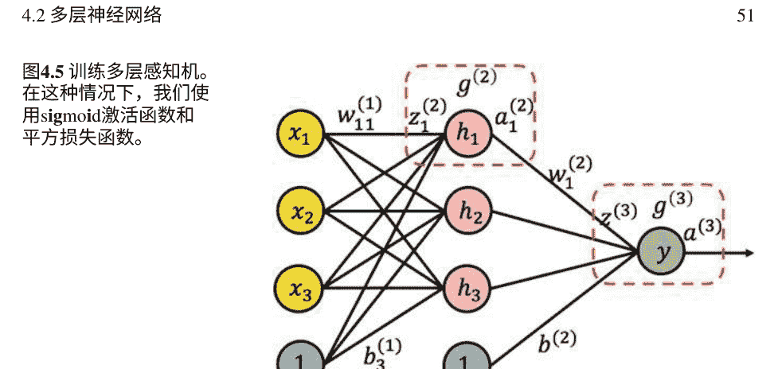

通过 \( g^{(l)} \) 对 \( z_i^{(l)} \) 进行激活。作为前向计算的第一步，隐藏层中的每个单元执行输入的线性组合，然后使用激活函数进行转换：

```
预 -激活 输出 激活
\( z_1^{(2)} = \sum_i w_{1i}^{(1)} x_i + b_1^{(1)} \), \( a_1^{(2)} = g^{(2)}(z_1^{(2)}) \)
\( z_2^{(2)} = \sum_i w_{2i}^{(1)} x_i + b_2^{(1)} \), \( a_2^{(2)} = g^{(2)}(z_2^{(2)}) \)
\( z_3^{(2)} = \sum_i w_{3i}^{(1)} x_i + b_3^{(1)} \), \( a_3^{(2)} = g^{(2)}(z_3^{(2)}) \)
```

类似地，输出层中的每个单元将以这些激活 \( a_j^{(2)} \) 作为输入，并分别执行预激活线性组合和激活操作：

```
\( z^{(3)} = \sum_j w_j^{(2)} a_j^{(2)} + b^{(2)}, \quad a^{(3)} = g^{(3)}(z^{(3)}) \)
```

请注意，这些计算可以通过紧凑的向量表示来表示：

```
\( z^{(2)} = W^{(1)} x + b^{(1)} \)
\( a^{(2)} = g^{(2)}(z^{(2)}) \)
\( z^{(3)} = W^{(2)} a^{(2)} + b^{(2)} \)
\( a^{(3)} = g^{(3)}(z^{(3)}) \)
```

对于更常见的情况，从第 \( l \) 层到第 \( (l+1) \) 层的前向计算可以表示为：

```
\( z^{(l+1)} = W^{(l)} a^{(l)} + b^{(l)} \)
```

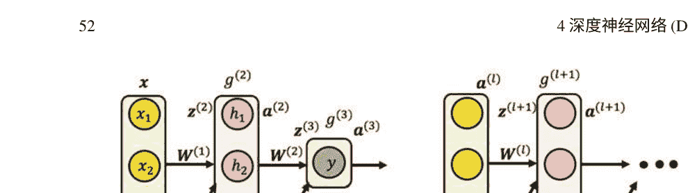

图4.6 前向计算的向量形式

$$a^{(l+1)} = g^{(l+1)}(z^{(l+1)})$$.

深度神经网络前向计算的向量形式在图4.6中有所说明。

#### 反向传播

反向传播的设计是为了高效地计算偏导数 $\frac{\partial \mathcal{L}}{\partial b_j^{(l)}}$ 和 $\frac{\partial \mathcal{L}}{\partial w_{ji}^{(l)}}$，这些偏导数在梯度下降优化过程中是必需的。这些偏导数可以通过从输出层到输入层进行反向遍历来计算神经网络的。反向传播的过程如下所述：给定一个训练数据点$(x, t)$，我们首先运行前向计算来计算整个网络中的所有激活值，以产生输出值。例如，在图4.7中，输出值为

网络输出将作为输入$z^{(4)}$在计算损失与目标$t$时使用。接下来，我们按照以下步骤执行反向误差传播。对于第$l$层中的每个节点$j$，我们计算一个误差项$\delta_j^{(l)}$，该误差项衡量该节点对输出误差的贡献。反向传播更新按照前向计算的相反顺序进行：$a^{(3)}, z^{(3)}, a^{(2)}$和$z^{(2)}$。

首先，我们推导出权重$w$的期望偏导数$\frac{\partial \mathcal{L}}{\partial w_{ji}^{(l)}}$，基于链式法则。

$$\frac{\partial \mathcal{L}}{\partial w_{ji}^{(l)}} = \frac{\partial \mathcal{L}}{\partial z_j^{(l+1)}} \frac{\partial z_j^{(l+1)}}{\partial w_{ji}^{(l)}}$$

图4.7 神经网络上的反向传播

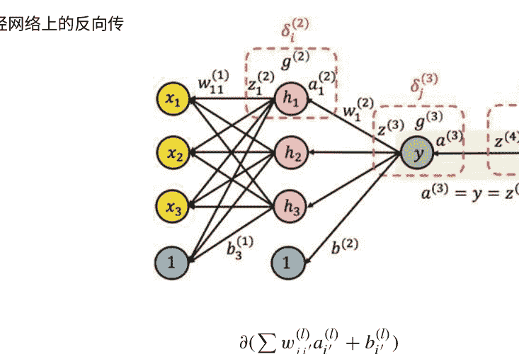

```
\[
\frac{\partial ( \sum_{i'} w_{ji'}^{(l)} a_{i'}^{(l)} + b_{j'}^{(l)} )}{\partial w_{ji}^{(l)}}
= \delta_j^{(l+1)} a_i^{(l)}
\]
```

其中 \(\delta_j^{(l+1)} = \frac{\partial \mathcal{L}}{\partial z_j^{(l+1)}}\) 定义了衡量节点 j 在第 l+1 层对输出整体误差的误差组成部分和 \(a_i^{(l)}\) 是第 (l) 层的第 i 个输入。请注意，这里的 \(\partial( \sum_{i'} w_{ji'}^{(l)} a_{i'}^{(l)} + b_{j'}^{(l)} )\) 在分子中，我们临时使用 i' 作为一般指数，以区分它与特定指数 i of \(\partial w_{ji}^{(l)}\) 在分母中。只有一个 i' 与 i 在 \(\partial w_{ji}^{(l)}\) 中匹配，求和中的其他项将被视为具有0导数的常数。

同样地，我们有偏置权重的偏导数 \(\frac{\partial \mathcal{L}}{\partial b_j^{(l)}}:\)

```
\[
\frac{\partial \mathcal{L}}{\partial b_j^{(l)}} = \frac{\partial \mathcal{L}}{\partial z_j^{(l+1)}} \frac{\partial z_j^{(l+1)}}{\partial b_j^{(l)}}
= \delta_j^{(l+1)} \frac{\partial ( \sum_{i'} w_{ji'}^{(l)} a_{i'}^{(l)} + b_{j'}^{(l)} )}{\partial b_j^{(l)}}
= \delta_j^{(l+1)}
\]
```

再次，\(\delta_j^{(l+1)}\) 是误差组件，用于衡量第 l+1 层的节点 j 对输出的整体误差负责程度。为了计算偏导数，我们需要所有的 \(\delta_j^{(l)}\)。它们可以从最后一层计算到第一层。为了开始反向传播，我们首先初始化

用于损失计算的δ^{(4)}，其给定为：

```
$$
\delta^{(4)} = \frac{\partial \mathcal{L}}{\partial z_k^{(4)}} = \frac{\partial \frac{1}{2} \| y - t \|^2}{\partial y} = -(t - y).
$$
(4.11)
```

然后我们递归地使用 δ_j^{(l+1)} 来计算 δ_j^{(l)}. 在接下来的内容中，我们使用索引 j 来表示通用索引，或者用作层次结构中索引为 i 和 k 的层次的索引。给定 δ_j^{(3)} 为：

```
$$
\begin{aligned}
\delta_j^{(3)} &= \frac{\partial \mathcal{L}}{\partial z_j^{(3)}} \\
&= \frac{\partial \mathcal{L}}{\partial z_k^{(4)}} \frac{\partial z_k^{(4)}}{\partial z_j^{(3)}} \\
&= \delta^{(4)} \frac{\partial g^{(3)}(z_j^{(3)})}{\partial z_j^{(3)}} \\
&= \delta^{(4)} (g^{(3)})'(z_j^{(3)}) \\
&= -(t - y) (g^{(3)})'(z_j^{(3)})
\end{aligned}
$$
```

接下来我们有 δ_i^{(2)} 由方程 (4.12) 给出。

```
$$
\begin{aligned}
\delta_i^{(2)} &= \frac{\partial \mathcal{L}}{\partial z_i^{(2)}} \\
&= \frac{\partial \mathcal{L}}{\partial z_j^{(3)}} \frac{\partial z_j^{(3)}}{\partial z_i^{(2)}} \\
&= \delta_j^{(3)} \frac{\partial \sum_{i=1}^{d^{(2)}} w_{ji}^{(2)} a_i^{(2)}}{\partial z_i^{(2)}} \\
&= \delta_j^{(3)} \frac{\partial \sum_{i=1}^{d^{(2)}} w_{i}^{(2)} a_i^{(2)}}{\partial a_i^{(2)}} \frac{\partial a_i^{(2)}}{\partial z_i^{(2)}} \\
&= \delta_j^{(3)} w_i^{(2)} \frac{\partial a_i^{(2)}}{\partial z_i^{(2)}} \\
&= \delta_j^{(3)} w_i^{(2)} (g^{(2)})'(z_i^{(2)})
\end{aligned}
$$
```

请注意，$(g^{(3)})'(\cdot)$和$(g^{(2)})'(\cdot)$分别是激活函数$g^{(3)}(\cdot)$和$g^{(2)}(\cdot)$的梯度。在这个具体的例子中，所有的$g^{(l)}(\cdot)$都是sigmoid函数。因此在计算中，我们需要用sigmoid函数及其导数来替换$g^{(l)}(\cdot)$和$(g^{(l)}(\cdot))'$。而且一般情况下，我们有$\delta_j^{(l)}$和$\delta_k^{(l+1)}$之间的以下关系。

```
$$ \delta_j^{(l)} = \left[ \sum_{k=1}^{d^{(l+1)}} w_{kj}^{(l)} \delta_k^{(l+1)} \right] (g^{(l)})'(z_j^{(l)}). \quad (4.12) $$
```

在这里，我们总结了用于高效梯度计算的反向传播算法。

### 算法3反向传播算法

```
前向传播
从输入 $\mathbf{x}$ 开始，向前传递到输出层，计算并存储变量 $z^{(2)}, a^{(2)}, z^{(3)}, a^{(3)}, \cdots, z^{(L)}, a^{(L)}, z^{(L+1)}$。

反向传播
初始化 $\delta^{(L+1)} = -(\mathbf{t} - \mathbf{y}) = -(\mathbf{t} - \mathbf{z}^{(L+1)})$ 并计算输出层的导数
$$\frac{\partial L}{\partial w_k^{(L+1)}} = -(\mathbf{t} - \mathbf{y}) a_j^{(L)}.$$

执行
计算 $\delta_j^{(l)} = \left[ \sum_{k=1}^{d^{(l+1)}} w_{kj}^{(l)} \delta_k^{(l+1)} \right] (g^{(l)})'(z_j^{(l)})$
计算第 $l$ 层的导数 $\frac{\partial L}{\partial w_{ji}^{(l)}} = a_i^{(l)} \delta_j^{(l+1)}$ 和 $\frac{\partial L}{\partial b_j^{(l)}} = \delta_j^{(l+1)}$
```

### 4.2.3 参数和超参数

深度神经网络模型中有几个需要从数据中学习的变量。这些变量被称为参数，例如神经网络的权重矩阵 $\mathbf{W}$。学习模型参数是通过一种称为模型训练的过程来完成的。换句话说，通过使用一些现有数据对神经网络模型进行训练，我们可以拟合模型参数。除了参数之外，其他参数不能直接从常规训练过程中学习。这些参数被称为超参数，它们表示模型的高级属性，并且通常在实际训练过程开始之前被固定。对于深度神经网络，超参数包括节点数和隐藏层数。

为了选择超参数，我们可以使用随机搜索或贝叶斯优化。对于随机搜索，我们可以利用问题的知识预先确定超参数的范围。我们从这个区域随机选择超参数，并重复这个过程，直到找到有效的参数。在[6]中，

作者们展示了随机搜索在他们的案例中表现更好。对于贝叶斯优化，我们可以利用现有的实验信息来决定如何调整下一个实验的超参数。这种方法的一个例子可以在[137]中找到。

## 案例研究：基于电子病历数据的再入院预测与深度神经网络

问题：医院的再入院是一个严重的问题，影响医院的质量和患者的结果。一项研究表明，17.6%的住院患者在出院后30天内再次入院，其中76%是可以避免的[158]。
美国的国家医疗保险计划Medicare已经对出院后30天内的各种再入院实施了支付罚款。这些再入院曾经占据了Medicare支出的150亿美元。这种惩罚影响了2000多家医院，罚款金额达到2.8亿美元。为了避免这种昂贵的再入院，分析问题是在出院前识别高风险个体，他们可能会再次入院。因此，可以利用更多医院资源来避免昂贵的再入院，例如出院后更主动的跟进。

数据该研究使用了来自新西兰卫生部的新西兰国家最低数据集，该数据集包含2006年至2012年新西兰医院系统中近330万次住院记录。它们提供了关于患者种族、性别、年龄和每次就诊的住院时间的背景信息。此外，它们还知道医疗机构的类型（公立或私立），以及患者是否是转院。它们还为每次就诊选择了一个单一的诊断相关组（DRG）代码，该代码从一组815个独特的DRG中选择，这些DRG将入院诊断分为比特定ICD代码更广泛的诊断类别。

方法DNN模型被训练用于分别预测五个不同表型的五个患者群体的再入院情况[49]。它们分别是肺炎（PN）、慢性阻塞性肺疾病（COPD）、心力衰竭（HF）、急性心肌梗死（AMI）以及全髋关节置换术或全膝关节置换术（THA/TKA）。该问题被形式化为五个不同的再入院预测问题，每个问题都是一个二分类任务。特征也是12045个诊断代码的多热向量（1表示诊断存在，0表示诊断不存在）。每个数据点对应一次住院。共有3295775次住院记录。如果患者在30天内再次入院，则标签为1，否则为0。整个3295775×12045的二进制特征矩阵被分成5个矩阵，每个表型一个。DNN的架构包括一个输入层，其输入是与诊断代码对应的二进制特征向量，三个隐藏层和一个输出层，如图4.8所示。作为基准，使用了带有弹性网正则化的惩罚逻辑回归（PLR），其中α是一个介于0和1之间的超参数。

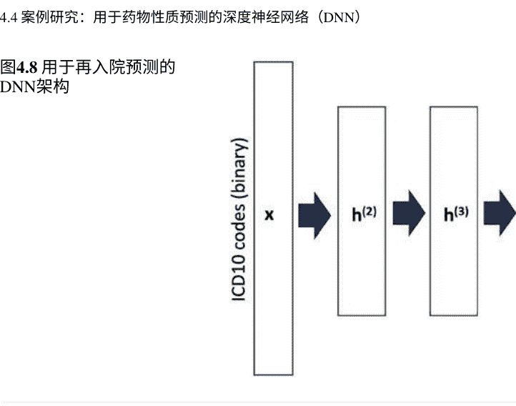

| Condition | Size  | Readmission rate (%) | PLR AUC: mean (SE) | NN AUC: mean (SE) | p-Value, one-sided t-test |
|-----------|-------|----------------------|--------------------|--------------------|--------------------------|
| PN        | 40,442| 27.9                 | 0.715 (0.005)      | 0.734 (0.004)      | 0.01                     |
| COPD      | 31,457| 20.4                 | 0.703 (0.003)      | 0.711 (0.003)      | 0.086                    |
| HF        | 25,941| 19.0                 | 0.654 (0.005)      | 0.676 (0.005)      | 0.004                    |
| AMI       | 29,060| 29.5                 | 0.633 (0.006)      | 0.649 (0.007)      | 0.11                     |
| THA/TKA   | 23,128| 8.7                  | 0.629 (0.005)      | 0.638 (0.006)      | 0.264                    |

图4.9 10折交叉验证结果。将惩罚逻辑回归（PLR）与深度神经网络（NN）进行比较。一项单侧t检验的p值显示DNN的AUC显著高于PLR。

结果 图4.9显示了两种方法的每组结果AUC，以及样本大小和再入院率。深度神经网络始终具有更好的AUC（其中3次显著更好）。但是DNN模型具有大量参数，需要更多的计算时间来训练，这有其局限性。

## 4.4 案例研究：用于药物性质预测的深度神经网络（DNN）

问题 定量构效关系（QSAR）是制药行业中的一个经典问题，用于预测化合物的各种活性。这些预测有助于在药物发现过程中优先进行实验，并减少需要进行的实验工作。

然而，QSAR方法在计算上非常昂贵，或者需要调整许多敏感参数才能对一个独立的QSAR数据集进行良好的预测。

在[105]中，作者系统评估了DNN模型在预测定量结构活性关系方面的性能。

方法本文比较了具有ReLU层的DNN模型与随机森林（RF）分类器的性能。首先，作者想要弄清楚DNN相对于RF的表现如何。因此，使用不同的参数设置训练了50多个DNN。这些参数设置是任意选择的，但试图涵盖每个可调参数的足够范围。具体的参数选择可以在[105]论文中找到。然后，作者尝试了无监督预训练来初始化DNN参数。对于每个数据集，作者使用和不使用预训练训练了五种不同的DNN配置。

数据本研究使用的数据来自2012年由默克主办的Kaggle竞赛。这些是默克公司的内部数据集，包括靶向和ADME（吸收、分布、代谢和排泄）活性。该竞赛旨在检验最先进的机器学习方法在QSAR任务中的表现。本文使用了15个不同规模（2000-50000个分子）的数据集，如图4.10所示。

| data set | type | description | number of molecules | number of unique AP, DP descriptors |
|----------|------|-------------|---------------------|-------------------------------------|
| 3A4 | ADME | CYP P450 3A4 inhibition –log(IC50) M | 50000 | 9491 |
| CB1 | target | binding to cannabinoid receptor 1 –log(IC50) M | 11640 | 5877 |
| DPP4 | target | inhibition of dipeptidyl peptidase 4 –log(IC50) M | 8327 | 5203 |
| HIVINT | target | inhibition of HIV integrase in a cell based assay –log(IC50) M | 2421 | 4306 |
| HIVPROT | target | inhibition of HIV protease –log(IC50) M | 4311 | 6274 |
| LOGD | ADME | logD measured by HPLC method | 50000 | 8921 |
| METAB | ADME | percent remaining after 30 min microsomal incubation | 2092 | 4595 |
| NK1 | target | inhibition of neurokinin1 (substance P) receptor binding –log(IC50) M | 13482 | 5803 |
| OX1 | target | inhibition of orexin 1 receptor –log(Ki) M | 7135 | 4730 |
| OX2 | target | inhibition of orexin 2 receptor –log(Ki) M | 14875 | 5790 |
| PGP | ADME | transport by p-glycoprotein log(BA/AB) | 8603 | 5135 |
| PPB | ADME | human plasma protein binding log(bound/unbound) | 11622 | 5470 |
| RAT_F | ADME | log(rat bioavailability) at 2 mg/kg | 7821 | 5698 |
| TDI | ADME | time dependent 3A4 inhibitions log(IC50 without NADPH/IC50 with NADPH) | 5559 | 5945 |
| THROMBIN | target | human thrombin inhibition –log(IC50) M | 6924 | 5552 |
| 2C8 | ADME | CYP P450 2C8 inhibition –log(IC50) M | 29958 | 8217 |
| 2C9 | ADME | CYP P450 2C9 inhibition –log(IC50) M | 189670 | 11730 |
| 2D6 | ADME | CYP P450 2D6 inhibition –log(IC50) M | 50000 | 9729 |
| A-II | target | binding to Angiotensin-II receptor –log(IC50) M | 2763 | 5242 |
| BACE | target | inhibition of beta-secretase –log(IC50) M | 17469 | 6200 |
| CAV | ADME | inhibition of Cav1.2 ion channel | 50000 | 8959 |
| CLINT | ADME | clearance by human microsome log(clearance) μL/min·mg | 23292 | 6782 |
| ERK2 | target | inhibition of ERK2 kinase –log(IC50) M | 12843 | 6596 |
| FACTORXIA | target | inhibition of factor Xla –log(IC50) M | 9536 | 6136 |
| FASSIF | ADME | solubility in simulated gut conditions log(solubility) mol/L | 89531 | 9541 |
| HERG | ADME | inhibition of hERG channel –log(IC50) M | 50000 | 9388 |
| HERG (full data set) | ADME | inhibition of hERG ion channel –log(IC50) M | 318795 | 12508 |
| NAV | ADME | inhibition of Nav1.5 ion channel –log(IC50) M | 50000 | 8302 |
| PAPP | ADME | apparent passive permeability in PK1 cells log(permeability) cm/s | 30938 | 7713 |
| PXR | ADME | induction of 3A4 by pregnane X receptor; percentage relative to rifampicin | 50000 | 9282 |

图4.10 用于药物性质预测的数据集为了评估QSAR方法，每个数据集都被分成两个不重叠的子集：训练集和测试集。尽管通常的分割方式是随机选择。QSAR模型是应用于前瞻性的。

对于尚未在适当的测定中进行测试的化合物，进行预测，并且这些化合物可能在训练集中有类似物，也可能没有。模拟这种情况的最佳方法是通过时间分割生成训练集和测试集。对于每个数据集，用于特定活性的前75%的分子形成训练集，而稍后进行测定的剩余25%的化合物形成测试集。至于特征（即分子描述符），每个分子由一系列特征表示，即原子对描述符-原子对（AP）[11]和给体-受体对描述符（DP）[85]的并集。AP和DP描述符的形式如下：原子类型 i-键中的距离-原子类型 j。对于AP，原子类型包括元素、非氢邻居数和π电子数；它非常具体。对于DP，原子类型有七种（阳离子、阴离子、中性给体、中性受体、极性、疏水和其他）。已经尝试了各种DNN模型架构。

- 不同的数据预处理策略（原始值，对数变换，二进制变换），
- 隐藏层的数量（1-4），
- 隐藏层中神经元的数量（从100到4500不等），
- 激活函数（Sigmoid vs ReLU），
- dropout率，
- 初始化（随机 vs 无监督预训练），
- mini-batch大小和
- 迭代次数的数量。

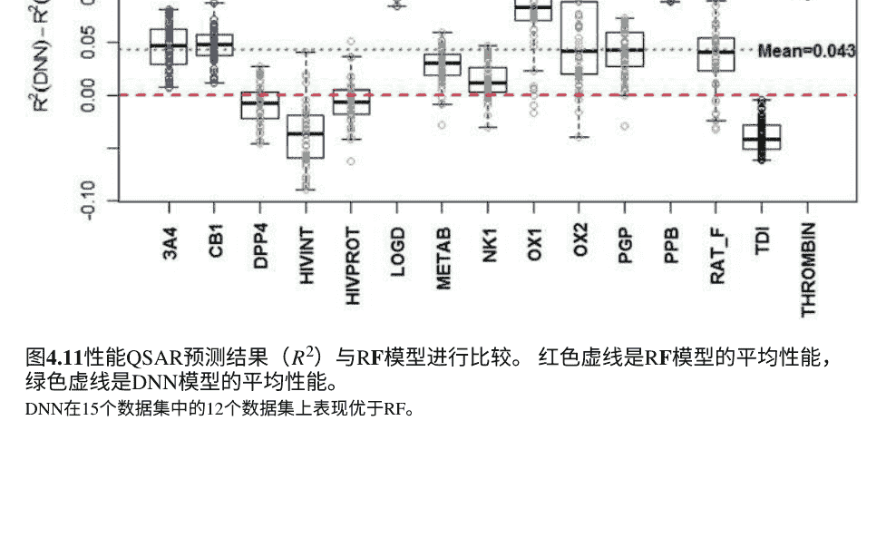

结果图4.11显示DNN在15个数据集中平均优于RF的11个数据集。它显示了DNN和RF之间在每个数据集上的$R^2$的差异。每列代表一个QSAR数据集，每个圆圈代表一个DNN模型相对于RF的$R^2$的改进。正值表示相应的DNN优于RF。所有DNN和15个数据集的平均$R^2$比RF高0.043，或者提高了10%。

## 4.5 练习

1. 你认为哪种类型的健康数据可以从DNN方法中获益最多？为什么？

2. 你认为哪种类型的健康数据可以从DNN方法中获益最少？为什么？

3. 以下哪个关于激活函数的说法是不正确的？
    (a) 激活函数描述非线性变换。
    (b) 在设置神经网络架构时，用户可以指定激活函数。
    (c) 激活函数可以直接从数据中通过神经网络模型学习得到。
    (d) ReLU能够比Sigmoid和Tanh更好地应对梯度消失问题。

4. 以下哪个关于梯度下降的说法是不正确的？
    (a) 对数似然函数和似然函数具有相同的最优解，但对数似然函数通常更容易操作。
    (b) 梯度下降是一种优化模型参数的方法。
    (c) 梯度下降是一种用于神经网络优化的特定设计方法。
    (d) 随机梯度下降是梯度下降方法的一种变体，广泛应用于神经网络训练。

5. 在前向计算中，权重$W_{12}^{(1)}$被用于什么？
    (a) 将输入层的神经元$x1$连接到第二层的输出神经元$h2$
    (b) 将输入层的神经元$x2$连接到第二层的输出神经元$h1$

6. 在前向计算的一般形式中，权重矩阵$W^{(l)}$和偏置向量$b^{(l)}$被用于连接什么？

7. 关于反向传播，哪个说法是正确的？
    - (a) 反向传播是一种在神经网络上计算参数导数的高效方法。
    - (b) 反向传播不需要神经网络的任何形式的前向传递。
    - (c) 大多数深度学习软件包需要用户指定每个层的导数，以便进行反向传播。
    - (d) 反向传播是一种专门用于训练深度学习模型的新算法。

8. 以下关于多层神经网络的说法哪个是不正确的？
    - (a) 多层神经网络在GPU上计算效率更高。
    - (b) 输入层中没有偏置项。
    - (c) 第二层的线性组合计算为$z_i^{(2)} = \sum_j (w_{ji}^{(1)} x_j + b_{-j})$。

9. 以下关于使用DNN进行再入院研究的说法哪个是不正确的？
    - (a) 多层DNN可以在最终分类层之前构建更好的特征。
    - (b) 为五个不同的疾病群体分别训练了独立的DNN。
    - (c) 在这项研究中，深度神经网络模型比逻辑回归模型取得了更高的准确性。
    - (d) 深度神经网络可以清晰地解释其预测结果。

10. 你认为深度神经网络为QSAR应用提供了什么优势？

## 第五章 嵌入

## 5.1 概述

对于健康分析应用来说，医学概念和患者的临床意义表示是关键。标准的机器学习方法直接从原始数据（如ICD或CPT代码）构建特征映射，或者利用一些本体映射，如SNOMED代码。随着深度神经网络的成功，人们开始关注学习概念表示，即嵌入向量。

在本章中，我们介绍了一组名为嵌入方法的神经网络模型，根据纵向电子健康记录中的共现模式来表示医学概念（如诊断、药物和手术）。嵌入方法的直觉是将在电子健康记录数据中紧密共现的医学概念映射到相似的嵌入向量（即相关医学概念之间的嵌入距离较小）。根据共现的定义方式，提出了不同的嵌入方法：

- Word2Vec [110]基于记录中医疗代码的接近程度；
- GloVe [117]是一种基于词共现统计的无监督学习算法，用于词嵌入。
- t-SNE嵌入[159]是一种非线性降维方法，用于在2D空间中可视化高维数据。
- Med2Vec [24]利用两级层次结构，即随时间的临床访问和访问内的共现；
- MIME [31]利用三级层次结构，即访问、诊断代码，然后是治疗代码。

请注意，Word2Vec、GloVe和t-SNE是通用的嵌入方法，而Med2Vec和MIME专门设计用于处理电子健康记录数据。

## 5.2 Word2Vec

Word2Vec通过在大规模文本数据集上进行训练，学习到捕捉单词之间关系的实值多维向量[110]。训练得到的实值向量会使得相似单词（如狗和猫，would和could）具有相似的值，而不相似的单词则具有不同的值。类似于自然语言文本，电子健康记录可以被看作是一系列“单词”（例如诊断、药物和手术等医疗编码）。一旦形成了医疗编码序列，我们可以使用Word2Vec将原始医疗编码（例如ICD9、CPT）映射为嵌入向量。

### 5.2.1 Word2Vec的思想和公式

Word2Vec或任何嵌入方法的目标是学习每个单词的向量表示，使得相关的单词具有相似的向量表示。在医疗保健应用中，单词可以是电子健康记录中的医疗编码。图5.1展示了使用更好的医疗概念表示的一个激励性例子。图5.1a展示了使用N维向量对N个唯一诊断进行独热编码。更具体地说，每个诊断对应的维度将为1，而其他N-1个维度为0。独热编码简单但对于机器学习来说并不是一种有效的表示方法。相关诊断（如支气管炎和肺炎）之间的差异与不相关诊断（如肺炎和肥胖症）之间的差异相同。实际上，所有不同医学诊断对之间的距离都相同（即，欧氏距离为√2）。图5.1b显示了一个Word2Vec表示，其中支气管炎和肺炎与其他诊断相比具有相似的值。此外，通过

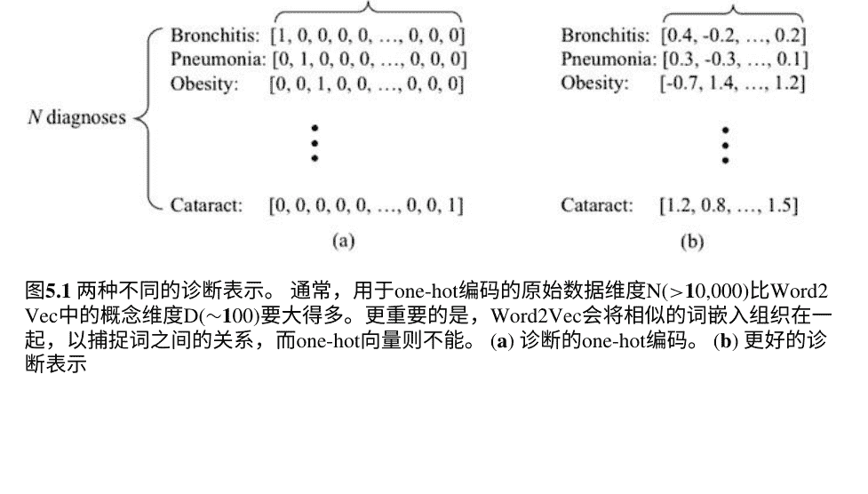

通过使用Word2Vec，我们将更好地表示诊断、药物和手术等多维实值向量，从而捕捉它们之间的潜在关系。

接下来，让我们来看一下Word2Vec的数学公式。图5.2a是一个按时间顺序排列的患者医疗记录的示例。Word2Vec假设一个词的含义由其上下文（即其相邻词）决定。因此，给定一个词序列，Word2Vec选择一个目标词并尝试预测其相邻词。图5.2b显示了发热作为目标词，其他附近的词是其相邻词。然后我们滑动一个上下文窗口，选择下一个目标，并进行相同的上下文预测，如图5.2c所示。由于Word2Vec的目标是学习单词的向量表示，我们需要将单词映射到$D$维嵌入向量，其中$D$是用户定义的值（通常在文本数据中为50到1000之间）。因此，实际的预测是通过学习到的嵌入向量进行的。形式上，$c_t$表示了该词在$t$-th时间步长，$v(c_t)$表示$c_t$的嵌入向量。Word2Vec的目标是

最大化以下平均对数概率，
$$\frac{1}{T} \sum_{t=1}^{T} \sum_{-w \leq j \leq w, j=0} \log p(c_{t+j}|c_t)$$
其中 $p(c_{t+j}|c_t) = \exp[v(c_{t+j})^\top v(c_t)] / \sum_{c=1}^{N_c} \exp[v(c)^\top v(c_t)]$，$T$是医疗概念序列的长度，$w$是上下文窗口的大小，$c_t$是时间步长 $t$ 的目标医疗概念，$c_{t+j}$是时间步长 $t + j$的相邻医疗概念，$v(c)$表示医疗概念 $c$ 的向量，$N_c$是唯一的医疗概念数量。上下文窗口的大小 $w$通常设置为5，每个目标词周围有10个相邻词。请注意，条件概率表示为softmax函数。通过最大化每个目标词与其相邻词之间嵌入的内积的softmax分数，通过最大化此softmax函数，Word2Vec学习捕捉单词之间的共现关系的实值向量。

为了计算Word2Vec，分母$\sum_{c=1}^{N_c}\exp[v(c)\oplus v(c_t)]$可能计算成本过高，因为它对所有单词求和。一个实际的解决方案是使用负采样。这个想法是将词嵌入问题转化为一个二元分类任务。正样本是上下文窗口中的词对（即$c_{t+j}, c_t$，对于$-w \leq j \leq w, j=0$）。负样本是随机抽样的（即将随机单词与目标词配对）。然后，目标函数可以重写为
$$\arg \max \prod_{(c_w,c_t) \in D} p(y=1|c_w, c_t) \prod_{(c_w,c_t) \notin D} p(y=0|c_w, c_t) =$$
$$\arg \max \sum_{(c_w,c_t) \in D} \log \frac{1}{1 + e^{-v(c_w)^\top v(c_t)}} + \sum_{(c_w,c_t) \notin D} \log(1 - \frac{1}{1 + e^{-v(c_w)^\top v(c_t)}})$$
其中 $(c_w, c_t) \in D$表示正样本（即数据集中的词对），$(c_w, c_t) \notin D$表示负样本（即随机词$c_w$和目标词$c_t$的词对）。新目标函数的优化过程等效于逻辑回归分类器，比Word2Vec的原始设置更高效。请注意，word2vec论文[110]提出了两种用于词嵌入的算法，即skip gram和continuous bag of words。它们非常相似，我们提出了skip gram的表述。

### 5.2.2 t-分布随机邻居嵌入（t-SNE）

深度学习模型通常处理高维数据（例如，医疗代码的独热向量）并生成高维数据（例如，神经网络的隐藏状态）。可视化高维数据以了解模式是很有必要的

以及神经网络的输入和直接输出之间的关系。 t-分布随机邻居嵌入 （t-SNE ） 是一种强大且流行的可视化高维数据的方法（例如，神经网络的隐藏状态 ） [159]。 更具体地说，t-SNE的输入是一个高维数据点 $x_i$，而t-SNE的输出是一个低维（2D）数据点 $y_i$。 传统的降维方法，如主成分分析（PCA），也可以生成用于可视化的2维嵌入。PCA的一个主要缺点是它试图保留由远离数据点主导的成对距离，而忽略了小的局部变化。 然而，在真实数据中，远离点之间的关系通常不可靠，因此不太重要。 另一方面，附近点之间的关系更重要且更可靠，应该是可视化方法的重点。

通过突出局部关系，t-SNE成为一种良好的降维算法，可以以视觉上吸引人的方式显示数据中的模式和聚类。让我们定义 $p_{ij}$ 和 $q_{ij}$ 为高维低维空间中一对点 $i$ 和 $j$ 之间的联合概率。 t-SNE的目标是最小化联合概率 $p_{ij}$ 和 $q_{ij}$ 之间的Kullback-Leibler（KL）散度：
$$KL(P\|Q) = \sum_i \sum_{j=i} p_{ij} \log \frac{p_{ij}}{q_{ij}}$$
其中高维数据的联合概率 $p_{ij}$ 为
$$p_{ij} = \frac{\exp(-\|x_i - x_j\|^{\wedge}2 / 2\sigma^{\wedge}2)}{\sum_{k=i} \exp(-\|x_k - x_j\|^{\wedge}2 / 2\sigma^{\wedge}2)}$$
$\sigma$ 是高斯核的带宽，低维（2D）数据的联合概率 $q_{ij}$ 使用自由度为1的Student t分布。
$$q_{ij} = \frac{(1 + \|y_i - y_j\|)^{-1}}{\sum_{k=l} (1 + \|y_k - y_l\|)^{-1}}$$
对输入联合分布进行了额外的优化 $p_{ij}$。 我们不再使用联合概率，而是使用条件概率
$$p_{j|i} = \frac{\exp(-\|x_i - x_j\|^{2}/2\sigma_{i}^{2})}{\sum_{k=i} \exp(-\|x_i - x_k\|^{2}/2\sigma_{i}^{2})}$$
我们可以为不同的数据点 $i$ 设置不同的带宽 $\sigma_i$。 这种自适应带宽非常重要，因为它可以处理不同密度分布的输入数据。 联合分布 $p_{ij}$ 通过 $p_{ij} = (p_{j|i} + p_{i|j})/2$ 来近似。

t-SNE方法已广泛应用于可视化复杂结构化和高维健康数据。 例如，在[1]中，t-SNE被用于可视化

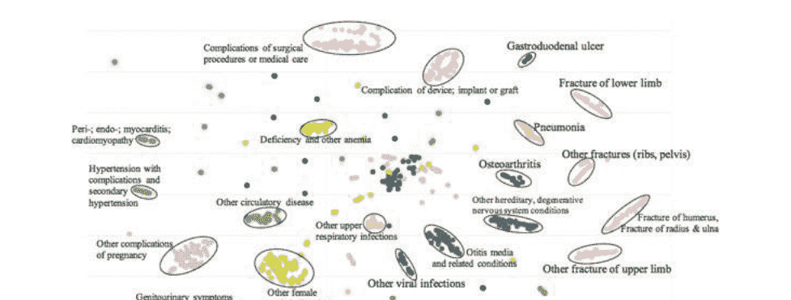

图5.3 t-SNE散点图，由GRAM [28]训练的医学概念

从质谱成像数据中分子上不同且临床相关的预后肿瘤亚群。除了成像数据，t-SNE还被用来可视化基因组数据。Taskesen等人[151]给出了一个特定的例子，当使用基因表达谱在2D地图（tSNE-map）上投影组织样本时，t-SNE可以保留样本之间的局部相似性，但会牺牲不相似样本之间的相似性。因此，t-SNE更好地保留了局部（不）相似性，因为它们不会因数据集中的大不相似性而被压缩。此外，t-SNE还被用于可视化从EHR数据中学习到的表型。例如，在[94]中，t-SNE被用于将学习到的特征投影到二维嵌入中。可以很容易地通过视觉方式识别痛风和白血病的亚群，这些亚群可能具有病理生理差异。

以下示例展示了研究人员如何使用t-SNE来直观评估他们的表型算法的性能。图5.3使用t-SNE来表示GRAM [28]使用EHR数据进行顺序诊断预测学习的2000种随机选择的疾病的最终表示。在这里，t-SNE提供了一种直观的方式来定性评估医学代码的学习表示的可解释性。点的颜色表示最高的疾病类别，文本注释表示CCS多级层次结构中的详细疾病类别。该图显示了学习到的疾病表示如何与领域知识相吻合。图5.4的另一个演示展示了[24]中学习到的医学概念如何形成不同的群组。

### 5.2.3 Word2Vec在医疗保健应用中的应用

接下来，我们介绍一个使用Word2Vec进行心力衰竭预测的研究[26]。

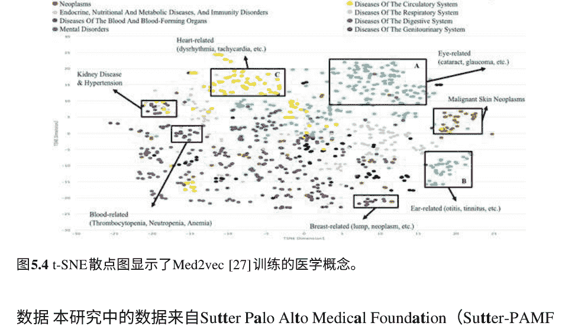

图5.4 t-SNE散点图显示了Med2vec [27]训练的医学概念。

数据本研究中的数据来自Sutter Palo Alto Medical Foundation（Sutter-PAMF）的初级护理患者。Sutter-PAMF是一家大型的初级护理和多专科医疗团体，已经使用电子病历超过十年。研究数据集从2000年到2013年的时间间隔内提取，包括病例和对照组。电子病历数据包括人口统计学信息、吸烟和饮酒情况、临床和实验室数值、与就诊相关的国际疾病分类第9版（ICD-9）编码、医嘱和转诊、当前程序术语（CPT）编码中的过程信息，以及药物处方中的医学名称。数据集共包含265,336名患者，总计555,609个独特的临床事件。

#### Word2Vec的配置

为了将Word2Vec应用于纵向电子病历数据，作者处理了所有265,336名患者的药物医嘱、过程医嘱和问题清单记录，并提取了分配给每个患者的诊断、药物和过程编码的时间顺序。如果一个患者在一次就诊中接受了多个诊断、药物或过程，那些医学编码将在同一时间戳内随机排序。唯一诊断、药物和过程的数量分别为11,460、17,769和9,370，总计38,599个独特的医学概念。使用100维的医学概念嵌入向量（即图5.1b中的D=100）。

#### 定性评估

图5.5a显示了Word2Vec诊断嵌入向量，其中使用t-SNE [109]将高维数据可视化为2D空间。图5.5a显示了随机选择的一千个诊断（ICD-9代码）。在图中，诊断通常按疾病类别进行良好分组。

然而，如果同一类别的一些诊断仍然非常不同，它们应该分开。这在图5.5a中通过红框和蓝框显示。尽管它们属于相同的肿瘤类别，红框表示恶性皮肤肿瘤（172.X，173.X），而蓝框表示良性皮肤肿瘤（216.X）。

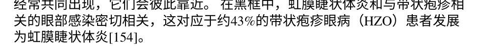

红框和蓝框的详细图在补充部分中。如黑框所示，如果不同组的诊断实际上经常共同出现，它们会彼此靠近。在黑框中，虹膜睫状体炎和与带状疱疹相关的眼部感染密切相关，这对应于约43%的带状疱疹眼病（HZO）患者发展为虹膜睫状体炎[154]。

Word2Vec的一个重要优点是它可以将不同类型的医疗代码（例如，诊断代码和手术代码）映射到一个共同的嵌入空间中，使得不同类型的相关医疗代码更加接近。图（5.5b）显示了来自不同类型医疗代码到一个诊断代码的前5个最近邻的示例。例如，诊断代码“急性上呼吸道感染”的嵌入接近于“支气管炎”（诊断）、“阿奇霉素”（抗生素药物）、“流感疫苗”（手术），这些都具有临床意义。

定量评估嵌入向量的最终价值在于为预测或分类任务生成更好的特征。在本研究中，任务是基于各种患者表示来预测患者是否会发展心力衰竭（HF）。

图5.6显示了各种模型和输入特征向量的AUC。颜色表示使用不同患者表示进行预测的结果：

| Diagnoses | Medications | Procedures |
|-----------|-------------|------------|
| Bronchitis, not specified as acute or chronic (466.1); Cough (786.2); Acute sinusitis, unspecified (461.9); Acute bronchitis (466.0); Acute pharyngitis (462) | Azithromycin 250 mg po tabs; Promethazine 10 mg po tabs; Amoxicillin 500 mg po caps; Fluticasone Propionate 50 mcg/act na; Albuterol 5 mg/act na | Pulse oximetry single; Serv prov during rng sched; Chest PA & Lateral; Influenza vaccine (flu clinic only) 13+ yo ps |
| Diabetes mellitus (250.00); Mixed hyperlipidemia (272.0); Obesity, unspecified (278.00); Pure hypercholesterolemia (272.0) | Metformin hcl 500 mg po tabs; Metformin hcl 1000 mg po tabs; Glucose blood w/o strip; Lisinopril 20 mg po tabs | Diabetic eye exam (no bill); Diabetes education, int; Diabetic foot exam (no bill); Influenza vaccine (flu clinic only) 13+ yo ps; int |
| Anemia, unspecified (285.9); Congestive heart failure, unspecified (428.9); Unspecified essential hypertension (401.9); Atrial fibrillation (427.31); Chronic kidney disease, Stage III (moderate) (585.3) | Furosemide 20 mg po tabs; Hydrochlorothiazide 25 mg po tabs; Hydrocodone-Acetaminophen 5-500 mg po tabs; Cephalexin 500 mg po caps; Furosemide 40 mg po tabs | Debridement of nails, 6 or more; OV pt prn serv; EKG; ECG and interpretation; Chest PA & Lateral |
| Blepharitis, unspecified (373.00); Senile cataract, unspecified (366.10); Presbyopia (367.4); Other asthenopic conditions (367.80); Other allergic conjunctivitis (372.14) | Glasses; Erythromycin 5 mg/gm op oint; Patanol 0.1 % op soln | Refraction; Visual field exam extended; Visual field exam limited; Referral to ophthalmology, int; Ophthalmology, int |
| Hyperlipidemia (272.4); Essential hypertension (401.9); Pure hypercholesterolemia (272.0); Mixed hyperlipidemia (272.0); Diabetes mellitus (250.00) | Hydrochlorothiazide 25 mg po tabs; Metoprolol 50 mg po tabs; Lisinopril 10 mg po tabs; Lisinopril 40 mg po tabs; Lisinopril 20 mg po tabs | ECG and interpretation; Influenza vaccine (flu clinic only) 13+ yo ps; Internal admin im/sq/id/per; int; GI, int; IV/ID prn bld 3 |

## 图5.6 各种嵌入向量的心力衰竭预测性能

- 独热编码是使用独热编码表示医疗代码，然后对患者的医疗代码的独热编码求和。
- 医疗概念向量仅是她的医疗代码的所有Word2Vec嵌入的求和，其中Word2Vec向量是在各种患者群体上训练的。

误差线表示通过六折交叉验证得出的标准差。医疗概念表示学习的能力显而易见，因为所有模型在HF预测性能上都显示出显著改进。有趣的是，KNN从使用医疗概念向量中受益最多，即使是在最小的数据集上训练的。考虑到KNN分类是基于数据点之间的距离，很明显，使用Word2Vec的医疗概念表示比简单的独热编码提供了更好的表示。

图5.6还告诉我们，医疗概念表示最好是通过大型数据集进行学习。然而，在大多数模型中，像KNN这样的直接算法，即使是使用最少数量的患者训练的医疗概念向量也能提高预测性能。

## 5.3 Med2Vec: 用于EHR的两级嵌入

Word2Vec假设输入的医疗代码具有全局顺序以创建嵌入。然而，许多医疗代码在一次就诊中一起记录，没有任何特定的顺序，这使得直接使用Word2Vec变得困难。事实上，患者的EHR数据遵循两级层次结构：

1. 就诊级别：患者的EHR数据由随时间变化的一系列就诊组成。
2. 代码级别：每次就诊包含多个医疗代码，例如诊断、手术和药物代码。

这种层次结构提供了两种关系信息，即就诊的顺序和代码在一次就诊中的共现。Med2Vec是一种层次嵌入方法，可以学习医疗代码和就诊的表示[24]。更正式地，所有医疗代码的集合被表示为 C = {c1, c2, ..., |C|}，大小为|C|。每个患者的EHR数据以就诊序列 V1, ...的形式存在。其中每个就诊包含医疗代码的子集 Vt ⊆ C。Med2Vec的目标是学习两种类型的表示：

- 代码表示将所有医疗代码集合 C 映射到非负实值向量。
- 访问表示学习另一个嵌入，将每个访问（一组医疗代码）映射到维度为 n 的实值向量。

### 5.3.1 Med2Vec 方法

Med2Vec 首先学习个别医疗代码（如诊断和操作代码）的嵌入向量。利用代码嵌入，我们可以将访问二进制向量映射到中间嵌入向量，其中每个维度对应于特定医疗代码的二进制变量。然后通过另一个非线性变换，计算最终的访问嵌入。图refembed-fig:Med2Vec显示了Med2Vec模型的架构（图5.7）。

学习代码表示捕捉代码共现信息的一种自然选择是修改Word2Vec。特别地，我们可以训练 Wc ∈ R^(m×|C|)（可用于生成中间访问级别的表示），以便 Wc 的第 i 列将是总共 |C| 个医疗代码中第 i 个代码的表示。请注意，由于访问中代码的无序性，与原始Word2Vec不同，在访问内部的医疗代码之间没有顺序。

从一组访问 V1, V2, ..., VT，可以通过最大化以下对数似然来学习代码级别的表示：

$$\max_{W_c} \frac{1}{T} \sum_{t=1}^T \sum_{c_i \in V_t} \sum_{c_j \in V_t, j=i} \log p(c_j|c_i),$$

$$p(c_j|c_i) = \frac{\exp \left( \mathbf{W}_c[:, j]^\top \mathbf{W}_c[:, i] \right)}{\sum_{k=1}^{|C|} \exp \left( \mathbf{W}_c[:, k]^\top \mathbf{W}_c[:, i] \right)}.$$

学习访问表示给定一个访问 V_t，使用多层感知器（MLP）生成相应的访问表示 v_t。首先，访问 V_t由一个二进制向量 x_t ∈ {0,1}^{|C|}表示，其中第 i 个条目仅在代码 c_i ∈ V_t 时为1。然后，x_t转换为一个中间访问表示 u_t ∈ ℝ^m，如下所示，

$$u_t = ReLU (W_c x_t + b_c)$$

其中使用代码权重矩阵 W_c ∈ ℝ^{m×|C|}和偏置向量 b_c ∈ ℝ^m。ReLU单元确保非负输出，以便直观解释，因为负值通常难以解释，ReLU单元将其消除。人口统计信息 d_t ∈ ℝ^d，包括年龄和性别，与 u_t 连接，其中 d 是人口统计信息向量的大小。然后，访问嵌入 v_t ∈ ℝ^n 计算如下，

$$v_t = ReLU (W_v [u_t, d_t] + b_v)$$

使用访问权重矩阵 W_v ∈ ℝ^{n×(m+d)}和偏置向量 b_v ∈ ℝ^n，其中 n 是预定义的访问表示的大小。

与Word2Vec类似，给定一个访问表示，应该能够预测过去发生了什么，以及将来会发生什么。具体来说，给定一个访问表示$v_t$，我们训练一个softmax分类器，预测上下文窗口内的访问的医疗编码。交叉熵损失如下：

$$\min_{W_s, b_s} \frac{1}{T} \sum_{t=1}^{T} \sum_{-w \le i \le w, i=0} -x_{t+i}^\top \log \hat{y}_t - (1 - x_{t+i})^\top \log(1 - \hat{y}_t),$$

其中，$\hat{y}_t = \text{Softmax}(W_s v_t + b_s)$是预测的标签，$W_s \in \mathbb{R}^{|C| \times n}$和$b_s$是softmax分类器的权重矩阵和偏置向量$\mathbb{R}^{|C|}$是权重矩阵和偏置向量的尺寸，$w$是预定义的上下文窗口大小

Med2Vec的临床应用案例类似于Word2Vec，主要用作纵向电子病历数据的替代嵌入方法 在文献[24]中，作者展示了嵌入向量本身的预测性能和可解释性的好处 这里我们展示了来自[24]的一个结果，比较了Med2Vec和其他基准模型的预测性能

图5.8的第一行显示了预测未来医疗编码的召回率@30 首先，在所有实验中，Med2Vec实现了最高的性能，尽管它受到了正性和可解释性的限制 第二个观察结果是，Med2Vec的性能对于超参数的选择是稳健的，在广泛的值范围内都表现良好 与Skip-gram更易变的性能相比，我们可以看到在训练中包含访问信息可以改善性能并使其稳定下来

图5.8比较了多个基准线，包括独热编码、堆叠自编码器（SA）、Skip-gram（Word2Vec的一种版本）和GloVe（基于矩阵分解的另一种高效变体）。上排和下排分别显示了在改变不同超参数时，预测未来医疗代码的召回率@30和预测CRG类别的AUC。

## 图5.9 单次访问的示意图。红色表示诊断代码，蓝色表示药物/手术代码。一次访问包括一组代码和一个层次结构，以及这些代码之间的异构关系。例如，虽然对乙酰氨基酚和静脉注射液都与发热有明确的关系，但它们也作为发热的后代彼此相关。

## 5.4 MiME：嵌入内部结构

Med2Vec利用纵向电子病历的两级结构，即访问和访问内的代码。然而，访问内部还有更多细微之处。诊断和治疗之间存在关系，例如药物和程序（见图5.9）。MiME是另一种利用EHR数据的内在多级结构和编码关系的嵌入方法[31]。

这项工作还同时执行依赖于内在EHR结构的辅助预测任务，而无需外部标签。他们的总体目标是在EHR数据集较小的情况下学习稳健的嵌入向量。

### 5.4.1 MIME的符号

假设一个患者在时间上有一系列的访问$\mathcal{V}^{(1)}, \ldots, \mathcal{V}^{(t)}$，其中每个访问$\mathcal{V}^{(t)}$包含不同数量的诊断对象$\mathcal{O}^{(t)}_1, \ldots, \mathcal{O}^{(t)}_{|\mathcal{V}^{(t)}|}$。每个$\mathcal{O}^{(t)}_i$由单个诊断代码$d^{(t)}_i \in \mathcal{A}$和一组相关治疗(药物或手术)组成$\mathcal{M}^{(t)}_i$。同样，每个$\mathcal{M}^{(t)}_i$由不同数量的治疗代码$m^{(t)}_{i,1}, \ldots, m^{(t)}_{i,|\mathcal{M}^{(t)}_i|} \in \mathcal{B}$。为了减少混乱，我们省略上标$(t)$表示单次访问时的杂乱情况。在图5.9中，有五个诊断代码，因此有五个诊断对象$\mathcal{O}^{(t)}_1, \ldots, \mathcal{O}^{(t)}_5$。更具体地说，第一个诊断对象$\mathcal{O}_1$的诊断代码为$d^{(t)}_1 =$疲劳，但没有治疗代码。另一方面，$\mathcal{O}_2$具有诊断代码$d^{(t)}_2 =$咳嗽和两个相关的治疗代码$m^{(t)}_{2,1}=$苯佐那他和$m^{(t)}_{2,2}=$对乙酰氨基酚。在这种情况下，我们可以使用$g(d^{(t)}_2, m^{(t)}_{2,1})$来捕捉诊断代码咳嗽和治疗代码苯佐那他之间的交互作用，这将被输入到$f(d^{(t)}_2, \mathcal{M}^{(t)}_2)$中以获得诊断对象的向量表示

**表5.1 MIME的符号表示。请注意，由于使用了跳跃连接，许多地方都使用了相同的维度 $z$**

| 符号 | 定义 |
|------|------|
| $\mathcal{A}$ | 唯一诊断代码的集合 |
| $\mathcal{B}$ | 唯一治疗代码（药物和程序）的集合 |
| $\mathbf{h}$ | 患者的向量表示 |
| $\mathcal{V}^{(t)}$ | 患者的第 $t$ 次就诊，其中包含诊断对象 $\mathcal{O}_1^{(t)}, \dots, \mathcal{O}_{|\mathcal{V}^{(t)}|}^{(t)}$ |
| $\mathbf{v}^{(t)} \in \mathbb{R}^z$ | 表示 $\mathcal{V}^{(t)}$ 的向量 |
| $\mathcal{O}_i^{(t)}$ | 第 $i$ 个诊断对象在第 $t$ 次访问中由诊断代码 $d_i^{(t)}$ 和治疗代码 $\mathcal{M}_i^{(t)}$ 组成 |
| $\mathbf{o}_i^{(t)} \in \mathbb{R}^z$ | 表示 $\mathcal{O}_i^{(t)}$ 的向量 |
| $p(d_i^{(t)} \mid \text{第$i$个对象对应的} m_{i,j}^{(t)})$ | 基于 $\mathcal{O}_i^{(t)}$ 的辅助预测，分别针对诊断代码和治疗代码 |
| $d_i^{(t)} \in \mathcal{A}$ | 诊断对象 $\mathcal{O}_i^{(t)}$ 的诊断代码 |
| $\mathcal{M}_i^{(t)}$ | 与 $i$-th 诊断代码 $d_i^{(t)}$ 相关联的治疗代码集合，在第 $t$ 次访问中 |
| $m_{i,j}^{(t)} \in \mathcal{B}$ | 第 $j$ 个治疗代码对应的 $\mathcal{M}_i^{(t)}$ |
| $g(d_i^{(t)}, m_{i,j}^{(t)})$ | 捕捉 $d_i^{(t)}$ 和 $m_{i,j}^{(t)}$ 之间的交互作用的函数 |
| $f(d_i^{(t)}, \mathcal{M}_i^{(t)})$ | 一个计算诊断对象嵌入的函数 $\mathbf{o}_i^{(t)}$ |
| $r(\cdot) \in \mathbb{R}^z$ | 一个用于提取 $d_i^{(t)}$ 或 $m_{i,j}^{(t)}$ 的嵌入向量的辅助符号 |

$\mathbf{o}_2^{(t)}$ 使用五个诊断对象嵌入 $\mathbf{o}_1^{(t)}, \dots, \mathbf{o}_5^{(t)}$ ，我们可以得到一个访问嵌入 $\mathbf{v}^{(t)}$ 。 此外，一些治疗代码（例如，对乙酰氨基酚）可以被两个或多个诊断代码（ 例如，咳嗽，发热）共享，如果医生为多个诊断开了同一种药物。 然后，每 个诊断对象将附有其自己的治疗代码副本，本例中分别表示为 $m_{22}^{(t)}$ 和 $m_{31}^{(t)}$ 。 表 5.1 提供了MIME的所有符号。

### 5.4.2 MIME的描述

多级嵌入MIME明确捕捉了图5.9中诊断代码和治疗代码之间的层次关系。图 5.10说明了MIME如何通过多级嵌入以自底向上的方式构建 $\mathcal{V}$ 的表示（省略 上标 $(t)$ ）。 在单个诊断对象 $\mathcal{O}_i$ 中，使用诊断代码 $d_i$ 及其相关的治疗代码 $\mathcal{M}_i$ 来获得诊断对象的向量表示 $\mathcal{O}_i$ ，即 $\mathbf{o}_{i}$ 。 然后，使用多个诊断对象嵌入 $\mathbf{O}_0, \dots, \mathbf{O}_{|\mathcal{V}|}$ 在单次访问中用于获得访问嵌入 $\mathbf{v}$ ，进而形成与其他访问嵌入一起 的患者嵌入 $\mathbf{H}$ 。 MIME的公式如下：

$$v = \sigma( W_v ( \sum_i^{ |\mathcal{V}| } f(d_i, \mathcal{M}_i) ) ) + F$$
$$\text{F: 用于跳跃连接} \tag{5.1}$$

$$f(d_i, \mathcal{M}_i) = \mathbf{o}_i = \sigma( W_o( r(d_i) + \sum_j^{ |\mathcal{M}_i| } g(d_i, m_{i,j}) ) ) + G$$
$$\text{G: 用于跳跃连接} \tag{5.2}$$

$$g(d_i, m_{i,j}) = \sigma(W_m r(d_i)) \odot r(m_{i,j}) \tag{5.3}$$

其中方程 (5.1)、 (5.2) 和 (5.3) 分别以自顶向下的方式描述了MIME，对应于图5.10中的访问级别、诊断级别和治疗级别，$\odot$表示逐元素乘法。在方程 (5.1) 中，通过将诊断对象嵌入 $\mathbf{o}_1, ..., \mathbf{o}_{|\mathcal{V}|}$进行求和获得访问嵌入 $\mathbf{v}$，然后使用 $W_v \in \mathbb{R}^{z\times z}$进行转换，$\sigma$是一种非线性激活函数，如sigmoid或修正线性单元 (ReLU)。在方程 (5.2) 中，通过求和$r(d_i) \in \mathbb{R}^z$，诊断代码$d_i$的向量表示和效果交互作用之间的关系和其相关治疗的交互作用，然后用$W$转换为$\mathbb{R}^{z\times z}$。由$g(d, m)$捕获的交互作用被添加到$r(d)$中，可以解释为根据其相关治疗（药物和程序）调整诊断表示。请注意，在公式（5.1）和（5.2）中，术语$F$和$G$表示跳过连接[67]。

在公式（5.3）中，诊断代码嵌入$r(d)$和治疗代码嵌入$r(m)$之间的交互作用通过逐元素乘法来捕获。权重矩阵$W_m \in \mathbb{R}^{z\times z}$将诊断代码嵌入$r(d)$发送到另一个潜在空间，在那里可以有效地捕获$d$和相应$m$的交互作用。在考虑公式（5.3）的同时，公式（5.2）中的$G$也可以解释为$r(d)$与交互作用$g(d, m)$的总和进行跳过连接。

辅助任务的联合训练患者嵌入 $\mathbf{h}$通常用于特定的预测任务，如心力衰竭预测或死亡率。表示能力的提取来自于正确捕捉每次访问 $\mathcal{V}^{(t)}$，并使用函数 $h(\mathbf{v}_0 , … , \mathbf{v}_t)$对纵向方面进行建模。由于本文的重点是对单次访问 $\mathcal{V}^{(t)}$进行建模，我们按照以下方式进行辅助预测：

$$\hat{d}_i^{(t)} = p(d_i^{(t)}|\mathbf{o}_i^{(t)}) = \text{softmax}(\mathbf{U}_d \mathbf{o}_i^{(t)}) \quad (5.4)$$
$$\hat{m}_{i,j}^{(t)} = p(m_{i,j}^{(t)}|\mathbf{o}_i^{(t)}) = \sigma (\mathbf{U}_m \mathbf{o}_i^{(t)}) \quad (5.5)$$
$$L_{aux} = -\lambda_{aux} \sum_{t}^{T} \left( \sum_{i}^{|\mathcal{V}^{(t)}|} \left( \text{CE}(d_i^{(t)}, \hat{d}_i^{(t)}) + \sum_{j}^{|\mathcal{M}_i^{(t)}|} \text{CE}(m_{i,j}^{(t)}, \hat{m}_{i,j}^{(t)}) \right) \right) \quad (5.6)$$

给定诊断对象嵌入 $\mathbf{o}_1^{(t)}, …, \mathbf{o}_{|\mathcal{V}^{(t)}|}^{(t)}$，在等式(5.1)中聚合它们以获得 $\mathbf{v}^{(t)}$，MIME 预测诊断代码 $d_i^{(t)}$，以及相关的治疗代码 $m_{i,j}^{(t)}$如图 5.10 所示。在等式(5.4)和(5.5)中，$\mathbf{U}_d \in \mathbb{R}^{|\mathcal{A}|\times z}$和 $\mathbf{U}_m \in \mathbb{R}^{|\mathcal{B}|\times z}$是用于计算诊断代码预测的权重矩阵。 $i$ 和治疗代码预测 $\hat{m}_{i,j}^{(t)}$,分别在等式(5.6)中表示。在等式(5.6)中，$T$ 表示患者就诊的总次数，$\text{CE}(\cdot, \cdot)$表示交叉熵函数，$\lambda_{aux}$表示辅助损失项的系数。我们使用 softmax 函数来预测诊断代码 $d_i^{(t)}$，因为在单个诊断对象 $\mathcal{O}_i^{(t)}$中，只涉及一个诊断代码。然而，一个诊断对象 $\mathcal{O}_i^{(t)}$可能与多个治疗代码相关联，因此我们使用 $|\mathcal{B}|$ 个 sigmoid 函数来预测每个治疗代码。

### 5.4.3 MIME实验结果

本节重点介绍了MIME的一些实验评估。更详细的评估可参见[31]。

## 5.4 MiME: 嵌入内部结构

基准模型首先，我们使用第7章中描述的门控循环单元（GRU）和不同的嵌入策略来映射访问嵌入序列 $\mathbf{v}^{(1)}, \ldots, \mathbf{v}^{(T)}$ 到患者表示 $\mathbf{h}$:

-   **raw**: 单个访问 $\mathcal{V}^{(t)}$ 由二进制向量 $\mathbf{x}^{(t)} \in \{0, 1\}^{|\mathcal{A}|+|\mathcal{B}|}$ 表示。只有与该访问中出现的代码对应的维度被设置为1，其余维度为0。
-   **linear**: 二进制向量 $\mathbf{x}^{(t)}$ 被线性转换为低维向量 $\mathbf{v}^{(t)} = \mathbf{W}_c \mathbf{x}^{(t)}$ 其中 $\mathbf{W}_c \in \mathbb{R}^{b \times (|\mathcal{A}|+|\mathcal{B}|)}$ 是代码嵌入矩阵。这相当于取代码的向量表示（即嵌入矩阵 $\mathbf{W}_c$ 的列）在访问 $\mathcal{V}^{(t)}$ 中，并将它们相加得到一个单一的向量 $\mathbf{v}^{(t)} \in \mathbb{R}^b$。
-   **sigmoid, tanh, relu**: 将二进制向量 $\mathbf{x}^{(t)}$ 转换为低维向量 $\mathbf{v}^{(t)} = \sigma(\mathbf{W}_c^* \mathbf{x}^{(t)})$, 其中我们可以使用 $\text{sigmoid}$、$\text{tanh}$ 或 $\text{ReLU}$ 来为 $\sigma(\cdot)$ 添加非线性。
-   **sigmoid_mlp, tanh_mlp, relu_mlp**: 我们在 $\text{sigmoid}$、$\text{tanh}$ 和 $\text{relu}$ 上添加了一层，以增加它们的表达能力。现在，访问嵌入是 $\mathbf{v}^{(t)} = \sigma(\mathbf{W}_{c_2} \sigma (\mathbf{W}_{c_1} \mathbf{x}^{(t)}))$ 其中 $\sigma$ 可以是 $\text{sigmoid}$、$\text{tanh}$ 或 $\text{ReLU}$。我们不测试线性 $mlp$，因为两个连续的线性层可以合并为一个单一的线性层。

其次，还比较了两种EHR嵌入方法Med2Vec [24]和GRAM [28]。

心力衰竭预测目标是根据讨论的18个月观察记录预测心力衰竭（HF）的首次诊断。在30764名患者中，3414名患者在18个月观察期后的1年内被诊断为HF病例患者。剩下的27350名患者是对照组。

逻辑回归根据患者的表示进行评分，以获得0（无HF发生）到1（HF发生）之间的概率分数。

为了从另一个角度评估MIME的性能，我们从原始数据创建了四个数据集 $E_1, E_2, E_3, E_4$。每个数据集都包含了具有不同最大序列长度 $T_{max}$（即最大就诊次数）的患者。为了模拟一个新的医院随时间收集病人记录的情况，我们增加了每个数据集的 $T_{max}$，分别为10、20、30、150，对应于 $E_1, E_2, E_3, E_4$。每个数据集分别有6299 ($414$例)、15794 ($1177$例)、21128 ($1848$例)、27428 ($3173$例)名患者。对于MIMEaux，我们使用了相同的0.015作为辅助损失系数 $\lambda_{aux}$。

图5.11显示了在所有数据集上进行HF预测的测试PR-AUC。我们可以清楚地看到，在所有数据集上，MIME的表现优于所有基准模型。然而，在数据集 $E_1$ 和 $E_2$ 中，MIME与基准模型之间的性能差距要大于数据集 $E_3$ 和 $E_4$，这证实了我们的假设，即利用EHR的内在结构可以缓解数据不足的问题。特别是对于最小的数据集 $E_1$，MIMEaux (0.2831 PR-AUC) 的表现明显优于最佳基准模型tanhmlp (0.2462 PR-AUC)，相对改进了15%。

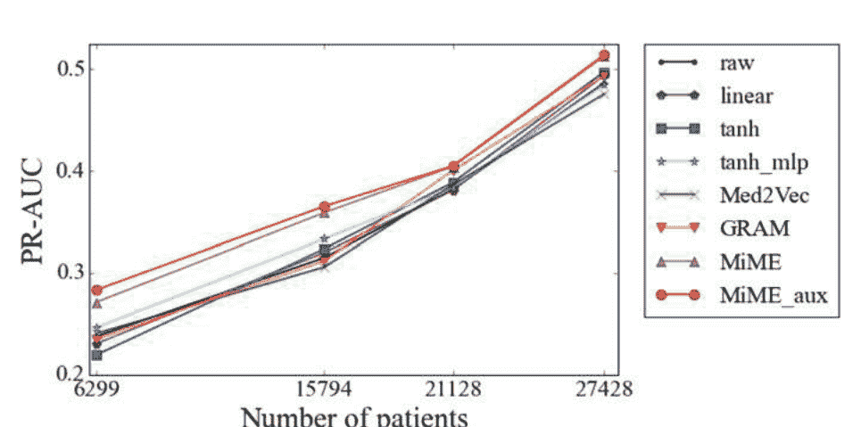

图5.11 测试HF预测的PR-AUC随数据大小增加的变化

## 5.5 练习

1.  Med2Vec和Word2Vec之间的关键区别是什么？
2.  Med2Vec和MiME之间的关键区别是什么？
3.  关于独热编码，哪个说法是不正确的？
    (a) 独热编码向量是一个多维向量，除了一个维度为1之外，其他维度都为0。
    (b) 独热编码会将相似概念的向量分组在一起。
    (c) 任意两个独热编码向量之间的距离始终相同。
    (d) 独热编码常用于编码分类数据。
4.  关于Word2Vec，哪个说法是不正确的？
    (a) 独热编码向量是一个多维向量，除了一个维度为1之外，其他维度都为0。
    (b) 较大的上下文窗口意味着距离较远的单词在跳字模型计算中被视为相似。
    (c) 分母∑ 所有单词_{(w)}exp_{(vw)}^T vt)在Skip-gram中可以轻松计算 p_{(c|t)}。
    (d) 负采样将上下文单词和目标单词的配对视为正例，将随机单词和输入目标单词的配对视为负例。
5.  以下哪项不是Word2vec的合适医疗应用？
    (a) 相似性搜索：根据Word2vec嵌入的欧几里德距离找到相似的医疗概念。
    (b) 代数运算：通过对Word2vec嵌入进行求和和减法来更好地理解医疗概念的组合。
    (c) 预测建模特征：利用Word2vec嵌入作为输入特征向量，支持下游的分类或回归模型。
    (d) 可视化：直接可视化医疗概念的Word2vec嵌入，以了解医疗概念之间的关系。

## 6. 高维数据可视化面临哪些挑战？（多个正确答案）

-   (a) 在二维空间中可视化时保持原始数据的关系。
-   (b) 确保相似的数据点在二维空间中映射到附近的位置。
-   (c) 提供计算效率高的方法来产生可视化效果。
-   (d) 在可视化数据时产生美观的效果。

## 7. 以下哪个陈述与PCA和t-SNE的比较不正确？

-   (a) PCA是一种降维算法，试图保持所有数据点之间的全局距离。
-   (b) t-SNE试图将高维数据投影到二维空间，同时保持局部距离。
-   (c) t-SNE更适合可视化高维数据。
-   (d) t-SNE比PCA在计算上更高效。

## 8. 关于Med2Vec方法，以下哪个陈述不正确？

-   (a) 它对医疗数据的两个层次进行建模，即访问层和患者层。
-   (b) Med2Vec最适合建模临床笔记。
-   (c) Med2Vec旨在建模临床代码的序列。
-   (d) Med2Vec是对电子健康记录数据的word2vec的一种泛化。

## 9. 以下关于MiME：多级医学嵌入方法，哪个说法是不正确的？

-   (a) 它利用了从诊断到治疗的依赖关系。
-   (b) 它使用多级层次结构（治疗->诊断->访问-患者）对EHR数据进行建模。
-   (c) 它引入了辅助预测任务，以预测每次访问中的诊断和治疗。
-   (d) 它为每个预测提供了直接而直观的解释。

# 第6章 卷积神经网络（CNN）

卷积神经网络（CNN或ConvNet）是一种特定类型的神经网络，用于处理类似网格的数据，例如图像和时间序列。在医疗保健应用中，CNN模型广泛用于从医学图像中进行自动特征学习和疾病分类，例如皮肤病变的自动分类[45]，糖尿病视网膜病变的检测[61]和COVID X射线分类[120]。此外，CNN在使用生物信号（如心电图（ECG）[155]和脑电图（EEG）[7]）进行疾病检测方面表现出色。最近，研究人员还将CNN模型应用于结构化的EHR数据[18, 177]和临床文本[3, 114]。

## 6.1 卷积神经网络的直觉

卷积神经网络是由一层层卷积组成的神经网络，通常还包括额外的非线性激活和池化层，然后是全连接层。与DNN模型将每个神经元连接到下一层的所有神经元不同，CNN模型专注于局部特性。特别是，它们在输入层上使用卷积来创建局部连接，使得输入中的每个区域都与下一层的一个单元相连。卷积输出被称为特征图，在下一节中将详细讨论。卷积之后，池化层逐渐减小特征图的大小。

卷积和池化层的设计利用了网格状数据（例如图像或时间序列信号）的局部特性，即平移不变性和组合性。

-   平移不变性意味着一个局部区域（例如图像中的一个部分或ECG序列的片段）的统计特性与其他局部区域相似。因此，从一个局部区域学到的特征可以在所有区域中使用。

## 6.2 CNN的架构

本节描述了CNN架构的组成部分，即卷积层、池化层和全连接层。相关符号定义在表6.1中。

### 6.2.1 卷积层：1D

**直觉** 卷积层是区分CNN和其他深度学习模型的基本组成部分。 对于1D卷积，想法是从1D信号（如EEG）中提取各种局部模式。方法是使用滤波器（也称为卷积核）定义这些模式，然后反复应用这些滤波器到信号上生成称为特征图的特征。 然后可以连续应用多个卷积操作以生成越来越复杂的特征。

**符号** 卷积层的输入和输出称为特征图，用 $F^{(l)}$ 表示。特别地，来自第l层的特征图 $F^{(l)}$ 将成为第l层卷积操作的输入，生成输出特征图 $F^{(l+1)}$。 卷积操作本身由一组$m$个滤波器指定。

**表6.1 卷积神经网络的符号**

| 符号 | 定义 |
| :--- | :--- |
| $F^{(l)} \in \mathbb{R}^{T \times n}$ | 第$l$层的1D特征图 |
| $F^{(l)} \in \mathbb{R}^{T_1 \times T_2 \times n}$ | 第$l$层的2D特征图 |
| $T, T_1 \times T_2$的大小 | 1D信号或2D图像的大小 |
| $n$ | 输入通道或深度的数量 |
| $m$ | 滤波器或输出通道的数量 |
| $k_1, k_1 \times k_2$ | 1D或2D滤波器的大小 |
| $W \in \mathbb{R}^{k_1 \times m \times n}$ | 1D卷积的权重张量 |
| $W \in \mathbb{R}^{k_1 \times k_2 \times m \times n}$ | 2D卷积的权重张量 |
| $b^{(l)} \in \mathbb{R}^m$ | 偏置向量 |

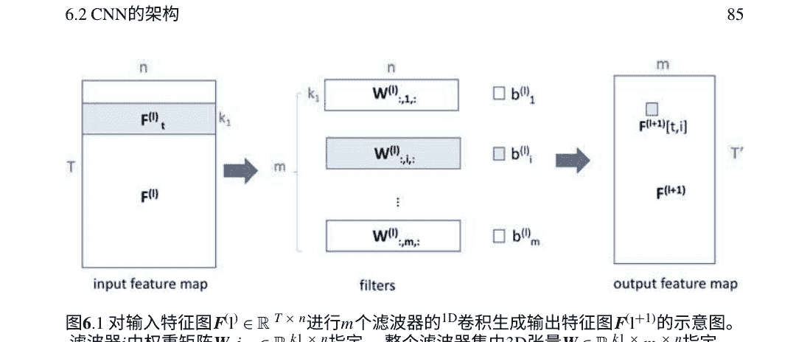

由权重矩阵$W$参数化，其中$_i \in \mathbb{R}^{k_1 \times n}$和偏差项$b_i(l)$（即标量），滤波器索引$_i$从$1$到$m$。整个卷积由3D权重张量$\mathbf{W} \in \mathbb{R}^{k_1 \times m \times n}$和偏差向量$b(l) \in \mathbb{R}^{m}$来指定。这里，$k_1$是滤波器大小，$m$是滤波器数量（也是输出通道数量），$n$是输入通道数量。例如，如果我们在一个6通道的EEG数据上应用大小为$^{100}$的50个滤波器，我们有$k_1=^{100}$（滤波器大小），$m=50$（滤波器数量）和$n=6$（通道数量）（图6.1）。

卷积输出特征图的每个元素计算如下。

$$F^{(l+1)}[t, i] = \mathbf{W}_{:,i,:}^{(l)} \otimes \mathbf{F}_t^{(l)} + b_i^{(l)}$$

其中 $i$ 是滤波器索引，$F_t^{(l)} \in \mathbb{R}^{k_1 \times n}$是我们在输入上滑动滤波器时的第 $t$ 个补丁，$F^{(l+1)}[t, i]$是输出的$(t, i)$元素。这里 $\otimes$ 表示逐元素相乘后求和：

$$\mathbf{W}_{:,i,:}^{(l)} \otimes \mathbf{F}_t^{(l)} = \sum_{a=1}^{k_1} \sum_{b=1}^{n} \mathbf{W}_{a,i,b}^{(l)} \cdot \mathbf{F}_t^{(l)}[a, b]$$

这类似于内积，但是推广到两个矩阵之间的操作。此外，通常会在输出特征图上应用非线性激活函数，如ReLU。在这种情况下，我们将会有

$$F^{(l+1)}[t, i] = \sigma \left( \mathbf{W}_{:,i,:}^{(l)} \otimes \mathbf{F}_t^{(l)} + b_i^{(l)} \right)$$

其中 $\sigma$ 是激活函数。

**步幅** 一个重要的参数是步幅大小 $S$，它决定了我们在输入上应用滤波操作的频率。当 $S=1$ 时，表示我们每次滑动滤波器一个元素。当 $S=2$ 时，我们将会每隔一个元素滑动滤波器。

这意味着我们将会在输入上每隔一个元素应用滤波器。较大的步幅大小会导致较小的输出，反之亦然。**填充** 卷积的另一个重要细节是如何处理边界上的元素。两种常见的策略是填充或不填充。填充的思想是在输入数据边界之外添加额外的值（通常是零），以确保可以对靠近边界的元素进行卷积。例如，如果输入长度为 T，滤波器大小为 2P + 1，我们可以在输入的每一侧填充 P个零，以获得长度为 T的输出（假设步幅为1）。

现在我们总结一下卷积层的参数和超参数。卷积层接受大小为T×n的输入数据。卷积层具有以下超参数，包括滤波器数量m，滤波器大小k1，步长S和填充大小P。然后该层将产生一个输出，其大小由T'×m给出，其中T'=(T-k1+2P)/S+1。

### 6.2.2 卷积层：2D

**直觉** 上，当我们处理图像时，2D卷积变得至关重要。直觉是构建各种局部模式提取器（滤波器），然后在图像的每个位置应用它们以生成有意义的特征。再次，可以堆叠卷积层以生成越来越复杂的特征。例如，较低层的滤波器可以检测边缘和点等简单模式，而较高层的滤波器可以找到不同的对象，如人脸。对于2D卷积，我们考虑一个简单的示例，如图6.2所示，其中中间是一个5×5的二进制输入矩阵。左边是一个3×3的滤波器。我们将对输入矩阵执行滤波器矩阵的卷积操作。在应用卷积操作时，通常会有多个输入通道和多个滤波器（因此有多个输出通道）。

**符号** 输入和输出特征图分别表示为 F^{(l)} 和 F^{(l+1)}，2D卷积操作也由一组 m 滤波器指定

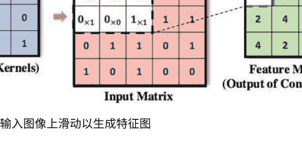

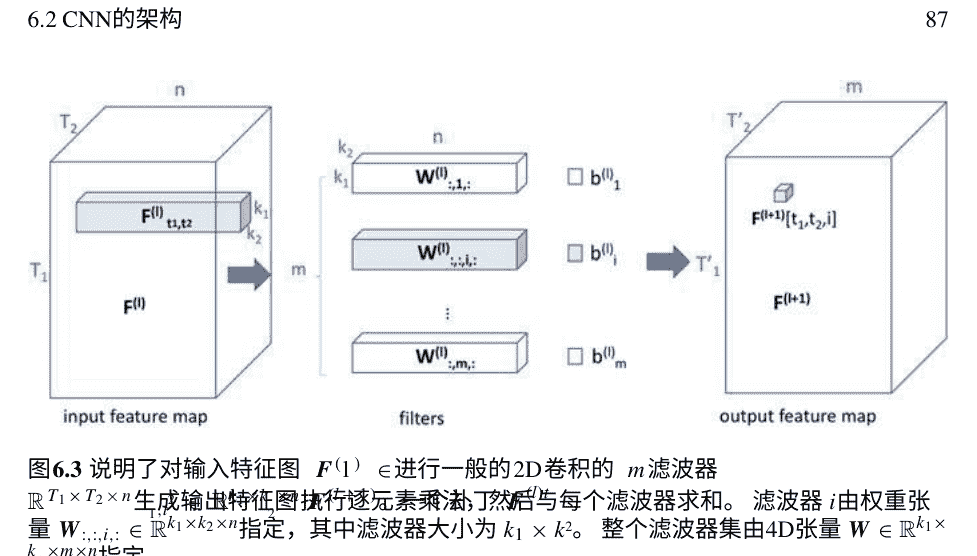

图6.3 说明了对输入特征图 \( F^{(1)} \in \mathbb{R}^{T_1 \times T_2 \times n} \) 进行一般的2D卷积的 \( m \) 滤波器 \( \mathbb{R}^{T_1 \times T_2 \times n} \)生成输出特征图执行逐元素乘加运算后与每个滤波器求和。 滤波器i由权重张量 \( W_{:,:,i,:}^{(l)} \in \mathbb{R}^{k_1 \times k_2 \times n} \)指定，其中滤波器大小为 \( k_1 \times k_2 \)。 整个滤波器集由4D张量 \( W \in \mathbb{R}^{k_1 \times k_2 \times m \times n} \)指定

每个参数化的卷积层由一个3D权重张量W和一个偏置项bi(l)组成，其中过滤器索引i从1到m。 整个卷积过程由一个4D权重张量W和一个偏置向量b(l)组成。这里， \( k_1 \times k_2 \)是过滤器的大小，m是过滤器的数量（也是输出通道的数量），n是输入通道的数量。例如，如果我们在一个3通道的RGB图像上应用50个大小为3×3的过滤器，那么 \( k_1=k_2=3 \)， \( m=50 \)， \( n=3 \)（图6.3）。

**卷积** 2D输入的卷积操作与1D情况类似，但多了一个索引：

$$F^{(l+1)}[t_1, t_2, i] = \sigma (W^{(l)}_{:,:,i,:} \otimes F^{(l)}_{t_1,t_2} + b^{(l)}_i)$$

其中 \( F_{t_1,t_2}^{(l)} \in \mathbb{R}^{k_1 \times k_2 \times n} \)是通过逐元素相乘后求和与过滤器 \( i \)一起操作的补丁， \( W_{:,:,i,:}^{(l)} \in \mathbb{R}^{k_1 \times k_2 \times n} \)和 \( b_i^{(l)} \)分别是过滤器i的权重张量和偏差项。而 \( F^{(l+1)}[t_1, t_2, i] \)是输出特征图的一个元素， \( \sigma \)是激活函数。

总结一下，2D卷积层接受大小为 \( T_1 \times T_2 \times n \)的输入数据其中 \( T_1 \times T_2 \)是图像大小，n是输入通道数或深度。 例如，大小为 \( 1024 \times 1024 \)的彩色医学图像是一个3D张量大小为 \( 1024 \times 1024 \times 3 \)（给定RGB颜色通道）。 卷积层具有以下超参数，包括过滤器数量m，过滤器大小 \( k_1 \times k_2 \)，步长S和填充数量P。 然后该层将产生一个大小为 \( T_1' \times T_2' \times m \)的输出特征图其中 \( T_1'=(T_1-k_1+2P)/S+1 \), \( T_2'=(T_2-k_2+2P)/S+1 \)。

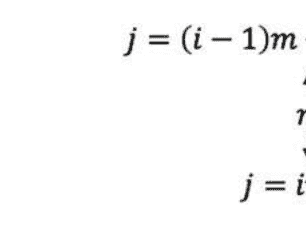

### 6.2.3 池化层

池化是通过聚合对特征图进行子采样。池化层通常在卷积或激活步骤之后产生平移不变的局部特征，称为池化特征图。例如，如图6.4所示，为了在池化特征图中产生一个单元 $y_i^{(l+2)}$ ，池化操作在$(l+1)$层中的一个大小为$m$的池化区域上进行，索引从$(i-1)m+1$到$im$。设$f(·)$为池化函数，使得$y_i^{(l+2)} = f([o_{(i-1)m+1}^{(l+1)}, ..., o_{im}^{(l+1)}])$，其中 $o_j^{(l+1)}$ 是卷积层的输出。以下是几种常见的池化函数：

-   **均值池化** 从池化区域计算平均值：
    $f([o_{(i-1)m+1}^{(l+1)}, ..., o_{im}^{(l+1)}]) = \frac{1}{m} (\sum_{j=(i-1)m+1}^{im} o_j^{(l+1)})$

-   **最大池化** 从池化区域选择最大值：
    $f([o_{(i-1)m+1}^{(l+1)}, ..., o_{im}^{(l+1)}]) = \max_{(j=(i-1)m+1):(j=im)} o_j^{(l+1)}$

-   **求和池化** 将池化区域中的所有值相加：
    $f([o_{(i-1)m+1}^{(l+1)}, ..., o_{im}^{(l+1)}]) = \sum_{j=(i-1)m+1}^{im} o_j^{(l+1)}$ \tag{6.1}

无论我们使用哪种池化函数，池化层都会减小特征图的大小。局部连接和共享权重再加上池化将产生平移不变的局部特征。我们可以多次重复卷积和池化，然后使用全连接层来融合所有局部特征，并输出更抽象的特征用于分类任务。

总结一下2D CNN的池化层具有以下参数和超参数：池化层接受大小为 $T_1 \times T_2 \times n$ 的输入数据。池化层具有以下超参数，包括大小 F × F和步长 S。然后，它将产生一个大小为 T₁' × T₂' × m的输出，其中 T₁' = (T₁ - F)/S + 1, T₂' = (T₂ - F)/S + 1。输出通道的数量与输入通道的数量保持不变。

### 6.2.4 全连接层

全连接层通常在所有卷积和池化层之后添加。添加全连接层的原因是：

- 首先，在一系列卷积和池化层之后，我们现在拥有输入数据的高级特征。全连接层作为分类器，根据训练数据集将这些特征用于将输入图像映射到各种类别。
- 其次，全连接层可以灵活地进行非线性组合，以整合特征并提供更好的分类结果。

在多类别分类任务中，通常在最后的输出层使用softmax激活函数，例如在[1 20]中对胸部X光进行COVID-19、病毒性肺炎、细菌性肺炎或健康情况的分类。

## 6.3 CNN中的反向传播算法

接下来，我们将描述用于1D信号的CNN模型的前向计算和反向传播。2D图像的泛化是直接的。这个想法与DNN非常相似，但由于卷积和池化操作的存在，更加复杂。

### 6.3.1 1D数据的前向和反向计算

为了介绍前向计算和反向传播，我们考虑一个简化的1D CNN，如图6.5所示。1D CNN具有输入特征图 x^{(l-1)}。我们首先使用卷积滤波器将输入特征图转换为输出特征图。然后，我们对输出特征图应用非线性激活函数，如ReLU，以输出下一层的特征图。接下来，我们对输出特征图应用池化函数f^{(l)}，以生成池化后的特征图。全连接层可以按照这些步骤生成最终的预测结果。在接下来的内容中，我们省略了全连接层的计算，因为它们在第4章中已经描述过了。

前向计算 对于这个简单的CNN，前向计算由以下方程给出。

图6.5 简单1D CNN 的前向计算

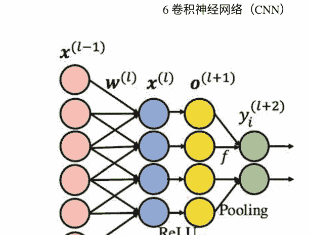

图6.6 池化层的反向传播

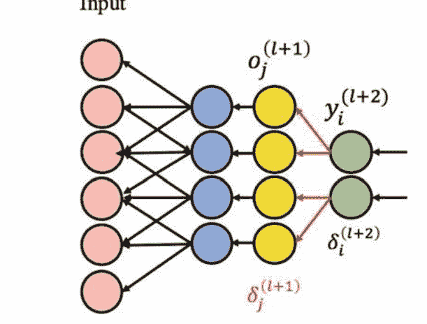

$$ x_i^{(l)} = \sum_m w_m^{(l)} x_{i+m}^{(l-1)} + b^{(l)} $$
$$ o^{(l+1)} = ReLU(x^{(l)}) $$
$$ y_i^{(l+2)} = f(o_j^{(l+1)}) \mid j \in (i-1)m + 1 : im $$

其中f ()是池化函数。

池化层的反向传播对于反向传播，我们从池化层开始，如图6.6所示。我们定义 \(\delta_j^{(l+1)} = \frac{\partial L}{\partial o_j^{(l+1)}}\) 来衡量节点 j对于 (l + 1)层的第 i个池化区域（例如，从 (i - 1)m +1到 im）在输出中的错误负责程度

该区域的输出。同样，我们也定义 \(\delta_i^{(l+2)} = \frac{\partial L}{\partial y_i^{(l+2)}}\) 测量第(l + 2)层的节点i对错误的贡献程度。然后，梯度下降更新规则用于池化层之前的单元，表示为 \(o_j^{(l+1)}\)，可以表示为

$$o_j^{(l+1)} = o_j^{(l+1)} - \eta \frac{\partial L}{\partial o_j^{(l+1)}}$$

其中 \(\eta\) 是学习率。为了更新这个公式，我们需要估计 \(\delta_j^{(l+1)} = \frac{\partial L}{\partial o_j^{(l+1)}}\)。根据链式法则，我们有以下推导。

$$\begin{aligned} \delta_j^{(l+1)} &= \frac{\partial L}{\partial o_j^{(l+1)}} \\ &= \frac{\partial L}{\partial y_i^{(l+2)}} \frac{\partial y_i^{(l+2)}}{\partial o_j^{(l+1)}} \\ &= \delta_i^{(l+2)} \frac{\partial y_i^{(l+2)}}{\partial o_j^{(l+1)}} \end{aligned}$$

其中 \(\frac{\partial y_i^{(l+2)}}{\partial o_j^{(l+1)}}\) 根据池化函数的不同形式而有所不同。它们总结如下：

- 对于平均池化，我们有 \(\frac{\partial y_i^{(l+2)}}{\partial o_j^{(l+1)}} = \frac{1}{m}\);
- 对于求和池化，我们有 \(\frac{\partial y_i^{(l+2)}}{\partial o_j^{(l+1)}} = 1\);
- 对于最大池化，对于单元 \(j = \arg \max(o_j^{(l+1)})\)，我们有 \(\frac{\partial y_i^{(l+2)}}{\partial o_j^{(l+1)}} = 1\)，否则为0。这意味着从第 l +2层传递回来的梯度只指向那个在输出中取得最大值的神经元。其他神经元的梯度为零。

卷积层的反向传播接下来我们将描述如何执行卷积层的反向传播。对于图6.7中的示例，我们定义 \(\delta_j^{(l-1)} = \frac{\partial L}{\partial x_j^{(l-1)}}\) 来衡量第 (l − 1)层（特征图）中的节点 j对输出中的错误负有多大责任。通过链式法则，我们得到以下方程。

图6.7 卷积层的反向传播

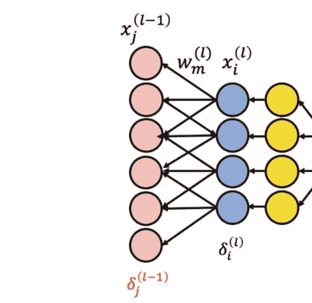

$$ \delta_j^{(l-1)} = \frac{\partial L}{\partial x_j^{(l-1)}} = \frac{\partial L}{\partial x_i^{(l)}} \frac{\partial x_i^{(l)}}{\partial x_j^{(l-1)}} = \delta_i^{(l)} \frac{\partial x_i^{(l)}}{\partial x_j^{(l-1)}} = \delta_i^{(l)} \frac{\partial (\sum_m w_m^{(l)} x_{i+m}^{(l-1)} + b^{(l)})}{\partial x_j^{(l-1)}} = \delta_i^{(l)} \sum_m w_m^{(l)} $$

接下来我们分析权重向量的梯度 $\frac{\partial L}{\partial w_m^{(l)}}$。根据链式法则，我们有以下方程。

$$ \frac{\partial L}{\partial w_m^{(l)}} = \frac{\partial L}{\partial x_i^{(l)}} \frac{\partial x_i^{(l)}}{\partial w_m^{(l)}} = \delta_i^{(l)} \frac{\partial x_i^{(l)}}{\partial w_m^{(l)}} $$

$$= \delta_i^{(l)} \frac{\partial(\sum_k w_k^{(l)} x_{i+k}^{(l-1)} + b^{(l)})}{\partial w_m^{(l)}} = \delta_i^{(l)} \sum_m x_{i+m}^{(l-1)}.$$

同样地，我们可以找到偏置项的梯度 ∂L/∂b^{(l)}:

$$\frac{\partial L}{\partial b^{(l)}} = \frac{\partial L}{\partial x_i^{(l)}} \frac{\partial x_i^{(l)}}{\partial b^{(l)}} = \delta_i^{(l)} \frac{\partial x_i^{(l)}}{\partial b^{(l)}} = \delta_i^{(l)} \frac{\partial(\sum_k w_k^{(l)} x_{i+k}^{(l-1)} + b^{(l)})}{\partial b^{(l)}} = \delta_i^{(l)}.$$

一旦梯度被确定，更新规则就很简单：

$$w_m^{(l)} = w_m^{(l)} - \eta \frac{\partial L}{\partial w_m^{(l)}}$$

和

$$b^{(l)} = b^{(l)} - \eta \frac{\partial L}{\partial b^{(l)}}.$$

其中 η 是学习率。

### 6.3.2 特殊的CNN架构

多种不同的CNN架构在过去的几年中被提出。接下来，我们介绍几种流行的CNN架构。其中大部分都在ILSVRC ImageNet挑战赛上进行了比较。根据比赛中的前5个分类错误率进行比较，即模型前5个预测中错误的百分比。ImageNet数据集有1000个类别，包含许多难以区分的图像。从图6.8中，我们可以看到

> ¹http://image-net.org.

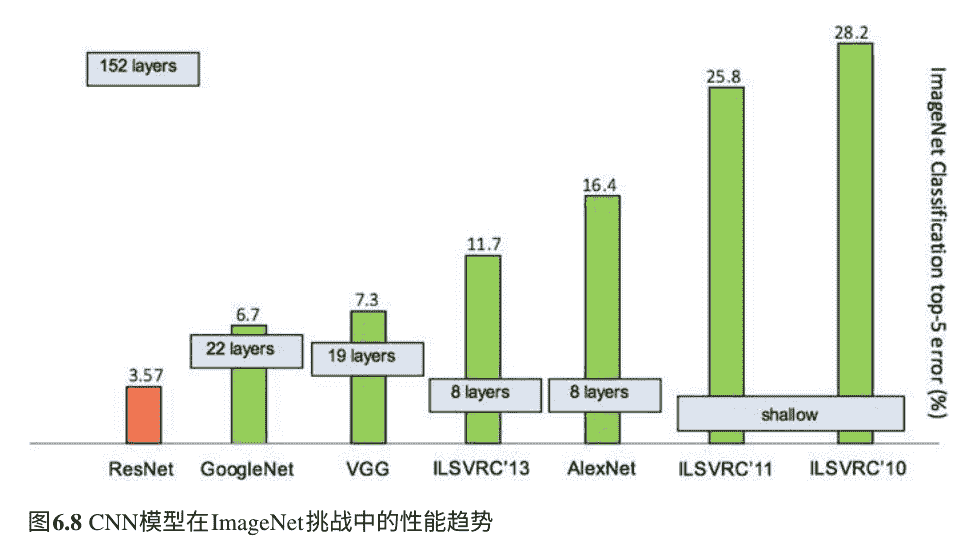

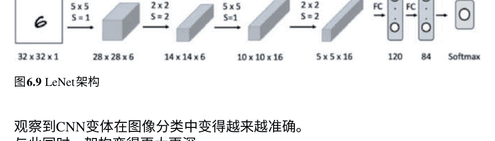

观察到CNN变体在图像分类中变得越来越准确。与此同时，架构变得更大更深。

#### LeNet

LeNet [96]是一个早期的CNN结构，包含七个卷积层和分类层，用于识别数字。在原始工作中，它被应用于识别支票上的手写数字。如图6.9所示，LeNet以32x32的灰度图像作为输入，首先应用六个5 ×5的卷积滤波器，步长为1，无填充，生成一个28 × 28 ×6的特征图。然后应用2 ×2的平均池化滤波器，步长为2，生成一个14 ×14 ×6的特征图。接下来，再应用16个5 ×5的卷积滤波器，步长为1，无填充，生成一个10 ×10 ×16的特征图。然后引入另一个平均池化层，接着是两个全连接层，生成最终的softmax分类结果。

LeNet大约有60k个参数。为了处理更高分辨率的图像，LeNet需要更多和更大的卷积层。鉴于LeNet是在GPU普及之前提出的，可用的计算硬件限制了它的架构。

#### AlexNet

AlexNet在架构上与LeNet [90]类似，但更深，并且每层有更多的过滤器，并且有堆叠的卷积层。AlexNet在卷积层后引入了ReLU激活函数。它大约有6000万个参数。AlexNet是第一个在2012年赢得ImageNet挑战的深度学习模型，其前五错误率为15.3%，而第二名的前五错误率为26.2%。此后，ImageNet挑战的所有获胜模型都是深度学习模型（图6.10）。

#### VGG

VGG16是一个卷积神经网络模型，提出于[136]。VGG16通过将大的滤波器（例如11 ×11和5 ×5）替换为多个连续的小滤波器来改进AlexNet。图6.11显示了VGG16的详细架构。VGG16还引入了1 ×1的滤波器，它对输入通道进行线性组合，然后进行非线性激活（ReLU函数）。

它有1.38亿个参数。例如，VGG16模型需要超过533MB的存储空间，这对于训练和推断来说可能是非常昂贵的。

#### GoogLeNet Inception Net

GoogleLeNet Inception架构是另一个流行的CNN架构，具有几个重要的思想[146]，如图6.12所示：

- 多分辨率：Inception架构不是堆叠卷积层，而是引入了多个不同尺寸的并行卷积滤波器路径，以捕捉不同分辨率的模式。多个滤波器的组合一起作为构建块，称为Inception单元，将被堆叠起来形成CNN架构。
- 堆叠较小的滤波器：为了减少计算成本和参数数量，堆叠多个较小的滤波器来近似一个较大的滤波器更加高效。例如，可以通过连接两个3 ×3的滤波器来近似一个5 ×5的滤波器。同样地，可以通过一个3 ×1的滤波器后跟一个1 ×3的滤波器来近似一个3 ×3的滤波器。像VGG16一样，1 ×1的滤波器也用于通过组合输入通道来调整输出通道的数量。
- 辅助损失：在网络中间添加辅助损失可以提高模型性能。这个想法在ResNet中通过跳跃连接的概念得到了显著增强。

Inception架构的参数数量约为500万（V1版本）和2300万（V3版本）。

#### ResNet

残差神经网络（ResNet）[66]克服了训练非常深的神经网络时出现的一个令人困扰的问题，称为退化问题。

也就是说，当神经网络的深度增加时，网络的性能会降低。为什么会发生退化的直观解释是，每一层都必须构建一个全新的特征集，而不能重用从前一层学到的特征。

为了使用前一层的特征，ResNet提出了“跳跃连接”的概念，允许输入直接通过而不进行任何转换。因此，任何一层学到的新特征都是输入特征尚未捕捉到的残差模型。形式上，这种效果由图6.13中的残差块来建模。

图6.13 残差块

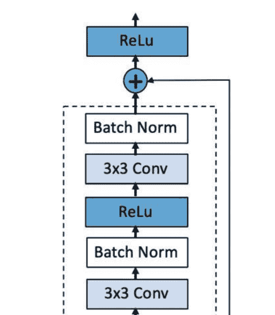

残差学习对辅助损失或门控单元也有类似的效果。多亏了这种技术，ResNet可以训练非常深的神经网络（例如152层），同时仍然实现高准确性。ResNet模型的参数数量实际上是适度的。例如，流行的ResNet-50架构有2500万个参数。

#### DenseNet

密集连接卷积网络（DenseNet）[75]通过将一层的输出连接到所有后续层的输入来推广跳跃连接的思想。这样，DenseNet可以最大程度地重用所有层的特征。由于特征的重用，DenseNet可以在小数量的过滤器（例如，每层12个过滤器）下表现良好。因此，它导致的参数比ResNet更少。DenseNet还通过重复称为密集块的计算单元来构建更深的网络，如图6.14所示。由于密集连接，梯度可以更容易地在深层网络中传播。

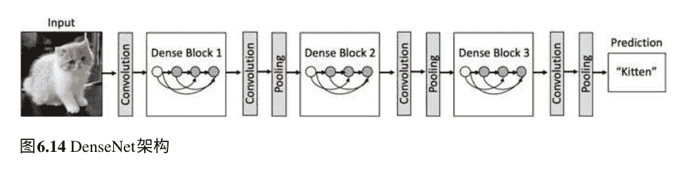

## 6.4 病例研究：糖尿病视网膜病变检测

问题 卷积神经网络模型在检测视网膜底图像中的糖尿病视网膜病变方面表现如何？模型的性能与眼科医生的手动分级相比如何？在[61]中提出了一项系统研究来解决这些问题。

数据 训练数据来自于在美国和印度接受糖尿病视网膜病变筛查的患者的黄斑中心视网膜图像，由EyePACS提供。眼科医生对开发和临床验证集中的所有图像进行了糖尿病视网膜病变的评分。根据国际临床糖尿病视网膜病变分级标准，糖尿病视网膜病变的严重程度（无、轻度、中度、重度或增殖性）进行了评分。数据总结如表6.2所示。请注意，标记的训练/开发集非常庞大，超过128K，这为训练复杂的CNN模型提供了优势。

方法 为了进行分类，采用了卷积神经网络来计算眼底图像中像素强度对糖尿病视网膜病变严重程度的影响。它首先将附近的像素组合成局部特征，然后将其聚合成全局特征。虽然该网络没有明确检测病变（如出血、微血管瘤），但它很可能通过学习局部特征来识别它们。本研究中使用的具体神经网络是Inception v3架构[147]。

结果显示，CNN模型在这些任务上具有很高的敏感性和特异性。在两个验证集中，共有9963张图像和1748张图像，在选择高特异性的操作点时，该算法对于检测可参考的糖尿病视网膜病变（即中度或更严重的糖尿病视网膜病变或可参考的黄斑水肿）具有90.3%和87.0%的敏感性，以及98.1%和98.5%的特异性，这是由至少7名美国董事会认证眼科医生的多数决定所定义的。在选择高敏感性的操作点时，该算法在两个验证集中具有97.5%和96.1%的敏感性，以及93.4%和93.9%的特异性。这项工作的另一个重要结果是说明了训练样本大小和标签可靠性的重要性。图6.15a显示了随着训练数据规模的增加，模型性能的增长趋势。在这个任务中，5万个训练图像似乎足够。图6.15b显示了随着每个图像分配更多等级，性能趋势的增加。每个图像分配更多等级会导致更可靠的标签，从而可以提高模型性能。

表6.6 糖尿病视网膜病变检测研究的数据集概述

| 特征 | 开发集 | EyePACS-1验证数据 | Messidor-2验证数据 |
| --- | --- | --- | --- |
| 图像数量 | 128,175 | 9963 | 1748 |
| 眼科医生数量 | 54 | 8 | 7 |
| 每张图像的等级数量 | 3~7 | 8 | 7 |
| 眼科医生的等级数量，中等 | 2021 (304~8366) | 8906 (8744~9360) | 1745 (1742~1748) |
| 唯一患者数量 | 69,573 | 4997 | 874 |
| 年龄（平均） | 55.1 (11.2) | 54.4 (11.3) | 57.6 (15.9) |
| 女性百分比 | 59.9 | 62.2 | 42.6 |
| 完全分级图像的百分比 | 75.1 | 88.4 | 99.8 |
| 既有糖尿病视网膜病变又有黄斑水肿的图像数量 | 118,419 | 8788 | 1745 |
| 无糖尿病视网膜病变 | 53,759 | 7252 | 1217 |
| 轻度糖尿病视网膜病变 | 30,637 | 842 | 264 |
| 中度糖尿病视网膜病变 | 5298 | 54 | 28 |
| 重度糖尿病视网膜病变 | 4359 | 95 | 25 |
| 增殖性糖尿病视网膜病变 | 18,224 | 272 | 125 |
| 可参考的糖尿病性黄斑水肿 | 33,246 | 683 | 254 |

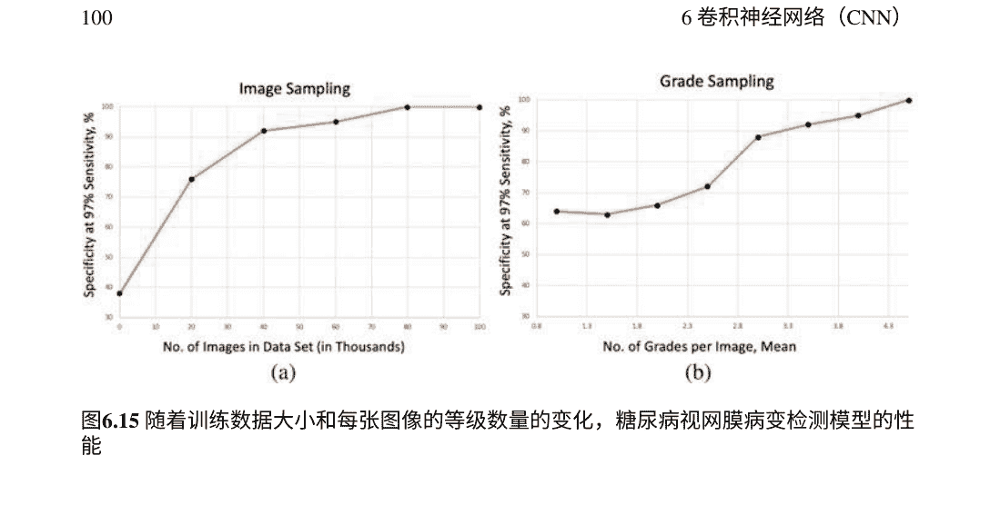

## 6.5 案例研究：皮肤癌检测

问题 另一个著名的例子是使用CNN辅助皮肤癌检测。

数据和方法 在[44]中，研究人员使用了一个包含129,450个临床皮肤图像的数据集来训练CNN。特别地，该数据集由皮肤科医生标记的图像组成，按照2032种疾病的树状结构分类，其中各个疾病形成叶节点。这些图像来自18个不同的临床医生策划的开放获取在线存储库，以及斯坦福大学医学中心的临床数据。数据集分为127,463个训练和验证图像以及1942个经活检标记的测试图像。CNN被应用于两个诊断任务：角质细胞癌与良性脂溢性角化病的分类；以及恶性黑素瘤与良性痣的分类。第一个案例代表最常见的癌症的识别。第二个案例代表最致命的皮肤癌的识别。Inception V3模型在2014年ImageNet大规模视觉识别挑战赛中预训练了大约1.28百万张图像（1000个物体类别）。为了使用预训练模型进行初始化，CNN模型还在皮肤图像上进行了进一步的训练（即微调）。CNN模型使用757种疾病类别进行训练。

结果 性能与21名获得认证的皮肤科医生进行了比较。卷积神经网络在两个任务上的表现与所有经过测试的专家相当，证明了一种能够与皮肤科医生相媲美的人工智能，能够对皮肤癌进行分类。详细结果显示在图6.16中，卷积神经网络模型的表现优于平均皮肤科医生。

图6.17显示了卷积神经网络模型最后一层的t-SNE图，可以观察到不同类别图像的明显分离。

## 6.6 案例研究：自动监测颅内图像中的急性神经事件

问题 如何对急性神经事件的头部CT图像进行准确和高效的筛查？[156]的作者介绍了一个使用NLP程序提供的弱监督训练的3D-CNN模型。

### 数据
本研究使用了来自Icahn School of Medicine AI Consortium (AISINAI)的37,236个影像研究和96,303个放射学报告。所有影像研究和放射学报告都基于通用医学语言系统（UMLS）的诊断术语进行了弱标签注释。UMLS概念通用标识符的NLP标签被聚合成更高级别的疾病类型。少量图像（180张）用于创建测试集，手动审核和标记。其余的图像用作训练和验证集，使用基于提取的UMLS标识符的弱标签进行标记。

### 方法
用于识别图像是否包含急性神经疾病，使用ResNet-50架构和3D-CNN进行训练以预测疾病的严重程度。在他们的模拟中，深度学习模型将研究标记为关键或非关键。然后根据关键发现的概率将图像按工作队列排序。随机顺序被用作基准进行比较。对于测试数据，从弱标准标签数据集中随机查询了180个图像，以实现非关键研究和关键研究的近似1:1分割。通过手动审核获得了金标准标签，放射科医生手动将每种疾病的严重程度分配为关键或非关键。其余具有弱标签的研究被分为训练和验证集，比例为80:20。在弱标签中，关键发现的患病率分别为4、8和10 UMLS关键发现每个记录的7.6%、0.8%和0.7%。

### 结果
有两组结果。其中一组是关于模型预测性能的，如AUC、准确率、敏感性和特异性。另一组是关于基于图像解释的分诊试验。

### 模型性能
由于模型是用弱标签进行训练的，它们的性能是在弱标签数据上进行测试的，最终在小规模的金标准测试集上进行测试。对于预测训练集上关键发现的弱标签，3D-CNN的AUC达到了0.88。然而，模型在金标准测试集上的性能明显较低。DL模型的AUC为0.73。模型的敏感性和特异性分别为0.79和0.48。相比之下，医生的平均敏感性和特异性分别为0.79（标准差0.04）和0.85（标准差0.07），要高得多，特别是在特异性方面。这个结果表明，人类医生在这个任务上仍然明显优于DL模型，可能是因为用于模型训练的弱标签的质量有限。

### 试验模拟
作者模拟了一项随机对照试验（RCT）的图像解释。在模拟中，评估了DL模型和放射科医生在多快地识别和提供关键发现的通知方面。由于队列优先级和快速评估是重点，因此对模型的运行时间进行了评估。DL模型对图像进行评分并可能发出警报的平均时间为1.2秒，而人类需要177秒。由DL模型构建的分级队列与非关键研究相比，关键研究的队列位置分布显著较低（双侧Wilcoxon秩和检验，P = 0.01, n = 180）。这似乎证实了DL模型在分诊中的潜在应用，即使预测准确性有限。

## 6.7 案例研究：从病理图像中检测淋巴结转移

问题 准确地检测全切片病理图像中的转移是诊断乳腺癌的重要任务。目前，这项任务由病理学家执行，他们既昂贵又耗时。在[42]中，作者报告了一个研究竞赛（CAMELYON16），旨在开发自动化解决方案来检测淋巴结转移。

### 数据
分析中使用的训练数据是来自荷兰两个中心的全切片图像数据集（110个有淋巴结转移，160个无淋巴结转移）。算法性能在一个独立的测试集中进行评估，该测试集包含129个全切片图像（49个有转移，80个无转移）。来自荷兰的11名病理学家还在时间限制（WTC-2小时评估129个测试图像）下评估了相同的测试集，以确定每个切片中淋巴结转移的可能性，模拟常规病理工作流程，并由一名没有时间限制的病理学家（WOTC）进行评估。

### 方法
在CAMELYON16竞赛的背景下，提出了许多方法。使用了几种CNN架构来分析整张病理切片图像。这个竞赛中有两个任务：
- 任务1 肿瘤定位：识别图像上各个转移灶的位置。评估算法的能力来识别整张病理切片图像中的特定转移灶。任务1的评估指标是专门设计的。具体而言，需要根据真阳性率对一组位置进行评分，这个真阳性率是从6个预定义的假阳性率中选择的：1/4（表示每4张图像中有1个假阳性结果）、1/2、1、2、4和8个假阳性结果每张病理切片图像；
- 任务2 图像分类：对整张图像进行分类，无需指定转移灶的位置。任务2的评估指标是接收者操作特征曲线下面积（AUC）的标准指标。任务2评估算法在49张带有SLN转移灶的病理切片图像和80张没有SLN转移灶的病理切片图像（对照组）之间的区分能力。在这种情况下，不需要识别图像中的特定转移灶。参与者使用与任务1相同的评分模式提供了一个置信度分数，表示每张病理切片图像中包含乳腺癌SLN转移的任何证据的概率。

接下来，我们描述了MGH和MIT的获胜方法[42]。首先，使用基于阈值的算法区分组织区域和背景。然后，CNN模型仅在组织区域上进行训练。从正负区域中采样数百万个256 ×256的补丁，构建大样本来训练CNN模型。使用不同的准确性使用了各种CNN架构。类似地，测试了不同的放大倍数（40倍，20倍和10倍）。GoogLeNet和40倍放大倍数在补丁级别上表现最佳。基于补丁级别的分类，一组误报补丁被添加到训练集中作为“困难负样本”。数据增强，如旋转、随机裁剪和添加颜色噪声，也被用来丰富训练数据的多样性。

### 结果
最佳性能的算法[42]使用了GoogLeNet架构，在任务1中得分为0.807（95%CI，0.732-0.889），在任务2中得到了0.994的AUC（95%CI，0.983-0.999）。这个AUC超过了病理学家在时间限制下的平均表现（平均AUC为0.810 [范围为0.738 – 0.884]）在诊断模拟练习中。

## 6.8 病例研究：心脏病学级别的心律失常检测和分类在动态心电图中

问题 计算机化心电图（ECG）解读是一个重要的问题。作者在[65]中提出了一个深度学习模型，用于从ECG数据中检测12种节律类别。

### 数据
限制ECG分析中深度学习的一个主要原因是缺乏适当的训练数据。在这项工作中，构建了一个包含广泛的ECG节律类别的大型ECG数据集，并进行了专家注释。训练数据集包括来自53,549名患者的91,232个ECG记录的单导联ECG。ECG数据是由单导联、基于贴片的动态心电图监测仪记录的，该仪器以200Hz的频率连续记录来自单个向量（改进的导联II）的数据。平均佩戴时间为10.6天，中位数为13.0天。平均年龄为69岁±16岁，其中43%为女性。该模型在一个测试数据集上进行评估，该数据集包含328个心电图记录，来自328名独立患者，由专家心脏病学家的共识委员会进行注释。注释由经过认证的心电图技术人员完成，他们指定了所有节律的开始时间和结束时间。训练集中过采样了像AVB这样的罕见节律。地面真实标签由每个心脏病学委员会的3名成员的共识分配。

### 方法
本研究开发了一个深度神经网络（DNN），用于使用来自53549名使用单导联动态心电图监测设备的患者的91232个单导联心电图进行12种节律的分类。开发了一个CNN模型，如图6.18所示。该模型接收200Hz（6000维向量）的30秒心电图记录，并输出12个类别的概率分布：
- (1) 房颤，
- (2) 房室传导阻滞，
- (3) 二联律，
- (4) 异位房律，
- (5) 室性逸搏心律，
- (6) 交界性心律，
- (7) 噪音，
- (8) 窦性心律，
- (9) 心房上速，
- (10) 三叉律，
- (11) 心室上速，
- (12) Wenckebach。

该模型以滑动窗口的方式进行训练和应用，并在每256个元素（每1.28秒）输出12维的预测。该架构基于ResNet。

### 结果
提出的模型经过由董事会认证的执业心脏病学家共识委员会注释的独立测试数据集验证。该DNN模型的平均受试者工作特征曲线下面积（ROC）为0.97。DNN的平均F1分数（即阳性预测值和敏感性的调和平均值）为0.837，超过了平均心脏病学家的0.780。在将特异性固定为心脏病学家平均特异性的情况下，DNN的敏感性在所有节律类别中均超过了平均心脏病学家的敏感性。

## 6.9 案例研究：COVID X射线图像分类

问题 没有什么比2020年的COVID-19大流行更令人惊讶和毁灭性了。对于医院来说，准确和高效的COVID-19诊断和分级可以带来巨大的价值，以应对这一大流行病。研究人员[120]研究了使用深度神经网络区分COVID-19胸部X射线图像与其他肺炎和健康患者的可能性。我们的主要任务是区分COVID-19胸部X射线图像与其他肺炎和健康患者，这可以被视为多类别分类任务。

### 数据
我们结合了两个公开可用的数据集：
- COVID胸部X射线（CCX）数据集：我们从CCX数据集中获取COVID-19肺炎图像，该数据集包含其他类别的一些X射线图像。
- Kaggle胸部X射线（KCX）数据集：该数据集包含三种类型的X射线图像：正常、细菌性肺炎和非COVID-19病毒性肺炎。

所有的KCX图像和大多数CCX图像都基于前后位（AP）或后前位（PA）视图。为了保持一致性，我们只包括同时具有AP和PA视图的图像在我们的最终实验数据集中。该数据集包括2874个独立患者病例的5508张胸部X射线图像。KCX数据中的所有图像都是AP/PA视图。CCX数据共有131张图像，其中119张是AP/PA图像。在我们的实验中，我们只选择了119张AP/PA图像。其中包括100张与COVID相关的肺炎图像，11张病毒性肺炎图像，7张细菌性肺炎图像以及1张正常患者的胸部X射线图像。由于AP和PA是两种不同的X射线视图，我们引入了水平翻转和随机噪声来将PA转换为AP视图。

### 方法
我们从两个公开可用的数据源构建了X射线成像数据，包括2874名患者的5508张胸部X射线图像，分为四类：正常、细菌性、非COVID-19病毒性肺炎和COVID-19。为了识别COVID-19，我们提出了一种基于Focal Loss的神经集成网络（FLAN-NEL），这是一个灵活的模块，可以将多个卷积神经网络（CNN）模型集成并与焦点损失融合，以在类别不平衡的数据上进行准确的COVID-19检测。

第一阶段基础学习器训练：卷积神经网络（CNN）在图像分类中被广泛使用并取得了巨大的成功。在这里，我们选择了5种流行的和最先进的CNN分类模型作为基学习器来建模COVID-19识别任务。选择以下模型是因为它们的灵活性和在一般图像分类中的高性能。
- Inception v3：这是Google的Inception卷积神经网络的第三版[146]。
- VGG19：该模型架构来自VGG组，具有批归一化，并由16个卷积层和3个全连接层组成[136]。
- ResNeXt101：这个101层的架构是由ResNeXt组设计的[168]。
- Resnet152：这是一个152层的深度残差神经网络，它学习的是残差表示函数，而不是直接学习信号表示[66]。
- Densenet161：这是一个具有161个层的密集连接卷积网络[75]。

第二阶段集成模型学习：我们使用基础学习器的预测结果和基础学习器权重的线性组合（表示为 w）来获得最终的预测结果 y = Softmax(∑ i w_i P_i)。然而，在训练过程中，数据中的类别不平衡会压倒和主导梯度，使得参数的最优更新变得困难。为了克服这种类别不平衡的挑战，我们采用了focal loss。最初，focal loss是一种用于二分类任务的损失函数，在这种函数中，分类正确的样本被降权，可以专注于学习难以平衡的样本[16]。在我们的模型中，我们将focal loss扩展到多类别分类，以解决这些不平衡问题。对于每个图像，我们将focal loss定义为：
$$L(\hat{y}, y) = \sum_{m=1}^{M} -\alpha_m y_m (1 - \hat{y}_m)^\gamma \log(\hat{y}_m)$$
其中 $M$ 是类别数，$(1- \hat{y}_m)^\gamma$ 是具有聚焦参数 $\gamma$ 的调制因子，$\alpha_m$ 表示类别 $m$ 的权重参数。

### 结果
FLANNEL在COVID-19识别任务中始终优于基准模型，所有指标都表现出色。与最佳基准模型相比，FLANNEL在Covid-19识别任务中显示出更高的宏F1分数，相对增加了6%，在精确度方面达到0.7833±0.07，在召回率方面达到0.8609±0.03，在F1分数方面达到0.8168±0.03（表6.3）。组合多个独立基础分类器的集成学习可以提高鲁棒性和准确性。总之，FLANNEL有效地结合了最先进的CNN分类模型，并利用Focal loss解决类别不平衡问题，在X射线上实现了更好的Covid-19检测性能。

## 6.10 练习

1. 如果你有一个包含100张X光图像的数据集，你还会使用CNN模型吗？如果是这样，你会尝试使用哪种架构？为什么？
2. 如果你有10,000张图像，你会尝试使用哪种CNN模型？
3. 问题1：以下关于卷积神经网络（CNN）的说法哪个是不正确的？
- (a) 与全连接神经网络相比，CNN具有更多的局部连接。
- (b) CNN通过滤波器实现权重共享。
- (c) CNN利用池化来尝试解决平移不变性的挑战。
- (d) CNN通常比全连接神经网络具有更多的参数。
4. 给定输入序列 = [1, 2, 3, 4, 5, 6] 和一个滤波器 [1 2 1]，在没有填充的情况下，使用步长2的卷积操作的输出是什么？
5. 在图6.19中，给定6x6的输入和两个4x4的滤波器，步长为1，没有填充，输出特征图的大小是多少？
6. 在图6.19中，给定6x6的输入和两个4x4的滤波器，步长为1，没有填充，卷积层的参数数量是多少？
7. 对于输入[1, 2, 3, 2, 3, 5]和大小为2、步长为2的滤波器，1D最大池化的输出是什么？
8. 以下关于AlexNet的说法哪个是不正确的？
- (a) 第一个赢得ImageNet分类挑战的深度神经网络。
- (b) AlexNet使用更大的11x11滤波器，计算效率比后续的CNN模型如VGG和ResNet更高。
- (c) 它在前馈层中具有更多的参数而不是卷积层。
- (d) 在卷积操作中，它比全连接层的前向计算使用更多的计算能力。
9. 以下关于CNN架构的说法哪个是错误的？
- (a) VGG引入了使用较小的滤波器堆叠而不是较大的滤波器的想法。
- (b) Inception Net引入了并行路径。
- (c) Inception Net使用1x1的滤波器来调整输出大小，以使不同并行路径的维度相同。
- (d) ResNet引入了跳跃连接，允许学习可变深度的网络。
10. 以下关于CNN模型的说法哪个是正确的？
- (a) CNN是用于图像分类的单一模型。
- (b) ResNet的参数比VGG和Inception Net都多。
- (c) CNN可以应用于图像和文本数据。
- (d) CNN模型的大小（模型参数数量）与计算量（FLOPS）成正比。
11. 为什么卷积神经网络模型在糖尿病视网膜病变检测应用中取得成功?
- (a) 存在许多标准化的视网膜图像。
- (b) 存在许多带有标签的图像。
- (c) 收集多个标签以生成黄金标准标签。
- (d) 这是一个简单的任务。
12. 在[44]中用于检测皮肤癌的神经网络架构是什么?

## 6.3 F1分数性能比较：使用一对其余策略计算类特定的F1分数

|             | COVID          | 病毒性肺炎 | 细菌性肺炎 | 正常          | 宏F1          |
|:------------|:---------------|:-----------|:-----------|:--------------|:--------------|
| InceptionV3 | 0.5904(0.27) | 0.5864(0.05) | 0.8056(0.01) | 0.8771(0.04) | 0.7149(0.09) |
| VGG19       | 0.6160(0.06) | 0.5349(0.04) | 0.7967(0.02) | 0.8691(0.03) | 0.7042(0.02) |
| ResNeXt101  | 0.6378(0.12) | 0.5649(0.03) | 0.7959(0.01) | 0.8537(0.02) | 0.7140(0.03) |
| Resnet152   | 0.6277(0.11) | 0.5506(0.02) | 0.7988(0.01) | 0.8700(0.01) | 0.7110(0.03) |
| Densenet161 | 0.6880(0.07) | 0.5930(0.02) | 0.8017(0.01) | 0.8953(0.01) | 0.7445(0.02) |
| 投票        | 0.7684(0.04) | 0.6005(0.03) | 0.8214(0.03) | 0.9079(0.01) | 0.7745(0.01) |
| FLANNEL     | 0.8168(0.03) | 0.6063(0.02) | 0.8267(0.00) | 0.9144(0.01) | 0.7910(0.01) |

## # 第7章 循环神经网络（RNN）

循环神经网络（RNN）是一类用于顺序数据的深度学习模型，例如纵向患者记录和时间序列数据。两个重要的RNN模型，即长短期记忆（LSTM）[71]和门控循环单元（GRU）[22]，因其解决长期依赖和梯度消失问题而受到广泛关注。

为什么选择RNN？ RNN非常适合建模可变长度的序列，例如纵向电子健康记录（EHR）数据，时间序列如脑电图（EEG）和心电图（ECG），以及临床笔记等文本序列。在医疗保健应用中，RNN模型被用于建模纵向电子健康记录（EHR）数据[30]、临床笔记[77]或连续监测数据[102]。RNN已经应用于各种任务，包括医学概念嵌入[4, 15, 144]、诊断分类[3, 25, 28, 59, 83, 102, 106]和序列预测[23, 28, 30, 76, 77, 116, 118, 119, 162]。

在本章中，我们首先定义与RNN相关的基本概念和符号。然后我们将讨论如何使用BPTT算法训练RNN模型。之后，我们将介绍两种RNN变体：LSTM和GRU单元，用于解决梯度消失问题以捕捉长期依赖关系。之后，我们将描述双向RNN模型和序列到序列模型。最后，我们介绍几个RNN模型在医疗保健领域的应用。

### ## 7.1 RNN基础知识

输入和输出： RNN模型的输入是一系列向量。我们将时间$t$的输入向量表示为$x^{(t)}$。每个输入向量 $x^{(t)}$映射到相应的隐藏层$h^{(t)}$。然后隐藏表示$h^{(t)}$将输出层产生为时间 $t$ 的 $o^{(t)}$。我们可以对 $o^{(t)}$ 应用激活函数 $g(\cdot)$，例如 softmax 函数，以获得预测值 $\hat{y}^{(t)}$，该值将用于与目标标签 $y^{(t)}$ 进行比较，该标签是在时间 $t$ 的诊断结果的指示器。例如，时间步 $t+1$ 的目标标签 $y^{(t+1)}$ 可以是心脏衰竭诊断的指示器，而 $\hat{y}^{(t)}$ 是基于时间 $t$ 之前的目标的预测。请注意，对于预测任务，时间 $t$ 的目标标签实际上来自未来时间的信息，例如 $t+1$。

RNN的参数让 $U$ 成为将输入 $x^{(t)}$ 映射到隐藏层 $h^{(t)}$ 的权重矩阵，$W$ 成为隐藏层 $h^{(t-1)}$ 和 $h^{(t)}$ 之间的权重矩阵，$V$ 成为隐藏层 $h^{(t)}$ 和输出层 $o^{(t)}$ 之间的权重矩阵。最后，我们有 $\hat{y}^{(t)} = g(o^{(t)})$。符号说明见表7.1，架构图见图7.1。

| 符号 | 定义 |
| --- | --- |
| $x^{(t)}$ | 时间$t$的输入 |
| $h^{(t)}$ | 时间$t$的隐藏状态 |
| $h^{(t-1)}$ | 时间$t-1$的隐藏状态 |
| $o^{(t)}$ | 时间$t$的输出向量 |
| $\hat{y}^{(t)}$ | 时间$t$的预测 |
| $y^{(t)}$ | 时间$t$的目标标签 |
| $U$ | 隐藏层之间的权重矩阵 |
| $V$ | 从输入到隐藏层的权重矩阵 |
| $W$ | 从隐藏层到输出层的权重矩阵 |
| $b_1$ | 隐藏层的偏置项 |
| $b_2$ | 输出层的偏置项 |
| $f(\cdot)$ | 隐藏层的激活函数 |
| $g(\cdot)$ | 输出层的激活函数 |
| $\mathcal{L}$ | 损失函数 |
| $c^{(t)}$ | LSTM在时间 $t$ 的细胞状态 |
| $U^i, U^f, U^c, U^o$ | 连接输入门、遗忘门、细胞状态和输出门的权重矩阵 |
| $W^i, W^f, W^c, W^o$ | 连接隐藏状态到输入门、遗忘门、细胞状态和输出门的权重矩阵 |
| $V^o$ | 连接隐藏状态到输出的权重矩阵 |
| $b^i, b^f, b^c, b^o$ | LSTM中输入门、遗忘门、细胞状态和输出门的偏置向量 |
| $U^r, U^z, U^h$ | 连接输入与重置门、更新门、记忆内容的权重矩阵 |
| $W^r, W^z, W^h$ | 连接隐藏状态与重置门、更新门、记忆内容的权重矩阵 |
| $b^r, b^z, b^h$ | 重置门、更新门和记忆内容的偏置向量 |
| $\overrightarrow{h}^{(t)}$ | 双向RNN在时间 $t$ 的前向隐藏层 |
| $\overleftarrow{h}^{(t)}$ | 双向RNN在时间 $t$ 的后向隐藏层 |

## 7.1 RNN基础知识

图7.1 RNN的架构图，使用展开表示法表示长度为三的输入序列，三个隐藏单元

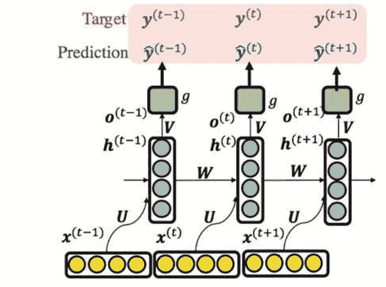

每个输入时间步与RNN的前一个隐藏状态相结合，产生当前的隐藏状态，展示了RNN模型的记忆效应

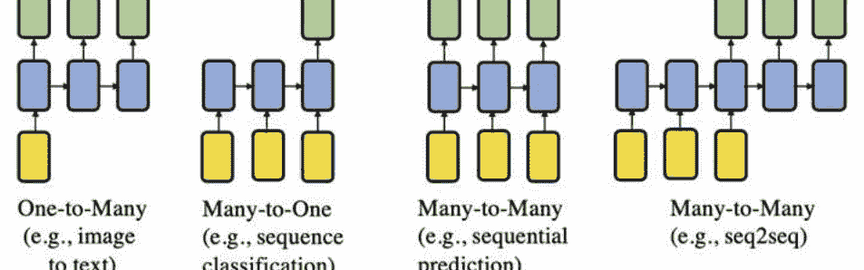

图7.2 四种类型的RNN结构，黄色框表示输入层，蓝色表示隐藏层，绿色表示输出和预测层

在每个时间步骤，RNN模型会将当前时间输入 $x^{(t)}$ 与先前的隐藏层 $h^{(t-1)}$ 一起计算当前隐藏状态 $h^{(t)}$，它作为网络在时间 $t$ 的记忆。然后，仅基于时间 $t$ 的记忆 $h^{(t)}$，将生成输出 $o^{(t)}$ 和预测 $\hat{y}^{(t)}$。下面我们列出了不同类型的RNN结构，这些结构在图7.2中进行了可视化。

- 1. 一对多模型接收一个初始输入，但在每个时间步骤上进行预测以生成一个输出序列。该模型可以从其他类型的数据（如X射线图像）生成文本描述。
- 2. 多对一模型在每个时间步骤上接收输入，但在最后一个时间步骤上进行单一预测。这种类型可以应用于根据患者的纵向电子健康记录（EHR）进行死亡率预测[14]。
- 3. 多对多的顺序预测接收新的输入并在每个时间步骤进行预测，因此输出序列的长度与输入序列相同。在这种情况下，输入和输出在时间上是对齐的。这种结构适用于顺序预测任务，例如随时间预测临床事件，如下一次医院就诊的时间。在这里，每个时间步骤的输入是表示该时间的医院就诊的向量，而输出是下一次就诊的预测。
- 4. 多对多的seq2seq: 有时输入和输出不对齐。特别是，输入序列将首先通过编码过程消耗掉；然后，输出序列将通过解码过程生成。这种类型的RNN被称为序列到序列模型或简称为seq2seq。传统上它被用于机器翻译。在医疗保健领域，研究人员已经使用这种模型根据诊断代码推荐药物清单。

选择特定的RNN架构应该基于应用。它们背后的数学是相同的。以下方程定义了模型从输入到最终预测的顺序计算。

- 输入到隐藏层: $h^{(t)} = f\left(U x^{(t)} + W h^{(t-1)} + b_1\right)$
- 隐藏到输出: $o^{(t)} = V h^{(t)} + b_2$
- 输出到预测: $\hat{y}^{(t)} = g\left(o^{(t)}\right)$。

大多数其他深度神经网络，如DNN和CNN模型，在每个层都有不同的参数集。然而，对于RNN，参数 $U, V, W, b_1, b_2$ 在所有时间步骤上是共享的（因此称为“循环”神经网络）。这种参数共享也极大地减小了模型的大小。

隐藏层的激活函数 $f$ 通常是非线性函数，如 tanh 或 ReLU。输出层的激活函数 $g$ 可以是 softmax。例如，在顺序疾病预测中，RNN 在每次临床访问时输出一个不同疾病风险的概率向量。这些参数 $U, V, W$ 可以通过以下特殊情况直观理解。

- 当输入到隐藏层的权重 $U$ 为 1 时，意味着输入直接在每个时间步骤中添加到隐藏激活中。
- 当隐藏到隐藏层的权重 $W$ 为 1 时，意味着在没有新输入的情况下，隐藏单元记住其先前的值。
- 当隐藏到输出层的权重 $V$ 为 1 时，意味着输出单元复制隐藏激活。

幸运的是，这些权重和偏置不是手动设置的，而是直接从训练数据中学习得到的。特别地，我们将 RNN 模型展开成多个时间步骤（例如，图 7.1 在 3 个时间步骤中展开）。这种特定的反向传播算法称为时间反向传播（BPTT）。

## 7.2 通过时间的反向传播（BPTT）算法

通过时间的反向传播（BPTT）[127]算法经常用于训练递归神经网络。它扩展了原始的反向传播算法，以适应递归神经网络对建模多个时间步的需求。在本节中，我们将描述如何计算前向和后向传递。

### 7.2.1 前向传递

考虑图7.1所示的展开对齐的多对多递归神经网络。前向传递的计算过程如下所示。为了更好地说明，我们还详细介绍了中间步骤。

$$
\begin{aligned}
z^{(t)} &= U x^{(t)} + W h^{(t-1)} + b_1 \\
h^{(t)} &= f\left(z^{(t)}\right) \\
o^{(t)} &= V h^{(t)} + b_2 \\
\hat{y}^{(t)} &= g\left(o^{(t)}\right)
\end{aligned}
$$

这里的激活函数 $f(\cdot)$ 可以是 $\tanh$，$g(\cdot)$ 可以是 softmax。给定序列 $\{x^{(1)},\dots,x^{(T)}\}$ 的总损失是所有时间步的损失之和。例如，假设时间 $t$ 的损失 $L^{(t)}$ 是负对数似然：

$$
\text{给定 } \{x^{(1)},...,x^{(t)}\}, \text{ 预测 } y \text{ 的损失 } \mathcal{L}(t) = -\log p(y^{(t)}|x^{(1)},...,x^{(t)})
$$

然后我们有总损失 $\mathcal{L} = \sum_{t=1}^{T} L^{(t)}$。

### 7.2.2 反向传播

在反向传播过程中，我们将更新所有参数 $U, V, W, b_1, b_2$ 以及时间 $t$ 索引的节点序列如 $x^{(t)}, h^{(t)}, o^{(t)}$ 和 $L^{(t)}$。对于每个节点，我们需要递归地计算梯度，从最终损失的前一个节点开始，我们有 $\nabla_{L^{(t)}} L=1$。为了更具体地说明，我们采用隐藏层激活函数 $f(\cdot)=\tanh(\cdot)$ 和输出激活函数 $g(\cdot)$ 作为 softmax 函数，并采用负对数似然损失来计算 $L^{(t)}$。在这种设置下，输出节点的梯度由以下公式给出

$$
(\nabla_{o^{(t)}} \mathcal{L})_i = \frac{\partial \mathcal{L}}{\partial o_i^{(t)}} = \frac{\partial \mathcal{L}}{\partial L^{(t)}} \frac{\partial L^{(t)}}{\partial o_i^{(t)}} = \hat{y}_i^{(t)} - y_i^{(t)}. \quad (7.1)
$$

方程（7.1）的推导基于方程（4.7）。接下来，我们从隐藏状态的最后一个时间步开始计算梯度 $h^{(T)}$。由于它没有一个隐藏节点作为后代，梯度可以通过方程（7.2）计算。
$$\nabla_{h^{(T)}} \mathcal{L} = V^{T} \nabla_{o^{(T)}} \mathcal{L} \tag{7.2}$$
然后，我们从 $t = T - 1$ 迭代向后计算，这些时间步都有隐藏层和输出层的后代。方程（7.4）给出了 $t \in \{1, \cdots, T - 1\}$ 对于 $h^{(t)}$ 的梯度。
$$\nabla_{h^{(t)}} \mathcal{L} = \left( \frac{\partial h^{(t+1)}}{\partial h^{(t)}} \right)^{T} (\nabla_{h^{(t+1)}} \mathcal{L}) + \left( \frac{\partial o^{(t)}}{\partial h^{(t)}} \right)^{T} (\nabla_{o^{(t)}} \mathcal{L}) \tag{7.3}$$
$$= W^{T} (\nabla_{h^{(t+1)}} \mathcal{L}) \text{diag} \left( 1 - (h^{(t+1)})^{2} \right) + V^{T} (\nabla_{o^{(t)}} \mathcal{L}) \tag{7.4}$$

其中 $\text{diag} \left( 1 - (h^{(t+1)})^{2} \right)$ 表示包含元素 $1 - (h_j^{(t+1)})^{2}$ 的对角矩阵。这是与隐藏单元 $j$ 在时间 $t$ 相关的 tanh 函数的雅可比矩阵。

在获得所有隐藏节点和输出节点的梯度之后，我们现在根据公式（7.5）获得参数的梯度。
$$\nabla_V \mathcal{L} = \sum_{t} \sum_{k} \left( \frac{\partial \mathcal{L}}{\partial o_k^{(t)}} \right) \nabla_V o_k^{(t)} = \sum_{t} (\nabla_{o^{(t)}} \mathcal{L}) h^{(t)T}$$
$$\nabla_W \mathcal{L} = \sum_{t} \sum_{j} \left( \frac{\partial \mathcal{L}}{\partial h_j^{(t)}} \right) \nabla_W h_j^{(t)} = \sum_{t} \text{diag}(1 - (h^{(t)})^{2}) (\nabla_{h^{(t)}} \mathcal{L}) h^{(t-1)T}$$
$$\nabla_U \mathcal{L} = \sum_{t} \sum_{j} \left( \frac{\partial \mathcal{L}}{\partial h_j^{(t)}} \right) \nabla_U h_j^{(t)} = \sum_{t} \text{diag}(1 - (h^{(t)})^{2}) (\nabla_{h^{(t)}} \mathcal{L}) x^{(t)T}$$
$$\nabla_{b_1} \mathcal{L} = \sum_{t} \left( \frac{\partial h^{(t)}}{\partial b_1} \right)^{T} \nabla_{h^{(t)}} \mathcal{L} = \sum_{t} \text{diag}(1 - (h^{(t)})^{2}) \nabla_{h^{(t)}} \mathcal{L}$$
$$\nabla_{b_2} \mathcal{L} = \sum_{t} \left( \frac{\partial o^{(t)}}{\partial b_2} \right)^{T} \nabla_{o^{(t)}} \mathcal{L} = \sum_{t} \nabla_{o^{(t)}} \mathcal{L} \tag{7.5}$$
这些更新规则与DNN的规则类似，只是权重更新需要在所有时间步骤上求和。

梯度消失问题 对于每一层，梯度会被反向传播并且可能变得越来越小，导致梯度消失问题。接下来，我们将介绍解决梯度消失问题的不同循环神经网络变种。

## 7.3 循环神经网络变种

循环神经网络有许多不同的变种：一些旨在克服梯度消失问题，例如长短期记忆模型（LSTM）和门控循环单元（GRU）。一些将单向顺序结构扩展为双向结构，如双向循环神经网络。其他引入编码和解码阶段，以处理不同的输入和输出长度，例如序列到序列模型。

### 7.3.1 长短期记忆（LSTM）

克服梯度消失问题是LSTM模型的主要动机[72]。LSTM引入了一个称为细胞状态的新结构，它被设计用来随时间记住有用的信息并忘记不必要的信息。

控制要记住或忘记的信息的关键思想是通过各种门来实现。具体来说，门是一个sigmoid函数 $\sigma(\cdot)$ 用于输入的线性组合。直观地说，如果sigmoid接近1，门是打开的。如果sigmoid接近0，门是关闭的。LSTM由三个门组成：输入门、遗忘门和输出门，在图7.3中可视化。以下是LSTM模型中使用的一些符号：

- 时间 $t$ 的LSTM单元的输入单元：$x^{(t)} \in \mathbb{R}^m$;
- 时间 $t-1$ 的LSTM单元的隐藏单元：$h^{(t-1)} \in \mathbb{R}^n$;
- 连接输入 $x^{(t)}$ 到输入门、遗忘门、细胞状态和输出门的权重矩阵：$U^i, U^f, U^c, U^o$，都 $\in \mathbb{R}^{n \times m}$;
- 连接前一个隐藏状态到输入门、遗忘门、细胞状态和输出门的权重矩阵：$W^i, W^f, W^c, W^o$，都属于 $\mathbb{R}^{n \times n}$;
- 连接隐藏状态到输出的权重矩阵 $V$，属于 $\mathbb{R}^{n \times k}$;
- 输入门、遗忘门、细胞状态和输出门的偏置向量：$b^i, b^f, b^c, b^o$，都属于 $\mathbb{R}^n$。

LSTM引入了一个细胞状态 $c^{(t)}$，它是LSTM在每个时间 $t$ 的内部状态的向量表示。根据当前输入 $x^{(t)}$ 和前一个隐藏状态 $h^{(t-1)}$，LSTM会更新细胞状态。

在描述细胞状态更新之前，我们首先需要介绍遗忘门和输入门。

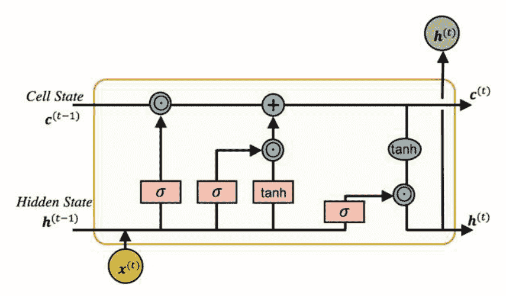

图7.3 LSTM结构。 LSTM模型具有表示LSTM当前状态的向量的细胞状态 $c^{(t)}$。LSTM模型具有一个输入门、一个输出门和一个遗忘门，用于调节细胞状态与RNN的输入、隐藏状态和输出的交互。

遗忘门如图7.4所示，根据先前的隐藏状态控制应保留多少先前的细胞状态。具体而言，它计算隐藏状态 $h^{(t)}$ 的线性组合，然后通过sigmoid激活函数产生一个介于0和1之间的输出。如果遗忘门生成接近1的值，它将记住先前的细胞状态；如果值接近0，它将忘记先前的细胞状态。

具体而言，我们将 $f^{(t)}$ 表示为时间 $t$ 时遗忘门的激活函数。

$$f^{(t)} = \sigma (U^{f} x^{(t)} + W^{f} h^{(t-1)} + b^{f})$$

输入门如图7.5所示，决定将添加哪些新信息到细胞状态中。形式上，我们将 $\tilde{c}^{(t)} \in \mathbb{R}^{n}$ 表示为新信息，$i^{(t)} \in \mathbb{R}^{n}$ 表示控制将这些新信息添加到细胞状态中的输入门。

$$\tilde{c}^{(t)} = \tanh (U^{c} x^{(t)} + W^{c} h^{(t-1)} + b^{c})$$
$$i^{(t)} = \sigma (U^{i} x^{(t)} + W^{i} h^{(t-1)} + b^{i})$$

细胞状态更新 现在我们有了更新细胞状态所需的所有组件：遗忘门激活 $f^{(t)}$ ，输入门激活 $i^{(t)}$ 和新信息 $\tilde{c}^{(t)}$ 。时间 $t$ 的新细胞状态 $c^{(t)}$ 可以使用以下方程进行更新：

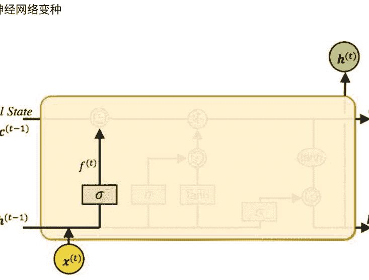

图7.4 遗忘门控制保留多少先前的细胞状态

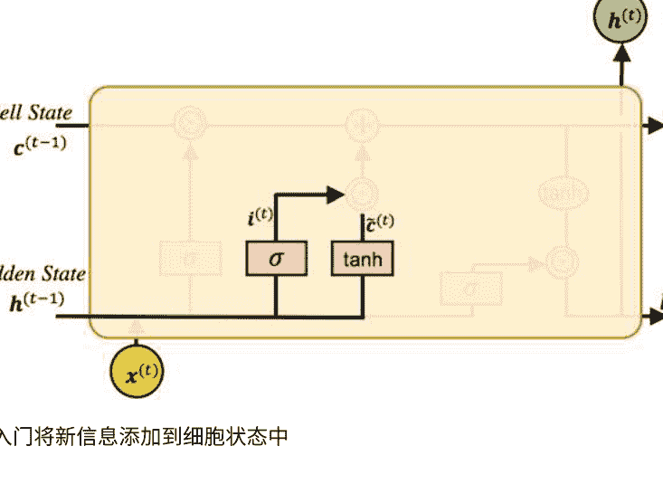

图7.5 输入门将新信息添加到细胞状态中

$$c^{(t)} = i^{(t)} \odot \tilde{c}^{(t)} + f^{(t)} \odot c^{(t-1)} \quad (7.9)$$

其中 $\odot$ 表示逐元素相乘。

输出门 如图7.6所示，确定细胞状态的哪一部分成为下一个隐藏状态的输出 $h^{(t)}$。具体来说，新的细胞状态 $c^{(t)}$ 通过非线性传递，并与输出门（输入和先前隐藏状态的sigmoid激活）相乘。

$$o^{(t)} = \sigma (U^o x^{(t)} + W^o h^{(t-1)} + b^o) \quad (7.10)$$
$$h^{(t)} = o^{(t)} \odot \tanh(c^{(t)}) \quad (7.11)$$

请注意，所有的门（以及细胞状态）都是嵌入向量，这意味着在门嵌入的不同维度上可以打开或关闭到不同的程度。 这就是LSTM如何提供细粒度的控制来进行更新的方式。

总之，LSTM是一种有效的RNN变体，成功地缓解了梯度消失问题。 它已经在大多数深度学习软件中高效实现。 然而，LSTM中的多个门可能对理解来说过于复杂，并不一定是使RNN工作的绝对必要条件。 接下来，我们将介绍另一种更简单的RNN变体。

### 7.3.2 门控循环单元（GRU）

门控循环单元（GRU）是另一种流行的RNN模型变体[21]。 与LSTM相比，GRU使用类似的门控机制来学习长期依赖关系并缓解梯度消失问题。 GRU在LSTM中去除了细胞状态，并使用隐藏状态h^{(t)}作为细胞状态和输出状态。 GRU只有两个门：一个复位门r，一个更新门z。直观地说，复位门决定如何将新输入与先前的记忆相结合，更新门定义了保留多少先前的记忆。 GRU模型的结构如图7.7所示。

对于更新GRU模型，我们给出以下变量。

- GRU在时间t的输入单元为：x^{(t)}；
- 连接输入到更新门的权重矩阵U^z，连接输入到复位门的权重矩阵U^r，连接隐藏状态本身的权重矩阵U^h；
- 连接先前隐藏状态与新隐藏状态的权重矩阵：重置门W^r，更新门W^z，以及隐藏状态本身的权重矩阵W^h；
- 重置门、更新门和隐藏状态的偏置向量：b^r, b^z, b^h。

图7.7 GRU的结构。

GRU模型只有两个门：重置门r和更新门z。

直观地说，重置门决定如何将新输入与先前的隐藏状态相结合，而更新门定义了保留多少先前的隐藏状态。

更新门：GRU的一个重要简化是将LSTM的遗忘门和输入门合并为一个更新门。在视觉上，更新门如图7.8a所示。更新门有助于确定要删除先前隐藏状态h(t-1)的多少以及要向当前隐藏状态h(t)添加多少新信息。特别地，更新门的计算如下所示：

$$ z^{(t)} = \sigma (U^{z} x^{(t)} + W^{z} h^{(t-1)} + b^{z}) \quad (7.12) $$

重置门如图7.8b所示，确定要忘记（或记住）多少过去的信息。与更新门类似，重置门通过方程（7.13）计算。

$$ r^{(t)} = \sigma (U^{r} x^{(t)} + W^{r} h^{(t-1)} + b^{r}) \quad (7.13) $$

然后，我们将新信息添加到当前的隐藏状态 h(t) 中，该状态使用重置门从过去存储相关信息。如图7.8c所示，并由方程（7.14）给出。

$$ \tilde{h}^{(t)} = tanh(U^{h} x^{(t)} + r^{(t)} \odot W^{h} h^{(t-1)} + b^{h}) \quad (7.14) $$

请注意 ⊙是逐元素相乘。

最后，我们计算当前信息的向量 h(t)，该向量包含当前信息。这个信息将传递给网络。这由公式（7.15）给出。

图7.8 (a) GRU更新门; (b) GRU重置门; (c) 添加到隐藏状态的新信息; 以及 (d) 更新GRU新隐藏状态

$$\boldsymbol{h}^{(t)} = (1-\boldsymbol{z}^{(t)}) \odot \boldsymbol{h}^{(t-1)} + \boldsymbol{z}^{(t)} \odot \boldsymbol{\tilde{h}}^{(t)}$$

GRU的最终隐藏状态如图7.8d所示。

关键见解 请注意，LSTM或GRU中任何一个门的输出实际上都是向量，因此这些向量中的不同元素将决定是否保留、删除或添加信息。从这个意义上说，门通过多个维度控制信息流动。例如，门的输出向量中的一个元素（sigmoid的输出）可以对应于年龄信息。另一个元素可能对应于心脏病史。LSTM或GRU可以决定更新与年龄信息相关的元素，并保留有关心脏病史的元素。由于输出表示为向量，LSTM或GRU可以具有必要的灵活性，以选择性地保留或更新信息。

### 7.3.3 双向 $RNN$

RNNs 按照特定顺序处理输入序列。例如，如果序列是一个患者随时间的临床访问列表，RNN 模型可以按照时间顺序处理最早的访问，然后再处理最近的访问。特别是，当 RNN 在时间 $t$ 计算输出或隐藏状态时，它将无法利用时间 $t+1$、$t+2$ 等的任何信息。然而，有时候我们可能希望利用当前时间之前和之后的事件。例如，在生成临床笔记的表示时，单词 $x$ 的嵌入应该考虑 $x$ 之前和之后的上下文。双向 RNN 允许 RNN 的输出依赖于先前和未来的事件。这是一个常见的情况，尤其是在建模临床笔记时。因此，提出了双向RNN。

它们只是两个RNN：一个按照正向顺序处理输入序列，另一个按照反向顺序处理，如图7.9所示。输出是基于两个RNN的隐藏状态的连接计算得出的。双向RNN的思想可以扩展到所有RNN变体，并产生双向LSTM和双向GRU模型。

双向RNN的计算如下所示

$$\begin{aligned}
\overrightarrow{\boldsymbol{h}}^{(t)} &= f\left(U \boldsymbol{x}^{(t)}+\boldsymbol{W} \overrightarrow{\boldsymbol{h}}^{(t-1)}+\boldsymbol{b}_{1}\right) \\
\overleftarrow{\boldsymbol{h}}^{(t)} &= f\left(U^{\prime} \boldsymbol{x}^{(t)}+\boldsymbol{W}^{\prime} \overleftarrow{\boldsymbol{h}}^{(t+1)}+\boldsymbol{b}_{1}^{\prime}\right) \\
y^{(t)} &= g\left(V\left[\overrightarrow{\boldsymbol{h}}^{(t)} ; \overleftarrow{\boldsymbol{h}}^{(t)}\right]+\boldsymbol{b}_{2}\right)
\end{aligned}$$
其中 $\overrightarrow{\boldsymbol{h}}^{(t)}$ 表示前向RNN处理的隐藏状态， $\overleftarrow{\boldsymbol{h}}^{(t)}$表示后向隐藏状态， $\left[\overrightarrow{\boldsymbol{h}}^{(t)} ; \overleftarrow{\boldsymbol{h}}^{(t)}\right]$表示两个方向的隐藏状态的连接。

### 7.3.4 编码器-解码器序列到序列模型

序列到序列（简称“Seq2Seq”）模型[19, 145]通过两个RNN模型训练，将输入序列映射到输出序列。第一个RNN（编码器）将处理输入序列 X 以获得表示输入序列的固定大小向量 c。第二个RNN（解码器）将生成输出序列 Y。Seq2Seq模型在机器翻译、语音识别和文本摘要等各种任务中取得了巨大成功。在医疗保健应用中，研究人员使用这种模型根据诊断列表生成药物列表[174]。让我们定义输入序列 X 和输出序列 Y：

$$X = (x_1, \cdots, x_I) = (x_i)_{i=1}^I \qquad (7.19)$$

$$Y = (y_1, \cdots, y_J) = (y_j)_{j=1}^J \qquad (7.20)$$

其中，x_i ∈ R^N 表示输入序列 X 中的第i个元素，y_j ∈ R^N 表示输出序列 Y 中的第j个元素。请注意，输入序列 I 和输出序列 J 的长度可以不同。

从概率的角度来看，seq2seq模型是学习在给定输入序列 X 的条件下输出序列 Y 的条件分布，即 P(Y|X)。seq2seq模型并不直接建模 P(y_1, \cdots, y_J|x_1, \cdots, x_I)，而是建模输出序列的每个元素 j 在已知前 j-1 个元素和整个输入序列 X 的条件下的概率 P(y_j|y_{j-1}, \cdots, y_1, X)。因此，由参数 θ 参数化的条件分布 P_θ(Y|X) 可以表示为以下乘积。

$$P_θ(Y|X) = \prod_{j=1}^{J+1} P_θ(y_j|y_{j-1}, \cdots, y_1, X) \qquad (7.21)$$

在实践中，X 被表示为第一个RNN c的输出。seq2seq模型的学习主要包括以下两个部分：

- (1) 从输入序列X生成固定大小的隐藏向量c，以及
- (2) 从隐藏向量c生成输出序列Y。

$$c = h_T = f(h_{T-1}, x_T)$$

解码器RNN通过预测下一个输出 y_t 给出隐藏状态 h_t 和上下文向量 c 来生成输出序列。在这种情况下，y_t 和 h_t 都是还受到 $y_{t-1}$ 和上下文 $c$ 的影响。因此，解码器在时间 $t$ 的隐藏状态计算为 $h_t = g(h_{t-1}, y_{t-1}, c)$。或者类似地，下一个输出项的条件分布变为

$P (y_t|y_{t-1}, \cdots, y_1, c) = g(h_t, y_{t-1}, c)$.

其中 $g$ 是具有最终激活函数的解码RNN，用于生成多类问题的概率，例如softmax。

seq2seq模型的一个重要缺点是由于单一固定上下文向量而无法记住长句子。这个缺点将在第9章中介绍的注意力模型中得到解决。

## 7.4 案例研究：心力衰竭的早期检测

问题 Choi等人[30]研究了心力衰竭的一个重要预测任务。目标是根据患者最近的电子病历数据预测其是否会发展成心力衰竭。心力衰竭是一种致命的疾病，在诊断后的5年内有50%的死亡率[125]。早期发现心力衰竭可以通过廉价的治疗和改善生活方式来获得更好的结果。

RNN可以成为建模此类事件序列的有价值工具，因为它可以克服患者之间不规则的长度。在实践中，每个患者的就诊次数变化很大，许多患者可能只有一次就诊，但有些患者可能有超过100次就诊。传统上，将单一模型应用于不同长度的所有患者将会非常困难。由于循环结构的存在，RNN自然适用于长度可变的事件序列。

数据 本研究的数据来源于加利福尼亚北部的大型提供者网络Sutter Health的门诊电子病历记录，为期10年。数据集包括患者的人口统计学信息、诊断信息（国际疾病分类第9版（ICD-9）代码）、药物和手术代码。该特定研究是一项病例对照研究，共有4178例HF病例被识别并与29139名对照患者匹配。更具体地说，每个HF病例都与相应的HF诊断日期相关联。然后，将多个对照患者与该HF病例匹配，其中对照患者是同一诊所中与病例年龄和性别相同的活跃患者，但没有HF。在确定患者队列后，提取索引日期之前18个月的结构化电子病历数据进行研究。对于HF病例，索引日期是实际的HF诊断日期，但对于对照组来说，索引日期是匹配病例的诊断日期。

方法 每个患者分配的平均临床代码数量约为72个，在该数据集中存在18181个独特的临床代码（6910个诊断代码，6897个药物代码和4374个程序代码）（图7.11）。

每个原始事件，例如ICD9代码250.00，都表示为一个18181维的独热向量，顺序地通过门控循环单元（GRU）模型进行输入。他们还考虑了另外两种特征表示方法：一种基于临床代码层次结构，将诊断代码分为283组，药物代码分为96组，程序代码分为244组；另一种基于预训练的word2vec嵌入[111]，维度为100，覆盖所有临床事件。由于在临床访问中，事件记录没有时间顺序，本研究选择了RNN和word2vec训练事件的任意顺序。

结果 GRU模型始终优于所有其他方法，包括逻辑回归、支持向量机（SVM）、多层感知器（MLP，即具有1个隐藏层的DNN）和k最近邻（KNN），AUC为0.883。使用word2vec嵌入训练的模型明显优于使用独热向量训练的模型，并且优于使用分组代码向量训练的模型。研究表明，数据驱动的特征表示比传统的知识驱动的特征工程更有效（图7.12）。

## 7.5 案例研究：顺序临床事件预测

问题 除了预测特定疾病如HF外，RNN还被用于预测每次临床访问时的所有诊断和药物。Choi等人[23]研究了患者的电子病历历史是否能够提供足够的信息来预测下次访问时的未来诊断和药物订单。 具体目标是基于患者的历史访问（图7.13）预测1183个诊断类别、595个药物组和下次访问的持续时间。

图7.13 医生人工智能系统尝试使用RNN预测未来的临床事件

图7.14 应用2层RNN预测诊断和药物组以及到下次就诊的时间持续时间

数据 数据集是来自Sutter健康机构的265K名患者在8年内的去识别化结构化门诊电子病历数据，包括每次就诊的诊断、药物和手术信息。平均而言，每个患者在这个数据集中有大约55次就诊。

方法 输入是一系列临床就诊(t_i, x_i)对于 i = 1, ..., n。每个就诊对表示就诊时间 t_i 和就诊向量 x_i，包括在 t_i 记录的ICD-9诊断代码、手术代码或药物代码。请注意，x_i 是一个多热向量，其中记录了医疗代码的所有对应维度。t_i 将为1，其他维度将为0。例如，每个患者都患有2型糖尿病并服用二甲双胍。与2型糖尿病和二甲双胍相关的维度将为1，其他维度将为0。除了多热向量 x_i，输入中还包括到上次访问的时间 d_i = t_i - t_{i-1} 的持续时间。

引入了初始嵌入 h^{(1)} = [x_{-i}, W\_emb, d_{-i}]。然后应用一个2层GRU模型来处理 [h^{(1)}, d_{-i}]。最终输出是诊断和药物组的预测 \hat{y}_{-i} 和到下次就诊的持续时间 d_{-i+1}，如图7.14所示。

结果 预测诊断和药物组的性能指标是顶k召回率，定义如下：

顶k召回率 = 前k个预测中的真阳性数 / 真阳性数

| 算法 | k=10 | k=20 | k=30 | R^2 |
|------|------|------|------|-----|
| 最常见的代码 | 48.11 | 60.23 | 66.00 | - |
| 逻辑回归 | 36.04 | 46.32 | 52.53 | 0.0726 |
| MLP | 38.82 | 49.09 | 55.74 | 0.1221 |
| 2层循环神经网络 (RNN) | 54.96 | 66.31 | 72.48 | 0.2534 |

粗体数值表示所有方法中的最佳性能指标

Top-k召回率模拟医生进行差异诊断的行为，医生根据患者的病情列出最可能的诊断结果。

时间预测的性能指标是决定系数 R^2，如公式（3.12）所介绍的。它比较了对目标变量的简单预测与平均值的准确性。

$$R^2 = 1 - \frac{\sum_i (y_i - \hat{y}_i)^2}{\sum_i (y_i - \bar{y})^2}$$

此外，他们测量了对数(d_i)的 R^2 性能，而不是直接对 d_i 进行测量。

表7.2显示了RNN模型优于标准分类方法，如逻辑回归和简单的多层感知器（MLP）。它还表明，简单的启发式方法，如预测患者历史记录中最常见的代码，性能要比RNN低得多。请注意，对未来诊断和药物的预测比下次就诊的时间更准确。

这项工作中的其他重要观察包括：(1) 当患者有很长的病史时，循环神经网络的表现更好；(2) 在正确初始化来自另一个医院的预训练模型的情况下，跨医院之间的知识转移是可能的。

## 7.6 案例研究：临床笔记的去标识化

问题 由于隐私、安全和法律挑战，共享电子健康记录（EHR）数据用于研究是困难的。减少共享风险的常见方法是通过删除敏感的受保护健康信息（PHI），如姓名、出生日期和地址，生成去识别的EHR记录。去识别的最具挑战性的部分在于非结构化的临床笔记，因为所有信息都被组合为自由文本字段。人们必须识别笔记中的PHI并将其删除或替换，这对于熟练的人类专家来说是耗时且极其繁琐和容易出错的。Dernocourt等人[36]开发了一种自动去识别临床笔记的方法，通过识别然后删除或替换原始文本中的受保护健康信息（PHI）。

表7.3 i2b2和MIMIC-III数据集的统计数据

| 统计数据 | i2b2 | MIMIC-III |
| --- | --- | --- |
| 词汇量 | 46,803 | 69,525 |
| 笔记数量 | 1304 | 1635 |
| 标记数量 | 984,723 | 2,945,228 |
| PHI实例数量 | 28,867 | 60,725 |
| PHI标记数量 | 41,355 | 78,633 |

表7.4 去识别任务的性能比较

| 模型 | i2b2 精确度 | i2b2 召回率 | i2b2 F1 | MIMIC-III 精确度 | MIMIC-III 召回率 | MIMIC-III F1 |
| --- | --- | --- | --- | --- | --- | --- |
| 诺丁汉 | 99.000 | 96.400 | 97.680 | - | - | - |
| MIST | 91.445 | 92.745 | 92.090 | 95.867 | 98.346 | 97.091 |
| CRF | 98.560 | 96.528 | 97.533 | 99.060 | 98.987 | 99.023 |
| RNN | 98.320 | 97.380 | 97.848 | 99.208 | 99.251 | 99.229 |
| CRF+RNN | 97.920 | 97.835 | 97.877 | 98.820 | 99.398 | 99.108 |

数据 本研究使用了两个数据集：（1）来自i2b2/UTHealth共享任务Track 1的i2b2数据[140]；（2）MIMIC-III数据包含61K个ICU住院和200万份临床笔记[82]。详细统计数据请参见表7.3。

方法 [36]中提出的模型包括两个双向LSTM：一个用于基于字符组合提取特征的字符级别，另一个基于单词级别加上字符级别双向LSTM的输出嵌入。最终的PHI预测是基于每个单词的。

结果 表7.4展示了在测试集上的性能，包括精确度、召回率和F1得分。基准包括诺丁汉（i2b2比赛的获胜者）[171]，MITRE身份识别工具包（MIST）——用于去识别的免费程序，以及条件随机场（CRF）——一种流行的序列标记方法。RNN是神经网络模型。CRF+RNN将CRF和RNN模型的输出连接起来。CRF+RNN在牺牲一定精确度的情况下提供了最高的召回率，因为如果CRF或RNN模型将某个标记为PHI，则文档中的任何标记都将被标记为PHI。

## 案例研究：学习为多重疾病组合处方治疗

问题 管理复杂多重疾病的患者一直被认为是一个困难的问题，因为存在复杂的疾病和药物依赖关系，以及潜在的药物相互作用风险。在这项工作中[174]，作者们该研究基于就诊诊断列表来进行药物推荐问题的研究。

数据 MIMIC-3 MIMIC-3数据集[81]是一个公开可用的数据集，包含了11年内40,000名重症监护病房（ICU）患者的医疗记录。该数据集包含50,206条与6695种不同疾病和4127种药物相关的医疗记录。

Sutter 这个数据集来自Sutter Palo Alto Medical Foundation（PAMF），包含了258,000名年龄在50至90岁之间的患者的18年纵向医疗记录。它包含2,415,414次与8359种不同疾病和7516种药物相关的医疗记录。每个记录中平均有2.97种疾病和1.75种药物。

Sutter和MIMIC-3中的药物分别使用GPI¹ 和NDC² 编码。GPI编码本质上是一个多级本体，从药物的主要治疗用途到唯一可互换的产品，不考虑制造商或包装规格。为了进行不同粒度的实验，我们使用GPI代码的第一级和第三级，分别得到93个和982个不同的药物组。我们使用OHDSI的开源软件将MIMIC-3中的药物转换为GPI代码。³两个数据集中的诊断使用ICD-9代码表示。⁴为了学习疾病和药物之间的稳健且非平凡的映射关系，我们从每个数据集中提取了具有两个以上诊断代码的记录，并筛选出仅包含前2000个最常见诊断代码的记录，这涵盖了所有记录的95.3%（图7.15）。

方法作者在[174]中使用了一个seq2seq模型，从诊断列表预测每次临床访问的药物列表。他们进一步利用强化学习来微调模型参数，以确保准确性和完整性。他们还将外部临床知识纳入到强化奖励的设计中，以有效地防止生成不利的药物组合。

让 $\mathcal{X}$ 表示诊断空间， $\mathcal{Y}$ 表示药物空间。 $\mathbf{R} =\{(X_1, Y_1), (X_2, Y_2), ...\}$ 是一组医疗记录，其中 $X_k \subseteq \mathcal{X}$ 是一个诊断集合 $X_k= \{x_1^k, x_2^k, ..., x_{|X_k|}^k\}$ 和 $Y_k \subseteq \mathcal{Y}$ 是一个药物集合 $Y_k = \{y_1^k, y_2^k, ..., y_{|Y_k|}^k\}$，其中 $|X_k|$ 和 $|Y_k|$ 分别表示 $X_k$ 和 $Y_k$ 的基数。为了避免混乱，如果没有歧义，我们在符号中省略 $k$。治疗建议的目标是从所有药物 $Y$ 中选择一个最佳的药物组合，基于一个诊断集 $X$。因此，我们希望建模条件概率 $p(Y|X)$ 并找到最大似然解 $Y^*$（图7.15）。

图7.15治疗建议解决方案概述。灰色节点表示输入诊断，白色节点表示输出治疗，虚线节点是状态变量。

形式上，给定X的条件概率Y被分解为

$$
p(Y|X) = \prod_{t=1}^{|Y|} p(y_t | X, y_1, y_2, ..., y_{t-1}) = \prod_{t=1}^{|Y|} p(y_t | \{x_1, x_2, ..., x_{|X|}\}, y_1, y_2, ..., y_{t-1}),
$$

其中$x_i$是$X$中的第$i$个诊断代码，$y_t$是被选择的第$t$个药物，$\{...\}$表示一组离散实例。$X$中的每个诊断$x_i$是一个$|X|$-维的独热向量，$Y$中的每个药物$y_t$是一个$|Y|$-维的独热向量。我们使用分布式表示来编码诊断和药物，即，我们利用嵌入矩阵$\mathbf{W}_x$和$\mathbf{W}_y$来投影诊断$x_i$和药物将$y$和$d$映射到一个统一的$d$维空间中。我们使用向量$\mathbf{x}_i$和$\mathbf{y}_j$来表示$x_i$和$y_j$的嵌入，其中

$$
\mathbf{x}_i = \mathbf{W}_x(x_i), \mathbf{y}_j = \mathbf{W}_y(y_j).
$$

为了模拟每个$x_i$对药物$y_t$在步骤$i$中的不同贡献程度，我们利用了注意机制。令$\mathbf{s}_t \in \mathbb{R}^d$为在步骤$i$时的状态变量的总结变量。

$$
\mathbf{s}_t = g(\mathbf{s}_{t-1}, y_{t-1}, \tau(X))
$$

其中$t(\cdot)$是一个注意力函数，用于编码每个$x_i$与当前状态变量的兼容性。

$$
\tau_t(X) = \sum_{i=1}^{|X|} \mathbf{M}_{ti} \cdot \mathbf{x}_i,
$$

其中$\mathbf{M}\in\mathbb{R}^{|X|\times|Y|}$是一个映射矩阵，其中每个元素$\mathbf{M}_{ti}$表示第$i$个诊断代码$x_i$对生成第$t$个药物$y_t$的贡献。 我们将映射矩阵$\mathbf{M}$表示为

$$
\mathbf{M}_{ti} = \frac{\exp(\alpha(\mathbf{x}_i, \mathbf{s}_{t-1}))}{\sum_{k=1}^{|X|} \exp(\alpha(\mathbf{x}_k, \mathbf{s}_{t-1}))}
$$

其中 $\alpha(\mathbf{x}_i, \mathbf{s}_{t-1})$是一个函数，确定第 $i$个诊断代码的权重。$\alpha(\mathbf{x}, \mathbf{y})$被实现为一个多层感知机（MLP），它以 $\mathbf{x}$和 $\mathbf{y}$的连接作为输入。现在我们可以将 $\mathbf{s}_t$重新写为

$$
\mathbf{s}_t = g([\tau_t(X); \mathbf{y}_{t-1}], \mathbf{s}_{t-1})
$$

其中$[; :]$表示两个向量的连接， $g$可以定义为一个循环神经网络（RNN）单元（例如，在我们的实现中使用了GRU）。 第$t$步的预测结果为

$$
y_t = \arg \max_{y\in\mathcal{Y}} softmax (\mathbf{s}_t)
$$

结果LEAP与以下基准进行了比较：

- 基于规则：该方法根据MEDI数据库[165]中的现有药物与疾病的映射推荐药物。 对于每种疾病，分配其中一种在映射中提到的药物。
- $K$-最频繁：这是一个简单的基准，它检索与每种疾病最频繁共同出现的前$K$种药物作为治疗方法。 我们在$Sutter$数据集上设置$K=1$，在$MIMIC-3$数据集上设置$K=3$，根据验证集上的性能进行调整。
- *Softmax MLP*：我们使用多层感知器学习多标签分类器，其中包含softmax输出层。 我们的实现使用了一个3层的$MLP$。使用全局阈值选择正向药物。阈值和超参数的值通过网格搜索在验证集上进行调整。
- *分类器链*：分类器链[122]是一种流行的多标签学习方法，通过将输入和先前的分类结果馈送到后续的分类器中来建模标签之间的相关性。 我们使用一个多热向量来编码输入的诊断集 $X$，并利用支持向量机作为每个标签的二元分类器。

## 表7.5 Sutter和MIMIC3数据集上的治疗推荐性能。

我们根据Jaccard系数评估实验结果。粒度表示我们使用的GPI药物代码的级别。

| 粒度 | Sutter (1) | Sutter (3) | MIMIC-3 (1) | MIMIC-3 (3) |
|------|------------|------------|-------------|-------------|
| 基于规则的 | 0.3207 | 0.2770 | 0.2753 | 0.2354 |
| K最频繁 | 0.4283 | 0.3181 | 0.2609 | 0.2616 |
| Softmax多层感知器 | 0.4908 | 0.3739 | 0.4897 | 0.3342 |
| 分类器链 | 0.4839 | 0.3620 | 0.4621 | 0.3204 |
| LEAP无RL | 0.5270 | 0.3936 | 0.5107 | 0.3865 |
| LEAP | **0.5341** | **0.4073** | **0.5582** | **0.4342** |

粗体数值表示在所有方法中的最佳性能数据

评估指标假设 Y_i 是算法生成的治疗集合，Ŷ_i 是数据中医生的处方。Jaccard系数定义为交集的大小除以地面真实标签集合和预测标签集合的并集的大小。

$$
Jaccard = \frac{1}{K} \sum_{i}^{K} \frac{|Y_i \cap \hat{Y}_i|}{|Y_i \cup \hat{Y}_i|}
$$

其中 K 是测试集中的样本数（表7.5）。

我们在两个真实世界的电子健康记录数据集上进行了定量实验，以验证我们解决方案的有效性。在这两个数据集上，LEAP在平均Jaccard系数方面的表现明显优于基线，提高了10-30%（表7.5）。

## 7.8 练习

1. 循环神经网络（RNN）和双向循环神经网络（bidirectional RNN）之间的主要区别是什么？
2. 长短期记忆网络（LSTM）和门控循环单元（GRU）之间的主要区别是什么？
3. 哪些数据适合用RNN进行建模？ [多个正确选项]
   - (a) 临床笔记
   - (b) 医学图像
   - (c) 纵向医疗记录
   - (d) 时间序列，如心电图
4. 以下哪种架构最适合顺序诊断预测（即基于患者就诊历史预测当前就诊的疾病诊断），如图7.2所示？
5. 反向传播算法（BPTT）的潜在问题是什么？
6. 在GRU模型中，我们可以用Sigmoid激活函数替换Eq. (7.14)中的tanh激活函数吗？为什么？
7. 关于双向循环神经网络，以下哪个说法是不正确的？
   - (a) 两个RNN模型是从相反的方向训练的？
   - (b) 在预测输出之前，两个RNN的隐藏状态被连接在一起。
   - (c) 双向RNN适用于语言建模。
   - (d) 两个RNN模型必须分别进行训练。
8. 关于Seq2seq模型，哪个说法是不正确的？
   - (a) Seq2seq模型需要训练两个RNN：一个用于编码，另一个用于解码。
   - (b) Seq2seq模型可用于机器翻译应用。
   - (c) 编码器RNN生成一个上下文向量c，该向量将作为解码器RNN的一部分输入。
   - (d) Seq2seq模型确保输入序列和输出序列的长度相同。
9. 以下哪项关于RNN在医疗保健中的应用是不正确的？
   - (a) 我们需要相同长度的训练数据来训练RNN模型。
   - (b) RNN模型可以用来建模纵向的电子病历数据。
   - (c) RNN模型的输出可以是二元分类或多类分类。
   - (d) RNN也可以用于建模临床记录。

# 第8章 自编码器（AE）

## 8.1 概述

到目前为止，我们已经介绍了各种用于监督学习的深度学习模型，在训练数据中提供了输出标签（例如，心力衰竭诊断）。然而，在许多实际应用中，无标签数据是常态。接下来，我们将介绍自编码器，这是一种流行的无监督深度学习模型。

一般来说，自编码器（AE）是一种无监督和非线性降维模型，在许多医疗保健应用中被广泛使用[5, 13, 94, 104, 113, 143, 144, 173]。自编码器通过编码器将输入映射到内部表示，然后通过解码器将内部表示映射回输入空间。编码器和解码器的组合被称为重构函数。自编码器的目标是尽量减小重构损失，从而在降低维度的同时关注数据的重要属性。

稀疏自编码器（SAE）和去噪自编码器（DAE）是两种自编码器的变种。对于SAE，重构损失通过对内部表示进行稀疏惩罚来进行正则化，以便模型尝试学习稀疏表示。SAE经常用于无监督的电子病历表型化[94]或稀疏脑电特征表示[100, 170, 173]。DAE引入了随机损坏的输入，通过这种方式，模型可以对缺失数据或噪声具有鲁棒性。DAE用于从电子病历中学习患者表型的鲁棒表示[5, 13, 113]。在摘要中，我们将介绍几种自编码器，包括堆叠自编码器、稀疏自编码器、去噪自编码器及其在医疗保健中的应用（表8.1）。

## 表8.1 自编码器符号

| 符号 | 定义 |
| :--- | :--- |
| x ∈ ℝ^d; X | 输入向量；输入数据分布的随机变量 |
| h ∈ ℝ^k | 隐藏层 |
| h_t | 时间t的隐藏状态 |
| r; R | 重构数据；重构数据分布 |

## 8.2 自编码器

自编码器是一种神经网络，旨在通过非线性降维重构输入数据。形式上，自编码器包括一个编码器和一个解码器：

- 编码器 f_θ() 将输入向量 x ∈ ℝ^d 转换为隐藏层 h ∈ ℝ^k (通常 k < d):
    $$
    h = f_\theta(x) = \sigma_1(Wx + b)
    $$
    其中，W ∈ ℝ^(k×d) 是权重矩阵，b ∈ ℝ^k 是偏置向量，σ_1 是输入激活函数。

- 解码器 g_θ'()将隐藏表示 h ∈ ℝ^k映射回重建向量
    $$
    r = g_{\theta'}(h) = \sigma_2(W'h + b')
    $$
    其中 W' ∈ ℝ^(d×k)是权重矩阵，b' ∈ ℝ^d是偏置向量，σ_2是输出激活函数。

编码和解码的过程如图8.1所示。编码器和解码器分别由参数化 θ = {W, b} 和 θ' = {W', b'}确定。
请注意，如果没有非线性变换 σ_1, σ_2，该过程将变为线性降维，类似于主成分分析（PCA）。

一般来说，自编码器的目标是最小化 L(x, r)，其中 L(x, r) ∝ − log p(x|r)。这里 L(·)是一个损失函数，如平方误差或交叉熵损失。损失函数的选择取决于 x的分布。

1. 如果 x ∈ ℝ^d 是一个遵循正态分布的实值向量，即 x ~ N(r, σ^2 I)，则优选平方损失 L(x, r) = ||x − r||^2。
2. 如果 x是二值的，解码器需要产生一个 r ∈ {0, 1}^d。因此，在解码器中通常使用sigmoid激活函数。这导致了交叉熵损失的选择： L(x, r) = −Σ_i [x_i log r_i + (1 − x_i) log(1 − r_i)]。

一般来说，自编码器的制定是经验风险优化。

## 图8.1 自编码器模型说明

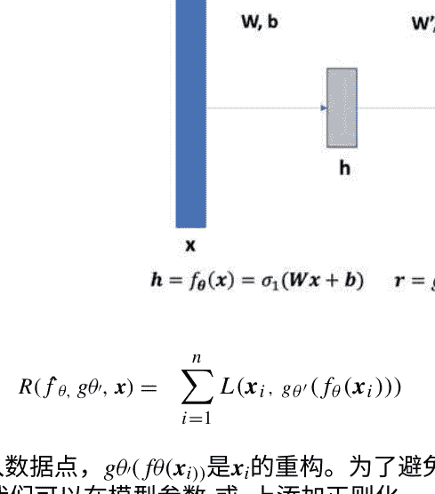

$h = f_\theta(x) = \sigma_1(Wx + b) \quad r = g_{\theta'}(h) = \sigma_2(W'h + b')$

$R(f_\theta, g_{\theta'}, x) = \sum_{i=1}^{n} L(x_i, g_{\theta'}(f_\theta(x_i)))$

其中 x_i 是第 i 个输入数据点，g_θ'(f_θ(x_i)) 是 x_i 的重构。为了避免过拟合或增强稀疏性，我们可以在模型参数 θ 或 θ' 上添加正则化。

$R_\lambda(f_\theta, g_{\theta'}, x) = \sum_{i=1}^{n} L(x_i, g_{\theta'}(f_\theta(x_i))) + \lambda \quad (8.1)$

其中 λ ≥ 0 是正则化权重。例如，L1正则化 = ∑ |f_θ(x_i)| 对潜在激活施加稀疏约束，或使用 Kullback–Leibler 散度来惩罚过度激活，我们将在下面讨论。

## 8.3 稀疏自编码器

稀疏自编码器（SAE）[115]旨在对自编码器的隐藏层施加稀疏约束。其思想是在应用于输入时激活较少的神经元。SAE约束神经元大部分时间处于非活跃状态（即，大多数神经元的输出为0）。具体来说，我们假设隐藏单元的激活函数为sigmoid函数，这意味着输出值介于0和1之间。我们还用 ρ̂_j 表示隐藏单元 j 的平均激活（在所有 n 个数据点上平均），使得

$$
\hat{\rho}_j = \frac{1}{n} \sum_{i=1}^{n} h_j[i]
$$

其中 \(h_j[i]\) 表示输入数据点 \(i\) 的第 \(j\) 个隐藏单元。SAE试图强制执行约束 \(\hat{\rho}_j = \rho\)，其中 \(\rho\) 是稀疏参数。例如，我们可以将稀疏参数设置为0.05，这意味着每个隐藏单元在5%的数据点上被激活，在剩余的95%的数据点上为零。

为了实现这个目标，SAE在AE目标函数中添加了一个惩罚项，以惩罚与 \(\rho\) 显著偏离的 \(\hat{\rho}_j\)，并且大多数情况下选择的惩罚项是基于 \(\hat{\rho}_j\) 和 \(\rho\) 之间的Kullback-Leibler（KL）散度 \(D_{KL}\)，如下所示。所有 \(k\) 隐藏单元之间的总（KL）散度 \(D_{KL}\) 是给定的 \(\hat{\rho}_j\) 和 \(\rho\) 之间的

$$
\sum_{j=1}^{k} D_{KL}(\rho || \hat{\rho}_j) = \sum_{j=1}^{k} \left( \rho \log \frac{\rho}{\hat{\rho}_j} + (1 - \rho) \log \frac{1 - \rho}{1 - \hat{\rho}_j} \right)
$$

其中 \(k\) 是该隐藏层中的神经元数量。由于KL散度在 \(\hat{\rho}_j = \rho\) 时达到最小值0，并在 \(\hat{\rho}_j\) 接近0或1时增长到 \(\infty\)，基于KL的惩罚项可以有效地使 \(\hat{\rho}_j\) 接近 \(\rho\)。

通过上述惩罚项，SAE的新目标如下所示。

$$
\arg \min_{\theta, \theta'} \frac{1}{n} \sum_{i=1}^{n} L(x_i, r_i) + \gamma \sum_{j=1}^{k} D_{KL}(\rho || \hat{\rho}_j) \quad (8.2)
$$

其中 \(\gamma\) 是正则化权重， \(\sum_{j=1}^{k} D_{KL}(\rho || \hat{\rho}_j)\) 是对隐藏单元的稀疏正则化。

## 8.4 堆叠自编码器

当多个自编码器堆叠在一起，使得每一层的输出作为下一层的输入时，我们得到了堆叠自编码器。形式上，考虑一个具有 \(K\) 层的自编码器。堆叠自编码器通过按正向顺序运行每一层的编码步骤来执行编码步骤，并通过按反向顺序运行每一层的解码步骤来执行解码步骤。给定 \(K\) 层编码器和解码器，我们有以下公式：

- 第一层的编码器 \(f_{\theta}^{(1)}\) 将输入向量 \(x \in \mathbb{R}^d\) 转换为隐藏层 \(h^{(1)}\)。
    $$
    h^{(1)} = f_{\theta}^{(1)}(x) = \sigma_1(W^{(1)}x + b^{(1)})
    $$
    然后，第 \(k\) 层的编码器 \(f_{\theta}^{(k)}\) 将上一层的输出层 \(h^{(k-1)}\) 转换为下一隐藏层 \(h^{(k)}\):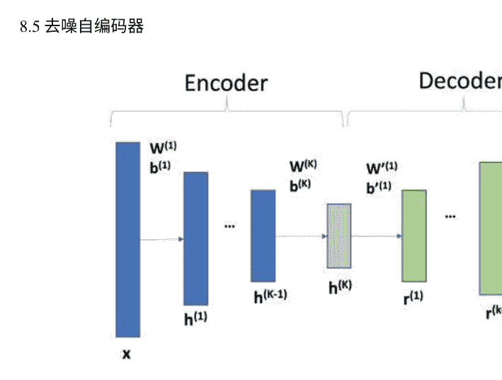

图8.2 堆叠自编码器模型，共 K 层

```
h^{(k)} = f_{\theta}^{(k)}(x) = \sigma_1(W^{(k)}h^{(k-1)} + b^{(k)}).
```

- 第一层解码器的初始输入是来自第K层编码器的隐藏表示，即 r^{(0)} = h^{(K)}。一般来说，第k层的解码器 g_{\theta'}^{(k)}() 将前一层重构的隐藏表示 r^{(k-1)} 映射回下一层的重构向量：

```
r^{(k)} = g_{\theta'}^{(k)}(r^{(k-1)}) = \sigma_2(W'^{(k)}r^{(k-1)} + b'^{(k)}).
```

## 8.5 去噪自编码器

在[163]中，作者提出了去噪自编码器（DAE），它可以学习对噪声输入更鲁棒的表示。其思想是给原始输入 x 添加噪声，得到损坏的版本 x~，然后尝试从噪声输入 x~ 重构出干净的未损坏的输入 x（图8.3）。

- 首先，我们通过随机映射将初始输入 x 损坏以获得 x~。可以创建不同类型的噪声：（1）所有位置上的随机高斯噪声，（2）掩蔽噪声（一小部分位置设置为0），（3）椒盐噪声（一小部分位置随机设置为0或1）。

- 然后，我们将损坏的输入 x~ 通过标准编码器传递：
h = f_{\theta}(\tilde{x}) = \sigma (W \tilde{x} + b)

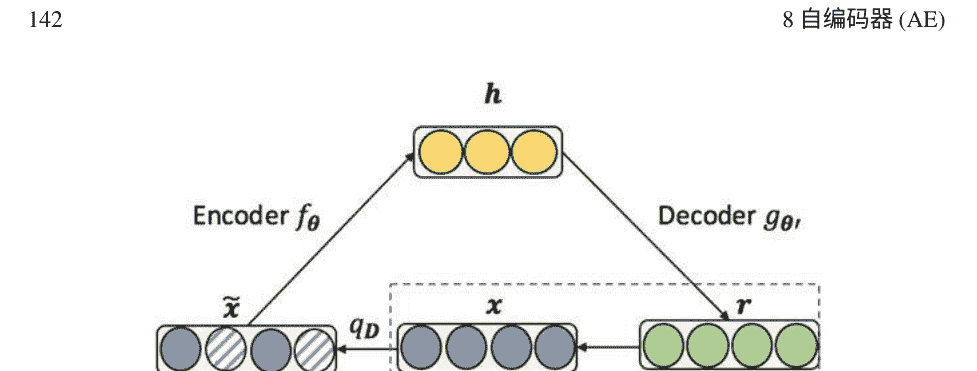

图8.3 降噪自编码器的示意图。输入数据通过 \( q_D \) 随机损坏为 \( \tilde{x} \)。然后，它通过编码器 \( f_{\theta} \) 映射到 \( h \)，并尝试通过解码器 \( g_{\theta'} \) 重建 \( x \)，并生成重建结果 \( r \)。重建误差由 \( L(x, r) \) 来衡量。

- 最后，解码器将尝试将 \( h \) 映射回一个接近原始未损坏输入 \( x \) 的重构向量 ：

\[ r = g_{\theta'}(h) = \sigma (W'h + b') \]

请注意，去噪自编码器试图最小化原始输入 \( x \) 与从损坏输入 \( \tilde{x} \) 重构的 \( r \) 之间的重构损失。

## 8.6 案例研究：“深度患者”通过堆叠去噪自编码器

问题 如何从电子健康记录数据中推导出通用的特征表示？
“深度患者”的作者比较了几种无监督特征构建方法，包括堆叠去噪自编码器（SDA）用于支持预测建模任务[113]。

数据 在“深度患者”中，基于来自Mount Sinai医院的电子健康记录数据学习了患者的表示，并使用疾病分类和预测任务进行了评估。特别是，该数据集包括超过700k名患者的长达12年的患者历史记录。原始数据包括结构化数据，如诊断（ICD-9代码）、药物、程序、实验室检查和非结构化的临床文本。

临床笔记使用Open Biomedical Annotator [132]进行处理。他们使用EHR数据中所有事件的发生次数作为原始特征值。然后，将所有特征值归一化到0和1之间，以减少数据方差同时保留零条目。

表8.2 疾病分类结果以ROC曲线下面积（AUC-ROC）、准确度和F-score表示。与相应的第二最佳测量值相比，差异具有统计学意义。

| 患者表示 | ROC-AUC | 准确度 | F-1 |
|----------|---------|--------|-----|
| 原始特征 | 0.659   | 0.805  | 0.084 |
| PCA      | 0.696   | 0.879  | 0.104 |
| GMM      | 0.632   | 0.891  | 0.072 |
| K-means  | 0.672   | 0.887  | 0.093 |
| ICA      | 0.695   | 0.882  | 0.101 |
| 深度患者 | **0.773** | **0.929** | **0.181** |

粗体数值表示在所有方法中的最佳性能数据

方法 使用3层堆叠去噪自编码器以无监督方式处理患者的输入特征向量。具体而言，每层使用500个隐藏单元。然后，对于每一层，将5%的随机输入位置设置为0。这可以看作是模拟EHR中缺失组件的存在（例如，未在患者记录中记录的药物或诊断），因此假设输入的临床数据是实际临床情况的降级或“噪声”版本。使用Sigmoid激活函数。接下来，将学习到的编码函数应用于干净的输入，得到的隐藏层即为最终的患者表示。因此，每个患者由一个包含500个特征的稠密向量表示。

结果 堆叠去噪自编码器的输出与其他众所周知的特征学习算法进行了比较，并在各种任务中展示了其实用性。特别是，以下算法被用作基准，包括具有100个主成分的主成分分析（PCA），具有500个聚类的k均值聚类，具有200个混合物和完整协方差矩阵的高斯混合模型，以及具有100个主成分的独立成分分析。

然后，使用学习到的特征，在一个包含200,000名患者的独立数据集上实施随机森林分类器，以预测患者根据其当前临床状态可能患某种疾病的概率。训练和评估遵循一对多策略。预测结果的性能列在表8.2中。主要发现是 Deep Patient（即DAE）在分类任务中明显优于无监督方法。这个结果证实了DAE作为从EHR数据进行特征工程的有效方法。

## 8.7 案例研究：从嘈杂、稀疏和不规则的临床数据中学习

问题[94]中的研究针对使用大规模EHR数据进行无偏深度表型发现。该论文认为，标准的深度学习本身无法可靠地从EHR中的嘈杂、稀疏和不规则观测中学习到紧凑的纵向特征。为了弥合这一差距，该研究首先应用高斯过程回归来转换不规则采样的实验室结果（即，在这种情况下，血清尿酸）转化为连续的纵向概率密度随时间变化，并使用稀疏自编码器 (SAE) 学习表型，通过高斯过程回归的输出。

数据本研究使用的数据来自范德堡大学的合成衍生物，这是他们生产的电子病历的匿名镜像。这个镜像包含超过15年的纵向临床数据，涵盖了超过200万个个体。 作者确定了4368个患有痛风或急性白血病的个体记录，但不包括两者同时患有的个体。 我们从每个记录中提取了尿酸值和测量时间的完整序列，并将其与相应的疾病标签关联起来。 疾病标签作为下游评估的参考标准，但不用于特征学习。 大约三分之一的记录被保留作为最终的测试集。

方法 该论文提出了一个由以下两个步骤组成的框架：转换步骤和特征学习步骤。 转换步骤假设每个个体都有一个未观察到的源函数，表示随时间变化的真实尿酸浓度，并将每个尿酸序列视为可能带有噪声的样本集。 作者使用高斯过程回归从有限的实验室结果样本中学习连续的尿酸函数。

在特征学习步骤中，对每日重新采样的数据应用了一个滑动窗口，以构建30天的补丁。 然后，在30天长的补丁上训练了一个两层堆叠稀疏自编码器，其中输入是30维向量。 使用稀疏自编码器的原因是学习稀疏特征，这些特征将用作新的表型。

为了评估所提出方法的有效性，评估了三个任务：(1)学习特征作为低级、高分辨率表型的面部有效性。(2)它们能够揭示未知的疾病人群亚型，以及 (3)它们在区分数据中已知但特征学习算法未知的疾病表型特征方面的准确性。

结果 为了评估学习到的特征的质量，它们使用了一个对特征学习算法未知的监督分类任务进行了评估。 由于这些特征并未针对评估任务进行优化，因此该任务可以作为一个广义性能测试。 它们与专家特征进行了比较，这些特征是针对特定任务进行了优化的。 所选的学习任务是仅使用尿酸序列来区分已知的痛风和白血病表型。 所选的分类算法是逻辑回归，因为简单的线性分类器更有可能揭示特征质量的差异，而不是更复杂的算法。

为了比较，训练了四个监督分类器：(1) 使用第一层学习到的特征的分类器，(2) 使用第二层学习到的特征的分类器，(3) 使用专家设计的特征的金标准分类器，(4) 使用序列均值作为唯一输入特征的基准分类器。 前两个分类器评估了学习到的特征。 金标准分类器旨在估计该任务的上限性能。 基准分类器旨在确定单个基本特征在任务上的表现如何。对于所有分类器，痛风和白血病的疾病标签被用作类别标签。 性能评估使用接收者操作特性曲线下的面积（AUC）在一个保留的测试集上进行。

表8.3 无监督特征在区分痛风和白血病的尿酸序列方面与专家设计的特征一样强大

| 分类器             | AUC (训练) | AUC [CI] (测试)       |
|--------------------|------------|-----------------------|
| 第一层学习到的特征 | 0.969      | 0.972 [0.968, 0.979]  |
| 第二层学习到的特征 | 0.965      | 0.972 [0.968, 0.979]  |
| 专家设计的特征     | 0.968      | 0.974 [0.966, 0.981]  |
| 基线（仅序列均值） | 0.922      | 0.932 [0.922, 0.944]  |

实验表明，使用高斯过程回归生成的特征，然后使用稀疏自编码器可以达到与表8.3中展示的专家特征相似的预测性能。

## 8.8 练习

- 1. 自编码器和主成分分析之间的主要区别是什么？
- 2. 自编码器和去噪自编码器之间的主要区别是什么？
- 3. 什么是最类似于自动编码器的方法？  
(a) K-means聚类  
(b) 主成分分析  
(c) 支持向量机  
(d) 分层聚类
- 4. 以下哪个关于自动编码器的说法是不正确的？  
(a) 它是一种无监督方法。  
(b) 它是一种无损压缩技术。  
(c) 它是一种降维方法。  
(d) 它是一种前馈神经网络。
- 5. 以下关于稀疏自动编码器的说法是不正确的？  
(a) 它在潜在编码中引入了稀疏性 h。  
(b) 使用Sigmoid激活函数生成潜在编码 h。  
(c) 对稀疏自动编码器使用与标准自动编码器相同的损失函数。  
(d) 需要指定h的每个维度上的稀疏程度。
- 6. 以下关于去噪自动编码器的说法是不正确的？
(a) 在应用自动编码器模型之前，它会向原始输入添加随机噪声。
(b) 它的损失函数介于重构和没有添加随机噪声的原始输入x之间。
(c) 由于原始输入添加了随机噪声，训练成本更高。
(d) 由于引入了受损输入，它对噪声更具鲁棒性。
- 7. 在图8.2中所示的堆叠自编码器中，首先学习的是哪些模型参数？
- 8. 关于堆叠自编码器，哪个说法是不正确的？
(a) 首先应用多个编码器，然后按相反顺序应用相应的解码器。
(b) 它是一个深度神经网络，有2K层，其中K是自编码器的数量。
(c) 它以端到端的方式训练，作为单个模型使用反向传播。
(d) 它按顺序训练，作为K个独立的自编码器。
- 9. 在表型发现论文[94]中，在应用自编码器之前使用了哪种其他模型？
- 10. 问题8：在深度患者论文[113]中使用的自编码器模型的变体是什么？

## 9.1 概述

准确性和可解释性是成功预测模型的两个理想属性。大多数深度学习模型都试图在不考虑可解释性的情况下实现高准确性。注意机制是神经网络模型能够同时实现准确性和可解释性的一种罕见情况 [2]。

各种注意机制已经应用于电子健康记录数据 [25, 28, 73, 174]。此外，注意机制在许多先进的神经网络模型中起着重要作用，例如记忆网络和变压器，在第11章中将进行讨论。

## 9.2 注意机制

除了DNN、CNN和RNN之外，注意机制是深度学习中的另一个基本突破。这是一种通用策略，可以导致许多建模变体。接下来，我们将介绍注意机制的关键概念及其在医疗保健中的应用。

基于编码器-解码器RNN模型的注意力机制注意力机制最初是为了改进具有机器翻译应用的序列到序列模型而提出的。特别是，源语言中的一系列单词被映射为目标语言中的一系列单词，通常长度不同[2]。对于电子健康记录建模，注意力机制可以帮助解释临床事件与目标结果之间的相关程度，例如 [25, 28, 174]。

注意力模型扩展了序列到序列（seq2seq）模型，使用两个RNN，如第7.3.4节所述。在原始的seq2seq模型中，编码器RNN将输入序列映射为固定长度的上下文变量c。这是一个“静态”的变量。

上下文变量 c 将传递到解码器RNN的每个步骤中，以生成输出序列。 然而，这种seq2seq模型在对长序列进行建模时容量有限，因为整个输入的信息必须被压缩成一个静态的上下文变量 c [20]。

注意机制允许“动态”的上下文变量 c，提供源序列和目标序列之间的对齐和翻译。 通过优化对齐，模型旨在确定源序列的哪些部分与生成目标序列中的给定单词相关。 然后，翻译优化将输入序列的相关信息合并到每个输出单词的动态上下文变量中。

注意模型的设计包括以下组件：

- 1. 注释向量指的是输入序列的编码；
- 2. 对齐模型衡量输入和输出位置之间的相关性；
- 3. 注意权重是在生成每个输出单词时应该给予输入单词的注意力程度；
- 4. 上下文向量是根据当前输出位置对输入的动态摘要。

表9.1显示了注意力建模中使用的符号。

注释向量 h。首先，我们将输入序列 x 编码为向量 (h_1, ..., h_T)_x。

在[2]中，编码后的输入被称为每个时间步的“注释”。

```
(h_1, ..., h_T)_x = Encoder(x_1, ..., x_T)_x
```

编码器可以是RNN（例如，双向LSTM [2]）或CNN（如[53]中所示）。

表9.1 注意机制符号
| 符号 | 定义 |
| :--- | :--- |
| x = (x_1, ..., x_T)_x | 长度为 T 的输入序列 |
| h, h_i | 一般的注释向量；i 和 j 的注释向量 |
| c, c_i | 一般的上下文向量；i 和 j 的上下文向量 |
| s_i | 时间 i 的隐藏状态 |
| y = (y_1, ..., y_T_y) | 长度为 T 的输出序列 |
| a() | 对齐模型（由神经网络参数化） |
| a_ij | 生成输出词 i 时，输入词 j 的注意权重 |
| I(x) | 输入特征图 |
| m_i | 第 i 个记忆槽 |
| o | 输出特征图 |
| r | 最终响应（解码输出） |

对齐模型a(·)用于量化输入和输出之间的对齐程度，对齐模型eij衡量了位置j附近的输入和位置i处的输出的匹配程度。特别地，eij衡量了输出隐藏状态si-1和位置j处的输入注释向量hj之间的相关性，表示为

```
eij = a(si-1, hj).
```

有时，我们也将输出称为查询，将所有输入称为键，将最终输出嵌入称为值。原因是注意机制类似于相似性搜索，其中查询、键和值的术语是自然的。在第11章介绍记忆网络时，将再次讨论这些术语。

注释函数a(·)可以通过几种不同的方式进行参数化:

- 点积注意力：如果si-1和hj长度相同，我们可以使用简单的内积

```
a(s_{i-1}, h_j) = s_{i-1} \cdot h_j;
```

- 一般的点积注意力：如果si-1和hj长度不同，我们可以引入一个权重矩阵来对齐两个向量

```
a(s_{i-1}, h_j) = s_{i-1} W_a h_j;
```

- 加性注意力：或者我们可以将两个向量连接起来，并通过一个简单的神经网络传递它们

```
a(s_{i-1}, h_j) = v_a \tanh(W_a [s_{i-1}, h_j] + b_a).
```

这里，W_a和v是要学习的模型参数。

注意力权重a_ij是来自对齐模型输出的归一化版本。特别地，a_ij将输入位置j与输出位置i的相关概率分配。更准确地说，对齐模型e_ij使用softmax函数进行归一化。注意力权重a_ij由softmax函数计算。

```
a_{ij} = \frac{e^{e_{ij}}}{\sum_{k=1}^{T_x} exp(e_{ik})}
```

其中e_ij是上述对齐模型。权重a_ij指的是目标词i与源词j对齐（或翻译）的概率。请记住，a_ij的第一个索引对应目标，而第二个索引对应源。这种特定的索引顺序对于矩阵乘法很重要，因为所有的a_ij都将表示为矩阵。

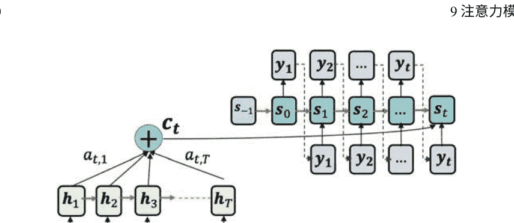

图9.1: 神经机器翻译中的注意力机制示例。在这里，我们可以使用任何RNN的变体作为编码器。

上下文向量在输出的每个位置上变得动态，表示为c_i。从数学上讲，上下文向量c_i被计算为注释向量h_1, ..., h_T的加权和。

$$c_i = \sum_{j=1}^{T} a_{ij} * h_j$$

解码器：解码过程将在动态上下文向量c_i上应用一个函数来生成输出隐藏状态s_i（例如，另一个RNN）。更具体地说，输出隐藏状态s_i可以是前一个隐藏状态s_{i-1}，前一个输出y_{i-1}和当前时间上下文向量c_i的函数表示。

$$s_i = f(s_{i-1}, y_{i-1}, c_i)$$

如图9.1所示。最后，输出隐藏状态s_i可以输入更多层来预测位置i的y_i。与seq2seq模型相比，注意力模型为每个输出隐藏状态具有不同的上下文向量c_i。然后输出y_i将从输出隐藏状态s_i生成。

### 9.3案例研究：基于纵向EHR的注意力模型

问题纵向EHR数据被表示为随时间变化的访问序列。如何在这样的时间事件序列上构建准确且可解释的模型？注意机制可以用来理解历史信息中哪部分在进行某些预测时更重要。作者在[25]中提出了一个两级注意力模型，用于使用纵向EHR数据预测心力衰竭的发作。

数据数据集由Sutter Health的电子健康记录组成。电子健康记录包括就诊记录、药物订单、手术订单和问题清单，涵盖了多次就诊的就诊记录。数据结构化编码，包括诊断、药物和手术代码。CCS医疗编码器[34]用于将代码聚合成输入变量（表9.2）。方法RETAIN [25]提出了一种随时间变化的注意机制。每次就诊 $x_i$ 由一个多热向量表示，其中每个维度对应一个医疗代码。给定一个来自患者的就诊序列 $x_1, \ldots, x_T$，目标[25]是预测患者在未来的就诊中是否会发展心力衰竭（图9.2）。首先，RETAIN使用线性投影将就诊信息嵌入以保持可解释性。

```
$v_i = W_{emb} x_i \quad \text{(第一步)}$
```

表9.2 [25]中使用的EHR数据集统计(D:诊断, R:药物,P:程序)

| 类别 | 统计 |
|------|------|
| 患者数量 | 263,683 |
| 就诊次数 | 14,366,030 |
| 医疗代码组数量 | 615 (D:283, R:94, P:238) |
| 平均每位患者的就诊次数 | 54.48 |
| 平均每次就诊的代码数量 | 3.03 |
| 一次就诊中的最大代码数量 | 62 |
| 一次就诊中的平均诊断代码数量 | 1.83 |
| 一次就诊中的最大诊断数量 | 42 |

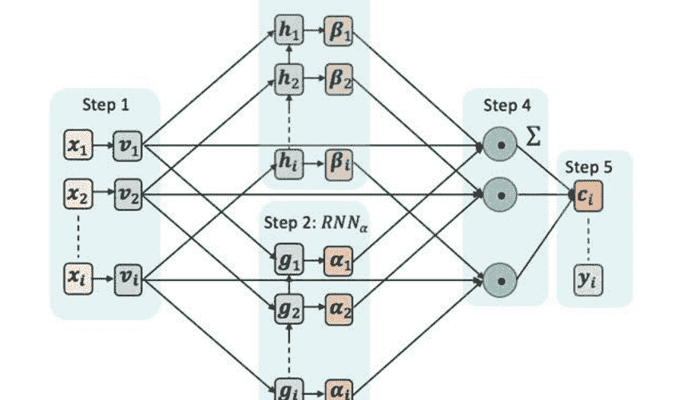

图9.2 RETAIN架构示意图其次，RETAIN使用了两级注意机制，这是本研究的主要方法创新：一级用于就诊级别的注意力，一级用于就诊内变量级别的注意力。与许多之前的工作不同，RETAIN的注意力权重是用两个RNN模型建模的：RNN_α用于就诊，RNN_β用于就诊内的变量。我们假设查询是当前的就诊（每位患者的最后一次就诊）。因此，在下面的描述中忽略了查询的索引。

```
g_i = \text{RNN}_α(v_i, v_{i-1}, \ldots, v_1)
e_j = w_α^T g_j + b_α, \quad \text{for} \quad j = 1, \ldots, i
\alpha_1, \alpha_2, \ldots, \alpha_i = \text{Softmax}(e_1, e_2, \ldots, e_i) \quad \text{(第2步：就诊级别)}
h_i, h_{i-1}, \ldots, h_1 = \text{RNN}_β(β_i, β_{i-1}, \ldots, β_1)
β_j = \text{tanh}(W_β h_j + b_β) \quad \text{for} \quad j = 1, \ldots, i, \quad \text{(第3步：变量级别)}
```

其中，g_i ∈ ℝ^m 是 RNN_α 在时间步 i 的隐藏层，h_i ∈ ℝ^q 是 RNN_β 在时间步 i 的隐藏层，w_α ∈ ℝ^p, b_α ∈ ℝ, W_β ∈ ℝ^{m×q}, b_β ∈ ℝ^m 是需要学习的参数。请注意，对于每次访问的预测，我们从 RNN_α 和 RNN_β 计算一组新的注意力权重 α 和 β。接下来，使用生成的注意力权重，我们按照以下方式获取患者在第 i 次访问时的上下文向量 c_i:

```
c_i = \sum_{j=1}^{i} α_{j} β_{j} ⊙ v_{j} \quad \text{(第4步)}
```

其中 ⊙ 表示逐元素乘法。上下文向量 c_i ∈ ℝ^m 用于预测心脏衰竭的发作，如下所示：

```
y_i = σ(w^T c_i + b). \quad \text{(第5步)}
```

其中 σ 是用于二元分类（HF或非HF）的sigmoid函数，w ∈ ℝ^m 和 b ∈ ℝ 是需要学习的参数。使用交叉熵损失函数。

解释：给定患者的风险评分可以通过计算 σ(w^T c_i + b) 来得到，如上所示。为了了解风险，我们需要找出最具影响力的就诊记录和其中的关键变量。找到对预测有贡献的具有最大 α_i 的影响力就诊记录是直接的。

然而，找到具有影响力的输入变量（例如特定的诊断代码）稍微复杂一些。给定第 j 次就诊中的第 k 个变量，记为 x_{j,k}，它对最终预测的影响分数为

$$\omega(x_{j,k}) = \alpha_{j} \mathbf{w}^{\top} (\boldsymbol{\beta}_{j} \odot \mathbf{W}_{emb}[:, k]) \cdot x_{j,k}$$

其中，$W_{emb}[:, k]$表示嵌入矩阵$W_{emb}$的第$k$列。

结果RETAIN的可解释性在HF预测任务中得到了证明。在出现HF症状之前，患者在一段时间内出现了皮肤问题、皮肤疾病(SD)、良性肿瘤(BN)、皮肤病变切除(ESL)等症状，然后被诊断出患有HF、心脏心律失常(CD)、心脏瓣膜疾病(HVD)和冠状动脉粥样硬化(CA)（图9.3a）。我们可以看到，高风险评分$\hat{y}=0.2475$和早期访问中与皮肤相关的代码对HF预测的贡献很小，这是预期的。RETAIN正确地关注了最近访问中与HF相关的代码。

为了确认RETAIN利用电子病历数据的顺序信息的能力，我们反转了图9.3a的访问顺序，并将其输入到RETAIN中。图9.3b显示了反转访问记录的医疗代码的贡献。过去与HF相关的代码仍然起着积极的作用，但不像在图9.3a中那样多。在这种情况下，风险评分下降到0.0905。图9.3c显示了在模型中使用选定的药物数据时代码贡献的变化。我们在第219天添加了两种药物：

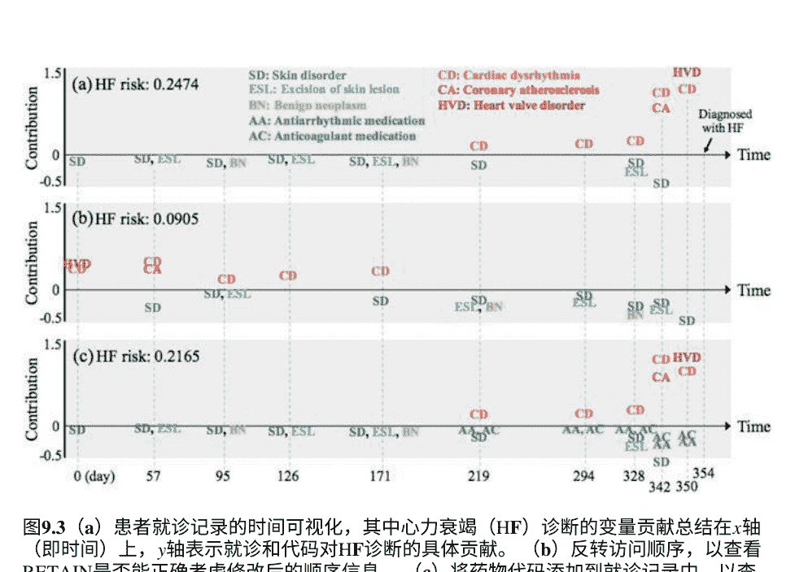

在（c）中的预测值（0.2165）低于（a）中的预测值（0.2474）。这表明正确使用药物可能有助于患者降低心力衰竭风险。

## 9.4 案例研究：医学本体上的注意力模型

### 问题
医学本体表示大量的医学知识，这些知识被建模为有向无环图（DAGs）。图中的每个节点对应于临床概念，例如心力衰竭。边表示概念之间的关系，例如心力衰竭与心脏病相关联。这些概念通常以层次结构组织，如图9.4左侧所示。问题是如何构建一个更好的患者表示，既利用电子病历数据又利用知识DAGs。

### 数据
在[28]中，作者对Sutter健康机构的相同电子病历数据进行了心力衰竭（HF）预测实验，如第9.3节所述。[28]中还研究了其他任务和数据集，为了简洁起见，省略了这些内容。

### 方法
GRAM [28]利用本体图的父子关系从 EHR 数据中学习稳健的表示。

在知识 DAG 中，每个节点 $c_i$（例如诊断代码）都被分配一个基本的嵌入向量 $e_i$。我们将叶节点的最终表示形式定义为其自身及其祖先的基本嵌入的凸组合：

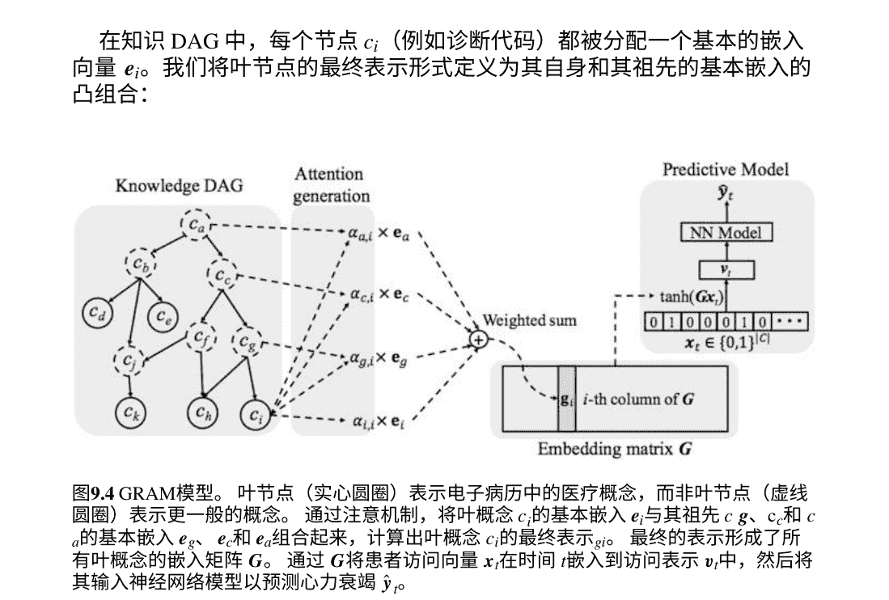

图9.4 GRAM模型。叶节点（实心圆圈）表示电子病历中的医疗概念，而非叶节点（虚线圆圈）表示更一般的概念。通过注意机制，将叶概念$c_i$的基本嵌入$e_i$与其祖先$c_g$、$c_c$和$c_a$的基本嵌入$e_g$、$e_c$和$e_a$组合起来，计算出叶概念$c_i$的最终表示$g_i$。最终的表示形成了所有叶概念的嵌入矩阵$G$。通过$G$将患者访问向量$x_t$在时间$t$嵌入到访问表示$v_t$中，然后将其输入神经网络模型以预测心力衰竭$\hat{y}_t$。

$$g_i = \sum_{j \in \mathcal{A}(i)} \alpha_{ij} \mathbf{e}_j, \quad \sum_{j \in \mathcal{A}(i)} \alpha_{ij} = 1, \quad \alpha_{ij} \geq 0 \text{ for } j \in \mathcal{A}(i),$$

其中 $g_i$ 表示代码 $c_i$ 的最终表示，$\mathcal{A}(i)$ 表示代码 $c_i$ 及其祖先的索引集合，$\mathbf{e}_j$ 表示代码 $c_j$ 的基本嵌入，$\alpha_{ij} \in \mathbb{R}^+$ 表示计算 $g_i$ 时对嵌入 $\mathbf{e}_j$ 的注意权重。注意权重 $\alpha_{ij}$ 的计算方式为

$$\alpha_{ij} = \frac{\exp(f(\mathbf{e}_i, \mathbf{e}_j))}{\sum_{k \in \mathcal{A}(i)} \exp(f(\mathbf{e}_i, \mathbf{e}_k))}$$

其中 $f(\mathbf{e}_i, \mathbf{e}_j)$ 是表示基本嵌入 $\mathbf{e}_i$ 和 $\mathbf{e}_j$ 之间兼容性的标量值。该函数 $f(\mathbf{e}_i, \mathbf{e}_j)$ 可以使用具有单隐藏层的多层感知机（MLP）或加性注意力来实现。

$$f(\mathbf{e}_i, \mathbf{e}_j) = \mathbf{u}_a^{\top} \tanh(\mathbf{W}_a \begin{bmatrix} \mathbf{e}_i \\ \mathbf{e}_j \end{bmatrix} + \mathbf{b}_a)$$

其中 $\mathbf{W}_a$ 是连接 $\mathbf{e}_i$ 和 $\mathbf{e}_j$ 的权重矩阵，$\mathbf{b}_a$ 是偏置向量，而 $\mathbf{u}_a$ 是生成兼容性值的权重向量。常数 $l$ 表示 $f(\cdot, \cdot)$ 的隐藏层的维度大小。

### 结果
GRAM 及其变种在相同心力衰竭发作预测方面相对于 RNN 及其变种具有更好的结果，采用了将医疗代码推广到更高级别的简单启发式方法。

- SimpleRollUp 将 RNN 的所有输入代码替换为它们在 CCS 多级层次结构中的直接父代码。
- RollUpRare 将 RNN 的罕见输入代码替换为它们的直接父代码。

表9.3显示了 Sutter HF 队列的 HF 预测性能。GRAM 始终以3-4%的 AUC 优于其他基线。

**表格 9.3 当训练数据集大小变化时，HF 发作预测的 AUC**

| 模型 | 10% | 20% | 30% | 40% | 50% | 60% | 70% | 80% | 90% | 100% |
| :--- | :--- | :--- | :--- | :--- | :--- | :--- | :--- | :--- | :--- | :--- |
| GRAM | **0.7981** | 0.8217 | **0.8340** | **0.8332** | 0.8372 | 0.8377 | 0.8440 | 0.8431 | 0.8430 | 0.8447 |
| RNN | 0.7811 | 0.7942 | 0.8066 | 0.8111 | 0.8156 | 0.8207 | 0.8258 | 0.8278 | 0.8297 | 0.8314 |
| SimpleRollUp | 0.7799 | 0.8022 | 0.8108 | 0.8133 | 0.8177 | 0.8207 | 0.8223 | 0.8272 | 0.8269 | 0.8258 |
| RollUpRare | 0.7830 | 0.8067 | 0.8064 | 0.8119 | 0.8211 | 0.8202 | 0.8262 | 0.8296 | 0.8307 | 0.8291 |

粗体数值表示所有方法中的最佳性能指标

## 9.5 案例研究：从临床记录中进行ICD分类

### 问题
临床记录是临床医生为每个患者就诊创建的文本文档。它们通常伴随着诊断代码和操作代码，主要用于向保险公司报销。这些诊断代码是由人工编码员手动分配的，这是一项费时且容易出错的工作。

能否根据临床记录自动化进行医疗编码分配的深度学习算法？在[114]的作者提出了一种注意力模型来解决这个问题（图9.5）。

### 数据
在该研究中使用了来自MIMIC-III数据集的出院总结[114]，数据[81]。每次入院都由人工编码员标记一组ICD-9代码，描述了患者住院期间的诊断和手术。我们的数据集中有8921个独特的ICD-9代码，包括6918个诊断代码和2003个手术代码。最终的数据集包含了36,998名患者的47,724个出院总结用于训练，其中1632个总结和3372个总结用于验证和测试。

### 方法
多标签分类的卷积注意力模型（CAML）[114]将卷积结构和注意力机制结合起来对临床文本进行建模。

- 输入：对于临床文档中的每个单词，使用d_e维的预训练嵌入进行水平拼接，得到输入矩阵 X = [x_1, x_2, ..., x_N]，其中 N是文档的长度。
- 卷积：使用卷积滤波器 W_c ∈ ℝ^{k×d_e×d_c}，将相邻的词嵌入组合在一起，其中k是滤波器的宽度，d_e是输入嵌入的大小，d_c是滤波器输出的大小。在每一步n，他们计算

```
h_n = g(W_c * x_{n:n+k-1} + b_c), (9.1)
```

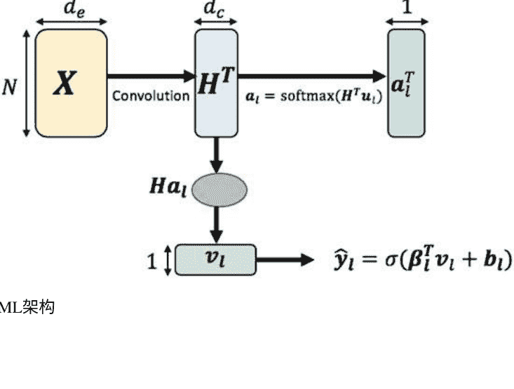

其中*表示卷积运算符，$g$是逐元素的非线性变换，$b_c \in \mathbb{R}^{d_c}$是偏置项。

- 注意力: 卷积后，文档由矩阵$H$表示。对于每个标签$\ell$，他们计算矩阵-向量乘积$H^\top u_\ell$，其中$u_\ell \in \mathbb{R}^{d_c}$是标签$\ell$的向量参数。然后他们通过softmax运算符将得到的向量传递，得到文档中位置的分布。

$$\alpha_\ell = \text{Softmax}(H^\top u_\ell),$$

然后使用注意力向量$\alpha_\ell$计算每个标签的文档表示,

$$v_\ell = \sum_{n=1}^{N} \alpha_{\ell,n} h_n.$$

在这种情况下，输入文档作为键，每个疾病诊断标签成为一个查询。

- 分类: 给定文档表示$v_\ell$，使用另一个线性层和$sigmoid$变换计算标签$\ell$的概率:

$$\hat{y}_\ell = \sigma (\beta_\ell^\top v_\ell + b_\ell),$$

其中$\beta_\ell \in \mathbb{R}^{d_c}$是预测权重的向量，$b_\ell$是标量偏移。使用所有标签的总交叉熵损失 $L=-\sum_\ell y_\ell \log(\hat{y}_\ell) + (1-y_\ell) \log(1-\hat{y}_\ell)$。

### 结果
我们的主要定量评估是基于MIMIC-III出院摘要文本预测完整的ICD-9代码。如表9.4所示，CAML模型在所有指标上都表现出最强的结果。

**表9.4 MIMIC-III完整数据集，8922个标签的结果。这里，“Diag”表示仅诊断代码的Micro-F1性能，“Proc”表示仅过程代码的Micro-F1性能。**

| 模型 | AUC宏观 | AUC微观 | F1宏观 | F1微观 | F1 Diag | F1 Proc | P@n 8 | P@n 15 |
| :--- | :--- | :--- | :--- | :--- | :--- | :--- | :--- | :--- |
| 逻辑回归 | 0.561 | 0.937 | 0.011 | 0.272 | 0.242 | 0.398 | 0.542 | 0.411 |
| CNN | 0.806 | 0.969 | 0.042 | 0.419 | 0.402 | 0.491 | 0.581 | 0.443 |
| Bi-GRU | 0.822 | 0.971 | 0.038 | 0.417 | 0.393 | 0.514 | 0.585 | 0.445 |
| CAML | **0.895*** | **0.986*** | **0.088** | **0.539*** | **0.524*** | **0.609*** | **0.709*** | **0.561*** |

粗体数值表示所有方法中的最佳性能指标

## 9.6 案例研究：心脏病的心电图检测

### 问题
心电图（ECG）测量心脏的电活动，是一种常用的非侵入性诊断工具用于心脏疾病。现有的心电图诊断实践是基于ECG中专家定义的模式，如P波、QRS波群和RR间期。然而，深度学习提供了一套新的强大工具，可以以数据驱动的方式分析ECG。我们已经展示了如何在第6.8节中应用CNN进行ECG分类。[73]的作者提出了一种多级知识引导注意力模型（MINA）用于分类ECG信号。

### 数据
作者使用来自PhysioNet Challenge 2017数据库[32]的真实世界ECG数据进行了所有实验。该数据集包含8528个去标识化的ECG记录，持续时间从9秒到60秒以上，由AliveCor设备以300 Hz采样，其中738个来自AF患者，7790个来自挑战中预定义的对照组。我们首先将数据分为训练集（75%）、验证集（10%）和测试集（15%）来进行所有任务的训练和评估。然后，他们通过10秒的滑动窗口处理，以产生等长的n=3000的片段。因此，患者的ECG记录将变成多个3000维的片段。目标是区分房颤（AF）患者的片段和对照组的片段。

### 方法
图9.6展示了真实世界ECG信号的一个示例。AF患者和对照组的ECG信号在（1）心跳水平、（2）节律水平和（3）频率水平上显示出不同的模式。学习这些模式以支持诊断一直是ECG分析中的重要研究领域。对于每个水平，MINA提取特定于水平的领域知识特征。它使用这些特征来指导注意力模型，包括指导注意力CNN的心搏形态知识和指导注意力RNN的节律知识。MINA还在时间和频率域上执行注意力融合。

MINA架构如图9.7所示。给定一个单导联心电图信号$x \in \mathbb{R}^n$，目标是基于$x$预测房颤的概率。首先将其转换为不同频带上具有F个通道的多通道信号，其中第i个信号表示为$x^{(i)} \in \mathbb{R}^n$。然后将每个$x^{(i)}$分割成M个片段$s^{(k)}$。接下来，连续应用CNN和RNN在$s^{(k)}$上，以获得节拍级别的注意力。

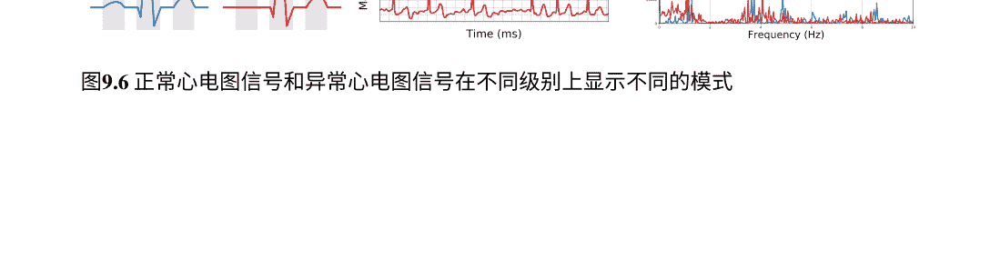

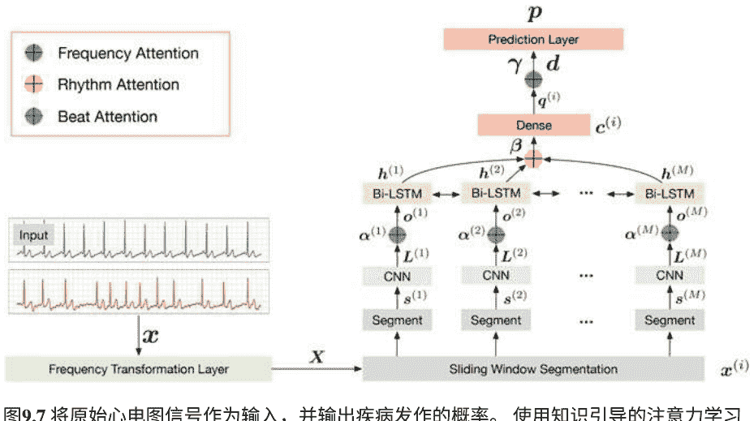

$o^{(k)}, 1 \leq k \leq M$和节律级别的注意力$c^{(i)}$。然后是一个全连接层，将$c^{(i)}$转换为$q^{(i)}$。然后他们对所有通道的频率注意力$Q = [q^{(1)},..., q^{(F)}]$进行加权平均，输出频率注意力$d$，这将用于预测。

为了计算多级注意力权重α, β, γ，注意力机制可以被看作是一个两层神经网络：第一层全连接层计算用于计算权重的分数；第二层全连接层通过softmax激活计算权重。

在第一层中，分数是基于以下特征计算的。(1) 通过该方法提取的多级输出$L \in \mathbb{R}^{K \times N}, H \in \mathbb{R}^{J \times M}, Q \in \mathbb{R}^{H \times F}$。(2) 包括节拍级别$K_\alpha \in \mathbb{R}^{E_\alpha \times N}$、节律级别$K_\beta \in \mathbb{R}^{E_\beta \times M}$和频率级别$K_\gamma \in \mathbb{R}^{E_\gamma \times F}$的领域知识特征。

在第二层中，它们将模型输出和知识特征连接起来，计算得分和注意力权重。

$$\alpha = \text{softmax}(V_\alpha^T(W_\alpha^T [L; K_\alpha] + b_\alpha))$$

$$\beta = \text{softmax}(V_\beta^T(W_\beta^T [H; K_\beta] + b_\beta))$$

$$\gamma = \text{softmax}(V_\gamma^T(W_\gamma^T [Q; K_\gamma] + b_\gamma))$$其中，$W_{\alpha} \in \mathbb{R}^{(K+E_{\alpha})\times D_{\alpha}}$，$W_{\beta} \in \mathbb{R}^{(J+E_{\alpha})\times D_{\beta}}$，$W_{\gamma} \in \mathbb{R}^{(H+E_{\gamma})\times D_{\gamma}}$，$b_{\alpha} \in \mathbb{R}^{D_{\alpha}}$，$b_{\beta} \in \mathbb{R}^{D_{\beta}}$，$b_{\gamma} \in \mathbb{R}^{D_{\gamma}}$表示第一层中的权重和偏差，$V_{\alpha} \in \mathbb{R}^{D_{\alpha}\times 1}$，$V_{\beta} \in \mathbb{R}^{D_{\beta}\times 1}$，$V_{\gamma} \in \mathbb{R}^{D_{\gamma}\times 1}$表示第二层中的权重。$\oplus$是广播加法（即，将向量$b_{\alpha}$，$b^{\beta}$，$b^{\gamma}$添加到矩阵的每一列）。

结果 作者将MINA与(1) **Expert**进行了比较：AF诊断中使用的提取特征的组合，包括节律特征、形态特征和频率特征。然后，他们在上述提取的特征上构建了逻辑回归模型(**ExpertLR**)和随机森林模型(**ExpertRF**)。(2) **CNN**：具有与MINA相同的CNN、FC和softmax超参数的卷积神经网络。(3) **CRNN**：卷积循环神经网络；(4) **ACRNN**：具有注意力机制的卷积循环神经网络。

性能通过接收者操作特性下的曲线下面积（ROC-AUC），精确率-召回率曲线下的曲线下面积（PR-AUC）和F1分数来衡量。表9.5显示MINA优于所有基线，并且比第二好的模型高出5.51%的PR-AUC。图9.8显示从MINA中提取的可解释结果。

表9.5 AF预测的性能比较
| | ROC-AUC | PR-AUC | F1 |
|---|---|---|---|
| ExpertLR | 0.9350 ± 0.0000 | 0.8730 ± 0.0000 | 0.8023 ± 0.0000 |
| ExpertRF | 0.9394 ± 0.0000 | 0.8816 ± 0.0000 | 0.8180 ± 0.0000 |
| CNN | 0.8711 ± 0.0036 | 0.8669 ± 0.0068 | 0.7914 ± 0.0090 |
| CRNN | 0.9040 ± 0.0115 | 0.8943 ± 0.0111 | 0.8262 ± 0.0215 |
| ACRNN | 0.9072 ± 0.0047 | 0.8935 ± 0.0087 | 0.8248 ± 0.0229 |
| **MINA** | **0.9488 ± 0.0081** | **0.9436 ± 0.0082** | **0.8342 ± 0.0352** |
粗体数值表示所有方法中的最佳性能指标

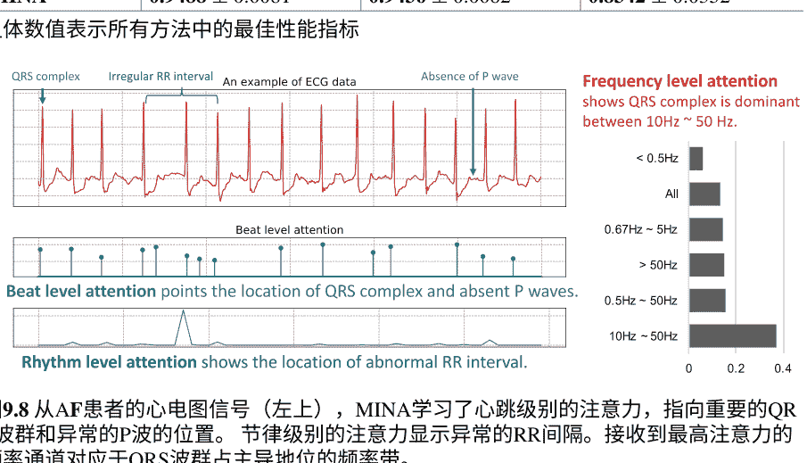

图9.8 从AF患者的心电图信号（左上），MINA学习了心跳级别的注意力，指向重要的QRS波群和异常的P波的位置。节律级别的注意力显示异常的RR间隔。接收到最高注意力的频率通道对应于QRS波群占主导地位的频率带。

## RETAIN Algorithm

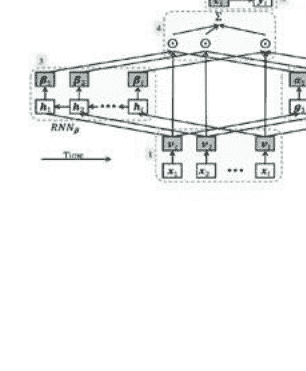

| 步骤 | 描述 |
|------|------|
| 1 | v_i = E x_i<br>Multi-hot representation of the visit is linearly projected by the embedding matrix E. |
| 2 | g_i, g_{i-1}, ..., g_1 = RNN_α(v_i, v_{i-1}, ..., v_1)<br>α_i, α_{i-1}, ..., α_1 = Softmax(w^T[g_i, g_{i-1}, ..., g_1] + b_α)<br>RNN_α generates α_i, the scalar attention weight for the i-th visit. The visit representations v_i's are fed to the RNN_α in reverse order. |
| 3 | h_i, h_{i-1}, ..., h_1 = RNN_β(v_i, v_{i-1}, ..., v_1)<br>β_{ij} = tanh(W_β h_j + b_β) for j=1,...,i<br>RNN_β generates β_i, the vector attention weight for the medical codes in the i-th visit. v_i's are fed to the RNN_β in reverse order as well. |
| 4 | c_i = Σ_{j=1}^i α_{ij} β_{ij} ⊙ v_j<br>The attention weights α_i and β_i are combined with the visit representation v_i to obtain the context vector c_i. |
| 5 | ŷ_i = Softmax(W c_i + b)<br>Using the context vector c_i, we make the final prediction. |

图9.9 RETAIN算法 [25]

## 9.7 练习

- 1. 循环神经网络和带有注意力机制的序列到序列模型有什么区别?
- 对于问题2-4，请参考图9.1
- 2. 如何计算注意力权重 α_{ij} 的直接输入?
- 3. 如何计算动态上下文向量 c_i?
- 4. 解码器的直接输入是什么 s_i?
- 5. 在图9.9中，RETAIN方法中哪些步骤计算注意力权重?
- 6. 在CAML方法[114]中，除了注意机制之外还使用了哪种神经网络架构? CAML的临床应用是什么?
- 7. MINA方法[73]的输入数据是什么?

# 第10章 图神经网络

## 10.1 概述

图是具有许多现实世界应用的成对关系的通用表示形式。 在医疗领域，图被广泛应用于生物医学实体之间的关系，包括分子的图结构[80, 103, 107]，药物相互作用网络[108]，蛋白质相互作用网络[64, 178]，基因表达网络[99]以及生物医学知识图谱和医学本体[28, 134]。 与向量或序列等其他表示形式相比，图是能够捕捉异质生物医学概念之间更复杂交互的表达模型。 因此，直接对图进行建模对许多生物医学应用具有重要价值。

尽管深度学习方法取得了成功，但由于几个挑战，直接应用于图形仍然很困难[175]: (1)不规则结构: 图形由节点和边灵活表示，比固定大小的输入向量和矩阵更难处理。(2)图形的异质性: 在生物医学领域中，存在许多不同的图形，例如医学本体图、蛋白质相互作用图、药物相互作用图。 很难同时对异构图进行建模。

即使在单个图形中，也可能存在不同类型的节点和边。 例如，像SNOMED这样的医学本体包含许多不同类型的关系。 (3)大型图形: 有些图形很小，例如由几十个原子和键组成的分子图，但有些图形非常庞大，包含数十万个节点和数百万条边，例如像SNOMED这样的医学本体图。处理这样的大型图形在计算上是昂贵的。

已经提出了不同的神经网络架构，包括图循环神经网络（graph RNN）、图卷积神经网络（GCN）、图注意力网络（GAT）和图自编码器（GAEs）。 其中，GCN受到了最多的关注，这是本章的重点[88]。

GCN通过将卷积操作的概念从标准的卷积神经网络推广到处理图（例如生物医学网络）的情况下，扩展了前馈神经网络。GCN及其变种已应用于生物医学图[108, 134, 178]。在本章中，我们首先概述了图上的符号和任务，然后描述了一些流行的图神经网络（GNNs），最后介绍了它们在药物发现等医疗任务上的应用。

## 10.2 图的符号和任务

### 10.2.1 图上的符号和操作

图通常用 \( G = \langle V, E \rangle \) 表示，其中 \( V = \{ v_1, v_2, \ldots, v_N \} \) 是节点的集合，\( E \subseteq V \times V \) 是连接这些节点的边的集合。图 \( G \) 的邻接矩阵是 \( A \in \mathbb{R}^{N \times N} \)，其中 \( A(i, :) \)，\( A(:, j) \)，\( A(i, j) \) 分别表示第 \( i \) 行、第 \( j \) 列和第 \( ij \) 元素。通常，\( A \) 是一个二进制矩阵，其中元素 \( ij \) 的值为 1 表示从节点 \( i \) 到节点 \( j \) 的边，值为 0 表示没有边。我们用 \( X \in \mathbb{R}^{N \times D} \) 表示节点的特征矩阵。同样，\( Y \in \mathbb{R}^{N \times M} \) 表示节点的标签矩阵，用 \( N \) 个独热向量表示。特别地，\( X(i, :) \) 和 \( Y(i, :) \) 分别对应于节点 \( v_i \) 的特征向量和标签向量（例如，一个独热向量）。

规范化而不是直接使用邻接矩阵，我们通常使用规范化的邻接矩阵作为图神经网络的输入。常见的想法是通过逆度矩阵 \( D \) 来规范化邻接矩阵 \( A \)。这里度矩阵 \( D \in \mathbb{R}^{N \times N} \) 是一个对角矩阵，其对角元素 \( D(i, i) = \sum_j A(i, j) \)（\( A \) 的第 \( i \) 行元素之和）。不同的规范化选项可以计算出来：例如，（1） \( P = D^{-1} A \) 直观上对应于从节点 \( i \) 跳转到节点 \( j \) 的概率；（2） \( P = D^{-1/2} A D^{-1/2} \) 导致一个对称矩阵。

谱分析除了邻接矩阵之外，图中的另一个相关矩阵是拉普拉斯矩阵 \( L = D - A \)，通常用于表示无向图。请注意，对于无向图，\( L \) 和 \( A \) 是对称的，即 \( L(i, j) = L(j, i) \) 和 \( A(i, j) = A(j, i) \)。然后可以对拉普拉斯矩阵应用一种强大的线性代数运算，称为特征分解，表示为 \( L = Q \Lambda Q^{\top} \)，其中 \( \Lambda \) 是一个带有特征值的对角矩阵，\( Q \) 是相应的特征向量。拉普拉斯矩阵上的特征分解通常被称为谱分析。谱聚类是谱分析的一个流行应用，它在 \( Q \) 上执行聚类操作（例如，在 \( Q \) 的行上进行k均值聚类）。谱聚类是在图上找到节点聚类的一种简单有效的方法。谱分析在最初的图卷积网络开发中使用[9]，但后来被更简单和计算效率更高的邻居聚合所取代。

### 10.2.2 图上的任务

在图上有不同的任务。在最细粒度上，我们有节点分类和链接预测，其目标是图上的节点和边。在中间层次上，我们有图上的社区检测。然后在整个图层次上，我们有图属性分类和图生成。解决所有这些任务的常见步骤是将输入图转换为向量表示。这个过程被称为图嵌入。从数学上讲，图神经网络的目标是产生节点嵌入$\{\mathbf{h}_1, \mathbf{h}_2, ..., \mathbf{h}_N\}$。这些嵌入也是通过多层图神经网络完成的。因此，我们将第$l$层的嵌入向量表示为$\{\mathbf{h}_1^{(l)}, \mathbf{h}_2^{(l)}, ..., \mathbf{h}_N^{(l)}\}$。更准确地说，$\mathbf{h}_i^{(l)} \in \mathbb{R}^F$是第$l$层中节点$v_i$的嵌入。一旦获得节点嵌入，我们可以通过标准的机器学习方法解决所有这些任务。

- 节点分类是将图中的每个节点分类到一组预定义的标签中。例如，在流行病学应用中，我们希望根据患者接触网络预测患者可能患有的疾病。给定患者节点的嵌入向量和相应的标签，我们可以轻松地训练一个分类器来执行节点分类。更正式地说，节点分类旨在学习一个函数$ f(\mathbf{h}_i) $来估计目标标签$ y_i $。例如，$ f() $可以是一个softmax函数[88]。

- 链接预测是用于估计图中缺失的边。例如，给定已知药物-蛋白质相互作用的图，我们希望估计未知的药物-蛋白质相互作用。形式上，链接预测尝试学习一个二元分类函数$ f(\mathbf{h}_i, \mathbf{h}_j) $，其中输入节点嵌入$ \mathbf{h}_i $和$ \mathbf{h}_j $。目标是估计节点$ v_i $和$ v_j $之间是否存在链接。例如，我们可以将$ v_i $和$ v_j $之间的链接概率定义为$ \sigma(\mathbf{h}_i^T \mathbf{h}_j) $，其中$ \sigma() $是sigmoid函数[89]。

- 社区检测是将图分割成紧密的子图（即社区）的过程。例如，我们希望在连接两种类型节点（患者和疾病）的二分图中找到患者/疾病群集。这可以通过对节点嵌入向量进行聚类来实现。谱聚类可以是这个任务的一种算法。

- 图属性预测是关于预测整个图的某些属性。例如，给定现有的分子图（即节点是原子，边是化学键）及其相关的药物属性，我们希望估计其他未知分子的这些药物属性。这个任务需要一个表示整个图的嵌入向量，表示为$ \mathbf{G} = f(\mathbf{h}_1, ..., \mathbf{h}_N) $。例如，我们可以将读出操作配置为$ \mathbf{G} = \text{Softmax}(\sum_i \mathbf{h}_i) $[40]。请注意，读取操作是从节点嵌入中为整个图创建嵌入的过程。

- 图生成是基于现有图生成新图的过程。药物发现中的一个应用称为分子生成，它是基于现有分子创建具有理想特性新分子的过程。我们将在本章中介绍一个关于这个任务的案例研究。

## 10.3 图神经网络

图神经网络的主要思想是在边上传递消息，并在节点上聚合这些消息以计算节点嵌入向量。

对于一个具有N个节点的图G，使用核函数g进行图卷积定义为

$$ g \star x = U g(\Lambda) U^\top x $$ (10.1)

其中，U是特征向量矩阵，是包含归一化图拉普拉斯矩阵Lnorm的特征值的对角矩阵，Lnorm = I - D^(-1/2) A D^(-1/2)，其中D和A分别是图的度矩阵和邻接矩阵，g()是对特征值逐元素应用的函数。由于计算U和特征值很昂贵（例如，O(N^3)），大多数图神经网络使用近似的图卷积算子。接下来，我们将介绍不同的图神经网络方法，包括图卷积网络（GCN）、消息传递神经网络（MPNN）和图注意力网络（GAT），用于生成节点嵌入向量。

## 10.4 图卷积网络

图卷积网络（GCN）是原始GNN [88]的近似。GCN根据输入图结构（例如，邻接矩阵 A）和输入节点特征 X生成节点表示。GCN模型根据图上的邻居节点编码节点信息。直观地说，GCN将节点表示为其邻居的函数，类似于 CNN 中的卷积操作。GCN迭代地从节点的局部邻域中聚合信息，为该节点生成更好的特征（或嵌入）。更正式地说，

$$ h_i^{(l+1)} = \sigma \left( h_i^{(l)} W^{(l)} + \frac{1}{d_i} \sum_{j \in \mathcal{N}_i} h_j^{(l)} W^{(l)} \right) $$ (10.2)

其中 $h_i^{(l+1)}$ 和 $h_i^{(l)}$ 是第 $l+1$ 层和 $l$ 层的节点嵌入，$d_i$ 是节点 $v_i$ 的度，$\mathcal{N}_i$ 是节点 $v_i$ 的邻居，$W^{(l)}$ 是第 $l$ 层的权重矩阵，$\sigma()$ 是激活函数，如ReLU。以矩阵形式，更新方程变为

$$ H^{(l+1)} = \sigma \left( (I + D^{-1/2} A D^{-1/2}) H^{(l)} W^{(l)} \right), $$ (10.3)

其中 $H^{(l+1)}$ 和 $H^{(l)}$ 是第 $l+1$ 层和 $l$ 层的节点嵌入矩阵，$W^{(l)}$ 是第 $l$ 层的权重矩阵，$A$ 是邻接矩阵，$I$ 是单位矩阵，$D$ 是度矩阵。方程 (10.3) 可以重写为

$$ H^{(l+1)} = \sigma \left( \tilde{D}^{-1/2} \tilde{A} \tilde{D}^{-1/2} H^{(l)} W^{(l)} \right) $$

其中 $\tilde{A} = A + I$，$\tilde{D}$ 是一个对角矩阵，其中 $\tilde{D}(i, i) = \sum_j \tilde{A}(i, j)$，$W^{(l)}$ 是第 $l$ 层的权重矩阵，$\sigma()$ 是激活函数。

GCN 的损失函数取决于任务。最简单的设置是有监督的节点分类任务。在这种情况下，损失函数为

$$ \mathcal{L} = \sum_i y_i \log\left(\sigma \left( \boldsymbol{h}_i^\top \boldsymbol{\theta} \right)\right) + (1 - y_i) \log\left(1 - \sigma \left( \boldsymbol{h}_i^\top \boldsymbol{\theta} \right)\right) $$

其中 $y_i$ 是节点 $v_i$ 的类别标签（例如，如果节点是患者，则为健康或病态），$\boldsymbol{h}_i$ 是节点 $v_i$ 的嵌入，$\boldsymbol{\theta}$ 是分类权重向量。

备注: GCN 的优点是
1. 权重矩阵 $W^{(l)}$ 在所有节点上共享；
2. 得到的嵌入对节点排列具有不变性；
3. 计算效率更高，复杂度为 $O(|E|)$。
缺点是
1. 不支持边特征，
2. 对于非常大的图，GCN 的计算仍然可能很耗时。

#### 加速图卷积网络

在大型图上，GCN的计算瓶颈是邻居聚合步骤，如公式（10.2）所示。特别是，许多现实世界的图遵循幂律分布，其中少数节点可以有很多邻居。这些“超连接”节点会导致昂贵的操作。为了缓解这个计算挑战，提出了不同的采样策略。GraphSAGE [63] 在训练过程中为每个节点均匀采样固定数量的邻居。FastGCN通过将节点视为独立且相同分布的随机样本[17]，执行重要性采样。更具体地说，FastGCN根据节点的归一化度逐层采样节点，从而实现更低的方差、更快的速度和更高的准确性。

### 10.5 消息传递神经网络 (MPNN)

为了将GCN扩展为更通用的框架，引入了消息传递神经网络（MPNN）[54]，其中支持节点和边特征，并且许多现有方法都包含在这个MPNN框架中[40, 84, 98, 131]。MPNN框架有两个阶段：消息传递阶段和读出阶段。

消息传递阶段迭代计算消息函数 $\boldsymbol{m}_{v}^{t+1}$，然后更新节点嵌入 $\boldsymbol{h}_{v}^{t+1}$。
$\boldsymbol{m}_{v}^{(t+1)} = \sum_{w \in \mathcal{N}_{v}} M_{t}(\boldsymbol{h}_{v}^{(t)}, \boldsymbol{h}_{w}^{(t)}, \boldsymbol{e}_{vw})$
$\boldsymbol{h}_{v}^{(t+1)} = U_{t}(\boldsymbol{h}_{v}^{(t)}, \boldsymbol{m}_{v}^{(t+1)})$
其中，$\boldsymbol{e}_{vw}$ 是从节点 $v$ 到 $w$ 的边特征，$M_{t}()$ 和 $U_{t}()$ 分别是消息函数和更新函数。消息函数 $\boldsymbol{m}_{v}^{(t+1)}$ 根据节点 $v$ 的邻居的节点嵌入 $\boldsymbol{h}_{w}^{(t)}$ 和边特征 $\boldsymbol{e}_{vw}$ 聚合所有的消息。然后，使用当前节点嵌入 $\boldsymbol{h}_{v}^{(t)}$ 和新聚合的消息函数 $\boldsymbol{m}_{v}^{(t+1)}$ 来更新节点嵌入 $\boldsymbol{h}_{v}^{(t+1)}$。

读出阶段为整个图 $G$ 生成一个嵌入向量 $\boldsymbol{h}$，该向量由节点嵌入向量组成。
$\boldsymbol{h}_{G} = R(\{\boldsymbol{h}_{v}^{(T)} | v \in G\})$
其中 $T$ 是消息传递迭代的总次数，$R()$ 是读出函数。
引入了许多不同的架构（例如，DNN、RNN）来指定这些函数 $M_{t}()$，$U_{t}()$ 和 $R()$。

备注：通用的MPNN可以支持边特征，但需要存储基于边的激活，并且比GCN更昂贵。MPNN仅适用于小型图，如分子图。

## 10.6 图注意力网络

图注意力网络（GAT）<sup>1</sup> 在图上利用注意机制，允许对邻居节点分配不同的权重。输入是一组节点嵌入 $\{\boldsymbol{h}_{1}^{(l)}, \boldsymbol{h}_{2}^{(l)}, ..., \boldsymbol{h}_{N}^{(l)}\}$ 于层 $l$。输出是相应的一组节点嵌入 $\{\boldsymbol{h}_{1}^{(l+1)}, \boldsymbol{h}_{2}^{(l+1)}, ..., \boldsymbol{h}_{N}^{(l+1)}\}$ 于层 $l + 1$。
在这里，我们假设嵌入向量 $\boldsymbol{h}_{i}^{(l)}$ 和 $\boldsymbol{h}_{i}^{(l+1)}$ 的大小为 $F$。$\boldsymbol{h} \in \mathbb{R}^{F}$ 表示大小为 $F$ 的向量。为了简单起见，当下标 $l$ 不引起歧义时，我们忽略它们。节点 $v_{i}$ 和 $v_{j}$ 之间的对齐模型定义为
$$e_{ij} = a(W h_i, W h_j)$$
其中 $W$ 是权重矩阵，$a()$ 是 LeakyReLU 函数 ($a([W h_i \| W h_j])$)，$\|$ 表示向量连接。在这里，我们只计算与 $v_i$ 直接相连的节点 $v_j$ 的 $e_{ij}$，即 $v_j \in \mathcal{N}_i$。

因此，节点 $v_i$ 和 $v_j$ 之间的图注意力权重为
$$\alpha_{ij} = \text{Softmax}(e_{ij}) = \frac{\text{exp}(e_{ij})}{\sum_{\text{节点 } v_j \in \mathcal{N}_i} \text{exp}(e_{ij})}$$

上下文向量也受限于直接连接到节点 $v_i$ 的向量：
$$c_i = \sum_{v_j \in \mathcal{N}_i} \alpha_{ij} W h_j$$

最后，输出节点嵌入是 $h_i^{(l+1)} = \sigma(c_i)$ 其中 $\sigma()$ 是 sigmoid 或 softmax 函数。为了进一步提高模型的稳定性，计算 $K$ 个独立的注意力模型，并将其连接或平均作为输出节点嵌入，即 $h_i^{(l+1)} = \sigma\left(\frac{1}{K} \sum_{k=1}^{K} c_i^k\right)$。

<sup>1</sup> GAN这个缩写与一个更著名的模型生成对抗网络（generative adversarial networks）相关联，这将在后面的章节中介绍。因此，我们使用了GAT。

备注：从计算上看，GAT 比具有边特征的 MPNN 更高效，因为它更容易进行并行计算。与 GCN 相比，GAT 允许对邻居节点赋予不同的重要性，使模型更加灵活。

## 10.7 案例研究：神经指纹在药物分子中的嵌入与GCN

问题：化学分子化合物是一种以原子为节点、化学键为边连接原子的图结构。一个核心的计算问题是从分子图中提取有意义的向量表示。这种表示可以预测与分子相关的化学性质，这对于药物发现非常重要。

现有方法：指纹方法，如环形指纹，旨在编码分子中亚结构的存在或缺失。总体思路是在分子图的亚结构上应用哈希函数，然后在位向量上索引结果。哈希步骤是通过从分子图中的每个节点扩展邻域来重复提取可变大小的子图。然后将这些子图哈希为整数。然后在索引步骤中，每个结果整数在长位向量中设置特定的位为1。这样，每个分子将由一个长位向量（例如，1024位）表示，其中每个位对应于一个特定的亚结构。最常用的指纹算法之一是扩展连接环形指纹（ECFP）[124]。

| 数据集 | 溶解度 | 药物功效 | 光伏效率 |
| :--- | :--- | :--- | :--- |
| 单位 | 对数摩尔/升 | EC50在纳米摩尔中 | 百分比 |
| 预测平均值 | 4.29 ± 0.40 | 1.47 ± 0.07 | 6.40 ± 0.09 |
| 圆形指纹 + 线性层 | 1.84 ± 0.08 | 1.13 ± 0.03 | 2.62 ± 0.07 |
| 圆形指纹 + 神经网络 | 1.40 ± 0.15 | 1.24 ± 0.03 | 2.04 ± 0.07 |
| 神经指纹 + 线性层 | 0.74 ± 0.09 | 1.16 ± 0.03 | 2.71 ± 0.13 |
| 神经指纹 + 神经网络 | 0.53 ± 0.07 | 1.17 ± 0.03 | 1.44 ± 0.11 |

方法：[41]中的作者提出了一种使用GCNs对分子进行可微分指纹的方法。在分子数据上应用了类似GCN的函数，以输出用于表示分子的实值向量，类似于圆形指纹算法。圆形指纹中的哈希函数变成了子结构中节点嵌入的求和。索引步骤变成了对求和结果的softmax函数的累积。在这种情况下，通过聚合所有原子邻域的表示来获得分子的最终表示。编码过程是图卷积的，因为每个原子的邻域被聚合以更新中心原子，并且相同邻域大小（例如，从1到5）的原子及其邻近原子应用相同的局部滤波器。

结果：神经指纹与圆形指纹在各个领域进行了比较：（1）溶解度：1144种分子的水溶解度；（2）药物疗效：1万种分子对抗耐磺胺类药物的P. falciparum菌株的体外半数有效浓度（EC50），该菌株是导致疟疾的寄生虫；（3）有机光伏效率：使用DFT模拟估计有机分子的光伏效率[62]。实验中使用了来自该数据集的2万个分子的子集。
作者评估了生成的指纹在溶解度、药物疗效和有机光伏效率等多个药物属性方面的表现，神经指纹在表10.1中表现出优于传统圆形指纹的效果。

## 10.8 案例研究：Decagon使用GCN模型建模多药物副作用

问题：多药物治疗，即同时使用多种药物，是治疗多种疾病的常见方法。然而，这种药物的联合使用可能会增加不良副作用的风险。其中，药物间的不良相互作用（DDI）是一种常见情况，即如果患者同时服用两种药物，其中一种药物的活性可能会发生变化，有利或不利。这种情况在患有复杂疾病的患者中很常见。
开发潜在DDI的完整概况非常重要。然而，由于这些复杂关系很少见，并且通常不会在相对较小的临床测试中观察到，因此对药物相互作用的了解通常有限。
通过建模为多类型链接预测任务，利用大量的健康数据，有望从多模态健康数据中推断出未见过的DDI。作者在[178]中旨在通过连接药物和靶蛋白的异构图上的GCN模型来解决这个任务。通过建模为多类型链接预测任务，利用大量的健康数据，有望从多模态健康数据中推断出未见过的DDI。

数据：为了识别副作用，在这项工作中使用的数据是连接药物和蛋白质的网络，其中包括三种关系：药物与药物的相互作用（预测目标），药物与蛋白质的相互作用以及蛋白质与蛋白质的相互作用。
- 为了构建蛋白质相互作用图，使用了人类蛋白质相互作用（PPI）网络[149]。得到的网络是一个无权重且无向的图，包含19,085个蛋白质和719,402个物理相互作用。
- 为了构建药物-蛋白质相互作用图，从STITCH（化学物质相互作用搜索工具）数据库[148]中选择了8934个蛋白质和519,022个小分子之间的8,083,600个相互作用，形成了一个无权重且无向的网络。
- 为了构建药物-药物相互作用图，使用了多个来源，包括SIDER（副作用资源）数据库[91]、OFFSIDES数据库和TWOSIDES数据库[153]。最后，我们的数据集包含了至少在500种药物组合中出现的964种常见多药副作用类型。
最终数据集由645个药物和19,085个蛋白质节点组成，这些节点由715,612个蛋白质-蛋白质、4,651,131个药物-药物和18,596个药物-蛋白质边连接。

方法：多药物副作用预测被视为一个将药物和蛋白质连接成图的多关系链接预测问题。形式上，给定一个图G=(V, R)，节点vi和vj之间的关系r被表示为(vi, r, vj)，其中r是关系类型。根据节点类型，关系可以是(1)两个蛋白质之间的物理结合，(2)药物和蛋白质之间的靶向关系，或者(3)两个药物之间的副作用类型。
编码器是一个具有不同参数的图卷积网络，用于不同的关系类型。这个修改过的GCN的单层编码是
$$h_i^{(l+1)} = \text{ReLU}\left( \sum_{r} \left( \sum_{j \in \mathcal{N}_r^i} c_r^{ij} W_r^{(l)} h_j^{(l)} + c_r^{ii} h_i^{(l)} \right) \right)$$
其中$h_i^{(l)}$是第$l$层的节点嵌入，$r$是关系类型，$\mathcal{N}_r^i$是关系$r$的节点$v_i$的邻居，$W_r^{(l)}$是第$l$层的关系$r$的权重矩阵，
$$c_r^{ij} = \frac{1}{\sqrt{|\mathcal{N}_r^i| |\mathcal{N}_r^j|}}, \quad c_r^{ii} = \frac{1}{|\mathcal{N}_r^i|^2}$$
$|\mathcal{N}_r^i|$是邻居$\mathcal{N}_r^i$的大小。

解码器用于预测给定节点嵌入 $h_1, h_2, ..., h_N$ 的节点之间链接的概率。解码器得分 $(v_i, r, v_j)$ 是
$$g(v_i, r, v_j) = \begin{cases} h_i^\top D_r R D_r h_j^\top, & \text{如果}v_i\text{和}v_j\text{都是药物} \\ h_i^\top M_r h_j, & \text{如果}v_i\text{和}v_j\text{都是蛋白质或者一个是药物一个是蛋白质。}\end{cases}$$
当 $v_i$ 和 $v_j$ 都是药物时，模型参数包括每种关系类型 $r$ 的对角矩阵 $D_r$ 和全局权重矩阵 $R$。这里 $D_r$ 是一个对角矩阵通过为 $h_i$ 的不同潜在维度提供不同的权重来提供关系特定的权重。而 $R$ 是跨所有关系的全局权重矩阵。当至少一个 $v_i$ 和 $v_j$ 是蛋白质时，模型参数是关系特定的矩阵 $M_r$。

边 $v_i, r, v_j$ 的概率是
$$p_r^{ij} = \sigma (g(v_i, r, v_j)).$$
损失函数是带有负采样的交叉熵损失函数，类似于 Word2Vec：
$$J_r(i, j) = -\log p_r^{ij} - \mathbb{E}_{n \sim P_r} \log(1 - p_r^{in}),$$
其中负边是随机连接到 $v_i$ 的边。总损失为 $J = \sum_{(v_i, r, v_j)} J_r(i, j)$ (Fig. 10.1)。

表10.2 在多药副作用预测中，通过ROC曲线下面积（AUROC），精确率-召回率曲线下面积（AUPRC）和平均精确度（AP@50）进行的预测结果比较。报告了964种副作用类型的平均性能值。
| 方法 | AUROC | AUPRC | AP@50 |
| --- | --- | --- | --- |
| Decagon | 0.872 | 0.832 | 0.803 |
| RESCAL张量分解 | 0.693 | 0.613 | 0.476 |
| DEDICOM张量分解 | 0.705 | 0.637 | 0.567 |
| DeepWalk神经嵌入 | 0.761 | 0.737 | 0.658 |
| 连接的药物特征 | 0.793 | 0.764 | 0.712 |

表10.3 最佳和最差的副作用类型。
| 表现最佳的副作用 | AUPRC | 表现最差的副作用 | AUPRC |
| --- | --- | --- | --- |
| 腮腺炎 | 0.964 | 出血 | 0.679 |
| 疝 | 0.949 | 体温升高 | 0.680 |
| 尾骨疼痛 | 0.943 | 呕吐 | 0.693 |
| 鼓膜穿孔 | 0.941 | 肾功能障碍 | 0.694 |
| 汗疱疹 | 0.938 | 白细胞减少 | 0.695 |
| 脊椎病变 | 0.929 | 腹泻 | 0.705 |
| 分裂情感性障碍 | 0.919 | 黄疸 | 0.707 |
| 乳房发育异常 | 0.918 | 恶心 | 0.711 |
| 神经节 | 0.909 | 瘙痒 | 0.712 |
| 子宫息肉 | 0.908 | 贫血 | 0.712 |

结果：作者将Decagon的性能与其他基准方法进行了比较。表10.2显示了基于GCN的不同副作用方法，使Decagon能够超越其他方法。在964种副作用类型中，Decagon的性能优于基准方法19.7% (AUROC)，22.0% (AUPRC)，和36.3% (AP@50)。
为了更好地理解Decagon的性能，作者按副作用类型进行了分层。表10.3列出了表现最好的副作用类型。Decagon模型在具有强大分子基础的副作用上表现出色。

## 10.9 案例研究：抗生素的深度学习方法

问题：抗生素药物对现代医学至关重要。然而，由于抗生素耐药性，现有抗生素的持续有效性是不确定的。此外，由于使用短期和抗生素耐药性的风险，制药公司对新抗生素的开发缺乏经济激励。而且，发现新抗生素变得越来越困难。

## 图10.2 开发新抗生素分子的流程

方法和结果：[139]中的作者对多个化学库进行了预测，并发现了一个来自药物再利用中心的分子，其结构与现有抗生素有所不同，并具有有希望的实验结果。
图10.2说明了识别新抗生素分子的分析流程：
- 训练数据集由从FDA批准的药物库中筛选的1760种不同的药物分子和使用大肠杆菌的800种天然产物收集而来。结果被二值化为命中和非命中。作者使用80%的生长抑制作为命中的截止值。其中有120种分子被认为是命中的。
- 然后使用MPNN算法的一种变体（即有向MPNN模型[172]）将分子图转换为向量表示。具体来说，每个分子被编码为一个以原子为节点、键为边的图。节点特征包括原子编号、键的数量、形式电荷、手性和键合氢的数量、杂化、芳香性和原子质量。边特征包括键的类型（单键、双键、三键或芳香键）、共轭、环成员资格和立体化学。这些特征的详细信息列在图10.3中。有向MPNN之后，得到的分子将具有嵌入表示。此外，他们还使用RDKit (rdkit.org)生成一系列领域特征。MPNN嵌入和领域特征都被连接成分子的最终特征向量。
- 使用最终特征向量，计算并平均20个分类模型，以产生一个集成分类器来预测命中或非命中。该模型的AUC为0.896。选择排名前99位的分子进行进一步的实验室验证。最后，作者确定了一种名为Halicin的分子作为新的抗生素候选药物。他们进行了各种动物实验，以展示Halicin的效果远远优于现有的抗生素甲硝唑。此外，Halicin的结构多样性与其他已知分子非常不同。特别是，他们观察到Halicin与训练集中其他已知分子之间的Tanimoto相似性较低。

| feature | description | size |
|---------|-------------|------|
| **Node features** | | |
| atom type | type of atom (ex. C, N, O), by atomic number | 100 |
| # bonds | number of bonds the atom is involved in | 6 |
| formal charge | integer electronic charge assigned to atom | 5 |
| chirality | unspecified, tetrahedral CW/CCW, or other | 4 |
| # Hs | number of bonded hydrogen atoms | 5 |
| hybridization | sp, sp2, sp3, sp3d, or sp3d2 | 5 |
| aromaticity | whether this atom is part of an aromatic system | 1 |
| atomic mass | mass of the atom, divided by 100 | 1 |
| **Edge features** | | |
| bond type | single, double, triple, or aromatic | 4 |
| conjugated | whether the bond is conjugated | 1 |
| in ring | whether the bond is part of a ring | 1 |
| stereo | none, any, E/Z or cis/trans | 6 |

图10.3 分子图的节点和边特征及其维度

## 10.10 案例研究：STAN空间-时间注意力网络与GAT用于疫情预测

问题：大流行病，如新型冠状病毒疾病（COVID-19），已在全球迅速传播，并对全球公共卫生构成严重威胁。 截至2020年12月底，COVID-19已经影响了1900万人，并在美国造成了超过33.2万人死亡，并对人们的日常生活造成了重大干扰，以及巨大的经济损失。 因此，准确预测疫情爆发的时间和规模对于制定适当的政策和减少损失至关重要。 在这项工作中[51]，我们旨在开发一个混合模型，以更早、更准确地预测大流行中感染病例的数量，方法包括：（1）使用来自不同县和州的患者索赔数据，捕捉当地的疾病状况和医疗资源利用情况；（2）利用地理位置的相似性和人口统计学的相似性；（3）将大流行传播动力学整合到深度学习模型中。

数据：在这项工作中，我们使用了一个美国县级数据集，其中包含来自两个资源的COVID-19相关数据：约翰霍普金斯大学（JHU）冠状病毒资源中心[20]和IQVIA的索赔数据[39]。JHU冠状病毒资源中心的数据收集时间为2020年3月22日至2020年6月10日。 它包括不同美国地区与COVID-19相关的活动病例、确诊病例和死亡人数。 我们选择了截至5月17日确诊病例超过1000例的州，以确保数据来源的准确性，最终我们有45个州和193个县的数据集。 对于这些县，我们将它们第一次记录日期之前的病例数设为零。 IQVIA的索赔数据来自IQVIA US9数据库。我们从2020年3月开始导出患者索赔数据和处方数据。

从2020年2月22日到2020年6月10日，我们获得了每个县每天的医院和ICU就诊次数以及每个医疗代码的词频。详细的数据集描述在补充材料中显示。该数据集记录了JHU数据集整个时间跨度内的453,089名患者的信息。与COVID-19相关的48个唯一ICD-10代码列在补充材料中。STAN模型的输入数据包括动态数据和静态数据。

动态数据是一个三维张量，包括位置（例如州、县等）、时间戳（例如天/周）以及每个位置的动态特征（例如活跃COVID-19病例数量和其他相关ICD代码的数量）。静态数据是一个二维矩阵，包括位置和每个位置的静态特征。我们还构建了一个属性图来捕捉时空流行病动态。特别地，我们将不同位置之间的地理接近性和人口相似性建模为位置图中的边。

本研究提出了一种基于实际证据（如索赔数据和COVID-19病例监测数据）的时空关注网络（STAN）用于流行病预测。我们将位置（例如县或州）映射到图上的节点，并根据地理接近性和人口统计相似性构建边。每个节点与从医疗索赔数据中提取的多个实际证据的静态和动态特征相关联，这些特征捕捉了不同位置的疾病患病率和医疗资源利用情况。

- 空间相关性：我们利用图注意力网络（GAT）来融合相似位置的相互作用。在我们的设置中，每个位置将根据移动性从其相邻位置接收信息，以建模时空疾病传播模式。这种考虑是基于现实世界的情况，即相邻位置可能对所关注位置的传染状态产生不同的影响。例如，如果一个城市人口规模大且感染病例增加，那么这个城市可能对其相邻县产生更大的影响。

- 时间相关性：我们将图嵌入输入到门控循环单元（GRU）网络中，使用位置嵌入作为输入来学习时间特征。

- 传播动力学：然后，我们预测未来固定时间段内感染患者的数量，同时根据流行病学模型（如易感-感染-移除（SIR）和易感-暴露-感染-移除（SEIR））的传播动力学对预测施加物理约束。这个想法是使用短期预测损失和长期传播动力学约束损失来规范学习到的节点嵌入的隐藏表示（即GRU的隐藏状态）。

我们应用STAN来预测州级和县级未来感染病例数量，与最佳基准模型相比，均方误差减少了高达87%。

表10.4 县级预测性能比较：预测窗口 =5天

| 模型 | 均方误差 | 平均绝对误差 | 相关系数 |
| :--- | :--- | :--- | :--- |
| 感染率 | 93,512 | 151.33 | 0.40 |
| 基础感染移除模型 | 134,494 | 165.14 | 0.35 |
| 门控循环单元 | 79,982 | 121.76 | 0.47 |
| STAN | 44,177 | 79.80 | 0.66 |

我们将STAN与以下基准进行比较。

- SIR：易感-感染-移除（SIR）是一种基本的疾病传播模型，它使用微分方程来模拟流行病。S、I和R分别代表易感人群、感染人群和康复人群的数量。
- SEIR：易感-暴露-感染-移除（SEIR）流行病学模型是另一种基于传播动力学约束的基准。与SIR模型相比，SEIR模型将暴露人群大小添加到方程中。
- 门控循环单元（GRU）：我们将最新的感染病例数输入到一个简单的GRU中，并预测未来的数字。

我们使用均方误差（MSE）、平均绝对误差（MAE）来评估我们的模型。我们还使用平均一致性相关系数（CCC）来评估结果。CCC衡量了两个变量之间的一致性，并且计算公式如下：

> $$ CCC = \frac{2\rho\sigma_x\sigma_y}{\sigma_x^2 + \sigma_y^2 + (\mu_x - \mu_y)^2} $$

其中 $\mu_x$ 和 $\mu_y$ 是 $x$ 和 $y$ 的均值，$\sigma_x$ 和 $\sigma_y$ 是标准差。表10.4显示了县级的预测性能。与所有基准相比，STAN的误差要低得多。更多结果请参见[51]。

## 10.11 练习

1. 图卷积网络和图注意力网络的主要区别是什么？
2. 图神经网络的应用有哪些？（多个正确选项）
    - (a) 节点分类
    - (b) 链接预测
    - (c) 图生成
    - (d) 异常检测
    - (e) 图属性预测
    - (f) 社区检测
3. 在图上使用神经网络的挑战有哪些？（多个正确选项）
    - (a) 任意大小
    - (b) 没有固定的节点顺序
    - (c) 动态更新
    - (d) 异质特征
    - (e) 小样本量
4. 下列哪项不是图神经网络的输入部分？
    - (a) 节点
    - (b) 边
    - (c) 节点特征
    - (d) 节点的重要性权重
5. 下列哪项不是图神经网络的计算步骤？
    - (a) 定义邻居聚合函数
    - (b) 在嵌入中定义损失函数
    - (c) 基于局部邻域训练一组节点
    - (d) 迭代更新底层图结构
6. 关于GCN模型，下列哪项是不正确的？
    - (a) 它旨在学习图上的节点嵌入
    - (b) 为了实现高效训练，引入了各种采样策略
    - (c) 邻域聚合是训练中的瓶颈
    - (d) GCN中的参数数量与图的大小成正比
7. 在图10.4中所示的MPNN模型中，节点C的消息传递更新是什么？
    - (a) $Mt (h_C, h_A, e_{CA}) + Mt (h_C, h_B, e_{CB})$
    - (b) $Mt (h_C, h_A, e_{CA}) + Mt (h_C, h_B, e_{CB}) + Mt (h_C, h_E, e_{CE})$
    - (c) $Mt (h_C, h_A, e_{CA}) + Mt (h_A, h_B, e_{AB}) + Mt (h_C, h_B, e_{CB})$
    - (d) $Mt (h_C, h_B, e_{CB}) + Mt (h_C, h_E, e_{CE})$
8. 关于MPNN中的读取操作，哪个说法是不正确的？
    - (a) 读取操作旨在为整个图生成嵌入。
    - (b) 平均池化或最大池化是常见的读取操作函数。
    - (c) 使用RNN读取操作时，应使用节点的随机顺序。
    - (d) 读取操作是训练MPNN中最昂贵的步骤。
9. 关于GAT模型，哪个说法是不正确的？
    - (a) 对于节点i和j之间的对齐权重ei j进行计算。
    - (b) GAT利用多头注意力机制。
    - (c) 注意力权重作用于图中所有节点对。
    - (d) GAT通过注意力机制允许对不同的邻居赋予不同的重要性。
10. 在第10.8节中描述的多药物网络中使用了哪些不同类型的节点？[多个正确选项]
    - (a) 药物分子
    - (b) 蛋白质靶点
    - (c) 疾病
    - (d) 副作用

# 第11章 记忆网络

记忆网络是注意力模型的强大扩展。记忆网络模型在自然语言处理中已经取得了初步的成功，例如问答 [60, 92, 112, 141, 166]。特别是，记忆网络使用外部记忆组件来帮助深度神经网络记住和存储信息。已经提出了各种基于记忆网络的模型，例如 [92, 112, 141]。在医疗保健领域，记忆网络可以通过利用医疗知识和患者历史记录来提供价值，如 [134]所示。

## 11.1 原始记忆网络

记忆网络[166]和可微分神经计算机(DNC)[60]提出使用外部记忆组件来帮助深度神经网络记住和存储信息。此后，提出了各种记忆网络模型[92, 112, 141]。最初的记忆网络是为了解决自然语言处理领域的问题回答而提出的[92, 112, 141, 166]。

在高层次上，记忆网络由记忆 *m* 和以下四个学习组件组成。

1. 输入特征映射 *I* 将传入的输入转换为内部特征表示。
2. 泛化组件 *G* 根据新的输入更新旧的记忆。我们将这种泛化称为网络在这个阶段有机会压缩和概括其记忆，以备将来的某些用途。
3. 输出特征映射 *O* 根据新的输入和当前的记忆状态在特征表示空间中产生新的输出。
4. 响应组件 *R* 将输出嵌入转换为所需的响应格式。例如，文本描述或特定类别标签。

接下来，我们将说明这些组件之间的交互。给定一个输入 $x$，例如一系列单词或临床事件的序列，内存网络的流程如下所示。

1. 首先，我们将 $x$ 转换为内部特征表示 $I(x)$。这里，输入和记忆的表示可以使用各种编码，例如词袋或多热编码，RNN 编码。
2. 其次，我们将 $I(x)$ 存储到内存中，或者使用泛化和压缩更新现有的记忆 $m_i$。数学上，表示为 $m_i = G(m_i, I(x), m)$ 对于所有的 $i$。在最简单的形式中，$G$ 函数只是将 $I(x)$ 存储到内存库 $m$ 的一个存储槽 $m_i$ 中。
3. 第三，我们计算给定新输入 $I(x)$ 和当前内存库 $m$ 的输出特征。该组件尝试根据某种匹配函数 $m := O(I(x), m)$ 找到最佳匹配的内存槽。例如，图11.1检索与输入 $I(x)$ 组合的两个最相关的内存槽作为输出特征图。
4. 最后，我们将输出映射为最终响应 $r = R(o)$。我们可以选择任何输出解码器，例如用于分类的softmax或用于序列生成的RNN。

我们需要在 $O$ 和 $R$ 模块中指定推理机制，以实现带有神经网络的内存网络。一种简单的方法是将输入用作查询，对所有内存槽进行评分，并检索得分最高的槽：$o_1 = arg \max_i SO(x, m_i)$，其中 $SO$ 是计算输入 $x$ 和内存槽 $m_i$ 之间相似性的输出评分函数。这可以推广到多个内存槽。响应模块将对输入和最相关的内存槽进行评分以生成响应。例如，如果响应是来自集合 $W$ 的单个单词，则响应将为 $r = arg \max_{w \in W} SR([x, o_1], w)$，其中 $SR$ 是单词 $w$ 与输入 $x$ 和最相关的内存 $o_1$ 的组合之间的响应评分函数。在[166]中，相似性函数为

```
$$S(x, \ y) = \sum_{x(x)} \oplus \boldsymbol{U} \oplus \boldsymbol{U} \oplus_{y(y)}$$
where \(_{x(x)}\), \(_{y(y)}\) are the input embeddings and \(\boldsymbol{U}\) is the linear embedding matrix. 最后，模型通过输出模块和响应模块的排序损失进行完全监督训练：
```

```
$$\sum_{f = o_1} \max(0, \ \gamma - SO(x, \ o_1) + sO(x, \ f)) + \sum_{\tilde{r} = r} \max(0, \ \gamma - SR([x, \ o_1], \ r) + sR([x, \ o_1], \ \tilde{r}))$$
输出模块                     响应模块
```

其中\(f\)和\(\tilde{r}\)是除了正确标签之外的其他选择，\(\gamma\)是边界值。
在论文[166]中，生成了前两个输出为\(o_1\)和\(o_2\)，这导致了一个稍微复杂一些的表达式。原始记忆网络的一个主要限制是由于arg max操作而缺乏端到端的训练，这会中断梯度流，而反向传播需要梯度流。

## 11.2 端到端记忆网络

原始的记忆网络[166]使用arg max函数来寻找最佳的内存槽和最佳输出。后来，作者[141]通过softmax函数将这种“硬”注意力扩展为“软”注意力，从而实现了端到端训练的记忆网络。

这种端到端记忆网络涉及到存储在内存库中的输入 \(\boldsymbol{x}_1, \boldsymbol{x}_2, \ldots, \boldsymbol{x}_n\)以及一个查询 \(\boldsymbol{q}\)。这个网络输出一个答案 \(a\)。例如，输入 \(\boldsymbol{x}_i\)可以是电子病历数据库中的所有历史患者记录。相反，查询 \(\boldsymbol{q}\)是当前患者的记录，答案 \(a\)可以是推荐给当前患者的药物。为输入构建了两种不同的记忆表示：一种称为 \(\textit{keys}\)的输入记忆表示，一种称为 \(\textit{values}\)的输出记忆表示。图11.2展示了端到端记忆网络的架构。

**输入记忆（键）**
所有的输入 \(\boldsymbol{x}_1, \boldsymbol{x}_2, \ldots, \boldsymbol{x}_n\)通过矩阵 \(\boldsymbol{A}\)嵌入为一组向量 \(\boldsymbol{m}_1, \boldsymbol{m}_2, \ldots, \boldsymbol{m}_n\)。例如，可以应用简单的线性嵌入 \(\boldsymbol{m}_i = \boldsymbol{A}\boldsymbol{x}_i\)。查询 \(\boldsymbol{q}\)也使用不同的矩阵 \(\boldsymbol{B}\)进行嵌入，产生嵌入向量 \(\boldsymbol{u}\)。例如， \(\boldsymbol{u} = \boldsymbol{B}\boldsymbol{q}\)。然后，查询嵌入 \(\boldsymbol{u}\)和输入嵌入 \(\boldsymbol{m}_i\)之间的相似度匹配分数可以通过内积后进行softmax计算：

```
$$p_i = \text{Softmax}(\boldsymbol{u}^\top \boldsymbol{m}_i).$$
```

这里，\(p_i\)是查询 \(\boldsymbol{u}\)和输入 \(\boldsymbol{m}_i\)之间的匹配分数。一旦我们计算出查询与所有输入嵌入之间的匹配分数，表示为 \(p_1, p_2, \ldots, p_n\)，我们可以检索具有最高匹配分数的输出嵌入。

**输出记忆（值）**
与输入记忆类似，输出记忆是从输入1，2，... 转换而来的另一组嵌入向量，通过嵌入矩阵C表示为 \(\boldsymbol{c}_i = \boldsymbol{C}\boldsymbol{x}_i\)。响应向量是所有输出嵌入向量的加权和，即

```
$$o = \sum_i p_i c_i$$
```

生成最终预测
响应向量 o和查询向量 u都用于生成最终预测：

```
$$â = \text{Softmax}(W(o + u)).$$
```

通过这种架构，所有的嵌入矩阵 A, B, C和 W都是共同训练的，使用交叉熵损失函数计算真实标签 a（一个独热向量）和预测 â之间的损失。

**多层**
多个记忆层可以堆叠：

- 第k层的输入可以是第k层的输出和第k层的输入之和，即 \(u_{k+1} = o_k + u_k\);
- 每一层都有自己的嵌入矩阵 \(A_k, B_k, C_k\);
- 最终每一层的预测可以通过计算 \(â = \text{Softmax}(W u_{k+1})\)得到。

作者提出了两种连接层间参数的方法。

- 相邻连接：第k层的输出嵌入矩阵是第k+1层的输入嵌入矩阵：\(A_{k+1} = C_k\)。
- 逐层连接：将输入和输出嵌入矩阵在所有层之间进行绑定，即 \(A_1 = A_2 = ... = A_k\) 和 \(C_1 = C_2 = ... = C_k\)。然后在输入层之间添加线性映射H: \(u_{k+1} = H u_k + o_k\)。

## 11.3 自注意力和Transformer

自注意力是一种更高效的策略，用于计算原始输入之间的注意力分数，而不依赖于RNN模型。标准的注意力模型严重依赖于RNN，因为注释向量\(h_i\)是编码器RNN的结果，而隐藏状态\(s_t\)也是另一个RNN的输出。由于RNN的顺序性质，模型训练过程中会出现显著的计算和优化挑战。更具体地说，注意力模型需要整个输入序列的所有隐藏状态\(h_1\)到\(h_T\)来计算上下文向量\(c_i\)。这样的训练过程在输入示例内部是串行的，限制了其在并行优化训练方面的能力，而并行优化在计算上更高效。

为了解决这个并行训练的挑战，提出了Transformer模型，它引入了一种新型的无RNN注意力机制[160]。这个想法来自一个简单的问题：“为什么我们不直接计算上下文向量$x_i$呢？”实际上我们可以通过自注意机制来实现这一点。从概念上讲，自注意模型完全替换了编码器和解码器中的RNN，而是使用一个注意机制与自身输入进行交互。Transformer模型的目标是将输入嵌入$x_i$转化为一个更好的嵌入$x'_i$，以捕捉$x_i$与所有其他输入的上下文（或相关性）。为了实现这一目标，引入了查询、键和值，类似于端到端记忆网络[142]。这里查询是一个特定的输入$x_i$，而键和值是所有输入$x_1, x_2, ..., x_n$。这涉及到两个步骤：

- *相似性搜索*：计算查询$x_i$与所有输入$X = [x_1, ..., x_n] \in \mathbb{R}^{d \times n}$之间的相似性。不使用原始输入$X$，而是引入一个线性嵌入层：$K = W_KX \in \mathbb{R}^{d_K \times n}$，其中$W_K \in \mathbb{R}^{d_K \times d}$。类似地，我们线性变换查询$q_i = W_Qx_i \in \mathbb{R}^{d_K}$。通过计算缩放的点积，相似度得分向量为$e_i = \frac{K^\top q_i}{\sqrt{d_K}}$。缩放的点积与点积非常相似$K^\top q_i$，但额外增加了$1/\sqrt{d_K}$因子。$1/\sqrt{d_K}$因子的想法是缓解高维输入的softmax函数可能具有极小梯度的问题。与标准的注意力机制类似，注意力权重通过归一化得到$a_i = \text{softmax}(e_i) \in \mathbb{R}^n$。

- *值检索*：根据相似度得分$a_i$，我们可以检索或重新组合输入以生成输出嵌入$x'_i = W^V X a_i$。

请注意，所有的权重矩阵$W_K, W_V, W_Q \in \mathbb{R}^{d_K \times d}$都是相同大小的。单独使用不同的权重矩阵是为了避免依赖性并最大化训练中的潜在并行性。自注意机制消除了任何顺序依赖性，因此训练可以更容易地并行进行。

除了自注意机制外，Transformer模型还引入了一些其他创新，即多头注意力和位置嵌入。多头注意力的思想是使用不同的权重矩阵集合计算相同输入$x_i$的多个$a_i$，类似于CNN模型中的多个滤波器。

CNN模型。使用多个注意力分数而不是一个的好处是提供更稳健的嵌入估计。

位置嵌入添加了与输入序列中$x_i$的位置相关的一些特征。这对于自然语言处理应用非常重要，因为一个序列对应一个句子，而$x_i$是序列中的一个单词。因此，在句子中单词$x_i$出现的位置（开头还是结尾）可能很重要（图11.3）。

现在我们了解了Transformer模型的直觉和关键组成部分。接下来，我们描述整体算法，它遵循编码器和解码器架构，就像一个序列到序列模型。图11.4说明了Transformer模型。

Transformer编码器可以有多个多头自注意力模块。输入嵌入（可选位置嵌入）是第一层的输入。对于后续的层，上一层的输出将作为其输入。在每个层中，相同的输入集将作为键、查询和值用于计算自注意力。自注意力的输出将通过一个跳跃连接的前馈网络层。

Transformer解码器也可以有多个层。每个层与编码器类似，但输入不同。输入将是解码器到目前为止的输出嵌入。具体来说，第一层的输入将是到目前为止生成的单词嵌入。后续层将以前一层的输出作为其输入。在每个层中，使用适当的掩码计算掩码多头自注意力，以便不计算未见单词的注意力（即当前单词右侧的单词）。例如，如果解码器输出到目前为止生成了5个标记，而整个序列有20个标记，则掩码注意力将不会计算标记6-20的注意力，因为它们尚未出现。输出被发送到另一个多头注意力层，该层使用编码器生成的输入嵌入。最后，通过一个前馈网络层，编码器中的类似操作应用于末尾。位置$i$的预测任务是预测所有位置上的下一个标记位置$i+1$。

## 11.4 BERT：深度双向转换器的预训练

Transformer的一个重要应用是支持BERT模型进行自然语言处理（NLP）任务，如语言理解和问题回答[37]。BERT代表双向编码器表示来自转换器。BERT背后的关键思想是（1）上下文特定的预训练和（2）掩码语言模型。

上下文特定的预训练嵌入向量是深度学习模型的基础。在许多任务中，人们发现从大型数据集中预训练嵌入是有用的。例如，Word2Vec [110]和GloVe [117]通常用于基于词语共现信息在大型文本语料库上生成预训练嵌入。然而，相同的单词无论上下文如何都会具有相同的嵌入。例如，虽然“银行账户”和“河岸”具有完全不同的含义，但单词“银行”将具有相同的嵌入。

BERT通过引入上下文特定的嵌入来改变这个假设，其中单词$x$的嵌入是根据单词$x$所在句子的上下文动态计算的。BERT可以在无监督的情况下对大型语料库进行训练，而不需要任何特定的目标标签。如果存在标记数据，BERT还可以使用标记数据进行微调。

掩码语言模型上下文特定的语言模型（如RNN）可以从左到右或从右到左进行训练。双向模型通过从两个方向（从左到右和从右到左）训练两个模型并连接双向RNN中的隐藏状态来实现。BERT通过随机掩码单词引入了一种新的机制来实现双向语言模型。具体来说，通过掩码 k%的输入单词（例如， k =15），BERT模型尝试使用修改后的Transformer解码器预测掩码单词。掩码过程的细节更加复杂：

-   80%的时间我们用一个特殊的标记[MASK]来替换掉被屏蔽的单词；
-   10%的时间我们用整个词汇表中的一个随机单词来替换掉该单词；
-   10%的时间我们保持原始单词不变。

这样做的目的是引导BERT模型对实际单词进行预测。BERT模型提供了一种基于预训练和屏蔽语言模型的强大嵌入方法，在许多实际应用中表现出色。

## 11.5 案例研究：Doctor2Vec——医生推荐用于临床试验招募

问题：大量的电子健康记录（EHRs）为学习准确的患者表示提供了支持各种预测性健康应用的机会。相比之下，医生的表示并没有得到很好的研究，尽管医生在医疗保健中起着关键的作用。如何构建正确的医生表示？如何利用医生表示来解决重要的健康分析问题？在[8]的作者研究中，他们研究了医生表示问题，用于临床试验招募应用，该应用是基于试验描述和医生的患者EHR数据来确定合适的医生来协助进行试验。

方法：他们提出了Doctor2Vec，它同时学习（1）来自电子健康记录数据的医生表示和（2）来自试验描述和试验的分类信息的试验表示。具体而言，Doctor2Vec利用了一个动态记忆网络，其中医生与患者的经验存储在记忆库中。网络将通过注意机制根据试验表示动态分配权重。图11.5展示了Doctor2Vec的整体框架。由于每个医生都会看到不同的患者，因此医生表示应该根据给定的试验动态构建，而不是对所有试验保持相同的静态嵌入向量。作者通过这样做实现了这一点。动态记忆网络将患者存储为医生的记忆向量。使用试验嵌入作为查询，它们从记忆库中获取相关的患者向量，并动态组装出这个试验的医生表示。

受到Weston等人的启发[166]，提出了四个记忆组件I、G、O、R，模仿现代计算机的架构来存储和处理信息。

1.  输入记忆表示。这一层将患者的表示转换为输入表示。它们通过一个稠密层传递所有患者的表示，以获得输入表示。
    $$I_f(k) = W_{ii}(k) + b_i$$
    其中I(k)和I_f(k)分别是患者k的输入和最终嵌入。
2.  泛化。通常，泛化可以指更新记忆库的记忆表示的过程。在我们的情况下，他们使用患者的表示来初始化记忆表示M_d，即所有患者表示的组合。然后，他们通过多次迭代应用LSTM层来更新记忆。
    $$M_d = LSTM(I_f(1), \cdots, I_f(k)) \qquad (11.1)$$
3.  输出。在这一步中，生成最终的输出记忆表示。他们计算试验嵌入 $\mathbf{Q_{emb}(I)}$ 和医生嵌入 $\mathbf{M_d}$ 之间的相关性，以获得患者表示的注意力向量 $\mathbf{A(k)}$。
    $$\mathbf{A(k)} = \mathrm{softmax}[\mathbf{Q_{emb}(I)^T M_d}] \qquad (11.2)$$
4.  响应。在这一步中，他们使用患者嵌入和患者表示的注意力权重来获得最终的 $\mathbf{Doc_{emb}}$。
    $$\mathbf{Doc_{emb}} = \sum \mathbf{A(k) I_f(k)} \qquad (11.3)$$

他们使用由患者组成的医生表示和临床试验表示来获得最终的上下文向量。除了动态医生嵌入 $\mathbf{Doc_{emb}}$，他们还将医生的静态信息包括在最终的嵌入中，例如他们的教育历史、执业年限等。然后将得到的最终嵌入向量输入到全连接层，并通过softmax函数获得类别标签。
    $$\mathbf{Y} = \mathrm{Softmax}([\mathbf{Doc_{emb}}; \mathbf{Q_{emb}(I)}; \mathbf{Doc_{static}}])$$
    其中，Softmax的输入是动态医生嵌入向量 $\mathbf{Doc_{emb}}$、试验查询嵌入向量 $\mathbf{Q_{emb}(I)}$ 和静态医生嵌入向量 $\mathbf{Doc_{static}}$ 的连接。最终的预测目标是每个医生的试验入组率。医生的入组率是指医生招募的患者数量。入组率通过每个试验内的最小值和最大值进行归一化处理。然后，通过将连续的入组率进行分箱处理，得到入组率的分类。他们将连续的入组得分分为五个离散的类别，范围从0-0.2、0.2-0.4、0.4-0.6、0.6-0.8、0.8-1.0。这五个入组类别用作分类的标签。

结果：Doctor2Vec在大规模真实世界试验和电子病历数据上得到验证，包括2609个试验，25K名医生和430K名患者。

他们考虑以下基准。

1.  中位数招募（中位数）。当前行业标准将每个治疗领域的中位数招募率视为该领域所有试验的估计率。
2.  逻辑回归（LR）。他们将药物、诊断、程序代码和临床试验信息结合起来创建特征向量，然后应用LR来预测招募率类别。
3.  随机森林（RF）。他们将药物、诊断和程序代码以及临床试验信息结合起来创建特征向量，然后将其传递给RF来预测招募率类别。
4.  AdaBoost。他们将药物、诊断、过程代码和临床试验信息结合起来创建特征向量，然后应用AdaBoost分类器来预测招募率类别。
5.  多层感知器（MLP）。他们使用MLP处理医生特征。在这种情况下，他们通过将与医生相关的所有访问向量转换为不同诊断、药物、过程代码的计数向量来获得医生特征。他们将临床试验的分类信息转换为多热向量，并从临床试验的文本信息中获得TF-IDF特征。
6.  长短期记忆网络（LSTM）。他们使用LSTM处理与医生相关的所有按时间顺序排列的访问向量。从LSTM获得的嵌入与从临床试验的分类和文本信息获得的嵌入连接在一起，用于预测招募率。
7.  DeepMatch [56]。在这个模型中，医生的特征是通过收集前50个最常见的医疗代码，并通过MLP层传递来获得嵌入向量。这个嵌入向量与通过MLP和TF-IDF从临床试验的分类和文本信息获得的嵌入向量进行连接，最终预测招募率。

他们进行了分类（例如，预测招募率类别）和回归（例如，预测实际率）任务的实验。结果在表11.1中提供。从结果中，他们观察到Doctor2Vec在两种设置中都取得了最佳性能。

|      | PR-AUC           | R² 得分          |
| --- | --- | --- |
| 中位数 | 0.571 ± 0.014    | 0.54 ± 0.072     |
| LR    | 0.672 ± 0.041    | 0.314 ± 0.082    |
| RF    | 0.731 ± 0.034    | 0.618 ± 0.034    |
| AdaBoost | 0.747 ± 0.002 | 0.684 ± 0.146    |
| MLP   | 0.761 ± 0.019    | 0.762 ± 0.049    |
| LSTM  | 0.792 ± 0.034    | 0.780 ± 0.621    |
| DeepMatch | 0.735 ± 0.068 | 0.821 ± 0.073    |
| **Doctor2Vec** | **0.861 ± 0.021** | **0.841 ± 0.072** |

表11.1 Doctor2Vec在预测实际招募率（回归任务）和率类别（分类任务）方面，与最先进的基准相比，取得了最佳性能。十次独立运行的结果。粗体数值表示所有方法中的最佳性能数值。

特别是，在*PR-AUC*方面，Doctor2Vec相对于最佳基线LSTM的改进达到了8.7%。在实际率预测任务中，Doctor2Vec相对于最佳基线DeepMatch获得了2.4%的相对改进。

## 11.6 案例研究：药物推荐

问题：如何选择有效和安全的药物？我们能否根据电子健康记录数据和相关医疗历史进行药物推荐？医疗知识库，如药物相互作用（DDI）数据库？良好的药物推荐需要根据纵向患者历史进行推荐，并在建模过程中考虑药物安全性，特别是不良药物相互作用（DDI）。作者[134]提出了一种基于记忆网络的药物推荐方法，称为GAMENet。

数据：实验使用来自MIMIC-III [81]的电子健康记录数据进行。在这里，数据集中包括有多次就诊的患者。他们使用了TWOSIDES数据集[152]中的DDI知识。在这项工作中，前40个严重的DDI类型被转换为ATC第三级，以与MIMIC-III数据集集成。数据集统计结果总结在表11.2中。

表11.2 数据统计
| 项目 | 数值 |
|------|------|
| 患者数量 | 6350 |
| 临床事件数量 | 15,016 |
| 诊断数量 | 1958 |
| 手术数量 | 1426 |
| 药物数量 | 145 |
| 平均就诊次数 | 2.36 |
| 平均诊断次数 | 10.51 |
| 平均手术次数 | 3.84 |
| 平均药物次数 | 8.80 |
| 最大诊断次数 | 128 |
| 最大手术次数 | 50 |
| 最大药物次数 | 55 |
| DDI知识库中的药物数量 | 123 |
| DDI知识库中的DDI类型数量 | 40 |

方法：GAMENet模型是一种将多个知识图嵌入到内存库中的图增强记忆网络。GAMENet还可以使用从纵向患者记录生成的查询进行基于注意力的内存搜索。特别是，GAMENet不仅将电子病历图和药物相互作用图作为事实存储在内存库（MB）中，还将患者历史插入到动态内存（DM）中。接下来，我们对GAMENet中的不同模块进行高级描述，如图11.6所示。

-   输入医学嵌入：一次访问由[c_{d, p, m}]组成，其中每个c_*是第_i次访问的多热向量。多热向量c_*是二进制编码，显示了第_i次访问时记录的每个医学代码的存在。对输入向量应用线性嵌入。我们分别为诊断代码和操作代码在第_i次访问时推导出医学嵌入，如下所示：
    ```
    e_*^i = W_{*,e} c_*^i
    ```
    其中，W_*, e∈R^{|C_*|×d}是要学习的嵌入矩阵，*可以是d表示诊断或p表示过程。因此，一个访问x被转换为x̂ = [e_td, e_tp, c_tm]，其中e_td， e_tp是时间_t的诊断和过程嵌入， c_tm是时间_t的多热向量药物。
-   患者表示: 两个RNN分别用于建模患者的诊断序列和过程序列。因此，RNN接受所有患者历史记录，生成隐藏状态以生成患者表示作为查询q^t。形式上，对于转换后的临床历史记录中的每个输入向量 [x̂_1, x̂_2, ..., x̂^t]，我们检索e_td, e_tp，并分别使用RNN对访问级别的诊断和过程嵌入进行编码，如下所示:
    h^t_d = RNN_d(e^1_d, e^2_d, ..., e^t_d)
    h^t_p = RNN_p(e^1_p, e^2_p, ..., e^t_p)
    最后，我们可以将隐藏状态转换为查询向量，如 q^t = f([h^t_d, h^t_p]) 其中我们将隐藏诊断状态 h^t_d 和过程状态 h^t_p 连接起来作为输入患者健康状态。 f(·)是一个具有一个隐藏层的全连接神经网络。
-   静态内存库: 为了利用药物知识，我们构建了一个图增强的内存模块，不仅将EHR图和DDI图作为事实存储在内存库 (MB) 中。这里的图卷积神经网络（GCN）用于构建存储在内存库中的药物的知识嵌入向量。更正式地说，EHR图和DDI图分别由两个邻接矩阵Aₑ和A_d表示。Aₑ包含药物共同处方（即经常一起共同处方的药物之间的边），而A_d编码药物间相互作用（即具有DDI的两种药物相连）。按照GCN过程[88]，每个A*都按照以下方式进行预处理：
    ```
    $\tilde{A}_* = D^{-\frac{1}{2}}(A_* + I)D^{-\frac{1}{2}}$
    ```
    其中$\tilde{D}$是一个对角矩阵，使得$\tilde{D}_{ii} = \sum_j A_{ij}$ 和 $I$ 是一个单位矩阵。然后，我们分别在 $A_e$ 和 $A_d$ 上应用了一个两层的GCN。输出 $M_b$ 是两个图嵌入的加权和。
    $$
    \begin{aligned}
    Z_1 &= A_e \tanh(A_e W_{e1}) W_1 \\
    Z_2 &= A_d \tanh(A_d W_{e2}) W_2 \\
    M_b &= Z_1 - \beta Z_2 \quad \quad \quad \quad (11.4)
    \end{aligned}
    $$
    其中 $W_{e1}, W_{e2} \in \mathbb{R}^{|C_m| \times d}$ 是EHR图和DDI图的嵌入矩阵（每个都包含 $|C_m|$ 个d维向量）， $W_1, W_2 \in \mathbb{R}^{d \times d}$ 是参数矩阵。所有的 $W_*$ 在训练阶段都会被更新。然后，使用GCN计算药物/节点嵌入 $Z_1, Z_2 \in \mathbb{R}^{|C_m| \times d}$。最后，将节点嵌入 $Z_1$ 和 $Z_2$ 组合成 $M_b \in \mathbb{R}^{|C_m| \times d}$，其中$\beta$是一个权重变量用于融合两个图。每个药物的组合嵌入 $M_b$ 将被存储到内存库中。
-   动态内存库将患者历史记录存储为动态内存（DM）中的键值对。键是先前的患者表示查询 $q^{(t')}$, $t' < t$, 而值是相应的多热药物向量 $c^{(t')}_m$， 即 $t'$时间使用的药物。具体而言，我们可以在每个访问步骤之后逐步插入键值对，并将 $M'_d$ 视为可索引字典，如下所示 $M'_d = \{q^{(t')} : c^{(t')}_m\}$ 其中 $M'_d$ 在 $t'=1$ 时为空。为了清晰起见，我们使用 $M'_{d,k} = [q^1, q^2, \cdots, q^{(t-1)}] \in \mathbb{R}^{d \times (t-1)}$ 表示键向量， $M'_{d,v} = [c_m^1; c_m^2; \cdots ; c_m^{(t-1)}] \in \mathbb{R}^{(t-1) \times |C_m|}$ 表示第 t 次访问时的值向量。
-   药物推荐：我们首先使用当前患者表示 $q_t$ 查询两个记忆库MB和DM，以检索输出 $o_t^{b}$ 和 $o_t^{d}$，如下所示：
    ```
    $o_t^{b} = M_b^T \text{Softmax}(M_b q_t)$
    ```

$$o_{t-d} = \mathbf{M}^{T}_{b}(\mathbf{M}_{d,v}^{t}) \tau \mathrm{Soft}^{\prime} \mathrm{max}((\mathbf{M}_{d,k}^{t}) \tau \mathbf{q}_{t})$$

然后，我们将查询 $q_{t}$ 和来自记忆库的输出连接起来，并进行最终分类。

$$y_{ha_{t}} = \sigma([q_{t}, o_{t-b}, o_{t-d}])$$

## 结果

将GAMENet的性能与以下基准进行比较。

- Nearest 将简单地推荐与上次访问相同的组合药物（即 $Y_{ha_{t}} = Y_{t-1}$）
- 逻辑回归（LR）是具有L2正则化的逻辑回归。在这里，我们通过独热向量的和来表示输入数据。
- LEAP [174]是一种基于实例的药物组合推荐方法。
- RETAIN [25]可以基于两级神经注意力模型提供药物组合的顺序预测，该模型可以检测到有影响力的过去访问和其中的重要临床变量。
- DMNC [95]是一种最近通过记忆增强神经网络进行药物组合预测的方法。

表11.3比较了准确性和安全性问题的性能。结果显示，GAMENet在Jaccard、PR-AUC和F1等所有基准测试中得分最高。

| 方法 | DDI率 | ΔDDI率 % | Jaccard | PR-AUC | F1 | 平均药物数量 |
| :--- | :--- | :--- | :--- | :--- | :--- | :--- |
| Nearest | 0.0791 | +1.80% | 0.3911 | 0.3805 | 0.5465 | 14.77 |
| LR | 0.0786 | +1.16% | 0.4075 | 0.6716 | 0.5658 | 11.42 |
| Leap | **0.0532** | **-31.53%** | 0.3844 | 0.5501 | 0.5410 | 14.42 |
| RETAIN | 0.0797 | +2.57% | 0.4168 | 0.6620 | 0.5781 | 16.68 |
| DMNC | 0.0949 | +22.14% | 0.4343 | 0.6856 | 0.5934 | 20.00 |
| GAMENet | 0.0749 | -3.60% | **0.4509** | **0.6904** | **0.6081** | 14.02 |

粗体数值表示所有方法中的最佳性能指标

## 11.7 案例研究：药物推荐的图增强变压器的预训练

问题 G-BERT是另一种扩展GAMENet模型的药物推荐算法。回忆GAMENet利用记忆网络进行药物推荐[134]。然而，GAMENet存在两个限制，这些限制由图增强变压器模型G-BERT解决[133]。

1.  选择偏差：GAMENet丢弃了只有一次医院就诊记录的患者数据，因为它需要多次就诊记录来构建像GAMENet这样的时间预测模型。因此，训练人群偏向于有多次住院就诊的严重患者。
2.  缺乏层次知识：诊断本体等医学本体遵循层次结构，但在GAMENet中没有利用这些结构。

方法 G-BERT是一个模型，首先使用图神经网络（本体嵌入）从医学本体中推导出医学代码的初始嵌入。然后，G-BERT在所有患者的单次或多次就诊数据上构建了BERT模型的变种（就诊嵌入）。最后，我们添加了一个预测层来微调药物推荐模型（微调）。图11.7展示了G-BERT的模型架构。

### 本体嵌入

我们从诊断本体$\mathcal{O}_d$和药物本体$\mathcal{O}_m$构建了本体嵌入。由于原始电子病历数据中的医疗代码可以被视为本体树中的叶节点，我们可以使用图神经网络（GNNs）增强医疗代码嵌入，以整合这些代码祖先的信息。

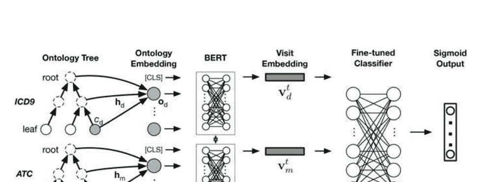

图11.7展示了G-BERT的架构：它由本体嵌入、就诊嵌入和分类微调三个部分组成。首先，我们使用图注意力网络从医疗本体中推导出医疗代码的本体嵌入。其次，我们将诊断和药物本体嵌入分别输入到BERT模型中。第三，我们将所有先前就诊嵌入的平均值和当前就诊嵌入连接起来，作为最终的特征向量，用于训练药物推荐的分类器。

在这里，我们使用一个特别设计的GNN执行两阶段的过程来进行本体嵌入。

首先，我们为每个医疗代码 $c_* \in \mathcal{O}_*$ 分配一个初始嵌入向量，并使用可学习的嵌入矩阵 $W_e \in \mathbb{R}^{|\mathcal{O}_*| \times d}$ 其中 $d$ 是嵌入维度。这里 $\mathcal{C}_*$ 和 $\mathcal{C}_{\circ}$ 分别对应非叶节点集合和叶节点集合。

自底向上阶段 对于每个非叶节点 $c_* \in \mathcal{C}_*$，我们获得其增强的医疗嵌入 $\boldsymbol{h}_{c_*} \in \mathbb{R}^d$ 如下所示：

$$\boldsymbol{h}_{c_*} = g(c_*, ch(c_*), W_e)$$

其中 $g(\cdot, \cdot, \cdot)$ 是一个聚合函数，接受目标医疗代码 $c_*$，其直接子节点 $ch(c_*)$ 和初始嵌入矩阵。直观地说，聚合函数可以将信息融合到目标节点 $c_*$ 中来自其直接子节点的信息。

自顶向下阶段 对于叶节点，我们使用非叶节点的嵌入矩阵 $\boldsymbol{H}_e \in \mathbb{R}^{|\mathcal{O}_*| \times d}$ 以自顶向下的方式获取它们的嵌入 $c_* \in \mathcal{C}_{\circ}$。

$$\boldsymbol{o}_{c_*} = g(c_*, pa(c_*), \boldsymbol{H}_e)$$

其中 $g(\cdot, \cdot, \cdot)$ 接受目标医疗代码 $c_*$ 及其父节点 $pa(c_*)$。聚合函数 $g(\cdot, \cdot, \cdot)$ 的选项是灵活的，包括 $sum$、$mean$。在这里，我们选择了图注意力网络（GAT）[161] 中的一个。例如，对于自顶向下阶段，聚合函数为

$$g(c_*, p(c_*), \boldsymbol{H}_e) = \|_{k=1}^{K} \sigma \left( \sum_{j \in \mathcal{N}_{c_*}} \alpha_{c_*, j}^{k} \boldsymbol{W}^{k} \boldsymbol{h}_j \right)$$

其中 $\|$ 表示多头注意力机制的 $K$ 维输出的连接，$\sigma$ 是非线性激活函数，$\boldsymbol{W}^{k} \in \mathbb{R}^{m \times d}$ 是输入转换的第 $k$ 个权重矩阵，$\alpha_{c_*, j}^{k}$ 是计算如下的相应的第 $k$ 个归一化注意力系数：

$$\alpha_{c_*, j}^{k} = \frac{\exp \left(\text{LeakyReLU}(\boldsymbol{a}^{\top}[\boldsymbol{W}^{k} \boldsymbol{h}_{c_*} \| \boldsymbol{W}^{k} \boldsymbol{h}_j])\right)}{\sum_{k \in \mathcal{N}_{c_*}} \exp \left(\text{LeakyReLU}(\boldsymbol{a}^{\top}[\boldsymbol{W}^{k} \boldsymbol{h}_{c_*} \| \boldsymbol{W}^{k} \boldsymbol{h}_k])\right)}$$

$(11.5)$

其中 $\mathcal{N}_{c_*}$ 是 $c_*$ 的邻居，即 $ch(c_*) \cup c_*$ 在自下而上阶段和自上而下阶段分别中的邻居。$\boldsymbol{a} \in \mathbb{R}^{2d/K}$ 是一个可学习的权重向量，LeakyReLU 是在第 4.1.1 节中引入的非线性激活函数。如图 11.7 所示，诊断和药物的本体层次结构基于 ICD 和解剖治疗化学分类（ATC）分类。

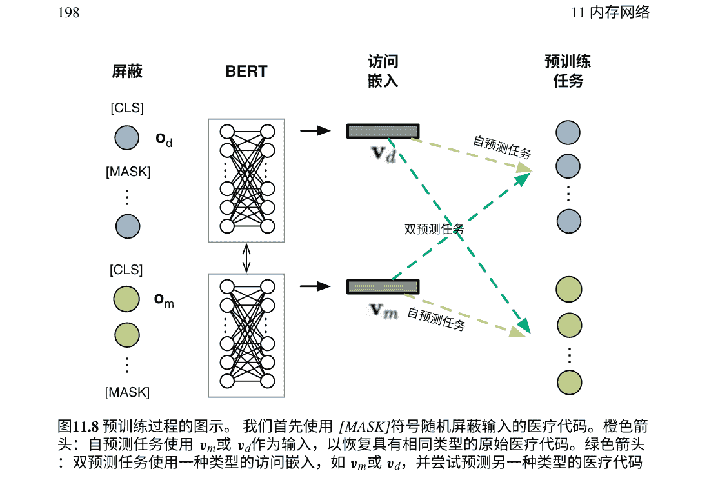

图11.8 预训练过程的图示。 我们首先使用 $[MASK]$符号随机屏蔽输入的医疗代码。橙色箭头：自预测任务使用 $v_m$ 或 $v_d$ 作为输入，以恢复具有相同类型的原始医疗代码。绿色箭头：双预测任务使用一种类型的访问嵌入，如 $v_m$ 或 $v_d$，并尝试预测另一种类型的医疗代码。

### 就诊嵌入

与BERT类似，使用多层Transformer架构来计算就诊嵌入。 具体而言，Transformer模型将一系列令牌（医疗代码的本体嵌入）映射到另一系列嵌入（图11.8）。

为了生成总结访问中所有医疗代码的访问嵌入，引入了一个特殊的令牌 $[CLS]$ 来分隔访问之间的所有医疗代码。而 $[CLS]$ 的输出嵌入对应于整个访问的嵌入。形式上，对于第 $t$ 次访问的患者 $i$，访问嵌入 $v_{i*}^t \in \mathbb{R}^d$ 是来自Transformer模型输出的第一个元素：

$$v_{i*}^t = \text{Transformer}(\{[CLS]\} \cup \{o_{c_*}^t | c_* \in \mathcal{C}_*^t\})[0]$$

其中 $[0]$ 表示输出序列的第一个元素，$[CLS]$ 是BERT中的特殊标记，表示每个特定类型的访问的第一个位置，访问类型 $*$ 可以是诊断和药物。事实上，对于访问嵌入，使用Transformer作为编码器（基于多头注意力的架构）比使用RNN更合理，因为一个访问中的医疗代码是无序的。此外，在G-BERT中不使用位置嵌入，因为一个访问中的医疗代码是无序的。

### 预训练

在预测药物之前，我们需要使用来自所有就诊的数据来学习更好的医疗编码嵌入。许多现有的时间模型，例如RNN，需要每个患者两次或更多的访问来训练模型。然而，有很多只有一次访问的患者，在G-BERT之前，这些患者大多被忽视在模型训练中。

G-BERT的预训练策略利用了那些单次访问的数据。特别是，G-BERT修改了原始的预训练任务，即掩码语言模型任务和下一个句子预测任务，转而进行自预测任务和双重预测任务。进行这些任务的想法是访问嵌入，吸收关于其构成的足够信息，并进行预测。

因此，对于自我预测任务，我们希望访问嵌入$v_*$能够恢复其所包含的内容，即每次访问的相同类型的输入医疗代码$\mathcal{C}_*$的限制，如下所示：

$$\mathcal{L}_{se}(\boldsymbol{v}_*, \mathcal{C}_*^{(n)}) = -\log p(\mathcal{C}_*^{(n)}|\boldsymbol{v}_*) \\ = - \sum_{c_* \in \mathcal{C}_*^{(n)}} \log p(c_*|\boldsymbol{v}_*) + \sum_{c_* \in \{\mathcal{C}_* \setminus \mathcal{C}_*^{(n)}\}} \log p(c_*|\boldsymbol{v}_*)$$

其中 $\mathcal{C}_*^{(n)}$ 是第n个患者的医疗编码集合，$*\in\{d,m\}$分别表示诊断和药物。我们最小化二元交叉熵损失 $\mathcal{L}_{se}$。例如，假设第n个患者使用了10种不同的药物，总共有100种药物，即 $|\mathcal{C}_m^{(n)}|=10$， $|\mathcal{C}_m|=100$。在这种情况下，我们实例化并最小化 $\mathcal{L}_{se}(\boldsymbol{v}_m, \mathcal{C}_m^{(n)})$，以产生在10种使用的药物中的高概率，由 $-\sum_{c_* \in \mathcal{C}_m^{(n)}} \log p(c_*|\boldsymbol{v}_m)$ 捕获。

在实践中，Sigmoid($f(\boldsymbol{v}_*)$)应用于一个完全连接的神经网络$f(\cdot)$具有一个隐藏层。G-BERT还使用特定符号[MASK]随机替换15%的原始医疗代码 $c_* \in \mathcal{C}_*$。

双重预测任务 基于其他类型的代码预测不同类型的医疗代码。例如，我们希望仅根据诊断代码预测多种药物。反过来，我们也可以根据药物代码预测未知的诊断。形式上，基于药物嵌入预测诊断$p(\mathcal{C}_d|\boldsymbol{v}_m)$并基于诊断嵌入预测药物 $p(\mathcal{C}_m|\boldsymbol{v}_d)$导致以下损失：

$$\mathcal{L}_{\text{双预测}} = -\log(p(\mathcal{C}_d|\boldsymbol{v}_m)) - \log(p(\mathcal{C}_m|\boldsymbol{v}_d))$$

概率得分$p(\mathcal{C}_d|\boldsymbol{v}_m)$和$p(\mathcal{C}_m|\boldsymbol{v}_d)$是从两个DNN模型中学习得到的，其中包含一个隐藏层Sigmoid($f_1(\boldsymbol{v}_m)$)和Sigmoid($f_2(\boldsymbol{v}_d)$)。这是对下一个句子预测任务的直接适应。

因此，我们最终的预训练优化目标可以简单地将上述损失组合起来，如公式(11.7)所示。

$$\mathcal{L}_{pr} = \mathcal{L}_{se}(\boldsymbol{v}_d, \mathcal{C}_d^{(n)}) + \mathcal{L}_{se}(\boldsymbol{v}_m, \mathcal{C}_m^{(n)}) + \mathcal{L}_{\text{双预测}} \tag{11.7}$$

### 微调

在获得每个访问的预训练访问表示后，我们将所有访问嵌入聚合并添加一个用于药物推荐任务的预测层。具体来说，我们通过对所有访问进行预训练，得到了一个预训练的Transformer编码器，然后可以用它来获取访问的嵌入$v_{*}^{\tau}$在时间$\tau$。在预测时间$t$时，已知的诊断代码$\mathcal{C}_{dt}$也使用相同的模型表示为$v_{*}^{t}$。将前一次诊断访问嵌入和药物访问嵌入的平均值以及最后一次诊断访问嵌入连接起来，我们构建了一个基于DNN的预测层，用于预测推荐的药物代码，如下所示：

$$ y_{t} = \text{Sigmoid}(\mathbf{W}_{1}[\left(\frac{1}{t}\sum_{\tau<t} \mathbf{v}_{d}^{\tau}\right)\|\left(\frac{1}{t}\sum_{\tau<t} \mathbf{v}_{m}^{\tau}\right)\|\mathbf{v}_{d}^{t}] + b) $$

其中$\mathbf{W}_{1} \in \mathbb{R}^{|\mathcal{C}_{m}| \times 3d}$是一个可学习的转换矩阵。给定每个时间戳$t$的真实标签$\hat{\mathbf{y}}_{t}$，整个EHR序列（即一个患者）的损失函数为

$$ \mathcal{L} = -\frac{1}{T-1}\sum_{t=2}^{T}(\mathbf{y}_{t}^{\top}\log(\hat{\mathbf{y}}_{t}) + (1-\mathbf{y}_{t}^{\top})\log(1-\hat{\mathbf{y}}_{t})) \tag{11.8} $$

### 结果

我们使用了来自MIMIC-III [81]的电子病历数据。我们利用训练数据集中的单次访问和多次访问的患者数据作为预训练的数据源（多次访问数据被分割成访问片段）。在这项工作中，我们将药物编码从NDC转换为ATC第三级。数据集的统计数据总结在表11.4中。不同的基准方法包括

1.  逻辑回归（LR）是带有L1/L2正则化的逻辑回归。在这里，我们通过每次访问的多热向量的总和来表示顺序多个医疗代码。
2.  LEAP [174]是一种基于实例的药物组合推荐方法，它在多实例和多标签学习框架中形式化任务。它利用基于编码器-解码器的模型和注意机制来建立疾病和药物之间的复杂依赖关系。
3.  RETAIN [25]基于两级神经注意力模型，根据过去的就诊和临床变量，进行药物组合和疾病预测的顺序预测。
4.  GRAM[28]通过注意机制将领域知识（ICD9诊断代码树）注入到tanh函数中。
5.  GAMENet [134]是一种基于记忆神经网络和图卷积网络的方法，通过利用电子病历数据和药物相互作用（DDI）数据源，推荐准确和安全的药物。为了公平比较，我们使用了一个没有DDI知识和过程代码作为输入的GAMENet变体，命名为GAMENet-。
6.  G-BERT是我们提出的模型，将GNN表示集成到基于Transformer的访问编码器中，并在单次访问EHR数据上进行预训练。

为了衡量预测准确性，我们使用了Jaccard相似度分数（Jaccard）、平均F1值（F1）和精确率-召回率AUC（PR-AUC）。Jaccard被定义为交集的大小除以地面真实集合$Y_t^{(k)}$和预测集合$\hat{Y}_t^{(k)}$的并集的大小。

$$ \text{Jaccard} = \frac{1}{\sum_{k=1}^{N} \sum_{t=1}^{T_k} 1} \sum_{k=1}^{N} \sum_{t=1}^{T_k} \frac{|Y_t^{(k)} \cap \hat{Y}_t^{(k)}|}{|Y_t^{(k)} \cup \hat{Y}_t^{(k)}|} $$

其中 $N$是测试集中的患者数量， $T_k$是第 $k$个患者的访问次数。

表11.5比较了药物推荐任务的性能。通过整合层次本体信息和预训练过程，端到端模型G-BERT具有更大的容量，并且能够达到与其他模型相当的结果。

G-BERT在包括GAMENet模型在内的所有基准方法中表现更好。

表11.4 数据的统计信息（诊断为dx，药物为rx）

| 统计数据 | 单次就诊 | 多次就诊 |
| :--- | :--- | :--- |
| 患者数量 | 30,745 | 6350 |
| 平均就诊次数 | 1.00 | 2.36 |
| 平均诊断次数 | 39 | 10.51 |
| 平均药物次数 | 52 | 8.80 |
| 唯一诊断次数 | 1997 | 1958 |
| 唯一药物次数 | 323 | 145 |

表11.5 药物推荐任务的性能

| 方法 | Jaccard | PR-AUC | F1 | 参数数量 |
| :--- | :--- | :--- | :--- | :--- |
| LR | 0.4075 | 0.6716 | 0.5658 | -- |
| GRAM | 0.4176 | 0.6638 | 0.5788 | 3,763,668 |
| LEAP | 0.3921 | 0.5855 | 0.5508 | 1,488,148 |
| RETAIN | 0.4456 | 0.6838 | 0.6064 | 2,054,869 |
| GAMENet- | 0.4401 | 0.6672 | 0.5996 | 5,518,646 |
| GAMENet | 0.4555 | 0.6854 | 0.6126 | 5,518,646 |
| G-BERT | **0.4565** | **0.6960** | **0.6152** | 3,034,045 |

粗体数值表示所有方法中的最佳性能指标## 11.8 练习

1.  端到端记忆网络和自注意力/Transformer之间的主要区别是什么？

2.  原始记忆网络模型中最具创新性的步骤是什么？为什么？

3.  以下关于端到端记忆网络在图11.9中的描述哪个是不正确的？
    - (a) 它移除了原始记忆网络中的arg max操作，以便在所有步骤中都能计算梯度。
    - (b) 键、值和查询的嵌入大小都相同。
    - (c) 多层端到端记忆网络可以通过多个嵌入矩阵来创建键和值
    - (d) 模型参数是 A, B, C 和 W 矩阵。

4.  关于自注意力，哪个说法是不正确的？
    - (a) 输入 X 的三个版本的嵌入被产生，即 Q, K, V。
    - (b) 有多个输入 X 的嵌入矩阵的主要原因是能够并行地应用和学习这些嵌入。
    - (c) 输入序列中的时间依赖性在自注意力模型中是必不可少的。
    - (d) 多个版本的自注意力被串联在一起以产生更强大的嵌入，这被称为多头自注意力。

5.  Transformer编码器中使用了哪些方法的思想？ [多个正确选择]
    - (a) 自注意力
    - (b) 位置编码
    - (c) 多头注意力
    - (d) 残差连接

6.  Transformer解码器中使用了哪些方法的思想？ [多个正确选择]
    - (a) 掩码注意力
    - (b) 自注意力
    - (c) 残差连接
    - (d) 循环神经网络

7.  关于BERT模型，哪个说法是不正确的？
    - (a) BERT提供了一个掩码语言模型。
    - (b) BERT掩盖了输入词的x%并尝试用其他词预测它们。
    - (c) BERT使用了基于transformer的模型。
    - (d) BERT为所有单词提供静态嵌入。

8.  Doctor2Vec中的医疗保健应用是什么？

9.  GameNet中的医疗保健应用是什么？

10. G-BERT背后的方法思想是什么？ [多个正确选项]
    - (a) 使用医学本体嵌入医学概念。
    - (b) BERT模型可用于在大量临床访问中进行预训练。
    - (c) 跨访问的时间依赖性在预测中很重要。
    - (d) 多任务学习在临床应用中很有用。

# 第12章 生成模型

生成模型是一类广泛应用于机器学习的模型，用于根据训练数据集生成逼真的数据样本。例如，图像是一种常见的数据类型，我们可以为其创建生成模型。每个图像被视为具有数千或数百万维度（像素）的数据点。生成模型的作用是学习捕捉像素之间的依赖关系的分布，从而生成逼真的图像示例。生成模型相比判别模型具有几个优势。例如，它们更有效地对建模高维概率分布，这在许多应用领域中经常出现，包括医疗保健。生成模型的一个关键优势是能够生成类似真实数据的新数据样本。因此，我们可以实现数据增强：创建类似真实样本的逼真合成示例，就像数据集中的真实示例一样。

生成对抗网络（GAN）[58]和变分自动编码器（VAE）[47, 74, 93, 123]是两种流行的生成模型方法。它们还被用于医疗保健数据增强，可以创建更多的训练数据以避免过拟合，或者创建更多的标记数据以降低标记获取成本。例如，GAN已经在医疗领域中用于生成连续的医疗时间序列[43]和离散的编码[16, 29, 169]。

我们首先介绍GAN技术，然后重点描述变分自动编码器（VAEs）。然后，我们将介绍GAN和VAE在医疗任务中的应用。

## 12.1 生成对抗网络（GAN）

GAN是一种通过博弈论过程进行数据生成的方法。GAN的主要思想是训练两个神经网络：一个生成器和一个判别器。生成器将随机噪声作为输入并生成样本，而判别器将真实样本和生成样本作为输入，并试图区分两者。在每个网络训练了几个时期后，两个网络交替训练，期望这种竞争将驱使生成器产生越来越逼真的样本，判别器具有更好的区分能力。迭代过程如图 12.1 所示。

### 12.1.1 GAN框架

形式上，GAN 是一个包含观测变量 $x$ 和潜在变量 $z$ 的概率模型。游戏中有两个参与者：一个生成器和一个判别器，它们分别由两个可微分函数表示，这两个函数对其输入和参数都可微分。判别器是一个函数 $D$，它以 $x$ 作为输入并由参数 $\theta_D$ 参数化。生成器由一个函数 $G$ 定义，它以 $z$ 作为输入并由参数 $\theta_G$ 参数化。当 $z$ 从某个先验分布 $P_d$ 中采样时，$G(z)$ 将产生一个从 $P_m$ 中抽取的样本 $x$。这里 $G$ 通常由一个深度神经网络表示。

两个玩家都有以参数为定义的成本函数。每个玩家的成本取决于另一个玩家的参数，但只能控制自己的参数。这可以被视为一个优化问题，判别器通过控制 $\theta_D$ 来尽量减小 $L(D, G)$，生成器通过控制 $\theta_G$ 来尽量减小 $L(G, D)$。这个优化问题的解是一个局部最小值，其附近的点都具有更大或相等的成本。博弈的解是纳什均衡。在这个设置中，局部最小值是($\theta_G, \theta_D$)，它最小化了对 $\theta_D$ 的 $L(D)$ 和对 $\theta_G$ 的 $L(G)$。

为了训练生成对抗网络，每一步我们从真实数据中抽取一个小批量（例如10个样本），并从模型的先验中抽取一个基于 $z$ 的合成样本小批量。然后计算两个梯度步骤来最小化 $L(D)$ 和 $L(G)$。

### 12.1.2 判别器的损失函数

损失函数是GAN框架中的一个重要组成部分。作为判别器的成本函数，大多数GAN模型使用交叉熵损失来最小化两个小批量数据之间的差异；一个来自带有标签1的真实数据集，另一个来自带有标签0的生成器的合成数据。判别器的交叉熵损失如下所示。

$$L_D(\theta_D, \theta_G) = -\mathbb{E}_{\boldsymbol{x} \sim p_{\text{数据}}(\boldsymbol{x})}[\log D(\boldsymbol{x})] - \mathbb{E}_{\boldsymbol{z} \sim p_{\boldsymbol{z}}(\boldsymbol{z})}[\log(1 - D(G(\boldsymbol{z})))]$$ (12.1)

训练判别器是为了最小化上述交叉熵损失。方程式(12.1)的第一项对应于真实样本被分类为真实的负对数似然，而第二项对应于合成样本被分类为假的负对数似然。

### 12.1.3 生成器的损失函数

之前我们介绍了判别器的损失函数。我们还需要定义生成器的成本函数。我们可以考虑几种策略，例如零和游戏、最大似然游戏等。对于零和游戏，我们有 $L_D = L_G$，整个游戏可以用一个价值函数来总结判别器的回报，如 $V(\theta_D, \theta_G) = -L_D(\theta_D, \theta_G)$。零和游戏策略将导致以下目标：

$$\min_{\theta_G} \max_{\theta_D} V(\theta_D, \theta_G) = \mathbb{E}_{\boldsymbol{x} \sim p_{\text{数据}}(\boldsymbol{x})}[\log D(\boldsymbol{x})] + \mathbb{E}_{\boldsymbol{z} \sim p_{\boldsymbol{z}}(\boldsymbol{z})}[\log(1 - D(G(\boldsymbol{z})))]$$

其中 $G(\boldsymbol{z})$ 是从分布 $\boldsymbol{z}$ 生成的样本，$D(\boldsymbol{x})$ 是估计 $\boldsymbol{x}$ 是真实数据样本的概率，当 $D(\boldsymbol{x}) = 1$ 时，意味着 $D$ 将 $\boldsymbol{x}$ 视为真实样本的概率为1，而当 $D(\boldsymbol{x}) = 0$ 时，意味着 $D$ 将 $\boldsymbol{x}$ 视为合成样本的概率为1。判别器的目标是最大化 $V$，而整体目标是最小化 $V$ 的最大值。

在实践中，这种极小极大策略很难优化。这是因为判别器和生成器最小化相同的交叉熵损失。当判别器成功地以高置信度拒绝生成器样本时，生成器的梯度会消失，这导致了梯度消失问题。为了解决这个问题，我们更新用于构建生成器的交叉熵成本的目标如下。

$$L_G = -\mathbb{E}_{\boldsymbol{z}} \log D(G(\boldsymbol{z}))$$ (12.2)

对于这种策略，生成器最大化判别器误判的对数概率，以确保每个玩家在输掉比赛时都有强大的梯度。

### 12.1.4 GAN的注意事项

训练GAN模型仍然是一个未解决的问题，原因有几个：没有可靠的指标来指示模型的收敛。同时观察到过度训练可能导致性能下降。因此，我们必须依赖替代策略来确定模型的质量。例如，用户仍然严重依赖于对GAN生成图像质量的目视检查。GAN模型的另一个已知问题是模型崩溃，这意味着生成器不断生成具有有限多样性的相同示例。模型崩溃是一个更大的问题，因为生成模型的主要用途是创建多样化的示例，而模型崩溃限制了GAN模型产生多样化的样本。

这两个主题在2020年仍然在积极研究中。作为GAN的从业者，我们需要意识到这些建模限制。

## 12.2 变分自编码器（VAE）

变分自编码器（VAE）是另一种用于生成逼真数据样本的流行生成模型。VAE处于深度学习和概率图模型的交叉点上。VAE也被用于健康应用，如分子生成[57]。接下来，我们将首先从深度学习的角度介绍VAE模型，然后介绍VAE背后的概率模型。

### 12.2.1 深度学习视角下的变分自编码器

VAE是自编码器模型的扩展，通过对潜在嵌入的结构提供更多的正则化。

**自编码器回顾**

回想一下，自编码器包括一个编码器和一个解码器：

- 编码器 $f_\theta()$ 将输入向量 $\boldsymbol{x} \in \mathbb{R}^d$ 转换为隐藏层 $\boldsymbol{h} \in \mathbb{R}^k$ (通常 $k < d$):
    $$ \boldsymbol{h} = f_{\theta}(\boldsymbol{x}) = \sigma_{1}(\boldsymbol{W}\boldsymbol{x} + \boldsymbol{b}) $$
    其中，$\boldsymbol{W} \in \mathbb{R}^{k \times d}$ 是权重矩阵，$\boldsymbol{b} \in \mathbb{R}^{k}$ 是偏置向量，$\sigma_{1}$ 是输入激活函数。

- 解码器 $g_{\theta'}()$ 将隐藏表示 $\boldsymbol{h} \in \mathbb{R}^{k}$ 映射回重建向量
    $$ \boldsymbol{r} = g_{\theta'}(\boldsymbol{h}) = \sigma_{2}(\boldsymbol{W}'\boldsymbol{h} + \boldsymbol{b}') $$
    其中 $\boldsymbol{W}' \in \mathbb{R}^{d \times k}$ 是权重矩阵，$\boldsymbol{b}' \in \mathbb{R}^{d}$ 是偏置向量，$\sigma_{2}$ 是输出激活函数。

自编码器的目标是最小化损失函数$\min L(\boldsymbol{x}, \boldsymbol{r})$，其中$L(\boldsymbol{x}, \boldsymbol{r}) \propto -\log p(\boldsymbol{x}|\boldsymbol{r})$。这里，$L(\cdot)$ 是一个损失函数，如平方误差或交叉熵损失。

标准自编码器的主要限制是对潜在嵌入的结构约束的缺乏。因此，对潜在嵌入的微小扰动可能导致较大的重构误差。变分自编码器（VAE）试图通过在潜在嵌入中引入生成过程来解决这个限制。

**VAE作为两个神经网络**

与自编码器类似，VAE模型引入了两个神经网络：一个编码器称为推理网络，一个解码器称为生成网络。

推理网络（编码器）通过学习将输入 $\boldsymbol{x}$ 编码为分布 $q_{\theta}(\boldsymbol{z}|\boldsymbol{x})$。然后我们从编码分布 $q_{\theta}(\boldsymbol{z}|\boldsymbol{x})$ 中采样点来获得潜在嵌入 $\boldsymbol{z}$。最后，生成网络（解码器）通过学习另一个分布 $p_{\phi}(\boldsymbol{x}|\boldsymbol{z})$ 来生成逼真的数据点 $\boldsymbol{x}'$。

更具体地说，编码器假设高斯分布：
$$ q_{\theta}(\boldsymbol{z}|\boldsymbol{x}) \sim \mathcal{N}(\mu_{\boldsymbol{x}}, \Sigma(\boldsymbol{x})), \quad p_{\phi}(\boldsymbol{z}) \sim \mathcal{N}(\boldsymbol{0}, \boldsymbol{I}). $$

对于数据点 $\boldsymbol{x}$ 的损失函数是正则化的对数似然函数：
$$ l_{\boldsymbol{x}} = -\mathbb{E}_{\boldsymbol{x} \sim \mathcal{D}} \left[ \log p(\boldsymbol{x}|\boldsymbol{z}) + \mathbb{D}_{\text{KL}}(q_{\theta}(\boldsymbol{z}|\boldsymbol{x}) \| p_{\phi}(\boldsymbol{z})) \right] $$
其中 $\log p(\boldsymbol{x}|\boldsymbol{z})$ 对应于 $\boldsymbol{x}$ 的对数似然函数，而 $\mathbb{D}_{\text{KL}}(q_{\theta}(\boldsymbol{z}|\boldsymbol{x}) \| p_{\phi}(\boldsymbol{z}))$ 是正则化项。

图12.2显示了VAE的架构。编码器是一个神经网络。它的输入是一个数据点 $\boldsymbol{x}$，输出是一个隐藏表示 $\boldsymbol{z}$，并且具有权重和偏差 $\theta$。编码器学习将数据高效地压缩到这个低维空间中，注意这个低维空间是随机的：编码器输出 $q_{\theta}(\boldsymbol{z}|\boldsymbol{x})$ 的参数，它是一个高斯概率密度函数。我们可以从这个分布中采样，得到表示的噪声值 $\boldsymbol{z}$。解码器是另一个神经网络，它捕捉到了给定 $\boldsymbol{z}$ 的概率分布的参数。它的输入是表示 $\boldsymbol{z}$。它输出数据的概率分布的参数，并且具有权重和偏置 $\phi$。解码器学习重构输入数据，给定其潜在表示。

接下来，我们将解释VAE的概率视图和重新参数化技巧的思想，以绕过采样，实现端到端模型训练。

### 12.2.2 概率模型视角下的变分自编码器

VAE是一种潜在变量模型之一。它假设一组数据 $\boldsymbol{x}$ 是由一个潜在分布 $p(\boldsymbol{z})$ 生成的，其中 $\boldsymbol{z}$ 是一个（可能是高维的）潜在向量，我们可以根据某个概率分布 $p(\boldsymbol{z})$ 进行采样。换句话说，给定一个由向量 $\phi$ 参数化的随机变量 $f_\phi(\boldsymbol{z})$，VAE的目标是优化 $\phi$，使得当我们从 $p(\boldsymbol{z})$ 中采样 $\boldsymbol{z}$ 时，$f_\phi(\boldsymbol{z})$ 与数据点 $\boldsymbol{x}$ 相似的概率更高。为了更明确地让 $\boldsymbol{x}$ 依赖于 $\boldsymbol{z}$，我们进一步用分布 $p_\phi(\boldsymbol{x}|\boldsymbol{z})$ 替换了 $f_\phi(\boldsymbol{z})$，并且用一个优化问题形式地表示数据生成的概念：
$$ p(\boldsymbol{x}) = \int p_{\phi}(\boldsymbol{x}|\boldsymbol{z})p(\boldsymbol{z})d\boldsymbol{z}. \tag{12.3} $$
在这里，我们可以对 $p_\phi(\boldsymbol{x}|\boldsymbol{z})$ 的分布有灵活的选择。在VAE中，我们经常选择高斯分布，使得 $p_{\phi}(\boldsymbol{x}|\boldsymbol{z}) = \mathcal{N}(\boldsymbol{x}|f_{\phi}(\boldsymbol{z}), \sigma^{2} \boldsymbol{I})$。

**VAE损失的证明**

VAE模型的目标是近似最大化由方程（12.3）给出的目标。关键问题是如何定义潜变量 $\boldsymbol{z}$ 以更好地捕捉潜在信息，以及如何解决对 $\boldsymbol{z}$ 的积分。

对于潜变量 $\boldsymbol{z}$ 的定义，VAEs断言可以从高斯分布 $\mathcal{N}(\boldsymbol{0}, \boldsymbol{I})$ 中抽取 $\boldsymbol{z}$ 的样本。关键在于注意到，只要提供强大的函数逼近器（例如，将 $\boldsymbol{z}$ 的独立、正态分布的值映射到模型所需的任何潜变量，然后将这些潜变量映射到 $\boldsymbol{x}$ 的深度神经网络），我们就可以简单地学习一个函数。然而，这将导致采样过程缓慢，因为大多数 $p(\boldsymbol{x}|\boldsymbol{z})$ 将接近零，并且在估计 $p(\boldsymbol{x})$ 时贡献较低。

为了加快采样过程，VAE试图从中采样出可能产生 $\boldsymbol{x}$ 的 $\boldsymbol{z}$ 的值，并从中计算 $p(\boldsymbol{x})$。这个关键思想激发我们定义一个由 $\theta$ 参数化的新函数 $q_\theta(\boldsymbol{z}|\boldsymbol{x})$，提供可能产生 $\boldsymbol{x}$ 的 $\boldsymbol{z}$ 值的分布。$\mathbb{E}_{\boldsymbol{z}\sim q}[p(\boldsymbol{x}|\boldsymbol{z})]$ 和 $p(\boldsymbol{x})$ 之间的关系被认为是变分贝叶斯方法的基础。

Kullback-Leibler散度 $\mathbb{D}_{\text{KL}}(p(\boldsymbol{z}|\boldsymbol{x}), q(\boldsymbol{z}))$ 如下所示。
$$
\mathbb{D}_{\text{KL}}(q(\boldsymbol{z}) || p_{\phi}(\boldsymbol{z}|\boldsymbol{x})) = \mathbb{E}_{\boldsymbol{z}\sim q}[\log q(\boldsymbol{z}) - \log p_{\phi}(\boldsymbol{z}|\boldsymbol{x})]\\
= \mathbb{E}_{\boldsymbol{z}\sim q}[\log q(\boldsymbol{z}) - \log p_{\phi}(\boldsymbol{x}|\boldsymbol{z})) - \log p(\boldsymbol{z})] + \log p(\boldsymbol{x}) \quad (12.4)
$$

通过重新排列方程 (12.4)，我们可以推导出方程 (12.5)。
$$
\log p(\boldsymbol{x}) - \mathbb{D}_{\text{KL}}(q(\boldsymbol{z}) || p_{\phi}(\boldsymbol{z}|\boldsymbol{x})) = \mathbb{E}_{\boldsymbol{z}\sim q}[\log p_{\phi}(\boldsymbol{x}|\boldsymbol{z})] - \mathbb{D}_{\text{KL}}(q(\boldsymbol{z}) || p_{\phi}(\boldsymbol{z})) \quad (12.5)
$$

然后我们进一步定义 $q(\boldsymbol{z})$ as $q_{\theta}(\boldsymbol{z}|\boldsymbol{x})$ 以便于依赖于 $\boldsymbol{x}$。因此，我们可以将方程 (12.5) 重新写为方程 (12.6)，这是VAE的核心函数。
$$
\log(p(\boldsymbol{x})) - \mathbb{D}_{\text{KL}}(q_{\theta}(\boldsymbol{z}|\boldsymbol{x}) \;||\; p_{\phi}(\boldsymbol{z}|\boldsymbol{x}))\\
= \mathbb{E}_{\boldsymbol{z}\sim q_{\theta}}[\log(p_{\phi}(\boldsymbol{x}|\boldsymbol{z}))] - \mathbb{D}_{\text{KL}}(q_{\theta}(\boldsymbol{z}|\boldsymbol{x}) \;||\; p_{\phi}(\boldsymbol{z})) \quad (12.6)
$$

对于方程12.6，其左边是我们想要最大化的数量：$\log(p(\boldsymbol{x}))$，同时最小化KL散度 $\mathbb{D}_{\text{KL}}(q_{\theta}(\boldsymbol{z}|\boldsymbol{x}) \;||\; p_{\phi}(\boldsymbol{z}|\boldsymbol{x}))$。

**基于变分近似的VAE**

为了理解后验概率 $p_{\phi}(\boldsymbol{z}|\boldsymbol{x})$，我们利用贝叶斯定理：
$$
p_{\phi}(\boldsymbol{z}|\boldsymbol{x}) = \frac{p_{\phi}(\boldsymbol{x}|\boldsymbol{z})p(\boldsymbol{z})}{p_{\phi}(\boldsymbol{x})}.
$$
挑战在于计算 $p_{\phi}(\boldsymbol{x})$，其中 $p_{\phi}(\boldsymbol{x}) = \int p_{\phi}(\boldsymbol{x}, \boldsymbol{z})d\boldsymbol{z}$ 由于对所有 $\boldsymbol{z}$ 的积分，计算是困难的。

在变分贝叶斯中，常见的解决方法是用一个可计算的变分后验 $q_{\theta}(\boldsymbol{z}|\boldsymbol{x})$ 来近似真实的后验 $p_{\phi}(\boldsymbol{z}|\boldsymbol{x})$（即生成网络）。在这里，我们可以测量Kullback-Leibler (KL) 散度p_φ(z|x) 和 q_θ(z|x)：

$$ \mathbb{D}_{\text{KL}}(q_{\theta}(z|x) \| p_{\phi}(z|x)) = \mathbb{E}_{q_{\theta}(z|x)} \left[ \log \frac{q_{\theta}(z|x)}{p_{\phi}(x, z)} \right] $$

在这方面，对数证据 log p_φ(x) 根据 Jensen 不等式有一个下界，称为证据下界(ELBO):

$$ \log p_{\phi}(x) = \log \int q_{\theta}(z|x) \frac{p_{\phi}(x, z)}{q_{\theta}(z|x)} dz \\ \geq \int q_{\theta}(z|x) \log \frac{p_{\phi}(x, z)}{q_{\theta}(z|x)} dz \quad (12.7) $$

根据公式(12.9)，证据下界 ELBO 的损失现在是要优化的新的变分目标。由于下面的公式(12.8)，最小化 KL 散度等价于最大化 ELBO。

$$ \log p_{\phi}(x) = \mathbb{E}_{q_{\theta}(z|x)} \left[ \log \frac{p_{\phi}(x, z)}{q_{\theta}(z|x)} \right] + \mathbb{D}_{\text{KL}}(q_{\theta}(z|x) \| p_{\phi}(z|x)) \quad (12.8) $$

然后我们可以最大化 ELBO 关于 θ 和 φ。注意 ELBO 还可以进一步表示如下。

$$ \text{ELBO}(x; \phi, \theta) = \mathbb{E}_{q_{\theta}(z|x)}[\log p_{\phi}(x|z)] - \mathbb{D}_{\text{KL}}(q_{\theta}(z|x) \| p_{\phi}(z)) \quad (12.9) $$

这样的变分处理类似于自编码器，其中推理网络 q_θ(z|x) 将训练样本 x 编码为潜在表示 z，生成网络从概率模型 p(x) 中解码潜在 z 并重构数据，使其尽可能接近 x。在 ELBO 的两个部分中，期望项是负重构损失，而 KL 散度项作为正则化项，鼓励变分后验与先验保持接近。

数据 x 的损失函数被指定为

$$ l_x = -\mathbb{E}_{x\sim D} [\log p(x|z) + \mathbb{D}_{\text{KL}}(q_{\theta}(z|x) \| p_{\phi}(z))] $$

其中第一项对应于重构损失，第二项是正则化项。通常，编码器 q_θ(z|x) 用均值为 μ(x) 和方差为 σ(x) 的高斯分布进行建模，即 q_θ(z|x) ∼ N(μ(x), σ(x))，先验分布 p(z) ∼ N(0, I)。

### 12.2.3 重参数化技巧

VAE 中的 z 的采样过程在训练过程中存在问题，因为它在反向传播期间中断了梯度流。重参数化技巧是一种绕过 VAE 模型中采样需求的方法，使得可以从头到尾进行反向传播。

如图 12.3 所示，该网络的前向传播正常工作，并且如果输出对 x 和 z 的许多样本进行平均，会产生正确的期望值。然而，我们需要通过从 q(z|x) 中采样的层来反向传播错误，这是一个非连续操作且没有梯度的操作。我们使用一种称为“重参数化技巧”的策略来解决这个问题。重参数化技巧将采样步骤移到输入层。给定 q(z|x) 的均值和协方差，即 μ(x) 和 σ(x)，我们可以通过首先从 N(0, I) 中采样一个部分输入，然后计算样本 z = μ(x) + σ(x) * ε 来从 N(μ(x), σ(x)) 中采样。

因此，我们计算以下损失函数的梯度。

$$l_x = \mathbb{E}_{x\sim D}[-\mathbb{E}_{\epsilon\sim\mathcal{N}(0,I)}[\log p(x|z = \mu(x) + \Sigma^{1/2}(x)*\epsilon)] + \mathbb{D}_{\text{KL}}(q_\theta(z|x)||p_\phi(z))]$$

也就是说，给定一个固定的 x 和 ϵ（即来自重参数化的额外输入），这个函数在 p_ϕ() 和 q_θ() 的参数中是确定性的和连续的。因此，在反向传播时，梯度可以计算。在测试时，当我们想要生成新的样本时，我们只需将先验样本从 z ∼ N(0, I) 输入到解码器中。

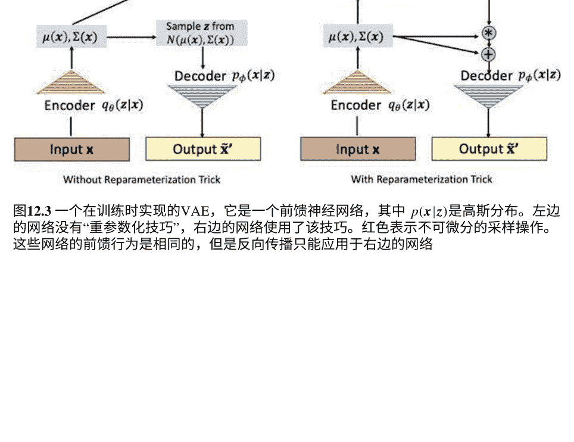

## 12.3 案例研究：使用GAN生成患者记录

问题 采用电子健康记录系统并不能自动实现研究人员对电子健康记录数据的轻松访问。有限的访问权限的一个原因是电子健康记录数据由个人识别符组成，这些识别符与可能包含敏感医疗信息的数据结合在一起，引发了隐私问题。因此，对于二次用途（例如研究）的数据访问是受到监管的，并且由承担风险的医疗组织进行控制。法律部门和机构审查委员会的审查过程可能需要几个月的时间，并不能保证获得访问权限。这个过程限制了及时利用数据的机会，可能会减缓生物医学知识和患者护理的进展。为了解决这个限制，引入了 MedGAN [29] 来生成逼真的合成电子健康记录数据。MedGAN 是一个神经网络模型，用于生成表示电子健康记录中事件的高维、多标签离散变量（例如某种疾病的诊断或某种药物的治疗）。

数据 本研究中的数据集来自 Sutter Palo Alto Medical Foundation（PAMF），包括258K名患者的10年纵向医疗记录。从这个数据集中，他们提取了诊断、药物和手术代码，并分别按照临床分类软件（CCS）对ICD代码、通用产品标识药物组和CPT进行了分组。

方法 MedGAN [29] 试图使用GAN生成静态患者向量（例如，诊断类别的二进制或计数向量）。更具体地说，他们假设在EHR数据中有$|C|$个离散变量（例如，诊断、药物或手术代码），可以表示为固定大小的向量 $x \in \mathbb{Z}_{+}^{|C|}$，其中第$i$个维度的值表示患者记录中第$i$个变量的出现次数（即计数）。除了计数变量外，一次就诊还可以表示为二进制向量 $x \in \{0,1\}^{|C|}$，其中第$i$个维度表示患者记录中第$i$个变量的存在或缺失。

由于生成器 $G$ 是通过鉴别器 $D$ 通过反向传播训练的误差信号来训练的，原始的生成对抗网络只能学习近似离散患者记录 $x \in \mathbb{Z}_{+}^{|C|}$的连续值。在这项工作中，使用自编码器来学习离散变量的连续嵌入，可以应用于解码 $G$的连续输出。这使得梯度从 $D$流向解码器 $Dec$，实现端到端的微调。如图12.4所示，自编码器由一个编码器 $Enc(x;\theta_{enc})$组成，它将输入 $x \in \mathbb{Z}_{+}^{|C|}$压缩为 $Enc(x) \in \mathbb{R}^h$，以及一个解码器 $Dec(Enc(x);\theta_{dec})$，它将 $Enc(x)$解压缩为 $Dec(Enc(x))$作为原始输入 $x$的重构。自编码器的目标是最小化重构误差：

$$\frac{1}{m}\sum_{i=0}^{m}||x_i - x'_i||_2^2 \quad (12.10)$$

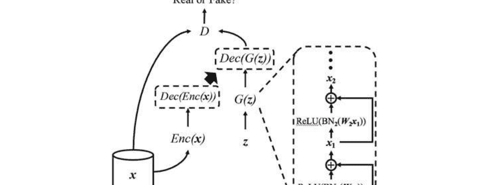

图12.4 MedGAN的架构：二进制或计数输入向量 x 是从电子健康记录数据中计算得到的，z是生成器 G的随机先验； G是一个具有快捷连接的前馈网络（右侧图）； 从 x中学习到一个自编码器（即编码器 Enc和解码器 Dec）；在生成器 G之后使用相同的解码器 Dec来构建离散输出。 判别器 D试图区分真实输入 x和离散合成输出Dec(G(z))

$$ \frac{1}{m} \sum_{i=0}^{m} x_i \log x_i' + (1 - x_i) \log(1 - x_i') \quad (12.11) $$

其中 $x_i' = Dec(Enc(x_i))$

其中 m 是小批量的大小。 对于计数变量，他们使用均方损失（公式（12.10））对于二进制变量，他们使用交叉熵损失（公式（12.11））。 对于计数变量，他们在 Enc和 Dec中使用修正线性单元（ReLU）作为激活函数。 对于二进制变量，他们在 Enc中使用tanh激活函数，在 Dec中使用sigmoid激活函数。

通过预训练的自编码器，它们可以使生成对抗网络（GAN）生成患者记录的分布表示（即编码器的输出Enc），而不是直接生成患者记录。 然后，预训练的解码器 Dec可以从G(z)中获取正确的信号，将其转换为患者记录Dec (G(z))。 鉴别器 D被训练用于确定给定输入是合成样本Dec(G(z))还是真实样本x。 MedGAN的架构如图12.4所示。 MedGAN的训练方式与原始GAN类似，具体如下：

$$ \theta_d \leftarrow \theta_d + \alpha \nabla_{\theta_d} \frac{1}{m} \sum_{i=1}^{m} \log D(x_i) + \log(1 - D(xz_i)) $$

$$ \theta_{g,dec} \leftarrow \theta_{g,dec} + \alpha \nabla_{\theta_{g,dec}} \frac{1}{m} \sum_{i=1}^{m} \log D(x_{z_i}) $$

其中 $x_{z_i} = Dec(G(z_i))$

最后，执行舍入操作将 $Dec(G(z))$ 的值舍入到最近的整数，以确保判别器 $D$ 在离散值上进行训练，而不是连续值。

结果 比较了各种基准方法。为了评估我们方法的有效性，我们测试了多个版本的MedGAN：

- GAN: 我们使用与MedGAN相同的架构和标准训练策略，但不进行自动编码器的预训练。
- GAN_P: 我们在自动编码器的基础上进行预训练（除了GAN
- GAN_{PD}: 我们在自动编码器的基础上进行预训练，并使用小批量判别[129
- GAN_{PA}: 我们在自动编码器的基础上进行预训练，并使用小批量
- MedGAN: 我们在自动编码器的基础上进行预训练，并使用小批量平均。我们还使用批归一化和生成器 $G$ 的快捷连接。他们还将 MedGAN 的性能与几种流行的生成方法进行了比较。

- 随机噪声 (RN)：给定一个真实的患者记录 $x$，我们以0.1的概率反转每个代码（即维度）的二进制值。这不严格是一种生成方法，而是一种基于随机化的简单隐私保护方法的实现。
- 独立采样 (IS)：对于二进制变量的情况，我们根据真实数据集中每个代码的伯努利成功概率，采样二进制值来生成合成数据集。对于计数变量的情况，我们为每个代码使用核密度估计器 (KDE)，然后从该分布中采样。
- 堆叠的RBM (DBM)：我们训练了一组堆叠的受限玻尔兹曼机[68]，然后使用吉布斯采样，我们可以生成合成的二进制样本。有研究将RBM扩展到二进制变量之外[52, 69, 157]。然而，在这项工作中，由于我们的目标是研究MedGAN在各个方面的性能，我们仅使用原始的RBM。
- 变分自编码器 (VAE)：我们使用前馈神经网络构建编码器和解码器来训练变分自编码器[87]。

评估任务是逐维预测。它间接地衡量了模型对真实样本的跨维度关系的捕捉能力。

在用 $R$ 训练模型生成 $S$ 之后，我们选择一个维度 $k$ 作为标签 $y_{R_k} \in \{0, 1\}^N$ 和 $y_{S_k}$。剩余的 $R_{k} \in \{0, 1\}^{N \times |C| - 1}$ 和 $S_{k} \in \{0, 1\}^{N \times |C| - 1}$ 被用作训练两个逻辑回归分类器 $LR_{R_k}$ 和 $LR_{S_k}$ 来预测 $y_{R_k}$ 和 $y_{S_k}$ ，分别。然后，我们使用模型 $LR_{R_k}$ 和 $LR_{S_k}$ 预测标签 $y_{T_k} \in \{0,1\}^n$ of 测试集 $T$。我们可以假设 LRS 的性能越接近 LRR，合成数据集的质量越好。与 LRR 的性能越接近，合成数据集质量越好。我们使用F1分数来衡量预测性能，阈值设为0.5。

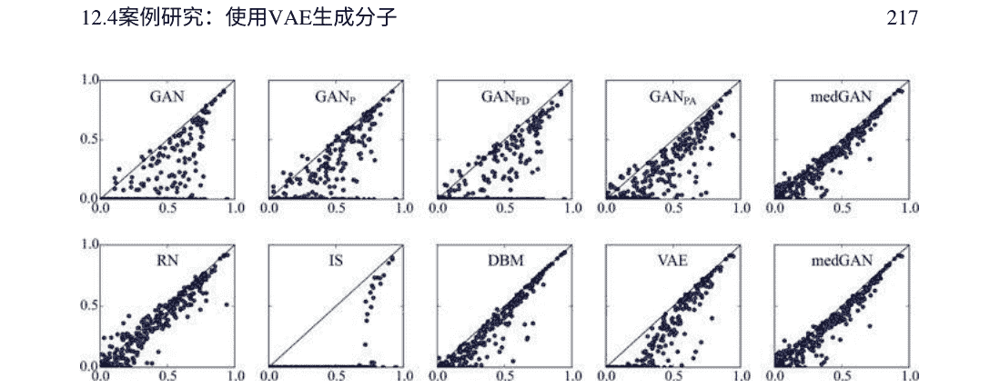

图12.5维度预测结果的散点图。每个点代表615个代码中的一个。x轴表示在真实数据集A上训练的逻辑回归分类器的F1分数。y轴表示在每个模型生成的合成对应数据上训练的分类器的F1分数。对角线表示理想性能，即真实数据和合成数据具有相同的质量。(a)各个版本的MedGAN的维度预测性能。(b)基线模型和MedGAN的维度预测性能。

图12.5a展示了各个版本的MedGAN在维度预测性能方面的表现。与维度概率任务一样，完整的MedGAN再次展现出最佳性能。尽管先进版本的MedGAN在这个任务中似乎没有像之前那样显著提高性能，但这是由于相互维度关系的复杂性与独立维度概率相比。图12.5b展示了基准模型与MedGAN在维度预测性能方面的比较。如预期的那样，IS无法捕捉到相互维度关系，因为其采样方法过于简单。VAE在之前的任务中表现出了类似的行为，显示出在预测低发生概率代码方面的弱点。再次，DBM与MedGAN相比表现出可比拟，甚至稍微更好的性能，这似乎来自于其二进制性质。

## 12.4 案例研究：使用VAE生成分子

问题 药物发现是关于设计具有理想特性的新型分子。标准药物发现方法依赖于对大量分子库进行高通量筛选和一些局部搜索策略，如遗传编程。深度生成模型，特别是GAN和VAE，可以为药物发现提供新的生成高质量和新颖分子的策略。在这里，我们介绍了VAE在处理分子生成任务中的一个简单应用。

目标是将SMILES字符串中的离散分子表示转换为具有更好化学性质的连续嵌入向量表示。

文献[57]的作者利用VAE模型生成嵌入向量。

数据 由于VAE是一种无监督方法，它可以利用大量的分子。训练中使用了两个数据集：

- QM9数据集是一个用于测试化学性质机器学习预测的数据集[55]。它包含了133,885个分子，其中重原子最多为C、O、N和F。
- ZINC数据库是一个免费的商业可用化合物数据库，用于虚拟筛选，包含超过250,000个类似药物的分子[138]。

方法 输入分子由QM9中包含22个不同字符和ZINC中包含35个不同字符的SMILES字符串表示。编码器使用具有不同滤波器大小的1D卷积层，然后是一个全连接层。

解码器包括3层门控循环单元（GRUs）。除了解码器之外，还有一个独立的预测网络，从潜在嵌入到输出属性的两个全连接层。训练中使用的属性包括logP、QED、ZINC和HOMO能量的SAS，LUMO能量和电子空间范围（$R^2$）。

结果 一个主要目标是测试VAE是否能够生成具有类似属性的逼真分子。作为比较基准，使用遗传算法（GA），它根据一系列手动设计的规则生成分子[164]。表12.1描述了方法（第一列）是直接从数据（Data）、遗传算法（GA）还是变分自动编码器（VAE）中获取统计数据。训练数据集（第二列）可以是ZINC或QM9。它们对应的分子数量（真实或生成的）在第三列中呈现。logP、SAS和QED的属性列显示了平均分数及其标准差。最后一列表示这些分子中已经存在于ZINC数据库中的百分比。我们可以观察到，由VAE生成的分子与真实数据集（ZINC或QM9）中的分子更相似，而不是由GA方法生成的分子。此外，由VAE生成的分子更具新颖性，因为它们中的大多数尚未存在于ZINC数据库中。

表12.1 在ZINC和QM9数据集上与不同算法的比较

| 方法 | 数据集 | 样本 | logP | SAS | QED | 在ZINC中的百分比 |
| :--- | :--- | :--- | :--- | :--- | :--- | :--- |
| 数据 | ZINC | 249K | 2.46 (1.43) | 3.05 (0.83) | 0.73 (0.14) | 100 |
| GA | ZINC | 5303 | 2.84 (1.86) | 3.80 (1.01) | 0.57 (0.20) | 6.5 |
| VAE | ZINC | 8728 | 2.67 (1.46) | 3.18 (0.86) | 0.70 (0.14) | 5.8 |
| 数据 | QM9 | 134k | 0.30 (1.00) | 4.25 (0.94) | 0.48 (0.07) | 0.0 |
| GA | QM9 | 5470 | 0.96 (1.53) | 4.47 (1.01) | 0.53 (0.13) | 0.018 |
| VAE | QM9 | 2839 | 0.30 (0.97) | 4.34 (0.98) | 0.47 (0.08) | 0.0 |

## 12.5 案例研究：MolGAN一种用于小分子图的隐式生成模型

问题 寻找具有所需属性的新化合物是药物发现中的重要任务。然而，由于可合成分子的空间非常广阔，因此在这个空间中进行搜索非常困难。

为了避免昂贵的搜索过程，最近在图结构数据的深度生成模型方面取得的进展为直接生成分子图提供了新的角度。其中，MolGAN [10]是一项使用GAN在分子生成中直接操作图结构数据的工作。它还进一步利用强化学习目标来鼓励生成具有特定化学属性的分子。

数据 MolGAN的实验是在QM9数据集[121]上进行的，该数据集是庞大的1664亿分子GDB-17化学数据库[126]的一个子集。QM9包含133,885个有机化合物，最多含有9个重原子：碳（C）、氧（O）、氮（N）和氟（F）。

方法 MolGAN模型以分子图数据作为输入，并生成类似于输入分子的新分子。它由三个主要组件组成：生成器、判别器和奖励网络。生成器从先验分布中取样，并生成表示分子的注释图G。G的节点和边与注释相关联，分别表示原子类型和键类型。判别器同时接收数据集和生成器的样本，并学习区分它们。通过改进的WGAN训练，使生成器学习匹配经验分布，并最终输出有效的分子。

奖励网络用于近似样本的奖励函数，并使用强化学习优化分子生成，以实现不可微度量。数据集和生成的样本是的输入，与鉴别器不同，它为它们分配分数（例如，生成的分子在水中溶解的可能性有多大）。奖励网络学习为每个分子分配奖励，以匹配外部软件提供的分数。鉴别器使用WGAN目标进行训练，而生成器使用WGAN损失和RL损失的线性组合（图12.6）。

结果 MolGAN在一系列实验中使用已建立的基准测试了一些基于神经网络的药物生成模型，使用以下指标进行评估：有效性、新颖性和独特性。有效性定义为有效生成的分子数与所有生成的分子数之间的比率。新颖性衡量了不在数据集中的有效样本集合与有效样本总数之间的比率。最后，独特性定义为唯一样本数与有效样本数之间的比率，它衡量了采样过程中的多样性程度。

## 表12.2 在QM9数据集上与不同算法的比较。百分比数值报告。

| 算法 | 有效 | 唯一 | 新颖 |
|---|---|---|---|
| CharacterVAE | 10.3 | 67.5 | 90.0 |
| GrammarVAE | 60.2 | 9.3 | 80.9 |
| GraphVAE | 55.7 | 76.0 | 61.6 |
| GraphVAE/imp | 56.2 | 42.0 | 75.8 |
| GraphVAE NoGM | 81.0 | 24.1 | 61.0 |
| MolGAN | 98.1 | 10.4 | 94.2 |

表12.2报告了在完整的QM9数据集上的结果。与基于VAE的基线相比，MolGAN模型具有更高的有效性和新颖性得分。需要注意的是，VAE优化的是证据下界（ELBO），并没有优化输出的有效性。此外，由于ELBO的一部分是最大化观察结果的重构，因此在采样过程中不会期望有很高的新颖性，因为它没有被优化。然而，在所有报告的方法中，新颖性都 ≥60%，在CharacterVAE的情况下为90%。尽管CharacterVAE可以达到很高的新颖性得分，但在有效性方面表现不佳。对于唯一性得分，MolGAN略高于GrammarVAE，而其他基线在这个得分方面更优秀。

## 12.6 练习

1.  GAN和VAE之间的主要区别是什么？

2.  以下哪项关于GAN方法是错误的？
    -   (a) GAN训练两个神经网络：生成器用于生成合成样本，判别器用于区分合成和真实样本。
    -   (b) GAN模型的收敛性可以根据损失函数轻松检查。
    -   (c) 生成器模型的输入是随机噪声。
    -   (d) 判别器模型的输入是合成样本和真实样本。

3.  给定整体损失函数为 $\mathbb{E}_{x\sim p_{\text{data}}(x)}[\log D(x)] + \mathbb{E}_{z\sim p_z(z)}[\log(1 - D(G(z)))]$，其中哪部分是生成器的损失？
    -   (a) 第一项
    -   (b) 第二项
    -   (c) 两项都是

4.  在前面问题的损失函数中，哪部分是生成器的损失？
    -   (a) 第一项
    -   (b) 第二项
    -   (c) 两项都是

5.  在第12.3章中描述的MedGAN中，除了GAN之外还使用了哪些神经网络模型？
    -   (a) CNN
    -   (b) RNN
    -   (c) 前馈神经网络
    -   (d) 自编码器

6.  MedGAN生成的医疗记录具体是什么？
    -   (a) 纵向电子健康记录
    -   (b) 多热病种记录
    -   (c) 临床笔记
    -   (d) 医学图像

7.  以下哪项关于VAE模型是不正确的？
    -   (a) VAE是用于创建逼真数据样本的生成模型。
    -   (b) VAE具有分子生成等医疗应用。
    -   (c) VAE中的损失函数与标准自编码器中的损失函数完全相同。
    -   (d) VAE具有强大的概率基础。

8.  以下哪项关于VAE模型是不正确？
    -   (a) 编码器学习 $q_\theta(z|x) \sim \mathcal{N}(\mu(x), \Sigma(x))$
    -   (b) 数据点 $x$ 的损失函数是 $l_x = -\mathbb{E}_{x \sim D}[\log p(x|z) + D_{KL}(q_\theta(z|x) \| p_\phi(z))]$
    -   (c) 解码器学习 $p_\phi(x|z)$
    -   (d) 为了生成潜在向量 $z$，需要进行采样步骤。

9.  在变分自编码器的概率视图中，哪个表达式对应于证据下界 (ELBO)? (多个正确选项)
    -   (a) $p_\phi(x) = \int p_\phi(x, z) dz$
    -   (b) $\mathbb{E}_{q_\theta(z|x)}[\log \frac{p_\phi(x,z)}{q_\theta(z|x)}]$
    -   (c) $\mathbb{E}_{q_\theta(z|x)}[\log p_\phi(x|z)] - D_{KL}(q_\theta(z|x) \| p_\phi(z))$
    -   (d) $D_{KL}(q_\theta(z|x) \| p_\phi(z|x))$

10. 在第12.4章中描述的用于药物分子生成应用的VAE模型的输入是什么？他们与VAE模型相比较的基准方法是什么？

# 参考文献

-   1. W.M. Abdelmoula, B. Balluff, S. Englert, J. Dijkstra, M.J.T. Reinders, A. Walch, L.A. McDonnell, B.P.F. Lelieveldt, 使用空间映射的质谱成像数据的t-sne数据驱动的预后肿瘤亚群识别。Proc. Natl. Acad. Sci. **113**(43), 12244–12249 (2016)
-   2. D. Bahdanau, K. Cho, Y. Bengio, 通过联合学习对齐和翻译进行神经机器翻译，在第三届国际学习表示会议，ICLR 2015, 圣地亚哥, 2015年5月7日至9日，会议跟踪论文，编者Y. Bengio, Y. LeCun (2015)
-   3. T. Baumel, J. Nassour-Kassis, R. Cohen, M. Elhadad, N. Elhadad, 病人笔记的多标签分类研究ICD编码分配案例研究，在第三十二届AAAI人工智能大会的研讨会 (2017年)
-   4. I.M. Baytas, C. Xiao, X. Zhang, F. Wang, A.K. Jain, J. Zhou, 通过时间感知的LSTM网络进行患者亚型划分，在KDD‘17: 第23届ACM SIGKDD国际会议上的知识发现与数据挖掘SIGKDD (2017)
-   5. B.K. Beaulieu-Jones, C.S. Greene, Pooled Resource Open-Access ALS Clinical Trials Consortium, 用于表型分层的电子健康记录的半监督学习. J. Biomed. Inform. **64**, 168–178 (2016)
-   6. J. Bergstra, Y. Bengio, 用于超参数优化的随机搜索. J. Mach. Learn. Res. **13**, 281–305 (2012)
-   7. S. Biswal, H. Sun, B. Goparaju, M.B. Westover, J. Sun, M.T. Bianchi, 用深度神经网络进行专家级睡眠评分. J. Am. Med. Inform. Assoc. **25**(12), 1643–1650 (2018)
-   8. S. Biswal, C. Xiao, L.M. Glass, E. Milkovits, J. Sun, Doctor2vec: 用于临床试验招募的动态医生表示学习, 在AAAI人工智能会议上 (2020)
-   9. J. Bruna, W. Zaremba, A. Szlam, Y. LeCun, 光谱网络和局部连接网络在图上的应用, in国际学习表示会议 (2014)
-   10. N.D. Cao, T. Kipf, Molgan. 一种用于小分子图的隐式生成模型, In/ICML 2018深度生成模型的理论基础和应用研讨会 (2018)
-   11. R.E. Carhart, D.H. Smith, R. Venkataraghavan, 原子对作为分子特征在结构-活性研究中的应用. J. Chem. Inform. Comput. Sci. **25**, 64–73 (1985)
-   12. D.J. Cartwright, ICD-9-CM到ICD-10-CM代码：什么? 为什么? 如何? Adv. Wound Care **2**(10), 588–592 (2013)
-   13. Z. Che, D. Kale, W. Li, M.T. Bahadori, Y. Liu, 深度计算表型学, 国际知识发现与数据挖掘SIGKDD会议 (2015年)
-   14. Z. Che, S. Purushotham, K. Cho, D. Sontag, Y. Liu, 用于具有缺失值的多变量时间序列的递归神经网络 (2016年). arXiv:1606.01865
-   15. C. Che, C. Xiao, J. Liang, B. Jin, J. Zho, F. Wang, 具有动态时间匹配的RNN架构用于个性化预测帕金森病，在SIAM数据挖掘会议 (2017年)
-   16. Z. Che, Y. Cheng, S. Zhai, Z. Sun, Y. Liu, 通过生成对抗网络提高电子健康记录的深度学习风险预测, 在2017年IEEE国际数据挖掘会议(ICDM)上(2017), 第787-792页
-   17. J. Chen, T. Ma, C. Xiao, FastGCN: 通过重要性采样实现图卷积网络的快速学习, 在2018年国际学习表示会议(ICLR)上
-   18. Y. Cheng, F. Wang, P. Zhang, J. Hu, 通过电子健康记录进行风险预测: 一种深度学习方法, 在2016年SIAM国际数据挖掘会议上
-   19. K. Cho, B. van Merrienboer, C. Gulcehre, D. Bahdanau, F. Bougares, H. Schwenk, Y. Bengio, 使用RNN编码器-解码器学习短语表示进行统计机器翻译, 在2014年经验方法自然语言处理会议(EMNLP)上
-   20. K. Cho, B. van Merrienboer, D. Bahdanau, Y. Bengio, 关于神经机器翻译的性质: 编码器-解码器方法(2014). CoRR, abs/1409.1259
-   21. K. Cho, B. van Merrienboer, C. Gulcehre, D. Bahdanau, F. Bougares, H. Schwenk, Y. Bengio, 使用RNN编码器-解码器学习短语表示, 用于统计机器翻译, 在2014年经验方法自然语言处理会议 (EMNLP) (计算语言学协会, 斯特劳斯堡, 2014年), 第1724-1734页
-   22. K. Cho, B. van Merrienboer, C. Gulcehre, D. Bahdanau, F. Bougares, H. Schwenk, Y. Bengio, 使用RNN编码器-解码器学习短语表示, 用于统计机器翻译, 在2014年经验方法自然语言处理会议 (EMNLP) (2014年)
-   23. E. Choi, M. Bahadori, A. Schuetz, W.F. Stewart, J. Sun, 医生AI: 通过循环神经网络预测临床事件, 见《机器学习应用于医疗保健的论文集》 (2016年)
-   24. E. Choi, M.T. Bahadori, E. Searles, C. Coffey, M. Thompson, J. Bost, J. Tejedor-Sojo, J. Sun, 多层次概念学习用于医学概念, 见《知识发现与数据挖掘国际会议论文集》 (SIGKDD) (2016年)
-   25. E. Choi, M.T. Bahadori, J. Sun, J. Kulas, A. Schuetz, W. Stewart, Retain: 一种可解释的医疗保健预测模型, 使用逆时间注意机制, 见《第30届神经信息处理系统会议论文集》 (NIPS) (2016年)
-   26. E. Choi, A. Schuetz, W.F. Stewart, J. Sun, 从电子健康记录中学习医学概念表示及其在心力衰竭预测中的应用 (2016年). https://arxiv.org/abs/1602.03686
-   27. Y. Choi, C.Y.-I. Chiu, D. Sontag, 学习医学概念的低维表示, 在AMIA转化科学峰会论文集 (2016年)
-   28. E. Choi, M.T. Bahadori, L. Song, W.F. Stewart, J. Sun, 图形: 基于图的注意模型用于医疗保健表示学习, 在国际知识发现与数据挖掘SIGKDD会议 (2017)
-   29. E. Choi, S. Biswal, B. Malin, J. Duke, W.F. Stewart, J. Sun, 使用生成对抗网络生成多标签离散电子健康记录 (2017). arXiv:1703.06490
-   33. R. Collobert, J. Weston, L. Bottou, M. Karlen, K. Kavukcuoglu, P. Kuksa, 自然语言处理（几乎）从头开始。 J. Mach. Learn. Res. 12, 2493–2537 (2011)
-   34. M.E. Cowen, D.J. Duesseau, B.G. Toth, C. Guisinger, M.W. Zodet, Y. Shyr, 使用临床分类进行健康政策研究方法的托管抗议数据的病例混合调整。 Med. Care 36(7), 1108–1113 (1998)
-   35. J. Davis, M. Goadrich, 精确度-召回率与ROC曲线之间的关系，在第23届国际机器学习大会上， ICML'06 (ACM,纽约, 2006年), pp. 233–240
-   36. F. Dernoncourt, J.Y. Lee, O. Uzuner, P. Szolovits, 使用循环神经网络对患者笔记进行去标识化。 J. Am. Med. Inform. Assoc. 24(3), 596–606 (2017)
-   37. J. Devlin, M.-W. Chang, K. Lee, K. Toutanova, BERT: 用于语言理解的深度双向转换器的预训练，出现在Proceedings of NAACL-HLT 2019(2019), pp.4171–4186
-   38. I.D. Dinov, 大型医疗保健数据的容量和价值。 J. Med. Stat. Inform. 4, 3 (2016)
-   39. E. Dong, H. Du, L. Gardner, 用于实时追踪COVID-19的交互式基于Web的仪表板。 Lancet Infect. Dis. 20(5), 533–534 (2020)
-   40. D. Duvenaud, D. Maclaurin, J. Aguilera-Iparraguirre, R. Gómez-Bombarelli, T. Hirzel, A. Aspuru-Guzik, R.P. Adams, 用于学习分子指纹的图卷积网络，在神经信息处理系统进展 (NIPS 2015) 中，第28卷(2015)
-   41. D. Duvenaud, D. Maclaurin, J. Aguilera-Iparraguirre, R. Gómez-Bombarelli, T. Hirzel, A. Aspuru-Guzik, R.P. Adams, 用于学习分子指纹的图卷积网络，在第28届国际神经信息处理系统会议 - 第2卷， NIPS'15 (剑桥麻省理工学院出版社, 2015年), 第2224-2232页
-   42. B. Ehteshami Bejnordi, M. Veta, P. Johannes van Diest, B. van Ginneken, N. Karssemeijer, G. Litjens, J.A.W.M. van der Laak, CAMELYON16联合会议，用于检测女性乳腺癌淋巴结转移的深度学习算法的诊断评估。 JAMA 318(22), 2199-2210 (2017年)
-   43. C. Esteban, S.L. Hyland, G. Rätsch, 使用递归条件GAN生成（医疗）实值时间序列（2017年）。 https://arxiv.org/abs/1706.02633
-   44. A. Esteva, B. Kuprel, R.A. Novoa, J. Ko, S.M. Swetter, H.M. Blau, S. Thrun, 使用深度神经网络对皮肤癌进行皮肤科医生级别的分类。 Nature 542, 115 (2017)
-   45. A. Esteva, B. Kuprel, R.A. Novoa, J. Ko, S.M. Swetter, H.M. Blau, S. Thrun, 使用深度神经网络对皮肤癌进行皮肤科医生级别的分类。 Nature 542(7639), 115–118(2017)
-   46. C. Farabet, C. Couprie, L. Najman, Y. Lecun, 学习场景分割的分层特征. IEEE Trans. Pattern Anal. Mach. Intell. 35(8), 1915–1929 (2013)
-   47. W. Fedus, I. Goodfellow, A.M. Dai, MaskGAN: 通过填充空白来改进文本生成,in International Conference on Learning Representations (2018)
-   48. T. Fu, C. Xiao, J. Sun, CORE: 使用复制和改进策略进行自动分子优化. Proc. AAAI Conf. Artif. Intell. 34(1), 638–645 (2020)
-   49. J. Futoma, J. Morris, J. Lucas, 早期住院再入院预测模型的比较. J. Biomed. Inform. 56(C), 229–238 (2015)
-   50. J. Gao, C. Xiao, L.M. Glass, J. Sun, COMPOSE: 跨模态伪孪生网络用于患者试验匹配，在第26届ACM SIGKDD国际会议上的知识发现与数据挖掘, KDD'20 (计算机协会, 纽约, 2020年), 第803-812页
-   51. J. Gao, R. Sharma, C. Qian, L.M. Glass, J. Spaeder, J. Romberg, J. Sun, C. Xiao, Stan: 基于实证的时空关注网络用于疫情预测。美国医学协会信息学杂志28（4）, 733-743 (2021年)
-   52. P.V. Gehler, A.D. Holub, M. Welling, 用于信息检索和对象识别的自适应泊松模型，在第23届国际机器学习大会上 (ACM, 纽约, 2006年), 第337-344页

53. J. Gehring, M. Auli, D. Grangier, D. Yarats, Y.N. Dauphin, 卷积序列到序列学习 (2017). CoRR, abs/1705.03122

54. J. Gilmer, S.S. Schoenholz, P.F. Riley, O. Vinyals, G.E. Dahl, 量子化学的神经消息传递, 在ICML'17: 第34届国际机器学习大会, vol. 70 (2017), 1263–1272

55. M. Glavatskikh, J. Leguy, G. Hunault, T. Cauchy, B. Da Mota, 数据集的化学多样性限制了机器学习预测的普适性. J. Cheminform. 11(1), 69 (2019)

56. J. Gligorijevic, D. Gligorijevic, M. Pavlovski, E. Milkovits, L. Glass, K. Grier, P. Vankireddy, Z. Obradovic, 通过深度学习优化临床试验招募. J. Am. Med. Inform. Assoc. 26, 1195–1202 (2019)

57. R. Gómez-Bombarelli, J.N. Wei, D. Duvenaud, J.M. Hernández-Lobato, B. Sánchez-Lengeling, D. Sheberla, J. Aguilera-Iparraguirre, T.D. Hirzel, R.P. Adams, A. Aspuru-Guzik, 使用基于数据驱动的分子连续表示的自动化化学设计. ACS Cent. Sci. 4(2), 268–276 (2018)

58. I. Goodfellow, J. Pouget-Abadie, M. Mirza, B. Xu, D. Warde-Farley, S. Ozair, A. Courville, Y. Bengio, 生成对抗网络, in 神经信息处理进展, 编者 Z. Ghahramani, M. Welling, C. Cortes, N.D. Lawrence, K.Q. Weinberger, vol. 27 (Curran Associates, Red Hook, 2014), pp. 2672–2680

59. T.R. Goodwin, S.M. Harabagiu, 从脑电图报告中进行深度学习以推断不完全信息. AMIA Jt. Summits. Transl. Sci. Proc. 2017, 112–121 (2017)

60. A. Graves, G. Wayne, M. Reynolds, T. Harley, I. Danihelka, A. Grabska-Barwińska, S.G. Colmenarejo, E. Grefenstette, T. Ramalho, J. Agapiou等, 使用具有动态外部存储器的神经网络的混合计算. Nature 538 (7626), 471 (2016)

61. V. Gulshan, L. Peng, M. Coram, M. C. Stumpe, D. Wu, A. Narayanaswamy, S. Venugopalan, K. Widner, T. Madams, J. Cuadros, R. Kim, R. Raman, P.C. Nelson, J.L. Mega, D.R. Webster, 开发和验证一种用于检测糖尿病视网膜病变的深度学习算法. JAMA 316 (22), 2402–2410 (2016)

62. J. Hachmann, R. Olivares-Amaya, S. Atahan-Evrenk, C. Amador-Bedolla, R.S. Sánchez-Carrera, A. Gold-Parker, L. Vogt, A.M. Brockway, A. Aspuru-Guzik, 哈佛清洁能源项目: 在世界社区网格上进行大规模计算筛选和有机光伏设计. J. Phys. Chem. Lett. 2(17), 2241–2251 (2011)

63. W. Hamilton, Z. Ying, J. Leskovec, 在大型图上的归纳表示学习, 在Advances in Neural Information Processing Systems, 编辑: I. Guyon, U.V. Luxburg, S. Bengio, H. Wallach, R. Fergus, S. Vishwanathan, R. Garnett, vol. 30 (Curran Associates, Red Hook, 2017), pp. 1024–1034

64. W.L. Hamilton, R. Ying, J. Leskovec, 在大型图上的归纳表示学习 (2017). CoRR, abs/1706.02216

65. A.Y. Hannun, P. Rajpurkar, M. Haghpanahi, G.H. Tison, C. Bourn, M.P. Turakhia, A.Y. Ng, 使用深度神经网络在日常心电图中进行心律失常检测和分类的心脏病专家级别. Nat. Med. 25(1), 65 (2019)

66. K. He, X. Zhang, S. Ren, J. Sun, 深度残差学习用于图像识别 (2015). CoRR, abs/1512.03385

67. K. He, X. Zhang, S. Ren, J. Sun, 深度残差学习用于图像识别. 在 IEEE 计算机视觉和模式识别会议 CVPR (2016)

68. G. Hinton, R. Salakhutdinov, 用神经网络降低数据的维度. 科学 313(5786), 504–507 (2006)

69. G.E. Hinton, R.R. Salakhutdinov, 复制的softmax：一个无向主题模型, 在神经信息处理系统进展 (2009), pp. 1607–1614

70. G. Hinton, L. Deng, D. Yu, G. Dahl, A.-R. Mohamed, N. Jaitly, A. Senior, V. Vanhoucke, P. Nguyen, B. Kingsbury, 等, 用于语音识别中声学建模的深度神经网络. IEEE信号处理杂志 29, 82–97 (2012)

71. S. Hochreiter, J. Schmidhuber, 长短期记忆. 神经计算. 9(8), 1735–1780 (1997)

72. S. Hong, C. Xiao, T. Ma, H. Li, J. Sun, MINA: 多级知识引导的注意力模型用于建模心电图信号, 在第二十八届国际人工智能联合会议论文集, IJCAI-19 (国际人工智能组织, 2019), pp. 5888–5894

73. Z. Hu, Z. Yang, X. Liang, R. Salakhutdinov, E.P. Xing, 朝着可控的文本生成, 在第34届国际机器学习大会论文集, 编辑 D. Precup, Y.W. Teh. 机器学习研究的论文集, 国际会议中心, 悉尼, 2017年8月6日至11日, PMLR, vol. 70 (2017), pp. 1587–1596

74. G. 黄, Z. 刘, L. van der Maaten, K.Q. Weinberger, 密集连接卷积神经网络, 在2017年IEEE计算机视觉和模式识别会议 (CVPR) 中 (2016)

75. A.N. Jagannatha, H. 余, 双向RNN用于电子健康记录中的医疗事件检测, 在2016年北美计算语言学协会会议: 人类语言技术 (Association for Computational Linguistics, Stroudsburg, 2016), pp. 473–482

76. A.N. Jagannatha, H. 余, 基于RNN的序列标注的结构化预测模型在临床文本中的应用. Proc. Conf. Empir. Methods Nat. Lang. Process. 2016, 856–865 (2016)

77. J.T. James, 一个关于与医院护理相关的患者伤害的新的基于证据的估计. J. Patient Saf. 9(3), 122–128 (2013)

78. S. Jean, K. Cho, R. Memisevic, Y. Bengio, 关于使用非常大的目标词汇进行神经机器翻译的研究, 在第53届年会的计算语言学协会和第7届国际联合自然语言处理大会上（第1卷：长篇论文）（计算语言学协会，斯特劳斯堡，2015年），第1-10页

79. W. Jin, R. Barzilay, T.S. Jaakkola, 分子图生成的联合树变分自动编码器 (2018年). CoRR, abs/1802.04364

80. A.E. Johnson, T.J. Pollard, L. Shen, H.L. Li-wei, M. Feng, M. Ghassemi, B. Moody, P. Szolovits, L.A. Celi, R.G. Mark, Mimic-iii, 一个免费可访问的重症护理数据库. Sci. Data 3, 160035 (2016)

81. A.E.W. Johnson, T.J. Pollard, L. Shen, L.-W.H. Lehman, M. Feng, M. Ghassemi, B. Moody, P. Szolovits, L.A. Celi, R.G. Mark, MIMIC-III, 一个免费可访问的重症监护数据库. Sci. Data 3, 160035 (2016)

82. H.J. Kam, H.Y. Kim, 用于早期发现败血症的深度神经网络表示学习. 计算机生物学与医学 89, 248–255 (2017)

83. S. Kearnes, K. McCloskey, M. Berndl, V. Pande, P. Riley, 分子图卷积：超越指纹. 计算辅助分子设计 30(8), 595–608 (2016)

84. S.K. Kearsley, S. Sallamack, E.M. Fluder, J.D. Andose, R.T. Mosley, R.P. Sheridan, 化学相似性使用物理化学性质描述符. 化学信息与计算科学 36, 118–127 (1996)

85. L. Khedher, J. Ramírez, J.M. Górriz, A. Brahim, F. Segovia, 基于偏最小二乘法、主成分分析和支持向量机的分割MRI图像的阿尔茨海默病早期诊断. 神经计算 151, 139–150 (2015)

86. D. Kingma, M. Welling, 自编码变分贝叶斯 (2013). arXiv:1312.6114

87. T. Kipf, M. Welling, 带有图卷积网络的半监督分类, 在国际学习表示会议上 (2016)

88. T. Kipf, M. Welling, 变分图自编码器 (2016). https://arxiv.org/abs/1611.07308

89. A. Krizhevsky, I. Sutskever, G.E. Hinton, 使用深度卷积神经网络进行Imagenet分类, 在第25届国际神经信息处理系统会议论文集 - 第1卷, NIPS'12 (Curran Associates, Red Hook, 2012), pp. 1097–1105

90. M. Kuhn, I. Letunic, L.J. Jensen, P. Bork, 药物和副作用的SIDER数据库. 核酸研究. 44(D1), D1075–9 (2016)

91. A. Kumar, O. Irsoy, P. Ondruska, M. Iyyer, J. Bradbury, I. Gulrajani, V. Zhong, R. Paulus, R. Socher, 问我任何问题：自然语言处理的动态记忆网络，国际机器学习会议 (2016), pp. 1378–1387

92. M.J. Kusner, B. Paige, J.M. Hernández-Lobato, 语法变分自动编码器，在国际机器学习会议 (ICML) (2017)

93. T.A. Lasko, J.C. Denny, M.A. Levy, 使用无监督特征学习在嘈杂、稀疏和不规则的临床数据上进行计算表型发现. PLoS One 8(6), 1–13 (2013)

94. H. Le, T. Tran, S. Venkatesh, 双存储神经计算机用于异步双视图顺序学习，在第24届ACM SIGKDD国际会议上的知识发现和数据挖掘 (ACM, 纽约, 2018), pp. 1637–1645

95. Y. Lecun, L. Bottou, Y. Bengio, P. Haffner, 基于梯度的学习应用于文档识别，在IEEE会议论文集 (1998), pp. 2278–2324

96. L. Li, W.-Y. Cheng, B.S. Glicksberg, O. Gottesman, R. Tamler, R. Chen, E.P. Bottinger, J.T. Dudley, 通过对患者相似性的拓扑分析识别2型糖尿病亚组. 科学转化医学 7(311), 311ra174–311ra174 (2015)

97. Y. Li, D. Tarlow, M. Brockschmidt, R. Zemel, 门控图序列神经网络，在学习表示国际会议 (ICLR) (2015)

98. J. Li, D. Zhou, Y. Shi, J. Yang, S. Chen, Q. Wang, P. Hui, 加权基因共表达网络分析在成对设计数据中的应用. 科学报告 8, 622 (2018)

99. Q. Lin, S.-Q. Ye, X.-M. Huang, S.-Y. Li, M.-Z. Zhang, Y. Xue, W.-S. Chen, 基于深度学习的堆叠稀疏自编码器对癫痫脑电信号的分类，智能计算方法, 编者： D.-S. Huang, K. Han, A. Hussain. 计算机科学讲义, 卷 9773 (Springer, Cham, 2016), 页码 802–810

100. R. 林赛, A. 达卢斯基, S. Chopra, A. Lachapelle, M. Mozer, S. Sicilar, D. Hanel, M. Gardner, A. Gupta, R. Hotchkiss, H. Potter, 深度神经网络改善了临床医生的骨折检测. 美国国家科学院院刊 115(45), 11591-11596 (2018年)

101. Z.C. Lipton, D.C. Kale, C. Elkan, R. Wetzel, 学习使用LSTM循环神经网络进行诊断, 在国际学习表示会议 (ICLR) (2015年)

102. Q. 刘, M. Allamanis, M. Brockschmidt, A.L. Gaunt, 受限图变分自动编码器用于分子设计, 在第32届国际神经信息处理系统会议论文集, NIPS'18 (Curran Associates, Red Hook, 2018年), pp. 7806-7815

103. X. Lv, Y. Guan, J. Yang, J. Wu, 用深度学习进行临床关系提取. Int. J. Hybrid Inform. Technol. 9(7), 237–248 (2016)

104. J. Ma, R.P. Sheridan, A. Liaw, G.E. Dahl, V. Svetnik, 深度神经网络作为定量结构活性关系的一种方法. J. Chem. Inform. Model. 55(2), 263–274 (2015). PMID: 25635324

105. F. Ma, R. Chitta, J. Zhou, Q. You, T. Sun, J. Gao, Dipole: 基于注意力的双向递归神经网络在医疗保健中的诊断预测, in Proceedings of the 23rd ACM SIGKDD International Conference on Knowledge Discovery and Data Mining, KDD'17 (ACM, 纽约, 2017), pp. 1903–1911

106. T. Ma, J. Chen, C. Xiao, 通过正则化变分自动编码器约束生成语义有效图形, 在第32届国际神经信息处理系统会议论文集中, NIPS'18 (Curran Associates, Red Hook, 2018), 第7113-7124页

107. T. Ma, C. Xiao, J. Zhou, F. Wang, 通过关注多视图图自动编码器集成药物相似性, 在第27届国际人工智能联合会议论文集, IJCAI 2018, 7月13日-19日, 2018年, 斯德哥尔摩 (2018), 第3477-3483页

108. L.V.D. Maaten, G. Hinton, 使用t-SNE可视化数据. 机器学习研究杂志 9, 2579-2605 (2008年)

109. T. Mikolov, I. Sutskever, K. Chen, G.S. Corrado, J. Dean, 词语和短语的分布式表示及其组合性, 在神经信息处理系统 (NIPS) (2013)

110. T. Mikolov, I. Sutskever, K. Chen, G.S. Corrado, J. Dean, 词语和短语的分布式表示及其组合性，在神经信息处理系统的进展，由C.J.C. Burges, L. Bottou, M. Welling, Z. Ghahramani, K.Q. Weinberger编辑，第26卷 (Curran Associates, Red Hook, 2013) ，第3111 -3119页

111. A. Miller, A. Fisch, J. Dodge, A.-H. Karimi, A. Bordes, J. Weston, 用于直接阅读文档的键值记忆网络，在自然语言处理的经验方法中 (2016) ，第1400-1409页

112. R. Miotto, L. Li, B. Kidd, J. Dudley, 深度患者：一种无监督的表示方法，用于从电子健康记录中预测患者的未来. 科学报告. 6, 26094 (2016)

113. J. Mullenbach, S. Wiegrefe, J. Duke, J. Sun, J. Eisenstein, 可解释的医学代码预测，来自临床文本，北美计算语言学协会 (NAACL) 会议论文集 (2018)

114. A. Ng, 稀疏自编码器 (2010). https://web.stanford.edu/class/cs294a/sparseAutoencoder.pdf

115. P. Nguyen, T. Tran, S. Venkatesh, 在时间中找到护理的代数结构：一种深度学习方法, NeurIPS ML4H研讨会 (2017)

116. J. Pennington, R. Socher, C. Manning, Glove: 全局词向量表示，来自2014年自然语言处理经验方法会议论文集 (EMNLP) (2014年) ，第1532-1543页

117. T. Pham, T. Tran, D. Phung, S. Venkatesh, DeepCare: 一种用于预测医学的深度动态记忆模型，在知识发现和数据挖掘进展中. 计算机科学讲义 (Springer, Cham, 2016年) ，第30-41页

118. T. Pham, T. Tran, D. Phung, S. Venkatesh, 从医疗记录中预测医疗轨迹：一种深度学习方法. J. Biomed. Inform. 69, 218-229页 (2017年)

119. Z. Qiao, A. Bae, L.M. Glass, C. Xiao, J. Sun, FLANNEL: 基于焦点损失的神经网络集成用于COVID-19检测. J. Am. Med. Inform. Assoc. 28 (3) ，444-452页 (2020年)

120. R. Ramakrishnan, P.O. Dral, M. Rupp, O.A. von Lilienfeld, 134千分子的量子化学结构和性质. Sci. Data 1, 140022页 (2014年)

121. J. Read, B. Pfahringer, G. Holmes, E. Frank, 多标签分类的分类器链, 在机器学习和数据库知识发现的联合欧洲会议上 (Springer, Berlin, 2009), pp. 254–269

122. S. Reed, Z. Akata, X. Yan, L. Logeswaran, B. Schiele, H. Lee, 生成对抗文本到图像的合成 , 在第33届国际机器学习大会上, 20-22 Jun 2016, 编辑 M.F. Balcan, K.Q. Weinberger. 机器学习研究的论文集 (PMLR), vol. 48 (ACM, New York, 2016), pp. 1060–1069

123. D. Rogers, M. Hahn, 扩展连接指纹. J. Chem. Inf. Model. 50 (5), 742–754 (2010)

124. V.L. Roger, S.A. Weston, M.M. Redfield, J.P. Hellermann-Homan, J. Killian, B.P. Yawn, S.J. Jacobsen, 社区人群中心力衰竭发病率和生存率的趋势. JAMA 292(3), 344–350 (2004)

125. L. Ruddigkeit, R. Deursen, L. Blum, J. Reymond, 在化学宇宙数据库gdb-17中枚举了1660亿有机小分子. J. Chem. Inf. Model 52, 2864–2875 (2012)

126. D.E. Rumelhart, G.E. Hinton, R.J. Williams, 通过误差传播学习内部表示，在《并行分布式处理：认知微结构探索》第1卷 (MIT出版社, 1986年) ，第318-362页

127. T.N. Sainath, A. Mohamed, B. Kingsbury, B. Ramabhadran, 深度卷积神经网络用于LVCSR，在2013年IEEE国际声学、语音和信号处理会议上 (2013)，第8614-8618页

128. T. Salimans, I. Goodfellow, W. Zaremba, V. Cheung, A. Radford, X. Chen, 改进的GAN训练技术，在神经信息处理系统 (NIPS) 上 (2016)，第2226-2234页

129. Y. Sasaki, F-measure的真相. Teach Tutor Mater (2007)- 131. K.T. Schütt, F. Arbabzadah, S. Chmiela, K.R. Müller, A. Tkatchenko, 量子化学洞察来自深度张量神经网络。自然通讯 8, 13890 (2017)

- 132. N.H. Shah, N. Bhatia, C. Jonquet, D. Rubin, A.P. Chiang, M.A. Musen, 用于构建开放生物医学注释器的概念识别器比较。BMC Bioinf. 10 (suppl 9), S14 (2009)

- 133. J. Shang, T. Ma, C. Xiao, J. Sun, 用于药物推荐的图增强Transformer的预训练，在第28届国际人工智能联合会议 (IJCAI'19) 上，Macao, 2019年, 第5953-5959页

- 134. J. Shang, C. Xiao, T. Ma, H. Li, J. Sun, Gamenet: 用于推荐药物组合的图增强记忆网络，在AAAI人工智能会议 (AAAI) 上 (2019)

- 135. W.H. Shrank, T.L. Rogstad, N. Parekh, 美国医疗保健系统中浪费的成本和潜在节省估计。JAMA 322(15), 1501-1509 (2019)

- 136. K. Simonyan, A. Zisserman, 用于大规模图像识别的非常深的卷积网络 (2014). arXiv:1409.1556

- 137. J. Snoek, H. Larochelle, R.P. Adams, 机器学习算法的实用贝叶斯优化。在第25届国际神经信息处理系统会议 - 第2卷，NIPS'12 (Curran Associates, Red Hook, 2012), pp. 2951–2959

- 138. T. Sterling, J.J. Irwin, ZINC 15 - 为每个人的配体发现。J. Chem. Inf. Model. 55 (11), 2324-2337 (2015)

- 139. J.M. Stokes, K. Yang, K. Swanson, W. Jin, A. Cubillos-Ruiz, N.M. Donghia, C.R. MacNair, S. French, L.A. Carfrae, Z. Bloom-Ackermann, V.M. Tran, A. Chiappino-Pepe, A.H. Badran, I.W. Andrews, E.J. Chory, G.M. Church, E.D. Brown, T.S. Jaakkola, R. Barzilay, J.J. Collins, 一种用于抗生素发现的深度学习方法。Cell 180 (4), 688-702.e13 (2020)

- 140. A. Stubbs, C. Kotfila, Ö. Uzuner, 用于去识别纵向临床叙述的自动化系统：2014 i2b2/UTHealth共享任务轨迹1概述。J. Biomed. Inf. 58, S11-S19 (2015)

- 141. S. Sukhbaatar, A. Szlam, J. Weston, R. Fergus, 弱监督记忆网络 (2015). CoRR, abs/1503.08895

- 142. S. Sukhbaatar, J. Weston, R. Fergus, 端到端记忆网络。在神经信息处理系统 (NIPS) (2015)

- 143. Q. Suo, H. Xue, J. Gao, A. Zhang, 基于深度学习模型的风险因素分析，在第7届ACM国际生物信息学、计算生物学和健康信息学会议论文集 (ACM, 纽约, 2016), pp. 394–403

- 144. H. Suresh, P. Szolovits, M. Ghassemi, 使用自编码器发现患者表型 (2017). arXiv:1703.07004

- 145. I. Sutskever, O. Vinyals, Q.V. Le, 序列到序列学习与神经网络，在第27届国际神经信息处理系统会议论文集 - 第2卷，NIPS'14 (2014) (MIT出版社, 剑桥, 2014), 第3104-3112页

- 146. C. Szegedy, W. Liu, Y. Jia, P. Sermanet, S. Reed, D. Anguelov, D. Erhan, V. Vanhoucke, A. Rabinovich, 通过卷积深入研究，在IEEE计算机视觉与模式识别会议 (CVPR) (2015)

- 147. C. Szegedy, V. Vanhoucke, S. Ioffe, J. Shlens, Z. Wojna, 重新思考计算机视觉中的Inception架构，在2016 IEEE计算机视觉与模式识别会议 (CVPR), (2016), 第2818-2826页

- 148. D. Szklarczyk, A. Santos, C. von Mering, L. Jensen, P. Bork, M. Kuhn, STRING 5: 用组织和亲和数据增强蛋白质-化学相互作用网络。Nucl. Acids Res. 44(D1), D380–384 (2016)

- 149. D. Szklarczyk, J.H. Morris, H. Cook, M. Kuhn, S. Wyder, M. Simonovic, A. Santos, N.T. Doncheva, A. Roth, P. Bork, L.J. Jensen, C. von Mering, 2017年的STRING数据库：质量控制的蛋白质-蛋白质关联网络，广泛可用。Nucl. Acids Res. 45(D1), D362–D368 (2017)

- 150. T. Tantimongcolwat, T. Naenna, C. Isarankura-Na-Ayudhya, M.J. Embrechts, V. Prachayayit-tikul, 通过机器学习分析磁心电图识别缺血性心脏病。Comput. Biol. Med. 38(7), 817–825 (2008)

- 151. E. Taskesen, M.J.T. Reinders, M. Robinson-Rechavi, 通过t-SNE对转录组的二维表示揭示了人类组织之间的相关性。PloS One 11(2), e0149853 (2016)

- 152. N. Tatonetti, P. Patrick, R. Daneshjou, R. Altman, 数据驱动的药物效果和相互作用预测。Sci. Transl. Med. 4(125), 125ra31 (2012)

- 153. N.P. Tatonetti, P.P. Ye, R. Daneshjou, R.B. Altman, 数据驱动的药物效果和相互作用预测。Sci. Transl. Med. 4(125), 125ra31 (2012)

- 154. J.H. Thean, A.J. Hall, R.J. Stawell, 带状疱疹眼部炎的葡萄膜炎。Clin. Experiment. Ophthalmol. 29(6), 406–410 (2001)

- 155. P. Thodoroff, J. Pineau, A. Lim, 使用深度学习学习稳健特征进行自动癫痫检测，在机器学习与医疗保健会议 (2016)，第178-190页

- 156. J.J. Titano, M. Badgeley, J. Schefflein, M. Pain, A. Su, M. Cai, N. Swinburne, J. Zech, J. Kim, J. Bederson, J. Mocco, B. Drayer, J. Lehar, S. Cho, A. Costa, E.K. Oermann, 自动化的深度神经网络监测颅内图像的急性神经事件。自然医学。24(9), 1337-1341 (2018)

- 157. T. Tran, D. Phung, S. Venkatesh, 混合变量受限玻尔兹曼机，在亚洲机器学习会议 (2011)，第213-229页

- 158. M. P. A. C. (美国), 向国会报告：促进医疗保险更高效 (美国医疗保险咨询委员会, 华盛顿特区, 2007年). https://iucat.iu.edu/iuk/8044570

- 159. L. van der Maaten, G. Hinton, 使用t-SNE可视化数据。机器学习研究杂志 9, 2579–2605 (2008)

- 160. A. Vaswani, N. Shazeer, N. Parmar, J. Uszkoreit, L. Jones, A.N. Gomez, L. Kaiser, I. Polosukhin, 注意力就是你所需要的，在神经信息处理会议系统 (2017)

- 161. P. Veličković, G. Cucurull, A. Casanova, A. Romero, P. Lio, Y. Bengio, 图注意力网络。arXiv:1710.10903 (2017)

- 162. P. Veličković, L. Karazija, N.D. Lane, S. Bhattacharya, E. Liberis, P. Li, A. Chieh, O. Bellahsene, M. Vegreville, 用于从多模态时间序列数据中预测人体重量目标的跨模态循环模型 (2017). arXiv:1709.08073

- 163. P. Vincent, H. Larochelle, I. Lajoie, Y. Bengio, P.-A. Manzagol, 堆叠去噪自编码器：在具有局部去噪准则的深度网络中学习有用的表示。J. Mach. Learn. Res. 11, 3371–3408 (2010)

- 164. A.M. Virshup, J. Contreras-García, P. Wipf, W. Yang, D.N. Beratan, 进入未知化学空间的随机航行产生了一个代表性的所有可能药物样品库。J. Am. Chem. Soc. 135(19), 7296–7303 (2013)

- 165. W.-Q. Wei, R.M. Cronin, H. Xu, T.A. Lasko, L. Bastarache, J.C. Denny, 开发和评估一个将药物与其适应症联系起来的集成资源。美国医学协会信息学杂志, 20 (5), 954-961 (2013年)

- 166. J. Weston, S. Chopra, A. Bordes, 记忆网络，国际学习表示会议 (2015年)

- 167. C. Xiao, P. Zhang, W.A. Chaolitwongse, J. Hu, F. Wang, 使用符号潜在狄利克雷分配进行不良药物反应预测，第三十一届AAAI人工智能大会论文集 (2017年)

- 168. S. Xie, R. Girshick, P. Dollár, Z. Tu, K. He, 聚合残差变换用于深度神经网络，2017年IEEE计算机视觉和模式识别会议 (CVPR), 5987-5995页

- 169. A. Yahi, R. Vanguri, N. Elhadad, N.P. Tatonetti, 生成对抗网络用于电子健康记录：预测药物引起的实验室检测轨迹的方法探索和评估框架。Front Public Health 8, 164 (2017)

- 170. B. Yan, Y. Wang, Y. Li, Y. Gong, L. Guan, S. Yu, 基于稀疏自编码器和支持向量机的脑电信号分类方法，2016年中国通信学会国际会议 (ICCC) (2016), 第1-6页

- 171. H. Yang, J.M. Garibaldi, 从临床叙述中自动检测受保护的健康信息。J. Biomed. Inform. 58, S30–S38 (2015)

- 172. K. Yang, K. Swanson, W. Jin, C. Coley, P. Eiden, H. Gao, A. Guzman-Perez, T. Hopper, B. Kelley, M. Mathea, A. Palmer, V. Settels, T. Jaakkola, K. Jensen, R. Barzilay, 分析学习到的分子表示以进行属性预测。J. Chem. Inf. Model. 59(8), 3370–3388 (2019)

- 173. Y. Yuan, G. Xun, K. Jia, A. Zhang, 使用短时傅里叶变换的多视角深度学习方法用于癫痫发作检测，在第8届ACM国际生物信息学、计算生物学和健康信息学会议论文集中，(ACM, 纽约, 2017年), 第213-222页

- 174. Y. Zhang, R. Chen, J. Tang, W. F. Stewart, J. Sun, LEAP: 学习为多重疾病提供有效和安全的治疗组合，在第23届ACM SIGKDD国际知识发现与数据挖掘会议论文集中，KDD'17 (ACM, 纽约, 2017年), 第1315-1324页

- 175. Z. Zhang, P. Cui, W. Zhu, 图上的深度学习：一项调查。IEEE Trans. Knowl. Data Eng. IEEE计算机学会, 洛杉矶, 加利福尼亚州, 美国, 1, 1-1, 1558-2191 (2018)

- 176. X. Zhang, C. Xiao, L. M. Glass, J. Sun, DeepEnroll: 使用深度嵌入和蕴含预测进行患者试验匹配，在第20届Web会议论文集中，WWW'20 (计算机协会, 纽约, 2020年), 第1029-1037页

- 177. Z. Zhu, C. Yin, B. Qian, Y. Cheng, J. Wei, F. Wang, 通过具有医学概念嵌入的深度架构来衡量患者相似性，在IEEE第16届国际数据挖掘会议 (ICDM) (2016年)

- 178. M. Zitnik, M. Agrawal, J. Leskovec, 用图卷积网络建模多药副作用。生物信息学 34(13), i457–i466 (2018)