Wojciech Samek · Grégoire Montavon · Andrea Vedaldi · Lars Kai Hansen · Klaus-Robert Müller（编辑）

# 可解释AI：解释和可视化深度学习

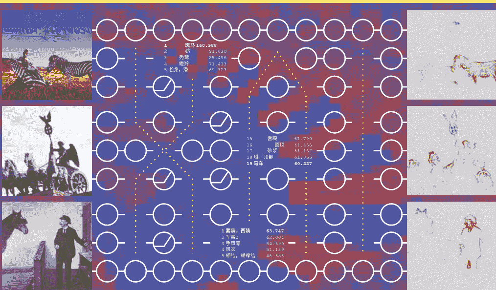


## 人工智能讲座笔记

计算机科学讲座笔记子系列

## 系列编辑

- Randy Goebel
  加拿大埃德蒙顿阿尔伯塔大学
- 田中裕
  北海道大学，札幌，日本
- 沃尔夫冈·瓦尔斯特
  DFKI和萨尔布吕肯大学，德国

## 创始编辑

- 约尔格·西克曼
  DFKI和萨尔布吕肯大学，德国

有关该系列的更多信息，请访问[http://www.springer.com/series/1244](http://www.springer.com/series/1244)

沃伊切赫·萨梅克·格雷戈瓦尔·蒙塔翁·安德烈亚·韦达尔迪·拉斯·凯·汉森·克劳斯-罗伯特·穆勒（编辑）

# 可解释AI：解释和可视化深度学习

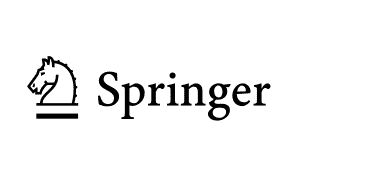

## 编辑

沃伊切赫·萨梅克
弗劳恩霍夫海因里希赫兹研究所
柏林，德国

格雷戈瓦尔·蒙塔翁
柏林工业大学
柏林，德国

安德烈亚·韦达尔
牛津大学
牛津，英国

拉斯·凯·汉森
丹麦技术大学
Kgs. Lyngby，丹麦

克劳斯-罗伯特·穆勒
柏林工业大学
柏林，德国

ISSN 0302-9743
ISSN 1611-3349（电子版）
人工智能讲座笔记
ISBN 978-3-030-28953-9
ISBN 978-3-030-28954-6（电子书）
https://doi.org/10.1007/978-3-030-28954-6

LNCS子库：SL7 –人工智能

© Springer Nature Switzerland AG 2019

本作品受版权保护。出版商保留所有权利，包括整体或部分材料的翻译、重印、插图的再利用、朗读、广播、微缩胶片复制或以任何其他物理方式的复制，以及信息的传输或存储和检索、电子适应、计算机软件，或者通过现在已知或今后开发的类似或不同的方法。

在本出版物中使用一般描述性名称、注册名称、商标、服务标志等，并不意味着即使在没有具体声明的情况下，这些名称也不受相关保护法律和法规的限制，因此可以自由使用。

出版商、作者和编辑可以安全地假设本书中的建议和信息在出版日期时被认为是真实和准确的。出版商、作者或编辑对本文中包含的材料不提供明示或暗示的保证，也不对可能存在的任何错误或遗漏负责。出版商在发布的地图和机构关联方面保持中立。

这个Springer印记由注册公司Springer Nature Switzerland AG出版
注册公司地址是：Gewerbestrasse 11, 6330 Cham, Switzerland

## 可解释AI - 前言

在第一台计算机出现后不久，研究人员就对开发能够自主决策和执行的“智能”系统感兴趣[6]。在那之前，这些任务中的一些是由人类完成的。将决策过程转移到AI系统可能原则上可以加快和更一致地做出决策，同时为更有创造性的任务释放人力资源。过去几十年中，机器学习等AI技术取得了巨大进展，并且已经考虑了许多原型用于个人助理、物流、监控系统、高频交易、医疗保健和科学研究等各个领域[1]。虽然已经部署了一些AI系统，但限制更广泛采用AI技术的真正因素是放弃人类控制和监督交给“智能”机器所带来的固有和无可置疑的风险[1]。显然，对于涉及关键基础设施、影响人类福祉或健康的敏感任务，限制不当、非鲁棒和不安全的决策和行动的可能性至关重要[4]。在部署AI系统之前，我们强烈需要验证其行为，并建立在实际环境中部署时它将继续按预期执行的保证。

为了实现这个目标，已经探索了人类验证AI决策结构与他们自己的真实知识之间一致性的方法[7]。简单模型如浅层决策树或响应曲线容易解释，但它们的预测能力有限。更近期的基于深度学习的神经网络提供了更强大的预测能力，但代价是它们行为像一个‘黑盒子’，底层推理更难以提取。

可解释AI（XAI）作为AI的一个子领域已经发展起来，专注于以系统化和可解释的方式向人类展示复杂的AI模型。

已经提出了一些XAI技术[2, 3, 5, 8]。其中一些已经通过揭示用户在常用的机器学习模型中未预料到的缺陷或策略而被证明有用。然而，关于这些解释是否稳健、可靠和足够全面以充分评估AI系统的质量，仍然存在许多问题。在主要的机器学习会议上已经举办了一系列关于可解释和解释AI的研讨会。本书是从我们在NIPS 2017研讨会“解释、解释和可视化深度学习...现在怎么办？”中产生的。研讨会的目标是评估XAI研究的当前状态，并讨论成熟这个年轻领域的方法。

因此，本书本质上并没有提供对可解释AI问题的最终答案。它是对最近提出的可解释AI技术的一个快照，反映了当前领域的讨论，并提供了未来发展的方向。

我们的目标是将这些贡献组织成一个连贯的结构，并解释它们如何在可解释和可解释AI的“大局”中发挥作用。

本书的一些章节是对研讨会贡献的扩展。其他论文是非参与者的贡献，以获得对当前研究的更全面的覆盖。每个章节至少接受了两次同行评审，修订后的贡献从中受益匪浅。

- 本书分为六个部分：

第一部分：迈向AI透明化
第二部分：解释AI系统的方法
第三部分：解释AI系统的决策
第四部分：评估可解释性和解释
第五部分：可解释AI的应用
第六部分：可解释AI的软件

尽管不能涵盖所有主题，但本书的22章提供了解释和可解释AI算法、理论和应用的及时快照。在方法和理论方面仍然存在许多挑战，以及关于实践中如何使用解释的问题。我们认为这本书是一个很好的起点，希望能够促进未来解决这个活跃研究领域的开放挑战的工作。

2019年7月

Wojciech Samek
Grégoire Montavon
Andrea Vedaldi
Lars Kai Hansen
Klaus-Robert Müller

### 参考文献

- 1. Amodei, D., Olah, C., Steinhardt, J., Christiano, P., Schulman, J., Mané, D.: AI安全的具体问题. arXiv预印本 arXiv:1606.06565 (2016)
- 2. Bach, S., Binder, A., Montavon, G., Klauschen, F., Müller, K.-R., Samek, W.: 通过逐层相关传播对非线性分类器决策进行像素级解释. PLoS ONE 10(7), e0130140 (2015)
- 3. Fong, R.C., Vedaldi, A.: 通过有意义的扰动解释黑盒子. 在：IEEE国际计算机视觉会议（CVPR）。第3429–3437页（2017年）
- 4. Lapuschkin, S., Wäldchen, S., Binder, A., Montavon, G., Samek, W., Müller, K.-R.: 揭示聪明汉斯预测器并评估机器真正学到了什么. 自然通讯 10, 1096 (2019)
- 5. Montavon, G., Samek, W., Müller, K.-R.: 解释和理解深度神经网络的方法。数字信号处理73，1–15（2018年）
- 6. Rosenblatt, F.: 感知和识别自动机（Para项目）。报告编号85-460-1。康奈尔航空实验室（1957年）
- 7. Samek, W., Müller, K.-R.: 走向可解释的人工智能。在：Samek, W., Montavon, G., Vedaldi, A., Hansen, L.K., Müller, K.-R. (eds.) 可解释AI：解释、解释和可视化深度学习。LNCS，卷11700，第5–22页。Springer，Cham (2019)
- 8. Zeiler, M.D., Fergus, R.: 可视化和理解卷积网络。在：欧洲计算机视觉会议（ECCV）。第818–833页（2014年）

## 目录

## 第一部分：朝着AI透明化迈进

- 1. 朝着可解释的人工智能
  Wojciech Samek和Klaus-Robert Müller
- 2. 透明度：动机和挑战
  Adrian Weller
- 3. 智能系统中的可解释性-一个新概念？
  Lars Kai Hansen和Laura Rieger

## 第二部分：解释AI系统的方法

- 4. 通过特征可视化理解神经网络：一项调查
  Anh Nguyen, Jason Yosinski和Jeff Clune
- 5. 具有分层结构的可解释文本到图像合成语义布局生成
  Seunghoon Hong, Dingdong Yang, Jongwook Choi和Honglak Lee
- 6. 无监督离散表示学习
  Weihua Hu, Takeru Miyato, Seiya Tokui, Eiichi Matsumoto和Masashi Sugiyama
- 7. 朝向逆向工程黑盒神经网络
  Seong Joon Oh, Bernt Schiele和Mario Fritz

## 第三部分：解释AI系统的决策

- 8. 解释深度神经网络预测的方法
  Ruth Fong和Andrea Vedaldi
- 9. 基于梯度的归因方法
  Marco Ancona, Enea Ceolini, Cengiz Öztireli和Markus Gross
- 10. 逐层相关传播：概述
  Grégoire Montavon, Alexander Binder, Sebastian Lapuschkin, Wojciech Samek和Klaus-Robert Müller
- 11. 解释和解释LSTMs
  Leila Arras, José Arjona-Medina, Michael Widrich, Grégoire Montavon, Michael Gillhofer, Klaus-Robert Müller, Sepp Hochreiter, 和Wojciech Samek

## 第四部分：评估可解释性和解释

- 12. 通过网络比较深度网络的可解释性解剖学
  Boqing Gong, David Bau, Audreys Oliva, Antonio Torralba
- 13. 基于梯度和传播的解释比较：公理比较
  Grégoire Montavon
- 14. 显著性方法的（不）可靠性
  Pieter-Jan Kindermans, Sara Hooker, Julius Adebayo, Maximilian Alber, Kristof T. Schütt, Sven Dähne, Dumitru Erhan, Been Kim

## 第五部分：可解释AI的应用

- 15. 自动驾驶的视觉场景理解使用语义分割
  Markus Hofmarcher, Thomas Unterthiner, José Arjona-Medina, Günter Klambauer, Sepp Hochreiter和Bernhard Nessler
- 16. 理解基于补丁的视频数据学习通过解释预测
  Christopher J. Anders, Grégoire Montavon, Wojciech Samek, 和Klaus-Robert Müller
- 17. 从可解释的原子尺度中获得的量子化学洞察神经网络
  Kristof T. Schütt, Michael Gastegger, Alexandre Tkatchenko, 和Klaus-Robert Müller
- 18. 在药物发现中的可解释深度学习
  Kristina Preuer, Günter Klambauer, Friedrich Rippmann, Sepp Hochreiter, 和Thomas Unterthiner
- 19. NeuralHydrology –在水文学中解释LSTMs
  Frederik Kratzert, Mathew Herrnegger, Daniel Klotz, Sepp Hochreiter, 和Günter Klambauer
- 20. 特征谬误：解释线性解码中的复杂性fMRI中的权重
  Pamela K. Douglas和Ariana Anderson
- 21. 神经解码的当前进展
  Marcel A. J. van Gerven, Katja Seeliger, Umut Güçlü, 和Yağmur Güçlütürk

## 第六部分：可解释AI的软件

- 22. 解释方法的软件和应用模式
  Maximilian Alber

## 主题索引

## 作者索引

## 第一部分 朝着AI透明化

## 朝着AI透明化 - 前言

自从人工智能的开始，研究人员、工程师和从业者都感到了了解他们复杂且非线性的模型的迫切性。在AI的早期阶段，研究人员的目标是找到模型之间的联系，例如感知机和人类神经动力学[6]，后来的工作更加关注理解学习到的表示和系统的行为，例如从神经网络中提取规则[2]或使用显著性图来可视化它们[5]。随着核机器和深度学习的出现，对于AI透明性的愿望变得更加强烈[1, 4, 8]。

AI系统的广泛应用，包括敏感应用（例如医疗领域）或作为推动科学进一步发展的工具，进一步增加了对可解释AI方法（XAI）的需求。

以下章节讨论解释问题的不同方面，并概述了XAI领域的最新发展、面临的挑战以及未来的研究方向。

在第1章中，Samek和Müller [7]从多个角度（例如安全和可靠性、社会/法律以及从学习模型中提取新见解的能力）阐述了对透明度和可解释性的需求。该章节还讨论了解释的不同方面，并总结了最新的发展和面临的挑战。

在第2章中，Weller [9]重点关注透明度的挑战。本章列举了几种透明度的类型和目标，每种类型都需要不同类型的解释。此外，它指出了透明度可能带来的危险，并讨论了透明度与公平和信任等概念的关系。

在第3章中，Hansen和Rieger [3]对可解释AI的历史进行了评论，特别是在早期专家系统研究中关于解释问题的普遍性，以及在这种背景下以期望为特征来描述解释的尝试，以及需要量化与这些解释相关的不确定性的需求。

总的来说，这三个引言章节为本书后面关于XAI的理论、方法和应用的更详细讨论铺平了道路。

### 参考文献

> 1. Baehrens, D., Schroeter, T., Harmeling, S., Kawanabe, M., Hansen, K., Müller, K.-R.: 如何解释个别分类决策。机器学习研究杂志。11, 1803–1831 (2010)
> 2. Denker, J., Schwartz, D., Wittner, B., Solla, S., Howard, R., Jackel, L., Hopfield, J.: 大规模自动学习、规则提取和泛化。复杂系统 1(5), 877–922 (1987)
> 3. Hansen, L.K., Rieger, L.: 智能系统中的可解释性-一个新概念？在： Samek, W., Montavon, G., Vedaldi, A., Hansen, L.K., Müller, K.-R. (eds.) 可解释AI: 解释和可视化深度学习。 LNCS, vol. 11700, pp. 41–49. Springer, Cham (2019)
> 4. Lapuschkin, S., Wäldchen, S., Binder, A., Montavon, G., Samek, W., Müller, K.-R.: 揭示聪明汉斯预测器并评估机器真正学到了什么。 Nat. Commun. 10, 1096 (2019)
> 5. Morch, N., Kjems, U., Hansen, L.K., Svarer, C., Law, I., Lautrup, B., Strother, S., Rehm, K.: 使用显著性图可视化神经网络。在： 国际神经网络会议 (ICNN)。vol. 4, pp. 2085 –2090 (1995)
> 6. Rosenblatt, F.: 神经动力学原理。感知器和大脑机制理论。报告编号VG-II96-G-8。康奈尔航空实验室 (1961)
> 7. Samek, W., Müller, K.-R.: 走向可解释的人工智能。在： Samek, W., Montavon, G., Vedaldi, A., Hansen, L.K., Müller, K.-R. (编辑) : 可解释AI: 解释和可视化深度学习。LNCS, 卷11700, 页5–22。Springer, Cham (2019)
> 8. Simonyan, K., Vedaldi, A., Zisserman, A.: 深入卷积网络：可视化图像分类模型和显著性图。在： ICLR研讨会 (2014)
> 9. Weller, A.: 透明度：动机和挑战。在： Samek, W., Montavon, G., Vedaldi, A., Hansen, L.K., Müller, K.-R. (编辑) : 可解释AI: 解释, 解释和可视化深度学习。LNCS, 卷11700, 页23–40。Springer, Cham (2019)

### 1 走向可解释的人工智能

Wojciech Samek1📧 🆔 和 Klaus-Robert Müller 2,3,4 🆔
1 弗劳恩霍夫海因里希赫兹研究所，德国柏林10587
wojciech.samek@hhi.fraunhofer.de
2 柏林工业大学，德国柏林10587
klaus-robert.mueller@tu-berlin.de
3 韩国高丽大学，首尔成福区安南洞02841
4 马克斯普朗克计算机科学研究所，德国萨尔布吕肯66123

摘要。近年来，机器学习（ML）已成为科学和工业的关键技术。特别是通过方法论的改进，大型数据库的可用性和计算能力的增加，今天的ML算法能够在越来越多的复杂任务上取得出色的性能（有时甚至超过人类水平）。深度学习模型处于这一发展的前沿。然而，由于它们嵌套的非线性结构，这些强大的模型通常被认为是“黑盒子”，不提供任何关于它们如何得出预测的信息。由于在许多应用中，例如在医疗领域，这种缺乏透明度可能是不可接受的，因此最近对于可视化、解释和解读深度学习模型的方法的发展引起了越来越多的关注。这篇引言性论文介绍了这个领域的最新发展和应用，并呼吁在实践中更广泛地使用可解释的学习算法。

关键词：可解释人工智能·模型透明度·深度学习·神经网络·可解释性

#### 1.1 引言

如今的人工智能（AI）系统基于机器学习在许多领域表现出色。它们不仅在复杂的视觉任务[16,53]和战略游戏[56,61,83]中胜过人类，而且还成为我们日常生活中不可或缺的一部分，例如能够识别和跟踪人脸的智能手机相机[71]，能够分析和翻译书面文字的在线服务[11]，或者能够理解语音并生成类似人类回答的消费设备[90]。此外，机器学习和人工智能已经成为科学中不可或缺的工具，用于预测、模拟等任务。

探索[15,78,89,92]。这些AI系统的巨大成功主要是通过改进深度学习方法论[47,48]、大型数据库的可用性[17,34]以及利用强大的GPU卡获得的计算增益[52]而实现的。

尽管这项技术具有革命性的特点，但仍然存在一些挑战，这些挑战减缓甚至阻碍了AI在某些应用中的普及。示例挑战包括（1）当前深度学习模型的复杂性和高能耗[29]，这阻碍了它们在资源受限的环境和设备中的部署，（2）对抗性攻击的鲁棒性不足[55]，这在自动驾驶等应用中构成了严重的安全风险，以及（3）缺乏透明度和可解释性[18,32,76]，这降低了对AI系统所做决策的信任和可验证性。

本文重点关注最后一个挑战。它介绍了可解释人工智能领域的最新发展，并旨在增强对透明决策在实践中的优势和必要性的认识。历史上第二次李世石与AlphaGo的对局[82]生动地展示了当今人工智能技术的强大之处，并暗示了其从数据中生成新知识的巨大潜力，同时也能够为人类解释。在这场比赛中，AlphaGo下了一步被著名围棋专家认定为“非人类下法”的着法，但这一着法成为AlphaGo获胜的决定性着法。AlphaGo没有解释这一着法，但后来的对局揭示了其决策背后的意图。通过可解释AI，我们也许能够在健康、药物研发或材料科学等领域中发现这样的新模式和策略，而且解释理想情况下能让我们理解系统的推理过程，了解为什么系统决定以特定方式对患者进行分类，或者将某些属性与新药物或材料相关联。这为未来的研究开辟了无数可能性，并可能带来新的科学见解。

本文的其余部分组织如下。第1.2节讨论了AI中透明度和信任的需求。第1.3节评论了不同类型的解释及其在实践中的信息内容和使用情况。最近的可解释AI技术在第1.4节中进行了简要总结，包括依赖简单替代函数的方法，将解释框架作为优化问题，访问模型的梯度或利用模型的内部结构的方法。如何客观评估解释质量的问题在第1.5节中得到了解答。本文在第1.6节中总结了可解释AI领域的一般挑战。

#### 1.2 透明度和信任的需求

黑盒AI系统已经广泛应用于当今的各种应用中。例如，在消费电子产品或在线翻译服务中使用的机器学习模型¹。只要这些系统的整体性能足够好，透明度和可解释性并不是关键要求。但是，即使这些系统失败，例如，手机相机无法识别人物或翻译服务产生语法错误的句子，后果也不会太严重。因此，对于这些类型的AI系统，透明度和信任的要求相对较低。在安全关键应用中，情况就完全不同了。在这种情况下，机器学习技术的不透明性可能是一个限制性甚至是不合格的因素。特别是如果单个错误的决策可能导致对人类生命和健康的危险（例如自动驾驶、医疗领域）或者造成重大的经济损失（例如算法交易），依赖一个推理不可理解的数据驱动系统可能不是一个选择。这种不透明性是为什么在健康等领域采用机器学习更加谨慎，而在消费、电子商务或娱乐行业中使用这些模型更加普遍的原因之一。

在接下来的内容中，我们讨论了为什么能够解释AI系统的决策有助于建立信任，并且在医疗或安全关键应用中至关重要。 我们将读者引用到[91]中对透明度挑战的讨论。

##### 1.2.1 解释有助于找到“聪明的汉斯”预测器

聪明的汉斯是一匹据说能够数数的马，在1900年左右被认为是科学的轰动。 后来证明，汉斯并不懂数学，但在大约90%的情况下，他能够从提问者的反应中得出正确答案。 类似的行为最近也在最先进的AI系统中观察到[46]。 在这里，算法也学会了在训练和测试数据中使用一些虚假的相关性，并且像汉斯一样出于“错误”的原因预测正确。

例如，[44,46]的作者表明，PASCAL VOC竞赛[23]的获胜方法通常并不是检测到感兴趣的对象，而是利用数据中的相关性或上下文来正确分类图像。 它通过图像中存在水来识别船只，通过图像中存在轨道来识别火车，此外，它通过存在版权水印来识别马。 版权标签在马的图像中的出现是数据集中的明显人为因素，多年来组织者和参与者都没有注意到这一点。 可以假设没有人系统地检查过数据集中的成千上万张图像是否存在这种类型的人为因素（即使有人这样做了，这种人为因素可能很容易被忽视）。

文献中还描述了许多其他“聪明汉斯”预测器的例子。 例如，[73]表明当前的深度神经网络主要通过图像中是否存在雪来区分“狼”和“哈士奇”这两个类别。 [46]的作者证明了当分类飞机时，深度模型会过度拟合填充伪影，而[63]表明一个模型训练用于区分1000个类别的模型并没有独立学习哑铃这个概念，而是将哑铃与举起它的手臂联系在一起。这样的“聪明汉斯”预测器在各自的测试集上表现良好，但如果部署到现实世界中，肯定会失败，因为帆船可能停在船拖车上，狼和哈士奇可以在非雪地区找到，马身上没有版权标志。 然而，如果AI系统是一个黑盒子，很难揭示这些预测器。可解释性有助于检测模型或数据中的这些偏见，此外，它有助于理解AI系统的弱点（即使它不是一个“聪明汉斯”预测器）。在极端情况下，解释可以从单个测试图像中检测到分类器的错误行为（例如，对版权标签的关注）。由于了解系统的弱点是改进系统的第一步，解释很可能成为未来AI模型的训练和验证过程的组成部分。

2PASCAL VOC图像是从flickr自动获取的，尤其是马的图像经常带有水印版权。

##### 1.2.2 解释促进信任和可验证性

能够验证AI系统的决策对于促进信任非常重要，无论是在AI系统起支持作用的情况下（例如医疗诊断），还是在实际上由AI系统做出决策的情况下（例如自动驾驶）。在前一种情况下，解释提供额外的信息，例如帮助医疗专家全面了解患者，以便做出最佳的治疗决策。类似于放射科医生撰写详细报告解释他的发现，支持性的AI系统应该详细解释其决策，而不仅仅向医疗专家提供诊断结果。在AI系统自己做出决策的情况下，能够理解系统的推理过程以验证其不像聪明的汉斯那样行为，而是以稳健和安全的方式解决问题，这一点尤为重要。为了对每项新技术建立必要的信任，需要进行此类验证。

解释还有一个社交维度。解释决策背后的原理是人类互动的重要组成部分[30]。解释有助于建立人与人之间的信任关系，因此也应该成为人机互动的一部分[3]。解释不仅是人类学习和教育的必然部分（例如，教师向学生解释解决方案），而且促进了对困难决策的接受，并且对知情同意非常重要（例如，医生向患者解释治疗方案）。因此，即使不提供额外的验证决策信息，例如，因为患者可能没有医学知识，接受解释通常会让我们感觉更好，因为它将我们融入决策过程中。与人类互动的AI系统因此应该是可解释的。

##### 1.2.3 解释是新见解的先决条件

AI系统有潜力发现人类专家无法访问的数据模式。在围棋游戏中，这些模式可以是新的游戏策略[82]。在科学数据的情况下，它们可以是基因和疾病之间的未知关联[51]，化合物和材料性质之间的未知关联[68]，或者脑活动和认知状态之间的未知关联[49]。在科学领域中，识别这些模式，即解释和解读AI系统用于预测的特征，通常比预测本身更重要，因为它揭示了有关生物、化学或神经机制的信息，并可能导致新的科学见解。

这种解释和解读结果的必要性导致了线性模型在过去的科学界中的强势地位（例如[42,67]）。线性模型本质上是可解释的，因此可以轻松提取学到的模式。只有最近才有可能应用更强大的模型，如深度神经网络，而不牺牲可解释性。这些可解释的非线性模型已经在神经科学[20,87,89]、健康[14,33,40]、自动驾驶[31]、药物设计[70]和物理学[72,78]等领域引起了关注，并且可以预期它们将在未来的科学研究中发挥关键作用。

> ³传统的方法来评估分类器的性能需要大量的测试数据集。

##### 1.2.4 解释是立法的一部分

人工智能系统渗透到我们的日常生活中，给立法带来了新的挑战。关于人工智能系统的责任和自主程度的法律和伦理问题最近受到了更多关注[21,27]。

在人工智能的背景下，反歧视和公平性方面也被广泛讨论[19,28]。欧盟的《通用数据保护条例》（GDPR）甚至在第13、14和22条中将解释权作为政策的一部分，强调了从机器决策中得出人类可理解解释的重要性。例如，如果一个人被银行的人工智能系统拒绝贷款，原则上他或她有权知道为什么系统做出了这样的决定，例如为了确保决定与反歧视法或其他法规相符。尽管目前尚不清楚这些法律要求将如何在实践中实施，但可以肯定的是，透明度方面将越来越重要，因为人工智能决策将越来越影响我们的日常生活。

#### 1.3 解释的不同方面

最近提出的解释技术提供了有关AI系统的学习表示和决策的有价值信息。这些解释在信息内容、接收者和目的上可能有所不同。接下来，我们将描述不同类型的解释，并对它们在实践中的有用性进行评论。

### 1.3.1 收件人

不同的收件人可能需要不同程度的详细解释和不同的信息内容。例如，对于AI技术的用户来说，可能需要这可能足以获得粗略的解释，易于解释，而AI研究人员和开发人员肯定希望获得能够深入了解模型运行方式的解释。

在图像分类的情况下，这样简单的解释可以粗略地突出显示模型认为最相关的图像区域。可以应用几个预处理步骤，例如平滑、滤波或对比度归一化，以进一步提高可视化质量。尽管丢弃了一些信息，这样的粗略解释可以帮助普通用户培养对AI技术的信任。另一方面，旨在改进模型的AI研究人员和开发人员可能需要所有可用的信息，包括关于AI决策的负面证据，以最高分辨率（例如像素级解释）提供，因为只有这些完整的信息才能详细了解模型的（失灵）运行方式。

人们可以轻松地识别出进一步的受众群体，这些群体对不同类型的解释感兴趣。例如，在将AI应用于医疗领域时，这些群体可能是患者、医生和机构。分析患者数据的AI系统可以向患者提供简单的解释，例如指示血糖过高，同时向医务人员提供更详细的解释，例如不同血液参数之间的异常关系。此外，医院或FDA等机构可能对了解AI对个体患者的决策不太感兴趣，而更愿意获得全局或聚合的解释，即分析多个患者后AI系统学到的模式。

##### 1.3.2 信息内容

不同类型的解释提供了对模型不同方面的洞察，从学习表示的信息到识别不同预测策略和评估整体模型行为。

根据解释的接收者及其意图，集中于一种特定类型的解释可能是有利的。接下来，我们简要描述四种不同类型的解释。

- 1. 解释学习到的表示：这种类型的解释旨在促进对学习到的表示的理解，例如深度神经网络的神经元。最近的研究[12,38]探讨了单个神经元或神经元组在编码特定概念方面的作用。其他方法[64,65,84,93]旨在通过构建代表抽象学习概念的原型来解释模型学到了什么。这些方法，例如通过生成一张典型的汽车图像来解释模型对“汽车”类别的学习。构建这样的原型可以在激活最大化框架内进行，并且已被证明是研究深度神经网络内部表示的有效工具。

- 2. 解释个别预测：其他类型的解释提供有关个别预测的信息，例如可视化热图显示哪些像素对于模型做出决策最相关[60]或者突出显示输入的最敏感部分的热图[84]。这样的解释有助于验证预测结果并建立对系统正确功能的信任。层级相关传播（LRP）[9,58] 提供了解释个别预测的通用框架，即适用于各种机器学习模型，包括神经网络 [9]、LSTMs [7]、Fisher向量分类器 [44] 和支持向量机 [35]。第1.4节概述了最近提出的计算个别解释的方法。

- 3. 解释模型行为：这种类型的解释超越了对个别预测的分析，而是对模型行为的更一般的理解，例如识别出不同的预测策略。文献[46]中的光谱相关性分析（SpRAy）方法通过聚类个别热图来计算这种元解释。每个聚类代表了模型学习到的特定预测策略。例如，文献[46]的作者使用在PASCAL VOC 2007数据集[22]上训练的Fisher Vector分类器[77]对“马”图像进行分类时，识别出四个聚类，即（1）检测马和骑手，（2）检测肖像取向图像中的版权标签，（3）检测木制跳栏和其他马术背景元素，以及（4）检测风景取向图像中的版权标签。

这样的解释对于获取对学习策略的整体概述以及检测“聪明汉斯”预测器[46]是有用的。

- 4. 用代表性示例解释：另一类方法通过识别代表性的训练示例来解释分类器[37, 41]。这种类型的解释对于更好地理解训练数据集及其对模型的影响是有用的。此外，这些代表性示例还可以帮助识别数据中的偏差，并使模型对训练数据集的变化更具鲁棒性。

##### 1.3.3 角色

除了接收者和信息内容外，考虑解释的目的也很重要。在这里，我们可以区分两个方面，即（1）解释方法的意图（解释回答了什么具体问题）和（2）我们的意图（我们想要使用解释来做什么）。解释是相对的，解释的意图是解释预测本身（即使是错误的），还是旨在可视化模型对特定类别（例如，真实类别）的“想法”，或者解释相对于另一种选择的预测（“为什么将此图像分类为汽车而不是卡车”）。诸如LRP之类的方法可以回答所有这些不同的问题，而且它们还可以调整解释中的正面和负面证据的数量，即可视化支持（正面证据）和反对（负面证据）预测的内容。这种细粒度的解释有助于理解分类器和问题本身。

此外，使用解释的目标可能超出了预测的可视化和验证。例如，解释可以潜在地用于改进模型，例如通过正则化[74]。由于解释提供了关于模型（相关部分）的信息，它们可以潜在地用于模型压缩和修剪。还可以考虑解释的许多其他用途（模型认证，法律用途），但详细信息仍需进一步研究。

#### 1.4 可解释AI的方法

本节概述了解释AI的不同方法，从不依赖于模型的技术开始，依赖于简单的替代函数来解释预测。然后，我们讨论通过对模型对局部扰动的响应进行测试来计算解释的方法（例如，利用梯度信息或优化）。随后，我们介绍了利用模型的内部结构的非常高效的传播型解释技术。最后，我们考虑超越个体解释的方法，朝向对模型行为的元解释。

本节不旨在对解释方法进行完整调查，而是总结了该领域中最重要的发展。一些解释AI的方法，例如找到有影响力的示例[37]的方法，在本节中没有讨论。

##### 1.4.1 使用替代模型进行解释

简单的分类器，如线性模型或浅层决策树，本质上是可解释的，因此解释其预测成为一项微不足道的任务。另一方面，复杂的分类器，如深度神经网络或循环模型，包含多层非线性变换，这在很大程度上复杂化了找到它们到底是如何得出预测的任务。

解释复杂模型预测的一种方法是使用简单的替代函数来局部近似它们，这是可解释的。属于这一类别的一种流行技术是局部可解释模型不可知解释（LIME）[73]。该方法在感兴趣的输入附近进行采样，评估这些点上的神经网络，并尝试拟合替代函数，使其近似于感兴趣的函数。如果替代函数的输入域是人类可解释的，那么LIME甚至可以解释使用不可解释特征的模型的决策。由于LIME是模型无关的，因此可以应用于任何分类器，甚至不需要了解其内部结构，例如神经网络分类器的架构或权重。LIME的一个主要缺点是其计算复杂性很高，例如对于GoogleNet等最新模型，计算单个预测的解释需要几分钟[45]。

与LIME类似，它构建了一个模型来局部逼近感兴趣的函数，SmoothGrad方法[85]对输入的邻域进行采样。

##### 1.4.2 使用局部扰动进行解释

另一类方法通过分析模型对局部变化的响应来构建解释。这包括利用梯度信息以及扰动和优化方法的方法。

依赖于感兴趣函数的梯度的解释方法[2]在机器学习中有着悠久的历史。一个例子是所谓的敏感性分析（SA）[10,62,84]。尽管SA被广泛用作解释方法，但从技术上讲，它解释的是预测的变化而不是预测本身。

此外，SA已被证明存在基本问题，如梯度破裂和解释不连续性，因此被认为对于当今的AI模型解释来说是次优的[60]。敏感性分析的变体通过局部平均梯度[85]或沿特定路径积分梯度[88]来解决其中一些问题。

基于扰动的解释方法[25,94,97]明确地测试了模型对更一般的局部扰动的响应。虽然[94]的遮挡方法通过遮挡输入的部分来衡量输入维度的重要性，但[97]的预测差异分析（PDA）方法则使用在分析特征的像素邻域内进行条件抽样来有效地去除信息。这两种方法都是模型无关的，即可以应用于任何分类器，但计算效率不高，因为需要对所有扰动进行评估所关心的函数（例如神经网络）。

[25,26]的有意义的扰动方法是另一种使用局部扰动解释的模型无关技术。它将解释视为元预测任务，并应用优化来合成最具信息量的解释。将解释形式化为优化问题的思想也被其他方法所使用。例如，方法[64,84,93]旨在通过构建代表学习概念的原型来解释模型学到了什么。这些原型是在激活最大化框架内计算的，通过搜索产生最大期望模型响应的输入模式。从概念上讲，激活最大化[64]与[25]的有意义的扰动方法类似。虽然后者找到使$f(x)$低的数据的最小扰动，激活最大化则找到使$f(x)$高的灰度图像的最小扰动。优化的成本使得这些方法在计算上非常耗时。

##### 1.4.3 基于传播的方法（利用结构）

解释的传播方法并不忽视它们所解释的模型，而是将模型的内部结构整合到解释过程中。

逐层相关传播（LRP）[9,58]是一种基于传播的解释框架，适用于一般的神经网络结构，包括深度神经网络[13]、LSTMs [5,7]和Fisher向量分类器[44]。LRP通过使用本地重新分配规则，将预测从输出传播到输入，解释模型的个别决策。传播过程可以在深度泰勒分解框架[59]中理论上嵌入。最近，LRP被扩展到更广泛的机器学习模型，例如聚类[36]或异常检测[35]，通过首先将模型转化为神经网络（'神经化'），然后应用LRP来解释其预测。利用模型结构以及使用适当的（理论上有动机的）传播规则，使LRP能够以非常低的计算成本（一次前向传播和一次反向传播）提供良好的解释。此外，LRP框架的通用性还可以表达其他最近提出的解释技术，例如[81,95]。由于LRP不依赖于梯度，因此不会遇到梯度破裂和解释不连续等问题[60]。

其他流行的解释方法利用模型的内部结构，如反卷积[94]和引导反向传播[86]。与LRP相比，这些方法并不解释预测的“输入特征对预测的贡献有多大”，而是识别与分析网络输出相关的输入空间模式。

文献中提出了许多其他解释方法，属于“利用结构”类别。其中一些方法使用启发式方法来引导重新分配过程[79]，其他方法在传播过程中加入了优化步骤[39]。iNNvestigate工具包[1]为许多基于传播的解释方法提供了高效的实现。

##### 1.4.4 元解释

最后，可以聚合和分析个体解释，以识别分类器行为的一般模式。最近提出的一种方法，谱相关分析（SpRAy）[46]，通过聚类个体热图来计算这种元解释。这种方法允许以（半）自动化的方式研究分类器在整个数据集上的预测策略，并系统地找出模型或训练数据中的弱点。

另一种元解释的类型旨在更好地理解学习到的表示，并以人类友好的概念提供解释。例如，[12,96]的网络剖析方法评估隐藏单元的语义，即量化这些神经元编码的概念。最近的其他工作[38]提供了以用户定义的概念解释，并测试这些概念对预测的重要程度。

#### 1.5 评估解释的质量

解释质量的客观评估是一个活跃的研究领域。已经做出了许多努力来定义解释AI模型个别预测的热图的质量度量。本节概述了提出的方法。

热图质量的一种流行度量基于扰动分析[6,9,75]。该评估指标的假设是，与热图相关的输入变量的扰动应导致预测分数的陡峭下降，而对于重要性较低的输入维度的扰动则不会。因此，经过几轮扰动（从最相关的输入变量开始）后预测分数的平均下降定义了热图质量的客观度量。如果解释能够识别出真正相关的输入变量，则下降应该很大。[75]的作者建议使用非定向扰动（例如均匀噪声）来公平比较不同的解释方法。尽管非常流行，但明显扰动分析不能是评估解释质量的唯一标准，因为可以轻松设计直接优化此标准的解释技术。示例是遮挡方法，它们在[50,94]中被使用，然而根据其他质量标准，它们已被证明不如LRP [8]等解释技术优秀。其他研究使用“指向游戏”[95]来评估热图的质量。这个游戏的目标是评估解释定位目标对象的区分度，即比较热图上最相关的点是否位于指定类别的对象上。因此，这些度量假设AI模型在对其进行分类时会将大部分注意力集中在感兴趣的对象上，因此这应该在解释中得到反映。

然而，这个假设可能并不总是正确的，例如，“聪明的汉斯”预测者[46]可能更关注上下文而不是物体本身，无论使用何种解释方法。因此，根据这个标准，他们的解释将被评估为质量较差，尽管它们确实可视化了模型的预测策略。

任务特定的评估方案也在文献中提出。例如，[69]使用主谓一致性任务来评估自然语言处理模型的解释。在这里，模型预测一个动词的数量，解释验证最相关的词是否确实是正确的主语或带有预测数量的名词。其他评估方法依赖于人类判断[66,73]。如果评估大量解释，这样的评估方案很快变得不切实际。

最近的一项研究[8]提出了使用玩具任务中的真实信息客观评估顺序数据解释的方法。这个评估指标的思想是在输入序列中添加或减去两个数字，并测量分配给序列元素的相关性与两个输入数字之间的相关性。如果模型能够准确执行加法和减法任务，那么它必须关注这两个数字（序列中的其他数字是随机的），这必须在解释中得到体现。

评估解释质量的另一种间接方法是将其用于解决其他任务。[6]的作者从单词级解释构建了文档级表示。这些文档级表示的性能（例如，在分类任务中）反映了单词级解释的质量。另一项工作[4]将解释用于强化学习。

还可以构想许多其他基于功能的评估方法[18]，例如使用解释来压缩或修剪神经网络，或在师生场景中训练学生模型。

最后，评估解释的另一种有前途的方法是基于某些公理的实现[54,57,60,80,88]。公理是解释的属性，被认为是必要的，因此应该被满足。提出的公理包括相关性保持[60]，解释连续性[60]，敏感性[88]和实现不变性[88]。与本节讨论的其他质量度量相比，某些公理的满足或不满足通常可以通过分析来显示，即不需要经验评估。

#### 1.6 挑战和开放问题

尽管在解释AI领域取得了显著进展，但在方法和理论方面以及在实践中使用解释的方式上仍然存在挑战。研究人员已经开始解决其中一些挑战，例如客观评估解释质量或超越可视化使用解释。其他开放问题，特别是涉及理论的问题，需要更多时间才能给出令人满意的答案。

解释方法使我们能够深入了解AI模型的运作方式。然而，这些方法在多个方面仍然存在限制。首先，使用当前的解释方法计算的热图可视化了“一阶”信息，即显示了哪些输入特征被认为与预测相关。然而，这些特征之间的关系，例如它们是否独立重要或仅在一起出现是否重要，仍然不清楚。

在许多应用中，理解这些关系非常重要，例如，在神经科学中，高阶解释可以帮助我们识别在解决特定任务时一起起作用的大脑区域（脑网络），而不仅仅是识别重要的单个体素。

另一个限制是解释的抽象级别较低。热图显示特定像素的重要性，但没有将这些相关性值与更抽象的概念（如图像中显示的对象或场景）联系起来。

人们需要解释来理解它们并理解模型的行为。这个解释步骤可能很困难和错误。希望能够从这些低级热图中聚合证据，并在更抽象、更易理解的层面上解释模型的行为的元解释是可取的。最近，已经提出了首个聚合低级解释的方法和量化神经表示语义的方法[12]。构建更高级的元解释是未来研究的一个有价值的课题。

由于解释的接收者最终是人类用户，解释在人机交互中的使用是一个重要的未来研究课题。一些研究（例如，[43]）已经开始研究可解释AI中的人类因素。构建具有正确用户关注点的解释，即以正确的方式提出正确的问题，是成功的人机交互的先决条件。然而，优化解释以实现最佳人类使用仍然是一个需要进一步研究的挑战。

缺乏一个关于可解释AI的理论，其中包含一个正式且普遍认可的解释定义。一些研究已经迈出了朝着这个目标迈出的第一步，通过开发数学上有基础的解释方法。例如，[59]的作者通过将解释问题整合到Taylor分解的理论框架中来解决这个问题。公理化方法[54,60,88]是朝着发展一个通用的可解释AI理论的目标的另一个有希望的方向。

最后，超越可视化的解释使用是一个广阔的挑战。未来的工作将展示如何将解释集成到更大的优化过程中，以改善模型的性能或减少其复杂性。

致谢。这项工作得到了德国教育和研究部的支持，作为柏林大数据中心（01IS14013A），柏林机器学习中心（01IS18037I）和TraMeExCo（01IS18056A）。感谢DFG的部分资助（EXC 2046/1，项目编号：390685689）。这项工作还得到了韩国政府信息通信技术规划与评估研究所（IITP）的资助（编号2017-0-00451，编号2017-0-01779）。

### 参考文献

- 1. Alber, M., et al.: iNNvestigate神经网络！. 机器学习研究杂志 **20**(93), 1-8 (2019)
- 2. Ancona, M., Ceolini, E., Öztireli, C., Gross, M.: 基于梯度的归因方法。在：Samek, W., Montavon, G., Vedaldi, A., Hansen, L.K., Müller, K.-R. (eds.) 可解释AI。LNCS, vol. 11700, pp. 169–191. Springer, Cham (2019)
- 3. Antunes, P., Herskovic, V., Ochoa, S.F., Pino, J.A.: 用于协同系统评估的结构化维度。ACM Comput. Surv. (CSUR) **44**(2), 8 (2012)
- 4. Arjona-Medina, J.A., Gillhofer, M., Widrich, M., Unterthiner, T., Hochreiter, S.: RUDDER：用于延迟奖励的返回分解。arXiv预印本arXiv:1806.07857 (2018)
- 5. Arras, L., 等：解释和解释LSTMs。在：Samek, W., Montavon, G., Vedaldi, A., Hansen, L.K., Müller, K.-R. (eds.) 可解释AI. LNCS, vol. 11700, pp. 211–238. Springer, Cham (2019)
- 6. Arras, L., Horn, F., Montavon, G., Müller, K.R., Samek, W.: 文本文档中的相关内容是什么？：一种可解释的机器学习方法。PLoS ONE **12**(8), e0181142 (2017)
- 7. Arras, L., Montavon, G., Müller, K.R., Samek, W.: 解释情感分析中的递归神经网络预测。 在： EMNLP 2017 Workshop on Computational Approaches to Subjectivity, Sentiment & Social Media Analysis (WASSA), pp. 159–168 (2017)
- 8. Arras, L., Osman, A., Müller, K.R., Samek, W.: 评估循环神经网络解释。 在： ACL 2019黑盒NLP研讨会：分析和解释用于NLP的神经网络 (2019年)
- 9. Bach, S., Binder, A., Montavon, G., Klauschen, F., Müller, K.R., Samek, W.: 通过逐层相关传播解释非线性分类器决策的像素级解释。 PLoS ONE 10(7), e0130140 (2015)
- 10. Baehrens, D., Schroeter, T., Harmeling, S., Kawanabe, M., Hansen, K., Müller, K.R.: 如何解释个体分类决策。 机器学习研究杂志。 11, 1803–1831 (2010)
- 11. Bahdanau, D., Cho, K., Bengio, Y.: 通过联合学习对齐和翻译的神经机器翻译。 在： 国际学习表示会议 (ICLR) (2015年)
- 12. Bau, D., Zhou, B., Khosla, A., Oliva, A., Torralba, A.: 网络解剖学：深度视觉表示的可解释性量化。 在： IEEE计算机视觉和模式识别会议 (CVPR) , 第6541-6549页 (2017年)
- 13. Binder, A., Bach, S., Montavon, G., Müller, K.-R., Samek, W. :逐层相关传播用于深度神经网络架构。 信息科学和应用 (ICISA) 2016年。 LNEE, 第376卷，第913-922页。 Springer， 新加坡 (2016年) 。 https://doi.org/10.1007/978-981-10-0557-2_87
- 14. Binder, A., 等：走向计算荧光显微镜：基于机器学习的形态和分子肿瘤特征的综合预测。 arXiv预印本arXiv:1805.11178 (2018)
- 15. Chmiela, S., Sauceda, H.E., Müller, K.R., Tkatchenko, A.: 走向具有机器学习力场的精确分子动力学模拟。 Nat. Commun. 9(1), 3887(2018)
- 16. Cireşan, D., Meier, U., Masci, J., Schmidhuber, J.: 用于交通标志分类的神经网络委员会。 在： 国际神经网络联合会议(IJCNN), 第1918-1921页(2011)
- 17. Deng, J., Dong, W., Socher, R., Li, L.J., Li, K., Fei-Fei, L.: ImageNet：一个大规模的分层图像数据库。 在： IEEE计算机视觉和模式识别会议(CVPR), 第248-255页(2009)
- 18. Doshi-Velez, F., Kim, B.: 迈向可解释机器学习的严谨科学。 arXiv预印本arXiv:1702.08608 (2017年)
- 19. Doshi-Velez, F.等：AI在法律下的问责制：解释的作用。 arXiv预印本arXiv:1711.01134 (2017年)
- 20. Eitel, F.等：使用逐层相关传播在常规MRI上诊断多发性硬化的卷积神经网络决策。 arXiv预印本arXiv:1904.08771 (2019年)
- 21. 欧洲委员会高级专家组：值得信赖的AI的道德准则草案。 欧洲委员会 (2019年)
- 22. Everingham, M., Eslami, S.A., Van Gool, L., Williams, C.K., Winn, J., Zisserman,A.：PASCAL视觉对象类别挑战：回顾。 计算机视觉国际期刊 111 (1) , 98-136 (2015年)
- 23. Everingham, M., Van Gool, L., Williams, C.K., Winn, J., Zisserman, A.: The pascal visual object classes (VOC) challenge. Int. J. Comput. Vision 88(2), 303–338 (2010)
- 24. Eykholt, K., et al.: 对深度学习模型的强大物理世界攻击。 arXiv预印本 arXiv:1707.08945 (2017)
- 25. Fong, R.C., Vedaldi, A.: 通过有意义的扰动解释黑盒子。 在: IEEE国际计算机视觉会议 (CVPR) ，第3429-3437页 (2017年)
- 26. Fong, R., Vedaldi, A.: 解释深度神经网络预测的原因。 在: Samek, W., Montavon, G., Vedaldi, A., Hansen, L.K., Müller, K.-R. (eds.) 可解释AI。 LNCS, 卷11700 ，第149-167页。 Springer, Cham (2019)
- 27. Goodman, B., Flaxman, S.: 欧盟关于算法决策和“解释权”的规定。 AI杂志。 **38 (3)** ，50-57页 (2017年)
- 28. Hajian, S., Bonchi, F., Castillo, C.: 算法偏见：从发现歧视到关注公平的数据挖掘。 在: 第22届ACM SIGKDD国际会议知识发现和数据挖掘，第2125-2126页 (2016年)
- 29. Han, S., Pool, J., Tran, J., Dally, W.: 学习权重和连接以实现高效的神经网络。 在: 神经信息处理系统的进展 (NIPS) ，第1135-1143页 (2015年)
- 30. Heath, R.L., Bryant, J.: 人类沟通理论与研究：概念、背景和挑战。 Routledge, 纽约 (2013年)
- 31. Hofmarcher, M., Unterthiner, T., Arjona-Medina, J., Klambauer, G., Hochreiter,S., Nessler, B.: 使用语义分割进行自动驾驶的视觉场景理解。 在: Samek, W., Montavon, G., Vedaldi, A., Hansen, L.K., Müller, K.-R. (eds.) 可解释AI。 LNCS, 卷11700, 页285-296。 Springer, Cham (2019年)
- 32. Holzinger, A., Langs, G., Denk, H., Zatloukal, K., Müller, H.: 医学中人工智能的因果关系和可解释性。 Wiley Interdiscip. Rev. DataMin. Knowl. Discov. **9**, e1312 (2019年)
- 33. Horst, F., Lapuschkin, S., Samek, W., Müller, K.R., Schöllhorn, W.I.: 用深度学习解释个体步态模式的独特性质。 科学报告。 **9**, 2391 (2019)
- 34. Karpathy, A., Toderici, G., Shetty, S., Leung, T., Sukthankar, R., Fei-Fei, L.: 用卷积神经网络进行大规模视频分类。 在: IEEE计算机视觉和模式识别会议 (CVPR) ，第1725-1732页 (2014)
- 35. Kauffmann, J., Müller, K.R., Montavon, G.: 朝着解释异常的方向：一类模型的深度Taylor分解。 arXiv预印本arXiv:1805.06230 (2018)
- 36. Kauffmann, J., Esders, M., Montavon, G., Samek, W., Müller, K.R.: 从聚类到聚类解释：通过神经网络。 arXiv预印本arXiv:1906.07633 (2019)
- 37. Khanna, R., Kim, B., Ghosh, J., Koyejo, O.: 使用Fisher核解释黑盒预测 arXiv预印本 arXiv:1810.10118 (2018)
- 38. Kim, B.,等人: 超越特征归因的可解释性：与概念激活向量 (TCAV) 的定量测试 在 : 国际机器学习大会 (ICML) ，第2673-2682页 (2018年)
- 39. Kindermans, P.J.,等人: 学习如何解释神经网络：PatternNet和PatternAttribution 在: 国际学习表示大会 (ICLR) (2018年)
- 40. Klauschen, F.,等人: 肿瘤浸润淋巴细胞的评分：从视觉估计到机器学习。
- 41. Koh, P.W., Liang, P.: 通过影响函数理解黑盒预测 在: 国际机器学习会议 (ICML) ，第1885-1894页 (2017年)
- 42. Kriegeskorte, N., Goebel, R., Bandettini, P.: 基于信息的功能性脑映射。 国家科学院 **103 (10)** , 3863-3868 (2006年)
- 43. Lage, I., 等: 对解释的人类可解释性评估。 arXiv 预印本arXiv: 1902.00006 (2019年)
- 44. Lapuschkin, S., Binder, A., Montavon, G., Müller, K.R., Samek, W.: 分析分类器：Fisher向量和深度神经网络。在: IEEE计算机视觉和模式识别会议（CVPR），第2912-2920页 (2016年)
- 45. Lapuschkin, S.: 通过逐层相关传播打开机器学习黑盒。柏林工业大学博士论文 (2019年)
- 46. Lapuschkin, S., Wäldchen, S., Binder, A., Montavon, G., Samek, W., Müller, K.R.: 揭示聪明的汉斯预测器并评估机器真正学到了什么。自然通讯 10, 1096 (2019年)
- 47. LeCun, Y., Bengio, Y., Hinton, G.: 深度学习。 自然 521 (7553) , 436-444 (2015年)
- 48. LeCun, Y.A., Bottou, L., Orr, G.B., Müller, K.-R.: 高效的反向传播。 在: Montavon, G., Orr, G.B., Müller, K.-R. (eds.) 神经网络：行业的技巧。LNCS, 卷。7700, 页。9-48。 Springer, 海德堡 (2012年) 。 https://doi.org/10.1007/978-3-642-35289-8_3
- 49. Lemm, S., Blankertz, B., Dickhaus, T., Müller, K.R.: 用于脑成像的机器学习简介。Neuroimage 56(2), 387–399 (2011)
- 50. Li, J., Monroe, W., Jurafsky, D.: 通过表示擦除理解神经网络。 arXiv预印本 arXiv:1612.08220 (2016)
- 51. Libbrecht, M.W., Noble, W.S.: 遗传学和基因组学中的机器学习应用。
- 52. Lindholm, E., Nickolls, J., Oberman, S., Montrym, J.: NVIDIA tesla: 一种统一的图形和计算架构。 IEEE Micro 28(2), 39–55 (2008)
- 53. Lu, C., Tang, X.: 在LFW上超越人类级别的人脸验证性能。
- 54. Lundberg, S.M., Lee, S.I.: 解释模型预测的统一方法. 在: 神经信息处理系统进展(NIPS), 第4765-4774页 (2017)
- 55. Madry, A., Makelov, A., Schmidt, L., Tsipras, D., Vladu, A.: 朝着对抗攻击具有抵抗力的深度学习模型. 在: 国际学习表示会议(ICLR) (2018)
- 56. Mnih, V., et al.: 通过深度强化学习实现人类水平控制. 自然 518(7540), 529–533 (2015)
- 57. Montavon, G.: 基于梯度和传播的解释：一个公理比较. 在: Samek, W., Montavon, G., Vedaldi, A., Hansen, L.K., Müller,K.-R. (eds.) 可解释AI. LNCS, vol. 11700, pp . 253–265. Springer, Cham(2019)
- 58. Montavon, G., Binder, A., Lapuschkin, S., Samek, W., Müller, K.-R.: 逐层相关传播：概述。 在: Samek, W., Montavon, G., Vedaldi, A.,Hansen, L.K., Müller, K.-R. (eds.) 可解释AI. LNCS, vol. 11700, pp. 193–209. Springer, Cham (2019)
- 59. Montavon, G., Lapuschkin, S., Binder, A., Samek, W., Müller, K.R.: 用深度泰勒分解解释非线性分类决策。 Pattern Recogn.65, 211–222 (2017)
- 60. Montavon, G., Samek, W., Müller, K.R.: 解释和理解深度神经网络的方法。 Digit. Signal Process. 73, 1–15 (2018)
- 61. Moravčík, M., et al.: Deepstack: 头对头无限扑克中的专家级人工智能。 Science 356(6337), 508–513 (2017)
- 62. Morch, N., 等： 使用显著性图可视化神经网络。 在： 国际神经网络会议（ICNN），第4卷，第2085-2090页 （1995年）

## 1. 走向可解释的人工智能

-   63. Mordvintsev, A., Olah, C., Tyka, M.: 深入研究Inceptionism: 神经网络 (2015年)

-   64. Nguyen, A., Dosovitskiy, A., Yosinski, J., Brox, T., Clune, J.: 通过深度生成器网络合成神经网络中神经元的首选输入。在：神经信息处理系统的进展 (NIPS)，第3387-3395页 (2016年)

-   65. Nguyen, A., Yosinski, J., Clune, J.: 通过特征可视化理解神经网络的调查。在：Samek, W., Montavon, G., Vedaldi, A., Hansen, L.K., Müller, K.-R. (eds.) 可解释AI。LNCS，第11700卷，第55-76页。Springer，Cham (2019年)

-   66. Nguyen, D.: 比较文本分类的自动和人工解释评估。在：北美计算语言学协会会议：人类语言技术 (NAACL-HLT)，第1069-1078页 (2018年)

-   67. Phinyomark, A., Petri, G., Ibáñez-Marcelo, E., Osis, S.T., Ferber, R.: 步态生物力学中的大数据分析：当前趋势和未来方向。J. Med. Biol. Eng. 38 (2)，244-260 (2018年)

-   68. Pilania, G., Wang, C., Jiang, X., Rajasekaran, S., Ramprasad, R.: 利用机器学习加速材料性质预测。Sci. Rep. 3，2810 (2013年)

-   69. Poerner, N., Roth, B., Schütze, H.: 使用混合文档和形态句法一致性评估神经网络解释方法。在：计算语言学协会 (ACL) 第56届年会，第340-350页 (2018年)

-   70. Preuer, K., Klambauer, G., Rippmann, F., Hochreiter, S., Unterthiner, T.: 可解释的深度学习在药物发现中的应用。在：Samek, W., Montavon, G., Vedaldi, A., Hansen, L.K., Müller, K.-R. (eds.) 可解释AI。LNCS，卷11700，第331-345页。Springer, Cham (2019)

-   71. Redmon, J., Divvala, S., Girshick, R., Farhadi, A.: You only look once: 统一的、实时的目标检测。在：IEEE计算机视觉和模式识别会议 (CVPR)，第779-788页 (2016年)

-   72. Reyes, E., et al.: 增强的旋转不变卷积神经网络用于超新星检测。在：国际神经网络联合会议 (IJCNN)，第1-8页 (2018年)

-   73. Ribeiro, M.T., Singh, S., Guestrin, C.: 为什么我应该相信你？：解释任何分类器的预测。在：ACM SIGKDD国际知识发现和数据挖掘会议，第1135-1144页 (2016年)

-   74. Ross, A.S., Hughes, M.C., Doshi-Velez, F.: 准确的原因：通过限制其解释来训练可微分模型。在：第26届国际人工智能联合会议 (IJCAI)，第2662-2670页 (2017年)

-   75. Samek, W., Binder, A., Montavon, G., Lapuschkin, S., Müller, K.R.: 评估深度神经网络学到的可视化内容。IEEE Trans. Neural Netw. Learn. Syst. 28(11), 2660-2673页 (2017年)

-   76. Samek, W., Wiegand, T., Müller, K.R.: 可解释的人工智能：理解、可视化和解释深度学习模型。ITU J. ICT Dis-cov. 1(1), 39–48 (2018). 特刊1 - 人工智能 (AI) 对通信网络和服务的影响

-   77. Sánchez, J., Perronnin, F., Mensink, T., Verbeek, J.J.: 使用Fisher向量进行图像分类：理论与实践。Int. J. Comput. Vision 105(3), 222-245 (2013年)

-   78. Schütt, K.T., Arbabzadah, F., Chmiela, S., Müller, K.R., Tkatchenko, A.: 深度张量神经网络在量子化学中的洞察力。Nat. Commun. 8, 13890 (2017)

-   79. Selvaraju, R.R., Cogswell, M., Das, A., Vedantam, R., Parikh, D., Batra, D.: 基于梯度定位的深度网络的视觉解释。在：IEEE国际计算机视觉会议（CVPR），第618-626页 (2017)

-   80. Shapley, L.S.: n人游戏的价值。贡献理论游戏 **2** (28), 307-317 (1953)

-   81. Shrikumar, A., Greenside, P., Kundaje, A.: 通过传播激活差异学习重要特征。 arXiv预印本arXiv:1704.02685 (2017)

-   82. Silver, D., et al.: 用深度神经网络和树搜索掌握围棋。 自然 **529** (7587), 484-489 (2016)

-   83. Silver, D., et al.: 在没有人类知识的情况下掌握围棋。 自然 **550** (7676), 354-359 (2017)

-   84. Simonyan, K., Vedaldi, A., Zisserman, A.: 深入卷积网络：可视化图像分类模型和显著性图。在：ICLR研讨会 (2014年)

-   85. Smilkov, D., Thorat, N., Kim, B., Viégas, F., Wattenberg, M.: SmoothGrad：通过添加噪声来去除噪声。 arXiv预印本arXiv:1706.03825 (2017年)

-   86. Springenberg, J.T., Dosovitskiy, A., Brox, T., Riedmiller, M.: 追求简洁：全卷积网络。在：ICLR研讨会 (2015年)

-   87. Sturm, I., Lapuschkin, S., Samek, W., Müller, K.R.: 可解释的深度神经网络用于单次试验脑电图分类。神经科学方法 **274**, 141-145 (2016年)

-   88. Sundararajan, M., Taly, A., Yan, Q.: 深度网络的公理归因。 在：国际机器学习会议（ICML），第3319-3328页 (2017)

-   89. Thomas, A.W., Heekeren, H.R., Müller, K.R., Samek, W.: 通过循环深度学习模型分析神经影像数据。 arXiv预印本arXiv:1810.09945 (2018)

-   90. Van Den Oord, A., et al.: Wavenet：原始音频的生成模型。 arXiv预印本arXiv:1609.03499 (2016)

-   91. Weller, A.: 透明度：动机和挑战。 在：Samek, W., Montavon, G., Vedaldi, A., Hansen, L.K., Müller, K.-R. (编) 可解释AI。 LNCS，卷11700，第23-40页。Springer, Cham (2019)

-   92. 吴, D., 王, L., 张, P.: 使用变分自回归网络解决统计力学问题。物理评论快报 **122** (8), 080602 (2019)

-   93. Yosinski, J., Clune, J., Nguyen, A., Fuchs, T., Lipson, H.: 通过深度可视化理解神经网络。 arXiv预印本arXiv:1506.06579 (2015)

-   94. Zeiler, M.D., Fergus, R.: 可视化和理解卷积网络。 在：Fleet, D., Pajdla, T., Schiele, B., Tuytelaars, T. (eds.) ECCV 2014. LNCS, vol. 8689, pp. 818–833. Springer, Cham (2014)。 https://doi.org/10.1007/978-3-319-10590-1_53

-   95. Zhang, J., Lin, Z., Brandt, J., Shen, X., Sclaroff, S.: 通过激活反向传播的自上而下神经注意力。 在：Leibe, B., Matas, J., Sebe, N., Welling, M. (eds.) ECCV2016. LNCS, vol. 9908, pp. 543–559. Springer, Cham (2016). https://doi.org/10.1007/978-3-319-46493-0_33

-   96. Zhou, B., Bau, D., Oliva, A., Torralba, A.: 通过网络解剖比较深度网络的可解释性。 在：Samek, W., Montavon, G., Vedaldi, A., Hansen, L.K., Müller, K.-R. (eds.) 可解释AI. LNCS, vol. 11700, pp. 243–252. Springer, Cham (2019)

-   97. Zintgraf, L.M., Cohen, T.S., Adel, T., Welling, M.: 可视化深度神经网络决策：预测差异分析。 在：国际学习表示会议（ICLR）（2017年）

## 2. 透明度：动机和挑战

Adrian Weller

-   1. 剑桥大学，英国剑桥
-   2. 艾伦·图灵研究所，英国伦敦
-   3. 未来智能中心，英国剑桥

adrian.weller@eng.cam.ac.uk

摘要。 透明度通常被认为是实现智能系统有效部署的关键。. 然而，不同类型透明度的动机和好处可能因上下文而异，并且很难确定客观的测量标准。 我们提供了一个简要调查，指出了挑战和相关问题，特别是当代理人的利益不一致时。 我们强调和审查了透明度可能会造成伤害的环境，并讨论了隐私、多智能体博弈论、经济学、公平性和信任之间的联系。

-   透明性
-   可解释性
-   可解释
-   社会利益

#### 2.1 引言

透明度的案例已经在许多场景中得到了证明，包括政府政策[69]、商业[44]、慈善[63]和算法[48]。 在机器学习中，人们普遍认为“透明度”和“公平性”一样重要和有益。 然而，这两个概念都有些模糊，并且在不同的环境中可能对不同的人有不同的含义。 我们讨论了人类对算法的解释背景下的各种透明度类型，指出了它们的好处、动机、测量困难和潜在问题。

然后，我们考虑了一些情况，也许令人惊讶的是，透明度可能导致更糟糕的结果。 透明度通常是有益的，但并不是普遍适用的好处。 我们关注其他学科的研究，并希望为探索哪种透明度对哪些人在哪些环境中有帮助做出贡献，同时认识到在某些情况下可能出现透明度无助的条件。

我们总结了我们的主要主题：

-   (A) 透明度有许多不同的动机 - 我们需要更好的方式来准确地表达它们，并对其进行测量（第2.2节）。
-   (B) 我们应该认识到有时透明度是达到目的的手段，而不是目标本身（第2.2节和第2.3.3节）。
-   (C) 具有不一致利益的行为者可以滥用透明度作为操纵渠道，或不适当地使用获得的信息（第2.3节）。
-   (D) 在某些情况下，更多的透明度可能导致效率降低（第2.4节回顾了经济学，多智能体博弈论和网络路由的相关工作），公平性（第2.5节）或信任（第2.3.2节和第2.6节）。

在第2.7节中，我们将“机器可解释性”作为一个重要的研究方向，这也可以为如何在某些情况下衡量人类理解提供见解。

相关工作。关于透明度和社会公益有大量的文献。其中很大一部分关注透明度的好处，但一些早期的工作，尤其是在经济学和社会科学领域，也考虑了透明度和问责制的缺点[9,19,40,51,53]。我们在整个文本中讨论相关工作。

#### 2.2 透明度的类型：好处、测量和动机

在广义上考虑算法系统的透明度时，除了算法本身，还有一些重要的方面需要考虑。对于在数据上训练的机器学习系统，了解数据的获取方式和过程非常关键，同时还需理解做出这些选择的人以及他们的动机。此外，我们还应该考虑系统的社会技术背景，以了解它在实践中的使用方式。

我们简要描述了在人类可解释性算法系统的背景下各种透明度类型，突出了不同的可能动机。通常我们寻求以可理解的术语来解释，这可以被视为回答“什么”，“如何”或“为什么”问题（无论是对未来的目的，还是对过去的原因）。我们的一些观察结果之前已经被提出过[16,42,46]。据我们所知，在人工智能领域，我们对动机和理解度的测量提出了新观点。

自动解释可能立即从原始系统中产生 - 通常是因为它被限制在一些被认为是可解释的分类器集合中（例如，一个简短的决策列表）。或者，第二个解释算法可能为原始系统生成了解释。我们考虑各种人群：一个开发者正在构建系统；一个部署者拥有并发布给公众或某个用户群体；一个用户是系统的典型用户。例如，开发者可能被雇佣来构建一个个性化推荐系统以购买产品，然后亚马逊部署该系统，供公众的典型成员使用。人们可能是专家或非专家。

我们列举了几种透明度的类型和目标。每种类型可能需要不同的解释方式，需要不同的有效性度量：

-   类型1 对于开发人员来说，了解他们的系统如何工作，旨在调试或改进系统：看到什么工作得好或不好，并了解原因。
-   类型2 对于用户来说，提供系统正在做什么以及为什么的感觉，以便在意外情况下预测系统可能会做什么，并建立对技术的信任感。
-   类型3 对于整个社会来说，了解和适应系统的优点和局限性，克服对未知的合理恐惧。
-   类型4 对于用户来说，了解为什么会得出某个特定的预测或决策，以便检查系统是否适当地工作，并能够进行有意义的挑战（例如信用批准或刑事判决）。
-   类型5 为了让专家（可能是监管者）能够详细审计预测或决策的过程，特别是在出现问题时（例如自动驾驶汽车发生事故）。这可能需要存储关键数据流并跟踪每个逻辑步骤，并有助于确定责任和法律责任。
-   类型6 为了便于监测和测试安全标准。
-   类型7 为了让用户（观众）对预测或决策感到舒适，以便他们继续使用系统。受益者：部署者。
-   类型8 为了引导用户（观众）采取某种行动或行为-例如，亚马逊可能推荐一种产品，并提供解释，以便您点击进行购买。受益者：部署者。

我们可以区分解释的预期受众和可能的受益者（或受益者）。我们建议，只要给出的解释是忠实的，即准确传达真实理解而不隐藏重要细节，类型1-6对社会总体有益。

准确描述这种忠实的概念可能很困难。它在精神上类似于法庭有时要求“说出真相、全部真相、只说真相”的指示。

为实际忠实性定义标准和测试是重要的未解决问题。我们建议未来可以通过专注于一个特定的上下文来取得有益的进展。我们对于表征解释是否能够以可理解的形式传达忠实信息以及人类是否真正理解了它的能力提出了类似的建议。¹[16]提出了几种方法，例如建立一个定量的近似度量（例如，如果我们将模型限制为决策树，则可以合理地认为随着节点数的增加，模型变得更难理解），或者询问人类是否能够正确估计系统对于给定输入的输出。我们在下面提出了进一步的方法，并强调了一个关键挑战。

我们使用（如[16]中所述）全局可解释性或解释的术语，以便对整个系统的工作原理有一个总体的理解，就像我们的透明度类型2-3一样；对于特定预测或决策的解释，我们使用局部可解释性，就像类型4、5、7和8一样（尽管对于给定的类型，两种形式都可能有用）。

为了全球可解释性，我们提到了两种有趣的可能方法，这是因为物理学家理查德·费曼的引述：(i)“我不能创造的东西，我就不理解”，这表明在某些情况下，一个好的理解测试可能是看看这个人是否能够重新创建整个系统（在专家的帮助下并允许一些合理的容差）；(ii)“如果你不能向一个六岁的孩子解释清楚，那你真的不理解”，这表明了一种可能的元方法来测试解释的清晰度-对于任何给定的人类理解测试T，要求这个人向一个新人解释系统，然后给这个新人测试T。[35]引入了人类可解释性的度量，基于能够描述决策边界，这将有助于模型重建。Rudin [57]认为，在许多情况下，一个全局模型，它被“通过构造可解释”，例如通过一个简单、简短、直观的评分系统来描述，将提供足够高的性能[58]。我们在第2.7节讨论了进一步的理解概念。即使对于局部可解释性，考虑解释图像分类系统的输出，如图2.1所示，也是一个关键挑战。最近的几种方法尝试识别给定图像中最显著的部分，即在某种意义上对导致系统预测最有责任的部分[54,75]。这种方法可以非常有帮助-例如，对于类型1的透明度，我们可以了解到一个可靠地区分狼的系统从哈士奇在测试集上的表现实际上可能依赖于背景中的雪的存在或缺失，而不是动物本身的特征，因此可能不太可能在测试数据上进行泛化[54]。假设我们有两种生成分类系统显著子图像的方法。我们应该如何衡量哪种方法提供了更好的解释系统行为的方式？这是一个重要的问题，答案将取决于我们对我们的正在寻找的内容的理解程度的提高。请注意，与人类认为图像中相关的内容进行比较是没有帮助的。

相反，我们希望得到一个对系统具有高预测信息的子图像，但不会太大，只关注相关区域。一个有希望的定量解决方案的可能方向是由[14]提出的，他们提出了一种信息集中度的度量方法。

[59]提出了一种不同的定量度量方法，用于评估返回有序输入像素集合的方法，基于区域扰动。在这个度量标准上，一种称为层次相关传播（LRP [7]）的方法在解释深度神经网络进行的分类方面表现良好。另一种“公理”方法已经被开发出来，用于确定和量化每个输入特征对特定分类的贡献，基于指定合理的期望属性，这些属性应该具有解释[15,64,65]。有趣的是，这些方法与Shapley [60]在确定n人游戏中的贡献价值方面的早期工作相关。通常，计算适当的贡献是计算上棘手的，但各种方法可以被视为对这种方法的近似[45]。

我们简要介绍了另外两种解释特定自动分类的方法。与其对输入的特征进行归因，[34]更倾向于确定哪些训练数据点对于进行分类起到了特别的影响。[70]提出了反事实解释：假设一个人向银行申请贷款，但被划分为不具备足够信用的类别；反事实解释揭示了某些特征（例如收入）所需的最小变化，使得贷款被划分为批准，从而为个人提供可能采取的行动，以改变决策。

其他方法旨在识别可解释的表示，以帮助理解算法的工作原理[1,11,29]。我们没有提供对解释性方法的详尽调查，但希望清楚地表明不同的方法产生不同的透明度概念，每种概念在不同的环境中可能有用。没有普遍适用的方法。

透明度作为代理。透明度可以提供对其他难以测量的特征的洞察力（如[16]所指出的）。我们上面提到了如何为图像分类系统提供局部解释 - 展示了狼与哈士奇的区别 - 这证明了该系统的缺乏鲁棒性。透明度可以提供有益的洞察力的其他特征包括安全性、公平性、验证性和因果关系。有一个快速增长的文献，试图直接解决这些领域的方法[3,17,21,27,31,46,52,67]。

#### 2.3 透明度的潜在危险

在本节中，我们开始研究透明度可能无助的方式。

##### 2.3.1 受众与受益人之间的分歧

有一些形式的透明度，例如第2.2节中的第7和第8类型，其中解释的预期受众与受益人不一致，因此动机可能是可疑的。这可能导致令人担忧的操纵类型，并需要仔细考虑。

考虑到第7种透明度，我们引起了人们对令人惊讶的“复印机”研究的关注。[37]安排研究人员试图插队在繁忙的图书馆复印机上复印几份文件。研究人员要么（i）没有解释，只是问“我可以用复印机吗？”；（ii）提供一个“空”的解释：“我需要复印文件，所以我可以用复印机吗？”；或者（iii）提供一个“真实”的解释：“我因为赶时间，所以可以用复印机吗？”相应的成功率分别为：（i）60%；（ii）93%；和（iii）94%。令人震惊的结论是，说“因为某事”似乎有效地达到了顺从，即使“某事”没有任何信息内容。因此，一个可能的担忧是，部署者可能会提供一个空的解释作为一种心理工具来安抚用户。

事实上，有一系列的研究认为，所有的交流往往更多地被视为一种操纵而不是信息传递的方式。当从多个代理人的进化视角来看时，这种观点非常突出[73]，这是我们在本文中一直在重新审视的观点。早期的研究[2]探讨了财务报告中提供的披露是否更适合描述为沟通还是操纵。

对于透明度类型8，部署者可能有明确的动机，但这可能不符合解释的受众的最佳利益，因此需要特别注意和未来的研究。即使给出了一个忠实的解释，它可能是从大量可能的忠实解释中精心选择出来的，以便为部署者的目标服务。

##### 2.3.2 政府使用算法

在美国的许多州，一家私营公司向法官提供COMPAS系统，以帮助预测囚犯的再犯风险，即释放后囚犯再次犯罪的机会。这些信息是假释听证会上决定是否提前释放囚犯或将其关押在监狱中的重要因素。人们对预测系统是否公平进行了大量关注。我们在第2.4.1节和第2.5节讨论了公平和透明度之间的联系。在这里，我们考虑这样一个系统的适当透明度程度：囚犯至少应该具有第2.2节中的透明度类型4，以检查是否遵循了适当的程序并提供潜在的挑战，但是否会有过多的透明度呢？

也许受到美国对COMPAS系统的担忧的影响，保加利亚通过立法要求（许多形式的）政府软件开源，“毕竟，这是由纳税人的钱支付的，他们应该能够看到它”[12]。最近，纽约宣布成立一个工作组，审查城市机构如何使用算法做出决策，希望找到使自动化系统更加透明、公平和可问责的方法[72]。

请注意，机器学习系统通常由算法和数据组成，仅仅拥有其中之一可能无法提供太多有意义的信息。我们考虑了所有算法和数据都是透明可见的情况，并指出了几个问题。

游戏和知识产权激励。如果所有细节都是公开的，这可能会促使规则的滥用[22]。此外，如果所有代码和数据都是开源的，那么这将减少开发相关私有知识产权的动力，这可能会显著延迟进展。

透明度和隐私。实际上，在许多情况下，透明度可能被视为隐私的相反。社会上的许多人认为某种隐私权——因此，对透明度的限制——是合适的。法律框架因国家而异。印度最高法院最近作出的一项重大决定明确表示：“隐私权受到宪法第21条生命权和个人自由的固有部分的保护，并作为宪法第三部分所保障的自由的一部分”[50]。即使对于一个用户在系统中使用其数据的情况，隐私和透明度之间的紧张关系也可能存在——用户可能希望保护其个人数据的隐私，但也可能希望有权利解释该系统（算法+数据）的工作原理。

此外，在许多情况下，隐私（即对所有人的透明度的缺乏）对于培养信任关系至关重要。例如，医生和患者之间的关系，律师和客户之间的关系，或国际外交的讨论。在这些关系中，有趣的问题是更大的透明度是否会带来信任。我们在第2.6节中再次讨论这个话题。在这里，我们更倾向于建议只向已经建立信任的合作伙伴发布私人信息，因此信任可以导致透明度。向代理提供信息会赋予他们权力[61]，因此你应该首先确信他们的利益与你的利益一致。

举个例子，人们一直在讨论政府机构（如NSA）是否应该被允许收集个人数据的程度。有人认为“如果你没有什么可隐藏的，就没有什么可担心的”[62]，或者建议只收集‘元数据’是无害的。然而，[13]引用了NSA和CIA的前任局长迈克尔·海登将军的话，他说：“我们基于元数据来杀人。”

有一种观点认为，如果规则设置正确，透明度不会导致‘博弈’，因为根据规则优化自己目标的代理将必然导致对所有人都有好处的良好结果。然而，在实践中，要完全正确地制定规则往往非常具有挑战性-因此，‘法律的字面意义’和‘法律的精神’可能存在区别。有关相关示例，请参见第2.4节。

##### 2.3.3 手段和目的

在第2.2节中，我们指出透明度可以作为获得系统其他可取性质（如可靠性或公平性）的不完美代理。例如，透明度经常被认为是自动驾驶车辆部署的关键。我们认为这些透明度问题主要涉及类型1、2、3、5和6。其中每一种都涉及不同类型的解释或理解，其中一些比其他一些更容易实现。一个关键是可靠的安全性：如果我们不了解车辆的工作原理，我们如何确保它在所有情况下都能良好运行？

在这种情况下，我们应该注意不要通过将透明度混淆为目标而不是其他目标来扼杀创新。可以想象，花费大量时间和资源来获得极其透明的理解可能是不切实际的，而这些努力可能更好地直接用于提高安全性的目标。从实用的角度来看，社会可能会采取各种安全测试，例如用于飞机自动驾驶系统的测试。如果一个自动驾驶车辆系统通过了这些测试，并且在实践中事故非常罕见，那么即使没有完全透明度，继续前进也是有意义的。毕竟，哪个更可取：完全透明度和每年发生许多死亡事故，还是较少透明度和每年较少的死亡人数？

> 正如[18]所言，我们必须警惕“手段的完美和目标的混淆”。

#### 2.4 经济学和多智能体博弈论

在一个经济体中，每个个体都可以作为一个自治体行动。如果每个个体都优化自己的私利效用，一般来说不能保证这将导致最好的社会结果。在一些限制性假设下，[5]著名地证明了竞争经济中存在一般均衡。如果存在外部性，即一个个体的行动成本由其他人承担，那么我们应该预期每个个体优化自己的结果可能导致整体的次优结果。这种现象有时被描述为无序的代价[56]。

我们将这与透明度联系起来，考虑如果所有个体对系统有额外的真实信息会发生什么。这是第2.2节中的一种类型3透明度，可能看起来是最无害的。从工程的角度来看，更多的信息自然会让人怀疑更多的信息会导致更好的结果。然而，经济学家或多智能体博弈论者的背景有助于认识到更多的信息使个体更有效地优化自己的议程，从而可能导致更糟糕的全局结果。我们通过[32]给出的Braess悖论的一个引人注目的例子来说明这些想法。

图2.2（顶部）显示了一个交通网络，其中有6辆车从左边进入，通过网络通过u或v流出，并从右边的t出口。每条边的成本（延迟）以红色显示，并且随着流量增加而增加。这是现实的，因为交通流量增加会导致成本增加。

初始配置。每个人的成本（延迟）为83。

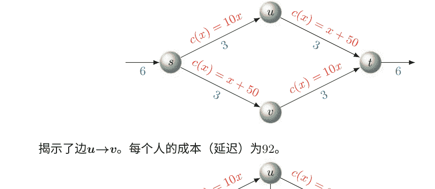

揭示了边u→v。每个人的成本（延迟）为92。

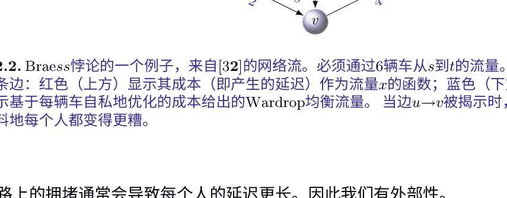

图2.2. Braess悖论的一个例子，来自[32]的网络流。必须通过6辆车从s到t的流量。对于每条边：红色（上方）显示其成本（即产生的延迟）作为流量x的函数；蓝色（下方）显示基于每辆车自私地优化的成本给出的Wardrop均衡流量。当边u→v被揭示时，出人意料地每个人都变得更糟。

道路上的拥堵通常会导致每个人的延迟更长。因此我们有外部性。如果每个代理人优化自己的效用，达到蓝色所示的Wardrop均衡，每辆车都会遭受10·3 + 3 + 50 = 83个时间单位的延迟（详细信息请参见[32]；在Wardrop均衡中，没有个体可以通过切换路线来减少其路径成本，因此所有路线的成本相同）。现在考虑一下，如果所有的车辆都知道从u到v的一条额外道路，如图2.2（底部）所示。我们可以假设u → v的道路一直存在，但直到有关其存在的可靠信息被揭示出来之前，它一直被隐藏着。一些沿着s → u路径的车辆通过选择新的u → v道路然后v → t，而不是直接沿着u → t行驶，从而节省时间。沿着s → v的车辆看到了一个减少延迟的机会，可以切换到这条新的s → u → v路线。尽管直觉上，额外的道路增加了所有车辆的容量，因此似乎只会导致更好的结果，但实际上，通过自私优化得到的新的Wardrop均衡导致了每个人的延迟增加了10·4 + 2 + 50 = 92个单位！[32]对这个例子提供了一个额外的转折。现在假设所有用户都知道可能正在进行u → v道路上的道路施工，该道路的延迟为x + 10 + R，其中R是一个随机变量，取值为0或30，概率相等。如果R是未知的，则沿着u → v的预期延迟为x + 25，导致图2.2（顶部）中的延迟为83。另一方面，如果所有人都知道 R，那么：要么 R= 30，导致图2.2（顶部）的结果；要么 R = 0，导致图2.2（底部）的结果；对于预期延迟 1/2 (83 + 92) = 87.5 > 83。因此，再次透明度（向每个人提供真实信息）会导致每个人的预期结果更差。

##### 2.4.1 选择性透明度、公平性和政策

上面的例子表明，向每个人提供完全透明的信息有时会导致所有人的结果更差。但是，如果只向某些参与者选择性地提供透明度，会怎么样呢？

考虑图2.2中Braess悖论的原始例子。假设人口被分为一个小的特权子组 P，大小为 ε，和其他所有人 Q。不难看出，如果只向 P 提供关于 u → v道路的信息，那么 P 会做得更好（显著），而 Q 会做得更差（稍微）。但是现在考虑一下，如果 u → v 和 v → t 的流量成本函数在略高于3的流量处略微变平，然后再增加。现在，如果只向P透露 u → v 道路，每个人都会做得更好（尽管 P比 Q好得多），而如果 u → v向每个人公开，每个人都会做得更差！

这给决策者带来了一个有趣的困境：我们应该更喜欢（i）每个人都同样受苦的“公平”结果，还是（ii）每个人都更好但有些人比其他人好得多的结果？如果一个公司提供给大部分人使用的地图应用程序，那么这种情况可能经常发生-公司可能为了使所有人受益而为一些人提供更快的路线规划，并为此进行辩护。

现在考虑一下，如果特权少数人是随机选择的-也许这样可能是公平的？ 最近探讨了超越平等的公平概念以及公平中随机性的作用[24,74]。

##### 2.4.2 算法交易

算法交易是一个自利代理竞争激烈的领域。在许多情况下，增加透明度可能是有益的-但是在考虑诸如2018年在欧盟生效的金融工具市场指令（MiFID II）等监管措施时，人们应该注意上述观察结果，在某些情况下，向自利代理提供更透明的信息可能会产生负面后果。

考虑成本函数 c(x) 如下：

| x 的范围 | c(x) 的值 |
| :--- | :--- |
| x ≤ 3 | 10x |
| 3 ≤ x ≤ 3 + ε | 30 |
| 3 + ε ≤ x | 10(x - ε) |

##### 2.4.3 委托人和代理人：行动和后果

在经济学中，委托人-代理人问题[55]发生在一个实体（代理人）代表另一个实体（委托人）采取行动的情况下。一般来说，一个代理人可能会为了自己的利益而采取行动，即使这可能会伤害委托人。一个例子是基金经理（代理人）为投资者（委托人）做出投资决策。当代理人比委托人拥有更多信息时，问题通常会更加严重，因为这使得委托人很难检查代理人是否符合委托人的利益。因此，通常要求对代理人的行为更加透明。

[53]考虑到实际上，委托人观察到有关代理人的更多信息可能出乎意料地对委托人不利。Prat区分了关于代理人行动的直接信息和关于行动后果的信息。虽然对后者是有帮助的，但当有关行动的更多信息可用时，代理人有动机忽视对她来说是私有的有用信号，而是做出先验预期的能力代理人应该做的事情。Prat利用这一观点解释了之前由[36]观察到的现象：美国养老基金在股票市场上的表现比共同基金差。通常，共同基金投资者只能看到实现的投资回报，而养老基金投资者对他们的基金经理有更大的接触，他们解释他们的投资策略。因此，养老基金经理可能存在从众行为的动机，导致预期收益较低。

在类似的精神中，[53]讨论了行政特权，特别是美国总统和某些政府官员在某些情况下抵制透明信息的要求，以解释他们如何做出决策。Prat引用了美国最高法院关于著名的水门案（美国诺克斯诉尼克松案）的一句有力的话：“人类经验告诉我们，那些期望公开传播他们言论的人很可能会在关注外表和自身利益的同时，对决策过程造成不利影响。”

#### 2.5 公平性和歧视

机器学习中关于公平性的大部分工作都集中在试图避免对由敏感特征（如种族或性别）识别出的子群体进行歧视。歧视的典型度量基于各种类型的不同影响或不同对待[8]。在这里，我们考虑了一个与透明度和常见的公平性方法相关的主题，即从数据中删除敏感特征以避免不同对待。对这种方法的一个有效反对意见是可能可以通过其他具有高置信度的特征来预测（从而重构）敏感特征。尽管如此，这种方法被广泛使用，并且下面的例子可能有助于解释它对某些人的直观吸引力。

[6]描述了一项有趣的工作，探索了多智能体群体中自然出现合作的条件。在许多情况下，重复的接触导致迭代囚徒困境互动的支持。

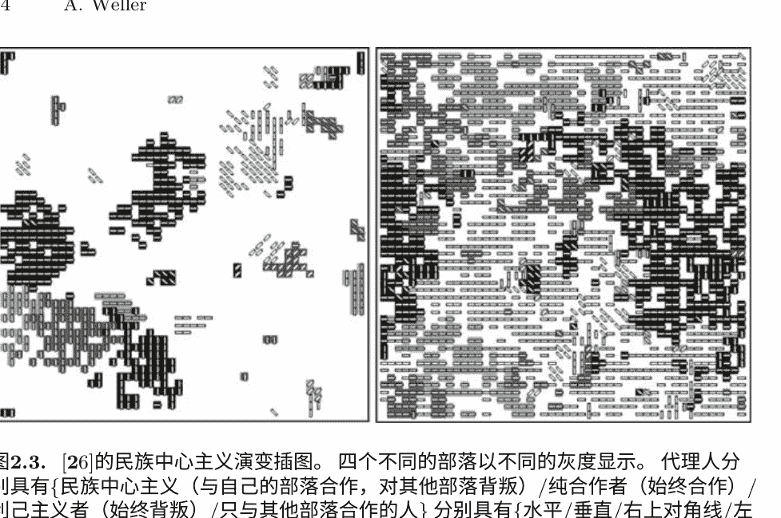

图2.3. [26]的民族中心主义演变插图。四个不同的部落以不同的灰度显示。代理人分别具有{民族中心主义（与自己的部落合作，对其他部落背叛）/纯合作者（始终合作）/利己主义者（始终背叛）/只与其他部落合作的人}分别具有{水平/垂直/右上对角线/左上对角线}线。左侧图像显示100个周期后的一次运行；右侧图像显示2000个周期后的一次运行。随着时间的推移，几乎所有的代理人都是民族中心主义者。参考文献中有一个视频。

合作的出现（有关囚徒困境的详细信息，请参阅维基百科或https://plato.stanford.edu/entries/prisoner-dilemma/）。

在随后的工作中，[26]扩展了框架，考虑了具有“种族”这一额外特征的代理，这可能被视为他们的肤色或部落。现在，每个代理在与同一部落的其他代理互动时可以选择合作或背叛；同样，在与其他部落的代理互动时也可以选择合作或背叛。使用一个简单的多代理进化模型，引人注目地证明了在各种模型参数范围内的一个稳健结论，即“种族中心主义”会出现。也就是说，在经过多次迭代后，每个代理与同一部落的其他代理合作的可能性非常高，但对来自其他部落的代理进行背叛。参见图2.3。

因此，在这种情况下，更大的透明度（即提供有关种族的准确信息）会导致歧视行为的出现。在一般情况下，是否通过隐藏或揭示敏感属性来实现更好的结果并没有明确的答案。一些人尝试使用技术隐私方法同时获得两者的好处[33]。

最近的研究探索了在重复的社交互动中的多智能体强化学习，以开始确定环境和智能体的认知能力对合作的出现产生的条件（参见[39,43]和相关博客文章）。[68]表明，具有量化先验的有界理性可能导致歧视。

#### 2.6 信任：透明度和诚实

许多人支持透明度能够建立信任的观点。例如，达赖喇嘛曾警告说：“缺乏透明度会导致不信任和深深的不安全感。”然而，我们认为这个故事更加复杂。

如果我们区分透明度-即信息的提供-和诚实度-即信息的准确性-那么哪个更重要？

一个普遍的观点是信任依赖于诚实。为了判断可信度，[49]声称我们必须考察三个品质：诚实、能力和可靠性。强调诚实，西蒙·西尼克曾说过：“信任是建立在说实话而不是告诉人们他们想听的话上。”然而，正如我们从下面的短语中感受到的那样，从一个以“残酷诚实”说话的人那里听到“残酷真相”可能是困难的。

在最近的工作中，[41]展示了一些情境，其中亲社会谎言增加了信任。亲社会谎言是一种欺骗行为-有意误导他人的信息传递-这对目标有益。他们的工作旨在分离善意和诚信在建立人际信任中的作用。

他们得出结论，当欺骗直接被体验到，甚至仅仅是被观察到时，利他主义谎言会增加信任。

从人类在部落多代理社会中进化的角度来看，这些效应是有道理的。信任某人可能反映了一种信念，即他们是“我们部落”的一员，并且会可靠地关心我们的利益。从历史的生存角度来看，这种善意可能比真实的沟通更重要-也许是一个“前真相”社会？

有趣的是，心理学中的研究表明，当与他人交流时，我们并不擅长估计自己有多透明。[23]展示了透明度错觉的证据-人们倾向于高估他人能够洞察他们内部状态的程度。这被归因于人们在试图采纳他人观点时，从自己的经验“锚点”上调整不足的倾向。与此一致，[25]提出了以下观察：如果有人被要求在桌面上敲击一首众所周知的旋律，然后估计听众能够识别他们敲击的歌曲的机会，敲击者会严重高估听众的能力。

#### 2.7 机器可解释性和理解

人类可解释性 - 即帮助人类理解机器 - 非常重要。但我们在下面描述了两类“机器可解释性” - 即帮助机器“理解”的方法 - 这也是有价值的研究方向。

首先，机器能够跟随人类和我们的动机将越来越有帮助。例如，考虑对老年人的自动化护理，或者在十字路口等待的自动驾驶车辆应如何可靠地感知并回应对面的人类示意前进。

其次，我们认为一个有成果的研究方向将是帮助机器相互理解。令人兴奋的工作已经开始探索这个方向，寻找使多个代理能够有效合作的方法[20,28,47]。应该探索不同的多代理组织范式[30]。一个动机是实现能够自主生成和传达灵活、分层的概念，这些概念可以广泛应用，超越传统的迁移学习。理想情况下，这些概念将以高层次结构的方式进行高效传输和灵活部署。虽然人类理解这种结构非常可取，但我们建议首先研究机器之间的交流方式，这也将非常有用，甚至可能更容易。此外，可能会开发出超出人类理解范围的复杂结构。

一个相对较低容量的信息瓶颈（如[66]所研究的）可能是在代理之间发展这种结构的有用约束。确实，[38]提出了人类语言相对较低的互通带宽与我们大脑更高的处理能力之间的关系可能有助于我们自身智能和意识的发展。

为了实现这个目标，一个衡量成功的“理解转移”（即一个好的解释度量）的有用指标可以是在代理B从代理A接收到一些有限信息后，在某个任务或一系列任务上的表现如何改善。然而，还需要确定重要的细节，包括适当的带宽约束，并认识到有用的内容将取决于A已经具备的知识。

类似的概念可能对于衡量人类可解释性有用。改善初学者下棋能力的一个有帮助的概念解释的例子可能是“尝试控制中心”。一个优点是只需要衡量性能的改善，而不需要直接量化内部理解这一困难的任务。

#### 2.8 结论

在许多情况下，透明度是有帮助的。我们已经描述了其中一些情况，并开始澄清每种情况下可能需要的透明度类型，以及相关的研究挑战。鉴于对GDPR等法律的浓厚兴趣（在2018年在欧盟引入），本主题是及时的，这些法律旨在为用户提供有关算法决策的有意义信息。

这项工作的重点是突出透明度可能会造成伤害的情景。我们提供了一些例子，说明更大的透明度可能导致更糟糕的结果和更少的公平性。我们希望继续发展框架，以了解在特定环境中哪种透明度对谁有帮助或有害，并开发机制以确保适当的好处得以实现。这是一个丰富的领域，可以借鉴经济学和社会科学、哲学、多智能体博弈论、法律、政策和认知科学的联系。

致谢。本文是[71]的扩展版本。作者感谢Frank Kelly指出Braess悖论的例子和相关直觉；感谢Vasco Carvalho、Stephen Cave、Jon Crowcroft、David Fohrman、Yarin Gal、Adria Gascon、Zoubin Ghahramani、Sanjeev Goyal、Krishna P. Gummuldi、Dylan Hadfield-Menell、Bill Janeway、Frank Kelly、Aryeh Kontorovich、Neil Lawrence、Barney Pell和Mark Rowland的有益讨论；感谢匿名审稿人的有益评论。作者感谢达尔文学院的David MacKay Newton研究奖学金、EPSRC授予的Alan Turing Institute EP/N510129/1 & TU/B/000074项目以及Leverhulme Trust通过CFI的支持。

### 参考文献

- 1. Adel, T., Ghahramani, Z., Weller, A.: 发现深度生成和判别模型的可解释表示。在：ICML (2018)
- 2. Adelberg, A.: 财务报告中包含的叙述性披露：沟通手段还是操纵手段? Acc. Bus. Res. 9(35), 179–190 (1979)
- 3. Amodei, D., Olah, C., Steinhardt, J., Christiano, P., Schulman, J., Mané, D.: AI安全中的具体问题。arXiv预印本 arXiv:1606.06565 (2016)
- 4. Angwin, J., Larson, J., Mattu, S., Kirchner, L.: 机器偏见：全国范围内用于预测未来罪犯的软件。而且它对黑人有偏见。 ProPublica, 2016年5月
- 5. Arrow, K., Debreu, G.: 竞争经济中均衡的存在。Econometrica J. Econometric Soc. 22, 265–290 (1954)
- 6. Axelrod, R.: 合作的演变。Basic Books, 纽约 (2006)
- 7. Bach, S., Binder, A., Montavon, G., Klauschen, F., Müller, K.R., Samek, W.: 通过逐层相关传播对非线性分类器决策进行像素级解释。PLoS ONE 10(7), e0130140 (2015)
- 8. Barocas, S., Selbst, A.: 大数据的不平等影响。加州法律评论 104(3), 671–732 (2016)
- 9. Bernstein, E.: 透明度的陷阱。哈佛商业评论 92(10), 58–66 (2014)
- 10. Braess, D.: Über ein paradoxon aus der verkehrsplanung. Math. Methods Oper. Res. 12(1), 258–268 (1968)
- 11. Chen, X., Duan, Y., Houthooft, R., Schulman, J., Sutskever, I., Abbeel, P.: Info-GAN: interpretable representation learning by information maximizing generative adversarial nets. In: NeurIPS (2016)
- 12. Coldewey, D.: Bulgaria now requires (some) government software be open source. TechCrunch, July 2016
- 13. Cole, D.: We kill people based on metadata. The New York Review of Books, May 2014
- 14. Dabkowski, P., Gal, Y.: Real time image saliency for black box classifiers. In: NeurIPS (2017)
- 15. Datta, A., Sen, S., Zick, Y.: Algorithmic transparency via quantitative input influence: theory and experiments with learning systems. In: 2016 IEEE Symposium on Security and Privacy (SP), pp. 598–617. IEEE (2016)
- 16. Doshi-Velez, F., Kim, B.: 迈向可解释机器学习的严谨科学。CoRR abs/1702.08608 (2017)
- 17. Dwork, C., Hardt, M., Pitassi, T., Reingold, O.: 通过意识实现公平。在: ITCSC (2012)
- 18. 爱因斯坦, A.: 科学的共同语言。 Adv. Sci. 2(5) (1942). 1941年，爱因斯坦向英国科学促进协会发表的演讲可在https://www.youtube.com/watch?v=e3B5BC4rhAU上找到
- 19. Etzioni, A.: 透明度是最好的消毒剂吗? J. Polit. Philos. 18(4), 389–404 (2010)
- 20. Evtimova, K., Drozdzov, A., Kiela, D., Cho, K.: 在多模态、多步骤指代游戏中的新兴通信。在: ICLR (2018)
- 21. Feldman, M., Friedler, S.A., Moeller, J., Scheidegger, C., Venkatasubramanian, S.: 认证和消除不平等影响。在: KDD (2015年)
- 22. Ghani, R.: 你说你想要透明度和可解释性吗？ (2016年) http://www.rayidghani.com/you-say-you-want-transparency-and-interpretability
- 23. Gilovich, T., Savitsky, K., Medvec, V.: 透明度的错觉：对他人读取自己情绪状态能力的偏见评估。 J. Pers. Soc. Psychol. 75(2), 332 (1998年)
- 24. Grgić-Hlača, N., Zafar, M.B., Gummadi, K.P., Weller, A.: 关于公平性、多样性和随机性在算法决策中的问题。在: KDD的FAT/ML研讨会 (2017年)
- 25. Griffin, D., Ross, L.: 主观解释、社会推断和人类误解。 Adv. Exp. Soc. Psychol. 24, 319–359 (1991)
- 26. Hammond, R., Axelrod, R.: 种族优越感的演变。 J. Conflict Resolut. 50(6), 926–936 (2006). http://www-personal.umich.edu/~axe/vtmovie.htm
- 27. Hardt, M., Price, E., Srebro, N.: 监督学习中的机会平等。 In: NeurIPS (2016)
- 28. Havrylov, S., Titov, I.: 通过多智能体游戏出现的语言：学习使用符号序列进行通信。 arXiv预印本。 arXiv:1705.11192 (2017)
- 29. Higgins, I., et al.: beta-VAE: 使用受限变分框架学习基本视觉概念。 In: ICLR (2017)
- 30. Horling, B., Lesser, V.: 多智能体组织范式调查. 知识工程评论 19(4), 281–316 (2004)
- 31. Joseph, M., Kearns, M., Morgenstern, J., Roth, A.: 学习中的公平性：经典和上下文强盗. 在: NeurIPS (2016)
- 32. Kelly, F.: 网络路由. 伦敦皇家学会哲学交易. A数学. 物理. 工程科学 337(1647), 343–367 (1991)
- 33. Kilbertus, N., Gascón, A., Kusner, M.J., Veale, M., Gummadi, K.P., Weller, A.: 盲目的正义：加密敏感属性的公平性. 在: ICML (2018)
- 34. Koh, P.W., Liang, P.: 通过影响函数理解黑盒预测. 在: ICML (2017年)
- 35. Lakkaraju, H., Bach, S., Leskovec, J.: 可解释的决策集：一种联合框架用于描述和预测。 在: KDD, 第1675-1684页. ACM (2016年)
- 36. Lakonishok, J., Shleifer, A., Vishny, R.W., Hart, O., Perry, G.L.: 货币管理行业的结构和表现。 布鲁克. 经济学. 行动. 微观经济学. 1992, 339-391页 (1992年)
- 37. Langer, E., Blank, A., Chanowitz, B.: 表面上思考行为的无意识性：在人际互动中“安慰性”信息的作用。 个人与社会心理学. 36 (6), 635-642页 (1978年)
- 38. Lawrence, N.: 共同生活：心智与机器智能。 CoRR abs/1705.07996 (2017)
- 39. Leibo, J., Zambaldi, V., Lanctot, M., Marecki, J., Graepel, T.: 多智能体强化学习在连续社会困境中的应用。 在: AAMAS (2017)。 https://deepmind.com/blog/understanding-agent-cooperation/
- 40. Lerner, J., Tetlock, P.: 考虑问责制的影响。心理学公告。125(2), 255 (1999)
- 41. Levine, E., Schweitzer, M.: 亲社会谎言：当欺骗孕育信任。组织行为与人类决策过程。126, 88–106 (2015)
- 42. Lipton, Z.: 模型可解释性的神话。在：ICML人类解释性机器学习研讨会，纽约，纽约，第96-100页 (2016)
- 43. Lowe, R., Wu, Y., Tamar, A., Harb, J., Abbeel, P., Mordatch, I.: 混合合作竞争环境中的多智能体演员-评论家。在：NeurIPS (2017)。 https://blog.openai.com/learning-to-cooperate-compete-and-communicate/
- 44. Lowenstein, L.: 金融透明度和公司治理：你所衡量的就是你所管理的。哥伦比亚法律评论 96(5), 1335-1362 (1996)
- 45. Lundberg, S.M., Lee, S.I.: 解释模型预测的统一方法。在：NeurIPS (2017)
- 46. McAllister, R., et al.: 自动驾驶车辆安全的具体问题：贝叶斯深度学习的优势。在：IJCAI (2017)
- 47. Mordatch, I., Abbeel, P.: 多智能体群体中基于地面的组合语言的出现。在：AAAI (2018)
- 48. Mortier, R., Haddadi, H., Henderson, T., McAuley, D., Crowcroft, J.: 人-数据交互：数据驱动社会的人的面孔。社会科学研究网络 (2014)
- 49. O’Neill, O.: 关于信任我们不理解的地方。TED演讲，2013年6月
- 50. Pandey, G.: 印度最高法院在隐私问题上做出具有里程碑意义的裁决。BBC新闻，2017年8月24日。 http://www.bbc.co.uk/news/world-asia-india-41033954
- 51. A. T. (署名不清晰): 透明度和合作的冲突：美国开放数据计划。美国信息科学技术学会期刊。62(11), 2085-2094 (2011年)
- 52. Peters, J., Janzing, D., Schölkopf, B.: 因果推断的要素-基础和学习算法。自适应计算和机器学习系列。麻省理工学院出版社，剑桥 (2017年)
- 53. Prat, A.: 错误的透明度。美国经济评论。95(3), 862-877 (2005年)
- 54. Ribeiro, M., Singh, S., Guestrin, C.: 为什么我应该相信你？：解释任何分类器的预测。在：KDD (2016)
- 55. Ross, S.A.: 代理的经济理论：委托人的问题。美国经济评论63（2），134-139 (1973)
- 56. Roughgarden, T.: 自私的路由和混乱的代价。技术报告，斯坦福大学计算机科学系 (2006)。 http://www.dtic.mil/get-tr-doc/pdf?AD=ADA637949
- 57. Rudin, C.: 请停止解释高风险决策的黑盒模型。在：NeurIPS机器学习趋势评审和纠正研讨会 (2018)
- 58. Rudin, C., Ustun, B.: 优化评分系统：朝着对医疗保健和刑事司法的机器学习的信任。界面48（5），449-466 (2018)
- 59. Samek, W., Binder, A., Montavon, G., Lapuschkin, S., Müller, K.R.: 评估深度神经网络学到的可视化内容。IEEE Trans. Neural Networks Learn. Syst. 28（11），2660-2673 (2017)
- 60. Shapley, L.S.: n人游戏的价值。Contrib. Theory Games 2(28), 307–317 (1953)
- 61. Solove, D.: 隐私和权力：计算机数据库和信息隐私的隐喻。Stanford Law Rev. 53(6), 1393–1462 (2001)
- 62. Solove, D.: 即使你没有‘隐瞒’，隐私也很重要。Higher Education纪事报，2011年5月15日
- 63. Sridhar, D., Batniji, R.: 全球卫生的错误融资：揭示拨款和决策过程的透明性。 Lancet 372(9644), 1185–1191 (2008)
- 64. Strumbelj, E., Kononenko, I.: 用特征贡献解释预测模型和个体预测。Knowl. Inf. Syst. 41(3), 647–665 (2014)
- 65. Sundararajan, M., Taly, A., Yan, Q.: 深度网络的公理归因。In: ICML (2017)
- 66. Tishby, N., Pereira, F., Bialek, W.: 信息瓶颈方法。 在：Allerton通信、控制和计算会议（1999年）
- 67. Varshney, K.R., Alemzadeh, H.: 机器学习的安全性：网络物理系统、决策科学和数据产品。大数据 5（3），246-255（2017年）
- 68. Varshney, L., Varshney, K.: 基于量化先验的决策导致歧视。IEEE 105（2），241-255（2017年）
- 69. Vishwanath, T., Kaufmann, D.: 迈向透明度：新方法及其在金融市场中的应用。世界银行研究观察 16（1），41-57（2001年）
- 70. Wachter, S., Mittelstadt, B., Russell, C.: 不打开黑盒子的反事实解释：自动化决策和GDPR。哈佛法技术杂志31（2），841（2018年）
- 71. Weller, A.: 透明度的挑战。 在：ICML人类可解释性研讨会（2017年）
- 72. Wiggers, K.: 纽约市宣布成立任务组，寻找算法中的偏见。VentureBeat，2018年5月
- 73. Wiley, R.: 通信的演变：信息和操纵。动物行为学2，156-189（1983年）
- 74. Zafar, M.B., Valera, I., Rodriguez, M.G., Gummadi, K.P., Weller, A.: 从平等到基于偏好的分类公平性概念。在：NeurIPS（2017年）
- 75. Zintgraf, L., Cohen, T., Adel, T., Welling, M.: 可视化深度神经网络决策：预测差异分析。在：ICLR（2017年）

### 3 智能系统中的可解释性——一个新概念？

Lars Kai Hansen 和Laura Rieger
丹麦技术大学DTU计算机科学系，Kgs. Lyngby，丹麦
lkai@dtu.dk

摘要。解释性机器学习领域的活跃社区可以从可解释AI的丰富50多年历史中学习。我们在这里提供两个具体的例子，这些例子可以丰富当前的可解释性工作：首先，我们指出了在“可解释专家系统”领域中开发的一系列思想，其次，我们指出了在计算神经影像学领域中开发的用于高维特征重要性图的不确定性量化工具。

关键词：可解释AI·机器学习·不确定性量化

#### 3.1 神经网络可解释性

高活跃度的研究领域在早期往往会有些近视，因为大量的已发表作品几乎没有时间去关注其他领域的进展，甚至没有时间回顾该领域的先前研究。

独立成分分析是一个著名的早期例子，其中Comon的论文[6]中提到了一些失去的见解的历史。深度学习的可解释性是一个当代的例子：人们很容易得出这样的印象，即可解释性问题是随着深度学习的新浪潮而出现的，然而事实并非如此。虽然端到端学习极大地强调了对解释的需求，但解释性是一个有着50多年历史的活跃研究课题。事实上，自智能系统的早期以来，对解释性的重要性和关注度只增加了[30]。从科学背景来看，解释性方法可以帮助制定因果假设，例如在生物医学[43]和计算化学[40]的工作中，到最近在欧盟的《通用数据保护条例》中的社会重要性，建立了所谓的“解释权”，正如Goodman和Flaxman [15]所称。

在这里，我们对智能系统中可解释性的丰富历史进行了两次深入探讨，并提出了“现代工作可以学到什么”？

首先是一个语义注释。在文献中，可解释性和解释性这两个术语经常被互换使用。然而，在最近的一项综述[13]中，提出了一个有用的区别。更一般的概念是可解释性，它涵盖了可解释性，即将机器学习功能传达给用户，以及完整性，即解释足够接近以便进行审计。该区别被描述为：“...仅仅可解释性是不足够的。为了让人类信任黑盒方法，我们需要可解释性-能够总结神经网络行为原因、获得用户信任或产生决策原因洞察的模型。虽然可解释性是一个重要的第一步，但这些机制还需要是完整的，具备捍卫其行为、提供相关回答和接受审计的能力。”[13]。在Montavon等人的综合教程中，提出了一个相关的区分：'...通过构建原型来解释模型学习的概念，并通过识别相关的输入变量来解释模型的决策。"[30]。

在这个更广义的意义上，可解释性一直是几个智能系统社区的关键组成部分，本文的核心观点是未来的工作可以从回顾这个历史中学习。我们将重点关注两个具体的研究方向，第一个涉及可解释性的更广泛基础：应该解决哪些显著维度和问题？我们的第二个重点领域涉及机器学习模型和其解释中不确定性维度的重要挑战的理解。

回到深度学习新浪潮之前，许多人强调了可解释性的重要性。Breiman的经典论文统计建模：《两种文化》非常注重可解释性[3]。Breiman指出：'奥卡姆剃刀，长期以来备受赞赏，通常被解释为简单即是更好。不幸的是，在预测中，准确性和简洁性（可解释性）存在冲突。例如，线性回归可以给出一个相当可解释的y、x关系图。但它的准确性通常低于不太可解释的神经网络。正如我们将在下面看到的，这个困境在可解释的专家系统社区中早在多年前就被认可了。Breiman明确表达了他的偏好：'在可解释性方面，树的评级是A+'，然而，已经知道树和基于规则的系统在实施和理解函数方面存在严重的局限性，参见例如[29]。

对智能系统的可解释性的兴趣早在以前就有了。在1988年的一篇立场文件中，Mitchie讨论了AI如何通过不同的标准，从弱到超强[28]：'超强标准要求系统不仅能够解释其如何构建其所获得的技能；还应该能够教授它们。'这个目标仍然非常重要。

回顾早期专家系统的历史，解释和人机交互是关键问题。60年代末的专家系统-如为教学支持而开发的'SCHOLAR'-被设计为交互式的[5]，例如解释为什么学生的答案是错误的混合主动对话。

斯坦福广为讨论的抗菌药物选择专家系统'MYCIN'设计有三个组成部分：基于规则的决策支持组件，将MYCIN和医生的判断相结合，解释模块和学习模块[4,41,42]。这个基于规则的系统在1975年有大约200条规则。

#### 3.2 可解释AI的期望

专家系统已经发展了几代。从Swartout和Moore在1993年对“第二代可解释专家系统”的回顾[47]中可以学到重要原则，列出了对AI有用的解释的五个一般期望，为该领域的最新工作增添了重要视角：

- $D_1$ 忠实度：解释必须是系统实际执行的合理表示。
- $D_2$ 可理解性：涉及多个可用性因素，包括术语、用户能力、抽象级别和交互性。
- $D_3$ 充分性：应能够解释功能和术语，并足够详细以证明决策的合理性。
- $D_4$ 低构建开销：解释不应主导设计AI的成本。
- $D_5$ 效率：解释系统不应显著减慢AI的速度。

专家系统经历了几个世代的发展。第二代与第一代AI的概念是基于解释的方式。第一代系统的特点是基于AI直接应用规则来做出决策的解释。这导致了高忠实度（$D_1$），但常常与可理解性（$D_2$）相冲突，因为用于推理的规则可能对用户来说不够全面[47]。所谓的可解释专家系统（EES）解决了这个困境。XPLAIN系统[46]就是一个例子。XPLAIN基于两个关键原则来增强可理解性：“明确区分知识库中存在的不同形式的领域知识，并对系统开发过程进行形式化记录”[34]。对XPLAIN的评估是凭经验的，但相当令人信服。提供了一些案例，系统能够回答“为什么”的问题，甚至有时候会诉诸“善意的谎言”来创造更顺畅的学习体验[46]。在当前文献中，构建和执行的计算复杂性（期望 $D_4$ - $D_5$）并不那么突出，尽管最常用的方法在复杂性上有显著差异。所谓的局部可解释模型无关解释（LIME），例如，一种方案基于图像分割、随机抽样和多元线性模型拟合，在解释时相当复杂[37]，因此是一个挑战 $D_5$。一种方法，如“激活向量测试”（TCAV），在初始成本上有很大的代价[19]，因此可能对 $D_4$构成挑战。

在基于规则的专家系统的背景下，EES的大部分进展是产生的，而基于机器学习的AI - 所谓的连接主义方法 - 更常被认为是“黑盒子”。对连接主义方法的兴趣主要基于性能而不是可解释性，参见[2]的引用：“...符号学习技术产生更易理解的输出，但在泛化方面不如连接主义学习技术好。”我们已经注意到这种观点是由Breiman传播的，因此引起了将现有神经网络转换为决策树形式[1,48,49]甚至学习更容易转换为树的神经网络的兴趣，例如Gallant的工作[12]和Craven和Shavlik的工作[7]。但是树可能无法满足 $D_2$，特别是如上所述并由[46]指出 - 当树的结构复杂或在高维特征空间中运行时，树的直观吸引力在实践中失败。这些挑战最近也在[33]中提到。对于现代神经网络擅长的领域，如图像、音频和文本数据，基于树的解释面临挑战。

回到期望清单，最近的几篇论文旨在构建解释性的讨论。可能不知道[47]的情况下，Lipton指出解释性并不是一个明确定义的概念，并继续讨论了多个解释性的维度，并制定了一组与 $D_1-D_3$密切相关的期望。Lipton的期望包括（i）'信任'，（ii）'因果关系'，（iii）'可转移性'，（iv）'信息性'和（v）'公平和道德决策'。在这里，Lipton讨论了（i）'信任'的几个维度，主要涵盖在 $D_1-D_2$中，（ii）'因果关系'与[47]的 $D_3$大致相当，而'可转移性'和'信息性'的概念都指的是用户从解释中获得抽象的'知识'的能力。这个想法也出现在原始论文对可用性 $D_2$的讨论中，即需要以不同的抽象级别解释系统。Lipton指出，'公平和道德决策'是一个特别需要解释性的领域。在[47]中，这些考虑被放置在对可用性 $D_2$的一般讨论中。还指出解释系统必须能够从不同的角度解释'...例如，在生物领域中的形式与功能之间，或者在金融领域中的安全性与盈利性之间。

可用性维度（ $D_2$ ）仍然是当代可解释性论文中的一个重要问题。问题“对谁来说是可解释的？”已经在几篇论文中提出，并且关注用户，并通过人类因素评估进行了解答。事实上，Doshi-Velez和Been在他们的论文中以更一般的陈述开篇：“不幸的是，关于机器学习中的可解释性以及如何对其进行基准评估，几乎没有共识。”他们的关键贡献是指出当前的机器学习工作流程是不完整的，因为它们在应用领域具有未指定的目标。这可能是机器学习目标函数中未包含的重要问题：“...不完整性会产生某种未经量化的偏见，例如在模型选择过程中包含领域知识的影响。”似乎对EES社区的结果不太了解，他们关注可用性，并且如果涉及到人类用户，一个完全指定的应用程序将不可避免地涉及人类因素评估，这立即使得[47]对 $\mathcal{D}_2$ 的讨论相关。在评估与人类主体的AI解释系统时，我们应该意识到用户潜在的认知偏见。在可解释性的背景下，有趣的是用户可能会受到偏见的影响，例如由Johansson等人发现的有趣现象“选择盲点”。选择盲点表现为无法做出一致的决策并解释。在[18]的工作中，魔术师“愚弄”用户，解释用户做出或未做出的决策具有相似的强度。然而，我们注意到实际可用性评估解释方法的重要性也早已出现。1990年的AAAI研讨会上展示了关于用户场景的工作[9]，随后的工作在[45]中有所报道。

Breiman将简单性和可解释性等同起来。然而，众所周知看似简单的模型很难解释。即使是简单的线性分类模型也需要仔细调整以优化特征重要性的稳定性图[36]。在神经影像学的背景下首次出现的“滤波器与模式”讨论就是意外复杂性的另一个例子。在这种情况下，可视化分类模型和相应的（因果）生成模型之间存在重要的区别。这种差异是由相关的输入噪声引起的，如果不适当处理，可能会得出错误的结论如Haufe等人[17]所指出的。深度网络中也出现了类似的挑战[20]。Lipton [25,26]讨论了简单性和可解释性的分离的进一步例子，引用了[38]的“可解释的增强朴素贝叶斯分类”工作。本文以与Breiman的困境一致的陈述开篇：“使用投票方法开发具有强大区分能力的分类器的努力使理解的重要性边缘化了。”本文的目标是证明可以缓解投票系统的解释问题。具体而言，Madigan等人在朴素贝叶斯分类器中的解释工具[27]被证明对复杂的增强集成很有用。

#### 3.3 使用重新采样量化特征重要性图的相似性和不确定性

在神经网络的某些应用领域，包括科学计算和生物医学，解释长期以来一直扮演着重要角色，并且已经开发出了用于解释神经网络功能的工具。

在基于脑部扫描的心智阅读的早期工作中，可解释性自然成为焦点[24,31]。当时主导的分析范式是Friston等人的SPM '统计参数映射'[11]。这种方法产生了直观吸引人的三维脑部活动显著激活图。这些图在该领域产生了重大影响，并且神经网络可视化的一个重要目标是生成匹配的SPMs。开发的工具包括体素级显著性[32]和敏感性[21]的3D映射。通过将地图嵌入3D的“解剖学导向”导航工具，增强了神经科学家的可用性（D2），详见[32]的示例。通过知识图谱信息进一步丰富了脑图可视化，以促进决策和教学[35]。

关于第一个期望（D1）- 解释的准确性 - 我们需要考虑两个逻辑基本属性：‘存在’和‘唯一性’。考虑到期望所施加的许多限制，一个令人满意的可解释性方案的存在是一个非平凡的问题。寻找这样的方案是当前可解释性工程文献的关注点。在存在的基础上，我们面临一个同样重要的问题，即唯一性。请注意，至少有两种不确定性机制可能导致非唯一性：首先，表达能力模型中的认知不确定性，通常由有限的数据和知识的组合引起。认知不确定性会导致多个竞争的解释范式出现。非唯一性的第二个来源是给定问题领域的固有随机性，其中噪声和有限样本可能会导致解决方案出现大幅波动（‘随机不确定性’）。

Lange等人在[23]的工作中详细讨论了认知不确定性。评估了九种不同的解释方案，以探索模型空间的多样性和学习相似之处。不同映射过程使用的特殊尺度是定量比较可视化的一个重要挑战。这个问题在[16]中得到了解决，提出了一种简单的非参数化方法来标准化地图，从而使地图能够有意义地组合，例如通过简单平均。这种基于共识的方法可以减少模型的不确定性，并量化地图之间的差异（认知不确定性）。

所谓的NPAIRS框架[44]解决了脑图中的随机不确定性。统计重采样技术（如分半法）可以提供解释热图方差的无偏估计。这允许通过将热图按照其标准差进行缩放来映射局部可视化的‘效应大小’。这些工具的应用包括图像处理流程的优化[22]。除了这些方法的原始领域外，它们还被应用于皮肤癌诊断支持[43]。我们预见到深度学习在科学计算领域的未来应用将需要对随机不确定性进行谨慎和无偏的量化，并提供聚合多个解释假设的方法。

#### 3.4 结论

可解释性是现代机器学习的核心。透明度通过有效的解释工具可以改善机器学习工程师的设计和调试，更重要的是提高用户对我们开发的工具的信任和可用性。如果在这个领域工作的科学家社区能更加积极地拥抱可解释AI的丰富50多年历史，将会产生积极的效果。

## 3. 智能系统中的可解释性-一个新概念？

在这里，我们专注于这个遗产中的两个具体主题，这些主题可以丰富当前的可解释性工作：（1）通过解释需求仔细定义任务。在这里，我们指出了在“可解释专家系统”领域中发展的一系列丰富的思想，以及（2）仔细处理不确定性。在这里，我们指出了最初在计算神经影像领域开发的用于高维特征重要性图的不确定性量化的全面工作流程。

### 参考文献

- 1. Andrews, R., Diederich, J., Tickle, A.B.: 从训练的人工神经网络中提取规则的技术的调查和评论。基于知识的系统 **8**(6), 373-389 (1995年)
- 2. Boz, O.: 将训练的神经网络转换为决策树的决策树提取器 (2000年)
- 3. Breiman, L.: 统计建模：两种文化（作者的评论和答辩）。统计科学 **16**(3), 199-231 (2001年)
- 4. Bruce, G., Buchanan, B., Shortliffe, E.: 基于规则的专家系统：斯坦福启发式编程项目的MYCIN实验。Addison-Wesley, Reading (1984年)
- 5. Carbonell, J.R.: AI in CAI: 计算机辅助教学的人工智能方法。IEEE Trans. Man Mach. Syst. **11**(4), 190-202 (1970年)
- 6. Comon, P.: 独立成分分析，一个新概念？信号处理 **36**(3), 287-314 (1994年)
- 7. Craven, M.W., Shavlik, J.W.: 使用抽样和查询从训练好的神经网络中提取规则。在：机器学习会议1994年，第37-45页。Elsevier (1994年)
- 8. Doshi-Velez, F., Kim, B.: 迈向可解释机器学习的严谨科学。arXiv预印本。arXiv:1702.08608 (2017年)
- 9. Druzdzel, M.J., Henrion, M.: 使用场景解释概率推理。 在：AAAI-1990研讨会解释工作笔记，第133-141页（1990年）
- 10. Duda, R.O., Shortliffe, E.H.: 专家系统研究。Science **220**(4594), 261–268(1983年)
- 11. Friston, K.J., Holmes, A.P., Worsley, K.J., Poline, J.P., Frith, C.D., Frackowiak, R.S.: 功能成像中的统计参数图：一种通用线性方法。嗯。脑部成像。**2**(4), 189-210 (1994)
- 12. Gallant, S.I.: 连接主义专家系统。ACM通信 **31**(2), 152-169 (1988)
- 13. Gilpin, L.H., Bau, D., Yuan, B.Z., Bajwa, A., Specter, M., Kagal, L.: 解释解释：评估机器学习可解释性的方法。arXiv预印本。arXiv:1806.00069 (2018)
- 14. Good, I.: 可解释性：解释与统计应用的数学理论。伦敦皇家学会会议录A **354**(1678), 303-330 (1977)
- 15. Goodman, B., Flaxman, S.: 欧盟关于算法决策和“解释权”的规定。arXiv预印本。arXiv:1606.08813 (2016)
- 16. Hansen, L.K., Nielsen, F. Å., Strother, S.C., Lange, N.: 神经影像学中的共识推断。NeuroImage **13**(6), 1212-1218 (2001)
- 17. Haufe, S.等：关于多变量神经影像学中线性模型权重向量的解释。NeuroImage **87**, 96-110 (2014年)
- 18. Johansson, P., Hall, L., Sikström, S., Olsson, A.: 在简单的决策任务中未能检测到意图和结果之间的不匹配。 Science **310** (5745), 116-119 (2005年)
- 19. Kim, B.等: 超越特征归因的可解释性：使用概念激活向量（TCAV）进行定量测试。 在: 机器学习国际会议, 第2673-2682页 (2018年)
- 20. Kindermans, P.J.等: 学习如何解释神经网络：PatternNet和PatternAttribution。 arXiv预印本。 arXiv:1705.05598 (2017年)
- 21. Kjems, U.等: 功能神经影像实验的定量评估：互信息学习曲线。 NeuroImage **15** (4), 772-786 (2002年)
- 22. LaConte, S.等: 使用NPAIRS性能指标评估单一受试者bold fMRI的预处理选择。 NeuroImage **18** (1), 10-27 (2003年)
- 23. Lange, N.等: fMRI数据分析中的多样性和相似性。 NeuroImage **10** (3), 282-303 (1999年)
- 24. Lautrup, B., Hansen, L.K., Law, I., Mørch, N., Svarer, C., Strother, S.C.: 大规模权重共享：极度不适定问题的治疗方法。 在: 超级-计算在脑研究中的应用：从断层扫描到神经网络, 第137-144页 (1994年)
- 25. Lipton, Z.C.: 模型可解释性的神话。 arXiv预印本。 arXiv:1606.03490 (2016年)
- 26. Lipton, Z.C.: 模型可解释性的神话。 Queue **16**(3), 30 (2018年)
- 27. Madigan, D., Mosurski, K., Almond, R.G.: 信念网络中的图形解释。 J. Comput. Graph.Stat. **6**(2), 160-181 (1997年)
- 28. Michie, D.: 未来五年的机器学习。 在: 第三届欧洲工作会议上的学习, 第107-122页。 Pitman出版社 (1988年)
- 29. Minsky, M.L.: 逻辑与类比或符号与连接主义或整洁与凌乱。 AI杂志。 **12** (2), 34 (1991年)
- 30. Montavon, G., Samek, W., Müller, K.R.: 解释和理解深度神经网络的方法。 数字标志处理。 **73**, 1-15 (2018年)
- 31. Mørch, N.等: 功能神经影像学中的非线性与线性模型：学习曲线和泛化交叉点。 在: Duncan, J., Gindi, G. (eds.) IPMI1997. LNCS, vol. 1230, pp. 259-270。 Springer, Heidelberg (1997年) 。 https://doi.org/10.1007/3-540-63046-5_20
- 32. Mørch, N.J.等: 使用显著性图可视化神经网络。 在: 1995年IEEE国际神经网络会议。 IEEE (1995年)
- 33. Narayanan, M., Chen, E., He, J., Kim, B., Gershman, S., Doshi-Velez, F.: 人类如何理解机器学习系统的解释？ 解释的人类可解释性评估。 arXiv预印本。 arXiv:1802.00682 (2018年)
- 34. Neches, R., Swartout, W.R., Moore, J.D.: 通过其开发的显式模型增强专家系统的维护和解释。 IEEE Trans. Softw.Eng. **11**, 1337-1351 (1985年)
- 35. Nielsen, F.A., Hansen, L.K.: 通过brainmap数据库自动解剖标记Talairach坐标并生成兴趣区的体积。 NeuroImage **16**(2), 2–6 (2002)
- 36. Rasmussen, P.M., Hansen, L.K., Madsen, K.H., Churchill, N.W., Strother, S.C.: 在神经影像学中模型稀疏性和脑模式解释的分类模型。 Pattern Recogn. **45**(6), 2085–2100 (2012)

> 37. Ribeiro, M.T., Singh, S., Guestrin, C.: 为什么我应该相信你？：解释任何分类器的预测。在第22届ACM SIGKDD国际知识发现与数据挖掘会议上的论文集中，第1135-1144页。ACM (2016)

> 38. Ridgeway, G., Madigan, D., Richardson, T., O’Kane, J.: 可解释的提升朴素贝叶斯分类。在：KDD，第101-104页 (1998年)

> 39. Saposnik, G., Redelmeier, D., Ruff, C.C., Tobler, P.N.: 与医疗决策相关的认知偏见：一项系统性回顾。BMC Med. Inform. Decis. Mak. 16(1), 138 (2016)

> 40. Schütt, K.T., Arbabzadah, F., Chmiela, S., Müller, K.R., Tkatchenko, A.: 深度张量神经网络的量子化学洞察。自然通讯。8, 13890 (2017)

> 41. Shortliffe, E.H., Axline, S.G., Buchanan, B.G., Merigan, T.C., Cohen, S.N.: 一个人工智能程序，用于向医生提供有关抗菌治疗的建议。Comput. Biomed. Res. 6(6), 544–560 (1973)

> 42. Shortliffe, E., Davis, R., Axline, S., Buchanan, B., Green, C., Cohen, S.: 计算机辅助临床治疗的解释和规则获取能力：MYCIN系统的解释和规则获取能力。Comput. Biomed. Res. 8(4), 303–320 (1975)

> 43. Sigurdsson, S., Philipsen, P.A., Hansen, L.K., Larsen, J., Gniadecka, M., Wulf, H.C.: 通过Raman光谱分类检测皮肤癌。IEEE Trans. Biomed. Eng. 51(10), 1784–1793 (2004)

> 44. Strother, S.C., Anderson, J., Hansen, L.K., Kjems, U., Kustra, R., Sidtis, J., Frutiger, S., Muley, S., LaConte, S., Rottenberg, D.: 功能性神经影像实验的定量评估：NPA IRS数据分析框架。NeuroImage 15(4), 747-771 (2002)

> 45. Suermondt, H.J., Cooper, G.F.: 对概率推理解释的评估。在：计算机应用年度研讨会论文集，第579页。美国医学信息学协会 (1992)

> 46. Swartout, W.R.: XPLAIN：创建和解释专家咨询程序的系统。南加州大学马里纳德尔雷信息科学研究所，技术报告 (1983年)

> 47. Swartout, W.R., Moore, J.D.: 第二代专家系统中的解释。在：David, J.M., Krivine, J.P., Simmons, R. (eds.) 第二代专家系统，第543-585页。Springer, Heidelberg (1993年)。https://doi.org/10.1007/978-3-642-77927-5_24

> 48. Thrun, S.: 从人工神经网络中提取可证明正确的规则。技术报告IAI-TR-93-5，德国波恩大学计算机科学研究所 (1994年)

> 49. Thrun, S.: 从人工神经网络中提取具有分布式表示的规则。在：神经信息处理系统的进展，第505-512页 (1995年)

> 50. Tomsett, R., Braines, D., Harborne, D., Preece, A., Chakraborty, S.: 可解释给谁？用于分析可解释机器学习系统的基于角色的模型。arXiv预印本。arXiv:1806.07552 (2018年)

## 第二部分

## 解释AI系统的方法

### 解释AI系统的方法 - 前言

浅层决策树和稀疏线性模型简单易懂。一个人可以查看决策结构，例如节点和权重，并理解它。当任务更复杂时，这些简单的机器学习模型需要被更复杂的模型替代，以表示任务的更高非线性。

这些模型对用户来说也更难解释。例如，深度神经网络通常由数百万个神经元组成，以高度复杂且看似不透明的方式进行交互。

使用这些复杂的黑盒模型的一个直接缺点是人类对其预测的信任度不足。相反，我们希望验证模型学习的概念是否基于正确的输入变量，并且模型是否以有意义的方式组合它们。标准的检查技术通常能够对模型进行部分了解，例如对网络的第一层进行可视化检查。然而，为了对这些模型获得更深入的洞察，需要新的技术。开发这样的技术已成为近年来的重要研究焦点。

接下来的四章对将更多可解释性引入复杂的机器学习模型的当前研究进行了概述。

在第4章中，Nguyen等人[3]考虑了一个已经训练好的神经网络的情况，我们想要理解其输出神经元中所建模的内容。所提出的解决方案在输入域中构建了一个原型，该原型在满足原型看起来真实的约束条件下，最大程度地激活模型的某个输出神经元。这些原型可以被人类可视化，以便解释所学习的概念。在这里，隐含地假设输入域对人类来说是可解释的。

在第5章中，Hong等人[1]提出了一种将文本转换为另一种模态（即图像）的方法。所提出的方法训练了一个生成式神经网络，该网络以接收到的文本序列作为条件，并生成图像作为输出。它的工作方式类似于一个翻译系统，但产生的是图像。与第4章不同，这里需要解释的是输入文本而不是模型本身。然而，这两个工作都共享一个共同的目标，即合成尽可能逼真的图像，以便人类能够最大程度地解释它们。

在第6章中，胡等人[2]提出了一种用于将数据汇总成簇或哈希的学习算法。通过自我增强的训练策略，簇结构被驱使成为人类可解释的，这将有助于模型的解释。不变性是提高模型可解释性的关键。例如，如果模型已经对小的局部扭曲进行了抽象，那么模型的用户可以认为这种不变性是成立的，并将精力集中在解释更高层次的概念，如图像类别上。

在第7章中，Oh等人[4]对可解释性的问题持有不同的观点。在对抗性环境中，一个完全透明的模型实际上可能会被恶意用户利用。例如，后者可能试图从模型中提取未经授权的信息，或者制作对抗性输入，使模型表现出不当行为。作者发现，在没有特定对策的情况下，模型的决策行为可能会泄露出大量关于其内部运作的信息，从而揭示潜在的弱点。

总的来说，这四章突出了XAI所涵盖的任务范围。虽然一些技术已经被开发出来揭示模型的内部工作方式，但一个重要的目标通常也是更好地理解输入数据本身。此外，虽然可解释性通常看起来是可取的，但最终取决于接收或提供可解释反馈的用户的意图。在某些敏感应用中，透明性实际上可能成为一种可取的属性[5]。

2019年7月

- Wojciech Samek
- Grégoire Montavon
- Andrea Vedaldi
- Lars Kai Hansen
- Klaus-Robert Müller

### 参考文献

- 1. Hong, S., Yang, D., Choi, J., Lee, H.: 通过分层语义布局生成进行可解释的文本到图像合成。 在: Samek, W., Montavon, G., Vedaldi, A., Hansen, L.K., Müller, K.-R. (eds.) 可解释AI: 解释和可视化深度学习。 LNCS, vol. 11700, pp. 77–95, Springer, Cham (2019)
- 2. 胡, W., 宫本, T., 德奎, S., 松本, E., 杉山, M.: 无监督离散表示学习。 在: Samek, W., Montavon, G., Vedaldi, A., Hansen, L.K., 穆勒, K.-R. (eds.) 可解释AI: 解释和可视化深度学习。 LNCS, vol. 11700, pp. 97–119, Springer, Cham (2019)
- 3. Nguyen, A., Yosinski, J., Clune, J.: 通过特征可视化理解神经网络: 一项调查。 在: Samek, W., Montavon, G., Vedaldi, A., Hansen, L.K., 穆勒, K.-R. (eds.) 可解释AI: 解释和可视化深度学习。 LNCS, vol. 11700, pp. 55–76, Springer, Cham (2019)
- 4. Oh, S.J., Schiele, B., Fritz, M.: 朝着逆向工程黑盒神经网络。 在: Samek, W., Montavon, G., Vedaldi, A., Hansen, L.K., Müller, K.-R. (eds.) 可解释AI: 解释和可视化深度学习。 LNCS, vol. 11700, pp. 121–144, Springer, Cham (2019)
- 5. Weller, A.: 透明度: 动机和挑战。 In: Samek, W., Montavon, G., Vedaldi, A., Hansen, L.K., Müller, K.-R. (eds.) 可解释AI: 解释和可视化深度学习。 LNCS, vol. 11700, pp. 23–40, Springer, Cham (2019)

### 4 通过特征可视化理解神经网络：一项调查

Anh Nguyen^{1(\boxtimes)}, Jason Yosinski^2, 和 Jeff Clune^2,3
1 奥本大学, 奥本, 阿拉巴马州, 美国
anhnguyen@auburn.edu
2 Uber AI实验室, 旧金山, 加利福尼亚州, 美国
yosinski@uber.com
3 怀俄明大学, 拉勒米, 怀俄明州, 美国
jeffclune@uwyo.edu

摘要。了解大脑的一种神经科学方法是找到并研究高度激活个体细胞或细胞群的首选刺激。最近机器学习的进展使得一系列方法能够合成首选刺激，使得人工或生物大脑中的神经元强烈激活。这些方法被称为激活最大化 (AM) [10]或通过优化进行特征可视化。在本章中，我们 (1) 回顾了现有的AM技术文献；(2) 讨论了AM的概率解释；(3) 回顾了AM在调试和解释网络中的应用。

关键词：神经网络 · 特征可视化 · 激活最大化 · 生成网络 · 生成模型 · 优化

#### 4.1 引言

理解人脑一直以来都是人类历史上的一个长期追求。了解大脑的一种方法是研究每个神经元^{1}编码的内容[17]，或者它的激活代表的信息。在20世纪50年代的经典实验中，Hubel和Wiesel通过在屏幕上展示不同的图像并记录猫的主要视觉皮层中神经元的激活情况（图4.1）来研究猫的大脑。在各种测试图像中，研究人员发现定向边缘会导致特定细胞的高反应[14]。这个细胞被称为边缘检测器，这样的图像被称为它的首选刺激。同样的技术后来使科学家们能够发现神经元沿着视觉通路如何检测越来越复杂的模式：从圆圈、边缘到面孔，以及高级概念，如一个人的祖母[3]或特定的名人，比如女演员Halle Berry[37]。

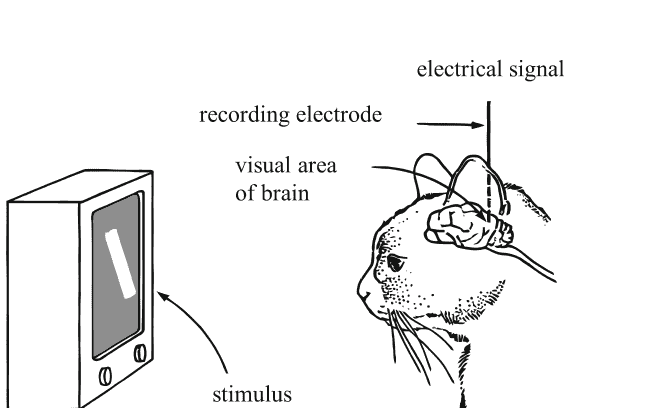

图4.1。在经典的神经科学实验中，Hubel和Wiesel发现猫的视觉皮层神经元（右侧）在某些位置和方向上对光条（左侧）的反应强烈且有选择性[14]。

同样，在机器学习（ML）中，通过直观地检查单元的首选刺激可以更好地理解神经元的功能[48,49]。一种直观的方法是从现有的大型图像集合（例如训练集或测试集）中找到这样的首选输入[49]。然而，这种方法可能具有不希望的特性。首先，它需要在大型图像集上测试每个神经元。其次，在这样的数据集中，可能不存在许多激活单元的有信息图像，因为图像是广阔的，神经行为可以很复杂[28]。第三，图像中哪些视觉特征导致神经元激活通常是模糊的，例如，如果一个单元被一棵树枝上的鸟的图片激活，不清楚该单元是“关心”鸟还是树枝（图4.13b）。第四，从神经元通常喜欢的大量刺激中提取神经元的整体描述并不是一件简单的事情。常见的做法是研究一个单元中激活最高的前9张图片[48,49]；然而，这个前9张图片可能只反映了单元中偏好的众多特征之一[29]。

可以通过从头开始合成视觉刺激而不是从现有数据集中找到真实图像[10,25,27,29,32,42,46]。合成方法具有多个优势：（1）在具有强大图像先验的情况下，可以合成（重构）刺激，而无需访问目标模型的训练集，这在实践中可能不可用（参见第4.5节）；（2）对合成图像的类型和内容有更多控制，有助于进行更加受控的研究实验。

激活最大化。让$\theta$成为将图像$\mathbf{x} \in \mathbb{R}^{H \times W \times C}$（具有$C$个颜色通道，每个通道宽度为$W$像素，高度为$H$像素）映射到输出类别概率分布的分类器的参数。寻找一个图像$\mathbf{x}$，使得在给定层$l$中神经元索引为$i$的激活值$a_i^l(\theta, \mathbf{x})$最大化，可以被表述为一个优化问题：

$$\mathbf{x}^* = \arg \max_{\mathbf{x}}(a_i^l(\theta, \mathbf{x}))$$

这个问题被Erhan、Bengio等人[10]称为激活最大化(AM)。在这里，$a_i^l(\cdot)$返回单个单元的激活值，就像许多以前的工作[27-29]一样；然而，它可以扩展为返回我们希望研究的任何神经响应$a(\cdot)$，例如激活一组神经元[24,26,33]。引人注目的DeepDream可视化[24]是通过同时激活给定层中的所有单元来创建的AM运行。在本章中，我们将在泛化时省略确切的索引$l, i$，并写作$a(\cdot)$而不是$a_i^l(\cdot)$。

AM是一个非凸优化问题，可以尝试通过基于梯度的方法[44]或非梯度方法[30]找到局部最小值。在事后解释性[23]中，我们通常假设可以访问正在研究的网络的参数和架构。在这种情况下，一种简单的方法是执行梯度上升[10,27,31,48]，使用如下的更新规则：

$$\mathbf{x}_{t+1} = \mathbf{x}_t + \epsilon_1 \frac{\partial a(\theta, \mathbf{x}_t)}{\partial \mathbf{x}_t}$$

也就是说，从随机初始化的$\mathbf{x}_0$（这里是一个随机图像）开始，我们在输入空间中沿着$a(\theta, \mathbf{x})$的梯度迭代地采取步骤，以找到高度激活给定单元的输入$\mathbf{x}$。$\epsilon_1$是步长，根据经验选择。请注意，这个梯度上升过程与用于通过反向传播训练神经网络的梯度下降过程[39]类似，只是这里我们优化的是网络输入而不是网络参数$\theta$，这些参数是固定的。${}^3$当神经激活达到所需的阈值或经过一定数量的步骤后，我们可以停止优化。

实际上，从头开始合成图像以最大化激活（即无约束优化问题）通常会产生难以解释的图像[28]。在高维图像空间中，我们经常发现垃圾示例（也称为愚弄示例[28]），例如高频噪声模式，看起来什么都不像，但却高度激活给定的单元（图4.2）。类似地，如果从真实图像（而不是随机图像）开始AM优化，我们可能会轻松遇到对抗示例[44]，例如与起始图像略有不同的图像（例如一辆校车），但网络会给出完全不同的标签，例如“鸵鸟”[44]。这些早期的AM可视化[28,44]揭示了机器学习应用中的巨大安全性和可靠性问题，并为大量后续的对抗攻击和防御研究[1,16]提供了信息。

我们可视化的网络。除非另有说明，在本章中，我们演示了在ILSVRC 2012 ImageNet数据集[7,40]上使用AlexNet convnets[18]的特定预训练模型CaffeNet进行单标签图像分类的AM。

2有时也被称为特征可视化[29, 32, 48]。在本章中，“可视化一个单元”意味着“为单个神经元合成首选图像”。

3因此，以后，我们将简化写作$a(\mathbf{x})$，省略$\theta$，以简化表示。

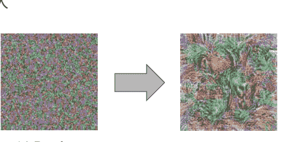

#### 4.2 通过手动设计的先验知识进行激活最大化

例如图4.2b中的示例不可被人类识别。虽然网络对这些图像的强烈响应令人着迷，并对安全性产生了重大影响，但如果我们无法解释这些图像，就会限制我们理解单元目的的能力。因此，我们希望将搜索限制在我们可以解释的图像分布内，例如逼真的照片或类似训练集中的图像。这可以通过将自然图像先验知识纳入目标函数中来实现，研究发现这可以大大提高AM图像的可识别性[21, 27, 29, 32, 48]。例如，图像先验可以鼓励平滑性[21]或惩罚极端强度的像素[42]。这些约束通常作为正则化项R(x)纳入AM公式中：

$$\mathbf{x}^{*} = \underset{\mathbf{x}}{\arg \max} (a(\mathbf{x}) - R(\mathbf{x}))$$ (4.3)

例如，为了鼓励AM图像的平滑性， $R: \mathbb{R}^{H \times W \times C} \rightarrow \mathbb{R}$ 可以计算图像上的总变差（TV）[21]。也就是说，在每次更新中，我们遵循梯度来（1）最大化神经激活；和（2）最小化总变差损失：

$$\mathbf{x}_{t+1} = \mathbf{x}_{t} + \epsilon_{1} \frac{\partial a(\mathbf{x}_{t})}{\partial \mathbf{x}_{t}} - \epsilon_{2} \frac{\partial R(\mathbf{x}_{t})}{\partial \mathbf{x}_{t}}$$ (4.4)

然而，在实践中，我们并不总是计算解析梯度$\partial R(\mathbf{x}_{t})/\partial \mathbf{x}_{t}$。相反，我们可以定义一个正则化算子 $r: \mathbb{R}^{H \times W \times C} \rightarrow \mathbb{R}^{H \times W \times C}$（例如高斯模糊核），并在每一步将 $\mathbf{x}$ 映射到一个更加正则化的版本（例如稍微模糊一点，如[48]中所示）。在这种情况下，更新步骤变为：

$$\mathbf{x}_{t+1} = r(\mathbf{x}_{t}) + \epsilon_{1} \frac{\partial a(\mathbf{x}_{t})}{\partial \mathbf{x}_{t}}$$ (4.5)

## 4. 通过特征可视化理解神经网络：一项调查

请注意，方程式4.5中的更新形式严格来说更具表达力[48]，并且允许使用不可微分的正则化项 r(.)。

图4.3. 文献中七种方法的激活最大化结果（b-h），每种方法都采用不同的图像先验（例如 L2范数，高斯模糊等）。合成的图像最大化了基于ImageNet训练的CaffeNet图像分类器[18]的输出神经元（每个神经元对应一个类别）。这些类别的选择不是随意的，而是基于先前论文中可用的图像[21, 29, 42, 46, 48]。总的来说，虽然这是一个主观的判断，但通过深度生成网络的激活最大化方法（h）[27]生成的图像具有更自然的颜色和逼真的整体结构。图像修改自[27]。

本地统计。没有先验知识的AM图像通常呈现出高频模式和不自然的颜色（图4.2b）。文献中设计了许多正则化方法来改善这些问题，包括：

- 通过α-范数[42,46,48]惩罚极端强度像素（图4.3b）。
- 通过总变差[21,29]（图4.3e）、高斯模糊[48,54]（图4.3c）或双边滤波器[45]惩罚高频噪声（即平滑）。
- 在每次更新步骤之前随机抖动、旋转或缩放图像，以合成对变换具有鲁棒性的刺激，已经证明可以使图像更清晰、更易解释[24,32]。
- 通过惩罚梯度图像∂a(xt)中的高频率xt）。
- 通过以下方式使补丁级别的颜色统计更加真实：（1）与数据集中真实图像的颜色匹配[46]（图4.3d），或者（2）学习真实补丁的高斯混合模型[24]。

与高频垃圾示例相比，这些方法在很大程度上提高了图像的可解释性，但只是有效地尝试匹配自然图像的局部统计信息。

### 全局结构。

许多AM图像仍然缺乏全局一致性；例如，合成的图像高度激活“青椒”输出神经元（图4.3b-e）可能展示出多个青椒片段分散在同一图像中，而不是一个单独的青椒。这些刺激表明网络已经学习到了一些局部区分特征，例如青椒的光滑、绿色的外皮，这对于分类任务是有用的。然而，这引发了一个有趣的问题：网络是否曾经学习过全局结构（例如整个青椒）还是只学习了局部区分部分？如图4.3b-e中的高频模式也可能是图像空间优化的结果。也就是说，在进行像素级别的更改时，要确保整个图像的全局一致性是非常困难的。相反，通过在刺激中创建更多的局部区分特征，可以轻松增加神经元的激活。

改善全局一致性的先前尝试包括：

- 通过缩放图像并交替跟随网络的多个输出层的梯度逐渐绘制图像[54]。
- 将图像变化偏向图像中心[29]（图4.3g）。
- 从平均图像（由真实训练集图像计算得出）而不是随机图像开始优化[29]（图4.3h）。

虽然这些方法在一定程度上改善了图像的全局一致性（图4.3g-h），但它们依赖于各种启发式方法并引入了额外的超参数[29,54]。此外，真实图像与这些可视化图之间仍存在较大的逼真差距（图4.3a与h）。

### 多样性。

一个神经元可以是多面的，即它对多种不同类型的刺激有强烈的反应，即多个方面[29]。也就是说，高层特征对输入的变化更具不变性[19,49]。例如，在CaffeNet [18]中，一个检测人脸的单元被发现对人脸和狮子脸都有反应[48]。因此，我们希望通过AM揭示不同的方面，以更全面地理解一个单元。

然而，从不同的随机图像开始的AM优化通常会收敛到类似的结果[10,29]，这也是在使用不同初始化训练神经网络时观察到的现象[20]。研究人员提出了不同的技术来改善图像多样性，例如：

- 在进行反向传播时，通过丢弃网络中的某些神经路径来产生不同的面貌[46]。
- 将训练集图像分组，并从每个组的图像计算出的平均图像进行初始化[29]。
- 最大化参考图像与正在合成的图像之间的距离（例如，像素空间中的余弦相似度）[32]。
- 同时激活两个神经元，例如激活（鸟+围裙）和（鸟+蜡烛）单元将产生两个不同的鸟图像，激活相同的鸟单元[27]（图4.10）。
- 在每次更新中向图像添加噪声以增加图像多样性[26]。

虽然取得了有限的成功，但这些方法也引入了额外的超参数，并需要进一步研究。例如，如果我们要求两个刺激是不同的，那么它们应该有多大的差距，以及应该用哪种相似度度量来衡量差异？

#### 4.3 通过深度生成网络进行激活最大化

以往的激活最大化研究通常直接在高维图像空间中优化首选刺激，像素级的变化往往缓慢且不相关，产生高频率的可视化效果（图4.3b-e）。相反，Nguyen等人[27]提出在深度生成网络的低维潜在空间中进行优化，他们称之为深度生成网络激活最大化（DGN-AM）。他们训练了一个图像生成网络，该网络接收高度压缩的代码并输出尽可能接近ImageNet数据集[40]中真实图像的合成图像。为了为给定的神经元生成一个激活最大化图像，作者在生成器的输入潜在空间中进行优化，以使其输出激活感兴趣的单元的图像（图4.4）。直观地说，DGN-AM将搜索限制在只能由先验绘制的图像集合中，并鼓励图像更新更加连贯和相关，相比之下，像素级的变化（每个像素独立修改）更不相关。

生成器网络。我们将CaffeNet [18]的子网络，将图像映射到4096维的fc6特征，表示为编码器E：$\mathbb{R}^{H×W×C}→\mathbb{R}^{4096}$。我们训练一个生成器网络G：$\mathbb{R}^{4096}→\mathbb{R}^{H×W×C}$来反转E，即$G(E(x))≈x$。除了重构损失外，生成器还使用生成对抗网络（GAN）损失[13]来提高图像的真实性。

更多的训练细节在[9,27]中。直观地，G可以被视为一种人工智能的“画家”，能够绘制各种不同类型的图像，给定任意的输入描述（即潜在代码或条件向量）。这个想法是， G能够忠实地描绘出目标网络学到的内容，这对人类来说可能是可识别的或不可识别的模式。

在潜在空间中进行优化。直观地说，我们在生成器 G的输入代码空间中搜索一个代码 h ∈ ℝ^{4096}，使得图像 G(h)最大化神经激活 a(G(h))（见图4.4）。现在，方程4.3中的AM问题变为：

$$ \mathbf{h}^* = \arg \max_{\mathbf{h}} (a(G(\mathbf{h})) - R(\mathbf{h})) \tag{4.6} $$

也就是说，我们按照下面的更新规则在潜在空间中进行步骤：

$$ \mathbf{h}_{t+1} = \mathbf{h}_t + \epsilon_1 \frac{\partial a(G(\mathbf{h}_t))}{\partial \mathbf{h}_t} - \epsilon_2 \frac{\partial R(\mathbf{h}_t)}{\partial \mathbf{h}_t} \tag{4.7} $$

请注意，这里的正则化项 R(.)是在潜在代码 h上而不是在图像 x上。Nguyen等人[27]实现了少量的 L_2正则化，并对代码进行了剪辑。这些手动设计的正则化器可以被一个强大的、学习到的代码先验所取代[26]。

在深度生成网络的潜在空间中进行优化对图像质量的提高比之前在像素空间中进行优化的方法有很大的改进（图4.5；图4.3b-h与图4.3i对比）。然而，由DGN-AM合成的图像的多样性有限-它们在定性上与激活给定单元的真实前9个验证图像相似（图4.6）。

图4.5.通过DGN-AM方法[27]从头开始合成的图像，以高度激活CaffeNet深度神经网络[15]的输出神经元，该网络已经学会对ImageNet图像的1000个类别进行分类。图像来自[27]。

为了提高图像多样性，Nguyen等人[26]利用学习到的真实性先验通过去噪自编码器（DAE）进行了h的处理，并在每次更新步骤中添加了少量的高斯噪声以提高图像多样性[26]。除了改善图像多样性外，这种AM过程还具有一个理论上的概率解释，该解释在第4.4节中进行了讨论。

#### 4.4 激活最大化的概率解释

在本节中，我们首先对AM目标进行说明，并讨论了一种概率可解释的AM公式，该公式首次在Plug and Play Generative Networks (PPGNs) [26]中提出，然后在此框架下解释其他AM方法。直观地说，AM过程可以看作是从一个生成模型中进行采样，该生成模型由（1）图像先验和（2）我们想要可视化的识别网络组成。

##### 4.4.1 合成选择性刺激

我们从AM目标的讨论开始。在原始的AM公式(Eq. 4.1)中，我们只显式地最大化了一个索引为_i的单元在层^l中的激活；然而，在实践中，这个目标可能会意外地增加同一层中其他单元_j的激活，甚至高于a_l^i[27]。例如，最大化“hartebeest”类别的输出激活很可能会产生一个也强烈激活“impala”单元的图像，因为这两种动物在视觉上相似[27]。因此，不能保证目标单元在整个层中是最高激活的。在这种情况下，所得到的可视化可能无法展示目标单元(l, i)的独特之处。

相反，我们对只高度激活$a^{l}_{i}$，而不是$a^{l}_{j}$,的选择性刺激感兴趣。也就是说，我们希望最大化$a^{l}_{i}$，使其成为同一层中最高的单一激活。为了实现这种选择性，我们可以通过最大化层l中原始激活的softmax或log softmax来实现[26, 42]，其中单元i在层l中的softmax变换为$s^{l}_{i} = \exp(a^{l}_{i}) / \sum_{j} \exp(a^{l}_{j})$。这样的选择性刺激(1)在神经科学中更易解释和偏好[3]，因为它们仅包含仅适用于一个感兴趣单元的视觉特征，而不包含其他单元；(2)自然地符合我们下面讨论的概率解释。

##### 4.4.2 概率框架

让我们假设一个联合概率分布 $p(\mathbf{x}, y)$，其中 $\mathbf{x}$ 表示图像，$y$ 是给定层 $l$ 中索引为 $i$ 的神经元的分类变量。这个模型可以分解为图像密度模型和图像分类器模型：

$$p(\mathbf{x}, y) = p(\mathbf{x})p(y|\mathbf{x}) \quad \quad \quad \quad (4.8)$$

请注意，当 $l$ 是ImageNet 1000类分类器的输出层时[18]，$y$ 也表示图像类别 (例如“火山”)，$p(y|\mathbf{x})$ 是分类概率分布 (通常通过softmax建模)。

## 4. 通过特征可视化理解神经网络：一项调查

我们可以为我们的 p(x, y)模型[26]构建一个Metropolis-adjusted Langevin [38]（MALA）采样器。这个MALA [26]的变种没有接受/拒绝步骤，使用以下转换算子：

$$ \mathbf{x}_{t+1} = \mathbf{x}_t + \epsilon_{12} \nabla \log p(\mathbf{x}_t, y) + \mathcal{N}(0, \epsilon_3^2)  \tag{4.9} $$

由于 y是一个分类变量，并且选择为一个固定的神经元 y_c在采样器之外，上述更新规则可以重写为：

$$ \mathbf{x}_{t+1} = \mathbf{x}_t + \epsilon_{12} \nabla \log p(y = y_c|\mathbf{x}_t) + \epsilon_{12} \nabla \log p(\mathbf{x}_t) + \mathcal{N}(0, \epsilon_3^2)  \tag{4.10} $$

将 ε_{12} 解耦为明确的 ε_1 和 ε_2 乘数，并将 ∇ 扩展为明确的偏导数，我们得到以下更新规则：

$$ \mathbf{x}_{t+1} = \mathbf{x}_t + \epsilon_1 \frac{\partial \log p(y = y_c|\mathbf{x}_t)}{\partial \mathbf{x}_t} + \epsilon_2 \frac{\partial \log p(\mathbf{x}_t)}{\partial \mathbf{x}_t} + \mathcal{N}(0, \epsilon_3^2)  \tag{4.11} $$

对这三个术语的直观解释如图4.7所示，并描述如下：

- ε_1项：朝着使神经元 y_c在一层中具有最高激活的图像迈出一步（图4.7；红色箭头）
- ε_2术语：朝着通用、逼真的图像迈出一步（图4.7；蓝色箭头）。
- ε_3术语：在搜索空间中添加少量噪音以促进图像多样性（图4.7；绿色箭头）。

最大化原始激活 vs. Softmax。请注意，公式4.11中的 ε_1术语与公式4.2中的原始激活梯度术语不同。我们在表4.1中总结了计算这个 ε_1梯度术语的三个变体：（1）\( \log_i ts \)的导数；（2）softmax的导数；以及（3）\( \log softmax \)的导数。几个先前的研究经验性地报告说，最大化原始的、预-softmax的激活会产生比直接最大化softmax值更好的可视化效果（表4.1a vs. b）；然而，这一观察尚未得到充分的证明[42]。Nguyen等人[26]发现\( \log softmax \)梯度术语（1）在经验上表现良好；（2）在第4.4.2节的概率框架下理论上是可证明的。

我们将读者引用到[26]以获取更完整的推导和讨论上述MALA采样器。使用方程式4.11中的更新规则，我们将在接下来解释文献中的其他AM算法。

表4.1.激活最大化方法中导数的比较。 (a) 最常用，(b) 过去有一些困难，但在第4.4.2节和[26]的采样器框架下是正确的。

| 描述 | 导数公式 |
| :--- | :--- |
| *a.* 原始激活的导数。在实践中工作良好[10, 27]，但可能产生非选择性刺激，并且在第4.4.2节的概率框架下不完全正确。 | $$\frac{\partial a_i^l}{\partial x}$$ |
| *b. softmax*的导数。以前由于性能差而避免使用[42, 48]，但性能差可能是由于优化条件不好而不是包含其他类别的逻辑回归。 | $$\frac{\partial s_i^l}{\partial x} = s_i^l \left( \frac{\partial a_i^l}{\partial x} - \sum_j s_j^l \frac{\partial a_j^l}{\partial x} \right)$$ |
| *c.* 对*softmax*的对数导数在第4.4.2节的采样器框架下的正确术语在优化过程中表现良好，可能是由于 $\frac{\partial a_i^l}{\partial x}$ 未受乘法器影响的术语 | $$\begin{aligned} \frac{\partial \log s_i^l}{\partial x} &= \frac{\partial \log p(y=y_i|x_t)}{\partial x} \\ &= \frac{\partial a_i^l}{\partial x} - \frac{\partial}{\partial x} \log \sum_j \exp(a_j^l) \end{aligned}$$ |

##### 4.4.3 先前算法的解释

在这里，我们根据概率框架考虑了四种代表性方法：

1.  没有先验的AM [10,28,44]（在第4.1节中讨论）
2.  具有高斯先验的AM [42,46,48]（在第4.2节中讨论）
3.  具有手动设计的先验知识的AM [21,29,31,42,46,48]（在第4.2节中讨论）
4.  生成器网络潜空间中的AM [26,27]（在第4.3节中讨论）

无先验知识的激活最大化。从公式4.11可以得知，如果我们设置 (ε₁, ε₂, ε₃) = (1, 0, 0)，我们可以得到一个直接遵循神经元梯度的采样器，而不需要考虑来自 p(x)项或噪声的贡献。在高维空间中，这会导致对抗性或垃圾图像[28,44]（如第4.2节中所讨论的）。我们还可以将[28,44]中的优化过程解释为具有非零 ε₁ 但具有 p(x)的采样器，使得 ∂log p(x)/∂x = 0 即一个均匀分布 p(x)，其中所有图像的概率相等。

具有高斯先验的激活最大化。为了避免产生不可解释的高频图像[28]，一些研究使用了 L₂衰减，可以看作是对图像的简单零均值高斯先验[42,46,48]。根据公式4.11，如果我们定义一个以原点为中心的高斯分布 p(x)（假设已减去了均值图像），并设置(ε₁, ε₂, ε₃) = (1, λ, 0)，将高斯常数引入 λ，我们得到以下无噪声的更新规则：

$$ \mathbf{x}_{t+1} = (1 - \lambda)\mathbf{x}_t + \frac{\partial \log p(y = y_c | \mathbf{x}_t)}{\partial \mathbf{x}_t} \tag{4.12} $$

第一个术语将当前图像略微向原点衰减，根据高斯图像先验适当地进行，而第二个术语将图像拉向所选择神经元的更高概率区域。在这里，第二个术语被计算为层中所有激活的softmax变换的对数的导数（见表4.1）。

使用手动设计的先验进行激活最大化。为了超越简单的高斯先验，许多研究提出了更有创意的手动设计图像先验，如高斯模糊[48]、总变差[21]、抖动、旋转、缩放[24]和数据驱动的补丁先验[46]。这些先验在方程4.11中有效地作为简单的p(x)组成部分。请注意，此类别下的所有先前方法都是无噪声的（ε₃=0）。

生成器网络潜在空间中的激活最大化
为了改善高维像素空间中混合不良的问题[5]，一些研究改为在生成器网络的语义有意义的低维特征空间中进行优化[6,26,27,47,53]。

这种方法可以看作是将 p(x)重新参数化为 ∫ₕ p(x|h)p(h)，并从联合概率分布 p(h, y)中采样，而不是从 p(x, y)中采样，将 x视为确定性变量。也就是说，方程4.11中的更新规则现在变为以下形式：

$$ \mathbf{h}_{t+1} = \mathbf{h}_t + \epsilon_1 \frac{\partial \log p(y = y_c | \mathbf{h}_t)}{\partial \mathbf{h}_t} + \epsilon_2 \frac{\partial \log p(\mathbf{h}_t)}{\partial \mathbf{h}_t} + \mathcal{N}(0, \epsilon_3^2) \tag{4.13} $$

在这个类别中，DGN-AM [27] 遵循上述规则，其中 (ε₁, ε₂, ε₃) = (1,1,0)。具体来说，我们通过剪裁和 L₂ 正则化手动设计了一个 p(h)。因为DGN-AM [27] 中没有使用噪声，所以 ε₃= 0。（即高斯先验）以保持代码 h 在“真实”范围内。 PPGNs遵循等式 4.13 中的更新规则，通过一个更好的 p(h) 先验通过去噪自编码器 [26] 学习得到。 PPGNs 生成的图像比 DGN-AM [26] 具有更好的多样性。

#### 4.5 激活最大化的应用

在本节中，我们将介绍如何使用激活最大化来理解和解释预训练的神经网络。下面的结果是由 DGN-AM [27] 和 PPGNs [26] 生成的，作者利用了一个通用的图像生成网络来合成 AM 图像。

为新任务可视化输出单元。我们可以利用通用的学习 ImageNet先验来合成在不同数据集上训练的网络的图像 例如MIT Places数据集[50]或UCF-101活动视频[27]（图4.5和4.8）。

图4.8。通过DGN-AM [27]生成的首选刺激物，用于在MIT Places数据集[51]上分类图像的输出单元（左）和在UCF-101数据集上分类视频的网络（右）。结果表明，学习的ImageNet先验对于合成其他数据集的图像具有很好的泛化能力。

可视化隐藏单元。除了为输出单元合成首选输入（图4.5）外，还可以将AM应用于隐藏单元。与可视化高度激活单元的真实图像区域[50]相比，我们发现AM图像可能提供类似但有时也是补充性的证据表明一个单元的作用[27]（图4.9）。例如，通过DGN-AM，我们发现一个检测“电视屏幕”的单元也会检测到电视上的人（图4.9，单元106）。

合成激活多个神经元的首选图像。首先，可以同时合成激活一组单元的图像，以研究它们之间的相互作用[27,32]。例如，研究网络如何区分两个相关且在视觉上相似的概念，如“斑马”可能会很有用，和ImageNet [7]中的“hartebeest”动物。一种方法是合成最大化“斑马”神经元的激活，但同时最小化“hartebeest”神经元的激活。其次，可以通过激活不同的单元对来揭示神经元的不同方面[29]。也就是说，同时激活两个单元，例如（城堡＋蜡烛）和（钢琴＋蜡烛），将产生两个激活相同“蜡烛”单元的蜡烛图像[27]（图4.10）。此外，该方法有时还会产生有趣的创意艺术作品[12,27]。

图4.9。AM图像是一个示例隐藏层5个单元的图像，这些单元是由训练用于分类场景图像的CaffeNet [18]得到的[50]。对于每个单元：左侧两个图像是遮盖的真实图像，每个图像突出显示通过[50]中的方法高度激活该单元的区域，并且人们提供文本标签（例如“灯塔”），描述突出区域中的共同主题。右侧两个图像是AM图像，它们能够得出关于隐藏单元学到的特征的相同结论。图像来源：[27]。

图4.10。通过DGN-AM [27]合成图像以激活CaffeNet [18]的“城堡”和“蜡烛”单元产生了一张类似着火的城堡的图像（右上角）。同样，“钢琴”＋“蜡烛”会在钢琴上产生一支蜡烛（右下角）。最右边的两张图像都高度激活了“蜡烛”输出神经元。

观察训练过程中特征的演变。我们可以观察目标分类器网络 [27]训练过程中特征的演变。在CaffeNet [15]的训练过程中，示例视频展示了输出神经元和隐藏神经元的AM可视化效果。视频链接：https://www.youtube.com/watch?v=q4yIwiYH6FQ 和 https://www.youtube.com/watch?v=G8AtatM1Sts。可以发现，较低层的特征收敛速度比较快，而较高层的特征收敛速度较慢。

合成视频。为了了解活动识别网络的内部功能[43]，可以合成单帧图像（图4.8；右侧）或整个优选视频。通过合成视频，Nguyen等人[27]发现视频识别网络（LRCN [8]）在分类视频时不关注视频帧之间的时间相关性。也就是说，AM图像似乎是一组不相关的活动帧，例如篮球比赛。进一步的测试确认，无论原始UCF-101视频[43]的帧是否随机洗牌，网络都会产生相似的前1个预测标签。

激活最大化作为调试工具。我们在这里讨论了一个案例研究，可以将AM用作调试工具。假设你的神经网络图像分类器实现中存在一个bug，它在将所有输入的RGB图像（图4.11a）在馈送到神经网络之前内部意外地转换为BRG图像（图4.11b）。仅通过检查准确性分数或属性热图[23]可能很难注意到这个bug。相反，AM可视化结果可以反映馈送到神经网络的图像的颜色空间，并揭示这个bug（图4.11c）。

基于句子合成偏好图像。我们可以合成出引起图像字幕网络输出所需句子的图像，而不是合成出图像分类器输出单元所偏好的图像（见图4.12中的示例）。这种逆向工程过程可能揭示出系统行为的有趣见解。例如，我们发现了一个有趣的故障，即当一张图像中没有鸟时，一种最先进的图像字幕生成器[8]仍然会声明存在鸟（见图4.13）。

基于语义分割图合成偏好图像。我们可以通过匹配分割网络的语义图输出（图4.14）或卷积层的目标空间特征图，将AM方法扩展到更精细地控制物体放置的位置。

为真实的生物大脑合成偏好刺激。虽然本调查旨在可视化人工网络，但我们也可以利用我们的AM技术研究生物大脑。最近，两个神经科学家团队[22,36]成功地利用ImageNet PPGN（如第4.4节所述）[22]或DGN-AM（如第4.3节所述）[36]重建了活体猕猴大脑中神经元的刺激。合成的图像出人意料地类似于猕猴经常遇到的猴子和人类护士[36]，或者显示出先前被证明对检测人脸有调谐的神经元中的眼睛[22]。类似的AM框架还有趣地应用于从人脑的EEG或MRI信号中重建刺激[34,41]。

图4.11. 原始的ImageNet训练集图像位于RGB颜色空间中（a）。我们在它们的BRG版本上训练CaffeNet [18]（b）。由DGN-AM [27]合成的激活最大化图像忠实地描绘了图像的颜色空间，这里是BRG，网络是在其上训练的。

图4.12. 我们合成输入图像（右侧），使得预训练的图像字幕网络（LRCN [8]）输出目标字幕描述（左侧句子）。右侧的每个图像都是从不同的随机初始化开始进行优化生成的。

图4.13.在使用DGN-AM方法[27]合成图像以使图像字幕模型[8]输出“一只鸟坐在树枝上”时，我们只得到了令人惊讶的只有树枝或树木而没有鸟的图像(a)。 进一步对真实的MSCOCO图像进行测试发现，模型[8]对于一个有鸟的测试图像(b)输出了正确的字幕，但即使通过Adobe Photoshop手动删除鸟(c)，它仍然坚持鸟的存在。 这表明图像字幕生成器学到了鸟和树枝之间的强相关性——这可能是语言模型或图像模型中存在的偏见。

图4.14.来自[52]的分割网络能够根据输入的真实图像(a)生成语义分割图(b)。 作者将DGN-AM方法[27]扩展到合成图像(c)，以匹配目标分割图(b)，该图指定了一个有建筑物、绿草和蓝天背景的场景。 图修改自[52]。

#### 4.6 讨论和结论

虽然激活最大化已经证明是理解神经网络的有用工具，但仍然存在一些挑战和机遇，例如：

- 一个人可能希望利用AM来比较和对比不同模型学到的特征。 这将需要一个强大、有原则的AM方法，能够为在不同数据集上训练的网络或不同架构的网络生成忠实且可解释的特征可视化。 这是具有挑战性的，因为存在两个问题： (1) 图像先验可能不够通用，可能对目标网络或某个数据集有偏见； (2) 在不同网络架构上进行AM优化，特别是在不同的深度通常需要不同的超参数设置才能获得最佳性能。

- 社区提出严格的评估AM方法的方法非常重要。强大的图像先验可能会增加产生误导性可视化的风险-不清楚合成的视觉特征是来自图像先验还是目标网络本身还是两者兼有。请注意，我们已经进行了调查，并惊讶地发现DGN-AM先验能够生成各种各样的图像，包括非现实的图像（例如模糊、切割和BRG图像[27]）。

- 现代深度网络中的概念可以高度分布[4,11,44]；因此，将AM应用于研究网络在不同、更大规模上可能是有希望的，例如研究神经元组[33]。

- 将AM与其他工具（如属性热图[33]）结合，或将AM整合到AI应用的测试平台[35]中，可能是一个有成果的方向，因为我们正在朝着安全、透明和公平的AI发展。

- 还可以在3D渲染器的参数空间中进行AM（例如修改光照、物体几何或场景中的外观），从而渲染出激活某个单元的2D图像[2]。在3D空间中进行AM允许我们通过改变控制因素（如光照）来合成刺激，从而可能提供对模型内部运作的更深入洞察。

激活最大化技术使我们能够照亮黑盒神经网络。正如这项调查所显示的，改进激活最大化技术提高了我们理解深度神经网络的能力。我们对未来改进的技术感到兴奋，这些技术使神经网络更具可解释性和透明度，以便我们更好地理解深度神经网络所做的惊人之事。

致谢。 Anh Nguyen受国家科学基金会资助，资助号码为1850117，还获得了亚马逊研究学分、奥本大学的支持以及Adobe Systems Inc.和Nvidia的捐赠。

### 参考文献

1. Akhtar, N., Mian, A.: 计算机视觉中深度学习的对抗攻击威胁：一项调查。 IEEE Access **6**, 14410–14430 (2018)
2. Alcorn, M.A., et al.: 以奇怪的姿势欺骗神经网络对熟悉物体的识别。 在：IEEE计算机视觉和模式识别会议论文集，第4845–4854页。IEEE (2019)
3. Baer, M., Connors, B.W., Paradiso, M.A.: 神经科学：探索大脑 (2007年)
4. Bau, D., Zhou, B., Khosla, A., Oliva, A., Torralba, A.: 网络解剖学：量化深度视觉表示的可解释性。 在：IEEE计算机视觉和模式识别（CVPR）会议论文集，第3319-3327页。IEEE (2017)
5. Bengio, Y., Mesnil, G., Dauphin, Y., Rifai, S.: 通过深度表示实现更好的混合。 在：国际机器学习会议，第552-560页 (2013)
6. Brock, A., Lim, T., Ritchie, J.M., Weston, N.: 内省对抗网络的神经照片编辑。 arXiv预印本arXiv:1609.07093 (2016)
7. Deng, J., et al.: ImageNet: 一个大规模的分层图像数据库。在: IEEE计算机视觉和模式识别 (CVPR) 会议论文集, 第248-255页 (2009)
8. Donahue, J., Hendricks, L.A., Guadarrama, S., Rohrbach, M., 等: 用于视觉识别和描述的长期循环卷积网络。在: IEEE计算机视觉和模式识别 (CVPR) 会议论文集, 第2625-2634页 (2015年)
9. Dosovitskiy, A., Brox, T.: 基于深度网络的感知相似度度量生成图像。在: 神经信息处理系统进展 (NIPS), 第658-666页 (2016年)
10. Erhan, D., Bengio, Y., Courville, A., Vincent, P.: 可视化深度网络的更高层技术报告4323 (2009)
11. Fong, R., Vedaldi, A. : Net2vec: 量化和解释深度神经网络中的过滤器如何编码概念。 arXiv预印本arXiv:18 01.03454 (2018)
12. Goh, G.: 从Yahoo Open NSFW合成图像 (2016年)。 https://opennnsfw.gitlab.io
13. Goodfellow, I., et al.: 生成对抗网络。在: 神经信息处理系统的进展 (NIPS), 第672-2680页 (2014年)
14. Hubel, D.H., Wiesel, T.N.: 猫的纹状皮层单个神经元的感受野。 J. Physiol. 148(3), 574-591 (1959)
15. Jia, Y., et al.: Caffe: 用于快速特征嵌入的卷积架构。 arXiv预印本arXiv:1408.5093 (2014年)
16. Kabilan, V.M., Morris, B., Nguyen, A.: Vectordefense: 矢量化作为对抗性示例的防御。 arXiv预印本arXiv:1804.08529 (2018年)
17. Kandel, E.R., Schwartz, J. H., Jessell, T.M., Siegelbaum, S.A., Hudspeth, A.J.,et al.: 神经科学原理, 第4卷。 Mc Graw-Hill, 纽约 (2000年)
18. Krizhevsky, A., Sutskever, I., Hinton, G.E.: 使用深度卷积神经网络进行Imagenet分类。在: 神经信息处理系统的进展 (NIPS), 第1097-1105页 (2012年)
19. Le, Q.V.: 使用大规模无监督学习构建高级特征。在: IEEE国际声学、语音和信号处理会议 (ICASSP), 第8595-8598页。IEEE (2013)
20. Li, Y., Yosinski, J., Clune, J., Lipson, H., Hopcroft, J.: 收敛学习: 不同的神经网络是否学习相同的表示? 在: 特征提取: 现代问题和挑战, 第196-212页(2015)
21. Mahendran, A., Vedaldi, A.: 使用自然前图像可视化深度卷积神经网络。在: IEEE计算机视觉和模式识别会议(CVPR), 第233-255页(2016)
22. Malakhova, K.: 可视化视觉系统高级区域神经元编码的信息。光学技术杂志 85(8), 494-498页(2018)
23. Montavon, G., Samek, W., M``uller, K.R.: 解释和理解深度神经网络的方法。数字信号处理 73, 1-15页(2017)
24. Mordvintsev, A., Olah, C., Tyka, M.: Inceptionism: 深入研究神经网络。 Google研究博客 (2015年)。于6月20日访问
25. Nguyen, A., Wyoming大学。计算机科学系, U.: AI神经科学: 可视化和理解深度神经网络。Wyoming大学 (2017年)。 https://books.google.com/books?id=QCexswEACAAJ26.
26. Nguyen, A., Clune, J., Bengio, Y., Dosovitskiy, A., Yosinski, J.: 即插即用生成网络: 在潜在空间中条件迭代生成图像。在: IEEE计算机视觉和模式识别 (CVPR) 会议论文集, 第3510-3520页。IEEE (2017年)
27. Nguyen, A., Dosovitskiy, A., Yosinski, J., Brox, T., Clune, J.: 通过深度生成网络合成神经网络中神经元的首选输入。 在：神经信息处理系统的进展，第3387-3395页（2016年）
28. Nguyen, A., Yosinski, J., Clune, J.: 深度神经网络很容易被愚弄：对于无法识别的图像的高置信度预测。 在：IEEE计算机视觉和模式识别（CVPR）会议论文集，第427-436页（2015年）
29. Nguyen, A., Yosinski, J., Clune, J.: 多方面特征可视化：揭示深度神经网络中每个神经元学到的不同类型的特征。 在：深度学习可视化研讨会，ICML会议（2016年）
30. Nguyen, A., Yosinski, J., Clune, J.: 理解创新引擎：通过深度学习实现自动创造力和改进的随机优化。 Evol. Comput.24 (3), 545-572 (2016年)
31. Nguyen, A.M., Yosinski, J., Clune, J.: 创新引擎：通过深度学习实现自动创造力和改进的随机优化。 在：遗传和进化计算年会论文集，第959-966页。 ACM (2015年)
32. Olah, C., Mordvintsev, A., Schubert, L.: 特征可视化。 Distill 2(11), e7 (2017)
33. Olah, C., et al.: 解释性的构建模块。 Distill 3(3), e10 (2018)
34. Palazzo, S., Spampinato, C., Kavasidis, I., Giordano, D., Shah, M.: 通过多模态学习神经活动和视觉特征解码大脑表示。 arXiv预印本 arXiv:1810.10974 (2018)
35. Pei, K., Cao, Y., Yang, J., Jana, S.: DeepXplore: 深度学习系统的自动白盒测试。 在：第26届操作系统原理研讨会论文集，第1-18页。 ACM (2017年)
36. Ponce, C.R., Xiao, W., Schade, P., Hartmann, T.S., Kreiman, G., Livingstone, M.S.: 使用深度生成网络为真实神经元演化超级刺激。 bioRxiv, 第516484页（2019年）
37. Quiroga, R.Q., Reddy, L., Kreiman, G., Koch, C., Fried, I.: 人脑中单个神经元的不变视觉表征。 Nature 435(7045), 1102-1107 (2005年)
38. Roberts, G.O., Rosenthal, J.S.: 兰格温扩散的离散逼近的最优缩放。 J. Roy. Stat. Soc. Ser. B (Stat. Methodol.) 60(1), 255-268 (1998年)
39. Rumelhart, D.E., Hinton, G.E., Williams, R.J.: 通过反向传播错误学习表示。 自然 3 23(6088), 533 (1986)
40. Russakovsky, O., et al.: ImageNet大规模视觉识别挑战。 IJCV 115(3), 211–252 (2015)
41. Shen, G., Horikawa, T., Majima, K., Kamitani, Y.: 从人脑活动中进行深度图像重建。
42. Simonyan, K., Vedaldi, A., Zisserman, A.: 深入卷积网络：可视化图像分类模型和显著性图。
43. Soomro, K., Zamir, A.R., Shah, M.: UCF101: 野外视频中的101个人类动作类别数据集。 arXiv预印本 arXiv:1212.0402 (2012)
44. Szegedy, C., 等：神经网络的有趣特性。 CoRR abs/1312.6199 (2013)
45. Tyka, M.: 使用双边滤波器进行类别可视化。 https://mtyka.github.io/deepdream/2016/02/05/bilateral-class-vis.html 于2018年6月26日访问
46. Wei, D., Zhou, B., Torrabla, A., Freeman, W.: 理解CNN内部的类别知识。 arXiv预印本arXiv:1507.02379 (2015年)

### 5 可解释的文本到图像合成具有分层语义布局生成

Seunghoon Hong¹, Dingdong Yang¹, Jongwook Choi¹, 和Honglak Lee ¹,2(通讯作者)

¹ 密歇根大学，安娜堡，美国
honglak@eecs.umich.edu

² Google Brain，加利福尼亚州山景城，美国

### 摘要
从自然语言描述生成图像引起了研究界的广泛关注，因为它在实际应用中非常有用，并且通过合成它们来理解模型将文本与视觉概念相关联的方法。深度生成模型已成功应用于解决此任务，该任务将问题定义为从文本到图像的翻译任务。然而，由于映射的复杂性，直接从文本到图像的学习具有挑战性，并且使得理解底层生成过程变得困难。为了解决这些问题，我们提出了一种新颖的分层方法，用于通过推断语义布局进行文本到图像的合成。我们的算法将生成过程分解为多个步骤。首先，它使用布局生成器从文本构建语义布局，然后使用图像生成器将布局转换为图像。所提出的布局生成器通过生成物体边界框并通过估计盒子内的物体形状来逐渐构建一个语义布局，以粗到细的方式。图像生成器根据推断出的语义布局合成一幅图像，该图像提供了与文本描述相匹配的有用的语义结构。通过推断出的语义布局来调节生成过程，使我们的模型能够生成语义上更有意义的图像，并提供可解释的表示，以允许用户通过修改布局来交互地控制生成过程。我们在具有挑战性的MS-COCO数据集上展示了所提出模型的能力，并表明该模型可以显著提高输出的图像质量和可解释性，并与现有方法在输入文本的语义对齐方面进行比较。

○ Springer Nature Switzerland AG 2019
W. Samek等人 (编) : 可解释AI, LNAI 11700, 第77-95页, 2019年
https://doi.org/10.1007/978-3-030-28954-6_5

### 5.1 引言
从文本描述生成图像一直是计算机视觉领域的一个活跃研究课题。允许用户用自然语言描述视觉概念为图像生成提供了一种自然而灵活的接口。此外，该任务通过模型对视觉概念的理解进行描述合成与文本描述相匹配的图像。最近，基于条件生成对抗网络（GAN）的方法在文本到图像合成任务上取得了有希望的结果[6,23,25,28,38-40]。将生成器和判别器都基于文本进行条件设定，使得这些方法能够生成既多样又与输入文本相关的逼真图像。基于条件GAN框架，最近的方法通过生成高分辨率图像[38-40]或改进文本条件[4,7,28]进一步提高了预测质量。

然而，现有方法的成功仅限于简单的数据集，例如鸟类[37]和花朵[19]，而生成复杂的现实世界图像，例如MS-COCO [15]，仍然是一个未解决的挑战。如图5.1所示，从一个常规句子生成图像，例如“人们骑着大象穿过河流”，需要对各种视觉概念进行多次推理，例如对象类别（人们和大象）、对象的空间配置（骑行）、场景背景（穿过河流）等等，这比在简单数据集[19,37]中生成单个大对象更复杂。由于学习从常规图像到像素的直接文本映射的复杂性，现有方法在生成这种复杂文本描述的合理图像方面并不成功。此外，深度生成模型通常缺乏内省其生成过程所需的机制，这限制了模型的可解释性，因为学到的当生成质量有限时（图5.1），从输出图像中仅仅通过模型的映射是无法明确解释的。

我们提出了一种替代方法，不是直接从文本到图像进行映射，而是构建一个语义布局作为文本和图像之间的中间表示。语义布局基于对象实例定义了场景的结构，并提供了场景的细粒度信息，如对象数量、对象类别、位置、大小、形状等（图5.1）。引入一个明确将图像的语义结构与文本对齐的机制，使得所提出的方法能够生成复杂文本描述的复杂图像。此外，将图像生成的过程与语义结构相结合，使得我们的模型能够生成更具语义意义、可识别和可解释的图像。

我们的分层文本到图像合成模型由两部分组成：布局生成器从文本描述中构建语义标签映射，图像生成器使用估计的布局和文本生成图像。由于直接从文本到细粒度语义布局的映射是具有挑战性的，我们将任务进一步分解为两个可管理的子任务：使用盒子生成器估计图像的边界框布局，然后使用形状生成器对盒子内的每个对象的形状进行细化。生成的布局然后用于指导图像生成器进行像素级合成。盒子生成器、形状生成器和图像生成器由独立的神经网络实现，并与相应的监督一起进行并行训练。

生成语义布局可以提高文本到图像合成的质量，并提供几个潜在的好处。首先，预测的语义布局提供了一个可解释的中间输出表示，帮助人们理解将文本转换为图像的模型的基本机制。其次，它提供了一个交互界面，用于控制图像生成过程；用户可以通过删除/添加对象、更改对象的大小和位置等来修改语义布局以生成所需的图像。第三，语义布局为生成的图像提供了逐个实例的注释，可以直接用于自动场景解析和对象检索。本文的贡献如下：

- 我们提出了一种从复杂文本描述中合成图像的新方法。我们的模型明确地从文本描述中构建语义布局，并使用推断的语义布局指导图像生成。
- 在明确的布局预测上调节图像生成使得我们的方法能够生成语义上有意义且与输入描述良好对齐的图像。
我们在具有挑战性的MS-COCO数据集上进行了广泛的定量和定性评估，并在生成质量上相对于现有作品取得了实质性的改进。

本文的剩余部分组织如下：我们在第5.2节中简要回顾相关工作，并在第5.3节中概述了提出的方法。我们分别在第5.4节和第5.5节中介绍了布局和图像生成的模型。我们在第5.6节中讨论了在MS-COCO数据集上的实验结果。

### 5.2 相关工作
从文本描述生成图像最近引起了研究界的广泛关注。已经提出了各种方法来基于变分自动编码器（VAE）[16]、自回归模型[24]、优化技术[18]等将任务形式化为条件图像生成问题。最近，基于条件生成对抗网络（GAN）[8]的方法在文本到图像合成[4,6,7,23,25,28,38-40]方面取得了有希望的结果。Reed等人[23]首次提出了在条件GAN框架中形式化任务的方法，该方法在生成器和判别器上都以文本嵌入为条件。他们展示了在64×64图像上成功生成的结果。在这个框架的基础上，最近的方法通过合成更高分辨率的图像[39,40]或改进对文本信息的条件[4,7,28,38]来提高生成质量。为了增加输出图像的分辨率，Zhang等人[39]提出了一个两阶段的GAN，首先从文本生成低分辨率图像，然后通过另一个网络将其分辨率提高。Zhang等人[40]通过使用一个端到端可训练的网络，在多个分辨率上规范生成器的输出。另一方面，为了改进对文本的条件，Hao等人[7]提出通过使用预训练的标题生成器合成标题来增强文本注释，Dashl等人[4]提出通过增加鉴别器来预测额外的类别标签。为了减少文本中的歧义，Sharma等人[28]将图像生成的条件改为对话而不是单个标题。Xu等人[38]采用了一种多阶段生成方法，其中包含一个注意机制，以逐个单词在标题中对图像生成进行条件约束。尽管这些方法在特定类别的数据集（如鸟类[37]和花卉[19]）上展示了令人印象深刻的生成结果，但在具有复杂图像的数据集（如MS-COCO[15]）上，生成的感知质量往往会大幅降低。我们研究了一种通过在推断的语义布局上进行生成条件来改进通用图像的文本到图像合成方法。

最近已经探索了从像素级语义标签生成图像的问题[3,11,14,24]。在这些方法中，图像生成的任务被定义为将语义标签转化为像素。Isolaet al. [11]提出了一个像素到像素的转换网络，它使用条件GAN将密集的像素级标签转换为图像。Chenet al. [3]提出了一个级联细化网络，它使用一系列上采样层来从密集的语义标签生成高分辨率的输出，条件是布局。Karacanet al. [14]使用密集布局和属性向量来进行图像生成，使用条件GAN。Reedet al. [24]利用在少数前景对象上定义的稀疏标签映射，类似于我们的方法。与之前需要的方法不同为了生成地面真实布局，我们的方法推断出语义布局，因此更适用于各种生成任务。请注意，我们的主要贡献与这些方法互补，我们可以将现有的分割到像素生成方法集成到基于布局的图像生成中。

最近在几个领域的研究中，推断图像生成的场景结构的想法已经被探索。例如，王等人[36]提出了将表面法线图作为生成室内场景图像的中间结构进行推断，而Villegas等人[33]预测未来帧的人体关节。Reed等人[25]预测鸟类或人类的局部关键点用于文本到图像的合成。与以前预测图像生成的特定类型的结构的方法相反，我们提出的方法旨在预测语义标签映射，这是自然图像的一种通用表示。与此工作同时进行，Johnson等人[13]基于场景图开发了一种分层文本到图像合成方法。在这种方法中，他们首先从输入文本中提取场景图，并以粗到精的方式构建图像，同时将编码在图中的对象之间的关系纳入考虑。与此工作相反，我们的目标是直接从文本中推断语义布局，而不需要场景结构的信息，其中组织和关联对象所需的信息是从文本中隐式学习的。

### 5.3 概述
所提框架的整体流程如图5.2所示。给定一个文本描述，我们的模型通过以下一系列生成器逐步构建场景，优化图像的语义结构：

- 盒子生成器以文本嵌入 $\mathbf{s}$ 作为输入，并通过组合图像中的对象实例生成一个粗略的布局。盒子生成器的输出是一组边界框 $B_{1:T} = \{B_1, ..., B_T\}$，其中每个边界框 $B_t$ 定义了第 $t$ 个对象的位置、大小和类别标签（第 5.4.1 节）。
- 形状生成器以从盒子生成器生成的一组边界框为输入，并预测盒子内部对象的形状。形状生成器的输出是一组二进制掩码 $M_{1:T} = \{M_1, ..., M_T\}$，其中每个掩码 $M_t$ 定义了第 $t$ 个对象的前景形状（第 5.4.2 节）。
- 图像生成器以通过聚合逐实例掩码和文本嵌入获得的语义标签映射 $\mathbf{M}$ 以及文本描述作为输入，并通过将语义布局转换为与文本描述匹配的像素来生成图像（第 5.5 节）。

通过将图像生成过程与明确推断的语义布局相结合，我们的方法能够生成保留详细物体形状的图像，因此语义内容更易识别。在我们的实验中，我们展示了我们的方法生成的图像与输入文本更具语义意义，并且与之前的方法[23,39]生成的图像相比更加对齐（第 5.6 节）。

### 5.4 从文本中推断语义布局
### 5.4.1 边界框生成
给定输入文本嵌入 $\mathbf{s}$，我们首先生成图像的粗略布局，以物体边界框的形式呈现。我们将每个边界框 $B_t$ 与一个类别标签关联起来，以定义放置哪个物体类别以及在哪里，这在确定场景的全局布局中起着关键作用。具体来说，我们将第 $t$ 个物体的标记边界框表示为 $B_t = (\mathbf{b}_t, \mathbf{l}_t)$，其中 $\mathbf{b}_t = [b_{t,x}, b_{t,y}, b_{t,w}, b_{t,h}] \in \mathbb{R}^4$ 表示边界框的位置和大小，$\mathbf{l}_t \in \{0,1\}^{L+1}$ 是一个对 $L$ 个类别的独热编码类别标签。我们将第 $(L+1)$ 个类别保留为特殊指示符，表示序列的结束。盒子生成器 $G_{box}$ 定义了从输入文本 $\mathbf{s}$ 到一组 $T$ 个物体边界框 $B_{1:T}$ 的随机映射：

$$B_{1:T} \sim G_{\text{box}}(\mathbf{s}).$$

模型。我们使用自回归解码器来生成盒子生成器，通过将条件联合边界框概率分解为 $p(B_{1:T} | \mathbf{s}) = \prod_{t=1}^T p(B_t | B_{1:t-1}, \mathbf{s})$，其中条件概率由 LSTM [10] 近似。在生成过程中，我们首先对第 $t$ 个物体进行类别标签 $\mathbf{l}_t$ 的采样，然后在给定 $\mathbf{l}_t$ 的条件下生成盒子坐标 $\mathbf{b}_t$，即 $p(B_t | \cdot) = p(\mathbf{b}_t, \mathbf{l}_t | \cdot) = p(\mathbf{l}_t | \cdot) p(\mathbf{b}_t | \mathbf{l}_t, \cdot)$。这两个条件分别由高斯混合模型（GMM）和分类分布[9]建模：其中 \( K \) 是混合组件的数量。通过每个LSTM步骤的输出计算Eq. (5.2)中的soft\( \text{max} \) logits \( \mathbf{e}_t \)和高斯混合的参数 \( \pi_{t,k} \in \mathbb{R} \), \( \boldsymbol{\mu}_{t,k} \in \mathbb{R}^4 \)和 \( \boldsymbol{\Sigma}_{t,k} \in \mathbb{R}^{4 \times 4} \)。

训练。我们通过最小化真实边界框的负对数似然来训练盒子生成器：其中 \( T \) 是图像中对象的数量，而 \( \lambda_l \), \( \lambda_b \) 是平衡超参数。 \( \mathbf{b}_t^* \) 和 \( \mathbf{l}_t^* \) 是地面真实边界框坐标和标签的第 \( t \) 个对象，它们按照边界框从左到右的位置排序。请注意，为了简洁起见，在公式 (5.4) 中我们省略了条件。在我们的实验中，超参数设置为 \( \lambda_l = 4 \), \( \lambda_b = 1 \), 以及 \( K = 20 \)。在测试时，我们通过使用方程 (5.2) 和 (5.3) 对框坐标和类标签进行祖先采样来生成边界框。当采样的类标签对应于终止指示器 (\( L+1 \)) 时，我们终止采样，因此对象的数量是根据文本自适应确定的。

### 5.4.2 形状生成
给定由框生成器获得的一组边界框，形状生成器预测了更详细的图像结构，以对象掩码的形式呈现。具体来说，对于由方程 (5.1) 获得的每个对象边界框 \( B_t \)，我们生成一个二进制掩码 \( M_t \in \mathbb{R}^{H \times W} \)，它定义了框内对象的形状。为此，我们首先将离散的边界框输出 \( \{B_t\} \) 转换为二进制张量 \( \mathbf{B}_t \in \{0,1\}^{H \times W \times L} \)，其中元素为1当且仅当它包含在相应的类标记框内。使用符号 \( M_{1:T} = \{M_1, ..., M_T\} \)，我们将形状生成器 \( G_{\text{mask}} \) 定义为 \( M_{1:T} = G_{\text{mask}}(\mathbf{B}_{1:T}, \mathbf{z}_{1:T}) \) 其中 \( \mathbf{z}_t \sim \mathcal{N}(0, I) \) 是一个随机噪声向量。生成准确的物体形状需要两个条件：(i) 首先，每个实例的掩码 \( M_t \) 应该与 \( \mathbf{B}_t \) 的位置和类别信息匹配，并且可以被识别为一个独立的实例（实例级约束）。(ii) 其次，每个物体形状必须与其周围的上下文对齐（全局约束）。为了满足这两个条件，我们将形状生成器设计为一个递归神经网络，该网络使用两个条件对抗损失进行训练，如下所述。模型。我们使用卷积递归神经网络[29]构建形状生成器 G_mask，如图5.2所示。在每个步骤 t 中，模型通过编码器CNN将 B_t 传递，并使用双向卷积LSTM (Bi-convLSTM) 编码所有物体实例的信息。除了第 t 步的卷积LSTM输出之外，我们通过空间平铺和连接添加噪声 z_t，并通过解码器CNN将其转发生成掩码 M_t。

训练形状生成器基于GAN框架[8]，其中生成器和鉴别器交替训练。为了强制执行之前讨论的全局和实例约束，我们使用两个条件对抗损失[17]，其中包括实例鉴别器 D_inst 和全局鉴别器 D_global。

首先，我们鼓励每个对象掩码与对象边界框编码的类别和位置信息相兼容。我们通过优化以下实例对抗损失来训练实例鉴别器 D_inst :

> $$\mathcal{L}_{\mathrm{inst}}^{(t)} = \mathbb{E}_{\left(\mathbf{B}_{t}, M_{t}\right)}\left[\log D_{\mathrm{inst}}\left(\mathbf{B}_{t}, M_{t}\right)\right] + \mathbb{E}_{\mathbf{B}_{t}, \mathbf{z}_{t}}\left[\log \left(1-D_{\mathrm{inst}}\left(\mathbf{B}_{t}, G_{\mathrm{mask}}^{(t)}\left(\mathbf{B}_{1: T}, \mathbf{z}_{1: T}\right)\right)\right)\right],$$ (5.6)

其中 G_{mask}^{(t)} (B_{1:T}, z_{1:T}) 表示来自掩码生成器的第 t 个输出。实例损失应用于每个 T 个实例掩码，并在所有实例上聚合，得到 \mathcal{L}_{inst} = (1/T) \sum_{t} \mathcal{L}_{inst}^{(t)}。

另一方面，全局损失鼓励所有实例级别的掩码形成一个全局一致的上下文。为了考虑不同对象之间的关系，我们将它们聚合成一个全局掩码¹ G_{global}(B_{1:T}, z_{1:T}) = \sum_{t} G_{mask}^{(t)}(B_{1:t}, z_{1:t})，并计算类似于Eq. (5.6)的全局对抗损失

> $$\mathcal{L}_{\mathrm{global}} = \mathbb{E}_{\left(\mathbf{B}_{1: T}, M_{1: T}\right)}\left[\log D_{\mathrm{global}}\left(\mathbf{B}_{\mathrm{global}}, M_{\mathrm{global}}\right)\right] + \mathbb{E}_{\mathbf{B}_{1: T}, \mathbf{z}_{1: T}}\left[\log \left(1-D_{\mathrm{global}}\left(\mathbf{B}_{\mathrm{global}}, G_{\mathrm{global}}\left(\mathbf{B}_{1: T}, \mathbf{z}_{1: T}\right)\right)\right)\right],$$ (5.7)

¹ G_global通过求和计算，以建模对象之间的重叠。

其中 $M_{\text{global}} \in \mathbb{R}^{H \times W}$ 是通过对 $M_{1:T}$ 进行逐元素相加得到的聚合掩码。其中 $\mathbf{B}_{\text{global}} \in \mathbb{R}^{H \times W \times L}$ 是通过对 $\mathbf{B}_{1:T}$ 进行逐元素最大值得到的聚合边界框张量。

最后，我们施加一个重构损失 $\mathcal{L}_{\text{rec}}$，鼓励预测的实例掩码与真实值相似。我们使用感知损失[2,3,12,35]来实现这个想法，该损失通过预训练CNN的特征空间中的真实图像和假图像之间的距离来衡量。

$$\mathcal{L}_{\text{rec}} = \sum_{l} \left\| \Phi_l(G_{\text{global}}) - \Phi_l(M_{\text{global}}) \right\|,$$ (5.8)

其中 $\Phi_l$ 是从CNN的第 $l$ 层提取的特征。我们在实验中使用了在ImageNet上预训练的VGG-19网络[30]。由于我们对预训练网络的输入是一个二进制掩码，我们将掩码复制到通道维度，并使用转换后的掩码计算公式(5.8)。我们发现使用感知损失可以提高GAN训练的稳定性和物体形状的质量，如[2,3,35]中所讨论的。

结合方程 (5.6) ， (5.7) 和 (5.8) ，整体训练目标变为：

$$\mathcal{L}_{\text{形状}} = \lambda_i \mathcal{L}_{\text{实例}} + \lambda_g \mathcal{L}_{\text{全局}} + \lambda_r \mathcal{L}_{\text{重建}},$$ (5.9)

其中 $\lambda_i$, $\lambda_g$ 和 $\lambda_r$ 是平衡不同损失的超参数，在实验中分别设置为1、1和10。

## 5.5 从文本和布局合成图像

布局生成器的输出定义了对象的位置、大小、形状和类别信息，提供了与文本相关的场景的语义结构。在给定语义结构和文本的情况下，图像生成器的目标是生成符合两个条件的图像。为此，我们首先将二进制对象掩码 $M_{1:T}$ 聚合到语义标签映射 $\mathbf{M} \in \{0, 1\}^{H \times W \times L}$ 中，使得当且仅当存在一个类别为 $k$ 的对象的掩码 $\mathbf{M}_t$ 覆盖像素 $(i, j)$ 时， $M_{ijk} = 1$ 。然后，给定语义布局 $\mathbf{M}$ 和文本 $\mathbf{s}$ ，图像生成器定义为：

$$X = G_{\text{img}}(\mathbf{M}, \mathbf{s}, \mathbf{z}),$$ (5.10)

其中 $\mathbf{z} \sim \mathcal{N}(0, I)$ 是一个随机噪声。我们在下面描述了图像生成器的网络架构和训练过程。

模型。图5.3展示了图像生成器的整体架构。我们的生成器网络基于一个卷积编码器-解码器网络[11]，并进行了一些修改。它首先通过几个下采样层对语义布局 $\mathbf{M}$ 进行编码，以构建一个布局特征 $\mathbf{A} \in \mathbb{R}^{h \times w \times d}$ 。我们认为布局特征编码了输入布局的各种上下文信息。

沿通道维度。我们使用布局特征自适应地选择与文本相关的上下文。具体来说，我们从文本嵌入计算一个$d$维向量，并在空间上复制它以构建$\mathbf{S} \in \mathbb{R}^{h \times w \times d}$。然后，我们通过$\mathbf{A}^{g} = \mathbf{A} \odot \sigma(\mathbf{S})$对布局特征进行门控，其中$\sigma$是sigmoid非线性函数，$\odot$表示逐元素乘法。为了进一步编码背景上的文本信息，我们使用单独的全连接层计算另一个文本嵌入，并在大小为$h \times w$的空间上复制它。然后，通过在通道维度上进行连接，将门控布局特征$\mathbf{A}^{g}$、文本嵌入和噪声组合起来，并将其输入到多个残差块和解码器中，映射到图像。我们使用级联网络[3]作为解码器，该解码器将语义布局$\mathbf{M}$作为每个上采样层的附加输入。我们发现级联网络增强了对布局结构的条件约束，并产生了更准确的物体边界。

对于鉴别器网络$D_{\text{img}}$，我们首先将生成的图像$X$和语义布局$\mathbf{M}$连接起来。它通过一系列的下采样块进行输入，得到一个大小为$h' \times w'$的特征图。我们将其与空间平铺的文本嵌入进行连接，从中计算出鉴别器的决策分数。

训练。在语义布局$\mathbf{M}$和文本嵌入$\mathbf{s}$的条件下（由[22]提取），图像生成器$G_{\text{img}}$与鉴别器$D_{\text{img}}$一起进行联合训练。我们通过$\mathcal{L}_{\text{img}} = \lambda_{a}\mathcal{L}_{\text{adv}} + \lambda_{r}\mathcal{L}_{\text{rec}}$来定义目标函数，其中

$$\mathcal{L}_{\text{adv}} = \mathbb{E}_{(\mathbf{M},\mathbf{s},X)} \left[ \log D_{\text{img}} \left( \mathbf{M}, \mathbf{s}, X \right) \right] + \mathbb{E}_{(\mathbf{M},\mathbf{s}),\mathbf{z}} \left[ \log \left( 1 - D_{\text{img}} \left( \mathbf{M}, \mathbf{s}, G_{\text{img}}(\mathbf{M}, \mathbf{s},\mathbf{z}) \right) \right) \right],$$ (5.11)

$$\mathcal{L}_{\text{rec}} = \sum_{l} \| \Phi_{l}(G_{\text{img}}(\mathbf{M}, \mathbf{s},\mathbf{z})) - \Phi_{l}(X) \|,$$ (5.12)

其中 $X$ 是与语义布局 $M$ 相关联的真实图像。与掩模生成器一样，我们应用相同的感知损失 $\mathcal{L}_{\text{rec}}$，发现其有效。在我们的实验中，我们设置超参数 $\lambda_{a}=1$, $\lambda_{r}=10$。

## 表5.2. 人工评估结果。

| 方法 | 排名第一的比例 | 与我们的比较 |
| :--- | :---: | :---: |
| StackGAN [39] | 18.4% | 29.5% |
| Reed et al. [23] | 23.3% | 32.3% |
| 我们的 | **58.3%** | - |

## 5.6 实验

### 5.6.1 实验设置

数据集。我们使用MS-COCO数据集[15]来评估我们的模型。它包含了80个语义类别的164,000个训练图像，每个图像都与实例级别的注释（即物体边界框和分割掩模）以及五个文本描述相关联。该数据集具有复杂的场景，有许多对象在不同的背景下，这使得生成变得具有挑战性。我们使用MS-COCO 2014的官方训练和验证集进行训练和评估我们的模型。

图5.4.使用我们的方法和基准方法(StackGAN [39]和Reed et al. [23])在MS-COCO验证集上使用文本描述生成图像的定性示例。输入文本和真实图像显示在第一行。对于每种方法，我们提供了一个基于生成图像的重建标题。

评估指标。我们使用各种指标评估文本条件图像生成的性能：$Inception$分数，标题生成和人工评估。

Inception分数-我们通过在合成图像上应用预训练分类器并研究其分数分布的统计数据来计算Inception分数[26]。它衡量了生成图像的可识别性和多样性，并与人类对视觉质量的感知相关[20]。我们使用在ImageNet [5]上预训练的Inception-v3 [31]网络进行评估，并对所有验证图像进行评分。

字幕生成-除了Inception分数外，评估文本条件图像生成的性能需要衡量生成图像与输入文本的相关性。为此，我们从合成图像中生成句子，并测量输入文本与预测句子之间的相似性。基本的直觉是，如果生成的图像与输入文本相关，并且其内容是可识别的，那么应该能够从合成图像中确定原始文本。我们使用在MS-COCO上训练的图像字幕生成器[34]通过贪婪解码生成句子，每个图像生成一个句子。我们报告了三个标准的语言相似度度量指标：BLEU [21]，METEOR [1]和CIDEr [32]。

人工评估-基于字幕生成的评估对于大规模评估是有益的，但可能会引入字幕生成器的意外偏差。为了验证基于字幕的评估的有效性，我们使用亚马逊机械土耳其进行人工评估。对于从MS-COCO验证集中随机选择的每个文本，我们呈现了由各种方法生成的五个图像，并要求用户根据生成图像与文本的相关性对这些方法进行排名。我们收集了1,000个句子的结果，每个句子由五个用户进行注释。我们报告了基于每种方法被排名为最准确的比例的结果，这是我们与基准方法之间的一对一比较。

### 5.6.2 定量分析

我们将我们的方法与基于条件GAN的两种最新方法[23,39]进行比较。表5.1和5.2总结了定量评估结果。

与其他方法的比较。我们首先基于Inception分数和标题生成性能进行系统评估结果的呈现。结果总结在表5.1中。所提出的方法在评估指标上明显优于现有方法。就Inception分数而言，我们的方法在现有方法上有很大的优势，可能是因为我们的方法生成了更可识别的对象。标题生成性能表明，我们合成图像生成的标题与输入文本更强相关，而基线方法则不然。这表明我们的方法生成的图像与描述更准确地对齐，并且语义内容更易识别。

表5.2总结了基于人工评估的比较结果。当用户被要求根据其与输入文本的相关性对图像进行排名时，他们选择我们的方法生成的图像作为大约60%的句子中最准确的图像，这远高于基线方法（约20%）。这与表5.1中的标题生成结果一致，在该表中我们的方法明显优于基线方法，而它们的性能是可比较的。

图5.5. 我们方法的图像生成结果。每一列对应于基于(a)预测的框和掩码布局，(b)实际框和预测的掩码布局，以及(c)实际框和掩码布局的生成结果。类别以颜色编码以进行说明。最好以彩色查看。

图5.4展示了定性比较。由于对抗训练，其他方法生成的图像，尤其是Stack GAN [39]，往往清晰并展现高频细节。然而，很难从这些图像中识别内容，因为它们经常无法预测重要的语义结构。因此，从生成的图像中重建的标题通常与输入文本无关。与它们相比，我们的方法通过将生成与推断的语义布局相关联，生成更加可识别和语义有意义的图像，并能够重建与输入句子更加一致的描述。

表5.1. 定量评估结果。基于标题生成和Inception分数的两个评估指标被提出。第二列和第三列表示图像生成中使用的边界框或掩码布局的类型，其中“GT”表示真实值，而“Pred.”表示我们模型预测的布局。最后一行展示了对真实图像的标题生成性能，对应于标题生成指标的上限。所有列中的较高值表示更准确。

| 方法 | 框 | 掩码 | 字幕生成 | | | | | | Inception [26] |
| :--- | :--- | :--- | :--- | :--- | :--- | :--- | :--- | :--- | :--- |
| | | | BLEU-1 | BLEU-2 | BLEU-3 | BLEU-4 | METEOR | CIDEr | |
| Reed et al. [23] | - | - | 0.470 | 0.253 | 0.136 | 0.077 | 0.122 | 0.160 | 7.88 ± 0.07 |
| StackGAN [39] | - | - | 0.492 | 0.272 | 0.152 | 0.089 | 0.128 | 0.195 | 8.45 ± 0.03 |
| 我们的 | 预测 | 预测 | 0.541 | 0.332 | 0.199 | 0.122 | 0.154 | 0.367 | 11.46 ± 0.09 |
| 我们的（对照实验） | GT | 预测 | 0.556 | 0.353 | 0.219 | 0.139 | 0.162 | 0.400 | 11.94 ± 0.09 |
| | GT | GT | 0.573 | 0.373 | 0.239 | 0.156 | 0.169 | 0.440 | 12.40 ± 0.08 |
| 真实图像（上限） | - | - | 0.678 | 0.496 | 0.349 | 0.243 | 0.228 | 0.802 | - |

剥离分析。为了理解预测的语义布局的质量和影响，我们通过逐渐将布局生成器预测的边界框和掩码布局逐步替换为基准真值来进行剥离研究。表5.1总结了定量评估结果。正如表明的那样，用基准真值替换预测的布局会逐渐改善性能，这表明边界框和掩码布局中存在预测错误。

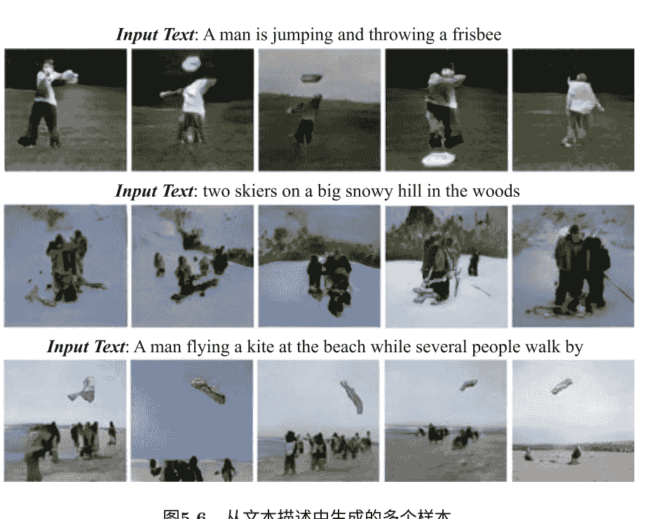

图5.6。从文本描述中生成的多个样本。

### 5.6.3 定性分析

图5.5展示了我们方法的定性结果。对于每个文本，我们将生成的图像与预测的语义布局一起呈现。与前一节一样，我们还展示了基于基准布局的结果。正如图所示，我们的方法生成了合理的语义布局和与输入文本匹配的图像。它生成与文本中暗示的细粒度场景结构（即对象类别和对象数量）相对应的边界框，并捕捉到与其他对象的关系以及特定类别的视觉属性的对象掩码。根据推断的布局，我们的图像生成器生成与文本兼容的正确对象外观和背景。用基准真值替换预测的布局使生成的图像具有与原始图像类似的上下文。

样本的多样性。为了评估生成中的多样性，我们在固定输入文本的同时采样多个图像。图5.6展示了我们方法生成的示例图像，它在给定相同文本描述的情况下生成了多样的语义结构，同时保留了语义细节，如对象数量和对象类别。

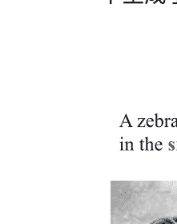

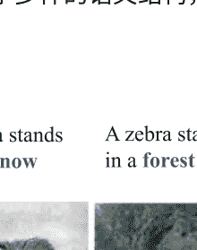

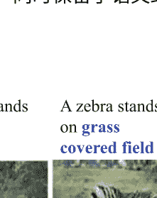

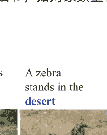

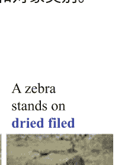

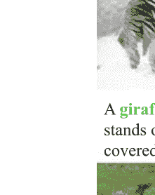

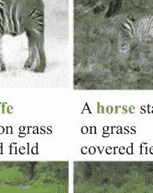

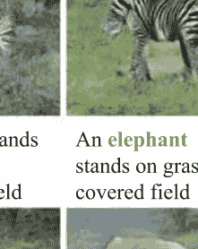

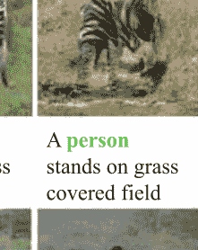

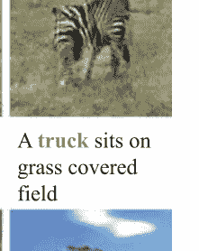

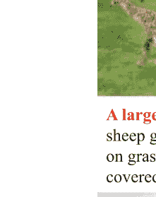

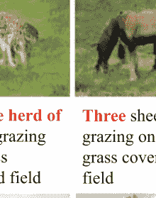

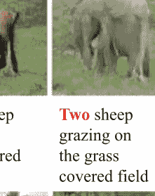

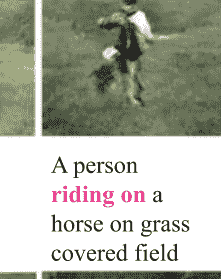

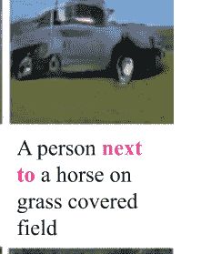

图5.7。通过操纵标题生成的结果。文本的操纵部分以粗体字符突出显示，不同颜色表示操纵的类型。蓝色：场景背景，品红色：空间位置，红色：对象数量，绿色：对象类别。

文本条件生成。为了了解我们的模型如何在生成过程中融入文本描述，我们在修改描述的部分时生成图像。图5.7展示了示例结果。当我们改变描述的上下文，如对象类别、对象数量、对象的空间组合和背景模式时，我们的方法能够正确地调整语义结构和图像，基于文本的修改部分。

可控图像生成。我们通过修改边界框布局来演示可控图像生成。图5.8展示了示例结果。我们的方法根据修改后的语义布局（例如添加新对象和更改对象的空间配置）更新对象形状和上下文，并生成准确的图像。

## 5.7 结论

我们提出了一种从文本到图像的文本到图像合成方法，该方法明确推断和利用语义布局作为中间表示。我们的模型通过一系列生成器以粗到细的方式层次化构建语义布局。通过在显式布局预测上进行图像生成的条件，我们的方法生成了保留语义细节且与文本描述高度相关的复杂图像。

我们还展示了预测的布局可以用于解释和控制模型的生成过程。

尽管具有这些优势，训练所提出的方法需要比以前的方法更多的注释，例如实例级边界框和掩码注释，这使得我们的方法在大规模生成问题上不太可扩展。为了解决这个限制，我们相信有几个有趣的未来研究方向需要进一步探索。一种选择是通过端到端训练无监督地发现中间语义结构。通过对中间输出结构进行适当设计的正则化，我们相信可以注入有用的归纳偏差，指导模型从数据中发现有意义的结构。另一个有趣的方向是使用大量部分注释的数据对模型进行半监督学习。例如，我们可以利用少量完全注释的图像和大量部分注释的图像（例如，仅具有文本描述的图像），这使得我们的模型可以利用大规模数据集，如Google概念字幕数据集[27]。

### 参考文献

1. Banerjee, S., Lavie, A.: METEOR: 一种与人类判断相关性更高的自动MT评估指标。 在：ACL，第228-231页（2005）
2. Cha, M., Gwon, Y., Kung, H.T.: 具有感知损失的对抗网络用于文本到图像的合成。 在：2017年IEEE第27届机器学习信号处理研讨会（MLSP），第1-6页（2017）
3. Chen, Q., Koltun, V.: 具有级联细化网络的摄影图像合成。 在：ICCV（2017年）
4. Dash, A., Gamboa, J.C.B., Ahmed, S., Afzal, M.Z., Liwicki, M.: TAC-GAN-Text Conditioned Auxiliary Classifier Generative Adversarial Network. arXiv预印本 arXiv:1703.06412（2017年）
5. Deng, J., Dong, W., Socher, R., Li, L.J., Li, K., Fei-Fei, L.: Imagenet: 一个大规模分层图像数据库。 在：CVPR，第248-255页（2009年）
6. Dong, H., Yu, S., Wu, C., Guo, Y.: 通过对抗学习进行语义图像合成。 在：ICCV，第5707-5715页（2017年）
7. Dong, H., Zhang, J., McIlwraith, D., Guo, Y.: I2T2I: 学习文本到图像合成的文本数据增强。 在：ICIP，第2015-2019页（2017）
8. Goodfellow, I.J., et al.: 生成对抗网络。 在：NIPS，第2672-2680页（2014）
9. Ha, D., Eck, D.: 一种素描绘图的神经表示。 在：ICLR（2018）
10. Hochreiter, S., Schmidhuber, J.: 长短期记忆。 神经计算。 9（8），1735-1780（1997）
11. Isola, P., Zhu, J.Y., Zhou, T., Efros, A.A.: 图像到图像的转换与条件对抗网络。 在：CVPR，第5967-5976页（2017）
12. Johnson, J., Alahi, A., Fei-Fei, L.: 用于实时风格转换和超分辨率的感知损失。 在：ECCV，第694-711页（2016年）
13. Johnson, J., Gupta, A., Fei-Fei, L.: 从场景图生成图像。 在：CVPR，第1219-1228页（2018年）
14. Karacan, L., Akata, Z., Erdem, A., Erdem, E.: 学习从属性和语义布局生成室外场景的图像。CoRR (2016年)
15. Lin, T.Y.等： Microsoft COCO：上下文中的常见对象。在： ECCV，第740-755页 (2014年)
16. Mansimov, E., Parisotto, E., Ba, J.: 使用注意力从标题生成图像。在： ICLR (2016年)
17. Mirza, M., Osindero, S.: 条件生成对抗网络。arXiv预印本arXiv:1411.1784 (2014)
18. Nguyen, A., Yosinski, J., Bengio, Y., Dosovitskiy, A., Clune, J.: 插入和播放生成网络：在潜在空间中条件迭代生成图像。在： CVPR，第3510-3520页 (2017年)
19. Nilsback, M.E., Zisserman, A.: 在大量类别上进行自动化花卉分类。在：印度计算机视觉、图形和图像处理会议论文集，第722-729页 (2008年)
20. Odena, A., Olah, C., Shlens, J.: 带辅助分类器的条件图像合成GANs。在： ICML，第2642-2651页 (2017年)
21. Papineni, K., Roukos, S., Ward, T., Zhu, W.J.: BLEU：一种自动评估机器翻译的方法。在： ACL，pp. 311–318 (2002)
22. Reed, S., Akata, Z., Lee, H., Schiele, B.: 学习细粒度视觉描述的深度表示。在： CVPR，pp. 49–58 (2016)
23. Reed, S., Akata, Z., Yan, X., Logeswaran, L., Schiele, B., Lee, H.: 生成对抗文本到图像的合成。在： ICML，pp. 1060–1069 (2016)
24. Reed, S., et al.: 并行多尺度自回归密度估计。在： ICML，pp. 2912–2921 (2017)
25. Reed, S.E., Akata, Z., Mohan, S., Tenka, S., Schiele, B., Lee, H.: 学习绘制什么和在哪里绘制。在： NIPS，pp. 217–225 (2016)
26. Salimans, T., Goodfellow, I., Zaremba, W., Cheung, V., Radford, A., Chen, X.:改进的GAN训练技术。在： NIPS，第2234-2242页 (2016年)
27. Sharma, P., Ding, N., Goodman, S., Soricut, R.: 概念性标题：用于自动图像字幕的清理的、超类别的图像替代文本数据集。在： ACL，第2556-2565页 (2018年)
28. Sharma, S., Suhubdy, D., Michalski, V., Ebrahimi Kahou, S., Bengio, Y.: Chat-painter：使用对话改进文本到图像生成。在： ICLR (2018年)
29. Shi, X., Chen, Z., Wang, H., Yeung, D.Y., Wong, W.K., Woo, W.C.: 卷积LSTM网络：一种用于降雨预测的机器学习方法。在： NIPS，第802-810页 (2015年)
30. Simonyan, K., Zisserman, A.: 用于大规模图像识别的非常深的卷积网络。在： ICLR (2015年)
31. Szegedy, C., Vanhoucke, V., Ioffe, S., Shlens, J., Wojna, Z.: 重新思考计算机视觉中的inception架构。在： CVPR，第2818-2826页 (2016年)
32. Vedantam, R., Zitnick, C.L., Parikh, D.: CIDEr：基于共识的图像描述评估。在： CVPR，第4566-4575页 (2015年)
33. Villegas, R., Yang, J., Zou, Y., Sohn, S., Lin, X., Lee, H.: 通过分层预测学习生成长期未来。在： ICML，第3560-3569页 (2017年)
34. Vinyals, O., Toshev, A., Bengio, S., Erhan, D.: 展示和描述：神经图像生成器。在： CVPR，第3156-3164页 (2015年)
35. Wang, C., Xu, C., Wang, C., Tao, D.: 用于图像到图像转换的感知对抗网络. IEEE图像处理. 27(8), 4066-4079 (2017)
36. Wang, X., Gupta, A.: 使用风格和结构对抗网络进行生成图像建模. 在： ECCV, pp. 318–335 (2016)
37. Welinder, P., et al.: Caltech-UCSD Birds 200. 技术报告. CNS-TR-2010-001, 加州理工学院 (2010)
38. Xu, T., et al.: AttnGAN: 带有注意力生成对抗网络的细粒度文本到图像生成. 在: CVPR, pp. 1316-1324 (2018)
39. Zhang, H., et al.: StackGAN: 使用堆叠生成对抗网络进行文本到逼真图像合成. 在: ICCV, pp. 5908-5916 (2017)
40. Zhang, Z., Xie, Y., Yang, L.: 具有分层嵌套对抗网络的照片文字到图像合成. 在: CVPR, pp. 1520-1529 (2018)

### 6 无监督离散表示学习

Weihua Hu¹, Takeru Miyato², Seiya Tokui², Eiichi Matsumoto², and Masashi Sugiyama³,⁴✉
¹ 斯坦福大学, 美国加利福尼亚州斯坦福
weihuahu@stanford.edu
² 首选网络, 日本东京
{miyato,tokui,matsumoto}@preferred.jp
³ RIKEN AIP, 日本东京
⁴ 东京大学, 日本东京
sugi@k.u-tokyo.ac.jp

### 摘要

学习数据的离散表示是一项重要的机器学习任务，因为表示的紧凑性和易解释性。该任务包括聚类和哈希学习作为特殊情况。深度神经网络具有很大的潜力，因为它们可以模拟数据的非线性并适用于大型数据集。然而，它们的模型复杂性很高，因此我们需要仔细地对网络进行正则化，以学习出有用且可解释的表示，以满足应用的需求。

为此，我们提出了一种称为信息最大化自我增强训练（IMSAT）的方法。在IMSAT中，我们使用数据增强来施加离散表示的不变性。更具体地说，我们鼓励增强数据点的预测表示与原始数据点的表示在端到端的方式下保持接近。同时，我们最大化数据与其预测的离散表示之间的信息论依赖关系。我们的IMSAT能够发现展示预期不变性的可解释表示。

对基准数据集进行的大量实验表明，IMSAT在聚类和无监督哈希学习方面取得了最新的成果。

关键词：离散表示学习·聚类·哈希学习

### 6.1 引言

我们世界中的许多数据具有自然的离散结构。例如，它们可以被归类为不同的类别，如物体类别[25]，或者它们可以被表示为某些特征的存在/不存在的组合[42]。我们的目标是从大量数据中发现这种离散结构。

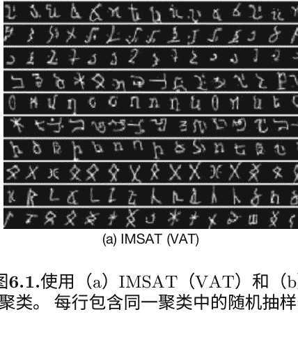

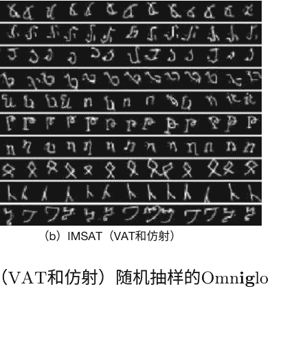

图6.1.使用（a）IMSAT（VAT）和（b）IMSAT（VAT和仿射）随机抽样的Omniglot聚类。每行包含同一聚类中的随机抽样数据点。

无标签数据。这不仅可以使我们以紧凑的方式表示数据，还可以轻松解释数据并找到它们的规律性，这在探索性数据分析中至关重要。

无监督离散表示学习的任务是获得一个将相似（或不相似）数据映射为相似（或不相似）离散表示的函数，其中数据的相似性根据应用的兴趣进行定义。这是一个中心机器学习主题，包括两个重要的特殊任务：聚类和无监督哈希学习。聚类广泛应用于数据驱动的应用领域[2]，而哈希学习则用于大规模信息检索的近似最近邻搜索[51]。

由于其可扩展性和表示复杂、非线性决策边界的灵活性，深度神经网络有望被广泛应用。然而，它们的模型复杂度很高，因此，对网络进行正则化对于学习有意义且可解释的数据表示至关重要。特别是在无监督表示学习中，没有提供明确的标签监督来指导表示学习。因此，我们需要仔细对网络进行正则化，以学习出具有所需不变性的表示，例如在许多计算机视觉应用中，我们希望所获得的表示对于小的扰动或小的仿射变换是不变的。图6.1显示了应用于手写字符识别数据集的我们方法的两个变体发现的聚类（详见第6.4节的实验设置）。我们可以看到图6.1(b)中的聚类分配在视觉上是连贯且可解释的，对旋转和平移是不变的，而图6.1(a)中的聚类则不太连贯，将具有不同形状的字符分配到同一聚类中。我们如何对神经网络进行正则化，以使得获得的离散表示对人类更具解释性和意义？

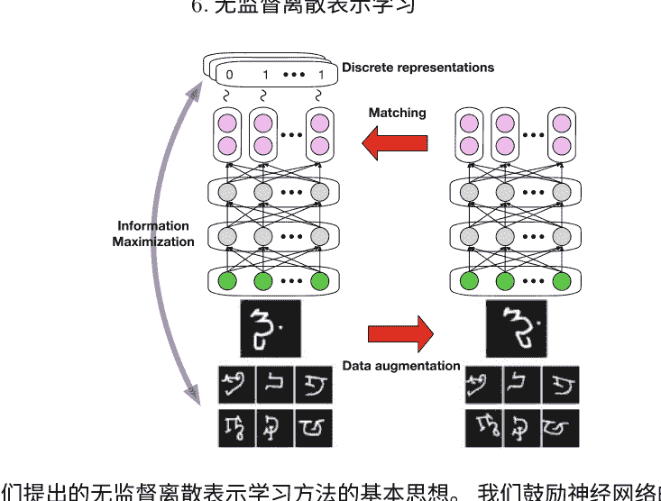

图6.2.我们提出的无监督离散表示学习方法的基本思想。我们鼓励神经网络的预测在数据增强下保持不变（单向箭头对），同时最大化数据和它们表示之间的信息论依赖关系（双向箭头）。

一个常用的正则化方法是权重衰减[11]。然而，这种正则化只鼓励函数预测的全局平滑性，因此并不能给我们提供可解释和有意义的表示。相反，我们的关键思想是通过使用数据增强直接鼓励我们的模型学习有意义的表示，即我们希望模型输出对数据变换不变。具体来说，我们通过深度神经网络将数据点映射到它们的离散表示，并通过鼓励其预测对我们预先指定的数据增强不变来对其进行正则化。预测的离散表示因此展示了增强指定的不变性，因此对人类来说更具可解释性。

我们提出的正则化方法在图6.2中用一对单向箭头来说明。如图所示，我们鼓励增强数据点的预测表示与原始数据点的表示在端到端的方式下保持接近。我们将这种正则化称为自增强训练（SAT）。

SAT受到半监督学习中神经网络正则化的最新成功启发[1,36,45]。SAT对神经网络预测的表示具有灵活性，可以施加各种类型的不变性。例如，通常希望数据表示在局部扰动下保持不变，即在数据点的局部扰动下保持不变。使用SAT，我们可以通过将扰动数据点的预测与原始数据点的预测保持接近来施加局部不变性。对于图像数据，还可以希望数据表示在仿射变换（如旋转、缩放和平移）下保持不变。我们可以通过使用仿射变换进行数据增强来通过SAT施加这种不变性。

回到图6.1，(a)中的聚类是通过仅施加局部不变性（在许多较简单的数据集中足够）获得的，而(b)中的聚类是通过另外施加仿射变换不变性获得的。我们可以看到(b)中的聚类分配确实表现出对仿射变换的不变性。一般来说，我们为SAT框架提供的不变性信息越多，我们可以期望获得的可解释表示就越多。这种不变性信息也可以被视为一种弱监督形式[60]。

根据[13]的方法，我们将SAT正则化与信息最大化准则[5]相结合，得到了我们的信息最大化自我增强训练（IMSAT），这是一种使用深度神经网络学习离散表示的信息论方法。我们在图6.2中说明了IMSAT的基本思想。类似于正则化信息最大化（RIM）[13]，我们最大化输入和它们映射输出之间的信息论依赖性，同时对映射函数进行正则化。IMSAT与原始的RIM有两个不同之处。首先，IMSAT处理更一般的离散表示学习设置，因此也适用于哈希学习。其次，它使用深度神经网络作为映射函数，并通过SAT以端到端的方式对其进行正则化。使用我们的方法进行学习可以通过随机梯度下降（SGD）来进行，因此可以很好地适用于大型数据集。

总结一下，我们的贡献有：（1）使用端到端正则化的深度神经网络进行无监督离散表示学习的信息论方法，以及（2）将该方法适应于聚类和哈希学习，以在几个基准数据集上实现最先进的性能。

## 6.2 相关工作

已经提出了各种方法用于聚类和哈希学习。代表性的方法包括K均值聚类和哈希[17]，高斯混合模型聚类，迭代量化[14]和最小损失哈希[40]。然而，这些方法只能建模不同表示之间的线性边界；因此，无法适应数据的非线性结构。基于核[27,56]和谐[39,52]的方法可以建模数据的非线性，但是很难扩展到大型数据集。

最近，使用深度神经网络进行聚类和哈希学习引起了广泛关注。在聚类中，[54]提出使用深度神经网络同时学习特征表示和聚类分配，而[9]和[59]提出使用深度生成模型以高斯混合模型作为先验分布来建模数据生成过程。

关于哈希学习，许多研究已经使用深度神经网络进行监督哈希学习，并在图像和文本检索方面取得了最新的成果[28,34,53,55,58]。相对较少的研究集中在使用深度神经网络进行无监督哈希学习。开创性的工作是语义哈希，它使用堆叠的RBM模型来学习紧凑的二进制表示[46]。[11]最近提出使用深度神经网络进行映射函数，并取得了最新的成果。然而，这些无监督的方法并没有明确地对学习到的表示施加不变性。因此，预测的表示可能对感兴趣的应用程序没有用处。

在监督和半监督学习场景中，数据增强已被广泛用于正则化神经网络。[32]表明，将数据增强应用于监督学习问题等同于在原始成本函数中添加正则化。[1,36,45]表明，这种正则化可以适应半监督学习设置，以实现最新的性能。

在无监督表示学习场景中，[10]提出使用数据增强来建模学习表示的不变性。我们的IMSAT与[10]在两个重要方面不同：(1) IMSAT直接在学习表示上施加不变性，而[10]在替代类上施加不变性，而不是直接在学习表示上施加不变性。(2) IMSAT专注于学习可用于聚类和哈希学习的离散表示，而[10]专注于学习可用于其他任务（如分类和聚类）的连续表示。

我们的方法与去噪自编码器[50]相关。自编码器最大化输入和它们的隐藏表示[50]之间的互信息的下界，而去噪机制使自编码器的预测具有局部不变性。然而，这种正则化并不一定对隐藏表示施加不变性，因为解码器网络也具有对数据扰动的不变性建模的灵活性。SAT在预测由编码器网络生成的隐藏表示上更直接地施加了预期的不变性。

收缩自编码器[44]通过最小化其雅可比矩阵的Frobenius范数来对编码器网络施加局部不变性。该方法的一个缺点可能是编码器的雅可比矩阵仅以逐层方式近似；因此，对于深度编码器网络，这种近似可能非常不准确。与逐层近似不同，[36]提出了虚拟对抗训练（VAT），以端到端的方式对神经网络施加局部不变性。实验证明，端到端正则化在监督和半监督学习中取得了出色的性能[36]。这激发了我们在无监督表示学习中采用端到端正则化。我们的正则化方法SAT是VAT的直接推广，允许用户建模其他类型的不变性：不仅局部不变性，还包括对图像的仿射失真等其他变换的不变性。

## 6.3 无监督离散表示学习

让 $\mathcal{X}$ 和 $\mathcal{Y}$ 分别表示输入和离散表示的域。给定训练样本，$x_1, x_2, \dots, x_N \in \mathcal{X}$ 从 $p(x)$ 中独立同分布地抽取，无监督离散表示学习的任务是获得一个函数，$f: \mathcal{X} \to \mathcal{Y}$，将相似（或不相似）的输入映射为相似（或不相似）的离散表示。数据的相似性根据感兴趣的应用进行定义。

无监督离散表示学习是一项通用且基础的机器学习任务，包括两个重要的机器学习任务作为特殊情况。首先，它包括聚类任务，当我们让 $\mathcal{Y}$ 为 $\{0, \dots, K-1\}$ 时，其中 $K$ 是聚类的数量。其次，它还包括无监督哈希学习任务，当我们让 $\mathcal{Y}$ 为 $\{0, 1\}^D$ 时，其中 $D$ 是二进制编码的维度。

在本节中，我们提出了一种有效且通用的方法来进行无监督离散表示学习。为了达到这个目的，我们首先回顾了用于聚类的正则化信息最大化（RIM）框架[13]，在第6.3.1节中进行了解释。然后我们在这个框架的基础上构建了我们提出的无监督离散表示学习方法IMSAT，在第6.3.2节中进行了解释。我们继续讨论了IMSAT在两个重要的无监督学习任务中的应用，即聚类和无监督哈希学习，在第6.3.3节和第6.3.4节中分别进行了讨论。最后，在第6.3.5节中，我们提出了一种简单的IMSAT目标的近似方法，以便将其应用于大型数据集。

### 6.3.1 RIM聚类回顾

我们回顾了RIM [13]，这是一个用于判别聚类的通用框架，我们的提出的方法将基于此构建。在其核心，RIM通过以下两个目标来学习一个概率分类器 $p_{\theta}(y|x)$。首先，它最大化输入和聚类分配之间的互信息[8]，其中 $\theta$ 是一个待学习的参数。其次，RIM对分类器的复杂性进行正则化。

更正式地，让 $X \in \mathcal{X}$ 和 $Y \in \mathcal{Y} \equiv \{0, \dots, K-1\}$ 表示数据和聚类分配的随机变量，其中 $K$ 是聚类的数量。然后，RIM最小化目标函数：

$$
R(\theta) - \lambda I(X; Y) \quad (6.1)
$$

其中 $R(\theta)$ 是正则化惩罚项，而 $I(X; Y)$ 是 $X$ 和 $Y$ 之间的互信息，它通过分类器 $p_{\theta}(y|x)$ 依赖于 $\theta$。互信息度量 $X$ 和 $Y$ 之间的统计依赖性，当它们独立时为0。超参数 $\lambda \in \mathbb{R}$ 权衡了这两个项。

### 6.3.2 信息最大化自我增强训练（IMSAT）

在RIM的基础上，我们提出了我们的方法，我们称之为信息最大化自我增强训练（IMSAT）。在RIM框架下，我们的IMSAT包括两个目标：信息最大化和正则化。我们在IMSAT中的主要贡献是（1）将信息最大化准则[5]推广到更一般的离散表示学习任务，并（2）采用端到端正则化[36]来进行深度神经网络的无监督学习。接下来，我们详细解释我们的两个贡献。

离散表示学习的信息最大化。我们通过考虑学习数据的 $M$ 维离散表示来推广信息最大化准则[5]。设输出域为 $\mathcal{Y} = \mathcal{Y}_1 \times \cdots \times \mathcal{Y}_M$，其中 $\mathcal{Y}_m \equiv \{0, 1, \ldots, V_m-1\}$，$1 \leq m \leq M$。设 $Y = (Y_1, \ldots, Y_M) \in \mathcal{Y}$ 为离散表示的随机变量。我们的目标是学习一个多输出的概率分类器 $p_{\theta}(y_1, \ldots, y_M | x)$，将相似的输入映射到相似的表示。为了简化起见，我们使用图6.1中所示的深度神经网络来建模条件概率 $p_{\theta}(y_1, \ldots, y_M | x)$。在该模型下，$\{y_1, \ldots, y_M\}$ 在给定 $x$ 的条件下是独立的。

$$
p_{\theta}(y_1, \ldots, y_M | x) = \prod_{m=1}^{M} p_{\theta}(y_m | x). \qquad (6.2)
$$

根据RIM [13]，我们最大化输入和其离散表示之间的互信息，同时对多输出的概率分类器进行正则化。最终的目标函数与Eq. (6.1)完全相同，只是在我们的设置中，$\mathcal{Y}$ 是多维的。

通过自增强训练对深度神经网络进行正则化。我们提出了一种直观且通用的正则化方法，称为自增强训练（SAT）。SAT使用数据增强来对数据表示施加预期的不变性。实质上，SAT惩罚了原始数据点和增强数据点之间的表示差异。设 $T: \mathcal{X} \to \mathcal{X}$ 表示预定义的数据增强，数据表示在其下应该是不变的。对于数据点 $x$ 的SAT正则化是

$$
\begin{aligned}
\mathcal{R}_{\text{SAT}}(\theta; x, T(x)) &= -\sum_{y_1=0}^{V_1-1} \cdots \sum_{y_M=0}^{V_M-1} p_{\theta}(y_1, \ldots, y_M | x) \log p_{\theta}(y_1, \ldots, y_M | T(x)) \qquad (6.3) \\
&= -\sum_{y_1=0}^{V_1-1} \cdots \sum_{y_M=0}^{V_M-1} p_{\theta}(y_1, \ldots, y_M | x) \sum_{m=1}^{M} \log p_{\theta}(y_m | T(x)) \qquad (6.4) \\
&= -\sum_{m=1}^{M} \left\{ \sum_{y_1=0}^{V_1-1} \cdots \sum_{y_M=0}^{V_M-1} p_{\theta}(y_1, \ldots, y_M | x) \log p_{\theta}(y_m | T(x)) \right\} \qquad (6.5) \\
&= -\sum_{m=1}^{M} \left[ \sum_{y_m=0}^{V_m-1} \left\{ \sum_{y_{i, i \neq m}} p_{\theta}(y_1, \ldots, y_M | x) \right\} \log p_{\theta}(y_m | T(x)) \right] \qquad (6.6) \\
&= -\sum_{m=1}^{M} \sum_{y_m=0}^{V_m-1} p_{\theta}(y_m | x) \log p_{\theta}(y_m | T(x)), \qquad (6.7)
\end{aligned}
$$

其中 $p_{\theta}(y_m | x)$ 是原始数据点 $x$ 的预测，$\theta$ 是网络的当前参数。方程 (6.4) 是根据方程 (6.2) 中的条件独立假设得出的。方程 (6.3) 类似于交叉熵损失，在普通监督学习中使用的目标 $p_{\theta}(y_{1},\dots,y_{M}|x)$ 是神经网络的当前预测。因此，SAT推动增强数据的预测表示，即 $p_{\theta}(y_{1},\dots,y_{M}|T(x))$，接近原始数据的表示，即 $p_{\theta}(y_{1},\dots,y_{M}|x)$。这使得我们的方法能够获得对变换 $T(\cdot)$ 不变的理想离散表示。

然后，SAT正则化是对训练密度 $p(x)$ 的期望，可以使用无标签样本 $x_1, x_2, ..., x_N$ 来近似计算：

$$
\mathcal{R}_{\mathrm{SAT}}(\theta; T) \equiv \int \mathcal{R}_{\mathrm{SAT}}(\theta; x, T(x))p(x)\mathrm{d}x \approx \frac{1}{N} \sum_{n=1}^{N} \mathcal{R}_{\mathrm{SAT}}(\theta; x_n, T(x_n)). \tag{6.8}
$$

增强函数 $T$ 可以是随机的或确定性的。它可以根据感兴趣的应用进行设计。例如，对于图像数据，可以使用仿射变换（如旋转、缩放和平行移动）作为增强函数。

或者，还可以考虑不依赖于特定应用的更一般的增强函数。一个典型的例子是局部扰动，其中增强函数为

$$
T(x)=x+r, \tag{6.9}
$$

其中 $r$ 是一个不改变数据点含义的小扰动。在SAT中使用局部扰动鼓励数据表示具有局部不变性。不同表示之间的决策边界往往位于数据分布的低密度区域。这样的边界通常被优先选择，并遵循低密度分离原则[16]。

基于局部扰动的两种代表性正则化方法是：（1）基于随机扰动[1,4,15,43]的方法，我们称之为随机扰动训练（RPT），以及（2）虚拟对抗训练（VAT）[36]。在RPT中，扰动 $r$ 是从超球面 $\|r\|_2=\epsilon$ 中随机采样的，其中 $\epsilon$ 是控制局部扰动范围的超参数。另一方面，在VAT中，扰动 $r$ 被选择为对抗方向：

$$
r=\arg \max_{r'} \{\mathcal{R}_{\mathrm{SAT}}(\theta; x, x+r'); \|r'\|_2 \leq \epsilon\}. \tag{6.10}
$$

方程（6.10）的解可以通过一对前向和后向传递来高效地近似。更多细节请参考[36]。

### 6.3.3 IMSAT用于聚类

在聚类的情况下，我们主要目标是学习一维离散表示；因此，$M=1$。实际上，我们可以直接应用 $RIM$ [13]在第6.3.1节中进行了回顾。与原始的RIM不同，我们的方法IMSAT使用深度神经网络作为分类器，并通过SAT进行正则化。我们可以将互信息表示为边际熵和条件熵之间的差异[8]。然后，我们的目标是最小化：

$$
\mathcal{R}_{\mathrm{SAT}}(\theta; T) - \lambda [H(Y) - H(Y|X)], \qquad \qquad (6.11)
$$

其中 $H(\cdot)$ 和 $H(\cdot|\cdot)$ 分别表示熵和条件熵，而方程（6.1）中的互信息项被方程（6.11）中的熵项所替代。这两个熵项可以通过经验近似计算得到

$$
\begin{aligned}
H(Y) &\equiv h(p_{\theta}(y)) \\
&= h\left( \int p_{\theta}(y|x)p(x) \mathrm{d}x \right) \approx h \left( \frac{1}{N} \sum_{i=1}^{N} p_{\theta}(y|x_i) \right), \qquad \qquad (6.12) \\
H(Y|X) &\equiv \int H(Y|X=x)p(x) \mathrm{d}x \approx \frac{1}{N} \sum_{i=1}^{N} h(p_{\theta}(y|x_i)), \qquad \qquad (6.13)
\end{aligned}
$$

其中 $h(p(y)) \equiv - \sum_{y'} p(y') \log p(y')$ 是熵函数。增加边际熵 $H(Y)$ 会鼓励簇的大小均匀，而减少条件熵 $H(Y|X)$ 会鼓励明确的簇分配[5]。

在实践中，我们可以通过修改 $H(Y)$ 来结合我们对簇大小的先验知识[13]。注意 $H(Y) = \log K - \mathrm{KL}[p_{\theta}(y) || \mathcal{U}]$，其中 $K$ 是簇的数量，$\mathrm{KL}[\cdot || \cdot]$ 是Kullback-Leibler散度，$\mathcal{U}$ 是均匀分布。因此，最大化 $H(Y)$ 等价于最小化 $\mathrm{KL}[p_{\theta}(y) || \mathcal{U}]$，这鼓励预测的簇分布 $p_{\theta}(y)$ 接近 $\mathcal{U}$。[13] 在 $\mathrm{KL}[p_{\theta}(y) || \mathcal{U}]$ 中用任意指定的类先验 $q(y)$ 替换了 $\mathcal{U}$，以便鼓励 $p_{\theta}(y)$ 接近 $q(y)$。在我们的初步实验中，我们发现得到的 $p_{\theta}(y)$ 仍然可能与预先指定的 $q(y)$ 相距甚远。为了确保 $p_{\theta}(y)$ 实际上接近 $q(y)$，我们考虑以下约束优化问题：

$$
\begin{aligned}
\min_{\theta} \quad & \mathcal{R}_{\mathrm{SAT}}(\theta; T) + \lambda H(Y|X), \\
\mathrm{s.t.} \quad & \mathrm{KL}[p_{\theta}(y) || q(y)] \leq \delta,
\end{aligned} \qquad \qquad (6.14)
$$

其中 $\delta > 0$ 是一个足够小的容差超参数，以便预测的聚类分布 $p_{\theta}(y)$ 与类别先验 $q(y)$ 在 $\delta$ 容差内相同。方程（6.14）可以通过使用罚函数法[3]来解决，该方法将原始的约束优化问题转化为一系列无约束优化问题。更具体地说，我们引入一个标量参数 $\mu$ 并考虑最小化以下无约束目标函数：

$$
\mathcal{R}_{\mathrm{SAT}}(\theta; T) + \lambda H(Y|X) + \mu \max\{\mathrm{KL}[p_{\theta}(y) || q(y)] - \delta, 0\}. \qquad \qquad (6.15)
$$

我们逐渐增加 $\mu$ 并解决方程（6.15）的优化问题，对于固定的 $\mu$。令 $\mu^*$ 为使方程（6.15）的解满足约束的最小值。

### 6.3.4 IMSAT用于哈希学习

在哈希学习中，每个数据点被映射为一个 $D$ 位二进制码。因此，原始的RIM不直接适用。相反，我们应用了我们在第6.3.2节中介绍的离散表示学习方法。

然而，互信息的计算 $I(Y_1,\ldots,Y_D;X)$ 对于大的 $D$ 是不可计算的，因为它涉及到对指数数量的项求和，每个项对应于不同的哈希位配置。

[6] 表明互信息 $I(Y_1,\ldots,Y_D;X)$ 可以展开为交互信息的和[35]：

$$
I(Y_1,\ldots,Y_D;X) = \sum_{C \subseteq S_Y} I(C \cup \{X\}), \quad |C| \ge 1,
$$

其中 $S_Y \equiv \{Y_1,\ldots,Y_D\}$。请注意 $I$ 表示交互信息，当其参数是一组随机变量时。交互信息是互信息的一种推广，可以取负值。当参数是一组两个随机变量时，交互信息简化为两个随机变量之间的互信息。根据[6]，我们只保留方程（6.16）中涉及输出维度对的项，即所有满足 $|C| \le 2$ 的项。这给我们带来了

$$
\sum_{d=1}^D I(Y_d; X) + \sum_{1 \le d < d' \le D} I(\{Y_d, Y_{d'}; X\}).
$$

这个近似忽略了哈希位之间的相互作用。它与文献中广泛使用的正交约束相关，以消除哈希位之间的冗余[51]。事实上，正交约束鼓励一对哈希位之间的协方差为0。因此，它还考虑了成对的相互作用。

根据相互信息的定义和条件独立性在方程（6.2）中，可以得出结论

$$
I(\{Y_d, Y_{d'}; X\}) \equiv I(Y_d; Y_{d'} | X) - I(Y_d; Y_{d'}) = -I(Y_d; Y_{d'}).
$$

总之，我们要最小化的近似目标是

$$
\mathcal{R}_{\text{SAT}}(\theta; T) - \lambda \left( \sum_{d=1}^D I(X; Y_d) - \sum_{1 \le d < d' \le D} I(Y_d; Y_{d'}) \right).
$$第一项对神经网络进行正则化。第二项最大化数据和每个哈希位之间的互信息，第三项消除哈希位之间的冗余。

## 6.3.5 边缘分布的近似

为了将我们的方法扩展到大型数据集，我们希望我们的目标能够适应基于小批量SGD的优化。回想一下，IMSAT目标由两部分组成：SAT正则化和信息最大化。方程（6.8）中的SAT正则化是每个样本惩罚的总和，并且可以轻松地适应小批量计算。

方程（6.19）中的互信息更加复杂。我们首先将其分解为三个部分：
(i) 条件熵 H(Y_d|X)，
(ii) 边际熵 H(Y_d)，以及
(iii) 一对输出维度之间的互信息 I(Y_d; Y_d')。
从方程（6.13）中我们可以看出，(i) 条件熵仅由每个示例的熵之和组成；因此，可以轻松地适应小批量计算。然而，(ii) 方程（6.12）中的边际熵和 (iii) 互信息是一些边际分布的非线性函数 p_θ(c) ≡ ∫ p_θ(c|x)p(x)dx，其中 c 是目标维度的某个子集，即 c⊆ {y_1, . . . , y_M}。因此，为了获得(ii)和(iii)的准确近似，我们可能需要使用整个训练数据来近似边际分布，即 p_θ(c) ≈ 1/N ∑。不幸的是，这在大型数据集中无法很好地扩展，其中 N 很大。

根据[47]，我们考虑使用小批量数据来近似边际分布：

p_θ(c) ≈ 1/|B| ∑_{x∈B} p_θ(c|x) ≡ p_θ^{(B)}(c), (6.20)

其中 B 是一个小批量数据集。我们在第6.4节中经验性地确认，这种简单的近似方法在合理的小批量大小（即250）下可以获得良好的性能。此外，在聚类的情况下，即在公式（6.15）中，我们实际上最小化的近似目标函数为 E_B[KL[p_θ^{(B)}(y)||q(y)]]，这是我们试图最小化的精确目标函数的上界，即 KL[p_θ(y)||q(y)]。更具体地说，根据KL散度的凸性[8]和Jensen不等式，我们有

E_B[KL[p_θ^{(B)}(y)||q(y)]] ≥ KL[p_θ(y)||q(y)] ≥ 0, (6.21)

其中第一个期望是针对小批量选择的随机性进行的。因此，在惩罚方法中，对于精确的KL散度的约束，即 KL[p_θ(y)|| q(y)] ≤ δ 可以通过最小化其上界来满足，即近似的KL散度 E_B[KL[p_θ^{(B)}(y)||q(y)]]。显然，近似的KL散度适用于小批量设置；因此，可以通过SGD进行最小化。

## 6.4 实验

在本节中，我们使用基准数据集评估IMSAT进行聚类和哈希学习。

### 6.4.1 实施

在无监督学习中，通过交叉验证来确定超参数并不直观。因此，在所有使用基准数据集的实验中，我们尽可能使用常见的深度神经网络参数值，并尽量避免特定于数据集的调整。具体来说，受[20]的启发，我们将网络维度设置为 d-1200-1200-M，以在所有数据集上进行聚类，其中 d 和 M 分别是输入和输出维度。对于哈希学习，我们使用较小的网络尺寸以确保将数据映射到哈希码的快速计算。我们对所有隐藏激活使用修正线性单元[12,22,37]，并对每一层应用批归一化[21]来加速训练。对于输出层，我们在聚类中使用softmax函数，在哈希学习中使用sigmoid函数。关于优化，我们使用Adam [23]，步长为0.002。我们将小批量大小设置为250，并对每个数据集运行50个epochs。我们按照[18]的方法初始化权重：权重的每个元素都是从均值为0、标准差为 √(2/fan_in) 的高斯分布中独立抽取的值。其中fan_in是输入单元的数量。我们将比例设置为0.1-0.1-0.0001，用于从输入到输出的权重矩阵。所有偏差项都初始化为0。我们基于Chainer [48]实现的代码可以在 https://github.com/weihua916/imsat 上找到。

### 6.4.2 聚类

###### 数据集和比较方法

我们在八个基准数据集上评估了在第6.3.3节中介绍的聚类方法。我们使用两个RIM变体和三个IMSAT变体进行了实验，每个变体都使用不同的分类器和正则化方法。表6.1总结了这些变体。我们还将我们的IMSAT与包括K均值、DEC [54]、去噪自编码器（dAE） + K均值 [54]在内的现有聚类方法进行了比较。表6.2中给出了数据集统计的简要总结。在实验中，我们的目标是发现与真实类别相对应的聚类。对于STL、CIFAR10和CIFAR100数据集，原始像素不适合我们的目标，因为颜色信息占主导地位。因此，我们应用了50层预训练的深度残差网络[19]来提取特征，并将其用于聚类。请注意，由于残差网络是在ImageNet上训练的，STL数据集的每个类别（它是ImageNet的一个子集）在特征空间中应该是分离的。对于Omniglot，随机抽取了100种字符，每种字符包含20个数据点。每个数据点通过附录6.C中描述的随机仿射变形进行了20次增强。对于SVHN，每个图像被表示为一个960维的GIST特征[41]。对于Reuters和20news，我们去除了停用词并保留了最常见的2000个词。然后我们使用 tf-idf特征。有关详细信息，请参阅附录6.A。

**表6.1. 变体的总结。**

| 方法 | 使用的分类器 | 正则化 |
|------|--------------|--------|
| 线性RIM | 线性 | 权重衰减 |
| 深度RIM | 深度神经网络 | 权重衰减 |
| 线性IMSAT (VAT) | 线性 | VAT |
| IMSAT (RPT) | 深度神经网络 | RPT |
| IMSAT (VAT) | 深度神经网络 | VAT |

**表6.2. 数据集统计摘要。**

| 数据集 | 数据点数 | 类别数 | 维度 | 最大类别百分比 |
|--------|----------|--------|------|----------------|
| MNIST [31] | 70000 | 10 | 784 | 11% |
| Omniglot [29] | 40000 | 100 | 441 | 1% |
| STL [7] | 13000 | 10 | 2048 | 10% |
| CIFAR10 [49] | 60000 | 10 | 2048 | 10% |
| CIFAR100 [49] | 60000 | 100 | 2048 | 1% |
| SVHN [38] | 99289 | 10 | 960 | 19% |
| Reuters [33] | 10000 | 4 | 2000 | 43% |
| 20news [30] | 18040 | 20 | 2000 | 5% |

###### 评估指标

根据[54]，我们将聚类数设置为真实类别数，并使用无监督聚类准确性（ACC）评估聚类性能：

ACC = \max_m \frac{\sum_{n=1}^N \mathbf{1}\{l_n = m(c_n)\}}{N}, \quad (6.22)

其中 l_n 和 c_n 分别是使用算法产生的真实标签和聚类分配。 m 的范围涵盖所有聚类和标签之间可能的一对一映射。最佳映射可以通过匈牙利算法[26]高效计算得到。有关超参数选择的详细信息，请参见附录6.B。

###### 实验结果

在表6.3中，我们比较了八个基准数据集上的聚类性能。我们发现IMSAT（VAT）在大多数数据集上表现良好。我们的IMSAT在大多数数据集上优于线性RIM、深度RIM和线性IMSAT（VAT），这表明使用端到端正则化的深度神经网络的有效性。

**表6.3. 八个基准数据集上的聚类准确性比较（%）。平均值和标准差基于十二次试验报告。标有†的结果摘自[54]。**

| 方法 | MNIST | Omniglot | STL | CIFAR10 | CIFAR100 | SVHN | Reuters | 20news |
|------|-------|----------|-----|---------|----------|------|---------|--------|
| K均值 | 53.2 | 12.0 | 85.6 | 34.4 | 21.5 | 17.9 | 54.1 | 15.5 |
| DAE+K均值 | 79.8† | 14.1 | 72.2 | 44.2 | 20.8 | 17.4 | 67.2 | 22.1 |
| DEC | 84.3† | 57.0 (0.3) | 78.1 (0.1) | **46.9 (0.9)** | 14.3 (0.6) | 11.9 (0.4) | 67.3 (0.2) | 30.8 (1.8) |
| 线性RIM | 59.6 (2.3) | 11.1 (0.2) | 73.5 (6.5) | 40.3 (2.1) | 23.7 (0.8) | 20.2 (1.4) | 62.8 (7.8) | **50.9 (3.1)** |
| 深度RIM | 58.5 (3.5) | 58.0 (2.2) | 92.5 (2.2) | 40.3 (3.5) | 13.4 (1.2) | 26.8 (3.2) | 62.3 (3.9) | 25.1 (2.8) |
| 线性IMSAT (VAT) | 61.1 (1.9) | 12.3 (0.2) | 91.7 (0.5) | 40.7 (0.6) | 23.9 (0.4) | 18.2 (1.9) | 42.9 (0.8) | 43.9 (3.3) |
| IMSAT (RPT) | 89.6 (5.4) | 16.4 (3.1) | 92.8 (2.5) | 45.5 (2.9) | 24.7 (0.5) | 35.9 (4.3) | **71.9 (6.5)** | 24.4 (4.7) |
| IMSAT (VAT) | 98.4 (0.4) | 24.0 (0.9) | 94.1 (0.4) | 45.6 (0.8) | **27.5 (0.4)** | 57.3 (3.9) | 71.0 (4.9) | 31.1 (0.9) |

从表6.3中我们还可以看到，IMSAT（VAT）在我们的实验中始终优于IMSAT（RPT）。这表明VAT是一种在无监督学习场景中有效的正则化方法。

我们进一步在Omniglot数据集上进行了实验，以证明通过在SAT的增强函数中加入领域特定知识可以提高聚类性能。具体而言，我们在SAT的增强函数中除了使用VAT外，还使用了仿射畸变。我们比较了IMSAT在三种不同增强函数（VAT、仿射畸变以及VAT和仿射畸变的组合）下的聚类准确性。其中，我们将正则化设置为 ½·R_SAT(θ; T_VAT) + ½·R_SAT(θ; T_affine) (6.23)，其中 T_VAT 和 T_affine 分别是VAT和仿射畸变的增强函数。对于 T_affine，我们使用了附录6.C中定义的随机仿射畸变函数。

**表6.4. 使用IMSAT在Omniglot数据集上进行聚类准确性的比较（使用不同类型的SAT）。**

| 方法 | Omniglot |
|------|----------|
| IMSAT (VAT) | 24.0 (0.9) |
| IMSAT (仿射) | 45.1 (2.0) |
| IMSAT (VAT和仿射) | **70.0 (2.0)** |

我们在表6.4中报告了Omniglot的聚类准确性。我们可以看到，包括仿射失真在数据增强中显著提高了聚类准确性。图6.1（未在文本中提供）显示了使用IMSAT（VAT）和IMSAT（VAT和仿射失真）找到的Omniglot数据集的十个聚类。我们观察到IMSAT（VAT和仿射失真）能够发现聚类分配。这些结果表明我们的方法成功地以无监督的方式捕捉到了手写字符识别中的不变性。

### 6.4.3 哈希学习

###### 数据集和比较方法

我们在两个基准数据集上评估了我们的哈希学习方法：MNIST和CIFAR10数据集。CIFAR10的每个数据样本都表示为一个512维的GIST特征[41]。我们的方法与几种无监督的哈希学习方法进行了比较：谱哈希[52]，PCA-ITQ[14]和深度哈希[11]。我们还将我们的方法与线性RIM和深度RIM的哈希版本进行了比较。对于我们的IMSAT，我们使用了VAT进行正则化。我们使用了与我们在聚类实验中相同的超参数。详细信息请参见附录6.B。

###### 评估指标

根据[11]，我们使用了三个评估指标来衡量不同方法的性能：
(1) 平均精度(mAP)；
(2) N=500个样本时的精确度；以及
(3) Hamming查找结果，其中Hamming半径设置为r=2。
我们使用类标签来定义邻居。我们重复实验十次，并将平均值作为最终结果。

###### 实验结果

MNIST和CIFAR10数据集都有10个类别，分别包含70000和60000个数据点。根据[11]，我们随机抽取了1000个样本，每个类别100个样本作为查询数据，并将剩余数据作为画廊集，即与查询数据进行比较的数据集。

我们测试了16位和32位哈希码的性能。在实践中，快速计算哈希码对于快速信息检索至关重要。因此，小型网络更可取。因此，我们在三种不同的网络尺寸上测试了我们的方法：与深度哈希[11]相同的尺寸，d-200-200-M和d-400-400-M。请注意，深度哈希用于学习16位和32位哈希码的尺寸分别为d-60-30-M和d-80-50-M。

**表6.5. 16位哈希码性能比较（%）。平均值和标准偏差基于十次试验进行了报告。Deep Hash和之前的方法的实验结果摘自[11]。**

| 方法（隐藏层的维度） | 汉明排序 (mAP) | | 样本精度 = 500 | | r=2的精度 | |
| :--- | :--- | :--- | :--- | :--- | :--- | :--- |
| | MNIST | CIFAR10 | MNIST | CIFAR10 | MNIST | CIFAR10 |
| 谱哈希[52] | 26.6 | 12.6 | 56.3 | 18.8 | 57.5 | 18.5 |
| PCA-ITQ[14] | 41.2 | 15.7 | 66.4 | 22.5 | 65.7 | 22.6 |
| Deep Hash (60-30) | 43.1 | 16.2 | 67.9 | 23.8 | 66.1 | 23.3 |
| 线性RIM | 35.9 (0.6) | 24.0 (3.5) | 68.9 (1.1) | 15.9 (0.5) | 71.3 (0.9) | 14.2 (0.3) |
| 深度RIM (60-30) | 42.7 (2.8) | 15.2 (0.5) | 67.9 (2.7) | 21.8 (0.9) | 65.9 (2.7) | 21.2 (0.9) |
| 深度RIM (200-200) | 43.7 (3.7) | 15.6 (0.6) | 68.7 (4.9) | 21.6 (1.2) | 67.0 (4.9) | 21.1 (1.1) |
| 深度RIM (400-400) | 43.9 (2.7) | 15.4 (0.2) | 69.0 (3.2) | 21.5 (0.4) | 66.7 (3.2) | 20.9 (0.3) |
| IMSAT (VAT) (60-30) | 61.2 (2.5) | 19.8 (1.2) | 78.6 (2.1) | 21.0 (1.8) | 76.5 (2.3) | 19.3 (1.6) |
| IMSAT (VAT) (200-200) | 80.7 (2.2) | 21.2 (0.8) | 95.8 (1.0) | 27.3 (1.3) | 94.6 (1.4) | 26.1 (1.3) |
| IMSAT (VAT) (400-400) | 83.9 (2.3) | 21.4 (0.5) | 97.0 (0.8) | 27.3 (1.1) | 96.2 (1.1) | 26.4 (1.0) |

表6.5和6.6分别列出了16位和32位哈希码的结果。我们看到IMSAT在最大网络规模（400-400）下在两个数据集上都取得了有竞争力的表现。当使用稍大的网络（200-200）时，IMSAT的性能显著提高，而Deep RIM在更大的网络上的性能提升不大。我们推断这是因为使用更灵活的网络可以更好地建模局部不变性。另一方面，Deep RIM并没有显著受益于更大的网络，因为通过权重衰减的全局函数正则化没有利用网络的额外灵活性。

**表6.6. 32位哈希码性能比较（%）。十次试验的平均值和标准差已报告。深度哈希和之前的方法的实验结果摘自[11]。**

| 方法 (网络维度) | 汉明排序 (mAP) | | 样本精度 = 500 | | r=2的精度 | |
| :--- | :--- | :--- | :--- | :--- | :--- | :--- |
| | MNIST | CIFAR10 | MNIST | CIFAR10 | MNIST | CIFAR10 |
| 谱哈希[52] | 25.7 | 12.4 | 61.3 | 19.7 | 65.3 | 20.6 |
| PCA-ITQ [14] | 43.8 | 16.2 | 74.0 | 25.3 | 73.1 | 15.0 |
| 深度哈希 (80-50) | 45.0 | 16.6 | 74.7 | 26.0 | 73.3 | 15.8 |
| 线性RIM | 29.7 (0.4) | **21.2 (3.0)** | 68.9 (0.9) | 16.7 (0.8) | 60.9 (2.2) | 15.2 (0.9) |
| 深度RIM (80-50) | 34.8 (0.7) | 14.2 (0.3) | 72.7 (2.2) | 24.0 (0.9) | 72.6 (2.1) | 23.5 (1.0) |
| 深度RIM (200-200) | 36.5 (0.8) | 14.1 (0.2) | 76.2 (1.7) | 23.7 (0.7) | 75.9 (1.6) | 23.3 (0.7) |
| 深度RIM (400-400) | 37.0 (1.2) | 14.2 (0.4) | 76.1 (2.2) | 23.9 (1.3) | 75.7 (2.3) | 23.7 (1.2) |
| IMSAT (VAT) (80-50) | 55.4 (1.4) | 20.0 (5.5) | 87.6 (1.3) | 23.5 (3.4) | 88.8 (1.3) | 22.4 (3.2) |
| IMSAT (VAT) (200-200) | 62.9 (1.1) | 18.9 (0.7) | 96.1 (0.6) | 29.8 (1.6) | 95.8 (0.4) | **29.1 (1.4)** |
| IMSAT (VAT) (400-400) | **64.8 (0.8)** | 18.9 (0.5) | **97.3 (0.4)** | **30.8 (1.2)** | **96.7 (0.6)** | **29.2 (1.2)** |

### 6.4.4 IMSAT在不同正则化和网络规模下的玩具数据集研究

我们使用一个玩具数据集来说明IMSAT可以通过更好地建模局部不变性来受益于更大的网络规模。我们还说明了权重衰减并没有从神经网络的增加灵活性中获益很多。

对于实验，我们生成了一个螺旋形的数据集，每个弧包含300个数据点。对于IMSAT，我们使用了VAT正则化，并设置ε=0.3对于所有数据点。我们将IMSAT与Deep RIM进行了比较，后者也使用神经网络，但采用了权重衰减正则化。我们将衰减率设置为0.0005。我们对隐藏层的网络维度进行了三种设置：5-5、10-10和20-20。

因此，我们推断只通过权重衰减进行正则化的Deep Hash，在使用更大的网络时不会获得太多好处。

图6.3 使用玩具数据集的不同正则化和网络尺寸的IMSAT。

图6.3展示了实验结果。我们可以看到IMSAT (VAT) 通过增加网络维度来建模复杂的决策边界。相反，即使增加了网络维度，Deep RIM的决策边界也没有适应数据的非线性。这个观察结果可能解释了为什么IMSAT (VAT) 在基准数据集上受益于大型网络，而Deep RIM没有。

## 6.5 结论

我们提出了IMSAT，一种使用深度神经网络进行无监督离散表示学习的信息论方法。通过广泛的实验，我们展示了通过在端到端的方式直接对神经网络的预测施加数据增强的不变性，可以获得预期的离散表示。这使我们能够获得更可解释的表示，并在聚类和哈希学习方面实现最先进的性能。

致谢。 MS受KAKENHI 17H01760的支持。

#### 附录

##### 6.A 数据集描述

- MNIST：一个手写数字分类的数据集[31]。每个像素的值被线性转换到区间[-1, 1]。
- Omniglot：一个手写字符识别的数据集[29]，包含来自50个字母表的示例，涵盖了国际上已建立的语言。我们从四个字母表（Magi、Anglo-Saxon Fut horc、Arcadian和Armenian）中抽取了100种字符。每个字符包含20个数据点。由于原始数据具有高分辨率（105x105像素），每个数据点被降采样为21x21像素。我们还通过附录6.C中解释的随机仿射变形方法对每个数据点进行了20次增强。
- STL：一个从ImageNet[7]上的标记示例中获取的96x96彩色图像数据集。使用50层预训练的深度残差网络[19]提取特征，该网络可以在网上作为caffe模型获得。请注意，由于残差网络也是在ImageNet上训练的，我们预计每个类在特征空间中都有很好的分离。
- CIFAR10：一个包含十个物体类别的32x32彩色图像数据集，来自Tiny图像数据集[49]。使用预训练的50层深度残差网络[19]提取特征。
- CIFAR100：一个包含100个精细物体类别的32x32彩色图像数据集，来自Tiny图像数据集[49]。使用预训练的50层深度残差网络[19]提取特征。
- SVHN：一个包含街景房屋数字的数据集[38]。训练和测试图像都被使用。每个图像被表示为一个960维的GIST特征[41]。
- Reuters：一个包含英语新闻故事并带有类别树标签的数据集[33]。根据DEC [54]，我们使用了四个类别：企业/工业、政府/社会、市场和经济作为标签。预处理与[54]相同，只是我们去除了停用词。与[54]一样，随机抽取了10000个文档，并使用了tf-idf特征。
- 20news：一个新闻组文件的数据集，几乎均匀地分布在20个不同的新闻组中。与路透社数据集一样，停用词已被移除，并保留了最常见的2000个词。然后删除少于十个单词的文档，并使用tf-idf特征。

对于STL、CIFAR10和CIFAR100数据集，每个图像在提取其特征之前首先被调整为224x224的图像，使用深度残差网络。

##### 6.B 超参数选择

除非有一种客观的方法来选择它们，否则我们在所有数据集上固定超参数。对于K-means，我们尝试了12种不同的初始化方式和报告了最佳目标的结果。对于dAE+K-means和DEC [54]，我们使用了网络维度和退火速度的推荐超参数。

受谱聚类中自动选择核宽度的启发[57]，我们将扰动范围设置为数据点 $x$ 在VAT和RPT上的 $\epsilon$。

$$\epsilon(x) = \alpha \cdot \sigma_t(x), \tag{6.24}$$
其中 $\alpha$ 是一个标量， $\sigma_t(x)$ 是到 $x$ 的第 $t$ 个邻居的欧几里得距离。在我们的实验中，我们固定 $t= 10$。对于线性IMSAT (VAT)，IMSAT (RPT) 和IMSAT (VAT)，我们固定 $\alpha= 0.4, 2.5$ 和 $0.25$，这在数据集上表现良好。

对于表6.1中显示的方法，我们变化一个超参数，并选择在数据集上表现良好的最佳值。更具体地说，对于线性RIM和深度RIM，我们在 $0.0025 \cdot 2^i, i= 0, 1, \dots,7$ 上变化衰减率。对于IMSAT的三个变体，我们在方程（6.15）中变化 $\lambda$，取 $0.025 \cdot 2^i, i= 0, 1, \dots,7$。我们将 $q$ 设置为均匀分布，并在所有实验中让 $\delta = 0.01 \cdot h(q(y))$ 在公式(6.14)中。

因此，我们选择了0.005作为线性RIM和深度RIM的衰减率。此外，我们设置 $\lambda = 1.6$，0.05和0.1分别用于线性IMSAT (VAT)，IMSAT (RPT) 和IMSAT (VAT)。因此，在聚类和哈希学习的实验中，我们固定了这些超参数。在附录6.D中，我们报告了所有实验结果和选择参数的标准。

##### 6.C Omniglot数据集的仿射畸变

我们对Omniglot中的数据点应用了随机仿射畸变。仿射畸变与[24]中使用的畸变类似，只是我们在实验中对下采样的图像应用了仿射畸变。以下是我们实验中使用的仿射畸变的随机组成部分。我们对仿射畸变的实现基于scikit-image${}^3$。

- 随机按比例缩放 $x$ 和 $y$ 轴，缩放因子为 $(sx, sy)$，其中 $sx$ 和 $sy$ 均从区间 $[0.8, 1.2]$ 均匀抽取。
- 随机沿 $x$ 和 $y$ 轴平移，平移量为 $(tx, ty)$，其中 $tx$ 和 $ty$ 均从区间 $[-0.4, 0.4]$ 均匀抽取。
- 随机旋转角度 $\theta$，其中 $\theta$ 从区间 $[-10^\circ, 10^\circ]$ 均匀抽取。
- 随机沿 $x$ 和 $y$ 轴剪切，剪切量为 $(\rho x, \rho y)$，其中 $\rho x$ 和 $\rho y$ 均从区间 $[-0.3, 0.3]$ 均匀抽取。

图6.4展示了随机仿射变形的示例。

> 3 http://scikit-image.org/.

##### 6.D 超参数选择

在图6.5中，我们报告了不同超参数设置的实验结果。我们使用公式(6.25)作为选择超参数β*的标准，该超参数在数据集上表现良好。

$$\beta^* = \text{argmax}_\beta \sum_{\text{数据集}} \frac{\text{ACC}(\beta, \text{数据集})}{\text{ACC}(\beta^*_{\text{dataset}}, \text{数据集})} \tag{6.25}$$

其中β*_dataset是数据集的最佳超参数，ACC(β,数据集)是使用超参数β对数据集进行聚类的准确性。根据标准，我们将线性RIM和深度RIM的衰减率设置为0.005。此外，我们将λ=1.6, 0.05和0.1分别设置为线性IMSAT(VAT)、IMSAT(RPT)和IMSAT(VAT)的值。

### 参考文献

1. Bachman, P., Alsharif, O., Precup, D.: 使用伪集成学习。在: NIPS (2014)
2. Berkhin, P.: 聚类数据挖掘技术综述。在: Kogan, J., Nicholas, C., Teboulle, M. (eds)多维数据分组，第25-71页。Springer, Heidelberg (2006). https://doi.org/10.1007/3-540-28349-8 2
3. Bertsekas, D.P.: 非线性规划。Athena Scientific Belmont (1999)
4. Bishop, C.M.: 噪声训练等同于蒂赫诺夫正则化。神经计算。 7(1), 108-116 (1995年)
5. Bridle, J.S., Heading, A.J.R., MacKay, D.J.C.: 无监督分类器，互信息和“幻影目标”。在: NIPS, pp. 1096-1101 (1991年)
6. Brown, G.: 信息论特征选择的新视角。在: AIS-TATS (2009年)
7. Coates, A., Lee, H., Ng, A.Y.: 单层网络在无监督特征学习中的分析。安阿伯 100 1 (48109) , 2 (2010年)
8. Cover, T.M., Thomas, J.A.: 信息论要素。Wiley, 纽约 (2012年)
9. Dilokthanakul, N., 等: 具有高斯混合变分自动编码器的深度无监督聚类。 arXiv预印本arXiv:1611.02648 (2016年)
10. Dosovitskiy, A., Springenberg, J.T., Riedmiller, M., Brox, T.: 用卷积神经网络进行有区分性的无监督特征学习。在: NIPS, 第766-774页 (2014年)
11. Erin Liong, V., Lu, J., Wang, G., Moulin, P., Zhou, J.: 用于紧凑二进制码学习的深度哈希。在: CVPR (2015年)
12. Glorot, X., Bordes, A., Bengio, Y.: 深度稀疏整流器神经网络。在: AIS-TATS (2011年)
13. Gomes, R., Krause, A., Perona, P.: 通过正则化信息最大化进行有区分性聚类。在: NIPS (2010年)
14. Gong, Y., Lazebnik, S., Gordo, A., Perronnin, F.: 迭代量化：学习大规模图像检索的一种最佳方法。IEEE Trans. Pattern Anal. Mach. Intell. 35(12), 2916-2929 (2013年)
15. Goodfellow, I., Bengio, Y., Courville, A., Bengio, Y.: 深度学习，第1卷。 MIT 出版社，剑桥 (2016年)
16. Grandvalet, Y., Bengio, Y., et al.: 熵最小化的半监督学习。在: NIPS (2004年)
17. He, K., Wen, F., Sun, J.: K-means哈希：一种保持亲和力的量化方法用于学习二进制紧凑码。在: CVPR (2013年)
18. He, K., Zhang, X., Ren, S., Sun, J.: 深入研究整流器：超越人类-级性能的图像分类。在: CVPR (2015年)
19. He, K., Zhang, X., Ren, S., Sun, J.: 深度残差学习用于图像识别。在: CVPR (2016年)
20. Hinton, G.E., Srivastava, N., Krizhevsky, A., Sutskever, I., Salakhutdinov, R.R.: 通过防止特征检测器的共适应来改进神经网络。 arXiv预印本 arXiv:1207.0580 (2012)
21. Ioffe, S., Szegedy, C.: 批归一化：通过减少内部协变量转移来加速深度网络训练。在: ICML (2015)
22. Jarrett, K., Kavukcuoglu, K., Ranzato, M., LeCun, Y.: 什么是最好的多阶段目标识别架构？在: ICCV (2009)
23. Kingma, D., Ba, J.: Adam：一种用于随机优化的方法。在: ICLR (2015)
24. Koch, G.: Siamese神经网络用于一次性图像识别。博士论文，多伦多大学 (2015)
25. Krizhevsky, A., Sutskever, I., Hinton, G.E.: 使用深度卷积神经网络进行Imagenet分类。 在: 神经信息处理系统的进展, 第1097-1105页 (2012年)
26. Kuhn, H.W.: 分配问题的匈牙利方法。海军研究物流。 Q. 2(1-2), 83-97页 (1955年)
27. Kulis, B., Darrell, T.: 使用二进制重构嵌入进行哈希学习。在: NIPS (2009年)
28. Lai, H., Pan, Y., Liu, Y., Yan, S.: 使用深度神经网络进行同时特征学习和哈希编码。 在: CVPR (2015年)
29. Lake, B.M., Salakhutdinov, R., Gross, J., Tenenbaum, J.B.: 简单视觉概念的一次性学习。 在: 认知科学 (2011年)
30. Lang, K.: Newsweeder: 学习过滤netnews. 在: ICML, pp. 331-339 (1995)
31. LeCun, Y., Bottou, L., Bengio, Y., Haffner, P.: 基于梯度的学习应用于文档识别。IEEE 86(11), 2278-2324 (1998)
32. Leen, T.K.: 从数据分布到不变学习中的正则化。神经计算。 7(5), 974-981 (1995)
33. Lewis, D.D., Yang, Y., Rose, T.G., Li, F.: Rcv1: 用于文本分类研究的新基准集合。机器学习研究杂志。 5, 361-397 (2004)
34. Li, W.J., Wang, S., Kang, W.C.: 基于特征学习的深度监督哈希。 在: IJCAI (2015)
35. McGill, W.J.: 多元信息传输。心理测量学 19(2), 97-116 (1954)
36. Miyato, T., Maeda, S.I., Koyama, M., Nakae, K., Ishii, S.: 虚拟对抗训练的分布平滑。在: ICLR (2016)
37. Nair, V., Hinton, G.E.: 修正线性单元改进了受限玻尔兹曼机。在: ICML (2010)
38. Netzer, Y., Wang, T., Coates, A., Bissacco, A., Wu, B., Ng, A.Y.: 用无监督特征学习在自然图像中阅读数字。 在: NIPS深度学习和无监督特征学习研讨会 (2011)
39. Ng, A.Y., Jordan, M.I., Weiss, Y., 等: 关于谱聚类的分析和算法。 在: NIPS (2001)
40. Norouzi, M., Blei, D.M.: 最小损失哈希用于紧凑二进制编码。在: ICML (2011年)
41. Oliva, A., Torralba, A.: 建模场景的形状：空间包络的整体表示计算机视觉国际期刊 42 (3), 145-175 (2001年)
42. van den Oord, A., Vinyals, O., 等: 神经离散表示学习。 在: 神经信息处理系统进展, 第6306-6315页 (2017年)
43. Reed, R., Oh, S., Marks, R.: 使用抖动训练数据进行正则化。 在: IJCNN, 卷3, 第147-152页。IEEE (1992年)
44. Rifai, S., Vincent, P., Muller, X., Glorot, X., Bengio, Y.: 收缩自编码器：在特征提取过程中显式不变性。在: ICML (2011年)
45. Sajjadi, M., Javanmardi, M., Tasdizen, T.: 用随机变换和扰动进行深度半监督学习的正则化。 在: NIPS (2016)
46. Salakhutdinov, R., Hinton, G.: 语义哈希。Int. J. Approximate Reasoning 50(7), 969-978 (2009)
47. Springenberg, J.T.: 用分类生成对抗网络进行无监督和半监督学习。在: ICLR (2015)
48. Tokui, S., Oono, K., Hido, S., Clayton, J.: Chainer: 下一代开源深度学习框架。 在：NIPS机器学习系统（LearningSys）研讨会（2015）
49. Torralba, A., Fergus, R., Freeman, W.T.: 8000万个小图像：一个用于非参数对象和场景识别的大型数据集。IEEE Trans. Pattern Anal. Mach.Intell. 30(11), 1958-1970 (2008)
50. Vincent, P., Larochelle, H., Bengio, Y., Manzagol, P.A.: 用去噪自编码器提取和组合稳健特征。在：ICML (2008)
51. Wang, J., Liu, W., Kumar, S., Chang, S.F.: 学习哈希用于索引大数据的调查。IEEE 104(1), 34-57 (2016)
52. Weiss, Y., Torralba, A., Fergus, R.: 光谱哈希。在：NIPS (2009)
53. Xia, R., Pan, Y., Lai, H., Liu, C., Yan, S.: 通过图像表示学习进行监督哈希以进行图像检索。在：AAAI (2014)
54. Xie, J., Girshick, R., Farhadi, A.: 无监督深度嵌入用于聚类分析。在：ICML (2016)
55. Xu, J., 等：用于文本哈希的卷积神经网络。在：IJCAI (2015年)
56. Xu, L., Neufeld, J., Larson, B., Schuurmans, D.: 最大边缘聚类。在：NIPS (2004年)
57. Zelnik-Manor, L., Perona, P.: 自调谐谱聚类。在：NIPS (2004年)
58. Zhang, R., Lin, L., Zhang, R., Zuo, W., Zhang, L.: 具有正则化相似性学习的位可扩展深度哈希用于图像检索和人物再识别。IEEE Trans. Image Process. 24(12), 4766-4779 (2015)
59. Zheng, Y., Tan, H., Tang, B., Zhou, H., 等：变分深度嵌入：一种生成聚类方法。arXiv预印本arXiv:1611.05148 (2016年)
60. Zhou, Z.H.: 弱监督学习简介。自然科学评论 5(1), 44-53 (2017年)

### 7 逆向工程黑盒神经网络

Seong Joon Oh, Bernt Schiele和Mario Fritz
马克斯普朗克研究所，德国萨尔布吕肯
{joon,schiele,mfritz}@mpi-inf.mpg.de

摘要。可解释AI的许多进展都是围绕着用户完全拥有要诊断的模型的场景构建的。用户要么拥有训练数据和计算资源来自己训练可解释模型，要么拥有完全访问已经训练好的模型以进行事后解释。在本章中，我们考虑了一个较少研究的场景，即诊断黑盒神经网络，用户只能发送查询并读取输出。黑盒访问是许多公共和商业模型的常见部署模式，因为内部细节（如架构、优化过程和训练数据）可能是专有的，并且增加了它们对攻击（如对抗性示例）的脆弱性。我们提出了一种揭示黑盒模型内部的方法，并展示该方法在推断出多样化的内部信息方面的出人意料的有效性。我们进一步展示了如何利用揭示的内部信息来加强对模型的对抗性示例。我们的工作引发了关于使用有限可访问性诊断部署模型的安全性影响的重要讨论。代码可在 goo.gl/MbYfsv 上找到。

关键词：机器学习 · 安全 · 黑盒 · 可解释性

#### 7.1 引言

可解释的人工智能（AI）变得越来越重要。数据驱动的学习模型在许多领域超过了人类的表现，但它们通常缺乏可解释性：很难推断出它们决策背后的原因。这限制了它们在安全和关键领域的应用，如自动驾驶汽车、医学分析和金融。越来越多的工作致力于构建更可解释的机器学习（ML）系统。

可解释的AI在不同的用户场景下进行研究，对模型的控制程度也不同。我们确定了三种主要情况。
（1）**自有数据**。用户拥有训练数据和计算资源来自己训练模型。她可以选择设计上可解释的模型类别，如决策树或稀疏线性模型。
（2）**自己的模型**。用户获得一个不可更改的训练模型，但她可以访问模型的任何细节，如其函数类别、优化超参数和训练参数。在这种情况下，可解释AI的目标是将复杂的计算电路转化为人类友好的解释（例如，图像分类器的显著性图）。
（3）**黑盒模型**。同样，用户获得一个固定的训练模型，但她只能发送查询输入并读取输出。请注意，我们使用术语“黑盒”来特指一个接受输入并返回输出的系统，而不是一个难以理解的系统（如模型可解释性文献中常用的术语）。这是许多公共和商业模型的常见部署模式。内部信息通常对用户隐藏，因为它们是专有的，并可能增加各种攻击的风险。

在所有三种情况下都取得了进展，我们将在第7.2.1节中看到。本章重点讨论第三种情况，即黑盒模型案例，具有机器学习安全视角。我们表明，即使只能通过查询访问模型，也可以以令人惊讶的准确性推断出神经网络的超参数（模型类别、优化参数和训练数据）。我们的研究结果揭示了模型可解释性的安全方面。这对涉及神经网络的知识产权（IP）具有法律意义——关于模型的内部信息可能是专有的关键IP，而训练数据可能是隐私敏感的。披露隐藏细节还可能使模型更容易受到对手的攻击。

我们引入了术语“模型属性”来指代关于训练过的神经网络模型的各种类型的信息。我们将它们分为三类：（1）架构（例如非线性激活类型），（2）优化过程（例如SGD还是ADAM？），以及（3）训练数据（例如哪个数据集？）。我们将问题视为一个标准的监督学习任务，应用于模型。首先，收集一组多样化的白盒模型（“元训练集”），这些模型预计至少在某种程度上与目标黑盒模型相似。然后，在收集的元训练集上，训练另一个模型（“元模型”），该模型以模型作为输入，并返回相应的模型属性作为输出。重要的是，由于我们希望在黑盒模型的测试时间预测属性，因此属性预测的唯一可用信息是查询的输入输出对。正如我们将在实验中看到的那样，这样的输入输出对可以令人惊讶地预测模型属性。

总结一下，我们的贡献有：
- 调查从查询中可以提取的关于黑盒模型的内部信息的类型和数量；
- 新颖的元模型方法，不仅可以推理静态查询输入的输出，还可以主动优化查询输入以提取更多信息；
- 研究元训练集的大小、查询的数量和质量，以及元训练模型与测试黑盒模型之间的差异（泛化能力）等因素；
- 经验证明，信息会导致黑盒模型更容易受到基于对抗示例的攻击。

本章主要基于Oh等人在2018年温哥华国际学习表示会议上发表的论文[23]。第7.7节基于Oh等人在2017年威尼斯国际计算机视觉会议上发表的论文[24]。

#### 7.2 相关工作

本章的工作与可解释的AI和机器学习安全密切相关。我们将讨论这两个领域的先前工作。

##### 7.2.1 可解释的AI

根据用户对模型的控制程度的不同，我们回顾了可解释的AI的先前工作。如引言中所述，我们在接下来的内容中将识别三种情况：（1）拥有数据，（2）拥有模型，以及（3）黑盒模型。

**拥有数据**。用户拥有训练数据，并且可以自己训练模型。特别是，用户可以选择一个通过设计具有可解释性的模型[16]。通常，在解释性和性能之间存在权衡。更可解释的模型类型的示例包括决策树、稀疏线性模型、编码成对交互的加法模型[2]和某些贝叶斯模型[15]。另一方面，深度神经网络（DNNs）在许多领域表现出色，但它们的内部机制通常很难理解。已经做出努力通过设计使DNNs更具可解释性。例如，Hendricks等人[9]在图像分类系统的基础上附加了一个句子生成模块，用于生成解释任务中使用的正面和负面线索的标题。

**自己的模型**。通常情况下，能够事后解释已经训练好的模型是很有用的；例如，用户可能没有足够的计算资源来自己训练模型。在这种情况下，用户拥有模型并且可以访问任何内部信息，例如训练数据、模型类型、训练超参数和模型参数。对于深度神经网络等复杂模型，可视化技术变得越来越受欢迎。通过与预测结果相关的图像梯度来可视化图像分类器的显著区域[31]，这种技术已经成为一个活跃的研究领域[4,5]。这些技术通常需要完全访问模型权重以进行高效的梯度计算（反向传播）。其他可视化技术包括网络反演[19]，通过反演来诊断内部表示，以及激活可视化[34]，通过可视化激活最大化的输入。它们需要访问内部激活值。除了可视化之外，还开发了决策树提取算法来获得更可解释的复杂神经网络的替代模型[13]。树是使用内部节点值构建的。

**黑盒模型**。有一些解释工作只需要黑盒访问（提交输入，观察输出）。Ribeiro等人[28]提出了局部可解释的模型无关解释（LIME），该方法训练一个可解释的设计模型（例如稀疏线性模型），该模型最大化目标网络的输入-输出对的似然性。重要的是，该方法不需要访问内部权重、激活或任何其他超参数。它可以被视为一种模型窃取攻击，将在第7.2.2节中讨论。虽然LIME专注于在可解释的设计约束下复制目标模型，但我们的工作更专注于推断模型的超参数，如模型类和训练算法。我们调查了在有限访问下诊断模型所带来的安全威胁。

##### 7.2.2 模型安全

我们的工作与机器学习的安全问题密切相关。已经有一系列关于从黑盒学习模型中提取和利用信息的研究。我们首先描述了关于提取信息（模型窃取和成员推断攻击）的论文，然后讨论了使用提取的信息对网络进行攻击的论文（对抗性图像扰动）。

**模型窃取攻击**。模型提取攻击可以重建精确的模型参数，或者构建一个最大化目标模型查询输入输出对的似然性的“化身模型”[26,33]。Tramer等人[33]展示了方程求解攻击和“化身”方法在检索非神经网络模型的内部参数方面的有效性。Papernot等人[26]也使用了“化身”方法，最终目标是生成对抗性示例。虽然“化身”方法首先假设模型超参数，如模型族（架构）和训练数据，但我们通过辨别性地训练一个元模型来预测这些超参数本身。因此，我们的方法与“化身”方法相辅相成。

**成员推断攻击**。成员推断攻击确定给定的数据样本是否包含在训练数据中[1,29]。特别是，Ateniese等人[1]还在一组在不同数据集上训练的分类器上训练了一个决策树元模型。这项工作远远超出了仅仅通过展示甚至可以推断出模型架构和优化过程来推断训练数据。

**对抗性图像扰动**。利用获得的线索，可以对黑盒发动更有效、有针对性的攻击。我们以对抗性图像扰动(AIPs)为例。AIPs是对输入的小扰动，以使网络产生误导。最近的研究表明，完全误导图像分类器所需的扰动量几乎是看不见的[6,20,32]。大多数有效的AIP需要目标网络的梯度。一些论文提出了攻击黑盒的不同方法。它们可以分为三种方法。
（1）通过数值梯度来近似梯度[3,21]。需要成千上万次查询才能计算出一个AIP，这是一个需要注意的地方，具体取决于图像的大小。
（2）使用化身方法来训练一个类似目标网络的白盒网络[7,25,26]。我们再次指出，我们的元模型与化身方法互补——化身网络的超参数可以由元模型确定。
（3）利用对抗样本的可迁移性；已经证明针对一个网络生成的AIP也可以欺骗其他网络[17,20]。特别是[17]已经表明，针对一组网络生成AIP可以增加其可迁移性。我们在这项工作中展示了AIP在架构族内的传递性更好（例如ResNet或DenseNet），并且我们的元模型可以利用这种特性来生成更有针对性的AIP。

#### 7.3 攻击者假设

我们首先建立攻击场景。我们将准确地定义攻击的目标以及攻击者可能采取的行动集合。攻击场景的概述如图7.1所示。

目标。攻击的目标是找出关于黑盒模型的内部信息的类型和数量。更具体地说，攻击者旨在在属性分类框架中正确预测模型属性（例如使用哪种非线性激活？）。即，攻击者被要求从预定义列表中选择一个属性（例如{Tanh，ReLU，PReLU，ELU}）。

知识。攻击者可以通过发送查询输入来获取有关目标黑盒模型的知识。$[x^i]_{i=1}^n$ 并观察相应的输出 $[f(x^i)]_{i=1}^n$。我们将其称为模型的指纹。对模型的了解程度取决于指纹的类型。在这项工作中，我们考虑了三种类型的指纹：argmax、top-k和概率向量。攻击者可以发送任何输入作为查询到网络，只要像素值在有效范围[0,255]内。攻击者无法访问模型的实际训练数据。

#### 7.4 元模型

我们通过首先构建用于预测模型属性的元模型，然后评估它们在黑盒模型上的性能来解决这个问题。简而言之，元模型是一种分类器的分类器。请参见图7.1以获取概览。元模型提交查询输入 $\begin{bmatrix} x^i \end{bmatrix}_{i=1}^{n}$ 给黑盒模型 $f$；元模型获取相应的模型输出 $\begin{bmatrix} f(x^i) \end{bmatrix}_{i=1}^{n}$ 作为输入，并将预测的模型属性作为输出。正如我们将在详细介绍中描述的那样，元模型不仅可以从查询输出（模型指纹）中学习推断模型属性，还可以搜索设计用于从目标模型中提取更多信息的查询输入。

在本节中，我们将介绍我们的主要方法，这些方法是在MNIST数字分类器的背景下引入的。虽然MNIST分类器不能完全代表通用的学习模型，但它们具有计算优势：每个分类器的训练只需要五分钟，并且性能合理。因此，我们可以在40个GPU天内准备一个多样化的11k个MNIST分类器集合，用于元训练和评估我们的元模型。然而，我们强调，所提出的方法对于任务、数据和模型类型是通用的。我们还专注于覆盖常见神经网络MNIST分类器的超参数的12个模型属性（表7.1），但可预测属性的范围不限于此列表。

##### 7.4.1 收集一个分类器数据集

我们需要一个分类器数据集来训练和评估元模型。我们解释了如何构建MNIST-NETS，一个包含11k个MNIST数字分类器的数据集；该过程是任务和数据通用的。

**基础网络框架**。MNIST-NETS中的每个模型共享相同的卷积神经网络框架结构：“N个卷积块 → M个全连接块 → 1个线性分类器”。每个卷积块的结构为：“ks × ks卷积 → 可选的2 × 2最大池化 → 非线性激活函数”，其中ks（卷积核大小）和激活函数类型需要选择。每个全连接块的结构为：“线性映射 → 非线性激活函数 → 可选的dropout”。这个卷积网络结构已经涵盖了许多LeNet [14]的变体，LeNet是在MNIST上表现最好的架构之一。

**增加多样性**。为了学习可推广的特征，元模型需要在多样的模型集上进行训练。上述基本架构已经有几个自由参数，如层数（N和M），是否存在dropout或max-pooling层，以及非线性激活函数的类型。除了架构超参数之外，我们还通过两个方面增加多样性——优化过程和训练数据。在优化轴上，我们变化优化算法（SGD、ADAM或RMSprop）和训练批量大小（64，128，256）。我们还考虑在整个MNIST训练集（全部₀，60 k），两个不相交的一半（一半₀/₁，30k）或四个不相交的四分之一（四分之一₀/₁/₂/₃，15k）上训练MNIST分类器。请参阅表7.1，了解在MNIST-NETS中修改的12个模型属性的全面列表。可训练参数的数量（#参数）和训练数据的大小（尺寸）不是直接控制的，而是从其他属性派生出来的。我们还使用分类器的集成（ens）来增强MNIST-NETS，其过程将在后面描述。

| 代码 | 属性 | 值 |
| :--- | :--- | :--- |
| 架构 | 激活 | ReLU、PReLU、ELU、Tanh |
| 架构 | 丢弃 | 是、否 |
| 架构 | 池化 | 是、否 |
| 架构 | 卷积核尺寸 | 3，5 |
| 架构 | #卷积 | 2，3，4 |
| 架构 | #全连接 | 2，3，4 |
| 架构 | #参数 | \(2^{14},\ldots,2^{21}\) |
| 架构 | 集成 | 是、否 |
| 优化 | 算法 | SGD, ADAM, RMSprop |
| 优化 | 批量大小 | 64，128，256 |
| 数据 | 分割 | 全部₀，一半₀/₁，四分之一₀/₁/₂/₃ |
| 数据 | 尺寸 | 全部，一半，四分之一 |

**采样和训练**。表7.1中所有可控选项的可能组合数为18,144。我们还从{0,…,999}中选择随机种子来控制初始化和训练数据的洗牌，结果得到18,144,000个唯一模型。训练如此大量的模型是难以处理的；我们已经对其中的10,000个进行了无重复采样和训练。所有模型都使用学习率0.1和动量0.5进行了100个周期的训练。在GPU机器（GeForce GTX TITAN）上训练每个模型大约需要5分钟；训练10,000个分类器共耗时40个GPU天。

**修剪和增强**。为了确保MNIST-NETS真实地代表常用的MNIST分类器，我们修剪了性能较低的分类器（验证准确率<98%），结果得到8,582个分类器。通过分组相同的分类器（模除随机种子），构建了训练好的分类器集合。给定相同的分类器，我们通过2,…,t的组合对MNIST-NETS进行了增强。集合增强导致了11,282个最终模型。由于样本量很大，所有属性都得到了均匀覆盖。

**训练-评估拆分**。通过将黑盒模型（或类似模型）包含在元训练集中，属性预测可以变得任意简单。我们引入了多个MNIST-NETS的拆分，对泛化要求有所不同。除非另有说明，每个拆分都有5,000个训练（元训练）、1,000个测试（黑盒）和5,282个剩余模型。
**随机（R）拆分**随机（均匀权重）分配训练和测试拆分。在R拆分下，训练和测试模型来自相同的分布。我们引入了更难的**外推（E）拆分**。我们在训练和测试拆分之间分离了一些属性。它们旨在模拟当元训练模型与黑盒模型显著不同时更困难的领域差距。E拆分的具体示例将在第7.5节中展示。

##### 7.4.2 元模型方法

元模型通过提交查询输入并观察输出来预测测试集中黑盒模型的属性。它在训练集中的元训练模型上进行训练。我们提出了三种元模型的方法——我们将它们统称为kennen²。请参见图7.2以获取概述。

**kennen-o：基于输出的推理**。kennen-o首先从数据集中选择一组固定的查询。在训练和测试期间，始终提交这些查询。kennen-o学习一个分类器 $m_{\theta}$，将有序连接的模型指纹 $[f(x^i)]_{i=1}^n$（对于MNIST，$n \times 10$维）映射到 $f$ 中12个属性的同时预测。训练目标是：
$$
\min_{\theta} \underset{f \sim \mathscr{F}}{\mathbb{E}} \left[ \sum_{a=1}^{12} \mathcal{L} \left( m_{\theta}^a \left( [f(x^i)]_{i=1}^n \right), y^a \right) \right]
$$
其中 $\mathscr{F}$ 是元训练模型的分布， $y^a$ 是属性 $a$ 的真实标签， $\mathcal{L}$ 是交叉熵损失。通过学习的参数 $\theta$， $m_{\theta}^a \left( [g(x^i)]_{i=1}^n \right)$ 给出了对于黑盒 $g$ 的属性 $a$ 的预测。在我们的实验中，我们使用具有两个隐藏层和1000个隐藏单元的多层感知器（MLP）来建模分类器 $m_{\theta}$。最后一层由12个并行的线性层组成，用于同时预测12个属性。在我们的初步实验中，MLP的表现优于线性分类器。
通过对训练集分类器的经验总和来近似解决了公式7.1中的优化问题，使用SGD进行200个时期的训练来近似计算 $f \sim \mathbb{F}$ 的期望。对于查询输入，我们使用了验证集中的随机子集 $n$ 图像（无论是MNIST还是ImageNet实验）。性能对查询的选择不敏感。下一种方法（kennen-i/io）描述了如何主动制作查询输入，可能超出了自然图像分布。

> ² “kennen”在德语中意味着“知道”，在韩语中意味着“挖掘”。

## 7.2 元模型的训练过程

元模型的训练过程如图7.2所示，包含了解-o（顶部）和了解-i（底部）。

请注意，了解-o可以应用于任何类型的模型（例如非神经网络），具有任何输出结构，只要输出可以嵌入欧几里得空间中。我们将展示这种方法可以有效地从 f 中提取信息，即使输出是一个前k个排名。在这种情况下，前k个排名的标签 $(l_1, ..., l_k)$ 可以表示为一个稀疏的伪输出向量 $o \in \mathbb{R}^{10}$，其中类 $l_{k'}$ 的非零值由 $o_{l_{k'}} = r^{k'-1}$ 定义，$r$ 是一个预定义的衰减因子。例如，如果前三名是(3,4)，且r=0.5，则其伪输出是稀疏向量，非零元素为(3:0.5, 4:0.25)。

## kennen-i: Craft Input

kennen-i通过元训练模型来制作单个查询输入 $\hat{x}$，该模型经过训练，将数字分类器 f 重新用于模型属性分类器 a 的单个属性。制作的输入通过数字预测驱动分类器泄露内部信息。学习到的输入被提交给测试黑盒模型 g，并通过读取其数字预测 $g(\hat{x})$ 来预测属性。例如，对于最大池化层预测的kennen-i，通过制作一个输入 x，对于具有最大池化层的通用MNIST数字分类器，预测为“1”，对于没有最大池化层的分类器，预测为“0”。请参见图7.3中的视觉示例。

我们详细描述了kennen-i如何学习这个输入。训练目标是：

$$ \min_{x:图像} \mathbb{E}_{f\sim\mathcal{F}} [\mathcal{L}(f(x), y^a)] \quad (7.2) $$

其中 $f(x)$ 是数字分类器 f 的10维输出。条件 $x: 图像$ 确保输入保持有效的图像 $x\in[0,1]^D$，其中 D 是图像的维度。损失 $\mathcal{L}$ 以及属性标签 $y^a$ 引导数字预测 $f(x)$ 揭示属性 a。请注意，优化问题是与数字分类器的训练相同，唯一的区别是地面真实值是属性标签而不是数字标签，损失是在模型上平均而不是在图像上，优化的是输入x而不是模型f。通过学习的查询输入 $\tilde{x}$，预测黑盒g的属性为 $g(\tilde{x})$。特别地，我们不使用g的梯度信息。我们从MNIST验证集中随机选择一个样本（随机噪声或均匀灰色初始化效果相似），并运行200个epochs的SGD。对于每次迭代，x被截断到$[0,1]^D$以强制执行约束。

尽管简单而有效，kennen-i一次只能预测一个属性，并且不能预测具有超过10个类别的属性（对于数字分类器而言）。此外，训练kennen-i有时可能很困难，因为没有同时对模型指纹进行训练的解释模块。下面介绍的kennen-io克服了上述限制，通过同时在顶部训练kennen-o模块。当需要进行隐蔽的探索时，kennen-i也可能是不现实的：它向系统提交了不自然的图像。此外，与kennen-o不同，kennen-i要求训练模型 $f\sim\mathcal{F}$ 具有端到端的可微分性，尽管它仍然只需要对测试模型g进行黑盒访问。

## kennen-io：综合方法

我们通过在输出之上附加一个额外的解释模块来克服kennen-i的缺点，即一次只能预测一个属性，并且可以预测的类别数量。我们的最终方法kennen-io结合了kennen-i和kennen-o的方法：同时使用输入生成器和输出解释器。通过MLP层能够对多个模型指纹进行推理，kennen-io支持多个查询输入的优化。

具体来说，kennen-io 的训练目标由以下给出：

$$ \min_{[\tilde{x}_i]_{i=1}^n: \text{图像}} \min_{\theta} \mathbb{E}_{f\sim\mathcal{F}} \left[ \sum_{a=1}^{12} \mathcal{L} \left( m_\theta^a \left( [f(x^i)]_{i=1}^n \right), y^a \right) \right]. \quad (7.3) $$

请注意，这个公式与kennen-o（方程7.1）完全相同，只是添加了关于查询输入的第二个最小化问题。通过学习的参数 $\tilde{\theta}$ 和 $[\tilde{x}_i]_{i=1}^n$，黑盒g的属性a被预测由 $m_{\tilde{\theta}}^a([g(x^i)]_{i=1}^n)$ 预测。再次强调，我们需要端到端的元训练模型$f$的可微性，但只需要对测试模型g进行黑盒访问。为了提高对协变量转移的稳定性，我们使用kennen-$o$初始化 $m_{\theta}$ 200个时期。之后，$[x^i]_{i=1}^n$ 和 $\theta$ 的梯度更新每50个时期交替进行，共进行200个额外的时期。

#### 7.5 反向工程黑盒MNIST数字分类器

我们介绍了一种构建分类器数据集（MNIST-NETS）的过程，以及学习从黑盒分类器中提取信息的新型元模型（kennen变体）。在本节中，我们评估了kennen从黑盒MNIST数字分类器中提取信息的能力。

我们测量了表7.1中12个属性列表中每个属性$a$的平衡分类预测准确性。

表7.2 元模型方法的比较。完整的属性名称请参见表7.1。除了kennen-i使用单个查询外，每种方法都使用100个查询。“输出”列显示输出表示方式：“prob”（每个数字类别的概率向量）、“ranking”（根据可能性排序的数字列表）、“top-1”（最可能的数字）或“bottom-1”（最不可能的数字）。

| 方法 | 输出 | 激活函数 | 丢失 | 池化 | ks | #卷积 | #全连接 | #参数 | ens | 算法 | 批量大小 | 尺寸 | 分割 | 平均 |
| :--- | :--- | :--- | :--- | :--- | :--- | :--- | :--- | :--- | :--- | :--- | :--- | :--- | :--- | :--- |
| 机会 | - | 25.0 | 50.0 | 50.0 | 50.0 | 33.3 | 33.3 | 12.5 | 50.0 | 33.3 | 33.3 | 33.3 | 14.3 | 34.9 |
| kennen-o | 概率 | 80.6 | 94.6 | 94.9 | 84.6 | 67.1 | 77.3 | 41.7 | 54.0 | 71.8 | 50.4 | 73.8 | 90.0 | 73.4 |
| kennen-o | 排名 | 63.7 | 93.8 | 90.8 | 80.0 | 63.0 | 73.7 | 44.1 | 62.4 | 65.3 | 47.0 | 66.2 | 86.6 | 69.7 |
| kennen-o | 最后一名 | 48.6 | 80.0 | 73.6 | 64.0 | 48.9 | 63.1 | 28.7 | 52.8 | 53.6 | 41.9 | 45.9 | 51.4 | 54.4 |
| kennen-o | 第一名 | 31.2 | 56.9 | 58.8 | 49.9 | 38.9 | 33.7 | 19.6 | 50.0 | 36.1 | 35.3 | 33.3 | 30.7 | 39.5 |
| kennen-i | 第一名 | 43.5 | 77.0 | 94.8 | 88.5 | 54.5 | 41.0 | 32.3 | 46.5 | 45.7 | 37.0 | 42.6 | 29.3 | 52.7 |
| kennen-io | 概率 | 88.4 | 95.8 | 99.5 | 97.7 | 80.3 | 80.2 | 45.2 | 60.2 | 79.3 | 54.3 | 84.8 | 95.6 | 80.1 |

属性预测。请参见我们的元模型的主要结果表7.2，kennen-o/i/io，在随机分割上。除非另有说明，元模型是使用5,000个训练分割分类器进行训练的。

给定查询数$n=100$和概率输出，kennen-o在预测12个不同属性方面已经远远超过了随机机会（平均73.4%对34.9%）；神经网络输出确实包含了关于黑盒的丰富信息。特别是，具有dropout（94.6%）或max-pooling（94.9%）的网络的输出被高精度地预测出来。正如我们将在第7.5.3节中看到的那样，使用dropout层训练的网络的输出形成了聚类，解释了良好的预测性能。

令人惊讶的是，优化细节如算法（71.8%）和批量大小（50.4%）也可以高于随机机会（33.3%）进行良好预测。我们观察到训练数据属性也以高准确率进行预测（大小为71.8%，分割为90.0%）。

方法比较。kennen-o/i/io。表7.2显示了kennen-o/i/io的比较。kennen-i具有相对较低的性能（平均52.7%），但依赖于廉价资源：1个查询与单标签输出。kennen-i还能够有效预测内核大小（88.5%）和池化（94.8%），这些属性与输入的空间结构密切相关。我们推测kennen-i对于这些属性相对有效。kennen-io在所有属性上的平均准确率为80.1%，优于kennen-o/i。

##### 7.5.1 因子分析

我们研究了对黑盒内部属性成功预测的潜在因素。我们测量了元模型的预测准确性，同时改变(1)元训练模型的数量，(2)查询的数量，以及(3)查询输出的质量(指纹)。

图7.4. 对比元训练集大小(左)，查询数量(中)，以及查询质量(右)的性能。除非另有说明，我们使用100个概率输出和5k个模型进行 kennen-o训练。每条曲线都经过线性缩放，使得随机机会(0训练数据，0查询或者top-0)的表现为0%，而完美预测器的表现为100%。

训练模型的数量。我们已经使用不同数量的元训练分类器对 kennen-o进行了训练，从100到5,000不等。请参见图7.4 (左)的趋势。我们观察到递减的回报，但是性能还没有达到饱和状态-收集更大的元训练集将会提高性能。

查询数量。参见图7.4 (中间) 关于查询数量与概率输出的性能。平均性能在约500个查询后饱和。另一方面，仅通过约100个查询，我们已经获得了关于神经网络的丰富信息。

输出质量。许多黑盒模型返回前k个排名（例如Facebook人脸识别器）或单标签输出。我们通过分配指数衰减的概率来表示前k个排名的输出，最多有k个数字和一个小概率，剩余的概率为0。请参见表7.2，了解100个概率、前10个排名、底部1个和顶部1个输出的性能比较，平均准确率分别为73.4%、69.7%、54.4%和39.5%。尽管与随机机会（34.9%）相比，性能下降，但100个单标签底部1个输出已经泄露了大量关于黑盒的信息（54.4%）。值得注意的是，底部1个输出包含的信息比顶部1个输出要多得多；请注意，对于高性能分类器，顶部1个预测在模型之间相当均匀，因此泄露辅助信息的自由度较小。图7.4（右侧）显示了从顶部1个到顶部10个（即顶部9个）排名的插值。我们观察到从 k=2 开始跳跃，第二个最有可能的预测（顶部2个）包含的信息远远多于最有可能的预测（顶部1个）。对于 k ≥3，每个额外的输出标签都呈现出递减的回报。

##### 7.5.2 如果黑盒与元训练模型非常不同怎么办？

到目前为止，我们已经看到了在随机（R）拆分上的结果。在现实场景中，元训练模型分布可能无法完全覆盖可能的黑盒模型。我们通过外推（E）拆分实验展示了这种情况的破坏性。

评估。E-拆分根据一个或多个属性（第7.4.1节）将训练和测试模型进行拆分。例如，我们可以将较浅的模型（#层数≤10）分配给训练拆分，将较深的模型（#层数 >10）分配给测试拆分。在这个例子中，我们将#层数称为拆分属性。由于对于E-拆分，某些拆分属性的类别没有训练样本，我们只评估非拆分属性上的预测准确率。当拆分属性集合为 $\tilde{A}$，是整个属性集合 A 的子集时，我们定义E-拆分准确率或 $E.Acc(\tilde{A})$ 为非拆分属性 $A \setminus \tilde{A}$ 上的平均预测准确率。为了更容易比较，我们报告了归一化准确率（N.Acc），它显示了在非拆分属性 $A \setminus \tilde{A}$ 的E-拆分设置中达到了多少百分比的R-拆分准确率。具体来说：

$$ N.Acc(\tilde{A}) = \frac{E.Acc(\tilde{A}) - Chance(\tilde{A})}{R.Acc(\tilde{A}) - Chance(\tilde{A})} \times 100\% \quad (7.4) $$

其中 $R.Acc(\tilde{A})$ 和 $Chance(\tilde{A})$ 分别是R分割和Chance水平的准确性的平均值在 $A \setminus \tilde{A}$ 上。请注意，如果E分割的性能与R分割的水平相同，则N.Acc为100%，如果E分割的性能为随机水平，则N.Acc为0%。

结果。R分割和多个E分割的归一化准确性在表7.3中呈现。我们考虑了三个选择轴，用于E分割的分割属性：架构（#conv和#fc），优化（alg和bs）和数据（size）。例如，“E-#conv-#fc”行表示当元模型是使用较浅的网络（每个2或3个卷积/全连接层）训练时，而测试黑盒模型使用较深的网络（每个4个卷积和全连接层）的结果。

表7.3. 正常化准确率（见文本）的kennen-o和kennen-io在R和E分割上。我们将具有分割属性attr1和attr2的E分割表示为“E-attr1-attr2”。还显示了分割准则。当有两个分割属性时，第一个属性继承前一行的准则。

| 分割 | 训练 | 测试 | kennen-o | kennen-io |
| :--- | :--- | :--- | :--- | :--- |
| R | - | - | 100 | 100 |
| E-#conv | 2, 3 | 4 | 87.5 | 92.0 |
| E-#conv-#fc | 2, 3 | 4 | 77.1 | 80.7 |
| E-alg | SGD, ADAM | RMSprop | 83.0 | 88.5 |
| E-alg-bs | 64, 128 | 256 | 64.2 | 70.0 |
| E分割 | 第一季度0/1 | 第二季度2/3 | 83.5 | 89.3 |
| E大小 | 季度 | 一半，全部 | 81.7 | 86.8 |
| 机会 | - | - | 0.0 | 0.0 |

毫不奇怪，E分割的性能低于R分割的性能（N.Acc < 100%）；在元训练期间建议覆盖所有预期的黑盒属性。尽管如此，kennen-io的E分割性能仍远高于随机水平（N.Acc ≥ 70% > 0%）；在元训练期间未能覆盖一些属性并不会造成太大损害。

比较kennen-o和kennen-io的泛化能力，我们观察到kennen-io在严重外推情况下始终表现优于kennen-o（N.Acc提高了约5个百分点）。研究表明，利用领域外的查询输入可以提高元模型的泛化能力，这是一个有趣的事实，留待将来研究。

##### 7.5.3 元模型为什么有效？如何有效？

令人惊讶的是，元模型能够以极高的精度和泛化能力提取内部细节。本节通过元模型的输入和输出分析，提供了为什么和如何实现这一点的一瞥。对于这些问题的详细回答超出了本文的范围。

元模型输入（t-SNE）。我们分析了元模型的输入（即来自黑盒模型的指纹），以确信输入包含了模型属性的区分特征。由于输入是高维的（当查询数量n=100时，维度为1000），我们使用t-SNE [18]可视化方法。粗略地说，t-SNE将高维数据点嵌入到二维平面上，以最好地保持成对距离。然后，我们根据模型属性对嵌入的数据点进行颜色编码。相同颜色的点簇表示高度区分的特征。

图7.5. 通过t-SNE将概率查询输出（指纹）嵌入到2D平面中。相同的嵌入显示了每个属性的不同颜色编码。这些是kennen-io元模型的输入。

图7.5显示了kennen-io的输入数据点的可视化。有关实验细节，请参见原文。我们观察到一些属性在输入空间中形成明显的聚类，例如激活函数中的Tanh，二进制dropout属性，算法中的RMSprop，最大池化和卷积核大小。然而，对于其他属性，聚类似乎过于复杂，无法在二维空间中表示。

元模型输出（混淆矩阵）。我们展示了kennen-io的混淆矩阵以分析失败模式。请参见图7.6。我们观察到混淆更频繁地发生在相似类之间。对于属性#conv和#fc，(2,3)或(3,4)之间的混淆比(2,4)之间的混淆更多。类似地观察到#par和bs的趋势。这是一个强烈的指示，即（1）神经网络输出中存在语义属性信息（例如层数、参数或训练批次的大小），以及（2）元模型学习可以泛化的语义信息，而不仅仅依赖于人工制品。这个观察结果与第7.5.2节的外推实验的结论一致：元模型可以泛化。

图7.6. kennen-io的混淆矩阵。

##### 7.5.4 讨论

通过我们的新颖的kennen元模型，我们验证了对神经网络的黑盒访问可以暴露出很多内部信息。我们已经证明，仅通过100个单标签输出就可以揭示黑盒的很多信息。当黑盒分类器与元训练分类器非常不同时，我们最好的元模型 - kennen-io的性能会下降；然而，对于黑盒内部信息的预测准确性仍然令人惊讶地高。

尽管仍然令人惊讶，但一个关键的基本假设是，黑盒模型的属性是从预定义的属性列表中获取的（封闭世界假设）。对于更实际的攻击，未来的研究应考虑应用开放世界识别方法，例如预测不确定性或超出分布检测器，以判断黑盒模型是否具有攻击者已知的属性。

#### 7.6 反向工程和攻击 ImageNet 分类器

虽然 MNIST 实验计算成本低，可以进行大量的受控实验，但我们还提供了额外的 ImageNet 实验，以对现实图像分类器产生实际影响。在本节中，我们使用在第 7.4 节中介绍的 kennen-o 来预测黑盒 ImageNet 分类器的单个属性 - 架构族（例如 ResNet 或 VGG？）。在本节中，我们进一步利用提取的信息来攻击黑盒模型，使用对抗性示例。

##### 7.6.1 ImageNet分类器的数据集

从头开始训练 $O(10k)$个ImageNet分类器在计算上是不可行的，就像前一节中所述。我们使用了19个PyTorch<sup>3</sup>pretrained的ImageNet分类器。这19个分类器来自五个家族：**Squeezenet**, **VGG**, **VGG-BatchNorm**, **ResNet**和 **DenseNet**, 分别有2个，4个，4个，5个和4个变体[8,10–12,30]。我们观察到在#层，#参数和性能方面，家族内部具有很大的多样性，而家族之间的区分度较小。家族预测任务并不像简单推断性能那样简单。

##### 7.6.2 分类器家族预测

我们使用方法 kennen-o从黑盒查询输出（指纹）中预测分类器家族（S，V，B，R，D），使用相同的MLP架构（第7.4节）。原则上，也可以使用 kennen-i 和 kennen-io，但它们没有被用于计算目的。我们进行了10次交叉验证（随机对于评估，我们还对每个家族从ImageNet验证集中进行了10次随机抽样的单个测试网络的采样。总共进行了100次随机尝试的平均值。

结果：与随机机会（20.0%）相比，100个查询结果表现出很高的kennen性能（90.4%）。通过1，000个查询，预测性能甚至达到94.8%。

##### 7.6.3 攻击ImageNet分类器

在这一部分中，我们使用对抗性图像扰动（AIPs）攻击ImageNet分类器。我们展示了对黑盒架构家族的了解使得攻击更加有效。

###### 对抗性图像扰动（AIP）

对抗性图像扰动（AIP）。AIPs是对输入图像进行精心设计的添加扰动，目的是误导目标模型预测错误的标签[6]。在AIPs的变体中，我们使用高效且稳健的GAMAN[24]。

表7.4. 对于不同家族内部和跨家族的对抗性示例的可转移性。我们报告误分类率。

| AIP生成 | 目标模型家族 | SqueezeNet | VGG | VGG-BN | ResNet | DenseNet |
| :--- | :--- | :--- | :--- | :--- | :--- | :--- |
| 干净输入 | | 38 | 32 | 28 | 30 | 29 |
| SqueezeNet | | 64 | 49 | 45 | 39 | 35 |
| VGG | | 62 | 96 | 96 | 57 | 52 |
| VGG-BN | | 50 | 85 | 95 | 47 | 44 |
| ResNet | | 64 | 72 | 78 | 87 | 77 |
| DenseNet | | 58 | 63 | 70 | 76 | 90 |
| 集成 | | 70 | 93 | 93 | 75 | 80 |

AIP的可转移性。典型的AIP算法需要来自目标网络的梯度，而黑盒模型无法获取。主要有三种方法用于生成针对黑盒的AIPs：（1）数值梯度，（2）化身网络，或者（3）可转移性。我们展示了我们的元模型增强了基于可转移性的攻击。

我们假设并经验证明，AIP在架构族内的转移效果比跨架构更好。利用这个特性，我们将在后面的章节中展示，首先预测黑盒模型的族群（例如ResNet），然后针对族群中的几个实例（例如ResNet101，ResNet152）生成AIPs，可以提高攻击成功率。

我们首先验证了我们的假设，即AIP在族群内的转移效果更好。在家族内部：我们进行一次留一交叉验证-使用所有家族的实例生成AIP，并在留出集上进行测试。

除了家族中的一个实例之外，其他都使用，然后在留出集上进行测试。不使用精确的测试黑盒，这给出了家族内部性能的下限。跨家族：仍然从生成家族中随机留出一个实例，以使生成集的大小与家族内部的情况相匹配。我们还包括使用所有情况（Ens）：使用每个家族中的一个网络生成AIP。

请参考表7.4的结果。我们报告了在100个随机的ImageNet验证图像上的误分类率，定义为100−top-1准确率。我们观察到同一家族的性能优于不同家族的性能（每行的对角线条目与其他条目相比）；如果目标黑盒家族被确定，可以生成更有效的AIP。最后，尝试针对所有网络（“Ens”）并不如集中资源（对角线条目）有效。

元模型使攻击更有效。我们通过实验证明，逆向工程使攻击更加有效。我们考虑了多种情况。“白盒”意味着目标模型完全已知，并且AIP是专门为该模型生成的。“黑盒”意味着确切的目标未知，但当家族已知时我们进行区分（“家族黑盒”）。

表7.5. 不同方法的黑盒ImageNet分类器错误分类率（MC）。

| 场景 | 生成网络 | MC (%) |
| :--- | :--- | :--- |
| 白盒 | 单个白盒 | 100.0 |
| 家族黑盒 | GT家族 | 86.2 |
| 黑盒变白 | 预测的家族 | 85.7 |
| 黑盒 | 多个家族 | 82.2 |

请参阅表7.5以了解不同场景下的错误分类率（MC）。当目标完全指定（白盒）时，MC为100%。当目标和家族都不确定时，会针对多个家族生成AIPs（82.2%）。当进行逆向工程（即将黑盒模型“变白”到一定程度）并在预测的家族上生成AIPs时，攻击变得更加有效（85.7%）。我们几乎达到了家族预测的情况（86.2%）。

##### 7.6.4 讨论

我们的元模型可以高准确度预测ImageNet分类器的架构族。我们还展示了这种逆向工程可以对黑盒进行更有针对性的攻击。

#### 7.7 具有博弈论保证的更强对手

在前一节中，我们已经描述了如何通过暴露超参数（例如架构族）来缩小目标黑盒神经网络的候选空间。这些信息已被用于改进对抗性图像扰动（AIP）。然而，在实践中，通过顺序应用kennen而无误差来将目标缩小到单个正确模型可能是困难的。在某一点上，对手需要处理剩余的不确定性。

在当前部分，我们描述了一种技术，对手可以在给定一组候选目标模型的情况下，以特定方式组合对每个候选模型的攻击。建议的组合具有攻击成功率的保证。该技术基于博弈论原则，确定了最优最坏情况攻击策略，从而得到攻击成功率的下界。这个游戏中的两个玩家分别是（1）攻击者 \(A\)，他想要找到黑盒的超参数，和（2）“被攻击者” \(M\)，他可以选择黑盒模型。例如，这种技术可以与 kennen结合使用： kennen将候选空间缩小到VGG系列，{VGG-11， VGG-13， VGG-16， VGG-19}，而我们的博弈论工具进一步确定了一种策略，以实现对攻击者 \(A\)针对VGG实例的任何特定选择的最坏情况保证，由 \(M\)提供。

该技术允许对应用 kennen后目标黑盒中剩余的不确定性进行处理。作为结果，对手在没有完全指定目标黑盒的情况下获得了攻击成功率的保证。本节进一步强调了诊断访问受限模型的安全性影响。本节基于会议论文[24]。

##### 7.7.1 博弈论

我们提供了博弈论的背景知识。它是一种在对手的行动难以确定的情况下获得效用保证的工具。我们对抗对手的最优最坏情况策略感兴趣：无论对手的行动如何，我们都能获得的效用。我们研究了博弈论的一个特殊实例，即两人零和博弈[22]。

我们考虑了对手 \(A\)和模型 \(M\)之间的两人零和博弈。我们假设一个虚构的模型选择器\(M\)从候选模型集合 \(\Theta\)中选择一个神经网络模型 \(j\)。对手 \(A\)猜测目标模型 \(i \in \Theta\)。每个选择都是在不知道对手策略的情况下进行的。由于选择策略的结果，对手 \(A\)获得了一个支付 \(p_{ij}\)，模型 \(M\)获得了一个支付\(-p_{ij}\)，满足零和要求。在我们的情况下， \(p\)是愚弄目标模型的机会。

我们允许每个玩家采用混合（随机）策略：\(\theta^A = (\theta_i^A)_{i \in \Theta}\) 和 \(\theta^M = (\theta_j^M)_{j \in \Theta}\) 定义为候选模型\(\Theta\)上的分布。滥用的情况下我们写作 $p(\theta^A, \theta^M) := \sum_{i,j} \theta_i^A \theta_j^M$ 对于期望的支付，$A$的$_j$ 采取混合策略 $\theta^A$ 和 $\theta^M$。

定理1 (冯·诺伊曼 [22], 1928年)。对于有限的常和游戏，存在最优或最小最大混合策略 $\theta^{A*}$ 和 $\theta^{M*}$，使得
$$p(\theta^{A*}, \theta^{M}) \leq p(\theta^{A*}, \theta^{M*}) \leq p(\theta^{A}, \theta^{M*}) \quad \forall \theta^A, \theta^M \quad (7.5)$$
其中 $v := p(\theta^{A*}, \theta^{M*})$ 是游戏的价值。

方程7.5意味着当 $A$ 使用 $\theta^{A*}$ 时，$A$ 保证至少获得回报 $v$，无论 $M$ 的策略如何。

通过线性规划可以高效地获得 $A$ 的最优策略，解决以下问题：
$$\arg \max_{\theta^A} \min_{\theta^M} \sum_{i,j} \theta_i^A \theta_j^M p_{ij} \quad \text{s.t.} \quad \theta^A, \theta^M \text{是分布。} \quad (7.6)$$
得到的最优AIP组合 $\theta^{A*}$ 是为每个候选模型 $j \in \Theta$ 准备的推荐配方，保证提供最优的最坏情况效用 $v = p(\theta^{A*}, \theta^{M*})$。

##### 7.7.2 案例研究

我们为获取对手的效用（攻击成功率）提供了理论背景，即使目标模型没有完全规定。

在这里，我们提供一些案例研究来演示实际应用技术。我们研究了先前关于对抗性图像扰动（AIPs）的工作中的一个案例，其中目标模型的候选集已经缩小到几个模型 $\Theta$。在每个案例中，无论从候选集 $\Theta$ 中选择的实际模型是哪个，我们都能获得攻击成功率（游戏价值）$v$ 的保证。

表7.6. 攻击者 $A$ 使用生成对抗扰动对每个可能的模型 $j \in \Theta$ 的收益表。显示的数字是愚弄率，或者对 $A$ 的回报。

| 攻击 $\in \Theta$ | 实际目标模型 $\in \Theta$ | | |
| :--- | :--- | :--- | :--- |
| | VGG16 | VGG19 | ResNet152 |
| VGG16 | 93.9 | 89.6 | 52.2 |
| VGG19 | 88.0 | 94.9 | 49.0 |
| ResNet152 | 31.9 | 30.6 | 79.5 |

我们考虑目标模型被缩小到集合 $\Theta = \{\text{VGG16, VGG19, ResNet152}\}$ 的情况。攻击者对每个可能的目标模型使用生成对抗扰动[27] - 结果攻击成功率（支付 $p_{i,j}$）的 $3\times 3$ 情况如表7.6所示（取自[27]的表7.4）。

最优确定性策略。我们可以将表7.6视为对手A的策略，i, j ∈ Θ的支付表pi,j。首先假设玩家只选择固定策略（没有随机混合）。然后，使用确定性约束θi A，θj M ∈ {0,1}解决方程7.6，得到A对VGG16的最优策略为AIP，攻击成功率至少为52.2%。

最优随机策略。博弈论表明，有时候随机化策略会更好。解决方程7.6而不考虑积分约束可以得到最优解为A为θA = (VGG16: 56.7%, ResNet152: 43.3%)。玩θA可以保证攻击成功率平均至少为64.0%，比确定性情况下的52.2%有所提高。

对M的策略的了解。对M的策略的了解增加，或者等价地缩小候选目标空间Θ，可以提高A的收益下界。例如，假设A可以安全地排除ResNet152作为候选空间。假设它不是实际模型，A的新最优解为θA = (VGG16: 61.6%, VGG19: 38.4%)，具有91.6%的改进效用下界。尽可能减少候选人数是有益的。

##### 7.7.3 讨论

kennen方法可以缩小目标模型的可能性，只需要黑盒访问。将可能性缩小到几个模型（Θ），博弈论可以通过建议对手在多个模型上进行投注来解决剩余的不确定性，以获得最优的最坏情况策略。改进的攻击率进一步凸显了泄露模型内部信息的危险性。

#### 7.8 结论

许多部署的机器学习模型只允许查询访问（输入序列和相应的输出）。我们的新颖元模型方法kennen可以成功预测与架构和训练超参数（优化算法和数据集）相关的属性，即使在困难情况下（例如，单标签输出或元训练模型与目标黑盒之间存在分布差异）。能够诊断这些模型并暴露内部细节可能导致更有针对性的对抗攻击，从而导致安全漏洞。我们已经证明对手可以应用博弈论原则提供进一步的效用保证进行攻击。这项工作揭示了诊断具有受限访问权限的模型与模型安全之间的关系。

### 参考文献

1. Ateniese, G., Mancini, L.V., Spognardi, A., Villani, A., Vitali, D., Felici, G.: 用更聪明的机器攻击智能机器：如何从机器学习分类器中提取有意义的数据。国际安全网络杂志 **10(3)**, 137–150 (2015)
2. Caruana, R., Lou, Y., Gehrke, J., Koch, P., Sturm, M., Elhadad, N.: 可理解的医疗模型：预测肺炎风险和医院30天再入院。 在: 第21届ACM SIGKDD国际知识发现与数据挖掘会议论文集，第1721-1730页。ACM (2015)
3. Chen, P.Y., Zhang, H., Sharma, Y., Yi, J., Hsieh, C.J.: Zoo: 基于零阶优化的黑盒攻击深度神经网络，无需训练替代模型。 在: 第10届ACM人工智能与安全研讨会论文集，第15-26页。ACM，纽约 (2017)
4. Dabkowski, P., Gal, Y.: 用于黑盒分类器的实时图像显著性。 在: 神经信息处理系统的进展，第6967-6976页 (2017年)
5. Fong, R.C., Vedaldi, A.: 通过有意义的扰动解释黑盒的解释。 在: 2017年IEEE国际计算机视觉会议 (ICCV)，第3449-3457页。IEEE (2017年)
6. Goodfellow, I.J., Shlens, J., Szegedy, C.: 解释和利用对抗性示例。 在: 国际学习表示会议 (2015年)
7. Hayes, J., Danezis, G.: 机器学习作为对抗性服务：学习黑盒对抗性示例。 CoRR abs/1708.05207 (2017年)
8. He, K., Zhang, X., Ren, S., Sun, J.: 深度残差学习用于图像识别。 在: 2016年IEEE计算机视觉和模式识别会议 (CVPR)， pp. 770–778 (2016年)
9. Hendricks, L.A., Akata, Z., Rohrbach, M., Donahue, J., Schiele, B., Darrell, T.: 生成视觉解释。 在: Leibe, B., Matas, J., Sebe, N., Welling, M. (eds.) ECCV 2016. LNCS, vol. 9908, pp. 3–19. Springer, Cham (2016). https://doi.org/10.1007/978-3-319-46493-0_1
10. Huang, G., Liu, Z., Van Der Maaten, L., Weinberger, K.Q.: 密集连接卷积网络。 在: IEEE计算机视觉和模式识别会议论文集, pp. 4700–4708 (2017年)
11. Iandola, F.N., Moskewicz, M.W., Ashraf, K., Han, S., Dally, W.J., Keutzer, K.: SqueezeNet: 用50倍少的参数和 <1mb模型大小实现AlexNet级别的准确性。 CoRR abs/1602.07360 (2017)
12. Ioffe, S., Szegedy, C.: 批归一化：通过减少内部协变量转移加速深度网络训练。 在: Bach, F., Blei, D. (eds.) 第32届国际机器学习会议论文集。机器学习研究的论文集，卷37，第448-456页。PMLR，里尔 (2015年) 。 http://proceedings.mlr.press/v37/ioffe15.html
13. Kamruzzaman, S.M., Islam, M.M.: 一种从人工神经网络中提取规则用于医学诊断问题的算法。 CoRR abs/1009.4566 (2010)
14. LeCun, Y., Bottou, L., Bengio, Y., Haffner, P.: 基于梯度的学习应用于文档识别。IEEE会议论文 **86**，2278-2324页 (1998年)
15. Letham, B., Rudin, C., McCormick, T.H., Madigan, D., et al.: 使用规则和贝叶斯分析的可解释分类器：构建更好的中风预测模型。 Ann. Appl. Stat. **9(3)**, 1350–1371 (2015)
16. Lipton, Z.C.: 模型可解释性的神话。 Queue **16(3)**, 30:31–30:57 (2018)
17. Liu, Y., Chen, X., Liu, C., Song, D.: 深入研究可迁移对抗样本和黑盒攻击。 In: 国际学习表示会议(2017)
18. van der Maaten, L., Hinton, G.: 使用t-SNE可视化高维数据。 J. Mach. Learn. Res. 9, 2579–2605 (2008)
19. Mahendran, A., Vedaldi, A.: 通过反转理解深度图像表示。 在：IEEE计算机视觉和模式识别会议论文集，第5188-5196页（2015年）
20. Moosavi-Dezfooli, S.M., Fawzi, A., Fawzi, O., Frossard, P.: 通用对抗扰动。 在：IEEE计算机视觉和模式识别会议论文集，第1765-1773页（2017年）
21. Narodytska, N., Kasiviswanathan, S.P.: 用于深度网络的简单黑盒对抗扰动。 CoRR abs/1612.06299 (2017)
22. Neumann, J.: 关于博弈论的理论。 数学年报 100, 295-320页（1928年）。 http://eudml.org/doc/159291
23. Oh, S.J., Augustin, M., Schiele, B., Fritz, M.: 朝着逆向工程黑盒神经网络的方向。 在：国际学习表示会议（ICLR）（2018年）
24. Oh, S.J., Fritz, M., Schiele, B.: 针对隐私保护的对抗性图像扰动，从博弈论的角度来看。 在：2017年IEEE国际计算机视觉会议（ICCV），第1491-1500页。IEEE（2017年）
25. Papernot, N., McDaniel, P., Goodfellow, I.: 机器学习中的可转移性：从现象到使用对抗样本的黑盒攻击。 CoRR abs/1605.07277 (2016年)
26. Papernot, N., McDaniel, P., Goodfellow, I., Jha, S., Celik, Z.B., Swami, A.: 针对机器学习的实用黑盒攻击。 在：2017年亚洲计算机与通信安全ACM会议论文集，第506-519页。ACM（2017年）
27. PourSaeed, O., Katsman, I., Gao, B., Belongie, S.: 生成对抗扰动。 在：IEEE计算机视觉和模式识别会议论文集，第4422-4431页（2018年）
28. Ribeiro, M.T., Singh, S., Guestrin, C.: 为什么我应该相信你？：解释任何分类器的预测。 在：第22届ACM SIGKDD国际知识发现与数据挖掘会议论文集，第1135-1144页。ACM（2016年）
29. Shokri, R., Stronati, M., Song, C., Shmatikov, V.: 针对机器学习模型的成员推断攻击。 在：2017年IEEE安全与隐私研讨会（SP），第3-18页。IEEE（2017年）
30. Simonyan, K., Zisserman, A.: 面向大规模图像识别的非常深的卷积网络。 在：国际学习表示会议（2015年）
31. Simonyan, K., Vedaldi, A., Zisserman, A.: 深入卷积网络：可视化图像分类模型和显著性图。 CoRR abs/1312.6034 (2013年)
32. Szegedy, C., et al.: 神经网络的有趣属性。 在：国际学习表示会议（2014年）
33. Tram`er, F., Zhang, F., Juels, A., Reiter, M.K., Ristenpart, T.: 通过预测API窃取机器学习模型。 在：第25届{USENIX}安全研讨会（{USENIX}Security 16），第601-618页（2016年）
34. Yosinski, J., Clune, J., Nguyen, A.M., Fuchs, T.J., Lipson, H.: 通过深度可视化理解神经网络。 CoRR abs/1506.06579 (2015)

## 第三部分

解释AI系统的决策

## 解释AI系统的决策 – 前言

在所有研究的XAI方面中，一个受到特别关注的问题是如何确定对给定预测有贡献或对该预测具有局部相关性的输入特征。回答这个问题很重要，因为它允许人类验证决策行为是基于合理的特征而不是虚假的相关性或人为因素。从异构源收集的大型数据集使得机器学习模型和其他数据驱动方法高风险选择错误的特征来支持它们的决策，并有效地成为“聪明汉斯”预测器[5]。

关于如何最好地解释AI模型的决策方面，已经出现了大量的提议。下面的章节将介绍可用的各种方法，以及它们各自的优点和局限性。

在第8章中，Fong和Vedaldi [4]提出了一种称为“有意义的扰动”的技术，它合成了当前数据点的最小局部扰动，从而最大程度地影响ML模型的决策。形成扰动的变量被认为与决策相关。虽然合成可能计算上比较昂贵，但它在塑造扰动方面具有很高的灵活性，可以精细控制解释的某些属性，如稀疏性。

在第9章中，Ancona等人[1]调查了一些基于梯度的技术，其中解释是从决策函数的梯度分量中提取的。这些技术可以依赖于大多数最新神经网络库中可用的自动微分机制。这使得它们可以直接应用于复杂和多样化的架构。该章节提供了一些理论上的证明，支持这些技术，并与其他基于传播的解释技术（如基于传播的技术[3, 8]）建立了联系。

在第10章中，Montavon等人[6]提出了“逐层相关传播（LRP）”技术，该技术通过特意设计的传播规则在神经网络中向后传播决策，从而解释深度神经网络。该章节说明了解释结果与每一层传播规则的选择之间的依赖关系。然后强调了需要仔细调整这些规则以适应手头的神经网络架构，并提供了最佳实践。适当选择传播规则可以产生具有所需质量并且可以快速计算的解释。

在第11章中，Arras等人[2]研究了如何将第10章中介绍的LRP技术扩展到另一类机器学习模型，即LSTMs，这是一种用于预测具有时间结构数据的流行深度学习模型。鉴于基于传播的解释技术需要仔细适应给定的架构，因此特殊的传播规则被设计来处理LSTM模型的特殊门控和累积函数。此外，本章展示了如何简化LSTM模型以便于解释。

总的来说，这四章概述了具有不同计算、定性和应用特性的解释方法。例如，合成和基于梯度的方法可以轻松应用，但这要付出更高的计算成本或解释的稳定性代价[7]。基于传播的方法运行成本低且产生稳定的解释，但需要仔细适应所关注的神经网络。此外，各种方法产生的解释之间存在明显的差异，这将促使我们对解释质量进行客观评估，这将在本书的第四部分中进行。

### 参考文献

- 1. Ancona, M., Ceolini, E., Öztireli, C., Gross, M.: 基于梯度的归因方法。 在：Samek, W., Montavon, G., Vedaldi, A., Hansen, L.K., Müller, K.-R. (eds.) 可解释AI：解释和可视化深度学习。 LNCS，卷11700，页169–191。 Springer, Cham (2019)
- 2. Arras, L., et al.: 解释和解释LSTMs。 在：Samek, W., Montavon, G., Vedaldi, A., Hansen, L.K., Müller, K.-R. (eds.) 可解释AI：解释和可视化深度学习。 LNCS, vol. 11700, pp. 211–238. Springer, Cham (2019)
- 3. Bach, S., Binder, A., Montavon, G., Klauschen, F., Müller, K.-R., Samek, W.: 通过逐层相关传播对非线性分类器决策进行像素级解释。 PLoS ONE 10(7), e0130–140 (2015)
- 4. Fong, R., Vedaldi, A.: 解释用于归因深度神经网络预测。 在：Samek, W., Montavon, G., Vedaldi, A., Hansen, L.K., Müller, K.-R. (eds.) 可解释AI：解释和可视化深度学习。 LNCS, vol. 11700, pp. 149–167. Springer, Cham (2019)
- 5. Lapuschkin, S., Wäldchen, S., Binder, A., Montavon, G., Samek, W., Müller, K.-R.: 揭示聪明汉斯的预测器并评估机器真正学到了什么。 Nat. Commun. 10, 1096 (2019)
- 6. Montavon, G., Binder, A., Lapuschkin, S., Samek, W., Müller, K.-R.: 逐层相关传播：概述。 In: Samek, W., Montavon, G., Vedaldi, A., Hansen, L.K., Müller, K.-R. (eds.) 可解释AI：解释和可视化深度学习。 LNCS, vol. 11700, pp. 193–209. Springer, Cham (2019)
- 7. Montavon, G., Samek, W., Müller, K.-R.: 解释和理解深度神经网络的方法。 数字信号处理。 73, 1–15 (2018)
- 8. Shrikumar, A., Greenside, P., Kundaje, A.: 通过传播激活差异学习重要特征。 在：第34届国际机器学习大会论文集。 pp. 3145–3153 (2017)

## 8

#### 8.1 引言

什么是好的解释？至少应该是忠实和可解释的。忠实的解释是对模型行为的准确描述，而可解释的解释则易于人类专家理解。

CNN的权重和架构提供了对其行为的完全准确的解释，但对人类思维来说是不可解释的。因此，已经进行了大量的研究工作，以产生对CNN行为可解释的解释。然而，一个可解释的可视化结果，如果不能准确描述CNN的行为，同样会带来问题，特别是在用于确定模型预测是否可信时。

但是，什么是忠实地解释一个模型的意思？考虑函数 \( f \)，即CNN对象分类器。有两种解释回答了以下问题：1. \( f \)学会了做什么，2.它是如何做到的？“什么”问题涉及函数的外部属性（即它是否对X不变），而“如何”问题涉及函数的内部运作。

即，隐藏单元如何处理信息以实现不变性？这使得它具备了某些特性。我们专注于回答“什么”问题，并提出可以通过可解释的规则来回答，这些规则描述了模型的输入输出关系。例如，“对于所有通过旋转相关的图像$x$, $x'$，规则$f(x) = f(x')$”可以描述$f$是否具有旋转不变性。这样的解释规则对于预测黑盒模型$f$的结果非常有用。因此，找到解释可以被表述为学习元预测器来预测模型行为的问题。

在本章中，我们首先介绍了使用元预测器作为解释的框架，基于[29]的构建。然后，我们重点关注本地解释，并在此框架内重新定义视觉归因图。本地解释旨在通过局部特征（即像素）解释为什么黑盒子做出某种预测。由于$f$是一个黑盒子，我们通过观察其对输入的有意义的变化来回答这个问题。例如，我们可以考虑从图像$x$中删除子区域$R$获得的图像$x_0$。根据$f(x) = f(x_0)$的结果，我们可以确定$R$是否包含对$f$有用的信息。通过找到所有这样的区域，我们可以绘制图像的视觉归因图，以确定与黑盒子$f$相关的“什么”内容。我们发现了一些问题，例如网络对对抗性伪装的脆弱性，这可能限制了之前基于扰动的方法[20, 30]的适用范围，并针对这些问题提出了解决方案。最后，我们证明了我们的有意义扰动方法相比其他技术[22,24,26,30,31]提供了更可解释和可信的解释。

#### 8.2 元预测器作为解释：一个框架

在本节中，我们开发了一个正式的解释框架，作为可学习的元预测器，用于预测黑盒函数 $f$ 的输入-输出行为在某些条件下。

准备工作。让 $f: \mathcal{X} \rightarrow \mathcal{Y}$ 是我们感兴趣的黑盒函数的解释。. 为了使我们的讨论更具体，我们将考虑在自然、彩色图像的输入空间上操作的对象分类器空间，即，$\mathcal{X} \subset \mathcal{I} = \mathbb{R}^{H \times W \times 3}$。输出空间可以是布尔值，即，$y \in \mathcal{Y} = \{-1, +1\}$在二元分类器的情况下，它计算图像是否包含某种对象（例如，一只知更鸟），或者是连续向量，即，$y \in \mathcal{Y} \subset [0, 1]^C$在多类分类器的情况下，它计算图像中每个类别存在的概率。

##### 8.2.1 全局解释

在这个小节中，我们考虑解释模型全局属性的全局解释，例如几何不变性。

例子1 (分类)。假设我们有一个二元分类器 $f: \mathcal{I} \rightarrow \{-1, +1\}$，它确定一个未知对象类的存在，我们想要

解释它检测到的对象是什么。使用一段时间后，我们怀疑它是某种鸟类分类器，并假设它是一个“知更鸟”分类器。

描述这个解释的规则如下：

> $$Q_1(x; f) = \{x \in \mathcal{X}_c \Leftrightarrow f(x) = +1\}$$

其中$\mathcal{X}_c \subset \mathcal{X}$, $\mathcal{X}_c$是包含对象$e=$“知更鸟”的所有图像的子集。$Q_1$是一个布尔值谓词函数；当指定的属性成立时，它的值为“true”，否则为“false”。现在，我们可以量化解释的忠实度$Q_1$作为其预测误差的期望，即作为其作为元预测器的性能：

> $$\mathcal{L}_1 = \mathbb{E}_{x \in \mathcal{X}}[1 - \delta_{Q_1(x;f)}]$$

其中$\delta_Q$是谓词$Q_1$的指示函数。在这种情况下，简单的手工谓词规则$Q_1$被直接作为元预测器进行测试（即，没有额外的元预测器被学习）。

学习解释。机器学习算法可以用于自动发现解释，通过找到适用于大量可能规则$Q$的解释谓词$Q_1$，即在示例1中适用于不同鸟类的规则。

特别是，找到最忠实的解释$Q$类似于传统的学习问题，并且可以计算地表达为正则化的经验风险最小化，如：

> $$\min_{Q \in \mathcal{Q}} \lambda \mathcal{R}(Q) + \frac{1}{n} \sum_{i=1}^{n} \mathcal{L}(Q, x_i, f), \quad x_i \sim p(x).$$

其中$\mathcal{L}$是Eq. (8.2)的一般化，适用于任何谓词$Q$。在这里，正则化器$\mathcal{R}(Q)$有两个目标：允许解释$Q$在优化中超越样本$x_1, \dots, x_n$，并选择一个简单的解释$Q$，希望更易解释。

例子2（旋转不变性）。现在，假设我们想解释一个二进制对象分类器$f$的旋转不变性程度。那么，我们可以使用以下规则：

> $$Q_2(x, x'; f, \theta) = \{x \sim_{\theta} x' \Rightarrow f(x) = f(x')\}$$

其中$ x \sim_{\theta} x'$表示$ x$和$ x'$之间存在一个角度为$ \leq \theta$的旋转关系。对于较大的角度解释意味着对于较小的角度也成立，当$\theta=0$时，这个规则是显而易见的，而且这个关系$\sim_{\theta}$是可解释的。

1注意，$Q_1$隐含地需要一个可能图像$\mathcal{X}$上的分布$p(x)$。

与示例1类似，我们可以量化这个解释的可信度如下\(^{2}\)：
$$\mathcal{L}_2 = \mathbb{E}[1 - \delta_{Q_2(x, x'; f, \theta)|x \sim_\theta x'}] \qquad (8.5)$$
)根据公式(8.\(^3\))，我们可以使用以下正则化器来学习使\(f\)在旋转不变性下的最大角度\(\theta\)：
$$\mathcal{R}(Q_2(\cdot; \theta)) = -\theta \qquad (8.6)$$

最后，之前的研究[14,30]对CNN中的不变性（例如尺度、平移、旋转）进行量化的工作符合我们的框架。例如，[30]的实验是测量当5个样本图像旋转\(\theta \in [0, 360]\)度时，对象类别概率如何变化（参见[30]中的图5d（col c）），可以将其视为绘制每个图像的连续形式\(\mathcal{L}_{2\circ}\)。

##### 8.2.2 本地解释

解释可以是相当多样的。例如，\(Q_1\)是关于\(f\)在点\(x\)的绝对陈述，而\(Q_2\)是关于\(f\)在两个不同点\(x\)和\(x'\)的相对陈述。两者都使用了0-1损失进行量化，但正如后面所示，规则可以进行连续预测，这时回归损失（例如平方误差）是适用的。\(Q_1\)和\(Q_2\)都是全局解释，因为点\(x\)是无限制地进行采样的；在本节中，我们将研究局部解释。

局部解释是一个规则\(Q\ (x;\ f,\ x_0)\)，它预测了\(f\)在\(x_0\)附近的响应。如果\(f\)在\(x_0\)处平滑，自然可以使用\(f\)的一阶泰勒展开来构造\(Q\)：

$$Q(x; f, x_0) = \{f(x) \approx f(x_0) + \langle \nabla f(x_0), x - x_0 \rangle\} \qquad (8.7)$$
其中\(x\)在\(x_0\)的附近。这个公式提供了对[24]的基于梯度的归因图的解释，它将梯度\(M_1(x_0) = \nabla f(x_0)\)视为显著图像区域的指示。他们认为梯度的大值标识出强烈影响网络输出的像素。然而，一个问题是这种解释对于线性分类器来说是不适用的：如果\(f(x) = \langle w, x \rangle + b\)，\(S_1(x_0) = \nabla f(x_0) = w\)与图像\(x_0\)无关，因此不能被解释为正确的归因。

这个失败的原因是因为方程（8.7）研究了对任意位移\(\Delta_x = x - x_0\)的\(f\)的变化，对于线性分类器来说，

为了实现旋转不变性，我们对\(x \sim_\theta x'\)进行条件约束，因为独立采样旋转后的\(x\)和\(x'\)的概率为零，所以在没有条件约束的情况下，\(Q_2\)的概率为1。

朴素地说，对于任何\(\theta > 0\)的严格不变性意味着对任意旋转的不变性，因为小的旋转可以组合成更大的旋转。然而，这个表述仍然可以用来描述旋转不敏感性（当\(f\)随旋转变化缓慢时），或者\(\sim_\theta\)的含义可以改变，表示相对于某个对象类别的规范“正立”方向的旋转等。

无论起始点是什么，变化都是相同的 $x_{0}$。对于非线性的黑盒子 $f$，例如神经网络，这个问题虽然减少了但并没有消除，并且可以解释为什么归因图 $M_{1}$相当分散，即使在图像中找不到明显的信息（图8.1）。我们认为解释的意义在很大程度上取决于将输入 $x$变化到黑盒子中的意义。例如，第8.2.1节中的解释是基于允许 $x$在图像类别或旋转中变化。对于归因，人们感兴趣的是找到影响 $f$输出的图像区域。

因此，考虑通过删除子区域获得的扰动$x$是很自然的。如果我们通过将$x$逐点与掩码$m$相乘来建模删除，这相当于研究函数$f(x \odot m)$。$f$在$m=(1,1,...,1)$处的泰勒展开式为$M_{2}(x_{0}) = \mathrm{d} f(x \odot m)/\mathrm{d} m|_{m=(1,...,1)} = \nabla f(x_{0}) x_{0}$。对于线性分类器$f$，这导致了归因图$M_{2}(x_{0}) = w x_{0}$，对于同时$x_{0}$和$w$较大的像素而言，该图较大。

最后，注意到两种归因方法$M_{1}$和$M_{2}$都可以通过学习问题的近似解（如公式（8.3））来获得，两者都使用损失$\mathcal{L} = (f(x) - Q(x))^{\wedge}2$，其中解释规则是线性预测器$Q(x) = <v, x-x_{0}> + f(x_{0})$。不同之处在于$M_{1}$中，样本$x \sim \mathcal{N}(x_{0}, \sigma^{\wedge}2 I)$是以$x_{0}$为中心的（小型）各向同性高斯分布，而在$M_{2}$中，$x=x_{0} \odot m$，其中$m \sim \mathcal{N}((1, .. .. 1), \sigma^{\wedge}2 I)$是掩码。

其他研究也讨论了使用梯度进行归因的局限性[2,17]。[17]提供了与我们在本节中提出的解释类似的解释，即梯度不能解释针对特定示例$x$和目标输出类别$y$的函数$f$的评估（即针对示例和目标输出类别的归因），而是函数$f$的斜率（即线性分类器中的权重$w$）。[2]强调了[24]的梯度可视化在实践中的局限性，该可视化方法取输入颜色通道上最大梯度的绝对值，从而消除了正面证据和负面证据的区分。

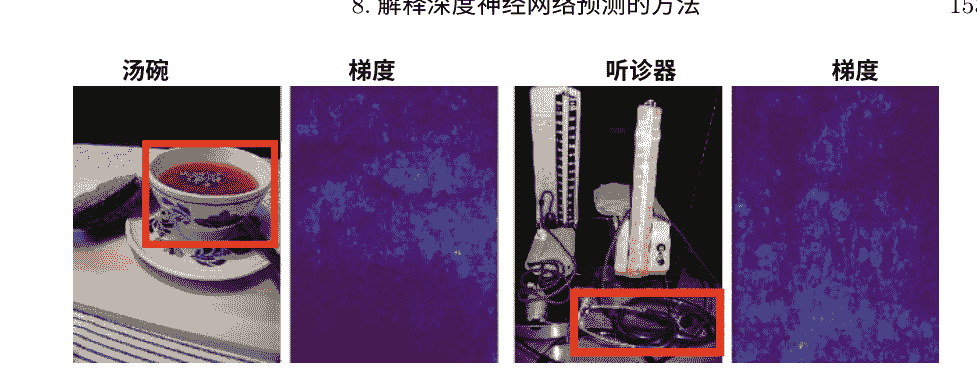

#### 8.3 有意义的扰动：一种归因方法

在本节中，我们将在第8.2节中开发的元预测器作为解释框架应用于在第8.2.2节中简要讨论的学习CNN的视觉归因图案的情况。

为了为黑盒函数 f(x) 定义一个解释规则，必须首先指定要用于研究 f 的输入变化 x 的哪些变化。归因的目的是确定黑盒使用图像 x₀ 的哪些区域来产生输出值 f(x₀)。我们可以通过观察 f(x) 随着从图像 x₀ 中“删除”不同区域 R of x₀ 而变化的方式来实现这一点。 例如，如果 f(x₀) = +1 表示“知更鸟”图像，我们期望 f(x) = +1，除非选择的 R 从图像中删除了“知更鸟”。鉴于 x 是 x₀ 的扰动，这是一个局部解释（第8.2.2节），我们期望解释能够描述 f 和 x0 之间的关系。

尽管在概念上很简单，但这个想法存在几个问题。第一个问题是要明确“删除”信息的含义。如第8.3.3节详细讨论的那样，我们通常对模拟自然主义或合理的成像效果感兴趣，从而产生更有意义的扰动和解释。

##### 8.3.1 扰动类型

由于我们无法访问图像生成过程，我们考虑三个明显的代理：用常数值替换区域 R，注入噪声和模糊图像（图8.2）。

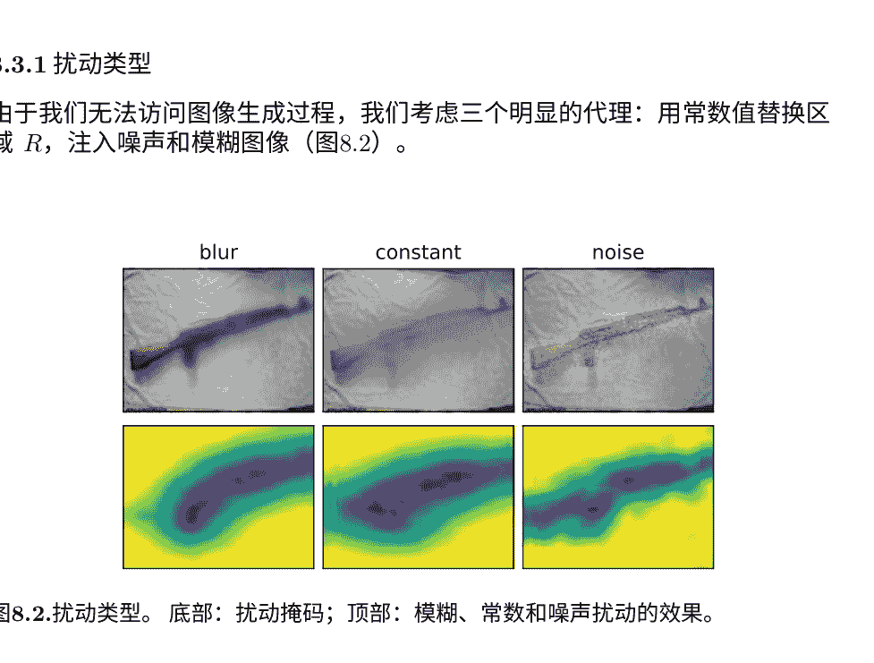形式上，让 m : Λ → [0,1] 是一个掩码，将每个像素 u ∈ Λ与一个标量值 m(u) 关联起来。然后，扰动操作符被定义为

```
\begin{cases}
m(u)x_0(u) + (1 - m(u))\mu_0, & \text{常数}, \\
m(u)x_0(u) + (1 - m(u))\eta(u), & \text{噪声}, \\
\int g_{\sigma_0 m(u)}(v - u)x_0(v)  dv, & \text{模糊},
\end{cases}
```

其中 μ_0 是平均颜色， η(u)是每个像素的独立同分布的高斯噪声样本和 σ_0 是高斯模糊核的最大各向同性标准差 g_σ（我们使用 σ_0 = 10，这会产生一个明显模糊的图像）。

##### 8.3.2 删除和保留

给定一张图片 x_0，我们的目标是简洁地总结删除图像区域的影响，以解释黑盒的行为。解决这个问题的一种方法是找到最具信息量的删除区域。

为了简化讨论，在本文的其余部分中，我们考虑生成一组关于图像内容的假设得分向量的黑盒 f(x) ∈ ℝ^C （例如，神经网络中的softmax概率层）。然后，我们考虑一个“删除游戏”，目标是找到导致得分 f_c(Φ(x_0; m)) ≪ f_c(x_0) 显著下降的最小删除掩码 m，其中 c是目标类别。找到 m可以被表述为以下学习问题：

```
m^* = \argmin_{m \in [0,1]^\Lambda} \lambda \|\mathbf{1} - m\|_1 + f_c(\Phi(x_0; m)) \quad (8.8)
```

其中 λ鼓励大部分掩码关闭（从而删除x_0的一小部分子集）。通过这种方式，我们可以找到一个非常信息丰富的区域，用于网络。

人们还可以玩对称的“保留游戏”，目标是找到必须保留以保持得分 f_c(Φ(x_0; m)) ≥ f_c(x_0): m* = argmin_m λ ||m||_1 - f_c(Φ(x_0; m)) 的最小图像子集。主要区别在于删除游戏删除了足够的证据以防止网络识别图像中的对象，而保留游戏找到了足够证据的最小子集。

迭代梯度。通过使用局部搜索的梯度下降方法来解决这两个优化问题。通过计算其梯度，我们的方法从黑盒中提取信息，类似于[24]的方法。然而，它的不同之处在于它逐渐地提取这些信息，在多次梯度评估中积累越来越多的信息。

##### 8.3.3 处理伪影

当使用方程（8.8）中的简单目标时，我们注意到优化过程学习到具有高度不自然伪影的微妙结构掩码。这并不意外，因为神经网络，特别是受到这些伪影影响。例如，[13]表明，几乎看不见的对图像的扰动可以使神经网络将一个对象分类为另一个对象；[18]构建了被任意分类的抽象合成图像；[15]找到了与原始图像在神经网络视角下无法区分的解构版本。这并不完全令人惊讶，因为神经网络是根据自然图像统计数据进行判别训练的。

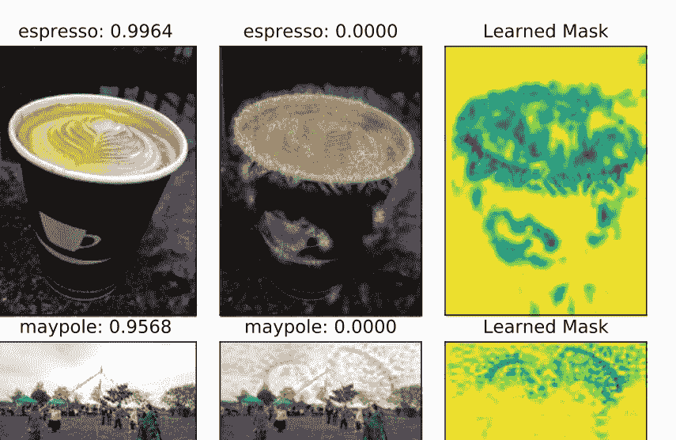

图8.3. 从左到右：由GoogLeNet [28]正确分类的图像；一个被扰动的图像不再被正确识别；学习到的带有伪影的删除掩码。顶部：通过同时应用常数、随机噪声和模糊扰动来最小化前五个预测类别而学习到的掩码。请注意，该掩码学习到在杯子的边缘上添加高度结构化的漩涡（γ=1，λ_1=10^{-5}，λ_2=10^{-3}，β=3）。底部：通过应用常数扰动来最小化前五个类别而学习到的掩码。请注意，该掩码学习到在天空中引入了尖锐、不自然的伪影，而不是删除杆（γ=0.1，λ_1=10^{-4}，λ_2=10^{-2}，β=3）。

尽管存在和表征工件是一个有趣的问题本身，但我们希望描述黑盒在正常操作条件下的行为。因此，我们首先确定了工件的来源然后提出了消除它们的技术解决方案。

来自扰动选择的工件。我们注意到使用模糊扰动更加自然，因为使用随机噪声或平均颜色扰动允许优化过程利用锐利的颜色对比边缘工件（图8.3，底部行）。

来自保护游戏的工件。当优化保护游戏时，如果网络对给定类别的正面证据很少（即，对于其真实类别得分较低的困难图像），优化过程可能会产生“绘制”目标类别理想示例的部分工件以最大化其输出得分。相比之下，删除游戏更加自然：通常存在一些对于真实类别的正面证据可以从图像中“删除”。如果没有某个类别的正面证据（即，解释网络对于随机选择类别的预测），则优化过程会学习到不需要删除任何内容。

锐利的、像素级的伪影。学到的锐利的、像素级的伪影非常不自然，因为自然扰动（即部分遮挡的物体）通常是平滑的（即另一个物体）。如前所述，解释的含义取决于对输入进行的更改的含义 x；为了获得更具代表性的自然扰动掩码，我们可以鼓励它具有简单、规则的结构，这样就不能与这些伪影相互适应。我们通过对总变差（TV）范数进行正则化来实现这一点，以鼓励空间平滑，并从低分辨率版本上采样，以防止不自然的像素级伪影。最后，一个强大的解释应该像任何预测器一样尽可能地泛化。对于删除游戏来说，这意味着不依赖于单独学习的掩码 m 的细节。因此，我们重新制定问题，将掩码 m 随机地应用，最多允许一小部分的随机抖动。

改进的目标。通过这三个修改，方程（8.8）变为：

```
\min_{m \in [0,1]^\Lambda} \lambda_1 ||1 - m||_1 + \lambda_2 \sum_{u \in \Lambda} ||\nabla m(u)||_\beta^\beta + \mathbb{E}_\tau [f_c(\Phi(x_0(\cdot - \tau), m))], (8.9)
```
其中 \( M(v) = \sum_u g_{\sigma_m} \) 是上采样的掩码，而 \( g_\sigma \) 是一个2D高斯核。方程（8.9）可以使用随机梯度下降进行优化。

实现细节。除非另有说明，所显示的可视化结果是使用Caffe [10]和Adam [11]进行生成的，通过使用模糊扰动来最小化（即删除）GoogLeNet [28]的目标类别的softmax概率，具体参数如下：学习率 γ=0.1，N=300次迭代，λ_1=10^{-4}, λ_2=10^{-2}, β=3，通过因子 δ=8对掩码（GoogLeNet的28×28）进行上采样，然后使用 g_σ 对上采样的掩码进行模糊处理。τ_m=5，并通过从[0, τ]的离散均匀分布中绘制整数来抖动掩码，其中 τ=4。由于优化问题高度非凸且只有少数图像具有大型主要对象的图像很难产生收敛的有意义的删除掩码，我们将掩码初始化为相对于完全扰动图像的原始图像得分减少99%的最小中心圆形掩码，即完全模糊的图像。

#### 8.4 相关工作

##### 8.4.1 归因方法调查

自从CNN的复兴[12]以来，已经引入了许多归因方法来可视化输入图像中负责CNN预测的部分，它们大致分为四类，基于用于可视化的信息：

- 1. 梯度 (Gradient [24], DeConvNet [30], Guided Backprop [16,26], SmoothGrad [25])
- 2. 激活 (CAM [33] 和 DeepLift [23])
- 3. 梯度和激活的组合 (LRP [4], Excitation Backprop [31], 和 Grad-CAM [22])
- 4. 对输入和/或激活进行扰动 (Occlusion [30], LIME [20] 和 Feedback [5])

前三种技术都是基于传播的方法，即它们只需要通过CNN进行一次前向和/或后向传播来生成归因可视化。相比之下，基于扰动的方法大多是迭代的、基于优化的方法，需要多次通过网络。

基于梯度的方法。可以说是CNN的第一种归因方法，[24] 可视化了 \(\frac{dy_k}{dx_i}\)，即输入图像 x 相对于目标类别 y_k 的梯度 (也称为通过CNN的反向传播误差信号) ，并进行一些后处理⁶。由于[24]的梯度方法产生了嘈杂的可视化效果 (图8.1)，随后的方法被开发出来，通过对不同方式的反向传播信号进行阈值处理 (DeConvNet [30] 和 Guided Backprop [16,26]) 或对添加噪声的输入的梯度信号进行平均 (SmoothGrad [25])，以产生更清晰的归因热图。

基于激活和组合的方法。与基于反向传播的可视化方法相比，类激活映射 (CAM) [33]通过线性组合倒数第二层的激活图与最后一层的全连接权重来可视化CNN对于目标类的响应。然而，CAM受到架构约束，要求倒数第二层是全局平均池化（GAP）层。 Grad-CAM [22]通过对给定层的激活图加权以及反向传播到该层的梯度来放宽了这个约束。与DeConvNet [30]和Guided Backprop [26]类似，层级相关传播（LRP）[4]和激励反向传播[31]修改了反向传播规则，使得反向传播信号根据卷积层的激活和权重进行加权。许多传播方法需要架构或反向传播规则的修改[16,26,30,33]和/或对中间层的访问[4,22,31,33]。一些技术的主要缺点是它们缺乏自我解释性。与传播方法相比，基于扰动的方法基于输入空间中自然且具有自我解释性的编辑操作。因此，当扰动方法突出显示图像区域时，它具有易于解释的含义，即在实际输入中编辑该区域将对模型的预测产生显着影响。

[1,16]还表明了几种基于传播的归因方法生成的可视化结果不仅仅适用于目标类别[16]，甚至不仅仅适用于模型权重本身[1]。他们通过展示随机选择的类别和具有随机权重的模型的可视化结果与顶部预测类别和训练模型的可视化结果非常相似来实现这一点。

基于扰动的方法。一些技术试图通过对输入图像和/或激活进行扰动来可视化归因。遮挡[30]通过在图像上滑动一个固定大小的灰色遮挡方块来可视化特征激活幅度和/或分类分数的变化。RISE [19]通过使用上采样的随机二进制掩码来遮挡并可视化其遮挡掩码与目标类别的分类分数的线性组合来扩展遮挡。[32]引入了一种贪婪的方法，通过将图像的部分区域变为灰色直到被错误分类。[5]的反馈网络与我们方法的保护版本相关，因为它们学习将所有后ReLU激活屏蔽以最大化网络的类别分数。然而，我们的掩码直接可解释，因为它们与对输入图像的实际编辑相关联，而他们的掩码则不是。最后，[20]与我们的方法最接近，但它们的方法是在固定的超像素上进行操作，将其翻转为灰色，并且收敛速度较慢（N= 5000与我们的 N= 300相比）。因此，虽然存在几种基于扰动的方法，但我们的方法是独特的，允许考虑变量大小的图像区域的联合包含和排除的影响。

##### 8.4.2 形式化和评估归因方法

其他作品以其他方式形式化解释的公理质量。[21]通过对区域特定扰动的敏感性来定义解释的质量，并引入了一个评估指标来捕捉这种质量。给定一个归因热图，检索一个按重要性排序的像素列表。然后，这个有序列表被用于一个贪婪的迭代过程，以扰动最重要到最不重要的区域。这些迭代扰动的效果被绘制在使用的扰动数量上。其他作品使用了类似的扰动评估指标[2,3,19]。[17]提出了一个解释

#### 8.5 准确性和可解释性的有意义扰动

在本节中，我们讨论并展示了我们的归因技术如何与其他归因方法相比，既对被解释的模型忠实，又对人类可解释。

##### 8.5.1 可测试性

所提出框架的一个优点是生成的可视化具有清晰、可解释的含义：删除游戏生成一个最小的遮罩，防止网络识别对象。

与其他技术相比（图8.4），该方法可以准确定位为什么某个对象被识别，而不突出非必要的证据。这可以在图8.4中注意到CD播放器（第7行），其他可视化也强调了相邻的扬声器，类似的情况还有悬崖（第3行），街道标志（第4行）和太阳镜（第8行）。有时这表明只有对象的一部分是必要的：狮子狗的脸（第2行），卡车的上半部分（第6行）和巧克力酱盘上的勺子（第1行）都被发现是最小的充分部分。

尽管对比激发反向传播生成的热图与我们的掩模最相似，但我们的方法引入了一个定量标准（即最大程度地抑制目标类别得分），并且其可验证性（即对图像的直接编辑）使我们能够比较不同的提出的显著性解释，并证明我们学到的掩模在这个度量上更好。在图8.5的第2行中，我们展示了应用了我们学到的掩模的有界扰动显著地抑制了卡车的softmax得分，而在图8.4的第6行中，通过对比激发反向传播突出显示的卡车后保险杠上的方框扰动实际上将得分从0.717增加到0.850。我们方法的原则性可解释性还使我们能够识别出算法可能学到了错误的关联的情况。在图8.5的第1行中，对于巧克力酱的情况，令人惊讶的是我们学到的掩模突出显示了勺子，因为人们可能期望装满酱的罐子更显著。然而，手动扰动图像揭示了事实上勺子比罐子更具抑制性。一个解释是ImageNet的“巧克力酱”图像中包含的勺子比罐子更多，这似乎是通过检查一些图像可以得出真实结论。更一般地说，我们的方法使我们能够诊断出数据中高度预测但非直观且可能具有误导性的相关性，这些相关性被机器学习算法所识别和利用。

##### 8.5.2 对输出神经元的选择性

[16]的工作表明，梯度[24]、DeConvNet [30]和Guided Backprop [26]方法对输出神经元没有选择性，也就是说，无论被解释的输出类别如何，它们都会产生类似的可视化结果。对于可视化归因来说，这是相当令人困扰的。在图8.6中，我们演示了我们的方法设计上不会遇到这个问题⁷。

##### 8.5.3 归因图紧凑性

在这个实验中，我们将我们的方法与其他视觉归因方法进行比较，目标是正确识别一个足够抑制目标对象类别得分的最小区域。给定一个归因图，我们将其强度归一化到范围[0,1]，用 \( h \in [0:0.1:1] \)进行阈值处理，并在生成的热图周围拟合最紧密的边界框。然后，我们对框内的图像进行模糊处理，并计算部分模糊图像在GoogLeNet [28]中的标准化⁸目标softmax概率。

根据这些边界框和标准化得分，对于给定的得分抑制量，我们找到实现该抑制量的最小边界框。图8.8显示，平均而言，我们的方法在考虑到80%,90%,95 %和99%的抑制效果时产生最小的最小边界框。这些结果表明，我们的方法找到了一个对网络产生强烈影响的小的显著区域。尽管这些结果并不令人惊讶，因为我们在Eq. (8.9)中使用L1和TV范数的正则化项进行稀疏性和平滑性的正则化，但它证实了这些正则化项适当地转化为相对紧凑的掩码。

#### 8.6 应用于对抗防御

在本节中，我们讨论了使用归因掩码来防御对抗性示例的新颖应用。我们展示了我们的方法在防御某些类别的对抗性攻击方面明显优越。有关我们方法的更多应用，如数据科学中的假设投资和弱监督定位，请参见[8]。

对抗性示例[13]通常使用与我们方法类似的互补优化过程生成，该过程学习了一种不可察觉的模式。噪声会导致图像在添加后被错误分类。使用我们重新实现的高效一步迭代方法（= 8）[13]生成对抗样本时，我们的方法产生了与自然图像上产生的视觉上不同的异常掩码（图8.7，左）。我们使用给定的热图可视化相对于干净图像和对抗图像上的顶部预测类别来训练Alexnet [12]分类器（学习率 λ_{lr}=10^{-2}，权重衰减 λ_{L1}=10^{-4}，动量 γ= 0.9）；我们的方法在很大程度上优于其他方法，并实现了93.6%的区分准确率。最后，当我们学习到的掩码应用于相应的对抗图像时，它们不仅最小化了对抗标签，而且通常允许干净图像上的原始预测标签重新上升为顶部预测类别。我们的方法在干净图像上预测的原始标签恢复率为40.64%，地面真实标签恢复率为37.32%（N= 5000）。此外，在“掩码+对抗”设置中，100%的时间内原始预测标签都恢复为前5个预测标签之一。据我们所知，这是第一项能够在不对训练设置和/或网络架构进行任何修改的情况下恢复原始预测标签的工作。这些发现为进一步研究和重新调整对抗防御的归因图提供了新的研究路径。

#### 8.7 讨论和结论

在本章中，我们提出了一个全面的、形式化的框架，用于学习解释作为元预测器。我们还提出了一种新颖的图像显著性范式，通过发现算法在扰动时对图像的哪些部分产生最大影响来学习它的观察位置。与许多先前的视觉归因技术不同，我们的方法明确地对图像进行编辑，使其可解释和可测试。我们展示了我们的方法的许多应用，例如比较不同方法的抑制效果（图8.5、8.8）和对抗性示例的防御（图8.7）。最后，我们对神经网络的脆弱性和对伪影的敏感性做出了新的贡献，这为自适应增强网络以使其对不良伪影具有鲁棒性开辟了未来的研究机会。

评估归因方法。以前的研究[19,31]通过弱监督的定位任务评估归因方法。他们通过从归因热图中提取边界框和/或最大点来实现这一点。虽然这些评估指标提供了一些有用的信息，但我们认为仅仅使用这些任务作为评估归因方法的唯一标准是有问题的，因为它们没有正确测试归因（即模型认为什么是导致其预测的原因）。如果模型学习了一个不正确的关联（即在图8.5中，勺子被认为是“巧克力酱”的原因），那么我们会期望一个好的归因方法在定位和/或指向受影响的示例时表现不佳，因为模型没有正确地归因⁹。相反，我们建议基于最小删除（也称为最小破坏区域[SDR]）和输出神经元和网络权重的选择性的一些度量标准（如[1,16]中所指出的问题）。此外，我们认为可测试性是任何归因方法的一个有价值的属性，并鼓励进一步研究像我们的可验证归因技术这样的方法。

未来的方向。虽然我们关注的是属性问题，但我们的有意义的扰动方法可以轻松地扩展到扰动和解释中间激活，无论是沿空间维度还是通道维度或两者兼有（我们的后续工作[7]可以从这个角度来看，因为我们扰动特征通道）。其他人也在我们的工作基础上进行了扩展，证明了我们的方法适用于其他机器学习领域，如解释Atari游戏玩法的强化学习策略[9]，并且可以通过使用我们的方法作为基准的学习掩码来加快速度[6]。

### 参考文献

- 1. Adebayo, J., Gilmer, J., Muelly, M., Goodfellow, I., Hardt, M., Kim, B.: 对显著性图的合理性检查。在：NeurIPS, 第9525-9536页 (2018年)
- 2. Ancona, M., Ceolini, E., Öztireli, C., Gross, M.: 对于深度神经网络的基于梯度的属性方法的更好理解。在：ICLR (2018年)

## 8. 解释深度神经网络预测的方法

3. Arras, L., Horn, F., Montavon, G., Müller, K.R., Samek, W.: “文本文档中的相关内容是什么？ ”：一种可解释的机器学习方法。 PLoS ONE 12(8), e0181142 (2017)

4. Bach, S., Binder, A., Montavon, G., Klauschen, F., Müller, K.R., Samek, W.: 通过逐层相关传播对非线性分类器决策进行像素级解释。 PLoS ONE 10(7), e0130140 (2015)

5. Cao, C., et al.: 用反馈卷积神经网络捕捉自上而下的视觉注意力。 在: ICCV, pp. 2956–2964 (2015)

6. Dabkowski, P., Gal, Y.: 黑盒分类器的实时图像显著性。 在: NIPS, pp. 6967–6976 (2017)

7. Fong, R., Vedaldi, A.: Net2vec: 量化和解释深度神经网络中过滤器如何编码概念。 在: CVPR, pp. 8730-8738 (2018)

8. Fong, R.C., Vedaldi, A.: 通过有意义的扰动解释黑盒子。 在: ICCV, pp. 3429-3437 (2017)

9. Greydanus, S., Koul, A., Dodge, J., Fern, A.: 可视化和理解Atari代理。 arXiv预印本 arXiv:1711.00138 (2017)

10. Jia, Y., et al.: Caffe: 用于快速特征嵌入的卷积架构。 arXiv 预印本 arXiv:1408.5093 (2014)

11. Kingma, D., Ba, J.: Adam: 一种用于随机优化的方法。 arXiv预印本 arXiv:1412.6980 (2014)

12. Krizhevsky, A., Sutskever, I., Hinton, G.E.: 使用深度卷积神经网络进行Imagenet分类。 在: NIPS, 第1097-1105页 (2012)

13. Kurakin, A., Goodfellow, I., Bengio, S.: 物理世界中的对抗性示例。 arXiv预印本 arXiv:1607.02533 (2016)

14. Lenc, K., Vedaldi, A.: 通过测量等变性和等价性来理解图像表示。 在: CVPR, 第991-999页 (2015)

15. Mahendran, A., Vedaldi, A.: 通过反转它们来理解深度图像表示。 在: CVPR, 第5188-5196页 (2015)

16. Mahendran, A., Vedaldi, A.: 显著的解卷积网络。 在: Leibe, B., Matas, J., Sebe, N., Welling, M. (eds.) ECCV 2016. LNCS, 卷9910, 第120-135页。 Springer, Cham (2016). https://doi.org/10.1007/978-3-319-46466-4_8

17. Montavon, G., Samek, W., Müller, K.R.: 解释和理解深度神经网络的方法。 数字信号处理。 73, 1–15 (2018)

18. Nguyen, A., Yosinski, J., Clune, J.: 深度神经网络很容易被愚弄: 对于无法识别的图像的高置信度预测。 在: CVPR, 第427-436页 (2015)

19. Petsiuk, V., Das, A., Saenko, K.: RISE: 用于解释黑盒模型的随机输入采样。 在: BMVC (2018)

20. Ribeiro, M.T., Singh, S., Guestrin, C.: 为什么我应该相信你? : 解释任何分类器的预测。 在: 第22届ACM SIGKDD国际会议上的知识发现和数据挖掘, 第1135-1144页。 ACM (2016)

21. Samek, W., Binder, A., Montavon, G., Lapuschkin, S., Müller, K.R.: 评估深度神经网络学到的可视化内容。 IEEE Trans. Neural Netw. Learn. Syst. 28(11), 2660–2673 (2017)

22. Selvaraju, R.R., Das, A., Vedantam, R., Cogswell, M., Parikh, D., Batra, D.: Grad-Cam: 你为什么这么说? 通过基于梯度的定位从深度网络中获得视觉解释。 arXiv预印本 arXiv:1610.02391 (2016)

23. Shrikumar, A., Greenside, P., Kundaje, A.: 通过传播激活差异学习重要特征。 arXiv 预印本 arXiv:1704.02685 (2017)

24. Simonyan, K., Vedaldi, A., Zisserman, A.: 深入卷积网络: 可视化图像分类模型和显著性图。 在: ICLR (2014)

25. Smilkov, D., Thorat, N., Kim, B., Vegas, F., Wattenberg, M.: Smoothgrad: 通过添加噪音来去除噪音。 arXiv预印本 arXiv:1706.03825 (2017)

26. Springenberg, J.T., Dosovitskiy, A., Brox, T., Riedmiller, M.: 追求简洁：全卷积网络。 arXiv预印本 arXiv:1412.6806 (2014)

27. Sundararajan, M., Taly, A., Yan, Q.: 深度网络的公理归因。 在：ICML，第3319-3328页 (2017)

28. Szegedy, C., et al.: 通过卷积深入研究。 在：CVPR，第1-9页 (2015)

29. Turner, R.: 模型解释系统。 在：IEEE MLSP，第1-6页 (2016)

30. Zeiler, M.D., Fergus, R.: 可视化和理解卷积网络。 在：Fleet, D., Pajdla, T., Schiele, B., Tuytelaars, T. (eds.) ECCV 2014. LNCS, vol. 8689, pp. 818-833. Springer, Cham (2014). https://doi.org/10.1007/978-3-319-10590-1_53

31. Zhang, J., Lin, Z., Brandt, J., Shen, X., Sclaroff, S.: 自上而下的神经注意力通过激活反向传播。 在：Leibe, B., Matas, J., Sebe, N., Welling, M. (eds.) ECCV 2016. LNCS, vol. 9908, pp. 543–559. Springer, Cham (2016). https://doi.org/10.1007/978-3-319-46493-0_33

32. Zhou, B., Khosla, A., Lapedriza, A., Oliva, A., Torralba, A.: 目标检测器在深度场景CNN中出现。 arXiv预印本 arXiv:1412.6856 (2014)

33. Zhou, B., Khosla, A., Lapedriza, A., Oliva, A., Torralba, A.: 学习深度特征用于判别定位。 在：CVPR, pp. 2921–2929 (2016)

### 9 基于梯度的归因方法

Marco Ancona, Enea Ceolini, Cengiz Oztireli和Markus Gross

¹ ETH苏黎世，8092苏黎世，瑞士
{anconam, cengizo, grossm}@inf.ethz.ch
² 苏黎世大学，8006苏黎世，瑞士
eceoli@ini.uzh.ch

摘要。 解释复杂的机器学习模型，包括深度神经网络的问题，在过去几年中引起了越来越多的关注。虽然已经提出了几种方法来解释网络预测，但解释本身的定义仍然存在争议。此外，从理论角度比较解释方法的尝试很少。在本章中，我们讨论了几种归因方法的理论特性，并展示了它们如何使用梯度信息作为模型运行的描述因素。最后，我们讨论了这些方法的优点和局限性，并将它们与其他可用方法进行了比较。

- 归因方法
- 深度神经网络
- 可解释人工智能

#### 9.1 引言

机器学习已经展示出在解决各种问题上的巨大潜力，主要归功于深度神经网络 (DNNs) 的众多突破性结果[12,14,17,29,36]。随着基于学习的算法被应用到日常生活产品中，解释它们的预测变得至关重要，不仅是为了确保可靠性和鲁棒性，还为了确保预测是公平的，不会歧视。虽然机器学习模型在越来越多的应用中发挥作用，但深度神经网络的黑盒特性已经成为在那些需要解释性的领域中采用这些系统的障碍。无论是在医学预测、控制自动驾驶汽车还是评估犯罪风险方面使用机器学习，所做的决策对涉及的人们的生活有深远影响，需要强制执行精确的保证。欧洲的法规在这方面相当严格，因为它们引入了合法解释的概念[10]，事实上禁止在某些领域使用不可解释的机器学习模型。

机器学习中的可解释性可以通过不同的方式实现。第一种方法是使用本质上可解释的模型，如线性模型。尽管这是最直接的解决方案，但这些模型通常会进行权衡。可解释性与有限的预测能力之间存在一种权衡。第二种方法是设计能够同时生成预测和解释的模型，可以是文本形式或可视化形式。训练这种模型非常具有挑战性，因为它们需要基于真实解释进行训练。而且，由于解释生成器本身是一个经过训练的模型，评估公平性和准确性的问题只是从操作模型转移到了解释模型。最后，可以在现有模型的基础上构建解释方法。潜在地，这使得可以为任何现有的黑盒模型生成解释，而无需重新训练并且不会牺牲最佳模型的性能。

另一个重要的考虑维度是可解释性方法的范围。全局可解释性是关于理解整体模型如何做出决策，哪些输入模式被捕捉到以及如何转化为输出的[6]。全局可解释性非常用于检测可能导致模型不公平或歧视行为的偏见，但随着相互作用参数的数量增加，实现起来可能非常困难。因此，关于DNN模型可解释性的几项工作侧重于解释特定决策的原因。这通常被称为局部可解释性[6,15]，因为模型行为仅对单个特定实例进行解释。这种类型的解释对于逐案例地证明模型预测的合理性非常有用，例如为什么贷款申请被拒绝。

在本章的剩余部分，我们将重点关注DNN的归因方法。由于它们是建立在现有模型之上的，归因方法属于上述三种可解释性方法中的最后一种。它们旨在解释现有神经网络架构的决策，否则这些决策将无法解释。此外，它们在局部可解释性范围内运作，因为它们专门为给定的模型和输入实例生成解释。

已经开发了几种专门用于神经网络的归因方法[4,18,25,27,30,32,33,37,38]。然而，缺乏真实解释使得在定量评估这些方法时非常具有挑战性，而定性评估已被证明是不足或有偏见的[2,8,20]。

随着归因方法的增多，我们认为有必要更好地了解它们的特性、假设和限制。我们从理论角度分析了一些最近提出的归因方法，并讨论了它们之间的联系。我们展示了神经网络输入特征的梯度是几种归因方法用于构建解释的基本信息，并讨论了这种方法的局限性。

本章的内容主要基于之前的工作[3]的结果和考虑，重新组织以逐步向非专业读者介绍DNN的归因方法的主题。在第9.2节中，我们正式定义了归因方法，展示了如何使用梯度在简单线性模型中生成归因，并讨论了这些方法的一些理想属性。在第9.3节中，我们从线性模型转向DNN，展示了如何将梯度信息调整为解释非线性模型。在第9.4节中，我们讨论了基于梯度的方法的优势、局限性和替代方法。最后，在第9.5节中提出了一些最终的考虑。

#### 9.2 归因方法

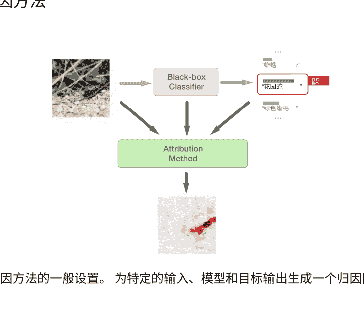

考虑一个接受N维输入的模型 $x=[x_1, ..., x_N] \in \mathbb{R}^N$ 并产生C维输出 $S(x)=[S_1(x), ..., S_C(x)] \in \mathbb{R}^C$。该模型可以是一个DNN，其中 $C$ 是输出神经元的总数。根据应用程序，输入特征 $x_1, ..., x_N$ 可能具有不同的性质。例如，在图像分类中，$x$ 通常是一张图片，$x$ 中的每个特征是图片中的一个像素。在语音识别的情况下，每个特征可能是特定时间和频率段的信号谱功率。在自然语言处理的情况下，每个特征通常是句子中每个单词的多维向量表示。类似地，网络的每个输出可以表示数值预测数量（回归任务）或相应类别的概率（分类任务）。

鉴于它们可能的大量，了解对预测输出有更大影响的网络输入特征以及它们的影响方向是可取的。尽管这只是对解释的简单概念，与通常涉及以文本形式表达的人类概念相比，它仍然被证明对理解某些网络（误）预测的原因是有用的[22]。

形式上，归因方法旨在通过为给定输入样本的网络的每个输入特征分配一个标量归因值，有时也称为“相关性”或“贡献”，来产生解释。给定一个单一的目标输出单元 $c$，归因方法的目标是确定每个输入特征 $x_i$ 对输出贡献 $R_c = [R_1c, ..., R_Nc] \in R^N$ 的程度输出 $S_c(x)$。对于分类任务，目标输出可以选择为与正确类别标签相关联的输出（例如，验证哪些输入特征激活了该类别），或者选择与不同类别相关联的输出（例如，分析错误分类的原因）。

通常，归因被可视化为归因图。这些是热图，在每个输入特征上，红色或蓝色表示特征对目标输出的正向或负向影响（图9.1）。因此，归因图突出显示对目标激活有积极贡献的特征，以及对其具有抑制作用的特征（反证据）。

### 9.2.1线性模型的归因示例

在进入非线性模型（如DNNs）之前，我们展示了如何在线性情况下找到归因。这也将给我们介绍梯度在生成归因中的作用的机会。

线性模型几十年来一直被统计学家、经济学家、计算机和数据科学家用来决定量问题。在这些模型中，多元线性回归[13]可以用来建模回归目标 $y$ 对一系列输入特征 $x_1, ..., x_N$ 的依赖关系：

$$y = w_0 + w_1x_1 + ... + w_Nx_N + \varepsilon, \quad\quad (9.1)$$

其中 $w_i$ 是学习到的模型权重，$\varepsilon$ 是残差误差。模型权重可以通过普通最小二乘法（OLS）来估计。由于模型优化不在本章的范围内，我们将读者引用到[13]以获取更多细节。在独立性、线性性、正态性和同方差性的假设下，线性回归模型的权重易于理解，并为模型解释提供了即时工具。让我们考虑一个简单的例子，其中线性回归用于基于两个投资 $x_1$ 和 $x_2$ 来估计未来资本资产 $y_c$。假设满足上述假设，并且模型参数估计如下：

$$\mathbb{E}[y_c|x_1, x_2] = 1.05x_1 + 1.50x_2, \quad\quad (9.2)$$

我们可以立即推导出这个模型的全局解释。每投资 $1$ 美元在基金 $x_1$ 上，将产生 $1.05$ 美元的资本，而每投资 $1$ 美元在 $x_2$ 上，将产生 $1.50$ 美元的资本，独立于 $x_1$ 和 $x_2$ 在具体情况下可能假设的值。请注意，这个解释完全基于学习到的系数 $w_1 = 1.05$ 和 $w_2 = 1.50$。这些有时被称为偏回归系数的值本身就是解释目标变量的自变量的候选归因值：

$$R_1(x) = 1.05, R_2(x) = 1.50 \quad\quad (9.3)$$

还要注意，这些系数是目标变量对自变量的偏导数，因此这种归因归结为模型的梯度：

$R_i(x) = \frac{\partial y_c}{\partial x_i}(x) \quad (9.4)$

另一方面，这不是唯一可能的归因方案。让我们考虑一个具体的投资场景，其中有100'000美元投资在$x_1$，10'000美元投资在$x_2$。根据我们训练的模型，总资产将为120'000美元。在这种情况下，人们可能会想知道$x_1$和$x_2$是如何影响资产的，即两种不同投资如何对最终资本的贡献。在这种情况下，我们正在寻找一个局部解释，因为我们对解释特定数据点的响应感兴趣。

同样，由于模型的线性性质，很容易看出120'000美元可以解释为两个贡献的总和：来自第一个基金投资的105'000美元和来自第二个基金投资的15'000美元。因此，合理的归因值为：

$R_1(x) = 105'000$，$R_2(x) = 15'000 \quad (9.5)$

就梯度而言，我们可以将归因定义为梯度与输入逐元素相乘：

$R_i(x) = x_i \cdot \frac{\partial y_c}{\partial x_i}(x) \quad (9.6)$

从这个玩具例子中，我们找到了两种可能的解释，即归因值。请注意，这两种解释都基于模型函数的梯度，但有很大的不同。在第一种情况下，变量$x_2$的归因值明显高于变量$x_1$，而在第二种情况下，排名则相反。有人可能会问，其中一种解释比另一种更好地解释了模型。由于这两种归因都是基于明确的目标导出的，我们认为它们都是对模型的合理解释。另一方面，很明显它们回答了不同的问题：方程式9.3中的归因回答了“为了产生更多资本应该在哪里投资？”的问题，而方程式9.5中的归因回答了“初始投资如何对最终资本的贡献？”的问题。根据需要回答的问题，应选择适当的归因方法。当它们回答不同的问题时，两种归因方式也明显不能直接比较。

##### 9.2.2 显著性与敏感性方法

由方程9.4和9.6描述的两种归因方法的不同之处在于第二种方法还涉及到对输入本身的乘法。在前一节中，我们讨论了它们解释模型的两个非常不同的方面。正如我们将在后面讨论的那样，用于DNN的几种（但不是全部）归因方法是通过将一个数量与被解释的输入进行逐点乘法计算得到的。

仅在先前的文献[28,31,33]中部分讨论了乘以输入的理由。已经注意到，当应用于图像分类模型时，它有助于使归因图更加清晰[28]，尽管其他人注意到这仍然不清楚其中有多少归因可以归因于原始图像本身的清晰度[31]。另一方面，还有一个更基本的理由，可以将归因方法分为两大类：显著性方法和敏感性方法[3]。

敏感性方法旨在描述当一个或多个输入特征发生扰动时，网络输出如何变化。在线性模型中，这种影响对于任意大的扰动是恒定的。对于非线性模型，敏感性方法仍然表示输入变化的预期效果，但作为非线性函数的一阶泰勒展开，它们只对原始输入周围的微小扰动准确。虽然模型对特征扰动的敏感性被认为是特征“重要性”的可能度量[30]，但敏感性方法的固有目标始终应该被考虑在内。

相反，显著性方法描述了在将某个特征移除的相同输入上，该特征对输出的边际效应。换句话说，产生的值旨在描述不同输入变量对最终目标输出的贡献。在这种意义上，对于显著性方法，通常希望所有归因值总和等于最终目标分数，以便归因可以直接与输出作为加法贡献[4,27,33]相关联。在我们的线性示例中，输入和梯度之间的乘法提供了一种满足此属性的显著性方法。我们将看到，当扩展到非线性模型时，同样的方法不一定满足该属性。还要注意，显著性方法在计算归因时必须考虑输入。

##### 9.2.3 显著性方法的基准

大多数显著性方法需要定义一个基准值。由于我们对一个特征的边际效应感兴趣，我们隐含地寻找没有该特征的情况下输出会如何变化。正如其他人指出的[33]，人类也通过比较包含或不包含某个原因的过程的结果来归因于某个原因。在机器学习模型的特定情况下，具有非零归因的特征预计在确定模型输出方面起到一定作用。

不幸的是，没有适当的方法可以从输入到DNN中删除一个或多个特征，因为大多数网络架构假设输入特征的数量是固定的。虽然我们可以使用减少的输入特征重新训练网络，但这将导致一个不同的模型，其内部机制不一定与我们想要解释的原始模型相关。

在相关文献中，通常通过模拟特征的缺失来解决这个问题，而不是严格意义上的删除。首先，定义一个基准输入\(\bar{x}\)。基准应该根据领域的不同进行选择，以最好地表示信息的缺失（例如黑色图像）。

- 归因方法
- 深度神经网络
- 可解释人工智能

## 9.2.3 基准

然后，相对于基准计算属性，每当需要测试特征的缺失时，用相应的基准值替换每个特征。

这种设置的一个重要结果是，归因很大程度上受到基准选择的影响。特别是，解释是输入与基准之间的差异的函数，而不仅仅是输入本身。

不幸的是，如何为不同领域选择适当的基准仍然是一个未解决的研究问题。此外，基准必须在输入空间的领域中选择，这在有效输入偶然假设基准值和缺失特征指示器之间产生明显的歧义。

对于许多归因方法来说，零基线是规范选择[27,33,37]。有时，零基线也被隐式地使用在不允许用户定义的归因方法中[4,22]。对于这个特定选择的一个可能的理由是，对于实现了形式为 $z_{j}=f(\sum_{i}w_{ji}\cdot z_{i}+b_{j})$ 的所有零输入对于输出来说是中性的（即 $\forall c\in C:S_{c}(0)\approx 0$）。如果模型没有加性偏差，并且所有非线性激活函数 $f$ 将零映射为零（例如ReLU和Tanh），那么当网络输入为零时，输出实际上是零。从经验上看，即使偏差具有不同的值，输出通常也接近零，这使得选择零作为基线是合理的，尽管是任意的。

其他选择也是可能的。有时，训练集上每个特征的期望值被用作基准[16,27]。在图像领域，先前的研究还建议将基准设置为输入图像的模糊版本[7]。最后，还可以对要删除的特征进行边缘化，以模拟它们的缺失。例如，已经证明了如何利用自然图像的局部一致性来边缘化图像块[38]。

不幸的是，这种方法的速度明显较慢。而且，它只能应用于已知特征相关性先验的图像或其他领域，这可以用来使问题在计算上可行。

##### 9.2.4 属性和定义

我们现在介绍一些定义和显著属性，这些属性将在本章的其余部分中用于描述归因方法。

- 解释连续性。如果给定一个连续的预测函数需要解释 $S_{c}(x)$，则我们说一个归因方法满足解释连续性，它会产生连续的归因 $R^{c}(x)$。这是任何归因方法的理想属性[19]：如果对于两个几乎相同的数据点，模型的响应几乎相同，那么可以合理地期望相应的解释也几乎相同。
- 实现不变性。我们说两个模型 $m_1$ 和 $m_2$ 在功能上等效，如果对于任何输入 $x$，它们产生相同的输出，尽管可能有不同的实现。更正式地说，如果对于所有的 $x$ ： $Sm_1(x)=Sm_2(x)$。如果一个归因方法在功能上等效的模型 $m_1$ 和 $m_2$ 上始终产生相同的归因，那么它被称为实现不变性[33]：
```
对于所有的$(m_1, m_2, x, c): R_{c, m_1}(x) = R_{c, m_2}(x) \quad \quad (9.7)$
```
- 敏感性-$n$。当一个归因方法满足敏感性-$n$[3]时，任何基数为$n$的特征子集的归因之和等于移除该子集中特征引起的输出变化$S_c$。在这个背景下，移除一个特征意味着将其设置为一个基准值，通常选择为零，如第9.2.3节所讨论的。从数学上讲，当对于所有的特征子集$x_S = [x_1, ...x_n] \subseteq x$时，一个方法满足敏感性-$n$时，它成立：
```
$$\sum_{i=1}^{n} R_{i}^{c}(x)=S_{c}(x)-S_{c}(x \backslash x_{S}), \quad \quad (9.8)$$
```
其中符号 $x \backslash x_{S}$ 表示数据点 $x$，其中 $x_{S}$ 中的所有特征已被基线值替换。

当 $n = N$ 时，其中 $N$ 是输入特征的总数，我们有 $\sum_{i=0}^{N} R_{i}(x) = S_{c}(x)-S_{c}(\bar{x})$，其中 $\bar{x}$ 是一个表示已删除所有特征的输入基线。这个属性在合作博弈理论的背景下被称为效率[23]，并且被认为是各种归因方法[4,27,33]中的一个理想属性。在相关文献中，同样的属性被称为完备性[33]或者 $\Delta$ 求和[27]。

通常情况下，基准被选择为对模型响应中性（$S(c(\bar{x})) \approx 0$），在这种情况下，敏感度-$N$减少为
```
$$\text{对于所有的}x, c: \sum_{i=1}^{N} R_{i}^{c}(x) = S_{c}(x) \quad \quad (9.9)$$
```
这意味着模型对于特定输入 $x$ 的输出可以分解为输入特征的个体贡献之和。

显然，这个属性只适用于显著性方法。一个值得注意的观察是，在应用于非线性模型时，没有任何归因方法（如第9.2节中定义的）能够满足敏感度-$n$的所有值。证明见[3]。

直观地说，这是因为归因图没有足够的自由度来捕捉非线性交互：对于一个非线性模型，必然存在两个特征 $x_i$ 和 $x_j$，使得 $S(x)-S(x_{i}, x_{j})=2 S(x)-S(x_{i})-S(x_{j})$）。在这种情况下，要么违反敏感度-1，要么违反敏感度-2，因为归因方法为 $x_i$ 和 $x_j$ 分配了相同的归因值。

#### 9.3 基于梯度的DNN归因方法

在本节中，我们讨论了如何使用梯度信息以隐式或显式的方式应用于非线性模型，特别是DNNs，以生成归因。在9.2.1节中，我们展示了线性回归模型的归因是如何作为与输入特征梯度的函数生成的。现在，我们展示了梯度在引入DNN的几种流行归因方法中的作用。我们展示了这些方法在如何修改反向传播规则以考虑网络函数的非线性方面的差异。我们还讨论了一些方法如何作为基于梯度的方法重新审视，尽管它们有不同的原始公式。这将使它们能够作为统一的基于梯度的框架的一部分进行直接比较。

##### 9.3.1 从线性到非线性模型

在线性回归的情况下，我们找到了两种可能的归因方法：
```
$R^{c}_{i}(x) = \frac{\partial S_{c}(x)}{\partial x_{i}} \quad \quad R^{c}_{i}(x) = x_{i} \cdot \frac{\partial S_{c}(x)}{\partial x_{i}} \quad \quad \quad \quad \quad \quad (9.10)$
```
我们讨论了这些方法如何被认为是为线性模型产生有意义的解释，尽管回答了不同的问题。作为对DNN产生解释的第一次尝试，可以考虑应用相同的思想。事实上，在过去的十年中，相关文献中已经提出了这个建议。

敏感性分析是最早被适应到深度学习领域的方法之一[30]。归因是通过取目标输出 $S_{c}$ 对输入 $x_{i}$ 的偏导数的绝对值构建的：
```
$R^{c}_{i}(x) = \left| \frac{\partial S_{c}(x)}{\partial x_{i}} \right| \quad \quad \quad \quad \quad \quad (9.11)$
```
直观地说，梯度的绝对值表示那些输入特征（例如像素，用于图像分类）在目标输出发生最大变化时可以最小扰动的特征，丢弃了关于这种变化方向的任何信息。然而，敏感性分析通常非常嘈杂[18,24,31]，取绝对值会阻止检测输入中可能存在的正面和负面证据。

梯度 * 输入[28]最初被提出作为改进敏感性分析生成的归因图的技术。归因是通过对输出相对于输入的（有符号的）偏导数进行逐特征乘以输入本身来计算的。
```
$R^{c}_{i}(x) = \frac{\partial S_{c}(x)}{\partial x_{i}} \cdot x_{i} \quad \quad \quad \quad \quad \quad (9.12)$
```
读者可能会在公式9.12中认出我们之前讨论过的线性模型的归因方法。然而，当我们从线性模型转向非线性模型时，如果我们对显著性而不是敏感性感兴趣，那么乘以输入在理论上是可以证明的，但计算显著性并不容易。

敏感性分析和梯度*输入都存在明显的缺点，因为偏导数 $S_c(x)/\partial x_i$ 不仅随着 $x_i$ 的变化而变化，还随着其他输入特征的值的变化而变化。

敏感性分析仍然提供了目标输出在输入变量扰动下的有效度量，但在非线性模型的情况下，这个值只对原始输入周围的微小扰动准确。实际上，得到的归因可以看作是网络实现的函数的一阶泰勒展开项，在接近实际输入的点上计算得到[18]。

同样，由于梯度不是常数，梯度*输入不一定代表特征的正确边际效应。让我们考虑一个形式为的加法模型：
$$y = w_0 + f_1(x_1) + ... + f_N(x_N)$$ (9.13)
其中，$f$和$_i$是非线性函数。由于目标是通过输入变量的贡献之和来计算的，并且它们之间没有交互作用，我们可以期望一个显著性方法能够准确地检测到这些贡献并满足敏感性-$N$。具体来说，让我们考虑一个玩具例子，$y = x_1 + \sqrt{x_2}$，在输入为$(4, 4)$的情况下进行评估。在这种情况下，对输出($y=6$)的贡献自然分布为$R_1 = 4$和$R_2 = 2$。很容易验证Grad$_i$ent * Input无法满足敏感性-$N$，产生的贡献$R_1 = 4$和$R_2 = 1$不等于目标值，并且很难被证明是合理的。为了克服这些限制，梯度下降方法已经被调整以考虑DNN的非线性特性。

##### 9.3.2 迈向平均梯度

请注意，为了产生上述示例中的预期归因，我们可以简单地用平均梯度替换瞬时梯度，就像梯度*输入中一样，基线（这里是 $(0,0)$ ）和输入值（这里是 $(4, 4)$ ）之间的平均梯度。事实上，这个想法是最近归因方法的核心：层次相关传播（在其变体 $\epsilon$-LRP中）、DeepLIFT重新缩放和集成梯度。我们现在介绍这些方法，并讨论它们如何在相同的基于梯度的框架下进行检查。请注意，以下事后考虑可能不是最初导致这些方法制定的考虑因素。

层次相关传播（$\epsilon$-LRP）[4]是通过网络的反向传播计算得出的。让我们考虑一个称为“相关性”的量 $r_i^{(l)}$，称为层 $l$ 的单元 $i$ 的“相关性”。该算法从输出层 $L$ 开始，将目标神经元 $c$ 的相关性分配为神经元本身的激活，并将所有其他神经元的相关性设置为零（公式9.14）。然后它逐层进行处理层，将预测分数重新分配 $S_i$ 直到达到输入层。一个递归规则用于将一层的相关性重新分配到下一层，即在等式9.15中描述的 $\epsilon$ 规则，其中我们定义 $z_{ij} = x_i^{(l)} w_{ij}^{(l,l+1)}$ 作为神经元 $i$ 对下一层的神经元 $j$ 的加权激活，并且 $b_j$ 是单元 $j$ 的添加偏置。为了避免数值不稳定，分母中加入了一个小量 $\epsilon$。一旦达到输入层，最终的归因被定义为 $R_i^c(x) = r_i^{(1)}$。
```
$$
r_i^{(L)} = \begin{cases} S_i(x) & \text{如果单元 } i \text{ 是目标单元感兴趣的} \\ 0 & \text{否则} \end{cases}
$$
```
```
$$
r_i^{(l)} = \sum_j \frac{z_{ij}}{\sum_{i'} z_{i'j} + b_j + \epsilon \cdot \text{sign}(\sum_{i'} z_{i'j} + b_j)} r_j^{(l+1)}
$$
```
LRP与方程式9.15中描述的传播规则一起被称为$\epsilon$-LRP，在本章的其余部分进行了分析。我们将简要讨论LRP的一个较新变体在第9.4.3节。此外，我们假设一个小且固定的$\epsilon$，其唯一目的是避免除以零。

我们根据原始公式介绍了该方法，其中梯度的作用可能不会立即显现。另一方面，我们可以重新表述 $\epsilon$-LRP以展示该方法实际上如何在某些情况下计算平均梯度，并基于此讨论其与Gradient * Input相比的优势以及其局限性。

在一个DNN中，每一层都执行线性变换 $z_j = \sum_i w_{ji} x_i + b_j$ 然后是一个非线性映射 $x_j = f(z_j)$，连接任意两个单元的路径由一系列这样的操作组成。沿着单一路径的链式法则因此是路径上所有线性和非线性变换的偏导数的乘积。对于两个相邻层的单元 $i$ 和 $j$，我们有 $\partial x_j / \partial x_i = w_{ji} \cdot f'(z_j)$，而对于任意两个由一组路径 $P_{ic}$ 连接的通用单元 $i$ 和 $c$，偏导数是每条路径 $P_{ic}$ 上所有权重 $w_p$ 和非线性函数 $f'(z)_p$ 的导数的乘积的和，其中 $p \in P_{ic}$。我们引入一个符号来表示修改后的链式法则，其中非线性函数 $f'()$ 的导数被一个通用函数 $g()$ 替代:
```
$$
\frac{\partial^g x_c}{\partial x_i} = \sum_{p \in P_{ic}} \left( \prod w_p \prod g(z)_p \right)
$$
```
当 $g() = f'()$，方程式9.16是计算单元 $c$ 相对于单元 $i$ 输出的偏导数的定义，计算方法是连接两个单元的所有路径上的贡献之和。鉴于零权重可以用于不存在或被阻塞的路径，这对于任何涉及全连接、卷积或循环层而没有乘法单元以及池化操作的架构都是有效的。

值得注意的是，根据这个符号表示， $\epsilon$-LRP可以重新表述如下命题[3]:

命题1. $\epsilon-LRP$等于输入和修改后的偏导数 $\partial^{g} S_{c}(x)/\partial x_{i}$ 的逐特征乘积，其中 $g = g^{LRP} = f_{i}(z_{i})/z_{i}$，即每个非线性函数的输出和输入之比。

读者可以参考表9.1中的数学公式，这使得-LRP和梯度*输入之间的关系更加明显。在这两种情况下，输入与网络及其参数有关的数量相乘。在梯度*输入的情况下，这个数量只是输出相对于输入的导数。在-LRP的情况下，这个数量可以看作是一个修改过的梯度，其中链式法则中每个非线性的瞬时梯度被输出与输入之间的比率所替代。

此外，注意到$g^{LRP}(z) = (f(z) - 0) / (z - 0)$，在修正线性单元($ReLU$)或双曲正切激活函数的情况下，这是非线性在$[0, z]$上的平均梯度。还可以很容易地看出当$z \rightarrow 0$时，$\lim_{z\rightarrow 0} g^{LRP}(z) = f'(0)$，这解释了为什么对于这些非线性函数，即使没有稳定器，$g$也不能取任意大的值。相反，如果非线性函数不满足讨论的条件，例如Sigmoid或Softplus激活函数，$-LRP$无法产生有意义的归因。这可能是因为$g^{LRP}(z)$在$z$的小值上可以变得非常大，它的上界仅受稳定器的限制。因此，归因值往往集中在少数特征上。还要注意，在这种情况下，将$g^{LRP}$解释为非线性的平均梯度是不成立的。

表9.1.几种归因方法的基于梯度的公式。

| 方法 | 归因 |
| :--- | :--- |
| 敏感性分析 | $R^{c}_{i}(x) = \left\| \frac{\partial S_{c}(x)}{\partial x_{i}} \right\|$ |
| 梯度 * 输入 | $R^{c}_{i}(x) = x_{i} \cdot \frac{\partial S_{c}(x)}{\partial x_{i}}$ |
| $\epsilon$-LRP | $R^{c}_{i}(x) = x_{i} \cdot \frac{\partial^{g} S_{c}(x)}{\partial x_{i}}, \quad g=\frac{f(z)}{z}$ |
| DeepLIFT (重新缩放) | $R^{c}_{i}(x) = (x_{i} - \bar{x}_{i}) \cdot \frac{\partial^{g} S_{c}(x)}{\partial x_{i}}, \quad g=\frac{f(z) - f(\bar{z})}{z - \bar{z}}$ |
| 综合梯度 | $R^{c}_{i}(x) = (x_{i} - \bar{x}_{i}) \cdot \int_{\alpha=0}^{1} \frac{\partial S_{c}(\tilde{x})}{\partial (\tilde{x}_{i})}\bigg\|_{\tilde{x}=\bar{x}+\alpha(x-\bar{x})} d\alpha$ |

DeepLIFT重新缩放。使用平均梯度计算归因的方法后来被其他方法推广。DeepLIFT [27]以向后的方式进行，类似于LRP。每个单元$i$被分配一个归因，表示单元在原始网络输入$x$激活时相对于某个参考输入$\bar{x}$的激活的相对效果（Eq. 9.17）。通过网络进行前向传递确定所有隐藏单元的参考值$\bar{z}_{ij}$。

使用基准$x$作为输入，并记录每个单元的激活。基准是一个用户定义的参数，通常选择为零，原因在第9.2.3节中讨论。方程9.18描述了相关传播规则。
```
$r^{(L)}_{\text{是}} = \begin{cases} S_i(x) - S_i(\bar{x}) & \text{如果单元 } i \text{ 是目标单元感兴趣的} \\ 0 & \text{否则} \end{cases}$
```
```
$r_i^{(l)} = \sum_j \frac{z_{ij} - \bar{z}_{ij}}{\sum_{i'} z_{i'j} - \sum_{i'} \bar{z}_{i'j}} r_j^{(l+1)}$
```
在方程9.18中，$\bar{z}_{ij} = \bar{x}_j^{(l)} w_{ij}^{(l)}$当基准$\bar{x}$被输入到网络中时，神经元$i$对神经元$j$的加权激活。输入层的归因被定义为 $R_i^e(x) = r_i^{(1)}$。这里描述的规则（“重新缩放规则”）是该方法的原始制定中使用的规则，我们将在本章的其余部分进行分析。

类似于-LRP，我们可以重新定义DeepLIFT（Rescale）来突出梯度的作用[3]:

命题2. *DeepLIFT ($Res_cale$)* 等同于特征逐元素乘积的$x$和$x^-$之间的差异与$\partial^g S_c(x)/\partial x_i$的修正偏导数之比，其中$g = ^g DL = (f_i(z_i) - f_i(\bar{z}_i))/(z_i - \bar{z}_i)$，即每个非线性函数在输入和输出之间的差异比上输入和输出之间的差异，对于给定某些输入的网络$x$和用户定义的基准输入$x^-$。

再次，通过比较Gradient * Input和DeepLIFT的表达式（表9.1），很容易看出后者如何替换从基准到实际输入值的每个非线性函数的瞬时梯度。

在这种情况下，作为平均梯度的公式也适用于那些不会穿过原点的非线性函数，例如Sigmoid和Softplus，这就是为什么DeepLIFT（Rescale）可以被认为是不假设零基线或非线性函数特定形状的-LRP的泛化的原因。

表9.1中的公式还突出了Gradient * Input，-LRP和DeepLIFT之间的一些进一步联系。由于不同基于梯度的归因图在几个任务上看起来非常相似，因此一些等价或近似条件已经被推导出来[3]:

命题3. *-LRP* 等价于 (i) 只使用ReLU作为非线性函数的 *Gradient * Input*; (ii) 如果应用于没有加性偏置且具有$f(0)=0$（例如ReLU或Tanh）的非线性函数$f$的网络，则等于DeepLIFT（使用零基线计算）

命题3的第一部分直接来自命题1的推论，通过注意到对于ReLU函数，非线性$f'$的梯度等于$g$ LRP的梯度，对于所有的输入。这个关系在文献[11,28]中已经被证明过。

类似地，我们注意到，在没有加性偏置和穿过原点的非线性的网络中，基线的传播会产生所有隐藏单元的零参考值（即对于所有的$i$：$\bar{z}_i = f(\bar{z}_i) = 0$）。然后，$g^{LRP} = g^{DL}$，这证明了命题的第二部分。

集成梯度。我们已经看到DeepLIFT和在某些情况下-LRP可以看作是通过网络进行反向传播，其中非线性的梯度被其平均梯度所替代。然而，这种方法存在一个根本性问题：链式法则通常不适用于离散梯度。因此，通过将每个瞬时梯度替换为每个非线性的平均梯度所计算的数量不一定会得到整个函数的平均梯度。此外，相同函数的两个不同实现在应用链式法则时可能会导致不同的结果。在这种情况下，我们说归因方法未能满足实现不变性[33]。

积分梯度[33]可以被认为是DeepLIFT的一种泛化，旨在满足实现不变性。它建立在先前方法的基础上，可以解释为通过将输入变量逐元素与平均偏导数相乘来计算属性，输入从基线̄x变化到最终值x。

然而，在这种情况下，原始梯度用于非线性函数，从而保持链式法则的有效性。属性定义如下。

```
R_i^c(x) = x_i \cdot \int_{\alpha=0}^{1} \frac{\partial S_c(\tilde{x})}{\partial (\tilde{x}_i)} \bigg|_{\tilde{x} = \bar{x} + \alpha (x - \bar{x})} d\alpha \quad (9.19)
```

积分梯度具有几个有趣的属性。首先，由于函数的梯度仅取决于函数本身而不取决于其实现，积分梯度具有实现不变性的显著特性，而这一特性通常不适用于-LRP和DeepLIFT。其次，它可以立即应用于任何网络架构，因为它仅依赖于函数梯度，而函数梯度可以通过Tensorflow [1]或PyTorch [21]等框架的自动微分轻松获得。最后，它始终满足敏感性-N，这意味着产生的属性之和等于网络输出减去在基线处评估网络时的输出。请注意，DeepLIFT也通过设计满足敏感性-N，但前提是计算图不包括乘法交互。这在以下反例中有所说明：取两个变量x1和x2以及函数h(x1, x2)=ReLU(x1-1)·ReLU(x2)。可以很容易地证明，通过按照表9.1所述的方法应用，DeepLIFT不满足敏感性-N，而积分梯度则满足。

积分梯度的一个限制是其相对较高的计算成本，因为评估平均梯度需要数值地评估积分。这意味着需要多次评估模型及其梯度，使用稍微不同的输入，这对于大型模型来说计算成本很高。虽然积分梯度计算每个特征的平均偏导数，当输入从基线变化到最终值时，DeepLIFT通过用平均梯度替换每个非线性函数处的梯度，DeepLIFT在单步中近似计算了该数量。尽管平均梯度通常不满足链式法则，但经验证明，在前馈架构的情况下，DeepLIFT在大多数情况下是对积分梯度的良好近似[3]。

#### 9.4 讨论

在前一节中，我们介绍了五种基于梯度的DNN方法。尽管敏感性分析、梯度*输入和积分梯度属于这个类别，但我们讨论了如何将-LRP和DeepLIFT（重新缩放）也纳入基于梯度方法的定义中，因为它们是通过将每个非线性的瞬时梯度替换为依赖于该方法的函数来计算的。我们还提出了使用梯度信息生成解释的理论依据，从线性模型开始，逐步过渡到DNN。在本节中，我们强调了基于梯度方法的优点和局限性，并讨论了一些可能的替代方法。

##### 9.4.1 基于梯度方法的优点

基于梯度的方法的优势有两个。首先，它们速度快。敏感性分析、梯度*输入和-LRP只需要通过网络进行一次前向和反向传递即可生成归因图。DeepLIFT需要进行一次额外的前向传递来设置所有非线性的基线，这个操作在大多数情况下计算上可以忽略不计。与其他基于梯度的方法相比，积分梯度的速度较慢，因为它需要进行50-200次反向传递来数值评估积分。然而，与其他非基于梯度的方法相比，它仍然可以被认为是非常高效的。而且，网络评估的次数不取决于网络的输入特征数量，这使得这些方法更容易扩展。还要注意的是，像Tensorflow和PyTorch这样的框架提供了优化的算法来计算梯度，通常在GPU上进行评估以达到最佳性能。

梯度下降方法的第二个优点是实现的简便性。正如其他人指出的[33]，归因方法的一个理想特性是它们对现有模型的即时适用性。当使用纯梯度时，例如在Gradient * Input或Integrated Gradients的情况下，可以为任何定义了梯度的网络架构计算归因，只需很少的代码。我们基于梯度的公式也使得对于ϵ-LRP和DeepLIFT（Rescale）来说这是可能的。由于所有现代深度学习框架都实现了反向传播以高效计算链式法则，因此可以通过覆盖计算图中所有非线性的梯度来实现上述所有方法，而无需实现自定义层或操作。第9.1节和第9.2节分别展示了如何在TensorFlow上实现这一点，分别针对ϵ-LRP和DeepLIFT（Rescale）。

```
@ops.RegisterGradient("GradLRP")
def _GradLRP(op, grad):
    op_out = op.outputs[0]
    op_in = op.inputs[0]
    return grad * op_out / (op_in + eps)
```

Listing 9.1. Tensorflow操作的梯度覆盖示例。在将此函数注册为非线性激活函数的梯度之后，调用tf.gradients()并与输入相乘将产生ϵ-LRP归因。

```
@ops.RegisterGradient("GradDeepLIFT")
def _GradDeepLIFT(op, grad):
    op_out = op.outputs[0]
    op_in = op.inputs[0]
    delta_out = op_out - ref_output
    delta_in = op_in - ref_input
    if tf.abs(delta_in) < eps:
        return grad
    else:
        return grad * delta_out / delta_in
```

Listing 9.2. Tensorflow操作的梯度覆盖示例（DeepLIFT（重新缩放））。与ϵ-LRP相比，这需要为每个隐藏单元计算参考输入和输出，并进行第二次前向传递。

##### 9.4.2 限制

不幸的是，基于梯度的方法也受到噪声梯度的强烈影响，如图9.2所示，该图显示了卷积神经网络（CNN）进行图像分类时生成的归因。虽然大部分归因质量被分配给图片中的主要区域，这似乎是合理的，但是对于单个像素的归因值受到高频变化的影响，相邻像素经常被分配非常不同的归因，可能是相反的符号。这种现象很可能是由于基于梯度的方法违反了解释的连续性。

为了说明这个问题，让我们考虑一个简单的连续函数y = max(x1, x2)，并计算在输入从(2, 2+ε)变化到(2, 2-ε)时对两个输入变量(x1, x2)的归因，假设默认基线为(0, 0)。注意，在CNN中，这种类型的函数非常常见，通常包括几个最大池化层。还要注意，该函数在输出从2+ε变化到2时是连续的。另一方面，由于max函数的梯度作为一个硬开关，所有基于梯度的方法上述讨论²在(2,2)处呈现出不连续性，其中归因质量突然从 x2完全转移到 x1，如表9.2所示。直观上，将所有的归因都分配给具有最高值的输入特征忽略了一个事实，即在没有该特征的情况下，输出仍然会因其他特征的影响而显著高。虽然毫无疑问，这两个输入变量之间存在一定的相互作用来生成结果，但通常很难找到一个公平的归因机制。这个问题在合作博弈理论的背景下得到了广泛研究，其中提出了一些更接近人类直觉的替代机制[26]。不幸的是，这些方法也非常耗时，并且只适用于具有一些重要近似的DNNs[16]，这也是为什么基于梯度的方法仍然非常流行的原因。

表9.2. 梯度-基于方法（梯度*输入，积分梯度和大多数实现的-LRP和DeepLIFT（重新缩放））生成的连续函数的示例归因。

| 对于min(x1, x2)的归因 |  |  |
|-----------------------|--|--|
| 输入                  | (x1, x2) = (2, 2+ε) | (x1, x2) = (2, 2-ε) |
| 归因                  | (R1, R2) = (0, 2+ε) | (R1, R2) = (2, 0) |

一般来说，对于任何解释方法，产生连续的解释是一个理想的属性[19]。当我们远离单个操作，考虑更复杂的模型，如深度CNN时，解释连续性的违反加剧了梯度破碎问题[5]：学习函数中的大量分段线性区域导致梯度变得高度不连续并且类似于白噪声，这在梯度基于方法产生的归因中转化为高频变化。这使得这些解释对输入的微小变化特别敏感，并且不一定代表整个分类过程。

##### 9.4.3 超越基于梯度的方法

基于梯度的方法显然不是文献中提出的唯一的归因方法。特别是之前讨论的基于梯度的方法可以被归类为更广泛的反向传播方法，其中

> 实际上，LRP和DeepLIFT（Rescale）并不是实现不变的，因此结果可能会根据网络中max函数的实际实现而改变。例如，这可以作为一个原始操作实现（最大池化），或者对于正数，可以通过一个具有三个隐藏单元的两层网络隐式实现：y = 0.5 * (ReLU(x1 - x2) + ReLU(x2 - x1) + ReLU(x1 + x2))。在这两种情况下，我们的参考实现[3]对于包括LRP和DeepLIFT（Rescale）在内的所有基于梯度的方法产生相同的归因结果。

通过逐层估计输入特征对输出的影响，试图逆转前向传递的信息流。

与将模型视为无法检查的黑盒子不同，反向传播方法利用对模型计算组件的较低级别访问以及对信息在DNN中如何流动的知识。通常，反向传播方法通过网络进行几次前向和后向传递来计算归因图（图9.3a）。在前向传递中，对需要解释的输入执行正常推理。

然后，进行反向传递，从目标（输出）单元开始，并通过网络逐层传播其激活，直到达到输入层，形成归因图。

反向传播方法在后向传递中的信息流方式不同。虽然这可能涉及计算梯度的链式法则（可能用其他量替换非线性的梯度），但也有不同的机制将相关信息从上层传播到输入。值得注意的是，最近的一些LRP和DeepLIFT变体是无法轻松适应基于梯度的反向传播方法。例如，αβ-LRP [4,19]采用了一种反向传播规则，其中正负信息路径根据用户选择的两个不同参数进行加权。这种适应性实现了解释的连续性[19]，但也产生了与其他基于梯度的方法不一致的归因，使得很难应用我们迄今讨论的理论框架。类似地，DeepLIFT的第二个变体“RevealCancel” [27]从合作博弈理论中继承了一些考虑，以解决前一节中讨论的解释连续性问题。这两种方法都产生了有趣的结果，但还需要进一步研究来推导出这些传播规则的强有力的理论基础，其启发式方法可能存在尚未完全理解的限制。

其他值得注意的归因方法是所谓的扰动方法。在这种情况下，针对每个输入特征（或一组特征）的归因是通过直接删除、屏蔽或改变它们，并在新输入上运行第二次前向传递来计算的，测量这个操作对输出的影响（图9.3b）。扰动方法具有直观的解释优势，因为它们是某些输入特征对输出的边际效应的直接度量。它们还是模型无关的，意味着它们可以应用于任何提供评估函数的黑盒模型，而无需访问内部操作。这些方法首先应用于图像分类领域的CNN，通过遮挡图像的一部分的灰色补丁的位置作为正确类别的概率的函数来可视化，这种方法被称为Box Occlusion [37]。其他方法包括PredictionDifference Analysis [38]、Meaningful Perturbation [7]和LIME [22]。

扰动方法的一个主要限制是在每次迭代中扰动的特征数量以及选择的扰动技术会显著影响结果解释。图9.4突出了这个问题，在Box Occlusion的情况下，不同的解释是不同的。对于不同大小的遮挡框，生成了不同的扰动。虽然理想的扰动方法会测试所有可能的输入特征子集，但在大多数现实生活数据集中，这在计算上是不可行的，因为幂集的基数随输入的大小呈指数增长。在实践中，扰动方法的不同之处在于它们的基础扰动技术，但在选择扰动技术方面缺乏理论上的方法引发了对结果解释的可靠性的质疑。此外，需要注意的是，扰动方法往往比基于梯度的方法慢得多（对于单个图像长达几小时[38]）。随着所需网络评估的数量随输入特征的数量增长，通常将它们聚合以获得合理的归因。

#### 9.5 结论

理解和解释复杂的机器学习模型变得至关重要。 虽然在过去十年中提出了几种归因方法，但我们没有找到其中的万能方法。 正如在线性模型的案例中讨论的那样，“解释”本身的概念并不明确，因此归因方法有时会回答不同的问题。

此外，归因方法的经验评估仍然很难实现，因为没有完全可靠的定量指标可用。 因此，当解释突出显示模型的某些意外行为时，很难判断问题实际上是由于模型本身还是由于用于解释模型的方法[33]。

通常，验证归因方法的问题由于许多反向传播方法的传播规则缺乏坚实的理论基础，以及对不同扰动技术如何影响扰动方法结果的理论理解不足而变得更加严重。 太多时候，归因方法只是定性评估，例如通过比较同一模型使用不同方法生成的归因图。

我们认为这是一种极其危险的方法，因为人们可能更倾向于对产生与他们自己期望更接近的解释的方法进行评判。 以图像分类为例，一个经过训练的深度神经网络（DNN）：一些研究表明，这些网络很容易被精心制作的对抗样本欺骗，这些样本是几乎无法被人眼区分出来的修改后的图像，但能够让网络产生完全错误的分类[9,35]。 对抗样本表明，DNN对图像像素强度的微小变化比人脑更敏感。因此，如果DNN和人脑在图像识别任务的机制不同，我们会期望相应的解释反映出这种差异。 相反，定性评估往往会对人们认为是“好”解释的内容产生偏见。

为了开发更好的定量工具来评估归因方法，我们首先需要定义理想的归因方法应该达到的目标，因为不同的任务可能适合不同的方法。 然后，对于解释连续性、实现不变性和敏感性-N的属性，我们可以继续定义我们认为任何良好解释方法应该满足的公理或属性。 我们相信这是未来研究这个主题的一个有希望的方向。

总之，在本章中，我们分析了五种归因方法和梯度在定义它们中的作用。从线性模型开始，我们展示了如何利用梯度信息生成解释，明确或隐含地。 我们还讨论了这些方法的一些理论性质，并展示了尽管它们的表述似乎不同，它们强相关。通过重新制定 $\epsilon$-LRP和DeepLIFT（Rescale），我们展示了如何方便地使用现代机器学习框架实现这些方法，类似于其他梯度方法。最后，我们讨论了梯度方法的一些局限性，希望鼓励进一步探索新技术，以实现可解释的DNN模型。

### 参考文献

1. Abadi, M.等: TensorFlow: 异构系统上的大规模机器学习 (2015)。 https://www.tensorflow.org/
2. Adebayo, J., Gilmer, J., Muelly, M., Goodfellow, I., Hardt, M., Kim, B.: 用于显著性图的健全性检查。 在: 神经信息处理系统进展, pp. 9524-9535 (2018)
3. Ancona, M., Ceolini, E., Oztireli, C., Gross, M.: 对于深度神经网络的基于梯度的归因方法的更好理解。 在: 第六届国际学习表示会议 (ICLR) (2018)
4. Bach, S., Binder, A., Montavon, G., Klauschen, F., Müller, K.R., Samek, W.: 通过逐层相关传播对非线性分类器决策进行像素级解释。 PLoS ONE 10(7), e0130140 (2015)
5. Balduzzi, D., Frean, M., Leary, L., Lewis, J.P., Ma, K.W.D., McWilliams, B.: 破碎的梯度问题：如果ResNets是答案，那问题是什么？ 在: 第34届国际机器学习大会ICML 2017论文集，第70卷，第342-350页 (2017年)。 JMLR.org
6. Doshi-Velez, F., Kim, B.: 迈向可解释机器学习的严谨科学。 arXiv (2017年)。 https://arxiv.org/abs/1702.08608
7. Fong, R.C., Vedaldi, A.: 通过有意义的扰动解释黑盒子。 在: IEEE国际计算机视觉大会论文集，第3429-3437页 (2017年)。
8. Ghorbani, A., Abid, A., Zou, J.: 神经网络的解释是脆弱的。 在: AAAI 2019 (2019年)。
9. Goodfellow, I.J., Shlens, J., Szegedy, C.: 解释和利用对抗示例。 在: 国际学习表示会议 (ICLR) (2015)
10. Goodman, B., Flaxman, S.: 欧盟关于算法决策和“解释权”的规定。 在: ICML机器学习中的人类可解释性研讨会 (WHI) (2016)
11. Kindermans, P., Schütt, K., Müller, K., Dähne, S.: 研究噪声和干扰对神经网络解释的影响。 在: NIPS复杂系统中可解释机器学习研讨会 (2016)
12. Krizhevsky, A., Sutskever, I., Hinton, G.E.: 使用深度卷积神经网络进行Imagenet分类。 在: NIPS会议论文集，第1097-1105页 (2012)
13. Kutner, M.H., Nachtsheim, C., Neter, J.: 应用线性回归模型。 麦格劳希尔/欧文，纽约 (2004)
14. LeCun, Y., Bengio, Y., Hinton, G.: 深度学习。 自然 521(7553), 436-444 (2015)
15. Lipton, Z.C.: 模型可解释性的神话。 在: ICML人类解释机器学习研讨会 (2016)
16. Lundberg, S.M., Lee, S.I.: 解释模型预测的统一方法。 在: Guyon, I., et al. (eds.) Advances in Neural Information Processing Systems (NIPS) 会议论文集, 第4765-4774页 (2017)

17. Mnih, V., et al.: 通过深度强化学习实现人类级控制。自然 518(7540), 529–533 (2015)
18. Montavon, G., Lapuschkin, S., Binder, A., Samek, W., Müller, K.R.: 用深度Taylor分解解释非线性分类决策。Pattern Recogn. 65, 211–222 (2017)
19. Montavon, G., Samek, W., Müller, K.R.: 解释和理解深度神经网络的方法。数字信号处理. 73, 1–15 (2018)
20. Nie, W., Zhang, Y., Patel, A.: 对基于反向传播可视化的困惑行为的理论解释。在：ICML 2018 (2018)
21. Paszke, A., et al.: PyTorch中的自动微分。在：NIPS Autodiff Workshop (2017)
22. Ribeiro, M.T., Singh, S., Guestrin, C.: “为什么我应该相信你？”：解释任何分类器的预测。在：第22届ACM SIGKDD国际会议上的知识发现和数据挖掘，KDD 2016，ACM，纽约，纽约，美国，第1135-1144页 (2016)
23. Roth, A.E.: The Shapley Value: Lloyd S. Shapley的荣誉论文。剑桥大学出版社，剑桥 (1988年)
24. Samek, W., Binder, A., Montavon, G., Lapuschkin, S., Müller, K.R.: 评估深度神经网络学到的可视化内容。IEEE Trans. Neural Networks Learn. Syst. 28(11), 2660–2673 (2017年)
25. Selvaraju, R.R., Cogswell, M., Das, A., Vedantam, R., Parikh, D., Batra, D.: 基于梯度定位的深度网络的视觉解释。在：IEEE国际计算机视觉会议论文集，pp. 618–626 (2017年)
26. Shapley, L.S.: n人游戏的价值。Contrib. Theory Games 2(28), 307–317 (1953年)
27. Shrikumar, A., Greenside, P., Kundaje, A.: 通过传播激活差异学习重要特征。在：第34届国际机器学习大会论文集，机器学习研究的论文集，悉尼国际会议中心，澳大利亚，第70卷，第3145-3153页，2017年8月6-11日
28. Shrikumar, A., Greenside, P., Shcherbina, A., Kundaje, A.: 不仅仅是一个黑盒子：通过传播激活差异学习重要特征。arXiv预印本arXiv:1605.01713 (2016年)
29. Silver, D., et al.: 通过深度神经网络和树搜索掌握围棋。自然 529 (7587), 484-489 (2016年)
30. Simonyan, K., Vedaldi, A., Zisserman, A.: 深入卷积网络：可视化图像分类模型和显著性图。在：ICLR研讨会 (2014年)
31. Smilkov, D., Thorat, N., Kim, B., Viegas, F., Wattenberg, M.: SmoothGrad: 通过添加噪声来去除噪声。在：ICML深度学习可视化研讨会 (2017年)
32. Springenberg, J.T., Dosovitskiy, A., Brox, T., Riedmiller, M.: 追求简洁：全卷积网络。在：ICLR 2015研讨会 (2015年)
33. Sundararajan, M., Taly, A., Yan, Q.: 深度网络的公理归因。在：第34届国际机器学习大会论文集，机器学习研究的论文集，PMLR，悉尼国际会议中心，悉尼，澳大利亚，卷70，页码3319-3328, 2017年8月6日至11日
34. Szegedy, C., Vanhoucke, V., Ioffe, S., Shlens, J., Wojna, Z.: 重新思考计算机视觉中的Inception架构。在：IEEE计算机视觉和模式识别会议论文集，页码2818-2826 (2016年)
35. Szegedy, C., 等：神经网络的有趣特性。在：国际学习表示会议 (ICLR) (2014年)
36. Wu, Y., 等：谷歌的神经机器翻译系统：弥合人类和机器翻译之间的差距。计算机语言学协会翻译. 5, 339–351 (2017年)
37. Zeiler, M.D., Fergus, R.：可视化和理解卷积网络。在：Fleet, D., Pajdla, T., Schiele, B., Tuytelaars, T. (eds.) ECCV 2014. LNCS, vol. 8689, pp. 818–833. Springer, Cham (2014). https://doi.org/10.1007/978-3-319-10590-1_53
38. Zintgraf, L.M., Cohen, T.S., Adel, T., Welling, M.：可视化深度神经网络决策：预测差异分析。在：国际学习表示会议 (2017年)

### 10 逐层相关传播：概述

Grégoire Montavon^{1(※)}, Alexander Binder^{2}, Sebastian Lapuschkin^{3}, Wojciech Samek^{3}, 和 Klaus-Robert Müller^{1,4,5}

1 柏林工业大学，10587柏林，德国
{gregoire.montavon,klaus-robert.mueller}@tu-berlin.de
2 新加坡科技与设计大学，新加坡487372，新加坡
alexander_binder@sutd.edu.sg
3 弗劳恩霍夫海因里希赫兹研究所，10587柏林，德国
{sebastian.lapuschkin,wojciech.samek}@hhi.fraunhofer.de
4 韩国国立大学，首尔02841，韩国
5 马克斯普朗克信息学研究所，66123萨尔布吕肯，德国

摘要。 为了使机器学习模型具有良好的泛化能力，需要确保其决策基于输入数据中的有意义的模式。然而，前提是模型能够解释自己，例如通过突出显示其用于支持预测的输入特征。 层次关联传播（LRP）是一种技术，可以实现这种可解释性，并且适用于可能非常复杂的深度神经网络。它通过使用一组特意设计的传播规则，在神经网络中向后传播预测。

在本章中，我们简要介绍了LRP，并讨论了以下几个方面：(1)如何轻松高效地实现传播规则，(2)传播过程如何在理论上被证明为“深度泰勒分解”，(3)如何选择每一层的传播规则以提供高解释质量，以及(4)如何扩展LRP以处理除深度神经网络之外的各种机器学习场景。

- 解释，深度神经网络，逐层相关性传播，深度泰勒分解

#### 10.1 引言

深度神经网络等机器学习技术在科学[9,14,17,33,45]和工业（例如[2,20,32]）应用中取得了许多成功。
采用这些技术的主要推动因素是大规模数据集的崛起，使得能够提取复杂的现实世界相关性和非线性关系。

然而，大型数据集往往受到不同变量之间虚假相关性的困扰[13]。 虚假相关性会导致当需要决定使用哪些相关的输入变量来支持预测时，学习机器会感到困惑。图10.1给出了一个简单的例子。该模型通过使用特征$x_1$、特征$x_2$或两者都能完美地对数据进行分类，但只有第一个选项能正确推广到新数据。未能学习正确的输入特征可能导致“聪明的汉斯”类型的预测器[30]。

特征选择[19]通过仅向学习机器呈现有限数量的“好”输入特征，提供了一个潜在的解决方案。然而，这种方法在图像识别等领域很难应用，因为单个像素的作用并不固定。

可解释机器学习[8,37,52]从另一个角度看待这个问题：首先，模型在不太关心特征选择的情况下进行训练。只有在训练之后，我们才会查看神经网络学习到了哪些输入特征。基于这种解释性反馈，可以删除“不好”的特征，并在清理后的数据上重新训练模型[15,57]。一种简单的方法，Taylor分解[7,11]，通过在某个附近的参考点$\tilde{x}$处对预测$f(x)$进行Taylor展开来产生解释：

$f(x) = f(\tilde{x}) + \sum_{i=1}^{d} (x_i - \tilde{x}_i) \cdot [\nabla f(\tilde{x})]_i + \dots$

一阶项（和的元素）量化了每个输入特征对预测的相关性，并形成解释。虽然简单直接，但是当应用于深度神经网络时，这种方法是不稳定的。这种不稳定性可以追溯到深度神经网络函数的各种已知缺陷：

- 破碎的梯度[10]：虽然函数值$f(x)$通常准确，但是函数的梯度是嘈杂的。
- 对抗性示例[53]：输入$x$的微小扰动可能导致函数值$f(x)$发生剧变。

这些缺陷使得选择一个有意义的参考点$\tilde{x}$以及有意义的梯度$\nabla f(\tilde{x})$变得困难。这阻碍了可靠解释的构建[37]。

已经提出了许多解释技术来更好地解决深度神经网络的复杂性。一些提议通过整合大量局部梯度估计[49,51]来改进解释。其他技术通过粗略估计效果[60]（例如，对补丁样式扰动的模型响应）来替代梯度。进一步的技术涉及对某个局部替代模型[41]或解释本身[18]的优化。

所有这些技术都涉及多个神经网络评估，这可能在计算上是昂贵的。

在接下来的内容中，我们将重点介绍层次相关传播[7]，这是一种利用深度神经网络的图结构快速可靠计算解释的技术。

#### 10.2 层次相关传播

层次相关传播（LRP）[7]是一种适用于以神经网络为结构的模型的解释技术，其中输入可以是图像、视频或文本[3,5,7]。LRP通过有意设计的局部传播规则，通过在神经网络中向后传播预测 f(x)来运行。

LRP实施的传播过程受到保守性质的约束，即一个神经元接收到的信息必须以相等的数量重新分配给下一层。这种行为类似于电路中的基尔霍夫（Kirchhoff）守恒定律，并且与其他关于解释的作品（如[27,46,59]）共享。设 j 和 k 为神经网络的两个连续层上的神经元。通过应用以下规则，将给定层上的相关分数（R_k）传播到较低层的神经元上：

```
$$R_j = \sum_k \frac{z_{jk}}{\sum_j z_{jk}} R_k.$$
```
数量 z_{jk}模拟了神经元 j对于使神经元 k相关的贡献程度。分母用于强制执行守恒性质。传播过程在到达输入特征后终止。如果对网络中的所有神经元使用上述规则，很容易验证逐层守恒性质 ∑_j R_j = ∑_k R_k，扩展到全局守恒性质 ∑_j R_j = ∑_k R_k，整体LRP过程如图10.2所示。

尽管LRP与简单的泰勒分解方法在介绍中提到的方法明显不同，但我们将在第10.2.3节中观察到传播过程的每一步都可以建模为图中局部数量的独立泰勒分解[36]。

LRP被应用于发现常用机器学习模型和数据集中的偏见[28,30]。它还被应用于从良好运行的机器学习模型中提取新的见解，例如面部表情识别[4,29]。LRP被用于找到音频源定位中的相关特征[39]，识别侧信道跟踪中的兴趣点[21]，以及识别解释决策的脑电图模式在脑机接口中的应用[50]。在生物医学领域，LRP被用于识别步态模式中的个体特征[24]，突出显微镜中相关的细胞结构[12]，以及解释治疗预测[56]。

最后，一种名为CLRP的扩展被应用于突出蛋白质-配体评分背景下的相关分子部分[23]。

##### 10.2.1 LRP规则用于深度整流网络

我们考虑将LRP应用于具有整流（ReLU）非线性的深度神经网络，在当今应用中可能是最常见的选择。
它包括用于图像识别的众所周知的架构，如VGG-16 [48]和Inception v3 [54]，或用于强化学习的神经网络[35]。

深度整流网络由以下类型的神经元组成：

```
$$ a_k = \max \left(0, \sum_{0,j} a_j w_{jk} \right). \quad (10.1) $$
```
求和 \(\sum_{0,j}\) 在所有较低层激活（\(a_j\)）上运行，加上一个额外的神经元表示偏差。更准确地说，我们设置 \(a_0 = 1\)，并定义 \(w_{0k}\) 为神经元偏差。我们提出了这些网络的三个传播规则，并描述了它们的特性。

基本规则（LRP-0）[7]。该规则按照它们在方程（10.1）中出现的每个输入对神经元激活的贡献进行比例重新分配：

```
$$ R_j = \sum_k \frac{a_j w_{jk}}{\sum_{0,j} a_j w_{jk}} R_k $$
```
当神经元k的激活贡献较弱或矛盾时，∈的作用是吸收一些相关性。 随着∈的增大，只有最显著的解释因素才能保留下来。 这通常会导致输入特征更稀疏、噪音更少的解释。

Gamma规则（LRP-γ）。

我们在这里引入的另一个改进是更加偏向于正贡献而不是负贡献：

```
$$R_j = \sum_{k} \frac{a_j \cdot (w_{jk} + \gamma w_{jk}^{+})}{\sum_{0, j} a_j \cdot (w_{jk} + \gamma w_{jk}^{+})} R_k$$
```
参数 γ控制正贡献的偏好程度。 随着 γ的增加，负贡献开始消失。 正贡献的优势对传播阶段中正负关联的增长有限制作用。 这有助于提供更稳定的解释。 将正贡献和负贡献以不对称的方式处理的想法最初是在[7]中提出的，使用LRP-αβ规则（详见附录10.A）。 同时，选择 γ→∞使得LRP-γ等同于LRP-α1β0[7]、z+ -规则[36]和'excitation-backprop'[59]。

##### 10.2.2 实现LRP的高效方法

在第10.2.1节中介绍的LRP规则的结构允许进行简单且高效的实现。 考虑通用规则

```
$$R_j = \sum_{k} \frac{a_j \cdot \rho(w_{jk})}{\in + \sum_{0, j} a_j \cdot \rho(w_{jk})} R_k, \quad (10.2)$$
```
其中LRP-0/∈/γ是特殊情况。 这个传播规则的计算可以分解为四个步骤：

- $$\begin{aligned}
&\forall_k: z_k = \in + \sum_{0, j} a_j \cdot \rho(w_{jk}) && \text{(前向传播)} \\
&\forall_k: s_k = R_k / z_k && \text{(逐元素除法)} \\
&\forall_j: c_j = \sum_{k} \rho(w_{jk}) \cdot s_k && \text{(反向传播)} \\
&\forall_j: R_j = a_j \cdot c_j && \text{(逐元素乘积)}
\end{aligned}$$

第一步是在一个应用了权重和偏差的层的副本上进行前向传播，其中应用了映射 θ → ρ(θ)，我们还进一步添加了小增量 ∈。 第二步和第四步是简单的逐元素操作。

对于第三步，可以注意到 c_j 也可以表示为梯度计算：

```
$$c_j = [\nabla (\sum_{k} z_k(\mathbf{a}) \cdot s_k)]_j$$
```
其中 a = (a_j)_j 是较低层激活的向量，z_k 是它的函数，s_k 则被视为常数。 可以计算出这个梯度通过自动微分，大多数神经网络库都提供了这个功能。在 PyTorch\textsuperscript{1} 中，可以通过以下代码实现这个传播规则：

```
python
def relprop(a, layer, R):
    z = epsilon + rho(layer).forward(a)
    s = R/(z+1e-9)
    (z*s.data).sum().backward()
    c = a.grad
    R = a*c
    return R
```
这段代码适用于具有 ReLU 激活函数的卷积层和全连接层。函数“rho”返回一个层的副本，其中权重和偏置已经应用了映射 \(\theta \rightarrow \rho(\theta)\)。除法中的小加法项 1e-9 只是为了强制行为 0 / 0 = 0。操作“.data”使变量“s”变为常数，以便梯度不会通过它传播。函数“backward”调用自动微分机制，并将结果梯度存储在“a”中。VGG-16 网络的完整代码可在 www.heatmap ping.org/tutorial 上找到。当要分析的神经网络结构更复杂，或者想要比较和评估不同的解释技术时，建议使用现有的软件实现，如 iNNvestigate [1]。

##### 10.2.3 LRP作为深度泰勒分解

第10.2.1节的传播规则可以在深度泰勒分解（DTD）框架[36]中解释。DTD将LRP视为在每个神经元局部执行的一系列泰勒展开。更具体地说，相关性得分\(R_k\)是作为较低层激活\((a_j)\)的函数表示的，其中\(a_j\)由向量\(a\)表示，然后我们在激活空间中的某个参考点\(\tilde{a}\)处对\(R_k(a_j)\)进行一阶泰勒展开：

\[R_k(a_j) = R_k(\tilde{a}) + \sum_{0,j} (a_j - \tilde{a}_j) \cdot [\nabla R_k(\tilde{a})]_j + \dots \qquad (10.3)\]

一阶项（求和元素）确定了\(R_k\)应该在较低层神经元上重新分配多少。由于\(a\)和\(R_k\)之间的潜在复杂关系，找到适当的参考点并在局部计算梯度是困难的。

相关模型。为了得到Eq. (10.3)的闭式表达式，需要用一个更容易分析的相关模型\(\tilde{R}_k(a)\)来替换真实的相关函数\(R_k(a)\) [36]。其中一个模型是调制ReLU激活函数：

\[R_k(a) = \max \left(0, \sum_{0,j} a_j w_{jk}\right) \cdot c_k.\]调制项c_k被设置为常数，并且满足R_k(a) = R_k(ã)在当前数据点上成立。当R_k是通过在更高层应用LRP-0/Σ/γ得到的时候，将c_k视为常数是合理的（参见附录10.B）。对激活域上的相关模型R_k(a)进行Taylor展开得到：

R_k(aj) = R_k(ã) + Σ_{0,j}(a_j - ã_j)·w_{jk}c_k。

由于ReLU函数在其激活域上的线性性质，二阶及更高阶的项都为零。通过选择接近ReLU拐点的参考点，零阶项也可以被任意地变得很小。一旦选择了参考点，可以轻松计算出一阶项，并将其重新分配给较低层的神经元。图10.3(a-c)说明了如何在给定神经元上应用深度泰勒展开。

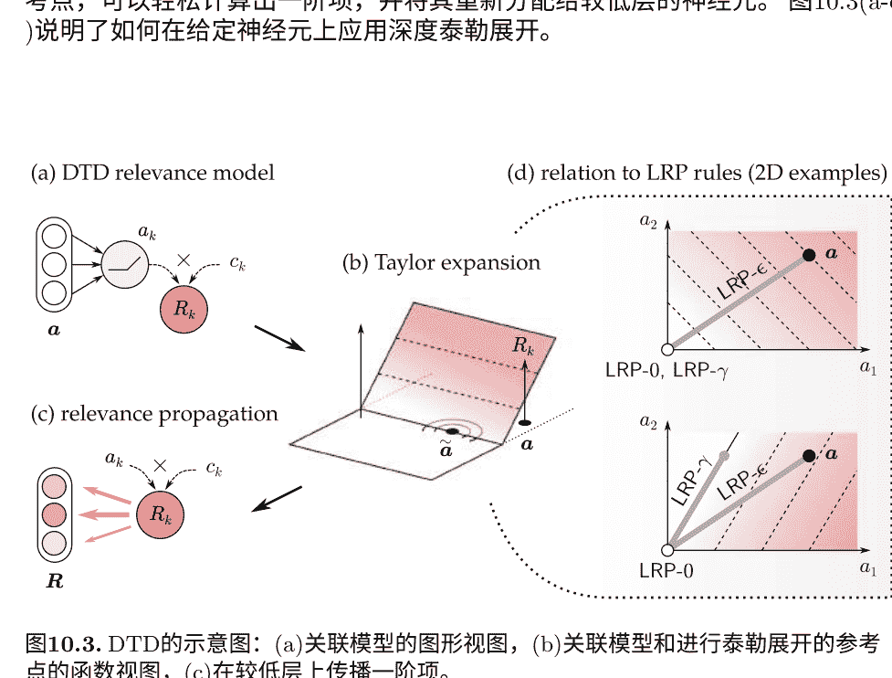

与LRP-0/γ的关系。每个参考点的选择都会导致不同的关联重新分配方式。有趣的是，特定的参考点选择会归结为第10.2.1节中定义的LRP传播规则。通过选择ã = 0，可以恢复LRP-0。通过选择ã = γ·(a_k + 2)^{-1}a，可以恢复LRP-2。通过选择ã为ReLU拐点与线{a - t·a^(1+γ)·1_w | t ∈ R}的交点，可以恢复LRP-γ。其中1_{(.)}是一个逐元素应用的指示函数。在图10.3 (d) 中进一步说明了LRP和DTD根点之间的关系。对于所有三个LRP传播规则，可以证明DTD参考点始终满足ã ≧ 0，因此与作为输入接收到的ReLU激活的域匹配[36]。可以观察参考点的另一个属性是距离越小，解释的上下文化程度越高，出现矛盾的输入变量数量越低。LRP-0具有最大的距离。LRP-ε和LRP-γ显著减小了这个距离。

#### 10.3 哪种LRP规则适用于哪个层？

作为传播的一般框架，LRP在每个层上使用哪个规则以及如何设置参数ε和γ都具有很大的灵活性。要最优地选择LRP参数，需要衡量解释质量。如何评估解释质量仍然是一个活跃的研究课题[16,38,40,43]，而且在本章中无法进行全面讨论。相反，我们从两个普遍认可的理想解释属性的角度讨论LRP：忠实度和可理解性[52]。换句话说，解释应该是对感兴趣的输出神经元的准确表示，并且对人类来说也应该容易解释。请注意，要在视觉上评估解释的忠实度，需要假设网络以“地面真实”方式解决了任务，即使用正确的视觉特征来支持其预测，并忽略图像中的干扰因素。

图10.4显示了给定输入图像（尺寸为224×224）的VGG-16 [48]输出神经元“城堡”的各种LRP解释。这些解释要么通过在所有层上统一应用单一传播规则获得，要么通过复合策略[29]在不同层上使用不同规则获得。

我们观察到解释之间存在明显的差异。Uniform LRP-0选择了许多函数的局部特征。该解释过于复杂，没有足够关注图像中的实际城堡。该解释既不忠实也不易理解。Uniform LRP-ε通过去除解释中的噪声元素，只保留与图像中实际城堡相匹配的有限数量的特征。这是一个忠实的解释，但过于稀疏，不易理解。Uniform LRP-γ对人类来说更容易理解，因为特征更密集地突出显示，但它也选择了不相关的概念，如路灯，使其不忠实。复合LRP克服了上述方法的缺点。正确识别并完全突出了城堡的特征，从而使解释既忠实又易于理解。

复合LRP提供更好解释的原因可以追溯到VGG-16神经网络的各个层之间的定性差异：

上层只有大约4,000个神经元（即平均每个类别4个神经元），这使得形成不同类别的许多概念可能相互交织。在这种情况下，接近函数及其梯度的传播规则（例如LRP-0）将对这些交织不敏感。

中间层具有更加解缠的表示，然而，多层堆叠和卷积中的权重共享引入了虚假变化。LRP-0可以滤除这些虚假变化，并仅保留最显著的解释因素。

较低的层与中间层相似，但是在这里，LRP-γ更适合，因为这个规则倾向于将相关性均匀地传播到整个特征上，而不是捕捉每个单独像素的贡献。这使得解释对人类更易理解。

总体而言，为了成功地将LRP应用于新任务，重要的是仔细检查神经网络层的属性，并询问人类对什么样的解释最易理解。

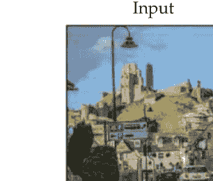

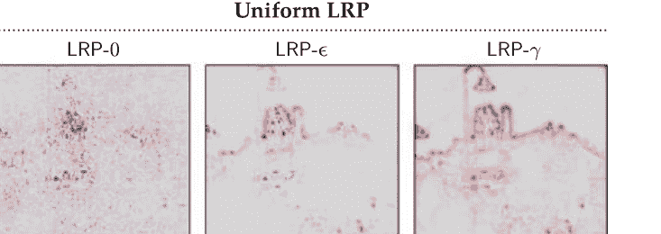

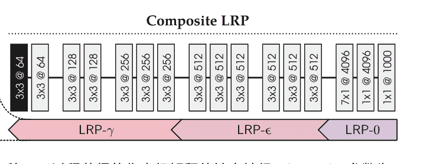

图10.4. 输入图像和使用各种LRP过程获得的像素级解释的输出神经元'castle'。参数为ε=0.25和γ=0.25。

##### 10.3.1 处理顶层

到目前为止，我们解释的数量是得分 $z_c$，计算自较低层激活 $(a_k)_k$ 如下：

$$z_c = \sum_{0,k} a_k w_{kc}$$

它通过softmax函数 $P(\omega_c)$ 与预测的类概率相关联，公式如下：$\exp(z_c)/\sum_{c'}\exp(z_{c'})$。图10.5（中间）显示了对包含机车、客车和其他背景元素的图像的得分 $z_c$ 客车的解释。解释保留了客车的特征，但也包含了前面的机车的特征。这表明得分 $z_c$ 并不真正选择性地解释类别。

或者，我们可以选择解释η_c = log[P(ω_c)/(1-P(ω_c))], 它可以通过以下层次表示:

```
z_{cc'} = ∑_{0,k} a_k (w_{kc} - w_{kc'})
η_c = -log ∑_{c'≠c} exp(-z_{cc'})
```

第一层表示log[P(ω_c)/P(ω_c')], 第二层对这些比率进行反向log-sum-exp汇聚。 这种类型的汇聚层的传播规则在[26]中提出：相关性根据最小取最多策略重新分配给汇聚神经元。

```
R_{c,c'} = z_{c,c'} · exp(-z_{c,c'})/∑_{c''≠c} exp(-z_{c,c''})
```

这些分数可以进一步传播到神经网络中，使用通常的LRP规则。图10.5（右侧）显示了对η_乘客车的解释。正面证据变得更稀疏，机车变成蓝色（即负相关）。这反映了图像中机车的存在提高了类别“机车”的概率，从而降低了类别“乘客车”的概率。

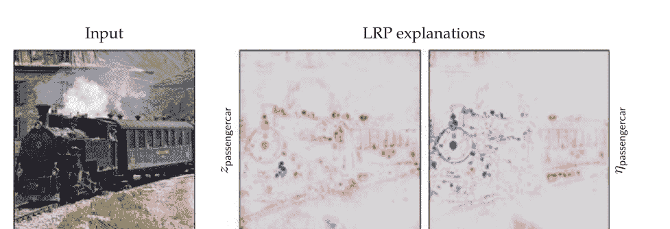

图10.5. 对于输出神经元'乘客车'和类别'乘客车'的实际概率，得到的解释如下。机车从正相关转为负相关。

##### 10.3.2 处理特殊层

实际的神经网络通常配备了一些特殊层，以促进优化，将一些预定义的不变性纳入模型，或处理特定类型的输入数据。 我们简要介绍如何在LRP框架内处理其中一些层。

空间汇聚层通常在卷积层之间使用，以促进模型中的局部平移不变性。 应用于正激活的总汇聚层可以很容易地重写为标准的线性-ReLU层。 因此，我们在这里介绍的所有LRP规则也可以应用于总汇聚层。 另一方面，最大汇聚层可以通过赢者通吃的重新分配方案[7]或使用与总汇聚情况相同的规则来处理[36,37]。在本章中，我们使用了第二个选项。

批量归一化层通常用于促进训练和提高预测准确性。在测试时，它们只是一个居中和重新缩放的操作。因此，这些层可以被相邻的线性层吸收而不改变函数。这样可以恢复应用LRP所需的规范神经网络结构。

输入层与中间层不同，因为它们不接收ReLU激活作为输入，而是像素或实际值。这些层的特殊规则也可以从DTD框架[36]中推导出来（参见附录10.A）。在本章中，我们使用了适用于像素的 $z^\mathcal{B}$ 规则。

#### 10.4 LRP超越深度网络

深度神经网络在涉及分类和回归的任务上取得了特别成功。其他问题，如无监督建模、时间序列预测和成对匹配，传统上由其他类型的模型处理。在这里，我们讨论了各种扩展，使得LRP可以应用于这个更广泛的模型类别。

**无监督模型**。无监督学习算法从未标记的数据中提取结构，可以预测成员资格或异常程度等属性。为了解释这些预测，提出了一种称为神经化传播（NEON）的新方法[25,26]：首先将学习的无监督模型“神经化”（即转化为功能等效的神经网络）。然后，构建一个LRP过程，以便在神经网络中向后传播预测。

在单类SVM中[44]，预测的异常可以被重新写成对支持向量距离的最小池化[25]。类似地，在k-means中，预测的簇成员资格可以被重新写成在竞争簇之间的局部线性判别式的汇聚[26]。对于每个提取的神经网络，可以基于DTD方法设计适当的LRP规则。总的来说，所提出的神经化传播方法使这些无监督模型具备了快速可靠的解释能力。

**时间序列预测**。为了预测时间序列的下一步，理想情况下，人们必须能够识别出潜在的动态系统并向前模拟它。一个流行的模型是LSTM [22]。它使用的是类型的乘积相互作用

$$ h_k = \text{sigm}\left(\sum_j a_j v_{jk} + c_k\right) \cdot g\left(\sum_j a_j w_{jk} + b_k\right) $$

第一项是一个门，调节信号在内部状态和现实世界之间的传递。第二项是信号本身。在这些模型中应用LRP的一个成功策略是让所有相关性通过第二项流动[6,40,42,56]。此外，当选择g为ReLU函数，并且如果门控函数严格为正或局部恒定，则可以在DTD框架内对这种策略进行合理化。

**成对匹配**。当预测两个向量 $x \in \mathcal{X}$ 和 $y \in \mathcal{Y}$ 是否匹配时，可能需要解释的最后一个问题。例如，在建模图像和其转换版本之间的关系时[34]，或者在推荐系统中，建模用户和产品之间的关系时[55]，会出现这个问题。成对匹配的一种方法是构建类型的产品神经元 $a_k = \max(0, \sum_{i} x_i w_{ik}) \cdot \max(0, \sum_{j} y_j v_{jk})$ 这个神经元乘积的传播规则由[31]给出：

$$R_{ij} = \sum_{k} \frac{x_i y_j w_{ik} v_{jk}}{\sum_{ij} x_i y_j w_{ik} v_{jk}} R_k.$$

当考虑二阶泰勒展开时，这个传播规则也可以从DTD中推导出来。由此产生的解释是关于每个模态的输入特征对 $i$ 和 $j$ 的配对。

#### 10.5 结论

我们回顾了一种名为层级相关传播（LRP）的技术，它可以通过在网络中向后传播预测来解释复杂的最新神经网络的预测结果。LRP具有一些吸引人的特性：传播规则可以在大多数现代神经网络软件中高效且模块化地实现，其中一些规则还可以嵌入到深度泰勒分解框架中。LRP规则的参数可以设置为高解释质量，即使对于复杂模型也能获得高解释质量。最后，LRP不仅适用于深度神经网络分类器，还适用于更广泛的机器学习模型和任务。这使得它适用于许多需要解释的实际场景。

致谢。这项工作得到了德国教育和研究部的支持，作为柏林大数据中心（01IS14013A），柏林机器学习中心（01IS18037I）和TraMeExCo（01IS18056A）。感谢DFG的部分资助（EXC 2046/1，项目编号：390685689）。这项工作还得到了韩国政府信息通信技术规划与评估研究所（IITP）的资助（编号2017-0-00451，编号2017-0-01779）。

#### 附录

##### 10.A 常用的LRP规则列表

下表列出了一些常用于解释具有ReLU非线性的深度神经网络的传播规则，该列表并不详尽。表中的最后一列表示这些规则是否可以从深度Taylor分解[36]框架中推导出来。

在这里，我们使用符号 $(\cdot)^+ = \max(0, \cdot)$ 和 $(\cdot)^- = \min(0, \cdot)$。对于LRP-$\alpha\beta$规则，参数$\alpha, \beta$受到守恒约束条件的限制，即$\alpha = \beta + 1$。对于 $z^\mathcal{B}$规则，参数 $l_i, h_i$ 定义了输入域的边界约束条件 ($\forall_i : l_i \leq x_i \leq h_i$)。

| 名称 | 公式 | 用途 | DTD |
|------|------|------|-----|
| LRP-0 [7] | $R_j = \sum_k \frac{a_j w_{jk}}{\sum_{0,j} a_j w_{jk}} R_k$ | 上层 | ✓ |
| LRP-ε [7] | $R_j = \sum_k \frac{a_j w_{jk}}{\epsilon + \sum_{0,j} a_j w_{jk}} R_k$ | 中间层 | ✓ |
| LRP-γ | $R_j = \sum_k \frac{a_j (w_{jk} + \gamma w_{jk}^+)}{\sum_{0,j} a_j (w_{jk} + \gamma w_{jk}^+)} R_k$ | 底层 | ✓ |
| LRP-αβ [7] | $R_j = \sum_k \left( \alpha \frac{(a_j w_{jk})^+}{\sum_{0,j} (a_j w_{jk})^+} - \beta \frac{(a_j w_{jk})^-}{\sum_{0,j} (a_j w_{jk})^-} \right) R_k$ | 底层 | ×ᵃ |
| 平坦 [30] | $R_j = \sum_k \frac{1}{\sum_{j} 1} R_k$ | 底层 | × |
| w²规则 [36] | $R_i = \sum_j \frac{w_{ij}^2}{\sum_i w_{ij}^2} R_j$ | 第一层 ( $\mathbb{R}^d$ ) | ✓ |
| z^β规则 [36] | $R_i = \sum_j \frac{x_i w_{ij} - l_i w_{ij}^+ - h_i w_{ij}^-}{\sum_i x_i w_{ij} - l_i w_{ij}^+ - h_i w_{ij}^-} R_j$ | 第一层 (像素) | ✓ |
| (仅适用于 α=1, β=0的DTD解释。) | | | |

##### 10.B 相关模型的证明

我们在这里给出了类似于[36,37]的证明，即当相关性 $R_k$ 是通过在更高的层次应用 LRP-0/ε/γ 得到的时，Sect. 10.2.3 中的相关模型 $R_k(\mathbf{a})$ 是合适的。通用传播规则

```
R_k = \sum_l \frac{a_k \cdot \rho(w_{kl})}{\epsilon + \sum_{0,k} a_k \cdot \rho(w_{kl})} R_l
```

其中 LRP-0/ε/γ 是特殊情况，可以重写为 $R_k = a_k c_k$，其中

```
c_k(\mathbf{a}) = \sum_l \rho(w_{kl}) \frac{\max\left(0, \sum_{0,k} a_k(\mathbf{a}) \cdot w_{kl}\right)}{\epsilon + \sum_{0,k} a_k(\mathbf{a}) \cdot \rho(w_{kl})} c_l(\mathbf{a})
```

其中对较低激活的依赖已经明确表示出来。假设 $c_l(\mathbf{a})$ 在 $\mathbf{a}$ 方面近似局部常数。由于其他依赖于 $\mathbf{a}$ 的项被两个嵌套求和所稀释，可以合理地假设 $c_k(\mathbf{a})$ 再次近似局部常数，这是相关性模型 $R_k(\mathbf{a})$ 所做的假设。

### 参考文献

1.  Alber, M., et al.: iNNvestigate神经网络! . 机器学习研究杂志 **20(93)**, 1-8 (2019)
2.  Amodei, D., et al.: Deep speech 2 : end-to-end speech recognition in English and Mandarin. In: Proceedings of the 33nd International Conference on Machine Learning, pp. 173–182 (2016)
3.  Anders, C., Montavon, G., Samek, W., Müller, K.-R.: 通过解释预测来理解基于补丁的视频数据学习。 在: Samek, W., Montavon, G., Vedaldi, A., Hansen, L.K., Müller, K.R., et al. (eds.) 可解释AI, LNCS, vol.11700, pp. 297–309. Springer, Cham (2019)
4.  Arbabzadah, F., Montavon, G., M"uller, K., Samek, W.: 通过解构神经网络识别个体面部表情。 在：第38届德国模式识别大会, pp. 344-354 (2016)
5.  Arras, L., Horn, F., Montavon, G., M"uller, K.R., Samek, W.: “在文本文档中什么是相关的？”：一种可解释的机器学习方法。 PLoS ONE 12(8),e0181142 (2017)
6.  Arras, L., Montavon, G., M"uller, K.R., Samek, W.: 在情感分析中解释循环神经网络预测。 在：第8届EMNLP计算主观性、情感和社交媒体分析研讨会论文集, 第159-168页 (2017年)
7.  Bach, S., Binder, A., Montavon, G., Klauschen, F., M"uller, K.R., Samek, W.: 通过逐层相关传播对非线性分类器决策进行像素级解释。 PLoS ONE 10(7), e0130140 (2015)
8.  Baehrens, D., Schroeter, T., Harmeling, S., Kawanabe, M., Hansen, K., M"uller,K.: 如何解释个体分类决策。机器学习研究杂志, 第11卷, 第1803-1831页 (2010年)
9.  Baldi, P., Sadowski, P., Whiteson, D.: 用深度学习在高能物理中搜索异域粒子。自然通讯, 第5卷, 第1期 (2014年)。文章编号4308
10. Balduzzi, D., Frean, M., Leary, L., Lewis, J.P., Ma, K.W., McWilliams, B.: 破碎的梯度问题：如果ResNet是答案, 那问题是什么？ 在：第34届国际机器学习大会论文集, 第342-350页 (2017年)
11. Bazen, S., Joutard, X.: 泰勒分解：非线性模型的奥萨卡方法的统一推广。工作论文, HAL (2013年)
12. Binder, A., et al.: 走向计算荧光显微镜：基于机器学习的形态和分子肿瘤特征的综合预测。 CoRR abs/1805.11178 (2018年)
13. Calude, C.S., Longo, G.: 大数据中虚假相关性的洪水。 Found. Sci. 22 (3) , 595-612 (2017年)
14. Chmiela, S., Tkatchenko, A., Sauceda, H.E., Poltavsky, I., Schütt, K.T., Müller, K.R.: 精确能量守恒分子力场的机器学习。 Sci. Adv. 3 (5) , e1603015 (2017年)
15. Clark, P., Matwin, S.: 使用定性模型指导归纳学习。 在：第10届国际机器学习会议论文集, 第49-56页 (1993年)
16. Doshi-Velez, F., Kim, B.: 在可解释机器学习中考虑评估和泛化。 在：Escalante, H.J .等 (编) 计算机视觉和机器学习中的可解释和可解释模型。 TSSCML, 第3-17页。 Springer, Cham (2018年)。 https://doi.org/10.1007/978-3-319-98131-4
17. Esteva, A.等：使用深度神经网络对皮肤癌进行皮肤科医生级别的分类。 Nature 542 (7639), 115-118 (2017年)
18. Fong, R.C., Vedaldi, A.: 通过有意义的扰动对黑盒子进行可解释解释。 在：IEEE国际计算机视觉会议上, 第3449-3457页 (2017年)
19. Guyon, I., Elisseeff, A.: 变量和特征选择简介。机器学习研究杂志 3, 1157-1182 (2003)
20. He, X., Liao, L., Zhang, H., Nie, L., Hu, X., Chua, T.: 神经协同过滤。 在：第26届国际万维网会议论文集, pp. 173-182 (2017)

### 11 解释和解读LSTMs

Leila Arras, José Arjona-Medina, Michael Widrich, Grégoire Montavon, Michael Gillhofer, Klaus-Robert Müller, Sepp Hochreiter, 和 Wojciech Samek

1 弗劳恩霍夫海因里希赫兹研究所，德国柏林10587
{leila.arras,wojciech.samek}@hhi.fraunhofer.de
2 林茨约翰内斯·开普勒大学，奥地利林茨4040
{arjona,widrich,gillhofer,hochreit}@ml.jku.at
3 柏林工业大学，德国柏林10587
{gregoire.montavon,klaus-robert.mueller}@tu-berlin.de
4 韩国国立大学，首尔02841，韩国
5 马克斯普朗克信息学研究所，66123萨尔布吕肯，德国

摘要。尽管神经网络在现代人工智能系统的设计中起到了强大的统一作用，但由于要解决的任务种类繁多，神经网络架构本身仍然高度异构。在本章中，我们探讨了如何将用于解释前馈网络预测的层级相关传播（LRP）技术调整为用于顺序数据建模和预测的LSTM架构。LSTM中的特殊累加器和门控交互需要新的传播方案和扩展基础理论框架，以提供准确的解释。

关键词：可解释人工智能 · 模型透明度 · 循环神经网络 · LSTM · 可解释性

#### 11.1 引言

在实际应用中，构建高性能的AI系统并不总是唯一的目标，解释性也可能是一个重要问题[16]。

最近关于可解释AI的大部分研究都集中在前馈神经网络上，特别是用于图像识别的深度整流网络和变种[68,79]。在这种设置下，层级相关传播（LRP）[6,51]被证明能为VGG-16等最先进的模型提供既有信息又快速计算的解释，并且可以嵌入深度泰勒分解的框架[52]。

L. Arras和J. Arjona-Medina对这项工作做出了同等贡献。

然而，在存在顺序数据的情况下，可能需要在神经网络模型中加入时间结构，例如对未来时间步骤进行预测。在这种情况下，关键是能够学习底层动态系统，例如使用递归神经网络，以便可以进行向前模拟。使用递归神经网络学习具有长期依赖关系的动态系统存在一些挑战。通过时间的反向传播学习信号往往会出现爆炸或消失的情况[10,30]。为了减少这种困难，提出了特殊的神经网络架构，特别是长短期记忆（LSTM）[30,35,37]，它利用了特殊的累加器和门控函数。

多个架构变化和顺序预测任务的独特性使得直接应用LRP类型的解释技术变得不直观。为了能够提供准确的解释，需要仔细检查形成模型的LSTM块的结构及其相互作用。

在本章中，我们探讨了LRP技术与LSTM之间的多个接口维度。首先，我们分析了LRP传播机制如何适应LSTM中的累加器和门控交互。我们的新传播方案嵌入在深度Taylor分解框架[52]中，并在情感分析和玩具数值任务上进行了实证验证。此外，我们研究了对LSTM架构的修改，特别是对细胞输入激活、遗忘和输出门以及网络连接的修改，使解释更加直观，并将这些变化应用于强化学习案例。

本章详细阐述了我们之前的工作[2,5]。

#### 11.2 背景

##### 11.2.1 长短期记忆（LSTM）

最近，长短期记忆（LSTM; [30,35,37]）网络在语音和语言处理中成为表现最好的技术。LSTM网络在不同的语音和语言应用中取得了巨大成功，包括手写识别[24]、文本生成[23]、语言建模和识别[22,78]、自动语言翻译[73]、语音识别[17,63]、音频数据分析[49]、视频数据分析、注释和描述[15,70,76]。LSTM在TIMIT音素识别、光学字符识别、文本到语音合成、语言识别、大词汇量语音识别、英法翻译、音频起始检测、社交信号分类、图像字幕生成、视频到文本描述、端到端语音识别和语义表示方面取得了最新的基准记录。

LSTM的关键思想是使用内存单元，在训练过程中允许持续的错误流动。因此，LSTM避免了梯度消失问题，即训练错误在通过时间反向传播时逐渐减小的现象[30,33]。梯度消失问题严重阻碍了在循环神经网络中的信用分配，即正确识别出效果不立即出现但可能有很长延迟的相关事件。LSTM通过其持续的误差流避免了梯度消失，并且允许统一的信用分配，即所有输入信号获得类似的误差信号。其他循环神经网络无法给所有输入信号分配相同的信用，因此在找到解决方案方面非常有限。统一的信用分配使LSTM网络在语音和语言任务中表现出色：如果分析一句话，那么第一个词和最后一个词都可能很重要。通过统一的信用分配，LSTM网络将句子的所有单词都视为同等重要。统一的信用分配使得在学习的每个阶段都能考虑到输入序列中的所有信息，无论其位置在哪里。因此，统一的信用分配揭示了学习算法中更多的解决方案，否则这些解决方案将保持隐藏。

图11.1. 没有窥视孔的LSTM记忆细胞。z是细胞输入激活的向量，i是输入门激活的向量，f是遗忘门激活的向量，c是记忆细胞状态的向量，o是输出门激活的向量，y是细胞输出激活的向量。激活函数g用于细胞输入，h用于细胞状态，σ用于门。数据流要么是“前馈”没有延迟，要么是“循环”有一步延迟。“输入”连接是从外部输入到LSTM网络的，而“循环”连接是从LSTM网络中的其他记忆细胞输出y获取输入，并延迟一时间步，根据公式11.1-11.6。细胞状态c还通过与遗忘门f的乘法进行一时间步的延迟的循环连接，并通过与当前输入的求和进行累积。

LSTM循环网络的中央处理和存储单元是记忆细胞。正如已经提到的，它避免了梯度消失，并允许统一的信用分配。文献中最常用的LSTM记忆细胞架构[25,66]包含遗忘门[19,20]和窥视孔连接[18]。在我们之前的工作中[34,38]，我们发现窥视孔连接只对建模时间序列有用，而对语言、元学习或生物序列没有用。最近在一项大型评估中证实了窥视孔连接可以在不降低性能的情况下被移除[26]。虽然LSTM网络在各种应用中非常成功，但自2000年以来，中央记忆细胞架构没有进行修改[66]。图11.1显示了一种没有窥视孔的记忆细胞架构。

在我们对LSTM网络的定义中，一种类型的所有单元都被汇集到一个向量中：z是细胞输入激活的向量，i是输入门激活的向量，f是遗忘门激活的向量，c是记忆细胞状态的向量，o是输出门激活的向量，y是细胞输出激活的向量。

我们假设有一个输入序列，在时间t的输入向量是$x_t$。矩阵$W_z, W_i, W_f$和$W_o$分别对应于输入和细胞输入、输入门、遗忘门和输出门之间的连接的权重。矩阵$U_z, U_i, U_f$和$U_o$分别对应于具有一步延迟的细胞输出激活与细胞输入、输入门、遗忘门和输出门之间的连接的权重。向量$b_z, b_i, b_f$和$b_o$分别是细胞输入、输入门、遗忘门和输出门的偏置向量。激活函数g用于细胞输入，h用于细胞状态，σ用于门控，如果这些函数应用于向量，则以逐元素方式进行评估。通常，使用sigmoid函数

$$\frac{1}{1+\exp(-x)}$$

或tanh被用作激活函数。⊙表示两个向量的逐点乘法。没有peepholes，LSTM记忆单元的前向传递规则如下（见图11.1）：

$$z_t = g(W_z x_t + U_z y_{t-1} + b_z) \quad \text{细胞输入} \quad (11.1)$$
$$i_t = \sigma(W_i x_t + U_i y_{t-1} + b_i) \quad \text{输入门} \quad (11.2)$$
$$f_t = \sigma(W_f x_t + U_f y_{t-1} + b_f) \quad \text{遗忘门} \quad (11.3)$$
$$c_t = i_t \odot z_t + f_t \odot c_{t-1} \quad \text{细胞状态} \quad (11.4)$$
$$o_t = \sigma(W_o x_t + U_o y_{t-1} + b_o) \quad \text{输出门} \quad (11.5)$$
$$y_t = o_t \odot h(c_t) \quad \text{细胞输出} \quad (11.6)$$

长期依赖与统一信用分配

LSTM网络旨在学习跨越长时间间隔的序列中的长期依赖[31,32,36,37]。然而，除了提取长期依赖关系，LSTM记忆单元在序列学习中还有另一个更重要的优势：正如早在1990年代就已经描述的那样，LSTM记忆单元允许进行统一的信用分配，即将错误传播回输入而不进行缩放[30]。对于统一的信用分配

---

- 21. Hettwer, B., Gehrerr, S., Guneysu, T.: 用于泄漏分析和对称密钥恢复的深度神经网络归因方法。IACR密码学电子打印档案2019, 143 (2019)
- 22. Hochreiter, S., Schmidhuber, J.: 长短期记忆。神经计算 9(8), 1735–1780 (1997)
- 23. Hochuli, J., Helbling, A., Skaist, T., Ragoza, M., Koes, D.R.: 可视化卷积神经网络蛋白质-配体评分。分子图形模型杂志 84, 96–108 (2018)
- 24. Horst, F., Lapuschkin, S., Samek, W., Müller, K.R., Schöllhorn, W.I.: 用深度学习解释个体步态模式的独特性质。科学报告。9, 2391 (2019)
- 25. Kauffmann, J., Müller, K.R., Montavon, G.: 朝着解释异常的方向：一类模型的深度Taylor分解。CoRR abs/1805.06230 (2018)
- 26. Kauffmann, J., Esders, M., Montavon, G., Samek, W., Müller, K.R.: 通过神经网络从聚类到聚类解释。CoRR abs/1906.07633 (2019)
- 27. Landecker, W., Thomure, M.D., Bettencourt, L.M.A., Mitchell, M., Kenyon, G.T., Brumby, S.P.: 解释分层网络的个体分类。在：IEEE计算智能和数据挖掘研讨会，第32-38页 (2013)
- 28. Lapuschkin, S., Binder, A., Montavon, G., Müller, K.R., Samek, W.: 分析分类器：Fisher向量和深度神经网络。在：IEEE计算机视觉和模式识别会议论文集，第2912-2920页 (2016年)
- 29. Lapuschkin, S., Binder, A., Müller, K.R., Samek, W.: 理解和比较年龄和性别分类的深度神经网络。在：IEEE国际计算机视觉会议工作坊，第1629-1638页 (2017年)
- 30. Lapuschkin, S., Wäldchen, S., Binder, A., Montavon, G., Samek, W., Müller, K.R.: 揭示聪明的汉斯预测器并评估机器真正学到了什么。自然通讯。10, 1096 (2019年)
- 31. Leupold, S.: 用于解释图像空间变换的二阶泰勒分解。柏林工业大学硕士论文 (2017)
- 32. Mao, H., Alizadeh, M., Menache, I., Kandula, S.: 使用深度强化学习进行资源管理。在：第15届ACM热点网络研讨会论文集，第50-56页 (2016年)
- 33. Mayr, A., Klambauer, G., Unterthiner, T., Hochreiter, S.: DeepTox: 使用深度学习进行毒性预测。环境科学前沿 3, 80 (2016年)
- 34. Memisevic, R., Hinton, G.E.: 用高阶分解Boltzmann机器学习表示空间变换。神经计算 22(6), 1473-1492 (2010年)
- 35. Mnih, V., 等: 通过深度强化学习实现人类水平控制。Nature 518(7540), 529–533 (2015)
- 36. Montavon, G., Lapuschkin, S., Binder, A., Samek, W., Müller, K.R.: 通过深度Taylor分解释非线性分类决策。Pattern Recogn. 65, 211–222 (2017)
- 37. Montavon, G., Samek, W., Müller, K.R.: 解释和理解深度神经网络的方法。Digital Signal Process. 73, 1–15 (2018)
- 38. Narayanan, M., Chen, E., He, J., Kim, B., Gershman, S., Doshi-Velez, F.: 人类如何理解机器学习系统的解释？对解释的人类可解释性的评估。CoRR abs/1802.00682 (2018)
- 39. Perotin, L., Serizel, R., Vincent, E., Guérin, A.: 基于CRNN的声强特征多DoA估计用于全向声录音。J. Sel. Top. Signal Process. 13(1), 22–33 (2019)
- 40. Poerner, N., Schütze, H., Roth, B.: 使用混合文档和形态句法一致性评估神经网络解释方法。在：计算语言学协会第56届年会论文集，第340-350页 (2018年)
- 41. Ribeiro, M.T., Singh, S., Guestrin, C.: “为什么我应该相信你？”：解释任何分类器的预测。在：第22届ACM SIGKDD国际数据挖掘会议论文集，第1135-1144页 (2016年)
- 42. Rieger, L., Chormai, P., Montavon, G., Hansen, L.K., Müller, K.-R.: 为更可解释的预测构建神经网络。在：Escalante, H.J.等人 (编) 计算机视觉和机器学习中的可解释和可解释模型。TSSCML, 第115-131页。Springer, Cham (2018年)。https://doi.org/10.1007/978-3-319-98131-4_5
- 43. Samek, W., Binder, A., Montavon, G., Lapuschkin, S., Müller, K.R.: 评估深度神经网络学到的内容的可视化。IEEE Trans. Neural Networks Learn. Syst. 28(11), 2660–2673 (2017)
- 44. Schölkopf, B., Williamson, R.C., Smola, A.J., Shawe-Taylor, J., Platt, J.C.: 支持向量方法用于新颖性检测。Adv. Neural Inf. Process. Syst. 12, 582–588 (1999)
- 45. Schütt, K.T., Arbabzadah, F., Chmiela, S., Müller, K.R., Tkatchenko, A.: 深度张量神经网络的量子化学洞察。Nature Commun. 8, 13890 (2017)
- 46. Shrikumar, A., Greenside, P., Kundaje, A.: 通过传播激活差异学习重要特征。在：第34届国际机器学习大会论文集，第3145-3153页 (2017年)
- 47. Shrikumar, A., Greenside, P., Shcherbina, A., Kundaje, A.: 不仅仅是一个黑盒子：通过传播激活差异学习重要特征。CoRR abs/1605.01713 (2016)
- 48. Simonyan, K., Zisserman, A.: 非常深的卷积网络用于大规模图像识别。在：第三届学习表示国际会议 (2015年)
- 49. Smilkov, D., Thorat, N., Kim, B., Viégas, F.B., Wattenberg, M.: SmoothGrad：通过添加噪声去除噪声。CoRR abs/1706.03825 (2017)
- 50. Sturm, I., Lapuschkin, S., Samek, W., Müller, K.R.: 可解释的深度神经网络用于单次试验的EEG分类。神经科学方法 274, 141–145 (2016)
- 51. Sundararajan, M., Taly, A., Yan, Q.: 深度网络的公理归因。在：第34届国际机器学习大会论文集，第3319-3328页 (2017年)
- 52. Swartout, W.R., Moore, J.D.: 第二代专家系统中的解释。在：David, J.M., Krivine, J.P., Simmons, R. (eds.) 第二代专家系统，第543-585页。Springer, Heidelberg (1993年)。https://doi.org/10.1007/978-3-642-79275-5_24
- 53. Szegedy, C., et al.: 神经网络的有趣特性。在：第二届国际学习表示会议 (2014年)
- 54. Szegedy, C., Vanhoucke, V., Ioffe, S., Shlens, J., Wojna, Z.: 重新思考计算机视觉中的inception架构。在：IEEE计算机视觉和模式识别大会上，第2818-2826页 (2016年)
- 55. Xue, H., Dai, X., Zhang, J., Huang, S., Chen, J.: 用于推荐系统的深度矩阵分解模型。在：第26届国际人工智能联合会议论文集，第3203-3209页 (2017年)
- 56. Yang, Y., Tresp, V., Wunderle, M., Fasching, P.A.: 用神经网络中的逐层相关传播解释治疗预测。在：IEEE国际医疗信息学会会议论文集，第152-162页 (2018年)
- 57. Yuan, X., He, P., Zhu, Q., Li, X.: 对深度学习的对抗性示例：攻击和防御。IEEE Trans. Neural Networks Learn. Syst. 1-20 (2019年)
- 58. Zeiler, M.D., Fergus, R.: 可视化和理解卷积网络。在：Fleet, D., Pajdla, T., Schiele, B., Tuytelaars, T. (eds.) ECCV 2014. LNCS, vol. 8689, pp. 818-833. Springer, Cham (2014)。https://doi.org/10.1007/978-3-319-10590-1_53
- 59. Zhang, J., Bargal, S.A., Lin, Z., Brandt, J., Shen, X., Sclaroff, S.: 自上而下的神经注意力通过激励反向传播。Int. J. Comput. Vis. 126(10), 1084-1102 (2018年)
- 60. Zintgraf, L.M., Cohen, T.S., Adel, T., Welling, M.: 可视化深度神经网络的决策：预测差异分析。在：国际学习表示会议 (2017年)

对于当前LSTM架构，遗忘门 $f$ 必须为一或接近一。没有输入门 $i$ 的记忆单元只是对扫描输入序列期间接收到的所有压缩输入求和。因此，这样的记忆单元等效于一个同时看到所有序列元素的单元，这已经通过“Ersatzschaltbild”（英语等效电路图）[30]得到证明。

如果输出错误仅发生在序列的末尾，这样的记忆单元通过反向传播，在每个时间步骤上为单元输入单元提供相同的增量错误。因此，所有输入都获得相同的信用来产生正确的输出，并且被视为同等级别，因此，记忆单元的输入单元的传入权重通过使用相同的增量错误进行调整。与LSTM记忆单元相反，标准递归网络会缩放增量错误并为不同的输入分配不同的信用。输入越新，获得的信用越多。序列的第一个输入对于递归网络的最终状态是隐藏的。然而，在许多学习任务中，重要信息分布在整个序列的长度上，甚至可能出现在开头。例如，在与语言和文本相关的任务中，第一个词通常对于句子的意义很重要。如果信用分配沿着输入序列不均匀，那么学习将非常有限。学习将通过仅使用最近的输入来尝试改进预测。因此，可以找到的解决方案受到限制，只能在考虑最后的输入时构建。因此，只有那些可以通过梯度下降从仅使用最近的输入信息的参数空间中访问的解决方案才会被找到。一般来说，这些限制导致次优解，因为学习陷入局部最优解。通常，这些局部最优解对应于在输入序列中高效利用最近信息的解，而过去的信息被忽视。

##### 11.2.2 分层相关传播（LRP）

分层相关传播（LRP）[6]（参见[51]进行概述）是一种解释深度神经网络个别预测的技术，以输入变量为基础进行解释。对于给定的输入和神经网络的预测，它为每个输入变量分配一个分数，指示它们对预测的贡献程度。LRP通过启发式传播规则将预测反向传播到网络的每一层来工作[6]。就计算成本而言，LRP方法非常高效，因为它可以在网络的一次前向和后向传递中计算。在各种应用中，LRP已被证明能够产生准确的解释，即使是在计算机视觉中使用的高度复杂和非线性网络中[6,64]。此外，它能够检测到用于训练的模型和数据集中的偏差[44]，例如在Pascal VOC 2012数据集中与“马”类别错误相关的版权标签的存在。此外，它还被用于在科学和医学应用中获得新的见解[39,71,77]，解释聚类[40]，分析音频数据[9,75]，以及比较用于主题分类的文本分类器[3]。

保守传播。LRP通过逐层重新分配神经网络输出来解释，直达到输入层。与其他作品（如[41,67,80]）类似，LRP实施的传播过程基于局部守恒原则：任何更高层神经元接收到的净数量或相关性以相同的数量重新分配给下一层的神经元。这样，相关性的流动类似于基尔霍夫第一定律，用于电荷守恒，或者类似于物理学中的连续方程，用于一般形式的传输。具体而言，如果 j 和 k 是两个连续层中神经元的索引，并且用 $R_{j\leftarrow k}$表示两个神经元之间流动的相关性，我们有以下方程：

$$\sum_{j} R_{j\leftarrow k} = R_k$$
$$R_j = \sum_{k} R_{j\leftarrow k}.$$

这种局部的保护措施会引起较粗粒度尺度上的保护，尤其是相邻层之间的保护 $\sum_{j} R_j = \sum_{j} \sum_{k} R_{j\leftarrow k} = \sum_{k} R_j = \sum_{k} \sum_{j} R_{j\leftarrow k} = \sum_{k} R_k$，最终，在整个深度神经网络层面上实现保护，即给定输入 $x=(x_i)_i$和其预测 $f(x)$，我们有 $\sum_i R_i = f(x)$。这种全局保护属性允许将结果解释为每个输入变量对预测的贡献份额。

深度神经网络中的LRP。LRP最常应用于深度修正网络。在这些网络中，当前层的激活可以从前一层的激活计算得出，如下所示：

$$a_k = \text{最大值}\left(0, \sum_{0,j} a_j w_{jk}\right)$$

针对这种类型的层，有一类传播规则的通用家族给出[51]：

$$R_j = \sum_{k} \frac{a_j \cdot \rho(w_{jk})}{\epsilon + \sum_{0, j, a, j\cdot \rho(w_{jk})}} R_k$$

特定的传播规则，如LRP-$\epsilon$，LRP-$\alpha_1\beta_0$和LRP-$\gamma$都属于这个范畴。它们很容易实现[42,51]，并且可以解释为神经网络函数的深度泰勒展开的结果[52]。

在计算机视觉的卷积神经网络中，使用不同层的不同规则的组合策略在实践中表现良好[43,51]。在计算机视觉中，另一种默认策略是在每个隐藏层中统一使用LRP-$\alpha_1\beta_0$[53]，后者具有没有自由参数的优点，并提供正面解释。在文本的卷积神经网络中，发现使用小的$\epsilon$值的LRP-$\epsilon$效果很好[3,57]，它提供了有符号的解释。

虽然LRP是在分层前馈神经网络的背景下描述的，但其原则足够普遍，适用于任意有向无环图，包括时间展开的循环神经网络，如LSTMs。

1全局保守性在某些稳定项和偏差吸收的相关性上是精确的，详见第11.3.1节。

#### 11.3 扩展LSTM的LRP

我们通过扩展先前描述的LRP技术来解释LSTM模型的输出，以适应“标准”LSTM架构，这是文献中最常用的形式[26]，即遵循第11.2.1节中介绍的循环方程式11.1-11.6和图11.1，并通常包含tanh作为细胞输入和细胞状态的激活函数。

为此，我们首先需要确定这些模型中的适当计算结构，并引入一些符号。设s、g为表示信号和门的神经元，设p为表示这两个量的乘积的神经元。设f为对应于遗忘门的神经元。设k为信号正在累积的神经元。设k-1、p-1等为之前时间步的相同神经元。设上述神经元为之前时间步的相同神经元。我们可以将LSTM前向传播重新组合为以下三种基本计算类型：

1. 线性映射
   $$z_s = \sum_{0,j} a_j w_{js}$$ , $$z_g = \sum_{0,j} a_j w_{jg}$$
2. 门控交互
   $$a_p = \text{双曲正切}(z_s) \cdot \text{sigm}(z_g)$$
3. 累积
   $$a_k = a_f \cdot a_{k-1} + a_p$$

这三种计算类型及其通常的相互连接方式如图11.2所示。

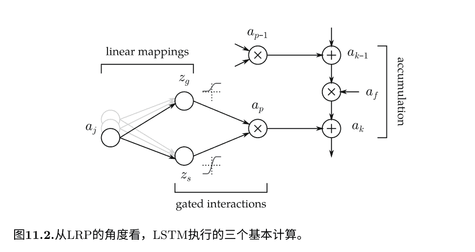

线性映射形成了门控交互的输入。 一些门控交互的输出进入累积函数。

##### 11.3.1 线性映射

每个计算的输出都是对大量输入变量的加权求和。 在这里，一种策略是按比例重新分配相关性。

加权激活 $a_j w_{js}$ 的出现形式如上述线性投影公式。实现这种策略的一种方式是 epsilon规则（LRP-$\epsilon$），由[6]给出：

$$R_j = \sum_s \frac{a_j w_{js}}{\epsilon_s + \sum_{0,j} a_j w_{js}} R_s$$

其中 $\epsilon_s = \epsilon \cdot \text{sign}(\sum_{0,j} a_j w_{js})$ 这是一种小型稳定器，通过某个常数因子将分母远离零，并在加权激活弱或矛盾时吸收一些相关性。这种传播规则在先前使用递归神经网络的工作中被采用[2,4,14,57,77]。较大的 $\epsilon$ 值倾向于仅保留最显著的解释因素。请注意，在我们的符号表示中，神经元偏置通过连接权重为相应偏置的常数神经元 $a_0 = 1$来考虑。

这个神经元也被分配了一部分相关性。然而，它的相关性不会进一步传播，并且会困在那个神经元中，因为“偏置神经元”没有更低层的连接。

##### 11.3.2 门控交互

这些层没有简单的求和结构，而是具有乘法非线性性质。它们的乘法非线性性质使得它们本质上更难处理。最近，有三项工作将LRP传播技术扩展到了循环神经网络，如LSTMs [37]和GRUs [12]，通过提出一种规则来传播相关性通过这些乘积层 [2,4,14]。这些LRP扩展分别在情感分析、机器翻译和强化学习的背景下进行了测试。特别是，Arras等人 [4] 提出了信号全取再分配规则

$$(R_g, R_s) = (0, R_p)$$

在我们的实验中，将其称为“LRP-all”。这种重新分配策略可以以与LSTM模型中引入门的方式类似地进行解释：门单元旨在控制LSTM中的信息流动，而不是成为信息本身。

接下来，我们基于Deep Taylor Decomposition (DTD) [52]提供了进一步的规则解释，这是一种用于分析深度网络中相关传播过程的数学框架。DTD将在给定层获得的相关性表示为较低层激活的函数，并根据该函数的Taylor展开确定如何重新分配相关性。考虑将输入$z = (z_g, z_s)$的相关函数 $R_p(z_g, z_s)$映射到该模块输出接收到的相关性。然后我们写出它的Taylor展开式：

$$R_p(z_g, z_s) = R_p(\widetilde{z}_g, \widetilde{z}_s) + \left. \frac{\partial R_p}{\partial z_g} \right|_{\widetilde{z}} \cdot (z_g - \widetilde{z}_g) + \left. \frac{\partial R_p}{\partial z_s} \right|_{\widetilde{z}} \cdot (z_s - \widetilde{z}_s) + \dots$$

其中 $\widetilde{z} = (\widetilde{z}_g, \widetilde{z}_s)$ 是函数的根点，而一阶项可以用来确定在哪个较低层的神经元上（$g$ 或 $s$ 的相关性

应该传播）。在实践中，根点及其梯度很难通过解析计算得到。然而，我们可以考虑一个更容易分析的相关模型[52]，在我们的情况下，形式为：

$R_p(z_g, z_s) = \text{sigm}(z_g) \cdot \tanh(z_s) \cdot c_p.$

变量$c、p$是常数，并设置为$R(_p, z_g, z_s) = R(_p, z_g, z_s)$局部。当$R(_p)$是由传播规则导致的时，该模型是一个合理的近似，其中激活项自然地因子分解出来（参见[52]）。标准LSTM的门控交互的相关性模型如图11.3（左）所示。

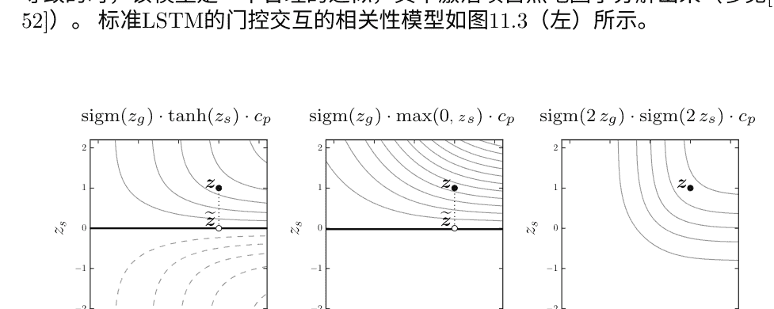

在构建相关模型之后，我们希望在观察点附近的某个根点处对其进行泰勒展开，其中$z = (z_g, z_s)$。相关模型的最近根点位于$(\widetilde{z}_g, \widetilde{z}_s) = (z_g, 0)$，更一般地，任何根点满足$\widetilde{z}_s = 0$。对这个简化的相关模型进行泰勒展开得到：

$R_p(z_g, z_s) = R_p(\widetilde{z}_g, \widetilde{z}_s)$
$+ \text{sigm}'(\widetilde{z}_g) \cdot \tanh(\widetilde{z}_s) \cdot c_p \cdot (z_g - \widetilde{z}_g)$  (= $R_g$)
$+ \text{sigm}(\widetilde{z}_g) \cdot \tanh'(\widetilde{z}_s) \cdot c_p \cdot (z_s - \widetilde{z}_s)$  (= $R_s$)
$+ ...$

显然，对于最近的根点，第一个线性项 $R_g$ 为零，因此不会重新分配相关性给门，然而，双曲正切的饱和效应可能会导致一阶项和函数值之间存在不匹配。然而，如果在LSTM中用恒等函数或ReLU非线性函数替换双曲正切函数（如[59]中所做的那样），那么我们得到了一个完全分解的相关性模型，其中 ($R_g, R_s$) = (0, $R_p$)，因为在这种情况下，泰勒余项恰好为零。这对应于LRP-all重新分配规则。

本节为标准LSTM正当化了信号全取策略。在第11.4节中，调整以提高可解释性的修改后LSTM变体将从不同的传播策略中受益。例如，使用sigmoid函数作为门和信号（参见图11.3右侧）建议采用不同的传播策略。

在实践中使用的一组更完整的传播规则[2,4,14,57,59,77]，我们在实验中考虑了这些规则，见表11.1。除了表11.1中提供的定义外，为了避免近似为零的除法，可以在LRP-prop和LRP-abs变体的分母中添加一个稳定项，类似于线性映射的epsilon规则稳定化。它的形式为 $\epsilon \cdot$ 符号

$(z_g + z_s)$ 在第一种情况下，简单地 $\epsilon$ 在另一种情况下，其中 $\epsilon$ 是一个小的正数。

表11.1.门控交互的LRP传播规则概述，以及它们是否来自深度泰勒分解。LRP-all代表“信号全取”，LRP-prop代表“比例”，LRP-abs类似于LRP-prop但使用绝对值，而LRP-half对应于等量重新分配。

| 名称 | 提出于 | 由门接收 | 由信号接收 | DTD |
| --- | --- | --- | --- | --- |
| LRP-all | [4] | $R_g = 0$ | $R_s = R_p$ | ✓ |
| LRP-prop | [2, 14] | $R_g = \frac{z_g}{z_g+z_s} R_p$ | $R_s = \frac{z_s}{z_g+z_s} R_p$ | × |
| LRP-abs |  | $R_g = \frac{|z_g|}{|z_g|+|z_s|} R_p$ | $R_s = \frac{|z_s|}{|z_g|+|z_s|} R_p$ | × |
| LRP-half | [2] | $R_g = 0.5 \cdot R_p$ | $R_s = 0.5 \cdot R_p$ | × |

##### 11.3.3 累积

需要考虑的最后一种模块是累积模块，它通过“遗忘”因子对LSTM记忆状态进行折扣，并根据当前观察结果添加一个小的附加项：

$$a_k = a_f \cdot a_{k-1} + a_p.$$

考虑累加器神经元 $a_k$ 的相关性 $R_k$，用于最后一个时间步。通过累积模块，我们得到以下重新分配：

$$R_p = a_p \cdot c_k$$

$$R_{k-1} = a_f \cdot a_{k-1} \cdot c_k,$$

在乘积中，我们使用了信号取最大策略，在求和中使用了epsilon-规则（没有稳定器）。通过对之前的时间步骤进行迭代重新分配，我们得到：

$$R_{p-1} = a_f \cdot a_{p-1} \cdot c_k$$
$$R_{p-2} = (a_f \cdot a_{f-1}) \cdot a_{p-2} \cdot c_k$$
$$\vdots$$
$$R_{p-T} = (\prod_{t=1}^{T} a_{f-t+1}) \cdot a_{p-T} \cdot c_k.$$

请注意，这里我们假设了一个简化的循环结构，与图11.1中呈现的标准LSTM不同，特别是我们假设神经元 $a_{p}$不通过 $z_{s}$（即 $z_{s}$仅与当前输入连接，而不与以前的循环状态连接）将相关性重新分配给过去的时间步骤，以简化当前分析。

现在我们检查相关性得分的结构 $R_{p}, \ldots$ 在每个时间步骤中，根据上述给定的公式计算 $R_{p-T}$。我们可以看到相关性项可以分为三个部分：

1. 遗忘门的乘积：除非遗忘门等于1，否则该项会随着每一次重新分配而指数级减少。换句话说，只有最近的几个时间步骤会接收到相关性。
2. 当前时间步骤的乘积神经元值 $a_{p}$。换句话说，给定时间步骤的相关性直接受其代表性神经元的激活影响，该激活可以是正数或负数。
3. 一个与时间步骤无关且与可重新分配的相关性数量相关的项。

关于相关性随时间变化的这些观察结果为LRP解释过程提供了进一步的理论依据，我们将在第11.5节中进行实证验证。它们还为我们提出了新的LSTM变体的起点，这些变体满足进一步的约束条件，如第11.4节所提出的。

#### 11.4 基于LRP的LSTM架构

一个“标准”的LSTM网络，具有完全连接的LSTM块，如图11.1所示，是一个非常强大的网络，能够对极其复杂的顺序任务进行建模。然而，在许多情况下，一个复杂度较低的LSTM网络能够以类似的预测性能解决相同的问题。为了进一步增加模型的可解释性，我们提出了一些修改，简化了LSTM网络，并使得生成的模型更容易用LRP解释。

##### 11.4.1 用于LRP反向分析的LSTM：非递减记忆单元

如果记忆单元状态$c_{t}$是非递减的，LRP反向传播过程会变得更简单，这样每个输入对每个记忆单元的贡献就被明确定义了，并且避免了负贡献和正贡献相互抵消的问题。对于非递减的记忆单元和使用LRP的反向分析，我们对图11.1和方程11.1-11.6做出以下假设：

(A1) $f_{t}= 1$对于所有 $t.$ 也就是说，遗忘门始终为1，不会遗忘任何内容。这确保了随时间的均匀信用分配，并减轻了第11.3.3节中提到的随时间减少的相关性重新分配问题。

(A2) $g > 0$，也就是说，细胞输入激活函数$g$为正数。例如，我们可以使用一个sigmoid函数 $\sigma(x) = $ 事实上，像LRP和线性映射的epsilon规则（参见第11.3.1节）这样的方法在负贡献与正贡献相互抵消时会面临数值稳定性问题。通过一个正数$g$，所有的贡献都是正数，LSTM累积模块中的重新分配更加稳定。此外，我们假设细胞输入$z$具有负偏差，也就是 $b_z < 0$。 这是为了避免漂移效应。漂移效应是指记忆内容只得到正贡献，导致$\text{cov}_e$时间的增加。 典型的值为$b_z \in \{-1, -2, -3, -4, -5\}$。

(A3) 我们希望确保对于细胞状态激活，它满足$\sigma(0) = 0$，这样，如果内存内容为零，则不会传输到下一层。 因此，我们设置$h = a \tanh$，其中$a \in \{1, 2, 4\}$。

(A4) 细胞输入$z$仅连接到输入，而不连接到其他LSTM内存细胞输出。 这意味着$U_z$为零。 这确保了LRP将关联性分配给输入，并且$z$不会被重新分配到网络中的其他部分。

(A5) 输入门$i$仅连接到其他内存细胞输出，而不连接到输入。也就是说，$W_i$为零。 这确保了LRP仅通过$z$将关联性分配给输入。

(A6) 输出门$o$仅连接到其他内存细胞输出，而不连接到输入。也就是说，$W_o$为零。 这确保了LRP仅通过$z$将关联性分配给输入。

(A7) 输入门$i$具有负偏差，即$b_i < 0$。 与细胞输入类似，负偏差可以避免漂移效应。 典型值为$b_i \in \{-1, -2, -3, -4\}$。

(A8) 输出门$o$也可能具有负偏差，即$b_o < 0$。 这样可以在不同的时间点引入不同的记忆单元。 它与资源分配有关。

(A9) 记忆单元状态内容在$t=0$时初始化为零，即$c_0=0$。 最后，记忆单元内容$c_t$对于所有$t$都是非负的，因为$z_t \geq 0$且$i_t \geq 0$。

### 得到的LSTM前向传递规则为LRP：

$$z_t = a_g \sigma (W_z x_t + b_z)$$ 细胞输入 (11.7)
$$i_t = \sigma (U_i y_{t-1} + b_i)$$ 输入门 (11.8)
$$c_t = i_t \odot z_t + c_{t-1}$$ 细胞状态 (11.9)
$$o_t = \sigma (U_o y_{t-1} + b_o)$$ 输出门 (11.10)
$$y_t = o_t \odot a_h \tanh (c_t)$$ 细胞输出 (11.11)

请参见图11.4a，其中描述了LRP的这些前向传递规则。

图11.4. 用于层次相关传播（LRP）的LSTM记忆单元。（a）z是单元输入激活的向量，i是输入门激活的向量，c是记忆单元状态的向量，o是输出门激活的向量，y是单元输出激活的向量。（b）记忆单元是非递减的，并且保证马尔可夫性质。（a和b）数据流要么是“前馈”没有延迟，要么是“递归”有一步延迟。外部输入只通过单元输入z到达LSTM网络。所有门只接收递归输入，即来自其他记忆单元的输出。（c）没有门的LSTM记忆单元。外部输入通过输入z存储在记忆单元中。

##### 11.4.2 LSTM用于LRP反向分析：保持马尔可夫属性

遗忘门可以在未来的某个时间步骤修改记忆单元的信息，即它们可以完全擦除单元的状态内容。输出门可以隐藏单元的信息，并在未来传递它，即输出门可以在未来的某个时间关闭和打开，掩盖单元存储的所有信息。因此，为了保证马尔可夫性质，遗忘门和输出门必须被断开连接。

马尔可夫记忆单元的LSTM前向传递规则如下：

$$
\begin{aligned}
z_t &= a_g \sigma (W_z x_t + b_z) && \text{细胞输入} && (11.12) \\
i_t &= \sigma (U_i y_{t-1} + b_i) && \text{输入门} && (11.13) \\
c_t &= i_t \odot z_t + c_{t-1} && \text{细胞状态} && (11.14) \\
y_t &= a_h \tanh (c_t) && \text{细胞输出} && (11.15)
\end{aligned}
$$

请参见图11.4b，其中显示了保证马尔可夫性质的LSTM记忆单元。

##### 11.4.3 没有门的LSTM

用于反向分析的最简单的LSTM架构不使用任何门。因此，避免了需要在LRP反向分析中处理的复杂动态。

得到的LSTM前向传递规则如下：

$$
\begin{aligned}
z_t &= a_g \sigma (W_z x_t + b_z) && \text{细胞输入} && (11.16) \\
c_t &= z_t + c_{t-1} && \text{细胞状态} && (11.17) \\
y_t &= a_h \tanh (c_t) && \text{细胞输出} && (11.18)
\end{aligned}
$$

请注意，即使这种简单的架构也可以解决顺序问题，因为单元输入可以学习不同的偏置，以便在不同的时间步上进行特殊化，并相应地激活记忆单元输出。

请参见图11.4c，其中显示了没有门的LSTM记忆单元，它可以完美地重新分配输入序列上的相关性。

#### 11.5 实验

##### 11.5.1 在标准LSTMs上验证解释：选择性和保真度

首先，我们验证了LRP解释能够选择输入位置，无论是在支持还是在反驳LSTM的预测方面，都是最具决定性的，使用情感预测任务。为此，我们进行了一项扰动实验，即“像素翻转”或“区域扰动”[6,64]，这在计算机视觉中常用于评估和生成解释，例如[1,11,47,54]。

在这里，我们确认相关性的符号和排序是否反映了LSTM认为对于特定类别非常重要的内容，或者反对特定类别非常重要的内容。

我们测试相关性的另一个属性是忠诚度。为此，我们使用一个已知输入输出关系的合成任务，并将相关性与某些基本真相解释进行比较。通过使用一个合成的玩具任务，我们可以避免模型错误和解释错误之间的问题[72]。在这里，我们试图验证相关性作为一个连续分布量的大小。据我们所知，我们是第一个对递归神经网络中的相关性进行这种连续分析的人。另一项工作通过一个玩具分类任务验证了LSTM的解释[77]，然而它实际上将相关性视为一个二进制变量。

解释方法。现在我们介绍在标准LSTMs实验中考虑的各种解释方法。对于LRP解释技术，我们考虑表11.1中指定的所有乘积规则变体，即LRP-all [4], LRP-prop [2,14], LRP-abs和LRP-half [2]。

由于LRP反向传递每个输入维度提供一个相关性值，我们只需将相关性值在输入维度上求和，以获得每个时间步的一个相关性值。除了LRP，我们还考虑基于梯度的解释[13,21,45,68]，基于遮挡的相关性[46,79]和上下文分解（CD）[56]作为替代方法。

对于基于梯度的解释，我们使用作为相关性的预测函数相对于感兴趣的输入维度的偏导数并平方。

对于这个数量，我们简单地将这个变量表示为梯度，否则我们将这个导数乘以输入维度的值，我们称之为梯度×输入相关性。在这两种情况下，类似于LRP，几个输入维度的相关性可以相加，以获得每个时间步的一个相关性值。对于基于遮挡的解释，我们将相关性定义为预测函数值的差异（即在softmax归一化之前的预测分数之差），我们将这个变体表示为遮挡<sub>f-diff</sub>，或者我们使用预测概率的差异，我们称之为遮挡<sub>p-diff</sub>，其中差异是通过模型对原始输入和一个改变输入的预测（其中感兴趣的位置被设置为零）进行计算得到的。

对于CD解释方法[56]，我们使用作者的代码²来生成每个时间步的一个相关性值（这需要运行CD分解与输入序列中的时间步数相同的次数）。

测试选择性。为了评估选择性，我们考虑了一个五类情感预测任务，即电影评论。作为数据集，我们使用了斯坦福情感树库（SST）[69]，其中包含了8544/1101/2210个训练/验证/测试句子及其组成短语的标签（从非常负面、负面、中性、正面到非常正面的情感）。作为LSTM模型，我们采用了Li等人的双向LSTM模型[45]，该模型已经在SST<sup>3</sup>上进行了训练，并且之前已被作者用于对网络决策进行基于梯度的分析。输入由一系列60维词嵌入组成，LSTM隐藏层的大小为60，唯一的文本预处理是转为小写。在对完整句子进行二元情感分类（忽略中性类别）时，该模型达到了82.9%的测试准确率；在对完整句子进行五类情感预测时，准确率达到了46.3%。

对于扰动实验，我们考虑所有长度至少为十个单词的测试句子（因此保留了1849个句子），并使用真实句子类作为目标输出类，考虑情感预测任务的所有五个类别，计算单词级别的相关性（即每个时间步的一个相关性值）。对于LRP相关性的计算，我们使用线性映射和乘积层的稳定器值，ε=0.001⁴。

然后，根据这些单词级相关性，我们迭代地从每个输入句子中删除最多五个单词，根据相应句子最初是否被LSTM正确或错误分类，按照相关性的减少或增加顺序。我们期望这种输入修改能够降低或增加模型对真实类别的置信度，我们用模型的准确性来衡量。对于真实类别，我们用模型的准确性来衡量，以此来衡量模型的置信度。要删除一个单词，我们只需从输入序列中丢弃它，并连接句子的剩余部分。

² https://github.com/jamie-murdoch/ContextualDecomposition.
³ https://github.com/jiwei/Visualizing-and-Understanding-Neural-Models-in-NLP.
⁴ 除了LRP-prop变体，我们采用ε=0.2。我们尝试了以下数值：[0.001, 0.01, 0.1, 0.2, 0.3, 0.4, 1.0]，并选择最低的数值以实现数值稳定性。

另一种去除方案是将相应的单词嵌入设置为输入的零（实际上给我们带来了类似的结果），然而前者使我们能够生成更自然的文本，尽管我们承认由Poerner等人指出的，生成的句子可能在语法上有些错误[57]。

我们的扰动实验结果汇总在图11.5中。当观察最相关单词的去除（图11.5左侧）时，我们观察到基于遮挡的相关性、LRP-all和CD是最具竞争力的方法，并且表现相当；其次是 Gradient × Input，其表现优于 Gradient。其余的方法，即其他的LRP变体LRP-prop、LRP-abs、LRP-half几乎等同于随机选择，因此不适合检测表达特定类别的单词。

在去除最不相关的单词（图11.5右侧）时，遮挡法P, diff表现最好；其次是遮挡法f, diff、LRP, all、CD和梯度×输入。再次，剩下的LRP变体几乎与随机相当。然而，这次梯度比随机表现更差，这表明低梯度相关性更有可能识别出对于分类问题不重要的单词（如停用词），而不是识别出对于特定类别不利的单词（这也在之前的研究中观察到，例如[4]，表1）。

总之，我们在情感分析中的扰动实验表明，如果一个人对于使用标准LSTM模型来识别最具影响力的位置，以强烈支持或抑制特定分类决策感兴趣，那么基于遮挡的相关性、Arras等人的乘积规则的LRP方法以及Murdoch等人的CD方法是提供这些信息的好选择。

对于循环神经网络解释的另一种评估，包括标准的LSTM模型，我们进一步参考Poerner等人的研究[57]，特别是他们在主谓一致性任务中的实验。在这里，作者发现在测试的解释方法中，LRP和DeepLIFT [67]在使用Arras等人提出的信号全取策略时表现最佳，尤其是在产品层次为5时。

测试保真度。为了验证保真度，我们考虑一个具有线性输入输出关系的玩具任务。特别是我们使用两个数字的加法/减法。因此，我们期望相关性与实际输入值呈线性关系，我们可以通过经验相关性直接测量。

为了我们的目的，我们使用Hochreiter等人的添加问题的变体[36]，其中我们使用隐式标记而不是显式标记；此外，我们删除了序列的起始和结束位置。这样我们就强制LSTM

5 Ancona等人[1]还对LSTMs的解释进行了比较研究，然而为了通过产品层重新分配相关性，作者使用了标准的梯度反向传播。这种重新分配方案违反了LRP的一个关键属性，即局部相关性保持，因此他们对LRP的结果并不具有决定性。

模型只将非零相关性归因于输入中的相关数字，而不是标记（因为通常不清楚应该将“地面真实”相关性归因于标记，我们可以将计算出的相关性与之进行比较）。因此，我们的输入序列长度为 T的形式为：

$$
\begin{bmatrix} n_1 & 0 \\ ... & 0 \\ n_{a-1} & 0 \\ 0 & n_a \\ n_{a+1} & 0 \\ ... & 0 \\ n_{b-1} & 0 \\ 0 & n_b \\ n_{b+1} & 0 \\ ... & 0 \\ n_T & 0 \end{bmatrix}
$$

其中非零项 n_t，其中 t∈{1, ..., T}，是随机抽取的实数，而两个相关位置 a和 b在{1, ..., T}中均匀抽取，其中 a < b。对于加法，目标输出是 n_a + n_b，对于减法，目标输出是 n_a - n_b。

减法。为了确保训练/验证/测试集不重叠，我们使用10000个序列进行训练，其中 T ∈ {4, ..., 10}，使用2500个序列进行验证，其中 T ∈ {11, 12}，使用2500个序列作为测试集。训练过程中通过最小化均方误差（MSE）来进行。

更具体地说，我们考虑两个最小的任务，这些任务可以通过一个标准的LSTM（只有一个记忆单元）和一个没有偏置的线性输出层来解决（因此模型有17个可训练参数）：

- 加法的有符号数字（其中n是从[-1, -0.5]∪[0.5, 1.0]均匀采样的）
- 正数的减法（其中n是从[0.5, 1.0]均匀采样的）

对于每个任务，我们训练了50个LSTM模型，验证均方误差（MSE）小于10^{-4}，得到的测试均方误差也小于10^{-4}。

然后，使用模型的预测输出，我们计算每个考虑的解释方法的每个时间步骤 t∈{1, ..., T}的一个相关性值 R_{t}。

对于基于遮挡的相关性，我们仅使用遮挡的f_diff变体，因为模型输出是一维的，考虑的任务是回归。

对于基于梯度的相关性，我们仅报告梯度×输入的结果，因为纯梯度的表现非常差。对于LRP相关性的计算，我们发现不需要添加任何稳定项（因此我们对所有LRP规则使用ϵ = 0.0）。

我们的结果在表11.2中报告。对于位置a和b，我们检查计算的相关性与输入数字的实际值之间是否存在相关性。此外，我们验证了与序列中所有时间步长相关的相关性部分（绝对值），与分配给这些位置的相关性相比。

有趣的是，几种方法通过了我们的合理性检查（在表中以粗体显示），并且在加法任务中几乎都有一个接近一的相关性，即：梯度×输入，遮挡，LRP-all和CD。然而，在减法任务中，只有梯度×输入和LRP-all将第一个数字正确地相关到接近一，将第二个数字相关到接近负一，而其他解释方法完全失败。

对于加法和减法，我们观察到在相关性结果中失败的方法也会错误地分配一部分与明显不重要的时间步相关的重要性。

我们考虑的两个算术任务之间的一个关键区别是，我们的加法任务是非顺序的，并且可以通过词袋方法（即忽略输入的顺序）来解决，而我们的减法任务是真正的顺序任务，需要LSTM模型记住第一个位置的数字和第二个位置的数字。

从这个健全性检查中，我们当然不能推断出每个通过减法测试的方法也适用于解释任何复杂的非线性问题。

表11.2. 关于玩具算术任务中与数字$n$、$a$和$b$相关的重要性的统计数据。$\rho$表示相关性，$E$表示平均值，对于每个LSTM模型，这些统计数据是在2500个测试点上计算的。报告的结果是在50个训练过的LSTM模型上的平均值（括号中为标准差），以百分比表示。

| | $\rho(n_a, R_a)$ | $\rho(n_b, R_b)$ | $E\left[\frac{|R_a| + |R_b|}{\sum_t |R_t|}\right]$ |
| :--- | :---: | :---: | :---: |
| **加法** | $n_a + n_b$ | | |
| 梯度 $\times$ 输入 | **99.960** $_{(0.017)}$ | **99.954** $_{(0.019)}$ | **99.68** $_{(0.53)}$ |
| 遮挡 | **99.990** $_{(0.004)}$ | **99.990** $_{(0.004)}$ | **99.82** $_{(0.27)}$ |
| LRP-prop | 0.785 $_{(3.619)}$ | 10.111 $_{(12.362)}$ | 18.14 $_{(4.23)}$ |
| LRP-abs | 7.002 $_{(6.224)}$ | 12.410 $_{(17.440)}$ | 18.01 $_{(4.48)}$ |
| LRP-half | 29.035 $_{(9.478)}$ | 51.460 $_{(19.939)}$ | 54.09 $_{(17.53)}$ |
| LRP-all | **99.995** $_{(0.002)}$ | **99.995** $_{(0.002)}$ | **99.95** $_{(0.05)}$ |
| CD | **99.997** $_{(0.002)}$ | **99.997** $_{(0.002)}$ | **99.92** $_{(0.06)}$ |
| **减法** | $n_a - n_b$ | | |
| 梯度 $\times$ 输入 | **97.9** $_{(1.6)}$ | **-98.8** $_{(0.6)}$ | **98.3** $_{(0.6)}$ |
| 遮挡 | 99.0 $_{(2.0)}$ | -69.0 $_{(19.1)}$ | 25.4 $_{(16.8)}$ |
| LRP-prop | 3.1 $_{(4.8)}$ | -8.4 $_{(18.9)}$ | 15.0 $_{(2.4)}$ |
| LRP-abs | 1.2 $_{(7.6)}$ | -23.0 $_{(11.1)}$ | 15.1 $_{(1.6)}$ |
| LRP-half | 7.7 $_{(15.3)}$ | -28.9 $_{(6.4)}$ | 42.3 $_{(8.3)}$ |
| LRP-all | **98.5** $_{(3.5)}$ | **-99.3** $_{(1.3)}$ | **99.3** $_{(0.6)}$ |
| CD | -25.9 $_{(39.1)}$ | -50.0 $_{(29.2)}$ | 49.4 $_{(26.1)}$ |

预测任务。然而，我们假设一个解释方法，如果在这样一个具有最小自由参数的测试中失败（即具有一个记忆单元的LSTM），通常是一种不太适合的方法。

在这方面，我们目前的分析为改进和测试LSTM解释方法打开了新的途径，包括LRP方法及其LRP-all变体，在我们的算术任务中，当LSTM模型包含更多记忆单元时，其结果会下降，这表明标准LSTM可能也使用门来存储输入数字的值$^7$。后一种现象可以通过调整LSTM架构来避免，或者可以通过使用替代的传播规则来考虑在相关传播过程中，以解决乘积的问题。这引导我们进入下一小节，在这一小节中，我们使用了一个改进的LSTM模型和不同的乘积规则，用于奖励重新分配的任务。

> > $^7$当仅使用正数作为输入时，加法问题可能出现相同的现象。然而，在我们考虑的具体玩具任务中，细胞输入($z_t$)需要处理要相加/相减的数字，而细胞状态($c_t$)累积算术操作的结果。

##### 11.5.2 马尔可夫决策过程中的长期信用分配 通过LRP和LSTMs

将接收到的奖励归因于已执行的动作是强化学习中的核心任务之一[74]。长期信用分配已被确定为强化学习中最大的挑战之一[62]。经典强化学习方法使用前向视图方法，通过估计马尔可夫决策过程(MDP)的未来预期回报。

然而，当奖励被延迟时，它们会失败，因为它们必须对大量的概率未来状态-动作路径进行平均，这个数量随着奖励的延迟呈指数增长[48,58]。

与使用前向视图相比，基于后向模型的后向视图方法避免了未知未来状态-动作路径的问题，因为序列已经完成并已知。后向分析将前向视图方法转化为回归任务，在这方面深度学习方法表现出色。作为前向模型，LSTM可以通过给定一系列状态-动作来训练预测最终回报。LSTM已经在强化学习[66]中用于优势学习[7]和学习策略[27,28,50]。然而，通过敏感性分析进行的后向分析，如“通过模型的反向传播”[8,55,60,61]，存在重大缺点：局部最小值、不稳定性、世界模型中的梯度爆炸或消失、适当的探索、仅通过敏感性而不是它们的贡献来考虑行动（相关性）[29,65]。

然而，贡献分析可以将回报预测（输出相关性）分解为观察序列中单个状态-动作对的贡献，从而获得重新分配的奖励（相关性重新分配）。结果，创建了一个具有相同最优策略的新MDP，在最优情况下，没有延迟奖励（预期未来奖励为零）[2]。实际上，对于MDP，Q值等于预期即时奖励加上预期未来奖励。因此，如果预期未来奖励为零，Q值估计简化为计算即时奖励的平均值。

在以下实验中，我们不评估代理在此奖励重新分配下的性能。相反，这个实验的目的是展示不同的LRP产品规则如何改变模型的解释和奖励重新分配。

LSTM和马尔可夫性质。对于带有遗忘门或输出门的LSTM[26]，如第11.2.1节所述，细胞内容不符合马尔可夫假设。这是因为输入对记忆细胞的当前贡献可以通过遗忘门或输出门被后续输入修改或隐藏。

例如，遗忘门可以由于后续的一些输入而擦除或减少当前输入的贡献。同样，输出门可以通过关闭门直到未来的某个输入打开门并揭示已经过去的贡献来隐藏当前输入的贡献。

图11.4b显示了符合马尔可夫性质的LSTM记忆单元。

环境。在我们的环境中，一个代理需要在一维网格世界中收集 Moneybag，然后尽可能多地收集 Coins。只有在收集 Moneybag后收集的Coins才会给予奖励。在每个时间步骤中，代理可以向左或向右移动。所有奖励只在剧集结束时给予，取决于代理在Moneybag中收集了多少 Coins。

训练模型。我们有一系列状态-动作对的序列。每个序列代表一个剧集。每个剧集都标有一个标量值，对应剧集的回报。序列中的状态和动作被编码为一个四维二进制特征向量，表示 Moneybag是否被收集，Coin是否被收集，以及当前时间步骤的选择动作（每个动作一个二进制特征）。在这个实验中，我们使用长短期记忆（LSTM）[30,37]来预测一个剧集的回报[2]。请注意，由于我们使用的是LSTM，输入编码不必满足马尔可夫性质。训练完LSTM后，我们使用LRP [6]作为反向分析的贡献分析方法。

LRP和不同的产品规则。我们训练了一个LSTM网络，如图11.4b所示，用于预测给定状态和动作序列的回报。后来，我们应用了不同的产品规则来传播相关性通过输入门和细胞输入（参见表11.1第11.3.2节）。结果显示在图11.6和11.7中。当没有相关性通过输入门传播时（LRP-all），图11.6。LRP作为贡献分析方法在反向分析中使用不同的产品规则，针对一个特定的状态-动作序列。状态和动作序列被表示为一个四个二进制特征的向量。在这个环境中，只有当收集到 Moneybag时，硬币才会给予奖励。当允许相关性通过门传播时（LRP-prop和LRP-half规则），事件 Moneybag被检测到。否则，只检测到硬币事件。图11.7.使用不同的乘积规则作为贡献分析方法的LRP在向后分析中，对于一个特定的状态-动作序列。由于没有钱袋的硬币不计入奖励，因此对这些事件没有分配相关性。

某些重要事件在贡献分析中没有被检测到，即对事件钱袋没有分配相关性。这是由于LSTM模型学习到的表示，其中存储了关于钱袋特征的信息，然后通过输入门激活了学习到的硬币计数器。因此，钱袋事件通过输入门进行贡献。当允许相关性通过输入门流动时（LRP-prop和LRP-half），可以检测到所有事件，包括导致钱袋事件的动作。然而，当相关性通过门传播时，并不完全保留相关性，因为一小部分相关性可能会被困在LSTM单元中，特别是通过初始时间步输入门的相关性。

#### 11.6 结论

我们提出了几种扩展LRP技术到循环神经网络（如LSTMs）的方法，其中包括定义通过乘积层传播相关性的规则。在测试的乘积规则变体中，我们展示了在标准LSTM模型上，信号取最大策略导致最相关的结果，并且可以嵌入到深度Taylor框架中，在其中对应于选择门控交互相关性模型中的最近根点。

此外，我们展示了通过将LSTM模型调整为LRP技术，可以使相关性传播流程更加直观和稳定，并且在这种情况下，通过门控传播一部分相关性可以更早地检测到相关事件。由此产生的简化和较少连接的LSTM模型可以潜在地解决与标准LSTM相同的问题，尽管在实践中可能需要使用更多的内存单元。

更一般地，进一步研究新提出的LSTM的表征能力，以及它与各种LRP传播规则的相互作用，特别是通过受控实验，将成为未来工作的课题。

### 致谢。

这项工作得到了德国教育和研究部的支持，作为柏林大数据中心（01IS14013A），柏林机器学习中心（01IS18037I）和TraMeExCo（01IS18056A）。.感谢DFG的部分资助（EXC 2046/1，项目编号：390685689）。这项工作还得到了韩国政府信息通信技术规划与评估研究所（IITP）的资助（编号2017-0-00451，编号2017-0-01779）。

### 参考文献

- 1. Ancona, M., Ceolini, E., Ozt ireli, C., Gross, Ĺ.: 对于深度神经网络的基于梯度的归因方法的更好理解. 在：国际学习表示会议 (ICLR) (2018)
- 2. Arjona-Medina, J.A., Gillhofer, M., Widrich, M., Unterthiner, T., Brandstetter, J., Hochreiter, S.: RUDDER: 用于延迟奖励的返回分解。 [arXiv:1806.07857 (2018)](https://arxiv.org/abs/1806.07857)
- 3. Arras, L., Horn, F., Montavon, G., Müller, K.R., Samek, W.: “在文本文档中什么是相关的？”: 一种可解释的机器学习方法。 PLoS ONE12 (8), e0181142 (2017)
- 4. Arras, L., Montavon, G., Müller, K.R., Samek, W.:在情感分析中解释循环神经网络预测。 在：2017 EMNLP会议计算方法主观性、情感和社交媒体分析研讨会论文集, 第159-168页 (2017年)
- 5. Arras, L., Osman, A., Müller, K.R., Samek, W.:评估循环神经网络解释。 在：2019 ACL工作坊BlackboxNLP：分析和解释NLP的神经网络，第113-126页。 计算语言学协会 (2019年)
- 6. Bach, S., Binder, A., Montavon, G., Klauschen, F., Müller, K.R., Samek, W.: 通过逐层相关传播对非线性分类器决策进行像素级解释。 PLoS ONE 10(7), e0130140 (2015)
- 7. Bakker, B.: 使用长短期记忆的强化学习。 在：神经信息处理系统14 (NIPS)，第1475 -1482页(2002)
- 8. Bakker, B.: 通过LSTM模型/评论进行反向传播的强化学习 。 在：IEEE近似动态规划和强化学习国际研讨会, 第127-134页(2007)
- 9. Becker, S., Ackermann, M., Lapuschkin, S., Müller, K.R., Samek, W.: 解释和解释深度神经网络用于音频信号分类。 [arXiv:1807.03418 (2018)](https://arxiv.org/abs/1807.03418)
- 10. Bengio, Y., Simard, P., Frasconi, P.: 用梯度下降学习长期依赖性是困难的。 IEEE Trans. Neural Networks 5(2), 157-166页(1994)
- 11. Chen, J., Song, L., Wainwright, M., Jordan, M.: 学习解释：模型解释的信息论视角。 在：第35届国际机器学习大会（ICML）论文集，卷80，第883-892页（2018年）
- 12. Cho, K., et al.: 使用RNN编码器-解码器学习短语表示进行统计机器翻译。 在：2014年经验方法在自然语言处理中的应用会议（EMNLP）论文集，第1724-1734页。 计算语言学协会（2014年）
- 13. Denil, M., Demiraj, A., de Freitas, N.: 从标记文档中提取显著句子。 arXiv:1412.6815（2015年）
- 14. Ding, Y., Liu, Y., Luan, H., Sun, M.: 可视化和理解神经机器翻译。 在：第55届计算语言学协会年会（ACL）论文集，第1150-1159页。 计算语言学协会（2017年）
- 15. Donahue, J., 等：长期循环卷积网络用于视觉识别和描述。 IEEE Trans. Pattern Anal. Mach. Intell. 39(4), 677-691(2017)
- 16. EU-GDPR: 欧洲议会和理事会于2016年4月27日关于自然人有关个人数据处理和自由流动的保护以及废除指令95/46/EC（通用数据保护条例）的条例。 欧盟官方杂志 L 119(59), 1-88 (2016)
- 17. Geiger, J.T., Zhang, Z., Weninger, F., Schuller, B., Rigoll, G.: 使用长短期记忆循环神经网络进行鲁棒语音识别的混合声学建模。 在：第15届国际语音通信协会年会论文集（INTERSPEECH），第631-635页（2014）
- 18. Gers, F.A., Schmidhuber, J.: 时间和计数的循环网络。 在：IEEE国际神经网络联合会议论文集（IJCNN），第3卷，第189-194页（2000）
- 19. Gers, F.A., Schmidhuber, J., Cummins, F.: 学习遗忘：LSTM的持续预测。 在：国际人工神经网络会议(ICANN)论文集，卷2, pp. 850-855 (1999)
- 20. Gers, F.A., Schmidhuber, J., Cummins, F.: 学习遗忘：LSTM的持续预测。 神经计算 12(10), 2451-2471 (2000)
- 21. Gevrey, M., Dimopoulos, I., Lek, S.: 回顾和比较研究人工神经网络模型中变量贡献的方法。 生态模型。 160(3), 249-264 (2003)
- 22. Gonzalez-Dominguez, J., Lopez-Moreno, I., Sak, H., Gonzalez-Rodriguez, J.,Moreno, P.J.: 使用长短期记忆循环神经网络进行自动语言识别。 在：第15届国际语音通信协会年会论文集（INTERSPEECH），第2155-2159页（2014年）
- 23. Graves, A.: 用循环神经网络生成序列. arXiv:1308.0850 (2014)
- 24. Graves, A., Liwicki, M., Fernandez, S., Bertolami, R., Bunke, H., Schmidhuber, J.: 一种新颖的连接主义系统用于无约束手写识别. IEEE Trans. Pattern Anal. Mach. Intell. 31(5), 855-868 (2009)
- 25. Graves, A., Schmidhuber, J.: 使用双向LSTM和其他神经网络架构进行逐帧音素分类. 神经网络 18(5-6), 602-610(2005)
- 26. Greff, K., Srivastava, R.K., Koutník, J., Steunebrink, B.R., Schmidhuber, J.: LSTM: 一个搜索空间的奥德赛. IEEE Trans. Neural Netw. Learn. Syst. 28(10), 2222–2232 (2017)
- 27. Hausknecht, M., Stone, P.: 深度循环Q学习用于部分可观察的MDPs. 在: AAAI秋季研讨会系列-智能代理的顺序决策制定, 第29-37页 (2015年)
- 28. Heess, N., Wayne, G., Tassa, Y., Lillicrap, T., Riedmiller, M., Silver, D.: 学习和传输调制的运动控制器. arXiv:1610.05182 (2016)
- 29. Hochreiter, S.: 实施和应用·神经·实时学习算法用于反应性环境. 实践工作, 计算机科学研究所, 慕尼黑工业大学 (1990年)
- 30. Hochreiter, S.: 对动态神经网络的研究. 硕士论文. 计算机科学研究所, 慕尼黑工业大学 (1991年)
- 31. Hochreiter, S.: 循环神经网络学习和梯度消失. 在: Freksa, C. (编) 人工智能会议论文集-模糊神经系统1997研讨会, 第130-137页. Infix (1997年)
- 32. Hochreiter, S.: 学习递归神经网络中的梯度消失问题及解决方案. 不确定性模糊知识系统国际期刊. 6(2), 107–116 (1998年)
- 33. Hochreiter, S., Bengio, Y., Frasconi, P., Schmidhuber, J.: 递归神经网络中的梯度流: 学习长期依赖性的困难. 在: Kolen, J.F., Kremer, S.C. (eds.) 动态递归网络实用指南, 第237–244页. IEEE出版社, 纽约 (2001年)
- 34. Hochreiter, S., Heusel, M., Obermayer, K.: 快速基于模型的蛋白质同源性检测, 无需对齐. 生物信息学 23 (14), 1728–1736 (2007年)
- 35. Hochreiter, S., Schmidhuber, J.: 长短期记忆. 技术报告, FKI-207-95, 慕尼黑工业大学计算机科学系 (1995年)
- 36. Hochreiter, S., Schmidhuber, J.: LSTM可以解决长时间滞后问题. 在: 神经信息处理系统9 (NIPS), 第473–479页 (1996年)
- 37. Hochreiter, S., Schmidhuber, J.: 长短期记忆. 神经计算. 9 (8), 1735–1780 (1997年)
- 38. Hochreiter, S., Younger, A.S., Conwell, P.R.: 使用梯度下降学习学习. 在: 国际人工神经网络会议(ICANN)论文集, 第87-94页(2001)
- 39. Horst, F., Lapuschkin, S., Samek, W., Müller, K.R., Schöllhorn, W.I.: 用深度学习解释个体步态模式的独特性. 科学报告9, 2391(2019)
- 40. Kauffmann, J., Esders, M., Montavon, G., Samek, W., Müller, K.R.,: 从聚类到通过神经网络解释聚类. arXiv:1906.07633 (2019)
- 41. Landecker, W., Thomure, M.D., Bettencourt, L.M.A., Mitchell, M., Kenyon, G.T., Brumby, S.P.: 解释分层网络的个体分类. 在: IEEE计算智能和数据挖掘研讨会(CIDM), 第32-38页(2013)
- 42. Lapuschkin, S., Binder, A., Montavon, G., Müller, K.R., Samek, W.: LRP工具箱用于人工神经网络. 机器学习研究杂志. 17(114), 1-5 (2016)
- 43. Lapuschkin, S., Binder, A., Müller, K.R., Samek, W.: 理解和比较年龄和性别分类的深度神经网络. 在: IEEE国际计算机视觉会议研讨会, 第1629-1638页 (2017)
- 44. Lapuschkin, S., Wäldchen, S., Binder, A., Montavon, G., Samek, W., Müller, K.R.: 揭示聪明汉斯预测器并评估机器真正学到了什么. 自然通讯. 10, 1096 (2019)
- 45. Li, J., Chen, X., Hovy, E., Jurafsky, D.: 在NLP中可视化和理解神经模型。在：2016年北美计算语言学协会会议论文集：人类语言技术（NAACL-HLT），第681-691页。计算语言学协会（2016年）
- 46. Li, J., Monroe, W., Jurafsky, D.: 通过表示擦除理解神经网络。arXiv:1612.08220（2017年）
- 47. Lundberg, S.M., Lee, S.I.: 解释模型预测的统一方法。在：神经信息处理系统进展30（NIPS），第4765-4774页（2017年）
- 48. Luoma, J., Ruutu, S., King, A.W., Tikkanen, H.: 时间延迟、竞争相互依赖和公司绩效。战略管理杂志 38（3），506-525页（2017年）
- 49. Marchi, E., Ferroni, G., Eyben, F., Gabrielli, L., Squartini, S., Schuller, B.: 基于多分辨率线性预测的双向LSTM神经网络音频起点检测特征。在：IEEE国际声学、语音和信号处理会议（ICASSP），第2164-2168页（2014年）
- 50. Mnih, V., 等：深度强化学习的异步方法。在：第33届国际机器学习大会（ICML）论文集，第48卷，第1928-1937页（2016年）
- 51. Montavon, G., Binder, A., Lapuschkin, S., Samek, W., Müller, K.-R.: 逐层相关传播：概述。在：Samek, W.等（编）可解释AI，LNCS 11700，第193-209页。Springer，海德堡（2019年）
- 52. Montavon, G., Lapuschkin, S., Binder, A., Samek, W., Müller, K.R.: 用深度泰勒分解释非线性分类决策。Pattern Recogn.65, 211–222（2017）
- 53. Montavon, G., Samek, W., Müller, K.R.: 解释和理解深度神经网络的方法。数字信号处理 73, 1–15（2018）
- 54. Morcos, A.S., Barrett, D.G., Rabinowitz, N.C., Botvinick, M.: 对于泛化的单方向的重要性。在：国际学习表示会议（ICLR）（2018年）
- 55. Munro, P.: 用于标量奖励学习的双向反向传播方案。在：第九届认知科学学会年会论文集，第165-176页（1987年）
- 56. Murdoch, W.J., Liu, P.J., Yu, B.: 超越词重要性：从LSTMs中提取交互的上下文分解。在：国际学习表示会议（ICLR）（2018年）
- 57. Poerner, N., Schütze, H., Roth, B.: 使用混合文档和形态句法一致性评估神经网络解释方法。在：计算语言学协会年会论文集（ACL），第340-350页。计算语言学协会（2018年）
- 58. Rahmandad, H., Repenning, N., Sterman, J.: 反馈延迟对学习的影响。Syst. Dyn. Rev. 25(4), 309–338（2009）
- 59. Rieger, L., Chormai, P., Montavon, G., Hansen, L.K., Müller, K.-R.: 为更可解释的预测构建神经网络。在：Escalante, H.J., et al. (eds.)计算机视觉和机器学习中的可解释和可解释模型。TSSCML，第115-131页。Springer，Cham（2018年）。https://doi.org/10.1007/978-3-319-98131-4 5
- 60. Robinson, A.J.: 动态误差传播网络。Trinity Hall和剑桥大学工程系（1989年）的博士论文
- 61. Robinson, T., Fallside, F.: 具有应用于游戏的动态强化驱动误差传播网络。在：第11届认知科学学会会议论文集，安阿伯，第836-843页（1989年）## 第四部分 评估可解释性和解释

### 评估可解释性和解释 –前言

解释提供了对AI模型运行方式的洞察。它们可以被人类专家用来理解和验证预测结果，因此在使用AI技术中具有重要的信任建立作用。此外，可以想象解释将在未来AI系统的质量评估（可能还包括认证）中起到关键作用，例如AI增强的医疗设备。然而，这一步骤需要验证解释本身是否可以毫无保留地被信任。

虽然解释的合理性通常可以由人类主观判断，但需要定量的度量来客观评估解释质量并比较不同的解释技术。由于其实际相关性，如何评估可解释性和解释的问题最近成为一个活跃的研究课题。接下来的三章讨论了这个问题的不同重要方面。

在第12章中，周等人[8]介绍了一种称为网络剖析的技术，用于量化神经表示的可解释性。该方法将深度神经网络的单元视为概念检测器，并通过神经元激活与现实世界概念之间的对齐程度来衡量可解释性。这种理解内部表示的方法是完全定量的，因此可以比较不同网络中单元的语义，并研究不同训练参数（例如预训练、迭代次数）对表示的影响。

在第13章中，Montavon [5]提出了一种通过‘公理化方法’来评估解释技术正确性的方法。本章考虑了三个公理性质，可以更好地理解基于梯度和LRP类型传播方法之间的差异及其各自的优点。通过在整体解释和中间层进行这些属性的测试，所提出的方法不仅可以客观地评估最终解释的属性，还可以理解解释是如何逐层形成的。

在第14章中，Kindermans等人[4]对显著性方法的质量和可靠性进行了研究。构建了一个示例，显示出存在不改变网络处理和最终决策的输入转换，但对解释有很大影响。作者认为输入不变性是一种理想属性，并且表明许多解释方法并未满足该属性。

总的来说，这三章介绍了评估可解释性或解释质量的方法。对于解释质量，还存在其他流行的方法，例如基于扰动的方法[6]，指向游戏[7]，在玩具任务中使用基本事实信息的方法[3]和间接评估方案[1, 2]。特别是，公理化解释方法是有前途的，因为在一定程度上它们也允许形式化解释问题。然而，关于哪些公理是可取的讨论仍在进行中，并且可能需要根据应用领域和接收者的目标进行未来扩展。例如，输入不变性等公理可能不是普遍可取的属性，例如，如果解释应该捕捉模型与输入之间的交互。在线性模型中，解释通常显示特征维度与模型权重之间的交互，即不满足这个公理。因此，为了决定哪些公理是可取的，需要进一步明确解释的语义含义。

2019年7月

- Wojciech Samek
- Grégoire Montavon
- Andrea Vedaldi
- Lars Kai Hansen
- Klaus-Robert Müller

### 参考文献

- 1. Arjona-Medina, J.A., Gillhofer, M., Widrich, M., Unterthiner, T., Hochreiter, S.: RUDDER: 延迟奖励的返回分解。 CoRR. (2018) arXiv:1806.07857
- 2. Arras, L., Horn, F., Montavon, G., Müller, K.-R., Samek, W.: “文本文档中的相关内容是什么？”: 一种可解释的机器学习方法。 PLoS ONE 12(8), e0181142 (2017)
- 3. Arras, L., Osman, A., Müller, K.-R., Samek, W.: 评估循环神经网络解释。 在: ACL 2019 黑盒NLP研讨会: 分析和解释NLP的神经网络, 第113–126页。 计算语言学协会 (2019)
- 4. Kindermans, P.-J., et al.: 显著性方法的（不）可靠性。 在: Samek, W., Montavon, G., Vedaldi, A., Hansen, L.K., Müller, K.-R. (eds.) 可解释AI: 解释和可视化深度学习。 LNCS, 卷11700, 第267–280页。 Springer, Cham (2019)
- 5. Montavon, G.: 基于梯度与基于传播的解释: 公理比较。 In: Samek, W., Montavon, G., Vedaldi, A., Hansen, L.K., Müller, K.-R. (eds.) 可解释AI: 解释和可视化深度学习. LNCS, vol. 11700, pp. 253–265. Springer, Cham (2019)
- 6. Samek, W., Binder, A., Montavon, G., Lapuschkin, S., Müller, K.-R.: 评估深度神经网络学到的内容的可视化。 IEEE Trans. Neural Networks Learn. Syst. 28(11), 2660–2673 (2017)
- 7. Zhang, J., Bargal, S.A., Lin, Z., Brandt, J., Shen, X., Sclaroff, S.: 自上而下的神经注意力通过激活反向传播。 Int. J. Comput. Vis. 126(10), 1084–1102 (2018)
- 8. Zhou, B., Bau, D., Oliva, A., Torralba, A.: 通过网络解剖比较深度网络的可解释性。 In: Samek, W., Montavon, G., Vedaldi, A., Hansen, L.K., Müller, K.-R. (eds.) 可解释AI: 解释和可视化深度学习. LNCS, vol. 11700, pp. 243–252. Springer, Cham (2019)

### 12 通过网络剖析比较深度神经网络的可解释性

周博磊 $^1$(✉), David Bau$^2$, Aude Oliva$^2$和Antonio Torralba $^2$

1 香港中文大学，沙田，中国香港
bzhou@ie.cuhk.edu.hk

2 麻省理工学院，剑桥，美国马萨诸塞州

摘要。 在本章中，我们介绍了网络剖析（完整的论文和代码可在http://netdissect.csail.mit.edu上获得），这是一种量化深度卷积神经网络（CNN）内部单元可解释性的通用框架。我们比较了从解决不同监督学习任务（如ImageNet上的物体识别和Places上的场景分类）训练的网络中出现的可解释单元的不同词汇。网络剖析进一步应用于分析作为语义探测器的单元在训练迭代中如何生长和演变，无论是从头开始训练还是在数据源之间进行微调阶段。我们的结果突出了可解释性是深度神经网络的重要属性，可以为其分层结构提供新的见解。

关键词：可解释的机器学习 · 深度神经网络 · 模型可视化

#### 12.1 引言

以前解释卷积神经网络内部的工作主要集中在对内部单元的可视化上。例如，可视化最大化单个单元激活的图像补丁[13,16]；或使用优化生成对单元重要的模式和区域[7,9,12,13]；或使用降维渲染表示空间[5,6]。虽然可视化给我们关于内部单元试图检测的图像模式的直观感觉，但基于可视化的结果通常是定性的，无法定量解释，即哪些人类可解释的概念某个单元检测到以及其准确性如何。因此，如何量化深度视觉表示的可解释性并在其分类能力之外进行比较仍然是一个未解决的问题。

另一方面，已经提出了各种技术来量化深度神经网络的决策可视化。Samek等人[10]通过基于扰动的方法，量化解释的质量，并将网络性能与该度量相关联。Zhang等人[14]描述了各种实验，例如指向游戏，以定量评估和比较解释。Zhou等人[17]和Selvaraju等人[11]使用弱监督定位来评估生成的类特定地图。

这些解释方法可以与解释内部单元的工作相结合。例如，我们最近的工作[18]使用内部激活的语义来生成最终预测的视觉解释。

在本章中，我们重点关注如何提取和量化单元的语义。提出了一种名为网络剖析的框架，用于量化给定CNN的可解释性[1,15]。网络剖析通过测量单元激活与预定义概念字典中的地面真实标签之间的对齐程度来量化给定网络的可解释性。基于量化的可解释性，我们比较了各种网络中单元的语义，以及训练迭代和微调对网络的内部表示的影响。我们的结果强调了可解释性是深度神经网络的重要属性，它为我们提供了对它们深层次结构的新见解。本章是我们在比较各种深度网络的可解释性方面的工作[1,15]的结果总结。

#### 12.2 网络剖析概述

为了衡量可解释性，我们评估每个隐藏单元解决分割问题的能力，这些问题来自人类可解释的视觉概念字典。

##### 12.2.1 Broden：广泛和密集标记的数据集

作为一个视觉概念字典，我们构建了广泛和密集标记的数据集（Broden），它统一了几个密集标记的图像数据集：ADE [19]，OpenSurfaces [2]，Pascal-Context [8]，Pascal-Part [3]和Describable Textures Dataset [4]，包含了广泛范围的标记类别，包括对象、场景、对象部分、纹理和材料，大多数示例都在像素级别标记。

##### 12.2.2 评分单元的可解释性

让c表示Broden数据集中的任何概念，让k表示CNN中的任何卷积单元。网络剖通过量化k解决c给出的分割问题的能力来定义对于单元k的解释c的质量，使用IoU得分：

```
$$ IoU_{k,c} = \frac{\sum |M_k(x) \cap L_c(x)|}{\sum |M_k(x) \cup L_c(x)|} $$
```

在上述中， $\mathbf{x}$表示Broden数据集中的图像，$L_{c}(\mathbf{x})$是标有概念$c$的像素集合，$M_{k}(\mathbf{x})$是选择那些位于单元$k$最高激活区域内的像素的二进制掩码。$M_{k}$通过对输入$\mathbf{x}$的$k$激活进行（双线性）上采样，并应用一个阈值$T_{k}$来计算，该阈值选择整个数据集上的固定分位数（0.5%）的像素。因为数据集中包含一些类别的标签（如纹理），这些标签在某些输入子集上不存在，所以求和仅在至少有一个与$c$相同类别的标记概念的图像子集上计算。求和是在所有标有真实标签的图像上进行的。

$IoU_{k,c}$的值是单位$k$在检测概念$c$时的准确性。在我们的分析中，如果$IoU_{k,c} > 0.04$，则将单位$k$视为概念$c$的检测器，并且当一个单位检测到多个概念时，我们选择得分最高的标签。为了量化一层的可解释性，我们计算检测到的不同概念的数量，即唯一检测器的数量。IoU的阈值是经验性设置的，对于所有网络固定为0.04。在[15]中，我们对不同阈值的影响进行了详细分析。

图12.1总结了评分单位可解释性的整个过程：通过使用顶部激活图像的感受野对注释掩码进行分割，我们计算每个概念的IoU。重要的是，评估单位分割质量的IoU是一种客观的可解释性置信度分数，可以在网络之间进行比较，从而使我们能够比较不同表示的可解释性，并为下面的实验奠定基础。请注意，网络分解的结果取决于底层词汇：如果一个单位与Broden中不存在的人类可理解的概念匹配，那么该单位的可解释性评分将不高。未来的Broden版本将包括更大的视觉概念词汇。

#### 12.3 实验

##### 12.3.1 不同网络中的新概念检测器的出现

网络剖析应用于不同网络的最后一个卷积层（每个网络的概念检测器的直方图可在项目页面上找到）。图12.2展示了按对象类别分组的对象检测器的示例。对于相同的对象类别，作为检测器的单元的视觉外观不仅在同一网络内有所变化，而且在不同网络之间也有所变化。DenseNet和ResNet对于公共汽车和飞机具有良好的检测器，IoU大于0.25。

##### 12.3.2 概念在训练迭代中的出现

图12.3绘制了基线模型（在Places205上训练的AlexNet）在不同训练迭代中的可解释性以及验证集上的准确性。我们可以看到，对象检测器和部分检测器在大约10,000次迭代（每次迭代处理一个批次256个）后开始出现。我们还发现验证准确性与高级目标检测器的出现之间存在强烈的相性，因此可解释性可能有助于在训练过程中调试网络。

在图12.4中，我们跟踪了四个单元在不同训练迭代中的情况。我们观察到这些单元在早期阶段开始收敛到语义概念。例如，在第二行中，该单元从第5000次迭代开始检测到山。同时，一些单元在概念上有有趣的转变，例如第一行的单元在检测到汽车之前先检测到道路。

##### 12.3.3 迁移学习中单元的演变

微调预训练网络，如ImageNet-CNN，到另一个目标数据集是迁移学习中常用的技术。这使得训练更快收敛，同时在目标数据集上提高准确性，尤其是当训练数据不足时。在迁移学习的不同训练阶段，我们观察到内部单元的解释会发生变化。

分别给定经过良好训练的Places-AlexNet和ImageNet-AlexNet，我们对Places-AlexNet在ImageNet上进行微调，对ImageNet-AlexNet进行微调。

## 12. 通过网络解剖比较深度网络的可解释性

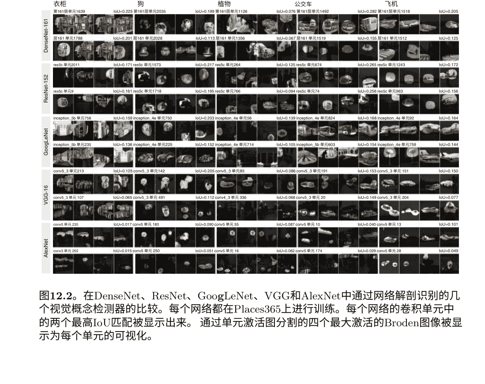

图12.2. 在DenseNet、ResNet、GoogLeNet、VGG和AlexNet中通过网络解剖识别的几个视觉概念检测器的比较。每个网络都在Places365上进行训练。每个网络的卷积单元中的两个最高IoU匹配被显示出来。通过单元激活图分割的四个最大激活的Broden图像被显示为每个单元的可视化。

分别在Places上。网络在微调迭代过程中的可解释性结果在图12.5中绘制出来。我们可以看到，与在图12.3中在Places上训练的网络相比，训练确实更快地收敛。单元的语义也会在微调过程中发生变化。例如，对于在ImageNet上训练并微调到Places365的网络，唯一的对象检测器数量首先下降，然后保持增加；而对于在Places上训练并微调到ImageNet的网络，唯一的对象检测器数量则缓慢下降。图12.6显示了从ImageNet到Places365和反过来微调的六个单元的演变。每个单元的顶部相关解释在微调过程中不断演变。例如，在从ImageNet到Places365的网络中，第一个检测白色狗的单元演变为检测瀑布；第三个检测绿色概念的单元演变为检测棒球场。另一方面，在从Places365到ImageNet的网络中，检测不同概念的单元收敛为检测与狗相关的概念，如耳朵和狗头。有趣的是，尽管这些单元演变为检测不同的概念，但它们中的许多仍然在颜色或纹理上具有相似性。

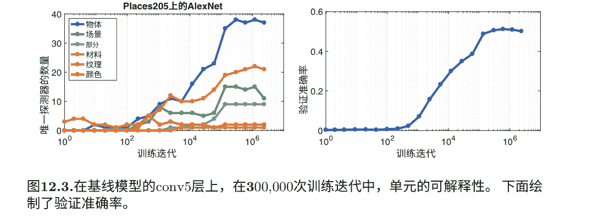

图12.3. 在基线模型的conv5层上，在300,000次训练迭代中，单元的可解释性。下面绘制了验证准确率。

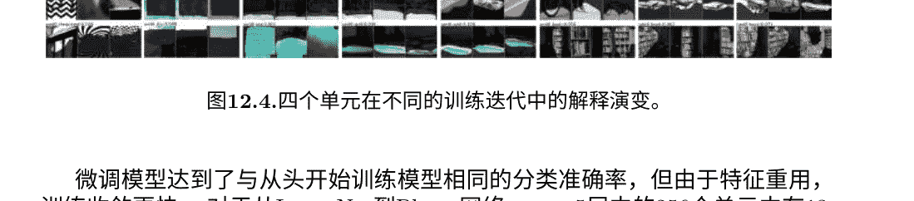

图12.4. 四个单元在不同的训练迭代中的解释演变。

微调模型达到了与从头开始训练模型相同的分类准确率，但由于特征重用，训练收敛更快。对于从ImageNet到Places网络，conv5层中的256个单元中有139个（54.4%）在微调过程中保持相同的概念，而对于从Places到ImageNet微调的网络，conv5层中的256个单元中有135个（52.7%）保持相同的概念。根据微调前后概念的相似性，我们进一步将单元演变分为五种类型。

在从ImageNet到Places进行微调的117个单元中，有47个单元保持了相似的形状，31个单元具有相似的纹理，18个单元具有相似的颜色，13个单元具有相似的对象类型，而8个单元没有明显的相似模式（见图12.7）。图12.8展示了每个模型的两个单元的演化历史。单元似乎在收敛到一个概念之前会切换它们的排名最高的标签：在从ImageNet到Places365的微调中，unit15先翻转到白色、结晶，然后稳定为瀑布概念。其他单元切换得更快：在从Places365到ImageNet的微调中，unit132在微调的早期阶段从头发切换到狗。

# # 从Places365到ImageNet

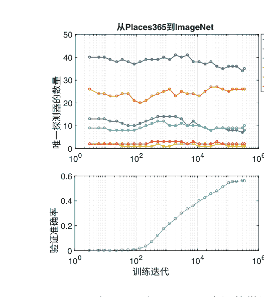

# # 从ImageNet到Places365

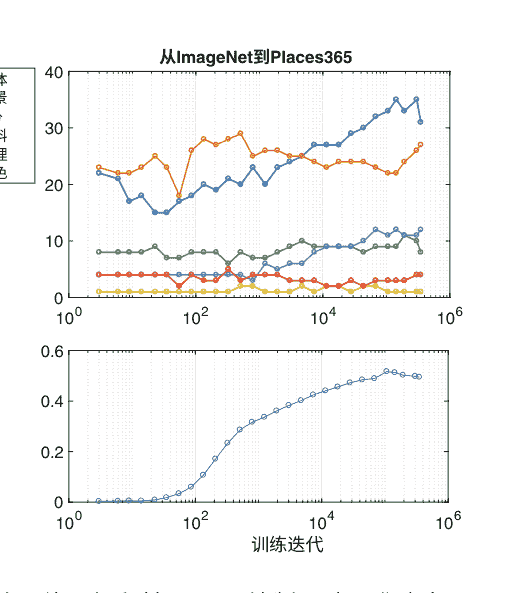

图12.5. 在Places和ImageNet之间的微调下的网络可解释性。下面绘制了验证准确率。网络架构与AlexNet相同。

# # ImageNet to Places365

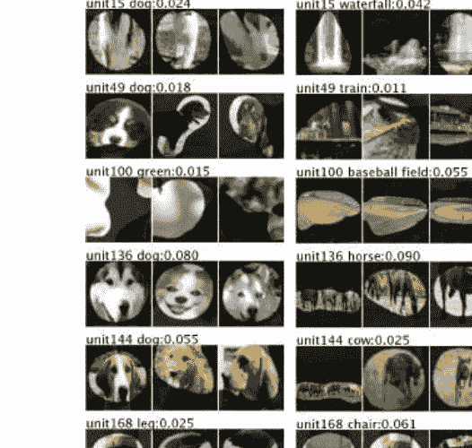

# # Places365 to ImageNet

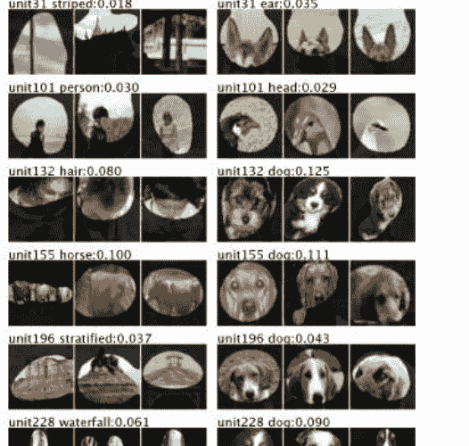

图12.6. 在ImageNet和Places之间微调前后的六个单元的解释。

# 图12.7. 四种单元演化的示例。类型是基于概念相似性定义的。

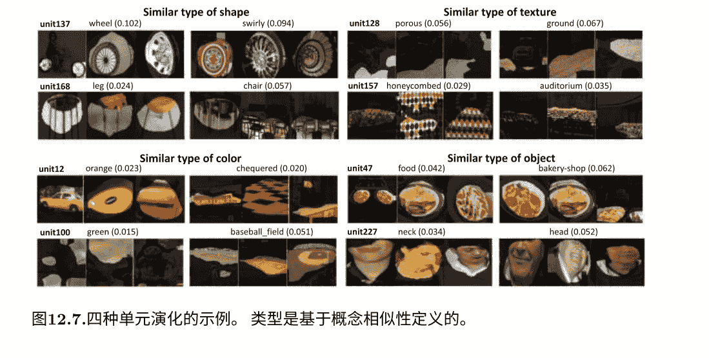

# 图12.8. 在从ImageNet到Places365的微调过程中，一个单元演化的历史（顶部），以及从Places365到ImageNet的微调过程中的单元演化（底部）。

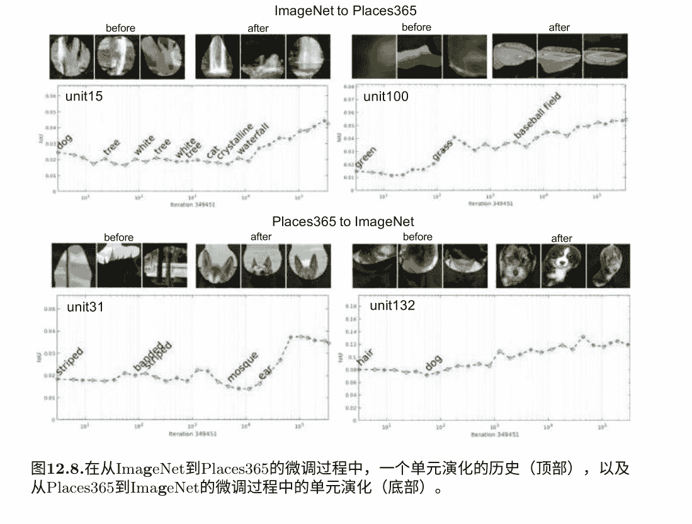

#### 12.4 结论

基于网络分析，我们比较了从不同监督和训练条件下训练的一系列网络的深度视觉表示的可解释性。我们展示了基于单元-概念对齐的可解释性是深度神经网络的一个重要属性，可以用来比较网络的分类准确性之外的特性。未来的工作将扩展网络分析的框架，以解释生成网络和从强化学习中训练的网络的内部结构。

### 参考文献

+   1. Bau, D., Zhou, B., Khosla, A., Oliva, A., Torralba, A.: 网络解剖学：量化深度视觉表示的可解释性。在：计算机视觉和模式识别（2017年）
2. Bell, S., Bala, K., Snavely, N.: 野外的内在图像。ACM Trans. Graph. 33(4), 159 (2014)
3. Chen, X., Mottaghi, R., Liu, X., Fidler, S., Urtasun, R., Yuille, A.: 检测你能够检测和表示对象使用整体模型和身体部位。在：CVPR会议（2014年）
4. Cimpoi, M., Maji, S., Kokkinos, I., Mohamed, S., Vedaldi, A.: 在野外描述纹理。在：CVPR会议（2014年）
5. Jolliffe, I.: 主成分分析。Wiley Online Library，霍博肯（2002年）
6. van der Maaten, L., Hinton, G.: 使用t-SNE可视化数据：使用t-SNE可视化数据 J. Mach. Learn. Res. 9, 2579-2605（2008年）
7. Mahendran, A., Vedaldi, A.: 通过反转来理解深度图像表示。CVPR会议论文集（2015年）
8. Mottaghi, R., 等：在野外进行对象检测和语义分割的上下文作用。在：CVPR会议论文集（2014年）
9. Nguyen, A., Dosovitskiy, A., Yosinski, J., Brox, T., Clune, J.: 通过深度生成器网络合成神经网络中神经元的首选输入。在：神经信息处理系统的进展（2016年）
10. Samek, W., Binder, A., Montavon, G., Lapuschkin, S., Müller, K.R.: 评估深度神经网络学到的可视化内容。IEEE Trans. Neural Netw. Learn. Syst. 28(11), 2660-2673（2017年）
11. Selvaraju, R.R., Cogswell, M., Das, A., Vedantam, R., Parikh, D., Batra, D.: Grad-CAM: 基于梯度的定位从深度网络中获得的视觉解释。在：ICCV会议论文集（2017年）
12. Simonyan, K., Vedaldi, A., Zisserman, A.: 深入卷积网络：可视化图像分类模型和显著性图。在：国际学习表示会议研讨会（2014年）
13. Zeiler, M.D., Fergus, R.: 可视化和理解卷积网络。在：ECCV会议论文集（2014年）
14. Zhang, J., Bargal, S.A., Lin, Z., Brandt, J., Shen, X., Sclaroff, S.: 通过激活反向传播实现自上而下的神经注意力。计算机视觉国际期刊 126（10），1084-1102（2018年）
15. Zhou, B., Bau, D., Oliva, A., Torralba, A.: 通过网络剖析解释深度视觉表示。IEEE 模式分析与机器智能交易（2018年）。https://doi.org/10.1109/TPAMI.2018.2858759

> 16. Zhou, B., Khosla, A., Lapedriza, A., Oliva, A., Torralba, A.: 目标检测器出现在深度场景CNN中。 在： 国际学习表示会议 （2015年）

> 17. Zhou, B., Khosla, A., Lapedriza, A., Oliva, A., Torralba, A.: 学习深度特征用于区分定位。 在： CVPR会议记录 （2016年）

> 18. Zhou, B., Sun, Y., Bau, D., Torralba, A.: 可解释的基础分解用于视觉解释。 在： ECCV会议记录 （2018年）

> 19. Zhou, B., Zhao, H., Puig, X., Fidler, S., Barriuso, A., Torralba, A.: 场景解析通过ADE20K数据集。 在： CVPR会议记录 （2017年）

### 13 基于梯度和基于传播的解释：公理比较

Grégore Montavon (Technische Universität Berlin, 10587 Berlin, Germany gregoire.montavon@tu-berlin.de)

摘要。 深度神经网络曾被认为是不可理解的黑盒子，现在补充了一些可以解释这些模型决策的技术。这引发了一个问题，即产生的解释是否可靠。在本章中，我们考虑了两种流行的解释技术，一种基于梯度计算，一种基于传播机制。我们使用三个“公理”属性对它们进行评估：保守性，连续性和实现不变性。这些属性在整体解释上进行了测试，但也在中间层进行了测试，我们的分析为我们带来了关于解释形成的更多见解。

关键词： 解释 · 深度神经网络 · 公理

#### 13.1 引言

深度神经网络已经能够预测高度复杂的数据集，并在竞争基准测试中表现出色[7,10,28]。人们越来越关注了解这些模型是如何做出成功决策的。一种常见的方法是提取一些感兴趣的示例，通过解释来确定模型用于构建预测的输入变量（例如像素）[2,16,19,29]。

两类解释技术受到了广泛关注：第一类将神经网络视为一个函数，并依赖于函数的梯度（通过反向传播算法获得）来生成解释；例如梯度×输入[1,22]、敏感性分析[23,32]、smoothgrad[25]或者综合梯度[27]。第二类将预测视为计算图（神经网络）的输出，并通过逐步重新分配输出到较低层来进行解释，使用传播规则；例如逐层相关传播（LRP）[2]、贡献传播[8]、激活反向传播[30]和deepLIFT[21]。

尽管这两种解释技术在方法上有所不同，但它们追求的目标是相同的：根据输入变量的得分进行评估

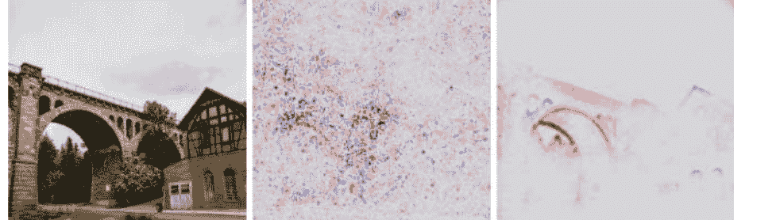

图13.1显示了输入到经过训练的VGG-16网络[24]的图像示例，以及网络通过Gradient × Input（基于梯度的）和LRP（基于传播）解释了ImageNet:Viaduct类的证据。

我们观察到这两个解释存在较大差异，引发了哪一个是最正确的问题。像素翻转[2,18]是一种评估解释正确性的方法，它通过移除预测为相关的特征并测试这些特征的移除是否对预测产生强烈影响来进行。该方法依赖于明确的特征移除方案的设计，这可能是针对特定类型的数据和预测任务的。

在本章中，我们采用了“公理方法”[6,9,20,26,27]，其中公理是解释的自明属性，我们要求其在相当大的输入和模型类别中成立。我们考虑了三个公理：(1) 保守性，(2)连续性和(3)实现不变性，并在Gradient × Input和LRP解释中进行了详细研究。我们的工作的一个特点是将这些公理追溯到网络的个别神经元，解释是在这里形成的。这将使我们能够识别解释技术的关键要素，这些要素负责满足或打破这些公理。

#### 13.2 解释神经网络预测

给定一个训练好的神经网络 x → f(x)，我们考虑对输入变量 x₁,… 进行评分的问题，根据它们对预测 f(x) 的重要性，我们将其称为解释。我们将产生的评分列表 R₁, R₂,..., Rₙ 称为解释。在本章中，我们将考虑的网络类别是深度整流网络。在它们的基本形式中，它们可以被描述为一种层次组合的ReLU神经元类型

```
z_k = \sum_j a_j w_{jk} + b_k

a_k = \max(0, z_k).
```

神经元参数 \(w_{jk}, b_k\) 是从数据中学习到的。为了简化表示，我们将偏置视为与输入激活相关的权重 \(w_{0k} = b_k\)，其中 \(a_0 = 1\)，然后得到 \(a_0 w_{0k} = b_k\)。这样我们可以将预激活重新写成

```
z_k = \sum_{j} a_j w_{jk}
```

其中求和是在包括偏置的所有输入激活上进行的。

##### 13.2.1 梯度×输入解释

梯度×输入是一种基于梯度的解释技术，它将神经网络视为一个函数，其梯度可以在局部进行评估。通过计算局部评估的偏导数和输入激活的乘积来获得解释：

```
R_i = \frac{\partial f}{\partial x_i}\bigg|_x \cdot x_i
```

换句话说，如果一个输入变量在输入数据中表现出来（非零），并且模型对其有积极反应，那么该变量是相关的。当应用于没有偏置的深度整流网络时，梯度×输入也可以看作是在根点 \(x^\text{c} = \lim_{t \to 0} t x\) 处进行一阶泰勒展开的线性项的提取（参见[13]）。另一种流行的基于梯度的解释技术是集成梯度[27]。当函数在线性的积分域上时，后者简化为梯度×输入。

##### 13.2.2 LRP解释

逐层相关传播（LRP）[2]通过逐层重新分配神经网络输出，直到达到输入变量，来解释神经网络的预测。这是通过在网络的每一层应用传播规则来实现的。一个通用的传播规则如下：

```
R_j = \sum_k \frac{a_j \cdot (w_{jk} + \gamma w_{jk}^+)}{\epsilon + \sum_{0,j} a_j \cdot (w_{jk} + \gamma w_{jk}^+)} R_k, \quad (13.1)
```

其中 \((R_k)_k\) 是与某一层神经元相关的相关分数，\((R_j)_j\) 是来自较低层神经元的相关分数，\(\gamma, \epsilon\) 是要设置的超参数。当选择 \(\gamma > 0\) 和 \(\epsilon = 0\) 时，该规则简化为 LRP-\(\gamma\)[11]；当选择 \(\gamma = 0\) 和 \(\epsilon > 0\) 时，该规则简化为 LRP-\(\epsilon\)[2,11]；最后，当 \(\gamma, \epsilon = 0\) 时，规则简化为 LRP-0[2,11]。所有这些规则都可以应用于接收 ReLU 神经元激活作为输入的层。对于接收像素作为输入的层（例如第一层），更适合使用特殊规则，如 \(z^B\) 规则[12]。对于应用 LRP 到 VGG-16 网络，我们遵循[11]的方法，即在第一层应用 \(z^B\)，在前三个卷积块中应用 LRP-\(\gamma\)，其中 \(\gamma = 0.25\)，在接下来的两个卷积块中应用 LRP-\(\epsilon\)，其中 \(\epsilon = 0.25 \text{ std}\)，并且在顶层的全连接层中应用 LRP-0。

##### 13.2.3 梯度 ×输入的传播视图

基于传播的解释方法不仅允许工程师制定特定的传播规则，还可以作为表达其他类型解释技术的框架。例如，可以将Gradient × Input重新表述为传播过程[22]。为此，让我们首先明确地写出导数的链式法则：

$$\frac{\partial f}{\partial a_j} = \sum_k w_{jk} \cdot \mathbb{1}_{z_k>0} \cdot \frac{\partial f}{\partial a_k}.$$

当将方程的两边都乘以激活函数 \(a_j\)，并定义 \(R_j = \partial f / \partial a_j \cdot a_j\)（即梯度 ×激活函数），我们得到传播规则。

$$R_j = \sum_k \frac{a_j w_{jk}}{\sum_{0,j} a_j w_{jk}} R_k. \tag{13.2}$$

这与LRP-0等价（也参见[22]）。采用梯度 ×输入的传播视图的目的是能够更直接地检查后者与LRP之间的比较，例如在诱导公理性质量面的比较（见第13.3节）。

在VGG-16网络上，我们将稍微偏离每一层中均匀应用的LRP-0，并改为在第一层中使用规则 \(z^B\)。这个小的修改解决了Gradient × Input在灰色像素上无法分配相关性的技术缺陷。

#### 13.3 解释的公理

在介绍了Gradient × Input和LRP之后，我们现在考虑确定哪种技术提供了最好的解释的问题。我们采用一种方法，根据满足一定数量的公理[6,9,20,26,27]来评估解释的有效性。公理是解释的自明属性，应该对输入域中的所有可能示例和给定模型类中的所有可能神经网络模型都成立。在接下来的内容中，我们考虑解释的三个公理，(1)保守性，(2)连续性和(3)实现不变性，并研究Gradient × Input和LRP是否满足或违反这些公理。我们的分析将以一个小的二维示例和VGG-16网络为例进行说明。

##### 13.3.1 保守性

解释技术的第一个理想属性是产生得分 \(R_1, \ldots, R_d\) 与网络输出处发现的证据 \(f(x)\) 的数量相匹配。保守性的一个可能的特征化给出了

$$\sum_{i=1}^{d} R_i + \varepsilon = f(\boldsymbol{x}), \tag{13.3}$$

其中 ε 是一个包含所有未解释因素的小正数。基于求和分解[15,31]或泰勒展开[2,4]的技术具有固有的保守性质。在每一层[2,8]中进一步强化保守性质，即正在逐步构建解释的地方，即 \(\sum_{i=1}^{d} R_i \approx \cdots \approx \sum_{j} R_j \approx \sum_{k} R_k \approx \cdots \approx f(x)\)。必然地，这种逐层保守性也意味着全局保守性，如方程（13.3）所示。这种更强的保守性特别适用于通过梯度×输入和LRP分析解释的构建。具体而言，我们考虑在给定层中获得的分数总和，并观察它与下一层中分数总和的关系。

对于梯度×输入，根据公式（13.2）求和得到分数：

\(\sum_{j} R_{j} = \sum_{k} \frac{\sum_{j} a_{j} w_{jk}}{\sum_{0,j} a_{j} w_{jk}} R_{k}\). (梯度×输入)

在这种情况下，保持守恒的充分条件是偏置 \(w_{0k}\) 为零。

对于LRP，根据公式（13.1）求和得到分数：

\(\sum_{j} R_{j} = \sum_{k} \frac{\sum_{j} a_{j} \cdot (w_{jk} + \gamma w_{jk}^{+})}{\epsilon + \sum_{0,j} a_{j} \cdot (w_{jk} + \gamma w_{jk}^{+})} R_{k}\). (LRP)

影响守恒的第一个参数是超参数 ε。超参数越大，向后传播时关联性的消散越多。参数 γ 也影响守恒：当 γ 很大时，对偏置 \(w_{0k}\) 的约束可以放宽为非正而不是严格为零。

图13.2-A在VGG-16网络的预测解释示例（图13.1）上测试了两种方法的逐层守恒性。对于LRP，我们观察到在使用规则LRP-ε的中间层中关联性被消散。梯度×输入更接近达到守恒性质。

为了避免解释由非常正面和负面的分数组成的情况（例如，\(R_1= 20, R_2= -19, f(x)= 1\)），需要验证解释的分数不会无限增长。可以通过要求绝对分数的总和不超过某个固定阈值来实现：

\(\sum_{i=1}^{d} |R_{i}| \le A \quad (13.4)\)

图13.2-B显示了绝对分数的逐层演变，以及在特征图或颜色通道上求和时的这些分数的可视化。虽然LRP分数的减少与之前的实验类似，但梯度×输入分数呈指数增长。这也可以从可视化中出现大量负贡献（蓝色）来看出。

最后一层绝对分数的减少是由于应用了特殊的 \(z^B\) 传播规则[12]对解释进行平滑处理，以及从大量特征图压缩到仅三个颜色通道。

总体上，我们观察到这两种方法产生的解释在某些方面与保守性质有所偏离。使用LRP-ε的效果是## A. Layer-wise evolution of *summed* explanation scores

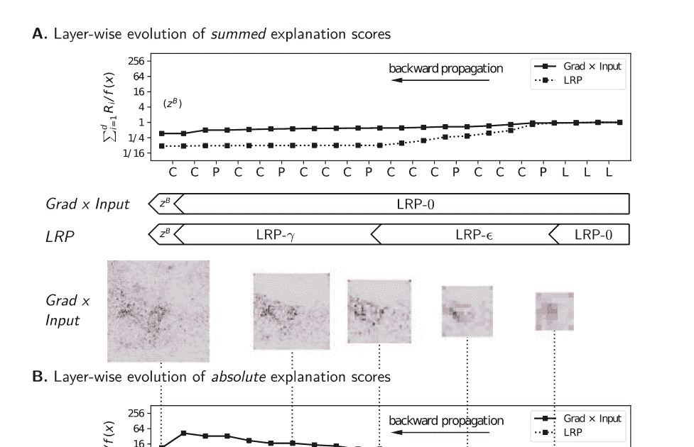

## B. Layer-wise evolution of *absolute* explanation scores

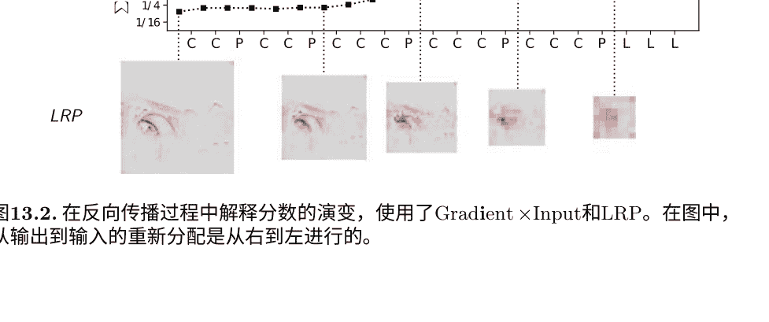

图13.2. 在反向传播过程中解释分数的演变，使用了Gradient × Input和LRP。在图中，从输出到输入的重新分配是从右到左进行的。

逐层减小传播分数，未解释的因素占据了解释。另一方面，Gradient × Input分数的大小会爆炸，这也可以追溯到梯度爆炸问题[5]。

##### 13.3.2 连续性

我们关注的第二个属性是连续性。首先，我们注意到深度整流网络产生连续的预测函数。这是它们由ReLU神经元组成的结果，而ReLU神经元本身是连续的。因此，两个相似的输入模式将导致类似的神经网络输出。

在这里，我们希望对解释也强制执行类似的属性。如果对于任意一对几乎相同的示例，解释函数是连续的，并且假设几乎相同的预测，它们各自的解释也几乎相同[13]。这个属性可以表述为：

```
对于所有输入$x \in \mathbb{R}^d$和小扰动$\epsilon \in \mathbb{R}^d, \quad \forall_{i=1,...,n}: R_i(x) \approx R_i(x+\epsilon)$
```

因为深度整流网络的梯度是不连续的，由$\text{Gradient} \times \text{Input}$产生的解释也是不连续的，因此不满足公理。这种不连续性可以追溯到用于传播梯度的规则：$\delta_j = \sum_k w_{jk} \cdot \mathbf{1}_{z_k \geq 0} \cdot \delta_k$，其中中间项是一个具有不连续性的阶跃函数在 $z_k=0$ 处。换句话说，一旦神经元 $k$变得活跃，梯度项 $\delta_k$，可能很大，会通过该神经元传播，并且可以显著改变较低层的梯度。对于深度修正网络，梯度的不连续区域数量可能随着深度的增加呈指数增长[3,14]。

我们现在问LRP是否产生连续的解释。为此，我们首先表达$R_j = a_j \sum_k c_{jk}$ 和 $R_k = a_k c_k$，使得传播规则可以重写为：

$$
c_{jk} = \begin{cases} 
(w_{jk} + \gamma w_{jk}^{+}) \cdot \frac{\sum_{0,j} a_j w_{jk}}{\epsilon + \sum_{0,j} a_j \cdot (w_{jk} + \gamma w_{jk}^{+})} c_k & (a_k > 0) \\
0 & (a_k = 0)
\end{cases}
$$

使用连续性的组合规则，我们观察到，只要LRP超参数$\gamma, \delta$之一非零，LRP解释就是连续的。

图13.3展示了梯度$\times$输入和LRP在一个简单的ReLU神经元模型上对连续性的不同行为，该模型接收一个二维输入$a = (a_1, a_2)$。我们观察到在这个简单的例子中，LRP产生的解释分数$R_1(a)$和$R_2(a)$在激活空间中是连续的。而对于梯度$\times$输入来说，情况并非如此，在输入域的右上角我们可以观察到解释分数从零突然跳变为大的正值或负值。

图13.4分析了将解释技术应用于VGG-16网络时的连续性。我们对图像进行局部遮挡，位于图像的某个相关位置。然后我们将这种扰动从左到右进行平移。收集每个平移阶段的解释。然后将序列解释总结在PCA图中，其中平移过程描述了一个轨迹。我们观察到Gradient $\times$ Input产生的解释在PCA空间中以不连续的方式演变，并且采取了不可预测的步骤。相反，LRP产生的解释定义了一个更连续和可预测的路径。因此，LRP更能够实现连续性属性。

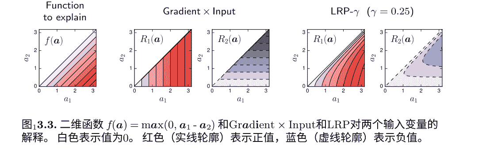

图3.3. 二维函数 f(a) = max(0, a1 - a2) 和Gradient × Input和LRP对两个输入变量的解释。白色表示值为0。红色（实线轮廓）表示正值，蓝色（虚线轮廓）表示负值。

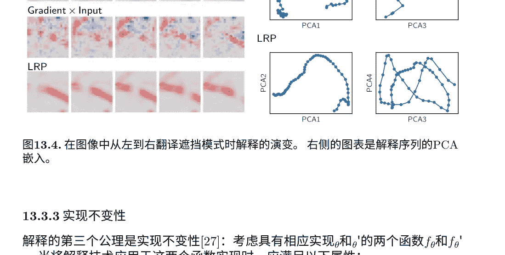

图13.4. 在图像中从左到右翻译遮挡模式时解释的演变。右侧的图表是解释序列的PCA嵌入。

##### 13.3.3 实现不变性

解释的第三个公理是实现不变性[27]: 考虑具有相应实现 $\theta$ 和 $\theta'$ 的两个函数 $f_\theta$ 和 $f_{\theta'}$。当将解释技术应用于这两个函数实现时，应满足以下属性：

```
f_\theta = f_{\theta'} \Rightarrow \forall^{d_i=1}: R_i(x; f_\theta) = R_i(x; f_{\theta'})
```

换句话说，解释应受到函数 $f_\theta$ 的影响，但不受其实现 $\theta$ 的影响。

因为梯度×输入依赖于数据和函数，而不依赖于其实现，所以产生的解释是实现不变的。相反，可以找到LRP不是实现不变的例子。图13.5提供了一个这样的例子，其中实现相同函数的两个不同神经网络产生了不同的解释。

## 13. 基于梯度和基于传播的解释对比

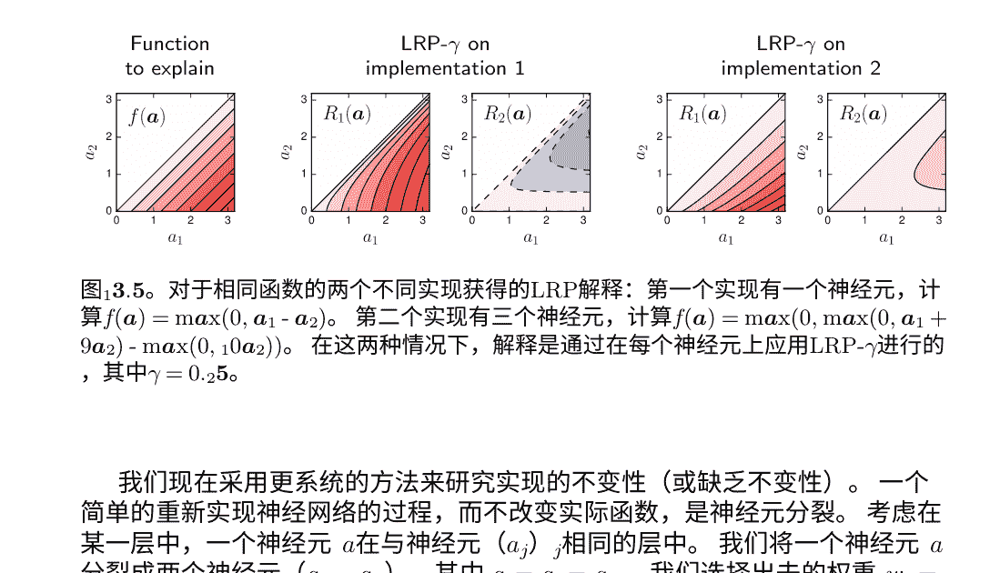

我们现在采用更系统的方法来研究实现的不变性（或缺乏不变性）。一个简单的重新实现神经网络的过程，而不改变实际函数，是神经元分裂。考虑在某一层中，一个神经元 $a$ 在与神经元 $(a_j)_j$ 相同的层中。我们将一个神经元 $a$ 分裂成两个神经元 $(a', a'')$，其中 $a = a' = a''$。我们选择出去的权重 $w' = w_{sk} + \theta$ 和 $w'' = -\theta$，其中 $\theta > 0$。显然，分裂操作对于 $a_k$ 的影响是空的，因此保持函数等价性。

由LRP找到的神经元 $a$ 和其分裂版本 $(a', a'')$ 的相关性分数如下：

$$R_s = \sum_k \frac{a_s \cdot (w_{sk} + \gamma w_{sk}^+)}{z_k + a_s \cdot (w_{sk} + \gamma w_{sk}^+)} R_k$$

和

$$(R_{s'} + R_{s''}) = \sum_k \frac{a_{s'} \cdot (w_{s'k} + \gamma w_{s'k}^+) + a_{s''} \cdot (w_{s''k} + \gamma w_{s''k}^+)}{z_k + a_{s'} \cdot (w_{s'k} + \gamma w_{s'k}^+) + a_{s''} \cdot (w_{s''k} + \gamma w_{s''k}^+)} R_k = \sum_k \frac{a_s \cdot (w_{sk} + \gamma \cdot (w_{sk} + \theta)^+)}{z_k + a_s \cdot (w_{sk} + \gamma \cdot (w_{sk} + \theta)^+)} R_k$$

其中 $z_k = \epsilon + \sum_{0,j} a_j \cdot (w_{jk})$ 是原始分母，没有神经元 $s$ 或其分裂版本的贡献。我们观察到 $R_s = R_{s'} + R_{s''}$。特别是当 $\gamma > 0$ 时，较大的 $\theta$ 值会导致 $R_{s'} + R_{s''} \approx \sum_k R_k = R_{s_o}$。也就是说，在不改变函数的情况下，分裂操作可以让神经元 $s$ 吸收来自更高层的任意大的相关性。因此，LRP过程的结果将是对神经元 $s$ 的解释，而不是对输出的函数 $f$ 的解释。

图13.6显示了在原始训练图像分类器上生成的解释，以及在每个层中将每个特征图分割并将参数 $\theta$ 设置为相应层中权重的10倍的对抗性重新实现。

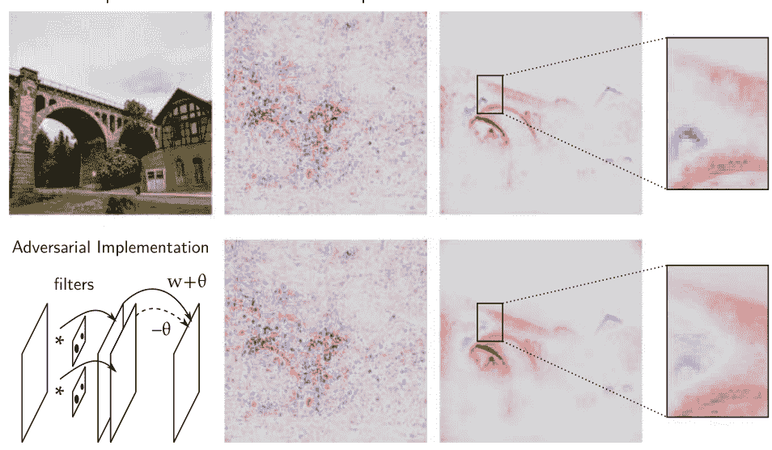

图13.6. 在原始训练的神经网络上获得的解释（顶部），以及在每个层中将特征图分割以扰乱传播过程但保持函数不变的对抗性实现（底部）的解释。

正如预期的那样，这个重新实现不会影响梯度 × 输入解释，这是实现不变的。LRP似乎在全局上是实现不变的，然而，对解释的更仔细检查显示出了细微的像素差异。因此，LRP受到内部表示的影响。因此，要充分利用LRP和其他传播技术，仅仅神经网络对数据的预测良好是不够的，还需要特别关注所学模型的结构[17]。

#### 13.4 结论

在本章中，我们询问了梯度 × 输入和LRP这两种梯度和传播方法的典型解释技术中，哪一种提供了最合理的解释。由于通常没有真实的解释可供评估，我们在这里采用了一种基于'公理'的解释方法。更准确地说，我们考虑了三个公理：保守性、连续性和实现不变性，这些公理必须对任何输入和神经网络都成立，并在Gradient × Input和LRP中进行了测试。

我们分析的一个特点是将Gradient × Input和LRP视为同一种基于传播的框架，这使我们能够检查和关联解释在层或神经元级别如何逐步构建，以及公理如何得到满足或违反。例如，我们可以观察到Gradient × Input（LRP-0）缺乏保守性。随着每一层的增加。 我们还表明，特定的神经网络函数的重新实现会影响LRP-$\gamma$的重新分配。 了解每种方法或传播规则的优势和局限性，可以在使用它们时进行战略选择，例如在特定层次上选择特定规则[11]，以使整个解释过程最小程度地受到干扰。

我们可以提出以下问题：如果将基于公理的评估应用于可能更广泛的解释类别，并将这些公理作为选择标准，我们是否一定会得到好的解释？

为了回答这个问题，考虑一个包含统一解释 $\forall_{i=1}^d : R_i = d^{-1}f(x)$ 的类别。 很容易证明它在保守性、连续性和实现不变性方面是最优的，但显然不是一个合理的解释。

因为公理可能不足以唯一地确定“真实”的解释并将其与有缺陷的解释区分开来，所以保持一类受限制的模型，例如受基本数学原理驱动并且引入超参数的简洁性，仍然是产生良好解释的重要因素。

#### 致谢

这项工作得到了德国教育和研究部的支持，作为柏林机器学习中心的一部分（01 IS18037I）。感谢DFG的部分资助（EXC 2046/1，项目编号：390685689）。 作者对Klaus-Robert Müller的宝贵反馈表示感谢。

### 参考文献

1. Ancona, M., Ceolini, E., Oz tireli, A.C., Gross, M.H.: 深度神经网络的基于梯度的归因方法的统一视角。 CoRR abs/1711.06104 (2017)
2. Bach, S., Binder, A., Montavon, G., Klauschen, F., Müller, K.R., Samek, W.: 关于非线性分类器决策的逐像素解释的层级相关传播。 PLoS ONE **10**(7), e0130140 (2015)
3. Balduzzi, D., Frean, M., Leary, L., Lewis, J.P., Ma, K.W., McWilliams, B.: 破碎的梯度问题： 如果ResNets是答案，那问题是什么？ 在：国际机器学习会议，第342-350页 (2017年)
4. Bazen, S., Joutard, X.: Taylor分解：非线性模型的Oaxaca方法的统一推广。 技术报告2013-32，Aix-Marseille大学 (2013年)
5. Bengio, Y., Simard, P.Y., Frasconi, P.: 用梯度下降学习长期依赖性是困难的。 IEEE Trans. Neural Networks **5**(2), 157-166 (1994年)
6. Kindermans, P.等： 显著性方法的（不）可靠性。 CoRR abs/1711.00867 (2017年)
7. Krizhevsky, A., Sutskever, I., Hinton, G.E.: 使用深度卷积神经网络进行ImageNet分类。 在： 神经信息处理系统，第1106-1114页 (2012年)
8. Landecker, W., Thomure, M.D., Bettencourt, L.M.A., Mitchell, M., Kenyon, G.T., Brumby, S.P.: 解释分层网络的个别分类。 在： IEEE计算智能研讨会，第32-38页 (2013年)
9. Lundberg, S.M., Lee, S.: 解释模型预测的统一方法。 在： 神经信息处理系统，第4768-4777页 (2017年)
10. Mnih, V., et al.: 通过深度强化学习实现人类水平控制。 自然 **518**(7540), 529-533页（2015年）
11. Montavon, G., Binder, A., Lapuschkin, S., Samek, W., Müller, K.-R.: 逐层相关传播：概述。 在： Samek, W., Montavon, G., Vedaldi, A., Hansen, L.K., Müller, K.-R. (eds.) 可解释AI. LNCS, vol. 11700, pp. 193–209. Springer, Cham (2019)
12. Montavon, G., Lapuschkin, S., Binder, A., Samek, W., Müller, K.: 用深度Taylor分解解释非线性分类决策。 Pattern Recogn. **65**, 211–222 (2017)
13. Montavon, G., Samek, W., Müller, K.: 解释和理解深度神经网络的方法。 Digit. Signal Process. **73**, 1–15 (2018)
14. Montufar, G.F., Pascanu, R., Cho, K., Bengio, Y.: 关于深度神经网络线性区域数量的研究。 在： 神经信息处理系统， 第2924-2932页（2014年）
15. Poulin, B., et al.: 用可加分类器解释证据。 在： 人工智能国际会议和人工智能创新应用，第1822-1829页（2006年）
16. Ribeiro, M.T., Singh, S., Guestrin, C.: 为什么我应该相信你？ 解释任何分类器的预测。 在： ACM SIGKDD国际知识发现与数据挖掘会议， 第1135-1144页（2016年）
17. Rieger, L., Chormai, P., Montavon, G., Hansen, L.K., Müller, K.-R.: 为更可解释的预测构建神经网络。 在： Escalante, H.J., et al.（编辑）计算机视觉和机器学习中的可解释和可解释模型。 TSSCML， 第115-131页。 Springer, Cham（2018年）。 https://doi.org/10.1007/978-3-319-98131-4_5
18. Samek, W., Binder, A., Montavon, G., Lapuschkin, S., Müller, K.: 评估深度神经网络学到的内容的可视化。 IEEE Trans. Neural Netw. Learn. Syst. **28**(11), 2660–2673 (2017)
19. Selvaraju, R.R., Cogswell, M., Das, A., Vedantam, R., Parikh, D., Batra, D.: 基于梯度定位的深度网络的视觉解释。 在： IEEE国际计算机视觉会议， 第618-626页（2017）
20. Shapley, L.S.: 17. n人游戏的价值。 在： 《博弈论的贡献》（AM-28），第二卷。 普林斯顿大学出版社（1953年）
21. Shrikumar, A., Greenside, P., Kundaje, A.: 通过传播激活差异学习重要特征。 在： 国际机器学习会议， 第3145-3153页（2017年）
22. Shrikumar, A., Greenside, P., Shcherbina, A., Kundaje, A.: 通过传播激活差异学习重要特征的不仅仅是黑盒子。 CoRR abs/1605.01713 (2016)
23. Simonyan, K., Vedaldi, A., Zisserman, A.: 深入卷积网络： 可视化图像分类模型和显著性图。 在： 第二届国际学习表示会议（2014年）
24. Simonyan, K., Zisserman, A.: 非常深的卷积网络用于大规模图像识别。 在： 第三届国际学习表示会议（2015年）
25. Smilkov, D., Thorat, N., Kim, B., Viégas, F.B., Wattenberg, M.: SmoothGrad： 通过添加噪声来去除噪声。 CoRR abs/1706.03825 (2017)
26. Sun, Y., Sundararajan, M.: 多线性函数的公理归因。 在： ACM电子商务会议， 第177-178页（2011年）
27. Sundararajan, M., Taly, A., Yan, Q.: 基于积分的深度网络可解释归因。 在： 国际机器学习会议， 第3319-3328页（2017年）
28. Sutskever, I., Vinyals, O., Le, Q.V.: 序列到序列学习与神经网络。 在: 神经信息处理系统, 第3104-3112页 (2014年)
29. Zeiler, M.D., Fergus, R.: 可视化和理解卷积网络。 在: Fleet, D., Pajdla, T., Schiele, B., Tuytelaars, T. (eds.) ECCV 2014. LNCS, vol. 8689, pp. 818–833. Springer, Cham (2014)。 https://doi.org/10.1007/978-3-319-10590-1_53
30. Zhang, J., Bargal, S.A., Lin, Z., Brandt, J., Shen, X., Sclaroff, S.: 自上而下的神经注意力通过激励反向传播。 计算机视觉国际期刊 126 (10), 1084-1102 (2018年)
31. Zhou, B., Khosla, A., Lapedriza, A., Oliva, A., Torralba, A.: 学习深度特征用于区分定位。 在: IEEE计算机视觉和模式识别会议上, 第2921-2929页 (2016年)
32. Zurada, J.M., Malinowski, A., Cloete, I.: 最小化输入数据维度的敏感性分析用于前馈神经网络。 在: IEEE国际电路与系统研讨会上, 第447-450页 (1994年)

# 14
显著性方法的（不）可靠性

Pieter-Jan Kindermans<sup>1</sup>(📧), Sara Hooker<sup>1</sup>, Julius Adebayo<sup>1</sup>, Maximilian Alber<sup>2</sup>, Kristof T. Schütt<sup>2</sup>, Sven Dähne<sup>2</sup>, Dumitru Erhan<sup>1</sup>, and Been Kim<sup>1</sup>

<sup>1</sup> Google Brain，加利福尼亚州山景城，美国
{pikinder,shooker}@google.com
<sup>2</sup> 柏林工业大学，德国柏林10587

摘要。显著性方法旨在解释深度神经网络的预测。当解释对模型预测没有贡献的因素敏感时，这些方法缺乏可靠性。我们使用一个简单且常见的预处理步骤，可以轻松补偿——向输入数据添加一个常数偏移量——以显示对模型决策没有影响的转换可能导致许多方法错误地归因。为了保证可靠性，我们认为在我们可以保证两个网络以相同方式处理图像时，解释不应该改变。

通过几个例子，我们展示了不满足这一要求的显著性方法会导致误导性的归因。这种方法可以看作是一种单元测试；我们构建了一个狭窄的基准来衡量一个声明的期望属性。因此，我们希望社区能够支持开发更多的测试。

#### 14.1 引言

虽然已经有大量的研究集中在理解神经网络的决策过程上[2–4,7–9,14–20]，但模型的复杂性和可解释性之间仍然存在着一种权衡。在深度神经网络中，特征表示被委托给模型，因此我们通常无法以一种信息丰富的方式说明模型预测的原因。显著性方法旨在通过根据输入的解释能力对其进行排名，从而推断模型学习到的函数f(x)的见解。尽管目标一致，但这些方法在结果上却出奇地不同且不重叠。由于缺乏真实的标准，评估这些方法的可靠性变得复杂，因为真实的标准取决于对模型如何做出决策的全面透明度，而这正是我们首先要解决的问题[7,17]。当我们考虑图14.1时，这一点变得很明显，图中显示了一种典型的属性方法的可视化。在这个图中，几种方法产生了非常不同的结果，但很难决定哪一种可以被认为是一个好的解释。

P.-J. Kindermans和S. Hooker对这项工作和作为Google AI Residency计划的一部分的工作做出了相同的贡献。

○ Springer Nature Switzerland AG 2019
W. Samek等人（编）：可解释AI，LNAI 11700，第267-280页，2019年。
https://doi.org/10.1007/978-3-030-28954-6_14

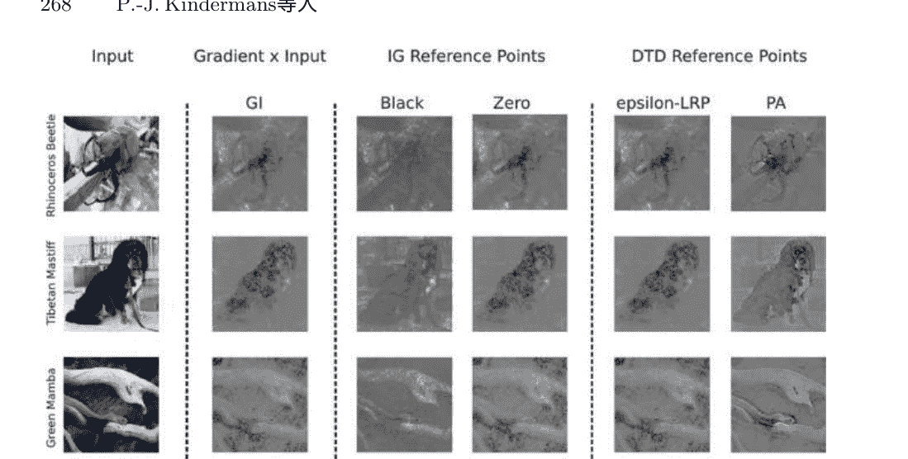

图14.1。综合梯度和Deep Taylor分解确定相对于所选参考点的输入属性。这个选择决定了所有后续归因的视角。使用每种方法的两个示例参考点，我们演示了改变参考点会导致归因发散。如此呈现的可视化似乎直观，但很难确定哪种方法最好。我们认为出于这个原因，需要对这些方法进行有效的测试。这些归因以与IG论文[17]一致的方式进行可视化。

可视化是使用ImageNet数据进行的。[10]和VGG16架构[14]。

需要一种正式的方法来评估不同显著性方法的相对可靠性。可靠的解释能够建立用户的信任，帮助识别模型失败的点，并消除在健康保健、安全和交通等领域部署深度神经网络的障碍。最近的几项研究提出了正式的方法来比较显著性方法的相对优劣[1,5,7,11]。此外，还有多项研究讨论和制定了显著性方法应该具备的理想特性，如完整性和实现不变性[2,17]。

我们提出了输入偏移不变性作为实现可靠解释输入对模型预测的贡献的必要属性。输入偏移不变性要求显著性方法的输出在输入数据发生偏移且模型进行了调整以补偿偏移时保持一致。在这种情况下，原始图像和修改后的对应图像被以完全相同的方式处理。因此，显著性方法的输出也不应该发生变化。

我们证明了许多方法不能满足输入的平移不变性。我们的结果还表明，网络预测的解释可以通过这种令人惊讶的简单转换有意地被操纵。

#### 14.2 一个用于显著性方法的单元测试

这项工作的目标是开发一个环境，我们可以测量可靠性的一个方面。为了做到这一点，我们构建了一个单元测试，在这个测试中，对输入进行语义上无意义的转换（在整个数据集上）不会影响模型的功能。然后，我们测试解释是否对转换敏感，尽管模型没有改变。一个可靠的方法应该对不影响模型的任何转换都是不变的。

将整个数据集平移一个常向量就是这样一个语义上无意义的扰动。我们展示了神经网络的偏差可以补偿常量平移。这导致了两个具有相同权重、中间激活和预测的网络。因此，一个可靠的显著性方法将为这两个网络产生相同的解释。

为了评估这个单元测试，我们比较了两个网络之间的归因，$f_1(x)$和$f_2(x)$。在这里，$f_1(x)$是一个在输入$x_1^i$上训练的网络，表示训练集$X_1$中的样本$i$。网络$_1$的分类器输出是：

$$f_1(x_1^i) = y^i,$$

现在，$f_2(x)$是一个预测转换输入$x_2^i$的网络。$x_1^i$和$x_2^i$之间的关系是常量向量$m_2$的加法：

$$对于所有$i$, $x_2^i = x_1^i + m_2$.$$

给定一个训练好的网络$f_1(x)$，我们可以构建网络$f_2(x)$来对修改后的数据进行相同的预测。网络$f_2(x)$具有与网络$f_1(x)$相同的权重。它们只在第一层的偏置上有所不同。考虑$f_1(x)$中非线性之前的第一层神经元：

$$z = w^T x_1 + b_1.$$

在网络$f_2(x)$中，我们通过补偿第一层神经元的平均偏移来改变偏差：$m_2$。因此，网络$f_2(x)$的第一层偏差变为：

$$b_2 = b_1 - w^T m_2.$$

结果是$f_1(x)$和$f_2(x)$的第一层激活相同：

$$z = w^T x_2 + b_2 = w^T x_1 + w^T m_2 + b_1 - w^T m_2.$$

请注意，对输入的梯度也保持不变：

$$\frac{\partial f_1(x_1^i)}{\partial x_1^i} = \frac{\partial f_2(x_2^i)}{\partial x_2^i}.$$

通过构建网络$f_2(x)$，可以消除均值偏移变换。这意味着$f_1(x)$和$f_2(x)$具有相同的权重，并且对于所有对应的样本，产生相同的输出，$x_1^i \in X_1$, $x_2^i \in X_2$：

$$\forall i, f_1(x_1^i) = f_2(x_2^i).$$

在我们的实验中，$f_1(x)$是经过训练的，$f_2(x)$是通过使用上述的偏置修正得到的。

##### 14.2.1 实验设置

现在，我们描述了我们的实验设置，以评估一组显著性方法的输入偏移不变性。在这个实验框架的实现中，网络1是一个具有1024个ReLU激活神经元的3层多层感知器。网络1将MNIST图像输入进行[0, 1]编码的分类。我们考虑一个负常数偏移$m_{2}=-1$；网络2将MNIST图像输入进行[-1, 0] MNIST编码的分类。第一个网络使用小批量随机梯度下降（SGD）进行10个时期的训练。最终的准确率为98.3%。

#### 14.3 对显著性方法对均值偏移的（不）敏感性

在第14.3.1节中，我们介绍了我们评估的显著性方法的广泛分组。在第14.3.2节中，我们发现梯度和信号方法满足输入不变性。在第14.3.3节中，我们发现大多数考虑的归因方法都有失败点。

##### 14.3.1 考虑的显著性方法

显著性方法大致分为三个不同的类别：

- 1. 梯度（敏感性）[3,13]显示了对输入的微小变化如何影响所关注输出的分类得分。
- 2. 信号方法，如DeConvNet [19]，Guided BackProp (GB) [16]和PatternNet (PN) [7]旨在分离刺激高层神经元激活的输入模式。
- 3. 诸如梯度乘以输入（GI）、深度泰勒分解（DTD）[8]、集成梯度（IG）[17]和模式归因（PA）[7]等归因方法通过分解输出神经元_j对输入维度的贡献来确定输入维度的重要性：

$$s_{j} = A(\boldsymbol{x})_{j}.$$

$s_{j}$是输入贡献的分解，与$\boldsymbol{x}$具有相同的维度，$A(\boldsymbol{x})_{j}$表示应用于输出$j$的归因方法，对于样本$\boldsymbol{x}$。归因方法与梯度不同，因为它们坚持完整性：所有归因的总和应该近似等于原始输出。

我们单独考虑每个类别的输入平移（通过评估原始梯度、GB、PN、GI、IG、DTD、PA）。我们还对SmoothGrad（SG）[15]的输入不变性进行基准测试，SmoothGrad是一种包装在底层显著性方法周围的方法，它使用添加噪声来产生通常被认为更加“清晰”的显著性热图的解释。

实验设置和方法如第14.2节所述。每种方法通过比较网络1和2的预测解释来进行评估，其中x_i_2只是平均偏移的输入（x_i_1 + m_2）。一个满足输入平移不变性的显著性方法将为网络1和2产生相同的显著性热图，尽管输入有常量偏移。

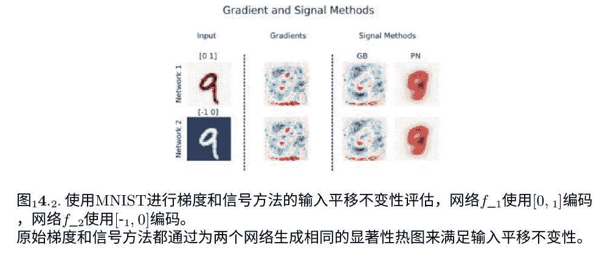

##### 14.3.2 梯度和信号方法

梯度和信号方法对输入的常量偏移不敏感。在图14.2中，原始梯度和考虑的信号方法（PatternNet [7]和Guided Backprop [16]）对于两个网络产生了相同的显著性热图。直观上，梯度、PN和GB在比较具有相同 f(x)的两个网络时满足输入平移不变性。考虑的梯度和信号方法完全根据网络/-模式权重确定归因，因此只要我们比较具有相同权重的网络，它们将保持一致。

同样，我们可以说当比较具有不同权重的网络时，这些方法不具有不变性（即使我们考虑具有不同架构但对每个输入都有相同预测的模型）。

##### 14.3.3 归因方法

我们评估以下归因方法：梯度乘以输入（GI）、积分梯度（IG）、Deep-Taylor分解（DTD）。IG和DTD都要求归因是相对于选择的参考点进行的。我们发现满足输入不变性取决于参考点的选择和输入的常数平移类型。

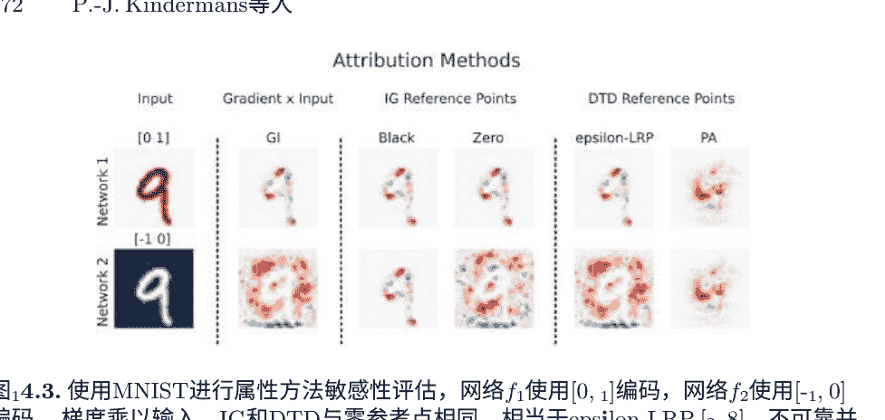

图14.3。使用MNIST进行属性方法敏感性评估，网络$f_1$使用[0, 1]编码，网络$f_2$使用[-1, 0]编码。梯度乘以输入，IG和DTD与零参考点相同，相当于epsilon-LRP [2, 8]，不可靠并为每个网络产生不同的属性。使用黑色图像参考点的IG和使用PA参考点的DTD对输入的均值偏移不敏感。

**梯度乘以输入（GI）。** 我们发现梯度与图像的乘法破坏了属性的可靠性。在图14.3中，GI为两个网络生成不同的显著性热图。

在第14.3.2节中，我们确定梯度确实满足输入的平移不变性。当梯度与输入图像相乘时，这种性质被破坏。

$$s_j = \frac{\partial f(\mathbf{x})_j}{\partial \mathbf{x}} \odot \mathbf{x}.$$

通过乘以输入，归因不再可靠，因为输入的偏移会传递到最终的归因。正如[15]所指出的，对输入进行简单乘法也会限制归因，而没有合理的解释非零输入。

**集成梯度（IG）。** [17]将预测分数归因于与基线 $\mathbf{x}_0$相关的每个输入。这是通过构建一组在基线和输入之间插值的输入来实现的。

$$\mathbf{s} = (\mathbf{x} - \mathbf{x}_0) \odot \int_{\alpha=0}^{1} \frac{\partial f(\mathbf{x}_0 + \alpha(\mathbf{x} - \mathbf{x}_0))}{\partial \mathbf{x}} d\alpha$$

由于这个积分无法通过解析计算，所以通过在 $\alpha \in [0,1]$范围内进行有限求和来近似。

$$\mathbf{s} = (\mathbf{x} - \mathbf{x}_0) \odot \sum_{\alpha} \frac{\partial f(\mathbf{x}_0 + \alpha(\mathbf{x} - \mathbf{x}_0))}{\partial \mathbf{x}}.$$

我们评估了两个可能的信息增益（IG）参考点。首先，我们将一个具有数据集中最小像素值的常量向量作为参考点（$x = min(x)$）(黑色图像)。其次，我们将一个零向量图像作为参考点。在图14.3中，使用黑色参考点的IG产生相同的归因热图，而使用零向量参考点的IG则不具有输入不变性。

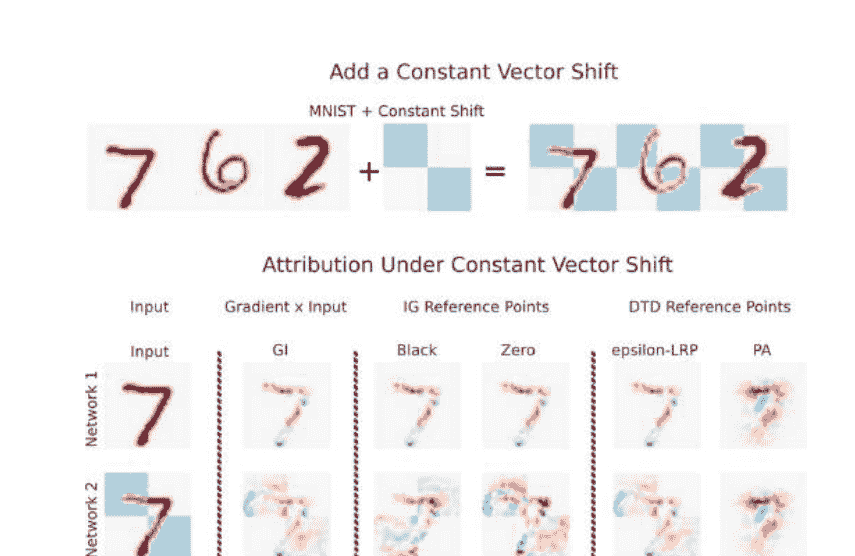

图14.4。使用MNIST评估归因方法的敏感性。梯度乘以输入，所有IG参考点和DTD与epsilon-LRP参考点都不满足输入不变性，并为每个网络产生不同的归因。DTD与PA参考点对输入的变换不敏感。

可以构造一个输入的变换，以破坏使用黑色图像作为参考点的可靠性。我们考虑一个输入的变换，其中常量向量（$m_2$）添加到输入（$x^i_1$）中，形成一个棋盘格图像。$x^i_2$与$x^i_1$的差异是添加了棋盘格图像向量$m_2$。网络$_2$与网络$_1$完全相同。

在图14.4中，我们展示了我们能够成功地操纵MNIST预测的属性映射，使得方格框图像出现。使用黑色图像作为IG的参考点不再满足输入不变性。

**深度泰勒分解（DTD）**

相对于参考点神经元确定归因。 在一般的表述中，输入神经元 $j$的归因被初始化为该神经元的输出。其他输出神经元的归因被设为零。这个归因被发送回输入神经元，使用以下分布规则，其中 $s^l_j$是分配给层 $l$中神经元 $j$的归因：

我们使用由层次相关传播（epsilon-LRP）[2]和模式归因（PA）[7]确定的参考点来评估DTD。在图14.3中，当使用由PA定义的参考点时，DTD满足输入不变性，但当使用由epsilon-LRP定义的参考点时，它不稳定。

Epsilon-LRP对输入偏移敏感，因为它是DTD的一种情况，其中选择零向量作为根点。反向传播规则如下：

$$ s^{\text{输出}}_j = y, \quad s^{\text{输出}}_{k=j} = 0, \quad s^{l-1,j} = \frac{w \odot (x - x_0)}{w^T x} s^l_j. $$

$s^{l-1,j}$仅取决于输入，因此属性将在网络$_1$和$_2$之间发生变化，因为$x_1$和$x_2$之间存在常量向量的差异。

模式归因（PA）是稳定的，因为参考点$x_0$被定义为数据中变化的自然方向[7]。这个自然方向是由数据的协方差确定的，因此明确补偿了输入的常量向量偏移。因此，它在构造上是输入偏移不变的。

为了理解这一点，我们从PA参考点开始：

$$ x_0 = x - a w^T x \quad (14.1) $$

其中 $a^T w = 1$。

在线性模型中：

$$ a = \frac{\text{cov}[x, y]}{w^T \text{cov}[x, y]} \quad (14.2) $$

对于后面跟着ReLu非线性的神经元，向量 $a$解释了非线性，并计算如下：

$$ a = \frac{E_+[x, y] - E_+[x] E[y]}{w^T (E_+[x, y] - E_+[x] E[y])}. $$

这里，$E_+$表示在$y$为正值时取得的期望。

PA简化为以下步骤：

$$ s^{\text{输出}}_j = y, \quad s^{\text{输出}}_{k=i} = 0, \quad s^{l-1,j} = w \odot a s^l_j. $$

向量 $a$取决于协方差，因此消除了输入的平均偏移。因此，两个网络的归因是相同的。

> 这种DTD情况被称为 Z规则，并且可以证明与层次相关传播[2,8]等效。在特定情况下，epsilon-LRP也等同于梯度乘以输入[6,12]。

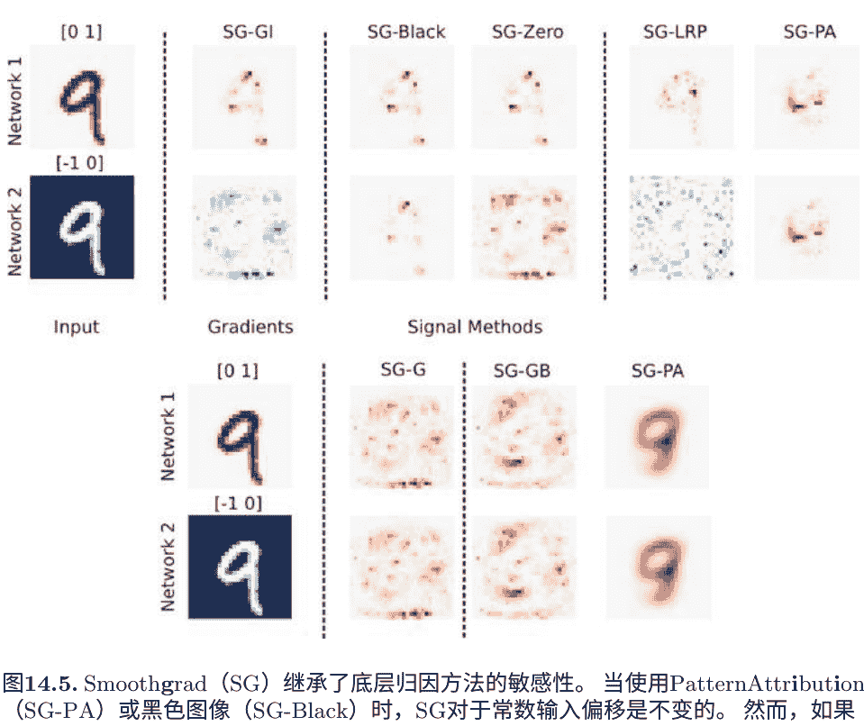

图14.5。Smoothgrad (SG) 继承了底层归因方法的敏感性。当使用PatternAttribution (SG-PA) 或黑色图像 (SG-Black) 时，SG对于常数输入偏移是不变的。然而，如果SG应用于不变的方法，它将保持不变。

# 14.3.4 SmoothGrad (SG) [15]

SmoothGrad用带有添加的随机噪声的输入替换输入的 N 个相同版本。这些带噪声的输入被注入到底层归因方法中，最终归因是 N 个归因的平均值。例如，如果底层方法是关于输入的梯度。 g(x)^j = ∂f(x)/∂x_j

变成：
$$
\frac{1}{N} \sum_{i=1}^{N} g(x + \mathcal{N}(0, \sigma^2))_j.
$$

当应用于具有非线性的多层神经网络时，SG通常会产生被认为是美学上更锐利的可视化效果。SG不会改变归因方法本身，因此始终会继承底层方法的输入不变性。因此，如图14.5所示，在梯度和信号方法之上应用SG会产生相同的显著性图。

SG在应用于梯度和信号方法时产生相同的显著性图。当应用于梯度乘以输入、epsilon-LRP和零向量参考点时，SG不满足输入不变性，这与之前讨论的所有方法生成的SG热图进行比较。当应用于PA时，SG对输入转换不敏感。

#### 14.4 操纵显著性方法

当考虑特定参考点和/或输入转换时，IG和DTD不满足输入平移不变性。此外，参考点的选择决定了所有后续的归因。在图14.1中，如果考虑多个参考点，相同方法的归因在视觉上会有所不同。

合理的参考点选择自然取决于领域和任务。例如，[17]建议对于图像识别任务，黑色图像是一个自然的参考点，而对于基于文本的网络，零向量是一个合理的选择。然而，我们已经证明了参考点的选择可能导致非常不同的结果。

因此，当使用某个基准线进行归因时，模型的无意识误差是非常可能的，而对于这种误差的影响是未知的。到目前为止，我们已经讨论了在已知预处理步骤和可视化检查确定的显著点的图像识别任务中的归因。虽然在图像领域中，视觉检查并不总是足够的（例如，在图14.1中，不清楚哪种方法最好），但对于音频和基于语言的模型来说，视觉检查甚至更加困难或不合适。因此，在其他领域中，识别故障点或在不同基准线下归因的变化构成了额外的挑战。

重要的是要意识到，如果我们无法确定参考点选择的含义，我们在评估方法的可靠性方面会受到限制。为了证明这一点，我们构建了一个输入的恒定偏移，利用了之前讨论的归因点的失败。几乎所有的方法都对这种输入偏移变换敏感，导致对模型预测的误导性解释。在接下来的实验中，我们使用一张手绘的猫的图片来展示如何选择一个合适的向量来故意制造模型预测的误导性解释。

网络1与第14.2节中介绍的相同。我们考虑一个新的输入变换 x₂ⁱ，其中添加到 x₁ⁱ的常向量 m₂是一张手绘的猫的图片。原始图片可以在图14.6中看到。与第14.2节一致，x₁ⁱ和变换后的输入 x₂ⁱ之间的关系是添加一个常向量 m₂。

∀i, x₂ⁱ = x₁ⁱ + m₂.

当梯度与输入相乘时，我们通过选择一个期望的归因^s来构建m₂，该归因应该分配给特定样本^x。

通过以下设置 $m_2$，可以确保特定的 $x'_2$ 获得期望的归因：

$$
m_2 = \frac{\hat{s}}{\partial f_1(x)} - x
$$

为了确保原始图像仍然可以被识别为属于其类别，我们将移位限制在 $[-0.3, 0.3]$ 范围内。

在图14.6中，除了使用PA作为基线的DTD方法外，我们能够有意地误导所有归因方法对模型预测的解释。

重要的是要注意，如果在归因之前对数据进行了归一化，其中一些方法将满足输入移位不变性。例如，如果数据始终被归一化为零均值，带有黑色基线的IG方法将满足输入移位不变性。然而，这远非是对参考点选择的系统性处理，我们的实验范围之外还存在一些情况，这种处理是不够的。

在许多情况下，黑色图像的概念可能不存在（例如音频处理），而基准的选择仍然是一个问题。由于IG和DTD的基准选择对于结果至关重要，我们认为进一步了解在不依赖于个案解决方案的情况下保证可靠性的参考点选择是一个开放的研究问题。

图14.6. 使用MNIST评估属性方法的敏感性。梯度乘以输入，IG使用黑色和零参考点以及DTD使用epsilon-LRP参考点，不满足输入不变性，并为每个网络生成不同的属性。DTD使用PA参考点对输入的转换不敏感。

对于DTD [8]，可以应用类似的推理 $Z_+$ -规则。在这个方向上的第一步是DTD [8]和PatternNet/-PatternAttribution [7]的 $Z_{\text{box}}$－规则。对于分析数据限定在特定区间的网络，设计了 $Z_{\text{box}}$－规则[8]。在这里，使用相对于区间边界的参考点进行属性计算。Pattern-Net和PatternAttribution在学习参考点时明确补偿数据的平均值。

虽然现有的方法在特定情况下可以成功应用，但从我们的实验中可以清楚地看到它们在其他情况下可能会出现不希望的行为。因此，我们鼓励社区采用单元测试的理念。通过参与定义额外测试和开发能通过当前测试集的方法的迭代过程，社区可以朝着健壮可靠的方法迈进。除此之外，我们认为了解当前方法的局限性至关重要，因为这将使从业者能够选择最适合该用例的方法。

#### 14.5 结论

显著性方法是了解我们模型的直觉的强大工具。我们展示了当对输入应用常量向量偏移时，许多方法无法正确归因。更令人担忧的是，我们展示了我们能够故意制造一个用手绘的猫图像来欺骗网络的解释。

我们引入输入偏移不变性作为可靠归因的先决条件。我们对输入的不变性处理仅限于证明至少存在一种输入转换（将输入向量平移一个常数向量）会导致许多显著性方法错误地归因。这项工作是受到显著性方法的广泛认可价值的激励，我们相信它们仍然是获得对网络直觉的有价值工具。了解它们失败的地方使研究人员能够意识到什么是适合他们任务的合适方法。将输入错误地分类为显著性可能会更加关注领域、任务和数据模态。例如，在可以进行视觉检查的图像识别任务中，猫归因操纵实验很可能会被发现。然而，在音频或词向量等领域中，识别出这种明显的操纵就不那么明显了。即使在计算机视觉领域，容忍对常见输入转换的敏感性可能会排除某些方法的使用，其中一个错误对人类福祉的代价可能是不可接受的高。

出于这个原因，我们鼓励社区思考可解释性方法的期望行为。我们还相信，开发诸如输入偏移不变性之类的测试将有助于整个社区朝着更强大和可靠的方法发展，因为只有在更好地理解期望行为的情况下，我们才能构建改进的方法。

### 参考文献

+   1. Adebayo, J., Gilmer, J., Muelly, M., Goodfellow, I.J., Hardt, M., Kim, B.: 对显著性图的合理性检查。 在： 神经信息处理系统， NeurIPS(2018)
+   2. Bach, S., Binder, A., Montavon, G., Klauschen, F., Müller, K.R., Samek, W.: 关于非线性分类器决策的像素级解释的逐层相关传播。 PLoS One 10(7), e0130140 (2015)
+   3. Baehrens, D., Schroeter, T., Harmeling, S., Kawanabe, M., Hansen, K., Müller, K.R.: 如何解释个别分类决策。 机器学习研究杂志。 11(Jun), 1803–1831 (2010)
+   4. Haufe, S., et al.: 关于多变量神经影像线性模型权重向量的解释。 神经影像 87, 96–110 (2014)
+   5. Hooker, S., Erhan, D., Kindermans, P.J., Kim, B.: 评估特征重要性估计。 arXiv预印本 arXiv:1806.10758 (2018)
+   6. Kindermans, P.J., Schütt, K., Müller, K.R., Dahne, S.: 研究噪声和干扰对神经网络解释的影响。 arXiv预印本 arXiv:1611.07270 (2016)
+   7. Kindermans, P.J.,等： 学习如何解释神经网络： PatternNet和PatternAttribution。 arXiv预印本 arXiv:1705.05598v2 (2017)
+   8. Montavon, G., Lapuschkin, S., Binder, A., Samek, W., Müller, K.R.: 用深度Taylor分解解释非线性分类决策。 Pattern Recogn. 65, 211–222 (2017)
+   9. Nguyen, A., Dosovitskiy, A., Yosinski, J., Brox, T., Clune, J.: 通过深度生成器网络合成神经网络中神经元的首选输入。 在： 神经信息处理系统的进展， 第3387-3395页 (2016)
+   10. Russakovsky, O.,等： ImageNet大规模视觉识别挑战。 国际计算机视觉杂志115 (3), 211-252页 (2015)
+   11. Samek, W., Binder, A., Montavon, G., Lapuschkin, S., Müller, K.R.: 评估深度神经网络学到的可视化内容。 IEEE Trans. Neural Netw. Learn. Syst. 28(11), 2660–2673 (2017)
+   12. Shrikumar, A., Greenside, P., Shcherbina, A., Kundaje, A.: 不仅仅是一个黑盒子： 通过传播激活差异来学习重要特征。 arXiv preprint arXiv:1605.01713 (2016)
+   13. Simonyan, K., Vedaldi, A., Zisserman, A.: 深入卷积网络： 可视化图像分类模型和显著性图。 在： 国际学习表示会议， ICLR (2014)
+   14. Simonyan, K., Zisserman, A.: 非常深的卷积网络用于大规模图像识别。 在： 国际学习表示会议， ICLR (2015)
+   15. Smilkov, D., Thorat, N., Kim, B., Viégas, F., Wattenberg, M.: SmoothGrad:通过添加噪音来去除噪音。 arXiv预印本 arXiv:1706.03825 (2017)
+   16. Springenberg, J. T., Dosovitskiy, A., Brox, T., Riedmiller, M.: 追求简洁： 全卷积网络。 在： 国际学习表示会议 ICLR (2015)
+   17. Sundararajan, M., Taly, A., Yan, Q.: 深度网络的公理归因。 arXiv预印本 arXiv:1703.01365 (2017)
+   18. Yosinski, J., Clune, J., Fuchs, T., Lipson, H.: 通过深度可视化理解神经网络。 在： ICML深度学习研讨会上 (2015)
+   19. Zeiler, M.D., Fergus, R.: 可视化和理解卷积网络。 在: Fleet, D., Pajdla, T., Schiele, B., Tuytelaars, T. (eds.) ECCV 2014. LNCS, vol. 8689, pp. 818–833. Springer, Cham (2014). https://doi.org/10.1007/978-3-319-10590-1_53
+   20. Zintgraf, L.M., Cohen, T.S., Adel, T., Welling, M.: 可视化深度神经网络的决策：预测差异分析。 在: 国际学习表示会议，ICLR (2017年)

## 第五部分
可解释AI的应用

# 可解释AI的应用 -前言

可解释AI的方法不仅在研究界引起了关注，而且也成为开发者和实践者的宝贵工具。在解决现实世界的问题时，理解模型并能够解释其预测有助于对模型的正确功能产生信任（即检测“聪明汉斯”预测器[5]）。此外，通过展示AI系统用于预测的特征，解释有助于揭示数据中可能对人类专家不明显的模式。这可能提供有关涉及的生物、化学或神经机制的有价值信息，并带来新的科学洞察[7,8,9]。

以下章节展示了可解释AI在三个不同领域的应用，分别是计算机视觉（第15和16章），物理科学（第17、18和19章）以及脑科学研究（第20和21章）。

在第15章中，Hofmarcher等人[4]考虑了自动驾驶中AI模型的可解释性和可检查性问题。提出了一种分层方法，其中包含一个可解释的人类可理解层。系统的主要组成部分是一个语义分割模型，它为输入图像中的每个像素分配一个对象类别。这些分割地图是人类可理解的，并且可以作为自动驾驶系统下游的输入。

在第16章中，Anders等人[1]采用了一个现有的3D卷积神经网络模型，对其预测结果进行解释。分析揭示了模型主要关注视频的边界帧，似乎模型希望超越输入序列。这一洞察可以用于根据模型的需求（例如通过降采样）调整数据，并且有趣地提高分类准确性，而无需重新训练模型。

在第17章中，Schütt等人[8]展示了可解释AI在物理学中的潜力。介绍了用于预测化学性质的深度神经网络的解释技术。通过将生成的逐原子或空间解释与众所周知的量子化学模型进行比较，可以评估学习模型的物理合理性水平，并产生关于潜在量子化学规律的新见解和假设。

在第18章中，Preuer等人[7]将可解释AI的方法应用于分子性质和生物活性预测问题。对学习表示的分析表明，神经网络模型的单个元素充当了分子中药效团或毒性团结构的探测器。实验证明，模型对分子的学习与文献一致。

在第19章中，Kratzert等人[6]研究了可解释AI在水文学领域的另一个应用。他们将长短期记忆网络应用于降雨径流预测，并展示了学习表示的意义，例如LSTM实际上表示了雪储存单元中的短期和长期动态以及它们与气象输入的关系。这个例子展示了可解释AI模型在理解水文学领域复杂过程中的能力。

在第20章中，Douglas和Anderson [2]讨论了在神经科学领域解释AI模型的挑战。研究表明，即使是解释线性模型在功能性神经影像学中也需要非常小心，因为存在特征冗余（例如，成千上万个fMRI体素）和与噪声的高相关性。在应用可解释AI技术进行脑研究时，意识到这些潜在陷阱是至关重要的。

在第21章中，van Gerven等人[3]研究了可解释机器学习方法在神经解码中的应用，即从神经活动模式中重建视觉体验。结果表明，针对这一任务训练的深度神经网络能够准确地模拟视觉腹侧通路中的分层处理。对人类信息处理方式的改进理解可能有助于未来开发更具人类特征的深度模型。

总的来说，这七章展示了解释方法可以应用于非常不同的问题。在所有这些应用中，理解AI模型是至关重要的。

2019年7月

+   Wojciech Samek
+   Grégoire Montavon
+   Andrea Vedaldi
+   Lars Kai Hansen
+   Klaus-Robert Müller

### 参考文献

+   1. Anders, C.J., Montavon, G., Samek, W., Müller, K.-R.: 通过解释预测来理解基于补丁的视频数据学习。 在：Samek, W., Montavon, G., Vedaldi, A., Hansen, L.K., Müller, K.-R. (eds.) 可解释AI：解释和可视化深度学习。LNCS，卷11700，pp. 297–309. Springer, Cham (2019年)
+   2. Douglas, P.K., Anderson, A.: 特征谬论：解释fMRI中的线性解码权重的复杂性。 在：Samek, W., Montavon, G., Vedaldi, A., Hansen, L.K., Müller, K.-R. (eds.) 可解释AI：解释和可视化深度学习。LNCS，卷11700，pp. 363–378. Springer, Cham (2019年)
+   3. van Gerven, M.A.J., Seeliger, K., Güçlü, U., Güçlütürk, Y.: 神经解码的当前进展。 在：Samek, W., Montavon, G., Vedaldi, A., Hansen, L.K., Müller, K.-R. (eds.) 可解释AI：解释和可视化深度学习。LNCS，卷11700，页379–394. Springer, Cham (2019)
+   4. Hofmarcher, M., Unterthiner, T., Arjona-Medina, J., Klambauer, G., Hochreiter, S., Nessler, B.: 使用语义分割进行自动驾驶的视觉场景理解。 在：Samek, W., Montavon, G., Vedaldi, A., Hansen, L.K., Müller, K.-R. (eds.) 可解释AI：解释和可视化深度学习。LNCS，卷11700，页285–296. Springer, Cham (2019)
+   5. Lapuschkin, S., Wäldchen, S., Binder, A., Montavon, G., Samek, W., Müller, K.-R.: 揭示聪明汉斯的预测器并评估机器真正学到了什么。 Nat. Commun. 10, 1096 (2019)
+   6. Kratzert, F., Herrnegger, M., Klotz, D., Hochreiter, S., Klambauer, G.: NeuralHydrology –在水文学中解释LSTMs。 在： Samek, W., Montavon, G., Vedaldi, A., Hansen, L.K., Müller, K.-R. (eds.) 可解释AI: 解释和可视化深度学习。 LNCS， 卷11700， pp. 347–362。 Springer, Cham (2019)
+   7. Preuer, K., Klambauer, G., Rippmann, F., Hochreiter, S., Unterthiner, T.: 可解释的深度学习在药物发现中。 在： Samek, W., Montavon, G., Vedaldi, A., Hansen, L.K., Müller, K.-R. (eds.) 可解释AI: 解释和可视化深度学习。 LNCS， 卷11700， pp. 331–345。 Springer, Cham (2019)
+   8. Schütt, K.T., Gastegger, M., Tkachenko, A., Müller, K.-R.: 通过可解释的原子神经网络从量子化学中获得的洞察力。 在： Samek, W., Montavon, G., Vedaldi, A., Hansen, L.K., Müller, K.-R. (eds.) 可解释AI: 解释和可视化深度学习。 LNCS， 卷11700， pp. 311–330 。 Springer, Cham (2019)
+   9. Thomas, A.W., Heekeren, H.R., Müller, K.-R., Samek, W.: 通过循环深度学习模型分析神经影像数据 (2018) 。 arXiv预印本arXiv:1810.09945

## 15使用语义分割进行自动驾驶的视觉场景理解

Markus Hofmarcher (✉), Thomas Unterthiner, José Arjona-Medina, Günter Klambauer, Sepp Hochreiter, and Bernhard Nessler

奥地利林茨约翰内斯·开普勒大学，4040林茨
{hofmarcher,unterthiner,arjona,klambauer,hochreit,nessler}@ml.jku.at

摘要。 深度神经网络是自动驾驶中越来越重要的技术组成部分，特别是作为视觉感知组件。在真实环境中部署需要对控制车辆的算法进行解释和检查。这样的有见地的解释不仅与法律问题和保险事务相关，而且对工程师和开发人员来说，以实现可证明的功能质量保证也很重要。这适用于所有深度网络控制潜在危及生命的机器的情况。我们建议使用分层方法，其主要组成部分是语义分割模型，而不是自动驾驶系统的端到端方法。为了使系统能够对其决策提供有意义的解释，有必要对其感知到的复杂感官输入所归属的语义进行解释。在高维视觉输入的背景下，这种归属是通过像素级分类过程来完成的，该过程为图像中的每个像素分配一个对象类别。这个过程被称为语义分割。

我们提出了一种架构，可以在生产车辆中利用有限的计算能力实现实时的可行分割性能。这种语义分割模型的输出可以作为可解释的自动驾驶系统的输入。

关键词： 深度学习·卷积神经网络·语义分割·分类·视觉场景理解·可解释性

#### 15.1 引言

在非常复杂的学习系统中，有两种主要方法。传统方法基于手工设计的特征函数预处理以对人类有用的方式处理输入。 人类专家利用他的领域知识设计这些特征，以增强任务相关的信息，并尽可能抑制无关信号。 这种预处理大大降低了输入的维度，这是应用传统机器学习技术所必需的。

现代原则是深度学习的自然选择，即所谓的端到端方法。 这种方法使网络有自由学习基于原始输入并直接产生最终输出的函数。 这种端到端方法在过去几年中使深度学习彻底改变了人工智能[8,16,26,34,35]。

端到端原则的优势是明显的：学习过程中的优化可以自由访问完整的输入空间并构建所需的任意函数。 然而，它也有一些缺点。 首先，需要大量的训练样本来优化更复杂的函数。此外，通常在工程特征中编码的领域知识丢失了。 最后，生成的函数比传统流程中更难解释。

在自动驾驶的问题设置中，原始输入是来自RGB相机的逐像素传感器数据，来自LIDAR传感器的逐点深度信息，来自超声波或雷达传感器的接近度测量以及来自IMU的里程计信息。所需的输出仅为转向角度、扭矩和刹车。 在端到端方法中，功能模型应以最佳方式利用输入，以相对于给定损失函数[4,6,7]输出最佳驾驶指令。

然而，端到端方法的上述缺点对于此应用来说很快变得不可逾越，因为为任意场景训练此类端到端驾驶模型所需的训练示例数量巨大。 此外，解释这样的模型以回答为什么模型决定采取某种行动的问题非常困难。 如果模型的决策导致车辆出现错误行为，这在法律问题上尤为棘手。

最近，对归因方法的研究已经引起了关注，归因方法的目标是确定输入的哪一部分对模型的输出负有责任[2,37,38,41]。 然而，在自动驾驶的情况下，由于其高维图像输入，这些归因方法可以解释每个像素对驾驶决策的贡献程度。 这将提供一些关于功能对应的信息，但这并不足以回答典型的人类“为什么”问题，即要求了解系统内部模型及其对世界的理解。

我们提出了一种分层方法，其中将单个感知组件的输入直接 - 无需手工特征 - 输入到一个深度神经网络中，其训练目标是定义为人类可解释的抽象表示。特别是对于视频输入信号，我们希望从行人的服装颜色、车辆的具体纹理以及街道和建筑物的具体外观中抽象出来。我们只对它们在空间中的形状和位置感兴趣。语义分割通过为输入图像的每个像素分配一个对象类别来实现这一目标。 这类似于通过从一种模态转换到另一种模态来解释机器学习模型[11,32]。 由于我们现实世界的几何形状，这导致了表示单个对象（如行人、汽车、建筑物、车道和人行道）的形状的较小或较大的连续区域（参见图15.1）。

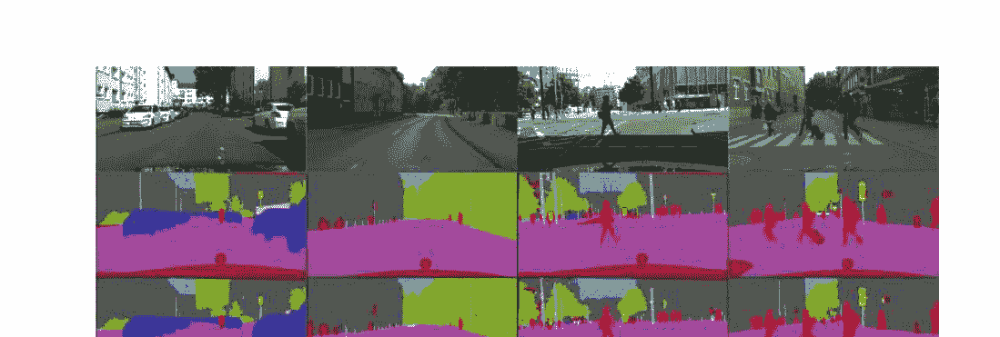

## 图15.1。网络的示例输出（底部）与Cityscapes验证集上的真实结果（中间）。

很明显，语义分割网络的输出维度比原始输入图像低得多。 此外，它已经代表了整个系统的重要的第一次决策。 在这个阶段，关于人类或车辆的存在与否的决策已经做出。 例如，人类是否被识别出来完全取决于输入的中间处理，其他车辆是否被识别为车辆已经在这个阶段决定，道路的走向也已经作为一个段落反映在输出中。 在某种程度上，我们回到了传统的特征工程流程，但这种分层处理方式有很大的不同。 我们不是手工制作特征，而是利用人类专家知识来定义一个适用于整体问题的内部抽象层。 因此，原始特征分析完全像端到端方法一样进行训练和优化。 关键的优势在于这种分层处理的解释能力。

在这篇文章中，部分内容已经在[39]中发表，我们提出了一种能够在嵌入式硬件上实时推断语义分割的新型架构，同时在准确性上超过了可比较的竞争对手。 在第15.2节中，我们简要回顾了当前最新技术和在自动驾驶应用中使用的语义分割技术。在第15.3节中，我们介绍了我们提出的用于自动驾驶车辆中高效语义分割的架构，并在第15.4节和第15.5节中展示了实验设置和评估结果。

#### 15.2 语义分割

卷积神经网络（CNNs）已经成为图像相关任务（如图像分类或交通标志识别）[26,35]以及语义分割[5,28,40,43]中表现最好的方法。然而，进行语义分割可能会导致与端到端模型相比的显著计算开销。特别是当通过增加网络规模来提高分割性能时，这种情况尤为明显[15]。

当使用深度学习进行语义分割时，图像中的主要对象（如人或车辆）的识别是在神经网络的较高层次上实现的。从设计上讲，这些层在较粗的尺度上工作，并且是平移不变的（例如通过池化操作实现），这样像素级别的微小变化不会影响识别。此外，语义分割需要对小特征进行像素级别的准确分类，这些特征通常只存在于网络的较低层次。这种分辨率上的权衡通常通过从较低层到输出的跳跃连接来解决，从而增加接近输出的层的分辨率。跳跃连接是由全卷积网络（FCN）[28]引入的，它仍然是大多数现代方法的蓝图。这些方法只在如何编码对象级别信息以及如何将这些分类转换为像素级别标签方面有所不同。原始的FCN使用了在LSVRC图像分类任务上预训练的VGG网络[36]。然后FCN添加了来自较低层的更高层的信息，通过转置卷积进行上采样。FCN架构通过其他方式改进，例如通过访问较低级别的池化层[3]，通过使用增强的方法整合较低级别信息[31]或者放弃池化操作而使用扩张卷积[27,40]来连接到较低层。作为后处理步骤，许多最新的系统在神经网络生成的输出上应用基于CRF的细化[27,44]。CRF可以提高分割的准确性，但会增加计算量。

减少语义分割的计算负担对于嵌入式系统和自动驾驶来说是至关重要的。神经网络是在具有强大GPU的服务器或工作站上进行训练的，而这些GPU系统随后用于对新数据进行推理。然而，这些商品在自动驾驶汽车中并不存在。自动驾驶汽车需要立即对新事件做出反应，以确保乘客和其他交通参与者的安全，而如果对象的边界不能完美地被识别到像素分辨率，通常是可以接受的。在自动驾驶应用中，实时分割图像是一个强烈的要求。因此，在这些系统中部署的任何卷积神经网络都必须满足严格的执行速度要求。

在深度学习的计算要求方面，已经进行了大量的研究。SqueezeNet [21]表明，通过采用更高效的架构，可以使用50倍少的参数来复制强大的CNNs（如AlexNet [24]）的图像分类准确性。ENet [30]在嵌入式设备上实时进行语义分割是可行的研究方向，并且证明了与之前相同的路径。另一条研究线路通过从较大的网络中派生出较小的网络[1,17]，通过修剪或量化权重[13,14]，或者调整网络以在特定硬件设计上执行来提高现有网络的效率。这些方法可以应用于新架构之上，以加快执行速度。

#### 15.3 方法

##### 15.3.1 概述

为了实现实时语义分割，我们必须在可实现的分割准确性和执行速度之间进行权衡。与大多数成功的分割网络一样，我们的网络结构是编码器-解码器对。编码器CNN在输入图像中检测更高级的对象，如汽车或行人。解码器将此信息与编码器的较低层次信息相结合，为原始输入中的每个像素提供预测。图15.2描述了该架构。

##### 15.3.2 编码器

编码器是一个改进的SqueezeNet 1.1架构[21]，它被设计为一个低延迟的图像识别网络，同时保持了类似AlexNet [24]的准确性。SqueezeNet的主要计算模块是所谓的“fire”模块，由三个卷积操作组成，如图15.3a所示。编码器由八个“fire”模块组成，其中夹杂着三个最大池化层进行下采样。原始架构中的所有修正线性单元（ReLUs）都被指数线性单元（ELUs）[9]所替代，ELUs通过在激活的负部分传递信息，更有效地利用参数。

##### 15.3.3 并行扩张卷积

解码器基于并行扩张卷积层[27]，如图15.3b所示。这个扩张层通过使用四个不同扩张因子的大小为3的扩张卷积，将编码器输出的特征图组合在一起。这相当于以不同的速率对层输入进行采样。四个扩张卷积的贡献然后通过逐元素求和来融合。结果是，感受野的大小增加了，并且考虑了多尺度的空间依赖关系，而无需使用多个层进行堆叠，这将是计算上昂贵的。

##### 15.3.4 解码器和旁路

编码器中的池化层用于在检测对象的部分时确保一定程度的平移不变性。然而，它们反过来降低了输出的空间分辨率。解码器中的转置卷积用于将信息上采样回其原始大小。为了改善上采样，我们不仅仅使用直接来自转置卷积层之前的层的数据，还将其与来自编码器较低层次的低级知识相结合。这些层负责在更高分辨率上检测更精细的结构，有助于更准确地分类对象的轮廓。每个细化模块将来自前一个上采样层的信息和来自编码器的另一个信息流合并在一起。细化模块中的两个卷积层学习如何在将信息传递给下一个上采样层之前加权这两个信息流。我们使用类似于SharpMask方法[31]中使用的细化模块。

我们再次使用ELUs而不是ReLU单元（图15.3c显示了模块的实现）。

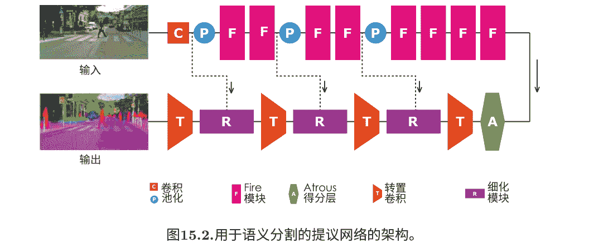

## 图15.2.用于语义分割的提议网络的架构。

在编码器的每个池化层之前，一个旁路分支连接到细化模块。一旦到达那里，卷积层会从较低层获取知识。然后，它与来自上一个上采样层的语义对象信息进行连接。第二个卷积层将来自两个分支的连接特征图合并成类别图。

##### 15.3.5 指数线性单元 (ELU)

我们的网络广泛使用指数线性单元[9]，因为我们经验性地发现它在我们的目的上比ReLU单元效果更好。ELUs被设计用来避免神经网络训练中的偏移。ELU激活函数定义为

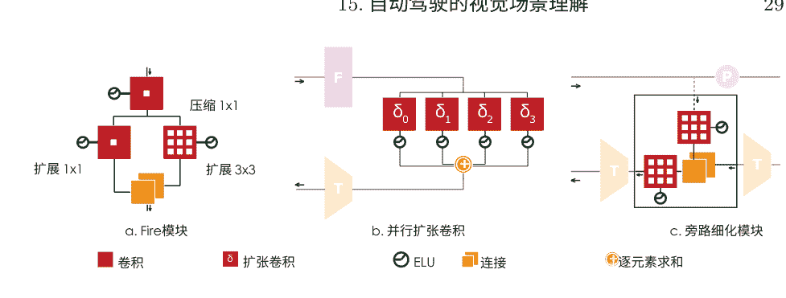

$$ f(x) = \begin{cases} x & \text{如果 } x > 0 \\ \alpha (\exp(x) - 1) & \text{如果 } x \leq 0 \end{cases} , \quad f'(x) = \begin{cases} 1 & \text{如果 } x > 0 \\ f(x) + \alpha & \text{如果 } x \leq 0 \end{cases} . (15.1) $$

参数 α在我们的所有实验中都设置为默认值1。与常用的ReLU激活函数类似，ELU具有线性的正部分这有助于避免梯度消失[18-20]，因此它允许训练非常深的网络。然而，与ReLU不同，饱和的负部分收敛到 -α。这使得ELU的平均激活为0，从而避免任何偏置漂移效应：在ReLU网络中，单元通常具有非零的平均激活，因此它们将作为下一层单元的额外偏置单元。通过使单元具有零均值，可以减少这种偏置漂移效应，这使得单元更容易专注于实际的信息处理。否则，只能通过使用批归一化[22]或SELU激活函数[23]来实现。

#### 15.4 实验

##### 15.4.1 Cityscapes数据集

我们在Cityscapes数据集[10]上进行了网络的训练和评估。Cityscapes是一个用于语义街景理解的高质量数据集。该数据集分为2975、500和1525张分辨率为2048 ×1024像素的图像，用于训练、验证和测试。它包含35个像素级注释类别，其中19个类别用于挑战评估。每个类别属于以下一类：平坦、自然、物体、天空、建筑、人类、车辆。作为性能度量，我们使用常用的交并比指标，对各个类别和类别进行评估。请注意，我们的结果是在没有CRF作为后处理的情况下实现的，因为那样会大大增加推理时间。

##### 15.4.2 训练

SqueezeNet编码器使用公开可用的ImageNet预训练权重进行初始化，并在Cityscapes上进行语义分割的微调。其余权重使用MSRA方案[16]进行初始化，并使用全分辨率图像进行训练。损失函数是所有类别的交叉熵项的总和，在整体损失函数中权重相等。它使用随机梯度下降进行优化，学习率固定为10^{-8}，动量为0.9，权重衰减因子为0.0002。该架构使用Caffe框架实现。总训练时间约为22小时，使用2个Titan X Maxwell GPU，每个GPU批量大小为3，使用全分辨率图像。

在我们的实验中，我们仅使用细致的注释进行像素级分割任务的训练，没有使用任何额外的训练数据。为了建立性能基准，没有应用数据增强技术。

#### 15.5 结果

我们的网络与ENet分割网络[30]相比，在嵌入式设备上进行高效语义分割。存在可比较的更新架构[29,33,42]，但未进行比较。

##### 15.5.1 分割性能

我们使用官方Cityscapes评估服务器对测试集进行了网络评估。我们实现了59.8的每类平均IoU和84.3的每类别平均IoU。因此，网络架构能够胜过ENet和SegNet [3]，如表15.1所示。与ENet相比，我们在除了5个类别（墙壁、卡车、公共汽车、火车、摩托车）之外的所有类别的每类IoU上都有所提高。详细的每类分类结果请参见表15.2。对网络预测结果的视觉检查显示了在典型的城市街景图像上令人满意的结果（图15.1）。物体轮廓被分割得非常清晰。我们认为这是因为通过使用旁路中的细化模块，能够将编码器中的像素级信息整合到解码器中的上采样层中，从而增强了整合能力。

表15.1。在Cityscapes测试集上的19个单独类别和7个类别的平均IoU。ENet和SegNet的结果来自[30]。

| 方法 | 每类平均IoU | 每类别平均IoU |
|------|------------|--------------|
| 我们的 | 59.8 | 84.3 |
| ENet | 58.3 | 80.4 |
| SegNet | 56.1 | 79.8 |

表15.2。在Cityscapes测试集上的每个类别的IoU。 我们改进了ENet在除了5个类别（墙壁、卡车、公共汽车、火车、摩托车）之外的所有类别上的结果。 ENet的结果来自[30]。

| 类别 | 道路 | 人行道 | 建筑物 | 墙 | 隔离栏 | 杆 | 道路交通灯 | 交通标志 | 植被 | 地形 |
|------|------|-------|--------|----|--------|----|------------|----------|------|------|
| 我们的 | 96.9 | 75.4 | 87.9 | 31.6 | 35.7 | 50.9 | 52.0 | 61.7 | 90.9 | 65.8 |
| ENet | 96.3 | 74.2 | 85.0 | 32.2 | 33.2 | 43.5 | 34.1 | 44.0 | 88.6 | 61.4 |

| 类别 | 天空 | 人 | 骑手 | 汽车 | 卡车 | 公共汽车 | 火车 | 摩托车 | 自行车 |
|------|------|----|------|------|------|----------|------|--------|--------|
| 我们的 | 93.0 | 73.8 | 42.6 | 91.5 | 18.8 | 41.2 | 33.3 | 34.0 | 59.9 |
| ENet | 90.6 | 65.5 | 38.4 | 90.6 | 36.9 | 50.5 | 48.1 | 38.8 | 55.4 |

##### 15.5.2 推理运行时间

与ENet类似，我们能够在NvidiaTX1板上以640 ×360的分辨率超过10 fps的设计目标，这是启用自动驾驶汽车应用的合理下限。 有关不同架构之间运行时间的比较，请参见表15.3。 这些运行时间是使用CUDA 7.5和cuDNN 4.0实现的，但我们预计通过切换到支持Winograd卷积的新软件版本，运行时间将显著改善[25]。

表15.3。在Nvidia Tegra X1上的推理时间比较。 ENet的时间取自原始出版物[30]。

| 分辨率 | 480 × 320 | | 640 × 360 | | 1280 × 720 | |
|--------|------------|---|------------|---|-------------|---|
| 方法 | 毫秒 | 帧每秒 | 毫秒 | 帧每秒 | 毫秒 | 帧每秒 |
| 我们的 | 60 | 16.7 | 86 | 11.6 | 389 | 2.6 |
| ENet | 47 | 21.1 | 69 | 14.6 | 262 | 3.8 |

#### 15.6 讨论

作为对端到端深度学习的补充方法，我们提出了一种分层方法，只有单个组件以端到端的方式进行训练。 中间节点是从一个层次输出到下一个层次的输入，其定义方式使得人类专家在整个系统领域的知识下可以解释其含义。 语义分割是一种强大的工具，可以对视频输入信号进行低维度抽象。

目前，深度神经网络是语义图像分割领域的最先进系统。 然而，这些深度网络的计算成本很高，使它们不适合用于自动驾驶汽车。 在这项工作中，我们展示了神经网络如何变得足够小，以在自动驾驶车辆中运行，并仍保持足够的分割性能。 我们相信这是一种有前途的方法，可以实现自主驾驶的模块化和可解释性系统。

随后的整体系统组件可以将这些语义特征作为其决策的输入。其中一个组件可以是一个情境感知模型，用于对车辆当前所处的情况进行分类。

另一个组件可以经过训练，根据语义分割的周围环境和情况分类来确定最佳驾驶路径。最后，基于这些中间的人类可理解的分类和回归，可以在最后一层训练一个控制器，将系统的内部模型转化为具体的转向、油门或刹车指令。

这种可解释性的提升是有代价的：分层方法允许更细粒度的控制和人类可解释的中间步骤检查决策的过程。然而，当前的研究经常表明，虽然难以解释，但端到端的方法通常能够使深度学习系统实现更高的性能，甚至超过人类。这可能是因为系统能够以与典型人类感知不兼容的方式处理信息。例如，将低级相机信号转化为语义分割图并丢弃更细粒度的信息对人类来说可能是有意义的，但机器学习方法可能仍然可以在更高级的决策过程中利用这些信息。尽管存在这些缺点，我们认为，鉴于现代系统所达到的准确性，可解释性的提升是值得的，即使可能会损失整体性能。

致谢。本工作得到了奥迪.JKU深度学习中心、奥迪电子风险有限公司、Zalando SE与研究协议01/2016、奥地利科学基金会项目P28660-N31和NVIDIA Corporation的支持。

### 参考文献

1. Ba, J., Caruana, R.: 深度网络真的需要很深吗？在：神经信息处理系统的进展，NIPS (2014年)
2. Bach, S., Binder, A., Montavon, G., Klauschen, F., M\'uller, K.R., Samek, W.: 通过逐层相关传播对非线性分类器决策进行像素级解释。PLoS ONE 10(7), 1-46 (2015年)
3. Badrinarayanan, V., Kendall, A., Cipolla, R.: Segnet：用于图像分割的深度卷积编码器-解码器架构。IEEE Trans. Pattern Anal. Mach.Intell. 39(12), 2481-2495 (2017年)
4. Bojarski, M.等：自动驾驶汽车的端到端学习。CoRR abs/1604.07316 (2016年)
5. Chen, L., Papandreou, G., Schroff, F., Adam, H.: 重新思考用于语义图像分割的扩张卷积。CoRR abs/1706.05587 (2017)
6. Chen, Z., Huang, X.: 自动驾驶车道保持的端到端学习。在：IEEE智能车辆研讨会，1856-1860页。IEEE (2017)
7. Chi, L., Mu, Y.: 深度转向：从空间和时间视觉线索中学习端到端驾驶模型。CoRR abs/1708.03798 (2017)
8. Ciresan, D., Meier, U., Masci, J., Schmidhuber, J.: 用于交通标志分类的多列深度神经网络。 神经网络。 **32**, 333-338页 (2012)
9. Clevert, D.A., Unterthiner, T., Hochreiter, S.: 通过指数线性单元 (ELUs) 快速准确地进行深度网络学习。 在：国际学习表示会议, ICLR (2016)
10. Cordts, M., 等：用于语义城市场景理解的Cityscapes数据集。 在：IEEE计算机视觉和模式识别会议, CVPR (2016)
11. Donahue, J., 等：用于视觉识别和描述的长期循环卷积网络。IEEE模式分析与机器智能 **39** (4) , 677-691 (2017)
12. Han, S., 等：压缩深度神经网络上的高效推理引擎。 在：国际计算机体系结构会议 (2016)
13. Han, S., Mao, H., Dally, W.J.: 深度压缩：通过修剪，训练量化和Huffman编码来压缩深度神经网络。 在：国际学习表示会议, ICLR (2016)
14. Han, S., Pool, J., Tran, J., Dally, W.: 学习权重和连接以实现高效的神经网络。 在：神经信息处理系统的进展, NIPS (2015)
15. He, K., Zhang, X., Ren, S., Sun, J.: 深度残差学习用于图像识别。 在：IEEE计算机视觉和模式识别会议, CVPR (2015)
16. He, K., Zhang, X., Ren, S., Sun, J.: 深入研究整流器：超越人类水平的ImageNet分类性能。 在：IEEE国际计算机视觉会议, ICCV (2015)
17. Hinton, G.E., Vinyals, O., Dean, J.: 提取神经网络中的知识。 CoRR abs/1503.02531 (2015)
18. Hochreiter, S.: 动态神经网络的研究。 慕尼黑工业大学计算机科学研究所，硕士论文 (1991)
19. Hochreiter, S.: 学习递归神经网络中的梯度消失问题及解决方案。国际不确定性、模糊性和知识基础系统杂志**6** (2) , 107-116 (1998)
20. Hochreiter, S., Bengio, Y., Frasconi, P., Schmidhuber, J.: 循环神经网络中的梯度流：学习长期依赖性的困难。 在：Kremer, K. (eds.) 动态循环神经网络指南。IEEE出版社 (2001)
21. Iandola, F.N., Moskewicz, M.W., Ashraf, K., Han, S., Dally , W.J., Keutzer, K.:Squeezenet：具有50倍少参数和 <1mb模型大小的Alexnet级准确性 。 CoRR abs/1602.07360 (2016)
22. Ioffe, S., Szegedy, C.: 批量归一化：通过减少内部协变量偏移来加速深度网络训练。 在：第32届国际机器学习大会 (ICML) 论文集中
23. Klambauer, G., Unterthiner, T., Mayr, A., Hochreiter, S.: 自正规化神经网络。 在：神经信息处理系统的进展, NIPS, CurranAssociates, Inc. (2017年)
24. Krizhevsky, A., Sutskever, I., Hinton, G.E.: 使用深度卷积神经网络的ImageNet分类 。 在：神经信息处理系统的进展, NIPS (2012年)
25. Lavin, A., Gray, S.: 卷积神经网络的快速算法。 在：IEEE计算机视觉和模式识别会议, CVPR (2016年)
26. LeCun, Y., Bengio, Y., Hinton, G.: 深度学习。 Nature **521** (7553) , 436-444 (2015年)

+   27. Liang-Chieh, C., Papandreou, G., Kokkinos, I., Murphy, K., Yuille, A.: 使用深度卷积网络和完全连接的CRF进行语义图像分割。在：国际学习表示会议，ICLR（2015年）
    28. Long, J., Shelhamer, E., Darrell, T.: 用于语义分割的完全卷积网络。在：IEEE计算机视觉和模式识别会议，CVPR（2015年）
    29. Mehta, S., Rastegari, M., Caspi, A., Shapiro, L., Hajishirzi, H.: ESPNet: 高效的空间金字塔扩张卷积用于语义分割。在：欧洲计算机视觉会议论文集，ECCV（2018）
    30. Paszke, A., Chaurasia, A., Kim, S., Culurciello, E.: ENet: 用于实时语义分割的深度神经网络架构。 CoRR abs/1606.02147（2016）
    31. Pinheiro, P.O., Lin, T.Y., Collobert, R., Dollar, P.: 学习细化对象分割。在：欧洲计算机视觉会议论文集，ECCV（2016）
    32. Reed, S., Akata, Z., Yan, X., Logeswaran, L., Schiele, B., Lee, H.: 生成对抗文本到图像合成。在：第33届国际机器学习大会论文集，ICML（2016）
    33. Romera, E., Alvarez, J.M., Bergasa, L.M., Arroyo, R.: ERFNet: 高效的残差分解卷积神经网络用于实时语义分割。IEEE Trans. Intell. Transp. Syst. 19, 263–272（2018）
    34. Russakovsky, O., et al.: ImageNet大规模视觉识别挑战。Int. J. Comput. Vision (IJCV) 115(3), 211–252（2015）
    35. Schmidhuber, J.: 神经网络中的深度学习概述。神经网络 61, 85–117（2015）
    36. Simonyan, K., Zisserman, A.: 非常深的卷积网络用于大规模图像识别。在：国际学习表示会议，ICLR（2015）
    37. Simonyan, K., Vedaldi, A., Zisserman, A.: 深入卷积网络内部：可视化图像分类模型和显著性图。CoRR abs/1312.6034（2013）
    38. Sundararajan, M., Taly, A., Yan, Q.: 深度网络的公理归因. 在：第34届国际机器学习大会(ICML)论文集（2017）
    39. Treml, M., et al.: 加速自动驾驶的语义分割. 在：机器学习应用于智能交通系统的研讨会,神经信息处理系统(NIPS) (2016)
    40. Yu, F., Koltun, V.: 通过扩张卷积进行多尺度上下文聚合. 在：学习表示国际会议(ICLR) (2016)
    41. Zeiler, M.D., Fergus, R.: 可视化和理解卷积网络. 在：欧洲计算机视觉大会(ECCV)论文集 (2014)
    42. Zhao, H., Qi, X., Shen, X., Shi, J., Jia, J.: ICNet用于高分辨率图像的实时语义分割. 在：欧洲计算机视觉大会(ECCV)论文集 (2018)
    43. 赵, H., 史, J., 齐, X., 王, X., 贾, J.: 金字塔场景解析网络。在：IEEE计算机视觉和模式识别会议，CVPR（2017）
    44. 郑, S., 等: 条件随机场作为循环神经网络。在：IEEE国际计算机视觉会议，ICCV（2015）

### 16 通过解释预测来理解基于补丁的视频数据学习

Christopher J. Anders<sup>1</sup>, Grégoire Montavon<sup>1</sup>(✉), Wojciech Samek<sup>2</sup>, 和 Klaus-Robert Müller<sup>1,3,4</sup>

1 柏林工业大学，10587柏林，德国 {anders,gregoire.montavon,klaus-robert.mueller}@tu-berlin.de
2 Fraunhofer Heinrich Hertz Institute, 10587 Berlin, Germany wojciech.samek@hhi.fraunhofer.de
3 韩国高丽大学，首尔成福区安南洞02841
4 马克斯普朗克计算机科学研究所，德国萨尔布吕肯66123

摘要。 深度神经网络已经显示出对视频数据的高度预测模型。由于单个视频中的大量图像，训练的常见策略是从视频中重复提取短剪辑并随机偏移。 我们应用深度Taylor/Layer-wise Relevance Propagation（LRP）技术来理解使用此策略训练的深度网络的分类决策，并确定分类器主要关注接近时间边界的帧的倾向。 这种“边界效应”揭示了模型与用于提取连续视频帧的步长的关系，我们可以调整该步长以提高分类器的准确性而无需重新训练模型。 据我们所知，这是第一个在任何操作视频数据的神经网络上应用深度Taylor/LRP技术的工作。


#### 16.1 引言

深度神经网络在图像分类[12,32]、语音识别[6,19]、视频分析[9,10]以及科学领域[2,25,31]等许多机器学习领域中树立了新的性能标准。 对于输入信号在时间或空间上非常大的应用，通常的做法是在该信号的小块或片段上训练模型[3,7,9]。 这种策略减少了网络需要处理的输入变量数量，从而通过执行更多的训练迭代来更快地提取问题的非线性特征。

基于块或片段的训练的一个基本假设是标签信息的局部性。 这个假设在实践中经常被违反：例如，判别信息可能只包含在长期交互中[6,19,36]或仅驻留在特定时间步骤（例如，当发生特定动作时）。由于这种标签噪声使训练更加困难[22]，最近的研究探讨了应对这个问题的方法，例如注意机制[27]或加权补丁聚合[3]。

本文旨在从另一个角度研究基于补丁或剪辑的学习，即通过分析使用这种特定学习过程训练的模型的属性。研究模型属性的一种方法是通过内省来了解模型的预测方式，例如通过解释其预测结果与输入变量的关系[21]。现在可以对各种卷积类型或一般深度神经网络[1,14,17,23,29,35,37]以及其他机器学习模型（例如，[11]）进行可靠的解释。

在这项工作中，我们使用深度Taylor/Layer-wise Relevance Propagation (LRP)分解技术[15,17]分析了一个卷积神经网络[33]在Sports1M数据集[10]上进行人类动作识别的训练。我们首先展示了这种解释技术可靠地捕捉到视频中与类别相关的信息。然后，我们测试了基于片段的训练如何影响网络的预测策略，并确定了这种训练过程引发的两种效应。“边界效应”描述了预测主要集中在接近时间边界的帧上的观察结果，以弥补每个输入视频片段的帧数较少的情况，而“前瞻效应”描述了模型学习忽略输入视频片段的前几帧并更多地关注后面的帧的观察结果。最后，我们证明了通过解释预测所获得的见解可以直接（即无需重新训练）用于提高分类器的预测准确性。

虽然之前已经使用LRP框架[1]分析了人类动作识别的不同方法[30]，但据我们所知，这项工作是第一个使用深度Taylor/LRP分解技术[17]分析任何用于视频分类的神经网络的工作。最近的一项工作使用不同的解释框架[26,39]生成了3D-CNNs的体素解释[34]。对视频的解释[4]、描述[38]和分割[20]已经进行了进一步的研究。在机器学习领域之外，一些关于视频显著性检测的工作已经完成[8, 16]。

#### 16.2 解释分类器的预测

在本文中，我们使用深度Taylor/LRP分解技术[17]生成解释。我们简要介绍了该方法，并与之前的工作进行了联系。该方法通过输入变量[21]对函数值$f(x)$进行求和分解。

$$f(x) = \sum_{p,t} R_{p,t} \qquad\qquad (16.1)$$

其中 $R_{p,t}$ 是像素 $p$ 在帧 $t$ 中的相关性。这些分数是通过在网络中向后重新分配输出 $f(x)$ 而获得的，方式不同。通过反向传播，直到达到输入变量。这种重新分配过程满足一个保守原则[1,13]，即每个神经元向下一层传递的量与它从上一层接收的量相等。设i,j为相邻层的神经元。设a_i为神经元i的激活值，w_ij为连接它与神经元j的权重。在线性层中，重新分配与每个神经元的输入激活的正贡献成比例 $R_{i \leftarrow j} \propto a_i w_{ij}^+ [1,17]$。在池化层中，重新分配与池中的激活值a_i成比例[17]。对于第一个卷积层，重新分配与带符号贡献以及一些附加项成比例 $R_{i \leftarrow j} \propto a_i w_{ij} - l_i w_{ij}^+ - h_i w_{ij}^-$ 其中$l_i$和$h_i$分别是最小和最大像素值[17]。

另一种流行的解释技术是敏感性分析[5,28]，它计算重要性得分，例如

$$S_{p,t} = \left( \frac{df}{dx_{p,t}} \right)^2$$

我们注意到，这种分析可以解释为对平方梯度范数进行求和分解（$\|\nabla f\|^2 = \sum_{p,t} S_{p,t}$），因此更接近于对函数变化的解释。我们将读者引用到[18,24]进行不同解释方法的比较。

#### 16.3 实验

我们使用3维卷积神经网络架构C3D，如[33]所述，其中包括1 + 1 + 2 + 2 + 2个卷积层，每个组后跟一个最大池化层，最后是2个连续的稠密层，其中每个线性层后跟ReLU激活。所有卷积的内核大小为3 × 3 × 3，池化内核为1 × 3 × 3，其中维度对应于时间、高度和宽度。该网络在Sports-1M数据集上进行训练，该数据集包含大约100万个来自YouTube的体育视频，共有487个类别[10]。

视频通过空间调整大小为128×171像素，然后居中裁剪为121 × 121像素进行预处理。我们在特定的偏移量处拍摄由16帧组成的视频剪辑。我们使用的预训练模型，由[33]提供，曾经是人类动作识别领域的最新技术。它在每个视频剪辑上的top-1准确率（最有信心的预测类别是标签）为46.1%，在10个随机视频剪辑上的top-1准确率为61.1%，在相同设置下的top-5准确率（标签在5个最有信心的预测类别中）为85.2%。因此，该模型成功地完成了分类任务并可以进行分析。

我们使用深度Taylor/LRP分解[17]来解释来自Sports-1M测试集的1000个视频的预测结果。为了进行比较，我们还对相同的3维卷积神经网络架构进行了未训练和基于梯度敏感性分析[5,28]的额外解释。

##### 16.3.1 热力图分析

为了对预测结果有第一印象，我们查看了一个特定视频片段的个别解释。在图16.1中，我们展示了一个示例视频和预测类别“翻滚”的深度Taylor/LRP分解（DTD）。手被识别为相关特征，特别是当手接触到蹦床时，这是该类别的特征。图像的其他部分，如背景中的树木，并没有被突出显示，因此被认为是不相关的。DTD分析也比敏感性分析（图16.1c）更加清晰且更加关注与类别相关的特征。一个有趣的观察是，训练过程倾向于使相关性从视频片段的中心帧收敛到其最接近开头和结尾的帧，这可以通过DTD和在未经训练的网络上执行相同分析的差异来证明（图16.1d）。这种所谓的边界效应将在第16.3.2节中进行定量研究。对序列中心的初始关注是因为这些帧与输出更密切连接。在图16.6和16.7中展示了更多不同视频的附加示例。特别是在图16.6a和b中，更清楚地可见对视频边界的更高相关性观察。此外，我们还可以观察到在图16.6a、16.7a和b中，最后的帧比其他任何帧都更具相关性。这种前瞻效应也将在第16.3.2节中进行定量研究。

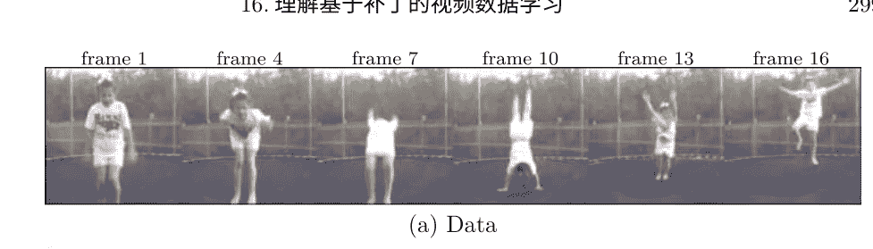

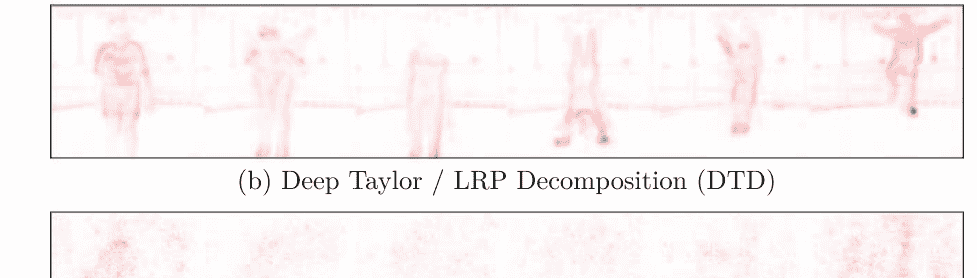

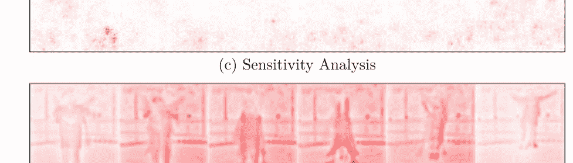

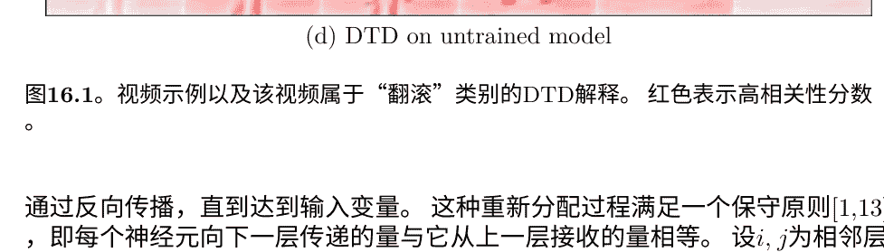

图16.1。视频示例以及该视频属于“翻滚”类别的DTD解释。红色表示高相关性分数。

##### 16.3.2 量化边界和前瞻效应

为了进一步完善第16.3.1节中对边界和前瞻效应存在的直觉，我们对大量视频生成了DTD解释并分析了它们的平均特性。由于边界效应发生在时间域中，我们只关注解释的时间轴 $R_{p,t}$通过定义逐帧解释 $R_t = \sum R_{p,t}$。从这些相关性分数中，我们可以定义一个向量（$P_t$）其中 $P_t = \frac{1}{t} \sum R_{p,t}$ 是时间 $t$ 的相关性份额。由于我们的输入视频剪辑每个包含16帧，所以这个向量的大小为16，我们可以在图中进行可视化。结果显示在图16.2中。红色模式表示这些16维向量的分布，我们可以计算数据集上的平均值（蓝线）。结果还与敏感性分析和未经训练的模型上的DTD进行了比较。

结果确认了我们之前对边界帧具有更高相关性的观察。请注意，DTD和敏感性分析（图16.2c）在边界效应方面产生了一致的结果。我们可以进一步验证这种效应不是由于与架构相关的人为因素，通过对未经训练的模型进行相同的DTD分析（图16.2b）：边界效应只存在于经过训练的模型中。对于未经训练的模型，边界处的相关性反而较低，与其他帧相比。从这个分析中可以观察到额外的前瞻效应，即最后一帧的相关性略高于第一帧。为了确定边界和前瞻效应的强度，我们需要一个定量的度量方法。我们建议通过简单的二次回归来捕捉这些效应，使用向量$(P_t)_t$进行拟合。更具体地说，我们考虑二次模型。

$$q(t) = B \cdot t^2 + C \cdot t + D \tag{16.3}$$

并拟合系数$B, C, D$以最小化最小二乘误差$E[...]$。

$$l(t) = L \cdot t + A \tag{16.4}$$

使用相似的最小二乘目标，并通过参数$L$来确定前瞻强度。拟合的模型$q(t)$和$l(t)$在图16.2中显示为绿色和青色线条。

|      |   DTD   |    SA    |  DTD-u  |
| :--- | :-----: | :------: | :-----: |
| **B**  | 0.0010  |  0.0018  | -0.0005 |
| **C**  | -0.0168 | -0.0322  | 0.0082  |
| **D**  | 0.1085  |  0.1661  | 0.0389  |
| **L**  | 0.0007  | -0.0012  | -0.0002 |
| **A**  | 0.0558  |  0.0729  | 0.0640  |

这些参数在表16.1中显示，用于深度Taylor/LRP分解(DTD)，敏感性分析(SA)和未训练模型上的DTD(DTD-u)。用于分析的系数以粗体显示。我们可以观察到，边界参数$B$在对训练模型进行的两种分析中都是正数。然而，前瞻参数的符号取决于分析的选择。我们将在第16.3.4节中看到，该参数受输入序列的偏移影响。

##### 16.3.3 边界效应和步长

边界效应可以直观地理解为网络试图超越输入的序列。这表明，放大输入序列可能会减少这种效应，因为更多的上下文变得可用。例如，图16.6a是一个静态场景，几乎没有任何运动，并且与其他样本相比，在边界帧上显示出更多的相关性。为了测试这一点，我们将使用不同的步长对视频进行子采样。我们从步长为1开始（同一帧重复16次）。然后我们重复加倍步长，直到达到32的值。在每个步长上，我们应用DTD和敏感性分析。请注意，模型保持不变。每个步长的边界参数 $B$在图16.3中给出。对于较小的步长，边界效应很强。随着步长的增加，边界效应减小，从而确认了上述直觉。

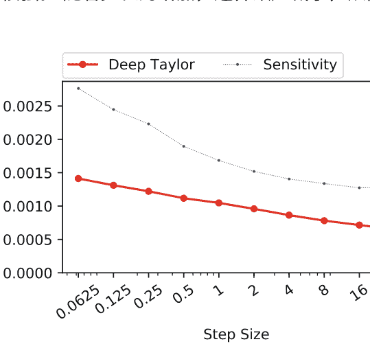

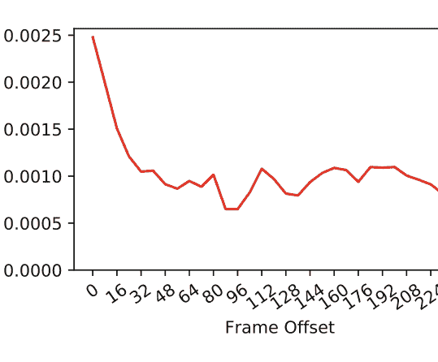

##### 16.3.4 前瞻效应和偏移

前瞻效应是网络倾向于主要关注序列的末尾的趋势。我们想要测试这种效应是否发生在视频的每个位置上，还是主要发生在开头。我们怀疑之一是，许多视频都以一些开场画面开始，其中介绍了视频的标题、作者等信息。模型忽略视频的前几帧并更多地关注后面的帧似乎是很自然的。这样一个视频剪辑的示例如图16.7b所示。我们从视频的开头获取输入序列，然后通过8帧的偏移量滑动窗口，直到达到256的偏移量。结果如图16.4所示。我们观察到，对于偏移量为0、8和16，前瞻参数较高，而对于较大的偏移量，前瞻参数变得较低且恒定。这种对于小偏移量的行为支持视频开头内容无信息的假设。

##### 16.3.5 步长和模型准确性

作为最后一个实验，我们研究步长不仅控制边界效应，还控制模型分类准确性。具体而言，我们测试是否可以通过选择与训练数据不同的步长来提高分类器的准确性，而无需重新训练模型。我们使用之前定义的步长，并在图16.5中绘制生成的边界参数与分类准确性的对应关系。（准确性的度量是真实标签在前五个预测中的成员资格。）较小的步长会产生较少的正确预测。性能逐渐提高，直到在步长为2时达到最高准确性，比基准准确性60%高约1%。之后，准确性再次下降，直到步长为16。这里的一个关键观察是最佳步长与用于训练模型的步长1不同。因此，分类准确性得到了提高，而没有额外的成本。请注意，我们可以通过简单验证帧速率来观察到这一点，而无需任何模型解释。然而，解释模块的贡献在于揭示了模型如何利用输入剪辑中的帧，从而引发了这个实验。

图16.6. 属于不同类别的视频示例。对于每个示例，从上到下：输入视频，深度Taylor/LRP分解，敏感性分析。标题是真实标签，括号中是预测标签。

图16.7. 属于不同类别的视频示例。对于每个示例，从上到下：输入视频，深度Taylor/LRP分解，敏感性分析。标题是真实标签，括号中是预测标签。

#### 16.4 结论

在这项工作中，我们解释了一个高度预测性的视频神经网络在体育分类任务上的推理过程。为此，我们使用了最近提出的深度Taylor/LRP框架，它使我们能够稳健地确定视频中的哪些帧以及每个帧的哪些像素与预测相关。该方法能够正确识别特定于视频的特征，某些运动。此外，分析还揭示了时间域中相关性分布存在系统性不平衡。这些不平衡，我们称之为“边界效应”和“前瞻效应”，可以理解为网络试图超越其输入序列。基于这一分析结果，我们进一步探讨了如何转换输入数据以减少/增加这些不平衡。特别是，对数据进行下采样被证明可以减少边界效应，并且在不重新训练模型的情况下，还可以略微提高分类准确性（图16.5）。尽管“前瞻效应”并没有立即导致改进模型的策略，但它暗示了训练数据预处理中的缺陷。虽然这些具体发现仅在C3D和Sports1M的相关背景下展示，但我们能够展示这样一个视频分类器分析的发现在多大程度上可以用于了解模型与其输入数据的关系。我们推测其他模型可能存在类似的关系。

致谢。这项工作得到了德国教育和研究部的支持，作为柏林大数据中心（01IS14013A），柏林机器学习中心（01IS18037I）和TraMeExCo（01IS18056A）。感谢DFG的部分资助（EXC 2046/1，项目编号：390685689）。这项工作还得到了韩国政府信息通信技术规划与评估研究所（IITP）的资助（编号2017-0-00451，编号2017-0-01779）。

### 参考文献

1.  Bach, S., Binder, A., Montavon, G., Klauschen, F., Müller, K.R., Samek, W.: 通过逐层相关传播解释非线性分类器决策的像素级解释。PLoS ONE 10(7), e0130140 (2015)
2.  Baldi, P., Sadowski, P., Whiteson, D.: 用深度学习在高能物理中搜索异域粒子。Nat. Commun. 5, 4308 (2014)
3.  Bosse, S., Maniry, D., Müller, K.R., Wiegand, T., Samek, W.: 用于无参考和全参考图像质量评估的深度神经网络。IEEE Trans. Image Process. 27(1), 206–219 (2018)
4.  Donahue, J., et al.: 用于视觉识别和描述的长期循环卷积网络。在: IEEE CVPR, pp. 2625–2634 (2015)
5.  Gevrey, M., Dimopoulos, I., Lek, S.: 回顾和比较研究人工神经网络模型中变量贡献的方法。生态模型。160(3), 249–264 (2003)
6.  Graves, A., Mohamed, A., Hinton, G.: 基于深度递归神经网络的语音识别。在: IEEE ICASSP, pp. 6645–6649 (2013)
7.  Hou, L., Samaras, D., Kurc, T.M., Gao, Y., Davis, J.E., Saltz, J.H.: 基于补丁的卷积神经网络用于整个切片组织图像分类。在: IEEE CVPR, pp. 2424–2433 (2016)
8.  Hu, K.T., Leou, J.J., Hsiao, H.H.: H.264视频的时空显著性检测和显著区域确定。J. VCIR 24(7), 760–772 (2013)
9.  Ji, S., Xu, W., Yang, M., Yu, K.: 用于人体动作识别的3D卷积神经网络。IEEE TPAMI 35(1), 221–231 (2013)
10. Karpathy, A., Toderici, G., Shetty, S., Leung, T., Sukthankar, R., Fei-Fei, L.: 使用卷积神经网络进行大规模视频分类。在: IEEE CVPR, 第1725-1732页 (2014年)
11. Kauffmann, J., Esders, M., Montavon, G., Samek, W., Müller, K.R.: 从聚类到通过神经网络进行聚类解释。 arXiv预印本arXiv:1906.07633 (2019年)
12. Krizhevsky, A., Sutskever, I., Hinton, G.E.: 使用深度卷积神经网络进行ImageNet分类。 在: NIPS进展, 第1097-1105页 (2012年)
13. Landecker, W., Thomure, M.D., Bettencourt, L.M., Mitchell, M., Kenyon, G.T., Brumby, S.P.: 解释分层网络的个体分类。 在: IEEE Symposium CIDM, 第32-38页 (2013年)
14. Lapuschkin, S., Binder, A., Montavon, G., Müller, K.R., Samek, W.: LRP工具箱用于人工神经网络。 机器学习研究杂志。 17 (114), 1-5 (2016)
15. Lapuschkin, S., Wäldchen, S., Binder, A., Montavon, G., Samek, W., Müller, K.R.: 揭示聪明的汉斯预测器并评估机器真正学到了什么。 自然通讯。 10, 1096 (2019)
16. Li, J., Liu, Z., Zhang, X., Le Meur, O., Shen, L.: 基于超像素级轨迹的时空显著性检测。 信号处理图像通信。 38, 100-114 (2015)
17. Montavon, G., Lapuschkin, S., Binder, A., Samek, W., Müller, K.R.: 用深度泰勒分解解释非线性分类决策。 模式识别。 65, 211-222 (2017)
18. Montavon, G., Samek, W., Müller, K.R.: 解释和理解深度神经网络的方法。 数字信号处理。 73, 1-15 (2018年)
19. van den Oord, A., et al.: WaveNet: 原始音频的生成模型。 在: 第9届ISCA语音研讨会, 美国加利福尼亚州圣尼维尔, 2016年9月13-15日, 第125页 (2016年)
20. Pohlen, T., Hermans, A., Mathias, M., Leibe, B.: 用于街景语义分割的全分辨率残差网络。 在: IEEE CVPR, pp. 4151-4160 (2017年)
21. Poulin, B., et al.: 用加法分类器对证据进行视觉解释。 在: 第二十一届全国人工智能大会和第十八届人工智能创新应用大会, 2006年7月16-20日, 美国马萨诸塞州波士顿, pp. 1822-1829 (2006年)
22. Reed, S.E., Lee, H., Anguelov, D., Szegedy, C., Erhan, D., Rabinovich, A.: 使用自举法在嘈杂标签上训练深度神经网络。 在: 第三届国际学习表示会议, ICLR 2015, 美国加利福尼亚州圣地亚哥, 2015年5月7日至9日, 研讨会论文集 (2015年)
23. Ribeiro, M.T., Singh, S., Guestrin, C.: “为什么我应该相信你？”：解释任何分类器的预测。 在: 第22届ACM SIGKDD国际知识发现与数据挖掘会议, 美国加利福尼亚州旧金山, 2016年8月13日至17日, 第1135-1144页 (2016年)
24. Samek, W., Binder, A., Montavon, G., Lapuschkin, S., Müller, K.: 评估深度神经网络学到的内容的可视化。 IEEE Trans. Neural Netw. Learn. Syst. 28(11), 2660-2673 (2017)
25. Schütt, K., Kindermans, P.J., Felix, H.E.S., Chmiela, S., Tkatchenko, A., Müller, K.R.: SchNet: 用于建模量子相互作用的连续滤波卷积神经网络。 在: NIPS进展, 第992-1002页 (2017年)
26. Selvaraju, R.R., Cogswell, M., Das, A., Vedantam, R., Parikh, D., Batra, D.: Grad-CAM: 通过基于梯度的定位从深度网络中获得视觉解释。 在: IEEE CVPR, 第618-626页 (2017年)
27. Sharma, S., Kiros, R., Salakhutdinov, R.: 使用视觉注意力进行动作识别。 CoRR abs/1511.04119 (2015年)
28. Simonyan, K., Vedaldi, A., Zisserman, A.: 深入卷积网络：可视化图像分类模型和显著性图。 在：第二届国际学习表示会议，ICLR 2014，Banff，AB，加拿大，2014年4月14-16日，研讨会论文集（2014年）
29. Springenberg, J.T., Dosovitskiy, A., Brox, T., Riedmiller, M.A.: 追求简单性：全卷积网络。 在：第三届国际学习表示大会，ICLR 2015，美国加利福尼亚州圣地亚哥，2015年5月7日至9日，研讨会论文集（2015年）
30. Srinivasan, V., Lapuschkin, S., Hellge, C., Müller, K.R., Samek, W.: 可解释的压缩域人类动作识别。 在：IEEE ICASSP，第1692-1696页（2017年）
31. Sturm, I., Lapuschkin, S., Samek, W., Müller, K.R.: 可解释的深度神经网络用于单次试验脑电图分类。 神经科学方法 274，141-145页（2016年）
32. Szegedy, C., Liu, W., Jia, Y., Sermanet, P., Reed, S., Anguelov, D., 等： 通过卷积深入研究。 在：IEEE CVPR，第1-9页（2015年）
33. Tran, D., Bourdev, L., Fergus, R., Torresani, L., Paluri, M.: 通过3D卷积网络学习时空特征。 在：IEEE ICCV，第4489-4497页（2015年）
34. Yang, C., Rangarajan, A., Ranka, S.: 用于阿尔茨海默病分类的深度3D卷积神经网络的视觉解释。 CoRR abs/1803.02544（2018年）
35. Yosinski, J., Clune, J., Nguyen, A.M., Fuchs, T.J., Lipson, H.: 通过深度可视化理解神经网络。 CoRR abs/1506.06579（2015年）
36. Yue-Hei Ng, J., Hausknecht, M., Vijayanarasimhan, S., Vinyals, O., Monga, R., Toderici, G.: 超越短片段：用于视频分类的深度网络。 在：IEEE CVPR，第4694-4702页（2015年）
37. Zeiler, M.D., Fergus, R.: 可视化和理解卷积网络。 在：Fleet, D., Pajdla, T., Schiele, B., Tuytelaars, T. (eds.) ECCV 2014. LNCS, vol. 8689, pp. 818-833. Springer, Cham (2014)。 https://doi.org/10.1007/978-3-319-10590-1_53
38. Zhang, C., Tian, Y.: 通过LSTM和联合双流编码自动生成视频描述。 在：ICPR, pp. 2924-2929 (2016年)
39. Zhou, B., Khosla, A., Lapedriza, A., Oliva, A., Torralba, A.: 学习深度特征进行有区分性的定位。 在：IEEE CVPR, pp. 2921-2929 (2016年)

### 17 从可解释的原子神经网络中获得的量子化学见解

Kristof T. Schütt^1^, Michael Gastegger^1^, Alexandre Tkatchenko^2^(✉), 和Klaus-Robert Müller^1,3,4^(✉)
^1^ 柏林工业大学，10587柏林，德国
{kristof.schutt, klaus-robert.mueller}@tu-berlin.de
^2^ 卢森堡大学，卢森堡1511，卢森堡
alexandre.tkatchenko@uni.lu
^3^ 德国Saarbrücken的Max-Planck-Institut für Informatik
^4^ 韩国国立大学，首尔02841，韩国

摘要。随着深度神经网络在量子化学应用中的兴起，研究人员迫切需要一种架构，除了提供化学性质的准确预测外，还能够被研究人员轻松解释。在这里，我们描述了对Behler-Parrinello网络和端到端模型SchNet的原子神经网络的解释技术。这两个模型通过聚合原子贡献来获得化学性质的预测。这些潜在变量可以作为预测的局部解释，并且在训练过程中无需额外成本获得。由于它们与已知的化学概念（如原子能量和部分电荷）相对应，这些原子解释不仅可以揭示模型的信息，更重要的是可以揭示底层量子化学规律。我们从原子解释推广到三维空间，从而获得空间分辨率更高的可视化结果，进一步提高了可解释性。最后，我们分析了学习到的化学元素嵌入，其部分排序类似于周期表的顺序。由于所研究的神经网络与化学知识具有极好的一致性，所提出的技术为化学、物理和材料科学中的数据驱动研究开辟了新的途径。

#### 17.1 引言

发现新颖的分子和材料对于从食品加工和药物设计[3,46]到更高效的电池[12,23,25]和太阳能电池[35]的各种应用的研究至关重要。虽然量子化学计算[14,28]提供了预测给定原子系统的这些性质的手段，但是它们的计算成本以及化学化合物空间的广阔性阻止了详尽的探索[30]。近年来，越来越多的人对将机器学习技术应用于量子化学系统建模产生了兴趣[5,9,11,13,16,17,21,22,32,40,43]。虽然研究主要集中在通过应用非线性回归方法（如高斯过程或神经网络）到手工设计的特征上来预测化学性质[4,6]，但也有成功的端到端学习分子表示的方法。这些方法包括使用化学图作为输入的神经循环指纹[15,26]，同时使用图信息和原子位置的混合方法[20]，以及纯粹从第一原理信息中学习的架构，如深度张量神经网络（DTNNs）[42]，它通过对原子环境的成对相互作用进行因式分解的张量层来表示原子系统。符合DTNN框架的其他架构包括SchNet [45]，其中使用连续滤波卷积[44]对相互作用进行建模，以及更近期的变体，如HIP-NN [31]或晶体图卷积网络[50]。

随着这些神经网络架构变得越来越复杂，量子化学研究人员能够获得对这些模型如何运作以及预测结果可信度的直觉非常重要。除了高预测准确性之外，这还要求神经网络能够展示它们已经学习了基本的量子化学原理。已经开发出了几种技术来生成神经网络分类器决策的解释[1,2,27,33,48,51,52]。由于量子化学性质通常是连续的，例如使用神经网络势能预测分子能量，因此在这个领域中回归问题比分类问题更常见。这改变了解释的方式。给定一个神经网络势能，基于输入梯度的显著性图[2,48]对应于作用在原子上的力。虽然这可能确实是能量高的原因，例如如果两个原子非常接近，但梯度过局部无法充分解释能量水平。这尤其适用于稳定（平衡）分子，它们位于局部能量最小值处，所有力都为零。因此，输入梯度会表明原子位置并不重要，这显然是错误的。其他解释方法通过基于网络参数获取反向映射[1,33,51]、采样[52]或进行信号重构训练[23]来为输入特征分配重要性或相关性分数。

尽管其中一些减轻了纯输入梯度的问题，因为它们的解释不太局部[41]，但在这个应用中还存在另一个根本问题：虽然图像的像素相关性分数允许进行视觉检查，但个别原子的位置和类型的影响并不容易在量子化学图像中解释。在这里，我们的目标是在完整的三维空间中进行解释，即超越核电荷的位置。

在接下来的内容中，我们将介绍两种神经网络势函数，即(1) Behler-Parrinello网络(BP)[8,9,19]，它利用手动设计的特征，以及(2) SchNet [44,45]，它直接从原子类型和位置学习原子级表示。对于这两种架构，我们将展示解释策略，以实现对神经网络内部工作和底层数据的空间和化学分辨率的洞察。

#### 17.2 原子神经网络势

由于原子系统的空间结构和量子力学规律的性质，导致化学性质具有各种不变性和缩放行为，因此需要对传统神经网络架构进行特殊适应，以有效地对化学系统进行建模。第一个主要问题是分子的整体多样性。它们在原子的总数以及化学元素的组合方面可能有很大的变化，因此纯粹静态架构不适合获得一般描述。此外，如果同一元素的原子被交换，分子性质不会改变，模型需要考虑与原子类型相关的不变性。

其次，分子的性质源于核与电子之间的相互作用。这些可以通过原子间势函数在三维空间中的类型和位置来粗略表示。然而，原子坐标 - 以及随后的所有相关分子属性 - 可以以连续的方式改变。因此，所有基于网格的方法（例如传统的卷积神经网络）通常是不可行的，因为它们无法解决这些渐进性的变化。此外，化学性质在笛卡尔空间中对平移和旋转是不变的，这对于分子和材料的机器学习模型施加了额外的约束。

为了克服上述问题中的第一个问题，引入了所谓的原子神经网络架构。类似于图形的神经网络，原子系统被分解为局部环境。具体而言，针对每个原子定义了一组特征向量，基于这些向量预测了原子对感兴趣属性的潜在贡献。这些特征向量用于通过物理动机的聚合层来重构目标属性，以保证原子的置换不变性。

根据获取原子特征的策略，可以区分出两类原子神经网络模型（见图17.1）。第一类使用手工设计的特征，在训练之前进行工程化。在这个类别中，Behler-Parrinello（BP）网络使用以原子为中心的对称函数[8,9]是一个受欢迎的选择。在第二类中，所有的空间不变性直接编码到原子神经网络的结构中，这样在训练过程中可以获得原子级表示。这包括实现DTNN框架的神经网络，通过交互层（如连续滤波卷积神经网络SchNet [44,45]）构建原子表示。

在接下来的部分中，将详细讨论BP和SchNet架构。最后，将简要概述在原子级机器学习框架中如何获取各种化学性质。

##### 17.2.1 Behler–Parrinello势能

BP神经网络势能将全连接神经网络逐个应用于所谓的以原子为中心的对称函数（ACSFs）[8]。这些ACSFs通过一组专门的分布函数描述了环绕中心原子的邻居的排列和化学特性。通常，使用多种不同类型的ACSFs来捕捉径向和角度信息。

径向分布函数的形式为

$$
G_{i}^{\mathrm{rad}}=\sum_{j=1}^{N} e^{-\eta\left(r_{i j}-r_{0}\right)^{2}} f_{\mathrm{cut}}\left(r_{i j}\right), \quad (17.1)
$$

其中$N$是分子中的原子数，$r_{ij}$是中心原子$i$与其邻居$j$之间的距离。参数$\eta$和$r_0$控制高斯函数的宽度和位置。截断函数$f_{\mathrm{cut}}$确保如果邻居距离中心原子太远，则其对ACSF的贡献变为零。由于径向函数只提供有限的空间分辨率，因此它们与角度ACSF结合使用。

为了考虑原子环境中的不同化学物种，ACSF通常针对化学元素的成对（径向）和三元组（角度）进行定义。此外，为了提供足够精确的化学环境描述，对于每个结果组合，使用一组在超参数上有所不同的径向和角度ACSF。因此，特征和超参数的数量随数据集中化学元素的数量快速增长。然而，已经提出了一些策略来解决这个问题。克服这些问题的一种方法是引入一个元素相关的ACSFs加权，以避免特征的组合爆炸[19]。

由于上述定义，所有个体函数的超参数需要基于繁琐的试错程序来确定，该程序基于所研究的分子。然而，基于领域专家的领域知识构建的ACSFs在所需的训练参考计算方面可以非常高效[19]。

##### 17.2.2 SchNet

与先前描述的架构相比，SchNet能够直接从原子类型和位置中学习化学环境的高效表示，并且需要最少的超参数调整。SchNet的整体结构遵循DTNN框架[42]，包括三个步骤：

1.  使用化学元素 $Z_i$ 的嵌入初始化原子特征$\mathbf{A}_{Z_i}$:
    $$
    \mathbf{x}_i^{(0)} = \mathbf{A}_{Z_i}
    $$
2.  多次添加化学环境的成对相互作用修正 $\mathbf{v}^{(t)}$来注入空间信息：
    $$
    \mathbf{x}_i^{(t+1)} = \mathbf{x}_i^{(t)} + \sum_{j=1} \mathbf{v}^{(t)} \left( \mathbf{x}_j^{(t)}, r_{ij} \right)
    $$
3.  使用基于物理动机的聚合方法（见第17.2.3节）从最终的原子级表示中获取感兴趣的属性$\mathbf{x}_i^{(T)}$。

DTNN框架的不同实现之间的关键区别在于如何建模相互作用修正项 $\mathbf{v}^{(t)}$，这是SchNet的一个功能块。对于SchNet，我们使用连续滤波卷积[44]在原子系统上进行卷积，使用由全连接神经网络生成的平滑卷积滤波器，该滤波器取决于两两之间的距离 $r_{ij}$

$$
(\mathbf{x} * W)(\mathbf{r}_i) = \sum_{j=1}^{N} \mathbf{x}_j^{(t)} \circ \underbrace{W^{(t)}(r_{ij})}_{\text{生成过滤器网络}} \ ,
$$

其中“$\circ$”是Hadamard乘积。为了避免自我交互，我们屏蔽了过滤器使得 $W^{(t)}(0) = 0$。我们通过这个卷积和逐个原子层获得交互修正 $\mathbf{v}^{(t)}$的序列，以促进特征图之间的交流。有关详细架构，请参考文献[45]。通过在成对距离上使用这样的卷积来定义交互修正 $\mathbf{v}^{(t)}$，可以得到径向滤波器，即旋转和平移不变性得到保证。由于重复的交互修正，空间信息在多个原子之间传播。因此，可以推断出多体相互作用，而无需显式包含角度或高阶信息[9,24,37]。

##### 17.2.3 化学性质

在原子模型中，化学性质通过潜在的原子贡献来表达。基于这些贡献，通过一个物理动机的聚合层来重构原始性质。确切的功能形式强烈依赖于性质。

原子级机器学习方法的一个常见目标是原子化能量 $E$。它可以被看作是衡量不同分子及其构型相对稳定性的一种指标，可以用来预测化学物种的反应性。在原子级框架中，分子的势能聚合采用以下形式

$$
E = \sum_{i=1}^{N} \hat{E}_i, \qquad (17.2)
$$

其中$\hat{E}_i$是能量的潜在原子贡献。在BP和SchNet的情况下，它们是从以相应原子表示为输入的原子级预测层获得的。由于方程式17.2中的求和，原子模型隐含地考虑了排列不变性，并可应用于任意大小和组成的分子。

另一个感兴趣的化学性质是偶极矩 $\boldsymbol{\mu}$ 或其大小 $\mu$[18,47]。这些性质是衡量分子正负电荷区域分离程度的一种指标，例如在红外光谱学中非常重要。偶极矩向量 $\boldsymbol{\mu}$ 可以表示为

$$
\boldsymbol{\mu} = \sum_{i=1}^{N} \hat{q}_i \mathbf{r}_i. \qquad (17.3)
$$

其中$\hat{q}_i$是从原子表示中预测出的潜在部分电荷。原子 $i$ 的位置是相对于参考点给出的，通常是分子的质心。根据公式17.3，偶极矩的大小 $\mu$ 简单地是

$$
\mu = \|\boldsymbol{\mu}\|_2 = \left\| \sum_{i=1}^{N} \hat{q}_i \mathbf{r}_i \right\|_2. \qquad (17.4)
$$

原子结构的一个重要特征是潜在属性不是直接学习的，而是由神经网络推断出来的。只有分子能量和偶极矩是量子力学可观测量，因此可以纯粹基于第一原理计算。尽管原子能量和部分电荷分布不能以唯一的方式推导出来，但它们仍然是表征和解释原子系统性质和行为的重要工具。从这个意义上说，原子模型代表了一类纯粹基于数据驱动的化学性质分区方案。

表17.1。分析模型的平均绝对误差和均方根误差在QM9基准数据集的10万个分子上进行训练。

| 属性 | 单位 | Behler-Parrinello MAE | Behler-Parrinello RMSE | SchNet MAE | SchNet RMSE |
| ---- | ---- | --------------------- | ---------------------- | ---------- | ----------- |
| 原子化能量 | 千卡/摩尔⁻¹ | 0.77 | 1.32 | 0.35 | 0.94 |
| 偶极矩 | 德拜 | 0.073 | 0.118 | 0.025 | 0.050 |

#### 17.3 可解释性

如介绍中所述，传统的解释技术对于图像或文本上的神经网络效果良好，但无法充分解释依赖于跨越整个3D空间的原子间势能的连续化学性质的预测。相反，我们研究了专门针对这类问题的方法，利用了原子模型的几个特征。例如，分析化学环境对所关注属性的潜在贡献为从机器学习角度解释原子神经网络打开了新的途径[42]。此外，许多这些解释方案与所研究分子的物理和化学性质直接相关，可以从模型中提取化学见解。

在接下来的内容中，我们将展示原子模型的三个可解释方面，即（1）原子的潜在贡献，（2）在三维空间中探索表示，以及（3）化学元素的嵌入。对于我们所有的分析，我们将使用在B3LYP理论水平[7,29]上训练的BP和SchNet模型，这些模型是基于流行的QM9分子基准数据集[38]上的100k个参考计算结果进行训练的。数据集包含了由化学元素集合{C, O, N, F}中的重原子组成的所有可能的分子，并且这些分子在化学上是饱和的，即与氢原子结合[10.39]。表17.1显示了训练模型的性能。由于SchNet能够根据手头的数据调整其表示，因此它的误差始终较低，而BP则采用固定的特征表示。

这在化合物空间设置中特别有优势，因为训练分子的数量庞大且多样。基于此，我们将分析这两个模型如何获得化学性质的预测结果，以及获得的潜在变量是否符合化学直觉，并能够提取进一步的洞察。

##### 17.3.1 化学性质的原子分区

原子结构的一个重要特征是可以访问原子级潜在变量，为原子级解释提供了一个开箱即用的框架。这种原子级显著性可以看作是对图像使用的像素级解释的逻辑扩展，应用于分子领域。与相关传播方法[1,34]不同，方程式17.2和17.3中的潜在能量$\hat{E}_i$和电荷$\hat{q}_i$是可解释的特征，是模型架构的隐含部分，并且在训练过程中无需额外成本地获得，类似于弱监督目标检测的方法[36]。最终的预测通过基于物理动机的聚合层从潜在变量中聚合，从而赋予了固有的物理解释。由于这些聚合层的使用不限于特定类别的原子结构，因此可以为任何类型的模型获得有价值的信息，无论模型是使用手工特征（如BPs）还是学习端到端的表示（如SchNet）。这使得可以在新的抽象层面上比较不同的模型，深入了解它们的内部运作和基本差异。

当感兴趣的属性是原子系统的原子化能量时，原子能贡献被作为潜在属性获得。图17.2显示了BP和SchNet模型以及QM9数据库的不同折叠中获得的这些能量的分布。虽然模型内的能量贡献通常保持良好，但我们发现这种效应在SchNet架构中更加显著。除此之外，还可以通过参考数据中原子类型的频率来区分影响。与丰富的氢和碳原子相比，氧等不常见元素显示出更大的变化。

图17.2显示了Behler-Parrinello和SchNet模型预测的来自QM9分子的H、C、O类型的能量贡献分布（参见方程17.2）。这些模型是在10万个示例上进行训练的。每种颜色对应于在不同子集上训练的模型。

如图17.2所示，两种原子模型在原子能量的划分上有明显的差异。观察到的潜在变量之间的差异可以揭示能量预测的获取方式。一般来说，BP架构的能量分布比SchNet架构更广，显示出更明显的特征。这种行为的主要原因是两种架构表示分子结构的方式不同。在BP网络中，ACSF在训练之前被设计出来以提供足够的不同化学环境的分辨率。在学习过程中，原子能量的贡献根据这些预先确定的特征进行调整，这引入了一定的偏差。因此，描述符中已经存在的模式更加重要，或者在潜在属性中保留得更少。这在碳的情况下尤为突出，其中分布的不同峰值仅对应于QM9中存在的各种局部环境。而另一方面，SchNet仅通过参考数据以端到端的方式学习适当的表示。观察到的SchNet能量分布的狭窄形状表明，这种类型的模型通过将原子类型之间的相互作用能量的偏差保持在最小范围内，得出了学习问题的简单解决方案。

这些原子能量还可以作为构建新的更抽象化学概念的基础。一个例子是将原子能量用作具有不同取代模式的芳香环的稳定性排序的应用。我们通过对构成一个环的原子的贡献进行求和来获得这个结果：

$$
E_{\mathrm{ring}}=\sum_{i \in \mathrm{ring}} \hat{E}_{i}
$$

以这种方式确定的QM9数据库中最稳定的十个环如图17.3所示。SchNet稳定性排序似乎捕捉到了所研究系统的核心化学特性。例如，最稳定的环被发现与涉及氧的五元环相邻。由于较小环中的碳原子通过双键连接，芳香环的π系统得到了扩展，从而导致高稳定性。这种现象在有机化学中也被称为共振效应[49]。对于炔基取代物（$-\mathrm{C} \equiv \mathrm{CH}$，例如图17.3中右上方的分子），相同的推理也成立，其中有六个结构中存在炔基取代物。另一个常见的模式是存在氟原子（$-\mathrm{F}$，在图17.3中为绿色）。由于氟的电负性很高，它与碳形成非常强的键，因此对系统的整体稳定性有很大贡献。在BP排序中，对于氟也发现了类似的模式。否则，BP模型更倾向于给予向中心环捐赠电子密度的基团，例如羟基（$-\mathrm{OH}$）和胺基（$-\mathrm{NH}_{2}$）。这种趋势在有机化学中被称为归纳效应，已知它增加了环的稳定性，类似于上述观察到的共振效应[49]。最后，我们发现BP模型将更多的能量归因于环中的碳，这进一步证明了SchNet努力学习将原子类型内的相互作用能量的偏差最小化的分区。通过化学推理解释模型预测并获得对所研究系统的新见解与将这些方法应用于物理或化学动机问题的最具吸引力的方面之一。

使用分子偶极矩作为目标属性，原子网络产生潜在的原子部分电荷而不是能量（见方程式17.4）。类比于原子能量，得到的原子级解释不仅可以用于模型层面的洞察，还可以用于物理层面的洞察。

关于模型层面的洞察，可以根据所有分子获得的部分电荷分布来阐明能量模型和偶极模型之间的定性差异，以及BP和SchNet架构之间的定性差异。在QM9中（图17.4）。比较在不同数据子集上训练的相同模型得到的分布，我们发现总体上部分电荷的分布比原子能量的分布更保持一致（图17.2）。这种行为的原因是偶极矩聚合操作（方程17.4）中存在的附加结构信息。对原子位置 $\mathbf{r}_i$ 的依赖以及分子形状的依赖引入了额外的先验知识，从而导致更独特的分区（除了一个常数缩放因子）。

图17.3.从SchNet（顶部）和Behler-Parrinello模型（底部）预测的原子能量贡献中获得的QM9数据集中6个成员碳环的能量排名。对于每种架构，我们展示了根据此度量标准最稳定的十个6个成员碳环。原子类型的颜色如下：氢-白色，碳-灰色，氮-蓝色，氟-绿色。

进一步支持这个结论的是，BP网络和SchNet得到的电荷分布的一致性要比原子能量更高。这种效应在氢和碳的部分电荷分布中尤为明显，它们展示了非常相似的特征。分析碳原子的这些特征时，还可以注意到BP类型模型得到的能量和电荷分布之间的相似性，而SchNet对应物则几乎没有相似性。如上所述，这种现象的原因是BP模型中使用的描述符的静态性质，它们不受目标属性的影响而保持不变。另一方面，SchNet能够根据建模任务推断出不同的、更优化的分子结构表示。

##### 17.3.2 局部化学势的洞察力

在检查了逐原子潜在贡献之后，我们现在将介绍DTNN框架的一个特性，它允许我们将这种逐原子解释扩展到三维空间中的可解释可视化。由于能量是通过一系列成对相互作用校正逐原子地获得的，因此可以为空间中的每个点获得一个能量贡献。为此，我们引入一个测试电荷 $p$ 到原子系统中，我们将用它来探测原子周围的空间。这使我们能够检查关于空间变化和相互作用的表示。特别地，我们通过神经网络学习到的分子内部相互作用得到了更直观的可视化。

由于我们只能表示SchNet中的原子，测试电荷必须是我们模型中的一个原子。这带来了一个问题，即分子会受到添加另一个原子的极大影响，而且，如果我们只在平衡构型或具有固定原子数的单分子动力学轨迹上训练神经网络，生成的分子必定会离开训练集。我们通过让探测原子感受到分子的影响，但不反过来，来解决这个问题。这使我们能够定义一个局部化学势 $\Omega_{Z_p}(\mathbf{r})$ 作为位于位置 $\mathbf{r}$ 的原子类型 $Z_p$ 的测试电荷的能量：

$$
\mathbf{x}_p^{(t+1)} = \mathbf{x}_p^{(t)} + \sum_j \mathbf{v}^{(t)} \left( \mathbf{x}_j^{(t)}, \mathbf{r}_p - \mathbf{r}_j \right) \qquad \text{(17.5)}
$$
$$
\Omega_{Z_p}(\mathbf{r}) = \text{输出}(\mathcal{X}^{(T)}) \qquad \text{(17.6)}
$$

重要的是要注意，这个潜力并不对应于分子的实际潜力，而是我们可视化表示的空间结构的工具。由于这个潜力是在 $\mathbb{R}^3$ 中定义的，我们得到了一个三维连续的解释。图17.5使用碳探针可视化了这种局部化学潜力，该探针是在QM9上训练的SchNet在平滑等值面上的常数 $\sum$ 围绕数据集中的一些分子，我们显示了局部化学潜力的剪切，即 $\|\mathbf{r} - \mathbf{r}_i\|^{-2}$。此外，我们展示了分子的局部化学潜力的等高线图。

这些潜力反映了SchNet的旋转和平移不变性所产生的预期对称性。等值面上的低能和高能区域明显分离。在剪切中，我们观察到对于探针位置（即等高线的高密度）在原子位置附近具有很高的敏感性，这在具有芳香环的分子中最为明显。这些发现都表明学习到的表示是局部化的，与化学直觉一致。

由于我们的局部化学势继承了逐原子解释的局部性，它们可以作为一种更直观的可视化方法，用于归因于局部相关性。除此之外，这些可视化还反映了化学概念，如键饱和度和不同程度的芳香性。这使它们成为化学研究人员的强大分析工具。

虽然上述介绍的局部化学势提供了有价值且符合化学规律的学习表示的可视化，但它们不能对应分子产生的实际势能。这是因为我们无法引入真实的点电荷来探测网络，而只能使用完整的原子，如果允许其影响其他原子，将会显著扰乱分子。相比之下，我们能够利用在预测偶极矩时学习到的潜在部分电荷来获得分子的静电势能（ESP）的近似值。

ESP提供了有关分子内电荷空间分布的见解，并指示对探针原子具有吸引力或排斥力的区域。这些信息反过来可以用于解释反应结果或与其他分子的配位等。分子的ESP是分子电场中探针电荷 $q_0$ 所经历的电势能。利用上述获得的潜在部分电荷 $\hat{q}_i$，我们可以得到另一种解释，即相应的ESP形式。

$$
E(\mathbf{r}_0) = \sum_{i=1}^{N} \frac{\hat{q}_i q_0}{\|\mathbf{r}_i - \mathbf{r}_0\|_2}, \quad (17.7)
$$其中 $r_0$ 和 $q_0$ 是探针的位置和电荷，$r_i$ 和 $\hat{q}_i$ 是分子中原子 $i$ 的位置和部分电荷。在这里，分子的电荷分布通过逐原子学习的潜在部分电荷来近似，以预测偶极矩。因此，这种近似只模拟了与描述分子偶极相关的ESP的一部分。

图17.7显示了使用BP和SchNet的潜在部分电荷计算得到的QM9中六个分子的ESP。这两个模型给出了不同分子的非常相似的ESP。这是由于不同架构产生的电荷分布的相似性（见第17.3.1节）以及通过与探针和原子之间距离的反比关系引入的阻尼效应进一步放大的结果。总体上看，观察ESP，我们发现所得到的图与基本化学推理非常吻合。在只含有氢和碳的分子（甲烷、丙烷、苯、甲苯）中，人们会预期氢原子带有微弱的正电荷，因此会与同样带有正电荷的探针产生不利的相互作用。对于碳原子则相反。这个特征在所有ESP图中都得到了观察。类似地，人们会预期邻苯三酚中的氧原子带有负电荷，由于它们的电子吸引性质。因此，ESP应该在这些原子周围显示出负区域，而在检查的ESP中确实如此。与局部化学势类似，ESP是分析所得到的特征的有价值工具。此外，它们基于物理学，使其易于解释。因此，ESP为模型验证提供了有价值的工具，并允许直接提取空间分辨的化学见解。

##### 17.3.3 原子类型嵌入的见解

虽然许多手工制作的描述符考虑了不同的原子类型正交[9,21,43]，或者使用核电荷来编码原子相似性[19,40]，但是SchNet和DTNN通过化学元素的高维嵌入允许跨元素进行泛化[42,45]。如果训练的模型能够有效地利用这种可能性，我们应该能够从嵌入中提取类似于化学直觉的元素相似性。由于QM9只包含五种原子类型（H, C, N, O, F），我们将在材料项目晶体结构数据集上进行此分析，该数据集包含了跨越周期表的89种原子类型。

图17.6显示了周期表主族元素的两个主要成分的元素嵌入。投影仅解释了大约20%的方差，因此在高维空间中原子类型可能看起来比实际更接近。然而，我们可以看到属于同一族的原子倾向于形成聚类。这在主族1-5中特别明显，而6-8族似乎稍微更分散一些。在1族中，氢与其他成员相距较远，这与其特殊地位相吻合，因为它是唯一没有核心电子的元素。除此之外，

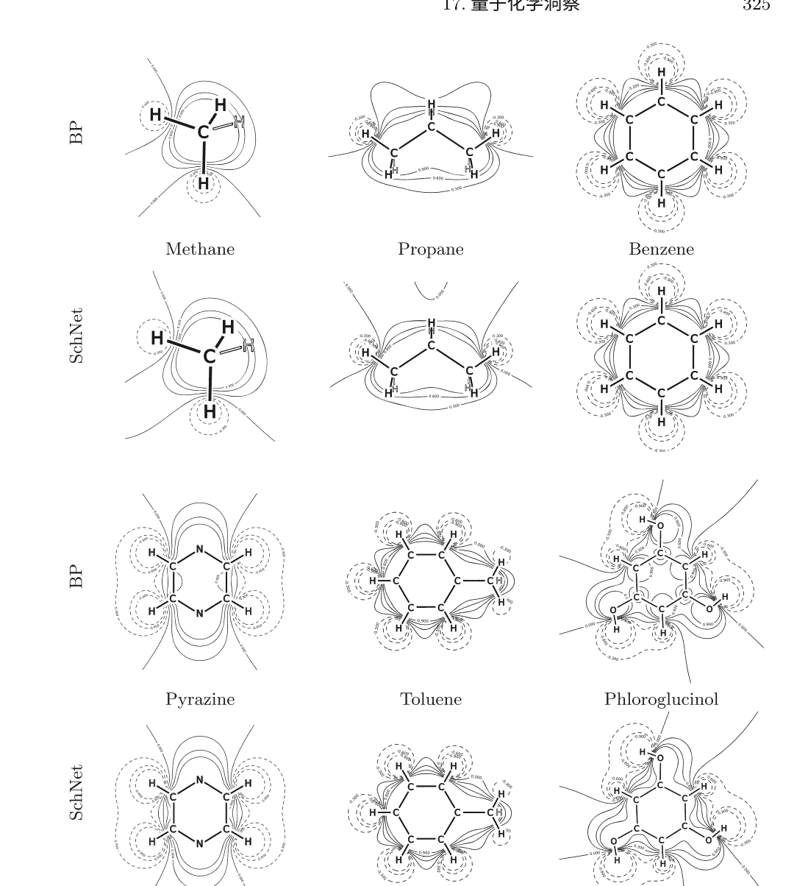

图17.7. 使用BP类型网络和SchNet以及使用探针电荷 $q_0=1$ 获得的电荷比较。虚线表示正电位区域。所有电荷都被归一化。

在一些群组中，元素按周期性进行部分排序。存在从轻到重的元素排序，例如在1组中（从左到右：H - [Na, Li] - [K, Rb, Cs]），2组中（从左到右：Be - Mg - Ca - Sr - Ba）和5组中（从上到下：N - [As, P] - [Sb, Bi]）。

请注意，这些提取的化学见解并不是由SchNet架构对嵌入进行随机初始化之前施加的，而是必须根据训练数据中原子的共现来由模型推断出来的晶体结构。

#### 17.4 结论

我们提出了两种原子级神经网络，可以快速准确地预测能量和偶极矩：Behler-Parrinello（BP）网络使用以原子为中心的对称函数作为输入特征，以及直接从第一原理学习原子系统表示的端到端架构SchNet。在这些建模中，化学性质使用基于物理动机的聚合层对原子级潜在贡献进行建模。同时，潜在的局部贡献对应于以LRP [1]或类似方法 [27,33]的精神中的原子相关性的分配。然而，由于模型被限制在正向传递中从原子级贡献中组装最终目标，我们不必使用相关性重新分配技术。基于此，我们提出了各种解释技术，以提取有关学习表示以及潜在的量子化学问题的见解。

两个被检查的模型都获得了能量的分区 - 这是量子力学计算的一个主要挑战 - 在不同的训练集划分中是一致的。特别引人注目的是，我们可以获得关于芳香环稳定性的化学合理的排名。通过使用虚拟的探针原子，我们能够将原子能量贡献以局部化学势的形式在三维空间中进行可视化。这进一步提高了能量分区的可解释性，并类似于化学概念，如键饱和度、电负性和不同程度的芳香性。在同样的精神下，我们检查了在预测偶极矩分子时获得的潜在部分电荷。它们使我们能够使用静电势可视化分子的近似电荷分布，这些分布基于物理学，并与基本化学直觉有很好的一致性。

局部化学势和静电势都是模型验证和提取空间分辨化学洞察的有价值工具。最后，我们检查了在多样的晶体结构上训练SchNet获得的化学元素嵌入。获得的嵌入恢复了周期表中化学元素在结构中的知识。这为未来的工作指明了方向，将分析扩展到测量局部结构的化学相似性。

在量子化学中，准确的预测是每个机器学习模型的必要要求，但关键是模型能够促进新的研究。在这里，可解释性构成了研究人员在相应领域中验证、理解和最终信任机器学习模型的基本构建模块。因此，解释技术应该紧密地与相应领域熟悉的分析方法相一致，降低对不熟悉非线性机器学习模型的研究人员的初始障碍。出于同样的原因，如果可解释的属性在前向传递过程中直接获得，这将是有益的。这确保它们是真实的基础事实 - 即它们是模型学习的精确分解，而不需要依赖近似的重新分布。所研究的表示与化学知识的出色一致性清楚地证明了原子神经网络在化学、物理和材料科学中开展数据驱动研究的能力。

致谢。本工作得到了德国联邦教育和研究部（BMBF）对柏林大数据中心BBDC（01IS14013A）和柏林机器学习中心（01IS18037A）的支持。欧洲联盟的Horizon 2020研究和创新计划在Marie Sklodowska-Curie授予协议NO 792572下提供了额外支持。这项研究得到了韩国信息通信技术促进研究所的支持，并由韩国政府（MSIT）（编号2017-0-00451，编号2017-0-01779）资助。A.T.感谢欧洲研究理事会（ERC-CoG BeStMo项目）的支持。

### 参考文献

1.  Bach, S., Binder, A., Montavon, G., Klauschen, F., Müller, K.R., Samek, W.: 关于通过逐层相关传播对非线性分类器决策进行像素级解释。PLoS One **10**(7), e0130140 (2015)
2.  Baehrens, D., Schroeter, T., Harmeling, S., Kawanabe, M., Hansen, K., Müller, K.R.: 如何解释个别分类决策。机器学习研究杂志 **11**, 1803-1831 (2010)
3.  Bajorath, J.: 虚拟和高通量筛选的整合。自然药物发现评论 **1**(11), 882 (2002)
4.  Bartók, A.P., Kondor, R., Csányi, G.: 关于化学环境的表示。物理评论B **87**(18), 184115 (2013)
5.  Bartók, A.P., Payne, M.C., Kondor, R., Csányi, G.: 高斯近似势：没有电子的量子力学的准确性。物理评论快报 **104**(13), 136403 (2010)
6.  Bartók, A.P., Csányi, G.: 高斯近似势能：简要教程介绍。Int. J. Quantum Chem. **115**(16), 1051-1057 (2015)
7.  Becke, A.D.: 密度泛函交换能的逼近与正确的渐近行为。Phys. Rev. A **38**(6), 3098 (1988)
8.  Behler, J.: 用于构建高维神经网络势能的原子中心对称函数。J. Chem. Phys. **134**(7), 074106 (2011)
9.  Behler, J., Parrinello, M.: 高维势能面的广义神经网络表示。Phys. Rev. Lett. **98**(14), 146401 (2007)
10. Blum, L.C., Reymond, J.L.: 在化学宇宙数据库GDB-13中进行虚拟筛选的9.7亿种药物样品。J. Am. Chem. Soc. **131**, 8732 (2009)
11. Brockherde, F., Voigt, L., Li, L., Tuckerman, M.E., Burke, K., Müller, K.R.: 用机器学习绕过Kohn-Sham方程。Nat. Commun. **8**, 872 (2017)
12. Chen, H., 等：碳磷酸盐：一种新的锂离子电池正极材料家族的计算鉴定。化学材料 **24**(11), 2009-2016 (2012)
13. Chmiela, S., Tkatchenko, A., Sauceda, H.E., Poltavsky, I., Schütt, K.T., Müller, K.R.: 机器学习准确的能量守恒分子力场。科学 **3**(5), e1603015 (2017)
14. Hohenberg, P., Kohn, W.: 非均匀电子气体。物理评论 **136**, B864–B871 (1964)
15. Duvenaud, D.K., 等: 用于学习分子指纹的图卷积网络。在: Cortes, C., Lawrence, N.D., Lee, D.D., Sugiyama, M., Garnett, R. (eds.) NIPS, pp. 2224-2232 (2015)
16. Eickenberg, M., Exarchakis, G., Hirn, M., Mallat, S.: 固体谐波小波散射：从三维电子密度的不变描述符预测量子分子能量。在: 神经信息处理系统30的进展，第6543-6552页。Curran Associates, Inc., Long Beach (2017)
17. Faber, F.A.等: 分子机器学习模型的预测误差低于混合DFT误差。J. Chem. Theory Comput. **13**(11), 5255-5264 (2017)
18. Gastegger, M., Behler, J., Marquetand, P.: 用于模拟红外光谱的机器学习分子动力学。Chem. Sci. **8**(10), 6924-6935 (2017)
19. Gastegger, M., Schwiedrzik, L., Bittermann, M., Berzsenyi, F., Marquetand, P.: 作为机器学习势能中的描述符的wACSF加权原子中心对称函数。J. Chem. Phys. **148**(24), 241709 (2018)
20. Gilmer, J., Schoenholz, S.S., Riley, P.F., Vinyals, O., Dahl, G.E.: 量子化学的神经信息传递。在: 第34届国际机器学习大会论文集，第1263-1272页 (2017)
21. Hansen, K., et al.: 分子性质的机器学习预测：化学空间中的准确多体势和非局部性。J. Phys. Chem. Lett. **6**, 2326 (2015)
22. Hansen, K., et al.: 评估和验证机器学习方法预测分子离子化能量。J. Chem. Theory Comput. **9**(8), 3404-3419 (2013)
23. Hautier, G., Jain, A., Mueller, T., Moore, C., Ong, S.P., Ceder, G.: 通过混合过渡金属设计多电子锂离子磷酸盐正极材料。Chem. Mater. **25**(10), 2064-2074 (2013)
24. 霍，H.，鲁普，M.：分子和晶体的机器学习的统一表示。arXiv预印本。arXiv:1704.06439 (2017)
25. 康，K.，孟，Y.S.，布雷格，J.，格雷，C.P.，塞德尔，G.：用于可充电锂电池的高功率和高容量电极。科学 **311**(5763), 977-980 (2006)
26. Kearnes, S., McCloskey, K., Berndl, M., Pande, V., Riley, P.: 分子图卷积：超越指纹。J. Comput. Aided Mol. Des. **30**(8), 595-608 (2016)
27. Kindermans, P.J.等: 学习如何解释神经网络：PatternNet和PatternAttribution。在: 国际学习表示会议 (ICLR) (2018)
28. Kohn, W., Sham, L.J.: 包括交换和相关效应的自洽方程。物理评论 **140**, A1133-A1138 (1965). https://doi.org/10.1103/PhysRev.140.A1133
29. Lee, C., Yang, W., Parr, R.G.: 将Colle-Salvetti相关能量公式发展为电子密度的函数。物理评论B **37**(2), 785 (1988)
30. von Lilienfeld, O.A.: 化学化合物空间的第一原理视角：获得分子性质的严格原子控制。量子化学国际杂志 **113**(12), 1676-1689 (2013)
31. Lubbers, N., Smith, J.S., Barros, K.: 使用深度神经网络进行分子能量的分层建模。化学物理学杂志 **148**(24), 241715 (2018)
32. Montavon, G., et al.: 在化学化合物空间中机器学习分子电子性质。新物理杂志 **15**(9), 095003 (2013)
33. Montavon, G., Lapuschkin, S., Binder, A., Samek, W., Müller, K.R.: 用深度泰勒分解解释非线性分类决策。Pattern Recogn. **65**, 211–222 (2017)
34. Montavon, G., Samek, W., Müller, K.R.: 解释和理解深度神经网络的方法。Olivar es-Amaya, R., 等: 通过化学信息学加速有机光伏高性能材料的计算发现。Energy Environ. Sci. **4**, 4849–4861 (2011)
36. Pinheiro, P.O., Collobert, R.: 用卷积网络从图像级别到像素级别标记。In: Proceedings of the IEEE Conference on Computer Vision and Pattern Recognition, pp. 1713–1721 (2015)
37. Pronobis, W., Tkatchenko, A., Müller, K.R.: 用机器学习预测分子性质的多体描述符：分析分子中的成对和三体相互作用。J. Chem. Theory Comput. **14**(6), 2991–3003 (2018). https://doi.org/10.1021/acs.jctc.8b00110
38. Ramakrishnan, R., Dral, P.O., Rupp, M., von Lilienfeld, O.A.: 134千分子的量子化学结构和性质。Sci. Data **1**, 140022 (2014)
39. Ruddigkeit, L., Van Deursen, R., Blum, L.C., Reymond, J.L.: 在化学宇宙数据库GDB-17中枚举了1660亿有机小分子。J. Chem. Inf. Model. **52**(11), 2864–2875 (2012)
40. Rupp, M., Tkatchenko, A., Müller, K.R., Von Lilienfeld, O.A.: 用机器学习快速准确地建模分子原子化能量。Phys. Rev. Lett. **108**(5), 058301 (2012)
41. Samek, W., Binder, A., Montavon, G., Lapuschkin, S., Müller, K.R.: 评估深度神经网络学到的内容的可视化。IEEE Trans. Neural Netw. Learn. Syst. **28**(11), 2660–2673 (2017)
42. Schütt, K.T., Arbabzadah, F., Chmiela, S., Müller, K.R., Tkatchenko, A.: 从深度张量神经网络中获得量子化学见解。Nat. Commun. **8**, 13890 (2017)
43. Schütt, K.T., Glawe, H., Brockherde, F., Sanna, A., Müller, K.R., Gross, E.: 如何表示晶体结构以进行机器学习：快速预测电子性质。Phys. Rev. B **89**(20), 205118 (2014)
44. Schütt, K.T., Kindermans, P.J., Sauceda, H.E., Chmiela, S., Tkatchenko, A., Müller, K.R.: SchNet: 一种用于建模量子相互作用的连续滤波卷积神经网络。在: 神经信息处理系统进展，vol. 30, pp. 992–1002 (2017)
45. Schütt, K.T., Sauceda, H.E., Kindermans, P.J., Tkatchenko, A., Müller, K.R.: SchNet-一种用于分子和材料的深度学习架构。J. Chem. Phys. **148**(24), 241722 (2018)
46. Shoichet, B.K.: 化学库的虚拟筛选。自然 **432**(7019), 862 (2004)
47. Sifain, A.E.等：使用机器学习发现可转移的电荷分配模型。J. Phys. Chem. Lett. **9**, 4495-4501 (2018)
48. Simonyan, K., Vedaldi, A., Zisserman, A.: 深入卷积网络：可视化图像分类模型和显著性图。arXiv预印本。arXiv:1312.6034 (2013)

49. Vollhardt, K.P.C., Schore, N.E.：有机化学；Palgrave版：结构与功能。Palgrave Macmillan，Basingstoke（2014）

50. Xie, T., Grossman, J.C.：晶体图卷积神经网络用于材料性质的准确和可解释预测。Phys. Rev. Lett. 120（14），145301（2018）

51. Zeiler, M.D., Fergus, R.：可视化和理解卷积网络。见：Fleet, D., Pajdla, T., Schiele, B., Tuytelaars, T.（编） ECCV 2014. LNCS，卷 8689，页 818–833. Springer，Cham（2014）。 https://doi.org/10.1007/978-3-319-10590-1_53

52. Zintgraf, L.M., Cohen, T.S., Adel, T., Welling, M.：可视化深度神经网络决策：预测差异分析。arXiv预印本。arXiv:1702.04595（2017）

### 18 可解释的深度学习在药物发现中的应用

Kristina Preuer¹, Günter Klambauer¹, Friedrich Rippmann², Sepp Hochreiter¹, and Thomas Unterthiner¹（✉）

¹ 约翰内斯·开普勒林茨大学，4040林茨，奥地利
{klambauer,hochreit,unterthiner}@ml.jku.at

² 计算化学与生物学，默克公司，64293达姆施塔特，德国

摘要。没有任何解释手段，预测分子性质和生物活性的神经网络只是黑盒子。我们将揭示这些黑盒子，并展示了理解这些模型中隐藏的学习表示的方法。我们展示了如何将单个神经元解释为分类器，用于确定药效团或毒性团结构的存在与否，从而产生新的洞察力和相关知识，为化学、药理学和生物化学提供帮助。我们进一步讨论了如何通过识别化合物对网络预测最相关的组分来确定这些新型药效团/毒性团。此外，我们提出了一种从模型中提取新型药效团的方法，并将展示这些提取的结构与文献发现一致。

我们设想，获得这种可解释的知识对于开发和设计新的药物活性分子是至关重要的，并有助于调查和理解当前方法的失败和成功。

关键词：深度学习 · 神经网络 · 药物研发 · 目标预测

#### 18.1 引言

药物发现研究的核心目标是识别对人类（或动物）系统有益的分子，例如对特定疾病具有一定治疗效果的分子。通常不清楚化学结构应该如何才能产生所需的生物效应。因此，需要研究大量的分子来寻找潜在的药物，导致药物鉴定时间长，成本高。通常通过高通量筛选（HTS）来完成，其中使用生物筛选实验来确定在给定浓度下分子是否表现出某种特性。

确定某种生物效应是否存在是昂贵且耗时的，需要进行大量的实验。因此，使用计算模型作为“虚拟筛选”的手段，即使用计算方法预测这些生物效应，从而避免物理筛选，在药物开发中有着悠久的传统[15,17]。

在过去的几年中，深度学习的出现使得神经网络成为基于分子的化学结构预测生物活性的最佳方法[19,21]，主要是因为它们能够利用多任务设置[31]。最近，深度学习实现了自动生成分子[22,28,35]，这已成为药物设计领域的一个新的有趣应用。然而，一些生成模型仍然存在模式崩溃的问题[33]，并且很难评估[25]。神经网络的可解释性对于预测和自动药物设计都能进一步推动它们的性能，提高它们的可用性，特别是提高接受度。

现在，主要有两种类型的深度神经网络在虚拟筛选中经常使用：基于描述符的前馈神经网络（见第18.3节）和图卷积神经网络（见第18.4节）。基于描述符的神经网络依赖于预定义的特征，即所谓的分子描述符，而图卷积神经网络则直接从分子图中学习连续表示。神经网络将化学分子的离散或数值表示进行计算，并通过多个非线性、可微分的变换层传递该表示来进行预测，其中包含许多、通常是数百万个可调参数。不幸的是，这种神经网络所编码的函数通常无法被人类解释。换句话说：神经网络如何得出结论通常超出了人类用户的理解范围。本研究旨在弥合我们对于药物发现中神经网络预测的理解差距。尽管[2,9,27]已经关注了机器学习模型如何被解释的困难问题，但这些工作都没有深入分析基于描述符和基于图的深度学习模型在QSAR预测中的应用。

在这项工作中，我们首先展示了如何使用训练好的神经网络来解释分子的重要部分对其生物性质的影响，然后演示了如何使用图卷积神经网络来提取已注释的化学亚结构，即药效团或毒性团。我们将通过实证研究表明神经网络依赖于类似药效团的特征来得出结论，就像人类药理学家一样。具体而言，在第18.3.1节中，我们将展示神经网络层中的单元是药效团探测器。此外，在第18.3.2节中，我们将展示如何确定个别样本的指示性亚结构。在我们分析的第二部分中，我们将重点关注图卷积神经网络，并展示从网络中直接提取的已识别药效团与文献中已知的注释亚结构相匹配。

#### 18.2 从分子结构中学习

分子可以以多个尺度表示，例如在图18.1中所示的示例。分子可以通过它们的分子式（1D），结构式（2D），构象（3D），相互定向和时态动力学或所有这些的组合来表示[5]。选择正确的表示对于学习算法来说是任务相关且至关重要的。通常，分子被称为所谓的扩展连接指纹（ECFPs）[26]。这些2D描述符将2维结构表示为位向量，指示预定义亚结构的存在和缺失，并在[18,20,24,32]中显示出很高的预测性能。因此，我们将在第18.3节中使用它们作为我们的第一次实验的描述符。

然而，较新的方法专注于直接的端到端方法，其中分子表示直接从分子图中学习[7,8,13]。这些图卷积方法在训练过程中学习分子表示，因此能够学习通配符和灵活的子结构。我们将在第18.4节分析图卷积网络学习到的表示。

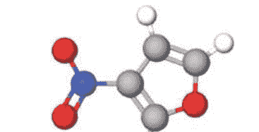

图18.1。分子的二维结构表示的示例。

#### 18.3 基于描述符的前馈神经网络

前馈神经网络由多层计算单元组成。每一层 l 的输入是下面一层的输出向量 h^l。在第一层中，我们使用输入数据 h^0 = x。该层 l 根据某个参数化函数对其输入进行转换，以产生自己的输出。

```
h^{l+1} = f(h^l W^l)
```

其中 f 是应用于每个元素或“隐藏单元” h^l_i 的激活函数。这些元素中的每一个都可以被理解为特征检测器，它检测其输入中某个特征的存在或缺失。该特征的性质由学习到的参数定义。

然而，解释深度学习模型通常非常困难，因为特征通常是输入特征的高度抽象的非线性函数。 然而，我们可以展示，当在典型的药物开发任务上学习时，这些隐藏单元编码的特征与制药研究人员几十年来使用的特征非常相似。

##### 18.3.1 解释隐藏神经元

分析小分子的化学性质的常见方法是观察其结构。 靠近的原子通常会形成功能团，这些功能团可能对结合到相应的生物靶点上具有特定作用。

这些功能团形成较大的结构，然后通过调节生物靶点（例如蛋白质或DNA）来产生生物效应。共同构建引导化学反应的反应中心。只有当必要的活性中心恰好位于正确的位置时，才能与特定靶点结合。活性中心的确切构型被称为药效团[16]。换句话说，药效团是一种分子亚结构或一组分子亚结构，负责化学分子和生物靶点之间的特定相互作用。我们的假设是神经网络的隐藏单元学习检测药效团。为了调查这一点，我们采用了类似于[3]的策略，并使用Tox21数据挑战[11]的数据集训练了一个预测分子毒理学的网络。数据集包含约12,000个分子，每个分子在湿实验室实验中测量了十二种生物效应的二元结果（“有毒”，“无毒”）。这十二种生物效应构成了一个多任务分类问题。深度学习是这个任务的最佳方法[14,20]，我们在实验中遵循[14]中概述的网络架构，使用具有1024个隐藏单元和SELU激活函数的4个隐藏层的网络。为了表示我们的分子，我们使用半径为1的ECFPs[26]，这意味着输入表示包括单个原子和最多5个原子的小亚结构的存在/缺失信息，但不提供关于更大的分子亚结构的具体信息。

网络的表现仍然相对不错，12个目标的平均AUC为0.77，这仍然使其位于原始Tox21数据挑战的前10个模型之中[20]。

在训练网络之后，我们计算了训练集中所有分子的隐藏单元激活，并将其与相同分子计算的药效团的存在/缺失进行关联。为此，我们使用了在毒理学中被认为相关的药效团[30]，即所谓的毒理药效团。

从[30]中的所有毒理药效团开始，我们过滤掉在我们的分子中出现次数少于20次的药效团，最终得到约650个毒理药效团。对于每个隐藏单元 i和每个毒理药效团 j，我们进行了Mann-Whitney U检验，以查看在存在给定毒理药效团的分子和不存在该药效团的分子之间是否存在显著差异。然后，我们查看了在显著水平上相关的情况。

在使用非常保守的Bon-feroni校正进行多重检验后，p ≤ 0.05。这使我们得到了≈290个与网络的隐藏单元显著相关的毒性基团。

接下来，我们研究了层次结构是否与检测到的毒性基团的复杂性相关。如果网络在其中一层学习到了一些具有生物意义的信息，它仍然需要将这些信息传递到所有其他层，以便在顶层进行最终预测。这意味着在较低的层中发现的每个重要的毒性基团通常也会在所有后续层中重新出现。图18.2显示了哪些层次发现了我们已知的药效团。看起来药效团主要是在前几层中发现的。后面的层次主要发现更复杂的药效团。在这里，我们通过参与其中的原子数量来衡量药效团的复杂性。结果与深度学习在其较高层中构建越来越复杂特征的通常观点一致[4]。

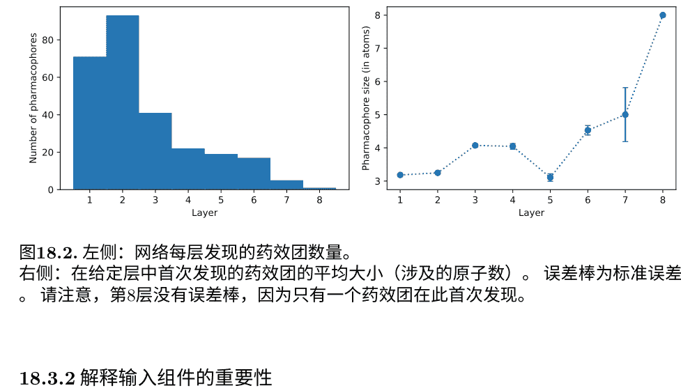

图18.2。左侧：网络每层发现的药效团数量。右侧：在给定层中首次发现的药效团的平均大小（涉及的原子数）。误差棒为标准误差。请注意，第8层没有误差棒，因为只有一个药效团在此首次发现。

##### 18.3.2 解释输入组件的重要性

已经提出了几种方法来解释神经网络的预测，将其决策归因于特定的输入特征。请参阅Anconda等人的[1]中的梯度方法简要概述。其中一种方法是集成梯度[29]，它计算每个输入维度i的归因值a_i(x)。归因值a_i(x)可以解释为从基线输入F(x')到特定输入F(x)的预测变化中i的贡献。它具有许多有用的属性，例如，保证

$$F(x) - F(x') = \sum_{i} a_i(x)$$

此外，综合梯度是唯一的方法，即使在[1]所考虑的特征之间存在乘法交互作用时，也能很好地工作。此外，它与具体选择的架构、激活函数或其他超参数无关。该方法通过聚合模型输出在x′和目标x之间的直线路径上的梯度来工作。在实现该方法时，该积分通过求和来近似：

```
$$
\begin{aligned}
a_i(\mathbf{x}) &= \int_{\alpha=0}^{1} \frac{\partial F(\gamma(\alpha))}{\partial \gamma_i(\alpha)} \frac{\partial \gamma_i(\alpha)}{\partial \alpha} d\alpha \\
&= (\mathbf{x}_i - \mathbf{x}'_i) \int_{\alpha=0}^{1} \frac{\partial F(\tilde{\mathbf{x}})}{\partial \tilde{\mathbf{x}}_i} \bigg|_{\tilde{\mathbf{x}}=\mathbf{x}'+\alpha(\mathbf{x}-\mathbf{x}')} d\alpha \quad (18.1) \\
&\approx (\mathbf{x}_i - \mathbf{x}'_i) \sum_{k=1}^{m} \frac{\partial F(\tilde{\mathbf{x}})}{\partial \tilde{\mathbf{x}}_i} \bigg|_{\tilde{\mathbf{x}}=\mathbf{x}'+\frac{k}{m}(\mathbf{x}-\mathbf{x}')} \frac{1}{m}
\end{aligned}
$$
```

其中 $\gamma(\alpha) = \mathbf{x}' + \alpha(\mathbf{x} - \mathbf{x}')$ 描述了插值路径和 $m$ 是近似中控制结果精确程度的步骤数。在我们的实验中，我们使用了 $m$ 为1000的好结果。我们在前馈网络中使用了一个零向量作为基准，它代表了一个所有亚结构都不存在的分子。

酒精玩具数据集。作为概念验证，我们研究了是否可以使用集成梯度从前馈神经网络中提取可解释的药效团。为此，我们构建了一个玩具数据集，根据一个简单的规则对化合物进行分类：含有醇基（即与饱和碳相连的羟基）的化合物被分类为正样本，而不含羟基和羧酸的化合物被分类为负样本。数据集包括28,147个样本，其中1,236个是正样本。负样本包括26,047个无氧分子和864个羧酸。最简单的规则是没有羟基的化合物被分类为负样本。在第二步中，需要找到一个规则来区分不同的羟基。

在这个实验中，我们使用了基于ECFPs的全连接网络，半径为1。半径为1对于这个任务来说是足够的，因为与饱和碳结合的羟基可以与羧酸基区分开来。在这个实验中，模型由4层1024个单元组成，使用SELU激活函数，测试集的AUC值大于0.99。为了研究预测的重要因素，我们使用了集成梯度。前馈网络基于ECFPs，因此集成梯度为每个指纹提供了归因。

每个指纹由多个原子组成，一个原子可以是多个指纹的一部分。因此，我们计算了每个原子的归因，作为该原子所在的所有指纹的归因之和。

图18.3显示了三种不同分子类型中五个随机选择的分子的归因。在顶部、中部和底部分别显示了没有羟基的负样本、有羧酸基的负样本和正样本。在第一行中，几乎所有的原子都获得了负的属性，这是合理的，因为这些原子都不是羟基团的一部分。在被测试的原子中，只有很小一部分（1.9%）观察到了小的正属性。在第二行显示了含有羧酸的原子。一般来说，不属于酸基团的原子被归类为负的，而羟基团获得了正的属性。这意味着网络仍然能够识别羟基团对于正分类是重要的。在第三行显示了含有羟基团的分子。网络和集成梯度通过指纹重叠，将该群体识别为对预测有0.83%的正贡献。由于重叠的指纹，相邻的原子也获得了稍微正的属性，而远离的原子仍然明确被识别为负的贡献。这个玩具例子已经展示了集成梯度可以用来提取分类的规则。

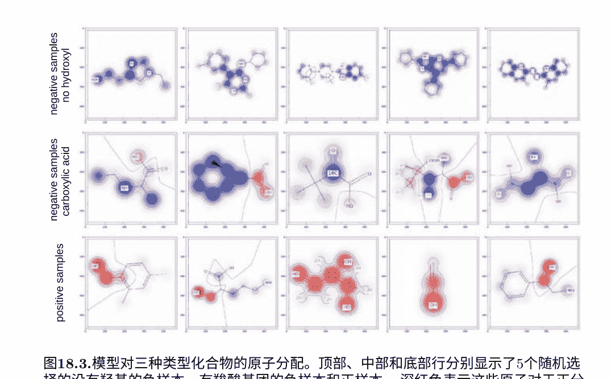

在这个玩具实验之后，我们知道必须应用哪些规则来对样本进行分类，我们将调查更复杂任务的决策是否仍然可解释和合理。为此，我们使用了Tox21数据集。

Tox21挑战数据集。在这个实验中，我们调查了是否可以使用综合梯度来提取对于毒性和非毒性化合物分类重要的化学亚结构，这是目前最大的可用毒性数据集。

为此，我们训练了一个完全连接的神经网络，由4个具有2048个隐藏单元的SELU层和每个1024个半径为1的ECFPs组成，在Tox21数据集上。该网络实现了0.78的平均测试AUC。我们遵循了上述相同的步骤，包括两个主要步骤：应用集成梯度和将特征逐个总结为原子级别的归因。图18.4显示了随机选择的12个正确分类的正测试样本。可以观察到正面归因聚集在一起并形成亚结构。请注意，该模型仅在小的亚结构上进行了训练，因此更大的药效团的形成是学习过程的直接结果。结合一些归因为负值或接近零的事实，这表明神经网络能够聚焦于特定的原子和亚结构，从而区分输入中的指示性和不相关部分。网络基于的亚结构可以被视为指示毒性的药效团样亚结构，也称为“毒性药效团”。

到目前为止，我们只考虑了前馈神经网络。在接下来的几节中，我们将重点关注用于虚拟屏幕的第二种主要网络：图卷积神经网络。我们将展示如何使用这些网络来提取带有注释的亚结构，例如药效团和毒性团，而不是专注于解释单个样本。这种知识对于理解生物活动的基本机制非常有帮助。

#### 18.4 图卷积神经网络

我们实现了一种基于Keras [6]的新图卷积方法。在我们的方法中，我们开始类似于其他方法[7]，使用包含原子类型和当前键类型的初始原子表示编码为一个独热向量。网络通过几个图卷积层传播这个表示，其中每一层执行两个步骤。在第一步中，相邻的原子被连接起来形成原子对。卷积滤波器在这些原子对上滑动以获得一对表示。第二步是一个汇总步骤，确定一个新的原子表示。为了获得一个新的原子表示，对原子-邻居对进行无序汇总操作。然后将这个新生成的表示输入到下一个卷积层中。这个过程在图18.5(a)中有所说明。对于训练和预测，一个汇总步骤对原子表示进行汇总，得到一个分子表示。这一步骤是为了获得一个具有固定维数的分子表示，以便可以通过全连接层进行处理。这些步骤在图18.5(b)中显示。

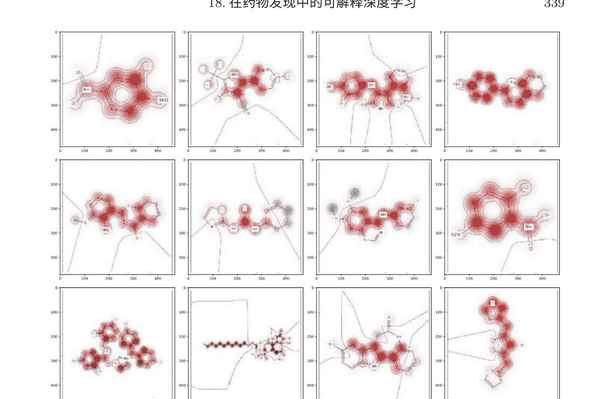

图18.4。对12个随机选择的Tox21正样本进行原子级归因的示意图。归因是从一个基于ECFP 2指纹训练的模型中提取的。网络明显是基于内部构建的较大结构来做出决策，这些结构是由小的输入特征组成的。

形式上，可以描述如下。设G为一个分子图，其中包含一组原子节点A。每个原子节点v最初由向量h^0_v表示，并具有一组相邻节点N_v。在每一层l中，将表示h^l_v和h^l_w（如果w是v的相邻节点）连接起来形成对p^l_vw。对p^l_vw的表示为h^p_{vw}。这是层l的可训练矩阵W^l与对p^l_{vw}的点积的激活函数f的结果。通过任意顺序不变的汇聚函数g（如最大值、求和或平均汇聚）获得新的原子表示h^{l+1}_v。

```
p^l_{vw} = (h^l_v, h^l_w)  ∀w ∈ N_v   (18.2)
h^p_{vw} = f(p^l_{vw} W^l)   (18.3)
h^{l+1}_v = g({h^p_{vw} | w ∈ N_v})   (18.4)
```

通过逐个原子的汇集步骤，获得了层 l 的图形表示G。

```
h^l_G = g({h^l_v | v ∈ A})   (18.5)
```

如果使用跳跃连接，则分子由所有G的连接表示。

$$\mathbf{h}_G = (\mathbf{h}_G^0, \mathbf{h}_G^1, ..., \mathbf{h}_G^L)$$ (18.6)

否则，使用最后一层 L的表示^LG。

$$\mathbf{h}_G = \mathbf{h}_G^L$$ (18.7)

为了确保我们的实现与其他最先进的图卷积具有相同的性能水平，我们使用了ChEMBL基准数据集。 我们的方法在AUC方面取得了0.714±0.15的成绩，相比最佳图卷积神经网络有3%的改进。

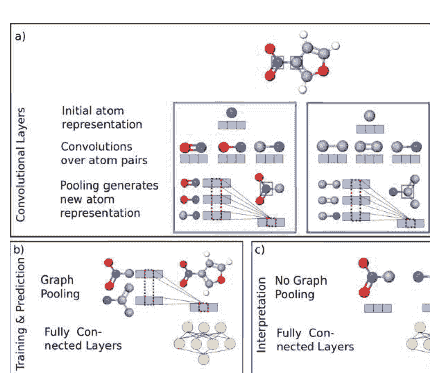

图18.5。（a）展示了蓝色和灰色中心原子的卷积步骤。通过对原子对进行卷积和后续池化操作，形成了新的原子表示。（b）展示了在网络末端的卷积层和全连接层之后进行的图池化步骤。 这些步骤在训练和预测模式下执行。（c）展示了前向传播，用于获取最相关的亚结构。 在这里，省略了图池化步骤，直接将亚结构输入到全连接层中。

##### 18.4.1 解释卷积滤波器

在本节中，我们旨在提取引起特定生物效应的亚结构。这些信息对于设计新药和识别机制途径非常有用。

在图卷积神经网络中，卷积层学习检测指示性结构，然后全连接层将这些亚结构组合成有意义的预测。我们的目标是提取在卷积层中学习到的指示性亚结构。这可以通过跳过Eq. 18.5中的原子池化步骤，并将原子表示传播到全连接层中来实现，如图18.5(c)所示。请注意，我们可以跳过这一步骤，因为对原子进行池化再次得到具有相同维度的图表示。因此，我们可以像处理图表示一样使用单个原子的特征表示。尽管预测是针对单个原子的，但每个原子都受其邻近原子的影响，因此分数可以理解为亚结构分数。每个原子的感受野在每个卷积层中增加一个，因此 $h_v^l$ 表示不同大小的亚结构，取决于使用了多少层。亚结构以原子 $v$ 为中心，半径等于卷积层数。接近一的分数表示相应的亚结构对于正标签具有指示性，而接近零的分数与负标签相关联。

Ames突变原性数据集。在这个实验中，我们使用了一个经过充分研究的突变原性数据集。选择这个数据集是因为文献中存在一些众所周知的亚结构，我们可以利用它们来评估我们的方法。完整的数据集由[10]发布，我们使用了由[1,2]最初发布的子集作为训练集，剩余的数据作为测试集。训练集包括4,337个样本，其中2,401个是突变原性化合物，1,936个是非突变原性化合物。测试集总共包含3,315个样本，其中1,690个是突变原性化合物，1,625个是非突变原性化合物。我们训练了一个具有3个卷积层的网络，每个卷积层有1,024个过滤器，然后是一个包含512个单元的隐藏全连接层。模型在测试集上的AUC为0.801。为了评估网络中最重要的亚结构，我们将一个验证集传递到网络中，并计算每个亚结构的分数，如上所述。最具指示性的亚结构如图18.6所示。每个亚结构与其SMILES表示和在测试集上的阳性预测值（PPV）一起显示。这些提取的亚结构与文献中的先前发现非常吻合[12,23,34]。

在图18.7中，展示了一些在文献中发现的遗传毒性结构，并通过我们的方法识别出了相应的亚结构。提取出的亚结构已知与DNA相互作用。其中大部分通过单分子和双分子亲核取代（SN-1和SN-2反应）与DNA形成共价键。随后，这些修饰可能导致严重的DNA损伤，如碱基丧失、碱基替代、移码突变和插入[23]。

在本节中，我们已经证明了我们解释图卷积神经网络的方法产生的毒性亚结构与文献发现和对DNA损伤的机制理解一致。

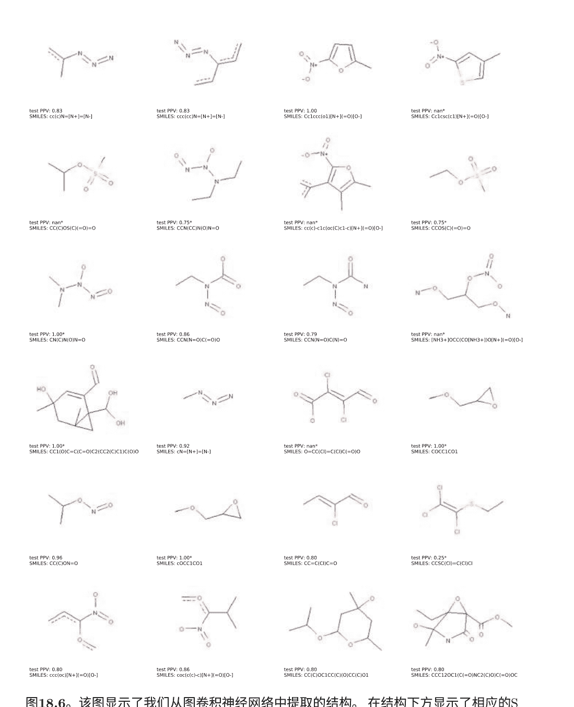

图18.6。该图显示了我们从图卷积神经网络中提取的结构。在结构下方显示了相应的SMILES表示，以及在测试集上的正预测值（PPV）。计算在少于5个样本上的PPV用星号标记。

| toxicophore name | structure example | matching structure identified by our interpretability approach |
|------------------|-------------------|---------------------------------------------------------------|
| azide            | 图像              | 图像                                                          |
| aromatic nitro   | 图像              | 图像                                                          |
| sulfonic ester   | 图像              | 图像                                                          |
| nitros amine     | 图像              | 图像                                                          |
| epoxide          | 图像              | 图像                                                          |
| monohaloalkene   | 图像              | 图像                                                          |
| alkyl nitrite    | 图像              | 图像                                                          |

图18.7。该图显示了文献中被识别为致突变的注释SMARTS模式，以及我们的可解释性应用程序识别的匹配结构。结构的名称显示在第一列，文献中找到的SMARTS模式显示在第二列，最后一列显示了我们方法识别的得分最高的子结构的匹配示例。

#### 18.5 讨论

仅仅将分子分类为“有毒”或“无毒”对于药物开发来说通常是不够的，因为黑盒模型具有很高的预测性能，化学家无法从中得出可行的假设。然而，一旦化学家“看到”导致分子有毒效应的结构元素，他立即会有想法如何修改分子以摆脱这些结构元素，从而消除有毒效应。因此，获得额外的知识是一个重要目标，因此有必要揭示神经网络内的决策过程并检索存储的信息。在这项工作中，我们展示了神经网络的层构建了毒性团，而较大的亚结构则构建在更高的层中。此外，我们证明了集成梯度是确定给定分子中指示性亚结构的一种适当方法。

此外，我们提出了一种方法来识别训练网络中学到的有毒物质，并证明这些提取的亚结构与文献和化学机制一致。

### 参考文献

1.  Ancona, M., Ceolini, E., Oz tireli, C., Gross, M.: 对深度神经网络的基于梯度的归因方法的更好理解 (2018)
2.  Baehrens, D., Schroeter, T., Harmeling, S., Kawanabe, M., Hansen, K., Müller, K.R.: 如何解释个别分类决策。机器学习研究杂志 11, 1803–1831 (2010). http://dl.acm.org/citation.cfm?id=1756006.18599123.
3.  Bau, D., Zhou, B., Khosla, A., Oliva, A., Torralba, A.: 网络解剖学：量化深度视觉表示的可解释性。在：IEEE计算机视觉和模式识别会议论文集, pp. 6541–6549 (2017)
4.  Bengio, Y.: 表示的深度学习：展望未来。在：Dediu, A.-H., Martín-Vide, C., Mitkov, R., Truthe, B. (eds.) SLSP 2013. LNCS (LNAI), vol. 7978, pp. 1–37. Springer, Heidelberg (2013). https://doi.org/10.1007/978-3-642-39593-2_1
5.  Cherkasov, A., et al.: QSAR建模：你去哪里了？你要去哪里？ J. Med. Chem. 57(12), 4977–5010 (2014)
6.  Chollet, F.: Keras (2015). https://keras.io
7.  Duvenaud, D.K., et al.: 用于学习分子指纹的图卷积网络。在：Cortes, C., Lawrence, N.D., Lee, D.D., Sugiyama, M., Garnett, R. (eds.) Advances in Neural Information Processing Systems 28, pp. 2224–2232. Curran Associates, Inc. (2015)
8.  Gilmer, J., Schoenholz, S.S., Riley, P.F., Vinyals, O., Dahl, G.E.: 用于量子化学的神经消息传递。在：Precup, D., Teh, Y.W. (eds.) Proceedings of the 34th International Conference on Machine Learning. Proceedings of Machine Learning Research, PMLR, International Convention Centre, Sydney, Australia, vol. 70, pp. 1263–1272, 06–11 August 2017
9.  Hansen, K., Baehrens, D., Schroeter, T., Rupp, M., Müller, K.R.: 基于核的预测模型的可视化解释。 Mol. Inf. 30(9), 817–826 (2011)
10. Hansen, K., et al.: 用于体外预测Ames致突变性的基准数据集。 J. Chem. Inf. Modeling 49(9), 2077–2081 (2009)
11. Huang, R., et al.: 对Tox21 10K化合物库进行雌激素受体α信号通路的激动剂和拮抗剂的分析。 Sci. Rep. 4 (2014)
12. Kazius, J., McGuire, R., Bursi, R.: 毒性预测的毒性基团的推导和验证。 J. Med. Chem. 48(1), 312–320 (2005)
13. Kearnes, S., McCloskey, K., Berndl, M., Pande, V., Riley, P.: 分子图卷积：超越指纹。 J. Comput. Aided Mol. Des. 30(8), 595–608 (2016)
14. Klambauer, G., Unterthiner, T., Mayr, A., Hochreiter, S.: 自正规化神经网络。在：神经信息处理系统30 (NIPS) (2017)
15. Lavecchia, A.: 药物发现中的机器学习方法和应用。 Drug Discovery Today 20(3), 318–331 (2015)
16. Lin, S.: 药物设计中的药效团感知、发展和应用。由Osman F. G ü ner编辑。 Molecules 5(7), 987–989 (2000)
17. Lionta, E., Spyrou, G., Vassilatis, D.K., Cournia, Z.: 基于结构的虚拟筛选用于药物发现：原理、应用和最新进展。 Curr. Top. Med. Chem. 14(16), 1923–1938 (2014)
18. Lounkine, E., et al.: 针对副作用靶点的药物活性的大规模预测和测试。 Nature 486(7403), 361–367 (2012). https://doi.org/10.1038/nature11591
19. Ma, J., Sheridan, R.P., Liaw, A., Dahl, G.E., Svetnik, V.: 深度神经网络作为定量结构活性关系的方法。 J. Chem. Inf. Model. 55(2), 263–274 (2015)
20. Mayr, A., Klambauer, G., Unterthiner, T., Hochreiter, S.: DeepTox: 使用深度学习进行毒性预测。 Frontiers Environ. Sci. 3, 80 (2016)
21. Mayr, A., 等：在ChEMBL上进行药物靶点预测的机器学习方法的大规模比较。化学科学。 9(24), 5441-5451 (2018)
22. Olivecrona, M., Blaschke, T., Engkvist, O., Chen, H.: 通过深度强化学习进行分子新设计。化学信息学。 9(1), 48 (2017)
23. Plo snik, A., Vracko, M., Dolenc, M.S.: 致突变和致癌结构警示及其作用机制。工业卫生和毒理学档案。 67(3), 169-182 (2016)
24. Preuer, K., Lewis, R.P.I., Hochreiter, S., Bender, A., Bulusu, K.C., Klambauer, G.: DeepSynergy: 用深度学习预测抗癌药物的协同作用。生物信息学 34(9), 1538-1546 (2017)
25. Preuer, K., Renz, P., Unterthiner, T., Hochreiter, S., Klambauer, G.: Fréchet ChemNet距离：药物发现中生成模型的度量标准。 J. Chem. Inf. Model. 58(9), 1736–1741 (2018)
26. Rogers, D., Hahn, M.: 扩展连接指纹。 J. Chem. Inf. Model. 50(5), 742–754 (2010)
27. Schütt, K.T., Arbabzadah, F., Chmiela, S., Müller, K.R., Tkatchenko, A.: 深度张量神经网络的量子化学洞察力。 Nat. Commun. 8, 13890 (2017)
28. Segler, M.H., Kogej, T., Tyrchan, C., Waller, M.P.: 使用递归神经网络为药物发现生成专注分子库。 ACS Central Sci. (2017)
29. Sundararajan, M., Taly, A., Yan, Q.: 深度网络的公理归因。 In: Proceedings of the 34th International Conference on Machine Learning (ICML) (2017)
30. Sushko, I., Salmina, E., Potemkin, V.A., Poda, G., Tetko, I.V.: ToxAlerts: 一种用于有毒化学物质和具有潜在不良反应的化合物的结构警报的网络服务器。 J. Chem. Inf. Model. 52(8), 2310–2316 (2012)
31. Unterthiner, T., 等：用于药物靶点预测的多任务深度网络。在：NIPS 2014的转移和多任务学习研讨会，卷2014，页1-4 (2014)
32. Unterthiner, T., 等：深度学习作为虚拟筛选的机会。在：深度学习和表示学习研讨会（NIPS 2014） (2014)
33. Unterthiner, T., Nessler, B., Klambauer, G., Heusel, M., Ramsauer, H., Hochreiter, S.: Coulomb GANs: 通过电势场实现可证明最优纳什均衡。在：国际学习表示会议（ICLR） (2018)
34. Yang, H., Li, J., Wu, Z., Li, W., Liu, G., Tang, Y.: 评估使用化学艾姆斯致突变性数据集作为基准的不同方法的结构警报识别。 Chem. Res. Toxicol. 30(6), 1355–1364 (2017)
35. Yang, X., Zhang, J., Yoshizoe, K., Terayama, K., Tsuda, K.: ChemTS: 一种高效的用于全新分子生成的Python库。科学技术进步材料。 18(1), 972-976 (2017)

### 19 神经水文学-解释水文学中的LSTMs

Frederik Kratzert(1)(⊕), Mathew Herrnegger(2)(⊕), Daniel Klotz(1), Sepp Hochreiter(1), 和 Günter Klambauer(1)

(1) 约翰内斯·开普勒林茨大学，4040林茨，奥地利
{kratzert,hochreit,klambauer}@ml.jku.at
(2) 维也纳自然资源和生命科学大学，维也纳1190，奥地利
mathew.herrnegger@boku.ac.at

摘要。尽管长短期记忆网络取得了巨大的成功，但它们在环境科学中的应用很少。我们认为其中一个原因是难以解释训练网络的内部。在这项研究中，我们研究了LSTMs在降雨径流预测中的应用，这是水文学领域的核心任务之一，其中需要根据气象观测数据预测河流流量。LSTMs特别适用于这个问题，因为记忆单元可以表示动态水库和存储器，这是水文学系统状态空间建模方法中的重要组成部分。基于两个不同的集水区，一个有雪的影响，一个没有，我们演示了如何分析和解释训练模型。在这个过程中，我们展示了网络内部学习如何表示与我们对水文系统的定性理解一致的模式。

关键词： 神经网络 · LSTM · 可解释性 · 水文学 · 降雨径流模拟

#### 19.1 引言

描述降雨和径流之间的关系是水文学领域的核心任务之一[21]。这涉及从河流流域的气象观测中预测河流流量。河流的流域或集水区是指所有（地表）径流向一个共同出口的区域[40]。预测河流的流量对于洪水预测、洪水防护措施的设计或水电站的高效管理等是必要的。

在河流的流域内，发生了各种水文过程，这些过程影响并导致河流的流量，包括蒸散发，其中水分流失到大气中，积雪和融雪，土壤中的水运动或地下水的补给和排泄（见图19.1）。

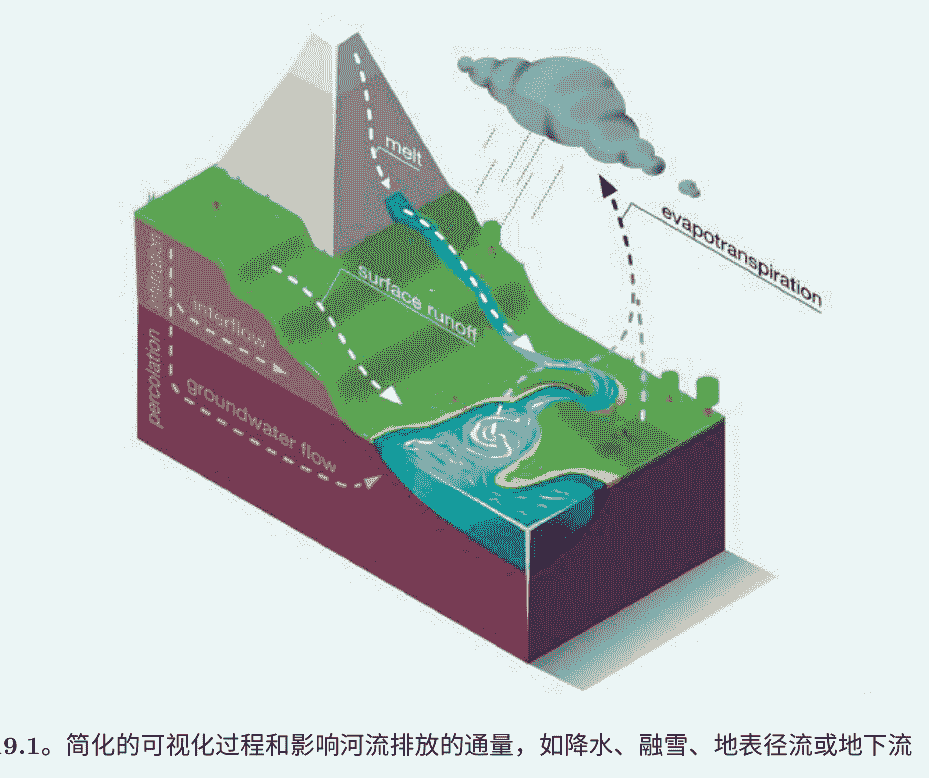

图19.1。简化的可视化过程和影响河流排放的通量，如降水、融雪、地表径流或地下流。

水文过程具有高度非线性的相互作用，并且在很大程度上依赖于系统的状态，这代表了例如河流流域的记忆。因此，水文模型采用状态空间方法进行建模，其中特定时间的状态取决于输入 $I_t$、上一个时间步的系统状态 $S_{t-1}$和一组参数 $\Theta_i$ [14]:
$$S_t = f(I_t, S_{t-1}; \Theta_i) \quad (19.1)$$

给定时间步骤 $t$的排放受系统状态和之前时间步骤的气象事件驱动。更一般地，水文系统的任何输出 $O_t$ (例如径流) 都可以描述为：
$$O_t = g(I_t, S_t; \Theta_j)$$ 其中 $g(\cdot)$是将系统状态和系统输入连接到系统输出的映射函数，$\Theta_j$是相应的模型参数子集。

为了进行熟练的预测，这些非线性使得明确实现水文过程（至少在经典的基于过程的水文模型中）是不可避免的[15,25,32,38]。然而，定义过程的数学表示，包括模型结构和确定因此，确定其有效参数以使结果系统表现良好并具有可推广性的挑战仍然存在于水文学领域中[11,22,35]。

在这种情况下，一个重要的问题和限制因素是关于系统物理特性的信息经常缺失[5,10]。这些特性在空间上往往是高度异质的（例如土壤特性），并且还可能随时间变化，例如植被覆盖。我们对表面上或附近的特性的了解在过去几十年中有了显著提高。这主要归功于高分辨率的航空和航天遥感技术的进步[7,13,29]。然而，水文学在很大程度上发生在地下，很少有详细信息可用。从本质上讲，基于过程的模型试图描述一个由空间和时间分布的系统状态和物理参数决定的系统，而这些参数大部分时间是未知的。

相比之下，仅基于数据的方法，如神经网络，仅仅通过气象观测来训练预测排放，而不需要对底层过程进行明确定义。但是，由于普遍观点认为模型“必须有正确的原因”[20]，这些模型在许多水文学家中并不享有最好的声誉。然而，由于其预测能力，早在90年代初就有研究使用神经网络来预测河流排放[9,12]。

最近，Kratzert等人使用长短期记忆网络（LSTMs）[17]进行日降雨径流模拟，并证明LSTMs与已建立的Sacramento土壤湿度计算模型[8]和Snow-17雪模型[2]相比具有竞争力的结果。LSTM是一种特别适用于水文应用的网络架构，因为状态的演变可以通过时间明确建模并映射到给定的输出。该方法与降雨径流模型的定义非常相似（在LSTM的情况下，系统状态是记忆单元状态，参数是可学习的网络权重，[23]）。本章的目的是展示在降雨径流模拟的背景下解释LSTM及其内部的不同可能性。具体而言，我们探索和研究以下问题：在一年中的某一天，过去多少天影响网络的输出？一些记忆单元是否与水文状态相关？如果是的话，哪些输入变量影响这些单元，以及如何影响？回答这些问题对于（a）对于基于数据的模型获得信心，例如在需要外推的情况下，（b）了解学习过程中可能出现的错误和困难的工具，以及（c）从发现中可能学习到未来应用中非常重要。

##### 19.1.1 相关工作

在水资源和水文学领域，已经做了很多工作来解释神经网络和分析输入变量的重要性（参见[6]进行概述）。然而，到目前为止，只有前馈神经网络被应用于这些研究中。最近，Kratzert等人[23]展示了LSTMs在降雨径流建模任务中的潜在用途。在他们的工作中，他们还展示了存在具有可解释功能的记忆单元，这些单元是通过视觉检查发现的。

除了水文学之外，LSTMs还在各种应用中发现了广泛的应用，这吸引了研究人员对网络内部进行分析和解释的研究。例如，Hochreiter等人[16]通过分析LSTM记忆单元发现了新的蛋白质模体。Karpathy等人[18]检查了字符级语言建模中的记忆单元，并识别出一些可解释的记忆单元，例如跟踪行长度的单元或检查当前文本是否在引号或括号内的单元。Li等人[24]检查了训练过的LSTMs在基于句子和短语的情感分类应用中，并通过显著性分析展示了输入的哪些部分对网络预测影响最大。

Arras等人[3]使用逐层相关传播来计算文本序列中单词对情感分析的影响。对于情感分析，Murdoch等人[28]提出了一种分解策略，用于提取LSTM的隐藏状态和细胞状态对整体预测的贡献。Poerner等人[33]总结了自然语言处理领域中的各种可解释性工作，并提出了LIME框架的扩展，该框架最初由Reibiero等人[34]引入。Strobelt等人[36]开发了LSTMVis，一种用于检查递归神经网络中隐藏状态值的通用可视化分析工具。

受这些研究的启发，我们研究了环境科学领域中LSTM的内部结构，并将我们的发现与水文领域的知识进行比较。

#### 19.2 方法

##### 19.2.1 模型架构

在本研究中，我们将使用一个由单个LSTM层和一个连接到线性激活函数的单个输出神经元的密集层组成的网络，该网络将LSTM在最后一个时间步的输出连接到输出神经元。为了预测单个时间步（天）的流量，我们提供过去365个时间步的气象观测作为输入。与方程19.1相比，我们可以将LSTM表示为：

```
$\{c_t, h_t\} = f_{\text{LSTM}}(x_t, c_{t-1}, h_{t-1}; \Theta_k)$，其中 $f_{\text{LSTM}}(\cdot)$ 表示LSTM单元，它是气象学输入 $i_t$ 在时间 $t$ 的函数，以及先前的单元状态 $c_{t-1}$ 和先前的隐藏状态 $h_{t-1}$，由网络权重 $\Theta_k$ 参数化。系统的输出，根据公式19.2的形式描述，将在这种特定情况下给出：
```

```
$y = f_{\text{Dense}}(h_{365}; \Theta_l)$，（19.4）其中 $y$ 是一个密集层 $f_{\text{Dense}}(\cdot)$ 的输出，由权重 $\Theta_l$ 参数化，它预测了输入序列结束时的河流流量。
```

LSTM和传统降雨径流模型之间的区别在于前者能够从数据中推断出所需的结构/参数化，而不对过程的性质有预设的假设。这使得它们在水文应用中非常有吸引力。

网络经过50个时期的训练，使用RMSprop [39]来最小化均方误差，初始学习率为1e-2。根据独立验证集的得分选择最终模型。

##### 19.2.2 数据

在这项工作中，我们集中研究了公开可用的CAMELS数据集[1,31]中的两个不同流域。流域A受到雪的影响，而流域B则不受雪的影响。两个流域的一些关键属性可以在表19.1中找到。

表格 19.1. 流域概述。

| 流域 | ID^a | 雪覆盖比例^b | 面积 (km^2) | NSE 验证 | NSE 测试 |
|------|------|--------------|-------------|----------|----------|
| A | 13340600^c | 56% | 3357 | 0.79 | 0.76 |
| B | 11481200^d | 0% | 105 | 0.72 | 0.72 |

^a USGS 河流测量站ID
^b 降水在温度低于0℃时的比例
^c Clearwater 河，加利福尼亚州
^d Little 河，加利福尼亚州

对于气象强迫项，数据集包含流域平均的每日降水记录（mm/d），太阳辐射（W/m^2），最低和最高温度（℃）和蒸汽压力（Pa）。流量以每日平均值（m^3/s）报告，并通过流域面积（m^2）归一化为（mm/d）。大约有33年的数据可用，我们使用前15年来训练LSTMs。剩余的年份中，前25%用作验证数据，通过该数据选择最终模型。剩余的数据点（约13年）用于最终评估和本研究中的所有实验。气象输入特征以及目标变量，即流量，通过训练期间的均值和标准差进行归一化。

每个盆地分别训练一个LSTM模型，并使用Nash-Sutcliffe-Efficiency [30]进行评估，这是一种用于评估水文时间序列的常用指标，其计算公式如下：

```
$$NSE = 1 - \frac{\sum_{t=1}^{T}(Q_m^t - Q_o^t)^2}{\sum_{t=1}^{T}(Q_o^t - \bar{Q}_o)^2}, \quad (19.5)$$
```

其中，T是时间步长的总数，Q_m^t是时间t时的模拟流量，Q_o^t是时间t时的观测流量，而\bar{Q}_o是观测流量的平均值。NSE的取值范围为(-inf, 1]，其中1表示完美的模拟，0表示模拟与观测均值一样好，小于零表示模拟比使用观测均值作为预测更差。在测试期间，LSTM的NSE超过0.7（见表19.1），可以认为是一个相当不错的结果[27]。

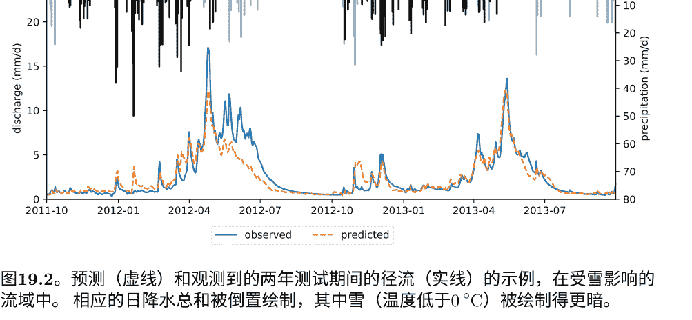

图19.2。预测（虚线）和观测到的两年测试期间的径流（实线）的示例，在受雪影响的流域中。相应的日降水总和被倒置绘制，其中雪（温度低于0°C）被绘制得更暗。

图19.2显示了受雪影响的流域A两年测试期间的观测和模拟径流，以及输入变量降水。我们可以看到，径流在春季/初夏达到峰值，在2012年的模型低估了径流，在第二年中，模型与观测到的径流非常吻合。降水和径流之间的时间滞后可以通过冬季积雪和春季融雪来解释。

##### 19.2.3 综合梯度

最近提出了不同的方法来分析输入变量对网络输出（或任何中间神经元）的归因（例如[3,4,19,26,37]）。在这项研究中，我们专注于Sundararajan等人的综合梯度方法[37]。在这里，计算每个输入对于输出神经元的归因是通过观察当输入从基准输入变化到目标输入时，该神经元的变化来计算的。形式上，让 \(x\) 为感兴趣的输入（在我们的示情况下是一系列包含5个气象观测的365个时间步骤），\(x'\) 为基准输入，\(F(\cdot)\) 为感兴趣的神经元。然后，对于第 \(i\) 个输入变量 \(x_i\)，综合梯度可以近似表示为：

\( \text{IntegratedGrads}_i^{\text{approx}}(x) := \frac{x_i - x'_i}{m} \sum_{k=1}^{m} \frac{\partial F(\tilde{\mathbf{x}})}{\partial \tilde{x}_i} \bigg|_{\tilde{\mathbf{x}} = \mathbf{x}' + \frac{k}{m}(\mathbf{x} - \mathbf{x}')} \), \quad (19.6)

其中 m是用于近似积分的步骤数（这里 m = 1000）。作为基准 x'，我们使用了一个全零的输入序列。

##### 19.2.4 实验

###### 问题1：过去多少天影响网络输出？

季节性影响区域的河流流量在一年中变化很大。例如，对于受雪影响的流域，流量通常在春季或初夏达到峰值，此时不仅降水和地下水，还有融雪对流量的贡献。因此，至少从水文学的角度来看，整个冬季的降水可能对正确预测流量有影响。相反，在较干旱的时期（例如夏末），流量可能仅依赖于较少的气象过去时间步长。由于我们提供了固定数量的时间步长（365天）的气象数据作为输入，了解LSTM实际上使用了多少天的过去数据进行最终预测是很有意思的。

为了回答这个问题，我们计算了测试期间一个样本的输入变量的综合梯度，并对每个时间步骤的特征进行综合梯度求和。然后我们计算从一个时间步骤到另一个时间步骤的差异，并确定第一个时间步骤（1≤t≤T），在该时间步骤上差异超过2e-3的阈值，其中T是序列的总长度。我们已经根据经验选择了阈值，以忽略综合梯度信号中的噪音。对于每个样本，可以通过以下方式计算对最终预测的时间步骤影响的数量（TSOI）：

> TSOI = T - n （19.7）

这个过程会在测试期间的每一天重复进行。

###### 问题2：记忆细胞与水文状态相关吗？

河流流域的排放通常通过将其（假设的）组成部分分解为一组相互作用的水库或储存器来近似（参见图19.1）。以降雪为例，如果温度低于0°C，则会降水。它可以用一个储存器 S（参见方程式19.1）来表示，通常在冬季积累，在春季到夏季温度升高超过融点时减少。类似地，系统的其他组成部分可以被建模为较低或较高复杂性的水库。例如，土壤层也可以用一个桶来表示，这个桶被进入的水（例如降雨）填满到一定程度，并通过蒸散发、水平地下流动和向更深层的水体移动等方式减少。

从理论上讲，LSTM的记忆单元可以学习模仿这些存储过程。从水文学角度来看，这是一个至关重要的特性，能够正确预测河流流量。因此，这个实验的目的是看看某些记忆单元 c_t（方程式19.3）是否与这些水文状态 S_t（方程式19.1）相关。

由于CAMELS数据不包括这些状态的观测值，我们将包含的SAC-SMA + Snow-17模型的系统状态作为代理。虽然这远非最佳选择，但由于这是一个经过充分验证和研究的水文模型，我们可以假设这些模拟的趋势和倾向是正确的。此外，我们只想在这个实验中测试记忆单元是否与这些系统状态相关，而不是定量地匹配这些状态。在校准的SAC-SMA + Snow-17中，我们将以下状态作为本实验的参考：

- SWE（雪水当量）：这是雪层中储存的水量。如果系统中的所有雪都融化，这将可用。
- UZS（上层区域储存）：该状态是SAC-SMA + Snow-17模型的UZTWC（上层区域张力水储存含量）和UZFWC（上层区域自由水储存）的总和计算得出的。该储存表示上层土壤湿度，并控制土壤的快速响应，例如直接地表径流和内流。
- LZS（下层区域储存）：该状态是LZTWC（下层区域张力水含量）、LZFSC（下层区域自由补充水储存含量）和LZFPC（下层区域自由主要水储存含量）的总和计算得出的。该储存表示地下水储存，并与地下水流量相关。

对于测试期间的每个样本，我们计算细胞状态与相应时间序列的这四个状态之间的相关性。

###### 问题3：哪些输入影响特定的记忆细胞？

假设我们找到与水文系统状态时间序列相关的记忆细胞，那么一个自然的问题就是影响这些记忆细胞的输入是否符合我们对水文系统的理解。

例如，表示集水区中雪层的储存应以相反的方式受降水和太阳辐射的影响。固态降水或雪会增加冬季系统中可用的雪量。同时，太阳辐射提供升华的能量，会有效地减少雪层中储存的雪量。

因此，在这个实验中，我们更详细地研究了从之前的实验中出现的特定细胞，并分析了对该细胞的影响变量。我们通过计算输入序列最后一个时间步的单个记忆单元相对于输入变量的综合梯度来实现这一点。

> 1根据[40]，基流定义为：“在长时间没有降水或融雪的情况下，主要来自地下水，但也包括湖泊和冰川的径流进入河道的流量”。

#### 19.3 结果和讨论

##### 19.3.1 影响网络输出的时间步长

图19.3显示了过去多少个时间步长的气象输入对LSTM在预测时间步长（TSOI）的输出产生影响。因此，TSOI不区分单个输入。它更多地是所有输入的综合信号。我们在这里使用年份的天数（DOY）来表示时间维度，而不是使用具体的日期。由于测试期间的所有年份都被整合在图中，我们显示了25%、50%和75%的分位数。为了解释和季节背景，图19.3还包括了降水、温度和流量的时间动态。

图19.3的左列显示了受雪影响的A盆地的结果。在这里，可以区分出TSOI时间序列中的3个不同时期：

1.  在DOY 200和300之间，TSOI显示出非常低的值，少于10-20天。这个时期对应于夏季，其特点是高温和低流量，降水相对较少。在这个时期内，输入对输出的影响时间很短。从水文学的角度来看，这是有道理的，因为这个时期的流量是由短期降雨事件驱动的，这导致了流量的非常有限的响应。这个短时间的影响可以通过这个季节较高的蒸散发率和较低的降水量来解释。较高的蒸散发率导致降水损失到大气中，这在流量中就会缺失。水文图的行为相当容易预测，并且不需要过多关于过去的信息。

2.  在冬季期间，从第300天开始，TSOI随时间增加，达到在第100天左右的140-150天的平台。在这个时期，每日最低温度低于0℃，导致固态降水（雪）并且水被储存在集水区而不导致径流。尽管有高降水输入，但流量值很低，这一点得到了强调。因此，LSTM必须理解这个输入不会导致立即输出，因此TSOI必须增加。一旦最低温度值高于冰点，就会达到平台。从水文学的角度来看，有趣的是冬季结束时的TSOI值与冬季开始时（~第300天）的值相对应，那时积雪开始积累。值得注意的是，从冬季到下一个春季的过渡并不明显，至少从水文图作为参考来看。可以看到，尽管TSOI仍在增加，但流量也在增加。从水文学的角度来看，这可以解释为流量中的混合信号 - 除了融化的雪（每日最高温度大于0℃），我们仍然有负的最低温度，这会导致降雪。

3.  在春季，融雪季节期间，TSOI保持不变（DOY 100-160），然后急剧下降，直到夏季低流量。在主要融雪期间，TSOI约为140-150天，突出了LSTM使用整个冬季期间的所有信息来预测流量。此时，这一时期的降水变为雨水，直接导致径流，而不会增加TSOI。同时，冬季的所有输入仍然影响河流流量，解释了稳定的高原。TSOI在DOY 160左右的急剧下降代表了一个过渡期，冬季的雪持续失去影响力，直到所有的雪都融化。

尽管它具有相同的降水季节性，但B盆地（图19.3，右列）与A盆地具有不同的特征，因为它不受雪的影响。在这里，只能区分出2个不同的时期，其中过渡时期更加明显：

1.  在DOY 180和280之间，温暖干燥的夏季，集水区的流量非常低。在这个时期，TSOI也始终很低，大约为10-15天。由于输入缺少降雨且水文学不依赖于任何输入，因此可以用非常短的输入时间序列预测排放。
2.  在夏季之后，从DOY 280到180之间的湿润时期TSOI稳步增加。降雨的时间影响当径流时间变长时，季节的持续时间也变长。与夏季相比，径流的总体水平现在显著提高。它不仅仅取决于单次降雨事件，而是由过去输入的综合信号驱动，解释了TSOI的增加。TSOI的中位数最大值约为120天。这个峰值后面是一个降低的过程，但不像A盆地那样迅速。TSOI在湿季和干季之间有一个明显的过渡期（~DOY 100-180），这非常符合水文图中观察到的下降趋势。随着径流的减少，过去的气象输入的影响也减弱。与A盆地相比，TSOI的变异性更高，这可以通过单年降水输入的变异性来解释。在A盆地，降雨的年际变异性也很高。然而，低于冰点的温度导致降水变为雪，因此起到了过滤作用。这导致排放和TSOI的变异性较低。

总体而言，两个对比流域的TSOI结果与我们对前期天气对径流信号影响的水文理解相吻合。有趣的是，LSTM显示出学习这些不同流域特定的长期依赖性属性的能力。

##### 19.3.2 记忆细胞与水文状态的相关性

图19.4显示了每个记忆细胞与本实验中考虑的水文状态的平均相关性。相关性是在测试期间的所有样本上进行平均，并且只显示与ρ>0.5相关的相关性。我们可以看到，在两个流域中，一些记忆细胞与提供的水文状态具有特别高的相关性。对于两个流域，有几个细胞与上层（UZS）和下层（LZS）土壤状态都有很高的相关性。尽管大多数细胞显示出正相关性，但也可见负相关性，但其绝对值较低。

LSTM细胞与基流影响状态LZS之间的相关性在干旱流域B中显著较高。然而，基流指数，用于定义基流对总径流贡献重要性的度量，对于该流域较低。在流域A和B中，平均每日基流与平均每日流量的比率分别约为66%和44%。目前，我们无法解释这种差异。在受雪影响的流域中，经过训练的LSTM还具有与雪水当量(SWE)高度相关的一些细胞。多个与不同系统状态高度相关的细胞的出现可以被视为LSTM尚未以简洁的方式定义的指标。因此，水文学家可以利用这些信息进一步限制神经网络。

一般来说，相关性分析很难详细解释。经常存在高相关性，表明LSTM记忆单元与来自成熟水文模型的系统状态之间存在强关系。

##### 19.3.3 记忆单元的检查

在第一个实验中，我们使用集成梯度方法计算输入变量对模型输出的贡献。在这个实验中，我们将其应用于分析神经网络内任意神经元之间的相互作用（例如，在最后一个时间步的记忆单元）。前面的实验证明了与某些水文系统状态具有高相关性的记忆单元的存在。因此，这个实验的目的是分析给定单元的影响和功能。在这里，我们可以探索（i）哪些（气象）输入很重要，以及（ii）过去的哪个时间点上这种影响最大。

我们选择了前一次实验中的一个“雪细胞”来演示这个任务，因为积雪的积累和消耗是一个特别有说明性的例子。更准确地说，我们选择了测试期间与SWE具有最高相关性的单个样本，即来自盆地A的记忆细胞4（见图19.4）。图19.5显示了顶行中气象输入的集成梯度，第二行中记忆细胞值的演变，以及第三行中最低和最高温度的相应变化。

可以看出，雪细胞主要受降水、最低温度、最高温度和太阳辐射的气象输入影响。降水显示出最大的正向影响幅度。相比之下，太阳辐射具有负向影响的符号，可能再现了雪层的升华并导致雪的减少。

所有影响因素只在接近或低于冰点的温度下起作用。这符合从水文学角度来看雪的积累预期行为。较低的温度和同时的降水与积雪有关。因此，这导致记忆细胞值的幅度增加（尤其是在冰点以下的第一个温度）。例如，在1999年10月，温度值下降，气象参数的影响出现，雪细胞开始积累。相反，随着温度的升高，细胞的值再次下降，尤其是当每日最低温度也升至0°C以上时。

这表明LSTM实际上代表了雪储存的短期和长期动态以及它们与气象输入的关系。

#### 19.4 结论

LSTM网络是一种用于时间序列预测的多功能工具，在水文学和环境科学等领域具有许多潜在应用。然而，目前它们并没有广泛应用。我们认为其中一个原因是解释LSTM的困难。本书中提出的方法解决了解释性问题，并允许对这些模型进行更深入的分析。在本章中，我们将展示如何应用这一方法来进行降雨径流模拟（即从气象数据预测河流流量）的任务。

观察）。特别是，我们能够展示LSTM学到的过程与我们对真实环境系统的理解相匹配。

在这项研究中，我们重点对比了水文系统和LSTM学到的行为的定性分析。在第一个实验中，我们观察了对网络输出的影响时间步数（TSOI）以及这个数字在一年中的变化。我们发现TSOI的模式与我们对一年中模式的水文理解相匹配。在下一个实验中，我们研究了网络的记忆单元与水文系统的某些选定状态（如雪或土壤湿度）之间的相关性。我们发现一些单元与所选状态具有相对较高的相关性，这加强了LSTM获得了一些径流生成过程的一般理解的假设。

在最后的实验中，我们检查了一个与雪状态高度相关的单个记忆细胞。我们通过集成梯度方法分析了随时间变化的影响输入，并且可以看到，细胞中表现出的行为模式与水文学理论所建议的模式非常相似。我们认为这进一步证实了网络内部建模过程遵循某种物理可行模式的观察。我们假设这种关系可以被视为LSTM在环境科学应用中使用的合法性，并且相信所提出的方法将为其在环境建模中的未来铺平道路。记忆细胞与物理状态的对应关系在新情况下尤其有用，而这种情况在这个背景下经常出现。环境科学家和从业者可以利用它（以及所提出的技术）来“窥探LSTM”并讨论潜在的行为。我们的演示当然不是详尽无遗的，应该被视为指示性的应用研究。

最重要的信息是，领域知识（在本例中是水文学）与所提出的解释技术所提供的见解相结合，为设计具有神经网络的环境预测系统奠定了基础。因此，我们预计强大的数据驱动模型（如LSTMs）与专家解释的可能性相结合，将在应用领域带来新的见解。

### 参考文献

- 1. Addor, N., Newman, A.J., Mizukami, N., Clark, M.P.: 大样本研究的集水区属性。UCAR/NCAR，科罗拉多州博尔德（2017年）
- 2. Anderson, E.A.: 国家气象局河流预报系统-积雪积累和消融模型。技术报告，11月，美国商务部，银泉（1973年）
- 3. Arras, L., Montavon, G., Müller, K.R., Samek, W.: 解释情感分析中的递归神经网络预测。在：2017年EMNLP计算方法主观性、情感和社交媒体分析研讨会（WASSA），第159-168页（2017年）
- 4. Bach, S., Binder, A., Montavon, G., Klauschen, F., Müller, K.R., Samek, W.: 通过逐层相关传播对非线性分类器决策进行像素级解释。PLoS ONE 10(7), e0130140 (2015)
- 5. Beven, K.: 我们在分布式水文模拟中能走多远？水文地球系统科学 5(1), 1-12 (2001年)
- 6. Bowden, G.J., Dandy, G.C., Maier, H.R.: 水资源应用中神经网络模型的输入确定。第1部分-背景和方法。J.Hydrol. 301(1-4), 75-92 (2005年)
- 7. Brenner, C., Thiem, C.E., Wizemann, H.D., Bernhardt, M., Schulz, K.: 从高分辨率热红外图像中估计空间分布的湍流热通量。国际遥感杂志 38(8-10), 3003-3026 (2017年)
- 8. Burnash, R.J.C., Ferral, R.L., McGuire, R.A.: 通用的流量模拟系统-数字计算机的概念建模。技术报告，美国商务部国家气象局和加利福尼亚州水资源部 (1973年)
- 9. Daniell, T.M.: 神经网络在水文和水资源工程中的应用。在：国际水文和水资源研讨会论文集，第3卷，第797-802页。工程师学会，珀斯，澳大利亚 (1991年)
- 10. Freeze, R.A., Harlan, R.L.: 基于物理的数字模拟水文响应模型的蓝图。水文学杂志。 9 (3) , 237-258 (1969年)
- 11. Gupta, H.V., Sorooshian, S., Yapo, P.O.: 水文模型自动校准的现状：与多级专家校准的比较。水文工程杂志。 4 (2) , 135-143 (1999年)
- 12. Half, A.H., Half, H.M., Azmoodeh, M.: 使用神经网络预测降雨径流。 在：美国土木工程师学会，纽约，美国，第760-765页 (1993年)
- 13. Hengl, T., 等: SoilGrids250m: 基于机器学习的全球网格化土壤信息，第12卷 (2017年)
- 14. Herrnegger, M., Nachtnebel, H.P., Schulz, K.: 从径流到降雨：高时间分辨率的逆降雨径流建模。水文地球系统科学。 19 (11) , 4619-4639 (2015年)
- 15. Herrnegger, M., Nachtnebel, H.P., Haiden, T.: 高山流域的蒸散发-水量平衡的重要组成部分! 水文研究。 43 (4) , 460 (2012年)
- 16. Hochreiter, S., Heusel, M., Obermayer, K.: 快速基于模型的蛋白质同源检测，无需对齐。 生物信息学 23 (14) , 1728-1736 (2007年)
- 17. Hochreiter, S., Schmidhuber, J.: 长短期记忆。神经计算。 9 (8) , 1735-1780 (1997年)
- 18. Karpathy, A., Johnson, J., Fei-Fei, L.: 可视化和理解循环神经网络。 arXiv预印本arXiv:1506.02078 (2015年)
- 19. Kindermans, P.J.等: 学习如何解释神经网络：PatternNet和Pattern Attribution，第1-12页 (2017年)
- 20. Klemes, V.: 水文学中的业余爱好：过渡还是命运？水资源研究。 22 (9 S) , 177S -188S (1986年)
- 21. Klemes, V.: 降雨径流关系的随机模型 (1982年)
- 22. Klotz, D., Herrnegger, M., Schulz, K.: 用于估计水文模型传递函数的符号回归。水资源研究。 53 (11) , 9402-9423 (2017年)
- 23. Kratzert, F., Klotz, D., Brenner, C., Schulz, K., Herrnegger, M.: 使用长短期记忆 (LSTM) 网络进行降雨径流建模。水文地球系统科学。 22 (11) , 6005-6022 (2018年)
- 24. Li, J., Chen, X., Hovy, E., Jurafsky, D.: 在NLP中可视化和理解神经模型。 arXiv预印本arXiv:1506.01066 (2015年)
- 25. Lindström, G., Pers, C., Rosberg, J., Strömqvist, J., Arheimer, B.: HYPE（环境水文预测）水质模型在不同空间尺度上的开发和测试。水文研究。 **41**（3-4），295（2010年）
- 26. Montavon, G., Lapuschkin, S., Binder, A., Samek, W., Müller, K. R.: 用深度泰勒分解解释非线性分类决策。 Pattern Recogn. **65**，211-222（2017年）
- 27. Moriasi, D.N., Gitau, M.W., Pai, N., Daggupati, P.: 水文和水质模型：性能指标和评估标准。 ASABE **58**(6)，1763-1785 (2015)
- 28. Murdoch, W.J., Liu, P.J., Yu, B.: 超越词重要性：从LSTMs中提取交互作用的上下文分解。国际学习表示会议 (2018)
- 29. Myneni, R.B., et al.: MODIS数据第一年的全球植被叶面积和吸收PAR的产品。遥感环境。**83**(1-2)，214-231(2002)
- 30. Nash, J.E., Sutcliffe, J.V.: 通过概念模型进行河流流量预测第一部分 - 原理讨论。水文学杂志。 **10**(3)，282-290 (1970)
- 31. Newman, A., Sampson, K., Clark, M., Bock, A., Viger, R., Blodgett, D.: 一个大样本流域尺度的水文气象数据集，适用于美国本土。UCAR/NCAR，科罗拉多州博尔德市（2014年）
- 32. Perrin, C., Michel, C., Andréassian, V.: 改进了一种简化的模型，用于模拟流量。水文学杂志。 **279**（1-4），275-289 (2003年)
- 33. Poerner, N., Schütze, H., Roth, B.: 使用混合文档和形态句法一致性评估神经网络解释方法。在：计算语言学协会第56届年会论文集（第1卷：长文），卷1，pp. 340-350 (2018年)
- 34. Ribeiro, M.T., Singh, S., Guestrin, C.: 为什么我应该相信你？ 解释任何分类器的预测。在：第22届ACM SIGKDD国际数据挖掘和知识发现大会论文集，pp. 1135-1144。ACM（2016年）
- 35. Samaniego, L., 等: 朝着无缝的跨空间尺度的水文预测。 Hydrol. Earth Syst. Sci. **21**(9), 4323-4346 (2017)
- 36. Strobelt, H., Gehrmann, S., Pfister, H., Rush, A.M.: LSTMVis：一种用于可视化分析递归神经网络中隐藏状态动态的工具。IEEE Trans. Visual Comput. Graphics **24**(1), 667-676 (2018)
- 37. Sundararajan, M., Taly, A., Yan, Q.: 深度网络的公理归因。在：第34届国际机器学习大会论文集，第70卷，pp. 3319-3328。JMLR.org (2017)
- 38. Thielen, J., Bartholmes, J., Ramos, M.H., de Roo, A.: 欧洲洪水预警系统-第1部分：概念和发展。Hydrol. Earth Syst. Sci. Dis. **5**(1), 257-287 (2008)
- 39. Tieleman, T., Hinton, G.: 第6.5讲 - RMSProp，COURSERA：神经网络机器学习。技术报告（2012年）
- 40. WMO，UNESCO（联合国教育、科学和文化组织）：国际水文学术语表。第12号，瑞士日内瓦（1998年）

### 20 特征谬误：解释fMRI中的线性解码权重的复杂性

Pamela K. Douglas1,2(✉) 和 Ariana Anderson 2
1 美国佛罗里达中央大学，奥兰多，佛罗里达州
pkdouglas16@gmail.com
2 美国加利福尼亚大学洛杉矶分校，加利福尼亚州

摘要。 解码和编码模型是用于研究功能性神经影像数据中的表示的流行多变量方法。编码方法试图使用刺激的特征来预测大脑激活模式。相反，解码模型利用测量的大脑反应作为特征，对实验操作或行为进行预测。这两种方法通常包括线性分类组件。理想情况下，解码和编码模型可以用于预测和神经科学知识的获取。然而，即使在线性框架内，解释也可能很困难。编码模型存在特征谬误；从刺激中派生的多种特征组合可能同样很好地描述测量到的大脑反应。解释线性解码模型也需要非常小心，特别是当具有大量（冗余）且与噪声测量相关的信息预测变量（例如fMRI体素）存在时。在某些情况下，噪声通道可能被赋予比包含相关信息的通道更强的权重。尽管存在对这个问题的修正方法，但在应用正则化之后，功能性神经影像记录中常见的某些噪声源可能会使纠正方法复杂化。在这里，我们回顾了基于编码和解码假设检验进行推断的潜在陷阱，并提出了一种特征谬误形式，该形式也适用于解码框架。

关键词： 编码 · 解码 · fMRI · 可解释的人工智能

#### 20.1 表示模型

理解神经活动如何产生一系列复杂的思想和行为，可能是现代神经科学的炼金术之石。早期的理论认为一个单独的神经元可能负责表示一个复杂的对象或概念，通常被称为祖母细胞假设[20]。 这导致了各种实验，测量单个单位神经元的电压波动[30]，以及对永远难以捉摸的痕迹[4]的寻找，这是大脑中记忆的理论生物物理表现。 尽管使用植入的电极在人类中进行的研究已经证明了大脑中稀疏表示的有效性[57]，但是几十年来的大量工作提供了分布式神经编码的证据（例如，[58]）。 神经元不是孤立工作的；因此，理解神经元如何相互作用来表示信息可能最终取决于解读复杂神经群体编码的动态[55]。

在人类中，功能性磁共振成像（fMRI） 一直是研究人脑功能分离和专门化的核心工具，非侵入性地进行[18]。 fMRI测量结果不反映单个神经元的活动，而是反映神经元集合中局部的血氧含量变化，被认为间接反映了神经元集合的增加放电[46]。 血液动力学fMRI信号在大脑皮层的不同区域（例如[24,39,44,65]）上具有不同的时间平滑和幅度延迟。

尽管如此，这些记录已成功用于建模基本感知[9,33]、分类对象识别[26,35]、语义内容[32]、面部识别[8,34]和信念决策[15,16]的表示。

早期的fMRI方法采用了质量单变量方法进行脑部映射（即确定任务期间活动与基线条件相比变化的位置）的目的。 然而，即使在经典的广义线性模型（GLM）框架内，基于结果的错误推论也成为了一个令人担忧的问题。

例如，Poldrack [54] 指出，基于特定脑区激活来推断认知过程并不具备演绎有效性，将这种做法称为逆向推理。 这个结论要求特定脑区仅在特定的认知任务中被激活 [54]。

其次，神经编码的分布程度、相对模块化性和表示中的冗余性仍然不清楚。 例如，早期的fMRI面部识别研究假设颞下回面部区（FFA）是一个大致均匀的模块，对面部具有类似的视觉调谐偏好 [34]。 这种假设主要基于使用经典的单变量方法得出的结果，在分析的第一层次上独立地分析体素。

最近，对FFA区域的体素活动模式进行了组合分析，揭示了FFA内部的多个专门的子领域，每个子领域都具有特定的类别视觉调谐偏好 [8]。 因此，独立分析条件下的体素测量平均可能会错过与刺激类别相关的分布式表示模式 [49]。

这可能的一个原因是，在分析体素之后通常会应用空间平滑来提高统计功率和信噪比[64]。 直观地说，空间平滑的效果可能会减弱或平均掉相邻体素中的独特信息。 然而，血氧水平依赖性功能磁共振成像信号不仅在时间上有延迟，而且在皮层的表层层中也在空间上扩展[39]。

因此，一个体素采样特定的神经调谐模式的可能性很小。 在各种核宽度下进行空间平滑的效果已经得到了广泛研究。

## 20. 解释fMRI中的线性解码权重

对于传统的GLM分析[48]和解码方法[27]，空间平滑的效果已经得到了广泛研究。 有趣的是，使用典型的核尺寸（0-8毫米）进行空间平滑似乎对解码表示的能力几乎没有影响[53]。 在这里，我们简要回顾了用于表征性fMRI分析的编码和解码技术。 我们建议对这两种技术都要谨慎解释，并且所做的推断应该反映出用于建模数据的工具。 对于用于预测目的的特征分析工具的过度解释被称为特征谬误。 最近，这个问题已经得到了解决，重点放在了编码模型上[42]。 因此，我们主要关注解码方案和将该框架应用于fMRI数据时可以得出的推断。

##### 20.1.1 编码模型

表示性fMRI分析的目标是构建响应模式的模型，并在理想情况下测试其对新刺激和条件的泛化能力[42]。 表示性fMRI模型已成功应用于在丰富的实验条件下区分、建模和预测响应（例如，[28,29,33]）。 编码和解码是研究fMRI测量中表示的两种最流行的多变量方法。 这两种方法具有互补的目标，但是分析路径相互对立。 编码模型被称为正向模型；它们从刺激开始，试图基于从刺激中提取的特征来预测测量响应[35,50,51]。 例如，从自然视觉刺激中导出的一组Gabor函数被用来描述早期视觉处理（V1）区域的fMRI响应[35]。 在编码框架中使用显著性和音高特征来预测自然声音的音位有序皮层处理[9]。 通常使用这些特征的线性组合来建模平均脑响应，并通过交叉验证评估模型的拟合度[11]。

这些编码模型预测大脑反应的能力非常令人印象深刻。 然而，与任何建模方法一样，所做的推断应该适当地反映方法论。 例如，在简单的线性编码模型的情况下，当特征数量接近实验条件数量时，多个特征集可能同样好地预测激活反应。 例如，手指运动、运动协同以及随机向量似乎同样描述了感觉运动皮层中的表示[12]。 Diedrichsen将这个问题称为特征谬误，或者对用于描述潜在空间中复杂活动的工具的过度解释。 从系统识别的角度来看，这可能类似于一个不可识别或准识别的系统，其中多个参数组合可能同样好地描述数据[47]。 编码模型的这个方面促使了其他表征技术的发展，包括模式组件建模和表征相似性分析，更多讨论见[11,43]。

图20.1.编码分析与大脑中的信息处理方向相同。从刺激中得出的特征（例如视觉刺激的轮廓）被用作预测大脑响应模式的特征。解码分析通过利用大脑响应模式来预测（或重建）刺激类别或受试者对实验范式的响应。较少见的是，解码方法用于预测行为响应的某些方面。

##### 20.1.2 线性解码模型和显式信息

解码模型使用机器学习（ML）技术来找到能够共同区分实验条件或预测群组成员资格的体素模式。自从早期应用程序展示了使用fMRI数据区分类别对象类别的能力以来，解码已经变得越来越受欢迎。解码方法吸引人的部分原因是通过分析体素测量的组合而不是单独分析可以更深入地了解大脑中的功能分区[17]。解码，即反向模型，从活动模式开始，试图从响应模式中学习有关刺激的信息[50]（图20.1）。解码在这种方式下的一个特别令人印象深刻的应用是刺激重建[51]。在某些情况下，解码研究使用fMRI体素模式来预测对刺激的行为响应（例如决策）[16,23]，然而这种应用较少见。

从决策树到深度神经网络的分类技术已经被应用于神经影像数据，非线性模型现在越来越多地应用于fMRI数据的解码[19,21,37,40,60,67]和编码[62]目的。然而，历史上最广泛采用的做法是假设来自不同类别的数据可以通过一个超平面进行线性分割。线性分类方法在fMRI社区被广泛采用的原因有很多 - 除了计算效率之外。首先，在一些早期的ML应用于fMRI数据的情况下，线性分类器（如线性支持向量机）在性能上优于更复杂的分类器[7]。其次，线性分类器被认为更容易解释[33,52]。

最后，线性解码表示能力被认为反映了显式的信息，并且更接近读出的水平。例如，物体类别的视觉表示被认为是无法解开的早期视觉区域（V1）。然而，在经过视觉皮层的多层转换后，认为信息被更明确地表示，因此更容易被线性分类[10]访问。与此一致，线性分类器的性能在目标类别区分的视觉处理水平上已被证明有所提高[31]。

##### 20.1.3 解释陷阱 - 即使使用线性解码器

训练和测试线性分类器的过程提供了预测准确性以及一组特征权重，通常称为w向量，其元素共同影响特征空间中的分类边界。在神经科学应用中，目标通常不仅是准确分类，还要解释导致预测的模式[52]。在许多研究中，特征权重（w）被直接映射回其对应的输入体素，产生类似于传统GLM分析中可能产生的脑激活模式的权重图。然而，即使在最简单的线性解码器的情况下，解释权重图的方式也存在问题。我们将使用从两个测量通道进行二元分类的最简单情况来说明这个问题。

假设我们有两个体素的时间序列测量，v1(t)和v2(t)，在t个时间点进行采样，并且我们试图区分两个任务或人群。对于这个特定的二元分类任务，第一个通道v1(t)包含类别特定的信息，并且与任务时间序列y(t)相关。在这个v1(t)通道中，类别的均值不同，因此对于这个双变量分类是有信息的。在第二个通道v2(t)中，类别的均值大致相等，因此可以认为这个通道是“噪音”。在图20.2的案例1中，我们考虑两个体素测量之间的协方差近似为零的情况，目标是预测类别标签y，其中：

```
y \in \{+1, -1\}
(20.1)
```

在最简单的情况下，线性判别分析（LDA）二元分类方案中，测量之间的协方差近似为零，噪声体素对于改善灵敏度或显著改变特征权重没有实质性贡献。在这里，分配给每个体素的特征权重是w_v1和w_v2。因此，当测量之间的协方差近似为零时，权重图将适当地反映每个体素对决策标签的贡献（图20.2，情况1）。请注意，从几何角度来看，wLDA权重向量与决策边界正交。

在大多数情况下，预计体素测量之间存在一定的协方差。这可能是由于测量之间存在非神经潜在源（例如运动）或者由于附近体素从与任务无关的血管中采样到一定程度的重叠波动。在这种情况下，体素之间的协方差不相等，通道之间的协方差会影响特征权重。从某种意义上说，解码的这个方面是有吸引力的，因为它可以消除噪音，从而提高分类器的灵敏度和准确性[3,45]。

在某些情况下，在LDA框架内进行贝叶斯最优分类可能会给噪声通道分配比包含信息的体素更强的权重（见图20.2，案例2）。在这种情况下，强权重可能出现在与研究对象的脑过程（近似）统计独立的权重图的空间位置上。因此，很明显特征权重不应该直接解释（例如，[22,25]）。从这个意义上说，将特征权重呈现为脑图可能会导致一种暗示性解释，即这些图像对应于神经编码中的有意义的表示模式。

## 20.1.4激活图替代权重图

Haufe等人[25]强调了解释解码权重的问题，并提出了解决方案。我们继续处理相同的两类问题，使用两个测量通道。在线性情况下，我们首先将体素数据表示为一组潜在因子k的加权和s，这些因子由其对应的激活模式a加权并加上噪声。因此，数据可以表示为：

```
v(t) = \sum_k a_k s_k(t) \quad (20.2) \quad \text{其中} \quad a_k \in \mathbb{R}^M, \quad \text{而} \quad s_k(t) \in \{1,\dots,K\}.
```

这代表了前向模型，类似于编码情况。解码模型对应于监督反向模型，其目标是根据观察结果提取这些潜在因子的函数。在线性情况下，从观察结果到因子的映射可以用一个n×m的转换矩阵W来总结：

```
W^T v(t) = \hat{s}(t) \quad (20.3)
```

对于线性平方情况下的提出的解决方案，其中 K = M如下所示。提取滤波器 W形成一个可逆矩阵，数据可以表示为一个无噪声的前向模型：

```
v(t) = W^{-T} \hat{s}(t) \quad (20.4)
```

其中激活模式以矩阵形式表示：

```
A = W^{-T} \quad (20.5)
```

尽管将特征权重或提取滤波器投影到激活模式上的方法很有用[25]，但从这个过程中读取仍然很复杂。

##### 20.1.5 噪声可能会使激活修正变得复杂

将特征权重投影到激活图上可能会增强可解释性、冗余性、噪声和正则化可能会进一步复杂解释 - 即使在投影到激活图上之后 - 取决于所使用的分类器。在存在非高斯噪声的情况下，例如扫描仪漂移、运动和周期性生物节律，将特征权重投影到激活图上会产生虚假的模式；例如，通常与扫描仪漂移相关的噪声可能导致噪声源的激活权重大于任务相关信号的权重。这表明某些解码或反向模型在成功建模传入噪声结构方面本质上存在局限性，并且对这种噪声结构的不正确假设可能会产生误导性的解释图[13]。

图20.2。（顶部面板）案例1：两个体素时间序列具有相等的方差，但近似为零的协方差（左侧）。类均值在体素1（v1(t)）上有所不同，而体素2（v2(t)）不包含类特定信息，如数据在每个体素维度上的投影所示。红色显示的w向量或提取滤波器与决策边界（灰色）正交。在这种情况下，权重wv1和wv2适当地反映了每个通道中的信息。（下部面板）案例2：信号和噪声体素之间的协方差可能导致对体素特征权重和权重图的不适当分配。然而，在投影到激活（Eq. 20.4）之后，正确的权重被恢复。图示灵感来自Kriegeskorte和Douglas 2019以及Haufe等人[25]。

功能性磁共振成像记录中常见的不同类型噪声，甚至在极其简单的情况下也可能污染恢复信息的能力：线性判别分析（LDA）分类器具有两个特征。继续使用之前的示例，使用两个体素测量值v1(t)和v2(t)，以及一个二元分类任务。第一个通道包含信息，而第二个通道几乎不包含类别特定信息。

在这里，我们有兴趣测试在噪声通道变化时，将权重或提取滤波器反投影到激活上的有效性。在所有示例情况中，输出变量与测量之间的相关性保持不变，即\(r = Corr(y(t), v_1(t)) = 0.75\)，以及\(r = Corr(y(t), v_2(t)) = 0.09\)。对于分类，我们应用了一个简单的LDA模型，假设类内分布服从高斯分布。

图20.3.模拟体素测量的时间序列。（顶部）信息体素（\(v_1(t)\)）与任务相关的时间序列。（底部）四种不同情况下与任务叠加的噪声测量（\(v_2(t)\)）。在每种情况下，信息体素与一个噪声通道配对。所有模拟测量具有相等的方差。

在图20.3中，模拟了四种不同的时间序列，代表了fMRI中常见的噪声测量。在每种情况下，信息通道（\(v_1\)）与不同的噪声通道（\(v_2\)）配对。当LDA应用于两个体素测量时，一个是噪声，另一个是信息体素，权重向量将给噪声通道分配较大的权重，而给信息通道分配较小的权重（图20.4）。然而，当这些权重使用Eq. 20.2映射到激活时，我们有效地恢复了所包含的真实信息，但仅适用于高斯噪声情况。在2-4情况下，激活恢复方法是无效的。扫描仪漂移在扫描环境中非常常见，漂移的时间连续部分通常在高通滤波后仍然存在于数据中。在漂移噪声的情况下，信息测量被正确地分配了比噪声测量更高的权重。然而，在投影到激活后，情况发生了反转-噪声测量被分配了比具有类别特定信息的通道更强的权重。

由于头部运动引起的噪音在扫描环境中也很常见。虽然存在运动校正算法，但仍然存在头部运动导致的噪音问题。数据中持续存在的头部运动导致了fMRI分析的问题[56]。在引入的运动导致噪音发生阶跃变化的情况下，结果与漂移运动情况类似；激活不反映数据中的实际信息。

##### 20.1.6 冗余和正则化

冗余在fMRI测量中也被认为是常见的，因为空间上相邻的体素可能包含相似的信息。这个观察引发了关于在分类之前是否需要单独的特征选择步骤的争论[36]或者缺乏这种步骤的争论[5]。然而，冗余也进一步复杂化了反向模型中的解释问题 - 即使应用了正则化。

在功能性神经影像学中，可以从各种变量中提取特征（例如[6]）。有趣的是，特征之间的统计独立程度也会影响解释解码输出的能力。例如，在所有特征完全独立和正交的罕见情况下，它们的内积为零，使得权重直接可解释。在这种情况下，可以应用朴素贝叶斯分类器，因为每个元素都被视为条件独立（例如[14]）。然而，在大多数情况下，特征不是统计独立的（即，空间上相邻的神经影像学体素），并且可能包含冗余信息。

在早期的解码研究中，特征选择被应用为一个单独的步骤，用于计算和数值上的考虑。在最简单的情况下，数据仅仅通过方差阈值处理。从那时起，t-test过滤、包装器方法和ROI的先验选择被用来减少输入的数量。然而，这些方法中的许多都倾向于选择单独最大化准确性的特征。搜索灯方法也一直很受欢迎，即将空间上连续且高度相关的体素汇集在一起。然而，这种方法可能仍然导致具有高度相关时间信息的空间上不同的搜索灯特征。

在这里，我们继续使用简单的LDA案例作为例子。然而，我们不使用噪声通道，而是使用冗余通道，\( v_j(t) \)。图20.5显示了每个示例通道的时间序列，这两个通道都是有信息量的。
图20.5显示了当将额外的冗余特征添加到LDA分类器时，分配给初始有信息量通道 \( v_1(t) \) 的激活发生的情况。显然，引入冗余通道会降低有信息量通道的激活权重。因此，高度相关的特征组可能被分配非常小的特征权重和激活，尽管它们是相关的。

图20.5.向LDA分类器添加冗余体素的影响。从左到右。
具有添加高斯噪声的体素测量的时间序列，用于一个有信息的体素(蓝色)和另一个类似的有信息的体素(绿色)，每个体素具有类似的类别特定信息。(右侧)当向分类器添加额外的近似冗余体素时，v1上的激活减弱。

#### 20.2 讨论

表示模型已成为认知和计算神经科学中理解功能性神经影像数据的核心工具[42, 43]。
编码模型和解码模型通常包括拟合的线性组件。
由于其简单性、速度和推测的易解释性，线性模型在功能性神经影像中得到了广泛应用。然而，即使对于线性分类器，特征权重或模型参数也会相互作用以预测响应模式标签。这种多变量交互使得解释特征权重变得复杂，因此在进行推断时应该非常小心，即使在简单线性情况下也是如此。非高斯噪声和冗余可能会影响恢复信息的能力。

在这一章中，我们通过在双变量任务上使用非常简单的LDA解码器来说明了解释解码权重（和激活）的问题。当类别服从共享协方差的高斯分布时，最优判别是线性的，而LDA方法基于多元正态性和同方差性的假设[1]。因此，不难理解偏离这些假设的噪声特征会破坏权重的重构，如本文所示。一个简单的感知器可以被认为是前馈神经网络的基本构建块，可以用来进行线性判别，即使是复杂的神经网络也容易受到对抗性攻击的影响。最常研究的对抗性攻击是对图像施加有界噪声，这导致对人眼来说是无法察觉的扰动[61]。了解由于噪声伪影引起的问题程度，例如可能在选定的体素中产生间歇性大量方差的运动，可能是未来研究的一个领域。

在这个简单的线性框架中，冗余也是一个问题。仅有几个冗余的体素后，激活程度明显减弱，并在一百个之后几乎降至零。最初，一百个冗余特征可能看起来很大。然而，fMRI数据通常包含超过100,000个体素。如果体素本身被用作解码的特征，那么预计会有很多体素测量的激活时间序列是相似的，甚至可能由于人脑的功能连接而在空间上分布。减少冗余的特征选择方法，或者施加额外的稀疏约束（例如L1范数、弹性方法等）可能会减少冗余问题[66]，但可能无法产生与表示刺激或行为现象相关的完整激活模式。如果目标是使用分类方法来识别脑组织（例如肿瘤区域）进行切除，这可能是危险的。在解释目标时，使用独立的特征（例如独立成分）可能是未来解码研究的有用途径[2,13,66]。

将解码权重映射到激活中，结合稀疏性约束，在冗余体素数量较少时有助于恢复信息[25]。这种方法的有效性可能取决于（冗余的）输入数量和所使用的分类器。正则化将对具有重叠但有信息的体素分配权重，这些权重在一定程度上是随机的[43,63]。因此，可能存在多种权重模式，可以产生相似的预测准确性。从这个意义上讲，编码模型中的特征谬误概念也适用于解码框架。

Haufe和同事指出，在两个通道的情况下，非零权重只能推断出信号（信息）至少存在于其中一个通道中[25]。另一个增加的复杂性是信息的存在并不意味着大脑在研究的特定任务中使用这些信息，或者它在大脑整体运作的背景下代表或操作特定刺激的功能[41]。因此，反向推理的类似问题也适用于解码模型（图20.6）。

从历史上看，线性模型一直是分类4维fMRI数据（x, y, z, 时间）最广泛采用的方法，可能是因为许多计算机视觉算法是为具有2或3维输入设计的。另一个阻碍功能神经影像学界采用更复杂的非线性模型（例如深度神经网络（DNNs））的因素是这些方法被视为黑盒子，不能用于解释目的。然而，将DNNs应用于fMRI数据正在变得越来越流行（例如，[38]），并且逐层相关传播（LRP）最近提供了一种原则性的机制，用于归因每个输入变量对分类决策的贡献。LRP现在已经应用于fMRI和EEG数据[59,60]。未来，结合LRP方法的DNNs可能在神经影像数据的分类和解释方面非常有用。

### 参考文献

- 1. Alpaydin, E.: 机器学习导论, 第三版. 麻省理工学院出版社, 剑桥 (2014年)
- 2. Anderson, A., Han, D., Douglas, P.K., Bramen, J., Cohen, M.S.: 使用马尔可夫-SVM混合模型的实时功能性磁共振成像分类脑状态: 窥探rt-fMRI黑盒子内部. 在: Langs, G., Rish, I., Grosse-Wentrup, M., Murphy, B. (eds.) MLINI 2011. LNCS (LNAI), vol. 7263, pp. 242–255. Springer, Heidelberg (2012年). https://doi.org/10.1007/978-3-642-34713-9_31
- 3. Blankertz, B., Lemm, S., Treder, M., Haufe, S., M"uller, K.R.: 单次试验分析和ERP成分分类-教程。神经影像 **56**, 814-825 (2011年)
- 4. Bruce, D.: 自拉什利寻找记忆痕迹以来的五十年：反驳和猜想。J. Hist. Neurosci. **10**, 308-318 (2001年)
- 5. Chu, C., Hsu, A.L., Chou, K.H., Bandettini, P., Lin, C.: 特征选择是否提高分类准确性？样本大小和特征选择对使用解剖磁共振图像进行分类的影响。NeuroImage **60**, 59-70(2012)
- 6. Colby, J.B., Rudie, J.D., Brown, J.A., Douglas, P.K., Cohen, M.S., Shehzad, Z.: 对ADHD的多模态成像分类的洞察。Front. Syst. Neurosci. **6**, 59 (2012)
- 7. Cox, D.D., Savoy, R.L.: 功能性磁共振成像（fMRI）“脑阅读”：检测和分类人类视觉皮层中分布式fMRI活动模式。NeuroImage **19**, 261-270 (2003)
- 8. Cukur, T., Huth, A.G., Nishimoto, S., Gallant, J.L.: 人类FFA内的功能子域。神经科学杂志 **33**, 16748-16766 (2013)
- 9. De Angelis, V., De Martino, F., Moerel, M., Santoro, R., Hausfeld, L., Formisano,E.: 音高的皮层处理：基于模型的对真实声音的听觉fMRI响应的编码和解码。神经影像 **180**, 291-300 (2018)
- 10. DiCarlo, J.J., Zoccolan, D., Rust, N.C.: 大脑如何解决视觉对象识别问题？神经元 **73**, 415-434 (2012)
- 11. Diedrichsen, J., Kriegeskorte, N.: 表征模型：理解编码、模式组件和表征相似性分析的共同框架。bioRxiv 071472 (2016)
- 12. Diedrichsen, J., Wiestler, T., Krakauer, J.W.: 个体化手指运动的两个不同的同侧皮层表示。Cereb. Cortex **23**, 1362-1377(2013)
- 13. Douglas, P.K., Anderson, A.: 解释fMRI解码权重：额外的考虑因素。在：NIPS, 可解释机器学习研讨会 (2017)
- 14. Douglas, P.K., Harris, S., Cohen, M.S.: 使用事件相关功能神经影像数据的朴素贝叶斯分类信仰和怀疑。在：人脑映射会议海报 (2009)
- 15. Douglas, P.K., Harris, S., Yuille, A., Cohen, M.S.: 机器学习算法性能比较和fMRI解码中使用的独立成分数目对信仰与怀疑的影响。NeuroImage **56**, 544-553 (2011)
- 16. Douglas, P.K., 等：使用独立成分特征从EEG和fMRI数据中单次试验解码信念决策。Front. Hum. Neurosci. **7**, 392 (2013)
- 17. Friston, K.J.: 功能神经影像学中的模态、模式和模型。Science **326**, 399-403 (2009)
- 18. Gazzaniga, M.S.: 皮层组织中的区域差异。Science **289**, 1887-1888 (2000)
- 19. Gotsopoulos, A., 等：基于神经网络的fMRI分类中重要性提取方法的可重复性。NeuroImage **181**, 44-54 (2018)
- 20. Gross, C.G.: 祖母细胞的谱系。Neurosci. **8**, 512-518 (2002)
- 21. G"u"c"u, U., van Gerven, M.A.J.: 深度神经网络揭示了腹侧通路中神经表示复杂性的梯度。J. Neurosci. **35**,10005-10014 (2015)
- 22. Guyon, I., Elisseeff, A.: 变量和特征选择简介。机器学习研究杂志 **3**, 1157-1182 (2003)

- 23. Hampton, A.N., O’Doherty, J.P.: 用功能性磁共振成像解码与奖励相关的决策神经基础。国家科学院学报 104, 1377–1382 (2007)
- 24. Handwerker, D.A., Ollinger, J.M., D’Esposito, M.: 主观和大脑区域之间BOLD血氧动力学响应的变异及其对统计分析的影响。神经影像 21, 1639–1651 (2004)
- 25. Haufe, S., et al.: 关于多变量神经影像线性模型权重向量的解释。神经影像 87, 96–110 (2014)
- 26. Haxby, J.V.: 脑颞叶中面部和物体的分布和重叠表示。科学 293, 2425-2430 (2001年)
- 27. Haynes, J.D.: 基于模式的fMRI方法概述：原理、陷阱和观点。神经元 87, 257-270 (2015年)
- 28. Haynes, J.D., Rees, G.: 从人类视觉皮层活动中预测意识流。
- 29. Haynes, J.D., Rees, G.: 从人脑活动中解码心理状态。Nat. Rev. Neurosci. 7, 523-534 (2006年)
- 30. Hodgkin, A.L., Huxley, A.F.: 膜电流的定量描述及其在神经传导和兴奋中的应用。
- 31. Hong, H., Yamins, D.L.K., Majaj, N.J., DiCarlo, J.J.: 显式信息对于沿着腹侧通道增加类别正交物体属性。Nat. Neurosci. 19, 613–622 (2016)
- 32. Huth, A.G., de Heer, W.A., Griffiths, T.L., Theunissen, F.E., Gallant, J.L.: 自然语音揭示了铺设人类大脑皮层的语义地图。Nature 532, 453–458 (2016)
- 33. Kamitani, Y., Tong, F.: 解码人脑的视觉和主观内容。Nat. Neurosci. 8, 679–685 (2005)
- 34. Kanwisher, N., Yovel, G.: 颞面区：一个专门用于感知面孔的皮层区域。Philos. Trans. Roy. Soc. B: Biol. Sci. 361, 2109–2128 (2006)
- 35. Kay, K.N., Naselaris, T., Prenger, R.J., Gallant, J.L.: 从人脑活动中识别自然图像。Nature 452, 352–355 (2008)
- 36. Kerr, W.T., Douglas, P.K., Anderson, A., Cohen, M.S.: 数据驱动特征选择的实用性：关于Chu等人2012年的回复。NeuroImage 84, 1107–1110 (2014)
- 37. Khaligh-Razavi, S.M., Kriegeskorte, N.: 深度监督模型可以解释IT皮层表示，但无监督模型不能。PLOS Comput. Biol. 10(11),e1003915 (2014)
- 38. Khaligh-Razavi, S., Kriegeskorte, N.: 更好解释IT的物体视觉模型也更好分类，但所有模型在两者上都失败。Cosyne摘要 (2013)
- 39. Koopmans, P.J., Barth, M., Orzada, S., Norris, D.G.: 人类7T皮层层次的多回声fMRI。NeuroImage 56, 1276–1285 (2011)
- 40. Kriegeskorte, N.: 深度神经网络：建模生物视觉和脑信息处理的新框架。Ann. Rev. Vis. Sci. 1, 417–446 (2015)
- 41. Kriegeskorte, N.: 模式信息分析：从刺激解码到计算模型测试。NeuroImage 56, 411–421 (2011)
- 42. Kriegeskorte, N., Douglas, P.K.: 认知计算神经科学。Nat. Neurosci. 21, 1148–1160 (2018)
- 43. Kriegeskorte, N., Douglas, P.K.: 解释编码和解码模型。arXiv:1812.00278 (2018)
- 44. Lee, A.T., Glover, G.H., Meyer, C.H.: 在时间序列螺旋血氧水平依赖磁共振功能神经影像中区分大静脉血管。Magn. Reson. Med. 33, 745–754 (1995)
- 45. Lemm, S., Blankertz, B., Dickhaus, T., Müller, K.R.: 用于脑成像的机器学习简介. NeuroImage **56**, 387–399 (2011)
- 46. Logothetis, N.K., Pauls, J., Augath, M., Trinath, T., Oeltermann, A.: 对fMRI信号基础的神经生理学研究. Nature **412**, 150–157 (2001)
- 47. Meshkat, N., Kuo, C.E., Di Stefano, J.: 在非线性动态系统生物学模型和COMBOS中找到和使用可识别的参数组合：一种新颖的网络实现. PLoS One **9**, e110261 (2014)
- 48. Mikl, M., 等: 空间平滑对fMRI群体推断的影响. 磁共振成像 **26**, 490–503 (2008)
- 49. Naselaris, T., Kay, K.N.: 使用明确的表示模型解决MVPA的歧义. 认知科学趋势 **19**, 551–554 (2015)
- 50. Naselaris, T., Kay, K.N., Nishimoto, S., Gallant, J.L.: fMRI中的编码和解码. 神经影像 **56**, 400–410 (2011)
- 51. Naselaris, T., Prenger, R.J., Kay, K.N., Oliver, M., Gallant, J.L.: 从人脑活动中贝叶斯重建自然图像. 神经元 **63**, 902–915 (2009)
- 52. Norman, K.A., Polyn, S.M., Detre, G.J., Haxby, J.V.: 超越心灵阅读: fMRI数据的多体素模式分析. 认知科学趋势 (规则版) **10**, 424–430(2006)
- 53. de Beeck, H.P.O.: 反对大脑阅读中的超精细度: 空间平滑不会损害多变量fMRI分析? NeuroImage **49**, 1943–1948 (2010)
- 54. Poldrack, R.A.: 可以从神经影像数据中推断出认知过程吗? Trends Cogn. Sci. (Regul. Ed.) **10**, 59–63 (2006)
- 55. Pouget, A., Dayan, P., Zemel, R.: 使用群体编码进行信息处理. Nat. Rev. Neurosci. **1**, 125–132 (2000)
- 56. Power, J.D., Mitra, A., Laumann, T.O., Snyder, A.Z., Schlaggar, B.L., Petersen, S.E.: 检测、表征和去除静息态fMRI中的运动伪影的方法. NeuroImage **84**, 320–341 (2014)
- 57. Quiroga, R.Q., Reddy, L., Kreiman, G., Koch, C., Fried, I.: 人脑中单个神经元的不变视觉表示. 自然 **435**, 1102–1107 (2005)
- 58. Selemon, L.D., Goldman-Rakic, P.: 猕猴背外侧前额叶和后顶叶皮层的共同皮层和皮层下靶区: 支持空间引导行为的分布式神经网络的证据. J.Neurosci. **8**, 4049–4068 (1988)
- 59. Sturm, I., Lapuschkin, S., Samek, W., Müller, K.R.: 可解释的深度神经网络用于单次试验的EEG分类. J. Neurosci. Methods **274**, 141–145(2016)
- 60. Thomas, A.W., Heekeren, H.R., Müller, K.R., Samek, W.: 通过循环深度学习模型分析神经影像数据. arXiv:1810.09945 (2018)
- 61. Tomsett, R., 等: 为什么失败？如何通过对抗性示例为可解释的机器学习提供见解. 见: 第21届国际信息融合会议 (2018年)
- 62. VanRullen, R., Reddy, L.: 使用深度生成神经网络从fMRI模式重建面部. arXiv:1810.03856 (2018)
- 63. Varoquaux, G., Raamana, P.R., Engemann, D.A., Hoyos-Idrobo, A., Schwartz, Y., Thirion, B.: 评估和调整脑解码器: 交叉验证, 注意事项和指南. NeuroImage **145**, 166–179 (2017)
- 64. Worsley, K.J., Marrett, S., Neelin, P., Vandal, A.C., Friston, K.J., Evans, A.C.: 一种统一的统计方法, 用于确定脑激活图像中的显著信号. 人脑映射. **4**, 58-73 (1996)
- 65. Wu, G.R., Liao, W., Stramaglia, S., Ding, J.R., Chen, H., Marinazzo, D.: 一种从静息态fMRI数据中恢复有效连接脑网络的盲解卷积方法。医学图像分析。 **17**, 365-374 (2013)
- 66. Xie, J., Douglas, P.K., Wu, Y., Anderson, A.: 解码功能性脑网络的编码：非负矩阵分解（NMF）、独立成分分析（ICA）和稀疏编码算法的fMRI分类比较。国际影像系统技术杂志。 **21**, 223-231 (2016)
- 67. 赵, S.等：使用3D卷积神经网络自动识别fMRI衍生的功能网络。IEEE Trans. Biomed. Eng. 65(9), 1975-1984(2017)

### 21 神经解码的当前进展

Marcel A. J. van Gerven (✉), Katja Seeliger, Umut Güçlü,
和Yağımur Güçlürk

Donders Institute for Brain, Cognition and Behaviour, Nijmegen, The Netherlands
mangerven@donders.ru.nl

摘要。 神经解码是指从脑活动模式中提取语义上有意义的信息。 我们讨论了机器学习的进展如何推动神经解码的新进展。当从脑活动中重建基本刺激时，线性方法可以使用，但在重建复杂的自然刺激时需要更复杂的非线性方法。 我们展示了深度神经网络和对抗训练产生的最新成果。 机器学习的持续进展可能有一天可以从脑活动模式中重建思维，提供对人类思维内容的独特洞察。

关键词: 神经解码 · 视觉感知 · 功能性磁共振成像 · 深度神经网络 · 对抗训练

#### 21.1 引言

神经科学中的一个关键问题是理解我们的经验如何编码在脑活动模式中。 解决这个问题的一种方法是通过从神经活动的测量中解码刺激的属性。 神经解码多年来一直是计算神经科学的核心课题[10]。 它为我们提供了解释表示如何编码在大脑中的手段。 这对于科学价值很重要，因为它使我们能够理解感觉输入（或运动输出）的哪些属性编码在不同的脑区中。 此外，它还可以帮助我们重建在认知过程中无法观察到的内部表示，如想象、记忆维持或梦境。 我们将这种解码的使用称为定量现象学，因为它允许我们以定量的方式揭示现象学经验，而这通常只能通过内省以定性的方式获得。 换句话说，它允许我们从与大脑相关的神经过程中揭示与心灵相关的过程，如图21.1所示。

在实践中，神经解码可以被看作是一个机器学习问题。本质上，解码可以归结为一个异构编码器问题[49]，其中高维输入（脑活动）被转化为高维输出（刺激）。机器学习的最新进展为神经解码提供了新的突破，最终可能使我们能够从神经活动模式中重建任意内部表示。这不仅可以揭示大脑中的表示组织方式，还为实时重建现象学体验的新型神经技术提供了途径。虽然只有少数实验室专门从事机器学习和神经科学，但在crcns.org、studyforrest.org、bold5000.github.io和data.donders.ru.nl等平台上提供的预处理和直接可用的神经影像数据集将使机器学习团队能够为这个领域做出贡献。请注意，解码方法同样适用于人工神经网络。这使我们能够深入了解人工系统的内部表示。在本章中，我们回顾了迄今为止开发的几种解码方法，并描述了机器学习如何推动这一研究领域的进展。

#### 21.2 神经解码

我们首先制定感兴趣的问题。我们的目标是找到最有可能生成观察到的脑活动y = (y₁, ..., y_M)的刺激x = (x₁, ..., x_N)。这个刺激可以有外源性起源（例如，呈现给被试的刺激）或内源性起源（例如，从记忆中检索的刺激）。解码是指从y预测x，从而可以探测神经元群体记录的表征内容[4]。

已经开发了不同变体的神经解码，反映了机器学习问题的具体实例。例如，如果x可以使用固定数量的标签枚举，则我们正在处理一个分类问题。事实上，标准的分类方法已经被广泛用于将不同的刺激类别相互区分开来。经典的例子是[27]，它展示了可以从大脑活动中解码出不同的物体类别，以及[33]，它展示了解码出参与者正在关注的两个刺激中的哪一个（基于特征的注意力）。Bahramisharif等人[3]展示了解码出参与者正在关注的方向，而不需要移动眼睛（隐藏的空间注意力），这归结为解决一个（循环的）回归问题。van Gerven等人[19]展示了如何通过使用隐马尔可夫模型和卡尔曼滤波器，从（缓慢的）功能性磁共振成像（fMRI）响应中解码出旋转光栅的方向和旋转方向。进一步注意，解码不需要局限于我们感知系统的内容。我们同样可以解码与执行功能（规划、运动输出、导航）相关的过程[64]。

然而，在本章中，我们将主要关注神经解码中被认为是一个特别具有挑战性的问题，即从神经活动模式中重建视觉体验。图像重建的早期示例见[38,59,60]。

##### 21.2.1 最大后验概率解码

在本章中，我们将解码问题形式化为以下最大后验概率（MAP）估计问题：

```
\hat{\mathbf{x}} = \arg \max_{\mathbf{x}} p(\mathbf{x}|\mathbf{y}). \quad (21.1)
```

在这里，\(\hat{\mathbf{x}}\)是我们对\(\mathbf{x}\)的最佳猜测，\(\mathbf{y}\)是脑测量结果。为了具体起见，我们假设刺激\(\mathbf{x}\)是灰度图像的向量化表示。然而，我们可以很容易地推广到其他刺激，如RGB图像、视频帧或其他感觉模态，如听觉刺激。对于神经记录技术所使用的脑测量向量\(\mathbf{y}\)的解释取决于其技术。在fMRI的情况下，这可以是反映血氧化的（一定数量的）脑体积的向量化表示。在单元记录的情况下，这可以是神经元产生动作电位（尖峰）的时间的向量化表示。不失一般性，假设刺激和响应都具有零均值和单位标准差。

在实践中，MAP解决方案还取决于先前获取的数据集\(\mathcal{D} = \{ (\mathbf{x}^{(t)}, \mathbf{y}^{(t)}) \}_{t=1}^{T}\)，这在(21.1)中未明确表示。我们可以通过插入预测密度来计算MAP解决方案

```
p(\mathbf{x} | \mathbf{y}, \mathcal{D}) = \int_{\boldsymbol{\theta}} p(\mathbf{x} | \mathbf{y}, \boldsymbol{\theta}) p(\boldsymbol{\theta} | \mathcal{D}) \quad (21.2)
```

或者进一步简化为\(p(\mathbf{x} | \mathbf{y}, \mathcal{D}) = p(\mathbf{x} | \mathbf{y}, \hat{\boldsymbol{\theta}})\)其中\(\hat{\boldsymbol{\theta}} = \arg \max_{\boldsymbol{\theta}} p(\boldsymbol{\theta} | \mathcal{D})\)。在后一种情况下，我们可以使用异构编码器直接估计\(\mathbf{x}\)从\(\mathbf{y}\)；参见例如[18,63]。请注意，在实践中，使用许多独特的刺激在\(\mathcal{D}\)中是可取的，以准确地采样刺激空间，并在测试解码模型性能时使用相同刺激的平均响应\(\mathbf{y}\)，以提高信噪比。

##### 21.2.2 贝叶斯解码

文献中更常采用的方法是将(21.1)重写为

```
\mathbf{x}^{*} = \arg \max_{\mathbf{x}} [p(\mathbf{y} | \mathbf{x}) p(\mathbf{x})] \quad (21.3)
```

这立即可以从贝叶斯规则得出。从神经科学的角度来看，这是有优势的，因为 p(y | x) 具有直接的生物物理解释。基本上，这要求我们指定一个刺激 x 如何调节脑活动 z 以及脑活动 a 如何引起观察到的测量 y。因此，人类大脑功能的神经科学知识和测量设备的神经技术知识可以直接用于构建 p(y | x)（与 p(x | y) 相反）。我们还称 p(y | x) 为编码模型 [17]。

这种方法的缺点是我们还需要定义一个刺激先验 p(x)，对于复杂（自然）的刺激空间来说是非常困难的。注意，这个先验隐含地依赖于我们的过去经验 X = {x^{(k)}}_{k=1}^K。我们还假设 X 中的示例已经标准化为零均值和单位方差。以显式形式，我们写作 p(x | X)。在下一节中，我们将展示如何使用(21.3)来分析地推导出 x̂。

#### 21.3 线性解码

再次考虑方程 (21.3)，我们将依赖于 D 和 X 的写成显式形式：

```
x* = arg max_x [p(y | x, D) p(x | X)] . (21.4)
```

为了推导出 x 的闭式表达式，我们假设似然项 p(y | x, D) 和先验项 p(x | X) 都服从高斯分布 [50]。

##### 21.3.1 高斯编码模型

我们假设编码模型由多输出线性回归模型给出，如下所示：

```
y = B^T x + ε (21.5)
```

其中回归系数 B = (b_1, ..., b_M), ε ~ N(0, Σ), Σ = diag(σ_1^2, ..., σ_M^2)。由此可见，编码模型可以被写成一个多元高斯模型

```
p(y | x, D) = N(y; B^T x, Σ)
∝ exp( -1/2 y^T Σ^{-1} y + (B Σ^{-1} y)^T x - 1/2 x^T B Σ^{-1} B^T x ) (21.6)
```

其中(21.6)是它的规范形式表示。

我们可以同时以闭合形式估计所有响应的回归系数，使用 B̂ =

```
(X^T X + λ I_N)^{-1} X^T Y, (21.7)
```

其中 X = [x^{(1)}, ..., x^{(T)}]^T, Y = [y^{(1)}, ..., y^{(T)}]^T, λ ≥ 0 是一个（可选的）正则化参数和 I_N 是 N × N 单位矩阵。或者，我们可以将方程 (21.7) 重写为参数 $\hat{\sigma}_m^2$ 被认为是在使用估计的回归系数预测响应时响应中的残差方差。

##### 21.3.2 高斯先验

我们假设图像先验由一个零均值多元高斯分布给出，形式如下：

$p(\mathbf{x} \mid \mathcal{X}) \propto \exp \left( -\frac{1}{2} \mathbf{x}^\top \mathbf{R}^{-1} \mathbf{x} \right)$

协方差矩阵 $\mathbf{R}$ 给定为

$\mathbf{R} = \frac{1}{K-1} \sum_{\mathbf{x} \in \mathcal{X}} \mathbf{x} \mathbf{x}^\top,$

捕捉图像像素之间的协方差。

##### 21.3.3 重建

现在我们结合(21.6)和(21.9)得到

$p(\mathbf{x} \mid \mathbf{y}, \mathcal{D}, \mathcal{X}) \propto \exp \left( -\frac{1}{2} \mathbf{y}^\top \mathbf{\Sigma}^{-1} \mathbf{y} + (\mathbf{B} \mathbf{\Sigma}^{-1} \mathbf{y})^\top \mathbf{x} - \frac{1}{2} \mathbf{x}^\top \mathbf{B} \mathbf{\Sigma}^{-1} \mathbf{B}^\top \mathbf{x} \right) \cdot \exp \left( -\frac{1}{2} \mathbf{x}^\top \mathbf{R}^{-1} \mathbf{x} \right).$

去掉与 $\mathbf{x}$ 无关的项，得到

$p(\mathbf{x} \mid \mathbf{y}, \mathcal{D}, \mathcal{X}) \propto \exp \left( (\mathbf{B} \mathbf{\Sigma}^{-1} \mathbf{y})^\top \mathbf{x} - \frac{1}{2} \mathbf{x}^\top \left( \mathbf{R}^{-1} + \mathbf{B} \mathbf{\Sigma}^{-1} \mathbf{B}^\top \right) \mathbf{x} \right).$

这被认为是一个具有均值 $\mathbf{m} = \mathbf{Q} \mathbf{B} \mathbf{\Sigma}^{-1} \mathbf{y}$ 和协方差 $\mathbf{Q}$ 的规范形式的多元高斯分布。

它紧随其后 $\hat{\mathbf{x}} = \mathbf{m} = \left( \mathbf{R}^{-1} + \mathbf{B} \mathbf{\Sigma}^{-1} \mathbf{B}^\top \right)^{-1} \mathbf{B} \mathbf{\Sigma}^{-1} \mathbf{y}$

因为高斯分布的众数等于其均值。

对于大型图像，计算(21.12)可能过于昂贵，因为它需要对一个 $N \times N$ 协方差矩阵进行求逆。为了解决这个问题，我们可以利用矩阵求逆引理得到

$\hat{\mathbf{x}} = \left( \mathbf{R} - \mathbf{R} \mathbf{B} \left( \mathbf{\Sigma} + \mathbf{B}^\top \mathbf{R} \mathbf{B} \right)^{-1} \mathbf{B}^\top \mathbf{R} \right) \mathbf{B} \mathbf{\Sigma}^{-1} \mathbf{y},$

需要对一个 $M \times M$ 矩阵进行求逆。哪种表述最方便取决于手头的问题，但通常大脑反应的数量 $M$ 小于输入的数量 $N$，这表明后一种方法更合适。

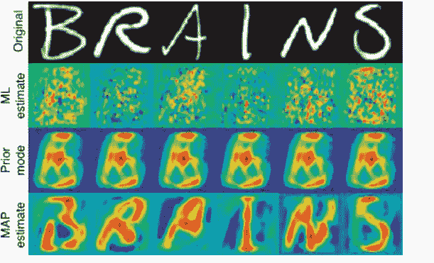

图21.2.使用线性重构方法从人脑活动的测量中重建BRAINS。第一行显示原始字符。第二行显示忽略由 R建模的像素协方差的最大似然估计。第三行显示先验的模式。第四行显示使用(21.13)获得的重建结果。改编自[50]。

使用这种方法，我们成功地从fMRI响应中重建了手写字。图21.2显示了可以获得的重建结果。

虽然这些重建看起来相当令人信服，但我们仍然受限于使用高斯编码模型和高斯先验。虽然框架可以扩展，例如使用混合专家方法[51]，但这仍然是一个严重的限制。首先，大脑是一个非线性系统，而不是线性系统。

其次，自然图像的统计特性更准确地描述为重尾分布，从而违反了高斯性假设。这直接导致了次优的性能。在转向更复杂的环境时，这可能是关键的。例如，在解码图像而不是感知或解码自然刺激而不是手写字时。

不幸的是，如果我们放弃线性和高斯性的假设，那么我们就不能再求解解析解了。

#### 21.4 非线性解码

在本节中，我们描述了一种简单的方法，可以在利用非线性编码模型的同时进行重建。该方法依赖于绕过明确求解方程（21.3）的需要。

##### 21.4.1 利用经验先验进行重建

在接下来的内容中，我们使用一个简单的技巧来在解码过程中使用非线性编码模型。利用刺激示例数据集 𝒳，我们可以定义一个经验先验。

$\hat{p}(\mathbf{x} \mid \mathcal{X}) = \frac{1}{K} \sum_{k} \delta \left[ \mathbf{x} = \mathbf{x}^{(k)} \right] , (21.14)$

其中 $\delta[\cdot]$ 是一个delta函数，如果其参数为真则等于一，如果其参数为假则等于零。如果我们将代入方程 (21.4) 中，我们得到

$\hat{\mathbf{x}} = \arg\max_{\mathbf{x}} \ [p(\mathbf{y} \mid \mathbf{x}, \mathcal{D})\hat{p}(\mathbf{x} \mid \mathcal{X})]$
$= \arg\max_{\mathbf{x} \in \mathcal{X}} p(\mathbf{y} \mid \mathbf{x}, \mathcal{D}). \tag{21.15}$

因此，我们只需选择在我们的经验先验中最大化似然的刺激。这种方法被称为识别[34]。 对于大的 $K$，我们有 $\hat{p}(\mathbf{x}|\mathcal{X}) \approx p(\mathbf{x})$，这证明了这种方法的有效性。 这种方法在[41]中被用于使用由六百万张图像组成的经验先验获得自然图像的重建。

在实践中，(21.15)可能会产生次优的重建。 这可能是由于使用 $\mathcal{X}$时未能全覆盖刺激空间，这是由于所使用的编码模型 $p(\mathbf{y} \mid \mathbf{x})$的限制和/或观察到的响应中的噪声引起的。 这些问题可以通过对具有最高后验概率的刺激进行平均来缓解，这被称为平均最高后验（AHP）重建[41]。 设$\mathcal{L} \subset \mathcal{X}$为一组 $L$刺激，使得对于所有的 $\mathbf{x}\in \mathcal{L}$和 $\mathbf{x}'\in \mathcal{X}\setminus \mathcal{L}$，有 $p(\mathbf{y} \mid \mathbf{x}, \mathcal{D}) \geq p(\mathbf{y} \mid \mathbf{x}', \mathcal{D})$。 然后，AHP重建为

$\hat{\mathbf{x}} = \frac{1}{L} \sum_{\mathbf{x} \in \mathcal{L}} \mathbf{x}, \tag{21.16}$

这可以解释为贝叶斯版本的装袋[14]。

##### 21.4.2 非线性编码模型

经验法允许使用任意（非线性）编码模型因为我们只需要能够评估 $p(\mathbf{y} \mid \mathbf{x}, \mathcal{D})$。 接下来，我们描述了一些具体的编码模型，明确了外部刺激如何引起观察到的反应，从捕捉早期感觉区域的基本模型到捕捉整个大脑神经动力学变化的复杂模型。 我们展示了使用这些编码模型获得的一些解码结果。

PRF编码模型。一个基本的编码模型由(21.5)给出，基本上实现了多元线性回归。 然而，我们可以利用神经科学的见解来创建一个更复杂的编码模型。 对于一群神经元，术语population receptive field(pRF)用于指代驱动它们汇总响应的刺激属性[62]。 例如，考虑非线性的Gabor小波金字塔（GWP）模型，它使用从2D Gabor小波计算得到的局部对比能量特征[34,41]。

Gabor小波已被用来模拟早期视觉皮层神经元的特性[9,32,36]。 具有单位增益和零偏移的Gabor小波在输入位置$(x, y)$处的响应强度可以表示为

$ w(x, y) = \exp \left( -\frac{\omega^2}{2\sigma^2} - \frac{\rho^2}{2\nu^2} \right) \cos (2\pi f \rho + \phi) $

其中 $\omega = (x - \bar{x}) \cos \theta + (y - \bar{y}) \sin \theta$, $\rho = -(x - \bar{x}) \sin \theta + (y - \bar{y}) \cos \theta$。在这里，$(f, \sigma^2, \nu^2)$, $\phi$, $(\bar{x}, \bar{y})$ 和 $\theta$ 确定了小波的空间尺度、相位、位置和方向。我们可以通过收集所有刺激位置$(x, y)$处的响应强度w来构建权重向量 $w$。通过对多个Gabor小波重复这个过程，我们可以构建一个GWP滤波器组 $\mathbf{W} = [\mathbf{w}_1, \dots, \mathbf{w}_K]$。我们可以使用这个滤波器组来定义以下pRF编码模型： $\mathbf{y} = \mathbf{B}^\top \phi$

$\left( \mathbf{W}^\top \mathbf{x} \right),$

其中 $\phi(\mathbf{x}) = \log(|\mathbf{x}| + 1)$ 是一个（压缩）非线性函数，它将Gabor响应映射到人口发射率上。这种方法已经被用来创建自然图像的重建[41]。该方法的扩展使用随时间变化的Gabor小波（运动能量滤波器）也被用于从神经数据中重建感知视频[43]。见图21.3。

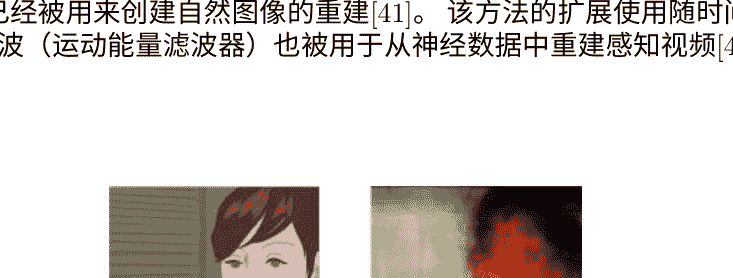

图21.3.基于运动能量滤波器模型的视频帧重建[43]。所示的刺激帧（左侧）是fMRI中显示的原始电影的插图。由Shinji Nishimoto提供。

基于DNN的编码模型。从（21.18）中可以看出，pRF编码模型的增加的灵敏度源于在预测观测测量之前对其输入进行非线性变换。

这也表明使用层次模型（如深度神经网络（DNNs）[35]）可能进一步提高灵敏度。从神经科学的角度来看，DNNs很有趣，因为它们能够检测环境的越来越抽象的特性，这类似于感觉输入在不同感觉通路中的处理方式[8,16,47,56]。DNNs以监督方式学习特征空间。简而言之，给定一个标记的训练数据集$\mathbf{Z} = \{(\mathbf{x}_1, \mathbf{z}_1), \dots, (\mathbf{x}_N, \mathbf{z}_N)\}$，例如由图像$\mathbf{x}_j$和它们的类别$\mathbf{z}_j$组成，使用随机梯度下降学习$K$个非线性变换$\phi_k$的层次结构，使得

$ \hat{\mathbf{z}} = (\phi_K \circ \cdots \circ \phi_1)(\mathbf{x}_i) $

最小化$\hat{\mathbf{z}}$和$\mathbf{z}_i$之间的距离被最小化。嵌入在分层模型中的任何特征子集都可以用作编码模型的特征

然后将其映射到观察到的响应上，如(21.18)所示。使用DNN的优势在图21.4中得到了说明，该图显示DNN学习到的表示与编码在大脑视觉腹侧通路中不同区域中的表示非常接近[22]。 使用这种方法，从1870个候选刺激中可以以高达96%的准确率识别出呈现的刺激。

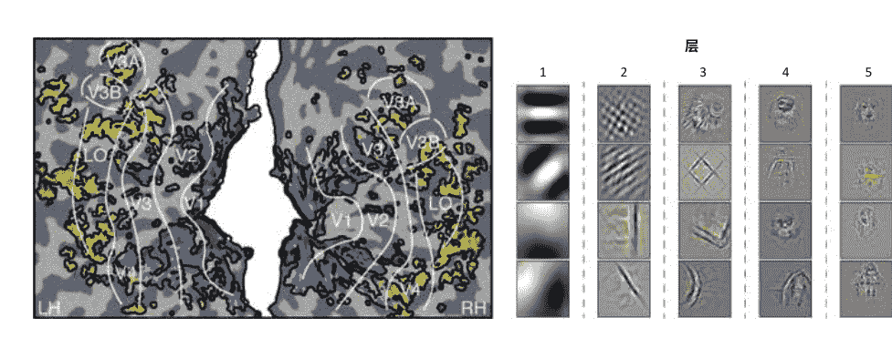

图21.4. DNN准确地模拟了视觉腹侧通路上的分层处理。左：表示梯度显示不同的DNN层映射到视觉皮层的不同部分。右：通过反卷积[65]可视化的DNN层的感受野在复杂性、不变性和大小上增加。改编自[22]。

原则上，我们的编码模型变得更加真实，我们将能够解码大脑中表示的信息在哪里。 使用被教导解决任务的DNNs，例如目标识别[22]、音乐标记[24]或动作识别[23]，来预测大脑反应，虽然有效，但在下游区域中几乎不构成神经信息处理的准确模型。 我们预计进一步的进展将使用建模方法直接估计个体神经元群体中发生的神经计算的脑数据[54]。 在这里，对模型输入进行梯度下降可以用来可视化神经元群体对刺激属性的最大敏感性[15,39]。

#### 21.5 深度生成解码

到目前为止，我们已经看到线性解码为重建提供了一个分析解，而非线性解码通过利用更复杂的编码模型来增加灵敏度，更好地捕捉神经对复杂刺激特征的响应，但需要我们使用经验先验。 在本节中，我们考虑了这两种思想的结合，我们称之为深度生成解码。 我们首先从脑活动中预测原始刺激的潜在表示，然后使用生成模型将这个预测投影到原始刺激空间中。 深度生成解码是由...开创 的

van Gerven等人[20]表明，深度置信网络（DBN）[28]可以根据脑数据进行条件训练，以获得刺激重建。在这里，我们描述了一种更近期的方法，称为深度对抗神经解码，它充分利用了深度神经网络[35]的表征能力和对抗学习[21]的能力。我们考虑的情况是从fMRI数据[25]中重建感知到的面部。

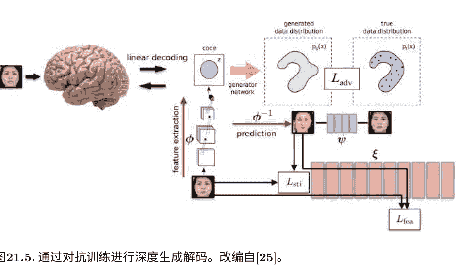

图21.5. 通过对抗训练进行深度生成解码。改编自[25]。

完整的设置如图21.5所示。让x∈ℝ^{h×w×c}是一个刺激（例如使用RGB通道编码的面部），ϕ: ℝ^{h×w×c} → ℝ^P是一个特征模型，使得z=ϕ(x)。在这里，z表示原始输入的有意义的低维表示。具体来说，在面部的情况下，我们使用了VGG-Face网络[44]，并使用主成分分析将第14层的输出降低为一个699维的潜在代码z。为了从这个潜在代码中重建面部，我们定义了特征模型的逆ϕ^{−1}(z)（即图像生成器），它由多个反卷积层组成的卷积神经网络。

为了训练生成器，我们使用了两个额外的神经网络。首先，一个鉴别器网络ψ它接受输入并预测输入是真实的还是由生成器生成的。其次，一个神经网络ξ它捕捉刺激特征，这里由VGG-16模型的第三层输出给出[58]。生成器通过迭代地最小化生成器损失函数进行训练，该函数是对抗损失、特征损失和刺激损失的线性组合：

$L_{gen} = -\lambda_{adv} L_{adv} = \mathbb{E}[\log(\psi(\phi^{-1}(z)))] + \lambda_{fea} \mathbb{E}[||\xi(x) - \xi(\phi^{-1}(z))||^2] + \lambda_{sti} \mathbb{E}[||x - \phi^{-1}(z)||^2]. \tag{21.20}$

鉴别器通过迭代地最小化鉴别器损失函数进行训练

$L_{dis} = -\mathbb{E}[\log \psi(x) + \log(1 - \psi(\phi^{-1}(z)))] . \tag{21.21}$

我们通过在一个双人零和游戏中使生成器和鉴别器相互对抗来训练它们，其中鉴别器的目标是区分刺激和重构，生成器的目标是生成与原始刺激无法区分的重构。这种对抗训练过程确保重构的刺激在像素级和特征级上与目标刺激相似。

在训练生成器之后，我们使用第21.3节中描述的线性解码策略来预测来自fMRI数据的潜在代码 z。图21.6显示了在训练模型使用700个人脸并在48个人脸的13次重复测试模型时可以获得的重构。通过对大脑反应的重构进行视觉检查，发现它们在性别、肤色和面部特征等几个关键方面与测试刺激相匹配。在具有相同高级特征的子组内的识别准确率（在57%至62%之间）明显高于随机水平。这表明深度神经网络的主成分所表示的低维代码提供了对人脸的生物学意义上的表征；有关相关工作，请参阅[6]。结果还表明，深度对抗神经解码远远优于其他方法，如特征脸方法[7]或像素级解码。有关方法和结果的更多详细信息，请参阅Guccluturk等人的文章[25]。

深度生成解码已经在许多其他研究中使用[53, 57, 61]，证实了使用这种方法可以实现的最新技术成果。Shen等人[57]使用了一种不同的设置，其中解码器用于预测DNN的层激活和输入到DNN的像素值进行优化，以使其与预测的层激活相匹配。在这里，使用了深度生成网络来进一步改善解码结果，通过优化生成器的潜在编码。深度生成网络还被用于演化人工刺激，以最大程度地驱动灵长类皮层中的神经元[46]。

#### 21.6 超越感知图像重建

我们现在简要讨论其他超越从fMRI数据中重建感知图像的工作。我们可以考虑从其他模态重建图像。例如，Stanley等人[59]已经从猫侧脑室核的侵入性记录中重建了图像。Seeliger等人[52]表明，可以从MEG数据中识别图像，并且具有合理的准确性，还允许对图像进行时间解码。Nishida和Nishimoto[42]通过将解码技术与单词的分布式表示（Word2Vec [37]）相结合，从视觉场景中提取了语言描述，这在自然语言处理中非常成功。在考虑其他感觉模态时，Pasley等人[45]和Akbari等人[1]基于颅内脑电图展示了从人类听觉皮层重建语音的能力。

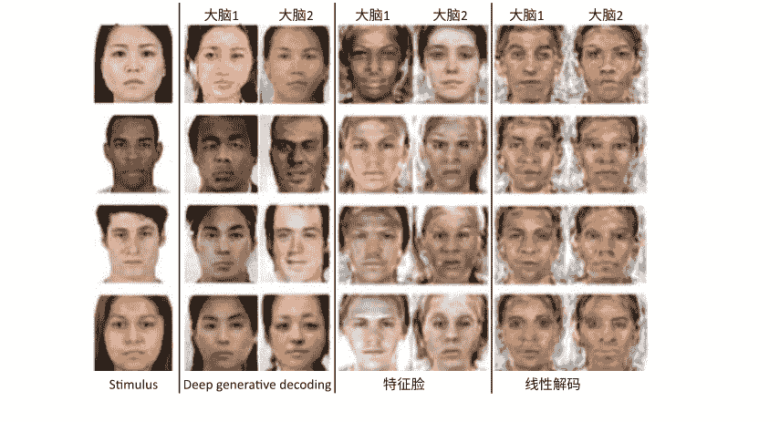

图21.6. 使用深度生成解码、特征脸方法和线性解码从两个大脑获得的重建结果。与深度生成解码相比，后两种方法与原始刺激几乎没有对应关系。改编自[25]。

解码的最终目标是在没有感官输入的情况下重建我们的体验内容。在视觉想象的背景下已经获得了重建结果[29,40,55,60]。然而，到目前为止，对于想象的重建结果比对于感知的重建结果要不准确得多。造成这种情况的原因可能是感知和想象中的神经处理只有部分重叠，这使得从感知到想象的泛化变得困难[12,13]，以及受试者在想象能力上存在很大差异[11]。如果成功，想象解码可能使我们能够窥探自己的梦境内容[30]，或者重建其他物种的现象学体验。在听觉领域，如果能够直接从脑活动模式中解码出内部语音，这将是一项重大突破，因为这将使无法以其他方式进行交流的人能够使用内部语音解码器进行交流恢复。在[2]中提供了一种有望有一天实现这一目标的证据，他们使用递归神经网络从颅内神经记录中合成语音，当受试者默默模仿句子时。

#### 21.7 结论

在过去的几年中，神经解码取得了很大的进展。我们预计这种情况将在未来继续发展，原因有两个。首先，神经技术不断进步，使我们能够以更高的空间和时间分辨率探测脑活动[48]。其次，机器学习和生物信号处理的进展将使我们能够从手头的数据中提取更多信息。最终，这些进展使我们能够接触到我们拥有的最私密的东西，也就是我们的思想。虽然这为我们提供了新的技术来帮助失去交流能力的人，但也需要以负责任的方式使用这种强大的技术[31]。

### 参考文献

1. **Akbari, H., Khalighinejad, B., Herrero, J.L., Mehta, A.D., Mesgarani, N.** 从人类听觉皮层重建可理解的语音。 科学报告。 **9**(1), 874 (2019).
2. **Anumanchipalli, G.K., Chartier, J., Chang, E.F.** 从口语句子的神经解码中合成语音。 自然 **568**, 493–501 (2019).
3. **Bahramisharif, A., van Gerven, M.A.J., Heskes, T., Jensen, O.** 隐蔽注意力允许对脑机接口进行连续控制。欧洲神经科学杂志 **31**(8), 1501–1508 (2010).
4. **Bialek, W., Rieke, F., van Steveninck, R.R.D.R., Warland, D.** 阅读神经编码。 科学 **252**(5014), 1854–1857 (1991).
5. **Bishop, C.M.** 模式识别与机器学习。斯普林格, 纽约 (2006).
6. **Chang, L., Tsao, D.Y.** 灵长类大脑中面部身份的编码。 细胞 **169**(6), 1013–1028 (2017).
7. **Cowen, A.S., Chun, M.M., Kuhl, B.A.** 感知的神经画像：从唤起的脑活动中重建面部图像。 NeuroImage **94**, 12–22 (2014).
8. **Cox, D.D., Dean, T.** 神经网络和受神经科学启发的计算机视觉。 Curr. Biol. **24**(18), PR921–R929 (2014).
9. **Daugman, J.G.** 空间、空间频率和方向分辨率的不确定关系，由二维视觉皮层滤波器优化。 J. Opt. Soc. Am.A: **2**(7), 1160–1169 (1985).
10. **Dayan, P., Abbott, L.F.** 理论神经科学。MIT出版社, 剑桥 (2005).
11. **Dijkstra, N., Bosch, S.E., van Gerven, M.A.J.** 视觉想象的生动程度取决于与视觉区域中的感知的神经重叠。 J. Neurosci. **37**(5), 1367–1373 (2017).
12. **Dijkstra, N., Mostert, P., de Lange, F.P., Bosch, S.E., van Gerven, M.A.J.** 视觉想象和感知过程中的差异性时间动态。 eLIFE, 7, e35626 (2018).
13. **Dijkstra, N., Zeidman, P., Ondobaka, S., van Gerven, M.A.J., Friston, K.** 视觉感知和想象过程中的不同自上而下和自下而上的脑连接。 Sci. Rep. **7**(5677), 1-9 (2017).
14. **Domingos, P.** 为什么Bagging有效？ 一个贝叶斯解释及其影响。 在: 第三届知识发现与数据挖掘国际会议论文集, 第155-158页 (1997).
15. **Erhan, D., Bengio, Y., Courville, A., Vincent, P.** 可视化深度网络的更高层特征。 蒙特利尔大学技术报告 **1341**, 1-13 (2009).
16. **福岛, K.** Neocognitron: 一种自组织神经网络模型，用于不受位置偏移影响的模式识别机制。 生物.控制论. **36**(4), 193–202 (1980).
17. **van Gerven, M.A.J.** 感觉神经科学中编码模型的入门指南。 数学心理学. **76**(B), 172–183 (2017).
18. **van Gerven, M.A.J., Chao, Z.C., Heskes, T.** 使用稀疏正交化偏最小二乘解码颅内数据。 神经工程学杂志. **9**(2), 026017 (2012).
19. **van Gerven, M.A.J., Kok, P., de Lange, F.P., Heskes, T.** 动态解码进行中的感知。 神经影像 **57**, 950–957 (2011).
20. **van Gerven, M.A.J., de Lange, F.P., Heskes, T.** 具有分层生成模型的神经解码。 神经计算. **22**(12), 3127–3142 (2010).
21. **Goodfellow, I., et al.** 生成对抗网络。 在： 神经信息处理系统进展 (NeurIPS) 2014，第2672-2680页 (2014).
22. **Güclü, U., van Gerven, M.A.J.** 深度神经网络揭示了腹侧通路神经表示复杂性的梯度。神经科学。 **35**(27), 10005–10014 (2015).
23. **Güclü, U., van Gerven, M.A.J.** 在背侧通路中，自然电影的越来越复杂的表示在受试者之间共享。 神经影像 **145**, 329–336 (2017).
24. **Güclü, U., Thielen, J., Hanke, M., van Gerven, M.A.J.** 节拍中的大脑。 在： 神经信息处理系统 (NeurIPS) 2016，第1-12页 (2016).
25. **Güclütürk, Y., Güclü, U., Seeliger, K., Bosch, S.E., van Lier, R., van Gerven, M.A.J.** 通过深度对抗神经解码从大脑激活中重建感知到的面孔。 在： 神经信息处理系统 (NeurIPS) 2017 (2017).
26. **Hastie, T., Tibshirani, R.J., Friedman, J.H.** 统计学习的要素： 数据挖掘、推断和预测，第2版。 斯普林格，纽约 (2008). https://doi.org/10.1007/978-0-387-84858-7.
27. **Haxby, J.V., Gobbini, M.I., Furey, M.L., Ishai, A., Schouten, J.L., Pietrini, P.** 分布和重叠的面部和物体在颞叶皮层中的表示。 科学 **293**, 2425–2430 (2001).
28. **Hinton, G.E., Osindero, S., Teh, Y.W.** 一种用于深度置信网络的快速学习算法。 神经计算 **18**, 1527–1554 (2006).
29. **Horikawa, T., Kamitani, Y.** 通过深度神经网络特征进行脑解码揭示了梦境对象的分层神经表示。 前沿计算神经科学 **11**, 1–11 (2017).
30. **Horikawa, T., Tamaki, M., Miyawaki, Y., Kamitani, Y.** 在睡眠期间对视觉想象的神经解码。 科学 **340**(6132), 639–642 (2013).
31. **Ienca, M., Haselager, P., Emanuel, E.J.** 大脑泄漏和消费者神经技术。 Nat. Biotechnol. **36**(9), 805–810 (2018).
32. **Jones, J.P., Palmer, L.A.** 对猫脑皮层简单感受野的二维Gabor滤波模型的评估。 J. Neurophysiol. **58**, 1233–1258 (1987).
33. **Kamitani, Y., Tong, F.** 解码人脑的视觉和主观内容。 Nat. Neurosci. **8**(5), 679–685 (2005).
34. **Kay, K.N., Naselaris, T., Prenger, R.J., Gallant, J.L.** 从人脑活动中识别自然图像。 Nature **452**, 352–355 (2008).
35. **LeCun, Y., Bengio, Y., Hinton, G.E.** 深度学习。 Nature **521**(7553), 436 (2015).
36. **Mar´celja, S.** 对简单皮层细胞响应的数学描述。 J. Opt. Soc. Am. A: **70**(11), 1297–1300 (1980).
37. **Mikolov, T., Chen, K., Corrado, G., Dean, J.** 在向量空间中高效估计单词表示。 在： 国际学习表示会议(ICLR) 2013。 康奈尔大学图书馆 (2013).
38. **Miyawaki, Y., et al.** 利用多尺度局部图像解码器从人脑活动中重建视觉图像。 神经元 **60**(5), 915–929 (2008).
39. **Mordvintsev, A., Olah, C., Tyka, M.** Inceptionism: 深入研究神经网络 (2015). https://research.googleblog.com/2015/06/inceptionism-going-deeper-into-neural.html.
40. **Naselaris, T., Olman, C.A., Stansbury, D.E., Ugurbil, K., Gallant, J.L.** 一个基于体素的编码模型用于解码记忆场景的心理图像。 NeuroImage **105**, 215–228 (2015).
41. **Naselaris, T., Prenger, R.J., Kay, K.N., Oliver, M., Gallant, J.L.** 从人脑活动中贝叶斯重建自然图像。 Neuron **63**(6), 902–915 (2009).
42. **Nishida, S., Nishimoto, S.** 通过单词的分布表示从人脑活动中解码自然体验。 NeuroImage **180**, 232–242 (2018).
43. **Nishimoto, S., Vu, A.T., Naselaris, T., Benjamini, Y., Yu, B., Gallant, J.L.** 从大脑活动中重建视觉体验，这些活动是由自然电影引发的。 Current Biology **21**(21), 1793-1797 (2011).
44. **Parkhi, O.M., Vedaldi, A., Zisserman, A.** 深度人脸识别。在：英国机器视觉会议（2015）.
45. **Pasley, B.N., et al.** 从人类听觉皮层重建语音。 PLoS Biol. **10**(1), e1001251 (2012).
46. **Ponce, C.R., et al.** 使用深度生成网络演化视觉神经元的图像，揭示编码原则和神经元偏好。 Cell **177**, 999–1009 (2019).
47. **Riesenhuber, M., Poggio, T.** 皮层中的对象识别的分层模型。 Nat. Neurosci. **2**(11), 1019–1025 (1999).
48. **Roelfsema, P.R., Denys, D., Klink, P.C.** 读心术和写心术：神经技术的未来。 认知科学趋势. **22**(7), 1–13 (2018).
49. **Roweis, S., Brody, C.** 线性异构编码器。技术报告。 GCNU TR 1999–002，Gatsby计算神经科学单元（1999）.
50. **Schoenmakers, S., Barth, M., Heskes, T., van Gerven, M.A.J.** 从人脑活动中线性重建感知图像。 NeuroImage **83**, 951–961 (2013).
51. **Schoenmakers, S., Güclü, U., van Gerven, M.A.J., Heskes, T.** 高斯混合模型和语义门控改善了从人脑活动中的重建。 Front. Comput. Neurosci. **8**, 1–10 (2015).
52. **Seeliger, K., et al.** 基于卷积神经网络的空间和时间中的视觉对象识别编码和解码。 NeuroImage **180**, 253–266 (2017).
53. **Seeliger, K., Güclü, U., Ambrogioni, L., Güclütürk, Y., van Gerven, M.A.J.** 用于从脑活动中重建自然图像的生成对抗网络。 NeuroImage **181**, 775–785 (2018).
54. **Seeliger, K., Ambrogioni, L., Güclütürk, Y., Güclü, U., van Gerven, M.A.J.** 神经系统识别与神经信息流。 bioRxiv (2019).
55. **Senden, M., Emmerling, T.C., van Hoof, R., Frost, M.A., Goebel, R.** 从早期视觉皮层重建想象的字母，揭示了视觉心理想象和感知之间的紧密拓扑对应关系。 Brain Struct. Funct. **224**(3), 1167–1183 (2019).
56. **Serre, T., Wolf, L., Bileschi, S., Riesenhuber, M., Poggio, T.** 基于皮层机制的鲁棒目标识别。 IEEE Trans. Pattern Anal. Mach. Intell. **29**(3), 411–426 (2007).
57. **Shen, G., Horikawa, T., Majima, K., Kamitani, Y.** 从人脑活动中进行深度图像重建。 PLoS Comput. Biol. **15**(1), 1–23 (2019).
58. **Simonyan, K., Zisserman, A.** 用于大规模图像识别的非常深的卷积网络。 arXiv预印本 arXiv:1409.1556 (2014).
59. **Stanley, G.B., Li, F.F., Dan, Y.** 从侧脑室核的集合响应中重建自然场景。 J. Neurosci. **19**(18), 8036–8042 (1999).
60. **Thirion, B., et al.** 逆视网膜：从脑活动模式推断图像的视觉内容。 NeuroImage **33**(4), 1104–1116 (2006).
61. **VanRullen, R., Reddy, L.** 使用深度生成神经网络从fMRI模式重建面部。 arXiv预印本 arXiv:1810.03856 (2018).
62. **Victor, J.D., Purpura, K., Katz, E., Mao, B.** 在猕猴V1中对空间频率、方向和颜色的种群编码。 神经生理学杂志 **72**(5), 2151–2166 (1994).
63. **Vidaurre, D., van Gerven, M.A.J., Bielza, C., Larrañaga, P., Heskes, T.** 贝叶斯稀疏偏最小二乘。 神经计算 **25**(12), 3318–3339 (2013).
64. **Wallis, J.D.** 从神经群体解码认知过程。 认知科学趋势 **22**(12), 1091–1102 (2018).
65. **Zeiler, M.D., Fergus, R.** 可视化和理解卷积网络。 在: Fleet, D., Pajdla, T., Schiele, B., Tuytelaars, T. (eds.) ECCV 2014. LNCS, vol. 8689, pp. 818–833. Springer, Cham (2014). https://doi.org/10.1007/978-3-319-10590-1_53.

# 第六部分 可解释AI的软件

# 可解释AI的软件 -前言

人工智能系统和神经网络已经应用于许多学科，包括推荐系统、科学现象建模[7, 8]以及从声音和图像中提取内容[4, 5]。任务的多样性和竞争性能的需求意味着设计高度专业化且可能非常庞大的机器学习模型（例如GoogleNet、ResNets）。增加的网络复杂性得到了强大的软件库（如PyTorch ¹或TensorFlow ²）的支持，这些库提供了计算可扩展性并自动提取学习所需的神经网络梯度。

本书介绍的大多数解释方法（例如[3, 6]）对于标准神经网络架构来说相对简单，通常只需要添加几行额外的代码即可设置。然而，在实践中应用它们到最具竞争力的模型上可能是一项更加微妙的任务。例如，基于传播的解释方法需要扩展以处理丰富的层类型和连接结构。因此，实现的复杂性大大增加。基于重复函数评估的其他解释方法在应用于复杂的实际神经网络模型时可能变得过慢。因此，应用它们需要特别高效的实现，例如基于GPU的实现，或者调整良好的质量和运行时的权衡。这些实际上的复杂性促使我们需要专门的软件，使解释技术能够被更广泛的用户使用。

在第22章中，Alber [1]描述了如何在TensorFlow神经网络框架中实现简单的基于梯度的技术，并如何扩展该框架以实现基于传播的解释技术。该章节还介绍了最近的iNNvestigate工具包[2]，该工具包为多种解释方法和复杂机器学习模型提供了快速实现。iNNvestigate提供的功能在计算机视觉中使用的最新模型上进行了测试和基准测试。

此外，解释性软件和解释性研究面临的一个重要挑战是将已提出的众多解释技术转化为共同的模块化计算结构。iNNvestigate等模块化方法³和deepExplain⁴等框架采用了这种模块化方法，可以避免在实现多种解释技术时出现代码冗余，并且可以促进公平的基准比较。

目前，可解释性软件是建立在常见的机器学习算法和机器学习框架之上的附加组件。因此，它为希望理解其训练模型的用户提供了有用的功能。然而，为了实现最大的可解释性和有用性，我们推测一旦可解释AI领域进一步成熟，这一重要功能将最终集成到机器学习框架的核心，以作为学习模型的直接验证工具，并更好地指导训练过程本身。

2019年7月

Wojciech Samek
Grégoire Montavon
Andrea Vedaldi
Lars Kai Hansen
Klaus-Robert Müller

### 参考文献

1. **Alber, M.** 解释方法的软件和应用模式。在：Samek, W., Montavon, G., Vedaldi, A., Hansen, L.K., Müller, K.-R. (eds.) 可解释AI：解释和可视化深度学习。LNCS，vol. 11700，pp. 399–433，Springer, Cham (2019).
2. **Alber, M., et al.** iNNvestigate神经网络！. J. Mach. Learn. Res. **20**, 1–8 (2019).
3. **Ancona, M., Ceolini, E., Öztireli, C., Gross, M.** 基于梯度的归因方法。在：Samek, W., Montavon, G., Vedaldi, A., Hansen, L.K., Müller, K.-R. (eds.) 可解释AI：解释和可视化深度学习。LNCS，卷11700，页169–191，Springer, Cham (2019).
4. **Graves, A., Mohamed, A., Hinton, G.** 基于深度递归神经网络的语音识别。在：IEEE ICASSP，页6645–6649 (2013).
5. **Krizhevsky, A., Sutskever, I., Hinton, G.E.** 使用深度卷积神经网络进行Imagenet分类。在：神经信息处理系统，页1106–1114 (2012).
6. **Montavon, G., Binder, A., Lapuschkin, S., Samek, W., Müller, K.-R.** 逐层相关传播：概述。在：Samek, W., Montavon, G., Vedaldi, A., Hansen, L.K., Müller, K.-R. (eds.) 可解释AI：解释和可视化深度学习。LNCS，卷11700，页193–209，Springer, Cham (2019).
7. **Schütt, K.T., Arbabzadah, F., Chmiela, S., Müller, K.-R., Tkatchenko, A.** 通过深度张量神经网络获得量子化学洞察力。 自然通讯. **8**, 13890 (2017).
8. **Thomas, A.W., Heekeren, H.R., Müller, K.-R., Samek, W.** 通过递归深度学习模型分析神经影像数据。 arXiv预印本 arXiv:1810.09945 (2018).

¹ https://pytorch.org/
² https://www.tensorflow.org/
³ https://github.com/albermax/innvestigate
⁴ https://github.com/marcoancona/DeepExplain

### 22 软件和应用模式
用于解释方法

Maximilian Alber
Technische Universität Berlin, 10587 Berlin, Germany
maximilian.alber@tu-berlin.de

摘要。 深度神经网络成功地渗透到许多应用领域，并越来越多地用于关键决策过程。了解它们的工作原理是可取的，甚至是必需的，以进一步促进它们的潜力，以及访问医疗应用或自动驾驶等敏感领域。 解释框架更广泛使用的关键是相应软件的可访问性和理解性。在这项工作中，我们介绍了用于解释神经网络个别预测的软件和应用模式。我们讨论如何在深度学习软件框架中高效编码已知算法，并描述如何将算法嵌入到下游实现中。在此基础上，我们展示了解释方法如何在应用中用于理解误分类样本的预测，比较算法或网络，并检查网络的焦点。此外，我们回顾了可用的开源软件包，并讨论了复杂和不断发展的神经网络结构对解释算法开发和实现所带来的挑战。

关键词: 机器学习 · 人工智能 · 解释 · 可解释性 · 软件

#### 22.1 引言

最近的发展表明神经网络可以成功应用于许多技术应用，如计算机视觉[18,27,32]、语音合成[58]和翻译[8,56,59]。 受到这些成功的启发，许多领域都在使用机器学习和深度神经网络，例如材料科学和量子物理[10,11,39,46,47]、癌症研究[9,25]、战略游戏[50,51]、知识嵌入[3,37,42]，甚至自动机器学习[2,64]。 随着应用范围的扩大，除了预测能力之外，需求也在增加。 在这种背景下，一个关键要求是能够理解和解释神经网络或学习机器所做出的预测。 在至少两个领域中，这种能力起着重要的作用：需要理解的领域，因为它们本质上是关键的或因为法律要求，以及努力从学习模型的预测中提取知识的领域。作为示例领域可以提到：医疗保健[9,16,25]，受GDPR影响的应用[60]和自然科学[11,39,46,47]。

深度神经网络的进步归功于它们通过学习复杂的推理过程来利用复杂和结构化数据的潜力。这使得对这些模型的更好理解具有挑战性，但也是一个有价值的目标。已经开发了各种方法来解决这个问题，例如[5,36,40,43,48]。虽然解释算法的性质和目标可能不明确[35]，但在实践中，获得具体的见解已经能够使从业者和研究人员创造知识，正如首批有希望的结果所示，例如[9,28,30,31,55,63]。

为了促进解释方法从研究到广泛应用领域的过渡，标准使用模式和软件的存在和理解尤为重要。一方面，这降低了非专家的应用门槛和努力，另一方面，它使专家能够专注于算法定制和研究。考虑到这一点，本章专门介绍了用于实现和使用深度神经网络解释方法的软件和应用模式。特别是，我们关注那些在目标神经网络的输入空间中突出显示特征的解释技术[38]。

在下一节中，我们通过逐步展示展示了如何高效实现解释方法，并突出重要的设计模式。本节的最后一部分展示了如何调整算法和可视化获得的结果。在第22.3节中，我们通过将解释方法集成到几个通用应用案例中，以理解误分类样本的预测，比较算法或网络，并检查网络的重点。其余的第22.4节、22.5节和22.6节介绍了可用的开源软件包、进一步的挑战并给出了结论。

#### 22.2 实现解释算法

高效地实现神经网络可能是一个复杂且容易出错的过程，此外，实现解释算法会使事情变得更加棘手。我们将介绍解释算法的关键模式，这些模式允许进行高效和结构化的实现。随后，我们通过解释如何处理界面设计、参数调整和结果可视化来完成本节。

为了使代码示例尽可能有用，我们不依赖伪代码，而是使用Keras [12]、TensorFlow [1]和iNNvestigate [4]来实现我们的示例，示例网络为VGG16 [52]。结果如图22.1所示，并将逐步创建。代码清单包含最重要的代码片段，并提供相应的可执行代码作为Jupyter笔记本，网址为https://github.com/albermax/interpretable ai book swchapter。

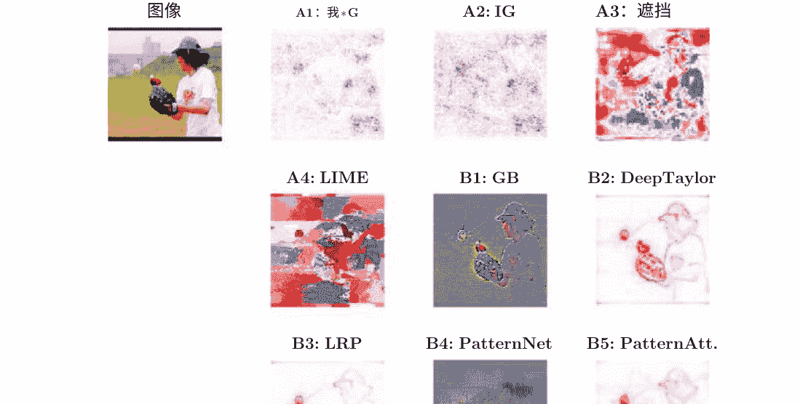

图22.1. 实施算法的示例应用：这个图显示了使用VGG16网络[52]对左上角的图像应用的解释方法的结果。基于预测或梯度的方法（A组）包括输入*梯度[24, 49, A1]，集成梯度[55, A2]，遮挡[61, A3]和LIME[44, A4]。基于传播的方法（B组）包括引导反向传播[54, B1]，Deep Taylor[38, B2]，LRP[30, B3]，PatternNet和PatternAttribution[23, B4和B5]。关于解释如何可视化，我们参考第22.2.3节。最好在数字和彩色环境中查看。

让我们回顾一下，我们探索的算法具有共同的功能形式，即它们从输入映射到等维度的显著性图，例如，输出显著性图与输入张量具有相同的张量形状。更正式地说：给定一个将某些输入映射到单个输出神经元的神经网络模型 f: ℝⁿ → ℝ，考虑的算法具有以下形式 e: ℝⁿ → ℝⁿ。我们将选择最后一层中激活最大的神经元作为输出神经元。也可以使用其他神经元。我们假设目标神经网络是一个Keras模型，并且相应的输入和输出张量如下：

```
1  # 创建没有尾部softmax的模型
2  model = make_a_keras_model()
3  
4  # 获取TF张量
5  input, output = model.inputs[0], model.outputs[0]
6  # 将输出减少到具有最大激活的神经元的响应
7  max_output = tf.reduce_max(output, axis=1)
```

```
python
# 选择一个样本图像
x_not_pp = 选择一个_样本_图像()
# 并对其进行网络预处理
x = 预处理(x_not_pp)
```

感兴趣的解释算法可以分为两大类，取决于它们如何处理给定的模型。第一组算法仅使用模型函数或梯度来提取有关模型预测过程的信息，通过反复调用它们并改变输入。第二组算法沿着模型图进行自定义反向传播，即需要能够内省模型并适应其组成。后一种方法通常更复杂，但旨在更高效地获得洞察力和/或不同质量的结果。接下来的两个小节将分别描述每个组的实现。

##### 22.2.1 预测和梯度解释

仅依赖于函数或梯度评估的算法可以非常简单但有效[24,44,49,53-55,61,63]。一个缺点可能是它们的运行时间，通常是单个函数调用的倍数。

输入 * 梯度。作为第一个例子，我们考虑输入 * 梯度[24,49]。名称已经说明了：该算法由输入与梯度的逐元素乘法组成。相应的公式为：$e(x) = x \odot \nabla_x f(x)$ (22.1)。该方法可以按照以下方式实现，并且结果标记为A1在图22.1中：

```
python
# 取输出神经元相对于输入的梯度
gradient = tf.gradients(max_output, input)[0]
# 并将其与输入相乘
input_t_gradient = input * gradient
# 使用 TF 运行代码
A1 = sess.run(input_t_gradient, {input: x})
```

综合梯度。更进一步的例子是综合梯度方法[55]，它通过计算输入图像和给定参考图像之间的线上的梯度来更好地捕捉非线性的效果。$x'$。对于 $i$-th输入维度的相应公式是：

$$e(x_i) = (x_i - x_i') \odot \int_{\alpha=0}^{1} \frac{\delta f(x)}{\delta x_i} \bigg|_{x=x'+\alpha(x-x')} d\alpha. \quad (22.2)$$

为了实现该方法，积分被近似为有限和，并且在前面的代码片段的基础上，代码如下所示（结果在图22.1中标记为A2）：

```
1 # 路径上的步骤数量
2 steps = 32
3 # 以黑色图像作为参考
4 # 即，网络输入值范围的最低值。
5 x_ref = np.ones_like(x) * net['input_range'][0]
6 # 对输入计算输出神经元的梯度
7 gradient = tf.gradients(max_output, input)[0]
8 
9 # 沿着从x到x_ref的路径求梯度之和
10 gradient_sum = np.zeros_like(x)
11 for step in range(steps):
12     # 创建中间输入
13     x_step = x_ref + (x - x_ref) * step / steps
14     # 计算并添加中间输入的梯度
15     gradient_sum += sess.run(gradient, {input: x_step})
16 
17 # 综合梯度公式
18 A2 = gradient_sum * (x - x_ref)
```

遮挡法。与两种方法相比，遮挡法方法依赖于函数值而不是梯度，例如[34,61,63]。基本变体[61]将输入（通常是图像）划分为非重叠的网格块。然后，每个块都被赋予函数值，该函数值是通过扰动或替换原始图像中的块区域获得的。最终，所有值都与未遮挡时的默认激活进行归一化。该算法可以如下实现，并在图22.1中表示为A3：

```
1 diff = np.zeros_like(x)
2 # 选择一个补丁大小
3 psize = 8
4 
5 # 逐个遮挡补丁并计算每个补丁的激活值
6 for i in range(0, net['image_shape'][0], psize):
7     for j in range(0, net['image_shape'][0], psize):
8 
9         # 创建遮挡补丁的图像
10        occluded_x = x.copy()
11        occluded_x[:, i:i+psize, j:j+psize, :] = 0
12 
13        # 存储遮挡图像的激活值
14        diff[:, i:i+psize, j:j+psize, :] = sess.run(
15            max_output, {input: occluded_x})[0]
16 
17 # 用初始激活值进行归一化
18 A3 = sess.run(max_output, {input: x})[0] - diff
```

LIME。最后一种基于预测的解释类别，例如[36,44]，将输入样本分解为特征。随后，收集输入的预测结果——由扰动特征组成，然后不直接使用这些值进行解释，而是用于学习相应特征的重要性值。其中一个代表性算法是“局部可解释模型无关解释”[44, LIME]，它为每个解释学习一个局部回归器。对于图像，它的工作原理如下。首先，将图像分割成段落，例如连续的颜色区域。然后，随机扰动特征的数据集被采样，例如填充灰色。样本的目标由相应改变输入的预测值确定。使用这个数据集，学习一个加权回归模型，并且得到的权重向量的值表示每个段落在神经网络初始预测中的重要性。该算法可以如下实现，并且结果在图22.1中表示为A4：

```
# 分割（未经预处理）图像
segments = skimage.segmentation.quickshift(
    x_not_pp[0], kernel_size=4, max_dist=200, ratio=0.2)
nr_segments = np.max(segments)+1

# 创建数据集
nr_samples = 1000
# 随机开关分割
features = np.random.randint(0, 2, size=(nr_samples, nr_segments))
features[0, :] = 1

# 获取特征的标签
labels = []
for sample in features:
    tmp = x.copy()
    # 开关分割
    for segment_id, segment_on in enumerate(sample):
        if segment_on == 0:
            tmp[0][segments == segment_id] = (0, 0, 0)
    # 获取此样本的预测值
    labels.append(sess.run(max_output, {input: tmp})[0])

# 计算样本权重
distances = sklearn.metrics.pairwise_distances(
    features,
    features[0].reshape(1, -1),
    metric='cosine',
).ravel()
kernel_width = 0.25
sample_weights = np.sqrt(np.exp(-(distances**2)/kernel_width**2))

# 拟合L1-回归器
regressor = sklearn.linear_model.Ridge(alpha=1, fit_intercept=True)
regressor.fit(features, labels, sample_weight=sample_weights)
weights = regressor.coef_

# 将权重映射到段上
A4 = np.zeros_like(x)
for segment_id, w in enumerate(weights):
    A4[0][segments == segment_id] = (w, w, w)
```

正如最初提到的，预测和梯度方法的一个缺点是运行时间较慢，通常是单个函数评估的多倍，正如代码片段中的循环所暗示的那样。例如，集成梯度使用32次评估，遮挡算法(224/4)² = 56² = 3136和LIME 1000（与[44]中相同）。特别是对于复杂网络和有时间限制的应用来说，这可能是不可行的。下一小节是基于传播的解释方法，这些方法更复杂，但通常能更快地产生解释结果。

##### 22.2.2 基于传播的解释

使用自定义反向传播程序创建解释的算法与基于预测或梯度的解释算法形成鲜明对比：它们依赖于对模型内部功能的了解，以创建更高效或多样化的解释。

考虑梯度反向传播，它通过首先分解一个函数，然后进行迭代的反向映射来工作。例如，函数 $f(x) = u(v(x)) = (u \circ v)(x)$ 首先被拆分为组成它的部分 $u$ 和 $v$，然后梯度 $\delta f$ —— $\delta x$ 通过迭代计算 $\frac{\delta f}{\delta x} = \frac{\delta u \circ v}{\delta v}$ 通过使用偏导数反向映射每个组件来计算 $\delta x$ $\frac{\delta u \circ v}{\delta v}$ 和 $\delta v \delta x$。与梯度计算类似，所有基于传播的解释方法都有一个共同的方法：（1）每个算法明确或隐式地定义了如何将网络分解为不同的部分，以及（2）如何对每个组件进行反向映射。在为任意网络实现算法时，重要的是考虑到不同的方法针对网络的不同组件，相同方法的不同分解可能导致不同的结果，并且某些算法不能应用于某些网络结构。

例如，考虑GuidedBackprop [54]和Deep Taylor Decomposition [38, DTD]。第一个目标是网络中的ReLU激活，并描述了这种非线性的反向映射，而剩余部分的网络则使用偏导数。另一方面，DTD和许多其他算法期望将网络分解为线性（可线性化）部分，这可以通过多种方式完成，并可能导致不同的解释。

在开发这些算法时，重点通常是如何通过反向映射来得到有意义的解释，因为剩余的功能在各种方法之间非常相似且共享。了解这一点，将基于传播的方法的实现分为以下两个部分是有用的。第一部分包含算法的详细信息，因此定义了如何分解网络以及如何执行相应的映射。它建立在下一部分的基础上，后者负责常见功能，即按照先前指定的方式分解网络并迭代应用映射。在附录的图22.8中，这两者被称为“算法”和“传播后端”的示例软件堆栈。

这种抽象的优势在于复杂和算法无关的图处理代码在解释例程之间共享，并允许开发人员专注于解释算法本身的实现。我们将在附录22.A.1中描述如何实现传播后端。最终，它应该允许开发人员以以下示意方式实现方法——使用将在第22.2.3节中介绍的接口：

```
# 一个反向映射函数，例如 对于卷积层，反向映射函数 (Xs, Ys, bp_Ys, bp_state)
: return compute_backward_mapping_magic()

# 将所有算法功能捆绑在一起的类
类 ExplanationAlgorithm(分析器):
    ...

# 定义如何执行算法
def _create_analysis(self):
    # 告诉后端应用此映射
    # 例如应用此映射，应用于所有卷积层。
    register_backward_mapping(
        condition = lambda x: is_convolutional_layer(x),
        backward_mapping)
    ...

# 创建和构建模型的算法
analyzer = ExplanationAlgorithm(model)
# 进行分析
analyze = analyzer.analyze(x)
```

这个想法是，在将图形分解为层（或子图）之后，每个层都被分配一个映射，其中映射的条件定义了它们如何匹配。然后，后端代码将接受一个模型，并根据新的输入应用解释方法。

自定义反向传播。基于已建立的接口，我们现在能够以高效的方式实现各种基于传播的解释方法。这些算法将使用iNNvestigate库的后端进行实现[4]。附录22.A.1中提到的任何其他解决方案也可以使用。

引导反向传播。作为第一个例子，我们实现了引导反向传播算法[54]。引导反向传播的反向传播与梯度计算相同，只是在前向传播中应用ReLU时，在反向传播中还要应用另一个ReLU。请注意，iNNvestigate中默认的反向传播映射是偏导数，因此我们只需要改变包含ReLU激活的层的传播，并在反向映射中应用额外的ReLU。相应的代码如下所示，已经可以应用于任意网络（参见图22.1中的B1）：

```
# 引导-反向传播-映射
# X = 层的输入张量
# Y = 层的输出张量
# bp_Y = Y的反向传播值
# bp_state = 状态的附加信息
def guided_backprop_mapping(X, Y, bp_Y, bp_state):
```

python
7  # 对反向传播的值应用ReLU
8  tmp = tf.nn.relu(bp_y)
9  # 沿着前向传递的梯度向后传播
10 return tf.gradients(Y, X, grad_ys=tmp)
11

## 使用Guided Backprop代码扩展iNNvestigate基类
class GuidedBackprop(ReverseAnalyzerBase):

    # 注册包含ReLU的层的映射
    def _create_analysis(self, *args, **kwargs):

        self._add_conditional_reverse_mapping(
            # 应用于所有包含relu激活的层
            lambda layer: kchecks.contains_activation(layer, 'relu'),
            # 并使用引导反向传播映射来执行反向传播步骤。
            tf_to_keras_mapping(guided_backprop_mapping),
            name='guided_backprop',
        )

        return super(GuidedBackprop, self)._create_analysis(*args, **kwargs)

# 创建该分析器的实例
analyzer = GuidedBackprop(model_wo_sm)
# 并应用它。
B1 = analyzer.analyze(x)

*Deep Taylor* 通常基于传播的方法更加发展。传播通常仅描述全连接层，并且一个关键模式是将此描述无缝扩展到卷积和其他层。这种情况的示例是“逐层相关传播”[7]，“深度泰勒分解”[38]和“激励反向传播”[62]算法。尽管动机不同，所有算法都为具有ReLU激活的神经网络提供类似的传播规则。第一个算法将输出神经元的预测值称为相关性。然后，通过将反向传播的相关性按权重比例映射到输入上，将该相关性重新分配给每个神经元。我们在这里考虑所谓的Z+规则。相比之下，*Deep Taylor*是基于每个神经元的（线性）泰勒展开，而*Excitation Backprop*则是基于概率的“赢者通吃”方案。

最终，对于具有正输入和正输出值的层（例如VGG16中的内部层），它们都具有以下传播公式：

$$bw\text{映射} \ (x, y, r := bp_y) = x \ \square \ (W_+^t z)$$
$$\text{其中} z = r \otimes (xW_+) \qquad (22.3)$$

给定一个完全连接的层，其中 $W_+$ 表示权重矩阵，负值被设为0。使用iNNvestigate库，可以这样编码：

python
1 # 深度-泰勒/LRP/EB的z-规则-卷积层映射
2 # 调用R=bp_Y， R表示相关性
3 def z_rule_mapping_conv(X, Y, R, bp_state):
4     # 获取层和参数
5     layer = bp_state['layer']
6     W = tf.maximum(layer.kernel, 0)

7
8  Z = tf.keras.backend.conv2d(X, W, layer.strides, layer.padding) + b
9  # 归一化传入的相关性
10 tmp = R / Z
11 # 映射回去
12 tmp = tf.keras.backend.conv2d_transpose(
13     tmp, W, (1,) + keras.backend.int_shape(X)[1:],
14     layer.strides, layer.padding)
15 # 乘以输入
16 return tmp * X

## 使用Deep Taylor/LRP/EB的Z+-规则扩展iNNvestigate基类
class DeepTaylorZ1(ReverseAnalyzerBase):
    # 注册全连接层和卷积层的映射。
    # 为输入层添加有界DeepTaylor规则。

analyzer = DeepTaylorZ1(model_wo_sm)
B2a = analyzer.analyze(x)

不幸的是，这种映射实现只涵盖了2D卷积层，而其他关键层，如全连接层或其他卷积层，则没有涵盖。通过为全连接层创建另一个映射（附录22.A.2），可以将代码应用于VGG16。结果如图22.1所示，标记为B2，其中对于受限制的输入层，我们使用了[38]提出的有界规则。

然而，这段代码并没有涵盖一维、三维或任何其他特殊类型的卷积。通过使用自动微分，可以方便地避免不必要的代码复制。核心思想是许多方法可以被表达为梯度反向传播的预处理/后处理。使用自动微分，我们的代码示例可以表示如下，并且现在适用于任何类型的卷积层：

1  # 深度-泰勒/LRP/EB的Z+-规则-映射适用于具有内核的所有层
2  # 调用R=bp_Y, R表示相关性
3  def z_rule_mapping_all(X, Y, R, bp_state):
4      # 获取层
5      layer = bp_state['layer']
6      # 并创建没有激活部分的层副本
7      W = tf.maximum(layer.kernel, 0)
8      layer_wo_act = kgraph.copy_layer_wo_activation(
9          layer, weights=[W], keep_bias=False)
10 
11     Z = layer_wo_act(X)
12     # 归一化传入的相关性
13     tmp = R / Z
14     # 映射回去
15     tmp = tf.gradients(Z, x, grad_ys=tmp)[0]
16     # 输入次数
17     return tmp * X

LRP. 对于某些方法，可能需要使用不同的传播规则对于不同的层。. 例如，Deep-Taylor需要根据输入数据范围[38]或对于LRP，经验证在网络的不同部分应用不同的规则是有用的。为了举例说明，我们

展示了如何使用[30]中介绍的不同LRP规则来处理不同的层类型。更详细地说，我们将对所有的全连接层应用epsilon规则，对卷积层应用alpha-beta规则。这可以通过更改匹配条件在iNNvestigate中实现。使用提供的LRP规则映射，具体如下：

1 class LRPConvNet(ReverseAnalyzerBase):
2
3     # 注册不同层类型的映射
4     def _create_analysis(self, *args, **kwargs):
5
6         # 对于密集层使用Epsilon规则
7         self._add_conditional_reverse_mapping(
8             lambda layer: kchecks.is_dense_layer(layer),
9             LRPRules.EpsilonRule,
10             name='dense',
11         )
12         # 对于卷积层使用Alpha1Beta0规则
13         self._add_conditional_reverse_mapping(
14             lambda layer: kchecks.is_conv_layer(layer),
15             LRPRules.Alpha1Beta0Rule,
16             name='conv',
17         )
18
19         return super(LRPConvNet, self)._create_analysis(*args, **kwargs)
20
21 analyzer = LRPConvNet(model_wo_sm)
22 B3 = analyzer.analyze(x)

结果可以在图22.1中检查，标记为B3。

PatternNet和PatternAttribution。PatternNet和PatternAttribution [23]是两个受线性模型的模式过滤理论启发的算法[17]。它们为网络中的每个神经元学习了一个被称为模式的信号方向。在PatternNet中，模式被用来通过迭代使用神经元的模式方向将信号从输出神经元传播回输入，该方法可以通过梯度反向传播来实现，其中滤波器权重与模式权重进行交换。PatternAttribution基于深度泰勒分解[38]。对于每个神经元，它在其模式方向上搜索根点。给定模式a相应的公式为：

$$bw映射 (x, y, r = bp_y) = (w \odot a)^t r (22.4)$$

它可以通过进行梯度反向传播来实现，其中滤波器权重与模式逐元素相乘。

到目前为止，我们将反向映射实现为函数，并在分析器类中注册，以进行反向传播。在下一个示例中，我们将创建一个单一的类，该类接受一个参数，即模式，并且映射将是一个类方法，该方法使用不同的模式进行每个层映射（图22.1中的B4）。以下代码概述了可以在附录22.A.3中找到的实现：

1 #使用PatternNet算法扩展iNNvestigate基类
class PatternNet(ReverseAnalyzerBase):

    # 存储模式。
    def __init__(self, model, patterns, **kwargs):
        self._patterns = patterns[:]
        super(PatternNet, self).__init__(model, **kwargs)

    def _get_pattern_for_layer(self, layer):
        return self._patterns.pop(-1)

    # 执行映射
    def _patternnet_mapping(self, X, Y, bp_Y, bp_state):
        ...
        # 使用特定于bp_state['layer']的模式
        ...

    # 注册映射
    def _create_analysis(self, *args, **kwargs):
        ...

analyzer = PatternNet(model_wo_sm, net['patterns'])
B4 = analyzer.analyze(x)

将功能封装在一个单一的类中，现在可以通过更改用于执行反向传播的参数(图22.1中的B5) 来轻松扩展PatternNet到PatternAttribution:

1 # 将PatternNet扩展到PatternAttribution
class PatternAttribution(PatternNet):

    def _get_pattern_for_layer(self, layer):
        filters = layer.get_weights()[0]
        patterns = self._patterns.pop(-1)
        return filters * patterns

analyzer = PatternAttribution(model_wo_sm, net['patterns'])
B5 = analyzer.analyze(x)

推广到更复杂的网络。对于我们的示例，我们依赖于由线性和卷积层组成的VGG16网络[52]，以及具有ReLU或Softmax激活以及最大池化层的网络。

计算机视觉中的最新网络，例如InceptionV3 [57], ResNet50 [18], DenseNet [20]或NASNet [64]，要复杂得多，并且包含各种新层，例如批归一化层[21]，新类型的卷积层，例如[13]，以及允许残差连接的合并层[18]。

所提供的代码示例要么适用于这些新架构，要么可以轻松适应它们。例如，在第22.3节的图22.7中，展示了应用于计算机视觉中几种最新神经网络的各种算法。对于每个算法，相同的解释代码用于分析所有不同的网络。将算法适应新的网络系列的确切方法取决于各自的算法，并超出了本章的范围。

通常情况下，如果需要，它包括为新层实现新的映射。有关更多详细信息，请参阅iNNvestigate库[4]。

##### 22.2.3 完成实现

成功应用和使用解释软件需要不仅仅是方法核心的实现。根据超参数选择和可视化方法，解释结果可能会有很大变化。因此，重要的是软件被设计成帮助用户轻松选择最适合他们手头任务的设置。这可以通过通过简单直观的界面公开算法软件来实现，使用户专注于方法应用本身。随后，我们将讨论这些主题，并在本小节的最后一项贡献中对实现的代码进行基准测试。

界面。提供清晰易用的软件接口和例程有助于广泛的从业者受益于软件包。例如，流行的scikit-learn [41]软件包为各种机器学习方法提供了清晰统一的接口，可以灵活调整以适应更具体的用例。

在我们的案例中，所有解释算法的共同之处是它们在神经网络模型上操作，因此需要一个接口来接收模型描述。有两种常用的方法。第一种方法被几个软件包选择，例如DeepLIFT [49]和LRP工具箱[29]，它们期望以配置（文件）的形式接收模型。这种方法的缺点是在解释执行之前需要对模型进行序列化。

另一种方式是直接使用以内存对象表示的模型进行操作，例如DeepExplain [5]和iNNvestigate [4]就是这样工作的。通常，这个内存对象是使用深度学习框架构建的。这种方法的优点是可以在没有额外开销的情况下创建解释，并且可以在同一个程序设置中轻松使用多种解释方法，这对于比较和研究非常有用。此外，以配置形式存储的模型仍然可以通过使用相应的深度学习框架例程加载，然后传递给解释软件。

示例接口的iNNvestigate软件包模仿了流行的软件包scikit-learn的接口，并允许用几行代码创建解释：

1  # 构建解释算法
2  # 将超参数pattern_type设置为'relu'
3  analyzer = PatternAttribution(model_wo_sm, pattern_type='relu')
4  # 将分析器拟合到训练数据（如果分析器需要）
5  analyzer.fit( X_train )
6  # 并将其应用于输入
7  e = analyzer.analyze( x )

超参数选择。与机器学习中的许多其他任务一样，解释方法可以有超参数，但与其他算法不同的是，解释方法没有明确的选择指标。因此，选择正确的超参数可能是一项棘手的任务。一种方法是由领域专家对解释结果进行（视觉）检查。这种方法被怀疑容易受到人类的确认偏见的影响。作为替代，在图像分类设置中，[45]提出了一种称为“扰动分析”的方法。该算法将图像分成一组区域，并按照解释方法赋予的“重要性”对其进行排序。然后，该算法通过按给定顺序扰动块（即首先“删除”最重要的图像部分的信息）来测量神经网络预测值的衰减。关键思想是，如果一个解释方法更好地突出重要区域，性能将更快地衰减。

为了可视化解释方法对超参数的敏感性，图22.2包含了两个示例设置。第一个示例应用展示了集成梯度在第3行的结果，其中图像基线从黑色变为白色。虽然黑色、白色或灰色图像作为参考都不包含有价值的信息，但解释结果却有很大差异，强调了需要注意解释方法的超参数。关于解释算法对敏感性的更多内容

# 22. 解释方法的软件和应用模式

关于这个特定参数的详细信息可以在[22]中找到。使用iNNvestigate，可以使用附录22.A.4中的代码生成相应的解释。另一个例子是显著性输出的后处理。例如，对于SmoothGrad，输出的符号被认为不具有信息量，可以通过使用绝对值或平方值将其转换为正值。

这反过来对结果产生了显著影响，如图22.2所示（第1行与第2行对比）。此外，SmoothGrad的第二个参数是用于平滑梯度的噪声的尺度。这个超参数从左边的小值变化到右边的大值，并且再次对结果产生了重大影响。哪种设置更适合取决于具体应用。这些解释是使用附录22.A.4中的代码片段创建的。

# 可视化。

解释算法的固有目标是为了方便人类理解。为了做到这一点，算法的输出需要转换为人类可理解的格式。

为此，在计算机视觉领域提出了不同的可视化技术。在图22.3中，我们描述了不同的方法，每个方法都强调或隐藏了不同的特性。这五种方法分别使用灰度图[53]或单色图来仅显示绝对值（列1），使用热图[7]来显示正负值（列2），通过绝对值缩放输入（列3），屏蔽输入中最不重要的部分（列4），混合热图和输入（列5），或将值重新映射回输入值范围[23]（列6）。最后一种技术用于可视化信号提取技术，而其他方法用于归因方法[23]。为了将彩色图像转换为二维张量，通常通过求和或范数将颜色通道减少为单个值。然后将该值投影到适当的范围，并最终应用相应的映射。这对于除最后一种方法之外的所有方法都是如此，最后一种方法独立地将每个值进行投影。可视化技术的实现在附录22.A.5中找到。

对于除图像分类之外的其他领域，可以想象出不同的可视化方案。

# 基准。

为了展示所提供代码的运行效率，我们进行了基准测试。我们使用了iNNvestigate库来实现它，并作为参考。

我们使用LRP-Caffe-Toolbox [29]来实现，因为它被设计用于实现具有类似复杂性的算法，即我们审查的最复杂的算法，即LRP变体。

我们测试了三种算法，并使用VGG16网络[52]运行它们。 这两个框架都需要一些时间来编译计算图并在一批图像上执行它，因此我们测量设置时间和执行时间，以分析512张图像。

LRP-工具箱有顺序和并行的CPU实现。我们展示了更快的并行实现的时间。对于iNNvestigate，我们在CPU和GPU上评估运行时间。基准测试工作站配备了Intel Xeon CPU E5-2690-v4 2.60 GHz，具有24个物理核心映射到56个虚拟核心和256G内存。两种实现都可以使用最多32个核心。GPU是一款具有16G内存的Nvidia P100。

我们重复每个测试10次，并报告平均持续时间。图22.4显示了以对数刻度测量的持续时间。使用iNNvestigate库实现的代码在CPU上运行时，速度比LRP-Toolbox实现快29倍。当使用iNNvestigate与GPU相比LRP-Toolbox在CPU上的实现速度提高了510倍。与LRP-Toolbox相比，我们的实现还大大减少了实现解释算法所需的代码量和复杂性。另一方面，使用像iNNvestigate这样的框架需要编译一个函数图，并且相应的设置时间比LRP-Toolbox长3倍，但在分析几张图像时已经摊销了。

| 框架 | 设备 | 核心数/线程数 |
| :--- | :--- | :--- |
| LRP-Toolbox | CPU | 32 |
| iNNvestigate | CPU | 32 |
| iNNvestigate | GPU | 1 |## 22.3 应用

在本节中，我们将使用实现的算法并检查解释方法的常见应用模式。为了方便起见，我们将依赖于iNNvestigate库[4]来介绍以下四个用例：

- (1) 分析单个（误）预测以深入了解模型，以及随后的数据。
- (2) 比较算法以找到适合当前任务的解释技术。
- (3) 比较不同网络架构的预测策略。
- (4) 系统评估网络的预测。

除了最后一个应用程序外，通常需要定性分析来获得洞察力-我们现在将看到解释算法如何支持这个过程。此外，本节将对解释技术进行有限的概述和比较。更详细的分析超出了本章的技术范围。

我们按照第22.2.3节中所述的方法进行可视化，即对除PatternNet之外的所有方法使用热图，PatternNet试图产生给定的信号而不是归因。因此，我们对其使用输入空间的投影。Deconvnet和Guided Backprop也被视为信号提取方法，但无法重现颜色映射，因此我们使用热图对其进行可视化。这样可以更容易地确定信号的位置。有关更多详细信息，请参阅[23]。

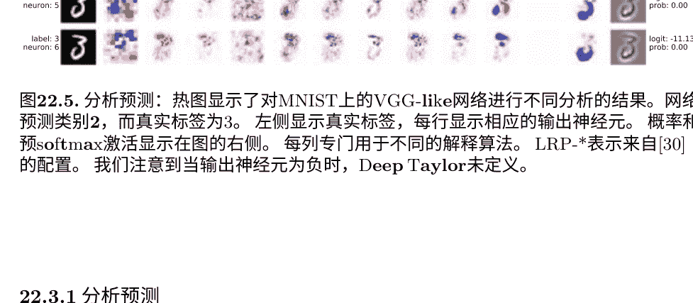

##### 22.3.1 分析预测

在我们的第一个例子中，我们关注解释算法本身和用户的期望。因此，我们选择了一个没有无关特征的数据集。

在输入空间中。更详细地说，我们在MNIST数据集[33]上使用了一个类似VGG的网络，测试集上的准确率超过99%。图22.5显示了一个被错误分类为2的类3的输入图像的结果。不同的行显示了对应于类2、3、4、5、6的输出神经元的解释，而每一列包含了不同解释算法的分析。

图像的真实标签是3，直观上也类似于3，但被分类为2。我们能追溯网络为什么决定选择2吗？仔细观察第一行-解释了类2-解释算法表明网络认为顶部和左侧的笔画非常具有指示性，而不认为中心和右侧部分的不连续性是相矛盾的。另一方面，观察第二行-解释了一个3-根据解释，左侧的笔画反对这个数字是3。从中可以得出的结论是，网络不识别或者不给予足够的权重线条的连续性，或者数据集中不包含足够多具有这样一个较低的左侧笔画的数字3。

以此为例，说明这些工具如何帮助理解神经网络，我们想指出所有陈述的观点都是假设的——基于解释是有意义的这一假设。但是在这种信任的基础上，我们的论证似乎是合理的，也是用户对解释算法的期望。

我们还要指出，在不同方法中存在共同的指标，例如最顶部的笔画非常具有指示性，表示数字2，而最左边的笔画则不是数字3的指示性特征。这表明这些方法在网络中基于相似的信号进行分析。然而，目前还不清楚哪种方法表现最好，这将引导我们进入下一个例子。

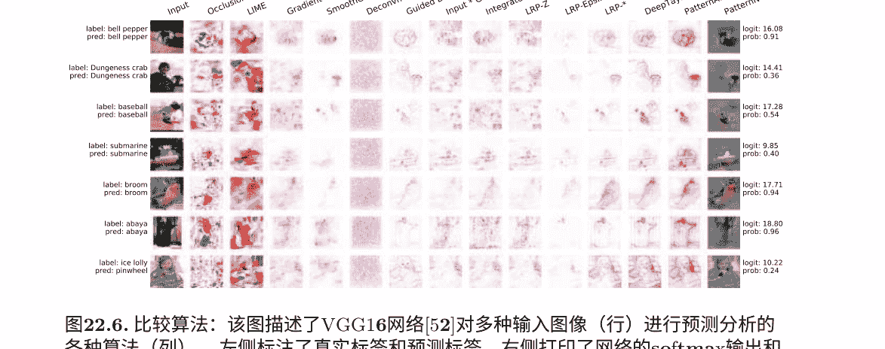

LRP-*表示来自[30]的配置。最佳效果在数字和彩色环境下观看。

##### 22.3.2 比较解释算法

对于解释方法，不存在明确的评估标准，这使得找到一个“有效”的方法或选择超参数变得困难（参见第22.2.3节）。因此，我们主张进行广泛的比较，以确定适合当前任务的方法。

图22.6给出了这样一种定性比较的示例，并展示了一组图片的各种方法（列）的解释结果。我们观察到，与前面的例子相比，分析结果不再那么直观，我们还观察到不同方法之间存在重大的定性差异。例如，遮挡和LIME算法产生与其他基于梯度和传播的结果不同的热图。

在后一组方法中，结果在稀疏性和归因位置上有所变化。请注意，尽管有其结果，我们为了完整性而添加了DeconvNet方法[61]。

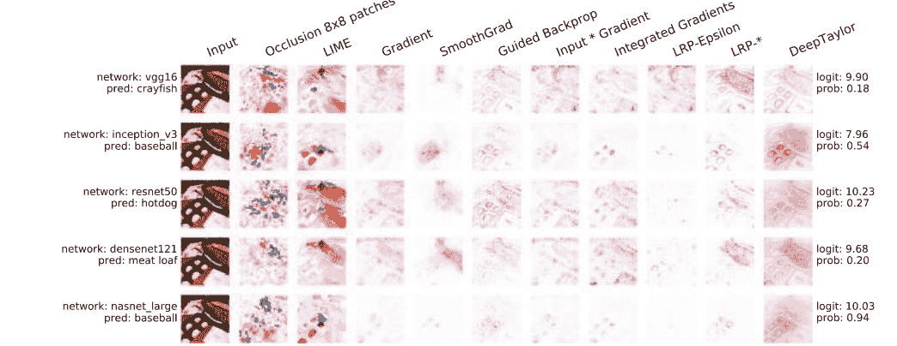

图22.7. 比较架构: 该图描述了对多种神经网络（行）的一系列算法（列）的预测分析。这个输入图像的真实标签是“棒球”，相应网络的预测在左侧给出。网络的softmax和pre-softmax输出打印在右侧。LRP-*表示来自[30]的配置。最好在数字和彩色环境中查看。

考虑最后一行的图像，被错误分类为风车。虽然可以解释一些方法表明引擎盖的右侧部分对于这个决策是重要的，但这只是一种猜测，很难理解分析的意义-揭示了解释方法的当前困境和需要更多研究的需求。然而，重要的是明确这些问题，并为用户提供工具来形成自己的观点。

##### 22.3.3 比较网络架构

另一个可能的比较分析是检查不同架构的解释。这一方面可以评估解释方法的可转移性，另一方面可以检查不同网络的功能。

图22.7以“棒球”类别的图像为例进行了这样的比较。我们观察到，对于相同的算法，结果在不同的架构之间可能会有很大的差异，例如，对于某些算法，结果在更深的架构中非常稀疏。此外，应用于同一网络的不同算法之间的差异似乎随着架构的复杂性而增加（复杂性从第一行到最后一行递增）。

尽管如此，我们注意到解释算法可以为网络的不同预测结果提供指示，并且可以成为理解这些网络的有价值工具。类似的方法可以用于监控网络在训练过程中的学习。

##### 22.3.4 系统网络评估

我们的最后一个例子使用了一种有希望的策略，利用解释方法来分析超出单个预测的网络。我们评估了整个数据集的解释，以搜索神经网络在识别对象时使用（相关的）背景特征的类别。其他类似系统评估的例子是，例如，基于频率对预测进行分组[31]。这些方法的独特之处在于它们不依赖于误分类作为信号，即可以检测到网络正确分类的样本中的不良行为。

我们再次使用VGG16网络，并为ImageNet 2012 [15]验证集的每个示例使用LRP方法和[30]中的配置创建热图。然后，我们计算边界框内外归因绝对值之和的比率，并选择具有最低比率的类别，即“篮球”。表22.1给出了一些图像及其热图。前四个图像被正确分类，但从热图可以观察到网络并没有关注实际边界框内的篮球。这表明网络对于“篮球”作为球的概念并不知晓，而是将其视为一个场景。类似地，在接下来的三个图像中，篮球没有被识别出来，导致了错误的预测。最后，最后一个图像包含一个没有任何运动场景的篮球，并被错误地分类为乒乓球。

可以说，运动场景是类别“篮球”的一个强有力的指标，另一方面，边界框清楚地表明该类别指的是一个球而不是一个场景，而误分类的图像表明以风景而不是球作为指标可能会误导。解释方法的使用可以帮助开发人员识别学习设置中的此类缺陷，例如，由于有偏数据或依赖于“错误”特征的网络而引起的缺陷[31]。

表22.1. 边界框分析：我们的边界框分析结果表明目标网络不使用边界框内的特征来预测类别“篮球”。 这些图像都有真实标签“篮球”，图像下方的标签表示预测类别。 我们注意到，对于这些图像中的任何一个，网络在预测时都不依赖于篮球的特征，除了“乒乓球”的预测。 结果表明，对于网络来说，“篮球”概念是一种风景而不是一个球对象。 最佳效果在数字和彩色环境下观看。

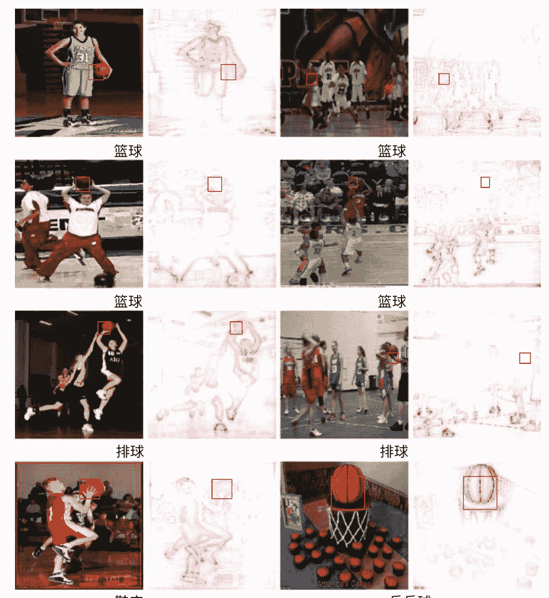

#### 22.4 软件包

在本节中，我们将概述用于解释技术的软件包。

随着算法的发布，许多作者还发布了专用软件。对于LRP算法，已发布了一个包含Python和MatLab解释代码以及用于生产目的的更快的Caffe实现的工具箱[29]。对于DeepLIFT算法[49]、DeepSHAPE算法[36]、“预测差异分析”算法[63]和LIME算法[44]，作者还发布了基于Keras/Tensorflow、Tensorflow、Tensorflow和scikit-learn的源代码。对于GradCam算法[48]，作者发布了基于Caffe的实现。还存在其他框架的GradCam实现，例如[26]。

包含多个算法族的软件包如下。论文DeepExplain [5]中的软件包包含了基于梯度的算法显著图、梯度*输入、集成梯度、DeepLIFT的一种变体和LRP-Epsilon以及遮挡算法的实现。该实现基于Tensorflow。基于Keras的软件keras-vis [26]提供了执行激活最大化、显著性算法Deconvnet和GuidedBackprop以及Grad Cam的代码。最后，库iNNvestigate [4]也是基于Keras的，包含了显著图、梯度*输入、集成梯度、Smoothgrad、DeconvNet、GuidedBackprop、Deep Taylor Decomposition、不同的LRP算法以及PatternNet和PatternAttribution的实现。它还提供了一个接口来简化传播型解释方法的实现。

#### 22.5 挑战

神经网络有很多种。它们可以由许多不同的层组成，结构复杂（例如，图22.9显示了NASNetA网络的子块）。许多（基于传播的）解释方法首先设计用于处理全连接层，但为了能够普遍适用，方法及其实现必须能够扩展到全连接网络以外，并能够推广到新的层类型。相反，仅使用模型的预测或梯度的方法的优点是它们适用于网络的复杂性，但它们通常速度较慢，并且无法利用传播方法[30,48]的高级特征。

为了促进对复杂神经网络的传播方法的研究，有必要减轻研究人员的不不必要的实现工作。因此，重要的是存在可以快速原型设计的工具，让研究人员专注于算法的发展。一个例子是iNNvestigate库，它提供了一个API，可以轻松修改反向传播，并提供了许多最新解释方法的实现，适用于先进的神经网络。我们在第22.2.2节中展示了像iNNvestigate这样的库如何帮助将算法推广到各种架构。这些努力有望促进研究，因为它们使比较和开发方法变得更容易，并促进对深度学习中（最新）发展的更快适应。

例如，尽管最初的尝试[6,43]，LSTMs [19,56]和注意力机制[59]对于大多数基于传播的解释方法仍然是一个挑战。另一个挑战是使用神经网络架构自动发现，例如神经网络架构搜索[64]。它们通常优于由人类直觉创建的竞争对手，但非常复杂。成功应用和检验解释方法可以是了解其工作原理的有希望的途径。相同的推理适用于像SchNet [47]，WaveNet [58]和AlphaGo [50]这样的网络，它们在各自领域取得了突破，并且对其预测的更好理解将揭示宝贵的知识。

关于基于传播方法的另一个开放性研究问题涉及将网络分解为组件。Deep Taylor Decomposition，LRP，DeepLIFT，DeepSHAPE等方法将网络分解并基于各个组件的线性化创建解释。然而，网络可以以不同的方式进行分解：例如，卷积层和批归一化层的顺序可以被视为两个组件，也可以表示为一个融合了两者的层。另一个例子是将单个批归一化层视为一个或两个线性层。可以找到更多的例子，并且目前不清楚如何分解网络的不同方法会影响解释算法的结果，这需要进一步研究。

#### 22.6 结论

解释方法是利用神经网络内部知识的一种有前途的方法，然而许多方法的复杂性可能阻碍从业者实施和使用它们进行研究或应用。为了缓解这个缺点，重要的是存在易于访问和高效的软件。考虑到这一点，我们解释了如何使用TensorFlow和Keras等深度学习框架高效地实现这些算法，并展示了重要的算法和应用模式。

此外，我们展示了解释方法的不同示例用例，例如检查错误分类、比较算法和检测网络是否关注背景。通过构建这样的软件，希望该领域对非专家更加易于访问，并在更广泛的科学领域中受到欢迎。我们也希望它能帮助研究人员应对深度学习的最新发展。

> > 致谢。作者感谢Sebastian Lapuschkin、Grégoire Montavon和Klaus-Robert Müller对他们宝贵的反馈意见。本工作得到了联邦教育和研究部（BMBF）对柏林大数据中心2 - BBDC 2（01IS18025A）的支持。

#### 附录

##### 22.A 第2节 - 补充内容

###### 22.A.1 传播后端

创建传播后端。 让我们重申目标，即创建捕捉所有基于传播算法的常见功能的例程，并从而促进它们的高效实现。 根据信息，后端应该将网络相应地分解并按照规定进行反向传播处理。 此外，后端还应能够识别给定神经网络是否与算法兼容，例如，因为算法不包含某些网络属性。

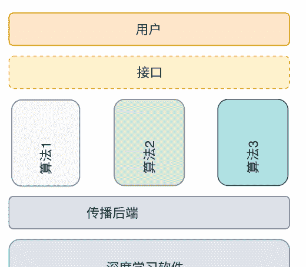

图22.8。示例软件堆栈：该图示例了iNNvestigate [4]的软件堆栈。 它展示了如何在共同的图形后端之上构建不同的传播方法，并通过共同的接口向用户提供功能。

在这方面，我们认为创建一个高效的后端面临以下主要挑战：

接口： 算法应该如何指定网络的分解方式以及每个反向映射应该如何执行？

图匹配： 根据算法的规格将神经网络进行分解，并理想情况下检测可能的不兼容性。 注意：规格可以描述目标组件的结构以及它们在网络中的位置，例如，DTD根据它们在网络中的位置对层进行不同处理。

反向传播：确定了网络图的哪个部分使用哪个反向映射之后，应该按照正确的顺序应用相应的映射，直到生成最终的解释。

前两个挑战通过选择适当的抽象来解决。这些抽象应该足够细粒度，以便实现各种算法，同时又足够粗粒度，以实现高效的实现。最后一个挑战首先是一个工程任务。

接口和匹配。清晰接口的第一步是将神经网络视为层的有向无环图（DAG），而不是一堆层。“层”的图概念一开始可能不直观，并且来自于神经网络通常是顺序的时代，因此一层叠加在另一层上。现代网络，例如图22.9中的NASNetA，可以更复杂，在这样的架构中，每个层实际上是图中的一个节点，而不是堆栈中的一层。尽管如此，在这样的DAG中，节点通常仍然被称为层，我们将保持这种表示法。

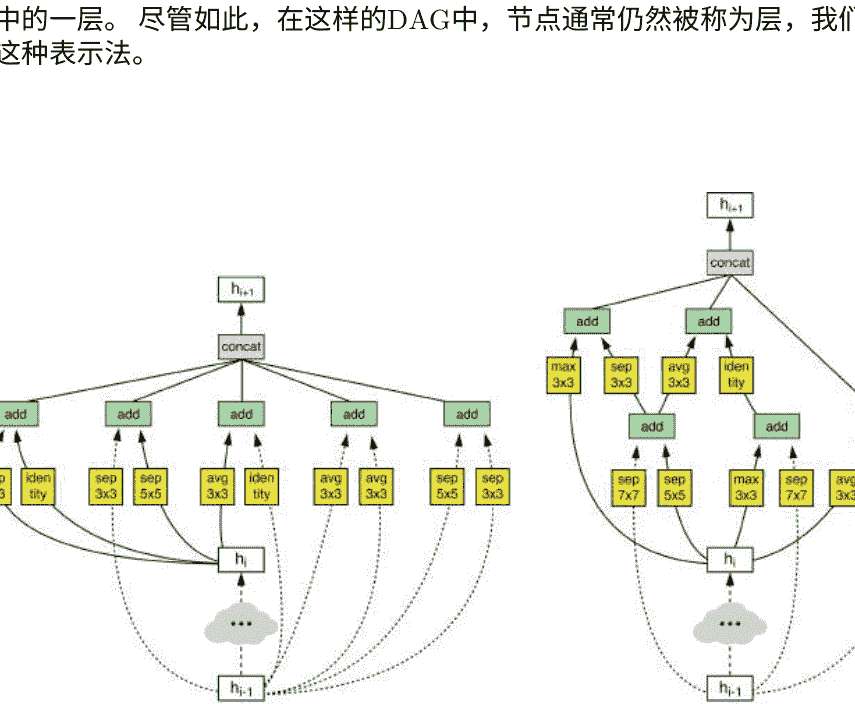

第二步是意识到DAG的粒度。不同的深度学习框架以不同的方式表示神经网络，层可以由更基本的操作（如加法和点积）组成，进而可以进一步分解。实施解释方法的最直观和有用的层次是将每个层视为节点。在许多情况下，更细粒度的视图是不需要的，只会使实施变得复杂。另一方面，我们注意到可能希望或需要将网络的层融合为一个节点，例如，相邻的卷积和批量归一化层可以表示为单个卷积层。

基于这种网络表示，有两个接口需要定义。一个是定义映射应该应用在哪里，另一个是如何执行映射。

实现匹配接口有两种方式，可以概述如下。第一种是在网络构建之前或期间将自定义反向映射绑定到层类的方法上，通过扩展层类或重载其梯度运算符来静态地实现。第二种是接收已构建的模型，并动态地将映射匹配到相应的层节点。这可以通过对每个层实例或节点评估可编程条件来完成分配映射。除了匹配条件外，这两种技术暴露出相同的接口，与第一种方法相比，后者更具挑战性，但具有几个优点：

- (1) 通过关注点的分离，它提供了清晰的接口：模型构建独立于解释算法。
- (2) 在应用解释之前可以修改前向DAG，例如，批量归一化层可以与卷积层融合。
- (3) 当为一个网络构建多个解释算法时，它们可以共享前向传递。
- (4) 匹配条件可以内省整个模型，因为模型在那个时间点已经构建好了。
- (5) 可以通过使用前向梯度计算（在后台和对所有解释算法）以及使用自动微分来高效地构建关于解释的梯度。

这两种方法可以用Python草图表示如下：

```python
# 方法A
# 使用映射Y来表示层类型X
register_mapping_for_layer_type(layer_type_X, mapping_Y)
build_model_with_custom_mapping()
execute_explanation()

# 方法B
model = build_model()
graph = extract_and_update_graph(model)
for node in graph:
    # 根据条件将节点与映射匹配
    # 节点可以是层或子图。
    # 条件可以审查整个模型进行决策。
    mapping = match_node_to_mapping(node, model.graph)
    assign_mapping_to_node(node, mapping)
```

第二个接口处理反向映射，它是一个函数，接受目标层的输入和输出张量、输出张量的反向传播值以及可选的反向传播过程的一些元信息作为参数。以下代码段展示了iNNvestigate库中反向映射函数的接口。由于相同的目的，其他实现具有非常相似的接口。

```python
# Xs =层或子图的输入张量
# Ys =层或子图的输出张量
# bp_Ys = 反向传播的Ys值
# bp_state = 状态的附加信息
# 返回反向传播的Xs值
def backward_mapping(Xs, Ys, bp_Ys, bp_state):
    # 反向映射的张量与前向传递的输出张量形状相对应
    # 断言 len(Ys) == len(bp_Ys)
    assert all(Y.shape == bp_Y.shape for Y, bp_Y in zip(Ys, bp_Ys))
    bp_Xs = compute_backward_mapping_magic()
    # 返回的张量与形状对应
    # 与前向传递的相应输入张量长度相等
    assert len(Xs) == len(bp_Xs)
    assert all(X.shape == bp_X.shape for X, bp_X in zip(Xs, bp_Xs))
    return bp_Xs
```

请注意，此签名不仅可用于层的反向映射，还可用于任何连接的子图。在剩余部分中，我们将使用简化的接口，其中每个层只有一个输入和一个输出张量。

反向传播。在将反向映射与网络部分匹配之后，后端仍然需要创建实际的反向传播。实际上，这可以明确地完成，如下所示，或通过重载选择的深度学习框架中的梯度运算符来完成。虽然后者更容易实现，但不够灵活，并且具有上述的缺点。

神经网络的实现以其层次结构为特点，其中最简单的是顺序神经网络，每一层都叠加在另一层上。要通过这样的网络进行反向传播，首先从模型的输出值开始，从顶层向下一层传播，依此类推。给定接受张量并沿着一层进行反向传播的映射函数，可以概括如下：

```python
current = 输出
对于层 in 模型.层[::-1]:
    current = 反向传播(层.输入, 层.输出, current)
分析 = current
```

一般来说，神经网络可以更加复杂，并且以有向无环图表示。这允许每个“层节点”具有多个输入和输出张量。例如，以下是一种高效的实现方式。首先，使用深度优先搜索算法建立正确的传播顺序，创建拓扑排序[14]。然后，在给定这个顺序的情况下，传播从输出张量开始，并朝着输入张量的方向进行。在每个步骤中，实现收集每个节点所需的输入，应用相应的映射，并在映射之后跟踪反向传播的张量。注意，在前向传递中分支的节点，即在前向传递中多次使用输出张量的节点，在反向传递中接收多个张量作为输入。在输入到反向映射之前，这些张量需要被减少为单个张量。通常情况下，这类张量的减少方式类似于梯度计算，即通过求和张量来实现：

```
1  intermediate_tensors     = { output : output }
2  execution_order         = calculate_execution_order()
3  for layer , inputs , outputs  in execution_order [::-1]:
4    # 为每个输出张量收集相应的反向传播张量
5    back_propagated_values = [
6      # 如果前向传递分支，则减少为单个张量!
7      sum ( intermediate_tensors [ t ])
8      for t in outputs
9    ]
10
11   # 通过层进行反向传播
12   tmp = back_propagate ( inputs , outputs , back_propagated_values )
13
14   # 存储中间张量
15   for input , intermediate in zip ( inputs , tmp ):
16     if input in intermediate_tensors :
17       intermediate_tensors [ input ] = [ intermediate ]
18     else :
19       # 对应的前向张量分支!
20       intermediate_tensors [ input ] . append ( intermediate )
21
22   # 获取最后的输出
23   analysis = intermediate_tensors [ model . input ]
```

尽管相对简单，实现和调试这样的算法可能会很繁琐。这是 iNNvestigate 库中基于传播的方法的常见操作之一，因此只需要指定如何执行特定层的反向传播。更方便的是，默认使用梯度传播的反向映射，并且只需要在需要不同的反向传播时进行指定。

###### 22.A.2 深度泰勒

用于密集层的深度泰勒映射：

```
1 # 用于密集层的深度泰勒 / LRP / EB的Z+-规则映射
2 # 调用R = bp_Y, R表示相关性
3 def z_rule_mapping_dense ( X , Y , R , bp_state ):
4   # 获取层和参数
5   layer = bp_state['layer']
6   W = tf . maximum ( layer . kernel , 0 )
7
8   Z = tf . tensordot ( X , W , 1 ) + b
9   # 归一化传入的相关性
10   tmp = R / Z
11   # 映射回去
12   tmp = tf . tensordot ( tmp , tf . transpose ( W ) , 1 )
13   # 输入次数
14   return tmp * X
```

###### 22.A.3 PatternNet

PatternNet 的示例实现在第22.2.2节中讨论：

```
1 # 使用PatternNet算法扩展iNNvestigate基类
2 class PatternNet(ReverseAnalyzerBase):
3 
4   # 存储模式。
5   def __init__(self, model, patterns, **kwargs):
6     self._patterns = patterns[:]
7     super(PatternNet, self).__init__(model, **kwargs)
8 
9   def _get_pattern_for_layer(self, layer):
10     return self._patterns.pop(-1)
11 
12   def _patternnet_mapping(self, X, Y, bp_Y, bp_state):
13     # 获取层,
14     layer = bp_state['layer']
15     # 用模式交换内核权重,
16     weights = layer.get_weights()
17     weights[0] = self._get_pattern_for_layer(layer)
18     # 并创建不包含激活部分和模式作为过滤器的层副本
19     layer_wo_act = kgraph.copy_layer_wo_activation(layer, weights=weights)
20 
21     if kchecks.contains_activation(layer, 'relu'):
22       # 激活层的梯度
23       tmp = tf.where(Y > 0, bp_Y, tf.zeros_like(bp_Y))
24     else:
25       # 线性层的梯度
26       tmp = bp_Y
27 
28     # 使用模式而不是权重进行映射
29     pattern_Y = layer_wo_act(X)
30     return tf.gradients(pattern_Y, X, grad_ys=tmp)[0]
31 
32   # 注册映射
33   def _create_analysis(self, *args, **kwargs):
34     self._add_conditional_reverse_mapping(
35       # 应用于包含内核的所有层
36       lambda layer: kchecks.contains_kernel(layer),
37       tf_to_keras_mapping(self._patternnet_mapping),
38       name='pattern_mapping',
39     )
40     return super(PatternNet, self)._create_analysis(*args, **kwargs)
41 
42 analyzer = PatternNet(model_wo_sm, net['patterns'])
43 B4 = analyzer.analyze(x)
```

###### 22.A.4 超参数选择

集成梯度的示例超参数选择：

```
IG = []
# 从网络的输入值范围中取5个样本
for ri in np.linspace(net['input_range'][0], net['input_range'][1], num=5):
  # 并进行分析
  analyzer = innvestigate.create_analyzer(
    'integrated_gradients',
    model_wo_sm,
    reference_inputs=ri,
    steps=32
  )
  IG.append(analyzer.analyze(x))
```

SmoothGrad 的示例超参数选择：

```
SG1, SG2 = [], []
# 对平滑梯度的噪声尺度取5个样本
for scale in range(5):
  noise_scale = (net['input_range'][1] - net['input_range'][0]) * scale / 5
  # 使用绝对梯度的Smoothgrad
  analyzer = innvestigate.create_analyzer(
    'smoothgrad',
    model_wo_sm,
    augment_by_n=32,
    noise_scale=noise_scale,
    postprocess='abs'
  )
  SG1.append(analyzer.analyze(x))

  # 使用平方梯度的Smoothgrad
  analyzer = innvestigate.create_analyzer(
    'smoothgrad',
    model_wo_sm,
    augment_by_n=32,
    noise_scale=noise_scale,
    postprocess='square'
  )
  SG2.append(analyzer.analyze(x))
```

###### 22.A.5 可视化

在第22.2.3节中讨论的可视化方法的示例实现：

```
def explanation_to_heatmap(e):
  # 减少颜色轴
  tmp = np.sum(e, axis=color_channel_axis)
  # 范围调整为[0, 255]
  tmp = (tmp / np.max(np.abs(tmp))) * 127.5 + 127.5

  # 创建并应用红蓝热图
  colormap = matplotlib.cm.get_cmap("seismic")
  tmp = colormap(tmp.flatten().astype(np.int64))[:, :3]
  tmp = tmp.reshape(e.shape)
  return tmp

def explanation_to_graymap(e):
  # 减少颜色轴
  tmp = np.sum(np.abs(e), axis=color_channel_axis)
  # 范围调整为[0, 255]
  tmp = (tmp / np.max(np.abs(tmp))) * 255

  # 创建并应用红蓝热图
  colormap = matplotlib.cm.get_cmap("gray")
  tmp = colormap(tmp.flatten().astype(np.int64))[:, :3]
  tmp = tmp.reshape(e.shape)
  return tmp

def explanation_to_scale_input(e):
  # 创建比例
  e = np.sum(np.abs(e), axis=color_channel_axis, keepdims=True)
  scale = e / np.max(e)

  # 应用于图像
  return (x_not_preprocessed / 255) * scale

def explanation_to_mask_input(e):
  # 获取最高得分的片段
  # 片段从LIME示例中重复使用。
  segments_scored = [(np.max(e[0][segments == sid]), sid)
                     for sid in range(nr_segments)]
  highest_ones = sorted(segments_scored, reverse=True)[:50]

  # 计算掩码
  mask = np.zeros_like(segments)
  for _, sid in highest_ones:
    mask[segments == sid] = 1

  # 应用掩码
  ret = (x_not_pp.copy() / 255)
  ret[0][mask == 0] = 0
  return ret

def explanation_to_blend_w_input(e):
  e = np.sum(np.abs(e), axis=channel_axis, keepdims=True)
  # 添加模糊效果
  e = skimage.filters.gaussian(x[e], 3)[None]
  # 归一化
  e = (e - e.min())/(e.max() - e.min())
  # 获取并应用颜色映射
  heatmap = plot.get_cmap("jet")(e[:, :, :, 0])[:, :, :, :3]
  # 叠加
  ret = (1.0 - e) * (x_not_pp / 255) + e * heatmap
  return ret

def explanation_to_projection(e):
  # 范围调整为[0,1]
  return (e / np.max(np.abs(e))) + 0.5
```

### 参考文献

- 1. Abadi, M., et al.: TensorFlow: a system for large-scale machine learning. In: Proceedings of the 11th USENIX Symposium on Operating Systems Design and Implementation, vol. 16, pp. 265–283 (2016)
- 2. Alber, M., Bello, I., Zoph, B., Kindermans, P.J., Ramachandran, P., Le, Q.: Back-prop evolution. In: International Conference on Machine Learning 2018 - AutoML Workshop (2018)
- 3. Alber, M., Kindermans, P.J., Schütt, K.T., Müller, K.R., Sha, F.: An empirical study on the properties of random bases for kernel methods. In: Advances in Neural Information Processing Systems, vol. 30, pp. 2763–2774 (2017)
- 4. Alber, M., 等：iNNvestigate神经网络！ J. Mach. Learn. Res. 20(93), 1–8 (2019)
- 5. Ancona, M., Ceolini, E., Öztireli, C., Gross, M.: 对于深度神经网络的基于梯度的归因方法的更好理解 在：国际学习表示会议（2018）
- 6. Arras, L., Montavon, G., Müller, K.R., Samek, W.: 解释情感分析中的递归神经网络预测 在：2017年EMNLP研讨会上的计算方法主观性、情感和社交媒体分析，第1 59-168页（2017）
- 7. Bach, S., Binder, A., Montavon, G., Klauschen, F., Müller, K.R., Samek, W.: 通过逐层相关传播对非线性分类器决策进行像素级解释。 PLoS ONE 10(7), e0130140 (2015)
- 8. Bahdanau, D., Cho, K., Bengio, Y.: 通过联合学习对齐和翻译进行神经机器翻译 在：国际学习表示会议（2015）
- 9. Binder, A., 等：走向计算荧光显微镜：基于机器学习的形态和分子肿瘤特征的综合预测。 arXiv预印本。 arXiv:1805.11178 (2018)
- 10. Chmiela, S., Saucedo, H.E., Müller, K.R., Tkatchenko, A.: 走向具有机器学习力场的精确分子动力学模拟。 Nat. Commun. 9(1), 3887(2018)
- 11. Chmiela, S., Tkatchenko, A., Saucedo, H.E., Poltavsky, I., Schütt, K.T., Müller, K.R.: 机器学习准确的能量守恒分子力场。 Sci. Adv. 3(5), e1603015 (2017)
- 12. Chollet, F., 等：Keras (2015)。 https://github.com/fchollet/keras
- 13. Chollet, F.: Xception:深度学习与深度可分离卷积。 在：2017年IEEE计算机视觉和模式识别会议，第1800-1807页（2017年）
- 14. Cormen, T.H., Leiserson, C.E., Rivest, R.L., Stein, C.:算法导论。 麻省理工学院出版社，剑桥（2009年）
- 15. Deng, J., Dong, W., Socher, R., Li, L.J., Li, K., Fei-Fei, L.: ImageNet：一个大规模分层图像数据库。 在：2009年IEEE计算机视觉和模式识别会议，第248-255页（2009年）
- 16. Gondal, W.M., Köhler, J.M., Grzesick, R., Fink, G.A., Hirsch, M.:弱监督定位糖尿病视网膜病变的视网膜底图像。 在：2017年IEEE国际图像处理会议，第2069-2073页（2017年）
- 17. Haufe, S., et al.:关于多元神经影像学中线性模型权重向量的解释。 神经影像 87, 96-110页（2014年）
- 18. He, K., Zhang, X., Ren, S., Sun, J.: 深度残差学习用于图像识别。 在：2016年IEEE计算机视觉和模式识别会议，第770-778页（2016年）
- 19. Hochreiter, S., Schmidhuber, J.: 长短期记忆。 神经计算。 9 (8) , 1735-1780 (1997年)
- 20. Huang, G., Liu, Z., van der Maaten, L., Weinberger, K.Q.: 密集连接的卷积网络。 在：2017年IEEE计算机视觉和模式识别会议，第2261-2269页（2017年）
- 21. Ioffe, S., Szegedy, C.: 批归一化：通过减少内部协变量偏移来加速深度网络训练。 在：第32届国际机器学习会议论文集，第448-456页（2015年）
- 22. Kindermans, P.J.,等：显著性方法的（不）可靠性。 在：2017年神经信息处理系统 - 解释、解释和可视化深度学习 - 现在怎么办？研讨会（2017年）
- 23. Kindermans, P.J.,等：学习如何解释神经网络：PatternNet和PatternAttribution。 在：国际学习表示会议（2018年）
- 24. Kindermans, P.J., Schütt, K.T., Müller, K.R., Dähne, S.: 研究噪声和干扰对神经网络解释的影响。 在：2016年神经信息处理系统 - 可解释机器学习的复杂系统研讨会（2016年）
- 25. Korbar, B.,等：深度神经网络可视化揭示结直肠息肉全切片图像分析结果。 在：2017年IEEE计算机视觉和模式识别会议，第821-827页（2017年）
- 26. Kotikalapudi, R.,贡献者：keras-vis（2017年）。 https://github.com/raghakot/keras-vis
- 27. Krizhevsky, A., Sutskever, I., Hinton, G.E.: 使用深度卷积神经网络进行ImageNet分类。 在：神经信息处理系统的进展，第25卷，第1097-1105页（2012年）
- 28. Lapuschkin, S., Binder, A., Montavon, G., Müller, K.R., Samek, W.: 分析分类器：Fisher向量和深度神经网络。 在：2016年IEEE计算机视觉和模式识别会议上，第2912-2920页（2016年）
- 29. Lapuschkin, S., Binder, A., Montavon, G., Müller, K.R., Samek, W.: 用于人工神经网络的逐层相关传播工具箱。 机器学习研究杂志17（114），1-5页（2016年）
- 30. Lapuschkin, S., Binder, A., Müller, K.R., Samek, W.: 理解和比较深度神经网络在年龄和性别分类中的应用。 在：IEEE国际计算机视觉研讨会，第1629-1638页（2017）
- 31. Lapuschkin, S., Waldchen, S., Binder, A., Montavon, G., Samek, W., Müller, K.R.:揭示聪明的汉斯预测器并评估机器真正学到了什么。自然通讯。10，1096（2019）
- 32. LeCun, Y.A., Bengio, Y., Hinton, G.E.: 深度学习。 自然521（7553），436-444（2015）
- 33. LeCun, Y.A., Cortes, C., Burges, C.J.: MNIST手写数字数据库（1998）。 http://yann.lecun.com/exdb/mnist/
- 34. 李，J.，门罗，W.，朱拉夫斯基，D.: 通过表示擦除理解神经网络。arXiv预印本。arXiv:1612.08220（2016年）
- 35. 利普顿，Z.C.: 模型可解释性的神话。 在：2016年国际机器学习大会-机器学习研讨会中的人类可解释性（2016年）
- 36. 伦德伯格，S.M.，李，S.I.: 解释模型预测的统一方法。 在：神经信息处理系统进展，第30卷，第4765-4774页（2017年）
- 37. Mikolov, T., Sutskever, I., Chen, K., Corrado, G.S., Dean, J.: 单词和短语的分布式表示及其组合性。 在：神经信息处理系统进展，第26卷，第3111-3119页（2013年）

## 22. 解释方法的软件和应用模式

- 56. Sutskever, I., Vinyals, O., Le, Q.V.: 序列到序列学习与神经网络。在：神经信息处理系统进展，第27卷，第3104-3112页（2014年）
- 57. Szegedy, C., Vanhoucke, V., Ioffe, S., Shlens, J., Wojna, Z.: 重新思考计算机视觉中的Inception架构。 在：2016年IEEE计算机视觉和模式识别会议，第2818-2826页（2016年）
- 58. Van Den Oord, A., 等：WaveNet：原始音频的生成模型。arXiv预印本。arXiv:1609.03499 (2016)
- 59. Vaswani, A., 等：注意力就是一切。 在：神经信息处理系统的进展，卷30，页5998-6008 (2017)
- 60. Voigt, P., von dem Bussche, A.: 欧盟通用数据保护条例(GDPR)：实用指南。Springer, Cham (2017)。 https://doi.org/10.1007/978-3-319-57959-7
- 61. Zeiler, M.D., Fergus, R.: 可视化和理解卷积网络。 在：Fleet, D., Pajdla, T., Schiele, B., Tuytelaars, T. (eds.) ECCV 2014. LNCS, vol. 8689, pp. 818-833. Springer, Cham (2014)。 https://doi.org/10.1007/978-3-319-10590-1_53
- 62. Zhang, J., Bargal, S.A., Lin, Z., Brandt, J., Shen, X., Sclaroff, S.: 自上而下的神经注意力通过激励反向传播。国际计算机视觉 126(10), 1084-1102(2018)
- 63. Zintgraf, L.M., Cohen, T.S., Adel, T., Welling, M.: 可视化深度神经网络决策：预测差异分析。 在：国际学习表示会议（2017年）
- 64. Zoph, B., Vasudevan, V., Shlens, J., Le, Q.V.: 学习可扩展图像识别的可转移架构。 在：2018年IEEE计算机视觉和模式识别会议，第8697-8710页（2018年）

## 主题索引

- 激活最大化13, 56
    - 深度生成网络61, 67
    - DeepDream 57
    - 梯度上升57
    - 潜在空间优化62
    - 先验58, 67
    - 概率解释63
    - 正则化58
- 应用
    - 对抗性防御163
    - 自动驾驶286
    - 化学311, 331
        - 药物发现331
        - 电子性质316
    - 人类动作识别298
    - 水文学347
    - 图像合成70, 77
    - 神经解码366, 380
    - 强化学习230
- 攻击
    - 愚弄示例57, 124, 194
    - 博弈论140
    - 成员推断124
    - 模型窃取124, 131, 137
        - 超参数窃取124
- 解释公理27, 256
    - 连续性256
    - 连续性175, 258
    - 实现不变性175, 260
    - 输入偏移不变性276
    - 敏感度-n 176
- 黑盒AI 5, 44, 122
- 聪明的汉斯预测器7
- 信用分配230
- 透明度的危险28, 124
- 数据集
    - Ames致突变性341
    - Broden 244
    - CAMELS (水文学) 351
    - CIFAR 108
    - Cityscapes 291
    - ImageNet 67, 69, 137
    - MIT地点68
    - MNIST 108, 131
    - MS-COCO 86
    - QM9 (化学) 317
    - Sports1M 298
    - SVHN 114
    - Tox21 334, 337
    - UCF-101 68
- 深度泰勒分解 14, 198, 218, 298
- 编码模型 (神经科学) 365, 382
    - 基于DNN的编码 386
    - 高斯编码 382
    - 非线性编码 385
    - PRF编码 385
- 评估解释 15, 159, 224
    - 公理 16, 159, 175, 256
    - 启示分数 87
    - 间接评估 15, 231
    - 扰动分析 15, 159, 224
    - 指向游戏 15, 165
    - 重建 87
    - 玩具任务 15, 224
    - 不确定性 45
- 专家系统 43
- 可解释AI 6, 43, 194
    - 挑战 16, 23
    - 危险 28
    - 控制程度 123
    - 历史 41
    - 方法 12, 158, 171
    - 动机 6, 25
    - 透明度类型 10, 24
- 可解释模型 43
    - Behler-Parrinello 317
    - CAM 159
    - KENNEN 128
    - 线性模型 172, 366
    - 正则化 99
    - SchNet 317
    - XPLAIN 43
- 解释方法 12, 150, 171
    - 激活最大化 1
    - 基于梯度的 13, 158, 177, 270
    - 逐层相关传播 14, 186, 195, 215
    - LIME 12, 43, 124, 186, 403
    - 有意义的扰动 13, 154
    - 元解释 14
    - 基于优化的 13, 154
    - PatternNet 278
    - 基于扰动的 13, 159, 186
    - 基于传播的 13, 14, 159, 185, 195, 256, 270
    - 替代模型 12, 128, 159
- 解释 9, 24
    - 解释的要求 43, 149
    - 紧凑性 1, 63
    - 忠实度 43, 160, 226
    - 采样多样性 62, 90
    - 选择性 163, 225
    - 充分性 43
    - 可理解性 43, 160
    - 接收者 9, 25
    - 类型 10, 24
    - 不确定性 45
- 人脑
    - 早期视觉区域 55, 367
    - 编码和解码 380
    - 颞叶面区域 364
    - 神经 firing 55
- 解释陷阱 45, 367
    - 偏见 45
    - 偏离元模型 133
    - 噪声 369
    - 模式 vs. filter 45, 368
    - 冗余 371
- 不变性
    - affine 扭曲 110
    - 局部不变性 99
    - 置换不变性 316
    - 自增强训练 99
- KENNEN元模型
    - 综合方法 130
    - 精心设计输入 129
    - 对输出进行推理 128
- 逐层相关性传播 195
    - 保守原则 195, 216, 256
    - 深度泰勒分解 14, 198, 218, 273, 407
    - 对LSTMs的扩展 217
    - 超参数选择 200
    - 实现 197, 400, 408
    - 神经化传播 203
    - 传播规则 196, 216, 255
    - 特殊层 201, 202
- 公平性 33, 44
- 特征
    - 特征选择 194
    - 特征可视化 57
    - 药效团 332
    - 毒性团 332
- 博弈论 30, 140
- 基于生成的解释
    - 边界框生成 82
    - 多样性 62
    - 基于分割的图像 70
    - MALA采样 65
    - 形状生成 83
    - 文本到图像 70, 77
- 基于梯度的解释 13, 177, 255, 402
    - 优点 183
    - 梯度 * 输入 177, 255, 272, 402
    - 综合梯度 13, 182, 272, 335, 352, 402
    - 限制 184, 194, 259
    - 敏感性分析 13, 158, 177
    - 平滑梯度 12, 158, 275
    - TCAV 14, 44
- 法律方面 9, 25
    - 审计 25
    - 知识产权 29, 122
    - 模型窃取 122
    - 隐私 29
    - 解释权 9, 41
- LSTM 203, 212, 350
    - 卷积LSTM 84
    - 可解释LSTMs 221
    - 门 214
    - 记忆单元 214
- 机器可解释性 35
- 机器学习模型
    - 3D CNN 300
    - AlexNet 164, 245
    - Behler-Parrinello 314
    - CaffeNet 57
    - 深度残差网络 137
    - DenseNet 410
    - GoogLeNet 157
    - 图卷积神经网络 338
    - 线性判别分析 372
    - 多任务神经网络 334
    - ResNet50 410
    - SchNet 315
    - SqueezeNet 289
    - VGG深度网络 85, 137, 198, 254
- 有意义的扰动 13, 154
    - 理想的特性 160
    - 处理伪影 156
    - 扰动类型 154
- 元解释 14
    - SpRAy 14
    - TCAV 14
- 元模型 126, 150
- 网络剖析 14, 244
    - 训练过程中的概念 245
    - 不同网络 245
    - 评分单元可解释性 244
    - 迁移学习 246
- 神经解码 366, 380
    - 贝叶斯解码 381
    - 深度生成解码 387
    - 线性解码 382
    - MAP解码 381
    - 非线性解码 384
- 神经网络
    - 条件GAN 84
    - 去噪自编码器 63
    - 鉴别器网络 86
    - GAN 61, 78
    - 生成器网络 85
    - 层
        - 批量归一化 203
        - 输入 203
        - 最小池化 203
        - 非线性 290
        - softmax 201
        - 空间池化 202
        - 求和池化 316
        - LSTM 203, 212
        - 神经化 14, 203
- 基于优化的解释 13, 154
    - 激活最大化 13
    - 有意义的扰动 13, 154
    - 元模型 12, 128, 159
- 基于扰动的解释 154, 186
    - 有意义的扰动 13, 154, 186
    - 遮挡 159, 186, 403
    - 预测差异分析 13, 186
    - RISE 159
- 首选刺激 55
- 处理
    - 端到端方法 286
    - 分层方法 286
- 基于传播的解释 13, 185, 195, 255, 405
    - 反卷积 14, 159
    - DeepLIFT 159, 180
    - 激活反向传播 159
    - Grad-CAM 159
    - 引导反向传播 14, 159, 406
    - iNNvestigate工具箱 14
    - 逐层相关传播 14, 159, 178, 195, 215, 255, 274
    - 模式归因 274, 409
- 量化可解释性 14, 244
- 回归 302
- 正则化 58, 99, 371
    - IMSAT 102
    - 自增强训练 99
- 表示学习 101
- 解释权利 9, 41
- 运行时效率 413
- 机器学习的安全性 124
    - 攻击 57, 124, 137, 194
    - 博弈论 140
    - 模型指纹 125
    - 语义分割 288
    - 破碎的梯度 194
- 社会方面
    - 歧视 33
    - 公平性 33, 44
    - 信任 8, 35
    - 用户接受度 8, 25
- 软件 400
    - DeepExplain 420
    - iNNvestigate 420
    - 用户界面 411
- 基于替代模型的解释 12, 128, 159
    - KENNEN 128
    - LIME 12, 159
- 文本到图像 70, 77
    - 文本和布局到图像 85
- 理论框架
    - 公理 256
    - 博弈论 27, 30
    - 信息论 103
    - Shapley值 27
    - Taylor展开 152
        - 深度Taylor分解 198, 218, 273
- 透明度 6, 23
    - 透明度错觉 35
- 信任 6, 35, 44, 286
- 解释类型
    - 归因热图 10, 150, 270, 335
    - 全局 26, 150, 172
    - 局部 26, 152, 173
    - 低维嵌入 324
    - 元解释 11
    - 量子化学
        - 逐原子划分 317
        - 局部化学势 321
    - 代表性示例 11
    - 信号/原型 10, 68, 270
    - 单元激活 244
- 无监督学习
    - 异常检测 203
    - 自编码器 101
    - 聚类 104, 108, 203
    - 哈希 106, 111
- 解释的用途 11, 24
    - 构建新的见解 8
    - 调试 8, 25, 70
    - 决策支持 25
    - 法律合规 9, 25
- 用解释验证机器学习
    - 聪明的汉斯预测器 7
    - 信任 8, 25
    - 可验证性 8, 25
- 视频分析
    - 边界效应 301
    - 前瞻效应 301
- 可视化
    - 隐藏单元原型 68
    - 输出单元原型 68
- XAI（可解释AI）6, 43## 作者索引

- Adebaro, Julius 267
- Alber, Maximilian 267, 399
- Ancona, Marco 169
- Anders, Christopher J. 297
- Anderson, Ariana 363
- Arjona-Medina, José 211, 285
- Arras, Leila 211
- Bau, David 243
- Binder, Alexander 193
- Ceolini, Enea 169
- Choi, Jongwook 77
- Clune, Jeff 55
- Dähne, Sven 267
- Douglas, Pamela K. 363
- Erhan, Dumitru 267
- Fong, Ruth 149
- Fritz, Mario 121
- Gastegger, Michael 311
- Gillhofer, Michael 211
- Gross, Markus 169
- Güçlü, Umut 379
- Güçlütürk, Yağmur 379
- Hansen, Lars Kai 41
- Hermegger, Mathew 347
- Hochreiter, Sepp 211, 285, 331, 347
- Hofmarcher, Markus 285
- Hong, Seunghoon 77
- Hooker, Sara 267
- Hu, Weihua 97
- Kim, Been 267
- Kindermans, Pieter-Jan 267
- Klambauer, Günter 285, 331, 347
- Klotz, Daniel 347
- Kratzert, Frederik 347
- Lapuschkin, Sebastian 193
- Lee, Honglak 77
- Matsumoto, Eiichi 97
- Miyato, Takeru 97
- Montavon, Grégoire 193, 211, 253, 297
- Müller, Klaus-Robert 5, 193, 211, 297, 311
- Nessler, Bernhard 285
- Nguyen, Anh 55
- Oh, Seong Joon 121
- Oliva, Aude 243
- Öztireli, Cengiz 169
- Preuer, Kristina 331
- Rieger, Laura 41
- Rippmann, Friedrich 331
- Samek, Wojciech 5, 193, 211, 297
- Schiele, Bernt 121
- Schütt, Kristof T. 267, 311
- Seeliger, Katja 379
- Sugiyama, Masashi 97
- Tkatchenko, Alexandre 311
- Tokui, Seiya 97
- Torralba, Antonio 243
- Unterthiner, Thomas 285, 331
- van Gerven, Marcel A. J. 379
- Vedaldi, Andrea 149
- Weller, Adrian 23
- Widrich, Michael 211
- 杨，丁东 77
- 约辛斯基，贾森 55
- 周，伯雷 243