# 图像分析中的深度学习应用

# 大数据研究129辑

Sanjiban Sekhar Roy
Ching-Hsien Hsu
Venkateshwara Kagita 编辑

## 大数据研究

### 第129卷

### 系列编辑

Janusz Kacprzyk，波兰科学院，华沙，波兰

系列“大数据研究”（SBD）快速出版并以高质量发布大数据各个领域的新发展和进展。目的是涵盖大数据在工程学、计算机科学、物理学、经济学和生命科学等领域的理论、研究、开发和应用。

该系列的图书涉及对最近的数字来源生成的大型、复杂和/或分布式数据集的分析和理解，这些数字来源来自传感器或其他物理仪器，以及模拟、众包、社交网络或其他互联网交易，如电子邮件或视频点击流等。该系列包含大数据领域的专著、讲义和编辑卷，涵盖计算智能（包括神经网络、进化计算、软计算、模糊系统）、人工智能、数据挖掘、现代统计学和运筹学，以及自组织系统。对于投稿者和读者来说，短时间出版和全球分发都具有特殊价值，这使得研究成果能够广泛而迅速地传播。

- 这个系列的书籍经过单盲同行评审过程进行审查。
- 被SCOPUS、EI Compendex、SCIMAGO和zbMATH索引。
- 该系列中的所有书籍都提交给Web of Science进行考虑。

Sanjiban Sekhar Roy · Ching-Hsien Hsu · Venkateshwara Kagita
编辑

## 深度学习在图像分析中的应用

编辑
Sanjiban Sekhar Roy 计算机科学与工程学院 Vellore理工学院 Vellore, TN, 印度
徐清贤
信息与电气工程学院 亚洲大学 Musashino, 台湾

Venkateshwar Kagita 计算机科学与工程系
National Institute of Technology Warangal
Warangal, 印度

| 项目 | 信息 |
| :--- | :--- |
| ISSN | 2197-6503 |
| 书名 | 大数据研究 |
| ISBN | 978-981-99-3783-7 |
| DOI | https://doi.org/10.1007/978-981-99-3784-4 |
| ISSN (电子版) | 2197-6511 |
| ISBN (电子书) | 978-981-99-3784-4 |

© 编辑（如适用）和作者，独家许可给Springer Nature
Singapore Pte Ltd. 2023

本作品受版权保护。出版商独家许可所有权利，无论是整体还是部分材料，特别是翻译、重印、重用插图、朗诵、广播、微缩胶片复制或以任何其他实体方式复制、传输或信息存储和检索、电子适应、计算机软件，或通过类似或不同的已知或今后开发的方法。

本出版物中使用的一般描述性名称、注册名称、商标、服务标志等，并不意味，即使在没有明确声明的情况下，这些名称不受相关保护法律和法规的约束，因此可以自由使用。

出版商、作者和编辑可以安全地假设本书中的建议和信息在出版日期时是真实准确的。出版商、作者或编辑对本书中所包含的材料不提供明示或暗示的保证，也不对可能存在的错误或遗漏负责。出版商在已发表的地图和机构关系方面保持中立。

这本斯普林格印记由注册公司斯普林格自然新加坡私人有限公司出版。注册公司地址为：新加坡189721海滩路152号，#21-01/04 Gateway East，新加坡。

> > 这本书献给我的母亲“Papri Roy” -Sanjiban Sekhar Roy

### 前言

近年来，深度学习应用在各种与图像相关的问题上取得了最前沿的成果。深度学习模型令人着迷，因为它们可以理解图像并执行视觉任务，而无需复杂的专门方法。近年来，深度学习已成为人工智能领域增长最快的领域。它在各个领域得到了广泛应用，展示了其有效性和快速发展。从手写字符识别、COVID-19疾病的自动诊断、不平衡图像数据集的分类到图像字幕、车辆超速检测系统等许多应用。本书包含的主题将吸引在深度学习和机器学习领域从事与图像相关问题的学者和研究人员的兴趣。此外，从事这些领域的研究生、博士研究生和博士学者将受益匪浅。本编辑书籍涉及了深度学习在各种与图像相关问题上的应用链。

- 自动编码器和深度卷积生成对抗网络在改善孟加拉手写分类性能方面的应用
- 基于深度学习的特征选择方法用于自动诊断X射线图像中的COVID-19疾病
- 使用深度迁移学习的图像字幕生成
- 车辆超速检测系统
- 基于视频的接近分析的智能系统
- 使用深度学习进行黑色素瘤癌症检测
- 使用神经网络进行植物疾病分类：AlexNet
- 高光谱图像：简明分析深度学习研究
- 使用Efficient Net和InceptionV3进行肺炎疾病的胸部X射线图像分类
- 使用深度学习技术检测癌症

编写这本书的目的是向读者展示深度学习的应用，以便在上述应用领域的理论和实践方面提供良好的思路。 我们希望读者能从学习图像领域深度学习应用的最新技术中获得显著的收益。

继续阅读、学习和探究。

印度泰米尔纳德邦维洛尔
2020年9月

博士 Sanjiban Sekhar Roy 计算机科学与工程学院 教授 维洛尔理工学院 印度维洛尔 sanjibansroy@ieee.org

### 自动编码器和深度卷积生成对抗网络在改善孟加拉手写字符识别性能中的应用
字符识别
Tanzina Akter Tani、 Mir Moynuddin Ahmed Shibly、 Md. Shoumique Hasan、 Nilofa Yeasmin和Shamim Ripon (p. 1)

### 基于深度学习的特征选择方法在自动诊断COVID-19疾病中的应用
从X射线图像中
Burak Taşci (p. 27)

## 使用深度迁移学习的图像字幕生成
Tapan Kumar Das (p. 51)

## 车辆超速检测系统
K. Ganesan、 N. S. Manikandan和Vijayan Sugumaran (p. 63)

### 基于视频的智能系统进行近距离分析
谢尔盖·安东诺夫，米哈伊尔·博加切夫，帕维尔·莱巴，亚历山大·西尼特卡，和德米特里·卡普伦 (p. 89)

### 基于深度学习的结膜黑色素瘤检测眼表图像
Kanchon Kanti Podder, Mohammad Kaosar Alam, Zakaria Shams Siam, Khandaker Reajul Islam, Proma Dutta, Adam Mushtak, Amith Khandakar, Shona Pedersen, 和Muhammad E. H. Chowdhury (p. 113)

## 使用神经网络进行植物疾病分类：AlexNet
Mohd Anas, Sanjiban Sekhar Roy, Kunwar S. Srivastava, 和Jashabir Chakraborty (p. 133)

## 高光谱图像：简明分析深度学习研究
L. Sandeep Kumar， G. K. Panda， 和B. K. Tripathy (p. 149)

### 使用深度学习的胸部X射线图像分类肺炎疾病
EfficientNet和InceptionV3
尼尔·戈沙尔，莫哈迪·阿纳斯和桑吉班·塞卡尔·罗伊 (p. 173)

## 使用深度学习技术检测癌症
Apoorv Singh，Arjunaditya和B. K. Tripathy (p. 187)

### 关于编辑

Sanjiban Sekhar Roy目前是维洛尔工学院计算机科学与工程学院的教授。他于2016年在维洛尔工学院获得博士学位。他为期刊编辑了一些专题，发表了大量文章，包括IEEE计算社会系统交易；Scientific Reports，Nature；Computers and Electrical Engineering，Elsevier等多个知名期刊；罗伊博士已经出版了九本由知名国际出版商如Springer，Elsevier和IGI Global出版的书籍。他的研究兴趣包括深度学习和先进机器学习。罗伊博士曾获得罗马尼亚国家教育部学术研究“卓越文凭”奖。他还曾在胡志明市的顿德·唐·汤大学担任副研究员，时间为2019年至2020年。

徐景贤是亚洲大学信息与电气工程学院的主席教授，台湾; 国立中正大学计算机科学与信息工程系的教授; 中国医药大学医学研究部的研究顾问，中国医药大学医院，台湾。他的研究包括云计算和边缘计算，大数据分析，高性能计算系统，并行和分布式系统，人工智能，医疗人工智能和自然语言处理。他在IEEE TPDS，IEEE TSC，ACM TOMM，IEEE TCC，IEEE TETC，IEEE System，IEEE Network等顶级期刊上发表了350多篇论文，并在这些领域的顶级会议和书籍章节中发表了论文。徐博士是《国际网格与高性能计算杂志》和《大数据智能国际杂志》的主编，并担任多个知名期刊的编辑委员会成员，包括IEEE服务计算交易，IEEE云计算交易，云计算国际杂志，通信系统杂志，计算科学国际杂志，AutoSoft杂志。他还担任Elsevier，Springer，IGI Global，World Scientific和McGraw-Hill出版的10本书的作者/合著者或编辑/合著者。徐博士曾获得七项奖励、教育部、科技部九次杰出研究奖、中华大学九次卓越研究奖。徐教授是台湾云计算协会主席；IEEE云计算技术委员会主席；IET（IEE）会士和IEEE高级会员。

Venkateswara Rao Kagita是NIT Warangal的助理教授。他在Hyderabad大学获得了博士学位。他的研究兴趣包括数据挖掘、机器学习和深度学习，特别关注推荐系统的机器学习技术。他的研究成果已发表在多个知名期刊和会议论文集中。他还在多个国际和国内研讨会、印度理工学院、国立工程学院和大学中发表过各种特邀讲座。

## 自动编码器和深度卷积生成对抗网络在提高孟加拉手写字符识别性能方面的应用

Tanzina Akter Tani, Mir Moynuddin Ahmed Shibly, Md. Shoumique Hasan, Nilofa Yeasmin和Shamim Ripon

### 1 引言

手写字符识别近年来一直是深度学习研究人员和从业者关注的领域。由于其各种实现的巨大可能性，已经进行了大量关于手写文本和不同语言（如英语[1]、日语[2]、拉丁语[3]等）的字符识别的研究。孟加拉语是孟加拉国的第一种官方语言，也是世界上第四种最流行的语言，有近3亿人口使用。[4]。考虑到这么多的本地用户，孟加拉语的手写字符识别在包括银行支票处理、识别邮政编码、邮政编码扫描、解释国民身份证号码、孟加拉语光学字符识别（OCR）等广泛应用中起着非常重要的作用[5, 6]。

在孟加拉语中，有11个元音字母，39个辅音字母，还有相当数量的元音变音符号、辅音连写符号和其他数字、符号和标点符号。识别手写的孟加拉字符因为以下几个原因更加困难和复杂：(a) 孟加拉字母中有很多复合字符，(b) 某些字符的形式是相同的，(c) 不同的人以不同的方式书写，同一个字符由不同的人书写会有不同的形式、大小和曲线。

为了克服这些问题，已经采取了几项努力来提高识别准确性。卷积神经网络（CNN）[4,7–9], 深度卷积神经网络（Deep CNN）[10]和集成学习方法[11,12]近年来已经应用。然而，孟加拉语数据集的稀缺性和类别不平衡是识别问题的障碍。集成方法和图像是克服这个问题的许多方法之一。生成对抗网络（GAN）由[13]引入，是产生新数据实例的另一种方式。数据集中的异常值也可能使识别成为一项困难的任务，因为它们会误导模型的训练。因此，通过消除异常值，可以获得统计上有意义的结果。

在孟加拉手写相关的研究中，研究人员使用了不同的分类方法。在[14]中的作者提出了一种分层方法来从句子中分割字符，其中多层感知器(MLP)作为分类算法，而在[15]中建议使用多层感知器(MLP)、RBF网络和SVM融合分类器。在[16]中，孟加拉手写图像通过使用多层感知器神经网络被分类为50个组。

最近的大部分工作中使用了基于卷积神经网络（CNN）的深度学习方法。其中一些工作仅限于简单字符[17]，而其他工作集中在手写数字上。[18, 19]。此外，还对孟加拉语复合字符的子集进行了研究[20]。孟加拉语手写字符识别的一个主要问题是缺乏完整的手写字符数据集。生成孟加拉语手写字符是解决这个问题的一种方法。

深度卷积生成对抗网络（DCGAN）[21]已被一些研究人员用于生成孟加拉手写数字[22,23]。然而，目前还没有太多关于使用它们生成复杂的治疗字符和分类孟加拉手写字符的研究工作。

深度神经网络是一种广泛应用于分析和分类不同类型图像的技术[24–27]。残差网络（ResNet）是一种基于神经网络的架构之一，长期以来在图像分类和识别方面取得了出色的结果。例如，研究人员已经使用ResNet-50进行疟疾细胞图像分类[28]和恶意软件分类[29]的迁移学习。残差网络已经应用于一些孟加拉手写字符识别研究中[30–32]。

本章旨在提出一种双重方法，使用残差网络分类器对孟加拉手写字符进行分类。首先，使用一种名为ResNet-50的ResNet变体创建了一个模型，展示了目标数据集（在本例中为Ekush [33]数据集）的分类情况。在分类后，通过使用自编码器去除异常值来稳定数据集，然后再次使用相同的ResNet-50模型进行分类。最后，通过应用DCGAN，对图像数量较少的类别进行图像增强，使各类别之间的图像数量平衡。然后，使用ResNet-50模型对该数据集进行分类。最后，对上述实验结果进行详细的比较分析，评估所采用方法的优势。

本章的其余部分结构如下。 第2节详细介绍了孟加拉手写字符识别的最新技术。 本研究的方法和材料以及详细的结果分析和讨论将在第3、4和5节中呈现。 本章以适当的结论部分结束。

### 2 相关工作

研究人员在[4]中介绍了一个名为Ekushnet的CNN模型，该模型在Ekush [33]和CMATERdb [34]数据集上产生了令人满意的结果。 作者提到他们的Ekushnet模型在孟加拉字符识别方面表现非常出色，相对于之前的工作取得了最佳结果。 他们提出的模型在Ekush数据集上经过50次迭代后，在训练集上达到了96.90%的准确率，在验证集上达到了97.73%的准确率。 作者还在CMATERdb数据集上应用了交叉验证，发现他们的EkushNet模型准确率为95.01%。另一项研究工作[7]仅在孟加拉手写字符识别上应用了CNN模型，他们提出的模型在测试数据集上获得了85.96%的准确率，而[10]中的作者通过使用深度CNN模型实现了95%的准确率。 这两项工作都使用了Ekush数据集的50个字母类别。 另一项研究[20]在Ekush数据集的122个类别上使用了他们实现的DCNN模型，达到了95.05%的准确率。 作者在另外两个数据库CMATERdb和BanglaLekha Isolated dataset [35]上进行了实验。 [36]中的作者在CMATERdb数据集上展示了出色的准确率结果，达到了98.78%。 研究人员使用了五种不同的分类方法。

在[11]的作者发现，当涉及到识别孟加拉手写时，集成卷积神经网络系统优于单个CNN模型。 他们提出了一个由六个CNN模型组成的堆叠泛化集成框架。 他们的研究在测试集上达到了96.72%的准确率。 他们仅在40个周期后取得了这个结果。 另一项研究[37]应用了三种方法：首先，使用了七个CNN模型来识别孟加拉手写字符。 然后，使用了表现最佳的ResNet-50模型进行特征提取，并通过传统分类算法进行分类。 在最后一步，作者采用了不同的集成技术进行分类任务。 堆叠泛化集成方法在测试准确率方面达到了98.68%，这是所有采用方法中最好的结果。 本研究的所有实验都是在Ekush和BanglaLekha-isolated数据集上进行的。

另一项研究的作者[38]对六个CNN模型进行了实验，并使用CMATERdb [3 4]数据集评估了哪个DCNN模型的性能最佳。 结果显示，所有的DCNN模型都表现出色，但DenseNet模型表现最好。 他们还指出DCNN框架比其他目标识别方法效果更好。

另一项研究[17]表明，数据增强可以提高手写字符识别的准确性。 作者们在BanglaLekha-Isolated数据集的字母上测试了他们的算法，并发现在没有数据增强图像的情况下准确率为91.81%，在有数据增强图像的情况下准确率为95.25%。 他们还比较了其他机器学习方法，以确定这些方法的效率水平。 比较分析显示，CNN在有或无数据增强的情况下都优于SVM和LSTM。 他们还将他们提出的方法应用于具有类似特征的其他数据集进行了测试。该实验在Ekush数据集的59个类别上展示了95.07%的测试准确率。

通过扩大数据集的规模可以提高分类器的性能。 生成对抗网络（GAN）作为一种数据增强技术可以帮助扩展数据集[23]。 在[22]中，作者提出了一种DCGAN架构，成功地扩展了四个孟加拉手写字符数据集。 对于他们提出的工作，作者们只关注了数字数据集。 然而，他们并没有尝试确定CNN模型的性能。 另一项研究[23]展示了通过添加GAN生成的图像来改善手写数据集上分类器性能的证明。 通过使用GAN方法，该提出的方法在MNIST数据集上取得了准确率的提高。 他们还在孟加拉、梵文和奥里亚三个印度数字手写数据集上使用了GAN。 所有数据集的准确率都得到了提高。 然而，该提出的工作的结果表明，将如此多的GAN生成的图像与真实数据集结合可能会降低效率。 另一项由[39]完成的数字识别和生成工作提出了网络架构，并在BHAND [40]数据集上实现了99.44%的准确率。 之后，该研究应用了半监督GAN（SGAN）来生成孟加拉数字。另外一项与GAN相关的工作[41]提出了一种基于条件GAN的方法，用于生成基于类别的字符图像。 他们的研究使用了三个独立的孟加拉手写字符数据集，并且在1500个时期内能够实现非常逼真的图像。 然而，他们没有对生成的图像应用任何分类。

文献综述显示，大部分研究都是使用CNN或深度CNN模型进行的。除了进行分类之外，在孟加拉手写字符识别工作中，几乎没有什么变化的方法。只有少数研究使用了GAN方法来尝试分类器。此外，没有任何研究在其研究中使用异常检测。因此，在这个文献综述中发现了关于异常识别和排除的知识空白。 在这项工作中，探索了两种方法来提高孟加拉手写字符的识别性能。

### 3 材料和方法

为了提高孟加拉语手写字符识别的准确性，我们按照一系列步骤进行了研究，并进行了一系列实验来评估所提出模型的有效性。 这些步骤在本节中进行了说明。 整体步骤的示意图如图1所示。 如图1所示，对数据集进行了各种实验。 算法1概述了所提出方法的伪代码。 模型的采用步骤将在后续章节中描述。

图1所提出模型的示意图# 算法1：孟加拉语手写字符识别

```
1. 过程：手写字符识别
   输入：Ekush数据集作为D。
   输出：手写字符的预测结果
2. 将D重命名为分类标签
3. TRAIN_DATA, TEST_DATA ← TRAIN_TEST_SPLIT(D, 0.7, 0.3)
4. ResNet-50_MODEL ← TRAIN_ResNet-50_MODEL(TRAIN_DATA)
5. prediction_results ← ResNet-50_MODEL(TEST_DATA)
6. performance ← PERFORMANCE_SCORE(prediction_results, 测试数据的标签)
7. 对于i从0到NUMBER_OF_OUTLIER_CLASS
8.     N ← 从类别i中抽取少量内点图像
9.     TEST_SET ← 从类别i中的所有图像中去除N
10.    OUTLIER_DETECTOR ← 创建自编码器(N)
11.    OUTLIERS, INLIERS ← OUTLIER_DETECTOR(TEST_SET)
12.    丢弃(OUTLIERS)
13. Dnew ← 丢弃异常值后的新纯数据集
14. 使用步骤3-6使用Dnew计算预测性能并继续下一步
15. G ← GAN_CLASS_DATA
16. 对于i从0到NUMBER_OF_GAN_CLASS
17.     G ← GAN_CLASS_DATA [i]
18.     对于每个EPOCH
19.        对于每个图像批次在G中执行
20.            生成的图像 ← GENERATOR（随机噪声，训练=真）
21.            真实输出 ← DISCRIMINATOR（图像，训练=真）
22.            假输出 ← DISCRIMINATOR（生成的图像，训练=真）
23.            GENERATOR_LOSS（假输出）
24.            DISCRIMINATOR_LOSS（真实输出，假输出）
25.            GRADIENTS_OF_GENERATOR // 用于更新生成器
26.            GRADIENTS_OF_DISCRIMINATOR // 用于更新鉴别器
27.        优化器 ← 在GENERATOR和DISCRIMINATOR上应用ADAM_OPTIMIZER
28.        如果（epoch % 50 == 0）则
29.            Gnew ← 保存生成的图像
30. Dnew ← Gnew
31. D ← 合并G和D
32. 使用步骤3-7计算预测性能并继续下一步
比较所有三种情况的预测性能
```

#### 3.1 数据集

BanglaLekha Isolated [35]、ISI [42]、NumtaDB [43]、CMATERdb [34]和Ekush [33]是一些包含孟加拉手写字符和数字的数据集。Ekush数据集被选为本研究的实验目的，因为它包含的类别比其他孟加拉手写数据集更多。Ekush数据集包括基本字符、复合字符、数字和修饰符。这122个字符类别分为四个类别：10个修饰符、11个元音、39个辅音、52个常用复合字母和10个数字，数据集包含约7,29,750张图像。图2展示了数据集中的一些图像。这些图像是灰度图像，大小为28 × 28像素。

#### 3.2 异常值检测

异常值会增加结果的不确定性，降低统计功效。因此，去除异常值可以得到统计上显著的结果。在Ekush数据集中，孟加拉手写字符被分为122个组。在将单个字符分组到各自的类别时，有些字符被移动到单独的类别中。因此，来自不同类别的一些字符被混合在一起[37]。已经提到过，一些孟加拉手写字符彼此非常相似。在数据集的预处理过程中，发现类别87和97、类别19和84，以及类别69、76、110和111都包含彼此的异常值，因为它们相似。由于字符实例只在特定上下文中是异常的，它们被称为上下文异常值。为了在各个组中找到异常值，采用了一种使用自动编码器的半监督异常值检测方法。

在图3中，我们介绍了异常值检测和准备更纯净数据集的过程。首先，我们分析了122个类别的图像，并确定了其中八个类别可能包含更多的异常值。从每个包含超过3000张图像的类别中，我们选择了1000张内部图像，并准备了基于自编码器的异常值检测模型的训练集。对于图像数量少于3000张的类别，训练集中的图像数量为500张。在训练过程中，没有将异常值图像输入到异常值检测模型中。训练完成后，我们使用模型对其余的图像进行测试，并识别出异常值。我们使用内部图像以及之前选择的纯净训练集来开发强大的分类器。

图3异常值检测的工作流程

# ### 3.2.1 自编码器

自动编码器是一种特殊的神经网络，它可以从无标签数据中学习复杂数据的低维特征，然后尝试从更简单的编码特征中重构原始的复杂输入。[44]。这种类型的神经网络在生成模型、分类、聚类、推荐系统、降维等许多领域都表现出色[45]，但在这项工作中，它被用作异常检测模型。

图4所示的卷积自动编码器被用于检测孟加拉手写字符数据集中的异常值。该网络由三个主要组件组成 - 编码器网络、瓶颈层和解码器网络。编码器网络从输入层开始。然后，有三个卷积层；最后一个卷积层的输出被展平并通过一个密集层传递，产生一个包含较低维特征的向量。这也被称为瓶颈，后面是一个解码器网络。解码器的任务是尽可能地复制输入，使其接近原始输入。使用了卷积转置层，其执行与典型卷积层相反的操作。

自编码器网络仅使用了少量的内部图像进行训练。仅使用内部图像的直觉是为了训练模型熟悉正常情况，以便在测试时，模型对异常图像的重建效果较差，重建误差变大。重建误差高于特定阈值的图像被标记为异常值，并从数据集中删除。重建误差使用均方误差进行计算。

#### 3.3 生成对抗网络

Ekush Bangla手写数据集包含多个不平衡的类别。数据增强可以用于生成一定数量的图像，以平衡数据集。旋转和缩放等数据增强方法可以扩展数据集，但并不总是添加信息。生成对抗网络（GAN）可以生成能够为数据集提供额外信息的合成图像。我们选择了深度卷积生成对抗网络（DCGAN），因为它是改进分类和识别[46]最有效的架构。我们仅从Ekush数据集中选择了五个类别，因为这些类别的图像数量比其他类别少得多。在所提出的GAN模型中，使用了已删除异常值的常见类别作为输入数据。表1显示了在DCGAN中使用的类别。

生成对抗网络是一种创建新合成数据的方法，由两个模型组成：生成器和判别器。生成器试图从随机噪声中创建新图像，并将其输入判别器模型，判别器确定图像是假还是真。如果判别器确定为假，生成器再次尝试创建新图像以欺骗判别器。这两个模型之间的斗争将继续，直到生成器变得非常强大，创建出判别器模型无法区分的合成图像。图5显示了GAN的一般视图。尽管有一些实验设置进行了修改，但我们采用了[20]中显示的DCGAN模型，因为他们的方法在生成Ekush数据集图像方面取得了良好的结果。DCGAN架构在下一节中简要介绍。

在DCGAN架构中，卷积神经网络（CNN）被用作鉴别器和生成器。在传递给DCGAN模型之前，图像已经通过将所有的图像转换为单通道，并将它们调整为28 ×28像素。之后，所有图像都在[-1,1]的范围内进行了归一化处理。GAN模型已分别针对所选类别运行。

表1 在DCGAN中使用的类别

| 类别编号 | 图像数量 | 图像示例 |
| :---: | :---: | :---: |
| 72 | 4186 |  |
| 76 | 4261 |  |
| 97 | 4100 |  |
| 110 | 2012 |  |
| 111 | 986 |  |

##### 3.3.1 生成器架构

在GAN中，生成器模型用于从随机变量创建新的图像。我们模型的生成器接收一个100个输入大小的随机噪声。这个噪声被传递到具有1024个隐藏单元的全连接层。为了保持GAN模型的稳定性，批归一化被用于生成器和判别器。[21].在所有层中，除了输出层外，都使用了Relu激活函数，输出层使用了Tanh激活函数。Tanh激活函数允许将像素取值范围限制在[-1,1]之间，然后作为鉴别器的输入[23]。再次，另一个使用具有6272个神经元的全连接层。在进行批归一化和Relu激活之后，输出被重新整形。在生成器模型中，需要对输入数据进行上采样以生成新的输出图像。使用了两个卷积层，第一层包含64个过滤器和3个卷积核大小，第二层包含一个过滤器和3个卷积核大小。在这两个层中，都应用了零填充。在每个卷积层之前都使用了2D上采样。生成器模型的架构如图6所示。

# ### 3.3.2 判别器架构

在判别器模型中，使用了两个卷积层。第一个卷积层使用了64个过滤器，卷积核大小为5，步长为2，填充方式为'same'，输入形状为28 × 28 × 1。第二个卷积层使用了相同大小的卷积核、步长和填充方式，过滤器数量为128。

然后输出被展平并传递到具有256个隐藏神经元的全连接层。在判别器模型的每一层中，都使用了LeakyRelu激活函数，初始值为 α=0.2，因为它有助于在GAN模型中表现良好[21]。α参数是LeakyReLu激活函数的泄漏程度，它控制负输入并允许负值通过网络，从而防止网络陷入死亡状态。之后，使用了25%的dropout来防止判别器模型过拟合。最后，在具有sigmoid激活函数的全连接层中使用了单个输出单元。判别器模型的架构如图7所示。

在这项[21]研究之后，我们在我们的DCGAN模型中使用了Adam优化器。尽管另一项研究[47]使用了学习率为1 × 10^{-5}和动量为 β_{1}的Adam优化器，但我们将学习率更改为1.5e^{-4}，并将动量项更改为 β1 = 0.5，这在鉴别器和生成器模型中都有助于稳定训练。β_1动量用于控制梯度的衰减，它在每个批次步骤结束时指数级地乘以自身。[48]。二元交叉熵被用来衡量鉴别器和生成器的损失。我们使用了两个不同的批次大小：110和111类中的64批次大小，因为真实图像的数量有限，以及128批次大小在其他三个类别。对于这些组，模型已经训练了2000个迭代，除了111组，它们已经训练了4000个迭代。对于111组迭代次数更多的解释是111组的训练数据非常稀缺，这导致生成器在早期迭代中无法生成质量良好的合成图像。每50个迭代，我们保存图像并观察生成的图像。我们在不同的迭代中为这五个类别拍摄了图像，并确定了合成图像质量与实际图像相比较好的迭代。我们为每个类别拍摄了固定数量的图像，以确保分类模型至少使用4000个图像进行训练。表2显示了添加到实际训练数据集中的图像总数。

表2 DCGAN生成的数据集细节
| 类别编号 | 迭代次数 | 总DCGAN图像 |
| :--- | :--- | :--- |
| 72 | 1900 | 964 |
| 76 | 1750 | 1360 |
| 97 | 750 | 896 |
| 110 | 1850 | 3267 |
| 111 | 3750 | 3594 |

# 3.4分类

在应用分类模型之前，所有图像都已经调整为28 × 28的灰色模式。我们使用ResNet-50对Ekush数据集的122个类进行分类。这个名称意味着该模型由50个层组成。下面的部分将简要介绍ResNet-50。

# ## 3.4.1 ResNet-50

身份块和卷积块是ResNet-50架构中根据输入和输出的维度使用的两种不同的块。这两个块在主路径上都有一个跳跃连接，这有助于模型学习一个恒等函数。恒等函数有助于跳过不需要训练的层，这对提高准确性没有帮助[49]。在身份块中，有三个Conv2D层，步长为(1,1)，并进行零种子随机初始化。只有第二个Conv2D有填充。除了在最后的Relu激活之前添加了一个快捷方式之外，每个Conv2D后面都有批量归一化和Relu激活。在卷积块中，跳跃连接有一个Conv2D层和批量归一化，而身份块没有。除此之外，结构几乎与身份块相同。

第一个和卷积层上的快捷路径的步幅为(s,s)，其余的为(1,1)。

ResNet-50架构有五个阶段。在进入这些阶段之前，将数据集图像的尺寸28 × 28 ×1作为输入形状输入到ResNet-50架构中。ResNet-50的第一阶段有7 × 7个卷积层，具有32个过滤器和(1,1)步幅。紧接着，使用批量归一化和一个3 × 3的最大池化层。ResNet-50的其余阶段分别由两个、三个、五个和两个身份块组成，然后是一个卷积块。

在五个阶段之后，使用(2,2)步幅进行平均池化，以减少输出。最后，使用SoftMax激活和一个FC-dense层来减少122个输入类别。ResNet-50架构的图表如图8所示。

为了训练ResNet-50模型，使用了adam优化器和默认学习率0.001。此外，作为损失函数，采用了分类交叉熵。在[11]的研究中，使用1024批量大小获得了最佳结果。在这项研究之后，批量大小被重置为1024。此外，使用了100个epochs来训练所有方法。

#### 3.5 训练、测试和验证

在去除异常值和DCGAN图像生成后，生成了三个不同的数据集。每种方法中的所有图像都被分割，使得70%的图像在训练集中，20%的图像在测试集中，10%的图像在验证集中。仅使用DCGAN生成的图像来平衡训练数据集，以避免偏差。表3中列出了图像的总数以及训练、测试和验证集的图像数量。

| 数据集 | 图像总数 | 训练集 | 测试集 | 验证集 |
| :--- | :--- | :--- | :--- | :--- |
| 原始数据集 | 729,750 | 547,131 | 109,777 | 72,842 |
| 去除异常值的数据集 | 727,849 | 545,724 | 109,467 | 72,658 |
| DCGAN + 去除异常值数据集 | 737,659 | 555,224 | 109,777 | 72,658 |

# 4个结果

为了提高孟加拉手写字符识别的性能，首先提出了一种半监督图像异常检测模型，其次使用了生成对抗网络模型来平衡数据集。对于这两种策略，基于其他研究[37]的建议和关于孟加拉手写字符的领域知识，选择了122个类别的子集。使用基于自动编码器的模型排除了7个类别的异常值，并使用DCGAN模型平衡了5个类别。本节详细解释了实验的结果。

# 4.1结果分析

Ekush数据集使用ResNet-50框架进行了分类，得到了三个不同的数据集（原始数据集、排除异常值的数据集、排除异常值并实施DCGAN的数据集）。ResNet-50模型在包含122个类别的原始数据集上实现了97.63%的测试准确率。第二种方法是从七个类别中排除异常值，实现了97.95%的测试准确率。最终的方法是从原始数据集中排除异常值，并使用DCGAN生成的图像来平衡原始训练数据集，实现了97.92%的测试准确率。ResNet-50模型在三种方法上得到的精确度、召回率、F1分数和准确率如表4所示。

| 方法 | 精确度 (%) | 召回率 (%) | F1得分 (%) | 测试准确度 (%) |
|---|---|---|---|---|
| 原始数据集 | 97.64 | 97.63 | 97.62 | 97.63 |
| 去除异常值的数据集 | 97.96 | 97.95 | 97.95 | 97.95 |
| DCGAN +去除异常值的数据集 | 97.93 | 97.92 | 97.92 | 97.92 |

结果显示，使用去除异常值的数据集和使用DCGAN生成的图像进行平衡的数据集的ResNet-50模型的性能优于在原始数据集上训练的模型。

##### 4.1.1 异常值检测结果

在从数据集的七个类别中去除异常值后，模型的准确度从97.63%提高到97.95%，表明去除异常值的好处。在评估各个类别的变化时，可以观察到相同的改善趋势。在表5中，类别76、87和97的精确度分别提高了4%、1%和5%，表明与原始数据集相比，这三个类别的性能有所改善。在类别84和111中，去除异常值的数据集的召回率分别比原始数据集提高了1%和6%，这也表明分类器的改善。在讨论的七个类别中，对于76、84、97和111四个类别，与原始数据集相比，增加的F1得分表明图像的分类比原始数据集更好。剩下的三个类别（19、69和87）在F1得分上没有任何变化。然而，即使去除异常值，一些类别在精确度和召回率方面仍然出现了性能下降。这背后的原因是，尽管这些类别的异常值被消除，但仍然存在一些噪声。另一个解释是，当去除异常值时，也会从这些类别中删除一些原始图像，导致数据集比原始数据集更不平衡。但是由于性能下降非常微小，可以忽略不计。从特定类别中去除异常值还减少了除讨论类别之外的其他类别的误报和漏报数量。这个，连同这些特定类别的改进性能，是实现整体更好性能的关键因素。因此，累积结果证明，分类器在排除原始数据集中的异常值后表现良好。

分类性能的改善显示了基于自动编码器的孟加拉手写字符图像异常检测模型的有效性。在表6中，显示了从选择的七个类别中丢弃的图像数量。从第19类中删除的异常值最多，而从第111类中删除的异常值最少。还存在着与异常值数量与数据集的原始大小成正相关。一个类别拥有的图像越多，删除的异常值就越多。

# 表5 排除异常值后的分类器评估

| 类别 | 精确度 - 原始数据集 | 精确度 - 去除异常值的数据集 | 召回率 - 原始数据集 | 召回率 - 去除异常值的数据集 | F1得分 - 原始数据集 | F1得分 - 去除异常值的数据集 |
|------|-------------------|-------------------------|-------------------|-------------------------|-------------------|---------------------------|
| 19   | 0.95              | 0.95                    | 0.98              | 0.96                    | 0.96              | 0.96                      |
| 69   | 0.91              | 0.89                    | 0.94              | 0.94                    | 0.92              | 0.92                      |
| 76   | 0.90              | 0.94                    | 0.89              | 0.89                    | 0.89              | 0.92                      |
| 84   | 0.95              | 0.95                    | 0.92              | 0.93                    | 0.93              | 0.94                      |
| 87   | 0.97              | 0.98                    | 0.97              | 0.96                    | 0.97              | 0.97                      |
| 97   | 0.88              | 0.93                    | 0.95              | 0.94                    | 0.92              | 0.93                      |
| 111  | 0.86              | 0.84                    | 0.62              | 0.68                    | 0.72              | 0.75                      |

# 表6 已删除的异常值数据集详细信息

| 类别 | 原始数据集中的图像数量 | 已删除的异常值数量 |
|------|---------------------------|-------------------|
| 19   | 6180                      | 272               |
| 69   | 5676                      | 234               |
| 76   | 4446                      | 185               |
| 84   | 5788                      | 240               |
| 87   | 6136                      | 257               |
| 97   | 4264                      | 164               |
| 111  | 1028                      | 42                |

在图9中，展示了模型检测到的来自类别69的一些代表性内点和异常点图像。通过观察这些图像，可以确定图中右侧的图像是异常点，而左侧的图像是内点。然而，有些情况下异常点没有被准确检测出来，内点被错误地识别为异常点。尽管如此，整体异常点检测方案已经取得了成功，因为它改善了ResNet-50模型的性能。

图10也证明了异常点检测模型的效率。类别19的内点图像被分成了四批，每批中的所有图像都被叠加成一张图像。每批大约包含1500张图像。相比之下，模型检测到的272个异常点图像也被叠加成一张图像。从图中可以看出，叠加了内点的图像倾向于保持字符的固有形状，即使有1500张图像。另一方面，只有272个异常点使得相应的叠加图像变得混乱，这进一步验证了异常点检测器的效率。

## Class 69

图9 内点与异常点在第69类中的对比

## Class 19

图10 叠加的内点与叠加的异常点

##### 4.1.2 使用DCGAN平衡数据集的结果

除了Ekush数据集中存在异常值外，还存在不平衡的情况。选择了五个这样的不平衡类别（72、76、97、110和111），并使用DCGAN生成的图像使它们的训练集平衡。在验证集和测试集中都没有添加生成的图像。在将合成图像添加到训练集后，ResNet-50的测试准确率从97.63%提高到97.92%。此外，Table7显示，几乎所有的评估指标都通过使用DCGAN生成的图像得到了改善。特别是111类的改善异常突出。但是，只有在移除异常值图像的DCGAN中，第72类的精确度下降了2%，从原始类别中减少。这意味着当分类器预测这些图像来自第72类，但比原始数据集的预测准确性较低。导致第72类精确度降低的原因可能是在DCGAN实验中生成的噪声图像。但这是一个非常微小的值，相应的召回率也增加了，这意味着它可以更准确地识别所有相应类别的图像，而不是原始类别。三个类别都应用了异常检测模型和DCGAN。对于这三个类别，使用DCGAN生成的图像的ResNet-50的性能优于在去除异常值的数据集上训练的ResNet-50。这种改进的原因是在去除异常值后，DCGAN模型已经对这些单独的类别进行了训练，产生了高质量的图像。整体性能证明了在真实数据集上使用提出的DCGAN生成的图像可以改善分类结果。

图11显示了原始图像和DCGAN生成的图像的比较。从图中可以看出，如果没有证明DCGAN生成了高质量图像的标签，很难区分原始图像和合成图像。然而，对于类别111，生成的图像还没有达到训练DCGAN所需的数量。使用这个生成对抗网络有助于解决类别不平衡的问题。如果没有应用DCGAN的五个训练类别，每个类别的平均训练样本数量将近4575个。另一方面，这五个类别平均只有2389个训练样本。即使只有一个类别，即类别111，只有770个训练实例，分类器的F1得分也只有72%。但是在平衡训练集中添加了3594个合成图像后，F1得分提高到了90%。

训练样本大小的变化如图12所示。在类别110和111中，添加的合成图像数量超过3000张，而对于其他三个类别，这个数量大约为1000张。对于这五个类别中的四个类别，F1分数方面的分类器性能有所提高。此外，基于平衡数据集训练的ResNet-50分类器的整体性能优于基于原始数据集训练的分类器。这证实了DCGAN在生成合成孟加拉手写字符图像方面的适用性。

### 应用DCGAN后的分类器评估表7

| 类别 | 精确度（原始数据集） | 精确度（平衡的数据集与DCGAN） | 召回率（原始数据集） | 召回率（平衡的数据集与DCGAN） | F1得分（原始数据集） | F1得分（平衡的数据集与DCGAN） |
|------|----------------------|------------------------------|----------------------|------------------------------|----------------------|------------------------------|
| 72   | 0.99                 | 0.97                         | 0.93                 | 0.94                         | 0.96                 | 0.95                         |
| 76   | 0.90                 | 0.97                         | 0.89                 | 0.94                         | 0.89                 | 0.96                         |
| 97   | 0.88                 | 0.95                         | 0.95                 | 0.96                         | 0.92                 | 0.96                         |
| 110  | 0.97                 | 0.99                         | 0.92                 | 0.93                         | 0.94                 | 0.96                         |
| 111  | 0.86                 | 0.93                         | 0.62                 | 0.88                         | 0.72                 | 0.90                         |

#### 4.2 过拟合处理

训练和验证的准确率和损失在图13、14和15中进行了说明。无论是在原始数据集还是在去除异常值的数据集上，ResNet-50模型都能很好地预测手写字符，如图13和14所示。但是图15说明了一个例外，在移除异常值并使用DCGAN之后，模型被应用于Ekush数据集。除了验证损失中的一个epoch外，该模型具有良好的预测结果，因为训练和验证的准确率和损失接近。此外，在每种方法的学习曲线中，训练和验证损失最初很高，然后逐渐向同一方向减小，表明模型不容易过拟合。

图13 ResNet-50在原始数据集上的准确率和损失

图14 ResNet-50在移除异常值的数据集上的准确率和损失

然后逐渐向同一方向减小，表明模型不容易过拟合。尽管训练和验证曲线之间存在轻微差距，但可以忽略不计，不被视为过拟合。然而，在第88个epoch，验证损失增加到约1.6，相对较高，与其他时期相比。88个epoch的这种峰值可能是由于数据集中存在噪声导致的。在这批特定的图像中，模型无法正确预测批图像的类别。这种类型的峰值在移除异常值的数据集或原始数据集中不存在。这意味着DCGAN生成的图像中存在一些噪声。此外，当训练和验证数据集随机分割时，这批特定的图像是最嘈杂的。

#### 4.3 与最新技术的比较

对Ekush数据集进行异常值消除是一项独特的操作。我们是第一个在经过异常值处理的Ekush数据集上进行实验的。[22]中的作者只进行了DCGAN用于扩大Ekush数据集，但没有对生成的图像进行分类。将当前工作与仅使用Ekush数据集的其他工作进行比较，结果见表8。我们提出的ResNet-50模型在原始数据集上在测试数据集上达到了97.63%的准确率（表4），这证明该分数优于除EkushNet以外的所有工作。Shibly等人。[37]在Ekush数据集上取得了最佳的98.68%的测试准确率，但是这是通过十个CNN模型的集成获得的。他们使用单个CNN模型的最高性能是97.81%，使用ResNet-50很容易被我们提出的两种方法超越。我们的工作在相同数据集上也比集成[11]和深度CNN技术[10,20]取得了更好的性能。

此外，尽管我们只对七个类别应用了异常值处理和只对五个类别应用了DCGAN，但我们的两种方法都优于其他相关研究。然而，改进仅仅是微小的，因为我们的研究只考虑了Ekush数据集中的一些类别，该数据集共有122个类别。但是结果可以得出结论，我们提出的异常值处理和DCGAN方法能够提高分类性能。

图15 在经过异常值处理和应用DCGAN的数据集上的准确率和损失

### 表8 与现有技术的性能比较

| 工作参考文献 | 方法 | 类别数量 | 测试准确率(%) |
|--------------|------|----------|---------------|
| [4] | CNN | 122 | 97.73 |
| [10] | 深度CNN (Ekush数据集的孟加拉手写字母) | 50 | 95.00 |
| [37] | ResNet-50 | 122 | 97.81 |
| [20] | 深度CNN | 122 | 95.05 |
| [11] | 堆叠泛化集成方法 | 122 | 96.72 |
| 提出的方法 | 异常值处理 + ResNet-50 | 122 | 97.95 |
| 提出的方法 | DCGAN + ResNet-50 | 122 | 97.92 |

### 5 讨论

在Ekush数据集上进行异常值消除、应用DCGAN以及比较这两种方法的字符检测是一项独特的实验。ResNet-50是最受欢迎的模型之一，可以在Ekush数据集上取得非常好的结果，如[37]所示。除了解决梯度消失问题外，ResNet-50模型还可以在几个错误率下取得很好的结果。此外，通过应用跳跃连接，它可以忽略不能为输出提供任何好处的层次[50]。结果表明，ResNet-50的性能优于广泛使用的CNN模型。

如果存在图像被错误分类的可能性，异常检测非常有益。结果分析表明，在Ekush数据集的七个类别上应用异常检测后，测试结果以及精确度、召回率和F1分数都有所提高。122个类别的整体分类结果的性能也有所提高。此外，对三个类别（76、97、111）进行异常检测和消除有助于我们的DCGAN生成高质量的图像。然而，该异常检测方法选择的数据集中某些类别的数据量较小，因此使用有限的数据集训练模型会降低精确度。如果可以将异常检测应用于整个数据集，结果可能会更好。

DCGAN方法通过去除异常值的数据集生成图像，使测试数据集的性能比原始Ekush数据集提高了0.29%。DCGAN不仅增加了数据集的大小，还创建了变体图像，为原始数据集添加了更多信息。在我们的研究中，只有五类图像通过DCGAN方法进行了增强，生成的图像数量只能使训练集接近4千张。

然而，除了选择的类别外，整个数据集仍然存在不平衡的类别。然而，即使生成的图像数量很少，研究结果也显示了分类结果的改善。如果我们能为这些类别生成更多的图像，准确性可能会进一步提高。然而，正如[23]中所提到的，我们应该小心不要生成大量的图像，以避免性能下降的可能性。

### 6 结论

手写字符识别是一个广为人知的研究问题。本研究采用了一种双重方法，使用ResNet-50分类器对最大的孟加拉手写数据集之一Ekush数据集进行了处理。首先，检测并消除了异常值，测试准确率达到了97.95%。在第二种方法中，使用DCGAN为原始数据集生成图像，准确率为97.92%。然而，如果采用的方法应用于整个数据集，结果可能会进一步改善。由于计算资源有限，我们只对Ekush数据集进行了少数课程的实验。尽管如此，采用的新方法得到的结果表现出比大多数相关作品更优越的性能。将来，还可以使用其他孟加拉手写字符数据集来评估这些方法的有效性。此外，还可以使用其他分类器模型，如VGG-16、Xception、DenseNet、AlexNet等，来探索这两种提出的方法。

### 数据可用性声明

所有代码和数据集都可以在以下存储库中访问。

- Tanzina Akter Tani和Shibly，Moynuddin Ahmed (2022年)：代码。figshare。[期刊贡献](https://doi.org/10.6084/m9.figshare.18933470)。
- Tanzina Akter Tani和Shibly，Moynuddin Ahmed (2022年)：数据集。figshare。[数据集](https://doi.org/10.6084/m9.figshare.18931760)。
- DCGAN生成的图像：http://doi.org/10.6084/m9.figshare.14754309。

### 参考文献

1. 袁，阿，白，刚，焦，丽，刘，宇 (2012年)。基于卷积神经网络的离线手写英文字符识别。在第10届IAPR国际文档分析系统研讨会（DAS 2012）论文集中（第125-129页）。https://doi.org/10.1109/DAS.2012.612。木村，富，若林，铁，鹤冈，悟，宫，濑 (1997年)。使用加权方向码直方图改进手写日文字符识别。模式识别，30 (8)，1329-1337。https://doi.org/10.1016/S0031-3203(96)00153-7
2. 
3. Ciresan, D. C., Meier, U., & Schmidhuber, J. (2012). 使用深度神经网络进行拉丁文和中文字符的迁移学习。在国际联合会议神经网络论文集中(pp. 1–6)。https://doi.org/10.1109/IJCNN.2012.6252544
4. Azad Rabby, A. K. M. S., Haque, S., Abujar, S., & Hossain, S. A. (2018). Ekushnet: 使用卷积神经网络进行孟加拉手写识别。Procedia Computer Science, 143, 603–610. https://doi.org/10.1016/j.procs.2018.10.437
5. Ahmed, S., et al. (2019). 手势到孟加拉语的语音：基于视觉的深度学习系统用于识别手势数字和生成孟加拉语音。https://doi.org/10.2139/ssrn.3358187
6. Manisha, N., Sreenivasa, E., & Krishna, Y. (2016). 离线手写字符识别系统在各种应用中的作用。国际计算机应用杂志。https://doi.org/10.5120/ijca2016908349
7. Rahman, Md. M., Akhand, M. A. H., Islam, S., Chandra Shill, P., & Hafizur Rahman, M. M.(2015). 孟加拉手写字符识别使用卷积神经网络。国际图像、图形和信号处理杂志，7(8), 42–49。https://doi.org/10.5815/ijigsp.2015.08.05
8. Ghosh, T., Abedin, M. H. Z., Al Banna, H., Mumenin, N., & Abu Yousuf, M. (2021). 孟加拉手写字符识别中最先进的卷积神经网络架构的性能分析。模式识别和图像分析, 31(1), 60–71。https://doi.org/10.1134/S1054661821010089
9. Chowdhury, R. R., Hossain, M. S., ul Islam, R., Andersson, K., & Hossain, S. (2019). 使用卷积神经网络和数据增强的孟加拉手写字符识别。在2019年第八届国际信息学、电子学和视觉联合会议（ICIEV）和2019年第三届国际图像、视觉和模式识别会议（icIVPR）中（第318-323页）。https://doi.org/10.1109/ACIEV.2019.8858545
10. Ahmed, S., Tabsun, F., Reyadh, A. S., Shaafi, A. I., & Shah, F. M. (2019). 使用深度卷积神经网络的孟加拉手写字母识别。在第五届国际计算机、通信、化学、材料和电子工程会议IC4ME2 2019中。https://doi.org/10.1109/IC4ME247184.2019.9036572
11. Shibily, M. M. A., Tisha, T. A., & Ripon, S. H. (2021). 堆叠泛化集成方法用于分类孟加拉手写字符。在可持续专家系统国际会议论文集中。网络和系统的讲座笔记176.https://doi.org/10.1007/978-981-33-4355-9_46
12. Mamun, M. R., Al Nazi, Z., & Yusuf, M. S. (2018). 用深度残差网络集成的孟加拉手写数字识别方法。在孟加拉语国际会议上语音和语言处理，ICBSLP 2018(pp. 21–22).https://doi.org/10.1109/ICBSLP.2018.8554674
13. Goodfellow, I., et al. (2014). 生成对抗网络。神经信息处理系统的进展，27.
14. Basu, S., Das, N., Sarkar, R., Kundu, M., Nasipuri, M., & Basu, D. K. (2009). 一种用于识别手写孟加拉字符的分层方法。模式识别，42(7)，1467–1484. https://doi.org/10.1016/j.patcog.2009.01.008
15. Bhowmik, T. K., Ghanty, P., Roy, A., & Parui, S. K. (2009). 基于SVM的手写孟加拉字符识别的分层架构。国际文档分析与识别杂志，12(2)，97–108. https://doi.org/10.1007/s10032-009-0084-x
16. Bhattacharya, U., Gupta, B. K., & Parui, S. K. (2007). 基于方向编码的特征用于识别孟加拉在线手写字符。在国际文档分析与识别会议ICDAR，2007. https://doi.org/10.1109/ICDAR.2007.4378675
17. Chowdhury, R. R., Hossain, M. S., Ul Islam, R., Andersson, K., & Hossain, S. (2019). 使用卷积神经网络和数据增强的孟加拉手写字符识别。在2019年第8届国际信息学、电子学和视觉联合会议(ICIev 2019)和第3届国际图像、视觉和模式识别会议(icIVPR 2019)以及国际活动和行为计算会议(ABC 2019)上(pp. 318–323)。https://doi.org/10.1109/ICIEV.2019.8858545
18. Shopon, M., Mohammed, N., & Abedin, M. A. (2017). 使用自编码器和深度卷积神经网络的孟加拉手写数字识别。在2016年国际计算智能研讨会(IWCI 2016)上。https://doi.org/10.1109/IWCI.2016.7860340
19. Shopon, M., Mohammed, N., & Abedin, M. A. (2017). 深度卷积神经网络中的块状仿伪图像增强对手写数字识别的影响。在IEEE国际图像、视觉和模式识别会议(icIVPR 2017)上(pp. 1–6)。https://doi.org/10.1109/ICIVPR.2017.7890867
20. Mashrukh Zayed, M., Neyamul Kabir Utsha, S. M., & Waheed, S. (2021). 使用深度卷积神经网络的手写孟加拉字符识别：对三个完整数据集的全面分析。智能系统和计算的进展。https://doi.org/10.1007/978-981-33-4673-4_7
21. Radford, A., Metz, L., & Chintala, S. (2016). 使用深度卷积生成对抗网络的无监督表示学习。在第四届国际学习表示会议(ICLR 2016)会议论文集中。
22. Haque, S., Shahinoor, S. A., Rabby, A. K. M. S. A., Abujar, S., & Hossain, S. A. (2018). OnkoGan: 使用深度卷积生成对抗网络生成孟加拉手写数字。在最近的图像处理和模式识别趋势中，第二届国际会议{RTIP2R} 2018，印度索拉普尔，2018年12月21-22日，修订选定论文，第三部分，2018年，卷1037 (pp. 108-117)。https://doi.org/10.1007/978-981-13-9187-3_10
23. Jha, G., & Cecotti, H. (2020). 使用生成对抗网络进行手写数字识别的数据增强。多媒体工具和应用。https://doi.org/10.1007/s11042-020-08883-w
24. Biswas, R., Vasan, A., & Roy, S. S. (2020). 扩张深度神经网络用于视网膜血管分割眼底图像。伊朗科学与技术杂志，电气工程交易，44(1)，505–518。https://doi.org/10.1007/s40998-019-00213-7

## 基于深度学习的图像分析应用使用特征选择方法进行自动COVID-19疾病的诊断来自X射线图像

Burak Taşci

### 1 引言

新型冠状病毒大流行（COVID-19）在很短的时间内创造了全球混乱的环境。截至2021年7月，全球报告了超过2.06亿例官方病例，COVID-19导致的死亡人数已超过400万[1]。许多国家已经制定了各种政策来应对这一大流行病并最小化其影响。特别是，土耳其是少数几个国家之一作为早期措施和社交隔离规则的结果，为世界树立了榜样。对于COVID-19和类似的大流行病，采取早期行动至关重要。如果能够早期检测到COVID-19病例，这些患者可以被隔离，以便未感染的健康个体保持安全。科学技术对于实施预防性政策在这方面做出了巨大贡献。其中最重要的贡献之一是预测大流行病在未来的发展趋势。在这个背景下，出现了两种主要方法。其中之一是统计方法和数学模型。第二种方法是基于人工智能的方法，在近年来受到更多关注。

在文献中，有各种使用机器学习和深度学习方法基于生物医学图像进行疾病检测的方法[2-8]。Javaheri等人[9]试图使用BCDU-Net(U-Net)来自5个不同医院的89,145张图像中检测COVID-19阳性、CAP和其他疾病。成果结果分别为91.66%、87.5%、95%和94%的准确率、敏感度、AUC和特异性。Rehmen等人[10]在研究中使用了200个COVID19(+)、200个健康、200个细菌性肺炎和200个病毒性肺炎的CT和X光图像。使用RestNet101迁移学习方法，报告的结果为98.75%、97.5%、96.43%和100%的准确率、敏感度、精确度和特异度分别为。JavadiMoghaddam等人[11]提出了一个名为Wavelet CNN-4的深度学习模型，它由一个小波和四个卷积层以及一个Squeeze Excitation Block层组成。他们将所提出的模型与预训练模型（如VGG11、ResNet18、ResNet50和Inception-v3）进行了比较。所提出的模型达到了99.03%的准确率。Chen等人[12]试图使用35,355张图像来检测COVID-19阳性和其他疾病。U-Net++。通过应用的方法，得到的结果分别为98.85%、94.34%、99.16%、88.37%和99.4%的准确率、敏感度、特异度、精确度和AUC值。Wu等人[13]在他们的研究中使用了包含368个COVID19(+)和127个其他疾病的CT图像。使用RestNet50迁移学习方法，报告的结果分别为76%、81.1%、61.5%和81.9%的准确率、敏感度、AUC和特异度。Mobiny等人[14]在他们的研究中使用了包含349个COVID19(+)和397个COVID19(-)图像的CT图像。应用了GAN、重新缩放和裁剪作为预处理的图像，在DECAPS +Peekaboo和DECAPS架构中使用。在应用的DECAPS +Peekaboo方法中，准确率、敏感度、F1分数和特异性分别达到了87.6%、84.3%、87.1%和85.2%。Balah等人[15]提出了一种基于预训练模型的混合学习和优化方法来检测Covid-19。使用Harris Hawks Optimization (HHO)算法来优化超参数。他们通过结合三个公开可用的数据集进行数据增强。使用加权求和方法(WSM)作为评估指标来比较模型的组合，最佳准确率为99.33%，使用VGG19。Li等人[16]提出了一个名为COVNet的深度学习自动化框架，可以准确识别胸部CT中的COVID-19。在创建模型时，据报道使用了包含4356张图像的胸部CT。通过这个模型，从其他肺炎患者中检测出COVID-19患者的敏感性为87%，曲线下面积（AUC）值为0.95%。He等人[17]在他们的研究中使用了由349张COVID19(+)和397张COVID19(-)图像组成的CT图像。使用自转换方法作为预处理。使用DenseNet-169迁移学习方法，得到的结果分别为85%、94%和86%的F1分数、AUC和准确率。Ahamed等人[18]在他们的研究中使用了由胸部X射线和CT图像组成的数据集来训练他们提出的模型。在进入提出的ResNet50V2模型之前，图像经过预处理和放大处理。在基本模型上添加了额外的层，并进行了正则化和微调过程。他们根据预处理和非预处理将图像分为两类、三类和四类。该模型在三个类别的预处理前后分别达到了99.01%和83.6%的准确率。Pathak等人在他们的研究中使用了413张COVID19(+)、439张正常或肺炎CT图像。作为预处理，使用了ResNet50特征提取。CNN用于分类。在CNN网络上，达到的结果分别为93.01%、91.45%、94.77%、95.18%的准确率、敏感度、特异度和精确度。Shi等人在他们的研究中应用了机器学习算法Random Forest (RF)来筛选COVID-19。该研究中使用了2685名患者的CT图像来评估模型。在该模型中，经过五折交叉验证技术的评估后，准确率、敏感度和特异度分别达到了87.9%、90.7%和83.3%。

**本研究的主要贡献如下:**

-   建议的模型利用了从AlexNet和ResNet101的预训练深度架构中导出的特征的分类能力。
-   本研究使用卡方检验、NCA、mRMR和ReliefF特征选择算法，以减少从预训练深度神经网络中获得的特征数量，并确定最有效的深度特征。将AlexNet和ResNet101的特征组合起来得到最高结果。将mRMR特征选择算法应用于组合特征中。在实验研究中，通过使用这些选定的有效特征对胸部X射线图像进行分类，得到了一个非常成功的诊断模型。
-   使用预训练的CNN网络获取深度特征，并利用这些特征优化最佳SVM分类器的参数。 这种方法在胸部X射线图像的分类中取得了最高的性能，得分为98.21%。

在论文的剩余部分中，第二部分提到了材料和方法，在第三部分中提到了实验研究和结果，在第四部分中进行了讨论。

### 2 材料和方法

#### 2.1 方法论

本研究提出了一种利用先前训练的网络模型来检测COVID-19病毒的高效方法，具有高度准确性。 图1显示了该方法的计划工作流程。 预处理技术作为所提出方法的一部分应用于X-RAY图像。 这些技术的主要目的是提高分类性能。 为了引起对X-RAY图像中的点区域的注意，并减少整体灰度级的数量， 使用了Sobel算子模式下的梯度算子。 然后，我们进行了第二步，使用调制器循环水系统 (MCWS) 对梯度图像中的点进行分割。 在最后一步中，对13个预训练模型进行了特征提取。 使用卡方、NCA、mRMR和ReliefF特征选择方法对提取的特征进行了数量减少。

从预训练网络中获得的选定特征被提供给13个不同的分类器。 在AlexNet和Resnet101中观察到了高性能。 AlexNet和Resnet101架构被重复使用进行特征提取。 AlexNet模型的FC8层和ResNet101模型的FC1000层具有1000个特征。

在提出的方法中，特征提取在训练和测试阶段进行。 总共 (1000 + 1000) 2000个特征已经减少到200个。 通过组合mRMR特征选择方法得到的特征。 在最后一步，将重新分类过程给予13个不同的分类器。 观察到在支持向量机中获得了最高的性能。

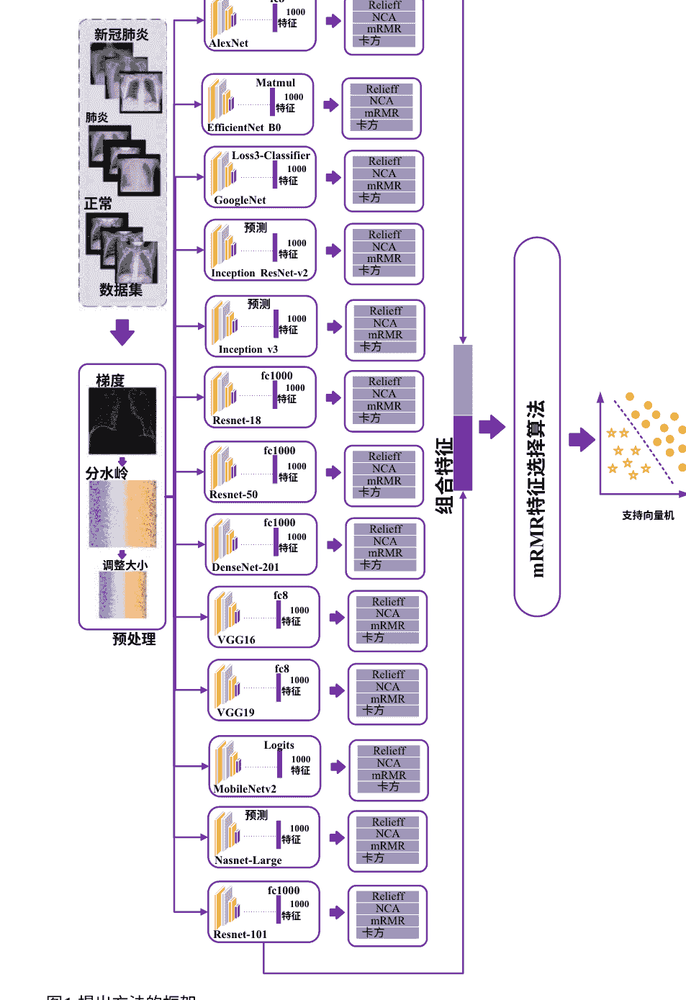

**图1 提出方法的框架**

##### 2.1.1 预处理

梯度方法应用于输入图像。 通过方向梯度的帮助计算梯度的大小和方向。

分水岭方法通常应用于图像的梯度。 通过使用图像中每个点周围的8个相邻点，检测图像中最崎岖和粗糙的方向[21]。 图像中高度最低的点用个别标识符标记。 利用图像中的梯度信息，以一定的速率跟踪下降区域。 分水岭方法将所有像素与其相应的最小点关联起来[22]。

##### 2.1.2 特征选择算法

特征选择，简而言之，是通过创建一个属于类别的特征向量的子集，通过深度学习模型创建一个更加功能强大、尺寸更小的特征向量等效于主要特征向量。

**邻域分量分析（NCA）**

NCA是一种特征加权方法，可以通过最大化评估分类准确性的目标函数来选择最佳的特征子集。 这是通过将NCA作为特征选择方法来实现的。

为了获得与特征向量 $x_i$ 相对应的权重向量 (w)，该方法通过优化最近邻学习分类器来改善性能[23]。 在NCA框架中，为每个样本选择一个参考样本点 $x_j$ ，然后将该点分配给样本 $x_i$。 由于两个样本的紧密接近， $x_j$ 被选为 $x_i$ 的参考点的概率将直接增加。 可以使用加权距离来测量这个距离，加权距离用 $D_w$ 表示，并通过将等式应用于方程式1来计算。

$$D_w=(x_i, x_j) = \sum_{m=1}^{r} w_m^2 |x_{im} - x_{jm}| \quad (1)$$

$w_m$是分配给第m个特征的权重。 一个返回很小的 $D_w$ 值的核函数可以用来确定概率 $P_{ij}$ 和加权距离 $D_w$ 之间的关系。 这个关系可以通过使用核函数来确定。$P_{ij}$由以下方程定义：

$$ P_{ij} = \frac{k(D_w(x_i, x_j))}{\sum_{j=1, j=i}^n D_w(x_i, x_j)} \quad (2) $$

同时，如果i=j且$P_{ii}=0$，则取值为1。核函数定义为$k(z)=\exp(-z/\sigma)$。参数k和σ是核宽度，它影响样本$x_j$被选为参考点的概率。$x_i$被正确分类的概率由方程3表示。

$$ P_{ij} = \sum_{j=1, j=i}^n P_{ij} Y_{ij} \quad (3) $$

**ReliefF**

特征选择中最著名的方法之一被称为ReliefF算法。这是一种有潜力创建相当准确和有成果的特征预测的算法。通过为特征分配权重来实现这些特征的预测。如果一个特征有用，可以预期同一类别的最近距离将比给定特征上的任何其他类别的最近距离更接近彼此[24]。解决凸优化问题，并使用结果来确定特征权重。然而，Relief算法的局限性在于只能处理两类情况，并且无法处理不完整的数据。这是一个缺点。ReliefF方法是Relief算法的增强版本，被提供作为解决这些问题以及其他困难的解决方案。这种增强方法有可能征服非常强大、嘈杂和不完整的数据。如果检查ReliefF算法的工作逻辑，首先随机选择一个样本$R_i$，然后选择同一类别的k个最近邻称为$H_j$，以及每个不同类别的k个最近邻称为$M_j(C)$。根据$R_i$、$H_j$和$M_j(C)$的值，更新所有特征的w[A]值。特征权重范围从-1到+1。最大的正值意味着该特征很重要。该过程由用户确定的次数继续进行。使用diff函数计算样本和特征之间的差异，即距离。该函数的计算取决于特征是离散还是数值。

设I1和I2为样本，A为特征。如果特征已经写入，则计算如方程4和5所示。选择k可以增加算法对噪声数据的鲁棒性。用户可以设置该值；但是如果选择k为1，则算法对噪声数据敏感。在许多研究中，k值被选择为10，但是选择不同的k值对于检查特征的重要性水平更有用。最后，选择过小的k值会导致类似的糟糕结果。

25. Roy, S. S., Rodrigues, N., & Taguchi, Y. (2020). 使用CNN进行脑肿瘤分类的增量扩张应用科学，10(14)，4915。 https://doi.org/10.3390/app10144915
26. Roy, S. S., Mihalache, S. F., Pricop, E., & Rodrigues, N. (2022). 通过扩张进行深度卷积神经网络环境声音分类。智能与模糊系统杂志，43(2)，1827–1833。 https://doi.org/10.3233/JIFS-219283
27. Roy, S. S., 等人 (2022). L2正则化的深度卷积神经网络用于火灾检测。智能与模糊系统杂志，43(2)，1799–1810。 https://doi.org/10.3233/JIFS-219281
28. Reddy, A. S. B., & Juliet, D. S. (2019). 使用ResNet-50进行疟疾细胞图像分类的迁移学习。在国际通信和信号处理会议 (ICCSP) 上(pp. 945–949)。 https://doi.org/10.1109/ICCSP.2019.8697909
29. Rezende, E., Ruppert, G., Carvalho, T., Ramos, F., & de Geus, P. (2017). 使用ResNet-50深度神经网络的恶意软件分类。在第16届IEEE国际机器学习和应用会议 (ICMLA 2017) 上的论文集中 (第1011-1014页)。 https://doi.org/10.1109/ICMLA.2017.00-19
30. Alif, M. A. R., Ahmed, S., & Hasan, M. A. (2017). 孤立的孟加拉手写字符识别与卷积神经网络。在2017年第20届计算机与信息技术国际会议 (ICCIT)(第1-6页)。
31. Alom, M. Z., Sidike, P., Hasan, M., Taha, T. M., & Asari, V. K. (2018). 使用最先进的深度卷积神经网络进行孟加拉手写字符识别。计算智能与神经科学.https://doi.org/10.1155/2018/6747098
32. Khan, M. M., Uddin, M. S., Parvez, M. Z., & Nahar, L. (2022). 基于压缩和激励的孟加拉手写复合字符识别的深度学习模型。沙特国王大学计算机与信息科学期刊，34(6)，3356–3364。 https://doi.org/10.1016/j.jksuci.2021.01.021
33. Rabby, A. K. M. S. A., Haque, S., Islam, M. S., Abujar, S., & Hossain, S. A. (2019). Ekush: 一个多功能和多类型的综合数据库，用于在线离线孟加拉手写字符。计算机与信息科学通讯。 https://doi.org/10.1007/978-981-13-9187-3_14
34. Sarkar, R., Das, N., Basu, S., Kundu, M., Nasipuri, M., & Basu, D. K. (2012). CMATERdb1: 一个无约束的孟加拉和孟加拉-英文混合文本文档图像数据库。国际文件分析与识别期刊。 https://doi.org/10.1007/s10032-011-0148-6
35. Biswas, M., 等 (2017). BanglaLekha-Isolated: 一个多用途的综合数据集手写孟加拉孤立字符。数据简介。 https://doi.org/10.1016/j.dib.2017.03.035
36. Alom, Z., Sidike, P., Taha, T. M., & Asari, V. K. (2017). 手写孟加拉数字识别使用深度学习，第1712页。
37. Shibly, M. M. A., Tisha, T. A., Tani, T. A., & Ripon, S. (2021). 基于卷积神经网络的集成方法识别孟加拉手写字符。PeerJ计算机科学，7，1-30页。 https://doi.org/10.7717/peerj-cs.565
38. Alom, M. Z., Sidike, P., Hasan, M., Taha, T. M., & Asari, V. K. (2017). 使用最先进的深度卷积神经网络识别手写孟加拉字符，第1712页。
39. Sikder, M. F. (2020). 孟加拉手写数字识别和生成。 在：国际计算智能联合会议论文集（第547-556页）。
40. Rahman, M. S. (2016). 针对孟加拉手写数字识别的最佳卷积神经网络参数。在第19届国际计算机与信息技术会议 (ICCIT) 上（第431-436页）。
41. Nishat, Z. K., & Shopon, M. (2019). 使用条件生成对抗网络合成特定类别的孟加拉手写字符。在2019年孟加拉语语音和语言处理国际会议 (ICBSLP 2019) 上。 https://doi.org/10.1109/ICBSLP47725.2019.201475
42. Chaudhuri, B. B. (2006). 孟加拉主要印度文字的完整手写数字数据库。在第10届国际手写识别前沿研讨会 (IWFHR) 上，法国拉鲍勒。
43. Alam, S., Reasat, T., Doha, R. M., & Humayun, A. I. (2018). NumtaDB组装的孟加拉手写数字，第1-4页。
44. Kramer, M. A. (1991). 非线性主成分分析使用自联想神经网络。AIChE杂志，37(2)， 233–243。 https://doi.org/10.1002/aic.690370209
45. Bank, D., Koenigstein, N., & Giryes, R. (2020). 自动编码器。在机器学习：方法和应用于脑疾病(pp. 193–208)。 https://doi.org/10.1016/B978-0-12-815739-8.00011-0
46. Alqahtani, H., Kavakli-Thorne, M., & Kumar, G. (2021). 生成对抗网络（GANs）的应用：一份更新的综述。工程计算方法档案，28(2)， 525–552。 https://doi.org/10.1007/s11831-019-09388-y
47. Haque, S., Shahinoor, S. A., Rabby, A. K. M. S. A., Abujar, S., & Hossain, S. A. (2019). OnkoGan：使用深度卷积生成对抗网络生成孟加拉国手写数字。计算机与信息科学通讯。 https://doi.org/10.1007/978-981-13-9187-3_10
48. Kingma, D. P., & Ba, J. (2014). Adam：一种用于随机优化的方法。 预印本在arXiv arXiv:1412.6980。
49. Theckedath, D., & Sedamkar, R. R. (2020). 使用VGG16、ResNet50和SE-ResNet50网络检测情感状态。SN计算机科学。 https://doi.org/10.1007/s42979-020-0114-9
50. He, K., Zhang, X., Ren, S., & Sun, J. (2016). 深度残差学习用于图像识别。 在2016年IEEE计算机视觉和模式识别会议（CVPR）(pp. 770–778)。 https://doi.org/10.1109/CVPR.2016.90

diff(A, I_1, I_2) = \begin{cases} 0, & I_1 = I_2 \\ 1, & I_1 \neq I_2 \end{cases}

diff(A, I_1, I_2) = |I_1 - I_2| \times \frac{1}{\max(A) - \min(A)}

## 卡方检验

卡方检验是一种单变量过滤方法。卡方方法适用于分类变量。它检测分类变量之间的关系和依赖关系。卡方检验是一个两步测试。在第一步中，根据期望值计算观察值的卡方统计量。在第二步中，将得到的卡方统计量与确定的阈值进行比较，并根据结果做出决策。根据卡方统计量对特征进行评分，并使用得分最高的特征。使用公式6-8计算卡方统计量。其中，I给定为公式6；是区间的数量，J是类别的数量。Nij；第i个区间是第j个类别中的样本数量。虽然公式6给出的两个属性Eij是独立的；第i个区间是第j个等级中的单位的期望数量。最后，公式7中的d表示用于检验统计量的卡方分布的自由度[25, 26]。

$$X^2 = \sum_{i=1}^{I} \sum_{j=1}^{J} \frac{(N_{ij} - E_{ij})^2}{E_{ij}}$$

$$E_{ij} = \frac{N_i N_j}{N}$$

$$d = (I - 1)(J - 1)$$

## 最小冗余特征选择(mRMR)

mRMR算法是由彭等人在2005年提出的一种基于熵的特征选择算法[27]。mRMR算法是一种过滤算法，通过选择与类别标签最相关的特征来进行分类数据的使用。该算法使用互信息来衡量两个特征或特征与类别标签之间的相似性比率[28]。实质上，mRMR算法试图将所有特征从最有价值到最没有价值进行排序，并让用户决定在分类问题中应该使用多少个特征。因此，mRMR算法应该被视为一种特征排序算法，而不是特征选择算法。

##### 2.1.3 预训练网络

迁移学习被定义为使用深度学习模型为特定目的开发的特征作为其他机器学习方法的输入所创建的学习结构。在这项研究中，使用了深度学习模型AlexNet、EfficientNet B0、GoogleNet、Inception ResNet-v2、Inception-v3、ResNet18、ResNet50、ResNet101、VGG16和VGG19。表1中给出了所提及网络的层数、深度、参数数量、图像输入维度以及网络架构。

## AlexNet

深度学习先驱Alex Krizhevsky、Ilya Sutskever和Geoffrey Hinton提出了一种被称为AlexNet的方法。这个深度卷积神经网络总共有25层，包括5个卷积层、3个最大池化层、2个dropout层、3个全连接层、7个ReLU层、2个归一化层、一个softmax层、输入层和分类（输出）层。进入AlexNet输入层的图像尺寸为227×227×3。最后一层是分类发生的地方，也是输入图像中分类编号的值呈现的地方。

表1 研究中使用的深度学习网络
| 预训练模型 | 层 | 深度 | 参数数量 (百万) | 图像输入尺寸 |
|---|---|---|---|---|
| AlexNet | 25 | 8 | 61.0 | 227 × 227 |
| EfficientNet B0 | 290 | 82 | 5.3 | 224 × 224 |
| GoogleNet | 144 | 22 | 7.0 | 224 × 224 |
| Inception ResNet-v2 | 825 | 164 | 55.9 | 299 × 299 |
| Inception v3 | 316 | 48 | 23.9 | 299 × 299 |
| Densenet201 | 708 | 201 | 3.5 | 224 × 224 |
| Nasnetlarge | 1243 | | 88.9 | 331 × 331 |
| Mobilenetv2 | 154 | 53 | 3.5 | 224 × 224 |
| Resnet-18 | 71 | 18 | 11.7 | 224 × 224 |
| Resnet-50 | 177 | 50 | 25.6 | 224 × 224 |
| Resnet-101 | 347 | 101 | 44.6 | 224 × 224 |
| VGG16 | 41 | 16 | 138.0 | 224 × 224 |
| VGG19 | 47 | 19 | 144.0 | 224 × 224 |

## DenseNet201

DenseNet-121（密集连接卷积网络）的每一层与其他层之间都有正向连接。DenseNet的每一层设计都以之前所有层的属性作为输入，同时还考虑了该层独特的特性，并将这些信息传递给后续的层[30]。DenseNet拓扑结构具有特征传播和减少参数数量的优势，允许特征的重复使用[31]。

DenseNet-121的设计由四个密集块、三个过渡层和总共121层（117个循环、3个传递和1个分类）组成。

## MobileNetV2

MobileNet设计基于模块化架构，可以开发浅层和深层神经网络。该架构的两个基本全局超参数提供了延迟和精度的最佳平衡。根据问题的限制，这些超参数允许模型构建者选择适合其应用的合适大小的模型。

## Nasnet-Large

NASNet-Large是一个1243层的卷积神经网络，训练集包含来自ImageNet收集的一百多万张照片。该网络可以将照片分成一千种物体类型，包括动物、气球和花朵。因此，该网络已经获得了丰富的特征表示，适用于各种图像类型。

331 ×331像素应该是要放入网格中的图片的尺寸。

## EfficientNet B0

EfficientNet是谷歌在2019年开发的一项新的CNN研究，它在准确性和生产力（性能）方面提供了显著的改进。该研究中提出的生产力模型提供了一种新的方法，因为它也适用于其他CNN模型。EfficientNet-B0是使用AutoML MNasNet[32]开发的基本网络。EfficientNet-B0由290层组成。要放置在EfficientNet B0的输入层的图像尺寸为227 × 227 ×3。

## GoogleNet

ImageNet 2014在图像分类竞赛中以93.33%的成功率排名第一。GoogLeNet的架构结构包含144层，这种架构已经证明了数据集的增加可以提高性能。

通过增加层数来提高分类过程的性能。要放置在Googlenet的输入层中的图像大小为224 × 224 × 3，为了防止大尺寸图像的过载，它会在同一时期对图像进行不同尺寸的过滤，如“1 ×1, 3 ×3, 5 ×5”。与其他架构不同，这种架构是并行处理图像，而不是堆叠层。因为对于堆叠的过程也考虑了诸如内存大小增加、时间浪费等负面因素。

## Inception ResNet-V2

Inception-ResNet-V2架构将剩余的连接与Inception架构的新版本结合起来。Inception-ResNet-V2网络有效地利用了剩余的连接[33]。Inception-ResNet-V2架构的特征提取性能非常好。在这个架构中，剩余的单元被添加到每个Inception模块中，以防止网络梯度的退化，这通常与层数增加有关。Inception ResNet-v2架构的结构包含825层。要放置在Inception ResNet-v2输入层的图像尺寸为299 × 299 ×3。

## Inception V3

Inception架构是随着GoogleNet模型出现的一种架构。GoogleNet模型，由Szegedy等人（2015）提出，试图在增加深度和宽度的同时保持计算成本不变。因此，在这个模型中，使用Inception的概念，通过同时使用不同的卷积滤波器得到的输出进行组合[34]。Inception-v3架构的结构包含316层。要放置在Inception v3输入层的图像尺寸为299 ×299 ×3。

## ResNet-18

ResNet 18预训练模型通过输入大小为224 ×224的ImageNet数据集中的一百多万个数据来提供丰富的特征。尽管它有71层和18个深度，但分析表明与一些更深层次的模型相比，它能够提供成功且更快的结果[35]。

## ResNet-50

Resnet微架构模块与其他架构的结构不同。在忽略某些层之间的变化的情况下，可能更倾向于切换到较低的层次。通过在Resnet架构中允许这种情况，性能水平得到了提高。

Resnet50架构由177层的网络组成。网络的深度为50。除了这种分层结构外，还有关于如何进行层间连接的信息[36]。

## ResNet-101

Resnet-101结构有347层，深度为101。ResNet的层间跳跃被称为ResBlock。即使在前一层中没有学到任何东西，ResBlock通过将前一层的信息应用于新层，使模型更加稳健。ResBlock因此解决了梯度消失的问题。利用斜率下降作为优化算法。Resnet-101输入层的尺寸为224 × 224 ×3 [36]。

## VGG16

VGG16模型总共由41层组成，其中16层包含可学习的权重，接着是ReLU和池化层。可学习的层包括13个卷积层和3个全连接层。与AlexNet类似，VGG16模型在所有卷积层中都采用1像素的平移和3 × 3的滤波器，并且最大池化层跟随卷积层。最大池化使用两步、2 × 2的滤波器实现。为了提取特征向量，利用了第一和第二个全连接层（fc6、fc7）中的激活值。fc6和fc7的结果向量总共包含4096个特征。训练使用224 × 224的RGB图片[37]。

## VGG19

牛津大学的视觉几何组负责开发VGG19计算机程序（VGG）。它由19层组成，其中16层是卷积层，3层是完全连接层，5层是最大池化层，1层是Softmax层。该网络的输入是尺寸为（224，224，3）的照片。可训练参数约有1.44亿个。使用步长为一个像素（3 × 3）的滤波器，以传达图像的整体概念[37]。

##### 2.1.4 支持向量机

SVM是一种机器学习模型，用于聚类和回归问题，尤其是在分类中，由Vapnik-Chervonenkis于1995年开发。特别是在最近几年，它是最成功的机器学习算法之一，用于解决分类问题。SVM模型的目的基本上是检测将目标变量的类别相互分离的超平面，以最合适的方式[38]。

##### 2.1.5 最近邻居(K-NN)

尽管k-NN分类器是一种简单的分类器，但它是具有良好结果的分类器之一。之所以称其为“简单”，是因为这个分类器不需要任何训练步骤。这个特点区别于其他分类器的训练数据。这个分类器与其他分类器不同之处在于，它可以在分类过程中直接使用，而不需要训练阶段。在分类器的分类过程中，可以直接使用这些训练数据，而不需要训练阶段。假设给定一个测试样本，可以检测训练集中与该测试样本最近的k个邻居，并计算属于每个类别的邻居数量。根据邻居数量最多的类别来判断其所属类别[39]。在k-NN分类器中，有一些数学公式用于距离的概念。这些公式在公式9-11中给出。在闵可夫斯基距离公式中，如果选择k=1，则得到曼哈顿距离；如果选择k=2，则得到欧氏距离公式。

欧几里得 = $$\sqrt{\sum_{i=1}^{n} (x_i - y_i)^2}$$ (9)

曼哈顿 = $$\sum_{i=1}^{n} |x_i - y_i|$$ (10)

闵可夫斯基 = $$\left( \sum_{i=1}^{n} |x_i - y_i|^k \right)^{1/k}$$ (11)

##### 2.1.6 决策树

决策树允许快速处理数据。决策树通过具有特定属性值的数据执行分类过程。为了进行这个过程，一些特征被确定为输入，一些特征被确定为输出，并被呈现给算法。为了通过算法获得输出特征中的结果，可以通过查看决策树来了解输入值的可能性。创建模型的方法之一是EBT方法。

为了提高离散学习算法的预测准确性，集成方法混合了各种学习方法。它们是不同建模方法的线性混合，可以在不显著增加复杂性的情况下产生更好的预测结果。袋装和增强集成方法是最常用的两种集成方法。虽然袋装方法可以最小化构造学习算法中的误差方差，但增强方法专门降低构造学习算法中的偏差。

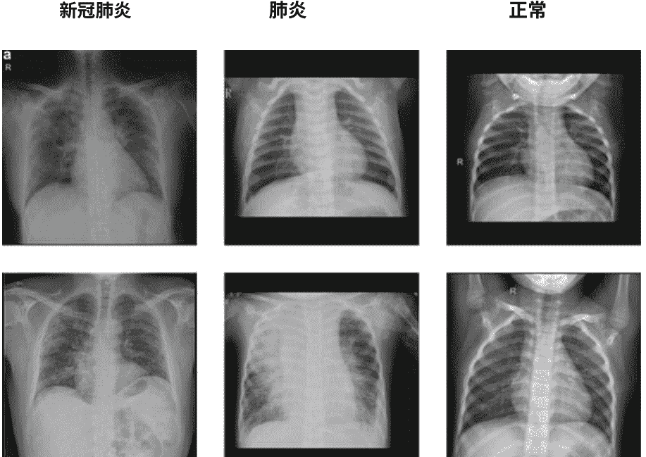

#### 2.2 数据集

该数据集包含由放射科医生标记的1061张X射线图像。该数据集在从kaggle网站[42,43]下载后进行了编辑。X射线图像包括三类：COVID-19、肺炎和正常。数据集中有361张COVID-19、500张肺炎和200张正常胸部X射线图像。数据集中的COVID-19病例包括200名男性和161名女性患者的胸部X射线图像。患者的平均年龄超过45岁。这些图像的高度范围从143到1637像素（平均491像素），宽度范围从76到1225像素（平均383像素）。图2显示了数据集中COVID-19、正常和肺炎患者的X射线扫描示例。

### 3 性能测量指标

机器学习分类器的成功与类别标签和实际类别值之间的相关性有关。将具有正真类值的数据标记为正真被称为真正阳性（TP），而将其标记为负真被称为假阴性（FN）；将具有负真类值的数据标记为负真被称为真真阴性（TN），而将其标记为正真被称为假正（FP）。对于建议的方法，性能测量指标是利用复杂性矩阵中的TP、TN、FP和FN数值计算的。利用准确率、敏感度、特异度、精确度和F值的数值，开发了性能测量指标。利用以下方程式，计算性能测量指标。

$$准确率 = \frac{TP + TN}{TP + TN + FP + FN} \qquad (12)$$

$$敏感度 = \frac{TP}{TP + FN} \qquad (13)$$

$$特异性 = \frac{TN}{TN + FP} \qquad (14)$$

$$精确度 = \frac{TP}{TP + FP} \qquad (15)$$

$$F-分数 = 2 \times \frac{精确度 \times 敏感性}{精确度 + 敏感性} \qquad (16)$$

### 4 实验研究

本研究使用Matlab环境获得实验结果。实验结果使用一台配备I7处理器、16 GB内存和4 GB显卡的一体机获得。数据集中的图像大小为224 ×224、227 × 227、299 ×299和331 × 331，并进行分类。在本研究中，使用了卷积神经网络AlexNet、EfficientNetB0、GoogleNet、Inception ResNet-v2、Inception-v3、DenseNet201、MobileNetV2、Nasnet-Large、ResNet18、ResNet50、ResNet 101、VGG16和VGG19模型。使用了卡方检验、NCA、mRMR和ReliefF特征选择方法。总共选择了2000个特征，其中来自AlexNet的FC8层特征1000个和来自Resnet101的FC1000层特征1000个。选定的特征经过mRMR特征选择方法减少到200个特征。200个特征的分类过程交给了13个不同的分类器。本研究发现SVM获得了最高的性能。在图3中，给出了13个预先学习的不同网络和组合网络使用的分类方法的混淆矩阵，达到了最高的准确性。ResNet 50 +AlexNet网络使用mRMR特征选择的Cubic SVM分类器获得了98.21%的最佳准确性结果，而使用NCA特征选择的Inception Resnet-v2网络Cubic SVM分类器获得了95.00%的最差准确性结果。

在图4中，给出了根据分类器和特征选择的预训练网络的准确性值的图表。

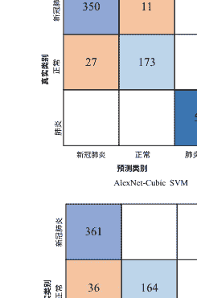
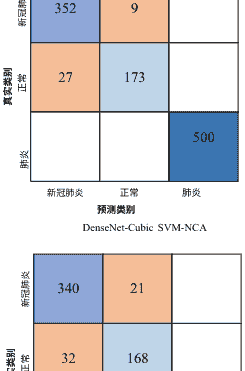
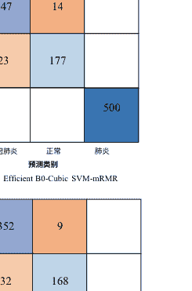
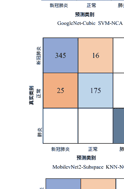
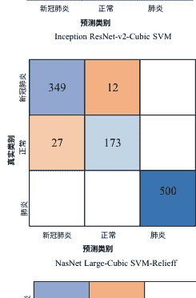
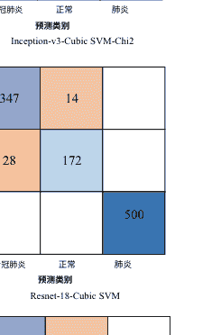
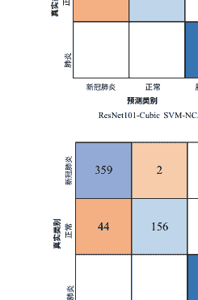
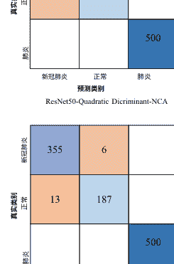
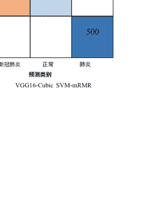
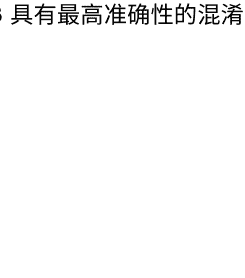


图3 具有最高准确性的混淆矩阵

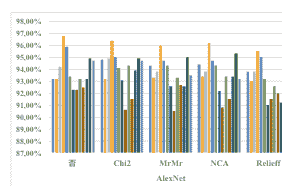
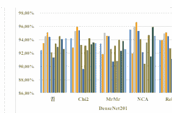
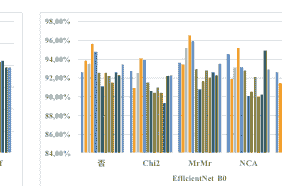
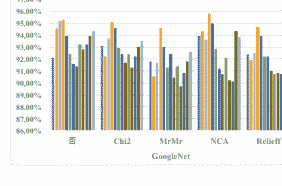
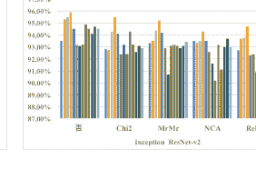
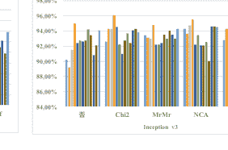
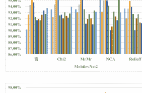
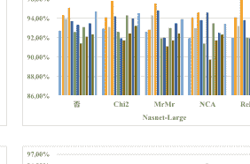
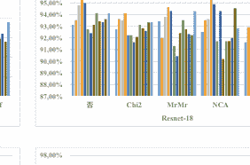
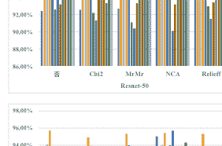
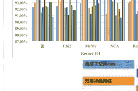
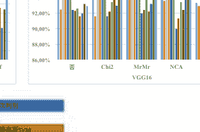
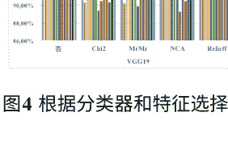
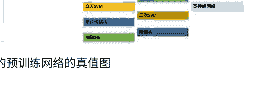

图4 根据分类器和特征选择的预训练网络的真值图

对于AlexNet网络，立方SVM分类器的准确率最高，为96.42%，具有mRMR特征选择的中等高斯SVM分类器的准确率最低，为89.2%。对于DenseNet-201网络，具有NCA特征选择的立方SVM分类器的准确率最高，为96.61%，具有Chi2特征选择的二次判别分类器的准确率最低，为89.6%。对于EfficientNet B0网络，具有NCA特征选择的立方SVM分类器的准确率最高，为96.51%，具有Chi2特征选择的精细树分类器的准确率最低，为89.3%。对于GoogleNet网络，具有NCA特征选择的立方SVM分类器的准确率最高，为96.06%，具有mRMR特征选择的二次SVM分类器的准确率最低，为89.7%。对于Inception ResNet-v2网络，立方SVM分类器的准确率最高，为95.0%。对于Inception v3网络，具有Chi2特征选择的立方SVM分类器具有最高的准确率，为96.14%。双层神经网络的准确率最低，为89.2%。

对于MobileNet2网络，具有Chi2特征选择的立方SVM分类器具有最高的准确率，为96.14%。具有ReliefF特征选择的二次判别器具有最低的准确率，为90.0%。

对于Nasnet-Large网络，具有ReliefF特征选择的立方SVM分类器具有最高的准确率，为96.32%。具有ReliefF特征选择的中等高斯SVM分类器具有最低的准确率，为89.7%。

对于ResNet18网络，具有立方SVM分类器的准确率最高，为96.04%。具有ReliefF特征选择的二次判别器具有最低的准确率，为90.0%。

对于ResNet50网络，具有NCA特征选择的立方SVM分类器具有最高的准确率，为97.08%。具有NCA特征选择的二次判别器具有最低的准确率，为90.1%。

对于ResNet101网络，具有立方SVM分类器的准确率最高，为96.04%。具有ReliefF特征选择的Fine Tree分类器具有最低的准确率，为90.4%。

对于VGG16网络，具有mRMR特征选择的立方SVM分类器具有最高的准确率，为96.42%。具有NCA特征选择的中等高斯SVM分类器具有最低的准确率，为90.0%。

对于VGG19网络，具有NCA特征选择的二次判别器具有最高的准确率，为95.66%。具有NCA特征选择的中等高斯SVM分类器具有最低的准确率，为89.3%。

在Table2中，给出了所提出方法中使用的分类器的敏感性、特异性、精确度和F-分数结果。对于肺炎类别，准确率、敏感性、特异性、精确度和F-分数指标均为100%。

在COVID19类别中，对于敏感性指标，具有NCA特征选择的GoogleNet网络Cubic SVM分类器取得了100%的最佳结果，而具有NCA特征选择的Inception Resnet-v2网络Cubic SVM分类器取得了94.18%的最差结果。对于特异性指标，具有mRMR特征选择的ResNet50 +AlexNet网络Cubic SVM分类器取得了98.14%的最佳结果，而具有mRMR特征选择的VGG19网络Cubic SVM分类器取得了93.71%的最差结果。对于精确度指标，具有mRMR特征选择的ResNet50 +AlexNet网络Cubic SVM分类器取得了96.47%的最佳结果，而具有mRMR特征选择的VGG19网络Cubic SVM分类器取得了89.08%的最差结果。对于F-分数指标，具有mRMR特征选择的ResNet50 +AlexNet网络Cubic SVM分类器取得了97.39%的最佳结果，而具有NCA特征选择的Inception Resnet-v2网络Cubic SVM分类器取得了92.77%的最差结果。

在正常类别中，对于敏感度指标，VGG19网络立方SVM分类器与mRMR特征选择的结果最好，达到99.77%，而GoogleNet网络立方SVM分类器与NCA特征选择的结果最差，只有96.04%。对于特异度指标，Inception Resnet-v2网络立方SVM分类器与NCA特征选择的结果最好，达到98.95%，而VGG19网络立方SVM分类器与mRMR特征选择的结果最差，只有78.00%。对于精确度指标，使用mRMR特征选择的Cubic SVM分类器的网络取得了最佳结果，达到了98.50%，而使用NCA特征选择的Inception Resnet-v2网络Cubic SVM分类器的结果最差，只有84.00%。对于F-分数指标，使用mRMR特征选择的ResNet50+AlexNet网络Cubic SVM分类器取得了最佳结果，达到了98.90%，而使用Chi2特征选择的Inception-v3网络Cubic SVM分类器的结果最差，只有96.38%。

## 表2

| 分类器 | 类别 | 准确率 (%) | 敏感度 (%) | 特异度 (%) | 精确度 (%) | F-分数 (%) |
| :--- | :--- | :--- | :--- | :--- | :--- | :--- |
| AlexNet-Cubic SVM | COVID-19 | 96.42 | 96.95 | 96.14 | 92.84 | 94.85 |
| | 正常 | | 98.72 | 86.50 | 96.92 | 97.81 |
| | 肺炎 | | 100.00 | 100.00 | 100.00 | 100.00 |
| DenseNet-201-Cubic SVM-NCA | COVID-19 | 96.61 | 97.51 | 96.14 | 92.88 | 95.14 |
| | 正常 | | 98.95 | 86.50 | 96.93 | 97.93 |
| | 肺炎 | | 100.00 | 100.00 | 100.00 | 100.00 |
| 高效-B0-Cubic SVM-mRMR | COVID-19 | 96.51 | 96.12 | 96.71 | 93.78 | 94.94 |
| | 正常 | | 98.37 | 88.50 | 97.36 | 97.86 |
| | 肺炎 | | 100.00 | 100.00 | 100.00 | 100.00 |
| GoogleNet-Cubic SVM-NCA | COVID-19 | 96.06 | 100.00 | 94.86 | 90.93 | 95.25 |
| | 正常 | | 100.00 | 98.37 | 86.00 | 97.58 |
| | 肺炎 | | 100.00 | 100.00 | 100.00 | 100.00 |
| Inception Resnet-v2-Cubic SVM-NCA | COVID-19 | 95.00 | 94.18 | 95.43 | 91.40 | 92.77 |
| | 正常 | | 97.56 | 84.00 | 96.33 | 96.94 |
| | 肺炎 | | 100.00 | 100.00 | 100.00 | 100.00 |
| Inception-v3-Cubic SVM-Chi2 | COVID-19 | 96.14 | 97.51 | 95.43 | 91.67 | 94.50 |
| | 正常 | | 96.14 | 98.95 | 84.00 | 96.38 |
| | 肺炎 | | 100.00 | 100.00 | 100.00 | 100.00 |
| MobilevNet2-子空间 KNN-NCA | COVID-19 | 96.14 | 95.57 | 96.43 | 93.24 | 94.39 |
| | 正常 | | 98.14 | 87.50 | 97.13 | 97.63 |
| | 肺炎 | | 100.00 | 100.00 | 100.00 | 100.00 |
| NasNet Large-Cubic SVM-ReliefF | COVID-19 | 96.32 | 96.68 | 96.14 | 92.82 | 94.71 |
| | 正常 | | 98.61 | 86.50 | 96.92 | 97.75 |
| | 肺炎 | | 100.00 | 100.00 | 100.00 | 100.00 |
| ResNet18-Cubic SVM | COVID-19 | 96.04 | 96.12 | 96.00 | 92.53 | 94.29 |
| | 正常 | | 98.37 | 86.00 | 96.80 | 97.58 |
| | 肺炎 | | 100.00 | 100.00 | 100.00 | 100.00 |
| ResNet101-Cubic SVM-NCA | COVID-19 | 97.08 | 95.57 | 97.86 | 95.83 | 95.70 |
| | 正常 | | 98.14 | 92.50 | 98.26 | 98.20 |
| | 肺炎 | | 100.00 | 100.00 | 100.00 | 100.00 |
| ResNet50-Cubic SVM-NCA | COVID-19 | 96.04 | 97.23 | 95.43 | 91.64 | 94.35 |
| | 正常 | | 98.84 | 84.00 | 96.38 | 97.59 |
| | 肺炎 | | 100.00 | 100.00 | 100.00 | 100.00 |
| VGG16-Cubic SVM-mRMR | COVID-19 | 96.42 | 94.74 | 97.29 | 94.74 | 94.74 |
| | 正常 | | 97.79 | 90.50 | 97.79 | 97.79 |
| | 肺炎 | | 100.00 | 100.00 | 100.00 | 100.00 |
| VGG19-Cubic SVM-mRMR | COVID-19 | 95.66 | 99.45 | 93.71 | 89.08 | 93.98 |
| | 正常 | | 99.77 | 78.00 | 95.13 | 97.39 |
| | 肺炎 | | 100.00 | 100.00 | 100.00 | 100.00 |
| ResNet50 + AlexNet-Cubic SVM-mRMR | COVID-19 | 98.21 | 98.34 | 98.14 | 96.47 | 97.39 |
| | 正常 | | 99.30 | 93.50 | 98.50 | 98.90 |
| | 肺炎 | | 100.00 | 100.00 | 100.00 | 100.00 |

### 5 讨论

在本节中，讨论了使用预训练模型和提出的方法的性能指标，包括准确性、敏感性和特异性。文献中的评估通常是基于合并的数据集进行的。由于研究中使用的数据集不同且评估标准不同，不能说它们完全优于彼此。这些方法的性能得分见表3。

Abbas等人[44]在X射线图像上建立了一种改进的深度神经网络，以更有效地区分COVID-19病例。他们称之为DeTraC的模型包括三个内部层。该模型使用ResNet18作为后端，在X射线数据集上实现了95.12%的准确率。

Wang等人[45]在他们的研究中使用了44个COVID19(+)和55个典型病毒性肺炎CT图像。作为预处理，进行了ROI提取的视觉检查。在应用的M-inception算法中，得到的结果分别为82.9%、81%、84%、77%和90%的准确率、敏感性、F1分数、AUC和特异性。

Alqudah等人[46]在这项研究中使用了SVM、随机森林和CNN。实现了95.2%的准确率、93.3%的敏感性、100%的特异性和100%的精确度。

Hemdan等人[47]提出了COVIDXNET深度学习分类器架构，用于使用X射线图片进行COVID-19诊断。此外，他们验证了七个不同的DCNN模型，如VGG19和Densenet201，在他们的调查中。他们证明了VGG19和DenseNet的分类效果更好。

Narin等人[48]，使用基于深度卷积神经网络的模型对COVID-19的X光图像进行分类。使用胸部X光片，使用基于卷积神经网络的模型（InceptionResNetV2，ResNet50和InceptionV3）来检测感染冠状病毒肺炎的人。根据实验结果，ResNet50模型达到了98.00%的准确率。

所提出的方法已经达到了98.21%的成功率。在肺炎类别的敏感性和特异性标准中，达到了100%的成功率。对于COVID-19类别的敏感性、特异性、精确度和F-Score指标，分别获得了98.34%、98.14%、96.47%和97.39%的数值。

## 表3 文献研究和结果

| 参考文献 | 数据集 | 方法 | 准确率(%) | 敏感性 | 特异性 | 精确度 | F-Score |
|----------|--------|------|-----------|--------|--------|--------|---------|
| Abbas 等人[44] | COVID-19图像 数据收集[49] | eTraC-ResNet-18 | 95.12 | 97.97% | 91.87% | 93.36% | - |
| Wang 等人[45] | 胸部X射线图 片 [42] 肺炎 | VGG16, VGG19, DenseNet201, Inception_ResNet_V 2,Inception_V3, Resnet50, MobileNet_V2 Xception | 82.9 | 81.00% | 77.00% | - | 84.00% |
| Alqudah等人。 [46] | COVID-19图像 数据收集[49] | 支持向量机，随机森林，卷积神经网络 | 95.20 | 93.30% | 100.00% | 100.00% | - |
| Hemdan等人。 [47] | COVID-19图像 [49]数据收集 | VGG19,DenseNet201,InceptionV3, ResNetV2, InceptionResNetV2, Xception, MobileNetV2 | 90.00 | - | - | 83.00% | 91.00% |
| Narin等人。 [48] | COVID-19图像 数据收集[49] | ResNet50, InceptionV3, InceptionResNetV2 | 98.00 | - | - | 100.00% | 98.00% |
| 提出的方法 | COVID-19图像 数据集[42,43] | AlexNet, EfficientNet B0, GoogleNet, Inception ResNet-v2, Inception-v3, DenseNet201, MobileNet2, Nasnet-Large, ResNet18, ResNet50, ResNet101, VGG16, VGG19 | COVID-19 = 98.21 正常 = 98.21 肺炎 = 98.21 | 98.34% | 98.14% | 96.47% | 97.39% |

### 6 结果

COVID-19大流行在全球范围内迅速蔓延，其对人们的负面影响清楚地表明了在早期阶段检测到阳性病例和迅速正确干预的重要性。本研究使用学习迁移方法对COVID-19疫情期间获取的三类X射线图像数据集进行了分类。本文对X射线图像应用了预处理技术，以提高分类性能。梯度算子被用作Sobel算子，用于突出X射线图像中的点区域并减少灰度级数。使用卡方、NCA、mRMR和ReliefF特征选择方法。首先，比较了13个预训练模型的结果。

然后，从AlexNet和Resnet101中选择了总共2000个特征。通过mRMR特征选择方法，选定的特征已经减少到了200个特征。对于这200个特征的分类过程使用了13种不同的分类器。在这项研究中，通过将mRMR特征选择应用于ResNet50 + AlexNet模型的组合模型，获得了98.21%的最高性能。在这项研究中，COVID19类别的最高准确率、敏感度、特异度、精确度和F-分数值分别为：ResNet50 + AlexNet Cubic SVM为98.21%，GoogleNet网络Cubic SVM分类器为100%，ResNet50 + AlexNet Cubic SVM为98.14%，ResNet50 + AlexNet Cubic SVM为96.47%，ResNet50+ AlexNet为97.39%，在Cubic SVM中获得。在提出的方法中，已经看到预训练的CNN架构和特征提取方法可以一起使用。此外，这项研究证实了权重可以组合并且比单独考虑特征选择方法的性能更有效。这项研究的主要限制是，如果应用于更大的数据集，所使用的方法需要更强大的硬件。

### 参考文献

1.  冠状病毒更新. (2022). https://www.worldometers.info/coronavirus/

2.  Jalali, S. M. J., Ahmadian, M., Ahmadian, S., Hedjam, R., Khosravi, A., & Nahavandi, S. (2022). 基于X射线图像的COVID-19检测使用进化深度学习方法. Expert Systems with Applications, 201, 116942.

3.  Dhiman, G., Chang, V., Kant Singh, K., & Shankar, A. (2022). 采用自动深度学习和基于优化的方法进行新型冠状病毒COVID-19疾病的检测使用X射线图像.Journal of Biomolecular Structure and Dynamics, 40(13), 5836-5847.

4.  Roy, S. S., Goti, V., Sood, A., Roy, H., Gavrilas, T., Floroian, D., Paraschiv, N., & Mohammadi-Ivatloo, B. (2014). L2正则化的深度卷积神经网络用于火灾检测.Journal of Intelligent & Fuzzy Systems, 1-12.

5.  Ravi, V., Narasimhan, H., Chakraborty, C., & Pham, T. D. (2022). 基于深度学习的图像分析应用于COVID-19 CT扫描和胸部X射线图像的元分类器方法. 多媒体系统, 28(4), 1401-1415.

6.  Roy, S. S., Rodrigues, N., & Taguchi, Y. (2020). 使用CNN进行脑肿瘤分类的渐进膨胀方法. 应用科学, 10(14), 4915.

7.  Biswas, R., Vasan, A., & Roy, S. S. (2020). 基于膨胀的深度神经网络用于视网膜血管在眼底图像中的分割. 伊朗科学与技术杂志, 电气工程交易, 44(1), 505-518.

8.  Samui, P., Roy, S. S., & Balas, V. E. (2017).神经计算手册. 学术出版社.

9.  Javaheri, T., Homayounfar, M., Amoozgar, Z., Reiaz, R., Homayounieh, F., Abbas, E., Laali, A., Radmard, A. R., Gharib, M. H., & Mousavi, S. A. J. (2021). CovidCTNet: 一种开源的deep learning方法，使用小型CT图像进行COVID-19诊断. NPJ Digital Medicine, 4(1), 1-10.

10. Rehman, A., Naz, S., Khan, A., Zaib, A., & Razzak, I. (2022) 使用深度迁移学习改进冠状病毒（COVID-19）诊断。 在国际信息技术与应用会议论文集(pp. 23-37). Springer.

11. JavadiMoghaddam, S., & Gholamalinejad, H. (2021). 一种基于深度学习的新方法，用于从CT图像中检测COVID-19. 生物医学信号处理与控制, 70, 102987.

12. Chen, J., Wu, L., Zhang, J., Zhang, L., Gong, D., Zhao, Y., Chen, Q., Huang, S., Yang, M., & Yang, X. (2020). 基于深度学习的模型，用于检测2019年新型冠状病毒肺炎在高分辨率计算机断层扫描上. 科学报告, 10(1), 1-11.

13. Wu, X., Hui, H., Niu, M., Li, L., Wang, L., He, B., Yang, X., Li, L., Li, H., & Tian, J. (2020). 基于深度学习的多视图融合模型，用于筛查2019年新型冠状病毒肺炎：一项多中心研究。 欧洲放射学杂志, 128, 109041.

14. Mobiny, A., Cicalese, P., Zare, S., Yuan, P., Abavisani, M., Wu, C., Ahuja, J., de Groot, P., & Van Nguyen, H. (2020). 使用细节导向胶囊网络的CT扫描进行Covid R-I检测.

15. Balaha, H. M., El-Gendy, E. M., & Saafan, M. M. (2021). CovH2SD: 基于Harris Hawks优化和堆叠深度学习的COVID-19检测方法. Expert Systems withApplications, 186, 115805.

16. Li, L., Qin, L., Xu, Z., Yin, Y., Wang, X., Kong, B., Bai, J., Lu, Y., Fang, Z., & Song, Q. (2020) Artificial intelligence distinguishes COVID-19 from community acquired pneumonia on chest CT. Radiology.

17. He, X., Yang, X., Zhang, S., Zhao, J., Zhang, Y., Xing, E., & Xie, P. (2020) 基于CT扫描的COVID-19诊断的高效样本深度学习. Medrxiv.

18. Ahamed, K. U., Islam, M., Uddin, A., Akhter, A., Paul, B. K., Yousuf, M. A., Uddin, S., Quinn, J. M., & Moni, M. A. (2021). 一种使用有效的预处理技术从胸部CT扫描和X射线图像中检测COVID-19的深度学习方法. 计算机在生物学和医学中, 139, 105014.

19. Pathak, Y., Shukla, P. K., Tiwari, A., Stalin, S., & Singh, S. (2020). 基于深度迁移学习的COVID-19疾病分类模型. Irbm.

## 使用深度迁移学习的图像字幕生成

Tapan Kumar Das

### 1 引言

生成图像的文本描述对于人类来说是一项较容易的任务，然而，对于机器来解释图像则需要计算机视觉来可视化图像和自然语言处理来描述图像[1]。因此，为了自动生成特定照片的字幕，系统必须经过训练和教育，以认识图像的内容，并以自然语言词汇表达其中的内容。

随着深度学习方法的出现，尤其是用于图像特征提取和处理[3]，这个特定问题已经迅速得到解决。

深度学习技术，如卷积神经网络（CNN），广泛用于图像处理任务，因为它们能够处理数百万个底层特征[4]。众所周知，CNN技术在各种医学图像处理中非常高效，例如COVID-19肺部CT扫描[5]，MRI图像用于脑肿瘤诊断[6,7]，视网膜血管[8]，血管造影[9]，胸部X射线[10]等等。还有许多其他应用。

仅仅通过看到图1中的图片，我们中的一些人可能会说“一个小孩正在谈论棕色的引导草地”，有些人可能会说“小男孩正在玩玩具”，还有一些人可能会说“一个小男孩正在设计房子”。对于所有这些观察，答案都是正确的，甚至还有一些额外的标题。所有这些发现对于人类来说不需要任何特殊的培训或努力，然而，对于一个系统来说情况并非如此，只需一瞥即可忽视；一个适当的语言可以被描述。

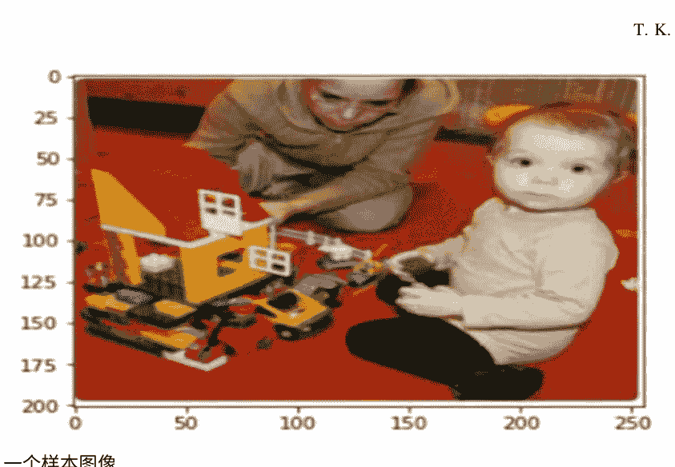

图1 一个样本图像

这项研究生成图像的标题具有以下意义。

- 实验基于转移学习和卷积神经网络 (CNN)。
- 我们旨在通过对块图进行微小的更改来提高模型性能。
- 目标是通过使用短语作为基本单元而不是单词，为输入图像生成语义和句法描述。

## 动机

这个问题在现实世界的应用中非常有用。我们列举了一些应用领域，这些研究正在被解释：

- 自动驾驶汽车：通过自动和及时地生成车辆周围场景的描述，自动驾驶系统将真正实现自主性。
- 对盲人的帮助：通过设计一个能够在行走时引导盲人的产品，将实现许多愿望。这可以通过将周围场景转换为文本，并进行文本到语音的转换来实现。
- 谷歌图像搜索：与谷歌搜索类似，如果可以先将图像转换为标题，然后搜索底层文本，图像搜索可能会很受欢迎。

### 2 相关研究

存在不同的图像字幕技术；它们是基于检索或基于模板的。最近，基于深度学习的字幕生成变得非常流行，因为它能够提供质量高且适当的图像描述。基于深度学习的注意机制在字幕生成方面也取得了有希望的结果。大多数模型都是基于编码器-解码器的，已经意识到在大多数系统中，LSTM和双向LSTM网络被用作解码器。同样，为了进行编码，VGG16和ResNet50被用于它们在向量化方面的有效性。

在表1中，有一些关于图像字幕的研究使用了深度学习进行图像处理和文本描述。

表1 使用深度学习方法进行字幕生成的现代研究

| 研究 | 目标 | 方法论 | 结果 |
|------|------|--------|------|
| 陈等人 [14] | 图像和文本描述之间的映射 | 使用循环神经网络生成字幕 | 能够生成新颖的字幕 |
| Sharma等人 [15] | 通过整合视觉和外部知识进行图像字幕 | 所使用的方法包括LSTM、CNN和来自外部来源的知识 | 提取的类别通常属于真实类别 |
| 尤等人 [16] | 使用语义注意力进行图像字幕 | 结合自上而下和自下而上的策略 | 与标准基准相比，具有最先进的性能 |
| Rampal等人 [17] | 使用神经网络压缩进行图像字幕 | VGG16或ResNet50作为编码器，LSTM作为解码器，使用flickr8k数据集 | 与未压缩模型相比，模型大小减少了73.1%，BLEU分数增加了7.7% |
| Arnav等人[18] | 使用深度学习的图像分析 | 两个输入流合并并传递到LSTM层 | 结果显示生成了5个句子，使用5个beam大小以及序列单词的平均对数概率 |
| Yao等人 [19] | 通过属性提升图像描述 | 设计了CNN加RNN架构来生成描述 | 研究图像表示和高级属性 |
| Singh等人 [20] | 使用人工智能进行图像描述 | CNN, RNN - LSTM | 讨论了各种算法，如CNN, RNN, LSTM |
| Wang等人 [21] | 图像描述 | CNN和两个独立的LSTM网络 | 取得了很高的性能 |

### 3 方法论

我们使用组合（CNN-RNN）模型从图像和文本中提取特征，进一步使用评估模型检查所提出模型的准确性，最后通过错误率跟踪每个时期的模型性能。

在这里，我们使用自上而下的方法和迁移学习来提取特征，并训练模型，以获得图像的准确描述。事实上，在我们的模型中，迁移学习的概念被应用了两次。InceptionV3用于从图像中提取特征，Glove用于从文本/描述中提取特征，以获得更高的准确性。最后，我们使用一些图像（测试图像）测试模型的准确性。详细的方法包括以下步骤：

- 数据收集。
- 数据清洗和预处理。
- 预处理的结果是，我们从训练数据集中获得了1652个独特的词汇。我们采用了InceptionV3迁移学习模型。
- 我们对所有的训练图像和测试图像进行了编码，这些图像是我们模型的输入。
- 在数据清洗过程中去除停用词后，我们的词汇中有7578个单词。
- 我们还使用了迁移学习模型（Glove）来从我们预处理的文本数据中提取特征。
- 然后我们构建和训练我们的网络/模型。最后，我们评估了在测试数据上的性能。

#### 3.1 数据集

我们使用了包含大约8000张图片的Flickr8k数据集，其中6000张图片用于训练模型，1000张图片用于验证模型，剩下的1000张图片用于测试模型以确定模型的效率。每张图片包含五个标题（图2）。

图3展示了Flickr8k数据集中的一些样本图片。
从图4可以清楚地看出，每个单独的图片有五个不同的标题。
Flickr数据集被加载到存储库中，然后通过去除额外的空格、标点符号和其他干扰来预处理数据。对于编码，使用了CNN。输入图片被送入CNN中提取特征。在特征经过一系列层处理后，CNN的最后一个隐藏状态与之连接解码器。在这个框架中，循环神经网络（RNN）作为解码器，负责进行语言建模，直到单词级别。图2显示了基于编码器-解码器的图像字幕处理的示意图。


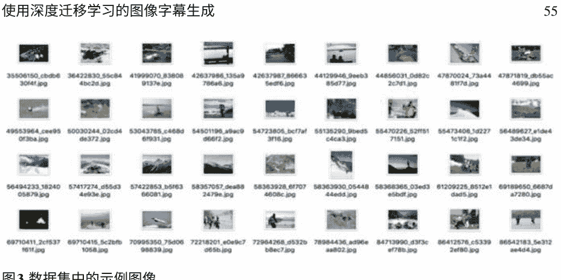

图3 数据集中的示例图像

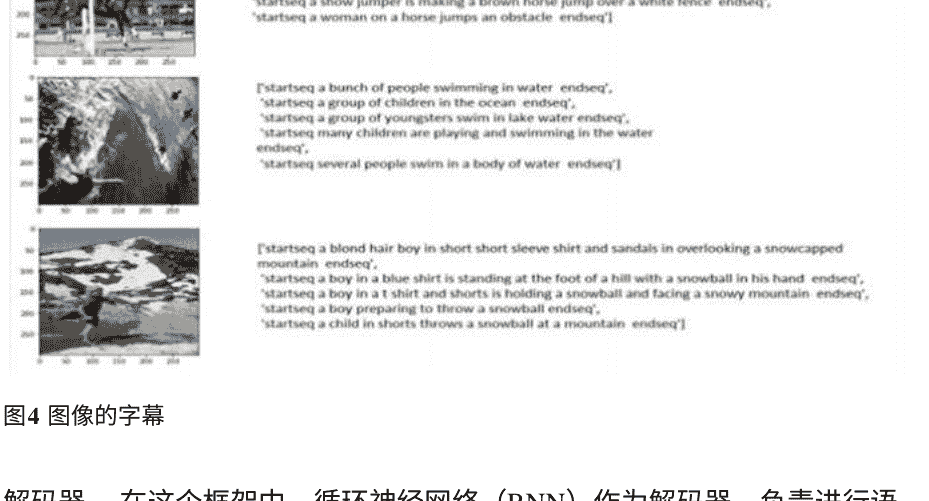

图4 图像的字幕

#### 3.2 图像的Inception模型

在这里，我们使用预训练的Inception V3模型从图像中提取特征。Inception v3是一个广泛使用的图像识别模型，在标准ImageNet数据集上显示出了98.1%的惊人准确率。

Inception V3的架构如图5所示。

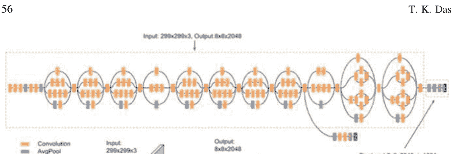

图6和图7分别表示了编码和解码的过程以及这些模型的详细层和参数。

总结了说明模型的标题，该模型训练的总参数和详细的网络层在图8中表示。

```
encode_model.summary()
```

Model: "model"
| Layer (type) | Output Shape | Param # | Connected to |
| :--- | :--- | :--- | :--- |
| input_1 (InputLayer) | [(None, 299, 299, 3) | 0 | |
| conv2d (Conv2D) | (None, 149, 149, 32) | 864 | input_1[0][0] |
| batch_normalization (BatchNorma | (None, 149, 149, 32) | 96 | conv2d[0][0] |
| activation (Activation) | (None, 149, 149, 32) | 0 | batch_normalization[0][0] |
| conv2d_1 (Conv2D) | (None, 147, 147, 32) | 9216 | activation[0][0] |
| batch_normalization_1 (BatchNor | (None, 147, 147, 32) | 96 | conv2d_1[0][0] |
| activation_1 (Activation) | (None, 147, 147, 32) | 0 | batch_normalization_1[0][0] |
| conv2d_2 (Conv2D) | (None, 147, 147, 64) | 18432 | activation_1[0][0] |
| batch_normalization_2 (BatchNor | (None, 147, 147, 64) | 192 | conv2d_2[0][0] |

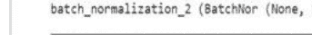

```
activation_91 (Activation) (None, 8, 8, 384) 0 batch_normalization_91[0][0]
activation_92 (Activation) (None, 8, 8, 384) 0 batch_normalization_92[0][0]
batch_normalization_93 (BatchNo (None, 8, 8, 192) 576 conv2d_93[0][0]
activation_85 (Activation) (None, 8, 8, 320) 0 batch_normalization_85[0][0]
mixed9_1 (Concatenate) (None, 8, 8, 768) 0 activation_87[0][0] activation_88[0][0]
concatenate_1 (Concatenate) (None, 8, 8, 768) 0 activation_91[0][0] activation_92[0][0]
activation_93 (Activation) (None, 8, 8, 192) 0 batch_normalization_93[0][0]
mixed10 (Concatenate) (None, 8, 8, 2048) 0 activation_85[0][0] mixed9_1[0][0] concatenate_1[0][0] activation_93[0][0]
avg_pool (GlobalAveragePooling2) (None, 2048) 0 mixed10[0][0]
=============================================================================
Total params: 21,802,784
Trainable params: 21,768,352
```

图7 对向量化的模型摘要进行解码

### 4 结果

主要目标是预测图像的标题。为了预测，我们应用了一种使用深度学习技术的高效预测模型。我们主要关注模型的预测能力，以便在数据集中找到给定图像的标题。

#### 4.1 样本输出

为了测试我们设计的模型的有效性，我们在Flickr8k数据集中测试了该模型，并展示了图9、10、11、12和13中获得的输出标题。

### 参考文献

20. Shi, F., Xia, L., Shan, F., Song, B., Wu, D., Wei, Y., Yuan, H., Jiang, H., He, Y., & Gao, Y. (2021). 利用感染尺寸感知分类进行COVID-19和社区获得性肺炎的大规模筛查. Physics in Medicine & Biology, 66(6), 065031.
21. Tarabalka, Y., Chanussot, J., & Benediktsson, J. A. (2010). 使用分水岭变换进行高光谱图像的分割和分类. Pattern Recognition, 43(7), 2367–2379.
22. Gauch, J. M. (1999). 通过多尺度梯度分水岭层次进行图像分割和分析. IEEE Transactions on Image Processing, 8(1), 69–79.
23. Yang, W., Wang, K., & Zuo, W. (2012). 高维数据的邻域成分特征选择. 计算机学报, 7(1), 161–168.
24. Robnik-Šikonja, M., & Kononenko, I. (2003). ReliefF和RReliefF的理论和实证分析. 机器学习, 53(1), 23–69.
25. Liu, H., Li, J., & Huang, L. (2002). 使用基因表达谱和蛋白质模式的特征选择和分类方法的比较研究. 基因组信息学, 13, 51–60.
26. McHugh, M. L. (2013). 独立性的卡方检验. 生物化学医学, 23(2), 143–149.
27. Peng, H., Long, F., & Ding, C. (2005). 基于最大依赖性、最大相关性和最小冗余性的特征选择. IEEE模式分析与机器智能, 27(8), 1226–1238.
28. Ding, C., & Peng, H. (2005). 从微阵列基因表达数据中选择最小冗余特征. 生物信息学和计算生物学杂志, 3(02), 185–205.
29. Krizhevsky, A., Sutskever, I., & Hinton, G. E. (2017). 使用深度卷积神经网络进行ImageNet分类. ACM通信, 60(6), 84–90.
30. Huang, G., Liu, Z., Van Der Maaten, L., & Weinberger, K. Q. (2017). 密集连接的卷积网络. 在计算机视觉和模式识别的IEEE会议论文集 (pp. 4700–4708).
31. Iandola, F., Moskewicz, M., Karayev, S., Girshick, R., Darrell, T., & Keutzer, K. (2014). Densenet: 实现高效的卷积神经网络描述符金字塔. arXiv预印本: 1404.1869.
32. Tan, M., & Le, Q. (2019). Efficientnet: 重新思考卷积神经网络的模型缩放. 在机器学习国际会议上, PMLR (pp. 6105–6114).
33. Szegedy, C., Ioffe, S., Vanhoucke, V., & Alemi, A. A. (2017). Inception-v4, inception-resnet和残差连接对学习的影响. 在第三十一届AAAI人工智能大会上.
34. Szegedy, C., Liu, W., Jia, Y., Sermanet, P., Reed, S., Anguelov, D., Erhan, D., Vanhoucke, V., & Rabinovich, A. (2015). 使用卷积进行更深入的研究. 在IEEE计算机视觉和模式识别会议论文集 (pp. 1–9).
35. Ou, X., Yan, P., Zhang, Y., Tu, B., Zhang, G., Wu, J., & Li, W. (2019). 在复杂场景中使用编码器-解码器结构的ResNet-18移动物体检测方法. IEEE Access, 7, 108152–108160.
36. He, K., Zhang, X., Ren, S., & Sun, J. (2016). 深度残差学习用于图像识别. 在计算机视觉和模式识别的IEEE会议论文集 (pp. 770–778).
37. Simonyan, K., & Zisserman, A. (2014). 用于大规模图像识别的非常深的卷积网络. arXiv预印本: 1409.1556.
38. Vapnik, V. (1999). 统计学习理论的本质. Springer科学与商业媒体.
39. McRoberts, R. E., Tomppo, E. O., Finley, A. O., & Heikkinen, J. (2007). 使用k最近邻技术和卫星图像估计区域均值和方差的森林属性. 环境遥感, 111(4), 466–480.
40. Bühlmann, P. (2012). Bagging, boosting and ensemble methods. 在计算统计手册中. Springer, 第985-1022页.
41. Breiman, L. (1996). Bagging predictors. 机器学习, 24(2), 123-140.
42. COVID-19胸部X射线. (2022). https://www.kaggle.com/bachrr/covid-chest-xray
43. 胸部X射线图像（肺炎）. (2022). 检索自 https://www.kaggle.com/paultimothymooney/chest-xray-pneumonia
44. Abbas, A., Abdelsamea, M. M., & Gaber, M. M. (2021). 使用DeTraC深度卷积神经网络对胸部X射线图像中的COVID-19进行分类. 应用智能, 51(2), 854-864.
45. Wang, S., Kang, B., Ma, J., Zeng, X., Xiao, M., Guo, J., Cai, M., Yang, J., Li, Y., & Meng, X. (2021). 一种使用CT图像进行冠状病毒疾病 (COVID-19) 筛查的深度学习算法. 欧洲放射学, 31 (8), 6096-6104.
46. Alqudah, A. M., Qazan, S., Alquran, H., Qasmieh, I. A., & Alqudah, A. (2020). COVID-2019 使用X射线图像和人工智能混合系统进行检测. 生物医学信号和图像分析与项目.
47. Hemdan, E. E.-D., Shouman, M. A., & Karar, M. E. (2020). Covidx-net: 一种用于诊断X射线图像中的covid-19的深度学习分类器框架. arXiv预印本: 2003.11055.
48. Narin, A., Kaya, C., & Pamuk, Z. (2021). 使用X射线图像和深度卷积神经网络自动检测冠状病毒疾病 (COVID-19). Pattern Analysis and Applications, 24(3), 1207–1220.
49. Cohen, J. P., Morrison, P., Dao, L., Roth, K., Duong, T. Q., & Ghassemi, M. (2020). COVID-19 图像数据收集：前瞻性预测是未来. arXiv预印本: 2006.11988.

caption_model.summary()

Model: "model_1"

| Layer (type) | Output Shape | Param # | Connected to |
|--------------|--------------|---------|--------------|
| input_3 (InputLayer) | [(None, 34)] | 0 | |
| input_2 (InputLayer) | [(None, 2048)] | 0 | |
| embedding (Embedding) | (None, 34, 200) | 330400 | input_3[0][0] |
| dropout (Dropout) | (None, 2048) | 0 | input_2[0][0] |
| dropout_1 (Dropout) | (None, 34, 200) | 0 | embedding[0][0] |
| dense (Dense) | (None, 256) | 524544 | dropout[0][0] |
| lstm (LSTM) | (None, 256) | 467968 | dropout_1[0][0] |
| add (Add) | (None, 256) | 0 | dense[0][0]
lstm[0][0] |
| dense_1 (Dense) | (None, 256) | 65792 | add[0][0] |

| Layer (type) | Output Shape | Param # | Connected to |
|--------------|--------------|---------|--------------|
| input_3 (InputLayer) | [(None, 34)] | 0 | |
| input_2 (InputLayer) | [(None, 2048)] | 0 | |
| embedding (Embedding) | (None, 34, 200) | 330400 | input_3[0][0] |
| dropout (Dropout) | (None, 2048) | 0 | input_2[0][0] |
| dropout_1 (Dropout) | (None, 34, 200) | 0 | embedding[0][0] |
| dense (Dense) | (None, 256) | 524544 | dropout[0][0] |
| lstm (LSTM) | (None, 256) | 467968 | dropout_1[0][0] |
| add (Add) | (None, 256) | 0 | dense[0][0]
lstm[0][0] |
| dense_1 (Dense) | (None, 256) | 65792 | add[0][0] |
| dense_2 (Dense) | (None, 1652) | 424564 | dense_1[0][0] |

Total params: 1,813,268
Trainable params: 1,813,268
Non-trainable params: 0

图8 标题模型摘要

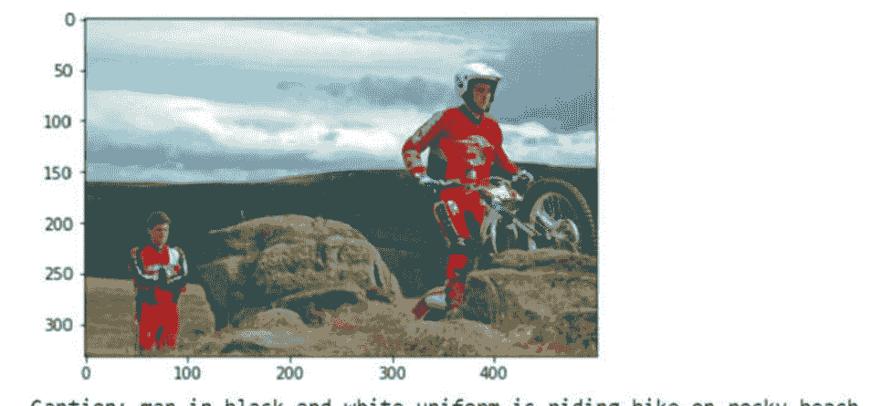

Caption: man in black and white uniform is riding bike on rocky beach

图9 图像1的样本输出

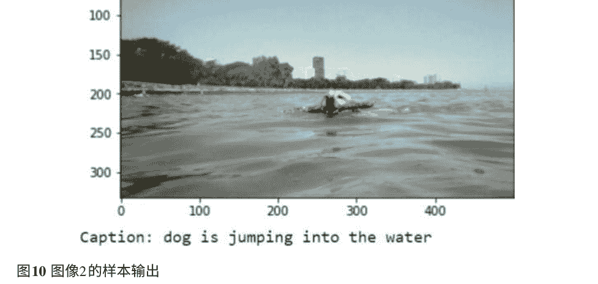

Caption: dog is jumping into the water

图10 图像2的样本输出

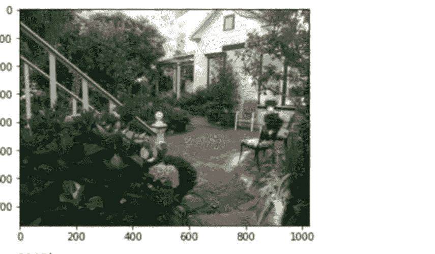

(1, 2048)

Caption: man in black shirt is sitting on bench with his dog

## 图11 图像3的样本输出

/content/Flicker8k_Dataset/2842865689_e37256d9ce.jpg

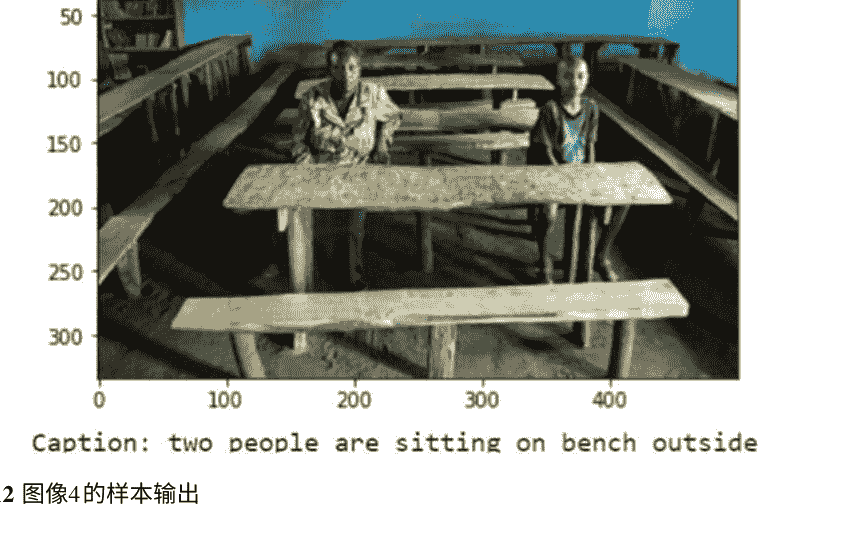

Caption: two people are sitting on bench outside

## 图12 图像4的样本输出

### 5 结论

在本章中，我们通过将CNN与RNN集成来执行图像字幕任务。我们使用Flickr8k数据集训练了编码器-解码器模型。当使用数据集中的未见图像进行测试时，训练好的模型实现了最先进的性能。通过图像的文本描述来评估内容的图像检索的效率。这种图像字幕生成可以扩大应用领域，如医学、安全和其他领域，其中底层图像传达了很多信息并具有一些隐含的含义。

此外，图像字幕的框架可以自动化和促进大规模图像的注释，这可能导致视频字幕和视频对话。

### 参考文献

+   1. Sharma, H., Agrahari, M., Singh, S. K., Firoj, M., & Mishra, R. K. (2020). 图像字幕：一项综合调查。在2020年可再生能源及其控制中的电力电子与物联网应用国际会议(PARC) (pp. 325–328). IEEE.
+   2. Stefanini, M., Cornia, M., Baraldi, L., Cascianelli, S., Fiameni, G., & Cucchiara, R. (2022). 从展示到讲述：基于深度学习的图像字幕调查。IEEE模式分析与机器智能交易。
+   3. Hossain, M. Z., Sohel, F., Shiratuddin, M. F., & Laga, H. (2019). 图像字幕的深度学习综合调查。ACM计算调查(CsUR)， 51(6)， 1–36.
+   4. Chohan, M., Khan, A., Mahar, M. S., Hassan, S., Ghafoor, A., & Khan, M. (2020). 深度学习在图像分析中的应用：一种系统性的图像标题生成方法， 11(5).
+   5. Tiwari, R. S., Das, T. K., Srinivasan, K., & Chang, C. Y. (2022). 基于通道的重叠CNN塔式架构在CT扫描图像中的COVID-19识别中的概念化。 Scientific Reports, 12(1), 1–15.
+   6. Roy, S. S., Rodrigues, N., & Taguchi, Y. (2020). 使用CNN进行脑肿瘤分类的渐进膨胀方法。 应用科学, 10(14), 4915。
+   7. Das, T. K., Roy, P. K., Uddin, M., Srinivasan, K., Chang, C. Y., & Syed-Abdul, S. (2021). 通过深度卷积神经网络模型在脑MR图像中进行早期肿瘤诊断。 Computers,Materials and Continua, 68(2), 2413–2429.
+   8. Biswas, R., Vasan, A., & Roy, S. S. (2020). 扩张深度神经网络用于视网膜血管分割的图像分析。 伊朗科学与技术杂志, 电气工程交易, 44(1), 505–518。
+   9. Roy, S. S., Hsu, C., Samaran, A., Goyal, R., Pande, A., et al. (2023). 使用卷积神经网络的血管分割在血管造影中: 一种基于深度学习的方法。 CMES-计算机工程与科学建模, 136(1), 241–255。
+   10. Das, T. K., Chowdhary, C. L., & Gao, X. Z. (2020). 胸部X射线检查: 一种卷积神经网络方法。 仿生学、生物材料和生物医学工程杂志, 45, 57–70。 Trans Tech Publications Ltd.
+   11. Zohourianshahzadi, Z., & Kalita, J. K. (2022). 神经注意力在图像分析中的应用: 杰出方法综述Artificial Intelligence Review, 55(5), 3833–3862.
+   12. Wang, C., Yang, H., Bartz, C., & Meinel, C. (2016). 深度双向LSTMs图像字幕生成. 在第24届ACM国际多媒体会议(pp. 988–997).
+   13. Rampal, H., & Mohanty, A. (2020). 基于CNN-LSTM的图像字幕生成的高效神经网络压缩. 从arXiv预印本检索到: 2012.09708.
+   14. Chen, X., & Zitnick, C. L. (2014). 学习用于图像字幕生成的循环视觉表示. 从arXiv预印本检索到: 1411.5654.
+   15. Sharma, H., & Jalal, A. S. (2020). 利用外部知识进行图像字幕生成使用CNN和LSTM.现代物理学快报, 34(28), 2050315.
+   16. You, Q., Jin, H., Wang, Z., Fang, C., & Luo, J. (2016). 具有语义注意力的图像字幕生成. 在IEEE计算机视觉和模式识别会议论文集(pp. 4651–4659)中.
+   17. Rampal, H., & Mohanty, A. (2020). 基于高效CNN-LSTM的图像字幕生成使用神经网络压缩. 从arXiv预印本检索到:2012.09708.
+   18. Arnav, J. H., & Pulkit, M. (2018). 使用深度学习的图像字幕生成.
+   19. Yao, T., Pan, Y., Li, Y., Qiu, Z., & Mei, T., (2017). 使用属性提升图像字幕生成. 在IEEE国际计算机视觉会议论文集(第4894-4902页)中.
+   20. Singh, Y. P., Ahmed, S. A. L. E., Singh, P., Kumar, N., & Diwakar, M. (2021). 使用人工智能的图像描述. 在物理学杂志: 会议系列(第1854卷, 第1期, 第012048页). IOP出版社。
+   21. Wang, C., Yang, H., Bartz, C., & Meinel, C. (2016). 使用深度双向LSTMs的图像描述. 在第24届ACM国际多媒体会议论文集(第988-997页)中。

## 车辆超速检测系统

K. Ganesan、N. S. Manikandan和Vijayan Sugumaran

### 1 引言

每年，全球各地有许多人死亡。车祸是最常见的死因之一。事故不仅会导致人员死亡，还会伤害大量人员。在事故的几个原因中，高速车辆是最重要的原因。因此，必须管理高速车辆。因此，不同的政府组织、学术机构和汽车制造商已经开始了各种研究和项目，以降低事故发生的可能性，并为乘客和驾驶员提供安全保障。一些研究人员使用不同的机制来检测高速公路上的车辆超速，例如使用VANET技术连接云服务器[1]，基于视频的特定区域兴趣（ROI）[2]和基于电子收费数据的速度预测[3]。为了管理高速公路上的高速车辆，泰米尔纳德邦政府计划在收费站安装一个超速检测设备。图1显示了收费站中的超速检测的框图。该架构由一个车辆检测系统、一个连接到RTO服务器的公共云服务器和一个超速检测系统组成。

神经计算[6]和深度学习[7]使得许多领域中的最新应用成为可能，包括从卫星图像中检测车辆[4]，从医学图像中提取肿瘤[5]等等。

车辆检测和车牌检测与识别在车辆超速检测系统的初始阶段起着重要作用。特别是，它必须检测印度车辆并提取印度车牌信息。针对收费站的印度车辆检测，Rajput等人[8]利用YOLO3目标检测和分类来检测和分类收费站中的车辆。他们对六种类型的车辆进行了分类，每种车辆都可以用于单独的收费成本。他们在收费站的研究结果显示，平均召回率为86.3%，精确度为94.1%。

该系统的重要作用是定位和提取车牌信息。许多研究者使用了深度学习技术[9-15]，有些人使用了图像处理技术[16, 17]。然而，大多数情况下，定位和提取印度车牌是复杂的，因为位置不正确、损坏、遮挡或使用了未经授权的字体[18]。在印度车牌定位和数据提取方面，Jagtap等人提出了一种检测车辆上各种字体样式的车牌的新方法[19]。它依赖于自适应图像分割和人工神经网络(ANN)字符识别的结合。所提出的方法将形态学运算与水平和垂直边缘直方图相结合，实现了车牌定位和字符分割。为了识别字符，使用了一个两层前馈反向传播神经网络。结果显示总体准确率为89.5%。当涉及到印度车牌的不规则性时，Ravirathinam等人构建了一个流水线，使用了多种先进的快速区域卷积神经网络来有效应对印度各种情况。印度车牌没有公开可访问的数据集，所以他们使用视频帧和移动设备上的图像创建了一个平衡的数据集，考虑到了所有的不规则性。他们的流水线对印度车牌的总体正确率为88.5%，部分正确率为10%。通过添加一个新的启发式系统，总体正确率提高到91%。对于所有类型的车辆，车牌检测的准确率为94.98%。有时提取的车牌信息是不正确的，在混乱的印度交通视频中进行OCR校正，涉及复杂的车牌模式；Singh等人提出了一个模块化框架。这些模式是由一种先进的深度学习模型生成的，该模型在视频帧上进行了训练。该模型在其框架中包含多帧一致性，用于生成建议，因为它从视频而不是图像中读取文本。他们的人机交互框架首先使用目标检测器和跟踪器将多车辆视频分割成多个片段，每个片段包含一个来自视频的单个车辆，以帮助纠正过程。然后，他们的框架使用多帧一致性为单个车辆提供推荐。然后，用户将获得交互式建议，只显示给他们某些提取的片段，以便他们可以快速轻松地验证或纠正他们的预测。这种高质量的输出可以用于持续更新一个庞大的数据库，用于监控，从而提高深度模型在困难的现实场景中的准确性。

针对云平台，Khan等人提出了一种基于物联网的系统，该系统使用两个监控摄像头来测量它们之间的平均速度[21]。为了强制执行速度限制，测量数据被发送到云端进行额外处理。入口和出口点用于检测特定区域的任何不确定性。例如，如果一辆汽车通过入口点后未能到达终点，可以将其突出显示。该系统由一个手机应用程序和一个网络系统组成，它们交换实时数据，包括通过时间、图片和车牌注册号等有关经过的车辆的信息。这样的系统具有需要很少人工参与、需要安装更少的测速枪以及在摄像机视野之外监控车辆的优点。

两个收费站之间的限速由交通密度或政府交通规则确定。然而，收费站之间的道路通常是弯曲的，并且有限速。大多数基于云的车辆超速检测系统对道路曲率不敏感。关于从道路GIS地图中提取水平曲线的数据，李等人[22]提出了一种完全自动化的方法。他们提出的方法旨在实现四个不同的目标：

+   (a)无论曲线类型如何，都能识别出所选道路表面层中的每个曲线；
+   (b)每个曲线都能自动分类为简单曲线或复合曲线；
+   (c)能自动确定每个简单曲线的半径、曲率度数、长度以及复合曲线的半径；
+   (d)对于所有检测到的曲线，能自动在GIS中创建曲线特征和层。

通过提出的技术，96.7%的曲线能够正确识别，并且使用该方法计算出它们的几何信息。然而，现有的道路曲率提取方法对曲率噪声和山地地形中的曲率一无所知。

因此，现有的超速检测系统存在一些缺陷，例如对高速公路上的曲率和曲率噪声没有意识。为了弥合代际差距，提出的系统包括以下特点：

+   - YOLO目标检测模型已被提出用于车辆检测和车辆类型提取。
+   - 图像处理技术用于定位和提取检测到的车辆图像中的车牌。
+   - 使用CRNN深度学习文本提取模型提取本地化车牌的信息。
+   - 提出的曲率感知行程时间估计模型计算两个收费站之间的行程时间，云端系统检测车辆的超速。

本文的其余部分安排如下：第2节描述了车辆检测和车牌提取系统，分为车辆检测和类型分类、车牌定位和车牌识别、行程时间估计和超速检测系统。速度检测系统进一步分为新的曲线发现方法、曲线速度限制数据库创建、曲线感知行程时间估计和车辆超速检测系统。第3节讨论了车辆检测和车牌定位与文本提取、新的曲线发现方法、曲线感知行程时间估计和车辆超速检测的结果。最后，第4节提供了结论和未来工作。

### 2 提出的模型

图2描述了所提出系统的架构。该系统被细分为三个子系统。第一个子系统在收费站检测车辆并提取车牌信息和车辆类型。第二个子系统使用道路曲率提取模块、曲线感知速度限制模块和曲率感知旅行时间估计器来描述两个收费站之间的曲率感知行程时间。超速检测是第三个也是最后一个子系统。它由一个收费站系统和一个通用云服务器基础设施组成。这三个子系统的简要描述如下。

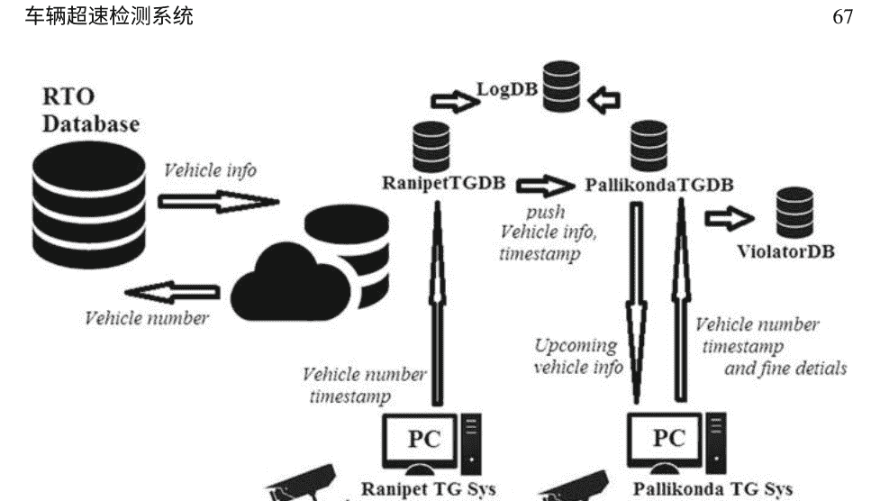

## 图2所提出系统的架构

#### 2.1 车辆检测和车牌提取系统

该系统由三个模块组成：车辆检测和车辆类型分类、车牌定位和车牌识别。下面详细介绍了每个模块的细节。

##### 2.1.1 车辆检测和类型分类：YOLO

YOLO [23]通过应用于整个图像的单个CNN将图像分割成M x M网格。对于每个网格，计算B个边界框的预测和相关的置信度得分。类别置信度分数使用下面给出的公式分析这些边界框。

类别置信度分数 = 条件类别概率 + 边界框置信度分数。它评估了分类和定位的确定性水平。数学定义如下：边界框置信度分数 ≡ Pr(object)。条件类别概率 ≡ Pr(class_i|object)类别置信度分数 ≡ Pr(class_i)。IoU，则 IoU × Pr(class_i|object) (1)

其中 Pr(object)表示物体在盒子中存在的可能性。预测框与实际数据之间的交并比，即IoU，是地面真值。给定物体存在的情况下，物体属于给定类别 i 的概率被称为 Pr(class_i | object)。物体属于给定类别 i 的概率由 Pr(class_i)给出。

YOLO将输入图像缩小到448 ×448像素大小。然后将图像通过卷积网络，得到一个7 x7x30的张量。张量信息包括: (1) 边界框矩形的坐标，以及(2) 系统已经训练过的所有类别的概率分布。通过限制这些类别标签，消除了置信度得分（概率）低于30%的情况。

在比较预测和真实值时，为了计算损失，YOLO使用了平方和误差。分类损失是损失函数的一部分。定位损失是预测边界框与真实值之间的误差。置信度得分的损失仅适用于那些不包含任何物体的框。下面是总体公式：

\[
\lambda_{coord} \sum_{i=0}^{s^2} \sum_{j=0}^{B} 1_{ij}^{obj} \left[ (x_i - \hat{x}_i)^2 + (y_i - \hat{y}_i)^2 \right] \\
+ \lambda_{coord} \sum_{i=0}^{s^2} \sum_{j=0}^{B} 1_{ij}^{obj} \left[ (\sqrt{x_i} - \sqrt{\hat{x}_i})^2 + (\sqrt{h_i} - \sqrt{\hat{h}_i})^2 \right] \\
+ \sum_{i=0}^{s^2} \sum_{j=0}^{B} 1_{ij}^{obj} (c_i - \hat{c}_i)^2 + \lambda_{noobj} \sum_{i=0}^{s^2} \sum_{j=0}^{B} 1_{ij}^{noobj} (c_i - \hat{c}_i)^2 \\
+ \sum_{i=0}^{s^2} 1_{ij}^{obj} \sum_{c \in classes} (p_i(c) - \hat{p}_i(c))^2 \quad (2)
\]

##### 2.1.2 车牌定位

在车辆图像中找到车牌的位置是一项关键任务。使用灰度转换、阈值化和形态学处理（如膨胀和腐蚀）来定位车牌。使用Canny边缘检测器来检测车牌边缘，并从车辆图像中裁剪出定位的车牌[24]。

##### 2.1.3 车牌识别：CRNN

CRNN [25]由CNN、双向LSTM和CTC层组成，可以视为编码器-解码器结构。CNN是一个称为图像特征序列的特征序列编码器。由双向LSTM和CTC层组成的解码器生成字符序列。

CNN将输入图像的宽度和高度设置为(CNN的宽度×32)/H和32像素，其中W和H是图像的宽度和高度，以保持原始的长宽比。由于字符高而窄，高度大于宽度，所以CNN在池化层中使用的步幅是2而不是2。因此，最终的特征图具有与原始图像感受野相对应的细长像素点。输入图像使用两个步幅为2的层池化和三个步幅为1的层池化进行下采样。特征图的最终维度为b × 1 × [(W × 8)/H] × C，其中b是批量大小，1是高度，(W×8)/H是宽度，C表示通道数。用于特征提取的CNN结构显示在表1中。

CRNN解码器由CTC层和双向LSTM层组成。双向LSTM从特征图的列向量接收输入。概率矩阵(W×8)/H×C，其中C是字符标签的数量，设置为26个英文大写字母、26个英文小写字母和一个空格，是输出，表示每个列向量中字符的概率。恢复的特征图的宽度为(W×8)/H。通过将CTC层应用于双向LSTM的输出，确定标签序列的可能性。在训练期间，通过CTC层中定义的条件概率确定标签序列的可能性。条件概率的负对数似然函数用于训练网络。CTC层计算所有真实标签序列的概率之和。路径'hee-ll-o'和'hh-ee-ll-oo'（其中'-'表示空格）被排除。

| 层 | CNN网络 | 输出尺寸 |
|---|---|---|
| Conv1 | (3 × 3 × conv) × 6 | 32 × [(W × 32)/H] |
| 连接层 | ReLU, 1 × 1个卷积层, dropout | 32 × [(W × 32)/H] |
| | 2 × 2个平均池化层, 步长2 × 2 | 16 × [(W × 16)/H] |
| Conv2 | (3 × 3 × conv) × 6 | 16 × [(W × 16)/H] |
| 连接层 | ReLU, 1 × 1个卷积层, dropout | 16 × [(W × 16)/H] |
| | 2 × 2个平均池化层, 步长2 × 2 | 8 × [(W × 8)/H] |
| Conv3 | (3 × 3 × conv) × 6 | 8 × [(W × 8)/H] |
| 连接层_1 | ReLU, 1 × 1个卷积层, dropout | 8 × [(W × 8)/H] |
| | 2 × 1个平均池化层, 步长2 × 1 | 4 × [(W × 8)/H] |
| Conv4 | (3 × 3 × conv) × 6 | 4 × [(W × 8)/H] |
| 连接层_1 | ReLU, 1 × 1个卷积层, dropout | 4 × [(W × 8)/H] |
| | 2 × 1个平均池化层, 步长2 × 1 | 2 × [(W × 8)/H] |
| Conv5 | (3 × 3 × conv) × 6 | 2 × [(W × 8)/H] |
| 连接层_1 | ReLU, 1 × 1个卷积层, dropout | 2 × [(W × 8)/H] |
| | 2 × 1个平均池化层, 步长2 × 1 | 1 × [(W × 8)/H] |

通过重复和空格来显示标签序列'helo.'。测试的识别结果由具有最高概率的字符序列确定。

#### 2.2 行程时间估计和超速检测系统

该系统有四个模块：道路曲率识别，曲线速度限制声明，曲线感知行程时间计算和车辆超速检测。下面对它们进行详细描述。

##### 2.2.1 新的曲线检测算法

构建了源到目的地之间的路径。如图3a所示，该路径由一系列的段点（S1到S9）组成，每个段点之间由直线连接。（注：在印度，所有车辆都靠左行驶[26]）。使用分段点序列检测曲线的方程如下所示。在计算曲率半径之前，我们必须首先使用“Haversine”公式计算两点之间的大圆距离。

```
val = \sin^{2}(\Delta\varphi/2) + \cos\varphi1 \times \cos\varphi2 \times \sin^{2}(\Delta\lambda/2) \tag{3}
res = 2 \times \tan^{-1}\frac{\sqrt{val}}{\sqrt{(1 - val)}} \tag{4}
dst = ER \cdot res \tag{5}
```

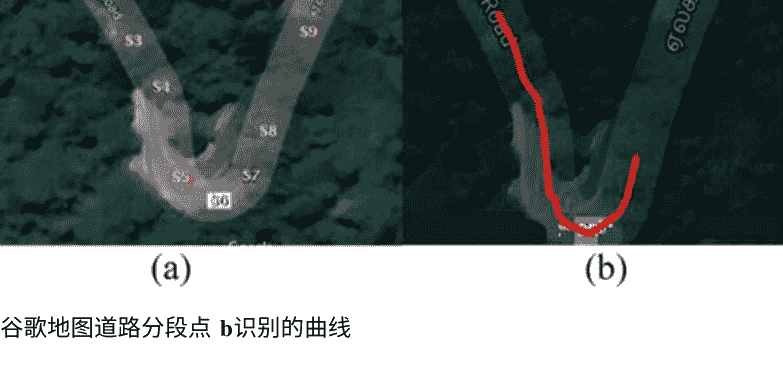

其中 φ是纬度， λ是经度，ER是地球半径（ER =6,371 km）。让我们将分段点S1到S2的距离记为a，S2到S3的距离记为b，S1到S3的距离记为c，然后计算半径。

```
半径 = \frac{(a \times b \times c)}{\sqrt{(a+b+c) \times (b+c-a) \times (c+a-b) \times (a+b-c)}} \quad (6)
```

根据印度公路大会[27, 28]的说法，在印度高速公路上，车辆可以以70到80公里/小时的速度行驶在1000米半径的弯道上[26]。因此，我们假设印度道路弯道的最大半径为1000米。使用图3a中的段点S1、S2和S3的方程（6），我们发现这三个段点的半径大于1000米，因为它们像一条直线一样相互连接。因此，我们检查下一个相邻的三个段点S2、S3和S4。这三个段点（S2、S3和S4）的半径小于1000米，因为它看起来像一条曲线。这三个段点的半径值记录在半径列表中，并且此过程重复进行，直到我们到达路径的最后一段段点。

图3a的分段点S3-S9产生了六个曲线半径R1、R2、R3、R4、R5和R6。这些信息保存在半径列表中。之后，计算分段点S2到S9的平均曲线半径(R1到R6)。图3a中路径的检测到的曲线显示在图3b中。（在算法1中解释）

曲线列表跟踪曲线的起始分段点S2、结束分段点S8、中间分段点S6和计算得到的平均曲线半径。该方法用于起点和终点之间的路径，并将找到的曲线及其属性（曲线起始点、曲线结束点、曲线中点和平均曲线半径）保存在曲线列表中。图4显示起点位置位于高速公路上，但目的地位于山地（多山）地形上。高速公路上的曲线始终很大。图4中的一个长度为1000米的单个曲线（顶部红色实心圆）是一个很好的例子。这里的山地景观有几个发夹弯。这些曲线的半径为50到150米，有些曲线长达500米。由于印度道路的最大曲线半径假设为1000米，多个发夹曲线形成一个单独的曲线，如图4所示（底部两个红色实心圆）。

## 算法1：在路径上找到曲线

```
输入：GPS段点，所需半径
输出：识别出的曲线集合及其属性
1: 函数curve_detection (list_segment_points, required_radius_meter)
2: 对于list_segment_points中的每个段，执行以下操作
3:    a = 段S1和S2之间的距离
4:    b = 段S2和S3之间的距离
5:    c = 段S1和S3之间的距离
6:    det_curve_radius = (a * b * c) /
7:          (sqrt ((a + b + c) * (b + c - a) * (c + a - b)* (a + b - c)))
8:    radius_count=0
9:    collected_radius = 0
10: 如果det_curve_radius <= required_radius_meter，则执行以下操作：
11:    curve_length = curve_length + (a + b)
12:    collected_radius = collected_radius + det_curve_radius
13:    radius_count = radius_count + 1
14: else:
15:    radius = collected_radius / radius_count
16: List_curve[radius, curve_length]
17: 返回 List_curve
18:结束函数
19:
20:对于半径 [1000, 500, 250, 125, 75]执行
21: list_segment_points = 曲线检测(list_segment_points, radius)
```

为了解决这个问题，采用了递归曲线检测技术。在这个技术中，单个曲线（多个曲线在一个曲线中）被分解成许多较小的曲线。递归曲线检测方法（算法1中的第18和19行）使用了路径中发现的曲线，并记录在曲线列表中。一个或多个发夹曲线的潜力在500米半径范围内，因此该技术使用了500、250、150和50米的一系列曲线半径。结果，一个大的单一曲线被分割成较小的曲线，如图5a所示。图5b显示了孟买双隧道道路的曲线查找结果。曲线方向（方位角）的确定基于以下计算。

> $$轴承 \quad (\theta) = \tan^{-1} \frac{\sin\Delta\lambda \times \cos\varphi2}{\cos\varphi1 \times \sin\varphi2 - \sin\varphi1 \times \cos\varphi2 \times \cos\Delta\lambda} \qquad \qquad (7)$$

其中 $\varphi$ 是纬度， $\lambda$ 是经度。

路径中有时会有“噪音”。连接线不均匀地连接了线段点，如图6b中的黄色圆圈所示，这被称为“噪音”。该噪音可以通过所提出的曲线检测器方法消除。

下一节将介绍创建曲线限速数据库的过程。

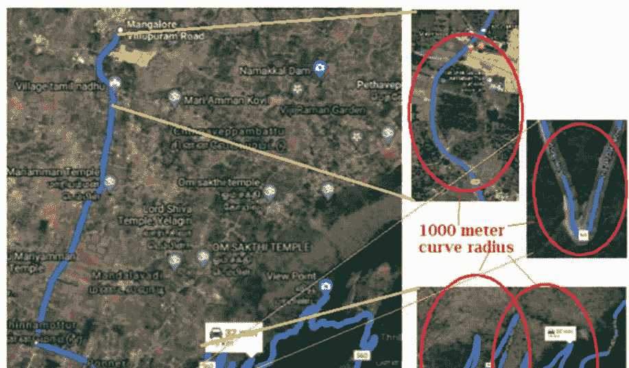

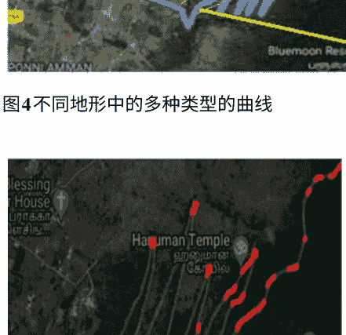

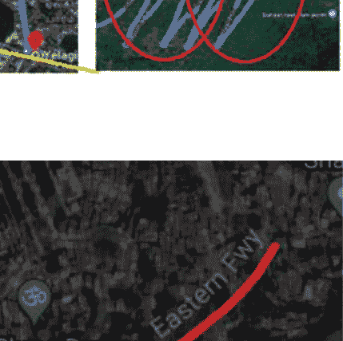

##### 2.2.2 创建曲线限速数据库

对于印度公路大会（IRC）[27,28]的参考文献为印度道路上的曲线限速数据库的发展提供支持。根据印度公路大会（IRC）的文章，表2对其进行了测量。

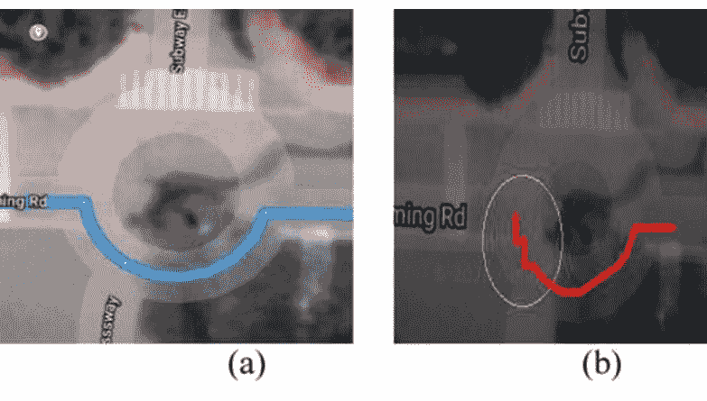

表2 曲线限速数据库

| 序号 | 曲线半径范围 | 设计速度限制（以千米/小时为单位） |
|------|--------------|----------------------------------|
| 1    | 50–100       | 20                               |
| 2    | 70–150       | 25                               |
| 3    | 100–200      | 30                               |
| 4    | 180–320      | 35                               |
| 5    | 280–650      | 40                               |
| 6    | 470–1100     | 60                               |
| 7    | 700–1400     | 80                               |

计划速度限制和曲线半径。根据曲线的超高，建立了半径范围。

##### 2.2.3 曲线感知旅行时间估计

该模块描述了两个收费站之间的旅行时间。这在下面的方程中描述。

```
Sr_d = Tr_d - Cr_d \qquad (8)
S_t = \frac{Sr_d}{d_s} \qquad (9)
C_{t1} = \frac{C1_d}{C1_s}
C_{t2} = \frac{C2_d}{C2_s}
C_{tn} = \frac{Cn_d}{Cn_s}
Ca_{t} = S_{t} + C_{t1} + C_{t2} + \cdots + C_{tn}
C_{a_t} = S_t + C_{t1} + C_{t2} + \cdots + C_{tn} \quad\quad (10)
```

其中，$S_{rd}$是直线距离，是从曲线距离总和$C_{rd}$中减去收费公路距离$T_{r_d}$得到的。只在直线道路上行驶所需的时间$S_t$是直线距离$S_{rd}$除以声明的速度$d_s$。这里，$C_{t1}$，$C_{t2}$和$C_{tn}$是曲线行驶的时间，它们是从曲率距离$C1_d$，$C2_d$，$Cn_d$除以曲率速度限制$C1_s$，$C2_s$，$Cn_s$计算得到的。最后，曲率感知的行驶时间$Ca_t$是将直线道路上的行驶时间$S_t$与每个曲线行驶时间$C_{t1}$，$C_{t2}$，和$C_{tn}$相加得到的。

##### 2.2.4 车辆超速检测系统

图7显示了超速检测系统的框图。在收费站中，每个收费亭都有一个超速检测系统。该系统与位于收费亭外部的摄像头连接，该摄像头专注于车辆，以便检测车辆类型并提取车牌信息。该系统与云服务器连接，该服务器存储带有时间戳的车辆信息，并与道路交通管理局（RTO）服务器连接。

该系统与摄像头连接，以检测车辆类型并提取车牌，并添加当前时间戳。在此之前，系统从云服务器下载车辆信息和前一个收费站车辆入口的时间戳，以及车辆的RTO信息。当车辆进入收费亭时，每个亭子中的超速检测系统会检查来自云服务器下载的车辆信息。如果没有匹配项，则将进入收费亭的车辆视为新车辆，因此将带有当前时间戳的车辆信息添加到云服务器。如果输入的车辆信息与下载的信息匹配，则检查超速情况。超速计算使用以下公式。

```
V_t = Cb_t - Pb_t \quad\quad (11)
O_s = V_t < Ca_t \quad\quad (12)
```

其中，$V_t$是车辆行驶时间，通过当前收费站时间戳$Cb_t$减去上一个收费站时间戳$Pb_t$计算得出。在这里，超速$O_s$是指车辆行驶时间是否小于收费站声明的曲线感知行驶时间。

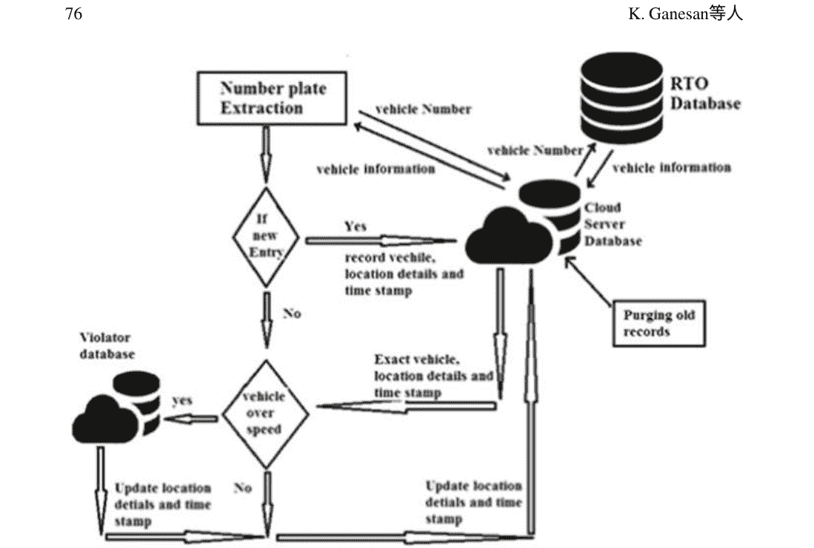

## 图7 超速检测模块

时间 $Ca_{t}$（公式10）。如果检测到车辆超速，则将其录入违规数据库，并由现场检查员处以罚款。

### 3 结果

车辆超速检测系统的测试地点位于印度泰米尔纳德邦的Pallikonda和Ranipet两个收费站。以下是该测试的结果。

#### 3.1 车辆检测和车牌定位与文本提取

使用收费站外的摄像头，对车辆进行逐行扫描，YOLO检测和分类车辆类型。YOLO的结果显示在图8和图9的左上角（车辆检测）和左下角（检测到的车牌）。

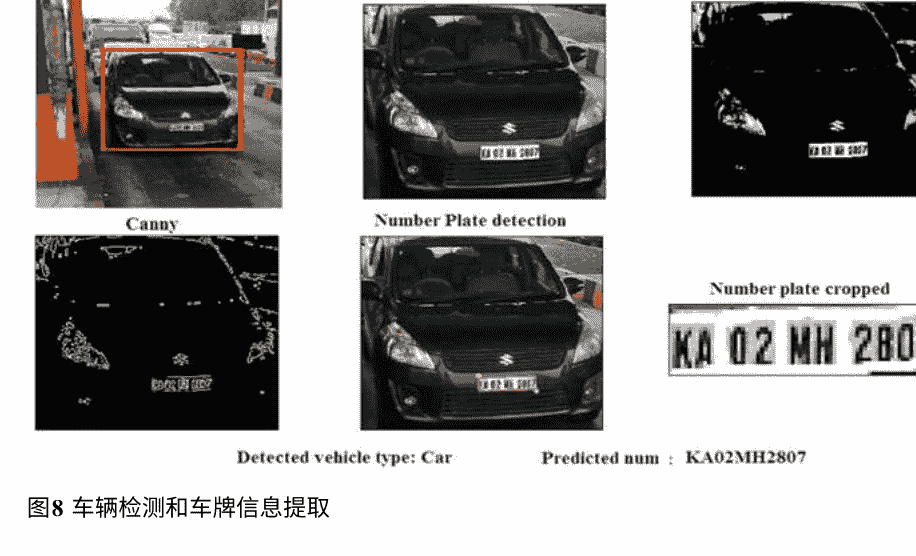

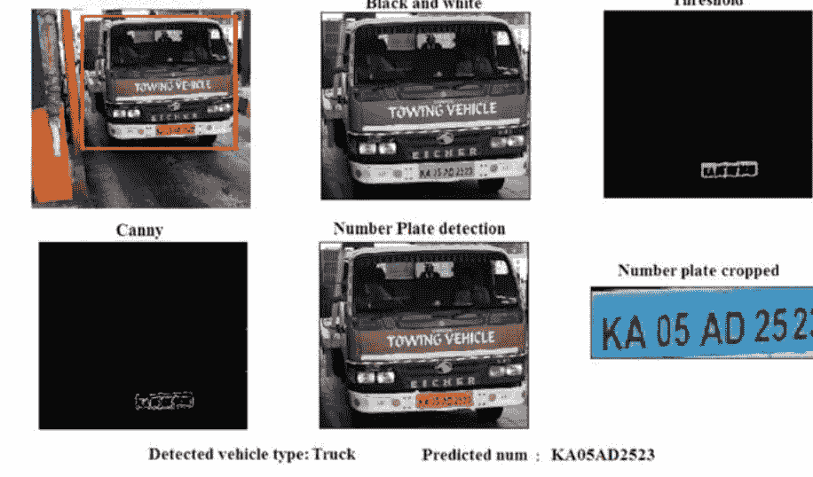

车辆类型）。检测到的车辆图像已发送到车牌定位过程中，如第2.1.2节所述。图8和图9右下角（车牌裁剪）显示了此车牌定位的输出。

然后将裁剪的车牌图像输入CRNN文本识别算法，该算法生成车牌的提取文本，如图8和图9的右下角（预测号码）所示。这是车辆检测和车牌识别

车牌提取系统的输出是车辆类型和车牌文字识别，这些信息被发送到车辆超速检测模块。

#### 3.2 新的曲线检测算法

使用第一类错误、第二类错误和第二类错误比率（TIIR）指标[22]对找到的曲线进行评估。无论何处发生第二类错误，检测到的曲线都会超出真实曲线，并延伸一个额外的段落。无论何处发生第一类错误，要么未检测到检测到的曲线，要么缺失真实曲线的25、50或75%。

图10a、b和c显示了各种25、50%的1型曲线识别错误和2型错误。犯这种1型错误是有风险的。

类型2错误比例由公式TIIR = m/n表示，其中m表示类型2错误的数量，n表示地面真实曲线的数量，TIIR表示类型2错误比例。

表3显示了印度（第1至5行）、法国（第6行）和美国（第7行）地区的1型、2型、TIIR、实际、预测曲线数量，源和目的地之间的总距离，性能延迟，预测曲线类型和噪声校正曲线数量。来自Google地图道路段的数据在全球范围内是相同的。因此，所提出的方法可以从世界上任何地方的道路段提取曲线。一个小的区别是印度的车辆行驶在道路的左侧，而法国和美国的车辆行驶在道路的右侧。因此，根据车辆行驶方向，曲线的起点和终点在不同国家有所变化。

每个（表3的7行）源到目的地的Google地图道路段数据都是手动收集的，并且每个曲线的起点和终点都是手动识别的；这些地面真实数据与提出的模型识别的曲线数据进行了比较。这里，有一条高速公路（第1行），一条多山的地形道路（第2行），一条大学道路

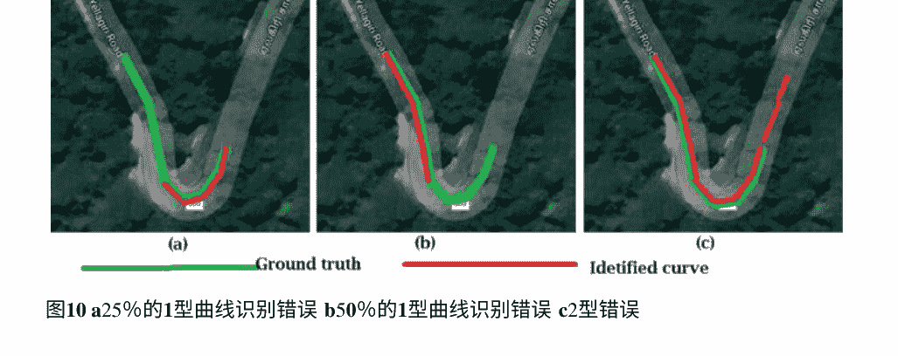

图10 a) 25%的1型曲线识别错误 b) 50%的1型曲线识别错误 c) 2型错误

（第3行），以及一条隧道道路（第5行）在印度进行了测试。在高速公路起点位置和多山地形目的地位置观察到的曲线显示在表中3，行号4。提出的方法可以从隧道道路中提取曲线。图5b显示了孟买市双子隧道中的第5行。

噪音是由于GPS段在现有段上错误绘制而产生的。这种形式的噪音可以使用提出的方法进行校正，如图6b所示。然而，这种噪音经常将一条直路错误地表示为弯曲的道路。因为多山地形道路包含的噪音段比平原上的道路段多，所以这种错误被分类为2型错误。然而，这并不危险，因为如果存在曲线，人们可以得到警报。如果提出的曲线检测算法无法检测到半径小于60米的曲线，那么这种道路是危险的，因为这种道路包含急转弯或盲弯，容易发生事故。提出的方法成功地识别了这种类型的曲线。

表3中的最后一列（第11列）显示了使用现有方法[22]在指定位置预测的曲线数量。现有方法缺乏去除曲线噪声的能力，因此将噪声声明为曲线。

#### 3.3 曲线感知的旅行时间估计

表4详细介绍了提出的曲线感知旅行时间估计的研究；表中的第2列显示了起始和目的地收费站的纬度和经度，第3列列出了收费站和高速公路类型的信息，第4列列出了两个收费站之间的距离，第5列列出了由第2.2.1节得出的高速公路上的曲线数量，第6列列出了汽车和卡车的声明速度，第7列显示了汽车和卡车在收费站之间的声明到达时间，而第8列显示了第2.2.3节曲线感知到达时间的结果。

#### 3.4 车辆超速检测系统

在车辆超速检测系统架构中，每个收费站使用十个收费亭系统和一个服务器系统。如图11a所示，每个收费亭系统的GUI连接到摄像头，自动收集有关车辆类型和车牌号码的信息。然后，收费亭工作人员可以更新或更正这些信息。当用户点击检查按钮时，这些详细信息将发送到本地服务器系统，然后使用本地数据库检查车辆号码和类型。如果车辆是第一次进入，它将在本地数据库中输入车辆的详细信息和时间戳（日期和时间），并通过云服务器将数据推送到下一个收费站。图11b显示了刚刚进入Pallikonda收费站的车辆的详细信息。如果车辆之前在收费站注册过，它的信息将被存储在本地。因此，本地服务器系统计算## 表3 曲线检测研究与分析

| 序号 | 起点和终点 | 曲线总距离 | 实际曲线数 | 预测曲线数 | 类型1错误 | 类型2错误 | 编号路径上的噪声数已校正 | 检测到的曲线类型 | TIIR | 参考文献中预测的曲线数[22] |
|------|------------|------------|------------|------------|------------|------------|----------------------------|------------------|------|----------------------------|
| 1 | 12.932459, 79.138573 & 13.047688, 80.081534 | 113公里 | 18 | 19 | 2 (1-25%, 1-50%) | 1 | 2 | 简单曲线=17, 复合曲线=2, 反向曲线=0, 急转弯=0 | 0.05 | 20 |
| 2 | 12.600237, 78.596748 & 12.593029, 78.631709 | 13公里 | 48 | 48 | 1-25% | 9 | 33 | 简单曲线=33, 复合曲线=0, 反向曲线=2, 急转弯=13 | 0.19 | 93 |
| 3 | 12.968459, 79.155885 & 12.971857, 79.163570 | 1.5公里 | 6 | 6 | 0 | 1 | 8 | 简单曲线=2, 复合曲线=0, 反向曲线=1, 急转弯=3 | 0.17 | 15 |
| 4 | 12.931632, 79.135380 & 12.593029, 78.631709 | 91.5公里 | 64 | 64 | 1-25% | 10 | 33 | 简单曲线=44, 复合曲线=0, 反向曲线=2, 急转弯=18 | 0.15 | 98 |
| 5 | 19.059460, 72.913796 & 18.949226, 72.840700 | 10.7公里 | 5 | 5 | 0 | 1 | 0 | 简单曲线=5, 复合曲线=10, 反向曲线=2, 急转弯=18 | 0.05 | 5 |
| 6 | 47.082396, 3.929467 & 47.136291, 4.016592 | 12.5公里 | 40 | 45 | 4 (2-25%, 2-50%) | 6 | 7 | 简单曲线=28, 复合曲线=5, 反向曲线=6, 急转弯=6 | 0.13 | 52 |
| 7 | 37.202597, 87.010464 & 37.312765, 86.614955 | 46.9公里 | 24 | 25 | 3(1-25%, 2-50%) | 3 | 2 | 简单曲线=21, 复合曲线=0, 反向曲线=2, 急转弯=2 | 0.12 | 30 |

## 表4 提出的曲线感知旅行时间估计研究

| 序号 | 起点到目的地 | 位置信息 | 距离 | 曲线数量 | 预计速度 | 预计到达时间(分钟) | 曲线感知到达时间 |
| --- | --- | --- | --- | --- | --- | --- | --- |
| 1 | 12.544464, 78.201390到12.006492, 78.080849 | 高速公路 (Krishnakiri到thopur收费站) | 66.1公里 | 6 | 100 (汽车) 80 (卡车) | 39 (汽车) 49 (卡车) | 42 (汽车) 54 (卡车) |
| 2 | 12.006198, 78.080653 to 11.720234, 78.073370 | 山口 (thopur to omalur toll gate) | 37.7公里 | 9 | 80 (汽车) 60 (卡车) | 28 (汽车) 37 (卡车) | 30 (汽车) 40 (卡车) |
| 3 | 13.647111, 79.401600 to 13.672812, 79.351193 | 山路 (Alibri to GNC toll gate) | 16.6公里 | 110 | 40 (汽车) 40 (卡车) | 28 (汽车) 28 (卡车) | 35 (汽车) 43 (卡车) |
| 4 | 13.672823, 79.351400 to 13.647667, 79.405564 | 山路 (GNC to Alibri toll gate) | 17.1公里 | 107 | 40 (汽车) 40 (卡车) | 40 (汽车) 40 (卡车) | 42 (汽车) 50 (卡车) |
| 5 | 12.910950, 79.400920 to 12.905704, 78.951853 | 高速公路 (Ranipet to pallikonda toll gate) | 52.1公里 | 12 | 100 (汽车) 80 (卡车) | 31 (汽车) 39 (卡车) | 33 (汽车) 42 (卡车) |
| 6 | 12.905825, 78.951824 to 12.911158, 79.401029 | 高速公路 (Pallikonda to ranipet toll gate) | 51.8公里 | 13 | 100 (汽车) 80 (卡车) | 30 (汽车) 38 (卡车) | 32 (汽车) 40 (卡车) |

如图11c所示，车辆在两个收费站之间的平均速度，如果超过该速度，将被处以罚款。如图11d所示，如果车辆以正常速度行驶，则在本地服务器上记录进入时间戳。图12显示了用于存储每个收费站车辆数据的Google云平台。图13a演示了如何搜索日志云数据库。日期、时间、车辆号码或收费站ID都可以用来搜索日志的详细信息。图13b显示了如何搜索违规者云数据库。可以通过车辆识别、日期、时间或收费站ID来搜索违规者的详细信息。

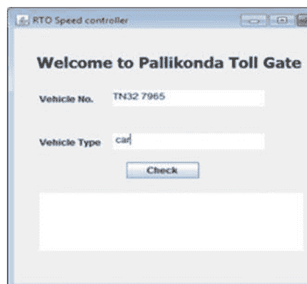

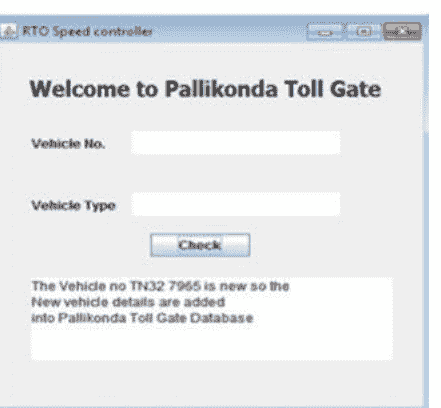

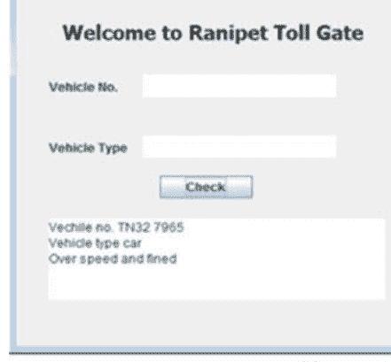

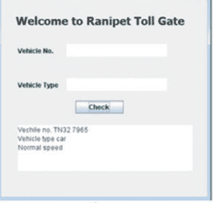

图11 a车牌号和车辆类型输入 b车辆首次进入收费站 c检测到车辆超速 d车辆以正常速度通过收费站之间

#### 3.5 讨论

在这个测试平台上，两个收费站共有3552辆车通过所有收费亭，在两个小时的测试时间内。图14显示了按亭位分解的车辆通过次数的条形图。在测试的两个小时内，有两辆车因超过政府规定的汽车100公里/小时和卡车80公里/小时的速度限制而收到罚款。如果使用曲线感知的旅行时间估计来设置车辆速度限制，可能会有大量车辆收到罚款。根据图15，如果汽车的速度限制为90公里/小时，将有13到14辆车被罚款。

在测试期间，Pallikonda和Ranipet收费站被用于两个小时的测试。这个测试场地由RTO的Vellore分部监督，属于泰米尔纳德邦。


## 图12 谷歌云平台

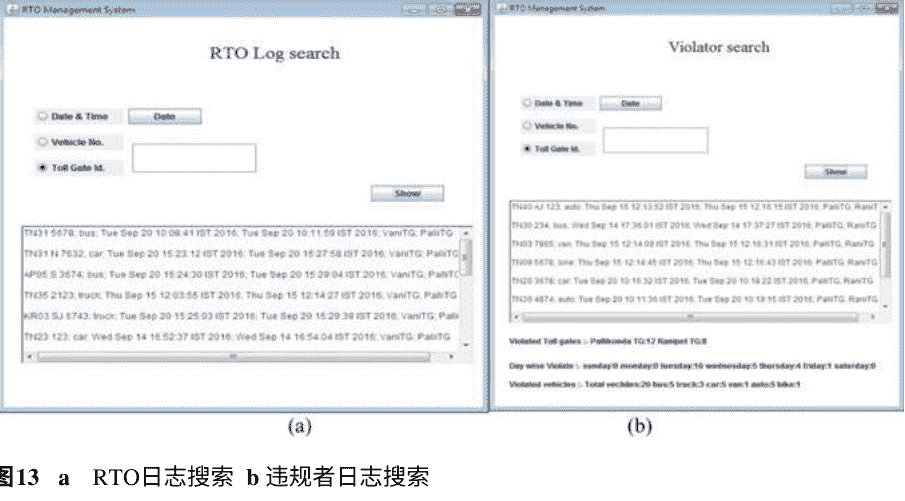

## 图13 a RTO日志搜索 b 违规者日志搜索

政府。图16a描述了测试期间Pallikonda收费站的RTO和检查员的存在。图16b描绘了在Ranipet收费站测试车辆超速检测系统的专家。

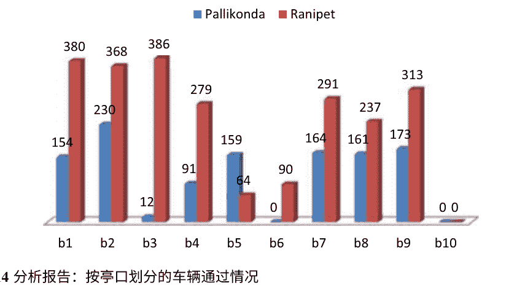

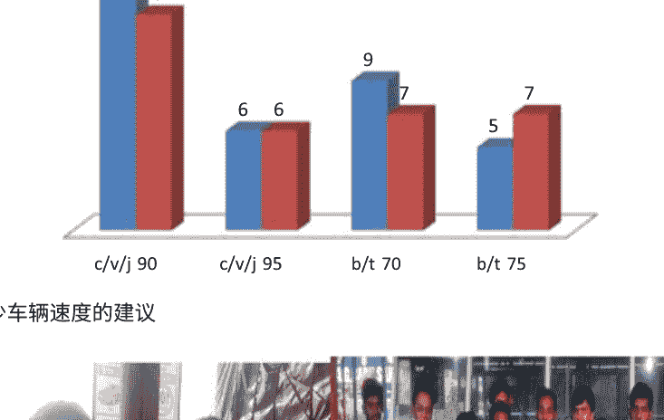

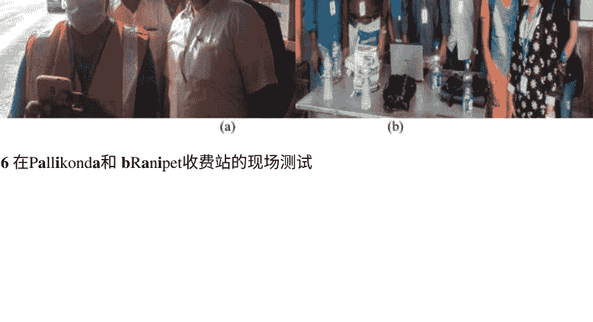

### 4 结论

高速公路上的过高速度的车辆需要控制。 建议的车辆超速检测系统可用于确定两个收费站之间行驶的车辆是否以过高速度行驶。

在这方面，提出了一种新的曲线查找算法，以精确确定车辆的行驶时间。 在建议的车辆超速检测系统中，使用了这个曲线感知的行驶时间。 Pallikonda和Ranipet收费站在泰米尔纳德邦政府的指导下参与了为期两小时的实时测试。 由于超速，发现并罚款了两辆车。

该系统目前正在两个收费站进行测试；然而，将来可以扩展到所有收费站。将来，基于摄像头的车牌提取模块将被基于RFID标签的车辆信息提取模块所取代，该模块目前在印度的每辆车上都使用品牌名为FastTag。

### 参考文献

- 1. Nayak, R. P., Sethi, S., & Bhoi, S. K. (2018). PHVA：一种基于位置的高速车辆检测算法，用于检测使用车载云的高速车辆。在2018年国际信息技术会议 (ICIT) 中。 https://doi.org/10.1109/icit.2018.000542.
- 2. Krishnakumar, B., Kousalya, K., Mohana, R., Velli ngiriraj, E., Maniprasanth, K., & Krish-nakumar, E. (2022). 使用视频处理技术检测车辆超速违规行为。在2022年国际计算机通信与信息学会议 (ICCCCI) 中。 https://doi.org/10.1109/iccci54379.2022.9740909
- 3. Zou, F., Ren, Q., Tian, J., Guo, F., Huang, S., Liao, L., & Wu, J. (2022). 基于电子收费数据的高速公路速度预测。电子学, 11 (10) , 1613. https://doi.org/10.3390/electronics11101613
- 4. 沈, J., 周, W., 刘, N., 孙, H., 李, D., & 张, Y. (2022年). 一种基于锚点的轻量级深度卷积网络用于航空图像中的车辆检测。IEEE智能交通系统.
- 5. 罗伊, S. S., 罗德里格斯, N., & 田口, Y. (2020年). 使用CNN进行脑部肿瘤分类的增量膨胀。应用科学, 10(14), 4915.
- 6. 萨穆伊, P., 罗伊, S. S., & 巴拉斯, V. E. (编者). (2017年).神经计算手册.学术出版社.
- 7. 比斯瓦斯, R., 瓦桑, A., & 罗伊, S. S. (2019年). 扩张的深度神经网络用于视网膜血管分割图像。伊朗科学与技术杂志, 电气工程交易, 1–14.
- 8. Rajput, S. K., Patni, J. C., Alshamrani, S. S., Chaudhari, V., Dumka, A., Singh, R., Rashid,M., Gehlot, A., & AlGhamdi, A. S. (2022). 基于YOLOv3算法的自动车辆识别和分类模型, 用于收费管理系统。可持续性, 14(15),9163. https://doi.org/10.3390/su14159163
- 9. Wang, W., Yang, J., Chen, M., & Wang, P. (2019). 一种用于端到端车牌检测和识别的轻量级CNN。IEEE Access, 7, 173875–173883.https://doi.org/10.1109/access.2019.2956357
- 10. Huang, Q., Cai, Z., & Lan, T. (2021). 一种多模式车牌字符识别的新方法。IEEE Transactions on Multimedia, 23, 3768–3777. https://doi.org/10.1109/tmm.2020.3031074
- 11. Seo, T., & Kang, D. (2022). 基于注意力方法的鲁棒的无布局依赖车牌检测和识别模型。 *IEEE Access*, 10, 57427–57436. https://doi.org/10.1109/access.2022.3178192
- 12. Henry, C., Ahn, S. Y., & Lee, S. (2020). 使用通用字符序列检测的跨国车牌识别。 *IEEE Access*, 8, 35185–35199. https://doi.org/10.1109/access.2020.2974973
- 13. Park, S., Yu, S., Kim, J., & Yoon, H. (2022). 一种基于YOLOv4的全能车型和车牌识别系统。 *Sensors*, 22(3), 921. https://doi.org/10.3390/s22030921
- 14. Alam, N., Ahsan, M., Based, M. A., & Haider, J. (2021). 使用卷积神经网络的智能车牌检测和识别系统。 *Technologies*, 9(1), 9. https://doi.org/10.3390/technologies9010009
- 15. Alghyaline, S. (2022). 使用深度学习的实时约旦车牌识别。 *Journal of King Saud University-Computer and Information Sciences*, 34 (6), 2601–2609. https://doi.org/10.1016/j.jksuci.2020.09.018
- 16. Raghunandan, K. S., Shivakumara, P., Jalab, H. A., Ibrahim, R. W., Kumar, G. H., Pal, U., & Lu, T. (2018). 基于Riesz分数模型的车牌检测和识别增强。 *IEEE Transactions on Circuits and Systems for Video Technology*, 28(9).
- 17. Dalarmelina, N. D., Teixeira, M. A., & Meneguette, R. I. (2019). 基于光学字符识别和无线传感器网络的实时自动车牌识别系统ITS。 *Sensors*, 20(1), 55. https://doi.org/10.3390/s20010055
- 18. 辛格, P., 帕特瓦, B., 萨卢贾, R., 拉马克里希南, G., &乔杜里, P. (2019年)。 StreetOCRCorrect: 印度街头混乱视频中OCR校正的交互框架。 在2019年国际文件分析与识别研讨会（ICDARW）中。 https://doi.org/10.1109/icdarw.2019.10036
- 19. Jagtap, J., & Holambe, S. (2018年)。 使用人工神经网络进行印度车辆的多样式车牌识别。 在2018年国际信息、通信、工程和技术会议（ICICET）中。 https://doi.org/10.1109/icicet.2018.8533707
- 20. Ravirathinam, P., & Patawari, A. (2019年)。 使用Faster-RCNN进行印度道路上的自动车牌识别。 在2019年第11届高级计算国际会议（ICoAC）中。 https://doi.org/10.1109/icoac48765.2019.246853
- 21. Khan, S. U., Alam, N., Jan, S. U., & Koo, I. S. (2022). 物联网车辆速度监测系统。 电子学, 11(4), 614。 https://doi.org/10.3390/electronics11040614
- 22. Li, Z., Chitturi, M., B ill, A., & Noyce, D. (2012). 从地理信息系统道路地图中自动识别和提取水平曲线信息。交通研究记录：交通研究委员会杂志, 2291, 80-92。
- 23. Horzyk, A., & Ergun, E. (2020). 通过加权置信中心改进YOLOv3的精度选择。 在2020年国际联合神经网络会议(IJCNN)中。 https://doi.org/10.1109/ijcnn48605.2020.9206848
- 24. Jayaraman, S., Esakkirajan, S., Veerakumar, T. (2015).数字图像处理. Tata McGraw Hill出版，印度版。
- 25. Shi, B., Bai, X., & Yao, C. (2017). 一种端到端可训练的用于基于图像的序列识别的神经网络及其在场景文本识别中的应用。 *IEEE模式识别与机器智能交易*, 39(11), 2298–2304。 https://doi.org/10.1109/tpami.2016.2646371
- 26. Bains, M. S., Bhardwaj, A., Arkatkar, S., Velmurugan, S. (2013). 速度限制遵守对印度高速公路道路容量的影响。 *Procedia-Social and Behavioral Sciences*,104, 458–467
- 27. IRC: 73. (1980).农村（非城市）公路的几何设计标准. 印度道路大会.
- 28. IRC: 38. (1988).公路水平曲线设计指南和设计表. 印度道路大会.

## 基于视频的智能系统接近分析

谢尔盖·安东诺夫, 米哈伊尔·博加切夫, 帕维尔·莱巴, 亚历山大·西尼特卡, 和德米特里·卡普伦


### 1 引言

最近受COVID-19大流行的推动，数字技术在全球接触追踪的公共卫生应对中发挥了越来越重要的作用。

Budd等人[12]对全球COVID-19应对中的数字创新进行了全面回顾，包括实施它们的法律、伦理和隐私障碍，以及组织和劳动力限制。

该回顾涵盖了针对五个公共卫生需求开发的技术，包括流行病监测、快速病例识别、社区传播控制、传递基本医疗信息和临床支持[5]。

打断社区传播需要快速追踪和隔离接触者，以防止进一步传播。支持这些活动的技术主要基于接近跟踪[17]，通常使用智能手机应用程序([57, 59])和低功耗蓝牙技术实现。Hossain等人。

[18]最近提出了一个利用现代5G网络标准的高吞吐量和低延迟来交换胸部X光[20]或CT扫描的B5G框架。

S. Antonov · D. Kaplun (✉)
自动化与控制过程系，圣彼得堡电气技术大学
“LETI”，俄罗斯圣彼得堡197022，
电子邮件：dikaplun@etu.ru

S. Antonov
电子邮件：serg2209157.antino@yandex.ru

M. Bogachev · P. Leyba · A. Sinitca · D. Kaplun
数字电信技术中心，圣彼得堡电气技术大学
“LETI”，俄罗斯圣彼得堡197022，
电子邮件：mibogachev@etu.ru

A. Sinitca
e-mail: amsinitca@etu.ru

图像 [41] 用于早期 COVID-19 的仪器检测，以及开发一个大规模监控系统来控制和管理社交距离、口罩佩戴和体温监测。上述方法处于各种基于人工智能的综合应急响应解决方案的背景下，近年来引起了越来越多的关注 [40, 42, 44]。

隐私是这一背景下的主要关注点之一，严重限制了各种解决方案的适用性。作为一个突出的例子，挪威已经停止使用 Smittestopp 应用程序，转而采用蓝牙方法 [60]。出现了几个国际框架，采用各种系统化的隐私保护方法，包括分散式隐私保护接触追踪 [58]，泛欧洲隐私保护接触追踪倡议 [61] 和 Google-Apple 联合框架 [56]。

接触追踪应用程序（如上述应用程序）的一个关键限制是需要大部分人口使用该应用程序。然而，这些应用程序的实际有效性受到智能手机拥有率、用户遵从性和技术兼容性的严重限制[12]。一种替代方法是基于视频监控的接近追踪，这种方法在各种场景中可能更加有效。

在COVID-19大流行的背景下，只有少数几项研究涉及视频监控。Punn等人[38]提出了一个框架，利用YOLO v3目标检测模型不仅可以检测，还可以区分人类，使用DeepSORT方法进一步跟踪已识别的人员的分配ID。YOLO v3模型的结果还与其他流行的卷积神经网络架构进行了比较，如SSD（单次检测器）、R-CNN（基于区域的CNN）及其修改版。Rezaei等人[39]使用基于YOLOv4的框架和逆透视映射来提高个人身份识别的准确性，以改进社交距离跟踪中存在的干扰因素，如人群遮挡、部分可见性和光照变化，并根据个性化移动轨迹的统计分析和社交距离违规率提供风险评估方案。

就像移动应用程序追踪接触者一样，在基于视频监控的任何解决方案中，都需要解决隐私问题。在本文中，我们提出了一个框架，该框架基于目标检测和轨迹分析的思想，这些思想来自于行人跟踪的文献，但也整合了一些元素，以解决隐私问题：将人脸识别系统映射到匿名ID的人脸识别系统，以及构建匿名潜在传播图，该图可用于接触追踪和流行病监测等场景。

现在距离疫情爆发已经过去两年多了，公众的注意力越来越多地转向寻找最佳的退出策略，包括在疫情爆发初期迅速部署的技术的调整，并找到它们在后疫情社会中的位置。在这里，我们明确展示了基于视频监控的基于人工智能的接触者追踪框架如何在不同的场景中使用，从个体接触者追踪或人群流行病学监测到改进的公共空间规划。

现有的工作成果，例如自动行人行为分析，可以被适应到这个背景中[52]。这些方法通常采用各种模型进行目标检测。然而，疫情大大改变了我们对公共空间规划目标的看法。有令人信服的证据表明，各种社交距离措施也减少了其他传染病的传播，如普通感冒或流感，在美国仅仅造成了大约1.66亿个工作日的损失，当考虑到因孩子感冒而缺勤的父母时，这个数字几乎翻倍，即使在疫情背景之外。因此，广泛应用于当前COVID-19疫情中用于减少其他呼吸道疾病社区传播的技术的适应性，对于至少部分减少这些损失可能是有利的。

本文的其余部分安排如下。第2节概述了提出的框架和相应的视频数据处理流程。第3节重点介绍了接近网络，它可以在各种场景中用于解决公共卫生需求。第4节描述了我们的方法在街道监控摄像头捕捉的一系列视频中的评估。第5节介绍了与社区传播风险相关的统计量，并讨论了如何利用它们来改进未来的公共空间规划，以减少后疫情社会中的社区传播风险。

### 2 框架概述

图1展示了所提出框架的示意图。所提出的框架包含四个主要模块，分别负责人员检测、距离计算、人脸识别和网络构建，在前三个模块中，每个帧都会重复执行，而最后一个模块会将从整个场景中收集到的所有信息进行整合。

帧被输入到经过训练的卷积神经网络模型“SSDLite MobileNetV2 COCO”中进行目标检测。模型的输出包含帧中所有检测到的人员边界框的坐标。为了找到每个人在帧中相对于其他人的实际坐标，边界框的坐标被传递给OpenCV计算机视觉库，该库使用单应性矩阵进行鸟瞰投影。下一步是通过与先前帧进行匹配并更新其轨迹，将坐标与个人ID关联起来。为了方便关联过程，每当位置与已识别人员的轨迹不接近时，会对裁剪图像应用人脸识别算法进行识别。为了计算人与人之间的距离，构建了一个VP树，并对该树应用了修改后的最近邻算法。

一旦通过视频分析的结果获得了每个检测到的人的个体轨迹（通过唯一ID标识），就可以识别出与每个人密切接触的人群以及他们之间的持续时间。在接触追踪的背景下，人们的接近和持续时间是感兴趣的量之一。

### 3 接近网络的构建

#### 3.1 人员检测和准确性评估

从固定监控摄像头获取的视频中，检测个体人员的常见方法是基于卷积神经网络。神经网络训练有几种方法，包括有监督、无监督和强化学习。虽然通过有监督学习进行训练通常可以获得更高的准确性和性能，但在学习阶段需要大量的数据。用于网络训练的数据集应包含“ground truth”信息，包括分割、定位以及对象分类，通常在相关注释文件中总结。在多种变体中，卷积神经网络[27]是一种常见的目标检测解决方案。

特定解的选择和验证主要基于准确度指标，如精确度（Prc），召回率（Rec），交并比（IoU）和平均精确度（mAP）。图2说明了IoU，这是一种基于Jaccard指数的度量，用于评估参考框和预测框之间的重叠。

为了获得准确度指标，将IoU与固定阈值λ进行比较，在我们的例子中，阈值为0.5。当IoU < λ时，决策有利于假设 H0，否则决策有利于假设 H1。决策过程的准确度是基于真正阳性（TP）率来量化的，该率指示在假设 H1有效的情况下有利于假设 H1的决策率，以及基于假设 H0有效的情况下有利于假设 H1的假阳性（FP）率（参见，例如，[48]和参考文献）。在数值处理中，基于上述比率，可以估计精确度。

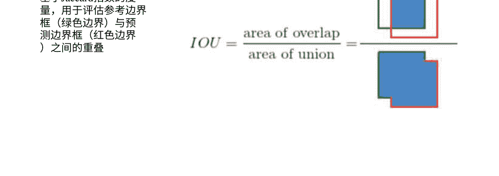

$$ Prc = \frac{\text{真阳性}}{\text{真阳性} + \text{假阳性}} \quad (1) $$

以及召回率

$$ Rec = \frac{\text{真阳性}}{\text{真阳性} + \text{假阴性}} \quad (2) $$

与[16]中采用的方法类似，我们还计算了广泛使用的检测准确度指标mAP，该指标是Prc × Rec曲线下的面积。根据定义，精确率和召回率都介于0和1之间，因此mAP也介于0和1之间。通常从插值的Prc × Rec曲线估计mAP

$$ mAP = \frac{1}{11} \sum_{r \in \{0, 0.1, ..., 1\}} p_{inter\ p(r)} \quad (3) $$

其中 \( p_{inter\ p(r)} \) 是 \( Prc \times Rec \) 曲线的插值。

#### 3.2 寻找每个人的坐标

在继续进行行走轨迹之前，必须通过投影几何技术将齐次坐标（也称为投影坐标）转换为世界坐标（对应于鸟瞰图）。为简化目的，每个由边界框表示的检测到的对象都与其枢轴点相关联，从而得到一个简化的变换，由3 ×3矩阵表示

$$ \begin{bmatrix} x'_i \\ y'_i \\ w_i \end{bmatrix} = w \begin{bmatrix} x \\ y \\ 1 \end{bmatrix}, \text{其中x, y是平面的坐标} \quad (4) $$

为了从齐次坐标转换为世界坐标，必须将结果坐标除以 \( w_i \)。因此，可以将在世界坐标中找到每个人的位置的过程表示为

$$ \begin{bmatrix} w_i x'_i \\ w_i y'_i \\ w_i \end{bmatrix} = H \begin{bmatrix} x_i \\ y_i \\ 1 \end{bmatrix}, \quad (5) $$

其中 \( H \) 是投影矩阵，有时也称为单应矩阵，可以使用多种方法[33]进行估计，例如直接线性变换(DLT)和鲁棒估计(RANSAC)。假设每个边界框的中心点位于其下边缘的中心位置，可以找到如下

$$ x_i = x_{min} + \frac{x_{max} - x_{min}}{2}, \quad (6) $$

$$ y_i = y_{min}, \quad (7) $$

其中 \((x_{min}, x_{max}, y_{min}, y_{max})\) 是边界框的坐标。 因此，对于给定的单应矩阵，可以将其转换为世界坐标表示

$$ \begin{bmatrix} w_i x_i' \\ w_i y_i' \\ w_i \end{bmatrix} = H \begin{bmatrix} x_{min} + \frac{x_{max}-x_{min}}{2} \\ y_{min} \\ 1 \end{bmatrix}. \quad (8) $$

#### 3.3 提取行走轨迹

基于从连续帧中获得的位置来构建行走轨迹的想法需要将对应于连续帧中观察到的同一人的位置点连接起来。 为此，第一步通常是搜索最近的邻居点。后者通常使用线性（完全）搜索、kd树搜索[35]、BSP树搜索[28]、LS哈希[36]、关键字方法[50]和VP树搜索[54]之一的算法来执行。 由于线性搜索的计算复杂度为 \(O(n)\)，因此其他算法成为关注的焦点。 LS哈希算法基于寻找一个简单的哈希函数，该函数可以用于代替直接比较点坐标，一旦找到这样的简单哈希函数，其效果优越，尽管在许多实际场景中找到这样的函数并不是一个直接的解决方案。 关键字算法的思想是存储一组具有很少观察到的坐标的对象列表，这也限制了其适用性。 因此，在我们的情况下，剩下的选择，即kd树、BSP树和VP树搜索算法，更具有吸引力。 在接下来的内容中，我们将重点关注VP树搜索，因为它在当前枢轴点周围的圆形邻域中搜索其他点，这与接触接近性分析问题相关。

##### 3.3.1 VP树构建

与大多数树构建算法一样，构建分层VP树是一个递归过程。 在算法的第一次迭代中，选择一个视点，并计算该点到所有其他点的平均距离。 将点集分为两个子树，如果距离视点的距离小于平均距离，则将点分配给内部（左）子树中的点集，否则将点分配给外部（右）子树中的点集。对每个子树重复相同的操作。因此，树中的每个节点都有一个视点和一个半径，点属于该节点。树构建算法的复杂度为O(n * logn)。

##### 3.3.2 在VP树中找到最近邻居

找到离点x最近的邻居的算法也是递归的。在任何给定的步骤中，关注具有视点q和半径r的树节点。让我们假设点x位于距离d的某个距离d的位置。如果d低于r，则激活一个递归算法来搜索包含任何比半径r更接近视角点的子树。到达子树后，我们在该子树的点中进行线性搜索。否则，返回包含从q偏离超过给定半径r的点的节点的子树。在构建单个行人移动的轨迹时，x是从上一帧中该人的坐标获得的，而期望的最近点是当前帧中相同人的坐标。

#### 3.4 寻找接近的人

在接触追踪的背景下，下一步通常是找到所有在接近范围内的点，通常由每个人周围的一定半径的圆形区域确定，首先针对对应于单个时间点的给定视频帧。由于原始的基于VP树的搜索算法仅关注寻找单个最近邻居，因此应该将其推广为在给定半径的圆内搜索潜在的多个最近邻居。在这种情况下，有几种可能的情况：

1.  整个搜索区域包含在内部子树中
   $$d(q, s) + r < T$$ (9)

其中，d(q, s)是从节点中心到搜索点的距离，r是搜索半径，T是内部子树边界的节点半径。两个鸟瞰视角之间的世界尺度距离是通过校准过程中获得的相机像素大小来确定的，两点之间的距离计算公式为

$$d(p_i, p_j) = \sqrt{(x_j - x_i)^2 + (y_j - y_i)^2}$$ (11)

如果满足这个条件，搜索只能在内部子树中继续。

2.  整个搜索区域包含在外部子树中
    $$d(q,s) - r < T$$ (12)

如果满足这个条件，搜索只能在外部子树中继续。

3.  整个搜索区域分布在两个子树上。

在这种情况下，搜索在两个子树中进行。 寻找最近邻的困难程度为 $O(\log n)$。

#### 3.5 面部分析和识别

面部识别是一个长期研究的问题，在近年来引起了越来越多的关注，从而在方法和算法的发展方面取得了相当大的进展（详见[4]进行详细回顾）。 关于面部识别技术的广泛应用，一个关键问题是隐私问题，因此那些能够以系统化方式集成匿名化的方法论方法是有利的。 在这项工作中，检测到的面部被映射到匿名化的ID中，然后可以存储在系统中，以控制方式揭示身份。

面部分析和识别问题通常是一个分步骤的过程，包括在图像中找到和选择所有面部，它们的初始预处理和对齐，识别独特的面部特征，以及与已知人员数据库进行比较。 上述过程通常被实现为一个流水线，其中所有步骤可以独立于彼此执行，因此在每个步骤中可以从众多可用解决方案中独立选择技术。 由于这个领域有大量的最新研究成果，我们只提供了对可用解决方案及其优缺点的简要概述。

人脸检测技术主要依赖于几种成熟的方法。 回顾性地看，Viola-Jones方法[53]是最早广泛可用且计算效率高的解决方案之一，但其误检率相对较高，对正面人脸图像和遮挡的鲁棒性较低。 方向梯度直方图（HOG）方法[15]基于分析二值化图像的梯度，将其分割成小段，并找出那些梯度排列与已知人脸图像接近的部分，通常称为HOG模式。 该方法的主要优势是计算效率高，对稍微非正面的图像具有一定的效果，并对遮挡具有适度的鲁棒性，但其主要缺点是对高分辨率图像的要求较高，并且由于离散效应，对低分辨率图像容易失败。

近年来，多任务级联卷积网络（MTCNN）[55]成为基于图像中寻找人脸的最流行解决方案之一DNN（深度神经网络）方法。上述算法由三个连续步骤组成，第一个步骤负责图像重新缩放，第二个步骤称为提案网络（或P-Net），寻找候选人脸区域，接着是细化网络（或R-Net），过滤边界框，最后是输出网络（或O-Net），专注于面部特征点（如眼睛和嘴巴）的定位。另一个最近和强大的替代解决方案是由Davis E. King引入并在Dlib库[23]中实现的MMOD算法。

由于它在上述讨论的其他方法中似乎是最准确的之一，同时在不同的面部朝向甚至在大量遮挡下也能很好地工作，因此它被选择为本研究中使用的工具。

然而，值得注意的是，深度学习算法在准确性方面通常优于其他方法，但需要更高的计算资源，这可能成为在资源有限的情况下或大量数据以及在线分析需求下的限制因素。

人脸缩放和对齐是人脸检测和人脸识别之间的中间步骤。常见的解决方案是基于寻找特定的人脸标志点，这些标志点可以用作缩放和对齐过程中的基准点。

人脸识别技术也得到了很好的发展。早期的方法主要基于Eigenface [21]、Fisherface [3]和Local Binary Patterns Histogram (LBPH) [46]等算法。由于这些算法存在许多缺点，因此我们采用了基于卷积神经网络（CNN）的较新方法，这仍然是迄今为止最有效和可靠的解决方案之一。著名的例子包括基于卷积层直接学习人脸表示的Google FaceNet [45]。FaceNet是在Labelled Faces in the wild (LFW) [19]数据集上训练的，以实现对光照、姿态和其他变量条件的不变性。其他值得注意的例子包括OpenFace [2]。

在这项工作中，我们还使用了基于神经网络的解决方案，该解决方案在Dlib库中实现。

最后，识别出的人脸应与特定人员的ID相关联。这是机器学习分类算法的典型问题。如果找不到匹配项，则将新的ID添加到数据库中。在这项工作中，我们使用了KNN分类器，尽管许多其他分类器也可以完成这项工作。

### 4 实验

#### 4.1 神经网络训练的组合数据集

接下来，我们使用在繁忙的户外公共场所由监控摄像头记录的几个样本来评估这种方法。对于神经网络训练，我们结合了两个不同的数据集，它们是目标检测算法学习中最受欢迎的数据集之一，即PASCAL VOC [16]和COCO [25]。尽管它们在注释的数量上有所不同，但它们都包含足够的信息来提取检测到的人的边界框。图3显示了结果数据集中图像中人数的直方图，表明大多数图像只包含一个人，而有相当数量的图像包含多达二十个不同的人。

#### 4.2 训练神经网络模型

我们使用上述组合数据集来训练一个卷积神经网络模型“SSDLite MobileNetV2 COCO”，这是SSD（单次多框检测器）[26]的轻量级版本，基于SSDLite和MobileNetV2 [43]的联合架构，具有高物体检测准确性（通过mAP评估）和在各种基于图像分析的问题中的计算性能。图4显示了模型训练过程中得到的损失函数，而图5显示了物体检测的平均准确率（mAP），总体上表明所选择的神经网络模型表现出高的物体识别准确性。

#### 4.3 帧处理

通过处理视频帧，系统使用之前训练过的神经网络模型“SSDLite MobileNetV2 COCO”来检测人物。

在通过训练网络检测到人物之后，他们的边界框坐标经过基于单应性矩阵的变换和最近邻搜索算法处理，然后进行人脸检测和识别算法处理，如描述所示。

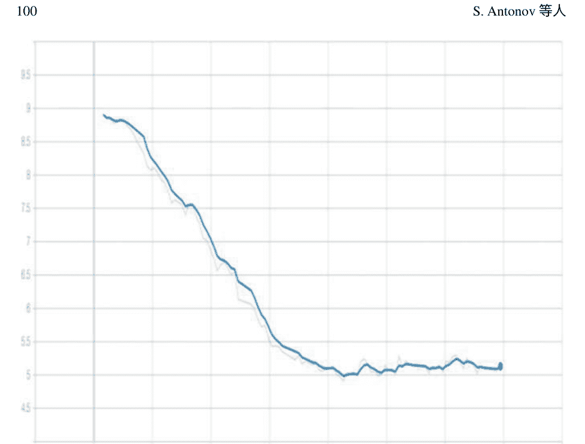

图4 模型训练过程中损失的演变

上面。图6示例了一个带有边界框的处理过的视频帧，其中在近距离（任意2米阈值）内出现的边界框以红色显示，而其他边界框以绿色显示。图7显示了相应的鸟瞰图，使用类似的颜色表示法。

另一个示例分别显示在图8和图9中。

#### 4.4 接触网络图

在流行病学接触追踪中，一个强烈影响传播风险的重要数量是每对个体之间的接触持续时间。给定公共空间的相应框架可以用加权图表示，其中节点对应于个体，而链接之间的权重表示接触持续时间。图10示例了一个代表性短场景的接触图，其中链接权重表示以秒为单位的接触持续时间。

为了减少公共场所感染传播的风险，减少接触时间是至关重要的。或者，基于接触时间超过一定阈值与感染风险增加有关的假设

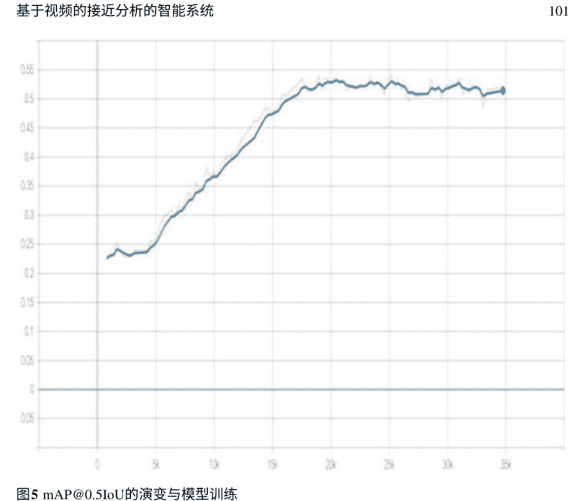

## 图5 mAP@0.5IoU的演变与模型训练

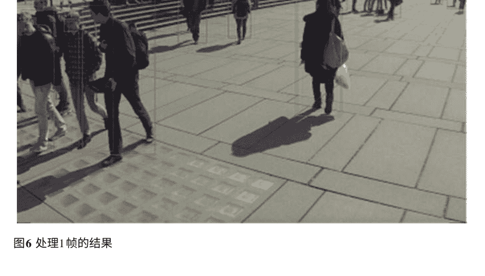

## 图6 处理帧的结果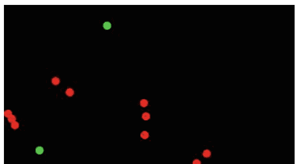

## 图7 1帧的鸟瞰图

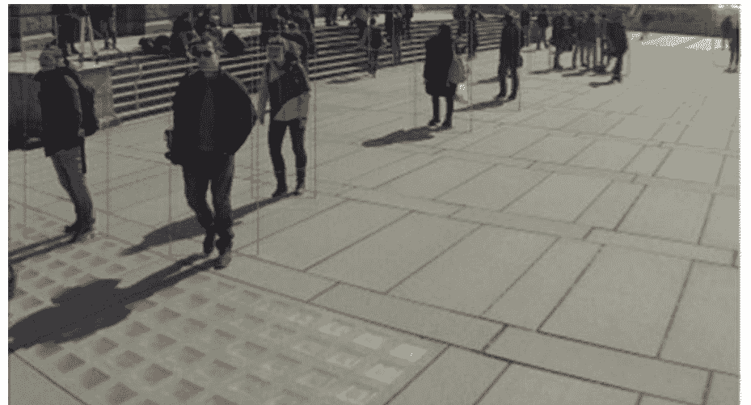

## 图8 处理2帧的结果

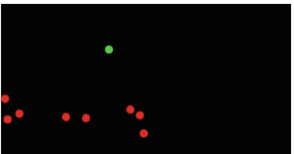

## 图9 2帧的鸟瞰图

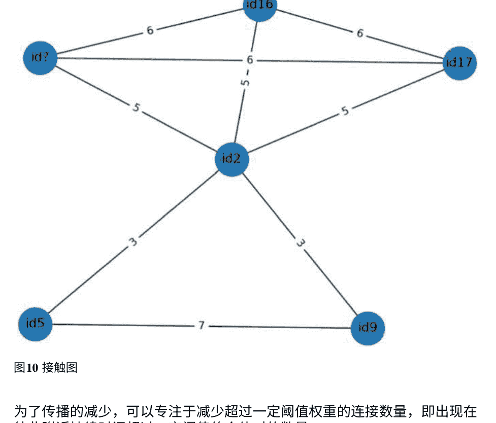

图10 接触图

为了传播的减少，可以专注于减少超过一定阈值权重的连接数量，即出现在彼此附近持续时间超过一定阈值的个体对的数量。

### 5 进一步解释和展望适应后疫情社会目标

现在，在疫情爆发两年多后，公众的注意力越来越多地转向寻找最佳的退出策略，包括对在疫情爆发初期迅速部署的技术进行适应，并找到它们在后疫情社会中的位置。在接下来的内容中，我们考虑了如何在不同的场景中使用上述解决方案，而不仅仅是个体接触追踪或人群流行病学监测，例如，导致改进的公共空间规划。

公共空间的规划强烈影响拥堵的概率，人群的形成，排队的组织，从而在很大程度上决定了在某个特定持续时间内保持亲密接触的总接触人数。

有许多广泛使用的数学模型用于模拟从粒子运动到行走轨迹的集体动力学。行走轨迹模拟的最简单模型之一是二维随机行走，其特点是随机增量。在现实世界的环境中，增量的随机性是不太可能的情况，因为行走者与静止物体之间以及行走者与其他行走者之间不可避免地发生相互作用，导致它们的轨迹调整，从而出现相关性和自避行走更为相关。关于这个问题的最新文献综述，我们参考[30,37,51]，以及几个相关的特殊情况，包括障碍物的存在[47]和能够表示现实世界公共空间典型特征的紧凑性约束。

在接下来的内容中，我们考虑了几个短片段，计算了感兴趣的统计数据，并将它们与通过计算机模拟获得的不相关和相关随机行走模型的类似结果进行了比较。

图11显示了代表每对个体保持亲密接触的持续时间的成对接触持续时间矩阵，对于一个样本接近阈值。为了简化不同场景之间以及基于视频分析和基于随机行走模拟的结果之间的比较，我们将接近阈值定义为所有可以在场景中同时观察到的行走者的距离分布的某个分位数。这种归一化是比较不同尺度数据集的常见方法，参见例如[7]。在这个特定的例子中，我们选择了 $T_Q = 5$，表示平均每5个成对距离都低于阈值。

对于接触图属性的统计特征化，一种直接的方法是考虑获得的所有可能个体对的接触持续时间的分布。图12显示了六个不同的短片段的统计数据，包括互补累积分布函数（CCDFs），指示每个个体的到达间隔时间和停留时间超过函数参数的概率，以及所有可能个体对的成对接触持续时间的类似数量，分别对应于 $T_Q = 2$、5和10。图表显示，以每个场景和每个阈值分别获得的平均接触持续时间的单位表示的归一化分布往往遵循简单的指数规律。

这通常是一个预期的结果，与通过计算机模拟随机行走得到的类似数量的结果非常一致（为了简单起见，考虑了到达和持续时间服从指数分布的情况）。这个分布背后的理论背景相当简单，可以通过基于事件的概念来解释，考虑任何一对随机轨迹接近的个体作为一个随机事件。在这个最简单的情况下，这些事件构成了参数通常依赖于到达和持续时间的泊松过程，以及不同行者之间的平均距离和单个行者在给定时间单位内执行的步长（例如一秒）。然而，由于任何泊松过程的事件间距分布衰减

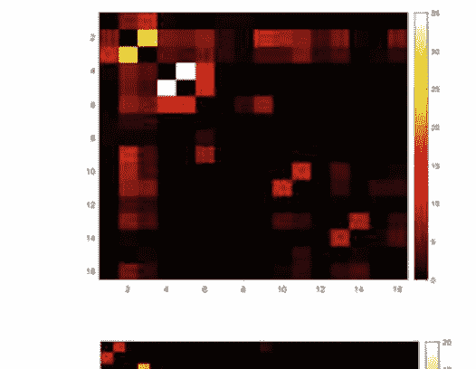

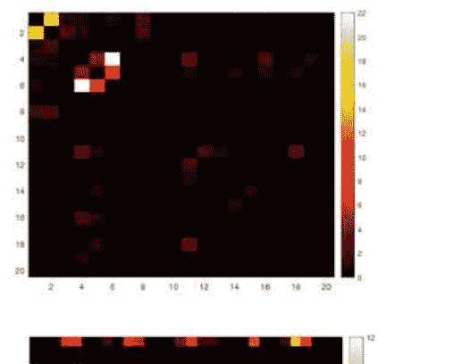

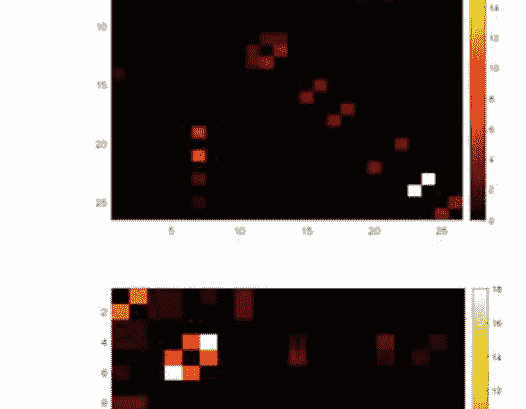

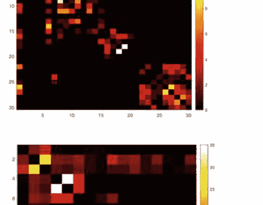

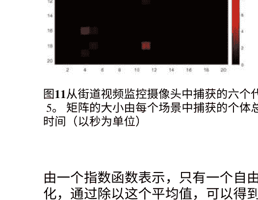

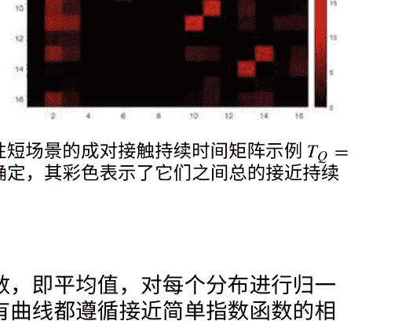

图11 从街道视频监控摄像头中捕获的六个代表性短场景的成对接触持续时间矩阵示例 $T_Q = 5$。矩阵的大小由每个场景中捕获的个体总数确定，其彩色表示了它们之间总的接近持续时间（以秒为单位）。

由一个指数函数表示，只有一个自由参数，即平均值，对每个分布进行归一化，通过除以这个平均值，可以得到所有曲线都遵循接近简单指数函数的相同模式的数据坍缩。与这个简单的理论情景的偏差可以归因于离散性和有限尺寸效应。从图中可以看出，这些偏差对于观测数据和模拟数据来说是可比较的，因为模拟数据包含类似数量的帧，平均到达间隔。

图12 六个不同短场景的统计数据，包括每个个体在场景中停留的互到达时间和持续时间的CCDF，以及所有可能的个体对之间的接触时间的分布，每个分布都有三个不同的阈值 $T_Q = 2$、5和10。直线表示简单指数函数，而虚线表示具有类似参数的模拟随机游走的类似结果（蓝色曲线对应于没有相关性，红色曲线对应于具有Hurst指数 $H = 1.5$ 的长程相关随机游走）。

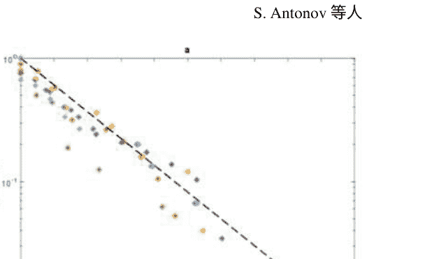

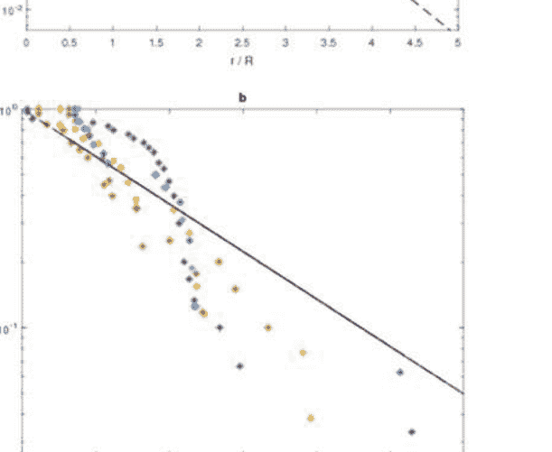

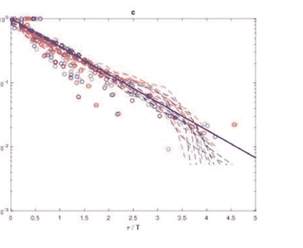

并且个体在场景中停留的时间和个体轨迹的总数也相似。

然而，在大多数现实世界的情况下，行走轨迹与最简单的随机模型有很大的偏差。导致行走轨迹在空间上聚集的典型原因是吸引物体的定位（例如柜台、门、通道等），以及室内和室外公共空间中的障碍物（例如栏杆、广告牌、亭子等）。此外，交通规则（例如旋转门、人行横道的交通灯等）还会导致行走轨迹在时间上的额外聚集。在从统计物理学的角度来描述运动的各种模型中，长程相关性似乎是人类动力学背景下最相关的（关于该主题的最新和全面的文献综述，请参阅[22]）。为了考虑到空间和时间的聚集，二维长程相关场似乎是一个相关的模型。

最近的数据，包括我们自己的结果表明，长程相关性与事件聚类密切相关，通常导致事件间隔时间和事件持续时间的重尾分布，后者对于接触接近持续时间至关重要。长程时间相关性对事件动态的影响已经得到了分析[32]和数值[1, 14]的研究，表明在最简单的泊松过程情景下，连续事件之间的间隔分布从单一指数分布变为线性长期相关性的拉伸指数分布，最终在强长期相关性的情况下收敛为幂律衰减，特别是在系统中存在非线性相互作用的情况下[6,7]。此外，近年来在许多现实世界的复杂系统中观察到了类似的事件间隔时间分布，从公共计算机网络中由用户交互驱动的突发访问模式[6,29,34,49]到各种自然现象，例如地球物理学中[8, 13]。最后，我们最近的数据表明，空间长程相关性导致生物聚合物结构中出现类似的规律[9–11]。图13展示了通过计算机模拟获得的类似分布，其中随机增量的Hurst指数为 $H = 0.5$，长程时空相关增量的Hurst指数为 $H = 1.5$。该图明确显示，更强的时空相关性导致更宽的接触持续时间分布，表明更大比例的个体对在相同的接近阈值内保持更长时间（通过超过概率分布的初始衰减更明显来表示），与随机增量情景相比。该图还显示，虽然可以基于这些模拟得出一些一般性的定性结论，但对于有限系统获得的分布的特定函数形式呈现出非平凡的形状，这些形状由相关性、离散性和有限尺寸效应的复杂相互作用决定，因此不仅仅取决于可以从已知理论假设中最终推导出的渐近行为，而且还明确取决于系统尺寸。

作为一种说明，获得图13需要包含110个时间步长和11倍个体行者的模拟数据集，总共导致了大约 $10^3$ 倍的行者位置，可能多达 $10^6$ 倍的成对距离。

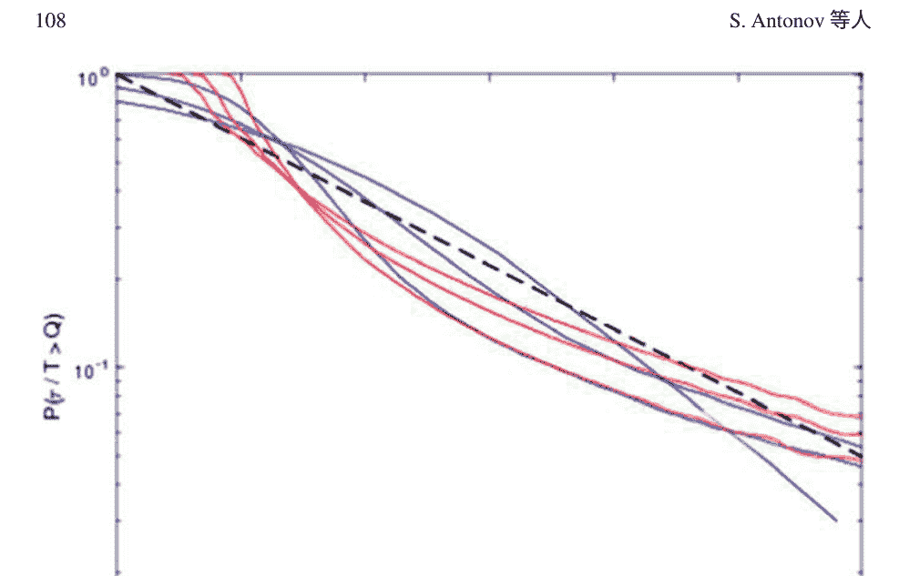

图13 通过计算机模拟获得的成对接近持续时间分布，其中随机增量的Hurst指数为0.5（蓝色曲线），长程时空相关增量的Hurst指数为1.5（红色曲线）。

与我们研究中使用的观测视频示例相比。由于获取不同公共场所可比统计数据所需的视频分析量需要相当大的计算工作，我们认为更详细的分析，包括长期视频分析和最佳相关行者模型拟合，以更好地理解公共空间规划如何影响时空行走轨迹相关模式和接触接近度分布，超出了本研究的范围，并可作为未来研究方向的展望。

### 6 结论和展望

总结起来，数字技术在全球对COVID-19的早期响应中起到了重要作用，特别是在数字流行病学监测和接触追踪的背景下，在现实世界中证明了它们的有效性，并与许多成功案例密切相关，导致社区传播迅速被抑制，发病率降低。

虽然人工智能和机器学习技术已广泛应用于基于网络的流行病信息支持工具和在线病例追踪，但在接近追踪和连续分析的背景下，尚未充分探索其在更明智的公共空间规划中的应用，以减少接触和接触时间。

在本文中，我们提出了一种基于视频监控的接近追踪框架。然而，对于任何实际应用的方法，隐私考虑都不能过于强调。这是我们框架中的一个基本思想，通过使用匿名ID来识别个人。进一步探索如何将隐私整合到提出的解决方案中是最直接的未来研究方向。其他方向包括训练其他神经网络模型并将它们进行比较，以找到最佳模型。训练模型将根据上述参数进行评估，例如使用IoU阈值为0.5的mAP，训练模型的误差以及用于目标检测的每秒帧数（FPS）。此外，我们将使用来自拥挤街道的大型数据集进一步评估该方法。

现在，在大流行开始两年多后，公众的注意力越来越多地转向寻找最佳的退出策略，包括适应这些技术并在后大流行社会中找到它们的位置。展望这个目标，我们还考虑了基于视频监控的接近追踪如何适应以促进改善公共空间规划。

致谢 Sergey Antonov的工作得到了俄罗斯联邦科学与高等教育部“Goszadanie” No 075-0102 4-21-02的支持，日期为2021年9月29日（项目编号FSEE-2021-0014）。

### 参考文献

-   1.  Altmann, E., & Kantz, H. (2005). 重现时间分析，长期相关性和极端事件。Physical Review E, 71(5), 056106.
-   2.  Amos, B., Ludwiczuk, B., & Satyanarayanan, M. (2016). Openface：一个通用的人脸识别库及其移动应用。技术报告，CMU-CS-16-118，CMU计算机科学学院。
-   3.  Anggo, M., & Arapu, L. (2018). 使用Fisherface方法的人脸识别物理学杂志：会议系列, 1028, 012119. https://doi.org/10.1088/1742-6596/1028/1/012119
-   4.  Balaban, S. (2015). 深度学习和人脸识别: 现状. 在生物特征和人类与活动识别技术XII(卷9457, 页94570B). 国际光学和光子学学会.
-   5.  Biswas, R., Vasan, A., & Roy, S. S. (2020). 扩张深度神经网络用于视网膜血管分割的眼底图像.伊朗科学与技术杂志, 电气工程交易 44(1), 505–518.
-   6.  Bogachev, M., & Bunde, A. (2009). 关于电信网络中过载发生和可预测性的研究。*EPL (Europhysics Letters)*, 86(6), 66002.
-   7.  Bogachev, M., Eichner, J., & Bunde, A. (2007). 非线性相关对多重分形数据集中返回间隔统计的影响。*Physical Review Letters*, 99(24), 240601.
-   8.  Bogachev, M., Eichner, J., & Bunde, A. (2008). 长期相关和多重分形数据集中极端事件的发生。*Pure and Applied Geophysics*, 165, 1195–1207.
-   9.  Bogachev, M., Kayumov, A., & Bunde, A. (2014). 全基因组中的核苷酸统计：DNA结构和包装的足迹？*PLoS ONE*, 9(12), e112534.
-   10. Bogachev, M., Kayumov, A., Markelov, O., & Bunde, A. (2016). 通过蛋白质裂解后的片段质量分布分析，对蛋白质的结构、定位和功能属性进行统计预测。科学报告，6，222 86.
-   11. Bogachev, M., Markelov, O., Kayumov, A., & Bunde, A. (2017). 超统计模型的细菌DNA结构。科学报告，7，43034.
-   12. Budd, J., Miller, B. S., Manning, E. M., Lampos, V., Zhuang, M., Edelstein, M., Rees, G., Emery, V. C., Stevens, M. M., Keegan, N., et al. (2020). 数字技术在公共卫生应对covid-19中的应用。自然医学，1–10.
-   13. Bunde, A., Bogachev, M., & Lennartz, S.: 降水和河流流量：极端事件的长期记忆和可预测性。极端事件和自然灾害：复杂性视角，139-152.
-   14. Bunde, A., Eichner, J., Havlin, S., & Kantelhardt, J. (2004). 在具有长期持续性的记录中的罕见事件的返回间隔。*Physica A: 统计力学及其应用*, 342(1), 308-314.
-   15. Dalal, N., & Triggs, B. (2005). 用于人体检测的梯度直方图。在2005年IEEE计算机学会计算机视觉和模式识别会议（CVPR 2005）中（卷1，第886-893页）。IEEE（2005）。https://doi.org/10.1109/cvpr.2005.17716
-   16. Everingham, M., Eslami, S. A., Van Gool, L., Williams, C. K., Winn, J., & Zisserman, A.(2015). 帕斯卡视觉对象类挑战：回顾。国际计算机视觉杂志，111(1), 98-136.
-   17. Ferretti, L., Wymant, C., Kendall, M., Zhao, L., Nurtay, A., Abeler-Dörner, L., Parker, M., Bonsall, D., & Fraser, C. (2020). 量化sars-cov-2传播表明数字接触追踪可控制流行病。科学, 368(6491).
-   18. Hossain, M. S., Muhammad, G., & Guizani, N. (2020). 可解释的人工智能和基于大规模监控系统的医疗框架，以应对类似covid-19的大流行病。*IEEE网络*, 34(4),126–132.
-   19. Huang, G. B., Ramesh, M., Berg, T., & Learned-Miller, E. (2007). 野外标记人脸数据库：用于研究非受限制环境中人脸识别的数据库。技术报告07-49,马萨诸塞大学阿默斯特分校。
-   20. Jalali, S. M. J., Ahmadian, M., Ahmadian, S., Hedjam, R., Khosravi, A., & Nahavandi, S. (2022). 基于进化深度学习方法的X射线图像COVID-19检测。*Expert Systems with Applications*, 201, 116942.
-   21. Jalled, F. (2017). 使用特征脸的人脸识别机器视觉系统。
-   22. Karsai, M., Jo, H. H., Kaski, K., et al. (2018). *Bursty human dynamics*. Springer
-   23. King, D. E. (2015). 最大间隔目标检测
-   24. Lellouche, S., & Souris, M. (2020). 紧凑集合中元素之间的距离分布。统计学，3(1), 1–15。
-   25. Lin, T., Maire, M., Belongie, S. J., Bourdev, L. D., Girshick, R. B., Hays, J., Perona, P., Ramanan, D., Dollár, P., & Zitnick, C. L. (2014). Microsoft COCO: 上下文中的常见对象。CoRR abs/1405.0312
-   26. Liu, W., Anguelov, E., Szegedy, C., Reed, S., Fu, C., Berg, A. (2016). SSD: Single Shot MultiBox Detector (pp. 21-37). Lecture Notes in Computer Science. https://doi.org/10.1007/978-3-319-46448-0_2
-   27. Li, Z., Yang, W., Peng, S., & Liu, F. (2020). A Survey of Convolutional Neural Networks: Analysis, Applications, and Prospects.
-   28. Maneewongvatana, S., & Mount, D. M. (2001). It's okay to ask for better neighbors. In Algorithm Engineering and Experimentation (pp. 172-187). Springer Berlin Heidelberg. https://doi.org/10.1007/3-540-44808-x_14
-   29. Markelov, O., Nguyen, V., & Bogachev, M. (2017). Statistical modelling of Internet traffic dynamics: How much long-range dependence do we need? *Physica A: Statistical Mechanics and its Applications*, 485, 48–60.
-   30. Moltchanov, D. (2012). Distance distributions in random networks. *Ad Hoc Networks*, 10(6), 1146–1166.
-   31. Mundy, J. L., Zisserman, A., et al. (1992). Geometric Invariance in Computer Vision (Vol. 92). MIT Press, Cambridge.
-   32. Newell, G., & Rosenblatt, M. (1962). Zero crossing probabilities for Gaussian stationary processes. *The Annals of Mathematical Statistics*, 33(4), 1306–1313.
-   33. Nguyen, T., Chen, S.W., Shivakumar, S. S., Taylor, C. J., & Kumar, V. (2017). Unsupervised Deep Homography: A Fast and Robust Approach for Homography Estimation.
-   34. Nguyen, V., Markelov, O., Serdyuk, A., Vasenev, A., & Bogachev, M. (2018). Universal rank-size statistics in web traffic: modeling collective access patterns with long-range dependence. *EPL (Europhysics Letters)*, 123(5), 50001.
-   35. Panigrahy, R. (2008). An improved algorithm for finding nearest neighbors using kd-trees. In Lecture Notes in Computer Science (pp. 387-398). Springer Berlin Heidelberg. https://doi.org/10.1007/978-3-540-78773-0_34
-   36. Pan, J., & Manocha, D. (2011). GPU-based fast locality-sensitive hashing for k-nearest neighbor computation. In Proceedings of the 19th ACM SIGSPATIAL International Conference on Advances in Geographic Information Systems (pp. 211-220). ACM, New York, NY, USA. https://doi.org/10.1145/2093973.2094002
-   37. Pönisch, W., & Zaburdaev, V. (2018). Relative distance of tracers as a measure of diffusivity within moving aggregates. *The European Physical Journal B*, 91(2), 1-7.
-   38. Punn, N. S., Sonbhadra, S. K., & Agarwal, S. (2020). Monitoring COVID-19 social distancing with person detection and tracking via fine-tuned YOLO v3 and Deep SORT techniques.
-   39. Rezaei, M., & Azarmi, M. (2020). DeepSocial: Social Distancing Monitoring and Infection Risk Assessment in COVID-19 Pandemic. arXiv preprint arXiv:2008.11672
-   40. Roy, S. S., Goti, V., Sood, A., Roy, H., Gavrila, T., Floroian, D., Paraschiv, N. & Mohammadi-Ivatloo, B. (2014). L2 regularized deep convolutional neural network for fire detection. Journal of Intelligent & Fuzzy Systems, 1–12.
-   41. Roy, S. S., Rodrigues, N., & Taguchi, Y. (2020). Incremental Dilation for Brain Tumor Classification Using CNN. Applied Sciences, 10(14), 4915.
-   42. Roy, S. S., Mihalache, S. F., Pricop, E., & Rodrigues, N. (2022). Environmental Sound Classification via Dilated Deep Convolutional Neural Network. Journal of Intelligent & Fuzzy Systems, 1-7.
-   43. Sandler, M., Howard, A., Zhu, M., Zhmoginov, A., & Chen, L. C. (2018). Mobilenetv2: Inverted residuals and linear bottlenecks.
-   44. Samui, P., Roy, S. S., & Balas, V. E. (Eds.). (2017). Handbook of Neural Computation. Academic Press.
-   45. Schroff, F., Kalenichenko, D., & Philbin, J. (2015). Facenet: A unified embedding for face recognition and clustering. In Proceedings of the IEEE Conference on Computer Vision and Pattern Recognition (CVPR), pp. 815–823. https://doi.org/10.1109/CVPR.2015.7298682
-   46. Singh, S., Kaur, A., & Taqdir, A. (2015). A Face Recognition Technique using Local Binary Pattern Method. *IJARCCE*, 165–168. https://doi.org/10.17148/IJARCCE.2015.4340
-   47. Skliros, A., & Chirikjian, G. S. (2008). Position and orientation distributions for a local self-avoiding walk in the presence of obstacles. *Polymer*, 49(6), 1701–1715.
-   48. Sokolova, A., Uijanitski, Y., Kayumov, A. R., & Bogachev, M. I. (2021). Improved online event detection and discrimination via simple gradient-based nonlinear transformation: Implications for biomedical signal and image analysis. *Biomedical Signal Processing and Control*, 66, 102470.

## 基于深度学习的结膜黑色素瘤检测，使用眼表图像

Kanchon Kanti Podder, Mohammad Kaosar Alam, Zakaria Shams Siam, Khandaker Reajul Islam, Proma Dutta, Adam Mushtak, Amith Khandakar, Shona Pedersen, and Muhammad E. H. Chowdhury

### 1 引言

眼睛是我们人类最重要和最复杂的感觉器官之一。它帮助我们能够看到物体，并影响我们对光线、深度和颜色的感知。结膜痣[1]是一种相对普通的疾病，具有几种不同的临床表现[2]。在普通的临床治疗中，经常会遇到询问结膜病变的患者。结膜痣可能表现出一系列恶性或良性特征[4]。一种罕见但可能致命的眼部恶性肿瘤称为结膜黑色素瘤[1]，它起源于结膜上皮基底细胞内的黑色素细胞[5]。这种罕见的肿瘤占所有眼部肿瘤的约2%，视神经黑色素瘤的5%[6]，以及每种黑色素瘤的0.25%[7]。结膜黑色素瘤的死亡率至少为30%[8]，这需要昂贵的治疗，而恶劣的预后与迟诊[3, 5]相关。结膜黑色素瘤通常表现为有色或多样的锐利结膜病变，然而罕见的病例可能因各种形态而导致诊断延迟[9]。这种情况可能是由痣或获得性黑色素沉着引起的[10]。为了减少这种情况导致的死亡率，及时诊断和实用的检测是必要的，考虑到涉及老龄化人口和医疗资源不足的现代情况。眼科医生通过在裂隙灯下观察眼表面来确定患者是否患有结膜黑色素瘤，需要进行活检以验证诊断[3]。然而，这些临床调查的实施受到了COVID-19疫情的严重影响[11]。因此，眼科医生在及时识别结膜黑色素瘤方面面临着重大困难[3]。

深度学习已经对医学影像产生了巨大影响，而且这种影响预计将来会进一步增加[12,13]。根据几位专家的说法，深度学习将成为未来医学的关键因素，也是医学实践和研究的关键工具[14–18]。在医学图像分析方面，深度学习方法已经在各种任务中展示出了令人印象深刻的成就，包括从低级到高级的图像处理功能，如图像分类、检测、分割、增强、去噪、重建、配准等[19–26]。利用带有病理病变的数字图像的深度学习技术被认为对于提高皮肤恶性肿瘤的检测很有用[27, 28]。尽管许多利用深度学习模型的研究集中在皮肤黑色素瘤上[29–32]，但对于识别结膜黑色素瘤的现代深度学习技术的应用还未得到充分探索。由于缺乏包括结膜疾病的真实数据，训练传统深度神经网络来识别结膜黑色素瘤非常困难。

最近，研究了利用深度学习技术从视网膜表面图像中识别结膜黑色素瘤的方法[3]。然而，他们的数据集没有经过很好的筛选。此外，为了使分类性能更好，还需要进行更多的研究。本研究的目标是使用大规模、增强的视网膜表面图像数据集，检测结膜黑色素瘤的现代深度学习技术。本研究使用了四类图像数据，包括结膜黑色素瘤、黑色素痣、正常结膜和翼状胬肉[33]图像。考虑到在结膜黑色素瘤分类领域存在的研究空白，本研究提出了以下贡献：

*   提出了一个经过医学专家验证的结膜黑色素瘤数据集。
*   提出了一种有效且更快的数据增强技术，用于增加小型结膜黑色素瘤数据集，与基于CycleGAN的增强方法[3]相对。
*   本研究提出了一种高性能的深度学习模型，可以高精度地分类不同的眼部状况。

此外，我们还融入了我们发现的可解释性。本研究旨在验证结膜病变可以被分类，并且可以利用深度学习在光学表面图像中发现结膜黑色素瘤。这项研究可能使结膜病变的及时识别更加容易。

本研究的概述在下面的章节中进行了描述。接下来的部分将进一步介绍所使用的材料和方法的详细信息。随后，揭示和讨论了研究结果。最后，我们总结了结论并展望了未来的研究方向。

补充信息在线版本包含在https://doi.org/10.1007/978-981-99-3784-4_6上提供的补充材料。

K. K. Podder
孟加拉国达卡大学生物医学物理与技术系，达卡1000，孟加拉国
M. K. Alam · Z. S. Siam
马来西亚国立大学电气、电子与系统工程系，43600 Bangi，马来西亚
Z. S. Siam
孟加拉国总统大学电气与计算机工程系，达卡，孟加拉国
K. R. Islam · A. Khandakar · M. E. H. Chowdhury (✉)
卡塔尔大学电气工程系，2713 Doha，卡塔尔
e-mail: mchowdhury@qu.edu.qa
P. Dutta
孟加拉国吉大港工程与技术大学电气与电子工程系
A. Mushtak
多哈卡塔尔哈马德医疗公司临床影像部
S. Pedersen
卡塔尔大学医学院基础医学科2713多哈卡塔尔

### 2 方法论

本研究提出了一个系统，可以使用智能手机拍摄的眼睛图像将其分类为正常或其他眼部相关疾病。该系统涉及的方法包括数据收集、数据清洗和验证、CNN训练和评估以及可视化解释。图1展示了本研究提出的方法论的逐步工作流程。

#### 2.1 数据收集

本研究的重点是利用深度学习系统和眼表面图像分析前房段。我们的数据集是基于[3]中的初步黑色素瘤数据集。正常、结膜翼状胬肉、痣和结膜黑色素病是该数据集中的四个类别。[3]提供的数据集中包含一些不相关和有问题的图像，经过我们团队的医学专家鉴定。具有结膜异常的眼部图像在网上广泛可得，并可通过各种关键词搜索（例如“正常结膜”、“结膜翼状胬肉”、“结膜痣”、“结膜黑色素病”）进行访问，因此我们从[3]提出的数据集中删除了不相关的数据，并添加了新的图像。专家医生对数据进行了双重检查，确保其准确和有价值。原始数据集的详细信息和清洗验证后的数据集详细信息如图2所示。本研究中提出的数据集在图2中有所说明，并且数据集中不同类别的样本表示在图3中可见。

#### 2.2 数据增强

“四类”数据集是本研究中考虑的标签数据集。从这个“四类”数据集中，又开发了另一个数据集。在这里我们有一个“二元类别”数据集，其中“正常结膜”与“异常结膜”（包括翼状胬肉、痣和结膜黑色素瘤）分开分类。这两个数据集分别划分为训练集、验证集和测试集，比例分别为70%、10%和20%（图4）。由于数据集规模较小，为了增加训练集的大小，采用了四种数据增强技术。我们已经看到数据增强技术是解决小数据集问题的一种有效方法，这在其他一些出版物中已经得到证明[34-36]。这些技术包括随机旋转、随机仿射变换、填充和颜色校正。本研究探讨的四种增强方法的具体细节见表1。本研究使用了包括单一增强和多重增强在内的随机增强方法。单一增强还是多重增强取决于在增强模型中随机确定使用的增强技术。如果选择了多个增强技术，则增强模型将随机决定使用哪种组合的增强技术。单个和多个增强技术被用于眼表面图像，如图3所示。

在这两个数据集中，通过应用这四种数据增强技术，每个类别的训练集大小扩展到了三千个样本。由于验证集和测试集用于在实际环境中评估深度学习模型，因此这两个集合在整个过程中保持不变。表2包含了数据集的大小描述以及增强[37]因子的说明。

#### 2.3 基于卷积神经网络（CNN）的分类模型

该项目利用最先进的卷积神经网络（CNN）对正常和不同眼部状况的眼表图像进行分类。本研究使用了四种CNN架构，分别是ResNet、DenseNet、GoogLeNet和EfficientNet，并使用了预训练权重。我们选择了这些架构，因为它们在之前的出版物中表现出了很高的效果[38]。这四种CNN架构是在大型基准数据集“ImageNet”[39]上进行训练的，并且在训练中采用了预训练权重，利用了著名的迁移学习概念。CNN模型在眼表图像上进行训练时，使用预训练权重进行初始化，并在训练过程中进行优化。下面给出了训练的CNN架构的详细信息：

##### 2.3.1 GoogLeNet

GoogLeNet是在文献[40]中提出的，它是基于Inception模块构建的。GoogLeNet的作者提出了一个更宽更深的Inception，在ImageNet大规模视觉识别挑战（ILSVRC）2014比赛中表现稍微更好。在GoogLeNet的Inception模块中，对维度进行降低时，每个3×3和5×5卷积之前都添加了1×1卷积。该模型共有22层，其中包含27个池化层，9个Inception模块线性堆叠。Inception模块的末尾与全局平均池化层相连。有关卷积层、池化层和激活函数的详细模型架构，请参考文献[40]。

##### 2.3.2 ResNet

文献中提出的ResNet架构[41]旨在解决深度CNN架构中的梯度消失问题。在深度CNN架构中，较早层的特征在网络深入并引入更复杂的特征提取器时开始消失。结果导致梯度消失问题，而ResNet架构中的残差连接通过实现跳跃连接将特征从较早层流向更深层。在本研究中，使用了ResNet18、ResNet50和ResNet152。

ResNet的命名方式是后面跟着一个由两个或多个数字组成的数字，简单地表示具有特定神经网络层数的ResNet架构。因此，在这个眼表面图像分类研究中，使用了基于18、50和152层的ResNet架构进行评估和与其他对应的CNN架构进行比较。

##### 2.3.3 DenseNet

在[42]中的作者观察到，当在靠近输入和靠近输出的层之间建立短连接时，更深的CNN模型更准确和高效。通过应用这一观察，[42]中的作者提出了DenseNet，它以前馈方式工作，将每一层连接到其他每一层。作者们发现利用DenseNet有几个好处，包括消除了梯度消失问题，从而实现更好的特征传播和重用。这种特殊的连接方式在ImageNet数据集上取得了基准结果，同时显著减少了参数数量。本研究中使用了Densenet-161和Densenet-201两种架构；分别对应的设计深度为161层和201层。

##### 2.3.4 EfficientNet

所有的CNN，如VGGNet、ResNet、MobileNet和SeNet，都采用了各种方法来提高网络的准确性。这些方法可能增加三个维度中的任意一个（宽度、深度或分辨率），但至少会增加其中一个。[43]中的作者在文献中讨论了这些缩放方法。将所有这些策略整合到EfficientNet中是通过提出一种在所有这些维度上一致缩放的机制来实现的。EfficientNet_B7，EfficientNet架构的一个成员，在ImageNet上实现了84.3%的top-1准确率，我们使用了该模型性能的预训练权重来进行眼表面图像分类。

#### 2.4 可视化方法

对于CNN如何执行和决策背后的直觉总是一个引人入胜的话题。多年来，随着可视化工具的发展，对CNN工作原理的好奇心得到了有效满足。这导致了模型的功能性，以一种人类能够理解的方式展示推理的基础，从而对CNN的输出结果产生信心。在各种可视化工具中，Grad-CAM[44]被选择用于这项调查，因为Grad-CAM在最近的计算机视觉问题中表现出了良好的性能[45]。梯度加权类激活映射方法利用最终CNN层的特征梯度，在图像上生成一个定位图，以找出哪个区域对决策产生贡献。使用Grad-CAM相对于其他可视化技术的好处在于，它适用于各种CNN架构，包括有或没有全连接层的架构[45]。由于本研究进行了敏感医疗条件分类，因此有必要通过可视化来确认CNN模型的兴趣区域。

### 表1 提议数据集的训练集中使用的增强技术和范围

| 增强技术 | 范围 |
|----------|------|
| 随机旋转 | +20到 -20度 |
| 随机仿射 | 角度 = 0<br>平移范围 = (0.05, 0.15)<br>缩放范围 = (0.9, 0.95) |
| 填充 | 范围 = (0,10)<br>填充色 = (黑色, 白色)<br>模式 = (‘常数’, ‘边缘’) |
| 颜色校正 | 亮度 = (0, 0.2)<br>对比度 = (0, 0.2) |

### 表2 所提出数据集的详细描述。经过专家医生验证的策划数据集，并使用不同的增强技术将训练样本增加了一个增强因子。

| 数据集 | 类别 | 原始数据样本 | 验证集 | 测试集 | 训练集 | 增强因子 | 增强后的训练集 |
|--------|------|--------------|--------|--------|--------|----------|----------------|
| 二元分类 | 正常结膜 | 125 | 13 | 25 | 87 | 34.48 | 3000 |
|  | 异常结膜 | 285 | 28 | 57 | 200 | 15 | 3000 |
| 四类数据集 | 正常结膜 | 125 | 13 | 25 | 87 | 34.48 | 3000 |
|  | 痣 | 85 | 8 | 17 | 60 | 50 | 3000 |
|  | 翼状胬肉 | 70 | 7 | 14 | 49 | 61.44 | 3000 |
|  | 结膜黑色素瘤 | 130 | 13 | 26 | 91 | 32.97 | 3000 |

### 图1 本研究采用的方法描述

### 图2 清洗和验证前后的数据集详细信息

49. Tamazian, A., Nguyen, V., Markelov, O., & Bogachev, M. (2016). 互联网流量动态中的集体访问模式的通用模型：超统计方法。 *EPL (Europhysics Letters)*, *115*(1), 10008.

50. Tao, Y., & Sheng, C. (2014). 带关键词的快速最近邻搜索。 *IEEE Transactions on Knowledge and Data Engineering*, *26*, 878-888. [https://doi.org/10.1109/TKDE.2013.6651](https://doi.org/10.1109/TKDE.2013.6651).

51. Tejedor, V., Schad, M., Bénichou, O., Voituriez, R., & Metzler, R. (2011). 两个随机行走在有限一维区间上的相遇分布。 *Journal of Physics A: Mathematical and Theoretical*, *44*(39), 395005.

52. Vannoorenberghe, P., Motamed, C., Blosseville, J. M., & Postaire, J. G. (1997). 使用实时运动分析的自动行人识别。 在图像分析和处理国际会议上(第493-500页)。 斯普林格。

53. Viola, P., & Jones, M. (2001). 使用增强级联简单特征的快速目标检测。 在2001年IEEE计算机学会计算机视觉和模式识别会议论文集(CVPR 2001, vol. 1, pp. I-I)。 IEEE。

54. Yianilos, P. N. (1993). 一般度量空间中最近邻搜索的数据结构和算法。 在第四届ACM-SIAM离散算法年度研讨会论文集*SODA*, pp. 311-321。 美国工业和应用数学学会。

55. Zhang, K., Zhang, Z., Li, Z., & Qiao, Y. (2016). 使用多任务级联卷积网络进行联合人脸检测和对齐。 *IEEE Signal Processing Letters*, *23*(10), 1499-1503. [https://doi.org/10.1109/LSP.2016.2603342](https://doi.org/10.1109/LSP.2016.2603342).

56. 苹果和谷歌框架。 [https://www.apple.com/newsroom/2020/04/apple-and-google-partner-on-covid-19-contact-tracing-technology/](https://www.apple.com/newsroom/2020/04/apple-and-google-partner-on-covid-19-contact-tracing-technology/)

57. Covidsafe应用程序，澳大利亚。 [https://www.health.gov.au/resources/apps-and-tools/covidsafe-app](https://www.health.gov.au/resources/apps-and-tools/covidsafe-app)

58. dp-3t项目。 [https://github.com/DP-3T/documents](https://github.com/DP-3T/documents)

59. Hamagen应用程序，以色列。 [https://govextra.gov.il/ministry-of-health/hamagen-app/download-en/](https://govextra.gov.il/ministry-of-health/hamagen-app/download-en/)

60. 挪威停止smittestop应用程序。 [https://www.amnesty.org/en/latest/news/2020/06/norway-covid19-contact-tracing-app-privacy-win/](https://www.amnesty.org/en/latest/news/2020/06/norway-covid19-contact-tracing-app-privacy-win/)

61. Pepp-pt项目。 [https://github.com/pepp-pt/pepp-pt-documentation/blob/master/PEPP-PT-high-level-overview.pdf](https://github.com/pepp-pt/pepp-pt-documentation/blob/master/PEPP-PT-high-level-overview.pdf)

| 超参数 | 详细信息 |
| :--- | :--- |
| 批量大小 | 4 |
| 优化器 | Adam |
| 损失函数 | NLL损失 |
| 学习率 | 0.0001 |
| 总轮数 | 20 |
| 轮数耐心 | 6 |
| 学习率下降因子 | 0.1 |
| 最大停止轮数 | 10 |
| 停止准则 | 损失 |

考虑到。因此，这最终增强了模型决策技术的信任。在结果部分的最后，提供了关于在这个眼表面图像分类中使用的Grad-CAM的视觉表示和解释的讨论。

#### 2.5 实验设置

在“二分类”和“四分类”数据集的研究中使用了五折交叉验证。本研究使用Py Torch库和Python 3.7。在训练、验证和测试过程中，使用了具有16 GB Tesla T4 GPU和120 GB高内存的Google ColabPro平台。此外，本研究中所有调查所使用的超参数在表3中给出。

#### 2.6 评估指标

通过使用数学指标（如整体准确率、精确度、敏感度/召回率、F1分数和特异性）来研究CNN模型的性能。令, α = 预测为真正例的眼表面图像数量, β = 预测为假正例的眼表面图像数量, δ = 预测为真反例的眼表面图像数量, θ = 预测为假反例的眼表面图像数量。因此，整体准确率、精确度、敏感度/召回率、F1分数和特异性可以通过公式(1-5)来计算。

特异性 = \frac{\delta}{\delta + \theta}  \quad\quad (1)
精确度 = \frac{\alpha}{\alpha + \beta}  \quad\quad (2)
召回率 = \frac{\alpha}{\alpha + \theta} \quad\quad (3)
F1分数 = \frac{2 \times 精确度 \times 召回率}{精确度 + 召回率} \quad\quad (4)
整体准确率 = \frac{\alpha}{\alpha + \beta + \delta + \theta} \quad\quad (5)

混淆矩阵和ROC曲线是评估深度学习模型在医学图像分类中性能的重要指标。在本研究中，通过比较其他对应模型，评估了每个CNN模型的混淆矩阵和ROC曲线，以确定表现最佳的模型。

### 3 结果

#### 3.1 二元分类

“正常结膜”与“异常结膜”类别被视为使用七个卷积神经网络模型进行二元分类的类别。这七个卷积神经网络的学习曲线可在附表1至附表7中找到。所有学习曲线都表明模型训练良好，不存在过拟合和欠拟合问题。图5显示了使用这七个预训练卷积神经网络模型进行五折交叉验证的准确率的均值和标准差。EfficientNet_B7在折叠准确率方面达到了最高的均值准确率和最低的标准差。

结果显示，相比之下，GoogLeNet在五折交叉验证中的性能变化更大，这表明GoogLeNet的折叠性能相对较差。

表4显示了所有使用的模型的二元分类结果，以及所有模型的可训练参数数量和每个模型的推理时间。

从表4可以看出，我们使用的七种不同的CNN架构中，表现最好的模型是EfficientNet_B7，根据不同参数的结果。不同的参数，如准确率、精确度、召回率、F1得分和特异度分别为99.51%、99.52%、99.51%、99.51%和99.70%。从可训练参数的数量来看，EfficientNet_B7是最重的网络（超过6300万个可训练参数）。然而，在表4中使用的评估指标方面，所有其他模型的性能也非常接近。

Graphical Representation of mean and standard deviation in five-fold accuracy of different CNN models on Binary Dataset

图5 所有模型的五折准确率的均值和标准差表示

表4 不同CNN模型在二分类数据集中检测“正常结膜”和“异常结膜”时的性能指标，采用五折交叉验证方法

| 模型 | 可训练参数 | 推理时间（秒） | 整体准确率（%） | 精确度（%） | 召回率（%） | F1得分（%） | 特异度（%） |
|------|------------|----------------|-----------------|-------------|-------------|-------------|-------------|
| ResNet18 | 11,177,538 | 0.00216 | 99.27 | 99.27 | 99.27 | 99.26 | 98.78 |
| ResNet50 | 23,512,130 | 0.00532 | 99.27 | 99.27 | 99.27 | 99.26 | 99.22 |
| ResNet152 | 58,147,906 | 0.01557 | 98.78 | 98.78 | 98.78 | 98.78 | 98.76 |
| GoogLeNet | 5,601,954 | 0.00641 | 98.78 | 98.79 | 98.78 | 98.78 | 98.27 |
| DenseNet161 | 26,476,418 | 0.01893 | 98.29 | 98.30 | 98.29 | 98.29 | 98.22 |
| DenseNet201 | 18,096,770 | 0.02592 | 99.02 | 99.05 | 99.02 | 99.03 | 99.17 |
| EfficientNet_B7 | 63,792,082 | 0.03334 | 99.51 | 99.52 | 99.51 | 99.51 | 99.70 |

准则。就可训练参数而言，EfficientNet_B7模型几乎比GoogLeNet模型重11倍。然而，EfficientNet_B7模型在分类上的性能也比GoogLeNet模型更准确和精确，提高了0.73%。就推理时间而言，ResNet18的推理时间最短（约2.16毫秒），并且在分类上表现非常好（准确率为99.27%）。由于推理时间非常短（小于0.04秒），所有使用的网络都可以用于实时应用。

通过ROC曲线、AUC分数和混淆矩阵，还可以了解一个模型在区分关键医疗并发症和正常医疗数据方面的性能和有效性。图6表示最佳性能网络EfficientNet_B7的ROC曲线和混淆矩阵，用于二元分类。其他用于二元分类的模型的混淆矩阵和ROC曲线可以在补充图（1-14）中找到。

图6a描述了EfficientNet_B7在不同阈值下对“正常结膜”和“异常结膜”的TPR vs FPR分类情况。AUCROC接近1.00，表明EfficientNet B7能够在所有分类阈值下准确分类样本。EfficientNet_B7的真正例、真负例、假正例和假负例的值显示在混淆矩阵中，可以在图6b中看到。在五折交叉验证中，“异常结膜”类的285个测试实例中，只有一个被错误地识别为“正常结膜”。与其他CNN相比，EfficientNet_B7的整体性能优于其竞争对手。

#### 3.2 多类别分类

在二分类中使用的七个CNN模型也用于四类分类。这些模型的学习曲线也可以在附表8至14中找到，显示出良好拟合模型的趋势。图7表示所有模型在多类别分类的五折交叉验证中准确率的平均值和标准差的图形说明。

基于视网膜图像的三种眼部疾病和正常情况的多类别分类面临着重大挑战。EfficientNet_B7是一种最近开发的稳健CNN，在所有五个折叠中具有最高的平均准确率（94.43%）。尽管其他CNN模型，如DenseNet161，表现更好

图7 所有模型在多类别分类的五折准确率的平均值和标准差的图形表示

标准差，EfficientNet_B7模型准确性的标准差很小（±1.54），表明基于折叠准确性的稳定性。 其他指标，如整体准确性、精确度、召回率、F1分数和特异性也对深度学习模型的功能有重要意义，以及折叠准确性。 表5展示了所有CNN模型的四类分类结果，以及每个模型的可训练参数数量和推理时间。

如表5所示，多类分类结果比二元分类结果（表4）更具变异性。 表5显示EfficientNet_B7模型在评估模型时在所有指标上表现最好。

准确性、精确度、召回率/敏感性、F1分数和特异性为94.42%。

表5 不同先进的CNN模型在四类数据集上使用五折交叉验证方法检测结膜黑色素瘤的性能指标

| 模型 | 可训练参数 | 推理时间 (秒) | 整体准确率 (%) | 精确度 (%) | 召回率 (%) | F1得分 (%) | 特异度 (%) |
|------|------------|---------------|----------------|------------|------------|------------|------------|
| ResNet18 | 11,178,564 | 0.00226 | 93.45 | 93.49 | 93.45 | 93.46 | 97.86 |
| ResNet50 | 23,516,228 | 0.00539 | 91.02 | 91.22 | 91.02 | 91.01 | 96.91 |
| ResNet152 | 58,152,004 | 0.01494 | 92.72 | 92.92 | 92.72 | 92.76 | 97.66 |
| GoogLeNet | 5,604,004 | 0.00627 | 91.75 | 91.76 | 91.75 | 91.72 | 96.98 |
| DenseNet161 | 26,480,836 | 0.01789 | 91.02 | 91.34 | 91.02 | 91.1 | 96.90 |
| DenseNet201 | 18,100,612 | 0.02269 | 94.42 | 94.43 | 94.42 | 94.42 | 98.15 |
| EfficientNet_B7 | 63,797,204 | 0.03188 | 94.42 | 94.55 | 94.42 | 94.43 | 98.20 |

分别为94.55%，94.42%，94.43%和98.20%。然而，就准确率和召回率而言，DenseNet201模型与EfficientNet_B7模型的性能完全相同。EfficientNet_B7的精确度、F1分数和特异性都得到了改善。尽管DenseNet161和ResNet50的可训练参数更多，但较浅的网络仍然稍微优于它们。ResNet18再次具有最快的推理时间（约2.26毫秒），分类准确率为93.45%。此外，所有模型的推理时间都小于0.04秒，适用于实时环境中的使用。

图8代表了最佳性能的多类别分类模型EfficientNet_B7的ROC曲线和混淆矩阵。图8a代表了多类别分类中接近完美性能的ROC曲线，约为0.99。图8b描述了最佳性能的EfficientNet_B7模型的TP（真正例）、TN（真负例）、FP（假正例）和FN（假负例）能力。EfficientNet_B7在正常、翼状胬肉、痣和黑色素瘤的分类中的真正例百分比分别为0.98%、0.94%、0.94%和0.91%，这表明该模型在区分这些类别方面具有较高的能力。其他模型的混淆矩阵和ROC曲线可在附录图（15-28）中找到。

#### 3.3 与现有文献的比较分析

使用数据增强和预训练的CNN的提出方法改善了模型性能。本研究中先前文献[3]和提出方法之间的比较分析在表6中列出。在多类或四类分类中，本研究提出的方法实现了13.42%的准确率提高和0.036的AUC提高。使用图像的EfficientNet_B7

表6 提出方法与对应文献的性能比较分析

| 数据集 | 参考文献 | 技术 | AUC | 准确率 |
| :--- | :--- | :--- | :--- | :--- |
| 四类 | Yoo等人 | 基于CycleGAN的图像增强，Mobile NetV2 | 0.954 | 81 |
| | 提出的方法 | 数据集清理，相关图像的包含，图像增强，EfficientNet_B7 | 0.99 | 94.42 |
| 二元分类 | Yoo等人 | 基于CycleGAN的图像增强，Mobile NetV2 | 0.976 | 96.5 |
| | 提出的方法 | 数据集清理，相关图像的包含，图像增强，EfficientNet_B7 | 1.00 | 99.73 |

增强技术在性能上优于基于CycleGAN的图像增强和基于MobileNetV2的研究[3]。提出的方法在二分类中也优于先前文献，准确率提高了3.23%，AUC提高了0.024。

#### 3.4 使用Grad-CAM进行可视化

图9和图10分别代表了使用Grad-CAM在“二元类”和“四类”数据集中表现最佳模型的视觉解释。使用这种视觉表示方式更容易理解模型的预测过程。图9提供了EfficientNet_B7和ResNet18这两个在“二元类”研究中表现最佳的模型的视觉解释。

这两个模型有效地预测了与感兴趣区域相对应的类别。此外，该研究还对三种不同的医学状况进行了分类，包括痣、翼状胬肉和结膜黑色素瘤，因此在“四类”研究中，视觉可解释性尤为重要。图10显示了最佳模型在“四类”数据集上的视觉解释。

图9 ResNet18和EfficientNet_B7模型在“二元类”数据集上的视觉解释。

EfficientNet_B7是一个性能出色的模型，与DenseNet201解释并列。从视觉角度来看，EfficientNet_B7揭示了在训练过程中学习到的相对感兴趣区域的特征是模型能够以最高准确率对眼表面图像进行分类的关键。

### 4 结论

总之，本研究采用了最先进的CNN模型，并结合数据处理、验证和单一以及多重增强技术，对不同医学状况的眼表面图像进行分类研究（‘二分类’和‘四分类’）。EfficientNet_B7是最佳性能模型，在‘二分类’和‘多分类’中分别达到了99.73%和94.42%的准确率，采用了本研究提出的方法。两种类型的研究结果均超过了先前发表的文献[3]。此外，该模型在‘二分类’和‘四分类’研究中表现出了99.51%和99.42%的高敏感度。最佳模型EfficientNet_B7的性能还通过基于Grad-CAM的视觉解释进行了评估，因为本研究包括使用眼表面图像诊断敏感医学状况。

未来，建议的模型可以在服务器上实施，以便模型能够为临床医生和患者提供可视化解释的预测。这种基于服务器的建议模型的实施可以在偏远地区用于远程医疗设施，并帮助农村地区的人们通过可视化解释轻松诊断眼部疾病。

资助本研究得以实现，得益于卡塔尔国家研究基金（QNRF）NPRP12S-0227-190164和国际研究合作共同基金（IRCC）资助：IRCC-2021-001。本文所述观点完全由作者负责。

### 参考文献

- 1. Damato, B., & Coupland, S. E. (2008). 结膜黑色素瘤和黑色素沉着：术语、分类和分期的重新评估。 Clinical & Experimental Ophthalmology, 36(8),786–795.
- 2. Oellers, P., & Karp, C. L. (2012). 色素性结膜病变的管理。 The Ocular Surface, 10(4), 251–263.
- 3. Yoo, T. K., Choi, J. Y., Kim, H. K., Ryu, I. H., & Kim, J. K. (2021). 采用低样本深度学习技术进行结膜黑色素瘤的检测，使用眼表图像。计算机生物医学方法和程序, 205, 106086.
- 4. Shields, C. L., Fasiudden, A., Mashayekhi, A., & Shields, J. A. (2004). 结膜痣：410例连续患者的临床特征和自然病程。眼科学档案, 122(2), 167–175。
- 5. Wong, J. R., Nanji, A. A., Galor, A., & Karp, C. L. (2014). 结膜恶性黑色素瘤的管理：回顾和更新。眼科学专家评论, 9(3), 185–204。
- 6. Isager, P., Engholm, G., Overgaard, J., & Storm, H. (2002). 丹麦1943-1997年的葡萄膜和结膜恶性黑色素瘤：通过2002年的患者观察和相对生存率。眼科流行病学, 13(2), 85-96。
- 7. Chang, A. E., Karnell, L. H., & Menck, H. R. (1998). 国家癌症数据库报告过去十年中84,836例皮肤和非皮肤黑色素瘤的总结。癌症：美国癌症学会的跨学科国际期刊, 83(8), 1664-1678。
- 8. Larsen, A. C., Dahmcke, C. M., Dahl, C., Siersma, V. D., Toft, P. B., Coupland, S. E., et al.(2015). 结膜黑色素瘤的回顾性研究：表现、治疗和结果以及与BRAF突变相关特征的调查。JAMA眼科学, 133(11), 1295-1303。
- 9. Kao, A., Afshar, A., Bloomer, M., & Damato, B. (2016). 原发性获得性黑色素痣、痣和结膜黑色素瘤的管理。癌症控制, 23(2), 117–125。
- 10. Damato, B., & Coupland, S. E. (2008). 结膜黑色素瘤和黑色素痣：术语、分类和分期的重新评估。临床与实验眼科学, 36(8), 786–795。
- 11. Hallak, J. A., Scanzera, A., Azar, D. T., & Chan, R. P. (2020). COVID-19期间和COVID-19后期眼科中的人工智能。Current Opinion in Ophthalmology,31(5), 447。
- 12. Ching, T., Himmelstein, D. S., Beaulieu-Jones, B. K., Kalinin, A. A., Do, B. T., Way, G. P., et al. (2018). 深度学习在图像分析中的应用Journal of The Royal Society Interface, 15(141), 20170387
- 13. Topol, E. J. (2019). 高性能医学：人工智能与人类的融合Nature Medicine, 25(1), 44–56.
- 14. DuBois, K. N. (2019). 深度医学：人工智能如何使医疗保健再次人性化Perspectives on Science and Christian Faith, 71(3), 199–201.
- 15. Rahman, T., Akinbi, A., Chowdhury, M. E., Rashid, T. A., Sengr, A., Khandakar, A., et al.(2022). COV-ECGNET：使用深度卷积神经网络检测COVID-19的心电图像Health Information Science and Systems, 10(1), 1–16.
- 16. Rahman, T., Khandakar, A., Islam, K. R., Soliman, M. M., Islam, M. T., Elsayed, A.,等 (2022). HipXNet：使用深度学习方法来检测髋关节植入物无菌松动的应用X射线图像。IEEE Access, 10, 53359–53373.
- 17. Abir, F. F., Alyafei, K., Chowdhury, M. E., Khandakar, A., Ahmed, R., Hossain, M. M., 等(2022). PCovNet：使用深度学习模型和可穿戴设备数据进行无症状COVID-19检测的框架。Computers in Biology and Medicine, 147, 105682.
- 18. Chowdhury, M. H., Shuzan, M. N. I., Chowdhury, M. E., Reaz, M. B. I., Mahmud, S., Al Ema di,N., 等 (2022). 轻量级端到端深度学习解决方案用于估计光电容积脉搏图信号的呼吸频率。Bioengineering, 9(10), 558.

## 使用神经网络进行植物疾病分类 : AlexNet

Mohd Anas, Sanjiban Sekhar Roy, Kunwar S. Srivastava, 和 Jashabir Chakraborty

### 1 引言

不久前，印度是一个农业国家。即使在今天，大约有1.18亿农民在这个国家[1]。这些农民/种植者面临的一个主要问题是影响他们植物的几种疾病。不仅这加剧了他们的经济问题，还有他们的社交生活；几个小时，有时几年的辛勤工作。有几种化学物质可以用来缓解这个问题。这里的主要问题是诊断，除非农民在他们的附近有一个实验室，否则疾病很可能被错误识别。此外，情况可能会恶化，并传播到其他农场。印度的智能手机销量大幅增长，这与中产阶级的崛起有关。各种电信公司希望掌握不断增长的市场，这导致互联网使用费用几乎接近于零。印度有近8.33亿互联网用户，占印度人口的59.28%。在本章中，我们致力于为所有农民和种植者提供配备互联网的智能手机，可以减少该国的粮食损失。

为了帮助这些农民，David. P. Hughes和Marcel Salathe在他们的论文中创建了一个名为PlantVillage的数据库，这是一个开放获取的数据库，包含了50,000+健康和患病作物的图像。这个数据库包含了150多个作物和1800多种疾病。PlantVillage是一个互相帮助的社区，通过回答问题和查看问题中的图片来识别疾病。它很有帮助，但也有上述的缺点[3]。在这篇论文中，David P. Hughes和Marcel Salathe描述了计算机诊断工具在人类诊断上的优势。我们无法下载他们数据集中的所有图像。但是在2016年4月，PlantVillage在CrowdAI上发布了他们数据集的一个子集，用于图像分类挑战。

M. Anas · S. S. Roy (✉) · K. S. Srivastava
计算机科学与工程学院，维洛尔理工学院，维洛尔632014，印度
电子邮件：sanjibanroy09@gmail.com
J. Chakraborty
Mata Gujri药学院，Mata Gujri大学，印度比哈尔邦

### 2 机器学习和深度学习

在本节中，我们详细讨论了机器学习和神经网络。

#### 2.1 历史

由于缺乏强大的GPU、缺乏所需数据和有限的科学研究，深度学习曾经是一个被低估的领域。事实上，深度学习是一个为了再次引起对神经网络的兴趣而创造的术语。该领域的发展经历了三个阶段：1940年代至1960年代被称为控制论，1980年代至1990年代被称为连接主义，2000年代末开始被称为深度学习。它也被称为人工神经网络（ANNs），因为它的设计灵感来自生物神经网络。

所以，最早的神经网络模型是简单的线性模型。它们被设计为在输入层接收输入{x₁, x₂……xₙ}，对应于输出y。网络将学习权重{w₁, w₂……wₙ}，使得

```
f(x, w) = y = x₁ * w₁ + x₂ * w₂ + ……………… xₙ * Wₙ (1)
```

McCulloch-Pitts神经元、感知器和ADALINE（自适应线性元素）是一些线性模型。虽然这些模型非常有用，但它们有一些限制，最重要的是它们无法复制XOR函数。在发现之后，神经网络不再流行。在第二阶段，也被广泛称为连接主义，进行了大量的研究。这个阶段最重要的发展是成功实现了反向传播算法用于训练目的。

反向传播和LSTM等算法仍然很受欢迎。但是神经网络的流行度下降的原因是公司做出了不切实际的宣称，然后未能兑现。与此同时，其他各种机器学习模型在表现上远远优于神经网络，因此其流行度下降。

2006年，Geoffrey Hinton训练了一个名为深度置信网络的神经网络。这再次引起了对神经网络的兴趣。世界上有更多的计算能力和更多的数据。到2012年，深度学习已经证明在目标检测、图像分类和计算机视觉领域是一种有用的先进技术。

#### 2.2 机器学习基础知识

如果一个学习程序在任务T上的表现随着经验E的增加而提高，那么它被认为是从经验E中学习到了任务T的性能度量P。学习程序产生了一个被称为假设h的学习表示R，表示它所学到的内容。另一个程序可以使用R来执行任务T。学习程序使用学习算法A从经验E中产生R[4]。

##### 2.2.1 容量、过拟合和欠拟合

机器学习中的主要挑战是我们训练的模型必须在新的数据点上表现良好。在新的数据点上表现良好的能力被称为泛化能力。当我们在数据集上训练模型时，我们有一个称为训练误差的错误度量。我们希望这个错误尽可能地低。但是，为了有一个可用的模型，我们也希望我们的模型具有良好的泛化能力，这意味着我们的测试误差应该很低[4, 5]。

```

\frac{1}{m^{train}} \| X^{train} w - Y^{train} \|_2^2

```

```

\frac{1}{m^{test}} \| X^{test} w - Y^{test} \|_2^2

```

影响机器学习模型性能的两个因素。第一个是使训练误差小，第二个是减少训练误差和测试误差之间的差异。欠拟合发生在模型无法使训练误差变小时过拟合发生在模型无法减小训练误差和测试误差之间的差异时。简单来说，当模型没有充分学习特征时，我们称之为欠拟合，而当模型记住特征而不是从数据中学习时，我们称之为过拟合。我们可以通过改变模型的容量来控制模型更容易过拟合还是欠拟合。

##### 2.2.2 超参数和验证集

通常，机器学习算法有几个控制训练算法行为的参数，这些参数被称为超参数。我们通常不会在训练集上学习超参数，因为在训练集上学习超参数几乎总是会导致过拟合。为了解决这个问题，我们需要另一个数据集，称为验证集。验证集是从训练集中取出的，但在训练过程中不包括在内。

验证集在训练期间和训练后使用，以估计泛化或测试损失。我们用此来相应地更新超参数[4]。通常，我们将训练数据集的80%用于训练，20%用于验证。

##### 2.2.3 梯度下降和随机梯度下降

梯度下降及其变种广泛应用于几种深度学习算法[6]。它最小化一个误差函数。

$$E_{在}(w) = \frac{1}{N} \sum_{n=1}^{N} e(h(x_n), y_n)\quad (4)$$

为了计算误差或误差的梯度，我们必须在样本中的每个点上评估假设。我们沿着梯度下降所受方向下降误差曲面。在这种情况下使用的步骤是迭代的，我们一次迈出一步，一步是完整的周期。简单地说，当我们一次性使用所有示例时，我们认为是一个周期。因此，在这种情况下的权重更新公式为：

$$\Delta w = -\alpha \nabla E_{n}(w)\quad (5)$$

在随机梯度下降的情况下，我们将尝试一次在一个示例空间上进行移动，而不是在w空间上进行移动。$\nabla E_{in}$基于所有示例($x_n, y_n$)。因为我们将使用另一种方法，我们将标准梯度下降称为“批量”GD。在随机梯度下降的情况下，我们选择一个示例，并在该点e(h($x_n$),$y_n$)上应用梯度下降，而不是整个数据集。现在，让我们考虑我们将要沿着的平均方向。

平均方向：

$$E_{n}[-\nabla e(h(x_n), y_n)]\quad (6)$$

如果我们采用要最小化的错误度量，在这种情况下，只有一个示例，并且取期望值，我们得到一个类似于上面提到的方程[4, 6, 7]。

平均方向：

$$E_{n}[-\nabla e(h(x_n), y_n)] = \frac{1}{N} \sum_{n=1}^{N} -\nabla e(h(x_n), y_n)\quad (7)$$

因此，这就好像是我们实际上是朝着我们想要的方向前进，只是在计算中只使用一个示例，然后不断重复。因此，我们将始终在该方向上获得预期值，并且随着时间的推移，噪声将平均化，我们将沿着期望的方向前进。

##### 2.2.4 神经网络和反向传播

假设我们为权重分配符号 $w_{ij}^l$，其中 $l$ 是隐藏层符号[7,8]（图1）。

权重 : $W_{ij}^l = \begin{cases} 1 \leq l \leq L, & \text{层} \\ 0 \leq i \leq d^{(l-1)}, & \text{输} \\ 1 \leq j \leq d^{(l)}, & \text{输出} \end{cases}$ (8)

如果我们使用 $\tanh(s)$ 作为激活函数，其中（图2）：

$\theta(s) = \tanh(s) = \frac{e^s - e^{-s}}{e^s + e^{-s}}$ (9)

神经网络的输出是 $x_j^{(l)}$

$x_j^{(l)} = \theta(s_j^{(l)}) = \theta\left(\sum_{i=0}^{d^{(l-1)}} w_{ij}^{(l)} x_i^{(l-1)}\right)$ (10)

将 $x_j^l$ 应用于 $x_1^{(0)} \ldots x_d^{(0)} \rightarrow x_1^L = h(x)$。

##### 2.2.5 应用随机梯度下降

我们一次只取一个例子并将其应用于网络，并根据梯度下降的负方向调整网络的权重，从而使其变得随机[7]。

所有权重 $w = \{w_{ij}^l\}$ 决定 $h(x)$。例子上的误差 $(x_n, y_n)$ 是：

$e(h(x_n), y_n) = e(w) = \frac{1}{2}(h(x_n) - y_n)^2$ (11)

因此，要实现SGD，我们只需要实现 $\nabla e(w)$ 的梯度

$\nabla e(w) = \frac{\partial e(w)}{\partial w_{ij}^l}$ 对于所有的 $i, j, l$ (12)

图1 多层感知器

图2 tanh(x)激活函数的图

19. 王，G.，叶，J. C.，穆勒，K.，和费斯勒，J. A. (2018年)。图像重建是机器学习的新前沿。IEEE医学成像交易，37（6），1289-1296。

20. Ronneberger, O., Fischer, P., 和Brox, T. (2015年)。 U-net: 用于生物医学图像分割的卷积网络。在国际医学图像计算和计算机辅助干预会议上（第234-241页）。

21. Haskins, G., Kruger, U., 和Yan, P. (2020年)。医学图像配准中的深度学习：一项调查。机器视觉和应用，31（1），1-18。

22. Karimi, D., Dou, H., Warfield, S. K., 和Gholipour, A. (2020年)。深度学习与噪声标签：探索医学图像分析中的技术和疗法。医学图像分析，65，101759。

23. Rahman, T., Chowdhury, M. E., Khandakar, A., Mahbub, Z. B., Hossain, M. S. A., Alhatou, A., 等 (2022年)。 BIO-CXRNET: 一种稳健的多模态堆叠机器学习技术，用于使用胸部X射线图像和临床数据预测COVID-19患者的死亡风险。神经计算与应用。

24. Tahir, A. M., Qiblawey, Y., Khandakar, A., Rahman, T., Khurshid, U., Musharavati, F., 等 (2022年)。深度学习可靠地从胸部X射线图像中对COVID-19、MERS和SARS进行分类。认知计算 1-21。

25. Tahir, A. M., Chowdhury, M. E., Khandakar, A., Rahman, T., Qiblawey, Y., Khurshid, U., 等 (2021年)。从胸部X射线图像中定位和评估COVID-19感染的严重程度。计算机生物学和医学，139，105002。

26. Qiblawey, Y., Tahir, A., Chowdhury, M. E., Khandakar, A., Kiranyaz, S., Rahman, T., 等 (2021年)。使用深度学习进行CT图像中的COVID-19检测和严重程度分类。诊断学，11（5），893。

27. Pacheco, A. G. C., & Krohling, R. A. (2020年)。患者临床信息对自动皮肤癌检测的影响。计算机生物学和医学，116，103545。

28. Han, S. S., Park, G. H., Lim, W., Kim, M. S., Na, J. I., Park, I., 等 (2018年)。深度神经网络在甲癣诊断中表现出与皮肤科医生相当甚至更好的性能：基于区域卷积深度神经网络的甲癣数据集的自动构建。 PLoS One, 13 (1), e0191493。

29. Bhimavarapu, U., & Battineni, G. (2022)。使用新型深度学习模型模糊GC-SCNN进行皮肤病变分析以检测黑色素瘤。在医疗保健中，第962页。

30. Martin-Gonzalez, M., Azcarraga, C., Martin-Gil, A., Carpena-Torres, C., Jaen, P., & Health, P. (2022)。深度学习卷积神经网络系统在医院人群中对黑色素瘤诊断的有效性。环境研究与公共卫生国际期刊，19(7)，3892。

31. Haenssle, H. A., Fink, C., Schneiderbauer, R., Toberer, F., Buhl, T., Blum, A., 等 (2018)。人类对抗机器：与58名皮肤科医生相比，深度学习卷积神经网络在皮肤镜黑色素瘤识别中的诊断性能。肿瘤学年鉴，29(8)，1836–1842。

32. Brinker, T. J., Hekler, A., Enk, A. H., Klode, J., Hauschild, A., Berking, C., 等 (2019)。一个使用皮肤镜图像训练的卷积神经网络在临床黑素瘤图像分类任务中与145名皮肤科医生表现相当。欧洲癌症杂志, 111, 148–154。

33. Yin, G., Gendler, S., & Teichman, J. (2022)。一位患者在对侧坏死性巩膜炎口服类固醇后出现眼表鳞状上皮肿瘤。BMJ病例报告CP，15(12), e253300。

34. Rahman, T., Chowdhury, M. E., Khandakar, A., Mahbub, Z. B., Hossain, M. S. A., Alhatou, A., 等 (2022)。 BIO-CXRNET: 一种强大的多模态堆叠机器学习技术，用于使用胸部X射线图像和临床数据预测COVID-19患者的死亡风险。 arXiv预印本 arXiv:2206.07595。

35. Khandakar, A., Chowdhury, M. E., Reaz, M. B. I., Ali, S. H. M., Kiranyaz, S., Rahman, T., 等人 (2022)。一种新颖的机器学习方法用于糖尿病足部并发症的严重程度分类，使用热图像。传感器，22(11), 4249。

36. Rahman, T., Khandakar, A., Islam, K. R., Soliman, M. M., Islam, M. T., Elsayed, A. 等人 (2022)。 HipXNet: 使用深度学习方法检测髋关节植入物无菌松动，使用 X射线图像。IEEE Access, 10, 53359–53373。

37. Wang, H., Wang, Z., Du, M., Yang, F., Zhang, Z., Ding, S., 等人 (2020)。 Score-CAM: 分数加权的卷积神经网络视觉解释。在IEEE/ CVF计算机视觉与模式识别会议论文集 (pp. 24–25)。

38. Schlemper, J., Oktay, O., Schaap, M., Heinrich, M., Kainz, B., Glocker, B., 等 (2019)。注意力门控网络：学习利用医学图像中的显著区域。医学图像分析, 53, 197–207。

39. Russakovsky, O., Deng, J., Su, H., Krause, J., Satheesh, S., Ma, S., 等 (2015)。 ImageNet大规模视觉识别挑战。国际计算机视觉杂志, 115(3), 211–252。

40. Szegedy, C., Liu, W., Jia, Y., Sermanet, P., Reed, S., Anguelov, D., 等 (2015)。用卷积深入研究。在IEEE计算机视觉和模式识别会议论文集中 (pp. 1–9)。

41. He, K., Zhang, X., Ren, S., & Sun, J. (2016)。深度残差学习用于图像识别。在计算机视觉和模式识别的IEEE会议论文集 (pp. 770–778)。

42. Huang, G., Liu, Z., Van Der Maaten, L., Weinberger, K. Q. (2017)。密集连接卷积网络。在计算机视觉和模式识别的IEEE会议论文集 (pp. 4700–4708)。

43. Tan, M., & Le, Q. (2019)。高效网络: 重新思考卷积神经网络的模型缩放。在机器学习国际会议 (pp. 6105–6114)。

44. Selvaraju, R. R., Cogswell, M., Das, A., Vedantam, R., Parikh, D., & Batra, D. (2017)。 Grad-cam: 基于梯度的定位从深度网络中获得视觉解释。在计算机视觉国际会议的IEEE会议论文集 (pp. 618–626)。

45. Podder, K. K., Chowdhury, M. E., Tahir, A. M., Mahbub, Z. B., Khandakar, A., Hossain, M. S., 等人 (2022年)。孟加拉手语 (BdSL) 字母和数字分类使用深度学习模型。传感器, 22 (2), 574。

## 图3 反向传播: 第一阶段

我们只需要计算每个 i,j,l的值，然后取整个权重值并沿着负梯度移动（图3）。

我们可以评估 $\frac{\partial e(w)}{\partial w_{ij}^l}$ 使用链式法则：

$$
\frac{\partial e(w)}{\partial w_{ij}^l} = \frac{\partial e(w)}{\partial s_j^l} \times \frac{\partial s_j^l}{\partial w_{ij}^l}
$$

其中 $\frac{\partial e(w)}{\partial s_j^l} = \delta_j^l$ 和 $\frac{\partial s_j^l}{\partial w_{ij}^l} = x_i^{l-1}$。

现在让我们找到最后一层的 $\delta$。当我们计算相同的时候，我们得到第一层的x_s，然后我们向前传播直到达到输出。原因是我们知道最后一层的 $\delta$，我们就能够通过向后传播来找到之前层的 $\delta$，因此称为反向传播。

所以，

$$
\frac{\partial e(w)}{\partial s_1^L} = \delta_1^L \quad \text{和} \quad e(w) = e(h(x_n), y_n)
$$

## 图4 反向传播：第二阶段

e(w)是误差度量。这在每一层上都被应用，直到达到输出层，$h(x_n)$并将其与目标输出$y_n$进行比较。

$$
e(w) = e(x_1^L, y_n) \tag{15}
$$

假设我们使用均方误差，那么（图4）

$$
e(w) = (x_1^L - y_n)^2
$$

$$
x_1^L = \theta s_1^L ; \quad \theta'(s) = 1 - \theta^2(s) \quad \text{对于 } f = \tanh \tag{16}
$$

$$
\begin{aligned}
\delta_i^{l-1} &= \frac{\partial e(w)}{\partial s_i^{l-1}} \\
&= \sum_{j=1}^{d(l)} \frac{\partial e(w)}{\partial s_j^l} \times \frac{\partial s_j^l}{\partial x_i^{l-1}} \times \frac{\partial x_i^{l-1}}{\partial s_i^{l-1}} \tag{17}
\end{aligned}
$$

其中 $\frac{\partial e(w)}{\partial s_j^l} = \delta_j^l$, $\frac{\partial s_j^l}{\partial x_i^{l-1}} = w_{ij}^l$, $\frac{\partial x_i^{l-1}}{\partial s_i^{l-1}} = \theta'(s_i^{l-1})$。
$$
= \sum_{j=1}^{d(l)} \delta_j^l \times w_{ij}^l \times \theta'(s_i^{l-1})
$$

$$
\delta^{l-1}_{i} = (1 - {x^{l-1}_{i}}^{2}) \sum_{j=1}^{d(l)} w^{l}_{ij} \times \delta^{l}_{j} \tag{18}
$$

##### 2.2.6 反向传播算法

- 1. 随机初始化所有权重 $w_{ij}^{l}$。
- 2. 对于 t =0, 1..... 进行
- 3. 从{1, 2, ... N}中选择 n
- 4. 前向传播：计算所有 $x_{j}^{l}$
- 5. 反向传播：计算 $\delta_{j}^{l}$
- 6. 更新权重，
$$w_{ij}^{l} \leftarrow w_{ij}^{l} - \eta x_{i}^{l-1} \delta_{j}^{l}$$
- 7. 迭代到下一步，直到停止时间到达。
- 8. 返回最终权重， $w_{ij}^{l}$。

#### 2.3 卷积神经网络

卷积神经网络是一种特殊的神经网络。它之所以被称为卷积，是因为它至少在一个层中使用了卷积。它广泛应用于计算机视觉、图像分割、分类等领域[9, 10]。

##### 2.3.1 卷积

在数学和工程学中，卷积被描述为两个函数之间的数学运算。它被定义为两个函数相乘之后，一个函数被反转和移位后的积分。

$$
s(t) = \int x(a) w(t-a) da
$$
$$
s(t) = (x * w)(t) \tag{19}
$$

卷积用星号(*)表示。
在深度学习中，函数 $x(a)$ 被称为输入，函数 $w(t-a)$ 被称为核。

卷积控制着机器学习系统中的三个重要概念：稀疏交互、参数共享和等变表示。
此外，卷积提供了一种处理可变大小输入的方法。

##### 2.3.2 池化

卷积网络的一层包括三个阶段：卷积层、激活函数（如ReLU）和池化层。池化层通过用统计摘要替换输入的某些区域来改变网络的输出。它在高度和宽度维度上进行下采样。常用的池化层是最大池化。

##### 2.3.3 ReLU

修正线性单元是一种激活函数，定义为

$$
f(x) = \max(0, x) \qquad (20)
$$

卷积网络是最早使用反向传播训练的深度网络之一。为什么卷积网络成功而一般的反向传播网络被认为失败还不完全清楚。

#### 2.4 各种深度学习库

有几个深度学习库可供选择。一些流行的库包括：

##### 2.4.1 Theano

Theano是一个基于Python开发的框架，由蒙特利尔大学的LISA小组和Yoshua Bengio开发和运行[11]。

##### 2.4.2 Torch

Torch是由Ronan Collobert、Clement Farabet和Koray Kavukcuoglu开发的深度学习框架[12]。

##### 2.4.3 Caffe

Caffe是由伯克利视觉和学习中心的Yangqing Jia开发的Python深度学习库。Caffe的最大优势是可以从其模型库中下载大量预训练网络[13]。

##### 2.4.4 Tensorflow

TensorFlow是一个开源的机器学习编程库，用于处理各种任务，并由Google开发以满足他们构建和训练神经网络以识别和解释模式和关系的需求。

##### 2.4.5 Deeplearning4j

Deeplearning4j是一个开源的、分布式的Java和Scala编程语言的深度学习框架。它支持各种神经网络架构，如前馈、循环和卷积网络，并支持在GPU、CPU和嵌入式设备上部署模型[14]。

### 3 实验工作和结果

在本节中，我们讨论了实验结果和使用的模型。

#### 3.1 数据集

CrowdAI数据集包含54,309张图像，用于训练神经网络。它包含14种不同的作物、17种真菌病、4种细菌病、2种霉菌病、2种病毒病、1种由螨虫引起的病害和12种作物品种的健康图像。这意味着有38个图像类别。这14种作物包括：苹果、蓝莓、樱桃、玉米、葡萄、橙子、桃子、甜椒、土豆、覆盆子、大豆、南瓜、草莓和番茄（图5）。在上面的图1中，有38张图片，每张图片对应不同的疾病类别[3]。

#### 3.2 数据预处理

由于我们正在调整AlexNet，所以必须确保图像的大小与最初训练它时使用的大小完全相同。AlexNet是在尺寸为256×256像素的图像上进行训练的，中心裁剪为227×227像素。这意味着我们必须调整PlantVillage数据集中的所有图像的大小。我们将图像存储在LMDB中，而不是直接从磁盘读取图像，LMDB是一个高性能的嵌入式事务数据库。虽然Caffe支持直接从磁盘读取图像，但使用LMDB作为数据存储方式更好。

相当显著的性能提升。 最后，我们将计算所有图像的平均值。 这对于训练和测试过程都很有用。 在正确更新LMDB存储引用、在配置文件中微调参数、在求解器配置文件中更改超参数之后，我们将训练模型。

#### 3.3 架构

2012年，Alex Krizhevsky、Ilya Sutskever和Geoff Hinton提交了一个名为AlexNet的卷积神经网络，用于Imagenet ILSVRC挑战。 ILSVRC挑战，也被称为ImageNet挑战，每年都会举行，参与者必须制作一个能够将数百万张图像分类为1000个对象类别的模型。他们在同一年赢得了挑战，从那时起，总是卷积神经网络的变体赢得了挑战（图6）。

AlexNet中的输入层由从图像中获取的原始像素值组成，最后一层给出了对所有类别的概率分布。 中间层使用前一层输出的“处理版本”作为输入。

他们的输入，在整个训练期间，他们学会了根据整体架构的深度来激活越来越复杂的特征。像AlexNet这样的神经网络在计算上非常昂贵和密集。通常需要几个星期来训练ImageNet数据集。幸运的是，较早层次学到的特征在本质上非常通用，因此可以在具有完全不同类别的新数据集上使用。这种方法被称为迁移学习或微调。在迁移学习中，我们采用预训练模型，并使用学到的权重，在修改最终的全连接层之后，用它们来训练新的数据集。这给我们带来了更好的结果。在我们的PlantVillage数据集中，我们有38个类别，而不是ImageNet的1000个类别。因此，我们需要在训练配置文件Caffe中更改全连接层的num_output参数。

#### 3.4 结果

如果数据经过预处理并且文件正确配置，训练模型时就不会出现问题。因此，在训练模型时，我们必须确保保留日志文件。这样做是为了解训练过程。此外，这个日志文件可以用来生成图表。训练模型大约花费了2小时进行2000次迭代（图7）。我们可以看到三个性能指标的发展情况：训练损失、测试损失、测试准确率。训练和测试损失从接近1降低到0.1，而测试数据集上的测试准确率约为91.3%，这相当令人印象深刻。在迁移学习中需要考虑的两个最重要因素是数据的大小和数据与原始数据集的相似性。如果新数据集较小且与原始数据集相似，模型过拟合的可能性很高。如果我们有大型数据集，并且两个数据集相似，这种方法可能有效[17-27]。

### 4 结论

总之，通过图像分类形式使用深度学习可以为影响农民和种植者的植物病害问题提供经济实惠和高效的解决方案。 否则，农民需要配备良好的实验室来确定疾病。 AlexNet在训练集上能够获得98%至99%的准确率，在测试集上能够获得91.3%的准确率。 将来，我们希望采用不同的深度学习模型并进行不同类型的数据增强。

### 参考文献

- 1. Agarwal, K. (2021). 印度农业的持久问题：这个国家到底有多少农民？ The Wire. 检索日期, 22.
- 2. BBC. (2023年1月23日). 印度媒体指南. BBC新闻. https://www.bbc.com/news/world-south-asia-12557390
- 3. Hughes, D., & Salathé, M. (2015). 一个关于植物健康图像的开放访问库，以便于移动疾病诊断的发展. arXiv预印本arXiv:1511.08060.
- 4. Goodfellow, I., Bengio, Y., & Courville, A. (2016). 深度学习. MIT出版社的预备书. http://www.deeplearningbook.org
- 5. Jabbar, H., & Khan, R. Z. (2015). 避免过拟合和欠拟合的方法在监督机器学习中的比较研究. 计算机科学、通信和仪器设备, 70, 163–172.
- 6. Robbins, H., & Monro, S. (1951). 一种随机逼近方法. 数理统计学年鉴, 400–407.
- 7. Bengio, Y. (2009). 学习人工智能的深度架构。机器学习的基础和趋势, 2, 1–127. 也出版为一本书。现在出版商。
- 8. Hecht-Nielsen, R. (1992). 反向传播神经网络的理论. 在感知中的神经网络(pp. 65–93). 学术出版社.
- 9. Roy, S. S., Awad, A. I., Amare, L. A., Erkihun, M. T., & Anas, M. (2022). 使用LSTM、双向LSTM和GRU模型的多模型网络钓鱼URL检测未来互联网, 14(11),340.
- 10. O’Shea, K., & Nash, R. (2015). 卷积神经网络简介arXiv预印本arXiv:1511.08458.
- 11. Al-Rfou, R., Alain, G., Almahairi, A., Angermueller, C., Bahdanau, D., Ballas, N., Bastien,F., Bayer, J., Belikov, A., Belopolsky, A., Bengio, Y., Bergeron, A., Bergstra, J., Bisson, V., Snyder, J. B., Bouchard, N., Boulanger-Lewandowski, N., Bouthillier, X., de Brébisson, A.,… Zhang, Y. (2016). Theano: 一个用于快速计算数学表达式的Python框架.arXiv电子打印, arXiv-1605.
- 12. Paszke, A., Gross, S., Massa, F., Lerer, A., Bradbury, J., Chanan, G., Killeen, T., Lin, Z.,Gimelshein, N., Antiga, L., Desmaison, A., Köpf, A., Yang, E., DeVito, Z., Raison, M., Tejani,A., Chilamkurthy, S., Steiner, B., Fang, L., … Chintala, S. (2019). Pytorch: 一种命令式风格，高性能的深度学习库。神经信息处理系统的进展, 32.
- 13. Jia, Y., Shelhamer, E., Donahue, J., Karayev, S., Long, J., Girshick, R., … Guadarrama, S. &Darrell, T. (2014). Caffe: 用于快速特征嵌入的卷积架构。 在第22届ACM国际多媒体会议的论文集(pp. 675–678).
- 14. Gibson, A., Nicholson, C., Patterson, J., Warrick, M., Black, A. D., Kokorin, V., … &Eraly, S. (2016). Deeplearning4j: 分布式、开源的Java和Scala深度学习框架, 基于Hadoop和Spark。 Towards Data Science.
- 15. Fei Fei, L., Karpathy, A., Johnson, J. CS231N–斯坦福大学
- 16. Krizhevsky, A., Sutskever, I., Hinton, G. E. 使用深度卷积神经网络进行ImageNet分类。 多伦多大学。
- 17. Roy, S. S., Goti, V., Sood, A., Roy, H., Gavrila, T., Floroian, D., Paraschiv, N., Mohammadi- I vatloo, B. (2014). L2正则化的深度卷积神经网络用于火灾检测。智能与模糊系统杂志, (预印本), 1–12.
- 18. Roy, S. S., Mihalache, S. F., Pricop, E., & Rodrigues, N. (2022) 通过扩张的深度卷积神经网络进行环境声音分类。智能与模糊系统杂志预印本, 1–7.
- 19. Roy, S. S., Rodrigues, N., & Taguchi, Y. (2020). 使用CNN进行脑肿瘤分类的增量扩张。应用科学, 10(14), 4915.
- 20. Biswas, R., Vasan, A., & Roy, S. S. (2020). 扩张的深度神经网络用于眼底图像中视网膜血管分割。伊朗科学与技术杂志, 电气工程交易, 44(1), 505–518.
- 21. Roy, S. S., Mihalache, S. F., Pricop, E., & Rodrigues, N. (2022). 通过扩张的深度卷积神经网络进行环境声音分类。智能与模糊系统杂志, (预印本), 1–7.
- 22. 应该鼓励深度学习研究, 以诊断和治疗医院急救中与治疗相关的微生物感染的抗生素耐药性问题。
- 23. Lee, K. C., Roy, S. S., Samui, P., & Kumar, V. (Eds.). (2020). 生物医学工程和医疗保健中的数据分析。学术出版社。
- 24. Samui, P., Roy, S. S., & Balas, V. E. (Eds.). (2017). 神经计算手册。学术出版社。
- 25. 通过级联多元自适应回归样条和深度神经网络的混合模型预测股票价格
- 26. Roy, S. S., & Taguchi, Y. H. (2021). 使用基于张量分解的无监督特征提取方法, 识别与低氧期间基因表达和m6A剖面改变相关的基因。科学报告, 11(1), 1-18.
- 27. Ali, M., Magdon-Ismail, M., Lin, H. T. 从数据中学习-阿布。 https://amlbook.com/

## 高光谱图像：简明分析深度学习研究

L. Sandeep Kumar，G. K. Panda，和B. K. Tripathy

### 1 引言

自成像光谱（1980年代）以来，高光谱图像（HIs） 因其对细微光谱的计算分类能力而被获取，为各种应用提供了分辨能力。 其中一些应用包括基于遥感的环境、大气和海洋观测[66]，气象应用，军事[37]，地质勘探和矿业[53]，作物、植被和食品分析以及独立的生物医学领域[56]。 除了具有高光谱和空间分辨率外，HIs还具有许多波段和丰富的信息，因为它们覆盖了紫外线、可见光、近红外和中红外波长。

这为基于HI的图像校正[77]、降噪提供了研究途径[40]，转换[48]，降维和分类[8]。 对于基于机器学习（ML）的方法来处理HIs，需要标记几个合法样本进行训练。 早期的研究集中在基于光谱信息的HI分类方法上，如支持向量机[72]，随机森林，神经网络[20,67]和多项式逻辑回归[45]。 HI将图像表示为“超立方体（x，y，α）”，其中前两个维度表示其空间坐标，第三个维度表示波段数。 因此，每个像素表示一个具有与波段数量相同的属性的模式。 由于HIs中存在波段（大量）的复杂性，进一步处理的高数据量（呈指数增长）与降低维度和减少计算复杂性的需求相关。

在许多现实生活的高光谱图像应用中。为了满足高光谱图像中的维度缩减方法，还提出了许多应用，使用特征提取和特征选择。一些著名的方法包括主成分分析(PCA) [32], 独立成分分析 (ICA) [33,71], 和线性判别分析 (LDA) [17]。深度学习方法在图像处理方面具有出色的能力，特别是近年来，图像分类、目标检测等领域引发了其使用。有许多深度学习网络模型可用于改善高光谱图像处理的性能，例如卷积神经网络 (CNN), 深度信念网络 (DBN) [24], 和循环神经网络 (RNN)。此外，为了解决由于缺乏训练样本而导致的分类结果不佳的问题，提出了基于张量的分类模型 [51, 52], 实验证明当训练样本数量较少时，该方法优于支持向量机和深度学习。在我们讨论的第一部分中，我们的主要目标之一是提高分类的准确性。我们使用Sundarban红树林地区的高光谱图像通过Sentinel-2卫星 (图1)。通过基于3D CNN的深度学习进行空间分析处理输入图像贡献的12个波段。实施主成分分析 (PCA) 来导出Sundarban卫星图像的3D补丁。该过程展示了96%的分类准确性。

剩余部分总结如下。在第2节中，我们回顾了研究的相关研究。在第3节中，我们强调了高光谱图像的一些概念。第4节讨论了深度学习和卷积神经网络的概述。第5节介绍了对苏丹班纳红树林地区的3D-CNN分类的实证研究。在第6节中，我们提出了一个混合-MSSN模型，并通过实验分析验证了该模型，并讨论了结果。

### 2 相关研究

在高光谱图像的分类过程中，光谱维度（图2）有助于识别图像像素之间随波长变化的反射率的显著变化[38]。 在一项研究[31]中，观察到在一定增加的光谱波段值之后，分类准确性急剧下降。 由于大多数光谱波段是冗余的，因此考虑到所有波段会影响模型的性能。 在这方面，降维技术[28,57]用于识别这些不必要的波段，而不会影响图像的信息内容。 修改后的高光谱图像的棕色棍规则[3]在降维方面做出了重要贡献。 在大多数情况下，减少的波段特征会受到对象识别异常的影响，并需要具有区分性的空间特征。 根据一项研究[19]，在高光谱图像中，相邻像素属于同一类别，因此应用高光谱图像的空间特征和光谱特征是有效分类的直观和动机，以进行研究。 在特征提取方面，已经采用了一些方法，如灰度共生矩阵[44, 54]，稳态小波变换（SWT）[43, 73]，离散小波变换[10, 22]，形态学特征[4, 55]在许多实际应用中被使用。

基于神经网络的技术已经被应用于解决遥感领域的许多复杂问题[67]。 近年来，深度学习技术在许多实际应用中变得非常流行，例如基因特征研究[25]，基于文本的图像检索[60]，音频信号分类[9]，图像处理[2]，医疗保健分析[36]，面试者自信度测量[61]，口罩检测[64]，皮肤癌分类[63]和计算机视觉[70]。总的来说，它对人工智能研究产生了重大影响。一些相关研究见[1,69]。深度学习（DL）在人工神经网络（ANN）中的应用导致了深度神经网络（DNN）的发展[6]。在高光谱图像分类中使用的一些深度学习算法包括堆叠自编码器（SAEs）[5]，深度置信网络（DBNs）[30]。卷积神经网络（CNN）[21, 49]用于高光谱图像分类[11]。卷积神经网络在磁共振成像分割[68]、糖尿病视网膜病变[58]、大数据研究[7]、害虫分类[16]、COVID-19检测[62]和天气分类[23]等方面有广泛应用，2D-CNN有一些创新方法[50]，3D-CNN [26, 46]，光谱-空间LSTM [80]，SSUN [76]，SSRN [79]也被用于高光谱图像分类。文献显示，单独使用2D-CNN无法生成分类的区分特征[59]，而3D CNN适用于体积样本。然而，它在生成具有多个光谱波段上的纹理相似性的类别的区分特征方面存在不足。

为了解决这些缺点，提出了一个混合SN模型[59]，它由2D和3D卷积层组成，用于生成具有区分性的光谱和空间特征。MCNNCP模型[78]也在使用基于3D和2D卷积层的解决方案中取得了有希望的准确性。

深度学习在视觉信息处理和人工智能领域取得了显著的性能。一些特殊的深度神经网络，如门控循环单元网络，用于检测毒性[39]，而广泛的Res-Net用于年龄和性别估计[14]。这种方法在高光谱图像中以一种实用的方式自动提取了分层深度特征。他们认为图像是由像素、边缘、部件和对象组成的。与浅层手工特征相比，端到端的深度特征能够更好地表示图像中的抽象和复杂形状。即使在图像中存在快速区域变化的情况下，它们也能表现出色。

正常的图像分类假设数据在不同类别之间服从均匀分布，并且容易出现属于多数类别的歧视性样本，导致不平衡现象（在高光谱图像的情况下）。因此，需要特别关注或采取措施来解决这种不平衡的高光谱图像分类特征[65]。研究[29, 47, 74]证明了数据增强、像素配对和未标记样本的自动分配等方法在高光谱图像分类中的有效性。研究[27, 41-43]采用了最新的稳态小波变换和卷积神经网络、分解和深度残差网络、3D-2D和深度可分离-1D卷积神经网络、带有优化（灰狼）的卷积神经网络等新概念进行建模。

因此，以下是一些直观的文献结果，激励我们在下面的部分中进行研究。
- 集成深度学习模型以解决分层特征提取问题。
- 在有限的训练数据中执行和学习。
- 演示由于维度缩减、卷积和最大池化操作而导致的最小信息损失。
- 解决梯度消失问题、最小计算时间、类别不平衡问题和对噪声的容忍度。

### 3 高光谱图像

从数字图像的基本概念开始，我们可以将其插值为二进制、灰度、彩色和高光谱图像的形式。 二进制图像由0和1表示黑色和白色，分别占据一个2D矩阵（r行，c列）。 灰度数字图像的范围从0到255，表示白色到黑色之间的中间灰度级别。 根据人类锥细胞（眼睛）对环境颜色的生物学特性，RGB（红、绿、蓝）的组合被数字化为（r行×c列）×3个通道。

这些RGB颜色是基于物体反射的光在可见光谱中的不同波长（红色、绿色和蓝色分别对应长波、中波和短波）上。这些颜色是人眼所能感知到的电磁辐射的一部分。

此外，还有很多超出可见光谱的波长，它们包含了人眼无法感知的有价值的信息。 严格来说，光谱图像类似于具有多个通道描述空间和光谱信息的RGB彩色图像。 多光谱图像由n个波段图像组成，每个波段的光强度与波长相对应（不一定分布在连续的波长范围内）。 α波段高光谱图像由n个灰度图像组成，每个波段的光强度与波长相对应，这些图像在连续的波长范围内叠加在一起（r行×c列×α个波段）。

### 4 深度学习和卷积神经网络

深度学习（DL）的理念是通过人工训练计算机/机器，以模拟复杂算法，从经验中学习、分类和识别数据或图像，就像人脑一样。 作为一种人工神经网络（ANN）的类型，卷积神经网络（CNN）也用于图像或物体识别（处理图像、分析视频和检测自动驾驶车辆中的障碍物）。 在基于深度学习的分类和物体/图像识别领域，已经取得了惊人的发展。 基于深度学习的三个核心层（密集层、卷积层和输出层）提供了基于学习的高光谱图像解决方案，可用于监督、半监督或无监督模型。

基于高光谱图像的深度学习模型正在为许多分类和物体识别目的进行开发，使用这三种设计。 这些设计的适用性取决于标记的高光谱图像数据的可用性。具体而言，如果高光谱图像模型基于标记数据集的映射过程与基准真实值相对应，则使用监督模型。 为了从未标记的数据集中提取/利用高光谱图像数据的属性，采用无监督设计；而当有少量/小部分基于高光谱图像的标记数据可用时，首选半监督设计用于模型中。 此外，与深度前向神经网络（DNN）和自编码器（AE）相比，卷积神经网络（CNN）在许多基于高光谱图像的密集应用中起着重要作用。 在高维度的识别或预测系统中，卷积神经网络中的卷积层的作用是专门用于识别或学习图像或图像序列中的局部模式。 通常在高光谱图像分类的卷积神经网络模型中有三个简单的操作步骤（前馈和单向）。 首先，通过输入层将输入图像识别并转换为图像像素（数组）。 然后它通过多个隐藏层。 特征提取过程由卷积层和根据需要使用的池化、修正线性单元来处理。

对象分类由全连接层处理，并在输出层进行标签识别。 卷积神经网络的最一般形式是由一组卷积和池化模块组成；然而，可能存在不同的组合方式。

从基于高光谱图像的研究角度来看，最流行的十个卷积神经网络可以表示为：卷积神经网络（CNNs）、长短期记忆网络（LSTMs）、循环神经网络（RNNs）、生成对抗网络（GANs）、径向基函数网络（RBFNs）、多层感知机（MLPs）、自组织映射（SOMs）、深度置信网络（DBNs）、受限玻尔兹曼机（RBMs）和自编码器。

#### 4.1 基于高光谱图像的深度特征选择

通过高光谱分辨率的基于高光谱图像的方法，通常将每个像素的信息插值为一维光谱向量。 1D-CNN模型有助于通过这些像素识别高光谱图像的特定特征（从光谱信息池中）以进行进一步的分类。 简单来说，1D-CNN将标记的高光谱图像数据作为输入，在训练过程中使用类别标签进行处理，并使用随机梯度下降算法迭代更新网络权重，并通过每个像素的分类来训练分类数据。 使用在Eq.1中定义的一维卷积核对一维特征向量进行卷积操作。

$$v_{l,j}^{x}=f\left(\sum_{m}\sum_{h=0}^{H_{l}-1}k_{l,j,m}^{h}v_{(l-1),m}^{(x+h)}+bias_{l,j}\right)$$

2-D CNN（方程2）使用2-D卷积核在2-D矩阵上进行卷积操作，使用2-D滤波器。

$$\text{映射}_{l,j}^{x,y}=f\left(\sum_{m}\sum_{h=0}^{H_{l}-1}\sum_{w=0}^{W_{l}-1}k_{l,j,m}^{h,w}\text{映射}_{(l-1),m}^{(x+h),(y+w)}+\text{偏置}_{l,j}\right)$$

为了对3-D数据执行卷积操作，3-D CNN使用3-D卷积核（R_l指的是每个卷积核的大小）。 由于主要目标是提取高光谱图像中包含的低级特征，我们在输入图像上使用3-D滤波器并在3-D体积空间中生成一个立方体或长方体。

在3-D卷积中，相同的3-D卷积核应用于重叠的3-D立方体，以提取特征。

最大池化、丢弃、批量归一化、展平方法通常用于将每个三维卷积层生成的多尺度特征图路由。

$$映射_{i,j}^{x,y,z} = \tanh \left( \sum_{m} \sum_{p=0}^{P_l-1} \sum_{q=0}^{Q_l-1} \sum_{r=0}^{R_l-1} w_{i,j,m}^{p,q,r} 映射_{(i-1),m}^{(x+p)(y+q)(z+r)} + \text{偏置}_{l,j} \right) \quad (3)$$

除了深度神经网络（DNN）使用的出色优势外，一些观察到的限制包括：
- (a) 在小的第一个隐藏层中难以容纳大量输入特征，
- (b) 在容纳大量输入特征到大型第一个隐藏层时权重的大幅增加，
- (c) 在大量层的情况下由于梯度消失点的困难，梯度在靠近输出的神经元处较高，而在靠近输入的神经元处较低。

脊柱全连接层（SFCN）或SpinalNet [34]模型是对传统深度神经网络中观察到的这些问题提供解决方案的人体皮肤感觉系统的解释。SFCN基于渐进输入、局部输出和可能的全局影响，在训练过程中重新配置权重。 模型的架构[34]如图3所示。

图3 SpinalNet (来源 [34])

#### 4.2 基于高光谱图像的优化

在基于高光谱图像的分类中，在神经网络的学习过程中使用了优化器的算法方法。 这些算法的主要目的是最小化调整或更新权重时预期值和实际值之间的差异，以便进行最准确的预测。

梯度下降技术被发现是许多研究图像分类应用中采用的突出方法，以获得优化的神经网络。 根据使用的数据量，梯度下降可以分为三种基本变体：批量梯度下降、随机梯度下降（SGD）和小批量梯度下降。 除了随机梯度下降优化外，自适应矩估计（Adam）、AdaDelta、均方根传播（RMSProp）、Nesterov、AdaMax、Nadam梯度下降[65, 79]也参与了许多应用。

自适应矩估计（Adam）是用于训练深度学习模型的替代优化算法，它结合了RMSProp和AdaGrad的能力[75]。 这个优化器需要很少的内存和调整，可以处理非常嘈杂问题上的稀疏梯度，具有令人印象深刻的收敛速度和平均绝对误差，并被发现是最受欢迎的优化器，包括高光谱图像分析。 梯度的均值和方差（一阶和二阶矩）计算如下：

$$
\begin{aligned}
m_t &= \beta_1 * m_{t-1} + (1 - \beta_1) * \varepsilon_t \quad (4) \\
v_t &= \beta_2 * v_{t-1} + (1 - \beta_2) * \varepsilon_t^2 \\
w_{t+1} &= w_t + \Delta w_t, \quad \text{其中} \Delta w_t = -\eta \frac{v_t}{\sqrt{s_t} + \epsilon} * \varepsilon_t \quad (5)
\end{aligned}
$$

过去历史对当前梯度的相对贡献通过衰减率（β₁和β₂超参数）来控制，每个参数 w 替换为 w₀。 η是第一级学习率，ε_t表示时间 t 的梯度，v_t表示指数平均值，s_t是梯度平方的指数平均值。

### 5 基于3D卷积神经网络的Sundarban红外分类研究

Sundarban是世界上最大的红树林之一，从印度延伸到孟加拉国，由布拉马普特拉河、梅根河和帕德马河在孟加拉湾形成的三角洲。约有106个岛屿，支持着丰富的生物多样性。（图5）。它是许多野生物种的家园，包括濒危物种，并通过其106个岛屿支持生物多样性。

#### 5.1 数据集描述

我们使用了苏丹班纳红树林地区的高光谱图像 (HI)。实际的高光谱图像来自Sentinel-2卫星图像的12个波段 (COAH，[12])。

基于遥感的卫星图像包含超过三个波段，其中包含有关特定地理位置的各种信息，与一般图像 (3个波段，红色、绿色和蓝色波段) 相比。借助波段形式的更多数据，我们可以有效地理解和分析数据。图4a中的图像表示一个包含R行、C列和B波段的卫星图像立方体。如上所述，实验中使用的Sentinel-2基于高光谱图像的输入包括12个波段 (沿海气溶胶、近红外 (NIR)、短波红外 (SWIR) 和RGB)，波长范围从0.443到2.190微米，光谱分辨率为10-60米。在使用COAH工具时，选择了云量小于1%、经过云覆盖地图过滤的高光谱图像作为输入图像分析 (图5)。

#### 5.2 实验设置和超参数

对Sundarban卫星高光谱图像数据进行的实验结果在Google Colab Pro™云平台上进行了图形处理单元 (GPU) 分析。使用Python库和方法 (如rasterio、loadmad、EarthPy)， 将输入的高光谱图像带入堆栈框架中与六个主要类进行比较。其中包括：
- 贫瘠土地（BL）：没有植被或沙丘的土地，
- 河流（RV）水域，
- 茂密红树林（DM）：茂密树冠覆盖的红树林，
- 开放红树林（OM）：开放树冠和泥滩，几乎没有红树林覆盖，
- 农业（AG）：活跃的农业实践，
- 人类栖息地（HUM）：常常位于非红树植物的树冠阴影下的人类栖息地。

使用主成分分析（PCA）和基于TensorFlow的Keras包来提取包含真实类别的3D补丁，并使用（0.7到0.3的比例-1）对降维后的高维输入进行分类编码。

接下来，我们通过卷积、Dropout和全连接层将其处理为一个具有1,204,098个可训练参数的3D-CNN。该模型采用了第2.3节讨论的6种优化器，并选择了最佳的（这里是Adam）。使用TensorBoard、EarlyStopping和ModelCheckpoint等方法来解决在每个批次中跟踪学习日志、监视学习状态指标以克服过拟合问题和在每个epoch级别控制检查点损失的问题。

下面显示了所采用输入高光谱图像的分类准确率。

为了克服训练和验证中高光谱图像补丁中的不平衡类别和最小化损失，使用了分类交叉熵（CCE）（图6）。CCE的函数可以表示为CCE = - Σ t_i log f(S_i) 和 f(S_i) = e^{S_i} / Σ e^{S_j} 其中 C是类别集合，t_i是真实值，S_i是对应的每个类别i的卷积神经网络分数，具有softmax激活函数。数据使用随机水平和垂直翻转进行增强。调整后，监视器为‘val_loss’，restore_best_weights为True，批量大小为（1024 ×6），优化器使用的是Adam和分类交叉熵。

### 6 一种新颖的深度学习混合-MSSN架构 用于高光谱图像分类

科学家们经常将两种或更多类型的架构结合起来，而不是依赖于单一方法（混合模型），这样在处理复杂问题时可以获得更好的结果。换句话说，它们是一类方法在同一系统中集成不同模型的优势。下面的章节描述了从三个高光谱图像数据集中对（深度）高光谱图像进行分类的方法。

#### 6.1 混合-MSSN模型的架构

我们基于高光谱图像的深度分类模型的架构如图7所示。在模型中，我们使用多尺度卷积神经网络和脊柱全连接网络（SFCN）。在基于高光谱图像的光谱和空间特征提取过程中，我们使用3D-CNN，而对于空间特征学习，我们使用2D-CNN。首先，该模型使用基于卫星波段的高维高光谱图像进行初始化，旨在解决高光谱特征。我们使用主成分分析（PCA）来过滤不必要的波段，去相关和降低光谱维度，同时不损失高光谱图像的信息内容。

#### 6.2 数据集描述

我们使用以下三个流行的高光谱图像数据集[13]来验证我们的混合-MSSN模型（表1）。

Pre-Processing

图7 我们模型的提议架构## 表1 实验HI数据集的描述

| HI数据集 | HI捕获源 | HI描述 | 真实描述 |
| :--- | :--- | :--- | :--- |
| 印度松树(IPD) | 印第安纳州西北部(AVIRIS传感器) | 空间维度，145 × 145 × 200（行，列，滤波波段） | 类别-16，补丁21，025土地覆盖（森林）-66%土地覆盖（农田）-33%作物覆盖（玉米，大豆）高速公路（双车道）-1铁路线-1房屋/建筑物/道路 |
| 萨利纳斯(SD) | 加利福尼亚州萨利纳斯谷(AVIRIS传感器) | 空间维度，512 × 217 × 20（行，列，滤波波段） | 类别-16，补丁土地覆盖（裸露土壤）土地覆盖（葡萄园领域）土地覆盖（农田）作物覆盖（蔬菜） |
| 帕维亚大学（PUD） | 意大利北部的帕维亚(ROSIS传感器) | 空间维度，610 × 610 × 103（行，列，滤波波段） | 类别-09，补丁 |

#### 6.3 实验设置和结果分析

模型的详细过程概述在算法1中。所进行的实验设置基于Google Colaboratory pro云平台，使用Python，Jupyter笔记本和GPU。使用深度学习工具Keras验证了模型。

## Algorithm 1: Hybrid-MSSN for HI Classification

```
Input: Hyperspectral image, HIs with random image noise (Speckle, Gaussian, Salt and Pepper Noise), Ground truth (GT) image, r = no of PCAs, s = patch window size
Output: Performance parameters, Accuracy, OA: Overall Accuracy, KA=Kappa accuracy, Classification map.
Step-1: N ← Total no. of labeled pixels of HI;
s ← patch size
GT_Patch ← GT(center_pixel(GT))
Repeat
    Extract i patches (P_i^{s×s}) from the HI (I_{pca}^{h×w×r})
till (Total no. of labeled pixels of HI=N)
Step-2: patch_{Train}, label_{Train} ← 0.8 * N
patch_{Test}, label_{Test} ← 0.2 * N
Step-3: balance_class ← oversampling(patch_{Train})
weak_class ← label_{Train}
Step-4: Train the HybridMSSN-DL w.r.t. patch_{Train} and label_{Train}
Step-5: Test the HybridMSSN-DL w.r.t. patch_{Test} and label_{Test}
Step-6: Allow N patches (P_N^{s×s}) and GT_{Patch} to HybridMSSN-DL
Step-7: Calculate OA = Σ_{i=1}^{n} m_{ii} / N
Calculate KA KA = (N Σ_{i=1}^{n} m_{ii} - Σ_{i=1}^{n} G_i C_i)/N^2 - Σ_{i=1}^{n} G_i C_i
where m_{ii} is the number of samples classified into i groups and N is the total samples for all categories; G_i and C_i are the overall classification in category I and overall reference data respectively.
Step-8 Plot classification maps
```

在深度CNN分类中，随着层数的增加，特征图的空间维度急剧缩小，导致损失。在传统情况下，FC层经常指向最深的卷积（或池化）层，因此网络严重依赖全局数据，这会导致高计算时间。

因此，为了克服这些问题，我们使用浅层和深层卷积特征[76]用于考虑HI中的复杂性，其中不同的项可能具有不同的尺度，而脊柱全连接网络（SpinalNet，[34]）代替了密集层。

为了实验HI，首先我们使用PCA变换提取最具信息的光谱波段（IPD=30，PUD=15和SD=15），根据修改的布朗棍规则（MBR）[3]。通过迭代噪声过滤，我们得到了降维后的HI立方体（13×13×r），这与[59]中的发现相关。HI立方体进一步分为两组，具有不同的训练和测试样本（图8）。一组包括10%和90%的训练和测试样本，另一组包括30%和70%，以弥补类别不平衡的问题。表2表示三个数据集的分类结果，使用过采样。

采用的方法在所有3D数据集的3D块上也取得了令人印象深刻的结果，而不需要过采样；例如，对于（13×13）的块大小，在3D数据集上的准确性如表3所示。我们使用准确度等指标，例如整体准确度（OA），平均准确度（AA），Kappa值（KA）和类别准确度用于评估模型。

我们使用前10%的训练样本类别进行模型验证。在模型中，每个3D卷积层后面跟着3D最大池化，池化大小为2和0.5的丢弃率。模型中的2D卷积层具有256个滤波器（3×3维度），丢弃率为0.25。在所有的SFCNs（1-5）中，层宽度设置为256，半宽度设置为层宽度的一半的整数值，起到了重要作用。我们使用Adam优化器，具有分类交叉熵损失函数（图9）。学习率和衰减率分别设置为0.001和1e-06。该模型在批量大小为256的情况下进行了20个周期的训练。

该模型与四种已发表的方法进行了比较（图10），EMP-SVM [18]，MCNN-CP [78]，2D-CNN [50]和混合-SN [59]。通过重复实验，使用包含噪声的数据，有无弱类别过采样以及不同的空间尺寸和训练-测试比例，还对模型的性能进行了研究（表4）（图11）。

### 表2 分类性能：使用过采样

| HI数据集 | 窗口大小 (3D块) | 训练：测试比例 (10:90) | 训练：测试比例 (30:70) |
| :--- | :--- | :--- | :--- |
| (IPD) | 9 × 9 | 99.956 ± 0.01 | 99.958 ± 0.01 |
| | 11 × 11 | 99.967 ± 0.02 | 99.986 ± 0.01 |
| | 13 × 13 | 99.967 ± 0.02 | 100.000 ± 0.01 |
| (SD) | 9 × 9 | 99.934 ± 0.002 | 99.981 ± 0.002 |
| | 11 × 11 | 100.000 ± 0.001 | 100.000 ± 0.001 |
| | 13 × 13 | 100.000 ± 0.000 | 100.000 ± 0.000 |
| (PUD) | 9 × 9 | 99.989 ± 0.002 | 99.981 ± 0.002 |
| | 11 × 11 | 99.994 ± 0.002 | 100.000 ± 0.002 |
| | 13 × 13 | 100.000 ± 0.001 | 100.000 ± 0.001 |

### 表3 分类性能：无过采样

| 数据集 | 准确率测量 (%) | 训练：测试 (20:80) (%) | 训练：测试 (20:80) 时间 (秒) | 训练：测试 (30:70) (%) | 训练：测试 (30:70) 时间 (秒) | 训练：测试 (80:20) (%) | 训练：测试 (80:20) 时间 (秒) |
| :--- | :--- | :--- | :--- | :--- | :--- | :--- | :--- |
| (IPD) | OA | 98.65 ± 0.05 | 79.74 | 99.27 ± 0.03 | 85.38 | 99.65 ± 0.01 | 144.71 |
| | AA | 98.69 ± 0.20 | 02.21 | 98.07 ± 0.12 | 02.77 | 99.43 ± 0.02 | 0.718 |
| | K | 98.47 ± 0.10 | | 99.15 ± 0.03 | | 99.61 ± 0.02 | |
| (SD) | OA | 99.20 ± 0.05 | 184.22 | 99.58 ± 0.03 | 138.38 | 99.95 ± 0.01 | 213.21 |
| | AA | 99.32 ± 0.20 | 07.59 | 99.68 ± 0.12 | 06.67 | 99.92 ± 0.02 | 01.97 |
| | K | 99.10 ± 0.10 | | 99.53 ± 0.00 | | 99.94 ± 0.02 | |
| (PUD) | OA | 99.84 ± 0.05 | 59.18 | 99.84 ± 0.03 | 86.62 | 99.99 ± 0.01 | 206.87 |
| | AA | 99.70 ± 0.20 | 06.57 | 99.65 ± 0.12 | 05.85 | 99.99 ± 0.02 | 01.37 |
| | K | 99.79 ± 0.10 | | 99.80 ± 0.03 | | 99.99 ± 0.02 | |

### 表4 带有噪声的数据集准确率

| 数据集 | 准确率(%) | 带有噪声 | | | | | | | |
| :--- | :--- | :--- | :--- | :--- | :--- | :--- | :--- | :--- | :--- | :--- |
| | | 斑点噪声 | | | 高斯噪声 | | | 盐和胡椒 | | |
| | | v=10 | v=30 | v=50 | v=10 | v=30 | v=50 | a=0 | a=0.5 | a=1 |
| (IPD) | OA | 98.68 | 99.60 | 99.75 | 98.87 | 96.54 | 97.59 | 99.95 | 99.60 | 95.56 |
| (IPD) | AA | 99.09 | 98.50 | 98.62 | 99.26 | 96.54 | 97.59 | 99.91 | 99.50 | 97.12 |
| (IPD) | K | 98.49 | 99.55 | 99.72 | 98.71 | 96.55 | 98.44 | 99.94 | 99.55 | 94.95 |
| (SD) | OA | 99.94 | 96.91 | 99.38 | 99.88 | 99.94 | 99.85 | 99.83 | 99.52 | 97.16 |
| (SD) | AA | 99.89 | 96.17 | 99.33 | 99.70 | 99.88 | 99.80 | 99.79 | 99.16 | 93.85 |
| (SD) | K | 99.93 | 96.56 | 99.31 | 99.87 | 99.93 | 99.83 | 99.81 | 99.47 | 96.83 |
| (PUD) | OA | 99.97 | 99.92 | 99.76 | 99.27 | 99.10 | 95.89 | 100.00 | 99.73 | 99.53 |
| (PUD) | AA | 99.94 | 99.75 | 99.70 | 99.56 | 98.31 | 93.77 | 100.00 | 99.38 | 99.49 |
| (PUD) | K | 99.96 | 99.90 | 99.69 | 99.88 | 98.80 | 94.58 | 100.00 | 99.64 | 99.38 |

### 7 结论和未来展望

本文研究了与卫星成像技术和高光谱基于分类技术相关的基本问题。在实验分析的第一部分中，我们使用了Sundarban Mangrove的基于sentinel-2的卫星图像，并将土地覆盖与六个地面真实标签进行了比较准确的分类。

进一步通过识别出的问题，如训练大小限制、更好的计算时间和在噪声下更好的分类性能，我们采用了一种结合的3D-2D深度光谱-空间特征和H1分类的方法。该框架采用了多尺度特征学习技术，增加了模型在卷积机制造成信息丢失后对不同形状对象进行分类的能力。使用SpinalNet模型可以提高准确性并控制误差。实验结果表明，我们的模型能够在有限数量的训练样本下进行分类，避免了过采样的需要，并且表现良好。在高斯噪声和泊松噪声存在下。该模型通过给出整体准确率（OA）、平均准确率（AA）和Kappa准确率（KA）的一致且有竞争力的值，展示了在三个基准数据集上的表现，与其他四个最先进的模型相比。作为一种基于监督分类的模型，它在标记的高光谱数据集上具有最佳的使用效果，并且最适用于基于土地覆盖制图、农业和全球气候的应用。

### 参考文献

- 1. Adate, A., Arya, D., Shaha, A., & Tripathy, B. K. (2020). 深度神经学习对人工智能研究的影响。在S. Bhattacharyya, A. E. Hassanian, S. Saha, & B. K. Tripathy (Ed.)，深度学习研究与应用 (pp.69–84)。德古意特出版社。https://doi.org/10.1515/9783110670905-004
- 2. Adate, A., & Tripathy, B. K. (2018). 深度学习在图像分析中的应用。在S.Bhattacharyya, H. Bhaumik, A. Mukherjee和S. De (Eds.)，大数据分析的机器学习（第69-90页）。De Gruyter。https://doi.org/10.1515/9783110551433-0035
- 3. Bajorski, P. (2010). 对高光谱图像的虚拟维度和断棍规则的研究。在2010年第二届高光谱图像和信号处理研讨会：遥感进化（第1-4页）。
- 4. Benediktsson, J. A., Palmason, J. A., & Sveinsson, J. R. (2005). 基于扩展形态剖面的城市区域高光谱数据分类。IEEE Transactions onGeoscience and Remote Sensing, 43(3), 480–491.
- 5. Bengio, Y., Lamblin, P., Popovici, D., Larochelle, H., 等 (2007). 贪婪逐层训练深度网络神经信息处理系统的进展, 19, 153.
- 6. Bhattacharyya, S., Snasel, V., Hassanian, A. E., Saha, S., & Tripathy, B. K. (2020).深度学习研究与工程应用. De Gruyter出版社. ISBN: 3110670909, 9783110670905. https://doi.org/10.1515/9783110670905
- 7. Bhardwaj, P., Guhan, T., & Tripathy, B. K. (2021). 基于CNN的计算生物学研究.大数据研究.在S.S. Roy和Y.-H. Taguchi (编者的)《机器学习在基因组学中的应用手册》中，(第5章)(第103卷)。ISBN: 978–981–16–9157–7
- 8. Binol, H. (2018). 基于集成学习的多核主成分分析用于dimensionality reduction和高光谱图像分类。工程中的数学问题, 2018, 14. 文章编号9632569.
- 9. Bose, A., & Tripathy, B. K. (2020). 深度学习在图像分析中的应用。在S. Bhat-tacharyya, A. E. Hassanian, S. Saha和B. K. Tripathy (Eds.) 的《深度学习研究与应用》中（第105-136页）。De Gruyter出版社。https://doi.org/10.1515/9783110670905-006
- 10. Bruce, L. M., Li, J., & Huang, Y. (2022). 自适应多通道离散小波变换下的亚像素高光谱目标自动检测。IEEE地球科学和遥感交易, 40(4), 977–980
- 11. Chen, Y., Lin, Z., Zhao, X., Wang, G., & Gu, Y. (2014). 基于深度学习的高光谱数据分类。IEEE应用地球观测和遥感领域选题杂志, 7(6), 2094-2107.
- 12. COAH：Copernicus开放获取中心。https://scihub.copernicus.eu
- 13. 计算智能小组。（2014年）。高光谱遥感场景。http://www.ehu.eus/ccwintco/index.php
- 14. Debgupta, R., Chaudhuri, B. B., Tripathy, B. K. (2020年)。一种基于改进的残差网络的面部图像年龄和性别估计方法。在A. Khanna, D. Gupta, S. Bhattacharyya, V.S nasel, J. Platos, A. Hassanien (Eds.)，创新计算与通信国际会议，智能系统和计算进展（第1087卷, 第517-530页）。Springer。https://doi.org/10.1007/978-981-15-1286-5_44
- 15. Deepa, P., & Thilagavathi, K. (2015年)。使用主成分分析和折叠主成分分析进行高光谱图像特征提取。在2015年第二届国际电子与通信系统会议（ICECS）（第656-660页）。
- 16. Dharmasastha, K. N. S., Banu, K. S., Kalaichelvan, G., Lincy, B., & Tripathy, B.K. (2022). 使用CNN对番茄植物中的害虫进行分类。在M. N. Mohanty, S. Das, M. Ray, B. Patra (Eds.), Meta Heuristic Techniques in Software Engineering and Its Applications. METASOFT 2022. 人工智能增强的软件和系统工程（第1卷）。Springer。https://doi.org/10.1007/978-3-031-11713-8_6
- 17. Du, Q. (2007). 用于高光谱图像的改进的Fisher线性判别分析IEEE地球科学与遥感通信, 4（4）, 503-507.

18. Fauvel, M., Benediktsson, J. A., Chanussot, J., & Sveinsson, J. R. (2008). 使用SVM和形态学剖面对高光谱数据进行光谱和空间分类. IEEE Transactions on Geoscience and Remote Sensing, 46(11), 3804-3814.

19. Fauvel, M., Tarabalka, Y., Benediktsson, J. A., Chanussot, J., & Tilton, J. C. (2012). 高光谱图像的光谱-空间分类的进展. Proceedings of the IEEE, 101(3), 652–675.

20. Fu, A., Ma, X., & Wang, H. (2018). 基于混合神经网络的高光谱图像分类. In: 2018 IEEE International Geoscience and Remote Sensing Symposium (pp. 2643–2646).

21. Fukushima, K., & Miyake, S. (1982). Neocognitron: A self-organizing neural network model for a mechanism of visual pattern recognition. In Competition and Cooperation in Neural Nets (pp. 267–285). Springer.

22. Ghasemzadeh, A., & Demirel, H. (2016). 使用3D离散小波变换的高光谱人脸识别. In 2016 6th International Conference on Image Processing Theory, Tools and Applications (IPTA) (pp. 1-4).

23. Ghiya, A. S., Vijay, V., Ranganath, A., Chaturvedi, P., Tripathy, B. K. & Banu, K. S. (2021). 天气分类: 使用卷积自编码器进行图像嵌入和使用堆叠泛化进行预测分析. In ANTIC Conference, BHU.

24. Guo, Y., Liu, Y., Oerlemans, A., Lao, S., Wu, S., & Lew, M. S. (2016). 深度学习用于视觉理解: 一篇综述. Neurocomputing, 187, 27-48.

25. Gupta, P., Bhachawat, S., Dhyani, K., & Tripathy, B. K. (2021). 基于深度学习的基因特征研究及其应用 (Chapter 4). In Big Data Research. In S. S. Roy and Y.-H. Taguchi (Eds.), Handbook of Machine Learning Applications for Genomics (Vol. 103). ISBN: 978–981–16–9157–7, 496166_1_En.

26. Hamida, A. B., Benoit, A., Lambert, P., & Amar, C. B. (2018). 三维深度学习方法用于遥感图像分类. IEEE Transactions on Geoscience and Remote Sensing, 56(8), 4420–4434.

27. Harikiran, J., Ladi, S. K., Panda, G. K., Dash, R., Ladi, P. K. (2020). 基于双二维经验模态分解和深度残差网络的高光谱图像分类. In 2020 International Conference on Artificial Intelligence and Signal Processing (AISP) (pp. 1–6).

28. Harsanyi, J. C., & Chang, C.-I. (1994). 高光谱图像分类和降维: 一种正交子空间投影方法. IEEE Transactions on Geoscience and Remote Sensing, 32(4), 779-785.

29. Haut, J. M., Paoletti, M. E., Plaza, J., Plaza, A., & Li, J. (2019). 使用随机遮挡数据增强的高光谱图像分类. IEEE Geoscience and Remote Sensing Letters, 16(11), 1751-1755.

30. Hinton, G. E., Osindero, S., & Teh, Y.-W. (2006). 一种用于深度信念网络的快速学习算法. Neural Computation, 18(7), 1527-1554.

31. Hughes, G. (1968). 关于统计模式识别器的平均准确性. IEEE Transactions on Information Theory, 14(1), 55-63.

32. Imani, M., & Ghassemian, H. (2014). 主成分判别分析用于特征提取和高光谱图像分类. In 2014 Iranian Conference on Intelligent Systems (ICIS) (pp. 1-5).

33. Jayaprakash, C., Damodaran, B. B., Sowmya, V., & Soman, K. P. (2018). 使用随机独立分量分析对高光谱图像进行降维分类. In 2018 5th International Conference on Signal Processing and Integrated Networks (SPIN) (pp. 492-496).

34. Kabir, H. M. D., Abdar, M., Jalali, S. M. J., Khosravi, A., Atiya, A. F., Nahavandi, S., & Srinivasan, D. (2020). SpinalNet: 深度神经网络与渐进输入.

35. Kathuria, A. (2018). 深度学习中的优化介绍：动量、Rmsprop和Adam. https://blog.paperspace.com/intro-to-optimization-momentum-rmsprop-adam/

36. Kaul, D., Raju, H., & Tripathy, B. K. (2022). 深度学习在医疗保健中的应用. In: D.P. Acharjya, A. Mitra, N. Zaman (Eds.), Deep Learning in Data Analytics: Recent Techniques, Practices and Applications, Big Data Research (Vol. 91, pp. 97–115). Springer. https://doi.org/10.1007/978-3-030-75855-4_6

37. Ke, C. (2017). 使用从高光谱图像中提取的多种信息进行军事目标检测. In 2017 International Conference on Progress in Informatics and Computing (PIC) (pp. 124–128).

38. Khan, M. J., Khan, H. S., Yousaf, A., Khurshid, K., & Abbas, A. (2018). 高光谱图像分析的现代趋势：一篇综述. IEEE Access, 6, 14118–14129.

39. Kumar, V., & Tripathy, B. K. (2020). 使用双向门控循环单元网络检测毒性. In V. Bhateja, S. Satapathy, Y. D. Zhang, V. Aradhya (Eds.), Intelligent Computing and Communication. ICICC 2019. Advances in Intelligent Systems and Computing (Vol. 1034). Springer. https://doi.org/10.1007/978-981-15-1084-7_57

40. Kwon, H., Hu, X., Theiler, J., Zare, A, & Gurram, P. (2013). 用于多光谱和高光谱图像分析的算法. Journal of Electrical and Computer Engineering, 2013, 2. Article ID 908906.

41. Ladi, S. K., Panda, G. K., Dash, R., et al. (2022). 基于灰狼优化的CNN分类器用于高光谱图像分类. Multimed Tools Appl, 81, 28207–28230.

42. Ladi, S. K., Panda, G. K., Dash, R. et al. (2022). 一种利用1D-EWT和3D-CNN对光谱-空间浅层和深层高光谱图像特征进行分类的新策略. Geo-spatial Information Science.

43. Ladi, S. K., Dash, R., Panda, G. K., Ladi, P. K., & Dhupar, R. (2019). 利用SWT和CNN进行高光谱图像分类. In 2019 International Conference on Information Technology (ICIT) (pp. 172–177).

44. Li, C., Zuo, H., Fan, T. (2017). 基于灰度共生矩阵和局部均值分解的高光谱图像分类. In 2017 4th International Conference on Systems and Informatics (ICSAI) (pp. 1219–1223).

45. Li, J., Bioucas-Dias, J. M., & Plaza, A. (2010). 使用多项式逻辑回归与主动学习的半监督高光谱图像分割. IEEE Transactions on Geoscience and Remote Sensing, 48(11), 4085–4098.

46. Li, Y., Zhang, H., & Shen, Q. (2017). 使用3D卷积神经网络对高光谱图像进行光谱-空间分类. Remote Sensing, 9(1), 67.

47. Li, W., Wu, G., Zhang, F., & Du, Q. (2017). 使用深度像素对特征进行高光谱图像分类. IEEE Transactions on Geoscience and Remote Sensing, 55(2), 844–853.

48. Ma, Y., Li, R., Yang, G., Sun, L., & Wang, J. (2018). 多特征组合策略在高光谱遥感图像分类中的研究. Journal of Sensors, 2018, 14. Article ID 7341973.

49. Maheswari, K., Shaha, A., Arya, D., Tripathy, B. K., & Rajkumar, R. (2020). 卷积神经网络：一种自底向上的方法 (pp. 21-50). In S. Bhattacharyya, A. E. Hassanian, S. Saha and B. K. Tripathy (Ed.), Deep Learning Research and Engineering Applications. De Gruyter Publications. https://doi.org/10.1515/9783110670905-002

50. Makantasis, K., Karantzalos, K., Doulamis, A., & Doulamis, N. (2015). 通过卷积神经网络进行高光谱数据分类的深度监督学习. In 2015 IEEE International Geoscience and Remote Sensing Symposium (IGARSS) (pp. 4959-4962).

51. Makantasis, K., Doulamis, A. D., Doulamis, N. D., & Nikitakis, A. (2018). 基于张量的高光谱数据分析模型. IEEE Transactions on Geoscience and Remote Sensing, 56(12), 6884–6898.

52. Makantasis, K., Doulamis, A., Doulamis, N., Nikitakis, A., & Voulodimos, A. (2018). 基于张量的非线性分类器用于高阶数据分析. In 2018 IEEE International Conference on.

53. Notesco, G., Dor, E. B., & Brook, A. (2014). 利用高光谱遥感白天和夜晚LWIR图像对以色列马赫特拉蒙进行矿物映射. In 2014 6th Workshop on Hyperspectral Image and Signal Processing: Evolution in Remote Sensing (pp. 1–4).

54. Pesaresi, M., Gerhardinger, A., & Kayitakire, F. (2008). 通过各向异性旋转不变纹理度量的鲁棒建筑区域存在指数. IEEE Journal of Selected Topics in Applied Earth Observations and Remote Sensing, 1(3), 180–192.

55. Pesaresi, M., & Benediktsson, J. A. (2001). 一种新的高分辨率卫星影像形态分割方法. IEEE Transactions on Geoscience and Remote Sensing, 39(2), 309–320.

56. Pike, R., Lu, G., Wang, D., Chen, Z. G., & Fei, B. (2016). 一种基于最小生成树森林的高光谱成像非侵入性癌症检测方法. IEEE Transactions on Biomedical Engineering, 63(3), 653–663.

57. Plaza, A., Mart´ınez, P., Plaza, J., P´erez, R. (2005). 使用扩展形态学变换序列进行高光谱图像数据的降维和分类. IEEE Transactions on Geoscience and Remote Sensing, 43(3), 466–474.

58. Prabhavathy, P., Tripathy, B. K., Venkatesan, M. (2022). 使用CNN模型分析糖尿病视网膜病变检测技术 (pp. 1024). In: S. Mishra, H. K. Tripathy, P. Mallick, K. Shaalan (Eds.), Augmented Intelligence in Healthcare: A Pragmatic and Integrated Analysis. Computational Intelligence Research. Springer. https://doi.org/10.1007/978-981-19-1076-0_6

59. Roy, S. K., Krishna, G., Dubey, S. R., & Chaudhuri, B. B. (2020). Hybridsn: 探索3D-2D的CNN特征层次用于高光谱图像分类. IEEE Geoscience and Remote Sensing Letters, 17(2), 277–281.

60. Singhania, U., & Tripathy, B. K. (2021). 基于深度学习的文本图像检索. In Encyclopedia of Information Science and Technology, Fifth Edition (p. 11). https://doi.org/10.4018/978-1-7998-3479-3.ch007

61. Rungta, R. K., Jaiswal, P., Tripathy, B. K. (2022). 一种基于深度学习的虚拟面试信心测量方法 (pp. 278-291). In A. K. Das et al. (Eds.), Proceedings of the Fourth International Conference on Computational Intelligence and Pattern Recognition (CIPR 2022), LNNS 480.

62. Sihare, P., Khan, A. U., Bardhan, P., & Tripathy, B. K. (2022). 基于深度学习的COVID-19检测：分割算法的比较研究 (pp. 1-10). In A. K. Das et al. (Eds.), Proceedings of the Fourth International Conference on Computational Intelligence and Pattern Recognition (CIPR 2022), LNNS 480.

63. Jain, S., Singhania, U., Tripathy, B. K., Abouel, E. N., Aboudaif, M. K., & Ali, K. K. (2021). 基于深度学习的皮肤癌分类迁移学习. Sensors (Basel), 21(23), 8142. https://doi.org/10.3390/s21238142. (IF:4.35)

64. Surya, Y. S., Geetha Rani, K. T., & Tripathy, B. K. (2022). 使用深度学习进行社交距离监测和口罩检测. In: J. Nayak, H. Behera, B. Naik, S. Vimal, D. Pelusi (Ed.), Computational Intelligence in Data Mining. Smart Innovation, Systems and Technologies (Vol. 281). Springer. https://doi.org/10.1007/978-981-16-9447-9_36

65. Sun, T., Jiao, L., Feng, J., Liu, F., & Zhang, X. (2015). 基于最大间隔的不平衡高光谱图像分类法. IEEE Geoscience and Remote Sensing Letters, 12(3), 522–526.

66. Teng, M. Y., Mehrubeoglu, R., King, S. A., Cammarata, K., & Simons, J. (2013). 利用高光谱图像的空间和光谱分析研究海草叶片上的外生动物覆盖率. In 2013 5th Workshop on Hyperspectral Image and Signal Processing: Evolution in Remote Sensing (pp. 1–4).

67. Tripathy, B. K., & Anuradha, J. (2015). Soft Computing- Advances and Applications. Cengage Learning. ASIN: 8131526194, ISBN-10: 9788131526194.

68. Tripathy, B. K., Parikh, S., Ajay, P., & Magapu, C. (2022). 基于CNN及其变种的脑MRI分割技术 (Chapter 10). In J. Chaki (Ed.), Brain Tumor MRI Image Segmentation Using Deep Learning Techniques (pp. 161–182). Elsevier. https://doi.org/10.1016/B978-0-323-91171-9.00001-6

69. Tripathy, B. K., & Adate, A. (2021). 深度神经学习对人工智能研究的影响 (Chapter 8). In D. P. Acharjya et al. (Ed.), Springer.

70. Voulodimos, A. (2018). 计算机视觉的深度学习简要回顾. Computational Intelligence and Neuroscience, 2018, 13. Article ID 7068349.

71. Wang, & Zhang, C. I. (2006). 基于独立分量分析的维度约简在高光谱图像分析中的应用. In IEEE Transactions on Geoscience and Remote Sensing (Vol. 44, No. 6, pp. 1586-1600).

72. Wang, X., & Feng, Y. (2008). 基于支持向量机的新方法在高光谱数据分类中的应用. In 2008 International Conference on Computational Intelligence and Design (pp. 76-80).

73. Wang, Y., & Cui, S. (2014). 基于定态小波的高光谱图像特征分类. In 2014 International Conference on Wavelet Analysis and Pattern Recognition (pp. 104-108).

74. Wu, Y., Mu, G., Qin, C., Miao, Q., Ma, W., & Zhang, X. (2020). 基于空间调节自训练的半监督高光谱图像分类. Remote Sensing, 12(1).

75. Xingjian, S., Chen, Z., Wang, H., Yang, D. Y., Huang, W. K., & Wu, W. C. (2015). Convolutional LSTM Network: A Machine Learning Approach for Precipitation Nowcasting. In Advances in Neural Information Processing Systems 28 (Vol. 1, pp. 802-810).

76. Xu, Y., Zhang, L., Du, B., & Zhang, F. (2018). 光谱-空间统一网络用于高光谱图像分类. IEEE Transactions on Geoscience and Remote Sensing, 56(10), 5893–5909.

77. Zhang, X., Zhang, A., & Meng, X. (2015). 使用特征点自动融合高光谱图像和激光扫描. Sensors Journal, 2015, 9. Article ID 415361.

78. Zheng, J., Feng, Y., Bai, C., & Zhang, J. (2021). 使用混合卷积和协方差池化的高光谱图像分类. IEEE Transactions on Geoscience and Remote Sensing, 59(1), 522–534.

79. Zhong, Z., Li, J., Luo, Z., & Chapman, M. (2018). 光谱-空间残差网络用于高光谱图像分类: 一个三维深度学习框架. IEEE Transactions on Geoscience and Remote Sensing, 56(2), 847–858.

80. Zhou, F., Hang, R., Liu, Q., Yuan, X. (2019). 使用光谱-空间LSTMs的高光谱图像分类. Neurocomputing, 328, 39-47.

## 使用EfficientNet和InceptionV3的肺部X射线图像分类肺炎疾病

尼尔·戈沙尔，莫哈迪·阿纳斯和桑吉班·塞卡尔·罗伊

### 1 引言

肺炎是一种影响肺部的呼吸道感染。它导致肺部炎症和空气囊内液体积聚，导致呼吸困难和同时的心血管健康影响。肺炎被认为是全球儿童死亡的最大原因，每年导致估计590万5岁以下儿童死亡[1]。胸部X射线和放射学方法在医疗行业中一直很常见，使用这些方法和工具已经被用于诊断和治疗癌症、感染、肺气肿和肺炎等问题和疾病。通过使用X射线输出进行疾病的专门分析和诊断通常由专家放射科医生亲自进行。近年来，需要胸部X射线的病例数量大幅增加[2]，因此同时，处理这些输出的放射科医生现在必须投入更多的时间。这项任务所需的专业知识来自于肺部组织中存在的极其详细和专业化的特征，这些特征必须通过复杂的特征化和特性来分析和推断，这些特征和特性一致地指向一个常见的疾病类别。由于上述原因导致胸部X射线实例的频率增加，可能是由于需要手动处理的大量数据，这可能是导致时间延迟、成本问题和/或错误的原因，最终需要通过任何医疗机构来避免。通过本章所描述的工作，我们提出了一种自动化医学图像诊断系统，这将使放射科医生和工作人员能够获得一种替代和方便的方法来高效处理和分析数据，而不会遇到太多麻烦或手动操作工作。对于我们的问题陈述，我们使用了两个基于卷积神经网络(CNN)的算法来对肺炎进行胸部X射线扫描分类。这些基于CNN的算法在这个特定的图像分类问题上表现良好，因为它具有降低数据维度和高效处理以获得准确结果的固有特性[3]。前面提到的优势是由于神经网络的子分支及其任务，即卷积层将整个图像分解为更小的子部分，以获得高效和低维的输入层，池化层将卷积层作为输入，并进一步降低维度，全连接层可以被视为网络最终学习的最后一层，该层决定了对于当前的分类问题来说哪些子分支/部分是必要的。

### 2 文献调查

迄今为止，针对类似和特定的医学诊断问题已经提出了一些提案和进展。卷积神经网络（CNNs）和深度神经网络已经使研究人员能够构建复杂的模型，用于解决包括肺炎、结核病、Covid-19、肺癌等医学问题[4]。

在医学诊断的特定任务中，有许多不同的技术和方法论被各种研究人员在各自的领域中使用，其中包括卷积神经网络、迁移学习、图像级预测、分割网络、定位网络、图像生成网络、领域适应网络等[4]。

例如，Crosby等人使用深度卷积神经网络来区分二进制标记的胸部X射线数据[5]。深度学习还被用于使用类似数据检测胸部X射线中的异物[6]。在胸部X射线中，还可以看到使用生成对抗网络进行器官分割和骨抑制任务的技术部署[7]。

基于迁移学习的图像分类模型已经被Showkat等人研究用于检测Covid-19肺炎[8]。Hirata等人使用深度学习技术在标准胸部X射线数据中追求检测肺动脉楔压指标。与这些特定任务相关的研究社区已经在计算机视觉问题中使用CNN取得了一定的进展，2015年和2016年在这个领域的研讨会、会议、期刊和专题中发表了300多篇关于深度学习应用的论文[9, 10]。

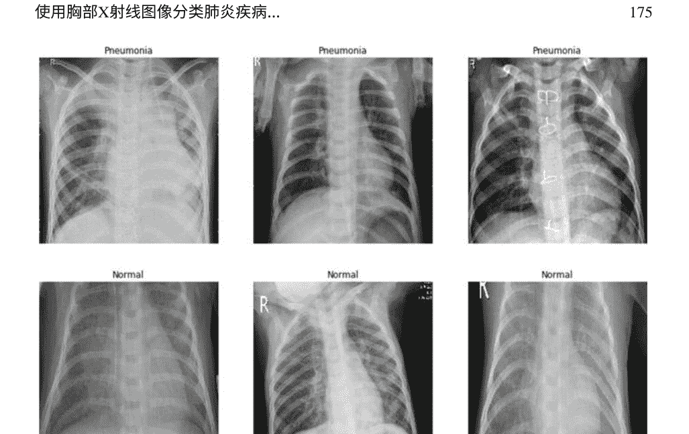

图1 正常和肺炎类别的三个样本

### 3 数据集

我们提出的模型训练所使用的数据集来自名为Kaggle的互联网网站，名为“胸部X射线图像（肺炎）”。它包含5863个图像作为训练样本，每个样本都有一个与之相关的二进制特征，表示个体数据点是“正常”还是“肺炎”。需要注意的是，这个特定数据集的特征类别是二进制的，因此提出的模型将被赋予分析图像中是否存在肺炎疾病的任务，而不是寻找从细菌到病毒等特定类型的肺炎。数据集中的图像是肺部的X射线图像（图1）。

数据集包含27%的正常肺部X射线图像，其余的图像与肺炎相关（图2）。

### 4 数据预处理

在数据预处理任务中，所有单个图像都被转换为灰度图像，并对其应用高斯模糊。将图像转换为灰度有助于通过将图像中的像素转换为表示强度信息的值，为特定的图像分类任务进行数据微调。亮度。高斯模糊实质上是应用于减少信息像素中的噪声和冗余数据。高斯模糊的概念在于平滑物体的边缘和边界，从而增强物体数据并平滑边界之间的过渡。还对分类数据应用了图像腐蚀，其中使用的腐蚀函数用于处理数据，减少或删除物体边界上的像素，受影响的像素频率取决于图像的特定固有特征。还使用了OpenCV开发的Canny边缘检测算法，该算法减少噪声，找到图像的强度梯度并抑制不需要的像素（图3、4和5）。

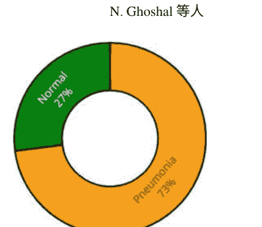

图2 图像类别数据分布

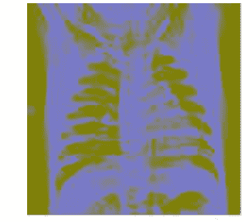

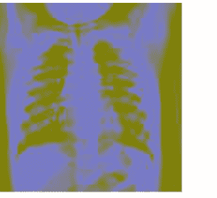

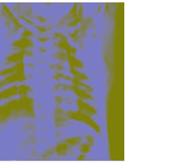

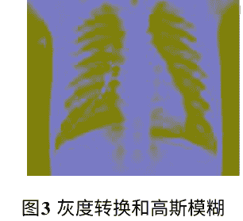

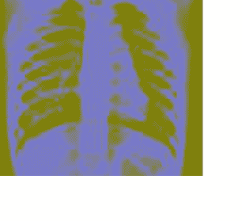

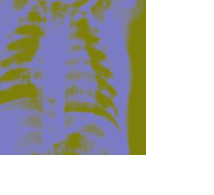

图3 灰度转换和高斯模糊

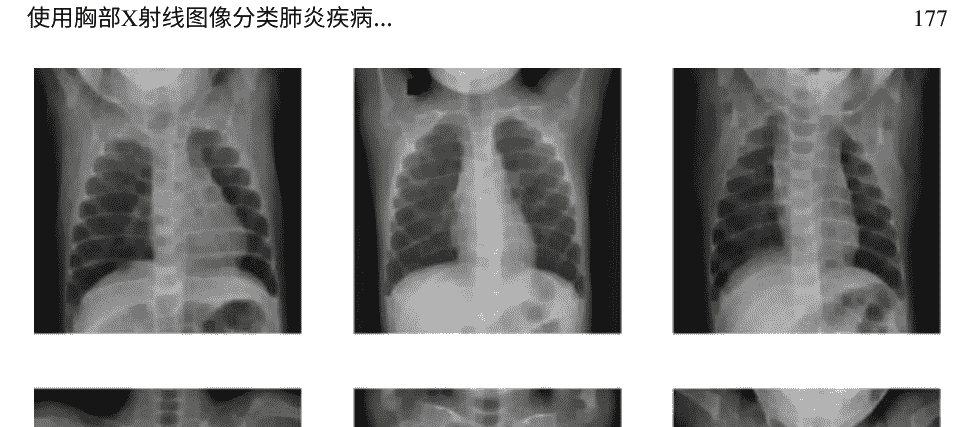

图4 图像腐蚀

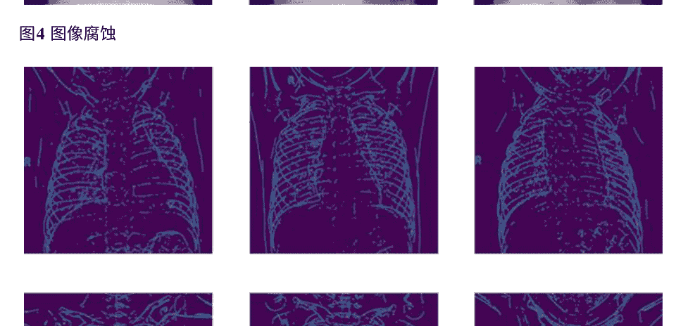

图5 Canny边缘检测

### 5 提出的模型

我们在这个分类问题中使用了2个不同的模型，即EfficientNet模型和Inception模型。 这两个模型都基于CNN（卷积神经网络）。

#### 5.1 EfficientNet

EfficientNet是一个基于卷积神经网络模型缩放方法的架构框架。该架构使用复合系数均匀缩放深度/宽度/分辨率的所有维度。这个特定架构的区别在于它不使用任意的缩放因子，而是使用一组固定的缩放系数来均匀缩放网络的宽度、深度和分辨率。使用这种技术，创建者在同时实现更好的效率的同时，超越了几乎所有高性能卷积网络模型的准确性。

对于模型的扩展，采用了以下方法: (a) 基准模型, (b) 宽度缩放, (c) 深度缩放和(d) 分辨率缩放, 而在EfficientNet模型中, 采用了一种称为复合缩放的方法, 将所有先前的技术融合成一个混合和动态结构 (图6和7)。

为了获得复合缩放因子，观察到对于更高分辨率的图像，网络深度应增加，以捕捉更大图像中的高像素特征，而当分辨率较低时，网络宽度应增加，以捕捉图像中的细粒度模式[11]。EfficientNet模型采用复合缩放方法，使用一个称为φ的系数来统一缩放神经网络的宽度、深度和分辨率。

相应的方程式如下：

```
深度 : d = a^β
宽度 : w = b^β
分辨率 : r = c^β
s.t. a * b^β * c^β = 2
a >= 1, b >= 1, c >= 1
```

其中a、b、c是通过小网格搜索确定的常数。

因此，φ是用户指定的控制模型扩展可用资源的系数，而a、b、c则指定如何分配额外的资源给网络的宽度、深度和分辨率[11]。

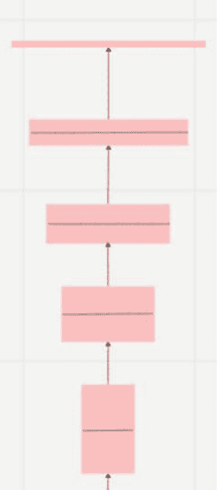

图6 基准网络带连接层

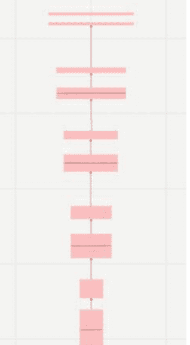

图7 复合缩放网络带连接层

EfficientNet架构是实现上述标准和特性的基准网络。

#### 5.2 InceptionV3

InceptionV3是一个图像识别模型，已经在图像相关任务的准确性水平上取得了最先进的水平。它使用并构建在InceptionV1模型的基础架构上，后者本质上由多个平行层的滤波器组成，而不是典型CNN模型的深层。基本Inception模型的每个子部分由4个平行层组成，分别是：1*1、3*3、5*5卷积和一个3*3最大池化层。

InceptionV3可实现的模型由多个构建块组成，包括（a）卷积，（b）平均池化，（c）最大池化，（d）连接，（e）丢弃和（f）Softmax（图8）。

该模型基于InceptionV1模型的基础工作，它将数据分解为较小的卷积，即将高维数据降低为较小的片段以进行有效处理，该模型还使用了空间分解为非对称卷积，即将先前发生的卷积分解为n*1形式的因子，从而提高了处理和结果的效率[12]。该模型考虑了辅助分类器的使用，它实际上充当了一个正则化器，在这里还创建了并行步幅块，以实现高效的网格大小缩减算法，以避免表示瓶颈。

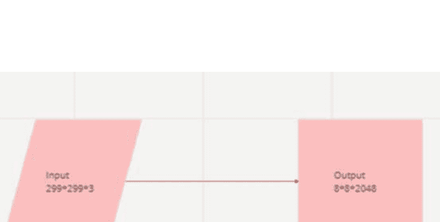

图8 InceptionV3模型的输入层和输出层维度

### 6 实验结果和分析

#### 6.1 InceptionV3

图9显示了InceptionV3模型的准确率图和验证准确率图，模型的训练持续了15个时期。 模型达到的最高准确率为92.93%，它展示了图表指标值的逐渐增加和减少，这是由于模型预测置信度值的微调，直到达到最高准确率点并在此之后下降。 验证准确率曲线也呈现类似的曲线形状，直到下降到极低值，但在向前移动时稳定下来，这描绘了模型参数变化对整体准确率值波动度的度量。

如图10所示，模型的损失值函数在图形上呈现出巨大的初始下降，并以稳定一致的方式达到所需的最低值。 验证损失曲线并没有急剧下降，但在完整的图形路径中经历了一个突然的高峰值，之后稳定并达到边界值，这些边界值接近损失值曲线的边界值。

因此，这些结果描绘了使用基于CNN的算法进行肺炎诊断的基准。 与其他类似模型相比，这个结果更好。

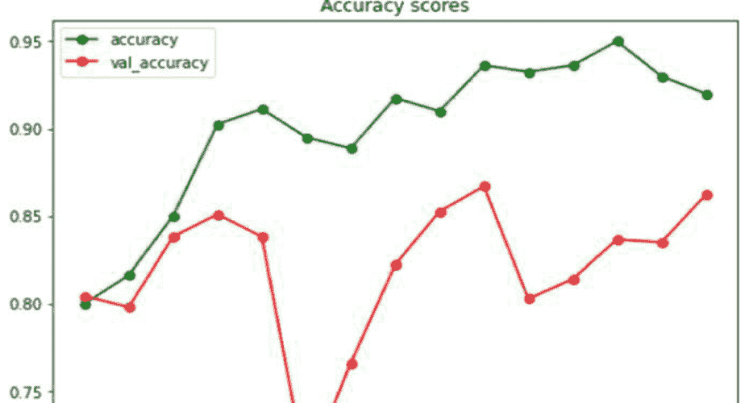

图9 Inception模型的准确率曲线

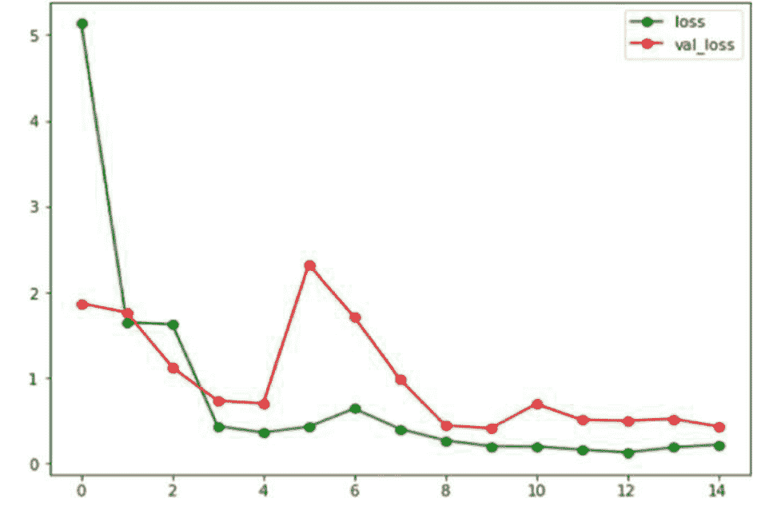

图10 Inception模型的损失曲线

任务在结果上表现出更好的效果，同时由于基线Inception模型中内置的性能指标，它也更高效，如第5.2节所示。

#### 6.2 EfficientNet

图11显示了EfficientNet模型的准确率图和验证准确率图，该模型的训练持续了10个时期。

该模型达到的最高准确率为95.39%，它显示了模型在第一个时期后急剧增加，并在最后一个时期后逐渐稳定达到峰值。验证准确率曲线呈现类似的曲线形状，直到下降到极低值，然后在后续时期急剧增加，但在另外两个时期后再次下降到极低值。

如图12所示，模型的损失值函数可以看到在执行同时但可忽略的上下曲线变化时，出现初始下降并达到所需的最低值。验证损失曲线可以观察到与损失值函数类似的陡峭初始下降。在随后的步骤中，它达到了峰值边界值，但突然在接下来的几个时期中，数量增加到了巨大的数量，然后又在下一个时期中减少，再在2个时期后大幅增加。

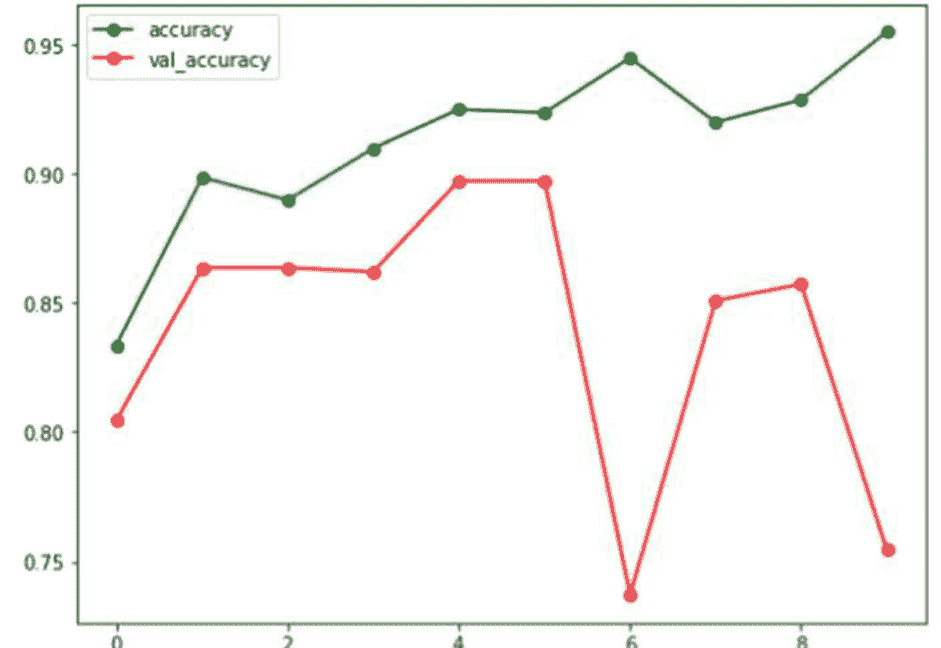

图11 EfficientNet模型的准确率曲线

这些结果还同时为基于CNN的肺炎诊断算法设定了基准。与其他类似任务的模型相比，这个结果在结果上表现更好，并且由于内置的模型指标，同时更高效和可定制，如第5.1节所示。

### 7 讨论

放射科医生、临床医生和工作人员都迫切需要解决肺炎和相关疾病的检测和治疗问题，这涉及到时间、频率和数据量的度量因素，以及专业知识要求。已经存在的其他医学诊断和相关工作的分类器，包括乳腺癌检测[13]，以及最近在脑肿瘤分类[14]中使用的CNNs。几乎所有这些问题都可以通过使用机器学习和神经网络模型来解决，以简化这个任务。但同时，必须注意最终的诊断和推论应该是最终完成的。

目前，这些分类模型仅供临床医生和训练专家使用，以帮助他们简化任务。像这样的模型存在一些限制，包括无法解释所达到的指标和嵌入其中的原因，以及无法表征一些关键指标，这些指标展示了所引起的一般疾病的亚层，并可能需要同时进行多种疾病的协同治疗，无论是引起还是由肺炎疾病引起。通过将更大的数据集纳入，或者根据X射线诊断专门开发更具体和定制的模型，可以进一步提高本章中所达到的准确性。

另一种可以用来改进的方法是将患者的病史以显著的形式纳入数据集中作为一个特征变量。此外，数据增强技术可以用于未来模型中，以实现更高的输出指标[15–30]。

### 8 结论

在本章中，我们讨论了EfficientNet和InceptionV3模型在通过胸部X光片进行肺炎医学诊断方面的结果和实验用途。我们取得了95.39%和92.93%的高性能结果，而计算成本相对较低。因此，使用讨论的框架对于医学诊断这一问题对专业医务人员和放射科医生非常有帮助。进一步改进方法和方法肯定会对这个问题产生积极的影响，并为进一步的改进铺平道路。

### 参考文献

1. Yadav, K. K., & Awasthi, S. (2016). 印度5岁以下儿童社区获得性肺炎管理和预防的当前状况:一项综述。传染病治疗进展, 3(3-4), 83-97.
2. Ali, E., Sogancioglu, E., van Ginneken, B., van Leeuwen, K. G., & Murphy, K. (2021). 胸部X射线分析的深度学习:一项调查。医学图像分析, 72, 102125.
3. Li, Q., Cai, W., Wang, X., Zhou, Y., Feng, D. D., & Chen, M. (2014). 卷积神经网络进行医学图像分类。在第13届控制自动化机器人与视觉国际会议(ICARCV), 新加坡, 第844-848页。 https://doi.org/10.1109/ICARCV.2014.7064414
4. Ali, E., Sogancioglu, E., van Ginneken, B., van Leeuwen, K. G., & Murphy, K. (2021). 深度学习在图像分析中的应用:一项调查。医学图像分析, 72, 102125。ISSN 1361-8415 https://doi.org/10.1016/j.media.2021.102125
5. https://www.spiedigitallibrary.org/journals/journal-of-medical-imaging/volume-7/issue-1/016501/Deep-convolutional-neural-networks-in-the-classification-of-dual-energy/https://doi.org/10.1117/1.JMI.7.1.016501.short?SSO=1
6. Deshpande, H., Harder, T., Saalbach, A., Sawarkar, A., Buelow, T. (2020). 使用深度学习在胸部X射线中检测异物。在IEEE第17届国际生物医学成像研讨会工作坊 (ISBI Workshops)。爱荷华城, 爱荷华州, 美国, 第1-4页。https://doi.org/10.1109/ISBIWorkshops50223.2020.9153350
7. Eslami, M., Tabarestani, S., Albarqouni, S., Adeli, E., Navab, N., & Adjouadi, M. (2020). 用于多任务器官分割和胸部骨抑制的图像到图像转换。IEEE医学成像交易, 39(7), 2553-2565。https://doi.org/10.1109/TMI.2020.2974159
8. Showkat, S., & Qureshi, S. (2022). 基于迁移学习的ResNet模型在胸部X射线图像分类中检测COVID-19肺炎的效果。化学计量学和智能实验室系统, 224, 104534。
9. Hirata, Y., Kusunose, K., Tsuji, T., Fujimori, K., Kotoku, J. I., & Sata, M. (2021). 使用标准胸部X射线检测升高的肺动脉楔压的深度学习。加拿大心脏杂志, 37(8), 1198-1206。
10. Greenspan, H., Summers, R. M., & van Ginneken, B. (2016). 医学影像中的深度学习应用:概述和一个令人兴奋的新技术的未来前景。IEEE医学成像交易, 35(5), 1153-1159。
11. Tan, M., & Le, Q. (2019). Efficientnet: 重新思考卷积神经网络的模型缩放。在国际机器学习会议(pp. 6105-6114). PMLR.
12. Szegedy, C., Vanhoucke, V., Ioffe, S., Shlens, J., & Wojna, Z. (2016). 重新思考视觉计算的初始架构。在IEEE计算机视觉和模式识别会议(pp. 2818–2826).
13. Mittal, D., Gaurav, D., & Sekhar Roy, S. (2015). 一种有效的混合分类器用于乳腺癌诊断。在2015年IEEE国际高级智能机器-电子学会议(AIM)，韩国釜山，pp. 1026–1031. https://doi.org/10.1109/AIM.2015.722 2674
14. Roy, S. S., Rodrigues, N., & Taguchi, Y. (2020). 使用CNN进行脑部肿瘤分类的增量膨胀。应用科学10(14):4915. https://doi.org/10.3390/app10144915
15. Shorten, C., & Khoshgoftaar, T. M. (2019). 关于深度学习的图像数据增强调查。大数据杂志，6, 60.
16. Roy, S. S., Hsu, C., Samaran, A., Goyal, R., Pande, A., et al. (2023). 使用卷积神经网络的血管分割在血管造影中：一种基于深度学习的方法。CMES-工程与科学中的计算建模，136(1), 241–255.
17. Turki, T., & Roy, S. S. (2022). 使用词云可视化和集成学习结合计数向量器的新型仇恨言论检测。应用科学，12(13), 6611.
18. Roy, S. S., Goti, V., Sood, A., Roy, H., Gavril, T., Floroiu, D., Mohammadi-Ivatloo, B.,等 (2014). 用于火灾检测的L2正则化深度卷积神经网络。智能与模糊系统杂志，1-12.
19. Roy, S. S., Mihalache, S. F., Pricop, E., & Rodrigues, N. (2022). 通过扩张实现的深度卷积神经网络进行环境声音分类。智能与模糊系统杂志，1-7.
20. 通过级联多元自适应回归样条和深度神经网络预测股票价格。
21. Bose, A., Hsu, C. H., Roy, S. S., Lee, K. C., Mohammadi-Ivatloo, B., & Abimannan, S. (2021). 通过级联多元自适应回归样条和深度神经网络预测股票价格。计算机与电气工程，95，107405.
22. Roy, S. S., & Taguchi, Y. H. (2021). 基于张量分解的无监督特征提取在低氧期间识别与改变基因表达和m6A剖面相关的基因。科学报告，11(1), 1–18.
23. Roy, S. S., & Samui, P. (2021). 使用极小极大概率机回归和多元自适应回归样条预测自然河流中的纵向弥散系数。国际高级智能范式杂志，19(2), 119–127.
24. Marques, G., Agarwal, D., & de la Torre, I. (2020). 通过EfficientNet卷积神经网络自动诊断COVID-19。应用软计算，96, 106691.
25. Biswas, R., Vasan, A., & Roy, S. S. (2020). 扩张深度神经网络用于视网膜血管分割的图像分析。伊朗科学与技术杂志，电气工程交易，44(1), 505–518.
26. Roy, S. S., Samui, P., Nagtode, I., Jain, H., Shivaramakrishnan, V., & Mohammadi-Ivatloo, B. (2020). 建筑物供暖和制冷负荷预测：一项比较性能分析。环境智能与人性化计算杂志，11(3), 1253–1264.
27. Roy, S. S., Chopra, R., Lee, K. C., Spampinato, C., & Mohammadi-Ivatloo, B. (2020). 随机森林，梯度提升机和深度神经网络用于股票价格预测的比较分析：韩国公司。国际自组织和普适计算杂志，33(1), 62–71.
28. Roy, S. S., Mihalache, S. F., Pricop, E., & Rodrigues, N. (2022). 通过扩张的深度卷积神经网络进行环境声音分类。智能与模糊系统杂志，1-7.
29. Chakraborty, C., Bhattacharya, M., Sharma, A. R., Roy, S. S., Islam, M. A., Chakraborty, S., Dhama, K.,等 (2022). 应鼓励深度学习研究用于诊断和治疗医院治疗相关紧急情况中的微生物感染的抗生素耐药性。国际外科学杂志（伦敦，英格兰），105, 106857.
30. Lee, K. C., Roy, S. S., Samui, P., & Kumar, V. (Eds.). (2020). 生物医学工程和医疗保健中的数据分析. Academic Press.

## 使用深度学习技术检测癌症

Apoorv Singh, Arjunaditya 和 B. K. Tripathy

### 1 引言

癌症是一种可怕的疾病，对人类社会构成威胁。根据世界卫生组织提供的数据，2018年癌症占所有死亡人数的13% [1]。预计在未来几年中，癌症将成为世界上最致命的疾病之一。根据预测，到2030年将有1200万人可能受到癌症的影响。未来几年癌症病例数量将大幅增加。专家、专业人士和医疗专业人员正在开发新的方法来对抗癌症，但众所周知，这场战斗非常具有挑战性 [2–4]。

由技术人员支持的计算机评估与医疗数据相关的可视化信息被称为解释。相反，诊断性超声图像需要医生处理大量数据，并在短时间内进行彻底分析。这些成像过程包括高能电磁辐射。计算机辅助方法分析数字照片，以检测早期癌症的存在或不存在。使用计算机工具分析医学图像可以支持医疗专业人员解读图像中的医学信息 [5]。另一方面，使用特定的成像过程（如高强度电磁辐射）诊断超声图像需要控制大量来自医生端的数据，并在短时间内进行彻底分析。

通过计算机辅助方法分析的照片潜在地用于检测疾病的存在或不存在的早期阶段。因此，早期癌症检测是确保生命安全的首要目标。为了在早期阶段发现和诊断癌症，许多视觉检查和手动方法被使用。由于人为干预分析医学图像需要足够的时间和专业知识，以提高医学图像解释的效率，因此提出了计算机辅助疾病诊断系统[5]。

人工智能（AI）和机器学习（ML）在近年来在计算机视觉、图像处理和计算机辅助诊断领域取得了快速发展，引人注目[6]。其中一些应用程序使用传统的机器学习技术，如支持向量机（SVM）、决策树、K-最近邻（KNN）和反向传播[7]。图1说明了人工智能（AI）、机器学习（ML）及其组成部分之间的整体关系。人工神经网络（ANN）根据应用的要求具有输入层、输出层和多个隐藏层的神经元。输入层接受以输入数据形式的属性，并使用连接中的相关权重来获得在应用激活函数之前的总输入，以获得隐藏层节点的输出。这个过程在每一层之后重复，直到达到生成最终输出的输出层[8]。这增加了预测的准确性，帮助临床医生制定患者的治疗方案，并消除疾病带来的情绪和身体挑战。支持临床研究人员的一个重要方面是利用最新的尖端人工智能技术进行诊断的数量增加。计算机工程师和健康科学家现在可以通过使用多因素分析、经典逻辑回归和辅助人工智能的分析成功地诊断患者。这得益于计算机程序和统计学方面的理论和技术进步。这些估计比实验估计更准确。最近，研究人员开始开发使用人工智能来预测和检测癌症的新模型。这些模型对于提高癌症的生存精度和敏感性估计至关重要[3]。

但是仅仅通过癌症的检测和管理，这个诊断必须在疾病的早期阶段进行。最重要的是要早期诊断癌症，以保护许多人的生命[9]。对于这种癌症诊断，通常使用视觉检查和手动技术。解释医学图像需要很大的努力，并且容易出错[10]。由于症状的模糊性，乳腺X线摄影和其他筛查方法的局限性，以及治疗后可能出现复发的可能性，癌症在初期阶段极具挑战性[11]。因此，在癌症调查中进行高分辨率医学诊断将导致更好的预测模型的发展[12]。

对文献中关于癌症识别和管理的研究进行分析表明，人工智能方法的应用正在扩大[13]。此外，已经发现人工智能技术比传统的统计和多元分析等分析方法更有效[14]。特别是深度学习方法在人工智能技术中产生了出色的结果[14]。

一种特定类型的神经网络称为DL具有许多隐藏层。最近在许多不同的行业中实施了DL [15]。它在语音识别以及驾驶无人车和无人机等先进设备中的图像检测方面表现出特别高的效率结果 [14, 16, 17]。

此外，还进行了癌症和健康组织的基本分类，并在生成的模型中使用传统的机器学习技术。另一方面，由人工智能驱动的深度神经网络提供了一种更好的使用数据矩阵创建分类模型的方法。通过使用这些模型，可以识别癌症，观察和预测其进展，并及时有效地进行癌症治疗 [18]。

深度学习方法通过使用反向传播算法来揭示庞大且经常复杂的数据集中的细微结构。现有的技术，如基于机器学习的技术，在处理原始数据的原生格式时存在一定的限制，需要进行预处理[19]。学习不变特征的能力是卷积神经网络（CNN）的一种特性，它是一种深度学习系统。为了构建用于各种对象识别任务（如检测、分割和分类）的模式，CNN使用特征池化层、滤波器组、dropout层、批归一化层和全连接层。CNN包括一个多级层次结构，在训练过程中输入的分散程度会发生变化。为了在任务中实现更好的性能，预处理的数据非常有必要[20]。

还有许多其他的CNN变体，包括具有较短连接的DenseNet架构，它可以显著减少开发有效设计所需的超参数数量，并对特征传播有益 [21]。ResNets、Xception和GooLeNet设计是最近更有效的CNN架构的其他变种。这些网络是必需的，因为需要多尺度处理，随着网络变得更深，整体工作性能下降，需要更好的拓扑结构和更少的参数[22-25]。

深度学习中的另一个关键挑战是架构能够长时间存储数据的能力。长短期记忆被提出作为解决这个问题的潜在方法（LSTM）。通过专门单元的状态，LSTM设计实施了非全局的连续误差流[26]。

迁移学习的概念是另一个值得一提的深度学习概念。迁移学习涉及将深度卷积神经网络的特征应用于当代和创新的任务。这是因为通用任务可能与原始任务有显著差异，并且没有足够的标记或输入来训练新任务的深度学习架构。使用迁移学习还可以轻松修改特征，以便它们能够可靠地表达出很好的泛化能力[27-29]。

本文研究了在癌症检测和治疗中使用的深度学习技术。本研究的目的是通过文献的帮助，展示深度学习方法在治疗癌症等疾病方面的有效性，以及所采用的方法和技术以及它们的应用方式[30]。

### 2 深度学习

#### 2.1 深度学习基础

深度学习在几乎所有行业都获得了很大的流行和成功，并成为了理解机器如何感知世界的有用工具。在包括语音识别、图像分类、视频分析和自然语言学习在内的领域中，应用了深度学习技术[31]。基于一个深度学习创建的数学模型，可以在不使用任何属性提取器的情况下进行分析。深度学习技术的泛化能力是它们的一个关键优势。对于其他应用和数据类型，可以使用学习到的神经网络方法。当数据集不足时，深度学习的性能较差[32]。

深度学习存在作为一种机器学习方法，利用非线性处理单元层的优势[15]。前一层的结果作为输入传递给后续层。数据是通过理解DL方法中的多个特征层次的数据可视化结果来建立的 [33]。通过从高级特征中派生低级特征来创建表示中的层次结构。

从高级特征中派生低级特征。虽然通常基于ANN，DL技术包括更多的隐藏层和神经元[34]。DL技术在处理各种数据类型（包括文本、音频和视频）时显示出优秀的结果[35, 36]。DL的几个应用包括信息检索、音频和语音处理[14]、多模态和多任务学习、自然语言处理、图像分割和图像识别[16]。

#### 2.2 使用DL进行癌症诊断

在进行诊断时，医生经常依靠自己的知识、能力和经验。无论医生多么有才华，他都无法保证他对疾病的诊断是准确的，很多时候疾病被误诊。因此，涉及人工智能的技术成为议程上的重要事项。这是因为人工智能具有评估大量数据、解决复杂问题和进行非常准确预测的能力[4]。作为人工智能的最新方法之一，深度神经网络描述了一些有助于从照片中提取数据的计算方法。许多医学学科已经使用DL算法进行各种医学任务，如放射学、病理学等。在肿瘤生物学和其他领域，如多种物种的医学成像方面，也取得了良好的效果[16]。

#### 2.3 深度神经网络特性

任何基本的神经网络都由一个与输出直接连接的输入层组成。DNN内部有几个隐藏层，它们在处理复杂问题方面非常高效，每一层的权重都是使用增量学习技术进行修改的。深度神经网络还用于通过包含更多的隐藏层来发现复杂的非线性相互作用。尽管学习速度相对较慢，但DNN在无监督和监督学习情况下都被使用。然而，可以产生良好的性能结果，并且通常用于分类和回归目的[34, 35]。

在[37]中使用DNN和内窥镜成像，识别和区分病变。发现人工智能系统和熟练的内窥镜医生在诊断性能上没有明显区别。他们构建的神经网络方法在区分非癌性病变和高敏感性方面表现出很高的准确性[37]。

本文研究了深度神经网络在低剂量计算机断层扫描和正电子发射断层扫描中识别癌症，特别是肺癌的能力[38]。研究结果表明，DNN算法在检测肺癌方面具有出色的结果。他们的工作还展示了筛查肺癌的努力，由于这一技术的持续发展，筛查肺癌的效果更加成功[38]。

- DNN是一种具有两个以上层和特定复杂度水平的神经网络[27]。
- 使用先进的数学建模来深入理解，因此数据或特征的处理被认为是复杂的。
- 模式识别的任务由神经网络执行，这是对人脑活动的一种比喻[8, 20]。特别是，模式被识别为将细胞分类为非癌细胞和癌细胞，并用于通过各种模拟神经关联层跟踪输入[39, 40]。
- 处理无标签数据是使用该网络的主要目标，每个层执行特定类型的任务[11]。

### 3 深度学习神经网络的架构

根据学习技术，深度学习神经网络的架构分为4类：有监督、半监督、无监督和强化学习[41]。图1显示了深度学习神经网络的分类。

#### 3.1 深度无监督学习

深度无监督学习架构通过使用少量特征而无需任何标记数据来检查数据的内部表示。无监督方法使用降维和聚类技术。受限玻尔兹曼机（RBM）和自动编码器（AE）是一些深度无监督学习架构[42]。

#### 3.2 深度有监督学习

有监督学习的架构使用预定数据进行训练。将目标结果和所有可能的输入组合输入到网络中[43]。在测试期间验证训练阶段的数据。循环神经网络（RNN）、长短期记忆（LSTM）、卷积神经网络（CNN）和门控循环单元是有监督学习中使用的几种典型方法[17]。

#### 3.3 深度半监督学习

在深度监督学习架构下，部分标记数据用于训练阶段。一些半监督学习架构包括LSTM、RNN、生成对抗网络（GAN）、GRU和深度强化学习 [44]。

### 4 癌症检测的深度学习架构

#### 4.1 卷积神经网络（CNN）

使用CNN对2D图像和3D图像进行分析非常有效。大多数CNN系统采用基于梯度的算法进行训练[26]。与其他神经网络模型相比，需要调整的因素较少。特征提取器和分类器都是CNN架构的组成部分[45]。特征提取层从前一层接收输入，并将其传递给后一层。卷积、最大池化和分类是构成CNN架构的三种类型的层。偶数用于表示卷积层，奇数用于表示最大池化层。分类层是架构的最后一步，是一个完全连接的层。为了提高准确性，在分类过程中使用了使用反向传播的架构。最大池化、全局平均、平均和最小池化是几种池化过程中的方法。卷积层使用由线性或非线性激活函数构成的核对数据进行卷积，以创建特征图。激活函数包括修正线性、Sigmoid、Softmax、恒等和双曲正切函数。下采样操作发生在池化层中，也称为子采样层。根据应用程序的不同，有不同数量的分类层。图2显示了卷积神经网络架构。

#### 4.2 多尺度卷积神经网络

多尺度卷积神经网络是通过修改传统的卷积神经网络[46]创建的。它包括三个卷积层；一个修正线性单元层；一个最大池化层；以及两个完全连接层。输入图像被下采样，并完成特征提取以发送到多尺度卷积神经网络。

#### 4.3 LeNet-5

这是一个用于分类手写数字的7阶卷积神经网络。对于复杂的情况，使用卷积层的数量与32 × 32大小的输入图像。图3显示了LeNet的设计，包括两个卷积层，子采样层和完全连接层。在单个输出层上使用了高斯连接[47]。

#### 4.4 AlexNet

虽然AlexNet的设计与LeNet相同，但它具有更深的层，每层增加了更多的滤波器，并且具有连接的卷积层。在每个完全连接层和卷积层之后，添加了ReLU激活函数的功能。从26%减少了15.3%的误差，这是一个在2012年获胜的架构。它包括数据增强、dropout、最大池化和ReLU激活函数。

除了11 ×11、5 ×5和3 ×3的卷积核[48]，图4展示了AlexNet的架构。

#### 4.5 ZFNet

虽然ZFNet的架构与AlexNet相似，但其设置经过了精细调整，使其成为2013年的挑战赛冠军。不准确性减少了14.8%。通过使用7 ×7的卷积核而不是11 × 11的卷积核，减少了参数的数量，使其减少了14.8%。

#### 4.6 谷歌网络

谷歌网络设计的一部分是LeNet，它具有一个启示结构。它有22个层，并且在测试过程中，错误率逐渐从6.66降低到3.66%。该建筑物是ILSVRC 2014年的获奖者[46]。与传统的CNN架构相比，它具有较低的计算复杂度。与AlexNet和VGG [50]等其他架构相比，它的使用频率较低。图5显示了谷歌网络的架构。

#### 4.7 VGGNet

VGGNet由十六个卷积层和多个滤波器组成，是ILSVRC 2014年的获奖者[39]。使用这种架构，特征提取已被证明是有效的，但参数调整非常重要。

发现特征提取是有效的，但参数调整非常重要。提出了三个VGG模型，分别具有11层，16层和19层：VGG-11，16和19。所有VGG模型在最后都有三个全连接层。图6显示了VGGNet的架构。

#### 4.8 ResNet

为了使用预防连接和批量归一化，使用了在ILSVRC 2015中获胜的ResNet [51]。与VGGNet相比，计算复杂度更低。门控循环单元被用于跳跃连接。总共有152层，不准确性保持在最低3.57%。它解决了梯度消失问题。它具有残差连接，是一种传统的前馈神经网络[52]。它由多个残留块组成，根据架构的不同，其操作方式也不同。图7显示了残差网络。

#### 4.9 全卷积网络 (FCNs)

与经典的卷积神经网络相比，全卷积网络中的全卷积层被一层上采样、一层反卷积和一层完全连接层所取代，如图8所示。该架构的设计是为了使全卷积层和反卷积层创建池化层和卷积层的逆操作。设计中添加了上采样和反卷积层，提高了其准确性 [40, 41]。

#### 4.10 U-Net

U-Net，它有两条路径，是为了医学图像分割而创建的。第一条路径具有一个编码器，记录图像的上下文。然而，第二条路径由转置卷积和解码器组成[53, 54]。图9展示了U-Net。

#### 4.11 循环神经网络

图10展示了RNN的基本结构。在[55]中，描述了各种RNN设计变体。循环神经网络中包含了许多功能块，如图10所示。循环神经网络容易受到梯度消失问题的影响。循环神经网络需要内存，因为它们使用先前的状态作为输入来确定当前状态。它利用顺序数据，节点之间的连接形成一个有向图。RNN被用来将输入序列转换为固定大小的向量。将RNN与卷积层结合使用，可以扩展有效的像素邻域。它被用于机器翻译、时间序列预测和自然语言处理。RNN的一个例子是长短期记忆网络（LSTM）[56]。

#### 4.12 自编码器

自编码器是一种强大的无监督学习架构，具有三个层：编码器、解码器和编码。将数据编码为更紧凑的表示。编码器的功能是将输入进行编码。因此，输入的失真由压缩图像表示。压缩的输入由编码表示。另一个被称为瓶颈的层位于编码器和解码器之间。图11显示了自编码器的结构。解码器将编码转换为初始输入的副本。关键特征是有损和数据特定的。

在训练架构之前，需要调整四个超参数，包括编码大小、层数、每层节点数和损失函数。自编码器的应用领域包括降维、图像压缩、图像去噪和特征提取[57, 58]。

#### 4.13 深度置信网络

它由一个前馈网络用于精细调整阶段和一个RBM（受限玻尔兹曼机）用于预训练模型组成。该网络接收RBM从输入数据向量中提取的特征。深度置信网络使用较慢的学习速率的反向传播设计。它还有许多隐藏的层级。深度置信网络的主要优势是其能够通过逐层学习策略[59, 60]从较早层次中学习到更高层次的特征。图12展示了其结构。

### 5 癌症诊断的步骤通过医学影像学

医学影像学技术如MRI、CT扫描和超声波被用来评估解剖器官的健康功能和分析疾病[61]。癌症诊断和治疗规划在很大程度上依赖于医学影像学模态。预处理，通常被称为过滤，是处理医学图像的初始步骤。过滤的目标是要么消除在获取过程中引入的图像噪声，要么提高图像质量以获得更准确的细节[62]。“分割”一词描述了识别ROI（感兴趣区域）的方法，在医学图像的背景下，ROI代表解剖器官或与之相关的任何异常，如肿瘤或囊肿。

对于分类癌症强度，分类步骤通常使用任何机器学习算法。压缩被定义为使用机器辅助技术使文件变小，以便更容易存储和传输。表格显示了在癌症诊断的每个阶段可以使用的机器学习方法 [63]。

在评估疾病时，专业人员严重依赖他们的第一手观察、能力和经验。医生永远不能完全确定并声称他对病情的评估完全正确，他们无疑会犯错。这引入了依赖于人工智能驱动的自动化系统，因为人工智能（AI）可以评估大量信息，处理复杂的前提，并进行准确的预测。对于人工智能系统来说，最现代的方法之一是深度神经网络，它描述了一些对于从数字图像中提取数据有用的计算机模型。深度学习算法在多个医学专业中被使用[4, 16]。

癌症诊断的步骤如下。

#### 5.1 清洗和预处理

识别过程中的初始阶段是预处理，因为原始照片中包含噪声。预处理用于提高常用图片的质量，通过消除称为图像噪声的不必要图像数据。如果这个问题没有解决，可能会出现错误分类。正确清洗图像并将其转换为标准形式对于获得高准确性水平变得至关重要[3]。

#### 5.2 图像分割

图像分割是将整幅图像分成不同部分的过程。它分为基于像素和区域、模型和阈值的分割。此外，还有额外的直方图截断、自适应截断点和边界检测方法。这些策略也可以结合使用[3, 64, 65]。

#### 5.3 后处理

在图像分割、闭合和开启操作、岛屿移除、区域合并、边界扩展和平滑处理之后完成[3]。

### 使用深度学习进行不同类型癌症的诊断

表1展示了用于各种癌症诊断的深度学习架构。神经网络架构在疾病检测方面非常有用，也对影响不同器官的癌症研究做出了贡献。在提出的工作中，卷积稀疏编码器被发现适用于所有类别的三维数据集[66]。在[67]中，使用CNN和手工特征实现了病变识别，同时实现了癌症诊断的阶段。在另一项工作[68]中，GoogLeNet被确定为更成功的模型，准确率达到85%，而AlexNet的准确率为82%，VGGNet的准确率约为84%。与基于纹理分析的传统预测器相比，将预训练的SVM和CNN结合的模型在数字乳腺X光图像中对肿瘤组织进行分类更成功[69]。

研究人员[70]使用深度学习方法对乳腺癌患者进行研究。他们使用Cox预测模型和基因组数据集进行预测。他们表明，每当存在大量信息并利用这些信息来整合和简化生物标志物和基因调控以实现预测时，性能会提高。Shi mizu和Nakayama[71]使用TCGA数据库识别和研究乳腺癌基因和分析预测。他们采用人工智能技术识别了184个基因，然后使用随机森林分类器和深度学习网络进行研究。此外，他们还使用了一个预测遗传分数，仅利用了184个识别出的基因中的23个。

Liu等人[72]提出了一个卷积神经网络模型，能够使用千亿像素的病理切片识别微小的癌症肿瘤。Cruz-Roa等人[73]提出的系统能够在整个切片图像中识别侵袭性病变，同时最大限度地减少人工工作和时间复杂性。在乳腺超声图像病变图片上，对LeNet、U-Net、迁移学习和AlexNet等替代的卷积神经网络架构进行了详细分析，发现AlexNet和基于Patch的LeNet是最准确的架构[74]。

在DNN肿瘤识别之前，Das等人使用不同的分水岭和高斯混合模型（GMM）算法提取了感兴趣区域（ROI）[75]。针对肝肿瘤的分割，提出了FCN结构U-Net，并通过3D链接项标记进行后续处理，以获得更好的分割结果[76]。CNN被证明比传统的机器学习算法更准确的分类器[77]。DNN被证明对于细胞的癌症生长分割是有效的，也适用于细小的肺结节分割。随着训练数据的增加，深度神经网络的效率也会提高[78]。卷积

表1 癌症诊断的深度学习架构

| 参考文献 | 癌症类型 | 数据/成像类型 | 使用的DL架构 | 性能指标 |
| :--- | :--- | :--- | :--- | :--- |
| [70] | 乳腺 | 基因表达数据 | 多组学神经网络 | 使用更多组学数据提高性能 |
| [71] | 乳腺 | 癌症基因组图谱 | 随机森林，神经网络 | 对数秩检验p<0.05 |
| [72] | 乳腺 | 病理学 | 卷积神经网络(CNN) | 敏感性：73% |
| [73] | 乳腺 | 病理学 | 卷积网络 | 阳性预测值：71.6% |
| [74] | 乳腺 | 超声 | Alexnet (CNN) | 帧率/图像—0.16，真阳性率—0.98，F测量—0.91 |
| [75] | 肝脏 | 计算机断层扫描/三维 | 深度神经网络 | 准确率99.4% |
| [76] | 肝脏 | 计算机断层扫描 | 反向传播神经网络 | 准确率73.2% |
| [77] | 肝脏 | 计算机断层扫描 | 卷积神经网络(CNN) | 精确度：82.67% Dice系数：80.06% 召回率：84.34% |
| [78] | 肺 | 计算机断层扫描 | 深度神经网络(DNN) | 敏感性：78.2% 准确率：82.1% 特异性：86.13% |
| [79] | 肺 | 计算机断层扫描 | 深度神经网络(DNN) | 敏感性：78.9% |
| [80] | 肺 | 计算机断层扫描 | Resnet | 敏感性：0.54 |
| [81] | 皮肤 | 来自相机的标准图像 | 深度卷积神经网络(DCNN) | 准确率：98.55% 敏感性：95% |
| [82] | 皮肤 | 皮肤镜图像 | ReLU-修正线性激活单元(CNN) | 准确率：86.67% |
| [83] | 结肠 | 组织病理学图像 | 浅层神经网络 | 准确率：84% |
| [84] | 星形细胞瘤 | 微阵列基因数据集 | 人工神经网络(ANN) | 准确率：96.15% |
| [85] | 前列腺 | 多参数磁共振成像 (mpMRI)/3D | Xmasnet (CNN) | AUC: 0.84 |
| [86] | 前列腺 | 多参数磁共振成像 (mpMRI) | 深度卷积神经网络(DCNN) | AUC: 0.897 |
| [87] | 脑 | 磁共振成像 (MRI) | 输入级联卷积神经网络 | 敏感性: 0.84<br>特异性: 0.9 |

Golan等人[79]提出的神经网络分为两个阶段，第一个阶段收集空间特征，第二个阶段进行分类。DL结构与SVM分类器一起用于识别肺结节；基于规则的方法减少了误报。新的ResNet设计在病变分割[80]方面优于传统的ResNet结构。

此外，使用传统相机照片，CNN被用于检测黑素瘤[81]。卷积CNN已被提出用于检测皮肤镜图像中的皮损边界[82]。使用较小的网络分析多维基因数据，以明确诊断结肠组织学图像中的癌细胞生长[83]。Petalidis等人[84]发表了星形细胞恶性肿瘤的基因组数据。为了能够解释准确分类这些癌症的必要性，他们使用神经网络技术将这些癌症的组织学业亚型特征合并起来。他们在这项研究中能够识别出59个基因。他们使用自定义和独立数据对这些变体进行了准确的分类，正确率达到96.15%。

使用XmasNet，一种基于CNN的算法[85]，在MRI图像下识别出前列腺癌。它达到了0.897的AUC[86]。在BRATS数据集中，使用深度互联CNN对脑肿瘤进行分割，通过级联设计取得了良好的性能[87]。

### 7 结论

DL在特征提取方面取得了成功，并且它们的性质改善了癌症预后和预测。由于其卓越的特性，DL模型已经彻底改变了癌症诊断和预测，学习架构在癌细胞分割和分类中得到了广泛应用。数据增强对于癌症诊断和预测工作至关重要，以提高系统效率。DL解决方案在癌症治疗中的可复制性和普适性等方面进行评估和验证。

这些技术有助于早期癌症检测，并促进患者康复或延长生命。

基于深度学习的技术创新已经开始惠及当地和国家的医疗部门。因此，在癌症诊断和一般医学中使用深度学习技术具有优势，以便获得进一步的理论理解。

研究机器学习算法用于诊断疾病的研究人员以及规划和治疗方面的专家都可以从这项工作的结论中获益。

### 参考文献

1.  Grisold, W. (编) (2021). Wolfgang Grisold, Riccardo Soffietti, Stefan Oberndorfer, Guido Cavaletti (编): 癌症治疗对神经系统的影响。
2.  Tang, J., Rangayyan, R. M., Xu, J., El Naqa, I., & Yang, Y. (2009). 计算机辅助乳腺癌检测和诊断的最新进展。IEEE Transactions on Information Technology in Biomedicine, 13(2), 236-251.
3.  Munir, K., Elahi, H., Ayub, A., Frezza, F., & Rizzi, A. (2019). 使用深度学习进行癌症诊断 : 文献综述。癌症, 11(9), 1235。
4.  Huang, S., Yang, J., Fong, S., & Zhao, Q. (2020). 癌症诊断和预后中的人工智能: 机遇和挑战。癌症信件, 471, 61-71。
5.  癌症事实和数据。 (2019). 美国癌症协会。 https://www.cancer.org/content/dam/cancer-org/research/cancer-facts-and-statistics/annualcancerfacts-andfigures/2019/cancer-facts-and-figures-2019.pdf
6.  Bhardwaj, P., Guhan, T., & Tripathy, B. K. (2021). 在卷积神经网络的视角下的计算生物学。在S. S. Roy, Y. H. Taguchi (eds.), 机器学习应用手册 (第5章). 大数据研究。 ISBN: 978-981-16-9157-7 496166_1_En
7.  Tripathy, B. K., & Anuradha, J. (2015). 软计算-进展与应用。 Cengage Learning Publishers, New Delhi. ASIN : 8131526194. ISBN-10: 9788131526194。
8.  Rungta, R. K., Jaiswal, P., & Tripathy, B. K. (2022) 基于深度学习的方法来衡量虚拟面试的信心。在A. K. Das等人 (编者) 的《计算智能模式识别中的第四届国际会议 (CIPR) 》的论文集中, CIPR 2022 (第278-291页). LNNS 480。
9.  Bhandari, A., Tripathy, B. K., Jawad, K., Bhatia, S., Rahmani, M. K. I., & Mash, A. (2022). 使用遗传算法进行癌症检测和预测。 Comput Intell Neurosci 2022, 18. https://doi.org/10.1155/2022/1871841
10. Allahyar, A., Ubels, J., & de Ridder, J. (2019). 基于数据驱动的协同基因互作网络改进了基于网络的癌症预测。PLoS Computational Biology, 15(2), e1006657。
11. Adate, A., Tripathy, B. K., Arya, D., & Shaha, A. (2020) 深度神经学习对人工智能研究的影响。在S. Bhattacharyya, A. E. Hassanian, S. Saha, & B. K. Tripathy (Eds.), 深度学习研究与应用 (pp.69-84). De Gruyter出版社. https://doi.org/10.1515/9783110670905-004
12. Mitchell, M. J., Jain, R. K., & Langer, R. (2017). 工程和物理科学在肿瘤学中的挑战和机遇。 自然癌症评论, 17(11), 659-675。
13. Obermeyer, Z., & Emanuel, E. J. (2016). 预测未来-大数据, 机器学习, 和临床医学。新英格兰医学杂志, 375(13), 1216。
14. Graves, A., Mohamed, A. R., & Hinton, G. (2013). 使用深度递归神经网络的语音识别。 在2013年IEEE国际声学、语音和信号处理会议上 (pp. 6645–6649). IEEE。
15. Bhattacharyya, D. S., Snasel, V., Hassanian, A. E., Saha, S., & Tripathy, B. K. (2020). 深度学习研究与工程应用。 德格鲁伊特出版社. ISBN: 3110670909, 9783110670905. https://doi.org/10.1515/9783110670905
16. Bose, A., & Tripathy, B. K. (2020) 音频信号分类的深度学习。在S. Bhattacharyya, A. E. Hassanian, S. Saha, & B. K. Tripathy (Eds.), 深度学习研究和应用 (pp. 105–136). 德格鲁伊特出版社。 https://doi.org/10.1515/9783110670905-00660
17. Singhania, U., & Tripathy, B. K. (2021). 基于深度学习的图像分析应用 在信息科学与技术百科全书 (第5版，第11页) 中 https://doi.org/10.4018/978-1-7998-3479-3.ch007
18. Yagna Sai Surya, K., Geetha Rani, T., & Tripathy, B. K. (2022). 基于深度学习的社交距离监测和口罩检测。在J. Nayak, H. Behera, B. Naik, S. Vimal和D. Pelusi (Eds.)，计算智能在数据挖掘中 (Vol. 281). 智能创新，系统和技术。 新加坡： Springer. https://doi.org/10.1007/978-981-16-9447-9_36
19. Ioffe, S., & Szegedy, C. (2015). 批归一化：通过减少内部协变量偏移来加速深度网络训练。在国际机器学习会议 (pp. 448–456). PMLR。
20. Huang, G., Liu, Z., Van Der Maaten, L., & Weinberger, K. Q. (2017). 密集连接卷积网络。在计算机视觉和模式识别的IEEE会议论文集 (pp. 4700–4708).
21. Kyi, C. W., Birriel, P. C., Davidsen, T. M., Ferguson, M. L., Gesuwan, P., Griner, N. B., Gerhard, D. S., et al. (2020). NCI癌症基因组学办公室支持多学科基因组学研究项目以推进精准肿瘤学。癌症研究，80(16_Supplement), 5862–5862。
22. Pogorelov, K., Randel, K. R., Griwodz, C., Eskeland, S. L., de Lange, T., Johansen, D., Halvorsen, P., et al. (2017). Kvasir: 用于计算机辅助胃肠疾病检测的多类图像数据集。在第8届ACM多媒体系统会议上 (pp. 164–169).
23. Mesri, M., An, E., Hiltke, T., Robles, A. I., Rodriguez, H., & CPTAC Investigators. (2022). NCI的临床蛋白质组肿瘤分析联盟：一项蛋白质组学癌症分析计划。癌症研究，82(12_Supplement), 6331–6331。
24. Gupta, P., Bhachawat, S., Dhyani, K., & Tripathy, B. K. (2021). 基于深度学习的基因特征研究及其应用，(第4章). 在S. S. Roy和Y. H. Taguchi (主编)，基因组学机器学习应用手册 (第103卷). 大数据研究。ISBN: 978-981-16-9157-7, 496166_1_En。
25. Hochreiter, S., & Schmidhuber, J. (1997). 长短期记忆。神经计算，9(8), 1735–1780。
26. Maheswari, K., Shaha, A., Arya, D., Tripathy, B. K., & Rajkumar, R. (2020). 卷积神经网络：自下而上的方法。在S. Bhattacharyya, A. E. Hassanian, S. Saha和B. K. Tripathy (Eds.), Deep Learning Research with Engineering Applications (pp. 21–50). DeGruyter Publications. https://doi.org/10.1515/9783110670905-002
27. Tripathy, B. K., & Deepthi, P. H. (2015). 应用空间FCM检测癌细胞。IMT Research Network (pp. 1–6, 96–100). ISBN 878-93-82208-77-8。
28. Zhong, Z., Sun, L., & Huo, Q. (2019). 一种基于Faster R-CNN的无锚点区域建议网络的文本检测方法。国际文档分析和识别杂志 (IJdar), 22(3), 315–327。
29. Hanefi Calp, M. (2021). 深度学习在图像分析中的应用 在癌症诊断中的深度学习 (pp. 249–267). Springer, 新加坡.
30. Karahan, S., & Akgün, Y. S. (2016). 使用深度学习进行眼部检测 在2016年第24届信号处理和通信应用会议 (SIU) (pp. 2145–2148). IEEE.
31. Özkan, İ. N. İK., & İlker, E. (2017). 在深度学习和图像分析中使用的深度学习模型 Gaziosmanpaşa Bilimsel Araştirma Dergisi, 6(3), 85–104.
32. Seker, A., Diri, B., & Balık, H. H. (2017). 关于深度学习方法和应用的综述 Gazi Mühendislik Bilimleri Dergisi, 3(3), 47–64.
33. Bengio, Y. (2009). 学习深度人工智能架构。机器学习的基础和趋势®, 2(1), 1–127。
34. Tripathy, B. K., Raju, H., & Kaul, D. (2018). 深度学习在医疗保健中的应用，被接受在遥感和GIS的深度学习:前沿进展和应用中。在V. Santhi (Eds.) CRC出版物- 35. Rav, D., Wong, C., Deligianni, F., Berthelot, M., Andreu-Perez, J., Lo, B., & Yang, G. Z. (2016). 健康信息学的深度学习。IEEE Journal of Biomedical and Health Informatics, 21(1), 4–21。
- 36. Kuk, D., & Arıcı, N. (2018). Doğal Dil İşlemede Derin Öğrenme Uygulamaları Üzerine Bir Literatür Çalışması. Uluslararası Yönetim Bilişim Sistemleri ve Bilgisayar Bilimleri Dergisi, 2(2), 76–86。
- 37. 大森，石原，青山，中川，岩上，松浦，和多，等 (2020年)。使用深度神经网络进行食管病变的内窥镜检测和鉴别。胃肠内窥镜检查，91(2), 301–309。
- 38. Schwyzer, M., Ferraro, M., Muehlematter, M., Curioni-Fontecedro, A., Huellner, M., Von Schulthess, G. K., Kaufmann, P. A., Burger, I. A., & Messerli, J. (2018年)。使用深度神经网络在低剂量PET/CT中自动检测肺癌-初步结果。肺癌，126, 170–173。
- 39. Szegedy, C., Liu, W., Jia, Y., Sermanet, P., Reed, S., Anguelov, D., Rabinovich, A., et al. (2015). 深入卷积。在计算机视觉和模式识别的IEEE会议论文集中(第1-9页)。
- 40. Sihare, P., Ullah Khan, A., Bardhan, P., & Tripathy, B. K. (2022). 使用深度学习进行COVID-19检测：分割算法的比较研究。在A. K. Das等人(编者)的论文集中, 第4届计算智能模式识别国际会议论文集(CIPR)(第1-10页), CIPR 2022, LNNS 480。
- 41. Dai, J., Li, Y., He, K., & Sun, J. (2016). R-fcn：基于区域的全卷积网络的目标检测。神经信息处理系统进展, 29。
- 42. Raina, R., Madhavan, A., & Ng, A. Y. (2009). 使用图形处理器进行大规模深度无监督学习。在第26届国际机器学习年会论文集中(第873-880页)。
- 43. Tripathy, B. K., Dash, S., & Patro, B. N. (2012). 研究微阵列数据在癌症分类中的分类准确性，使用多变量和混合特征选择方法。IOSR工程科学杂志(IOSRJEN), 2(8), 112–119。
- 44. Adate, A., & Tripathy, B. K. (2017). 使用生成对抗网络理解单幅图像超分辨率技术。智能系统和计算方面的进展 in J. Bansal, K. Das, A. Nagar, K. Deep, & A. Ojha (Eds.), 软计算问题解决 (Vol.816, pp. 833–840). Springer。
- 45. Liu, W., Wang, Z., Liu, X., Zeng, N., Liu, Y., & Alsaadi, F. E. (2017). 深度神经网络架构及其应用综述。神经计算, 234, 11–26。
- 46. Mustafa, H. T., Yang, J., & Zareapoor, M. (2019). 多尺度卷积神经网络用于多焦点图像融合。图像与视觉计算，85, 26–35。
- 47. LeCun, Y., Bottou, L., Bengio, Y., & Haffner, P. (1998). 基于梯度的学习应用于文档识别。IEEE会议录, 86(11), 2278–2324。
- 48. Kaul, D., Raju, H., & Tripathy, B. K. (2022). 医疗保健中的深度学习。在D. P. Acharjya, A. Mitra 和 N. Zaman (Eds.), 深度学习在数据分析中，深度学习在数据分析中的最新技术、实践和应用 (Vol. 91, pp. 97–115). 大数据研究。Springer, Cham. https://doi.org/10.1007/978-3-030-75855-4_6
- 49. Simonyan, K., & Zisserman, A. (2014). 用于大规模图像识别的深度卷积网络研究。预印本取自arXiv:1409.1556。
- 50. Russakovsky, O., Deng, J., Su, H., Krause, J., Satheesh, S., Ma, S., Fei-Fei, L., et al. (2015). ImageNet大规模视觉识别挑战。国际计算机视觉杂志, 115(3), 211–252。
- 51. Tripathy, B. K., Garg, N., & Nikhitha, P. (2014). 使用深度架构进行潜在特征学习的图像检索。在IEEE ICCIC 2014会议 (pp. 663–666)。
- 52. Targ, S., Almeida, D., & Lyman, K. (2016). ResNet in ResNet：广义残差架构的推广性。预印本取自arXiv:1603.08029。
- 53. Tripathy, B. K., Parikh, S., Ajay, P., & Magapu, C. (2017). 基于CNN及其变种的脑MRI分割技术 (第10章). 在 J. Chaki (主编), 使用深度学习技术的脑肿瘤MRI图像分割 (第161-182页). Elsevier出版社. https://doi.org/10.1016/B978-0-323-91171-9.00001-6
- 54. Çiçek, Ö., Abdulkadir, A., Lienkamp, S. S., Brox, T., & Ronneberger, O. (2016). 3D U-Net：从稀疏注释中学习密集体积分割。在国际医学图像计算与计算机辅助干预会议上 (第424-432页). Springer, Cham。
- 55. Baktha, K., & Tripathy, B. K. (2017). 在情感分析领域中研究循环神经网络。在国际通信与信号处理会议上 (ICSP) (第2047-2050页). https://doi.org/10.1109/ICCSP.2017.8286763
- 56. Adate, A., & Tripathy, B. K. (2019). S-LSTM-GAN：具有对抗训练的共享循环神经网络。在 A. Kulkarni, S. Satapathy, T. Kang, A. Kashan (Eds.) 的 Proceedings of the 2nd International Conference on Data Engineering and Communication Technology (Vol. 828, pp. 107-115). 智能系统和计算的进展。新加坡：Springer。
- 57. Loey, M., El-Sawy, A., & El-Bakry, H. (2017). 深度学习自编码器方法用于手写阿拉伯数字识别。预印本取自arXiv:1706.06720。
- 58. Thomas, S. A., Race, A. M., Steven, R. T., Gilmore, I. S., & Bunch, J. (2016). 使用自编码器对质谱成像数据进行降维。在2016年IEEE计算智能研讨会（SSCI）上 (pp. 1-7)。IEEE。
- 59. Keyvanrad, M. A., & Homayounpour, M. M. (2014). 关于深度置信网络的简要调查和介绍一个新的面向对象的工具箱（DeeBNet）。预印本取自arXiv:1408.3264。
- 60. Hinton, G. E. (2009). 深度置信网络。Scholarpedia, 4(5), 5947。
- 61. Jeong, J. (2017). 医学影像中的癌症筛查深度学习。Hanyang Medical Reviews, 37(2), 71–76。
- 62. Pereira, G. C., Traughber, M., & Muzic, R. F. (2014). 放射治疗规划中成像的作用：过去、现在和未来。BioMed Research International。
- 63. Adate, A., & Tripathy, B. K. (2018). 图像处理的深度学习技术。在 S. Bhattacharyya, H. Bhaumik, A. Mukherjee, & S. De (Eds.), 机器学习用于大数据分析（第69-90页）。De Gruyter, Berlin, Boston. https://doi.org/10.1515/9783110551433-003
- 64. Jain, S., Singhania, U., Tripathy, B., Nasr, E. A., Aboudaif, M. K., & Kamrani, A. K. (2021). 基于深度学习和迁移学习的皮肤癌分类。传感器（巴塞尔），21(23)，8142。https://doi.org/10.3390/s21238142
- 65. Tong, N., Lu, H., Ruan, X., & Yang, M. H. (2015). 通过引导学习进行显著目标检测。在IEEE计算机视觉和模式识别会议论文集（第1884-1892页）。
- 66. Kallenberg, M., Petersen, K., Nielsen, M., Ng, A. Y., Diao, P., Igel, C., Lillholm, M., et al. (2016). 无监督深度学习应用于乳腺密度分割和乳腺摄影风险评分。IEEE医学成像汇刊，35(5)，1322-1331。
- 67. Wang, H., Cruz-Roa, A., Basavanhally, A., Gilmore, H., Shih, N., Feldman, M., Madabhushi, A., et al. (2014). 通过结合手工特征和卷积神经网络特征来检测乳腺癌病理图像中的有丝分裂。医学成像杂志，1(3)，034003。
- 68. Ertosun, M. G., & Rubin, D. L. (2015). 使用深度学习在乳腺X光摄影图像中进行概率性视觉搜索。在2015年IEEE国际生物信息学和生物医学会议（BIBM）中（第1310-1315页）。IEEE。
- 69. Turkki, R., Linder, N., Kovanen, P. E., Pellinen, T., & Lundin, J. (2016). 抗体监督的深度学习用于衡量血红蛋白和伊红染色的乳腺癌样本中的肿瘤浸润免疫细胞数量。病理学信息学杂志，7(1)，38。
- 70. Huang, Z., Zhan, X., Xiang, S., Johnson, T. S., Helm, B., Yu, C. Y., Huang, K., et al. (2019). SALMON：乳腺癌上的多组学神经网络生存分析学习。遗传学前沿，10，166。
- 71. Shimizu, H., & Nakayama, K. I. (2019). 基于23个基因的分子预后评分精确预测乳腺癌患者的总体生存率。eBioMedicine, 46, 150-159。
- 72. Liu, Y., Gadepalli, K., Norouzi, M., Dahl, G. E., Kohlberger, T., Boyko, A., Stumpe, M. C., et al. (2017). 在千亿级病理图像上检测癌症转移。预印本取自arXiv:1703.02422。
- 73. Cruz-Roa, A., Gilmore, H., Basavanhally, A., Feldman, M., Ganesan, S., Shih, N. N., Tomaszewski, J., González, F. A., & Madabhushi, A. (2017). 准确可复现的全切片图像中侵袭性乳腺癌检测：一种用于量化肿瘤范围的深度学习方法。科学报告, 7(1), 1–14。
- 74. Yap, M. H., Pons, G., Marti, J., Ganau, S., Sentis, M., Zwiggelaar, R., Davison, A. K., & Marti, R. (2017). 使用卷积神经网络的自动乳腺超声病变检测。IEEE生物医学与健康信息学杂志, 22(4), 1218–1226。
- 75. Das, A., Acharya, U. R., Panda, S. S., & Sabut, S. (2019). 基于深度学习的肝癌检测，使用分水岭变换和高斯混合模型技术。认知系统研究, 54, 165–175。
- 76. Devi, P., & Dabas, P. (2015). 使用人工神经网络进行医学图像的肝肿瘤检测。国际创新研究科学技术杂志, 2(3), 34–38。
- 77. Li, W. (2015). 使用深度卷积神经网络对CT图像中的肝肿瘤进行自动分割。计算机与通信学报, 3(11), 146。
- 78. Gruetzemacher, R., & Gupta, A. (2016). 使用深度学习进行肺结节检测和诊断。
- 79. Golan, R., Jacob, C., & Denzinger, J. (2016). 使用深度卷积神经网络在CT图像中检测肺结节。在2016年国际神经网络联合会议(IJCNN) (pp. 243–250). IEEE。
- 80. Kuan, K., Ravaut, M., Manek, G., Chen, H., Lin, J., Nazir, B., Chen, C., Howe, T. C., Zeng, Z., & Chandrasekhar, V. (2017). 深度学习用于肺癌检测：应对Kaggle数据科学碗2017挑战。预印本取自arXiv:1705.09435。
- 81. Jafari, M. H., Karimi, N., Nasr-Esfahani, E., Samavi, S., Soroushmehr, S. M. R., Ward, K., & Najarian, K. (2016). 使用深度学习在临床图像中进行皮肤病变分割。在2016年第23届国际模式识别大会(ICPR) (pp. 337–342). IEEE。
- 82. Sabouri, P., & GholamHosseini, H. (2016). 使用深度学习进行病变边界检测。在2016年IEEE进化计算大会(CEC) (pp. 1416–1421). IEEE。
- 83. Chen, H., Zhao, H., Shen, J., Zhou, R., & Zhou, Q. (2015). 用于结肠癌检测的高维基因数据的监督机器学习模型。在2015年IEEE国际大数据大会上(pp. 134–141). IEEE。
- 84. Petalidis, L. P., Oulas, A., Backlund, M., Wayland, M. T., Liu, L., Plant, K., Happerfield, L., Freeman, T. C., Poirazi, P., & Collins, V. P. (2008). 通过人工神经网络分析基因表达微阵列数据改进人类星形细胞脑肿瘤的分级和生存预测。分子癌症治疗, 7(5), 1013–1024。
- 85. Liu, S., Zheng, H., Feng, Y., & Li, W. (2017). 使用深度学习进行前列腺癌诊断：具有3D多参数MRI。在医学成像2017年：计算机辅助诊断 (Vol. 10134, pp. 581–584). SPIE。
- 86. Tsehay, Y. K., Lay, N. S., Roth, H. R., Wang, X., Kwak, J. T., Turkbey, B. I., Pinto, P. A., Wood, B. J., & Summers, R. M. (2017). 基于卷积神经网络的深度学习架构用于多参数磁共振图像的前列腺癌检测。在医学成像2017年：计算机辅助诊断(Vol. 10134, pp. 20–30). SPIE。
- 87. Havaei, M., Davy, A., Warde, D., Biard, A., Courville, A., Bengio, Y., Pal, C., Jodoin, P. M., & Larochelle, H. (2017). 使用深度神经网络进行脑肿瘤分割。医学图像分析, 35, 18–31。