# 基于机器学习/深度学习的技术的进展


## 前言

机器学习可以被视为人工智能领域的一部分。 1959年，Arthur Samuel [1, 2] 提出了“机器学习”这个术语，用于指代研究努力，旨在开发算法和程序，当它们被纳入机器时，可以使机器在特定任务上提高性能，即以模仿人类学习的方式进行学习 [3]。更近期的研究受到生物神经结构的启发，并在全球范围内受到了重要的研究关注。这些方法构成了机器学习的一个子领域，被称为“深度学习”，包括各种基于人工神经网络的计算范式，如卷积神经网络、循环神经网络和深度置信网络 [4]。

自塞缪尔的名义论文发表以来的六十年间，机器学习/深度学习技术已经成为全球最活跃的研究领域之一。这些研究努力在许多技术应用领域取得了成功，并且越来越多地影响着日常生活、工作场所和人际关系的许多方面[5-9]。当然，这种广泛的影响也带来了安全、隐私、安全性、透明度、商业、竞争、就业市场、基本权利、民主甚至人类存在本身等方面的风险和威胁[10-12]，这些是不容忽视的，必须采取措施加以防范。

尼古拉斯·G·布尔巴基斯教授是机器学习/深度学习在各个应用领域的主要贡献者之一，在他长期而富有成果的研究生涯中担任过多个职位。目前，尼古拉斯是俄亥俄州赖特州立大学信息与技术杰出教授，也是辅助研究技术中心（CART）的主任。他在希腊雅典国立大学获得数学学士学位，在希腊帕特雷大学获得电气工程证书，并在希腊帕特雷大学计算机工程与信息学系获得计算机工程与信息学博士学位（获得优秀奖）。他在机器学习/深度学习技术方面的许多成就得到了许多荣誉和奖项的认可，包括被提升为IEEE会士（1996年）；IEEE计算机学会技术研究成就奖；纽约科学院会员；帕特拉斯大学工程学院人工智能荣誉学位，希腊；ASC杰出科学家和工程师研究奖；Dayton Ohio的F. Russ IEEE生物医学工程奖；希腊比雷埃夫斯大学计算机科学领域杰出学术成就和贡献奖；IEEE EMBS-GR成就奖；IEEE计算机学会30年ICTAI杰出服务与领导力奖；希腊比雷埃夫斯大学荣誉博士学位（2020年）。

George A. Tsihrintzis教授，Maria Virvou教授和Lakhmi C. Jain教授最近承担了一项双重任务。一方面，他们正在编辑一本以Nikolaos G. Bourbakis教授为荣誉的特别书籍；另一方面，他们正试图向计算机科学相关学科的研究社区以及其他学科的一般读者介绍基于机器学习/深度学习的最新技术应用的最新进展。他们向我们递交了一本由11章组成的书，每一章都是由活跃和知名的研究人员撰写的，并报告了最近的研究和开发成果。总体而言，这本书结构良好，除了一篇编辑说明（引言章节）外，还进一步分为五个部分，分别是社交和娱乐中的机器学习/深度学习（2章），教育中的机器学习/深度学习（2章），安全中的机器学习/深度学习（2章），时间序列预测中的机器学习/深度学习（2章）以及视频编码和信息提取中的机器学习（2章）。

尽管机器学习/深度学习技术的领域非常广泛，但编辑们成功地在广度和深度上进行了全面的覆盖。毫无疑问，具有人工智能和计算机科学背景的读者将在他们的研究中受益。我相信对于那些希望了解当前机器学习/深度学习技术的普通读者来说，这本书也会引起他们的兴趣。

因此，我强烈推荐这本及时的书籍给人工智能/计算机科学研究人员和普通读者。

Michalis Zervakis
数字图像和信号处理实验室主任
电气与计算机工程学院副院长
克里特技术大学
希腊克里特岛

## 进一步阅读

1. Arthur Samuel, Some Studies in Machine Learning Using the Game of Checkers. IBM J. 3(3), 210–229 (1959)
2. https://en.wikipedia.org/wiki/Arthur_Samuel
3. J.E. Ormrod, 人类学习, Pearson, 第8版, ISBN-13: 978-0134893662, (2021)
4. M. Nielsen,神经网络和深度学习(2019), http://neuralnetworksanddeeplearning.com/
5. K. D. Foote,机器学习简史(2019) (https://www.dataversity.net/a-brief-history-of-machine-learning/)
6. 机器学习的历史, https://www.doc.ic.ac.uk/~jce317/history-machine-learning.html
7. 神经网络简介, https://www.doc.ic.ac.uk/~jce317/introduction-neural-nets.html
8. B. Grossfeld, 深度学习与机器学习的区别简单理解, https://www.zendesk.com/blog/machine-learning-and-deep-learning/, 发布于2020年1月23日, 最后更新于2020年10月12日
9. G. A. Tsihrintzis和L. C. Jain (编辑), 机器学习范式-深度学习技术的进展, 第18卷在智能系统的学习和分析 (LAIS) 中, Springer, 2020年
10. N. Bourbakis, 人工智能 (AI) 及其对人类的影响：永生还是最后的发明, 邀请主题演讲, 希腊比雷埃夫斯大学, 2020年2月6日
11. J. Barrat, 我们的最终发明：人工智能与人类时代的终结, Thomas Dunne Books, 2013年10月1日, ISBN-13 978-0312622374
12. Chandrasekar Vuppalapati, 人工智能的民主化对人类未来的影响, CRC Press, ISBN-13: 978-0367524128, 2021年1月17日

## 前言

世界知名的研究人员可以通过多种方式获得荣誉，包括提升其专业地位或获得各种声望高的奖项和荣誉。而当同一位研究人员还担任过多代本科、研究生和博士生的导师，以及教职员工和同事的指导者时，适当地表彰他的任务就变得更加困难！也许，最好的方式是邀请前博士生、同事和来自世界各地的研究人员，将他们最近的一些研究成果编入一本或多本高质量的专著，以表彰他的贡献。这样的专著表明其他研究人员正在追求并进一步拓展他在研究领域中所学到的知识，他在这些领域做出了杰出的贡献。

尼古拉斯·G·布尔巴基斯教授 (**Nikolaos G. Bourbakis**) 已经在人工智能（包括机器学习/深度学习）和辅助技术领域从事各种职务近五十年了。他在希腊雅典国立和卡波迪斯特里亚大学获得数学学士学位，在希腊帕特雷斯大学获得电气工程证书，并在希腊帕特雷斯大学计算机工程与信息学系获得卓越评价的计算机工程与信息学博士学位。布尔巴基斯博士 (**IEEE Fellow-1996**) 目前是俄亥俄州赖特州立大学信息与技术杰出教授，也是辅助研究技术中心 (**CART**) 的主任。他是国际人工智能工具期刊、国际监测与监视技术研究期刊 (**IGI-Global**出版)和EAI生物工程与生物信息学交易的创始人和主编。他还是几个国际IEEE计算机学会会议（即ICTAI、ICBIBE、ICIISA）、研讨会和研讨会的创始人和指导委员会主席。他在辅助技术、应用人工智能、生物工程、信息安全和并行/分布式处理方面进行研究，这些研究得到了美国和欧洲政府和工业界的资助。他在IEEE和国际期刊上发表了大量论文，并作为主要导师指导了数十名博士生。 他的研究工作得到了国际认可，并获得了多个声望高的奖项，包括：
- 计算机学会技术研究成就奖
- 纽约科学院会员
- 帕特拉斯大学工程学院人工智能荣誉学位，希腊
- ASC杰出科学家与工程师研究奖
- Dayton Ohio的F. Russ IEEE生物医学工程奖
- 模式识别杂志最引用文章
- IEEE ICTAI和ICBIBE最佳论文奖
- 希腊比雷埃夫斯大学计算机科学领域杰出学术成就和贡献奖
- IEEE EMBS-GR成就奖
- IEEE计算机学会30年ICTAI杰出服务与领导力奖
- 希腊比雷埃夫斯大学荣誉博士学位。

我们与尼古拉斯·G·布尔巴基斯教授合作了很多年。因此，我们提议并愉快地承担了编辑一本以他为荣的特别书籍的任务。他的前学生、同事和研究人员的反应非常好！不幸的是，由于页面限制，我们不得不限制要包含在书中的作品，并对那些作品未被包括的作者表示歉意。尽管决定不将所有提议的章节包括在书中，但显然需要开发不止一本，而是三本专门关注尼古拉斯·G·布尔巴基斯博士研究活动不同方面的特别书籍。

手头的这本书是第二卷，专门讲述了基于机器学习/深度学习的技术的进展。在向尼古拉斯·G·布尔巴基斯教授致敬的同时，本书还旨在向读者介绍机器学习/深度学习技术中一些最重要的进展。因此，本书面向计算机科学相关学科的教授、研究人员、科学家、工程师和学生。它还面向来自其他学科并对机器学习/深度学习技术的最新进展感兴趣的读者。我们希望所有这些读者都能在他们的工作和研究中找到本书有用和启发性的内容。

我们对作者和审稿人的出色贡献和富有远见的想法表示感谢。我们还要感谢Springer同意在其智能系统学习与分析系列中出版这本书。最后，但同样重要的是，我们对Springer的工作人员在制作本书方面的出色工作表示感谢。

| 地点 | 人名 |
|------|------|
| 希腊比雷埃夫斯，希腊 | 乔治·A·齐林齐斯 |
| 希腊比雷埃夫斯，希腊 | 玛丽亚·维尔沃 |
| 印第安纳州拉斐特，美国 | 莱夫特里·齐库拉斯 |
| 意大利维特里 | 安娜·埃斯波西托 |
| 澳大利亚悉尼 | 拉克米·C·贾因 |

## 第1章 介绍机器学习/深度学习技术的进展

乔治·A·齐林齐斯，玛丽亚·维尔沃和拉克米·C·贾因

摘要 机器学习及其子领域深度学习是人工智能领域中最活跃的研究领域，全球研究人员不断开发和宣布新的理论结果和创新应用，涉及越来越多和多样化的其他学科。本书旨在向读者介绍机器学习/深度学习技术中最重要的最新进展。同时，本书旨在向尼古拉斯·G·布尔巴基斯教授致敬，他是这一领域的杰出研究者，为机器学习/深度学习技术的发展做出了重要贡献。 因此，本面向计算机科学相关学科的教授、研究人员、科学家、工程师和学生。 它还面向来自其他学科并对机器学习/深度学习技术的最新进展感兴趣的读者。 每章末尾的广泛参考文献列表指导读者深入研究他们感兴趣的领域。

### 1.1 编辑说明

第四次工业革命正在兴起[1, 2]，将人类文明带入一个新时代，并将人类社会组织重构为所谓的“社会5.0”[3, 4]。 其中一个主要推动力是人工智能[5]，总体上是机器学习[6]。“机器学习”这个术语可以追溯到1959年，当时它在Samuel的一篇名义论文中被引入[7]。 如今，机器学习已经发展壮大，这个领域已经成为全球范围内非常活跃和密集研究的多学科方法[8–14]，旨在将学习能力融入到机器中。更具体地说，机器学习研究和应用的目标是通过机制、方法、程序和算法使机器在执行特定任务时变得更好、更高效，无论是独立完成还是在监督/指导下完成。

在机器学习的范畴内，深度学习子领域（例如，参见[15]以获得关于深度学习的易懂的首次阅读）包括所有基于人工神经网络的机器学习方法，受到生物神经结构的启发。如今，深度学习包括多层神经处理范式，例如卷积神经网络、循环神经网络和深度置信网络[15–18]。

由于机器学习/深度学习在新的理论成果和成功的新技术应用领域取得了全球范围内令人瞩目的增长速度，该领域已经对日常生活、工作场所和人际关系产生了重要影响，并有望在可预见的未来产生更广泛和更深远的影响[8-19]。

具体而言，一些技术应用领域已经成功地采用了基于机器学习/深度学习的方法，包括以下方面：

- I. 社交和娱乐中的机器学习/深度学习
- II. 教育中的机器学习/深度学习
- III. 安全中的机器学习/深度学习
- IV. 时间序列预测中的机器学习/深度学习
- V. 视频编码和信息提取中的机器学习

本书旨在向相关研究社区更新最新的机器学习/深度学习技术应用进展，包括计算机科学相关学科的教授、研究人员、科学家、工程师和学生，以及其他学科的一般读者。同时，本书还旨在向尼古拉斯·G·布尔巴基斯教授致敬，他是一位杰出的研究者和教育家，在这一领域进行了领先的研究，并激励、指导和培养了数十名学生、研究人员和同事。

更具体地说，这本书包括一章编辑章节（第1章）和另外十个（10）章节。本书的所有章节都是从在相应章节主题上工作并因其重要的研究贡献而受到认可的作者邀请来的。更详细地说，本书的章节分为五个部分，如下所示：

本书的第一部分包括两章，专门讨论社交和娱乐中的机器学习/深度学习。

具体而言，第2章由F. Di Martino和S. Senatore撰写，题为“基于模糊聚类的半监督特征选择方法用于从社交流消息中聚类情绪状态”。作者提出了一种基于模糊聚类算法的新方法，该方法考虑了人类对特征选择的建议，以捕捉用户在决策过程中的情绪。

第3章，作者K. Karpouzis和G. Tsatiris，题为“AI在游戏中（和为游戏）的应用。”作者讨论了人工智能/机器学习算法在游戏中最常见和广泛接受的用途，以及智能系统如何从中受益，详细阐述了基于表达能力和性能估计玩家体验的方法，以及为语言学习游戏生成适当和有趣的内容。

本书的第二部分包括两章，专门讨论了教育中的机器学习/深度学习。

具体而言，第4章，作者V. Zafeiropoulos和D. Kalles，题为“虚拟实验室环境中的计算机-人类相互训练。”作者讨论了希腊开放大学开发的交互式3D虚拟实验室Onlabs的最新发展，并通过两种独立的机器学习技术，即遗传算法和反向传播在人工神经网络上评估其性能。

第5章，由G. Kostopoulos和S. Kotsiantis撰写，题为“在教育领域中利用半监督学习的关键调查”。作者们对半监督学习在教育数据挖掘和学习分析领域的应用进行了全面的回顾。他们的回顾表明，与传统的监督方法相比，半监督学习是一种非常有效的工具，可以早期和准确地预测学生的学习结果。

本书的第三部分包括两章，专门讨论了安全中的机器学习/深度学习。

具体而言，第6章，由M. Alamaniotis和A. Heifetz撰写，题为“辐射数据分析中的机器学习方法综述与核安全”。作者们对与核安全相关的机器学习和数据分析方法进行了全面的调查和讨论，并讨论了进一步的趋势以及数据分析如何通过有效分析辐射数据来进一步增强核安全。

第7章，作者D. Gumusbas和T. Yildirim，题为“AI用于网络安全：基于机器学习的入侵检测系统技术。”作者讨论了网络安全领域的问题及其潜在的基于机器学习的解决方案，并指出了未来研究的开放方向。

本书的第四部分包括两章，专门讨论了时间序列预测中的机器学习/深度学习。

具体而言，第8章，作者A. Karanikola，C. M. Liapis和S. Kotsiantis，题为“单变量时间序列预测的现代方法比较。”作者比较了几种被认为是最先进的预测模型的性能，包括自回归综合移动平均（ARIMA），神经基础扩展分析（NBEATS），概率时间序列建模，基于深度学习的模型等。

第9章，作者是S. A. A. Ojeda，E. C. Peramo和G. A. Solano，题为“应用深度学习在多变量非线性时间序列预测中的再现图。作者提出了一个利用相空间表示和深度学习的多变量非线性时间序列预测框架。

最后，本书的第五部分包括两章，分别介绍了视频编码和信息提取中的机器学习。

具体而言，第10章，作者是A. Angeleas和N. G. Bourbakis，题为“复杂人类活动识别的形式和统计AI工具。”作者提出了一种基于机器学习的复杂人类活动识别和行为解释的新型端到端工具，支持形式和统计信息。

最后，第11章，作者是J. Li, M. Yang, Y. X.和Z. Li，题为“基于预训练卷积神经网络的CU深度预测模型用于HEVC内部编码复杂度降低。”作者的工作涉及高效视频编码，并提出了一种基于预训练卷积神经网络的分层编码单元深度预测模型，用于根据图像块预测编码树单元的分割模式。

### 1.2 书籍摘要和未来卷

在本书中，我们介绍了一些机器学习/深度学习技术的重要进展，同时向尼古拉斯·G·布尔巴基斯教授致敬，以表彰他在这一学科中的研究贡献。本书面向教授、研究人员、科学家、工程师和计算机科学相关学科的学生。本书还面向来自其他学科并对这些活跃技术领域的最新进展感兴趣的读者。我们希望所有读者在他们的工作和研究中都能从本书中获得有用和启发性的内容。

本书是编辑们继之前六卷关于各种机器学习范式的专题之后的第七卷。随着社会需求不断提出具有挑战性的问题，需要设计更加高效的工具、方法论、系统和基于计算机科学的技术来解决这些问题，读者可以期待未来会出现更多相关的卷册。

## 参考文献

1. J. Toonders，数据是数字经济的新石油。Wired. https://www.wired.com/insights/2014/07/data-new-oil-digital-economy/
2. K. Schwab，第四次工业革命——意义及应对之道。Foreign Affairs. https://www.foreignaffairs.com/articles/2015-12-12/fourth-industrial-revolution. 2015年12月12日访问
3. 从工业4.0到社会5.0： 日本的大型社会转型计划， https://www.i-scoop.eu/industry-4-0/society-5-0/。
4. 社会5.0, https://www8.cao.go.jp/cstp/english/society5_0/index.html
5. E. Rich, K. Knight, S.B.Nair,人工智能，第3版 (Tata McGraw-Hill Publishing Company，2010年)
6. J. 瓦特，R. 博尔哈尼，A.K. 卡萨盖洛斯，机器学习的精炼——基础算法和应用，第二版 (剑桥大学出版社，2020)
7. A. 萨缪尔，使用跳棋进行机器学习的一些研究。IBM J. 3(3)，210–229 (1959)
8. A.S. 兰普罗普洛斯，G.A. 西林齐斯，机器学习范式——在推荐系统中的应用，智能系统参考图书系列，第92卷 (斯普林格，2015)
9. D.N. 索蒂罗普洛斯，G.A. 西林齐斯，机器学习范式——人工免疫系统及其在软件个性化中的应用，智能系统参考图书系列，第118卷 (斯普林格，2017)
10. G.A. Tsihrintzis, D.N. Sotiropoulos, L.C. Jain (eds.), 机器学习范式—数据分析的进展，在智能系统参考图书馆系列中，卷149 (Springer, 2018)
11. A.E. Hassanien (ed.), 机器学习范式：理论与应用，在计算智能研究系列中，卷801 (Springer, 2019)
12. G.A. Tsihrintzis, M. Virvou, E. Sakkopoulos, L.C. Jain (eds.), 机器学习范式—学习和分析在智能系统中的应用，在学习和分析智能系统图书系列中，卷1 (Springer, 2019)
13. J.K. Mandal, S. Mukhopadhyay, P. Dutta, K. Dasgupta (eds.), 机器学习范式中的算法，在计算智能研究系列中，卷870 (Springer, 2020)
14. M. Virvou, E. Alepis, G.A. Tsihrintzis, L.C. Jain (eds.), 机器学习范式—学习分析的进展，在智能系统参考图书馆系列中，卷158 (Springer, 2020)
15. J. Patterson, A. Gibson深度学习——从业者的方法(O’Reilly, 2017)
16. Y. Bengio, A. Courville, P. Vincent, 表示学习：综述与新视角。IEEE Trans. Pattern Anal. Mach. Intel. 35(8), 1798–1828 (2013)
17. J. Schmidhuber, 神经网络中的深度学习概述。神经网络 61, 85–117 (2015)
18. Y. Bengio, Y. LeCun, G. Hinton, 深度学习。Nature 521(7553), 436–444 (2015)
19. G.A. Tsihrintzis, L.C. Jain (eds.), 机器学习范式——深度学习技术应用的进展, 在智能系统中的学习与分析书系,vol. 18 (Springer, 2020)

# 第一部分 社交和娱乐中的机器学习/深度学习

### 第二章 基于模糊聚类的半监督特征选择方法用于从社交流消息中聚类情绪状态

费迪南多·迪·马尔蒂诺和萨布丽娜·塞纳托雷

摘要 捕捉文本内容，特别是反映人类情感状态和感受的内容，在每个决策过程中都至关重要：从商品购买到营销活动，用户的情绪正在成为一种必要的特征，需要始终监控。本研究提出了一种基于模糊聚类算法的新方法，该方法考虑了人类对特征选择的建议。该方法利用了两个模糊指标，即由人类专业知识提供的特征相关性和特定聚类的特征关联度。扩展模糊C均值（EFCM）聚类用于平衡这两个“对抗”的指标；基于t-范数运算符的特征重要性指数实现了适当的特征集选择。社交消息流上的实验结果显示了该方法在支持人类认为在文本上下文中相关的情感方面的有效性。

## 2.1 引言

如今，高通量技术常常产生大量数据，这些数据被记录和存储用于分析目的。在社交网络中，持续产生的用户生成内容需要适当地进行整理，以加速文本分析和信息检索任务。数据通常包含不相关和冗余的特征，同时噪声水平较高。特别是在分类任务中，大型特征向量可能会显著减慢过程，尽管这些向量预计具有更强的区分能力，但实际上它们经常产生不能很好地反映普遍数据表示的模型。

这个问题在处理文本信息时非常明显，例如论文、网站、评论、推特或帖子。自然语言的表达能力强调了区分支持分类方法的适当特征的困难。另一方面，网络上传播的意见数据的增加量需要增强的方法来高效地分析和处理数据，捕捉文本背后的实际含义。

自然语言的确是不精确和模糊的，一般来说，文本由一系列松散结构的单词和符号组成，可以帮助人们捕捉句子的实际含义，但对于计算系统来说，这个活动非常复杂，它们无法推断一组单词的正确上下文。如果文本挖掘活动的目标是捕捉情感和观点，这些问题可能会被放大[20]。

分析社交媒体中用户生成的内容以捕捉人们的情绪并了解公众态度和情绪是市场分析、商业、政治共识研究的关键任务。消费者可以影响其他用户的消费活动：一个观点、一个评论、一个反应很快就能传播到对某个产品或品牌有相似兴趣的全球受众中。文本挖掘是一项复杂的活动，需要从大量的文本信息中发现相关信息，这些信息通常是非结构化、冗余和重复的。

特征选择成为减少数据维度、消除数据中的重复和不需要特征的强制预处理阶段。

许多特征选择算法已经在文献中开发出来，通常作为优化问题进行研究。在信息检索（IR）方法中，词袋模型（BoW）是最常用的向量空间模型，用于表示文档。它由固定词典上的词频填充。特征选择方法基于评分函数（如词项出现次数[16]和频率、TF-IDF[17]、互信息（MI）和卡方检验（χ2）[12]）来删除排名最低的术语。

选择排名最高的术语并不能保证获得最相关的特征，特别是在文本挖掘任务中，多义词和同义词可能会影响分类任务：冗余特征不会为描述概念添加新信息，而不相关的特征只会给挖掘过程添加噪音[20]。另一方面，特征集的减少会影响数据空间的大小，从而降低了分类和预测问题的复杂性。

除了传统的信息检索和文本挖掘方法外，文献中的许多方法旨在从数据空间中寻找潜在语义，以应对多义词、同义词、同音词和短语依赖问题。潜在模型[1]对于识别文本文档中的语义概念并揭示潜在语义非常有用。嵌入在文档集合中的结构。在[5]中，潜在模型有助于从文本空间中区分情感：表达情感的词在相同的空间拓扑中投影，提供了有效的上下文来克服自然语言中的语言歧义。情感分析在近年来得到了广泛研究[11-19]，通常关注于面向理解人类情绪的书面语言处理技术上的所有问题。

在[1]中，使用潜在狄利克雷分配（LDA）模型提取潜在主题，并结合贝叶斯方法提取与主题相关的概念。一些方法[8-21]采用外部资源，如WordNet[22]，以及词典、词库和知识库，以区分句子中术语的意义和上下文。

在自然语言处理任务中，深度学习技术[14]在分类中采用了引人注目的方法，以捕捉语言的复杂性，克服了维度灾难的问题，因为语言文本用稀疏矩阵（高维特征）表示。随着词嵌入的近期流行，基于神经网络的方法在性能上表现良好，相比传统的机器学习模型。经验证据表明，发现语言模式仍然是语言理解中的一个悬而未决的问题，这是由于自然语言的复杂性，通过隐喻、修辞、比喻表达使得已知的自动模型对特征提取和选择无效。

本文介绍了一种应用于模糊聚类的新型特征选择方法。该算法称为FS-EFCM（基于扩展模糊C均值的特征选择），扩展了EFCM算法[10]。该算法将外部评分作为初始配置的附加参数考虑在内。这个想法是允许人类在区分相关特征方面提供建议，即描述感兴趣领域的关键特征，并影响聚类过程以丢弃无关和噪音信息。

因此，专家可以根据他们在参考领域的专业知识和经验为每个特征提供相关性值（权重）。在EFCM执行过程中，根据专家的特征相关性选择，可能会丢弃一些特征。还评估了特征对于聚类形成的影响，即对聚类的影响。在FS-EFCM执行过程中，同时监控特征相关性和发生率，以评估哪些特征对聚类性能和专家都至关重要。

本文的其余部分组织如下。第2.2节介绍了提出的FS-EFCM算法：首先给出了算法的概述，然后详细描述了算法的主要步骤和伪代码。还提供了关于参数设置配置的额外调查。第2.3节致力于实验结果。通过对推文流的分析，对推文趋势进行分类，捕捉文本分析中的情感和情绪。实验证明了所提方法的有效性。最后，结论将在最后一节中给出。

## 2.2 FS-EFCM算法

FS-EFCM算法通过引入特征选择方法来实现数据模糊聚类，该方法可以过滤掉不相关的特征。它是基于著名的FCM算法[4, 3]的EFCM [10]的扩展，克服了其缺点，如对聚类数目的先验选择和对噪声和异常值的敏感性。此外，EFCM对分区初始化具有鲁棒性，并且不需要对产生的聚类分区进行多次随机初始化的验证。

图2.1概述了FS-EFCM算法的主要步骤，显示了嵌入的EFCM模块。在EFCM运行期间，一些特征可能会被丢弃，因为它们在特征集中没有意义，并且同时它们不会影响聚类形成。然后，EFCM会重新执行，直到不满足稳定条件为止。

该算法的输入包括数据集合和与特征相关的专家评分（权重）。根据数据的不同，可以开始进行合理的数据分析和预处理活动，使其适合算法处理。例如，文本数据集必须经过典型的自然语言处理任务处理（如分词、词干提取、停用词去除、词性标注等），情感和情绪分析则侧重于捕捉嵌入在词语或句子含义中的情感方面。EFCM算法适用于以矩阵形式转换的数据。

由人类专家给出的每个分数与一个特征相关，描述了该特征在感兴趣领域中的相关性，根据专家观点。如图2.1所示，这些分数被处理（特征相关性（FR）估计）以便根据适当的范围和评估指标进行重新缩放。在获取输入后，算法实现了一个迭代过程：在每次迭代中，启动EFCM，并且直到不满足稳定条件为止。

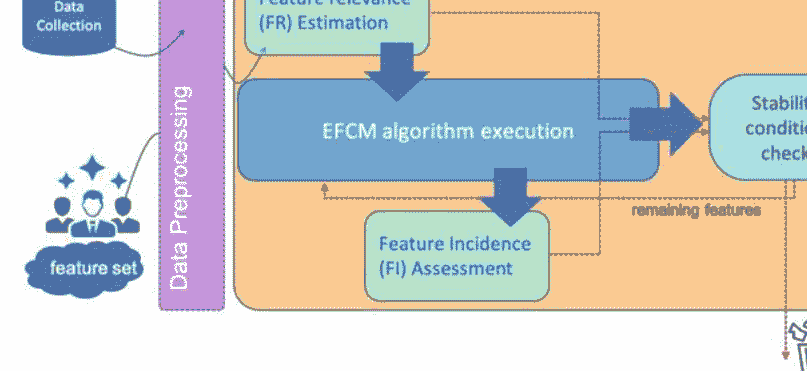

图2.1 算法的逻辑概述

整个算法通过更新参数配置重新运行以确保稳定性条件。具体而言，EFCM的输出旨在评估聚类中每个特征的影响程度（FI评估）。稳定性条件与算法的两个重要指标密切相关：特征相关性FR和特征影响FI，分别代表了从人类观点看特征的重要性和从数据分布在聚类结构中的特征影响。

当达到稳定条件时，算法停止，即当所有特征都对聚类形成产生强烈影响时。否则，当稳定条件不满足时，基于两个指标的进一步评估确定要丢弃的特征候选项。一旦移除，该过程将在剩余的特征上重新迭代。

### 2.2.1 EFCM执行：主要步骤

FS-EFCM算法可以通过以下步骤描述：

- 1. 特征相关性（FR）估计：专家对特征s_h的收集分数进行评分，并将其转化为范围在[0,1]之间的适当比例。一般来说，专家分配的分数可以与数据域相关的尺度进行定义。因此，可能需要一个指标来限制特征分数在区间[0,1]内。例如，分数s_h可以通过将隶属度μ_FR(s_h)分配给预定义的模糊集（例如，实线区间上的sigma模糊集）来模糊化。
- 2. EFCM算法执行：给定数据和特征分数，执行EFCM算法；在第一次运行中，使用所有输入特征。生成的聚类是特征空间中的超球体。
- 3. 特征关联（FI）评估：通过EFCM生成的聚类结构进行分析：计算每个特征在聚类结构中的关联度，通过评估特征分量在每个聚类原型之间的距离（以特征分量之间的距离来衡量）来计算。更正式地说，在第t次算法迭代中，特征分量的权重值w_h^(t)是特征关联值，并且计算如下：

    $$w_{h}^{(t)} = \max_{\substack{i=1,2,...,C^{(t)} \\ k=1,2,...,C^{(t)} \\ i \ne k}} \left( \left| v_{ih}^{\prime (t)} - v_{kh}^{\prime (t)} \right| \right) \quad (2.1)$$

    其中v'_ih和v'_kh是所有聚类中心对的第t个分量值，在第t次迭代中评估。权重值w_h^(t)的取值范围在0到1之间；值越高，特征对聚类形成的影响越大。与FR指数类似，关联度值用于计算对预设模糊集的相应隶属度。
- 4. 稳定性条件检查：当两次迭代中特征的FI值之差小于预设阈值θ时，算法停止。形式上，稳定性条件如下：

    $$\max_{h=1,\ldots,H}\left(\left|\mu_{FI}\left(w_h^{(t)}\right) - \mu_{FI}\left(w_h^{(t-1)}\right)\right|\right) \leq \theta \quad (2.2)$$

    其中 μFI(wh)通常是在特征wh上定义的模糊集的隶属度。如果条件成立，则当前特征仍然是特征集的一部分，否则算法继续下一步。
- 5. 丢弃不太重要的特征：剩余的特征是可能在聚类过程中贡献不太重要的特征集。从特征集中选择候选要移除的特征是通过定义一个新的特征对聚类结构的重要性度量 μh of the hth feature，并应用t-范数运算符 • 来实现的。

    $$\mu_h = \mu_{FR}(s_h) \bullet \mu_{FI}(w_h) \quad h = 1, \ldots, H \quad (2.3)$$

    如果 μH低于预定阈值 δ，则该特征无意义，然后从当前特征集中删除。最后，该过程返回到步骤2，在下一次迭代中只考虑经过过滤的特征。

FS-EFCM的伪代码如清单1所示。

#### 清单1. 算法: FS-EFCM

```
输入: FS={f1...fH} 特征集; NxH 矩阵 MM
1. 设置 δ, θ
2. 根据专家指定的特征相关性 (FR) 分数值，创建模糊集 μFR(.)
3. 重复
4. H := 特征数量 //初始时考虑所有特征
5. 执行 EFCM
6. 对于 h := 1 到 H
7.    计算 w_h
8.    计算 μFI(w_h)
9.    如果 μFR(s_h) • μFI(w_h) < δ
10.       从FS中删除第h个特征 f_h
11.       H = H-1
12. 直到达到稳定条件
13. 返回最终C聚类的分区矩阵和体积原型
```

### 2.2.2 初始参数设置

参数 δ表示特征可以从特征集中删除的阈值。其设置对于控制算法的执行增强至关重要。因此，已经定义了一个初步步骤来设置参数δ的适当值。这一步骤的原理是识别潜在的可删除特征，即使它们被专家认为是相关的。

设n_R为专家认为相关的特征数，n_D为EFCM执行后要丢弃的候选特征数。如果n_D大于n_R的50%（即，很多专家认为相关的特征可能会被丢弃），则参数 δ的初始值将重新设置为较低的值。清单2显示了算法SelectDeltaThreshold的伪代码，描述了参数 δ的细化过程。首先计算n_R：它是专家认为非常相关的特征数，即具有成员度 μ_{FR} ≥0.7的特征（第6-8行）。选择0.7这个值是任意的，并且保证只选择最有意义的特征。

候选要被移除的相关特征n_D存储在数组sig[]中，n_D大小为：12-19行确实描述了数组如何填充。第13行显示了丢弃特征的条件：就像在FS-EFCM算法中一样，方程（2.3）的μ_{lh}必须小于δ，并且同时检查特征是否相关（μ_{FR} ≥0.7）。如果两个条件都满足，则将特征的重要性值添加到数组sig[]中。

然后，按特征重要性值对数组进行升序排列。数组中间位置（或下一个非零中间位置）的（非零）值将成为新的阈值δ的值。

请注意，参数δ的值必须低于专家为第h个特征分配的初始值μ_{FR}（s_h），并且计算为FR模糊集。这保证了第15行的成立，并在第20行应用了进一步的δ细化。

这个策略确保了专家认为相关的特征中有一半以上的特征不会在初始的FS-EFCM中被移除。

#### 清单2. 算法：选择Δ阈值

```
1. 设置 δ, θ
2. 基于专家给出的特征相关性（FR）得分值，创建模糊集 μFR(.)
3. H := 特征的数量
4. n_R := 0 // 初始化相关特征的数量
5. n_D := 0 // 初始化可能可移除的相关特征的数量
6. 对于 h := 1 到 H // 计算相关特征的数量
7.    如果 μFR(s_h) ≥ 0.7
8.       n_R := n_R + 1
9. 执行 EFCM
10. 对于 h := 1 到 H
11.    计算 w_h
12.    计算 μFI(w_h)
13.    如果 μFR(s_h) • μFI(w_h) < δ 且 μFR(s_h) ≥ 0.7
14.       n_D := n_D + 1
15.       sig[n_D] := μFR(s_h)•μFI(w_h)
16. 对 sig[] 进行排序 // 数组 sig[] 按升序排序
17. 如果 n_D / n_R > 0.5
18.    med := n_D / 2 // 整数，介于1和n_D之间的中间值
19.    如果 sig[med] > 0
20.       δ := sig[med]
21. 否则
22.    δ := sig[]中第一个非空值
23. 返回 δ
```

在第13行的代码清单2中使用的t-范数运算符的选择以及在FS-EFCM算法（第2.2.1节）的第5步中定义的选择是进一步的选择。在文献中定义的t-范数家族中，应用问题中最常用的是三角形范数，如下所示：
- 最小（Gödel）t-范数 x●y = min(x, y)
- 乘积（Goguen）t-范数 x●y = x·y
- Lukasiewicz t-范数 x●y = max(x + y –1, 0)

根据所选的t-范数，会生成不同的模糊交集；特别是，最小t-范数在模糊控制中最常用，而乘积t-范数产生的交集比最小t-范数更严格。

## 2.3 实验结果

### 2.3.1 数据集

实验是在Twitter数据集上进行的。 Twitter是最受欢迎的社交网络之一，人们可以在上面表达他们的情感、对事件的意见、兴趣和物品。它提供了一个舒适的平台，可以通过写推文来聊天、阅读推文，并根据需要做出反应，或者分享其他人写的推文。

该数据集由2018年5月至2018年7月在华盛顿、纽约和伦敦发布的四十万条公共推文组成[13]。所有的推文都是用英语编写的，可以有一个或多个标签。具有相同标签的推文被分组在一个唯一的文档文件中：标签可以很好地描述主题。文件的名称是主要出现在收集的推文中的标签。没有标签的推文被丢弃，因为它们无法与文档关联起来。

推文收集已经经过预处理，应用了基本的自然语言处理任务。准确地说，数据已经被词干化，即每个单词都被缩减为其词形变化的形式；然后停用词也被移除了。句法俚语和非常规的词典术语也被丢弃了。

要应用FS-EFCM算法，数据应该是一个术语-文档矩阵：每个基于标签的文档被表示为一个向量，每个单元格包含与特征相关的数值。

### 2.3.2 特征选择

在文本挖掘方法中，特征集通常由描述数据空间特点的一组术语组成；通常通过对文本应用某些度量标准（例如，tf-idf排名前k个术语）来提取这些术语。

这个实验旨在从推文趋势中捕捉情绪和人类行为。通过分析推文，可以检查人们对本地或世界事件的感觉和情绪；以及调查解释某些行为的主要情绪和观点。

情感和观点确实隐藏在句子中，通常与形容词和动词相关联；因此，一些文本表达的内在含义不适合严格的语言模式[2]。

为此，特征集应由描述最相关情绪的代表性词汇集合组成。

选择了一个由六十个情绪类别（目标类别）组成的数据集，以涵盖广泛的相关情绪类别。其中一半的类别描述了愉快的感觉（它们被标记为“开放”，“快乐”，“活力”，“好”，“爱”，“兴趣”，“积极”，“强大”），而剩下的八个类别与困难/不愉快的感觉有关（“生气”，“沮丧”，“困惑”，“无助”，“冷漠”，“害怕”，“受伤”，“悲伤”）。每个情绪类别又由一组“解释”该类别的词汇组成；这些词汇通常是同义词或具有类似含义的术语（例如，“快乐”和“高兴”）。特征集全面由250个特征组成，用情绪类别中的词汇进行标记。

### 2.3.3 FS-EFCM的工作

FS-EFCM将一个由250列（术语特征）和5607行（从约四十五万条推文中提取的文档）组成的矩阵作为输入。与文档向量相关联的数据点的每个条目都是通过使用TF-IDF度量计算的。为了完整起见，在表2.1中列出了数据点的所有特征名称。

对于每个数据点（或文档），都会将其中一个十六个情绪类别与之关联作为目标类别。通过应用[6]中描述的方法来获得这种分类。

最初，专家为每个特征分配了一个在[1，10]范围内的相关性评分。在运行FS-EFCM的初始配置中，阈值δ设置为0.1，停止迭代/收敛阈值θ设置为0.01。此外，我们将EFCM模糊化参数设置为2，初始聚类数为50，EFCM合并阈值为0.01，EFCM停止迭代阈值为0.001。

在预处理阶段，执行SelectDeltaThreshold算法来选择最佳的δ值。在执行完毕后，有135个特征的显著性低于预设阈值δ；其中只有20个特征被专家认为是相关的（相关指数大于等于0.7）。然后，将δ的新值设为0.05，并重新运行 Select-DeltaThreshold算法。其中有96个特征被移除，其中有9个特征被专家认为是相关的。表2.2总结了这些结果。

然后，EFCM在剩下的154个选定特征上运行。算法在经过8个循环/迭代后停止。在最后三个循环中，特征数量减少到20个，并保持这个值直到最后一个循环。表2.3显示了每个算法迭代后得到的结果。

在第八个周期后，停止迭代的值小于阈值θ并且算法停止。

在表2.4中，显示了剩余的二十个特征及其重要性的测量结果。

最终的聚类数为16。计算最终的文档成员资格，将其分配给具有最高成员资格的聚类。因此，通过将每个聚类与大多数被分配到该聚类的文档所属的类相关联，实现了聚类-类映射。

表2.5显示了每个情感类别中的文档数量，与类别相关联的聚类标签，分配给该聚类的文档数量以及属于该类别的聚类中分配给该聚类的文档数量（分类良好的文档）。

#### 表2.1 我们情感数据集中的文档特征

| Col1 | Col2 | Col3 | Col4 | Col5 | Col6 | Col7 | Col8 | Col9 | Col10 | Col11 | Col12 | Col13 | Col14 | Col15 | Col16 | Col17 | Col18 | Col19 | Col20 | Col21 | Col22 |
|------|------|------|------|------|------|------|------|------|-------|-------|-------|-------|-------|-------|-------|-------|-------|-------|-------|-------|-------|
| Abomin | 侵略 | 痛苦 | 祝福 | 欢呼 | 满意 | 压抑 | 减少 | 不信任 | 容易 | 热衷 | 吓人 | 悲伤的 | 希望 | 漠不关心的 | 侮辱 | 解放 | 吝啬的 | 开放 | 困惑 | 颤抖 | 厌恶 |
| 吸收 | 痛苦 | 动物 | 沸腾 | 聪明 | 勇敢 | 剥夺 | 失望 | 统治 | 狂喜 | 兴奋 | 活泼 | 悲痛的 | 敌对的 | 愤怒的 | 意图 | 无生命的 | 疑虑的 | 乐观主义者 | 悲观主义者 | 安静 | 憎恨 |
| 接受 | 警报 | 烦恼 | 大胆 | 接近 | 懦弱 | 凄凉 | 泄气 | 怀疑 | 高兴 | 迷人 | 沮丧 | 内疚的 | 羞辱的 | 低人一等的 | 兴趣 | 孤独的 | 哀悼 | 欢欣鼓舞 | 玩耍 | 加强 | 保留 |
| 疼痛 | 外星人 | 焦虑 | 无聊 | 寒冷 | 穿越 | 绝望 | 厌恶 | 绘制 | 尴尬 | 疲劳 | 愤怒 | 快乐的 | 受伤的 | 激怒的 | 好奇 | 迷失的 | 紧张的 | 痛苦 | 请 | 安抚 | 不安的 |
| 钦佩 | 活着的 | 震惊 | 勇敢 | 舒适 | 迷恋 | 绝望 | 幻灭 | 沉闷 | 空虚 | 恐惧 | 快乐 | 勇敢的 | 重要的 | 愤怒的 | 恼怒 | 悲伤的 | 中立的 | 恐慌 | 积极 | 叛逆的 | 悲伤 |
| 影响 | 孤独 | 羞愧 | 明亮 | 关心 | 好奇 | 卑鄙 | 不感兴趣 | 动力 | 鼓励 | 节日 | 高兴 | 憎恨 | 冲动的 | 伤害 | 快乐 | 爱 | 漠的 | 瘫痪 | 无力的 | 接受 | 满意 |
| 喜爱 | 惊讶 | 吸引 | 冷静 | 自信 | 敢于 | 决定 | 沮丧 | 渴望 | 精力充沛 | 强迫 | 欢快的 | 心碎的 | 无能的 | 好奇的 | 欢乐 | 幸运的 | 鼻塞的 | 激情 | 全神贯注 | 拒绝 | 吓人 |
| 折磨 | 和 | 坏 | 确定 | 困惑 | 沮丧 | 憎恶 | 不满意 | 认真 | 全神贯注 | 幸运 | 好 | 无助的 | 愤怒的 | 冷漠的 | 热衷 | 威胁 | 冒犯 | 可怜的 | 挑衅 | 放松 | 安全 |
| 害怕 | 愤怒 | 苦 | 挑战 | 考虑 | 高兴 | 奉献 | 痛苦 | 容易 | 激怒 | 自由 | 伟大的 | 犹豫不决的 | 犹豫不决的 | 随意心的 | 善 | 快乐的 | 冒犯的 | 和平 | 挑衅 | 可靠的 | 敏感 |

#### 表2.1 (续)

| 列1 | 列2 | 列3 | 列4 | 列5 | 列6 | 列7 | 列8 | 列9 |
|-----|-----|-----|-----|-----|-----|-----|-----|-----|
| 宁静 | 摇晃 | 是 | 怀疑者 | 窥探的 | 疼痛 | 悲伤 | 精神 | 炖菜 |
| 强壮 | 愚蠢 | 苏尔基 | 阳光 | 当然 | 惊讶 | 怀疑 | 同情 | 同情 |
| 眼泪 | 顽强 | 温柔 | 数十 | 可怕 | 可怕 | 感谢 | 威胁 | 兴奋 |
| 胆小 | 折磨 | 折磨 | 触摸 | 朝向 | 悲剧 | 难以置信 | 不确定 | 理解 |
| 不安 | 不快乐 | 独特 | 不愉快 | 不足为奇 | 心烦意乱 | 无用的 | 受害者 | 弱点 |
| 战争 | 温暖的 | 疲倦的 | 悲惨的 | 奇迹 | 担心 | 错误的 |  |  |

| 特征数量 | 阈值δ | 可能可移除的特征 | 可能可移除的相关特征 | 新的阈值δ | 已移除的特征 | 已选择的特征 |
|----------|-------|------------------|----------------------|-----------|--------------|--------------|
| 250      | 0.1   | 135              | 20                   | 0.05      | 96           | 154          |

| 循环 | 特征数量 | 聚类数量 | 已移除的特征 | 已选择的特征 | 停止迭代值 |
|------|----------|----------|--------------|--------------|------------|
| 1    | 154      | 20       | 62           | 92           | 0.42       |
| 2    | 92       | 18       | 37           | 55           | 0.23       |
| 3    | 55       | 16       | 22           | 33           | 0.15       |
| 4    | 33       | 16       | 9            | 24           | 0.09       |
| 5    | 24       | 16       | 3            | 21           | 0.05       |
| 6    | 21       | 16       | 1            | 20           | 0.02       |
| 7    | 20       | 16       | 0            | 20           | 0.013      |
| 8    | 20       | 16       | 0            | 20           | 0.005      |

| 特征名称 | 特征显著性 |
|----------|------------|
| 钦佩     | 0.09       |
| 害怕     | 0.15       |
| 焦虑     | 0.18       |
| 吸引     | 0.11       |
| 坏       | 0.16       |
| 好       | 0.16       |
| 伟大的   | 0.13       |
| 快乐的   | 0.15       |
| 受伤的   | 0.14       |
| 爱       | 0.10       |
| 痛苦     | 0.21       |
| 恐慌     | 0.12       |
| 激情     | 0.15       |
| 悲伤     | 0.13       |
| 吓人     | 0.08       |
| 感谢     | 0.22       |
| 触摸     | 0.14       |
| 不快乐   | 0.15       |
| 心烦意乱 | 0.13       |
| 担心     | 0.08       |

表2.5 分配给类别和对应聚类的文档数量

| 类别 | 属于该类别的文档 | 聚类 | 分配给该聚类的文档 | 分类良好的文档 |
| :--- | :--- | :--- | :--- | :--- |
| 快乐 | 1380 | C1 | 1369 | 1159 |
| 开放 | 366 | C2 | 380 | 301 |
| 困惑 | 24 | C3 | 31 | 13 |
| 强壮 | 55 | C4 | 61 | 36 |
| 感兴趣 | 55 | C5 | 49 | 35 |
| 沮丧 | 49 | C6 | 41 | 26 |
| 积极 | 421 | C7 | 430 | 334 |
| 受伤的 | 377 | C8 | 369 | 296 |
| 好 | 428 | C9 | 435 | 337 |
| 活着 | 187 | C10 | 182 | 141 |
| 无助的 | 164 | C11 | 166 | 128 |
| 爱 | 1186 | C12 | 1175 | 1007 |
| 愤怒 | 434 | C13 | 426 | 352 |
| 害怕 | 315 | C14 | 322 | 257 |
| 悲伤 | 161 | C15 | 167 | 131 |
| 冷漠的 | 5 | C16 | 4 | 3 |

属于某一类的文档中，约81%被正确分配到了正确的聚类中。FS-EFCM的性能通过计算准确率、精确率、召回率和F1得分分类指标来衡量，结果显示在表2.6中。

现在，让我们只考虑那些对其所属聚类的隶属度高于或等于特定阈值的文档；让我们将该阈值设定为0.6。

其成员度大于0.6的文档数量为2047，这意味着它约占所有文档集合的37%。

表2.7显示了与表2.5类似的统计数据，但只考虑强烈属于其分配簇的文档。

值得注意的是，属于某一类并分配给相应簇的文档的百分比显著增加（约为98%）。表2.8显示了针对此文档选择的分类性能，表明显著改进：所有指标值均高于98%。

表2.6 分类性能指标

| 度量 | 值（%） |
| :--- | :--- |
| 准确率 | 77.02 |
| 精确率 | 77.88 |
| 召回率 | 77.21 |
| F1得分 | 77.54 |

#### 表2.7 考虑成员度大于0.6的文档，分配给类别并分配给相应簇的文档数量

| 类别 | 属于该类别的文档 | 聚类 | 分配给该聚类的文档 | 分类良好的文档 |
| :--- | :--- | :--- | :--- | :--- |
| 快乐 | 497 | C1 | 494 | 487 |
| 开放 | 134 | C2 | 133 | 128 |
| 困惑 | 10 | C3 | 10 | 9 |
| 强壮 | 18 | C4 | 20 | 17 |
| 感兴趣 | 24 | C5 | 23 | 22 |
| 沮丧 | 21 | C6 | 23 | 20 |
| 积极 | 148 | C7 | 149 | 143 |
| 受伤的 | 122 | C8 | 119 | 116 |
| 好 | 157 | C9 | 158 | 153 |
| 活着 | 75 | C10 | 75 | 72 |
| 无助的 | 56 | C11 | 57 | 53 |
| 爱 | 450 | C12 | 452 | 446 |
| 愤怒 | 160 | C13 | 162 | 157 |
| 害怕 | 116 | C14 | 114 | 110 |
| 悲伤 | 57 | C15 | 56 | 52 |
| 冷漠的 | 2 | C16 | 2 | 2 |

#### 表2.8 分类性能指标计算表2.7中的文档

| 度量 | 值 (%) |
| :--- | :--- |
| 准确率 | 98.01 |
| 精确率 | 98.38 |
| 召回率 | 98.08 |
| F1得分 | 98.23 |

这些结果突出了FS-EFCM的有效性，特别是在支持基于相关情绪驱动用户行为的社交数据分类方面。

实验揭示了该方法如何生成准确的聚类，并且每个聚类与其关联的特征有很好的描述。事实上，最终的特征是最能代表聚类中数据分布并清晰反映分析的推文趋势中表达的主要情感和情绪的特征。

## 2.4 结论

本文提出了一种半监督聚类方法来对用户生成的内容进行分类。本文提出了一种半监督聚类方法，通过分析文本中表达的主要情感来对用户生成的内容进行分类。

该算法从人类专家那里获取一些分数，以为参考领域中的特征分配一个相关度程度。我们的实验重点是从推文流中捕捉情绪。出于这些原因，专家对表达情感或情绪的词语（如“喜悦”，“美丽”等）进行了评分。FS-EFCM算法在专家提供的特征相关度分数和特征对聚类形成的影响之间达到了一个平衡。

算法的性能不仅揭示了方法的有效性，还揭示了其在过滤非常相关的特征方面的可靠性，这些特征明确地描述了最终的聚类。

算法的未来发展旨在深入研究文档与情感类别的关联。这个想法不仅考虑了文档所属的具有最高成员度的聚类，还考虑了文档可能属于的其他聚类（成员度较低），以发现文档中出现的多个情感类别的集合。

## 参考文献

- L. Alsumait, D. Barbara, C. Domeniconi, On-Line LDA: 自适应主题模型用于挖掘文本流的应用于主题检测和跟踪, in Conference: Proceedings of the 8th IEEE International Conference on Data Mining (ICDM 2008), Pisa, Italy (2008), 10 pp. https://doi.org/10.1109/ICDM.2008.140
- L. Barbosa, J. Feng, 基于和嘈杂数据的Twitter情感检测的鲁棒性, 在 第23届国际计算语言学学会会议论文集。COLING'10, 中国北京 (计算语言学协会, 斯特劳斯堡, PA, 美国, 2010), 第36-44页
- J.C. Bezdek, 具有模糊目标函数算法的模式识别 (Kluwer Academic Publishers, Norwell, MA, 美国, 1981). https://doi.org/10.1007/978-1-4757-0450-1
- J.C. Bezdek, R. Ehrlich, W. Full, 模糊C均值聚类算法. 计算地球科学. 10(2-3), 191-203 (1984)
- E. Cambria, 情感计算和情感分析. IEEE智能系统. 31(2), 102-107 (2016)
- D. Cavaliere, S. Senatore, V. Loia, 从语义 topological空间中的上下文感知概念进行配置文件。知识。基于系统. 130, 102-115 (2017)
- G. Chandrashekar, F. Sahin, 特征选择方法综述. 计算机. 电气. 工程. 40(1), 16-28 (2014). https://doi.org/10.1016/j.compeleceng.2013.11.024. ISSN 0045-7906
- K. Dave, S. Lawrence, D.M. Pennock, 挖掘花生画廊: 意见提取和产品评论的语义分类, 在第12届国际会议 世界广泛网, WWW '03 (ACM, 纽约, 纽约, 美国, 2003), pp. 519-528. https://doi.org/10.1145/775152.775226
- I. Guyon, A. Elisseeff, A., 变量和特征选择导论. J. Mach. Learn. Res. 3(2003), 1157-1182 (2003)
- U. Kaymak, M. Setnes, 具有体积原型和自适应聚类合并的模糊聚类. IEEE Trans. Fuzzy Syst. 10(6), 705–712 (2002)
- B. Liu, 情感分析和意见挖掘. Synth. Lect. Human Lang. Technol. 5(1), 168 (2012). https://doi.org/10.2200/S00416ED1V01Y201204HLT016
- C.D. Manning, P. Raghavan, H. Schutze, 信息检索导论 (Cambridge University Press, New York, 2008), 506 pp. ISBN 978-0521865715
- F. Martino Di, S. Senatore, S. Sessa, 一种基于轻量级聚类的方法，用于从社交信息流中发现不同的情感色彩。 Int. J. Intell. Syst. 1, 19 (2019). https://doi.org/10.1002/int.22105
- D.W. Otter, J.R. Medina, J.K. Kalita, 用于自然语言处理的深度学习应用调查。 IEEE Trans . Neural Netw. Learn. Syst. (2020). https://doi.org/10.1109/TNNLS.2020.2979670
- S. Poria, A. Gelbukh, A. Hussain, N. Howard, D. Das, S. Bandyopadhyay, 通过情感标签增强的概念为基础的观点挖掘。 IEEE Intell. Syst. 28(2), 31–38 (2013). https://doi.org/10.1109/MIS.2013
- A. Rehman, J. Kashif, H.A. Babri, S. Mehreen, 相对判别准则——一种新颖的文本数据特征排序方法。专家系统应用 (爱思维尔) 42, 3670-3681 (2015)
- G. Salton, C. Buckley, 自动文本检索中的词权重方法。信息处理管理 24 (5), 513-523 (1988). https://doi.org/10.1016/0306-4573(88)90021-0
- L. Stanchev, 使用相似性图的语义文档聚类, 在2016年IEEE第十届语义计算国际会议 (ICSC) (2016), 第1-8页。 https://doi.org/10.1109/ICSC.2016.8
- C. Strapparava, R. Mihalcea, 学习识别文本中的情感, 在2008年应用计算机学术会议论文集, SAC'08(ACM, 纽约, 纽约, 美国, 2008),pp. 1556–1560. https://doi.org/10.1145/1363686.1364052
- S. Sun, C. Luo, J. Chen, 自然语言处理技术在观点挖掘系统中的综述信息融合 36, 10–25 (2017). https://doi.org/10.1016/j.infus.2016.10.004
- T. Wei, Y. Lu, H. Chang, Q. Zhou, X. Bao, 一种使用WordNet和词汇链的文本聚类的语义方法. 专家系统应用 42(4), 2264–2275 (2015). https://doi.org/10.1016/j.eswa.2014.10.023
- G. 米勒, C. 费尔鲍姆, WordNet. 一个电子词汇数据库. 剑桥, 马萨诸塞州: 麻省理工学院出版社; (1998). 423页, ISBN: 978-0262061971。

## 第三章 人工智能在游戏中的应用

Kostas Karpouzis和George A. Tsatiris

摘要 本章概述了人工智能（AI）/机器学习（ML）算法与数字游戏之间的关系。这种关系是双重的：一方面，AI/ML研究人员可以生成大规模的野外数据集，用于人类情感活动、玩家行为（即游戏世界内的动作）、商业行为、与图形用户界面元素的交互或与其他玩家的消息交流，而游戏可以利用智能算法自动化测试游戏关卡、生成内容、开发智能且响应灵敏的非玩家角色（NPC）或预测并响应各种玩家文化的行为。

在这项工作中，我们讨论了游戏中最常见和广泛接受的AI/ML应用，并阐述了智能系统如何从中受益，重点是基于表达能力和性能估计玩家体验，以及为语言学习游戏生成适当且有趣的内容。

关键词 机器学习·人工智能·游戏·程序内容生成·情感计算·玩家行为·计算文化

## 3.1 引言

数字游戏在过去几年中在研究界享受了巨大的流行浪潮。这其中一个重要原因是游戏结合了性能/叙事媒体的特点和要求[11]，同时还具有高维护软件和硬件存储、CPU性能要求。


网络通信[51]和安全[32]。特别是在计算机硬件领域，数字游戏一直是推动产业生产更新、更有效、对电脑和游戏机需求更低的硬件的重要力量[45]，不断推动它们的能力进一步提升。

数字游戏作为研究媒介的另一个重要原因是相对容易找到参与游戏研究的参与者：Pew Research [46]提到，“43%的美国成年人表示他们经常或有时在电脑、电视、游戏机或便携设备上玩视频游戏”，其中拼图和策略游戏是经常或有时玩视频游戏的人中最受欢迎的类型。因此，与游戏相关的研究人员，无论是作为他们工作的核心还是作为吸引用户并记录他们的行为或偏好的手段，都可以快速组建大量的数据集（例如，[24]或[55]用于捕捉与玩家行为相关的玩家表达性的数据库，或[18]用于描述视频和3D骨架形式中与网球相关的动作的3D数据集）。在采用数字游戏作为首选平台的研究领域中，最受赞誉的可能是人工智能（AI）和机器学习（ML）的结合，主要是因为AI/ML算法在国际象棋[9]和更复杂的棋盘游戏（如围棋[58, 59]）中与人类世界冠军竞争并最终战胜了他们。游戏是训练和测试AI/ML算法的合适媒介，因为它们具有相对较小的搜索空间，可以寻找和确定最佳移动，并且在变量、规则和关系方面对游戏世界的定义非常完整和稳健。相反，游戏设计和开发一直在利用AI/ML算法自动或用户引导方式创建内容，估计和调整玩家体验[19, 73]或预测玩家行为[12]。

在本章中，我们将从识别可能用于训练和测试人工智能/机器学习算法的数据源开始；接下来，我们将讨论智能算法与数字游戏之间的对话领域，并提供玩家行为识别和玩家体验预测的示例，并详细阐述教育中严肃游戏的游戏内容生成。

## 3.2 游戏内容和数据库

也许在AI/ML之间相互作用中最重要的组成部分，以及实际算法及其上下文或用例，是选择和使用或生成数据或内容的选择和角色。在游戏设计和开发术语中，内容指的是游戏世界中的各种概念、数据和媒体类型。有一个有趣的区别，除了将内容作为游戏设计或交互功能的一部分包含在游戏中之外，它还可以由游戏在游戏过程中生成[1]，通常作为游戏世界对玩家选择和行为的响应，或者可以由玩家自己创建[26]。后一种情况通常被称为“用户生成内容”（UGC）或“玩家生成内容”，涵盖了玩家角色（PC）外观的个性化。


图3.1 用户生成内容示例，玩家可以选择他们的角色外观

在游戏世界中（图3.1），与游戏行为[69]、商业行为（例如使用真实货币或游戏内数字货币购买数字商品或美学元素）或与其他玩家的互动相关的选择通常使用文本聊天、语音通信甚至手语[10]能力。

玩家生成的内容的一个有趣特点是，研究表明[8]，它受到社交过滤器和抑制的控制较少；这实际上意味着在数字游戏世界的安全沙盒中参与和运作的玩家比平常更生动地表达自己[15]，使用更广泛的自发情绪[25]和微表情[20]，而不是通常的情感相关互动[23]，从而为AI/ML算法提供更丰富的输入，并适应它们在“野外”中的部署[14, 41]。用户自发生成内容的一个例子是在平台游戏体验数据集（或PED¹）[24]中呈现的。这是一个多模态数据集，包含58名参与者玩IMB[66]，一个开源的“超级马里奥兄弟”平台游戏的克隆（图3.2）的视频，与视频同步的游戏屏幕记录，带有时间戳的玩家行为日志，以及对乐趣、兴趣和玩家体验的自我报告评估，包括评级和排名（有关对不同选择或偏好进行排名而不是评级的有趣讨论，请参见[75]）。


图3.2 在IMB中生成的游戏关卡，在记录PED数据集时使用

记录玩家表现性与玩家行为（游戏世界中的动作）和玩家体验的方法，可以在AI/ML算法的识别/分类或游戏内容生成方面有多种可能的用途。例如，Asteriadis等人将玩家的头部和身体表现性（图3.3）与游戏内的动作结合起来，将它们分成不同的群组[3]，同时还考虑了游戏表现和人口统计信息[2]。这项工作的一个有趣观察是，玩家经常在他们的动作和角色的相关移动中使用微表情或微手势；例如，他们会与跳跃动作同步点头，或者根据移动的方向转动头部以回避敌人。根据表现性和表现将玩家进行聚类也发现了有趣的模式：例如，专家玩家要么非常表现性，即他们沉浸在游戏动作中，并通过身体动作模仿他们的角色的移动，要么几乎没有表现性，表明他们具有高度的专注力。总的来说，这项工作确定了将玩家行为与表现分析[25]相结合的需求，以产生有意义且可靠的关于玩家参与度的结果。在同一框架中，Pedersen等人[39]根据玩家的情感和行为输入，为IMB生成预测对每个特定玩家有趣和吸引人的关卡。这个概念将感知和玩家体验预测的工作与对使游戏关卡变得困难、有趣或令人恼火的方面进行建模结合起来。

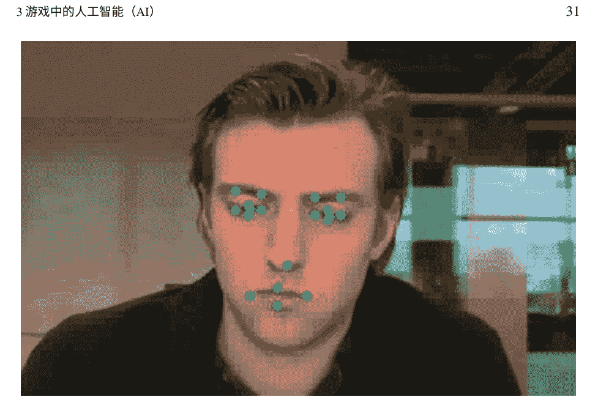

图3.3 视频帧显示玩家表情和检测到的面部特征

对于每个玩家：在平台游戏（如SMB或IMB）的背景下，这些因素包括给定级别中的间隙数量、间隙大小、敌人数量和位置以及奖励和能力提升的位置。这项工作表明，通过将玩家体验建模与难度建模相结合，内容生成算法可以创建具有很高概率的有趣和吸引人的个体游戏关卡。

除了玩游戏时的情感或视听数据外，最相关的数据来源来自玩家在游戏世界中的行为。玩家在游戏过程中产生的数据量因游戏类型而异，回合制或策略游戏每分钟产生几个样本，而动作游戏或实时策略（RTS）游戏每分钟提供数百个个体玩家动作（APM）：在《星际争霸》这款有史以来最受欢迎的RTS游戏中，顶级玩家在准备阶段通常记录约400个APM，在战斗中接近800个APM。因此，积累大量的数据并将其用于训练不同的AI/ML架构已成为游戏和ML研究人员非常流行的用例。例如，Ravari等人利用[49, 63]中提供的数据集来预测每场比赛的获胜者，识别相关和重要的时间相关特征（例如玩家的行动，如建造或攻击）和时间无关特征，例如每个游戏地图中可建造区域的高度或特定区域的高度；为了实现这一点，他们使用Sciikit-learn中的Gradient Boosting Regression Trees（GBRT）[16]和Random Forest（RF）[6]实现，这是一个开源的Python包。在相同的背景下，Lin等人制作了一个包含超过65,000个游戏的非常大的数据集，除了玩家行为外还包括视觉信息。

[30]；这里包含的数据量之大（1,535百万帧，4.96亿个玩家操作）说明了玩家行为数据对大数据算法和流程的相关性（参见[4]关于流失预测，即玩家退出特定游戏，或[74]关于游戏行业如何处理玩家行为数据以促进玩家体验和消费行为）。

与AI/ML算法一起使用的更现代的数据来源是玩家在游戏过程中或之前与其他玩家的互动，以文本对话（聊天）或使用语音的形式。如前所述，游戏过程消除了玩家的大部分社交抑制，并允许更丰富的互动和更多种类的极端情绪。Murnion等人[35]使用商业情感分析工具，如Twinword情感分析和Microsoft Azure认知服务，处理来自名为World of Tanks（WoT）的在线多人游戏的玩家行为和游戏日志；作者们寻找正面与负面的互动以及特定的辱骂侮辱或种族主义攻击行为。这项工作的一个重要方面是使用易于获取的服务来检索、解密和处理数据，使研究易于复制和扩展。研究的背景也非常有趣，因为网络欺凌可能导致极其负面的情绪和决策，无论是对玩家的现实生活还是对他们对游戏的减少感：不同的研究表明，超过50%的玩家因为网络欺凌行为而退出或考虑退出游戏[17]。在[36]中也使用了类似的方法来分析游戏数据，作者使用主题建模和统计分析来分析Dota²实时多人对战游戏中的观众（或观众）之间的互动。他们的工作发现了与足球比赛观众类似的模式，尤其是在观众内部效应的情况下，尽管电子竞技的观众评论没有直接影响玩家。

## 3.3 智能游戏内容生成和选择

游戏内容生成一直是一个非常活跃的领域，在这个领域中，人工智能/机器学习展示了他们在生成数据方面的潜力，主要是因为术语“内容”可以指涉游戏中的大多数音频、视觉和叙事概念。除了视觉外观，比如环境美学或角色和环境的2D/3D模型，游戏内容还可以指音频或听觉媒体（例如游戏的配乐或对游戏事件的特定音效的使用，比如开火或玩家死亡），图形用户界面（GUI）[43]，游戏使用交互元素传达信息（例如另一个玩家或敌人附近）或玩家选择游戏选项和参与游戏行为，甚至游戏叙事本身。后一种情况[21, 37, 50]非常有趣，因为它满足了基于游戏设计师的初始计划或叙述生成不同故事和游戏的需求。叙述生成技术在主要流行于日本的角色扮演游戏（RPG）中取得了成功，表明这种内容生成选项有潜力创造持久的游戏体验并保持玩家的动力，满足研究人员和行业的需求[60]。

叙述生成的一个特殊案例包括NPC规划和行为[53]，内容生成算法根据虚拟个性（例如，一个 sidekick或敌人）或玩家行为（例如，对玩家抢劫属于友好村民的小屋做出回应）选择和执行非玩家角色的动作和对话。

智能内容生成技术也可以根据其所需或提供的自动化程度进行分类。其中一些技术使设计师参与到过程中，可以通过改变生成内容的方式[29]或允许玩家调整游戏中生成的内容[57]来实现。完全自动化的技术[56]，通常称为程序化内容生成（PCG），在研究人员中非常受欢迎，因为它们除了微调算法参数之外，几乎不需要任何输入，但它们在商业游戏中也取得了成功：在20世纪80年代，像Akalabeth和 Rogue这样的地牢游戏是最早使用自动（但有时是随机的）内容生成的游戏，而 Elite（1985年），一款3D太空探索游戏，使用内容生成来创建8个拥有256个太阳系和每个太阳系中1-12个行星的星系，所有这些只需要32 Kb的代码。从 Diablo（1995年）到最近几年，PCG主要局限于RPG和地牢布局，而自动内容创建则由Mojang开发并现在由Microsoft拥有的Minecraft（2011年）重新引起了关注。更近期的游戏包括Left for Dead（2008年）（实例化游戏对象，如树木、怪物或宝藏）、S.T.A.L.K.E.R.：切尔诺贝利的阴影（2007年）（动态系统创建非脚本化的NPC行为）、Apophenia（2008年）（生成谜题和情节），以及主要的No Man’s Sky（2016年），它具有经过程序生成的确定性开放世界宇宙和拥有独特植物和动物的行星（图3.4），以及各种有意识的外星物种。

自动PCG通常与相应的生成算法和相关约束相匹配，以匹配游戏设计或简单地有意义。基于词汇或语法的生成算法通常用于创建游戏世界、迷宫或地牢[22]以及植物，其递归形状非常适合细胞自动机[33]或L系统[67]的生成方式。最近，Müller等人使用L系统[34]创建了具有不同大小、房间数量或楼层数的3D建筑。这是一个有趣的例子，因为L系统最初的编写方式可能反映了特定的规则或约束（例如，在[72]中创建各种结构合理的建筑物，甚至用于生成完整的城市[64]）。鉴于每个建筑物在3D环境中可能需要的多边形几何和纹理图像的数量，能够在内存或CPU使用方面几乎没有额外开销的自动PCG算法可以替代事先编写必要对象的需求。基于人工智能的算法也是如此。


图3.4 《无人之境》中的星球和环境生成

生命方法：BIOME³是一个可编程的细胞自动机模拟器，允许用户开发类似于“模拟城市”的网格，模拟森林火灾、疾病流行或动物迁移模式等现象（参见图3.5）。当涉及到生成数据序列时，例如在过程音乐生成或规划NPC行为时，隐马尔可夫模型（HMMs）是一个常见的选择。Snodgrass等人[61]为不同的平台游戏生成了游戏关卡序列，并比较了它们在每个游戏中的表现，而Plans等人[42]则将生成与玩家体验相结合，为游戏创作音乐分数。最近，长短期记忆（LSTM）网络已经被用于生成游戏关卡，例如在《超级马里奥兄弟》克隆版[62]中。LSTMs似乎已经在基于机器学习的PCGML（基于机器学习的程序内容生成）实验中占据主导地位，这要归功于Python和C#中现成的实现，以及它们的循环特性，可以生成多样化和（理论上）无限的内容[48]。例如，Savery和Weinberg[52]使用LSTMs根据图像和视频分析合成音乐分数，而Botoni等人[5]则创建了在对话和风格方面更加深入的NPC。

### 3.3.1 为语言教育游戏生成内容

为严肃/教育游戏生成适当的内容是一个非常重要的概念，因为它可以决定游戏的采纳和保留，从而增加实现学习目标的可能性。

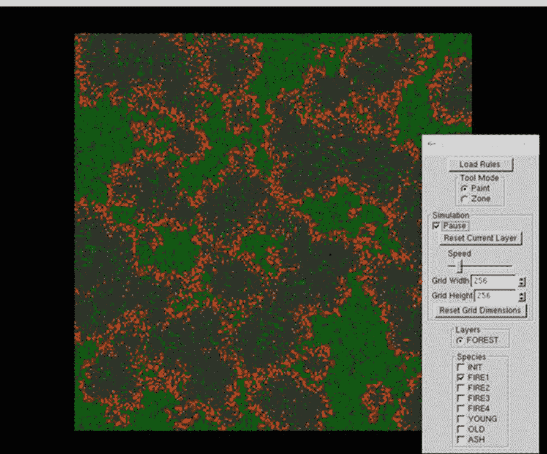

图3.5 在BIOME中生成的森林火灾

和流失 [71]。在iRead项目中，我们正在创建一个针对入门级语言学习的严肃游戏和支持应用程序，包括英语、英语作为外语 (EFL)、德语、西班牙语和希腊语 [38]。项目中开发的核心软件应用程序包括阅读器应用程序，它根据特定标准突出显示文本中的单词部分，以及一个严肃游戏，它由一系列利用单词和句子的游戏化活动组成。这些应用程序的基础以及提供对内容的访问的软件基础设施包括每种语言的语言模型，包括针对患有诵读困难的儿童的语言模型；在为这些语言定义了广泛的音韵和句法模型之后，项目中的语言学家与教师合作，为每个目标年龄组定义了学习目标，以及应该教授每种语言特征的顺序。这些特征的排序，包括学生在进入更高级特征之前应该教授和掌握的先决条件，被编码在一个类似树状的分层图中；基本上，

- 1. 4iRead项目, https://iread-project.eu/。
- 2. 5Amigo阅读器应用程序, https://iread-project.eu/amigo-reader/。
- 3. 6Navigo游戏, https://iread-project.eu/game/。

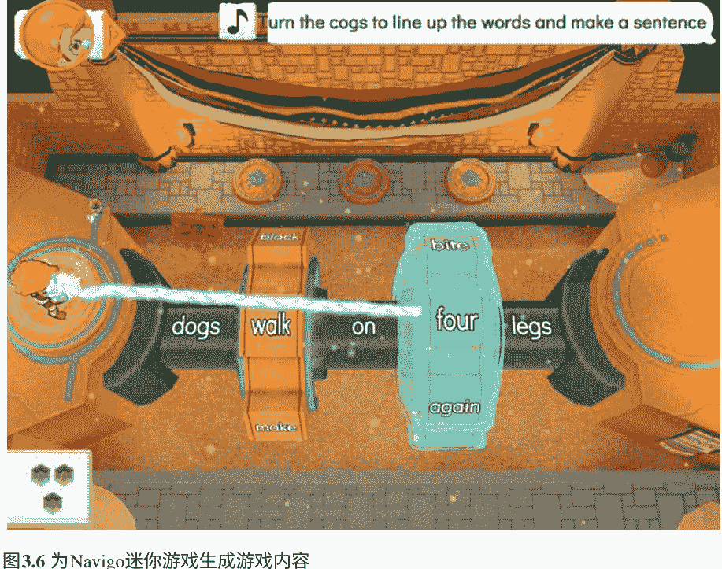

这个图表包含了语言模型（即每个单词或句子在给定语言水平上的特征）和教学模型，通过选择每个学年所需的特征以及它们应该被教授的顺序来表示。当新学生在iRead系统中注册时，该图表将作为用户配置文件实例化，每个特征的掌握程度会根据学生的年龄而有所不同。

这就是iRead中自适应内容生成组件[68]的作用，首先利用每个特征的掌握水平从项目资源引擎（词典和文本）中选择合适的内容，然后根据学生在每个语言游戏中的表现更新学生的模型；当给定特征的掌握水平超过选定的阈值（75%）时，模型层次结构中的后续特征将可供使用，前提是它们的所有先决条件都已满足。在iRead的背景下，游戏内容包括选择特定的游戏活动；与之相关的语言特征；以及与该特征相对应的一组单词或一个句子（例如，特定的字母、音素或一系列音素）（图3.6）。

内容选择过程始于给定的学生模型（参见图3.7概述过程），即每个开放特征的掌握水平；然后通过一组规则（在与教师进行富有成效的咨询会议后由项目研究人员定义）对可用资源进行过滤，为每个会话选择内容。

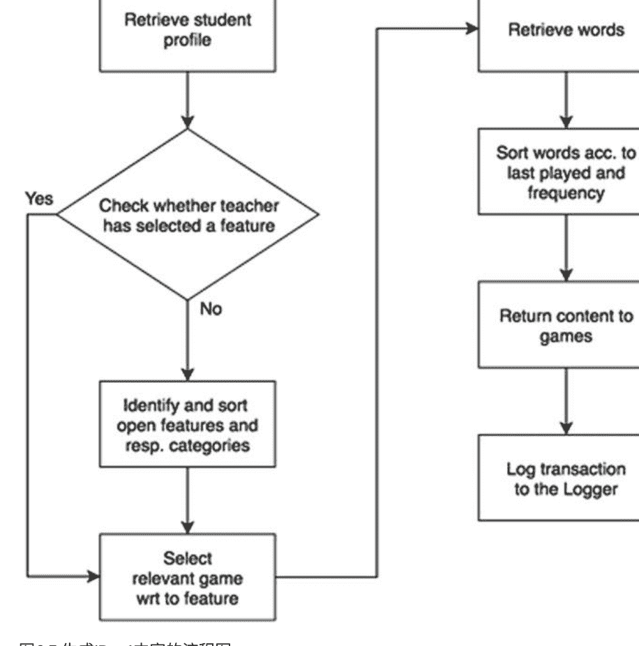

图3.7 生成iRead内容的流程图

与他们合作。这些规则首先以口头形式定义，以促进游戏的教学目标，每个规则对应于特定的教学原理。例如，当多个特征是开放的（可供使用），自适应组件通过考虑每个特征在先前游戏中的使用次数以及学生以前在面对该特征时的表现情况对它们进行排序。这里的推理是，学生应该从一个更容易的特征开始，并且不应该玩最近表现不佳的特征，从而促进动机和效能。

其他规则试图通过将先前游戏中达到的特征掌握水平与自上次使用该特征以来的游戏次数相结合，以及在十场游戏后重新开启完全掌握的特征来加强学习。假设学生已经完全掌握了该特征，但他们必须偶尔重复一次，以展示他们的进步和长期掌握。最后，许多特征选择规则处理学生的进展不如预期或没有真正掌握与其年龄水平相对应的语言特征：如果一个特征已经练习了两次，但特征掌握水平没有改善，那么该特征及其先决条件的掌握水平将降低，以便将来可以重新访问两者。该内容选择策略通过允许学生回到所需的知识，如果没有系统证据表明已经掌握，来处理给定年龄组的学生已经掌握了某些语言特征的假设。除了选择适当的单词内容外，iRead适应性系统还利用基于规则的策略来选择特定的游戏活动来利用这些单词：如果一个特征在特定学生的游戏中以前没有使用过，那么所选的游戏应该在使用该语言特征的准确性方面促进，然后再转向刺激自动化的游戏。

iRead中适应性组件的第二部分与重新评估游戏中使用的语言特征的掌握价值有关。在咨询会议期间，教师提到了一些对这个过程的要求：掌握价值的变化不应该突然，特别是当学生在某个活动中偶尔犯错误时；此外，他们应该帮助学生在少数几个游戏会话中完全掌握某个特征，让他们能够进一步学习更高级和有趣的特征。一个数学定义可以满足这些要求，同时还可以为过程的实验和调整留出空间，那就是指数移动平均（EMA）[40]：基本上，它考虑了以前对特定特征的尝试（以前的游戏会话），但更重视最近的尝试。要考虑的以前尝试的次数可以由每个实现来定义；在iRead中，我们实现了完整的定义，但在计算下一个值时只考虑了以前的掌握值。这个平均过程允许学生在只玩三个游戏后完全掌握，因为每个新开放的特征都初始化为5，在三个完美的游戏后达到最大值10。此外，如果学生在游戏过程中犯了一个或多个错误，相应的掌握值最多可以减少1。这种机制以及优先考虑最近游戏尝试的规则，使学生能够练习不同的语言内容，而不会被困在困难的特征中。

持续评估[7, 47]表明，自动内容选择和个人资料重新评估过程与教师的期望非常接近，并为学生提供了合适和有趣的内容。尽管重新评估机制使得解锁后续功能变得非常容易，但有报道称学生在多次连续的游戏会话中得到了相同的功能。然而，通过分析游戏结果和掌握评估的系统日志，我们得出结论，这反映了相应语言模型的设计，在移动到更复杂的功能之前，需要解锁大量先决条件。这有效地说明了iRead不同组成部分之间的相互作用：描述每个语言模型的功能，描述顺序的先决条件图嵌入学习过程中的掌握水平，反映学生表现的适应和重新评估规则，以及优先实施教学目标的内容。

欧洲各地的学校已经开始进行大规模评估阶段，参与的学生超过2000人。尽管受到疫情和学校关闭的影响，我们预计会继续收到学生在家玩游戏时的游戏日志。处理这些日志将使我们能够重新审视自适应组件的特定部分，主要是内容选择规则和掌握重新评估实施。

## 3.4 结论

过去几年来，人工智能/机器学习算法与数字游戏之间的相互作用一直是科学新闻和研究机构的焦点。这主要是因为它促进了适应性玩家体验[76]，从而提高了乐趣和参与度。除此之外，人工智能/机器学习还可以用于选择和生成多样化且相关的游戏内容，甚至可以从开放和大数据源中获取（参见[70]中使用开放数据填充的大富翁克隆版[65]，用于教授小学地理课程中的大数据排名和关联，或者参见[13]中使用开放数据进行环境教育卡牌游戏的方法），使游戏更贴近日常生活。在本章中，我们概述了一些将人工智能/机器学习与游戏设计概念和玩家行为相结合的突出方法，以提供有关玩家体验的信息并生成预测最大化参与度的内容。我们还描述了一种基于行为和情感表达的游戏过程中估计玩家体验和参与度的方法，以及一种智能算法，根据玩家表现和学习/教学目标生成语言内容的方法。

随着用户通过明确选择和游戏过程向人工智能/机器学习算法提供更多和更丰富的输入，预计这种相互作用将变得更加有意义，并将被整合到更多的应用中，扩展到教育、包容性[54]和游戏化([27, 28])。

致谢本工作部分资助来自iRead项目，该项目已获得欧洲联盟的Horizon 2020研究和创新计划的资助，协议编号为731724。

## 参考文献

1. A. Amato，游戏行业中的程序内容生成，在游戏动力学 (Springer，2017)，第15-22页
2. S. Asteriadis，K. Karpouzis，N. Shaker，G.N. Yannakakis，你的个人资料是否能说明一切？使用人口统计数据预测游戏过程中的表情头部运动(2012)
3. S. Asteriadis, K. Karpouzis, N. Shaker, G.N. Yannakakis, 通过视觉和游戏行为线索检测玩家群体的方法。 Procedia Comput. Sci. **15**, 140-147页(2012)
4. P. Bertens, A. Guitart, Áf. Periáñez, 游戏和大数据: 可扩展的多维流失预测模型, 在2017年IEEE计算智能和游戏会议(CIG)(IEEE, 2017), 第33-36页
5. B. Bottoni, Y. Moolenaar, A. Hevia, T. Anchor, K.A. Benko, R. Knauf, K.P. Jantke, A.J. Gonzalez, A.S. Wu, 在自动化叙事生成中的字符深度和句子多样性, 在FLAIRS会议上(2020), 第21-26页
6. L. Breiman, 随机森林. 机器学习. **45**(1), 5-32 (2001)
7. L. Bunting, Y.H. Segerstad, W. Barendregt, 瑞典教师对个性化学习技术在英语课堂中教授儿童阅读的看法. 国际儿童计算机交互. **27**, 100236 (2021)
8. P. Cairns, A.L Cox, M. Day, H. Martin, T. Perryman, 社交游戏对数字游戏沉浸感的影响. 人机交互研究国际期刊 **71**(11), 1069-1077 (2013)
9. M. Campbell, A.J. Hoane Jr, F.-H. Hsu, 深蓝. 人工智能. **134**(1-2), 57-83 (2002)
10. G. Caridakis, S. Asteriadis, K. Karpouzis, 非手动线索在自动手势语识别中。 Pers. Ubiquit. Comput. **18**(1), 37–46 (2014)
11. E. Carstensdottir, E. Kleinman, M.S. El-Nasr, 叙事游戏中的玩家互动: 结构和叙事进展机制, in *Proceedings of the 14th International Conference on the Foundations of Digital Games* (2019), pp. 1–9
12. D. Charles, B.U. Cowley, 用于玩家个人资料和流失预测的行为分析, in *International Conference on Human-Computer Interaction* (Springer, 2020), pp. 631–643
13. D. Chiotaki, K. Karpouzis, 用于学习的开放和文化数据游戏。 arXiv 预印本 arXiv:2004.07521 (2020)
14. R. Cowie, C. Cox, J.-C. Martin, A. Batliner, D. Heylen, K. Karpouzis, 数据标注问题, 在情感导向系统中(Springer, 2011), pp. 213–241
15. K. Durning, 杰克逊研究生院和杰克逊研究生院-心理学系。 游戏与社会心理学和微表情的关系, 中央俄克拉荷马大学, 2016年)
16. J.H. Friedman, 随机梯度提升。 计算统计数据分析. **38**(4), 367–378 (2002)
17. M. Fryling, J.L. Cotler, J. Rivituso, L. Mathews, S. Pratico, 网络欺凌还是正常游戏玩法? 年龄、性别和经验对多人在线游戏中网络欺凌的影响: 来自一个游戏论坛的观点。 信息系统应用研究杂志. **8**(1), 4 (2015)
18. S. Gourgari, G. Goudelis, K. Karpouzis, S. Kollias, Thetis: 三维网球击球数据集, 在IEEE计算机视觉和模式识别会议论文集(2013), pp. 676–681
19. C. Guckelsberger, C. Salge, J. Gow, P. Cairns, 在没有玩家的情况下预测玩家体验的探索性研究, 在计算机人机交互年度研讨会论文集中（2017年），第305-315页
20. S.H. Hemenover, N.D. Bowman, 视频游戏、情绪和情绪调节: 扩大范围。 Ann. Int. Commun. Assoc. **42**(2), 125-143 (2018年)
21. S. Imabuchi, T. Ogata, 基于普罗普理论的故事生成系统: 作为综合叙事生成系统的机制, 在自然语言处理国际会议上（Springer, 2012年），第312-321页
22. L. Johnson, G.N. Yannakakis, J. Togelius, 用于实时生成无限洞穴关卡的元胞自动机, 在2010年游戏程序内容生成研讨会论文集中（2010年），第1-4页
23. K. Karpouzis, G.N. Yannakakis, 游戏中的情感（Springer, 2016）
24. K. Karpouzis, G.N. Yannakakis, N. Shaker, S. Asteriadis, 平台游戏体验数据集, 在2015年情感计算与智能交互国际会议（ACII）(IEEE, 2015), 第712-718页
25. I. Kotsia, Zafeiriou, G. Goudelis, I. Patras, K. Karpouzis, 情感游戏中的多模态感知, 在游戏中的情感(Springer, 2016), 第59-84页
26. G. Lastowka, 用户生成内容和虚拟世界. Vand. J. Ent. & Tech. L. 10, 893 (2007)
27. N.Z. Legaki, K. Karpouzis, V. Assimakopoulos, 使用游戏化教授商学院预测方法, 在 Gami FIN(2019), pp. 13-24
28. N.-Z. Legaki, N. Xi, J. Hamari, K. Karpouzis, V. Assimakopoulos. 挑战式游戏化对学习的影响: 统计教育背景下的实验. Int. J.Hum. Comput. Stud. 102496 (2020)
29. A. Liapis, G. Smith, N. Shaker, 混合主动内容创作, 在 *Procedural Content Generation in Games* (Springer, 2016), pp. 195-214
30. Z. Lin, J. Gehring, V. Khalidov, G. Synnaeve, Stardata: 一个星际争霸人工智能研究数据集.arXiv 预印本 arXiv:1708.02139 (2017)
31. M. Mavrikis, A. Vasalou, L. Benton, C. Raftopoulou, A. Symvonis, K. Karpouzis, D.Wilkins, 为自适应阅读游戏设计原则提供证据支持的研究，2019年CHI人机交互因素计算系统会议摘要扩展版(2019)，第1-4页
32. T. Min, W. Cai, 区块链游戏的安全案例研究, 2019年IEEE游戏、娱乐、媒体会议(IEEE, 2019), 第1-8页
33. S. Miremadi, B. Lennartson, K. Akesson, 基于BDD的扩展有限自动机建模方法用于建模工厂和监控器。IEEE控制系统技术交易 20(6), 1421-1435(2011)
34. P. Müller, P. Wonka, S. Haegler, A. Ulmer, L. Van Gool. 建筑的过程建模, 在 *ACM SIGGRAPH 2006 论文集*(2006), pp. 614-623
35. S. Murnion, W.J. Buchanan, A. Smales, G. Russell. 机器学习和语义分析 游戏内聊天中的网络欺凌. 计算机安全 76, 197-213 (2018)
36. I. Musabirov, D. Bulygin, P. Okopny, K. Konstantinova. 在竞技场和运动酒吧之间: 电子竞技观众的在线聊天.arXiv 预印本arXiv:1801.02862 (2018)
37. T. Ogata. 为集成叙事故事生成系统构建概念词典. J. Robot. Netw. Artif. Life 1(4), 270-284 (2015)
38. D. Panagiotopoylos, A. Symvonis, iread: 个性化阅读技能的基础设施和集成工具. Inf. Intel l. Syst. Appl. 1(1), 44-46 (2020)
39. C. Pedersen, J. Togelius, G.N. Yannakakis, 为内容创作建模玩家体验. IEEE Trans. Comput. Intell. AI Games 2(1), 54-67 (2010)
40. R. Pelánek, J. "Řihák, 掌握学习标准的实验分析 , in *Proceedings of the 25th Conference on User Modeling, Adaptation and Personalization* (2017), pp. 156-163
41. B. Perron, 游戏情绪的认知心理学方法 (2005)
42. D. Plans, D. Morelli, 为游戏生成体验驱动的过程音乐. IEEE Trans. Comput. Intell. AI Games 4(3), 192-198 (2012)
43. R. Popp, D. Raneburger, H. Kaindl, 基于话语的通信模型的自动多设备GUI生成的工具支持，在第5届ACM SIGCHI工程交互计算系统研讨会论文集（2013年），第145-150页。
44. Y.N. Ravari, S. Bakkes, P. Spronck, 星际争霸胜者预测，在第12届人工智能和交互式数字娱乐会议上（2016年）
45. J.P. Research (2017年) 电子竞技是PC游戏硬件销售增长的推动力量。访问日期：2020年9月3日。https://www.globenewswire.com/news-release/2017/07/11/1042645/0/en/JPR-eSports-is-a-Driving-Force-Behind-PC-Gaming-Hardware-Sales-Growth.html
46. P. Research, 关于美国人和视频游戏的5个事实（2018年）。https://www.pewresearch.org/fact-tank/2018/09/17/5-facts-about-americans-and-video-games/。访问日期：2020年9月3日
47. A. Révész, M. Vasalou, A. Florea, R. Gilabert, L. Bunting, Y.H. Segerstad, I. Mihu, C. Parry, L. Benton, 文本增强对L2派生形态发展的影响: 多地点纵向研究(2020)
48. S. Risi, J. Togelius, 过程化内容生成: 从自动生成游戏关卡到增加机器学习的普适性。arXiv预印本arXiv:1911.13071 (2019)
49. G. Robertson, I. Watson, 星际争霸AI的改进数据集和提取过程，在第二十七届国际FLAIRS会议上(Citeseer, 2014)
50. J. Robertson, R. Michael Young, 从声明性世界表示中自动生成游戏玩法, AIIDE, pp. 72–78 (2015)
51. S. S. Sabet, S. Schmidt, S. Zadtootaghaj, C. Griwodz, S. Moller, 关于云游戏的延迟敏感性与玩家策略和用户输入的影响，2020年第十二届多媒体体验质量国际会议（QoMEX）(IEEE, 2020), 第1-3页
52. R. Savery, G. Weinberg, Shimon the robot film composer and deep score: 基于视觉分析的电影配乐生成的LSTM。arXiv预印本arXiv:2011.07953 (2020)
53. A. Savidis, PCG不仅仅是表面上看到的：NPC AI，动态摄像机，PVS和光照图。arXiv预印本arXiv:1808.00328 (2018)
54. A. Schmölz, K. Karpouzis, D. Pfeiffer, P. Koulouris, 通过基于游戏的对话和游戏来解决危机，实现社会包容
55. N. Shaker, S. Asteriadis, G.N. Yannakakis, K. Karpouzis. 用于分析游戏背景和玩家体验相互作用的基于游戏的语料库，在国际情感计算和智能交互会议上(Springer, 2011), pp. 547-556
56. N. Shaker, J. Togelius, M.J. Nelson,游戏中的程序内容生成：一本教科书和当前研究的概述(Springer, 2016)
57. N. Shaker, G.N. Yannakakis, J. Togelius, 迈向玩家驱动的程序内容生成，在第9届计算前沿会议上，CF ’12(New York, NY, USA,2012), pp. 237–240. 计算机协会
58. D. Silver, A. Huang, C.J. Maddison, A. Guez, L. Sifre, G. Van Den Driessche, J. Schrittwieser ,I. Antonoglou, V. Panneershelvam, M. Lancot等,用深度神经网络和树搜索掌握围棋游戏。自然529(7587), 484-489 (2016)
59. D. Silver, T. Hubert, J. Schrittwieser, I. Antonoglou, M. Lai, A. Guez, M. Lanctot, L. Sifre,D. Kumaran, T. Graepel等,一种通过自我对弈掌握国际象棋、将棋和围棋的通用强化学习算法。科学362(6419), 1140-1144 (2018)
60. G. Smith, E. Gan, A. Othenin-Girard, J. Whitehead, 基于PCG的游戏设计：通过程序化内容生成实现新的游戏体验，在第二届国际程序化内容生成工作坊中(2011), 第1-4页。
61. S. Snodgrass, S. Ontanón, 使用马尔可夫模型学习生成视频游戏地图。IEEE计算智能与人工智能游戏9(4), 410-422 (2016)
62. A. Summerville, S. Snodgrass, M. Guzdial, C. Holmgård, A.K. Hoover, A. Isaksen, A. Nealen, J. Togelius, 通过机器学习进行程序内容生成 (pcgml). IEEE Trans. Games10(3), 257–270 (2018)
63. G. Synnaeve, P. Bessiere, 星际争霸AI数据集和军队聚类示例 (2012)
64. J.O. Talton, Y. Lou, S. Lesser, J. Duke, R. M’ech, V. Koltun, 大都会程序建模。ACM Trans. Graph. (TOG)30(2), 1-14 (2011)
65. S. Theocharis, G.A. Tsihrintzis, 支持开放公共数据的本体开发-希腊案例, inIIISA 2014, 第5届国际信息、智能、系统和应用会议(IEEE, 2014), pp. 385-390
66. J. Togelius, S. Karakovskiy, R. Baumgarten, 2009年马里奥人工智能竞赛,在IEEE进化计算大会(IEEE, 2010), 第1-8页
67. J. Togelius, N. Shaker, J. Dormans, 语法和L系统及其在植被和关卡中的应用,在游戏中的程序内容生成(Springer, 2016), 第73-98页
68. G. Tsatsiris, K. Karpouzis, 个性化学习的开发:从教育目标到开发和反馈的漫长道路,在ACM互动设计与儿童(IDC)会议2020,面向年轻学习者的技术介导个性化学习研讨会:概念、方法和实践 (2020)
69. G.A. Tsihrintzis, D.N. Sotiropoulos, L.C. Jain, 机器学习范式: 数据分析的进展,在机器学习范式(Springer, 2019), 第1-4页
70. I. Vargianniti, K. Karpouzis, 使用大数据和开放数据生成教育游戏内容以提高学生表现和兴趣。大数据认知计算4(4), 30 (2020)

> 71. M. Virvou, G. Katsionis, K. Manos, 将软件游戏与教育相结合：教育效果评估。教育技术与社会 **8**(2), 54–65 (2005)
>
> 72. E. Whiting, J. Ochsendorf, F. Durand, 结构合理的砖石建筑的程序化建模，在*ACM SIGGRAPH Asia 2009 Papers*(2009), pp. 1–9
>
> 73. J. Wiemeyer, L. Nacke, C. Moser等，玩家体验，在*Serious Games*(Springer, 2016), pp. 243–271
>
> 74. M. 威尔逊，T. 利弗，Zynga的农场游戏，社交游戏和大数据挖掘的伦理。Commun. Res. Pract. **1**(2), 147-158 (2015年)
>
> 75. G.N. Yannakakis, R.Cowie, C. Busso, 情绪的序数性质，在2017年第七届国际情感计算和智能交互会议（ACII）(IEEE, 2017年), pp. 248-255
>
> 76. G.N. Yannakakis, K. Isbister, A. Paiva, K. Karpouzis。客座编辑：游戏中的情感。IEEE Trans. Affect. Comput. **5**(1), 1-2 (2014年)

## 第二部分

## 机器学习/深度学习

## 在教育中

# 第4章
计算机-人类在虚拟实验室环境中的相互培训

Vasilis Zafeiropoulos和Dimitris Kalles

摘要科学大学面临着培训学生在使用实验室时适当使用并避免事故或设备损坏的持续挑战。对于提供远程教育的大学来说，这项任务变得更加困难，因为他们的学生很少访问实验室设施，可能有限的机会熟悉相应的仪器和设备。为此，希腊开放大学（Hellenic Open University）在自然科学领域提供长期的远程教育项目，开发了Onlabs，一个交互式的3D虚拟实验室，类似于其现场生物实验室，供学生在实际进行实验之前进行培训。Onlabs的最新版本包括，其中之一是指导模式，在该模式下，计算机指导人类用户进行特定的模拟实验，还有评估模式，在该模式下，计算机评估人类用户在完成实验方面的表现，进一步促进有效的学习过程。因此，为了准确评估性能，使用了两种独立的机器学习技术，遗传算法和基于人工神经网络的反向传播。

关键词遗传算法·人工神经网络·虚拟实验室·远程教育·实验室培训

## 4.1 引言

Onlabs是一个交互式的3D虚拟实验室，模拟希腊开放大学的现场生物实验室，用于本科和研究生生物学学生的培训。学生在来到实验室之前可以在家里使用它。

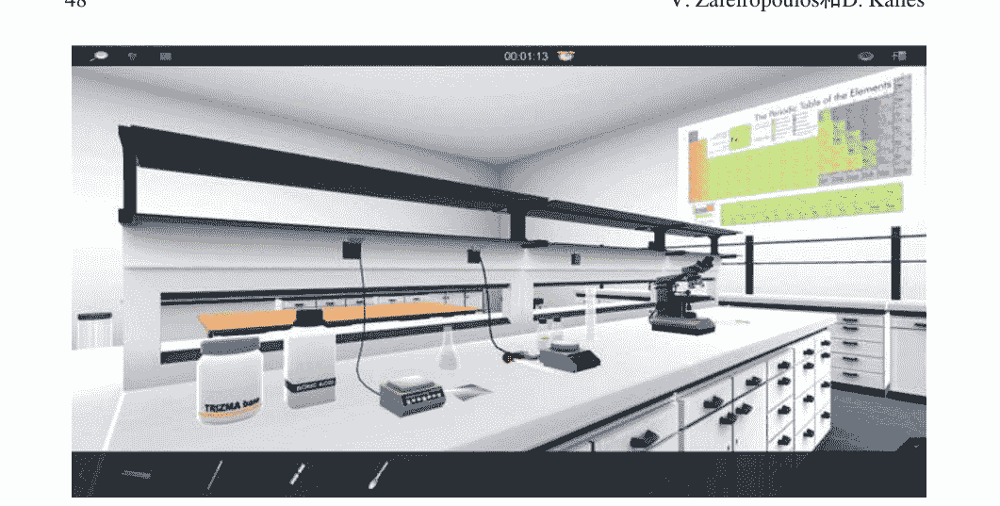

实际上，Onlabs是一个现代冒险游戏，采用最先进的3D图形技术，并通过键盘和鼠标进行交互，用户需要完成特定任务。

### 4.1.1 虚拟实验室的目的和发展

科学大学面临的挑战是培养学生成功利用实验室进行实验的能力。然而，事故和设备损坏的风险始终存在，这限制了仪器的充分使用。同时，远程大学的科学学生面临额外的障碍，例如很少使用现场实验室设施，因此培训效果不佳。

出于这些原因，希腊开放大学（HOU）开发了一个3D虚拟生物实验室Onlabs，供学生在使用现场实验室之前使用。Onlabs为学生提供了使用虚拟实验室设备进行实验和通过试错学习的机会。

Onlabs一直在高端3D游戏引擎Hive3D<sup>1</sup>（2012-2015）和Unity（2016至今）的支持下进行开发。其最新稳定版本2.1.2的屏幕截图发布于2019年11月，在图4.1中展示。目前，3.0版本的测试版也可用，预计2021年发布稳定版。

<sup>1</sup>由希腊雅典的电脑游戏公司Eyelead发布。

### 4.1.2 不同的游戏模式

Onlabs最新版本2.1.2包含两个不同的模拟实验步骤和三种不同的游戏模式。这些步骤包括对测试样本进行显微镜观察，用户需要设置显微镜，创建测试样本，并使用光学显微镜的所有物镜进行观察；以及制备500毫升10倍TBE水溶液，用户需要在电子天平上称量17.4克硼酸和54克Trizma Base粉末，用磁力搅拌器将其溶解在水中，并添加额外的水和EDTA pH 8.0到产生的溶液中。游戏模式包括指导模式，用户通过语音和文本指导完成所选的步骤，每次只能执行建议的移动；评估模式，用户可以在所选的步骤中进行任意移动，并获得他们表现的评估；以及实验模式，用户可以进行任何操作（只要游戏中包含），并处理来自两个步骤的所有仪器和设备，而不受评估。Onlabs版本2.1.2可以从项目网站下载和运行。2

Onlabs版本3.0包含两个新的实验步骤，分别取代了版本2.1.2中的步骤；显微镜检查，主要包括对以前版本的测试样本进行显微镜检查，以及电泳，其第一部分是制备500毫升的10倍TBE水溶液。

除了上述的学生版本，我们还发布了Onlabs机器学习版本1.0，顾名思义，用于机器学习培训。Onlabs ML 1.0只涉及显微镜检查程序，而不是实验模式的玩耍，它包含了一个新的计算机训练模式。事实上，后者包含两种不同类型的训练；评估者的训练，包括人类用户进行多次游戏后对评估机制进行校准；以及机器人的训练，在所选的实验步骤中，机器人或者按照计算机游戏的术语来说，是一个非玩家角色（NPC），执行随机动作并同时进行训练。评估者的训练可以使用交互式遗传算法（GA），即调整为监督学习的遗传算法，或者在人工神经网络（ANN）上进行反向传播，而机器人的训练则使用强化学习（RL）进行。

在本文中，我们在介绍Onlabs的概念设计和嵌入式评估机制后，提出了两种用于评分员培训的机器学习技术。

### 4.1.3 评估

Onlabs的第一个版本v0.1于2013年发布，由HOU的本科生生物学学生进行了测试和评估；评估中使用了1996年John Brooke开发的系统可用性问卷（SUS）[1]。
评估结果表明，Onlabs易于使用，并且后来使用现场生物实验室的学生表现出了提高的性能[2, 3]。 此后，版本0.2、0.2.1和0.2.3也通过调整后的问卷被其他大学的本科生和高中科学教师进行了评估。 评估结果与版本0.1的评估结果相似。

2017年发布的2.1版本进行了更全面的评估。 关于测试样本的显微镜实验程序，与常规现场实验室教程方法相比，使用Onlabs和运行Skype会话的教育方法进行了比较和检验。 参与的学生产生了一些特定的学习结果，后来通过预测试和后测试进行了评估。预测试分数证实使用Onlabs的学生扩展了他们的基线知识，而后测试明确表明使用Onlabs的学生的表现优于未使用Onlabs的学生的表现[4, 5]。

## 4.2 背景和相关工作

作为一个冒险游戏，Onlabs非常适合作为人工智能代理训练的测试平台；事实上，早在2000年代，冒险游戏就被提出用于这个目的[6, 7]。 各种机器学习技术已经在专门为此目的设计的冒险游戏应用中使用。 其中之一是由Thomaz和Breazeal开发的Sophie's Kitchen[8, 9]。 在那里，一个代表机器人Sophie的NPC的目标是将必要的配料组合在一起，在烤箱中烘烤蛋糕；Sophie的训练所使用的机器学习方法是强化学习。

冒险游戏，特别是基于文本的游戏，最近被提出作为潜在的机器学习测试平台。 在基于文本的冒险游戏中，实际上已经应用了各种机器学习技术来训练NPC，例如深度强化学习[10, 11]和人工神经网络[12, 13]。

尽管人工神经网络由于其黑盒特性而在计算机游戏中并不流行[14]，但在游戏中已经进行了各种研究和应用，用于对手的分类[15]，街机游戏关卡的探索[16]以及NPC的战斗或逃跑反应的控制[14]。 在过去的二十年中，遗传算法也被提出用于计算机游戏，用于调整NPC的行为[15, 17-19]。

遗传算法模拟生物进化；因此，它们与监督学习没有直接联系。然而，交互式遗传算法，它们是适用于监督学习的一种特殊类型的遗传算法，在几项研究中已经被提出[20-23]。我们在Onlabs中使用的遗传算法就是这种类型的算法。

## 4.3 虚拟实验室的架构

正如在介绍中提到的，Onlabs的最新稳定版本2.1.2有三种不同的模式；指导、评估和计算机培训。我们依次演示它们。然而，我们首先需要阐明我们虚拟实验室的架构，这些模式都是基于这个架构以及计算机培训模式中使用的机器学习算法。在本节中，我们展示了Onlabs的概念设计及其嵌入式评估机制。

### 4.3.1 概念设计

Onlabs的虚拟环境是离散的，意味着各种可交互的对象和仪器部件彼此不同，并且可以通过特定的操作由用户处理。它也是确定性的，意味着在给定状态下，对该对象或另一个对象进行新操作后，会产生一个唯一定义的新状态，并且通过推理，环境的整体状态也是唯一定义的。根据Russell和Norvig[24]的标准，Onlabs的虚拟环境被分类为离散和确定性。

在Onlabs的虚拟环境中存在各种实体。这些实体可以是字符，即由人类用户控制的自我角色，也可以是由具有人工智能的计算机控制的NPC，或者是物体。实体在设计和开发方面都以类的形式表示。类是抽象的，每个类代表一个或多个相关的实体。例如，各种瓶子（水瓶，EDTA瓶）是瓶子类的实例。

此外，一个类可以是另一个通用类的特殊化，即具有各种特定特征以及通用特征；例如，瓶子类是容器类的特殊化。出于简单起见，每个实体都将以其类名提及，除非涉及两个或多个相关实体，此时将使用它们的名称。

通过自我角色和NPC，人类用户和计算机可以对可交互对象执行特定操作。这些操作包括拾取（将对象放入库存）、按下（按下按钮、开关或触发器）、释放（释放按下的按钮、开关或触发器）、旋转（旋转旋钮）、提取（从其位置中取出物体，例如从插座中取出插头），旋转（旋转一个可以旋转的物体，例如一个带有水的体积圆柱，以便溶解其中的粉末）和与（将一个物体与另一个物体结合）。一个类可以具有定性特征，其可接受的值是字母数字或定量特征，其可接受的值是数值。例如，定性的状态特征的交流开关类（表示显微镜的交流开关）可以取值为“开”和“关”，而定量的位置特征的孔径旋钮（表示显微镜的孔径旋钮）可以取0到40之间的整数值。这些值可以直接通过人类用户通过自我或计算机通过NPC对相应的对象执行的操作来更改（例如，通过按下显微镜的交流开关，其状态特征会从“关”变为“开”或从“开”变为“关”，取决于其先前的值）；或者间接地，通过对其他对象执行的操作来更改特征值同时导致所讨论的特征值的更改（例如，通过旋转显微镜的粗调焦旋钮，其角度特征正在改变以及舞台底座的高度特征，导致后者上下移动）。

实体的基于特征的架构遵循Poole和Mackworth的指南[25]。我们关于Onlabs概念设计的过去工作[2, 3]也可以在我们的网站上访问。

### 4.3.2 状态转换图

为了描述Onlabs实体的各种字母数字特征值的变化，我们使用状态转换图（STD）的符号表示。通常，STD用于表示时间关键和时间无关系系统中的状态变化[26]。它们也被称为状态图（SD），但我们选择了STD变体，以便强调Onlabs中的转换（因此，引起转换的动作）。此外，STD对于领域专家（在我们的情况下是生物学家）来说是一个有用的工具，他们大部分时间都没有计算机科学知识，可以借助知识工程师和程序员的帮助来建模他们的实验。

在我们的STD设计中，状态由圆圈表示，转换由箭头表示；从哪个状态开始的转换箭头被称为初始状态这个特定转换的状态，而它导致的状态被称为最终状态。图4.2和4.3

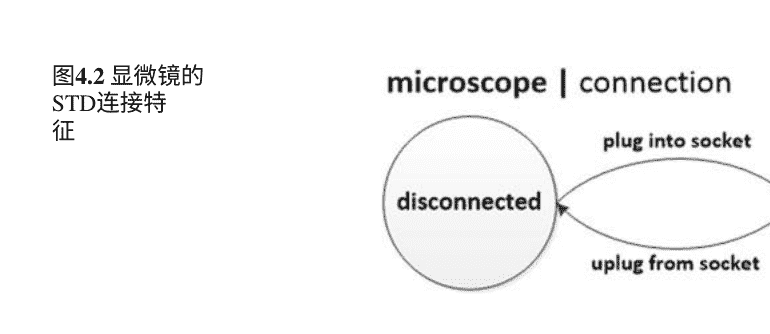

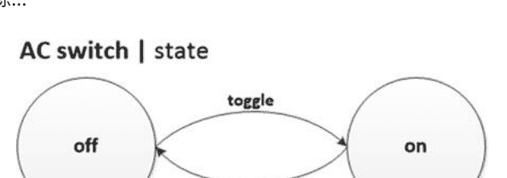

分别代表显微镜的STD连接和交流开关的STD状态（不要与STD的状态概念混淆）。
实体特征的状态之间的转换可以由用户对该特定实体执行的操作或对另一个实体执行的操作触发，后者的特征状态更改会发送信号，最终到达该实体。例如，在显微镜交流开关的状态（图4.2）的情况下，两个切换都是由对交流开关的按下操作触发的；另一方面，在显微镜的连接（图4.3）的情况下，插入插座转换是通过使用显微镜的插头插入插座触发的，而从插座拔出则是通过对插头的拔出操作触发的，前提是插头之前已经连接到插座。


上述的状态转换图是二进制的，从一种状态转变为另一种状态。
然而，在Onlabs的设计中，并不是所有的状态转换图都是这样的。例如，滑动的条件特征的状态转换图（如图4.4所示）包含四种不同的状态和连接它们的单向转换路径。

### 4.3.3 高级设计

到目前为止，Onlabs的设计关注的是各种实验室对象及其属性和操作；换句话说，它是低层次的。为了使设计符合分层代理架构[25]，还必须引入更一般任务的高层描述，这些任务由自我角色执行。
高层设计有两种形式，分别对应于相应的播放模式：指导和评估。
在指导模式下，用户每次只能执行被引导的动作。引导同时发生在两种情况下，文本和音频，它特别遵循实验的步骤。 这种设计的关键是一个状态机，由一个特定的STD组成，用于Ego角色的状态特征，它类似于指称各种无生命实体的低级特征，但比它们更抽象和通用。

在评估模式下，用户可以自由进行任何操作，但同时也会对每个操作进行评估。 与指导模式类似，但更加复杂，这种设计基于一个通用的评估算法，考虑到实验的重点步骤。

### 4.3.4 状态机

为了说明指导模式下的状态机，将对显微镜检查过程进行检查。 后者包括打开显微镜并测试其各个部分，使用纸屑和水创建一个测试样本，并使用所有目标镜头（4X、10X、40X和100X）对其进行显微观察。

根据HOU的生物实验室手册，成功完成上述一系列任务所需遵循的特定步骤如表4.1所示。

这25个步骤实际上被编码到Ego的状态特征的相应转换中（图4.5）。 如图4.5所示，Ego的状态转换图是非分支的和单向的，意味着每次只允许进行特定的动作；例如，在开始时，只允许使用显微镜插头与插座连接，这会产生“将显微镜连接到插座”的转换，并从“开始”状态转移到“显微镜连接到插座”状态。 然而，也有一些步骤允许多个动作；例如，在“进入显微镜模式”状态下，允许处理4个不同的实体（具体来说是旋转、粗调焦旋钮、细调焦旋钮、载物台旋钮、准直器旋钮、左眼镜和右眼镜），它们的正确调整会导致“使用4倍镜头进行聚焦”的转换，并最终达到“使用4倍镜头进行聚焦”的状态。

显然，一旦进行了转变，就没有逆转的方法。 对于我们处理的指令模式来说，这种限制显然是必要的。

虽然乍一看，自我（Ego）的状态转换图（STD）看起来与物体的状态转换图相似，但它与它们有两个关键的区别。 第一个区别是我们已经提到过的，即物体的状态转换图转换对应于单个动作，而自我的转换也可能涉及一组动作。 另一个区别是，与各种物体特征不同，自我（Ego）的状态转换图（STD）的状态命名是传统的，并且只与自我角色要遵循的步骤有关。 例如，“连接显微镜到插座”状态的命名仅仅是根据导致该状态的“连接显微镜到插座”转换，并且显然并不意味着在所有后续状态中显微镜没有连接到插座；相反，它仍然连接到插座，直到新的转换导致其断开连接，而在我们的情况下，这是图表中的最后一个转换。

| 序号 | 步骤 |
| :--- | :--- |
| 1 | 将显微镜连接到插座 |
| 2 | 打开显微镜灯 |
| 3 | 将光强度设置为最大值的3/4 |
| 4 | 将光圈完全打开 |
| 5 | 将凹透镜提升到顶部位置 |
| 6 | 设置4倍放大镜为活动状态 |
| 7 | 测试粗调焦轮 |
| 8 | 测试细调焦轮 |
| 9 | 测试镜台旋钮 |
| 10 | 测试标本架旋钮 |
| 11 | 准备测试标本* |
| 12 | 将测试标本放在镜台上 |
| 13 | 进入显微镜检查模式 |
| 14 | 使用4倍放大镜进行焦点调整 |
| 15 | 设置10倍放大镜为活动状态* |
| 16 | 使用10倍放大镜进行焦点调整 |
| 17 | 设置40倍放大镜为活动状态* |
| 18 | 使用40倍放大镜进行焦点调整 |
| 19 | 设置100倍放大镜为活动状态* |
| 20 | 使用100倍放大镜进行焦点调整 |
| 21 | 退出显微镜检查模式# |
| 22 | 收集标本# |
| 23 | 关闭光圈# |
| 24 | 关闭灯光# |
| 25 | 将显微镜从插座断开连接# |

### 4.3.5 个体得分

正如我们已经提到的，我们为Onlabs设计的个体评分用于评估模式下用户的评估，即评估人类用户在特定实验过程中的表现，并用于训练模式下评分者的训练，即校准使用的两种评估机制。 这些是个体评分或人工神经网络中的加权平均的权重；前者的权重通过使用交互式遗传算法进行校准，而后者的权重校准则使用反向传播算法进行。

个体评分应该在0到1之间，这样它们的加权平均值也在0到1之间。显然，0和1分别是个体评分可以获得的最差和最佳值。

# Ego | state (microscoping)

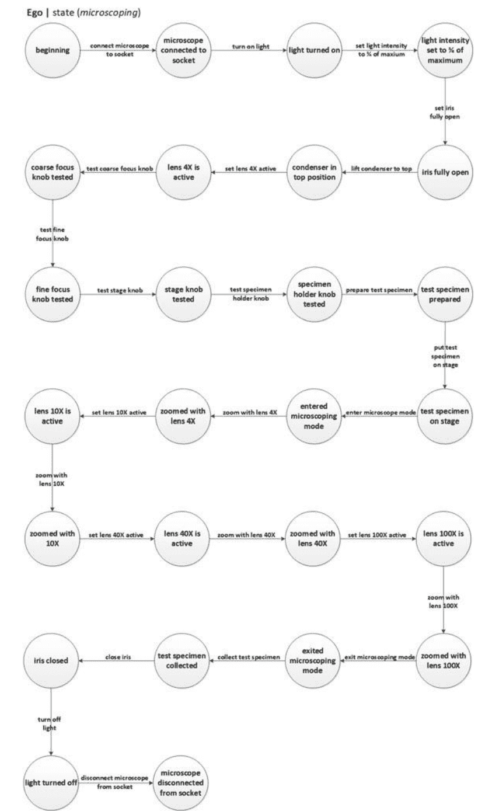

#### 图4.5 微观过程的自我状态特征STD

#### 表4.2 成功完成显微镜检查的必要步骤

| 序号 | 步骤描述 |
| :--- | :--- |
| 1 | 将显微镜连接到插座<br>显微镜 \|连接状态 \quad \quad ← '连接到插座' |
| 2 | 打开显微镜灯<br>交流开关\|状态 \quad ← '开启' |
| 3 | 将光强度设置为最大值的2/3<br>光强度旋钮\|位置 \quad ← ¾ •最大位置 |
| 4 | 将光圈完全打开<br>光圈旋钮 \quad\|位置 \quad ← 最大位置 |
| 5 | 将凹透镜提升到最高位置<br>凹透镜 \quad\|高度 \quad ← 最大高度 |
| 6 | 设置4倍放大镜头为活动状态<br>旋转鼻片\|活动焦点 \quad ← 4 |
| 7 | 测试粗调焦旋钮<br>粗调焦旋钮\|已测试 \quad ← '是' |
| 8 | 测试细调焦旋钮<br>细调焦旋钮\|已测试 \quad ← '是' |
| 9 | 测试镜台旋钮<br>镜台旋钮\|已测试 \quad ← '是' |
| 10 | 测试样品支架旋钮<br>测试样品旋钮\|已测试 \quad ← '是' |
| 11 | 将测试样品放在舞台上<br>舞台\|附着样品 \quad \quad ← '是' |
| 12 | 进入显微镜模式<br>自我\|模式 \quad ← '显微' |
| 13 | 使用4倍放大镜进行焦点调整<br>显微镜视图\|清晰度 [旋转鼻片\|主动对焦 = 4] ← 1 |
| 14 | 使用10倍放大镜进行焦点调整<br>显微镜视图\|清晰度 [旋转鼻片\|主动对焦 = 10] ← 1 |
| 15 | 使用40倍放大镜进行焦点调整<br>显微镜视图\|清晰度 [旋转鼻片\|主动对焦 = 40] ← 1 |
| 16 | 使用100倍放大镜进行焦点调整<br>显微镜视图\|清晰度 [旋转鼻片\|主动对焦 = 100] ← 1 |

我们现在将通过显微镜检查过程来描述我们的个人评分架构。成功完成该过程所需的必要步骤列在表4.2中，该表包含表4.1中除了标有星号(*)或井号(#)的步骤之外的步骤；前者在评估模式下被认为是多余的设计，而后者则由一个单独的子进程处理，即仪器重置，这将在后面讨论。

我们用 $x_k$ 来表示个体得分，其中 $k = 1...n$ 表示要改变的特征数量（在我们的例子中为16个）。

表4.2中的大多数值是定量的，而其中一些是定性的。为了计算列表中所有特征的个体得分，我们需要进行量化、归一化和综合评估的过程。下面我们通过表格中的各种例子来描述这些过程。

### 4.3.6 量化

表4.2中的第1步是将显微镜的连接状态特征分配为‘连接到显微镜’的值。连接状态特征只能取两个定性值：‘断开连接’和‘连接到插座’。为了量化它们，我们只需将‘断开连接’转换为0，将‘连接到插座’转换为1。当显微镜未插入时，它的连接状态的个体得分为0，当它插入插座时，得分为1。类似的是对交流开关状态特征的量化。由于其可接受的值为'OFF'和'ON'，因此分别转换为0和1。同样地，当没有样本附着时，舞台上的附着样本特征的量化值为0，否则为1。同样地，我们对表4.2中提到的其他特征的值进行量化。

### 4.3.7 归一化

前一小节中的三个示例都涉及到量化值，其值既不是0也不是1。由于个别分数必须在0到1之间，这些值已经被标准化，其中0是每个特征的初始量化值，而1是其最佳值（显微镜的连接状态，交流开关的状态，舞台上的附着样本）。然而，我们有一些特征的取值不在0到1的范围内。这是光圈旋钮的位置特征，作为显微镜的机械部件，其作用是调节通过载物台的灯光并照射到附着的样本。该特征的整数值范围为0到40，对应旋钮从右到左的41个不同位置（0表示光圈完全关闭且没有光通过，40表示光圈完全打开）。我们需要将这些值归一化到[0, 1]的区间内。可以通过一个归一化函数来实现，该函数以位置值作为参数，当位置值为0时返回0，当位置值为40时返回1。一个满足此目的的函数如下所示：

$$f(x) = \frac{1+a}{1+c \cdot (x-40)^2} - a$$

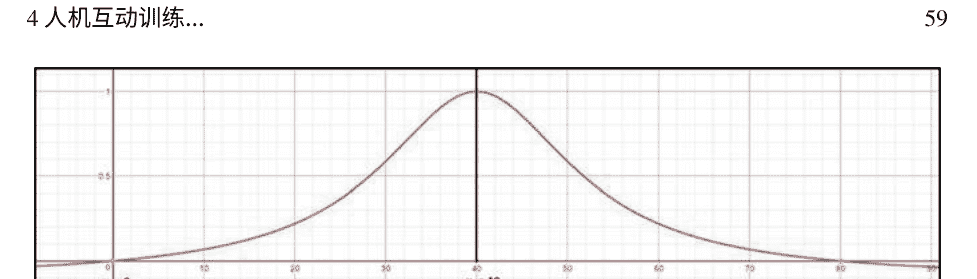

图4.6 函数f(x)的图像（用于光圈旋钮位置的归一化，a = 0.104, c = 0.006）

其中

$$a = 0.104，c = 0.006$$

图4.6展示了函数f的图像。

其余特征的数值归一化以类似的方式实现。

### 4.3.8 综合评估

我们处理的典型复合评估是显微镜视图的清晰度特征，出现在表4.2的最后四个步骤中。根据它们的描述，这些步骤中的每一个都涉及使用不同的目镜：4X、10X、40X和100X。

显微镜视图的清晰度特征是对每个镜头的对焦程度的定量测量。它主要基于模糊度，考虑到各种旋钮（粗调焦旋钮、细调焦旋钮、准直旋钮、左眼镜和右眼镜）的位置，计算最终图像在0到1的模糊程度；然而，它还依赖于几个其他“外部”特征值的得分：交流开关的状态、光强旋钮的位置和光圈旋钮的位置，它们的计算已经定义。

为了计算清晰度的值，在目标镜头4倍放大下，我们首先需要定义模糊度的效果。由于模糊度本身的范围是从0到1，其中0是最佳值，1是最差值，我们需要对其进行“矫正”，使得0和1对应于彼此的值，即1是最佳值，0是最差值。这可以通过从1中减去模糊度值来轻松实现：

$$\text{效果（放大视图}_{4X}\text{|模糊度）} = 1 - \text{放大视图}_{4X}\text{|模糊度}$$

然后，通过将模糊度的效果与“外部”特征值的分数相乘，计算清晰度的综合得分。例如，在目标镜头4倍放大的情况下，我们有：

$$\text{得分(显微镜视图 4X|清晰度 )} = \text{效果 (显微镜视图 4X|模糊度 )}$$

*   得分 (交流开关|状态)
*   得分 (光强旋钮|位置)
*   得分 (光圈旋钮|位置)

或者，使用实际数字作为索引：

$$x_{13} = \text{效果 (显微镜视图}_{4X} \text{ |模糊度 )} \cdot x_{2} \cdot x_{3} \cdot x_{4}$$

通过允许“外部”值对其进行贡献，可以看出复合评估的清晰度得分的有用性；每个值的得分越高，最终图像就越清晰，具体而言，如果它们都等于1，则清晰度的得分仅取决于模糊度的值，而如果其中任何一个为0，则清晰度的得分也变为0。

### 4.3.9 成功率

在计算个体分数 $x_k$ 之后，得到的是 *success rate*，它结合了前者。正如本节开头提到的，使用了两种不同的技术：加权平均和ANN。

### 4.3.10 加权平均

正如其名称所示，加权平均是每个个体分数的总和乘以定义其相对重要性的权重除以这些权重的总和：

$$\text{success rate} \leftarrow \frac{\sum_{k=1}^{n} w_{k} \cdot x_{k}}{\sum_{k=1}^{n} w_{k}}$$

由于个体分数的范围是从0到1，它们的加权平均也是如此。因此，*success rate*被限制在[0, 1]区间内。

### 4.3.11 人工神经网络

除了将成功率定义为加权平均之外，也可以通过ANN生成。

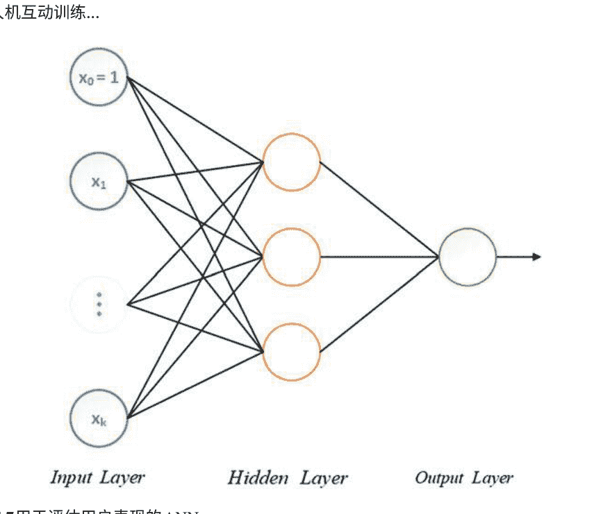

图4.7 用于评估用户表现的ANN

我们设计的ANN用于此目的的是一个三层结构；它包含 $k + 1$ 个输入单元在第一层（每个个体分数 $x_k$ 和一个偏置单元为 $k$ 个单位），第二层（隐藏层）有3个单元，第三层有一个输出单元，而其隐藏层和输出单元的压缩函数是sigmoid函数。成功率被设置为输出层单元的归一化值。$^3$图4.7显示了我们ANN的结构。

$^3$与加权平均不同，人工神经网络（ANN）不会产生在[0, 1]区间内的值，因此需要单独进行归一化处理。

### 4.3.12 惩罚分数

在实践中，成功率衡量了各种特征值与其最佳值之间的“距离”，即在相关过程成功完成时所取得的值。然而，它并不衡量达到这些最佳值的顺序；换句话说，必要步骤的顺序。例如，在我们的显微镜操作案例中，如果用户先打开了交流开关（表4.1中的步骤2），然后再将显微镜插头插入插座（表4.1中的步骤1），成功率将与按正确顺序执行这些步骤（即步骤1在步骤2之前）时相同；然而，总体得分肯定会较低。

为了这个目的，如果一步走错了顺序，就会被罚款并加到之前分配的罚款总和中。具体来说，当进行一个 i-索引步骤时，系统会检查在之前的 k-索引步骤（k < i）中相关特征值是否最优，如果有任何一个不是最优的，整体的罚分将会按照以下方式更新：

$$\text{罚分} \leftarrow \text{旧罚分} + \sum_{k=1}^{i} [u_k \cdot (1 - x_k)] \quad (4.1)$$

### 4.3.13 综合得分

在评估模式下完成游戏会话后，用户会收到综合得分，该得分范围从0到1，但也受到其他因素的影响，这些因素与后者相乘。

首先，综合得分会考虑到罚分，这在前一小节中有描述。罚分越高，我们希望成功率越低。

其次是 Δ时间，存储从会话开始到结束经过的秒数减去完成实验过程所需的最短时间。与罚分一样，Δ时间值越大，成功率减少得越少。

最后，将仪器的重置视为一个单独的子过程，我们将其定义为各个仪器组件恢复到其原始状态的程度。与成功率的定义类似，我们计算各个单独重置值的（非加权）平均值。单独重置值是相应特征 x_i 的“反向”得分。例如，对于AC开关的状态特征，当状态为“关闭”时，其单独得分为0，当状态为“打开”时，其单独重置值则相反，即为1。最后，我们将平均值缩放到[0.8, 1]范围内，因为我们不希望它对成功率值产生过大的影响，从而得到最终的重置率值。

一个基本的公式，用于保证前述条件的聚合分数，范围从0到1：

$$\text{聚合分数} \leftarrow e^{-\text{惩罚分数}/\beta} \cdot e^{-|\Delta \text{时间}|/\gamma} \cdot \text{成功率} \cdot \text{重置率}$$

或者：

$$\text{聚合分数} \leftarrow e^{\frac{-\text{惩罚分数}}{\beta}} \cdot e^{\frac{-|\Delta \text{时间}|}{\gamma}} \cdot \text{成功率} \cdot \text{重置率}$$

其中 $\beta$ 和 $\gamma$ 是正常数。

## 4.4 机器学习算法

在展示了Onlabs的概念建模和嵌入式评估机制之后，现在是时候介绍我们用于改进后者的机器学习技术了。

### 4.4.1 加权平均的遗传算法

我们首先选择成功率作为加权平均值。

正如前面提到的，在训练模式下，我们可以使用人工专家的反馈和交互式遗传算法来校准加权平均值的权重。遗传算法通常属于无监督学习的范畴，使用固定的适应度函数来选择新一代的成员。然而，我们的遗传算法是交互式的，换句话说，它是有监督的，意味着它的适应度函数受到专家对用户表现的评估的影响。

我们提醒您，成功率由以下公式给出：

$$success\ rate \leftarrow \frac{\sum_{k=1}^{n} w_k \cdot x_k}{\sum_{k=1}^{n} w_k} \quad (4.2)$$

其中，$x_k$是个体得分，$k = 1 \dots n$。

成功率中的权重 $w_1, w_2, \dots, w_n$ 表示其各自个体得分的重要性。我们将权重向量 $\vec{w}$ 定义为：

$$\vec{w} = (w_1, w_2, \dots, w_n)^T \quad (4.3)$$

首先，我们随机生成一个由 $p$ 个权重向量组成的种群，$\vec{w^1}, \vec{w^2}, \dots, \vec{w^p}$，或简写为，$\vec{w^i}$，其中 $i = 1 \dots p$。对于每个权重向量，将(4.3)特化，我们得到：

$$\vec{w^i} = (w_1^i, w_2^i, \dots, w_n^i)^T \quad (4.4)$$

现在将(4.2)转化为向量形式，我们得到：

$$success\ rate \leftarrow \frac{\vec{w^i} \cdot \vec{s}}{\|\vec{w^i}\|_1}$$

其中 $\|\vec{w^i}\|_1$ 是一阶范数 $\vec{w^i}$ 向量，等于 $\sum_{k=1}^{n} w^i_k$。

第一代权重向量是通过创建一组权重向量来产生的 $\vec{w^1}, \vec{w^2}, ..., \vec{w^p}$，它们的分量随机取值从0到100。

我们的遗传算法的适应度函数应该（以概率的方式）选择哪些权重向量在下一代中存活，无论是整体还是通过与其他权重向量的交叉。因此，它必须考虑到特定权重向量产生的成功率如何能够逼近专家给出的分数。

在训练模式下完成一次游戏会话后，计算机计算各个个体得分 $x_i$ 和由专家提供的结果 success rate 评估。

$$\vec{x} = (x_1, x_2, ..., x_n)^T$$

为了简化起见，假设只有一个会话被播放，因此只有一个得分向量 $\vec{x}$，将该会话的专家得分表示为 $ES(\vec{x})$，我们将定义一个通用形式的适应度函数：

$$\text{通用适应度} \left( \vec{w^i} \right) = 1 - \left| ES(\vec{x}) - \frac{\vec{w^i} \cdot \vec{x}}{\|\vec{w^i}\|_1} \right| \quad \quad \quad (4.5)$$

通用适应度函数在产生的成功率等于专家得分时取得最大值1，当这两个量彼此“远离”时，取得最小值。

当然，一个单一的分数向量，也就是一个单一的游戏会话或者在机器学习术语中，一个单一的训练数据集，对于我们的遗传算法来说是不够的。因此，我们进行了多个游戏会话，并获得了一系列的分数向量 $\vec{T}$，以及它们各自的专家分数，$ES \left( \vec{x^j} \right)$。调整通用的适应度函数在（4.5）中对于每个分数向量 $\vec{x^j}$，我们有：

$$\text{适应度}_j \left( \vec{w^i} \right) = 1 - \left| ES \left( \vec{x^j} \right) - \frac{\vec{w^i} \cdot \vec{x^j}}{\|\vec{w^i}\|_1} \right| \quad \quad \quad (4.6)$$

一个明显的整体适应度函数的权重向量 $\vec{w^i}$ 是（4.6）中描述的各种适应度函数的平均值。因此，我们定义：

$$\text{适应度}\left(\vec{w^i}\right) = \frac{\sum_{j=1}^{l} \text{适应度}_j\left(\vec{w^i}\right)}{l} = 1 - \frac{\sum_{j=1}^{l} \left| ES\left(\vec{x^j}\right) - \frac{\vec{w^i} \cdot \vec{x^j}}{\|\vec{w^i}\|_1} \right|}{l}$$

其中 $l$ 是不同分数向量或训练样本的数量。

我们上面定义的通用适应度函数（因此也是整体适应度函数）是负线性的。我们还定义了三个替代的通用适应度函数；一个负二次函数，$1 - \left( ES(\vec{x}) - \frac{\vec{w^i} \cdot \vec{x}}{\|\vec{w^i}\|_1} \right)^2$；一个负指数函数，$e^{-\lambda \cdot \left| ES(\vec{x}) - \frac{\vec{w^i} \cdot \vec{x}}{\|\vec{w^i}\|_1} \right|}$；以及一个逆向的 $\frac{1}{\lambda \cdot \left| ES(\vec{x}) - \frac{\vec{w^i} \cdot \vec{x}}{\|\vec{w^i}\|_1} \right|}$ （$\lambda$ 是一个大于1的常数）。

与负线性通用适应度函数一样，这三个新函数在专家得分与由$\vec{w^i}$权重向量产生的得分之间的距离增加时递减。其中，逆向通用函数是递减最快的；其次是负指数函数；第三是负线性函数；最后是负二次函数。

对于这三个新的通用适应度函数，总体适应度函数的生成方式与第一个函数类似。用户可以使用任何这些通用适应度函数。要繁殖的新一代必须由相同数量的权重向量组成，即 $p$。其中一部分将是当前一代的权重向量的“重复”（选择操作），另一部分将是在这些选定的权重向量中随机配对产生的“繁殖”（交叉操作）。

首先，我们计算当前一代每个权重向量的选择概率：

$$\text{Pr}\left(\vec{w^i}\right) = \frac{\text{适应度}\left(\vec{w^i}\right)}{\sum_{k=1}^{p} \text{适应度}\left(\vec{w^k}\right)}$$

为了创建新一代，我们现在定义一个表示可替换权重比例的比率 $r$（对于所有一代都相同），即权重向量不会在新一代中存活下来。然后，我们应用选择操作；也就是说，根据它们的选择概率从当前一代中选择$(1 - r) \cdot p$个权重向量，并将它们“复制”到新一代中。

在交叉操作中，从父代中选择一对权重向量（包括之前选择的那些）以及它们的选择概率，进行交叉操作，并将它们的后代（每对两个）放入新一代中。

最后是变异操作。将变异率设置为 m，我们以均匀概率选择在这一新一代中创建的 m 百分比的权重向量进行变异。

我们并没有定义只有一种类型的变异，而是有三种；基因（权重值）的加倍；基因的减半；以及染色体（权重向量）中两个基因的置换。用户可以选择其中任何一种，就像选择一个通用的适应度函数一样。

相同的过程正在进行所有的世代。当遇到终止条件时，遗传算法停止。我们将后者设置为特定数量的世代的产物。

我们的遗传算法遵循Michell的原型遗传算法[27]。

### 4.4.2 使用反向传播训练人工神经网络

我们现在定义成功率为我们在图4.7中所示的ANN的输出。要学习的ANN的权重总数为42（从输入单元到每个3个隐藏层单元的17个权重，以及从后者到输出层单元的3个权重）。我们ANN中使用的训练数据集除了分数向量之外别无他物，由不同的游戏会话产生，也在我们的遗传算法中使用。我们训练ANN的反向传播算法版本是包含两层Sigmoid单元的前馈网络的随机梯度下降算法，如Michell [27]所描述。由于一次反向传播执行对于所有训练数据集来说不足够，我们让算法运行多个时期。

## 4.5 实施

Onlabs的实现是在Unity游戏引擎下使用C#编程语言完成的。在下面的子章节中，我们将介绍Onlabs机器学习版本1.0的每个特定模式。

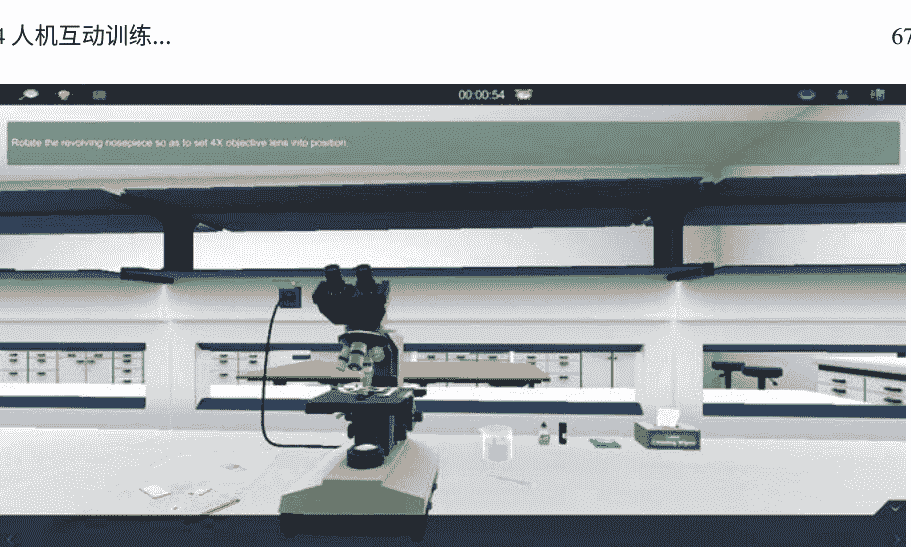

图4.8 指令模式

### 4.5.1 指令模式

如前所述，指导模式包括计算机通过文本和语音建议特定操作，用户只能执行该操作。文本出现在顶部的横幅上，如图4.8所示。

如果指导信息不足够，用户可以按工具栏上的提示按钮（带有灯泡图标的按钮）获取新的详细指示信息。

### 4.5.2 评估模式

在评估模式下，用户可以自由进行任何操作，同时实时评估其表现。实时评估以成功率和罚分的形式进行，并显示在右上角的框中（图4.9）。

当用户完成时，他们应该按下工具栏上的“最终评估”按钮（由图表图标表示），以获得关于他们的综合得分和所有组成部分的整体评估，如图4.10所示。

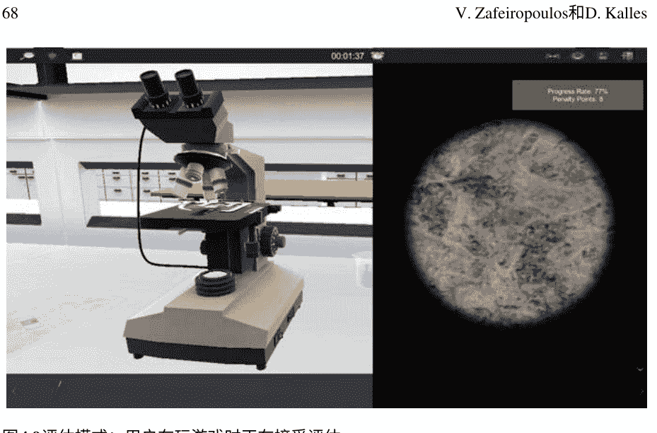

图4.9 评估模式：用户在玩游戏时正在接受评估

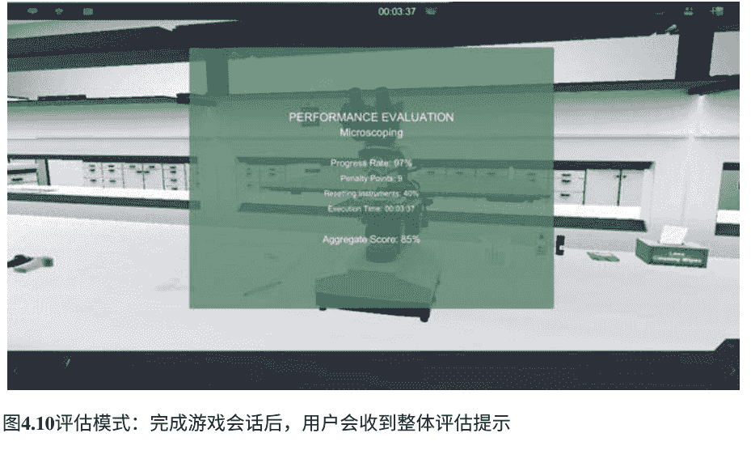

图4.10 评估模式：完成游戏会话后，用户会收到整体评估提示

### 4.5.3 计算机训练模式

计算机训练模式包括两个独立的子模式；训练数据收集，用户进行一次游戏会话，人类专家对前者的成功率进行评估（不是惩罚点数），以及机器学习，评估者即计算机的嵌入式评估机制之一，通过使用已经收集的训练数据进行训练。

图4.11计算机训练模式/训练数据收集：在收集训练数据时，专家被要求在每次游戏会话完成后提供自己的评估。

### 4.5.4 训练数据收集子模式

当用户完成一次训练模式的游戏会话时，会出现一个评估面板，在该面板中，专家被要求提交自己的评估，评估范围从0到100，稍后缩放到0-1范围并与本次会话中的个人得分一起保存。个人得分和专家评估构成了一个单一的训练数据集。新的游戏会话会产生新的训练数据集，所有这些数据集都将被我们的机器学习算法使用。专家还需要根据他们的评估选择一个‘低’、‘中’或‘高’的性能分类；例如，‘低’分类与专家评估的10%一致，‘中’分类与40%一致，‘高’分类与75%一致。专家的评估面板如图4.11所示。

### 4.5.5 机器学习子模式

当收集到足够的训练数据时，用户可以使用加权平均或反向传播在人工神经网络上开始评分员训练过程。

在执行加权平均值的遗传算法时，用户被要求定义种群成员数量（p）、交叉率（r）、变异率（m）以及遗传算法运行的代数数量，同时还需要定义通用适应度函数和变异方法（图4.12）。在执行人工神经网络的反向传播算法时，用户需要输入偏差和迭代次数（图4.13）。

图4.12 用户被要求输入遗传算法训练参数的值

图4.13 用户被要求输入人工神经网络训练参数的值

训练完成后，用户将收到一个包含各个数据分组的均方误差的表格。图4.14和4.15分别显示了人工神经网络和遗传算法在不同参数值下的训练结果表格。如图4.14所示，在GA的情况下，原始直观权重向量与生成的权重向量之间的相似性也显示出来。此外，在两种机器学习情况下，用户被询问是否要保存生成的权重，以便在评估模式的相应评分机制中使用。此外，除了在屏幕上显示的均方误差的简要表格外，还生成了一个更详细的逗号分隔值（.csv）文件，其中包含这些均方误差在每一代或时期中的演变。

```
Population Members: 30, Crossover Rate: 0.9, Mutation Rate: 0.1, Generations: 50
Generic Fitness Function: Negative Linear, Mutation Method: Permutation of two Genes

Trained and tested on ALL (resubstitution): MSE = 0.037533
Trained and tested on ALL (cross-validation): MSE = 0.050712

Trained and tested on Expert 1 (resubstitution): MSE = 0.087757
Trained and tested on Expert 2 (resubstitution): MSE = 0.058621
Trained and tested on Expert 3 (resubstitution): MSE = 0.016959
Trained and tested on Expert 4 (resubstitution): MSE = 0.006149

Trained and tested on Expert 1 (cross-validation): MSE = 0.069722
Trained and tested on Expert 2 (cross-validation): MSE = 0.076669
Trained and tested on Expert 3 (cross-validation): MSE = 0.026980
Trained and tested on Expert 4 (cross-validation): MSE = 0.013794

Trained on Expert 2, Expert 3, Expert 4, tested on Expert 1: MSE = 0.089651
Trained on Expert 1, Expert 3, Expert 4, tested on Expert 2: MSE = 0.062137
Trained on Expert 1, Expert 2, Expert 4, tested on Expert 3: MSE = 0.027048
Trained on Expert 1, Expert 2, Expert 3, tested on Expert 4: MSE = 0.006589

Trained on MEDIUM, HIGH, tested on LOW: MSE = 0.025905
Trained on LOW, HIGH, tested on MEDIUM: MSE = 0.054233
Trained on LOW, MEDIUM, tested on HIGH: MSE = 0.067915

Similarity of GA weight vector and intuitive weight vector: 82.67%

Save weights (all-resubstitution) for Evaluation Mode? No
```

图4.14 GA训练中各数据分组的均方误差

## 4.6 训练-测试过程和结果

在前一节中，我们详细描述了评分员培训子模式中使用的机器学习算法。在本节中，我们将介绍训练和测试过程以及各个训练会话产生的均方误差（MSE）的结果。但首先，我们需要参考我们收集的训练数据。

### 4.6.1 训练数据

正如我们在本章前面提到的，每个训练数据集由一个人类用户在一次游戏会话中获得的个体分数以及由人类专家给出的他们获得成功率的估计组成，同时还包括专家的姓名以及会话的‘低’、‘中’或‘高’分类。

为了我们的研究目的，我们请希腊开放大学的4位生物专家对我们的60个游戏会话进行评估。具体而言，每位专家评估了15个游戏会话。在这15个会话中，有5个被分类为‘低’，5个被分类为‘中’，另外5个被分类为‘高’。因此，总共有20个会话被分类为‘低’，20个被分类为‘中’，20个被分类为‘高’。

图4.15 ANN训练中各种数据分组的均方误差

### 4.6.2 在各种数据集组上进行训练和测试

为了进行训练和测试，我们形成了各种数据集的组。

在第一种“乐观”的情况下，我们对所有数据集应用重新训练，即在它们上训练我们的系统并测试训练结果，得到相应的均方误差（MSE）。然后，我们对所有数据集应用交叉验证，即在一些数据集上进行训练并在其余数据集上测试结果。

在交叉验证中，用于训练和测试的数据集组的形成方式如下：从每个专家中，我们选择一个被分类为“低”的数据集，另一个被分类为“中”的数据集，以及一个被分类为“高”的数据集；总共我们有一个包含12个数据集的组，平均分配给4个专家和3个分类。然后，我们同样从每个专家中选择另外3个数据集（不是之前选择的那些），并形成一个具有上述属性的第二个组，包含12个数据集。我们重复这种选择过程3次，最终得到5个包含一个“低”、一个“中”并从每个专家中选择一个'高'数据集。因此，在所有数据集的交叉验证中，我们在其中选择4组进行训练，并在所有可能的组合中测试其对应的第5组，并计算它们的均方误差的平均值。

之后，我们在每个专家中进行重新替换和交叉验证。与之前的分组方式类似，我们从每个专家中形成5组，每组中包含一个'低'、一个'中'和一个'高'的数据集；同样，我们每次在其中4组进行训练，并在对应的第5组进行测试，并计算它们的均方误差的平均值。

然后，在所有专家之间进行交叉验证，即在与3个专家对应的所有数据集上进行训练，并在所有组合中进行测试。

最后，我们在分类之间进行交叉验证，即在属于任意2个选择的分类之下的数据集上进行训练，并在所有可能的组合中测试其对应的第3个分类。

### 4.6.3 遗传算法结果

我们尝试了许多可能的组合，使用不同数量的种群成员、交叉率、变异率和世代数，以及各种不同的通用适应度函数和排列方法。

对于一个特定的情况，即逆线性适应度函数和基因减半作为变异方法，我们实现了收敛。在这种情况下，我们得到了大约0.004和0.003的收敛程度，分别对应于重新训练和交叉验证，如图4.16所示。

图4.16 GA的MSE与世代数图（对数刻度），用于所有数据集的重新训练和交叉验证（种群成员：100，交叉率：0.9，变异率：0.01，世代数：2000，通用适应度函数：逆，变异方法：基因减半）

图4.17 GA的MSE与世代数图，用于所有数据集的重新训练和交叉验证（种群成员：100，交叉率：0.9，变异率：0.01，世代数：2000，通用适应度函数：负线性，变异方法：两个基因的排列）

在其他情况下，没有达到收敛。没有收敛的典型行为是具有排列两个基因作为变异方法的负线性通用适应度函数，如图4.17所示。

### 4.6.4 人工神经网络训练结果

与遗传算法相比，在人工神经网络训练案例中，大多数数据集组的收敛是可以实现的。

图4.18显示了在所有数据集上进行重新替代和交叉验证的MSE到Epochs图（偏差：1，epochs：2000）；在重新替代的情况下，图形无限收敛，而在交叉验证的情况下，收敛在大约第400个epoch达到最大，并从那一点开始稍微发散。

在单个专家的数据集中，重新替代和交叉验证案例表现出相同的行为。图4.19显示了我们的一个专家的相应MSE到Epochs图，偏差和epochs相同。

在专家之间的交叉验证也会在前400-800个时期内收敛，然后稍微发散，然后在某一点后再次收敛，如图4.20所示。

相反，在不同分类之间的交叉验证中没有可靠的收敛或根本没有收敛，如图4.21所示。

## 4.7 结论

Onlabs是一个类似冒险游戏的3D虚拟实验室，由希腊开放大学开发，供其生物学学生在使用现场实验室之前接受培训。其最新稳定版本2.1.2包括两个实验步骤，即显微镜观察测试样本和10X TBE溶液制备。除了简单的自由实验和指导模式外，Onlabs还提供评估模式，其中用户根据其表现进行评估，并提供独立的机器学习版本1.0的培训模式，在该模式中，评估机制使用加权平均值上的交互式遗传算法和我们为此目的设计和实施的ANN上的反向传播进行重新配置。

目前，训练模式只涉及显微镜检查程序。

图4.20 ANN训练的MSE与Epochs图-专家之间的交叉验证（偏差：1，epochs：2000）

图4.21 ANN训练的MSE与Epochs图-分类之间的交叉验证（偏差：1，epochs：2000）

我们短期内的目标之一是扩展训练模式，使其包括10倍TBE溶液制备程序以及Onlabs beta版本3.0中实施的电泳程序。最近，我们还完成了NPC显微镜检查程序的强化学习算法的设计和实施，并计划将其扩展到其他程序。在开发方面，我们计划为化学和物理提供更多的实验程序，并部署新的虚拟实验室。

致谢本研究得到了“人力资源发展、教育和终身学习”运营计划的共同资助，并得到了欧洲联盟（欧洲社会基金）和希腊国家资金的共同资助。

## 参考文献

- 1. J. Brooke，SUS-一个快速而简单的可用性评估量表，在工业可用性评估中，由P.W. Jordan, B. Thomas, I.L. McClelland, B.A. Weerdmeester (Taylor & Francis, 伦敦, 英国, 1996年)，第7页
- 2. V. Zafeiropoulos, D. Kalles, A. Sgourou，通过游戏学习：开发面向教育目的的交互式生物实验室模拟平台，在交互式多媒体系统的实验中进行战略创新 (2016年)，第204-221页
- 3. V. Zafeiropoulos, D. Kalles, A. Sgourou, A. Kameas，冒险风格的严肃游戏用于科学实验室，在教育社区中的开放学习和教学中，由C. Rensing, S.de Freitas, T. Ley, P.J. Muñoz-Merino编辑 (Springer International Publishing, 2014年)，第538-541页
- 4. E. Paxinou, A. Karatrantou, D. Kalles, C. Panagiotakopoulos, A. Sgourou，作为生物课程补充教育准备工具的3D虚拟现实实验室。欧洲。J.开放, Dist. E-learn。 21 (2018年)
- 5. E. Paxinou, V. Zafeiropoulos, A. Sypas, C. Kiourt, D. Kalles，评估虚拟化物理实验室的影响。 arXiv:1711.11502 [cs] (2017)
- 6. E. Amir, P. Doyle，冒险游戏：认知机器人的挑战。美国人工智能协会。8 (2002) (www.aaai.org)
- 7. B. Hlubocky, E. Amir，冒险游戏中的知识收集代理人 (2004)
- 8. A.L. Thomaz, C. Breazeal，与人类教师进行强化学习：有关学习性能的反馈和指导的证据，见第21届全国人工智能大会，卷1 (AAAI出版社, 2006)，pp. 1000–1009
- 9. A.L. Thomaz, C. Breazeal，可教导的机器人：理解人类教学行为以构建更有效的机器人学习者。人工智能。 172，716–737 (2008)。 https://doi.org/10/d49w2c10
- 10. P. Ammanabrolu, M. Riedl，使用基于图的深度强化学习玩文本冒险游戏，见2019年北美计算语言学协会会议：人类语言技术，卷1 (长篇和短篇)(计算语言学协会，明尼阿波利斯，明尼苏达州, 2019)，pp. 3557–3565。 https://doi.org/10/gf9fzz
- 11. K. Narasimhan, T. Kulkarni, R. Barzilay，使用深度强化学习进行基于文本的游戏的语言理解。 arXiv:1506.08941 [cs]. (2015)
- 12. B. Kostka, J. Kwiecien, J. Kowalski, P. Rychlikowski，高洛文的基于文本的冒险AI代理，在2017年IEEE计算智能和游戏会议 (CIG) (2017)，pp. 181–188。 https://doi.org/10/gf9fz2
- 13. D. Robitzski，一个神经网络在你玩游戏时构思这个文字冒险游戏。 https://futurism.com/text-adventure-game-neural-network。最后访问于2019年10月5日
- 14. M.S. Robbins，使用神经网络来控制代理威胁响应，在Game AI Pro 360: Tactics and Strategy Guide，由S. Rabin编辑。 (CRC Press, 2019)， p. 242
- 15. D. Charles, C. Fyfe, D. Livingstone, S. Mc Glinchey (eds.)，生物启发的计算机游戏人工智能。 IGI Global (2008)。 https://doi.org/10.4018/978-1-59140-646-4
- 16. J.J. Luo，神经网络玩视频游戏的探索。 https://towardsdatascience.com/an-exploration-of-neural-networks-playing-video-games-3910dcee8e4a。最后访问时间2019年9月26日
- 17. A. Arora，使用遗传算法自动化Chrome恐龙游戏（第2部分）， https://heartbeat.fritz.ai/using-genetic-algorithms-to-automate-the-chrome-dinosaur-game-part-2-1c0007334297。最后访问时间2019年9月26日
- 18. V.G. de Mendonça, C.T. Pozzer, R.T. Raittz，游戏中遗传算法的框架。在 (2008) 展示
- 19. M. Martin，使用遗传算法创建自适应敌人AI, https://www.gamasutra.com/blogs/MichaelMartin/20110830/90109/Using_a_Genetic_Algorithm_to_Create_Adaptive_Enemy_AI.php。最后访问时间2019年9月26日
- 20. D. Gong, J. Yuan, X. Ma, 具有大规模种群的交互式遗传算法, 在2008年IEEE进化计算大会 (IEEE世界计算智能大会) (2008年), 第1678-1685页。 https://doi.org/10/fg8fhb
- 21. W.M. Spears, K.A. De Jong, 使用遗传算法进行监督式概念学习, 在第2届国际IEEE人工智能工具会议论文集 (1990年), 第335-341页。 https://doi.org/10/fkkp8g
- 22. X. Sun, D. Gong, W. Zhang, 具有大规模种群和半监督学习的交互式遗传算法。应用软计算。 **12**, 3004-3013页 (2012年)。 https://doi.org/10/f34pf6
- 23. X. Sun, J. Ren, D. Gong, 基于半监督学习的变分种群大小的区间适应度交互式遗传算法, 在神经网络进展-ISN N 2010, 编者：L. Zhang,B.-L. Lu, J. Kwok (Springer, 柏林, 海德堡, 2010年), 第288-295页
- 24. S. Russell, P. Norvig, 人工智能: 现代方法(Pearson Education, Upper Saddle River, NJ, USA, 2003)
- 25. D. Poole, A. Mackworth, 人工智能: 计算代理的基础 (Cambridge University Press, New York, NY, USA, 2010)
- 26. E. Yourdon, 现代结构化分析(Yourdon Press, Upper Saddle River, NJ, USA, 1989)
- 27. T.M. Mitchell, 机器学习 (McGraw-Hill Inc, New York, NY, USA, 1997)
- 28. T.M. Mitchell, 机器学习 (McGraw-Hill Inc, New York, NY, USA, 1997)

# 第5章 在教育领域中利用半监督学习的关键调查

Georgios Kostopoulos 和 Sotiris Kotsiantis

摘要 教育数据挖掘和学习分析是两个相关且快速发展的研究领域，旨在从教育数据中提取有意义的信息并提高学习质量。 预测学生学习结果是这些领域面临的最重要问题之一。 有效地解决预测问题包括对给定的标记数据集训练监督学习算法。 在许多实际问题中， 获取足够的标记数据的困难导致了新的机器学习方法的发展， 这些方法通常被称为弱监督学习。 半监督学习和主动学习构成了弱监督学习的主要组成部分， 旨在以最佳方式利用少量标记示例和大量未标记示例来构建高精度和鲁棒性的学习模型。 在过去几年中， 已经开发和实施了大量半监督学习算法， 并在许多科学领域中取得了巨大成功， 包括教育领域。 根据最近的研究， 本研究的主要目的是对半监督学习在教育数据挖掘和学习分析领域的应用进行全面回顾。相关研究的分析表明， 半监督学习对于早期和准确的学生学习结果的预测是一种非常有效的工具， 可以预测传统监督方法的更好结果。

- 教育数据挖掘
- 学习分析
- 半监督学习
- 学生学习成果
- 预测

## 5.1 引言

过去二十年来，教育领域最大的进步之一就是信息与通信技术（ICT）的整合。 如今，ICT已成为教育过程的一部分，为教师和学生提供了各种互动学习环境，以支持教学和学习，并提高教育质量[1]。 因此，关于学生成就、学习行为和机构学习管理系统（LMS）中的在线活动的大量数据不断产生并存储在数据库和信息系统中。 分析不同类型的教育数据并从中提取有价值的信息的必要性促成了两个密切相关且快速发展的研究领域：教育数据挖掘（EDM）和学习分析（LA）[2]。

EDM主要关注在教育数据上开发和实施数据挖掘方法，这些数据来自各种学习环境，用于解决重要的教育问题[3]，而LA主要集中在学习过程中，利用数据分析来加强决策过程[4]。 然而，无论用何种方法处理教育问题，这两个科学领域都有共同的目标：了解学生的学习行为，提高学习过程和教育质量[5]。

最常见的EDM和LA方法之一是预测，其目标是构建一个机器学习模型，训练一个监督算法（例如决策树）在一组标记数据上，然后将其应用于预测未知或未来事件[4]。 例如，预测学生是否会退学或毕业。 不幸的是，在许多实际问题中，由于标记的成本很高，获得足够数量的标记训练数据是困难的，甚至是不可能的。 这一障碍导致了新的机器学习方法的发展，通常被称为弱监督学习[6]。 半监督学习（SSL）和主动学习（AL）是弱监督学习的主要组成部分，旨在利用少量标记示例和大量未标记示例构建高精度和稳健的学习模型。

在过去几年中，大量的SSL方法和算法已经被引入并成功应用于解决许多科学领域中的各种机器学习问题。 因此，最近涌现出了大量关于在教育领域中实施SSL方法的研究，与监督学习相比，取得了非常有希望的结果[7]。 然而，目前缺乏一篇文献综述总结这些研究并介绍最有前景的研究。

为此，本研究的主要目的是在教育数据挖掘和学习分析领域提供一份全面的综述。 此外，我们还打算基于预测的学习结果提出一个分类法。 我们的研究有两个主要问题：

问题1：在教育数据中实施SSL方法时，预测了哪些学习结果？

问题2：使用SSL方法预测学生的学习结果有哪些好处？

研究的剩余部分如下所示：第5.2节致力于自监督学习方法，并介绍了两种代表性的自标记方法：自训练和协同训练。第5.3节讨论了几项研究，主要探讨了自监督学习方法在教育领域中的有效性，主要用于预测问题。最后，第5.5节总结了研究，并考虑了未来工作的新方向。

## 5.2 半监督学习

自监督学习是从有标记和无标记数据中学习的典型例子。由于在许多实际应用中，无标记数据丰富且易于获取，而标记成本相对较高，因此自监督学习近年来在科学家中引起了越来越多的关注。自监督学习的令人印象深刻的发展也受到了其在构建高精度学习模型方面的实际价值以及在理解机器和人类学习方面的理论价值的推动[8]。自监督学习背后的主要概念是在没有人为干预的情况下，自动利用少量有标记示例和大量无标记示例构建强大的学习模型[6]。各种采用自监督学习核心思想的方法学最初被实施并成功应用于解决各种任务，如网络挖掘、文本挖掘、图像处理、信息检索和生物信息学[9]。

根据输出属性的性质，SSL有两种主要形式：半监督分类（SSC）用于离散输出属性，半监督回归（SSR）用于实值输出属性[10]。形式上，SSL设置（图5.1）可以定义如下[6]：

给定一个训练数据集 $D = L \cup U$，其中 $L= \{(x_1, y_1), (x_2, y_2), \dots , (x_k, y_k)\}$ 包含 $k$个标记示例， $U = \{x_1, x_2, \dots , x_m\}$ 包含 $m$个未标记示例，其中 $m \gg k$ ， $x_i \in X$ 且 $y_i \in Y$ ，我们希望学习一个函数 $f : X \rightarrow Y$，用于预测任何新向量示例 $x \in X$（归纳SSL）或任何向量示例 $x \in U$（传导SSL）[11]。

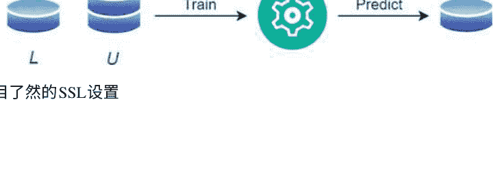

自学习[12]和协同训练[13]是典型的SSC算法，利用未标记数据中隐藏的信息来提高学习性能。 此外，这些算法为进一步发展更复杂和高效的SSC和SSR技术奠定了基础。

自学习或单视图弱监督学习[14]是一种简单且常用的半监督算法，旨在通过迭代学习过程逐渐获得扩大的标记数据集来学习函数 f。 更准确地说，一个有监督算法（例如决策树）在标记数据集 L上进行训练，然后应用于 U。最有信心的预测示例（x， y*） 与 U中的 x ∈U被选择并集成到 L中， h被重新训练，并重复该过程直到满足某个停止准则。自学习是一种包装自标记方法，其有效性强烈依赖于有监督算法 h和学习过程的每次迭代的标记置信度[15]，实际上决定了模型 h的质量[11]。

共同训练是一种代表性的多视图半监督算法，假设每个示例可以由两个独立且不同的特征集表示，这些特征集被称为视图。 两个监督算法 h1和 h2分别在每个视图 V1和 V2上对标记数据集 L进行训练，并将 h1和 h2的最有信心的预测示例集成到另一个算法的训练集中。 最后， h1和 h2在增强的标记数据集上重新训练，并重复该过程，直到满足某个停止准则或 U为空。

由于在大多数实际应用中很难满足存在两个特征视图的假设，因此设计和实现了许多共同训练的改进方法，例如三重训练[16]、 Rasco[17]和Rel-Rasco[18]等。

## 5.3 文献综述

在过去几年中，越来越多的研究探讨了自监督学习方法在教育领域中的有效性，主要用于预测问题。 因此，大量的研究涌现出来，与传统的监督方法相比，展示了非常有希望的结果。 这些研究可以根据以下三个标准进行分类：

- 标准1：预测的学习结果：
  - 表现。
  - 辍学。
  - 年级水平或范围。
  - 绩点值。
  - 其他。

- 标准2：教育水平：
  - 大学。
  - 传统。
  - 开放。
  - 中等教育。
  - 高中。
  - 初中。

- 标准3：机器学习任务：
  - 分类。
  - 回归。

根据第一个标准，这些研究被分为五组，并在以下小节中进行讨论。 这些研究的主要兴趣与分类问题（二元或多类）相关，例如预测学生的表现、辍学和年级水平，尽管原则上它们侧重于大学课程中的学生。

### 5.3.1 性能预测

预测学生表现是教育数据挖掘和学习分析领域的主要兴趣之一 [19]。 我们考虑学生表现任务的两个方面：预测学生是否能通过一门课程或一门课程，以及根据他们的表现将学生分组为两个以上的班级。

在一年的单元课程的期末考试中，我们研究了几种SSL算法的效率 [20]，以识别处于失败风险的本科生。 我们应用了自学习、带有随机特征分割的协同训练、三方训练、带有编辑的三方训练、民主协同学习、Rasco和Rel-Rasco算法，使用四个分类器作为基学习器：朴素贝叶斯（NB）判别器、C4.5决策树、k近邻基于实例的算法和顺序最小化优化（SMO）算法。 SSL算法对于早期预测低绩效者非常有效。在这些方法中，使用三个C4.5决策树作为基分类器的三方训练（为了确保分类器之间的多样性使用了不同的参数）不仅优于其他SSL算法，而且优于C4.5监督分类器。 在相同的任务中，应用了三方训练的变体 [21]。 三个随机森林（RF）分类器被作为基学习器，并将它们的预测结果顺序输入到自学习算法中进行最终估计。

在[22]中，一种将RF分类器作为基学习器的自训练嵌入变体被用于预测大学生在课程结束时的学习状况。 此外，RF分类器由三个决策树组成，这些决策树是从随机特征子集构建的，因此以三训练模式运行。 所提出的方法被证明在检测有失败风险的学生方面非常有效，因为它优于常见的监督和半监督方法。对于相同的任务，在[23]中开发了一种使用三个RF分类器作为基学习器的三训练变体。每个森林由300个决策树组成，而两个特征子集被随机抽样用于节点分割。此外，采用了一种填充方法来利用不完整的数据，根据该方法，在将示例提供给基学习器进行训练之前，使用示例的 $k=3$ 个最近邻的平均值来替换未注册的学生成绩。实验结果显示，在不同的标记数据比例（12.5%，20%，25%和50%）下，预测准确性有所提高。在类似的研究中，应用了同样方法的简化版本，并结合了自训练算法[24]。

提出了两种方法的变体，一种是迭代的，一种是顺序的，而且在实验中未标记示例的百分比范围在50%至95%之间。实验结果显示，随着未标记示例的百分比增加，准确性略有下降，而迭代算法被证明更准确。

在[25]中将迁移学习和协同学习结合起来，用于预测四年制大学课程中学生的学习状态。因此，基于一个程序 $P_1$ 的数据构建了一个学习模型，并相应地应用于预测另一个类似程序 $P_2$ 中的学生学习状态。最后，采用协同训练算法对学生进行三类分类：毕业、学习和停止学习。

最近，根据两个完全不同且独立的特征视图：学术成就和LMS活动，为远程高等教育中学生表现的早期预测制定了一种协同训练方法[7]。进行了大量实验，测试了SSL方法对各种自训练和协同训练变体以及协同森林算法的有效性。此外，采用了三种不同的实验场景，考虑了训练数据集中的三种不同标记比例（2.5%，10%和15%）。无论标记比例和基学习器的选择如何，协同训练方法在准确性和F分数方面都优于其他SSL算法。值得注意的是，该方法在准确性和F分数方面优于常见的监督分类方法，如RF，NB，$k$-NN ($k=5$) 和Extra Trees。

### 5.3.2 丢弃预测

学生辍学是高等教育中的一个重大问题，尤其是在开放式大学中[26]。在这方面，[27]中研究了SSL方法的效率，用于预测远程高等教育课程中可能辍学的学生。在三个连续的时间段内，进行了大量实验，将学年分为三个阶段。采用两个熟悉的分类器（即C4.5和NB）作为基学习器，形成了几种SSC算法。实验结果表明，在学年中期之前，三种训练和自我训练方法产生了非常可靠的预测，准确度在71.74%至76.73%之间。

### 5.3.3 年级水平预测

在[28]中应用了几种SSC算法，用于推断高中学生在学年末数学模块考试中的班级成绩（即差、良好、很好、优秀）。实验结果表明，在学年中期，自我训练、三种训练和协同训练（以NB算法为基分类器）的准确度值在64.41%至67.35%之间。基于这项研究的发现，在[29]中实施了三种集成的SSC方法，分别采用自我训练、协同训练和三种训练作为基学习器。每种方法中，通过多数投票将三个分类器（C4.5、SMO和逻辑模型树（LMT））的预测结果进行组合，从而产生集成的最终输出。针对三种不同的标记比例（10%、20%和30%），进行了多次实验，突出了基于集成的SSL方法在准确预测学生班级成绩方面的优势。

研究了社交影响对基于校园社交行为预测学生年级水平的影响[30]。为此，根据学生的校园日常活动，为每个学生创建了一个社交网络。此外，发现社交关系紧密的学生往往具有相似的学业表现。最后，使用不同的标记比例（16%，32%，48%，64%，80%）对标签传播算法进行训练，并用于预测学生的最终年级水平（使用了四个等级的平均绩点）。

### 5.3.4 平均绩点值预测

重要的是，我们区分了三个研究，这些研究涉及SSR方法在预测任务中的开发和部署。第一项研究提出了在半监督设置中扩展监督多任务回归，用于预测中学生的考试成绩[31]。更准确地说，对于每个学习任务，都将高斯过程（GP）作为基本回归器，并假设所有任务的核参数具有共同的先验。在此基础上，利用未标记的数据进行适当的径向基函数（RBF）核函数调整。此外，采用成对信息来提高预测准确性，利用未标记数据中隐藏的信息。实验结果显示该方法在标准化均方误差（MSE）方面具有优势。

在[10]中引入了一种基于集成的SSR算法，称为多方案半监督回归方法（MSSRA），用于预测一年级课程的本科生在期末考试中的成绩。通过自我训练方案，在迭代学习过程中利用未标记的数据，部署了三个k-NN回归器来增加标记数据集。最后，采用RF回归器构建回归模型。所提出的SSR算法优于常见的回归方法（即RF，线性回归（LR） k-NN， M5规则， M5模型树和SMOreg）在四个指标（平均绝对误差（MAE）， 相对绝对误差（RAE）， 均方根误差（RMSE）和皮尔逊相关系数（PCC））方面进行了比较。

最近，一个多视角半回归算法被用于预测一年远程学习课程的期末考试成绩[32]。为此，采用了COREG算法的变体（CO-training REgressors）[33]，并对学年中间之前的两个时间段进行了预测。此外，该研究探讨了输入属性对目标属性的影响，从而产生了大量关于它们对SSR模型输出影响的可解释性图表。实验结果表明，在第一学期的两个必修书面作业中取得高分的学生表现最好。

### 5.3.5 其他研究

此外，还有一些与自动评分、问题解决性能、概念提取和结果挖掘相关的研究。在[34]中开发了一种半监督聚类方法，用于自动评分学生的简答题答案。根据这种方法，相似的答案应该被分组在一起，因为它们具有高度的相似性。在[35]中还提出了一种半监督方法，用于预测学生在叙事中心学习环境中解决问题和活动时的表现。在[36]中设计了一个半监督框架，用于从MOOC文本内容中提取概念。最后，在[37]中引入了一种结合期望最大化（EM）技术的SSC模型，用于挖掘不同学科教材中的结果和先决条件。

### 5.3.6 讨论

从上述研究的分析中可以得出的第一个结论是，SSL能够利用标记和未标记数据中隐藏的信息，得到非常准确的预测学习模型。在大多数研究中，SSL算法能够产生非常准确的预警模型，及时预测学生可能面临学业失败的风险，从而能够及时采取支持措施和专门的干预策略，改善他们的学习表现。这些发现为关注此领域的科学家和研究人员开辟了新的视野和挑战。

此外，很明显不同的SSL方法已经被应用，其中大部分包括自我训练和协同训练的概念。然而，在所有数据集中，并没有一个单一的自标记方法表现最好。这显然取决于研究中使用的数据集，以及形成输入属性集的学生特征。其中一些研究仅使用与学生学习期间成绩相关的输入属性。值得一提的是，两项研究[7,10]利用了广泛的属性范围，包括人口统计数据、学习者的学术成就和大学LMS中的在线活动数据。最后，综述表明大部分研究涉及SSC方法的实施，而SSR迄今为止还没有得到足够的关注。此外，预测学生表现在其他输出属性中突出显示。

上述讨论的所有研究都总结在表5.1中，包括每个研究中使用的数据集结构、教育水平、输出属性类型、数据挖掘任务、用于构建预测学习模型的SSL方法和使用的评估指标的信息。最后一列涉及对学生学习结果的早期预测的可能性。

## 5.4 半监督学习在教育领域的潜力

考虑以下问题：我们有一个集合

```
L = \{(x_1, y_1), (x_2, y_2), \ldots, (x_k, y_k)\}
```

包含 k个标记实例，对应于大学课程中 k名学生在特定时间段内的情况，例如在上一个学年。每个实例

```
x_i = (x_{i1}, x_{i2}, \ldots, x_{in})
```

是一个 n维向量，表示学生的特征，以下简称为输入属性，其中 x_{ij}表示第 i个学生的第 j个特征的值。输出属性 Y指的是课程期末考试中学生的表现。 在这个问题中， Y是一个二元分类属性，其取值为

```
y_i \in \{pass, fail\}
```

我们还有一个集合

```
U = \{x_1, x_2, \ldots, x_m\}
```

对应于当前学年中同一课程中已注册的 m名学生的 m个未标记实例，其中每个实例 x_i也是一个具有相同特征的 n维向量。在这种情况下，我们希望准确预测学生在即将到来的考试中的表现（即输出属性 Y的值），这些考试将在学年末举行。

表5.1总结了在EDM和LA领域中讨论的SSL研究

| 论文 | #输入特征 | #实例 | 教育水平 | 输出特征和值 | 任务 | SSL方法 | 度量 | 早期预测 |
| :--- | :--- | :--- | :--- | :--- | :--- | :--- | :--- | :--- |
| [20] | 15 | 344 | 开放大学 | 单元表现 (及格, 不及格) | 分类 | 自训练, 民主, 协同训练, 三方训练, 去三方训练, Rel-Rasco, Rasc | 准确率, 特异性 | 是的 |
| [21] | 8 | 553 | 传统大学 | 单元表现 (及格, 不及格) | 分类 | 三训练 | 准确率 | 是的 |
| [22] | 43 | 1334 | 传统大学 | 课程表现[毕业, 学习, 第一次警告, 第二次警告, 停止学习] | 分类 | 自我训练 | 准确率 | 是的 |
| [23] | 43 | 1334 | 传统大学 | 课程表现[毕业, 学习, 第一次警告, 第二次警告, 停止学习] | 分类 | 三训练 | 准确率 | 是的 |
| [24] | 43 | 1334 | 传统大学 | 课程表现[毕业, 学习, 第一次警告, 第二次警告, 停止学习] | 分类 | 自我训练 | 准确率 | 是的 |
| [25] | 28 | 1317 | 传统大学 | 课程表现[毕业, 学习, 停止学习] | 分类 | 共训练 | 真阳率, F分数, AU | 是的 |
| [7] | 50 | 1073 | 开放大学 | 单元表现 (及格, 不及格) | 分类 | 共训练 | 准确率, F分数 | 是的 |
| | 28 | 186 | | | | | | (续)## 表5.1（续）

| 论文 | #输入特征 | #实例 | 教育水平 | 输出特征和值 | 任务 | SSL方法 | 度量 | 早期预测 |
|------|------------|-------|----------|--------------|------|---------|------|----------|
| [27] | 15 | 344 | 开放大学 | 辍学 {是，否} | 分类 | 自我训练，共训练，去三训练，Rel-Rasco，三训练，民主 | 准确率 | 是的 |
| [28] | 10 | 340 | 高中 | 等级水平 {0-9,10-14,15-17,18-20} | 分类 | 自我训练，共训练，去三训练，Rasco，三训练，民主 | 准确率 | 是的 |
| [29] | 10 | 799 | 高中 | 等级水平 {0-9,10-14,15-17,18-20} | 分类 | 自我训练，共训练，三训练 | 准确率 | 否 |
| [30] | 不适用 | 5388 | 传统大学 | 等级水平 {I, II, III, IV} | 分类 | 标签传播 | 精确率 | 否 |
| [10] | 90 | 1073 | 开放大学 | 考试成绩 [0, 10] | 回归 | MSSRA | MAE, RAE, RMSE, PCC | 是的 |
| [31] | 8 | 15,362 | 中等教育 | 考试成绩 N/S | 回归 | 半监督多任务回归 | MSE | 否 |
| [32] | 26 | 1073 | 开放大学 | 考试成绩 [0, 10] | 回归 | Coreg | MAE | 是的 |

这个问题可以通过以下传统的监督方法来解决：

-   在 \(L\) 上训练一个分类算法 \(c\)，用于构建一个分类模型 \(h\)，然后在 \(U\) 上应用该模型来预测当前学生的表现。

这种方法通常会导致非常高效的学习模型，因为它利用了关于学生的所有可用信息来创建模型，但在学年结束时（图5.2）。因此，预测时间点不留给及时识别薄弱学生并为他们提供支持的余地。此外，就在考试前告诉学生他/她很可能会失败，这是相当不符合教学原则的。

-   在 \(L\) 的一个子集 \(L_i \subseteq L\) 上训练一个分类算法 \(c\)，通过限制关于学生的可用信息到一个特定的子时期 \([0, t_i]\)，例如学年的第一个学期（图5.3）。然后，将生成的分类模型 \(h\) 应用于 \(U_i\) 来预测学生的表现。通过这种方式，可以及时预测出表现不佳的学生并提供有效的干预措施。

然而，现有的数据 \(L\) 和 \(U\) 尚未充分利用。

值得注意的是，在这两种情况下，未标记的数据集 \(U\) 在训练过程中不被使用。一般来说，这些情况会导致三个主要的缺点：

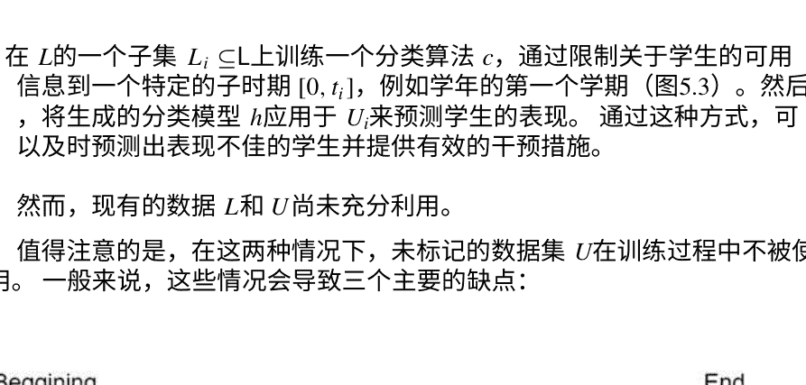

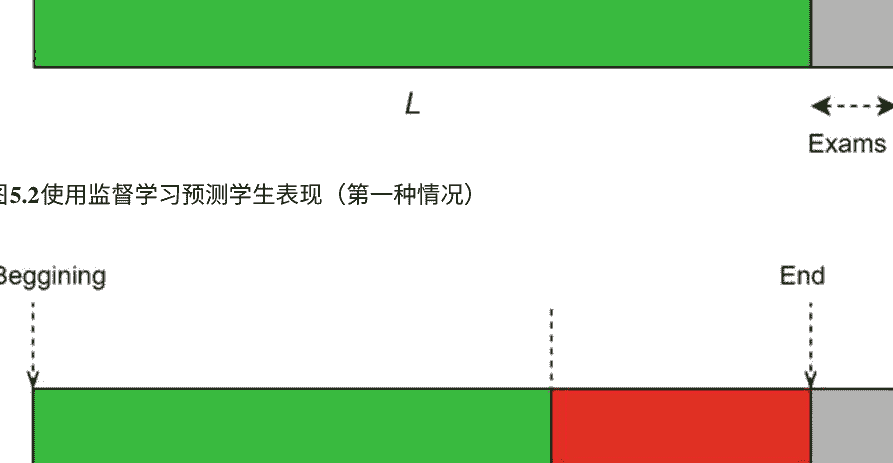

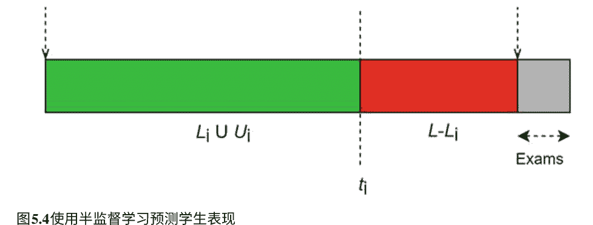

图5.4 使用半监督学习预测学生表现

-   1. 训练监督算法 \(c\) 需要足够数量的标记数据。
    2. 传统的监督方法通常利用关于学生的所有可用信息构建非常高效的学习模型，但是在学年结束时。不幸的是，这些方法并没有强调问题的早期预测方面。
    3. 未标记的数据集 \(U\) 没有被使用。

半监督学习是利用数据集L和 U并提高学习性能的适当方法[8]。为此，首先在 \(L_i\)上训练一个监督分类算法 \(c\)，然后将其应用于 \(U_i\)上对未标记数据进行分类（图5.4）。

最有信心的预测被整合到 \(L_i\)和 \(c\)中，并通过迭代学习过程进行重新训练。这种方法利用了关于上一学年和当前学年学生的所有可用信息。以这种方式开发的学习模型在大多数情况下提高了预测性能，展示了自监督学习在准确和及时预测学生学习成果方面的潜力。在其他一些情况下，它以较少的标记示例实现了与监督模型相同的性能，从而降低了训练成本[8]。

通过这种方式，得到一个数据集

```
$L = \{x_i, y_i\}_{i=1}^k$
```

由这些值组成

```
$\{x_i\}_{i=1}^k = \{(x_{i1}, x_{i2}, \ldots, x_{in})\}_{i=1}^k$
```

关于 \(k\)个输入属性 \(X_1, X_2, \ldots\) 的值 , \(X_n\)，关于上一学年或学期中一门课程中 \(k\) 个学生的特征，以及输出属性 \(Y_{(i.e. 学习成果)}\)的值，可以形成标记的数据集 。此外，还有一个数据集

$U = \{x_i\}_{i=1}^m$

由这些值组成

$\{(x_{i1}, x_{i2}, \ldots, x_{in})\}_{i=1}^m$

对于当前学年或学期中同一门课程中注册的 \(m\) 学生的相同输入属性，可以形成无标签的数据集。

最后，一个监督算法在 \(L \cup U\) 上进行训练，用于构建分类或回归模型 \(h\)。

所提出的方法可以有效处理预测问题的时间视角，从而及时支持和有效干预容易失败的学生。在这种情况下，生成的模型可以作为一个早期预警系统。

我们需要做的是选择一个时间段 \([0, t_i]\)，这将得到一个非常准确的预测模型，并将其应用于预测学生的学习成果。此外，我们可以通过将预测模型应用于下一个时间段 \([t_i, t_{i+1}]\) 来确定对特定群体的支持策略的有效性。

在某些情况下，一个课程在学术年度之间或学习周期之间不涉及相同的输入属性，迁移学习[38]可以帮助利用从一个学习周期中提取的知识，以改善学习模型在下一个学习周期中的预测性能，结合目标记方法。

## 5.5 结论

半监督学习在过去几年中受到了机器学习研究人员的广泛关注，它融合了监督和无监督范式的概念。因此，大量的SSL方法和算法已经被引入和成功应用于解决许多科学领域中的各种机器学习问题，其中包括教育领域。在本研究中，我们努力扩展当前研究，并对EDM和LA领域中的SSL应用进行全面回顾。为此，我们讨论了大量值得注意的研究，并根据每个研究中的预测学习结果进行了分类。

总的来说，该评论强调了SSL方法在教育领域中构建高效预测模型的潜力。更重要的是，这些模型可以作为及时预测学生失败风险的早期警报系统，为低绩效者提供适当的帮助和干预策略。大多数研究中的实验结果表明，SL方法在从标记和未标记数据中提取有用知识、解决重要教育问题和支持决策过程方面优于代表性的监督方法。

对于未来的工作，我们考虑在教育领域建立可解释和可解释的学习模型的问题。简单来说，我们的目标是理解机器学习模型在预测学生学习结果时的预测情况（例如，为什么学生未通过期末考试），并提取更有价值的信息。

## 参考文献

-   1. F. Mikre, 信息通信技术在教育中的作用：重点回顾计算机和互联网。埃塞俄比亚教育科学杂志**6**（2），109-126（2011）
-   2. C. Romero，S. Ventura，教育数据挖掘：现状综述。IEEE Trans. Syst. Man, Cybern. Part C（应用评论）**40**（6），**601-618**（2010）
-   3. C. Romero, S. Ventura, 教育数据挖掘. RWiley Interdiscip. Rev. Data Min. Knowl. Discov. **3**(1), 12–27 (2013)
-   4. G. Siemens, R.S.J. d Baker, 学习分析和教育数据挖掘: 走向沟通和合作, in *Proceedings of the 2nd International Conference on LearningAnalytics and Knowledge*(2012), pp. 252–254
-   5. C. Romero, S. Ventura, 教育数据挖掘和学习分析: 一份更新的调查. Wiley Interdiscip. Rev. Data Min. Knowl. Discov. **10**(3), e1355 (2020)
-   6. Z.-H. Zhou, 弱监督学习简介. Natl. Sci. Rev. **5**(1), 44–53 (2018)
-   7. G. Kostopoulos, S. Karlos, S. Kotsiantis, 多视角学习用于学术预测的案例研究. IEEE Trans. Learn. Technol. **12**(2) (2019)
-   8. X. Zhu, A.B. Goldberg, 半监督学习导论. Synth. Lect. Artif. Intell. Mach. Learn. **3**(1), 1–130 (2009)
-   9. O. Chapelle, B. Scholkopf, A. Zien, 半监督学习 (O. Chapelle, et al., eds. 2006) [书评]. IEEE Trans. Neural Netw. **20**(3), 542 (2009)
-   10. G. Kostopoulos, S. Kotsiantis, N. Fazakis, G. Koutsonikos, C. Pierrakeas, 一种用于远程学习课程中学生成绩预测的半监督回归算法. Int. J. Artif.Intell. Tools **28**(4) (2019)
-   11. A.B. Goldberg, X. Zhu, 半监督学习的新方向, 威斯康星大学麦迪逊分校 (2010)
-   12. D. Yarowsky, 无监督的词义消歧与监督方法相媲美, 在计算语言学协会第33届年会上的论文集（1995年），pp. 189–196
-   13. A. Blum, T. Mitchell, 将标记和未标记的数据与共训练相结合, 在计算学习理论第十一届年会上的论文集（1998年），pp. 92–100
-   14. V. Ng, C. Cardie, 无冗余视图的弱监督自然语言学习, 在2003年北美计算语言学协会人类语言技术会议论文集上（2003年）
-   15. J. Tanha, M. van Someren, H. Afsarmanesh, 半监督自训练用于决策树分类器. 机器学习与网络 **8**（1），355–370（2017年）
-   16. Z.-H. Zhou, M. Li, Tri-training: exploiting unlabeled data using three classifiers. IEEE Trans. Knowl. Data Eng. **17**(11), 1529–1541 (2005)
-   17. C. Deng, M.Z. Guo, A new co-training-style random forest for computer aided diagnosis. J. Intell. Inf. Syst. **36**(3), 253–281 (2011)
-   18. Y. Yaslan, Z. Cataltepe, Co-training with relevant random subspaces. Neurocomputing **73**(10–12), 1652–1661 (2010)
-   19. P.M. Moreno-Marcos, C. Alario-Hoyos, P.J. Muñoz-Merino, C.D. Kloos, Prediction in MOOCs: a review and future research directions. IEEE Trans. Learn. Technol. (2018)
-   20. G. Kostopoulos, S. Kotsiantis, P. Pintelas, 使用半监督技术预测远程高等教育中的学生表现, in模型与数据工程(Springer, 2015),pp. 259–270
-   21. V.T.N. Chau, N.H. Phung, 结合自训练和三训练进行课程级别的学生分类, in2018国际工程、应用科学和技术会议(ICEAST)(2018), pp. 1–4
-   22. V.T.N. Chau, N.H. Phung, 一种基于随机森林的自训练算法用于程序级别的学习状态预测: minSemi-RF, in国际多学科趋势人工智能研讨会(2016), pp. 219–230
-   23. V.T.N. Chau, N.H. Phung, 一种基于鲁棒随机森林的三训练算法用于早期问题学生预测, in2017第四届NAFOSTED信息与计算机科学会议(2017), pp. 84–89
-   24. V.T.N. Chau, N.H. Phung, 关于教育数据分类的半监督学习与稀疏数据处理, 国际未来数据与安全工程会议(2017), 第154-167页
-   25. N.D. Hoang, V.T.N. Chau, N.H. Phung, 在学分制学术系统中结合迁移学习和协同训练进行学生分类, 2016年IEEE RIVF国际计算与通信技术、研究、创新和未来愿景会议(RIVF)(2016), 第55-60页
-   26. S. Utami, I. Winarni, S.K. Handayani, F.R. Zuhairi, 谁何时从远程教育中退学? 土耳其在线远程教育杂志21(2), 第141-152页(2020)
-   27. G. Kostopoulos, S. Kotsiantis, P. Pintelas, 使用半监督技术估计远程高等教育中的学生辍学率, 在ACM国际会议论文集, vol. 01–03 Oct (2015)
-   28. G. Kostopoulos, I.E. Livieris, S. Kotsiantis, V. Tampakas, 基于半监督方法提高高中学生的表现, 在2017年第8届信息、智能、系统和应用国际会议(IISA) (2017), pp. 1–6
-   29. I.E. Livieris, K. Drakopoulou, T.A. Mikropoulos, V. Tampakas, P. Pintelas, 一种基于集成的半监督方法用于预测学生的表现, 在《电子学习和教育中的ICT研究》(Springer, 2018), pp. 25–42
-   30. H. Yao, M. Nie, H. Su, H. Xia, D. Lian, 通过构建校园社交网络进行半监督学习预测学术表现, 在2017年国际数据库系统高级应用会议上, 第597-609页
-   31. Y. Zhang, D.-Y. Yeung, 半监督多任务回归, 在2009年欧洲机器学习和知识发现数据库联合会议上, 第617-631页
-   32. S. Karlos, G. Kostopoulos, S. Kotsiantis, 通过半回归方法预测和解释远程高等教育学生的成绩。应用科学。10(23), 8413 (2020年)
-   33. Z.-H. Zhou, M. Li, 带有协同训练的半监督回归。IJCAI 5, 908-913页 (2005年)
-   34. S. Jing, O.C. Santos, J.G. Boticario, C. Romero, M. Pechenizkiy, A. Merceron, 通过半监督文档聚类自动评分MOOC的简答题, 在EDM(2015年), 第554-555页
-   35. W. Min, B.W. Mott, J.P. Rowe, J.C. Lester, 利用半监督学习预测学生在以叙事为中心的学习环境中的问题解决能力, 在国际智能辅导系统会议(2014), pp. 664–665
-   36. Z. Jiang, Y. Zhang, X. Li, Moocon: 一种从Mooc内容中进行半监督概念提取的框架, 在数据库系统高级应用国际会议(2017), pp. 303–315
-   37. I. Labutov, Y. Huang, P. Brusilovsky, D. He. 用于挖掘学习成果和先决条件的半监督技术, 在第23届ACM SIGKDD国际知识发现与数据挖掘会议(2017), pp. 907–915
-   38. M. Tsiakmaki, G. Kostopoulos, S. Kotsiantis, O. Ragos, 从深度神经网络中进行迁移学习以预测学生表现, 应用科学. 10(6) (2020)
-   39. Z.C. Lipton, 模型可解释性的神话 队列 16(3), 31–57 (2018)

## 第三部分

## 机器学习/深度学习

## 在安全领域的应用

## 第6章
辐射数据分析中的机器学习方法调查与
核安全相关


Miltiadis Alamaniotis和Alexander Heifetz

摘要 对于核材料被恶意使用（即恐怖袭击）的担忧日益增加，这引发了对于开发能够在其使用之前检测隐藏核材料的技术的兴趣。检测和识别非报告目的核材料的过程属于核安全的范畴。在多个领域中，辐射数据分析被认为是一个具有高潜力的领域。因此，越来越多地倾向于应用机器学习来开发应用于辐射信号的数据分析方法，以识别与核材料相关的感兴趣的模式。本章旨在提供关于核安全的机器学习和数据分析方法的全面调查和讨论。本章还将讨论进一步的趋势以及如何通过有效分析辐射数据进一步增强核安全。

关键词 机器学习·数据分析·核安全·辐射数据

## 6.1 引言

2001年9月11日，纽约发生了一起历史性的恐怖袭击，不仅造成了数千人的伤亡，还成为了修订我们社会安全架构和识别其中漏洞和脆弱性的转折点[1]。在考虑的各种情景中，最令人恐惧的是使用核材料进行恐怖袭击[2]。这样做的后果是

M. Alamaniotis (✉)
德克萨斯大学圣安东尼奥分校电气与计算机工程系，1 UTSA Cir.，圣安东尼奥，TX 78249，美国电子邮件：miltos.alamaniotis@utsa.edu

A. Heifetz
阿贡国家实验室核科学与工程部，阿贡，IL 60439，美国
电子邮件：aheifetz@anl.gov

攻击被认为是极其严重的，对社会安全感产生了长期的负面影响[3]。因此，遏制核恐怖主义对于发展核安全的深度防御架构至关重要。

在这种核安全架构中，核材料的保护起着重要的作用。通过充分确保核材料的问责制，我们最大限度地减少了材料被盗和被用于邪恶目的的风险。因此，对抗核恐怖主义的第一道防线之一是监测指定设施中核材料的使用、存储和移动，并在城市地区进行隐藏放射源的探测[4]。到目前为止，这一防线的实施是基于辐射的测量和检测[5]。辐射传感器技术的发展是一个复杂的过程，需要涉及科学和工程的多个领域。开发高效准确的传感技术的一个重要领域是数据分析[6]，其主要目标是分析获得的辐射数据，并对其组成部分是否存在威胁进行推断[7]。

过去十年中，机器学习（ML）的进展使得从各种（通常是异构的）传感器获取的大量数据能够快速且高效地处理，并开启了智能数据分析的时代[8]。值得注意的是，机器学习在许多应用领域中显著推动了数据分析的使用，并为开发自动化和自主系统铺平了道路。不可避免地，核安全领域也受到了机器学习的影响，已经开发出了几种方法或正在开发中。尽管这些方法有不同的目标，但它们的最终目标是支持数据分析，以识别与核材料使用相关的感兴趣的模式[9]。

与核安全相关的辐射数据有两种形式，更具体地说：（i）能谱，即表示每个能量间隔内计数（即事件）数量的直方图，以及（ii）计数率信号，即表示在特定时间间隔内检测到的总计数数量的时间序列。图6.1提供了一个

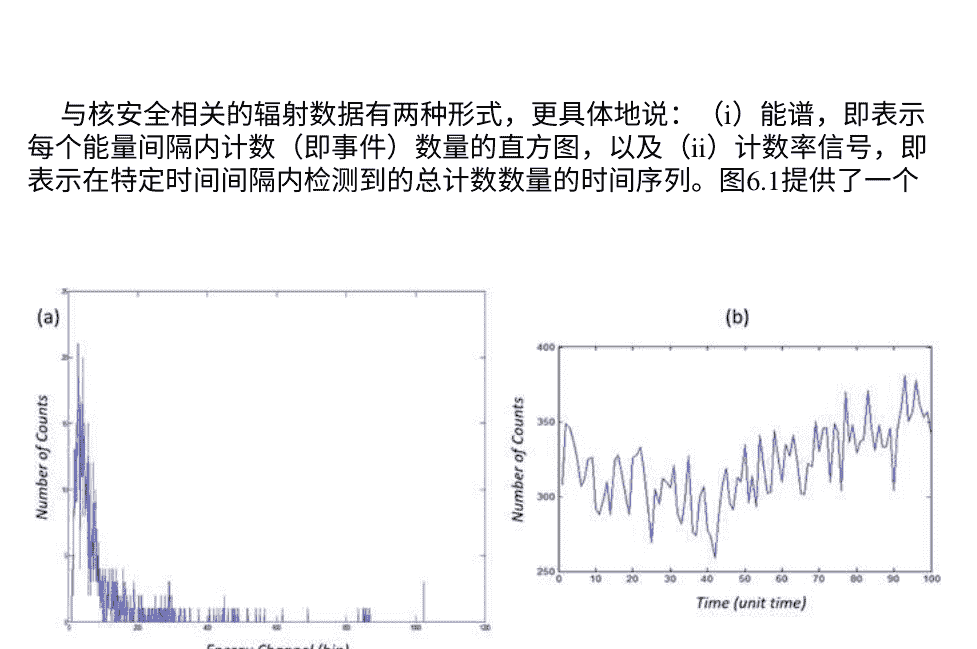两个测量到的辐射数据集的示例，即能谱和计数率信号。数据的内容是各种放射性源的贡献的卷积结果[5]。因此，数据分析的目标是识别和表征数据的内容，从而进一步推断是否存在威胁。威胁的检测基于识别属于已知放射性核素并唯一表征它们的模式（称为签名模式）[10]。然而，它们的检测面临着重要挑战，包括放射性过程的随机性、探测器-源距离、环境条件、源的有意屏蔽以及仪器（电子）噪声[5]。

机器学习已经提供了各种工具，用于核安全应用的目的。重要的是这些工具的固有能力，可以学习签名，然后在获取的数据集中寻找它们。除了识别签名外，学习工具还可以用于其他目的，例如估计背景辐射模式，检测异常，表征已知源的属性，优化传感器布置和数据融合，如图6.2所示。核安全中的机器学习应用列表将随着计算科学的进步而不断增长，这使得处理越来越多的数据变得快速和准确[11]。

本章重点介绍了在核安全应用中应用的各种机器学习方法。其目标是双重的，而且更多

图6.2 核安全中的机器学习应用

特别是为了提供现有方法的综合调查，并成为未来研究方向的灵感来源。为此，本章的其余部分组织如下：每个部分介绍了核安全的一个领域如图6.2所示，然后简要描述了为该领域开发的机器学习方法-技术。应注意，本章严格关注执行学习的方法，并不讨论任何其他类型的人工智能方法中包含某种类型学习的方法[12]。

## 6.2 核安全中的机器学习方法

在核安全中应用数据分析需要开发基于一个或多个机器学习工具的方法论。值得注意的是，开发的方法论不仅需要选择一个学习工具，还需要确定输入和输出结构、知识表示、数据减少、数据的可用性和可靠性、训练和测试数据集的确定等问题。

### 6.2.1 核签识别

用于识别特征模式的方法论应用于辐射谱分析，并基于两种主要方法[13]。在第一种方法中，谱被完整处理（即全谱分析），目标是识别一组特征，这些特征的聚合提供了观察到的谱。将核特征组合以获得或接近测量谱的过程被称为谱拟合[5]。谱拟合要求事先提供将用于拟合的放射性核素特征。在最好的情况下，谱的内容有一些先验信息，此时方法论利用特定的特征族（特征数越少越好，以获得更准确的结果），而在最坏的情况下，需要全部放射性核素特征（超过700个）。在后一种情况下，拟合是非常具有挑战性的，几乎是不可行的，因为高精度和计算效率很难检查所有可能的排列[14]。在第二种方法中，算法寻找辐射谱中指定放射性核素的特定特征。这些特征以特定能量为中心的谱峰的形式出现，允许将峰中心能量与已知放射性核素的峰能量进行匹配[15]。图6.3显示了谱拟合和峰识别方法的示例，同时明显存在泊松波动的噪声。

图6.3 能谱拟合示例，以及峰值识别

机器学习方法学已经得到发展，每个方法都有其优点和缺点。智能数据分析研究在这一领域非常活跃，主要是由于核安全任务的重要性和克服计算挑战的需求。值得注意的是，所提出的方法学要么仅采用机器学习工具，要么将机器学习与其他人工智能和统计学领域的分析工具相结合[16]。

#### 6.2.1.1 谱分析

机器学习已广泛应用于通过全谱分析来分析核谱。有各种机器学习工具被用作独立工具或与其他工具结合使用。在后一种情况下，预处理工具的重要性在于识别全谱的特征并将其传递给机器学习工具。图6.4提供了所采用的方法学的一般框图，以便使用机器学习分析全谱：分为两个部分，即训练和分析。

训练部分（图6.4a）以两种方式利用完整的频谱；（i）完整的频谱用于训练机器学习工具，或者（ii）提取特征然后将其提供给工具。在这两种情况下，都会创建一个用于训练所选机器学习工具的训练数据集。如果需要预处理，则选择可以唯一标识放射性核素模式的特征。例如，兴趣区域（ROI）中的计数数量或整个频谱中的峰值数量可能是信息丰富的特征。所进行的训练类型是有监督的，因为对于已知的输入谱，核素的标签是已知的。一旦工具被训练好，它就适用于识别用于频谱分析的谱。

图6.4 实施全谱分析的机器学习步骤 a工具训练，以及b频谱分析

值得注意的是，使用训练数据对于构建有效的检测系统至关重要。在核安全应用中，系统利用伽马射线谱进行训练数据集的构建，这些谱可以是模拟生成的或实验采集的。值得一提的是，与使用整个谱作为输入相比，使用特征作为机器学习工具的输入更可取，因为训练时间会大大缩短。

第二部分（图6.4b）中的谱分析部分利用预训练的机器学习工具来识别谱中的成分。特别是，未知谱被提供给机器学习工具进行处理，并输出识别出的放射性核素模式列表。如果机器学习工具是基于一组特征进行训练的，则在图6.4b中会先进行特征提取步骤。

基于上述方法，存在一系列广泛的机器学习工具，已经被用于核安全中的频谱处理。这些工具的一般框架如下所示。

#### 人工神经网络：

信息领域中最常见的机器学习工具之一是人工神经网络（ANN），已经应用于各个领域的各种问题。ANNs还在全谱辐射信号处理中找到了用途，所有提出的ANN共享一个常见的框架，如图6.5所示。特别是，完整的频谱作为输入提供给神经网络，该网络在特定的放射性核素集上进行训练，并输出识别出的模式列表。

在科学文献中，有各种采用人工神经网络开发的作品。值得注意的是，所提出的方法利用了各种类型的ANN来分析辐射谱。在[17-20]中提出了一种简单的前馈神经网络方法，旨在识别辐射谱中的完整特征模式。此外，前馈ANN的协同作用

图6.5 人工神经网络全谱分析

在[21]中介绍了使用Karhunen—Loeve变换的方法，而在[22]中提出了一种利用ANN和贝叶斯规则协同作用的方法。此外，在[23, 24]中引入了更复杂的ANN工具，采用了卷积神经网络（CNN）模型进行放射性核素识别。

#### 多元线性回归：

辐射谱分析中最早使用的工具之一是众所周知的多元线性回归（MLR）。MLR假设测量的谱可以被视为特征模式的线性组合，其中每个特征都有其贡献。具体而言：

```
M = a_1 S_1 + a_2 S_2 + \cdots + a_N S_N  (6.1)
```

其中M是测量的谱，S#是核素特征谱，α#是测量中特征的贡献，N是核素的总数。在理想情况下，N等于已知核素的数量——超过700个——对于那些在测量中没有贡献的核素，线性系数为零。理想情况下的极高复杂性需要非常大量的计算资源，因此在实时应用中几乎不可能使用。实际上，在MLR分析之前需要进行选择过程，指定可以在自动或手动分析中使用的放射性核素子集[25, 26]。

多年来，MLR已经在辐射数据分析的各种方法中被提出。在[27]中，MLR首次被提出作为一个独立的工具，而在[28]中与模糊逻辑[28]结合使用。其他研究提出了使用MLR与相关性度量来识别核素模式，如[29]中所讨论的，而在放射性核素检测中使用MLR与基于卡方的目标的方法则在[30]中引入。

#### 贝叶斯推断：

使用数据分析方法分析辐射数据还提出了使用贝叶斯线性回归的方法。与MLR相反，贝叶斯回归使用概率分布而不是点估计来形成。

特别地，响应不是一个单一的值，而是从一个由以下公式给出的正态分布中抽取的：

$$ y \sim N(\alpha^{\top} X, \sigma^{2} I) \quad (6.2) $$

其中 α 是线性系数，X 是包含输入数据的向量，σ² 是数据方差，I 是单位矩阵。总的来说，贝叶斯方法利用光谱拟合，其中库模式的值被视为贝叶斯定理给出的后验概率。

$$ P(A|B) = \frac{P(A|B) \cdot P(A)}{P(B)} \quad (6.3) $$

其中 P() 表示概率，P(A|B) 表示在事件 B 发生的条件下事件 A 的条件概率。因此，在辐射数据分析中，P(A) 和 P(B) 被标记为放射性核素签名模式贡献的先验概率（即线性回归模型中的 α 参数），并用于实现贝叶斯回归，其中每个回归器与一个核素的辐射模式相对应。利用贝叶斯方法可以自动确定模型复杂度（即回归模型中的核素数量），而不像最小二乘回归（MLR）需要手动选择。在核安全中使用贝叶斯推断方法的一个主要假设是我们在测量谱中可能找到的放射性核素的数量是有限的（例如，最多50个）。这使得可以将先验概率视为均匀分布（即具有相等的值）或对它们进行粗略估计。这个有限的核素集合假设我们对可能在核搜索中遇到的核素集合有先验知识[31]。

与多元线性回归类似，理想情况下，在分析全谱时应考虑所有可用的放射性核素，因此保留了计算和时间限制。

在机器学习框架中，已经提出了各种形式的基于贝叶斯方法的辐射数据分析方法。 在[32]中，提出了一种利用顺序贝叶斯学习的识别算法，而在[33]中，提出并测试了一种用于识别弱信号的简单贝叶斯回归算法。

此外，在[34]中引入了一种简单的贝叶斯推断方法，该方法在一组6个核素上进行了测试。 最后，在[35]中介绍了一种利用贝叶斯推断网络进行核素识别的方法。

### 6.2.2 背景辐射估计

核安全中的一个主要问题是背景辐射的建模，特别是在隐藏源搜索应用中。在辐射测量中，背景贡献是不可避免的，因为自然存在的放射性材料（NORM）的辐射发射是无处不在的。 尽管背景辐射可以定义为来自NORM的辐射，但在核安全框架中，背景可以被视为来自未被识别为威胁的放射性源的贡献[36]。 例如，医用放射性同位素在治疗目的上使用，可以被视为医院单位背景辐射的一部分。

因此，了解背景贡献的数量（对于时间序列数据）或能量分布模式的形式（对于光谱）是至关重要的。 由于背景的随机性和动态变化的条件，准确获取背景计数的数量非常具有挑战性。 在搜寻隐藏的放射性材料时，背景的挑战程度只会增加，尤其是使用移动探测器的情况下，因为环境的内容可能是未知的。 值得注意的是，在光谱分析中，背景光谱可能掩盖了来自放射性源（即威胁）的微弱信号，因为辐射测量是个体信号的聚合[5]。

背景估计在核安全中具有重要意义，可以用于数据处理，如图6.7所示。特别是，准确估计背景可以从测量中减去，从而提供一个“干净”的信号，其中放射性源的模式很容易识别。

估计背景贡献的最常见方法是在受控环境中进行测量，例如实验室，在那里没有被识别为威胁的放射性材料。然而，测量只提供了背景的一个实例，并不能完全满足核安全应用的需求，特别是在辐射环境动态变化的情况下。为此，机器学习已被用于通过估计测量数据中的辐射背景贡献来提供有效的解决方案。已经提出了一种有限种类的ML工具，用于背景估计和建模，如下所示。

#### 高斯过程：

核机器是一类流行的学习算法在各种应用中广泛使用。属于核机器类别的卓越学习工具之一是高斯过程（GP）工具。GP是一种贝叶斯推断模型，形成一个遵循正态分布的预测分布。高斯过程的均值和协方差函数被建模为一个核函数，其形式如下：

$$k(x_1, x_2) = f(x_1)^T f(x_2) \quad (6.4)$$

其中$f()$是所谓的基函数。高斯过程的框架提供了一个预测分布，其参数，即均值和方差，由以下公式给出：

$$m(x_{N+1}) = k^T C_N^{-1} t_N \quad (6.5)$$
$$\sigma^2(x_{N+1}) = k - k^T C_N^{-1} k \quad (6.6)$$

其中，$N$、$C_N$和$k$分别是训练数据的数量、协方差矩阵和核函数的评估，而$t_N$是训练集的目标数据向量，而$x_{N+1}$是未知的输入数据点。有关高斯过程框架的详细信息可以在[37]中找到，而进行背景估计的一般框架如图6.8所示。

GP一直是各种方法学的主要组成部分，这些方法学在背景估计方面提出了各种形式的时间序列或频谱数据。特别是在[38]中，基于GP的方法被用来估计低计数谱中的背景谱，而没有可用的先验信息。在类似的设置中，[39]中使用了GP的集合来估计背景谱，而[40]中使用了两个GP来捕捉背景信号的曲率。其他的工作则专注于使用单个GP进行背景计数率的时间序列预测，如[41]中所介绍的，以及使用GP集合进行背景计数率的时间序列预测，如[42]中所提出的。

图6.8 使用GP进行背景贡献预测的通用框架

#### 统计学习估计：

统计方法的领域也提供了在辐射数据分析中采用的工具。其中一些统计方法构成了复杂机器学习方法的基础，因此它们也被视为机器学习领域的一部分。

有一组统计工具被提出来用于估计辐射谱中的背景贡献。一般的框架与GP非常相似：使用一组训练数据来拟合一个模型，利用可用数据来预测背景。一般来说，计数率被假设遵循概率分布，通常是泊松分布或高斯分布，然后用于形成MLE的著名形式[6]。

为此，最大似然估计(MLE)在[43]中被提出来分别估计空中伽马辐射探测器每个通道的计数率。此外，在[44]中引入了一种方法，该方法首先使用数据学习来估计泊松过程参数，然后应用泊松模型来估计谱峰处的背景计数。

### 6.2.3 辐射传感器布置

核安全的主要关注点之一是提高对被视为威胁的放射性源的检测概率。获取的数据质量还取决于辐射传感器中施加的物理约束。其中一个约束与传感器与源之间的距离有关，这会影响获取的测量中源信号特征的强度。从源发出的信号随着距离的平方反比例减弱—1/s²—因此，检测概率在离源几米远时显著降低。

值得注意的是，核安全的主要挑战之一是以确保对关键放射性核素的可检测性的方式部署辐射传感器网络。要求是双重的：传感器网络必须对指定区域进行全面覆盖，以确保可检测性，并具有最佳数量（即，为了确保低成本和计算廉价的操作，需要最少数量的传感器节点，如图6.9所示。因此，数据分析方法已被用于确定传感器放置的最佳网络配置形式。

在这个框架中，机器学习的目标是确定辐射传感器应该放置在哪些位置，以提供最大的检测概率。检测概率主要通过每个传感器的最大覆盖范围和最小重叠来表达。然而，需要注意的是，在辐射传感器中，覆盖范围是许多不受控制的参数的函数：源-传感器距离、源的强度（或数量）和源的类型。例如，同样数量的核素U-238和Cs-137在不同的距离长度上被检测到，因此需要不同数量的传感器来增强检测概率。因此，辐射传感器的特殊性在于它们必须根据感兴趣的源进行部署，因此在传感器放置决策中使用分析是必不可少的。

为此，机器学习被用于提供既能满足高检测要求又能使用最少传感器的解决方案。此外，机器学习的优势在于可以同时考虑多个来源的覆盖范围，包括背景。核安全中的传感器布置仍然是一个活跃的研究领域，机器学习只是最近才被采用。

图6.9 辐射传感器网络部署的可视化

采用贝叶斯定理的主要机器学习方法如下所示。

#### 顺序贝叶斯方法：

在这种方法中，使用贝叶斯公式框架，即，使用方程（6.3）来放置一组移动传感器以获得最佳组合。贝叶斯公式被顺序地用于处理一组实验获得的测量值；在每次迭代中，使用单个测量值，并将更新后的概率作为下一次迭代的先验概率。此外，互信息公式也被采用作为一个度量标准，以确定一组预定离散位置中提供最多关于源定位参数的信息量的位置集合。该提议的方法在[45]中得到了全面的描述和测试。

### 6.2.4 源定位

正如前面提到的，核安全的主要目标之一是在城市环境中定位隐藏的源。需要注意的是，建筑物和其他材料的存在对精确确定放射源的位置构成了挑战。尽管定位是依赖于具体问题的，但是机器学习提供了工具，可以通过独立于手头问题的参数识别来定位源。这仍然是一个活跃的研究领域，到目前为止只有有限的工作完成。

#### 贝叶斯大都会方法：

在这种方法中，定位问题被形式化为贝叶斯参数估计问题。基于贝叶斯公式采用马尔可夫链蒙特卡洛（MCMC）方法来提供后验概率密度函数。由于计算困难，MCMC是通过假设候选密度函数并从中抽取样本来实现的。该方法在[46]中描述。

#### 贝叶斯推断：

在[47]中，贝叶斯公式与伴随辐射一起使用模型被用于非法源定位。所提出的公式允许将先前获得的所有信息以先验概率的形式纳入，从而增强对源的准确定位的检测。

#### 最大似然估计：

MLE也被用于识别源的位置通过估计来自源的计数来确定源的位置。源的贡献来自泊松分布，因此可以估计其位置，并随后估计其强度，如[47]所示，同时它对于波动的背景具有有效性，如[48]所讨论。

### 6.2.5 异常检测

辐射水平的监测意味着记录辐射数据并对其进行异常识别。通过异常，我们指的是测量值明显高于或低于通常观察到的辐射水平。例如，突然增加的注册辐射计数可能表示存在（或移动）新源对测量的可能性。

这种计数率突然变化被称为异常，对其发生的检测非常重要，特别是对核安全而言。值得注意的是，辐射数据中的异常检测主要是作为趋势或突变识别问题来解决的。为了达到这个目的，已经提出并测试了几种机器学习技术，用于辐射数据中的异常检测，无论是在光谱还是时间序列中，并在下面进行了讨论。

#### 贝叶斯方法

数据包括贝叶斯推断的使用。贝叶斯方法的优势在于通过先验知识（参见公式（6.2））将先前的知识纳入模型中。此外，贝叶斯方法允许将最近观察到的数据纳入模型，因此在光谱或时间序列数据的实时异常识别中它们是一个有吸引力的选择。

使用贝叶斯模型选择方法来识别光谱异常，该方法与辐射测量模型协同工作，详见[49]。另一种方法使用贝叶斯高斯过程的框架进行背景预测和异常检测，详见[50]。类似地，讨论了一种利用贝叶斯驱动的高斯过程来预测和建模背景辐射，并随后在时间序列中识别异常的机器学习系统，详见[51]。此外，提出了一种用于识别伽马射线光谱中良性和异常数据的朴素贝叶斯分类器，详见[52]。

#### 主成分分析：

另一种用于识别辐射数据异常的方法辐射光谱数据利用主成分分析（PCA）进行分析，以识别嵌入在数据中的放射性核素特征。PCA是一种非参数方法，它使用由相关变量组成的观测数据集，并将其转化为一组无关变量。这些无关变量可以用于提取有用信息，例如嵌入在数据中的放射性核素特征。

PCA已经应用于低分辨率辐射探测器（尤其是NaI(Tl)伽马射线探测器[5]）采集的光谱数据，并且已经在[53]中证明其有效性。

#### 人工神经网络：

已经提出了多种形式的ANN用于辐射数据异常检测其中绝大多数关注的是对伽马射线测量数据的分析。在异常检测中使用ANN的一般框架与图6.4和6.5中所示的框架非常相似，如图6.10所示。

在[54]中，提出了一种线性自联想记忆神经网络，用于识别与少量预先指定的放射性核素相关的异常，而在[55]中，提出了一种多层感知器人工神经网络，用于获取趋势图6.10 通过将数据集描述为威胁或非威胁来可视化用于异常检测的人工神经网络，表示对一组预先指定的核素的检测或不检测。

在其中，多层感知器还被用于基于光谱中铀浓度比率识别异常。

## 动态量子聚类（DQC）

无监督学习也被应用于非结构化辐射数据中的异常检测。具体而言，一种新颖的方法采用动态量子聚类应用于伽马射线谱的异常检测，适用于放射源搜索。简而言之，DQC是一种聚类方法，将欧几里德空间中的每个数据点与高斯波函数相关联：

$$f_i(x) = e^{-(x-x_i)/2\sigma^2}$$  (6.7)

其中$x_i$表示数据点$I$的值，$\sigma^2$是训练数据的方差。在下一步中，函数(6.7)将在所有数据点上进行聚合，构建一个分布函数。DQC将方程(6.7)视为概率振幅，就像量子力学中的情况一样，因此它允许每个数据点与一个聚类中心相关联[57]。

为此，[58]中的工作在伽马射线光谱数据的异常检测中采用了DQC。具体而言，DQC的方法是对数据进行聚类，以检测是否存在两个核素，更具体地是Cs-137和Co-60，也就是说，DQC正在寻找与这两个核素相关的特定异常数据。

## 6.3 结论

核安全是一个高度关键的领域，需要快速、准确和适应性强的解决方案。数据分析领域与机器学习相结合，提供了智能数据分析解决方案，对核安全应用非常高效。诚然，对于更复杂、更普适的数据分析方法有着很高的需求，这些方法不依赖于具体问题。

本章对机器学习工具在核安全领域的应用进行了调研，并讨论了与这些领域相关的问题。它确定了四个主要领域，即特征识别、背景估计、传感器布置、源定位和异常检测。在这些领域中，我们提供了已经提出和测试过的机器学习工具，以解决各种问题。值得注意的是，在核安全领域，正在开发各种各样的工具来提出解决方案，但本章严格关注那些被确定为实施机器学习方法的工具，因为机器学习工具在提供快速和准确解决方案方面具有很高的潜力。

我们希望这一章能够为核能安全中的机器学习工具提供一个良好的理解，并为新手介绍这一领域。开发更复杂的机器学习工具的发展和进步，只能建立在对当前工具的理解和扩展的基础上。

致谢：本章是在核能安全技术联盟(CONNECT)的支持下开发的，该联盟由能源部/国家核安全管理局在奖项编号DE-NA0003948下支持。阿贡国家实验室的工作得到了美国能源部国家核安全管理局在合同编号DE-AC02-06CH11357下的支持。

## 参考文献

- 1. M. Zenko, 核恐怖主义的情报估计。美国政治与社会科学学会年鉴 **607(1)**, 87-102 (2006)
- 2. B. Zellen, 重新思考不可思议的事情：核武器与反恐战争。战略洞察1 (2004)
- 3. J.A. Boscarino, C.R. Figley, R.E. Adams, 九一一恐怖袭击后纽约的恐怖主义恐惧：对紧急心理健康和应急准备的影响。国际紧急心理健康杂志 **5(4)**, 199 (2003)
- 4. P.R. Miles, J.A. Cook, Z.V. Angers, C.J. Swenson, B.C. Kiedrowski, J. Mattingly, R.C Smith, 使用从3D蒙特卡洛传输物理模拟构建的代理模型进行辐射源定位。核技术。1-17 (2020)
- 5. N. Tsoulfanidis, S. Landsberger,辐射的测量和检测(CRC出版社, 博卡拉顿, FL, 2010)
- 6. M.H. Jeong, C.J. Sullivan, S. Wang, 复杂辐射传感器网络分析与大数据分析，在2015年IEEE核科学对称和医学成像会议(NSS/MIC)(IEEE, 2015), pp. 1-4
- 7. D.S. Hochbaum, B. Fishbain, 移动分布式传感器网络中的核威胁检测. Ann. Oper. Res. **187(1)**, 45–63 (2011)
- 8. M. Berthold, D.J. Hand,智能数据分析, vol. 2 (Springer, Berlin, 2003)
- 9. M. Alamaniotis, J. Young, L.H. Tsoukalas, 评估模糊逻辑放射性同位素模式识别在伽马射线信号中的应用于安全性的方法, 研究方法: 概念, 方法, 工具和应用(IGI Global, 2015), pp. 1052–1071
- 10. Z. Varga, J. Krajko, M. Pe’nkín, M. Novák, Z. Eke, M. Wallenius, K. Mayer, 鉴别与核保障和取证相关的铀特征. J. Radioanal. Nucl. Chem.312(3), 639–654 (2017)
- 11. M.D. Assunção, R.N. Calheiros, S. Bianchi, M.A. Netto, R. Buyya, 大数据计算和云计算: 趋势和未来方向. J. Parallel Distrib. Comput. 79, 3–15 (2015)
- 12. L. Holbrook, M. Alama niotis, 一种良好的防御是强大的DNN: 用深度神经网络保护物联网, inMachine Learning Par adigms(Springer, Cham, 2020), pp. 125–145
- 13. T. Burr, M. Hamada, NaI γspectra的放射性同位素识别算法. 算法2(1), 339–360 (2009)
- 14. M. Alamaniotis, T. Jevremovic, 混合模糊遗传方法集成峰值识别和光谱拟合用于复杂伽马射线谱分析. IEEE Trans. Nucl. Sci. 62(3),1262–1277 (2015)
- 15. J. Mattingly, D.J. Mitchell, 逆辐射传输问题的解决框架. IEEE Trans. Nucl. Sci. 57(6), 3734–3743 (2010)
- 16. C.M. Bishop, 模式识别与机器学习(Springer, 2006)
- 17. M. Kamuda, J. Stinnett, C.J. Sullivan, 使用人工神经网络的自动同位素识别算法. IEEE Trans. Nucl. Sci. 64(7), 1858–1864 (2017)
- 18. S. Jhung, S. Hur, G. Cho, I. Kwon, 用于识别硅光倍增管获得的伽马射线谱的神经网络方法. Nucl. Instrum. Methods Phys. Res. Sect. A: Accel., Spectrometers, Detect. Assoc. Equip. 954, 161704 (2020)
- 19. J. Kim, K. Park, G. Cho, 使用人工神经网络的多放射性同位素识别算法, 用于塑料伽马光谱. Appl. Radiat. Isot. 147, 83–90 (2019)
- 20. E. Yoshida, K. Shizuma, S. Endo, T. Oka, 应用神经网络分析用Ge谱仪测量的伽马射线谱. Nucl. Instrum. Methods Phys. Res., Sect.A 484(1–3), 557–563 (2002)
- 21. L. Chen, Y.X. Wei, 基于K-L变换和神经网络的核素识别算法. Nucl. Instrum. Methods Phys. Res., Sect. A 598(2), 450–453 (2009)
- 22. C. Bobin, O. Bichler, V. Lourenço, C. Th iam, M. Thévenin, 基于脉冲神经网络的γ发射体混合物实时放射性同位素识别. Appl. Radiat. Isot. 109, 405–409(2016)
- 23. G. Daniel, F. Ceraudo, O. Limousin, D. Maier, A. Meuris, 基于卷积神经网络和合成数据集的伽马射线谱自动实时识别方法. IEEE核科学交易 67(4), 644–653 (2020)
- 24. F. Li, J. Wa ng, L. Ge, F. Hu, F. Cheng, K. Sun, 基于卷积神经网络的伽马谱半定量分析研究. 物理学报会议版 1423(1), 012005 (2019). (IOP出版)
- 25. M. Alamaniotis, A. Heifetz, A.C. Raptis, L.H. Tsoukalas, 模糊逻辑放射性同位素识别器用于源搜索中的伽马谱学. IEEE核科学交易 60(4), 3014–3024 (2013)
- 26. M.A. Hogan, S. Yamamoto, D.F. Covell, 闪烁伽马射线谱的多元线性回归分析: 自动候选人选择. 核仪器方法 80(1), 61–68 (1970)
- 27. D.F. Covell, M. Brown, S. Yamamoto, 闪烁伽马射线谱的多元线性回归分析: 理论和实际考虑因素. 核仪器方法 80(1), 55–60 (1970)
- 28. M. Alamaniotis, C.K. Choi, L.H. Tsoukalas, 伽马射线谱分析的新方法: 使用模糊逻辑和多元线性回归的峰值检测和谐线拟合的自动集成. 美国核学会会议交易 112(1), 260–263 (2015)
- 29. W.R. Russ, 图书馆相关核素识别算法. Nucl. Instrum. Methods Phys. Res., Sect. A 579(1), 288–291 (2007年)
- 30. R. Estep, C. McCluskey, B. Sapp, 多同位素材料基础集 (MIMBS) 方法用于低分辨率和中分辨率伽马射线探测器的同位素识别. J. Radioanal. Nucl. Chem. 276(3), 737–741 (2008年)
- 31. M. Alamaniotis, A. Heifetz, A. Raptis, L.H. Tsoukalas, 模糊逻辑放射性同位素识别器用于gamma谱分析在源搜索应用中，在美国核学会年会（芝加哥，美国，2012年），第211–212页
- 32. Z. Wu, B. Wang, J. Sun, 基于序列贝叶斯方法的放射性核素识别算法设计，在IOP Conference Series: Materials Science and Engineering，卷569，第5期（IOP Publishing，2019年），第052047页
- 33. Y. Altmann, A. Di. Fulvio, M.G. Paff, S.D. Clarke, M.E. Davies, S. McLaughlin, S.A. Pozzi, 辐射门禁监测器中的弱放射性核素识别的期望传播. 科学报告 10(1), 1–12 (2020)
- 34. J. Kim, K.T. Lim, K. Ko, E. Ko, G. Cho, 使用贝叶斯推断进行放射性同位素识别和非侵入式深度估计的局部低水平放射性污染物. 传感器20(1), 95 (2020)
- 35. Z. Wu, B. Wang, J. Sun, 基于序列贝叶斯方法的放射性核素识别算法设计, 在第二届先进材料、智能制造和自动化—机器学习和算法国际会议, vol. 569, no. 5 (IOP Publishing,2019), p. 052047
- 36. M.W. Swinney, D.E. Peplow, B.W. Patton, A.D. Nicholson, D.E. Archer, M.J. Willis, 一种用于确定城市环境中天然放射性物质浓度的方法学。 Nucl. Technol. 203(3), 325–335 (2018)
- 37. C.E. Rasmussen, C. Williams, 机器学习的高斯过程 (MIT Press, 波士顿, 2006)
- 38. M. Alamaniotis, J. Mattingly, L.H. Tsoukalas, 基于核的机器学习用于NaI低计数伽马射线谱的背景估计。 IEEE Trans. Nucl. Sci. 60(3), 2209–2221(2013)
- 39. M. Alamaniotis, C. Choi, L.H. Tsoukalas, 使用学习方法集合的数据驱动辐射背景建模: 初步概念和初步结果, in Transactions of the American Nuclear Society Annual Meeting(2015), pp. 249–252
- 40. M. Alamaniotis, 一种利用配对机器学习工具估计背景谱的数据驱动方法。 Transactions 121(1), 578–581 (2019年)
- 41. M. Alamaniotis, C.K. Choi, L.H. Tsoukalas, 利用学习高斯过程进行短期伽马背景预测，在2015年IEEE核科学对称和医学成像会议（NSS/MIC）中（IEEE，2015年），第1–4页。
- 42. M. Alamaniotis, 使用最佳学习核机器的移动探测器背景计数率预测，在美国核学会年会虚拟会议中（2020年），第185–188页，6月7–11日，2020年。
- 43. J.A. Kulisek等人，使用NASVD和MLE进行辐射传输进行校准的实时时空中伽马射线背景估计。 Nucl. Instrum. Methods Phys. Res., Sect. A 784, 287–292 (2015年)。
- 44. J.M. Kirkpatrick, B.M. Young, 用于低计数伽马能谱分析的泊松统计方法。 IEEE Trans. Nucl. Sci. 56(3), 1278–1282 (2009)
- 45. K. Schmidt, R.C. Smith, J. Hite, J. Mattingly, Y. Azmy, D. Rajan, R. Goldhahn, 使用互信息的移动传感器顺序最优定位。 Stat. Anal. Data Min.: ASA Data Sci. J. 12(6), 465–478 (2019)
- 46. J.M. Hite, J.K. Mattingly, K.L. Schmidt, R. ,Stefʼʼʼʼʼʼʼʼanescu, R. Smith, 贝叶斯Metropolis方法应用于辐射源定位的传感器网络，在2016 IEEE International Conference on Multisensor Fusion and Integration for Intelligent Systems (MFI)(IEEE, 2016), pp. 389–393
- 47. E.W. Bai, K. Yosief, S. Dasgupta, R. Mudumbai, 辐射源定位的最大似然估计：初始化迭代搜索，在第53届IEEE决策与控制会议（IEEE，2014年），第277-282页
- 48. E. Bai, A. Heifetz, P. Raptis, S. Dasgupta, R. Mudumbai, 高度波动背景下放射源的最大似然定位。 IEEE核科学转换。 62（6），3274-3282（2015年）
- 49. D.M. Pfund, 用贝叶斯模型选择进行辐射异常检测和分类。核仪器方法物理研究，A部分904，188-194（2018年）
- 50. M. Alamaniotis, C.K. Choi, L.H. Tsoukalas, 用核机器智能检测辐射信号，在2015年第6届国际信息、智能、系统和应用会议（IISA）（IEEE，2015年），第1-6页
- 51. M. Alamaniotis, A. Heifetz, 用于背景辐射建模和异常检测的机器学习方法与核安全相关的辐射时间序列，2020年冬季会议和技术博览会（美国伊利诺伊州芝加哥，2020年11月15日至19日），第477-480页，2020年11月15日至19日
- 52. S. Sharma, C. Belling er, N. Japkowicz, R. Berg, K. Ungar, 伽马射线谱的异常检测：机器学习视角，2012年IEEE计算用于安全和防御应用的智能对称（IEEE，2012年），第1-8页
- 53. R.C. Runkle, M.F. T ardiff, K.K. Anderson, D.K. Carlson, L.E. Smith, 使用主成分分析分析光谱辐射门禁监测数据。IEEE Trans. Nucl. Sci. 53（3），1418-1423（2006年）
- 54. P. Olmos, J.C. Diaz, J.M. Perez, G. Garcia-Belmonte, P. Gomez, V. Rodellar, 在伽玛谱学中应用神经网络技术。Nucl. Instrum. Methods Phys. Res., Sect.A 312(1–2), 167–173 (1992)
- 55. L.J. Kangas, P.E. Keller, E.R. Siciliano, R.T. Kouzes, J.H. Ely, 在基于PVT的辐射门禁监测器中使用人工神经网络。Nucl. Instrum. Methods Phys. Res., Sect. A587(2–3), 398–412 (2008)
- 56. V. Vigneron, J. Morel, M.C. Lepy, J.M. Martinez, 在γ-谱学中的神经网络的统计建模。Nucl. Instrum. Methods Phys. Res., Sect. A 369(2–3), 642–647 (1996)
- 57. M. Weinstein, D. Horn, 动态量子聚类：一种用于数据结构可视化探索的方法。Phys. Rev. E 80(6), 066117 (2009)
- 58. M. Weinstein, A. Heifetz, R. Klann, 使用动态量子聚类对伽马射线谱数据进行搜索调查中的核源检测。欧洲物理学杂志 129(11), 239 (2014)

# 第7章 网络安全中的人工智能：基于机器学习的入侵检测技术

Dilara Gumusbas和Tulay Yildirim

摘要：通过本章，首先介绍了网络安全中的问题以及潜在的基于人工智能的解决方案。然后，通过示例讨论了几种基于机器学习的网络安全方法，以便向读者提供详细的见解。最后，通过对文献研究的结论范围内的开放主题和潜在方向的概述，对本章进行了总结。

## 7.1 引言

随着数字时代发展的加快，通过互联网连接访问和传输大量数据以及不断演变的网络威胁，与网络安全相关的问题也在增加。因此，这些问题促使我们需要部署更可信赖的网络安全系统，这些系统由各种预防方法组成。

作为网络安全系统中广泛研究的分支之一，入侵检测系统（IDS）被开发出来用于检测网络威胁并确保用户安全访问和隐私保护。IDS主要收集数据并将检测系统应用于捕捉和识别可能的威胁，以供安全分析师使用。此外，IDS可以分为两类：基于网络的入侵检测系统（NIDS）和基于主机的入侵检测系统（HIDS）。NIDS基于网络流量数据，包括网络上设备之间的整个交互，而HIDS基于仅从主机设备（如操作系统日志）收集的HIDS代理数据。

IDS使用各种算法，可以分为三类：基于规则的算法、基于统计的算法和基于机器学习（ML）的算法。基于规则的算法使用数据分布构建规则并执行，基于统计的算法利用先前的攻击模式估计统计量。统计分布并利用该分布来检测攻击。最后一类属于基于机器学习的算法，作为人工智能（AI）的一个子领域，它指的是模仿人类认知能力的机器，从感知到问题解决能力各不相同。基于机器学习的算法集中在这些认知能力的学习部分。学习后，它们进行分类器训练以检测包括已知攻击在内的异常。由于每个算法都有其优点和缺点，因此选择最佳算法取决于问题和权衡。

例如，基于规则的算法可以简单快速地执行。然而，在缺失和/或不精确的数据下，它无法表现良好。此外，更新这种方法是繁重的。类似地，基于统计的算法解决了这些问题，但作为一种权衡，它们需要高计算能力，并且不适用于大量数据。与基于规则和基于统计的算法不同，基于机器学习的算法提出了使用推理模型来解决这些问题的方法，这些模型可以捕捉复杂性并在大数据上进行训练。

### 7.1.1 为什么人工智能对网络安全至关重要？

随着许多组织开始使用互联系统，通过网络收集和传输的数据量逐渐增长。因此，保护来自这些系统的数据不仅对未经授权的访问，而且对内部攻击者的授权访问变得更加脆弱。

此外，可能缺乏人力来实时保护这些系统。为了解决这些问题，机器学习（ML）方法，特别是深度学习（DL）方法，在网络安全中经常使用，原因有三个主要原因。首先，这些方法成功地发现了数据的潜在模式，不仅适用于已知的攻击，还适用于新型攻击，以实现基于威胁和异常的安全监控和检测。其次，基于机器学习的方法能够有效减少误报和减少安全分析师需要分析的虚警数量。因此，它们能够促进安全分析师的工作流程，提高他们在入侵检测和响应时间方面的生产力。结果就是，减少需要调查的数据量对于实时检测和避免数据丢失起到了巨大的贡献。第三，它们使监控和检测系统在计算上更加廉价，并能够适应不断演化的攻击类型的更新。

此外，基于机器学习的方法能够预测异常情况。

### 7.1.2 贡献

在本章中，将讨论针对网络安全的最流行和最新的基于机器学习的解决方案，特别是那些专注于深度学习方法的解决方案。本章不仅通过分析相关评估结果和限制，提供了机器学习（ML）在网络安全领域的全面概述。

## 7.2 网络安全的基于机器学习的模型

在本章中，将讨论多种选择的基于机器学习的网络安全方法及其优缺点。这个选择是基于引用统计和对文献的贡献作为先驱的考虑。

基于机器学习的方法的分类也可以在图7.1中找到。可以看到，在众多不同的集成方法中，只选择了Adaboost和随机森林（RF）算法进行讨论，原因有两个。首先，RF是模拟入侵的顶级算法之一，甚至可以与新颖的深度机器学习模型竞争。其次，Adaboost是在提升和装袋方法之间经常使用的有效方法之一，用于网络安全。

### 7.2.1 K-Means

K-means是一种方法，其中每个输入数据根据其与这些聚类中心的距离被分组到随机选择的聚类中心（k）中，并且聚类中心会根据某些准则（例如最小化聚类之间的距离）进行更新[1]。尽管这个算法易于实现，对于大数据而言速度快且计算成本低廉，但与k-means算法相关的问题有几个。首先，选择最佳聚类数是困难的。其次，输入数据中的噪声对性能结果有很大影响。最后，当不同类别创建相同聚类时，由于它们具有相同的均值或数据是非凸的，k-means会受到负面影响。

通过使用不同的距离度量方法，已经提出了几种方法。例如，[2]中介绍的方法使用系统调用频率分布（SCFD）来计算与k-means的相似度度量，其中聚类的截断距离使用马氏距离的累积分布函数（CDF）计算以区分正常和攻击。该方法在使用私有数据集时比欧氏距离更好地检测异常值，但可能无法检测系统调用序列中的局部变化。类似地，[3]中介绍的方法在DARPA98数据集上使用了具有高斯相似度度量的k-means。

为了实现高检测率，几种方法采用了混合方法。例如，[4]中提出的模型首先使用k-means获得不同的训练子集，然后使用五个模糊神经网络（NN）进行分类。作为模型的最后一步，它使用SVM进行分类。该模型在KDD99中针对每种攻击类型都取得了很高的检测结果。与[4]类似，[5]中提出的模型使用k-means选择最具有区分性的数据样本，然后使用NN对这些样本进行分类。然而，该模型在KDD99的少数类别（R2L和U2R）中的检测率较低。[6]中介绍的方法使用k-means作为将数据分离成簇的第一步。然后使用C4.5决策树在聚类中学习子群，而[7]中提出的方法则使用朴素贝叶斯进行相同操作。这两种方法在KDD99数据集上都能以较低的假阳性率实现较高的真阳性率。

### 7.2.2 自编码器（AE）

AE是一种无监督的深度学习方法，首先对原始数据进行编码然后解码，以构建数据的新颖表示，如图7.2所示。编码层将数据表示转换为较低维度，以找到最具信息的特征空间，解码层从该空间中对原始特征空间进行采样，以无监督的方式进行重建[8]。 通过最小化重构误差来优化所有权重。由于其提取信息特征表示的能力，AE通常被用于网络安全中的维度缩减。然而，选择编码和解码层的最佳结构是困难的。

已经发表了几篇关于AE的两种不同组合的研究：AE与浅层/深层机器学习算法的组合，以及AE与统计算法或统计驱动的AE模型（如VAE与浅层机器学习算法）的组合。在[9, 10]中提出的第一种组合的研究中，使用AE进行维度缩减/非线性特征提取，并将其与多个浅层分类器（如NSL-KDD数据集上的SVM）相结合。 据报道，与AE组合的方法相比，能够实现更高的准确性。与其他降维方法的组合。 此外，[11]中提出的研究在相同的数据集上使用了具有softmax回归分类器的自编码器，并报告了比之前更高的准确性。 除了1隐藏层的自编码器外，还有多层版本，也称为堆叠自编码器，这些版本在[1-14]的作品中被使用。 这些作品将堆叠自编码器与浅层分类器结合在一起。 虽然前两个作品在NSL-KDD和KDD99数据集上使用随机森林，后者使用径向基函数在AWID2018数据集上实现了高整体准确性。

类似地，[15]中介绍的模型使用堆叠自编码器从原始流量数据中提取有价值的信息，并自动化入侵检测过程。 此外，[16, 17]中提出的作品首先使用自编码器从原始网络流量中提取有意义的信息，然后使用深度机器学习算法之一CNN检测异常。 [18, 19]中针对自编码器的第二种组合方法使用VAE对原始网络流量和名为NSL-KDD和UNSW-NB15的几个特征数据集进行降维。 在第二个作品中，还使用了几种浅层算法（如随机森林）来使用VAE的输出检测异常。 类似地，[20]中介绍的作品使用梯度线性SVM与VAE一起检测AWID2019数据集上的某些特定攻击，其中SVM首先降低特征维度，然后VAE选择最相关的特征。 据报道，检测率高于现有模型。 除了[18-20]中的模型，[21]中介绍的模型将VAE与GAN和DNN结合在一起。 基本上，它使用VAE以统计和非线性的方式获得新的输入表示，然后使用GAN对较少表示的入侵进行增强。 最后，该模型使用DNN对未知入侵和已知入侵进行分类。 此外，[22, 23]中的几种自编码器与统计算法的组合采用自编码器提取非线性表示，然后在NSL-KDD上使用密度估计，在KDD99上使用高斯混合模型（GMM）。 结果表明，自编码器与统计算法相结合可以提高检测到与频率相关特征高度相关的入侵。 类似地，[24]中介绍的作品将自编码器与统计模型结合在一起，在NSL-KDD数据集上实现了比现有深度和浅层机器学习更高的准确性。

### 7.2.3 生成对抗网络（GAN）

GAN是由编码器、生成器和鉴别器组成的DL算法之一。 如图7.3所示，编码器首先从输入中提取统计信息，然后生成器使用这些信息创建新样本，鉴别器则试图区分原始输入和生成的样本[25]。 生成器和鉴别器的训练经常是为了最小化生成器的损失并最大化鉴别器的损失。 GAN不仅具有分类的优势，还可以仅使用输入的统计特征来增加新的数据样本，特别适用于数据集中的少数类别。 因此，它在网络安全应用中引起了极大的兴趣。

对于网络安全数据集中经常存在的不平衡数据样本，已经进行了多项数据增强研究。 在[26]中提出的工作使用序列GAN来增强ADFA-LD数据集。 类似地，[21, 27]中介绍的研究采用GAN来增强原始网络流量数据。 两者都报告了检测结果的改进。 类似地，[28]中提出的另一种方法使用Flow Wasserstein GAN生成对抗性数据样本，然后将其用于更好地检测和建模网络安全异常。 评估是在ISCX-2012和ISCX-2017数据集上进行的，并报告了超过其他方法的检测率。

除了使用GAN进行数据增强外，GAN还用于异常分类。 在[29]中提出的研究使用GAN进行异常检测。 类似地，在[30]中提出的工作使用了一些修改后的GAN来提高时间性能。 两者在KDD99数据集上报告了高且相似的检测率。

### 7.2.4 自组织映射

自组织映射（SOM）是一种机器学习方法，它以竞争学习算法的无监督方式将输入数据组织和降维到较低维度。 尽管SOM是使用最简单的方法之一，但它对输入数据的分布变化和神经元权重的初始化不稳定。

在[32]中介绍的模型使用分层SOM来实现各种不同的设计结构。 该模型在KDD99数据集上除了DoS攻击以外的检测率不令人满意。 还有一些基于SOM的混合模型的方法。例如，在[33]中提出的模型首先使用PCA对特征空间进行降维，选择了八个具有较少噪声的特征向量，然后使用SOM进行分类。 该模型在NSL-KDD数据集上实现了高灵敏度和特异度。 在[34]中提出的另一种方法使用了J.48决策树。用于误用检测的神经网络和用于异常检测的自组织映射。该方法首先对TCP、UDP和ICMP协议的正常数据进行建模，然后使用自组织映射分析异常。它在KDD99数据集上具有高检测率和低误报率。

### 7.2.5 最近邻居 (k-NN)

K最近邻（k-NN）是一种机器学习方法，其中每个输入数据根据其与随机选择的邻域（k）的距离相似性被分配到一个类别中[1]。尽管使用较少的参数、简单的计算、可扩展性、对噪声的鲁棒性和发现数据的自然模式，但这种方法存在一些问题。首先，选择正确的k参数并不简单。因为k值太小会模拟噪声，而k值太大会模拟其他类别。其次，像k-NN这样的聚类算法会使算法陷入局部最小点。第三，使用欧氏距离度量可能无法分离纠缠的数据，甚至可能导致误导性结果。最后，对于高维数据，这种方法变得缓慢且内存效率低下。

为了加快检测时间并获得高检测率，几种方法将k-NN与特征选择、新特征表示等方法相结合。例如，[35]中介绍的模型使用高斯混合模型（GMM）对特征的统计规律进行建模。在将GMM参数建模为高斯形式之后，使用EM算法对这些参数进行微调。然后，该模型使用这些参数进行k-NN分类。该模型在KDD99数据集中的R2L和U2R攻击类型上取得了令人满意/良好的检测结果。类似地，[36]提出的模型首先使用一种新的特征选择方法，将特征的方差作为质量指标，并减少所有低质量特征。在选择了十个特征之后，该模型使用k-NN进行检测，相比没有特征选择的模型，检测速度更快。文献中的几种方法使用k-NN在级联系统中实现更高的检测率。例如，[37]提出的方法首先聚合多分辨率网络流量，并根据异常的级别对这个聚合的流量进行排序。排序后，该方法通过阈值将高级别异常标记的流量分类为入侵。该方法在KDD99数据集上实现了足够的检测准确率（超过90%的检测率，假阳性率低于1%）。类似地，[38]描述的方法使用了基于k-NN的三层级联系统。该方法首先提取聚类中心和最近邻，然后通过计算数据与其聚类中心之间的距离以及数据与其最近邻之间的距离之和来形成训练数据。该方法在KDD99数据集上获得了显著高的准确率和检测率。（99.76%准确率，99.99%检测率，0.003误报率）与[37, 38]中提出的方法类似，[39]中介绍的方法基于基于知识的系统的k-NN使用了两层系统。该方法首先使用基于知识的系统生成警报，然后使用k-NN对这些警报进行过滤。然而，该方法在DARPA-1999数据集上取得了平均结果。

### 7.2.6 贝叶斯网络

贝叶斯网络是一种基于机器学习的模型，它通过使用统计依赖关系从输入数据的内在行为中进行学习，而不需要先验知识。尽管该网络可以检测数据中的小偏差/变化，并且可以应用于连续、离散以及二进制输入数据类型，但它也存在一些负面影响。首先，它可能对分布/低频攻击产生脆弱性，这些攻击会创建类似正常流量的数据。其次，它可能对相关特征无效，因为它在计算统计依赖关系时假设每个特征都是相互独立的。第三，由于计算量大，它在大规模输入数据上速度较慢。

贝叶斯网络应用于[40-43]中介绍的几种情景。[40]中提出的方法在NSL KDD上使用朴素贝叶斯算法，对DoS、R2L和探测攻击具有很高的真正阳性率。类似地，[43]中介绍的模型在离散化数据后使用朴素贝叶斯算法。然而，它只能改善KDD99数据集上的DoS攻击检测。此外，[42]中介绍的工作修改了朴素贝叶斯算法，使用离散化过滤器将特征值转换为区间值，并在NSL KDD上获得了比朴素贝叶斯本身更高的检测率和较小的警报率。

文献中的几项工作将贝叶斯网络与其他浅层算法结合起来，以实现更高的检测结果。例如，[44]中提出的模型在NSL KDD数据集上使用相关特征选择和信息增益进行特征选择，然后结合自适应增强和朴素贝叶斯算法来检测异常。类似地，[45]中介绍的方法将朴素贝叶斯算法与基于ADAM的系统结合在DARPA98和DARPA99数据集上。

### 7.2.7 决策树

决策树是一种机器学习模型，它将所有特征扫描并分组。该模型由三个主要元素组成，即叶子节点、根节点和决策节点。从决策树的根节点到叶子节点，通过if-else命令路径获取输出，同时舍弃不重要的特征[46]。特别是对于数据不足的类别，它具有很好的效果，并且能够处理分类和数值输入数据。

此外，它可以自动选择特征用于构建决策树，并且由于树结构，易于解释。然而，它忽略了特征之间的相互关系。最常见的决策树模型分别是C4.5、CART和J48。

在[47]中提出的模型使用后缀树进行序列覆盖。该模型计算了UNM和ADFA-LD数据集上系统调用之间的相似性。尽管它能够管理符号序列的长度，比如LCS等竞争方法更快地收敛，但训练数据集中正常数据样本的百分比起着至关重要的作用。文献中的几个模型将决策树与其他算法结合起来。例如，在[48]中提出的模型，采用决策树与信息增益来研究特征及其与每个子攻击类型的相关性。该方法报告了源字节和目标字节是KDD99数据集上所有攻击类型中最相关的两个特征。类似地，[49]中引入的另一个混合模型使用了带有贝叶斯聚类的决策树。该模型首先将数据分为三类：DoS、PROBE和其他，然后将其他分类为攻击和正常。作为最后一步，该模型将U2R和R2L攻击分开。该模型在KDD99数据集上实现了高检测率，除了U2R和R2L攻击。

### 7.2.8 模糊逻辑 (模糊集合理论)

模糊逻辑是一种将分类边界视为软边界（在0-1范围内）而不是根据模糊规则视为严格边界的方法[50]。这些规则是由专家定义的用于分类类别。尽管模糊规则对于具有模糊规则的输入数据具有不确定性灵活性，但这些规则不能轻易地应用于其他系统。

在[51]中介绍的模型使用基于模糊关联规则的入侵检测系统方法。然而，该模型在KDD99数据集上实现了高于平均的检测率。为了实现更高的检测率，一些混合方法通过将模糊逻辑模型与其他算法相结合来扩展其功能。例如，在[52, 53]中提出的模型将模糊逻辑与遗传算法相结合。这两种方法在私有、KDD99、NSL KDD和Gure-KddCup数据集上实现了高准确率和检测率，同时误报率较低。类似地，在[54, 55]中提出的几种混合方法首先使用模糊粗糙集进行特征选择/降维。然后，[54]使用k-NN算法在KDD99数据集上实现了最先进的检测，误报率较低，而[55]创建了基于GMM的攻击和正常模式库，在NSL KDD数据集上实现了高检测率和低误报率。在[56]中提出的另一种混合方法使用模糊逻辑创建不同的训练子集，然后使用人工神经网络对攻击进行分类。该方法在KDD99数据集中特别在R2L和U2R攻击类型上实现了改进的精确度和召回率。

### 7.2.9 多层感知器 (MLP)

多层感知器（MLP）是一种人工神经网络（ANN）的类型，由具有相关标量权重的神经元、激活函数和层组成。该网络使用反向传播算法（如梯度下降）通过最小化分类错误来调整/更新权重[57]。

尽管多层感知器对噪声具有鲁棒性，并且与线性和非线性输入兼容，但选择最佳层数和神经元数量是困难的。此外，它可能受到梯度下降导致的局部最小值的影响（图7.4）。

在[59]中介绍的模型首先使用粒子群优化（PSO）来优化MLP的参数，然后通过MLP进行分类。该模型的错误率略低于没有PSO的模型。在[60]中提出的另一个异常模型首先通过使用Ghosh原型和Canberra度量将符号数据转换为数值，然后使用混沌神经元的MLP。然而，该模型在DARPA 1998数据集上获得了平均结果。

在[61]中提出了一种基于误用的方法。该方法使用三种不同的3-层MLP结构，并分别使用ICMP、TCP和UDP基于特征进行训练。然后，该方法使用规则通过对MLP的每个输出进行阈值处理。尽管在已知DDoS和未知DDoS攻击的私有数据集上获得了较高的检测率，但该模型仅限于少数类型的攻击，并且可能无法处理具有加密数据包头的DoS攻击。此外，选择合适的阈值并不容易。

### 7.2.10 支持向量机 (SVM)

支持向量机（SVM）是一种机器学习方法，通过最大化不同类别数据样本之间的间隔来定义一个超平面[62]。为了实现这一点，该方法使用来自不同类别的最近数据样本，并利用核空间将数据映射到更高维空间。尽管使用核技巧可以分离非线性数据，但核类型的选择和由于支持向量大小而导致的特征空间的大小对性能结果有很大影响。

文献中提出的几种方法经常使用SVM与其他算法或级联SVM。例如，[63]中提出的模型使用了两个

基于机器学习的方法的分类图：

| 类别 | 方法 |
|------|------|
| 基于机器学习的方法 | 强化学习 (RL) |
| | 长短期记忆网络 (LSTM) |
| | 循环神经网络 (RNN) |
| | 卷积神经网络 (CNN) |
| | 深度置信网络 (DBN) |
| | 受限玻尔兹曼机 (RBM) |
| | 进化算法 |
| | 集成方法 |
| | 随机森林 (RF) |
| | AdaBoost |
| | 支持向量机 (SVM) |
| | 多层感知器 (MLP) |
| | 模糊逻辑 (模糊集合理论) |
| | 决策树 |
| | 贝叶斯网络 |
| | k最近邻 (k-NN) |
| | 自组织映射 (SOM) |
| | 生成对抗网络 (GAN) |
| | 自编码器 (AE) |
| | k均值 |

图7.1 基于机器学习的算法在网络安全中的分类不同的SVM，其中一个用于误用检测，另一个用于异常检测。 此外，[64]中提出的模型首先使用了一种流形方法，k变量局部线性嵌入(kv-LLE)和Isomap进行特征降维。 然后，该模型使用SVM进行异常检测。 该模型在KDD CUP 99和UNM数据集上实现了较高的异常检测率。 然而，kv-LLE和kv-Isomap与SVM相结合在KDD99数据集上以降低误报率方面实现了比SVM本身更好的检测率。 除了[63, 64]之外，[65]中提出的模型首先使用了内存高效的核技巧PCA进行在线特征提取，然后使用SVM进行分类。 该模型在KDD99上实现了较高的整体检测率。 此外，该模型的主要贡献是快速实时/在线检测。

在[66]中提出了另一种基于SVM的混合检测模型。 该模型使用代理进行异常检测，并使用SVM进行误用检测，在KDD99数据集中为每种攻击类型训练了四个不同的SVM。 该模型实现了快速和高检测率。 此外，[67]中提出的方法首先使用GRF方法将特征空间从41维降低到19维，然后使用SVM进行分类。 该方法通过改进训练时间实现了高准确性。

### 7.2.11 集成方法

集成分类器是两个或更多浅层分类器的组合。 随机森林（RF）是经常使用的集成分类器之一，它由一组决策树组成。 尽管它是一个浅层分类器，但训练许多浅层决策树有助于优化/泛化模型，增加随机性并防止过拟合[68]。

文献中有几种方法使用RF。 例如，[69]中介绍的方法首先使用已知模式将数据分离为特定入侵，然后使用RF判断数据是否属于异常。 该模型在KDD99数据集上实现了高整体检测率和低误报率。 类似地，[70]中提出的模型使用了名为Hybrid Isolation Forest（HIF）的基于RF的模型。 该模型首先将特征空间中的未占用区域假设为正常，然后使用少量异常样本对潜在异常点进行建模。 该模型在ISCX IDS 2012数据集上与SVM等竞争算法相比取得了高AUC率的小幅改进。 另一个基于RF的模型在[71]中提出，首先使用SMOTE（合成少数类过采样技术）对NSL KDD数据集中的U2R训练样本进行扩充，将样本数量从52增加到468。 然后，该模型使用信息增益将特征从41维降低到19维。 预处理完成后，数据被输入RF进行多类别分类。 该模型通过改进对少数攻击类型的检测，实现了最先进的检测率而无误报。 同样，[72]中介绍的模型首先使用RF进行误用检测，然后使用k-means进行异常检测。 该模型在KDD99数据集上实现了高整体检测率和低误报率。

除了以RF为重点的模型外，在文献中还有各种浅层分类器组合与Adaboost算法。例如，[73]中介绍的模型首先使用RF进行特征选择，然后使用k-means++将数据分成代表正常、R2L和U2R攻击以及其他攻击类型的三个簇，由于正常、R2L和U2R之间的相似性，在这些步骤之后，模型使用Adaboost将攻击簇分成四个子攻击类，并在平衡的KDD99上实现了最先进的准确性。与[73]类似，[74]中描述的方法由提升算法、Adaboost和RF组成。该方法的准确性与仅使用RF的方法相同。此外，[75]中提出的模型在NSL KDD数据集上使用J48、朴素贝叶斯、随机树、AdaBoost、元映射、决策树和REPTree的集合，而[76]中介绍的另一个模型则在KDD99数据集上使用AdaBoost。这两个模型都报告了高准确性。

除了讨论的Adaboost组合模型之外，还进行了其他组合以创建一个集成模型。例如，[12]中提出的模型首先使用非对称深度自动编码器（NDAE）进行维度缩减，然后使用RF进行分类。它在KDD99和NSL KDD数据集上对DoS和Probe攻击实现了高准确率，但在少数攻击方面的准确率低于平均水平，这是因为需要更多样本来训练/调整深度学习模型。此外，该模型的主要贡献是比标准DBN技术更短的处理时间。类似地，[77]中提出的模型将CART与贝叶斯网络相结合。该模型在KDD99数据集上特别适用于DoS、Probe和R2L攻击的检测率。此外，[78]中提出的基于误用的检测模型采用了集成增强决策树。该模型在KDD99数据集上仅对DoS、R2L和Probe攻击实现了高检测率。

### 7.2.12 进化算法

进化分类器是受到进化的自然过程启发的模型，用于解决优化问题。有各种各样的进化分类器，例如遗传算法（GA）、蚁群优化、粒子群优化（PSO）。其中，遗传算法是最常用的进化分类器之一，它随机生成染色体，并进行随机搜索，直到找到最佳的染色体组合。在这些搜索过程中，染色体通过突变、交叉和选择进行进化。遗传算法在不需要关于特征空间的先验信息的情况下，能够有效地检测全局最小值。然而，确定适应度函数和超参数是困难的。

在KDD99数据集上，[79]提出的模型首先使用PSO算法将特征减少到18个，然后使用SVM进行分类。该模型在低误报的情况下实现了高准确率。[80]提出的另一个模型首先使用规则挖掘过程，然后使用基于图的遗传网络编程进行参数优化。该模型在KDD99数据集上取得了高整体准确率和低误报率。此外，[81]介绍的研究将两个遗传算法与模糊集相结合，进化出新的模糊规则。它在多个基准数据集上评估了新规则。

### 7.2.13 卷积神经网络 (CNN)

CNN是ANN类型之一，由不同变种的卷积、池化和全连接层组成[82]。如图7.5所示，输入首先经过卷积和池化层的处理，创建了各种特征图，以找到输入的信息表示。 然后，将其输入到全连接层进行分类。 此外，在训练过程中，卷积和全连接层的所有权重参数都通过梯度下降进行优化。

CNN具有自动特征提取的巨大优势，并经常在许多最新的工作中使用。然而，在2D领域使用CNN及其强大的骨干网络可能需要额外的步骤来预处理1D输入，以使其与2D输入兼容。 例如，[83-85]中提出的几种方法使用不同的预处理方法与CNN配合使用。第一种方法将符号特征转换为二进制数值，并将连续特征转换为区间以使其成为数值特征。 然后，分别对所有转换后的特征进行独热编码和2D重塑，使其形成像素状。 与第一种方法类似，第二种方法将由数字组成的原始输入作为8位二进制数，并将这些二进制数转换为其对应的十进制对。 随后，应用2D重塑来形成图像样式。 同样，在第一种方法完成后，第三个转换将输入转换为灰度图像格式。类似地，在特征选择完成后，几种方法采用这些预处理步骤[86]。

除了新的预处理步骤外，一些作品提出的[87-89]专注于使用更先进的CNN骨干来获得更高的检测率，而其他作品[16, 90, 91]则专注于设计用于KDD99、私有和CICDDoS2019数据集的DoS/DDoS检测的新型CNN结构。

### 7.2.14 循环神经网络 (RNN)

循环神经网络（RNN）是一种通过遵循时间序列连接隐藏神经元的人工神经网络类型。由于它们节点的这种排列方式，RNN主要用于处理时间序列形式的数据[92]。尽管RNN存在一些问题，如梯度消失，但它经常用于网络安全的时间序列建模（图7.6）。

在DARPA98数据集上，[93]提出的模型使用RNN并实现了高检测准确性和快速实时性能。同样，在ADFA-LD数据集上，[94]介绍的工作获得了比CNN、SVM和RF分类器更高的准确性。在ADFA-LD数据集上，[94]提出的另一种方法采用了带门控循环单元（GRU）的RNN。由于该数据集包含不同长度的系统调用，语义模型在10-30个系统调用之间使用不同的长度。该模型实现了高AUC分数。然而，找到系统调用序列的最佳长度可能会有问题。

### 7.2.15 长短期记忆网络 (LSTM)

LSTM被设计为RNN的改进版本。LSTM网络由顺序连接的神经元组成，包括输入和输出门单元，被称为记忆单元，用于保存先前输入的记忆并在新的时间间隔内忘记这些输入[95]。如图7.7所示，输入通过顺序神经元进行处理，以建模为时间序列。

LSTM在建模时间序列方面具有很大优势，尽管选择最佳超参数很困难，但在网络安全方面已经被应用于许多最近的工作中。例如，[96, 97]中提出的模型仅使用LSTM在不同设置下，将其作为分类算法应用于多个基准数据集。第一个方法在KDD99、UNM和ADFA-LD数据集上使用了3层结构，第二个方法将LSTM与投票模块级联，并且两者都报告了较高的检测准确率。类似地，[98]中介绍的工作仅在UNSW-NB15基准数据集上使用了双向LSTM，[99]中提出的研究将多变量相关分析应用于NSL-KDD数据集中的LSTM，以更高效地分离特征子集。

此外，一些工作将LSTM与深度学习算法，特别是卷积神经网络（CNN）相结合。[100, 101]中提出的方法分别将LSTM与CNN结合在常用的基准数据集KDD99和CICIDS2017上。类似地，[102]中介绍的方法在平衡了SMOTE数据集后，将双向LSTM与CNN相结合，以提取NSL-KDD和UNSW-NB15数据集的时空特征。

### 7.2.16 受限玻尔兹曼机 (RBM)

RBM是一种基于能量的神经网络，具有两层：隐藏层和可见层，在网络的权重以无监督的方式进行训练[103]。由于RBM可以提取输入数据的隐藏模式，对输入的概率分布进行建模，因此通常用于网络安全中的特征提取（图7.8）。[105]介绍的研究在基于FPGA的入侵检测系统中使用了RBM。在HTTP CSIC 2010数据集上，使用RBM可以提高计算效率30%。类似地，[106, 107]提出的工作使用RBM对KDD99数据集进行降维，以提高准确性和内存利用率。[108]介绍的工作在KDD99上使用RBM和AE进行特征提取和降维，使其过程更加强大。评估结果显示检测性能有所提升。

### 7.2.17 深度置信网络 (DBN)

DBN由几个RBM块组成。如图7.9所示，所有层都是全连接的，只允许相邻层之间的连接，而不允许层间和层内的连接[109]。DBN具有时间效率高的优点，这要归功于贪婪式训练以及无需任何监督就能进行良好的特征提取/选择。

DBN经常用于特征选择，并与其他机器学习算法结合使用。例如，[110]中提出的方法使用DBN作为特征提取器，结合SVM对NSL-KDD数据集中的攻击类型进行分类。类似地，[111, 112]中提出的方法使用DBN对相同的基准数据集进行建模和检测异常。为了改进，在[113]中提出了一种基于DBN和极限学习机（ELM）的新型模型，应用于相同的数据集。 该模型在减少误报的同时提高了检测能力。除了提到的作品外，还有许多使用DBN的方法设计在KDD99基准数据集上。例如，[114]使用DBN和概率性ANN来检测入侵。类似地，[115, 116]介绍的模型在相同的基准数据集上使用DBN，并且相比于浅层ML方法如ANN和SVM，报告了改进的检测结果。

### 7.2.18 强化学习 (RL)

强化学习（RL）是一种直接使用代理与环境交互的DL方法，其基于三个概念：状态、动作和奖励函数。代理首先根据奖励函数从其动作中学习，然后优化其状态，其中奖励函数显示了动作的好坏，并通过给予奖励使代理学习什么是好的动作。常用的RL方法之一是Q-Learning，其中奖励函数基于贝尔曼方程。

在[118]中提出的模型首先使用粗糙集理论（RST）来减少特征并使用Q-learning对数据进行离散化，找到特征的最佳切割值。它在NSL-KDD数据集上实现了高准确率的异常检测。

## 7.3 开放主题和潜在方向

本节概述了关于新特征表示和基于无监督学习的网络安全的开放性问题和潜在方向。

### 7.3.1 新颖特征表示

随着新的基于人工智能的方法的出现，不仅安全系统可以利用这些方法，黑客们也可以利用它们来测试他们的新攻击。例如，GAN被用于生成新样本以更好地训练系统，然而，黑客们也可以利用从各种来源生成正常流量数据的背景噪声，然后利用其统计特性设计新的攻击。

此外，这些新型攻击可以演变成模仿正常流量数据并欺骗系统。例如，DDoS攻击是DoS攻击的低频版本，它们的特征与正常流量数据非常相似。尽管它们来自同一攻击家族，但低频相关特征对于检测DDoS攻击更为重要。因此，新的特征表示变得更加重要，并且仍然是一个潜在的研究领域。

### 7.3.2 无监督学习的检测系统

随着基于互联网系统的使用增加，收集到了大量未标记的数据，它们的标记过程变得昂贵。此外，新型攻击可能被人类专家标记为正常，或者它们的新特征可能不被安全系统识别为入侵，直到它们导致系统崩溃。因此，无监督的人工智能方法，如递归贝叶斯网络和因果模型，对于未来的研究具有巨大潜力，可以在没有任何监督的情况下提取和检测内部特征。

## 参考文献

1. C.M. Bishop, 模式识别与机器学习 (信息科学与统计学) (Springer, 2006)
2. M.-K. Yoon, S. Mohan, J. Choi, M. Christodorescu, L. Sha, 从系统调用分布中学习执行上下文以用于智能嵌入式系统的异常检测，在IoTDI会议论文集中 (2017)，第191-196页
3. G.R. Kumar, N. Mangathayaru, G. Narsimha, 一种基于高斯函数的入侵检测相似度度量方法。CoRR abs/1604.07510 (2016)
4. A.M. Chandrasekhar, K. Raghuveer, 使用k-means、模糊神经网络和SVM分类器的入侵检测技术，在2013年国际计算机通信与信息学会议上，2013年1月，第1-7页。
5. K. Faraoun, 使用k-means聚类算法改进神经网络学习以检测网络入侵。INFOCOMP J. Comput. Sci 5, 28-36 (2006). ISSN: 1807-4545
6. A.P. Muniyandi, R. Rajeswari, R. Rajaram, 通过级联k-means聚类和c4.5决策树算法进行网络异常检测 (2012年)
7. Z. Muda, W. Mohamed, M.N. Sulaiman, N. Udizir, K-means聚类和朴素贝叶斯分类用于入侵检测。J. IT in Asia 4, 13-25 (2016)
8. I. Goodfellow, Y. Bengio, A. Courville, 深度学习 (MIT Press, 2016), http://www.deeplearningbook.org
9. B. Abolhasanzadeh, 使用自动编码器瓶颈特征进行非线性降维入侵检测，在2015年第七届信息与知识技术会议(IKT)(2015)，第1-5页
10. M. Yousefi-Azar, V. Varadharajan, L. Hamey, U.K. Tupakula, 基于自动编码器的特征学习用于网络安全应用，在2017年国际神经网络联合会议(IJCNN)(2017)，第3854-3861页
11. A. Javaid, Q. Niyaz, W. Sun, M. Alam, 一种用于网络入侵检测系统的深度学习方法，在第9届EAI国际生物启发式信息和通信技术会议（前身为BIONETICS）的论文集中，系列BICT'15。布鲁塞尔，BEL: ICST (计算机科学、社会信息学和电信工程学院) (2016)，第21-26页[在线]。https://doi.org/10.4108/eai.3-12-2015.2262516
12. N. Shone, T.N. Ngoc, V.D. Phai, Q. Shi, 一种用于网络入侵检测的深度学习方法。IEEE Trans. Emerg. Topics Comput. Intell. 2(1), 41-50 (2018)
13. X. Li, W. Chen, Q. Zhang, L. Wu, 基于随机森林特征选择的自编码器入侵检测系统构建。Comput. Secur. 95, 101851 (2020)[在线]。http://www.sciencedirect.com/science/article/pii/S0167404820301231
14. L.R. Parker, P.D. Yoo, A.T. Asyhari, L. Chermak, Y. Jhi, K. Taha, Demise: interpretable deep extraction and mutual information selection techniques for IoT intrusion detection, in Proceedings of ARES '19 (2019)
15. Y. Yu, J. Long, Z. Cai, Network intrusion detection through stacking dilated convolutional autoencoders. Secur. Commun. Netw. 4184196:1-4184196:10 (2017)
16. S. Park, M. Kim, S. Lee, Anomaly detection for http using convolutional autoencoders. IEEE Access 6, 70884-70901 (2018)
17. Y. Xiao, C. Xing, T. Zhang, Z. Zhao, An intrusion detection model based on feature reduction and convolutional neural networks. IEEE Access 7, 42210-42219 (2019)
18. Q.P. Nguyen, K.W. Lim, D.M. Divakaran, K.H. Low, M.C. Chan, GEE: a gradient-based explainable variational autoencoder for network anomaly detection, in 2019 IEEE Conference on Communications and Network Security (CNS) (2019), pp. 91-99
19. L. Vu, V.L. Cao, Q.U. Nguyen, D.N. Nguyen, D.T. Hoang, E. Dutkiewicz, 学习潜在分布以区分入侵检测系统中的网络流量，在ICC 2019—2019 IEEE国际通信大会（ICC）（2019年），第1-6页
20. S.J. Lee, P.D. Yoo, A.T. Asyhari, Y. Jhi, L. Chernak, C.Y. Y eun, K. Taha, 影响：使用深度自动编码器和特征抽象在边缘计算中进行冒充攻击检测。 IEEE Access 8, 65520-65529 (2020)
21. Y. Yang, K. Zheng, B. Wu, Y. Yang, X. Wang, 基于监督对抗变分自编码器的网络入侵检测与正则化。IEEE Access 8, 42169-42184 (2020)
22. V.L. Cao, M. Nicolau, J. McDermo tt,用于异常检测的混合自编码器和密度估计模型，在PPSN会议论文集（2016年）中。
23. B. 宗, Q. 宋, M.R. 敏, W. 成, C. Lumezanu, D. ki Cho, H. 陈, 深度自动编码高斯混合模型用于无监督异常检测，在CLR会议论文集(2018)
24. C. Ieracitano, A. Adeel, F.C. Morabito, A. Hussain, 一种新的统计分析和自动编码驱动的智能入侵检测方法。神经计算 387, 51-62 (2020)[在线], http://www.sciencedirect.com/science/article/pii/S0 925231219315759
25. I.J. Goodfellow, J. Pouget-Abadie, M. Mirza, B. Xu, D. Warde-Farley, S. Ozair, A.C. Courville, Y. Bengio, 生成对抗网络，在NIPS会议论文集 (2014)
26. S. Shin, I. Lee, C. Choi, 使用序列生成模型进行异常数据集增强, 2019年第18届IEEE机器学习与应用国际会议(ICMLA) (2019), pp. 1143-1148
27. B. Dowoo, Y. Jung, C. Choi, PcapGAN: 基于风格生成对抗网络的数据包捕获文件生成器，2019年第18届IEEE机器学习与应用国际会议(ICMLA) (2019), pp. 1149-1154
28. L. Han, Y. Sheng, X. Zeng, 基于字节嵌入和流-WGAN的可调节数据包长度注意力模型，用于智能网络安全。IEEE Access 7, 82913-82926 (2019)
29. T. Schlegl, P. Seeböck, S. Waldstein, U. Schmidt-Erfurth, G. Langs, 无监督异常检测与生成对抗网络指导标记发现 (2017), pp. 146-157
30. H. Zenati, C.S. Foo, B. Lecouat, G. Manek, V.R. Chandrasekhar, 高效的基于GAN的异常检测 (2018). arXiv:1802.06222
31. T. Kohonen, 自组织映射。IEEE会议记录 78, 1464-1480 (1990年)
32. H. Gunes Kayacik, A. Nur Zincir-Heywood, M.I. Heywood, 基于层次自组织映射的入侵检测系统。工程应用人工智能 20 (4), 439-451 (2007年)
33. A. Ortiz, E. Hoz, E. De la Hoz, J. Ortega, B. Prieto, 用于网络入侵检测的PCA滤波和概率自组织映射。神经计算 9 (2014年)
34. O. Depren, M. Topallar, E. Anarim, M. Ciliz, 计算机网络中用于异常和滥用检测的智能入侵检测系统 (IDS)。专家系统应用 29, 713-722 (2005年)
35. M. Bahrololum, M. Khaleghi, 使用高斯混合模型的异常入侵检测系统，在ICCIT会议论文集中(2008), pp. 1162-1167
36. S. Parsazad, E. Saboori, A. Allahyar, 在MIPRO会议论文集中快速特征降维入侵检测数据集(2012), pp. 1023-1029
37. P. Casas, J. Mazel, P. Owezarski, 无监督网络入侵检测系统：在没有知识的情况下检测未知。计算机通信 35, 772-783 (2012)
38. W.-C. Lin, S.-W. Ke, C.-F. Tsai, CANN：基于聚类中心和最近邻的入侵检测系统。基于知识的系统 78, 01 (2015)

39. W. Meng, W. Li, L.-F. Kwok, 使用基于知识的警报验证的智能KNN报警过滤器设计入侵检测。安全通信网络8(18), 3883–3895 (2015)

40. S. Mukherjee, N. Sharma, 使用特征减少的朴素贝叶斯分类器进行入侵检测。 Procedia Technol. 4, 119–128 (2012)

41. D.M. Farid, M.Z. Rahman, 基于自适应贝叶斯算法的入侵检测学习, in ICCIT会议论文集(2008), pp. 652–656

42. M. Albayati, B. Issac, 智能分类器的分析和增强入侵检测系统的检测准确性。国际计算智能系统杂志 8, 841–853 (2015)

43. L. Koc, T.A. Mazzuchi, S. Sarkani, 基于隐藏朴素贝叶斯多类分类器的网络入侵检测系统。 Expert Syst. Appl. 39(18), 13492–13500 (2012) [在线]. https://doi.org/10.1016/j.eswa.2012.07.009

44. Y. Wahba, E. ElSalamouny, G. ElTaweel, 通过特征降维改进多类入侵检测系统的性能 (2015). arXiv:1507.0669245.

45. D. Barbara, N. Wu, S. Jajodia, 使用贝叶斯检测新型网络入侵 (2001)

46. S.R. Safavian, D. Landgrebe, 决策树分类器方法的综述。 IEEE Trans.Syst. Man Cybern. 21(3), 660–674 (1991)

47. P.-F. Marteau, 用于高效基于主机的入侵检测的序列覆盖. IEEE Trans. Inf. Forens. Secur. 14, 994–1006 (2019)

48. H.G. Kayacik, A.N. Zincir-Heywood, M.I. Heywood, 在KDD 99上进行特征相关性分析的入侵检测特征选择, in PST会议论文集 (2005)

49. C. Xiang, P.C. Yong, L.S. Meng, 使用贝叶斯聚类和决策树设计多级混合分类器的入侵检测系统. Pattern Recogn. Lett. 29(7) ,918–924 (2008) [在线]. https://doi.org/10.1016/j.patrec.2008.01.008

50. H.-J. Zimmermann, 模糊集合理论及其应用, 第3版 (Kluwer Academic Publishers, 1996)

51. A. Tajbakhsh, M. Rahmati, A. Mirzaei, 使用模糊关联规则进行入侵检测. Appl. Soft Comput. 9(2), 462–469 (2009)

52. A.H. Hamamoto, L.F. Carvalho, L.D.H. Sampaio, T. Abro, M.L. Proena, 使用遗传算法和模糊逻辑的网络异常检测系统. Expert Syst. Appl. 92(C), 390–402(2018)

53. S. Elhag, A. Fernández, A. Altalhi, S. Alshomrani, F. Herrera, 一种多目标进化模糊系统, 用于在入侵检测系统中获得广泛而准确的解集. 软计算 23(4), 1321–1336 (2019)

54. S. Kamalanathan, M. Karuppiyah, S. Laxshmanan, S.H. Islam, M. Hassan, G. Fortino, K.-K.R. Choo, 智能时间分类和模糊粗糙集特征选择算法 用于WSN中的入侵检测系统。信息科学 497, 05 (2019)

55. J. Liu, Z. Wuxia, Z. Tang, Y. Xie, T. Ma, J. Zhang, G. Zhang, J. Niyoyita, 自适应入侵检测通过GA-GOGMM模式学习与模糊粗糙集属性选择。专家系统应用 139, 112845 (2019)

56. G. Wang, J. Hao, J. Ma, L. Huang, 使用人工智能神经网络和模糊聚类的入侵检测的新方法。专家系统应用 37(9), 6225–6232 (2010)

57. S. Haykin, 神经网络: 一种全面的基础, 第2版 (Prentice Hall PTR, 1998)

58. F. Rosenblatt, 神经动力学原理：感知机和大脑机制理论。 斯巴达书店, 华盛顿特区 (1961年)

59. W. Tian, J. Liu, 一种新的网络入侵检测识别模型研究, 在CAR会议记录, 卷2 (2010年) , 页9-12

60. Y. Yao, Y. Wei, F. Gao, Y. Yu, 一种使用混合MLP/CNN神经网络的异常入侵检测方法, 在第六届智能系统设计与应用国际会议, 卷2 (2006年) , 页1095-1102

61. A. Saied, R.E. Overill, T. Radzik, 使用人工神经网络检测已知和未知的DDoS攻击。神经计算, 172, 385-393 (2016年)

62. C. Cortes, V. Vapnik, 支持向量网络 。机器学习, 20 (3) , 273-297 (1995年)

63. X. Bao, T. Xu, H. Hou, 基于支持向量机的网络入侵检测, in MASS会议论文集(2009), pp. 1–4

64. K. Zheng, X. Qian, P. Wang, 使用流形学习的入侵检测降维, in CIS会议论文集, vol. 2 (2009), pp. 464–468

65. B.-J. Kim, I.K. Kim, 基于核的入侵检测系统 (2005), pp. 13–18

66. G. Xiaoqing, G. Hebin, C. Luyi, 基于代理和SVM的网络入侵检测方法, in ICIME会议论文集(2010), pp. 399–402

67. Y. Li, J. Xia, S. Zhang, J. Yan, X. Ai, K. Dai, 基于支持向量机和逐渐特征移除方法的高效入侵检测系统. 专家系统与应用 39,424–430 (2012)

68. L. Breiman, 随机森林. 机器学习. 45(1), 5–32 (2001)

69. J. Zhang, M. Zulkernine, A. Haque, 基于随机森林的网络入侵检测系统. IEEE Trans. Syst. Man Cybern. C Appl. Rev. 38(5), 649–659 (2008)

70. P.-F. Marteau, S. Soheily-Khah, N. Béchet, 混合隔离森林——应用于入侵检测 (2017). arXiv:1705.03800

71. A. Tesfahun, D.L. Bhaskari, 使用随机森林分类器、SMOTE和特征降维的入侵检测, 在 C UBE会议中, 2013年11月, 第127–132页

72. R. Elbasiony, E.A. Sallam, T.E. Eltobely, M.M. Fahmy, 基于随机森林和加权k-means的混合网络入侵检测框架 (2013)

73. J. Li, Z. Zhao, R. Li, 基于机器学习的软件定义5G网络入侵检测系统. IET Netw. 7(2), 53–60 (2018)

74. A. Madbouly, A. Gody, T. Barakat, 使用数据挖掘的相关特征选择模型进行入侵检测系统. Int. J. Eng. Trends Technol. 9, 03 (2014)

75. S. Aljawarneh, M. Aldwairi, M. Yasin, 基于异常的入侵检测系统通过特征选择分析和构建混合高效模型. J. Comput. Sci. 25, 03 (2017)

76. W. Hu, W. Hu, S. Maybank, 基于Adaboost的网络入侵检测算法. IEEE Trans. Syst. Man Cybern. Part B (Cybernetics) 38(2), 577–583 (2008)

77. S. Chebrolu, A. Abraham, J.P. Thomas, 特征推导和入侵检测系统的集成设计. 计算机安全 24(4), 295–307 (2005)

78. M. Gudadhe, P. Prasad, L. Kapil Wankhade, 一种基于数据挖掘的网络入侵检测模型, 在 ICCCT会议论文集(2010), pp. 731–735

79. H. Saxena, V. Richariya, 使用SVM-PSO和信息增益进行KDD99数据集的入侵检测. 国际计算机应用 98, 25–29 (2014)

80. Y. Gong, S. Mabu, C. Chen, Y. Wang, K. Hirasawa, 结合基因网络编程的误用检测和异常检测的入侵检测系统, 在ICCAS-SICE会议论文文集(2009), pp. 3463–3467

81. R. Elhefnawy, H. Abounaser, A. Badr, 用于入侵检测和攻击的混合嵌套遗传模糊算法框架. IEEE Access 8, 98218–98233 (2020)

82. Y. LeCun, Y. Bengio, G. Hinton, 深度学习. Nature 521, 436–444 (2015)

83. Z. Li, Z. Qin. K. Huang, X. Yang, S. Ye, 使用卷积神经网络进行表示学习的入侵检测, 在ICONIP会议论文集(2017)中

84. M. Kalash, M. Rochan, N. Mohammed, N.D.B. Bruce, Y. Wang, F. Iqbal, 使用深度卷积神经网络进行恶意软件分类, 在2018年新技术、移动性和安全性国际会议 (NTMS) 论文集(2018), 第1-5页

85. T. Kim, S.C. Suh, H. Kim, J. Kim, J. Kim, 一种用于基于CNN的网络异常检测的编码技术, 在IEEE国际大数据会议 (Big Data) (2018年), 第2960-2965页

86. R. Blanco, P. Malagón, J. J. Cilla, J.M. Moya, 使用遗传算法调整的CNN的多类网络攻击分类器, 在第28届国际功率和时序建模、优化和仿真研讨会 (PATMOS) (2018年), 第177-182页

87. K. Wu, Z. Chen, W. Li, 一种用于大规模网络的新型入侵检测模型, 使用卷积神经网络. IEEE Access 6, 50850-50859 (2018)

88. S.Z. Lin, Y. Shi, Z. Xue, 基于字符级卷积神经网络的入侵检测, 在国际神经网络联合会议 (IJCNN) (2018年), 第1-8页

89. L. Nie, Z. Ning, X. Wang, X. Hu, Y. Li, J. Cheng, 基于深度卷积神经网络的数据驱动入侵检测方法，用于智能车联网。IEEE Trans. Netw.Sci. Eng. 1 (2020)

90. S.-N. Nguyen, V.-Q. Nguyen, J. Choi, K. Kim, 使用卷积神经网络设计和实现入侵检测系统，用于DoS检测，见Proceedings of the 2nd International Conference on Machine Learning and Soft Computing, ser. ICMLSC ’18 (Association for Computing Machinery, New York, NY, USA, 2018), pp. 34–38 [Online]. https://doi.org/10.1145/3184066.3184089

91. Y. Jia, F. Zhong, A. Alrawais, B. Gong, X. Cheng, Flowguard: 一种智能边缘防御机制，用于对抗IoI DDoS攻击。IEEE Internet Things J. 1 (2020)

92. D.E. Rumelhart, G.E. Hinton, R.J. Williams, 通过误差传播学习内部表示 (MIT Press, Cambridge, MA, USA, 1986), pp. 318–362

93. H. Liu, B. Lang, M. Liu, H. Yan, 基于CNN和RNN的有效载荷分类方法用于攻击检测. 知识基础系统 163 (2018)

94. S. Lv, J. J. Wang, Y. Yang, J. Liu, 使用系统调用序列到序列模型进行入侵预测 IEEE Access 6, 71413–71421 (2018)

95. S. Hochreiter, J. Schmidhuber, 长短期记忆. 神经计算 9, 1735–1780 (1997)

96. G. Kim, H. Yi, J. Lee, Y. Paek, S. Yoon, 基于LSTM的系统调用语言建模和鲁棒集成方法用于设计基于主机的入侵检测系统 (2016). arXiv:1611.01726

97. F. Jiang, Y. Fu, B.B. Gupta, Y. Liang, S. Rho, F. Lou, F. Meng, Z. Tian, 基于深度学习的多通道智能攻击检测用于数据安全. IEEE Trans. Sustain. Comput. 5(2), 204–212 (2020)

98. O. Alkadi, N. Moustafa, B. Turnbull, K.R. Choo, 一种基于深度区块链框架的协同入侵检测用于保护物联网和云网络. IEEE Internet Things J. 1 (2020)

99. R. Dong, X. Li, Q. Zhang, H. Yuan, 基于多元相关分析的网络入侵检测模型—长短期记忆网络. IET Inf. Secur. 14(2), 166–174 (2020)

100. R. Vinayakumar, K.P. Soman, P. Poora chandran, 应用卷积神经网络进行网络入侵检测, in 2017 International Conference on Advances in Computing, Communications and Informatics (ICACCI)(2017), pp. 1222–1228

101. 王W., 盛Y., 王J., 曾X., 叶X., 黄Y., 朱M., HAST-IDS: 使用深度神经网络学习分层时空特征以改进入侵检测。IEEE Access 6, 1792–1806 (2018年)

102. 姜K., 王W., 王A., 吴H., 网络入侵检测结合混合采样和深层次网络。IEEE Access 8, 32464–32476 (2020年)

103. G.E. Hinton, 通过最小化对比散度训练专家产品。神经计算。 14 (8), 1771–1800 (2002年) [在线]. https://doi.org/10.1162/089976602760128018

104. P. Smolensky, 第6章：动态系统中的信息处理: 认知的微结构探索中并行分布式处理, D. E. Rumelhart, J. L. McLelland主编, 第2卷 (基础, MIT Press, 1986年), pp.194–281

105. K. Alrawashdeh, C. Purdy, 减少FPGA实现深度学习算法的计算需求, 用于在线异常入侵检测, 在IEEE国家航空航天和电子会议 (NAECON) (2017年), 第57-62页

106. S. Seo, S. Park, J. Kim, 通过使用受限玻尔兹曼机提高网络入侵检测准确性, 在2016年第8届计算智能和通信网络国际会议 (CICN) (2016年), 第413-417页

107. N.T. Van, T.N. Thinh, L.T. Sach, 一种基于异常的深度学习网络入侵检测系统, 在国际系统科学与工程会议 (ICSSE) (2017年), 第210-214页

108. M.Z. Alom, T.M. Taha, 使用无监督深度学习方法进行网络入侵检测以实现网络安全, 在IEEE国家航空航天和电子会议 (NAECON) (2017年), 第63-69页

109. R. Salakhutdinov, G. Hinton, 深度玻尔兹曼机, 在AISTATS 2009会议论文集中, vol. 5 (2009), pp. 448–455

110. M.A. Salama, H.F. Eid, R.A. Ramadan, A. Darwish, A.E. Hassaunien, 混合智能入侵检测方案 (2011)

111. M.Z. Alom, V. Bontupalli, T.M. Taha, 使用深度置信网络进行入侵检测, 在国家航空航天和电子会议 (NAECON)(2015), pp. 339–344

112. F. Qu, J. Zhang, Z. Shao, S. Qi, 基于深度置信网络的入侵检测模型, 在2017年VI国际网络、通信和计算会议, ser. ICNCC 2017 (计算机协会, 纽约, 纽约, 美国,2017), pp. 97–101 [在线]. https://doi.org/10.1145/3171592.3171598

113. 梁, P. 潘, 基于改进的DBN-ELM的入侵检测研究, 在2019年国际通信、信息系统和计算机工程师大会(CISCE)上(2019), pp. 495–499

114. 赵, C. 张, L. 郑, 使用深度置信网络和概率神经网络的入侵检测, 在2017年IEEE计算科学与工程国际会议(CSE)和IEEE嵌入式与普适计算国际会议(EUC)上, vol. 1 (2017), pp. 639–642

115. K. Alrawashdeh, C. Purdy, 基于深度学习的在线异常入侵检测系统研究, 在2016年第15届IEEE机器学习和应用国际会议(ICMLA)上(2016), pp. 195–200

116. 高楠, 高亮, 高琪, 王辉, 基于深度置信网络的入侵检测模型, 第二届高级云和大数据国际会议 (2014年) , 第247-252页

117. R.S. Sutton, A.G. Barto, 强化学习导论, 第1版（麻省理工学院出版社, 美国剑桥, 1998年）

118. Sengupta, Sen, Sil, Saha, 使用粗糙集理论和q-learning算法设计在线入侵检测系统。 神经计算 111, 161-168 (2013年)

# 第四部分 时间序列预测中的机器学习/深度学习

# 第8章 对单变量时间序列预测的当代方法进行比较

Aikaterini Karanikola, Charalampos M. Liapis和Sotiris Kotsiantis

摘要 在数据科学中，时间序列预测是利用过去或现在（已知）目标变量的观察结果来对未来（未知）观察结果进行预测的过程。由于预测应用在许多实际问题中的有用性，近年来提出了各种统计和机器学习预测模型。本章的目的是比较几种被认为是最先进的当代预测模型的性能。这些模型包括自回归综合移动平均（ARIMA），神经基础扩展分析（N-BEATS），以深度学习为基础的概率时间序列建模（DeepAR）和其他模型。在本工作的第一部分提供了这些方法的简要理论背景。然后，描述了实验过程。为了比较，使用了40个覆盖了1年时间的金融数据的单变量时间序列。利用自动化时间序列预测模型（AtsPy）的Python代码库来运行实验。对于最终的比较，考虑了三个不同的指标（RMSE，MAE和MAPE）。通过各种解释性图表展示了这个扩展实验过程中方法的性能结果。

## 8.1 引言

预测的历史可以追溯到古代。那时，预测未来是神圣启示的标志，尽管占卜者被指控拥有邪恶的力量并不罕见。高级祭司Pythia在希腊德尔斐神庙中的阿波罗神庙，是古代预言家中最著名的例子之一。她被认为是阿波罗的意志代言人，并在古典时期的许多决策中受到咨询，尽管她的预言经常含糊不清，但她的预言在许多历史事件的结果中起到了重要作用。尽管启蒙时代以来，启蒙的祭司、先知和千里眼的名单很长，但科学革命主要是科学实践在获取人类知识和随后技术的持续演进方面的转变，将这些故事置于幻想的领域，从根本上改变了人们对未来预测的需求。

今天，预测是一个科学的子领域，由能够预测未来的统计和机器学习模型组成，或者更具体地说，对用于描述所研究问题的变量的值进行预测。目标仍然是相同的。如果我们能猜测出一个现象的各种参数将如何演变，那么我们就能更好地对其进行决策，最小化任何可能出现的风险。

因此，随着准确预测模型的需求不断增加，时间序列预测领域在近年来迅速发展。如今，预测模型在各个领域中被使用，例如预测天气、降雨率、股票收盘价、通信、地震，甚至是疾病爆发的演变，如最近的COVID-19大流行。

数据是每个机器学习概念中的关键要素。在讨论不同的时间序列预测方法之前，有必要描述时间序列预测问题中的数据形式，或者换句话说，定义什么是时间序列，并提及与之相关的一些基本概念。时间序列是一组数值观测值，每个观测值都在特定的时间戳下记录，该时间戳被用作索引。当观测值在固定时间间隔内记录时，时间序列被称为离散时间序列，否则，当观测值在给定时间间隔内连续记录时，它被称为连续时间序列。考虑到随时间变化的变量数量，时间序列分为两类：单变量，只有一个变量随时间变化；多变量，多个变量同时随时间变化。时间序列通常在简单的二维图表中表示，每个观测值都用一个点标记。水平轴表示时间，垂直轴表示随时间变化的幅度。在图8.1中，可以看到微软公司股票的收盘价（以美元计）从2018年1月到2018年12月的变化，形成了由365个观测值组成的时间序列。

时间序列由四个不同的组成部分组成，可以从记录的数据中分解出来。这些被称为趋势、季节性变化、周期性变化和不规则运动，下面将简要解释它们。

图8.1 2018年微软股票的收盘价。观测数据在一年的时间内每天进行抽样。

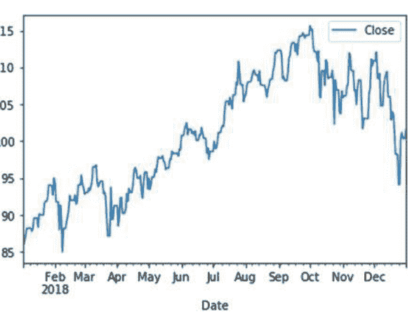

- 趋势：趋势是一个长期的组成部分，描述了时间序列持续增长（上升趋势）或持续减少（下降趋势）的一般趋势。它的模式可以是线性的或非线性的，并且可能保持不变或随时间变化。
- 季节性：季节性变化是规律的、相对短期的重复上下波动，与下面的周期不同，它发生在特定的时间段内，例如一周、一个月或一年。
- 周期性：周期性变化是长期的、上下波动的、潜在不规则的摆动，是由循环发生的情况引起的，没有标准的持续时间。
- 不规则性：不规则性是不遵循预期模式的变化，是由不可预测的事件引起的。在这里，我们可以包括任何不能归类为趋势、周期或季节的变化。

考虑到上述四个要素，利用这些属性的模型在分解策略中通常是加法或乘法。在加法模型中，每个观测值都是四个前述元素的总和，意味着它们是独立的，而在乘法方法中观测值是通过元素的乘法形成的，假设它们可能相互影响。当趋势、周期和季节成分的幅度在系列过程中保持不变时，首选加法模型。当组成部分的幅度随趋势水平的变化而变化时，首选乘法方法。在现实世界的问题中，各种组成部分可能存在也可能不存在。时间序列分析识别和隔离这些组成部分，探索每个组成部分对观察数据的影响方式，从而使通过拟合正确的模型来进行未来预测成为可能。实际上，只有前三个组成部分在时间序列中形成稳定的模式，而不规则变化则像随机误差一样。预测是将这些稳定的模式延伸到未来的行为，基于过去发生的事情有可能再次发生的想法。

## 8.2 相关工作

时间序列预测是近年来非常活跃的研究领域，有着非常丰富的相关文献。在本节中，将简要介绍与本研究主题相关的先前工作的方面，重点关注金融数据上关于时间序列预测的最新研究，以及寻求得出关于哪种方法在特定任务中优于其他方法的结论的研究，鉴于可以建立此类总体范围的结论。

经济不仅是极大地影响国家之间动态关系的重要因素，也是当代社会繁荣的关键支柱。股票市场的发展在塑造新的金融条件方面发挥了特殊作用，越来越多的公司进入股票市场显著改变了近几十年的经济活动。

预测股票市场的行为对利益相关者、公司和投资者尤为重要。出于这个原因，许多著名的时间序列预测方法已被使用。自回归综合移动平均（ARIMA）模型在股票市场的时间序列预测中尤其受欢迎。此外，还引入了利用类似方法的混合方法。在[70]中，介绍了一种将ARIMA与经验小波变换（EWT）技术、改进的人工蜜蜂群算法（ABC）和极限学习机（ELM）神经网络相结合的新方法。在[14]中提出了将ARIMA与长短期记忆（LSTM）循环神经网络（RNN）相结合的方法，而在[69]中提出了将ARIMA与反向传播神经网络（BPNN）模型相结合来预测中国股市。

此外，指数平滑模型在预测金融时间序列中也很常见。在[57]中，使用了单指数平滑模型和双指数平滑模型，而在[26]中使用了Brown的双指数平滑方法。在金融数据中，Holt-Winters加法模型的不同变体（HWAM）也被广泛应用，它是Holt指数平滑的扩展。在[3]中，使用经验模态分解与Holt-Winters方法（EMD-HW）的混合方法用于改善金融时间序列的预测性能，而在[4]中提出了EDM-HW装袋方法。

基于机器学习的预测方法近年来也受到了关注，并在金融问题中得到了广泛应用。矢量自回归模型和递归神经网络（RNN）已经被使用，同时在[50]中使用了自回归神经网络来预测股票收益。在[51]中，提出了一种将RNN与ARMA和指数平滑相结合的混合方法，而在[15]中介绍了深度学习网络的应用。

卷积神经网络（CNN）以及深度CNN也已经被用于股市预测。深度学习方法已经导致了更复杂的方法，比如[20]中将CNN与LSTM堆叠自编码器（SAE）相结合来预测单变量时间序列。

Prophet，Facebook的自动预测程序，最近已经在比特币奖金预测、孟加拉国COVID-19每日病例预测和销售预测等方面被使用。

鉴于本研究主要集中在比较不同的算法来预测时间序列，并从金融数据的角度得出有用的结论，尤其是在相对较短的时间范围（1年）内，不提及其他旨在进行类似比较的研究将是一个重大遗漏。为了在相对不利的条件下比较所审查的方法，本研究选择了1年的规范。我们认为，在过去的数据范围相对较小的情况下，这样的条件可能会发生，并且在这种情况下我们可用工具的行为需要进行调查。

过去的大部分工作都集中在将ARIMA模型与其他方法进行比较，因为ARIMA模型是预测时间序列中最常见的方法之一。它们包括了ARIMA与LSTM在单变量金融数据上的比较，与Holt-Winters模型在主要能源消耗数据、医疗用品数据和交通数据上的比较，与BPNN在预测比特币价格时的比较。至于与人工神经网络相关的方法，在[21]中将各种神经网络模型与Box-Jenkins方法和Holt-Winters方法进行了比较，在[48]中使用股票市场数据比较了各种神经网络架构。此外，在[71]中对RNN进行了比较研究，包括使用LSTM和GRU网络的实证研究，在[35]中将CNN与标准的反向传播NN和LSTM网络进行了测试。在[74]中，对ANN、混合方法和多元回归技术进行了有趣的比较。

这项工作旨在填补并行比较多种不同方法的差距。尽管类似的研究已经进行了重要的反馈，比较方法通常只涉及少数几种方法。比较多种方法的研究只涵盖了文献的一小部分。这些工作包括六种方法，具体包括移动平均法（MA）、多元自适应回归样条（MARS）、ARIMA、灰色模型（GM）、ANN和SVM，在[10]中进行了比较，ANN、贝叶斯模型和随机方法在[64]中进行了比较，最后在[46]中，使用包含天气数据的单变量时间序列比较了不同的基于机器学习的方法。

实际上，COVID-19疫情就是这样一种情景，其后果可以在各种金融数据中看到。

## 8.3 理论背景

在本节中，将概述所审查算法的基本理论要素。这些方法包括以下6类方法（广义上）：ARIMA、Facebook的Prophet、Holt-Winters季节模型，即加法模型（HWAAS）和乘法模型（HWAMS）、N-BEATS、Gluonts Python库中的DeepAR实现，最后是来自的一系列三角BATS方法。

### 8.3.1 ARIMA

ARIMA(p, d, q)代表自回归移动平均模型。这些模型是应用于非平稳情况下的自回归移动平均模型（ARMA）的推广，用于分析和预测时间序列数据。添加的积分部分指的是差分，一种将非平稳时间序列转化为平稳时间序列的方法。

在自回归（AR）模型中，时间相关变量被预测为其过去值的线性组合，换句话说，是变量对自身的回归。通过 p 我们表示模型的滞后阶数，即线性组合中包含的滞后观测值的数量。对 φ₁, ... 进行操作会产生不同的时间序列模式。因此，给定系数和误差噪声，可以得到不同的时间序列模式。因此，给定系数和误差噪声，可以得到不同的时间序列模式。

```
y_t = c + φ₁ y_{t-1} + φ₂ y_{t-2} + ... + φ_p y_{t-p} + ε_t,  (8.1)
```

类似地，移动平均（MA）模型使用类似回归的逻辑进行预测，而不是直接使用过去的值，而是使用过去的预测误差。假设 q 是移动平均的阶数，并且如上所述，改变 θ₁, ..., θ_q 不同的时间序列模式出现，其公式为：

```
y_t = c + ε_t + θ₁ ε_{t-1} + θ₂ ε_{t-2} + ... + θ_q ε_{t-q}.  (8.2)
```

最后，通过差分将非平稳时间序列转化为平稳时间序列，给定差分阶数 d，通过从前一个时间步的观测值中减去当前观测值来完成。度数 d 表示初始观测值被减去的次数，选择足够大的 d，以将初始时间序列转化为平稳时间序列。

### 8.3.2 Prophet

Prophet是一个模块化的回归模型。它具有可解释的参数，可以由具有关于时间序列的领域知识的分析师直观地调整。它本质上是一个可分解的加法模型，由三个主要组成部分组成：趋势、季节性和假期。考虑到噪声，这些组件简单地组合在一起，类似于广义加法模型（GAM），在形式化中使用时间作为回归器，如下所示：

$$y(t) = g(t) + s(t) + h(t) + ε_t$$ (8.3)

其中g(t)模拟非周期性变化，s(t)表示每日、每周或每年的周期性变化，h(t)表示对一天或一段时间内的潜在不规则计划的影响，最后ε_t是未被主要组件建模的其他变化。

Prophet利用了两种不同的趋势模型。第一种是饱和增长模型，其中增长是非线性的，并且在达到承载能力时饱和。这种增长由基本的逻辑增长模型描述，以适应增长率和承载能力都不是恒定的事实。第二种是分段线性模型，用于不呈现饱和增长的问题。为了适应季节性效应，Prophet利用了傅里叶级数，使算法具有灵活性，而傅里叶阶数定义了季节性的类型（年度、每周等）。由于假期和事件可能会对商业时间序列产生可预测的冲击，Prophet配备了这些事件的列表，并将其纳入预测中，解决了这些周期性事件的问题。总之，对于具有强烈季节性和多个季度过去数据的时间序列，方法的效率也是至关重要的。

### 8.3.3 Holt-Winters季节模型

Holt-Winters季节性方法有两种变体：

- Holt-Winters加法方法（HWAAS）：指数平滑法，具有加法趋势和加法季节性。
- Holt-Winters乘法方法（HWAMS）：指数平滑法，具有加法趋势和乘法季节性。

#### 8.3.3.1 HWAAS

Holt-Winters加法模型是对Holt方法的扩展，通过将额外的因素添加到趋势预测中来建模季节性。该公式有三个组成部分，每个部分都是一个带有相应平滑参数的方程。具体来说：

```
\hat{y}_{t+h|t} = \ell_t + h b_t + s_{t+h-m(k+1)} \quad (8.4)

\ell_t = \alpha (y_t - s_{t-m}) + (1-\alpha)(\ell_{t-1} + b_{t-1}) \quad (8.5)

b_t = \beta^* (\ell_t - \ell_{t-1}) + (1-\beta^*) b_{t-1} \quad (8.6)

s_t = \gamma (y_t - \ell_{t-1} - b_{t-1}) + (1-\gamma) s_{t-m} \quad (8.7)
```

其中，α、β、γ是平滑因子，ℓ_t是水平，b_t是趋势，s_t是季节性分量。

#### 8.3.3.2 HWAMS

正如前面提到的，HWAAS和HWAMS本质上是两个版本的相同方法。这两个变体在季节性分量的形式上有所不同。多项式季节性版本与之前完全相同，只是在以下方面有所不同，如下所示：

```
\hat{y}_{t+h|t} = (\ell_t + h b_t) s_{t+h-m(k+1)} \quad (8.8)

\ell_t = \alpha \frac{y_t}{s_{t-m}} + (1-\alpha)(\ell_{t-1} + b_{t-1}) \quad (8.9)

b_t = \beta^* (\ell_t - \ell_{t-1}) + (1-\beta^*) b_{t-1} \quad (8.10)

s_t = \gamma \frac{y_t}{(\ell_{t-1} + b_{t-1})} + (1-\gamma) s_{t-m} \quad (8.11)
```

### 8.3.4 N-BEATS: 神经基础扩展分析

N-BEATS是一种用于时间序列预测的深度神经架构。该架构基于前向和后向残差连接以及非常深的全连接层堆叠。假设期望的输出大小为 H，时间序列的输入数据大小将是 H的整数倍 m。这个mH维输入通过多个基本块的堆栈，一个趋势堆栈和一个季节性堆栈。每个基本块由一个4层全连接堆栈组成，在被分成两部分之前，每部分都通过另一个FC引导。一部分是长度为 H 的未来点预测，另一部分是长度为mH 的输入数据预测。每个堆栈都按照双重（回溯和预测）残差堆叠拓扑结构排列。

对于每个连续的块，输入是一个 $mH$ 维向量，它是通过前一个块的反向输出和输入之间的逐元素减法得到的。堆栈的输出由一个 $mH$ 维堆栈反向输出和一个 $H$ 维堆栈预测输出组成，堆栈预测输出将与每个堆栈的相应输出逐元素相加，形成最终的 $H$ 维预测输出向量。总之，整体架构由两个堆栈组成，趋势堆栈后跟季节性堆栈，以及与上述预测-反向输出原则相结合的双重残差堆叠拓扑结构。

### 8.3.5 DeepAR

DeepAR是一种深度学习方法，用于估计时间序列的未来概率分布，给定其过去的数据。DeepAR算法通过实现类似于中描述的RNN模型来实现。DeepAR模型基于自回归循环网络架构，特别是利用基于LSTM的架构，在大量相关时间序列上进行训练，以解决产生准确的概率预测的问题。该模型使用LSTM架构，可以同时训练相关的时间序列，并利用编码器-解码器设置，这在序列到序列模型中很常见，其中编码器和解码器网络共享相同的架构。建议使用具有高斯/负二项分布似然函数的RNN架构从相关时间序列创建全局模型，并结合非线性数据转换。总之，DeepAR还实现了蒙特卡洛采样，并且不需要进行扩展的特征工程，因为它利用给定的协变量来学习季节性行为。整体策略旨在产生优于传统单项预测的概率预测结果。

### 8.3.6 三角BATS

最后，我们来介绍一下我们使用的模型的最后部分，它由一系列方法组成，这些方法在其基本组件中结合了不同的统计方法，所有这些方法都具有一个趋势元素和使用三角季节性公式的特点，并且可以应用于各种时间序列问题。这些各种修改中的第一个是TATS。后者是算法基本组件的标识符，该方法利用三角季节性公式，能够分解复杂的季节性时间序列并建模非整数季节频率，还包括一个ARMA误差部分和趋势建模组件。TBAT添加了一个Box-Cox转换，用于处理非正态的因变量和非线性，保持三角函数组件并省略季节性。最后，根据上述，TBATS由以下组成：三角函数、Box-Cox变换、ARMA误差、趋势和季节性分量。

## 8.4 实验和结果

接下来是实验过程和随后的结果的介绍。本节包括四个部分，每个部分分别包含有关使用的数据和上述算法的信息，评估指标以及最后的结果的解释性表格和图表。

### 8.4.1 数据集

实验过程中使用了从Yahoo! Finance网页中获取的40个数据集。选择了Yahoo! Finance是为了使所需数据公开可用，以便结果可以轻松重现。为了形成最终的数据集，选择了最活跃的40只股票。每只股票都用其名称的特征缩写表示。每只股票的全名及其相应的缩写可以在表8.1中看到。对于每只股票，形成的数据集覆盖了从2018年1月4日到2019年3月31日的1年期间。鉴于本工作仅关注单变量时间序列预测，每个数据集仅包含股票每日的收盘市值，因此大约包含365个值。

为了确保所获取的数据集不包含任何缺失数据，考虑到并非所有算法都能处理缺失值，在股市闭市的日子里，使用前一天的收盘价。

### 8.4.2 算法

正如已经强调的那样，本研究的核心是比较几种广泛使用且强大的单变量时间序列预测算法，这些算法被认为是最先进的。至于算法的实现，使用了最近开发的Python库AtsPy，它是一个自动化结构和机器学习时间序列模型的存储库。选择AtsPy存储库是因为它包含了各种自动化时间序列预测模型，同时可以通过使用梯度提升模型(GBM)和提取时间序列特征来减少现有单一模型的结构模型误差约30-50%。该存储库使用已经存在的Python库statsmodels、fbprophet、gluonts、pmdarima和tbats以统一的方式利用第8.3节中提到的算法，并希望成为一个易于使用但有效的自动化时间序列预测工具。除上述之外，## 表8.1 实验过程中使用的股票列表

| 否 | Ab. | 姓名 | 否 | Ab. | 姓名 |
|---|---|---|---|---|---|
| 1 | AAL | 美国航空集团公司 | 21 | INO | Inovio制药公司 |
| 2 | AAPL | 苹果公司 | 22 | INTC | 英特尔公司 |
| 3 | AMD | 先进微装置公司 | 23 | LUV | 西南航空公司 |
| 4 | APA | Apache公司 | 24 | MSFT | 微软公司 |
| 5 | AUY | Yamana Gold公司 | 25 | MU | 美光科技公司 |
| 6 | BA | 波音公司 | 26 | NCLH | 挪威邮轮控股有限公司 |
| 7 | BABA | 阿里巴巴集团控股有限公司 | 27 | ORCL | 甲骨文公司 |
| 8 | BAC | 美国银行公司 | 28 | PE | Parsley Energy,公司 |
| 9 | BB | 黑莓有限公司 | 29 | PG | 宝洁公司 |
| 10 | CCL | 嘉年华公司 & Co. Plc | 30 | PYPL | PayPal控股公司 |
| 11 | CSCO | 思科系统公司 | 31 | SBUX | 星巴克公司 |
| 12 | DAL | 达美航空公司 | 32 | SIRI | Sirius XM控股公司 |
| 13 | DIS | 华特迪士尼公司 | 33 | SNAP | Snap公司 |
| 14 | EBAY | eBay公司 | 34 | SPOT | Spotify科技公司 |
| 15 | ERI | 埃尔多多度假村公司 | 35 | TGS | 南方天然气运输公司 |
| 16 | F | 福特汽车公司 | 36 | TSLA | 特斯拉公司 |
| 17 | FB | Facebook公司 | 37 | TWTR | Twitter公司 |
| 18 | GM | 通用汽车公司 | 38 | UAL | 联合航空控股公司 |
| 19 | HPE | 惠普企业公司 | 39 | WFC | 富国银行 & Co. 公司 |
| 20 | HPQ | 惠普公司 | 40 | ZNGA | Zynga公司 |

报告还指出，它通过使用频谱分析、周期图和拾取分析自动识别数据中的季节性。直到现在，正如可以从前述中轻松推导出的那样，AtsPy提供了以下算法的实现，其基本要素如下所述^3:

-   ARIMA(p,d,q):自回归移动平均模型，是自回归移动平均模型(ARMA)的演化。参数p、d和q分别定义了自回归模型的时间滞后数(p)、差分阶数(d)和移动平均模型的阶数(q)。
-   Prophet:使用线性或非线性增长建模多重季节性。基于加法模型的过程，在我们的情况下，使用每日季节性进行拟合。
-   HWAAS:具有加法趋势和加法季节性的指数平滑。
-   HWAMS:具有加法趋势和乘法季节性的指数平滑。
-   NBEATS:一种基于前向和后向残差链接以及非常深的全连接层堆叠的深度神经网络架构。
-   Gluonts [DeepAR]:GluonTS是一个基于深度学习的时间序列建模的Python库。这里使用基于循环神经网络(RNN)的模型，利用深度学习在时间序列预测中的优势。
-   TBAT: 基于三角季节性、ARMA误差和趋势组件的方法，包括Box-Cox变换。
-   TATS: 基于三角季节性、ARMA误差、季节性和趋势组件的方法，不使用Box-Cox变换。
-   TBATS1: 类似于TBAT的方法，此外还利用了一个季节性周期。
-   TBATS2: 类似于TBATS1的方法，利用了两个季节性周期而不是一个。
-   TBATP1: 类似于TBATS1的方法，其中季节性推断由周期性硬编码。

在实验过程中，每个算法都在40个数据集上进行了测试。考虑ARIMA(p, d, q)参数顺序，定义了p、d和q的值为 (p, d, q) = (0, 1, 0)。对于Gluonts [DeepAR]和NBEATS，将迭代次数设置为20。为了执行HWAAS和HWAMS，指数平滑模型通过将参数trend设置为'add'来进行调整，对于HWASS，将参数设置为'mul'来应用加法和乘法趋势。TBATS Python实现的参数seasonal_period和using_box_cox被适当调整以执行每次的TBAT、TATS、TBATS1、TBATP1和TBATS2。此外，除非另有说明，所有参数均设置为默认值。

在算法执行过程中，发生了两种不同类型的预测：样本内预测和样本外预测。对于样本内预测，数据集被分成两个子集。第一个子集包含70%的数据集的前254个实例，第二个子集包含剩余30%的数据集的最后111个实例。第一个子集被用作训练集，用于预测数据集剩余30%的值，而第二个子集的值没有透露给模型，而是用作控制集，用于对比方法的性能进行假设。对于样本外预测，整个数据集被用于训练模型，并要求算法预测训练集最后日期之后两周的目标变量的值。

虽然有方法可以从这两种预测中得出结论，但在这项工作中，我们专注于基于样本内预测的结果，因为它们更可靠。

### 8.4.3 评估

为了比较算法，使用了多个评估指标。由于没有一个通用的指标可以导致整体安全的结果，因为它们都有各自的优点和缺点[9, 32, 67]，所以在评估预测技术时使用了三个广泛使用的评估指标。这些指标是：平均绝对误差（MAE）、均方根误差（RMSE）和平均绝对百分比误差（MAPE）。假设 y 是观察值的实际值，而 ŷ 是预测值，下面提供了这些指标如何计算以及一些有用信息的简要说明：

-   平均绝对误差（MAE）： MAE是绝对误差的算术平均值，通过以下分析表达式计算：

$$MAE(y, \hat{y}) = \frac{1}{n} \sum_{i=1}^{n} |y_i - \hat{y}_i|$$

MAE是一个与比例相关的准确度度量，因此在比较具有不同比例的系列时不能使用，但在数据均匀时常用于比较不同的模型。它是一个易于解释的度量，并且对异常值具有鲁棒性。

-   均方根误差(RMSE)： RMSE是预测误差平方的平均值的平方根。它通过以下分析公式计算：

$$RMSE(y, \hat{y}) = \sqrt{\frac{1}{n} \sum_{i=1}^{n} (y_i - \hat{y}_i)^2}$$

RMSE也是与比例相关的，因此不适用于不同数据集之间的比较，但在比较同一数据集上的几个模型时是适用的。RMSE对异常值的存在非常敏感，因为大误差会使其值因公式中的平方差而急剧增加。RMSE是非负的，一般来说，较低的RMSE值表示更好的性能，而接近或等于零的值则表示完美的预测。

-   平均绝对百分比误差(MAPE): MAPE是通过以下公式计算的绝对百分比误差的平均值:

$$MAPE(y, \hat{y}) = \left\{ \frac{1}{n} \sum_{i=1}^{n} \left| \frac{y_i - \hat{y}_i}{y_i} \right| \right\} \times 100 \quad (8.14)$$

MAPE是比较预测方法中最常用的指标之一，易于解释，并且不依赖于比例尺，因此可以用于比较不同数据集中使用的方法[43]。MAPE被认为是一个百分比误差，但当预测值远低于或远高于实际值时，它也可以得分超过100。另一个缺点是当实际值等于零时，MAPE未定义，或者当实际值趋近于零时可能导致极端值。在这项工作中，没有出现这样的值，因此可以信任MAPE的使用。

### 8.4.4 结果

在本节中，将介绍实验过程的结果以及相应的统计测试结果。如前所述，使用三种不同的指标（MAE、RMSE和MAPE）比较了11种方法在40个离散股票市场数据集上的性能。由于使用了大量的方法和数据集，实验过程的确切结果在相当宽敞的表格中描述。考虑到可用空间的限制以及数值结果的大表格通常比较令人沮丧，这里没有提供三个指标的完整结果表格，而是选择了更有效的方式来呈现这项工作的结果，如胜/平/负（w/t/l）表格、cd图和箱线图。对于所有感兴趣的人，可以在以下网址找到所有三个评估指标的完整结果表格：https://rb.gy/7lqayb。为了确保整个过程的结果可信，并检验比较的预测算法的统计独立性，实验后进行了统计测试。因此，使用非参数的全对全弗里德曼检验[23]，以及Bonferroni-Dunn事后检验[18]，使用了参数α等于0.05。弗里德曼检验接受或拒绝零假设 H_0，即两个或多个算法结果的均值相同，如果拒绝零假设，则所有方法或它们的组不相似。此外，在这种情况下，Bonferroni-Dunn事后检验可以检测到不同的方法组。统计测试不仅提供了关于哪些算法表现相似和哪些不相似的信息，而且弗里德曼检验还对算法进行了排名，通过一个值来测试方法，该值表示算法优于其竞争对手的算法。

鉴于使用了三种不同的度量标准作为评估指标，本节的其余部分分为三个部分，分别专门讨论MAE、RMSE和MAPE。对于上述每个度量标准，提供以下内容：(a) 一张胜/平/负表，显示每对方法的胜利、平局和失败次数，(b) 一张特征弗里德曼排名分数的表，(c) 一张比较方法的cd图和(d) 一张用于图形总结所呈现的度量标准结果的箱线图。

胜/平/负表提供了有关一个算法在所有可能的对中击败另一个算法的次数的信息。在表的每个(i,j)单元格中，都有一个三元组，表示考虑第i行和第j列的算法对的胜利、平局和失败次数。因此，胜/平/负表始终相对于对角线对称，而对角线上的所有值都等于零。在这项工作中，当考虑度量标准下算法性能之间的差异大于0.01时，认为发生了胜利或失败，否则认为是平局。在弗里德曼排名表中，根据所考察的度量标准，对算法进行排名，从最好到最差。弗里德曼测试分配的值越低，性能越高。在考虑cd图时，使用弗里德曼排名的分数来计算临界差异值。当两种方法的排名分数之间的数值差大于临界差异值时，认为这些方法在统计上是相关的。在cd图中，统计相关的方法用粗体水平线连接。箱线图提供了关于比较方法的中位数、第一四分位数和第三四分位数，以及最小值和最大值的有用信息。由于异常值往往会将箱线图推到图的边缘，使其难以辨认，因此没有绘制异常值。

#### 8.4.4.1 平均绝对误差

根据图8.2中显示MAE指标表现的箱线图，NBEATS的得分低于其竞争对手，其次是TATS，而Prophet得分最高。其余算法的性能相似。从表8.2中的w/t/l表中也可以得出相同的结论，NBEATS取得了更多的胜利并击败了所有对手。进行的统计检验拒绝了零假设H0，因为p值等于0.00001，因此并非所有算法的性能相似。在对应的cd图中，可以从图8.3中看到以相似方式运行的统计相关方法的组。弗里德曼排名在表8.3中呈现，为我们提供了关于其他算法性能的更好视角，按照从NBEATS（最低MAE）到Prophet（最高MAE）的升序排序。

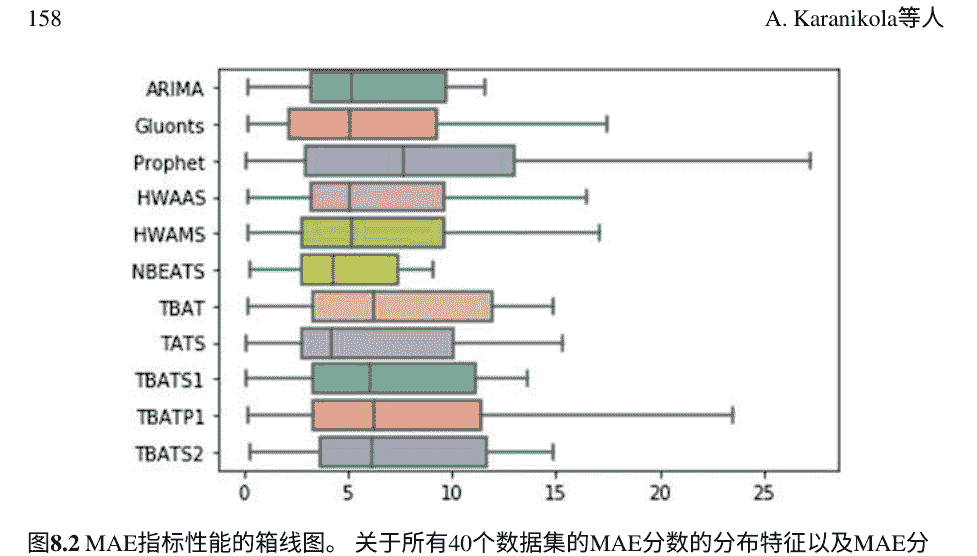

图8.2 MAE指标性能的箱线图。关于所有40个数据集的MAE分数的分布特征以及MAE分数的水平的基本信息被呈现出来。

表8.2 MAE指标的W/T/L表

| | ARIMA | Gluonts | Prophet | HWAAS | HWAMS | NBEATS | TBAT | TATS | TBATS1 | TBATP1 | TBATS2 |
|---|---|---|---|---|---|---|---|---|---|---|---|
| ARIMA | 0/0/0 | 19/1/20 | 10/0/30 | 18/0/22 | 17/0/23 | 27/0/13 | 11/2/27 | 23/3/14 | 17/1/22 | 13/3/24 | 10/0/30 |
| Gluonts | 20/1/19 | 0/0/0 | 15/0/25 | 21/0/19 | 22/0/18 | 22/0/18 | 17/1/22 | 23/0/17 | 19/0/21 | 19/1/20 | 19/0/21 |
| Prophet | 30/0/10 | 25/0/15 | 0/0/0 | 29/0/11 | 28/0/12 | 31/0/9 | 22/1/17 | 29/0/11 | 25/1/14 | 24/1/15 | 22/0/18 |
| HWAAS | 22/0/18 | 19/0/21 | 11/0/29 | 0/0/0 | 15/5/20 | 27/0/13 | 16/0/24 | 25/0/15 | 19/0/21 | 17/0/23 | 19/0/21 |
| HWAMS | 23/0/17 | 18/0/22 | 12/0/28 | 20/5/15 | 0/0/0 | 26/0/14 | 15/0/25 | 27/0/13 | 18/0/22 | 17/0/23 | 17/0/23 |
| NBEATS | 13/0/27 | 18/0/22 | 9/0/31 | 13/0/27 | 14/0/26 | 0/0/0 | 12/0/28 | 16/0/24 | 11/0/29 | 12/0/28 | 11/0/29 |
| TBAT | 27/2/11 | 22/1/17 | 17/1/22 | 24/0/16 | 25/0/15 | 28/0/12 | 0/0/0 | 25/9/6 | 11/24/5 | 9/28/3 | 8/26/6 |
| TATS | 14/3/23 | 17/0/23 | 11/0/29 | 15/0/25 | 13/0/27 | 24/0/16 | 6/9/25 | 0/0/0 | 10/8/22 | 8/9/23 | 5/8/27 |
| TBATS1 | 22/1/17 | 21/0/19 | 14/1/25 | 21/0/19 | 22/0/18 | 29/0/11 | 5/24/11 | 22/8/10 | 0/0/0 | 9/19/12 | 7/18/15 |
| TBATP1 | 24/3/13 | 20/1/19 | 15/1/24 | 23/0/17 | 23/0/17 | 28/0/12 | 3/28/9 | 23/9/8 | 12/19/9 | 0/0/0 | 7/18/15 |
| TBATS2 | 30/0/10 | 21/0/19 | 18/0/22 | 21/0/19 | 23/0/17 | 29/0/11 | 6/26/8 | 27/8/5 | 15/18/7 | 15/18/7 | 0/0/0 |

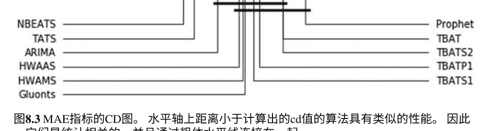

图8.3 MAE指标的CD图。水平轴上距离小于计算出的cd值的算法具有类似的性能。因此，它们是统计相关的，并且通过粗体水平线连接在一起。

表8.3 MAE、RMSE、MAPE的Friedman排名

| | MAE | | RMSE | | MAPE |
| :--- | :--- | :--- | :--- | :--- | :--- |
| 1 | NBEATS | 4.225 | TATS | 4.375 | NBEATS | 3.15 |
| 2 | TATS | 4.525 | NBEATS | 4.6 | Gluonts | 4.7 |
| 3 | ARIMA | 5.2 | ARIMA | 5.15 | TATS | 5.3 |
| 4 | HWAAS | 5.8 | HWAAS | 5.85 | HWAAS | 5.475 |
| 5 | HWAMS | 5.9 | Gluonts | 5.875 | ARIMA | 5.55 |
| 6 | Gluonts | 5.975 | HWAMS | 5.9 | HWAMS | 5.625 |
| 7 | TBATS1 | 6.2125 | TBATS1 | 6.1625 | TBATS1 | 6.4875 |
| 8 | TBATP1 | 6.3875 | TBATP1 | 6.4625 | TBATP1 | 6.6125 |
| 9 | TBATS2 | 7.0375 | TBATS2 | 6.9625 | TBATS2 | 7.3875 |
| 10 | TBAT | 7.0375 | TBAT | 7.0125 | TBAT | 7.5625 |
| 11 | Prophet | 7.7 | Prophet | 7.65 | Prophet | 8.15 |

#### 8.4.4.2 RMSE

此外，使用RMSE作为评估指标可以得出类似的结果。图8.4中的箱线图表明，表现最好的两个算法是NBEATS和TATS。另一方面，可以明显看出Prophet的表现最差，而TBAT的表现次差。表8.4中的W/T/L表为这些假设提供了理由，TATS取得了最多的胜利，其次是NBEATS。至于统计测试，零假设被拒绝，具有显著性水平的p值等于0.00003。

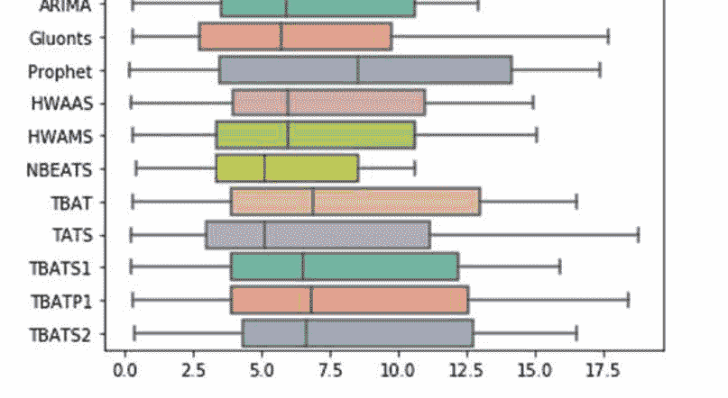

表8.4 RMSE指标的W/T/L表

| | ARIMA | Gluonts | Prophet | HWAAS | HWAMS | NBEATS | TBAT | TATS | TBATS1 | TBATP1 | TBATS2 |
|---|---|---|---|---|---|---|---|---|---|---|---|
| ARIMA | 0/0/0 | 19/1/20 | 12/0/28 | 16/2/22 | 16/0/24 | 22/0/18 | 11/2/27 | 24/2/14 | 18/1/21 | 13/3/24 | 10/1/29 |
| Gluonts | 20/1/19 | 0/0/0 | 14/0/26 | 21/0/19 | 22/0/18 | 22/0/18 | 18/0/22 | 22/0/18 | 19/0/21 | 18/0/22 | 18/0/22 |
| Prophet | 28/0/12 | 26/0/14 | 0/0/0 | 29/0/11 | 27/1/12 | 30/0/10 | 23/0/17 | 29/0/11 | 27/0/13 | 25/0/15 | 22/0/18 |
| HWAAS | 22/2/16 | 19/0/21 | 11/0/29 | 0/0/0 | 17/4/19 | 27/0/13 | 16/0/24 | 26/0/14 | 19/0/21 | 18/0/22 | 18/0/22 |
| HWAMS | 24/0/16 | 18/0/22 | 12/1/27 | 19/4/17 | 0/0/0 | 25/0/15 | 15/1/24 | 27/0/13 | 18/1/21 | 18/1/21 | 16/0/24 |
| NBEATS | 18/0/22 | 18/0/22 | 10/0/30 | 13/0/27 | 15/0/25 | 0/0/0 | 13/0/27 | 19/0/21 | 13/0/27 | 13/0/27 | 12/0/28 |
| TBAT | 27/2/11 | 22/0/18 | 17/0/23 | 24/0/16 | 24/1/15 | 27/0/13 | 0/0/0 | 26/8/6 | 11/24/5 | 9/28/3 | 9/26/5 |
| TATS | 14/2/24 | 18/0/22 | 11/0/29 | 14/0/26 | 13/0/27 | 21/0/19 | 6/8/26 | 0/0/0 | 8/8/24 | 8/8/24 | 6/7/27 |
| TBATS1 | 21/1/18 | 21/0/19 | 13/0/27 | 21/0/19 | 21/1/18 | 27/0/13 | 5/24/11 | 24/8/8 | 0/0/0 | 9/19/12 | 8/18/14 |
| TBATP1 | 24/3/13 | 22/0/18 | 15/0/25 | 22/0/18 | 21/1/18 | 27/0/13 | 3/28/9 | 24/8/8 | 12/19/9 | 0/0/0 | 7/19/14 |
| TBATS2 | 29/1/10 | 22/0/18 | 18/0/22 | 22/0/18 | 24/0/16 | 28/0/12 | 5/26/9 | 27/7/6 | 14/18/8 | 14/19/7 | 0/0/0 |

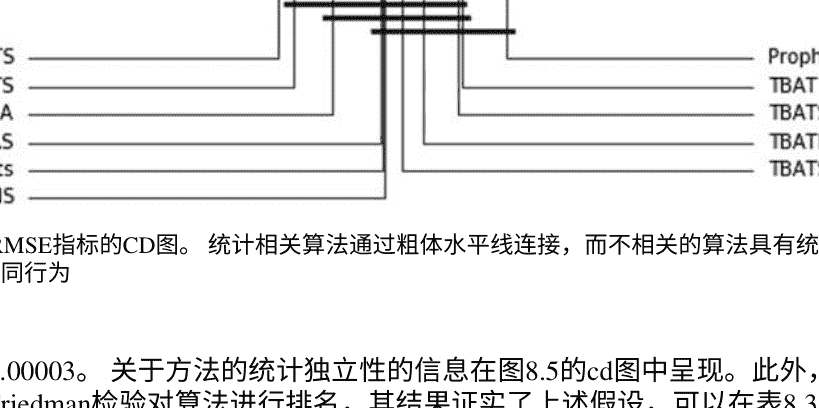

关于方法的统计独立性的信息在图8.5的cd图中呈现。此外，根据弗里德曼检验对算法进行排名，其结果证实了上述假设，可以在表8.3中找到。

#### 8.4.4.3 MAPE

MAPE是计算的指标中最后一个，可能也是最有教育意义的，因为它不像MAE和RMSE那样依赖于尺度。这个指标的箱线图可以在图8.6中找到，它使我们能够清楚地看到比较方法的性能，因为它们之间的差异现在变得明显。

NBEATS实现了最低的百分比误差，其后是Gluonts。Prophet的误差百分比最高。从表8.5的w/t/l表和表8.3的弗里德曼排名结果中也得出了相同的结论。根据弗里德曼测试的排名，中等评级方法的排名值图8.6 MAPE指标性能的箱线图。关于所有40个数据集的MAPE分数的分布特征的基本信息，以及MAPE分数的水平都被呈现出来。

#### 表8.5 MAPE指标的W/T/L表

|        | ARIMA    | Gluonts  | Prophet  | HWAAS    | HWAMS    | NBEATS   | TBAT     | TATS     | TBATS1   | TBATP1   | TBATS2   |
|--------|----------|----------|----------|----------|----------|----------|----------|----------|----------|----------|----------|
| ARIMA  | 0/0/0    | 24/0/16  | 11/0/29  | 18/1/21  | 20/0/20  | 28/0/12  | 12/0/28  | 23/0/17  | 17/0/23  | 16/1/23  | 11/0/29  |
| Gluonts| 16/0/24  | 0/0/0    | 9/0/31   | 18/0/22  | 20/0/20  | 22/0/18  | 11/0/29  | 16/0/24  | 13/0/27  | 12/0/28  | 11/0/29  |
| Prophet| 29/0/11  | 31/0/9   | 0/0/0    | 33/0/7   | 33/0/7   | 32/0/8   | 24/0/16  | 29/0/11  | 28/0/12  | 26/0/14  | 21/0/19  |
| HWAAS  | 21/1/18  | 22/0/18  | 7/0/33   | 0/0/0    | 17/3/20  | 30/0/10  | 10/0/30  | 24/0/16  | 16/0/24  | 15/0/25  | 17/0/23  |
| HWAMS  | 20/0/20  | 20/0/20  | 7/0/33   | 20/3/17  | 0/0/0    | 33/0/7   | 10/2/28  | 21/1/18  | 16/2/22  | 16/2/22  | 15/0/25  |
| NBEATS | 12/0/28  | 18/0/22  | 8/0/32   | 10/0/30  | 7/0/33   | 0/0/0    | 5/0/35   | 7/0/33   | 8/0/32   | 6/0/34   | 5/0/35   |
| TBAT   | 28/0/12  | 29/0/11  | 16/0/24  | 30/0/10  | 28/2/10  | 35/0/5   | 0/0/0    | 23/8/9   | 11/24/5  | 10/27/3  | 9/25/6   |
| TATS   | 17/0/23  | 24/0/16  | 11/0/29  | 16/0/24  | 18/1/21  | 33/0/7   | 9/8/23   | 0/0/0    | 11/7/22  | 12/8/20  | 8/7/25   |
| TBATS1 | 23/0/17  | 27/0/13  | 12/0/28  | 24/0/16  | 22/2/16  | 32/0/8   | 5/24/11  | 22/7/11  | 0/0/0    | 10/19/11 | 7/18/15  |
| TBATP1 | 23/1/16  | 28/0/12  | 14/0/26  | 25/0/15  | 22/2/16  | 34/0/6   | 3/27/10  | 20/8/12  | 11/19/10 | 0/0/0    | 7/18/15  |
| TBATS2 | 29/0/11  | 29/0/11  | 19/0/21  | 23/0/17  | 25/0/15  | 35/0/5   | 6/25/9   | 25/7/8   | 15/18/7  | 15/18/7  | 0/0/0    |

与最佳和最差算法的排名值相比，中等评级方法的排名值非常相似。在这种情况下，零假设被拒绝，p值等于0.00001。相应的cd图在图8.7中呈现。

#### 8.4.4.4 比较

正如已经提到的，MAE和RMSE指标为我们提供了关于比较方法性能的有用信息，但是由于它们都依赖于尺度，它们不能构成一个独立的达到有效结论的标准。MAPE被用来克服这个限制。这些指标结果的比较可以对整个预测过程的各个方面提供更可靠的解释。

图8.7 MAPE指标的CD图。与MAPE相关的统计相关算法通过粗体水平线连接在一起，形成具有统计上相似行为的算法组。

图8.8 F数据集的样本内预测。

在这三个指标中，NBEATS是得分最低的两种方法之一。具体而言，NBEATS在考虑MAE和MAPE时排名第一，在考虑RMSE时排名第二。TATS在RMSE中也取得了显著的成绩，在MAE中排名第一。一个初步出乎意料的事实是，虽然Gluonts的DeepAR实现在MAE和RMSE中分别排名第六和第五，但在考虑MAPE时排名第二。ARIMA和HWAAS的表现也相当不错，在所有指标中它们都排在第三和第五之间。Facebook的Prophet在所有指标中得分最低，这是可以预料的，因为它的性能质量往往与覆盖时间较长的数据成正比。最后，TBAT在所有情况下都排名倒数第二，而属于其家族的其他方法，即TBATS1、TBATP1和TBATS2，也分别排在第七、第八和第九位。图8.8、8.9和8.10展示了关于样本内预测的方法的预测性能的指示性图表。

图8.9 SPOT数据集的样本内预测。

图8.10 ORCL数据集的样本内预测。

## 8.5 结论

本研究的目的是比较不同时间序列预测方法在相对较短的单变量时间序列上的性能。使用了属于统计学或机器学习领域的六个离散家族的十一种方法。选择的数据涵盖了一年的时间段，以研究仅有少量过去观察可用于进行预测的情况，考虑到这种情况在现实世界的任务中很常见。然而，金融数据预测，如本研究中使用的股市收盘价预测，容易受到各种因素的影响，具有很高的难度。此外，在这里，实验过程以自动化方式进行，这是本研究的一个固定参数规范，因此在可靠的数据可用的情况下，对可用数据进行操作可以使预测和结论达成更省时且更容易进行，始终在不可避免的权衡限制下进行。

对于这种预测方法的性能评估，不存在一个通用的度量标准，因此需要使用三个不同的公式（MAE、RMSE、MAPE）并比较它们的得分来作为可靠解释的工具。NBEATS和TATS似乎在所有三个指标上都超过了它们的竞争对手。这些指标使其成为弗里德曼排名程序的前三名。值得注意的是，Python实现的DeepAR，Gluonts，在MAPE指标上的排名明显提高，相比于MAE和RMSE。这可能表明其性能良好，因为MAPE反映了百分比误差，而不是依赖于尺度的MAE和RMSE，同时也指出了使用多个评估指标以获得更好结果洞察的必要性。另一个值得注意的观点是，没有一种单一的方法能够令人满意地解决特定任务中的所有问题。Prophet是一种能够在长时间数据上进行准确预测的方法，在我们的案例中表现出了较差的性能。统计测试还提供了有用的信息关于所获得的结果。此外，在所有情况下，表现最好和最差的方法是统计独立的，这表明了有效的比较。Cd-图表显示了具有统计上相似性能的方法组，再次确认并在一定程度上强调了上述一般观点，即没有一种单一的方法（无论是统计还是基于机器学习的方法）适用于所有预测问题。最后，考虑到短期单变量数据，NBEATS和TATS，即机器学习方法（NBEATS）和传统统计方法（TATS）的算法，表现优于竞争对手，以相似的方式实现了最准确的结果。

关于这项工作的未来扩展，应该研究时间序列预测算法的集成方法的利用。集成是基于这样一个想法，即使用一组多样化的模型并结合它们的输出，通常比一次使用单个模型能获得更好的性能[16, 52]。通过利用后者，统计和机器学习方法的结合可以同时保持两种方法的优势，从而减少产生的预测误差。总之，应该研究长期数据的情况，涵盖几年的时间，无论是从本章的规格来看，还是从上述的集成策略来看。

## 参考文献

-   1. R. Adhikari, R.K. Agrawal, 时间序列建模和预测的入门研究 (2013). https://doi.org/10.1210/jc.2006-1327. arXiv预印本 arXiv:13026613
- 2. A. Alexandrov, K. Benidis, M. Bohlke-Schneider, V. Flunkert, J. Gasthaus, T. Januschowski, D.C. Maddix, S. Rangapuram, D. Salinas, J. Schulz, L. Stella, A.C. Türkmen, Y. Wang, GluonTS: Python中的概率时间序列模型。 (2019), pp. 1–2
- 3. A.M. Awajan, M.T. Ismail, 一种用于短期预测每日股票市场时间序列数据的混合方法EMD-HW，在AIP Conf Proc, vol. 1870 (2017)中。 https://doi.org/10.1063/1.4995933
- 4. A.M. Awajan, M.T. Ismail, Wadi S. Al, 使用emd-hw bagging提高股票市场数据的预测准确性。 PLoS One 13, 1–20 (2018)。 https://doi.org/10.1371/journal.pone.0199582
- 5. A. Barkat, A. Ali, U. Hayat, Q.G. Crowley, K. Rehman, N. Siddique, T. Haidar, T. Iqbal, 对巴基斯坦北部土壤氢的时间序列分析：对地震预测的影响。 Appl. Geochem. 97, 197–208 (2018)。 https://doi.org/10.1016/j.apgeochem.2018.08.016
- 6. J.M. Binner, T. Elger, B. Nilsson, J.A. Tepper, 非线性时间序列预测工具在经济学中的应用-状态转换向量自回归模型和递归神经网络的实证比较. Adv. Econ. 19, 71–91 (2004). https://doi.org/10.1016/S0731-9053(04)19003-8
- 7. G.E.P. Box, D.R. Cox, 变换分析. J. R. Stat. Soc. Ser. B 26, 211–243 (1964)
- 8. J. Cao, J. Wang, 基于改进的卷积神经网络的股票价格预测模型和金融时间序列分析. Int. J. Commun. Syst. 32, 1–13 (2019). https://doi.org/10.1002/dac.3987
- 9. T. Chai, R.R. Draxler, 均方根误差（RMSE）或平均绝对误差（MAE）？反对文献中避免使用RMSE的论点. 地球科学模型发展 7, 1247-1250（2014年）。 https://doi.org/10.5194/gmd-7-1247-2014
- 10. H.K. Chan, S. Xu, X. Qi, 预测集装箱吞吐量的时间序列方法比较. 国际物流研究与应用 2, 294-303（2019年）。 https://doi.org/10.1080/13675567.2018.1525342
- 11. C. Chatfield, Holt-Winters预测程序. 应用统计 27, 264（1978年）。 https://doi.org/10.2307/2347162
- 12. C.C. Chen, J.H. Chang, F.C. Lin, J.C. Hung, C.S. Lin, Y.H. Wang, 反向传播网络和ARIMA在比特币价格预测中的预测能力比较, 2019年智能信号处理与通信系统国际研讨会论文集, 2019-2020（2019年）。 https://doi.org/10.1109/ISPACS48206.2019.8986297
- 13. J.F. Chen, W.L. Chen, C.P. Huang, S.H. Huang, A.P. Chen, 使用深度卷积神经网络进行金融时间序列数据分析, 在Proc—2016第七届云计算大数据国际会议中CCBD, 卷2016 (2017), 页87–92. https://doi.org/10.1109/CCBD.2016.027
- 14. H.K. Choi, 使用ARIMA-LSTM混合模型进行股价相关系数预测 (2018)
- 15. E. Chong, C. Han, F.C. Park, 用于股市分析和预测的深度学习网络: 方法论、数据表示和案例研究. 专家系统应用 83, 187–205 (2017). https://doi.org/10.1016/j.eswa.2017.04.030
- 16. T.G. Dietterich, 机器学习中的集成方法, 在多类别系统, 卷1857(1–15) (2000), 页45014–45019. https://doi.org/10.1007/3-540-45014-9
- 17. Y. Dong, S. Li, X. Gong, 时间序列分析: Arima模型在股票价格预测中的应用, 第29卷 (2017年), 第703-710页. https://doi.org/10.2991/iemss-17.2017.14018.
- 18. O.J. Dunn, 多个均值之间的多重比较. J. Am. Stat. Assoc. 56, 52 (1961年). https://doi.org/10.2307/2282330
- 19. F. Duvard, V.W.X. Nkdv, H.G.X. Wu, 数据集A ARIMA和ProphetFB. C: 6-9 (2016年)
- 20. A. Essien, C. Giannetti, 一种用于单变量时间序列预测的深度学习框架, 使用卷积LSTM堆叠自编码器, 在IEEE Int Symp Innov Intel Syst Appl INISTA2019—Proc（2019年）, 第1-6页. https://doi.org/10.1109/INISTA.2019.8778417
- 21. J. Faraway, C. Chatfield, 使用神经网络进行时间序列预测: 航空数据的比较研究. J. R. Stat. Soc. Ser. C Appl. Stat. 47, 231-250 (1998年). https://doi.org/10.1111/1467-9876.00109
- 22. J.H. Friedman, 贪婪函数逼近: 梯度提升机. Ann. Stat. 29, 1189–1232 (2001年). https://doi.org/10.1214/aos/1013203451
- 23. M. Friedman, 使用排名来避免方差分析中隐含的正态性假设. J. Am. Stat. Assoc. 32, 675–701 (1937年). https://doi.org/10.1080/01621459.1937.10503522
- 24. M. Geurts, G.E.P. Box, G.M. Jenkins, 时间序列分析: 预测与控制. J. Mark. Res. 14, 269 (1977年). https://doi.org/10.2307/3150485
- 25. A. Graves, 使用循环神经网络生成序列（2013年）, 第1-43页
- 26. S. Hansun, Brown的双指数平滑方法在时间序列分析中的新方法. 巴尔干电子计算机工程学报 4, 75-78（2016年). https://doi.org/10.17694/bajece.14351
- 27. A. Harvey, S.J. Koopman, M. Riani, 对每周观测的建模和季节调整. 商业经济统计学杂志 15, 354-368 (1997年). https://doi.org/10.1080/07350015.1997.10524713
- 28. T. Hastie, R. Tibshirani, 广义加性模型：一些应用。美国统计协会杂志**82**, 371-386 (1987年)。 https://doi.org/10.1080/01621459.1987.10478440
- 29. S. Hochreiter, LSTM可以解决长时间滞后问题，在*Adv Neural Inf Process Syst (1997年)* , pp. 473-479
- 30. C.C. Holt, 通过指数加权移动平均法预测季节性和趋势。 Int. J. Forecast. **20**, 5-10 (2004年)。 https://doi.org/10.1016/j.ijforecast.2003.09.015
- 31. R.J. Hyndman, G. Athanasopoulos, 预测：原理与实践，原则的Optimal Design (2018年)
- 32. R.J. Hyndman, A.B. Koehler, 对预测准确度的另一种看法。 Int. J. Forecast. **22**, 679-688 (2006年)。 https://doi.org/10.1016/j.ijforecast.2006.03.001
- 33. A.T. Jebb, L. Tay, W. Wang, Q. Huang, 心理研究的时间序列分析：检验和预测变化。 Front. Psychol. **6**, 1-24 (2015年)。 https://doi.org/10.3389/fpsyg.2015.00727
- 34. Z. Karevan, J.A.K. Suykens, 适用于时间序列预测的传导式LSTM：以天气预报为例。 神经网络。 **125**, 1-9 (2020年)。 https://doi.org/10.1016/j.neunet.2019.12.030
- 35. I. Koprinska, D. Wu, Z. Wang, 用于能源时间序列预测的卷积神经网络， *Proc Int Jt Conf Neural Networks 2018 (2018年)* 。 https://doi.org/10.1109/IJCNN.2018.8489399
- 36. L. Lenferink, 人工神经网络和ARIMA模型在交通预测中的比较 (2019年), 第1-12页
- 37. A.M. De Livera, R.J. Hyndman, R.D. Snyder, 使用指数平滑法预测具有复杂季节模式的时间序列。 Monash Univ Work Pap to appear (2010). https://doi.org/10.1198/jasa.2011.tm09771
- 38. S. Mahmud, 孟加拉国COVID-19每日病例时间序列分析使用Facebook先知模型 (2020年)。 https://doi.org/10.13140/RG.2.2.23220.68481
- 39. M. Maleki, M.R. Mahmoudi, D. Wraith, K.H. Pho, 时间序列建模预测COVID-19的确诊和康复病例。 旅行医学与感染症。 **101742** (2020年)。 https://doi.org/10.1016/j.tmaid.2020.101742
- 40. L. Mason, J. Baxter, P. Bartlett, M. Frean, 提升算法作为函数空间中的梯度下降。 Nips (1999年)。 10.1109/5.58323
- 41. N. Merh, V.P. Saxena, K.R. Pardasani, ANN和Arima的混合方法在印度股票趋势预测中的比较。 商业智能杂志。 **3**, 23-43 (2010年)
- 42. A. Molina, B. Ponte, J. Parreno, D. De la Fuente, J. Costas, 预测公立医院中的不稳定需求：人工神经网络和ARIMA模型的比较, 2016年国际人工智能会议ICAI 2016—WORLDC OMP 2016(2016), 第401-406页
- 43. A. de Myttenaere, B. Golden, B. Le Grand, F. Rossi, 回归模型的平均绝对百分比误差。 神经计算 **192**, 38-48 (2016). https://doi.org/10.1016/j.neucom.2015.12.114
- 44. M.M. Navarro, B.B. Navarro, 使用基于遗传算法的Holt-Winters方法进行最佳短期预测(2019), 第681-685页
- 45. B.N. Oreshkin, D. Carpov, N. Chapados, Y. Bengio, N-BEATS: 神经基础扩展分析用于可解释的时间序列预测 (2019), pp. 1-31
- 46. G. Papacharalampous, H. Tyralis, D. Koutsoyiannis, 单变量时间序列预测温度和降水-以机器学习算法为重点: 希腊的多个案例研究水资源管理 **32**, 5207-5239 (2018). https://doi.org/10.1007/s11269-018-2155-6
- 47. V. Papastefanopoulos, P. Linardatos, S. Kotsiantis, COVID-19: 比较时间序列方法预测每个人口活跃病例的百分比. 应用科学 **10**, 1-15 (2020). https://doi.org/10.3390/app10113880
- 48. L. Di Persio, O. Honchar, 用于股票价格预测的人工神经网络架构：比较和应用。 Int. J. Circuits Syst. Signal Process. **10**, 403-413 (2016)
- 49. A. Rahman, A.S. Ahmar, 美国初级能源消耗数据的预测：ARIMA和Holter-Winters模型的比较, *inAIP Conf Proc, vol. 1885 (2017)*. https://doi.org/10.1063/1.5002357

> 50. A.M. Rather, 基于预测的股票回报率使用自回归神经网络的方法, in Proc 2011 World Congr Inf Commun Technol WICT 2011. (2011), pp. 1271–1275. https://doi.org/10.1109/WICT.2011.6141431

> 51. A.M. Rather, A. Agarwal, V.N. Sastry, 循环神经网络和混合模型用于股票回报的预测。专家系统应用 42, 3234-3241 (2015). https://doi.org/10.1016/j.eswa.2014.12.003

> 52. O. Sagi, L. Rokach, 集成学习: 一项调查, in Wiley Interdiscip Rev Data Min Knowl Discov, 卷 8 (2018), 页 1-18. https://doi.org/10.1002/widm.1249

> 53. S.Q. Salih, A. Sharafati, I. Ebtehaj, H. Sanikhani, R. Siddique, R.C. Deo, H. Bonakdari, S. Shahid, Z.M. Yaseen, 综合随机模型标准化与遗传算法在热带和半干旱环境中的降雨模式预测中。水文科学杂志 65, 1145-1157 (2020). https://doi.org/10.1080/02626667.2020.1734813

> 54. D. Salinas, V. Flunkert, J. Gasthaus, T. Januschowski, DeepAR: 基于自回归循环网络的概率预测。Int. J. Forecast. (2019). https://doi.org/10.1016/j.ijforecast.2019.07.001

> 55. L. Seymour, P.J. Brockwell, R.A. Davis, 时间序列和预测导论。(1997)

> 56. S. Siami-Namini, N. Tavakoli, A. Siami Namin, ARIMA和LSTM在时间序列预测中的比较, in Proc—17th IEEE Int Conf Mach Learn Appl ICMLA 2018 (2019), pp. 1394–1401. https://doi.org/10.1109/ICMLA.2018.00227

> 57. F. Sidqi, I.D. Sumitra, 使用单指数平滑和双指数平滑方法预测产品销售, in IOP Conf Ser Mater Sci Eng, vol. 662. (2019). https://doi.org/10.1088/1757-899X/662/3/032031

> 58. R. Singh, S. Srivastava, 使用深度学习进行股票预测。多媒体工具应用 76, 18569-18584 (2017). https://doi.org/10.1007/s11042-016-4159-7

> 59. N. Sirimevan, I.G.U.H. Mamalgaha, C. Jayasekara, Y.S. Mayuran, C. Jayawardena, 使用机器学习技术进行股票市场预测, in Int. Conf Adv Comput ICAC, pp.192-197 (2019). https://doi.org/10.1109/ICAC49085.2019.910338160.

> 60. D. Snow, AtsPy: Python中的自动时间序列模型 (1.15), (2020)

> 61. I. Sutskever, O. Vinyals, Q.V. Le, 序列到序列的神经网络学习。Adv. Neural Inf. Process. Syst. 4, 3104-3112 (2014)

> 62. S.J. Taylor, B. Letham, 商业时间序列的大规模预测。PeerJ Prepr. 5e3190v2 35, 48–90 (2017). https://doi.org/10.7287/peerj.preprints.3190v2

> 63. S.A.L. Wadi, M. Almasarweh, A.A. Alsaraireh, 使用ARIMA模型预测闭市价格时间序列数据。Mod. Appl. Sci. 12, 181 (2018). https://doi.org/10.5539/mas.v12n11p18164.

> 65. J. Wang, J. Wang, 使用主成分分析和随机时间有效神经网络预测股市指数。神经计算 156, 68-78 (2015). https://doi.org/10.1016/j.neucom.2014.12.084

> 66. W.W.S. Wei, 时间序列分析单变量和多变量方法。(Pearson Education, 2018)

> 67. C.J. Willmott, K. Matsuura, 平均绝对误差（MAE）在评估平均模型性能时优于均方根误差（RMSE）。Clim. Res. 30, 79-82 (2005). https://doi.org/10.3354/cr030079

> 68. P.R. Winters, 使用指数加权移动平均法预测销售额。Manag. Sci. 6, 324-342 (1960). https://doi.org/10.1287/mnsc.6.3.324

> 69. L. 熊, Y. 卢, 用于中国股市时间序列预测的混合ARIMA-BPNN模型, in 2017年第三届信息管理国际会议ICIM 2017中, 第93-97页 (2017). https://doi.org/10.1109/INFOMAN.2017.7950353

> 70. H. 于, L.J. 明, R. 苏梅, Z. 舒平, 金融时间序列预测的混合模型-集成了EWT、ARIMA和改进的ABC优化ELM。IEEE Access。 8, 84501-84518 (2020). https://doi.org/10.1109/ACCESS.2020.2987547

> 71. G.P. 张，用于时间序列预测的神经网络，在国家计算手册中，卷1-4 (2012)。第461-477页。 https://doi.org/10.1007/978-3-540-92910-9_1472.

> 72. K. 张，G. 蔡，W. 高 ，X. 刘，S. 麦麦提，Z. 斯，一种用于城市无线通信网络中的交通预测新方法。EURASIP J. Wirel. Commun. Netw. 2019 (2019). https://doi.org/10.1186/s13638-019-1392-6

> 73. E. Zunic, K. Korjenic, K. Hodzic, D. Donko, 应用Facebook的prophet算法进行基于真实数据的成功销售预测。Int. J. Comput. Sci. Inf. Technol. 12, 23–36 (2020). https://doi.org/10.5121/ijcsit.2020.12203

> 74. S.A. Yarushev, A.N. Averkin, 基于混合方法、神经网络和多元回归的时间序列预测研究综述。Int. J. Soft Syst. 31, 75–82 (2016). https://doi.org/10.15827/0236-235x.113.075-082

# 第9章 应用深度学习在多元非线性时间序列预测的重现图中

Sun Arthur A. Ojeda, Elmer C. Peramo, 和 Geoffrey A. Solano

摘要 我们提出了一个基于相空间图像表示和深度学习的多元非线性时间序列预测框架。 复发图（RP）是一种用于分析动力系统的相空间可视化工具。这种方法利用复发图作为卷积神经网络（CNN）这类深度学习算法的输入图像表示。 我们展示了通过利用具有最佳嵌入参数的复发图，所提出的自回归深度学习模型获得了底层动力学的适当表示，从而产生了预测结果。

## 9.1 引言

时间序列预测在提供科学和运营洞察力方面起到了重要作用。 统计和机器学习（ML）方法通常用于时间序列建模。 这些方法包括自回归（AR）模型、向量自回归（VAR）、指数平滑、神经网络和梯度提升算法。 传统的统计方法依赖于大量的模型调整和充分的领域知识才能获得有意义的结果。

机器学习算法在这些建模因素方面更加灵活，但仍然需要适当的数据处理方法，必须仔细选择，考虑到数据的性质和问题的复杂性。 随着数据和计算资源的丰富，深度学习（DL）作为机器学习的一个子集，由于其学习复杂模式的能力，提供了最大的灵活性。特征抽象化无需特征工程，这是机器学习的必要过程。

S. A. A. Ojeda · G. A. Solano (✉)
菲律宾马尼拉大学，马尼拉，菲律宾
e-mail: gasolano@up.edu.ph

S. A. A. Ojeda
e-mail: saojeda@up.edu.ph

E. C. Peramo
菲律宾科学技术研究院，奎松市，菲律宾
e-mail: elmer@asti.dost.gov.ph

© 作者，独家许可给 Springer Nature Switzerland AG 2022 G. A. Tsihrintzis 等人 (编)，基于机器学习/深度学习的技术进展，智能系统中的学习与分析 23, https://doi.org/10.1007/978-3-030-76794-5_9

时间序列预测可以被构建为一个回归任务，其中一个预测x^t+1被建模为x^t+1 = f(x^t, x^t-1, x^t-2, ..., x^t-k+1; θ)，其中f是一个任意的模型，参数张量θ从数据中学习和估计，而x^t ∈ R^d是一个包含时间t的观测值的向量，维度为d，即变量的数量。模型通过将x^t+1作为新的输入提供给f，并采用k个滞后输入来获得x^t+2。这个过程重复进行，以获得后续时间步的预测值。这个过程被称为重复的逐步预测。

在这项工作中，我们基于深度学习开发了一个框架，该框架建立在一步预测方法的基础上，并利用时间序列图像表示来以无监督的方式学习判别特征，这样可以提供灵活性和便利性，因为通常只需要进行最少的数据处理和分析就能取得显著的结果。首先，通过统计检验获得数据中的非线性证据。其次，讨论了所提出的图像转换的理论方面。第三，概述了基于卷积神经网络的提出的模型。然后，介绍了模型训练和推断流程。最后，我们对所提出模型的不同配置和现有的适用于多变量时间序列回归的先进模型进行了统计比较。

## 9.2 相关工作

### 9.2.1 循环图背景

来自真实世界过程的时间序列数据通常是动力系统的产物，表现出非线性行为。它们通常是非平稳的。这些动力系统是一个活跃的研究领域，Eckmann等人在[1]中提出了一种名为重现图(RP)的图形工具，用于测量其时间恒定性。状态空间重构为非线性时间序列分析奠定了基础。通过状态空间中的重现，这个工具帮助研究人员通过显示其他方法难以辨别的信息来分析动力系统。自那时以来，由于其广泛的适用性，该主题引起了越来越多的关注，因为大多数技术都要求时间序列是平稳的或者可以通过一组任意的代数运算转换为平稳的。这在Casdagli的综合工作[2]中是明显的，他利用RPs提供了更高效和详细的特征描述、预测、变点检测和假设检验，这些特征是由动力系统实现的时间序列所实现的。Thiel等人在[3]中探讨了该主题的另一个技术性工作，他们通过阐明从时间序列实现的基础动力学中重现图所包含的信息量，有效地验证了Takens定理。

对复发图作为可视化工具的兴趣促使研究人员通过系统和结构化的测量来探索其可解释性和有效性。这导致了一个称为复发量化分析（RQA）的领域的发展，该领域对出现在复发图上的结构进行了有用的定量表征。为了从时间序列实现中产生一个理想的复发图，必须选择两个重要参数。这些参数是时间延迟（lag）τ和嵌入维度 m。在估计这些参数的工作中，大部分采用元启发式方法：对于时间延迟参数，最流行的技术是选择广义相关积分的对数的第一个最小值[4]，或者基于原始时间序列和滞后时间序列之间的互信息[5]。估计嵌入维度m相对比估计滞后值更容易，最流行的方法是使用伪最近邻算法[6]。1998年，Iwanski和Bradley [7]认为，从几个实验数据推导出的嵌入维度与时间序列的隐藏动态的可重构性似乎是独立的。他们的实验表明，在使用特定值的 m的复发图中可见的定性特征在具有不同嵌入维度的另一个复发图中也可见。Gao和Cai [8]对复发图进行了进一步的研究，探索了不同嵌入参数值上的模式和结构。他们能够识别出模式，并从生成这些模式的时间序列中推导出特征。基于差分熵，Gautama等人 [9]假设可以同时确定滞后和嵌入维度的最优值。通过引入随机替代数据，他们提出了一种熵比方法来计算这些值。复发图和复发量化分析的应用超出了单变量时间序列。这可以在Marwan等人的一篇论文中看到，他们提出了一种在高维空间数据中的广义方法。

除了滞后值和嵌入维度之外，RP中的另一个参数控制其整体定性特征的是阈值 ε。Sipers [11]等人研究了未阈值化的重现图，并从理论和分析上确定了可以从信号中提取哪些信息和不能提取哪些信息。他们通过EEG数据实验证实了他们的结果。Penatti等人[12]使用RPs进行基于移动惯性传感器的人体活动识别。他们从传感器数据中计算了RPs并应用了机器学习技术进行预测。近年来，更多以应用为中心的RP研究已经发表。值得注意的是Mar-wan [13]的工作，他编制了一份关于不同研究和实际应用的调查并回顾了这个有趣领域多年来的进展和扩散。

自二十多年前发明以来，已经有一百多篇关于重现图的研究论文在需要对非线性动力学进行广泛分析的科学和工程领域发表。

### 9.2.2 时间序列成像和卷积神经网络

Wang和Oates [23] 提出了两种用于时间序列成像的算法：Gramian Angular Fields (GAF) 和Markov Transition Fields (MTF)。 这两种算法都使用时间序列数据生成各自的图像表示。Gramian Angular Field利用极坐标编码Gramian矩阵中的径向和角度信息，该矩阵本质上是一个图像矩阵。另一方面，Markov Transition Field首先识别分位数区间，然后在表示图像的马尔可夫转移矩阵中编码它们的成对转移概率。 这些图像被输入到用于分类问题的平铺卷积神经网络(TiledCNN)中。 基准测试显示，GAF-MTF方法在http://timeseriesclassification.com的12个数据集中优于1NN、SAX-VSM和其他最先进的机器学习算法。Hatami等人[24]展示了使用回归图(RP)和卷积神经网络进行时间序列分类的方法。 他们提出了一个流程将时间序列转换为使用回归图生成的纹理图像，这些图像被输入到模型中进行预测。 结果显示，在UCR存档的20个单变量时间序列分类数据集中，该方法优于依赖于时间序列编码（如GAF和MTF）的方法。

一些工作集中在应用循环图和卷积神经网络，这些工作是在使用循环图进行时间序列成像并在各个领域取得了最先进的结果之后进行的。Hsueh [25]应用循环图成像，并使用卷积神经网络模型诊断感应电动机的故障条件，包括轴承轴偏差和定子和转子摩擦，从而获得了99.81%的验证准确率。

赵等人 [26] 在胎儿缺氧诊断方面采用了类似的方法，实现了一个计算机辅助诊断系统，该系统还利用卷积神经网络获得了98.69%的十折交叉验证准确率。最后，对于基于原始传感器数据的人体活动识别，Ceja等人 [27] 通过使用循环图对比使用特征提取方法（如深度置信网络和多层感知器）的模型，获得了94.2%的十折交叉验证准确率。最后，我们扩展了我们之前的工作 [28]的方法，该方法用于应用于气象领域的时间序列分类。在这项工作中，我们的多变量非线性时间序列预测框架可以在任何领域中使用，只要预测任务可以适当地表示如后续章节所述。

## 9.3 时间序列非线性

数据复杂性是一个重要因素，它从根本上影响时间序列建模。 然而，它在不同的研究中可能有不同的含义，因为它取决于研究者的目标。 例如，在机器学习中，数据复杂性被定义为与分类算法相关并且依赖于分类算法。这些数据复杂性度量可以用来确定哪个模型在与其他分类模型进行比较时具有最佳性能。它还可以用来了解分类算法在建模其输入数据方面的能力。So toca等人在[15]中回顾了几种特别针对分类模型设计的数据复杂性度量。Li和Abu-Mustafa [16]基于科尔莫哥洛夫复杂性开发了几种度量方法。然而，这些方法并不是模型无关的。在这项研究中，数据复杂性必须被定义为描述特定数据集而不涉及模型。为了表征与问题模型无关的时间序列数据中固有的复杂性，我们将时间序列的非线性作为数据复杂性的理想规范。时间序列中的非线性对研究人员特别感兴趣，因为大多数自然和人工过程在混沌理论领域中都表现出这种特征。非线性动力学通常意味着一个过程具有相当的复杂性，可能很难分析和建模。此外，这些问题通常也是多变量的，其中这些变量（参数）直接影响所考虑系统的行为。

如果一个单变量时间序列 $\{x_t\}$ 是线性的，那么它可以表示为
$$x_t = \sum_{j=-\infty}^{\infty} \theta_j \varepsilon_{t-j}$$
其中 $\{\varepsilon_t\}$ 是独立同分布（i.i.d.）的随机变量，且具有有限方差。非线性时间序列是指不满足这种表示的时间序列。为了确定多变量时间序列 $\{\mathbf{x}_t\}$ 中是否存在非线性关系，需要对每个单变量时间序列 $\{x_{it}\}, i = 1, \ldots$ 进行线性测试。

Brock、Dechert和Scheinkman（BDS）测试[17-19]旨在测试零假设的i.i.d.性质。为了测试线性关系，将BDS测试应用于拟合在 $\{x_{it}\}$ 上的线性模型的残差上。如果零假设被拒绝，则模型被错误地规定。这种偏离可以解释为模型未能解释的非线性存在的检测到。

考虑 $\{x_t\}$ ，相关积分由估计得到
$$c_{m,n}(\epsilon) = \frac{2}{(n-m+1)(n-m)} \sum_{t=s+1}^{n} \sum_{s=m}^{n} \prod_{j=0}^{m-1} I_{\epsilon}(x_{t-j}, x_{s-j})$$
其中，$n$ 是样本大小，$m$ 是嵌入维度，$I_\epsilon$ 是指示函数
$$I_\epsilon = \begin{cases} 1 & \text{如果 } |x_{t-j} - x_{s-j}| < \epsilon, \\ 0 & \text{否则} \end{cases}$$用于估计两个 \(m\) 维点之间的联合概率，其距离为 \(\epsilon\)

\(\Pr(|x_t - x_s| < \epsilon, |x_{t-1} - x_{s-1}| < \epsilon, \ldots, |x_{t-m+1} - x_{s-m+1}| < \epsilon),\)

请注意，在零假设下，\(\mathrm{E}(c_{m, n}(\epsilon)) = (\mathrm{E}(c_{1, n}(\epsilon)))^{m}\)。

BDS测试统计量定义为

\(w_{m, n}(\epsilon) = \sqrt{n - m + 1} \frac{c_{m, n}(\epsilon) - c_{1, n-m+1}^{m}(\epsilon)}{\sigma_{m, n}(\epsilon)}\)

其中 \(\sigma_{m, n}(\epsilon)\) 是 \(\sqrt{n - m + 1}(c_{m, n}(\epsilon) - c_{1, n-m+1}^{m}(\epsilon))\) 的标准差，可以根据[17]中的详细说明进行估计。

在BDS测试中，我们使用自回归积分滑动平均（ARIMA）模型的残差 \(\{e_t\}\) 来测试i.i.d. ARIMA(\(p, d, q\)) 模型定义为

\(x_t^{'} = \mu + \sum_{i=1}^{p} \alpha_i x_{t-i}^{'} + \sum_{j=1}^{q} \beta_j x_{t-j}^{'} + \varepsilon_t\)

其中 \(\{x_t^{'}\}\) 是差分系列的第 \(d\) 个，\(p\) 是自回归（AR）阶数，\(q\) 是移动平均（MA）阶数[20]。为了消除在寻找最优 \(p, d, q\) 时的手动步骤，可以使用Hyndman-Khandakar算法。Hyndman-Khandakar算法是一种逐步搜索算法，它结合了AICc最小化和重复的KPSS测试，以自动获取最优的 \(p, d, q\)。Hyndman-Khandakar算法[29]的概述如下：

1. 尝试以下四个可能的模型。
- 如果 \(m = 1\)，则尝试ARIMA(2, \(d\), 2)；如果 \(m > 1\)，则尝试ARIMA(2, \(d\), 2)(1, \(D\), 1)
- 如果 \(m = 1\)，尝试ARIMA(0, \(d\), 0)和ARIMA(0, \(d\), 0)(0, \(D\), 0)。如果 \(m > 1\)，尝试ARIMA(0,\(d\),0)和ARIMA(0,\(d\),0)(0,\(D\),0)
- 如果 \(m = 1\)，尝试ARIMA(1, \(d\), 0)和ARIMA(1, \(d\), 0)(1, \(D\), 0)。如果 \(m > 1\)，尝试ARIMA(1,\(d\),0)和ARIMA(1,\(d\),0)(1,\(D\),0)。
- 如果 \(m = 1\)，尝试ARIMA(0, \(d\), 1)和ARIMA(0, \(d\), 1)(0, \(D\), 1)。如果 \(m > 1\)，尝试ARIMA(0,\(d\),1)和ARIMA(0,\(d\),1)(0,\(D\),1)。

如果 \(d + D \leq 1\)，使用 \(c = 0\) 拟合模型。否则，设置 \(c = 0\)。选择具有最小AIC值的一个。这被称为“当前”模型，表示为ARIMA(\(p, d, q\)) if \(m = 1\) 或 ARIMA(\(p, d, q\))(\(P, D, Q\)) if \(m > 1\)。

2. 考虑以下当前模型的变化：
- 其中一个变量 \(p, q\) 允许从当前模型中变化±1；
- 其中 \(p\) 和 \(q\) 都从当前模型中变化±1；
- 其中 \(P\) 和 \(Q\) 都从当前模型中变化±1；
- 如果当前模型中 \(c = 0\)，则包括常数 \(c\)；如果当前模型中 \(c = 0\)，则不包括常数 \(c\)。

当找到具有较低AIC的模型时，将其视为当前模型并重复该过程。当无法找到接近当前模型且具有较低AIC的模型时，算法终止。

值得注意的是，该算法实现了季节性ARIMA（SARIMA）的情况。为了简化和方便确定非线性，不建议在此方法中使用SARIMA。在此方法中确定非线性的基本原则是它必须简单且自动化，以便不会破坏其最小化人为干预的目的。执行冗余的程序来确定数据是否受季节性影响可能是一个耗时的过程，并且需要对所考虑的数据集具有相当的领域知识。

## 9.4 时间序列成像

通过将原始时间序列编码为图像表示来对时间序列进行成像是分析时间模式和主要特征的有用工具。例如，人们可能特别感兴趣的是表征这些特征，以便解释非线性确定性系统随时间变化的行为。在地震学、神经学、语音处理和相关领域中，谱图被用于使用频域表示分析、识别和表征时间序列中的测量和事件之间的关系。

类似地，重现图(RP)是一种二维可视化工具，由Eckmann等人引入，用于动力系统和非平稳时间序列，突出了多维嵌入中的状态重现，称为相空间轨迹。它主要用于系统的拓扑和纹理特性的可视检查以及使用重现量化分析(RQA)进行特征化。图9.1展示了从三个任意时间序列数据生成的重现图表示的示例。

单变量时间序列的重现图R是由延迟向量x_i构建而成

\[
R_{i,j} = H(ε - ||x_i - x_j||), i, j = 1, ..., n - (m - 1)τ
\]

其中 \(m\) 是嵌入维度， \(\tau\) 是时间延迟， \(n\) 是时间序列的长度， \(\varepsilon\) 是阈值， \(H\) 是海维赛德函数。

时间序列成像必须在时间序列数据上进行，以产生适合卷积神经网络输入的表示。循环图可以用来生成这样的图像表示。为了激励使用循环图而不是基于谱分析的成像技术，必须讨论替代方法（即谱图）中的任何强限制。

谱图假设信号是稳定的。直观地说，稳定的时间序列是指其统计特性随时间不变（时间不变性）。对于稳定性的一个较不严格的形式化定义（弱稳定性）是一个时间序列 \(\{x_t\}\) 在所有时间步骤上满足恒定均值 \(\mu = \mu_0, \; t = 1, \ldots, T\) 并且存在 \(f : \mathbb{Z} \to \mathbb{R}\) such that \(f() = \text{cov}(x_t, x_{t+}), \; \forall t,\)。换句话说，对于所有的 \(t\) 和 [21]， \(x_t\) 和 \(x_{t+}\) 之间的协方差仅取决于滞后差异。

非线性时间序列中存在时间相关的方差和非对称周期，违反了平稳性假设。在许多实际时间序列中，平稳性不满足，特别是当过程呈现非线性时。 Pesar [22] 提出将平稳性假设弱化为短时平稳性是一个合理的过程。短时平稳性假设认为平稳性存在于短时间框架内，并且在较长时间尺度上发生变化。这必然导致建模实现需要对所考虑的时间序列进行手动分析。

添加手动过程通常是不可取的，因为它不必要地复杂化了过程，需要监督，这违背了所提出方法的目的。因此，使用光谱图来进行时间序列建模是不合适的，因为它会由于违反平稳性假设而容易丢失信息。另一方面，使用重现图将允许卷积神经网络根据其局部和全局空间特性和结构从表示中提取有区别的特征，因为它被设计用于从非线性时间序列中编码时间信息。

### 9.4.1 维度约简

一个重现图的大小与给定时间序列的长度成正比，这导致了 \(O(n^2)\) 内存复杂度。将任意长度的时间序列 \(\{x_t\}\) 缩减为固定长度 \(\bar{n}\)，以此来减小重现图的大小。\(n\) 将大大减小重现图的大小。分段聚合近似是一种确定性算法，用于降维。在时间序列的上下文中，维度指的是时间序列的长度。分段聚合近似 (PAA) [31] 应用于 \(\{x_t\}\)，生成近似时间序列 \(\{\bar{x}_t\}\)。

\[
\bar{x}_i = \frac{\bar{n}}{n} \sum_{j=n/\bar{n}(i-1)+1}^{(n/\bar{n})i} x_j
\]

重现图 R 实际上是由 \(\{\bar{x}_t\}\) 构建的。为此，分段聚合近似算法选择的 \(\bar{n}\) 可以被视为控制重现图 R 的图像大小（维度）的超参数 \(\mathbb{R} \in \mathbb{R}^{\bar{n} \times \bar{n}}\)。很明显，当 \(\bar{n} \rightarrow n\) 时，更多的信息被编码到R中，这可能会提高模型的性能。因此，\(\bar{n}\) 必须根据可用的硬件（内存）预算和问题的固有复杂性谨慎选择。如果 \(\{x_t\}\) 的性质可以被描述为包含更细微的细节（局部特征），那么 \(\bar{n}\) 必须相对较大，以有效地编码这些信息。同样，如果 \(\{x_t\}\) 包含更大和更全局的特征，\(\bar{n}\) 可以更小，因为这些特征可以在近似 \(\{x_t\}\) 中被充分捕捉到。

### 9.4.2 最优参数

为了获得时间序列 \(\{x_t\}\) 的一致图像表示，必须设置最佳的回归图参数阈值 \(\epsilon\)、嵌入维度 \(m\) 和时间延迟 \(\tau\)，以确保其相应的回归图适当地反映其动态。阈值 \(\epsilon\) 控制着图中发生的重复和重复结构的数量。对于所有变量，我们将其设置为 \(\epsilon = 0\)，因为确定阈值是一个非常困难的任务，且在很大程度上取决于研究者的目标[32]。据我们所知，关于最佳阈值的文献只提供了对于（手动）回归分析的建议，而没有提供在利用深度学习的自动建模方法中使用回归图的情况下的建议。此外，必须设置适当的嵌入维度 \(m\) 和时间延迟 \(\tau\)，以避免中断和人为增加对角线和小块[32]。非最佳的 \(m\) 和 \(\tau\) 值还会导致相空间（延迟）向量被噪声所主导[9]。

对于离散时间映射的时间序列，Cao建议时间延迟 \(\tau = 1\)[30]。由分段聚合近似算法生成的近似时间序列 \(\{\bar{x}_t\}\) 可以解释为映射 \(\mathbb{R}^n \rightarrow \mathbb{R}^{\bar{n}}\)，\(\{\bar{x}_t\}\) qualifies as an output of a discrete-time map。注意设置 \(\tau = 1\) 可以避免在延迟向量 \(x_i\) 中的元素 \(x_i\) 和 \(x_{i+\tau}\) 之间出现大的跳跃，因为这些跳跃 in \(x_i\) affect the granularity of information in \(x_i\)。由于设置 \(\tau > 1\) 会导致在生成 \(R\) 时 \(\{\bar{x}_t\}\) 中出现相对较大的跳跃，这可能会有问题，因为 \(\{\bar{x}_t\}\) 中的每个 element in \(\{\bar{x}_t\}\) is a representative of a particular segment in \(\{x_t\}\)。换句话说，设置 \(\tau = \tau_0 > 1\) 相当于在 \(\{\bar{x}_t\}\) 中跳过 \(\tau_0 - 1\) 个点，对于每个 \(\bar{x}_i\) in \(\{\bar{x}_t\}\)，这通常会导致信息丢失。

最后，根据Iwanski和Bradley [7]的研究结果，实验数据的再现图似乎与嵌入维度 \(m\) 无关，因此将其设置为 \(m = 1\)。Iwanski和Bradley证明增加 \(m\) 不会对再现图产生定性和定量影响。这个结果很重要，因为深度学习依赖于模式识别。如果拓扑结构在不同的 \(m\) 下保持一致或非常相似，则可以避免使用各种启发式方法来确定适当的 \(m\) 值的过程。这显著简化了整个方法论和建模过程。

因为理论和实验基础已经确定了最佳的嵌入维度和时间延迟值（\(m=1\), \(\tau=1\)），所以不需要进一步的估计。

## 9.5 卷积神经网络

由于需要将传统神经网络适应图像分类和回归任务，因此发展了卷积神经网络。考虑一个分类任务，其中输入是一个 \(\times\) 的图像，展平成长度为 \(2\) 的向量。设 \(F\) 为一个具有 \(n_0=2^d\) 输入单元的前馈神经网络。对于前向传播中的每一层，层权重的矩阵乘法 \(\Theta\) \(x\) 的结果 \(\Theta \in \mathbb{R}^{m \times n}\) 和来自前一层的输入 \(x \in \mathbb{R}^{n \times 1}\) 是一个 \(O(mn)\) 的操作。当 \(n_0\) 非常大时，即时隐藏层中的矩阵乘法在内存和时间复杂度方面成为一个问题。此外，假设由矩阵表示的二进制图像 \(I\) 包含以 \((x_0, y_0)\) 为中心的一组 \(I\) 的局部结构，并且图像 \(I'\) 包含相同的局部结构，但平移到以 \((x_0 - c, y_0 - c)\) 为中心的位置。\(F\) 将把 \(I\) 和 \(I'\) 视为包含它们自己独特局部结构的图像。因此，使用 \(I\) 计算 \(y = (\Theta x + b)\) 与使用 \(I'\) 计算 \(y\) 将产生不同的输出。因此，\(F\) 无法有效地识别数据实例中相似且冗余的模式，从而需要通过增加隐藏单元和层深度来增加模型的复杂性。使用卷积神经网络可以解决这些问题，因为它具有对学习空间数据有用的特性：稀疏交互、权重共享和等变性。这些特性是通过引入卷积和池化层实现的。

卷积层基于离散卷积操作。离散卷积表示为 \(\circledast\) 被定义为

\[
[f \circledast g](i) = \sum_{a} f(a) g(i-a)
\]

对于像素为2维的输入，我们定义了在图像 \(I[33, 34]\) 的两个轴上的离散卷积

\[
[I \circledast K](i, j) = \sum_{p} \sum_{q} I(i, j) K(u-p, v-q)
\]

其中 \(K \in \mathbb{R}^{k \times k}\) 被称为卷积核，是一个可学习的权重矩阵。卷积运算是可交换的，所以上述方程等价于

\[
[I \circledast K](i, j) = \sum_{p} \sum_{q} I(i-p, j-q) K(u, v)
\]

通过使内核 \(\boldsymbol{K}\) 比 \(\boldsymbol{I}\) 小，实现了稀疏连接，将时间复杂度降低到 \(\mathcal{O}(kn)\) 与 \(\mathcal{O}(mn)\) 相比，当 \(k\) 远小于 \(m\)。这也是内存复杂性的改进，因为它大大减少了需要存储的参数数量。使用卷积的另一个优点是参数共享，这允许对不同的输入使用相同的参数。因此，卷积中的参数共享使卷积层具有等变性。数学上，如果一个函数 \(f\) 对于一个函数 \(g\) 是等变的，那么 \(f(g(x)) = g(f(x))\)。这使得卷积神经网络对于 \(\boldsymbol{I}\) 中的平移具有容忍性，与不重用权重的前馈神经网络相比，这也是内存复杂性的主要优势。

此外，随着卷积神经网络的深度增加，希望减少每层输出的大小，以减少后续层的计算和统计负担。这种减少是通过池化层进行的下采样操作。池化操作基本上是在输入矩阵 \(\boldsymbol{x} \in \mathbb{R}^{H \times W}\) 的子矩阵 \(\boldsymbol{x}_{\subseteq} \in \mathbb{R}^{s \times s}\) 上取最大值（最大池化）或平均值（平均池化），并将其作为输出矩阵 \(\boldsymbol{z} \in \mathbb{R}^{H' \times W'}\) 中的一个单元，收集每个子矩阵的最大值或平均值。将位于左上角 \((w, h)\) 的子矩阵表示为 \(\boldsymbol{x}_{w:w+s, h:h+s}\)。最大池化和平均池化分别定义如下

\[
z_{i', j'} = \max_{0 \le i, j < s} \{x_{i'+H+i, j'+W+j}\}
\]
\[
z_{i', j'} = \frac{1}{s^2} \sum_{0 \le i, j < s} \{x_{i'+i, j'+j}\}
\]

与前馈神经网络中的层一样，卷积神经网络从左到右堆叠，包括卷积和池化层

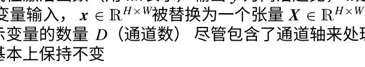

在上图中，输入 \(\boldsymbol{x}\) 通过一系列的卷积（※）和池化（⊙）层经过非线性激活函数 \(\phi\) 的转换，被展平（用 \(flat\) 表示），并连接到一个全连接层（\(\oplus\)），最后一层使用线性激活函数（用 \(lin\) 表示）输出 \(\boldsymbol{y}\)。为简洁起见，\(\boldsymbol{x}\) 是一个单通道输入。对于多变量输入，\(\boldsymbol{x} \in \mathbb{R}^{H \times W}\) 被替换为一个张量 \(\boldsymbol{X} \in \mathbb{R}^{H \times W \times D}\)，其中最后一个轴表示变量的数量 \(D\)（通道数）。尽管包含了通道轴来处理多变量情况，但流程基本上保持不变。

## 9.6 模型流程和架构

为了方便起见，我们使用数据集中的一个训练实例来描述流程 \(D=\{(X_{t-k:t}, x_{t+1})\}\)。该过程从将多变量时间序列窗口 \(\{X_t\}_{t-k:t}\) 转换为一个张量 \(X_{t-k:t} \in \mathbb{R}^{R\times R\times D}\)，其中 \(R\) 是图像大小，\(D\) 是变量的数量开始。这是通过对每个单变量时间序列 \(\{X_{it}\}_{t-k:t}\) 应用分段聚合近似和时间序列成像来完成的，表示变量 \(i\)。接下来，模型将 \(X_{t-k:t}\) 作为输入进行前向传播，以获得输出 \(\hat{x}_{t+1}\)，这是模型对包含每个变量的一步预测的标签向量的预测 \(x_{t+1}=\{X_t\}_{t:t+1} \in \mathbb{R}^{D\times 1}\)。

### 9.6.1 架构

所提出的模型架构在表9.1中概述。该模型由两个卷积和全连接（FC）层组成。批量归一化[35]用于加速模型训练，并通过归一化层输入作为额外的正则化组件。在训练过程中，还包括Dropout [36]以减少过拟合风险，通过随机丢弃节点及其连接。

## 9.7 实验设置

该模型与以下最先进的模型进行比较：ResNet [37]，完全卷积网络 [38]和InceptionTime [39]。我们训练了三个模型，CNN-16，CNN-32，CNN-64，每个模型对应相同的模型架构。

表9.1 提出的模型架构

| 类型 | 大小\比率 | 过滤器/节点数 | 激活函数 |
| :--- | :--- | :--- | :--- |
| 卷积 +批量归一化 | 3×3 | 32 | ReLU |
| 最大池化 | 2 × 2 | - | - |
| 卷积 +批量归一化 | 3 × 3 | 32 | ReLU |
| 最大池化 | 2 × 2 | - | - |
| Dropout | 0.25 | - | - |
| 展平 | - | - | - |
| 全连接 | - | 256 | ReLU |
| Dropout | 0.25 | - | - |
| 全连接 | - | D | 线性 |表9.2 从 http://timeseriesregression.org 选择的数据集

| 数据集 | 具有 p < 0.05 的变量数 |
|--------|------------------------|
| BIDMC32HR | 2 |
| 苯浓度 | 5 |
| 家庭用电量1 | 5 |
| IEEEPPG | 2 |
| 活性燃料含湿量 | 7 |
| 新闻标题情感 | 2 |
| PPGDalia | 4 |

使用不同的图像尺寸配置进行训练[16, 32]。以下模型用于测试是否在使用相同的通用模型架构时性能有所提升。我们使用了来自 http://timeseriesregression.org 的以下数据集（表9.2）：

- 数据集选择的标准基于以下内容：
- 变量数量必须大于1。
- 为了方便起见，时间序列长度必须至少大于64。这允许在长度小于64的数据集上使用CNN-64模型而无需进行任何外推程序。
- 训练集大小必须至少包含1000个实例。
- 包含基本相同训练样本的数据集被丢弃。例如，BIDMC32HR，BIDMC32RR和BIDMC32SpO2只在标签上有所不同。因此，只保留BIDMC32HR。
- 至少有一个变量表现出非线性。

数据集中进行了最小的数据预处理。在存在缺失值的情况下，进行了线性插值。对每个数据集应用了BDS测试（在第3节中讨论），以确定表现非线性的变量数量。每个模型进行了1000个epochs的训练，批量大小为1024。为了防止过拟合，进行了早停和学习率降低。

一旦模型训练完成，就使用均方根误差（RMSE）作为指标对测试集进行验证，平均计算在 D 个变量上。

$$
RMSE = D^{-1} \sqrt{n^{-1} \sum (\hat{x}_{t+1} - x_{t+1})^2}
$$

为了确保一致性，对于每个数据集，我们进行了5次模型训练，并对结果进行了平均。为了比较模型，我们进行了Friedman检验[41]，用于检测模型之间的平均排名是否存在差异。在出现并列的情况下，使用分数排名。给定 k 个模型和 b 个不同的数据集，它测试了零假设 $H_0 : M_1 = M_2 = ... = M_k$ 和备择假设 $H_a : M_{i'} = M_i$ 至少对于一个 $i' \neq i$，其中 $M_i$ 是相关的中位数响应，使用 k 个模型。设 $R_{i,j}$ 为第 i 个模型在第 j 个数据集中的排名，设 $R_i$ 为所有数据集中第 i 个模型的排名之和。Friedman检验统计量的计算方式为

$$
\chi_F^2 = \frac{12}{bk(k+1)} \sum_{i=1}^{k} \left[ R_i - \frac{b(k+1)}{2} \right]^2
$$

其中 $\frac{b(k+1)}{2} = E_0(R_i)$ 是当 $H_0$ 为真时 $R_i$ 的均值。如果 $H_0$ 为假，则进行后续检验，称为Nemenyi检验，以确定哪个模型在其他模型中表现显著不同。Nemenyi检验[42]计算临界差异

$$
CD = q_\alpha \sqrt{\frac{k(k+1)}{6N}}
$$

根据临界差异图中显示的平均排名，任何与 CD 至少相差 $\alpha = 0.05$ 的模型都优于其他模型。

Tensorflow被用来实现模型。ResNet、FCN和Inception-Time的实现是从[40]中改编的。我们还使用了 pyts 包来实现回归图和分段聚合近似算法。

BDS测试是使用 statsmodels 包实现的，自动ARIMA超参数优化是使用 pmdarima 包实现的。所有这些都是在Python 3.8中实现的。实现代码可在 https://github.com/saojeda/rcnn-experiments 找到。

## 9.8 结果

表9.3显示了实验结果。基于这个表格，我们计算了Friedman检验统计量和相应的p值。Friedman检验表明，$H_0$无法在 $p = 0.69220 > 0.05$ 的情况下被拒绝，因此未进行后续的Nemenyi检验来可视化关键差异图。

CNN-16、CNN-32和CNN-64模型的表现不如FCN、InceptionTime和ResNet。然而，CNN模型在一步预测任务中的性能仍然与这些最先进的序列模型相当。值得注意的是，CNN模型在类似离散-时间映射的数据集中表现更好。显然，FCN、InceptionTime和ResNet模型在BIDMC32HR、IEEEPPG和PPGDalia数据集中的表现要好于CNN模型，这些数据集在采样间隔上类似于连续时间。可以合理推断，这些模型可能具有局部结构，而这些结构不足以被分段聚合近似算法捕捉到，给定长度 $n_o$。CNN模型在更大的 $n$ 下可能表现更好，但可用的内存资源有限。

表9.3 模型训练结果显示了在特定数据集上进行5次运行的模型的平均RMSE。长数据集名称被缩短了

| | CNN-16 | CNN-32 | CNN-64 | FCN | InceptionTime | ResNet |
|---|---|---|---|---|---|---|
| BIDMC32HR | 0.35622 | 0.34296 | 0.36488 | 0.10863 | 0.13123 | **0.10863** |
| 苯浓度 | 292.79553 | 258.91063 | **241.59186** | 600.77448 | 659.98979 | 780.95314 |
| 家庭用电量1 | 4.66115 | **4.08298** | 4.12137 | 101.34325 | 95.23767 | 103.55190 |
| IEEEPPG | 42.15604 | 43.63521 | 41.84182 | 63.89978 | **26.56151** | 45.42202 |
| 活性燃料含湿量 | 1575.85710 | 1414.00837 | **1223.33757** | 1835.93391 | 1927.07244 | 1835.93391 |
| 新闻标题情感 | **14.98553** | 15.79095 | 16.04000 | 15.01115 | 14.98857 | 14.99808 |
| PPGDalia | 55.00934 | 51.68706 | 43.66140 | **1.61548** | 1.62459 | **1.61548** |

可以是一个约束。在这些情况下，使用替代的最新技术（SoTA）模型是可取的。CNN模型能够在性能方面提供显著的提升，特别是在本质上以离散时间采样的数据集中，与SoTA时间序列模型相比，改进了几个数量级。

## 9.9 结论

在这项工作中，我们提出了一个框架，利用重现图来进行多变量非线性一步预测，可以应用于实际应用场景。原始时间序列数据首先被转换为重现图表示，其中这些图像表示通过通用卷积神经网络模型进行学习，以识别基于输入重现图的拓扑结构的判别特征。我们已经证明了卷积神经网络能够学习这些模式，因此能够以自动化的方式产生预测，无需手动数据分析和大量数据预处理。此外，我们还展示了三个相同的模型，只有图像大小配置不同，证明了该方法在离散时间序列数据中的有效性。这是由于降维的结果，当应用于具有较少局部结构和更大全局结构的时间序列数据时，这是有益的。这一观察结果可以帮助研究人员确定何时应用该方法。一般而言，作者建议将该方法应用于具有离散时间非线性变量的问题。对于本质上连续的时间序列，可以使用替代的最新技术方法进行更好的建模，该方法与所提出的方法进行了比较。

在未来，作者可以在扩展这种方法到更专业的卷积神经网络架构方面进行工作，以进一步提高其性能，利用重现图的拓扑特性。

## 参考文献

1. J.P. Eckmann, S. Oliffson Kamphorst, D. Ruelle, 动力系统的重现图。 Europhys. Lett. 4(9), 973–977 (1987). https://doi.org/10.1209/0295-5075/4/9/004
2. M.C. Casadagli, 重现图再探。 Phys. D 108(1–2), 12–44 (1997). https://doi.org/10.1016/S0167-2789(97)82003-9
3. M. Thiel, M.C. Romano, J. Kurths, 重现图中包含多少信息? Phys. Lett. A 330(2004), 343–349 (2004). https://doi.org/10.1016/j.physleta.2004.07.050
4. W. Liebert, H.G. Schuster, 混沌时间序列分析中时间延迟的适当选择。 Phys. Lett. A 142(2, 3), 107–111 (1989). https://doi.org/10.1016/0375-9601(89)90169-2
5. A.M. Fraser, H.G. Swinney, 从互信息中获得奇异吸引子的独立坐标。 Phys. Rev. A 33(2), 1134 (1986). https://doi.org/10.1103/PhysRevA.33.1134
6. M.B. Kennel, R. Brown, H.D.I. Abarbanel, 使用几何构造确定相空间重构的嵌入维度。 Phys. Rev. A 45, 3403 (1992). https://doi.org/10.1103/PhysRevA.45.3403
7. J.S. Iwanski, E. Bradley, 实验数据的复发图：嵌入还是不嵌入。 混沌 8, 861–871 (1998). https://doi.org/10.1063/1.166372
8. 高杰, 蔡华, 关于再现图的结构和量化. 物理学报 270(1–2), 75–87 (2000). https://doi.org/10.1016/S0375-9601(00)00304-2
9. T. Gautama, D.P. Mandic, M.M. Van Hulle, 基于差分熵的信号嵌入参数确定方法, 在2003年IEEE国际会议上声学、语音和信号处理, 2003, 论文集, (ICASSP '03)(香港,2003), pp. VI–29. https://doi.org/10.1109/ICASSP.2003.1201610
10. N. Marwan, J. Kurths, P. Saparin, 广义重现图分析空间数据. 物理学报 360(2007), 545–551 (2007). https://doi.org/10.1209/0295-5075/4/9/004
11. A. Sipers, P. Borm, R. Peeters, 从未阈值化的重现图中唯一重建信号. 物理学报 375(2011), 2309–2321 (2011). https://doi.org/10.1016/j.physleta.2011.04.040
12. O.A.B. Penatti, M.F.S. Santos, 利用移动惯性传感器进行人体活动识别的重现图 (2017). ArXiv. 可在https://arxiv.org/pdf/2004.13408.pdf获取。 于2020年8月31日访问
13. N. Marwan, 回归图的历史回顾. Eur. Phys. J. Spec. Top. 164(2008), 3–12 (2008). https://doi.org/10.1209/0295-5075/4/9/004
14. B. Lim, S. Zohren, 深度学习的时间序列预测:一项调查 (2020). ArXiv. 可用-链接, https://arxiv.org/pdf/2004.13408.pdf. 于2020年8月24日访问
15. J.M. Sotoca, J.S. Sánchez, R.A. Mollineda, 数据复杂度度量及其在模式分类问题中的适用性回顾, in Actas del III Taller Nacional de Miner de Datos y Aprendizaje (TAMIDA, 2005), pp. 77–83
16. L. Li, Y.S. Abu-Mostafa, 机器学习中的数据复杂度. Caltech计算机科学技术报告 (2006). https://doi.org/10.7907/Z9319SW2
17. W.A. Brock, J.A. Scheinkman, W.D. Dechert, B. LeBaron, 基于相关维度的独立性检验. Econ. Rev. 15(3), 197–235 (1996)
18. J. Belaire-Franch, D. Contreras, 如何计算BDS检验：软件比较. J. Appl. Econ. 17, 691–699 (2002). https://doi.org/10.1002/jae.679
19. E. Zivot, 非线性时间序列模型 (n.d.). https://faculty.washington.edu/ezivot/econ584/notes/nonlinear.pdf. 2020年8月24日访问
20. R.J. Hyndman, G. Athanasopoulos, ARIMA模型, in Forecasting: Principles and Practice, 第2版 (OTexts, 澳大利亚墨尔本, 2018), pp. 221–274
21. S.S. Rao, 时间序列分析课程 (2020). https://www.stat.tamu.edu/~suhasini/teaching673/time_series.pdf. 2020年8月29日访问
22. B. Pesaran, 神经信号的频谱分析 (2020). https://neurophysics.ucsd.edu/courses/physics_173_273/SfN_Short_Course_c1.pdf. 2020年8月29日访问
23. Z. Wang, T. Oates, 人机交互动手势的视觉解释: 国际人工智能联合会议论文综述. (阿根廷布宜诺斯艾利斯, 2015年7月25日-31日)
24. N. Hatami, Y. Gavet, J. Debayle, Paper presented at the Tenth International Conference on Machine Vision (奥地利维也纳, 2017年11月13日-15日)
25. Y. Hsueh, V.R. Ittangihala, W. Wu等人, 基于循环神经网络的卷积神经网络用于旋转机器的条件监测系统. 能源 **12**, 3221 (2019). https://doi.org/10.3390/en1217322126
26. Z. Zhao, Y. Zhang, Z. Comert, Y. Deng, 结合循环图和卷积神经网络的胎儿缺氧的计算机辅助诊断系统. https://doi.org/10.3389/fphys.2019.00255
27. E. Garcia-Ceja, M.Z. Uddin, J. Torresen, 使用卷积神经网络对循环图距离矩阵进行活动识别的分类. https://doi.org/10.1016/j.procs.2018.04.025
28. S.A.A. Ojeda, G.A. Solano, E.C. Peramo, 使用卷积神经网络进行短期降水预测的多元时间序列成像, 在2020年国际人工智能信息与通信会议(ICAIC)上(2020). https://doi.org/10.1109/icaaic48513.2020.9065238
29. R.J. Hyndman, Y. Khandakar, 自动时间序列预测: R中的forecast包. J. Stat. Softw. (2008). https://doi.org/10.18637/jss.v027.i03
30. L. Cao, 确定标量时间序列最小嵌入维度的实用方法. Phys. D: Nonlinear Phenom. **110**, 43–50 (1997). https://doi.org/10.1016/s0167-2789(97)00118-8
31. E. Keogh, K. Chakrabarti, M. Pazzani, S. Mehrotra, 在大型时间序列数据库中进行快速相似性搜索的维度约简. 知识信息系统 **3**, 263-286 (2001年). https://doi.org/10.1007/p100011669
32. N. Marwan, 如何避免基于重现图的数据分析中的潜在陷阱. 国际双分岔与混沌 **21**, 1003-1017 (2011年). https://doi.org/10.1142/s0218127411029008
33. A. Zhang, Z. Lipton, M. Li, 等, 卷积神经网络, 见卷积神经网络-深入深度学习0.14.3文档 (无日期). http://d2l.ai/chapter_convolutional-neural-networks/index.html. 于2020年8月31日访问
34. I. Goodfellow, Y. Bengio, A. Courville, 卷积网络, 在深度学习中. (麻省理工学院出版社, 剑桥, 马萨诸塞州, 2017), 第330-371页
35. S. Ioffe, C. Szegedy, 批归一化: 通过减少内部协变量偏移 **37**, 448-456页 (2015)
36. N. Srivastava, G. Hinton, A. Krizhevsky, Dropout: 一种简单的方法来防止神经网络过拟合 **15**(56), 1929-1958页 (2014)
37. K. He, X. Zhang, S. Ren, J. Sun, 深度残差学习用于图像识别, 在2016年IEEE计算机视觉与模式识别会议(CVPR)(2016). https://doi.org/10.1109/cvpr.2016.90
38. L. Long, E. Shelhamer, T. Darrell, 全卷积网络用于语义分割, 在2015年IEEE计算机视觉和模式识别会议(CVPR) (2015). https://doi.org/10.1109/cvpr.2015.7298965
39. I.F. Hassan, B. Lucas, G. Forestier, C. Pelletier, 等, InceptionTime: 寻找时间序列分类的AlexNet (2019). arXiv:1909.04939
40. C.W. Tan, C. Bergmeir, F. Petitjean, G.I. Webb, 时间序列回归 (2020). arXiv:2006.12672
41. J. Borkowski, 阻塞设计 (2014). http://www.math.montana.edu/jobo/thainp/ksampa.pdf. 2020年8月31日访问
42. J. Demšar, 多个数据集上分类器的统计比较. J. Mach. Learn. Res. **7**(Jan), 1-30 (2006年)

# 第五部分 视频编码和信息提取中的机器学习

## 第十章 一种用于复杂人类活动识别的正式和统计人工智能工具

Anargyros Angeleas 和 Nikolaos Bourbakis

摘要 识别和理解人类活动是一个具有挑战性的研究课题，在过去30年中取得了重大进展，但仍存在一些待解决的重大问题。研究人员提出了各种先进的方法，通过从单一方向接近这个有趣的课题。所谓单一方向是指使用形式化或统计方法之一。这些方法都有自己的局限性，例如形式化方法无法在超过一定复杂性水平时扩展，而统计方法在低复杂性情况下效果不佳[1]。

因此，一种可能的解决方案是基于高效结合形式化和统计方法的协同方法。在本章中，作者提供了一种用于识别复杂人类活动的正式统计人工智能工具。形式化模型与身体、动作和活动水平的三个无上下文语言相关联。统计模型是一个学习人体活动的人工神经网络。

## 10.1 引言

在20世纪50年代和60年代，艾伦·图灵、罗斯·奎利安、爱德华·费根鲍姆和马文·明斯基是一些最早寻求为机器复制人类智能的杰出先驱。由于他们的努力，我们今天能够通过实验他们的方法来解决现实世界的问题。在本章中，介绍了一种新颖的端到端人类活动识别和行为解释框架，该框架得到了形式和统计信息的支持。

我们首先对问题领域进行简要介绍，并明确定义了该工具的目标。

接下来，介绍了形式和统计方法，以及使用两者的价值，它们如何互补，以及在上面进行的工作的每一步。然后，我们介绍了工具的架构和实现的流程，以及图形和统计示例和信息。最后，我们通过对学习和其他可能解决已识别问题的方法的小讨论来总结本章。

### 问题领域和定义工具的目标

人类活动识别是一个经过深入研究的领域[2-6]。尽管最近有了一些进展，但监控系统仍然无法在没有人工操作员的情况下运行，这使得它们效率低下。我们知道，随着完成任务的时间段的增加，人类准确识别行为的能力会下降，Kaber等人[7]。

很明显，为了解决这个问题，研究人员必须实现不仅能够像人一样“看到和理解”问题的智能系统，还必须能够处理原始的视觉信息流并得出比人类更稳健的结果。

由于人类活动的种类繁多，我们首先必须从低级动作和姿势识别开始。然后，我们将向能够使用先前的数据和知识更稳健地识别这些动作和事件的系统发展[8-22]。因此，这项工作的主要部分是为了更好地识别和理解人类行为而进行的人类活动分类，通过高效地关联低级和高级推理来实现。无论系统有多么强大和稳健，活动识别都应该基于一组相互合作但不互相限制的规则[23]。

尽管存在大量的单一人活动识别方法[24-27]，但我们还没有找到能够为一系列复杂活动提供时空结果和反馈的方法。这个问题的一部分似乎是科学界中研究最少的领域，基本上没有被探索过。

因此，该工具的主要目标是能够在受控和非受控环境中识别复杂的人类活动，并从由领域专家定义的基于规则的系统中提取行为模式。为了实现这一目标，还有一些重要的子目标需要实现。

为了理解一个简单的活动，我们需要实施以下操作：数据收集、验证、操作、解释和分类。一旦我们识别出一个简单的活动，我们需要能够理解被试者是否仍在进行相同的活动，或者是否有活动的变化。

为了对上述目标和子目标进行更加结构化的描述，我们对活动识别问题的方法基于将问题分割为三个基本模态：

- 低级：预处理技术，包括但不限于视频采集、背景分割和/或图像去噪，用于检测感兴趣的点。
- 中级：在视频序列中跟踪主题并提取特征或轮廓的算法。
- 高级：用于识别和分类活动的算法。一些广泛使用的技术包括：隐马尔可夫模型、隐马尔可夫随机场、人工神经网络和深度学习算法（图10.1）。

图10.1 复杂活动识别的合作模型

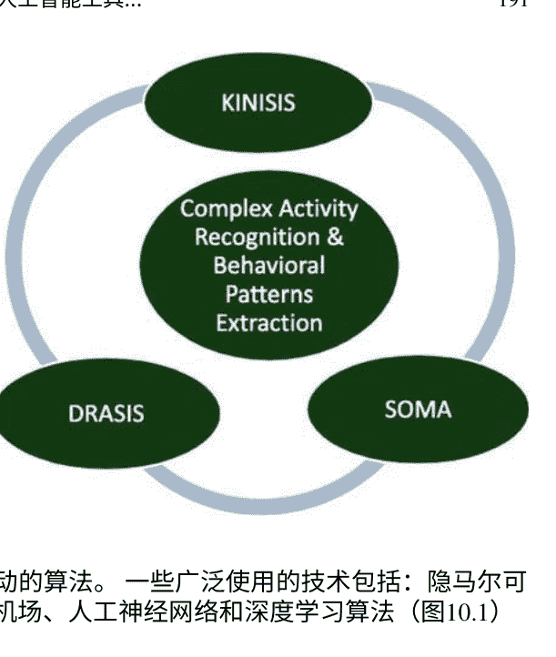

## 10.2 混合框架-形式语言

在混合框架的实现中，我们利用了形式化（上下文无关形式语言）和统计（人工智能算法）方法的组合[28-30]。

上下文无关形式语言断言和传达了方法，并在数据收集过程的每个步骤中充当验证机制。利用人工智能算法可以实现可扩展性、鲁棒性、易于实施和问题解决的通用性。

将这些模态耦合在一起，为工具提供了每个帧内所需的上下文信息。它使我们能够符号化地表示源自识别引擎的活动，同时增强了我们的工具以提取语法、视觉和统计结果。

正如先前解释的那样，我们将人类活动识别分为三种模态：低级、中级和高级。因此，我们使用了一种协作的三种形式语言模型。每种模态都可以相互通信，但它们也可以独立工作，并且如果被操纵，可以独特地解决HAR问题。

我们将框架SDK命名为（SOMA-KINISIS-DRASIS）。Soma是一个希腊单词，意思是身体；KINISIS是一个希腊单词，意思是运动；而DRASIS是另一个希腊单词，意思是行动。每个名称简洁地描述了发生在每个层次。在下面，您将找到一个自下而上的可视化工具架构表示（图10.2）。

Soma语言负责从人体主体中识别、跟踪、提取、验证和操作所需的信息。识别、跟踪和对主体进行骨架化是一个经验丰富且经过深入研究的领域[27, 31]。因此，我们不会深入介绍算法和功能，因为它们超出了本工作的范围。在图10.3中，您可以看到所选的身体部位被突出显示为黄色。

在跟踪和识别人体主体之后，我们的工具通过对主体应用骨架化算法来提取必要的信息。该工具提取以下身体部位的x、y、z轴信息，同时计算人体主体的躯干加速度—a(t)：

- 颈部
- 脊柱肩膀
- 脊柱基础
- 左肩膀
- 左肘
- 左手腕
- 左髋
- 左膝盖
- 右肩膀
- 右肘
- 右手腕
- 右髋
- 右膝盖。

在运行各种实验后，我们决定利用最少的模态来输出可接受的识别结果，因为我们的目标之一是创建一个强大的工具，同时保持低计算成本。

下一步是这个工具的重要贡献。在我们了解身体部位在光谱中的位置之后，我们计算在其间创建的角度。上述列表中提到的相邻身体部位之间的夹角，以及躯干、上腿和下腿与地面的倾斜角度，以及躯干的加速度。

为了在三维空间中计算上述角度，我们使用以下方程。（当然，有许多方法可以做到这一点，但我们使用向量和“右手”规则来计算从三个点A、B和C计算B角度。）

$$ \overrightarrow{AB} = B - A $$

$$ \overrightarrow{BC} = C - B $$

标量积或点积具有以下特性。

$$ \overrightarrow{AB} * \overrightarrow{BC} = \|\overrightarrow{AB}\| * \|\overrightarrow{BC}\| * \cos \theta $$

通过 \|*\|，我们测量长度，θ是两个向量之间形成的角度。因此，我们所需要的所有信息都是三个点的(x, y, z)坐标，然后我们可以重新排列方程10.3并解出θ。

$$ \theta = \arccos \left( \frac{ \overrightarrow{AB} * \overrightarrow{BC} }{ \|\overrightarrow{AB}\| * \|\overrightarrow{BC}\| } \right) $$

为了计算躯干的加速度，并且已知其在3D空间中的位置，我们需要执行以下操作：

我们知道，给定物体的位置函数，物体的速度是位置函数的一阶导数，而位置函数的二阶导数，或者速度函数的一阶导数，产生物体的加速度。

因此，我们可以使用以下公式计算物体的加速度：

$$ a(t) = \frac{ v(t + \Delta t) - v(t) }{ \Delta t } = \frac{ dv }{ dt } $$

在编译了上述数据点之后，将数据点传递给KINISIS语言。在这里，我们应该提到我们使用连续的数据流。这样做的主要好处是数据流可以在实时生成时进行处理、存储、分析和操作。此外，DRASIS解析躯干、膝盖和地面之间的倾斜角度，以计算活动的变化。

KINISIS语言的目标是将动作数据分类为简单的活动。例如，行走是一个由移动腿部和手部动作组成的简单活动。SOMA语言不断解析和流式传输所选的相邻身体部位（动作）数据，而KINISIS则构成了一个时间序列信息的序列，目的是对这些活动进行分类。

图10.4 帧数据和帧数据序列的示例

A preview of KINISIS Language output for a recognize activity

Bst# → BaHRU # BaHLU # BaFRU # BaFLU # H(RU)aH(RL) # H(LU)aH(LL) # F(RU)aF(RL) # F(RU)aF(LL)

Σ Bst -> {Bst0, Bst1, Bst2, Bst3,……, Bstn, Bstn+1} -> Walking

这种方法的一个重要贡献是能够减少需要解析的帧数。根据我们的机器学习模型运行的基准测试，我们发现每秒使用所有输出帧时没有显著增加。

我们的假设基于启发式，并根据IBM的多媒体解析研究[32]。为了进一步验证我们的方法，我们对每秒30帧(f/s)，10帧(f/s)，5帧(f/s)和3帧(f/s)进行了基准测试，活动识别率的变化微小—在30帧(f/s)，10帧(f/s)，5帧(f/s)之间。因此，鉴于这一点，并考虑到我们开发强大的端到端工具的目标，我们决定采用每秒5帧的方法。

到目前为止，我们已经定义了我们识别动作(SOMA)和分类活动(KINISIS)的方式，但这个工具的最终目标是能够识别复杂活动的序列。因此，我们的下一步是提出DRASIS形式语言。

DRASIS的作用是识别活动是否存在变化，并从基于规则的系统中提取行为假设。为了本研究的目的，活动变化被定义为一个人从一种活动过渡到另一种活动的模糊时刻。

根据文献，绝大多数人类活动识别系统在一个单一点上识别和分类活动变化[33-36]。这些研究的局限性在于它们无法识别每种方法的时间描述。

我们利用模糊方法的原因是因为每个人从一种活动过渡到另一种活动的方式都不同。此外，时间信息非常重要，可以提取行为模式。

对于动作分割部分，我们将使用从以下三个组件的骨架化生成的三个（3）角度：身体、上腿和下腿，以及躯干的加速度。我们应该注意的是，我们不会使用它们之间的关系生成的角度，而是使用这三个身体部位相对于地面的倾斜角度。这些信息将直接从SOMA语言中解析出来。

总之，我们的识别工具的工作方式如下：SOMA语言是KINISIS语言的前身，尽管一个不能在没有另一个的贡献的情况下产生。SOMA语言负责在特定视频帧中提取和识别人体的独特特征。KINISIS语言接收这些信息并以简单的活动为目标将其统一起来。最后，DRASIS语言接收简单的活动，确定转折点，然后识别复杂的活动。

将统计方法纳入KINISIS和DRASIS语言的识别方面的原因是：

1.  语法在低层次上期望高准确性，因此不适合处理低层任务中的错误，如跟踪错误和缺失观测。（将人工神经网络用于活动和活动变化识别）
2.  制定复杂情景的规则比动作序列增加得更多，例如动作的重叠和并行。（将人工神经网络、模糊认知图和基于规则的着色Petri网相结合）
3.  使用语法进行训练和学习是一种智能的替代方法，但计算量非常大，而且不够稳健。（学习是通过人工神经网络进行的）
4.  形式语言不足以表达统计结果和扩展。（统计结果与人工神经网络的结合给出，缩放结果用基于规则的彩色 Petri 网表示）

## 10.3 形式工具和统计流程架构

系统功能的高级概述在以下 11 个步骤中进行描述，并在图像中进行描绘之后：

1.  KINECT 摄像头开始录制。
2.  SOMA 开始。
3.  预处理步骤包括但不限于跟踪、运动检测、背景减除、轮廓提取。
4.  使用 KINECT 库进行身体骨架化。
5.  解析并存储身体关节在时间上的位置（4D 空间）。
6.  KINISIS 开始。
7.  计算相邻身体部位之间的八（8）个角度和躯干在 x 轴上的加速度。
8.  操作数据并创建九（9）个特征向量。
9.  通过人工神经网络，在视频的第一分钟内识别出活动。
10. DRASIS开始。
11. 双重角色：
    a. 识别活动的变化或活动的缺失。
    b. 将一系列活动分类为正常或异常。

我们系统的功能如图10.5所示。蓝色模态描述SOMA语言，橙色模态描述KINISIS语言，黄色模态描述DRASIS语言。

图10.5 工具功能的视图

## 10.4 数据管道

在创建端到端的AI流水线时，主要目标是：降低延迟，创建松耦合的模态，确保架构具有水平和垂直可扩展性，相对于工作负载管理产生效率，并具备容错性。

我们的数据流水线由两个明确定义的组件组成：在线模型分析，其中模型用于新数据决策，离线数据发现，系统根据历史数据学习以创建用于批处理模式的AI模型。

正如之前讨论的，AI工具中最重要的方面之一是数据流水线，而这个轶事性的引语帮助我们理解为什么：“数据科学家花费80%的时间清理数据而不是创造洞察力。数据科学家只花20%的时间创造洞察力；其余的时间都在处理数据。”这经常被用来强调需要解决许多与数据质量、标准和访问相关的问题。

在接下来的几段中，我们将描述AI流水线的八个（8）重要元素。

数据摄取：获取和存储数据是任何AI工作流程的第一步。确保获取的数据不会被转换是非常重要的，这样我们就可以将收集到的数据集保持在不可变的状态[37, 38]。对于学习层（离线），您可以应用多种技术来解析数据，但是对于在线层，应该实现流式架构。这样，我们的系统可以提供低延迟、可靠性和高吞吐量。

数据准备：数据准备涉及评估收集到的数据的有效性和状态。重要的操作包括查找异常值、缺失数据、格式差异和任何其他类型的异常[39, 40]。在这里，特征工程的三个重要阶段发挥作用：提取、转换和选择。当我们开始构建和实验数据集时，我们事先不知道要使用哪些特征。管道的这一部分应该考虑可重用性和组合性。对于离线和在线层，如果没有领域专业知识，可以自动化处理。我们始终可以利用统计测试、主成分分析或任何其他技术来对每个特征的重要性进行排名。

数据分离：对于未经训练的数据，基于其模式预测质量的模型至关重要。对于这个给定的问题，我们使用了神经网络的标准协议。我们随机切分数据，将70%用于训练，10%用于测试，剩下的20%用于验证案例。

候选模型评估：此步骤发生在离线层上，可以根据应用的重要性和使用频率进行安排。在这里，我们应该始终记住为数据分区实施错误容忍性、数据检查点和故障转移功能。在下一节中，我们将详细介绍模型训练服务，介绍HAR和活动变化检测的最佳模型。我们应该始终记住，我们获得的数据越多，我们的模型发生变化的可能性就越高。因此，该服务需要能够自动化此过程，运行各种实验，并调用不同的AI算法。

模型部署：对于实际应用，一旦有了优胜者，通常会部署并应用于决策框架。

模型评分：这是我们确定所选模型是否表现良好的步骤。对于给定的问题，我们利用验证数据集上的绝对识别率，并且对于离线实验，我们利用识别率和混淆矩阵来理解和改进特征选择、模型类型和超参数。

总结一下，始终从识别问题和做出假设开始，以验证或否定假设（数据工程）的哪些类型的特征应该被测试。然后，构思和指定要使用的特征以及收集数据的方式。最后，创建与之相关的数据管道。对于上述步骤，我们需要一个具体但足够广泛的步骤，以便可以尝试不同的AI算法。

## 10.5 实施工具

在本节中，我们将介绍实施HAR工具所采取的步骤，以及用于实施HAR工具的硬件和软件技术。所使用的编程语言有：

- 用于配置和操作KINECT相机的C++
- 用于从实时数据中解析数据准备和验证的C++
- 用于AI模型的快速实验和原型设计的Matlab
- Python用于AI流程。

对于工具的实时数据收集部分，即记录人类主体执行活动，我们使用Microsoft KINECT V2。我们之所以这样做，是因为KINECT在计算机视觉领域广泛应用于人体活动识别、手势识别、活动分析、物体识别和跟踪等方面。与传统的3D相机（如立体相机和深度相机）相比，KINECT提供了明显的先进性和增强性。Gokturk等人[41]提供了对其进行详细描述（图10.6）。

### 用于实时数据收集的图形用户界面

图形用户界面由三个模块组成。相机模块用于通过RGB相机、红外传感器和深度传感器拍摄用户的快照。图片也会应用骨架化处理。录制模块会创建一个视频，其中包含KINECT设备所能看到的一切。最后，角度模块描述了RGB相机的录制，并显示相邻身体部位之间生成的角度信息。当我们在这个模块中选择录制时，视频流会直接保存到图片文件夹，并在文档文件夹中生成并保存包含所有帧中记录的角度的文本文件。GUI是使用C++实现的，利用了KINECT和OpenCV库。

- 确定身体帧的参考点。
- 检查身体框架是否为空。
- 初始化一个身体列表，用于存储传感器检测到的关节。
- 获取并刷新每个新帧的身体数据。
- 如果存在多个身体，则循环遍历身体列表。

## 10.6 使用数据集进行实验以确定理想模型

我们将从建模单一人类活动识别的方式开始，然后转向处理活动变化识别的方式。接下来，我们将介绍用于实际人类活动识别数据收集的GUI。最后，我们将介绍一个基于规则的模型，扩展我们的工具功能，成为一个领域特定的应用。例如，老年医生可以利用该工具跟踪特定患者的数据并提取行为结论。

### 10.6.1 KINISIS-单一人类活动识别建模

对于工具的简单人类活动识别部分（由KINISIS负责），我们使用MSR Daily Activity 3D数据集[42]。这个数据集对于我们的工具来说非常理想，有三个原因。首先，使用KINECT设备记录日常活动。其次，创建的视频长度非常短，最后，视频是在非受控环境中录制的。因此，该数据集在非受控环境中进行HAR时被认为是非常具有挑战性且非常合适的。

我们用于识别单个活动的方法是与时间序列相关的。我们试图根据一批相邻身体部位的角度以及它们在短时间内的变化来识别活动。另外，重要的是要传达我们使用多特征时间序列条目。因此，用于基准测试和确定最佳模型的理想候选者是深度学习算法。

而且，更具体地说，卷积神经网络（CNN），长短期记忆（LSTM）神经网络（LSTM）和这两者的混合模型被用于分类活动。我们之所以选择这三个模型进行实验，部分原因是因为这些网络在理论上有明确定义的优势，以及其他研究中可量化的结果，包括但不限于：

- Panzner等人[43]对LSTM和HMM模型在活动识别中的适用性进行了研究。
- Fazle等人[44]对多元LSTM和FCN进行了一项时间序列分类研究。

为了对模型进行微调并获得最佳结果，我们实施了穷举网格搜索[45]。此外，在确定预测模型的参数时，使用相同的标签和样本是非常不正确的，因为这会导致模型无法高精度地预测未见数据。这种现象被称为过拟合[46]。在监督学习中解决过拟合问题的最佳实践是始终利用可用数据的随机部分。下面是一个流程图，展示了如何实施交叉验证来避免过拟合问题，以及如何通过穷举网格搜索来精细调整模型的参数，图10.7。

回顾一下，识别和精细调整模型的过程如下：

- 确定将要使用的数据类型。
- 研究并尝试多种可以解决问题的模型。
- 通过调查模型的优缺点进一步了解模型，并根据给定情况选择最合适的模型。
- 定义模型验证方法（例如，我们选择将数据分为70%的训练数据，10%的测试数据和20%的验证数据）。

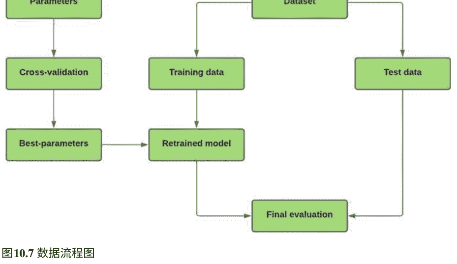

#### 表10.1 CNN最佳架构

| 卷积神经网络 |  |
|--------------|--|
| 卷积层数量 | 4 |
| 第二、第三和第四个卷积层（激活函数/池化层函数） | 双曲正切函数（tanh）/最大池化 |
| 第一个和第五个卷积层（激活函数/池化层函数） | 修正线性单元（relu）/最大池化 |
| 学习率 | 0.001（默认值） |
| 批量大小 | 300 |
| 序列长度 | 128 |
| 时期 | 200 |
| 成本函数 | 具有逻辑回归的Softmax交叉熵v2 |
| 成本优化器 | Adam优化器 |
| 准确率 | 减少均值（保持批量输入计算结果的运行平均值） |

- 利用网格搜索或相应的方法来对数据集进行实验。

接下来，我们将介绍模型和识别准确率结果，并将其与其他方法/方法进行比较。

以下资源对于了解CNN、LSTM和CNN-LSTM模型非常有价值[47-54]。

## 卷积神经网络

首先，我们将提供有关提供最佳结果的网络架构的信息。然后，我们将呈现集合上的评估结果以及整体测试准确率。通过执行网格搜索确定的参数显示在表10.1中。一些有趣的发现包括：

- CNN模型优于LSTM和CNN-LSTM。CNN从时间和空间域解析信息，利用卷积层。我们的方法解析每个输入通道的时间序列数据。然后，进行卷积和子采样，从相邻的输入时间序列数据生成大量信息通道。最后，将所有数据信息组合以呈现所需的结果。
- 我们确定需要六（6）个卷积层，因为所选的深度足够产生有意义和准确的结果。我们可以增加更多的层，但这不会使活动识别准确率提高超过0.832%。当我们有三个或四个卷积层时，准确率从2.192下降到4.73%。
- 比六百（600）大或小得多的批量大小会影响准确性。准确地说，小于四百五十（450）或大于六百五十（650）的批量大小会将准确性从0.342降低到3.927%。
- 卷积层的激活函数也起着重要作用。我们发现无论网络的架构如何，当第一个和最后一个卷积层使用softmax函数时，我们总能实现最佳性能。

对于隐藏层，双曲正切函数被确定为表现最好的函数。这是在使用不同的函数组合进行各种基准测试后得出的另一个启发性结论。

- 使用带有逻辑回归的softmax交叉熵的第二个版本作为成本函数，并且使用Adam优化器作为成本优化函数，因为其目标是最小化学习成本。

总体测试准确率为95.307%，在三个网络中排名第一。

## 长短期记忆神经网络架构

对于LSTM网络的通信结果，我们将遵循与卷积神经网络相同的架构。首先，我们将提供提供最佳结果的网络的架构信息。然后，我们将呈现集合的评估结果以及总体测试准确率。通过进行网格搜索得到的参数如下表所示，表10.2。

一些有趣的发现包括：

- 我们预期更多的隐藏层会增强活动识别，但实际上准确率下降了。例如，当我们添加第三层时，准确率下降了2.083%，而其他参数保持不变。
- 正如前面提到的，与其他神经网络（如CNN）相比，LSTM网络需要相对较小的批量大小。我们的网络在批量大小为100、200或300时产生了几乎相同的结果。我们选择使用后者，因为较小的批量大小会使网络变慢。

#### 表10.2 LSTM最佳架构

| 长短期记忆神经网络 | |
| :--- | :--- |
| LSTM大小 | 27（输入通道的三倍，默认方法） |
| LSTM层 | 2 |
| 批量大小 | 300 |
| 序列长度 | 128 |
| 时期 | 200 |
| 激活函数 | Softplus函数 (relu) |
| 成本函数 | 带Logits v2的Softmax交叉熵 |
| 成本优化器 | Adam优化器 |
| 梯度裁剪 | Adam优化器 |
| Dropout参数 | 训练：0.25 测试：1.00 |
| 准确率 | 减少均值（保持批量输入计算结果的运行平均值） |

- 激活函数起着同等重要的作用。我们发现，无论网络的架构如何，当Softplus（relu）是激活函数时，我们都能够实现最佳性能。这是我们在进行网格搜索后发现的另一个启发性结论。
- 在仔细审查了文献和研究论文[55–58]之后，我们意识到我们需要选择第二个版本的带有logits的softmax交叉熵作为我们的损失函数，并使用Adam优化器进行成本优化函数。
- 梯度裁剪技术阻止了深度神经网络中出现的梯度爆炸问题。这个问题在循环神经网络（如LSTM）中更为普遍。存在许多梯度裁剪技术，但我们选择了最广泛使用的函数，即Adam优化器。最后，整体测试准确率为92.959%，在这三个网络中排名第二。

## 卷积长短期记忆神经网络

在进行基准测试之前，我们预计CNN-LSTM模型会产生最好的结果，因为它结合了两个世界的最佳属性。这种类型的网络自然地结合了时间序列向量，使网络能够快速识别和高效解释模糊性。在我们的实验中，我们将每个活动的时间序列作为一个固定长度的单一向量提供，表10.3。以下是一些有趣的发现：

当我们添加更多的卷积层，甚至是一个池化层时，网络的性能会急剧下降。

#### 表10.3 C-LSTM神经网络的最佳架构

| 项目 | 值 |
|------|-----|
| 神经网络的卷积层数 | 1 |
| 卷积层（激活函数/池化层函数） | 修正线性单元（relu）/最大池化 |
| LSTM大小 | 27（默认值：通道数量的三倍） |
| LSTM层 | 2 |
| 学习率 | 0.001（默认值） |
| 批量大小 | 300 |
| 序列长度 | 128 |
| 时期 | 200 |
| 成本函数 | 带logits的softmax交叉熵 |
| 成本优化器 | Adam优化器 |
| 准确率 | 减少均值（保持一批输入的计算结果的运行平均值） |

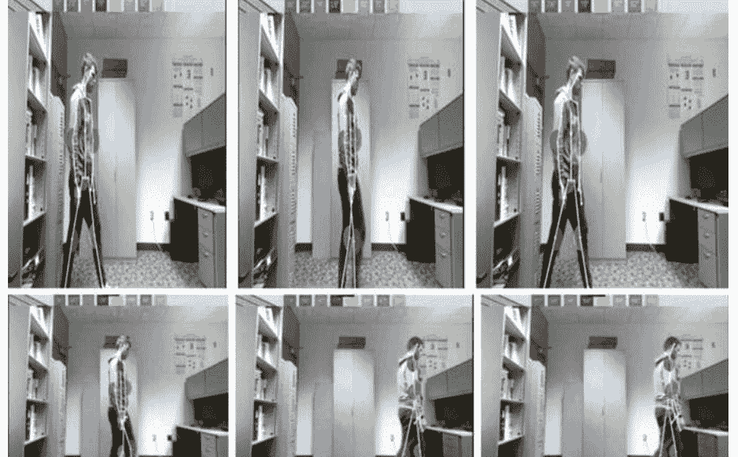

#### 图10.8 实时数据收集和解释

通过网格搜索进行各种实验后，上述超参数被确定为表现最佳的参数。

整体测试准确率为88.803%，在三个网络中排名第二。

下面是一个主题在受控环境中行走的说明性示例，使用我们的工具记录下来，见图10.8。SOMA收集了这些信息并解释了数据。

```
Bst1 → {BaHRU(121) # BaHLU(128) # BaFRU(71) # BaFLU(84) # H(RU)aH(RL)(200) # H(LU)aH(LL)(186) # F(RU)aF(RL)(198) # F(RU)aF(LL)(151)}
Bst2 → {BaHRU(140) # BaHLU(177) # BaFRU(138) # BaFLU(67) # H(RU)aH(RL)(190) # H(LU)aH(LL)(178) # F(RU)aF(RL)(193) # F(RU)aF(LL)(151)}
Bst3 → {BaHRU(146) # BaHLU(166) # BaFRU(166) # BaFLU(106) # H(RU)aH(RL)(189) # H(LU)aH(LL)(177) # F(RU)aF(RL)(204) # F(RU)aF(LL)(153)}
Bst3 → {BaHRU(121) # BaHLU(128) # BaFRU(71) # BaFLU(84) # H(RU)aH(RL)(200) # H(LU)aH(LL)(186) # F(RU)aF(RL)(198) # F(RU)aF(LL)(151)}
Bst4 → {BaHRU(140) # BaHLU(177) # BaFRU(138) # BaFLU(67) # H(RU)aH(RL)(190) # H(LU)aH(LL)(178) # F(RU)aF(RL)(193) # F(RU)aF(LL)(151)}
```

#### 表10.4 与最先进的方法进行比较

| 提出的方法 | 准确率 % |
| :--- | :--- |
| Celiktutan等人 (2015年) | 72.90 |
| Azary和Savakis (2013年) | 78.50 |
| Enea Cippitelli等人 (2016年) | 81.20 |
| Azary和Savakis (2012年) | 83.90 |
| 我们的方法 (CNN-LSTM) | 88.03 |
| Chaaraoui等人 (2013年) | 90.60 |
| Zhu等人 (2013年) | 90.90 |
| Zanfir等人 (2014年) | 91.70 |
| Vemulapalli等人 (2014年) | 92.46 |
| 我们的方法 (LSTM) | 92.95 |
| Chaaraoui等人 (2014年) | 93.50 |
| Li等人 (2010年) | 94.20 |
| 我们的方法 (CNN) | 94.47 |
| Yong Du等人 (2015年) | 94.49 |
| Xia等人 (2012年) | 97.15 |

Bst5 → {BaHRU(146) # BaHLU(166) # BaFRU(166) # BaFLU(106) # H(RU)aH(RL)(189) # H(LU)aH(LL)(177) # F(RU)aF(RL)(204) # F(RU)aF(LL)(153)}。

这是主题运动的示例。由KINISIS解析的数据，并将活动分类为步行。

在KINISIS实施部分，我们尝试并实现了良好的准确性，用于对正在进行的视频进行人体活动识别。LSTM，CNN和CNN-LSTM网络广泛用于活动分类。我们运行了基准测试使用这三种类型的网络，我们调整了参数，并改变了网络的形状，以追求高的活动识别率。

最后，在我们继续这个工具的下一部分之前，也就是对活动变化的时间理解，我们将与最先进的结果进行比较。参考，表10.4。

### 10.6.2 DRASIS-人类活动识别的变化建模

DRASIS是该工具的高级知识提取模态，直接从SOMA解析身体状态信息。正如前面提到的，对于活动变化识别问题，研究并不充分，采取的方法也没有识别活动变化的时间要素，而这对我们的工具非常重要[59-62]。为了进行实验并确定一种方法来处理能够识别时空数据的同时，我们利用了UTK KINECT—Action 3D数据集[63]来解决这个问题。

我们将活动变化问题视为二进制多变量时间序列。由于我们的数据不足以进行CNN实验，而CNN对于单一活动识别的结果最好，因此我们只使用LSTM，它学习/收敛更快，见表10.5。

#### 表10.5 DRASIS-LSTM最佳架构

| 参数名 | 值 |
| :--- | :--- |
| 长短期记忆神经网络 | |
| LSTM大小 | 15（输入通道的三倍，默认方法） |
| LSTM层 | 1 |
| 批量大小 | 23 |
| 学习率 | 0.00001 |
| 序列长度 | 10 |
| 时期 | 50 |
| 激活函数 | 修正线性单元（relu） |
| 成本函数 | 具有逻辑回归的Softmax交叉熵v2 |
| 成本优化器 | Adam优化器 |
| 梯度裁剪 | Adam优化器 |
| Dropout参数 | 训练：0.25 测试：1.00 |
| 准确率 | 减少均值（保持批量输入计算结果的运行平均值） |

我们使用网格搜索对LSTM模型的超参数进行了精细调整，并使用80%的数据进行训练和20%的数据进行测试。由于数据集不够全面，我们在这里改变了策略，不再采用70-10-20%的方法。

最终，整体测试准确率为81.037%。我们坚信，如果使用更全面的数据集，我们将能够达到更高的识别率。

现在，利用领域专家的知识，我们创建了一个基于规则的系统，用于识别使用提取的空间和时间数据的行为模式，以及一系列活动。

为了提取行为模式，我们需要能够创建规则，应用规则，并创建一个可扩展的工具。我们可以利用动态模糊认知图（DFCM）来图形化表示领域专家的知识。Michael Glykas的书[64]完美地描述了FCM在现代系统中的有用性和适用性。Kasper Kok等人的[65]论文回顾了FCM和DFCM的日益增长的研究。基本上，FCM和DFCM之间唯一的区别在于后者可以根据新的观察结果进行演化，并在节点之间创建新的关系。

从现在开始，无论何时我们使用FCM，我们将C定义为模糊集，其中ci ∈ C，W衡量C中元素之间的关系强度。我们使用FCM是因为我们希望优化学习过程，以便活动之间的关联。在构建FCM时，考虑了活动的特征，以及它们的时间和局部特征。

在确定概念和它们之间的关系之后，确定加权连接。我们根据关系的方向（直接或反向）以及数量的定性评估来描述每个活动，以及双向或不存在的关系。通过FCM可以提取的另一种学习方式是模态之间的影响程度。这意味着如果一个概念发生变化，它将对相互关联的概念产生多大影响，或者它将如何与目前未连接的概念建立新的关系。

所有的队列组都是独立建模的，这使得我们能够重新考虑因果因素，省略我们认为对每个组都不相关的因素，并调整因素之间的关系以描绘逐组分析。在我们的所有示例中，权重均等分布，但在实际系统中，这些权重将根据先前的观察进行调整，并且可能出现在前一个活动之后的活动的概率元素将进一步增强系统。这也将有助于我们对下一个活动的分类。因此，我们将能够消除在最后一个检测到的活动之后无法执行的动作类别。

在接下来的几页中，我们将介绍一个行为提取系统的示例，该系统可以检测正常和异常的行为序列。在下面，我们可以查看与UTK Kinect—3D动作数据集中的正常行为序列相关的可能活动，表10.6。并且这些可以转化为类似下面的DFCM图，图10.9。最后，为了将活动序列解释为正常或异常，我们使用了基于规则的着色Petri网。Petri网之所以被使用，是因为它们可以直观地描述信息；它们的令牌使我们能够复制并发和动态性质的活动；它们还提供了执行事件的时间能力，自上而下和自下而上的分层建模，抽象过程和高级推理。

下面是一个基于规则的彩色Petri网，图10.10。

#### 表10.6 模糊集 模态和接受 每个模态的活动

| 模糊集模态 | 活动关系 |
|------------|------------|
| C1: 坐下 | {C3, C5} |
| C2: 跑步 | {C1, C2, C4} |
| C3: 躺下 | {C3, C5} |
| C4: 走路 | {C1, C2, C4, C6} |
| C5: 站起来 | {C1, C2, C4, C6} |
| C6: 抓取和携带 | {C1, C2, C4, C6} |

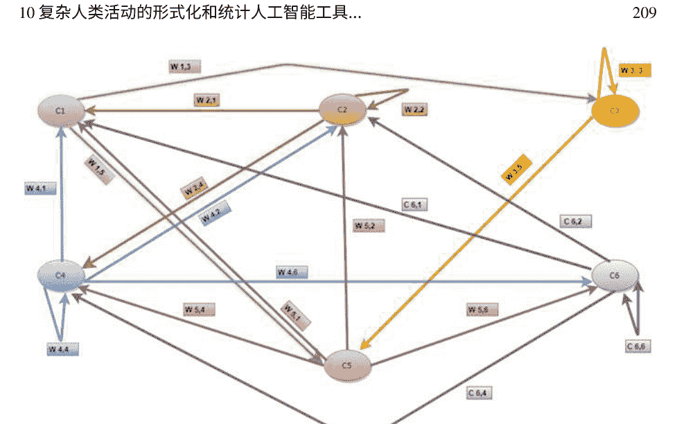

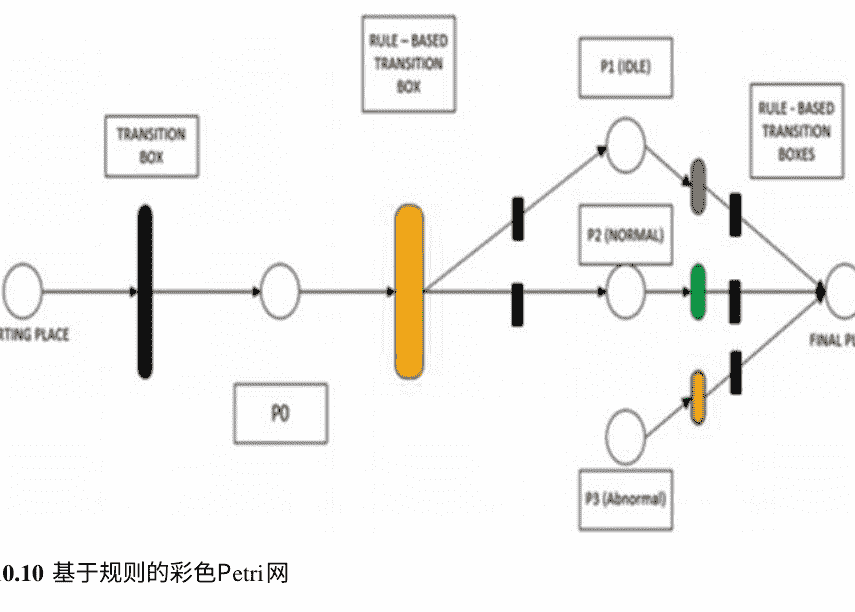

- 第一个黑色过渡框是在生成令牌时立即激活的过渡框。
- 然后，令牌停留在原地（PO），并实施黄色的基于规则的过渡框。
- 该框将令牌分类为闲置或正常。当系统无法检测到主体时，令牌进入闲置状态。当识别到活动时，它总是进入正常状态。
- 放置在P1中的令牌始终为灰色。灰色令牌表示系统的空闲状态。为了使该令牌移动到最终位置，需要满足灰色规则转换盒的条件。
- 无论系统将用于哪个领域，灰色规则转换盒始终具有两个条件。
- 如果先前的系统状态 == "空闲"且主题 != "识别"，令牌保持在P1中。
- 如果先前的系统状态 == "空闲"且主题 == "识别"，令牌移动到最终位置。
- 当识别到一个活动时，它遵循与灰色令牌相同的步骤，但始终位于P2位置。
- P2是我们的系统处于正常状态时，即检测到的活动或活动序列是正常的情况下。我们应该注意到，如果触发规则，有可能新的活动会使我们的系统进入异常状态。
- P3代表系统的异常位置。为了使系统处于异常位置，绿色基于规则的转换框应该触发，并且将令牌移动到最终位置的代替，它们被移动到位置P3。
- 红色基于规则的转换框将令牌移动到最终位置。当发生这种情况时，会生成一个警报，因为主体发生了异常情况。
- 另一种情况是主体确实执行了异常的活动序列，但然后主体过渡到了正常活动。因此，我们将系统的状态更改为正常，并将令牌移回到P2。

在前三个图中，系统发送一个信号表明它是活动的，但仍然没有识别到主体，在这样做之后，令牌停留在RBCPN图的位置P1，直到识别到主体。空闲令牌首先出现在“起始位置”，经过第一个转换框，暂时停留在位置P1，然后经过基于规则的转换框，并根据所包含的规则进行分类，作为空闲系统或正常活动。显然，当系统通知我们它是空闲的时候，令牌将被发送到空闲位置P1。在下一个示例中，我们将描述在RBCPN图中如何移动检测到的活动，图10.11和10.12。

在时间戳t1期间，我们的系统通知我们它处于空闲状态，然后在时间戳t2期间，KINISIS将一个活动分类为行走，并且DRASIS。然后我们的系统的RBCPN模态接管。所以，在从起点经过，向前移动到P1位置并通过第一个过渡盒之后，行走令牌位于P2位置，显然我们将行走活动视为正常活动。在我们继续之前，我们应该注意，如果没有先前的观察，所有第一次识别的活动都将被归类为正常。实际上，一个被识别的Walking activity is recognized, and while DRASIS seeks for a TP, this happens within the RBCPN.

First Rule-Based Transition Box: If activity == "walking", then pass to place P2 = "normal".

While next activity != "detected", then second Rule-Based Transition Box != "activated".

While subject != "detected", then Green Rule-Based Transition Box == "activated".

图10.11 一个基于规则的着色Petri网，描述不同的激活状态（a）

GREY Color is when the system starts, and is in an idle condition.

First Rule-Based Transition Box: If system = "idle", then pass to place P1 = "idle".

While no subject != "detected", then second Rule-Based Transition Box != "activated".

While subject == "detected", then second Rule-Based Transition Box == "activated".

图10.12 一个基于规则的着色Petri网，描述不同的激活状态（b）

活动总是被归类为正常。然后根据我们的规则，如果系统不识别新的活动，并且基于正在执行的活动，系统的状态可能会发生变化。基于规则的过渡盒，当一个活动通过这些特殊情况的过渡盒时，系统会检查我们在每个过渡盒中设置的规则。我们从FCM以及其他规则中解析有关活动连接性的信息。但是规则不仅应包括可接受的过渡，还应包括我们认为不可接受的过渡，以及正常/异常过渡。根据这个功能，并根据系统将要使用的领域，什么是正常/异常，可接受/不可接受可能会发生变化。

利用上述描述的基于规则的Petri-Net和系统的合理规则以及系统的活动识别部分，我们提取正常和异常的行为模式。

例如：

-   坐下和躺下 →如果两个时间戳过去，并且活动 =“躺下”，则呼叫紧急情况。
-   走和跑和走和跑和走和坐下 →如果二十个时间戳过去，并且活动 =“坐下”，则呼叫紧急情况。
-   走和跑和走和跑 →锻炼。走和抓取-携带和放在桌子上。走和抓取-携带和通过 →进行家务。
-   走和坐下和站起来和走和坐下和站起来和走和坐下和站起来 →主体可能焦虑或思考。
-   走和坐下和躺下和站起来 →主体入睡并醒来，或小睡一会，或感到头晕和放松，基于躺下活动的持续时间。
-   (行走和抓取和携带) * 2 → 做家务。

## 10.7 结论

我们提出了一种新颖的人类活动识别方法，在不断发展的计算机视觉和人工智能领域中。我们的系统包括各种技术，用于识别活动，将活动序列分割为动作基元，并最终将活动分类为正常或异常。这里提出的系统方法可以为实现实际复杂活动识别系统做出贡献，以有效识别简单活动，分割复杂活动，并利用专家知识识别和适当定义活动序列的含义，具体取决于应用领域。总体而言，该工具不仅能识别活动，还能自动解释活动序列的要素。

## 参考文献

1.  L. Xia, C.-C. Chen, J.K. Aggarwal, 使用3D关节直方图的视角不变人体动作识别(2012), pp. 20–27.
2.  S. Foix, G. Alenya, C. Torras, Lock-in Time-of-Flight (ToF) cameras: a survey. IEEE Sens. J. 11(9), 1917–1926 (2011). https://doi.org/10.1109/JSEN.2010.2101060.
3.  W. Su, H. Eichi, W. Zeng, M. Chow, A survey on the electrification of transportation in a smart grid environment. IEEE Trans. Indus. Inf. 8(1), 1–10 (2012). https://doi.org/10.1109/TII.2011.2172454.
4.  P. Rashidi, A. Mihailidis, A survey on ambient-assisted living tools for older adults. IEEE J. Biomed. Health Inform. 17(3), 579–590 (2013). https://doi.org/10.1109/JBHI.2012.2234129.
5.  C. Urmson, W. Whittaker, Self-driving cars and the urban challenge. IEEE Intell. Syst. 23(2), 66–68 (2008). https://doi.org/10.1109/mis.2008.34.
6.  A. Angeleas, N. Bourbakis, G. Tsihrintzis, 对人类活动的研究调查和综述的分类，在2016年第7届信息、智能、系统和应用国际会议(IISA)上，(Chalkidiki, 2016), 第1-6页。 https://doi.org/10.1109/iisa.2016.7785367.
7.  David B. Kaber, Mica R. Endsley, 自动化水平和自适应自动化对人类在动态控制任务中的表现、情境意识和工作负荷的影响。Theor.Issues Ergon. Sci. 5(2), 113-153 (2004).
8.  A. Jaimes, N. Sebe, 多模式人机交互：一项调查。Comput. Vis. Image Under. 108(1-2), 116-134 (2007).
9.  C. Hawes, C.D. Phillips, M. Rose, M. Holan, M. Sherman, 养老院的全国调查。老年学家 43(6), 875-882 (2003).
10. S.S. Rautaray, A. Agrawal, 基于视觉的手势识别用于人机交互：一项调查。人工智能评论 43(1), 1-54 (2015).
11. S. Thompson, C. Bracken-Roche, 了解加拿大无人机的公众舆论: 2014年调查数据及其政策影响。无人机系统杂志 3(4), 156-175(2015).
12. Á. Rocha and Asociación Ibérica de Sistemas y Tecnologías de Información, 2010年第5届伊比利亚信息系统与技术会议(CISTI 2010)圣地亚哥-德孔波斯特拉,西班牙, 2010年6月16日至19日; [包括研讨会论文] (Piscataway, NJ: IEEE, 2010), 第226页.
13. L. Atzori, A. Iera, G. Morabito, 物联网：一项调查。计算机网络 54(15), 2787-2805 (2010).
14. ARCS, M. Beigl, F.J. Cazorla-Almeida, (Eds.), Workshop proceedings/23th International Conference on Architecture of Computing Systems, ARCS 2010: February 22-23, 2010, Hannover, Germany (VDE-Verl, Berlin, 2010).
15. M. Valera, S.A. Velastin, 智能分布式监控系统：一项综述。IEE Proc. Vision, Image, Signal Process. 152(2), 192 (2005).
16. J.D. Culler, K. Lamb (eds.), 只是难搞吗？在公共领域的学术写作 (斯坦福大学出版社, 加利福尼亚州斯坦福, 2003).
17. R. Furman, J.T. Kinn, 发表学术文章的实用技巧：写作和出版 在帮助专业领域, 第二版 (Lyceum Books, 芝加哥, 伊利诺伊州, 2012).
18. C.H. Lim, E. Vats, C.S. Chan, 模糊人体动作分析：一项综述。Pattern Recogn. 48(5), 1773-1796 (2015).
19. M.B. Holte, C. Tran, M.M. Trivedi, T.B. Moeslund, 从多视角视频中进行人体姿势估计和活动识别: 对最新发展的比较探索。IEEE J.Select. Top. Signal Process. 6(5), 538-552 (2012).
20. J.K. Aggarwal, M.S. Ryoo, 人体活动分析：一项综述。ACM Comput. Surv. 43(3), 1-43 (2011).
21. D. Das Dawn, S.H. Shaikh, 基于时空兴趣点 (STIP) 检测器的人体动作识别的综合调查。Vis. Comput. 32(3), 289-306 (2016).
22. D.T. Nguyen, W. Li, P.O. Ogunbona, 图像和视频中的人体检测: 一项综述。模式识别 51, 148-175 (2016).
23. S. Azary, A. Savakis, 使用稀疏时空特征表示的3D动作分类，在视觉计算进展, vol. 7432, 编辑： G. Bebis, R. Boyle, B. Parvin, D.Koracin, C. Fowlkes, S. Wang, M.-H. Choi, S. Mantler, J. Schulze, D. Acevedo, K. Mueller,M. Papka (Springer Berlin Heidelberg, Berlin, Heidelberg, 2012), pp. 166-175.
24. D. Weinland, R. Ronfard, E. Boyer, 用于动作表示、分割和识别的基于视觉的方法综述，计算机视觉与图像理解 115(2), 224-241 (2011).
25. T.B. Moeslund, E. Granum, 基于计算机视觉的人体动作捕捉综述，计算机视觉与图像理解 81(3), 231-268 (2001).
26. R. Poppe, 基于视觉的人类动作识别综述. 图像与视觉计算 28(6), 976–990 (2010).
27. Š. Obdržálek等人，基于Kinect的姿势估计在老年人辅导中的准确性和鲁棒性，于2012年IEEE工程医学与生物学学会年会(圣地亚哥，加利福尼亚，2012年)，第1188–1193页。 https://doi.org/10.1109/embc.2012.6346149.
28. A. Angeleas, N. Bourbakis, 神经网络作为复杂人类活动的分类机制。人工智能工具国际期刊 29(05), 2050011 (2020).
29. A. Angeleas, N. Bourbakis, 基于两种形式语言的人类活动表示模型，于2016年IEEE第28届人工智能工具国际会议(ICTAI)(IEEE, 2016).
30. A. Angeleas，一个用于复杂人类活动识别和行为模式提取的多形式语言协作方案 (Wright State University, Diss, 2018).
31. L. Xia， C. Chen, J.K. Aggarwal, 使用Kinect的深度信息进行人体检测，在 CVPR 2011 WORKSHOPS (科罗拉多斯普林斯, 科罗拉多州, 2011年) ，第15-22页。 https://doi.org/10.1109/cvprw.2011.5981811.
32. M. Rahman, 开始使用Microsoft Kinect for Windows SDK 2.0: 运动和深度感应用于自然用户界面 (Apress, 2017).
33. O. Masoud, N. Papanikolopoulos, 识别人类活动，在Proceedings of the IEEE Conference on Advanced Video and Signal Based Surveillance, 2003 (迈阿密, 佛罗里达州, 美国, 2003年) ，第157-162页。 https://doi.org/10.1109/avss.2003.1217916.
34. J. Ben-Arie, Z. Wang, P. Pandit, S. Rajaram, 使用多维索引进行人类活动识别. IEEE Trans. Pattern Anal. Mach. Intell. 24(8), 1091–1104 (2002). https://doi.org/10.1109/tpami.2002.1023805.
35. F. Niu, M. Abdel-Mottaleb, 基于形状和运动特征的视角不变的人类活动识别，在IEEE第六届多媒体软件工程国际研讨会上，迈阿密，佛罗里达州，美国(2004)，第546-556页 。 https://doi.org/10.1109/mmse.2004.88.
36. R. Hamid, Y. Huang, I. Essa, ARGMode—使用图形模型进行活动识别，在 2003年计算机视觉和模式识别研讨会，威斯康星州麦迪逊，美国(2003)，第38-38页。 https://doi.org/10.1109/cvprw.2003.10039.
37. A. Bhattacharjee等人，Stratum: 一种用于机器学习基于数据分析任务的无服务器框架的生命周期管理。 在2019年{USENIX}操作机器学习会议（{OpML} 19）（2019年）.
38. Z. Li, B. Peng, Q. Huang, C. Weng, Karst: 无阻塞事务数据摄取的可扩展架构。IEEE Trans. Knowl. Data Eng. https://doi.org/10.1109/tkde.2020.3011510.
39. D.-S. Pham等人，大规模数据流网络中的异常检测。 数据挖掘知识发现 28（1），145-189（2014年）.
40. S.C. Tan, K.M. Ting, T.F. Liu, 用于流数据的快速异常检测，在第二十二届国际人工智能联合会议（2011年）.
41. S.B. Gokturk, H. Yalcin, C. Bamji, 一种飞行时间深度传感器——系统描述、问题和解决方案 (2004), pp. 35–35.
42. H.H. Ali, H.M. Moftah, A.A.A. Youssif, 基于深度的人体活动识别: 特征提取的比较研究. 未来计算与信息学报 3(1), 51–67 (2018).
43. M. Panzner, P. Cimiano, 隐马尔可夫模型和长短期记忆神经网络在学习动作表示方面的比较,in机器学习、优化.
44. F. Karim, S. Majumdar, H. Darabi, S. Harford, 用于时间序列分类的多变量LSTM-FCNs.
45. J. Bergstra, Y. Bengio, 超参数优化的随机搜索。J. Mach. Learn. Res. 13(2) (2012).
46. D.M. Hawkins, 过拟合问题。J. Chem. Inf. Comput. Sci. 44(1), 1-12 (2004).
47. R.C. Staudemeyer, E. Rothstein Morris, 理解LSTM-长短期记忆循环神经网络的教程 ar Xiv预印本arXiv:1909.09586 (2019).
48. J. Wu, 卷积神经网络简介。新软件技术国家重点实验室(南京大学, 中国, 2017), 第23页.
49. S. Yu, J. Ma, W. Wang, 深度学习去噪教程. 电子工程与系统科学. (2018).
50. S. McCann, J. Reesman, 使用卷积神经网络进行目标检测 (2015).
51. I. Goodfellow, 深度学习 （自适应计算与机器学习系列 ） (Almohreraladbi, 2016).
52. X. Liu等，用于自然语言理解的多任务深度神经网络。arXiv预印本arXiv:1901.11504 (2019).
53. D.W. Otter, J.R. Medina, J.K. Kalita, 深度学习在自然语言处理中的应用调查。 IEEE Trans. Neural Netw. Learn. Syst. (2020).
54. D. Rao, B. McMahan, 使用PyTorch进行自然语言处理: 使用深度学习构建智能语言应用 (O'Reilly Media, Inc., 2019).
55. M. Oquab, L. Bottou, I. Laptev, J. Sivic, 使用卷积神经网络学习和传递中层图像表示(2014), pp. 1717–1724.
56. B. Mahasseni, S. Todorovic, 用于动作识别的3D人体骨架序列正则化长短期记忆(2016), pp. 3054–3062.
57. B. Zhang, L. Wang, Z. Wang, Y. Qiao, H. Wang, 增强的运动向量CNN实时动作识别(2016), pp. 2718–2726.
58. L. Wang等人，时序段网络：深度动作识别的良好实践，计算机视觉—ECCV 2016，第9912卷，编者B. Leibe, J Matas, N. Sebe, M. Welling (Springer International Publishing, Cham, 2016), pp. 20–36.
59. C. Zhu, W. Sheng, 使用人体运动和位置数据实时识别复杂的人类日常活动. IEEE Trans. Biomed. Eng. 59(9), 2422–2430 (2012). https://doi.org/10.1109/TBME.2012.2190602.
60. X. Sun, C.-W. Chen, B.S. Manjunath, 用于人类活动识别的概率运动参数模型, 在Object Re cognition Supported by user interaction for service robots, QuebecCity, Quebec, Canada, vol. 1 (2002), pp. 443–446. https://doi.org/10.1109/icpr.2002.1044751.
61. M.S. Ryoo, J.K. Aggarwal, 时空关系匹配：视频结构比较用于复杂人类活动识别, 在2009 IEEE 12th International Conference onComputer Vision, Kyoto(2009), pp. 1593–1600. https://doi.org/10.1109/iccv.2009.5459361.
62. M. Leo, T. D'Orazio, I. Gnoni, P. Spagnolo, A. Distante, 用于监测广阔室外环境的复杂人类活动识别, 在Proceedings of the 17th International Conferenceon Pattern Reco gnition, vol. 4 (ICPR 2004, Cambridge, 2004), pp. 913–916. https://doi.org/10.1109/icpr.2004.1333921.
63. L. Xia, C. Chen, J.K. Aggarwal, 使用3D关节直方图的视角不变人体动作识别, 在2012年IEEE计算机学会计算机视觉和模式识别研讨会上，普罗维登斯，RI (2012年)，第20-27页。 https://doi.org/10.1109/cvprw.2012.6239233.
64. M. Glykas, 编辑，模糊认知图：理论、方法、工具和应用的进展，第247卷 (Springer S cience & Business Media, 2010年).
65. A.J. Jetter, K. Kok, 未来研究中的模糊认知图——概念和方法的方法论评估。未来 61, 45-57页 (2014年).

# 第11章 基于预训练卷积神经网络的CU深度预测模型，用于HEVC内部编码复杂度降低

李佳明，杨明，谢颖，李志刚

摘要 高效视频编码（HEVC）是先进视频编码（AVC）的继任者，它在保持相同视频质量的同时实现了高达50%的更高压缩比。HEVC采用的先进技术之一是将输入信号分成不同大小的编码单元（CU），以确保降低比特率同时保留视觉细节。确定CU大小的过程称为编码树单元（CTU）分割。为了确定最佳的CTU分割模式，传统方法使用穷举搜索计算每种可能模式的速率失真（RD）成本，这在计算上非常昂贵，使得实时处理变得不可能。本文提出了一种基于预训练卷积神经网络的分层CU深度预测模型，用于根据图像块预测CTU分割模式。该模型基于三级分类器构建，可以确定每个级别的CU深度，并最终生成CTU的整体分割。实验证明，该模型能够将帧内模型编码时间减少高达73.80%，平均Bjøntegaard delta比特率增加2.645%，这在HEVC的编码效率上是一个显著的改进。

- 关键词 高效视频编码 · 编码树单元划分 · 卷积神经网络

## 11.1 引言

随着通信技术的发展，数据传输带宽不断提高。然而，实时高分辨率视频传输仍然很困难。视频压缩技术可以通过以更紧凑和稳健的方式来表示视频数据来解决这个问题，从而降低存储和传输成本。高效视频编码（HEVC）是一种广泛使用的视频压缩标准，于2013年被ITU-T视频编码专家组和ISO/IEC运动图像专家组接受为新的视频编码标准。 与其前身H.264/AVC相比，它能够在不牺牲视频质量的情况下减少一半的比特率，并支持分辨率高达8192 × 4320 (8K)的高清视频。尽管HEVC在比特率降低方面取得了巨大成就，但编码复杂性也大大增加。 根据Corr a等人的研究[1]，对于处理2560 × 1600 (2K)分辨率的视频，HEVC的平均计算复杂度比H.264增加了502.2%。

编码树单元（CTU）分割是H.265/HEVC标准采用的技术之一。 CTU是H.265/HEVC中的基本处理单元，对应于H.264/AVC中的宏块（MB）。一个宏块通常具有固定的大小\(16 \times 16\)，而CTU的大小可以是\(16 \times 16\)、\(32 \times 32\)或\(64 \times 64\)。 此外，CTU可以根据四叉树结构进一步递归地分割成多个编码单元（CU），深度从0到3。 因此，当CTU的大小为64时，CTU的分割可能非常复杂。 为了找到最佳的分割模式，HEVC测试模型（HM，HEVC的参考软件）使用穷举搜索来实现速率失真优化（RDO）。 它递归地计算每种可能模式的速率失真代价，以找到最佳的分割。 对于分辨率为3840 × 2160的4K UHD视频输入，一个单帧可以被划分为至少2040个大小为\(64 \times 64\)的CTU。 每个CTU需要进行 \(1 + 4 + 16 + 64 = 85\)次RDO代价计算，这个过程的总计算代价使得它在实时应用中不可行。 研究[2]表明，CTU分割过程占据了总计算量的90%以上。 因此，减少CTU分割复杂性是提高HEVC内部编码效率的关键部分。

研究人员提出了很多关于CTU分区复杂度减少的解决方案，这些方法可以分为两类：基于统计的方法和基于深度学习的方法。 一般来说，基于统计的方法侧重于压缩搜索空间的CTU的空间分布。 例如，Shang等人[3]表明相邻的CU通常包含相似的纹理，CU的最佳深度级别与其附近的CU之间有很强的相关性。 因此，如果当前CU包含复杂的纹理信息，可以提前跳过大CU中的模式预测。 他们的算法在压缩质量方面表现良好，但是输入帧必须使用Canny边缘检测器进行预处理以确定纹理分布，这是耗时的。 此外，该算法还具有固有的并行性，由于当前CU的深度搜索范围依赖于其相邻的CU，因此该算法中CTU分区受到了降低。 最近，随着深度学习技术在特征提取和分类方面的卓越表现，研究人员开始利用深度学习框架来研究CTU复杂度的降低。在[2]中，冯等人提出了一种基于纹理特征和卷积神经网络（CNN）分类技术的CTU深度减小算法。 他们利用CNN来减小速率-失真代价计算的搜索深度范围，平均减少编码时间27.54%。这种方法不需要辅助信息，但即使在深度范围限制之后，算法仍然具有计算复杂度的开销，并且仍然不够高效。 陈等人不再专注于搜索范围的减小，[4]提出了两种使用卷积神经网络进行快速CU分区预测和PU模式预测的算法。 他们提出的方法能够在CU分区决策方面节省23.46%的时间，Bjontegaard delta bit rate（BDBR）增加了0.08%，BDPSNR降低了0.06 dB。对于PU模式预测，他们提出的方法能够节省23.61%的编码时间。

此外，另一个研究小组提出了一种基于人工神经网络（ANN）和支持向量机（SVM）的快速编码单元深度决策算法，用于HEVC的帧内编码[5]。在他们的研究中，利用机器学习来开发一种快速算法，用于减少帧内编码的计算复杂度和时间的CU分割或终止。实验结果表明，与HM 15.0相比，所提出的快速算法在编码时间上最多节省48.5%，平均节省33%，并且与HM 15.0相比，BDBR损失仅为1.55%。

宋等人报道了一种基于CNN的HEVC帧内预测模式算术编码方法[6]。在他们的研究中，使用定制的CNN来预测帧内预测模式的概率分布，并且采用多级算术编码器来压缩具有预测概率的帧内预测模式。他们的结果显示，与上下文自适应二进制算术编码（CABAC）相比，可以节省高达9.9%的比特。此外，一些研究人员尝试使用卷积神经网络来预测CTU分割，而不是进行详尽的速率失真成本计算。金等人[7]设计了一个自顶向下的神经网络架构，并对其进行训练，以预测是否在每个深度分割CU。对于给定的CU，CNN模型确定CTU分割是否应该在当前深度停止（非分割）或继续到较低深度（分割）。在实验中，他们的算法平均减少了61.77%的计算开销，并且最大降低了73.45%，并且BD率降低了3.91%。尽管编码复杂度和压缩比特率之间存在权衡，但他们的算法极大地提高了编码效率。李等人[8]在他们的研究中指出，前一项研究的CNN架构相对较浅，当训练数据不足时，很难避免过拟合。模型几乎无法学习足够的特征。因此，他们探索了一个具有不同卷积核大小和大量可训练参数的深度卷积神经网络模型。他们的方法将内部编码时间减少了62.25%和69.06%，BDBR几乎可以忽略不计，分别为2.12%和1.38%。他们的研究表明，深层网络模型在CTU分区上表现更好。

受到先驱研究者的启发，我们提出了用于HEVC内部编码的CTU分区复杂度降低算法。所提出的方法使用分层卷积神经网络作为三级CU深度分类器，在每个级别上对CU的深度进行预测。然后，整体CTU分区模式可以通过子CU的深度推导出来，从而可以替代开销RD成本计算。首先，训练数据是由HEVC参考软件HM-16生成的。数据集包含了大小为64 × 64、32 × 32和16 × 16的CU的YUV像素值，以及它们的标签（深度）。考虑到量化参数（QP）对HEVC内部编码的影响，一个CU在4个不同的QP下对应着4个不同的标签。其次，我们没有设计新的神经网络架构并从头开始训练，而是采用了迁移学习的方法，即使用预训练的图像分类模型作为卷积基础，并对其进行微调以解决CTU分区决策任务。最后，我们将算法与HM-16集成。HM将跳过RD成本计算和独占四叉树搜索，而是根据所提出模型的预测直接为CU分配深度。

## 11.2 H.265高效视频编码

在进入所提出的方法之前，有必要加强对H.265/HEVC标准的一些关键术语的理解。

### 11.2.1 编码树单元划分

根据HEVC标准，输入视频信号（也称为切片或帧）首先被分成相等大小的方块，称为CTUs。对于大小为 L × L的CTU，其长度L可以根据设置选择为 L=16、32或64。然后，HEVC支持将CTU分割成更小的CU，使用树状结构和四叉树类似的信号传递。这种灵活和递归的表示提供了几个好处。

第一个好处是支持大于传统的16 × 16大小的CU。如图11.1所示，在区域均匀的情况下，一个大CU可以表示具有较少符号的区域，因此与H.264/AVC [9]相比，编码效率得到了改善。

一个CU可以被看作是一个 L × L 的图像区域，可以进一步分成4个相等大小的 L/2 × L/2 的小CU。CU的结构可以用四叉树结构表示，如图11.2所示。只要CU的长度大于或等于8，就可以进一步分割。换句话说，如果我们将一个64×64的CTU视为四叉树的根，四叉树的深度可以从0到3。如图11.2所示，CTU分区的四叉树表示在左侧表示。数字“0”表示当前CU不能分割（叶子节点），而“1”表示该CU可以扩展。在图11.2的右侧，最大的正方形表示一个64×64的CTU，或者最大编码单元（LCU）。它被递归地分成多个最小尺寸为8×8的CU。

### 11.2.2 码率失真优化

最终的CU分布是通过对完整四叉树结构进行穷举搜索来确定的，使用速率失真优化（RDO）。从LCU开始，从上到下，HM采用的算法首先计算整个LCU的RD成本，然后计算其子CU的RD成本之和。对于每个子CU，这个过程将递归地进行，直到子CU的长度达到8。之后，将选择总RD成本最小的CTU分区。速率失真优化确实带来了具有最小RD成本的优化分区，但这种方法不适用于对时间敏感的应用。需要一种更高效的策略来减少CTU分区的复杂性，同时几乎不损失速率失真。

### 11.2.3 CU划分和图像纹理特征

研究人员已经确定了CU的深度与其周围的纹理特征相关。张等人研究表明，帧的纹理区域倾向于使用细粒度的CU分区进行编码，而均匀区域则倾向于使用粗粒度的CU分区进行编码[10]。因此，他们开发了一种基于梯度的算法来加速预测单元大小和模型。同样，纹理特征也可以用来预测CU的深度。例如，图11.3显示了一个肖像的CTU分区。均匀区域（例如背景、额头和脸部）倾向于具有较小的深度；而丰富的纹理区域（例如头部、眼睛和嘴唇）倾向于被分割成较小的子CU。

在CU分区和纹理特征之间的关系承诺下，如果我们训练深度学习模型来学习CTU分区的规则，就可以避免传统的蛮力搜索，从而加快HEVC内部编码。

## 11.3 提出的方法论

正如我们之前讨论的那样，预测CTU的深度范围还不够高效，因为RD成本检查仍然是不可避免的[3]。因此，我们提出的方法旨在直接预测CTU的整体分区模式。

### 11.3.1 分层分类器

对于一个64 ×64的CTU，可能有83,522种不同的分区模式[8]。由于可能的模式太多，训练模型进行即时预测是困难的。因此，首选使用分层模型的组合来完成这个任务。

Zhang等人[5]提出了一种使用三级分类器的CU深度决策算法。CTU分区预测算法的过程类似于深度优先搜索(DFS)。顶层分类器是CNN模型，用于确定给定的LCU是否应在深度0上进行分割。如果决策是非分割，则在较低深度不执行进一步操作。算法应该开始处理下一个CTU。但如果决策是分割，则LCU将被分成四个部分。\(\frac{L}{2} \times \frac{L}{2}\)个较小的子CU，并且算法进入较低的深度。对于每个子CU，有另一个CNN模型被训练用于学习是否应该在深度1上将\(\frac{L}{2} \times \frac{L}{2}\)CU分割。与深度0的过程类似，如果预测结果为非分割，则算法应在此处停止并开始处理下一个CU。否则，它将当前CU分割成长度为\(\frac{L}{4} \times \frac{L}{4}\)的较小CU，直到当前CU不再需要分割。

虽然这种设计在CTU模式预测上表现出色，但CNN提取深层和抽象特征的能力尚未充分利用。在他们的工作中，每个深度都是一个二分类问题。但在现实中，CNN可以处理更复杂的分类任务。因此，我们修改了他们的算法，并将双层模型转化为三元分类器。与他们的模型不同，我们的模型将对CU的深度进行预测，从“0”到“2”。如果预测显示CU的深度为0，则等于非分割。但如果深度为“1”，则当前CU将被分割成四个子CU。无需检查四个子CU，因为我们知道CU的深度为“1”，其子CU不能进一步分割。当预测为“2”时，我们只需要检查每个子CU（“2”表示当前CU的深度大于或等于2）。在这种情况下，我们知道至少有一个子CU需要分割，但我们不知道应该分割哪一个，所以检查是必要的。因此，我们的模型通过避免不必要的检查进一步提高了编码效率。图11.4显示了我们改进的分类器的结构。

### 11.3.2 迁移学习方法论

[5]的作者选择从头开始设计和训练一个卷积神经网络。然而，采用迁移学习的方法可能有更高效的建模方式。迁移学习是一种从其他相关任务中获取知识来辅助当前任务学习的方法。在这种情况下，我们可以使用预训练模型作为特征提取器，提取CU的纹理特征，并添加自己的密集层作为分类器来决定CU的深度。

预训练模型是已经在大型数据集上完全训练过的模型，可以产生良好的分类结果。有很多现成的预训练模型可供我们使用，例如VGG [11]，Densnet [12]和MobileNet [13]。这些模型与它们在ImageNet数据集上训练的权重一起提供，ImageNet是一个根据WordNet层次结构组织的大型图像数据集，包含超过1400万张图片。大多数预训练模型对于1000个类别具有超过70%的Top-1准确率和90%的Top-5准确率，这意味着这些模型可以提取更深入和更抽象的图像特征。同样，CTU的分割是基于块纹理的，因此我们可以使用预训练模型来辅助我们的任务。

使用预训练模型有两个主要优势。首先，它消除了训练模型所需的大型数据集的需求。由于预训练模型已经经过良好训练，并且在图像分类上能够产生良好的结果，我们只需要使用相对较少的数据来训练它以区分三种不同的CU。其次，如果我们从预训练模型开始训练，训练时间将大大缩短。大多数预训练模型具有非常深的结构，但微调只需要我们训练部分网络。对于大多数层来说，它们的权重将在训练过程中保持不变。当我们训练模型时，只需要调整几层。

### 11.3.3 卷积神经网络的结构

所提出的卷积神经网络模型作为单个CU深度预测器。通过将三个模型组合在一起并收集每个独立CU的深度，可以直接预测整体分区模式，以减少HEVC编码复杂性。所提出的模型可以分为三个部分：输入层，卷积基础和全连接层。

输入层是CU的图像块。由于我们设计了一个三级分层分类器，每个QP有三个模型，我们分别称之为Model-64，Model-32，Model-16，根据它们的输入层形状。

模型的第二部分是预训练模型的卷积层和权重，我们称之为卷积基础。这些卷积层被训练用于提取深层和抽象特征，并实现良好的准确性。通常预训练模型非常深，但正如我们之前讨论的，只有少数卷积层需要在训练过程中进行调整，其他层将保持不变。因此，尽管整个网络很深，训练模型并不困难。Model-16在这里是一个特殊情况。由于16 × 16 CU的尺寸相对较小，不需要使用深层卷积层，该模型能够提供良好的结果。对于Model-16的卷积层，卷积核的尺寸设置为3 × 3，并且步幅在x和y方向上都设置为1。

三个全连接（FC）层由ReLU函数激活。它们作为特征分类器。由卷积层生成的特征图将被展平为一维向量，然后传递给FC层。大多数预训练模型专注于图像分类，因此我们修改了其原始的全连接层，并通过前面的卷积层提取的特征对其进行训练，以预测CU深度。由于训练数据的有限大小，我们在FC层之间添加了dropout层以防止过拟合。dropout比率设置为0.5，意味着FC层中的50%单元将随机设置为0。因此，模型不会过度依赖局部特征，其泛化能力将得到改善。图11.5描述了Model-64、Model-32和Model-16的详细结构。

存在许多预训练模型，其中大多数在图像分类任务上表现出色。然而，一些模型可能会忽视我们在CU深度预测任务中所需要的特征。因此，我们评估了几个经典的预训练模型，并发现VGG16的测试准确性最好。从理论上讲，更高的准确性将获得更好的BD-BR和BD-PSNR，因为测试准确性表示与真实值的相似性。因此，我们选择VGG-16作为我们模型的卷积基础，以获得最佳性能。

### 11.3.4 数据集构建

为了训练神经网络学习CU的纹理特征并预测其深度，需要创建一个数据集。数据集应包含以图像块为单位的CU，并将其深度作为标签。我们首先从UVG数据集[11]和Xiph.org下载了几个YUV原始视频，然后根据其显示分辨率（一些视频被调整大小）将它们分类为两组。表11.1显示了我们用于构建数据集的视频的属性。

我们使用参考软件HM对视频序列进行编码，以获得CU的地面真实深度信息。对于一个64×64的CTU，复杂的CTU分区模式可以通过一个4×4的矩阵轻松表示，其中矩阵的每个条目表示一个8×8的CU的深度，CU的位置可以通过条目索引确定（图11.6）。

CTU深度矩阵作为标签，相应的数据是CTU的图像块。为了使我们的数据集轻量化，我们使用一个元组 (F, I) 来索引CTU，其中F是帧编号，I是CTU索引。数据连同标签将被存储在一个pickle文件中。

要加载CU和标签来描述深度，首先需要从视频序列中提取帧，使用YUV 4:2:0像素格式。因为相邻的帧具有高连续性，为了保持数据集的多样性并帮助模型学习各种特征，具有高连续性的帧被添加到数据集中，而不是每个帧的CU。对于所选的帧，帧编号和CTU索引帮助我们定位CTU的图像块。此外，我们可以通过深度矩阵轻松提取单个CU分区信息。例如，如果条目之和等于0，则64×64 CU的标签为“0”，表示它不能被分割。如果和为16，则此64×64 CU的标签为“1”。否则，我们将标签“3”分配给此CU，然后将此CU分成四个子CU。类似地，我们将深度矩阵分成4个子矩阵。通过递归执行上述过程，我们可以为CTU中的每个CU标记标签。请注意，使用不同的量化参数（QP）设置，CTU分区模式往往不同。在具有较高QP的视频编码中，由于需要实现更高的压缩效率，CTU的深度变得更深[4]。如果我们不考虑QP的影响，神经网络将产生错误的预测，并且RD性能将下降。因此，对于每个视频序列，我们创建了4个子数据集，分别对应于4个不同的QP，具体为22、27、32和37。表11.2显示了我们数据集的详细数据和标签分布。

**表11.1 视频序列列表**

| 类别 | 视频名称 | 显示分辨率 | 总帧数/帧率 |
| :--- | :--- | :--- | :--- |
| A | 准备就绪 | 1080P | 600/120 |
| A | 游艇之旅 | 1080P | 600/120 |
| A | 蜜蜂 | 1080P | 600/120 |
| A | 骑师 | 1080P | 600/120 |
| B | 老城区 | 720P | 500/20 |
| B | 希尔兹 | 720P | 504/50 |
| B | 花卉全景 | 720P | 600/50 |
| B | 鸭子 | 720P | 500/20 |
| B | 花卉儿童 | 720P | 600/50 |
| B | 赛车之夜 | 720P | 600/50 |

#### 表11.2 数据集分布

| QP | 大小 | 标签：“0” | 标签：“1” | 标签：“2” |
| :--- | :--- | :--- | :--- | :--- |
| **22** | 64 × 64 | 45,472 | 54,179 | 248,989 |
| | 32 × 32 | 271,799 | 98,763 | 625,394 |
| | 16 × 16 | 782,843 | 1,718,733 | 无 |
| **27** | 64 × 64 | 55,734 | 61,986 | 230,920 |
| | 32 × 32 | 280,092 | 109,015 | 534,573 |
| | 16 × 16 | 793,366 | 1,344,926 | 无 |
| **32** | 64 × 64 | 69,005 | 60,385 | 219,250 |
| | 32 × 32 | 291,768 | 124,795 | 460,437 |
| | 16 × 16 | 773,504 | 7,068,244 | 无 |
| **37** | 64 × 64 | 83,795 | 64,028 | 200,817 |
| | 32 × 32 | 301,360 | 144,240 | 357,668 |
| | 16 × 16 | 681,426 | 749,246 | 无 |

## 11.4 实验和结果

在本节中，我们首先找到了这个任务的最佳预训练模型，然后将其作为我们模型的卷积基础来评估所提出的方法的性能。具体而言，我们将把所提出的模型集成到HM中，并将修改后的HM的Bjøntegaard delta比特率（BD-BR）和Bjøntegaard delta PSNR（BD-PSNR）与原始HM进行比较。

我们的数据集中有两个类别的10个视频序列，如表11.1所示。对于每个实验，将选择一个视频作为测试数据，同一类别中的其他视频（数据集）将用于训练模型，这意味着模型的权重将通过反向传播进行更新，除了已经冻结的层。测试数据仅用于通过测试准确性和损失值评估模型的性能。测试准确性和损失不会影响模型的权重，在我们的实验中，训练数据和测试数据是分开的。我们在训练中引入测试数据的原因是通过观察测试损失的变化来避免过拟合。如果测试损失持续增加，则需要进行微调。

对于每个QP在{22, 27, 32, 37}中，有3个模型来预测CU的深度分别为64 × 64，32 × 32和16 × 16。因此，每个测试数据训练了总共12个模型。批量大小分别设置为256、512、1024用于Model-64、Model-32和Model-16。所有模型都使用Adam优化器进行编译，初始学习率为0.001。我们还使用学习率调节器在运行时调整学习率。如果验证损失连续3个时期不再减小，学习率将减小20%。学习率调节器有助于防止过拟合。由于我们基于预训练模型训练模型，模型只需要迭代几个时期。在我们的实验中，Model64和Model32将训练10个时期，而Model16需要20个时期才能完全训练。我们的实验表明，在训练后，大多数模型能够预测基于预训练卷积的CU深度预测模型。

对于一个特定的CU，准确率超过80%的深度。图11.7展示了每个级别模型在4个不同QP下的训练和测试准确率。HM提供的配置文件encoder_intr_main.cfg是为HEVC帧内预测设计的，因此将用于参数设置。只有QP的值会被修改以收集不同的数据。配置文件中的其他参数将保持不变。测试视频将由原始HM和我们修改后的HM对四个不同的QP进行编码。在HM完成指定帧的编码后，HM将自动生成包含比特率信息、每个通道的PSNR和总编码时间的摘要报告。接下来，根据相同输入视频序列在四个不同QP下的比特率和YUV-PSNR，可以通过计算BD-BR和BD-PSNR来评估RD性能。表11.3显示了我们的方法与原始HM相比的BD-BR增量和BD-PSNR降低。从表11.3可以看出，我们的方法的BD-BR增量为2.64%。此外，我们的方法还导致了在0.13 dB PSNR降低中。作为回报，所提出的方法平均减少了48.82%的编码时间。从实验结果可以看出，我们的方法表现非常好。预训练模型在我们的模型中起着重要作用。由于其卷积层，CU的特征可以快速分类，因此我们的模型在没有长时间大规模数据集训练的情况下在RD性能上取得了出色的结果。

表11.3 提出方法的BD-BR，BD-PSNR和时间减少
| 视频名称 | BD-BR (%) | BD-PSNR | QP = 22 (%) | QP = 27 (%) | QP = 32 (%) | QP = 37 (%) | 平均 (%) |
| :--- | :--- | :--- | :--- | :--- | :--- | :--- | :--- |
| 鸭子 | 2.62 | -0.13 | 73.80 | 70.05 | 67.65 | 64.52 | 69.01 |
| 花卉儿童 | 1.92 | -0.10 | 50.00 | 45.16 | 41.38 | 37.03 | 43.39 |
| 花卉全景 | 2.44 | -0.14 | 51.16 | 46.15 | 38.23 | 32.25 | 41.95 |
| 老城区 | 2.64 | -0.11 | 63.88 | 52.94 | 43.33 | 37.03 | 49.30 |
| 赛车之夜 | 3.23 | -0.14 | 63.64 | 63.33 | 60.71 | 59.26 | 61.74 |
| 希尔兹 | 3.02 | -0.15 | 40.47 | 35.13 | 21.21 | 13.33 | 27.53 |

## 11.5 结论

正如本文前面讨论的那样，HEVC参考软件HM中的CTU分割模式预测方法不适用于实时应用场景。在这项研究中，我们利用卷积神经网络来提高CTU分割模式的预测速度。我们的结果表明，预训练的卷积神经网络可以用于处理CU深度预测任务，并产生出色的结果。所提出的模型平均实现了48.82%的编码时间减少，Bjøntegaard delta比特率仅为2.64%。

未来，我们计划将QP整合到模型中，使模型根据输入的QP进行各种预测。

## 参考文献

- 1. G. Correa, P. Assuncao, L. Agostini, L.A. da Silva Cruz, 高效视频编码器的性能和计算复杂度评估。IEEE Trans. Circ. Syst. Video Technol. 22(12), 1899–1909 (2012)。 https://doi.org/10.1109/TCSVT.2012.2223411。
- 2. Z. Feng, P. Liu, K. Jia, K. Duan, 高效视频编码的快速内部CTU深度决策。IEEE Access 6, 45262–45269 (2018)。 https://doi.org/10.1109/ACCESS.2018.2864881
- 3. X. Shang, G. Wang, T. Fan, Y. Li, 快速CU大小决策和PU模式决策算法在HEVC内部编码中, 2015年IEEE国际图像处理会议(ICIP) (2015), pp. 1593–1597. https://doi.org/10.1109/ICIP.2015.7351069.
- 4. K. Chen, X. Zeng, Y. Fan, 面向CNN的快速CU分区决策和PU模式决策, 2018年第14届IEEE国际固态和集成电路技术会议(ICSICT) (2018), pp. 1–3. https://doi.org/10.1109/ICSICT.2018.8564981.
- 5. Y. Zhang, S. Kwong, X. Wang, H. Yuan, Z. Pan, L. Xu, 基于机器学习的编码单元深度决策用于高效视频编码中的灵活复杂度分配。IEEE Trans.Image Process. 24(7), 2225–2238 (2015). https://doi.org/10.1109/TIP.2015.24174986.
- 6. R. Song, D. Liu, H. Li, F. Wu, 基于神经网络的HEVC内部预测模式算术编码, 2017年IEEE可视化通信和图像处理VCIP (2017), pp. 1–4. https://doi.org/10.1109/VCIP.2017.8305104.
- 7. K. Kim, W.W. Ro, 使用神经网络进行HEVC的快速CU深度决策. IEEE Trans. Circ. Syst. Video Technol. 29(5), 1462–1473 (2019). https://doi.org/10.1109/TCSVT.2018.2839113
- 8. T. Li, M. Xu, X. Deng, 一种用于复杂度降低的深度卷积神经网络方法在HEVC的内部模式下, 在2017 IEEE International Conference on Multimedia and Expo (ICME) (2017), pp. 1255–1260. https://doi.org/10.1109/ICME.2017.8019316.
- 9. I.-K. Kim, J. Min, T. Lee, W.-J. Han, J. Park, HEVC标准中的块分割结构. IEEE Trans. Circ. Syst. Video Technol. 22(12), 1697–1706 (2012). https://doi.org/10.1109/TCSVT.2012.2223011
- 10. Y. Zhang, Z. Li, B. Li, 基于梯度的HEVC帧内预测快速决策, 2012年视觉通信和图像处理 (2012), pp. 1–6. https://doi.org/10.1109/VCIP.2012.6410739.
- 11. K. Simonyan, A. Zisserman, 面向大规模图像识别的深度卷积网络, ArXiv14091556 Cs(2015). 访问日期: 2020年8月26日. [在线]. 可用: http://arxiv.org/abs/1409.1556.
- 12. G. Huang, Z. Liu, L. van der Maaten, K.Q. Weinberger, 密集连接的卷积神经网络, ArXiv160806993 Cs(2018). 访问日期: 2020年8月26日. [在线]. 可用: http://arxiv.org/abs/1608.06993
- 13. A.G. Howard等人, MobileNets: 面向移动视觉应用的高效卷积神经网络, ArXiv170404861 Cs (2017). 访问日期: 2020年8月26日. [在线]. 可用: http://arxiv.org/abs/1704.04861。