# 基于深度学习的人脸分析

## 计算机视觉与模式识别的进展

Nalini K. Ratha

Vishal M. Patel

Rama Chellappa 编辑

### 创始编辑

Sameer Singh

### 系列编辑

Sing Bing Kang, Zillow, Inc., 西雅图, 华盛顿州, 美国

### 咨询编辑

- Horst Bischof, 格拉茨理工大学, 奥地利格拉茨
- Richard Bowden, 萨里大学, 吉尔福德, 萨里, 英国
- Sven Dickinson, 多伦多大学, 多伦多, 安大略省, 加拿大
- 贾佳亚, 香港中文大学, 沙田, 新界, 香港
- Kyoung Mu Lee, 首尔国立大学, 首尔, 韩国
- 林宙辰, 北京大学, 北京, 中国
- 佐藤阳一, 东京大学, 东京, 日本
- Bernt Schiele, 马克斯普朗克信息学研究所, 萨尔布吕肯, 萨尔兰德, 德国
- 斯坦·斯克拉罗夫, 波士顿大学, 美国马萨诸塞州波士顿

有关该系列的更多信息，请访问[http://www.springer.com/series/4205](http://www.springer.com/series/4205)

Nalini K. Ratha · Vishal M. Patel · Rama Chellappa

编辑

## 基于深度学习的人脸分析

编辑

Nalini K. Ratha 计算机科学与工程系 布法罗大学 纽约州布法罗市，美国

Vishal M. Patel

约翰霍普金斯大学电气与计算机工程系 马里兰州巴尔的摩市，美国

Rama Chellappa

约翰霍普金斯大学电气与计算机工程系（惠廷工程学院）和生物医学工程系（医学院）马里兰州巴尔的摩市，美国

ISSN 2191-6586 ISSN 2191-6594（电子版）

计算机视觉与模式识别进展

ISBN 978-3-030-74696-4 ISBN 978-3-030-74697-1（电子书）

https://doi.org/10.1007/978-3-030-74697-1

© 编辑（如适用）和作者，独家许可给 Springer Nature Switzerland AG 2021

本作品受版权保护。出版商独家授权所有权，无论是整体还是部分材料，特别是翻译、再版、插图重用、朗诵、广播、微缩胶片复制或以任何其他实体方式复制、传输或信息存储和检索、电子适应、计算机软件，或通过类似或不同的已知或今后开发的方法。

本出版物中使用的一般描述性名称、注册名称、商标、服务标志等，并不意味着即使在没有明确声明的情况下，这些名称免于相关的保护法律和法规，并因此可以自由使用。

出版商、作者和编辑可以安全地假设本书中的建议和信息在出版日期时是真实准确的。出版商、作者或编辑对本书中所包含的材料不提供任何明示或暗示的保证，也不对可能存在的任何错误或遗漏承担责任。出版商在已发表的地图和机构隶属方面保持中立。

这本施普林格印记由注册公司施普林格自然瑞士有限公司出版

注册公司地址为：瑞士洪堡街11号，6330 Cham

## 目录

1 基于深度卷积神经网络的人脸识别：回顾过去和未来

Ankan Bansal, Rajeev Ranjan, Carlos D. Castillo, 和 Rama Chellappa

2 人脸分割，人脸交换以及它们对人脸识别的影响

Y. Nirkin, I. Masi, Anh Tuan Tran, T. Hassner 和 G. Medioni

3 解耦表示学习及其在人脸分析中的应用

Dimitris N. Metaxas, Long Zhao 和 Xi Peng

4 从野外图像中学习3D人脸可塑模型

Luan Tran 和 Xiaoming Liu

5 使用深度网络去模糊人脸图像

Rajeev Yasarla, Federico Perazzi 和 Vishal M. Patel

6 用于监控的人脸盲超分辨率

T. M. Nimisha 和 A. N. Rajagopalan

7 对人脸进行哈希

Svebor Karaman 和 Shih-Fu Chang

8 新生儿面部识别的演变

Pavani Tripathi, Rohit Keshari, Mayank Vatsa 和 Richa Singh

9 基于深度特征融合的面部分析

Nishant Sankaran, Deen Dayal Mohan, Sergey Tulyakov, Srirangaraj Setlur 和 Venu Govindaraju

10 视频人脸识别的深度学习

Jiaolong Yang 和 Gang Hua

11 热成像到可见光人脸合成和识别

Xing Di, He Zhang 和 Vishal M. Patel

12 通过破坏人脸检测来阻止DeepFakes和面部特征点提取

Yuezun Li 和 Siwei Lyu

13 使用多通道人脸呈现攻击检测深度学习

Anjith George 和 Sébastien Marcel

14 可扩展的人员再识别：超越监督学习方法

Rameswar Panda 和 Amit Roy-Chowdhury

15 面部分析中因果基准测试的探索算法

Guha Balakrishnan, Yuanjun Xiong, Wei Xia 和 Pietro Perona

16 人类和机器的面部识别策略

Jacqueline G. Cavazos, Géraldine Jeckeln, Ying Hu 和 Alice J. O’Toole

17 面部识别系统的评估

Patrick Grother 和 Mei Ngan

索引

## 第1章

深度CNN面部识别：回顾过去和展望未来

Ankan Bansal, Rajeev Ranjan, Carlos D. Castillo 和 Rama Chellappa

摘要 在过去的十年中，面部识别的需求已经从识别几百人发展到识别数十万人。在过去几年中，自动面部识别的大部分进展都是由深度网络驱动的。在本文中，我们概述了该领域的最新进展，并讨论了最先进的基于CNN的面部识别和验证系统。我们还提出了一些开放问题，并讨论了未来研究的途径。

### 1.1 同义词

- 人脸验证
- 人脸识别
- 人脸识别。

### 1.2 引言

自动人脸识别是从图像或视频中识别一个人的问题。由于摄像头的普及和社交媒体网络的普及，自动人脸识别在访问控制、国土安全、拯救被剥削的儿童、人机交互界面等方面有应用。近年来，自动人脸识别技术取得了显著进展，主要归功于深度卷积网络设计的改进和大型数据集的可用性[1-4]以及具有挑战性的测试标准[5-8]。在本文中，我们总结了自动人脸识别的最新研究，重点关注使用深度卷积神经网络（CNNs）的方法。

人脸识别问题可以分为人脸识别和人脸验证。解决这些问题的CNN的标准方法包括四个步骤：人脸检测、对齐、表示和分类（图1.1）。识别是将图像从身份列表中分配给一个身份的问题。从另一个角度来看，这可以被视为尝试为给定的探测图像从图库中检索最佳匹配的人脸。另一方面，人脸验证涉及验证两个人脸图像是否属于同一个人。通常通过计算两个人脸特征表示之间的相似度来执行此操作。识别和验证都从深度学习算法和更先进的CNN架构的发展中受益匪浅。

除了改进的架构外，人脸识别在训练CNNs的有效损失函数设计方面取得了显著进展。人脸识别和验证都旨在学习具有低类内变异和高类间变异的表示。在过去几年中，已经提出了几种鼓励具有这些特性表示的损失函数。其中大部分[9-11]通过在特征上使用附加约束来修改常见的softmax损失函数，从而实现了紧凑且具有区分性的人脸表示，从而提高了人脸识别的性能。

然而，任何人脸识别流程的前几个步骤[1, 12-14]都是人脸检测[12, 15, 16]和关键点定位。有效的人脸检测和关键点定位方法已被证明可以提高识别性能[12, 17]。由于大型数据集[18-21]和CNNs的可用性，人脸检测和关键点定位也取得了性能提升。我们将在本文的后续章节中简要讨论其中一些方法。

本文的组织如下。首先，我们描述一些公开可用的用于人脸识别的数据集。然后，我们讨论一些最近的人脸检测方法，并介绍用于训练人脸识别流程的常见损失函数。接下来，我们描述并比较了一些最近提出的人脸验证和识别流程。最后，我们讨论了人脸识别领域的一些未解决问题。

### 1.3 数据集

深度卷积神经网络需要大量的训练数据。大型公司可以访问数亿个专有图像，并用它们来训练大型人脸识别网络。Taigman等人使用了1亿个主题的500亿张图像来训练人脸识别的卷积神经网络。类似地，Schroff等人使用了超过2亿张图像从800万人中训练一个具有1.4亿参数的人脸识别网络。然而，这些数据集并不公开可用。最近的研究表明，对极大规数据集进行预训练可以提高在其他数据集上的性能。具有讽刺意味的是，即使在[22]中使用的数据集也不公开可用。公开的人脸识别数据集远远没有达到这个规模。但是，每年都会有更大、更干净的数据集可用。

人脸识别系统首先需要检测人脸，然后定位关键点，用于将人脸对齐到规范视图，然后对检测到的人脸进行分类。系统的这三个部分需要不同级别的信息和数据类型。在本节中，我们将探讨一些最近发布的面向人脸识别、人脸检测和关键点定位的公开数据集。我们首先讨论用于人脸识别的数据集。然后，我们简要介绍人脸检测数据集，然后讨论一些可用于训练关键点检测算法的数据集。

表1.1列出了一些用于人脸识别的公共数据集及其属性。大规模野外人脸识别基本上始于2008年发布的`Labeled Faces in-the-Wild`（`LFW`）数据集。`LFW`大约有13,000张属于大约5,700个主题的人脸图像。它成为了几年来的标准评估基准[23]，直到方法的性能开始饱和，并且需要更具挑战性的基准。此外，深度卷积神经网络的普及使得需要引入更大的训练数据集。近年来，已经发布了几个大型数据集，以帮助深度网络的训练，并提供更强的基准。其中一些例子包括`CelebA` [24]，`CASIA-WebFace` [4]，`UMDFaces` [2]，`MS-Celeb-1M` [3]，`VGGFace` [1]等。然而，这些数据集仍然受限，因为它们只包含大多数名人的静态图像。这些照片通常是正面的，并在明亮的光线条件下拍摄。然而，评估数据集如`IJB-A` [6]，`IJB-B` [7]，`IJB-C` [8]，`IJB-S` [25]和`Megaface` [5]包含低光条件下的视频和图像以及侧面人脸。在上述训练数据集和这些评估集之间存在明显的领域转移。为了填补这一差距，多年来已经提出了几个视频数据集。其中包括`YouTube Faces`（`YTF`）[26]和`UMDFaces Video` [17]。目前是最大的公开可用的注释视频数据集。由于许多评估协议包含静态图像和视频的混合，使用静态图像数据集和视频数据集训练网络应该会提高性能[17]。使用这些数据集学习到的特征比仅使用静态图像训练的网络学习到的特征更加稳健。最近，使用混合数据集训练的系统在几个评估协议上已经显示出最先进的性能[12, 27, 28]。

表1.1 近似按照可用人脸数量排序的最新数据集。

| 姓名 | 人脸数 | 主题数 |
|------|--------|--------|
| `CFP` [29] | 7,000 | 500 |
| `DFW` [30] | 11,157张图像 | 1,000 |
| `LFW` [31] | 13,233 | 5749 |
| `CelebA` [24] | 202,599 | 10,177 |
| `UMDFaces` [2] | 367,888 | 8,277 |
| `CASIA-WebFace` [4] | 494,414 | 10,575 |
| `PaSC` [32] | 2,802个视频 | 293 |
| `IJB-A` [6] | 5,712张图像，2,085个视频 | 500 |
| `YTF` [26] | 3,425个视频 | 1,595 |
| `IJB-B` [7] | 11,754张图像，7,011个视频 | 1,845 |
| `IJB-C` [8] | 31,334张图像，11,779个视频 | 3,531 |
| `VGGFace` [1] | 2.6M | 2,622 |
| `VGGFace2` [33] | 3.31M | 9,131 |
| `Megafaace` [5, 34] | 4.7M | 672K |
| `UMDFaces Video` [17] | 22,075个视频 | 3,107 |
| `MS-Celeb-1M` [3] | 10百万 | 100千 |
| `IJB-S` [25] | >10M | 202 |

我们在表1.2中列出了一些用于训练和测试人脸检测模型的数据集。最受欢迎且规模最大的训练数据集是`WIDER FACE`数据集[18]。该数据集包含约40万个标注人脸，其中一半用于训练集，其余用于测试集。数据集中大约有32,000张图像。这些标注涵盖了尺度、光照、方向等各种变化范围。它被广泛用作训练模型的标准，并作为人脸检测方法的评估基准。在`WIDER FACE`之前，标准基准是`FDDB` [19]。该数据集包含约5,200个人脸标注。然而，由于`FDDB`的规模较小且面部变异有限，最佳方法的性能已经达到饱和。这就需要更大、更具挑战性的训练和测试数据集，`WIDER FACE`就是其中之一。最近，`IARPA JANUS`基准数据集[6-8]也已发布，用于评估人脸检测和识别。

表1.2 最近用于人脸检测的数据集，每个数据集中大约有多少人脸和图像

| 姓名 | 人脸数 | #图像 |
| :--- | :--- | :--- |
| `FDDB` [19] | 5,171 | 2,846张图像 |
| `MALF` [35] | 11,931 | 5,250 |
| `AFLW` [21] | 26,000 | 22,000 |
| `IJB-A` [6] | 50,000 | 5,712张图像，2,085个视频 |
| `IJB-B` [7] | – | 11,754张图像，7,011个视频 |
| `IJB-C` [8] | – | 31,334张图像，11,779个视频 |
| `WIDER` [18] | 393,703 | 32,203 |

表1.3 最近用于关键点定位的数据集

| 姓名 | 人脸数 | 属性 |
| :--- | :--- | :--- |
| `AFW` [20] | 468个（205张图像） | 6个关键点 |
| `300W` [37] | 600张图像 | 68个关键点 |
| `LFPW` [36] | 3,000个（1,287张图像） | 35个关键点 |
| `AFLW` [21] | 25,993个（21,997张图像） | 21个关键点，性别 |

在完全无约束的环境中。例如，`IJB-C` [8]数据集包含大约149,000张静态图像和视频帧。其中包括大约10,000张非人脸图像，用于测试实际相关的用例。该数据集是之前发布的`IJB-B` [7]和`IJB-A` [6]数据集的超集。

最后，在表1.3中总结了包含基准标记注释的数据集。由于在图像中标记和验证面部关键点的困难，只有少数几个包含此类注释的大规模公共数据集可用。在野外标注的人脸（`AFW`）[20]数据集中，约有468张脸标注了6个关键点。由于姿势和遮挡的原因，其中一些点可能是不可见的。300张野外人脸数据集是一个大小相似的数据集。它包含了600张图像，标注了68个面部关键点。其中一半的图像是在室内获取的，另一半是在室外获取的。在野外标注的面部部位（`LFPW`）[36]数据集中，约有3,000张脸每张标注了35个关键点。然而，用于关键点检测的最大数据集是野外标注的面部关键点（`AFLW`）[21]。它包含了26,000张标注的脸，其中一些可能存在严重的遮挡。每张脸都有21个标记注释。然而，由于极端姿势和遮挡，所有关键点中约有21%是不可见的。

请注意，`UMDFaces` [2]和`UMDFaces Videos` [17]数据集也包含面部标记的注释。然而，这些注释是使用预训练模型自动生成的。因此，它们可能包含错误，通常不用于训练关键点检测的深度网络。

除此之外，还有一些3D数据集[38]、年龄数据集[39, 40]、属性数据集[24, 41]和表情数据集[24]，但对它们的讨论超出了本文的范围。

## 1.4 面部检测

面部检测是在图像中为每个面部找到边界框的过程。这通常是任何面部识别或跟踪系统中的第一步。在拥挤场景中计算人数[42, 43]也可以从稳健的面部和头部检测中受益。早期的面部检测系统，如`Viola-Jones`检测器[44]，速度快，但对于侧面脸部不够有效。像[18]这样的大型真实世界数据集和基于深度卷积神经网络的表示已经显著提高了面部检测性能。这些基于卷积神经网络的检测方法在姿态、光照、杂乱和尺度方面具有很强的鲁棒性。大多数流行的面部检测方法都是从通用物体检测器进行改编的，可以分为基于提案的方法和单阶段检测器。

基于提案的目标检测方法从一个无类别的目标提案生成器开始，如选择性搜索[45]、边界框[46]或区域提案网络(`RPN`)[47]。然后，这些提案通过`CNN`分类为目标类别。这样的目标检测器的例子包括`R-CNN`[48]、`Fast R-CNN`[49]、`Faster R-CNN`[47]和`Mask R-CNN`[50]。基于提案的人脸检测器采用类似的方法，生成人脸提案，然后通过`CNN`将其分类为人脸与非人脸。接下来，我们简要描述一些基于提案的人脸检测方法。

`All-in-One Face`[51]是一种多任务学习方法，用于同时进行人脸检测、关键点定位、姿态估计、性别识别、年龄估计、微笑检测和人脸识别。它在`Hyperface`[52]的基础上增加了更多的任务。在[51, 52]中，人脸检测器可以被视为一个两阶段的基于提案的检测器。首先，使用选择性搜索生成人脸提案，然后通过多任务网络的一个输出分支将其分类为人脸与非人脸。多任务学习的使用促进了不同任务之间的信息传递，这是由于网络的早期层中的参数共享。这导致大多数任务在单任务系统上的性能改进。尽管理论上这些模型可以进行端到端的训练，但由于缺乏包含所有任务注释的单一数据集，实际上无法进行端到端的训练。

**寻找微小的面孔[15]**专注于改进图像中小面孔的检测。它首先创建一个粗略的图像金字塔（0.5x，1x和2x）。这些图像通过共享的卷积神经网络传递，该网络在不同分辨率下预测检测和回归模板响应。这些模板为较低分辨率提供了额外的上下文信息，以改善小面孔的检测。来自不同分辨率的检测结果合并到原始比例，并在应用NMS后获得最终的检测输出。

其他基于提议的人脸检测器包括[53]和监督变换网络[54]。在[53]中，作者提出训练一个卷积神经网络来估计3D变换参数，这些参数可以用于转换预定义的3D平均脸模型并生成人脸提议和定位面部特征点。

与基于提议的检测器不同，单阶段目标检测器不包含显式的提议生成步骤。这种检测器通常通过CNN进行一次传递，并处理多尺度图像金字塔或多层CNN。最近的单阶段目标检测器包括单次多框检测器（SSD）[55]和YOLO [56, 57]。最近的一些人脸检测器采用了这些方法。最近的一种方法是DPSSD[12]，下面将对其进行描述。

DPSSD[12]通过添加上采样层来将标准SSD网络用于人脸检测，从而创建一个沙漏网络[58]。这些层生成上下文特征，并有助于在多个尺度上检测人脸。网络中的六个不同层的锚点使用一个小的分类网络进行分类，该网络输出锚点是人脸的概率和边界框回归偏移量。

[12]的作者表明，该模型在多个人脸检测数据集上实现了接近最先进的性能。

此外，SSH [16]、CNN级联 [59]、ScaleFace [60]和S³FD [61]是一些其他的单阶段人脸检测方法。更多细节请参阅原始论文。

在检测到人脸后，大多数人脸识别流程中的一步是人脸特征点检测和对齐。特征点可以被视为图像中的角点。它们通常确定人脸上最具有区分性的位置。一些面部特征点的例子包括眼睛的角落、耳垂、鼻尖、嘴角等。图1.2展示了来自UMDFaces数据集[2]的几张人脸的一些特征点标注。关于各种关键点检测方法的详细讨论超出了本文的范围。我们建议读者参阅[12]中的简要概述和[62]中的综述，以更全面地了解这个主题。

## 1.5 损失函数

损失函数是决定深度网络性能的重要因素。

对于人脸识别，大多数网络被训练成能够对人脸进行 $C$-way分类，希望学到的特征能够作为判别性表示。因此，大多数现有的研究都使用标准的交叉熵损失和softmax函数来训练人脸识别网络。然而，也有一些变种的softmax损失被提出。这些变种旨在解决与softmax损失相关的一些特定问题。这些问题包括对高质量图像的偏好、早期饱和、类内和类间样本之间缺乏间隔等。一些方法则直接优化人脸验证的特征。

度量学习方法优化特征以减少类内间隔并增加类间间隔。

我们从描述基于标准交叉熵的softmax损失开始训练分类器。假设一个批次中有 $M$个训练样本。设 $\mathbf{x}_i$为批次中的第$i$个人脸图像，其标签为 $y_i$， $f(\mathbf{x}_i)$ 为人脸的特征表示。特征表示通常是一个深度卷积神经网络。特征向量通过权重 $W$和偏置 $b$进行投影得到logits。然后，softmax损失可以表示为

$$\mathcal{L}_{\text{Softmax}} = -\frac{1}{M} \sum_{i=1}^{M} \log \frac{e^{W_{y_i}^T f(\mathbf{x}_i)+b_{y_i}}}{\sum_{j=1}^{C} e^{W_j^T f(\mathbf{x}_i)+b_j}} \tag{1.1}$$

其中 $C$是类别总数， $W_j$是权重矩阵的第 $j$列 $W$， $b_j$是相应的偏置。请注意，偏置项可以通过在f(xi)后附加1来吸收权重。现在，由于 $\mathbf{a}^T \mathbf{b}= \|\mathbf{a}\| \|\mathbf{b}\| \cos(\theta)$，其中 $\theta$是 $\mathbf{a}$和 $\mathbf{b}$之间的角度，上述方程可以重写为

$$\mathcal{L}_{\text{Softmax}} = -\frac{1}{M} \sum_{i=1}^{M} \log \frac{e^{\|W_{y_i}\| \|f(\mathbf{x}_i)\| \cos(\theta_{y_i})}}{\sum_{j=1}^{C} e^{\|W_j\| \|f(\mathbf{x}_i)\| \cos(\theta_j)}} \tag{1.2}$$

网络通过这个损失函数进行训练直到收敛。在测试时，一个探测人脸 $\mathbf{x}_p$与画廊中的一个人脸进行比较，使用余弦相似度：

$$s = \frac{f(\mathbf{x}_p)^T f(\mathbf{x}_g)^T}{\|f(\mathbf{x}_p)\|_2 \|f(\mathbf{x}_g)\|_2} \tag{1.3}$$

**Crystal Loss**[9] 添加了以下约束：

$$\|f(\mathbf{x}_i)\|_2 = \alpha, \forall i = 1, 2, ..., M \tag{1.4}$$

到(1.1)中的目标。作者认为，使用softmax损失训练的网络获得的特征更偏好高质量/高分辨率的图像而不是低质量的图像。高质量的图像从特征的 $L_2$-范数中可以明显看出。高质量的图像比低质量的图像具有更高的范数。这样的样本很容易分类。在原点附近（低 $L_2$-范数），来自不同类别的特征很容易混淆。为了解决这些问题，[9] 提出将所有特征投影到一个固定半径为 $\alpha$ 的超球面上。这确保了所有特征具有相同的范数，并且低分辨率的人脸分类效果更好。此外，在超球面上最小化softmax损失等效于最小化相似人脸之间的余弦距离，并将其最大化用于不相似的人脸。这是人脸验证系统的最终目标。因此，直接使用Crystal损失训练网络有利于人脸验证。

A-Softmax[63] 在softmax公式中引入了一个角度边界。这基于这样一个想法，在测试时，我们通常希望不相似的特征在角度上分离（因为我们的距离度量是余弦距离）。添加一个角度边界有助于生成在超球面流形上具有区分性的特征。这意味着学到的特征是良好分离的。A-Softmax首先对权重向量进行归一化，即 $\|W_j\| = 1, \forall_j$。设 $\|f(\mathbf{x}_i)\| = s$，则A-Softmax损失定义为

$$ \mathcal{L}_{\text{SphereFace}} = \frac{-1}{M} \sum_{i=1}^{M} \log \frac{e^{s \cos(m \theta_{y_i, i})}}{e^{s \cos(m \theta_{y_i, i})} + \sum_{j \neq y_i} e^{s \cos(\theta_{j, i})}} \quad (1.5) $$

其中 $m$ 是边界的大小，$\theta_{y_i, i}$ 在范围 $\left[0, \frac{\pi}{m}\right]$ 内。然而，在这个约束下训练卷积神经网络是困难的。因此，[63]中的作者提出将 $\cos(\theta_{y_i, i})$ 推广为单调角度函数 $\psi(\theta_{y_i, i})$，它等于 $\cos(\theta_{y_i, i})$ 在 $\left[0, \frac{\pi}{m}\right]$。因此，A-softmax可以写成

$$ \mathcal{L}_{\text{SphereFace}} = \frac{-1}{M} \sum_{i=1}^{M} \log \frac{e^{s \psi(\theta_{y_i, i})}}{e^{s \psi(\theta_{y_i, i})} + \sum_{j \neq y_i} e^{s \cos(\theta_{j, i})}} \quad (1.6) $$

其中 $\psi(\theta)$ 是一个分段函数：

$$ \psi(\theta) = (-1)^k \cos(m\theta) - 2k, \theta \in \left[ \frac{k\pi}{m}, \frac{(k+1)\pi}{m} \right] \quad \text{和} \quad k \in [0, m-1] \quad (1.7) $$

大边界余弦损失[10]使用了一个加法边界项，而不是上面使用的乘法边界项。除了通过 $L_2$ 归一化来修复 $\|W_j\|=1$，作者还建议修复 $\|f(\mathbf{x}_i)\|=s$。这将使学习到的特征位于一个超球面上，在角度空间中需要可分离。固定特征的范数是一种常用的技术，例如，[9]。在(1.2)中添加边界项，因此给出了以下公式：

$$ \mathcal{L}_{\text{CosFace}} = -\frac{1}{M} \sum_{i=1}^{M} \log \frac{e^{s(\cos(\theta_{y_i, i})-m)}}{e^{s(\cos(\theta_{y_i, i})-m)} + \sum_{j \neq y_i} e^{s \cos(\theta_{j,i})}} \tag{1.8} $$

边界`$m$`和特征尺度`$s$`是相互依赖的。特征尺度应该足够高，以确保给定边界下样本可分离。通过强制更高的类间方差和更低的类内方差，附加边界有助于学习更具有区分性的特征。

### 附加角度边界损失[11]

也开始通过归一化`$W_y$`，并缩放特征，使其满足。然而，与直接添加余弦边界不同，[11]提出使用附加角度边界。这样做的目的是增加类间差异性和类内紧凑性。所提出的损失可以表示为

$$ \mathcal{L}_{\text{ArcFace}} = \frac{-1}{M} \sum_{i=1}^{M} \log \frac{e^{s(\cos(\theta_{y_i, i}+m))}}{e^{s(\cos(\theta_{y_i, i}+m))} + \sum_{j \neq y_i} e^{s \cos(\theta_{j,i})}} \tag{1.9} $$

其中`$m$`是加性角度边界。此外，作者还提出了一个损失函数，它结合了SphereFace (1.5)、CosFace (1.8)和提出的ArcFace (1.9)：

$$ \mathcal{L}_{\text{Combined}} = -\frac{1}{M} \sum_{i=1}^{M} \log \left( \frac{e^{s(\cos(m_1\theta_{y_i,i}+m_2)-m_3)}}{e^{s(\cos(m_1\theta_{y_i,i}+m_2)-m_3)} + \sum_{j \neq y_i} e^{s \cos(\theta_{j,i})}} \right) \tag{1.10} $$

其中`$m_1$`、`$m_2$`和`$m_3$`分别是SphereFace [63]、ArcFace [11]和CosFace [10]的对应边界。

三元组损失[14]将来自不同身份的特征分开，并将来自相同身份的特征拉近。训练样本由三个人脸三元组组成：一个锚点`$\mathbf{x}^a$`，一个正样本（相同身份）`$\mathbf{x}^p$`，一个负样本（不同身份）`$\mathbf{x}^n$`。损失可以表示为

$$ \mathcal{L}_{\text{Triplet}} = \sum_{i=1}^{|\mathcal{T}|} \left[ \left\| f(\mathbf{x}_i^a) - f(\mathbf{x}_i^p) \right\|_2^2 - \left\| f(\mathbf{x}_i^a) - f(\mathbf{x}_i^n) \right\|_2^2 + \alpha \right]_+ \tag{1.11} $$

其中`$\alpha$`是正样本和负样本之间的期望间隔，而`$[z]_+ = \max(0, z)$`。

还提出了其他几种用于训练人脸识别网络的损失函数。然而，由于空间限制，无法对这些方法进行更详细的阐述。我们建议读者参考原始论文了解噪声Softmax [64]、中心损失 [65]、中心不变损失 [66]、范围损失 [67]、集中坐标学习 [68]和环损失 [69]。

## 1.6 使用卷积神经网络进行人脸验证和识别

在本节中，我们描述了一些最近利用上述技术的人脸识别流程。我们注意到人脸识别和验证可以被看作是同一个问题。在识别中，给定一个探测图像，目标是从图库中找到最相似的图像。这通过计算探测图像的特征表示与图库图像的特征表示之间的相似度来实现。与探测图像具有最高相似度的图像被作为输出。在验证中，目标是确定给定的一对图像是否属于同一个人。这也通过计算两个图像的特征表示之间的相似度来实现。在识别和验证中，基本操作是提取特征表示并与其他图像的表示进行比较。因此，识别和验证可以被视为相同的任务，并且都遵循相同的流程：检测、对齐、比较。在本节中，我们重点介绍人脸验证方法，但需要注意类似的方法也可以用于人脸识别。图1.3展示了一个典型的人脸验证训练和测试流程。使用对齐的人脸训练集来训练一个深度网络进行C路分类。

在测试时，分类层之前的层用于提取面部的特征表示。使用相似度度量比较两个面部的表示。表1.4给出了一些最近在IJB-A [6]基准上进行面部验证的方法的性能，表1.5给出了IJB-C [8]的性能。

DeepID[85]提出使用大量类别训练深度网络，以获得可用于面部验证的判别特征。它从不同尺度、不同区域和RGB或灰度通道中提取60个面部补丁的特征。每个面部补丁用于训练60个ConvNet。每个ConvNet的最终特征是一个160维向量。使用这些ConvNet提取每个补丁及其翻转版本的特征，得到一个最终的19,200维特征表示。作者使用联合贝叶斯[86]进行面部验证。所有神经网络都是通过对包含10,177个身份的训练数据集进行softmax损失训练的。

DeepID2[87]将人脸识别和验证信号结合起来，以获得更好的特征表示。人脸识别监督将不同身份的特征分开，而人脸验证监督将相同身份的特征拉近。识别监督使用标准的softmax损失，而验证监督通过特征之间的欧氏距离来实现。相同身份的特征应具有较低的欧氏距离，而不同身份的特征应具有较高的欧氏距离。DeepID2使用200个ConvNet从400个补丁中提取特征。为了减少特征之间的冗余，作者使用前向-后向贪婪算法仅选择少量特征，这些特征被连接以获得最终的4000维特征表示。然后使用PCA进一步减少特征，最后再次使用联合贝叶斯模型进行验证。

DeepFace[13]使用显式的3D建模，从2D关键点开始，应用分段仿射变换来对齐人脸。这种对齐从6个标志性关键点开始的2D对齐。对齐后，进一步将对齐的人脸变形到通用3D人脸形状的图像平面上。在对齐之后，DeepFace还使用一个具有1.2亿参数的九层深度网络来学习人脸表示。

# 1 深度卷积神经网络人脸识别：回顾与展望

### 表1.4 一些最近方法的IJB-A验证性能

| 方法 | 真接受率 (%) @假接受率 | | | |
| :--- | :---: | :---: | :---: | :---: |
| | 0.0001 | 0.001 | 0.01 | 0.1 |
| GOTS [6] | – | 20(0.8) | 41(1.4) | 63(2.3) |
| 姿态感知模型 [70] | – | 65.2(3.7) | 82.6(1.8) | – |
| LSFS [71] | – | 51.4(6) | 73.3(3.4) | 89.5(1.3) |
| 姿态 [72] | – | – | 78.7 | 91.1 |
| VGGFace [1] | – | 60.4(6) | 80.5(3) | 93.7(1) |
| DCNN手动 + 度量 [73] | – | – | 78.7(4.3) | 94.7(1.1) |
| DCNN_tpe [74] | – | 81.3 | 90.0 | 96.4 |
| Chen等人 [75] | – | – | 83.8(4.2) | 96.7(0.9) |
| 3d [76] | – | 72.5 | 88.6 | – |
| DCNN融合 [77] | – | 76.0 | 88.9 | 96.8 |
| DCNN全部 [51] | – | 78.7 | 89.3 | 96.8 |
| 全部+TPE [51] | – | 82.3 | 92.2 | 97.6 |
| TP [78] | – | – | 93.9 | – |
| NAN [79] | – | 88.1 | 94.1 | 97.8 |
| FPN [80] | 77.5 | 85.2 | 90.1 | – |
| 晶体模型C [9] | 90.7(1.8) | 94.7(0.4) | 96.8(0.3) | 98.3(0.2) |
| 晶体模型B [9] | 91.4(1.8) | 94.9(0.5) | 96.9(0.3) | 98.4(0.2) |
| 晶体模型A [9] | 91.4(1.6) | 94.8(0.6) | 97.1(0.4) | 98.5(0.2) |
| RX101_{l2+t_pe} [81] | 90.9 | 94.3 | 97.0 | 98.4 |
| 快速且准确的 A [12] | 91.7 | 95.3 | 96.8 | 98.3 |
| 快速且准确的 RG1 [12] | 91.4 | 94.8 | 97.1 | 98.5 |
| 融合 [12] | 92.1 | 95.2 | 96.9 | 98.4 |
| TDFF [82] | 87.5(1.3) | 91.9(0.6) | 96.1(0.7) | 98.8(0.3) |
| TDFF + TPE [82] | 87.7(1.8) | 92.1(0.5) | 96.1(0.7) | 98.9(0.3) |
| TDFF* [82] | 95.9(1.4) | 97.9(0.4) | 99.1(0.2) | 99.6(0.1) |

### 表1.5 一些最近方法的IJB-C验证性能（* - 来自[11]中的近似数字）

| 方法 | 10^-8 | 10^-7 | 10^-6 | 10^-5 | 10^-4 | 10^-3 | 10^-2 | 10^-1 |

| :--- | :---: | :---: | :---: | :---: | :---: | :---: | :---: | :---: |
| :--- | :---: | :---: | :---: | :---: | :---: | :---: | :---: | :---: |
| 中心损失[65] | 36.0 | 37.6 | 66.1 | 78.1 | 85.3 | 91.2 | 95.3 | 98.2 |
| MN-vc [83] | – | – | – | – | 86.2 | 92.7 | 96.8 | 98.9 |
| SENet50+DCN [84] | – | – | – | – | 88.5 | 94.7 | 98.3 | 99.8 |
| 快速准确率& A [12] | 16.5 | 19.5 | 43.6 | 77.6 | 91.9 | 95.6 | 97.8 | 99.0 |
| 快速准确率& RG [12] | 60.6 | 67.4 | 76.4 | 86.2 | 91.9 | 95.7 | 97.9 | 99.2 |
| 融合 [12] | 54.1 | 55.9 | 69.5 | 86.9 | 92.5 | 95.9 | 97.9 | 99.2 |
| ArcFace VGG2, R50 [11] | – | – | 69* | 86* | 92.1 | – | – | – |
| ArcFace MS1MV2 R1000 [11] | – | – | 86* | 93* | 95.6 | – | – | – |

作者使用了来自4000个身份的四百万张图像的数据集来训练这个网络。[13]中使用的深度网络包含局部连接层，而不是标准的卷积层。该网络使用标准的softmax交叉熵损失进行训练。

`FaceNet`[14]使用三元组损失直接优化嵌入，而不是使用C-way分类的替代任务。作者声称这会导致更高的表示效率，并且这种特征嵌入可以改善人脸验证和聚类性能。每个批次包含一组三元组，其中每个三元组由一个锚点、一个难例正样本和一个难例负样本组成。这些用于获取特征嵌入，然后对这些特征使用三元组损失进行规范化和监督。

百度[88]采用了一种两步法来训练深度网络以获得特征嵌入。与`DeepID` [85]和`DeepID2` [87]类似，第一步使用多个CNN从对齐的脸部不同区域提取特征。这些特征被连接起来得到最终的特征表示。每个CNN都使用softmax损失进行训练。第二步是度量学习。从第一步得到的高维特征对于人脸验证来说是冗余且不高效的。

作者提出使用三元组损失的度量学习来将特征降低到低维。三元组损失确保相同身份的新特征之间的距离很小，而不同身份的距离很大。因此，这种三元组嵌入直接优化了验证性能。

`VGGFace` [1]模型使用了超过260万张来自大约2600个身份的图像来训练具有softmax损失的CNN。从这个网络得到的特征使用了类似于[88]的三元组损失进行嵌入。

全能人脸[51]提出了一种多任务学习方法，用于人脸检测、关键点检测、姿态估计、微笑检测、性别分类、年龄估计和人脸识别。该网络包含多个头部，负责学习不同的功能。这个想法是每种模态都会从其他模态中受益。各个独立的头部使用相应的损失进行训练，并且所有头部的梯度被累积以训练网络的主干部分。人脸识别/特征学习分支使用标准的softmax损失。

快速准确的系统[12]提出了一种更好的人脸检测器（DPSSD），并使用网络集合提取特征。作者认为良好的人脸检测器可以通过避免误报和漏检来提高人脸验证性能。检测到的人脸使用全能人脸[51]中的面部标志进行对齐。集合中的每个网络都是不同的架构，并使用三个大型数据集的组合进行训练：`UMDFaces` [2], `UMDFaces Videos` [17]和`MS-Celeb-1M` [3]。使用晶体损失[9]来训练所有网络。作者还提出进行分数级融合，而不是之前方法中的特征融合。这意味着所有网络的相似度分数分别计算，然后取平均得到最终的相似度。这种集合方法也被用于识别伪装的人脸[27]和人脸聚类[89]。

`ArcFace`[11]使用加性角度边界损失和大规模、干净的`MS1MV2`数据集，在几个人脸识别和验证基准上实现了最先进的性能。`MS1MV2`数据集是`MS-Celeb-1M`数据集的改进版本，包含约85,000个身份的5.8M张人脸。`ArcFace`使用流行的`ResNet-100`网络架构。

由于空间限制，我们无法涵盖其他一些流行的方法，包括Masi等人[76]，`LSFS` [71]，`PAMs` [70]，多姿态表示[72]，`NAN` [79]，`FacePoseNet` [80]，`TD FF` [82]和`light-CNN` [90]。

## 1.7 开放问题

尽管在过去几年中在人脸识别方面取得了巨大进展，但仍然存在一些未解答的问题。在深度学习时代，最重要的问题与数据的可用性有关。随着训练数据集的不断增大，目前还不清楚是否存在饱和点，即是否存在一个点，额外的数据不会带来性能改进。当前人脸识别的努力集中在收集带注释的数据上。如果我们能回答这个问题，我们将知道这些努力是否朝着正确的方向进行。

一个相关的问题是使用未标记的数据。需要开发半监督学习方法，这些方法使用少量标记数据和大量未标记数据进行人脸识别。这是因为在野外检测人脸很容易，但标记它们很昂贵。这种半监督方法将有助于利用这些未标记的数据。

深度网络仍然主要使用对齐的人脸进行训练，并且在测试期间需要对齐的人脸。然而，这种级联过程引入了不必要的错误源。有没有办法避免对齐的需要？收集更大的数据集有助于吗？有没有更好的对齐人脸的方法，不需要额外的步骤？这些问题很重要，但没有明确的答案。

另一个被忽视的领域是数据集中存在的偏见，这导致识别系统存在偏见。大多数公共数据集都是关于名人的。这些图像是由专业摄影师使用高质量相机拍摄的。网络学习对这样的数据有偏见。大多数数据集都是从预定义的人员列表中收集的。其中许多人是白人男性。这在网络中引入了性别和种族偏见。很少有大规模尝试消除这种偏见。Merler等人最近发布了一个多样性数据集，这是解决这个问题的重要一步。一个有趣的问题是如何将知识从一种有偏见的数据转移到另一种，以便我们得到一个在两个类别中都表现良好的网络。需要为人脸开发迁移学习和课程学习方法，以便将现有方法扩展到新的数据，而不是每次都从头开始。

这些问题和更多问题需要在未来回答，以便获得更好的人脸识别系统，并为未来几年的研究人员提供工作方向。

致谢本研究基于国家情报总监办公室（ODNI）、情报高级研究计划局（IARPA）通过的工作支持。IARPA研发合同编号2014-14071600012。本文的观点和结论不一定代表ODNI、IARPA或美国政府的官方政策或认可，尽管美国政府有权为政府目的复制和分发重印本，而不受任何版权注释的限制。

## 参考文献

- 1. Parkhi OM, Vedaldi A, Zisserman A (2015) 深度人脸识别. BMVC 1:6
- 2. Bansal A, Nanduri A, Castillo C, Ranjan R, Chellappa R (2016) UmDFaces: 用于训练深度网络的注释人脸数据集. arXiv:1611.01484
- 3. 郭Y，张L，胡Y，何X，高J (2016) Ms-celeb-1m：用于大规模人脸识别的数据集和基准。在：欧洲计算机视觉会议，斯普林格，第87-102页。
- 4. 易D，雷Z，廖S，李SZ (2014) 从零开始学习人脸表示. arXiv: 1411.7923
- 5. Kemelmacher-Shlizerman I, Seitz SM, Miller D, Brossard E (2016) Megaface基准: 100万张用于大规模识别的人脸。在：IEEE计算机视觉和模式识别（CVPR）会议，第4873-4882页
- 6. Klare BF, Taborsky E, Blanton A, Cheney J, Allen K, Grother P, Mah A, Burge M, Jain AK (2015) 推动无约束人脸检测和识别的前沿：Iarpa Janus基准a。在：IEEE计算机视觉和模式识别（CVPR）会议，第13卷，第4页
- 7. Whitelam C, Taborsky E, Blanton A, Maze B, Adams JC, Miller T, Kalka ND, Jain AK, Duncan JA, Allen K等 (2017) Iarpa janus基准-b人脸数据集。在：CVPR研讨会，第2卷，第6页
- 8. Maze B, Adams J, Duncan JA, Kalka N, Miller T, Otto C, Jain AK, Niggel WT, Anderson J, Cheney J等 (2018) Iarpa janus基准-c：人脸数据集和协议。在：第11届IAPR国际生物识别会议
- 9. Ranjan R, Bansal A, Xu H, Sankaranarayanan S, Chen J-C, Castillo CD, Chellappa R (2018) 用于无约束人脸验证和识别的晶体损失和质量汇聚。arXiv:1804.01159

- 10. Wang H, Wang Y, Zhou Z, Ji X, Gong D, Zhou J, Li Z, Liu W (2018) Cosface: 基于深度学习的人脸分析中的大边缘余弦损失。在：计算机视觉和模式识别的IEEE会议论文集，第5卷，第265-5274页

- 11. Deng J, Guo J, Zafeiriou S (2018) Arcface: 基于深度学习的人脸识别中的加性角度边缘损失. arXiv:1801.07698

- 12. Ranjan R, Bansal A, Zheng J, Xu H, Gleason J, Lu B, Nanduri A, Chen J-C, Castillo CD, Chellappa R (2018) 一种快速准确的人脸检测、识别和验证系统. arXiv:1809.07586

- 13. Taigman Y, Yang M, Ranzato M, Wolf L (2014) Deepface: 在人脸验证中缩小与人类水平性能的差距。在：计算机视觉和模式识别的IEEE会议论文集，第1701-1708页

- 14. Schroff F, Kalenichenko D, Philbin J (2015) Facenet: 用于人脸识别和聚类的统一嵌入。在：计算机视觉和模式识别的IEEE会议论文集，第815-823页

- 15. Hu P, Ramanan D (2016) 寻找微小的人脸。arXiv:1612.04402

- 16. Najibi M, Samangouei P, Chellappa R, Davis L (2017) SSH: 单阶段无头人脸检测器。arXiv:1708.03979

- 17. Bansal A, Castillo C, Ranjan R, Chellappa R (2017) 基于CNN的人脸验证的要点和注意事项。在：IEEE国际计算机视觉会议论文集，第2545-2554页

- 18. Yang S, Luo P, Loy C-C, Tang X (2016) Wider face: 人脸检测基准。 在：IEEE计算机视觉和模式识别会议，第5525-5533页

- 19. Jain V, Learned-Miller E (2010) FDDB：一个用于非约束环境下人脸检测的基准。 马萨诸塞大学阿默斯特分校，技术报告UM-CS-2010-009

- 20. Zhu X, Ramanan D (2012) 野外人脸检测、姿态估计和关键点定位。 在：IEEE计算机视觉与模式识别会议上，第2879-2886页

- 21. Kostinger M, Wohlhart P, Roth P, Bischof H (2011) 野外人脸关键点标注：一个大规模、真实世界的数据库用于人脸关键点定位。 在：IEEE国际计算机视觉会议，第2144-2151页

- 22. Sun C, Shrivastava A, Singh S, Gupta A (2017) 重新审视深度学习时代数据的非合理有效性。 在：2017年IEEE国际计算机视觉会议（ICCV）。IEEE，第843-852页

- 23. Learned-Miller E, Huang GB, RoyChowdhury A, Li H, Hua G (2016) 野外标记人脸调查。 在：人脸检测和面部图像分析的进展，第189-248页

- 24. Liu Z, Luo P, Wang X, Tang X (2015) 野外深度学习人脸属性。 在：IEEE计算机视觉国际会议，第3730-3778页

- 25. Kalka ND, Maze B, Duncan JA, O'Connor K, Elliott S, Hebert K, Bryan J, Jain AK (2018) Ijb-s：Iarpa janus监控视频基准。 在：2018年IEEE第9届国际生物识别理论、应用和系统会议（BTAS）。IEEE，第1-9页

- 26. Wolf L, Hassner T, Maoz I (2011) 在匹配背景相似性的非受限视频中进行人脸识别。 在：2011年IEEE计算机视觉和模式识别会议（CVPR）。IEEE，第529-534页

- 27. Bansal A, Ranjan R, Castillo CD, Chellappa R (2018) 用于识别野外伪装面孔的深度特征。 在：2018年IEEE/CVF计算机视觉和模式识别研讨会（CVPRW）。IEEE，第10-106页

- 28. Ranjan R, Sankaranarayanan S, Bansal A, Bodla N, Chen J-C, Patel VM, Castillo CD, Chellappa R (2018) 深度学习理解面孔：机器可能和人类一样好，甚至更好。IEEE信号处理杂志35（1）：66-83

- 29. Sengupta S, Chen J-C, Castillo C, Patel VM, Chellappa R, Jacobs DW (2016) 野外正面到侧面面部验证。 在：2016年IEEE冬季计算机应用视觉会议（WACV）。IEEE，第1-9页

- 30. Kushwaha V, Singh M, Singh R, Vatsa M, Ratha N, Chellappa R (2018) 野外伪装面孔。 在：IEEE计算机视觉和模式识别研讨会，第8卷

- 31. Huang GB, Mattar M, Berg T, Learned-Miller E (2008) 野外标记面孔：一个用于研究非约束环境中面部识别的数据库。 在：面部在现实生活中的图像：检测、对齐和识别研讨会

- 32. Beveridge JR, Phillips PJ, Bolme DS, Draper BA, Givens GH, Lui YM, Teli MN, Zhang H, Scruggs WT, Bowyer KW等（2013）从数码相机进行面部识别的挑战。 在：IEEE国际生物识别学术会议（BTAS）。IEEE，第1-8页

- 33. Cao Q, Shen L, Xie W, Parkhi OM, Zisserman A (2018) Vggface2：一个用于识别不同姿势和年龄的数据集。 在：2018年第13届IEEE国际自动面部和手势识别会议（FG 2018）。IEEE，第67-74页

- 34. Nech A, Kemelmacher-Shlizerman I (2017) 百万规模人脸识别的公平竞技场

- 35. Yang B, Yan J, Lei Z, Li SZ (2015) 野外人脸检测的细粒度评估 在：IEEE自动人脸和手势识别国际会议上

- 36. Belhumeur PN, Jacobs DW, Kriegman DJ, Kumar N (2011) 使用示例的共识定位人脸部分 在：IEEE计算机视觉和模式识别会议上，pp545-552

- 37. Sagonas C, Tzimiropoulos G, Zafeiriou S, Pantic M (2013) 300个野外挑战中的面部标志定位 在：IEEE国际计算机视觉会议工作坊论文集上，pp 397–403

- 38. Faltemier TC, Bowyer KW, Flynn PJ (2007) 使用多实例注册表示改进3D人脸识别 在: 第一届IEEE生物识别理论、应用和系统国际会议，BTAS 2007. IEEE, pp 1–6

- 39. Levi G, Hassner T (2015) 使用卷积神经网络进行年龄和性别分类. 在: IEEE计算机视觉和模式识别会议研讨会论文集, 第34-42页

- 40. Rothe R, Timofte R, Gool LV (2015) Dex: 从单张图像中深度预测显著年龄. 在: IEEE国际计算机视觉研讨会上关注人类的工作坊, 第10-15页

- 41. Hand EM, Castillo C, Chellappa R (2018) 尽力而为: 多标签平衡与选择性学习用于属性预测. 在: AAAI人工智能会议. AAAI

- 42. Bansal A, Venkatesh K (2015) 从静态图像中高密度人群计数. arXiv:1507.08445

- 43. Sindagi VA, Patel VM (2017) 基于CNN的级联多任务学习用于高级先验和密度估计的人群计数. 在: 2017年第14届IEEE国际高级视频和信号基础监控会议(AVSS). IEEE, 第1-6页

- 44. Viola P, Jones MJ (2004) 鲁棒的实时人脸检测。Int J Comp Vis 57(2):137–154

- 45. Uijlings JR, van de Sande KE, Gevers T, Smeulders AW (2013) 选择性搜索用于物体识别. Int J Comp Vis 104(2):154–171

- 46. Zitnick CL, Dollár P (2014) 边缘框: 从边缘定位物体提议。In: European conference on computer vision. Springer, pp 391–405

- 47. Ren S, He K, Girshick R, Sun J (2015) 更快的R-CNN: 利用区域提议网络进行实时物体检测。In: Advances in neural information processing systems, pp 91–99

- 48. Girshick R, Donahue J, Darrell T, Malik J (2014) 用于准确物体检测和语义分割的丰富特征层次结构。In: IEEE conference on computer vision and pattern recognition, pp 580–587

- 49. Ross G (2015) 快速 R-CNN. 在: IEEE国际计算机视觉会议上, 第1440-1448页

- 50. He K, Gkioxari G, Dollár P, Girshick R (2017) 蒙版 R-CNN. 在: 2017年IEEE国际计算机视觉会议(ICCV)上. IEEE, 第2980–2988页

- 51. Ranjan R, Sankaranarayanan S, Castillo CD, Chellappa R (2017) 一种用于人脸分析的全能卷积神经网络

- 52. Ranjan R, Patel V, Chellappa R (2016) Hyperface: 一种用于人脸检测、特征定位、姿态估计和性别识别的深度多任务学习框架。arXiv:1603.01249

- 53. Li Y, Sun B, Wu T, Wang Y (2016) 通过端到端集成卷积神经网络和3D模型进行人脸检测。在: 欧洲计算机视觉会议(ECCV)

- 54. Chen D, Hua G, Wen F, Sun J (2016) 基于深度学习的高效人脸检测的监督变换网络。在: 计算机视觉欧洲会议. Springer, 第122-138页

- 55. Liu W, Anguelov D, Erhan D, Szegedy C, Reed S, Fu C-Y, Berg AC (2016) SSD: 单次拍摄多框检测器。在: 计算机视觉欧洲会议 (ECCV) , 第21-37页

- 56. Redmon J, Divvala S, Girshick R, Farhadi A (2015) 你只需要一次: 统一的实时目标检测。arXiv:1506.02640

- 57. Redmon J, Farhadi A (2017) Yolo9000: 更好、更快、更强

- 58. Newell A, Yang K, Deng J (2016) 堆叠沙漏网络用于人体姿态估计。在: 计算机视觉欧洲会议. Springer, 第483-499页

- 59. Li H, Lin Z, Shen X, Brandt J, Hua G (2015) 用于人脸检测的卷积神经网络级联。在: IEEE计算机视觉和模式识别会议 (CVPR) , pp5325–5334

- 60. Yang S, Xiong Y, Loy CC, Tang X (2017) 通过面向尺度友好的深度卷积网络进行人脸检测。arXiv:1706.02863

- 61. Zhang S, Zhu X, Lei Z, Shi H, Wang X, Li SZ (2017) S³fd: 单次尺度不变人脸检测器。arXiv:1708.05237

## 1 深度卷积神经网络人脸识别：回顾与展望

- 62. Wang N, Gao X, Tao D, Yang H, Li X (2017) 面部特征点检测：一项全面的调查。 Neurocomputing

- 63. Liu W, Wen Y, Yu Z, Li M, Raj B, Song L (2017) Sphereface：深度超球面嵌入用于人脸识别

- 64. Chen B, Deng W, Du J (2017) 通过推迟早期的softmax饱和来改善DCNN的泛化能力。 在：计算机视觉和模式识别（CVPR）的IEEE会议中

- 65. Wen Y, Zhang K, Li Z, Qiao Y (2016) 一种用于深度人脸识别的判别特征学习方法。 在：欧洲计算机视觉会议（ECCV），第499-515页

- 66. Wu Y, Liu H, Li J, Fu Y (2017) 基于中心不变损失的深度人脸识别。 在：ACM多媒体2017年主题研讨会论文集。 ACM ，第408-414页

- 67. Zhang X, Fang Z, Wen Y, Li Z, Qiao Y (2017) 用于长尾训练数据的深度人脸识别的范围损失。 在：2017年IEEE国际计算机视觉会议（ICCV）。 IEEE，第5419-5428页

- 68. X. Qi和L. Zhang，“基于集中式坐标学习的人脸识别”，arXiv预印本 arXiv:1801.05678，2018年

- 69. Zheng Y, Pal DK, Savvides M (2018) Ring loss：用于人脸识别的凸特征归一化。 在：计算机视觉和模式识别的IEEE会议论文集，pp5089–5097

- 70. Masi I, Rawls S, Medioni G, Natarajan P (2016) 野外姿态感知人脸识别。 在：计算机视觉和模式识别的IEEE会议论文集，pp 4838–4846

- 71. Wang D, Otto C, Jain AK (2015) 大规模人脸搜索：8000万图库。 arXiv:1507.07242

- 72. AbdAlmageed W, Wu Y, Rawls S, Harel S, Hassne T, Masi I, Choi J, Lekust J, Kim J, NatarajanaP, Nevatia R, Medioni G (2016) 使用深度多姿态表示的人脸识别。 在：应用计算机视觉的IEEE冬季会议（WACV）

- 73. Chen J-C, Ranjan R, Kumar A, Chen C-H, Patel VM, Chellappa R (2015) 使用深度卷积神经网络的无约束人脸验证的端到端系统。 在：IEEE计算机视觉国际会议上关注人类的CHaLearn研讨会，第118-126页。

- 74. Sankaranarayanan S, Alavi A, Castillo CD, Chellappa R (2016) 用于人脸验证和聚类的三元概率嵌入。 在：2016年IEEE第8届生物识别理论、应用和系统国际会议（BTAS）

- 75. Chen J-C, Patel VM, Chellappa R (2016) 使用深度卷积神经网络的无约束人脸验证。 在：2016年IEEE冬季计算机视觉应用会议（WACV）。 IEEE，第1-9页。

- 76. Masi I, Tran AT, Leksut JT, Hassner T, Medioni G (2016) 我们真的需要收集数百万张人脸来进行有效的人脸识别吗？ arXiv:1603.07057

- 77. Chen J, Ranjan R, Sankaranarayanan S, Kumar A, Chen C, Patel VM, Castillo CD, Chellappa R (2017) 使用深度卷积神经网络进行无约束静态/视频人脸验证。 计算机视觉国际期刊 1-20

- 78. Crosswhite N, Byrne J, Parkhi OM, Stauffer C, Cao Q, Zisserman A (2017) 用于人脸验证和识别的模板自适应。 在：IEEE国际自动人脸和手势识别会议上

- 79. Yang J, Ren P, Chen D, Wen F, Li H, Hua G (2016) 用于视频人脸识别的神经聚合网络。 arXiv:1603.05474

- 80. Chang F-J, Tran AT, Hassner T, Masi I, Nevatia R, Medioni G (2017) Faceposenet：为无标记人脸对齐提供支持。 在：2017年IEEE国际计算机视觉会议研讨会(ICCVW)。 IEEE，页1599-1608

- 81. Ranjan R, Castillo CD, Chellappa R (2017) L2约束的softmax损失用于辨别人脸验证。 arXiv:1703.09507

- 82. 熊L, Jayashree K, 赵J, 冯J, Pranata S, 沈S (2017) 面部识别的最佳实践：转移的深度特征融合。 arXiv:1704.00438

- 83. 谢W, Zisserman A (2018) 用于人脸识别的多列网络。 arXiv:1807.09192

- 84. 谢W，沈L，Zisserman A (2018) 比较器网络。在：欧洲计算机视觉会议。Springer，pp 811–826

85. 孙Y，王X，唐X (2014) 从预测10000个类别中学习深度学习人脸表示。在：IEEE计算机视觉和模式识别会议（CVPR），pp 1891–1898

86. 陈D，曹XD，王LW，温F，孙J (2012) 贝叶斯人脸再探讨：联合公式。在：欧洲计算机视觉会议，第566-579页

87. 孙Y，陈Y，王X，唐X (2014) 通过联合识别-验证进行深度学习人脸表示。在：神经信息处理系统的进展，第1988-1996页

88. 刘J，邓Y，白T，魏Z，黄C (2015) 以极致准确度为目标：通过深度嵌入进行人脸识别。arXiv:1506.07310

89. 林W-A，陈J-C，Ranjan R，Bansal A，Sankaranarayanan S，Castillo CD，Chellappa R (2018) 无约束人脸的接近感知分层聚类。图像可视化计算机 77:33-44

90. 吴X，何R，孙Z，谭T (2018) 一种用于带有噪声标签的深度人脸表示的轻量级CNN。IEEE Trans Inf Forensics Secur 13(11):2884-2896

91. Merler M, Ratha N, Feris RS, Smith JR (2019) 脸部多样性. arXiv:1901.10436

## 第二章

### 脸部分割、脸部交换和它们对脸部识别的影响

Y. Nirkin, I. Masi, Anh Tuan Tran, T. Hassner和G. Medioni

**摘要** 脸部交换是指通过用来自另一张图像的脸部外观替换图像中出现的脸部外观，以产生一个逼真的结果的任务。我们描述了一种不需要对被交换的脸部进行训练的脸部交换方法，即使脸部图像是不受限制和任意配对的，也可以轻松应用。我们的方法提供了以下贡献：(a) 不像之前提出的其他方法那样为脸部分割定制系统，我们展示了一个标准的全卷积网络（`FCN`）可以在训练样本集足够丰富的情况下实现非常快速和准确的分割。为此，我们描述了新颖的数据收集和生成例程，提供了具有挑战性的分割脸部示例。(b) 我们在无先例条件下使用我们的分割进行强大的脸部交换，而不需要特定主体的数据或训练。

- Y. Nirkin

  以色列拉马特甘巴鲁伊利安大学

- I. Masi

  罗马萨皮恩扎大学，罗马，意大利

- A. Tuan Tran

  美国南加州大学机器人与智能系统研究所

- T. Hassner (✉)

  以色列拉安纳纳的以色列开放大学

  e-mail: hassner@openu.ac.il

- G. Medioni

  美国南加州大学

显示更好的面部交换会产生较不可识别的主体间结果（见，例如，图2.1）。这是机器视觉方法首次定量证明了这种效果。本章的部分内容之前出现在[47]中。

## 2.1 引言

交换面部意味着将源照片中的面部外观转移到目标照片中出现的面部，替换目标面部同时尝试生成逼真、真实的结果。尽管如今面部交换常常与病毒式的互联网迷因[5,16,49]联系在一起，但它实际上比这些做法所暗示的要重要得多：面部交换还可以用于保护隐私[6,45]、数字取证[49]以及作为潜在的面部特定数据增强方法[42–44]，特别是在训练数据稀缺的应用中（例如面部情绪识别[35]）。

超越特定应用，人脸交换也是开发和测试重要人脸处理能力的绝佳机会：当在任意选择的、不受限制的图像之间进行人脸交换时，无法保证视角[22]、表情[11]、3D人脸形状[20,56]、性别[15,34]或其他使交换变得容易的属性[27]的相似性。在这种情况下，交换需要强大而有效的人脸对齐、分割、3D形状估计（尽管我们稍后会对此提出质疑）、表情估计等方法。

我们描述了一种人脸交换方法，并在没有对图像或其配对进行任何控制的情况下进行了测试。我们使用其他人脸交换方法从未尝试过的大规模定量测试来评估我们的方法。这些测试使我们能够衡量人脸交换对机器人人脸识别的影响，并从安全应用和人脸感知的角度提供见解。

从技术上讲，我们专注于面部分割和面部交换流程的设计。我们的贡献包括

- 半监督标记的面部分割。我们提供了一种新颖的方法来生成具有面部分割标签的丰富图像集，通过使用运动线索和3D数据增强。我们收集的数据用于训练`FCN`，以比现有方法更快、更准确地分割面部。

- 面部交换流程。我们描述了一种基于图像的面部交换流程，并展示它在前所未有的困难图像和图像对上的良好效果。

- 定量测试。尽管经过十多年的研究，并且与其他面部处理任务（例如识别）相反，面部交换方法从未进行过定量测试。我们提供了首个针对面部交换系统的内部和跨主体的定量评估协议。

我们的定性结果显示，我们交换的面部与其他人产生的面部一样引人注目，甚至更好。我们的定量测试进一步证明，我们的内部主体面部交换对面部验证准确性几乎没有影响：我们的交换不会以影响主体身份的方式改变这些图像。

我们进一步报告了随机选择的受试者之间的结果。这些测试要求面部外观发生变化，有时候变化很大，以便将源脸部自然地融入新环境中。我们展示了以这种方式改变的图像更不容易被识别。尽管这种感知现象在二十多年前由Sinha和Poggio [53]在他们著名的Clinton-Gore幻觉中进行了描述，但我们不知道先前关于这如何适用于机器人人脸识别的定量报告。

有关代码和深度模型，请参见我们的项目页面。1

## 2.2 相关工作

### 2.2.1 人脸分割

为了仅交换面部而不包括周围的背景或遮挡，我们需要逐像素的分割标签。一些先前的方法分割个别的面部区域（例如，眼睛，嘴巴），但不包括整个面部[40]。其他方法采用基于示例的人脸分割方法[54]。最近，面部通过改变进行了分割-使用可变形部件模型在分割和标记定位之间进行交替[17]。 这种方法在Caltech OccludedFaces in the Wild (`COFW`)数据集[8]上报告了最先进的性能。

最近提出了两种使用深度神经网络进行面部分割的方法。 第一种方法训练了一个网络，同时分割多个面部区域，包括整个面部[38]。 其他人使用了这种方法进行面部交换[27]，但这种方法可能计算开销较大。 最近的研究[52]报告了在`COFW`[17]上超越最先进技术的结果，并通过使用反卷积神经网络展示了实时处理速度。

### 2.2.2 面部交换

早在2004年就提出了交换面部的方法[7]，几乎十年前就描述了完全自动化的技术[6]。 最初提出这些方法是为了回应隐私保护的关切：面部交换可以用于模糊公开可用照片中出现的主体的身份，作为面部像素化或模糊的替代方法[6, 7, 45]。 然而，自那时以来，它们的许多应用似乎来自于娱乐（例如，Alexander等人[2, 14, 37, 57]）或娱乐。

无论应用程序如何，先前的人脸交换系统通常共享几个关键方面。 首先，一些方法限制了用于转换的目标照片。 给定一个输入源脸，它们会搜索大型人脸相册，选择那些易于进行人脸交换的照片[6, 13, 27]。 这些目标照片与源照片具有相似的外观特征，包括面部色调、姿势、表情等。 虽然我们的方法可以应用于类似的设置，但我们的测试重点放在更极端的条件下，即源图像和目标图像是任意选择的，并且可能（通常是）差异很大。

其次，大多数先前的方法估计人脸的结构。 一些方法估计3D人脸形状[2, 6, 36]，通过拟合3D可塑人脸模型（`3DMM`）[41, 50]。 其他方法则估计密集的2D主动外观模型[61]。 这样做的目的可能是为了正确地映射不同个体面部形状上的纹理。

最近，深度学习被用于将人脸转换[29, 46]，就像在图像之间进行风格转换一样。 然而，这种方法需要为每个源图像或主题训练一个深度网络，因此在许多应用中可能不实用。

## 2.3 在无约束图像中交换人脸

图2.2总结了我们的人脸图像交换方法。 当从源图像`$I_S$`交换人脸到目标图像`$I_T$`时，除了最后一个阶段（图2.2d）外，我们将两个图像视为相同的。 我们的方法首先在每个图像中定位2D面部标志图像（图2.2b）。我们使用现成的检测器来实现这个目的[26]。利用这些特征点，我们计算3D姿态（视角）并修改3D形状以考虑表情。这些步骤在第2.3.1节中讨论。

接下来，我们使用经过训练的`FCN`来从背景和遮挡中分割人脸（图2.2c），以预测每个人脸的可见性（第2.3.2节）。我们描述了如何生成丰富的标记数据来训练我们的`FCN`。最后，源图像以两个对齐的3D人脸形状作为代理，并混合到目标图像上（第2.3.3节）。

### 2.3.1 拟合3D人脸形状

为了丰富我们用于训练分割网络的示例集（第2.3.2节），我们明确地建模3D人脸形状。这些3D形状也用作代理，用于在交换人脸时从一个人脸传输纹理（第2.3.3节）。我们尝试了两种获取这些形状的替代方法。

第一个方法受到[21]的启发，使用通用的3D人脸，除了进行姿态（视角）对齐之外，不对3D形状进行任何调整。然而，我们还估计面部表情并相应地修改3D人脸。

第二种方法使用最新的单张图像3D人脸重建深度方法[12, 55, 56]。该方法在无约束的照片上表现良好，例如在这里考虑的照片。据我们所知，这是唯一一个经过定量证明能够产生不变、有区分性和准确的3D形状估计的方法。我们已经发布了该方法的代码，该代码在中性姿势和表情下回归3D可塑面模型（`3DMM`）。我们通过将3D形状与输入照片对齐并修改3D人脸以考虑面部表情，对其进行了扩展，使用面部标志点。

3D形状表示和估计。无论是通用的还是回归的，我们使用流行的巴塞尔人脸模型（BFM）[50]来表示人脸，使用3DDFA可塑模型[62]来表示表情。这两种都是公开可用的3DMM表示。

更具体地说，一个3D人脸形状 `V ⊂ ℝ³` 通过组合以下独立的生成模型来建模：

`V = v + W_S α + W_E γ` (2.1)

在这里，向量 `v` 是平均人脸形状，通过对巴塞尔人脸集合中对齐的面部3D扫描进行计算，并由它们的3D点的连接3D坐标表示。当使用通用脸形状时，我们使用这个平均脸。矩阵 `W_S`（形状）和 `W_E`（表情）是从3D人脸扫描中获得的主成分。最后，`α` 是一个特定于主体的99D参数向量，分别为每个图像单独估计，`γ` 是一个29D的表情参数向量。为了将3D形状和表情拟合到输入图像中，我们估计这些参数以及相机矩阵。

为了估计每个人的三维面部形状，我们使用深度网络回归 `α` [55]。它们共同估计面部形状和纹理的198D参数。去除纹理成分后，我们通过 `v+W_S α` 反投影回归的面部，得到在三维空间中估计的形状。

姿势和表情拟合。给定一个三维面部形状（通用或回归），我们恢复其姿势并调整其表情以匹配输入图像中的面部。我们使用检测到的面部标志点 `p = { p_i } ⊂ ℝ²`，用于两个目的。为了提高鲁棒性，未来的实现计划直接使用深度网络回归视点[1, 10, 12]和表情[11]，类似于面部形状。

具体来说，我们首先解决姿势问题，忽略表情。我们通过近似计算检测到的二维面部标志点 `Ṽ ={V_i}` 的三维位置。

`Ṽ ≈ f(v) + f(W_S) α` (2.2)

其中，`f(·)` 是选择3D模型上的地标顶点的函数。所有BFM面的顶点都被注册，以便相同的顶点索引对应于所有面中的相同面部特征。因此，`f` 只需要在预处理时手动指定一次。从 `f` 中，我们得到2D-3D对应关系，`p_i ↔ V_i`，即检测到的面部特征与其在3D形状上对应的点之间的对应关系。类似于之前的工作[19]，我们使用这些对应关系来估计3D姿态，使用EPnP求解器[33]计算3D面部旋转 `R ∈ ℝ³` 和平移 `t ∈ ℝ³`。

在姿态估计之后，我们通过将表情估计建模为有界线性问题，回归出向量 `γ` 中的表情参数：

`δ_R ( P(R, t)( f(v) + f(W_S) α + f(W_E) γ )) = δ_R (p)` (2.3)

使用 `|γ_j| ≤ 3 σ_j  ∀ j = {1 ... 29}`

其中 `δ_R(·)` 是一个可见性检查，它根据头部旋转 `R` 来去除被遮挡的点； `P(R,t)` 是投影矩阵，给定外参数 `(R,t)`； `σ_j` 是 `γ` 中第 `j` 个表情分量的标准差。这个问题可以使用任何受约束的线性最小二乘求解器来解决。

### 2.3.2 深度人脸分割

我们的方法使用全卷积网络 (FCN) 来分割人脸的可见部分，包括上下文和遮挡。之前的其他方法为这个任务定制了新颖的网络架构（例如，Saito 等人[52]）。我们展示了只要在丰富而多样的示例上进行训练，标准的 FCN 就可以获得出色的分割结果。

获取足够多样化的带有地面真实分割标签的图像可能很困难：例如，Saito 等人[52] 使用手动分割的 LFW 人脸和半自动分割方法[9] 来实现这一目的。这些标签的成本高且在变异性和数量上有限。相反，我们提出了一种新颖的方法，用较少的人工努力生成大量的训练样本，并展示出在这些样本上训练的标准 FCN 优于最先进的人脸分割结果。

半监督训练数据收集。我们通过在不受限制的人脸视频中使用运动线索来生成大量的分割标记人脸图像。为此，我们处理了最近的 IARPA Janus CS2 数据集[28] 中的视频。这些视频包括不同姿势、种族和年龄的人脸，在各种条件下观察。我们的训练使用了 LFW 中未包含的 1,275 个主题的 2,042 个 CS2 视频（500 个主题中的 309 个）。

给定一个视频，我们使用基于之前工作[18] 的方法产生一个粗略的初始分割。具体来说，我们使用稠密光流计算稳定区域边界的区域层次结构。尽管这些区域可能过度或者欠分割，但它们是通过时间上的一致性计算得到的，因此这些分割在帧之间是一致的。

我们使用现有的人脸检测器[26] 在每个帧中检测人脸和面部特征点。然后使用面部特征点提取面部轮廓，并将其延伸到包括额头。我们选择这种方法而不是更简单的特征点检测器[58]，因为我们需要轮廓特征点，并且需要估计超过五个特征点位置。

所有上述生成的分割区域，如果与面部轮廓不重叠，则被丢弃。所有相交的分割区域进一步使用简单界面进行处理，该界面允许浏览整个视频，选择部分分割区域[18]，并使用简单的鼠标点击将它们添加或移除到面部分割中。图2.3a 显示了半监督标记中使用的界面。通常一个选定的帧处理时间约为5秒。总共，我们使用了这种方法。

### 2.3.3 人脸交换和混合

从源图像 `$I_S$` 到目标图像 `$I_T$` 的人脸交换如下进行。首先，为了避免失真，比较源图像和目标图像的水平旋转角度，如果它们具有不同的符号并且相差超过10°，则水平翻转源图像及其对应的3D形状和分割。与源图像 `$V_S$` 相关联的3D形状通过其估计的姿态投影到 `$I_S$` 上，`P(R_S, t_S)` (Sect. 2.3.1)。然后，我们使用双线性插值对源图像进行采样，将投影到分割人脸上的3D顶点赋予从图像中采样的强度。

源形状和目标形状的顶点对应于索引 `V_S` 和 `V_T`。因此，我们可以直接将这些采样的强度从所有顶点 `v_i ∈ V_S` 传输到顶点 `v_i ∈ V_T`。这为目标3D形状上可见区域对应的顶点提供了纹理。我们现在使用估计的目标姿势 `(R_T, t_T)` 将 `V_T` 渲染到 `I_T` 上，使用目标面部分割遮罩渲染强度（见图2.2d）。最后，使用现成的方法[51]将渲染的源脸与目标背景混合。

## 2.4 实验

我们进行了全面的实验，以定性和定量地测试我们的方法。运行时间均在一台配备32GB DDR4 RAM和NVIDIA GeForce Titan X的Intel Core i7 4820K计算机上测量。我们的原始实现使用GPU交换面部时的帧率为1.3 fps，稍微花费更多时间，在CPU上为0.8 fps [47]。最近优化的实现现在在两个CPU上以25 fps运行。通过将相同的优化应用于GPU版本，预计也会获得类似的加速，这将作为未来的工作。

### 2.4.1 人脸分割评估

定性结果。定性人脸分割结果显示在图2.2、2.4和2.5中。结果按照其他研究[52]的方法进行可视化，以显示分割区域（红色）覆盖在对齐的3D人脸形状上，并投影到人脸上（灰色）。

定量结果。我们还进行了定量测试，将我们的分割准确性与现有方法进行比较。我们按照之前的工作[17]描述的评估过程，在COFW数据集[8]中测试了507张人脸照片。之前的方法包括区域预测能力（RPP）估计[59]、结构化森林[25]、分割感知部件模型（SAPM）[17]、最近的深度方法[38, 52]。我们还提供了我们的方法的结果，该方法在没有遮挡增强的情况下进行训练（第2.3.2节）。

请注意，Structured Forest [25] 和其中一种深度方法 [52] 分别使用了300和437张图像进行测试，但没有报告使用了哪些图像。还要注意，其中一种基准方法 [38] 的结果是我们使用其作者发布的代码进行计算的，但是我们进行了优化以获得最佳准确度的分割阈值。

准确度使用标准的交并比（IOU）度量来衡量，将预测的分割与手动注释的真实标记进行比较。掩码[25]，以及两个标准度量[25]：全局——正确标记像素的百分比——和ave(face)，平均面部像素召回率。表2.1报告了这些结果以及运行时间。我们的方法是最快的，同时达到了与最先进技术相当的结果。请注意，我们使用与最近的基准[52]相同的GPU型号，并报告了我们自己测量的其他基准的运行时间[38]。所有其他运行时间均在先前的工作中报告。

表2.1 COFW数据集上的分割结果[8]

| 方法 | 平均IOU | 全局 | 平均（人脸） | FPS |
| :--- | :---: | :---: | :---: | :---: |
| 结构化Forest [25]* | - | 83.9 | 88.6 | - |
| RPP [59] | 72.4 | - | - | 0.03 |
| SAPM [17] | 83.5 | 88.6 | 87.1 | - |
| Liu等人 [38] | 72.9 | 79.8 | 89.9 | 0.29 |
| Saito等人[52]* +图割 | **83.9** | 88.7 | 92.7 | 43.2 |
| 我们（在训练时没有遮挡增强） | 81.6 | 87.4 | 93.3 | **48.6** |
| 我们 | 83.7 | **88.8** | **94.1** | **48.6** |

*这些结果是在测试集的未指定子集上报告的

### 2.4.2 定性面部交换结果

我们提供了在无约束的LFW图像[24]上产生的面部交换示例，使用随机选择的目标，在图2.1、2.2、2.6、2.8和2.9中。我们选择这些示例来展示各种具有挑战性的设置。特别是，这些结果使用了姿势、遮挡和面部表情差异很大的源和目标面部。据我们所知，以前的工作从未展示过如此具有挑战性的结果。

图2.8展示了使用从网络收集的图像进行多源交换到多个目标的其他定性结果。

我们的方法能够生成512×512像素以上的高分辨率结果，如图2.9所示。

此外，图2.7展示了与最近的基准方法[27]在相同的源-目标对上的定性比较。我们注意到，这种先前的方法使用了一种现有的分割方法[38]，我们在第2.4.1节中展示了它比我们自己的方法更差。这在图2.7中的面部发际线上可以明显看出。

图2.7还提供了Kowalski [30]和Hrastnik [23]的公开可用代码的结果。在这两种情况下，缺乏分割明显可见。

### 2.4.3 定性消融研究

我们进一步进行了定性消融研究，展示了我们的面部交换中使用的组件如何影响最终结果。图2.10和2.11提供了这种定性结果，用于不同主体和同一主体的面部交换：图中显示了将源面部转移到目标面部的过程，使用了（1）通用的3D模型（2）估计的3D形状（3）通用的3D模型和面部分割（4）估计的3D形状和面部分割。

### 2.4.4 我们系统的局限性

图2.12描述了一些典型的失败案例及其原因。正如我们之前展示的（图2.10），令人惊讶的是，3D形状甚至表情的差异对生成图像的质量几乎没有影响。相反，交换错误——输出显示明显的伪影或者看起来不真实——通常是系统中某个预处理组件的失败引起的，特别是用于视角估计的地标检测（图2.12(1)）。我们希望解决这个问题。

未来可以通过使用更稳健的视点估计技术（如直接人脸对齐，最近提出的[10]）来改进这些问题。

其他常见的失败情况是由于源视图和目标视图之间图像分辨率的严重差异，图2.12(2)。最后，我们使用的简单混合方法可能无法正确地将源脸部合并到新的目标环境中，图2.12(3)。后两种失败原因可能可以通过更智能的合并方法来缓解，可能使用深度学习作为真实性过滤器，正如一些人最近为人脸对齐提出的[60]。

## 2.5 交换对识别的影响

与之前的工作类似，我们提供了定性结果，展示了我们交换的面孔（第2.4.2节）。然而，与其他人不同的是，我们还提供了广泛的定量测试，旨在衡量交换对交换面孔的感知身份的影响。为此，我们提出了两个测试协议，基于以下假设。

- 假设1 在不同主体的图像之间交换面孔（即，主体间交换）会改变面部的上下文（例如，头发、肤色、头形）。因此，有效的交换必须对源面孔进行修改，有时需要大幅度修改，以使其自然地融入新的上下文中，从而产生看起来不太像源主体的面孔。本文中提供了一些主体间面部交换的示例，但请参见图2.10和LFW的一些示例。

- 假设2 如果将同一个人的两张照片中的脸部进行交换（即内部交换），一个有效的交换方法的输出应该很容易被识别出来，因为这两张照片共享相同的上下文。请参见图2.11中的示例。第一个假设基于人类视觉感知的一个众所周知的特征：人脸识别需要内部和外部线索（脸部和其上下文）来识别人脸。这个想法是由一项开创性的工作[53]提出的，并在生物视觉系统的背景下进行了广泛研究[3]。据我们所知，这从未被用于机器识别系统，并且从未进行过定量研究。我们的方法的鲁棒性使我们能够做到这一点。

第二个假设旨在验证当上下文保持不变（同一个主题）时，交换不会以使人脸不易识别的方式改变面部外貌。这确保了交换方法不会引入人工或改变面部外貌。

为了测试这些假设，我们生成了修改后（换脸）的LFW基准测试版本[24]。我们通过使用一个公开可用的、最先进的人脸识别系统来估计换脸后人脸的可识别性，而不是进行大规模的人类研究。尽管人类和机器的识别能力可能不同，但现代系统已经声称具有人类甚至超人类的准确性[39]。

因此，我们认为使用最先进的机器系统作为人类研究的充分替代是合适的，因为人类研究往往存在自身的问题[32]。

### 2.5.1 人脸验证系统

我们使用`ResFace101` [43]人脸识别系统来测试换脸后的人脸是否仍然可识别。`ResFace101`在LFW上获得了接近完美的验证结果，但它并没有针对该基准进行优化，同时还在IJB-A [28]上进行了测试。此外，它是在合成人脸视图上进行训练的，与换脸产生的人脸视图类似。出于这些原因，我们预计`ResFace101`非常适合我们的目的。识别通过100%的等错误率（EER），准确率（Acc.）和归一化曲线下面积（nAUC）来衡量。最后，我们为所有的测试提供ROC曲线。

### 2.5.2 主体间换脸验证协议

我们首先测量主体间换脸对人脸验证准确率的影响。为此，我们处理LFW基准测试中的所有人脸，将它们换到其他随机选择的主体的照片上。我们不会努力验证交换结果的质量，如果交换失败，我们将其视为任何其他图像。

我们使用原始的LFW测试协议及其相同/不同主体对。然而，我们的图像呈现出可能非常不同的上下文中的原始面孔。具体来说，让 $(I_i^1, I_i^2)$ 为第 $i$ 个LFW测试图像对。我们通过随机选择另一个LFW主体和该主体的图像作为目标，将 $I_i^1$ 的交换版本 $I_i^1$ 生成，将 $I_i^1$ 作为源。然后我们对 $I_i^2$ 做同样的操作，得到 $I_i^2$。

然而，交换图像的匹配对可能会使两个图像的变化变得难以辨认：这些测试只反映了交换图像之间的相似性，而不是它们的源图像。因此，我们在基准对中测试原始图像与交换图像的验证。这个过程进行两次，一次是对于对(I1^1, I2^1)，另一次是对于对(I1^2, I2^2)。然后我们报告两次试验的平均结果。我们将这些测试称为保留面部测试。

我们还进行了保留上下文的测试：这些测试使用基准图像对作为目标，而不是源。因此，它们保留了原始LFW图像的上下文，而不是人脸。通过这样做，我们可以衡量上下文对识别的影响。这个测试设置让人想起过去其他人进行的逆向掩码测试[31]。他们的测试旨在衡量人类在没有替换的情况下识别LFW人脸的能力，并显示这样做会导致识别率下降。与他们不同，我们的图像中包含了其他主体的脸替换原始脸部，因此更加真实。

### 2.5.3 主体间交换结果

我们在表2.2中提供了保留人脸和保留上下文的主体间人脸交换的验证结果，并在图2.13中提供了各种测试的ROC曲线。我们的结果包括消融研究，显示了使用通用人脸和无分割（通用）的准确性，使用估计的3D人脸形状（第2.3.1节）和无分割（估计3D），使用通用人脸和分割（分割），以及使用估计的3D形状和人脸分割（估计3D+分割）的准确性。

表2.2（底部）中的面部保留结果与我们的假设1一致：通过估计3D形状和更好地分割面部，源面部被修改得越多，它作为原始主体的可识别性越低，验证结果也越低。使用简单的通用形状和无分割相比，准确性提高了约8%。重要的是，仅通过估计3D面部形状，准确性下降了约3.5%，与使用简单的通用面部形状相比。

不出所料，表2.2（顶部）中的上下文保留结果明显低于面部保留测试。然而，与面部保留测试不同的是，我们越努力将随机选择的源面部融入其上下文，更好的识别变得。通过更好地将来源融入上下文中，更多的上下文得以保留，从而更容易基于上下文验证两个图像，而不会因为脸部本身误导匹配。

表2.2 人际面部交换。消融研究

| 方法          | 100%-EER   | 准确率     | nAUC      |
|---------------|------------|------------|-----------|
| 基准(`ResFace101`) | 98.10±0.90 | 98.12±0.80 | 99.71±0.24|
| 保留上下文（替换脸部） |            |            |           |
| 通用          | 64.58±2.10 | 64.56±2.22 | 69.94±2.24|
| 估计3D        | 69.00±1.43 | 68.93±1.19 | 75.58±2.20|
| 分割          | 68.93±1.98 | 69.00±1.93 | 76.06±2.15|
| 估计3D+分割   | 73.17±1.59 | 72.94±1.39 | 80.77±2.22|
| 保留脸部（替换脸部） |            |            |           |
| 通用          | 92.28±1.37 | 92.25±1.45 | 97.55±0.71|
| 估计3D        | 88.77±1.50 | 88.53±1.25 | 95.53±0.99|
| 分割          | 89.92±1.48 | 89.98±1.36 | 96.17±0.93|
| 估计3D+分割   | 86.48±1.74 | 86.38±1.50 | 93.71±1.42|

### 2.5.4 同一主体替换验证协议和结果

为了测试我们的第二个假设，我们再次处理LFW基准测试，这次在不同图像之间替换同一主体的脸部（同一主体脸部替换）。当然，所有标记为相同的测试对，根据定义，属于至少有两个图像的主体，因此这不会影响这些对。然而，不相同的对有时包括只有一张图像的主体。

为了解决这个问题，我们用其他存在多张照片的人替换了他们。

我们再次运行整个评估两次：一次是交换每个测试对中的第一张图像，保持第二张图像不变，另一次是交换第二张图像，保持第一张图像不变。我们的结果是这两次试验的平均值。在表2.3和图2.13中提供了使用我们系统不同组件获得的结果。这些结果表明，即使在极不同的观察条件下，感知到的主体身份仍然保持不变，支持我们的假设2。

一般来说，准确率下降了~1%，与使用原始LFW图像相比，nAUC相似。这种轻微的下降表明，我们在不同图像之间交换同一主题的面部并不会改变明显的面部身份。

### 表2.3 同一主体脸部替换。消融研究

| 方法          | 100%-EER   | 准确率     | nAUC      |
|---------------|------------|------------|-----------|
| 基准（VGGFace） | 97.23±0.88 | 97.35±0.77 | 99.54±0.30|
| 基准(ResFace101) | 98.10±0.90 | 98.12±0.80 | 99.71±0.24|
| 通用          | 97.02±0.98 | 97.02±0.97 | 99.53±0.31|
| 估计3D        | 97.05±0.98 | 97.03±1.01 | 99.52±0.32|
| 分割          | 97.12±1.09 | 97.08±1.07 | 99.53±0.31|
| 估计3D+分割   | 97.12±1.09 | 97.12±0.99 | 99.52±0.31|
| 估计3D+分割   | 96.65±0.85 | 96.63±0.92 | 99.45±0.29|

## 2.6 结论

我们描述了一种在图像之间交换面部的方法，该方法足够稳健，可以进行大规模的定量测试。通过这些测试，得出了几个关键观察结果。(1)可以通过标准的分割网络获得最先进的面部分割，前提是网络在丰富多样的示例上进行训练。(2)使用视频中的运动线索和CG增强技术很容易收集这些示例。

至于交换对面部识别的影响，(3)面部和上下文在识别中起着重要作用。我们提供了对Sinha和Poggio [53]二十年前的主张的定量支持。(4)更好的交换导致面部变化更多，并且识别率下降。最后，(5)，3D面部形状估计更好地融合了两个面部，因此产生的面部不太容易被识别。随着这些方法的成熟，未来研究的一个重要目标是提供伪造检测技术。尽管在这方面取得了进展，但一个具有挑战性的前沿仍然是普遍的伪造。

检测在训练检测器时未知的方法产生的伪造品[48]。

致谢本研究部分基于国家情报总监办公室（ODNI）、情报高级研究计划局（IARPA）通过IARPA 2014-14071600011号项目的资助。本文的观点和结论仅代表作者本人，不一定代表ODNI、IARPA或美国政府的官方政策或认可，尽管有版权声明，美国政府有权为政府目的复制和分发再版。TH还部分得到以色列科学、技术和空间部的资助。

## 参考文献

- 1. Albiero V, Chen X, Yin X, Pang G, Hassner T (2020) Img2pose: 通过6DoF面部姿态估计进行面部对齐和检测。arXiv:2012.07791
- 2. Alexander O, Rogers M, Lambeth W, Chiang M, Debevec P (2009) 创建一个逼真的数字演员：数字艾米丽项目。见：视觉媒体制作会议。IEEE，第176-187页
- 3. Axelrod V, Yovel G (2010) 外部面部特征改变了颞上沟区对内部面部特征的表示。神经影像学52(2): 720-725
- 4. Bambach S, Lee S, Crandall DJ, Yu C (2015) 伸出援助之手：在复杂的自我中心互动中检测手部并识别活动。见：IEEE国际计算机视觉会议论文集
- 5. Banks A (2018) 什么是深度伪造和为什么色情的未来令人恐惧。https://www.highsnobiety.com/p/what-are-deepfakes-ai-porn
- 6. Bitouk D, Kumar N, Dhillon S, Belhumeur P, Nayar SK (2008) 人脸交换：自动替换照片中的面部。ACM Trans Gr 27(3): 39
- 7. Blanz V, Scherbaum K, Vetter T, Seidel H-P (2004) 在图像中交换面孔。见：计算机图形学论坛，第23卷。Wiley Online Library，第669-676页
- 8. Burgos-Artizzu XP, Perona P, Dollár P (2013) 在遮挡下的鲁棒人脸关键点估计。见：国际计算机视觉会议论文集。IEEE，第1513-1520页
- 9. Cao C, Weng Y, Zhou S, Tong Y, Zhou K (2014) Facewarehouse: 用于视觉计算的3D人脸表情数据库。Trans Vis Comput Gr 20(3): 413-425
- 10. Chang F-J, Tran AT, Hassner T, Masi I, Nevatia R, Medioni G (2017) Faceposenet: 为无关键点人脸对齐辩护。见：国际计算机视觉会议研讨会论文集。IEEE，第1599-1608页
- 11. Chang F-J, Tran AT, Hassner T, Masi I, Nevatia R, Medioni G (2018) Expnet: 无需标记点，深度，三维面部表情。见：自动人脸和手势识别。IEEE，第122-129页
- 12. Chang F-J, Tran AT, Hassner T, Masi I, Nevatia R, Medioni G (2019) 深度，无需标记点的FAME: 面部对齐，建模和表情估计。计算机视觉国际杂志127(6-7): 930-956
- 13. Chen T, Tan P, Ma L-Q, Cheng M-M, Shamir A, Hu S-M (2013) Poseshop: 人类图像数据库构建和个性化内容合成。Trans Vis Comput Gr 19(5): 824-837
- 14. De La Hunty M, Asthana A, Goecke R (2010) 使用主动外观模型进行线性面部表情转移。见：国际模式识别会议。IEEE，第3789-3792页
- 15. Eidinger E, Enbar R, Hassner T (2014) 未经过滤的面部年龄和性别估计。Trans Inform Forensics Secur 9(12)
- 16. Ghiasi G, Fowlkes CC, Irvine C (2015) 使用分割来预测被遮挡部分的缺失。见：英国机器视觉会议论文集，第22-1页
- 17. Grundmann M, Kwatra V, Han M, Essa I (2010) 高效的基于层次图的视频分割。见：计算机视觉模式识别会议论文集。 http://cpl.cc.gatech.edu/projects/videosegmentation/
- 18. Hassner T (2013) 在3D中查看真实世界的面孔。见：国际计算机视觉会议论文集。IEEE，第3607-3614页。 www.openu.ac.il/home/hassner/projects/poses
- 19. Hassner T, Basri R (2013) 从示例中估计单视图深度。arXiv:1304.3915
- 20. Hassner T, Harel S, Paz E, Enbar R (2015) 在无约束图像中有效的人脸正面化。见：计算机视觉模式识别会议论文集
- 21. Hassner T, Masi I, Kim J, Choi J, Harel S, Natarajan P, Medioni G (2016) 通过汇集人脸图像进行基于模板的人脸识别。见：计算机视觉模式识别会议论文集工作坊
- 22. Hrastnik M (2017) 人脸交换代码。 https://github.com/hrastnik/FaceSwap
- 23. Huang GB, Ramesh M, Berg T, Learned-Miller E (2007) 野外标记人脸数据库：用于研究无约束环境中人脸识别的数据库。技术报告 07-49。UMass, Amherst
- 24. Jia X, Yang H, Chan K, Patras I (2014) 带有面部遮罩推理的结构化半监督森林用于面部标记定位。见：英国机器视觉会议论文集
- 25. Kazemi V, Sullivan J (2014) 用回归树集合进行一毫秒级人脸对齐。见：计算机视觉模式识别会议论文集。IEEE
- 26. Kemelmacher-Shlizerman I (2016) 肖像转换。ACM Trans Gr 35(4): 94

- 27. Klare BF, Klein B, Taborsky E, Blanton A, Cheney J, Allen K, Grother P, Mah A, Burge M, Jain AK (2015) 推动无约束人脸检测和识别的前沿：IARPA Janus基准-A。见：计算机视觉模式识别会议论文集

- 28. Korshunova I, Shi W, Dambre J, Theis L (2016) 使用卷积神经网络进行快速人脸交换。arXiv:1611.09577

- 29. Kowalski M (2017) Faceswap代码。 https://github.com/MarekKowalski/FaceSwap

- 30. Kumar N, Berg AC, Belhumeur PN, Nayar SK (2009) 用于人脸验证的属性和类比分类器。见：2009年IEEE第12届国际计算机视觉会议。IEEE, pp 365-372

- 31. Learned-Miller E, Huang GB, RoyChowdhury A, Li H, Hua G (2016) 野外标记人脸调查。见：人脸检测和面部图像分析的进展。Springer, pp 189–248

- 32. Lepetit V, Moreno-Noguer F, Fua P (2009) Epnp：一种准确的解决PNP问题的方法。Int J Comput Vis 81(2): 155

- 33. Levi G, Hassner T (2015a) 使用卷积神经网络进行年龄和性别分类。见：计算机视觉模式识别研讨会论文集。 http://www.openu.ac.il/home/hassner/projects/cnn_agegender

- 34. Levi G, Hassner T (2015b) 通过卷积神经网络和映射二进制模式在野外进行情绪识别。见：国际ACM多模态交互会议

- 35. Lin Y, Lin Q, Tang F, Wang S (2012) 大姿态差异下的人脸替换。见：ACM多媒体会议

- 36. Lin Y, Wang S, Lin Q, Tang F (2012) 基于三维模型的大姿态变化下的人脸交换方法。见：多媒体和博览会国际会议。IEEE，第333-338页

- 37. Liu S, Yang J, Huang C, Yang M-H (2015) 用于人脸标记的多目标卷积学习。见：计算机视觉模式识别会议论文集，第3451-3459页

- 38. Lu C, Tang X (2014) 在LFW上通过高斯脸超越人类级别的人脸验证性能。arXiv:1404.38

- 39. Luo P, Wang X, Tang X (2012) 通过深度学习进行分层人脸解析。见：计算机视觉模式识别会议论文集。IEEE，第2480-2487页

- 40. Masi I, Ferrari C, Del Bimbo A, Medioni G (2014) 通过变形组件定位局部二进制模式的姿态无关人脸识别。见：国际模式识别会议

- 41. Masi I, Hassner T, Tran AT, Medioni G (2017) 用于改进人脸识别的大规模人脸集的快速合成。自动人脸和手势识别国际会议。IEEE，pp604–611

- 42. Masi I, Tran A, Hassner T, Leksut JT, Medioni G (2016) 我们真的需要收集数百万人脸来进行有效的人脸识别吗？见：欧洲计算机视觉会议。 www.openu.ac.il/home/hassner/projects/augmented_faces

- 43. Masi I, Tran AT, Hassner T, Sahin G, Medioni G (2019) 用于无约束人脸识别的人脸特定数据增强。计算机视觉国际期刊 127(6–7): 642–667

- 44. Mosaddegh S, Simon L, Jurie F (2014) 通过聚合捐赠者的面部组件实现逼真的面部去识别。见：亚洲计算机视觉会议， pp 159–174

- 45. Nirkin Y, Keller Y, Hassner T (2019) Fsgan: 主体不可知的人脸交换和再现。见：IEEE/CVF国际计算机视觉会议论文集，第7184-7193页

- 46. Nirkin Y, Masi I, Tuan AT, Hassner T, Medioni G (2018) 关于面部和上下文之间差异的Deepfake检测。arXiv:2008.12262

- 47. Oikawa MA, Dias Z, de Rezende Rocha A, Goldenstein S (2016) 用于图像谱系森林的流形学习和谐聚类。Trans Inform Forensics Secur 11(1): 5-18

- 48. Paysan P, Knothe R, Amberg B, Romhani S, Vetter T (2009) 用于姿态和光照不变的三维面部模型识别。见：高级视频和信号基础监控国际会议

- 49. Prez P, Gangnet M, Blake A (2003) 泊松图像编辑。见：计算机图形学ACM SIGGRAPH会议论文集中

- 50. Saito S, Li T, Li H (2016) 实时人脸分割和性能捕捉。见：欧洲计算机视觉会议，第244-261页

- 51. Sinha P, Poggio T (1996) 我认为我认识那张脸。自然杂志384(404)

- 52. Smith BM, Zhang L, Brandt J, Lin Z, Yang J (2013) 基于示例的人脸解析。见：计算机视觉模式识别会议论文集，第3484-3491页

- 53. Tran A, Hassner T, Masi I, Medioni G (2017) 用非常深的神经网络回归稳健和判别性的3D可变形模型。见：计算机视觉模式识别会议论文集，第5、6页

- 54. Tran AT, Hassner T, Masi I, Paz E, Nirkin Y, Medioni G (2018) 极端三维人脸重建：透过遮挡物看见。见：计算机视觉模式识别会议论文集

- 55. Wolf L, Freund Z, Avidan S (2010) 以眼还眼：单摄像头注视替代方法。见：计算机视觉模式识别会议论文集。IEEE

- 56. Wu Y, Hassner T, Kim K, Medioni G, Natarajan P (2017) 通过调整的卷积神经网络进行面部标记检测。模式分析与机器智能

- 57. Yang H, He X, Jia X, Patras I (2015) 通过区域预测能力估计实现鲁棒的面部对齐。图像处理 24(8): 2393–2403

- 58. Zhao J, Xiong L, Jayashree PK, Li J, Zhao F, Wang Z, Pranata PS, Shen PS, Yan S, Feng J (2017) 双代理GANs用于逼真和保持身份的侧面人脸合成。见：神经信息处理系统，第66-76页

- 59. Zhu J, Van Gool L, Hoi SC (2009) 鲁棒非刚性映射的无监督人脸对齐。见：国际计算机视觉会议论文集。IEEE，pp 1265–1272

- 60. Zhu X, Lei Z, Liu X, Shi H, Li SZ (2016) 跨大姿态的人脸对齐：一种3D解决方案。见：计算机视觉模式识别会议论文集

# 第3章 解缠结表示学习及其在人脸分析中的应用

Dimitris N. Metaxas, Long Zhao和Xi Peng

## 3.1 引言

每个当代识别方法的目标是在特征空间中学习稳健且明确的对象表示。这些学习到的强大解缠结表示使得能够构建有效的分类器，并且是人脸分析等许多领域的一个活跃研究课题。

在本章中，我们介绍了解缠结表示学习的最新方法以及其在人脸分析中的应用。大多数表示学习问题使用编码器/解码器方法在表示空间中实现强大的特征嵌入。图3.1说明了这个思想。第一个映射`f(·)`，即编码器，将图像空间中的像素投影到表示空间中，实现低维特征嵌入，可以是1D向量、2D地图或多维流形。然后，第二个映射`g(·)`，即解码器，将嵌入的特征表示重新映射到目标空间，完成诸如分类标签、检测位置和分割边界等任务。

在人脸识别中，编码器提取图像特征，然后将其投影到一个独热向量中以表示面部类别标签。在人脸检测中，编码器学习空间相关的特征图，然后解码器生成用于人脸定位的感兴趣区域。在人脸生成中，编码器应用于图像以实现低维嵌入，然后将其输入解码器以恢复呈现像素级面部信息的图像。

表示空间通常被设计为低维且具有受限变化。该空间中的嵌入应具有信息丰富、简洁且可解释的最终目标。为了解决这个问题，编码器用于将图像空间（高维且充满变化）投影到表示空间（相对低维且解耦）中。

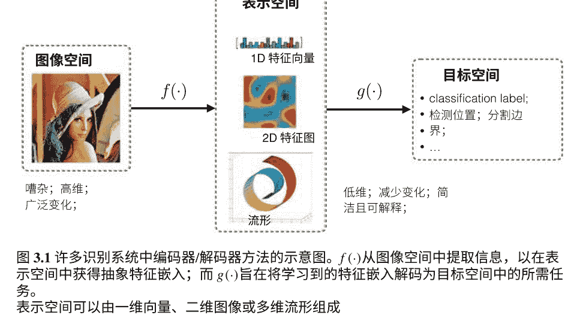

图 3.1 许多识别系统中编码器/解码器方法的示意图。`f(·)`从图像空间中提取信息，以在表示空间中获得抽象特征嵌入；而`g(·)`旨在将学习到的特征嵌入解码为目标空间中的所需任务。表示空间可以由一维向量、二维图像或多维流形组成。

表3.1 用于训练三个最近提出的人脸识别网络的训练数据集配置。使用了大量标记的主题和图像，这不仅非常昂贵，而且耗时。

| 方法 | DeepFace | FaceNet | VggFace |
|---|---|---|---|
| 训练数据集 | SFC | WebFace | VggFace |
| 图像数量 | 4.4M | 2亿 | 2.6M |
| 主题数量 | 4K | 8M | 2.6K |

用于解释。学习稳健且可解释的表示是计算机视觉中解决具有挑战性的识别应用的关键和基本目标。然而，鉴于需要在大量精心选择的数据上进行注释，学习稳健的表示非常昂贵和困难。表3.1列出了三个最近提出的人脸识别系统中使用的训练数据集：由Google开发的DeepFace [54]，由Facebook开发的FaceNet [51]和由VGG组开发的VggFace [42]。我们可以看到VggFace使用了2.6百万标记图像进行训练，而DeepFace使用了4.4百万标记图像进行训练。FaceNet使用了一个令人惊讶的大数据集，包含了8百万个不同主题的2亿标记图像。无论是手动还是半自动地注释这么大量的图像都是非常昂贵、耗时和繁琐的。注释成本只是学习稳健表示的困难的一个方面。表3.2显示，即使将VGG Face网络输入260万个标记图像，性能仍然很差。例如，验证准确率在侧面人脸（偏航角 <75°）上急剧下降，甚至低至34.2%，而在正面人脸（偏航角 <15°）上达到97.2%的高准确率。因此，仅仅增加注释数据的数量并不能解决问题。

表3.2 MultiPIE数据集上不同头部姿势的Rank-1人脸识别准确率。当头部姿势从正面变为侧面时，识别准确率显著下降。

| 头部姿势 | 15° (%) | 30° (%) | 45° (%) | 60° (%) | 75° (%) | 90° (%) |
|---|---|---|---|---|---|---|
| VggFace | 97.2 | 96.1 | 92.6 | 84.7 | 62.8 | 34.2 |

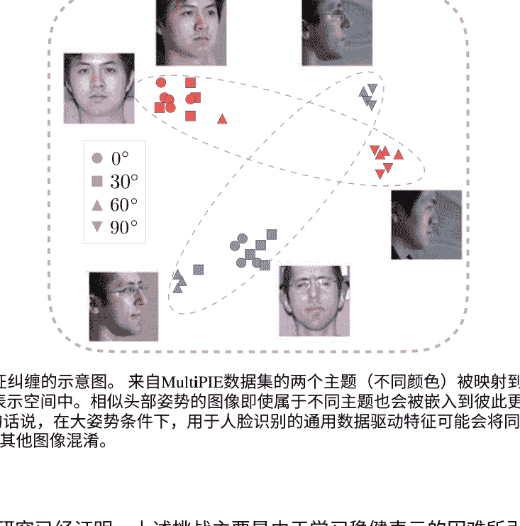

许多研究已经证明，上述挑战主要是由于学习稳健表示的困难所引起的[29, 35, 48]。如果我们简单地将表示空间中的特征分为与目标相关和与目标无关的，我们会发现在许多应用中，后者可能占主导地位，因为表示空间中的特征纠缠在一起。图3.2说明了表示学习中的困境。来自MultiPIE数据集[17]的两个不同的人脸（以不同颜色表示）被映射到VGGFace[42]的学习表示空间中。我们可以看到，用于人脸识别的通用数据驱动特征可能会将具有不同姿势变化的相同人脸的图像与不同人脸混淆。在表示空间中，同一个人的图像可能因头部姿势的巨大变化而相距很远，而不同人的图像可能在头部姿势相似时彼此靠近。因此，在表示空间中，与目标无关的因素（如头部姿势）可能主导与目标相关的因素（如个人身份）。

从图像空间中学到的有利表示应该是紧凑的、可解释的，并且对于最终目标是明确分离的。然而，图像空间通常是高维且嘈杂的。与目标无关的特征可能会由于表示空间中的大量纠缠而混淆目标相关的特征。为了实现稳健的表示，编码器应该能够将图像空间映射到表示空间，并进一步分解和解耦潜在特征，以分离目标相关和目标无关的表示。因此，学习从图像空间到表示空间的稳健映射成为许多计算机视觉方法的基本目标。

学习解耦表示是许多面部分析方法的基本目标。例如，在多视角人脸识别问题[75]中，我们可以明确地将潜在特征分为面部外貌特征（这个人是谁）和视角特征（面部图像的拍摄角度是什么）。然后，这些解耦表示可以用于一致地识别人脸，无论视角如何变化。在人脸生成任务[32]中，可以隐式地学习和解耦多个潜在特征，例如戴眼镜、留胡子、黑发。然后，这些解耦特征可以重新组合在一起，引导生成训练数据集中不存在的新颖人脸图像。总体而言，在学习解耦表示中的关键思想是区分与目标相关和与目标无关的特征。换句话说，我们打算根据任务将潜在表示空间特征因子化为变体和不变类别，同时忽略无关特征。

在本章中，我们展示了如何开发和应用解耦表示学习来解决两个经典但重要的人脸分析问题：人脸关键点跟踪和面部属性推断与生成。人脸关键点跟踪在许多计算机视觉任务中起着基础性作用，例如人脸识别和验证、表情分析、个人身份识别和3D人脸建模。它还是视频监控、情感识别、面部增强现实等广泛应用的基本技术组成部分。在过去几年中，已经提出了许多方法来解决这个问题，在“野外”条件下取得了显著进展。用深度神经网络学习面部表示是另一个重要但具有挑战性的问题。它在视觉、图形和机器人领域具有广泛的应用。生成对抗网络（GANs）被广泛应用于解决这个问题。如何利用GANs学习面部的解耦表示，以提高面部属性推断和生成的性能，仍然是这个领域最热门的话题之一。

本章的其余部分按照以下方式组织。在第3.2节中，我们将身份嵌入分为两部分：一部分是对面部标志位置不变的嵌入，用于跟踪相同主体；另一部分是姿态和表情嵌入，用于确定面部标志位置在帧与帧之间的位移，在循环编码器-解码器网络的瓶颈中[43]。额外的身份监督显著提高了跟踪的准确性和鲁棒性，尤其是在大姿态和部分遮挡的情况下。在第3.3节中，我们展示了如何利用生成对抗网络（GANs）[16]进行面部属性生成任务的解耦表示学习。特别地，我们引入了GANs的一种变体，旨在以“完整”的方式学习解耦表示，从而显著提高生成质量。

## 应用1：面部标志跟踪

在本节中，我们首先对面部对齐的相关文献进行了简要回顾，然后介绍了彭等人提出的RED-Net [43]，这是该领域中最先进的方法之一。最后，我们展示了RED-Net在公共基准测试中与其他方法相比的卓越性能。

面部对齐在计算机视觉领域有着悠久的研究历史。在这里，我们简要介绍了面部关键点检测、面部关键点跟踪和循环编码器-解码器神经网络的背景。

### 3.2.1 相关工作

#### 3.2.1.1 面部关键点检测

最近，基于回归的面部关键点检测方法[2, 3, 8, 25, 53, 59, 62, 63, 68, 73, 73]在面部关键点检测的泛化性能方面取得了显著提升，相比于基于统计模型（如主动形状模型[11, 39]和主动外观模型[15]）的算法。基于回归的方法直接根据从面部图像中提取的特征回归关键点位置。不同点的关键点模型可以独立地学习，也可以联合学习[8]。当所有关键点位置联合学习时，会施加隐式形状约束，因为它们共享相同或部分相同的回归器。为了比较，RED-Net通过分类模型和回归模型同时进行关键点检测。它通过联合优化视频中同一人的检测输出来处理视频中的面部对齐。

通过学习级联回归模型，可以获得人脸关键点检测性能的额外准确度提升。早期级联阶段的回归模型学习粗略的检测器，而后续级联阶段根据早期预测结果进行细化。级联回归有助于逐渐减少预测方差，从而使后续阶段的检测器学习任务更容易。许多方法已经成功地应用级联回归模型于人脸对齐任务[53, 63, 68]。监督下降方法[63]基于SIFT特征学习级联回归模型。孙等人[53]提出使用三层神经网络预测关键点位置。张等人[68]通过级联堆叠自编码器研究了该问题，逐渐改善了关键点位置的精度。与明确定义级联结构的这些方法相比，RED-Net学习了一个隐式地融合级联结构和共享参数的空间循环模型。与将学习过程分为多个阶段的先前工作相比，它也更加“端到端”。

#### 3.2.1.2 人脸关键点跟踪

大多数人脸对齐算法通过使用前一帧的检测结果来初始化关键点的位置，以跟踪检测的方式进行对齐[61]。Asthana等人[3]和Peng等人[46]提出使用增量学习来学习个人特定模型。然而，增量学习（或在线学习）是一个具有挑战性的问题[55]，因为增量方案必须经过精心设计以防止模型漂移[56]。在RED-Net中，循环模型是在线训练的，以捕捉关键点运动的相关性。

#### 3.2.1.3 循环编码器-解码器

循环神经网络（RNN）广泛应用于语音识别[38]和自然语言处理[37]的文献中。它们最近也被用于计算机视觉。例如，在图像字幕[26]和视频字幕[66]的任务中，通常使用RNN来生成文本。RNN也是一种用于动作分类的常用工具。例如，Veeriah等人[60]使用RNN来通过状态的高阶导数学习复杂的时间序列表示以进行动作识别。由于深度结构的好处，RNN自然成为图像分割中流行的条件随机场（CRF）[71]的良好替代品。

编码器和解码器网络在机器翻译中得到了广泛研究[9]，其中编码器学习中间表示，解码器从表示中生成翻译。它也在语音识别[36]和计算机视觉[4, 22]中得到了研究。杨等人[65]提出在网络的瓶颈中解耦身份单元和姿态单元，用于3D视图合成。然而，如何充分利用解耦单元进行对应关系正则化[33]仍然未被探索。为了解决这个问题，RED-Net利用编码器的优势学习了一个联合表示，包括身份、姿态、表情以及特征点。解码器将表示转换为热图，以定位面部特征点。

### 3.2.2 我们的方法：RED-Net

任务是使用端到端深度神经网络在连续图像中定位面部特征点。图3.3显示了方法的概述。网络由一系列非线性和多层映射组成，可以在功能上分为四个模块。我们现在描述每个学习模块的细节。

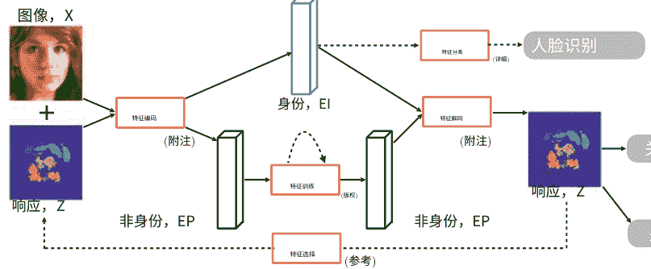

### 3.2.2.1 编码器-解码器

编码器-解码器的输入是单个视频帧 $X \in \mathbb{R}^{W \times H \times 3}$，输出是响应图 $Z \in \mathbb{R}^{W \times H \times C_z}$，$Z$ 表示关键点位置。$C_z = 7$ 或 68，取决于要预测的关键点数量。

编码器执行一系列的卷积、池化和批量归一化 [24]，从 $\mathbf{x}$ 和 $\mathbf{z}$ 中提取一个低维表示 $\mathbf{e}$：

$$\mathbf{e} = f_{\text{enc}}(\mathbf{x}, \mathbf{z}; \theta_{\text{enc}}),\quad f_{\text{enc}}: \mathbb{R}^{W \times H \times C} \to \mathbb{R}^{W_e \times H_e \times C_e},\tag{3.1}$$

其中，$f_{\text{enc}}(\cdot; \theta_{\text{enc}})$ 表示具有参数 $\theta_{\text{enc}}$ 的编码器映射。我们沿着通道维度连接 $\mathbf{x}$ 和 $\mathbf{z}$，因此 $C = 3 + C_z$。将这个连接作为更新后的输入输入到编码器中。

对称地，解码器执行一系列的上采样、卷积和批量归一化操作，将表示编码映射到响应图中：

$$\mathbf{z} = f_{\text{dec}}(\mathbf{e}; \theta_{\text{dec}}),\quad f_{\text{dec}}: \mathbb{R}^{W_e \times H_e \times C_e} \to \mathbb{R}^{W \times H \times C_z},\tag{3.2}$$

其中 $f_{\text{dec}}(\cdot; \theta_{\text{dec}})$ 表示具有参数 $\theta_{\text{dec}}$ 的解码器映射。$\mathbf{z}$ 具有与 $\mathbf{x}$ 相同的 $W \times H$ 维度，但具有 $C_z$ 通道用于 $C_z$ 地标。每个通道表示相应地标的像素置信度。

### 3.2.2.2 空间循环学习

空间循环学习的目的是以粗到细的方式确定地标位置。与现有的方法[53, 68]不同，RED-Net在单个网络中完成粗到细的搜索，在连续的循环步骤中联合学习参数。

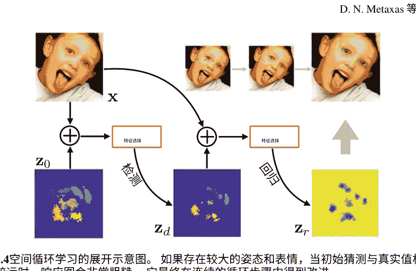

图3.4 空间循环学习的展开示意图。如果存在较大的姿态和表情，当初始猜测与真实值相距较远时，响应图会非常粗糙。它最终在连续的循环步骤中得到改进。

空间循环学习通过将先前的预测与图像堆叠在一起，如图3.4所示，进行反馈，最终将形状预测从初始猜测推向真实值：

$$\mathbf{z}_k = f_{\text{srn}}(\mathbf{x}, \mathbf{z}_{k-1}; \theta_{\text{srn}}), \quad k = 1, \ldots, K \tag{3.3}$$

其中 $f_{\text{srn}}(\cdot; \theta_{\text{srn}})$ 表示具有参数 $\theta_{\text{srn}}$ 的空间循环映射。$\mathbf{z}_0$是初始响应图，可以是由平均形状生成的响应图或上一帧的输出。

特别地，RED-Net通过设置 $K = 2$ 来进行两步循环学习。第一步进行关键点检测，旨在定位7个主要的面部组件（即方程（3.2）中的 $C = 7$）。第二步进行关键点回归，细化所有68个关键点的位置（即 $C = 68$）。这种检测后回归的设计[7]可以大大提高关键点定位的精度。

地标检测步骤保证了在大姿态和部分遮挡下的稳健拟合。编码器-解码器旨在输出一个二进制地图，每个主要的面部组件对应一个通道。检测步骤输出：

$$\mathbf{z}_d = f_{\text{dec}}(f_{\text{enc}}(\mathbf{x}, \mathbf{z}_0; \theta_{\text{enc}}); \theta_{\text{dec}}), \quad \mathbf{z}_d \in \mathbb{R}^{W \times H \times C_d}, \tag{3.4}$$

其中，检测任务可以使用像素级的sigmoid交叉熵损失函数进行训练：

$$\ell_d = \frac{1}{M_d} \sum_{c=1}^{C_d} \sum_{i=1}^{W} \sum_{j=1}^{H} z_{ij}^c \log y_{ij}^c + (1 - z_{ij}^c) \log(1 - y_{ij}^c) \tag{3.5}$$

这里，$z_{ij}^c$表示在像素位置$(i, j)$处的sigmoid输出，在第$c$个地标的$\mathbf{z}_{d}$中。$y_{ijc}$是相同位置的地面实况标签，用于标记相应地标的存在为1，其余背景为0。

请注意，这个损失函数与我们之前的会议论文[43]中使用的N-way交叉熵损失函数不同。它允许一个像素有多个类别标签，这有助于解决地标重叠的问题。

地标回归步骤通过前一步骤的输出改善了拟合精度。编码器-解码器旨在输出一个$C$个通道的热图，每个通道对应一个地标。回归步骤的输出为：

$$\mathbf{z}_{r} = f_{\text{dec}}\left(f_{\text{enc}}\left(\mathbf{x}, \mathbf{z}_{\text{det}}; \theta_{\text{enc}}\right); \theta_{\text{dec}}\right), \quad \mathbf{z}_{r} \in \mathbb{R}^{W \times H \times C_{r}}, \quad \tag{3.6}$$

其中回归任务可以使用像素级的$L_2$损失函数进行训练：

$$\ell_{r}=\frac{1}{M_{r}} \sum_{c=1}^{C_{r}} \sum_{i=1}^{W} \sum_{j=1}^{H}\left\|z_{i j}^{c}-y_{i j}^{c}\right\|_{2}^{2}, \quad \tag{3.7}$$

这里，$z_{ij}^c$表示第$c$个地标在像素位置$(i, j)$处的热图值。$y_{ijc}$是相同位置的真实值，它服从以地标为中心的高斯分布，具有预定义的标准差。

现在，空间循环学习（方程（3.3））可以通过同时最小化检测损失（方程（3.5））和回归损失（方程（3.7））来实现：

$$\underset{\theta_{\text{enc}}, \theta_{\text{dec}}}{\operatorname{argmin}} \ell_{d} + \lambda \ell_{r}, \quad \tag{3.8}$$

其中$\lambda$平衡了两个任务之间的损失。请注意，空间循环学习不会引入新的参数，而是共享编码器-解码器网络的相同参数，即$\theta_{\text{srn}} = \{\theta_{\text{enc}}, \theta_{\text{dec}}\}$。

### 3.2.2.3 时间循环学习

除了空间循环学习外，RED-Net还执行时间循环学习，以建模可能随时间变化并且显著影响地标位置的因素，例如头部姿势、表情和光照。

如第3.2.2.1节所述，瓶颈嵌入$\mathbf{e}$可以分解为两部分：身份编码$\mathbf{e}_i$和非身份编码$\mathbf{e}_p$：

$$\mathbf{e}_{i} \in \mathbb{R}^{W_{e} \times H_{e} \times C_{i}}, \quad \mathbf{e}_{p} \in \mathbb{R}^{W_{e} \times H_{e} \times C_{p}}, \quad C_{e}=C_{i}+C_{p}, \quad \tag{3.9}$$

其中$\mathbf{e}_i$和$\mathbf{e}_p$分别模拟时间不变和变化的因素。我们将$\mathbf{e}_i$留给第3.2.2.4节进行额外的身份监督，并利用变化的

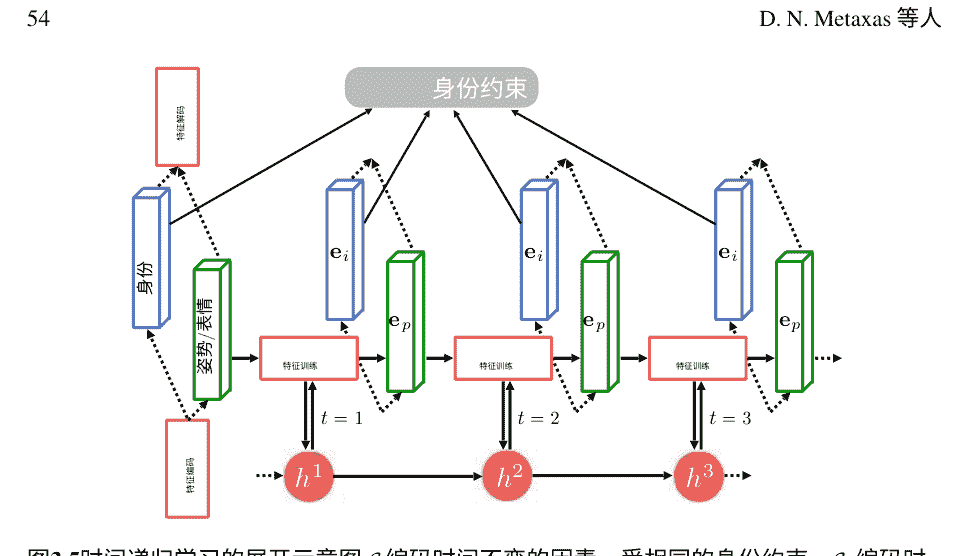

图3.5 时间递归学习的展开示意图。$\mathbf{e}_i$编码时间不变的因素，受相同的身份约束。$\mathbf{e}_p$编码时间变化的因素，在 $f_{trn}$中进一步建模

通过循环模型对$\mathbf{e}_p$进行建模。有关所提出的时间递归学习的展开示意图，请参见图3.5。

从数学上讲，给定 $T$个连续的视频帧 $\{\mathbf{x}^t; t = 1, \ldots, T\}$，编码器提取一系列嵌入 $\{\mathbf{e}_i^t, \mathbf{e}_p^t; t = 1, \ldots, T\}$。目标是实现一个非线性映射 $f_{trn}$，同时跟踪潜在状态 $h^t$并在时间 $t$上更新 $\mathbf{e}_p^t$：

$$h^t = p(\mathbf{e}_p^t, h^{t-1}; \theta_{trn}), \quad t = 1, \ldots, T$$

$$\mathbf{e}_p^{t*} = q(h^t; \theta_{trn}), \tag{3.10}$$

其中 $p(\cdot)$和 $q(\cdot)$是 $f_{trn}$的函数，$f_{trn}(\cdot; \theta_{trn})$具有参数 $\theta_{trn}$。$\mathbf{e}_p^{t*}$是 $\mathbf{e}_p^t$的更新。

时间循环学习使用 $T$连续的帧进行训练。在每一帧中，进行空间循环学习的检测和回归任务。通过在每个时间步骤 $t$上最小化方程（3.8）来进行循环学习：

$$\argmin_{\theta_{enc},\theta_{dec},\theta_{trn}} \sum_{t=1}^{T} \ell_d^t + \lambda \ell_r^t, \tag{3.11}$$

其中 $\theta_{trn}$表示时间循环学习的网络参数，例如LSTM单元的参数。

#### 3.2.2.4 监督式身份解耦

通过简单地将瓶颈表示$\mathbf{e}$分成两部分，不能保证时间不变和变化因素完全解耦。需要更多的监督信息来实现解耦。为了解决这个问题，RED-Net除了对非身份编码 $\mathbf{e}_p$应用时间循环学习外，还采用了一个面部识别的辅助任务，使用身份编码 $\mathbf{e}_i$。

监督式身份解耦被定义为一个 $N$路分类问题。$N$是训练序列中独特个体的数量。一般来说，身份编码 $\mathbf{e}_i$与一个独热编码 $\mathbf{z}_i$相关联，以表示每个身份的分数：

$$\mathbf{z}_i = f_{cls}(\mathbf{e}_i; \theta_{cls}), \quad f_{cls}: \mathbb{R}^{W_e \times H_e \times C_i} \to \mathbb{R}^N \tag{3.12}$$

其中 $f_{cls}(\cdot; \theta_{cls})$是具有参数 $\theta_{cls}$的身份分类映射。身份任务使用 $N$路交叉熵损失进行训练：

$$\ell_{cls} = \frac{1}{N} \sum_{n=1}^{N} z^{n} \log y^{n} + (1 - z^{n}) \log(1 - y^{n}) \tag{3.13}$$

其中 $z^{n}$表示 $\mathbf{z}_i$中第 $n$个元素的softmax激活。$y^{n}$是身份注释 $\mathbf{y}_i$的第 $n$个元素，它是一个独热向量，正确身份为1，其他身份为0。

所有三个任务，即 $f_{srn}$, $f_{trn}$和 $f_{cls}$, 在一个端到端的训练框架中通过同时优化参数 $\{ \theta_{enc}, \theta_{dec}, \theta_{trn}, \theta_{cls} \}$来进行联合学习。基于公式 (3.11) 和 (3.13), RED-Net同时在每个时间步 $t$上最小化检测和回归损失以及身份损失：

$$\argmin_{\theta_{enc}, \theta_{dec}, \theta_{trn}, \theta_{cls}} \sum_{t=1}^{T} \ell_{det}^{t} + \lambda \ell_{reg}^{t} + \gamma \ell_{cls}^{t} \tag{3.14}$$

其中 $\gamma$权衡身份约束。

### 3.2.3 实验

在本节中，我们通过验证其主要组件并与广泛使用的基准方法进行比较，展示了RED-Net的卓越性能。图3.6展示了RED-Net在将跟踪的关键点数设置为7和68时的拟合结果。

图3.6 FM和300-VW上7个关键点（第1-6行）和68个关键点（第7-10行）的拟合结果示例。RED-Net在被跟踪的对象面临大姿态/表情变化（第1、3、4、6、10行）、光照变化（第2、8行）和部分遮挡（第5、7行）时实现了稳健准确的拟合。

#### 3.2.3.1 编码器-解码器网络的验证

对AFLW [28]和300-VW [52]上的两种编码器-解码器变体进行了比较：

- 基于VGGNet的设计，具有对称的编码器和解码器，这在我们之前的会议论文集[43]中得到了主要研究；

- 基于ResNet的设计，具有非对称的编码器，即编码器比解码器更深。

结果报告在表3.3中。结果显示，基于ResNet的设计在拟合准确度（平均误差）和鲁棒性（标准差）方面明显优于基于VGGNet的变体。更深的层次以及提出的跳跃捷径对改进起到了很大的贡献。此外，基于ResNet的编码器-解码器非常接近计算成本对基于VGGNet的变体产生影响，例如每个图像/帧的平均拟合时间和训练模型的内存使用量，这应归因于自定义残差模块设计和提出的不对称编码器-解码器网络。

| | 平均值（%） | 标准差（%） | 时间（毫秒） | 内存（Mb） |
| :--- | :--- | :--- | :--- | :--- |
| 基于VGGNet | 6.85 | 4.52 | 43.6 | 184 |
| 基于ResNet | 6.33 | 3.61 | 54.9 | 257 |
| 基于VGGNet | 5.16 | 2.57 | 42.5 | 184 |
| 基于ResNet | 4.75 | 2.10 | 56.2 | 257 |

#### 3.2.3.2 空间循环学习的验证

空间循环学习在AFLW [28]的验证集上进行验证。为了更好地研究空间循环学习的好处，验证集根据偏航角的绝对值被分成两个图像组：

- 常规设置，其中偏航角 ∈ [0°–30°);

- 挑战性设置，其中偏航角 ∈ (30°, 90°]。

训练集是AFLW [28]、Helen [30]和LFPW [5]的集合。

平均拟合误差和失败率报告在表3.4中。首先，结果显示，与单步检测或回归相比，两步循环学习可以立即降低拟合误差和失败率。在具有大姿态变化的挑战性环境中，改进更为显著。其次，尽管在具有挑战性的环境中，地标检测更加稳健（低失败率），但与预测精确位置（小拟合误差）相比，它缺乏能力。

| | 常规（%） | | 挑战性（%） | |
| :--- | :--- | :--- | :--- | :--- |
| | 错误 | 失败 | 错误 | 失败 |
| 单步检测 | 6.05 | 4.62 | 8.14 | 12.4 |
| 单步回归 | 5.92 | 4.75 | 7.87 | 14.5 |
| 循环检测+检测 | 5.86 | 3.44 | 7.33 | 8.20 |
| 循环检测+正则化 | 5.71 | 3.30 | 6.97 | 8.75 |

用于地标回归。这一事实证明了所提出的循环检测-回归方法的有效性。

与其他方法中广泛使用的空间循环学习和级联模型相比，表3.5对其进行了比较。毫不奇怪，空间循环学习可以提高拟合精度。其根本原因在于循环网络同时学习逐步拟合策略，而级联网络独立学习每个步骤。它可以更好地处理具有挑战性的环境，其中初始猜测通常与真实值相差很远。此外，具有共享权重的循环网络可以立即将内存使用量减少到级联模型的一半。

表3.5 在AFLW的挑战性环境中，级联学习和循环学习的比较。后者在使用一半内存的情况下提高了准确性。

| | 平均值 (%) | 标准差 (%) | 内存 (Mb) |
|---|---|---|---|
| 级联检测和回归 | 6.81 | 4.53 | 468 |
| 循环检测和回归 | 6.33 | 3.61 | 257 |

#### 3.2.3.3 时间循环学习的验证

时间循环学习在300-VW验证集上得到验证[52]。为了更好地研究在不同设置下的性能，验证集被分成两组：

- 9个常规设置的视频，大致匹配“场景1”；

- 15个具有挑战性设置的视频，大致匹配“场景2”和“场景3”。

常规、具有挑战性和完整数据集用于评估。在表3.6中比较了有无时间循环学习的结果。表3.6 在300-VW上验证时间循环学习。$f_{trn}$ 有助于提高跟踪的鲁棒性（较小的标准差和较低的失败率），以及跟踪的准确性（较小的平均误差）。如图3.7所示，在大姿势和部分遮挡的挑战性环境中，改进更为显著。

| | | 常规 | | | 具有挑战性的 | | |
|---|---|---|---|---|---|---|---|
| | | 平均值 (%) | 标准差 (%) | 失败 (%) | 平均值 (%) | 标准差 (%) | 失败率 (%) |

| 无 | 特训 | 4.52 | 2.24 | 3.48 | 6.27 | 5.33 | 13.3 |
|---|---|---|---|---|---|---|---|
| 有 | | 4.21 | 1.85 | 1.71 | 5.64 | 3.28 | 5.40 |

#### 3.2.3.4 监督式身份解耦的好处

提出了监督式身份解耦，以更好地解耦编码器-解码器的瓶颈中的时变和时不变因素。这有助于时间循环训练，在测试时产生更好的泛化和更准确的拟合（图3.8）。

图3.7 在300-VW上进行时间循环学习的示例。被跟踪的对象经历了姿势和表情的大量变化，以及严重的部分遮挡。`f_{tn}` 显著提高了跟踪的稳定性（减少方差）和拟合精度（低误差），特别是对于鼻尖和嘴角的标记点。

图3.8 在300-VW上进行不同面部组件的训练时的拟合精度与训练时期数量的关系。提出的有监督身份解耦有助于在编码器-解码器的瓶颈中实现更完整的因素解耦，从而获得更好的泛化能力和更准确的拟合结果。

不同面部组件的验证结果显示出类似的趋势：

- 通过使用额外的身份线索，网络展示出更好的泛化能力，从而实现更高效的训练。例如，在仅经过十个训练时期后，使用身份损失的左眼标记点的验证准确性达到0.84，而不使用身份损失的准确性为0.8。

- 有监督的身份信息可以大幅提升测试准确性。通过使用额外的身份损失，准确性提高了约9%。值得一提的是，在训练的最开始阶段（<5个时期），使用有监督的身份解耦时的测试准确性较差。这是因为突然添加的身份损失扰乱了反向传播过程。然而，使用身份损失的测试准确性在仅经过几个额外的训练时期后迅速提高，并超过了不使用身份损失的准确性。

## 3.3 应用2：学习面部表示用于推理和生成

在本节中，我们首先简要介绍面部表示学习和GANs的问题，然后介绍了天等人提出的CR-GAN，这是该领域最先进的GAN之一。最后，我们展示了面部表示学习的两个应用：多视角面部图像生成和面部属性操作。

从单个图像中学习出一个解耦的面部表示，以便进行进一步的生成，这是一个在视觉、图形和机器人领域具有广泛应用的有趣问题。其中一个应用是从单视角输入生成多视角图像。然而，这是一个具有挑战性的问题，因为（1）计算机需要“想象”在应用3D旋转后给定对象的样子；（2）多视角生成应该保持相同的“身份”。

一般来说，以往解决这个问题的方法包括基于模型的合成[6]，基于数据的生成[64, 75]，以及两者的结合[49, 70, 73]。最近，生成对抗网络（GANs）[16]在多视角生成[58, 69]方面展示出了令人印象深刻的结果。

### 3.3.1 相关工作

#### 3.3.1.1 姿态不变表示学习

Hinton等人[21]引入了变换自编码器来生成具有视角变化的图像。Yan等人[64]提出了透视变换网络来寻找投影变换。Zhou等人[72]提出通过外观流合成视角。最近，基于GAN的方法通常采用单通道设计：一个编码器-解码器网络[43]后跟一个鉴别器网络。例如，为了规范化视角，例如面部正规化，他们要么将编码器-解码器与3DMM [6]参数[67]结合起来，要么使用重复项来预测全局和局部细节[23]。DR-GAN [58]遵循单通道框架来学习对视角不变的身份特征。然而，由于单通道框架，它可能学习到“不完整”的表示。相比之下，CR-GAN可以使用双通道网络学习完整的表示，这保证了即使对于“未见过”的输入也能生成高质量的结果。

对于表示学习[14, 31]，早期的工作可能使用规范相关分析来分析不同姿势子空间之间的共性[20, 40, 44]。最近，基于深度学习的方法使用合成图像通过交叉重构[45, 75]来解开姿势和身份因素，或者从姿势变体输入中传递信息到正面外观[74]。然而，它们通常只使用有标签的数据，导致性能有限。我们提出了一个双通道网络来利用有标签和无标签的数据进行自监督学习，在具有挑战性的条件下生成逼真的图像。

#### 3.3.1.2 生成对抗网络

Goodfellow等人[16]引入了GAN来通过对抗过程估计目标分布。Gulrajani等人[19]提出了一种更稳定的方法来强制实施 *Lipschitz* 约束在Wasserstein GAN [1]上。AC-GAN [41]通过包含一个辅助解码器网络来扩展鉴别器，以估计训练数据的类标签。BiGANs [12, 13]尝试学习一个逆映射，将数据投影回潜在空间。CR-GAN [57]也可以找到一个逆映射，在训练数据有限的情况下进行平衡的极小极大博弈。

这些基于GAN的方法通常具有单通道设计：编码器-解码器网络后跟鉴别器网络。编码器（`E`）将输入图像映射到潜在空间（`Z`），其中嵌入首先被操作，然后被馈送到解码器（`G`）以生成新的视图。

然而，CR-GAN进行的实验表明，这种单通道设计可能存在严重问题：它们只能学习“不完整”的表示，对“未见过”或无约束的数据的泛化能力有限。以图3.9为例。在训练过程中，`E` 的输出仅构成 `Z` 的一个子空间，因为我们通常只有有限数量的训练样本。这将使 `G` 只能“看到” `Z` 的一部分。在测试过程中，`E` 很有可能将一个“未见过”的输入映射到子空间之外。因此，由于意外的嵌入，`G` 可能会产生糟糕的结果。

为了解决这个问题，提出了CR-GAN来学习完整的表示以进行多视角生成。主要思想是，在重构路径之外，我们引入了另一条生成路径，从随机采样的嵌入中创建视图特定的图像。请参考图3.10进行说明。这两条路径共享相同的 `G`。换句话说，在生成路径中学习的 `G` 将引导重构路径中 `E` 和 `D` 的学习，反之亦然。`E` 是被迫成为 `G` 的逆，产生完整的表示，这将覆盖整个 `Z` 空间。更重要的是，双通道学习可以轻松利用有标签和无标签的数据进行自监督学习，这可以大大丰富自然生成的 `Z` 空间。

图3.9 顶部：现有基于GAN的方法的局限性。如果输入映射到学习到的子空间（第一行），它们可以生成良好的结果。然而，“未知”数据可能被映射到子空间之外，导致结果不佳（第二行）。底部：CR-GAN的结果。通过学习完整的表示，CR-GAN可以从单视图输入生成逼真且保留身份的图像。

### 3.3.2 我们的方法：CR-GAN

单通道网络，即编码器-解码器网络后跟一个判别器网络，可能存在学习“不完整”表示的问题。如图3.10左所示，编码器 `E` 和解码器 `G` 只能“触及” `Z` 的一个子空间，因为我们通常只有有限数量的训练数据。这将导致在使用“未见过”数据作为输入进行测试时出现严重问题。很有可能 `E` 将新的输入映射到子空间之外，这必然导致生成效果差，因为 `G` 从未“见过”这种嵌入。

使用一个玩具示例来解释这一点。我们使用Multi-PIE [18]来训练一个单通道网络。如图3.9顶部所示，只要将输入图像映射到学习到的子空间中，网络就能在Multi-PIE上生成逼真的结果（第一行）。然而，当测试IJB-A [27]中的“未见过”的图像时，网络可能会产生不令人满意的结果（第二行）。在这种情况下，新图像被映射到了学习到的子空间之外。

图3.10 左侧：以前的方法使用单一路径来学习潜在表示，但在整个空间中是不完整的。右侧：CR-GAN采用了一个双通道网络结合自监督学习，可以学习完整的表示。

这个事实激励了CR-GAN训练 `E` 和 `G`，使其能够“覆盖”整个 `z` 空间，这样我们就可以学习到完整的表示。CR-GAN通过引入一个独立的生成路径来实现这个目标，在这个路径中，生成器专注于将整个 `z` 空间映射到高质量的图像。图3.10对比了单通道和双通道网络。

#### 3.3.2.1 生成路径

生成路径训练生成器 `G` 和判别器 `D`。在这里，编码器 `E` 不参与，因为 `G` 试图从随机噪声中生成。给定一个视图标签 `v` 和随机噪声 `z`， `G` 旨在生成一个真实的图像 `G(v, z)` 在视图 `v` 下。 `D` 试图区分真实数据和 `G` 的输出，从而最小化：

$$
\mathbb{E}_{\mathbf{z} \sim \mathbb{P}_{\mathbf{z}}} [D_s(G(v, \mathbf{z}))] - \mathbb{E}_{\mathbf{x} \sim \mathbb{P}_{\mathbf{x}}} [D_s(\mathbf{x})] + \lambda_1 \mathbb{E}_{\hat{\mathbf{x}} \sim \mathbb{P}_{\hat{\mathbf{x}}}} [(\|\nabla_{\hat{\mathbf{x}}} D(\hat{\mathbf{x}})\|_2 - 1)^2] - \lambda_2 \mathbb{E}_{\mathbf{x} \sim \mathbb{P}_{\mathbf{x}}} [P(D_v(\mathbf{x}) = v)],
$$ (3.15)

其中 `\mathbb{P}_{\mathbf{x}}` 是数据分布， `\mathbb{P}_{\mathbf{z}}` 是噪声均匀分布， `\mathbb{P}_{\hat{\mathbf{x}}}` 是从数据分布和生成器分布中采样的点对之间的插值[19]。 `G` 试图欺骗 `D`，它最大化：

$$

\mathbb{E}_{\mathbf{z} \sim \mathbb{P}_{\mathbf{z}}} [D_s(G(v, \mathbf{z}))] + \lambda_3 \mathbb{E}_{\mathbf{z} \sim \mathbb{P}_{\mathbf{z}}} [P(D_v(G(v, \mathbf{z})) = v)],

$$ (3.16)

其中 $(D_v(\cdot), D_s(\cdot)) = D(\cdot)$ 表示鉴别器的成对输出。 $D_v(\cdot)$ 估计成为特定视图的概率， $D_s(\cdot)$ 描述图像质量，即，图像的真实程度。请注意，在公式3.15中，`D` 学习如何估计真实图像的正确视图[41]，而 `G` 则试图生成具有该视图的图像，以便在公式3.16中从 `D` 获得高分。

#### 3.3.2.2 重建路径

重建路径训练 `E` 和 `D`，但保持 `G` 固定。`E` 试图重建训练样本，这将确保 `E` 作为 `G` 的逆向学习，从而在潜在嵌入空间中产生完整的表示。

`E` 的输出应该保持身份不变，因此多视角图像将呈现相同的身份。我们提出了一个交叉重建任务，使 `E` 从身份中分离出视角。更具体地说，我们采样了一对实际图像 $(x_i, x_j)$ 它们具有相同的身份但不同的视角 $v_i$ 和 $v_j$。目标是从 $x_i$ 重建出 $x_j$。为了实现这一点，`E` 将 $x_i$ 作为输入，并输出一个保持身份的表示 $\bar{z}$ 以及视角估计 $\bar{v}$：$(\bar{v}, \bar{z}) = (E_v(x_i), E_z(x_i)) = E(x_i)$。

`G` 将 $\bar{z}$ 和视角 $v_j$ 作为输入。由于 $\bar{z}$ 预期携带此人的身份信息，结合视角 $v_j$ 的帮助，`G` 应该产生 $\tilde{x}_j$，即 $x_j$ 的重建。`D` 被训练用于区分假图像 $\tilde{x}_j$ 和真实图像 $x_j$。因此，`D` 最小化：

$$

\mathbb{E}_{x_i,x_j \sim \mathbb{P}_x} [D_s(\tilde{x}_j) - D_s(x_i)] + 

\lambda_1 \mathbb{E}_{\hat{x} \sim \mathbb{P}_x} [(\|\nabla_{\hat{x}} D(\hat{x})\|_2 - 1)^2] - \lambda_2 \mathbb{E}_{x_i \sim \mathbb{P}_x} [P(D_v(x_i) = v_i)],

$$ (3.17)

`E` 帮助 `G` 生成具有视角 $v_j$ 的高质量图像，因此 `E` 最大化：

$$

\mathbb{E}_{x_i,x_j \sim \mathbb{P}_x} [D_s(\tilde{x}_j) + \lambda_3 P(D_v(\tilde{x}_j) = v_j) - 

\lambda_4 L_1(\tilde{x}_j, x_j) - \lambda_5 L_v(E_v(x_i), v_i)],

$$ (3.18)

在这里，L1损失被用来强制要求 $\tilde{x}_j$ 是 $x_j$ 的重构。$L_v$ 是估计和真实视图之间的交叉熵损失，以使 `E` 成为一个良好的视图估计器。

这个双通道网络学习完整的表示：首先，在生成路径中，`G` 学习如何从潜在空间中的任何输入产生真实图像。然后，在重构路径中，`G` 保留了生成能力，因为它保持不变。这两个路径的替代训练细节总结在算法1中。

### 3.3.3 结果：多视角人脸图像生成

CR-GAN旨在在嵌入空间中学习完整的表示，通过将双通道架构与自监督学习相结合来实现这一目标。在本节中，我们展示了CR-GAN应用于多视角人脸图像生成的结果。我们还展示了CR-GAN与DR-GAN [58]的比较结果，同时展示了嵌入空间中的视觉结果和t-SNE可视化结果。

```
算法1: CR-GAN的监督训练算法
输入: 带有标签的视图图像集合 X, 最大步数 T 和批量大小 m。
输出: 经过训练的网络 E, G 和 D。
对于 t=1 到 T进行
  对于 i=1 到 m进行
    1. 从 P z 中采样 z 和从 P x 中采样 x_i, 带有 v_i;
    2. 通过 G(v_i, z) 生成 x_i;
    3. 通过方程3.15更新 D, 通过方程3.16更新 G;
    4. 从 P x 中采样 x_j (其中 x_j 和 x_i 具有相同的身份);
    5. (v_j, z_j) <- E(x_i);
    6. 通过 G(v_j, z_j) 生成 x_j;
    7. 通过方程式3.17更新 D, 并通过方程式3.18更新 E;
  结束
结束
```

#### 3.3.3.1 实验设置

我们在带有和不带有视角标签的数据集上评估CR-GAN。Multi-PIE [18]是在受限环境下收集的带有标签的数据集。我们从第一个会话中选择了250个主题, 其中包括9个在±60°范围内的姿势, 20个光照和2个表情。前200个主题用于训练, 剩下的50个用于测试。300wLP [73]是通过面部轮廓方法[73]从300W [50]增强而来的, 其中包含视角标签。我们使用偏航角范围从-60°到+60°的图像, 并将其离散化为九个间隔。

对于无标签数据集的评估, 我们使用CelebA [32]和IJB-A [27]。CelebA包含大量名人图像, 视角分布不平衡。因此, 我们从中收集了一组72,000张图像, 其范围均匀分布在-60°到+60°之间。请注意, CelebA图像的视角标签仅用于收集子集, 而在训练过程中不使用视角或身份标签。我们还使用了包含5,396张图像的IJB-A进行评估。由于存在广泛的身份和姿势变化, 这个数据集具有挑战性。

#### 3.3.3.2 多视角人脸图像生成

以下结果使用了CR-GAN。我们在有监督学习中使用了Multi-PIE和300wLP数据集。在自监督学习中, 除了上述数据集, 还使用了CelebA数据集。请注意, 在CelebA的训练过程中, 我们不使用视角或身份标签。

图3.11显示了CR-GAN从Multi-PIE、IJB-A和CelebA生成的结果。CR-GAN产生了理想的结果。在每个视角上, 面部属性得到了很好的保留, CR-GAN始终生成具有更多细节和更少伪影的自然图像。这些结果证明了CR-GAN通过在嵌入空间中学习完整的表示来很好地处理“未见过”的数据。

图3.11 CR-GAN从Multi-PIE、IJB-A和CelebA生成的结果

#### 3.3.3.3 与DR-GAN的比较

此外，我们将CR-GAN与DR-GAN [58]进行比较。为了公平比较，我们用WGAN-GP替换了DR-GAN中使用的DC-GAN [47]网络架构。我们使用DR-GAN和CR-GAN为IJB-A中的每个图像生成了九个视图。然后，我们通过FaceNet [51]为每个视图获得了一个128维特征。我们通过将真实图像和生成图像输入FaceNet来评估它们之间的身份相似性。特征的平方L2距离直接对应于面部相似性：相同主体的面部距离较小，而不同主体的面部距离较大。表3.7显示了CR-GAN和DR-GAN在不同数据集上的平均L2距离结果。我们的方法在所有数据集上都优于DR-GAN，尤其是在包含未见数据的IJB-A上。图3.12分别显示了DR-GAN和CR-GAN在嵌入空间中的t-SNE可视化。为了清晰起见，我们只可视化了十个随机选择的主体以及每个主体的九个生成视图。与DR-GAN相比，CR-GAN产生了更紧密的聚类：同一主题的多视图图像被嵌入在彼此附近。这意味着身份得到更好的保留。

图3.12 CR-GAN和DR-GAN的嵌入空间的t-SNE可视化，使用IJB-A [27]中的10个主题。相同的标记形状（颜色）表示相同的主题。对于CR-GAN，同一主题的多视图图像被嵌入在彼此附近，这意味着身份得到更好的保留。

表3.7 真实图像和生成图像之间的身份相似性

| | Multi-PIE | CelebA | IJB-A |

| :--- | :--- | :--- | :--- |

| DR-GAN | 1.073 ± 0.013 | 1.281 ± 0.007 | 1.295 ± 0.008 |

| CR-GAN | **1.018 ± 0.019** | **1.214 ± 0.009** | **1.217 ± 0.010** |

我们利用DR-GAN和CR-GAN从随机噪声中生成图像。在图3.13中，CR-GAN可以产生具有不同风格的图像，而DR-GAN则导致模糊的结果。这是因为DR-GAN的单路径生成器在嵌入空间中学习到不完整的表示，无法处理随机输入。相反，CR-GAN通过完整的嵌入产生了令人满意的结果。

### 3.3.4 结果：条件性面部属性操作

在本节中，我们展示了 CR-GAN 在 CelebA [32] 数据集上进行面部属性操作的结果。网络实现是从 WGAN-GP [19] 的残差网络中修改而来的，其中 $E$ 与 $D$ 共享类似的网络结构。我们的 128D 嵌入向量中的 11D 用于二进制属性，其余部分用于解耦信息。

图3.13从随机噪声生成多视角图像。(a) `DR-GAN` 生成模糊的结果和许多伪影。(b) `CR-GAN` 生成不同风格的逼真图像。

### 3.3.4.1 单属性操作

对于单属性操作，`CR-GAN` 首先通过编码器获取嵌入向量，然后通过将嵌入向量和属性标签输入 `G` 生成样本。每次反转一个属性。例如，如果输入是男性，则会生成女性图像。生成的分辨率为 128 × 128 的样本如图3.14所示。我们可以看到身份在结果中得到了很好的解耦和保留。

图3.14单属性操作结果（128 × 128）。每一列显示了通过反转一个属性得到的结果。请注意，每一行中的身份都得到了很好的保留。

### 3.3.4.2 多属性操作

在相同的设置下，我们进一步同时改变多个属性。结果显示在图3.15中。我们可以发现，`CR-GAN` 即使在同时改变五个属性时也能生成高质量的图像。除了高视觉质量之外，第3列中的男性输出展示了 `CR-GAN` 的工作原理：模型不仅改变了性别，还试图将长发转化为背景。这种转变表明 `$D$` 已经学会了男性风格的脸部通常伴随着短发。这种学习能力使 `CR-GAN` 与 `StarGAN` [10] 等图像编辑作品有所区别。

## 3.4 结论

在本章中，我们介绍了最先进的解缠学习技术，并应用于面部分析。由于视觉数据的复杂性导致表示空间中的特征纠缠，这是一个基础且活跃的研究领域。在动态场景中，数据的复杂性更高，我们正在开发新的特征解缠方法来解决这个问题。

致谢 这项工作部分由 `ARO-MURI-68985NSMUR` 和 `NSF 1763523、1747778、1733843、1703883` 资助给 `Dimitris N. Metaxas`。

## 参考文献

- 1. Arjovsky M, Chintala S, Bottou L (2017) Wasserstein生成对抗网络。在：ICML
- 2. Asthana A, Zafeiriou S, Cheng S, Pantic M (2013) 带有约束局部模型的鲁棒判别响应映射拟合。在：计算机视觉和模式识别的IEEE会议上，第3444-3451页
- 3. Asthana A, Zafeiriou S, Cheng S, Pantic M (2014) 野外增量人脸对齐. 在: 计算机视觉与模式识别的IEEE会议上
- 4. Badrinarayanan V, Kendall A, Cipolla R (2015) Segnet: 一种用于图像分割的深度卷积编码器-解码器架构. CoRR
- 5. Belhumeur PN, Jacobs DW, Kriegman DJ, Kumar N (2011) 使用示例的一致性定位人脸的部分. 在: 计算机视觉与模式识别的IEEE会议上
- 6. Blanz V, Vetter T (1999) 用于合成3D人脸的可塑模型. 在: SIGGRAPH
- 7. Bulat A, Tzimiropoulos G (2016) 通过卷积部分热图回归进行人体姿势估计. Springer国际出版社, Cham, 第717-732页
- 8. Cao X, Wei Y, Wen F, Sun J (2014) 显式形状回归进行人脸对齐. Int J Comput Vis 107(2):177-190
- 9. Cho K, van Merrienboer B, Bahdanau D, Bengio Y (2014) 关于神经机器翻译的性质：编码器-解码器方法. CoRR. arXiv:1409.1259
- 10. Choi Y, Choi M, Kim M, Ha J-W, Kim S, Choo J (2018) Stargan: 统一的生成对抗网络用于多领域图像翻译。 在： IEEE计算机视觉与模式识别会议
- 11. Cootes TF, Taylor CJ (1992) 主动形状模型-智能蛇。 在： 英国机器视觉会议
- 12. Donahue J, Krähenbühl P, Darrell T (2017) 对抗特征学习。 在： ICLR
- 13. Dumoulin V, Belghazi I, Poole B, Lamb A, Arjovsky M, Mastropietro O, Courville A (2017) 对抗学习推理。 在： ICLR
- 14. Fan M, Zhou Q, Zheng TF (2016) 学习嵌入表示用于知识推理 在不完善和不完整的知识库上。 在： Web智能 (WI)
- 15. Gao X, Su Y, Li X, Tao D (2010) 主动外观模型综述。 IEEE Trans Syst Man Cybern 40(2):145–158
- 16. Goodfellow I, Pouget-Abadie J, Mirza M, Xu B, Warde-Farley D, Ozair S, Courville A, Bengio Y (2014) 生成对抗网络。 在： NIPS
- 17. Gross R, Matthew I, Cohn J, Kanade T, Baker S (2009) 多。图像视觉计算
- 18. Gross R, Matthews I, Cohn J, Kanade T, Baker S (2010) 多。图像视觉计算28 (5) ：807–813
- 19. Gulrajani I, Ahmed F, Arjovsky M, Dumoulin V, Courville A (2017) 改进的wasserstein in GANs训练。 在： NIPS
- 20. Hardoon DR, Szedmak S, Shawe-Taylor J (2004) ：典型相关分析：概述 及其在学习方法中的应用。 神经计算16 (12) ：2639-2664
- 21. Hinton GE, Krizhevsky A, Wang SD (2011) ：变换自编码器。 在： ICANN
- 22. Hong S, Noh H, Han B (2015) ：用于半监督语义分割的解耦深度神经网络。 CoRR. arXiv:1506.04924
- 23. Huang R, Zhang S, Li T, He R (2017) ：超越人脸旋转：全局和局部感知GAN 用于逼真和保持身份的正面视图合成。 在： ICCV
- 24. Ioffe S, Szegedy C (2015) ：批归一化：通过减少 内部协变量偏移来加速深度网络训练。 CoRR。 arXiv:1502.03167
- 25. Jourabloo A, Liu X (2016) 基于CNN的密集3D模型拟合的大姿态人脸对齐. 在： 计算机视觉和模式识别的IEEE会议上
- 26. Karpathy A, Fei-Fei L (2015) 用于生成图像描述的深度视觉-语义对齐. 在： 计算机视觉和模式识别的IEEE会议上
- 27. Klare BF, Klein B, Taborsky E, Blanton A, Cheney J, Allen K, Grother P, Mah A, Jain AK (2015)推动无约束人脸检测和识别的前沿：Iarpa janus基准测试. 在： CVPR
- 28. Koestinger M, Wohlhart P, Roth PM, Bischof H (2011) 野外标记的面部特征点：用于面部特征点定位的大规模真实世界数据库. 在： 基准测试面部图像分析技术的研讨会上
- 29. Krizhevsky A, Sutskever I, Hinton GE (2012) 使用深度卷积神经网络进行Imagenet分类. 在： 神经信息处理国际会议论文集
- 30. Le V, Brandt J, Lin Z, Bourdev L, Huang TS (2012) 交互式面部特征定位。 在：欧洲计算机视觉会议，第679-692页
- 31. Li Y, Yang M, Zhang Z (2016) 多视角表示学习：从浅层方法到深层方法的综述。 arXiv:1610.01206
- 32. Liu Z, Luo P, Wang X, Tang X (2015) 野外深度学习人脸属性。 在：IEEE国际计算机视觉会议论文集，第3730-3738页
- 33. Long JL, Zhang N, Darrell T (2014a) 卷积神经网络是否学习到了对应关系？ 在：神经信息处理国际会议论文集，第1601-1609页
- 34. Long J, Shelhamer E, Darrell T (2014b) 用于语义分割的全卷积网络。 CoRR. arXiv:1411.4038
- 35. Lu L, Zhang X, Cho K, Renals S (2015) 对大规模词汇语音识别的循环神经网络编码器-解码器的研究。 在：INTERSPEECH
- 36. Mikolov T, Joulin A, Chopra S, Mathieu M, Ranzato M (2014) 在循环神经网络中学习更长的记忆。 CoRR. arXiv:1412.7753

- 37. Mikolov T, Karafiát M, Burget L, Černocký J, Khudanpur S (2010) 基于循环神经网络的语言模型。 在：INTERSPEECH

- 38. Milborrow S, Nicolls F (2008) 使用扩展的主动形状模型定位面部特征。 在：欧洲计算机视觉会议，第504-513页

- 39. Nielsen AA (2002) 多集合规范相关分析和多光谱、真正多时相遥感数据。 IEEE图像处理期刊11(3):293–305

- 40. Odena A, Olah C, Shlens J (2017) 带辅助分类器的条件图像合成。 在：ICML

- 41. Parkhi OM, Vedaldi A, Zisserman A (2015) 深度人脸识别。 在：英国机器视觉会议

- 42. Peng X, Feris RS, Wang X, Metaxas DN (2016) 用于顺序人脸对齐的循环编码器-解码器网络。 在：欧洲计算机视觉会议。 Springer International Publishing，第38-56页

- 43. Peng X, Huang J, Hu Q, Zhang S, Elgammal A, Metaxas D (2015) 从圆到3-球：通过实例参数化进行头部姿态估计。 计算机视觉与图像理解136： 92-1024

- 44. Peng X, Yu X, Sohn K, Metaxas DN, Chandraker M (2017) 基于重建的解缠绕姿态不变人脸识别。 在：IEEE国际计算机视觉会议论文集

- 45. Peng X, Zhang S, Yang Y, Metaxas DN (2015) ：个性化增量和集成面部对齐。 在：IEEE国际计算机视觉会议研讨会论文集，第3880-3888页

- 46. Radford A, Metz L, Chintala S (2016) ：无监督表示学习与深度卷积生成对抗网络。 在：ICLR

- 47. Ren S, He K, Girshick R, Sun J (2015) ：更快的R-CNN：利用区域建议网络进行实时目标检测。 在：Cortes C, Lawrence ND, Lee DD, Sugiyama M, Garnett R (eds) 神经信息处理系统28的进展。 Curran Associates, Inc.，第91-99页

- 48. Rezende DJ, Eslami SA, Mohamed S, Battaglia P, Jaderberg M, Heess N (2016) ：从图像中无监督学习3D结构。 在：NIPS

- 49. Sagonas C, Tzimiropoulos G, Zafeiriou S, Pantic M (2013) 300 faces in-the-wild challenge: 第一个面部标记定位挑战。 在：ICCVW

- 50. Schroff F, Kalenichenko D, Philbin J (2015) Facenet: 用于人脸识别和聚类的统一嵌入。 在：计算机视觉和模式识别的IEEE会议上，第815-823页

- 51. Shen J, Zafeiriou S, Chrysos G, Kossaifi J, Tzimiropoulos G, Pantic M (2015) 第一个野外人脸特征跟踪挑战：基准和结果。 在：IEEE国际计算机视觉会议工作坊论文集

- 52. Sun Y, Wang X, Tang X (2013) 深度卷积网络级联用于人脸关键点检测。 在：IEEE计算机视觉与模式识别会议，第3476-3483页

- 53. Taigman Y, Yang M, Ranzato M, Wolf L (2014) Deepface：缩小与人类水平的人脸验证差距。 在：IEEE计算机视觉与模式识别会议

- 54. Tang M，Peng X (2012) 具有辨别排序列表的鲁棒跟踪。 IEEE图像处理21 (7) : 3273-3281

- 55. Tang M，Peng X，Chen D (2010) 具有辨别排序列表的鲁棒跟踪。 在：亚洲计算机视觉会议。Springer, pp 283-295

- 56. Tian Y，Peng X，Zhao L，Zhang S，Metaxas DN (2018) CR-GAN：学习多视图生成的完整表示。 在：国际人工智能联合会议（IJCAI）论文集，pp 942-948

- 57. Tran L, Yin X, Liu X (2017) 用于姿态不变人脸识别的解缠表示学习GAN。 在：CVPR

- 58. Tzimiropoulos G (2015) 具有应用于人脸对齐的投影级联回归。 在：计算机视觉和模式识别的IEEE会议，pp 3659-3667

- 59. Veeriah V，Zhuang N，Qi GJ (2015) 用于动作识别的差分递归神经网络。 在：IEEE国际计算机视觉会议论文集

- 60. Wang X，Yang M，Zhu S，Lin Y (2015) 用于通用对象检测的区域特征。 IEEE模式分析与机器智能37 (10) : 2071-2084

- 61. Wu Y，Ji Q (2016) 约束联合级联回归框架用于同时面部动作单元识别和面部标志检测。 在：计算机视觉和模式识别的IEEE会议上

- 62. Xuehan-Xiong and De la Torre F (2013) 监督下降方法及其在面部对齐中的应用。 在：计算机视觉和模式识别的IEEE会议上

- 63. Yan X, Yang J, Yumer E, Guo Y, Lee H (2016) 透视变换网络：学习单视角3D物体重建而无需3D监督。 在：NIPS

- 64. Yang J, Reed S, Yang M-H, Lee H (2015) 弱监督解缠与重复变换用于3D视图合成。 在：国际神经信息处理系统会议论文集上

- 65. Yao L, Torabi A, Cho K, Ballas N, Pal C, Larochelle H, Courville A (2015) 利用时间结构描述视频。 在：IEEE国际计算机视觉会议论文集上

- 66. Yin X, Yu X, Sohn K, Liu X, Chandraker M (2017) 面部正面化在野外的大姿态. 在：ICCV

- 67. Zhang J, Shan S, Kan M, Chen X (2014) 粗到细的自动编码器网络(CFAN)用于实时面部对齐. 在：欧洲计算机视觉会议, 第1-16页

- 68. Zhao B, Wu X, Cheng Z-Q, Liu H, Feng J (2017) 从单视图生成多视图图像. arXiv:1704.04886

- 69. Zhao L, Peng X, Tian Y, Kapadia M, Metaxas D (2018) 学习预测和改进图像到视频生成的残差运动. 在：欧洲计算机视觉会议(ECCV), 第387-403页

- 70. Zheng S, Jayasumana S, Romera-Paredes B, Vineet V, Su Z, Du D, Huang C, Torr PHS (2015) 条件随机场作为循环神经网络. 在：IEEE国际计算机视觉会议论文集

- 71. Zhou T, Tulsiani S, Sun W, Malik J, Efros AA (2016) 通过外观流进行视图合成。 在：ECCV

- 72. Zhu S, Li C, Change Loy C, Tang X (2015) 通过粗到细的形状搜索进行人脸对齐。 在：计算机视觉和模式识别的IEEE会议上

- 73. Zhu X, Lei Z, Liu X, Shi H, Li S (2016) 跨大姿势的人脸对齐：一个3D解决方案。 在：计算机视觉和模式识别的IEEE会议

- 74. Zhu Z, Luo P, Wang X, Tang X (2013) 深度学习保持身份的人脸空间。 在：ICCV

- 75. Zhu Z, Luo P, Wang X, Tang X (2014) 多视角感知器：学习人脸身份和视图表示的深度模型。 在：神经信息处理系统国际会议论文集

## 第4章 从野外图像中学习3D人脸可塑模型

Luan Tran和Xiaoming Liu

作为经典的统计模型，用于3D面部形状和反照率的3D可塑模型（3DMM）广泛应用于面部分析，例如模型拟合和图像合成。传统的3DMM是通过一组带有相关的2D面部图像的3D面部扫描学习的，并由两组PCA基函数表示。由于训练数据的类型和数量以及线性基函数的限制，3DMM的表示能力可能受到限制。为了解决这些问题，本章提出了一种创新的框架，从大量的野外面部图像中学习非线性3DMM模型，而无需收集3D面部扫描。具体而言，给定一个面部图像作为输入，网络编码器估计投影、光照、形状和反照率参数。两个解码器作为非线性3DMM，分别将形状和反照率参数映射到3D形状和反照率。利用投影参数、光照、3D形状和反照率，设计了一种新颖的解析可微渲染层，用于重构原始输入面部。整个网络只需弱监督即可进行端到端的训练。我们展示了我们的非线性3DMM相对于线性对应物的优越表示能力，以及它对面部对齐、3D重建和面部编辑的贡献。

## 4.1 引言

三维可塑模型（3DMM）是一个在具有明确对应关系的空间中对三维面部形状和纹理进行统计建模的模型[4]。可塑模型框架提供了两个关键优势：首先，重建与所有其他模型之间的点对点对应关系，实现形态变换；其次，对不同类型的面部（男性到女性、中性到微笑等）进行建模。3DMM已广泛应用于包括但不限于计算机视觉[4, 61, 72]、计算机图形学[1, 51, 57, 58]、人类行为分析[2, 71]和颅颜面外科[54]等领域。

传统上，3DMM是通过对一组共同捕获的3D人脸扫描和2D图像进行维度降低（通常是主成分分析（PCA））的监督学习来学习的。为了对高度可变的3D人脸形状建模，需要大量高质量的3D人脸扫描。然而，这个要求很难满足，因为获取人脸扫描非常费力，无论是数据采集还是后期处理阶段。第一个3DMM [4] 是由200个具有相似种族/年龄组的被试的扫描构建的。它们还在良好控制的条件下进行捕捉，只有中性表情。因此，它对人脸身份的大变化很脆弱。广泛使用的巴塞尔人脸模型（BFM）[42] 也只是使用中性表情的200个被试构建的。可以使用来自FaceWarehouse [11] 或BD-3FE [70] 的表情基准来补偿缺乏表情，这些基准是从中性姿势的偏移中学习得到的。经过十多年的发展，几乎所有现有模型都不超过300个训练扫描。这样小的训练集远远不足以描述人脸的全部变异性[9]。直到最近，通过一项重大的努力以及一种新颖的自动化和稳健的模型构建流程，Booth等人[9] 从约10,000个被试的扫描中构建了第一个大规模的3DMM。

其次，3DMM的纹理模型通常是使用少量与3D扫描共同捕获的2D人脸图像，在受控条件下构建的。尽管在过去几年中，3D采集设备有了相当大的改进，但这些设备仍然无法在任意的野外环境中操作。因此，所有当前的3D人脸数据集都是在实验室环境中捕获的。因此，这些模型只能学习在类似的条件下表示面部纹理，而不是在野外条件下。这严重限制了它的应用场景。

最后，3DMM的表示能力不仅受到训练数据的大小或类型的限制，还受到其表达方式的限制。面部变化是非线性的，例如，不同的面部表情或姿势的变化是非线性的，这违反了基于PCA模型的线性假设。因此，PCA模型无法很好地解释面部变化。这对于面部纹理尤其如此。对于所有当前的3DMM模型，它们的低维色子空间都面临着缺乏面部毛发（例如胡须）的问题。为了减少拟合误差，它通过交替表面法线或缩小面部形状来补偿无法解释的纹理。无论哪种方式，基于线性3DMM的应用在处理超出子空间变化时通常会降低性能。

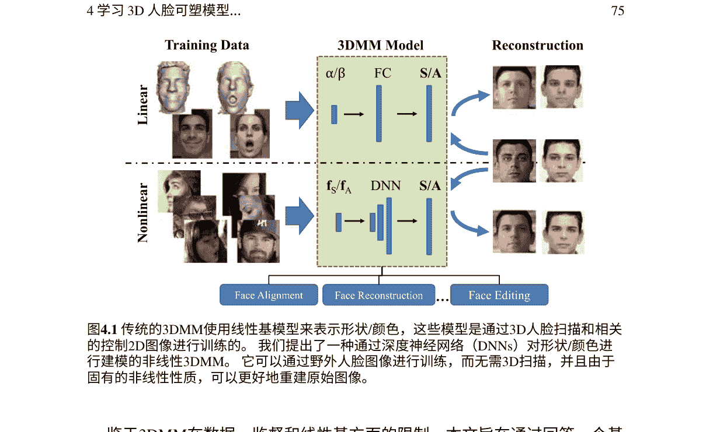

鉴于3DMM在数据、监督和线性基方面的限制，本文旨在通过回答一个基本问题来改变学习3DMM的范式：是否以及如何从一组野外2D人脸图像中学习非线性的人脸形状和颜色模型，而无需收集3D人脸扫描数据？如果答案是肯定的，这将与传统的3DMM方法形成鲜明对比，并纠正所有上述限制。幸运的是，我们已经开发出了一些方法来积极回答这个问题。随着深度神经网络的最新发展，我们认为现在是进行这种新型3DMM学习的合适时机。因此，本文的核心问题是如何学习这种新型3DMM，模型的表示能力如何，以及模型对面部分析的好处是什么。

我们提出了一种新的范式，从大规模的野外2D人脸图像集合中学习非线性3DMM模型，而不需要获取3D人脸扫描，通过利用深度神经网络捕捉复杂人脸数据的变化和结构。如图4.1所示，我们从线性3DMM公式等价于单层网络的观察出发，使用深度网络结构自然增加了模型容量。因此，我们使用两个卷积神经网络解码器，而不是两个PCA空间，作为形状和反照率模型的组成部分。每个解码器将以形状或反照率参数作为输入，并输出密集的3D人脸网格或人脸皮肤反照率。这两个解码器本质上是非线性3DMM。

此外，我们将拟合算法应用于我们的非线性3DMM，该算法被构建为CNN编码器。编码器网络以人脸图像作为输入，并从中生成形状和反照率参数，从中两个解码器估计形状和反照率。如果拟合算法和3DMM学习得很好，3D人脸和反照率将完美地重建输入人脸。因此，我们设计了一个可微分的渲染层，通过融合由编码器估计的3D人脸、反照率、光照和相机投影参数来生成重建的人脸。最后，构建了端到端的学习方案，其中编码器和两个解码器共同学习，以最小化重建人脸与输入人脸之间的差异。联合学习3DMM和模型拟合编码器使我们能够利用大量的野外2D图像，而无需依赖3D扫描。我们展示了相对于线性3DMM的显著改进的形状和面部纹理表示能力。因此，这也有益于其他任务，如2D人脸对齐、3D重建和人脸编辑。

总结一下，这项工作做出了以下贡献：

- 我们学习了一个非线性的3DMM模型，完全模拟了形状、反照率和光照，比传统的线性模型具有更强的表示能力。

- 形状和反照率都被表示为2D图像，这有助于保持空间关系，并利用CNN在图像合成方面的能力。

- 我们通过利用大量的2D图像而不是3D扫描来联合学习模型和模型拟合算法，通过弱监督。新的渲染层实现了端到端的训练。

- 新的3DMM进一步提高了相关任务的性能：人脸对齐、人脸重建和人脸编辑。

## 4.2 先前的工作

### 4.2.1 线性3DMM

Blanz和Vetter [4]提出了第一个从扫描数据中学习的通用3D人脸模型。他们使用主成分分析（PCA）定义了一个线性子空间来表示形状和纹理，并展示了如何将模型拟合到数据中。自从这个开创性的工作以来，人们在改进3DMM建模机制方面做出了大量努力。在[4]中，通过正则化的光流解决了面部网格之间的密集对应关系。然而，这种技术只在约束条件下有效，即受试者具有相似的种族和年龄。为了克服这个挑战，Patel和Smith [41]采用了薄板样条（TPS）变形[7]将网格注册到一个共同的参考框架中。或者，Paysan等人[42]使用非刚性迭代最近点[3]直接对齐3D扫描。在另一个方向上，Amberg等人[2]通过采用额外的PCA建模来扩展Blanz和Vetter的基于PCA的模型，以适应情感面部形状。这导致了一个线性模型，同时考虑了3D面部形状的身份和表情变化。Vlasic等人[66]使用多线性模型来表示身份和表情变化对面部形状的综合影响。随后，Bolkart和Wuhrer[6]展示了如何直接从3D扫描中估计这样的多线性模型，通过对模型参数和3D扫描的群组注册进行联合优化。

### 4.2.2 改进线性3DMM

使用PCA基础，3DMM的统计分布是高斯分布。Koppen等人[28]认为单模高斯不能很好地表示现实世界的分布。他们引入了高斯混合3DMM，将全局人口建模为自己均值但共享协方差的高斯子群体的混合物。Booth等人[8]旨在通过学习野外特征为基础的纹理模型改进3DMM的纹理，超越受控环境。在另一个方向上，Tran等人[60]通过利用同一主体的多个图像来学习回归鲁棒和判别性的3DMM表示。然而，所有的工作仍然基于统计PCA基础。Duong等人[38]通过使用深度玻尔兹曼机解决了面部建模中的线性问题。然而，他们只处理2D面部和稀疏的地标点；因此无法很好地处理具有大姿态变化或遮挡的面部。与我们的工作同时进行，Tewari等人[55]在线性模型之上学习了一个（可能是非线性的）校正模型。最终模型是基础线性模型和学习的校正模型的总和，与我们的统一模型形成对比。此外，我们的模型具有使用形状和反照率的2D表示的优势，这样可以保持顶点之间的空间关系，并利用CNN的能力进行图像合成。最后，由于我们的新颖渲染层，我们能够使用感知对抗损失来改善重建质量。

### 4.2.3 2D人脸对齐

2D人脸对齐[30, 68]可以看作是一个回归问题，其中2D特征点位置直接回归[14]。对于大角度或遮挡的人脸，已经证明了3DMM人脸形状的强先验是有益的[?]。因此，越来越多的关注点集中在通过将3D人脸模型拟合到单个2D图像来进行人脸对齐[24, 25, 74]。在先前的工作中，倾向于使用级联回归器的迭代方法。在每个级联中，使用一个回归器[65]甚至两个回归器[69]来改进其预测。最近，Jourabloo和Liu [25]提出了一种CNN架构，使其网络级联具有端到端的训练能力。与使用固定的3DMM模型的前述工作相比，我们的模型和模型拟合是联合学习的。这导致了一个更强大的模型：与模型一起学习的单次通过编码器在AFLW2000 [74]基准数据集上实现了最先进的人脸对齐性能。

### 4.2.4 3D人脸重建

人脸重建可以从图像集合[47]甚至从单个图像[45, 50]中创建一个3D人脸模型。这个长期存在的问题引起了很多关注，因为它有广泛的应用。3DMM在人脸重建中也展示了它的优势，特别是在单目情况下。这个问题是高度不受限制的，因为单个图像只能提供有限的表面信息。因此，3D人脸重建必须依赖于像3DMM [48]这样的先验知识。统计PCA线性3DMM是最常用的方法。除了3DMM拟合方法[5, 15, 19, 29, 56, 73]之外，最近，Richardson等人[46]设计了一个在3DMM基础几何上添加面部细节的改进网络。然而，这种方法只能学习2.5D深度图，失去了3DMM的对应性质。Sela等人的后续工作[50]试图通过学习对应关系图来克服这个弱点。尽管有一些令人印象深刻的重建结果，但这两种方法都受到从线性3DMM模型合成的训练数据的限制。因此，它们无法处理子空间外的变化，例如面部毛发。

### 4.2.5 三维形状模型的无监督学习

收集带有详细标签的大规模三维扫描用于学习三维形状模型并不容易。一些研究尝试使用大规模合成数据，如[27, 45]，但它们与真实图像之间仍存在领域差异。Tewari等人[56]是首批尝试从无标签图像中学习三维形状模型拟合的研究之一。他们使用无监督损失将投影纹理面网格与原始图像本身进行比较。稀疏的地表对齐也被用作辅助损失。Genova等人[18]通过使用预训练的人脸识别网络的高级特征来比较重建图像和原始输入，进一步改进了这种方法。与这些工作相比，我们的工作的目标是学习一个非线性的三维形状模型。

## 4.3 提出的非线性三维形状模型

在本节中，我们首先介绍传统的线性3DMM，然后提出我们的新型非线性3DMM模型。

### 4.3.1 传统线性3DMM

三维可塑模型 (3DMM) [4]及其二维对应物，活动外观模型[13, 31, 32]，为合成面部提供了参数模型，其中面部使用两个组件进行建模：形状和颜色（皮肤反射）。在[4]中，Blanz等人提出使用PCA来描述三维面部空间：

$$ \mathbf{S} = \bar{\mathbf{S}} + \mathbf{G} \alpha, \tag{4.1} $$

其中 $\mathbf{S} \in \mathbb{R}^{3Q}$是一个具有 $Q$个顶点的三维面部网格， $\bar{\mathbf{S}} \in \mathbb{R}^{3Q}$是平均形状， $\alpha \in \mathbb{R}^{l_s}$是对应于三维形状基的形状参数 $\mathbf{G}$。形状基可以进一步分为 $\mathbf{G}= [\mathbf{G}_{id}, \mathbf{G}_{exp}]$，其中 $\mathbf{G}_{id}$是从中性表情的三维扫描中训练得到的， $\mathbf{G}_{exp}$是表情和中性扫描之间的偏移量。

面部的反照率$\mathbf{A}$属于$\mathbb{R}^{3Q}$，定义在平均形状$\bar{\mathbf{S}}$上，描述了相应顶点的RGB颜色。$\mathbf{A}$也可以表示为基函数的线性组合：

$$ \mathbf{A} = \bar{\mathbf{A}} + \mathbf{R} \mathbf{f}_l, \tag{4.2} $$

其中$\bar{\mathbf{A}}$是平均反照率，$\mathbf{R}$是反照率基，$\mathbf{f}_l$属于$\mathbb{R}^{l_t}$是反照率参数。

3DMM可以用于合成面部的新视角。首先，使用弱透视投影模型将3D面投影到图像平面上：

$$ \mathbf{V} = \mathbf{R} * \mathbf{S}, \tag{4.3} $$

$$ g(\mathbf{S}, \mathbf{m}) = \mathbf{V}_{2\mathrm{D}} = f * \mathbf{Pr} * \mathbf{V} + \mathbf{t}_{2d} = M(\mathbf{m}) * \begin{bmatrix} \mathbf{S} \\ \mathbf{1} \end{bmatrix}, \tag{4.4} $$

其中 $g(\mathbf{S}, \mathbf{m})$是导致2D位置 $\mathbf{V}^{2D}$ of 3D旋转顶点 $\mathbf{V}$的投影函数， $f$是比例因子， $\mathbf{Pr} = \begin{bmatrix} 1 & 0 & 0 \\ 0 & 1 & 0 \end{bmatrix}$是正交投影矩阵， $\mathbf{R}$是由三个旋转角（俯仰、偏航、滚动）构成的旋转矩阵， $\mathbf{t}_{2d}$是平移向量。虽然投影矩阵 $M$的大小为$2 \times 4$，但它有六个自由度，由一个6维向量 $\mathbf{m}$参数化。然后，使用纹理和照明模型（如Phong反射模型[43]或球谐函数[44]）渲染2D图像。

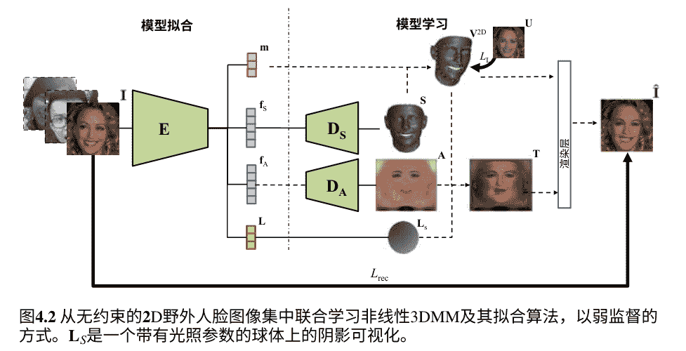

### 4.3.2 非线性3DMM

如第4.1节所述，线性3DMM存在一些问题，例如需要3D人脸扫描进行监督学习，无法利用大规模的野外人脸图像进行学习，以及由于线性基的限制而具有有限的表示能力。我们提出仅使用大规模野外2D人脸图像来学习非线性3DMM模型。

#### 4.3.2.1 问题形式化

在线性3DMM中，每个组成部分（形状、反照率）的分解可以看作是系数和基之间的矩阵乘法。从神经网络的角度来看，这可以被视为一个只有一个全连接层且没有激活函数的浅层网络。自然地，为了增加模型的表示能力，浅层网络可以扩展为深层架构。在这项工作中，我们设计了一种新颖的学习方案，共同学习深度3DMM模型及其推断（或拟合）算法。

具体来说，如图4.2所示，我们使用两个深度网络将形状、反照率参数解码为3D面部形状和反照率。为了使框架能够端到端地进行训练，这些参数是由编码器网络估计的，它本质上是我们的3DMM的拟合算法。三个深度网络共同努力，以重建输入的面部图像，并辅助物理基础渲染层。图4.2展示了提出的框架的架构。每个组件将在以下章节中介绍。

形式上，给定一组 $K$ 2D面部图像 $\{\mathbf{I}_i\}_{i=1}^{K}$，我们的目标是学习一个编码器 $\mathcal{E}$： $\mathbf{I} \rightarrow \mathbf{m}, \quad \mathbf{L}, \quad \mathbf{f}_S, \quad \mathbf{f}_A$，它估计投影 $\mathbf{m}$，光照参数 $\mathbf{L}$，形状参数 $\mathbf{f}_S \in \mathbb{R}^{l_S}$, 和反照率参数 $\mathbf{f}_A \in \mathbb{R}^{l_A}$, 一个3D形状解码器 $\mathcal{D}_S: \mathbf{f}_S \rightarrow \mathbf{S}$, 将形状参数解码为3D形状 $\mathbf{S} \in \mathbb{R}^{3Q}$, 和一个反照率解码器 $\mathcal{D}_A: \mathbf{f}_A \rightarrow \mathbf{A}$, 将反照率参数解码为逼真的反照率 $\mathbf{A} \in \mathbb{R}^{3Q}$, 目标是使用 $\mathbf{m}, \mathbf{L}, \mathbf{S}$ 和 $\mathbf{A}$ 渲染的图像能够很好地逼近原始图像。从数学上讲，目标函数为:

$$ \arg \min_{\mathcal{E}, \mathcal{D}_S, \mathcal{D}_A} \sum_{i=1}^K ||\hat{\mathbf{I}}_i - \mathbf{I}_i||_1, \\ \hat{\mathbf{I}} = \mathcal{R}(\mathcal{E}_m(\mathbf{I}), \mathcal{E}_L(\mathbf{I}), \mathcal{D}_S(\mathcal{E}_S(\mathbf{I})), \mathcal{D}_A(\mathcal{E}_A(\mathbf{I}))), \\ \tag{4.5} $$

其中 $\mathcal{R}(\mathbf{m}, \mathbf{L}, \mathbf{S}, \mathbf{A})$是渲染层（第4.3.2.3节）。

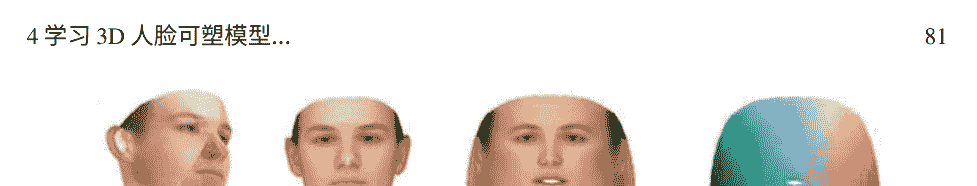

图4.3 三种反照率表示：a 每个顶点的反照率值，b 作为正面人脸的反照率，c UV空间2D未扭曲的反照率；以及d UV空间2D未扭曲的形状

#### 4.3.2.2 反射率和形状表示

图4.3说明了三种可能的反射率表示。在传统的3DMM中，反射率是针对每个顶点定义的（图4.3a）。这种表示方法也被最近的研究所采用，如[55, 56]。面部网格中的每个顶点都对应着一个反射率强度值。尽管被广泛使用，但这种表示方法有其局限性。由于3D顶点不是在2D网格上定义的，这种表示方法大多数情况下被参数化为一个向量，这不仅丢失了其顶点的空间关系，还阻止了它利用2D反射率上部署CNN的便利性。相比之下，鉴于图像合成的快速进展，选择一个2D图像作为反射率表示是可取的，例如图4.3b中的正视人脸图像。然而，正视人脸中缺乏两侧的信息，这将导致侧视人脸丢失许多反射率信息。

考虑到这些因素，我们使用一个展开的2D纹理作为我们的纹理表示（图4.3c）。具体来说，每个3D顶点 $\mathbf{v}$ 通过圆柱展开投影到UV空间上。假设面部网格的顶部指向上方的 y-轴，将顶点 $\mathbf{v} = (x, y, z)$投影到UV空间上 $\mathbf{v}^{uv} = (u, v)$的计算如下：

$$ u \rightarrow \alpha_1 \cdot \arctan(x/z) + \beta_1, \quad v \rightarrow \alpha_2 \cdot y + \beta_2, \tag{4.6} $$

其中 $\alpha_1, \alpha_2, \beta_1, \beta_2$ 是常数比例和平移标量，用于将展开的面部放置在图像边界内。在这里，每个顶点的反照率 $\mathbf{A} \in \mathbb{R}^{3Q}$ 可以通过从其UV空间对应物 $\mathbf{A}^{uv} \in \mathbb{R}^{U \times V}$ 进行采样来轻松计算:

$$\mathbf{A}(\mathbf{v}) = \mathbf{A}^{uv}(\mathbf{v}^{uv}). \tag{4.7}$$

通常，它通过双线性插值进行亚像素采样:

$$\mathbf{A}(\mathbf{v}) = \sum_{\substack{u' \in \{ \lfloor u \rfloor, \lceil u \rceil \} \\ v' \in \{ \lfloor v \rfloor, \lceil v \rceil \}}} \mathbf{A}^{uv}(u', v')(1 - |u - u'|)(1 - |v - v'|), \tag{4.8}$$

其中 $\mathbf{v}^{uv} = (u, v)$ 是通过方程4.6将 $\mathbf{v}$ 投影到UV空间。反照率信息在UV空间中自然表达，但空间数据也可以嵌入到相同的空间中。在这里，3D面部网格可以表示为一个具有三个通道的2D图像，每个空间维度一个，x, y和z。图4.3给出了这种UV空间形状表示 $\mathbf{S}^{uv} \in \mathbb{R}^{U \times V}$ 的一个例子。

在UV空间中表示3D面部形状使我们能够使用CNN进行形状解码器 $\mathcal{D}_S$, 而不是像我们的初步版本[62]中使用多层感知器（MLP）。避免使用全连接层使我们能够使用更深的网络进行 $\mathcal{D}_S$, 可能模拟更复杂的形状变化。这导致更好的拟合结果，正如我们的实验（第4.4.1节）所证明的那样。

另外，值得注意的是，与我们的初步版本[62]不同，在这个版本中，用于纹理的参考UV空间是基于中性表情的平均形状的投影构建的，而在这个版本中，使用的参考形状是嘴巴张开的。当嘴巴张开时，这种改变有助于网络避免在垂直方向上学习两个嘴唇边界附近的大梯度。

为了回归这些形状和反照率的2D表示，我们可以分别使用CNN作为形状和反照率网络。具体来说，$\mathcal{D}_S$, $\mathcal{D}_A$ 是由多个分数卷积层构成的CNN。每个卷积之后都是批量归一化和eLU激活，除了编码器和解码器的最后一层卷积层。输出层使用 tanh激活函数将输出限制在范围[-1, 1]内。

### 4.3.2.3 网络内基于物理的人脸渲染

为了从反照率 $\mathbf{A}$、形状 $\mathbf{S}$、光照参数 $\mathbf{L}$ 和投影参数 $\mathbf{m}$ 中重建人脸图像，我们定义了一个渲染层 $\mathcal{R}(\mathbf{m}, \mathbf{L}, \mathbf{S}, \mathbf{A})$ 来从上述参数中渲染人脸图像。这是通过三个步骤完成的，如图4.4所示。首先，使用反照率 $\mathbf{A}$ 和旋转后的形状的表面法线图 $N(\mathbf{V}) = N(\mathbf{m}, \mathbf{S})$ 计算面部纹理。在这里，我们根据[67]的假设使用远程照明和纯 Lambertian 表面反射。因此，我们可以使用球谐函数（SH）基函数 $H_b: \mathbb{R}^3 \to \mathbb{R}$ 来近似计算传入辐射，由系数 $\mathbf{L}$ 控制。具体来说，纹理在UV空间中。$T^{uv} \in R^{U\times V}$由反照率 $A^{uv}$ 和阴影 $C^{uv}$ 组成：

$$ T^{uv} = A^{uv} C^{uv} = A^{uv} \sum_{b=1}^{B^2} L_b H_b(N(\mathbf{m}, \mathbf{S}^{uv})), \quad (4.9) $$

其中 B 是球谐波带的数量。我们使用 B = 3，这导致每个颜色通道的 L 中有 $B^2 = 9$ 个系数。其次，通过方程 4.4，将 3D 形状/网格 S 投影到图像平面。最后，使用 Z 缓冲渲染器渲染 3D 网格，其中每个像素与网格的一个三角形相关联。

$$ \hat{I}(m, n) = \mathcal{R}(\mathbf{m}, \mathbf{L}, \mathbf{S}^{uv}, \mathbf{A}^{uv})_{m,n} = T^{uv} ( \sum_{\mathbf{v}_i \in \Phi^{uv}(g,m,n)} \lambda_i \mathbf{v}_i ), \quad (4.10) $$

其中 $\Phi(g, m, n)= \{v_1, v_2, v_3\}$ 是一个返回三个顶点的操作，这三个顶点围绕像素 (m, n) 在投影 g 之后形成的三角形；$\Phi^{uv}(g, m, n)$ 是相同的操作，将结果顶点映射到参考的 UV 空间中，使用方程式 4.6。为了处理遮挡，当一个单像素存在于多个三角形中时，选择离图像平面最近的三角形。每个像素的最终位置是通过插值三个顶点的位置来确定的，使用重心坐标 $\{\lambda_i\}_{i=1}^3$。

我们的渲染层有替代设计。如果纹理表示是基于顶点定义的，如图 4.3a 所示，可以将输入图像 I 映射到 3D 形状 S 的顶点空间上，其与每个顶点纹理表示的距离可以形成一个重建损失。这个设计是最近的工作[55, 56]采用的。

相比之下，我们的渲染图像是在二维网格上定义的，而另一种方法是在三维网格上。因此，我们的渲染图像可以方便地应用感知损失或对抗损失，这在改善合成纹理的质量方面被证明是关键的。另一种用于渲染层的设计是基于样条插值的图像变形，如[12]中所述。然而，这种变形是连续的：输入中的每个像素都会映射到输出。因此，这种变形在遮挡区域，该操作无法成功。因此，Cole 等人[12]将其范围限制在仅通过从标准化脸部进行变形来合成正面视图的脸部。

### 4.3.2.4 遮挡感知渲染

很多时候，野外的人脸会被眼镜、头发、手等遮挡。试图重建异常遮挡区域可能会使模型学习更加困难，或者导致模型中包含外部遮挡。因此，我们建议在渲染流程中使用分割掩模来排除遮挡区域：

$$\text{我} \leftarrow \hat{\text{我}} \textbf{M} + \text{我} \left(1 - \textbf{M} \right).$$

因此，这些被遮挡的区域不会影响我们的优化过程。前景掩膜 **M** 是使用 Nirkin 等人提供的分割方法估计得到的[39]。分割掩膜和渲染结果的示例可以在图 4.5 中找到。

### 4.3.2.5 模型学习

整个网络是端到端训练的，用于重构输入图像，损失函数为：

$$\mathcal{L} = \mathcal{L}_{\text{rec}}(\hat{\mathbf{I}}) + \mathcal{L}_{\text{lan}} + \mathcal{L}_{\text{reg}},$$

其中，重构损失 $L_{\text{rec}}$ 强制渲染图像 $\hat{\mathbf{I}}$ 与输入 $\mathbf{I}$ 相似，地标损失 $L_{\text{land}}$ 强制几何约束，正则化损失 $\mathcal{L}_{\text{reg}}$ 鼓励合理的解决方案。

重构损失网络的主要目标是通过解耦表示重构原始人脸。因此，我们强制重构图像与原始输入图像相似：

## 重建损失

$$\mathcal{L}_{\text{rec}}^{i} = \frac{1}{|\mathcal{V}|} \sum_{q \in \mathcal{V}} ||\mathbf{I}(q) - \mathbf{I}(q)||_2$$ (4.13)

其中 $\mathcal{V}$ 是估计的人脸网格覆盖的图像中的所有像素的集合。有不同的规范可以用来衡量接近程度。为了更好地处理离群值，我们采用了鲁棒的 $l_{2,1}$，其中 3D RGB 颜色空间中的距离基于 $l_2$，而所有像素的求和基于 $l_1$ 范数强制稀疏性[58, 59]。

为了改善 $l_p$ 损失的模糊重建结果，在我们的初步工作中[62]，由于我们的渲染层，我们采用对抗性损失来增强图像的真实感。然而，对抗性目标只鼓励重建结果接近真实图像分布，而不一定是输入图像。

此外，已知优化不稳定。在这里，我们建议使用感知损失来强制图像 $\hat{\mathbf{I}}$ 和 $\mathbf{I}$ 之间的接近，从而克服对抗性损失的两个弱点。除了鼓励输出图像 $\hat{\mathbf{I}}$ 的像素与输入 $\mathbf{I}$ 的像素完全匹配外，我们还鼓励它们具有类似的特征表示，由损失网络 $\varphi$ 计算。

$$\mathcal{L}_{\text{rec}}^{f} = \frac{1}{|\mathcal{C}|} \sum_{j \in \mathcal{C}} \frac{1}{W_j H_j C_j} ||\varphi_j(\hat{\mathbf{I}}) - \varphi_j(\mathbf{I})||_2^2$$ (4.14)

我们选择 VGG-Face [40] 作为我们的 $\varphi$，以利用其与人脸相关的特征，同时也因为其简单性。损失在 $\mathcal{C}$ 上求和，$\mathcal{C}$ 是 $\varphi$ 的一组层的子集。这里，$\varphi_j(\mathbf{I})$ 是 $\varphi$ 处理图像 $\mathbf{I}$ 时的第 $j$ 层的激活，其维度为 $W_j \times H_j \times C_j$。这种特征重建损失是不同图像处理任务中广泛使用的感知损失之一-[23]。

最终重建损失是两个项的加权和：

$$\mathcal{L}_{\text{rec}} = \mathcal{L}_{\text{rec}}^{i} + \lambda_f \mathcal{L}_{\text{rec}}^{f}$$ (4.15)

## 稀疏地标对齐

为了实现更好的模型拟合，从而改善模型学习本身，我们采用地标对齐损失作为辅助任务，测量估计地标和真实地标之间的欧氏距离，

$$\mathcal{L}_{\text{lan}} = \left\| M(\mathbf{m}) * \begin{bmatrix} \mathbf{S}(:, \mathbf{d}) \\ \mathbf{1} \end{bmatrix} - \mathbf{U} \right\|_2^2$$ (4.16)

其中 $\mathbf{U} \in \mathbb{R}^{2 \times 68}$ 是手动标记的 2D 地标位置，$\mathbf{d}$ 是一个常数 68 维向量，存储与标记的 2D 对应的 68 个 3D 顶点的索引地标。与传统的面部对齐工作不同，其中形状基础是固定的，我们的工作同时学习基础函数（即形状解码器 $D_S$）以及。在更新 $D_S$ 时，最小化地标损失只移动了一个小的子集顶点。如果形状 $S$ 表示为一个向量，$D_S$ 是由全连接层组成的 MLP，顶点是独立的。因此，$L_L$ 只调整了 68 个顶点。

如果 $S$ 在 UV 空间中表示，并且 $D_S$ 是一个 CNN，那么局部邻域区域也可以被修改。在这两种情况下，基于 $L_L$ 的更新 $D_S$ 只移动了一部分顶点，这可能导致不合理的形状。因此，在优化地标损失时，我们固定解码器 $D_S$，只更新编码器。另外，需要注意的是，与一些先前的工作[17]不同，我们的网络在训练期间只需要地标的真实值。它能够通过 $m$ 和 $S$ 在测试时预测地标。

## 正则化

为了确保合理的重建，我们添加了一些正则化项:

$$ \mathcal{L}_{\text{reg}} = \mathcal{L}_{\text{sym}}(\mathbf{A}) + \lambda_{\text{con}}\mathcal{L}_{\text{con}}(\mathbf{A}) + \lambda_{\text{smo}}\mathcal{L}_{\text{smo}}(\mathbf{S}). \quad (4.17) $$

### 反射对称性

由于人脸是对称的，我们强制施加对称约束:

$$ \mathcal{L}_{\text{sym}} = \|\mathbf{A}^{\text{uv}} - \text{flip}(\mathbf{A}^{\text{uv}})\|_1. \quad (4.18) $$

通过水平图像翻转操作 `flip()`，可以很容易地在 2D 反射率上实现这个约束。

### 反射率恒定性

使用对称约束可以帮助纠正全局阴影。然而，对称细节，例如酒窝，仍然可以嵌入在反射率通道中。为了进一步从反射率通道中去除阴影，根据 Retinex 理论，假设反射率是分段常数，我们在其梯度的两个方向上强制稀疏性，类似于[36, 53]:

$$ \mathcal{L}_{\text{con}} = \sum_{\mathbf{v}_j^{\text{uv}} \in \mathcal{N}_i} \omega(\mathbf{v}_i^{\text{uv}}, \mathbf{v}_j^{\text{uv}}) \|\mathbf{A}^{\text{uv}}(\mathbf{v}_i^{\text{uv}}) - \mathbf{A}^{\text{uv}}(\mathbf{v}_j^{\text{uv}})\|_2^p. \quad (4.19) $$

其中 $\mathcal{N}_i$ 表示像素 $\mathbf{v}_i^{\text{uv}}$ 的 4 像素邻域集合。在假设相同色度的像素（即 $\mathbf{c}(x) = \mathbf{I}(x) / |\mathbf{I}(x)|$）更有可能具有相同的反照率的情况下，我们设置常数权重 $\omega(\mathbf{v}_i^{uv}, \mathbf{v}_j^{uv}) = \exp\left(-\alpha \|\mathbf{c}(\mathbf{v}_i^{uv}) - \mathbf{c}(\mathbf{v}_j^{uv})\|\right)$，其中颜色是根据当前估计的投影从输入图像中引用的。根据[36]，我们在实验中设置 $\alpha = 15$ 和 $p = 0.8$。

上述反照率正则化的效果在图 4.6 中展示。没有任何约束的学习导致光照完全由反照率解释，同时阴影几乎保持不变（图 4.6a）。使用对称性有助于修正全局光照。然而，对称几何细节仍然嵌入到反照率中（图 4.6b）。强制反照率恒定有助于进一步去除其中的阴影（图 4.6c）。结合这两种正则化方法有助于学习到合理的反照率和光照，从而改善形状估计。

### 形状平滑度

对于形状组件，我们通过在所有顶点的位置上添加拉普拉斯正则化来实施平滑度约束。

$$\mathcal{L}_{\text{smo}} = \sum_{\mathbf{v}_i^{uv} \in \mathbf{S}^{uv}} \left\| \mathbf{S}^{uv}(\mathbf{v}_i^{uv}) - \frac{1}{|\mathcal{N}_i|} \sum_{\mathbf{v}_j^{uv} \in \mathcal{N}_i} \mathbf{S}^{uv}(\mathbf{v}_j^{uv}) \right\|_2. \quad (4.20)$$

图 4.7 显示了我们的模型与没有形状平滑度约束的变体之间的视觉比较。没有平滑度项，学习到的形状在脸的两侧变得嘈杂。原因是训练过程中由于不精确的分割估计，头发区域没有完全排除。

## 中级半监督训练

仅使用重建和对抗损失在渲染图像上进行完全无监督训练可能导致退化解决方案，因为初始估计与渲染有意义的图像相差甚远。

因此，我们引入中间损失函数来指导早期迭代的训练。

通过面部轮廓技术，Zhu 等人[74]将 300W 数据集[49]扩展为 122,450 张带有拟合的 3MM 形状 $\mathbf{S}$ 和投影参数 $\hat{\mathbf{m}}$ 的图像。给定 $\mathbf{S}$ 和 $\hat{\mathbf{m}}$，我们通过将 UV 空间中的每个像素反向引用到输入图像来创建伪地面真实纹理 $\widehat{\mathbf{I}}$，即我们渲染层的反向。通过 $\hat{\mathbf{m}}$，$\mathbf{S}$，$\widehat{\mathbf{I}}$，我们定义了中间损失函数：

$$\mathcal{L}_0 = \mathcal{L}_S + \lambda_T \mathcal{L}_T + \lambda_m \mathcal{L}_m + \mathcal{L}_{\text{lan}} + \mathcal{L}_{\text{reg}}, \quad (4.21)$$

其中：$\mathcal{L}_S = \|\mathbf{S} - \tilde{\mathbf{S}}\|_2^2$, $\mathcal{L}_T = \|\mathbf{T} - \tilde{\mathbf{T}}\|_1$, 以及 $\mathcal{L}_m = \|\mathbf{m} - \tilde{\mathbf{m}}\|_2^2$。还可以通过最小二乘优化提供伪地面真值给 SH 系数 $\mathbf{L}$，并使用常数反照率假设来得到反照率 $\mathbf{A}$，就像[53, 67]中所做的那样。然而，这种估计对于存在遮挡区域的野外图像不可靠。此外，根据我们提出的正则化方法，模型能够自行探索这些组件的合理解决方案。因此，我们决定不对 $\mathbf{L}$ 和 $\mathbf{A}$ 进行监督，以简化我们的流程。

由于伪地面真值的存在，使用 $L_0$ 可能会导致我们的解决方案学习模仿线性模型的风险。因此，在 $L_0$ 收敛后，我们切换到 Eq. 4.12 的损失函数。请注意，我们训练中仅使用了 $\tilde{\mathbf{m}}$、$\tilde{\mathbf{S}}$、$\tilde{\mathbf{T}}$ 和关键点的估计地面真值作为监督，因此我们的学习被认为是弱监督的。

## 4.4 提高模型的准确性

### 4.4.1 非线性 3MM 代理和残差

代理和残差学习研究表明，强正则化对于学习模型的合理性至关重要[55]。然而，强正则化也会阻止模型恢复形状或颜色的高级细节。因此，这使我们无法实现学习高保真度的 3MM 模型的最终目标。

在这项工作中，我们提出学习额外的代理形状 ($\tilde{\mathbf{S}}$) 和代理颜色 ($\tilde{\mathbf{A}}$)，对它们可以应用正则化。所有提出的正则化，如 Eq. 4.17 中所示，现在将移至代理变量：

$$\mathcal{L}_{\text{reg}}^* = \mathcal{L}_{\text{sym}}(\tilde{\mathbf{A}}) + \lambda_{\text{con}} \mathcal{L}_{\text{con}}(\tilde{\mathbf{A}}) + \lambda_{\text{smo}} \mathcal{L}_{\text{smo}}(\tilde{\mathbf{S}}), \quad (4.22)$$

除了对实际形状 $\mathbf{S}$ 和反照率 $\mathbf{A}$ 应用弱正则化以使其接近其代理之外，不会直接应用正则化：

$$\mathcal{L}_{\text{res}} = \|\Delta \mathbf{S}\|_1 + \|\Delta \mathbf{A}\|_1 = \|\mathbf{S} - \tilde{\mathbf{S}}\|_1 + \|\mathbf{A} - \tilde{\mathbf{A}}\|_1, \quad (4.23)$$

通过配对两个形状 $\mathbf{S}$、$\tilde{\mathbf{S}}$ 和两个反照率 $\mathbf{A}$、$\tilde{\mathbf{A}}$，我们可以渲染出四个不同的输出图像（图 4.2）。其中任何一个都可以与原始输入图像进行比较。我们将重构损失重写为：

$$\mathcal{L}_{\text{rec}}^* = \mathcal{L}_{\text{rec}}(\hat{\mathbf{I}}(\tilde{\mathbf{S}}, \tilde{\mathbf{A}}), \mathbf{I}) + \mathcal{L}_{\text{rec}}(\hat{\mathbf{I}}(\tilde{\mathbf{S}}, \mathbf{A}), \mathbf{I}) + \mathcal{L}_{\text{rec}}(\hat{\mathbf{I}}(\mathbf{S}, \tilde{\mathbf{A}}), \mathbf{I}), \quad (4.24)$$

在我们的方法中，将强正则化的代理和弱正则化的组件配对是一个关键点。使用代理使我们能够学习高保真度的形状和反照率，而不会牺牲任何组件的质量。这种配对受到的启发是，从阴影技术中可以通过假设过度正则化的反照率甚至使用平均反照率[46]来恢复详细的面部网格。

在这里，`L_rec(\hat{I}(S, \hat{A}), I)` 损失促使 `S` 恢复更多细节，因为 `\hat{A}` 受到分段常数 `L_con(\hat{A})` 目标的约束。反之，`L_rec(\hat{I}(\hat{S}, A), I)` 旨在学习更好的反照率。为了使这两个损失按预期工作，代理 `\hat{S}` 和 `\hat{A}` 应该足够好地近似输入图像本身。没有 `L_rec(\hat{I}(\hat{S}, A), I)`，最小化 `L_rec(\hat{I}(S, \hat{A}), I)` 的有效解是一个常数反照率代理和在必要区域创建具有暗阴影的噪声形状的表面法线，即眉毛。

另一个值得注意的设计选择是，我们故意省略了损失函数 on `\hat{I}(S, A)`，尽管从理论上讲这是最重要的目标。这是为了避免形状 `S` 学习到一个中间解决方案，既适用于 both `\hat{A}` , `A`，反之亦然。

### 4.4.2 全局-局部网络架构

虽然基于全局的模型通常对噪声和不匹配具有鲁棒性，但它们过于约束，并且不能提供足够的灵活性来表示高频变形，如基于局部的模型。为了兼顾两者的优点，我们提出使用双通道网络来进行形状和反照率解码。

在这里，我们将在图像合成[21, 37]中结合局部和全局模型的成功应用于 3D 人脸建模。解码器的一般架构如图 4.8 所示。从潜在向量开始，有一个专注于推断全局结构的全局路径，以及四个小的子网络生成不同面部部位（包括眼睛、鼻子和嘴巴）的细节的局部路径。全局路径是由分数步长卷积层构建的，具有五个上采样步骤。同时，局部路径中的每个子网络具有类似的架构，但更浅，具有仅有三个上采样步骤。 为每个面部部分使用不同的小型子网络有两个好处: (i) 在较早的层中，网络能更好地表示高频细节；(ii) 每个子网络可以学习特定于部分的滤波器，这比应用于全面部更具计算效率。

如图4.8所示，为了融合两个路径的特征，我们首先将四个局部路径的输出整合成一个单一的特征张量。与其他合成具有不同偏航角的面部图像的方法[26, 63, 64]不同，我们的3DMM在预定义的拓扑结构下在UV空间中生成面部颜色和3D形状。使用零填充操作可以高效地合并这些局部特征张量。最大池化融合策略也用于减少重叠区域的拼接伪影。然后，将结果特征简单地与具有相同空间分辨率的全局路径特征连接起来。连续的卷积层整合了来自两个路径的信息，并生成最终的颜色/形状（或其代理）。

## 4.5 实验结果

实验研究了提出的非线性3DMM的三个方面，即其表达能力、表示能力和应用于面部分析。 使用巴塞尔人脸模型 (BFM) [42]的面部网格三角形定义，我们使用300W-LP数据集[74]训练我们的3DMM， 该数据集包含122,450个野外人脸图像，在广泛的姿势范围内从 −90°到90°。 图像松散地围绕着脸部进行了方形裁剪，并缩放为256 × 256。 在训练过程中，从这些图像中随机裁剪大小为224 × 224的图像，引入平移变化。

该模型使用Adam优化器进行优化，学习率为0.001，在两个训练阶段都使用。 我们设置以下参数：`Q = 53,215 , U = 192 , V = 224 , l_S = l_T =160`。 $\lambda$ 值被设置为使损失具有相似的数量级。

### 4.5.1 消融研究

重建损失函数。 我们研究了不同重建损失对重建图像质量的影响 (图4.9)。 如预期的那样，仅使用`L_2`或`L_1`损失训练的模型会导致模糊的重建，类似于其他`L_p`损失。 为了使重建更加逼真，我们探索了其他选项，如梯度差异[35]或感知损失[23]。 虽然添加梯度差异损失可以在重建中增加更多细节，但将感知损失与`L_2`或`L_1`结合在一起可以获得具有高水平细节和逼真度的最佳结果。 在本文的其余部分中，我们将称这种组合训练的模型为...

理解图像配对图4.10展示了我们模型在2D人脸图像上的拟合结果。 通过使用代理或最终组件（形状或颜色），我们可以...

图4.9使用不同损失函数的重建结果

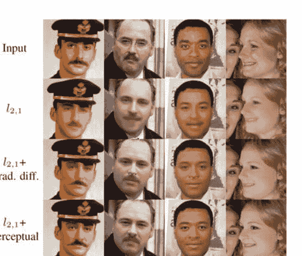

图4.10使用代理和真实形状和颜色的图像重建我们的形状和颜色能够准确恢复面部细节

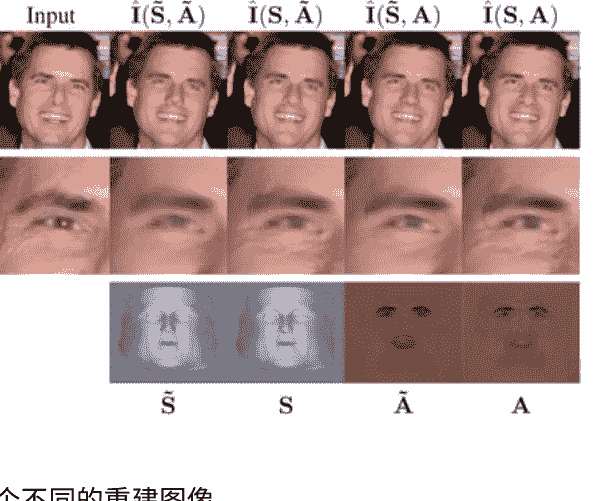

### 4.5.2 表达能力

探索特征空间我们将整个CelebA数据集[34]的 ~200k张图像输入我们的网络，以获得形状和纹理参数的经验分布。

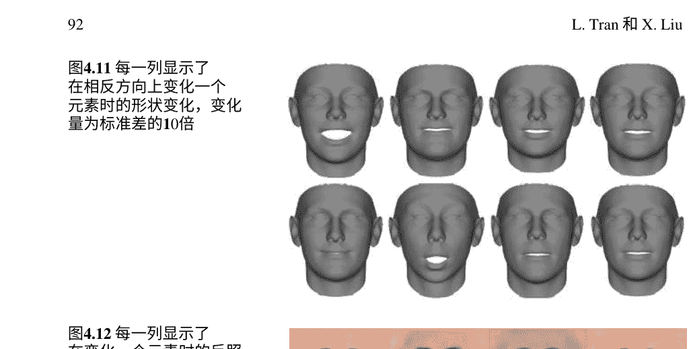

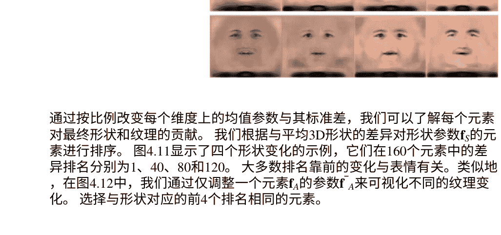

通过按比例改变每个维度上的均值参数与其标准差，我们可以了解每个元素对最终形状和纹理的贡献。我们根据与平均3D形状的差异对形状参数`f_S`的元素进行排序。图4.11显示了四个形状变化的示例，它们在160个元素中的差异排名分别为1、40、80和120。大多数排名靠前的变化与表情有关。类似地，在图4.12中，我们通过仅调整一个元素`f_A`的参数`\overline{f}_A`来可视化不同的纹理变化。选择与形状对应的前4个排名相同的元素。

属性嵌入为了更好地理解嵌入在我们的两个解码器中的不同形状和反射率实例，我们深入研究它们的属性含义。对于给定的属性，例如男性，我们将具有该属性的图像`\{\mathbf{I}_i\}_{i=1}^n`输入到我们的编码器`E`中，以获得两组参数`\{\mathbf{f}_S^i\}_{i=1}^n`和`\{\mathbf{f}_A^i\}_{i=1}^n`。这些集合表示低维空间中数据的相应经验分布。计算均值参数`\overline{\mathbf{f}}_S, \overline{\mathbf{f}}_A`并将其输入到各自的解码器中，同时使用均值照明参数，我们可以重构具有该属性的均值形状和纹理。

图4.13可视化了与某些属性相关的重建纹理的三维网格。形状和纹理中存在的属性之间存在差异。在这里，我们可以观察到我们的非线性三维模型对于建模小细节（例如“眼袋”或“红润的脸颊”等）的能力。

图4.13 非线性3DMM生成形状和颜色嵌入不同属性

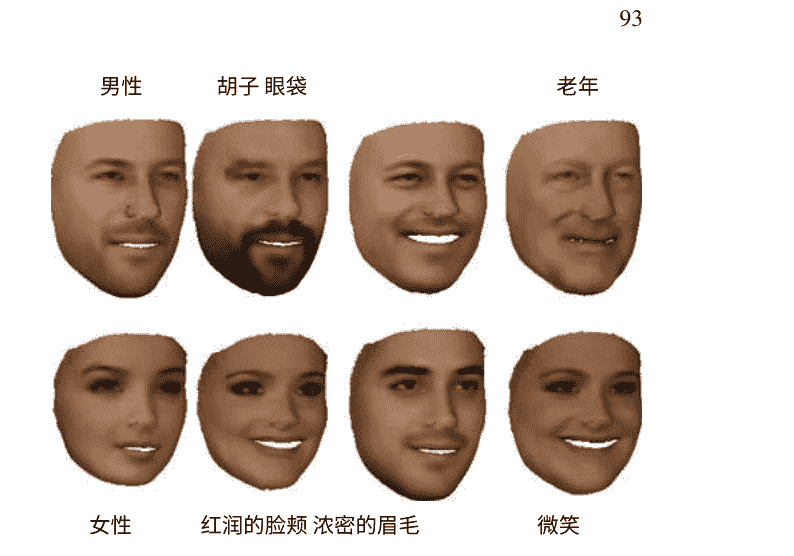

图4.14 质量比较纹理表示能力 我们的模型可以更好地重建野外面部纹理

| Input | Linear | Nonlinear Basic | Nonlinear +GL | Nonlinear Full |
|-------|--------|-----------------|---------------|----------------|
| [图像] | [图像] | [图像]          | [图像]        | [图像]         |
| [图像] | [图像] | [图像]          | [图像]        | [图像]         |
| [图像] | [图像] | [图像]          | [图像]        | [图像]         |
| [图像] | [图像] | [图像]          | [图像]        | [图像]         |
| Error | 0.1287 | 0.0427          | 0.0386        | 0.0363         |

### 4.5.3 表示能力

我们将提出的非线性3DMM与传统线性3DMM的表示能力进行比较。

纹理我们在AFLW2000-3D数据集[74]上评估我们模型表示野外面部纹理的能力。给定一张面部图像，同时具有地面真实几何和相机投影，我们可以联合估计一个颜色参数 `\mathbf{f}_A` 和一个照明参数 `\mathbf{L}` ，其解码纹理可以重建原始图像。为了实现这一点，我们使用SGD对`\mathbf{f}_A` 和 `\mathbf{L}` 进行优化，初始参数由我们的编码器 `\mathcal{E}` 估计得到。 对于线性模型，Zhu等人[74]使用Basel颜色拟合结果

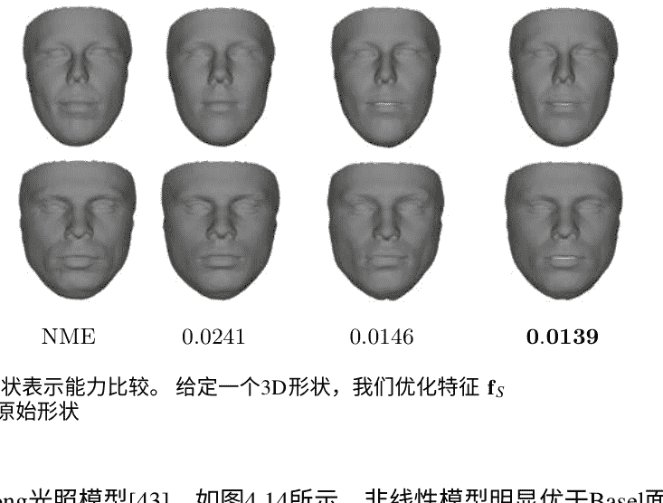

图4.15 形状表示能力比较。给定一个3D形状，我们优化特征 `f_S` 以逼近原始形状

使用Phong光照模型[43]。如图4.14所示，非线性模型明显优于Basel面部模型。尽管与原始图像接近，但基本非线性模型（没有代理学习和全局-局部架构）的重建结果仍然模糊。使用全局-局部网络架构（“+GL”）和相同的损失函数有助于使图像更接近输入。

然而，这些模型仍受到对反照率的正则化约束。通过使用代理技术进行学习，我们的完整模型可以学习到更真实的面部反照率，并具有更多的高频细节。这个结论在图4.14中的定量比较进一步支持。我们报告了每个图像面部部分的平均 `l_{2,1}` 重建误差。完整的非线性模型在四个模型中实现了最低的平均重建误差，为0.0363，相对于基本非线性3DMM减少了15%的误差。

形状同样，我们还比较了模型表示真实世界3D扫描的能力。使用由[42]提供的十个3D人脸网格，与我们共享相同的三角形拓扑结构，我们可以优化形状参数，通过解码器生成与地面真实扫描匹配的形状。优化目标基于顶点距离（欧氏距离）和表面法线方向（余弦距离）定义，经验性地提高了重建网格的保真度，相比仅优化前者。图4.15显示了线性3DMM、我们的基本非线性3DMM以及我们的带有代理和全局-局部架构的完全非线性3DMM之间的视觉比较。我们的重建与面部形状细节非常匹配。为了量化差异，我们使用NME，即恢复形状与地面真实形状之间的每个顶点平均误差，通过眼间距进行归一化。所提出的模型的重建误差明显小于线性模型，也小于基本非线性模型（0.0139与0.0146，以及0.0241 [42]）。

输入叠加反照率形状阴影

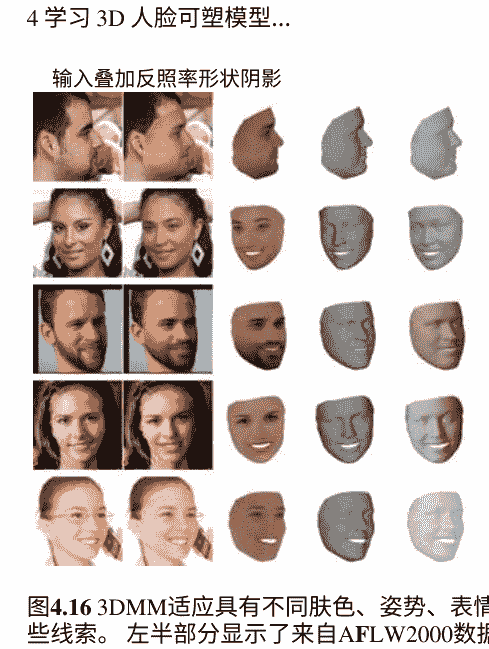

输入叠加反照率形状阴影

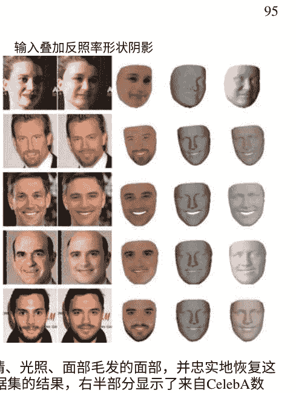

图4.16 3DMM适应具有不同肤色、姿势、表情、光照、面部毛发的面部，并忠实地恢复这些线索。左半部分显示了来自AFLW2000数据集的结果，右半部分显示了来自CelebA数据集的结果。

### 4.5.4 应用

在展示了我们非线性3DMM（即两个解码器）的能力之后，现在我们展示了我们整个网络的应用，该网络还具有额外的编码器。3DMM的许多应用都集中在其适应2D人脸图像的能力上。我们的非线性3DMM可以用于模型拟合，将2D人脸分解为其形状、反照率和光照。图4.16可视化了我们在AFLW2000和CelebA数据集上的3DMM拟合结果。我们的编码器估计形状 `S`、反照率 `A` 以及光照 `L` 和投影参数 `m`。我们可以在形状和反照率上恢复个人面部特征。我们的反照率可以呈现面部毛发，这通常很难通过线性3DMM恢复。

#### 4.5.4.1 人脸对齐

人脸对齐是许多面部分析任务的关键步骤，例如人脸识别[63, 64]。通过改进建模，我们希望改善这个任务（图4.17）。我们在AFLW2000数据集上将人脸对齐性能与最先进的方法3DDFA [74]、DeFA [33]、3D-FAN [10]和PRN [16]进行比较，包括2D和3D设置。

准确性使用归一化均方误差（NME）作为评估指标，以边界框大小作为归一化因子[10]。为了公平比较这些方法的计算复杂性，我们在这个比较中使用ResNet18 [20]作为我们的编码器。在这里，3DDFA和DeFA使用线性3DMM模型

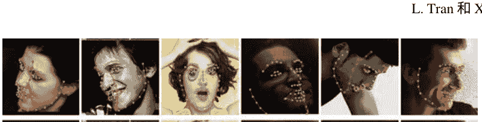

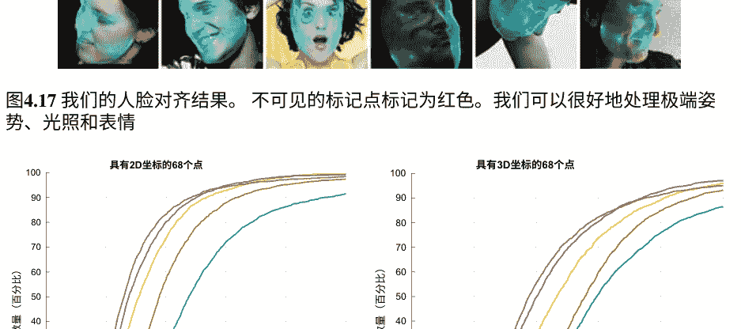

（BFM）。尽管使用更大的训练语料库（DeFA）进行训练或通过级联CNN迭代地改进估计（3DDFA），这些方法仍然被我们的非线性模型（图4.18）显著超越。同时，3D-FAN和PRN通过绕过线性3DMM模型实现了竞争性能。

3D-FAN使用热图表示。PRN使用位置图表示，与我们的UV表示有相似的精神。我们的模型不仅在回归地标位置方面表现出色（图4.18），还直接提供头部姿势信息以及面部反射率和环境光照条件。

#### 4.5.4.2 3D人脸重建

使用我们的模型`D_S`，以及模型拟合CNN`E`，我们可以将`2D`照片分解为不同的组成部分：`3D`形状、反射率和光照（图4.16）。在这里，我们将我们的`3D`重建结果与不同的工作线进行比较：线性`3DMM`拟合[56]，非线性`3DMM`拟合[55]和超越`3DMM`的方法[22， 50]。在Celeb$_A$数据集[34]上进行比较。

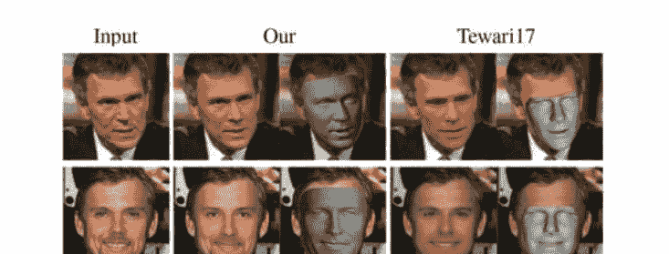

图4.19 与Tewari等人[56]的3D重建比较

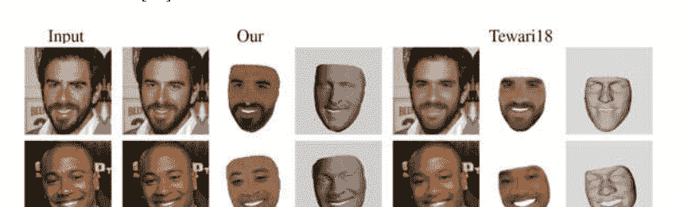

图4.20 与Tewari等人[55]的非线性3DMM方法进行3D重建比较。我们的模型可以以更高的细节重建人脸图像

对于线性3DMM模型，代表性的工作MoFA [56]以无监督的方式学习回归3DMM参数。即使在野外图像上进行训练，它仍然局限于线性子空间，在处理野外纹理时能力有限。这导致在处理具有挑战性的纹理时表面收缩，例如[55, 62]中讨论的面部毛发。此外，即使具有常规皮肤纹理，他们的重建仍然模糊且细节较少，与我们的重建结果（图4.19）相比。与我们提出的模型最相关的工作是Tewari等人[55]，其中将3DMM基础嵌入到神经网络中。具有更强的表示能力，这些模型可以恢复传统3DMM通常无法恢复的细节，例如化妆，面部毛发。然而，模型学习过程附带有强正则化，限制了它们恢复面部高频细节的能力。我们提出的模型通过学习目标和网络架构来增强学习过程，实现更高保真度的重建（图4.20）。

为了提高3D重建质量，许多方法还尝试超越3DMM，如Richardson等人[46]，Sela等人[50]或Tran等人[61]。目前最先进的3D单目人脸重建方法是由Sela等人[50]提出的，使用了精细的细节重建步骤来帮助重建高保真度的网格。然而，他们的第一个深度图回归步骤是在线性3DMM生成的合成数据上训练的。除了合成和真实之间的领域差异，它还面临着一个更严重的问题，即低维纹理中缺乏面部毛发。因此，这个网络的输出往往会忽略这些无法解释的区域，导致后续步骤失败。我们的网络在处理这些野外变异方面更加稳健。

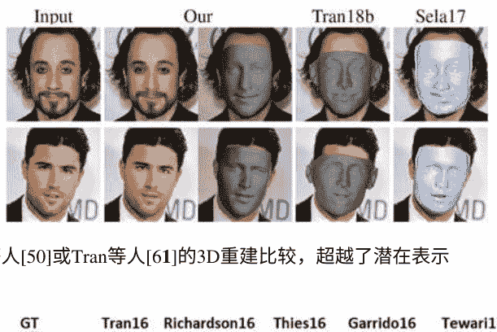

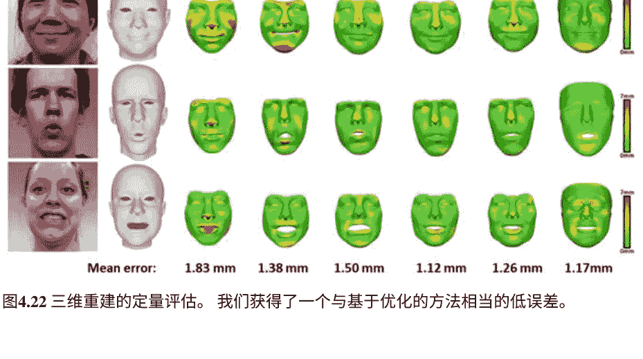

操作（图4.21）。Tran等人的方法[61]与我们有着相似的目标，即在三维重建中既具有鲁棒性又保持高水平的细节。然而，他们使用了一个过度约束的基础，失去了每个面网格的个人特征。因此，不同主体之间的三维形状看起来相似（图4.21）。

在FaceWarehouse数据库[11]的9个主体上，我们按照[56]中的相同设置，对我们的方法与之前的工作进行了定量比较。图4.22显示了视觉和定量比较。我们的结果与Garrido等人的离线优化方法[17]相当，并超过了所有其他回归方法[46, 56, 60]。

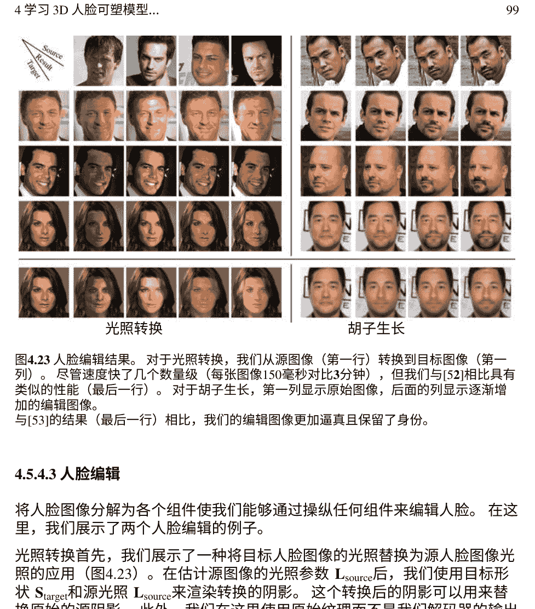

图4.23 人脸编辑结果。对于光照转换，我们从源图像（第一行）转换到目标图像（第一列）。尽管速度快了几个数量级（每张图像150毫秒对比3分钟），但我们与[52]相比具有类似的性能（最后一行）。对于胡子生长，第一列显示原始图像，后面的列显示逐渐增加的编辑图像。与[53]的结果（最后一行）相比，我们的编辑图像更加逼真且保留了身份。

### 4.5.4.3 人脸编辑

将人脸图像分解为各个组件使我们能够通过操纵任何组件来编辑人脸。在这里，我们展示了两个人脸编辑的例子。

光照转换首先，我们展示了一种将目标人脸图像的光照替换为源人脸图像光照的应用（图4.23）。在估计源图像的光照参数`Lsource`后，我们使用目标形状`Starget`和源光照`Lsource`来渲染转换的阴影。这个转换后的阴影可以用来替换原始的源阴影。此外，我们在这里使用原始纹理而不是我们解码器的输出来保持图像细节。

属性操作给定由3DMM模型拟合的人脸，我们可以通过简单修改颜色或形状表示中的一个或多个元素来编辑图像。更有趣的是，我们甚至可以操纵语义属性，比如留胡子、微笑等。这种方法类似于第4.5.2节中学习属性嵌入的方法。假设我们只想编辑外观。对于给定的属性，比如胡子，我们将带有该属性和不带该属性的两组图像`{I_i^p}_{i=1}^n`和`{I_i^n}_{i=1}^n`输入到我们的编码器中，以获得两个平均参数`f_A^p`和`f_A^n`。它们的差异`Δf_A = f_A^p - f_A^n`是从负图像分布到正图像的移动方向。

通过添加不同幅度的`Δf_A`，我们可以生成具有不同程度变化的修改后的图像。为了实现高质量的编辑并保持身份不变，

最终的编辑结果是通过将修正图像与我们的重建图像之间的残差添加到原始输入图像中获得的。 这是与Shu等人[53]改善结果质量的关键区别（图4.23）。

## 4.6 结论

自1999年首次亮相以来，3DMM已成为面部分析研究的基石，应用于许多问题。 尽管其影响力很大，但它在需要3D扫描的训练数据、从受控2D图像中学习以及由于形状和纹理的线性基础而受到的表示能力有限方面存在缺点。当将3DMM拟合到无约束的面部或学习3DMM用于通用对象（如鞋子）时，这些缺点可能是难以克服的。 本文证明了存在一种替代的3DMM学习方法，可以从大量野外人脸图像中学习非线性3DMM，而无需收集3D人脸扫描。此外，模型拟合算法可以与3DMM一起以端到端的方式进行学习。

我们的实验涵盖了我们学习模型的多个方面，其中一些可能需要读者的主观判断。 我们希望读者能够在这样的背景下看待判断和定量结果，与线性3DMM不同的是，我们的学习过程中没有使用真实的3D扫描。 最后，我们相信从大规模的野外2D图像中无监督或弱监督地学习3D模型是一个有前景的研究方向。 这项工作是朝着这个方向迈出的一步。

## 参考文献

1. Aldrian O, Smith WA (2013) 基于3D可塑模型的人脸逆渲染. In: TPAMI
2. Amberg B, Knothe R, Vetter T (2008) 基于可塑模型的表情不变的3D人脸识别. In: FG
3. Amberg B, Romdhani S, Vetter T (2007) 用于表面配准的最优非刚性ICP算法. In: CVPR
4. Blanz V, Vetter T (1999) 用于合成3D人脸的可塑模型。 在：计算机图形学与交互技术年会26th年会论文集
5. Blanz V, Vetter T (2003) 基于拟合3D可塑模型的人脸识别。 在：TPAMI
6. Bolkart T, Wuhrer S (2015) 用于3D人脸的群体多线性对应优化。 在：ICCV
7. Bookstein FL (1989) 主要弯曲：薄板样条和变形的分解。 在：TPAMI
8. Booth J, Antonakos E, Ploumpis S, Trigeorgis G, Panagakis Y, Zafeiriou S (2017) “野外”3D人脸可塑模型。 在：CVPR
9. Booth J, Roussos A, Zafeiriou S, Ponniah A, Dunaway D (2016) 从10,000张人脸学习的3D可塑模型。 在：CVPR
10. Bulat A, Tzimiropoulos G (2017) 我们离解决2D和3D人脸对齐问题有多远？（以及一个包含230,000个3D面部标记的数据集）。 在：ICCV
11. Cao C, Weng Y, Zhou S, Tong Y, Zhou K (2014) Facewarehouse：用于视觉计算的3D面部表情数据库。 在：TVCG

## 第5章 使用深度网络去模糊面部图像

Rajeev Yasarla, Federico Peracci 和 Vishal M. Patel

图像去模糊是从模糊图像中恢复未知真实图像的过程。图像去模糊是一个不适定问题，因此，利用数据的附加属性成功恢复去模糊图像中丢失的面部细节至关重要。在文献中提出了一些先验，如稀疏性[2, 1, 3, 16]、低秩[14]、流形[10]和补丁相似性[22]，以获得规则化的解决方案。近年来，基于深度学习的方法也获得了一些关注[9, 11, 26, 30]。

面部固有的语义结构是一种重要的信息，可以利用它来改善去模糊的结果。在本章中，我们概述了利用面部语义信息去模糊面部图像的深度卷积神经网络（CNN）方法。

### 5.1 深度语义面部去模糊

第一种利用深度学习通过面部语义线索进行面部去模糊的方法是在[18]中提出的。他们的方法基于面部图像具有高度结构化的事实，并且它们共享几个关键的语义组成部分，如嘴巴和眼睛。因此，面部的语义信息可以为恢复提供强大的先验知识。在他们的方法中，作者使用全局语义先验作为输入，并通过多尺度深度卷积神经网络（CNN）对输出进行局部结构损失的正则化。此外，提出的该网络使用感知和对抗损失进行训练，生成逼真的去模糊图像。此外，还引入了增量训练策略来处理实践中遇到的随机模糊核。

图5.1 概述了[18] 中提出的语义人脸去模糊网络。整体方法包括两个子网络：语义人脸解析网络和多尺度去模糊网络。人脸解析网络生成输入模糊图像的语义标签。另一方面，多尺度去模糊网络利用提取的面部语义标签对人脸图像进行去模糊处理。

特别是，模糊图像和语义标签被连接起来作为多尺度去模糊网络的输入。来自第一个尺度的上采样去模糊图像，模糊图像和相应的语义标签被馈送到网络的第二个尺度。去模糊网络的每个尺度都接收来自像素级内容损失和局部结构损失的监督。此外，感知损失和对抗损失也被施加在第二个尺度的输出上。

下面的像素级L1损失被用作人脸去模糊网络的内容损失。

$$ L_c = \|G(B, P(B)) - I\|_1, \quad (5.1) $$

其中 $P$ 和 $G$ 分别是人脸解析和去模糊网络。在这里，$B$ 和 $I$ 分别是模糊和清晰的真实图像。为了更好地融入局部面部结构，如眼睛、嘴唇和嘴巴，施加了以下局部结构损失。

$$ L_s = \sum_{i=1}^K \|M_k(P(B)) \odot (G(B, P(B)) - I)\|_1, \quad (5.2) $$

其中 $M_k$ 表示第 $k$ 个组件的结构掩码，$\odot$ 表示逐元素乘法。此外，使用预训练的 VGG-Face 网络的 Pool2 和 Pool5 层的感知损失来获得高质量的图像。感知损失的定义如下：

$$ L_p = \sum_l \|\phi_l(G(B)) - \phi_l(I)\|_2^2, \quad (5.3) $$

其中 $\phi_l$ 表示网络 $\phi$ 的第 $l$ 层的激活。最后，将去模糊网络视为生成器网络，还构建了一个判别器网络来进行对抗训练。对抗训练被表述为解决以下极小极大问题

$$ \min_G \max_D E[\log D(I)] + E[\log(1 - D(G(B)))], \quad (5.4) $$

特别是在更新生成器时，使用以下对抗损失

$$ L_{\text{adv}} = -\log(D(G(B))). \quad (5.5) $$

语义面部部分割网络使用 Helen 数据集[6]进行训练。另一方面，使用 Helen 数据集[6]、CMU PIE 数据集[19]和 CelebA 数据集[8]收集了一组训练图像来训练去模糊网络。在[18]中进行了各种定量和定性评估，结果显示语义面部去模糊算法在恢复质量、人脸识别和执行速度方面表现优异，与最先进的去模糊方法相比。图5.2显示了该方法对应的样本结果。从该图中可以看出，使用面部语义信息明显提高了去模糊性能。

## 5.2 通过结构生成和细节增强进行去模糊

最近提出了另一种基于卷积神经网络的方法，该方法利用面部语义地图从模糊的低分辨率输入中恢复高分辨率图像[21]。在他们的方法中，恢复的图像使用基础层和细节层进行建模。基础层通过使用面部组件引导的卷积神经网络进行学习。另一方面，细节层通过基于示例的纹理合成模块生成。首先，他们的面部结构生成网络将上采样的面部图像和面部语义地图作为输入，并生成基础图像。然后，一个补丁-智能 K 最近邻（KNN）方法用于在中间人脸图像和示例图像之间进行搜索。因此，可以在 HR 训练图像上建立对应关系，从而有效提取高分辨率示例图像中的细粒度面部结构。最后，通过一种边缘感知的图像滤波过程，将这些结构的细节传递到基础图像中。图5.3概述了他们的方法。对该方法的各种属性进行了分析，并表明该新方法在公共基准测试中相对于最先进的人脸幻觉和去模糊方法表现良好。

### 5.3 不确定性引导的多流语义网络

上述图像恢复方法[18, 21]利用语义标签的先验信息。然而，这些方法没有考虑到与人脸相对应的语义地图的类别不平衡。与人脸皮肤、头发和背景标签相比，人脸的内部部分如眼睛、鼻子和嘴巴的表示较少。根据人脸的姿势，一些内部部分甚至可能消失。在不重新加权较少表示的语义区域的重要性的情况下，[18]中提出的方法无法重建眼睛和嘴巴区域，如图5.4所示。对于[21]中提出的方法也可以得出类似的观察结果（图5.4）。

为了解决不同语义类别之间的不平衡问题，最近提出了一种新的卷积神经网络架构，称为不确定性引导的多流语义网络（UMSN），它独立地学习类别特定的特征并将它们组合起来去模糊整个人脸图像。通过训练用于重构单个语义类别的子网络来学习类别特定的特征。采用嵌套残差学习路径来改善语义特征的传播。此外，提出了一种类别的置信度度量来训练网络。置信度度量描述了网络对每个语义类别的去模糊能力。这个度量被纳入损失函数中来训练网络。图5.4展示了 UMSN 网络的样本结果，可以清楚地看到 UMSN 相比于现有技术[18, 21]能够提供更好的结果。

#### 5.3.1 图像去模糊网络

一个模糊的人脸图像 $y$ 可以被建模为干净图像 $x$ 与模糊核 $k$ 的卷积，如

$$ y = k * x + \eta, $$

其中 $*$ 表示卷积操作，$\eta$ 是噪声。给定 $y$，在盲目去模糊中，目标是估计潜在的干净人脸图像 $x$。11个语义人脸标签

12. Cole F, Belanger D, Krishnan D, Sarna A, Mosseri I, Freeman WT (2017) 从面部身份特征合成面部。 在： CVPR
13. Cootes TF, Edwards GJ, Taylor CJ (2001) 主动外观模型。 在： TPAMI
14. Dollár P, Welinder P, Perona P (2010) 级联姿态回归。 在： CVPR
15. Dou P, Shah SK, Kakadiaris IA (2017) 基于深度神经网络的端到端3D面部重建。 在： CVPR
16. Feng Y, Wu F, Shao X, Wang Y, Zhou X (2018) 使用位置映射回归网络进行联合3D人脸重建和密集对齐。 在： ECCV
17. Garrido P, Zollhöfer M, Casas D, Valgaerts L, Varanasi K, Pérez P, Theobalt C (2016) 从单目视频中重建个性化的3D人脸骨骼。 在： ACM TOG
18. Genova K, Cole F, Maschinot A, Sarna A, Vlasic D, Kyle W (2018) 无监督训练用于3D可变模型回归。 在： CVPR
19. Gu L, Kanade T (2008) 用于稳健人脸对齐的生成形状正则化模型。 在： ECCV
20. He K, Zhang X, Ren S, Sun J (2016) 深度残差学习用于图像识别。 在： CVPR
21. Huang R, Zhang S, Li T, He R, et al (2017) 超越面部旋转： 全局和局部感知生成对抗网络用于逼真和保持身份的正面视图合成。 在： ICCV
22. Jackson AS, Bulat A, Argyriou V, Tzimiropoulos G (2017) 通过直接体积CNN回归从单个图像中进行大姿态3D面部重建。 在： ICCV
23. Johnson J, Alahi A, Fei-Fei L (2016) 用于实时风格转换和超分辨率的感知损失。 在： ECCV。 姿态不变的3D面部对齐， ICCV
24. Jourabloo A, Liu X (2016) 基于CNN的稠密3D模型拟合的大姿态面部对齐。 在： CVPR
25. Jourabloo A, Liu X, Ye M, Ren L (2017) 用单个CNN进行姿态不变的面部对齐。 在： ICCV
26. Karras T, Aila T, Laine S, Lehtinen J (2018) 渐进式增长的GANs用于改善质量、稳定性和变化。 在： ICLR
27. Kim H, Zollhöfer M, Tewari A, Thies J, Richardt C, Theobalt C (2018) Inversefacenet： 从单张图像进行深度逆向人脸渲染。 在： CVPR
28. Koppen P, Feng Z-H, Kittler J, Awais M, Christmas W, Wu X-J, Yin H-F (2017) 高斯混合3D可塑人脸模型。 模式识别
29. Liu F, Zhu R, Zeng D, Zhao Q, Liu X (2018) 解开3D人脸形状中的特征，用于联合人脸重建和识别。 在： CVPR
30. Liu X (2009) 判别式人脸对齐。 在： TPAMI
31. Liu X (2010) 基于视频的自适应主动外观模型的人脸拟合。 图像视觉计算
32. Liu X, Tu P, Wheeler F (2006) 低分辨率图像上的人脸模型拟合。 在： BMVC
33. Liu Y, Jourabloo A, Ren W, Liu X (2017) 密集人脸对齐。 在： ICCVW
34. Liu Z, Luo P, Wang X, Tang X (2015) 野外深度学习人脸属性。 在： ICCV
35. Mathieu M, Couprie C, LeCun Y (2015) 超越均方误差的深度多尺度视频预测。 arXiv:1511.05440
36. Meka A, Zollhöfer M, Richardt C, Theobalt C (2016) 实时内在视频。 在： ACM TOG
37. Mohammed U, Prince SJ, Kautz J (2009) 视觉化： 生成新颖的面部图像。 TOG
38. Nhan Duong C, Luu K, Gia Quach K, Bui TD (2015) 超越主成分： 用于面部建模的深Boltzmann机。 在： CVPR
39. Nirkin Y, Masi I, Tran AT, Hassner T, Medioni GM (2018) 关于面部分割、面部交换和面部感知。 在： FG
40. Parkhi OM, Vedaldi A, Zisserman A (2015) 深度人脸识别。 在： BMVC

41. Patel A, Smith WA (2009) 重新审视3D可塑面部模型。 在： CVPR

42. Paysan P, Knothe R, Amberg B, Romdhani S, Vetter T (2009) 用于姿态和光照不变的面部识别的3D面部模型。 在： AVSS

43. Phong BT (1975) 计算机生成图片的照明。 Commun ACM

44. Ramamoorthi R, Hanrahan P (2001) 一种高效的辐照环境表示方法图。 在： 第28届计算机图形学和交互技术年会论文集

45. Richardson E, Sela M, Kimmel R (2016) 通过学习合成数据进行3D人脸重建。 在： 3DV

46. Richardson E, Sela M, Or-El R, Kimmel R (2017) 从单张图像学习详细的人脸重建。 在： CVPR

47. Roth J, Tong Y, Liu X (2015) 无约束的3D人脸重建。 在： CVPR

48. Roth J, Tong Y, Liu X (2017) 从无约束的照片集中自适应3D人脸重建。 在： TPAMI

49. Sagonas C, Antonakos E, Tzimiropoulos G, Zafeiriou S, Pantic M (2016) 300个野外人脸挑战：数据库和结果。 图像视觉计算

50. Sela M, Richardson E, Kimmel R (2017) 使用图像到图像转换进行无限制的面部几何重建。 在： ICCV

51. Shi F, Wu H-T, Tong X, Chai J (2014) 使用单目视频自动获取高保真面部表演。 ACM TOG

52. Shu Z, Hadap S, Shechtman E, Sunkavalli K, Paris S, Samaras D (2018) 使用质量传输方法进行肖像照明转换。 TOG

53. Shu Z, Yumer E, Hadap S, Sunkavalli K, Shechtman E, Samaras D (2017) 神经面部编辑与内在图像解缠。 在： CVPR

54. Staal FC, Ponniah AJ, Angullia F, Ruff C, Koudstaal MJ, Dunaway D (2015) 基于主成分分析描述Crouzon和Pfeiffer综合征。 J Cranio-Maxillof Surg

55. Tewari A, Zollhöfer M, Garrido P, Bernard F, Kim H, Pérez P, Theobalt C (2018) 自我监督的多级面部模型学习，以实现超过250 Hz的单目重建。 在： CVPR

56. Tewari A, Zollhöfer M, Kim H, Garrido P, Bernard F, Pérez P, Theobalt C (2017) MoFA：基于模型的深度卷积面部自动编码器，用于无监督的单目重建。 在： ICCV

57. Thies J, Zollhöfer M, Nießner M, Valgaerts L, Stamminger M, Theobalt C (2015) 实时表情转移用于面部再现。 ACM Trans Graph 34(6):183:1–183:14

58. Thies J, Zollhöfer M, Stamminger M, Theobalt C, Nießner M (2016a) Face2face: 实时捕捉和再现RGB视频中的面部。 在： CVPR

59. Thies J, Zollhöfer M, Stamminger M, Theobalt C, Nießner M (2016b) FaceVR: 实时面部再现和虚拟现实中的眼球注视控制。 arXiv:1610.03151

60. Tran AT, Hassner T, Masi I, Medioni G (2017) 用非常深的神经网络回归稳健和判别性的3D形态模型。 在： CVPR

61. Tran AT, Hassner T, Masi I, Paz E, Nirkin Y, Medioni G (2018) 极端的3D人脸重建：超越遮挡。 在： CVPR

62. Tran L, Liu X (2018) 非线性3D可塑模型。 在： CVPR

63. Tran L, Yin X, Liu X (2017) 用于姿态不变人脸识别的解缠表示学习GAN。 在： CVPR

64. Tran L, Yin X, Liu X (2018) 通过旋转你的脸进行表示学习。 TPAMI

65. Tulyakov S, Sebe N (2015) 从单张图像回归3D人脸形状。 在： ICCV

66. Vlasic D, Brand M, Pfister H, Popović J (2005) 多线性模型的人脸转移。 在： TOG

67. Wang Y, Zhang L, Liu Z, Hua G, Wen Z, Zhang Z, Samaras D (2009) 在任意未知光照条件下从单张图像进行人脸重照。 TPAMI

68. Wu H, Liu X, Doretto G (2008) 通过提升排序模型进行人脸对齐。 在： CVPR

69. Wu Y, Ji Q (2015) 在显著头部姿势和遮挡下的鲁棒性面部标记检测。 在： ICCV

70. Yin L, Wei X, Sun Y, Wang J, Rosato MJ (2006) 用于面部行为研究的3D面部表情数据库。 在： FGR

71. Yin X, Yu X, Sohn K, Liu X, Chandraker M (2017) 在野外进行大姿态面部正面化。 在： ICCV

72. Yu R, Saito S, Li H, Ceylan D, Li H (2017) 在无约束图像中学习密集面部对应关系。 在： ICCV

73. Zhang L, Samaras D (2006) 使用球谐函数从单个训练图像中识别任意未知光照的人脸。 TPAMI

74. Zhu X, Lei Z, Liu X, Shi H, Li SZ (2016) 面部对齐跨大姿势：一个3D解决方案。 在： CVPR

75. Zollhöfer M, Thies J, Bradley D, Garrido P, Beeler T, Pérez P, Stamminger M, Nießner M, Theobalt C (2018) 单眼3D面部重建、跟踪和应用的最新技术。 Eurographics

（图5.1 [18] 中提出的语义人脸去模糊网络。 整体方法包括两个子网络：语义人脸解析网络和多尺度去模糊网络）

（图5.2 对应于语义面部去模糊网络[18]的样本结果。 a真实图像。 b模糊的面部图像。 c不使用面部语义地图的去模糊结果。 d使用语义地图的去模糊结果）

（图5.3 [21]中提出的联合面部幻觉和去模糊方法的概述。 输入模糊的低分辨率面部图像以及面部掩膜用于面部结构生成网络生成基础图像。 然后，开发了一种细节增强算法，利用高分辨率示例图像估计基础图像中缺失的细节。）

图5.4 去模糊结果示例：a模糊图像，b对应于[18]和[21]的结果（最后一行）；c对应于不确定性引导的多流语义网络（UMSN）的结果；d真实值。我们的方法恢复了更多细节，并更好地保留了眼睛和头发等细微结构。

图5.5 所提出的UMSN网络概述。第一阶段语义网络由`F-Net-i`组成。第二阶段使用基础网络（`BN`）构建，其中`F-Net-i`的输出与`BN`中第一个`ResBlock`层的输出连接在一起。

按照以下方式分为4个类别： `$m_1 = \{背景\}$`, `$m_2 = \{面部皮肤\}$`, `$m_3 = \{左眉毛,右眉毛,左眼,右眼,鼻子,上嘴唇,下嘴唇,牙齿\}$`和`$m_4 = \{头发\}$`。 因此，一个清晰图像 `$x$` 的语义类别掩码是并集 `$m = m_1 \cup m_2 \cup m_3 \cup m_4$`。 类似地，可以定义模糊图像的语义类别掩码 `$\hat{m}$`。

模糊图像的语义类掩码是使用语义分割网络（`SN`）（图5.6）生成的，并与模糊图像一起作为输入提供给去模糊网络`UMSN`。这在人脸去模糊中非常重要，因为一些部分（如脸部、皮肤和头发）容易重建，而脸部的眼睛、鼻子和嘴巴等部分则难以重建，需要在去模糊时特别注意。这主要是因为眼睛、鼻子和嘴巴等部分的尺寸较小，包含的高频元素较多，与其他组成部分相比。与使用边缘信息的[12]和将语义映射输入单流去模糊网络的[18]不同，该方法通过提出多流语义网络来解决这个问题，其中各个分支`F-net-i`分别学习重建人脸图像的不同部分。图5.5概述了`UMSN`方法。

从图5.5可以看出，UMSN网络由两个阶段组成。使用SN网络生成模糊人脸图像的语义类别映射 $\hat{m}$。这些语义映射用作第一阶段网络中每个流的全局掩码的指导。这些语义类别映射 $\hat{m}$ 进一步用于学习具有嵌套残差学习路径（NRL）的类别特定残差特征映射。在网络的第一阶段中，学习权重以去模糊人脸图像的相应类别。在网络的第二阶段，将第一阶段的输出融合起来，学习添加到模糊图像中的残差映射，以获得最终去模糊图像。该网络使用基于类别的置信度引导的损失进行训练。

### 5.3.2 语义分割网络 (SN)

如图5.6所示，使用SN网络提取人脸的语义类别映射 $\hat{m}_i$。残差块（ResBlock）用作分割网络的构建模块。如图5.7所示，ResBlock由一个1 × 1卷积层、一个3 × 3卷积层和两个带有扩张因子2的3 × 3卷积层组成。

### 5.3.3 基础网络 (BN)

基础网络是使用UNet [15]和DenseNet [3]架构以ResBlock作为基本构建块构建的。为了增加感受野的大小，平滑扩张卷积在ResBlock中引入，如图5.7所示。BN是一个由八个类似于第一阶段语义的ResBlocks组成的序列。

图5.6 分割网络的概述。Conv l × l (p, q)包含实例归一化 [23]，修正线性单元 (ReLU)，Conv (l × l)——卷积层，内核大小为l × l，其中p和q分别是输入和输出通道的数量。

图5.7 ResBlock的概述。Conv l × l (p, q)包含实例归一化 [23]，ReLU——修正线性单元，Conv (l × l)——卷积层，内核大小为l × l，其中p和q分别是输入和输出通道的数量。在图的右侧，我们展示了引入到ResBlock中的平滑扩张卷积，类似于[25]。

网络如图5.8所示。请注意，所有卷积层都是密集连接的[3]。基于残差的学习用于估计去模糊图像基础网络如图5.8所示。

### 5.3.4 UMSN网络

UMSN网络是一个两阶段网络。第一阶段网络旨在从语义类别模糊输入中获得去模糊输出。这些输出由第二阶段网络进一步处理，以获得最终的去模糊图像。

第一阶段语义网络包含一系列五个具有残差连接的ResBlock，如图5.8所示。第一阶段网络的所有卷积层（不包括最后一个ResBlock和Conv3 × 3）被称为F-Net。模糊图像y和语义掩码 $\hat{m}_i$ 被输入到F-Net-$i$中，以获得相应的类别特定去模糊特征，这些特征与基础网络（BN）中第一层（ResBlock-Avgpool）的输出连接起来，用于构建UMSN网络。UMSN网络中还使用了嵌套残差学习（NRL），其中学习了类别特定的残差特征图，并进一步用于估计添加到模糊图像中的残差特征图，以获得最终输出。例如，可以观察到UMSN的最后一层与使用Conv 1×1从类特定特征图中获得的残差连接，使用y和$\hat{m}$。这个残差连接的输出进一步作为输入模糊图像的残差连接的输入，y。通过这种方式，可以定义NRL并获得最终的去模糊图像。提出了一种类别的损失函数来训练UMSN网络。

## UMSN的损失

网络参数 $\Theta$ 通过最小化损失 $\mathcal{L}$ 来学习，如下所示：

$$\hat{\Theta} = \text{argmin}_\Theta \mathcal{L}(f_\Theta(y, \hat{m}), x) = \text{argmin}_\Theta \mathcal{L}(\hat{x}, x), \qquad (5.6)$$

其中 $f_\Theta(.)$ 表示UMSN网络，$\hat{x}$ 是去模糊结果，$\hat{m}$ 是从SN获得的语义图。重建损失定义为 $\mathcal{L}= \|x−\hat{x}\|_1$。人脸图像可以用语义图作为掩码图像的总和来表示：

$$x = \sum_{i=1}^{M} m_i \odot x,$$

其中 $\odot$ 是逐元素乘法，M是语义图的总数。由于掩码是相互独立的，因此可以将公式(5.6)重新写成：

$$\hat{\Theta} = \text{argmin}_\Theta \sum_{i=1}^{M} \mathcal{L}(m_i \odot \hat{x}, m_i \odot x). \qquad (5.7)$$

换句话说，损失是针对每个类别独立计算的，并求和以得到总体损失，如下所示：

$$\mathcal{L}(\hat{x}, x) = \sum_{i=1}^{M} \mathcal{L}(m_i \odot \hat{x}, m_i \odot x). \qquad (5.8)$$

### 5.3.6 不确定性指导

为每个类别引入了一个置信度度量，并将其用于重新加权每个类别对总损失的贡献。通过引入置信度度量和重新加权损失，可以从两个方面获益。如果网络对某个特定类别给予较低的重要性，即没有学习到该类别的适当特征，则置信度网络（CN）通过估计低置信度值和对该类别的更高梯度，帮助UMSN学习该类别的特征。此外，通过重新加权每个类别对损失的贡献，可以解决不同类别之间误差估计的不平衡问题。损失函数可以表示为：

$$\mathcal{L}_c(\hat{x}, x) = \sum_{i=1}^{M} C_i \mathcal{L}(m_i \odot \hat{x}, m_i \odot x) - \lambda \log(C_i)$$

其中$\log(C_i)$作为一个正则化项，防止 $C_i$的值趋近于零，$\lambda$是一个常数。每个类别的置信度测量 $C_i$通过将输入$m_i\odot\hat{x}, m_i \odot x$传递给CN来估计，如图5.9所示。 $C_i$表示UMSN对人脸图像的第$i$个类别成分的置信度。请注意， $C_i(\in[0, 1])$仅在训练UMSN的权重时在损失函数中使用，而在推断过程中不使用（或估计）它。

受感知损失在风格转换[4, 29]和图像超分辨率[7]中的好处的启发，它也被用于训练这个网络。设 $\Phi(.)$表示使用VGG16模型[20]获得的特征，则感知损失定义如下：

$$\mathcal{L}_p = \|\Phi(\hat{x}) - \Phi(x)\|_2^2$$

使用预训练的VGG-16网络[20]中的relu1_2层特征来计算感知损失。用于训练UMSN的总损失如下：

图5.9 置信度网络（CN）的概述。x是真实图像。$\hat{x}$是从UMSN获得的去模糊图像。$m$是$x$的语义地图。

$$\mathcal{L}_{\mathrm{total}} = \mathcal{L}_{c} + \lambda_{1} \mathcal{L}_{p}, \qquad (5.11)$$

其中 $\lambda_{1}$ 是一个常数。

### 5.3.7 实验结果

使用[18]作者提供的图像进行评估，其中包括使用Helen数据集[6]生成的8000个模糊图像和使用CelebA数据集[8]生成的8000个模糊图像。此外，还使用[21]作者提供的名为PubFig的测试数据集对网络进行了测试，其中包含192个模糊图像。结果还使用峰值信噪比（PSNR）和结构相似性指数（SSIM）[24]进行定量评估。结果显示在表5.1中。从该表中可以看出，UMSN方法能够比包括[18, 21]在内的先前方法更好地去模糊人脸图像。

通过比较不同方法在真实世界模糊图像上的去模糊结果，可以清楚地看到这一点，如图5.10所示。

## 5.4 结论

在本章中，我们概述了最近利用语义面部信息恢复模糊图像的方法。回顾了各种基于深度卷积神经网络的方法。还对合成数据集和真实世界数据集上的不同方法进行了比较。

表5.1 UMSN与最先进方法的PSNR和SSIM比较

| 去模糊方法 | Helen | | CelebA | |
| :--- | :---: | :---: | :---: | :---: |
| | PSNR | SSIM | PSNR | SSIM |
| Krishnan等人[5] (CVPR'11) | 19.30 | 0.670 | 18.38 | 0.672 |
| Pan等人[12] (ECCV 2014) | 20.93 | 0.727 | 18.59 | 0.677 |
| Shan等人[17] (SIGGRAPH'08) | 19.57 | 0.670 | 18.43 | 0.644 |
| Xu等人[27] (CVPR'13) | 20.11 | 0.711 | 18.93 | 0.685 |
| Cho等人[1] (SIGGRAPH'09) | 16.82 | 0.574 | 13.03 | 0.445 |
| 钟等人[31] (CVPR'13) | 16.41 | 0.614 | 17.26 | 0.695 |
| Nah等人[9] (CVPR'17) | 24.12 | 0.823 | 22.43 | 0.832 |
| Ziyi等人[18] (CVPR'18) w/GAN | 25.58 | 0.861 | 24.34 | 0.860 |
| Ziyi等人[18] (CVPR'18) | 25.99 | 0.871 | 25.05 | 0.879 |

| UMSN (我们的`$w/\mathcal{L}_{total}$`) | 26.93 | 0.897 | 25.90 | 0.906 |

图5.10 真实模糊图像的样本结果。a模糊，bXu等人[27], c钟等人[31], d Shen等人[18], e UMSN [28]

## 参考文献

1.  Cho S, Lee S (2009) 快速运动去模糊。 ACM Trans Grap (TOG) 28(5):145

2.  Fergus R, Singh B, Hertzmann A, Roweis ST, Freeman WT (2006) 从单张照片中去除相机抖动。 ACM Trans Graph (TOG) 25(3):787–794

3.  Huang G, Liu Z, Van Der Maaten L, Weinberger KQ (2017) 密集连接的卷积神经网络。 在: 计算机视觉和模式识别的IEEE会议论文集, pp 4700-4708

4.  Johnson J, Alahi A, Fei-Fei L (2016) 用于实时风格转换和超分辨率的感知损失。 ECCV

5.  Krishnan D, Tay T, Fergus R (2011) 使用归一化稀疏度量的盲反卷积。 CVPR 2011:233-240

6.  Le V, Brandt J, Lin Z, Bourdev L, Huang TS (2012) 交互式面部特征定位。 在: 欧洲计算机视觉会议。 Springer, pp 679-692

7.  Ledig C, Theis L, Huszár F, Caballero J, Cunningham A, Acosta A, Aitken A, Tejani A, Totz J, Wang Z, et al (2017) 使用生成对抗网络的照片逼真的单图像超分辨率, pp 4681-4690

8.  刘Z, 罗P, 王X, 唐X (2015) 野外深度学习人脸属性。 在: IEEE国际计算机视觉会议论文集, pp 3730–3738

9.  Nah S, Hyun Kim T, Mu Lee K (2017) 用于动态场景去模糊的深度多尺度卷积神经网络。 在: IEEE计算机视觉和模式识别会议论文集, pp 3883–3891

10. Ni J, Turaga P, Patel VM, Chellappa R (2011) 图像去卷积的示例驱动流形先验。 IEEE图像处理期刊20 (11) : 3086–3096

11. Nimisha TM, Kumar Singh A, Rajagopalan AN (2017) 用于盲去模糊的模糊不变深度学习。 在: IEEE国际计算机视觉会议论文集, pp 4752–4760

12. Pan J, Hu Z, Su Z, Yang M-H (2014) 用示例去模糊人脸图像, pp 47–62

13. Patel VM, Easley GR, Healy DM (2009) 基于Shearlet的去卷积。 IEEE Trans Image Process 18(12):2673–2685

14. Ren W, Cao X, Pan J, Guo X, Zuo W, Yang M-H (2016) 通过增强的低秩先验进行图像去模糊。 IEEE Trans Image Process 25 (7) : 3426–3437

15. Ronneberger O, Fischer P, Brox T (2015) U-net: 用于生物医学图像分割的卷积网络。 在: 医学图像计算与计算辅助干预 (MICCAI) , vol 9351. LNCS, pp 234–241

16. Schuler CJ, Christopher Burger H, Harmeling S, Scholkopf B (2013) 非盲图像去卷积的机器学习方法。 在: IEEE计算机视觉和模式识别会议论文集, pp 1067–1074

17. Shan Q, Jia J, Agarwala A (2008) 从单张图像中实现高质量的运动去模糊. ACM Trans Graph (TOG) 27(3):73

18. Shen Z, Lai W-S, Xu T, Kautz J, Yang M-H (2018) 深度语义人脸去模糊. 在: 计算机视觉和模式识别IEEE会议论文集, pp 8260–8269

19. Sim T, Baker S, Bsat M (2002) CMU姿势、光照和表情数据库. 在: 第五届IEEE国际自动人脸手势识别会议论文集, pp 53–58

20. Simonyan K, Zisserman A (2014) 用于大规模图像识别的非常深的卷积网络. arXiv:1409.1556

21. Song Y, Zhang J, Gong L, He S, Bao L, Pan J, Yang Q, Yang M-H (2019) 通过结构生成和细节增强进行联合人脸超分辨率和去模糊. Int J Comput Vis 127(6–7):785–800

22. Sun L, Cho S, Wang J, Hays J (2013) 使用补丁先验的基于边缘的模糊核估计。 在: IEEE计算摄影国际会议 (ICCP)。 IEEE, 第1-8页

23. Ulyanov D, Vedaldi A, Lempitsky V (2016) 实例归一化：快速风格化的缺失成分。 arXiv: 1607.08022

24. Wang Z, Bovik AC, Sheikh HR, Simoncelli EP (2004) 图像质量评估: 从误差可见性到结构相似性。IEEE Trans Image Process 13 (4) : 600-612

25. Wang Z, Ji S (2018) 平滑膨胀卷积以改善密集预测。在: 第24届ACM SIGKDD国际会议上的知识发现与数据挖掘。ACM, 第2486-2495页

26. Xu L, Ren JS, Liu C, Jia J (2014) 用于图像反卷积的深度卷积神经网络。在: 神经信息处理系统的进展, 第1790-1798页

27. Xu L, Zheng S, Jia J (2013) 用于自然图像去模糊的非自然IO稀疏表示。在: 计算机视觉和模式识别的IEEE会议论文集, 第1107-1114页

28. Yasarla R, Perazzi F, Patel VM (2019) 使用不确定性引导的多流语义网络去模糊人脸图像。arXiv:1907.13106

29. Zhang H, Dana K (2017) 用于实时转换的多风格生成网络。arXiv:1703.06953

30. Zhang S, Shen X, Lin Z, M`ech R, Costeira JP, Moura JM (2018) 学习理解图像模糊。在: 计算机视觉和模式识别的IEEE会议论文集。第6586-6595页

31. Zhong L, Cho S, Metaxas D, Paris S, Wang J (2013) 使用方向滤波器处理单幅图像去噪的模糊。在: 计算机视觉和模式识别的IEEE会议论文集, 第612-619页

# 第6章 用于监控的盲超分辨率人脸

T. M. Nimisha和A. N. Rajagopalan

## 6.1 引言

超分辨率（SR）是指从低分辨率（LR）图像中得到高分辨率图像的一类技术。关于SR的大量文献涵盖了多帧和单帧方法。SR中的经典方法使用多个低分辨率（LR）帧之间的亚像素运动。这些作品[3, 11]通常假设LR图像中的模糊只是由于降采样，并且相机在捕捉LR帧时是静态的。这些框架只处理帧间运动，用于推断潜在的高分辨率（HR）图像。

虽然多帧方法可以从另一帧中补充缺失的信息，但并不总是能够获得多个帧。单帧SR[12, 17]更加不适定，它通过虚构缺失数据或利用图像在不同尺度上的补丁重复出现来工作。最近，提出了许多深度学习方法[9, 22, 24]来解决单帧SR问题。然而，所有这些方法都假设LR帧中的模糊只是由于降采样引起的。

直接从单个运动模糊的低分辨率帧估计高分辨率帧是高度不适定的，在监控场景中具有重要意义。运动模糊是长时间曝光摄影中不可避免的现象。模糊在许多图像处理算法中被视为干扰，逆转它是一个困难的问题。存在许多研究[6, 23, 40, 49]专注于消除图像中由相机抖动引起的运动模糊问题。所有这些研究都旨在去模糊作为主要目标，不真正考虑分辨率增强。SR和去模糊是研究得很好的问题，但被视为独立的主题。只有少数几篇文献[33, 41, 47, 49]同时涉及SR和运动去模糊。

当底层的LR帧存在运动模糊伪影时，获得SR图像的挑战加剧。当感兴趣的对象远离相机并且对象/相机在移动时，就会出现这种情况。在这些情况下，观察到的图像将同时受到运动模糊和降采样的影响。

由于人脸识别（FR）系统现在被广泛使用，并且在许多领域被用作生物特征，一个明显偏离库图像的运动失真的LR探针图像会降低识别准确性。这就需要单幅图像的盲目SR。那些从LR估计HR图像而不考虑由于运动模糊引起的伪影的算法被称为盲目SR算法。有趣的是，运动模糊是由于曝光期间多个清晰帧的平均而发生的。因此，默认情况下，单个模糊的LR帧聚合了多个清晰帧的信息。因此，可以利用这种聚合信息进行去模糊和超分辨率处理。

顺序执行盲目的SR可能导致结果不佳。第一阶段（SR或去模糊）的错误可能会传播到第二阶段，并恶化最终输出。我们在这里提出了一个盲目的SR框架，可以同时对探测图像进行去模糊和上采样，以帮助提高人脸识别系统的识别率。之前的研究已经解决了盲目的SR问题[26, 33, 41, 49]，例如，采用了多帧方法。相比之下，我们的方法是针对监控应用中人脸识别系统准确性的单图像盲目SR。

在这项工作中，我们探索了不变特征学习，以实现从运动模糊帧中的单图像SR。我们采用深度学习框架来完成这个任务。基于自然图像遵循稀疏分布的基本思想，以及浅层字典可以在稀疏域中捕捉不变性，我们尝试将这种不变性推广到深度非线性网络。我们的网络由一个编码器-解码器对组成，学习清晰的高分辨率数据域。接下来是一个生成对抗网络（GAN），它被训练用于从LR模糊帧中生成模糊和分辨率不变的特征。学习到的表示经过解码器处理，得到最终结果。我们将这个框架应用于人脸监控应用中，其中收集的探测图像非常扭曲。

## 6.2 相关工作

去模糊和超分辨率，虽然是两个广泛研究的主题，但大多数情况下是独立处理的。超分辨率框架假设静态摄像机，导致仅受到降采样影响的LR图像。这些方法忽视了运动伪影的影响。类似地，去模糊方法假设高分辨率帧可用，并且在较低分辨率下效果不好。因此，这些方法的性能当模糊/分辨率的假设不成立时，性能显著下降。我们在这里简要讨论了关于去模糊和超分辨率的传统和深度学习方法。这些方法主要可以分为单图像和多图像方法。

超分辨率：现有的超分辨率工作可以广泛分为两类（1）多图像方法：利用LR帧中的帧间亚像素运动来恢复HR图像的方法[3, 11]和（2）基于单图像的方法：这些技术要么利用样本或补丁重复（也称为“图像幻觉”）[12, 17]，要么利用基于补丁的学习[48, 50]来创建HR图像。单图像超分辨率技术（我们工作的重点）利用LR和HR图像对的数据库来学习LR和HR图像补丁之间的对应关系[48, 50]。因此，在测试过程中使用所学习的补丁对应关系将LR图像映射到其最可能的HR版本。然而，这些技术被称为产生了HR图像中可能不存在的细节。基于自然图像中的补丁往往在同一图像中以及不同尺度上重复出现的观察，[12, 17]的工作试图结合传统的多图像超分辨率和基于示例的超分辨率的优势。最近，深度学习和生成网络也开始涉足计算机视觉和图像处理领域，并且它们的影响和影响力正在迅速增长。基于深度网络的单图像超分辨率[9, 22, 24]展现了优秀的结果，超过了传统方法。Dong等人[9]引入了基于跳跃连接的网络，学习超分辨率的残差特征。[22]的工作使用了GAN架构，从单个LR帧生成逼真的超分辨率输出。值得注意的是，只有在LR输入中没有运动模糊时，最先进的超分辨率技术才能实现显著的分辨率增强。

去模糊：存在许多方法[7, 19, 49]，这些方法依赖于使用视频或连拍模式捕获的多个帧的信息，并通过利用这些帧的信息来解决底层原始（潜在）图像。单幅图像盲去模糊要更具挑战性，因为模糊核和潜在图像必须仅通过一次观察来估计。在[6, 23, 40]中，通过迭代方法来解决潜在图像和模糊核。这些方法中的大多数采用对底层清晰图像和运动的先验知识来稳定优化过程。最常用的先验知识是总变差正则化器[5, 35]，图像梯度的稀疏性先验，l₁ / l₂图像正则化[21]，不自然的l₀先验[46]以及最近的暗通道先验[32]用于图像。

尽管这些基于先验的优化方案显示出了希望，但先验在一般条件下的表现程度是值得怀疑的[21]。一些先验知识（例如图像梯度的稀疏性先验）甚至倾向于模糊的结果[23]。在大多数情况下，最终结果需要谨慎选择先验知识、权重以及其他参数的调整。随着计算能力的提升和大型数据集的可用性，基于深度学习的去模糊技术也已经成熟。Xu等人[45]提出了一种用于非盲目单幅图像去模糊的深度卷积网络（即核心是固定且已知的）。Schuler等人[39]提出了一种模仿传统迭代去模糊方法的神经网络架构。Chakrabarti[44]训练了一个基于补丁的神经网络来估计在每个补丁上使用了一个传统的非盲目去模糊方法来得到去模糊的结果。上述方法尝试使用深度网络来估计模糊核，但最终在网络外部进行非盲目去模糊以获得去模糊的结果。模糊核估计中的任何错误（由于图像中的边缘内容不足、饱和或噪声）都会影响去模糊的质量。此外，最终的非盲目去模糊步骤通常假设存在先验知识（例如潜在图像的梯度稀疏性），这再次需要仔细选择先验权重；否则去模糊的结果将不完美。因此，无模糊核方法非常可取。最近的研究[30, 31]跳过了对模糊核的估计，直接求解去模糊帧。但这些方法仅限于去模糊，无法进行分辨率提高。

从运动模糊的低分辨率图像中进行盲超分辨率：在低分辨率帧受到运动模糊影响的情况下，如果不对未知运动模糊的影响进行补偿，超分辨率就没有多大意义。Sroubek等人[41]通过构建一个正则化的能量函数，并交替地最小化原始高分辨率图像和相机运动来解决盲超分辨率问题。Ma等人[26]的方法基于同一区域在帧间的模糊程度不相等的前提。他们提出了一种时间区域选择方案，从每个帧中选择最不模糊的像素。[33, 49]中的作品执行对齐、去模糊和分辨率增强的联合任务。值得注意的是，上述盲超分辨率技术都是多帧方法。单图像盲超分辨率是一个更加复杂的问题，目前还没有传统的方法来解决它。最近，徐等人[47]提出了一种深度学习算法来解决盲超分辨率问题。他们使用了基于GAN的辨别性图像先验，这种先验在语义上偏好清晰的高分辨率图像而不是模糊的低分辨率图像，并直接回归到高分辨率图像。相比之下，我们的方法是基于稀疏编码的方法，通过使用不变特征表示来求解高分辨率图像。

## 6.3 学习人脸的不变特征

感官数据，包括自然图像，本质上是稀疏的，可以描述为少量原子（如边缘和表面）的叠加[27]。字典学习方法就是建立在这个基础上的。已经尝试使用字典进行各种图像恢复任务（包括去模糊和超分辨率）。在图像中添加一个对模糊或分辨率不变的条件后，字典方法通过学习耦合字典来单独执行这些任务[43, 48]。然而，字典只能捕捉到数据中的线性关系。模糊过程涉及非线性（高频被抑制得更多），因此字典方法不能在不同的模糊中推广。

在本章中，我们将不变表示的概念扩展到可以捕捉数据中的非线性的深度网络。使用深度网络来捕捉非线性的字典方法的泛化并不是新的。[44]中的工作将稀疏编码和去噪编码器结合起来进行去噪和修复任务。总的来说，深度神经网络在各种低级图像恢复问题上相对于传统方法取得了很好的改进，包括SR [10]、修复和去噪[34, 44]。这些网络通过训练大量的示例数据来端到端地学习映射以消除失真。我们研究了这样一个深度网络在单幅图像盲目SR任务中的可能性。学习不变表示的思想借鉴了我们之前的工作[31]，主要区别在于我们解决的问题是单幅盲目SR而不仅仅是去模糊[31]。

与[31]类似，我们首先需要一个能够捕捉HR图像域信息的良好特征表示。自编码器（AE）非常适合这个任务，并且在无监督学习中通过将数据编码为紧凑形式取得了巨大成功[15]。一旦为清晰的HR补丁学习到了良好的表示，下一步就是从模糊的LR数据中产生一个不变的表示（如[43, 48]中所示）。我们建议使用GAN来实现这个目的，其中包括训练一个生成器和一个鉴别器相互竞争。生成器的目的是通过从模糊的LR数据中产生与自编码器产生的类似的清晰特征来迷惑鉴别器，以实现不变性。另一方面，鉴别器试图通过识别清晰和模糊特征来击败生成器。

我们提出的架构示意图如图6.1所示。与[31]相比，我们的生成器现在需要执行联合SR和去模糊。由于输入的LR比HR图像的维度低，我们包含了生成器的初始阶段使用分数步幅卷积。这些层的数量取决于SR因子。

类似于字典方法，我们的编码器-解码器架构在非线性空间中学习表示。在字典方法中，输入的HR补丁 `I` 用字典原子 `$D_{HR}$` 稀疏表示为 `$I = D_{HR} \alpha$`。我们的编码器-解码器模块可以类比于这个，但在非线性空间中。编码器可以被看作是一个逆字典 `$D_{HR}^{-1}$`，它将输入的HR数据投影到稀疏表示中，解码器（`$D_{HR}$`）从稀疏表示中重构输入。生成器的训练可以被视为学习模糊LR字典，该字典可以将模糊的LR数据 `$B_l$` 投影到与 `$I$` 相同的稀疏表示中，即 `$\alpha = D_{HR}^{-1} I = D_{b_l}^{-1} B_l$`。一旦训练完成，输入的模糊图像（`$B_l$`）通过生成器传递，得到一个不变的特征，当投影到解码器时，产生去模糊的高分辨率结果，如 `$\hat{I} = D_{HR} \alpha = D_{HR} D_{b_l}^{-1} B_l$`。

因此，通过将自动编码器学习到的特征表示与GAN训练相关联，我们的模型能够以端到端的方式对人脸数据集进行单图像盲目超分辨率处理。我们的方法是一种无核方法，摒弃了建模和选择先验的繁琐任务。

我们提出了一种紧凑的端到端回归网络，直接从单个模糊的低分辨率帧估计出清晰的高分辨率图像，无需选择和加权最佳先验，以及模糊核估计。

所提出的架构由自动编码器和生成网络组成，用于生成模糊和分辨率不变的特征来指导该过程。

该网络在人脸监控系统中显示出性能提升，并能够从模糊的低分辨率图像中产生高质量的人脸重建。

## 6.4 网络架构

我们的网络由一个学习清晰高分辨率图像领域的自动编码器（AE）和一个生成不变特征的生成对抗网络（GAN）组成。我们将网络的训练分为两个阶段。首先，我们训练一个自动编码器（AE）来学习清晰图像的流形。然后，我们训练一个生成器，它可以从模糊的低分辨率图像中产生清晰的特征，当这些特征输入解码器时，可以得到去模糊的高分辨率输出。需要注意的是，我们将数据表示、超分辨率和去模糊的任务分为两个网络，将数据学习的任务交给自动编码器，并利用这些信息来指导盲目的超分辨率。接下来将详细解释网络架构和训练过程。

### 6.4.1 编码器-解码器

自编码器是为了无监督学习而提出的[15]，并且已经扩展到各种应用领域。AE将输入数据投影到低维空间，并从该表示中恢复输入。如果没有正确建模，很可能自编码器只学会压缩数据而没有学到任何有用的表示。使用去噪编码器的正则化[42]可以通过对数据添加噪声并让网络消除这种影响来解决这个问题，从而得到一个干净的输出。这确保了自编码器学会正确表示干净的数据。Deepak等人[34]将这个想法从仅仅数据表示扩展到了修复任务的上下文表示。实际上，它学习到了一个能够捕捉数据领域信息的有意义的表示。

我们研究了不同的自编码器架构，并观察到包含残差块（ResNet）[14]有助于实现更快的收敛和改善重构输出。残差块通过绕过高级特征将其传递到输出，同时避免了梯度消失问题的发生。训练数据被噪声污染（30%的时间），以确保编码器的可靠性并避免学习一个恒等映射。我们工作中使用的架构以及ResNet块如图6.2所示。下面给出了滤波器和特征图大小以及使用的步幅值的详细描述。

```
编码器： C_{3→8}^{5} ↓2 → R_{8}^{5(2)} → C_{8→16}^{5} ↓2 → R_{16}^{5(2)} → C_{16→32}^{3} ↓2 → R_{32}^{3}
解码器： R_{32}^{3} → C_{32→16}^{3} ↑2 → R_{16}^{5} → C_{16→8}^{5} ↑2 → R_{8}^{5} → C_{8→3}^{4} ↑2
其中 C_{a→b}^{c} ↓d表示从特征维度 a到b的卷积映射，步长为 d，滤波器大小为 c， ↓ 表示下采样卷积， ↑ 表示上采样卷积。
```

上卷积。`R_a^b (c)` 表示由卷积和ReLU块组成的残差块，输出特征大小为`a`，滤波器大小为`b`，而`c`表示残差块的重复次数。

图6.3显示了ResNet块的优势。图6.3a是目标图像，图6.3c、d是具有和不具有ResNet块的自编码器的输出，对于相同数量的迭代次数，输入噪声图像的图6.3b。请注意，具有ResNet的图像收敛更快，并且由于跳过连接将信息传递给更深层，保留了边缘。

### 6.4.2 特征映射的GAN

训练的第二阶段是学习一个可以将模糊的LR图像映射到清晰的HR特征的生成器。为此，我们使用了生成对抗网络（由Goodfellow [13]于2014年引入）。自那以后，GAN已被广泛用于各种与图像相关的任务。它由两个模型组成：一个生成器（`$\mathcal{G}$`）和一个判别器（`$\mathcal{D}$`），它们进行一个双人博弈。`$\mathcal{D}$`试图区分由`$\mathcal{G}$`生成的样本和训练数据样本，而`$\mathcal{G}$`试图通过生成接近实际数据分布的样本来欺骗判别器。训练GAN的最小最大代价函数[13]为

$$\min_{\mathcal{G}} \max_{\mathcal{D}} C(\mathcal{G}, \mathcal{D}) = E_{x \sim P_{\text{数据}}(x)}[\log \mathcal{D}(x)] + E_{z \sim P_{z}(z)}[\log(1 - \mathcal{D}(\mathcal{G}(z)))]$$

其中`$\mathcal{D}(x)$`是鉴别器对输入`$x$`判别为真实样本的概率。`$P_{\text{data}}$`和`$P_{z}$`分别是数据`$x$`和输入随机向量`$z$`的概率分布。[13]的主要目标是从`$z$`生成一类自然图像。

理论上，GANs是明确定义的，但很多时候训练它们是困难的。通常会出现不稳定性问题，导致生成的图像中出现伪影。存在一些作品专门解决这个问题[37, 38]，并尝试通过引入新的距离度量[2]来稳定训练。其中一项工作使用了条件GAN（Mirza et al. [29]) 使得GAN能够以条件输入的形式容纳额外的信息。训练条件GAN比无条件GAN更加稳定，因为有额外的引导输入。在损失函数中包含对抗性成本显示出了巨大的潜力[18, 34]。修改后的成本函数[18]如下所示

$$\min_{\mathcal{G}} \max_{\mathcal{D}} C_{cond}(\mathcal{G}, \mathcal{D}) = E_{x,y \sim P_{\text{data}}(x,y)}[\log \mathcal{D}(x, y)] + E_{x \sim P_{\text{data}}(x),z \sim P_z(z)}[\log(1 - \mathcal{D}(x, \mathcal{G}(x, z)))] \quad (6.1)$$

其中`$y$`是干净的目标特征，`$x$`是条件图像（模糊输入），`$z$`是输入的随机向量。在条件GAN中，生成器试图对`$x$`和`$z$`的联合概率分布建模，以模拟数据的分布。在我们的任务中，当没有`$z$`进行训练时，网络学习了一个将`$x$`映射到确定性输出`$y$`的映射。

在使用生成模型的端到端网络进行图像到图像转换的[18]的基础上，我们最初尝试使用现成的生成网络直接回归到清晰像素。然而，我们观察到这会导致错误的结果。其中一个原因可能是数据的高维度。因此，我们使用了自动编码器的先验学习特征（与图像空间相比维度较低）来训练GAN。训练一个完美的鉴别器需要同时更新其权重和生成器的权重，以便它能够区分生成的样本和数据样本。在特征空间中，鉴别器之所以能够轻松有效地完成这个任务，有两个原因：

+   (i) 在这个空间中，模糊的低分辨率特征与其等效的清晰高分辨率特征之间的距离比图像空间更大。这有助于在初始阶段更快地进行训练。

+   (ii) 特征空间的维度比图像空间低得多。众所周知，GAN在匹配低维空间的分布方面非常有效[8]。

我们使用正常的过程来训练GAN，但是我们不要求鉴别器区分生成的图像和清晰的图像，而是要求它区分它们对应的特征。生成器（`$4 \times$`）和鉴别器的架构如下所示。

```
生成器： $C_{3 \rightarrow 8}^5 \uparrow 2 \rightarrow C_{8 \rightarrow 8}^5 \rightarrow C_{8 \rightarrow 16}^5 \uparrow 2 \rightarrow C_{16 \rightarrow 16}^5 \downarrow 2 \rightarrow R_{16}^{5(2)} \rightarrow C_{16 \rightarrow 32}^5 \downarrow 2 \rightarrow R_{32}^{5(2)} \rightarrow C_{32 \rightarrow 32}^3 \downarrow 2 \rightarrow R_{32}^{5(2)} \rightarrow C_{32 \rightarrow 128}^3 \downarrow 2 \rightarrow R_{128}^{3(2)} \rightarrow C_{128 \rightarrow 32}^3 \uparrow 2$

鉴别器： $C_{32 \rightarrow 32}^5 \rightarrow C_{32 \rightarrow 32}^5 \downarrow 2 \rightarrow C_{32 \rightarrow 16}^5 \rightarrow C_{16 \rightarrow 16}^5 \downarrow 2 \rightarrow C_{16 \rightarrow 8}^5 \rightarrow C_{8 \rightarrow 8}^3 \downarrow 2 \rightarrow C_{8 \rightarrow 1}^3$
```

每个卷积后面都跟着一个Leaky ReLU和鉴别器中的批量归一化，生成器中则是ReLU。生成器的输入阶段是一个堆叠的可学习的上采样滤波器（反卷积层）的数量取决于上采样因子。上面，我们展示了一个用于4 × SR因子的生成器模块。$\hat{C}$ 表示从该卷积层到下一个 $\hat{C}$ 的跳跃连接。使用跳跃连接有助于保留来自较低层的有限特征，而深入进入有助于减少模糊。我们还尝试了其他模型，其中生成器架构类似于编码器。这样的架构有助于保留最终输出中的细节，但残余模糊仍然存在于输出中。我们观察到，深入进入有助于减少模糊，但会丢失有限细节。因此，我们使用了一个更深入的生成器，同时使用跳跃连接来保留特征。

一旦第二阶段训练完成，我们就有了一个生成器模块，在测试阶段将模糊的低分辨率输入传递给它。生成器产生与清晰图像特征相对应的特征，当通过解码器传递时，产生最终去模糊的高分辨率结果。

### 6.4.3 损失函数

我们的网络分为两个阶段进行训练。在初始阶段，编码器被训练用于学习高分辨率清晰特征表示。对于这个训练，我们使用了广泛认可的重构成本。重构（MSE损失）成本被定义为预期图像和观察图像之间的$L_2$距离，表示为

```
\[ L_{\text{mse}} = \| \mathcal{D}e(\mathcal{E}(I + N)) - I \|_2^2 \] (6.2)
```

其中 $\mathcal{D}e$ 是解码器，$\mathcal{E}$ 是编码器，$N$ 是噪声，$I$ 是目标（清晰）图像。MSE误差捕捉整体图像内容，但倾向于模糊解决方案。因此，仅使用MSE损失训练会导致边缘细节的丢失。为了克服这个问题，我们使用了梯度损失（$\mathcal{L}_{\text{grad}}$），因为它有利于边缘，如[28]中讨论的用于视频预测。

```
\[ L_{\text{grad}} = \| \nabla \mathcal{D}e(\mathcal{E}(I + N)) - \nabla I \|_2^2 \] (6.3)
```

其中 $\nabla$是梯度算子。添加梯度损失有助于保留边缘并恢复清晰的图像，与仅使用 $\mathcal{L}_{\text{mse}}$相比。训练的第二阶段使用GAN学习不变表示。对于GAN的训练，我们尝试了不同的成本函数组合，并发现在图像和特征空间中给出的组合成本函数 $\lambda_{\text{adv}} \mathcal{L}_{\text{adv}} + \lambda_1 \mathcal{L}_{\text{abs}} + \lambda_2 \mathcal{L}_{\text{mse}}$对我们有效。尽管$l_2$损失简单且易于反向传播，但在稀疏数据上表现不佳。因此，我们在特征反向传播中使用$l_1$损失，即

```
\[ L_{\text{abs}} = \| \mathcal{G}(B) - \mathcal{E}(I) \|_1 \] (6.4)
```

其中 $B$是模糊的低分辨率图像。对抗损失函数 $\mathcal{L}_{\text{adv}}$（见公式（6.1））要求生成器输出的样本应该是不可区分的与鉴别器相匹配。这是一个强条件，迫使生成器产生接近基础数据分布的样本。因此，生成器输出的特征接近于干净的高分辨率特征样本。这种损失的另一个优点是它有助于更快的训练（特别是在初始阶段），因为它提供了强梯度。除了在特征空间上的对抗性和 l_1 成本之外，我们还在通过解码器传递生成的特征后使用了恢复的干净图像的均方误差成本。这有助于微调生成器以与解码器匹配。

### 6.4.4 训练

我们使用CelebA数据集[25]中的图像对自动编码器进行训练，该数据集包含大约202,599张人脸图像，通过将它们调整为256 × 256的大小。我们随机选择了20万个数据作为训练集，其余的作为测试和验证集。输入数据在30%的时间内以高斯噪声（标准差=0.2）进行随机损坏，以确保学习到有用的数据表示。我们使用Adam [20]作为优化器，初始学习率为0.0002，动量为0.9，批量大小为16。训练大约需要3 × 10^5次迭代才能收敛。梯度成本通过 λ=0.1进行缩放，以确保最终结果不会过于锐化。

训练的第二阶段涉及从模糊的低分辨率数据中学习模糊和分辨率不变的表示。我们通过使用空间不变参数模糊核对CelebA数据集进行合成模糊人脸数据。我们使用 l 和 θ（l表示长度，θ表示角度）对模糊进行参数化，并在 l ∈ {0, 40}像素和 θ ∈ {0, 180}度的范围内生成模糊。输入的清晰图像通过参数化的核进行模糊处理，并按2、4和8的倍数进行下采样，以生成不同超分辨率因子的训练集。每个集合包含40万个模糊的低分辨率训练数据。生成器的第一阶段是一组可学习的上卷积滤波器，将输入数据缩放到256。为了提高GAN的稳定性，我们还使用了模糊和清晰特征的平滑标记，如[1]中所讨论的。在大约10^5次迭代中，训练仅使用特征成本，其中 λadv = 0.001和 λ1= 1。随后通过添加MSE成本对生成器进行微调（λ2= 1， λ1= 1和 λadv = 0.0001）。

## 6.5 实验

我们在合成图像和真实图像上展示了我们提出的盲SR网络的有效性。我们将实验分为两个部分。在第一部分中，我们通过分析基线FR系统在输入模糊的LR图像之前和之后经过我们的网络后的识别准确性来量化性能。我们观察到使用我们的网络后准确性有所提高。此实验的设置如下。我们从FERET数据集中选择了ba和bj文件夹，每个文件夹包含200个主题（256×256维度），每个主题有一张图像。我们将ba作为我们的图库，使用bj生成探针。从bj中的图像经过参数化模糊和下采样得到64×64的探针数据。图6.4显示了图库和探针的一些示例以及用于创建它们的核。随后，使用PCA作为基线的基本FR系统来计算识别率。

图6.5简单PCA FR系统的识别率。从图中可以清楚地观察到我们的盲SR网络相对于其他比较方法在准确性上的改进。我们的方法在所有匹配距离度量方面表现良好。

该系统首先从清晰的高分辨率图库图像中估计PCA基础。 然后使用估计的基础投影探针，并通过将特征与图库的特征进行匹配来识别主题。 我们使用了三种距离度量进行匹配：欧氏距离、曼哈顿距离和余弦距离。 最初，我们估计了对清晰的探针的识别率，发现平均识别率只有84.16%。

这是因为探针图像与图库之间有微小的表情变化而我们的人脸识别系统是一个简单的基于主成分分析的模型。 接下来，我们检查了模糊的低分辨率探针数据的准确性，并注意到在模糊和降采样后，准确性从84.16%下降到76.8%。 我们将这些低分辨率探针通过我们训练好的网络，得到一个4 ×超分辨率图像，并估计了输出上的人脸识别准确性，使用我们的盲超分辨率模型，准确性提高到82.5%。

由于在这种设置下没有关于单一盲超分辨率的研究，我们通过独立去模糊低分辨率帧，然后使用单一图像超分辨率框架进行比较。 我们使用传统方法和深度学习方法进行了这项工作。 对于传统方法，我们使用Pan等人的单一图像去模糊框架[32]对低分辨率帧进行去模糊。 然后，我们采用[17]中提出的基于样本的超分辨率方法。 在这种情况下获得的准确性较低（75.5%）。 准确性降低的主要原因可能是去模糊引起的伪影。 这可能是由于先验选择不当造成的。 第二个比较是使用深度学习网络进行的。为此，我们使用[30]中的网络对探针进行去模糊处理，然后将这些去模糊的结果输入到SRResnet（在[22]中提出）进行4×上采样。 准确率提高到79.56%。通过这个实验，我们可以得出结论，我们的盲目SR网络可以同时进行去模糊和SR，有助于提高人脸识别系统的准确性。

使用每种匹配方法得到的准确率以及比较结果如图6.5所示。

在我们实验的第二部分中，我们展示了来自LFW数据集[16]的合成模糊LR数据集的定量结果。 我们提供了以PSNR（峰值信噪比）和SSIM（结构相似性指数）为单位的定量结果。我们还提供了来自[36]真实模糊数据集和[30] Gopro数据集的一些示例的定性结果。

对于图6.6中的定量实验，我们对LFW数据集进行了合成模糊并进行了不同尺度的下采样。 为了比较，我们尝试了现有的传统和深度学习方法，就像以前一样。 图6.6的第三列结果是通过使用传统去模糊方法去模糊LR图像得到的。

图6.6 LFW数据集上的结果[16]: 输入图像被上采样到[256 × 256]。 我们的盲目SR网络给出的结果在第2列中。 通过传统方法[32]+[17]和深度方法[30]+[22]分别进行去模糊和SR得到的结果分别在第3列和第4列中。 真实的高分辨率图像显示在最后一列中。

Pan等人的工作[32]，后跟[17]的基于示例的SR方法，用于指定的SR因子。类似地，第四列的结果是通过[30]的基于深度学习的去模糊工作，后跟[22]的单图像基于深度学习的SR工作得到的。每个示例的PSNR和SSIM值都在每个图像下提供。每一行对应不同的上采样因子：第一行（8×），第二行（4×）和第三行（2×）。请注意，我们网络中每个SR因子的训练是分开进行的，但编码器的训练只进行了一次。从结果可以看出，联合去模糊和SR的方法比单独进行去模糊和SR要好得多。

接下来，我们在[30, 36]提供的两个真实模糊数据集上测试了我们的网络。[30]中介绍的Gopro数据集是通过使用高帧率相机捕捉视频，然后对帧进行平均处理以产生逼真的模糊数据集。我们手动从测试集中裁剪出人脸，并将其输入到我们的网络中。我们的网络是使用合成参数化模糊核进行训练的，如第6.4.4节所讨论的。即使经过这样的训练，我们得到的结果（第二列）与[30]（第四列）相当，后者是专门针对Gopro进行训练的。我们在图6.7中提供了用于视觉比较的结果。图6.7的第三列还提供了与传统方法的比较。我们还在图6.8中提供了Punnapurath等人[36]捕获的真实模糊数据集的定性结果。尽管输入中遇到的模糊程度不高，但我们的网络在质量上有所改善。

图6.8 [36]真实模糊数据集的结果。输入模糊的人脸和我们网络得到的相应结果并排显示。

必须提到的是，[47]中的工作也解决了人脸图像的盲超分辨率问题。他们通过使用生成损失，从模糊的低分辨率图像直接回归到高分辨率图像。我们的方法与他们在网络架构上有所不同。我们通过利用生成框架，学习了一个对模糊和分辨率不变的特征表示。为了与[47]中的方法进行比较，我们在celebA数据集上重新训练了我们的编码器和生成器模块。

图6.9 与[47]类似的实验设置。输入图像的尺寸为64×64。这些图像经过模糊和降采样处理，得到尺寸为16×16的低分辨率输入。他们只训练了裁剪后的人脸，而我们的训练是通过调整大小进行的。因此，我们必须在通过网络后裁剪出人脸，以匹配他们的结果。我们结果中的质量降低是由于这种裁剪造成的。

根据他们的论文中提到的指定输入-输出分辨率。输入（HR）为64×64，模糊的LR数据为16×16。我们修改了我们的架构以适应这个输入尺寸，并学习了不变的特征。图6.9显示了输入图像，我们方法得到的结果以及[47]的输出。我们的结果与[47]相当。

## 6.6 结论

在本章中，我们提出了一个端到端的深度网络，用于单图像盲超分辨率，使用自动编码器和GAN。我们不是直接回归到干净像素，而是通过编码器特征进行回归，得到一个不变的表示，通过解码器产生所需的干净HR输出。

我们的网络无需核函数，也不需要任何先前的建模。该方法即使在基线FR系统中也能提高FR准确性。在真实数据集上进行测试时，与解耦模糊和SR相比，我们的方法显示出更好的质量。

## 参考文献

- 1. Arjovsky M, Bottou L (2017) 为生成对抗网络的训练提供原则性方法。在：NIPS 2016对抗训练研讨会，卷2016
- 2. Arjovsky M, Chintala S, Bottou L (2017) Wasserstein生成对抗网络。在：国际机器学习会议，第214-223页
- 3. Capel DP (2004) 图像镶嵌和超分辨率
- 4. Chakrabarti A (2016) 盲运动去模糊的神经方法。在：ECCV。Springer，第221-235页
- 5. Chan TF, Wong C-K (1998) 全变差盲去卷积。TIP 7(3):370-375
- 6. Cho S, Lee S (2009) 快速运动去模糊。在：TOG，卷28。ACM，第145页
- 7. Delbracio M, Sapiro G (2015) 通过傅里叶爆发累积消除相机抖动的爆发去模糊。在：IEEE计算机视觉和模式识别会议论文集（CVPR），第2385-2393页
- 8. Donahue J, Krähenbühl P, Darrell T (2017) 对抗性特征学习. 在: ICLR
- 9. Dong C, Loy CC, He K, Tang X (2014) 学习深度卷积网络进行图像超分辨率. 在: 欧洲计算机视觉会议. Springer, 第184–199页
- 10. Dong C, Loy CC, He K, Tang X (2016) 使用深度卷积网络进行图像超分辨率. TPAMI 38(2):295–307
- 11. Farsiu S, Robinson MD, Elad M, Milanfar P (2004) 快速且鲁棒的多帧超分辨率. IEEE图像处理期刊 13(10):1327–1344
- 12. Glasner D, Bagon S, Irani M (2009) 单幅图像超分辨率. 在: 2009年IEEE第12届国际计算机视觉会议. IEEE, 第349–356页
- 13. Goodfellow I, Pouget-Abadie J, Mirza M, Xu B, Warde-Farley D, Ozair S, Courville A, Bengio Y (2014) 生成对抗网络. 在: NIPS, pp 2672–2680
- 14. He K, Zhang X, Ren S, Sun J (2016) 深度残差学习用于图像识别. 在: CVPR, pp 770–778
- 15. Hinton GE, Salakhutdinov RR (2006) 用神经网络降低数据的维度. Science 313(5786):504–507
- 16. Huang GB, Ramesh M, Berg T, Learned-Miller E (2007) 野外标记人脸数据库用于研究无约束环境下的人脸识别. Technical Report 07-49, 马萨诸塞大学, 阿默斯特
- 17. Huang J-B, Singh A, Ahuja N (2015) 从转换的自我样本中进行单幅图像超分辨率. 在: IEEE计算机视觉与模式识别会议论文集,pp 5197–5206
- 18. Isola P, Zhu J-Y, Zhou T, Efros AA (2016) 带条件对抗网络的图像到图像翻译. arXiv:1611.07004
- 19. Ito A, Sankaranarayanan AC, Veeraraghavan A, Baraniuk RG (2014) Blurburst: 使用多张图像消除由相机抖动引起的模糊. ACM Trans Graph Submitt 3(1)
- 20. Kingma D, Adam JB (2015) 一种随机优化方法. 在: ICLR. ICLR
- 21. Krishnan D, Tay T, Fergus R (2011) 使用归一化稀疏度量的盲反卷积. 在: CVPR. IEEE, pp 233–240
- 22. Ledig C, Theis L, Huszar F, Caballero J, Cunningham A, Acosta A, Aitken A, Tejani A, TotzJ, Wang Z, Shi W (2017) 使用生成对抗网络的照片逼真的单图像超分辨率. 在: 计算机视觉和模式识别的IEEE会议(CVPR)
- 23. Levin A, Weiss Y, Durand F, Freeman WT (2011) 理解盲目去卷积算法。 TPAMI 33(12):2354–2367
- 24. Lim B, Son S, Kim H, Nah S, Lee KM (2017) 增强的深度残差网络用于单幅图像超分辨率。 在: 计算机视觉和模式识别的IEEE会议(CVPR)研讨会
- 25. Liu Z, Luo P, Wang X, Tang X (2015) 在野外进行深度学习人脸属性
- 26. Ma Z, Liao R, Tao X, Xu L, Jia J, Wu E (2015) 在多帧超分辨率中处理运动模糊。 在: CVPR会议论文集, 页码5224–5232
- 27. Mairal J, Ponce J, Sapiro G, Zisserman A, Bach FR (2009) 监督字典学习。 在: NIPS, 页码1033–1040
- 28. Mathieu M, Couprie C, LeCun Y (2015) 深度多尺度视频预测超越均方误差. arXiv:1511.05440
- 29. Mirza M, Osindero S (2014) 条件生成对抗网络. arXiv:1411.1784
- 30. Nah S, Kim TH, Lee KM (2017) 深度多尺度卷积神经网络用于动态场景去模糊. 在: 计算机视觉与模式识别 (CVPR) 的IEEE会议
- 31. Nimisha TM, Singh AK, Rajagopalan AN (2017) 用于盲去模糊的模糊不变深度学习. 在: 计算机视觉国际会议 (ICCV) 的IEEE国际会议
- 32. Pan J, Sun D, Pfister H, Yang M-H (2016) 使用暗通道先验进行盲图像去模糊. 在: CVPR, 第1628-1636页
- 33. Park H, Lee KM (2017) 从模糊图像序列中联合估计相机姿态、深度、去模糊和超分辨率。 在: 计算机视觉国际会议(ICCV)
- 34. Pathak D, Krahenbuhl P, Donahue J, Darrell T, Efros AA (2016) 上下文编码器：通过修复学习特征。In: CVPR, pp 2536-2544

35. Perrone D, Favaro P (2014) 全变差盲解卷积：魔鬼在细节中。In: CVPR, pp 2909-2916

36. Punnappurath A, Rajagopalan AN, Taheri S, Chellappa R, Seetharaman G (2015) 在非均匀运动模糊、光照和姿态下的人脸识别。IEEE Trans Image Process 24(7):2067-2082

37. Roth K, Lucchi A, Nowozin S, Hofmann T (2017) 通过正则化稳定生成对抗网络的训练。arXiv:1705.09367

38. Salimans T, Goodfellow I, Zaremba W, Cheung V, Radford A, Chen X (2016) 改进的生成对抗网络训练技术。In: NIPS, pp 2226-2234

39. Schuler CJ, Hirsch M, Harmeling S, Schölkopf B (2014) 学习去模糊。In: NIPS

40. Shan Q, Jia J, Agarwala A (2008) 从单张图像中高质量去运动模糊。In: TOG, vol 27. ACM, p 73

41. Sroubek F, Cristobal G, Flusser J (2007) 超分辨率和多通道盲反卷积的统一方法。IEEE Trans Image Process 16(9):2322–2332

42. Vincent P, Larochelle H, Bengio Y, Manzagol P-A (2008) 用去噪自编码器提取和组合稳健特征。In: 25th ICML. ACM, pp 1096-1103

43. Xiang S, Meng G, Wang Y, Pan C, Zhang C (2015) 带有耦合字典学习的图像去模糊。IJCV 114(2-3):248-271

44. Xie J, Xu L, Chen E (2012) 使用深度神经网络进行图像去噪和修复。In: NIPS, pp 341-349

45. Xu L, Ren JS, Liu C, Jia J (2014) 用于图像去卷积的深度卷积神经网络。In: NIPS, pp 1790-1798

46. Xu L, Zheng S, Jia J (2013) 用于自然图像去模糊的非自然l0稀疏表示。In: CVPR, pp 1107-1114

47. Xu X, Sun D, Pan J, Zhang Y, Pfister H, Yang M-H (2017) 学习对模糊的人脸和文本图像进行超分辨率处理。In: IEEE ICCV

48. Yang J, Wright J, Huang TS, Ma Y (2010) 通过稀疏表示进行图像超分辨率处理。IEEE Trans Image Process 19(11):2861-2873

49. Zhang H, Carin L (2014) 多镜头成像：联合对齐，去模糊和分辨率增强。In: CVPR, pp 2925-2932

50. Zhu Y, Zhang Y, Yuille AL (2014) 使用可变形补丁进行单图像超分辨率处理。In: IEEE CVPR, pp 2917-2924

# 第7章 人脸哈希化

Svebor Karaman和Shih-Fu Chang

摘要 人脸识别方法在近年来取得了巨大的进展。这些方法大多数情况下将人脸图像表示为高维实值特征，通常使用深度网络获得。然而，对这种高维特征的比较可能会导致计算开销很大。此外，在处理大型人脸图像数据库时，这种表示方法可能会导致存储需求过高。而且，在人脸图像的捕获过程中，如果是在移动设备上或与人脸验证或搜索过程在不同位置进行，需要通过网络传输的数据量应该尽量减少。

## 7.1 引言

人脸识别方法在近年来取得了巨大的进展。这些方法大多数情况下将人脸图像表示为高维实值特征，通常使用深度网络获得。然而，对这种高维特征的比较可能会导致计算开销很大。此外，在处理大型人脸图像数据库时，这种表示方法可能会导致存储需求过高。

此外，在将人脸图像捕获在移动设备上或与人脸验证或搜索过程分开的情况下，需要在网络上传输的数据量应该尽量减少。

因此，使用哈希进行人脸识别的动机可以看作是三个方面的。

- 降低内存消耗：哈希是一种产生更紧凑表示的方法，因此可以在单台机器上存储更多的人脸表示；

- 加快比较和搜索时间：由于低级指令的存在，汉明距离计算可以非常高效地执行，并且将哈希码存储为桶，哈希可以用作索引方案；

- 降低传输成本：使用哈希，只需在网络上传输很少的信息，这在识别系统与编码系统分离的情况下尤为有利。

在本章中，我们首先讨论了对面部进行哈希处理的独特挑战。然后，我们将回顾可以应用于此问题的最先进的哈希方法，并讨论它们的优点和缺点。在详细介绍面部识别任务及其评估方法之后，我们将讨论我们训练和评估哈希模型的数据集。我们进行了大量实验，以衡量不同的哈希方法在它们引发的压缩二进制领域中能够解决面部识别任务的能力。

对于大规模可扩展检索，已经进行了全面的紧凑哈希调查[29]，但没有解决人脸识别的独特挑战。已经有了基于量化的高效搜索大型数据集的替代方法[7]，但这种方法不旨在保留原始特征的性能。由于紧凑编码需要最小化传输成本，我们还专注于哈希方法。

## 7.2 哈希人脸的独特挑战

哈希人脸表示尤其具有挑战性，因为人脸识别问题可以看作是一个细粒度识别问题，所有人脸都共享相似的结构，两个身份之间的差异可能非常微妙。此外，同一个人的不同人脸图像可能由于姿势或视角的变化、光照条件的变化以及表情变化、化妆和年龄变化而呈现出非常高的变化水平。观察可以是部分观察，因为脸部的某些部分被场景中的其他人或物体遮挡。这些人脸图像可以作为单个拍摄或视频捕获，因此会产生运动模糊和其他捕获工件。此外，处理视频时，有效地利用描绘同一人脸的多个帧可能具有挑战性。

因此，最近的人脸图像表示往往是高度专业化和有区别的特征，通常是从大量数据中学习和优化得到的，并不是像许多以前的哈希方法处理的通用低级特征。此外，在本章中，我们的目标是尽可能地近似或保持被哈希特征的性能，而通常哈希方法只是与其他哈希方法进行比较评估。

在本章中，我们的目标是探索不同的哈希方法如何处理紧凑二进制空间中人脸识别任务的挑战。大量的类内变化和小的类间差异

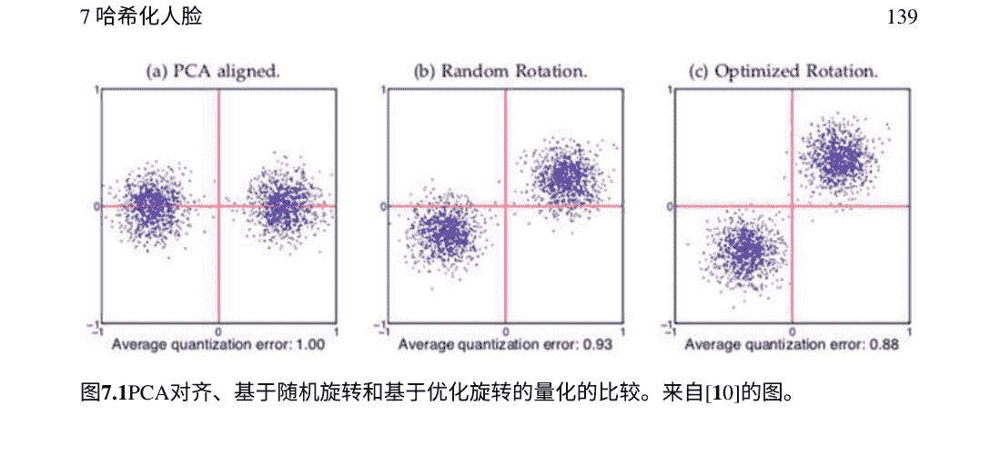

人脸识别问题在学习能够产生紧凑二进制表示的哈希模型时面临非常具有挑战性的条件，该模型仍然对验证和识别任务有效。

我们在在这里形式化哈希任务，并引入我们将在本章中使用的符号。数据集 `S` 由 `N` 个样本组成 `{s_i}_{i=1,...,N}`。我们将样本 `s_i` 的 `d` 维特征表示表示为行向量 `x_i ∈ R^d`，并且 `X ∈ R^{N×d}` 是所有样本的特征矩阵。哈希模型 `H` 将 `x_i` 映射到长度为 `b` 的二进制码，即 `H(x_i) = h_i ∈ B^b`，并将完整的特征矩阵映射到 `H(X) = H ∈ B^{N×b}`。请注意，二进制空间 `B` 在不同的方法中技术上可以是 `{0,1}` 或 `{-1,1}`，但显然这两种选择之间存在严格的等价关系。我们可以将哈希模型 `H` 看作是一组 `b` 个哈希函数，即 `H = {f_j}_{j=1,...,b}`。第 `j` 位 `h_{ij}` of `h_i` 通过将第 `j` 个哈希函数 `f_j` of `H` 应用于特征上获得，即 `h_{ij} = f_j(x_i)`。

在文献中，提出了大量的哈希方法来获得这样的哈希模型。在接下来的两节中，我们将回顾哈希的最重要方面，以及最近和最有效的哈希方法。

## 7.3 人脸哈希策略

在本节中，我们将根据它们在第 7.3.1 节中是否是数据驱动的、在第 7.3.2 节中是否是线性的、在第 7.3.3 节中是否是有监督的或者在第 7.3.4 节中是否处理单个图像输入，对文献中的哈希方法进行简要回顾和分类。在每个部分中，我们将更详细地回顾最近的方法集，这些方法对于哈希人脸表示的任务最相关，并且我们将在我们的实验中进行研究。我们建议读者参考 [29] 的调查，以获得更全面的哈希方法概述。

### 7.3.1 数据相关与数据无关

最早和非常流行的哈希方法之一是局部敏感哈希 [6, 9, 15, 18] 这种数据无关的方法。局部敏感哈希（LSH）的关键思想是定义一族哈希函数，确保“相似”的样本更有可能被映射到相同的哈希码或桶中。一种常见的策略是通过随机投影（`w`）和阈值（`β`）来定义哈希函数，如下所示

```
f(x) = sgn(xw + β)
```

因此，LSH 是一种具有有趣渐近理论保证的数据无关方法。这解释了它的流行程度，并且已经提出了这个框架的多个扩展 [4]。然而，在实践中，基于 LSH 的方法需要长的哈希码和多个哈希表才能产生合理的检索性能。这些特点并不适合我们的应用场景，我们希望获得人脸特征的紧凑二进制表示，并实现高效的搜索。

为了克服这些限制，更近期的哈希方法从数据中学习哈希函数。主成分分析（PCA）是一种众所周知的降维方法，它在几种哈希方法的起点上进行了逻辑探索 [11, 28, 30]。在 [10] 中提出的方法，名为迭代量化（ITQ），旨在最小化直接编码基于 PCA 投影的符号时得到的量化误差，参见图 7.1。为了训练一个生成 b 位哈希码的哈希模型，通过取数据协方差矩阵 $\mathbf{X}^T\mathbf{X}$ 的前 b 个特征向量，得到一个投影矩阵 $\mathbf{W} \in \mathbb{R}^{d \times b}$。哈希码矩阵 $\mathbf{H}$ 可以简单地计算为 $\mathbf{H} = \text{sgn}(\mathbf{XW})$，但这对应于图 7.1a 中所示的 PCA 对齐量化，导致许多相似的样本被编码为不同的哈希码。一个简单的解决方案是应用一个随机正交投影 $\mathbf{R} \in \mathbb{R}^{b \times b}$，如图 7.1b 所示，然而，这可以通过作者提出的迭代优化过程进行改进，如图 7.1c 所示。

表示 V 为投影数据，即 V = XW，ITQ 优化目标是最小化

$Q(\mathbf{H}, \mathbf{R}) = \|\mathbf{H} - \mathbf{VR}\|_F^2$

优化分为两个交替步骤，固定 $\mathbf{R}$ 并更新 $\mathbf{H}$（通过 $\mathbf{H} = \text{sgn}(\mathbf{VR})$ 最小化量化损失），固定 $\mathbf{H}$ 并更新 $\mathbf{R}$（通过计算 $b \times b$ 矩阵 $\mathbf{H}^T\mathbf{V}$ 的奇异值分解最小化量化损失，令 $\mathbf{H}^T\mathbf{V} = \mathbf{S}\mathbf{\Omega}\mathbf{S}^T$ 并令 $\mathbf{R} = \mathbf{S}\mathbf{S}^T$）。这个两步骤的过程会迭代（作者建议使用大约 50 次迭代）以获得最终的 ITQ 哈希模型。ITQ 已经被证明具有竞争力，特别是与其他基于 PCA 的哈希方法相比。

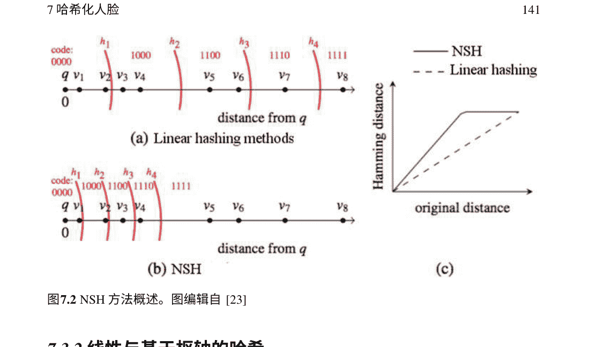

### 7.3.2 线性与基于枢轴的哈希

从数据中学习哈希函数，就像在前一节中所做的 ITQ 方法 [10] 中详细介绍的那样，可以选择更有效的哈希函数。然而，任何依赖于线性投影符号的哈希方法都具有有限的区分能力的哈希函数。因此，已经提出了几种依赖于非线性哈希函数的哈希方法。

具体来说，这些方法的共同思想是对特征空间进行采样以获得一组枢轴点。然后，利用与这些枢轴相关的相似性或距离来定义哈希函数。在本节中，我们详细介绍了两种最近的方法：Neighbor-sensitive Hashing [23] 和 Spherical Hashing [13] 方法。

Neighbor-sensitive Hashing 方法（NSH）旨在避免使用哈希位来捕捉远离的样本之间的距离。因此，作者建议在相似样本之间放置更多的分隔符。因此，有点反直觉的是，该方法旨在增加哈明空间中相似项之间的距离。这个想法在图 7.2 中有所说明。NSH 方法的关键要素是作者所称的 Neighbor-Sensitive Transform（NST）。他们定义了一个函数 f̂（称为坐标变换函数），它是一个连续且单调的函数，对于给定的距离范围（η_min, η_max），在范围（η_min, η_max）内产生“更大的间隙”。也就是说，在应用 NST 之后，范围内的距离差应该比原始空间中的距离差更大。

在实践中，作者们依赖于多个基于径向基函数计算的 NST，使用欧氏距离相对于一组枢轴。枢轴是通过在训练集上运行 k-means 获得的。哈希函数是随机学习的。

在由所有枢轴变换定义的嵌入空间中进行正交投影，以无监督的方式进行，其复杂度与样本数量成线性关系。因此，NSH 是一种基于枢轴的核化嵌入哈希方法，类似于我们将在 7.3.3 中讨论的核监督哈希方法。有关更多细节，请参阅 [23]。

Spherical Hashing (SpH) 方法在 [13] 中引入，提出将哈希函数定义为超球面而不是超平面。更正式地说，球面哈希函数 $f_i(\mathbf{x})$ 由一个枢轴 $\mathbf{p}_i \in \mathbb{R}^d$ 和一个距离阈值 $t_i \in \mathbb{R}^+$ 定义为

$f_i(x) = \begin{cases} -1 & \text{当 } d(\mathbf{p}_i, \mathbf{x}) > t_i \text{时}; \\ +1 & \text{当 } d(\mathbf{p}_i, \mathbf{x}) \le t_i \text{时}, \end{cases}$

其中 $d(\cdot, \cdot)$ 表示两个样本在 $\mathbb{R}^d$ 中的距离函数（在我们进行的实验中可以是欧氏距离或余弦距离）。球面哈希方法的优化过程旨在获得独立且平衡的哈希函数，它迭代地优化空间中的枢轴位置和阈值值。首先估计阈值值，使每个超球面中有 $N/2$ 个样本以满足平衡约束。然后，为了使它们的重叠区域包含 $N/4$ 个样本以满足独立约束，将枢轴对推向彼此更近或更远。优化过程如图 7.4 所示。使用超球面进行哈希的优势在于我们可以获得具有紧密距离界限的闭合区域。读者可以参考 [23] 了解该方法的详细信息和实验。

### 7.3.3 无监督哈希与监督哈希的比较

正如我们在前一节中讨论的那样，依赖数据的优化过程可以帮助获得更好的哈希函数。哈希函数也可以被优化以满足在训练集上提供的一些监督。需要注意的是，正如 [26] 中指出的那样，只有在测试时对新类别进行性能评估时，监督哈希评估才有意义，否则哈希分类器的输出很容易超过最先进的哈希方法。这正是我们在所有的人脸识别实验中所做的，训练集总是与测试集不相交。一些半监督哈希方法也被提出 [28]，其中目标函数将监督经验适应性与无监督信息论正则化相结合。

基于核的监督哈希（KSH）方法是最流行的监督哈希方法之一，引自 [20]。该方法依赖于每个样本的核嵌入，该核嵌入是相对于一组均匀采样的点估计得到的，我们称之为锚点或中心点：$\mathcal{P} = \{\mathbf{p}_j\}_{j=1,...,m}$。更准确地说，预测函数 $\tilde{f}_i(\cdot)$ 被定义为

$\tilde{f}_i(\mathbf{x}) = \sum_{j=1}^{m} \kappa(\mathbf{p}_j, \mathbf{x}) a_{ij} - \beta,$

其中 $\kappa$ 是一个核函数，$\mathbf{a}_i = [a_{i1}, ..., a_{ij}, ..., a_{im}]$ 和 $\beta$ 分别是系数和偏置。相应的哈希函数被定义为 $\hat{f}_i(\mathbf{x}) = \text{sgn}(\tilde{f}_i(\mathbf{x}))$。为了获得一个平衡的哈希函数，偏置向量 $\beta$ 被计算为核嵌入空间中投影特征的均值，因此它的每个坐标 $\beta_j$ 被估计为

$\beta_j = \sum_{i=1}^{N} \kappa(\mathbf{p}_j, \mathbf{x}_i) / N.$

KSH 的目标是学习系数向量 $\mathbf{a}_1, ..., \mathbf{a}_n$ 使用有监督信息。给定相似和不相似的样本对，并利用汉明距离和哈希码内积之间的一对一对应关系，作者提出训练哈希函数，使得相似样本的哈希码内积接近 1，不相似样本的哈希码内积接近 $-1$。这个优化目标在图 7.5 中有所说明。实际上，优化是以贪婪的方式进行的，每个哈希函数参数（即系数向量）都是迭代学习的。完整的优化过程描述请参考 [20]。KSH 已经被证明具有很高的竞争力，特别是当处理与当前任务不高度可区分的特征，例如通用的手工特征。

### 7.3.4 图像与集合/视频哈希

大多数哈希方法独立地考虑每个样本。但在许多情况下，涉及到人脸的多个图像可以同时提供。例如，从视频中提取人脸图像时，可以轻松定义一个包含该视频中一个人的所有外观的模板。如何有效地利用单个哈希码表示整个图像集已在 [8] 中进行了研究。关键是构建一个与输入大小无关的集合表示。集合表示捕捉了局部几何属性（计算集合中所有图像的特征的平均值、方差、最小值和最大值）和全局分布特征，使用 VLAD 方法对图像特征进行编码 [16]。图像特征可以预先计算或从深度网络中派生，如果是这种情况，整个模型可以以端到端的方式进行训练。

## 7.4 人脸识别任务和评估

在本节中，我们简要介绍人脸识别的两个主要任务：人脸验证和人脸搜索。我们还详细介绍了这些任务通常如何进行评估。

### 7.4.1 人脸验证

验证协议是比较两个人脸图像（或两组人脸图像）并输出一个评分，估计这两个输入是否对应同一身份的任务。

### 7.4.2 人脸识别

这个任务的典型应用是访问控制，其中需要验证给定人员的身份。例如，一个有限制访问的建筑物可能连接到一个授权用户人脸图像的数据库。为了获得访问权限，用户需要提供一个标识符，例如带有条形码的徽章，该标识符将用于检索存储的人脸图像，与该人的实时采集进行比较。这也是最近智能手机的“面部解锁”功能的使用案例。对于这个任务，数据集或基准通常提供一个预定义的人脸图像对列表（无论是真实匹配还是冒名顶替比较）进行评估。[14, 32]

## 7.4.2 人脸搜索

人脸搜索的任务是在一个大型人脸图像数据库中找到最相似的人脸图像。一个典型的应用场景是观察名单情况，数据库中保存了一份失踪或通缉人员的名单，查询是感兴趣人员的人脸图像。

如果一些探测图像在库中没有匹配项，这个任务被称为开放式识别。在这种情况下，一个好的人脸识别系统应该仍然能够从库中检索到最相似的样本，但它们应该具有较低的相似度分数。因此，基于相似度分数的过滤方法应该能够标记探测图像在库中没有匹配项。

## 7.4.3 评估指标

为了评估人脸验证协议，我们将报告受试者工作特征（ROC）曲线。在给定阈值 $T$ 的情况下，用于确定是否匹配一对的相似度，我们计算真正接受率（TAR），即具有高于阈值的相似度 $S$ 的真实比较的比例，因此会被正确接受，以及误接受率（FAR），即超过阈值的冒名顶替比较的比例，因此会被错误地视为匹配。

正式地，我们将 $\mathcal{G}$ 表示为真实比较的集合，将 $\mathcal{I}$ 表示为冒名顶替比较的集合。利用前面的定义和标准符号，对于假阳性（$FP$）、真阳性（$TP$）、假阴性（$FN$）和真阴性（$TN$），我们可以定义假接受率（FAR）或假阳性率为

$$\text{FAR} = \frac{\text{冒名顶替比较中} S > T \text{的数量}}{\text{总冒名顶替比较数量}} = \frac{|\{x \in \mathcal{I} \mid S(x) > T\}|}{|\mathcal{I}|} = \frac{FP}{FP + TN},$$

而真接受率（TAR），对应于召回率，计算如下

$$ \text{TAR} = \frac{\text{真实比较中} S > T \text{的数量}}{\text{总真实比较数量}} = \frac{|\{ x \in \mathcal{G} | S(x) > T \}|}{|\mathcal{G}|} = \frac{TP}{TP + FN} $$

通过改变阈值，我们可以绘制一条曲线，显示这两个度量之间的权衡。可以定义这些度量中的一个的目标值（例如，`FAR = 10^{-3}`），并根据另一个度量值比较不同的方法，以选择在该操作点上最佳的方法，即具有目标`FAR`值的最高`TAR`的方法。

使用累积匹配曲线（CMC）评估搜索性能。对于每个探测样本，检索出与图库中最相似的样本的排序列表。CMC捕捉了我们正确检索到匹配图库样本的探测样本的比例，直到给定的排名。通常还经常报告到某些特定排名值（例如，1、5和10）的检索率。

## 7.5 人脸数据集

在本节中，我们将回顾我们将用于评估哈希模型的不同数据集，以及用于训练哈希模型或用于提取我们将哈希为二进制码的人脸特征的深度模型的数据集。

### 7.5.1 IJB-A: IARPA Janus基准A

`IJB-A` [17] 数据集的开发目标是推动人脸识别的极限，特别是针对无约束的环境。这些人脸图像和视频大多数是在非合作环境中捕获的，因此展示了各种姿势、光照和表情。该数据集包含5,712张来自500个不同主体的图像，以及这些主体的2,085个视频。该数据集分为10个部分。对于每个部分，将随机选择333个主体放入训练集中。剩下的167个主体用于测试集，他们的图像随机抽样到探测集或画廊集中。

### 7.5.2 IJB-B: IARPA Janus基准B

`IJB-B` [31]数据集是`IJB-A`数据集的扩展。它包含21,798张图像来自1,845个主题和7,011个视频。这个扩展的目标是提供更均匀的主题地理分布，并在评估验证任务时评估更多数量的真实（10,270）和冒名顶替者（8,000,000）比较，从而在低`FAR`值（0.01或0.001%）下产生更有意义的`TAR`值。对于搜索任务，数据集提供两个预定义的图库，以及基于媒体类型分组的三个不同的探针集：仅静态图像，仅视频帧或两种模态的混合。`IJB-A`和`IJB-B`之间的一个明显区别是`IJB-B`没有预定义的训练集，因此必须使用外部数据来训练表示和哈希模型。我们将依赖于`UMD`面孔（见第7.5.4节）来训练我们的哈希模型，用于这个数据集。

### 7.5.3 IJB-C: IARPA Janus基准C

`IJB-C` [22]数据集是`IJB-B`数据集的扩展。它包含31,334个3,531个主题的图像和11,779个视频。额外的数据已经收集，目标是涵盖更广泛的职业和地理起源。这个数据集有两个画廊集，分别包含1,772个和1,759个主题，每个主题有大约5张图像的单个模板。有一个包含19,593个模板的单个探针集，由静态图像和视频帧构建，一个主题可能有多个探针模板。验证协议提供了19,557个真实匹配和15,638,932个冒名顶替匹配，可以在低`FAR`值下进行适当的性能评估。与`IJB-B`一样，没有预定义的训练集，我们将依赖于`UMD`面孔来训练我们的哈希模型，用于这个数据集。

### 7.5.4 UMD人脸

`UMD`人脸数据集[2]由静态图像和视频帧组成。第一部分仅包含静态图像，共有367,888个带有注释的人脸，属于8,277个主题，分为3批。提供了由预训练神经网络生成的人工标注的人脸边界框和估计的姿势（偏航、俯仰和滚动）信息，以及21个关键点的位置和性别信息。第二部分包含从总共22,075个视频中提取的3,735,476个带有注释的视频帧，属于3,107个主题。提供了类似的估计信息。选择的主题与`IJB-A`、`IJB-B`和`IJB-C`数据集没有重叠。当没有其他训练集可用时，我们将使用此数据集来训练我们的哈希模型。

### 7.5.5 CASIA WebFace数据集

`CASIA WebFace`数据集[33]是第一个发布的大规模人脸图像数据集。该数据集包含10,575个主题（如演员、政治家或其他公众人物），总共收集了494,414张从网络上收集的图像。在删除与`IJB-A`数据集中存在的主题后，剩下10,548个主题。该数据集不直接用于训练哈希模型，但用于训练一些用于提取特征的深度模型（如下一节所述）作为输入提供给我们的哈希模型。

## 7.6 人脸特征

在本节中，我们详细介绍了我们在实验中使用的三代不同的特征。

### 7.6.1 UMD特征：第一代

`UMD`特征的第一代对应于[5]中描述的深度卷积神经网络（DCNN）。我们将该论文中表7.2描述的`DCNN-S`网络称为`JC`特征，而`SW`特征对应于该论文中表7.3描述的`DCNN-L`网络。`JC`特征具有320个维度，而`SW`特征具有512个维度。这两个网络都是在`CASIA WebFace`数据集[33]上进行训练的，该数据集在第7.5.5节中有详细介绍。这些特征将用于`IJB-A`数据集上的实验。

### 7.6.2 UMD特征：第二代

第二代特征由两个特征组成，我们称之为`JC2`和`SW2`。`JC2`特征对应于[34]中描述的架构的320维度池特征。`SW2`特征是从[25]中提出的“全能”架构中提取的512维身份特征。每个特征都进一步嵌入到一个实值128维空间中，使用三元组概率嵌入方法[27]。我们将这些嵌入版本的`JC2`和`SW2`分别称为`EJC2`和`ESW2`。这些特征将用于`IJB-B`数据集的实验。

### 7.6.3 UMD特征：第三代

从第三代`UMD`特征中，我们使用从`resNet-101`网络的瓶颈层提取的`RAG1`特征，详见[24]。该模型在包含超过5百万张图像的数据集上进行训练，涵盖约58,000个子主题。这些图像包含来自`UMD-Faces`数据集[3]的约30万张静态图像，来自`MS-Celeb-1M`数据集[12]的约370万张精选版本[19]的静态图像，以及来自扩展版的约180万帧视频对`UMDFaces`数据集的扩展[1]。此外，使用`Triplet Probabilistic Embedding`方法[27]将`RAG1`特征嵌入到一个实值128维空间中，我们将称之为`ERAG1`。这些特征将用于`IJB-C`数据集上的实验。

## 7.7 人脸哈希实验

在本节中，我们报告了在人脸验证和人脸搜索任务上进行的多个实验。我们首先详细介绍了每个数据集上的实验设置。然后，我们报告了不同哈希方法在人脸验证和人脸搜索中的结果。我们还根据基于枢轴的哈希方法中使用的距离类型和探测图像的类型进行了一些更详细的分析。

### 7.7.1 实验设置

在本节中，我们介绍了用于训练哈希模型、运行实验和评估所有数据集性能的实验设置。

#### 7.7.1.1 IJB-A

对于`IJB-A`数据集，我们使用了`UMD`第一代的`JC`和`SW`特征在第7.6.1节中介绍的特征。这些特征是从每个人脸图像中提取出来的进行了L2归一化，并取平均值来定义模板特征。我们在数据集的训练部分上分别对每个特征训练每个哈希模型详细说明见第7.5.1节。欧氏距离用于基于枢轴的嵌入哈希方法`KSH`、`NSH`和`SpH`。

我们累积验证统计数据，并在数据集的10个拆分上平均检索率以报告每种方法的性能。通过将模板特征与欧氏距离进行比较来获得基准性能，而哈希码则使用汉明距离进行比较。

### 7.7.1.2 IJB-B

对于在第7.5.2节中介绍的IJB-B数据集，我们使用了在第7.6.2节中详细介绍的第二代UMD特征。这些特征是通过TPE方法从每个人脸图像中提取和投影的，来自同一视频不同帧的人脸图像首先被平均成一个媒体平均特征，然后所有媒体平均特征和静态图像特征被平均以定义模板特征。由于IJB-B数据集没有训练集，我们使用了UMD人脸数据集用于训练哈希模型。具体来说，我们在UMD人脸数据集的三个批次上为每种哈希方法训练了一个单独的模型。

我们使用预定义的比较集来评估验证任务。对于基准方法，我们使用余弦距离来比较模板特征，而使用汉明距离来比较哈希码。对于验证任务，我们通过累积在每个UMD人脸批次上训练的三个不同模型的匹配统计数据来报告哈希性能。对于搜索任务，我们报告在两个图库上平均的基准性能。而哈希性能则是在两个图库和每个UMD人脸批次上训练的三个不同模型上进行平均。

### 7.7.1.3 IJB-C

对于在第7.5.3节中介绍的IJB-C数据集，我们使用了第三代UMD特征的特征。至于IJB-B，我们提取并投影了每个人脸图像的TPE方法，来自同一视频的不同帧的人脸图像首先被平均成一个媒体平均特征，然后所有媒体平均特征和静态图像特征被平均以定义模板特征。这些特征没有进行l2归一化。由于IJB-C数据集没有训练集，我们使用UMD Faces数据集来训练哈希模型。我们一次使用所有三批UMD faces来训练每个特征的单个哈希模型。我们对于基于余弦距离的枢纽嵌入哈希方法KSH、NSH和SpH使用余弦距离。

我们使用预定义的比较集来评估验证任务。对于基准方法，我们使用余弦距离来比较模板特征，而哈希码则使用汉明距离进行比较。对于搜索任务，我们报告了在两个图库上平均性能。

### 7.7.2 IJB-A

在本节中，我们报告了不同哈希方法在IJB-A数据集上的人脸验证和搜索性能。

#### 7.7.2.1 人脸验证结果

我们报告了在IJB-A数据集上获得的验证结果，将原始特征性能与使用ITQ、KSH、NSH和SpH哈希方法得到的64、128、256或512位哈希码的结果进行比较，输入为图7.6中的JC特征或图7.7中的SW特征。

JC特征在FAR为10^{-2}、10^{-3}和10^{-4}时分别获得0.838、0.675和0.46的验证TAR。从图7.6中，我们可以观察到ITQ方法的表现即使使用256位（在FAR为10^{-2}和10^{-3}时分别为0.791和0.585的TAR），性能也有显著下降，需要注意的是，由于ITQ基于PCA，无法产生512位的结果，因为JC特征只有320维。当使用256位和512位的哈希码时，KSH的性能几乎与原始特征相同，甚至在FAR值大于10^{-4}时稍微更好，例如，使用256位，KSH在FAR为10^{-2}和10^{-3}时分别获得0.850和0.693的TAR。只使用128位时，KSH的验证性能已经很好。同样，当使用256位或512位时，NSH与原始JC特征的性能相似，512位的NSH在FAR为10^{-2}和10^{-3}时分别获得0.829和0.700的TAR。对于这个任务，SpH方法似乎表现最好，并且在低FAR范围内，使用JC特征的性能似乎超过了特征本身的性能。这可能是因为球面哈希函数能更好地处理冒名顶替者。使用512位的SpH哈希在FAR为10^{-3}和10^{-4}时分别获得0.733和0.561的TAR。

SW特征在FAR为10^{-2}、10^{-3}和10^{-4}时的TAR分别为0.816、0.639和0.433，低于JC特征的验证性能。从图7.7可以得出类似的结论，使用SW特征时，对哈希方法的评估也是如此。由于SW特征具有512个维度，即使ITQ也可以获得512位的结果。然而，512位的性能与256位非常相似。

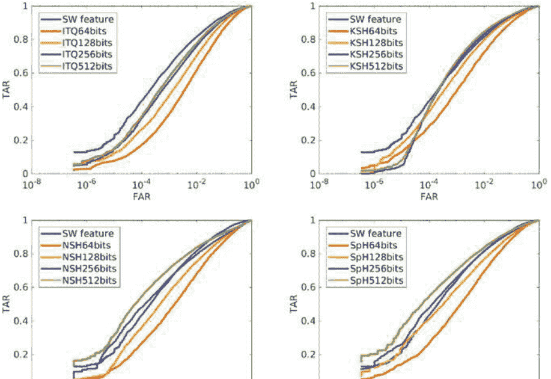

图7.7显示了使用ITQ（左上角）、KSH（右上角）、NSH（左下角）和SpH（右下角）在IJB-A数据集上使用SW特征进行人脸验证的结果。

性能方面，FAR为10^{-2}和10^{-3}时的TAR分别为0.758和0.55。 这可以解释为PCA的前几个维度比后面的维度更具信息量。 KSH能够在256位（FAR为10^{-3}时的TAR为0.654）或更多位的情况下保持大部分特征性能，并在高FAR值下略微优于原始特征性能。 两种基于无监督枢轴的哈希方法NSH和SpH在低FAR值下略优于SW特征。 512位的NSH和512位的SpH分别达到了TAR值0.545和分别为0.541，在FAR为10^{-4}时，远高于原始特征的0.433。 需要注意的是，由于SW特征的性能低于JC特征，这可能为哈希方法的改进提供了更多的空间。

#### 7.7.2.2 人脸搜索结果

我们报告了在IJB-A数据集上获得的CMC曲线，将原始特征性能与使用ITQ、KSH、NSH和SpH哈希方法得到的64、128、256或512位哈希码的哈希结果进行比较，输入为图7.8中的JC特征或图7.9中的SW特征。

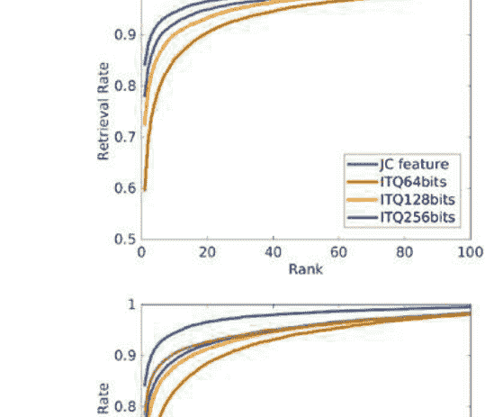

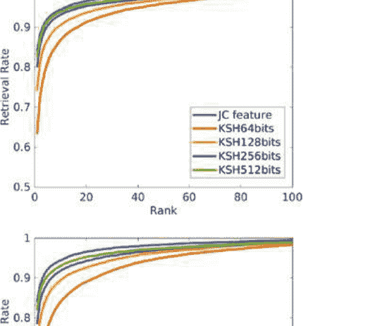

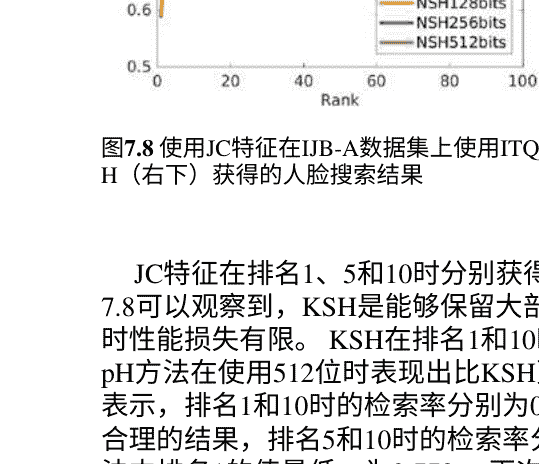

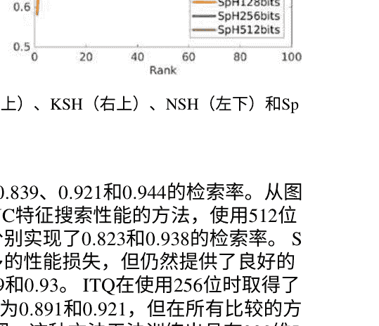

图7.8 使用JC特征在IJB-A数据集上使用ITQ（左上）、KSH（右上）、NSH（左下）和SpH（右下）获得的人脸搜索结果

JC特征在排名1、5和10时分别获得了0.839、0.921和0.944的检索率。从图7.8可以观察到，KSH是能够保留大部分JC特征搜索性能的方法，使用512位时性能损失有限。 KSH在排名1和10时分别实现了0.823和0.938的检索率。 SpH方法在使用512位时表现出比KSH更多的性能损失，但仍然提供了良好的表示，排名1和10时的检索率分别为0.819和0.93。 ITQ在使用256位时取得了合理的结果，排名5和10时的检索率分别为0.891和0.921，但在所有比较的方法中排名1的值最低，为0.778。 再次强调，这种方法无法训练出具有320维JC特征的512位。

NSH方法在这个搜索任务上表现不佳，即使使用512位也有明显的性能下降，排名1的检索率为0.783，排名10的检索率为0.904。

SW特征在排名1、5和10分别获得了0.832、0.92和0.948的检索率，与JC特征的性能相似。 从图7.9中报告的结果可以看出，使用SW特征时，所有哈希方法在排名1的性能下降更大，最好的方法SpH使用512位达到了0.792的检索率。 在排名5和10方面，ITQ表现最佳（检索率分别为0.9和0.934），紧随其后的是KSH（检索率为

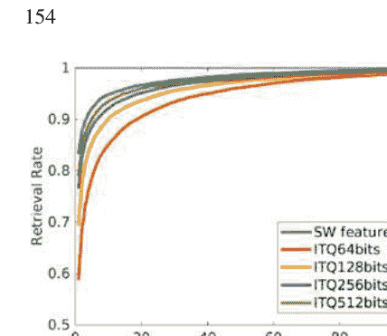

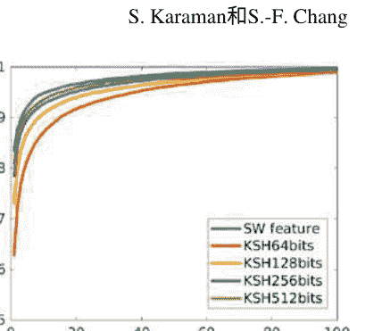

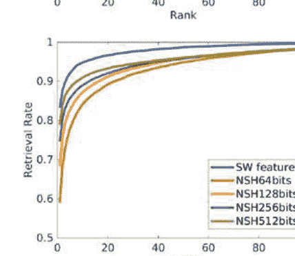

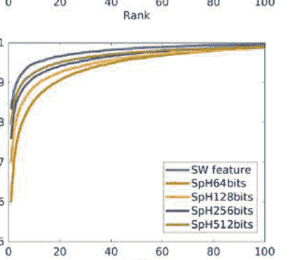

图7.9 使用ITQ在IJB-A数据集上使用SW特征获得的人脸搜索结果（左上角），KSH（右上角），NSH（左下角）和SpH（右下角）

0.9和0.934）和SpH。NSH方法在较高排名上的性能最低，仅在排名10处达到0.909的检索率。

#### 7.7.2.3 讨论

总体而言，在这个IJB-A数据集上，使用核化嵌入和监督的KSH方法能够保持每个特征的验证性能，甚至在高FAR值时稍微超过它们。这种方法还能保留大部分特征的搜索能力。ITQ方法受其线性投影方案和对PCA的依赖的限制。虽然其在验证任务上的性能有限，但在搜索任务上能够实现合理的性能。两种无监督的基于枢轴的哈希方法NSH和SpH可以保持甚至在验证任务上的原始特征性能，尤其是在低FAR值时能够超过原始特征性能。 SpH方法在搜索任务上表现良好，然而NSH方法的性能显著下降。

### 7.7.3 IJB-B

在本节中，我们报告了不同哈希方法在IJB-B数据集上的人脸验证和搜索性能。对于这个数据集，我们使用了针对余弦距离进行优化的嵌入特征EJC2和ESW2。因此，我们首先研究了在KSH、NSH和SpH哈希方法中进行基于枢轴的嵌入时所选择的距离（欧氏距离或余弦距离）对结果的影响。由于这个数据集还提供了基于媒体类型的三个不同的探测集（静态图像、视频帧或混合），我们还将探索这如何影响搜索性能。

#### 7.7.3.1 距离选择分析

UMD的第二代特征`EJC2`和`ESW2`是使用TPE方法嵌入的，该方法通过优化特征之间的余弦相似度来实现。因此，值得研究在枢轴嵌入步骤中使用欧氏距离（如在IJB-A数据集中所做的）还是余弦距离对`KSH`、`NSH`和`SpH`哈希方法的性能是否有影响。我们已经使用欧氏距离或余弦距离训练了模型进行枢轴嵌入步骤。在使用欧氏距离时，特征在训练时进行l2归一化。在测试时，对于使用欧氏距离训练的模型，模板的特征首先进行l2归一化，然后求平均（平均值再次进行l2归一化），而在使用余弦距离时不进行归一化。在下面的章节中，我们将讨论这个选择对结果的影响。

#### 7.7.3.2 人脸验证结果

我们在IJB-B数据集上报告了验证结果，比较了使用128、256、512或1024位的哈希码进行哈希的原始特征性能与哈希结果。哈希方法包括`ITQ`、`KSH`、`NSH`和`SpH`。我们在表7.1和7.2中报告了使用l2归一化特征和欧氏距离，以及使用未归一化特征和余弦距离的枢轴嵌入哈希方法的结果，分别针对`EJC2`和`ESW2`。每个FAR值的最佳哈希结果以粗体报告。

这组结果表明，第二代特征的性能要好得多，对于`EJC2`特征，FAR值分别为`10^{-2}`、`10^{-3}`和`10^{-4}`时，TAR为0.927、0.852和0.753；对于`ESW2`特征，FAR值分别为`10^{-2}`、`10^{-3}`和`10^{-4}`时，TAR为0.936、0.869和0.772。因此，使用哈希方法来保持它们的性能更具挑战性。

`ITQ`方法似乎在处理非归一化特征时略有益处，但仍然受限于原始嵌入特征的维度为128。

# 表7.1 在IJB-B数据集上使用EJC2特征的人脸验证TAR性能

| 方法 | 规范化 | 枢轴距离 | #位 | FAR = `10^{-1}` | `10^{-2}` | `10^{-3}` | `10^{-4}` | `10^{-5}` | `10^{-6}` |
| :--- | :---: | :---: | :---: | :---: | :---: | :---: | :---: | :---: | :---: |
| `EJC2` | - | - | - | 0.973 | 0.927 | 0.852 | 0.753 | 0.598 | 0.228 |
| `ITQ` | 12 | - | 128 | 0.950 | 0.857 | 0.744 | 0.588 | 0.422 | 0.197 |
| `ITQ` | - | - | 128 | 0.954 | 0.865 | 0.761 | 0.608 | 0.448 | 0.168 |
| `KSH` | 12 | 12 | 128 | 0.945 | 0.852 | 0.724 | 0.544 | 0.366 | 0.166 |
| `KSH` | - | cos | 128 | 0.941 | 0.835 | 0.677 | 0.487 | 0.301 | 0.130 |
| `NSH` | 12 | 12 | 128 | 0.943 | 0.85 | 0.703 | 0.523 | 0.352 | 0.158 |
| `NSH` | - | cos | 128 | 0.947 | 0.864 | 0.736 | 0.59 | 0.395 | 0.178 |
| `NSH` | 12 | 12 | 512 | 0.95 | 0.886 | 0.786 | 0.648 | 0.47 | 0.177 |
| `NSH` | - | cos | 512 | 0.947 | 0.892 | 0.805 | 0.689 | 0.526 | 0.209 |
| `NSH` | 12 | 12 | 1024 | 0.953 | 0.9 | 0.81 | 0.682 | 0.51 | 0.182 |
| `NSH` | - | cos | 1024 | 0.953 | 0.91 | 0.826 | 0.711 | 0.549 | 0.247 |
| `SpH` | 12 | 12 | 128 | 0.943 | 0.848 | 0.713 | 0.568 | 0.379 | 0.167 |
| `SpH` | - | cos | 128 | 0.947 | 0.856 | 0.734 | 0.598 | 0.428 | 0.178 |
| `SpH` | 12 | 12 | 512 | 0.965 | 0.903 | 0.805 | 0.673 | 0.503 | 0.227 |
| `SpH` | - | cos | 512 | 0.968 | 0.912 | 0.822 | 0.7 | 0.513 | 0.242 |
| `SpH` | 12 | 12 | 1024 | 0.968 | 0.912 | 0.817 | 0.687 | 0.519 | 0.239 |
| `SpH` | - | cos | 1024 | 0.971 | 0.919 | 0.834 | 0.717 | 0.543 | 0.24 |

在感兴趣的操作点FAR `10^{-3}`和`10^{-4}`上，`EJC2`特征的TAR值为0.761和0.608，`ESW2`特征的TAR值为0.78和0.64，无法保持大部分性能。使用余弦距离可以更好地提高枢轴嵌入哈希方法`NSH`和`SpH`的性能。使用余弦距离的`NSH`方法可以保持每个特征的大部分性能，使用512或1024位（例如，使用`EJC2`特征的TAR为0.826和0.711，使用`ESW2`特征的TAR为0.847和0.735，在FAR `10^{-3}`和`10^{-4}`时）。然而，使用欧氏距离时性能较低（例如，使用`EJC2`的TAR为0.81和0.682，使用`ESW2`的TAR为0.831和0.702，在相同的FAR值下）。使用余弦距离的`SpH`方法可以保持`EJC2`特征的大部分性能，使用1024位时，其TAR为0.834和0.717，在FAR `10^{-3}`和`10^{-4}`时。然而，对于`ESW2`特征，其性能下降，使用1024位时，其TAR为0.815和0.66，在FAR `10^{-3}`和`10^{-4}`时，表明对原始特征空间的敏感性较高，比`NSH`方法更高。使用欧氏距离时，`SpH`方法的性能也较低，例如，使用`EJC2`的TAR为0.687，使用`ESW2`的TAR为0.609，在FAR `10^{-4}`时。相反，使用余弦距离似乎降低了`KSH`方法的性能，特别是对于`ESW2`特征。

#### 7.7.3.3 人脸搜索结果

我们报告了在IJB-B数据集上获得的检索性能，将原始特征性能与使用`ITQ`、`KSH`、`NSH`和`SpH`哈希方法获得的128、256、512或1024位哈希码的哈希结果进行比较，输入表7.3中的`EJC2`特征或表7.4中的`ESW2`特征。每个排名值的最佳哈希结果以粗体报告。`EJC2`特征的排名为1、5、10和20的检索率分别为0.839、0.909、0.928和0.944，`ESW2`特征的检索率为0.858、0.890、0.922、0.940和0.956。

对于这些结果，我们使用了IJB-B数据集的混合媒体探针。我们将在下一节讨论探针类型的影响。

当使用余弦距离时，基于枢轴的哈希方法`NSH`和`SpH`的性能再次得到改善。使用这种配置，`SpH`方法能够保留`EJC2`特征的大部分性能，参见表7.3，在排名1和5处的检索率分别为0.822和0.899。它在表7.4中对于`ESW2`的性能也很好，特别是对于高于10的排名。`NSH`方法在使用余弦距离时对于`EJC2`特征表现相对较好，并且在`ESW2`特征的排名低于5时是表现最好的方法。至于验证任务中，使用未归一化特征时，`ITQ`的性能稍微更好，但由于只能生成128位的哈希码，存在一定限制。当使用余弦距离时，`KSH`的性能再次下降。因此，在本章的剩余部分中，我们只报告使用未归一化特征和余弦距离的基于枢轴哈希方法`SpH`和`NSH`的结果。然而，我们将使用归一化特征和欧氏距离来进行`KSH`。

#### 7.7.3.4 探针类型分析

在这里，我们进一步研究了媒体类型（静态图像或视频帧）对IJB-B数据集上搜索性能的影响，该数据集在第7.5.2节中有不同媒体来源的独立探针集。我们在图7.10中报告了静态图像探针使用`EJC2`特征的性能，图7.11中报告了视频帧的性能。混合媒体的结果已经在表7.3中报告过。根据前一节的分析，我们在`NSH`和`SpH`的枢轴嵌入步骤中使用未归一化特征和余弦距离，但在`KSH`中使用l2归一化特征和欧氏距离。我们可以看到，视频帧探针代表了一个更加困难的任务，因为搜索性能远低于静态或混合探针，在图7.10和7.11的y轴上有不同的范围。对于两种探针类型，`SpH`方法能够更好地保持原始`EJC2`特征的性能。

### 7.7.4 IJB-C

在本节中，我们使用`ERAG1`特征在IJB-C数据集上报告了人脸验证和人脸搜索结果。

#### 7.7.4.1 人脸验证结果

我们在图7.12中报告了在IJB-C数据集上的验证结果。我们可以观察到`ERAG1`特征在人脸验证性能方面达到了非常高的水平，分别在FAR值为`10^{-2}`, `10^{-3}`和`10^{-4}`时，TAR分别为0.979、0.958和0.923。仅使用128位的`ITQ`很难保持这种高水平的验证性能，TAR值显著下降至0.807和0.674。

**表7.2 使用ESW2特征在IJB-B数据集上的人脸验证TAR性能**

| 方法 | 规范化 | 枢轴距离 | #位 | FAR = 10^{-1} | 10^{-2} | 10^{-3} | 10^{-4} | 10^{-5} | 10^{-6} |
| :--- | :---: | :---: | :---: | :---: | :---: | :---: | :---: | :---: | :---: |
| ESW2 | - | - | - | 0.98 | 0.936 | 0.869 | 0.772 | 0.589 | 0.195 |
| ITQ | 12 | - | 128 | 0.962 | 0.882 | 0.757 | 0.589 | 0.394 | 0.137 |
| ITQ | - | - | 128 | 0.966 | 0.892 | 0.78 | 0.64 | 0.444 | 0.168 |
| KSH | 12 | 12 | 128 | 0.948 | 0.853 | 0.706 | 0.531 | 0.323 | 0.094 |
| KSH | - | cos | 128 | 0.947 | 0.846 | 0.69 | 0.469 | 0.225 | 0.052 |
| KSH | 12 | 12 | 512 | 0.956 | 0.895 | 0.8 | 0.669 | 0.479 | 0.151 |
| KSH | - | cos | 512 | 0.963 | 0.894 | 0.759 | 0.545 | 0.261 | 0.059 |
| NSH | 12 | 12 | 128 | 0.95 | 0.85 | 0.714 | 0.521 | 0.314 | 0.105 |
| NSH | - | cos | 128 | 0.95 | 0.869 | 0.741 | 0.593 | 0.406 | 0.147 |
| NSH | 12 | 12 | 512 | 0.95 | 0.886 | 0.786 | 0.648 | 0.47 | 0.177 |
| NSH | - | cos | 512 | 0.96 | 0.911 | 0.829 | 0.719 | 0.537 | **0.214** |
| NSH | 12 | 12 | 1024 | 0.965 | 0.919 | 0.831 | 0.702 | 0.472 | 0.171 |
| NSH | - | cos | 1024 | 0.966 | **0.925** | **0.847** | **0.735** | **0.542** | 0.203 |
| SpH | 12 | 12 | 128 | 0.9602 | 0.868 | 0.723 | 0.538 | 0.306 | 0.103 |
| SpH | - | cos | 128 | 0.963 | 0.882 | 0.763 | 0.571 | 0.36 | 0.129 |
| SpH | 12 | 12 | 512 | 0.974 | 0.903 | 0.781 | 0.605 | 0.319 | 0.089 |
| SpH | - | cos | 512 | 0.975 | 0.912 | 0.799 | 0.629 | 0.383 | 0.109 |
| SpH | 12 | 12 | 1024 | 0.977 | 0.908 | 0.782 | 0.609 | 0.338 | 0.093 |
| SpH | - | cos | 1024 | **0.978** | 0.922 | 0.815 | 0.660 | 0.417 | 0.124 |

**表7.3 使用EJC2特征在IJB-B数据集上的人脸搜索检索率**

| 方法 | 规范化 | 枢轴距离 | #位 | 排名1 | 排名2 | 排名5 | 排名10 | 排名20 | 排名50 |
| :--- | :---: | :---: | :---: | :---: | :---: | :---: | :---: | :---: | :---: |
| EJC2 | - | - | - | 0.839 | 0.874 | 0.909 | 0.928 | 0.944 | 0.964 |
| ITQ | 12 | - | 128 | 0.711 | 0.768 | 0.825 | 0.860 | 0.891 | 0.926 |
| ITQ | - | - | 128 | 0.730 | 0.784 | 0.837 | 0.871 | 0.899 | 0.931 |
| KSH | 12 | 12 | 128 | 0.696 | 0.759 | 0.819 | 0.855 | 0.885 | 0.923 |
| KSH | - | cos | 128 | 0.670 | 0.730 | 0.794 | 0.836 | 0.873 | 0.912 |
| NSH | 12 | 12 | 128 | 0.687 | 0.747 | 0.809 | 0.848 | 0.880 | 0.916 |
| NSH | - | cos | 128 | 0.714 | 0.772 | 0.829 | 0.861 | 0.891 | 0.925 |
| NSH | 12 | 12 | 512 | 0.769 | 0.815 | 0.860 | 0.885 | 0.909 | 0.934 |
| NSH | - | cos | 512 | 0.790 | 0.831 | 0.869 | 0.892 | 0.912 | 0.933 |
| NSH | 12 | 12 | 1024 | 0.795 | 0.837 | 0.876 | 0.899 | 0.919 | 0.941 |
| NSH | - | cos | 1024 | 0.809 | 0.850 | 0.885 | 0.906 | 0.923 | 0.942 |
| SpH | 12 | 12 | 128 | 0.685 | 0.745 | 0.805 | 0.845 | 0.881 | 0.920 |
| SpH | - | cos | 128 | 0.711 | 0.766 | 0.823 | 0.856 | 0.885 | 0.922 |
| SpH | 12 | 12 | 512 | 0.787 | 0.833 | 0.877 | 0.903 | 0.925 | 0.951 |
| SpH | - | cos | 512 | 0.805 | 0.847 | 0.887 | 0.910 | 0.933 | 0.955 |
| SpH | 12 | 12 | 1024 | 0.802 | 0.845 | 0.886 | 0.911 | 0.933 | 0.956 |
| SpH | - | cos | 1024 | 0.822 | 0.861 | 0.899 | 0.921 | 0.938 | 0.960 |

**表7.4 使用ESW2特征在IJB-B数据集上的人脸搜索检索率**

| 方法 | 规范化 | 枢轴距离 | #位 | 排名1 | 排名2 | 排名5 | 排名10 | 排名20 | 排名50 |
| :--- | :---: | :---: | :---: | :---: | :---: | :---: | :---: | :---: | :---: |
| ESW2 | - | - | - | 0.858 | 0.890 | 0.922 | 0.940 | 0.956 | 0.970 |
| ITQ | 12 | - | 128 | 0.741 | 0.795 | 0.850 | 0.884 | 0.911 | 0.944 |
| ITQ | - | - | 128 | 0.762 | 0.814 | 0.864 | 0.893 | 0.920 | 0.950 |
| KSH | 12 | 12 | 128 | 0.697 | 0.755 | 0.813 | 0.853 | 0.888 | 0.923 |
| KSH | - | cos | 128 | 0.691 | 0.748 | 0.807 | 0.845 | 0.879 | 0.917 |
| KSH | 12 | 12 | 512 | 0.785 | 0.827 | 0.869 | 0.895 | 0.916 | 0.939 |
| KSH | - | cos | 512 | 0.784 | 0.823 | 0.866 | 0.892 | 0.915 | 0.943 |
| NSH | 12 | 12 | 128 | 0.695 | 0.754 | 0.816 | 0.853 | 0.888 | 0.924 |
| NSH | - | cos | 128 | 0.724 | 0.780 | 0.833 | 0.868 | 0.895 | 0.927 |
| NSH | 12 | 12 | 512 | 0.795 | 0.836 | 0.876 | 0.901 | 0.922 | 0.943 |
| NSH | - | cos | 512 | 0.817 | 0.853 | 0.887 | 0.911 | 0.928 | 0.948 |

| NSH | 12 | 12 | 1024 | 0.817 | 0.853 | 0.890 | 0.915 | 0.934 | 0.953 |
| NSH | - | cos | 1024 | **0.833** | **0.868** | **0.901** | 0.922 | 0.938 | 0.954 |
| SpH | 12 | 12 | 128 | 0.708 | 0.768 | 0.829 | 0.870 | 0.903 | 0.937 |
| SpH | - | cos | 128 | 0.741 | 0.796 | 0.851 | 0.883 | 0.913 | 0.946 |
| SpH | 12 | 12 | 512 | 0.781 | 0.826 | 0.873 | 0.903 | 0.929 | 0.956 |
| SpH | - | cos | 512 | 0.811 | 0.850 | 0.890 | 0.917 | 0.939 | 0.961 |
| SpH | 12 | 12 | 1024 | 0.793 | 0.835 | 0.878 | 0.907 | 0.933 | 0.960 |
| SpH | - | cos | 1024 | 0.824 | 0.863 | 0.899 | **0.923** | **0.944** | **0.964** |

图7.10 使用ITQ（左上）、KSH（右上）、NSH（左下）和SpH（右下）在IJB-B数据集上使用EJC2特征获得的人脸搜索结果

$10^{-3}$和$10^{-4}$的值。具有1024位的NSH方法能够保留大部分原始特征验证性能，其FAR值为$10^{-3}$和$10^{-4}$时的TAR分别为0.949和0.908。使用1024位时，SpH方法的性能饱和，在512位时没有或者只有非常有限的改进。

#### 7.7.4.2 人脸搜索结果

我们在图7.13中报告了在IJB-C数据集上的搜索结果。我们可以观察到，ERAG1特征在人脸搜索性能方面达到了非常高的水平，排名1和10的检索率分别为0.947和0.976。对于这个任务，当所有方法仅使用128位时，ITQ哈希码表现相对较好，最佳排名1的检索率为0.901。NSH方法的性能几乎在512位时饱和。使用1024位时，NSH的检索率在排名1和排名5上分别为0.934和0.961，非常接近原始特征的性能。0.969。SpH方法在512位上的性能非常好（检索率为0.933在排名1和0.971在排名10），但在使用1024位时出现了意外的下降。在这个实验中，SpH模型一次性使用所有UMD批次的样本进行训练，当使用许多位进行训练时，这可能会使SpH优化更具挑战性。事实上，在使用1024位进行优化时，最佳模型参数在仅一次迭代后就被获得，而其他位数的模型则需要几百次迭代才能获得。这也解释了为什么使用1024位时验证性能没有改善。

## 7.8 未解决的问题

在本章中，每种哈希方法都被训练成独立地对每个特征进行哈希。然而，对于一些应用程序来说，将多个特征组合起来以获得最佳性能可能是有趣的。因此，在哈希框架中如何融合多个特征是值得研究的问题。

- 我们确定了三种可以探索的策略：
    1. (i) 早期融合，其中特征被连接起来并像一个特征一样进行哈希；
    2. (ii) 中间融合策略，特别适用于基于枢轴的哈希方法，其中样本与不同特征空间中的枢轴之间的距离或相似度被聚合；
    3. (iii) 晚期融合策略，其中每个特征被独立地进行哈希，但由每个哈希模型引起的每个二进制空间中获得的汉明距离被组合用于最终任务。

最近，基于图的索引方法[21]因其在近似最近邻（ANN）搜索问题上具有接近对数复杂度的高性能而变得流行。因此，有趣的是探索如何将哈希与这些方法结合起来，以实现高水平的搜索性能，同时通过使用哈希引起的压缩来存储大量的数据库样本。

## 7.9 结论

在本章中，我们解决了人脸哈希问题，其目标是构建人脸图像的紧凑二进制表示，以实现人脸验证和人脸搜索任务的高性能。

通过对三个具有挑战性的人脸数据集进行了与最先进的哈希方法的大量实验，我们得出了有趣的结论。如果要哈希的特征不太具有区分性，那么有监督的哈希方法KSH在验证和搜索任务上都可以使用有限数量的位数更好地工作。然而，随着特征的改进，基于枢轴的非监督方法往往表现优于其他方法。我们还表明，在执行枢轴嵌入时所使用的距离必须根据特征的优化方式进行谨慎选择。NSH方法似乎是验证任务中最好的方法，而SpH方法在搜索任务中取得了非常引人注目的结果，但对所使用的特征类型敏感。

我们已经证明，在IJB-A数据集上，几种哈希方法可以仅使用256位保持人脸验证性能，因此，允许40×（对于JC特征）到64×（对于SW特征）的压缩因子而不损失准确性。随着特征变得更好，需要更多的位来保持特征的性能。然而，即使在最具挑战性的IJB-C数据集上，使用1024位时人脸验证性能几乎保持不变。总的来说，哈希可以是一种有效的方式来压缩人脸表示，同时保持大部分原始特征的判别能力。

致谢 本研究基于国家情报总监办公室（ODNI）、情报高级研究计划局（IARPA）通过IARPA研发合同编号2014-14071600012的支持。本文的观点和结论不一定代表ODNI、IARPA或美国政府的官方政策或认可，尽管美国政府有权为政府目的复制和分发重件，而不论上面是否有版权注释。

## 参考文献

1. Bansal A, Castillo CD, Ranjan R, Chellappa R (2017) 基于CNN的人脸验证的要点和注意事项。在：ICCV Workshops，第2545-2554页
2. Bansal A, Nanduri A, Castillo CD, Ranjan R, Chellappa R (2016) Umdfaces: 用于训练深度网络的注释人脸数据集, 技术报告
3. Bansal A, Nanduri A, Castillo CD, Ranjan R, Chellappa R (2017) Umdfaces: 用于训练深度网络的注释人脸数据集。在：2017年IEEE国际联合生物识别大会(IJCB)。IEEE，第464-473页
4. Bawa M, Condie T, Ganesan P (2005) Lsh forest: 用于相似性搜索的自适应索引。在：第14届国际万维网会议论文集。ACM，第651-660页
5. Chen J-C, Ranjan R, Sankaranarayanan S, Kumar A, Chen C-H, Patel VM, Castillo CD, Chellappa R (2018) 基于深度卷积神经网络的非约束静态/视频人脸验证。计算机视觉国际期刊 126(2-4): 272-291
6. Datar M, Immorlica N, Indyk P, Mirrokni VS (2004) 基于p稳定分布的局部敏感哈希方案。在：第二十届计算几何年度研讨会论文集。ACM，第253-262页
7. Douze M, Sablayrolles A, Jégou H (2018) 链接和代码：图形和紧凑回归码的快速索引。在：IEEE计算机视觉和模式识别会议论文集，第3646-3654页
8. Feng J, Karaman S, Chang S-F (2017) 深度图像集哈希。在：2017年IEEE冬季计算机视觉应用会议（WACV）。IEEE，第1241-1250页
9. Gionis A, Indyk P, Motwani R, et al (1999) 通过哈希在高维空间中进行相似性搜索。在：Vldb，第99卷，第518-529页
10. Gong Y, Lazebnik S, Gordo A, Perronnin F (2013) 迭代量化：用于大规模图像检索的一种拟合方法。IEEE Trans Pattern Anal Mach Intell 35(12):2916-2929
11. Gordo A, Perronnin F, Gong Y, Lazebnik S (2014) 用于二进制嵌入的非对称距离。IEEE Trans Pattern Anal Mach Intell 36(1):33–47
12. Guo Y, Zhang L, Hu Y, He X, Gao J (2016) Ms-celeb-1m: 用于大规模人脸识别的数据集和基准。在：欧洲计算机视觉会议。Springer，第87-102页
13. Heo J-P, Lee Y, He J, Chang S-F, Yoon S-E (2012) 球面哈希。在：2012年IEEE计算机视觉和模式识别会议(CVPR)。IEEE，第2957-2964页
14. Huang GB, Mattar M, Berg T, Learned-Miller E (2008) 野外标记人脸数据库：用于研究非受控环境中人脸识别的数据库。在：面向“真实生活”图像的人脸检测、对齐和识别研讨会
15. Indyk P, Motwani R (1998) 近似最近邻：消除维度诅咒的方法。在：第30届ACM计算理论研讨会论文集。ACM，pp 604–613

16. Jégou H, Douze M, Schmid C, Pérez P (2010) 将局部描述符聚合成紧凑的图像表示。在：2010年IEEE计算机视觉与模式识别会议(CVPR)。IEEE，pp 3304–3311

17. Klare BF, Klein B, Taborsky E, Blanton A, Cheney J, Allen K, Grother P, Mah A, Jain AK (2015) 推动人脸无约束人脸检测和识别的前沿：Iarpa janus基准测试。

18. Kulis B, Grauman K (2009) 用于可扩展图像搜索的核化局部敏感哈希。在：2009年IEEE第12届国际计算机视觉会议。IEEE，第2130-2137页

19. Lin W-A, Chen J-C, Ranjan R, Bansal A, Sankaranarayanan S, Castillo CD, Chellappa R (2018) 无约束面部的接近感知分层聚类。Image Vis Comput 77: 33-44

20. Liu W, Wang J, Ji R, Jiang Y-G, Chang S-F (2012) 使用核函数的监督哈希, 在：2012年IEEE计算机视觉和模式识别会议（CVPR）。IEEE，第2074-2081页

21. Malkov YA, Yashunin DA (2016) 使用分层可导航小世界图的高效稳健的近似最近邻搜索。arXiv: 1603.09320

22. Maze B, Adams J, Duncan JA, Kalka N, Miller T, Otto C, Jain AK, Niggel WT, Anderson J, Cheney J, 等 (2018) Iarpa janus基准-c: 面部数据集和协议。在：第11届国际生物识别学会国际会议

23. Park Y, Cafarella M, Mozafari B (2015) 邻居敏感哈希. Proc VLDB Endow 9(3):144–155

24. Ranjan R, Bansal A, Xu H, Sankaranarayanan S, Chen J-C, Castillo CD, Chellappa R (2018) 水晶损失和质量汇聚用于无约束人脸验证和识别. arXiv:1804.01159

25. Ranjan R, Sankaranarayanan S, Castillo CD, Chellappa R (2017) 一体化卷积神经网络用于人脸分析. In: 2017 12th IEEE international conference on automatic face & gesture recognition (FG 2017). IEEE, pp 17–24

26. Sablayrolles A, Douze M, Usunier N, Jégou H (2017) 我们应该如何评估有监督哈希?. In: 2017 IEEE international conference on acoustics, speech and signal processing (ICASSP). IEEE, pp 1732–1736

27. Sankaranarayanan S, Alavi A, Castillo CD, Chellappa R (2016) 三元概率嵌入用于人脸验证和聚类。在：2016年IEEE第8届国际生物识别理论、应用和系统会议（BTAS）。IEEE, 第1-8页

28. Wang J, Kumar S, Chang S-F (2012) 大规模搜索的半监督哈希。 IEEE Trans Pattern Anal Mach Intell 34(12):2393-2406

29. Wang J, Liu W, Kumar S, Chang S-F (2016) 学习哈希用于索引大数据-一项调查。 Proc IEEE 104(1):34-57

30. Weiss Y, Torralba A, Fergus R (2009) 光谱哈希。在：神经信息处理系统进展，第1753-1760页

31. Whitelam C, Taborsky E, Blanton A, Maze B, Adams J, Miller T, Kalka N, Jain AK, Duncan JA, Allen K, et al (2017) Iarpa janus基准-b人脸数据集。在：CVPR生物识别研讨会，第1卷

32. Wolf L, Hassner T, Maoz I (2011) 在匹配的背景相似性下的非约束视频人脸识别。在：2011年IEEE计算机视觉和模式识别会议（CVPR）。IEEE, 第529-534页

33. Yi D, Lei Z, Liao S, Li SZ (2014) 从零开始学习人脸表示。arXiv:1411.7923

34. Zheng J, Chen J-C, Bodla N, Patel VM, Chellappa R (2016) 用于非约束人脸验证的Vlad编码深度卷积特征。在：ICPR, 第4101-4106页

# 第8章 新生儿人脸识别的演变

Pavani Tripathi, Rohit Keshari, Mayank Vatsa和Richa Singh

摘要意外的新生儿交换、医疗追踪和儿童绑架案件是新生儿人脸识别可以证明极其有用的一些场景。借助正确的生物特征系统，例如，交换案件可以更快地评估。在本章中，我们首先讨论各种生物特征模态及其优缺点。接下来，我们详细讨论人脸生物特征，并介绍所有可用的数据集和现有的基于手工制作、基于学习以及基于深度学习的技术，这些技术已被提出用于新生儿人脸识别。最后，我们评估和比较这些技术。我们的比较分析显示，最先进的SSF-CNN技术在新生儿准确率方面的平均排名为82.075%。

## 8.1 引言

最近在印度发生了一起事件，两个孩子在出生后不久就被交换了。父母对此表示怀疑；然而，由于缺乏生物特征记录，他们的孩子无法被识别。直到两年零九个月后，通过DNA测试证实这两个孩子在医院被交换了[1]。同样，在俄罗斯也发生了类似的案例，意外新生儿交换的事实在近28年后才被揭示出来[2]。世界各地都报告了许多类似的事件[3]。如果存在可以评估生物特征模态（如耳朵、指纹或面部）的系统，交换案件的评估过程可能会更快。

因此，开发能够注册新生儿的生物特征系统是确保儿童安全的必要步骤。除了安全应用之外，许多其他领域，如疫苗接种、健康追踪、民用身份证计划和儿童失踪案件，也需要设计能够对新生儿进行真实识别的技术。例如，印度的Aadhaar计划不会记录5岁以下儿童的任何生物特征信息[4]。每个婴儿都使用父母之一的生物特征模式进行Aadhaar注册。一旦孩子满5岁，需要更新详细信息，再次在孩子满15岁时更新。由于印度的平均出生率为每年每1000人口21.84‰ [5]，由于技术和针对新生儿、幼儿和年幼儿童的生物特征标准的不可用性，大部分人口没有注册。因此，许多社会计划使用不太准确的非生物特征方法。

在本章中，介绍了可以使用生物特征（尤其是面部）进行新生儿识别的方法。我们首先对不同的生物特征模态进行了回顾，包括指纹、掌纹、耳朵、面部和虹膜，这些模态已经被用于新生儿的识别。面部作为最不侵入性的生物特征模态，已被证明是最准确和可靠的新生儿识别模态。然而，如图8.1所示，在几个月内婴儿的特征发展迅速。从一系列图像中可以明显看出，新生儿的颅面特征在1-2年内发生了很大变化。因此，本章讨论了新生儿面部的特征，接着讨论了新生儿面部识别中的挑战。第8.2节讨论了为促进新生儿识别研究而开发的面部数据库。第8.3节讨论了已经开发用于新生儿面部识别的手工制作、基于学习和基于深度学习的方法。最后，在第8.1.2节中，我们展示了一些现有技术的结果和分析。

### 8.1.1 新生儿的生物特征模式

一个主要的挑战是确定适合0-4岁年龄组的最佳生物特征模式。研究界已经研究了不同的生物特征模式，包括足迹、手掌纹、指纹、虹膜、面部以及其中一些模式的融合。表8.1列出了各种生物特征模式以及为新生儿识别开发的相应技术。

| 生物特征模式 | 优点 | 缺点 | 相关技术 |
| :--- | :--- | :--- | :--- |
| 足迹 | 传统上在医院使用 | 研究表明无法用于可靠识别 | 早期流程，现已不推荐 |
| 掌纹/指纹 | 成人识别中有效 | 对新生儿捕捉困难，图像质量低 | 高分辨率传感器捕捉，识别率有限 |
| 耳朵 | 具有区分性 | 需要合作，捕捉有挑战性 | 手动分析，数据库构建 |
| 虹膜 | 成人识别非常成功 | 儿童研究很少，需要合作 | 仅针对幼儿和学龄前儿童的研究 |
| 面部 | 最不侵入，最准确可靠 | 特征随时间快速变化 | 手工特征、深度学习方法（如SSF-CNN） |

早期，医院使用预定义的过程来捕捉新生儿的足迹。然而，科学研究后来表明，足迹不能用于新生儿的识别。例如，Shepard等人在加利福尼亚州司法部检查了51名新生儿的足迹。只有10个婴儿仅通过足迹被专家识别出来。同样，Pela等人在巴西一家医院收集了1917个足迹，由训练有素的人员进行检查。据报道，没有一张图像足够准确地进行识别。基于这些研究，得出结论：使用最先进的捕捉技术，很难使用足迹来识别新生儿。因此，美国儿科学会和美国妇产科学会指出，个别医院可能希望继续使用足迹或指纹的做法，但不再推荐普遍使用这种做法。

研究界还探索了其他几种生物特征模态，如指纹、掌纹和耳朵用于新生儿识别。尽管掌纹和指纹在成人识别方面取得了有希望的结果，但在识别新生儿方面并未取得成功。Weingaertner等人[8]和Lemes等人[9]使用专门的传感器以高分辨率(≥1500 ppi)精确捕捉了106名新生儿的足迹和掌纹，以提高生物特征信息的有效性。仅从20名新生儿(约占整个数据集的5%)中捕获的图像被认为具有有用的质量。对于106名新生儿，在出生后的24小时内收集了两张图像，专家使用足迹和掌纹分别报告了67.7%和83%的识别准确率。由于许多生物特征模态本质上是接触式的，因此它们引入了捕捉挑战，例如，很难让新生儿保持手脚静止。此外，传感器并不设计用于捕捉小的指纹和足迹。Fields等人[10]和Tiwari等人[11]研究了新生儿使用耳朵的可行性。Fields等人[10]手动分析了样本，并得出结论，从视觉上看，耳朵可以用来区分两个孩子。Tiwari等人[11]为新生儿耳朵准备了一个数据库，以了解耳朵识别对新生儿的有效性。与其他模式类似，捕捉耳朵图像需要用户的合作，有时由于新生儿的无意识的不合作性，获取耳朵图像变得具有挑战性。

虹膜已经在成人识别方面取得了很大的成功[20]。然而，只有一项关于儿童虹膜识别的研究，而且只针对幼儿和学龄前儿童。Basak等人[16]为幼儿和学龄前儿童准备了一个多模态生物识别数据库，并展示了虹膜识别的有效性。

### 表8.1总结了用于识别新生儿的不同生物特征模态的技术

| 模态 | 作者 | 评论 |
|------|------|------|
| 足迹 | Shepard等人[6] | 得出结论，使用最先进的捕捉技术，很难用足迹来识别新生儿 |
| | Pela等人[7] | |
| 足迹和手掌纹 | Weingaertner等人[8] | 研究得出结论，即使是最好的采集技术也无法准确进行新生儿识别，因为很难使他们的手和腿保持静止 |
| | Lemes等人[9] | |
| 耳朵 | Fields等人[10] | 研究表明，耳朵具有足够的可辨识性来区分身份；然而，捕捉、分割和方向校正是具有挑战性的 |
| | Tiwari等人[11] | |
| 指纹 | Jain等人[12] | 融合了来自各种商业SDK的输入指纹的预测 |
| 人脸 | Bharadwaj等人[13] | 非深度学习和基于深度学习的方法都表明，新生儿人脸识别可以准确、友好且具有成本效益 |
| | Bharadwaj等人[14] | |
| | Jain等人[15] | |
| | Basak等人[16] | |
| | Siddiqui等人[17] | |
| | Keshari等人[18] | |
| 融合 | Tiwari等人[19] | 融合的耳朵和软生物特征用于新生儿识别 |

对于这样的潜在用户。由于很难为新生儿捕捉虹膜，因此尚未进行使用虹膜识别新生儿的研究。

人脸识别是最受欢迎的非接触式生物特征模态之一，现有算法在识别成年人脸部方面表现出很高的性能，特别是在受控和半受控环境中。然而，对于新生儿的人脸识别尚未得到很好的探索，由于姿势和情绪变化、过度模糊和快速发育等各种挑战，被认为是一个开放性问题。

面部结构的发展。图8.1展示了面部特征在出生几个月内的变化。这样的生长使得这个问题既艰巨又有趣。在本章中，我们讨论了使用面部生物特征识别新生儿的方法，以及新生儿面部的特征和新生儿面部识别中涉及的挑战。我们对现有数据库和算法进行了综述，重点关注这个研究问题。最后，我们对现有算法进行了实验分析，并讨论了新生儿人脸识别可以是“友好”和“具有成本效益”的。

### 8.1.2 新生儿面部识别的特点和挑战

正如Bharadwaj等人[14]所讨论的，新生儿的面部在结构上与成年人的面部有所不同，不能被视为成年人面部的缩小版。以下研究/观察提供了一些新生儿面部的特点：

1.  人们普遍认为，对于成年人来说，很难区分新生儿。Kuefner等人[21]报告称，与成年人面部相比，成年人很难区分儿童面部。他们选择了31名与婴儿没有过多互动的成年人，并根据问卷收集了数据。他们在统计上显示，当被要求识别婴儿时，与成年人相比，识别准确率显著降低。另一方面，当同样的实验在每周至少接触儿童30小时的18名学前教师身上进行时，婴儿识别准确率显著提高。分析表明，成年人可能无法从新生儿面部提取生物特征，这可能是由于其他年龄效应。Anas-tasi和Rhodes [22]进行的另一项研究报告称，儿童和成年人都擅长识别与自己年龄相同的面孔，而不是其他年龄的面孔。

2.  每张脸都具有一些独特的面部特征和形状上的微小差异，硬组织和软组织的比例以及地形轮廓。为了了解面部识别在新生儿中的适用性，重要的是识别那些导致独特和有区别特征的面部特征。例如，在新生儿中，下颌骨（下巴）和下巴的生长速度较慢，持续时间较长，因此新生儿通常以额头较大为特征。因此，新生儿面部的局部区域提供了不同程度的身份证明。

3.  面部的鼻部区域通常是面部结构中的重点，周围的拱门依赖它来提供支撑。该区域被广泛研究以改善整形手术的美学效果。Bharadwaj等人观察到，新生儿的鼻部区域相对成人来说较浅。他们还注意到，与成年人相比，婴儿的脸部没有明显的地形特征，如图8.2所示。此外，新生儿脸部的颅面结构以突出的眼睛、小下巴、胖嘟嘟的脸颊和高额头为特征。此外，眉骨和整体比例也是如此。这些观察结果表明，婴儿的形状和结构与缩小的成年人脸部不同。

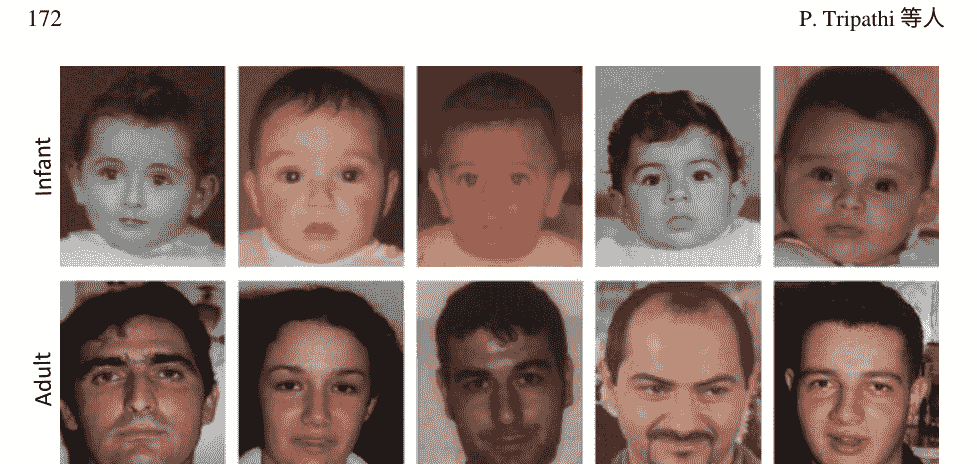

4.  在规划婴儿患者（尤其是唇裂患者）的面部重建时[23]，研究表明种族、性别和年龄显著影响重建手术的规划。这些观察结果表明新生儿的面部也具有独特和特征性的面部特征，可以用于新生儿面部识别。

尽管研究表明新生儿的面部识别是可行的，但要创建一个稳健的系统却具有挑战性。下面讨论了使新生儿面部识别困难的主要挑战：

1.  Bharadwaj等人[14]将新生儿称为非自愿的非合作用户的面部识别对象。这是因为在拍摄图像时，无法确保被拍摄者表情中立并展示正面脸部，因为他们的行为不可预测且面部有弹性。此外，过度运动可能导致运动模糊。图8.3展示了一组图像，展示了表情和运动模糊的变化。

2.  新生儿面部识别面临的另一个挑战是识别相同的双胞胎。在生命的后期阶段，双胞胎可能会获得一些独特的特征，但在出生时很难区分一个双胞胎和另一个。在图8.4中，可以看到很难区分双胞胎，因为他们没有成年双胞胎可能具有的独特特征。在某些情况下，新生儿的面部可能会被柔软的毛发覆盖，尤其是在脸颊和额头上。随着宝宝的成长，这些毛发会脱落，导致图像纹理的变化。

![图8.3说明了在捕捉图像时出现的表情和姿势变化，以及一些图像中的运动模糊 [14]](img/f94068afc0eb348f67abb884ab957ea5_176_0.png)

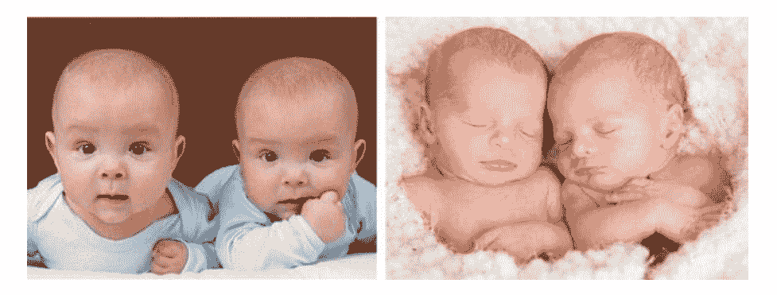

3.  图8.1说明了新生儿面部特征变化的快速速度。可以直观地观察到颅面特征在短短四个月的时间内变化很大。这使得新生儿面部识别成为一个具有挑战性的问题，因为为新生儿面部识别设计的技术必须能够理解并适应新生儿面部的结构差异。

## 8.2 新生儿面部识别的数据集

该领域的研究主要受到公开数据库的缺乏限制。即使对于研究界可用的数据库也是小样本数据库。在下面的小节中，我们将讨论可用于对新生儿、幼儿和学龄前儿童进行人脸识别研究的数据库。

### 8.2.1 新生儿面部数据库

Bharadwaj等人[14]提出了新生儿面部数据库，该数据库包含来自各个医院的450多名新生儿的1200多张图像。每个被试有1-10张图像。其中，96个婴儿的图像是在出生后一小时到几周内的多个会话中获取的。对于婴儿没有任何限制，但作者试图捕捉近正面的面部图像。

图8.5展示了数据库中的样本图像。从图像中可以明显看出，在姿势和表情方面存在很大的变化。

![图8.5 来自新生儿面部数据库的样本图像[14]](img/f94068afc0eb348f67abb884ab957ea5_177_0.png)

该数据库还扩展到包括来自各个医院的204名新生儿的1185张图像，每个新生儿有1-17张图像。拍摄时间从出生后一小时到几周不等。Siddiqui等人[17]对这个扩展的新生儿面部数据集进行了实验。

### 8.2.2 新生儿、婴儿和幼儿纵向面部数据库

Jain等人[24]提出了新生儿、婴儿和幼儿的面部图像数据库。该数据库被称为纵向数据库，因为它包含了一个主题在一年内四个不同会话期间捕获的图像。总共有161个这些主题的面部图像来自四个会话，并且年龄范围从0到4岁。然而，这个数据库不对研究人员公开。

### 8.2.3 儿童多模态生物特征数据库（CMDB）

Basak等人[16]提出了一个包含141个幼儿和学龄前儿童（年龄范围为18个月到4岁）的2590个面部图像的数据库，每个人有10-20个图像。除了面部图像外，该数据库还包括100个幼儿的虹膜和指纹图像。该数据库在两个相隔几个月的会话中收集。图8.6展示了数据库中的样本图像。

![图8.6 展示了来自儿童多模态生物特征数据库的幼儿的样本人部图像[16]](img/f94068afc0eb348f67abb884ab957ea5_178_0.png)

## 8.3 新生儿人脸识别的现有技术

在本节中，我们讨论了已经取得有希望结果的现有人脸识别技术。表8.2给出了现有技术的简要总结。

### 表8.2 总结了新生儿人脸识别的研究结果

| 方法 | 评论 |
| :--- | :--- |
| Bharadwaj等人[13] | 阐述了新生儿人脸识别的挑战 |
| Bharadwaj等人[14] | 提出了一种针对新生儿人脸识别的两阶段领域特定学习方法 |
| Jain等人[24] | 提出了一个新生儿人脸数据库，并展示了COTS人脸匹配器的结果 |
| Basak等人[16] | 提出了一个新生儿和幼儿人脸数据库，并评估了现有的工具和算法 |
| Siddiqui等人[17] | 提出了一种深度学习技术，该技术在学习卷积网络的滤波器时应用了基于类别的惩罚 |
| Keshari等人[18] | 提出了SSF-CNN，重点学习卷积滤波器的“结构”和“强度” |

### 8.3.1 手工特征提取方法

Bharadwaj等人[13]是第一个探索新生儿面部识别的人。他们对34名新生儿进行了初步研究，并得出结论，新生儿的自动面部识别是可行的。如第8.4节所讨论的，新生儿面部识别面临姿势变化和图像模糊的挑战。为了减少图像模糊的影响，Bharadwaj等人在图像上应用了高斯平滑，以过滤过多的皱纹信息，同时保留有区别的纹理信息。然后，使用SURF [25]和LBP [26]从原始面部图像和低频图像中提取面部特征。他们进一步使用 χ² 距离来衡量高斯金字塔相应层之间的差异。加权求和规则被应用于融合三个匹配分数。

所提出算法的结果与其他基于外观的算法进行了比较，包括主成分分析(PCA) [27]、线性判别分析(LDA) [27]和独立成分分析(ICA) [28]。结果否定了人类(成人)的观念，即儿童的面孔看起来相似，无法准确区分。

### 8.3.2 基于自编码器学习的方法

新生儿人脸识别面临着由于他们不合作的天性而产生的几个挑战。在这些场景中，手工特征提取和匹配技术可能不是新生儿人脸识别的最佳选择。2016年，Bharadwaj等人[14]提出了一种基于学习的特征提取技术，以及一种明确编码特征空间属性的匹配技术，以提高识别性能。

他们观察到新生儿面部的不对称发育导致了独特的颅面结构，然而，这种结构与迷你成人面部不成比例。此外，他们还观察到，由于新生儿是人脸识别的非约束用户，所获取的图像在姿势和表情上存在较大的变化。基于这些观察，他们提出了一个两阶段学习算法，首先使用堆叠去噪自编码器（SDAE）[29]学习具有可变表情的领域特定的人脸表示，然后使用问题特定的学习距离度量学习表示，该度量受益于额外的未标记问题特定的新生儿人脸图像，以减小匹配过程中的语义差距，从而提高新生儿人脸识别性能。

在第一阶段，使用深度学习架构学习了人脸的领域特定表示。首先，将输入图像分成九个重叠的补丁。然后，为人脸图像的每个重叠补丁学习了独立的多层编码器集合，有助于增强编码器的深度。补丁编码确保了结果表示的空间一致性。每个编码器提供了面部图像的一个组成部分的表示，例如额头、眼周围、嘴巴和下巴区域。因此获得的表示被连接成一个单一的特征向量。SDAE在大量的领域特定样本上进行了训练，即具有不同照明和表情的人脸图像。

第二阶段通过一次相似性和1-Class-Online-SVM学习了一个问题特定的距离度量。在进行新生儿面部匹配时，低级特征受到语义差距效应的影响，即成年人与新生儿面孔之间的差异。由于传统的距离度量χ²和欧氏距离可能无法考虑到语义差异效应，他们提出了一种距离度量学习技术，可以减少新生儿面部表示中的语义差异效应。由于新生儿面部图像中的类内变化显著高，他们提出将样本投影到核化特征空间中，确保了距离空间的稳健、非线性和高维表示，并提供了一个可推广的解决方案。

### 8.3.3 基于类别的卷积神经网络滤波器学习

Siddiqui等人提出了一种基于深度学习的新生儿、幼儿和学龄前儿童面部识别技术。在他们的研究中，他们对卷积滤波器学习进行了修改，并对滤波器的权重施加了基于类别的惩罚。他们表明，基于类别的惩罚有助于学习类别特定的判别特征并避免过拟合。此外，他们使用残差跳跃连接[30]训练网络，以学习具有增加层数的更高级别特征。

他们使用上述方法设计了自己的11层网络。在CNN的前三层中，使用了三个大小为7 ×7的滤波器，然后是大小为3 ×3的最大池化，步长为2。在接下来的五层中，使用了三个大小为5 ×5的滤波器，然后是三个卷积层，滤波器大小为3 ×3。最后，对于分类，网络的末尾添加了一个全连接层和一个softmax层。

正如数据库部分所讨论的，新生儿人脸识别是一个小样本问题。因此，所提出的卷积神经网络首先使用CMU-MultiPIE数据库进行预训练。然后，通过增加新生儿人脸数据库和儿童多模态生物特征数据库进行微调。网络以验证模式进行训练，对于识别，进行了N路验证。图8.7展示了用于新生儿人脸识别的提出的11层网络架构。

![图8.7所提出的CNN特征提取与基于类别惩罚的滤波器学习的步骤。对于匹配，分类器是根据识别或验证实验单独添加的[17]](img/f94068afc0eb348f67abb884ab957ea5_181_0.png)

### 8.3.4 学习CNN滤波器的结构和强度

收集包含生物特征模态的大型数据库，特别是新生儿的面部，是一项具有挑战性的任务。因此，所有现有的新生儿数据库都包含少量样本。虽然卷积神经网络在几个计算机视觉任务中取得了很高的准确性，但由于参数数量众多，它们需要大量的训练样本。为了克服这个限制，Keshari等人提出了一种基于深度学习的新生儿人脸识别技术，可以在小样本数据库中获得最佳结果。

所提出的结构和强度滤波卷积神经网络（SSF-CNN）专注于学习网络的卷积滤波器的“强度”和“结构”。Keshari等人[18]假设领域特定的大型数据库或其他表示学习范式，如字典学习[32, 33]，可以帮助学习滤波器的结构。字典学习或矩阵分解可以帮助学习有助于编码代表性特征的字典。因此，CNN滤波器可以用字典表示学习领域的“结构”。然而，这种结构可能对于问题特定的特征不是最优的。因此，根据问题特定的数据特征，学习滤波器的强度以适应这些滤波器的权重。所提出的架构如图8.8所示。

![图8.8训练成人脸的人脸识别模型可能在新生儿的人脸识别上效果不佳。SSF-CNN学习滤波器的强度和结构，以提高小样本数据库的分类性能[18]](img/f94068afc0eb348f67abb884ab957ea5_182_0.png)

为了初始化CNN，首先学习分层字典滤波器，然后学习强度参数来训练CNN模型。强度参数为CNN滤波器`W`，它允许网络根据其结构重要性为每个滤波器分配权重。接下来，我们将描述使用字典学习和学习方法分层学习CNN模型的方法，以及强度参数 `t`的学习方法。

#### 滤波器结构学习：

在SSF-CNN中，提出了字典学习来学习滤波器的结构。这一步骤分为两个部分：1. 学习分层字典滤波器，并利用训练好的字典滤波器初始化CNN。

1.  学习分层字典滤波器，并利用训练好的字典滤波器初始化CNN。

2.  使用字典初始化的滤波器训练CNN。

**分层字典滤波器学习：** 通过字典学习，学习输入数据的稀疏表示，以基本元素的线性组合形式表示。给定输入`Y`，通过以下方程式学习字典`D`和系数`α`：

```
min_{D,α} ‖Y - Dα‖_F^2, 使得 ‖α‖_0 ≤ τ
```

其中，ℓ0范数对学习系数施加了稀疏性约束，非零元素的最大数量由`τ`表示。很多时候，ℓ0范数会被放宽，从而改变字典学习的形式：

```
min_{D,α} ‖Y - Dα‖_F^2 + λ‖α‖_1
```

其中`λ`表示正则化参数，用于控制稀疏性促进的ℓ1范数。在SSF-CNN中，字典学习被用于以分层方式预训练CNN模型的滤波器。使用分层字典学习技术来初始化CNN模型。训练好的字典原子被用于在输入图像上进行卷积。卷积后，特征图根据CNN模型中使用的激活函数（例如ReLU）进行归一化。提取的特征图是分层字典的下一层的输入。以此类推，字典层数与CNN模型中的卷积层数相同。

训练好的字典以二维数组的形式组织，其中每个滤波器都排列在一列中。这些学习到的滤波器被重新整形并卷积到输入图像上，以产生下一层字典的特征图。

## 使用初始化字典滤波器训练CNN

CNN模型在一起堆叠了多个卷积和池化层。通常它有多个卷积层，每个层都有多个滤波器。这些滤波器使用随机梯度下降等优化器进行训练[34]。给定输入图像`X`和卷积滤波器`W`，卷积操作可以表示为

```
f(X, W, b) = X * W + b
```

其中`*`和`b`分别表示卷积操作和偏置。训练过程中包括两个步骤，即前向传播和反向传播。在前者中，网络将输入信号传播到最后的分类层。另一方面，在后者中，针对每个层`l`上的节点`j`计算与总成本和CNN滤波器权重相关的误差`δ^l_j`，并相应地更新权重。

在传统的CNN中，权重使用Xavier [35]或MSRA [36]方法进行初始化，甚至是随机的。在提出的方法中，Keshari等人初始化了使用字典学习的CNN滤波器。他们表明，使用字典学习的滤波器与传统初始化技术相比，具有更多的“结构”，特别是对于小样本数据库。尽管这种类型的初始化有助于找到改进的滤波器，但以传统方式更新滤波器仍然需要训练大量的参数。为了避免这种情况，提出了每个滤波器的“强度”参数进行学习，从而显著减少了参数的数量。

### 学习滤波器强度

图8.9直观地展示了学习滤波器强度的概念。从字典学习中学到的权重被冻结，只有在训练过程中学习强度参数。对于第`l`层，使用随机梯度下降法学习强度参数`t`；即学习一个标量值，而不是学习整个滤波器。所提出的过程可以表示为

```
f(X, W, b, t) = X * (t ⊙ W) + b (8.4)
```

![图8.9直观地说明了学习“滤波器强度”的概念，从而减少了训练参数的数量[18]](img/f94068afc0eb348f67abb884ab957ea5_184_0.png)

表8.3 新生儿人脸数据库上的Rank-1识别准确率 (%)

| 算法 | 画廊图像数量 | | | |
| :--- | :---: | :---: | :---: | :---: |
| | 1 | 2 | 3 | 4 |
| COTS | 41.0 | 53.6 | 60.1 | 64.6 |
| 手工特征技术 | | | | |
| LBP + χ² [26] | 21.1 | 32.5 | 39.5 | 44.7 |
| DSIFT + χ² [25] | 31.3 | 41.9 | 48.0 | 53.4 |
| 深度学习技术 | | | | |
| Bharadwaj等人[14] | 51.1 | 66.0 | 73.1 | 78.5 |
| Siddiqui等人[17] | 58.3 | 63.7 | 74.8 | 80.8 |
| Vinyals等人[43] | 59.4 | 63.7 | 68.6 | 72.2 |
| Hariharan等人[44] | 65.4 | 73.3 | 79.3 | 85.4 |
| Keshari等人[18] | 70.4 | 81.4 | 86.5 | 90.0 |

其中，`(t ⊙ W)`表示逐元素相乘。`t`可以通过随机梯度下降学习。由于 `|W| > |t|`，即使使用少量训练数据也可以用来训练网络。

### 学习新生儿面部识别的SSF-CNN

预定义的实验协议限制了作者只能使用10个新生儿的图像进行训练，并使用其余86个新生儿的图像进行测试。通过使用字典学习初始化技术从10个新生儿中学习滤波器的结构，然后通过调整滤波器的强度参数来计算`ResNet`架构的性能。他们还报告说，如果从头开始训练`CNN`模型，准确率非常低，除了使用字典学习来学习数据库的“结构”之外，作者还报告说可以从大型领域特定数据库中学习“结构”，然后通过调整强度参数来适应问题特定数据库。因此，实验是使用预训练网络进行的（预训练滤波器是在`ImageNet`或`Labeled Faces in the Wild`数据库（`LFW`）[37]和`YouTube Faces`（`YTF`）[38]数据库上学习后获得的），并使用强度参数来调整它以适应10个新生儿的训练数据进行新生儿面部识别。对于这个实验，他们使用了`ResNet` [30]、`VGG` [39]、`VGGFace` [40]、`LightCNN` [41]和`DenseNet` [42]架构的变体。

在[18]中观察到，与传统的微调方法相比，卷积神经网络模型的学习强度提高了性能。当每个主体只有一张图库图像时，使用预训练的`VGG-Face` [40]和提出的强度参数可以获得超过70%的最佳排名1准确率，这至少比传统的微调方法好10%。因此，展示了在实际应用中，学习结构和强度的概念有助于实现改进的性能。

## 8.4 现有新生儿面部识别技术的结果和分析

在本节中，我们使用新生儿面部数据库和[14]中定义的实验协议对现有技术进行比较分析。评估使用了两种手工制作的特征，LBP [26]和DSIFT [25]，以及五种基于特征学习的算法。我们还使用了一个商业人脸识别系统，称为COTS，进行评估和比较。表8.3显示了本章讨论的新生儿面部识别技术之间的比较。需要注意的是，一些结果直接来自于各自的论文。我们的观察结果如下：

1.  **商用技术与手工技术的比较**：从表8.3可以看出，像LBP [26]和DSIFT [25]这样的手工特征在新生儿面部识别中的表示能力有限，达到的准确性最低。图8.10说明了LBP [26]生成基于局部信息的特征空间，而不考虑新生儿面部识别所需的判别信息。同样，DSIFT [25]以密集的方式找到关键点，而不考虑它们提供多少判别信息来进行识别。

2.  **基于学习的方法的效果**：Bharadwaj等人[14]提出了一种基于自编码器的特征表示方法，然后使用新生儿面部识别特定的距离度量学习。后者通过一次性相似性和一类在线支持向量机进行新生儿面部识别。所提出的方法在单个图库中实现了51.1%的一级识别准确率，比商用技术提高了10.1%。这表明与手工技术或商用技术相比，基于学习的框架对于新生儿面部识别更有效。这是因为基于学习的方法允许算法捕捉编码方案的语义理解。Siddiqui等人[17]提出了一种基于深度学习的新生儿面部识别技术。他们修改了卷积滤波器的学习，并对滤波器的权重施加了一类惩罚。这种基于类别的惩罚有助于学习类别特定的判别特征。根据结果，可以得出结论，可以开发基于学习的方法，可以预测准确的新生儿面部识别所需的最具判别性的特征。

3.  **基于深度学习的人脸分析**：由于参数数量庞大，深度学习方法需要大量的样本来训练网络。在新生儿人脸数据库这个小样本数据库上，我们比较了Vinyals等人[43]、Hariharan等人[44]和Keshari等人[18]提出的算法，这些算法专门针对小样本数据库设计。结果表明，这些方法优于传统的深度学习方法。

Siddiqui等人[17]提出的方法。图8.10直观地说明了基于深度学习的方法专注于最具区分性的区域，因此实现了最高的准确性。因此，可以说通过学习关注眼周、鼻子和嘴巴区域的特征，可以实现高识别准确性。我们断言，针对新生儿人脸识别专门设计的零样本或一样本学习技术，可以进一步提升性能，因为这些方法利用深度学习模型来学习最优特征，即使在某个特定主体只有一张或没有图像的情况下也能实现。

4.  **图库规模对识别准确性的影响**：可以注意到，当图库图像数量从一个增加到四个时，任何特定算法的准确性都会提高。图8.11展示了Keshari等人提出的最新方法在匹配探测图像和图库图像时无法准确匹配的情况。从同一图中可以观察到，这是因为新生儿面部图像受到表情变化或因新生儿的非故意不合作行为而导致的过度模糊的影响。基于这一观察，可以得出结论：增加图库图像的数量可以提高新生儿面部识别性能。

## 8.5 结论

设计一个自动验证/识别新生儿已经成为必要的，因为它在各个领域具有应用，如医疗保健、儿童安全和公民身份识别计划。然而，由于新生儿的非故意不合作行为，所获取的图像包含了各种表情，而一些图像则受到过度模糊的影响。这些变量使得匹配同一主题的图像成为一项具有挑战性的任务。此外，新生儿颅面结构的不对称发育与迷你成人面部不相似。因此，有必要专门为新生儿面部识别设计算法。在本章中，我们讨论了各种新生儿面部数据库和已经在新生儿面部识别中表现良好的技术。

观察到基于学习的技术比依赖手工特征表示或现有距离度量的算法表现更好。然而，要成功学习所有有区别的特征，必须拥有具有不同表情、姿势和光照的大型数据库是至关重要的。

未来，可以使用数据微调[45]和引导丢弃[46]来使学习算法对测试图像的变化更加稳健。此外，还可以通过生成对抗网络(GANs)生成新生儿面部的合成图像。未来，可以设计基于视频的面部识别来识别与新生儿相关的面部图像。视频可以捕捉到不同时间步骤上的表情变化，从而使技术能够对表情和姿势变化具有鲁棒性。在现实条件下，诸如视频帧选择[47]、联合特征学习[48]和融合[49]等算法可以帮助提高面部识别的性能。

## 参考文献

1.  Pandey G. https://www.bbc.com/news/world-asia-india-42743982. 2018年11月15日访问

- 2. Stewart W. https://www.dailymail.co.uk/news/article-6014157/Two-women-discover-raised-wrong-families-hospital-blunder-Russia.html. 2018年11月15日访问

- 3. Sharma A. https://indianexpress.com/article/india/india-news-india/shimla-five-months-after-swap-babies-will-return-to-their-original-parents-3095974/. 2018年11月15日访问

- 4. Nambiar N. https://timesofindia.indiatimes.com/city/pune/aadhaar-for-newborns-at-500-hospitals-from-august/articleshow/64981490.cms. 2018年11月15日访问

- 5. https://www.indexmundi.com/g/g.aspx?c=in&v=25. 2018年11月15日访问

- 6. Shepard KS, Erickson T, Fromm H (1966) 足迹作为婴儿识别手段的局限性. 儿科学37 (1) : 107-108

- 7. Pelá NTR, Mamede MV, Tavares MSG (1976) 新生儿足底印记的批判性分析. 巴西护理杂志29 (4) : 100-105

- 8. Weingaertner D, Bellon ORP, Silva L, Cat MN (2008) 新生儿的生物特征识别: 可行吗? 在: 国际计算机视觉理论与应用会议, pp 200-205

- 9. Lemes RP, Bellon OR, Silva L, Jain AK (2011) 新生儿的生物特征识别: 使用掌纹进行识别. 在: IEEE国际联合生物特征识别会议, pp 1-6

- 10. Fields C, Falls HC, Warren CP, Zimberoff M (1960) 新生儿的耳朵作为识别常数. 妇产科学16 (1) : 98-102

- 11. Tiwari S, Singh A, Singh SK (2011) 新生儿耳朵识别: 可行吗? 在: IEEE国际图像信息处理会议, 第1-6页

- 12. Jain AK, Cao K, Arora SS (2014) 识别婴儿和幼儿使用指纹: 增加疫苗接种覆盖率. 在: IEEE国际生物识别联合会议, 第1-8页

- 13. Bharadwaj S, Bhatt HS, Singh R, Vatsa M, Singh SK (2010) 新生儿人脸识别: 初步研究. 在: 第四届IEEE国际生物识别会议: 理论应用和系统, 第1-6页

- 14. Bharadwaj S, Bhatt HS, Vatsa M, Singh R (2016) 针对新生儿人脸识别的领域特定学习. IEEE信息取证与安全性11(7): 1630-1641

- 15. Best-Rowden L, Jain AK (2018) 自动人脸识别的纵向研究. IEEE Trans Pattern Anal Mach Intell 40(1):148–162

- 16. Basak P, De S, Agarwal M, Malhotra A, Vatsa M, Singh R (2017) 幼儿和学龄前儿童的多模态生物识别. 在: IEEE国际联合会议上生物识别, pp 627–633

- 17. Siddiqui S, Vatsa M, Singh R (2018) 幼儿和学龄前儿童: 一种深度学习方法. 在: 国际模式识别会议上

- 18. Keshari R, Vatsa M, Singh R, Noore A (2018) 学习CNN滤波器的结构和强度用于小样本训练.计算机视觉和模式识别会议 pp 9349–9358

- 19. Tiwari S, Singh A, Singh SK (2012) 耳朵和软生物特征的融合用于新生儿识别. 信号图像处理: 国际杂志 3(3):103–116

- 20. Bowyer KW, Burge MJ (2016) 虹膜识别手册. Springer

- 21. Kuefner D, Cassia VM, Picozzi M, Bricolo E (2018) 所有的孩子看起来都一样吗? 成年人中存在另一种年龄效应的证据. J Exp Psychol: Hum Percept Perform 34(4):811

- 22. Anastasi JS, Rhodes MG (2005) 儿童和老年人面孔识别中的同龄偏见. Psychon Bull Rev 12 (6):1043–1047

- 23. Radhakrishnan V, Sabarinath V, Thombare P, Hazarey P, Bonde R, Sheorain A (2010) 在完全单侧唇腭裂婴儿中进行术前鼻腭成型辅助初次重建. J Clin Pediatric Dent 34(3):267–274

- 24. Best-Rowden L, Hoole Y, Jain A (2016) 新生儿、婴儿和幼儿的自动人脸识别: 一项纵向评估. 在: IEEE国际生物特征专业兴趣小组会议上, 第1-8页.

- 25. Bay H, Tuytelaars T, Van Gool L (2006) Surf: 加速鲁棒特征. In: 欧洲计算机视觉会议. Springer, pp 404–417

- 26. Ahonen T, Hadid A, Pietikainen M (2006) 本地二进制模式的人脸描述: 应用于人脸识别. IEEE Trans Pattern Anal Mach Intell 12:2037–2041

- 27. Belhumeur PN, Hespanha JP, Kriegman DJ (1997) 特征脸与费舍尔脸: 使用类别特定线性投影进行识别. IEEE Trans Pattern Anal Mach Intell 19(7): 1997年7月

- 28. Bartlett MS, Movellan JR, Sejnowski TJ (2002) 独立成分分析的人脸识别. IEEE Trans Neural Netw 13(6):1450

- 29. Vincent P, Larochelle H, Bengio Y, Manzagol P-A (2018) 使用去噪自编码器提取和组合鲁棒特征. In: 机器学习国际会议, pp1096–1103

- 30. He K, Zhang X, Ren S, Sun J (2016) 深度残差学习用于图像识别。 在：IEEE计算机视觉和模式识别会议，第770-778页

- 31. Gross R, Matthews I, Cohn J, Kanade T, Baker S (2010) Multi-PIE. 图像视觉计算 28(5):807–813

- 32. Tariyal S, Majumdar A, Singh R, Vatsa M (2016) 深度字典学习。 IEEE Access 4:10096–10109

- 33. Tosic I, Frossard P (2011) 字典学习。 IEEE信号处理杂志28(2):27–38

- 34. LeCun Y, Touresky D, Hinton G, Sejnowski T (1988) 反向传播的理论框架。 在：连接主义模型暑期学校，第1卷。 Morgan Kaufmann, CMU, Pitts-burgh, Pa, 第21-28页

- 35. Glorot X, Bengio Y (2010) 理解深度前馈神经网络训练的困难。 在：人工智能和统计国际会议，第249-256页

- 36. He K, Zhang X, Ren S, Sun J (2015) 深入研究整流器：在ImageNet分类上超越人类水平的性能。 在：IEEE国际计算机视觉会议，第1026-1034页

- 37. Huang GB, Ramesh M, Berg T, Learned-Miller E (2007) 野外标记人脸数据库：用于研究非受限环境下人脸识别的数据库。 马萨诸塞大学，阿默斯特，技术报告07-49

- 38. Wolf L, Hassner T, Maoz I (2011) 在具有匹配背景相似性的非受限视频中进行人脸识别。 在：IEEE计算机视觉和模式识别会议，第529-534页

- 39. Simonyan K, Zisserman A (2014) 面向大规模图像识别的深度卷积网络. arXiv:1409.1556

- 40. Parkhi OM, Vedaldi A, Zisserman A (2015) 深度人脸识别. 在: 英国机器视觉会议, 第1卷, 第3期, 第6页

- 41. Wu X, He R, Sun Z, Tan T (2018) 用于带有噪声标签的深度人脸表示的轻量级CNN. IEEE Trans Inf Forensics Secur 13(11):2884-2896
- 42. Huang G, Liu Z, van der Maaten L, Weinberger KQ (2017) 密集连接的卷积网络. 在: IEEE计算机视觉和模式识别会议, 第1卷, 第2期, 第3页
- 43. Vinyals O, Blundell C, Lillicrap T, Wierstra D, et al (2016) 用于一次性学习的匹配网络. 在: 神经信息处理系统进展, 第3630-3638页
- 44. Hariharan B, Girshick RB (2017) 通过收缩和虚构特征进行低样本视觉识别. 在: IEEE国际计算机视觉会议, 第3037-3046页
- 45. Chhabra S, Majumdar P, Singh R, Vatsa M (2019) 数据微调. 在: AAAI人工智能会议
- 46. Keshari R, Vatsa M, Singh R (2019) 引导式丢弃. 在: 人工智能AAAI会议上
- 47. Goswami G, Bhardwaj R, Singh R, Vatsa M (2014) MdIface: 增强记忆力的深度学习用于视频人脸识别. 在: IEEE国际联合生物特征识别会议上, 第1-7页
- 48. Goswami G, Vatsa M, Singh R (2017) 通过学习特征丰富的视频帧进行人脸验证. IEEE信息取证与安全性交易12(7):1686–1698
- 49. Bhatt HS, Singh R, Vatsa M (2014) 使用基于聚类的重排序和融合在视频中识别人脸. IEEE信息取证与安全性交易9(7):1056–1068

# 第9章 用于人脸分析的深度特征融合

Nishant Sankaran, Deen Dayal Mohan, Sergey Tulyakov, Srirangaraj Setlur, 和 Venu Govindaraju

## 9.1 引言

来自特定来源的数据通常与来自其他来源的数据呈现相关性。常见的数据来源包括（i）传感器-收集原始数据，（ii）特征提取器-处理来自传感器的原始数据以生成代表原始数据的特征，以及（iii）评估器-生成传达所提供特征属于特定应用假设的得分或度量的工具。能够有效捕捉这种相关性的融合方法提供了更明智的决策能力。特征融合方法主要处理来自特征提取器的数据，并尝试利用各种特征中包含的共享信息，生成更高效的融合表示，以完成特定任务。根据涉及的传感器数量，可以采用两种特征融合方法：单模态特征聚合和多模态特征融合。

单模态特征聚合将从单一来源（模态）产生的数据合并成一个稳健的表示，该表示总结了数据（传感器）信号的重要特征。它通常用于去除特征中固有的噪声，并对其中包含的信息进行精炼。这里的一种天真的方法是简单地对特征向量进行平均或计算均值，从而产生所需的去噪效果。然而，还存在更细致的方法，可以从特征向量中自适应地提取更多信息。多模态特征融合捕捉多个数据源（模态）之间的相关性，并利用它来提高目标优化任务的性能。多模态表示学习主要有两种方法：联合表示学习将单模态特征组合到一个共同的空间中，协调表示学习发现模态特定的表示，但强制相似性。

对它们的限制。典型的联合表示学习方法堆叠或连接单模态数据表示，并应用基于逻辑回归的模型或者更近期的深度神经网络，学习将它们融合成一个统一的转换表示，体现出所有涉及的模态的特征。

在本章中，我们探索了一种应用于人脸识别任务的单模态特征聚合方案（第9.2节），以及一种多模态特征融合方法，该方法既具有联合表示学习的元素，又具有协调表示学习的元素，应用于面部动作单元识别（第9.3节）。

## 9.2 面部识别的特征聚合

面部识别是将面部分类为特定身份或验证给定的两个面部是否属于同一身份的问题。在过去的几年里，面部识别在将最新技术推向接近人类水平[18, 26]甚至超越人类能力[17, 22]方面取得了巨大进展。尽管这些系统展示了出色的性能，使得社区普遍认为受限制的面部识别问题已经解决，然而，无约束的面部识别提出了不同的挑战。

无约束的面部识别试图解决许多面部识别系统部署在无法控制面部捕捉条件的环境中，并且可能存在不合作的对象的情况。在无约束的环境中（例如视频监控），面部识别系统的目标是从之前可能已经编制的媒体集合（称为库）中识别出主体（称为探针）。探针和库被存储为模板，每个模板可以包含一个或多个与特定身份对应的面部图像。这些面部图像通常通过面部检测[11, 31]、特征点识别[19]和最后的对齐流程生成。然后，对齐后的面部图像被转换为一种判别性表示（例如基于CNN的特征[24, 26]），与其他面部图像的类似表示进行比较，以确定图像中存在的身份是否相同。为了估计面部表示的相似性，使用了几种度量方法，如欧氏距离、余弦相似度甚至度量学习方法[1, 20]。

使用上述相似性函数，匹配仅由单个图像组成的探测和库中的人脸模板相对简单，其中最常见的函数是余弦相似度。然而，在像IJB-A [12]和YTF [27]这样的无约束数据集中，人脸模板包含多个图像，因此，确定如何将人脸特征融合/汇集到代表模板的单个特征向量中是一个新的挑战。通常，最简单的解决方案是使用朴素的平均/最大汇集[3, 4, 18]将特征汇集起来形成模板表示。在最近的研究中，提出了更智能的解决方案，其中权重是通过分析特征并评估其代表性来确定的。

在这里，我们提出了一种新的方法，用于汇集在人脸验证任务中训练的模板的特征。我们使用模板中人脸图像附带的元数据来评估聚合过程中每个特征的重要性。人脸图像的元数据包括但不限于图像中人脸的偏航、俯仰和翻滚，以及其他外部细节，如人脸裁剪的大小、标志物的位置等。我们的方法的动机源于以下事实：所有先前的方法[15, 29]仅考虑用于确定聚合权重的特征。一般来说，特征是由CNN或其他嵌入系统生成的，其优化标准是将同一身份的所有人脸图像映射到一个具有最小类内方差（以增强可区分性）和最大类间方差（以增强可分离性）的独特聚类中。但很明显，在这样做的过程中，这个优化函数限制了系统利用特征之间的差异来确定最佳相对权重的能力。因此，我们推测使用由优化过程不受干扰的附加数据/元数据来生成具有区分性特征将导致发现更好的聚合权重。

我们使用在[2, 19]中描述的CNN来获取我们方法中使用的元数据和特征。我们设计了一种基于元数据的特征聚合网络（M-FAN），它以特征、元数据和一个名为种子权重的额外参数作为输入，用于生成模板的加权特征表示。种子权重只是提供给网络的初始权重估计，旨在作为优化过程的起点，网络经过训练可以根据相应的元数据转换这些种子权重。该参数提供了向网络提供之前手工制作的权重的可能性，网络可以根据元数据进行微调，从而提高性能，相比使用手工制作的聚合权重。我们在IJB-A和Janus CS4数据集上对模型进行了实验，并在先前最先进的方法上取得了令人信服的改进，并且证明了M-FAN模型改善了传统使用简单池化策略的人脸识别系统的性能。

### 9.2.1 基于元数据的特征聚合网络（M-FAN）

M-FAN模型的整个目标是作为特征质量评估器，并产生与特征向量的“价值”相对应的权重，作为模板的一部分。设 $f_i$ 和 $m_i$ 为模板中的第 $i$ 个特征向量和相应的元数据向量。我们定义一个评估函数 $f_θ$ 为元数据向量的函数，由参数 $θ$ 参数化，产生一个评估所提供元数据的权重。如果 $T$ 表示模板向量或汇总特征，则有

$$T = \sum_{i} f_{\theta}(m_{i}) f_{i}$$ (9.1)

在我们的情况下，$f_{\theta}$ 可以被实现为任何函数逼近器，我们使用全连接网络（FCN）来表示。上述公式确保了M-FAN网络不依赖于特征来进行预测，这对我们的模型的性能至关重要，原因如下。特征向量通常由人脸识别器生成，其任务是将特定主体的任何和所有面部图像变化映射到特征空间中的一个紧密聚类。因此，这意味着与特定主体的一组面部图像对应的特征向量应具有最小的变化，以最大程度地提高对该主体的可区分性。现在，对于任何试图评估模板中特征向量的相对“丰富程度”的聚合系统来说，这就带来了一个问题，因为它们都非常相似。这就解释了为什么同样的系统需要正交信息，如元数据，这些信息不受特征生成过程的影响，以提供有助于区分主体的面部图像的上下文。

鉴于模板向量的构建，我们系统的目标是确定最优的参数集 $\theta$ ，以最小化我们定义的成本函数

$$E_{pq} = \left[ \frac{\boldsymbol{T}_p \cdot \boldsymbol{T}_g}{\|\boldsymbol{T}_p\| \|\boldsymbol{T}_g\|} - Y_{pq} \right]^{2}$$ (9.2)

$$\text{成本} = \sum_{p} \sum_{g} E_{pq}$$ (9.3)

其中 $\boldsymbol{T}_p$ 和 $\boldsymbol{T}_g$ 是使用 (9.1) 获得的探针和库模板向量，$Y_{pq} \in [0, 1]$ 是给定探针和库模板的匹配标签，$E_{pq}$ 是匹配分数预测的误差，显然，两个模板之间的相似度是使用余弦相似度获得的。在这些目标的基础上，第9.2.2节介绍了M-FAN结构的设计。

### 9.2.2 架构

M-FAN架构的设置如图9.1所示。模型的核心是完全连接网络（FCN），用于评估元数据并输出相应特征向量的权重。在实践中，网络还提供了一组种子权重 $w_i$ （例如，设置 $w_i = \frac{1}{n}$ ，$n$ 是模板中的图像数量），它可以用作开始优化过程的起点。因此，FCN块不会明确产生权重预测作为输出，而是产生用于转换种子权重的参数。通过精心设计的函数生成的种子权重通常可以提高模型收敛到更好权重预测的能力。

对于训练，M-FAN网络被构建为孪生网络。网络提供探针模板的特征、元数据和种子权重作为左输入，提供画廊模板的相同内容作为右输入。特征和元数据来自[2, 19]中描述的网络。这些输入通过FCN模块，使用共享权重，这在孪生架构中是典型的。FCN模块的输出将种子权重 $w_i$ 转换为 $w_i'$，使得 $\sum w_i' =1$，然后与相应的特征 $f_i$ 一起用于创建每个探针和画廊模板的模板向量。余弦相似度损失层计算模板之间的距离，并根据匹配标签进行优化。在测试过程中，我们不使用孪生设置，而是将所有输入提供给M-FAN模型，该模型生成聚合特征向量。

### 9.2.3 梯度反向传播

误差 $E_{pg}$ 在公式（9.2）中定义，可用于推导正在优化的FCN中参数 $\theta$ 的梯度。计算单个探测库模板的梯度如下

$$\frac{\partial E_{pg}}{\partial \theta} = 2 \sqrt{E_{pg}} \left[ \frac{\|T_p\| \|T_g\| \frac{\partial T_p \cdot T_g}{\partial \theta} - T_p \cdot T_g \frac{\partial \|T_p\| \|T_g\|}{\partial \theta}}{\|T_p\|^2 \|T_g\|^2} \right]$$

其中

$\frac{\partial T_p \cdot T_g}{\partial\theta} = T_p \cdot T_g' + T_g \cdot T_p'$

(9.5)

并且

$\frac{\partial \|T_p\| \|T_g\|}{\partial\theta} = \|T_p\| \cdot \|T_g\|' + \|T_g\| \cdot \|T_p\|'$

(9.6)

遵循微积分的乘积法则。同样，我们得到模板向量T及其范数的梯度如下

$T' = \sum_{i} h'_\theta(m_i) f_i$

(9.7)

$\|T\|' = \frac{T}{\|T\|} \cdot T'$

(9.8)

这里有一个有趣的事情需要注意，参数θ的梯度也是特征向量f_i的函数。这对整体训练过程有一个很好的影响，即使FCN块从未看到特征向量来进行预测，它的参数更新也受到f_i的影响，从而强制它学习元数据和特征之间的隐含相关性。此外，由于输入空间中只有少量维度，相比将人脸特征向量作为输入，训练算法能够更快的收敛，并使用更少的网络参数。

### 9.2.4 批量训练

在设计训练设置时，明显网络每次只能在单个探测和画廊模板对上进行训练。这是因为每个模板可能由不同数量的人脸图像组成，这意味着制作探测和画廊模板的批次将会很困难。然而，正如[14]中提到的，使用批量大小 >1的网络通常收敛更快且达到更好的极小值。为了解决这个问题，我们引入了一个额外的输入——索引k_i，它保存了每个人脸图像（以及相应的特征和元数据）在批次中的模板索引。这使我们能够将多个模板集合分组为一个批次（图9.2），并仅使用由k_i索引的相应特征向量来计算聚合的模板向量。

### 9.2.5 实验设置

在[2]中描述的CNN为每个人脸图像生成一个128维特征向量。此外，[19]中详细介绍的CNN生成多个元数据输出，我们在实验中使用偏航、俯仰、滚动、人脸边界框面积、性别分类置信度和人脸检测分数。我们的M-FAN模型是由一个具有ReLU激活函数的4层FCN创建的。我们将数据集中的主体分为3组——60%用于训练（其中20%用于验证），其余用于测试。然后，我们使用提供的模板协议为这三组生成探测器与库的匹配。我们在训练集上训练我们的模型，最多进行100个epochs，学习率为0.15，每个epoch的衰减率为0.99。我们在测试集上报告表现最好的模型在验证集上的表现。由于网络性能会受到提供给它的初始权重的影响，我们进行了两组实验——一组使用简单平均权重，另一组通过将图像按其媒体来源分组，并根据每个图像的人脸检测分数进行加权。对于后者，我们首先按其人脸检测分数加权汇总与特定媒体来源对应的所有图像，即 f_m = ∑

### IJB-A上的结果

这里我们展示了M-FAN模型在IJB-A验证协议上的结果。IJB-A包含5712张图像和2085个500个主体的视频，平均每个主体有11.4张图像和4.2个视频。我们将提供的训练集中的主体分为训练和验证集（80:20比例），并评估训练好的模型在测试集中提供的协议。使用ROC曲线评估1:1验证结果，并报告不同FAR (False Accept Rate)值的TAR (True Accept Rate)性能。我们展示了之前最先进方法在IJB-A上报告的结果，并将其与我们的系统进行比较。表格 9.1 中的结果清楚地表明M-FAN捕捉到了元数据和构成模板的特征之间的相关性，并证明了它作为智能聚合单元的实用性。

### Janus CS4的结果

我们在IARPA Janus Challenge Set 4 (CS4)数据集上进行实验，这是IJB-A数据集[12]的超集；CS4和IJB-A数据集的比较见[2]。M-FAN预测的权重示例如图9.3所示。表9.2显示了使用M-FAN模型种子平均权重时的性能改进。有趣的是，即使M-FAN被提供了平均权重的种子，它的表现仍然比手工制作的平均权重更好。当M-FAN被提供更复杂的平均权重时，它可以将性能提高1.5%以上。我们还分析了M-FAN模型在测试阶段预测的权重与提供给它的各种元数据之间的关系，并绘制了图9.4中的结果。我们可以看到，网络已经学会了对任何远离正面姿势的方向预测低聚合权重。图9.4d描述了各种人脸检测 (FD) 分数的权重，我们也可以看到它对具有较高FD分数的图像分配了更高的置信度。

## 9.3 面部动作单元的特征增强

近年来，结合多个数据源的方法越来越受欢迎。这主要归因于不同多模态传感器产生的大量数据。大多数试图结合多模态数据的方法主要分为两大类。多视角学习方法[28]，它们寻找多个模态数据之间的子空间或共享空间，并将其作为统一的表示。这些方法通常试图强制执行增加视图学习特征相似性的约束。另一方面，多模态融合方法[13]试图结合不同表示的特征，以提高整个系统的性能。

大多数多模态融合方法尝试创建一个统一的特征空间。这可以通过将当前特征空间映射到更高维度或通过学习连接多模态特征后的潜在表示来实现。由于诸如[22]的新嵌入方法和用于深度学习的复杂多数据集训练过程的最新进展，这些网络产生的特征非常优化。从多个这样的特征生成统一的表示可能需要同样复杂的训练过程。在这里，我们试图重新思考需要统一表示的必要性。我们在理论上和实验证明，在各自的特征空间中学习增加这些特征可分离性的线性变换可以成为现有方法的替代方案。为了验证我们的论点，我们将我们的方法应用于面部动作单元的识别问题。

面部表情是任何人际交流中最重要的非语言线索之一。面部表情通常可以在两个维度上进行测量。判断编码系统描述了潜在情绪空间中的情绪。该方案中经常使用的参数是七种普遍情绪，即愤怒、恐惧、厌恶、快乐、悲伤、惊讶和蔑视。使用FACS编码方案更详细地描述情绪的一种方式。在他们的论文[7]中，将FACS定义为贡献于面部表情的不同面部肌肉运动，可以独立地或成对地进行。每个动作单元描述了面部肌肉的运动或收缩。因此，它们编码的是解剖上可见的变化，而不是依赖观察者对情绪的推断。FACS的细粒度在检测中特别有益。

表格 9.1 IJB-A 1:1 验证 TAR (%)

| 方法 | $10^{-1}$ FAR | $10^{-2}$ FAR | $10^{-3}$ FAR |
|------|-------------|-------------|-------------|
| TE | 96.40 ± 0.5 | 90.00 ± 1.0 | 81.30 ± 2.0 |
| TA | 97.90 ± 0.4 | 93.90 ± 1.3 | 83.60 ± 2.7 |
| NAN | 97.80 ± 0.3 | 94.10 ± 0.8 | 88.10 ± 1.1 |
| M-FAN† | 97.97 ± 0.3 | 96.34 ± 0.3 | 94.10 ± 0.7 |


| M-FAN‡ | **98.00** ± 0.3 | **96.56** ± 0.4 | **94.44** ± 0.5 |

TE: 模板嵌入 [20], TA: 模板适应 [5], NAN: 神经聚合网络 [29], † M-FAN (naive), ‡ M-FAN (media)

表9.2 Janus CS4 1:1验证TAR(%)

| 汇聚方法 | $10^{-2}$ FAR | $10^{-3}$ FAR | $10^{-4}$ FAR |
|----------|-------------|-------------|-------------|
| 简单平均 | 95.27 | 90.40 | 86.54 |
| 媒体平均 | 95.38 | 90.85 | 86.88 |
| M-FAN (简单平均) | 95.65 | 90.99 | 87.35 |
| M-FAN (媒体平均) | 95.98 | 92.19 | 88.63 |

甚至微妙的受控或不受控的面部行为。几十年来，它们在法医学、神营销、医疗保健等领域得到广泛应用。尽管面部动作单元识别在可见光领域(VLD)已经有了很好的研究，但RGB图像受到照明变化的影响，只能捕捉到作为动作单元效果的可视变化。然而，面部在动作单元发生时会发生一些生理变化，如皮肤温度变化、心率变化、血压变化和呼吸频率变化，这些变化无法通过可见光图像捕捉到。相比之下，红外图像可以检测到皮肤温度变化，并且对照明变化和肤色变化不变，已经被证明对动作单元运动敏感[10]。因此，可见光和热图像编码了面部动作单元的互补方面。

在本章中，我们展示了一种替代现有多模态融合方法的方法。我们在可见光和热图像上训练了一个`DenseNet`模型，并生成相应的可见光和热特征。我们提出了一种通过仅应用缩放和平移扰动来增强现有特征空间的思路。网络通过同时查看所有特征表示来学习每个特征应用的扰动。通过这样做，我们生成了原始热图和可见光特征的增强特征表示。当这些增强特征结合在一起时，提高了系统的整体性能。

### 9.3.1 多模态条件特征增强 (MCFE)

图9.5显示了所提出的多模态条件特征增强(MCFE)方法的示意图。MCFE由特征提取阶段和特征增强阶段组成。针对面部动作单元识别任务，我们首先训练一个深度卷积神经网络，该网络学习为给定的面部RGB帧分配动作单元标签。该网络使用多任务学习框架进行优化，并加入了类别加权，以解决这类问题中普遍存在的类别不平衡问题。虽然一个网络是在可见光谱上进行训练，另一个网络也以类似的方式在热谱上进行训练，用于相同的任务。每个网络学习了任务的特定视角，我们实现了一种新颖的多模态学习解决方案，通过在共享子空间中建模它们的相关性来增强它们的对应表示。与传统的融合方法相反，我们的方法不试图创建一个更适合解决任务的统一融合表示。相反，在我们的融合方法中，我们强调将从各个模态独特学习到的信息传递给其他视角表示，以提高每个模态特征表示的性能，从而最大化组合系统的性能。与传统的融合方案相比，这种方法的优势在于，它不会大幅增加寻找一个更好的融合表示的搜索空间。

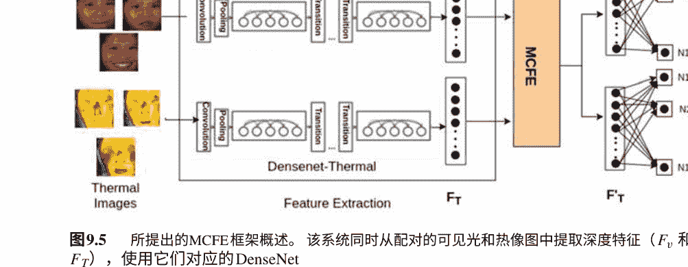

最佳表示既描述了两种模态，又通过仅确定每个视图的表示所需的修正/扰动来限制问题，这是由相应视图引导的。 通过这样做，我们不仅增强了各个表示，还提高了整个系统的性能，该系统汇总了各个模态的性能。 在接下来的几节中，我们详细介绍了用于提取动作单元特征的方法以及应用于多模态面部动作单元识别的新颖融合方法。

### 9.3.2 特征提取

面部表情识别的研究主要可以根据特征提取器和分类器进行分类。 手工设计的特征（如`SIFT`[16]， `HOG` [6]等）对于捕捉由表情引起的面部复杂非线性变换的能力有限。 另一方面，`CNN`已经显示出学习视觉任务（如手写字符识别、人脸识别等）的最优特征的能力。一系列卷积滤波器可以从抽象信息（如边缘）开始提取特征，到后续层中的复杂模式（如人脸）。 然而，随着结构的加深，梯度在到达初始层时会消失。 具有短跳跃连接的网络，如`ResNets`[8]和`Highway Networks` [23]，通过提供一种替代和更容易的梯度流动方式来防止这种情况发生。 在此基础上，引入了`DenseNet` [9]，其中一个层的特征与所有前面层的特征相连接。 因此，低层次的抽象特征与高层次的细粒度特征相结合。 尽管`DenseNets`学习了与更深的模型类似的表示，但由于其紧凑的参数化，它不容易过拟合，并且可以重复使用特征。 为此，

我们使用`Densenet-121`架构，并对其进行修改，以从可见光和热图像中提取特征。该网络由4个密集块组成，后面跟着一个由12个神经元组成的输出层，用于12个类别的分类。在最终的分类层中使用了`sigmoid`激活函数。通常在输出层应用交叉熵损失函数。考虑到N个AU类别，对于每个输入，多类别交叉熵损失被计算为

```
C = \sum_{i=1}^{N} (y_i' \log y_i + (1 - y_i') \log(1 - y_i)) \quad (9.9)
```

在上述公式中，与每个AU对应的损失组件被赋予相等的权重。大多数面部动作单元数据集存在严重的不平衡问题。一些动作单元的正样本与负样本的比例非常低，也被称为发生率。因此，为了考虑到不平衡的类别，需要对各个损失组件进行加权。

然而，对于多标签分类问题，计算每个类别相对于其他类别的权重可能会非常复杂，因为每个数据样本可能包含多个AU类别。因此，为了解决这个问题，我们使用了一个多任务框架，其中将分别对N个输出神经元应用二元交叉熵损失，并且对损失组件应用的权重由它们各自的正负样本比例加权。`DenseNet`的最后输出层被分成12个输出神经元。成本函数的计算方式为

```
b_i = w_i * (y_i' \log y_i) + 1 * ((1 - y_i') \log(1 - y_i)) \quad (9.10)
```

负样本的权重为1，正样本的权重为 `w_i`，其中

```
w_i = \frac{n_i}{p_i} \quad (9.11)
```

其中 `n_i` 为 `AU_i` 的总负样本数， `p_i` 为总正样本数。最终损失被计算为各个二进制交叉熵损失的总和

```
C_i = \sum_{i=1}^{N} b_i \quad (9.12)
```

因此，损失公式考虑了各个类别的分布，同时仍然学习了不同动作单元之间的相关性。网络使用随机权重初始化进行训练，而不是使用典型的`ImageNet`分类权重进行初始化。

### 9.3.3 深度特征增强

深度多模态融合通常依赖于通过在合并表示（连接、求和等）上应用多个全连接层来学习模态之间的特征相关性，或者通过将每个模态的特征空间投影到特定任务的共同最优子空间上。这些方法最终得到了一个新的共享表示，但是构建一个全新的表示是否有必要？我们通过提议使用现有的特征空间并设计一个融合方案来回答这个问题，基于共享表示，学习仅修改或扰动原始特征的方式，以改善它们在现有特征空间中的可分性。

考虑 `k` 个输入模态 `x_i, i = 1, ..., k` 以及它们对应的特征表示，如下所得

$$v_i = f(x_i; \theta_i)$$

其中 `v_i ∈ ℝ^{d_i}`, `f` 可以是`MLP`、`DNN`或其他特征提取器，`θ_i` 是对应模态的参数，可能是共享的。我们定义一个带有参数 `∇` 的函数 `g`，将所有输入模态的特征转换为潜在表示 `l ∈ ℝ^n`，如下所示

$$l = g(v_1, v_2, ...v_k; \nabla)$$

基于这个潜在表示，我们计算每个模态的变换因子（特征的缩放和平移） `s_i = [s_i^1, ..., s_i^M]` 和 `t_i = [t_i^1, ..., t_i^M]`，如下所示（为简洁起见，省略了下标 `i`）

$$s^j = \sigma(W_s^{jT} l + b_s^j)$$

$$t^j = \sigma(W_t^{jT} l + b_t^j)$$

由于上述方程适用于每种模态，因此存在 `k` 个权重和偏差 `W_s^j` 和 `b_s^j` 对应于缩放因子，以及 `k` 个权重和偏差 `W_t^j` 和 `b_t^j` 对应于平移因子，其中 `j = 1, ..., M`，`σ` 表示 `sigmoid` 非线性。有了这些，我们可以构建每个特征向量 `v_i` 的 `M` 个不同变体，如下所示：

$$e_i^j = (s_i^j \odot v_i) \oplus t_i^j$$

最后，我们通过预测重要性权重 `ch_i^j` 从 `M` 个变体中选择 1 个增强特征 `e_i^j`，并通过 `softmax` 激活运行它，以选择最相关的增强特征向量 `e_i^*`

$$ch_i^j = softmax(W_c^{jT} l + b_c^j)$$

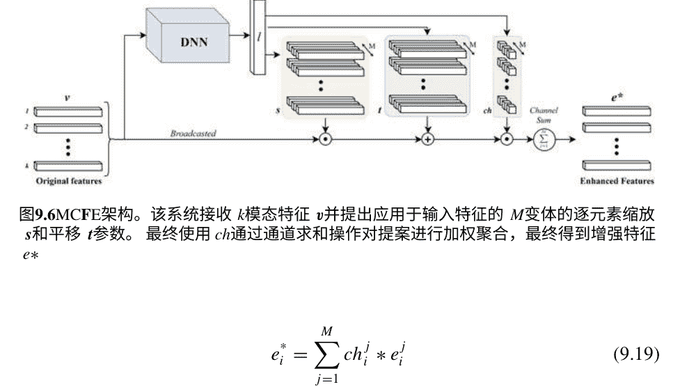

$$e_i^* = \sum_{j=1}^{M} ch_i^j * e_i^j \quad (9.19)$$

其中 `W_c^j` 和 `b_c^j` 是应用于选择预测函数的 `k` 模态的权重和偏差。这个最终的增强特征表示被呈现给分类层，以提高任务的性能。图9.6展示了提出的多模态条件特征增强系统的总体架构。


存在`M`变换因子的多个变体，因此`M`增强特征的不同版本使得学习算法能够探索可以应用于原始特征集的各种改进。这在概念上类似于`Inception` [25] 深度网络架构中存在的多个路径，其中每个层从前一层的几个不同视图中获取数据。这种多路径计算的存在直接改善了梯度流向前一层的情况，因为每个路径都会开始学习与特定视图相关的方面，以更好地表示解空间。

此外，能够选择最适合给定多模态特征样本的变体，可以对应用于特征的融合方法进行条件约束。这允许梯度通过多个并行路径传递到潜在表示映射函数`g`，从而在实验中观察到更快的收敛。需要注意的是，学习的潜在表示`l`与先前的融合方法所获得的传统共享表示不同。这是因为在这种表述中，`l`仅包含与独立地纠正每种模态特征表示相关的信息，而不是表示用于分类任务的共同统一子空间。以这种方式定义潜在表示有益处，这将在第9.3.4节中进行探讨。

### 9.3.4 训练用于AU识别的MCFE

`MCFE`应用于从相应的热红外和RGB帧中提取的热红外和可见光特征，如第9.3.2节所述。操作于这两个输入的潜在映射函数`g`被实现为一个修改后的轻量级`DenseNet`卷积神经网络。潜在表示`l`连接到3个独立的全连接层，分别用于缩放、平移和预测选择。在计算出如第9.3.3节所述的最终增强特征集`e_i*`后，它们分别连接到独立的AU分类层（一个用于热红外光谱，一个用于可见光谱），每个层都有12个输出，表示给定图像中特定动作单元的存在。为了将`MCFE`的参数训练定位于改善整体系统（热红外和可见光结合）性能而不仅仅是单个模态性能的最终目标，我们通过热红外和可见光分类层的预测进行简单平均。通过结合预测并对其进行优化，网络被鼓励学习参数，使得特定模态的增强特征能够弥补其他特征的不足。

在朴素的方法中，我们可以用随机权重初始化网络。然而，这样做要么无法收敛，要么得到不令人满意的结果。智能初始化比传统方法能使网络表现得更好。我们在这个方向上采取了两个步骤：(a) 将缩放层初始化为输出为1，将平移层初始化为输出为0; (b) 使用在特征提取步骤中学到的相应预训练权重来初始化分类层。执行步骤(a)确保在网络的初始状态下，增强特征与形成身份映射的原始特征相同。

$$e_i^j = (s_i^j \odot v_i) \oplus t_i^j = (1 \odot v_i) \oplus 0 = v_i$$

这为梯度下降提供了一个良好的起始位置。由于整体误差在特定方向上减小，特征表示只能得到改进（或者最坏情况下保持不变）。步骤(b)实现了重复使用先前训练中学到的信息的目标表示，以便前面的层可以尝试从原始表示中生成。

一个问题是如何确保增强的特征确实只是原始特征的修正版本，而不是完全由网络学习得到的新特征集？我们通过冻结训练中已经预初始化的分类层权重来解决这个问题。这强制对分类层的输入（即增强特征）施加约束，使其符合分类层已经训练好的一般特征空间表示。施加这个约束限制了优化器的任务，使其只需找到每个个体特征的`δ`值，以放大或减小其效果，并通过这样做使特征空间在给定的分类层参数下更易分离。这比探索无约束的特征空间组合要简单得多，正如我们在实验中观察到的那样，它导致更快的收敛和更强的性能提升。

此外，通过一个负责计算3个独立量的单一潜在表示的构建，它实现了信息瓶颈原理，该原理已被证明能产生更好的泛化效果[21]，并且也反映了多任务学习框架利用单一表示来完成多个不同任务的原则。

### 9.3.5 实验分析的数据集

我们使用多模态自发情绪（`MMSE`）数据库来评估我们的性能。`MMSE`包含来自十个任务的140个参与者的2D和热视频，每个任务引发不同的情绪。其中，只有四个任务被标记为面部动作单元。专家AU编码员使用面部动作编码系统对每个帧进行注释。热传感器和RGB相机安装在彼此上方，并且它们的帧率设置为25 fps以进行同步。在我们的实验中，我们使用了所有196,793个可见帧和195,411个热帧。在可用图像中，只有133,309个配对帧可用于我们的多模态学习实验。

### 9.3.6 实验设置

#### 预处理

数据集中的所有输入图像都使用基于`MMSE`数据集提供的49个面部标志点的`MTCNN`框架[31]进行对齐。此外，图像被裁剪为170×170，并进行随机旋转以进行数据增强。每个动作单元的存在被标记为+1/0。训练中排除了缺少标签和面部的数据样本。

#### 网络设置和特征提取的训练

我们采用了三折交叉验证协议来训练我们的网络。对于每个实验，我们将数据集分成三个主体相关的分区，其中两个分区用于训练，剩下的一个分区用于验证。我们的实现中的两个CNN都是使用加权交叉熵损失进行训练的，该损失在公式9.10-9.12中定义。模型使用`SGD`作为优化器，学习率初始化为1e-3。

#### MCFE的网络设置和训练

我们使用`DenseNet-100 ×12`架构，该架构的深度为100，增长率为12，用于从特征中获取潜在表示。除了`DenseNet`之外，网络还包括三个全连接层，对应于缩放、平移和预测，以及两个分类层，对应于这两种模态共有24M个参数。网络使用`Adam`优化器进行训练，学习率为0.1，批量大小为128，共进行32个周期。

### 9.3.7 实验结果

表9.3在`MMSE`数据集上进行的12个动作单元的三折交叉验证结果。`Visible`和`Thermal`分别指的是在第9.3.2节中描述的特征提取方法得到的结果。`MFB`是指[30]中描述的多模态因子化二值池化。`MCFE`指的是在第9.3.3节中描述的融合方法后得到的性能。

**MMSE三折验证结果**

| AU | 1 | 2 | 4 | 6 | 7 | 10 | 12 | 14 | 15 | 17 | 23 | 24 | 平均 F1 |
| :--- | :--- | :--- | :--- | :--- | :--- | :--- | :--- | :--- | :--- | :--- | :--- | :--- | :--- |
| 可见 | 0.306 | 0.264 | 0.267 | 0.845 | 0.874 | 0.902 | 0.882 | 0.809 | 0.358 | 0.413 | 0.484 | 0.282 | 0.557 |
| 热像 | 0.216 | 0.202 | 0.197 | 0.794 | 0.828 | 0.861 | 0.847 | 0.772 | 0.271 | 0.317 | 0.358 | 0.244 | 0.492 |
| MFB | 0.293 | 0.280 | 0.300 | 0.847 | 0.866 | 0.899 | 0.886 | 0.798 | 0.367 | 0.426 | 0.492 | 0.273 | 0.561 |
| MCFE | 0.304 | 0.299 | 0.312 | 0.851 | 0.864 | 0.906 | 0.884 | 0.815 | 0.354 | 0.421 | 0.473 | 0.314 | 0.566 |

我们在表9.3中展示了实验结果。我们使用了在面部动作单元识别文献中广泛使用的F1指标来报告性能。对于每个实验，我们报告了每个动作单元的个体F1分数，以及所有动作单元的平均F1分数。我们报告了三个拆分的平均F1分数。我们将`MCFE`的性能与相关的最新多模型融合策略`MFB` [30]进行了比较。我们还从简单的求和得分级别融合的角度比较了我们增强的特征与原始特征。

从表9.3中，我们可以看出所提出的`MCFE`方法的融合结果在整体上优于`MFB`。然而，我们还注意到，即使`MFB`在某些动作单元上表现稍好，`MCFE`在数据集中严重不平衡的动作单元上明显优于`MFB`。有趣的是，`MCFE`的结果是在不破坏原始特征空间的情况下获得的。这一改进可以归因于网络学习了良好的平移和缩放特征，以对齐可见和热像特征，从而提高系统的整体性能。

## 9.4 结论

在本章中，我们讨论了基于模板/集合的人脸验证以及在生成代表性模板特征时所采用的聚合或汇聚策略对其产生的深远影响。我们提出了一种使用元数据来判断模板中每个特征向量相对质量的单模态特征融合方法。

并研究了其在聚合方面的能力，以验证其优于相关方法的能力。`M-FAN`特征融合方法在`IJB-A`和`Janus CS4`数据集上相比传统的汇聚方法取得了显著的提升，证明了其有效性。此外，这种方法可以轻松地插入到人脸识别流程的末尾，以优化模板特征生成过程，从而提高整体性能。

此外，我们还讨论了一种改进面部动作单元识别的方法，该方法使用了一种名为`MCFE`的新型多模态特征融合方法。该融合方法是学习联合统一表示概念的替代方法。通过理论和实验证明，我们发现深度特征融合方法可以学习有助于更好地对齐各自特征空间中特征的因素，以最大化可分性。该方法还表明，这种对齐的特征可以轻松地组合起来，以提高系统的整体性能。

## 参考文献

- 1. Cai X, Wang C, Xiao B, Chen X, Zhou J (2012) 使用独立子空间分析进行深度非线性度量学习的人脸验证。 在：第20届ACM国际多媒体会议论文集。ACM，第749-752页
- 2. Chen J-C, Patel VM, Chellappa R (2016) 使用深度CNN特征进行无约束人脸验证。 在：2016年IEEE冬季计算机视觉应用会议（WACV），IEEE，第1-9页

# 第10章 视频人脸识别的深度学习

Jiaolong Yang和Gang Hua

摘要：本章主要讨论基于视频或者更一般的图像集合的人脸识别，使用深度学习技术。我们首先简要回顾一些关于使用深度卷积神经网络（CNNs）提取的帧级特征用于视频级人脸识别的天真但常用的策略。代表性的策略包括天真的特征汇聚和成对特征距离计算。然后，我们提出了一种名为神经聚合网络（NAN）的方法，它是专为基于视频的表示和识别而设计的深度学习框架。NAN可以自动学习视频/图像集合中人脸的质量，并相应地聚合帧级深度特征，产生更具区分性的视频级特征。我们在三个视频人脸识别数据集上进行了实验评估。结果表明，虽然先前基于深度学习的使用天真汇聚或成对距离的方法相对传统方法取得了实质性的改进，但NAN方法进一步超越了它们。

## 10.1 引言

视频人脸识别的目标是从面部视频剪辑或更一般地说，从面部图像集中识别人的身份。它在视频监控、生物特征认证和视频检索等领域有广泛的应用。与基于图像的人脸识别相比，从输入视频中可以更充分地利用被试者的信息，这些视频自然地包含了不同姿势和光照条件下的同一主体的面部。近年来，视频人脸识别尤其是在无约束的环境中（也称为“野外”），已经引起了研究界的越来越多的关注[1-13]。

与基于图像的人脸识别类似，视频人脸识别可以分为两个任务：视频人脸识别和视频人脸验证。前者旨在从已知身份的图库视频人脸数据库中识别出探测人脸视频/图像集的身份，而后者则是判断两个给定的人脸视频/图像集是否属于同一个人。对于这两个任务，关键在于构建适当的视频人脸表示，以便能够有效地整合不同帧之间的信息，保留有益信息同时丢弃噪声信息。

最近，深度学习技术在人脸识别方面取得了巨大的成功[10, 11, 14-19]，其性能超过了传统的手工特征方法，甚至在一些大规模数据集上超过了人类水平的性能[11, 14-16]。通过在大规模人脸数据上进行训练，深度卷积神经网络（CNN）可以将人脸图像嵌入到低维特征空间中，通过欧氏距离或角度距离可以有效地衡量身份相似性。

## 参考文献

- 3. Chen J-C, Ranjan R, Kumar A, Chen C-H, Patel VM, Chellappa R (2015) 一种用于无约束人脸验证的端到端系统，使用深度卷积神经网络。 在：IEEE国际计算机视觉会议研讨会论文集，第118-126页

- 4. Chowdhury AR, Lin T-Y, Maji S, Learned-Miller E (2016)使用双线性CNN进行一对多人脸识别。 在：2016年IEEE冬季计算机视觉应用会议（WACV）。IEEE，页1-9

- 5. Crosswhite N, Byrne J, Stauffer C, Parkhi O, Cao Q, Zisserman A (2017) 面部验证和识别的模板适应。 在：2017年第12届IEEE国际自动人脸与手势识别大会（FG 2017）。IEEE，页1-8

- 6. Dalal N, Triggs B (2005) 用于人体检测的方向梯度直方图。 在：2005年IEEE计算机学会计算机视觉和模式识别大会（CVPR'05），卷1，页886-893

- 7. Ekman P, Friesen WV (1976) 测量面部运动。 环境心理学非语言行为1（1）：56-75

- 8. He K, Zhang X, Ren S, Sun J (2016) 用于图像识别的深度残差学习。 在：IEEE计算机视觉和模式识别大会论文集，页770-778

- 9. Huang G, Liu Z, Weinberger KQ, van der Maaten L (2017) 密集连接卷积网络。 在：IEEE计算机视觉和模式识别大会论文集，卷1，页3

- 10. Jarlier S, Grandjean D, Delplanque S, N'diaye K, Cayeux I, Velazco MI, Sander D, Vuilleumier P, Scherer KR (2011) 面部肌肉收缩的热分析。 IEEE Trans Affect Comput 2(1): 2-9

- 11. Jiang H, Learned-Miller E (2017) 使用更快的R-CNN进行人脸检测。 在：2017年第12届IEEE国际自动人脸和手势识别会议（FG 2017），IEEE，pp. 650-657

- 12. Klare BF, Klein B, Taborsky E, Blanton A, Cheney J, Allen K, Grother P, Mah A, Jain AK (2015) 推动无约束人脸检测和识别的前沿：Iarpa janus基准测试。在：IEEE计算机视觉和模式识别会议论文集，pp 1931-1939

- 13. Lahat D, Adali T, Jutten C (n.d.) 多模态数据融合：方法、挑战和前景的概述

- 14. Li M, Zhang T, Chen Y, Smola AJ (2014) 随机优化的高效小批量训练。在：第20届ACM SIGKDD国际会议上的知识发现和数据挖掘。ACM，pp 661-670

- 15. Liu Y, Yan J, Ouyang W (2017) 面向集合识别的质量感知网络。arXiv:1704.03373

- 16. Lowe DG (2004) 尺度不变关键点的独特图像特征。Int J Comput Vis 60(2):91–110

- 17. Lu C, Tang X (2015) 在LFW上超越人类级别的人脸验证性能与高斯人脸

- 18. Parkhi OM, Vedaldi A, Zisserman A等 (2015) 深度人脸识别。在：BMVC，卷1，第6页

- 19. Ranjan R, Sankaranarayanan S, Castillo CD, Chellappa R (2017) 一种用于人脸分析的全能卷积神经网络。在：2017年第12届IEEE国际自动人脸与手势识别大会（FG 2017）。IEEE，第17-24页

- 20. Sankaranarayanan S, Alavi A, Castillo CD, Chellappa R (2016) 用于人脸验证和聚类的三元概率嵌入。在：2016年IEEE第8届生物特征学理论、应用和系统国际会议（BTAS）。IEEE，第1-8页

- 21. Saxe AM, Bansal Y, Dapello J, Advani M, Kolchinsky A, Tracey BD, Cox DD (2018) 关于深度学习的信息瓶颈理论。在：国际学习表示会议

- 22. Schroff F, Kalenichenko D, Philbin J (2015) Facenet：一种用于人脸识别和聚类的统一嵌入。在：IEEE计算机视觉和模式识别会议论文集，第815-823页

- 23. Srivastava RK, Greff K, Schmidhuber J (2015) 训练非常深的网络。在：神经信息处理系统的进展，第2377-2385页

- 24. Sun Y, Liang D, Wang X, Tang X (2015) Deepid3：使用非常深的神经网络进行人脸识别。arXiv:1502.00873

- 25. Szegedy C, Ioffe S, Vanhoucke V, Alemi AA (2017) Inception-v4, inception-resnet和残差连接对学习的影响

- 26. Taigman Y, Yang M, Ranzato M, Wolf L (2014) Deepface：缩小人脸验证与人类水平性能的差距。在：IEEE计算机视觉和模式识别会议论文集，第1701-1708页

- 27. Wolf L, Hassner T, Maoz I (2011) 在匹配的背景相似性下的非约束视频中的人脸识别。在：2011年IEEE计算机视觉和模式识别会议（CVPR），IEEE，第529-534页

- 28. Xu C, Tao D, Xu C (2013) 多视角学习综述. arXiv:1304.5634

- 29. Yang J, Ren P, Chen D, Wen F, Li H, Hua G (2016) 视频人脸识别的神经聚合网络. arXiv:1603.05474

- 30. Yu Z, Yu J, Fan J, Tao D (n.d.) 多模态分解双线性池化与共同关注学习用于视觉问答. CoRR

- 31. Zhang K, Zhang Z, Li Z, Qiao Y (2016a) 联合人脸检测和对齐使用多任务级联卷积网络. IEEE信号处理通信 23(10):1499–1503

CNN在静态图像上操作。要将它们应用于基于视频的人脸识别，可以使用一些简单的策略。例如，一种直接的解决方案是通过CNN将视频人脸直接表示为一组逐帧提取的人脸特征。这种表示方式全面地保留了所有帧的信息。要比较两个视频人脸，可以融合两个人脸视频之间所有帧对的特征匹配结果（例如，通过取平均值或最小距离）。另一种简单的方法是进行某种类型的池化（例如，平均池化和最大池化），将逐帧特征聚合在一起形成视频级表示。由于上述解决方案的简单性，它们在最近的基于视频的深度人脸识别工作中被广泛采用，并取得了良好的性能。在本章的后续部分，我们将详细介绍它们并在实验中进行评估。

尽管这些解决方案简单且被广泛采用，但它们在效率和效果方面也存在一些缺点。例如，假设`n`为视频帧数，则基于特征集表示的视频人脸相似度计算的时间复杂度为`O(n^2)`，这对于大规模识别来说是不可取的。此外，这种表示方式每个视频人脸示例会产生`O(n)`的空间复杂度，这需要大量的内存存储并面临高效索引的挑战。为了使识别能够适用于大规模问题，更希望在视频级别上提供一个紧凑的、固定大小的特征表示，而不考虑视频的长度变化。固定大小的视频级表示将允许直接、恒定时间地计算相似度或距离，而无需逐帧匹配。

通过帧特征汇聚可以实现这样的视频人脸表示。像平均汇聚这样的简单策略假设帧特征具有相等的重要性。然而，一个视频（尤其是长视频序列）或者一个图像集可能包含在不同光照、分辨率、头部姿态等条件下捕获的人脸图像。一个好的汇聚策略应该能够自适应地加权并将所有帧级特征组合起来。它应该偏好更具辨别力（或更易“记忆”）的人脸图像，并防止低质量的人脸图像影响识别准确性。

为此，我们提出了一种自适应加权方案，将视频中的所有帧级特征线性组合在一起，形成一个紧凑且具有辨别力的人脸表示。与之前的方法不同，帧特征的权重既不是固定的，也不是由任何特定的启发式算法设置的。相反，设计了一个神经网络来自动计算权重。该网络被命名为神经汇聚网络（`NAN`），其系数可以通过在正常的人脸识别训练任务中进行监督学习来训练，而无需额外的监督信号。

`NAN`由两个主要模块组成，可以逐个训练或端到端训练。第一个模块是特征嵌入模块，它使用深度卷积神经网络模型作为帧级特征提取器。另一个模块是聚合模块，它自适应地融合所有视频帧的特征向量。

`NAN`继承了池化技术的主要优点，包括处理任意输入大小和生成无序表示的能力。它的关键组件受到神经图灵机[20]和[21]的启发，两者都应用了注意机制来通过访问外部存储器来组织输入。这种机制可以接受任意大小的输入，并通过加权平均来强调或抑制每个输入元素，非常重要的是它是无序的，并且具有可训练的参数。在`NAN`中，设计了一个简单的网络结构，它由两个级联的注意块与这个注意机制相关联，用于人脸特征聚合。

除了构建视频级别的表示之外，神经聚合网络还可以作为主体级特征提取器，融合多个数据源。例如，可以将所有可用的图像和视频，或者来自同一主体的多个视频的聚合视频级特征，输入到其中，以获得固定大小的单个特征表示。通过这种方式，人脸识别系统不仅因为紧凑的表示而享受时间和内存效率，而且在性能上也表现出卓越的表现，我们将在实验中展示。最后但并非最不重要的是，`NAN`还可以作为学习内容自适应池化的通用框架，因此也适用于其他计算机视觉任务。`NAN`方法首次出现在一篇会议论文中[13]。

本章的剩余部分按照以下方式组织。在第10.2节中，我们简要回顾了用于视频人脸识别的传统非深度学习方法。我们将重点关注一些最近提出的方法。在第10.3节中，我们回顾了使用由CNN提取的帧级深度特征进行视频人脸识别的现有方法。在第10.4节中，我们介绍了神经聚合网络，包括网络架构和训练方法。在第10.5节中，我们通过三个具有挑战性的数据集（YouTube人脸数据集[1]、IJB-A数据集[22]和名人1000数据集[7]）对现有方法以及`NAN`方法进行了实验评估，包括视频人脸验证和识别任务。我们展示了尽管所有基于深度学习的方法与传统方法相比表现得非常好，在计算帧特征距离或者简单的特征汇聚策略方面，`NAN`方法始终表现出色。

## 10.2 传统方法

过去，基于视频或图像集的人脸识别一直受到广泛研究[1, 2, 8, 23–27]。在本章中，我们关注的是无序的人脸图像集作为输入。本文不考虑利用时间动态的现有方法。对于基于集合的人脸识别，许多先前的方法尝试使用外观子空间或流形来表示人脸图像集，并通过计算流形相似性或距离来进行识别[2 3, 26, 28–30]。这些传统方法在受限环境下可能效果良好，但通常无法处理具有大量外观变化的挑战性非受限场景。

在另一个方向上，一些方法尝试基于局部特征构建视频级特征表示[2, 6, 8]。例如，`PEP`方法[2, 6]通过提取和聚类局部特征来进行部分表示。局部特征同时考虑了外观和空间信息。`Video Fisher Vector Faces (VF²)`描述符[8]使用Fisher向量编码将不同视频帧的局部特征聚合在一起形成视频级表示。

尽管这些方法在无约束情况下取得了很大的改进，但它们使用的特征仍然是手工设计的，它们的性能仍然落后于基于深度学习的方法。

## 10.3 现有的基于深度学习的方法

最近，基于深度卷积神经网络 [10, 11, 16, 31, 32] 主导了最先进的人脸识别方法。设`x`为输入人脸图像，卷积神经网络可以通过交错的线性和非线性变换将其映射到低维特征空间。这个过程可以表示为

```
f = CNN(x). (10.1)
```

给定两个人脸图像`x`和`x'`，它们的身份（不）相似性可以通过它们的特征角度距离`d(f, f') = arccos (<f, f'> / (||f||·||f'||))` 或欧几里得距离`d(f, f') = ||f - f'||`，其中`f`和`f'`都被归一化。然后可以使用特征距离进行人脸验证和识别任务。

现在考虑一个人脸视频序列或图像集`X = {x₁, x₂, ..., x_n}`，其中有`n_total`张图片。我们可以应用在单张图像上训练的卷积神经网络来提取帧特征集`F = {f₁, f₂, ..., f_n}`。要实现验证和识别，关键在于构建一个适当的距离测量函数`D({f_i}, {f_j'})`，分别从两个人脸视频中提取出两个帧特征集。现有的深度学习方法通常使用一些简单的距离函数。它们可以分为两类：基于成对帧特征距离和基于帧特征汇聚的方法。图10.1说明了这两类方法，并在下面进行介绍。

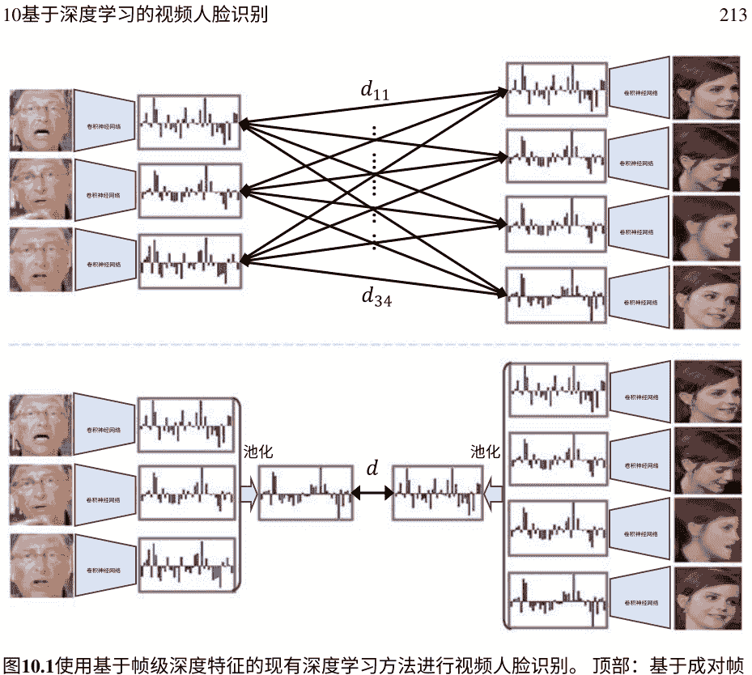

### 10.3.1 基于成对距离的方法

基于成对距离的方法通过全面分析帧对之间的距离来衡量身份相似性。它需要存储视频的所有图像特征，即`O(n)`的空间复杂度，并且通常以`O(n^{2})`的时间复杂度计算距离。我们列举一些具体的例子如下。

- 平均成对距离：距离计算为成对帧特征距离的平均值：

```
D({f_i}, {f_j'}) = \frac{1}{n \cdot n'} \sum_{i,j} d(f_i, f_j). \tag{10.2}
```

许多基于CNN的方法在视频人脸识别中使用平均配对距离。代表性的作品包括`DeepFace` [10]和`FaceNet` [11]。

- 最小或最大配对距离：可以通过枚举所有配对帧特征距离并选择最小或最大距离来计算距离。换句话说，视频人脸相似性是基于视频/图像集之间最相似或最不相似的帧来衡量的：

```
D({f_i}, {f_j'}) = \min_{i,j} d(f_i, f_j) \tag{10.3}
```

用于最小配对距离和

```
D({f_i}, {f_j'}) = \max_{i,j} d(f_i, f_j) \tag{10.4}
```

对于最大情况。然而，简单地取最小或最大的一对-两点距离可能容易受到噪声或异常值的影响，使得识别算法非鲁棒（正如我们将在实验中展示的，结果明显比其他距离度量差）。因此，最小和最大的两点距离很少被现有方法使用。相反，提出了以下距离函数。

- 软最小对距离：这个距离函数是最小对距离的鲁棒版本。它的计算方式是

```
D({f_i}, {f_j'}) = \min_{i,j} \frac{e^{-\beta \cdot d(f_i, f_j)}}{\sum_{i,j} e^{-\beta \cdot d(f_i, f_j)}}, \tag{10.5}
```

其中`β`是一个正的标量因子。或者，可以使用多个标量因子并计算距离为

```
D({f_i}, {f_j'}) = \min_{i,j} \sum_{k} \frac{e^{-\beta_k \cdot d(f_i, f_j)}}{\sum_{i,j} e^{-\beta_k \cdot d(f_i, f_j)}}. \tag{10.6}
```

软最小值对距离函数对应于[18, 33, 34]的作品中提倡的softmax相似度得分。[34]中使用单个`β`，而[18, 33]中使用多个。计算这个距离函数的时间复杂度为`O(m \cdot n^2)`，其中`m`是使用的标量因子的数量。

当然，给定两个特征集，还有许多其他可能使用的集合距离函数，例如Hausdorff距离或两个特征集之间的距离。

### 10.3.2 基于池化的方法

一些方法不是将人脸视频表示为一组深度帧特征，而是对特征集进行特征池化。这样，视频人脸就可以用一个固定大小的向量表示，并且可以在常数时间内计算距离：`D({f_i}, {f_j′}) = d(Pool({f_i}), Pool({f_j′})) = d( f̃, f̃′ )`。常用的池化方法有平均池化和最大池化。

- 平均池化：平均池化在每个维度上对集合中的特征向量进行平均，即

`Pool({f_i}) = f̃`，其中 `f̃(d) = \frac{1}{n} \sum_i f_i(d), \quad\quad (10.7)`

其中 `f(d)` 是向量 `f` 在第 `d` 维度上的元素。许多现有的深度人脸识别方法使用平均池化技术来获取视频级特征。代表性的作品包括VGG-Face [16]和[31]。

- 最大池化：类似地，特征的最大池化可以表示为

`Pool({f_i}) = f̃`，其中 `f̃(d) = \max_i f_i(d)。 \quad\quad (10.8)`

相对于平均池化，帧特征的最大池化较少见。只有少数作品采用了最大池化，例如[32]。

## 10.4 神经聚合网络

如前所述，更希望在视频级别上拥有一个紧凑的、固定大小的特征表示，类似于池化技术。然而，一个好的池化或聚合策略应该能够自适应地加权和组合帧级特征，而不是像平均或最大池化那样进行简单处理。在这里，我们提出了神经聚合网络，它具有基于学习的特征加权方案，可以线性地组合帧级特征。

图10.2显示了NAN的框架。该网络以一个人的一组人脸图像作为输入，并输出一个单一的特征向量作为其识别任务的表示。它建立在现代深度CNN模型的基础上，用于帧特征嵌入，并通过自适应地聚合视频中的所有帧成为一个紧凑的向量表示，从而使其在视频人脸识别中更加强大。

图10.2 神经聚合网络的框架。所有输入的人脸图像 `{x_k}` 都经过一个带有深度卷积神经网络的特征嵌入模块进行处理，得到一组特征向量 `{f_k}`。这些特征被传递给聚合模块，产生一个固定大小的向量 `r^1` 来表示输入的人脸图像。这种紧凑的表示用于识别。

### 10.4.1 特征嵌入模块

NAN的图像嵌入模块是一个深度卷积神经网络，将视频的每一帧嵌入到帧级特征表示中。理论上，任何具有高性能的深度卷积神经网络都可以应用在这里。在我们的实现中，我们使用带有批归一化（BN）的GoogLeNet [35]结构来测试NAN的性能。GoogLeNet生成128维图像特征。我们将这些特征归一化为单位向量，然后输入到聚合模块中，接下来将进行描述。

### 10.4.2 聚合模块

给定一个人脸视频/图像集合 `X = {x_1, x_2, ..., x_n}` 以及其对应的归一化特征集合 `F = {f_1, f_2, ..., f_n}` 通过特征嵌入模块提取，目标是生成一组权重 `{a_k}_{k=1}^n`，使得视频的聚合特征表示是帧特征的线性组合:

$$ r = \sum_k a_k f_k \quad (10.9) $$

这样，聚合特征向量与由CNN提取的单个人脸图像特征具有相同的大小。请注意，如果 `a_k ≡ 1/n`，方程10.9将退化为朴素的平均池化。

在设计聚合模块时考虑了三个主要原则。首先，该模块应能够处理不同数量的图像（即不同K的），由于视频数据源因人而异。其次，聚合应该对图像顺序不变，即当图像序列被反转或重新排序时结果不变。这样，聚合模块可以处理任意一组没有时间信息的图像或视频人脸（例如，那些来自不同的互联网位置）。第三，该模块应该适应输入人脸，并且具有通过监督学习在标准人脸识别训练任务中进行训练的可调参数。该解决方案受到[20, 21, 37]中描述的记忆注意机制的启发。其中的思想是通过神经模型通过可微分的寻址/注意机制来读取外部记忆。这些模型通常与循环神经网络（RNN）结合使用以处理顺序输入/输出[20, 21, 37]。虽然这里不需要RNN结构，但其记忆注意机制适用于我们在这里考虑的聚合任务。在NAN中，帧级人脸特征被视为记忆，并且特征加权被视为记忆寻址过程。在聚合中使用了一些“注意块”模块来实现这一点。

#### 10.4.2.1 注意力块

一个注意力块从特征嵌入模块中读取所有特征向量，并为它们生成线性权重。具体来说，设`{\mathbf{f}_k}`为人脸特征向量，然后通过点积使用核`\mathbf{q}`对它们进行过滤，得到一组相应的重要性`{e_k}`。然后将它们传递给softmax运算符，生成正权重`{a_k}`，满足`\sum`。这两个操作可以分别用以下方程描述：

$$

e_k = \mathbf{q}^T \mathbf{f}_k \quad\quad\quad\quad (10.10)

$$

$$

a_k = \frac{\exp(e_k)}{\sum_j \exp(e_j)}. \quad\quad (10.11)

$$

可以看出，上述算法实质上选择了所有特征向量所张成的凸包内的一个点。

这样，输入的数量`{\mathbf{f}_k}`不会影响聚合结果的大小`\mathbf{r}`，它与单个特征`\mathbf{f}_k`的维度相同。此外，聚合结果对于`\mathbf{f}_k`的输入顺序是不变的：根据方程10.9、10.10和10.11，重新排列`\mathbf{f}_k`和`\mathbf{f}_k`对聚合表示`\mathbf{r}`没有影响。此外，注意力块由可训练的滤波器核`\mathbf{q}`调制，可以通过标准反向传播和梯度下降进行训练。

单一注意力块-通用人脸特征质量测量。自适应聚合可以通过使用一个注意力块来实现。在这种情况下，向量`\mathbf{q}`是要学习的参数。它与单个特征`\mathbf{f}`具有相同的大小，并且作为测量人脸特征质量的通用先验。

图10.3 IJB-A数据集中的人脸图像，按照它们在人脸识别任务中单个注意力块的得分（方程10.10中的e值）排序。顶部、中部和底部行中的人脸是从得分在最高5%、以中位数为中心的10%窗口和最低5%的人脸中采样的。

表10.1 IJB-A数据集上的消融研究。TAR/FAR：验证的真/假接受率。TPIR/FPIR：识别的真/假正识别率。

| 方法 | 1:1 验证 TAR@FAR： | | 1:N 识别 TPIR@FPIR： | |
| :--- | :--- | :--- | :--- | :--- |
| | 0.001 | 0.01 | 0.01 | 0.1 |
| CNN+AvgPool | 0.771 | 0.913 | 0.634 | 0.879 |
| NAN 单一注意力 | 0.847 | 0.927 | 0.778 | 0.902 |
| NAN 级联注意力 | 0.860 | 0.933 | 0.804 | 0.909 |

为了测试性能，我们使用提取的人脸特征，在IJB-A数据集[22]上训练了视频人脸验证网络（详见第10.4.3节和第10.5节），图10.3显示了数据集中所有人脸图像的排序分数。可以看出，在训练后，网络更偏爱高质量的人脸图像，例如高分辨率和相对简单的背景。它会降低模糊、遮挡、曝光不当和极端姿势的人脸图像的权重。表10.1显示，网络在验证和识别任务中比平均池化策略实现了更高的准确性。

级联两个注意力块-内容感知聚合。尽管通用质量评估可以达到良好的性能，但内容感知聚合可能会表现得更好。背后的直觉是，面部图像的变化可能在特征空间的不同地理位置（即不同的人）中以不同的方式表达，并且内容感知聚合可以学习选择对输入图像集的身份更具有区分性的特征。为此，我们可以以级联和端到端的方式使用两个注意力块，描述如下。

设`q⁰`为第一个注意力块的核心，`r⁰`为带有`q⁰`的聚合特征。通过自适应计算第二个注意力块的核心`q¹`，方法如下一个传输层以 `$\mathbf{r}^0$` 作为输入：

$$\mathbf{q}^1 = \tanh(\mathbf{W} \mathbf{r}^0 + \mathbf{b}), \quad (10.12)$$

其中 `$\mathbf{W}$` 和 `$\mathbf{b}$` 分别是神经元的权重矩阵和偏置向量，而 `$\tanh(x) = \frac{e^x - e^{-x}}{e^x + e^{-x}}$` 施加双曲正切非线性。由 `$\mathbf{q}^1$` 生成的特征向量 `$\mathbf{r}^1$` 将是最终的聚合结果。因此，`$(\mathbf{q}^0, \mathbf{W}, \mathbf{b})$` 现在是聚合模块的可训练参数。

我们再次在 IJB-A 数据集上训练网络，表10.1显示网络获得了比使用单个注意力块更好的结果。图10.4显示了训练网络对不同视频或图像集计算的权重的一些典型示例。在所有剩余的实验结果中，我们在NAN中使用级联的两个注意力块设计（如图10.2所示）。

图10.4 典型示例显示由NAN计算的图像权重。在每一行中，从图像集中抽取了五个人脸图像，并根据它们的权重进行排序（矩形框中的数字）；最右边的条形图显示了整个图像集中排序后的权重（高度缩放）

### 10.4.3 网络训练

NAN网络可以使用标准配置进行人脸验证或人脸识别任务的训练。

对于验证，可以使用两个共享权重的NAN（Siamese神经聚合网络结构[38]）来最小化平均对比损失[39]：$l_{i,j} = y_{i,j} \|\mathbf{r}_i^1 - \mathbf{r}_j^1\|^{2}_{2} + (1 - y_{i,j}) \max(0, m - \|\mathbf{r}_i^1 - \mathbf{r}_j^1\|^{2}_{2})$，其中 $y_{i,j} = 1$ 表示对同一身份的配对$(i, j)$，$y_{i,j} = 0$ 表示其他情况。在下一节的所有实验中，常数 $m$ 被设置为2。对于识别，NAN之上添加了一个全连接层，然后使用softmax来最小化平均分类损失：$l_i = - \log p_{i, y_i}$

$$
p_{i, y_i} = \frac{\exp(p_{i, y_i})}{\sum_{z} \exp(p_{i, z})}
$$

目标标签是第$i$个视频实例的标签，而 $p_{i, z}$ 是完全连接层的第$z$个输出。

NAN的两个模块可以同时进行端到端的训练，也可以分别进行训练。尽管现在可以获取数百万张静态图像进行训练[10, 11, 16]，但收集如此大量的独特人脸视频或数据集似乎是不切实际的。因此，我们选择首先在特征嵌入模块上使用单张图像进行CNN的训练，并进行身份识别任务，然后在CNN提取的特征之上训练聚合模块。更多细节请参见第10.5.1节。

## 10.5 实验

本节评估了不同方法以及NAN网络的性能。我们将首先介绍我们的训练细节，然后报告三个视频人脸识别数据集的结果：IARPA Janus Benchmark A (IJB-A) [22]，YouTube人脸数据集[1]和Celebrity-1000数据集[7]。

### 10.5.1 训练细节

为了训练卷积神经网络（CNN），我们使用了大约3百万张来自互联网的人脸图像，用于基于图像的身份识别。人脸检测使用JDA方法[40]，并使用LBF方法[41]进行对齐。输入图像尺寸为224 × 224。训练后，CNN被固定，我们专注于分析不同的帧特征池化和集合距离计算策略以及NAN的神经聚合模块的有效性。

NAN的聚合模块在我们测试的每个视频人脸数据集上使用标准反向传播和RMSProp求解器[42]进行训练。使用全零参数初始化，即从平均池化开始。批量大小、学习率和迭代次数针对每个数据集进行调整。由于网络非常简单且图像特征紧凑（128维），训练过程非常高效：在桌面PC的CPU上，对总共5K个视频对进行训练，使用 ~1M张图像只需不到2分钟。

### 10.5.2 评估方法

我们比较了简单的聚合策略，如平均池化，利用成对帧特征比较的集合相似度测量以及NAN。除非特别指定，我们仅使用$L_2$特征距离进行人脸识别（所有特征都经过归一化处理，因此等效于角度距离）。可以与额外的度量学习或模板调整技术[12]相结合，以进一步提高每个数据集的性能。

在这些竞争方法中，`CNN+Min L_2`，`CNN+Max L_2`，`CNN+Mean L_2`和`CNN+SoftMin L_2`基于所有帧对的$L_2$特征距离来衡量两个视频人脸的相似性。它们需要存储视频的所有图像特征，即具有$O(n)$的空间复杂度。前三个分别使用最小、最大和平均成对距离，因此在相似性计算中具有$O(n^2)$的复杂度。`CNN+SoftMin L_2`对应于`SoftMax`相似度分数，并在第10.3节中进行了描述。它在距离计算中具有$O(m \cdot n^2)$的复杂度，其中$m$是使用的缩放因子$\beta$的数量。在我们的实验中，我们测试了20种$\beta$的组合，包括单个或多个值，并报告了最佳结果。

`CNN+MaxPool`和`CNN+AvePool`分别是沿着每个特征维度进行最大池化和平均池化的聚合方法。这两种方法以及NAN方法为每个视频生成一个128维特征表示，并在O(1)时间内计算相似度。

除了我们使用的这些方法的训练和测试结果之外，我们还与每个数据集上的先前方法进行了比较，包括传统的和基于深度学习的方法。

### IJB-A数据集上的结果

IJB-A数据集[22]包含从无约束环境中捕获的人脸图像和视频。该数据集具有完全的姿势变化和广泛的成像条件变化，因此非常具有挑战性。总共有500个主题，共有5,397张图像和2,042个视频，平均每个主题有11.4张图像和4.2个视频。我们使用STN [43]人脸检测器检测人脸关键点，然后使用相似变换对人脸图像进行对齐。

在这个数据集中，每个训练和测试实例被称为“模板”，它包含1到190个混合静态图像和视频帧。由于一个模板可能包含多个媒体，并且数据集为每个图像提供了媒体ID，另一种可能的聚合策略是首先聚合每个媒体中的帧特征，然后聚合模板中的媒体特征[12, 44]。这种策略也在本研究中使用了`CNN+ AvePool`和我们的NAN进行测试。请注意，实际中媒体ID可能并不总是可用的。

我们在“比较”协议用于1:1人脸验证和“搜索”协议用于1:N人脸识别上测试了这些方法。对于验证，报告真接受率（TAR）与误报率（FAR）。对于识别，报告真正识别率（TPIR）与误报识别率（FPIR）以及排名N的准确率。表10.2呈现了不同方法的数值结果，图10.5显示了验证的接收者操作特性（ROC）曲线，以及识别的累积匹配特性（CMC）和决策错误权衡（DET）曲线。这些指标根据[22, 47]在10个拆分上计算。

一般来说，`CNN+Max L2`，`CNN+Min L2`和`CNN+MaxPool`在朴素池化和基于成对距离的方法中表现最差。`CNN+SoftMin L2`的表现略好于`CNN+MaxPool`。媒体id的使用显著提高了`CNN+AvePool`的性能，但对NAN的提升相对较小。我们认为NAN已经具备了对由少数媒体中的低质量图像主导的模板的鲁棒性。在没有媒体聚合的情况下，NAN在所有朴素池化或基于成对距离的方法中都表现出色，尤其是在低FAR情况下。例如，在验证任务中，NAN在FAR为0.001和0.01时的TAR分别为0.860和0.933，将这些方法的最佳结果的错误率分别降低了约39%和23%。

表10.2 IJB-A数据集上的详细结果。†首先对每个媒体中的图像进行聚合，然后对媒体特征进行模板聚合。

| 方法 | 1:1验证TAR (FAR=0.001) | 1:1验证TAR (FAR=0.01) | 1:1验证TAR (FAR=0.1) | FPIR=0.01 | FPIR=0.1 | 1:N识别TPIR (排名-1) | 1:N识别TPIR (排名-5) | 1:N识别TPIR (排名-10) |
| :--- | :--- | :--- | :--- | :--- | :--- | :--- | :--- | :--- |
| B-CNN [32] | - | - | - | 0.143 ± 0.027 | 0.341 ± 0.032 | 0.588 ± 0.020 | 0.796 ± 0.017 | - |
| LSFS [45] | - | 0.733 ± 0.034 | 0.895 ± 0.013 | 0.383 ± 0.063 | 0.613 ± 0.032 | 0.820 ± 0.024 | 0.929 ± 0.013 | - |
| DCNN+动量 [31] | - | 0.787 ± 0.043 | 0.947 ± 0.011 | - | - | 0.852 ± 0.018 | 0.937 ± 0.010 | 0.954 ± 0.007 |
| 三元组相似度 [44] | - | 0.790 ± 0.030 | 0.945 ± 0.002 | 0.556 ± 0.065* | 0.754 ± 0.014* | 0.880 ± 0.015* | 0.95 ± 0.007 | 0.974 ± 0.005* |
| 姿态感知模型 [18] | - | 0.826 ± 0.018 | - | - | - | 0.840 ± 0.012 | 0.925 ± 0.008 | 0.946 ± 0.007 |
| 深度多姿态 [34] | - | - | 0.954 | 0.52* | 0.75* | 0.846 | 0.927 | 0.947 |
| DCNN融合 [46] | - | 0.838 ± 0.042 | 0.967 ± 0.009 | 0.577 ± 0.094* | 0.790 ± 0.033* | 0.903 ± 0.012 | 0.965 ± 0.008 | 0.977 ± 0.007 |
| Masi等人 [33] | 0.725 | - | - | - | - | 0.906 | 0.962 | 0.977 |
| 三元组嵌入 [44] | 0.813 ± 0.02 | - | 0.964 ± 0.005 | 0.753 ± 0.03 | 0.863 ± 0.014 | 0.932 ± 0.011 | - | 0.977 ± 0.005 |
| VGG-face [16] | - | 0.805 ± 0.030* | - | 0.461 ± 0.077* | 0.670 ± 0.031* | 0.913 ± 0.011* | - | 0.981 ± 0.005* |

| 模板适应 [12] | - | 0.939 ± 0.013 | 0.979 ± 0.004 | 0.774 ± 0.049 | 0.882 ± 0.016 | 0.928 ± 0.010 | 0.977 ± 0.004 | 0.986 ± 0.003 |
| CNN+最大 L₂ | - | 0.345 ± 0.025 | 0.601 ± 0.024 | 0.149 ± 0.033 | 0.258 ± 0.026 | 0.429 ± 0.026 | 0.632 ± 0.033 | 0.722 ± 0.030 |
| CNN+最小 L₂ | - | 0.144 ± 0.073 | 0.972 ± 0.006 | 0.026 ± 0.009 | 0.293 ± 0.175 | 0.853 ± 0.012 | 0.903 ± 0.010 | 0.924 ± 0.009 |
| CNN+平均 L₂ | - | 0.895 ± 0.016 | 0.978 ± 0.004 | 0.514 ± 0.116 | 0.821 ± 0.040 | 0.916 ± 0.012 | 0.973 ± 0.005 | 0.980 ± 0.004 |
| CNN+软最小 L₂ | - | 0.697 ± 0.085 | 0.904 ± 0.015 | 0.978 ± 0.004 | 0.500 ± 0.134 | 0.831 ± 0.039 | 0.919 ± 0.010 | 0.973 ± 0.005 | 0.981 ± 0.004 |
| CNN+最大化池化 | - | 0.202 ± 0.029 | 0.345 ± 0.025 | 0.601 ± 0.024 | 0.079 ± 0.005 | 0.179 ± 0.020 | 0.757 ± 0.025 | 0.911 ± 0.013 | 0.945 ± 0.009 |
| CNN+平均池化 | - | 0.771 ± 0.064 | 0.913 ± 0.014 | 0.977 ± 0.004 | 0.634 ± 0.109 | 0.879 ± 0.023 | 0.931 ± 0.011 | 0.972 ± 0.005 | 0.979 ± 0.004 |
| NAN | - | 0.856 ± 0.021 | 0.935 ± 0.010 | 0.978 ± 0.004 | 0.793 ± 0.044 | 0.909 ± 0.011 | 0.951 ± 0.005 | 0.976 ± 0.004 | 0.984 ± 0.004 |
| NAN† | - | 0.860 ± 0.012 | 0.933 ± 0.009 | 0.979 ± 0.004 | 0.804 ± 0.036 | 0.909 ± 0.013 | 0.954 ± 0.007 | 0.978 ± 0.004 | 0.984 ± 0.003 |
| | - | 0.881 ± 0.011 | 0.941 ± 0.008 | 0.978 ± 0.003 | 0.817 ± 0.041 | 0.917 ± 0.009 | 0.958 ± 0.005 | 0.980 ± 0.005 | 0.986 ± 0.003 |

> *结果引用自[12]

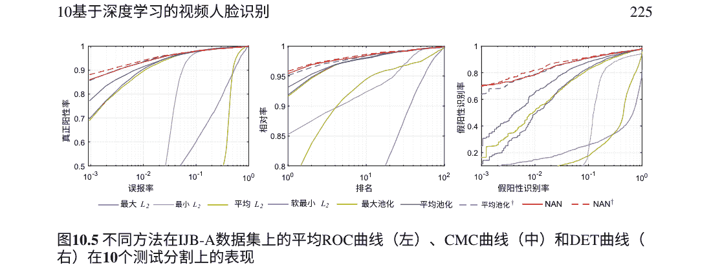

通过媒体聚合，NAN在与以前的方法相比取得了最佳性能。在`FAR=0.1`时，它具有相同的验证TAR和识别Rank-10 CMC，与[12]的方法相比，在所有其他指标上都表现更好（例如，在`FAR=0.01`时，0.881与0.836的TAR，在`FPIR=0.01`时，0.817与0.774的TPIR，以及0.958与0.928的Rank-1准确率）。

图10.4展示了一些加权结果的典型示例。NAN展示了选择高质量和更具辨别力的人脸图像的能力，同时排斥质量较差的人脸图像。

### 10.5.4 YouTube人脸数据集的结果

然后，我们在设计用于视频中的非约束性人脸验证的YouTube人脸（YTF）数据集[1]上测试不同的方法。它包含3,425个不同人的1,595个视频，视频长度从48到6,070帧不等，平均长度为181.3帧。有10个包含500个视频对的折叠可用，并且我们遵循标准验证协议报告具有交叉验证的平均准确性。我们再次使用STN和相似变换来对齐人脸图像。

不同方法的人脸验证结果在表10.3中呈现，其ROC曲线在图10.6中显示。再次，`CNN+Max L2`，`CNN+Min L2`，以及`CNN+MaxPool`的表现不如`CNN+Mean L2`，`CNN+SoftMin L2`和`CNN+AvePool`。在这些方法中，`CNN+SoftMin L2`表现最佳，准确率略高于`CNN+Mean L2`和`CNN+AvePool`。NAN优于所有这些简单池化或基于成对距离的方法。与IJB-A上的结果相比，NAN与最佳表现方法之间的差距较小。这是因为该数据集中的人脸变化相对较小（比较图10.7和10.4中的示例），因此与简单的平均池化或计算平均L2距离相比，无法提取太多有益信息。

与之前的方法相比，NAN的平均准确率达到了95.72%，将FaceNet的错误率降低了12.3%。需要注意的是，FaceNet也是基于一个GoogLeNet风格的网络，它使用每个视频中100对帧（即10K对）的平均相似度[11]。VGG-Face [16]的准确率（97.3%）高于NAN。然而，该结果是基于对YTF进行进一步的判别度学习得出的，否则准确率只有91.5% [16]。

### 表10.3 不同方法在YTF数据集上的验证准确率比较

| 方法 | 准确率 (%) | AUC |
| --- | --- | --- |
| LM3L [48] | 81.3 ± 1.2 | 89.3 |
| DDML(combined)[9] | 82.3 ± 1.5 | 90.1 |
| EigenPEP [6] | 84.8 ± 1.4 | 92.6 |
| DeepFace-single [10] | 91.4 ± 1.1 | 96.3 |
| DeepID2+ [17] | 93.2 ± 0.2 | – |
| Wen等人 [19] | 94.9 | – |
| FaceNet [11] | 95.12 ± 0.39 | – |
| VGG-Face [16] | 97.3 | – |
| CNN+最大 $L_2$ | 91.96 ± 1.1 | 97.4 |
| CNN+最小 $L_2$ | 94.96 ± 0.79 | 98.5 |
| CNN+平均 $L_2$ | 95.30 ± 0.74 | 98.7 |
| CNN+软最小 $L_2$ | 95.36 ± 0.77 | 98.7 |
| CNN+最大池化 | 88.36 ± 1.4 | 95.0 |
| CNN+平均池化 | 95.20 ± 0.76 | 98.7 |
| NAN | 95.72 ± 0.64 | 98.8 |

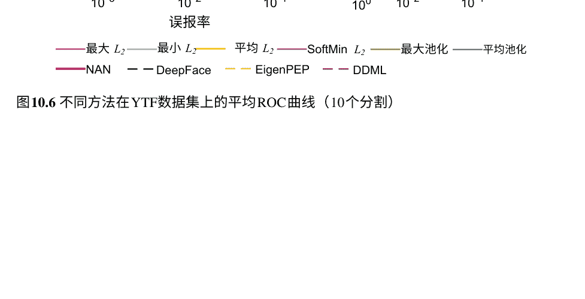

### 图10.6 不同方法在YTF数据集上的平均ROC曲线（10个分割）

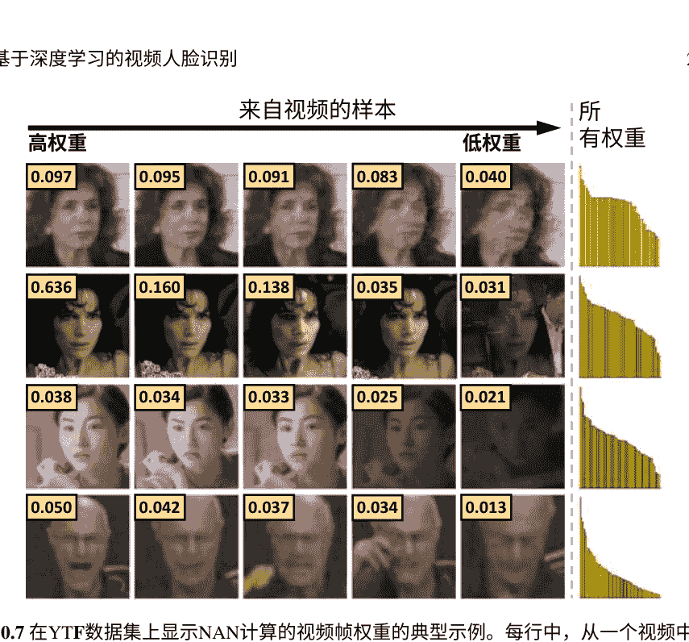

### 10.5.5 Celebrity-1000数据集上的结果

Celebrity-1000数据集[7]旨在研究无约束的基于视频的人脸识别问题。它包含1,000个人的159,726个视频序列，总共有2.4M帧（每个序列约15帧）。我们使用提供的五个面部标记来对齐面部图像。该数据集存在两种类型的协议：开放集和封闭集。在开放集协议中，使用200个主体进行训练，而剩下的800个主体的视频序列用作测试阶段的画廊集和探针集。有四种不同的设置，涉及不同数量的探针和画廊主体：100、200、400和800。在封闭集协议中，来自所有1,000个主体的视频序列被分为训练（画廊）子集和测试（探针）子集。封闭集也有四种设置：100、200、500，和1000个主体。有关协议和数据集的更多详细信息，请参见[7]。

### 表10.4 名人1000数据集上的识别性能（排名1准确率，%）对于封闭集测试

| 方法 | 100 | 200 | 500 | 1000 |
|------|-----|-----|-----|------|
| MTJSR [7] | 50.60 | 40.80 | 35.46 | 30.04 |
| Eigen-PEP [6] | 50.60 | 45.02 | 39.97 | 31.94 |
| CNN+平均 $L_2$ | 85.26 | 77.59 | 74.57 | 67.91 |
| CNN+AvePool - VideoAggr | 86.06 | 82.38 | 80.48 | 74.26 |
| CNN+AvePool - SubjectAggr | 84.46 | 78.93 | 77.68 | 73.41 |
| NAN-VideoAggr | 88.04 | 82.95 | 82.27 | 76.24 |
| NAN-SubjectAggr | 90.44 | 83.33 | 82.27 | 77.17 |

### 表10.5 名人1000数据集上的识别性能（排名1准确率，%）对于开放集测试

| 方法 | 100 | 200 | 400 | 800 |
|------|-----|-----|-----|-----|
| MTJSR [7] | 46.12 | 39.84 | 37.51 | 33.50 |
| Eigen-PEP [6] | 51.55 | 46.15 | 42.33 | 35.90 |
| CNN+平均 $L_2$ | 84.88 | 79.88 | 76.76 | 70.67 |
| CNN+AvePool - SubjectAggr | 84.11 | 79.09 | 78.40 | 75.12 |
| NAN - SubjectAggr | 88.76 | 85.21 | 82.74 | 79.87 |

#### 封闭集测试：

对于封闭集协议，我们首先使用识别损失在视频序列上训练网络。我们将FC层输出值作为分数，最大分数对应的主体作为结果。我们还为CNN+AvePool训练了一个线性分类器，以对每个视频特征进行分类。由于特征是基于视频序列构建的，我们将这种方法称为“VideoAggr”，以区别于下面要描述的另一种方法。数据集中的每个主体都有多个视频序列，因此我们可以通过聚合所有可用图像来构建一个主体的单一表示。

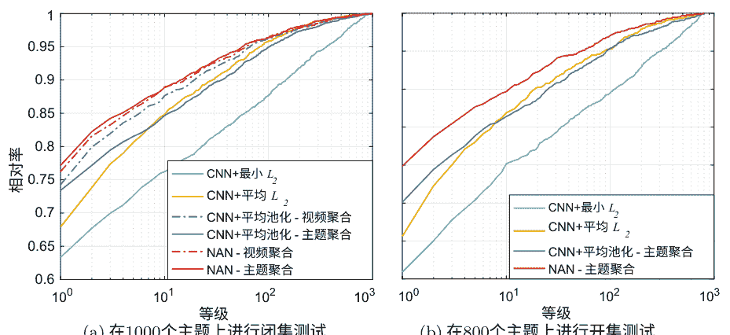

在所有训练（画廊）视频序列中。我们将这种方法称为“主题聚合”。这样，线性分类器可以被绕过，通过比较特征$L_{2}$距离来实现识别。

结果见表10.4。请注意，[6, 7]没有使用深度学习也没有基于深度网络的方法在该数据集上报告结果。因此，我们主要比较NAN和简单池化或基于成对距离的方法。从表10.4和图10.8a可以看出，NAN在“视频聚合”和“主题聚合”两种方法中始终优于这些方法。对于“主题聚合”方法，取得了显著的改进。有趣的是，“主题聚合”导致CNN+平均池化相对于其“视频聚合”明显性能下降。这表明，当应用于具有多个视频的主题级别时，简单聚合变得更糟。然而，我们的NAN可以从“主题聚合”中受益，结果始终优于或与“视频聚合”方法相当，并与简单方法相比提供了显著的准确性提升。这表明我们的NAN在处理大数据变化方面表现良好。

#### 开放式测试:

然后我们使用闭集协议对NAN进行测试。我们首先在提供的训练视频序列上训练网络。在测试阶段，我们采用之前描述的“SubjectAggr”方法为每个画廊主题构建高度紧凑的人脸表示。通过比较聚合人脸表示之间的$L_{2}$距离来执行识别。

表10.5和图10.8b的结果表明，NAN显著减少了`CNN+AvePool`的错误。这再次表明，在存在大量人脸变化的情况下，常用的策略如平均池化聚合和成对距离计算远非最佳选择。在这种情况下，学习的NAN模型显然更强大，并且由它生成的聚合特征表示对于视频人脸识别任务更有利。

## 10.6 结论

在本章中，我们总结了现有的基于视频的人脸识别的深度学习技术。所有这些方法都应用了深度卷积神经网络来提取图像级别的深度特征，识别的关键在于如何测量两个特征集之间的距离，或者如何聚合图像级别的特征以获得视频级别的特征。为此，我们回顾了一些朴素但常用的策略，包括特征汇聚和成对特征距离计算。

实验证明，这些简单的策略大多是有效的，结果明显优于手工设计特征的传统方法。我们进一步提出了用于视频人脸表示和识别的神经聚合网络。NAN使用一组内容自适应权重来融合所有输入帧，从而得到一个与输入帧顺序无关的紧凑表示。聚合方案计算和内存占用较小，但在训练后可以生成高质量的人脸表示。实验结果表明，它在很大程度上优于成对图像特征距离计算或基于汇聚的方法。

## 参考文献

- 1. Wolf L, Hassner T, Maoz I (2011) 在匹配背景相似性的无约束视频中的人脸识别。在：IEEE计算机视觉和模式识别（CVPR）会议上，pp 529-534
- 2. Li H, Hua G, Lin Z, Brandt J, Yang J (2013) 用于姿态变体人脸验证的概率弹性匹配。在：IEEE计算机视觉和模式识别（CVPR）会议上，pp 3499-3506
- 3. Wolf L, Levy N (2013) 用于视频人脸识别的SVM-minus相似度分数。在：IEEE计算机视觉和模式识别（CVPR）会议上，pp 3523-3530
- 4. Cui Z, Li W, Xu D, Shan S, Chen X (2013) 通过多个度量学习融合鲁棒的人脸区域描述符，用于野外人脸识别。在：IEEE计算机视觉和模式识别（CVPR）会议上，pp 3554-3561
- 5. Mendez-Vazquez H, Martínez-Diaz Y, Chai Z (2013) 基于体积结构化序数特征和背景相似度测量的视频人脸识别。在：国际生物特征学会议（ICB）
- 6. Li H, Hua G, Shen X, Lin Z, Brandt J (2014) 用于视频人脸识别的Eigen-PEP。在：亚洲计算机视觉会议（ACCV），第17-33页
- 7. Liu L, Zhang L, Liu H, Yan S (2014) 在无约束视频中实现大规模人脸识别。IEEE交流电路与系统视频技术杂志24(11):1874-1884
- 8. Parkhi OM, Simonyan K, Vedaldi A, Zisserman A (2014) 一种紧凑且具有区分性的人脸跟踪描述符。在：IEEE计算机视觉和模式识别会议（CVPR），第1693-1700页
- 9. 胡J，陆J，谭Y-P (2014) 野外人脸验证的判别式深度度量学习。在：IEEE计算机视觉和模式识别（CVPR）会议上，第1875-1882页
- 10. Taigman Y, Yang M, Ranzato M, Wolf L (2014) DeepFace：缩小与人类水平的面部验证差距。在：IEEE计算机视觉和模式识别（CVPR）会议上，第1701-1708页
- 11. Schroff F, Kalenichenko D, Philbin J (2015) FaceNet: 面部识别和聚类的统一嵌入 在：IEEE计算机视觉和模式识别会议 (CVPR), pp815–823
- 12. Crosswhite N, Byrne J, Parkhi OM, Stauffer C, Cao Q, Zisserman A (2016) 模板适应用于面部验证和识别。arXiv:1603.03958
- 13. 杨杰, 任鹏, 张东, 陈东, 温飞, 李华, 华刚 (2017) 神经聚合网络用于视频人脸识别。在：IEEE计算机视觉和模式识别会议 (CVPR)
- 14. 孙阳, 王晓, 唐晓 (2014) 通过预测10,000个类别进行深度学习人脸表示。在：IEEE计算机视觉和模式识别会议 (CVPR), 第1891-1898页
- 15. 陆超, 唐晓 (2015) 在LFW上超越人类级别的人脸验证性能 高斯脸。在：AAAI人工智能会议 (AAAI), 第3811-3819页
- 16. Parkhi OM, Vedaldi A, Zisserman A (2015) 深度人脸识别。在：英国机器视觉会议 (BMVC), 卷1, 号3, 第6页
- 17. Sun Y, Wang X, Tang X (2015) 深度学习的人脸分析是稀疏、选择性和鲁棒的。在：IEEE计算机视觉和模式识别会议 (CVPR), 第2892-2900页
- 18. Masi I, Rawls S, Medioni G, Natarajan P (2016) 野外姿态感知人脸识别。在：IEEE计算机视觉和模式识别会议 (CVPR), 第4838-4846页
- 19. Wen Y, Zhang K, Li Z, Qiao Y (2016) 一种用于深度人脸识别的判别特征学习方法。在：欧洲计算机视觉会议 (ECCV), 第499-515页
- 20. Graves A, Wayne G, Danihelka I (2014) 神经图灵机。CoRR. arXiv:1410.5401
- 21. Vinyals O, Bengio S, Kudlur M (2016) 顺序很重要：序列到序列的集合。在：国际学习表示会议
- 22. Klare BF, Klein B, Taborsky E, Blanton A, Cheney J, Allen K, Grother P, Mah A, Burge M, Jain AK (2015) 推动无约束人脸检测和识别的前沿：Iarpa janus基准测试。在：IEEE计算机视觉和模式识别 (CVPR) 会议, pp 1931-1939
- 23. Lee K-C, Ho J, Yang, M-H, Kriegman D (2003) 基于概率外观流形的视频人脸识别。在：IEEE计算机视觉和模式识别 (CVPR) 会议
- 24. Shakhnarovich G, Fisher JW, Darrell T (2002) 长期观察的人脸识别。在：欧洲计算机视觉会议 (ECCV), pp 851-865

- 25. Zhou SK, Rama C (2005) 超越单一静态图像：从多个静态图像或视频序列中进行人脸识别, pp 547-575

- 26. Arandjelovic O, Shakhnarovich G, Fisher J, Cipolla R, Darrell T (2005) 使用流形密度差异进行人脸识别的图像集。在：IEEE计算机视觉和模式识别会议 (CVPR)

- 27. Cevikalp H, Triggs B (2010) 基于图像集的人脸识别。在：IEEE计算机视觉和模式识别会议 (CVPR), 第2567-2573页

- 28. Kim T-K, Arandjelovi’c O, Cipolla R (2007) 基于图像集的识别的增强流形主角度。Pattern Recognit 40(9):2475–2484

- 29. Wang R, Shan S, Chen X, Gao W (2008) 基于图像集的人脸识别的流形-流形距离。在：IEEE计算机视觉和模式识别会议 (CVPR), 第1-8页

- 30. Turaga P, Veeraraghavan A, Srivastava A, Chellappa R (2011) 对基于图像和视频的识别的Grassmann和Stiefel流形的统计计算。IEEE Trans Pattern Anal Mach Intell 33(11):2273–2286

- 31. Chen J-C, Ranjan R, Kumar A, Chen C-H, Patel V, Chellappa R (2015) 使用深度卷积神经网络的无约束人脸验证的端到端系统。在：IEEE国际计算机视觉会议论文集, 第118-126页

- 32. Chowdhury AR, Lin T-Y, Maji S, Learned-Miller E (2016) 使用双线性CNN的一对多人脸识别。在：IEEE冬季计算机视觉应用会议 (WACV)

- 33. Masi I, Trân ATA, Leksut JT, Hassner T, Medioni G (2016) 我们真的需要收集数百万张人脸来进行有效的人脸识别吗？在：欧洲计算机视觉会议（ECCV）

- 34. AbdAlmageed W, Wu Y, Rawls S, Harel S, Hassner T, Masi I, Choi J, Lekust J, Kim J, Natarajan P, et al (2016) 使用深度多姿态表示进行人脸识别。在：IEEE冬季计算机视觉应用会议（WACV）

- 35. Szegedy C, Liu W, Jia Y, Sermanet P, Reed S, Anguelov D, Erhan D, Vanhoucke V, Rabinovich A (2015) 使用卷积进行更深入的研究。在：IEEE计算机视觉和模式识别会议（CVPR），第1-9页

- 36. Ioffe S, Szegedy C (2015) 批量归一化：通过减少内部协变量转移来加速深度网络训练。arXiv:1502.03167

- 37. Sukhbaatar S, Weston J, Fergus R, et al (2015) 端到端的记忆网络。在：神经信息处理系统的进展（NIPS），第2440-2448页

- 38. Chopra S, Hadsell R, LeCun Y (2005) 学习相似度度量，具有人脸验证应用。在：IEEE计算机视觉和模式识别会议（CVPR），卷1，第539-546页

- 39. Hadsell R, Chopra S, LeCun Y (2006) 通过学习不变映射进行降维. 在：IEEE计算机视觉与模式识别会议(CVPR), 第2卷, 第1735-1742页

- 40. Chen D, Ren S, Wei Y, Cao X, Sun J (2014) 联合级联人脸检测和对齐. 在: 欧洲计算机视觉会议(ECCV), 第109-122页

- 41. Ren S, Cao X, Wei Y, Sun J (2014) 通过回归局部二进制特征实现3000帧/秒的人脸对齐. 在: IEEE计算机视觉与模式识别会议(CVPR), 第1685-1692页

- 42. Tieleman T, Hinton G (2012) RMSProp: 将梯度除以其最近幅度的运行平均值. 技术报告

- 43. Chen D, Hua G, Wen F, Sun J (2016) 用于高效人脸检测的监督变换网络. 在: 欧洲计算机视觉会议(ECCV), 第122-138页

- 44. Sankaranarayanan S, Alavi A, Castillo C, Chellappa R (2016) 三元概率嵌入用于人脸验证和聚类。arXiv:1604.05417

- 45. Wang D, Otto C, Jain AK (2015) 大规模人脸搜索：8000万图库。arXiv:1507.07242

- 46. Chen J-C, Patel VM, Chellappa R (2016) 使用深度卷积神经网络特征的非约束人脸验证。在：IEEE冬季计算机视觉应用会议（WACV）

- 47. Grother P, Ngan M (2014) 人脸识别供应商测试（FRVT）中人脸识别算法的性能。在：技术报告NIST IR 8009。国家标准与技术研究所

- 48. Hu J, Lu J, Yuan J, Tan Y-P (2014) 野外人脸和亲属验证的大边界多度量学习。在：亚洲计算机视觉会议（ACCV），第252-267页

# 第11章 热成像到可见光人脸合成和识别

Xing Di, He Zhang和Vishal M. Patel

人脸是最广泛使用的生物特征之一。使用人脸作为生物特征的一个关键优势是它们不需要测试对象的合作。在过去的二十年中，已经开发出了各种人脸识别（FR）系统。机器学习和计算机视觉方法的最新进展为人脸识别系统的性能提供了显著的提升[5, 19]。深度学习方法借助于处理硬件的巨大改进以及人脸数据和算法开发的普及，显著提高了人脸识别的准确性，特别是在非受限场景中[4, 5, 19, 20, 27]。此外，受社交网络公司的推动，人脸识别研究、开发和部署的进展已经集中在电磁波谱可见区域内收集的人脸上。

在无法使用外部照明的情况下，热成像被提出用于夜间和低光条件下的人脸识别，这是由于各种收集考虑所导致的。红外光谱可以分为反射主导区域，包括近红外（NIR）和短波红外（SWIR）波段，以及发射主导的热区域，包括中波红外（MWIR）和长波红外（LWIR）波段[23]。热脸图像在夜间具有明显的特征，但在生物特征识别的名单中没有得到仔细维护，因此必须与可见光脸部图像进行比较，以实现在低光照条件下的人脸识别。这引入了在不同领域进行交叉匹配的额外复杂性（见图11.1）。


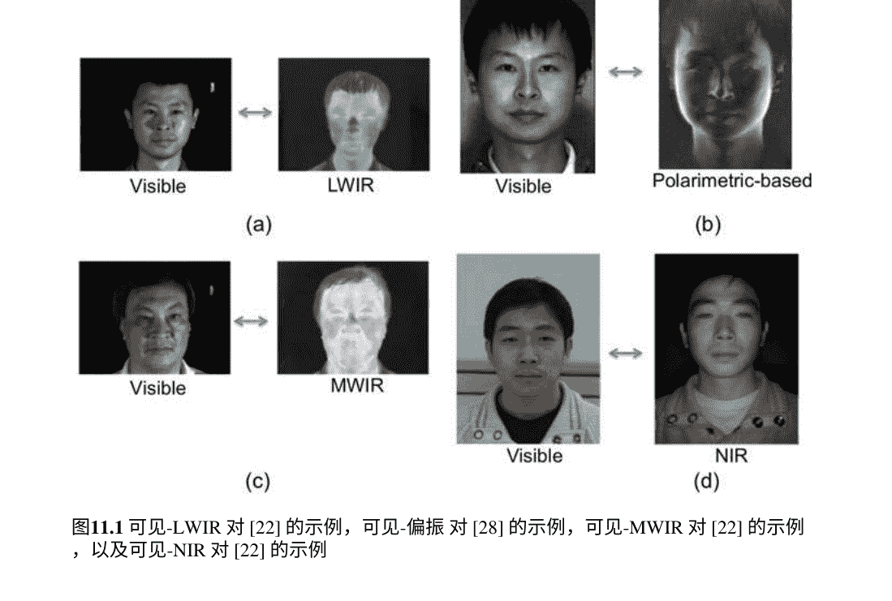

众所周知，深度学习方法在训练时针对特定类型的数据进行了调整，当面对来自不同领域的数据时，往往失去了效果。领域自适应和迁移学习方法已被提出，以弥合来自不同源和目标领域的数据之间的差距[18]。迁移学习通常涉及对预训练的神经网络模型（在源领域数据上训练）在目标领域数据上进行微调，这需要目标领域中有足够的样本。对于热红外到可见光人脸匹配等应用，可用的具有相应可见光和热红外人脸图像的数据库有限，并且如前所述，两个领域之间存在较大的模态和性能差距。此外，由于训练数据有限，为跨领域人脸验证训练一个类似孪生网络的网络可能导致对有限的训练样本过拟合。因此，这种跨领域验证网络可能无法很好地推广到测试集。

在本章中，我们专注于跨领域验证的替代解决方案。与其直接学习领域自适应网络，一个可以利用网络先从热面生成可见面，然后使用预训练的面部识别网络进行面部验证。我们在本章中对这些方法[7, 8, 26, 30, 31]进行了回顾。

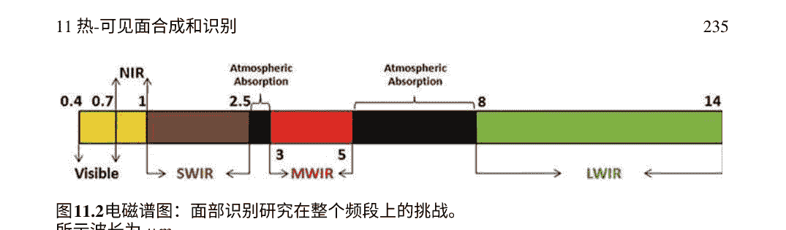

## 11.1 红外光谱

正如前面讨论的，大多数面部识别系统依赖于在电磁谱的可见范围内捕获的面部图像，即380-750纳米。然而，在现实世界的场景中（军事和执法），我们面临着恶劣的环境条件，其特点是不利的照明和明显的阴影。一个例子是夜间环境[2]，在那里仅基于各种探测器进行人体识别（见图11.2）。

具体来说，红外（IR）光谱由活动红外和热红外（被动）波段组成。活动红外波段（0.7–2.5 μm）分为近红外（NIR）和短波红外（SWIR）光谱。SWIR比NIR具有更长的波长范围，并且对雾和烟等低水平遮挡物更具容忍性。可见光和活动红外波段感测到的图像之间的外观差异是由被成像物体的属性引起的。被动红外波段进一步分为中波（MWIR）和长波红外（LWIR）波段。MWIR波段范围为3到5 μm，而LWIR波段范围为7到14 μm。

MWIR和LWIR相机都可以在远距离上感测到脸部的温度变化，并以2D图像的形式生成热图。然而，虽然两者都属于热谱，但它们揭示了面部皮肤的不同图像特征。MWIR和LWIR之间的区别在于MWIR具有反射和发射特性，而LWIR主要由发射辐射组成。在可见光谱之外的人脸识别的重要性最近在我们的先前工作中进行了讨论[1, 3]。

## 11.2 基于GAN的热成像人脸合成

热成像到可见光合成是跨模态人脸匹配系统中的重要步骤。由于图像获取和形成过程中物理差异引起的大的模态差异，测量得到的可见光人脸特征与热成像人脸特征非常不同。这反过来使得跨域人脸识别具有挑战性。文献中已经开发了各种方法来弥合这一差距。

解决这个问题的一种可能方法是通过设计新颖的神经网络架构来改善跨域人脸识别性能，从而最小化域之间的分布变化。然而，确保人类检查员能够确定给定的热成像和可见光图像是否具有相同的身份仍然非常重要。考虑图11.1中的偶数列中显示的热成像人脸图像。相应的可见光图像也显示在图11.1的奇数列中。从这些图像中可以看出，无论是人类检查员还是现有的人脸识别系统都很难确定这些图像是否具有相同的身份。因此，需要能够自动生成高质量可见光图像的方法来对应其对应的热成像图像。

### 11.2.1 生成对抗网络（GANs）

生成对抗网络是由Goodfellow等人在[11]中提出的，通过有效地学习训练图像的分布来合成逼真的图像。作者采用了博弈论的极小极大优化框架来训练两个模型：一个生成模型`G`和一个判别模型`D`。GAN在合成逼真图像方面的成功使研究人员开始探索对抗损失在许多计算机视觉和图像处理应用中的应用，例如风格转换、图像修复、图像翻译、图像超分辨率和图像恢复。受到这些方法的成功启发，许多方法已经提出利用对抗损失来学习可见人脸图像的分布以进行准确估计。

为了学习一个好的生成器`G`以欺骗学习到的判别器`D`，并使判别器`D`足够好地区分合成的可见图像和真实的真实图像，该方法根据[13]中提出的结构交替更新`G`和`D`。给定输入极化图像`X`，条件GAN旨在通过解决以下优化问题来学习生成输出图像`Y`的映射函数：

> `min_G max_D  E_{X~p_{数据}(X)}[log(1 - D(X, G(X)))] + E_{X~p_{数据}(Y)}[log D(X, Y)].  (11.1)`

### 11.2.2 基于GAN的合成网络

在最近的一项工作中[30]，提出了一个统一的基于GAN的合成网络，可以直接学习热图像与其对应可见图像之间的端到端映射。所提出的网络包含一个编码器-解码器结构，其中学习到的可见特征可以被视为编码器部分的输出。

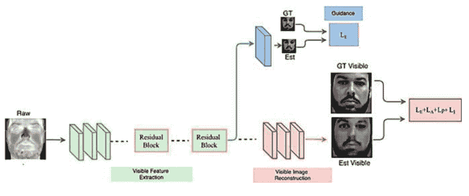

图11.3 [30]中提出的基于GAN的图像合成方法概述。它由三个模块组成。a可见特征提取模块，b引导子网络和c可见图像重建模块。首先，从原始热图像中提取可见特征。然后，为了确保学习到的特征能更好地重建可见图像，引入了一个引导子网络进行优化。最后，使用引导特征结合不同的损失函数来重建逼真的可见图像。

以及解码器部分的输入。为了保证编码特征的可重构性，并确保学习到的特征包含几何上有意义的信息，在可见特征提取部分的末尾引入了一个引导子网络。整体网络架构如图11.3所示。为了克服传统的欧几里得损失（`$L_E$`损失）带来的模糊结果的副作用，并区分生成的可见人脸图像与其对应的真实图像，采用了GAN结构。尽管与传统的`$L_E$`损失相比，GAN的结构可以生成更合理的结构，但研究表明传统GAN生成的结果包含不可取的面部伪影，导致图像不够逼真[30]。为了解决这个问题，同时生成视觉上令人愉悦的结果，在网络中引入了感知损失，其中感知损失是在预训练的VGG-16模型上评估的。

由于合成方法的最终目标是确保人类检查员能够根据合成的人脸图像识别出该人，因此将辨别信息纳入考虑也很重要。类似于感知损失，还提出了一种保持身份的损失函数，该函数在经过微调的VGG-热模型的某一层上进行评估。

编码器-解码器结构被用作生成器部分的基础。基本上，生成器可以分为两个部分。首先，一组带有步长2的卷积层与一组残差块被视为可见特征估计部分。具体而言，残差块由两个带有`3 $\times$ 3`内核和64个特征图的卷积层组成，后面跟着批归一化层和参数化修正线性单元（PReLU）作为激活函数。然后，一组步长为2的转置卷积层被称为可见图像重建过程。为了确保转换后的特征包含足够的语义信息，在网络中引入了一个引导子部分。同时，为了使生成的可见面部图像与真实的可见面部图像难以区分，使用基于CNN的可微分鉴别器作为指导，引导生成器生成更好的视觉结果。对于鉴别器，使用Patch-GANs [13]来判断给定的图像是真实的还是伪造的。

网络使用以下损失函数进行训练：对恢复的可见图像施加的欧几里得损失（`$LE_{(G)}$`），对指导部分施加的欧几里得损失（`$LE$`），用于保证更锐利结果的对抗损失，用于保留更逼真细节的感知损失，以及用于保留更可区分输出信息的身份损失。整体损失函数定义如下：

$$L_{\text{all}} = L_E + L_{E(G)} + \lambda_A L_A + \lambda_P L_P + \lambda_I L_I, \qquad (11.2)$$

其中，`$LE$`表示欧几里得损失，`$LE_{(G)}$`表示指导子网络上的欧几里得损失，`$LA$`表示对抗损失，`$LP$`表示感知损失，`$LI$`表示身份损失。在这里，`$\lambda_A$`，`$\lambda_P$`和`$\lambda_I$`是相应的权重。

损失函数`$L_E$`和对抗性损失函数的定义如下：

$$L_E, L_{E(G)} = \frac{1}{\text{宽度}W \text{高度}H} \sum_{w=1}^{W} \sum_{h=1}^{H} \| \phi_G(I)^{w,h} - Y_t^{w,h} \|_2, \qquad (11.3)$$

$$L_A = -\log(\phi_D(\phi_G(I)^{c,w,h})), \qquad (11.4)$$

其中`$I$`是输入的热像图，`$Y_t$`是真实的可见图像，`$W \times H$`是输入图像的尺寸，`$\phi_G$`是生成器子网络`G`，`$\phi_D$`是判别器子网络`D`。由于感知损失和身份损失是在给定的CNN模型的某一层上评估的，因此两者可以定义如下：

$$L_{P,I} = \frac{1}{\text{通道数}C_i \text{宽度}W_i \text{高度}H_i} \sum_{c=1}^{C_i} \sum_{w=1}^{W_i} \sum_{h=1}^{H_i} \| V(\phi_E(I))^{c,w,h} - V.(Y_t)^{c,w,h} \|_2, \qquad (11.5)$$

其中`$Y_t$`是真实的可见图像，`$\phi_E$`是提出的生成器，`$V$`表示非线性的CNN变换，`$C_i, W_i, H_i$`是某个高层次层`V`的维度，对感知和身份损失有所不同。

使用ARL偏振热数据集[30]对不同实验协议进行了多次实验评估，并证明了该方法能够从输入的热图像中产生高质量的可见图像。极化热图像由三个Stokes图像组成：`$S_0, S_1, S_2$`和线性偏振度（DoLP）图像，其中`$S_0$`表示传统的总强度热图像，`$S_1$`捕捉水平和垂直极化状态信息，`$S_2$`捕捉对角极化状态信息，而DoLP描述了电磁波的线性偏振部分[12]。图11.4显示了这些Stokes图像以及与ARL数据集[12]中的一个主题对应的可见光和极化图像。

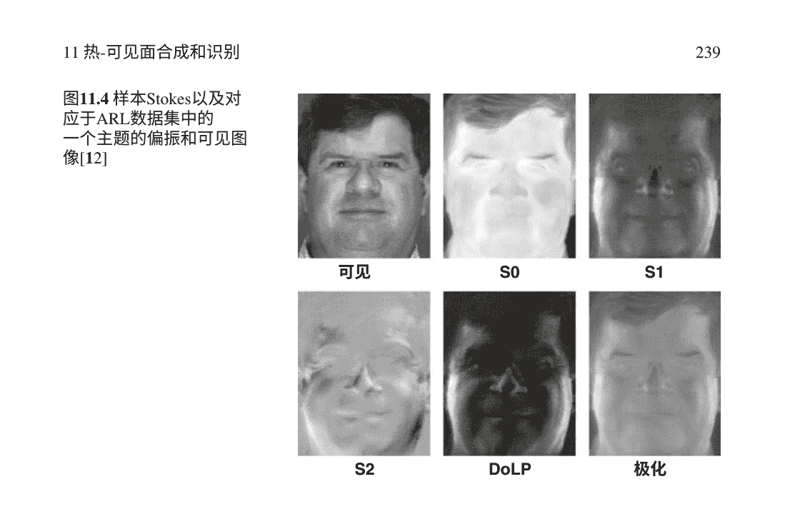

本文中的极化特征/图像被定义为由三个Stokes图像（S₀, S₁, S₂）组成的，类似于可见光图像中的RGB通道。

## 11.3 使用GAN从偏振热脸合成高质量可见脸

尽管前一节中描述的基于GAN的方法能够有效地从偏振热图像中合成逼真的可见脸图像，但结果仍然远非最佳[30]。一个可能的原因是[30]将Stokes图像连接成一个单输入样本，而没有任何额外的尝试来捕捉热红外波段中不同Stokes（模态）图像中固有的多通道信息。为了有效地利用偏振热图像提供的多模态信息，最近在[31]中提出了一种新颖的基于GAN的多流特征级融合方法，用于从热图像合成可见图像。

特别是在[31]中提出的基于GAN的方法由生成器、鉴别器子网络和深度引导子网络组成（见图11.5）。生成器由基于密集残差块的多流编码器-解码器网络组成，鉴别器旨在捕捉多尺度特征以进行鉴别，深度引导子网络旨在确保编码特征包含几何和纹理信息以恢复可见的人脸。为了进一步提高网络的性能，除了对抗损失外，还通过感知损失和保持身份的损失进行引导。研究表明，一旦合成了人脸图像，可以使用任何现成的人脸识别和验证方法。

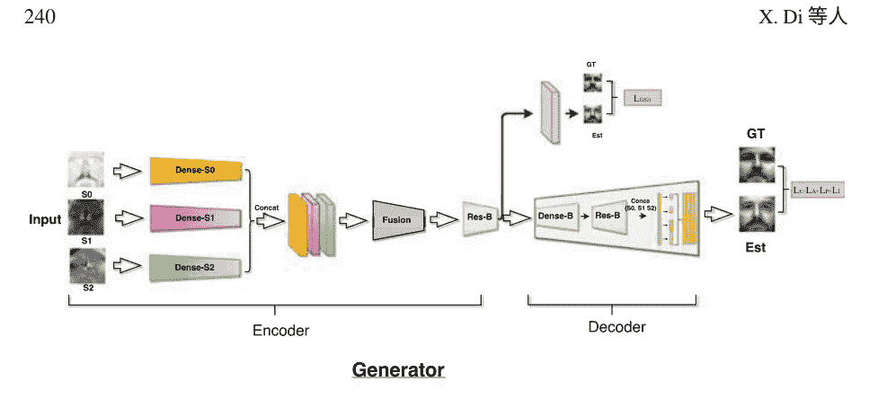

图11.5 [31]中提出的基于GAN的多流编码器-解码器网络的概述。生成器包含一个多流特征级融合的编码器-解码器网络。此外，在编码部分的末尾堆叠了一个深度引导子网络。鉴别器由多尺度补丁鉴别器结构组成。

在仅使用可见光人脸数据训练的网络可以用于匹配。特别地，从`VGG-face`网络[17]的倒数第二个全连接层提取特征，并使用余弦距离计算分数。

## 11.4 通过保留属性合成的热成像到可见光人脸验证

在最近的一项工作中[8]，对热成像到可见光匹配问题提出了不同的方法。图11.6比较了传统的跨模态验证问题与[8]中提出的新的保留属性跨模态验证方法。给定一个可见光和热成像对，传统方法首先从这些图像中提取一些特征，然后基于提取的特征验证身份[15]（见图11.6b）。相反，提出了一种新的框架，其中作者利用从可见光图像中提取的属性从输入的热成像中合成保留属性的可见光图像进行匹配（见图11.6b）。特别地，使用预训练的`VGG-Face`模型[17]从可见光图像中提取属性。然后，提出了一种新颖的保留属性生成对抗网络（`AP-GAN`）来合成可见光图像。

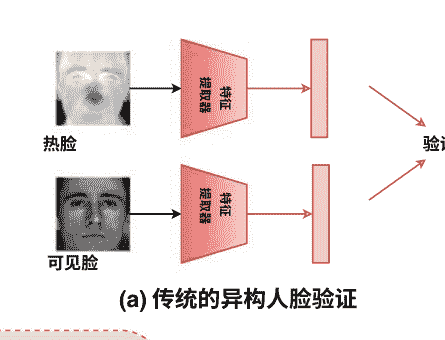

(a) 传统的异构人脸验证

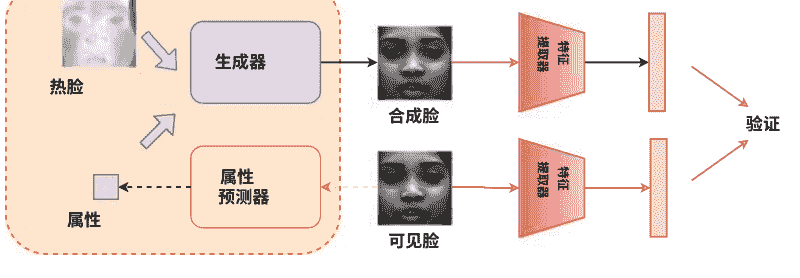

(b) 提出的异构人脸验证

图11.6 a 传统的异构人脸验证方法直接使用从不同模态提取的特征进行验证[30]。 b [8]提出的异构人脸验证方法使用热脸和语义属性合成可见脸。

最后，从合成和可见脸提取的深度特征用于验证。

由提取的属性引导的热图像。最后，使用深度网络从合成和输入的可见图像中提取特征进行验证。

[8]提出的`AP-GAN`模型受到最近的属性/文本图像生成工作[6, 21, 30]的启发。`AP-GAN`由两部分组成: (i)基于多模态紧凑双线性(`MCB`)池化的生成器[9, 10]和(ii)三元对鉴别器。生成器将提取的属性向量与图像特征向量在潜空间中融合。另一方面，鉴别器使用三元对(真实图像/真实属性， 假图像/真实属性， 假图像/错误属性)不仅用于区分真实和假图像，还用于区分图像和属性。为了生成高质量且保留属性的图像，生成器通过多目标目标函数进行优化，包括对抗损失[11]、`$L_1$`损失、感知损失[14]、身份损失[30]和属性保持损失。整个`AP-GAN`框架如图11.7所示。使用`ARL`极化人脸数据集进行了大量实验，结果表明该方法在合成和匹配方面取得了显著的改进，超过了现有技术方法。

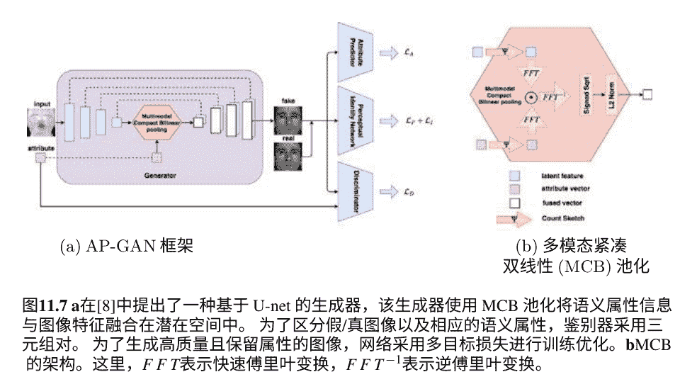

## 11.5 自注意力引导合成

在[7]中，通过探索不同模态的互补信息，提出了一种解决热-可见匹配问题的新方法。图11.8概述了这种方法[7]。给定热-可见图像对`$(\mathbf{x}_{t}, \mathbf{x}_{v})$`，首先使用两个训练有素的生成器将这些图像转换为它们的频谱对应物 `$\hat{\mathbf{x}}_{t} = G_{v\to t}(\mathbf{x}_{v})$`，`$\hat{\mathbf{x}}_{v} = G_{t\to v}(\mathbf{x}_{t})$`。然后使用特征提取器网络 `$Feat$`，特别是 `VGG-Face` 模型[17]，提取特征 `$f_{\mathbf{x}_{t}}=特征(\mathbf{x}_{t})$`，`$f_{\hat{\mathbf{x}}_{v}}=特征(\hat{\mathbf{x}}_{v})$`，`$f_{\mathbf{x}_{v}}=特征(\mathbf{x}_{v})$`，和 `$f_{\hat{\mathbf{x}}_{t}}$`。然后将这些特征融合生成画廊模板 `$g_{\mathbf{x}_{t}} = (f_{\mathbf{x}_{t}} + f_{\hat{\mathbf{x}}_{t}})/2$` 和探针模板 `$g_{\mathbf{x}_{v}} = (f_{\mathbf{x}_{v}} + f_{\hat{\mathbf{x}}_{v}})/2$`。最后，计算这些特征模板之间的余弦相似度得分进行验证。

请注意，基于`CycleGAN`的网络[32]可以用来训练这些生成器。然而，[7]中的实验表明，`CycleGAN`经常无法捕捉到面部眼睛和嘴巴区域的几何或结构模式。

一个可能的原因是网络过度依赖卷积来建模不同图像区域之间的依赖关系。卷积层的局部感受野无法很好地捕捉到长距离的依赖关系[29]。

为了改进，自注意力技术采用了`SAGAN` [29]中的方法。

自注意力模块应用在生成器和判别器的最后一个卷积层之前。给定特征图，该模块通过`softmax`函数自学习注意力图，然后将学习到的注意力图与特征图相乘，输出自注意力引导的特征图。此外，生成器通过由对抗损失[11]、`$L_1$`损失、感知损失[14]、身份损失[30]和循环一致性损失[32]组成的目标函数进行优化。整个合成框架如图11.9所示。

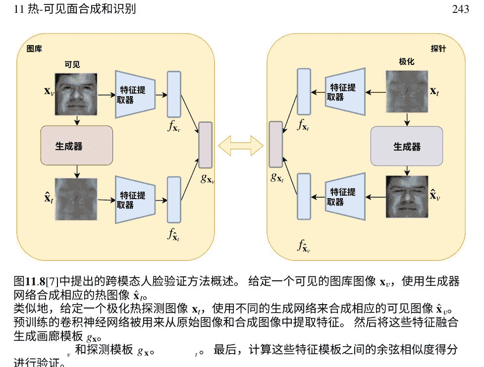

图11.8 [7]中提出的跨模态人脸验证方法概述。给定一个可见的图库图像 `$x_v$`，使用生成器网络合成相应的热图像 `$\hat{x}_t$`。类似地，给定一个极化热探测图像 `$x_t$`，使用不同的生成网络来合成相应的可见图像 `$\hat{x}_v$`。预训练的卷积神经网络被用来从原始图像和合成图像中提取特征。然后将这些特征融合生成画廊模板 `$g_{x_v}$` 和探测模板 `$g_{x_t}$`。最后，计算这些特征模板之间的余弦相似度得分进行验证。

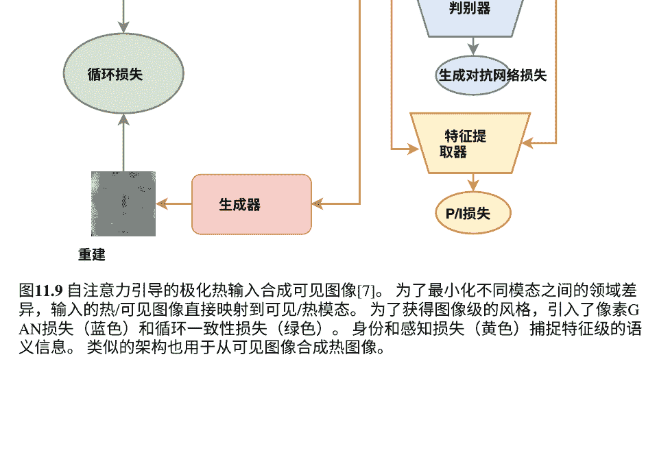

图11.9 自注意力引导的极化热输入合成可见图像[7]。为了最小化不同模态之间的领域差异，输入的热/可见图像直接映射到可见/热模态。为了获得图像级的风格，引入了像素`GAN`损失（蓝色）和循环一致性损失（绿色）。身份和感知损失（黄色）捕捉特征级的语义信息。类似的架构也用于从可见图像合成热图像。

表11.1 协议I上的热-可见光合成和匹配方法在`ARL`数据集上的极化热（`Polar`）和常规热（`S0`）情况下的验证性能比较。

| 方法 | AUC (`Polar`) | AUC (`S0`) | EER (`Polar`) | EER (`S0`) |
| :--- | :--- | :--- | :--- | :--- |
| 原始数据 (%) | 50.35 | 58.64 | 48.96 | 43.96 |
| `Mahendran`等人[16] (%) | 58.38 | 59.25 | 44.56 | 43.56 |
| `Riggan`等人[25] (%) | 75.83 | 68.52 | 33.20 | 34.36 |
| `GAN-VFS` [30] (%) | 79.90 | 79.30 | 25.17 | 27.34 |
| `Riggan`等人[24] (%) | 85.42 | 82.49 | 21.46 | 26.25 |
| `AP-GAN` [8] | 88.93% ± 1.54% | 84.16% ± 1.54% | 19.02% ± 1.69% | 23.90% ± 1.52% |
| 多流 `GAN` [31] | **96.03%** | 85.74% | **11.78%** | 23.18% |
| `Di`等人[7] | 93.68% ± 0.97% | **89.20% ± 1.56%** | 13.46% ± 1.92% | **18.77% ± 1.36%** |

图11.10比较了`ARL`极化热数据集[12]上不同方法的合成性能。从这个图中可以看出，总体上，基于`CNN`的方法能够从热图像中提供高质量的可见人脸。特别地，基于属性的合成方法[8]提供了最好的质量结果。

表11.1比较了`ARL`极化热数据集上不同合成方法对应的人脸验证性能。从这个方法可以看出，基于多流`GAN`的合成和最近提出的自注意力引导合成方法在`ARL`极化热数据集上的协议I上产生了最好的跨模态人脸验证结果[7]。

## 11.6 结论

在本章中，我们对最近基于深度`CNN`的热-可见人脸合成方法进行了回顾。特别地，我们回顾了基于`GAN`的方法，并展示了它们在不同热模态上能够提供高质量的合成和匹配性能。

## 参考文献

1.  Bourlai T, Hornak L (2016) 在可见光谱之外的人脸识别。图像视觉计算 55(1):14–17
2.  Bourlai T, Kalka N, Cao D, Decann B, Jafri Z, Nicolo F, Whitelam C, Zuo J, Adjeroh D, Cukic B, Dawson J, Hornak L, Ross A, Schmid NA (2011) 在夜间环境中确定人类身份。分布式视频传感器网络 451–467
3.  Bourlai, T., Ross, A., Chen, C. & Hornak, L. (2012), 使用中波红外图像进行人脸识别的研究，在‘SPIE Biometric Technology for Human Identification IX’
4.  Chen JC, Patel VM, Chellappa R (2016) 使用深度`CNN`特征进行无约束人脸验证。在：2016年IEEE冬季计算机视觉应用会议（`WACV`），第1–9页

# 第12章 通过干扰人脸检测和面部特征提取来阻止DeepFakes

Yuezun Li和Siwei Lyu

摘要 近年来，使用人工智能技术合成逼真的人脸取得了快速发展。AI合成的假脸可以被用作武器，造成负面的个人和社会影响。在这项工作中，我们开发了技术来保护个人免受最近AI合成的假视频的伤害，通过破坏可能的训练数据。这是通过使用特殊设计的不可察觉的对抗性扰动来干扰基于深度神经网络(DNN)的人脸检测和面部特征提取方法，从而降低检测到的人脸的质量。我们通过实验证明了我们的方法在多个数据集上破坏了最先进的基于DNN的人脸检测器和面部特征提取器的有效性。

## 12.1 引言

机器学习的最新进展和大量在线个人图像和视频的可用性极大地改善了图像[26, 27]和视频[8, 30, 67, 72]中高度逼真的人脸合成。虽然AI人脸合成系统有趣且具有创造性的应用，但它们也可以被用作武器。由于人脸与个体身份的强烈关联，精心制作的AI合成虚假视频可以制造出一个人存在和活动的错觉，而这些在现实中并不存在（见图12.1），这可能导致严重的政治、社会、财务和法律后果[11]。潜在的威胁范围从合成和拼接受害者脸部的报复色情视频开始，到在现实视频中，国家领导人似乎发表了煽动性言论，而实际上他们从未发表过，或者高级主管评论了她公司的业绩以影响全球股市。

预见到这种威胁，最近提出了许多旨在检测图像或视频中的AI合成人脸的取证技术[1, 20, 36, 37, 47, 85]。然而，鉴于在线媒体传播的速度和范围，即使是目前最好的取证技术也主要是事后操作，仅适用于AI合成的虚假人脸图像或视频出现之后。在这项工作中，我们旨在开发预防性方法，以保护个人免受此类攻击的侵害。这些保护方法与取证工具相辅相成，我们的解决方案是添加特别设计的模式，即所谓的对抗扰动，对人眼来说是难以察觉的，但可能导致检测失败。

## 参考文献

5.  Chen J-C, Ranjan R, Sankaranarayanan S, Kumar A, Chen C-H, Patel VM, Castillo CD, Chellappa R (2017) 使用深度卷积神经网络进行无约束静态/视频人脸验证。计算机视觉国际期刊

6.  Di X, Patel VM (2017) 通过条件VAES和GANs使用视觉属性的人脸合成。arXiv:1801.00077

7.  Di X, Riggan BS, Hu S, Short NJ, Patel VM (2019) 通过自注意力引导合成的偏振热到可见光人脸验证。在生物识别国际会议(ICB)上

8.  Di X, Zhang H, Patel VM (2018) 通过属性保留合成的偏振热到可见光人脸验证。在IEEE国际生物识别理论、应用和系统会议(BTAS)上

9.  Fukui A, Park DH, Yang D, Rohrbach A, Darrell T, Rohrbach M (2016) 多模态紧凑双线性池化用于视觉问题回答和视觉定位。arXiv:1606.01847

10. Gao Y, Beijbom O, Zhang N, Darrell T (2016) 紧凑双线性池化。在：计算机视觉和模式识别的IEEE会议论文集，第317-326页

11. Goodfellow I, Pouget-Abadie J, Mirza M, Xu B, Warde-Farley D, Ozair S, Courville A, Bengio Y (2014) 生成对抗网络。在：NIPS，第2672-2680页

12. Hu S, Short NJ, Riggan BS, Gordon C, Gurton KP, Thielke M, Gurram P, Chan AL (2016) 用于人脸识别研究的极化热数据库。在：计算机视觉和模式识别的IEEE会议论文集，第119-126页

13. Isola P, Zhu J, Zhou T, Efros AA (2017) 条件对抗网络的图像到图像翻译。在：2017年IEEE计算机视觉和模式识别会议（CVPR），第5967-5976页

14. Johnson J, Alahi A, Fei-Fei L (2016) 用于实时风格转换和超分辨率的感知损失。在：欧洲计算机视觉会议。Springer，第694-711页

15. Klare B, Jain AK (2010) 异构人脸识别：匹配近红外到可见光图像。在：2010年第20届国际模式识别会议（ICPR）。IEEE，第1513-1516页

16. Mahendran A, Vedaldi A (2015) 通过反转来理解深度图像表示。在：IEEE计算机视觉和模式识别会议

17. Parkhi OM, Vedaldi A, Zisserman A (2015) 深度人脸识别。在：英国机器视觉会议（BMVC）论文集

18. Patel VM, Gopalan R, Li R, Chellappa R (2015) 视觉领域适应：近期进展综述。IEEE信号处理杂志 32(3): 53-69

19. Ranjan R, Sankaranarayanan S, Bansal A, Bodla N, Chen JC, Patel VM, Castillo CD, Chellappa R (2018) 深度学习用于理解人脸：机器可能和人类一样好，甚至更好。IEEE信号处理杂志 35(1): 66-83

20. Ranjan R, Sankaranarayanan S, Castillo CD, Chellappa R (2017) 一种全能卷积神经网络用于人脸分析。在：2017年第12届IEEE国际自动人脸手势识别会议（FG 2017），第17-24页

21. Reed S, Akata Z, Yan X, Logeswaran L, Schiele B, Lee H (2016) 生成对抗文本到图像合成。arXiv:1605.05396

22. Riggan BS, Reale C, Nasrabadi NM (2015) 耦合的自联想神经网络用于异构人脸识别。IEEE Access 3: 1620-1632

23. Riggan BS, Short NJ, Hu S (2016) 极化热到可见光人脸识别的最佳特征学习和判别框架。在：2016年IEEE冬季计算机视觉应用会议（WACV），第1-7页

24. Riggan BS, Short NJ, Hu S (2018) 使用多个区域合成人脸图像的热到可见光。在：IEEE计算机视觉应用冬季会议（WACV）

25. Riggan BS, Short NJ, Hu S, Kwon H (2016) 从极化热脸估计可见光谱脸。在：2016年第8届IEEE国际生物识别理论、应用和系统会议（BTAS）。IEEE，第1-7页

26. Riggan BS, Short NJ, Sarfraz MS, Hu S, Zhang H, Patel VM, Rasnayaka S, Li J, Sim T, Iranmanesh SM, Nasrabadi NM (2018) ICME大挑战结果：极化热到可见光匹配的异构人脸识别。在：2018年IEEE多媒体博览会研讨会（ICMEW），第1-4页

27. Sankaranarayanan S, Alavi A, Castillo CD, Chellappa R (2016) 三元概率嵌入用于人脸验证和聚类。在：2016年第8届IEEE国际生物识别理论、应用和系统会议(BTAS)，第1-8页

28. Short N, Hu S, Gurram P, Gurton K, Chan A (2015) 利用偏振成像改进跨模态人脸识别。Opt Lett 40(6): 882–885

29. Zhang H, Goodfellow I, Metaxas D, Odena A (2018) 自注意力生成对抗网络。arXiv:1805.08318

30. Zhang H, Patel VM, Riggan B, Hu S (2018) 基于生成对抗网络的从偏振热脸合成可见脸。在：国际联合生物识别大会(IJCB 2017)

31. Zhang H, Riggan BS, Hu S, Short NJ, Patel VM (2019) 使用生成对抗网络从偏振热脸合成高质量可见光脸。Int J Comput Vis 127(6): 845–862

32. Zhu J, Park T, Isola P, Efros AA (2017) 使用循环一致性对抗网络进行非配对图像翻译。在：2017 IEEE国际计算机视觉会议(ICCV), pp 2242–2251

我们方法的理论基础如下。高质量的人工智能人脸合成模型需要大量的训练人脸图像，通常在数千张的范围内，有时甚至达到百万级别，这些图像是使用自动人脸检测方法收集的，即人脸数据集。对抗扰动会使人脸数据集中存在很少的实际人脸和许多无用或无效的非人脸数据，对于人工智能人脸合成的训练数据来说没有任何用处。由于人脸检测器可以用于裁剪出人脸，并且人脸关键点可以用于将裁剪后的人脸对齐到标准坐标进行训练，因此我们的研究重点放在对基于深度神经网络（DNN）的人脸检测器（例如[25, 50, 66, 71, 74, 83, 87]）和人脸关键点提取器（例如[54, 65, 88]）进行对抗扰动的研究上。具体而言，我们首先描述了一种新的白盒对抗扰动生成方法，假设我们了解底层DNN模型的结构和参数。然后我们讨论将白盒方法扩展到攻击人脸检测器和人脸关键点提取器的黑盒模型的可行性。

## 12.2 背景和相关工作

### AI人脸合成方法

使用算法合成逼真的人脸一直是计算机视觉和计算机图形学中的重要任务。即使使用先进的计算机图形系统（例如3D Studio Max和Maya）和高分辨率的3D表面模型来渲染高质量逼真的人脸。然而，这个过程对于普通用户来说是冗长、昂贵且技术要求高的。

随着生成对抗网络（GANs）[4, 13, 18, 21, 24, 26, 28, 41, 63, 70]的最新发展，这种情况发生了显著变化，合成的人脸更加逼真，时间和成本大大降低。

例如，使用人脸交换生成的伪造视频，通常被称为DeepFakes，可以用来创建逼真的冒充视频。具体来说，制作DeepFake视频时，通过使用目标个体的面部替换由DNN模型训练的捐赠者个体的面部，保留目标的面部表情和头部姿势。同样，整个面部或上半身的再现可以使用AI算法（如Face2Face [72]、ReenactGAN [77]和DeepPortrait [30]）合成，甚至最近在[9]中可以再现整个身体。

### 人脸检测

第一个高效和有效的人脸检测器[73]使用基于AdaBoost的级联分类器中的Haar类型特征。随后，文献中提出了更加鲁棒、有效和高效的人脸检测器，基于不同的特征类型，如LBP [52]、SURF [34, 35]和DPMs [55]。使用HOG特征[12]，软件包`DLib`代表了基于DNN之前的人脸检测方法的最新技术。

最近，基于DNN的人脸检测器因其在姿态、表情和遮挡变化方面的高性能和鲁棒性而成为主流。已经出现了大量基于DNN的人脸检测器，例如[17, 25, 33, 50, 56-58, 66, 71, 74, 80, 81, 83, 87]。尽管不同检测器存在一些特殊性，但它们都遵循相似的工作流程。首先，识别出可能对应于人脸的潜在候选区域，即人脸提议。使用人脸提议避免了更昂贵的滑动窗口搜索。然后，通过训练好的分类器（称为骨干网络）对每个人脸提议进行进一步分类，以确定该提议是否为人脸。搜索最佳网络结构和架构的代价很高，使得骨干网络的选择仅限于两种经过充分测试的DNN模型，即VGG网络[64]或ResNet [22]。根据在WIDER数据集[82]上的人脸检测挑战排行榜上报告的结果，23种基于DNN的方法取得了最佳性能，其中所有方法都使用VGG或ResNet作为骨干网络，只是在参数和模型变体（`VGG16`、`VGG19` [64]、`ResNet50`或`ResNet101` [22]）方面存在差异。

### 面部关键点提取器

面部关键点提取器可以检测和定位重要面部部位的关键点，如鼻尖、眼睛、眉毛、嘴巴和下颌轮廓。早期的面部关键点提取器基于简单的机器学习方法，例如`Dlib`软件包[31]中的回归树集成（ERT）[29]。较新的方法基于CNN模型，相对于传统方法（例如[6, 23, 54, 65, 76, 88]），取得了显著的性能改进。当前基于CNN的面部关键点提取器通常包含两个阶段的操作。在第一阶段，获取一组热图（特征图）来表示每个关键点的空间概率。在第二阶段，根据热图的峰值提取面部关键点的最终位置。在本研究中，我们主要关注攻击基于CNN的面部关键点提取器，因为它们具有更好的性能。

### 对抗扰动

对抗扰动是有意设计的噪声，对人类观察者来说几乎不可察觉，但如果添加到输入图像中，可能会严重降低深度神经网络的性能。已经提出了许多方法[2, 7, 14, 19, 32, 45, 48, 49, 53, 68, 86]来通过在整个图像上添加对抗扰动来破坏图像分类器。最近，已经有一些关于通用目标检测器的对抗扰动生成的研究[10, 16, 38, 44, 78]。这些研究大多数是针对白盒设置，并生成对抗扰动以增加误检测。最近的几项研究[40, 43, 51]提出使用对抗扰动来破坏目标检测器和分类器。其他研究[60, 84]针对白盒设置下的基于GAN的模型。与现有方法相比，我们的方法攻击人脸检测步骤，这是大多数基于人工智能的人脸合成系统的第一步。迄今为止，对人脸检测器的脆弱性研究还不多。与唯一的现有方法[5]相比，我们的方法使用GAN模型[19]来增加`VGG16`-基于`Faster-RCNN`人脸检测器的误检测，我们的方法针对图像优化了特定的损失函数，以增加不同攻击设置下不同人脸检测器的误检测和虚警检测。此外，迄今为止，还没有攻击基于CNN的面部特征点提取器的现有工作使用对抗扰动。与攻击图像基于CNN的分类器不同，该攻击旨在改变单个标签的预测，扰乱面部特征点提取器更具挑战性，因为我们需要同时扰动多个面部特征点的空间概率以使攻击有效。

图12.2 破坏AI人脸合成方法的概述。我们的目标是使用对抗扰动（放大30倍以获得更好的可视化效果）来干扰基于DNN的人脸检测器，从而降低用于AI人脸合成的训练数据的质量。

## 12.3 攻击人脸检测器

### 12.3.1 白盒对抗扰动生成

在本节中，为了干扰AI人脸合成模型的训练，我们开发了用于人脸检测器的对抗扰动生成。我们从白盒对抗扰动生成（第12.3.1节）开始，其中我们假设可以访问人脸检测器的DNN模型。然后，我们将白盒方法扩展到更一般的情况，即DNN模型不完全可访问的灰盒（第12.3.2节）和（第12.3.3节）。在第??节中，我们引入了一种新的性能评估指标，数据效用质量（DUQ），该指标专门用于评估对抗扰动生成在干扰AI人脸合成模型的训练过程中的有效性。第??节对我们的方法与现有工作进行了总结。总结了我们的方法与现有工作的比较。我们对三个广泛使用的基准数据集进行了广泛的实验评估，即WIDER [82]，300-W [62]和UMDFaces [3]，以证明我们的方法在干扰最先进的基于DNN的人脸检测器方面的有效性（通过DUQ测量），并且具有低视觉失真（通过SSIM测量）以及对JPEG压缩，加性噪声，模糊和中值滤波的鲁棒性。图12.2说明了攻击人脸检测器的概述。

我们使用 $[n]$ 作为 $\{1, \ldots, n\}$ 的简写，$|A|$ 是集合 $A$ 的基数，并且 $A / B$ 是集合 $A$ 中不在 $B$ 中的元素的集合。我们使用 $\mathbf{b}$ 表示图像中的矩形区域（边界框）。两个边界框 $\mathbf{b}$ 和 $\mathbf{b}'$ 的交并比（IoU）计算如下：

$$
IoU(\mathbf{b}, \mathbf{b}') = \frac{\text{area}(\mathbf{b} \cap \mathbf{b}')}{\text{area}(\mathbf{b} \cup \mathbf{b}')}
$$

IoU 的取值范围为 $[0, 1]$，当 $\mathbf{b} = \mathbf{b}'$ 时为 1，当 $\mathbf{b}$ 和 $\mathbf{b}'$ 不重叠时为零。对于图像 $\mathbf{I}$，我们使用 $\mathbf{I}(\mathbf{b})$ 表示限制在区域 $\mathbf{b}$ 的子图像。对于具有骨干网络 $\mathbf{F}$ 的特定基于深度神经网络的人脸检测器，我们将 $\mathbf{P}(\mathbf{I}) = \{\mathbf{b}^p_1, \mathbf{b}^p_2, \ldots, \mathbf{b}^p_n\}$ 表示获取输入图像 $\mathbf{I}$ 上的 $n$ 个人脸提议的边界框集合。每个提议 $\mathbf{b}$ 都有一个由骨干网络给出的相应的预测分数 $\mathbf{F}(\mathbf{I}(\mathbf{b})) \in [0, 1]$。具有预测分数 $\mathbf{F}(\mathbf{I}(\mathbf{b})) \geq \theta_d$ 的提议，其中 $\theta_d$ 是人脸检测器内部设置的阈值，将被添加到图像 $\mathbf{I}$ 上检测到的人脸集合中 $\mathbf{D}(\mathbf{I}) = \{\mathbf{b}^d_1, \mathbf{b}^d_2, \ldots, \mathbf{b}^d_m\}$。通常，$\mathbf{D}(\mathbf{I}) \subseteq \mathbf{P}(\mathbf{I})$ 且 $m \ll n$。

白盒对抗扰动生成图像 $\mathbf{I}$ 寻求扰动图像 $\mathbf{I}' = \mathbf{I} + \mathbf{z}$，使得当经过相同的基于 DNN 的人脸检测器使用骨干网络 $\mathbf{F}$ 处理时，$\mathbf{I}'$ 比 $\mathbf{I}$ 具有更多的误检和虚警。具体而言，这是通过找到减少原始检测中的预测分数的 $\mathbf{z}$ 来实现的（$\mathbf{I}$），同时增加提议中的预测分数 $\mathbf{P}(\mathbf{I}) / \mathbf{D}(\mathbf{I})$。具体而言，我们考虑集合 $\tilde{\mathbf{P}}(\mathbf{I}) = \{\mathbf{b} | \mathbf{b} \in \mathbf{P}(\mathbf{I}) / \mathbf{D}(\mathbf{I}) \wedge \mathbf{F}(\mathbf{I}(\mathbf{b})) \in [\theta_p, \theta_d)\}$ 作为非人脸区域的候选。$\theta_p$ 是为了避免向无结构区域添加对抗扰动，并减少要考虑的非人脸提议的数量。整体问题是关于 $\mathbf{z}$ 的约束优化问题，如下所示：

$$
\max_{\|\mathbf{z}\|_2 \leq \epsilon} \sum_{\mathbf{b} \in \mathbf{D}(\mathbf{I})} \log(1 - \mathbf{F}((\mathbf{I} + \mathbf{z})(\mathbf{b}))) + \sum_{\mathbf{b} \in \mathbf{P}(\mathbf{I})} \log \mathbf{F}((\mathbf{I} + \mathbf{z})(\mathbf{b})). \quad (12.1)
$$

在方程 (12.1) 中，我们使用了稍微滥用的符号 $(\mathbf{I} + \mathbf{z})(\mathbf{b})$ 来表示扰动图像中的图像区域 $\mathbf{b}$。我们使用 $L(\mathbf{z})$ 来表示方程 (12.1) 的目标函数。$L(\mathbf{z})$ 中的第一项对应于增加误检测，因为最大化该项会导致原始检测的预测分数降低。为了破坏 AI 人脸合成模型的训练人脸集，我们还需要增加误检测率，这由 $L(\mathbf{z})$ 中的第二项给出。约束条件 $\|\mathbf{z}\|_2 \leq \epsilon$ 确保对抗扰动不会对图像引入大的视觉失真，其中 $\epsilon$ 是问题的参数。

使用投影梯度上升算法得到了方程 (12.1) 的解。从均匀分布的样本中选择初始值 $\mathbf{z}$ 开始，在第 $t$ 次迭代中，我们首先沿着梯度（或者在网络中涉及非可微激活函数如 ReLU 或 leaky ReLU 时，沿着次梯度）的方向移动当前估计的 $\mathbf{I}_t$，步长为 $\gamma_t > 0$，更新为：

$$
\mathbf{z}_{t+1} = \mathbf{z}_t + \gamma_t \nabla L(\mathbf{z}_t) \quad (12.2)
$$

梯度可以使用链式法则计算得到：

$$
\nabla L(\mathbf{z}) = - \sum_{\mathbf{b} \in \mathbf{D}(\mathbf{I})} \frac{1}{1 - \mathbf{F}((\mathbf{I} + \mathbf{z})(\mathbf{b}))} \frac{\partial \mathbf{F}((\mathbf{I} + \mathbf{z})(\mathbf{b}))}{\partial \mathbf{z}} + \sum_{\mathbf{b} \in \mathbf{P}(\mathbf{I})} \frac{1}{\mathbf{F}((\mathbf{I} + \mathbf{z})(\mathbf{b}))} \frac{\partial \mathbf{F}((\mathbf{I} + \mathbf{z})(\mathbf{b}))}{\partial \mathbf{z}}. \quad (12.3)
$$

导数 $\frac{\partial \mathbf{F}((\mathbf{I}+\mathbf{z})(\mathbf{b}))}{\partial \mathbf{z}}$ 是对于其输入的骨干网络 $\mathbf{F}$ 的梯度，可以使用反向传播算法[61]计算。步长 $\gamma_t$ 是确定更新满足约束条件的关键：

$$
\gamma_t = \mathop{\mathrm{argmax}}_{\gamma} \left\{ \gamma \middle| \begin{array}{l} \|\mathbf{z}_t + \gamma \nabla L(\mathbf{z}_t)\|_2 \leq \epsilon \\ L(\mathbf{z}_t + \gamma \nabla L(\mathbf{z}_t)) > L(\mathbf{z}_t). \end{array} \right\}. \quad (12.4)
$$

解决方案是通过一维线搜索过程获得的。我们可以通过重复方程 (12.2) - (12.4) 获得对抗扰动，直到算法收敛到 $L(\mathbf{z})$ 的局部最小值。然而，从扰动图像 $\mathbf{I}$ 提取的人脸提议可能与从原始图像 $\mathbf{I}$ 提取的人脸提议不同，这是由于对抗扰动造成的。因此，仅仅运行由方程 (12.2) - (12.4) 给出的迭代算法直到收敛可能无法达到期望的扰动。为了解决这个问题，我们使用一种称为 warm start 的技术[32]。

具体而言，我们不再运行由方程 (12.2) - (12.4) 给出的迭代直到收敛，而是只运行一轮更新并获得中间图像 $\tilde{\mathbf{I}}$。然后我们设置 $\mathbf{I} = \tilde{\mathbf{I}}$，并在更新后的 $\mathbf{I}$ 上运行基于 DNN 的人脸检测器 $\mathbf{F}$ 以启动使用方程 (12.2) - (12.4) 进行新一轮优化的过程。此过程重复进行，直到 (1) 图像中引入的扰动违反约束 $\|\mathbf{z}\|_2 \leq \epsilon$，或者 (2) 在扰动图像中无法识别出 $\mathbf{D}$ 中的任何检测结果，即 $\mathbf{I}$ 中的所有原始检测结果在 $\tilde{\mathbf{I}}$ 中都丢失。

### 12.3.2 灰盒对抗扰动生成

使用模型梯度使对抗扰动的搜索变得高效，但也意味着对底层 DNN 模型的细节有依赖性。这限制了白盒攻击的适用性。另一方面，正如在第 12.2 节中提到的，当前基于 DNN 的人脸检测器仅使用几种标准架构的变体，当生成方法对模型参数的确切数值依赖较小时，为一个基于 DNN 的人脸检测器开发的对抗扰动可以转移到使用相同骨干网络但具有不同参数的其他基于 DNN 的人脸检测器上。这可以通过以下方式实现：在方程（12.2）中随机化投影梯度上升方案，如：

$$
\mathbf{z}_{t+1} = \mathbf{z}_t + \gamma_t (\nabla L(\mathbf{z}_t) + \mathbf{n}_t), \quad (12.5)
$$

其中 $\mathbf{n}_t$ 是从独立同分布的零均值白高斯噪声中采样的，具有小标准差。这相当于对梯度进行随机化，因此在方程（12.5）中的更新不遵循从一组固定参数获得的精确梯度，这增加了解决方案对不同模型参数的鲁棒性。

### 12.3.3 黑盒对抗扰动生成

更具挑战性的情况是，除了人脸检测器基于 DNN 模型之外，我们对骨干网络结构或参数一无所知。在这项工作中，我们将基于 DNN 的人脸检测器的黑盒攻击定义为除了知道它基于 DNN 模型之外，对网络结构或参数一无所知。

如前所述，现有的基于深度神经网络的人脸检测器使用了两种基本类型的骨干网络，未来的一代基于深度神经网络的人脸检测器预计将遵循相同的趋势。因此，将来自不同基于深度神经网络的人脸检测器的灰盒对抗扰动与已知的骨干网络相结合，是黑盒生成方法的基础。具体而言，将 $\mathbf{F}_k, k = 1, \ldots$ 表示为不同的基于深度神经网络的人脸检测器的骨干网络，$L_k(\mathbf{z})$ 表示为 $\mathbf{F}_k$ 的损失函数，如公式 (12.1) 所定义，我们通过求解来找到图像 $\mathbf{I}$ 的对抗扰动：

$$
\max_{\|\mathbf{z}\|_2 \le \epsilon} \sum_{k=1}^K L_k(\mathbf{z}). \quad (12.6)
$$

然后，使用第 12.3.1 节和第 12.3.2 节中描述的算法进行优化，采用热启动和随机扰动梯度更新。

## 12.4 攻击面部特征提取器

在本节中，我们描述了一种基于白盒方法的方式来阻碍 DeepFakes 的创建，该方法是通过干扰面部特征提取来实现的。面部特征是重要面部部位的关键位置，包括眼睛、鼻子、嘴巴、眉毛以及轮廓的顶点和中点，见图 12.3。我们的方法通过添加对抗扰动[19, 69]来攻击面部特征提取器，这些扰动是有意设计的图像噪声，旨在误导基于深度神经网络的面部特征提取器[6, 54, 65]。我们方法的整体流程如图 12.3 所示。

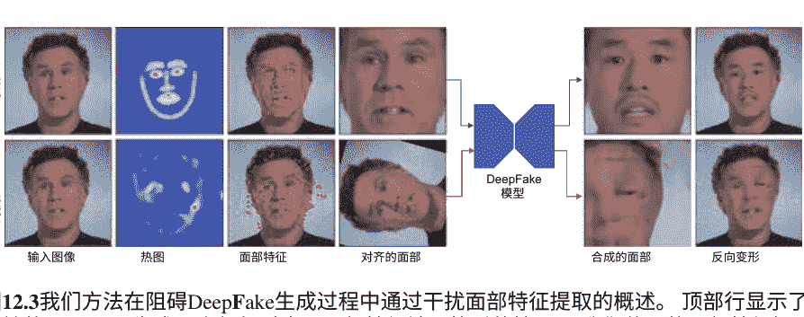

图 12.3 我们方法在阻碍 DeepFake 生成过程中通过干扰面部特征提取的概述。顶部行显示了原始的 DeepFake 生成，底部行对应于面部特征被干扰后的情况。我们使用的面部特征提取器是 FAN [6]，并且“热图”是通过对所有热图求和来可视化的。请注意，DeepFake 生成模型的训练也受到干扰的面部特征的影响，但此处未显示。

让 $\mathbf{F}$ 表示基于 CNN 的地标提取器的映射函数，我们可以访问其参数，并且 $\{\mathbf{h}_1, \ldots, \mathbf{h}_k\} = \mathbf{F}(\mathbf{I})$ 表示在输入图像 $\mathbf{I}$ 上运行 $\mathbf{F}$ 得到的热图集合。我们的目标是找到一张图像 $\mathbf{I}^{\text{adv}}$，使得地标位置的预测产生较大的误差，同时与原始图像 $\mathbf{I}$ 在视觉上相似。$\mathbf{I}^{\text{adv}} - \mathbf{I}$ 是对抗扰动。我们用 $\{\hat{\mathbf{h}}_1, \ldots, \hat{\mathbf{h}}_k\} = \mathbf{F}(\mathbf{I}^{\text{adv}})$ 表示扰动图像的热图集合。我们引入一个损失函数，旨在增大预测热图与原始热图之间的误差，同时限制像素失真在一定的预算内。

$$
\arg\min_{\mathbf{I}^{\text{adv}}} L(\mathbf{I}^{\text{adv}}, \mathbf{I}) = \sum_{i=1}^{k} \frac{\mathbf{h}_i \cdot \hat{\mathbf{h}}_i}{\|\mathbf{h}_i\|\ \|\hat{\mathbf{h}}_i\|}, \quad (12.7)
$$

$$
\text{s.t.} \quad \|\mathbf{I}^{\text{adv}} - \mathbf{I}\|_{\infty} \leq \epsilon,
$$

其中 $\epsilon$ 是一个常数。我们使用余弦距离来衡量误差，因为它可以自然地将损失范围归一化到 $[-1,1]$。最小化这个损失函数会增加预测和原始热图之间的误差，从而破坏面部特征点的位置。

我们使用 MI-FGSM 方法[14]来优化问题 Eq. (12.7)。具体来说，让 $t$ 表示迭代次数，$\mathbf{I}^{\text{adv}}_t$ 表示在第 $t$ 次迭代得到的对抗性图像。起始图像被初始化为 $\mathbf{I}^{\text{adv}}_0 = \mathbf{I}$。通过考虑动量和梯度来获得 $\mathbf{I}^{\text{adv}}_{t+1}$：

$$
\mathbf{m}_{t+1} = \lambda \cdot \mathbf{m}_t + \frac{\nabla_{\mathbf{I}^{\text{adv}}}(L(\mathbf{I}^{\text{adv}}_t, \mathbf{I}))}{\|\nabla_{\mathbf{I}^{\text{adv}}}(L(\mathbf{I}^{\text{adv}}_t, \mathbf{I}))\|_1}, \quad (12.8)
$$

$$
\mathbf{I}^{\text{adv}}_{t+1} = \text{clip}\{\mathbf{I}^{\text{adv}}_t - \alpha \cdot \text{sign}(\mathbf{m}_{t+1})\},
$$

其中 $\nabla_{\mathbf{I}^{\text{adv}}}(L(\mathbf{I}^{\text{adv}}_t, \mathbf{I}))$ 是损失函数 $L$ 对输入图像 $\mathbf{I}^{\text{adv}}_t$ 的梯度，在第 $t$ 次迭代时；$\mathbf{m}_t$ 是累积梯度，$\lambda$ 是动量的衰减因子；$\alpha$ 是步长，$\text{sign}$ 返回输入向量的每个分量的符号；$\text{clip}$ 是截断函数，以确保生成图像的像素值在 $[0, 255]$ 范围内。当达到最大迭代次数 $T$ 或失真阈值 $\epsilon$ 时，算法停止。

## 12.5 实验

### 12.5.1 攻击人脸检测

数据集。我们使用三个数据集验证我们的方法。

- sub-WIDER：我们从 WIDER 数据集[82]的验证集中构建了一个包含 909 张图像的数据集，该数据集是人脸检测的最大基准之一。我们排除了尺寸较小、遮挡较重或方向异常的人脸，因为它们对于训练 AI 人脸合成方法不相关。

- 300-W：该数据集包含 600 张图像，每张图像中都有一个来自 300 Faces In-the-Wild Challenge 300-W [62]测试集的单个人脸。¹

- sub-UMDFaces：该数据集是从 UMDFaces 数据集[3]中随机抽取的 500 张图像构建的。

基于 DNN 的人脸检测器。我们将几种最先进的基于 DNN 的人脸检测器作为我们实验的目标。对于基于 Faster-RCNN [59]的人脸检测器，我们考虑了两种不同的主干网络：VGG16 [64]和 ResNet101 [22]，分别表示为 $F_{V16}$ 和 $F_{R101}$。对于基于 SSD [42]的人脸检测器，我们考虑了两种最先进的人脸检测器：PyramidBox [71]和 SFD [87]。我们使用基于 ResNet50 的 PyramidBox 和基于 VGG16 的 SFD，分别表示为 $P_{R50}$ 和 $S_{V16}$。所有人脸检测器都是在完整的 WIDER 训练集上进行训练的。

评估指标。人脸检测方法的性能通常使用平均精度（AP）[82]进行评估。然而，为了评估对抗扰动的有效性，AP 不能直接反映由对抗扰动引起的人脸检测在数据集上的误检和漏检数量的质量降低。为此，我们引入了一个新的度量指标，数据实用性质量（DUQ），用于评估对抗扰动在污染人脸集合方面的实用性。

对于一张图像 $\mathbf{I}$ 及其扰动版本 $\mathbf{I}'$，我们定义集合 $\mathbf{D}_T(\mathbf{I})$ 包含所有在扰动图像 $\mathbf{I}'$ 中与未扰动图像 $\mathbf{D}(\mathbf{I})$ 中的检测结果有显著重叠的检测结果，即 $\mathbf{D}_T(\mathbf{I}) = \{ \mathbf{b} | \mathbf{b} \in \mathbf{D}(\mathbf{I}') \land \max_{\mathbf{b}' \in \mathbf{D}(\mathbf{I})} IoU(\mathbf{b}, \mathbf{b}') > \rho \}$。换句话说，这些是在原始图像中经受住了对抗扰动的检测结果。相应地，集合 $\mathbf{D}(\mathbf{I}') / \mathbf{D}_T(\mathbf{I})$ 包含了在未扰动图像中不存在的检测结果，即它们有可能是误检结果。在一组图像上，DUQ 被定义为：

$$
DUQ = \frac{\sum_{\mathbf{I}} |\mathbf{D}_T(\mathbf{I})| - \sum_{\mathbf{I}} |\mathbf{D}(\mathbf{I}')/\mathbf{D}_T(\mathbf{I})|}{\sum_{\mathbf{I}} |\mathbf{D}(\mathbf{I})|}. \quad (12.9)
$$

DUQ 的取值范围为 $(-\infty, 1]$，其中值为 1 表示对对抗扰动没有影响，即没有产生错误检测和误报。较低的 DUQ 对应于将检测人脸集合用作 AI 人脸合成算法的训练数据时的纯度较低，特别是负的 DUQ 表示包含了大量不在原始图像中的错误检测。

我们使用 DUQ 作为主要性能指标，评估各种对抗扰动生成方案在降低用于 AI 人脸合成模型的训练数据的效用方面的有效性。我们还使用 SSIM [75]来评估添加对抗扰动后图像的视觉质量。SSIM 的取值范围为 $[0, 1]$，较高的值对应较好的视觉质量。

实现细节和运行时间。一些关键常数的设定如下。失真的上限（均方误差）设置为 $\epsilon = 5 \times 10^{-5}$。每次迭代的步长设置为 $\gamma_t = \frac{30}{\|\nabla L(\mathbf{z}_t)\|_2}$。置信度阈值 $\theta_d$ 设置为 0.5。由于集合 $\tilde{\mathbf{P}}(\mathbf{I})$ 中的非人脸提议数量较大，我们只选择置信度得分前 1000 个进行优化，以提高效率。DUQ 中的 IoU 阈值 $\rho$ 设置为 0.5。

我们的对抗扰动生成方法是使用未优化的 Python 代码和 PyTorch 实现的。所有实验都在一台配备有 Intel(R) Xeon(R) CPU E5-2620 v3 @ 2.40 GHz、24 核心和 96GB RAM 的机器上进行。我们使用的 GPU 是一款带有 12GB 内存的 NVIDIA TITAN X (Pascal)。生成成功的对抗扰动的平均时间为 4.69 秒。如果我们针对实际部署优化代码，运行时间将进一步提高。

基准和比较方法。我们评估了我们方法的性能，并与三种算法进行了比较。

- **随机**：这是一种简单的基准算法，它向图像中添加随机高斯噪声。

- **SSOD**：这个算法基于最近针对通用物体检测器的对抗扰动生成器[78]。SSOD 最初是在 Pascal VOC 数据集[15]上进行训练和评估的，该数据集没有与人脸对应的标签。为了方便比较，我们使用 SSOD 的原始代码，并使用与我们的实验中相同的参数设置在人脸数据集上进行了改进。

- **NNCO**：该算法来自于[5]。NNCO 使用了一个生成对抗扰动的 GAN 模型，针对基于 VGG16 的 Faster-RCNN 人脸检测器进行训练和测试，数据集为 300-W。我们将我们的方法与 NNCO 进行比较，同时将它们应用于 VGG16 人脸检测器。

#### 12.5.1.1 白盒对抗扰动生成

表12.1显示了在对抗扰动之前和之后，基于Faster-RCNN和SSD的人脸检测器在不同骨干网络上的性能比较。我们展示了对抗扰动（DUQ）的有效性和图像质量（SSIM）。请注意，数据集的真实标签被用作计算原始图像和扰动图像的DUQ的正确检测集，以展示其有效性。图12.5提供了四个对抗扰动人脸图像结果的可视化示例。

正如这些结果所显示的那样，在我们的方法生成的对抗扰动添加到这些图像之后，人脸检测明显受到影响。例如，Fv16的DUQ在子WIDER数据集上从0.81降低到 -4.89，SSIM只有轻微降低（0.02），这表明我们的方法隐藏了原始未扰动图像中的真实检测，并引入了大量的错误检测（另请参见图12.5）。相比之下，SSOD只能将所有数据集上所有人脸检测器的DUQ降低到约0，因为它只考虑减少真实检测。另一方面，添加随机高斯噪声对人脸检测器几乎没有影响，这表明对抗扰动中的依赖结构是必不可少的。基于SSD的DNN人脸检测器的性能类似。

此外，与NNCO方法相比，我们的方法可以将Fv16的DUQ从0.81, 0.64, 0.55减少到 -4.89, -9.07, -7.52，分别在三个数据集上，而NNCO只能将DUQ减少到0.17, 0.06, 0.12。此外，与NNCO相比，我们的方法实现了更好的图像质量。图??显示了我们的方法和NNCO生成的扰动图像的视觉比较，并放大了区域。请注意，NNCO生成的可见伪影在我们的方法生成的扰动图像中不存在。这在定量结果上得到了证实，我们的方法的SSIM分数（0.98, 0.98, 0.98）与NNCO的分数（0.92, 0.91, 0.92）相比，在所有数据集上都更高。

#### 12.5.1.2 黑盒对抗扰动生成

根据第12.3.3节中描述的方法，我们使用方程（12.6）为四个人脸检测器的组合生成对抗性扰动，用于未知人脸检测器的黑盒攻击。具体来说，我们使用以下三个基于深度神经网络的人脸检测器作为未知人脸检测器：

- 基于Faster-RCNN的人脸检测器，使用ResNet50作为主干网络（简称为Fr50）；

- 基于SSD的人脸检测器SSH [50]，使用VGG16作为主干网络（简称为SSHv16）；

- 基于SSD的人脸检测器SSH [50]，使用ResNet50作为主干网络（简称为SSHr50）。

所有实验都在子WIDER数据集上进行。我们将针对已知人脸检测器的集合的我们的对抗性扰动生成方法称为Ours（Fv16+Fr101+Pr50+Sv16），如第12.3.3节所述。为了进行比较，我们进行了调整

### 表12.1 对三个数据集上的基于Faster-RCNN和SSD的人脸检测器的对抗扰动生成性能进行评估。Fv16和Fr101表示基于VGG16 [64]和ResNet101 [22]的Faster-RCNN人脸检测器。Pr50表示基于ResNet50的PyramidBox [71]，而Sv16表示基于VGG16的SFD [87]。

| 对抗扰动生成方法 | Sub-WIDER Fv16 | Sub-WIDER Fr101 | Sub-WIDER Pr50 | Sub-WIDER Sv16 | 300-W Fv16 | 300-W Fr101 | 300-W Pr50 | 300-W Sv16 | Sub-UMDFaces Fv16 | Sub-UMDFaces Fr101 | Sub-UMDFaces Pr50 | Sub-UMDFaces Sv16 |
| :--- | :--- | :--- | :--- | :--- | :--- | :--- | :--- | :--- | :--- | :--- | :--- | :--- |
| DUQ - 原始 | 0.81 | 0.82 | 0.92 | 0.88 | 0.64 | 0.64 | 0.76 | 0.81 | 0.55 | 0.54 | 0.64 | 0.64 |
| DUQ - 随机 | 0.81 | 0.82 | 0.92 | 0.81 | 0.64 | 0.64 | 0.76 | 0.81 | 0.54 | 0.54 | 0.64 | 0.64 |
| DUQ - NNCO [5] | 0.17 | -- | -- | -- | 0.06 | -- | -- | -- | 0.12 | -- | -- | -- |
| DUQ - SSOD [78] | -0.06 | -0.21 | -0.74 | -0.53 | -0.02 | -0.03 | -0.81 | -1.01 | -0.18 | -0.65 | -0.88 | -0.99 |
| DUQ - 我们的 | -4.89 | -7.98 | -19.18 | -9.40 | -9.07 | -7.95 | -17.91 | -8.80 | -7.52 | -9.91 | -26.88 | -8.80 |
| SSIM - NNCO [5] | 0.92 | -- | -- | -- | 0.91 | -- | -- | -- | 0.92 | -- | -- | -- |
| SSIM - SSOD [78] | 1.0 | 0.99 | 0.97 | 0.99 | 0.94 | 0.98 | 0.95 | 0.98 | 1.0 | 1.0 | 0.95 | 0.98 |
| SSIM - 我们的 | 0.98 | 0.96 | 0.96 | 0.98 | 0.98 | 0.97 | 0.94 | 0.96 | 0.98 | 0.97 | 0.93 | 0.96 |

### 表12.2 在DUQ中评估的黑盒对抗扰动生成性能。行表示从不同情况生成的扰动图像。列表示不同的人脸检测器。Fv16和Fr101表示基于VGG16 [64]和ResNet101 [22]的Faster-RCNN人脸检测器。Pr50表示基于ResNet50的PyramidBox人脸检测器，而Sv16表示基于VGG16的SFD人脸检测器。最后三列，Fr50、SSHv16和SSHr50，是黑盒人脸检测器，它们是基于ResNet50的Faster-RCNN人脸检测器和基于VGG16和ResNet50的SSH [50]。

| | SSIM | Fv16 | Fr101 | Pr50 | Sv16 | Fr50 | SSHv16 | SSHr50 |
| :--- | :--- | :--- | :--- | :--- | :--- | :--- | :--- | :--- |
| 原始 | 1.0 | 0.81 | 0.82 | 0.92 | 0.88 | 0.87 | 0.93 | 0.94 |
| SSOD(Fv16+Fr101+Pr50+Sv16) | 0.95 | 0.14 | 0.34 | 0.26 | 0.04 | 0.57 | 0.65 | 0.66 |
| 我们的 (Fv16+Fr101+Pr50+Sv16) | 0.91 | -4.94 | -5.69 | -14.14 | -6.37 | -1.72 | -0.26 | -0.47 |

对于一般物体检测器[78]的对抗扰动生成方案可以应用于人脸检测器，并将相应的方法表示为`SSOD_{(Fv16+Fr101+Pr50)}`。`SSOD`可以通过独立生成不同人脸检测器的对抗扰动来扩展到黑盒设置，并将它们的总和作为对任何未知人脸检测器的最终扰动。另一方面，我们的方法基于一个优化问题，公式（12.6），并且考虑了误检测。

表12.2显示了`SSOD`和我们的方法在`DUQ`中的性能评估。此外，图12.4显示了对`Fr50`、`SSHv16`和`SSHr50`的三个黑盒攻击示例。由于对抗扰动是通过考虑四个已知的基于`DNN`的人脸检测器获得的，在这些情况下它们预计能够很好地工作，这在白盒设置下得到了确认。

当应用于未知的基于`DNN`的人脸检测器时，这两种方法都倾向于在减少结果人脸集的`DUQ`方面有效。然而，我们的方法显示出更多的减少，并且通常导致负的`DUQ`分数，表明它生成更多的虚假检测，因此在减少用于`AI`人脸合成系统的训练数据集的质量方面更有效。这一点在图12.4中的视觉结果进一步得到证实。

图12.4 分别是对`Fr50`、`SSHv16`和`SSHr50`人脸检测器进行黑盒攻击的视觉示例。顶部行对应于原始图像的检测结果。中间行对应于在原始图像上添加对抗扰动后的检测结果。底部行显示了实际添加的噪声，为了更好的可视化，放大了30倍。

### 12.5.2 攻击地标提取器

我们的方法在三种最先进的基于`CNN`的面部关键点提取器上进行了验证，分别是`FAN` [6]，`HRNet` [65]和`AVS-SAN` [54]。`FAN`由多个堆叠的沙漏结构构成，我们使用一个沙漏结构来简化。`HRNet`由并行的高分辨率到低分辨率子网络组成，并在多分辨率子网络之间重复信息交换。`AVS-SAN`首先将面部图像分解为风格和结构空间，然后将其用作训练网络的增强。我们使用这三种方法在`WLFW`数据集[76]上训练的实现。

数据集。为了证明我们的方法在阻止`DeepFake`生成方面的有效性，我们在`Celeb-DF`数据集[39]上进行了实验，该数据集包含59位名人的高质量`DeepFake`视频。每个视频都包含一个主题，具有不同的头部姿势和面部表情。我们选择这个数据集作为预训练的基础。

### 表12.3 我们方法在不同地标提取器上的`NME`和`SSIM`得分。左侧列中显示的地标提取器表示对抗扰动的来源，顶部行中显示的地标提取器表示受到攻击的地标提取器。

**NME**

| Attacks | FAN | HRNet | AVS-SAN |
| :--- | :--- | :--- | :--- |
| None | 0.03 | 0.00 | 0.09 |
| FAN | 0.87 | 0.05 | 0.09 |
| HRNet | 0.04 | 0.87 | 0.09 |
| AVS-SAN | 0.06 | 0.04 | 0.92 |

**SSIM**

| Attacks | SSIM_I | FAN | HRNet | AVS-SAN |
| :--- | :--- | :--- | :--- | :--- |
| FAN | 0.81 | 0.68 | 0.89 | 0.89 |
| HRNet | 0.78 | 0.89 | 0.67 | 0.88 |
| AVS-SAN | 0.78 | 0.87 | 0.87 | 0.69 |

我们可以使用`DeepFake`模型来测试我们的方法。在我们的实验中，我们使用[39]中描述的`DeepFake`方法分别使用原始图像和对抗图像合成伪造视频。我们随机选择了六个身份，总共对应36个视频。由于视频中相邻帧之间变化很小，我们对每个视频的关键帧（即总共600帧）应用我们的方法进行评估。由于`Celeb-DF`数据集没有面部地标的真实值，我们使用`HRNet`的结果作为真实值，因为它具有更好的性能。

评估我们使用两个指标来评估我们的方法，即标准化平均误差（`NME`）[65]和结构相似性（`SSIM`）[75]。这些指标之间的关系如图所示。??

- `NME`是对抗性图像上的关键点之间的平均欧氏距离，然后通过左眼最左关键点和右眼最右关键点之间的距离进行归一化。较高的`NME`分数表示关键点检测不准确，这是我们方法的目标。

- `SSIM`指标模拟了感知图像质量。我们使用这个指标来展示我们的方法可以影响`DeepFake`的视觉质量。如图??所示，我们计算原始和对抗输入图像的掩膜-`SSIM` [46]（`SSIM_I`），然后计算合成结果的`SSIM`（`SSIM_W`）。较低的分数表示图像质量下降。理想情况下，攻击方法应该具有较大的`SSIM_I`，使得对抗扰动不会影响输入图像的质量，并且具有较小的`SSIM_W`，使得合成质量下降。

基准。为了更好地分析我们的方法，我们将其他两种方法`FGSM` [69]和`I-FGSM` [19]从攻击图像分类器转化为我们的任务。具体来说，`FGSM`是一种单步优化方法，如`I_0^{adv} = clip{I_0^{adv} - alpha * sign(nabla_{I_0^{adv}} (L(I_0^{adv}, I)))}`，而`I-FGSM`是一种迭代优化方法，不考虑动量`I_{i+1}^{adv} = clip{I_i^{adv} - alpha * sign(nabla_{I_i^{adv}}(L(I_i^{adv}, I)))}`。`I-FGSM`的步长`alpha`和迭代次数`T`在我们的方法中设置为相同。我们将这两种改进的方法作为我们的基准方法，分别表示为`Base1`和`Base2`。

表12.4 不同攻击方法的`NME`和`SSIM`性能

| Attacks | FAN | HRNet | AVS-SAN |
| :--- | :--- | :--- | :--- |
| None | 0.03 | 0.00 | 0.09 |
| Base1 | 0.05 | 0.04 | 0.10 |
| Base2 | 0.85 | 0.88 | 0.92 |
| LB | 0.87 | 0.87 | 0.92 |

| Attacks | FAN | HRNet | AVS-SAN |
| :--- | :--- | :--- | :--- |
| Base1 | 0.52/0.73 | 0.46/0.71 | 0.49/0.69 |
| Base2 | 0.88/0.71 | 0.88/0.70 | 0.86/0.73 |
| LB | 0.81/0.68 | 0.78/0.67 | 0.78/0.69 |

### 12.5.2.1 结果

表12.3显示了我们方法的`NME`和`SSIM`性能。左侧列中显示的地标提取器表示对图像添加对抗扰动的位置，顶部行中显示的地标提取器表示被攻击的地标提取器。“无”表示图像未添加扰动。我们的方法可以显著提高白盒攻击中的`NME`分数，并降低`SSIM_W`分数（例如，“FAN”行和“FAN”列中的值），这表明我们的方法可以有效地干扰面部地标提取，并随后影响合成面部的视觉质量。我们还将我们的方法与其他两种方法进行了比较

表格 12.5 黑盒攻击的 `NME` 和 `SSIM` 性能。详见正文

| Attacks | FAN | HRNet | AVS-SAN | Attacks | SSIM_I | FAN | HRNet | AVS-SAN |
| :--- | :--- | :--- | :--- | :--- | :--- | :--- | :--- | :--- |
| None | 0.03 | 0.00 | 0.09 | None |  |  |  |  |
| FAN | LB_trans | 0.22 | 0.03 | 0.09 | FAN | LB_trans | 0.91 | 0.88 | 0.94 | 0.94 |
|  | LB_mix | 0.24 | 0.04 | 0.09 |  | LB_mix | 0.90 | 0.86 | 0.94 | 0.93 |
| HRNet | LB_trans | 0.04 | 0.10 | 0.09 | HRNet | LB_trans | 0.92 | 0.95 | 0.94 | 0.95 |
|  | LB_mix | 0.04 | 0.14 | 0.09 |  | LB_mix | 0.90 | 0.95 | 0.91 | 0.94 |

| AVS-SAN | $\mathrm{LB}_{\text{trans}}$ | 0.04 | 0.03 | 0.55 | AVS-SAN | $\mathrm{LB}_{\text{trans}}$ | 0.89 | 0.94 | 0.93 | 0.82 |
| --- | --- | --- | --- | --- | --- | --- | --- | --- | --- | --- |
|  | $\mathrm{LB}_{\text{mix}}$ | 0.05 | 0.03 | 0.56 |  | $\mathrm{LB}_{\text{mix}}$ | 0.88 | 0.93 | 0.93 | 0.81 |

表格 12.4 中的基准线 `Base1` 和 `Base2`。我们可以观察到 `Base1` 方法仅对 NME 性能有影响，但与 `Base2` 和我们的方法 (`LB`) 相比，会大大降低对抗性图像的质量。 `Base2` 方法在 NME 方面也能达到与我们方法相竞争的性能，但在 SSIM 方面略有下降。

在攻击图像分类器的现有工作[14, 69]的基础上，通过将对抗扰动从已知模型转移到未知模型（可转移性），我们还测试了使用从一个地标提取器生成的对抗扰动来攻击其他提取器的黑盒攻击。 然而，结果表明对抗扰动对不同的提取器几乎没有影响。

如表12.3所示，我们的方法的可转移性较弱。 为了提高可转移性，我们采用了在攻击图像分类器的黑盒攻击中常用的策略：（1）输入转换[79]：我们在每次迭代中随机调整输入图像的大小，然后在周围填充零（表示为`$\mathrm{LB}_{\text{trans}}$`）；（2）攻击混合[79]：我们交替使用`Base2`和我们的方法来增加优化中的多样性（表示为`$\mathrm{LB}_{\text{mix}}$`）。 表12.5显示了黑盒攻击的结果，揭示了在攻击图像分类器时有效的策略对攻击地标提取器无效。这可能是因为地标提取器的机制比图像分类器更复杂，因为地标提取器需要输出一系列点而不是标签，只有少数点的偏移不会影响整体预测。

## 12.6 结论

通过人工智能合成的假脸正成为侵犯我们对在线媒体的信任的问题。 由于大多数基于人工智能的人脸合成算法需要自动人脸检测作为准备训练数据的必要预处理步骤，通过干扰人脸检测方法可以获得有效的保护方案。

在本章中，我们描述了一种积极的保护方法，以阻止大规模重复使用自动检测到的人脸和人脸对齐，用于生成人工智能合成的脸。我们的方法利用基于深度神经网络的人脸检测器和面部特征提取器的敏感性，并使用对抗扰动来污染人脸集。我们期望这项技术能够引发伪造制造者的对策。特别是，预计将开发可以破坏或减少对抗扰动的操作。因此，我们将继续努力改进对抗扰动生成方法的鲁棒性。另一个重要的研究方向是进一步探索更通用的黑盒攻击方案，不限于基于深度神经网络的人脸检测器和面部特征提取器，并且不依赖于底层模型的可微性。此外，我们还将致力于提高当前方法的运行时间效率，以便能够扩展到大量的图像。

## 参考文献

- 1. Afchar D, Nozick V, Yamagishi J, Echizen I (2018) MesoNet:一种紧凑的面部视频伪造检测网络。 在：IEEE国际信息取证和安全研讨会(WIFS)
- 2. Baluja S, Fischer I (2018) 学习攻击：对抗性转换网络。 在：人工智能进步协会 (AAAI)
- 3. Bansal A, Nanduri A, Castillo CD, Ranjan R., Chellappa R (2016) Umdfaces：用于训练深度网络的注释人脸数据集。 arXiv预印本 arXiv:1611.01484
- 4. Berthelot D, Schumm T, Metz L (2017) Began：边界平衡生成对抗网络。 arXiv预印本 arXiv:1703.10717
- 5. Bose AJ, Aarabi P (2018) 使用基于神经网络的约束优化对人脸检测器进行对抗攻击。 在：IEEE多媒体信号处理国际研讨会 (MMSP)
- 6. Bulat A, Tzimiropoulos G (2017) 我们离解决2D和3D人脸对齐问题有多远？ （以及一个包含230,000个3D面部标记的数据集）。 在：ICCV
- 7. Carlini N, Wagner D (2017) 朝着评估神经网络的鲁棒性迈进。 在：IEEE安全与隐私研讨会 (sp)
- 8. Chan C, Ginosar S, Zhou T, Efros AA (2018) 现在每个人都在跳舞。 arXiv预印本 arXiv:1808.07371
- 9. Chan C, Ginosar S, Zhou T, Efros AA (2019) 现在每个人都在跳舞。 在：IEEE计算机视觉国际会议 (ICCV)
- 10. Chen ST, Cornelius C, Martin J, Chau DH (2018) 对更快的R-CNN目标检测器的强大物理对抗攻击. arXiv预印本 arXiv:1804.05810
- 11. Chesney R, Citron DK, Deep fakes: 隐私、民主和国家安全的一项严峻挑战. 107加利福尼亚法律评论 (2019, 即将发表); 德克萨斯大学法学院. 公共法研究论文编号692; 马里兰大学法学研究论文编号2018-21
- 12. Dalal N, Triggs B (2005) 用于人体检测的梯度直方图. 在：IEEE计算机视觉和模式识别会议 (CVPR)
- 13. Denton EL, Chintala S, Fergus R, et al (2015) 使用拉普拉斯金字塔对抗网络的深度生成图像模型. 在: 神经信息处理系统 (NeurIPS)
- 14. 董Y, 廖F, 庞T, 苏H, 朱J, 胡X, 李J (2018) 动量增强的对抗攻击。 在：IEEE计算机视觉和模式识别会议 (CVPR)
- 15. Everingham M, Eslami SA, Van Gool L, Williams CK, Winn J, Zisserman A (2015) 帕斯卡视觉对象类别挑战：回顾。计算机视觉国际期刊（IJCV）
- 16. Eykholt K, Evtimov I, Fernandes E, Li B, Rahmati A, Tramer F, Prakash A, Kohno T, Song D (2018) 用于物体检测器的物理对抗性示例。 arXiv预印本arXiv:1807.07769
- 17. Farfade SS, Saberian MJ, Li LJ (2015) 使用深度卷积神经网络的多视角人脸检测。在：ACM多媒体检索国际会议
- 18. Goodfellow I, Pouget-Abadie J, Mirza M, Xu B, Warde-Farley D, Ozair S, Courville A, Bengio Y (2014) 生成对抗网络。在：神经信息处理系统会议 (NeurIPS)
- 19. Goodfellow IJ, Shlens J, Szegedy C (2015) 解释和利用对抗性示例。在：国际学习表示会议 (ICLR)
- 20. Güera D, Delp EJ (2018) 使用循环神经网络进行Deepfake视频检测。在：AVSS
- 21. Gulrajani I, Ahmed F, Arjovsky M, Dumoulin V, Courville AC (2017) 改进的Wasserstein GANs训练. 在：神经信息处理系统会议 (NeurIPS)
- 22. He K, Zhang X, Ren S, Sun J (2016) 深度残差学习用于图像识别。在：IEEE计算机视觉和模式识别会议 (CVPR)
- 23. Hu T, Qi H, Xu J, Huang Q (2018) 基于自迭代回归的面部关键点检测-关键点注意力网络。在：AAAI
- 24. Isola P, Zhu JY, Zhou T, Efros AA (2017) 带有条件对抗网络的图像到图像翻译。在：IEEE计算机视觉和模式识别会议 (CVPR)
- 25. Jiang H, Learned-Miller E (2017) 使用更快的R-CNN进行人脸检测。在：IEEE国际自动人脸与手势识别会议 (FG)
- 26. Karras T, Aila T, Laine S, Lehtinen J (2018) 渐进式增长的GANs以提高质量、稳定性和变化性。在：国际学习表示会议 (ICLR)
- 27. Karras T, Laine S, Aila T (2018) 用于生成对抗网络的基于风格的生成器架构。 arXiv预印本 arXiv:1812.04948
- 28. Karras T, Laine S, Aila T (2019) 用于生成对抗网络的基于风格的生成器架构。在：IEEE计算机视觉和模式识别会议 (CVPR)
- 29. Kazemi V, Sullivan J (2014) 用回归树集合进行一毫秒级人脸对齐。在：CVPR

- 30. Kim H, Carrido P, Tewari A, Xu W, Thies J, Niessner M, Pérez P, Richardt C, Zollhöfer M, Theobalt C (2018) 深度视频肖像。ACM图形学交易 (TOG)

- 31. King DE (2009) `Dlib-ml`：一个机器学习工具包。 J Mach Learn Res 10:1755–1758

- 32. Kurakin A, Goodfellow I, Bengio S (2017) 物理世界中的对抗性示例。在：国际学习表示会议 (ICLR)

- 33. Li H, Lin Z, Shen X, Brandt J, Hua G (2015) 用于人脸检测的卷积神经网络级联。在：IEEE计算机视觉和模式识别会议 (CVPR)

- 34. Li J, Wang T, Zhang Y (2011) 使用surf级联进行人脸检测。在：IEEE国际计算机视觉会议研讨会 (ICCV Workshops)

- 35. Li J, Zhang Y (2013) 学习surf级联以实现快速准确的目标检测。在：IEEE计算机视觉和模式识别会议 (CVPR)

- 36. Li Y, Chang MC, Lyu S (2018) In Ictu Oculi：通过检测眨眼来揭示AI生成的假人脸视频。在：IEEE信息取证和安全国际研讨会 (WIFS)

- 37. 李Y, 吕S (2019年) 通过检测面部变形伪造视频。在：IEEE计算机视觉和模式识别研讨会 (CVPRW)

- 38. 李Y, 田D, 常M, 边X, 吕S (2018年) 对深度提案模型的鲁棒性对抗扰动。在：英国机器视觉会议 (BMVC)

- 39. 李Y, 杨X, 孙P, 齐H, 吕S (2020年) Celeb-DF：一个大规模的深度伪造取证数据集。在：CVPR

- 40. 刘B, 丁M, 朱T, 向Y, 周W (2018年) 在深度学习时代使用对抗性噪声保护隐私。在：IEEE全球通信会议 (GLOBECOM)

- 41. 刘MY, 布鲁尔T, 考茨J (2017年) 无监督图像到图像的转换网络。在：神经信息处理系统会议 (NeurIPS)

- 42. Liu W, Anguelov D, Erhan D, Szegedy C, Reed S, Fu CY, Berg AC (2016) `SSD`：单次多框检测器。在：欧洲计算机视觉会议 (ECCV)

- 43. Liu Y, Zhang W, Yu N (2017) 通过对抗性示例保护共享照片的隐私。安全通信网络

- 44. Lu J, Sibai H, Fabry E (2017) 欺骗检测器的对抗性示例。arXiv:1712.02494

- 45. Luo B, Liu Y, Wei L, Xu Q (2018) 面向对抗性攻击的不可察觉和稳健的对抗性示例。在：人工智能促进协会（AAAI）

- 46. Ma L, Jia X, Sun Q, Schiele B, Tuytelaars T, Van Gool L (2017) 姿势引导的人物图像生成。在：NeurIPS

- 47. Matern F, Riess C, Stamminger M (2019) 利用视觉伪影揭示深度伪造和面部操纵。在：IEEE冬季计算机视觉应用研讨会（WACVW）

- 48. Moosavi-Dezfooli SM, Fawzi A, Fawzi O, Frossard P (2017) 通用对抗扰动。在：IEEE计算机视觉和模式识别会议（CVPR）

- 49. Moosavi-Dezfooli SM, Fawzi A, Frossard P (2016) `Deepfool`：一种简单而准确的方法来愚弄深度神经网络。在：IEEE计算机视觉和模式识别会议（CVPR）

- 50. Najibi M, Samangouei P, Chellappa R, Davis LS (2017) `SSH`：单阶段无头面部检测器。在：IEEE国际计算机视觉会议（ICCV）

- 51. Oh SJ, Fritz M, Schiele B (2017) 对抗性图像扰动用于隐私保护的博弈论视角。在：IEEE国际计算机视觉会议（ICCV）

- 52. Ojala T, Pietikäinen M, Mäenpää T (2002) 多分辨率灰度和旋转不变纹理分类与局部二值模式。IEEE模式分析与机器智能（TPAMI）

- 53. Papernot N, McDaniel P, Jha S, Fredrikson M, Celik ZB, Swami A (2016) 深度学习在对抗环境中的局限性。在：EuroS&P

- 54. 钱S，孙K，吴W，钱C，贾J (2019) 通过分离进行聚合：用半监督风格转换提升面部关键点检测器。在：ICCV

- 55. Ramanan D, Zhu X (2012) 野外中的人脸检测，姿态估计和关键点定位。在：IEEE计算机视觉和模式识别会议（CVPR）

- 56. Ranjan R，Patel VM，Chellappa R (2015) 用于人脸检测的深度金字塔可变部件模型。在：IEEE国际生物识别理论、应用和系统会议（BTAS）

- 57. Ranjan R., Patel VM, Chellappa R (2019) `Hyperface`：一种基于深度多任务学习框架的人脸检测、关键点定位、姿态估计和性别识别。IEEE Trans Pattern Anal Mach Intell (TPAMI)

- 58. Ranjan, R., Sankaranarayanan, S., Castillo, C.D., Chellappa, R.：一种全能卷积神经网络用于人脸分析。In: IEEE国际自动人脸与手势识别大会（FG）

- 59. Ren S, He K, Girshick R, Sun J (2017) `Faster R-CNN`：朝着实时目标检测与区域建议网络。IEEE Trans Pattern Anal Mach Intell (TPAMI)

- 60. Ruiz N, Sclaroff S (2020) 打破Deepfakes：对条件图像转换网络和面部操纵系统的对抗性攻击。arXiv预印本arXiv:2003.0127

- 61. Rumelhart DE, Hinton GE, Williams RJ, et al (1988) 通过反向传播错误学习表示。认知模型

- 62. Sagonas C, Tzimiropoulos G, Zafeiriou S, Pantic M (2013) 300 faces in-the-wild challenge：第一个面部标志定位挑战。在：IEEE国际计算机视觉会议的研讨会（ICCVW）

- 63. Salimans T, Goodfellow I, Zaremba W, Cheung V, Radford A, Chen X (2016) 改进的技术用于训练`GANS`。在：神经信息处理系统会议（NeurIPS）

- 64. Simonyan K, Zisserman A (2014) 用于大规模图像识别的非常深的卷积网络。arXiv预印本 arXiv:1409.1556

- 65. 孙凯，肖博，刘丹，王杰 (2019年) 深度高分辨率表示学习用于人体姿势估计。在：CVPR

- 66. 孙晓，吴鹏，Hoi SC (2018年) 使用深度学习的人脸检测：改进的更快的`RCNN`方法。神经计算

- 67. Suwajanakorn S, Seitz SM, Kemelmacher-Shlizerman I (2017) 从音频中学习唇部同步. ACM Trans Graph (TOG)

- 68. Szegedy C, Zaremba W, Sutskever I, Bruna J, Erhan D, Goodfellow I, Fergus R (2013) 神经网络的有趣属性. arXiv 1312.6199

- 69. Szegedy C, Zaremba W, Sutskever I, Bruna J, Erhan D, Goodfellow I, Fergus R (2014) 神经网络的有趣属性. In: ICLR

- 70. Taigman Y, Polyak A, Wolf L (2016) 无监督的跨领域图像生成. arXiv预印本 arXiv:1611.02200

- 71. Tang X, Du DK, He Z, Liu J (2018) `Pyramidbox`: 一个上下文辅助的单次人脸检测器. 在：欧洲计算机视觉会议 (ECCV)

- 72. Thies J, Zollhofer M, Stamminger M, Theobalt C, Niessner M (2016) `Face2Face`：实时RGB视频的人脸捕捉和再现. 在：IEEE计算机视觉和模式识别会议 (CVPR)

- 73. Viola P, Jones M (2001) 使用增强级联简单特征的快速目标检测. 在：IEEE计算机视觉和模式识别会议 (CVPR)

# 第13章 使用深度学习的多通道人脸展示攻击检测

Anjith George和Sbastien Marcel

摘要 人脸识别已成为广泛使用的生物识别模式。 然而，它对展示攻击的脆弱性仍然是一个重要的安全威胁。 尽管展示攻击检测（PAD）方法试图解决这个问题，但通常它们在泛化到未知攻击和环境时失败。 随着展示攻击工具的质量随时间的推移而提高，仅使用视觉光谱实现可靠的PA检测仍然是一个重大挑战。 我们认为多通道系统可以帮助解决这个问题。 在本章中，我们首先提出了一种基于多通道卷积神经网络的展示攻击检测方法。 我们进一步将这种方法扩展到一类分类器框架，通过引入一种新的损失函数，迫使网络在远离攻击表示的同时学习一个紧凑的嵌入式bonafide类。 所提出的框架引入了一种新的方法，从bonafide和可用（已知）攻击类中学习一个强大的PAD系统。 在公开可用的多通道PAD数据库WMCA中，对未知攻击样本的卓越性能显示了所提出方法的有效性。 用于重现结果的软件、数据和协议已公开提供。

## 13.1 引言

生物特征提供了一种安全和便捷的访问控制手段。 面部生物识别是生物特征认证中最方便的模态之一，因为它具有非侵入性。 尽管面部识别系统在许多困难的数据集中实现了人类的性能，尽管大多数面部识别系统在许多困难的[32]数据集中识别人员的性能很好，但仍然容易受到展示攻击（PA）的影响，也被称为欺骗[29, 41, 42]。 仅仅向一个没有保护的面部识别系统展示一张打印的照片可能足以欺骗系统[2]。对展示攻击的脆弱性限制了这类系统在无监督条件下的可靠部署。

根据ISO [29]标准，演示攻击被定义为：

通过对生物特征数据捕获子系统的演示，干扰生物特征系统的运行目标。

演示攻击包括“冒充”和“混淆”身份。

冒充是指攻击者希望被识别为不同的人，而“混淆”攻击的目标是隐藏攻击者的身份。演示攻击中使用的生物特征或物体被称为演示攻击工具（PAI）。

通常，用于检测2D打印和重放等攻击的特征包括颜色、纹理[8, 39]、动作[2]、生理线索[28, 55]和基于CNN的方法[20]。然而，检测3D面具和部分攻击等复杂攻击具有挑战性，并对人脸识别系统的可靠性构成严重威胁。大部分现有的演示攻击检测（PAD）方法仅针对有限数量的演示攻击工具和可见光谱图像[42]进行解决。尽管在解决2D演示攻击方面取得了一些成功，但算法在现实中的3D面具和其他类型的攻击中的性能较差。随着攻击工具质量的提高，仅通过可见光谱很难区分真实和演示攻击。此外，考虑到现实世界中各种2D、3D和部分攻击的情况，仅通过视觉光谱进行PAD在安全关键应用中具有挑战性和不足。部分攻击是指攻击工具仅覆盖脸部的一部分。这些攻击更难检测，因为它们在大部分脸部区域与真实的相似，并且它们可以轻易欺骗整体活力检测系统。多通道方法已被提出作为一种替代方案[5, 21–23, 26, 44, 45, 54, 57]，因为它们利用来自不同通道的互补信息来提高真实和攻击之间的区分度。在多通道情况下，使用的附加通道可以是任何能够提供互补表示的模态，例如深度、红外和热成像通道。在各种攻击的背景下，多通道PAD方法更有前景，因为它们使PAD系统更难被欺骗。

即使使用多个通道，PAD的主要问题之一是其对未知攻击的泛化能力较差[23]。这一点尤为重要，因为在开发PAD系统时，预测所有可能的攻击是不可能的。

恶意攻击者总是能够想出新的攻击方式来欺骗PAD系统。

在这种情况下，能够抵御未知攻击的PAD系统非常重要。

> 1术语“欺骗”应该被弃用，以符合ISO标准中的“演示攻击”。

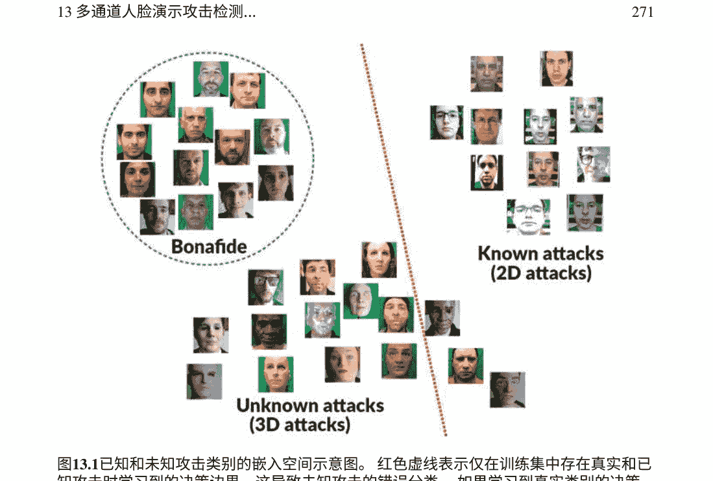

至关重要。此外，虽然相对容易收集2D打印和重放等攻击的数据，但制作具有挑战性的面部伪装攻击工具（PAI）如硅胶面具通常非常昂贵[6]且资源密集。

在这种情况下，最理想的是拥有一个可以仅使用真实数据进行训练的框架，或者结合真实数据和易于制造的PAI进行训练。在现实世界的场景中，可以假设所有的攻击都是未知的，因为不可能事先预测到PAD系统可能遇到的所有变化。图13.1中展示了在未知攻击场景中的决策边界的玩具示例。在典型的PAD数据库中的性能可能不能代表PAD系统在真实世界条件下的性能。这要求PAD算法对未知攻击具有鲁棒性。由于相对于复杂的PAI来说，从更简单的攻击中收集数据更容易（在努力和成本上），我们尝试利用训练阶段可用的PA类别的信息来学习表示（同时不过度拟合可用的攻击）。为了实现这一点，我们提出了一个基于单类分类器的框架，其中使用CNN学习具有区分性质的特征表示。该框架的核心是一个多通道CNN，通过使用特定的损失函数来学习嵌入。多通道卷积神经网络（MC-CNN）架构有效地结合多通道信息，以实现强大的检测演示攻击。该网络使用预训练的LightCNN模型作为基础网络，从而避免了从头开始训练框架的要求。在MC-CNN中，只重新训练了多通道的低层LightCNN特征，而预训练的LightCNN的高层保持不变。结合新的损失函数，该网络旨在学习一个紧凑的真实类别表示，同时利用辨别信息进行PAD任务。

源代码和协议以公开方式提供，可在以下链接处获取。²

本章的其余部分安排如下。第13.2节描述了相关工作，重点关注未知攻击检测。第13.3节概述了提出的框架。在第13.4节中进行了广泛的评估、与基准方法的比较和消融研究。第13.5节讨论了结果的重要性，第13.6节提出了结论。

## 13.2 相关工作

大部分与面部展示攻击检测相关的工作都涉及到检测2D攻击，特别是打印和2D重放攻击。本节对最近的PAD方法进行了简要回顾。

### 13.2.1 基于特征的面部PAD方法

对于使用可见光谱图像进行PAD，已经有几种方法显示出良好的性能，例如检测运动模式[2]、不同颜色空间中的颜色纹理和基于直方图的方法，以及在灰度[8]和彩色图像[9]、[39]中的局部二值模式（LBP）的变体。基于图像质量的特征[18]是现有文献中成功的方法之一。识别莫尔纹图案[49]和图像失真分析[59]的方法利用了由于重放伪影而导致的图像变化。大部分这些方法将PAD视为二元分类问题，这可能对未知攻击的泛化能力不强[46]。

Chingovska等人[10]研究了用于PAD的特征中存在的客户特定信息的数量。他们利用这些信息构建了客户特定的PAD方法。他们的方法显示了50%的相对改进和在未知攻击场景中更好的性能。

- 74. Wang H, Li Z, Ji X, Wang Y (2017) Face R-CNN. arXiv预印本 arXiv:1706.01061

- 75. Wang Z, Bovik AC, Sheikh HR, Simoncelli EP, et al (2004) 图像质量评估：从错误可见性到结构相似性. IEEE图像处理 (TIP)

- 76. Wu W, Qian C, Yang S, Wang Q, Cai Y, Zhou Q (2018) 观察边界：一种边界感知人脸对齐算法. 在：CVPR

- 77. 吴伟, 张勇, 李超, 钱超, Change Loy C (2018年) Reenactgan：通过边界转换学习重新演绎面部. 在：ECCV

- 78. 谢C, 王J, 张Z, 周Y, 谢L, 尤A (2017) 用于语义分割和目标检测的对抗性示例. 在：IEEE国际计算机视觉会议 (ICCV)

- 79. 谢C, 张Z, 周Y, 白S, 王J, 任Z, 尤A (2019) 通过输入多样性改善对抗性示例的可转移性. 在：CVPR

- 80. 杨B, 严J, 雷Z, 李SZ (2015) 卷积通道特征. 在：IEEE国际计算机视觉会议 (ICCV)

- 81. 杨S, 罗P, 洛伊CC, 唐X (2015年) 从面部部分响应到面部检测：一种深度学习方法. 在：IEEE国际计算机视觉会议 (ICCV)

- 82. 杨S, 罗P, 洛伊CC, 唐X (2016年) 更广泛的面部：面部检测基准. 在：IEEE计算机视觉和模式识别会议 (CVPR)

- 83. 杨S, 熊Y, Loy CC, 唐X (2017) 通过尺度友好的深度卷积网络进行人脸检测. arXiv预印本arXiv:1706.02863

- 84. 杨X, 董Y, 庞T, 朱J, 苏H (2020) 通过生成对抗身份掩码实现隐私保护. arXiv预印本arXiv:2003.06814

- 85. 杨, X., 李, Y., 吕, S.: 通过不一致的头部姿势揭示深度伪造. 在：ICASSP (2019)

- 86. 曾X, 刘C, 邱W, 谢L, 戴YW, 唐CK, Yuille AL (2017) 超越图像空间的对抗攻击. arXiv:1711.07183

- 87. 张S, 朱X, 雷Z, 石H, 王X, 李SZ (2017) S3FD：单镜头尺度不变人脸检测器. 在：IEEE国际计算机视觉会议 (ICCV)

- 88. 邹X, 钟S, 严L, 赵X, 周J, 吴Y (2019) 通过分层结构化集成学习鲁棒的面部关键点检测. 在：ICCV

Arashloo等人[3]提出了一种针对未知攻击的新的评估方案。作者们测试了几种二分类器和单类分类器的组合。在未知攻击场景中，单类分类器的性能优于二分类器。`BSIF-TOP`在单类和双类场景中都取得了成功。然而，在跨数据集评估中，图像质量特征更加有用。

Nikisins等人[46]提出了一个类似的单类分类框架，使用了单类高斯混合模型（`GMM`）。在特征提取阶段，他们使用了图像质量度量（`IQM`）的组合。实验部分涉及了一个聚合数据库，包括重放攻击[9]，重放移动[11]和`MSU-MFSD`[59]数据集。

Heusch和Marcel[27]最近提出了一种使用从远程光电容积描记术（`rPPG`）中得到的特征的方法。他们使用了从可用的`rPPG`提取方法中获得的脉搏信号的长期频谱统计（`LTSS`）。`LTSS`特征与`SVM`相结合用于`PA`检测。他们的方法在四个公开可用的数据库中使用`rPPG`获得了比最先进的方法更好的性能。

### 13.2.2 基于CNN的人脸PAD方法

最近，一些作者报道了使用卷积神经网络（`CNN`）在`PAD`方面取得了良好的性能。Gan等人[19]提出了一种基于3D `CNN`的方法，利用了视频的空间和时间特征。所提出的方法在2D攻击、打印和视频的情况下取得了良好的结果。Yang等人[64]提出了一种用于`PAD`的深度`CNN`架构。在将图像输入`CNN`之前，使用了包括人脸检测和人脸关键点检测在内的预处理阶段。一旦`CNN`训练完成，从`CNN`获得的特征表示被用于训练`SVM`分类器，并用于最终的`PAD`任务。Boulkenafet等人[7]总结了移动人脸`PAD`竞赛的性能。目标是评估算法在真实环境条件下的性能，如未见过的传感器、不同的光照和攻击工具。在大多数情况下，从彩色通道提取的纹理特征表现最好。Li等人[34]提出了一种3D `CNN`架构，利用了视频的空间和时间特性。网络首先经过数据增强和交叉熵损失的训练，然后经过一个特殊设计的泛化损失的训练，该损失作为正则化因子。最小化不同域之间的最大均值差异（`MMD`）距离以改善泛化性能。

在`CNN`训练过程中，有几项涉及各种辅助信息的工作，主要集中在2D攻击的检测上。作者使用2D或3D `CNN`。上述基于`CNN`的方法的主要问题是缺乏训练数据，通常需要从头开始训练网络。一个广泛使用的解决方案是微调，而不是完全训练用于人脸识别或图像分类任务的网络。另一个问题是在跨数据库和未知攻击测试中的泛化能力差。为了解决这些问题，一些研究人员提出了使用辅助任务训练`CNN`的方法，已经证明可以改善泛化性能。下面将讨论这些方法。

刘等人[36]提出了一种新的带有辅助监督的`PAD`方法。他们没有直接对`PAD`任务进行端到端的网络训练，而是使用`CNN-RNN`模型通过像素级监督来深度估计和估计远程光电容积描记术（`rPPG`）。估计的`rPPG`和深度用于`PAD`任务。辅助任务的添加提高了泛化能力。

Atoum等人[4]提出了一种基于补丁模型和整体深度图的二流`CNN`用于2D演示攻击检测。对于基于补丁的模型，进行了端到端的`CNN`训练。在深度估计中，使用整个面部图像进行了完全卷积网络的训练。通过在 $N \times N$ 网格中找到均值来将生成的深度图转换为特征向量。最终的`PAD`分数是通过融合补丁和深度`CNN`的分数得到的。Shao等人[56]提出了一种基于深度卷积网络的3D面具`PAD`架构。他们试图使用`CNN`捕捉面部动态的微妙差异。使用预训练`VGG`网络的卷积层中获得的特征图用于提取每个通道中的特征。在每个通道中使用运动约束方程估计光流。此外，使用来自不同通道的数据学习动态纹理。所提出的方法在`3DMAD`数据集中实现了99.99%的`AUC`（曲线下面积）得分。

### 13.2.3 用于面部PAD的单类模型

这些方法中大多数将`PAD`问题处理为二分类问题，这导致分类器对已知攻击过拟合，对未知攻击的泛化能力较差。我们将进一步讨论对未知攻击的检测。

然而，对于未知攻击的方法必须对已知攻击也能准确执行。对于这样的任务，一种天真的解决方案是单类分类器（`OCC`）。`OCC`通过对真实类别的分布进行建模，提供了处理未知攻击场景的直接方法。

Arashloo等人[3]和Nikisins等人[46]已经证明了单类方法对抗未知攻击的有效性。尽管这些方法在未知攻击场景中的表现优于二分类器，但在已知攻击协议中的性能却不如二分类器。Xiong等人[62]提出了使用自动编码器和从图像中提取的纹理特征的单类分类器进行未知`PAD`方法。然而，与最近基于`CNN`的方法相比，这些方法的性能非常差。基于`CNN`的方法在`PAD`任务中优于大多数基于特征的基准方法。因此，在`CNN`框架中需要单类分类器或异常检测器。单类模型的一个缺点是它们不使用已知攻击提供的信息。利用已知攻击信息的异常检测器框架可能更加高效。

使用另一个数据库进行分类的学习模型的准确性被用作描述性损失。然而，在面部`PAD`问题中，这种方法将会很具挑战性，因为真实和攻击类别看起来非常相似。

Fatemi far等人[16]提出了一种集成多个一类分类器以提高`PAD`泛化能力的方法。他们在融合之前引入了一种类别特定的归一化方案。在分类器池中使用了七个区域、三个一类分类器和三个`CNN`的表示。尽管他们的方法相对于客户独立阈值取得了更好的性能，但性能仍不及基于`CNN`的最先进方法。具体来说，许多基于`CNN`的方法在`Replay-Attack`和`Replay-Mobile`数据集中实现了0%的`HTER`。此外，这项工作没有评估具有挑战性的未知攻击场景。

Pérez-Cabo等人[51]从异常检测的角度提出了一种`PAD`公式。提出了一种深度度量学习模型，其中三元组焦点损失被用作“度量-softmax”的正则化，强制网络学习有区分性的特征。以这种方式学习的特征与带有`RBF`核的`SVM`一起用于分类。他们在聚合的仅`RGB`数据集上进行了多次实验，展示了他们提出的方法所取得的改进。然而，该分析主要局限于仅`RGB`模型和2D攻击。这项工作没有考虑具有挑战性的3D和部分攻击。

具体而言，没有评估对挑战性未知攻击（2D vs 3D）的有效性。

最近，Liu等人[37]提出了一种用于检测未知欺骗攻击的方法，称为零样本人脸反欺骗（`ZSFA`）。他们提出了一种深度树网络（`DTN`），以无监督的方式将攻击样本分成语义子组。他们网络中的每个树节点由一个卷积残差单元（`CRU`）和一个树路由单元（`TRU`）组成。目标是将未知攻击路由到最合适的叶节点以正确分类。他们的方法考虑了各种攻击，并且相对于考虑的基准方法取得了优越的性能。

Jaiswal等人[30]提出了一种用于`PAD`的端到端深度学习模型，该模型使用了无监督的对抗不变性。在他们的方法中，辨别信息和干扰因素在对抗环境中被分离开来。他们表明，仅保留辨别信息，`PAD`性能在相同的基础架构下得到了改善。Mehta等人[43]使用交叉熵和焦点损失训练了一个`Alexnet`模型的组合。他们从`Alexnet`中提取特征，并为`PAD`任务训练了一个二分类`SVM`。然而，在挑战性数据集（如`OULU`和`SiW`）中的结果没有报告。

最近，Joshua和Jain[14]在指纹中利用多个`GAN`进行欺诈检测。他们的方法主要是使用真实样本训练了一个`DCGAN`[53]。训练结束时，生成器被丢弃，鉴别器被用作`PAD`分类器。他们结合了在不同特征上操作的不同`GAN`的结果。然而，这种方法对于人脸图像可能效果不好，因为重新捕获的图像看起来与真实样本非常相似。

### 13.2.4 基于多通道的人脸PAD方法

一般来说，大多数基于可见光谱的`PAD`方法尝试在重新捕获图像时检测图像质量的细微差异。然而，随着捕获设备和打印机的质量不断提高，这种方法可能会失败。对于3D攻击，问题甚至更加严重。随着制作详细面具的技术的可用性，仅仅使用可见光谱成像很难区分真实和展示攻击。许多研究人员建议使用多光谱和扩展范围成像来解决这个问题[54, 57]。

Raghavendra等人[54]提出了一种使用多个光谱波段进行人脸`PAD`的方法。主要思想是利用不同波段的互补信息。为了结合多个波段，他们观察了基于小波的特征级融合和得分融合方法。他们实验了使用不同类型打印机准备的打印攻击的检测。与特征融合策略相比，他们在得分级融合方面获得了更好的性能。

Erdogmus和Marcel [15]评估了一些面部`PAD`方法对3D面具的性能，使用了`3DMAD`数据集。这项工作证明了3D面具可以轻易地欺骗`PAD`系统。他们使用从`Kinect`捕获的彩色和深度图像提取的简单`LBP`特征，实现了0.95和1.27%的`HTER`。

Steiner等人[57]提出了一种使用多光谱`SWIR`成像进行面部`PAD`的方法。他们考虑了四个波长-935、1060、1300和1550纳米。在他们的方法中，他们训练了一个`SVM`来将每个像素分类为皮肤像素或非皮肤像素。他们定义了一个可能存在皮肤的感兴趣区域(`ROI`)，并且在`ROI`中的皮肤分类结果用于分类`PA`。该方法在每个像素的皮肤分类中获得了99.28%的准确率。

Dhamecha等人[13]提出了一种将可见光和热图像补丁结合起来进行欺骗检测的方法。他们将每个补丁分类为真实或攻击，并使用真实的补丁进行后续的人脸识别流程。

在[6]中，Bhattacharjee等人展示了使用定制硅胶面具欺骗商业人脸识别系统是可能的。他们还建议使用面部区域的平均温度进行欺骗检测。

Bhattacharjee等人[5]提出了一项关于使用多通道信息进行欺骗检测的初步研究。除了可见光谱图像，他们还考虑了热红外和深度通道。他们表明，在热红外和深度通道中，检测刚性面具和2D攻击是简单的。大多数攻击可以使用类似的方法进行检测，结合不同的通道，其中使用的特征和通道的组合是通过基于学习的方法找到的。

Wang等人[58]提出了一种基于ResNet网络的多模态人脸呈现攻击检测方法，同时使用了空间和通道注意力。具体而言，该方法针对包含RGB、近红外和深度通道的CASIA-SURF[67]数据库进行了定制。所提出的模型是一个多分支模型，其中各个通道和融合数据被用作输入。每个输入通道都有自己的特征提取模块，并且提取的特征按照后期融合策略进行连接。随后通过更多的层来学习用于PAD的判别性表示。网络训练由中心损失和softmax损失共同监督。

一个关键点是利用空间和通道注意力充分利用不同通道的互补信息。尽管所提出的方法在CASIA-SURF数据库中取得了良好的结果，但未解决未知攻击检测的挑战性问题。

Parkin等人[47]提出了一种基于ResNet的多通道人脸PAD网络。在融合通道之前使用了Squeeze and excitation模块（SE），随后是剩余块。此外，他们在多个层级上添加了聚合块以利用通道间的相关性。他们的方法在CASIA-SURF[67]数据库中取得了最先进的结果。然而，所提出的最终模型是由24个经过不同攻击特定折叠、预训练模型和随机种子训练的神经网络组合而成，这将大大增加计算量。

### 13.2.5 PAD中的挑战

一般来说，现实世界中的演示攻击检测是具有挑战性的。在现有文献中，大多数PAD方法尝试解决有限数量的演示攻击工具的问题。尽管在解决2D演示攻击方面取得了一些成功，但算法在逼真的3D面具和其他类型的攻击中的性能较差。

随着攻击工具的质量不断提高，仅通过可见光谱区分真实和PAs变得越来越困难。此外，更复杂的攻击，如3D硅胶面具，使得在视觉光谱中进行PAD具有挑战性。这些问题促使使用多通道，使PAD系统更难被绕过。

我们认为，通过多通道采集系统，PAD方法的准确性可以得到提高。来自消费级设备的多通道采集可以显著提高性能。混合方法，结合扩展硬件和软件，可以帮助在现实场景中实现良好的PAD性能。我们扩展了混合PAD框架的思想，并开发了一个多通道框架用于演示攻击检测。即使使用多通道方法，为了实现对未知攻击的鲁棒性，分类器部分也应该远离典型的二元分类形式。一类分类器可能是PAD任务中二元分类的一个很好的替代方案。然而，用于一类分类器的特征应该具有辨别力和紧凑性，以胜过二元分类。

图13.2 来自刚性面具攻击的预处理图像；显示的通道为灰度、红外、深度和热像，依次。通道经过人脸检测、对齐和归一化的预处理

## 13.3 提出的方法

提出了一种基于多通道卷积神经网络（MC-CNN）的方法，使用新的损失函数进行PAD。下面描述了框架的不同阶段。

### 13.3.1 预处理

使用MTCNN算法[66]在彩色通道中进行人脸检测。一旦获得人脸边界框，使用监督下降方法（SDM）[63]在检测到的人脸边界框中进行人脸关键点检测。通过变换图像来实现对齐，使得眼睛中心和嘴巴中心与预定义的坐标对齐。对齐后的人脸图像转换为灰度，并调整为128 × 128像素的分辨率。预处理流水线中第一阶段的结果示例如图13.2所示。非RGB通道的预处理阶段要求不同通道的图像在空间和时间上与彩色通道对齐。对于这些通道，重复使用在彩色通道中检测到的人脸关键点，并执行类似的对齐过程。使用平均绝对偏差（MAD）[33]进行归一化，将非RGB人脸图像的类型转换为8位格式。

### 13.3.2 网络架构

以往的人脸呈现攻击检测工作中，许多都利用了预训练的人脸识别网络进行迁移学习。这是因为用于PAD任务的数据通常非常有限，不足以从头开始训练深度架构。

CNN网络的低层学习到的特征通常类似于Gabor滤波器、边缘和斑点[65]。随着深度的增加，深度CNN计算出更具辨别性的特征[40]。不同研究[35，65]观察到，靠近输入的特征更具一般性，而高层次的特征包含任务特定的信息。因此，大部分迁移学习的文献都试图调整高层次的特征以适应新的任务。

最近，Freitas Pereira等人[17]表明，深度卷积神经网络中的高层次特征在视觉光谱上训练时是领域无关的，可以用于编码来自不同图像感知领域的人脸图像。他们的想法是仅重新训练较低层次，使用共享的高层次特征进行异构人脸识别任务。在他们的方法中，他们将CNN架构的参数分为两部分，高层次特征在不同通道之间共享，而较低层次特征（称为领域特定单元（DSU））针对不同的模态进行单独调整。目标是通过仅调整DSU来学习不同通道的相同人脸编码。网络使用对比损失（具有Siamese架构）或三元组损失进行训练。

仅重新训练低层特征的优点是修改了最小一组参数。

我们扩展了领域特定单元（DSU）的概念，用于多通道PAD任务。我们不强制要求来自不同通道的表示相同，而是利用从多个通道获得的联合表示中的互补信息。我们假设联合表示包含PAD任务的有区别的信息。通过连接来自不同通道的表示，并使用全连接层，可以通过反向传播学习出真实和攻击呈现的外观的决策边界。在训练中，适应了较低层特征以及更高层的全连接层。

在这项工作中，我们使用了一个在大量人脸图像上进行人脸识别的LightCNN模型[61]进行预训练。LightCNN网络特别有趣，因为其参数数量比用于人脸识别的其他网络要小得多。LightCNN通过使用最大特征图（MFM）操作来替代修正线性单元（ReLU），从而抑制每层中的低激活神经元，从而实现了减少的参数集。

所提出的框架的块图如图13.3所示。预训练的LightCNN模型产生一个256维的嵌入，可以用作人脸表示。LightCNN模型被扩展为接受四个通道。

来自所有通道的256维表示被连接起来，然后在末尾添加两个全连接层用于PAD任务。第一个全连接层有十个节点，第二个全连接层有一个节点。每个全连接层使用一个Sigmoid激活函数。高层特征与要解决的任务更相关。因此，添加在连接表示之上的全连接层仅针对PAD任务进行调整。通过重用在大量数据上预训练的用于人脸识别的网络的权重，我们避免了由于训练数据有限而可能发生的过拟合。

图13.3 基本多通道网络的块图。CNN部分中的灰色块表示不重新训练的层，其他彩色块表示重新训练/调整的层。

二进制交叉熵（BCE）被用作训练模型的损失函数，使用真实信息进行PAD任务。

通过适应不同层块，从低级特征开始进行了几个实验。在所有实验中，最终的全连接层都被用于PAD任务的适应。

在适应过程中，权重始终从预训练层的权重进行初始化。除了适应的层外，网络的其余参数保持共享。

由于颜色通道的表示可以在人脸识别中重复使用，因此不适应颜色通道对于同时进行人脸识别和演示攻击检测的框架是合适的。

### 13.3.3 单类对比损失（OCCL）

从实际角度来看，不可能预料到所有可能的攻击类型，并将它们包含在训练集中。这反过来使得PAD任务在广义上成为一个未知的分类问题。一般来说，我们甚至可以考虑来自不同重放设备的攻击作为未知攻击。通常，单类分类器非常适合这种异常检测任务。然而，在实践中，与已知攻击相比，单类分类器的性能较差，因为它们没有利用已知攻击的有用信息。理想情况下，PAD系统应在已知和未知的攻击场景中表现良好。

显然，需要一种能够学习紧凑的单类表示并利用已知攻击的区分信息的方法。虽然攻击的收集可能会很困难和昂贵，但收集真实的样本相对容易。需要一种新的分类策略来处理现实情景，其中只有有限种类的攻击可用。尽管一类分类器 (OCC) 提供了一种对真实类进行建模的方法，但是高效使用 OCC 需要特征表示紧凑且包含用于 PAD 任务的判别信息。在提出的框架中，我们使用基于 CNN 的方法来学习特征表示。提出了一种新的损失函数，用于学习真实样本的表示，利用已知的攻击类别。

考虑一个典型的用于 PAD 的 CNN 架构，其中输出层包含一个节点，并且使用的损失函数是二元交叉熵 (BCE)，其定义如下：

$$L_{BCE} = -(y \log(p) + (1-y) \log(1-p))$$

其中 $y$ 是真实值 ($y=0$ 表示攻击， $y=1$ 表示真实)，而 $p$ 是概率。当仅使用 BCE 损失进行训练时，网络学习基于训练集中的真实和攻击的决策边界。然而，当在测试时遇到未知的攻击时，它可能无法泛化，因为它可能过度拟合于训练集中的“已知”攻击。

为了解决这个问题，我们提出了“单类对比损失”(OCCL) 函数，它在嵌入层上操作。提出的“单类对比损失”(OCCL) 函数与二元交叉熵损失一起作为辅助损失函数使用。从 CNN 的倒数第二层获得的特征图被用作嵌入。损失函数受到中心损失[60]和对比损失[24]的启发，这些损失通常用于人脸识别应用中。

在人脸识别应用中，中心损失被用作额外的辅助损失函数，中心损失的任务是最小化嵌入向量与其对应类别中心之间的距离。中心损失的定义如下：

$$L_{center} = \frac{1}{2} \sum_{i=1}^{m} \|x_i - c_{y_i}\|_2^2$$

其中，$L_{center}$ 表示中心损失，$m$ 表示一个小批量训练样本的数量，$x_i \in R_d$ 表示第 $i$ 个训练样本，$y_i$ 表示标签，$c_{y_i}$ 表示嵌入空间中第 $y_i$ 个类别的中心。中心损失在 PAD 应用中的主要问题是它惩罚大的类内距离，而不关心类间距离。对比中心损失[52]通过在公式中添加类别之间的距离（类间距离）来解决这个问题。然而，对于 PAD 问题，将攻击类别建模为一个簇并找到攻击类别的中心并不容易。攻击可能属于不同的类别：2D、3D 和部分攻击，强制它们在嵌入空间中聚类在一起并不理想。只需要将攻击的嵌入向量远离正常样本的簇即可。因此，我们只对真实类别施加紧凑性约束，同时强制攻击的嵌入与真实类别的嵌入相距较远。

为了制定损失函数，我们从 Lecun 等人提出的对比损失函数的方程开始。

$$
\mathcal{L}_{\text{对比}}\quad (W, Y, X^1, X^2) = (1 - Y)\frac{1}{2}D_W^2 + Y\frac{1}{2}\max(0, \text{m} - D_W)^2 \qquad(13.3)
$$

其中，$W$ 是网络权重；$X^1$、$X^2$ 是一对样本；$Y$ 是一对样本的标签，即它们是否属于同一类别。$m$ 是边界，$D_W$ 是两个样本之间的距离函数。数据以一对($X^1, X^2$)的形式提供，距离函数 $D_W$ 可以计算为欧氏距离。

$$
D_W = \sqrt{\|X^1 - X^2\|_2^2} \qquad(13.4)
$$

现在，在我们的损失函数中，关键的区别在于我们如何定义 $D_W$。在原始的对比损失函数中，$D_W$ 是样本之间的距离。在我们的情况下，我们需要真实样本在嵌入空间中紧凑的表示。同时，我们希望在嵌入空间中最大化真实类别和攻击样本之间的距离。这可以通过以下方式定义 $DC_W$ 来实现：

$$
DC_W = \sqrt{\|X^i - c_{B\ F}\|_2^2} \qquad(13.5)
$$

其中 $X^i$ 是第 $i$ 个样本的嵌入，$c_{B\ F}$ 是真实类别的中心在嵌入空间中。

在训练过程中，真实类别的中心在每个小批量中更新如下：

$$
c_{B\ F} = \hat{c}_{B\ F}(1 - \alpha) + \alpha\frac{1}{N}\sum_{i=1}^N e_i \qquad(13.6)
$$

其中 $c_{B\ F}$ 和 $\hat{c}_{B\ F}$ 表示新的和旧的真实中心。$\alpha$ 是一个标量，用于防止小批量中类中心的突变。$e_i$ 表示当前小批量中真实样本与先前中心之间的差异，$N$ 表示小批量中真实样本的数量。

将这些方程组合起来，我们的辅助损失函数变为

$$
\mathcal{L}_{OCCL}(W, Y, X) = Y\frac{1}{2}DC_W^2 + (1 - Y)\frac{1}{2}\max(0, \text{m} - DC_W)^2 \qquad(13.7)
$$

其中 $DC_W$ 表示样本与真实类中心之间的欧氏距离，$Y$ 表示真实值，即 $Y = 0$ 表示攻击，$Y = 1$ 表示真实值（由于真实值约定的变化，标签发生了变化）。值得注意的是，所提出的损失函数不需要成对的样本，这是使用对比损失的要求。这使得在训练过程中不需要显式选择成对样本，从而更容易训练模型。

这个辅助损失使得真实值的表示更加紧凑，将其推向真实类的中心，并惩罚比 $m$ 更接近的攻击样本。距离 $m$ 更远的攻击样本不会受到惩罚。图13.4展示了损失函数对真实值和攻击样本的嵌入的作用。

$$\mathcal{L} = (1 - \lambda)\mathcal{L}_{BCE} + \lambda\mathcal{L}_{OCCL} \qquad(13.8)$$

其中 $\mathcal{L}$ 表示 CNN 的总损失。$\mathcal{L}_{BCE}$ 和 $\mathcal{L}_{OCCL}$ 分别表示二元交叉熵和单类对比损失。$\lambda$ 表示一个标量值，用于设置每个损失函数的权重。在我们的实验中，我们将 $\lambda$ 的值设置为 0.5。

组合损失函数 $\mathcal{L}$ 试图学习一个在可用攻击和真实样本之间的决策边界，而辅助损失则试图使真实样本在嵌入空间中的特征表示紧凑。我们期望以这种方式学习的决策边界在面对未知攻击时比仅使用 $BCE$ 学习的网络更加鲁棒。以这种方式获得的嵌入用于 PAD 任务的单类分类器。

所提出框架的示意图如图13.5所示。在训练时，同时使用两个损失，并选择对应最低验证分数的模型。值得注意的是，在 CNN 训练时，同时使用真实样本和（已知的）攻击样本。在 CNN 训练之后，网络权重被冻结，并进行真实样本的前向传递以获得嵌入。

#### 13.3.3.1 单类高斯混合模型

在使用 BCE 和 OCCL 对 MCCNN 进行训练后，网络的训练权重被冻结，并用作 PAD 任务的固定特征提取器。现在有了一个紧凑的表示，目标是使用获得的特征学习一个单类分类器。我们在这个任务中使用单类高斯混合模型。单类 GMM 是一种生成方法，用于建模所提出框架中的真实类的分布。

高斯混合模型被定义为 $K$ 个多变量高斯分布的加权和

$$p(x|\Theta) = \sum_{k=1}^{K} w_k \mathcal{N}(x; \mu_k, \Sigma_k) \qquad(13.9)$$

其中 $\Theta= \{w_k, \mu_k, \sigma_k\}_{k=1,...,K}$ 是 GMM 的权重、均值和协方差矩阵。使用期望最大化算法（EM）[12]计算 GMM 的参数。为每个分量计算一个完整的协方差矩阵，并且经验性地选择使用五个分量（K = 5）。在训练阶段，仅使用从真实类中获得的嵌入来训练单类 GMM。

在测试时，首先将样本通过网络进行前向传播以获得嵌入 $x$，然后将其输入到单类 GMM 中以获得对数似然得分，如下所示：

$$得分 = \log(p(x|\Theta)) \qquad(13.10)$$

**算法1：训练提出的框架的算法**

**数据:** $(x_i, y_i)$，其中 $x_i$ 是多通道输入，$y_i \in \{0,1\}$; 0表示攻击，1表示真实

**结果:** $W_C$- CNN权重，$\Theta_{GMM}$- GMM参数

1. 常数 : $\lambda$- 加权因子， $\alpha$- 学习率

2. 初始化: $C_{BF}$- 真实类的中心，$W_C$- 来自预训练模型的初始CNN权重

3. **对于** 小批量 $\leftarrow$ 1 到 P **执行**

4. &emsp;通过CNN将输入 $x_i$ 前向传播

5. &emsp;计算综合损失: $\mathcal{L} = (1-\lambda)\mathcal{L}_{BCE} + \lambda\mathcal{L}_{OCCL}$

6. &emsp;反向传播损失并更新DSU和FC层的权重

7. &emsp;更新真实中心点:

8. &emsp;$C_{BF} = \hat{C}_{BF}(1-\alpha) + \alpha (1/N) \sum_{i=1}^N e_i$

9. **结束**

10. 通过CNN将输入 $x_j$ (真实的, 其中 $y_j =1$) 前向传播以获得嵌入 $E_j$

11. 从 $E_j$ 估计GMM的参数:

12. $\Theta_{GMM} = (w_k, \mu_k, \Sigma_k)$

13. **参数** $\leftarrow (W_C, \Theta_{GMM})$

总之，所提出的框架可以被视为一种基于单类分类器的 PAD 框架。关键区别在于所使用的特征是学习的。所提出的损失函数强制 CNN 学习一个紧凑的表示，利用已知攻击类别的信息来学习真实类别。训练框架的算法如算法1所示。

### 13.3.4 实现细节

为了增加样本数量，在训练中使用了随机水平翻转的数据增强，概率为 0.5。使用 Adam 优化器[31]来最小化组合损失函数。学习率为 $1 \times 10^{-4}$，权重衰减参数为 $1 \times 10^{-5}$。网络在 GPU 集群上以批量大小为 32 进行了 50 个周期的训练。在开发集中选择验证损失最小的模型作为最佳模型。对于四通道模型，MCCNN 架构具有约 13.1 M 参数和约 14.5 GFLOPS。使用 PyTorch [48] 库进行了实现。

## 13.4 实验

为了评估所提出方法的有效性，我们在三个公开可用的数据库上进行了实验，分别是 WMCA [23]、MLFP [1]和 SiW-M [37]数据集。最近发布的 CASIA-SURF [67]数据库也包含多通道数据，即彩色、深度和红外通道，但攻击工具的数量有限。然而，传感器的原始数据并不公开可用；在公开可用的数据库版本中，图像经过遮蔽和自定义预处理，严重降低了深度和红外通道的动态范围。此外，通道之间没有保证的对齐。因此，由于上述限制，我们无法在 CASIA-SURF 数据库中使用我们的框架。

### 13.4.1 WMCA数据集

我们在 Wide Multi-Channel presentation Attack (WMCA) 数据库上进行了一系列广泛的实验，该数据库包含来自 72 个身份的 1679 个真实和攻击尝试的视频样本。该数据库同时包含来自四个不同通道的信息，即彩色、深度、红外和热量通道。数据采用两个消费者设备收集，分别是使用 Intel® RealSense™ SR300 捕获 RGB-NIR-Depth 流和使用 Seek Thermal CompactPRO 捕获热量通道。该数据库包含约 80 个不同的 PAI，包括七个不同的攻击类别：打印、重放、有趣眼镜、假头、刚性面具、柔性硅胶面具和纸面具。攻击类别的 RGB 可视化结果如图13.6所示，不同会话的结果如图13.7所示。关于 WMCA 数据库的详细信息可以在文献[23]中找到。

每个类别中样本数量和类型的统计数据在表13.1中显示。我们在 WMCA 数据集中制定了具有挑战性的协议，以模拟真实世界中未知的攻击场景，并进行了广泛的评估。

### 13.4.1.1 WMCA中的协议

为了测试算法在已知和未知攻击场景中的性能，我们在 WMCA 数据集中创建了三个协议。以下是这些协议的描述：

-   **grandtest**: 这是 WMCA 数据库中提供的完全相同的 grandtest 协议，其中所有攻击类型在训练、开发和评估集中几乎以相等的比例存在。攻击类型和真实样本被分为三个部分，并且客户端 ID 在这三个集合中是不重叠的。每个演示攻击仪器都有一个单独的客户端 ID。训练、开发和评估的划分方式是，特定的演示攻击仪器只会出现在一个折叠中。

-   **未见过的2D**: 在这个协议中，我们使用与 grandtest 相同的划分，并从训练和开发组中删除所有 2D 攻击。评估集只包含真人和 2D 攻击。这模拟了系统在遇到未在训练中见过的 2D 攻击时的性能。

-   **未见过的3D**: 在这个协议中，我们使用与 grandtest 相同的分割，并从训练和开发组中删除了所有的 3D 攻击。评估集只包含真实和 3D 攻击。这模拟了系统在遇到在训练中未见过的 3D 攻击时的性能。这是最具挑战性的协议，因为模型只在训练中看到了更简单的 2D 攻击，并在测试中遇到了具有挑战性的 3D 攻击。

尽管 grandtest 协议模拟了已知的攻击场景，但其他协议模拟了未见过的攻击场景。所有协议都可以公开获取。

### 13.4.2 MLFP数据集

MLFP 数据集[1]包含使用七个 3D 乳胶面具和三个 2D 打印攻击捕获的攻击。该数据集包含从彩色、热像和红外通道捕获的视频。由于通道是在不同的录制会话中单独捕获的，因此多通道方法并不简单。此外，由于它们不是同时收集的，所以通道的对齐是不可能的。因此，我们只使用 MLFP 数据集中的 RGB 视频进行实验。该数据库包含 10 个佩戴着打印和乳胶面具的主体的视频。其中包含 440 个视频，包括攻击和真实的 RGB 通道。

#### 13.4.2.1 MLFP中的协议

为了模拟已知和未知的攻击场景，我们在 MLFP 数据集中创建了三个新的协议。有两种类型的攻击，即打印和遮盖。由于数据集的规模较小，只创建了两个集合，即训练集和评估集。我们使用训练集的子集（10%）进行模型选择。以下是协议的描述：

-   **grandtest**: 该协议模拟已知的攻击场景。两种攻击都存在于训练集和评估集中。然而，主体和 PA 在这两个集合中是不相交的。

-   **unseen-print**: 在这个协议中，只有真实和遮盖攻击存在于训练集中；评估集只包含真实和打印攻击。这模拟了未知的攻击场景。

-   **unseen-mask**: 在这个协议中，只有真实和打印攻击存在于训练集中；评估集只包含真实和遮盖攻击。这个协议也模拟了未知的攻击场景。

### 13.4.3 SiW-M 数据集

The Spoof in the Wild 数据库具有多种攻击类型 (SiW-M) [37]，仅在 RGB 光谱中捕获。该数据库包含来自 493 个主题的图像，总共有 660 个真实样本和 968 个攻击样本。总共 1628 个文件，包括 13 种不同的攻击类型，收集于不同的会话、姿势、光照和表情 (PIE) 变化中。攻击包括各种类型的面具、化妆、部分攻击和 2D 攻击。视频可在 1080P 分辨率下使用。

#### 13.4.3.1 SiW-M 中的协议

为了模拟未见过的攻击场景，我们使用了 SiW-M[37] 数据集中提供的留一法 (LOO) 测试协议。该协议仅包含训练和评估集。在每个 LOO 协议中，训练集包含 80% 的真实数据和 12 种欺骗攻击类型。评估集包含 20% 的真实数据和在训练阶段中被排除的攻击类型。在训练和评估集中，真实数据集的主题是不相交的。训练集的一个子集 (5%) 用于模型选择。此外，我们还创建了一个大测试协议，专门用于跨数据库测试，其中包含所有折叠中的所有攻击类型。

### 13.4.4 评估指标

我们报告了标准化的 ISO/IEC 30107-3 指标[29]，攻击呈现分类错误率（APCER），真实呈现分类错误率（BPCER）和平均分类错误率（ACER）在测试集中。在开发集中，使用 1% 的 BPCER 阈值来计算阈值。同时报告了开发集和评估集中的 APCER 和 BPCER。此外，实验的 ROC 曲线也在所有协议中显示。对于 MLFP 数据集，由于只有两个集合可用，我们仅报告评估集中的 EER。对于 SiW-M 数据库，在所有协议中，我们应用了预先选择的阈值来计算指标，以便与[37]中的结果进行比较。

### 13.4.5 基准

我们实现了三个基于特征的基准和两个基于 CNN 的基准。为了公平比较，所有基准都是多通道方法，并使用相同的四个通道。此外，还添加了一个仅使用 RGB 的 CNN 模型进行比较。下面是基准线的简短描述和使用的缩写：

-   `MC-RDWT-Haralick-SVM`: 这个基准线是[1]中提出的 RDWT-Haralick-SVM 方法的多通道扩展；在预处理之后，来自所有通道的图像被堆叠在一起。对于每个通道，图像被分成一个 4×4 的网格，并从所有通道的所有网格中连接 RDWT 分解得到的 Haralick [25] 特征，以获得联合特征向量。联合特征与线性 SVM 一起用于 PAD。

-   `MC-RDWT-Haralick-GMM`: 在这里，特征提取阶段与 `MC-RDWT-Haralick-SVM` 相同；然而，使用的分类器是单类 GMM。只有真实样本用于训练这个模型。添加这个模型是为了展示在未知攻击场景中单类模型的性能。

-   `MC-LBP-SVM`: 在这里，再次对所有通道进行相同的预处理。在此之后，从所有组件通道计算并连接 LBP 表示的空间增强直方图到一个特征向量中。提取的特征被输入到 SVM 进行 PAD 任务。

-   `DeepPixBiS`: 这是一个基于 CNN 的系统[20]，使用了二进制和像素二进制损失函数进行训练。该模型仅使用 RGB 信息进行 PAD。

-   `MC-ResNetPAD`: 我们重新实现了[47]中的架构，将其扩展到四个通道，基于他们的开源实现。这种方法在“CASIA-SURF”挑战中获得了第一名解决方案。为了公平比较，我们使用了[47]中建议的最佳预训练模型，而不是使用集成。

⁴可从以下网址获取：https://github.com/AlexanderParkin/ChaLearn_liveness_challenge。

### WMCA数据集中的实验和结果

我们在WMCA中的三个不同协议中测试了基线方法和提出的方法。提出的方法被表示为`MCCNN(BCE+OCCL)-GMM`。

-   `MCCNN(BCE)`: 这是在[23]中描述的多通道CNN系统，它在大测试协议中取得了最先进的性能。该模型仅使用二进制交叉熵（BCE）损失进行训练。

-   `MCCNN(BCE+OCCL)-GMM`：在这里，使用同时使用两种损失训练的MCCNN的真实嵌入来训练一个GMM，在评估阶段，使用单类GMM的分数作为PAD分数。

所有描述的基线方法都是可复现的，关于参数的详细信息可以在我们的开源软件包中找到。

每个协议中的结果如下所述。

#### 13.4.6.1 在大测试协议中的实验

大测试协议模拟已知的攻击场景。表13.2显示了在大测试协议中的结果。所提出的方法的性能明显优于基于特征的方法，正如预期的那样。使用单类模型训练的模型`MC-RDWT-Haralick-GMM`的结果较差。有趣的是，使用相同特征作为二元分类器训练的`MC-RDWT-Haralick-SVM`模型表现更好。这显示了单类分类器在已知攻击场景中的一个弱点，因为它们在训练中不使用已知攻击。与`MC-ResNetPAD`相比，`MCCNN(BCE)`取得了更好的性能。作为二元分类器训练的`MCCNN(BCE)`在该协议中取得了最佳性能。所提出的`MCCNN(BCE+OCCL)-GMM`方法在性能上与`MCCNN(BCE)`相当。这表明，单类GMM分类器在紧凑特征表示的训练下与二元分类具有相当的性能。

表13.2 基线系统和提出方法在WMCA数据集的grandtest协议中的性能 报告的值是在开发集中计算BPCER 1%的阈值得到的

| 方法 | 开发集（%） |  | 测试集（%） |  |  |
| :--- | :--- | :--- | :--- | :--- | :--- |
|  | APCER | ACER | APCER | BPCER | ACER |
| `MC-RDWT-Haralick-SVM` | 3.6 | 2.3 | 5.4 | 1.2 | 3.3 |
| `MC-LBP-SVM` | 3.6 | 2.3 | 8.5 | 0.6 | 4.6 |
| `MC-RDWT-Haralick-GMM` | 43.4 | 22.2 | 47.7 | 1.7 | 24.7 |
| `DeepPixBiS` (仅限RGB) [20] | 1.0 | 1.0 | 8.2 | 3.7 | 6 |
| `MC-ResNetPAD` [47] | 3.8 | 2.4 | 3.5 | 1.6 | 2.6 |
| `MCCNN (BCE)` [23] | 0.4 | 0.7 | 0.5 | 0 | **0.2** |
| `MCCNN (BCE+OCCL)-GMM` | 0.1 | 0.6 | 0.6 | 0.1 | 0.4 |

#### 13.4.6.2 在未见过的2D和3D协议中的实验

未见过的2D和3D协议模拟了未见过的攻击场景（表13.3）。未见过的3D协议是最具挑战性的协议，因为它仅在2D打印和重放攻击上进行训练，并遇到各种3D攻击，如硅胶面具、假头、人体模型等，在评估集中。

表13.3 基线系统和提出方法在WMCA数据集的未见协议中的性能。报告的值是在开发集中计算`BPCER` 1%的阈值得到的。

| 方法 | 未见-2D |  |  | 未见-3D |  |  |
| :--- | :--- | :--- | :--- | :--- | :--- | :--- |
|  | APCER | BPCER | ACER | APCER | BPCER | ACER |
| `MC-RDWT-Haralick-SVM` | 0.3 | 0.1 | 0.2 | 66.0 | 0.1 | 33.1 |
| `MC-LBP-SVM` | 40.7 | 0.1 | 20.4 | 38.9 | 0.2 | 19.5 |
| `MC-RDWT-Haralick-GMM` | 0.0 | 0.2 | **0.1** | 70.8 | 1.9 | 36.4 |
| `DeepPixBiS` (仅限RGB) [20] | 77.7 | 0.3 | 39 | 74.7 | 16.3 | 45.5 |
| `MC-ResNetPAD` [47] | 4.1 | 0.9 | 2.5 | 92.2 | 6.4 | 49.3 |
| `MCCNN (BCE)` [23] | 0.0 | 1.0 | 0.5 | 62.0 | 0.0 | 31.0 |
| `MCCNN (BCE+OCCL)-GMM` | 0.3 | 0.6 | 0.5 | 15.4 | 3.9 | **9.7** |

大多数方法在未见-2D协议中表现良好。这个结果是直观的，因为这些模型是在具有挑战性的3D攻击上训练的，检测2D攻击要容易得多。此外，2D攻击可以在深度、热度和红外通道中很容易地被识别出来。即使一些基于特征的方法在这个协议中表现良好，`MC-RDWT-Haralick-GMM`方法的性能最好。这显示了在未见攻击场景中一类模型的优势。

在这个协议中，提出的方法`MCCNN(BCE+OCCL)-GMM`和 `MCCNN(BCE)`基准表现相当。值得注意的是，`DeepPixBiS`模型在这个协议中取得了更差的结果。这可能是因为仅使用RGB信息时，区分真实和2D攻击更加困难。

`unseen-3D`协议显示了重要的结果。当遇到`unseen-3D`样本时，所有基准表现都较差。这表明二元分类器在泛化到具有挑战性的未知攻击时失败。虽然`MCCNN(BCE)`方法在架构上类似，但在二元分类设置下训练时无法泛化。使用提出的方法，在bonafide表示上使用单类GMM时，性能提高到9.7%。由于网络学习将bonafide样本映射到特征空间中的紧凑聚类，即使存在未知攻击，对于bonafide类别学习的决策边界也是稳健的。未知攻击远离bonafide聚类，因此容易与bonafide样本区分开来。这个结果令人鼓舞，因为网络在训练中只展示了2D攻击，但仍然能够在面对具有挑战性的3D攻击时取得良好的性能。所有协议的ROC曲线如图13.8所示。

图13.8 WMCA数据集不同协议的评估集DET曲线，a grandtest协议b unseen-2D协议c unseen-3D协议

所有协议的嵌入的t-SNE [38]图在图13.9中显示。评估集中每个视频的前五帧用于此可视化。在`grandtest`和`unseen-2D`中，真实和攻击之间的差异很明显，但在`unseen-3D`协议中差异非常明显。当使用提出的损失时，可以清楚地看到真实类聚集在一起，并且与`unseen-3D`协议中的真实表示在嵌入空间中相距较远。当仅使用`BCE`时，未知攻击与真实嵌入重叠。这清楚地证明了提出的方法对于未知攻击检测的有效性。图13.10中显示了与真实区域重叠的未知攻击。可以看到在`unseen-2D`和`unseen-3D`协议中，一些视频重放样本和柔性硅胶3D面具被错误分类。

#### 13.4.6.3 通道消融研究

为了评估所提出框架在不同通道集上的性能，我们通过包含不同的通道进行了消融研究。在这个消融研究中，我们只使用了表现最好的`MCCNN(BCE+OCCL)-GMM`方法。在所有组合中，灰度通道都存在，因为它被用作参考。这是必需的，因为灰度部分的嵌入也可以用于人脸识别。

不同通道的缩写如下所示：

*   `G`：灰度图像，

*   `D`：深度图像

*   `I`：红外通道，以及

*   `T`：热通道。

对这些通道的各种组合进行了实验，并将结果列在表13.4中。值得注意的是，通道`G`, `D`和`I`来自同一设备，而`T`来自不同设备。通常，与RGB-D相机相比，热相机的价格较高，因此涉及`G`, `D`和`I`子集的组合从部署的角度来看更有趣。

表13.4 在WMCA数据集的所有协议中，所提出框架在不同通道组合下的性能。报告的值是在开发集中计算`BPCER` 1%的阈值得到的。

| 通道 | 大测试ACER | 未见-2D ACER | 未见-3D ACER |
| :--- | :--- | :--- | :--- |
| `GDIT` | 0.4 | 0.5 | 9.7 |
| `GDI` | 1.1 | 11.2 | 23.1 |
| `GT` | 2.2 | 3.2 | 21.5 |
| `GD` | 2.3 | 49.4 | 45.4 |
| `GI` | 1.1 | 2.2 | 22.6 |

从表13.4可以看出，随着通道的减少，性能会下降。然而，在考虑性能-成本比的情况下，组合`GI`可以达到合理的性能。不同协议的ROC曲线如图13.11所示。

图13.11使用不同通道组合的消融研究，WMCA数据集的不同协议的DET曲线，a大测试，b未见过的2D，c未见过的3D协议

### 13.4.7 MLFP数据集中的实验和结果

我们仅使用RGB通道进行实验，因为其他通道没有同时捕捉到。对于`MCCNN`框架和其他基准模型，“R,” “G,”和“B”被视为这些实验中的不同通道。我们在三个新创建的协议中进行了实验，结果在表13.5中列出。

从表13.5的结果可以看出，基于CNN的方法优于基于特征的方法。`MCCNN`框架加上新提出的损失函数，优于仅使用`BCE`训练的架构，显示了所提出方法的有效性。

尽管所提出的方法优于基准模型，但需要注意的是，所提出方法的关键点，即利用多通道信息，在这里没有被利用。该架构没有针对RGB中的PAD进行优化，这个实验仅用于展示使用新的损失函数后性能的变化。尽管如此，所提出的方法在所有协议中都实现了更好的性能，与基准模型相比。

表格 13.5 在 MLFP 数据集中提出的框架的性能。 在这些实验中只使用了RGB通道。 报告的数值是评估集中的等误差率 (EER)。

| 算法 | 大测试 | 未见过的指纹 | 未见过的面具 |
| :--- | :--- | :--- | :--- |
| `MC-RDWT-Haralick-SVM` | 9.8 | 12.0 | 32.2 |
| `MC-LBP-SVM` | 6.3 | 27.1 | 9.3 |
| `MC-RDWT-Haralick-GMM` | 27.4 | 40.8 | 21.5 |
| `DeepPixBiS` (仅 RGB) [20] | 6.3 | 24.8 | 17.5 |
| `MCCNN (BCE)` | 5.5 | 9.2 | 5.2 |
| `MCCNN (BCE+OCCL)-GMM` | 1.2 | 3.3 | 3.4 |

### 13.4.8 SiW-M 数据集中的实验和结果

表格 13.6 展示了提出的框架在RGB场景下的性能。 在这种情况下，基于CNN的方法比基于特征的方法更强大。 可以看出，与基准方法相比，提出的方法实现了更好的性能。 `MCCNN (BCE+OCCL) -GMM` 模型的性能优于 `MCCNN (BCE)` 模型。 可以看出，新损失函数的添加使得对未见攻击的分类更准确。

表13.6 在SIW-M数据集的留一协议中，所提出框架的性能。该数据集中仅包含RGB通道

| 方法 | 重播 | 打印 | 面具攻击（一半） | 面具攻击（硅胶） | 转换 | 论文 | 人体模型 | 化妆攻击（模糊） | 化妆攻击（冒充） | 化妆品 | 部分攻击（有趣的眼睛） | 部分攻击（纸质眼镜） | 部分攻击（部分纸张） | 平均 |
| :--- | :--- | :--- | :--- | :--- | :--- | :--- | :--- | :--- | :--- | :--- | :--- | :--- | :--- | :--- |
| `MC-RDWT-Haralick-SVM` | 17.15 | 16.52 | 22.71 | 22.49 | 24.37 | 8.49 | 10.19 | 42.47 | 8.26 | 25.79 | 33.85 | 24.50 | 9.61 | 20.4±10.3 |
| `MC-LBP-SVM` | 16.88 | 16.53 | 21.80 | 20.73 | 21.94 | 7.34 | 9.88 | 32.56 | 2.37 | 23.51 | 31.72 | 21.94 | 10.05 | 18.2±9.0 |
| Auxiliary [36] | 16.83 | 17.54 | 16.38 | 28.76 | 30.46 | 12.15 | 15.04 | 59.44 | 11.97 | 24.45 | 30.41 | 28.31 | 13.24 | 23.4±12.9 |
| DTN [37] | 15.96 | 16.83 | 16.87 | 28.51 | 29.77 | 10.54 | 12.75 | 52.60 | 1.90 | 24.61 | 28.32 | 26.76 | 11.29 | 21.2±12.6 |
| DeepPixBiS [20] | 16.8 | 6.9 | 19.3 | 14.9 | 52.1 | 8.0 | 12.8 | 55.8 | 13.7 | 11.7 | 49.0 | 40.5 | 5.3 | 23.6±18.5 |
| `MCCNN (BCE)` | 14.0 | 4.3 | 11.6 | 12.4 | 24.6 | 7.8 | 10.0 | 72.3 | 10.1 | 9.4 | 21.4 | 18.6 | 4.0 | 17.0±17.7 |
| `MCCNN(BCE+OCCL)-GMM` | 9.8 | 6.0 | 15.0 | 18.7 | 36.0 | 4.5 | 7.7 | 48.1 | 11.4 | 14.2 | 19.3 | 19.8 | 8.5 | 16.8±11.1 |

### 13.4.9 跨数据库评估

由于我们无法在多通道数据库和仅RGB数据库之间进行跨数据库评估，我们只使用了两个数据集中的RGB通道进行跨数据库评估。 我们选择了`WMCA`和`SiW-M`数据集，因为它们相对较大且包含各种各样的攻击。

表13.7显示`MCCNN`模型在有和没有新损失的情况下实现了可比较的性能。总体而言，所有模型在跨数据库设置下的性能都较差。性能差可能是由于采集条件和攻击类型的差异造成的。攻击的更多种类使得分类器仅通过RGB通道识别攻击变得更加困难。针对这种攻击多样性的跨数据库性能似乎比仅使用2D攻击的典型跨数据库评估更具挑战性。使用多个通道[23]可能会缓解这些问题。这也表明了在处理各种攻击时，仅使用RGB方法的局限性。

表13.7 使用grandtest协议在`WMCA`和`SiW-M`数据集之间进行跨数据库测试的结果，此实验仅使用RGB通道

| 方法 | 在`WMCA`上训练 | 在`SiW-M`上训练 |
| :--- | :--- | :--- |
|  | 在`WMCA`上测试 | 在`SiW-M`上测试 | 在`SiW-M`上测试 | 在`WMCA`上测试 |
| `MC-RDWT-Haralick-SVM` | 14.6 | 29.6 | 15.1 | 45.3 |
| `MC-LBP-SVM` | 26.6 | 45.5 | 19.6 | 38.6 |
| `MC-RDWT-Haralick-GMM` | 27.9 | 34.0 | 25.5 | 43.6 |
| `DeepPixBiS` | 7.5 | 49.1 | 14.7 | 44.4 |
| `MCCNN (BCE)` | 12.1 | 34.0 | 9.9 | 42.3 |
| `MCCNN (BCE+OCCL)-GMM` | 12.3 | 31.9 | 9.5 | 41.8 |

## 13.5 讨论

`WMCA` 数据库中的实验清楚地表明，基于CNN的方法在性能上远远优于基于特征的方法。当比较方法`MCCNN (BCE)`与提出的方法时，在已知攻击场景中的性能是可比较的。这表明，基于提出的损失函数学习的嵌入式方法与二元分类相当，使得基于一类`GMM`的方法在性能上与之相当。大多数方法在未见过的2D协议中表现良好，因为在许多通道中可以清楚地区分出来。此外，它还表明，如果网络在具有挑战性的攻击中进行了训练，那么更简单的攻击是容易被发现的。

尽管在总测试和未见过的2D协议中的性能是可比较的，但是在最具挑战性的未见过的3D协议中，提出的方法的性能有了很大的提高。提出的损失函数迫使网络在特征空间中为真实示例学习一种紧凑的表示。在特征空间中，已知和未知的攻击都远离真实示例的聚类。

从单类模型学到的决策边界在识别已知和未知攻击方面似乎很稳健。这一发现有几个重要原因。需要注意的是，在未知-3D协议中，网络只使用2D攻击进行训练，即打印和重放。所提出的方法在由具有挑战性的3D攻击组成的测试集中取得了出色的性能，例如定制硅胶面具、纸面具、人体模型等。这种方法在现实世界中的应用前景非常有希望。所提出的方法可以用于开发具有鲁棒性的`PAD`系统。

无需制造昂贵的攻击样本，即可使用该方法开发鲁棒的`PAD`系统。根据可用性，`PAD`模型可以使用易得的攻击进行训练。所提出的框架利用可用的（已知的）攻击类别来学习鲁棒的表示，以便进行已知和未知攻击的检测。需要注意的是，紧凑的表示是通过使用联合多通道表示实现的。

在实际部署场景中，计算或成本限制可能阻止使用所有四个通道。在这种情况下，可以基于成本性能比例通过子选择通道来选择在可用通道上训练的模型。表13.4中的消融研究结果可用于确定在这种情况下应使用哪些通道。

类似地，`MLFP`和`SiW-M`数据库中的实验也表明基于CNN的方法优于基于特征的基准线。尽管在这些实验中我们没有使用多通道信息，但实验结果显示了使用新的损失函数的性能改进。使用提出的框架与专为RGB `PAD`设计的网络骨干可能会改善结果。

交叉数据库性能显示了在测试各种攻击时RGB通道的局限性。当仅使用RGB数据时，基准线和提出的方法的性能都很差。这表明了考虑到多种攻击时仅使用RGB的`PAD`的挑战性。使用类似`WMCA`数据集的多个通道可能会提高性能。

## 13.6 结论

检测面部展示攻击通常被视为二元分类任务，这导致对已知攻击过拟合，并且在面对未知攻击时泛化能力差。在本章中，我们使用一种新的多通道框架来解决这个问题，该框架使用了一种单类分类器。我们制定了一种新的损失函数，该函数迫使网络学习面部图像的紧凑但有区分性的表示。由于提出的损失函数，真实样本在特征空间中形成了一个紧凑的聚类。可以使用单类模型获得围绕真实类表示的决策边界。在特征空间中，已知和未知攻击都远离真实聚类，可以通过单类模型进行分类。所提出的框架为从真实和可用（已知）攻击样本中学习强大的`PAD`系统提供了一种新的方法。所提出的系统在具有挑战性的数据集（如`WMCA`、`MLFP`和`SiW-M`）中进行了评估，并观察到在已知和未知攻击场景中均超过了基线。在`WMCA`的未知-3D协议中，性能的显著提升显示了所提出方法对未知攻击的鲁棒性，这要归功于多通道信息。即使仅与RGB通道一起使用，所提出的方法也显示出改进。源代码并且公开提供了重现结果的协议，以便进一步扩展所提出的框架。

致谢本研究的一部分基于国家情报总监办公室（`ODNI`），情报高级研究计划局（`IARPA`）通过`IARPA`研发合同编号2017-17020200005的支持。本文的观点和结论属于作者个人观点，不一定代表`ODNI`、`IARPA`或美国政府的官方政策或认可，尽管如此，美国政府有权为政府目的复制和分发重印本，不论上面有任何版权注释。

## 参考文献

1. Agarwal A, Yadav D, Kohli N, Singh R, Vatsa M, Noore A (2017) 多光谱视频中使用乳胶面具的人脸展示攻击。在：2017年IEEE计算机视觉和模式识别研讨会（`CVPRW`），第275-283页。https://doi.org/10.1109/CVPRW.2017.402.
2. Anjos A, Marcel S (2011) 防止面部识别中的照片攻击：一个公共数据库和一个基准。在：2011年国际联合生物特征识别会议（`IJCB`），第1-7页。IEEE
3. Arashloo SR, Kittler J, Christmas W (2017) 面部欺骗检测的异常检测方法：一种新的表述和评估协议。IEEE Access 5:13868–13882.
4. Atoum Y, Liu Y, Jourabloo A, Liu X (2017) 基于补丁和基于深度的卷积神经网络的面部反欺骗。在：2017年IEEE国际联合生物识别会议（`IJCB`），第319-328页。IEEE.

5. Bhattacharjee S, Marcel S (2017) 你看不见的东西可以帮助你-用于3D面具呈现攻击检测的扩展范围成像。在：第16届国际生物识别特别兴趣小组会议论文集，EPFL-CONF-231840。德国信息技术协会（GI）

6. Bhattacharjee S, Mohammadi A, Marcel S (2018) 用定制硅胶面具欺骗深度人脸识别。在：2018年IEEE第9届国际生物识别理论、应用和系统会议（BTAS）

7. Boulkenafet Z, Komulainen J, Akhtar Z, Benlamoudi A, Samai D, Bekhouche SE, Ouafi A, Dornaika F, Taleb-Ahmed A, Qin L等 (2017年) 移动场景中通用软件基于面部呈现攻击检测的竞赛。IJCB 7

8. Boulkenafet Z, Komulainen J, Hadid A (2015年) 基于颜色纹理分析的面部反欺骗。在：2015年IEEE国际图像处理会议（ICIP），第2636-2640页。IEEE.

9. Chingovska I, Anjos A, Marcel S (2012年) 局部二值模式在面部反欺骗中的有效性。在：第11届生物特征学专业兴趣小组国际会议论文集，EPFL-CONF-192369.

10. Chingovska I, Dos Anjos AR (2015) 关于使用客户身份信息进行人脸反欺骗的研究。IEEE Trans Inf Forensics Secur 10(4):787–796.

11. Costa-Pazo A, Bhattacharjee S, Vazquez-Fernandez E, Marcel S (2016) 回放移动人脸展示攻击数据库。在：2016年生物特征专业兴趣小组（BIOSIG）国际会议。IEEE，第1-7页。

12. Dempster AP, Laird NM, Rubin DB (1977) 通过EM算法从不完整数据中获得最大似然估计。J R Stat Soc Series B 39(1):1–38.

13. Dhamecha TI, Nigam A, Singh R, Vatsa M (2013) 可见光和热谱中的伪装检测和人脸识别。在：2013年生物特征国际会议（ICB），第1-8页。IEEE.

14. Engelsma JJ, Jain AK (2019) 推广指纹欺骗检测器：学习一类分类器。arXiv预印本arXiv: 1901.03918.

15. Erdogmus N, Marcel S (2014) 用3D面具欺骗人脸识别。 IEEE Trans Inf Forensics Secur 9(7):1084–1097.

16. Fatemifar S, Awais M, Arashloo SR, Kittler J (2019) 结合多个单类分类器用于基于异常的人脸欺骗攻击检测。 在：国际生物识别会议(ICB).

17. de Freitas Pereira T, Anjos A, Marcel S (2018) 使用特定领域的单元进行异构人脸识别。 IEEE Trans Inf Forensics Secur.

18. Galbally J, Marcel S, Fierrez J (2014) 用于伪造生物识别检测的图像质量评估：应用于虹膜，指纹和人脸识别。 IEEE Trans Image Process 23(2):710–724.

19. Gan J, Li S, 翟Y, 刘C (2017) 基于人脸反欺骗的3D卷积神经网络。在：2017年第二届多媒体和图像处理国际会议(ICMIP)，第1-5页。 IEEE.

20. George A, Marcel S (2019) 基于深度像素二进制监督的人脸展示攻击检测。 在：国际生物特征识别会议.

21. George A, Marcel S (2020) 你的人脸检测器能进行反欺骗吗？ 使用多通道人脸检测器进行人脸展示攻击检测。 Idiap研究报告，Idiap-RR-12-2020.

22. George A, Marcel S (2020) 使用多通道卷积神经网络学习一类人脸展示攻击检测的表示。 IEEE信息取证与安全交易1 (2020).

23. George A, Mostaani Z, Geissenbuhler D, Nikisins O, Anjos A, Marcel S (2019) 基于多通道卷积神经网络的生物特征人脸展示攻击检测。 IEEE信息取证与安全交易 1. DOI:https://doi.org/10.1109/TIFS.2019.2916652.

24. Hadsell R, Chopra S, LeCun Y (2006) 通过学习不变映射的降维。 在：2006年IEEE计算机学会计算机视觉和模式识别会议（CVPR’06），第2卷。 IEEE， pp 1735-1742.

25. Haralick RM (1979) 纹理的统计和结构方法。 Proc IEEE 67(5):786-804.

26. Heusch G, George A, Geissbühler D, Mostaani Z, Marcel S (2020) 利用深度模型和短波红外信息检测人脸展示攻击。 IEEE Trans Biom Behav Identity Sci(T-BIOM).

27. Heusch G, Marcel S (2018) 基于脉冲的特征用于人脸展示攻击检测。 在：2018年IEEE第9届国际会议，特别会议On生物识别理论，应用和系统（BTAS），图像和视频取证在生物识别中（IVFIB）.

28. Heusch G, Marcel S (2019) 用于面部呈现攻击检测的远程血脉脉冲分析。在：生物特征反欺骗手册，第267-289页。 Springer.

29. ISO/IEC JTC 1/SC 37 (2016) 生物特征：信息技术-国际标准化组织。 ISO标准，国际标准化组织.

30. Jaiswal A, Xia S, Masi I, AbdAlmageed W (2019) Ropad：通过无监督对抗不变性实现鲁棒的呈现攻击检测。 arXiv预印本arXiv:1903.03691.

31. Kingma DP, Ba J (2014) Adam：一种随机优化方法。 arXiv预印本arXiv:1412.6980.

32. Learned-Miller E, Huang GB, RoyChowdhury A, Li H, Hua G (2016) 野外标记人脸调查。在：面部检测和面部图像分析的进展。 Springer，第189-248页.

33. Leys C, Ley C, Klein O, Bernard P, Licata L (2013) 检测异常值：不要使用均值周围的标准差，而要使用中位数周围的绝对偏差。 J Exp Soc Psychol 49(4):764–766.

34. Li H, He P, Wang S, Rocha A, Jiang X, Kot AC (2018) 学习面部反欺骗的广义深度特征表示。 IEEE Trans Inf Forensics Secur 13(10):2639–2652.

35. Li H, Lu H, Lin Z, Shen X, Price B (2015) LCNN: 用于显著目标检测的低级特征嵌入CNN。 arXiv预印本 arXiv:1508.03928.

36. Liu Y, Jourabloo A, Liu X (2017) 学习面部反欺骗的深度模型：二进制或辅助监督。 在：计算机视觉和模式识别的IEEE会议论文集，第389-398页。

37. Liu Y, Stehouwer J, Jourabloo A, Liu X (2019) 用于零样本人脸反欺骗的深度树学习。 在：IEEE计算机视觉和模式识别会议（CVPR）。

38. Maaten LVd, Hinton G (2008) 使用t-SNE可视化数据。 J Mach Learn Res 9: 2579–2605.

39. Määttä J, Hadid A, Pietikäinen M (2011) 使用微纹理分析从单张图像中检测面部欺骗。 在：2011年国际联合生物识别会议（IJCB）。 IEEE, pp1–7.

40. Mallat S (2016) 理解深度卷积网络。 Philo Trans R Soc A 374(2065):20150203.

41. Marcel S, Nixon M, Li S (2014) 生物特征反欺骗手册-在欺骗攻击下的可信生物特征。 Adv Comput Vis Pattern Recogn. Springer.

42. Marcel S, Nixon MS, Fierrez J, Evans N (2018) 生物特征反欺骗手册：呈现攻击检测。 在：Marcel S, Nixon MS, Fierrez J, Evans N (eds)。 Springer International Publishing, 第二版。 ISBN: 978-3319926261。 https://doi.org/10.1007/978-3-319-92627-8.http://www.eurecom.fr/publication/5667.

43. Mehta S, Uberoi A, Agarwal A, Vatsa M, Singh R, 制作全景面部呈现攻击检测器.

44. Mostaani Z, George A, Heusch G, Geissenbuhler D, Marcel S (2020) 高质量宽多通道攻击(hq-wmca)数据库。 Idiap-RR Idiap-RR-22-2020, Idiap.

45. Nikisis O, George A, Marcel S (2019) 基于多通道自编码器的领域自适应特征用于鲁棒的面部反欺骗。 在：2019年国际生物识别会议(ICB)。 IEEE, 第1-8页.

46. Nikisis O, Mohammadi A, Anjos A, Marcel S (2018) 关于异常检测方法对面部反欺骗中未知攻击的有效性。 在：第11届IAPR国际生物识别会议(ICB 2018), EPFL-CONF-23358 3.

47. Parkin A, Grinchuk O (2019) 用面部识别网络识别多模态面部欺骗。 在：IEEE计算机视觉和模式识别会议论文集, 第0-0页.

48. Paszke A, Gross S, Chintala S, Chanan G, Yang E, DeVito Z, Lin Z, Desmaison A, Antiga L, Lerer A (2017) PyTorch中的自动微分。 在：NIPS-W.

49. Patel K, Han H, Jain AK, Ott G (2015) 实时人脸视频与伪造人脸视频：使用莫尔纹理来检测重放视频攻击。 在：2015年国际生物识别会议（ICB）中。 IEEE, 第98-105页.

50. Perera P, Patel VM (2019) 学习深度特征进行单类别分类。 IEEE Trans Image Process 28(11):5450–5463.

51. Pérez-Cabo D, Jiménez-Cabello D, Costa-Pazo A, López-Sastre RJ (2019) 面部反欺骗的深度异常检测。 在：IEEE计算机视觉和模式识别会议论文集, 第0-0页.

52. Qi C, Su F (2017) 基于对比中心损失的深度神经网络。 在：2017年IEEE国际图像处理会议（ICIP）。 IEEE, 第2851-2855页.

53. Radford A, Metz L, Chintala S (2015) 无监督表示学习与深度卷积生成对抗网络。 arXiv预印本arXiv:1511.06435.

54. Raghavendra R, Raja KB, Venkatesh S, Busch C (2017) 扩展多光谱人脸呈现攻击检测：基于融合个体光谱带信息的方法。 在：2017年第20届国际信息融合会议（Fusion）。 IEEE, 第1-6页.

55. Ramachandra R, Busch C (2017) 人脸识别系统的呈现攻击检测方法：一项综合调查。 ACM计算机调查（CSUR）50(1):8.

56. 邵R，兰X，袁PC (2017) 基于深度卷积动态纹理学习的自适应通道可辨别性用于3D面具人脸反欺骗。 在：2017年IEEE国际联合生物识别大会（IJCB）。 IEEE, 第748-755页.

57. Steiner H, Kolb A, Jung N (2016) 可靠的多光谱SWIR成像人脸反欺骗。 在：2016年国际生物识别大会（ICB）。 IEEE, 第1-8页.

58. 王G，兰C，韩H，单S，陈X (2019) 基于空间和通道注意力的多模态人脸呈现攻击检测。 在：IEEE计算机视觉和模式识别会议论文集, 第0-0页.

59. 温D，韩H，Jain AK (2015) 图像失真分析的人脸欺骗检测。 IEEE Trans Inf Forensics Secur 10(4):746-761.

60. Wen Y, Zhang K, Li Z, Qiao Y (2016) 一种用于深度人脸识别的判别特征学习方法。 在：计算机视觉欧洲会议。 Springer，第499-515页.

61. Wu X, He R, Sun Z, Tan T (2018) 一种用于带有噪声标签的深度人脸表示的轻量级CNN。 IEEE Trans Inf Forensics Secur 13(11):2884-2896.

62. Xiong F, AbdAlmageed W (2018) 使用人脸RGB图像进行未知演示攻击检测。 在：2018年IEEE第9届生物识别理论、应用和系统国际会议（BTAS）。 IEEE，第1-9页.

63. Xiong X, De la Torre F (2013) 监督下降方法及其在人脸对齐中的应用。 在：IEEE计算机视觉和模式识别会议论文集，第532-539页.

64. Yang J, Lei Z, Li SZ (2014) 学习卷积神经网络进行人脸反欺骗。 arXiv预印本 arXiv:1408.5601.

65. Yosinski J, Clune J, Bengio Y, Lipson H (2014) 深度神经网络中的特征可转移性如何？ 在：神经信息处理系统的进展，第3320-3328页.

66. Zhang K, Zhang Z, Li Z, Qiao Y (2016) 使用多任务级联卷积网络进行联合人脸检测和对齐。 IEEE信号处理通信23(10): 1499-1503.

67. Zhang S, Wang X, Liu A, Zhao C, Wan J, Escalera S, Shi H, Wang Z, Li SZ (2018) Casia-Surf：用于大规模多模态人脸反欺骗的数据集和基准。 arXiv预印本arXiv:1812.00408.

# 第14章 可扩展的人员再识别：超越监督方法

Rameswar Panda和Amit Roy-Chowdhury

摘要 跨摄像头的人员再识别是一个重要的问题，因为它可以将目标与广泛区域内的多个摄像头关联起来。这是一个非常活跃的研究领域。大多数方法都是广泛监督的，也就是说，它们需要大量的标注工作来训练再识别模型，通常基于深度网络。然而，与计算机视觉中的其他问题一样，随着要关联的人数增加或网络规模增大，这引发了方法的可扩展性问题。在本章中，我们重点关注两个潜在的问题，这些问题有助于开发高度可扩展的人员再识别方法。在第一个问题中，我们关注的是如何在网络中的目标数量增加的同时限制标注工作的问题。在具有挑战性的`Market-1501`数据集上，我们证明只需标记8%的数据，我们就能够实现接近完整标记数据的性能。在第二个问题中，我们关注摄像头网络的规模，并考虑如何在现有网络中添加新摄像头而几乎不需要额外的监督。我们利用迁移学习方法来实现这个目的，并在基准数据集上展示结果。总的来说，本章提供了一些推动人员再识别超越完全监督方法的研究方向和初步结果，并为未来研究奠定了基础。

R. Panda · A. Roy-Chowdhury (✉)

加利福尼亚大学河滨分校，河滨，美国

e-mail: amitrc@ece.ucr.edu

© 作者（们），独家许可给Springer Nature Switzerland AG 2021 N. K. Ratha等人（编），基于深度学习的人脸分析，计算机视觉与模式识别的进展，https://doi.org/10.1007/978-3-030-74697-1_14

## 14.1 引言

跨摄像头的人员再识别(`re-id`)是计算机视觉中一个非常重要的问题，因为它为广阔区域的场景理解提供了基础，而这些区域很可能由多个摄像头覆盖。与大多数其他识别任务类似，在解决这些问题时，最成功的方法是基于有监督的训练阶段。使用跨摄像头对的标记数据来学习定义两个摄像头视图之间转换的模型，并且在测试阶段使用这些学习到的模型在图像之间进行关联。然而，这种程度的监督限制了问题的可扩展性，因为需要标记大量的数据，这个数量随着摄像头网络的规模和可能遇到的条件的多样性而增长。

在本章中，我们讨论在人员再识别问题中显著降低监督级别的可能性，而不会牺牲性能。这将确保能够将再识别问题扩展到更大的摄像头网络，而不会影响关联任务的准确性。我们特别考虑在摄像头网络中的人员再识别中以下问题，借鉴我们小组最近的工作。

用于标记的最佳子集选择。给定跨摄像机网络的未标记训练数据和相似度度量，我们能否选择一个最小的图像子集来进行标记，并从中学习人物重新识别模型？这里的直觉是，如果我们明智地选择这个最小的子集，标签可以使用相似度度量传播到数据集的其余部分。因此，大部分标签可以自动获取，只需对少量图像进行标记。

通过迁移学习引入新摄像机。是否可以利用已学习的重新识别模型将新摄像机引入现有网络，再次进行有限或无需额外监督的操作？我们将展示，在构建迁移学习概念的基础上，我们可以通过额外的摄像机增强现有网络。与完全监督的方法相比，在这个增强网络中，通过建立在迁移学习过程之上，可以以很少的额外监督实现类似的性能。

上述提到的第一个问题与人员重新识别的可扩展性有关，随着人数的增加。第二个问题与摄像头网络规模的可扩展性有关。我们首先调查了人员重新识别的相关文献，然后阐述了两种方法，展示了如何开发具有有限监督的人员重新识别方法——挑战是什么，可能的方法有哪些，以及一些样本结果。

## 14.2 相关工作

关于人员重新识别的最新综述可以在[84]中找到。在本章中，我们重点关注与我们的有限监督问题相关的几篇重要论文。

### 监督式人员重新识别

大多数现有的人员重新识别技术都是基于监督学习的。这些方法要么寻求最佳特征表示[5, 40, 49, 75]，要么学习判别度量[23, 26, 36–38, 58, 66, 82, 86]，能够两个摄像头之间或者在画廊和探测图像之间产生最佳匹配分数的方法。最近，深度学习方法在图像分类方面取得了显著的性能提升，并且已经应用于人员再识别 [11, 16, 42, 74, 76, 78, 80]。将特征表示和度量学习与端到端的深度神经网络相结合也是再识别中的一个最新趋势 [1, 35, 77]。考虑到一个中等规模的摄像头网络很容易拥有数十个摄像头，这些监督式再识别模型将需要大量的标记数据，这在实际环境中很难收集。

### 无监督人员再识别

无监督学习模型在再识别中受到的关注较少，因为它们在基准数据集上的性能较差，与监督方法相比。在这个方向上的代表性方法使用手工设计的外观特征 [12, 41, 45, 46] 或者显著性统计 [81] 来匹配人员，而不需要大量的标记数据。最近，基于字典学习的方法也被应用于无监督环境中 [2, 28, 29, 43]。

### 基于深度学习的人脸分析

开放世界识别已经在[6]中引入，旨在超越主导的静态设置，在识别中类别数量不固定。受到这些方法的启发，有一些关于重新识别的工作[8, 87]试图通过假设图库和探测集包含不同的个体来解决开放世界场景的问题。

### 增量和主动学习

为了避免繁琐的训练数据标注，最近对“主动学习”[64]产生了兴趣，以智能地选择未标记的示例供专家以交互方式进行标注。这可以通过选择一个样本并最大化信息值[25]，减少预期误差[3]或最小化系统的结果熵[7]来实现。最近，通过利用分类器反馈来选择一批未标记的数据以最大化信息性和样本多样性[10, 17]的方法被提出。计算机视觉中的特定应用领域包括但不限于跟踪[70]，场景分类[25, 68]，语义分割[67]，视频注释[27]和活动识别[22]。[4]中的作者提出了一种可扩展的重新识别框架，使用流形平滑技术。[71]中引入了主动学习用于增量更新。[72]中提出了一种具有人类参与的可扩展的重新识别框架。[14]中提出了一种基于熵的选择方法，用于减少手动注释。[50]中，作者使用基于主导聚类的方法来选择探测相关集，并在动态环境中将其用于配对选择。在[13]中利用传递性来通过重新组织预测的分配矩阵来提高性能。在[39]中提出的方法也在基于深度学习的框架中使用了类似的思想。

### 领域自适应

领域自适应旨在将源领域适应到目标领域，在计算机视觉和机器学习的许多领域中已经成功应用，例如对象分类、动作识别和语音处理。尽管在经典视觉任务中具有适用性，但领域自适应对于重新识别仍然是一个具有挑战性且未得到解决的问题。最近才开始考虑重新识别的领域适应性[33, 34, 44, 73, 85]。然而，这些研究仅考虑在具有固定摄像头数量的静态摄像头网络中改善重新识别性能。此外，大多数这些方法使用来自目标领域的标记数据来学习监督模型。

### 受预算限制的学习

在最近的过去中，只有少数研究者[54, 55, 69]研究了在预算限制下的视频分析问题；然而，没有人研究过在预算限制下的重新识别问题。在计算预算下考虑活动检测问题[65]。

## 14.3 标签的最优子集选择

### 14.3.1 问题陈述

基于监督距离度量学习的人员重新识别方法特别受欢迎，因为它们对大范围的颜色变化具有鲁棒性，并且训练速度快。然而，像其他监督方法一样，度量学习算法也有人工标注工作的负担，特别是对于大型摄像头网络[60]。这些算法假设可用的训练对数随着网络规模和每个摄像头中的人数的增加而大幅增加。对如此庞大数量的对数进行手动标注是一项繁琐且昂贵的过程。因此，一个问题自然而然地出现：在给定一个摄像头网络的情况下，我们能否提出一种选择最小图像对子集的策略，而不会影响识别性能？这是一个在多摄像头网络中人员重新识别背景下具有相当重要性的问题，特别是在较大的网络中。然而，到目前为止，这个问题在文献中受到的关注很少。跨多个摄像头的人员身份之间的传递关系及其逻辑后果是强有力的信息性质。这些性质在以前的几个现有作品中已经被用于全局一致的人员重新识别[9, 13, 39]。虽然一开始可能不明显，但我们也可以利用这些传递关系来减少手动成对注释的工作量。为了说明这个想法，让我们考虑一些可能的情景，如图14.1a所示。

- 在相机对1-2和1-3中，如果我们从人类标记中知道人物对 `$P_1^1 - P_2^1$` 和 `$P_1^1 - P_3^2$` 是正匹配，那么根据传递性，我们可以直接推断 `$P_2^1$` 和 `$P_3^2$` 也具有相同的身份。同样，给定 `$P_1^1 - P_2^1$` 的标签（正）和 `$P_1^1 - P_3^1$` 的标签（负），我们可以推断 `$P_2^1 - P_3^1$` 是负的。

- 然而，鉴于我们已经知道 `$P_1^1 - P_2^2$`（负）和 `$P_1^1 - P_3^1$`（负）的标签，我们仍然无法得出关于对 `$P_2^2 - P_3^1$` 的任何结论。

因此，从上面的例子中，我们可以得出一个简单的观察结论，即如果我们不向专家询问第一种和第二种情况中第三对的标签，所需的标注工作将大大减少。然而，这看似简单的策略隐含地假设我们已经可以从人类那里获得配对标签。此外，请注意，如果我们随意选择子集进行标记，不能保证我们能够充分利用成对关系，因为我们会经常遇到第三种情况（该情况的发生概率明显高于其他两种情况）。因此，为了真正减少注释工作量，我们必须以明智的方式选择图像对。为了实现这个目标，在这项工作中，我们首先将这个配对子集选择问题形式化为基于边权重的 `$k$` 部分图的组合优化问题。这个组合优化问题可以表示为一个二进制整数规划问题，我们可以使用标准技术（如分支定界[52]和割平面算法[48]）来精确求解较大数据集的问题。然而，由于它是一个NP难的优化问题，使用精确算法求解需要指数级的时间，在较大的数据集上变得难以处理。因此，为了将所提出的方法应用于大型摄像头网络，我们提出了两种多项式时间的次优算法来解决我们的优化问题。第一个提出的算法是纯贪心算法，第二个算法是1/2-近似算法[61]。

### 14.3.2 解决方案概述

#### 基于图的相机网络表示

我们将任何相机网络表示为加权完全 `$k$` 部分图 `$G_k = (V, E)$`（见图14.1b）。下面我们将描述如何从包含 `$k$` 个相机和总共 `$n$` 个人的相机网络构建这个部分图。

**顶点和边**：在 `$G_k$` 中，每个顶点表示相机网络中的一个人。准确地说，顶点 `$v_{k}^{i}$` 表示来自 `$k'$` 个相机的第 `$i$` 个人。从现在开始，在接下来的工作中，我们将交替使用“人”和“顶点”这两个术语。一条边 `$E_{k_1, k_2}^{i,j} = (v_{k_1}^{i}, v_{k_2}^{j})$` 表示相机 `$k_1$` 中的第 `$i$` 个人与相机 `$k_2$` 中的第 `$j$` 个人之间的可能对应关系。

**顶点集分割**：根据我们的定义，摄像头网络中的所有人员组成了顶点集 `$V$` 的 `$G_k$`。在我们的框架中，我们假设摄像头内部的顶点之间没有连接，即它们形成了一个独立的顶点集。因此，每个不同摄像头的 `$k$` 个顶点集形成了 `$k$` 个不同的分割。更正式地说，`$V = (V_1, V_2, ..., V_k)$`，其中 `$V_{k'} = \{v_{k'}^{1}, v_{k'}^{2}, \dots, v_{k'}^{n_{k'}} \}$` 是 `$k'$`-th 摄像头中的 `$k'$` 个人的集合。因此，如果我们在摄像头1、摄像头2、...、摄像头 `$k$` 分别有 `$n_1$`、`$n_2$`、... 的人员，那么集合 `$V$` 的基数是

$$|V| = \sum_{i=1}^{k} |V_i| = n_1 + n_2 + ... + n_k = n \tag{14.1}$$

现在，`$G_k$` 是一个完全的多部图，因为我们在不同分区的每对顶点之间有对应的应关系（即，加权边）。因此，图中的总边数可以计算如下：

$$|E| = \sum_{\substack{\forall k_1 \in \{1,2,...,k\} \\ \forall k_2 \in \{1,2,...,k\} \\ s.t. \ k_1 < k_2}} n_{k_1} n_{k_2} \tag{14.2}$$

**边权重**：我们定义我们的边权重函数 `$\mathcal{F}_w : E \rightarrow \mathbb{R}$` 如下：

$$\mathcal{F}_w(E_{k_1, k_2}^{i,j}) = \mathcal{S}(v_{k_1}^{i}, v_{k_2}^{j}) \tag{14.3}$$

其中 $\mathcal{S}$ 是一个计算两个人之间相似性或关联分数的函数 和 $v_{k_2}^{j}$。请注意，我们的框架可以与任何类型的相似度测量一起使用。由于我们稍后在非负边权重上定义目标函数，所以提出的方案将使用 sigmoid 函数将任何负值相似度分数转换为非负值。在这项工作中，我们计算两个人的一对镜头之间的相似度得分如下：

$$\mathcal{S}(v_{k_1}^{i}, v_{k_2}^{j}) = \frac{1}{1 + \exp(\mathcal{D}(f_{k_1}^{i}, f_{k_2}^{j}) - \mu)} \tag{14.4}$$

其中 $f_{k_1}^i, f_{k_2}^j$ 是相应人物的特征向量 $v_i^{k_1}, v_j^{k_2}$，$\mathcal{D}$ 是给出两个特征向量之间距离的距离函数，$\mu$ 是一个阈值。

三角形：在任何图中，大小为3的完全子图（或团）被称为三角形。当我们有三个人（顶点）$v_k^i$ $v_{k_1}^j, v_{k_2}^l, v_{k_3}^l$来自三个不同的相机（相机 $k_1$，相机 $k_2$和相机 $k_3$）时，它们形成一个三角形 $T_k^{i, j, l}_{1,k_2,k_3} = \left\{v_{k_1}^i, v_{k_2}^j, v_{k_3}^l\right\}$。随着我们的进展，我们将看到三角形是我们整个框架演变的核心对象。

在初始设置完成后，我们现在可以将图像对选择任务表述为我们的图 $G_k$ 上的优化问题。让我们首先重新审视预算约束的图像对选择任务的问题陈述。

#### 14.3.2.1 优化问题

给定一个标注预算 $B$和来自摄像头网络的一组训练图像对，我们必须选择一个最优子集，其大小最多为 $B$，以供人工注释。“最优子集”的概念是不完整的。如图14.1a所示，可以利用在不同人（顶点）之间定义的传递关系来减少标注工作量。现在，我们通过在我们的图 $G_k$的上下文中进行一些具体观察，给出了这个想法的具体形状。

- 对于我们图中的任何三角形，我们总共有三条边可以选择进行手动标记。

- 我们可能总是希望选择正边，因为它们对减少手动标记的工作量有更大的贡献，因为我们图中的传递推理总是需要至少一条正边。

- 如图14.1所示，如果我们对我们图中的三角形的两条边有精确的信息，并且其中一条是正边，那么我们可以确定地推断出第三条边的标签。因此，我们必须始终希望将三角形中选择进行手动标记的边的数量限制为最多两条，以尊重预算。

- 由于我们无法预见实际的标签，我们必须选择从任何三角形中选择那对边，以最大化获得至少一次正匹配的概率。

- 另外，请注意任何边都是我们图中多个三角形的一部分，因此推理传播可以从不同的方向发生。

考虑到这些观察结果，我们的优化问题可以表述如下：

- 给定一个完全的 $k$ 部分图 $G_k = (V, E)$，其中边权重非负和一个整数 $B$，从 $E$ 中选择一个最大权重的边集合 $S$，使得 $G'=(V,S)$ 是无三角形的且 $|S| \le B$。

#### 14.3.2.2 一个等价的二进制整数规划

我们的组合优化问题可以表述为以下的二进制整数规划问题：

$$ \underset{\substack{x_{k_1,k_2}^{i,j} \\ \forall (i,j) \in \delta(k_1,k_2) \\ \forall k_1,k_2 \in \{1,...,k\} \text{ s.t. } k_1 < k_2}}{\operatorname{argmax}} \left( \sum_{\substack{k_1,k_2=1 \\ k_1 < k_2}}^k \sum_{i,j=1}^{n_{k_1},n_{k_2}} w_{k_1,k_2}^{i,j} x_{k_1,k_2}^{i,j} \right) \quad (14.5) $$

受限于：

$$ \sum_{\substack{k_1,k_2=1 \\ k_1 < k_2}}^k \sum_{i,j=1}^{n_{k_1},n_{k_2}} x_{k_1,k_2}^{i,j} \leq B, \quad \forall (i,j) \in \delta(k_1,k_2) \forall k_1,k_2 \in \{1,2,...,k\} \text{ s.t. } k_1 < k_2 \quad (14.6) $$

$$ x_{k_1,k_2}^{i,j} + x_{k_1,k_3}^{i,l} + x_{k_2,k_3}^{j,l} \leq 2, \forall (i,j) \in \delta(k_1,k_2) \\ k_1, k_2, k_3 \in \{1,2,...,k\} \text{ s.t. } k_1 < k_2 < k_3 \quad (14.7) $$

$$ x_{k_1,k_2}^{i,j} \in \{0,1\}, \forall (i,j) \in \delta(k_1,k_2), \\ \forall k_1, k_2 \in \{1,2,...,k\} \text{ s.t. } k_1 < k_2 \quad (14.8) $$

其中方程（14.5）表示线性目标函数，旨在最大化选择子图的总权重。$\delta(k_1, k_2)$ 表示相机 $k_1$ 和 $k_2$ 之间的边集。方程（14.6）-（14.8）是我们必须满足的约束条件。$x_{k_1,k_2}^{i,j}$ 表示相机 $k_1$ 中的第 $i$ 个人与相机 $k_2$ 中的第 $j$ 个人之间的边。$w_{k_1,k_2}^{i,j}$ 是相应边的权重，$B$ 是我们的标记预算。第一个约束条件（14.6）规定我们最多可以选择 $B$ 个边。方程（14.7）限制所选边形成的子图不含三角形。方程（14.8）表示优化变量为二进制，其中1表示选择了一条边进行手动标记，0表示未选择。

#### 14.3.2.3 多项式时间逼近最优算法

在较小的数据集上，我们可以使用传统的整数规划算法轻松解决优化问题，例如切割平面方法[48]和分支剪枝[52]。这些方法总是提供全局最优解。然而，由于它们是指数时间算法，我们无法用于较大的数据集。为了解决这个挑战，我们提出了两个多项式时间算法，大大提高了可扩展性。

算法1。该算法的动机是观察到如果我们在图的顶点集上进行任何切割，切割交叉边的集合将引起一个无三角形的子图。因此，如果我们可以进行最大化跨切割边的总权重的切割，那么我们可以使用这些边构造一个近似最优解。在图论中，最大切割问题得到了很好的研究，目标是找到这样的最大权重切割。由于最大切割问题也是一个NP难问题[51]，目前没有已知的高效算法。然而，存在一个确定性的1/2-近似算法用于最大切割[20, 53]。我们的第一个算法使用这个1/2-最大切割来实现对我们问题的1/2近似。在初始化步骤之后，Max-Cut Select算法使用E中前B个最重的边构造子图G'。然后，它在G'上使用确定性的1/2-最大切割算法生成一个切割(S, V\S)。最后，算法选择穿过割边集 T的边，该割边穿过割点 (S,V\S)，并返回它。

算法2。在实践中，简单的贪婪启发式算法通常比其他理论上更优的算法表现更好。这种观点激发了我们探索贪婪策略来解决我们的问题，从而产生了“贪婪选择”算法。贪婪选择从一个空集 T开始，并按照权重递减的顺序迭代边。在每次迭代中，如果当前边与集合 T中的现有边不形成任何三角形，则将当前边添加到集合 T中。算法终止的条件是要么在集合 T中收集了 B个边，要么已经迭代完图中的所有边。

### 14.3.3 实验结果样例

数据集。我们在Market-1501数据集[83]上进行实验，这是目前可用的最大的人物再识别数据集之一。它包含来自六个摄像头的1501个人的32,668张图像。我们使用数据集中提供的训练-测试分割。除了姿势和光照的大幅变化外，数据集的规模本身也带来了新的计算挑战。对于Market-1501数据集，我们考虑的优化问题具有超过430万个变量。

设置。我们使用KISS度量学习方法[30]进行实验。为了表示图中的每个人节点，我们使用29600维的LOMO特征[40]。对于度量学习，我们使用PCA将特征投影到100维空间中。我们使用欧氏距离作为我们的距离函数。在任何在线设置中，可以使用从前一个实例中学到的度量来计算任何时间点的相似度分数。给定一个预算 B，我们使用预算的一部分p B(0 < p < 1)[我们在实验中使用了 p = 0.7]来使用我们的优化问题选择无三角形边。然而，在一个三角形中选择的边都是负匹配的情况下，我们无法推断出第三条边的标签，我们可能希望收集关于它的信息。因此，在无三角形选择的第一阶段之后，我们采用贪婪的顶部选择机制来耗尽剩余的预算。我们使用累积匹配曲线（CMC）来展示识别性能。

图14.2 该图展示了在`Market-1501`数据集上使用配置2对所提出方法与基准方法的比较。(a)和(b)是手动标记为8%和3%的CMC曲线。c展示了手动标记工作量与排名1准确率的图表。最好以彩色查看在给定的预算下。我们还提供了标记工作量与识别性能的折衷图。

基准。在这项工作中，我们将顶部-B边缘选择作为基准策略。对于我们所有的实验，我们将我们的方法与这个基准进行比较。

结果。图14.2a展示了使用8%标签的重新识别性能。从图14.2a可以看出，我们的两种方法在这个标记量下都实现了完整集的准确性。而使用3%标签时，所提出方法的性能略有下降（见图14.2b）。在图14.2c中，我们提供了手动标记百分比与排名1准确率的图表。从这三个图表中，可以很容易地观察到我们的方法在`Market`数据集上的所有实验中都优于基准方法[61]。

## 14.4 通过迁移学习引入新摄像头

### 14.4.1 问题陈述

在本节中，我们解决了一个在摄像头网络中非常实际的问题，但在人员重新识别文献中却受到很少关注。在一个摄像头网络中，通过密集的训练阶段学习了摄像头之间的转换/距离度量，如何以最小的额外工作将新摄像头引入已安装的系统？这是在现实的开放世界重新识别场景中需要解决的一个重要问题，其中新摄像头可能会被临时插入现有系统以获取额外信息。为了说明这样一个问题，让我们考虑一个具有`N`个摄像头的场景，我们已经学习了最佳的成对距离度量，从而为所有摄像头对提供高的重新识别准确性。然而，在特定事件期间，可能会临时添加一个新摄像头上传覆盖某个与现有网络中`N`个摄像头未覆盖的相关区域（参见图14.3的示例）。尽管世界的动态和开放性，几乎所有重新识别的工作都假设重新识别问题的静态和封闭的世界模型，其中网络中的摄像头数量是固定的。在引入新摄像头的情况下，传统的重新识别方法将尝试使用昂贵的训练阶段重新学习摄像头间的转换/距离度量。这是不切实际的，因为在新摄像头中标记数据，然后与其他摄像头一起学习转换是耗时的，并且违背了临时引入额外摄像头的初衷。因此，迫切需要开发能够在这种动态摄像头网络中工作的无监督学习模型。

迁移学习/领域自适应[15, 32]在许多经典视觉问题中取得了成功，例如物体识别[21, 24, 62]和活动分类[47, 79]，其中包含多个类别或领域。主要目标是在不需要大量目标域训练数据的情况下，将学习系统从源域扩展到目标域。考虑到新引入的相机作为目标域，我们在本文中提出了一个重要问题：能否利用无监督领域自适应来进行动态相机网络中的重新识别？

与经典的视觉问题（例如物体识别[62]）不同，重新识别的领域自适应面临额外的挑战。领域自适应中的一个核心问题是从哪个源进行迁移。当只有一个与任务相关的信息源可用时，领域自适应比在存在多个信息源且相关性差异很大的更一般和现实的情况下要简单得多。动态网络中的重新识别属于后一种更困难的情况。具体而言，给定多个源相机（已安装）和目标摄像头（新引入的），我们如何选择与目标摄像头配对的最佳源摄像头？这个问题可以很容易地扩展到引入多个额外的摄像头。此外，一旦确定了最佳源摄像头，我们如何利用这些信息来提高其他摄像头配对的重新识别准确性？例如，让我们考虑图14.3中最佳源摄像头为`c_1`，新引入的摄像头为`c_3`。一旦获得了`c_1`和`c_3`之间的成对距离度量，我们能利用这些信息来提高`(c_2-c_3)`之间的重新识别准确性吗？这是一个特别重要的问题，因为它将使我们能够将新插入的目标摄像头`c_3`中的数据与所有先前安装的摄像头进行匹配。

### 14.4.2 解决方案概述

为了适应动态摄像头网络中的重新识别模型，我们首先基于测地线流核提出了一个领域自适应的重新识别方法，该方法可以在最小的额外工作量下有效地找到与新引入的目标摄像头配对的最佳源摄像头（在多个已安装的摄像头中选择）。然后，为了利用最佳源摄像头的信息，我们提出了一种传递推理算法，可以提高网络中其他摄像头配对的匹配性能[57]。

#### 14.4.2.1 初始设置

我们提出的框架从一个已安装的摄像头网络开始，通过离线的密集训练阶段学习每个摄像头对之间的判别距离度量。假设网络中有`N`个摄像头，可能的摄像头对数目为`\binom{N}{2}`。设`\{(\mathbf{x}_i^A, \mathbf{x}_i^B)\}_{i=1}^m`为一组训练样本，其中`\mathbf{x}_i^A \in \mathbb{R}^D`表示来自摄像头视图`\mathcal{A}`的训练样本的特征表示，而`\mathbf{x}_i^B \in \mathbb{R}^D`表示同一人在不同摄像头视图`\mathcal{B}`中的特征表示。

根据训练数据，我们遵循`KISS Metric Learning (KISSME)` [30] 的方法，计算成对的距离矩阵，使得同一人的图像之间的距离小于不同人的图像之间的距离。

`KISSME`的基本思想是通过考虑两个高斯分布的对数似然比检验来学习马氏距离。不相似对和相似对之间的似然比检验可以表示为

$$R(\mathbf{x}_i^A, \mathbf{x}_j^B) = \log \frac{\frac{1}{C_D} \exp(-\frac{1}{2} \mathbf{x}_{ij}^T \Sigma_D^{-1} \mathbf{x}_{ij})}{\frac{1}{C_S} \exp(-\frac{1}{2} \mathbf{x}_{ij}^T \Sigma_S^{-1} \mathbf{x}_{ij})} \quad (14.9)$$

其中`\mathbf{x}_{ij} = \mathbf{x}_i^A - \mathbf{x}_j^B`, `C_D = \sqrt{2\pi |\Sigma_D|}`, `C_S = \sqrt{2\pi |\Sigma_S|}`, `\Sigma_D`和`\Sigma_S`分别是不相似和相似对的协方差矩阵。通过简单的操作，(14.9)可以写成

$$\mathcal{R}(\mathbf{x}_i^A, \mathbf{x}_j^B) = \mathbf{x}_{ij}^T \mathbf{M} \mathbf{x}_{ij}$$

(14.10)

其中`\mathbf{M} = \Sigma_{\mathcal{S}}^{-1} - \Sigma_{\mathcal{D}}^{-1}`是与一对摄像机相关的马氏距离。我们遵循[30]的方法，通过特征值分析来裁剪频谱，以确保`\mathbf{M}`是半正定的。请注意，我们的方法对于在已安装的网络中学习最佳度量的度量学习算法的选择是不可知的。在这项工作中，我们采用了`KISSME`，因为它计算简单，并且在人物再识别问题上表现良好。

#### 14.4.2.2 寻找最佳源相机

- 我们发现最佳源相机的方法包括以下步骤：

(i) 计算新（目标）相机与其他源相机之间的测地线流核函数；

(ii) 使用核函数确定它们之间的距离；

(iii) 根据与目标相机的距离对源相机进行排序，并选择距离最小的相机作为最佳源相机。

设`\{\mathcal{X}^s\}_{s=1}^{\mathcal{N}}`为`\mathcal{N}`源相机，`\mathcal{X}^{\mathcal{T}}`为新引入的目标相机。为了以无监督的方式计算核函数，我们扩展了一种先前的方法[19]，该方法将对象识别的上下文中的分类器调整为相机网络中的重新识别。我们方法的主要思想是计算表示两个相机（一个源相机和一个目标相机）数据的低维子空间，然后将它们映射到`Grassmannian`上的两个点。¹直观地说，如果这两个点在`Grassmannian`上靠得很近，那么计算得到的核函数将在目标相机上提供高匹配性能。换句话说，这两个相机都可能相互相似，并且它们的特征可能在相应的子空间上分布相似。为了简单起见，让我们假设我们对计算源相机`\mathcal{X}^S`和新引入的目标相机`\mathcal{X}^{\mathcal{T}}`之间的核矩阵`\mathbf{K}^{ST} \in \mathbb{R}^{D \times D}`感兴趣。设`\tilde{\mathcal{X}}^S \in \mathbb{R}^{D \times d}`和`\tilde{\mathcal{X}}^T \in \mathbb{R}^{D \times d}`分别表示使用偏最小二乘法（`PL^S`）和主成分分析（`PCA`）在源相机和目标相机上计算得到的`d`维子空间。请注意，我们无法在目标相机上使用`PL^S`，因为它是一种有监督的降维技术，需要标签信息来计算子空间。

给定两个子空间，源相机和目标相机之间的测地线流核的闭环解定义为

$$\mathbf{x}_i^{S^T} \mathbf{K}^{ST} \mathbf{x}_j^T = \int_0^1 (\psi(\mathbf{y})^T \mathbf{x}_i^S)^T (\psi(\mathbf{y}) \mathbf{x}_j^T) d\mathbf{y}$$

(14.11)

¹设`d`为子空间的维数，所有`d`维子空间的集合构成`Grassmannian`。

其中 $\mathbf{x}_i^S$ 和 $\mathbf{x}^T_j$ 分别表示源相机和目标相机中第 $i$ 个和第 $j$ 个样本的特征描述符。$\psi(\mathbf{y})$ 是由连续变量 $\mathbf{y} \in [0, 1]$ 参数化的测地线流，表示如何将样本从原始的 $D$ 维特征空间平滑地投影到相应的低维子空间。两个相机之间的测地线流 $\psi(\mathbf{y})$ 可以定义为[19]，

$$\psi(\mathbf{y}) = \begin{cases} \tilde{\mathcal{X}}^S & \text{如果} \gamma = 0 \\ \tilde{\mathcal{X}}^T & \text{如果} \gamma = 1 \\ \tilde{\mathcal{X}}^S \mathcal{U}_1 \mathcal{V}_1(\gamma) - \tilde{\mathcal{X}}_o^S \mathcal{U}_2 \mathcal{V}_2(\gamma) & \text{否则} \end{cases}$$

其中 $\hat{\mathcal{X}}_o^S \in \mathbb{R}^{D \times (D-\delta)}$ 是与 $\tilde{\mathcal{X}}^S$ 正交的矩阵，$\mathcal{U}_1, \mathcal{V}_1, \mathcal{U}_2, \mathcal{V}_2$ 是由以下奇异值分解给出的对：

$$\mathcal{X}^{S T} \mathcal{X}^T = \mathcal{U}_1 \mathcal{V}_1 \mathcal{P}^T, \mathcal{X}_o^{S T} \mathcal{X}^T = -\mathcal{U}_2 \mathcal{V}_2 \mathcal{P}^T$$

利用上述定义的矩阵，可以计算 $\mathbf{K}^{ST}$

$$\mathbf{K}^{ST} = [\tilde{\mathcal{X}}^S \mathcal{U}_1 \ \tilde{\mathcal{X}}_o^S \mathcal{U}_2] \mathcal{G} \begin{bmatrix} \mathcal{U}_1^T \mathcal{X}^{S T} \\ \mathcal{U}_2^T \mathcal{X}_o^{S T} \end{bmatrix}$$

其中

$$\mathcal{G} = \begin{bmatrix} \text{diag}[1 + \frac{\sin(2\theta_i)}{2\theta_i}] & \text{diag}[\frac{(\cos(2\theta_i)-1)}{2\theta_i}] \\ \text{diag}[\frac{(\cos(2\theta_i)-1)}{2\theta_i}] & \text{diag}[1 - \frac{\sin(2\theta_i)}{2\theta_i}] \end{bmatrix}$$

并且 $[\theta_i]_{i=1}^d$ 表示主要源相机和目标相机之间的角度。一旦我们使用（14.14）计算出目标相机和源相机之间的所有成对地理流核，我们的下一个目标是找到所有这些成对之间的距离。与新引入的相机最接近的源相机更有可能适应得更好。我们按照[59]的方法计算目标相机和源相机之间的距离。具体来说，给定一个核矩阵 $\mathbf{K}^{ST}$，源相机和目标相机之间的数据点的距离定义为

$$\mathbf{D}^{ST}(\mathbf{x}_i^S, \mathbf{x}_j^T) = \mathbf{x}_i^{S T} \mathbf{K}^{ST} \mathbf{x}_i^S + \mathbf{x}_j^{T T} \mathbf{K}^{ST} \mathbf{x}_j^T - 2 \mathbf{x}_i^{S T} \mathbf{K}^{ST} \mathbf{x}_j^T$$

其中 $\mathbf{D}^{ST}$ 表示在源相机和目标相机之间定义的核距离矩阵。我们计算距离矩阵 $\mathbf{D}^{ST}$ 的平均值，并将其视为两个相机对之间的距离。最后，我们选择具有最低距离的相机作为与目标相机配对的最佳源相机。

### 14.4.2.3 用于重新识别的传递推理

一旦确定了最佳源相机，适应模型的另一个问题是：我们能否利用最佳源相机的信息来提高重新识别其他相机对的准确性？设 $\{\mathbf{M}^{ij}\}_{i,j=1,i<j}^{N}$ 为在一个由 $N$ 个相机组成的网络中学习到的最优配对度量，$S^*$ 为新引入的目标相机的最佳源相机。受运筹学中Schur乘积的有效性的启发[31]，我们开发了一种简单而有效的传递算法，用于利用最佳源相机的信息。Schur乘积（也称为Hadamard乘积）在多标准决策中提高矩阵一致性和可靠性方面是一个重要工具。我们的问题自然适用于这样的决策系统，因为我们的目标是通过最佳源相机建立两个相机之间的路径。给定最佳源相机 $S^*$，我们计算剩余源相机和目标相机之间的核矩阵如下：

$$\tilde{\mathbf{K}}^{ST} = \mathbf{M}^{SS^*} \odot \mathbf{K}^{S^*T}, \quad \forall S \in \{S_i\}_{i=1}^{N}, \quad S \neq S^* \tag{14.16}$$

其中 $\tilde{\mathbf{K}}^{ST}$ 表示源摄像头 $S$ 和目标摄像头 $T$ 之间的更新核矩阵，通过利用最佳源摄像头 $S^*$ 的信息。运算符 $\odot$ 表示两个矩阵的舍尔乘积。方程式14.16通过在最佳源摄像头 $S^*$ 的可能外观域上进行边缘化，建立了摄像头对 $(S, T)$ 之间的间接路径。换句话说，摄像头 $S^*$ 在目标摄像头 $T$ 和其他所有源摄像头之间起到了连接器的作用。

总结一下，在动态网络中调整重新识别模型，我们使用(14.14)计算的核矩阵 $\mathbf{K}^{S^*T}$ 来获得新插入目标摄像头和最佳源摄像头之间的重新识别准确性，而使用(14.16)计算的更新核矩阵来找到目标摄像头和其他源摄像头之间的匹配准确性。

请注意，尽管我们的框架是为了无监督适应重新识别模型而设计的，但如果新引入的相机提供了标记数据，它可以很容易地进行扩展。具体而言，可以在计算子空间时编码目标相机的标签信息。也就是说，我们可以使用偏最小二乘（PLS）来计算目标数据上的判别子空间，从而代替使用主成分分析（PCA）来估计子空间。PLS已经证明通过将具有标记信息的数据投影到一个公共子空间[18, 63]中，可以有效地找到判别子空间。这实质上导致了在动态相机网络中的半监督重新识别模型适应。

### 14.4.3 样本实验结果

数据集。我们在RAiD数据集[13]上进行实验证实我们框架的有效性。该数据集的收集目的是为了具有大的光照变化，而这大多数公开可用的基准数据集中是不存在的。在原始数据集中，有43个被要求穿过四个相机，其中两个是两个室外和两个室内以确保外观的变化足够大在摄像机之间。设置。特征提取阶段包括提取局部最大出现（LOMO）特征，该特征在[40]中提出，用于人物表示。该描述符具有26,960个维度。我们遵循[30, 56]并应用主成分分析方法在所有实验中将维度降低到100。为了计算摄像机之间的距离以及重新识别匹配分数，我们使用核距离[59]（方程式14.15）来给定投影度量。我们使用累积匹配特性（CMC）曲线和归一化曲线下面积（nAUC）值来展示结果，这是重新识别文献中的常见做法[13, 26, 28, 50, 81]。

每个数据集的所有图像都被归一化为128×64，以与最先进的方法[5, 12, 13]的评估结果保持一致。根据文献[13, 30, 40, 57]，训练集和测试集是不重叠的，通过选择一半可用数据作为训练集，另一半作为测试集。我们通过随机选择每个身份的五个图像来重复执行每个任务10次，用于训练和测试时间。所有可能组合的子空间维度保持为50。

比较的方法。我们将我们的方法与几种无监督的替代方法进行比较，这些方法可以分为两类： (i) 基于手工特征的方法，包括`CPS[12]`和 `SDALF[5]`, (ii) 基于地理流核心的两种领域适应方法（`Best-GFK`和 `Direct-GFK`）`[19]`。对于 `Best-GFK`基准，我们通过应用在最佳源相机和目标相机之间计算的核矩阵 `K^{S_T}`来计算相机对的重新识别性能`[19]`，而对于 `Direct-GFK`基准，我们使用直接在源相机和目标相机之间计算的核矩阵（14.14）。与 `Best-GFK`进行比较的目的是显示在计算与其他源相机和目标相机的匹配性能时，通过最佳源相机和目标相机计算的核矩阵不能产生最佳的重新识别性能。另一方面，与 `Direct-GFK`基准进行比较的目的是明确显示我们的传递算法在改善动态网络中的重新识别性能方面的有效性结果。图14.4显示了在四个相机RAiD数据集上的所有可能组合的结果。从图14.4可以得出以下观察结果： (i) 提出的重新识别框架在所有三个数据集上始终优于所有比较的无监督方法，优势明显。 (ii) 在所有替代方法中，`CPS`基准是最具竞争力的。然而，由于两个引入的组件共同工作：发现最佳源相机并利用其信息进行重新识别，因此差距仍然显著。在RAiD数据集上，与 `CPS`相比，排名1的性能提高了24.50%。 (iii) `Best-GFK`在大多数情况下比 `Direct-GFK`效果更好，这表明在重新识别中可以应用在最佳源相机和目标相机之间计算的核来找到其他相机对的匹配精度。(iv) 最后，我们的方法与 `Best-GFK`之间的性能差距（在RAiD上nAUC最大提高了17%）表明所提出的传递算法在计算相机对的重新识别准确性时利用了最佳源相机的信息。

## 14 可扩展的人员再识别：超越监督方法

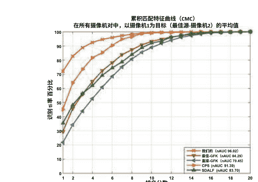

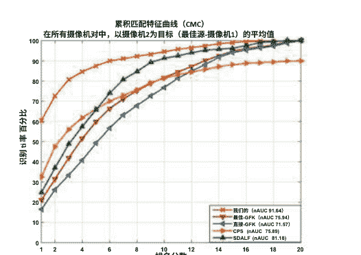

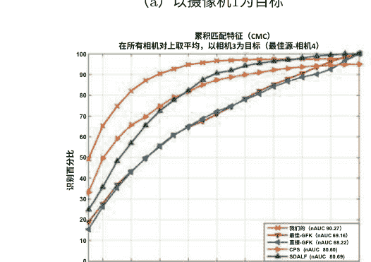

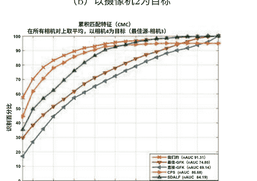

图14.4显示了使用四个摄像头的RAiD数据集的CMC曲线。图(a, b, c, d)分别展示了引入相机1、2、3和4时不同方法的性能。我们的方法在每个动态网络的情况下都明显优于所有对比基线。最佳效果以彩色显示。

## 14.5 结论

在本章中，我们为确保人员再识别问题的可扩展性提供了一些初步的研究方向。我们考虑了可扩展性的两个方面。首先，我们考虑了如何在不降低性能的情况下限制标注工作量，与完整标注相比。其次，我们考虑了如何在现有网络中添加额外的摄像头，几乎不需要额外的监督。第一个方面是通过考虑数据中的相似性结构，通过基于图的表示并利用图中的传递性关系来实现的。第二个方面是基于领域自适应的思想构建的。它们共同展示了在这些领域的最新成功基础上，将人员再识别方法扩展到完全监督之外的能力。我们希望这将激发未来的研究，在有限监督场景下对人员再识别的研究以及网络动态演化的情况下。

## 参考文献

- 1. Ahmed E, Jones M, Marks TK (2015) 用于人员再识别的改进深度学习架构。在: CVPR

- 2. An L, Chen X, Yang S, Bhanu B (2016) 用于人员再识别的稀疏表示匹配。Inf Sci

- 3. Aodha OM, Campbell NDF, Kautz J, Brostow GJ (2014) 用于图上主动学习的分层子查询评估。在: IEEE计算机视觉和模式识别会议

- 4. Bai S, Bai X, Tian Q (2017) 基于监督平滑流形的可扩展人员再识别。arXiv:1703.08359

- 5. Bazzani L, Cristani M, Murino V (2013) 基于对称性驱动的局部特征累积用于人类特征描述和再识别。CVIU

- 6. Bendale A, Boult T (2015) 走向开放世界识别。在: CVPR

- 7. Biswas A, Parikh D (2013) 通过相对反馈同时学习分类器和属性。在: 计算机视觉和模式识别的IEEE会议

- 8. Camps O, Gou M, Hebble T, Karanam S, Lehmann O, Li Y, Radke R, Wu Z, Xiong F (2016) 从实验室到现实世界：机场摄像头网络中的重新识别。TCSVT

- 9. Chakraborty A, Das A, Roy-Chowdhury AK (2016) 网络一致的数据关联。TPAMI

- 10. Chakraborty S, Balasubramanian VN, Panchanathan S (2011) 多标签分类中的最佳批次选择的主动学习。在: 多媒体ACM国际会议上, pp 1413–1416

- 11. Cheng D, Gong Y, Zhou S, Wang J, Zheng N (2016) 基于多通道部件的CNN通过改进的三元组损失函数进行人员重新识别。在: CVPR

- 12. Cheng DS, Cristani M, Stoppa M, Bazzani L, Murino V (2011) 用于重新识别的自定义图像结构。在: BMVC

- 13. Das A, Chakraborty A, Roy-Chowdhury AK (2014) 在摄像头网络中的一致重新识别。在: ECCV

- 14. Das A, Panda R, Roy-Chowdhury A (2015) 用于连续人员重新识别的主动图像对选择。在: ICIP

- 15. Daumé III H (2009) 令人沮丧地简单领域适应。arXiv:0907.1815

- 16. Ding S, Lin L, Wang G, Chao H (2015) 基于相对距离比较的深度特征学习用于人员重新识别。模式识别

- 17. Elhamifar E, Sapiro G, Yang A, Sastry SS (2013) 用于主动学习的凸优化框架。在: IEEE国际计算机视觉会议, 第209-216页

- 18. Geladi P, Kowalski BR (1986) 偏最小二乘回归: 教程。Anal Chim Acta

- 19. Gong B, Shi Y, Sha F, Grauman K (2012) 无监督领域适应的测地流核。在: CVPR

- 20. Gonzalez TF (2007) 近似算法和元启发式算法手册. CRC出版社

- 21. Gopalan R, Li R, Chellappa R (2011) 对象识别的领域适应：一种无监督方法. 在: ICCV

- 22. Hasan M, Roy-Chowdhury AK (2015) 上下文感知活动识别模型的主动学习. 在: IEEE国际计算机视觉会议

- 23. Hirzer M, Roth PM, Köstinger M, Bischof H (2012) 用于人物再识别的放松配对学习度量. 在: ECCV

- 24. Jie L, Tommasi T, Caputo B (2011) 从无约束先验进行多类别迁移学习. 在: ICCV

- 25. Joshi AJ, Porikli F, Papanikolopoulos NP (2012) 可扩展的多类图像主动学习分类. IEEE Trans Pattern Anal Mach Intell 34(11):2259–2273

- 26. Karanam S, Li Y, Radke RJ (2015) 具有区分性训练的视角不变字典的人物再识别. In: ICCV

- 27. Karasev V, Ravichandran A, Soatto S (2014) 用于自动和手动视频注释的活动帧、位置和检测器选择. In: IEEE计算机视觉和模式识别会议

- 28. Kodirov E, Xiang T, Fu Z, Gong S (2016) 通过无监督学习的ℓ1图形进行人物再识别. In: ECCV

- 29. Kodirov E, Xiang T, Gong S (2015) 通过迭代拉普拉斯正则化进行字典学习，用于无监督的人物再识别. In: BMVC

- 30. Köstinger M, Hirzer M, Wohlhart P, Roth PM, Bischof H (2012) 从等价约束中进行大规模度量学习。在: CVPR

- 31. Kou G, Ergu D, Shang J (2014) 在决策矩阵中增强数据一致性：将哈达玛德模型调整为减轻判断矛盾。欧洲运筹学杂志

- 32. Kulis B, Saenko K, Darrell T (2011) 你所看到的并不是你得到的：使用非对称核变换进行领域自适应。在: CVPR

- 33. Layne R, Hospedales TM, Gong S (2013) 用于人物再识别的领域转移。在：第四届ACM/IEEE国际研讨会上，分析和检索跟踪事件和图像流

- 34. Li W, Zhao R, Wang X (2012) 使用转移度量学习进行人物再识别。在: ACCV
- 35. 李W，赵R，肖T，王X（2014年）Deepreid：用于人员重新识别的深度过滤配对神经网络。在: CVPR
- 36. 李Z，常S，梁F，黄TS，曹L，史密斯JR（2013年）学习局部自适应决策函数进行人员验证。在: CVPR
- 37. 廖S，胡Y，朱X，李SZ（2015年）通过局部最大出现表示和度量学习进行人员重新识别。在: CVPR
- 38. 廖S，李SZ（2015年）用于人员重新识别的高效PSD约束非对称度量学习。在: ICCV
- 39. 林J，任L，卢J，冯J，周J（2017年）一致感知深度学习用于摄像头网络中的人员重新识别。在: CVPR
- 40. Lisanti G, Masi I, Bagdanov AD, Del Bimbo A (2015) 迭代加权稀疏排序进行的人物再识别. TPAMI
- 41. Liu C, Gong S, Loy CC (2014) 人物再识别的即时特征重要性挖掘. Pattern Recognit
- 42. Liu J, Zha Z-J, Tian Q, Liu D, Yao T, Ling Q, Mei T (2016) 用于人物再识别的多尺度三元组CNN. 在2016年ACM多媒体会议上的论文集
- 43. Liu X, Song M, Tao D, Zhou X, Chen C, Bu J (2014) 半监督耦合字典学习用于人物再识别. 在: CVPR
- 44. Ma AJ, Li J, Yuen PC, Li P (2015) 使用领域适应排序SVM进行跨领域人物再识别. TIP
- 45. 马B，苏Y，朱里F（2012a）Bicov：一种用于人物重新识别和人脸验证的新型图像表示。在: BMVC
- 46. 马B，苏Y，朱里F（2012b）用Fisher向量编码的局部描述符进行人物重新识别。在: ECCV
- 47. 马Z，杨Y，聂F，Sebe N，严S，Hauptmann AG（2014）利用实验室知识进行现实世界的动作识别。IJCV
- 48. Marchand H, Martin A, Weismantel R, Wolsey L (2002) 整数和混合整数规划中的割平面。离散应用数学
- 49. Martinel N, Das A, Micheloni C, Roy-Chowdhury AK (2015) 在特征扭曲的函数空间中进行重新识别。TPAMI
- 50. Martinel N, Das A, Micheloni C, Roy-Chowdhury AK (2016) 人物再识别的时间模型适应。在: ECCV
- 51. Michael RG, David SJ (1979) 计算机与难解性：np-完全理论指南。 WH Free. Co., San Fr
- 52. Mitchell JE (2002) 组合优化问题的分支和剪枝算法。 在： 应用优化手册
- 53. Mitzenmacher M, Upfal E (2017) 概率与计算： 算法和数据分析中的随机化和概率技术。 剑桥大学出版社
- 54. Nan F, Saligrama V (2017) 预算下的自适应分类预测。 arXiv:1705.10194
- 55. Nan F, Wang J, Saligrama V (2016) 预算下的随机森林修剪。 在： NIPS
- 56. Paisitkriangkrai S, Shen C, van den Hengel A (2015) 学习使用度量集合在人物再识别中进行排序。 在： CVPR
- 57. Panda R, Bhuiyan A, Murino V, Roy-Chowdhury AK (2017) 无监督自适应开放世界动态摄像头网络中的再识别。 在： CVPR
- 58. Pedagadi S, Orwell J, Velastin S, Boghossian B (2013) 用于行人再识别的局部费舍尔判别分析。 在： CVPR
- 59. Phillips JM, Venkatasubramanian S (2011) 核距离的简介。 arXiv:1103.1625
- 60. Roy-Chowdhury AK, Song B (2012) 摄像头网络： 对广域视频的获取和分析。 Synth Lect Comput Vis
- 61. Roy S, Paul S, Young NE, Roy-Chowdhury AK (2018) 在预算上利用传递性学习人物再识别模型。 在： IEEE计算机视觉和模式识别会议论文集，第7064-7072页
- 62. Saenko K, Kulis B, Fritz M, Darrell T (2010) 将视觉类别模型适应新领域。 在： ECCV
- 63. Schwartz WR, Kembhavi A, Harwood D, Davis LS (2009) 使用偏最小二乘分析进行人体检测。 在： ICCV
- 64. Settles B (2012) 主动学习。 Synth Lect Artif Intell Mach Learn 6(1):1–114
- 65. Su Y-C, Grauman K (2016) 留下一些未被探索的领域： 动态特征优先级排序用于流媒体视频活动检测。 在： ECCV
- 66. Tao D, Jin L, Wang Y, Yuan Y, Li X (2013) 通过正则化平滑 kiss度量学习进行人物再识别。 TCSVT
- 67. Vezhnevets A, Buhmann JM, Ferrari V (2012) 基于预期变化的语义分割主动学习。 在： 计算机视觉和模式识别的IEEE会议上，第3162-3169页
- 68. Vijayanarasimhan S, Grauman K (2011) 大规模实时主动学习： 使用爬取数据和众包训练目标检测器。 在： 计算机视觉和模式识别的IEEE会议上
- 69. Vijayanarasimhan S, Jain P, Grauman K (2010) 预算内远见的图像和视频识别主动学习。 在： CVPR
- 70. Vondrick C, Ramanan D (2011) 使用主动学习进行视频注释和跟踪。 在： 神经信息处理系统的进展中
- 71. Wang H, Gong S, Xiang T (2016) 高效可扩展的人物再识别回归. arXiv:1612.01341
- 72. Wang H, Gong S, Zhu X, Xiang T (2016) 人物再识别中的人机交互. In: ECCV
- 73. Wang X, Zheng W-S, Li X, Zhang J (2015) 跨场景迁移的人物再识别. TCSVT
- 74. Wu L, Shen C, Hengel AVD (2016) 使用深度卷积神经网络的人物再识别. arXiv:1601.07255
- 75. Wu Z, Li Y, Radke RJ (2016) 使用姿势先验和主体判别特征的摄像头网络中视角不变的人物再识别. TPAMI
- 76. Xiao T, Li H, Ouyang W, Wang X (2016) 使用领域引导的dropout学习深度特征表示进行人物再识别. arXiv:1604.07528
- 77. Xiao T, Li S, Wang B, Lin L, Wang X (2016) 人物搜索的端到端深度学习。arXiv:1604.01850
- 78. Yan Y, Ni B, Song Z, Ma C, Yan Y, Yang X (2016) 通过循环特征聚合进行人物再识别。在：ECCV
- 79. Yang Y, Ma Z, Xu Z, Yan S, Hauptmann AG (2013) 相关示例如何帮助网络视频中的复杂事件检测？在：ICCV
- 80. Yi D, Lei Z, Liao S, Li SZ, et al (2014) 人物再识别的深度度量学习。在：ICPR
- 81. Zhao R, Ouyang W, Wang X (2013) 无监督的显著性学习用于人物再识别。在：CVPR
- 82. Zhao R, Ouyang W, Wang X (2014) 学习中层滤波器用于人物再识别。在：CVPR
- 83. Zheng L, Shen L, Tian L, Wang S, Wang J, Tian Q (2015) 可扩展的人物再识别：一个基准。在：ICCV
- 84. Zheng L, Yang Y, Hauptmann AG (2016) 人物再识别：过去、现在和未来。arXiv:1610.02984
- 85. Zheng W-S, Gong S, Xiang T (2012) 转移再识别：从人物到基于集合的验证。在：CVPR
- 86. Zheng W-S, Gong S, Xiang T (2013) 相对距离比较进行再识别。TPAMI

# 第15章 面部分析算法中偏见的因果基准测试

Guha Balakrishnan, Yuanjun Xiong, Wei Xia 和 Pietro Perona

摘要 测量算法偏见对于评估算法公平性和指导算法改进至关重要。计算机视觉中当前的偏见测量方法基于观察数据集，因此将算法偏见与数据集偏见混淆在一起。为了解决这个问题，我们开发了一种实验方法来测量面部分析算法的算法偏见，该方法直接操纵感兴趣的属性，例如性别和肤色，以揭示属性变化与性能变化之间的因果关系。我们的方法基于生成不同特定属性的合成图像网格，同时保持其他属性不变。关键是，我们依靠人类观察者的感知来控制合成不准确性，从而测量算法偏见。我们通过将其与传统的观察性偏见分析研究在性别分类算法中进行比较来验证我们的方法。这两种方法得出了不同的结论。虽然观察方法报告了性别和肤色偏见，实验方法揭示了与性别、发长、年龄和面部毛发有关的偏见。我们还展示了我们的合成横断面允许对少数群体和交叉群体进行更直接的偏见分析。

G. Balakrishnan (✉)

麻省理工学院，亚马逊网络服务，印度贾姆谢德普尔

e-mail: balakg@mit.edu; guha89@gmail.com

Y. Xiong · W. Xia

亚马逊网络服务，印度贾姆谢德普尔

e-mail: yuanjx@amazon.com

W. Xia

e-mail: wxia@amazon.com

P. Perona

加州理工学院，亚马逊网络服务，印度贾姆谢德普尔

e-mail: perona@caltech.edu

## 15.1 引言

使用机器学习方法训练的自动化系统在工业、医学和政府决策中的应用越来越多。虽然这些系统的性能通常很好，但准确性并不保证，需要通过仔细的测量来评估。测量跨年龄、性别、性别和种族等受保护属性的偏差，对于可能影响人们生活的决策尤为重要。与基于人类判断的系统不同，测量和纠正偏差在算法中是可行的，并且可能成为实现更公平、负责任和透明的机构进步的有力工具[1, 2]。

衡量算法性能的主要技术是通过在野外采样的测试集上测量错误频率等统计数据，希望能够反映出在实际应用中可能遇到的数据统计特征。计算机视觉中关于算法偏见的研究[3-6]采用了这种方法，并增加了一个额外的步骤：对测试集中的每个图像进行感兴趣属性的注释（例如种族、性别和年龄），然后将测试集分成具有相同属性值的组。通过比较这些组之间的错误率，可以预测偏见。例如，图15.1-顶部显示了最近一项关于面部图像性别分类算法偏见的研究结果。这种类型的研究被称为观察性研究，因为独立变量（例如肤色和性别）是从环境中采样的，而不是由研究者控制的。

算法偏见有两个衡量的原因。首先，公平性：在其他条件相同的情况下，改变一个受保护属性是否会导致算法输出的系统性变化？例如，两个工作申请者仅在性别或种族上有所不同，是否会面临可预测的不同结果[7]？衡量偏见的第二个原因是消除它：为了最佳改善系统性能，应该采取哪些行动？例如，负责开发A、B和C系统的工程师（图15.1顶部）是否应该推断出最佳策略是向训练集中添加更多肤色较暗的女性示例？因此，衡量算法偏见的最终目标是揭示感兴趣属性与算法性能之间的因果关系。

不幸的是，观察性研究不适合得出这样的结论。当在野外采样数据时，其他变量可能与感兴趣的变量相关，并且任何一个相关变量都可能对算法的性能产生影响。因此，很难将性能差异的原因归因于感兴趣变量的变化，正如古老的谚语所说：“相关性并不意味着因果关系。”

这个问题的一个简单实例是样本偏差：野外样本可能无法代表感兴趣变量的特定组合[8-10]。例如，PPB数据集中议员的外貌倾向于性别刻板印象，例如，很少有男性留长发，几乎没有浅肤色的女性留短发（图15.12和[11]）。头发长度（可能影响性别分类准确性的变量）与肤色（一个变量）感兴趣的问题使分析变得复杂。此外，用于测量偏见的样本数据集通常不代表感兴趣的人群。例如，PPB的中年斯堪的纳维亚人和非洲人并不代表广泛的美国白人和非洲裔人口[12]。虽然观察方法确实提供了关于给定测试集人群中不同影响的有用信息，但将观察性能预测推广到不同的目标人群是凭感觉[13]，并可能对少数族裔或少数群体产生负面影响[14, 15]。简而言之，人们希望能够系统地识别算法偏见，同时超越特定测试集的特殊性。

生物学、医学和社会科学领域的科学家们对这个问题非常清楚，并已经制定了发现和控制混杂变量的实践方法。发现因果关系的一种强大方法是实验方法，它涉及人为操纵感兴趣的变量，同时固定其他所有输入[7, 16]。在图像数据的情况下，这并不容易，这使我们提出了一个问题：可以使用实验方法系统地测量计算机视觉算法的偏见吗？虽然这并不立即显而易见[11]，但我们发现答案是肯定的，并提供了一种实际的前进方式。

我们的方法（图15.2）通过合成测试图像而不是从野外采样，以便根据感兴趣的属性有选择地进行变化。这得益于最近在受控和逼真图像合成方面的进展[17, 18]，以及收集大量准确的人类注释的方法[19]，以量化图像操作的知觉效果。

我们的合成方法可以同时改变多个属性，以产生我们称之为“transects”的图像网格样本。我们使用详细的人类注释来量化图像操作，然后将其与算法输出进行比较，以估计算法的偏差。

我们通过对两种性别分类算法进行实验来评估我们的方法。我们首先发现，与“野外”人脸数据集相比，我们的transect生成策略在关键属性上创建了更加平衡的数据。接下来，受[3]的启发，我们使用这些合成数据来探索各种属性（如肤色、发长、年龄和感知性别）对性别分类器错误的影响。我们的研究结果表明，使用实验方法可以改变算法偏差的情况（图15.13），这将影响算法改进的策略，特别是涉及经常在训练和测试集中代表性不足的群体。

我们将我们的工作视为在计算机视觉中开发实验方法的第一步，我们认为这些方法对于实现可信赖和可操作的测量是必要的。还有很多工作要做，无论是在设计还是在实验中，才能实现广泛适用和可靠的技术。在第15.6节中，我们讨论了当前方法的局限性以及这个研究领域的下一步。

## 15.2 相关工作

计算机视觉中的基准测试有着悠久的历史[20-22]，包括人脸识别[6, 23-27]和人脸分析[3]。其中一些研究考察了性能上的偏差，即在重要参数变化（例如人脸的种族背景）时的错误率。由于这些研究纯粹是观察性的，它们引发了一个问题，即它们所测量的偏差是否取决于算法的偏差还是测试数据中的相关性。我们的工作解决了这个问题。

当感兴趣的特征组合被不成比例地表示，或者当这些特征相关时，数据集被认为是有偏差的。计算机视觉数据集经常被发现存在偏差[13, 28]。人脸数据集尤其受到审查[5, 29-33]，因为在这些数据上训练的方法和模型可能存在受法律保护的属性的偏差[1]。减轻数据集偏差的方法包括收集更全面的示例[33]，使用图像合成来弥补分布差异[32]，以及示例重新采样[34]。

机器学习社区积极分析学习模型的偏见，以及如何训练模型以减轻偏见[32, 35-42]，通常是通过确保在数据集的某些子组中性能相等来实现。在这里，我们提出一个补充性问题：我们假设要进行基准测试的系统是预先训练好且固定的，我们想知道如何可靠地测量预先训练的黑盒算法中的算法偏见。

对人脸分析系统[3, 5, 41]和人脸识别系统[6, 43]的研究试图测量性别和肤色（或种族）之间的偏见。然而，这些评估是基于观察而不是干预技术，因此，对这些研究的任何结论都应该谨慎对待。一个值得注意的例外是最近一项研究[11]，使用实验方法来研究肤色对性别分类的影响。在那项研究中，通过人为修改真实人脸照片的肤色来测量肤色差异的影响，其他条件保持不变。然而，作者观察到，如果要修改现有照片以研究其他属性（如头发长度），将会非常繁琐。我们的目标是开发一种普遍适用且实用的实验方法，可以独立地研究任何属性。

最近的工作使用生成模型来探索面部分类系统的偏见。一项研究探讨了姿势和光照变化对分类器性能的影响[29, 31, 32]。第二项研究使用生成模型沿特定属性方向合成人脸[44]。这些研究依赖于一个强假设，即他们的生成模型可以一次修改一个属性。然而，这个假设依赖于拥有无偏的训练数据，而这几乎总是不切实际的。相比之下，我们的框架使用人工注释来解决由我们的生成模型产生的残余相关性。

最后，对神经网络的解释性研究已经出现。一种策略是通过梯度分析或输入图像的扰动来确定输入中显著的区域[45-51]。网络剖析方法探索网络内特定神经元对输出的影响，特别是在语义上[52, 53]。使用概念激活向量（TCAV）[54]进行测试，使用方向导数揭示模型对类别（例如微笑）的“概念敏感性”的高级解释。相比之下，我们的方法使用合成模型创建精心修改的输入图像，并使用人工注释来精确量化它们。

## 15.3 合成图像中的人脸属性注释

我们实验中使用的人脸图像是合成的，因此每个图像背后没有真实的人。因此，对于人脸属性（如性别、发长和肤色）来说，没有内在的真实标准。这些属性是由人工注释者确定的。在没有物理真实标准的情况下，我们在这里澄清了我们谈论人脸属性时的含义。

许多属性具有内在和外在的表现形式。例如，“情绪”可以在三个层面上研究[55]：无意识的生理状态、有意识的自我感知（感受）和情绪表达（例如面部表情）[56]。这些量是与一个人或动物的身体内在相关的，机器无法直接获取。相反，外在描述，即旁观者对其感知的报告，更容易获取，这就是机器被训练预测的内容。

由于我们使用的是合成图像，应该清楚我们并不试图获取一个人的内在状态：没有人，也没有内在的性别、种族、年龄或情绪。然而，对这些属性的感知是可能的。这与旁观者本能地将米洛的维纳斯雕像视为“女性”和米开朗基罗的大卫雕像视为“男性”是相同的，尽管它们是理想化的大理石表现，而不是真实的人。

因此，当我们提到从图片中通过面部分析系统计算出的“年龄”、“性别”或其他属性时，我们指的是算法对外界对该属性外观的感知的预测。这有点啰嗦，这就是为什么我们使用缩写表达“属性”、“年龄”或“性别”。我们从人类观察者那里测量的属性是主观感知的报告。然而，正如我们在第15.4.3节中发现的那样，这些测量在不同观察者之间是一致且可重复的，因此我们将这些报告的统计数据视为客观量。

在我们的研究中，我们离散化了连续的面部属性。我们使用了六个年龄和肤色类别，五个发长、面部表情和性别等类别（见图15.6和15.8）。我们选择这些类别是为了符合文献中的要求，例如Fitzpatrick肤色等级[57]，并适应非专业观察者、即我们实验中所依赖的“普通人”的感知能力。我们并不声称我们的离散化方案是完美的；在不同的情境中，可能有其他更合适的离散化选择。

性别值得特别提及：性别认同通常被建模为多维度的[58]。然而，在这里我们测量的是性别感知的报告（一种外在变量），而不是性别认同（内在变量），我们的受试者无法可靠地报告超出传统的一维男/女维度。因此，根据[3]的建议，我们选择了一维度，并将其离散化为五个步骤，以适应不同的自信水平和模糊程度。

## 15.4 方法

我们的框架由两个组件组成：一种用于合成具有语义属性控制的图像集的技术，以及使用这些合成图像和人工标注者进行识别系统分析的过程。在第15.4.1节中，我们介绍了我们的属性控制图像合成技术。我们引入了“transect”概念，它是一个类似网格的合成图像构造，每个轴上都有不同的属性进行操作。`transect`可以控制合成属性的联合分布，使我们能够生成跨多个属性的匹配样本，而不像其他方法只能操作一个或两个属性[44, 59-61]。然后，我们为每个`transect`图像收集人工标注，以精确量化我们的修改。

在第15.4.2节中，我们介绍了使用标注`transects`进行的分析。我们报告了分类器在敏感属性的子组中的错误率。我们还返回一个经过协变量调整的估计值，即二元属性对分类器性能的因果效应。

### 15.4.1 横断面：在人脸空间中行走

我们假设存在一个黑盒子人脸生成器 `G`，它可以将潜在向量 `z ∈ R^D` 转换为图像 `I = G(z)`，其中 `p(z)` 是我们可以从中采样的分布。在我们的研究中，`G` 是一个预训练的、公开可用的最先进的GAN生成器（“StyleGAN2”）[17, 18]。GAN潜空间通常表现出良好的语义图像属性解耦。特别是，实证研究表明，每个图像属性通常具有一个主要捕捉其变异性的方向 `v ∈ R^D`[17, 53]。我们的方法基于最近的一项研究[53]，用于GAN潜空间中的单属性遍历。该方法训练一个线性模型来预测特定的图像属性 from `z`，并使用该模型在一个有区别的方向上遍历 `z`空间。我们的方法将这个思想推广到合成图像网格，即横断面，跨越任意多个属性。

#### 15.4.1.1 估计潜变量到属性的线性模型

我们首先对潜空间进行采样，通过人类观察者在每个位置测量属性，并使用这些测量结果计算属性的主要变化轴。更正式地说，假设有一个感兴趣的 `N` 个图像属性列表（年龄、性别、肤色等）。如下所述，我们生成一个带注释的训练数据集 `D_z = {z^i, a^i}_{i=1}^{N_z}`，其中 `a^i` 是一个向量，表示每个属性的分数，对于生成的图像 `G(z^i)`。属性 `j` 的分数，`a^i_j`，可以在 `[0, 1]` 范围内连续或者是 `{0, 1}` 二进制。

我们按照以下方式生成 `D_z`。首先，我们从 `p(z)` 中采样大量的 `z^i` 值。其次，我们从人工标注者那里获得标签 `a^i`。一项相关研究仅通过经过训练的分类器处理生成的图像来获得标签[53]。我们通常避免使用这种方法，因为分类器对属性相关性的任何偏见——正是我们试图避免的现象——会泄漏到我们的方法中。

对于每个属性 `j`，我们使用 `D_z` 来计算一个 `(D-1)` 维线性超平面 `h_j = (n_j, b_j)`，其中 `n_j` 是法向量，`b_j` 是偏移量。对于年龄或肤色等连续属性，我们训练一个岭回归模型[62]。对于二进制属性，我们训练一个支持向量机（SVM）分类器[63]。

当从`StyleGAN2`使用原生潜在高斯分布进行采样时，我们注意到生成的面部偏向于生成白种人的面孔，这并不奇怪，因为它是在`Flickr-Faces-HQ`（`FFHQ`）上进行训练的，这是一个偏向于该人口统计的公共数据集（见图15.11）。然而，使用人类注释，我们的方法能够通过将采样定向到潜在空间的相关部分（见下文中的部分），从而在一定程度上减轻这种偏差，以生成多样的属性。然而，训练具有更多样化面孔的人脸合成GAN将是使我们的方法更易于应用的重要一步。

#### 15.4.1.2 多属性横断面生成

属性超平面现在可以用于沿特定属性变化的面部采样。更正式地说：超平面 `h_j` 指定了具有属性 `j` 的边界或中性值的 `R^D` 子空间，法向量 `n_j` 指定了该属性主要变化的方向。为了构建属性 `j` 的一维长度为 `L` 的横断面，我们首先从一个随机点 `z^i` 开始，并将其投影到 `h_j` 上。然后，在 `n_j` 上查询 `L-1` 个均匀间隔的点，在 `h_j` 的两侧有固定的距离限制。图15.3展示了一些单一横断面的示例（正交化是下一节介绍的概念）。我们在第15.4.1.4节中对查询点进行了进一步的详细说明。

1D横断面不允许我们探索多个属性的联合空间或者在变化一个属性时以精确的方式固定其他属性。我们在算法1中将其推广到 `K` 维横断面来解决这个问题。主要的扩展包括：(1)将 `z^i` 投影到 `K` 属性超平面的交集上，以及(2)在 `z` 空间中以 `K` 维网格移动（参见图15.4）。输入 `c_k` 是相对于超平面 `h_k` 的决策值向量，`v_k` 是一个方向向量（在下一节引入正交化之前等效于 `n_k`）。我们不知道将 `z^i` 投影到任意多个超平面的交集上的简单闭式解。相反，我们采用迭代方法：依次将点投影到每个超平面上，并重复这个过程一定次数。

在我们的情况下，重复投影到凸集（即超平面）上可以保证收敛到集合的交点上[64]，在我们的情况下，是一个单点。如果超平面完全正交，这个过程在一次迭代中就会收敛；我们经验上发现在少于50次迭代中就可以收敛。

#### 15.4.1.3 遍历方向的正交化

超平面法线 `{n_j}_{j=1}^{N_a}` 彼此不正交。如果我们在算法1中将方向向量设置为这些法线向量，即 `v_j = n_j`，我们可能会观察到属性之间的不希望的相关性。我们通过生成一组修改后的方向向量来减少这种影响，使得 `v_j ⊥ n_k`，`∀ k ≠ j` (参见算法2)。

图15.5说明了正交化对头发长度和肤色的影响。如果不进行正交化，头发长度的横截面会出现不希望的性别变化，头发越短，面部看起来越男性化。通过正交化，这些不希望的变化被消除。相比之下，我们可以看到肤色横截面在进行和不进行正交化时没有明显的差异，这表明肤色超平面已经接近与其他属性超平面正交。

**算法 1: K属性横断面生成**

**输入:** 生成器 `G`， 元组 `{(L_k, n_k, b_k, v_k, c_k)}_{k=1}^{K}`， 其中 `L_k` 是一个横断面维度， `(n_k, b_k)` 是一个超平面， `v_k` 是一个方向向量， 而 `c_k` 是有符号的决策值。

**输出:** 一个 `L_1 × ⋯ × L_K` 的横断面 `T^i`。

```
z^i ∼ p(z)

z^{i,0} = 将 z^i 投影到 {(n_k, b_k)}_{k=1}^{K} 的交集上

**对于** l_1 = 1 ⋯ L_1 **执行**

    **⋮**

    **对于** l_K = 1 ⋯ L_K **执行**

        T^i(l_1, ⋯, l_K) = G(z^{i,0} + ∑_{k=1}^{K} c_k[l_k] / ⟨v_k, n_k⟩ * v_k / ∥v_k∥)
```

**算法 2: 正交化**

**输入:** 向量 `{n_j}_{j=1}^{N_a}`。

**输出:** 向量 `{ñ_j}_{j=1}^{N_a}`， 其中 `ñ_j ⊥ n_k`， `∀ k ≠ j`

```
Q, R ← 矩阵 [n_1, n_2, ⋯, n_{N_a}] 的QR分解

**对于** i = 1 ⋯ N_a **do**

    ñ_i = n_i

    **对于** j = 1 ⋯ N_a **do**

        **如果** i ≠ j **则**

            ñ_i = ñ_i - (Q_j * ⟨Q_j, ñ_i⟩) / ⟨Q_j, Q_j⟩
```

#### 15.4.1.4 设置步长和横断面尺寸

如果人工注释成本可以忽略不计，我们可以简单地查询许多网格位置，使用大的横断面尺寸`L`来捕捉属性的动态范围内的细微外观变化。但是考虑到有限的资源，我们将`L`设置为较小的值。例如，在图15.3的1D横断面中，`L = 5`，在图15.4的2D横断面中，`L = 2`，在图15.9的3D横断面中，`L = 2`。对于每个属性`j`，我们手动设置相对于`h_j`的最小/最大有符号决策值，并在这些极端值之间线性插值`L_j`个点以获得`c_j`。我们设置每个属性的最小/最大值，以便横断面能够展示大多数随机样本的完整动态范围。

### 15.4.2 使用横断面进行分析

我们假设一个目标属性，例如性别，和一个目标属性分类器`C`。我们将使用横断面图像对`C`进行偏差分析。尽管理想的横断面只会同时修改选定的属性，但在实践中，可能会意外修改其他属性。此外，属性的改变程度在横断面之间也有所不同。为了测量和控制这些因素，我们对每个横断面的每个图像进行注释，从而得到第二个数据集`D_{横断面} = \{I^i, a^i\}_{i=1}^N`，即图像和人类注释。

我们用人类报告的图像`I^i`的真实性别表示为`y^i`，用`C`的预测表示为`\hat{y}^i`。为了便于分析，我们将剩余的属性离散化为区间，并为每个区间分配一个独立的二进制变量 [65]。例如，我们可以用六个二进制变量表示“肤色”属性，对应于图15.6（右上角）中显示的六个级别。对于给定的图像，这六个变量中只有一个会被设置为1，通常称为“独热编码”。我们用`x^i`表示图像`i`的连接二进制协变量向量，用`e^i = \ell(\hat{y}^i, y^i)`表示分类错误，其中`\ell(\cdot, \cdot)`是一个错误函数。

我们的第一种分析策略是简单地比较`C`在人群的不同子群中的错误率。设`E_j^s`表示`C`在`j`等于0或1的测试样本上的平均错误率：

$$E_j^s = \frac{\sum_i e^i \mathbb{1}(\mathbf{x}_j^i = s)}{\sum_i \mathbb{1}(\mathbf{x}_j^i = s)} \quad (15.1)$$

如果数据是从完全随机化或对照研究中生成的，那么数量`E_j^1 - E_j^0`是对协变量`j`对`e`的“平均处理效应”（ATE）[66–69] 的良好估计，即当协变量`j`从0翻转到1时，其他协变量固定时`e`的平均变化。例如，“深肤色”协变量的ATE捕捉到当每个人的肤色从非深色变为深色时，`C`的错误率的平均变化。从观察数据集中准确计算ATE是不可能的，因为我们无法观察到每个数据点的反事实情况，例如同一个人具有浅色和深色肤色。

尽管我们的横断面比观测数据集“野外”更接近实现理想的对照研究（有关经验验证，请参见第15.5.3节），但在实践中仍可能存在一些混淆变量（请参见图15.18的示例）。由于任何可观察到的混淆因素都可以在`D_{横断面}`中进行注释，我们可以使用协变量调整的ATE估计器[70-72]。一种简单的协变量调整方法是训练一个线性回归模型，预测`e_i`从`x_i`：

$$ e_i = \epsilon_i + \eta_0 + \sum_j \beta_{\eta x_j} \cdot x_{i,j} \quad (15.2) $$

其中`\beta`是参数，`\epsilon_i`是每个示例的噪声项。`\beta_j`捕捉ATE，即在保持所有其他变量不变的情况下，`e`给定`x_j`的单位变化的平均变化，前提是：(1) 线性模型是关于因变量和自变量之间关系的合理拟合，(2) 模型中包含所有相关属性（即没有隐藏的混淆因素），(3) 模型中不包含受`x_j`影响的属性，否则这些其他因素可能“解释掉”`x_j`的影响。

实验者永远无法完全确定自己是否满足了这些条件，但可以通过仔细考虑来努力做到。离散化和二值化属性有助于(1)，尽管在我们的实验中仍然发现一些非线性影响在协变量之间存在(见第15.5.5.1节)。作为(2)的一个例子，我们发现耳环可能是一个重要的属性，在我们的分析中没有考虑到(见图15.19)。

### 15.4.3 人类注释

我们收集了关于合成人脸的人类注释，以构建`\mathcal{D}_z`和`\mathcal{D}_{横断面}`。注释员通过AWS SageMaker Ground Truth服务[73]在亚马逊的Mechanical Turk [19]上招募。注释员对每个图像进行了七个属性的评估：性别、面部毛发、肤色、年龄、化妆、微笑、发长和图像真实性。每个属性都以离散的尺度进行评估。每个注释员一次只对一个属性进行图像评估。对于每个图像，我们收集了每个属性的五个注释，总共每个图像40个注释。

我们使用三到六个级别对每个属性进行离散化。例如，我们使用Fitzpatrick六级尺度来评估肤色[57]，并将年龄分为从儿童到老年人的六个组。有关每个属性的子组的完整详细信息，以及我们Mechanical Turk调查布局的样本，请参见图15.6。

我们的方法需要的注释数量相当可观。然而，我们发现这在实践中并不是一个障碍。在我们的实验中，`\mathcal{D}_z`包含5,000张图像，`\mathcal{D}_{横断面}`包含1,000个8张图像的横断面（见图15.9中的示例）。因此，注释的总数为13,000（图像）×8（属性）×5（每个图像和每个属性的注释）=0.52M个注释。亚马逊机械土耳其平均每秒提供10-20个注释，因此注释需要大约10小时在两个独立的会话中完成。注释员每个注释获得1.2美分，每小时赚取10-15美元。

图15.7 注释一致性。头发长度（顶部）、性别（中部）和肤色（底部）在13张图像的1D横断面上进行注释。这个横断面是在一个试验中进行注释的，以微调我们的图形用户界面并评估注释者的一致性，而不是在我们的主要实验中使用。每个属性和每个图像获得了九个注释。注释显示为每个图像下方的点。x轴从一个图像到下一个图像增加一个单位。为了可视化个体注释，在x和y中添加了少量噪声。浓灰色曲线显示了对数据的逻辑函数拟合。注释通常落在一个或两个相邻的属性水平内。几乎没有离群值。有关定量整体分析，请参见图15.8。

人们可能担心注释者可能无法对合成图像给出有意义的属性注释。因此，我们在试验的数量和主要实验的注释中探索了注释者回答的一致性水平。图15.7显示了一个1D横断面和三个属性的原始注释。可以看到很少有离群注释，并且在大多数情况下，注释落在一个或两个相邻的属性水平上。图15.8（左上方）显示了按属性分割的每个图像注释标准差的分布。一个单位对应于每个属性的动态范围。对于大多数属性，注释者标准差的中位数接近0.1，即小于属性水平之间的分离。这些观察结果表明注释者之间存在良好的一致性，并且注释是有意义且可重复的。

图15.8（右上角）展示了合成图像的平均伪造评分分布。只有很小一部分图像被认为是“可能伪造”或“确定伪造”。图像的真实性在我们的分析中尤为重要。

图15.8注释质量和图像真实性。（左上角）我们考虑的每个属性的人工注释的每个图像标准差分布（一个单位=属性的动态范围）。我们要求五位注释者为每个图像的每个属性提供评分。每个属性的评分选项数在属性名称旁边用括号表示。中位数标准差（红线）与量化步骤相当，表明注释者之间有很好的一致性。（右上角）我们要求注释者评估图像的真实性。展示了此类评分的分布。少于10%的评分表明，我们随机抽样的合成图像相当真实，没有明显的伪造迹象。（底部）我们展示了按平均人工伪造评分组织的合成人脸示例。从实验中删除了伪造评分较高的图像（参见第15.5.2.1节）。

由于图像伪影可能会无意中影响性别分类器的决策。在我们的实验中，我们删除了伪造度得分高于某个阈值的图像（参见第15.5.2.1节）。图15.8（底部）展示了按平均人类伪造度得分组织的合成图像示例。

图15.9是我们实验中使用的三属性横断面的样本。我们创建了1,000个`2 ×2 ×2`的横断面，跨越肤色、发长和性别，其中四个示例显示在（a）中。我们设置步长，以获得从浅到深的肤色、短到中等长度的头发以及男性/女性性别（参见第15.4.1.4节）。除了有意修改的属性外，其他面部属性保持不变。对于每个横断面中的每个图像，我们收集人类注释以测量感知属性。在（a）中，我们将（b）中左下横断面的人类注释性别值与生成器的预期值并排显示。人们将第一个脸标记为男性，尽管生成器的预期是产生一个女性。在我们的所有实验中，我们使用人类感知作为地面真实值，而不是生成器的预期属性。

## 15.5 实验

为了在实际应用中测试我们的方法，我们对性别分类器的偏见进行了基准测试。Pilot Parliaments Benchmark (PPB) [3]是一个包含来自不同国家议会成员的面部图像的数据集，它是第一个平衡性别和肤色的野外采集测试数据集，旨在促进对性别分类偏见的研究。该研究的作者发现，与其他群体相比，深色皮肤的女性错误率要高得多，并推测这是算法中的偏见导致的，即性能受到了偏见的影响。

当性别和肤色改变时，算法也会改变，其他条件保持不变。我们的方法允许我们测试这个假设。

### 15.5.1 性别分类器

我们训练了两个研究级别的性别分类器模型，每个模型都使用了`ResNet-50`架构[74]。第一个模型是在`CelebA`数据集[75]上训练的，第二个模型是在`FairFace`数据集[76]上训练的。`CelebA`是最受欢迎的公共人脸数据集，因为其规模和丰富的属性注释，但已知存在严重的不平衡问题[44]。`FairFace`数据集被引入以减轻一些偏见。

我们用二元交叉熵损失训练了我们的分类器20个时期。我们将学习率设置为`1e^{-4}`的前10个时期，以及`1e^{-5}`的后10个时期。为了避免基线偏见，我们在训练过程中强制采样男性和女性脸部的可能性相等。出于两个原因，我们决定不测试商业系统。首先，可重复性——我们测试的模型可能随时被其他研究人员重新实现和重新训练，而商业系统是黑盒子，可能随时不可预测地改变。其次，我们的`ResNet-50`模型显示出与[3]原始研究中观察到的偏见相当的偏见（见图15.2）。

### 15.5.2 横断面数据

为了生成我们的横断面的合成图像，我们使用了在`Flickr-Faces-HQ (FFHQ)` [17, 18]上训练的`StyleGAN2`架构的生成器。这个生成器既有一个多变量正态输入噪声空间`N(0, I)`，也有一个中间的“风格空间”。为了训练潜在空间线性模型（见第15.4.1.1节），我们从噪声分布中采样了5000个向量，并用人类注释者标记了生成的图像（见第15.4.3节）。然而，我们在我们的方法中使用风格空间作为潜在空间，因为我们发现它更适合解开语义属性。

我们训练了线性回归模型来预测年龄、性别、肤色和发长等属性的风格向量。对于剩余的属性——面部毛发、化妆和微笑，我们发现将范围二值化并训练线性`SVM`分类器效果最好。

我们按照第15.4.1.2节中描述的过程，在肤色、发长和性别的子群中生成了3D横断面。我们使用`2 × 2 × 2`的横断面尺寸，通过网格决策值（由算法1中的输入向量`c`指定）在肤色轴上生成了从浅到深的过渡，在发长轴上生成了从短到中等的过渡，在性别轴上生成了从男性到女性的过渡。我们通过试错法设置了决策值，并使其在所有横断面上相等：肤色为`(-1.5, 1.7)`，发长为`(-0.5, 0)`，性别为`(-1.75, 1.75)`。我们生成了1000个这样的横断面，总共生成了8000张图片。图15.9展示了四个示例。

图15.10 合成人脸样本，按照人类注释分数排序。在我们的分析中，我们忽略了红色范围内的人脸，以便关注清晰可见的女性/男性、浅色/深色肤色和短发/长发横断面。除了有意修改的属性之外，人脸的一般特征保持不变。

图15.11 按数据集和性别组别的属性分布。“小提琴”图的宽度与频率计数成比例，每个小提琴的最大计数跨越整个宽度。与合成横断面相比，野外采集的数据集在性别方面存在更大的属性不平衡，例如女性的头发更长、年龄更小。我们设计了与`PPB`肤色分布和年龄分布相对应的横断面，同时减轻了头发长度的不平衡。图15.12进一步探讨了头发长度与肤色分布的关系。

#### 15.5.2.1 数据集修剪

并非所有合成图像都适合我们的分析。有些引发了模糊的人类反应（图15.8左上角），或者是不现实的（图15.8右上角）。此外，其他图像可能不明确地属于我们针对性别、发色和肤色属性的两个类别之一。我们首先通过删除任何平均伪造分数大于或等于“可能伪造”（在规范化范围内为`0.75`）的图像来解决这些问题。我们还删除了肤色和性别的规范化子范围为 `[0.4,0.6]`，以及发长的规范化子范围为 `[0.3,0.5]`的人脸（参见图15.10的示例）。经过这些修剪步骤，我们剩下了5713张图像。

图15.12 根据性别和肤色组的长发分布。在野外采集的数据集中，当性别保持不变时，发长与肤色相关。可以设计合成横断面来最小化这种相关性。

### 15.5.3 横断面与真实人脸数据集的比较

图15.11分析了`CelebA-HQ`、`FFHQ`和`PPB`数据集以及我们的横断面的属性分布，按性别分层。野外采集的数据集在性别方面存在显著的不平衡，特别是在发长方面。它们在年龄方面也存在偏见，男性比女性年长的比例更大。有一个有趣的相关性是，在这些数据中男性更有可能微笑。相比之下，我们的横断面在性别方面更加平衡。它们描绘了更多中长发的男性和较少长发的女性。我们的横断面还具有双峰的肤色分布和较老的人口特征，因为我们有兴趣模仿`PPB`的人口特征。所有数据集在“胡须”和“化妆”属性上都存在不平衡，这是合理的，因为我们预计这些属性与性别有很强的相关性。

在一个理想的匹配研究中，按敏感属性分层的图像集合将在其余属性上呈现相同的分布。简而言之，没有其他属性应与被操作的属性强相关。

图15.12按肤色分层。我们在所有野外采集的数据中看到了发型长度分布和肤色的相关性，而合成横断面则表现出更好的平衡。

### 15.5.4 偏差分析

我们现在分析分类器在`PPB`和我们的横断面上的性能。我们验证分类器在`PPB`上展示出与商业分类器相似的错误模式[3]。因为`PPB`只包含成年人，我们从我们的横断面中删除了儿童和青少年（年龄 < `0.4`在归一化`[0, 1]`尺度上），以进行更直接的比较，剩下5335张图片。

图15.1展示了按性别（男/女）和肤色（浅/深）划分的分类错误。我们在[3]中复制了商业分类器报告的错误，并在我们内部版本的`PPB`上报告了我们分类器的错误。所有分类器在深肤色女性上表现明显较差。图15.13和15.14按性别/发长/肤色组合分层报告分类错误。

我们可以得出一些宏观的、定性的观察结果：

+   - 错误的总体模式在`PPB`和横断面上相似，左侧(女性)的错误比右侧(男性)的错误更多。

- 横断面上的错误要么与`PPB`相当，要么更高，这表明合成面孔至少与真实面孔一样具有挑战性。最重要的是，男性的错误不为零，这使得在属性变化时可以研究相对困难性。

- 在`PPB`中，长发男性和短发轻肤色女性很少，这使得对这些类别的测量结果不可靠。这在横断面调查中不是一个问题，因为面部是通过属性进行匹配的。

- 对于女性来说，头发越短，横断面调查的误差越大。然而，对于男性来说，头发长度对结果几乎没有影响（参见图15.18可能的解释）。

- 在肤色方面，横断面调查的误差模式并不一致：在同质群体中，改变肤色似乎不会影响任何算法的性能。例如，长发女性在浅色和深色肤色之间的分类错误没有显著差异。仅仅看`PPB`的话，我们无法得出这个观察结论，因为肤色与头发长度之间有很强的相关性。

## 15.5.5 回归分析

为了定量评估属性对分类器错误的影响（或缺乏影响），我们进一步进行了协变量调整的因果效应计算。对于每个性别分类器模型，我们训练了一个`L2`正则化的逻辑回归模型，以预测该分类器在所有属性条件下的错误。

我们将属性离散化为不同的级别，并为每个级别分配一个二进制变量。我们在之前的实验中使用了相同的离散化方法，对头发长度（短发 vs 长发）、肤色（浅肤色 vs 深肤色）和性别（女性 vs 男性）进行了离散化。我们对胡须（无/淡胡须 vs 胡须）和化妆（无/淡妆 vs 化妆）使用了两个级别，对面部表情（严肃/皱眉 vs 中性 vs 微笑）使用了三个级别，并对图15.6中描述的年龄使用了原始的语义级别。总共，这导致我们的逻辑回归模型有17个输入变量。我们使用了`scikit-learn`的逻辑回归函数[78]，并将正则化参数设置为`1`。

图15.15展示了逻辑回归模型的系数。请记住，每个系数表示分类器错误的对数几率在每个协变量变化1个单位时的变化（参见第15.4.2节）。误差线表示通过对数据集进行1000次自助采样获得的标准偏差。一个人的面部毛发、性别、化妆、头发长度和年龄都对分类错误有显著影响，而肤色的影响微乎其微。我们的主要实验结论是，在性别分类算法的偏差原因上，观察性（`PPB`）和实验性（横断面）方法在根本上存在分歧。对野外采集的`PPB`进行的观察性分析表明，性别和肤色的组合是涉及的因素，而我们使用合成横断面的实验方法表明，其他属性比肤色更重要。

#### 15.5.5.1 属性对分类错误的联合影响

我们的回归分析做出了一个简化的假设，即每个协变量对分类错误有独立的线性影响。独立性假设可能是错误的。例如，图15.14右侧显示了错误率在不同的肤色和发长的交叉群体之间变化，这种变化不仅仅是每个属性的线性组合。

这也是我们从分析中排除儿童和青少年的原因，因为这些个体的外貌特征往往与成年人不同。

图15.16通过按年龄和性别子群体对错误率进行分解来说明这一点。在年轻成年人到中年人之间，性别之间的错误率差异相当一致，但在儿童/青少年和老年人之间有所变化。这表明年龄和性别对错误有联合影响。

图15.17显示了我们合成的横断面上`ResNet`模型最不正确的人脸。对于每个性别错误分类的方向，我们展示了模型预测与平均人类标注者之间最远的人脸。

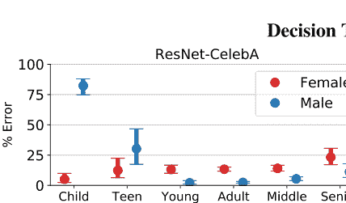

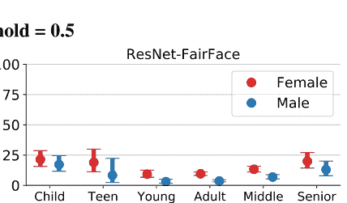

**Decision Threshold = 0.8**

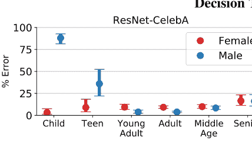

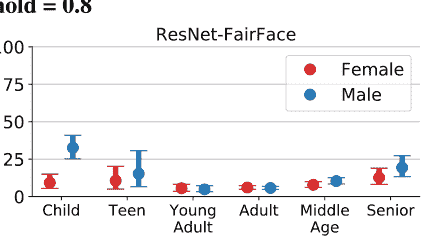

图15.16显示了我们的横断面图像中按性别和年龄组划分的错误。前两个图使用决策阈值为0.5获得，并显示了女性错误的普遍性。后两个图使用阈值为0.8获得，该阈值被选择为最小化总体错误。

错误受年龄的影响不均匀。两个模型在年轻到中年成人中的错误较低。对于成年人，性别之间的错误差异相对一致，但对于儿童、青少年和老年人来说，错误差异不同，说明算法中存在年龄和性别的综合偏差。

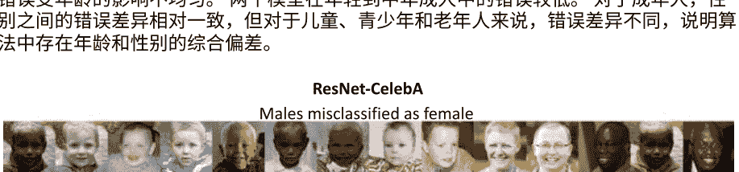

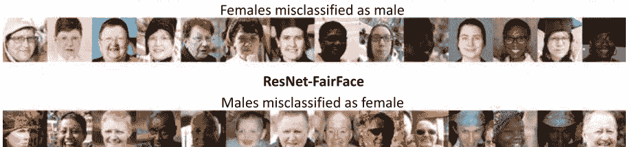

图15.17显示了最大错误的图像。合成的人脸图像与平均人类注释最不一致的分类器。

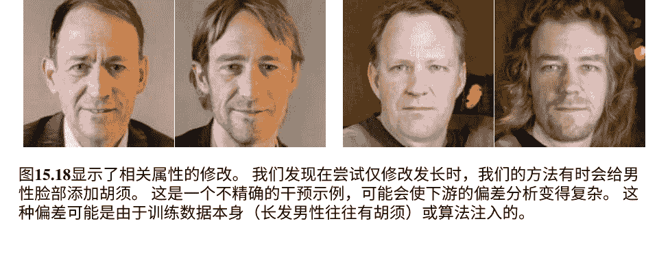

图15.18显示了相关属性的修改。我们发现在尝试仅修改发长时，我们的方法有时会给男性脸部添加胡须。这是一个不精确的干预示例，可能会使下游的偏差分析变得复杂。这种偏差可能是由于训练数据本身（长发男性往往有胡须）或算法注入的。

回应。`ResNet-CelebA`倾向于将年轻男孩/婴儿错误地分类为女性，与图15.16的定量结果一致。

## 15.6 讨论与结论

### 15.6.1 总结

我们的研究得出了三个主要结论。首先，实验方法可以用于测量计算机视觉中的算法偏差。其次，实验方法可能得出与传统观察研究完全不同的结论。第三，在分析算法偏差时，除了直接感兴趣的属性之外，还应考虑广泛的属性和属性组合。

我们将逐个详细讨论。

我们的实验方法是通过将最近的图像合成进展与众包收集的详细人工注释相结合来实现的。通过人工注释校准的图像合成使我们能够生成匹配样本的横截面，即仅在感兴趣属性上有差异的图像组。与先前的属性特定方法[11]相比，可以探索任何属性，只要人类可以进行注释。通过依赖人类的真实注释，我们不需要依赖合成方法的完美性。

实验方法和我们基于合成的实验方法在许多方面具有吸引力的特性和优势，相对于传统的观察方法：

1. 可以进行有关偏差的因果推断。我们的方法在所选属性上生成了大致匹配的样本，可以进行反事实分析，例如，“如果同一个人有不同的肤色，算法是否会犯同样的错误？”观察图像数据几乎从不匹配。

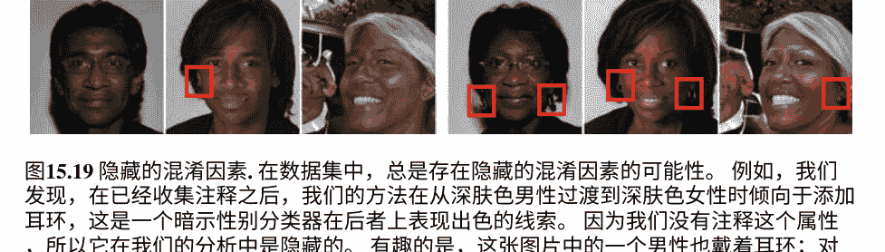

2. 对于代表性不足的群体，可以测量偏见。图像合成允许在很大程度上对感兴趣属性的空间进行均匀采样-在我们的实验中是性别、肤色和头发长度。当依赖于从自然分布中采样的图像时，这是非常困难的，因为自然分布往往是长尾的，因此某些群体的代表性不足。

3. 可以测量交叉群体的偏见。我们的方法允许研究人员对由特定属性组合定义的群体进行因果推断。单属性分析可能隐藏了影响由多个属性组合定义的群体的偏见[10]。在自然数据中，这些组合通常被大量欠采样。

4. 偏见测量在不同人群中是有效的。这是因为实验方法识别出因果相关的属性，独立于这些属性的普遍性，即偏见测量是算法的属性，而不是使用它的人群的属性。相比之下，观察测量不会推广到数据收集的狭义人群之外。此外，通过适当地结合不同属性的贡献，可以预测对特定人群的*disparate treatment* [79]和*disparate impact* [80]的影响。

5. 准确的偏差测量可以快速且廉价地进行。图像合成快速且廉价，众包图像标注也相对快速且经济实惠。相比之下，组建大规模的自然图像数据集是费时费力的，可能需要数年时间和大量投资，这只有大型组织才能负担得起。因此，合成数据有潜力使偏差测试民主化。

6. 伦理和法律问题大大减少。在野外收集人脸图像数据集需要非常小心以尊重个人的隐私和尊严，尊重未成年人和其他弱势群体的权利，以及版权法。相比之下，合成数据集不涉及这些风险，因为它们不描绘真实的人物。

实验分析（横切面）和传统观察分析（使用PPB）在肤色效应上存在最显著的差异；观察研究被标记为显著，而实验方法被认为在确定算法偏差方面不显著。实验方法揭示了许多其他偏差源：年龄、头发长度和面部毛发（图15.15）。两种方法在性别上达成一致。我们的分析表明，两种方法的结论差异很可能是由于PPB中头发长度、肤色和性别的相关性（参见图15.11和15.12）。因此，如果不控制头发长度，分类器对基于头发长度判断性别的偏差会被解读为针对深肤色女性的偏差。头发长度、性别和肤色之间的三重相关性在之前的研究中已经被注意到[11]。

测量算法偏差的主要原因是为了消除它。错误和偏差的测量指导科学家和工程师采取有效的纠正措施，以改善算法的性能。通过这个视角观察两种方法的不同预测是有益的。基于PPB的相关研究（图15.1）可能表明，为了减少分类器中的偏差，应该在训练集中添加更多肤色较深的女性图像。实验方法引导工程师朝着不同的方向发展。首先，需要更多种族的长发男性和短发女性的训练图像。其次，纠正年龄偏差需要更多儿童-青少年和可能的老年龄组的训练图像。

最后，我们研究的一个教训是，在考虑到了立即感兴趣的属性之外的丰富属性和属性组合时，这是很重要的。这有两个原因。首先，未观察到的混淆因素可能会产生强烈的影响，需要包含在分析中。其次，属性的组合效应可以是非常非线性的（参见图15.16中年龄和性别的交互作用），因此需要进行交叉分析[3, 8]。选择属性或属性组合既是一门艺术，也是一门科学，因此必须依靠良好的判断和健康的多学科讨论逐步揭示缺失的属性。

### 15.6.2 限制和未来工作

虽然实验方法的优势很明显，但我们提出的方法并不能使研究人员免于注意力和良好判断力。尽管我们的方法大大减少了与注释变量的不相关性，但并没有完全消除它们，也没有考虑隐藏的混淆因素[81]，因此需要保持警惕。作为第一个例子，我们发现当增加头发长度时，我们的方法经常给男性脸部添加面部毛发（见图15.18）。这很可能是为什么我们的分类器对长发男性的错误率没有更高的原因（见图15.13）。作为第二个例子，我们发现当将一个深肤色的脸部修改为女性时，我们的方法倾向于合成耳环（见图15.19）。根据文化背景，耳环可能与性别的定义相关或不相关。如果这是一个不相关的关联，应该将耳环添加到注释流程中，以便可以“正交化”。

通过综合方法。科学家们构建一个用于测量人脸分析偏差的工业级系统时，希望考虑包含更全面的因素。

基于合成图像和人工注释的方法的一个显著优势是：一旦发现一个残余相关性，就可以进行系统注释，在分析中进行补偿，并在合成中进行缓解。

人脸合成的一些改进将使我们的实验方法更加实用和强大。首先，我们生成的许多人脸都包含可见的瑕疵（参见图15.8），我们通过人工注释消除了这些瑕疵——即使是微小的瑕疵也会影响分类器的输出，这是由对抗性示例文献揭示的。其次，我们还没有工具来估计由给定生成器可以和不可以产生的面部特征和属性组合的集合。目前的生成对抗网络已知在生成其训练分布之外的数据时存在困难。第三，我们观察到`StyleGAN2`在从其潜在分布中进行采样时存在对生成高加索人脸的偏见。虽然我们的方法可以通过人工注释进行精心定向的遍历来补偿偏见，但从无偏见的合成方法开始显然更好。我们希望通过训练集的多样性增加，如种族、性别、个人风格和年龄等属性，以及更好的模型，逐步解决这些缺点。

我们控制合成的一阶技术也可以改进。对面部空间几何的更好理解将有望产生更准确的全局坐标系统。这反过来将有助于减少合成横断面中的残余偏差，目前我们通过手动注释横断面来缓解这种偏差。

最后，将我们的方法扩展到除性别分类之外的更复杂任务，如人脸识别，在实践中并不简单，需要进一步研究。

致谢许多同事友好地阅读了本文的草稿，提供了参考文献、深入的评论和宝贵的批评。我们特别感谢Frederick Eberhardt、Bill Freeman、Lei Jin、Michael Kearns、R. Manmatha、Tristan McKinney、Sendhil Mullainathan和Chandan Singh。

## 参考文献

1. Kleinberg J, Ludwig J, Mullainathany S, Sunstein CR (2019) 算法时代的歧视。由牛津大学出版社代表哈佛法学院约翰・M・奥林中心出版
2. Mullainathan S (2019) 偏见算法比偏见人更容易修复，纽约时报
3. Buolamwini J, Gebru T (2018) 性别阴影：商业性别分类中的交叉准确性差异。在：公平、问责和透明度会议，第77-91页
4. Brandao M (2019) 行人检测算法中的年龄和性别偏见。arXiv:1906.10490
5. Klare BF, Burge MJ, Klontz JC, Bruegge RWV, Jain AK (2012) 人脸识别性能：人口统计信息的作用。IEEE Trans Inf Forensics Secur 7(6):1789–1801
6. Krishnapriya KS, Vangara K, King MC, Albiero V, Bowyer K (2019) 衡量人种相关的人脸识别准确性的变异性。arXiv:07325(4):2019

- 7. Bertrand M, Mullainathan S (2004) Emily和Greg比Lakisha和Jamal更容易就业吗？ 关于劳动力市场歧视的实地实验。 Am Econ Rev 94(4):991–1013

- 8. Kearns M, Neel S, Roth A, Wu ZS (2017) 预防公平选区操纵：审计和学习以实现子群体公平。 arXiv:1711.05144

- 9. Kearns M, Neel S, Roth A, Wu ZS (2019) 机器学习中丰富子群体公平的实证研究。 在公平、问责和透明度会议论文集中，第100-109页。

- 10. Kearns M, Roth A (2019) 道德算法：社会意识算法设计的科学。 牛津大学出版社

- 11. Muthukumar V, Pedapati T, Ratha N, Sattigeri P, Wu C-W, Kingsbury B, Kumar A, ThomasS , Mojsilovic A, Varshney KR (2018) 从面部图像中理解不平等的性别分类准确性。 arXiv:1812.00099

- 12. 洛尔 S (2018) 面部识别准确，如果你是个白人。 纽约时报

- 13. Torralba A, Efros AA等 (2011) 对数据集偏见的公正观察。 在：CVPR, 卷1, 第7页

- 14. Merkatz RB, Temple R, Sobel S, Feiden K, Kessler DA (1993) 妇女在临床试验中的工作小组。 新药临床试验中的妇女-食品和药物管理局政策的变化。 N Engl J Med 329 (4) : 292-296

- 15. Simon V (2005) 寻找：妇女在临床试验中

- 16. Pearl J (2009) 因果关系。 剑桥大学出版社

- 17. Karras T, Laine S, Aila T (2019) 用于生成对抗网络的基于风格的生成器架构。 在：计算机视觉和模式识别的IEEE会议论文集，pp 4401-4410

- 18. Karras T, Laine S, Aittala M, Hellsten J, Lehtinen J, Aila T (2019) 分析和改进stylegan的图像质量。 arXiv:1912.04958

- 19. Buhrmester M, Kwang T, Gosling SD (2016) 亚马逊的机械土耳其：一种新的廉价但高质量的数据来源？

- 20. Barron JL, Fleet DJ, Beauchemin SS (1994) 光流技术的性能。 Int J Comput Vis 12(1):43–77

- 21. Bowyer K, Phillips PJ (1998) 计算机视觉中的经验评估技术。 IEEE计算机学会出版社

- 22. Fei-Fei L, Fergus R, Perona P (2004) 从少量训练示例中学习生成性视觉模型：一种增量贝叶斯方法在101个对象类别上的测试。 在：2004年计算机视觉和模式识别研讨会上。 IEEE, 第178–178页

- 23. Phillips PJ, Grother P, Micheals R, Blackburn DM, Tabas si E, Bone M (2003) 人脸识别供应商测试2002年。 在：2003年IEEE国际会议论文集 (Cat. No.03CH37443) 。 IEEE, 第44页

- 24. Phillips PJ, Wechsler H, Huang J, Rauss PJ (1998) FERET数据库和面部识别算法评估程序。 图像可视化计算16 (5) : 295-306

- 25. Phillips PJ, Yates AN, Hu Y, Hahn CA, Noyes E, Jackson K, Cavazos JG, Jeckeln G , Ran-jan R, Sankaranarayanan S等 (2018) 法医检查员、超级识别者和面部识别算法的面部识别准确性。 Proc Natl Acad Sci 115 (24) : 6171-6176

- 26. Grother P, Ngan M, Hanaoka K (2018) 进行中的面部识别供应商测试 (FRVT) 第1部分：验证。 技术报告，国家标准与技术研究所

- 27. Grother PJ, Ngan ML, Hanaoka KK (2018) 进行中的面部识别供应商测试 (FRVT) 第2部分：识别。 技术报告

- 28. Ponce J, Berg TL, Everingham M, Forsyth DA, Hebert M, Lazebnik S, Marszalek M, Schmid C, Russell BC, Torralba A,等(2006)目标识别中的数据集问题。 在：朝向类别级目标识别。 Springer, 第29-48页

- 29. Albiero V, Krishnapriya KS, Vangara K, Zhang K, King MC, Bowyer KW (2020)分析面部识别准确性中的性别不平等。 在：IEEE冬季会议计算机视觉应用研讨会论文集，第81-89页

- 30. Drozdowski P, Rathgeb C, Dantcheva A, Damer N, Busch C (2020)生物特征识别中的人口统计偏见：一项新兴挑战的调查。IEEE技术社会学交易

- 31. Kortylewski A, Egger B, Schneider A, Gerig T, Morel-Forster A, Vetter T (2018)实证分析数据集偏见对深度人脸识别系统的影响。在：IEEE计算机视觉和模式识别会议研讨会论文集，第2093-2102页

- 32. Kortylewski A, Egger B, Schneider A, Gerig T, Morel-Forster A, Vetter T (2019)分析和减少数据集偏见对合成数据的人脸识别的损害。在：IEEE计算机视觉和模式识别会议研讨会论文集，第0-0页

- 33. Merler M, Ratha N, Feris RS, Smith JR (2019)面部的多样性。arXiv:1901.10436

- 34. Li Y, Vasconcelos N (2019)修复：通过数据集重采样消除表示偏见。在：IEEE计算机视觉和模式识别会议论文集，第9572-9581页

- 35. Alvi M, Zisserman A, Nellåker C (2018)视而不见：明确消除深度神经网络嵌入中的偏见和变异。在：欧洲计算机视觉会议(ECCV)，第0-0页

- 36. Corbett-Davies S, Goel S (2018) 公平性的衡量和误衡量：对公平机器学习的批判性评论。 arXiv:1808.00023

- 37. Das A, Dantcheva A, Bremond F (2018) 缓解性别、年龄和种族分类中的偏见：一种多任务卷积神经网络方法。 在：欧洲计算机视觉会议(ECCV)论文集，第0-0页

- 38. Hébert-Johnson U, Kim MP, Reingold O, Rothblum GN (2017) 针对 （可计算可识别的） 质量的校准。 arXiv:1711.08513

- 39. Hendricks LA, Burns K, Saenko K, Darrell T, Rohrbach A (2018) 女性也滑雪板：克服字幕模型中的偏见。 在：欧洲计算机视觉会议。 Springer出版社，第793-811页

- 40. Khosla A, Zhou T, Malisiewicz T, Efros AA, Torralba A (2012) 消除数据集偏见的损害。在：计算机视觉欧洲会议。 Springer，第158-171页

- 41. Lu B, Chen J-C, Castillo CD, Chellappa R (2019) 对无约束人脸验证的协变量效应的实验评估。 IEEE Trans Biom Behav Identity Sci 1(1):42–55

- 42. Ryu HJ, Adam H, Mitchell M (2017) Inclusivefacenet：通过种族和性别多样性改进人脸属性检测。 arXiv:1712.00193

- 43. Patrick G, Ngan M, Hanaoka K (2019) 人脸识别供应商测试 （FRVT） 第3部分：人口统计效应。 IR 8280, NIST. https://doi.org/10.6028/NIST.IR.8280

- 44. Denton E, Hutchinson B, Mitchell M, Gebru T (2019) 通过生成对抗性反事实人脸属性增强来检测偏见。 arXiv:1906.06439

- 45. Chang C-H, Creager E, Goldenberg A, Duvenaud D (2018) 通过反事实生成解释图像分类器。 在： ICLR

# 第16章

人类和机器的人脸识别策略

Jacqueline G. Cavazos， Géraldine Jeckeln， Ying Hu和Alice J. O’Toole

摘要 机器人的人脸识别在过去十年中有了显著的改进。现在，机器在某些人脸识别任务上的表现已经达到了未经训练的人类和法医人脸识别专家的水平。在本章中，首先我们回顾了人类和机器在人脸识别任务上的最新研究成果。其次，我们考虑了统计融合人类和机器响应以提高性能的好处。第三，我们回顾了不同水平的专家如何处理人脸识别任务的策略差异。最后，我们考虑了人类和机器在不同种族人脸识别上的挑战性问题。了解人类和机器执行这些任务的方式可以在实际应用中实现更有效和准确的人脸识别。

## 16.1 引言

人脸识别可以令人印象深刻。我们可以在昏暗的房间里，以惊人的速度和准确性认出一位久未见面的朋友的脸。人脸识别的失败也很常见。这些失败从我们每天犯的尴尬错误到法庭上目击者犯下的重大错误都有。了解人脸识别的运作方式以及何时可能成功在这些后一种情况下尤为重要。

在机器人人脸识别时代，研究人员有责任更好地了解人类和机器在哪些情况下能更准确地识别人脸。此外，考虑到人机协作在重要情况下可能提供“更好”（更准确）的选择是很重要的。最近的研究表明，人类[1-3]、机器之间以及人类与机器之间的策略差异可以被利用，通过统计融合 [4,5] 提高系统性能。近年来在这个问题上取得的进展是本综述的主题。特别是，我们将重点关注人类之间以及人类与机器之间的合作中所发现的各种策略和技能的多样性，以及如何智能地利用这些多样性的技能 。

## 参考文献

- 46. Dabkowski P, Gal Y (2017) 用于黑盒分类器的实时图像显著性。 在：神经信息处理系统的进展， pp 6967–6976
- 47. Fong RC, Vedaldi A(2017) 通过有意义的扰动解释黑盒的可解释性。 在：IEEE国际计算机视觉会议论文集， pp 3429–3437
- 48. Goyal Y, Wu Z, Ernst J, Batra D, Parikh D, Lee S (2019) 反事实视觉解释。 在第36届国际机器学习大会的论文集中，第97卷，PMLR，第2376-2384页
- 49. Selvaraju RR, Cogswell M, Das A, Vedantam R, Parikh D, Batra D (2017) Grad-cam ：基于梯度的定位的深度网络的视觉解释 在IEEE国际计算机视觉大会上的论文集中，第618-626页
- 50. Simonyan K, Vedaldi A, Andrew Z (2013) 可视化图像分类模型和显著性图，深度卷积网络内部
- 51. Sundararajan M, Taly A, Yan Q (2017) 深度网络的公理归因 在第34届国际机器学习大会的论文集中，第70卷，JMLR.org，第3319-3328页
- 52. Bau D, Zhu J-Y, Strobel H, Zhou B, Tenenbaum JB, Freeman WT, Torralba A (2019) GAN解剖：可视化和理解生成对抗网络
- 53. Zhou B, Bau D, Oliva A, Torralba A (2018) 通过网络解剖解释深度视觉表示 IEEE模式分析与机器智能交互杂志
- 54. Kim B, Wattenberg M, Gilmer J, Cai C, Wexler J, Viegas F, Sayres R (2018) 超越特征归因的可解释性：概念激活向量（TCAV）的定量测试。ICML
- 55. Anderson DJ, Adolphs R (2014) 跨物种研究情绪的框架。Cell 157(1):187–200
- 56. Darwin C, Prodger P (1998) 人类和动物的情绪表达。牛津大学出版社，美国
- 57. Fitzpatrick TB (1988) 通过VI型太阳反应性皮肤类型的有效性和实用性。Arch Dermatol 124(6):869–871
- 58. Egan SK, Perry DG (2001) 性别认同：对心理社会适应的多维分析及其影响。Dev Psychol 37(4):451
- 59. Shen Y, Gu J, Tang X, Zhou B (2019) 解释GAN的潜在空间用于语义人脸编辑。arXiv:1907.10786
- 60. Singla S, Pollack B, Chen J, Batmanghelich K (2019) 通过渐进夸张解释。arXiv:1911.00483
- 61. Xiao T, Hong J, Ma J (2018) Elegant: 使用GAN交换潜在编码以传输多个面部属性。在：欧洲计算机视觉会议论文集(ECCV)，第168-184页
- 62. Hoerl AE, Kennard RW (1970) 岭回归：非正交问题的有偏估计。Technometrics 12(1):55–67
- 63. Cortes C, Vapnik V (1995) 支持向量网络。机器学习 20(3):273–297
- 64. Youla DC (1987) 凸投影方法的图像恢复数学理论。在：图像恢复：理论与应用，第29-77页
- 65. Gelman A, Hill J (2006) 使用回归和多层次/分层模型进行数据分析。剑桥大学出版社
- 66. Angrist JD, Imbens GW (1995) 局部平均处理效应的识别和估计。技术报告，国家经济研究局
- 67. Heckman JJ, Vytlacil EJ (2001) 工具变量，选择模型和对平均处理效应的严格界限。在：劳动力市场政策的计量经济学评估。Springer，pp 1-15
- 68. Oreopoulos P (2006) 在强制性学校法真正重要时估计教育的平均和局部平均处理效应。Am Econ Rev 96 (1)：152-175
- 69. Rubin DB (2006) 用于因果效应的匹配抽样。剑桥大学出版社
- 70. Pocock SJ, Assmann SE, Enos LE, Kasten LE (2002) 临床试验报告中的亚组分析，协变量调整和基线比较：当前实践和问题。Stat Med 21 (19)：2917-2930
- 71. Robinson LD, Jewell NP (1991) 关于逻辑回归模型中协变量调整的一些令人惊讶的结果。在：国际统计评论/国际统计评论，pp227–240
- 72. Willan AR, Briggs AH, Hoch JS (2004) 用于非截尾成本效益数据的协变量调整和子组分析的回归方法。健康经济学13(5)：461–475
- 73. xx
- 74. He K, Zhang X, Ren S, Sun J (2016) 深度残差学习用于图像识别。在：IEEE计算机视觉和模式识别会议论文集，pp 770–778
- 75. Ziwei L, Ping L, Xiaogang W, Xiaoou T (2015) 野外深度学习人脸属性
- 76. Kärkkäinen K, Joo J (2019) Fairface: 用于平衡种族、性别和年龄的人脸属性数据集。arXiv:1908.04913
- 77. Wilson EB (1927) ：概率推断、继承法则和统计推断。J Am Stat Assoc 22(158):209–212
- 78. Pedregosa F, Varoquaux G, Gramfort A, Michel V, Thirion B, Grisel O, Blondel M, Prettenhofer P, Weiss R, Dubourg V, Vanderplas J, Passos A, Cournapeau D, Brucher M, Perrot M, Duchesnay E (2011) ：Scikit-learn: Python中的机器学习。J Mach Learn Res 12：2825–2830
- 79. Mendez MA (1980) ：在第七条不同对待案件中的歧视动机推定。Stanford Law Rev 1129–1162
- 80. Rutherglen G (1987)：第七条下的不同影响：一种歧视的客观理论。Virginia Law Rev 1297–1345
- 81. VanderWeele TJ, Shpitser I (2013) 关于混淆因素的定义。Annals Stat 41 (1) : 196
- 82. Szegedy C, Zaremba W, Sutskever I, Bruna J, Erhan D, Goodfellow I, Fergus R (2013) 神经网络的有趣属性。arXiv: 1312.6199

本章的组织如下。首先，我们注意到人类在面部识别方面的技能范围，包括未经训练的个体和专业的法医鉴定人员。其次，我们从过去十年的人机准确性比较的角度回顾了机器在面部识别方面的进展。第三，我们评估了人-人和人-机融合研究的结果，这些研究探讨了将个体面部识别判断相结合以提高准确性的好处。第四，我们研究了人类和机器在面部识别中采用的不同策略。最后，我们将考虑人类和机器的准确性如何受到待识别面部的种族/民族的影响。对于人类来说，感知者和被感知者的种族都会影响准确性。这种现象被称为“其他种族效应”。我们将在世界各地开发的机器上测试不同种族的面孔，看到这种其他种族效应的一个版本 [6]。至少对于人类来说，其他种族效应可能反映出一种不同的识别策略，这可能会从仔细使用融合中受益。

## 16.2 识别准确性：人脸识别

心理学家对人脸识别的研究可以追溯到1980年代初甚至更早的历史。在过去的五十年里，心理学家在各种任务上测量了人类的表现。在人脸识别的行为研究中，一个主要的主题是个体和群体之间的广泛表现差异。在一个极端，面孔失认症患者在面孔识别方面表现出高度选择性的损害 [7]。在另一端，超级识别者在多个面孔识别任务中表现出高准确性 [8]。在这些极端之间，人与人之间的面孔识别能力存在广泛的个体差异。行为文献清楚地表明，面孔识别的“人类表现”不能被归类为在所有个体中都等效运作的单一技能。

### 16.2.1 未经训练的人类面部识别性能

尽管人与人之间的面部识别能力存在广泛的差异，但未经训练的人类主体在准确性方面存在一些共同趋势。例如，人类专家们擅长识别和辨认熟悉的身份。这种专业知识涵盖了光度变化，包括光照、姿势和表情。它还可以涵盖外貌上的变化，如发色、衰老和伪装。对熟悉面孔的人类专业知识使人们产生了一个错误的观念，即人类对所有面孔都是专家[9]。然而，先前的研究表明，这种专业知识并不适用于不熟悉的面孔（参见 Johnston 和 Edmonds [10] 对熟悉与不熟悉面部识别的综述）。当被要求识别或辨认不熟悉或未知身份的面孔时，人类容易出现错误，错误率令人担忧。对于识别熟悉与不熟悉面孔的准确性差异引发了一个问题，即经过训练的专业人类观察者是否也容易受到这些易感性的影响。

### 16.2.2 训练与未经训练的人类的表现

直到最近，关于面部识别专业人员与未经训练的观察者的准确性，我们对此知之甚少。《国家研究委员会报告：加强美国的法医学：前进之路》[11]改变了这种状况。2015年进行了第一次关于专业法医面部检查员表现的全面科学研究[3]。在这项研究中，法医面部检查员与生物识别系统的其他专家以及未经训练的大学生一起接受了评估。本实验中使用的刺激物被精心选择，对于人类和上一代面部识别算法来说都具有很高的挑战性。该研究还考察了不同刺激物曝光持续时间（2秒和30秒）和刺激物方向（正立和倒立）下的面部识别表现。法医面部检查员的表现始终优于积极参与的对照组和大学生。然而，这个实验所施加的条件并不反映典型的法医实验室条件。在法医实验室中，识别决策可能需要数天或数周才能完成，并且需要借助图像测量和处理工具的帮助[12]。因此，[3]中报告的结果应被视为执业考官准确性的下限估计。

为了解决在法医实验室中更典型的识别决策条件下的性能问题，于2017年进行了对法医面部鉴定人员的黑盒测试[4]。该测试使用了[3]中最具挑战性的图像。在实验中，对法医面部鉴定人员、法医面部评论员、专业法医指纹鉴定人员、超级识别者和大学生进行了测试。结果证实了面部鉴定人员、面部评论员和超级识别者在指纹鉴定人员和学生上的优势。他们还表明，所有组中个体的表现存在很大差异（见图16.1）。研究人员提出，高专业水平群体准确性的个体变异问题可能通过使用人脸识别软件来改善，前提是该软件能够针对个体鉴定人员的弱点进行定制（见“融合：人与机器”部分）。

![图16.1 来自[4]的人类和机器准确性。黑点表示个体参与者的AUC，红点表示组中位数。在算法列中，红点表示算法准确性。面部专家（面部检查员、面部评论员和超级识别者）超过了指纹检查员，而后者又超过了学生。小提琴图轮廓是主题组AUC分布的密度估计。虚线水平线标记了95百分位学生的准确性。对于面部检查员组，53%的人超过了95百分位的学生；对于面部评论员，这个比例是36%；对于超级识别者，这个比例是46%；对于指纹检查员，这个比例是17%。所有算法的表现都在人类表现范围内](img/f94068afc0eb348f67abb884ab957ea5_363_0.png)

## 16.3 识别准确性：机器与人类

机器人脸部识别的研究也有着悠久的历史，从几十年前的简单模式识别算法发展到现在的受神经启发的算法，操作数达到数亿个。在本节中，我们将回顾机器的发展。我们的重点是衡量算法能够识别的刺激的难度的进展。在这里，我们可以看到从识别受控图像（即受限制的正面图像，具有最小的光度变化）到高度不受控制的图像（即具有广泛的光度和外观变化）的进展。

受控人脸识别（2005-2013）。2005年，基于计算机的人脸识别系统开始缩小人类和机器性能之间的差距。通过检查问题的难度，可以追踪机器的进展。在过去的二十年中，针对最先进的人脸识别算法进行了大规模评估，接受来自学术界和工业界的国际竞争者，这提供了对任务难度进展的了解。预计任何时候都会有最先进的人脸识别算法[13-16]。从2005年开始，对这些测试中人类和算法之间的系统比较进行了研究（参见综述[17]）。

2007年，机器的最新技术是确定一对前置图像是否显示相同的身份或不同的身份，其中一个图像在受控照明条件下拍摄（护照样式），第二个图像在不受控的室内照明条件下拍摄。当时，最好的算法在为机器挑战性的人脸对上超过了未经训练的人类[18]。到2012年，机器识别已经进展到匹配具有不受限制的照明（室内和室外）和表情变化的图像对。

在一项测试中，图像对根据基准算法的表现被分为简单、更具挑战性和极具挑战性的类别。在匹配图像对中的面部身份时，人机比较显示机器在简单和中等挑战的图像对上远远优于人类。在极具挑战性的图像对上，机器和人类的表现相当。在任何情况下，人类都不如最好的算法。

总结一下，到2012年，在从受限制的正面图像中识别面部的问题上，最好的面部识别算法的表现与人类相当或更好。然而，重要的是要考虑到进行这些比较的人类感知者对图像中的人物并不熟悉。

非受控制的面部识别（2014年至今）。深度卷积神经网络（`DCNNs`）在面部识别方面的训练首次出现在2014年。这些算法能够从“野外”捕捉到的非受控制图像中识别面部（例如，[20-26]）。在诸如“野外标记面部”[27, 28]、`IJB-A` [29]和`Mega-Face` [30]等数据集上的表现表明，机器开始攻克泛化面部识别的问题，即在图像参数和外观变化中识别面部。

导致`DCNN`成功的一个因素是它们是通过在“野外”捕捉到的数百万张来自成千上万个个体的图像进行训练的。值得注意的是，该算法通过接触到该人的许多图像来学习身份。这些图像应该涵盖多种姿势、光照和表情条件，以及外貌变量（如年龄、化妆、发型、面部毛发、眼镜）。准确的标签也至关重要，可以通过在线众包或社交媒体应用程序提供。

`DCNN`与人类相比如何？这个问题在[4]中得到了回答（参见“训练与未训练的人类表现”一节）。在那项研究中，四个在2015年至2017年间开发的`DCNNs`接受了与人类参与者进行的相同的具有挑战性的面部识别测试。算法的性能与人类的性能一起显示在图16.1中。结果表明，`DCNNs`在人类准确性范围内识别出了面部。此外，算法的准确性随时间稳步提高。值得注意的是，最新的`DCNN`的得分略高于法医面部鉴定员的中位数。

接下来，我们考虑融合识别判断的潜力，以实现更准确的性能。

## 16.4 融合

众所周知，将多个个体判断相结合可以得到比个体判断更接近真实情况的响应。这个概念在心理学中被称为“众人的智慧”，在工程学中被称为“融合”，它的潜力来自于独立响应者所采用的多样的认知策略 [31, 32]。例如，从不同的面部处理计算中获得的有价值信息（例如特征分析与配置分析）可以融合起来，以提高面部识别决策的准确性。接下来，所采用的面部识别测试需要对两张图像是否描绘了同一个人或不同的人做出决策。我们将这个任务称为“面部身份匹配”测试。

在本节中，我们首先简要概述了用于融合的方法，然后讨论了融合判断对个体人类和人类与机器之间的面部身份匹配测试的影响。

### 16.4.1 众包方法

通过不同的众包方法，包括“多数投票决策规则”，简单的响应平均和偏最小二乘回归（`PLS-R`），在面部身份匹配方面取得了显著的改进。通常情况下，通过随机抽样已完成给定任务的参与者来生成不同规模的人类群体。当任务包含二元响应选项时，通过选择模拟群体中50%或更多个体收敛的响应（例如“相同”或“不同”）来确定每个测试项的联合决策。否则，对于每个项目，从相似度量表（1：非常不相似；7：非常相似）或确定性量表（1：确定不同身份；7：确定相同身份）中对个体评分进行平均。此外，可以通过`PLS-R`进行融合，其中使用个体系统的相似度评分来预测两个面部图像是否描绘相同的身份或不同的身份。该模型首先为每个单独的系统生成一个权重，然后将单独的系统判断组合起来，产生一个估计的相似度评分（见[5]）。

### 16.4.2 融合：人类参与者

在不同的观察者群体中发现了智慧群体对于困难的人脸匹配任务的影响，包括专业的法医面部检查员、指纹检查员、超级识别者、其他法医专业人员和未经训练的大学生[3, 4]。具体而言，准确性发现随着个体回答者样本数量的增加而增加。性能通常接近在八个个体人参与的样本大小下，达到了完美的准确性[1-3]。这在图16.2中有所说明。虽然可以通过对个体测试项目的评分进行平均来计算面部匹配的响应组合，但通过人类参与者的互动合作也可以实现类似的效果[1,33]。然而，已经表明，“社交”合作（即人们一起工作）并不能提高性能，超过简单响应平均的好处[1]。

最近的一项研究中，研究人员通过简单的响应平均方法对多个人群的人类个体的判断进行了聚合（见图16.3和16.4）。与单独完成任务的个体相比，融合的人类判断表现出更好的性能。此外，研究结果表明融合有所帮助，通过提高低绩效个体的得分和减少变异性来稳定性能 [4]。

尽管融合相对于单独运行的系统提高了性能，但重要的是要注意，最佳的人类组合需要来自高绩效群体（例如，法医面部鉴定员）的人员 [4]（见图16.1和16.4）。例如，通过采样法医面部鉴定员（n=4）或超级识别者（n=3），可以实现完美的性能（AUC = 1），但通过采样其他群体的受试者（即法医面部评论员、指纹鉴定员或未经训练的大学生）则无法实现。先前的研究还表明，法医面部鉴定员从融合中获得的好处在该群体优于未经训练的群体的条件下被放大。例如，当身份诊断信息主要在面部而不是身体的其他生物特征信息有帮助时，法医鉴定员从融合中受益（参见[34, 35]）。

### 16.4.3 融合：人类和机器

通过融合多个基于计算机的人脸识别算法的相似度评分，发现了类似的群体智慧效应[5, 36]。结果显示，通过组合不同的系统可以获得更大的性能提升，这些系统的差异达到最大化。

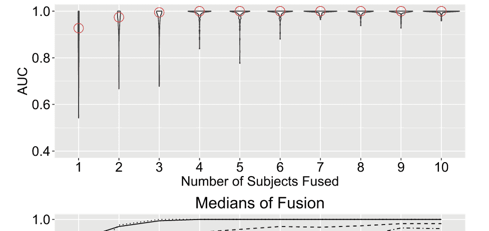

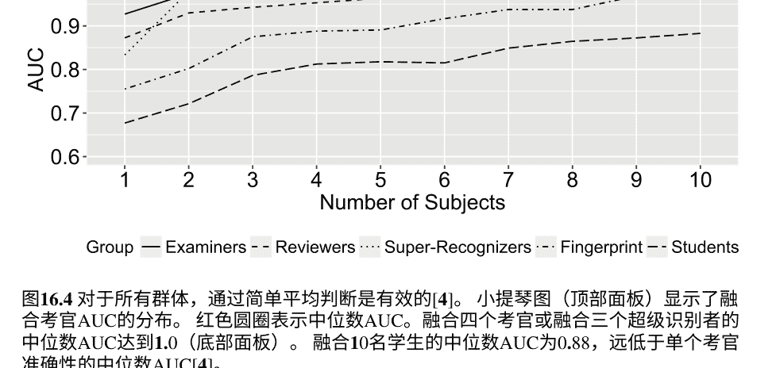

Group — Examiners — Reviewers ··· Super-Recognizers ·· Fingerprint — Students

图16.4 对于所有群体，通过简单平均判断是有效的[4]。小提琴图（顶部面板）显示了融合考官AUC的分布。红色圆圈表示中位数AUC。融合四个考官或融合三个超级识别者的中位数AUC达到1.0（底部面板）。融合10名学生的中位数AUC为0.88，远低于单个考官准确性的中位数AUC[4]。

计算策略通常在计算策略中有所不同，并且在个体表现水平上也有所不同[5]。这有时比组合相似的高性能系统更可取[5]。这些研究结果促使研究人员探索利用人脸识别算法和人类参与者所采用的多样策略，以实现最佳准确性的方法。具体而言，研究人员已经将人类主体和基于计算机的人脸识别算法在一组困难的人脸图像对上的相似度评分进行了组合。这些融合是通过各种众包方法实现的。

在一项早期研究中，通过七个人脸识别算法和未经训练的人类参与者产生的相似度分数被用于通过PLS-R推导的相似度分数的加权组合来预测不同难度的人脸图像对的匹配状态。这项研究表明，人类和机器的合作可以帮助实现近乎完美的人脸匹配性能[5]。

## 16.5 战略差异：法医面部鉴定员与未经训练的人类

在前一节中，我们提出了一些研究，证明了不同组人类参与者在人脸识别方面的准确性差异。这些准确性差异可能基于在应用单一策略方面的技能水平差异，也可能基于使用不同的人脸识别策略。对于前者，可能所有人类都使用相同的策略，只是其中一些人在应用上更加熟练。对于后者，可能不同的人以不同的方式处理任务。当策略不同时，融合应该能够取得最好的效果。因此，融合为探索个体和群体策略提供了一种有用的方法。

除了准确度水平的差异之外，面部识别文献还明确指出，观察者使用各种策略。这些策略在人们关注的面部区域、比较方法和/或报告反应的方式上有所不同。研究专业法医面部检查员和未经训练的个体之间的策略差异是有限的。在这里，我们列出并回顾了两项最近研究中的四个发现，这些发现提供了证据表明法医面部检查员和未经训练的人类受试者的策略不同[3, 35]。

首先，人类使用的策略差异的最常见例子是是否使用构型或基于特征的面部部分析。面部的构型信息基于面部特征的关系配置（例如，眼睛之间的间距）[37]。基于特征的处理侧重于对单个特征（例如，眼睛、鼻子）的孤立分析。在心理学中，区分这两种策略的一种方法是将图像倒置呈现给受试者。这被认为会破坏构型处理，同时允许基于特征的分析进行proceed [38]。鉴定人在翻转面孔时比未经训练的人受到的影响较小，表明他们对构象处理的依赖较少[3]。 这个结果与未经训练的人在面孔记忆测试中的发现有些不一致，在这些测试中，表现较好的人更多地依赖于构象处理而不是基于特征的处理。 在这里，法医鉴定人员展示了一种对于未经训练的人来说并不理想的策略，但却取得了出色的结果。

其次，在相同的一组测试中[3]，法医面部鉴定人员在观看图像30秒时比未经训练的人群表现出更大的准确性优势，但在观看面部图像仅2秒时没有这种优势。 这表明鉴定人员需要更多的分析时间才能超过未经训练的人群。

专业鉴定人员和未经训练的人之间的第三个策略差异来自于这些群体对测试项目的响应方式以生成一个识别决策。 鉴定人员整体准确性优势的不成比例是由于他们能够准确判断身份是否不同，而不是他们能够验证两个图像是否显示相同的身份。 这部分是由于鉴定人员使用响应量表的谨慎方式，与未经训练的群体相比[35, 39]。

第四，众所周知，法医面部鉴定员比起身体信息更有效地利用面部信息[35]。 具体而言，当面部与身体中的身份信息质量被操纵时，未经训练的人类会自发地利用身体中的身份信息，如果面部仅提供有限的身份信息[34]。 法医面部鉴定员不会像身份识别那样充分利用身体信息。 鉴定员“忽视”这些信息的一个可能解释是他们在面部分析方面接受了严格的培训。 这可能增强了他们在内部面部特征的详细检查能力，但在这些特征的使用有限时，会限制他们使用外部信息的灵活性[35]。

总之，鉴定员、学生和计算机算法使用各种策略。 在下一节中，我们将说明一种特殊情况的战略差异，这可能是人类和机器面部识别性能的基础。这是当人们/机器从特定种族的面孔学习，并在不同种族的面孔上进行测试的情况。

## 16.6 人类和机器中的其他种族效应

人脸识别准确性受到观察者的种族和被识别人的种族的影响。 从形式上讲，这种“其他种族效应”被定义为对“同种族”面孔相比“其他种族”面孔具有更高的识别准确性的倾向[40, 41]。 种族对人类面孔识别准确性的稳健影响已经在多个种族/民族和年龄子群体以及不同的实验设计中进行了研究和发现[41]。

然而，这些影响的含义超出了实验室环境的限制。 其他种族效应导致了法律上的识别错误执法和司法系统中也存在这种效应（参见[42-44]对该效应在司法系统中的综述）。 例如，根据Innocence Project的数据，一个致力于为无辜被定罪的个体辩护的组织，41%的通过DNA证据证明无罪的案件涉及目击者错误识别中的某种形式的跨种族错误识别（Innocence Project 2015）。 司法系统中这一被广泛记录的弱点使其成为一个值得探索的问题。 此外，尽管对这种效应进行了几十年的研究，但我们对这种现象如何影响人脸识别算法知之甚少。随着这些算法在安全应用中的增加使用，了解种族在算法准确性中的作用程度至关重要。 在本节中，我们描述了人类中其他种族效应的证据，并讨论了其可能的原因。 我们还提供了有限但至关重要的关于种族如何影响人脸识别算法性能的研究证据。

从人类开始，其他种族效应已经在多个人口群体中进行了研究并得到证实。种族影响成年人的识别准确性，并且已经在五岁的儿童中发现[45-47]。有证据表明，对于自己种族和其他种族的面孔，感知专业优势在婴儿期就开始出现[48, 49]。种族对于身份识别准确性的影响已经在非典型发展人群中得到报道，包括患有精神分裂症的个体[50]和自闭症谱系障碍的个体[51, 52]。值得注意的是，其他种族效应也在多个实验范式中得到证实，包括面部身份匹配任务[53]、目击者阵容[54, 55]、旧/新或是/否记忆条件[40, 56]、姓名学习[57]和阵容构建任务[58]。 尽管这些研究中的刺激和实验参数差异很大，但种族对面部识别/身份识别准确性的一致影响使得其他种族效应成为科学家们极为关注的问题。

鉴于其他种族效应的明显负面影响，一些研究还研究了减轻这种效应的策略。例如，参与者意识到其他种族效应[56]和观看其他种族面孔的夸张图像[59]已被证明可以减轻其影响。 发展研究表明，婴儿的感知训练可以防止其他种族效应的出现[60]。对其他种族面孔的感知和个体化训练的影响已经在儿童[61]和成年人[62-64]中进行了研究。 重要的是，这些研究还表明这些干预措施的减轻效果是暂时的。

### 16.6.1 其他种族效应的理论

鉴于其强大的影响力和在应用环境中可能产生严重后果的潜力，大量的研究已经集中在调查其他种族效应的原因上[65-67]。 从这项研究中，出现了两个主要模型来解释其他种族效应：感知专业知识模型和社会认知模型。

感知专业模型表明，对自己种族面孔的增加经验有选择性地或至少是优先地提高了面孔识别准确性[41, 68]。然而，受经验影响的精确机制仍然存在争议（参见[67]）。一个可能性是，专业知识提高了人们分析面孔构造的能力。构造处理被认为比基于特征的处理提高了识别准确性[37]。几项研究表明，自己种族的面孔被构造处理，而其他种族的面孔则采用更多基于特征的策略处理[67, 69–71]。值得注意的是，感知专业对面孔识别准确性的提高程度仍然不确定。尽管有证据支持对某种种族面孔的经验的好处，但这种经验的数量仅解释了其他种族效应的一小部分变异[41]。其他研究表明，经验的类型而不是数量对其他种族面孔识别准确性至关重要。因此，似乎定性经验而不是纯粹的定量暴露可能是促进构造整体处理[72]，从而最终提高准确性的原因。

对专业模型的支持也来自于操纵与其他种族面孔的经验的研究。例如，[47]发现在有更多其他种族经验的儿童和青少年中，其他种族效应减少。单一种族的英国白人儿童显示出典型的其他种族效应，并且对自己种族（高加索人）的面孔比其他种族（中国人、马来人和非洲黑人）的面孔有更高的识别准确性。相反，多种族的马来西亚华人儿童显示出其他种族效应，但只对他们接触较少的种族（非洲黑人）的面孔有效。研究还表明，对其他种族面孔的增加经验可以完全扭转种族效应的影响[73]。例如，一项研究表明，韩国成年人在3-9岁时被欧洲父母收养，显示出了反向的其他种族效应（对高加索人的面孔比对亚洲人的面孔有更高的识别准确性）[73]。有趣的是，韩国成年人在高加索人的面孔上的准确性与法国本土出生的高加索参与者相当。这些结果支持经验对其他种族效应的影响以及这种其他种族经验如何缓解其他种族效应。

社会认知模型认为，他种族效应是由人类倾向于以社会群体的形式来感知个体[67]。“内群体”由我们认为与自己相似（在人口统计和社会方面）的人组成。“外群体”是我们认为在这些方面与自己不同的人。

这种社会认知模型解释了我们将内群体的人视为个体，将外群体的人视为类别，而不是个体的倾向[74, 75]。作为对他种族效应的解释，社会认知模型适用如下。因为我们将外群体成员（例如，其他种族的个体）视为类别而不是个体，所以我们只关注表面的面部特征（即肤色或头发颜色）。这些特征不足以区分个人。

接下来，我们考虑算法的他种族效应。尽管人类的表现可能受到社会感知和动机的影响，但这显然不是算法关心的情况。因此，我们对此进行了限制对感知专业模型的讨论。有关其他种族对人脸识别准确性的影响模型的讨论，请参见[65-67]。正如我们所看到的，用于训练算法的数据对算法性能有很大影响。正如我们将看到的，专业水平通过训练数据的质量来衡量，包括自己和其他种族的面孔，影响算法性能。

### 16.6.2 机器中的其他种族效应

鉴于种族对人脸识别的强烈影响，长期以来一直有研究探讨其对识别算法和训练模型的影响[6, 76, 77]。在一项早期研究中（1991年），使用“多数”和“少数”种族的面孔训练了一个自联想神经网络模型。多数和少数仅通过两种种族面孔的训练数据不平衡来定义[76]。结果显示，该网络对多数种族的新颖（未经训练）面孔的表示比对少数种族的新颖面孔的表示更准确[76]。此外，为了测试关联网络是否创建了比多数种族面孔更少个体化的少数种族面孔的表示，计算了平均面间相似度。少数种族的面间相似度大于多数种族面孔的面间相似度。这个结果与“其他种族的面孔看起来都一样”的古老格言一致。

随着时间的推移，神经网络模型，大约在2002年，提供了对感知专业理论中可能的潜在计算机制的一瞥[6]。使用现有模型，研究人员发现只有一部分人脸识别算法存在其他种族效应。这些算法是通过经验开发出的表征系统，其对不同种族的面孔的感知空间进行了扭曲，以敏感地反映模型对面孔整体结构的经验。这些模型在某种程度上类似于发展心理学中调用“关键期”机制的语言模型。这种观点认为，对不同语言的经验会结构化感知空间的基本方面，以偏好我们经常听到的语言音素-通常是我们的母语音素。对于面孔来说，这区分了基于经验的影响发生的时间，并且可能表明其他种族效应需要与关键期重合，即视觉特征集发展的关键时期，此时需要对其他种族的经验进行及时的体验。

在一项早期研究中，大约在2011年，研究人员对不同国家开发的人脸识别算法进行了差异性分析[77]。在该研究中，来自人脸识别供应商测试2006年（FRVT-2006）的13个算法被用作测试算法[18]。其中八个算法是在西方国家（美国、德国、法国）开发的，五个算法是在东亚国家（中国、日本、韩国）开发的。西方国家开发的算法被融合在一起，形成一个单一的“西方”算法。同样，来自东方国家的算法被融合在一起，形成一个“东亚”算法。然后，将融合的西方和东方算法在受控和非受控的高加索人和东亚人脸上进行了测试。机器准确性反映了人类中发现的经典的其他种族效应。西方融合算法在高加索人脸上更准确，而东亚融合算法在东亚人脸上更准确。这种其他种族效应被归因于在东亚训练的算法主要是用东亚人脸进行训练，而在西方国家训练的算法主要是用高加索人脸进行训练的可能性。在这个时代，更多的工作更广泛地研究算法在多个人口统计类别（种族、性别、年龄）上的性能显示出类似的挑战[78]。为了比较人类和机器的识别能力，研究人员使用了一个较少数量的人脸对的简化版本的实验。人类参与者表现出经典的其他种族效应，对高加索人脸有轻微但不显著的优势。此外，两种算法在识别高加索人脸对方面表现更好。然而，对于高加索算法而言，高加索人脸的优势比东亚算法更大，这再次证明了其他种族效应的存在。

这种整体上的高加索人优势被归因于研究人员预计FRVT-2006中提交的算法将主要用于测试高加索人脸。这些结果表明算法的起源和训练数据对于构建更好的自己与他人种族脸部表征都起着至关重要的作用。如果这些算法要在不同人群中使用，那么训练数据必须反映出这种多样性。

基于深度卷积神经网络的最新一类人脸识别算法在2015年左右达到了最先进的水平。这些算法在不同种族的人脸上的表现也不同[79, 80]（有关该主题截至2019年的综述请参见[80]）。美国国家标准与技术研究院（NIST）于2019年发表的一项全面而彻底的人脸识别算法种族偏见测试显示，不同算法在不同性能指标（例如误报率）上存在各种偏见效应。尽管这些测试中关于人脸种族的元数据有限，并且可能与较早的更受控制的研究不直接可比，但该研究仍然表明人脸识别中的种族问题尚未解决。需要更系统的方法来衡量人脸识别算法中的种族偏见[80]。在这个努力中面临的挑战包括理解数据驱动因素（例如训练和测试数据中的人口分布）和应用因素（例如阈值设置）对这些算法的影响。关于这些因素及其对不同种族性能的潜在影响的全面分析和讨论可在[80]中找到。

## 16.7 总结

总之，我们已经研究了人类和机器在面部识别问题上的多样化方法。了解这种多样性可能是开发和实施人类、机器以及人类与机器之间融合策略的先决条件。这些最终可以提高面部识别在安全和执法应用中的准确性。

需要最高准确性的面部识别在安全和执法应用中。

## 参考文献

-   1. Jeckeln G, Hahn CA, Noyes E, Cavazos JG, O’Toole AJ (2018) Wisdom of the social versus non-social crowd in face identification. B J Psychol
-   2. White D, Burton AM, Kemp RI, Jenkins R (2013) Crowd effects in unfamiliar face matching. Appl Cogn Psychol 27(6):769–777
-   3. White D, Phillips PJ, Hahn CA, Hill M, O’Toole AJ (2015) Perceptual expertise in forensic facial image comparison. Proc R Soc B 282(1814):20151292
-   4. Phillips PJ, Yates AN, Hu Y, Hahn CA, Noyes E, Jackson K, Cavazos JG, Jeckeln G, Ranjan R, Sankaranarayanan S等 (2018) ：法医检查员、超级识别者和人脸识别算法的人脸识别准确性。在：国家科学院的论文集，p 201721355
-   5. O’Toole AJ, Abdi H, Jiang F, Phillips PJ (2007) ：融合人脸验证算法和人类。IEEE Trans Syst Man Cybern Part B (Cybern) 37 (5) ：1149-1155
-   6. Furl N, Phillips PJ, O’Toole AJ (2002) ：人脸识别算法和种族效应：发展接触假设的计算机机制。Cogn Sci 26 (6) ：797-815
-   7. Damasio AR, Damasio H, Van Hoesen G W (1982) ：失认症的解剖基础和行为机制。神经学32 (4) ：331


- 8. Russell R, Duchaine B, Nakayama K (2009) 超级识别者：具有非凡面部识别能力的人们。Psychon Bull Rev 16(2):252–257
- 9. Young AW, Burton AM (2017) 我们是面部专家吗？认知科学的趋势
- 10. Johnston RA, Edmonds AJ (2009) 熟悉和陌生面识别：一项综述。记忆17(5):577–596
- 11. Carl Metzgar CSP, A (2012) 加强美国的法医科学：一条前进的道路。Prof Saf 57(1):32
- 12. FI, SW, Group et al (2012) 面部比较方法指南
- 13. Phillips PJ, Moon H, Rizvi SA, Rauss PJ (2000) 面部识别算法的FERET评估方法。IEEE Trans Pattern Anal Mach Intell 22(10):1090–1104
- 14. Phillips PJ, Flynn PJ, Scruggs T, Bowyer KW, Chang J, Hoffman K, Marques J, Min J, Worek W(2005) 面部识别大挑战的概述。在：IEEE计算机学会会议计算机视觉和模式识别CVPR 2005，卷1。IEEE，pp 947–95
- 15. Phillips PJ, Scruggs WT, O’Toole AJ, Flynn PJ, Bowyer KW, Schott CL, Sharpe M (2010)Frvt 2006和ice 2006大规模实验结果。IEEE Trans Pattern Anal Mach Intell32(5):831–846
- 16. Phillips PJ, Beveridge JR, Draper BA, Givens G, O’Toole AJ, Bolme D, Dunlop J, Lui YM, Sahibzada H, Weimer S (2012) 好的、坏的和丑陋的面部挑战问题。图像Vis Comput 30(3):177–185
- 17. Phillips PJ, O’Toole AJ (2014) 在面部识别实验中比较人类和计算机的表现。图像视觉计算 32(1):74–85
- 18. Phillips PJ, Jiang F, Ayyad J, Pénard N et al (2007) 面部识别算法在光照变化下超越人类匹配面部。IEEE Trans Pattern Anal Mach Intell 9:1642–1646
- 19. O’Toole AJ, An X, Dunlop J, Natu V, Phillips PJ (2012) 将面部识别算法与人类在具有挑战性的任务上进行比较。ACM应用感知（TAP） 9(4):16
- 20. Sun Y, Wang X, Tang X (2014) 通过预测10,000个类别进行深度学习人脸表征。在：计算机视觉和模式识别IEEE会议论文集，pp 1891-1898
- 21. Sun Y, Wang X, Tang X (2013) 用于人脸验证的混合深度学习。在：计算机视觉IEEE国际会议论文集，pp 1489-1496
- 22. Parkhi OM, Vedaldi A, Zisserman A等（2015）深度人脸识别。BMVC 1(3):6
- 23. Chen J-C, Ranjan R, Kumar A, Chen C-H, Patel VM, Chellappa R (2015) 用于无约束人脸验证的端到端系统，采用深度卷积神经网络。在：计算机视觉IEEE国际会议论文集，pp 118-126.
- 24. Sankaranarayanan S, Alavi A, Castillo C, Chellappa R (2016) 用于人脸验证和聚类的三元概率嵌入。arXiv:1604.05417
- 25. Taigman Y, Yang M, Ranzato M, Wolf L (2014) Deepface：缩小面部验证与人类水平性能的差距。在：计算机视觉和模式识别的IEEE会议论文集，第1701-1708页
- 26. Schroff F, Kalenichenko D, Philbin J (2015) Facenet：面部识别和聚类的统一嵌入。在：计算机视觉和模式识别的IEEE会议论文集，第815-823页
- 27. Huang GB, Mattar M, Berg T, Learned-Miller E (2008) 野外标记人脸数据库：用于研究非受限环境下面部识别。在：面部在“真实-生活”图像中的检测、对齐和识别研讨会
- 28. Kumar N, Berg AC, Belhumeur PN, Nayar SK (2009) 用于人脸验证的属性和类比分类器。在：2009年IEEE第12届国际计算机视觉会议，第365-372页。IEEE
- 29. Whitelam C, Taborsky E, Blanton A, Maze B, Adams JC, Miller T, Kalka ND, Jain AK, Duncan JA, Allen K et al (2017) IARPA Janus Benchmark-B Face Dataset. 在：CVPR研讨会，pp 592–600
- 30. Miller D, Brossard E, Seitz S, Kemelmacher-Shlizerman I (2015) Megaface: a million faces for recognition at scale. arXiv:1505.02108
- 31. Kittler J (1998) Combining classifiers: a theoretical framework. Pattern Anal Appl 1(1):18–27
- 32. Condorcet MD (1785) Essay on the application of analysis to the probability of majority decisions. Paris: Imprimerie Royale
- 33. Dowsett AJ, Burton AM (2015) Unfamiliar face matching: pairs outperform individuals and provide a route to training. B J Psychol 106(3):433–445
- 34. Rice A, Phillips PJ, Natu V, An X, O’Toole AJ (2013) 当面部识别失败时，从身体上识别不知情的人。Psychol Sci 24(11):2235–2243
- 35. Hu Y, Jackson K, Yates A, White D, Phillips PJ, O’Toole AJ (2017) 人物识别：法医面部检查员和未经训练的人在识别中如何依赖面部和身体的定性差异。Vis Cognit 25(4–6):492–506
- 36. Czyz J, Kittler J, Vandendorpe L (2002) 结合面部验证专家。In: 16th International conference on pattern recognition, 2002. Proceedings, vol 2. IEEE, pp. 28–31
- 37. Maurer D, Le Grand R, Mondloch CJ (2002) 配置处理的多个面孔。Trends Cognit Sci 6(6):255–260
- 38. Yin RK (1969) 观察倒置的面孔。J Exp Psychol 81(1):141
- 39. Norell K, Läthén KB, Bergström P, Rice A, Natu V, O’Toole A (2015) 图像质量和法医专业知识对面部图像比较的影响。J Forensic Sci 60(2):331–340
- 40. Malpas RS, Kravitz J (1969) 对自己和其他种族的面孔的识别。J Pers Soc Psychol 13(4):330
- 41. Meissner CA, Brigham JC (2001) 对自己种族偏见在面孔记忆中的研究三十年：一项元分析回顾。Psychol Public Policy Law 7(1):3
- 42. Sporer SL (2001) 跨种族效应：超越实验室中对面孔的识别。Psychol Public Policy Law 7(1):170
- 43. Wells GL, Olson EA (2001) 对目击者识别中的异族效应：我们该怎么办呢？心理学公共政策法律7(1):230
- 44. Wilson JP, Hugenberg K, Bernstein MJ (2013) 异族效应和目击者识别：如何改善识别并减少目击者情况下的决策错误。社会问题政策评论7(1):83-113


# 第17章 人脸识别系统的评估

Patrick Grother和Mei Ngan

尽管自从开始以来，人脸识别研究一直是持久且受欢迎的，但近年来由于几个因素的共同作用，特别是先进的机器学习算法的发展、免费且稳健的软件实现、运行它们的速度越来越快的GPU处理器、大量的网络爬取人脸图像数据库、开放的性能基准以及充满活力的人脸识别文献，这项研究有了显著的提升。

45. Pezdek K, Blandon-Gitlin I, Moore C (2003) 儿童面孔识别记忆：异族效应的更多证据。应用心理学88(4):760

46. Anzures G, Kelly DJ, Pascalis O, Quinn PC, Slater AM, De Viviés X, Lee K (2014) 儿童的自己和异族面孔身份识别：姿势和特征组合的影响。Dev Psychol 50(2):469

47. Tham DSY, Bremner JG, Hay D (2017) 多种族儿童中的异族效应：跨文化比较。J Exp Psychol 155:128–137

48. Sangrigoli S, De Schonen S (2004) 三个月大婴儿对自己种族和其他种族的面孔的识别。J Child Psychol Psychiatry 45(7):1219–1227

49. Kelly DJ, Quinn PC, Slater AM, Lee K, Ge L, Pascalis O (2007) 异族效应在婴儿期发展：感知收窄的证据。Psychol Sci 18(12):1084–1089

50. Pinkham AE, Sasson NJ, Calkins ME, Richard J, Hughett P, Gur RE, Gur RC (2008) 在患有精神分裂症的非洲裔美国人和白人个体中的面孔处理中的异族效应。Am J Psychiatry 165(5):639–645

51. Wilson CE, Palermo R, Burton AM, Brock J (2011) 自闭症谱系障碍中对自己和其他种族面孔的识别。Q J Exp Psychol 64(10):1939-1954

52. Yi L, Quinn PC, Feng C, Li J, Ding H, Lee K (2015) 自闭症谱系障碍个体是否以不同方式处理自己和其他种族的面孔？Vis Res 107:124-132

53. Megreya AM, White D, Burton AM (2011) 其他种族效应不依赖于记忆：来自匹配任务的证据。Q J Exp Psychol 64(8):1473-1483

54. Evans JR, Marcon JL, Meissner CA (2009) 跨种族阵容识别：评估上下文恢复的潜在好处。心理犯罪法律15(1):19-28

55. Jackiw LB, Arbuthnott KD, Pfeifer JE, Marcon JL, Meissner CA (2008) 使用高加索人和第一民族样本检验阵容识别中的跨种族效应。加拿大大行为科学杂志/加拿大大行为科学评论40(1):52

56. Hugenberg K, Miller J, Claypool HM (2007) 跨种族识别缺陷中的分类和个体化：解决一个隐匿问题的方法。J Exp Soc Psychol 43(2):334-340

57. Hayward WG, Favelle SK, Oxner M, Chu MH, Lam SM (2017) 面孔学习中的其他种族效应：使用自然图像研究面种族族效应在学习范式中的影响。Q J Exp Psychol 70(5):890–896

58. Brigham JC, Ready DJ (1985) Own-race bias in lineup construction. Law Hum Behav 9(4):415–424

59. Rodríguez J, Bortfeldt H, Gutiérrez-Osuna R (2008) 通过漫画减少其他种族效应。在：第8届IEEE国际自动人脸和手势识别会议，2008年。FG'08. IEEE，第1-5页

60. Heron-Delaney M, Anzures G, Herbert JS, Quinn PC, Slater AM, Tanaka JW, Lee K, Pascalis O (2011) 感知训练防止婴儿时期出现其他种族效应。PLoS One 6(5):e19858

61. Xiao WS, Fu G, Quinn PC, Qin J, Tanaka JW, Pascalis O, Lee K (2015) 与其他种族面孔的个体化训练减少学前儿童的内隐种族偏见：儿童面孔的感知和社会表征之间的联系。Dev Sci 18(4):655–663

62. Tanaka JW, Pierce LJ (2009) 其他种族面孔识别的神经可塑性。认知情感行为神经科学9(1):122-131

63. Matthews CM, Mondloch CJ (2018) 改善新遇到的面孔的身份匹配：多图像训练的影响。应用研究记忆认知7(2):280-290

64. Cavazos JG, Noyes E, O'Toole AJ (2018) 学习背景和其他种族效应：改善面孔识别的策略。视觉研究

65. Sporer SL (2001) 识别其他族裔的面孔：理论的整合。心理公共政策法律7(1):36

66. Hugenberg K, Young SG, Bernstein MJ, Sacco DF (2010) 分类-个体化模型：其他种族识别缺陷的综合解释。心理评论117(4):1168

67. Young SG, Hugenberg K, Bernstein MJ, Sacco DF (2012) 面孔识别中的感知和动机：对跨种族效应理论的批判性回顾。个人社会心理评论16(2):116-142

68. Diamond R, Carey S (1986) 为什么面孔既特殊又不特殊：一种专业知识的影响。J Exp Psychol: Gen 115(2):107

69. Rhodes G, Brake S, Taylor K, Tan S (1989) 专业知识和构型编码在面部识别中的作用。B J Psychol 80(3):313–331

70. Rhodes G, Hayward WG, Winkler C (2006) 专家面部编码：自己种族和其他种族面孔的构型和组件编码。Psychon Bull Rev 13(3):499–505

71. Tanaka JW, Kiefer M, Bukach CM (2004) 面部识别中自己种族效应的整体解释：来自跨文化研究的证据。Cognition 93(1):B1–B9

72. Bukach CM, Cottle J, Ubiwa J, Miller J (2012) 个体化经验预测白人和黑人参与者在整体加工中的其他种族效应。Cognition 123(2):319–324

73. Sangrigoli S, Pallier C, Argenti A-M, Ventureyra V, de Schonen S (2005) 在儿童期面部识别中的异族效应的可逆性。Psychol Sci 16(6):440–447

74. Bodenhausen GV, Macrae CN, Hugenberg K (2003) 激活和抑制社会身份：对自我和他人的感知的影响。在：社会认知的基础：献给Robert S. Jr. Erlbaum的纪念文集，Wyer

75. Millon T, Lerner MJ, Weiner IB (2003) 心理学手册：个性和社会心理学。Wiley，新泽西

76. O'Toole AJ, Deffenbacher K, Abdi H, Bartlett JC (1991) 模拟“异族效应”作为感知学习问题。Connect Sci 3(2):163–178

77. Phillips PJ, Jiang F, Narvekar A, Ayyad J, O'Toole AJ (2011) 面部识别算法的异族效应。ACM应用感知（TAP）8(2):14

78. Klare BF, Burge MJ, Klontz JC, Bruegge RW, Jain AK (2012) 面部识别性能：人口统计信息的作用。IEEE信息取证与安全交易7（6）：1789-1801

79. Grother P, Ngan M, Hanaoka K (2019) 面部识别供应商测试（FRVT）第3部分：人口统计效应。国家标准与技术研究所

80. Cavazos JG, Phillips PJ, Castillo CD, O'Toole AJ (2020) 面部识别算法的准确性比较：我们在测量种族偏见方面的进展如何？IEEE生物识别、行为和身份科学交易

新算法主要是为了展示对姿态、光照和表情变化具有不变性，这些变化是照片新闻和社交媒体图像的特征。最初的研究[1,2]使用了大量的相对较少（~10^4）个人的图像来学习不变性。不可避免地，更大规模的人口（~10^7）被用于训练[3,4]，但基准数据集`lfw`的`eer`度量[5]代表了一个简单的任务：在非常高的错误匹配率下进行一对一的验证。

尽管随后出现了更大规模的识别基准（`Megaface` [6]），但其主要指标，即排名第一的命中率，与大规模政府人脸识别应用中所需的高阈值判别任务形成了对比，即凭证去重、执法和情报搜索。在包含多达10^8个个体的图库中进行识别必须使用很少的图像，并采用严格的阈值以实现非常低的误报识别率。

技术进步已大大减少了识别错误。最大的独立发布基准测试，NIST的人脸识别供应商测试[7]，已经记录下领先的商业算法在2018年与2013年相比，在相同的肖像图像识别任务中，1.6百万个图库规模下产生的虚假阴性数量减少了二十倍。这与2010年至2013年间错误率仅下降了两倍的进展形成了对比。

任务。这些收益在高和低误报率的情况下都能实现，表明基于`CNN`的算法既具有不变性又具有区分性。

这表明主要的商业开发者已经将基于卷积神经网络（`CNN`）的算法集成并在许多情况下替代了现有算法。

本章涵盖了评估中的一些主题，其中一些在研究环境中经常被忽视，但却涉及操作上的问题。这些问题包括低误报率、冒名分布稳定性和计算资源的测量。

## 17.1 引言

人脸识别的进展一直以来都是通过评估来支撑的，即通过准确性的量化来评估算法是否优于其前辈和竞争对手。大多数评估工作都是在开发者的实验室中进行的，并且与研究密切相关。在大学环境中，经过同行评审的期刊通常要求准确性与已发布的基准进行比较。

然而，在商业环境中，结果很少见到公开。在这两种情况下，开发者通常对缺乏合适的图像数据集感到沮丧。

近年来，这种限制已经解除，因为人脸图像可以从互联网上获取，很多情况下是从带有身份标签的照片中获取，这些照片存储在摄影、新闻和尤其是社交媒体网站上。这主要是由于数码相机的出现，特别是智能手机，以及互联网作为分发机制的关键。

无论可用数据的数量如何，研究人员通常会使用数据进行迭代的构建-测试-优化过程，其中会分离出错误案例并进行算法处理。这个过程可能会暴露数据集中的真实身份错误。它还可能导致算法专业化，并阻碍算法对其他数据集的泛化能力。

### 17.1.1 评估目标

尽管技术发展迅速，但人脸识别算法评估的目标保持一致。从根本上说，对操作数据上人脸识别软件进行独立评估可以公平、可重复和相关地评估核心能力的性能。能力测试建立了技术是否可行以及可能性的标准，了解技术的限制，并评估应用和技术要求是否能够满足。对算法进行比较测试可以了解哪些技术有效，哪些技术无效。这支持最终用户在采购决策中，并推动新技术的进步。性能的纵向监测提供了定量的数据。

性能提升的测量和影响升级计划和合同重新竞标。人脸识别错误会产生成本，例如无法注册（`FTE`）会增加额外的时间、程序、模态和流程，因此对这些数量的测量支持塑造操作预期，如果软件部署了。

表征性能允许采取措施来减轻风险，例如，发现`FTE`非常高时，可以通过环境重新设计来调节环境光线或其他故障原因。

## 17.2 验证

本节提供了验证的度量标准。识别将在后面处理。验证任务是基本的生物特征操作，用于确定两个图像是否属于同一人脸。验证现在是生物特征技术中最常见的应用，广泛应用于访问控制和认证，特别是在移动电话上。它量化了回答两个样本是否来自同一个人的问题的能力。验证涉及对一个特定（先前的）参考样本进行验证样本的身份声明。比较可以是真实的或冒名顶替的比较，前者通常被称为真实或配对比较。对于大多数算法开发来说，通过运行验证测试来量化核心算法效能是合理且足够的，`lfw`[5]任务是最著名的任务之一。

### 17.2.1 指标

术语：本节定义了错误的非匹配率（`FNMR`）错误的匹配率（`FMR`）。在决策理论中，它们通常是第一类和第二类错误率，分别是。这些是基本的样本比较匹配错误率。学术文献中通常使用错误接受率（`FAR`）和错误拒绝率（`FRR`），但工业实践和正式标准化的生物特征性能测试将这些术语保留用于表示涉及人类与生物特征系统之间的整个交互的事务错误率。这可能涉及多个展示、样本和比较。

分数与距离：然而，对于核心算法评估而言，匹配错误率是关键的准确性指标。算法被假定为产生比较分数，在商业人脸识别中通常是非负的相似度分数。在学术环境中，算法通常产生距离（具有度量属性）。在这里的讨论中，分数被假定为相似度分数，具有更高即更相似的语义。距离可以通过单调转换转换为相似度，例如`1/（1 + d）`或否定`U - d`，其中`U`是常数，通常很大。

错误的非匹配计算：给定`N_G`个真实比较的分数，`FNMR`是低于阈值的真实分数的比例，`T`：

```
FNMR(T) = 1 - \frac{1}{N_G} \sum_{i=1}^{N_G} H(s_i - T) \qquad\qquad (17.1)
```

其中步函数`H(x)`在`x≥0`时为1，在其他情况下为0。不等式支持根据分数等于阈值来验证申请人的商业约定。算法在某些输入图像中可能无法生成模板，尤其是在非合作的野外图像中，检测可能会困难。在比较算法时，必须考虑这些所谓的注册失败结果。一种方法是将涉及该模板的任何比较分配低分数，例如0。这模拟了用户的虚假拒绝并增加了`FNMR`。

或者，可以明确包含失败率。例如，考虑由肖像和野外图像组成的`N_G`对图像，分别具有模板生成失败率`F_1`和`F_2`。可以计算出广义的错误非匹配率

```
GFNMR(T) = F_1 + F_2 + (1 - F_1)(1 - F_2)FNMR(T) \qquad\qquad (17.2)
```

修改后的公式对于人在环路测试中进行建模是必要的，例如，如果主体无法注册，则不继续进行测试的策略。

虚假匹配计算：使用来自`N_I`冒名顶替比较的分数来计算虚假匹配率 (`FMR`)，该比率表示冒名顶替比较中得分在或高于`T`的比例：

```
FMR(T) = \frac{1}{N_I} \sum_{i=1}^{N_I} H(s_i - T) \qquad\qquad (17.3)
```

在算法无法从输入图像中生成模板的情况下，任何涉及该模板的比较的结果将再次被赋予低分数。这种做法实际上有利于减少虚假匹配率 (`FMR`)。

### 17.2.2 错误权衡特性

`FNMR`量化用户的不便；`FMR`量化冒充者能够错误匹配身份的可能性。在强身份验证过程中，需要较低的`FMR`值，因此生物特征性能的最重要描述是绘制`FNMR(T) vs FMR(T)`。这样的绘图是一个错误权衡特性，其中一个示例如图17.1所示。请注意，当经验计算时，`DET`点通过水平和垂直线连接，因此常见术语`DET curve`是不正确的。

**`DET`和`ROC`的关系：** 接收器操作特性（`ROC`）是传统上真实匹配率（`TMR = 1 - FNMR`）对`FMR`的绘图，因此与`DET`只有微小的不同。然而，应该优先选择`DET`，因为对于高精度的生物特征，`TMR`值接近1，该范围内的差异可视化变得困难。对数`FNMR`轴会展开绘图，很容易显示出例如`FNMR`减少一半的因素。

**轴缩放：** 这个绘图使用检测错误权衡特性（`DET`）一词——“检测”一词来自雷达应用中的目标检测，尽管在语音识别社区中，它被用于两个轴都经过`probit`变换的特殊情况，以使正常的真实和冒名顶替者的分数分布在绘图上呈直线。实际上，研究人员应该使用适当的缩放方式——线性、`probit`、对数-对数、对数-线性，以便良好地可视化错误率。所有这些绘图都可以称为`DET`。

**低`FMR`的重要性：** 不幸的是，在文献中常常使用线性坐标轴绘制错误权衡特性与`FMR`的关系。这限制了典型操作值范围的区间，`[0.0001, 0.01]`，在可见图中只强调了无关紧要的`FMR`值，`[0.1, 1]`。这个问题促使改进的`LFW`基准[8]的开发，该基准规定了比原始`LFW`设计[5]中规定的6000个假冒者比较更多的数量。

因此，`DET`通常应该报告具有转换后的`FMR`轴，通常是对数坐标轴，如图17.1所示，除非可以证明线性范围是合理的。`FMR`应该跨越从数据统计上支持的最低值到至少0.1的区间。图17.1以对数刻度绘制的检测错误权衡特性示例。

不确定性：测试本身和报告的结果应该支持足够低的值来表示某些应用的定量化。给定一组 \(N_I\) 冒名顶替比较的分数，对于任何阈值 \(T_0\)，\(FMR(T_0)=0\)，高于最高观察到的冒名顶替分数。在那一点上，二项式统计表明，我们可以有 95% 的信心真正的 FMR 低于 \(3/N_I\)。这假设独立比较，并暗示 DET 图应该只在范围内绘制 \([3/N_I, 1]\)。然而，由于常见且有用的是交叉比较所有可用的图像（N 个图像给出 \(N_I = N(N-1)/2\) 冒名顶替比较），这些将不是独立的，并且将 FMR 绘制到 \(3/N_I\) 比获得 2 \(N_I\) 人的 \(N_I\) pairs 更不可靠但也更不昂贵。国际生物特征性能和报告标准 ISO/IEC 19795-1。有关方差分量、不确定性估计和测试大小的进一步讨论，请参阅 ISO/IEC 19795 性能测试标准的第 1 部分[9]。

### 17.2.3 人口特定的错误率

通常情况下，人脸识别的准确性会随着个体特定的协变量（如性别、年龄和种族）而变化。在那些常见的操作情况下，图像中存在这些变化的情况下，发送给配置有单一阈值的算法，FNMR 和 FMR 值都会变化。虽然常常报告子群体 A、B、C 等的检测率。然而，这些图表忽略了关键信息，即检测率是如何在垂直、水平或某种组合方向上发生偏移的。解决这个问题的可能方法是将真实和冒名分布显示为阈值的函数，或者将固定阈值对应的检测率点进行制表或显示。后一种变体在图 17.2 中显示。

虽然对于所有算法来说，蓝线都在红线下方，这可能被天真地解释为男性比女性更容易被识别，但是对于相等阈值的点的检查显示，差异更多地与更高的错误匹配率有关，在某些情况下超过一个数量级。

人口统计学匹配的冒名顶替者在生物特征算法的测试中，通常使用零努力的冒名顶替者，这意味着使用冒名顶替者对没有考虑生物特征信息进行实验设计。然而，由于面部是一种遗传相关的特征，比较相同性别和国籍的主体面部时，冒名顶替者得分的分布明显较高。如图 17.3 所示。

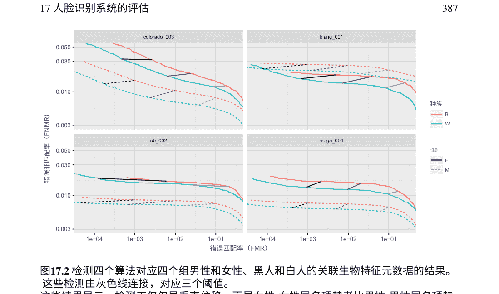

图 17.2 检测四个算法对应四个组男性和女性、黑人和白人的关联生物特征元数据的结果。这些检测由灰色线连接，对应三个阈值。这些结果显示，检测不仅仅是垂直位移，而是女性-女性冒名顶替者比男性-男性冒名顶替者几乎总是产生更高的错误匹配率。未显示的是男性-女性冒名顶替者的数据点。这种类型的图表可以用来显示在某些协变量上 FNMR 和 FMR 的变化。在这里，协变量性别和种族是离散和二元的。

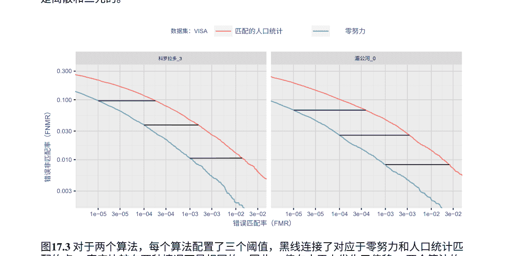

图 17.3 对于两个算法，每个算法配置了三个阈值，黑线连接了对应于零努力和人口统计匹配的点。真实比较在两种情况下是相同的，因此 DET 值在水平上发生了偏移。两个算法的偏移都很大，这在操作上是令人担忧的，因为例如，攻击者不会从不同性别和国籍的主体那里偷走护照。

### 17.2.4 图像特定的错误率

同样，图像特定的协变量，如分辨率和压缩，会影响识别。事实上，主要因素——姿势、光照、表情——已经给数据库命名并推动了整个研究领域。考虑到可以通过设计安装适当的照明，实际识别结果中最有影响力的参数往往是一张照片中头部的方向相对于之前图像中的方向。

使用野生照片和从自动姿势估计工具获得的偏航估计，我们量化了面部识别准确性对偏航的依赖关系。算法补偿视角的能力在图 17.4 中总结，该图显示了面部在注册和验证图像中的偏航角 θ 的假非匹配率作为函数。这些变化范围在 ±90° 之间。每个面板对应于特定阈值下算法的假非匹配率 FNMR。这被设置为对于正面姿势的图像具有 0.001 的假匹配率，即具有 |θ|≤15 的图像。假非匹配率 FNMR 值通常最低为正面对，然后是具有相同偏航角的对，随着偏航角的差异增加而增加。

虽然自 2004 年以来，类似于图 17.4 的图表[10]已经出现在文献中，但偏航对 FMR 的影响很少被报道。可能的假设是不同姿势的面部简单地不匹配，但是在例如手机解锁应用程序中，值得检查非正面呈现是否会导致错误匹配的危险。这在图 17.5 中清晰可见，该图显示了 FMR 本身如何随着偏航角对的变化而变化。该图在全局阈值设置且姿势变化范围广泛的应用中具有相关性。在所有面板中，中心单元格的 FMR=0.001，根据设计。其他偏航角的结果显示不同的行为。

首先，更准确的算法通常对偏航角的 FMR 依赖较弱（灰色的普遍性）。其他算法在角度不同的情况下始终给出较低的 FMR（蓝色的普遍性），这与无法匹配的能力一致。最后一类算法在偏航角不同时给出较高的 FMR（外围的红色普遍性）。这通常是意外和不可取的。如果可以通过设计和捕获时检查来强制实现特定的姿势，那么这些数字就不相关，此时可以设置专用的阈值。

### 17.2.5 摘要统计

默认和推荐的表达验证准确性的方式是以特定 FMR（通常为 FMR=0.001）下的 FNMR 来说明，例如自动边境控制门。这是一种比较核心算法识别能力的标准且简单的方式。然而，在学术文献中，引用摘要统计数据是非常常见的：

-   等错误率：通过从一个检测中找到使得假正例率等于假负例率的阈值来获得的错误率。这个度量标准在 LFW[5] 采用之前就很受欢迎了。

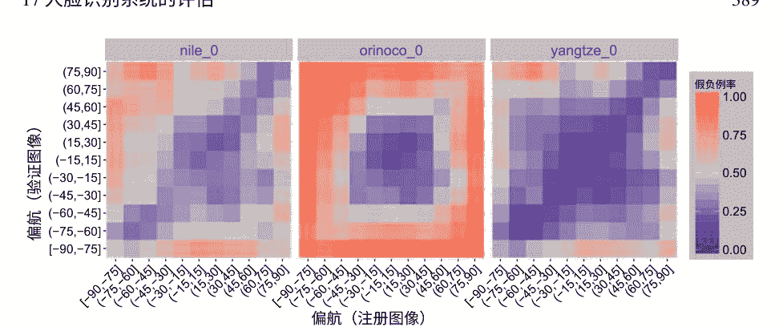

图 17.4 对于 2017 年评估的三个商业算法，该图显示了偏航对注册图像和验证图像之间的假负例率的影响。阈值在所有单元格中都固定为使得在近正面图像上 FMR = 0.001 的值。有三种行为明显可见：相同姿势不变性（左），姿势敏感性（中），以及相当大的姿势不变性（右）。

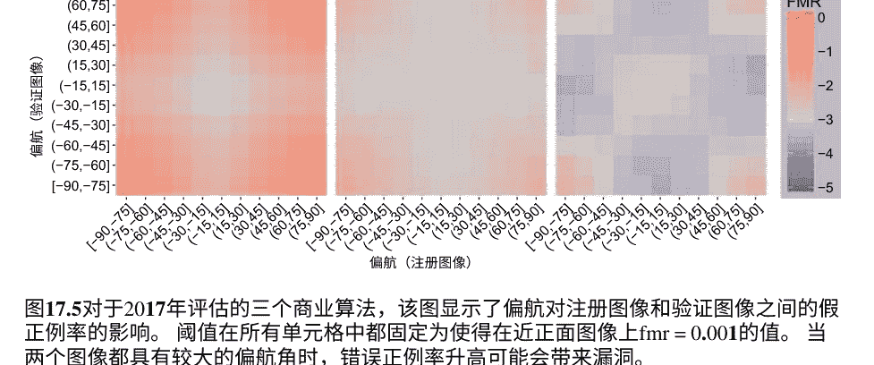

图 17.5 对于 2017 年评估的三个商业算法，该图显示了偏航对注册图像和验证图像之间的假正例率的影响。阈值在所有单元格中都固定为使得在近正面图像上 FMR = 0.001 的值。当两个图像都具有较大的偏航角时，错误正例率升高可能会带来漏洞。

与其基准度量相同的数量。应该弃用因为它通常对应于操作上高且不切实际的 FMR。通常，与 FNMR 相比，操作上的 FMR 要低得多，例如，当 FMR=0.001 且 FNMR=0.01 时。

-   曲线下面积 AUC 是曲线下 ROC 的面积，将 FNMR 在 FMR 上积分，积分范围为 [0, 1]。这个验证度量对应于期望的排名 1 的识别率，在画廊大小为两个且分数独立计算的识别试验中。它受到放射科医生和其他人类研究的青睐，其中分数以非常离散的刻度报告。

-   一半总错误率 HTER 是决策成本函数的一种特殊情况，即（FMR + FNMR）/ 2。

```
$$ DCF(T) = (1 - P) C_{FNM} \text{FNMR}(T) + P C_{FM}\text{FMR}(T) \quad (17.4) $$
```

这个公式表示了一个验证系统所犯错误的（货币）成本，其中比例 P 是冒名顶替的比较，C 是伪造的非匹配和匹配错误的成本。问题在于这两种错误几乎从不具有相等的先验概率和成本。

虽然这些度量是明确定义的、易于计算且相当常见的，但它们都使研究远离对市场使用最有用的低 FMR 区域。它们应该被废弃，而应该优先引用一些低 FMR 的 FNMR，例如 FMR≤0.001。

## 17.3 鉴定

背景：人脸识别市场中最大的部分是鉴定，其中标准化合作肖像图像的鉴定和重复检测是最大的应用。

识别，不涉及身份认证，涉及使用探测模板在一组已注册模板中进行搜索，以返回匹配项（如果有）。许多识别算法实现 1:N 搜索作为 N 个 1:1 比较，然后进行排序操作。在操作中，有两种操作模式：第一种是返回相似度高于某个阈值的任何条目，第二种是返回最相似条目的固定数量，实质上是 k 最近邻搜索。这些任务都不一定需要对所有 N 个注册进行穷举搜索，因此评估不应规定或限制底层实现，例如，要求算法返回所有 N 个比较分数。

从现有身份的注册数据库中搜索探测模板，并检索潜在匹配主体的候选列表。应用通常根据比较的图像类型（例如，驾驶执照照片与监控照片）、注册人口规模以及搜索具有注册配对的先验概率进行区分。在大多数应用中，面部识别算法的核心准确性是最重要的性能变量。

### 17.3.1 闭环与开环身份识别

在一对多识别中，未知图像被搜索与之前收集的 N 个个体的图库进行比对，目标是确定查询主体的身份。

在一个封闭的宇宙中，对图库进行查询的每个主体都已知有一个伴侣（即存在于图库中）。虽然这可能适用于诸如在游轮上进行的一对多搜索，其中每个被搜索的人都已知已登上船，但封闭宇宙应用非常罕见。由于只进行配对搜索，封闭宇宙测试通常报告基于排名的命中率，忽略算法产生的分数，不考虑误报率，并经常在需要大规模人口的政府应用中鼓励错误的优化。

# 封闭宇宙实验与人脸识别性能评估

封闭宇宙实验经常出现在学术测试中[6]。华盛顿大学的 Megaface 挑战[6]是一个开放的学术人脸识别挑战，其中包含一个一对多的协议，评估算法在高达 100 万个干扰者的图库中检索正确结果的能力。该协议是封闭宇宙的，因为它只进行已知存在于图库中的搜索。因此，该挑战报告了识别命中率与干扰者数量和排名的关系，但不报告识别性能与误报率的关系。

大多数应用程序自然地是开放的，其中一部分查询主体在先前注册的身份中没有相应的匹配条目。在高搜索量的应用程序中，大多数搜索没有匹配项（例如，用于赌场监控作弊），重点不是控制误报结果。在低容量应用中，例如银行抢劫调查，将会手动调查误报结果。

从测试的角度来看，开放式环境通过运行匹配搜索和非匹配搜索来实现。非匹配搜索可以根据阈值生成误报识别率。人脸识别算法必须尽量减少误报错误，即错误地返回未注册的人员，以及漏报错误，即错过已注册的人员。这在非匹配搜索的比例特别大的情况下至关重要，特别是在典型的“观察名单”监控应用中，视野中的大多数人员都没有注册，系统应该返回空结果。

因此，在拥挤的火车站中寻找恐怖主义嫌疑人的人脸识别系统必须配置为产生较少的误报，不超过经过训练的审查员可持续判定候选匹配的真实性并采取行动的数量。另一方面，如果未匹配搜索的比例较低，例如顾客进入健身房，系统必须配置为容忍一些误报，即允许偶尔试图进入的非顾客。

## 错误的负面识别性能

需要报告准确性，即根据错误的负面识别率来量化注册者未被识别的频率，以及错误的正面识别率，即算法错误地发出虚假警报的频率。

来自匹配搜索的输出用于计算错误的负面识别率（FNIR）。FNIR 被定义为在前 R 个排名中得分高于阈值 T 的匹配搜索失败的数量。因此，FNIR 被称为错误率。它的值通常会随着注册数据库的大小 N 增加而增加，因为识别算法的任务是为每个注册者分配一个对于所有 N -1 个非匹配注册，将得分设为低分。因此，对于每个 M 个匹配搜索，算法返回 L 个具有假设身份和相似度得分的候选人。如果搜索人脸的身份是 `ID_i`，候选人的身份是 `ID_r`，则

```
FNIR(N, R, T) = 1 - \frac{1}{M} \sum_{i=1}^{M} \sum_{r=1}^{R} H(s_{ir} - T) \delta(ID_i, ID_r) \quad (17.5)
```

其中 `s_{ir}` 是第 r 个最高分数，步函数 `H(x)` 在 `x ≥0` 时为 1，在其他情况下为 0，函数 `δ(x, y)` 在 `x = y` 时为 1，在其他情况下为 0。

在算法无法从探测输入图像中生成模板的情况下，传统上，FNIR 计算通过将得分设为低分 `-∞`，并将排名设为高排名 `L+1`，模拟未命中。对于非匹配搜索，这种处理实际上改善了 FPIR。

如下所讨论的，FNIR 随着人口规模 N 和排名候选人数的变化而变化，R 超过阈值 T。

## 画廊规模的影响

随着世界人口的增长，人脸识别数据库也越来越大。众所周知，随着搜索的人口规模增加，人脸识别性能会下降。随着人口规模的增加，找到画廊中另一个与搜索探针相似的人的机会也增加了。这对错误匹配率和错误匹配相似人的频率有影响。算法性能随着人口规模增加而下降是任何应用中的主要挑战，在这些应用中，个体的注册速度大于注销速度。因此，将准确性作为搜索的人口规模的函数进行报告是至关重要的，因为这将向人脸识别系统的最终用户提供信息，每个用户在人口规模范围内都有自己独特的操作点。一个好的人脸识别算法的一个理想特性是随着人口规模增加，准确性的下降速度较慢。图 17.6 显示了算法准确性与注册人口规模的关系。图表的关键点是曲线相当平坦，在对数尺度上，曲线随着注册人口规模的增加而缓慢上升。这证实了人脸识别行业的可行性，在注册人口增加到国家和全国规模时，可以进行可用准确性能的搜索。

## 候选人列表长度的影响

在调查应用中，可以雇用人工审阅员来寻找被更高分数的非配偶所取代的配偶。然后，`FNIR(R)` 的图是相关的度量，说明了配偶不包含在前 `R=50` 个候选人中的频率。图 17.7。这个数量的补集是累积匹配特性，可能是最常报告的度量：`CMC(N, R) = 1-FNIR(N, R)`。

## 误报率

非配偶搜索的分数用于计算误报率（FPIR），它表示在阈值 T 以上的任何候选人中找到的非配偶搜索的比例。

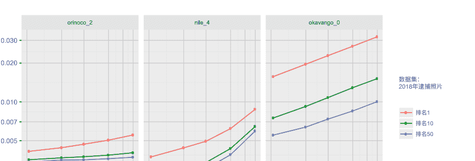

图 17.6 图显示了基于排名的误判率与注册人口、`FNIR（N, 0）`的估计在匹配搜索中。阈值为零意味着计算忽略分数，因为一个配偶可能在排名 1，但得分较低。

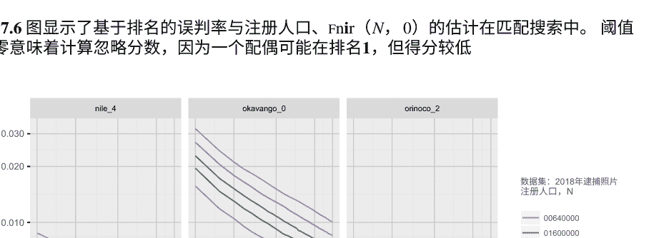

图 17.7 误判率，`FNIR（N, R, 0）`，显示手动审查候选人名单对于排名 R 的调查员的价值。

```
FPIR(T) = \frac{1}{N_I} \sum_{i=1}^{N} H(s_i - T) \qquad\qquad (17.6)
```

在算法无法从输入图像中生成模板的情况下，任何涉及该模板的比较的结果都会被分配一个低分数。这种做法实际上有利于减少假阳性率 (FPIR)。

另一种表示假阳性准确性的量是“选择性”。这个术语源自指纹识别文献，特别是潜在指纹识别。在操作中，它被定义为人工审查员在找到一个匹配项之前需要检查的候选人数的期望值。在算法测试中，这个定义是相关但不同的：非匹配搜索中返回的候选人数的期望值。召回率 (recall) 是返回任何非匹配候选人的比例。选择性表示有多少：

```
$$选择性(T, R) = \frac{1}{N_I} \sum_{i=1}^{N} \sum_{r=1}^{R} H(s_{ir} - T)$$ (17.7)
```

选择性的取值范围为 `[0, R]`，其中 R 是策略审查的候选人数量上限，`R ≤ L` 是算法返回的候选人数量。

对于许多算法，在高阈值下，假阳性很少，`SEL(T) → FPIR(T)`。当不是这种情况时，算法会将假阳性集中在特定搜索结果中，例如返回任何戴眼镜或胡须类似于探测图像的人的图像。

## FPIR 和 FMR 的关系

在识别中，当至少有一个比较产生假阳性时，就会发生假阳性。这需要正确拒绝所有 N 个非配对注册，并且如果这些是独立比较，则可以使用产生假匹配率估计的验证试验来估计假阳性率 `FPIR(T)`；因此，

```
$$FPIR(T) = 1 - (1 - FMR(T))^N$$ (17.8)
```

二项式展开给出了近似值

```
$$FPIR(T) = N \cdot FMR(T)$$ (17.9)
```

这个公式被生物特征识别领域的从业者广泛使用，用于估计识别准确性，如下所示。例如，给定图 17.1，水平轴将被重新标记为 FPIR，并且将通过 N 的因子进行重新缩放。然而，需要注意两点：首先，这是一个近似值，它夸大了 FPIR，并且只有在 `N \cdot FMR(T) \ll 1` 时才准确。其次，对于不实现 1:N 搜索的实现，该模型是不正确的。这在图 17.8 中可以看出，并在下面进行讨论。

## 关联 DET

在评估算法在不同人群或具有不同属性的图像上的性能时，很容易简单地查看 DET 并从中得出错误率的结论。因为大多数操作系统总是在一个固定的阈值下运行，所以必须比较不同人群之间相同操作阈值的点。图 17.8 展示了在五个不同的注册人群大小中进行面部识别搜索的 DET 图。三条黑线连接了相同阈值的点。水平线表示 `FPIR(T)` 的增加，垂直线表示 `FNIR(T)` 的增加。在最右边的图中，`FPIR(T)` 几乎与 N 无关，而二项式模型（方程 17.8）及其线性近似（方程 17.9）不成立。这与不实现 1:N 搜索作为 N 个 1:1 比较是一致的。这意味着识别算法应该作为识别算法进行测试，而不是使用在验证识别试验中产生的分数进行模拟。

# 图17.8 识别 DET绘制显示 FNIR vs FPIR对于五个注册人口规模（彩色曲线）。

## 衰老

面部识别准确性受到衰老的影响，解剖结构的软组织和硬组织变化是不可逆转的。这已经使用应用于大量个体的长期重复图像产生的识别分数进行定量分析。混合效应模型[11]在衰老方面的应用允许对不平衡的不规则采样数据集进行建模，以共享人口组成部分（反映每个人都在衰老）和个体特定的“随机效应”（允许主体在此基础上变化）。这种方法依赖于对同一主体的多次遭遇，例如在频繁旅行者系统中观察到的情况，可以得出一个衰老速率，即平均主体的分数预计会如何降低。当然，这取决于识别算法。它还可以处理年龄和衰老的影响，其中在十五岁和五十岁的人之间，五年的时间间隔完全不同。算法对衰老的敏感性在图17.9中明显可见，显示了分数的下降。虽然该图不能替代混合效应分析（因为不平衡可能导致误导性结果），但它确实展示了更好的算法。例如，可以通过分数降低的速度来定量衰老。可以通过标准化，例如每十年标准差，来比较算法。

总结起来，虽然大多数评估集中在错误率的量化上，但整个分数分布的变化揭示了系统效应。混合效应模型对分数和错误率进行建模[12]是量化衰老的推荐方法。

图17.9 在一个固定的300万人的图库中，小提琴图显示了来自1090万次搜索的配对分数（在原始范围内），按年份分组。随着面部的老化，它们与初始注册面部的相似性逐渐降低。填充颜色编码 FNIR（1），即排名一的错误率；水平线显示与各种 FPIR值和排名2非匹配的分数相对应的阈值。显示原始分数的图表可以揭示系统效应，而不仅仅是导致识别错误的分布尾部的效应。

### 17.3.2 注册图库组合

大多数人脸识别实验通过将N个人的N张图像放置在一个图库中进行。对于纯算法评估，这是推荐的方法。然而，在实际操作中，情况并不像这个简单的情况那样，因为随着时间的推移，主体会多次遇到，例如作为签证申请过程的一部分，并且这些图像会被添加到图库中。

当有多于1张图像可用时，识别准确性会提高。图17.10展示了为每个身份提供多个图像对三种不同的人脸识别算法的影响以及对准确性的影响。在所有情况下，当K增加时，fnir减少；具有多个注册的人更容易被识别。然而，对于两种算法，fpir增加了一个数量级，显示非同类搜索会错误地匹配多图像注册者。

减轻这种情况的关键是如何使用多个图像。参考图17.11，有两种方法：

-   事件驱动的、非整合的图库：在这种模型下，图像被添加到图库中，不考虑该人员是否已经存在。在这种模型下，图库中可能有同一个人的多张图像。模板是从单独的图像中生成的，并被视为不同的身份。在行政上，可能会有记录将同一个人的图像关联起来，但底层的人脸识别算法并不知道这一点。

-   基于主题的综合图库：保留人们的唯一身份，并且记录包含唯一主题的`K >= 1`张图片。这种以人为中心的模型为人脸识别算法提供了融合特征向量、使用质量评估选择最佳图像或者独立提取`K`张图像的特征，并在搜索过程中进行分数级别融合的机会。

推荐的方法——已经在识别基准测试[13]中采用——是通过提供`K`张图像来构建一个综合图库，从而使特征提取可以按照算法定义的方式进行，例如通过特征向量的串联（常见方式）、通过选择“最佳”图像、通过某种度量方式或者通过某种模板级融合方案。综合方法在图17.10中被用于。当算法通过串联个体特征向量来进行综合时，生成的模板大小与`K`成线性关系。在最佳图像和融合方法中，大小与`K`无关。这两种方案在商业上都存在，最近一项基准测试[7]中最准确的算法执行模板级融合。

不同的注册库类型会有算法效果相关联。例如，图17.12展示了两种最先进的人脸识别算法在整合和非整合注册库上的性能比较。

注册库的构建和维护是一项操作决策，根据人脸识别算法的不同，性能提升可能会有所不同。在不同的注册库组合上测试算法将为最佳性能场景提供见解。

### 17.3.3 数据库分割

数据库分割是指注册库在某种程度上是异质的，包含具有不同人口或图像特定属性混合的图像。这通常会导致人脸识别算法很容易区分具有一组特征的图像，而不是根据实际的面部身份来区分。数据库分割在注册库不是同质的情况下自然发生，包括主体年龄、种族、图像质量、胡须和眼镜等多种因素都会影响这一现象。

图17.13，摘自[14]，展示了数据库分割的一个示例。特定实验使用了来自LFW[5]和IJB-A [15]照片新闻数据集的图像作为探针和匹配对象，注册了8000万个从社交媒体网站（Web-Face）上抓取的干扰图像。这两者之间的属性差异数据集：2018年逮捕照片 # 图库中的主体：160万。

新闻摄影图像与社交媒体图像之间的差异导致了数据库分割效应，当将新闻摄影图像与社交媒体图像进行比较时，可以清楚地看到相似度分数的左移分布。左移的分布表明，算法在将lfw与Web-Face图像进行比较时，可以更容易地区分冒充者（由于图像特征而不是面部身份），而在将lfw图像与其他lfw图像进行比较时则不然。这种不良效应导致实际画廊大小被夸大为“有效”画廊大小。因此，这可能导致对算法性能准确性的过高估计。

值得注意的是，画廊中的人数是未知的。为了尽可能构建一个尽可能大的画廊，测试设计放弃了构建平衡画廊的正常设计目标，即每个个体的条目数量相等。应注意确保画廊在图像属性上是均匀的，以防止或最小化数据库分割效应。

## 17.4 计算效率

在高应用中，注册或搜索的数据量很大，或者在需要快速响应的情况下，算法的运行时间变得很重要。因此，评估者应该测量和报告以下内容。

-   特征提取时间：操作性人脸识别系统通常需要在不到一秒钟的时间内定位人脸并从图像中提取特征-这对于人类的满意度和操作吞吐量是必要的。虽然可以使用额外的或者异类硬件来实现这一点，但市场上有压力避免这样做。同样，尽管GPU处理器在算法训练中无处不在，但从当代人脸识别算法中提取亚秒级特征时（经验上）并不需要使用它们。此外，许多特征提取算法在处理单个人脸图像时无法进行并行化。

开发人员应该测量特征提取时间。可以通过使用高分辨率计时器（例如C++中的`std::chrono`工具）来实现。

-   搜索持续时间和复杂性：最近的测试结果显示，1:N搜索速度可以跨越三个数量级[16]。考虑到硬件采购的影响，测量速度并且只在慢算法提供可衡量的准确性优势时进行投资变得至关重要。此外，考虑到非常大的操作数据库，算法的可扩展性非常重要。先前已经报道[16, 17]搜索持续时间可以与注册人口规模N呈次线性关系。此外，最近对索引、精确[18]和近似最近邻搜索[18, 19]以及快速搜索[20]进行了大量研究。图17.14显示了线性和次线性算法的搜索持续时间与数据库大小的关系。

这些时间是在单个2016年的CPU上测量的。在每个图中，实际持续时间（以红色表示，并作为点）以及基于线性（蓝色）和对数（绿色）增长的投影。那些呈次线性增长的算法的准确性接近于同一开发者的线性版本。

-   快速搜索数据结构的构建和维护：大多数算法使用线性数据结构实现线性搜索，而实现次线性搜索持续时间的算法通常需要在进行搜索之前对注册数据结构进行预处理和组织。这可能不是一项廉价的操作。研究人员应报告图库构建操作的持续时间和预期复杂度（线性、二次等）。

-   插入和删除同样，开发人员应该报告插入和删除图库条目的函数持续时间及其对N的依赖性。

## 17.5 总结和建议

我们总结了一系列建议：

-   建议 1：为了鼓励对冒名顶替者分布和低假正类率的明确考虑，人脸识别算法开发人员应将验证指标报告为主要准确性指标。研究人员不应仅报告基于排名的识别试验指标。

-   建议 2：在报告验证结果时，更倾向于使用检测率而不是受试者工作特征曲线，即绘制假负类率而不是真匹配率。

-   建议 3：在报告验证结果时，绘制检测率，并且除非有重要原因，通过使用对数刻度来强调更低的假匹配率，即在 FMR轴上显示 FMR ≪ 1。

-   建议：根据充足的数据，从人口统计学上匹配的个体中构建冒名顶替对。当不可能时，计算并评论在不同人口统计学中的冒名顶替得分分布。

-   建议：虽然ISO/IEG 19795生物识别性能测试和报告标准系列不是免费的，但生物识别实验室应该投资购买副本，因为它们包含了大量经过仔细审查的信息，可以指导测试设计、测量、分析和报告。

-   建议：对于识别算法，进行开放式宇宙识别测试。 对入学画廊进行配对和非配对搜索。 报告不同阈值下的 FNIR(T)和 FPIR(T)。

-   建议：数据库分割导致名义画廊大小夸大了“有效”画廊大小。 这将低估 FNIR。除非画廊代表了真实情况，或者其他情况下不应该是明显的混合，或者如果不可能的话，应该是均衡的从一个代表真实应用的样本中均匀采样的。通过使用具有统一属性的图像来防止数据库分割。

-   建议：每个人的图库中填充相同数量的图像。 避免不平衡的图库。 当一个人有多张图像可用时，将它们用作探测图像。

-   建议：测量所有基本功能的持续时间，包括检测、特征提取、比较和搜索。 对于快速搜索数据结构，报告构建和搜索的持续时间以及这些操作的预期复杂度（例如，`O(√N)`）。

## 参考文献

1.  Taigman Y, Yang M, Ranzato M, Wolf L (2014) Deepface：缩小面部验证与人类水平性能的差距。 在：2014年IEEE计算机视觉与模式识别会议论文集，系列CVPR '14。 IEEE计算机学会，华盛顿特区，美国，第1701-1708页。 https://doi.org/10.1109/CVPR.2014.220

2.  Parkhi OM， Vedaldi A， Zisserman A （2015） 深度人脸识别。 在：英国机器视觉会议

3.  何K， 张X， 任S， 孙J （2016） 深度残差学习用于图像识别。 在：2016年IEEE计算机视觉和模式识别（CVPR） 会议， 第770-778页

4.  Schroff F， Kalenichenko D， Philbin J （2015） Facenet： 用于人脸识别和聚类的统一嵌入。 CoRR， arxiv:1503.03832

5.  Huang GB， Ramesh M， Berg T， Learned-Miller E （2007） 野外标记人脸数据库： 用于研究非约束环境中人脸识别的数据库。 马萨诸塞大学， 阿默斯特。 技术报告。 07-49

6.  Kemelmacher-Shlizerman I， Seitz SM， Miller D， Brossard E （2015） Megaface基准： 规模化识别的100万张人脸。 CoRR。 arxiv:1512.00596

7.  Grother P， Ngan M， Hanaoka K （2018） 人脸识别供应商测试2018 （FRVT）。 国家标准与技术研究所， 盖瑟斯堡， 马里兰， 技术报告， NIST机构报告， 2018， 即将出版

8.  Liao S， Lei Z， Yi D， Li SZ （2014） 大规模非约束人脸识别基准研究。 在： IEEE国际生物特征联合会议， 第1-8页

9.  WG, ET Mansfield ET (2015) ISO/IEC 19795-1 生物特征性能测试与报告: 原则与框架, 国际标准版, JTC1: SC37. http://webstore.ansi.org

10. Gross R, Matthews I, Baker S (2004) 基于外观的人脸识别和光场. IEEE 模式分析与机器智能 26(4):449–465

11. Best-Rowden L, Jain AK (2018) 自动人脸识别的纵向研究。 IEEE Trans Pattern Anal Mach Intel 40(1):148–162

12. Beveridge JR, Givens GH, Phillips PJ, Draper BA (2009) 影响人脸识别大挑战中算法性能的因素。 Comput Vis Image Underst 113(6):750–762

13. Maze B, Adams J, Duncan JA, Kalka N, Miller T, Otto C, Jain AK, Niggel WT, Anderson J, Cheney J, Grother P (2018) Iarpa janus benchmark—c: 人脸数据集和协议。 In: 2018 国际生物识别会议(ICB), pp 158–165

14. Wang D, Otto C, Jain AK (2017) 大规模人脸搜索。 IEEE Trans Pattern Anal Mach Intell 39(6):1122–1136

15. Klare BF, Klein B, Taborsky E, Blanton A, Cheney J, Allen K, Grother P, Mah A, Burge M, Jain AK (2015) 推动无约束人脸检测和识别的前沿: Iarpa Janus 基准测试。在: 2015年IEEE计算机视觉和模式识别会议 (CVPR) , pp 1931-1939

16. Grother P, Ngan M, Hanaoka K, Boechnen C, Ericson L (2017) 2017年iarpa人脸识别挑战赛 (frvt) 。 国家标准与技术研究所, 盖瑟斯堡, 马里兰. 技术报告. NIST机构间报告8197。 https://doi.org/10.6028/NIST.IR.8197

17. Grother P, Ngan M (2014) 机构间报告8009, 人脸识别算法的性能。 在: 人脸识别供应商测试 (FRVT)

18. Ishikawa H, Imaoka H, Sato A (2017) 利用残差分数边界进行快速k最近邻搜索进行人脸识别。 2017年第12届IEEE国际自动人脸与手势识别会议 (FG 2017) 。 IEEE计算机学会，洛杉矶，加利福尼亚州，美国，第194-199页

19. Babenko A， Lempitsky V (2016) 高效索引十亿级深度描述符数据集。 在：计算机视觉和模式识别 (CVPR) 的IEEE会议

20. Johnson J， Douze M， Jégou H (2017) 使用GPU进行十亿级相似性搜索。 CoRR。 arxiv:1702.08734

# 索引

## A

-   主动学习，307

-   对抗扰动，247-264

-   衰老，394,395

-   反射率，73-77,79-83,86-96,99

-   算法公平性，327

-   反欺骗，275

-   自编码器，123-127,129,134

## B

-   偏差基准测试，343

-   生物特征，269

-   盲去模糊，122

-   模糊不变特征，124

## C

-   摄像头网络，305–311，314–317，319

-   摄像头上线，305，306，314，321

-   紧凑编码，138

-   紧凑表示，137

-   互补性，199

-   压缩，162，163

-   传统热像仪，244

-   卷积神经网络，269，271，273，278，279

-   跨模态人脸合成，235，243，244

## D

-   数据相关哈希，140，142

-   数据无关哈希，140

-   去模糊，105，106，109–111，114，115

-   深度卷积神经网络（DCNNs），2

-   深度学习，119–122，131–133，168，170，175，177，178，182–184，275

-   深度神经网络，247，249，250

-   DeepFakes，22，41，248，249，254，255，260，261

-   检测错误权衡，385，386

-   差分渲染，73，76

-   动态网络，315，319-321

## E

-   效率，400

-   编码器-解码器网络，48，61，62

-   评估，381-383，390，395，396

-   实验方法，327，329-331，350，352-355

## F

-   面部分析，327，329，331，332，355

-   面部检测，247-250，256，258，263

-   面部生成，45，48

-   面部建模，77，89

-   面部感知，23

-   人脸识别，1-4，6-8，10，11，14，15，21，23，35，36，40，120，170-173，175-177，179，183，185，190，191，200，207，269，270，276，278-281，294

-   面部表征，210，211，229，230

-   面部搜索，144，145，149，152–154，157–163

-   面部分割，21，23，27，29，32，38，40

-   面部交换，21–24，28，31，32，36–39

-   面部验证，2，3，8，9，11，13，14，137，144，145，149–152，155–157，159，162，163

## G

-   高斯混合模型, 273, 284

-   性别分类, 327-331, 350, 355

-   泛化, 270, 273-275, 300

-   生成对抗网络（GANs）, 48, 60, 61, 120-124, 126-129, 236, 240, 330, 333, 335, 355

## H

-   手工特征, 176, 182, 183, 185

-   哈希, 137-142, 146-158, 161-163

-   异构面部识别, 241

-   人脸识别, 361, 362, 371, 374

-   人机比较, 365

## I

-   识别, 381-383, 389-394, 396-398, 401, 402

-   图像哈希, 144

-   图像恢复, 109

-   图像合成, 330, 331, 333, 352, 353

## J

-   联合表示学习, 190

## L

-   有限监督, 306, 322

-   线性哈希, 141

-   损失函数, 2, 8, 10, 127, 128

-   低/高分辨率, 119

## M

-   元数据加权, 191, 192

-   模型适应, 306

-   运动模糊, 119-122

## N

-   神经聚合网络, 209, 211, 215, 216, 220, 230

-   神经图灵机, 211

-   新生儿人脸识别, 168, 170-173, 175-178, 182-185

-   夜间人脸识别, 235

## O

-   单类分类, 273

-   单类对比损失, 280

-   开放世界人物再识别, 307

## P

-   性能, 381-384, 386, 390-392, 394, 398, 400, 402

-   人物再识别, 305-307, 313, 314, 321

-   基于枢轴的哈希, 141, 157, 158, 161

-   偏振热, 238, 239, 243, 244

-   演示攻击检测, 269, 270, 272, 274, 276-278, 280

## R

-   接收器工作特性, 385

-   循环学习, 48

-   关系, 321

-   表示学习, 45, 47, 48, 60, 61

-   可重复研究, 291

-   鲁棒性, 249, 251, 254, 264

## S

- 可扩展性, 305, 306, 312, 321
- 集合比较, 196
- 集合哈希, 144
- 单图像恢复, 122
- 子集选择, 306, 308, 309
- 超级识别者, 362-364, 366, 368, 369
- 超分辨率, 119
- 监督哈希, 142, 143, 162
- 监控, 119, 120, 124

## T

- 模板构建, 192
- 测试, 382, 386, 391, 393, 398, 402
- 热成像到可见光人脸合成, 235, 240, 242, 244
- `3DMM`, 73-81, 87, 88, 90, 92-97, 99, 100
- 3D重建, 73, 76, 96-98
- 3D形状, 73, 79, 81, 83, 90, 92, 94, 96, 98
- 阈值, 381, 384, 386-397, 402
- 迁移学习, 305, 306, 314, 315
- 传递性, 307-309, 321

## U

- 单模态聚合, 189, 190
- 未知攻击检测, 272, 277, 294, 300
- 无监督哈希, 142

## V

- 验证, 381, 383, 388-390, 394, 401
- 视频人脸识别, 209-211, 213-215, 221, 229
- 视频哈希, 144