# 基于深度学习的语音质量预测


## 电信服务中的T-Labs系列

加布里埃尔·米塔格


Springer

## 电信服务中的T-Labs系列

### 系列编辑

- 塞巴斯蒂安·莫勒，质量与可用性实验室，柏林工业大学，柏林，德国
- 阿克塞尔·库珀，电信创新实验室，柏林工业大学，柏林，德国
- 亚历山大·拉克，音视频技术组，伊尔梅瑙工业大学，伊尔梅瑙，德国

斯普林格电信服务系列的目标是促进跨学科的知识交流，涵盖所有对于开发高质量和高可用性电信服务至关重要的主题。这包括底层技术的基本概念、分布网络、服务设计、部署和适应的架构和平台，以及用户对电信服务的感知。通过纵向透视所有这些步骤，我们旨在为开发和持续评估提供创新服务的科学基础，为用户提供更好的价值。事实上，高质量电信服务的以人为中心的设计，即所谓的“质量工程”，是本系列的一个重要主题，因为它最终将导致更好的用户体验和接受度。该系列针对所有相关学科和行业的科学家和实践者。

**索引：该系列的书籍在Scopus中索引**

有关该系列的更多信息，请访问 https://link.springer.com/bookseries/10013

加布里埃尔·米塔格

## 基于深度学习的语音质量预测


Gabriel Mittag
柏林工业大学
德国柏林

ISSN 2192-2810
ISSN 2192-2829 (电子版)
T-Labs电信服务系列
ISBN 978-3-030-91478-3
ISBN 978-3-030-91479-0 (电子书)
https://doi.org/10.1007/978-3-030-91479-0
© 编辑 (如适用) 和作者，独家许可给Springer Nature Switzerland AG 2022

本作品受版权保护。出版商独家授权所有权，无论是整体还是部分材料，特别是翻译、再版、重复使用插图、朗读、广播、微缩胶片复制或以任何其他实体方式、传输或信息存储和检索、电子适应、计算机软件，或通过类似或不同的已知或今后开发的方法。

在本出版物中使用一般描述性名称、注册名称、商标、服务标志等，并不意味着即使在没有明确声明的情况下，这些名称也不受相关保护法律和法规的限制，因此可以自由使用。

出版商、作者和编辑可以安全地假设本书中的建议和信息在出版日期时被认为是真实和准确的。出版商、作者或编辑对本文所包含的材料不提供明示或暗示的保证，也不对可能存在的任何错误或遗漏承担责任。出版商在已发表的地图和机构隶属方面保持中立。

这个Springer印记是由注册公司Springer Nature Switzerland AG出版的
注册公司地址是：瑞士Cham市Gewerbestrasse 11号，邮编6330

## 前言

仪器语音质量预测是一个长期研究的领域，其中提出了许多模型。然而，特别是在没有使用清洁参考信号的单端预测中仍然具有挑战性。本书研究了如何利用机器学习的最新发展来提高传输语音的质量预测，并通过预测语音质量维度提供诊断信息。具体而言，分析了不同的深度学习架构对于预测语音质量的适用性。为此，创建了一个包含失真语音文件和众包主观评分的大型数据集。将多个深度学习架构（如CNN、LSTM网络和Transformer/self-attention网络）进行了组合和比较。研究发现，具有CNN、自注意力和提出的注意力池化的网络在考虑的数据集上提供了最佳的单端语音质量预测。此外，还提出了一种基于Siamese神经网络的双端语音质量预测模型。然而，与传统模型相比，深度学习模型从包含清洁参考信号中获益较小。针对感知语音质量维度的预测，提出了一种基于多任务学习的模型，可以并行预测整体语音质量和噪声、色彩、不连续性和响度等质量维度，其中大部分神经网络层在各个任务之间共享。最后，介绍了基于单端语音质量预测模型NISQA，该模型在59个不同数据集的大量样本上进行了训练。由于训练数据集来自不同来源并包含不同的质量范围，它们会受到主观偏见的影响。因此，相同的语音失真可能在两个数据集中导致非常不同的质量评分。为了防止这种影响的负面影响，提出了一种偏差感知损失函数，该函数在训练神经网络权重时估计并考虑偏差。最终模型在一个包含真实录制电话呼叫的实时测试集上进行了测试，整体语音质量预测的皮尔逊相关系数达到了0.90。

## 致谢

我非常感谢许多支持者使这项工作成为可能。在过去的几年里，我有幸在质量和可用性实验室以及几个学术会议、研讨会和ITU会议上结识和认识了许多有趣的人。首先，我要感谢我的论文导师Sebastian Müller教授，感谢他的支持、科学专业知识和建议，这些对我撰写和完成这本书非常有帮助。我还要特别感谢Friedemann Köster博士，他让我接触到令人兴奋的语音质量评估领域，如果没有他，我可能不会开始我的博士研究。

我要感谢我的学生助理Louis Liedtke的支持，还要感谢我有幸指导他们的本科或硕士论文准备的所有学生，特别是Assmaa Chehadi在本书中使用的数据集的工作和Huahua Maier在Android录音应用程序上的工作。我还要感谢基尔大学的Gerhard Schmidt教授和Töbis Höbschen以及Jens Berger博士在DFG项目期间的良好合作。

我要感谢Tiago H. Falk教授和Gerhard Schmidt教授对本书的审阅和担任我的博士委员会成员。非常感谢Irene Hube-Achter、Yasmin Hillebrenner和Tobias Jetkowski对我们的出色行政和技术支持。感谢Quality and Usability Lab的所有前同事和现任同事，感谢他们在无数次讨论、研究思路交流以及咖啡休息时间陪伴我，确保实验室从未变得太无聊，包括Steven Schmidt、Saman Zadtootaghai、Sai Sirisha Rallabandi、Thilo Michael、Tanja Kojic、Babak Naderi博士、Laura Fernández Gallardo博士、Patrick Ehrenbrink博士、Dennis Guse博士、Maija Poikela博士、Falk Schiffner博士和Stefan Uhrig博士等等。感谢大家共度美好时光！

## 目录

## 1 引言 1
### 1.1 动机 1
### 1.2 论文目标和研究问题 4
### 1.3 大纲 4
## 2 传输语音的质量评估 7
### 2.1 语音通信网络 7
### 2.2 语音质量和语音质量维度 10
### 2.3 主观评估 12
### 2.4 通过众包进行主观评估 16
### 2.5 传统仪器方法 18
#### 2.5.1 参数模型 18
#### 2.5.2 双端信号基础模型 19
#### 2.5.3 单端信号基础模型 21
### 2.6 基于机器学习的仪器方法 22
#### 2.6.1 非深度学习机器学习方法 23
#### 2.6.2 深度学习架构 24
#### 2.6.3 基于深度学习的语音质量模型 28
### 2.7 总结 31
## 3 用于语音质量预测的神经网络架构 33
### 3.1 数据集 33
#### 3.1.1 源文件 34
#### 3.1.2 模拟失真 35
#### 3.1.3 实时失真 39
#### 3.1.4 听力实验 40
### 3.2 神经网络模型概述 42
### 3.3 Mel-Spec 分割 43
### 3.4 逐帧模型 43
#### 3.4.1 卷积神经网络 43
#### 3.4.2 前馈网络 45
### 3.5 时间依赖建模 46
#### 3.5.1 LSTM 47
#### 3.5.2 Transformer/自注意力 48
### 3.6 时间池化 51
#### 3.6.1 平均-/最大池化 51
#### 3.6.2 最后一步池化 51
#### 3.6.3 注意力池化 52
### 3.7 实验和结果 53
#### 3.7.1 训练和评估指标 53
#### 3.7.2 逐帧模型 54
#### 3.7.3 时间依赖模型 56
#### 3.7.4 池化模型 57
### 3.8 总结 58
## 4 使用连体网络的双向语音质量预测 59
### 4.1 引言 59
### 4.2 方法 60
#### 4.2.1 连体神经网络 62
#### 4.2.2 参考对齐 62
#### 4.2.3 特征融合 64
### 4.3 结果 65
#### 4.3.1 LSTM vs 自注意力 65
#### 4.3.2 对齐 66
#### 4.3.3 特征融合 67
#### 4.3.4 双端 vs 单端 68
### 4.4 总结 70
## 5 多任务下的语音质量维度预测学习 73
### 5.1 引言 73
### 5.2 多任务模型 75
#### 5.2.1 全连接 (MTL-FC) 76
#### 5.2.2 全连接 + 池化 (MTL-POOL) 77
#### 5.2.3 全连接 + 池化 + 时间依赖性 (MTL-TD) 78
#### 5.2.4 全连接 + 池化 + 时间依赖性 + CNN (MTL-CNN) 79
### 5.3 结果 79
#### 5.3.1 每个任务的评估 80
#### 5.3.2 所有任务的评估 83
#### 5.3.3 维度比较 84
#### 5.3.4 退化分解 85
### 5.4 总结 87
## 6 基于偏差感知损失的多数据集训练 89
### 6.1 方法 89
#### 6.1.1 使用偏差感知损失进行学习 89
#### 6.1.2 预测锚定 91
### 6.2 实验和结果 93
#### 6.2.1 合成数据 93
#### 6.2.2 最小准确率 r_th. 94
#### 6.2.3 带有和不带有锚定的训练示例 95
#### 6.2.4 配置比较 96
#### 6.2.5 语音质量数据集 97
### 6.3 总结 98
## 7 NISQA: 单端语音质量模型 99
### 7.1 数据集 99
#### 7.1.1 POLQA 池 99
#### 7.1.2 ITU-T P Suppl. 23 100
#### 7.1.3 其他数据集 101
#### 7.1.4 实时对话测试集 102
### 7.2 模型和训练 103
#### 7.2.1 模型 103
#### 7.2.2 偏差感知损失 104
#### 7.2.3 处理缺失维度评分 105
#### 7.2.4 训练 106
### 7.3 结果 107
#### 7.3.1 评估指标 107
#### 7.3.2 验证集结果：整体质量 108
#### 7.3.3 验证集结果：质量维度 109
#### 7.3.4 测试集结果 110
#### 7.3.5 损坏程度与质量预测 111
### 7.4 总结 112
## 8 结论 113
## A 数据集条件表 115
## B 训练和验证数据集维度直方图 117
## 参考文献 119
## 索引 121

# 缩写

| 缩写 | 全称 |
|------|------|
| ACR | 绝对类别评分 |
| AP | 注意力池化 |
| BiLSTM | 双向长短期记忆网络 |
| CCR | 比较类别评分 |
| CNN | 卷积神经网络 |
| COL | 色彩 |
| DCR | 退化类别评分 |
| DE | 双端 |
| DIS | 不连续性 |
| FB | 全频带 |
| FC | 全连接层 |
| FER | 帧错误率 |
| FFT | 快速傅里叶变换 |
| GMM | 高斯混合模型 |
| ITU-T | 国际电信联盟-电信标准化部门 |
| LOUD | 响度 |
| 线性预测编码 | 线性预测编码 |
| 长短期记忆网络 | 长短期记忆网络 |
| 多元自适应回归样条 | 多元自适应回归样条 |
| 梅尔频谱图 | 梅尔频谱图 |
| 梅尔频率倒谱系数 | 梅尔频率倒谱系数 |
| 调制噪声参考单元 | 调制噪声参考单元 |
| 主观意见分数 | 主观意见分数 |
| 均方误差 | 均方误差 |
| 平均时域距离 | 平均时域距离 |
| 多任务学习 | 多任务学习 |
| 窄带 | 窄带 |
| 非侵入式语音质量评估 | 非侵入式语音质量评估 |
| 自然语言处理 | 自然语言处理 |
| 噪声 | 噪声度 |

| 缩写 | 全称 |
|------|------|
| OTT | 超级应用 |
| P.AMD | 感知方法用于多维分析（ITU-T SG12 工作项目） |
| P.SAMD | 单端感知方法用于多维分析（ITU-T SG12工作项目） |
| 主成分分析 | 主成分分析 |
| 皮尔逊相关系数 | 皮尔逊相关系数 |
| PESQ | 语音质量的感知评估（ITU-T Rec. P.862） |
| PLP | 感知线性预测 |
| POLQA | 感知客观听觉质量分析（ITU-T Rec. P.863） |
| POTS | 普通电话服务 |
| PSTN | 公共交换电话网 |
| RELU | 修正线性单元 |
| RMSE | 均方根误差 |
| RMSE* | ε-不敏感均方根误差 |
| RNN | 循环神经网络 |
| SA | 自注意力 |
| SE | 单端 |
| SLSP | 顺序最小二乘规划 |
| SNR | 信噪比 |
| ST | 单任务 |
| SWB | 超宽带 |
| TD | 时域相关性 |
| VAD | 语音活动检测 |
| VoIP | 网络语音 |
| VoLTE | LTE网络语音 |
| VoWiFi | WiFi网络语音 |
| WB | 宽带 |

## 第1章
### 引言

## 1.1 动机

尽管商业电信服务已经存在了一个多世纪，但电信行业仍然是一个不断增长的领域。通过智能手机的引入和移动互联网的几乎恒定可用性，该领域开辟了新的机会。如今，我们习惯了随时随地向世界上任何地方打电话。附带大量数据的移动计划以合理的价格消除了昂贵的按分钟计费的长途电话的障碍。由于世界范围内的全球化趋势，家人和朋友之间的距离比以前更远，电话和视频通话通常是保持联系的唯一可能性。除了消费者市场，对于企业来说，该领域的新发展变得越来越重要。特别是从COVID-19大流行开始，远程会议提供商的需求急剧增加，许多人在家工作，对企业来说每天进行在线会议至关重要。

因此，对于语音通信提供商来说，监控他们的网络以确保客户满意的体验变得更加重要。在评估语音通信网络时，会测量几个关键性能指标。例如，在比较不同提供商的基准测试（Zafaco GmbH 2020）中，除了呼叫建立持续时间、语音延迟和呼叫失败率等因素外，语音质量是整体性能的主要指标之一。在这些基准测试中，会通过网络发送一个预先录制的高质量参考语音样本。在接收端，会记录语音信号。然后，算法使用这两个信号来估计语音质量。

虽然传输语音的可懂度通常不是问题，但是语音质量仍然可能在一次呼叫通过多个网络提供商时显著降低，其中语音信号可能会被多次编码和解码。此外，尽管大多数人已经习惯了到处都有移动连接，但仍然有许多信号较差的偏远地区。例如，德国以移动互联网覆盖差而闻名，这在乘坐火车或在人口密集区域之外旅行时仍然导致较低的语音质量。

国际电信联盟（ITU-T）目前的最先进和标准的客观语音质量预测是POLQA（ITU-T Rec. P.863 2018）。POLQA使用传输通道的降级输出信号与干净输入信号进行比较，以估计语音质量。然而，语音质量预测模型的真实值来自根据ITU-T Rec. P.800（1996）进行的听觉听力实验。在这些实验中，参与者听取语音样本并对质量发表意见。所有测试参与者的平均评分称为均值意见分数（MOS）。POLQA和其他传统的语音质量模型通过计算参考信号和降级信号之间的距离特征，并将其映射到MOS值来估计语音质量。这些双向模型，即使用参考信号和降级语音信号，适用于网络的主动监测，并为此用例提供可靠的结果。然而，它们的测试范围仅限于需要发送和记录测试信号的有限数量的终端点。此外，这些测试有些人为，因为没有进行实际服务用户的真实电话呼叫。相反，使用完全平衡的句子作为测试信号。

POLQA模型的另一个缺点是它只提供关于整体语音质量的信息，没有任何关于质量下降原因的指示。为了克服这个问题，Côte（2011）开发了DIAL模型，除了整体质量外，还预测了四个质量维度：噪音、色彩、不连续性和响度。使用感知质量维度进行降级诊断的优点是，这些维度可以与传输系统中的技术原因相关联，同时又独立于所使用的技术。因此，即使引入了新的技术，如编解码器或隐藏算法，预测模型仍然是有用的，用于通信系统。

基于网络参数（如丢包、编解码器或比特率）的模型可以被用于被动地监测电话呼叫的语音质量。然而，这些模型只考虑数字传输路径，忽略了终端设备。此外，当语音信号通过多个网络发送时，网络提供商通常只能访问自己网络的参数。除了网络提供商，对于所谓的OTT（Over-The-Top）提供商来说，监测他们的服务也很重要。这些提供商通过互联网和VoIP（Voice over IP）提供呼叫，而不提供网络本身。

对于OTT提供商来说，监测语音质量可能更加困难，因为他们无法直接访问所有网络参数。如果网络参数未知，传输路径基本上是一个黑盒子，只有降级的输出语音信号可用于估计语音质量。

## 1.1 动机

基于降级的语音信号而无需干净参考的模型也被称为单端模型。

ITU-T对于单端语音质量估计的当前建议是ITU-T Rec. P.563。然而，已知它在VoIP网络（Hines等，2015a）和对话语音方面给出不可靠的结果。此外，它只能预测所谓的窄带通信网络的语音。自从开发出这个模型以来，语音网络的趋势是朝着具有更高音频带宽的“高清晰度”语音传输，即所谓的宽带或超宽带网络。

长期以来，在没有参考信号的情况下预测语音质量一直是一个很大的挑战。特别是由于传输路径中丢失的数据包引起的中断很难检测到。然而，随着近年来深度学习方法的兴起，使用机器学习方法预测语音质量的新可能性出现了。2012年，第一个深度学习模型赢得了年度举办的图像分类挑战ImageNet（Krizhevsky等，2017年）。从那时起，深度学习模型在许多应用中不断超越传统方法，从图像分类到自动驾驶汽车和语言翻译。在语音技术领域，大部分深度学习方法的工作都是针对语音识别和语音合成的。然而，对于语音质量估计只进行了少量的研究工作。

本文提出了一种基于深度学习的单端语音质量模型。该模型通过主观MOS分数进行端到端训练，以预测整体质量和四个语音质量维度，采用多任务方法。

因此，在训练过程中，模型不仅学习计算适用于预测整体质量的特征，还学习如何区分特定的退化类型。在多任务方法中，可以在预测任务之间共享不同数量的网络层。在这种情况下，一个问题是神经网络是否能够区分质量维度，从而改善网络中的内部特征表示，并因此有助于改善整体质量预测，还是共享反而会损害预测性能。

为了获得对未知数据进行可靠预测的模型，该模型在来自不同来源的各种不同数据集上进行训练。

其中许多数据集在窄带环境下进行了注释，而其他数据集包含宽带、超宽带或全带宽语音样本。然而，在仅包含窄带语音信号的实验中，干净的窄带样本通常会被评分较高，而在超宽带环境中相同的样本评分会较低。这些相同条件下的不同评分可能会对神经网络的预测性能产生负面影响。为了克服数据库特定偏差的问题，本文提出了一种偏差感知的损失函数。

## 1.2 论文目标和研究问题

到目前为止，还没有一个单端模型可以预测四个感知语音质量维度：噪音、色彩、不连续性和响度。此外，还没有一个单端模型可以可靠地预测未知对话数据中超宽带/全带上的整体语音质量模型。基于这些事实，本研究的主要目标是开发一个单端诊断语音质量模型。使用最近出现的深度学习方法开发这个模型涉及到一些研究问题。因此，目标和研究问题可以总结如下：

-   目标1 开发一个单端语音质量模型，在全带上可靠地预测真实电话呼叫的语音质量。
-   目标2 开发一个单端模型，除了整体质量外，还可可靠地预测四个语音质量维度：噪音、色彩、不连续性和响度。
-   研究问题1 哪种神经网络架构在语音质量预测方面表现最好，如何将它们结合起来？
-   研究问题2 如何将干净的参考信号纳入神经网络进行语音质量预测，以构建双向语音质量模型？包含参考信号是否会改善结果？
-   研究问题3 当与单独训练的模型相比，语音质量和语音质量维度的多任务学习是否会改善结果？神经网络的多少应该在不同任务之间共享？
-   研究问题4 如何从暴露于数据集特定偏差的多个数据集中训练基于机器学习的语音质量模型？

## 1.3 大纲

本论文的第2章概述了传输语音质量评估的当前研究现状。它介绍了主观语音质量方法，并描述了如何通过众包进行听觉实验。

随后，简要回顾了传统和基于机器学习的语音质量模型的文献综述。

在第3章中，分析了不同的神经网络架构，以确定其对语音质量预测的适用性。首先，介绍了一个包含各种失真和主观语音质量评分的新数据集。所提出的基于深度学习的语音质量模型分为三个神经网络阶段，每个阶段都采用不同的网络架构。然后通过消融研究，展示了CNN-SA-AP（卷积神经网络-自注意力-注意力池化）组合通过去除或替换各个阶段来获得最佳结果。

在第4章中，分析了将干净参考应用于基于深度学习的语音质量模型是否能改善结果。为此，提出了一个具有不同配置的新的双端模型，并进行了训练和评估。

在第5章中，将第2章中的单端深度学习模型扩展到预测感知语音质量维度。为此，采用了多任务方法进行分析。介绍并比较了四个模型，每个模型在任务之间共享不同数量的层。

第6章介绍了一种新的方法，用于训练从多个数据集中暴露于主观偏差的语音质量预测模型。所提出的偏差感知损失在训练过程中估计偏差，并在优化网络权重时考虑这些偏差。首先，该方法通过合成数据集进行分析，然后使用真实数据集进行分析。

最后，在第7章中，介绍了一种基于单端机器学习的诊断语音质量模型，该模型是在大量不同数据集上进行训练的。首先，介绍并描述了不同的数据集。然后，该模型在59个数据集上进行训练，并在包含真实电话通话的实时数据集上进行验证，这些通话是在不同环境中进行的。

## 第2章
传输语音的质量评估

本章首先概述了不同的语音通信网络和在语音传输过程中常见的质量损坏。然后介绍了“语音质量”和“语音质量维度”这两个术语，并讨论了主观语音质量评估方法。

随后，对仪器语音质量预测模型进行了回顾。首先介绍了传统的语音质量模型。然后描述了文献中基于机器学习的模型，这些模型不基于深度学习。最后，简要概述了深度学习架构和基于深度学习的语音质量模型。

## 2.1 语音通信网络

语音或语音服务可以分为以下三类：

-   陆地线路网络
-   移动网络
-   超级网络语音应用

陆地线路网络是三种服务中最古老的，自19世纪末以来一直在运行。它曾经通过地下铜线传输模拟信号进行语音传输。这种类型的模拟电话服务也被称为普通电话服务（POTS）。然而，现在几乎所有的模拟网络都已经被数字技术取代。陆地线路网络中最常用的编解码器之一是ITU-T Rec. G.711（1988），它应用非均匀量化，并将语音信号传递在300-3400 Hz的范围内。这个音频带宽也被称为窄带（NB），对应于模拟电话的带宽，导致了电话呼叫中通常的低沉声音。如今，许多供应商提供宽带（WB）网络（有时被市场营销为“高清语音”），允许更高的音频带宽100–7000 Hz。在固定电话网络中，常用的宽带编解码器是ITU-T Rec. G.722（2012）。然而，如果从宽带网络拨打电话到窄带网络，连接将会降级为窄带通话。即使在不同的宽带供应商之间进行电话通话，连接也可能降级为窄带。

移动或蜂窝网络允许通过蜂窝无线电塔与移动电话之间进行电话通话。越来越多的人使用手机作为进行电话通话的标准方式。例如，美国拥有固定电话的家庭比例从2004年的90%以上下降到2019年的不到40%（CDC 2020）。然而，在固定电话网络中几乎没有传输问题，移动网络的优势在于可能对导致传输错误的无线电频率产生干扰。此外，当用户改变位置时，手机可能会从一个天线切换到另一个天线（所谓的切换），这会导致短暂的中断。移动网络中有不同的无线电传输系统。欧洲常见的是GSM（2G），UMTS（3G），LTE（4G）和即将推出的5G标准。移动网络中最常见的编解码器是AMR-NB（3GPP TS 26.071 1999），它是一种混合编解码器，可以传输语音参数和波形信号，并提供窄带带宽的语音。

这些天，越来越多的供应商也支持使用AMR-WB（3GPP TS 26.171 2001；ITU-T Rec. G.722.2 2003）编解码器进行宽带语音传输，尤其是通过UMTS和LTE。最近，一些供应商还通过VoLTE（Voice over LTE）和VoWiFi（Voice over Wi-Fi）以及更新的编解码器EVS（3GPP TS 26.441 2014）支持超宽带（SWB）语音（在德国市场上称为“HD Plus”或“Crystal Clear”）。在超宽带电话中，语音以50-14,000 Hz的带宽传输。

另一种通信服务是所谓的OTT（Over-The-Top）应用程序，通过VoIP（Voice over IP）在互联网上提供语音服务。这些应用程序作为第三方提供服务，与互联网网络提供商无关。有很多可用的应用程序，例如专用的语音或视频通话服务（例如Viber， Skype， FaceTime），包括语音通信的即时通讯或社交媒体应用程序（例如WhatsApp， Line， Telegram， Facebook， Instagram）或视频会议工具（例如Zoom， Teams， Meet， Webex）。用于VoIP应用程序的一种常用编解码器是Opus（RFC 6716 2012）。它是开源和免费的，并根据使用的比特率支持不同的音频带宽，最高可达全频带（20-20,000 Hz）。与固定电话和移动电话网络直接连接到公共交换电话网络（PSTN）不同，OTT服务大多数情况下并非如此。

固定电话或移动电话可以连接到电路交换或分组交换网络。电路交换网络是经典类型的网络，在两个设备之间建立专用连接，并且在通话期间保持具有完整可用带宽的通信通道。在分组交换网络中，两个设备之间的语音通过将信号数据分成小包进行传输。每个数据包可以通过网络采用不同的路径到达最终目的地，在那里合并各个数据包以重新创建原始信号。在分组交换网络的接收端，抖动缓冲器处理到达的数据包的错误顺序、重复或延迟。例如，如果数据包到达较晚，抖动缓冲器播放机制可以拉伸先前接收到的数据包中包含的语音信号，以避免语音信号中断。如果数据包到达错误或太晚，抖动缓冲器会丢弃该数据包。这就导致了所谓的数据包丢失但更应该称为“数据包丢弃”。大多数现代编解码器包含丢包隐藏（Lecomte et al. 2015）算法尝试通过基于先前接收到的数据包合成丢失的语音信号的预测来掩盖语音信号中的中断。然而，当算法无法合成与丢失数据包的原始信号相似的信号时，通常会导致中断、机器人声音或人工声音。

虽然电路交换网络中没有数据包，但编解码器仍然将语音信号分成单个帧。因此，如果比特流中发生太多的比特错误，解码器可以将帧标记为丢失，并对该帧应用隐藏处理。如果编解码器没有隐藏算法，那么帧将被简单地替换为零。由于现在大部分语音传输是数字化的，帧/数据包丢失是传输通道中主要的损坏因素。设备和信号处理算法、低比特率编码以及多个网络之间的转码等因素可能导致其他损坏。

下面给出了一些影响感知质量的语音通信网络的突出技术因素的概述：

音频带宽 表2.1给出了不同带宽的概述。受限的音频带宽可能导致听起来沉闷或稀薄的语音。

编解码器 在通过通信信道传输语音信号之前，编解码器会对其进行压缩，而在接收端，信号会从编码的比特流中重构出来。然而，压缩通常不是无损的，可能会导致各种语音质量下降。

转码 当呼叫通过多个网络路由时，语音信号可能会被多次编码和解码，可能使用不同的编解码器。

丢包 帧或数据包丢失可能会导致信号中断。如果应用了丢包隐藏技术，还可能导致各种不同的质量下降，如机器人声音和人工声音。

表2.1 根据ITU-T Rec.P.10（2017）的语音网络音频带宽

| 名称   | 缩写 | 频率范围[Hz] |
|--------|------|--------------|
| 全频带 | FB   | 20-20,000    |
| 超宽带 | SWB  | 50-14,000    |
| 宽带   | 宽带 | 100-7000     |
| 窄带   | NB   | 300-3400     |

抖动管理 在分组交换网络中，抖动缓冲区可以拉伸或缩小语音信号，以减少延迟的影响。

延迟 延迟可能发生在通信系统的不同位置，例如在传输过程中或由编码引起。延迟可能导致对话中的困难，但不会直接影响听觉语音质量。

回声 扬声器可能会遇到自己声音的回声，例如当接收者使用扬声器时。回声影响说话者的说话能力。

回声消除 回声消除算法尝试估计回声信号并从输入信号中减去它。然而，如果算法失败，它也可能引入新的信号退化。

语音活动检测 电信系统使用语音活动检测（VAD）来检测低音量水平，并在发送语音信号之前发送一个表示静音的标志。因此，在数字传输中可以节省带宽。如果算法失败，可能会切断语音，特别是在话语的开始或结束时。

环境噪声 环境噪声是指说话者和听者周围环境中的所有声音，例如汽车、街道或购物中心的声音。如果环境噪声太大，很难听清说话者的声音。

电路噪声 电路噪声主要是由模拟技术引起的，这在现代语音网络中很少见。然而，低比特率编解码器或所谓的舒适噪声可能引入类似的噪声，以填补由语音活动检测引起的人工静音。

降噪 降噪算法试图从语音信号中去除背景噪声。然而，它们有时会引入新的信号退化。

语音水平 通信系统中的不理想语音水平可能是由不同点引起的，或者是由于说话者离输入设备太远。

幅度削减 如果输入信号过大，可能会达到最大幅度容量，结果信号会被削减到最大可能的水平。幅度削减会导致语音信号失真。

主动增益控制 为了避免幅度削减和过于安静的信号，大多数设备都包含主动增益控制算法来平衡语音信号。

## 2.2 语音质量和语音质量维度

当评估语音通信网络时，其中一个主要性能指标是传输语音的感知质量。Jekosch（2005）如下定义了语音质量：语音质量：在检查下的语音样本的所有可识别和可命名的特征和特征值的评估结果，以满足个体期望和/或社会需求和/或要求的所有可识别和可命名的特征和特征值的期望。

因此，感知的语音质量主要取决于用户的期望。当用户评估语音样本的质量时，评估过程由物理语音信号触发。信号被听众感知和反映，此时也在听众内部创建了感知质量特征。与检查下的语音样本的评估并行进行的是在听众经验上执行的类似过程，该过程创建了所需的质量特征。对所需和感知质量特征的比较和判断然后导致了感知的语音质量。

根据Walthermann（2012）的研究，感知质量是一个多维的值，可以被看作是多维感知空间中的一个点。如果这个感知空间的坐标系是笛卡尔坐标系，并且每个听觉特征都与其他特征正交，那么这些特征被称为感知维度。正交性还意味着不同感知维度的值之间没有相关性。在这个多维空间中，听众的期望组合（内部参考）由向量 p 定义，而被研究的语音信号的感知组合由向量 q 定义，

```
p = (p_1, \ldots, p_{N_{维度}}), \quad q = (q_1, \ldots, q_{N_{维度}}).
```

整体或综合质量 Q 可以通过 p 和 q 之间的欧氏距离来定义，

```
Q = d(p, q) = \sqrt{\sum_{i=1}^{N_{维度}} \alpha_i (p_i - q_i)^2},
```

其中 N维度是正交维度的数量，权重系数 αi确定每个维度的影响。Walthermann等人（2010年）为现代语音通信网络推导出这些感知质量维度。为此，处理了14种不同的NB测试条件和14种不同的混合NB/WB测试条件。然后进行了一系列成对相似度和随后的多维缩放、语义差异和子-随后的主成分分析实验。分析结果显示，感知质量空间可以由三个正交的感知维度来表示：色彩、不连续性和噪声。然而，在这些研究中，所有语音文件的听音水平都被归一化为首选听音水平。后来，Côte等人（2007年）发现响度确实是一种重要的语音特征。

质量特征因此应包括在感知质量空间中作为一个响度维度。值得注意的是，响度可以与其他维度相关，特别是色彩。总结一下，感知语音质量空间由以下四个维度构成：

- **噪音**：指的是背景、电路或编码噪音等降级。
- **色彩**：指的是由频率响应失真引起的降级，例如由带宽限制、低比特率编解码器或丢包隐藏引入的。
- **不连续性**：指的是由丢包或剪辑引入的孤立或非平稳失真。
- **响度**：指的是非理想响度，即信号过大或过小或响度变化。

## 2.3 主观评估

传统上，通过根据ITU-T Rec. P.800 (1996)进行听觉听力实验来确定语音样本的质量，参与者根据5点绝对类别评分(ACR)标准对语音样本的质量进行评分。这个尺度的标签可以在表2.2中看到。分数可以显示给参与者，除了标签之外，或者只向参与者展示标签，分数稍后由实验者分配。所有测试参与者对每个语音样本的平均评分称为所谓的平均意见分数（MOS）。通常，为了避免源语音样本引起的偏差，每种失真类型会对不同的源语音文件进行多次处理。

然后，对每个条件下的每个配置的MOS值进行平均，得到每个条件下的MOS值。ITU-T Rec. P.800 (1996)中还描述了另外两种常用的语音质量测试方法，即降级类别评分（DCR）和比较类别评分（CCR）。

ITU-T Rec. P.806 (2014)中描述了通过多个评分尺度进行诊断目的的语音质量评估。然而，在这个推荐中，

表2.2 听觉质量5点ACR评分ITU-T Rec. P.800 (1996)推荐

| 标签 | 得分 |
| --- | --- |
| 优秀 | 5 |
| 良好 | 4 |
| 一般 | 3 |
| 差 | 2 |
| 糟糕 | 1 |

本研究使用了Sen和Lu (2012)提出的感知质量维度。尽管迄今为止，还没有ITU-T关于本研究中使用的四个语音质量维度的推荐，但它们包含在ITU-T Rec. P.804 (2017)中，该推荐描述了会话语音分析的主观测试方法。本推荐中的刻度用描述相应维度的反义词对进行标记，并在图2.1中显示。扩展连续刻度被使用，因为它显示出更高的敏感性。将连续刻度上的评分映射到1-5范围内的ACR MOS值的函数由Kster等人 (2015)给出，如下所示：

```
$MOS_{ACR} = 1 + 0.1907 \cdot MOS_{EC} + 0.2368 \cdot MOS_{EC}^{2} - 0.0262 \cdot MOS_{EC}^{3}$, (2.3)
```

其中，$MOS_{EC}$描述了在图2.1中所示的扩展连续刻度上的评分，而$MOS_{ACR}$是ACR刻度上的$MOS$。需要注意的是，本文中的刻度是倒置的，被评为“嘈杂”的信号将被赋予较低的噪声$MOS$。因此，高评分对应于整体$MOS$和语音质量维度的高质量。

### 语音材料

根据ITU-T Rec. P.800 (1996)的传统观点，用于仅听测试的语音材料应包括简单、有意义的短句，适合在2-3秒的时间段内。然后将2-5个句子组合在一起构成一个语音样本。句子之间的静默暂停期间，可以听到电路或背景噪声，并且自适应过程会进入新的状态，这也是重要的，通常设置为1-3秒。说话者应该流利地发音，但不要夸张。使用男性和女性说话者也很重要，因为他们通常受到语音传输的影响不同。此外，为了减少所得到的MOS值对所选择声音的特殊性的依赖性，使用一个平衡设计中的一个以上的男性/女性说话者是至关重要的。

语音信号的活动语音级别应设置为相对于录音系统的峰值过载级别的-26 dB（也称为dBov），除非故意降低语音级别。该级别根据ITU-T Rec. P.56 (2011) 计算，首先对信号应用语音活动检测（VAD）

### 锚定条件

每个实验都应包含锚定条件，以便在不同实验室或同一实验室的不同时间进行比较。 这些锚定条件有时也称为参考条件；但在本文中，为避免与清晰语音信号混淆，将其称为锚定条件。以下是用于POLQA竞赛数据集的锚定条件（ITU-T Rec. P.863（2018），另请参见第2.5.2节）。

**参考**

没有任何降级的干净信号。 信号的音频带宽应根据实验的规模进行调整（在POLQA数据集的情况下，是超宽带）。

**MNRU**

根据ITU-T Rec. P.810（1996），一种常见的锚定条件是调制噪声参考单元（MNRU）。 它是一个模拟的信号相关失真，用于对语音信号进行控制性降级。 因此，在语音通信网络的主观性能评估中广泛使用。 语音加调制噪声的输出可以表示为

```
y(i) = x(i)[1 + 10^{-Q/20}N(i)],			(2.4)
```

其中 N 表示随机噪声， Q表示语音功率与调制噪声功率之比（以dB为单位）。 在POLQA数据集中，它包括10和20 dB。

**背景噪声**

除了MNRU噪声外，通常还会使用附加的背景噪声。 POLQA锚点条件包括Hoth和嘈杂噪声，分别具有12 dB和20 dB的信噪比。 SNR是以分贝为单位表示的信噪比。 Hoth噪声是由Hoth（1941年）发布的在100至8000 Hz之间具有给定功率密度谱的随机噪声。 嘈杂噪声是在彼此之上添加多个说话者的话语，产生一个难以理解的“嘈杂”声音。 另一种经常使用的噪声是在所有频带上具有均匀功率的加性白噪声。

**活动语音水平**

与标准P.56语音水平相比的偏差，分别为标称水平（-26 dBov）的-10和-20 dB。

**线性滤波**

带通滤波以减小语音信号的音频带宽。 对于POLQA数据集，使用了一个窄带IRS（ITU-T Rec. P.48 1988）发送和接收滤波器，分别为500至2500 Hz和100至5000 Hz。

**时间剪辑**

2%和20%的数据包丢失。 数据包丢失是通过将语音信号分成20毫秒的帧来模拟的。 然后，给定百分比的帧被随机设置为零。

### 听众

参与听力测试的受试者应该是从正常使用电话的人群中随机选择的。 此外，他们应该是天真的参与者，这意味着他们没有参与电话电路或语音编码的性能评估工作。理想情况下，他们在过去六个月内也不应该参与任何主观测试，并且不应该听过语音样本中的句子。

### 实验之间的偏差

在听力实验中，有许多因素可以影响用户对语音质量的感知。根据Jekosch（2005）的说法，它们可以分为三类：

- 通过使用测量刻度作为与受试者的接口引起的缩放效应。
- 由于使用人类听众作为测量工具而产生的主体效应
- 由于上下文与语音作为测量对象之间的关系而产生的上下文效应

Müller（2000）和Zielinski等人（2008）还详细描述了影响因素和偏差。如ITU-T Rec. P.1401（2020）所述，这些引起偏差的因素使得即使使用相同的评分标准，不同实验中的MOS值之间的比较也变得困难。主要因素包括：

- **评分噪声**：即使在使用相同样本和相同呈现顺序的重复实验中，听众分配的分数也不总是相同的。
- **短期上下文依赖/顺序效应**：受试者受到他们之前评分样本的短期历史的影响。例如，在经历了一两个差样本之后，参与者倾向于给一个中等质量的样本更高的评分。相反，如果一个中等质量的样本跟随高质量的样本，倾向于给中等质量的样本更低的评分。由于这种效应，在语音质量实验中，每个受试者的呈现顺序通常是随机的。
- **中长期上下文效应/语料库效应**：最大的影响来自于平均质量、质量分布和个别失真的发生。测试参与者倾向于在实验中使用提供的所有分数。因此，在主要包含低质量样本的实验中，受试者整体上会给它们更高的评分，引入了一个恒定的偏差。尽管有口头类别标签，但受试者会根据每个实验中呈现的质量来调整评分尺度。此外，较少呈现的个别失真会被评分较低，与呈现频率较高的实验相比，人们对它们更加熟悉。例如，Müller等人（2006）表明，在仅包含窄带条件的语料库中，清晰的窄带信号获得较高的MOS，而在包含宽带条件的混合带宽语料库中获得较低的MOS。

**长期依赖**

这些效应反映了受试者对类别标签的确切解释、对质量的文化态度和语言依赖的一般文化行为。此外，与电信或媒体的日常经验也很重要。质量体验，因此

## 2.4 通过众包进行主观评估

最近，通过众包在亚马逊机械土耳其等平台上对语音质量进行主观评估引起了越来越多的关注。尽管受控实验室设置具有更高的测量可靠性，但它们缺乏现实性，因为听觉设备和测试环境并不反映典型的使用情况。此外，实验室实验对实验者来说非常耗时，并且需要事先进行仔细的计划。

另一方面，微任务众包提供了一种快速、低成本和可扩展的方法，可以从地理分布广泛、人口多样化的参与者中收集主观评级，这些参与者使用各种听觉设备。在众包主观测试中，评估任务通过互联网提供给众包工作者。参与的众包工作者通常会得到报酬。最近，ITU-T发布了通过众包进行语音质量测试的ITU-T建议书P.808（2018）。该建议书描述了ACR仅听语音质量测试的实验设计、测试程序和数据分析。此外，它还包含了评估参与者的测试资格（即听力测试）、环境/听觉系统适用性和质量控制机制的方法。Naderi等人（2020）的最新研究表明，如果按照ITU-T建议书P.808（2018）进行测试，可以获得众包语音质量评估的有效和可靠结果。

在进行人群测试时，应考虑以下几点：

- **源材料**：根据ITU-T Rec. P.808的规定，源材料的准备与实验室测试相同。
- **测试持续时间**：由于典型的众包微任务只需要几分钟完成，建议将实验分成一系列较小的任务，每个任务包含5-15个刺激。然而，众包工作者可能只执行其中一个任务，因此无法对所有可用的刺激进行评分。这种缺乏上下文的情况可能导致评分中的误差方差，这是由于语料库效应引起的。为了解决这个问题，可以准备包含5-15个样本的单独任务，以包含各种条件。此外，可以通过在完成一定数量的任务时提供额外奖励（即奖金）来激励众包工作者完成更多任务。
- **测试过程**：建议为众包评估创建总共三个任务：资格任务、训练任务和评分任务。

**资格任务**

在资格任务中，向众包工作者解释研究目的，并检查他们是否有资格参与。例如，可以询问他们是否患有听力损失。此外，为了保证参与者分布均衡，可以要求参与者提供性别和年龄信息。根据回答，可以随机抽取一组满足先决条件的众包工作者邀请他们参与实验。

除了使用资格任务之外，还可以使用内置平台功能，例如仅邀请任务批准率达到98％及以上且至少有500个已批准任务的众包工作者。

**训练任务**

在训练任务中，应向众包工作者呈现测试说明以及初步的训练刺激列表。在样本选择中，应注意大致涵盖从最差到最好的预期质量范围。然而，不应向众包工作者暗示样本包括范围内的最佳或最差条件。众包工作者完成训练任务后，应获得实际评分任务的访问权限。此外，如果超过24小时，众包工作者应失去评分任务的访问权限并重新进行训练任务。

**评级工作**

在评级工作中，首先应检查听觉环境、听觉系统和播放音量。然后众包工作者应该听取刺激并给出他们的意见。在提供评级之前，应使用适当的方法确保众包工作者在听取刺激之前进行听取，并在提交回应之前回答所有问题。

**听觉环境**

应指示众包工作者在安静、无干扰的环境中完成任务。此外，众包工作者应该比较一对语音样本，并给出他们对哪个样本质量更好的意见。当众包工作者在大多数问题中正确选择质量更好的刺激时，可以推断他们的周围环境和听觉系统适合参与研究。

**听觉系统**

应指示众包工作者戴上双耳式耳机。这可以通过在立体声中左右移动的数字进行的短暂数学练习来验证每个评级工作的开始。

**听力水平**

众包工作者应该将其听力设备的音量调至舒适水平。此后，众包工作者在评估语音样本时不得更改听力水平。

**金标准问题**

金标准问题是指实验者已知答案的问题。Naderi等人（2015）表明，包含这些问题可以使众包评估更可靠。问题应以一种使众包工作者在有意识地遵循测试说明时容易正确回答问题的方式提问。例如，干净的参考信号可以作为金标准问题，已知其质量应该被评为高分。此外，建议添加第二个陷阱问题，该问题对参与者来说看起来是一个正常的语音样本。然而，在语音样本之间，播放会被一条消息中断，提示众包工作者从意见评分中选择特定项（例如差或优秀）。这些黄金标准问题应该在质量评估问题之间随机放置。

**数据筛选**

如果（1）一个或多个黄金标准问题回答错误，（2）听力系统设置不正确，（3）听力环境不适合，则应丢弃一个评分任务的提交响应。此外，提交的响应应根据评分中的意外模式（例如，评分无变化）和会话中的意外用户行为进行评估。此外，可以应用异常值检测。实验者可以丢弃包含显著异常值或显示意外模式或行为的响应。需要注意的是，数据筛选的缺点是导致语音样本的投票数不同。

## 2.5 传统仪器方法

由于主观方法耗时且成本高，因此已经开发出所谓的仪器或客观方法，可以基于算法预测语音质量。此外，对于网络提供商来说，监控其网络的语音质量非常重要，以确保客户对服务满意。仪器模型的另一个应用是语音处理系统和网络规划的优化。然而，仪器模型始终基于从主观听觉实验中得出的平均意见分数。

通常，仪器语音质量模型的开发包括四个主要步骤（Wolf等，1991年）：（1）设计和进行第一次听觉测试，（2）开发在第一次听觉测试上训练的候选仪器测量，（3）设计第二次验证听觉测试，（4）在第二次听觉测试上验证仪器方法。仪器模型可以分为以下三类：

- 参数模型
- 双端信号模型
- 单端信号模型

### 2.5.1 参数模型

参数模型（或意见模型或网络规划模型）使用表征传输系统不同质量要素的参数来估计预期的整体质量。当网络提供商规划新网络时，他们可以调整这些参数以确保他们的服务用户对质量感到满意。例如，网络提供商可以估计传输系统应允许的最大延迟，以仍然实现高整体通话质量。

第一个参数模型已经在20世纪70年代开发出来，当时电信公司开始开发算法来估计用户的意见。这些模型包括贝尔实验室TR模型（Cavanaugh等，1976年）和OPINE模型（Osaka和Kakehi，1986年），它们都是为了预测POTS网络的质量而开发的。

**E模型**

1997年，不同意见模型的结果被合并成一个新模型，称为E模型（Johannesson，1997年），这也是ITU-T（ITU-T Rec. P.107 2015）推荐的传输规划工具。它通过使用描述特定损坏（例如延迟、低比特率编解码器或数据包丢失）的网络参数，并计算期望对话质量的整体评分作为传输评分因子R来规划未来的语音网络。该模型基于损坏因子原理，假设不同类型的退化在感知损坏方面是可加的。可以使用以下基本公式计算评分：

```
R = R0 - Is - Id - Ie,eff + A. (2.5)
```

本质上，该模型假设存在一个最大评分R0，从中减去损坏因素来计算整体质量R。R0描述了基本的信噪比（例如由电路噪声引起）。Is表示由非最佳音量或信号相关噪声引起的同时损坏，Id表示由延迟引起的损坏，Ie,eff是有效设备损坏因素，表示由语音编码和数据包丢失引起的损坏。A可以通过其他质量优势因素来补偿损坏。R值与MOS之间通过S形曲线相连。通过这种关系，可以通过进行听觉测试并将测试参与者获得的MOS转换为R刻度来推导出新的编解码器损坏因素。

最初，E模型仅设计用于NB电信系统，使用手持电话进行操作，并在之后由Müller等人（2006年）和Raake等人（2010年）扩展为宽带E模型（ITU-T Rec. P.107.1 2019），并由Müller等人（2019b年）和Mittag等人（2018年）扩展为全频段E模型（ITU-T Rec. P.107.2 2019）。

### 2.5.2 双端信号基础模型

双端（也称为全参考或侵入式）基于信号的模型通过将干净的参考输入信号与退化的输出信号进行比较来估计语音质量。由于语音编码的不断进步和人类质量感知的复杂性，这类模型的开发是一个持续的过程。下面介绍了五个模型PESQ、POLQA、VISQOL、DIAL和P.AMD候选模型。

**PESQ**

ITU-T Rec. P.862 (2001) (Rix et al. 2001)于2001年发布，基于PAMS (Rix and Hollier 2000)模型和PSQM (Beerends and Stemerdink 1994)模型的增强版本的整合。作为代码公开可用且在窄带环境中已被证明能够提供可靠结果的最受欢迎的语音质量模型之一。

该模型首先将两个信号调整到标准听音水平。然后，它们经过滤波以模拟标准电话听筒。信号经过时间对齐，然后通过一个包括系统中的线性滤波和增益变化的听觉变换进行处理。从这些变换之间的差异中提取出两个失真参数。最后，它们在频率和时间上进行聚合，并映射到主观MOS值。该模型后来被扩展为预测宽带语音，称为PESQ-WB (ITU-T Rec. P.862.2 2007)。

**POLQA**

当前最先进的语音质量模型POLQA是PESQ的继任者，并支持对超宽带语音信号的评估。它在2011年被标准化为ITU-T Rec. P.863 (2018)，由两个主要模块组成，即时间对齐 (Beerends等人, 2013a) 和感知模型 (Beerends等人, 2013b) 。

与PESQ相比，POLQA的时间对齐算法更复杂，并进行了更新以允许评估VoIP网络，这可能引入突然的对齐跳跃或缓慢变化的时间缩放。时间对齐包括五个计算块：滤波、预对齐、粗对齐、精细对齐和区段组合。

感知模块类似于PESQ中使用的方法，即将参考信号和退化信号映射到内部表示中，使用人类感知模型。然后，使用内部表示之间的距离来预测退化信号的语音质量。POLQA中的新方法包括理想化方法，可以去除参考信号中的低级噪声并优化音色。此外，模型还考虑了播放音量对感知质量的影响，并分别考虑了低级和高级失真。根据干扰和添加干扰密度以及三个不同的指标 (FREQ表示频率响应失真，NOISE表示加性噪声，REVERB表示房间混响)，估计最终的MOS。

扰动密度基于感知基础表示之间的距离，并在频率和时间上聚合为最终步骤。POLQA最近更新，用于预测全频带语音的质量 (Beerends等, 2020年)。

**VISQOL**

2015年，双端语音质量模型VISQOL (Hines等, 2015b年) 被提出。类似于POLQA，它可以预测超宽带语音信号的质量，并基于参考和退化语音信号之间的光谱时域相似度进行计算。它包括五个主要处理阶段：预处理，时间对齐，预测变形，相似度比较和将相似度映射到客观质量的后处理。它表现出优于PESQ的性能。

给出与POLQA相似的预测结果。然而，它没有像POLQA那样在相同数量的数据集上进行评估。

#### DIAL

针对语音质量维度噪音、色彩和不连续性的预测模型的第一项工作是由Scholz (2008) 提出的，然后由Huo (2015) 进一步发展。这些研究由Côté（2011）扩展，并导致了DIAL模型，该模型还包括响度维度。此外，除了四个语音质量维度外，它还预测了整体语音质量。

DIAL模型由基于语音质量模型TOSQA（Berger 1998）的核心模型组成。核心模型评估语音传输网络引入的非线性退化，例如低比特率编解码器，而维度估计器量化了四个感知维度上的退化。然后，所有退化的聚合模拟了人类在质量判断过程中所使用的认知过程。与POLQA不同，DIAL模型的估计器基于模拟语音信号中某些物理失真的个别指标，而不是将时间-频率表示映射到MOS值。

#### P.AMD候选人

DIAL的工作导致了一个新的ITU-T工作项目P.AMD（ITU-T SG12 TD.137 2017），旨在为四个感知维度（噪声、着色、不连续性和响度）（集合A）提供标准化的诊断语音质量模型，以及Sen（2004）提出的六个维度（集合B）。集合A的候选模型目前正在进入验证阶段。对于颜色、不连续性和响度维度的预测主要基于POLQA内部指标的线性组合。噪声的估计基于两个不同的指标。在语音静默部分背景噪声估计的指标基于DIAL，而在语音期间噪声的估计基于Mittag和Müller（2019a）提出的谱密度距离。

### 2.5.3 单端信号基础模型

单端（也称为无参考或非侵入式）模型可以在没有干净参考信号的情况下预测语音质量。因此，它们允许在通常没有参考信号的情况下进行被动监测。然而，它们通常比双端模型给出的结果不太可靠。到目前为止，还没有一个单端的诊断模型可以估计由Woltermann（2012）和Côté等人（2007）提出的四个语音质量维度。然而，已经提出了用于噪声度（Köster等人，2016b）、色彩度（Mittag等人，2016）和响度（Köster等人，2016a）的各个估计器。下面将介绍两个单端语音质量模型P.563和ANIQUE+。

#### P.563

自2004年以来，ITU-T Rec. P.563（2004）是ITU-T针对单端语音质量估计的推荐标准，由Malfait等人（2006）开发。这是ITU-T在一次竞赛中的获胜模型，共有两个提交，另一个提交是由Kim（2005）提出的ANIQUE模型。

该模型包括三个阶段：预处理阶段、失真估计阶段和感知映射阶段，其中失真估计阶段结合了三个基本原则来评估失真。第一个原则关注人类语音产生系统，将声道模型化为一系列管道，管道截面的变化被视为一种退化。

第二个原则是重建一个干净的参考信号，以应用双端模型，并评估在重建过程中未被掩盖的失真。第三个原则是识别和估计在语音通信网络中遇到的特定失真，如时间剪切、机器人化和噪声。

然后，通过应用失真相关的加权，估计语音质量。然而，需要注意的是，P.563仅适用于窄带语音信号，并且在VoIP条件下表现不可靠（Hines等，2015a）。

#### ANIQUE+

ANIQUE+是由Kim和Tarraf（2007）提出的，是ANIQUE模型的改进版本。与P.563类似，ANIQUE+模型仅适用于窄带语音信号。

该模型包含三个主要模块。帧失真模块将输入的语音信号分解为连续的时间帧，然后预测每个帧的感知失真，以推导出整体帧失真。静音失真模型检测信号中的不自然静音，并预测其对感知质量的降低的影响。非语音失真模块检测突出的非语音失真的存在，并对其影响进行建模。最后，将组合失真线性映射到主观MOS值上。

### 2.6 基于机器学习的仪器方法

尽管将传统语音质量模型从指标或感知信号表示映射到主观MOS值是一种机器学习的形式，但这些模型在很大程度上基于来自心理声学、人类听觉感知和人类语音感知的先前知识。它们主要包含基于手工信号处理的特征，这些特征依赖于经验确定的阈值和参数。与这些模型相比，在本节中介绍了基于机器学习技术的语音质量模型。首先，讨论了不包括深度神经网络的基于机器学习的模型。然后概述了常见的深度学习架构

### 2.6.1 非深度学习机器学习方法

尽管近年来神经网络在语音质量预测方面变得更加流行，主要是由于神经网络架构在其他领域的进展和更快硬件的可用性，但应用神经网络预测语音质量的想法并不新鲜。Fu等人（2000年）使用MFCC（Mel-Frequency Cepstrum Coefficients）计算参考信号和降级信号之间的平方误差作为三层多层感知神经网络的输入。他们在一个相对较小的数据集上实现了与主观MOS的高相关性。Chen和Parsa（2005年）提出了一种基于自适应神经模糊推理系统的单端语音质量模型，该系统是一种人工神经网络。作为输入，他们应用了从降级语音信号的感知谱密度分布中提取的特征。Guo Chen和Parsa（2005年）还提出了一种基于感知谱特征、贝叶斯推理和高斯混合密度隐马尔可夫模型的算法来预测语音质量。

Falk和Chan（2006a）开发了一个模型，该模型使用接收到的语音信号的PLP（感知线性预测）特征与规范干净语音行为的高斯混合概率模型（GMMs）之间的一致性程度作为语音质量的指标。他们还提出了一种基于机器学习的单端语音质量模型，该模型扩展为更强大的双端模型（Falk和Chan 2006b）。该模型首先从受损的语音信号上逐帧提取感知特征。然后，一个时间分割模块将帧标记为活跃语音、活跃非语音或非活跃。然后计算五个不同的指标。使用PLP均值倒谱偏差的线性回归估计乘性噪声。一致性计算阶段基于GMM模型和MARS（多元自适应回归样条）回归函数的组合将输出映射到MOS。决策树用于检测乘性噪声，支持向量分类器用于检测时间不连续性。最后，根据五个模块的输出估计MOS。他们提出的双端扩展模型适用于经过语音增强算法处理的信号，因为它不需要参考信号无失真。Grancharov等人（2006）提出了一种基于GMM的低复杂度语音质量模型，该模型使用常见的语音编码参数（如谱平坦度、谱动力学或谱质心）作为输入。Narwaria等人（2010）使用MFCCs作为输入训练了一个支持向量回归模型来构建单端语音质量模型。后来Narvaria等人（2012）直接应用了Mel滤波

银行能量而不是MFCC。Dubey和Kumar（2013）也使用了GMM来预测语音质量，但是应用了几种听觉感知和语音产生特征的组合，例如Lyon听觉模型的主成分、MFCC、线谱频率以及它们的一阶和二阶差异作为输入。Li等人（2014）使用了通过Gabor滤波器组提取的时频特征。在主成分分析（PCA）之后，使用了减少的特征集来训练支持向量回归模型。Sharma等人（2016）提出了一个基于PESQ预测MOS值的分类和回归树模型，该模型使用了多种不同的输入特征，例如基于LPC（线性预测编码）系数、希尔伯特包络和长期平均语音幅度谱。Avila等人（2019a）提出了一个基于i向量的双端语音质量模型。将参考信号的i向量与退化信号的i向量进行余弦相似度比较。此外，他们还表明，在考虑的数据集上，i向量的余弦相似度优于PESQ和POLQA。

### 2.6.2 深度学习架构

在介绍基于深度学习的语音质量模型之前，本小节将简要概述深度学习架构并介绍一些相关术语。

#### 深度前馈网络

前馈网络或多层感知机是典型的深度学习模型（Goodfellow等，2016年）。前馈网络的目标是近似某个函数 $f^*$。该网络通过学习权重 $\theta$ 得到映射关系 $y = f(x; \theta)$，从而实现最佳函数近似。它们被称为前馈网络，因为信息从 $x$ 流向 $y$，没有任何反馈连接将模型的输出反馈给自身。由于它们通常表示许多不同函数的组合，所以被称为网络。例如，网络可以由三个函数 $f^{(1)}$、$f^{(2)}$ 和 $f^{(3)}$ 组成，它们通过链式连接形成 $f(x) = f^{(3)}(f^{(2)}(f^{(1)}(x)))$，其中 $f^{(1)}$ 是第一层，$f^{(2)}$ 是第二层，依此类推。链的总长度决定了模型的深度，因此称为“深度学习”。最后一层也被称为输出层。在训练过程中，模型的权重 $\theta$ 被优化，使得输出层能够给出目标值 $y$ 的估计。由于其他层的行为没有直接指定，它们也被称为隐藏层。隐藏层的输出，可以看作是内部计算得到的特征，被称为隐藏单元，并作为下一层的输入。在前馈网络中，基本的映射函数对应于带有偏置项的线性回归模型，可以写成 $f^{(1)}(x; W, c) = (x^\top W + c)$。这些层也被称为全连接层，因为它们直接连接所有输入单元和输出单元。然而，为了

为了模拟非线性函数，需要应用非线性激活函数。通常在现代神经网络中，使用所谓的修正线性单元或ReLU（Jarrett等人, 2009年），将所有负值设为零。它可以写成 $g(z) = \max\{0, z\}$。基本的前馈网络可以是 $f(x) = f^{(3)}(g(f^{(2)}(g(f^{(1)}(x)))))$（或[FC-ReLU-FC-ReLU-FC]），其中激活函数应用于隐藏层，输出层给出估计的目标值 $y$。

#### 卷积网络

卷积神经网络（LeCun等人, 1989年），*ConvNets*或*CNNs*是一种专门用于图像分类任务的前馈网络。这些卷积层由具有相对较小尺寸的滤波器或内核组成，例如3×3像素。在前向传播过程中，每个内核在输入图像的宽度和高度（例如200×300像素）上滑动，并计算内核权重与任何位置的输入之间的点积。然后输出是一个二维地图，给出了该滤波器在每个空间位置的响应。通常，一个层中包含多个内核（例如16个内核）。然后将每个内核的输出堆叠在一起，以给出卷积层的输出（例如200×300×16）。为了保持输入图像的大小，通常将滑动步长（也称为步幅）设置为1，并在图像的边界上应用零填充。内核权重是可学习的参数；因此，直观上来说，网络将学习在给定分类任务中有用的视觉特征，例如在第一层上的某个方向的边缘，或者最终在网络的更高层上，例如类似人脸的模式。

在CNN中，另一个重要的层是所谓的池化层，它被插入在连续的卷积层之间。它的功能是逐渐降低空间输出大小并减少权重的数量，从而避免过拟合。最常见的池化层是最大池化，例如，使用2×2的维度。池化层在卷积输出的宽度和高度上滑动，步长为2，并为每个2×2的输入窗口输出最大值。通过这种方式，输出大小减半，并且只有具有最高激活度的隐藏单元在其周围传递给下一层。例如，一个简单的CNN可以设计为[卷积层-ReLU-最大池化-全连接层]。

#### 循环网络

循环神经网络或*RNN*是一种用于处理序列数据的神经网络。与前馈网络相比，*RNN*允许使用先前的输出作为输入。通过这种方式，它们能够记住来自先前时间步的过去输入，并根据过去和现在做出决策。一个基本的*RNN*层（省略偏置项）带有激活函数 $g(z)$，可以写成$h_i = g(W_x x_i + W_h h_{(i-1)})$，其中 $x_i$ 是当前时间步的新输入在时间 $i$，$h_{(i-1)}$ 是上一个时间步的隐藏状态。两个输入分别与两个不同的可学习权重矩阵 $W_x$ 和 $W_h$ 相乘，然后得到新的输出 $h_i$。理论上，*RNN*可以应用于任意长的序列；

然而，在实践中，由于梯度消失问题，RNN很难捕捉到长期依赖性。长短期记忆网络（LSTM）（Hochreiter和Schmidhuber 1997）是一类能够克服这个问题的RNN。LSTM的一个关键进展是包含的细胞状态，它可以存储来自前一个和当前时间步的信息，但也可以遗忘信息。存储在细胞状态中的旧信息和新信息以及遗忘的信息由具有可学习权重的门控制。

通过这种技术，LSTM能够建模长期依赖问题，并经常用于自然语言处理（NLP）任务，如神经机器翻译。LSTM的一种变体是双向LSTM，实际上是两个LSTM以两种不同的方式运行输入序列，一个向前，另一个向后。两个方向的输出然后被连接起来，形成双向LSTM的输出。

#### 注意机制

注意机制最初是由Bahdanau等人（2015）在机器翻译问题中引入的，其中一个输入词序列被翻译成另一种语言的输出词序列。输入序列通过编码器RNN进行处理，并为每个原始词在时间步骤_j_产生一系列隐藏状态 h_j，而解码器RNN在每个时间步骤_i_计算一系列隐藏状态 s_i，这些隐藏状态用于计算翻译后的词 y_i。解码器的隐藏状态可以使用以下递归公式计算

$$s_i = f(s_{i-1}, y_{i-1}, c_i), \tag{2.6}$$

其中 $s_{i-1}$ 是先前的隐藏向量，$y_{i-1}$ 是先前时间步骤的生成词，$c_i$ 是捕捉原始句子上下文的上下文向量。与传统的序列到序列翻译模型不同，这个上下文向量是通过注意机制计算的，它专注于原始句子中与当前翻译词相关的特定词。

上下文向量是通过对编码器原始单词的隐藏状态进行加权平均计算得到的，计算方法如下：

$$c_i = \sum_j^N \alpha_{i,j} h_j, \tag{2.7}$$

其中 $\alpha_{i,j}$ 给予原始句子中重要单词更高的权重。因此，在当前时间步骤，网络会更加关注能够帮助模型翻译的特定单词。例如，网络可能会翻译句子末尾的单词，但是原始句子开头的一些信息可能对于正确翻译很重要。权重 $\alpha$ 可以使用任何函数 $a$ 进行计算，例如，可以使用全连接网络计算如下：

$$e_{i,j} = a(s_{i-1}, h_j), \tag{2.8}$$

其中，对注意力分数 $e_{i,j}$ 应用softmax函数进行归一化。

$$\alpha_{i,j} = \frac{exp(e_{i,j})}{\sum_{k=1}^{n} exp(e_{i,k})} \tag{2.9}$$

因此，在一个解码器时间步骤中的注意力分数是从先前翻译的单词的隐藏状态和所有原始单词 ($h_j, ..., h_N$) 计算得出的。

自从引入了注意力机制以来，它已经以许多不同的方式应用于各种不同的应用中。主要思想始终是让网络关注特定的时间步骤或位置，并通过可学习的参数自动学习注意力函数。

### 变压器

神经机器翻译的一种更近期的架构是由Vaswani等人（2017）提出的Transformer模型，该模型被BERT（Devlin等人2019）和GPT-3（Brown等人2020）等系统使用。正如他们的论文标题“注意力就是一切”所暗示的，它主要依赖于注意力和前馈网络，而不需要循环序列。它是一个深度模型，由许多基于自注意力的Transformer块组成。自注意力与先前描述的注意力机制不同，它仅应用于输入序列，而不是输入和输出序列。在机器翻译的情况下，它使网络有可能将其他单词的信息包含到当前处理的单词中。在Transformer块中，这是通过首先从输入序列计算三个不同的向量来实现的。

$(x_1, x_2, ...)$: 查询、关键字和值如下所示：

$$q_i = W_q x_i, \quad k_i = W_k x_i, \quad v_i = W_v x_i \tag{2.10}$$

其中 $W_q$、$W_k$和 $W_v$是三个不同的可学习权重矩阵，将时间步 $i$ 的输入序列转换为新的向量 $q_i$、$k_i$和 $v_i$。然后将查询向量和关键字向量相互比较，得到注意力权重矩阵 $\alpha$，就像之前描述的注意力机制中所做的那样（参见公式(2.9)）。然后将权重应用于值向量，得到自注意力层的输出序列 $z$。Transformer块中包含多个这些自注意力层，并行进行，使用不同的权重矩阵进行相同的计算，从而得到不同的输出 $(z_1, z_2, ...)$。这个概念被称为多头自注意力。然后，每个多头自注意力层后面跟着一个具有两个层和ReLU激活函数的前馈网络。所描述的Transformer块是Transformer模型的基本和最重要的构建模块，它使得直接对句子中所有单词之间的关系进行建模成为可能，而不考虑它们各自的位置。

#### 训练深度网络

神经网络通过优化模型权重 $\theta$来最小化损失函数。在回归任务中，损失函数通常是目标值和预测输出之间的均方误差(MSE)。

网络 $L = \frac{1}{N} \sum$通过根据损失函数相对于权重的梯度的相反方向更新权重$\theta = \theta - \eta \nabla \theta L(\theta)$来训练网络。这种优化方法被称为梯度下降。学习率$\eta$确定了达到（局部）最小值所采取的步长大小。学习率过小可能导致收敛速度非常慢，而学习率过大可能导致“超调”优化并错过最小值。Adam（自适应矩估计）是由Kingma和Ba（2015）提出的另一种优化方法，它为每个权重计算自适应学习率，并额外存储过去梯度的指数衰减平均值。

该方法通常被用作默认的优化算法，因为它通常收敛速度快，并且适用于许多不同的问题。梯度是通过所谓的反向传播算法计算的（Rumelhart等人, 1986年）。它通过链式法则逐层计算损失函数相对于每个权重的梯度，逐层计算梯度。这种高效计算梯度的方法对于实现深度神经网络的训练至关重要。

通常，优化是在从整个训练数据集中取出的较小子集上进行的。这些小子集被称为小批量。然后，在每个小批量上进行优化，直到网络看到所有可用的训练样本为止。在整个训练集上运行一次被称为一个时代。通常，在每个时代开始时，小批量是随机抽样的，以增加模型在每个个体优化步骤中所见数据的多样性。

卷积神经网络中经常包含的一层是批量归一化层，由Ioffe和Szegedy（2015）引入。它通过重新中心化和重新缩放隐藏单元的值来对层的输入进行归一化。归一化操作在每个小批量上执行，使神经网络的训练更快、更稳定。另一种归一化形式是层归一化层（例如，Ba等人2016年在Transformer模型中使用）。与在小批量上归一化隐藏单元不同，这些单元在每个层上进行归一化。

Dropout（Srivastava等人2014年）是一种常用的层，用于避免对训练数据过拟合。它通过随机将一定比例的隐藏单元置零来工作。因此，在优化步骤中忽略这些单元。在下一步中，另一组随机输出被置零。训练后，关闭dropout，将模型应用于测试数据。

### 2.6.3 基于深度学习的语音质量模型

在这个小节中，给出了基于深度学习的语音质量模型的综述。Soni和Patil（2016）提出了一个使用深度自编码器提取特征的单端语音质量模型。这些特征被映射到NOIZEUS数据库的主观MOS值。自编码器基于一个具有瓶颈结构的前馈网络。该网络首先降低了维度。隐藏单元然后再次增加维度以估计原始输入。低维隐藏单元然后被用作压缩特征，用于语音质量模型。它们在交叉验证评估中表现优于P.563。它们使用深度自编码器特征的方法也优于使用Mel滤波光谱图作为输入的相同模型。

Ooster等人（2018年）提出了一种基于自动语音识别模型输出的单端语音质量模型。自动语音识别模型本身结合了深度神经网络和隐马尔可夫模型，并生成音素概率，用于计算音素概率的平均时间距离（MTD）。然后，将MTD值与TCD-VoIP数据集不同失真类别的主观MOS值进行相关性评估。该方法后来通过包括语音活动检测进行了改进（Ooster和Meyer，2019年）。

Fu等人（2018年）提出了Quality-Net，这是一个基于BiLSTM网络的单端语音质量模型。他们在噪声和增强语音文件的PESQ MOS预测上训练和评估了该模型，其中源语音文件来自TIMIT数据集。模型的输入是频谱图。这些经过BiLSTM处理，输出每个时间步的逐帧质量预测序列。然后将逐帧质量预测平均，得到整体MOS预测。在训练过程中，模型使用逐帧MSE和整体MOS MSE的组合作为损失函数，优化模型以预测逐帧质量和整体质量。训练时的逐帧目标值基于整体MOS目标值。他们证明在使用的数据集上，该模型优于Soni和Patil（2016年）描述的自编码器模型。

Shan等人（2019年）提出了一种单端语音质量模型，通过深度神经网络从退化信号预测伪参考信号。基于深度置信神经网络，使用降级和伪参考的MFCC特征之间的差异来预测整体质量。他们还展示在一个带有主观MOS评分的中文数据集上，超越了Soni和Patil（2016）的自编码器模型。

本研究的作者提出了一种用于超宽带通信网络的单端CNN-LSTM语音质量模型（Mittag和Müller 2019d）。该模型基于CNN和Mel频谱图作为输入，首先估计每帧的质量。CNN每帧的质量与MFCC特征一起作为输入传递给BiLSTM网络，其中LSTM的最后一个时间步用于预测最终的整体语音质量。每帧质量预测使用POLQA每帧相似性作为目标值进行训练。整体MOS主要在POLQA数据集上进行训练和评估。该模型在P.563和ANIQUE+方面表现优于，但在POLQA方面表现不及。值得注意的是，该模型并非端到端训练，而是分为两个阶段进行训练。此外，该模型未在对话或自发语音上进行评估。后来，相同的方法也用于预测语音质量维度的噪声、着色和不连续性（Mittag和Müller 2019b）。由于缺乏语音质量维度的主观评分，训练数据集主要基于专家评分。

Avila等人（2019b）提出了四种不需要参考信号的深度学习架构来预测语音质量。这些模型在一个由众包数据集组成的10,000个语音文件上进行了训练和评估。第一个模型是一个以恒定Q频谱图作为输入的CNN模型。第二个模型是一个以i-vectors作为输入的前馈网络模型。第三个模型是一个使用MFFCs和音高估计的前馈网络模型，只使用由VAD确定的活动帧。第四个模型与第三个模型相同，但额外应用了极限学习机（ELM）。他们表明，第四个模型给出了最佳结果，并且优于P.563和PESQ。

Cauchi等人（2019）提出了一种基于LSTM的语音质量模型，该模型使用调制能量作为输入。LSTM网络由两层组成，其中第二层的最后一个时间步用于预测整体质量。他们在一个包含噪声和增强语音文件的数据集上展示了优于P.563和POLQA的性能，并且该数据集已经用主观质量评分进行了注释。

Catellier和Voran（2020）提出了一个基于一维卷积神经网络（1D CNN）的单端语音质量模型，该模型直接应用于语音信号的原始波形。它在包含100,681个文件的数据集上进行训练和评估，使用POLQA、PESQ、PEMO和STOI预测值。语音文件受到宽带条件的影响，例如不同的噪声和编解码器。该模型在第7章中被称为WEnets。

本研究的作者还提出了一种双端和单端的CNN-LSTM模型，该模型通过端到端训练（Mittag和Müller 2020b）。由于缺乏主观数据，该模型使用POLQA预测的MOS进行预训练。预训练后，该模型在POLQA池的数据集上进行微调。双端模型通过Siamese神经网络和基于注意力的时间对齐来应用。该模型的架构是本研究中提出的模型的早期版本；然而，它不包含自注意力层，并且没有在会话/自发语音上进行训练。

Dong和Williamson（2020a）提出了一个带有额外自注意层的CNN-LSTM语音质量模型。他们将语音频谱图作为输入，通过四个卷积层的CNN进行处理。然后，CNN的输出被BiLSTM层使用，并带有以下自注意层。他们训练模型以多任务学习的方式预测PESQ、ESTOI、HASQI和SDR客观值，其中只有自注意块是任务特定的，而CNN-LSTM块在任务之间共享。此外，对于回归任务，他们引入了第二个用于分类任务的损失函数，其中目标值被分成类别。在他们自己的带有噪声条件的数据集上，他们展示了超越Mittag和Müller（2019d）、Avila等人（2019b）和Fu等人（2018）的模型，其中Mittag和Müller（2019d）在真实世界数据集上排名第二。他们的网络架构与本研究中提出的模型类似。然而，他们没有应用注意力池化。此外，本研究中的模型省略了LSTM网络，而是应用了基本的自注意机制。

> 1这些早期模型与本文提出的模型不对应，本文的模型完全基于主观数据进行训练。

机制上，使用了Transformer块作为自注意力层。此外，在本文中，Mel频谱图在应用于CNN网络之前被分割成片段。相比之下，Dong和Williamson（2020a）将CNN应用于完整的频谱图。因此，他们的模型不能直接应用于不同持续时间的信号。此外，他们的CNN网络在到达LSTM网络之前会在时间域内对输出进行下采样。因此，在LSTM网络之前，CNN已经完成了一些时间依赖建模和池化操作。本文中的模型在CNN块之后保留了时间维度。

Dong和Williamson（2020b）最近提出了一种基于金字塔双向LSTM网络的单端语音质量模型。在该网络中，每个BiLSTM层之后，序列的时间分辨率会降低，然后传递到下一层。总体上，他们使用了一个BiLSTM和三个金字塔BiLSTM，具有以下自注意力层。他们在带有众包质量评分的嘈杂语音数据集上训练和评估了该模型。再次，他们在Mittag和Müller（2019d）、Avila等人（2019b）和Fu等人（2018）的其他模型中表现出色，其中Mittag和Müller（2019d）排名第二。

## 2.7 总结

在本章中，首先给出了现代语音通信网络的概述，其中传输主要是数字化的，宽带电话现在已经普及。一些服务提供商还提供超宽带语音传输的更高质量。然后介绍了语音网络中发生的一些典型问题。由于数字传输，这些天影响语音质量的主要因素是数据包丢失、转码、终端设备的信号处理算法和背景噪声。

在第2.2节中，介绍和描述了语音质量这个术语和四个语音质量维度：噪声、色彩、不连续性和响度。然后在第2.3节中描述了如何通过实验室的听觉实验来评估语音质量，以及实验中可能引入的主观偏见类型。最近，通过众包进行语音质量实验而不是在实验室中进行变得流行起来。然而，为了在群体中获得一致的结果，遵循第2.4节中描述的一套规则是很重要的。

第2.5节介绍了传统的语音质量模型，这些模型主要是通过手工特征和质量感知模型开发的，而不是通过机器学习开发的。然后，在第2.6.1节中，对基于机器学习的语音质量模型进行了概述，这些模型不是基于深度学习的。在第2.6.2节中简要介绍了深度学习架构，然后在第2.6.3节中介绍了基于深度学习的语音质量模型。

第一个基于机器学习和纯数据驱动的语音质量模型可以在2000年代的文献中找到。这些模型大多数是使用浅层神经网络、高斯混合模型和支持向量回归进行训练的。

从2018年开始，趋势转向了使用卷积神经网络和/或LSTM网络进行端到端训练的深度神经网络。由于社区中缺乏共同的数据集，很难比较文献中的基于机器学习的模型，因为它们大多数是在不同的数据集上进行训练和评估的。

此外，由于基于机器学习的模型对训练数据的过拟合倾向，相对容易在训练和验证数据集上超越传统的语音质量模型，这些数据集来自相同的数据分布。出于这些原因，传统模型POLQA仍然是最先进的语音质量评估模型，因为它在各种不同的数据集上都表现出可靠性；然而，它需要有一个干净的参考信号。

# 第三章

## 用于语音质量预测的神经网络架构

在本章中，研究了不同的神经网络架构，以确定其适用性来预测语音质量。神经网络架构分为三个不同的阶段。首先，基于帧的神经网络计算每个时间步的特征。然后，时间依赖性神经网络对生成的特征序列进行建模。最后，汇聚阶段通过对特征序列进行汇总，以估计整体语音质量。将展示出，使用CNN进行逐帧建模，使用自注意力网络进行时间依赖性建模，以及使用注意力汇聚网络进行汇聚，可以获得最佳的整体性能。

为了训练和评估不同的模型，创建了一个包含众包MOS值的大型数据集。为此，从四个不同的源数据集中收集了参考语音文件，然后使用各种不同的失真进行处理。此外，还创建了一个包含实时通话条件的较小数据集。

## 3.1 数据集

为了训练和评估本研究中提出的模型，创建了一个新的数据集。一方面，该数据集旨在包含语音通信网络中最常见的失真。另一方面，它应该包含各种不同的说话者和句子，以反映真实的电话对话场景。为了在录音中实现高度多样性，使用了四个不同的语音语料库作为该数据集的参考文件。

### 3.1.1 源文件

#### AusTalk：澳大利亚英语的音频-视觉语料库

AusTalk (Burnham等，2011) 是一个包含861位成年说话者的大型语音数据集，年龄在18至83岁之间。这些样本是在澳大利亚的15个不同地点录制的，以涵盖澳大利亚英语的地区和社会多样性以及语言变异。每位说话者在一小时内进行了录制在一系列脚本和自发语言情境中。该数据集是开源的由11所澳大利亚大学的一个团队制作。在这项工作中，使用了来自面试任务的自发语音录音，因为这最接近于电话对话。这个任务旨在捕捉自发的、参与的、叙述性的交谈，这是通过富有同情心的面试官提出不同的话题给参与者来实现的。通常他们谈论，例如，他们的职业、爱好或者一个假期旅行。这些样本的采样率为48 kHz，可以处理全频带条件。样本的质量通常非常高；然而，偶尔会出现低水平的背景噪音。此外，在一些情况下，可以听到面试官向参与者提问。AusTalk面试语音文件的长度在3秒到34分钟之间。为了将文件切割成较短的片段，使用了所有持续时间超过10秒的文件。然后，每个文件被分割成持续时间在6到12秒之间的片段。然而，前30秒被排除在外，因为它们通常包含面试官的问题。

#### TSP语音数据库

TSP数据集 (Kabal 2002) 包含24位发言人的1400多个话语。话语的文本取自哈佛句子 (IEEE 1969) 。这些文件是在一个无回声的房间中以48 kHz的采样率录制的。因此，这些文件也适用于全频带条件的处理。大多数发言人是以英语为母语的加拿大人，而少数参与者是非母语的说话者。语音样本通常质量非常高，但录音中偶尔会有爆音。此外，这些文件还包含由麦克风前置放大器引起的低水平背景噪音。该数据集是开源的，由麦吉尔大学的TSP实验室创建。

每个文件大约3秒钟，包含参与者朗读的一句话。为了创建典型的ITU-T Rec. P.800双句子，两个句子被合并成一个片段。第一个句子之前、两个句子之间和最后一个句子之后的暂停时间在1到2秒之间随机选择。因此，该数据集的源语音片段与POLQA等双端语音质量预测模型使用的片段类似。

#### 英国-爱尔兰数据集

这是一个由Google Research (Demirsahin等人, 2020年) 创建的开源高质量英国和爱尔兰英语口音语料库。它包含来自120名自称为南英格兰、中部、北英格兰、威尔士、苏格兰和爱尔兰英语变体的本土讲者的31小时以上的语音。

参与者朗读的脚本行来自各种来源，例如公共领域的文本（如维基百科）或虚拟助手对话。该数据集中使用的文本行总数为2050，文件总数为17,877。大多数语音文件是在隔音录音室中录制的，而其他一些语音文件是在安静的空房间中录制的。高质量音频的采样率为48 kHz。

该数据集中的文件长度介于2到20秒之间，包含一句话。所有持续时间超过12秒的文件都会在语音样本的末尾随机剪切为6到12秒的持续时间。持续时间少于6秒的文件将被丢弃。

#### DNS挑战 (Librivox)

DNS挑战数据集（Reddy等人，2020年）是由微软为深度噪声抑制挑战创建的，不同的语音增强方法在相同的开源数据集上进行训练和评估。干净的语音文件来自公共有声读物数据集LibriVox（LibriVox 2020），其中包含超过10,000本有声读物的录音。由于一些有声读物的录音质量较差，Reddy等人（2020年）进行了P.808听觉测试，以主观质量对书籍章节进行排序。然后从MOS值为4.3到5的音频章节中提取了前25%，用于DNS挑战数据集。结果得到的干净文件包含了来自2150位发言人的500小时的语音。不幸的是，Libri Vox有声读物的采样率为16 kHz，只能处理宽带条件，而不能处理超宽带或全带。

对于这项工作，DNS清洁文件的持续时间为30秒，被切割成随机选择的6至12秒的片段。

### 3.1.2 模拟失真

然后，这些源语音文件经过多种不同的失真处理，生成了一个训练集和一个验证集。首先，从创建的6-12秒音频片段的大型池中随机选择参考语音文件。为了获得多样化的说话者，对于每个说话者都采样了相同数量的片段。此外，训练和验证集使用了不同的说话者，以避免在模型评估和模型训练中使用相同的说话者或句子。

表3.1显示了用于训练和验证数据集的句子和说话者数量。大多数文件来自AusTalk和DNS数据集，因为它们包含了各种说话者，并且所包含的语音比UK-IRL和TSP数据集中的语音更自然。总共选择了来自2322个说话者的10,000个句子进行训练，以及来自938个说话者的2500个文件进行验证。TSP语音样本主要包括，以便模型也能学习预测具有静默间隔的典型P.800双句。然而，由于所提出模型的主要目标是

表3.1 模拟数据集：模拟训练和验证数据集中来自不同来源数据集的说话人和句子数量。句子的数量等于包含的文件数量，因为只使用了唯一的句子。

| 来源数据集 | 类型 | 说话人 训练 | 说话人 验证 | 句子 训练 | 句子 验证 |
| :--- | :--- | :--- | :--- | :--- | :--- |
| AusTalk | 采访 | 600 | 77 | 4500 | 1000 |
| DNS | 有声读物 | 1599 | 341 | 4000 | 1000 |
| 英国-爱尔兰 | 单句 | 100 | 20 | 1000 | 500 |
| TSP | 双句 | 23 | 0 | 500 | 0 |
| 总计 | | 2322 | 938 | 10,000 | 2500 |

由于这个数据集中说话人数量较少，因此TSP源文件未包含在验证数据集中，因此无法预测自发性语音。

然后，这些文件经过了大量的失真条件处理，例如背景噪声、数据包丢失或音频带宽限制。每个条件都使用相应失真参数的不同值进行处理（例如背景噪声的信噪比），以覆盖可能的所有失真级别的整个范围。在训练过程中应用广泛的级别可以避免模型出现非单调的预测行为，即模型应该在平均情况下（多个文件上）对具有更高信噪比的语音信号进行更高评分，而不是对具有较低信噪比的文件进行更高评分。否则，在测试时，如果在训练过程中某个信噪比范围被忽略，例如极高或极低的噪声，模型可能会出现意外行为。文件的数量等于数据集中的条件数量，因为每个文件都使用不同的条件进行处理。

为了模拟真实的背景噪声，使用了来自DNS-Challenge数据集的噪声片段，而这些片段又来自于Audioset（Gemmeke等人，2017）、Freesound（2020）和DEMAND（Thiemann等人，2013）语料库。Audioset是一个包含近200万个人工标注的10秒噪声片段的集合，这些片段来自于属于600个不同音频事件的YouTube视频。DNS-Challenge数据集包含来自150个噪声类别的60000个噪声片段。采样方式确保每个类别至少有500个片段。此外，还添加了来自Freesound和DEMAND数据集的10000个噪声文件。所选择的噪声类型与VoIP应用特别相关。

-   数据集中包含了以下条件：
    -   **白噪声**：信噪比从0到50 dB的加性高斯白噪声。
    -   **MNRU噪声**：根据ITU-T Rec. P.810（1996）的调制噪声参考单元，与Q值从 –30 dB到30 dB应用于干净的全频带信号。
    -   **录制的背景噪声**：从DNS-Challenge数据集中随机采样的噪声剪辑，添加的信噪比在 –10 dB到50 dB之间。
    -   **时间剪辑**：随机选择持续时间为20毫秒的帧进行删除，并用零替换，导致听到的中断。随机选择的中断帧的突发性或最大连续删除帧数在1到10之间随机选择。整体删除帧数设置在1%到50%之间。
    -   **高通滤波器**：具有60 dB阻带衰减的最小阶滤波器。截止频率在70 Hz到2.2 kHz之间变化。所选的截止频率是以Mel为单位选择的，因此较低的频率更常被选择。
    -   **低通滤波器**：一种最小阶数的滤波器，其阻带衰减为60 dB。截止频率在290 Hz和16 kHz之间变化。再次选择了Mel中的截止频率。
    -   **带通滤波器**：一种最小阶数的滤波器，其阻带衰减为60 dB。低频和高频截止频率在70 Hz和16 kHz之间变化，其中频率以Mel步长设置，通带宽度至少为一个Mel。
    -   **任意滤波器**：单频带FIR任意响应幅度滤波器，其中对于长度在1到99之间的频率向量中的每个随机频率，选择一个随机幅度。随机选择的幅度取决于前一个幅度，以避免幅度跳跃过大。
    -   **幅度剪切**：为了模拟过载信号，信号幅度被剪切到0.01和0.5之间的值，其中最大信号幅度被归一化为1。
    -   **活跃语音水平**：根据ITU-T Rec. P.56 (2011)，活跃语音水平在 -10 dBov和 -70 dBov之间变化。
    -   **编解码器**：总共有六种编解码器可用。然后应用每个编解码器的每个比特率模式。
        -   **G.711**(ITU-T Rec. G.711 1988)：广泛用于窄带VoIP通信。此编解码器仅有一个比特率可用。不应用丢包隐藏。在应用编解码器之前，信号被重新采样为8 kHz采样率。
        -   **AMR-NB**(3GPP TS 26.071 1999)：例如在窄带移动网络中使用。有九种比特率模式可用。它包含了一个用于丢失帧的隐藏算法。在应用编解码器之前，信号被重新采样为8 kHz采样率。
        -   **G.722**(ITU-T Rec. G.722 2012)：用于宽带VoIP通信。有三种不同的比特率可用。不使用丢包隐藏。在应用编解码器之前，信号被重新采样为16 kHz采样率。
        -   **AMR-WB**(3GPP TS 26.171 2001; ITU-T Rec. G.722.2 2003)：在宽带移动网络中使用（例如在UMTS网络中）。有九种不同的比特率模式可用。它包含了一个用于丢失帧的隐藏算法。在应用编解码器之前，信号被重新采样为16 kHz采样率。
        -   **EVS**(3GPP TS 26.441 2014)：例如，通过VoLTE用于超宽带移动网络。有12种不同的比特率模式可用。它还支持窄带、宽带和全带模式。然而，在这个数据集中，只使用了超宽带模式，除了较低的比特率。

在这里自动选择宽带模式。它包含了最先进的丢包隐藏算法。在应用编解码器之前，信号被重新采样为32kHz的采样率。

Opus(RFC 6716 2012)：一种开源编解码器，经常被超级VoIP服务（例如通讯应用程序）使用。由于Opus没有预定义的比特率模式，选择了6到48kbit/s之间的12个固定比特率。它还包含了一种现代的丢包隐藏算法。

编解码器串联：对于所有编解码器和比特率模式，语音文件也被串联和三重串联处理，其中语音文件按照相同的编解码器进行两次或三次的顺序处理。

丢包：所有编解码器都经过了丢包条件的处理。错误模式是使用ITU-T STL工具箱的“gen-pat”函数生成的（ITU-T Rec. G.191 2019）。然后将这些模式直接应用于编码的G.192比特流（ITU-T Rec. G.192 1996）。在使用“eid-xor”函数应用错误模式后，解码了带有丢失帧的比特流。

大多数编解码器都应用了丢包隐藏算法。这些算法通过使用先前成功接收的数据包的信息来合成语音信号（Lecomte等人，2015年）。如果原始语音信号没有改变，例如在具有恒定音高的元音中间，隐藏通常效果很好，丢失的数据包可能不会被察觉。然而，当算法无法合成与丢失帧的原始信号相似的信号时，通常会导致中断、机器人声音或人工声音。官方的Opus实现不会创建G.192格式的比特流，但它允许模拟随机丢包。为了应用突发性丢包，Opus实现被修改为能够读取“gen-pat”函数生成的错误模式。每个编解码器和比特率模式都经过了从0.01到0.50的随机丢包率和从0.01到0.3的突发丢包率的处理。“gen-pat”函数使用γ=0的Gilbert模型生成随机模式，使用Bellcore模型（Varma，1993年）生成突发错误模式。

组合：
- 白噪声/编解码器
- 白噪声/编解码器/丢包
- 录制的背景噪声/编解码器
- 录制的背景噪声/编解码器/丢包
- 幅度剪切/编解码器/丢包
- 任意滤波器/编解码器/丢包
- 活动语音水平/编解码器/丢包

随机组合：每个失真条件的添加概率为p=0.1，除了使用编解码器处理文件的概率，设置为p=0.8。添加第二个或第三个编解码器的概率也设置为p=0.1。对于10%的文件，在对文件进行编解码后添加失真，其他情况下在应用编解码器之前添加失真。

总共以这种方式处理了12,500个条件。因为每个文件都使用了一个独立的条件进行处理，所以总文件数也是12,500。

### 3.1.3 实时失真

除了模拟失真外，还创建了一个较小的数据集，其中包含实时条件。为此，进行了电话和Skype通话，通过扬声器播放了来自DNS-Challenge数据集的清晰语音文件。语音信号是从一台笔记本电脑上的“Fostex PM0.4n工作室监听器”播放出来的。进行了两种类型的通话：固定电话到移动电话的通话和Skype通话（笔记本电脑到笔记本电脑的通话）。对于第一种类型，从Q&U实验室内的固定电话VoIP（Cisco IP Phone 9790）拨打到一部最先进的智能手机（Google Pixel 3）。VoIP电话机放置在显示器前面，以声学方式捕捉语音信号。然后，接收到的信号直接通过特定开发的“答录机应用程序”（Maier 2019）存储在rooted的Google Pixel 3上。Skype通话是在两台笔记本电脑之间进行的，发送方笔记本电脑放置在显示器旁边以捕捉播放的语音信号。传输的语音信号然后使用“Audacity”应用程序存储在接收方笔记本电脑上。

在录音过程中创建了以下条件：
- 将显示器靠近和远离手柄/笔记本电脑
- 改变显示器的角度
- 改变显示器的音量
- 在笔记本电脑键盘上打字
- 打开窗户（街道和建筑噪音）
- 手机信号差（导致中断）
- 不同类型的噪音：移动玻璃杯、倒水入杯子、塑料袋褶叠、开关门、咳嗽等。

然后，将生成的语音文件分为训练集和验证集。在模拟训练数据集中使用的是相同的说话者，再次用于实时训练数据集，验证集则相反。但是，使用了这些说话者的新句子，这些句子不包含在训练数据集中。由于许多录制的语音样本质量相同，POLQA预测的MOS值被用来对一部分录制的文件进行采样。表3.2概述了实时数据集，其中训练集包含1020个文件，验证集包含200个文件。出于技术原因，与模拟数据集相比，实时数据集中的一些文件被多次使用。因此，表中的句子数量低于总文件数量。

表3.2 实时数据集：实时训练和验证数据集中的说话人、句子和文件数量
| 来源数据集 | 类型 | 说话人 (训练) | 说话人 (验证) | 句子 (训练) | 句子 (验证) | 文件 (训练) | 文件 (验证) |
|---|---|---|---|---|---|---|---|
| DNS | 有声读物 | 486 | 102 | 495 | 102 | 1020 | 200 |

### 3.1.4 听力实验

然后，根据ITU-T Rec. P.808 (2018)的要求，使用Naderi和Cutler (2020)提供的Amazon Mechanical Turk实现，通过众包方式对数据集进行了主观听觉实验进行了注释。然而，除了总体质量外，众包工作者还对噪声、色彩、不连续性和响度等四个语音质量维度进行了评分。总体质量采用了类似于P.800的五点ACR评分标准，而质量维度则采用了扩展的连续评分标准（见第2.3节）。然后，根据Köster等人（2015）的描述，将连续评分转换为MOS值。

Mittag等人（2020）表明，每个文件仅需要三个评分就足以训练基于机器学习的语音质量预测模型。例如，使用每个文件4个评分进行5000个文件的训练比使用每个文件8个评分进行2500个文件的训练效果更好。这些结果表明，训练时使用更多的说话人、句子和失真条件的多样性比MOS值的低置信区间更有帮助。因此，在这项工作中，每个文件使用了5个评分，以便获得总共13,720个文件的更大数据集。

虽然参与者的语言能力没有明确测试，但所有工作者都在美国。在评分之前，每个参与的工人都会听同样的11个训练文件，并附带解释质量维度。这些训练文件被选择为包含不同语音质量的整个频谱，以锚定参与者的评分。这个训练部分每天由工人执行一次。然后，工人在5个不同的尺度上评价12个语音文件。提交答案后，工人可以选择评价另一批12个文件。为了过滤垃圾答案，实施了陷阱问题，其中在语音文件之间播放中断消息。在这个中断消息中，参与者被要求选择尺度的左侧、中间或右侧。此外，还包括一个金标准问题。这个问题的目的是检查参与者是否理解并遵循质量维度的描述。为此，通过低通滤波器只在色彩维度上扭曲语音文件，使其听起来非常沉闷。这种对色彩维度的感知在众包中的一个较小的预测试中得到了确认。

然后使用黄金标准问题来过滤提交的答案。只接受将黄金标准的色彩MOS评级至少低于不连续性MOS一级且色彩MOS最多为3的参与者的答案。在过滤后，剩下的评级少于5个的文件将再次进行评级，以确保每个文件都得到足够的评分者评级。

图3.1展示了数据集中得到的MOS值的分布。它显示了模拟数据集（图3.1 a、b）的质量从差到优分布相对均匀。此外，训练集和验证集的分布相似。实时数据集（图3.1c、d）的分布显示，这些数据集中的最高质量约为3.5的MOS。这是预期的，因为语音信号经过电话/VoIP网络传输，即使在网络完美的网络条件下，也至少经过编解码处理。

事实上，对录制的语音文件进行频谱分析后发现，“固定-线到移动电话”的录音仅限于窄带，而Skype通话则限于宽带音频。维度评级的分布可以在附录的图B.1、B.2、B.3和B.4中找到。

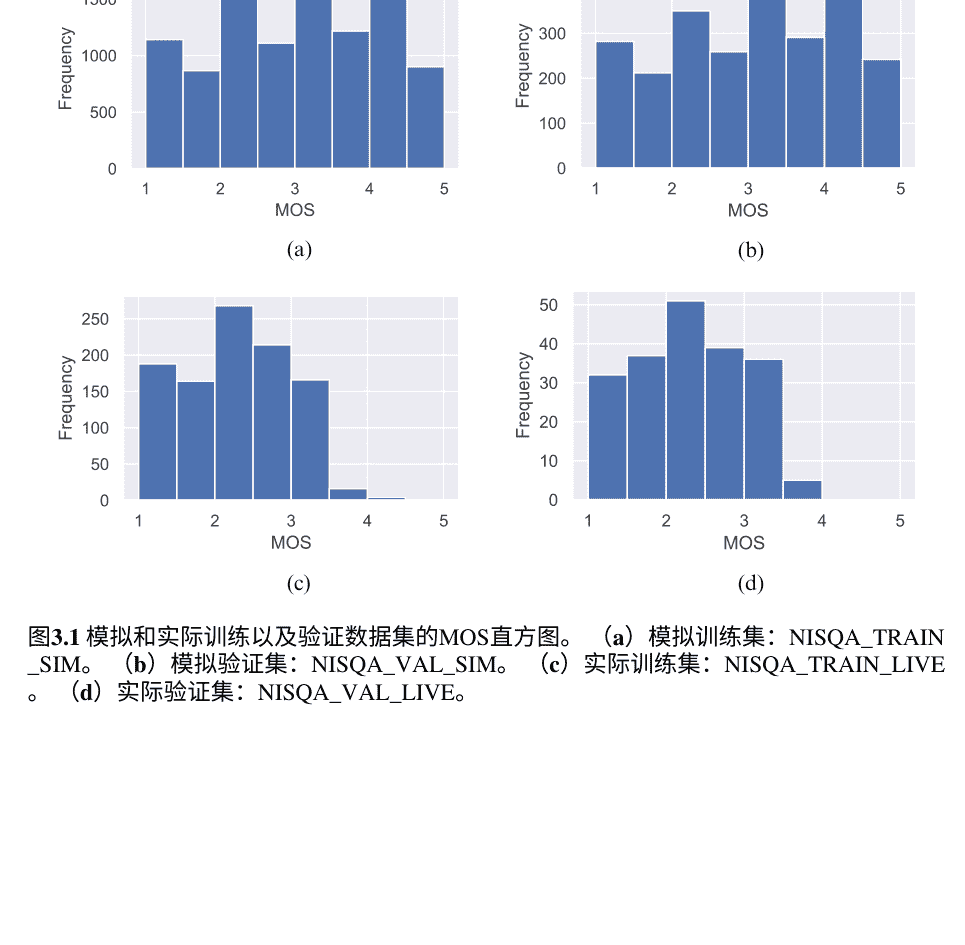

## 3.2 神经网络模型概述

在本节中，概述了用于语音质量预测的不同神经网络架构。本章介绍的基于深度学习的语音质量模型通常可以分为四个阶段：1. Mel-Spec分割
2. 帧模型
3. 时间依赖模型
4. 池化模型
该架构的概述可见于图3.2。在预处理阶段，从输入信号计算出Mel频谱图(Mel-specs)，然后将其分成重叠的片段。在第二阶段，使用帧级神经网络将Mel-spec片段作为输入，自动学习适用于语音质量预测的特征。这些特征是基于帧计算的，因此会产生一系列帧级特征。在这项工作中，前馈神经网络和卷积神经网络（CNN）用于帧级建模。在第三阶段，对特征序列的时间依赖性进行建模。分析了两种不同的方法来对语音质量特征进行时间依赖性建模，即LSTM网络和自注意力网络。最后，特征在时间上进行聚合。

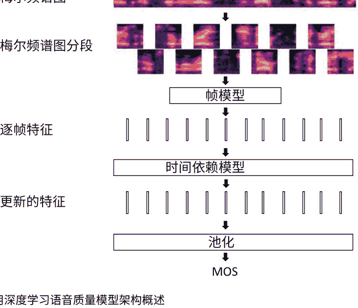

在池化层中。然后使用聚合特征来估计单个MOS值。对于最后一个阶段，分析了经典的平均池化层、最大池化层以及注意力池化层。

## 3.3 Mel-Spec 分割

语音质量模型的输入是具有48个梅尔频带的梅尔频谱图分段。FFT窗口长度为20毫秒，跳跃大小为10毫秒。梅尔频谱图中的最大频率选择为20千赫，以便能够预测全频带的语音质量。这些梅尔频谱图被分成宽度为15（即150毫秒）和高度为48（对应48个梅尔频带）的分段。分段之间的跳跃大小为4（40毫秒），导致分段重叠率为73%，对于10秒的语音信号总共有250个分段。这个想法是，逐帧网络将自动学习集中在梅尔频谱图分段的中心。

## 3.4 逐帧模型

本节描述了两种作为帧级模型使用的神经网络架构。第一个模型是一个具有六个卷积层的CNN。作为基准模型，介绍了一个前馈神经网络。

### 3.4.1 卷积神经网络

CNNs最常用于图像分类领域，并且具有自动学习适合给定回归或分类任务的特征集的能力。这个特征集学习是在所谓的卷积层中完成的，这给神经网络命名（参见第2.6.2节）。最近，它们在音乐和语音的识别或检测任务中越来越多地被使用（Amiriparian等, 2017年；Pons和Serra, 2017年；Schlöter和Böck, 2014年；Tóth2015年；Zhang等, 2015年）。此外，Mittag和Möller（2018年）表明CNNs可以成功地用于检测语音频谱图中的丢包。在提出的CNN中，使用了三个最大池化层来对特征图进行时间和频率上的下采样。下采样过程有助于加快计算时间，并通过减少参数的数量来避免模型的过拟合。

在网络中。为了进一步减少过拟合，应用了dropout层。为了使训练更稳定和更快，集成了批归一化层。实现了ReLU层，使模型能够学习非线性关系。

所提出的CNN的各个块和输出尺寸如表3.3所示，并在图3.3中可视化。而RGB图像有三个通道——每个颜色一个通道——Mel-spec输入只有一个通道，表示声谱图的振幅。卷积层的卷积核大小为3×3。该卷积核在Mel-spec上滑动，为每个3×3帧的Mel-spec计算特征，Mel-spec的大小为48×15，边界用零填充以保持相同的总体大小。在训练过程中，卷积核的权重通过反向传播自动学习。

第一个卷积层包含16个卷积核；因此，输入的高度和宽度保持不变，但通道大小增加到16。在一个批次中

表3.3 CNN设计。卷积核大小为3×3
| 层 | 通道 | 高度 | 宽度 |
| --- | --- | --- | --- |
| 输入 | 1 | 48 | 15 |
| 卷积1 | 16 | 48 | 15 |
| 批量归一化 | | | |
| ReLU | | | |
| 自适应最大池化 | 16 | 24 | 7 |
| 卷积2 | 16 | 24 | 7 |
| 批量归一化 | | | |
| ReLU | | | |
| 自适应最大池化 | 16 | 12 | 5 |
| Dropout (20%) | | | |
| 批量归一化 | | | |
| ReLU | | | |
| 卷积3 | 32 | 12 | 5 |
| 批量归一化 | | | |
| ReLU | | | |
| 卷积4 | 32 | 12 | 5 |
| 批量归一化 | | | |
| ReLU | | | |
| 自适应最大池化 | 32 | 6 | 3 |
| Dropout (20%) | | | |
| 卷积5 | 64 | 6 | 3 |
| 批量归一化 | | | |
| ReLU | | | |
| Dropout (20%) | | | |
| 卷积6 (无宽度填充) | 64 | 6 | 1 |
| 批量归一化 | | | |
| ReLU | | | |
| 输出 (展平) | 384 | | |

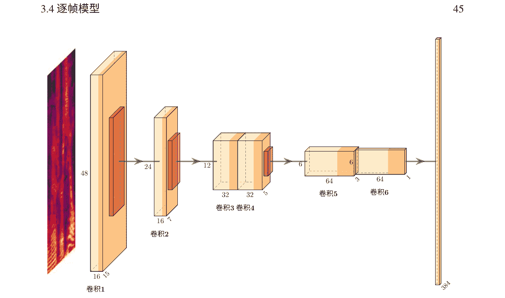

图3.3 以单个Mel-spec片段作为输入的CNN架构

在归一化和ReLU层之后，特征矩阵的大小从48 ×15降采样到24 ×7。在接下来的块中，特征矩阵的大小进一步减小，而通道大小和因此生成的特征数量增加。因此，网络开始时的卷积核主要关注低级特征，因为卷积核只能看到总Mel-spec的一个小帧。相反，在后面的块中，具有更多复杂性（即更多卷积核）的CNN计算更高级的特征，因为卷积核可以看到更多的上下文。在最后一个卷积层中，不应用零填充，以便在时间域中将特征大小降采样到单个值，在频率域中有6个频率段。

一个150毫秒Mel-spec片段的CNN输出因此是64个特征，这些特征是计算在6个不同的频率范围内的。最后，这个64 ×6 ×1的特征矩阵被展开成一个大小为384的特征向量。一个10秒语音信号的输出将导致一个长度为250的序列（对应于10秒），每个序列具有384个特征（250×384矩阵）。

### 3.4.2 前馈网络

作为基准模型，实现了一个具有四层深度的基本前馈神经网络。首先，Mel-spec矩阵从48 ×15的大小展开为大小为720的向量。然后，跟随着四个全连接的神经网络，每个网络有2048个隐藏单元。ReLU层被用作激活函数，同时使用了dropout层。

表3.4 深度前馈神经网络设计
| 层 | 通道 | 高度 | 宽度 |
| :--- | :--- | :--- | :--- |
| 输入 | 1 | 48 | 15 |
| 批量归一化 | | | |
| 展平 | 720 | | |
| 全连接1 | 2048 | | |
| 批量归一化 | | | |
| ReLU | | | |
| Dropout (20%) | | | |
| 全连接2 | 2048 | | |
| 批量归一化 | | | |
| ReLU | | | |
| Dropout (20%) | | | |
| 全连接3 | 2048 | | |
| 批量归一化 | | | |
| ReLU | | | |
| Dropout (20%) | | | |
| 全连接4 | 2048 | | |
| 批量归一化 | | | |
| ReLU | | | |
| 输出 | 2048 | | |

在最后三个全连接网络之前添加了Dropout层以避免过拟合。一个10秒的语音信号的输出会得到一个长度为250的序列，每个序列有2048个特征（250 × 2048矩阵）（表3.4）。

## 3.5 时间依赖建模

在下一个阶段，对帧特征序列之间的时间依赖关系进行建模。到目前为止，模型只看到了一个小的150毫秒的语音信号片段。在这个时间依赖性阶段，序列的每个特征向量可以相互作用以提高预测性能。例如，虽然整体上安静或稍微太响的信号可能不会被感知为强烈的质量降低，但是音量的变化可能会被语音通信服务用户感到烦人。在时间依赖性建模过程中，神经网络可以比较各个片段的音量并相应地更新特征。因此，这个阶段的输出是另一个特征序列。

分析了三种不同的方法：LSTM、Transformer和自注意力神经网络。

### 3.5.1 LSTM

递归神经网络是一类神经网络，允许将先前的输出用作当前的输入。它们可以使用内部状态记忆来记住历史序列信息，从而在考虑先前输入的情况下做出决策（参见第2.6.2节）。RNN的一个优点是它们允许将不同长度的时间序列作为输入。LSTM网络是一种RNN类型，能够在较长时间内记住其输入，因此能够建模长期依赖问题。这种类型的网络通常用于时间序列预测。更具体的变体是学习时间步之间双向依赖关系的BiLSTM层。

在这项工作中，每个方向上都使用了具有128个隐藏单元的单个BiLSTM层。因此，对于一个10秒的信号（250 × 384的输入矩阵），LSTM层的输出是250 × 256。然而，这项工作中的模型可以应用于可变长度的信号，因此输出的序列长度取决于输入信号的持续时间。对于长度为四个时间步的LSTM网络的顶层图示如图3.4所示。它显示了作为LSTM+网络正向输入的帧特征 x_i 以及作为LSTM-网络反向输入的帧特征。在每个时间步，LSTM网络接收当前时间步的帧特征和上一个时间步的LSTM输出作为输入。因此，在序列结束时，网络“看到”了所有的

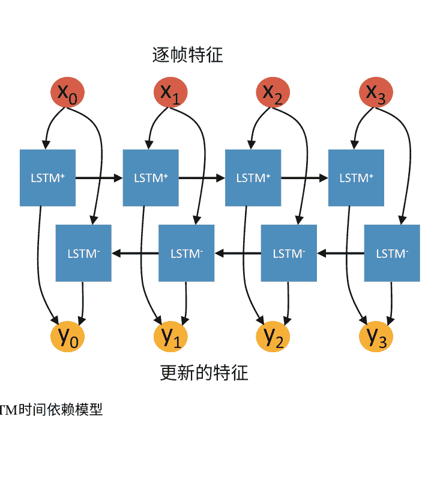

### 3.5.2 Transformer/自注意力

最近，Transformer网络在许多任务中表现出优于LSTM网络的性能，特别是在自然语言处理中。Transformer模型由一个处理输入序列的编码器网络和一个生成输出序列的解码器网络组成。因为语音质量模型的输出是一个单一值而不是一个序列，所以在这项工作中只应用了Transformer编码器。编码器主要由多头自注意力层和随后的前馈层组成。这个Transformer块被多次重复以创建一个深度网络。自注意机制允许一个时间步骤的输入关注其他时间步骤，从而实现不同时间步骤之间的交互（也见第2.6.2节）。

Vaswani等人（2017）提出的Transformer块显示在图3.5左侧的框架内，多头注意力机制

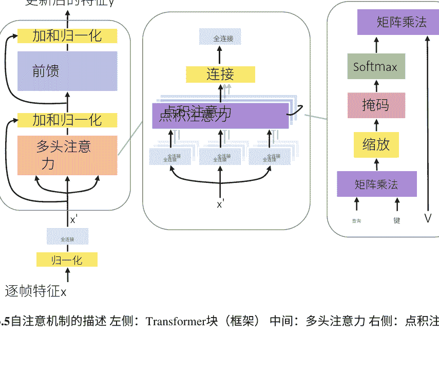

图3.5 自注意机制的描述 左侧：Transformer块（框架） 中间：多头注意力 右侧：点积注意力

点积注意力包含在Transformer块中，中间显示多头注意力，右侧显示点积注意力，这又包含在多头注意力机制中。

#### Transformer块

Transformer块的输入是由逐帧模型（例如CNN）生成的逐帧特征序列（x₁, x₂, …）。该输入序列经过多头自注意力子层和下面的前馈子层进行处理。在每个子层周围，使用残差连接（He等人，2016），然后进行层归一化。残差连接允许梯度直接通过网络流动，通过将输入和层的输出相加。因此，它们有助于通过避免梯度消失或梯度爆炸来训练模型。因此，每个子层的输出是 LayerNorm(x + Sublayer(x))，其中 Sublayer(x)是子层本身实现的函数。为了允许输入和输出的添加，模型中的所有子层必须产生相同维度的输出 d_to。因此，首先对输入序列(x₁', x₂', …)（在CNN帧级模型中维度为 d_cnn=384）应用全连接（FC）网络，以在每个时间步骤产生长度为 d_to的向量序列 (x₁', x₂', …)。前馈子层由两个具有ReLU激活函数和中间的dropout的全连接层组成，包含 d_to,hidden units。Transformer块（在图3.5左侧框出）被多次堆叠以形成深度神经网络。输出特征序列为 (y₁, y₂, …)，其中每个时间步骤向量都更新了来自其他时间步骤的相关信息。

#### 多头自注意力

多头自注意力机制是Transformer块的核心部分。基于输入序列的每个时间步骤 (x₁', x₂', …)，通过与一组可学习的三个权重矩阵进行矩阵乘法计算，得到一个查询、一个键和一个值。这些权重矩阵实现为全连接层。每个全连接层的输出产生一个包含查询、键和值向量的 Q, K, 和 V矩阵，每个时间步长上的长度为 d_to。注意力函数不是使用 d_to维的查询、键和值执行单个注意力函数，而是并行执行多个“头”。多头机制允许模型同时关注不同表示子空间中的不同位置的信息。每个头的输出被连接起来，并与一个权重矩阵（实现为全连接层）相乘，以输出一个具有维度 d_to的更新特征序列。

> 1. 为了使模型能够利用序列的顺序，Vaswani等人（2017）在输入序列中添加了位置编码，以注入有关时间步骤在序列中的相对或绝对位置的信息。直观上，这对于语音质量估计的任务可能是有益的，但在这项工作中并没有改善结果，因此被排除在外。

#### 点积自注意力

注意机制可以被描述为将一个查询和一组键-值对映射到一个输出。输出是通过对值的加权求和来计算的，其中分配给每个值的权重是由查询与相应键的兼容性函数计算得出的。在自注意力机制的情况下，查询、键和值的序列由三个不同的全连接层产生，所有这些层都使用相同的输入序列$x^{'}$。得到的矩阵$Q$、$K$和$V$是注意机制的输入，其中查询和键通过点积进行比较。为了依次获得所有时间步骤的点积，计算了$Q$和$K$之间的矩阵乘法（$MatMul$）。因此，每个时间步骤的查询与序列中所有时间步骤的键进行比较，得到一个$L \times L$的注意力分数矩阵，其中$L$是序列长度。由于对于大的维度$d$，梯度可能变得非常小，因此将分数矩阵除以$d$进行缩放。然后，应用softmax函数对注意力分数进行归一化，并获得值的权重。最后，将得到的权重应用于值矩阵$V$，通过另一个矩阵乘法进行计算。因此，输出计算为

$$注意力(Q, K, V) = \mathrm{softmax}\left(\frac{QK^{T}}{\sqrt{d_{k}}}\right)V$$ (3.1)

因此，序列中的每个时间步由所有序列步骤的加权平均值组成。通过这种方式，每个时间步可以从序列中的其他时间步骤中获取信息。

由于本工作使用可变长度的语音信号作为输入，因此在将它们传递给自注意力网络之前，需要将特征序列用零填充到最长序列的长度$L$。为了避免网络关注这些零填充的时间步骤，将掩码应用于注意力得分$L \times L$-矩阵。与零填充的时间步骤对应的softmax函数输入中的所有值都被屏蔽，将它们设置为$-\infty$。

#### 自注意力时间依赖模型

在本工作中，Transformer被应用为时间依赖模型。由于Transformer块仅对由另一个深度网络计算的逐帧特征的时间依赖性进行建模，因此Transformer网络的复杂度相对较低即可。此外，在实践中，注意力机制的多头并没有改善结果。因此，该块采用单头、2个块的深度、$d_{\mathrm{tf}}=64$的模型维度和一个具有$d_{\mathrm{tf}, \mathrm{ff}}=64$隐藏单元的前馈网络进行实现。基于Transformer块的该模型被称为自注意力（SA）时间依赖模型。

作为比较的基准，模型使用原始超参数由Vaswani等人（2017）提供，包括8个头部，6个连续的Transformer块的深度，模型维度为$d_{\mathrm{tf}}=512$，以及具有$d_{\mathrm{tf}, \mathrm{ff}}=2048$隐藏单元的前馈网络。该模型被标记为Transformer（TF）（尽管它只包含原始Transformer模型的编码器部分）。

## 3.6 时间池化

电话呼叫的质量通常不能通过简单地取时间上的平均质量来准确预测。正如Berger等人（2008）所示，必须充分考虑电话呼叫中的“最近效应”和对质量较差片段的加权。例如，短暂的中断声音被证明比持续的背景噪音更令人讨厌（Waltermann 2012）。此外，在原始语音信号的静默段期间的低质量对整体语音质量的影响较小，而在活跃语音段期间的低质量可能甚至会干扰传输语音的可理解性。

因此，对于时间上的神经网络特征聚合，分析了四种不同的方法：平均池化、最大池化、最后一步池化和注意力池化。

### 3.6.1 平均-/最大池化

最简单的池化形式是取所有输入值的平均值或最大值。由于本研究中的语音信号大小不一，需要对序列进行填充以进行某些操作。因此，对于平均池化，输出序列进行了零填充。然后，对于每个特征，计算填充序列长度 L 的总和。之后，将总和除以原始序列长度 M，如下所示：

$$ z(k) = \frac{1}{M} \sum_{i=1}^{L} y_i(k), \quad (3.2) $$

其中 \( k \in (1, 2, \ldots, d) \) 是特征向量 \( y_i(k) \) 的索引，长度为 \( d \)，而 \( (y_1, y_2, \ldots, y_L) \) 是经过时间依赖建模后的特征向量序列。

由于神经网络的输出值可以是负数，对于最大池化，序列会用负无穷大的值进行填充。然后，对每个特征取序列长度的最大值。

最后，应用全连接层来估计从池化特征向量中得到的整体MOS值 z。

### 3.6.2 最后一步池化

循环神经网络（如LSTM网络）以递归的方式处理输入序列，并记忆来自先前时间步的信息。因此，网络在最后一个时间步已经看到了整个特征序列，而不是在所有时间步上取平均值或最大值。在这种情况下，也可以使用最终时间步的输出作为整体质量的估计值。在具有多个层的LSTM中，只使用最后一层的输出。当应用BiLSTM时，需要将反向LSTM网络序列的第一个时间步（即网络在反向方向的最终输出）与正向方向网络的最后一个时间步进行连接，如下所示：

$$z = \text{concat}(y_M^+, y_1^-), \tag{3.3}$$

其中 $(y_1^+, y_2^+, \dots, y_M^+)$ 是LSTM网络最后一层的输出，表示正向传播的结果， $(y_1^-, y_2^-, \dots, y_M^-)$ 是LSTM网络最后一层的输出，表示反向传播的结果， $M$ 表示原始序列的长度。再次，输出向量 $z$ 被应用于一个最终的全连接层，输出大小为1，用于估计整体MOS。

### 3.6.3 注意力池化

为了实现时间汇聚的目的，本文提出了一种注意力池化（AP）机制。通常，注意力机制是通过将两个序列进行比较，然后计算每个时间步的权重向量来应用的。因此，输出将是另一个向量序列。然而，在池化的情况下，目标是仅获得一个单一的特征向量。理论上，每个时间步都可以与一个单一向量进行比较，例如所有时间步的平均值或最大值。然后，这将导致一个权重向量，可以应用于各个时间步骤，以产生一个汇聚的特征向量。然而，与平均值或最大值进行比较并没有证明是有意义的。因此，不是将时间步骤与另一个向量进行比较，而是提出使用前馈网络直接预测每个时间步骤的注意力分数。

注意力池化块的概述如图3.6所示，其中 $y$ 是时间依赖模型的输出 $d_{td} \times L$ 矩阵。该矩阵包含长度为 $L$ 的零填充序列，其特征向量维度为 $d_{td}$ 。前馈网络的输出大小为1，分别和相同地应用于每个时间步。用于计算注意力分数的前馈网络参数在模型训练期间自动学习。因此，网络为每个时间步产生一个分数。前馈网络显示在表3.5中。它由两个具有ReLU激活函数和它们之间的dropout的全连接层组成。隐藏单元的数量 $d_{ap}$ 设置为128，其中输入维度 $d_{td}$ 取决于时间依赖模型（例如 $d_{td} = d_{sa} = 64$ ）。

前馈网络计算的注意力分数然后在零填充的时间步上进行掩码处理，并应用于softmax函数以产生归一化的注意力权重。这些权重应用于输入矩阵 $y$ 与一个矩阵乘法操作。 加权平均特征向量 z 最终通过全连接层传递，以估计整体语音质量。

表3.5 注意力池化机制的前馈网络

| 层 | 特征 | 长度 |
| :--- | :--- | :--- |
| 输入 | d_td | L |
| 全连接1 | d_ap | L |
| ReLU | | |
| Dropout (10%) | | |
| 全连接2 | 1 | L |

## 3.7 实验和结果

在本节中，将展示一个由CNN作为逐帧模型、自注意力网络作为时间依赖模型和注意力池化网络作为汇聚模型（CNN-SA-AP）组合而成的模型在考虑的数据集上取得最佳结果。 为此，进行了一项消融研究，在该研究中，三个神经网络模型阶段中的一个被移除或替换为另一种网络类型。

### 3.7.1 训练和评估指标

所提出的模型采用Adam优化器进行端到端训练，批量大小为60，学习率为0.001。训练过程中使用了早停策略，在验证集上检查了15个时期，其中PCC（皮尔逊相关系数）和RMSE（均方根误差）。当PCC或RMSE在超过15个时期内没有改善时，训练停止。

用于训练和评估的数据集来自第3.1节。用于训练的模拟和实时训练集NISQA\_TRAIN\_SIM和NISQA\_TRAIN\_LIVE。模型在验证数据集NISQA\_VAL\_SIM和NISQA\_VAL\_LIVE上进行评估。由于训练和验证集来自相同的分布，因此理论上不存在数据集之间的主观偏差，因此评估中不应用多项式映射。

此外，由于数据集中的MOS值在最小值和最大值之间分布相对均匀，因此在本节中仅使用PCC作为评估指标。

对于实时数据集的结果尤其感兴趣，因为它们更加“真实”，从而更好地表明模型在实际环境中的准确性。然而，实时验证集比模拟数据集要小得多。因此，分别计算模拟数据集和实时数据集的PCC。然后，计算两个数据集的平均值，并用于模型评估，如下所示：

$$ r = \frac{r_{\text{val\_sim}} + r_{\text{val\_live}}}{2}. \qquad (3.4) $$

在模型的一个训练运行中，每次通过训练集的循环后，计算验证集上的性能。当计算验证性能时，存储模型权重，并开始下一个时期。在模型训练完成后，保存在验证集上性能最佳的时期的模型。由于每次训练运行之前模型的权重都是随机初始化的，相同配置的结果可能会有很大差异。此外，辍学层通常作为正则化方法在神经网络中实现，会在训练过程中随机将一定比例的权重置零。此外，每个小批量呈现给模型的训练样本都是随机排序的。因此，为了能够比较不同的网络配置，在本节中运行训练12次，并以箱线图的形式呈现。还应注意，每个网络架构的超参数都经过经验调整，以获得整体模型的最佳结果。

### 3.7.2 逐帧模型

在这个小节中，模型训练是针对不同的逐帧模型运行的，这些模型为每个独立的Mel-spec片段计算特征。在图3.7的左侧，使用自注意力的语音质量模型的结果介绍了时间依赖模型和注意力池化模型，但是使用了三种不同的逐帧模型。箱线图的最左侧是CNN-SA-AP模型，它使用CNN进行逐帧建模，FFN-SA-AP模型使用前馈网络进行逐帧建模，而Skip-SA-AP模型将Mel-spec片段直接应用于自注意力网络而不进行逐帧建模。

可以看出，具有平均PCC约为0.87的CNN模型明显优于其他两个模型，其中没有逐帧建模的模型仅获得约为0.77的PCC。前馈网络有助于提高性能，但无法达到CNN的类似结果。

可以说相对低复杂度的SA模型在同时建模帧特征和时间依赖性方面不包含足够的参数。因此，在图3.7b中，CNN模型与更大的时间依赖性模型进行了比较。TF-AP代表具有Transformer网络和注意力池化的模型，而LSTM-AP模型使用了一个深度为3层的更大的BiLSTM网络，每个方向上包含1024个隐藏单元。这两个模型的Mel-spec段宽度从15个频率bin（即50毫秒）减少到5个频率bin，因为没有帧级模型在将段降采样后将其传递给TF/LSTM模型。有趣的是，可以注意到Transformer模型与具有前馈网络的自注意力模型（FFN-SA-AP）获得了大致相同的结果。深度LSTM模型的性能优于低复杂度的SA模型，但仍然不及Transformer模型。

总的来说，可以得出结论，相对于Transformer/自注意力和LSTM网络作为逐帧模型，CNN表现更好。

### 3.7.3 时间依赖模型

在这个小节中，比较了不同的时间依赖模型。图3.8a展示了具有CNN逐帧建模和注意力池化以及三种不同时间依赖模型的结果。最左边的模型仍然是CNN-SA-AP模型，它使用自注意力进行时间依赖建模，CNN-LSTM-AP模型使用具有一层和128个隐藏单元的BiLSTM网络，而CNN-Skip-AP模型跳过时间依赖阶段，直接汇集CNN的输出。可以看出，不同的时间依赖模型之间的差异并不像逐帧模型那样大。也就是说，可以注意到包含时间依赖模型可以提高整体性能，其中自注意力网络表现优于LSTM网络。自注意力网络的PCC平均比没有时间依赖的模型高约0.15。

不同的时间依赖模型也可以通过应用自注意力网络或反之亦然来进行组合。这些组合的结果显示在图3.8b中，可以看出两种组合的平均表现都比仅使用LSTM或SA网络要差。

总的来说，可以得出结论，对于语音质量模型来说，包含时间依赖阶段是有益的。在这个目的上，使用自注意力网络或LSTM网络的差异很小，但SA网络在平均情况下表现最好。

### 3.7.4 池化模型

在这个小节中，将比较不同的汇聚模型，其中对于逐帧建模，应用了CNN。不同的汇聚机制包括平均汇聚（Avg）、最大汇聚（Max）和注意力汇聚。在循环LSTM网络的情况下，还可以使用最后一个时间步的输出进行汇聚（Last）。

中间的图3.9b将提出的CNN-SA-AP模型与具有最大或平均池化的CNN-SA模型进行了比较。尽管性能差异相对较小，但可以看出注意力池化优于其他两种方法，其中平均池化和最大池化实现了大致相同的结果。在图3.9c中使用LSTM进行时间依赖建模的情况下，注意力池化再次优于其他机制，其中平均池化实现了类似的结果。最后一步池化和最大池化被其他方法超越。相比之下，在图3.9a中，CNN的输出在没有时间依赖模型的情况下直接进行池化，最大池化优于平均池化。

## 3.8 总结

在本章中，介绍并比较了不同的神经网络架构，用于单端整体语音质量预测任务。首先，介绍了一个包含12500个模拟条件的大型数据集，每个条件都包含来自3260个不同说话者的不同句子。此外，还创建了一个包含实时条件和总共1220个文件的数据集。这些数据集被分为训练集和验证集，并通过众包对它们的质量进行评估，收集了超过68000个评分。

然后，对深度学习语音质量模型进行了总体概述。它们被分为四个阶段：Mel-spec分割、逐帧模型、时序依赖模型和池化模型。每个阶段的个别神经网络在第3.4-3.6节中进行了描述。在第3.7节中，对所提出的数据集进行了训练和评估。通过消融研究，证明了CNN-SA-AP模型的组合通过取代或删除三个神经网络模型阶段中的一个来获得最佳结果。

研究发现，基于帧级的CNN模型对预测和主观MOS之间的相关性有最大的影响。加入时间依赖模型可以进一步提高性能，其中自注意力网络PCC比LSTM网络的结果PCC高约0.1。

当应用自注意力网络进行时间依赖建模时，池化阶段的影响相对较小。然而，实验证明，注意力池化机制优于平均池化、最大池化和最后一步池化。

## 第4章 使用孪生网络的双向语音质量预测

本章介绍了一种基于深度学习方法的双向语音质量预测模型。该架构基于第3章的单向模型，通过共享权重的孪生CNN-TD网络计算参考信号和降质信号的特征表示。然后，利用注意力机制对这些特征进行信号对齐，并结合起来估计整体语音质量。所提出的网络架构解决了通过VoIP网络传输的语音信号的时间对齐问题，并展示了如何将干净的参考信号纳入基于端到端训练的神经网络的语音质量模型中。

## 4.1 引言

根据Jekosch (2005) 的说法，当人们评判一个语音样本的质量时，他们会将所感知到的语音信号特征与他们对语音信号的期望特征（即个人期望、相关需求或社会要求）进行比较。在仪器化语音质量预测模型的背景下，这个内部参考通常被等同于干净的参考语音信号。干净的参考代表了主观听觉实验中可能的最高质量，因为它不受任何失真的影响。因此，大多数基于信号的语音质量模型是基于参考信号和被考虑的降质语音信号之间的比较。例如，目前用于语音质量估计的最先进模型POLQA（ITU-T Rec. P.863 2018）从时间-频率表示中计算出距离特征，然后将得到的特征映射到整体质量。在使用深度学习模型进行语音质量预测之前，双端模型通常比单端模型表现更好。目前ITU-T 推荐 P.563 用于单端语音质量预测，例如，在丢包或实时通话条件下被认为是不可靠的(Hines et al. 2015a)。 然而，最近基于深度学习的模型（见第2.6.3节）仅使用退化信号作为输入。

在本章中，介绍了一种将清晰参考信号纳入基于深度学习的模型的方法。所提出的模型首先通过 CNN-TD 网络计算语音信号的特征表示。 同时将清晰参考信号和退化信号发送到该网络。 该网络共享权重，从而为两个输入进行优化。 这种类型的架构也被称为孪生神经网络，可以计算不同输入向量之间可比较的特征。 例如，它们已被证明对于图像质量预测（Bosse et al. 2018）和说话人验证任务的对齐（Zhang et al. 2019）非常有用。

双向语音质量预测的主要挑战之一是信号的对齐。 当语音信号通过通信网络发送时，会暴露于信道延迟。 在VoIP网络中，抖动缓冲区通过在时间上拉伸和收缩语音信号来补偿网络中的延迟包。 当延迟达到一定阈值时，抖动缓冲区也会丢弃数据包以减少延迟。 这引入了一个难以确定的语音信号中的可变延迟。 例如，POLQA使用一个复杂的时间对齐算法（Beerends等人, 2013a），它由五个主要模块组成：滤波、预对齐、粗对齐、精细对齐和段组合。 本章介绍的模型使用Siamese网络的计算特征上的注意机制来对齐参考信号和退化信号。 然后，两个信号的特征在融合层中组合，并通过另一个时间依赖网络发送。 最后，特征在汇聚层中聚合以估计整体质量。

在下一节中，介绍了提出的双端模型及其各个阶段。在接下来的第4.3节中，对模型进行了训练，并讨论了结果。 最后，在本章的最后一节中总结了所提出的方法和结果。

## 4.2 方法

所提出的Siamese神经网络模型的架构如图4.1所示。蓝线表示参考信号的特征流，橙线表示降噪语音信号。这两个信号首先转换为时频域，然后通过相同的CNN和TD网络进行处理。

每个神经网络块输出的特征向量以2D条形图表示，其中每个条形图代表四个输入Mel-spec段的一个时间步长。 然后，这些输出被用作下一个神经网络块的输入。 在第一个TD块之后，参考信号与降噪信号对齐，并进行融合。

在融合层之后，两个信号的特征都存储在一个特征向量中，图4.1 具有Siamese CNN-TD网络的双端语音质量预测模型。蓝色线：参考信号的特征流。橙色线：降级信号的特征流。2D块表示每个神经网络块的输出特征这被表示为蓝色/橙色虚线箭头。此外，表示输出特征向量的2D块的大小由于融合而增加。最后，应用第二个时间依赖性和池化块。

在接下来的小节中，将更详细地描述双端模型的各个块。

### 4.2.1 连体神经网络

Siamese神经网络是一种包含两个或多个相同子网络的神经网络架构。在所提出的双端模型的情况下，这两个相同的模型是CNN和第一个TD网络，因此网络权重是基于两个输入进行优化的。因为CNN-TD网络为参考信号和降级信号计算相同的特征，并且经过训练以估计整体质量，所以理论上应该得到优化的特征，以找到两个信号之间的感知差异。

输入的Mel频谱图和CNN网络与第3章的单端模型相同。时间依赖块放置在时间对齐块之前，以使模型更加强调某些时间步骤，这些时间步骤可能对后续的对齐更加相关。

### 4.2.2 参考对齐

对齐是基于这样的观点，即某个时间步骤的参考特征与降噪信号的相应时间步骤特征相似，因为两者都经过相同的孪生神经网络处理。因为目标是预测降噪信号的感知质量，所以使用降噪特征作为预测的基础。对于每个降噪时间步骤，然后找到相应的参考信号时间步骤。通过这种方式，模型可以将降噪信号与原始无失真参考信号进行逐个时间步骤的比较。

为了确定特征向量序列之间的相似性，已经提出了许多不同的评分函数。在这项工作中，分析了以下四种常用的对齐评分函数，以确定它们对于对齐降噪和参考特征向量的适用性。

#### 点

点积是一种基本的对齐得分函数，通常与Siamese网络一起使用，或用于NLP任务中的对齐（Luong等人，2015年）。它是根据以下方式计算的：

```
s = u · v。
(4.1)
```

得到的对齐得分可以看作是退化信号和参考信号特征之间的相关度量。

#### 余弦

另一个经常使用的函数是余弦相似度（Graves等人，2014年），它可以看作是忽略向量大小的点积的变体。在归一化向量的情况下，余弦相似度与点积产生相同的结果。它的计算方式如下：

$$ s = \frac{\mathbf{u} \cdot \mathbf{v}}{\max(\|\mathbf{u}\| \cdot \|\mathbf{v}\|, \epsilon)} \quad (4.2) $$

其中 $\epsilon$ 被设置为1e-08，以避免零除。

#### Luong

这个对齐分数函数与点积类似，但是在计算两个特征向量的点积之前，参考信号会根据Luong等人（2015）的方法乘以一个可训练的权重矩阵，如下所示：

$$ s = \mathbf{u} \cdot \mathbf{W} \mathbf{v} \quad (4.3) $$

其中，$\mathbf{W}$ 是一个可训练的权重矩阵，$\mathbf{u}$ 是降级特征向量，$\mathbf{v}$ 是参考特征向量。

#### Bahdanau

根据Bahdanau等人（2015）的说法，这个对齐分数函数有时也被称为加性注意力分数，计算方法如下：

$$ s = \tanh(\mathbf{W}_u \mathbf{u} + \mathbf{W}_v \mathbf{v}) \quad (4.4) $$

其中，$\mathbf{W}_u$ 和 $\mathbf{W}_v$ 是两个不同的可训练权重矩阵。在两个向量相加后，应用了 tanh 激活函数，将输出值限制在[-1,1]的范围内。

然后计算每个可能的时间步骤的对齐分数$s$，得到一个$N \times M$的矩阵，其中$N$是降级信号的时间步骤数，$M$是参考信号的时间步骤数。通常，注意力分数在序列长度上进行归一化，然后用于计算所有特征向量的加权平均值，这也被称为软注意力。然而，对于两个信号的对齐，我们希望为每个降级时间步骤找到一个匹配的参考时间步骤。因此，采用了硬注意力方法，网络只关注具有最高相似度的参考时间步骤。为此，对于降级信号的每个时间步骤，找到具有最高对齐分数$s$的参考信号索引，并将该索引处的特征值保存为新的对齐参考特征向量。

### 4.2.3 特征融合

如图4.1所示，降噪信号的Siamese CNN-TD输出特征与参考信号的对齐输出特征相结合。Bosse等人（2018）表明，尽管网络应该能够自动找到这一点，但在回归任务中明确包含特征之间的差异对于回归任务可能是有帮助的。除了基于简单减法的距离度量之外，本研究还分析了受到Yu等人（2020）启发的其他常用融合方法。特征向量$v$和$u$的长度表示为$L$。

简单的逐元素乘法，保持降噪输入特征向量的维度。计算方法如下：
$$
f = u \circ v,
$$
其中$f$是长度为$L$的融合输出特征向量。

**$u/v/u - v$**
将降噪向量和参考向量进行连接，并使用附加的距离特征向量进行减法，如下所示：
$$
f = \mathrm{concat}(u, v, u - v),
$$
其中$f$是长度为$3L$的融合输出特征向量。

**$u + v/u - v$**
将参考和降级特征向量的加法和减法连接如下：
$$
f = \mathrm{concat}(u + v, u - v),
$$
其中$f$是长度为$2L$的融合输出特征向量。

**$u + v/u - v/uv$**
将参考和降级特征向量的加法、减法和乘法连接如下：
$$
f = \mathrm{concat}(u + v, u - v, u \circ v),
$$
其中$f$是长度为$3L$的融合输出特征向量。

**$u^{2} + v^{2}/(u - v)^{2}/uv$**
将特征向量的平方差、平方差和参考与降级特征向量的乘法连接如下：
$$
f = \mathrm{concat}(u^{2} + v^{2}, (u - v)^{2}, uv),
$$
其中$f$是长度为$3L$的融合输出特征向量。

## 4.3 结果

然后，双端模型在Sect. 3.1中提供的数据集上进行了训练和验证：NISQA_TRAIN_SIM，NISQA_TRAIN_LIVE，NISQA_VAL_SIM和NISQA_VAL_LIVE。训练参数设置与单端模型中的相同，并且同样应用了相同的CNN模型（参见Sect. 3.4.1）。作为性能指标，再次使用了实时和模拟验证数据集之间的平均皮尔逊相关系数。

在第一个实验中，比较了两种不同的时间依赖模型，以确定它们对双端语音质量预测的适用性。在第二个实验中，比较了不同的对齐层。在第三个实验中，分析了不同的融合方法，并最后将表现最佳的模型与单端模型进行比较，以分析通过包含参考信号可以实现的性能提升。

### 4.3.1 LSTM vs 自注意力

在这个实验中，使用了两种不同的神经网络架构作为时间依赖模型：(1) LSTM网络和(2)自注意力网络。对于两种类型的时间依赖建模，选择了两层深度。参考和降级特征与基本的“u/v/u − v”融合层进行融合。十次训练运行后的结果如图4.2所示。从左到右的第一和第三个箱线图分别代表了第3章中没有时间对齐、融合和第二个时间依赖块的单端模型“LSTM-SE”和“SA-SE”。“LSTM-DE”和“SA-DE”的箱线图代表了没有时间对齐块的双端模型。使用的数据集的输入信号已经对齐。在模拟数据集的情况下，引入延迟的唯一条件是编解码器和滤波器。在处理信号后，这些已知的固定延迟被移除，以得到对齐的信号。在实时数据集的情况下，将单个语音文件合并为一个超过一小时的语音文件。录制后，通过两个信号之间的互相关进行对齐，然后将其切割成原始大小的较小语音样本。因此，省略对齐块应该可以得到完全对齐的特征向量。虽然对于模拟数据集来说是可以的，但是在实时语音样本的传输中可能存在延迟。话虽如此，对于实时数据集的几个文件进行了抽查，没有发现任何对齐问题。

从图中可以看出，自注意力时间依赖块通常比LSTM网络表现更好。在这两种情况下，单端和双端模型之间的差距约为0.1的PCC。可以得出结论，LSTM和自注意力都适用于双端模型；然而，在数据集下，自注意力整体上优于LSTM网络。

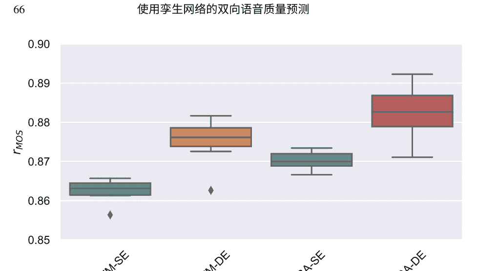

图4.2 单端(SE)和双端(DE)模型与LSTM和自注意力(SA)作为时间依赖块的比较。双端模型不包含对齐块（输入语音信号已经对齐，因此省略对齐块会产生对齐的时间步骤）。十次训练后的结果

研究。 因此，在接下来的实验中，只使用自注意力作为时间依赖模型。

### 4.3.2 对齐

在这个实验中，双端模型使用不同的对齐分数函数进行训练，而融合层的“$u / v / u - v$”融合被用于所有模型。 在双端模型中，两个时间依赖块都使用了具有两层的自注意力网络。 除了比较的四种不同的对齐分数函数之外，还包括一个没有对齐块的模型。 与第4.3.1节的先前实验一样，这将导致特征完全对齐，因为数据集的输入信号已经对齐。 然而，需要注意的是，时间对齐块无法从已经对齐的信号中受益。 在对齐网络中，将降级信号的每个时间步与参考信号的每个时间步进行比较。 因此，算法中不包含个别步骤的绝对或相对位置的知识。

在第10次训练运行后的结果在图4.3中呈现，其中“对齐”箱线图代表没有对齐块的模型。 可以看出，“余弦”对齐获得了最佳结果，平均与对齐输入的模型相等。 对齐输入的模型训练导致结果更加多样化。 第二好的对齐评分函数

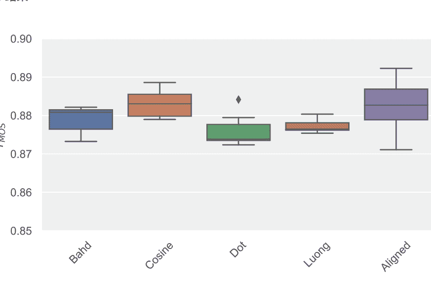

Bahdanau提出的方法是最好的，其次是“点”和“Luong”，它们获得了类似的结果。

实验证明，通过使用“余弦”对齐，可以实现与完全对齐信号相同的结果，证明了该对齐评分函数适用于参考信号对降质信号的对齐。例如，在帧丢失和零插入的情况下，受影响的时间步骤中的降质信号将会静音。在这种情况下，算法可能会找到一个静音的参考时间步骤（例如在参考信号的开头或结尾），从而高估语音质量。此外，在语音传输过程中，如果由于延迟而丢失了语音帧，模型将无法得知，因为它只考虑了降质信号及其对齐的参考时间步骤。如图4.1所示，模型的输入始终是降质信号及其对齐的参考时间步骤。未包含在降质信号中的参考信号时间步骤因此不被用作输入，也不被模型看到。然而，在考虑的数据集中，没有包含带有抖动缓冲管理的条件。

### 4.3.3 特征融合

基于前一节的结果，在这个实验中，使用自注意力和余弦对齐的双向模型通过五种不同的融合机制进行训练。十次训练后的结果如图4.4所示。可以看出

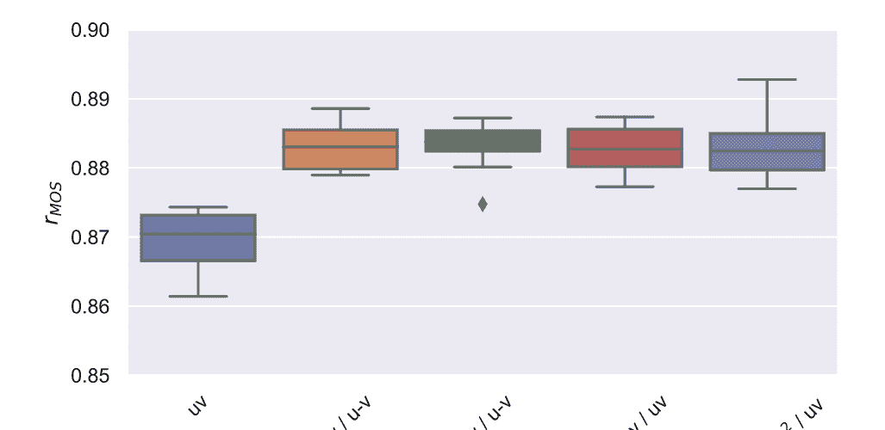

图4.4双向模型使用自注意力和余弦对齐的不同融合机制的比较。十次训练后的结果

可以看出，最简单的融合机制“uv”通过逐元素矩阵乘法得到的性能最低。另一方面，所有其他融合机制获得了类似的结果，表明融合层的具体实现并不重要，只要融合后的向量中包含了两个信号的信息以及一些距离或相似度的度量。

### 4.3.4 双端 vs 单端

最后，将最佳的双向模型与具有相同超参数但没有对齐、融合和第二时间依赖块的单向模型进行比较。作为时间依赖模型，使用了具有两层的自注意力块；作为对齐分数函数，使用了余弦相似度；对于未来的融合，使用了“u/v / u - v”机制。十次训练后的结果如图4.5所示。如前所述，当将单向模型与没有对齐块的双向模型进行比较时，双向模型相对于单向模型的性能提升约为0.012的PCC。这种相对较小的增加可以通过单向神经网络学习内部参考的能力来解释。

图4.5 单端和双端模型与自注意力、余弦对齐和“u/v/u - v”融合的比较。十次训练后的结果

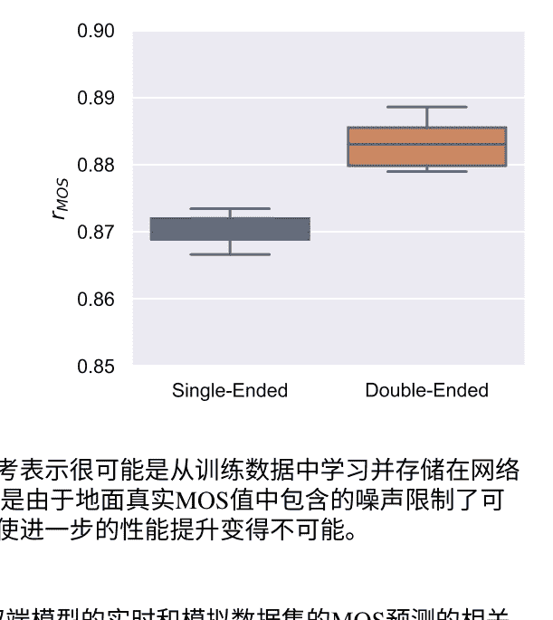

这种基于特征级别的通用参考表示很可能是从训练数据中学习并存储在网络权重中的。 另一个解释可能是由于地面真实MOS值中包含的噪声限制了可能实现的预测准确性，从而使进一步的性能提升变得不可能。

图4.6展示了来自单端和双端模型的实时和模拟数据集的MOS预测的相关图。 顶部的两个图(a)和(b)表示单端模型的预测，底部的两个图(c)和(d)表示双端模型的预测。

双端模型的一个假设可能是，在这种情况下，它比单端模型更准确地预测具有更高质量的样本，因为退化特征和参考特征之间的距离非常小。

另一方面，单端模型可以在没有参考可用的情况下判断语音样本的好质量，即使预测值较低。 然而，图表显示两个模型都能很好地预测具有高主观MOS的语音样本。 事实上，双端模型在2到4之间预测中等质量的样本要稍微好一些，因为在相关图中可以观察到较少的异常值。 因此，与最初的假设相反，可以认为双端模型不太可能将中等质量样本判断为非常高质量（MOS为5），因为它知道在这种情况下特征之间的距离会非常小，而单端模型无法获得这些信息。

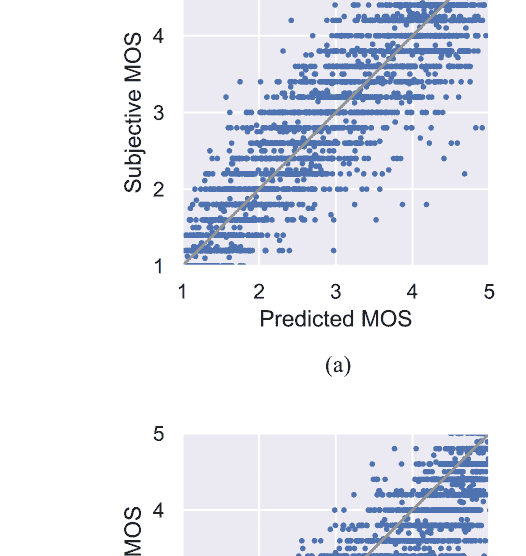

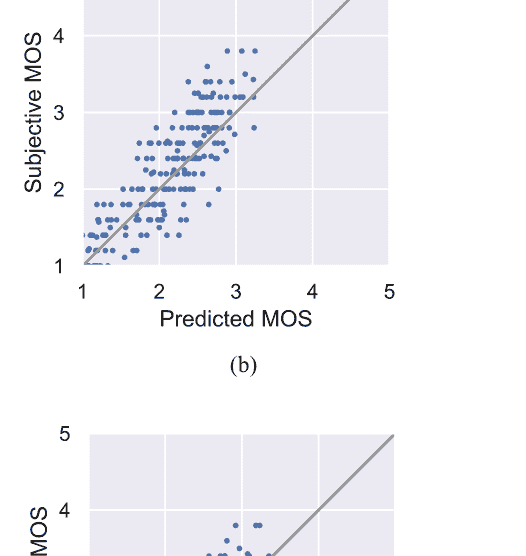

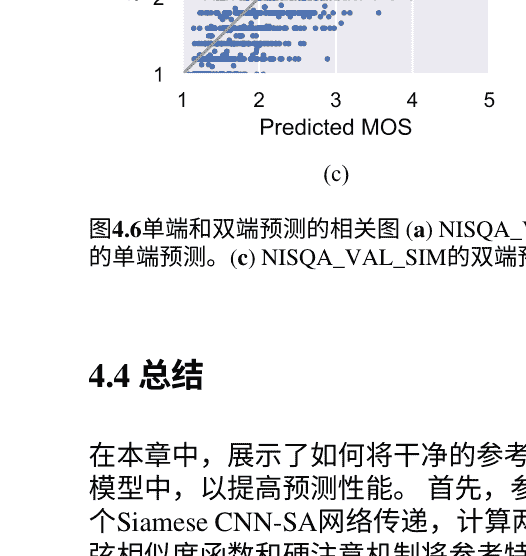

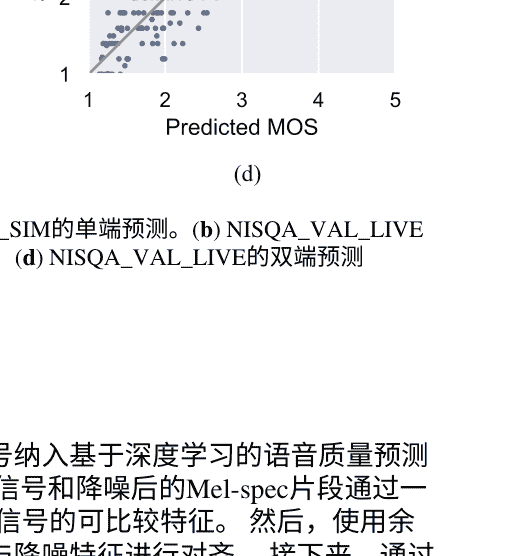

> 图4.6 单端和双端预测的相关图 (a) NISQA_VAL_SIM的单端预测。(b) NISQA_VAL_LIVE的单端预测。(c) NISQA_VAL_SIM的双端预测。(d) NISQA_VAL_LIVE的双端预测

## 4.4 总结

在本章中，展示了如何将干净的参考信号纳入基于深度学习的语音质量预测模型中，以提高预测性能。首先，参考信号和降噪后的Mel-spec片段通过一个Siamese CNN-SA网络传递，计算两个信号的可比较特征。然后，使用余弦相似度函数和硬注意机制将参考特征与降噪特征进行对齐。接下来，通过连接参考特征向量、降噪特征向量和距离特征向量来融合这些特征。然后，将融合后的特征传递到第二个自注意层，随后是最终的时间池化层。

实验证明，通过应用余弦相似度函数，实现的时间对齐可以达到与完全对齐信号相同的结果。
双向模型的性能优于单向模型，平均PCC增加约0.012。将参考信号纳入模型的一个优点是，模型不太可能错误地判断质量中等的语音样本为高质量。然而，考虑到侵入式语音通信监测设置所涉及的高工作量，性能提升似乎太小，无法证明使用双向模型比使用单向模型具有类似结果的优势。因此，在本工作的其余部分，只考虑单向模型。

# 第五章 使用多任务学习进行语音质量维度的预测

在本章中，介绍了基于机器学习的单端预测整体质量以及以下四个语音质量维度的方法：

- 噪声
- 色彩
- 不连续性
- 响度

得到的维度分数用于降解分解，并有助于理解低MOS分数的潜在原因。这些分数的主观真实值是第2.2节中介绍的感知质量维度。由于模型旨在从同一语音信号中预测整体MOS和附加的维度分数，因此预测可以看作是多任务学习（MTL）问题。整体质量在这里表示为MOS，而噪声、色彩、不连续性和响度分别表示为NOI、COL、DIS和LOUD。（然而，维度的主观真实值也是其刻度上的平均意见分数。）

## 5.1 引言

虽然可以使用相同的架构训练单独的模型来预测不同的任务（即质量维度），但通常有两个主要原因使得多任务模型更受青睐：（1）更快的计算时间和（2）通过正则化获得更好的结果。通过共享模型的大部分组件，可以实现更快的计算，因此模型的输出只需要计算一次，而不是每个任务计算一次。如果将多任务学习视为一种归纳传递形式，那么更好的正则化可以得到解释。

归纳传递的一个重要方面。通过从一个任务到另一个任务引入归纳偏差，模型更倾向于学习解释多个任务的假设，从而减少过拟合的风险（Caruana 1997）。此外，如果一个任务的训练数据存在噪声，模型可能很难知道哪些输入特征是相关的。通过并行学习多个任务，其他任务可以为特征的相关性提供额外的证据。尽管在这项工作中，所有维度和整体MOS都由相同的测试参与者评分，但他们可能仍然对某个维度的评分更一致。当一个维度的评分不一致或存在噪声时，会导致对噪声的过拟合，在多任务学习中，模型通过对噪声模式进行平均来学习更一般的表示（Ruder 2017）。如果额外的任务只是为了改善主要任务的结果而学习，而实际上并没有使用这些额外任务的输出，这些额外任务被称为辅助任务。

在这项工作的特定情况下，更喜欢多任务模型的第三个原因是底层的降级组成方法。语音信号的整体预测质量应该可以通过单独预测的维度得分来解释。如果单独模型的预测完全独立，那么得分很可能相互矛盾。例如，整体MOS预测可能很低，但所有维度得分都很高。相反，如果模型的单独预测基于相同的特征计算，那么导致整体MOS低的特征很可能也会导致相应的维度得分低。这样，维度得分可以帮助理解为什么模型预测整体MOS低。例如，如果整体MOS和不连续性的预测得分低，而其他三个维度的得分高，可以假设整体低分的原因是模型发现了语音信号中的中断。虽然预测得分一致很重要，但维度得分仍应该相互正交。

理论上，模型将通过主观评分的端到端学习继承各个任务的正交特性。

将多任务学习应用于深度学习的两种常用方法要么是硬参数共享，要么是隐藏层的软参数共享（Ruder 2017）。在硬参数共享的情况下，大多数隐藏层在所有任务之间共享，除了任务特定的输出层。另一方面，在软参数共享中，每个任务都有自己的隐藏层，然后对层参数之间的距离进行正则化，以鼓励参数相似。换句话说，为每个任务训练了单独的模型，但在参数优化过程中，确保模型权重不会相差太大。

在这项工作中，分析了具有硬参数共享的多任务学习模型，用于语音质量维度预测，因为与软参数共享相比，计算时间要快得多。此外，软参数共享还引入了另一个需要调整的超参数（正则化参数）。

虽然硬参数共享在许多MTL问题中很有用，但如果任务不密切相关或需要在不同层次上进行推理，它可能会导致较低的整体性能。这种跨任务干扰导致MTL模型的性能较低，与单独训练的模型相比，也被称为

负迁移。 负迁移的另一个原因可能是任务的学习速率不同。 在这种情况下，模型可能已经过度拟合了其中一个任务，而对另一个任务仍在学习一般表示。因此，在设计MTL模型时，一个主要问题是应该共享多少模型。 一般来说，任务越相似，可以共享的模型就越多；如果任务非常不同，应尽可能共享以规范优化并避免过度拟合。

由于整体质量可以通过感知质量维度的综合获得，可以假设本工作中的不同任务是密切相关的。 虽然预测整体MOS的任务需要学习预测所有类型的失真质量，但维度任务需要学习预测对特定类型的失真的感知质量影响，而忽略其他类型的失真。 通过学习整体质量任务，模型已经学习了个别维度任务的失真特征表示。 然而，通过添加维度任务，模型还需要学习区分不同类型的失真并相应地分配和加权它们。 因此，本章分析的一个问题是模型区分不同类型的失真的属性是否有助于改善整体质量预测。 相反，分析了是否可以通过其他类型的失真的知识来提高特定维度的性能。 此外，还比较了单任务模型和多任务模型在整体性能方面共享不同数量的层，以回答共享多少模型的问题。

在下一节中，将介绍不同的MTL模型。 在接下来的第5.3节中，对模型进行训练，并分析和讨论结果。 最后，在本章的最后一节中总结了结论。

## 5.2 多任务模型

在本节中，将介绍基于第3章模型的四种单端MTL语音质量模型。 特别是因为在第3章中它在预测整体MOS方面取得了最佳结果，所以使用了一个具有CNN用于逐帧特征计算、自注意力块用于时间依赖建模和注意力池化层用于时间聚合的模型（CNN-SA-AP模型）。 在所提出的MTL模型中，从共享层到各自的非共享、任务特定输出层的转换位置是不同的。 在第一个提出的模型中，仅仅将最后一个全连接层的输出大小从1改变为5，以预测四个维度和整体质量。 接下来的模型逐渐共享越来越少的层，最后一个模型只在任务之间共享部分CNN。

### 5.2.1 全连接 (MTL-FC)

这个MTL模型通过仅改变模型的输出大小从一个到五来呈现出最大可能的共享层的数量。池化块的最后一层是一个全连接层，它接收池化特征。因为池化层只是聚合特征而不改变维度，所以最终全连接层的输入大小与时间依赖模型的输出大小相同（即自注意力块的值维度）。然后，最终的全连接层将这些池化特征映射到目标值。图5.1显示了来自第3章的单任务模型（ST）的最后一个全连接层，其中将池化特征映射到整体MOS值。

图5.2显示了具有额外输出的最后一个全连接层，用于预测语音质量维度分数，在这种情况下，最终的全连接层由每个预测维度和整体MOS的五个不同线性组合的池化特征组成。

图5.3概述了MTL-FC模型。虚线表示每个所示Mel-spec片段的特征流。每个Mel-spec片段首先通过相同的CNN进行处理。然后，CNN的输出通过时间依赖块进行处理，其中每个Mel-spec的CNN输出表示一个时间步。最后，特征通过池化块在时间上进行聚合。CNN、时间依赖性和池化层都由五个任务共享。只有模型的输出大小改为五。该模型被称为MTL-FC。

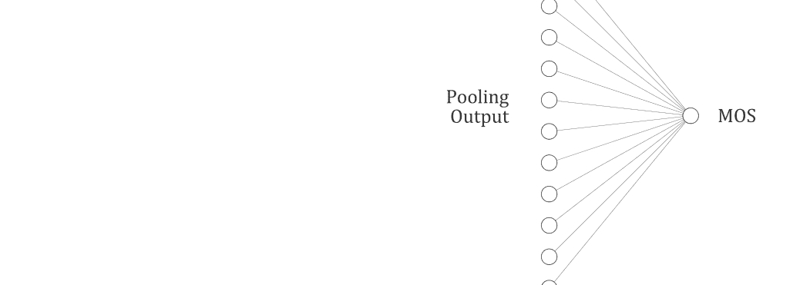

## 5.2 多任务模型

图5.2 MTL-FC模型的最终全连接层，带有维度预测

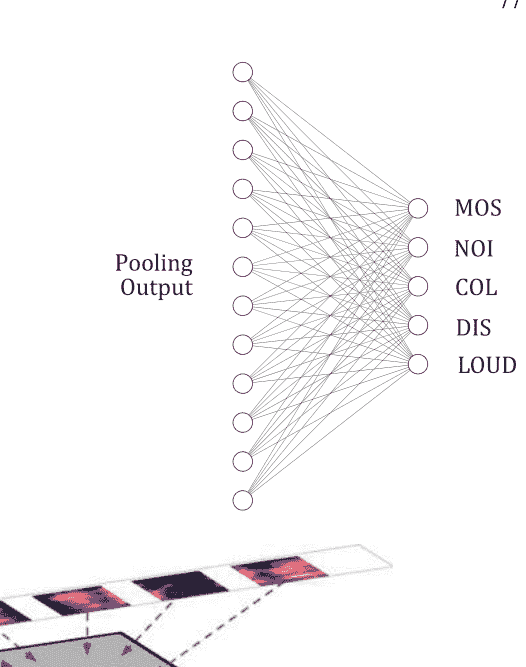

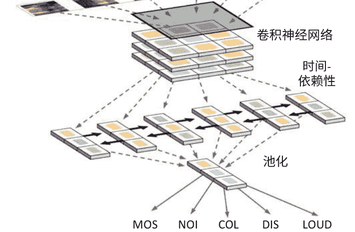

图5.3 MTL-FC模型。所有层都在任务之间共享，输出大小设置为五。虚线表示六个所示Mel-spec段/时间步骤的特征流

### 5.2.2 全连接 + 池化 (MTL-POOL)

在这个模型中，整个池化块是分别计算每个维度的。如图5.4所示，Mel-spec特征由相同的CNN和时间依赖性块计算每个维度。每个时间-依赖性时间步的输出然后成为预测整体MOS和维度得分的五个单独的池化块的输入。（为了清晰起见，只显示了五个输出中的两个。）从直观上讲，将池化分开是有意义的。

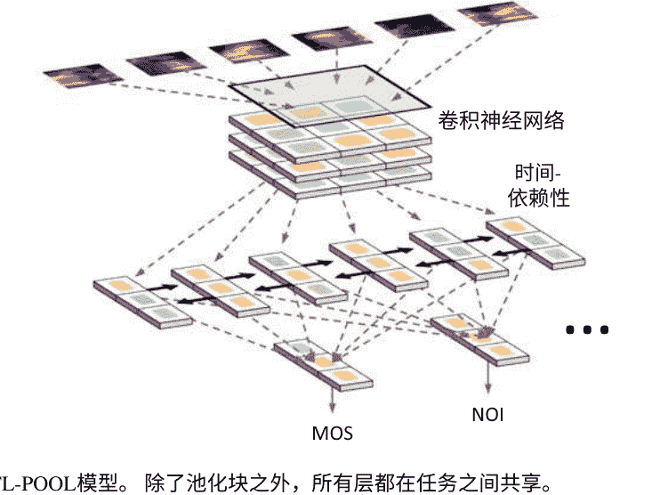

图5.4 MTL-POOL模型。除了池化块之外，所有层都在任务之间共享。只显示了五个输出中的两个（维度+总体MOS）。虚线表示六个Mel-spec片段/时间步骤中的一个的特征流。

### 5.2.3 全连接 + 池化 + 时间依赖（MTL-TD）

在这个模型中，只有CNN在任务之间共享，而有五个单独的任务特定的时间依赖和池化块。模型的概述如图5.5所示，只显示了五个输出中的两个。可以看到所有的Mel-spec特征向量都经过相同的CNN处理。然后，每个Mel-spec片段的CNN输出通过五个不同的时间依赖块并行路由。直观地说，为质量维度应用不同的时间依赖模型是有意义的，因为一些维度可能与其他时间步骤有不同的交互作用。例如，语音信号中的突然失真可能被感知为不连续性。然而，如果这种失真持续存在于信号中，可能会被感知为背景噪音。

个别时间步骤只能通过时间依赖块来学习这个上下文。具有个别时间依赖和池化块的模型被标记为MTL-TD。

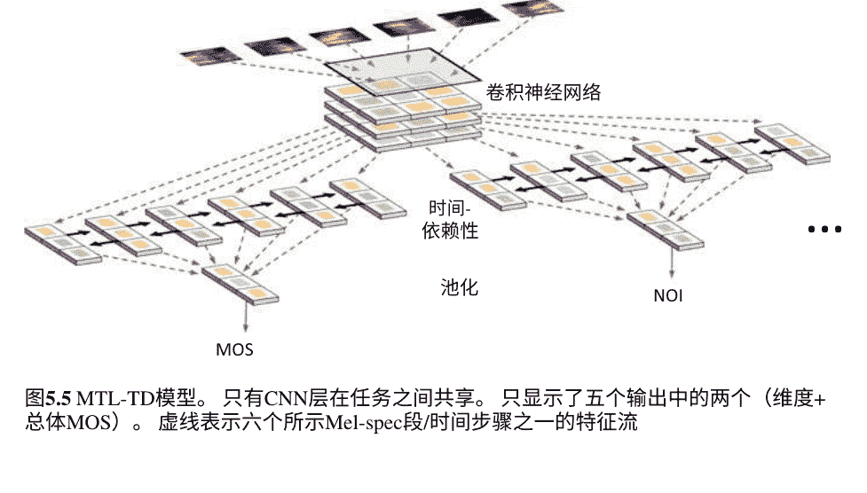

图5.5 MTL-TD模型。只有CNN层在任务之间共享。只显示了五个输出中的两个（维度+总体MOS）。虚线表示六个所示Mel-spec段/时间步骤之一的特征流

## 5.2.4 全连接+池化+时间依赖+CNN (MTL-CNN)

最后一个MTL模型只共享CNN的部分，而其他所有层都是任务特定的。特别是，只有前四个卷积层在任务之间共享。表5.1显示了所使用CNN的层设计（参见第3.4.1节），其中共享层和非共享层之间的分割。而在最后两层中，大部分与语音质量相关的特征被计算出来，在第一层中计算出低级特征。最后两层还包含更多的卷积核（即64个通道），以捕捉顶层语音质量特征的更高复杂性。图5.6中的模型概述显示，只有模型的前三分之二在任务之间共享，然后CNN在每个任务中拆分为个别的卷积层。

## 5.3 结果

四个MTL模型在第3.1节介绍的四个数据集上进行了训练和验证：NISQA_TRAIN_SIM，NISQA_TRAIN_LIVE，NISQA_VAL_SIM和NISQA_VAL_LIVE。此外，除了MTL模型外，每个维度和整体MOS也使用单任务（ST）模型进行了单独训练，该模型与其他任务不共享任何层。训练参数再次设置为第3.7节中单端模型的相同值，并且也应用了相同的CNN模型（参见第3.4.1节）。作为性能指标，使用实时和模拟验证数据集之间的平均皮尔逊相关系数。

表5.1 MTL-CNN模型的CNN设计，共享和非共享层之间的分割（内核大小为3x3）

| 层 | 通道 | 高度 | 宽度 |
| :--- | :--- | :--- | :--- |
| 输入 | 1 | 48 | 15 |
| 卷积1 | 16 | 48 | 15 |
| 批量归一化 | | | |
| ReLU | | | |
| 自适应最大池化 | 16 | 24 | 7 |
| 卷积2 | 16 | 24 | 7 |
| 批量归一化 | | | |
| ReLU | | | |
| 自适应最大池化 | 16 | 12 | 5 |
| 丢弃 | | | |
| 批量归一化 | | | |
| ReLU | | | |
| 卷积3 | 32 | 12 | 5 |
| 批量归一化 | | | |
| ReLU | | | |
| 卷积4 | 32 | 12 | 5 |
| 批量归一化 | | | |
| ReLU | | | |
| 自适应最大池化 | 32 | 6 | 3 |
| <--- MTL-CNN 分割 ---> | | | |
| 丢弃 | | | |
| 卷积5 | 64 | 6 | 3 |
| 批量归一化 | | | |
| ReLU | | | |
| 丢弃 | | | |
| 卷积6（无宽度填充） | 64 | 6 | 1 |
| 批量归一化 | | | |
| ReLU | | | |
| 输出（展平） | 384 | | |

### 5.3.1 每个任务的评估

**整体MOS**
图5.7显示了四种不同的MTL和ST模型对仅预测整体MOS的结果。对于每次训练运行，使用预测整体MOS的最佳结果的时期作为结果。然后将个别的10次训练运行呈现为箱线图。可以看出，在不同模型之间，预测性能非常相似，其中具有任务特定时间依赖性和池化块的MTL-TD模型的结果略好于单任务模型或大部分层共享的MTL模型。然而，根据图表可以得出结论，将质量维度作为辅助任务并没有明显改善整体MOS的预测。其中一个原因是可能是因为个别质量维度的信号失真已经被整体质量所覆盖。因此，模型似乎没有从预测质量维度中学到新的信息，这些信息可以用来改进整体MOS的预测。此外，MTL模型的正则化效果似乎很小，可能是因为评分的噪声在维度和整体MOS之间存在相关性，因为它们是由同一测试参与者评分的。

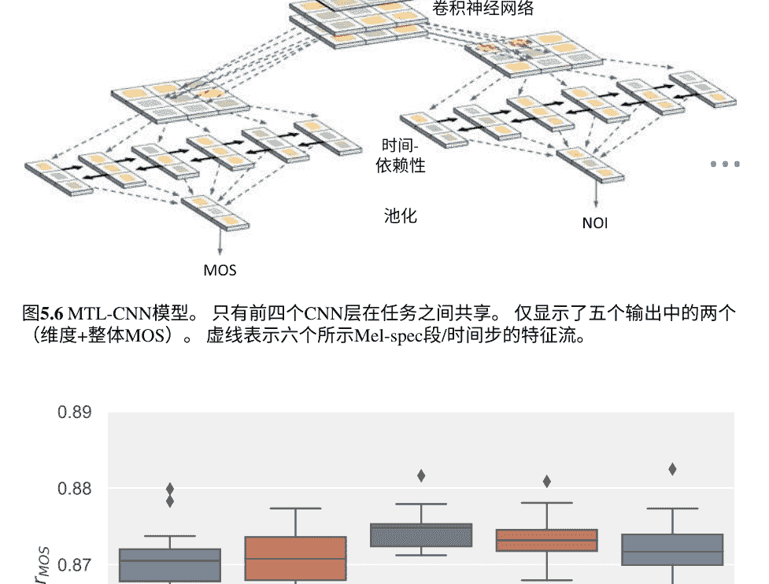

图5.6 MTL-CNN模型。只有前四个CNN层在任务之间共享。仅显示了五个输出中的两个（维度+整体MOS）。虚线表示六个所示Mel-spec段/时间步的特征流。

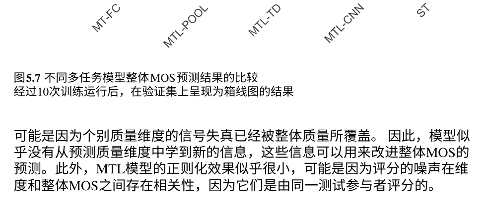

图5.7 不同多任务模型整体MOS预测结果的比较
经过10次训练运行后，在验证集上呈现为箱线图的结果

**质量维度**
图5.8显示了预测各个质量维度的结果。同样，对于每次训练运行，使用预测相应维度的最佳结果的时期作为结果。然后，将10次训练运行的结果呈现为箱线图。此外，在这个实验中，除了MTL和ST模型之外，还包括一个在整体MOS上进行预训练的ST模型。在这种迁移学习方法中，首先训练模型来预测整体MOS。然后，对其进行微调以预测其中一个质量维度。这个预训练模型被标记为ST-PT。

在图5.8的四个图中，可以看到在色彩维度上结果的变化最大。色彩ST模型的中位数PCC为0.69，被其他中位数约为0.71的MTL模型超过。这表明模型可以从通过其他任务获得的额外信息中受益。事实上，预训练用于预测整体MOS的ST-PT模型获得了最佳的中位数PCC。因此，可以得出结论，模型主要从整体MOS预测中获得了额外信息的好处，而不是其他质量维度。

图中的MTL模型按照从共享所有层到仅共享部分CNN的顺序进行排序。在最佳结果中，Coloration MTL模型是MTL-POOL，其中性能在每个阶段明显下降，其中网络在任务之间共享的部分较少。然而，MTL-FC共享所有层的PCC略低，表明在这种情况下，最好不要完全共享所有任务之间的网络层。

对于其他质量维度，不同模型的结果更接近，ST模型和MTL模型之间只有小的差异。然而，MTL-POOL和MTL-TD模型在噪声、不连续性和响度维度上的PCC略高于ST模型，而在色彩维度上有明显的改善。这表明考虑到其他类型的失真所学到的额外知识确实可以从中受益，以预测维度分数。

### 5.3.2 所有任务的评估

在这个实验中，不同的MTL模型在所有四个维度和整体MOS上进行了比较。为此，计算了每个训练运行时每个时期的平均PCC $r_{ALL}$，然后使用验证集上具有最佳平均PCC的时期作为结果。平均PCC的计算如下：

\[ \overline{r_{ALL}} = \frac{r_{MOS} + r_{NOI} + r_{COL} + r_{DIS} + r_{LOUD}}{5} \] (5.1)

结果显示在图5.9中，MTL-POOL获得了最佳PCC。再次说明，模型之间的差异只是微小的；然而，共享一些层次的性能平均略好于共享所有层次或仅共享少数层次。可以得出结论，模型学习的不同任务确实非常相似。然而，它们之间仍然存在一些差异，因此模型在每个质量维度和整体质量上至少受益于拥有自己的任务特定汇聚层。如果CNN的部分也被共享，模型的性能再次下降，表明仅共享低级CNN特征不足以利用可能的（但较小的）MTL性能提升。

### 5.3.3 维度比较

在这个实验中，将不同质量维度的预测性能和整体MOS进行比较，分析哪些维度最难预测以及预测准确性差异的可能原因。

作为可能的预测准确性基准，将一个测试参与者的单个主观评分与所有测试参与者的平均评分进行比较。 在数据集中，每个文件有五个评分可用，每个参与者至少对十个文件进行评分。 对于每个文件，随机抽取五个评分之一，然后与平均评分（即整体MOS或维度MOS）进行比较。这个过程重复十次，并在图5.10的左侧以箱线图的形式呈现。 可以看出，单个主观整体MOS评分与平均评分的相关性要高于单个维度评分与平均维度评分的相关性。 这种效应在预测模型中也可以观察到；然而，ST和MTL-POOL预测模型的PCC高于单个人的评分的PCC。

当比较不同维度的模型的预测性能时，可以注意到色彩和不连续性是最难预测的，其PCC比整体MOS要低得多。虽然人类评分的一致性明显较低，但这是一个可能的解释之一。

### 5.3.4 退化分解

质量维度方法的一个目标是降解分解。 这意味着除了了解语音样本的整体质量信息外，还知道了整体质量的感知质量维度组成。 然后可以利用这些信息来确定传输系统中的技术根本原因。 因此，维度分数与整体MOS分数一致非常重要；也就是说，个体质量分数涵盖了整个质量空间并包含了整体质量。 为了分析这一点，对验证数据集的个体预测维度分数和整体预测MOS之间进行了线性回归，并对四种不同的MTL模型和ST模型进行了比较。 此外，还计算了主观质量评分的结果。

PCC和 $R^2$ 的结果可以在表5.2中看到，对于每种模型类型，选择了在这个实验中表现最好的模型。

表5.2 线性回归结果个别维度与总体MOS之间的皮尔逊相关系数r和决定系数R²的结果

| 模型 | r | R² |
| :--- | :---: | :---: |
| MTL-FC | 0.98 | 0.97 |
| MTL-POOL | 0.99 | 0.97 |
| MTL-TD | 0.98 | 0.95 |
| MTL-CNN | 0.98 | 0.96 |
| ST | 0.95 | 0.91 |
| 主观的 | 0.94 | 0.88 |

单任务模型仅达到0.91的R²值，而多任务模型获得的R²值在0.95到0.97之间。这表明使用多任务模型时维度得分与整体质量之间的一致性明显更高。然而，维度之间共享的层次数量似乎不是决定性因素，因为所有多任务模型获得的结果都相似。多任务模型的相关性通常非常高，皮尔逊相关系数为0.98到0.99，因此也高于主观维度与主观整体质量之间的相关性，其皮尔逊相关系数为0.94。

在关于退化分解方法的另一个方面，应该考虑到质量维度得分之间的正交性。为了分析各个维度之间的独立性，对主观评分、MTL-POOL模型和单任务模型的维度得分进行了相关性计算。结果呈现在表5.3、5.4和5.5中。表5.3显示了主观评分的相关性，可以看出不连续性和噪音性维度之间的相关性最低，相关系数为0.36。另一方面，响度和色彩维度之间显示出0.75的高相关性。当将这些值与表5.4中的多任务模型预测进行比较时，可以注意到相关性与主观评分非常相似。只有LOUD/NOI和LOUD/COL的组合，相关性比基准主观相关性高0.10。表5.5中的单任务模型的相关性总体上要低得多。例如，DIS/NOI的组合与0.22的相关系数相关，而主观评分与0.36的相关系数相关。

总的来说，可以得出结论，单任务模型导致维度之间的“不自然”低相关性。相比之下，多任务模型的预测往往与主观评分之间的相关性更高。

然而，多任务预测的相关性通常与主观评分的范围相同。特别是当不考虑响度维度时，这个维度被认为与其他维度不完全正交。

表5.3 主观维度评分之间的相关系数

|   | NOI | COL | DIS | LOUD |
|---|---|---|---|---|
| NOI |   | 0.45 | 0.36 | 0.55 |
| COL | 0.45 |   | 0.61 | 0.75 |
| DIS | 0.36 | 0.61 |   | 0.48 |
| LOUD | 0.55 | 0.75 | 0.48 |   |

表5.4 MTL-POOL预测之间的相关系数

|   | NOI | COL | DIS | LOUD |
|---|---|---|---|---|
| NOI |   | 0.50 | 0.34 | 0.65 |
| COL | 0.50 |   | 0.62 | 0.85 |
| DIS | 0.34 | 0.62 |   | 0.48 |
| LOUD | 0.65 | 0.85 | 0.48 |   |

表5.5 ST预测之间的相关系数

|   | NOI | COL | DIS | LOUD |
|---|---|---|---|---|
| NOI |   | 0.32 | 0.22 | 0.60 |
| COL | 0.32 |   | 0.64 | 0.72 |
| DIS | 0.22 | 0.64 |   | 0.41 |
| LOUD | 0.60 | 0.72 | 0.41 |   |

## 5.4 总结

在本章中，介绍了四种不同的多任务模型，这些模型在任务之间共享不同数量的层。所有质量维度的预测准确性都高于单个随机选择的人工评分。最难预测的维度是色彩和不连续性，相关系数约为0.70。响度和噪音可以预测，相关系数约为0.79和0.81，而整体MOS可以预测，相关系数为0.87。尽管质量维度的整体预测准确性较整体质量较低可以通过主观评分的一致性较低来解释，但为什么响度和噪音的准确性甚至对于单任务模型而言明显高于人类基准仍不完全清楚。

然而，可以假设这种影响是由技术损坏、语音水平和背景噪声引起的，这些相对容易预测。
进一步研究表明，MTL-POOL和MTL-TD模型在任务之间共享某些层次的情况下取得了最佳的综合结果。相比之下，共享所有层次的MTL-FC模型和仅共享CNN的低层次的MTL-CNN模型的整体PCC较低。然而，模型之间的差异只是微小的。总体而言，多任务方法对所有维度和整体MOS都有益，并且与单任务模型相比取得了更好的结果。特别是，通过MTL方法，色彩维度的准确性可以从约0.69提高到0.71的PCC。进一步研究表明，通过使用整体质量对单任务模型进行预训练也可以获得类似的改进。虽然多任务方法可以在一定程度上改善结果，但计算量较大。

## 5 使用多任务学习预测语音质量维度

与多个单任务模型相比，时间通常大大缩短。然而，确切的计算时间在很大程度上取决于特定的系统，而不是本研究的主要关注点，因此没有进行详细分析。

此外，研究表明分解方法可以成功地与提供一致预测的多任务学习方法相结合，包括整体MOS和维度分数。在多任务方法中进一步提高预测性能的一个有趣想法是使用用于生成模拟数据集的技术参数作为辅助任务。例如，编解码器可以作为分类任务进行预测，噪声水平可以作为回归任务进行预测。这些辅助任务可能有助于模型更好地对整体MOS和维度进行预测。

## 第6章
针对从多个数据集进行训练的偏差感知损失

虽然已经提出了许多不同的深度学习架构用于语音质量预测，但它们没有考虑到有监督学习方法的目标值——地面真实MOS的不确定性。 特别是在训练和验证中通常使用多个数据集，因为主观数据通常由于实验成本而稀缺。 然而，这些数据集通常来自不同的实验室，参与者也不同，并且通常相隔多年。

测试参与者通常会适应实验的背景，并用最低可能的评分对最低发生的失真进行评级。 如果两个实验在质量范围上有所不同，相同的失真水平在两个实验中可能会被评级得非常不同。 此外，质量期望随时间变化。 虽然参与者十年前可能会给窄带语音信号打高分，但现在的服务用户更习惯高清语音。 因为这是一个广为人知的问题，ITU-T在ITU-T Rec. P.1401 (2020) 中建议在计算目标质量预测模型的均方根误差 (RMSE) 之前，应用一个三阶、单调递增的映射来调整预测值。

在本章中，提出了一种新的偏差感知损失，通过在训练过程中自动学习数据集之间的偏差来考虑不同数据集之间的偏差。 计算得到的损失会进行调整，以便在优化质量预测模型的权重时不考虑仅由于数据集特定偏差而产生的错误。


## 6.1 方法

基本思想是在神经网络的训练过程中学习并考虑数据集特定的偏差。在每个 epoch 之后，使用训练数据的预测 MOS 值来估计每个数据集中的偏差，通过将其值映射到真实主观 MOS 值。假设是模型的预测 MOS 值在客观上是平均了不同数据集的偏差的。

偏差使用多项式函数来近似。特别地，在这项工作中，我们研究了一阶和三阶多项式函数。理论上，一阶函数可以模拟数据集中的常量偏移和线性偏差，而三阶函数还可以模拟饱和效应。对于一个特定的数据集，三阶函数的系数 $b$ 被估计如下：

$$ \min_{b} \quad \frac{1}{N} \sum_{i=1}^{N} \left( y_i - (b_0 + b_1 y_i + b_2 y_i^2 + b_3 y_i^3) \right)^2 \qquad (6.1) $$

受限于

$$ \frac{\partial}{\partial t} (b_0 + b_1 t + b_2 t^2 + b_3 t^3) \geq 0 \qquad (6.2) $$
$$ t \in [1, 5], $$

其中，$y_i$ 是真实主观 MOS 值，$\hat{y}_i$ 是预测的 MOS 值，$N$ 是数据集中的样本数。此外，该函数在所有可能的输入值上都受到单调递增的约束（本文中的 MOS 值范围在 1 到 5 之间）。第一阶多项式函数的估计方式相同，但高阶系数设为零：$b_2 = b_3 = 0$。对于一阶函数，可以通过对第二个系数设置上界来应用约束条件，即 $b_1 \geq 0$。

在为每个数据集估计偏差之后，它们可以在下一个 epoch 中用于计算提出的偏差感知损失。首先，预测的 MOS 值与预定的偏差系数进行映射。然后，偏差映射的预测 MOS 值与主观 MOS 值之间的均方误差给出如下的损失：

$$ l = \mathcal{L}(\mathbf{\hat{y}}, \mathbf{y}, \mathbf{b}) $$
$$ = \frac{1}{N} \sum_{i=1}^{N} \left( y_i - (b_{0,i} + b_{1,i} \hat{y}_i + b_{2,i} \hat{y}_i^2 + b_{3,i} \hat{y}_i^3) \right)^2, \qquad (6.3) $$

其中，$i$ 是样本索引，$N$ 是样本总数。应用于每个预测 MOS 的偏差取决于该特定样本所属的数据集。

由于预测值根据每个数据集的偏差进行映射，仅由于数据集特定偏差而导致的预测值和主观值之间的误差被忽略。因此，模型学习预测质量而不是无关的偏差。

### 6.1.1 使用偏差感知损失进行学习

偏差感知损失的完整算法如算法 1 所示。算法的输入是输入特征 $x_i$（即 Mel-spec 片段）和主观 MOS 值，这些值是监督学习过程的期望输出值 $y_i$，对于所有样本 $i \in N_{\text{Samples}}$。此外，需要一个包含每个样本 $db_i$ 的数据集名称的列表，以将各个样本分配到它们的数据集/偏差系数中。

在训练开始之前，所有样本的偏差系数 $b_i$ 都被初始化为一个恒等函数，其中方程 (6.3) 对应于一个普通的 MSE（均方误差）损失函数。因为在最开始的几个 epoch，模型通常不会给出一个有意义的预测输出，用于估计偏差，所以在达到预定义的模型准确度 $r_{th}$ 之前，`update_bias` 标志被设置为 False。

在达到此阈值之前，偏差系数不会被更新，因此使用普通的均方误差损失来计算损失。

然后，在每个 epoch 开始时，小批量索引 $idx_k$ 被随机洗牌，以增加模型训练的不同数据的多样性。为了将样本分配到相应的数据集中，需要保留这些索引。每个 epoch 结束后，使用模型预测所有样本的 MOS 值。只有当准确度阈值 $r_{th}$ 达到时，才会估计和更新偏差。值得注意的是，为了加快训练速度，可以直接保存每个小批量的预测值 $\hat{y}[idx_k] = \hat{y}_b$，而不是对完整的训练数据进行 MOS 值预测。然而，在这种情况下，前几个小批量的预测偏差可能与后面已经经过更多模型权重优化步骤的小批量不同。

一旦模型准确率达到，`update_bias` 标志位设置为 True，并且在每个 epoch 后更新偏差。为了更新偏差系数，算法逐个循环遍历所有数据集，其中 $idx_j$ 表示属于第 $j$ 个数据集的所有样本的索引。算法的第 21 行加载第 $j$ 个数据集的主观和预测的 MOS 值。然后将它们应用于公式 (6.1) 以估计偏差系数 $b_{\text{db}}$，并通过索引 $idx_j$ 将其保存在整体偏差矩阵 $\mathbf{b}$ 中。在下一个训练 epoch 中，根据随机洗牌的 mini-batch 索引 $idx_k$ 提取偏差，这些索引可能包含不同数据集的随机数量，因此每个样本也可能受到不同的偏差影响。通过使用偏差感知损失，在计算预测和主观 MOS 值之间的误差时考虑这些偏差。每个 epoch 结束后，偏差系数将根据更新的模型预测进行更新。

```
算法1 使用偏差感知损失函数进行训练
输入: $x_i$: 输入特征（例如 Mel-spec）， $y_i$: 主观 MOS 值， $\text{db}_i$: 每个样本的数据集名称列表 $i$
参数: $r_\text{th}$: 最小预测准确度以更新偏差系数
输出: 模型权重
1: 初始化偏差: $b_i=[0, 1, 0, 0], i \in N_\text{样本}$
2: update_bias = False
3: 当未收敛时执行
4:    随机打乱小批量索引 $\text{idx}_k$
5:    $k = 0$
6:    对于所有小批量执行
7:        获取小批量:
           $\mathbf{x}_b = \mathbf{x}[\text{idx}_k]$, $\mathbf{\hat{y}}_b = \mathbf{\hat{y}}[\text{idx}_k]$, $\mathbf{y}_b = \mathbf{y}[\text{idx}_k]$, $\mathbf{b}_b = \mathbf{b}[\text{idx}_k]$
8:        前馈: $\mathbf{\hat{y}}_b = \text{模型}(\mathbf{x}_b)$
9:        使用公式 (6.3) 计算偏差感知损失:
           $l = \mathcal{L}(\mathbf{\hat{y}}_b, \mathbf{y}_b, \mathbf{b}_b)$.
10:       反向传播和优化权重
11:       $k = k + 1$
12:   结束循环
13:   预测 MOS: $\mathbf{\hat{y}} = \text{模型}(\mathbf{x})$
14:   计算皮尔逊相关系数 $r = \text{PCC}(\mathbf{\hat{y}}, \mathbf{y})$.
15:   如果 $r > r_\text{th}$ 或 update_bias 为真
16:       update_bias = True
17:       $j = 0$
18:       查找唯一数据集条目: $\text{dbu} = \text{unique}(\mathbf{db})$
19:       对于所有数据集执行以下操作:
20:           查找数据集索引:
               $\text{idx}_j = \text{find}(\mathbf{db} == \text{dbu}_j)$
21:           获取数据集: $\mathbf{\hat{y}}_{\text{db}} = \mathbf{\hat{y}}[\text{idx}_j]$, $\mathbf{y}_{\text{db}} = \mathbf{y}[\text{idx}_j]$
22:           使用公式 (6.1) 估计偏差 $b_{\text{db}}$
23:           更新偏差: $\mathbf{b}[\text{idx}_j] = b_{\text{db}}$
24:           $j = j + 1$
25:       结束循环
26:   结束如果
27: 结束循环
28: 返回 模型权重
```

### 6.1.2 预测锚定

当应用偏差感知损失时，MOS 预测不会锚定到绝对主观 MOS 值，因此可能会偏离。虽然预测仍然会以最佳方式对样本进行排序，但在验证集上预测值和主观值之间可能存在较大偏移。这种影响将导致均方根误差较高，而皮尔逊相关系数（PCC）通常不受影响。为了解决这个问题，在训练后可以将所有样本的预测 MOS 值映射到主观 MOS 上。

在对验证数据进行新的预测时，可以应用这种映射。或者，提出了两种方法来在训练过程中直接锚定预测值。

#### 使用锚定数据集进行锚定

不是对所有数据集估计偏差，而是将预测锚定到一个特定的训练数据集上。如果已知有一个数据集的条件与模型将来要应用的条件相似，这种方法可能特别有用。例如，通常会创建一个新的数据集，具有新的条件，然后将其分为训练集和验证集。为了增加训练数据的大小并提高模型的准确性，还会将旧的数据集包括在训练集中。新数据集和旧数据集之间可能存在偏差，例如，因为新数据集中的最高质量将高于旧数据集中的质量。可以通过仅跳过新数据集的偏差更新（在算法 1 的第 20-23 行跳过）将预测锚定到新数据集上。

#### 使用加权均方误差损失进行锚定

另一种防止预测偏离的方法是添加一个加权的标准均方误差（MSE）损失函数，惩罚那些与原始主观 MOS 值相差太大的预测结果。损失函数的计算如下：

$$ l = \lambda \frac{1}{N} \sum_{i=1}^{N} (\hat{y}_i - y_i)^2 + \frac{1}{N} \sum_{i=1}^{N} \left( y_i - (b_{0,i} + b_{1,i} \hat{y}_i + b_{2,i} \hat{y}_i^2 + b_{3,i} \hat{y}_i^3) \right)^2 , \qquad (6.4) $$

其中 $\lambda$ 是 MSE 损失的权重。如果 $\lambda$ 设置得太高，偏差感知损失函数的影响将会过低，无法提高模型的准确性。在这项工作中，权重被设置为固定值 $\lambda=0.01$。

## 6.2 实验和结果

在本节中，通过在不同的数据集上训练模型来分析所提出方法的性能。在第一个实验中，生成了一个合成的语音质量数据集，其中的偏差是已知的。之后，进行了一个包含六个不同语音质量数据集的实验。

### 6.2.1 合成数据

首先，生成了一个合成的语音质量数据集，并对其应用了人为偏差。作为源文件，使用了 TSP 数据集（Kabal 2002）中的 2-3 秒参考语音文件（有关源文件的描述也可参见第 3.1.1 节）。对于这四个训练数据集，总共使用了 320 个语音文件，对于验证集，使用了 80 个语音文件。语音信号经过加入白高斯噪声的处理，以创建不同失真水平的条件。研究发现，当添加噪声的信噪比范围过宽时，模型很容易预测质量，而当范围过窄时，预测变得过于困难。因此，语音文件经过信噪比在 20 到 25 dB 之间的噪声处理，这被证明是一个很好的折衷方案。为了模拟 MOS 预测，使用了 ITU-T Rec. P.107（2015）中的技术损伤因子（即信噪比）和 MOS 之间的 S 型映射。该关系如图 6.1 所示，将信噪比值映射到 1 到 4.5 之间的 MOS。需要注意的是，这是为了模拟目的而进行的人为映射，并不反映信噪比和 MOS 之间的真实关系。

训练数据被分成四个不同的子集，并对每个子集应用不同的偏差。这四个人工偏差在图 6.2 中显示。为了更好地分析偏差感知损失的影响，在这个实验中使用了极端偏差。第一个模拟数据库没有应用任何偏差（蓝线）。第二个和第三个模拟数据库应用了线性偏差，而第四个数据库则受到了用三阶多项式函数建模的偏差的影响。每个训练数据集包含 80 个文件；验证集也包含 80 个文件。

通过使用在第 3 章中介绍的 CNN-SA-AP 模型来运行合成实验。

图 6.1 白噪声的信噪比与语音质量 MOS 的映射
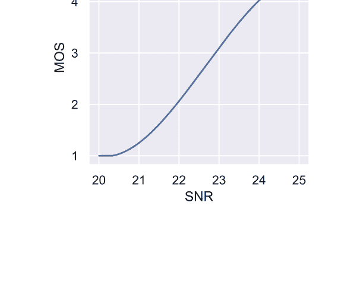

图 6.2 引入到四个模拟训练数据集中的四个人工偏差
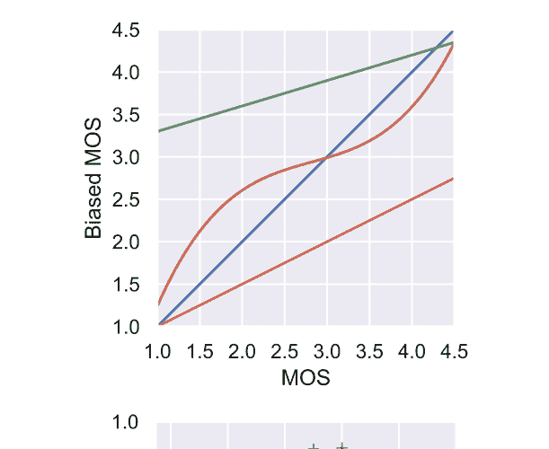

图 6.3 在不同阈值下的验证结果以 Pearson 相关系数表示通过 15 次训练运行进行校准
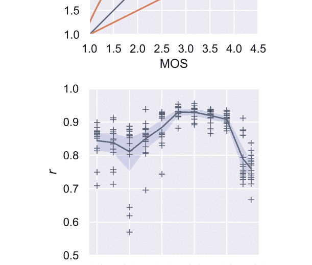

### 6.2.2 最小准确率 $r_{th}$

在第一个实验中，分析了在激活偏差感知损失算法中的偏差更新之前必须在训练集上达到的最小 PCC 的影响（算法 1 中的第 15 行）。为此，实验在 11 个不同的阈值 $r_{th}$ 下运行，阈值范围为 0 到 0.95。使用验证 PCC 的前 20 个 epoch 进行早停，并将每次运行的最佳 epoch 保存为结果。每个这 11 个配置的训练运行重复 15 次。结果以及平均结果和 95% 置信区间可以在图 6.4 中看到，用于没有校准的训练以及图 6.3 中的校准。在校准的情况下，偏差感知损失仅用于第一个数据集 `train_1` 而不是其他三个数据集。

当使用锚定数据集时，结果的相关性变化很大（图 6.4）。在 0.5 和 0.7 之间的阈值可以达到最高的相关性。当不应用锚定时，确切的阈值似乎并不那么重要，只要它在 0.1 和 0.8 之间。然而，PCC 仍然总体上，比起使用锚定数据集可以实现更高的 PCC，但 PCC 仍然较低。对于相关性大于 0.9 的阈值，准确性明显下降。可以假设在这一点上，模型权重已经过度优化，过于倾向于使用普通的 MSE 损失，而不能始终从后期激活的偏差感知损失中获益。

图 6.4 在不使用锚定的情况下，通过 15 次训练运行的皮尔逊相关性验证结果对于不同的阈值
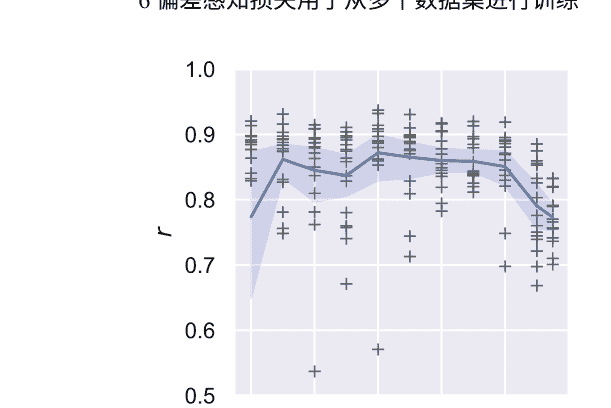

### 6.2.3 带有和不带有锚定的训练示例

图 6.5 显示了四个不同的训练运行和不同的锚定配置的示例。这些图表显示了在验证数据集上具有最佳结果的 epoch，以 PCC 为衡量标准。每一行表示一个训练运行，每一列表示在四个不同的训练数据集和验证数据集上的结果。可以看出，应用于数据集的人工偏差显示为绿线（也可参见图 6.2）。偏差感知损失使用的估计偏差显示为橙线。对于前三个示例，使用了一阶多项式作为估计函数，对于底部的最后一个示例，使用了三阶多项式。顶部一行显示了没有锚定的结果，并显示了预测结果如何偏离原始值。尽管在这种情况下预测结果极具偏见，但达到的 PCC 仍然很高。

第二行显示了使用加权 MSE 损失的运行，其中 $\lambda = 0.01$，预测的 MOS 值更接近原始值。第三行和第四行显示了使用锚定数据集进行锚定的结果。在训练过程中，第一个训练数据集 `train_1` 的偏差没有被估计，而是被固定为一个恒等函数。可以看出，在这种情况下，验证集上的预测结果偏差较小。此外，当将估计的橙线与原始的绿线进行比较时，可以看出模型成功地学习了不同的偏差。

图 6.5 在验证数据集上使用偏差感知损失的三个示例训练运行。绿色线：引入偏差。橙色线：估计的偏差。第一行：没有锚定和一阶估计。第二行：加权均方误差损失锚定和一阶估计。第三行：使用数据集和一阶估计进行锚定。第四行：使用数据集和三阶估计进行锚定。
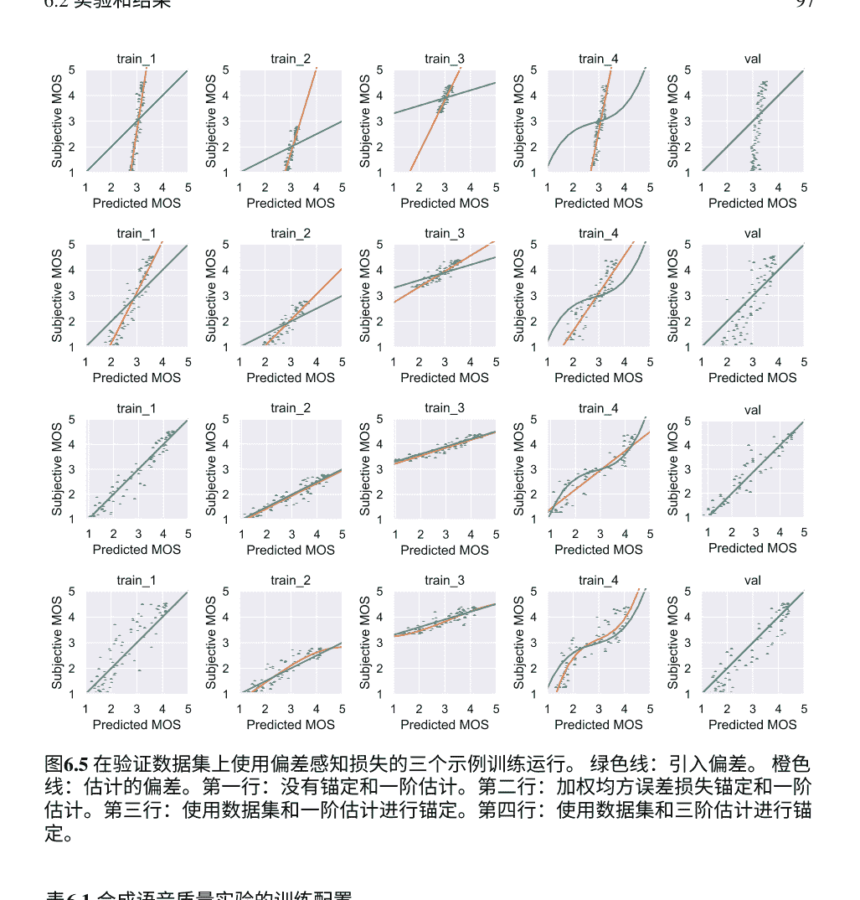

表 6.1 训练配置比较
| 配置 | 1 | 2 | 3 | 4 | 5 | 6 | 7 | 8 |
| :--- | :--- | :--- | :--- | :--- | :--- | :--- | :--- | :--- |
| 有偏数据 | 否 | 是 | 是 | 是 | 是 | 是 | 是 | 是 |
| 偏差函数 | 否 | 否 | 一阶 | 一阶 | 一阶 | 三阶 | 三阶 | 三阶 |
| 使用数据集进行锚定 | - | - | 否 | 否 | 是 | 否 | 否 | 是 |
| 均方误差损失权重 | - | - | 0 | 0.01 | 0 | 0 | 0.01 | 0 |

### 6.2.4 配置比较

作为下一步，将根据不同的训练参数比较验证集准确性的 PCC。考虑的配置如表 6.1 所示。第一个配置表示在训练数据集中没有应用人为偏差，因此代表了最佳可实现的结果。第二个配置表示应用人工偏差但未使用偏差感知损失时的结果。在验证数据集上的 15 次运行中，最佳结果以箱线图的形式呈现在图 6.6 中。可以看到，当训练数据集暴露于偏差时（配置 1 与配置 2 相比），模型的准确性显著降低。

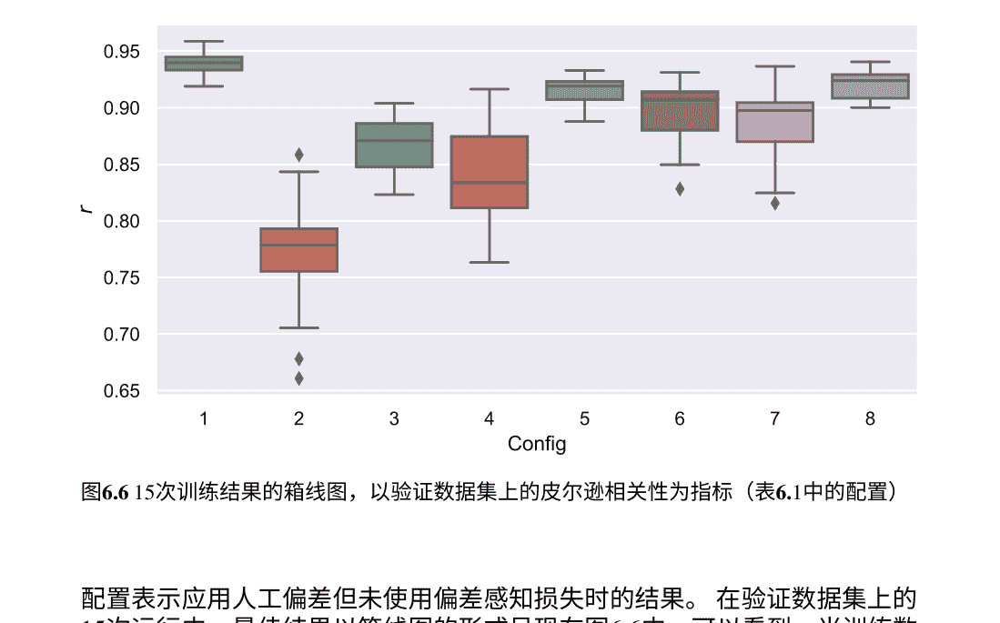

在有偏数据上，使用以第一个数据集为锚点的偏差感知损失可以获得最佳结果，其中一阶（配置 5）和三阶（配置 8）偏差估计函数获得类似的结果。尽管第四个数据集暴露于以三阶多项式建模的偏差中，但结果显示三阶多项式并没有明显改善结果。这可能是因为自由度过高，因此不仅建模了偏差，还补偿了预测误差。当这些预测误差不在计算的损失中出现时，它们无法在神经网络训练中进行优化，从而导致预测准确性降低。

此外，可以注意到使用均方误差（MSE）损失权重进行锚定会导致个别运行的准确性变化较大。无锚定或 MSE 损失权重的偏差感知损失获得了与加权 MSE 损失配置类似的结果。总体而言，实验结果显示了所提出的偏差感知损失在合成数据集上的有效性，其中相关性可以从平均 0.77（配置 2）提高到 0.92（配置 5/7），几乎与没有偏差的平均结果 0.94（配置 1）一样高。

### 6.2.5 语音质量数据集

为了分析在真实数据集上的有效性，使用了公开可用的 ITU-T P Suppl. 23（2008）语音质量数据集，其中包含主观质量评分（详见第 7.1 节）。需要注意的是，这些数据集来自不同的来源，因此很可能存在主观偏差。使用了六个按 ACR 标度评分的数据集：EXP1a、EXP1d、EXP1o、EXP3a、EXP3c 和 EXP3d。然后，采用一种留一数据集交叉验证的方法对所提出的算法进行分析，其中模型在剩余的五个数据集上进行训练。对于每次训练运行，保存在验证数据集上获得最佳 PCC 结果的 epoch 的模型。作为预测模型，再次应用了第 3 章提出的 CNN-SA-AP 模型。

训练在验证集上运行了 15 次，提前停止了 20 个 epochs，学习率为 0.001，小批量大小为 60。偏差估计锚定在随机选择的数据集上。在图 6.7 中，展示了在验证数据集上使用不同阈值从 0.5 到 0.8 进行的训练运行的箱线图结果。阈值为 $r_{\text{th}} = 1$ 的箱线图对应于 MSE 损失，因为在训练过程中未激活偏差感知损失。

图 6.7 在留一数据集验证中，通过 Pearson 相关系数展示了 15 次训练运行的每个条件结果的箱线图。阈值为 $r_{\text{th}} =1$ 的箱线图对应于 MSE 损失，因为在训练过程中未激活偏差感知损失。
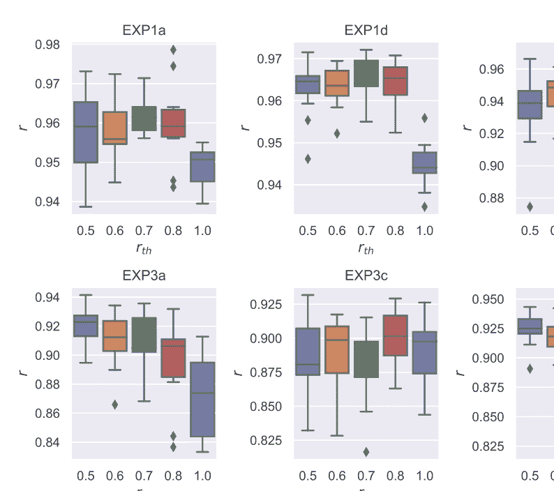

表 6.2 15 次训练运行后，留一数据集交叉验证的每个条件 PCC 的平均值。最后一列显示了最佳偏差感知损失结果与 MSE 损失结果之间的改进。
| 数据集 | 偏差感知损失 (r_th=0.5) | 偏差感知损失 (r_th=0.6) | 偏差感知损失 (r_th=0.7) | 偏差感知损失 (r_th=0.8) | 均方误差损失 | 改进 |
| :--- | :--- | :--- | :--- | :--- | :--- | :--- |
| EXP1a | 0.957 | 0.958 | **0.962** | 0.960 | 0.949 | 0.013 |
| EXP1d | 0.963 | 0.963 | **0.965** | 0.964 | 0.945 | 0.020 |
| EXP1o | 0.935 | 0.943 | 0.950 | 0.941 | **0.959** | – |
| EXP3a | **0.921** | 0.910 | 0.910 | 0.894 | 0.872 | 0.049 |
| EXP3c | 0.884 | 0.888 | 0.882 | **0.900** | 0.890 | 0.010 |
| EXP3d | **0.924** | 0.915 | 0.920 | 0.923 | 0.886 | 0.038 |

可以看出，对于某些数据集，较低的阈值效果更好，而对于其他数据集，较高的阈值效果更好。表 6.2 显示了每个数据集在所有运行中的平均结果，其中最佳结果以粗体表示，最右侧的列表示偏差感知损失相对于均方误差损失的平均 PCC 改进。可以注意到，所提出的算法的效率取决于其训练和评估的数据集。对于六个数据集中的五个，所提出的损失优于普通的均方误差损失函数，而对于数据集 EXP1o，普通的均方误差损失表现更好。

在 EXP3a 数据集上，可以观察到 PCC 方面约 0.05 的性能提升，表明应用所提出的偏差感知损失可以显著改善语音质量预测。

## 6.3 总结

在本章中，介绍了一种考虑主观质量实验中出现的偏差的偏差感知损失函数。所提出的算法在模型训练过程中自动学习不同数据集之间的未知偏差。偏差估计在每个 epoch 后进行更新，然后用于改善神经网络训练的损失。通过考虑偏差，损失函数不会惩罚仅由于主观偏差而发生的预测错误，而数据集内的排序可能已经被正确预测。所提出的方法在合成数据上优于普通的 MSE 损失，平均相关性从 0.77 提高到 0.92，相对改进了 19%。虽然所提出的算法在合成数据上明显优于普通的 MSE 损失，并成功学习了引入的偏差，但在真实数据上的性能很大程度上取决于应用于其上的数据集。在不存在数据集之间的偏差的情况下，该模型给出与普通的 MSE 损失相似的结果。然而，研究表明所提出的算法可以显著改善语音质量预测。

在大多数情况下表现良好。由于损失函数可以在没有任何额外数据或计算成本的情况下应用，所以所提出的方法可以成为提高语音质量预测模型准确性的简单且有用的工具，并且还可以应用于其他任务，如图像或视频质量预测。

## 第7章 NISQA：单端语音质量模型

在本章中，介绍了基于神经网络架构的单端语音质量预测模型NISQA。它基于第3章和第5章中描述的神经网络架构，并使用第6章中描述的偏差感知损失进行训练。总体上，该模型在78个不同数据集上进行了训练和评估。在第3-5章中，使用了第3.1节中介绍的数据集来分析不同的网络架构，并在来自相同数据分布的训练和验证集上优化超参数。然而，本章介绍的模型旨在对未知语音样本进行稳健的语音质量估计。为了实现这个目标，使用高度多样化且来自不同来源（即数据分布）的语音样本非常重要。因此，除了第3.1节中介绍的四个数据集外，还使用了来自POLQA池、ITU-T P Suppl. 23池和其他内部数据集的语音数据集。最后，该模型在包含真实电话录音的实时通话测试数据集上进行了评估。

在下一节中，介绍了这些数据集，并在第二节中概述了最终模型的神经网络架构和训练过程。第三节对模型进行评估，最后，在第四节中对本章进行总结。

## 7.1 数据集

在本节中，介绍了可用的数据集，其中大部分数据集来自ITU-T POLQA池。另一组窄带数据集来自ITU-T P Suppl. 23池。此外，还介绍了一系列其他主要是内部的数据集，这些数据集是为不同项目创建的。最后，介绍了一个具有实时对话条件的新测试集。

### 7.1.1 POLQA 池

POLQA池是为ITU-T POLQA竞赛而建立的。在这个竞赛中，为ITU-T语音质量预测标准PESQ开发和选择了一个后继模型。与PESQ相比，POLQA是为了在超宽带环境中估计语音而开发的。因此，该池包含了来自不同来源的各种超宽带数据集，用于训练和验证POLQA模型。它还包含了用于PESQ和P.563模型的旧窄带和宽带数据集。这个数据集池不对公众开放。表7.1中可以看到55个数据集的概述。表格顶部的数据集101-603是专门为POLQA竞赛创建的，以x01和x02结尾的数据集用作训练集，以x03和x04结尾的数据集用作测试集。这些数据集的一般描述可以在ITU-T Rec. P.863 (2018)的附录II中找到。总体而言，该池包含了八种不同的语言：英语、德语、法语、瑞典语、荷兰语、捷克语、中文和日语。该池包含了电信网络中最常用的编解码器。然而，它不包含更近期的超宽带编解码器Opus和EVS。在其他条件下，该池包含了丢包、幅度剪切、不同的背景噪声和现场录音。只有对于三个超宽带Swissqual数据集，才有维度语音质量评分，这在表中的Dim列中有所标示。这些维度评分是后来在ITU-T工作项目P.AMD的质量和可用性实验室添加的。在这些实验中，参与的听众数量与整体质量评估相同。

### 7.1.2 ITU-T P Suppl. 23

ITU-T P Suppl. 23 (2008)是一个较旧的数据集池，其中包含ITU-T 8 kbit/s编解码器G.729的特性测试中使用的语音样本。它是少数公开可用的语音质量数据集池之一，因此在文献中经常使用。总体而言，该数据集池包含十个数据集，其中有三个数据集按照DCR评分。在这项工作中，只使用了按照ACR评分的七个数据集。这些数据集的概述可以在表7.2中看到。它们包含四种不同的语言：英语、法语、意大利语和日语。所有的数据集都在窄带环境中进行评分，并包含有帧丢失和噪声条件的编码语音。

#### 表7.1 POLQA 数据集池概述

| 数据集 | 缩放 | 缺点 | 文件/缺点 | 投票/缺点 | 投票/文件 | 语言 | 维度 |
|---|---|---|---|---|---|---|---|
| 101_ERICSSON | SWB | 57 | 12 | 119 | 10 | 瑞典 | 否 |
| 102_爱立信 | 宽带 | 54 | 12 | 159 | 13 | 瑞典 | 否 |
| 103_爱立信 | SWB | 54 | 12 | 95 | 8 | 瑞典 | 否 |
| 104_爱立信 | NB | 55 | 12 | 95 | 8 | 瑞典 | 否 |
| 201_FT_DT | SWB | 48 | 4 | 96 | 24 | 法语 | 否 |
| 202_FT_DT | SWB | 49 | 4 | 96 | 24 | 法语 | 否 |
| 203_FT_DT | SWB | 54 | 4 | 96 | 24 | 法语 | 否 |
| 204_FT_DT | 宽带 | 53 | 4 | 96 | 24 | 法语 | 否 |
| 301_OPTICOM | SWB | 50 | 4 | 96 | 24 | 捷克语 | 否 |
| 302_OPTICOM | SWB | 44 | 4 | 96 | 24 | 英语 | 否 |
| 303_OPTICOM | SWB | 54 | 4 | 96 | 24 | 英语 | 否 |
| 401_PSYTECHNICS | SWB | 48 | 24 | 192 | 8 | 英语 | 否 |
| 402_PSYTECHNICS | 宽带 | 48 | 24 | 192 | 8 | 英语 | 否 |
| 403_PSYTECHNICS | SWB | 48 | 24 | 192 | 8 | 英语 | 否 |
| 404_PSYTECHNICS | NB | 48 | 24 | 192 | 8 | 英语 | 否 |
| 501_SWISSQUAL | SWB | 50 | 4 | 96 | 24 | 德语 | 是 |
| 502_SWISSQUAL | SWB | 50 | 4 | 96 | 24 | 德语 | 是 |
| 503_SWISSQUAL | SWB | 54 | 4 | 96 | 24 | 德语 | 是 |
| 504_SWISSQUAL | NB | 49 | 4 | 96 | 24 | 德语 | 否 |
| 601_TNO | SWB | 50 | 4 | 96 | 24 | nl | 否 |
| 602_TNO | SWB | 50 | 4 | 96 | 24 | nl | 否 |
| 603_TNO | SWB | 48 | 4 | 96 | 24 | nl | 否 |
| ATT_iLBC | NB | 45 | 29 | 233 | 8 | 英语 | 否 |
| BT_P862_BGN_ENG | NB | 49 | 4 | 96 | 24 | 英语 | 否 |
| BT_P862_PROP | NB | 50 | 24 | 96 | 4 | 英语 | 否 |
| DT_P862_1st | NB | 50 | 4 | 96 | 24 | 德语 | 否 |
| DT_P862_BGN_GER | NB | 49 | 4 | 112 | 28 | 德语 | 否 |
| DT_P862_共享 | NB | 50 | 4 | 96 | 24 | 德语 | 否 |
| ERIC_AMR_4B | NB | 36 | 12 | 112 | 9 | 瑞典 | 否 |
| ERIC_FIELD_GSM_EU | NB | 234 | 1 | 不适用 | 不适用 | 瑞典 | 否 |
| ERIC_FIELD_GSM_US | NB | 372 | 1 | 不适用 | 不适用 | 英语 | 否 |
| ERIC_P862_NW_MEAS | NB | 46 | 4 | 116 | 29 | 瑞典 | 否 |
| FT_P563_PROP | NB | 50 | 16 | 96 | 6 | 法语 | 否 |
| GIPS_EXP1 | NB | 38 | 48 | 288 | 6 | 英语 | 否 |
| GIPS_Exp3 | 宽带 | 36 | 48 | 288 | 6 | 英语 | 否 |
| GIPS_Exp4 | SWB | 36 | 4 | 100 | 25 | 英语 | 否 |
| HUAWEI_1 | NB | 24 | 24 | 192 | 8 | zh | 否 |
| HUAWEI_2 | NB | 24 | 24 | 192 | 8 | zh | 否 |
| LUC_P563_PROP | NB | 50 | 4 | 96 | 24 | 英语 | 否 |
| NTT_PTEST_1 | NB | 90 | 16 | 160 | 10 | ja | 否 |
| NTT_PTEST_2 | 宽带 | 80 | 14 | 160 | 12 | ja | 否 |
| OPT_P563_PROP | NB | 50 | 12 | 288 | 24 | 德语 | 否 |
| PSY_P563_PROP | NB | 54 | 12 | 96 | 8 | 英语 | 否 |
| QUALCOMM_EXP1b | NB | 32 | 64 | 256 | 4 | 英语 | 否 |
| QUALCOMM_EXP1w | 宽带 | 40 | 64 | 256 | 4 | 英语 | 否 |
| QUALCOMM_EXP2b | NB | 32 | 64 | 256 | 4 | 英语 | 否 |
| QUALCOMM_EXP3w | NB | 32 | 64 | 256 | 4 | 英语 | 否 |
| QUALCOMM_EXP4 | NB | 32 | 64 | 256 | 4 | 英语 | 否 |
| QUALCOMM_EXP5 | 宽带 | 56 | 64 | 256 | 4 | 英语 | 否 |
| QUALCOMM_EXP6a | NB | 48 | 48 | 192 | 4 | 英语 | 否 |
| QUALCOMM_EXP6b | NB | 48 | 48 | 192 | 4 | 英语 | 否 |
| SQ_P563_PROP | NB | 50 | 12 | 96 | 8 | 德语 | 否 |
| TNO_P862_KPN_KIT97 | NB | 59 | 1 | 60 | 60 | nl | 否 |
| TNO_P862_NW_EMU | NB | 50 | 4 | 96 | 24 | nl | 否 |
| TNO_P862_NW_MEAS | NB | 46 | 4 | 96 | 24 | nl | 否 |

#### 表7.2 ITU-T P Suppl. 23数据集概述
| 数据集 | 缩放 | 缺点 | 文件/缺点 | 投票/缺点 | 投票/文件 | 语言 | 维度 |
| --- | --- | --- | --- | --- | --- | --- | --- |
| ITU_SUPPL23_EXP1a | NB | 44 | 4 | 96 | 24 | 法语 | 否 |
| ITU_SUPPL23_EXP1d | NB | 44 | 4 | 96 | 24 | ja | 否 |
| ITU_SUPPL23_EXP1o | NB | 44 | 4 | 96 | 24 | 英语 | 否 |
| ITU_SUPPL23_EXP3a | NB | 50 | 4 | 96 | 24 | 法语 | 否 |
| ITU_SUPPL23_EXP3c | NB | 50 | 4 | 96 | 24 | it | 否 |
| ITU_SUPPL23_EXP3d | NB | 50 | 4 | 96 | 24 | ja | 否 |
| ITU_SUPPL23_EXP3o | NB | 50 | 4 | 96 | 24 | 英语 | 否 |

### 7.1.3 其他数据集

除了这两个大型数据集和新的测试集之外，还使用了一系列来自不同项目的其他数据集来训练模型。这些数据集的概述可以在表7.3中看到。这三个DT数据集是旧的德国内部数据集，包含编解码器和噪声条件。听觉实验是在柏林的电信创新实验室进行的。数据集NISQA_TRAIN_LIVE、NISQA_TRAIN_SIM、NISQA_VAL_LIVE和NISQA_VAL_SIM在第3.1节中有描述。其他数据集在下面更详细地描述。

#### PAMD

前三个数据集来自ITU-T P.AMD池，也包含语音质量维度得分。德国数据集PAMD_DTAG_1和PAMD_DTAG_2是由Woltermann（2012）创建的，用于降级分解分析，它们被称为“Dim-Scaling 1”和“Dim-Scaling 2”，并且有详细描述。这些数据集包含整体质量、噪声等方面的评分。

#### 表7.3 其他语音质量数据集概述

| 数据集 | 缩放 | 缺点 | 文件/缺点 | 投票/缺点 | 投票/文件 | 语言 | 维度 |
|---|---|---|---|---|---|---|---|
| PAMD_DTAG_1 | 宽带 | 66 | 12 | 40 | 3 | 德语 | 是 |
| PAMD_DTAG_2 | 宽带 | 76 | 12 | 48 | 4 | 德语 | 是 |
| PAMD_Orange_1 | SWB | 56 | 4 | 72 | 18 | 法语 | 是 |
| TCD | SWB | 76 | 4 | 96 | 24 | 英语 | 否 |
| DT_1 | 宽带 | 125 | 151 | 260 | 不适用 | 德语 | 否 |
| DT_2 | 宽带 | 26 | 4 | 不适用 | 不适用 | 德语 | 否 |
| DT_3 | SWB | 29 | 42 | 84 | 不适用 | 德语 | 否 |
| TUB_AUS1 | FB | 50 | 12 | 89 | 7 | 英语 | 是 |
| TUB_DIS | SWB | 20 | 2 | 82 | 41 | 德语 | 是 |
| TUB_LIK | SWB | 8 | 12 | 240 | 20 | 德语 | 否 |
| TUB_VUPL | SWB | 15 | 4 | 144 | 36 | 德语 | 否 |
| NISQA_TRAIN_SIM | FB | 10000 | 1 | 5 | 5 | 英语 | 是 |
| NISQA_TRAIN_LIVE | FB | 1020 | 1 | 5 | 5 | 英语 | 是 |
| NISQA_VAL_SIM | FB | 2500 | 1 | 5 | 5 | 英语 | 是 |
| NISQA_VAL_LIVE | FB | 200 | 1 | 5 | 5 | 英语 | 是 |
| NISQA_TEST_LIVETALK | FB | 58 | 4 | 96 | 24 | 德语 | 是 |

色彩和不连续性。然而，没有可用的响度评级。数据集PAMD_Orange_1是由Orange为ITU-T工作项目P.AMD的培训阶段创建的。它包含来自POLQA池数据集201_FT_DT和202_FT_DT的语音样本，并在ITU-T SG12 C.287（2015）中进行了描述。该数据集仅包含语音质量维度评级，而没有整体语音质量评级。

#### TCD

TCD-VoIP数据集是一个公开可用的数据集，用于评估VoIP应用程序的质量，并由Harte等人（2015）进行了详细描述。它包含具有常见VoIP降级的样本和来自24位听众的一组主观意见分数。总体而言，有六种降级类型：切割语音、剪辑语音、竞争说话者、回声、噪声和MNRU。这些样本在两个不同的测试中进行了注释，其中回声条件由不同的参与者评级，而其他条件由其他参与者评级。因此，在这项工作中，回声条件被删除，因为它们通常不在仅限于听觉测试的范围内。

#### TUB_DIS

TUB_DIS数据集是作为学生项目的一部分创建的。它只包含20个条件，但也标注了语音质量维度。该数据集的参考文件来自POLQA池数据集501_SWISSQUAL。听觉实验是在质量和可用性实验室进行的。该数据集关注不连续续条件，并且除了锚定条件外，还包含了G.722和Opus编解码器的丢包条件。

#### TUB_LIK

该数据集是为了研究声音可爱度对语音质量感知的影响而创建的，并在Gallardo等人的工作中进行了描述。它只包含在语音质量数据集中常见的8个条件（编解码器、噪声、丢包）。然而，参考文件是从Nautilus Speaker Characterization Corpus的访谈中提取的（Fernández Gallardo和Weiss 2018）。因此，语音样本包含了更真实的自发/对话式语音，这对于非侵入式语音质量评估场景比常用的双句子更为逼真。听觉实验是在质量和可用性实验室的20名参与者中进行的。对于这项工作，"喜欢"和"不喜欢"的声音被合并在一起，并计算了每个条件下所有说话者的整体MOS。

#### TUB_VUPL

该数据集是为了研究隐藏数据包丢失的位置和发声对语音质量的影响而创建的，由Mittag等人（2019）描述。该数据集的源文件是德国ITU-T Rec. P.501（2020）附件C的语音文件。这些样本经过数据包丢失和最高比特率的EVS编解码处理。因此，该数据集只包含由数据包丢失引起的降质，而不包含几乎无损编码引起的降质。丢失帧的位置是手动设置的，可以位于话语的开头、中间或结尾，并且可以位于语音信号的无声部分或有声部分。作为锚定条件，它包含了清晰的语音样本和MNRU噪声。听觉实验在质量和可用性实验室进行，共有36名测试参与者。

#### TUB_AUS1

这是一个新的数据集，用于验证本文提出的模型，并在ITU-T SG12 C.440（2019）中进行了描述。它类似于第3.1节中介绍的NISQA训练和验证数据集，因为它还包含了AusTalk数据集（Burnham等人，2011）作为源文件，并且也按照ITU-T Rec. P.808（2018）进行了注释。它还包含了对整体语音质量和语音质量维度的评分。与NISQA_TRAIN_LIVE / NISQA_VAL_LIVE和NISQA_TRAIN_SIM / NISQA_VAL_SIM数据集相比，每个条件有12个文件可用，这使得可以进行每个条件的分析。此外，还有更多主观评分可用（每个文件7个而不是每个文件5个，每个条件89个而不是每个条件5个）。

尽管NISQA数据集的语音片段是自动切割的，TUB_AUS1数据集的参考文件是手动切割的，以包含一个有意义的句子部分，并包含自然语音停顿。AusTalk数据集的一些源文件包含录音噪音，或者可以听到采访者在提问。这些语音质量较低的文件是通过听力手动过滤出来的，用于构建该数据集。由于参考文件更干净，可用的评分更多，并且每个条件下有多个文件可用，因此该数据集更适合双向模型，如POLQA，并且可以进行更公平的比较。

说话者的选择是为了保持年龄分布均衡，从19岁到75+岁。该数据集总共包含600个文件，这些文件是从80个说话者的400个不同参考文件生成的，每个参考文件有5个句子。选择这些条件是为了在四个质量维度上获得良好的质量分布。除了 P.SAMR 锚定条件外，该数据集还包含具有不同编解码器（G.711、G.722、AMR-NB、AMR-WB、AMR-SWB）和实时VoIP条件（Skype、WhatsApp、Facebook、Line）的模拟条件，并附加了模拟失真。附录的表A.1中提供了条件列表。

### 7.1.4 实时对话测试集

在这个实时对话数据库中，说话者直接对着终端设备（即智能手机或笔记本电脑）说话。测试参与者被指示大声说话、小声说话、带有扬声器或背景音乐，以获取不同的测试场景和语音质量失真。根据条件的不同，说话者位于不同的环境中，例如咖啡馆、高速公路上的汽车内部、接收差的建筑物内部、电梯、购物中心、地铁/地铁站、繁忙的街道等。大多数说话者使用手机通过移动网络或VoIP服务（Skype/Facebook）进行通话。VoIP通话使用笔记本电脑进行录音，手机通话使用Google Pixel 3进行录音。

对话内容要么是自发的，要么是基于ITU-T Rec. P.805（2007）中的场景。然后从对话中提取出6-12秒的片段，并对其整体质量和语音质量维度进行评分。最终数据库由58个不同条件组成（见附录中的表A.2），每个条件有4个不同文件，总共232个文件。语音文件是从8个不同的说话者（4个男性和4个女性）中录制的，使用德语，每个条件选择了2个男性和2个女性说话者。听力实验使用与训练和验证集相同的问卷进行，但是测试不是在人群中进行，而是在质量和可用性实验室的隔音室中进行。每个文件由24个测试参与者评分，每个条件有96个投票。该数据集由Chehadi（2020）详细描述。

需要注意的是，这个测试数据集与训练和验证集高度独立。这是唯一一个通过真实电话进行的数据集，语音是从说话者的嘴巴传输到麦克风中的。虽然实时训练和验证集NISQA_TRAIN_LIVE / NISQA_VAL_LIVE也包含一些真实背景噪声扭曲（例如从打开的窗户传来的街道噪声），但在这个数据集中，测试参与者去了许多不同的地方，有不同的环境声音。此外，每个参与者使用自己的设备进行录音，这些设备不包含在训练集中。然而，值得一提的是，智能手机的降噪处理滤除了许多背景声音。这个数据集中有八个说话者。

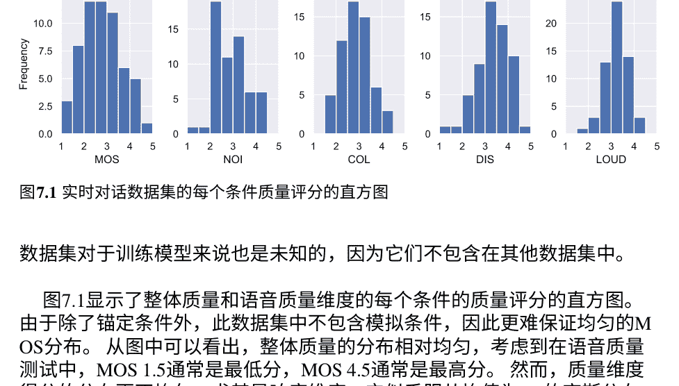

**图7.1 实时对话数据集的每个条件质量评分的直方图**

数据集对于训练模型来说也是未知的，因为它们不包含在其他数据集中。

图7.1显示了整体质量和语音质量维度的每个条件的质量评分的直方图。由于除了锚定条件外，此数据集中不包含模拟条件，因此更难保证均匀的MOS分布。从图中可以看出，整体质量的分布相对均匀，考虑到在语音质量测试中，MOS 1.5通常是最低分，MOS 4.5通常是最高分。然而，质量维度得分的分布更不均匀，尤其是响度维度，它似乎服从均值为3.3的高斯分布。这可以解释为通话者在电话中被指示说得非常安静或者大声，然而，发送和接收设备的自动增益控制正在规范播放音量。值得注意的是，这种向中心倾斜的分布可能会对预测模型的皮尔逊相关性产生负面影响（Mittag等人，2020年）。

## 7.2 模型和训练

在本节中，描述了模型和训练过程。因为对于大多数数据集，没有维度评级可用，并且提出了一个忽略这些样本的损失函数。

### 7.2.1 模型

NISQA模型是一个具有CNN进行逐帧特征计算的神经网络，具有两层用于时间依赖建模的自注意力网络，以及一个具有注意力池化的最终网络。CNN和时间依赖阶段在整体质量和语音质量维度任务之间共享。而每个质量维度和整体质量都有一个单独的池化网络。该模型的顶层图表可以在第5章的图5.4中看到。

### 7.2.2 偏差感知损失

因为目标是训练一个即使对于来自不同来源的未知语音样本也能给出稳健结果的模型，所以使用了许多不同的数据集进行训练和验证。这些数据集在完全不同的环境中进行，具有不同的参与者、语言、设备和包含文件的质量范围。实际上，许多数据集都是窄带数据集。这意味着在这些数据集中，最高可能的质量（干净的窄带信号）只能在全带宽比例听觉实验中被评为大约3.8的MOS（ITU-T Rec. P.863.1 2019）。为了能够通过添加具有不同主观实验偏差的这些数据集来提高模型的性能，应用了第6章中介绍的偏差感知损失。该模型以NISQA_TRAIN_SIM全带宽数据集为锚点，如第6.1.2节所述，因此在全带宽环境中预测语音质量。

### 7.2.3 处理缺失维度评分

对于大多数数据集，只有整体语音质量评分可用。这意味着这些数据集不能用于训练维度评分。克服这个问题的一个解决方案是首先只使用只有整体MOS评分可用的数据集训练模型的整体部分，然后再使用同时具有整体MOS和维度评分可用的数据集对整个模型进行微调。然而，这种方法的缺点是神经网络中的灾难性遗忘效应(French 1999)。当神经网络按顺序在不同的任务或数据上进行训练时，它们往往会忘记最初学到的大部分特征，而主要集中于最后学到的任务/数据。

因此，在这项工作中，模型在所有可用数据上进行训练，而在计算损失时忽略缺失的评分。为此，使用了一种忽略缺失值的NaN-MSE损失函数 $ℒ_{NaN}$，其中缺失值被填充为“Not a Number”(NaN)。它在PyTorch中的实现如算法2所示。

**算法2** NaN-MSE损失 $\mathcal{L}_{\text{NaN}}$
输出: 省略NaN值的MSE
1: 误差 = 目标值 - 预测值
2: idx = NOT( isnan(误差) )
3: NaN_MSE = 均值(误差[idx]^2)
4: 返回 NaN_MSE

首先，计算偏差校正预测值与目标值之间的误差。当样本的目标值为NaN时，误差也将为NaN。然后，只计算误差向量的一个切片的均方值，该切片为误差不是NaN时。为每个维度计算这种偏差感知的NaN-MSE损失，并与MOS一起得到总体损失 $l$如下所示：

$l = \mathcal{L}_{\text{NaN}}(\text{目标值 MOS}, \text{预测值 MOS}, \text{基准 MOS})$
$+ \mathcal{L}_{\text{NaN}}(\text{目标值 NOI}, \text{预测值 NOI}, \text{基准 NOI})$
$+ \mathcal{L}_{\text{NaN}}(\mathbf{y}_{\text{COL}}, \mathbf{y}_{\text{COL}}, \mathbf{b}_{\text{COL}})$
$+ \mathcal{L}_{\text{NaN}}(\mathbf{y}_{\text{DIS}}, \mathbf{y}_{\text{DIS}}, \mathbf{b}_{\text{DIS}})$
$+ \mathcal{L}_{\text{NaN}}(\mathbf{y}_{\text{LOUD}}, \mathbf{y}_{\text{LOUD}}, \mathbf{b}_{\text{LOUD}})$。
(7.1)

在训练模型时，损失是在大小为160的随机小批量上计算的。这意味着在每次优化迭代中，会随机选择160个样本。对于这些样本，计算预测值（前向传播）。基于这些预测，通过反向传播优化模型权重。

由于文件是随机采样的，每个小批量中可能有随机数量的维度评级可用，因为某些文件没有维度评级可用。值得注意的是，这可能导致某些语音样本的权重不平衡。例如，可能会发生在一个小批量中只包含一个具有维度评级的语音样本的情况。然后，池化层的权重仅基于该迭代中的这一个样本进行优化。此外，共享层受到这个特定样本的很大影响，因为MOS损失（所有样本都可用）仅占总损失的1/5。然而，在实践中，这种影响似乎很小，没有产生负面结果。

### 7.2.4 训练

数据集被分为训练集、验证集和测试集，其中59个数据集用于训练，18个数据集用作验证集，一个数据集用作独立测试集。在POLQA竞赛中用作测试集的POLQA池数据集被用作验证集。从ITU-T P Supp. 23数据集中，有四个用于训练，三个用于验证。然后，模型使用批量大小为160、学习率为0.001和Adam优化器进行训练。每个时期结束后，模型权重被存储，并对训练集和验证集进行结果评估。

表7.4列出了训练数据集及其对应的PCC值 r。

**表7.4 训练数据集及其对应的PCC值 r**

| 数据集 | r_MOS | r_NOI | r_COL | r_DIS | r_LOUD | Scale | Lang | Con | 文件 | 投票/文件 |
| :--- | :--- | :--- | :--- | :--- | :--- | :--- | :--- | :--- | :--- | :--- |
| 101_ERICSSON | 0.81 | N/A | N/A | N/A | N/A | SWB | se | 57 | 684 | 10 |
| 102_爱立信 | 0.86 | N/A | N/A | N/A | N/A | 宽带 | 瑞典 | 54 | 648 | 13 |
| 201_FT_DT | 0.93 | N/A | N/A | N/A | N/A | SWB | fr | 48 | 192 | 24 |
| 202_FT_DT | 0.88 | N/A | N/A | N/A | N/A | SWB | fr | 49 | 196 | 24 |
| 204_FTDT | 0.87 | N/A | N/A | N/A | N/A | 宽带 | 法语 | 53 | 212 | 24 |
| 301_OPTICOM | 0.87 | N/A | N/A | N/A | N/A | SWB | cz | 50 | 200 | 24 |
| 302_OPTICOM | 0.85 | N/A | N/A | N/A | N/A | SWB | en | 44 | 176 | 24 |
| 401_PSYTECHNICS | 0.88 | N/A | N/A | N/A | N/A | SWB | en | 48 | 1152 | 8 |
| 402_PSYTECHNICS | 0.91 | N/A | N/A | N/A | N/A | 宽带 | 英语 | 48 | 1152 | 8 |
| 501_SWISSQUAL | 0.91 | 0.98 | 0.95 | 0.91 | 0.94 | SWB | 德 | 50 | 200 | 24 |
| 502_SWISSQUAL | 0.90 | 0.97 | 0.96 | 0.88 | 0.92 | SWB | 德 | 50 | 200 | 24 |
| 601_TNO | 0.90 | N/A | N/A | N/A | N/A | SWB | 荷兰 | 50 | 200 | 24 |
| 602_TNO | 0.89 | N/A | N/A | N/A | N/A | SWB | 荷兰 | 50 | 200 | 24 |
| ATT_iLBC | 0.87 | N/A | N/A | N/A | N/A | NB | 英语 | 45 | 1312 | 8 |
| BT_P862_BGN_ENG | 0.94 | N/A | N/A | N/A | N/A | NB | 英语 | 49 | 196 | 24 |
| BT_P862_PROP | 0.81 | N/A | N/A | N/A | N/A | NB | 英语 | 50 | 1200 | 4 |
| DT_1 | 0.93 | N/A | N/A | N/A | N/A | 宽带 | 德语 | 125 | 18875 | 不适用 |
| DT_2 | 0.80 | N/A | N/A | N/A | N/A | 宽带 | 德语 | 26 | 112 | 不适用 |
| DT_3 | 0.93 | N/A | N/A | N/A | N/A | SWB | 德 | 29 | 1220 | 不适用 |
| DT_P862_1st | 0.85 | N/A | N/A | N/A | N/A | NB | 德语 | 50 | 200 | 24 |
| DT_P862_BGN_GER | 0.94 | N/A | N/A | N/A | N/A | NB | 德语 | 49 | 196 | 28 |
| DT_P862_共享 | 0.84 | N/A | N/A | N/A | N/A | NB | 德语 | 50 | 200 | 24 |
| ERIC_AMR_4B | 0.95 | N/A | N/A | N/A | N/A | NB | 瑞典 | 36 | 1008 | 9 |
| ERIC_FIELD_GSM_EU | 0.87 | N/A | N/A | N/A | N/A | NB | 瑞典 | 234 | 234 | 不适用 |
| ERIC_P862_NW_MEAS | 0.82 | N/A | N/A | N/A | N/A | NB | 瑞典 | 46 | 184 | 29 |
| FT_P563_PROP | 0.84 | N/A | N/A | N/A | N/A | NB | 法语 | 50 | 799 | 6 |
| GIPS_EXP1 | 0.97 | N/A | N/A | N/A | N/A | NB | 英语 | 38 | 1824 | 6 |
| GIPS_Exp3 | 0.96 | N/A | N/A | N/A | N/A | 宽带 | 英语 | 36 | 1728 | 6 |
| GIPS_Exp4 | 0.84 | N/A | N/A | N/A | N/A | SWB | en | 36 | 144 | 25 |
| HUAWEI_1 | 0.90 | N/A | N/A | N/A | N/A | NB | zh | 24 | 576 | 8 |
| ITU_SUPPL23_EXP1a | 0.86 | N/A | N/A | N/A | N/A | NB | 法语 | 44 | 176 | 24 |
| ITU_SUPPL23_EXP1d | 0.84 | N/A | N/A | N/A | N/A | NB | ja | 44 | 176 | 24 |
| ITU_SUPPL23_EXP3a | 0.84 | N/A | N/A | N/A | N/A | NB | 法语 | 50 | 200 | 24 |
| ITU_SUPPL23_EXP3c | 0.84 | N/A | N/A | N/A | N/A | NB | it | 50 | 200 | 24 |
| LUC_P563_PROP | 0.91 | N/A | N/A | N/A | N/A | NB | 英语 | 50 | 200 | 24 |
| NISQA_TRAIN_LIVE | 0.87 | 0.81 | 0.69 | 0.74 | 0.84 | FB | 英语 | 1020 | 1020 | 5 |
| NISQA_TRAIN_SIM | 0.94 | 0.91 | 0.91 | 0.92 | 0.89 | FB | 英语 | 10000 | 10000 | 5 |
| NTT_PTEST_1 | 0.84 | N/A | N/A | N/A | N/A | NB | ja | 90 | 1416 | 10 |
| NTT_PTEST_2 | 0.83 | N/A | N/A | N/A | N/A | 宽带 | ja | 80 | 1104 | 12 |
| OPT_P563_PROP | 0.90 | N/A | N/A | N/A | N/A | NB | 德语 | 50 | 600 | 24 |
| PAMD_DTAG_1 | 0.88 | 0.88 | 0.83 | 0.88 | 不适用 | 宽带 | 德语 | 66 | 792 | 3 |
| PAMD_DTAG_2 | 0.86 | 0.83 | 0.92 | 0.89 | 不适用 | 宽带 | 德语 | 76 | 912 | 4 |
| PAMD_Orange_1 | 不适用 | 0.96 | 0.93 | 0.96 | 0.84 | SWB | fr | 56 | 224 | 18 |
| PSY_P563_PROP | 0.91 | N/A | N/A | N/A | N/A | NB | 英语 | 54 | 648 | 8 |
| QUALCOMM_EXP1b | 0.82 | N/A | N/A | N/A | N/A | NB | 英语 | 32 | 2048 | 4 |
| QUALCOMM_EXP1w | 0.84 | N/A | N/A | N/A | N/A | 宽带 | 英语 | 40 | 2560 | 4 |
| QUALCOMM_EXP2b | 0.80 | N/A | N/A | N/A | N/A | NB | 英语 | 32 | 2048 | 4 |
| QUALCOMM_EXP3w | 0.80 | N/A | N/A | N/A | N/A | NB | 英语 | 32 | 2048 | 4 |
| QUALCOMM_EXP4 | 0.78 | N/A | N/A | N/A | N/A | NB | 英语 | 32 | 2048 | 4 |
| QUALCOMM_EXP5 | 0.76 | N/A | N/A | N/A | N/A | 宽带 | 英语 | 56 | 3584 | 4 |
| QUALCOMM_EXP6a | 0.91 | N/A | N/A | N/A | N/A | NB | 英语 | 48 | 2304 | 4 |
| QUALCOMM_EXP6b | 0.83 | N/A | N/A | N/A | N/A | NB | 英语 | 48 | 2304 | 4 |
| SQ_P563_PROP | 0.82 | N/A | N/A | N/A | N/A | NB | 德语 | 50 | 600 | 8 |
| TCD | 0.88 | N/A | N/A | N/A | N/A | SWB | en | 76 | 304 | 24 |
| TNO_P862_KPN_KIT97 | 0.92 | N/A | N/A | N/A | N/A | NB | nl | 59 | 59 | 60 |
| TNO_P862_NW_EMU | 0.82 | N/A | N/A | N/A | N/A | NB | nl | 50 | 200 | 24 |
| TNO_P862_NW_MEAS | 0.80 | N/A | N/A | N/A | N/A | NB | nl | 46 | 184 | 24 |
| TUBDIS | 0.93 | 0.93 | 0.91 | 0.98 | 0.89 | SWB | 德 | 20 | 40 | 41 |
| TUBVUPL | 0.84 | N/A | N/A | N/A | N/A | SWB | 德 | 15 | 60 | 36 |

计算为所有数据集的平均PCC。 当验证集的PCC连续10个epoch没有增加时，训练停止。 然后选择在验证集上性能最佳的epoch的模型权重作为最终模型。 在本节中介绍的最终NISQA模型中，这是第74个epoch。

训练数据集和整体质量以及质量维度的每个配置文件的PCC列在表格7.4中。可以看到只有8个数据集有维度评分（只有6个有响度评分）。 然而，NISQA_TRAIN数据集中有维度评分，包含了大量来自不同说话者的各种对话语音文件。

所有训练数据集的整体MOS PCC平均为0.87，最差情况下的PCC为0.76，最佳情况下为0.97。

## 7.3 结果

在本节中，将介绍验证集和测试集的结果。 随后，还将分析模型对常见语音失真的不同损伤水平的预测行为。 首先，介绍本节中使用的评估指标。

### 7.3.1 评估指标

结果将根据三个指标进行评估：

-   经过三阶多项式映射后的RMSE*，表示为RMSE*
-   经过一阶多项式映射后的RMSE（均方根误差），表示为RMSE
-   无映射的每个条件下的Pearson相关系数（PCC），表示为 r

根据ITU-T Rec. P.1401（2020），经过三阶多项式单调映射的ε-insensitive RMSE（RMSE*）是评估客观质量预测模型的ITU-T推荐指标。RMSE*类似于传统的均方根误差（RMSE），但考虑了个别MOS分数的置信区间。该映射可以补偿个别实验中分数之间的偏移、不同偏差和其他偏移，而不改变排名顺序。为了计算RMSE*，首先将每个数据集的预测值通过三阶单调多项式映射到主观值。在本研究中，使用SciPy的顺序最小二乘规划（SLSP）实现进行映射，其中设置了一阶导数的约束以实现单调函数。然后，使用映射后的预测值计算每个数据集条件下的预测值的平均值。然后计算预测误差“P error”，该误差考虑了每个条件下的置信区间，计算方法如下：

P error(i) = max(0, |MOS_sub(i) - MOS_obj(i)| - ci95(i)). (7.2)

置信区间 ci95 通过以下公式计算：

ci95 = t(0.05, M) * σ / √M, (7.3)

其中 M 表示每个条件的投票数。每个条件的标准差通过以下公式计算：

σ_j = sqrt( (K-1)/(N-1) * Σ_{l=1}^{L} σ_{j,l}^2 ), (7.4)

其中 K 表示每个文件的评分数，N 表示每个条件的评分数，j 表示条件编号，l 表示文件编号。RMSE* 最终计算如下：

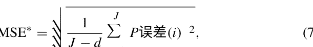

其中 $J$ 表示条件的数量， $=4$ 表示自由度的三阶映射函数。

虽然RMSE*是一个有用的指标，因为它不会惩罚在主观评分中具有高不确定性的样本的预测误差，但只有在每个条件下有足够的评分时才有意义。在数据集NISQA_VAL_SIM和NISQA_VAL_LIVE中，每个条件只有一个带有5个评分的文件可用，这导致了一个很高的置信区间，因此RMSE*非常小。此外，单调的三阶多项式映射并不是简单的，可能会导致不同的解，从而使得不同模型之间的公平比较更加困难。然而，由于许多验证数据集是在窄带环境下进行注释的，但由NISQA在全带环境下进行预测，因此无法直接应用常规的RMSE。因此，在对每个文件的评分进行简单的一阶多项式映射之后，使用标准的RMSE作为第二个指标。此外，还使用常用的PCC作为第三个指标。

然而，需要注意的是PCC依赖于每个数据集中主观MOS值的分布，因此可能导致非常低的值，而预测误差可能仍然很小，或者反之亦然。

对于ITU-T的工作项目P.SAMD，主要和唯一的性能准则是经过三阶映射后的每个条件的RMSE*。未知数据集的要求目标如下：

-   总体性能：所有实验和维度/整体质量的平均RMSE*应小于0.35
-   最差情况性能：每个实验和维度/整体质量的单个RMSE*不应超过0.5

### 7.3.2 验证集结果：整体质量

首先将验证集上的结果与双端模型进行比较，然后再与其他单端模型进行比较。

与双端模型相比
将预测结果与需要干净参考进行预测的双端语音质量预测模型POLQA和DIAL进行比较。结果显示在表7.5中，最佳结果以粗体表示。

> 由于VISQOL模型在输出预测时导致了时间对齐错误，因此被排除在外。

| 数据集 | 缩放 | 语言 | 缺点 | 文件 | NISQA r | NISQA RMSE | NISQA RMSE* | POLQA r | POLQA RMSE | POLQA RMSE* | DIAL r | DIAL RMSE | DIAL RMSE* |
| :--- | :--- | :--- | :--- | :--- | :--- | :--- | :--- | :--- | :--- | :--- | :--- | :--- | :--- |
| 103_爱立信 | SWB | 瑞典 | 54 | 648 | **0.85** | 0.38 | 0.29 | **0.87** | 0.34 | 0.24 | 0.78 | 0.45 | 0.35 |
| 104_爱立信 | NB | 瑞典 | 55 | 660 | 0.77 | 0.47 | 0.36 | **0.91** | 0.31 | 0.19 | 0.76 | 0.49 | 0.38 |
| 203_FT_DT | SWB | 法语 | 54 | 216 | **0.92** | 0.36 | 0.26 | **0.91** | 0.38 | 0.29 | 0.79 | 0.57 | 0.48 |
| 303_OPTICOM | SWB | 英语 | 54 | 216 | **0.92** | 0.33 | 0.20 | **0.93** | 0.31 | 0.16 | 0.71 | 0.59 | 0.43 |
| 403_PSYTECHNICS | SWB | 英语 | 48 | 1152 | **0.91** | 0.36 | 0.28 | **0.96** | 0.24 | 0.16 | 0.92 | 0.34 | 0.26 |
| 404_PSYTECHNICS | NB | 英语 | 48 | 1151 | 0.77 | 0.39 | 0.31 | 0.86 | 0.31 | 0.24 | 0.67 | 0.46 | 0.40 |
| 503_SWISSQUAL | SWB | 德语 | 54 | 216 | **0.92** | 0.34 | 0.24 | **0.94** | 0.29 | 0.18 | 0.85 | 0.46 | 0.35 |
| 504_SWISSQUAL | NB | 德语 | 49 | 196 | **0.92** | 0.37 | **0.25** | 0.87 | 0.45 | 0.34 | 0.73 | 0.63 | 0.50 |
| 603_TNO | SWB | nl | 48 | 192 | 0.89 | 0.44 | 0.33 | **0.95** | 0.29 | 0.16 | 0.86 | 0.48 | 0.39 |
| ERIC_FIELD_GSM_US | NB | 英语 | 372 | 372 | 0.79 | 0.36 | 不适用 | 0.75 | 0.39 | 不适用 | 0.71 | 0.42 | 不适用 |
| HUAWEI_2 | NB | zh | 24 | 576 | **0.98** | 0.21 | 0.13 | **0.94** | 0.32 | 0.19 | 0.89 | 0.44 | 0.34 |
| ITU_SUPPL23_EXP1o | NB | 英语 | 44 | 176 | **0.92** | 0.31 | 0.21 | **0.91** | 0.32 | **0.18** | 0.91 | 0.33 | 0.22 |
| ITU_SUPPL23_EXP3d | NB | ja | 50 | 200 | **0.92** | 0.27 | 0.14 | 0.85 | 0.36 | 0.23 | 0.84 | 0.36 | 0.23 |
| ITU_SUPPL23_EXP3o | NB | 英语 | 50 | 200 | **0.91** | 0.3 | 0.15 | 0.88 | 0.35 | 0.22 | 0.87 | 0.36 | 0.22 |
| NISQA_VAL_LIVE | FB | 英语 | 200 | 200 | 0.82 | 0.40 | 0.12 | 0.67 | 0.52 | 0.21 | -0.22 | 0.69 | 0.36 |
| NISQA_VAL_SIM | FB | 英语 | 2500 | 2500 | 0.9 | 0.48 | 0.15 | 0.86 | 0.56 | 0.21 | 0.36 | 1.03 | 0.61 |
| TUB_AUS1 | FB | 英语 | 50 | 600 | 0.91 | 0.21 | 0.08 | 0.88 | 0.24 | 0.10 | 0.73 | 0.35 | 0.22 |
| TUB_LIK | SWB | 德语 | 8 | 96 | 0.98 | 0.25 | 0.19 | **0.99** | 0.16 | **0.10** | 0.89 | 0.53 | 0.58 |

需要注意的是，POLQA/DIAL在全频带/超宽带模式下应用于窄带数据集，以便与仅在全频带上进行预测的NISQA模型进行更公平的比较。因此，对于窄带数据集的结果应该谨慎考虑。可以看出，POLQA在大多数POLQA池数据集上的表现优于NISQA。然而，这些数据集的结果仍然远低于每个数据集所需的平均RMSE* 0.35，并且仅有窄带数据集104_ERICSSON的RMSE*为0.36，这也是最差的性能，并且远低于所需的最差性能0.5。预测准确性似乎不受语言影响，对于中文和日文等非欧洲语言，由于可用的训练文件较少，仍然可以实现较高的预测准确性。

在大多数包含对话/自发语音的数据集上，NISQA在大多数数据集上表现优于POLQA和DIAL，例如NISQA_VAL_SIM、NISQA_VAL_LIVE和TUB_AUS1数据集。由于NISQA数据集每个条件只有一个文件，因此应考虑RMSE而不是RMSE*（因此这些数据集上的指标是按文件计算的）。考虑到这一事实，与POLQA的RMSE为0.52和DIAL的RMSE为0.69相比，NISQA_VAL_LIVE数据集上的误差仍然相对较低，为0.4，这显示了在该数据集中预测条件的挑战性。

#### 与单端模型相比

表7.6显示了与单端语音质量预测模型P.563、ANIQUE+和WEnets（最佳模型以粗体突出显示）相比，在验证集上的整体MOS预测结果。值得注意的是，P.563和ANIQUE仅适用于窄带信号，因此将语音样本降采样到8 kHz以应用于这些模型。WEnets是一个基于深度学习的公开可用的语音质量模型，它是基于PESQ预测进行训练的。可以看出，除了Supp23和404_PSYTECHNICS数据集外，NISQA在大多数数据集上明显优于这三个模型。

然而，至少Supp 23数据集可用于P.563和ANIQUE+模型的开发。当考虑到包含对话/自发性语音的数据集时，例如NISQA_VAL_SIM，NISQA_VAL_LIVE和TUB_AUS1，可以看出NISQA明显优于P.563，ANIQUE+和WEnet，与NISQA相比，它们只能获得0.30-0.70的相关性，而NISQA的相关性为0.82-0.91。

### 7.3.3 验证集结果：质量维度

在本小节中，介绍了语音质量维度的验证结果。到目前为止，只有两个双向模型可用于预测语音质量维度——P.AMD候选模型和DIAL。个别维度的结果显示在表7.7、7.8、7.9和7.10中。

## 表7.6 与单向语音质量模型相比的每个条件的验证结果

| 数据集 | 缩放 | NISQA r | NISQA RMSE | NISQA RMSE* | P563 r | P563 RMSE | P563 RMSE* | ANIQUE+ r | ANIQUE+ RMSE | ANIQUE+ RMSE* | WEnets r | WEnets RMSE | WEnets RMSE* |
|---|---|---|---|---|---|---|---|---|---|---|---|---|---|
| 103_爱立信 | SWB | 0.85 | 0.38 | 0.29 | 0.36 | 0.66 | 0.55 | 0.54 | 0.60 | 0.47 | 0.28 | 0.68 | 0.57 |
| 104_爱立信 | NB | 0.77 | 0.47 | 0.36 | 0.64 | 0.57 | 0.45 | 0.68 | 0.55 | 0.44 | 0.13 | 0.74 | 0.64 |
| 203_FT_DT | SWB | 0.92 | 0.36 | 0.26 | 0.68 | 0.69 | 0.58 | 0.47 | 0.82 | 0.72 | 0.64 | 0.72 | 0.63 |
| 303_OPTICOM | SWB | 0.92 | 0.33 | 0.2 | 0.85 | 0.44 | 0.33 | 0.71 | 0.59 | 0.47 | 0.43 | 0.76 | 0.63 |
| 403_PSYTECHNICS | SWB | 0.91 | 0.36 | 0.28 | 0.81 | 0.50 | 0.41 | 0.77 | 0.54 | 0.40 | 0.78 | 0.53 | 0.45 |
| 404_PSYTECHNICS | NB | 0.77 | 0.39 | 0.31 | 0.82 | 0.35 | 0.28 | 0.74 | 0.41 | 0.34 | 0.14 | 0.61 | 0.53 |
| 503_SWISSQUAL | SWB | 0.92 | 0.34 | 0.24 | 0.71 | 0.62 | 0.51 | 0.61 | 0.70 | 0.58 | 0.59 | 0.71 | 0.59 |
| 504_SWISSQUAL | NB | 0.92 | 0.37 | 0.25 | 0.83 | 0.50 | 0.37 | 0.79 | 0.56 | 0.45 | 0.54 | 0.77 | 0.67 |
| 603_TNO | SWB | 0.89 | 0.44 | 0.33 | 0.83 | 0.53 | 0.42 | 0.69 | 0.69 | 0.58 | 0.59 | 0.77 | 0.64 |
| ERIC_FIELD_GSM_US | NB | 0.79 | 0.36 | 不适用 | 0.42 | 0.54 | 不适用 | 0.17 | 0.58 | 不适用 | 0.60 | 0.47 | 不适用 |
| HUAWEI_2 | NB | 0.98 | 0.21 | 0.13 | 0.93 | 0.35 | 0.26 | 0.79 | 0.59 | 0.40 | 0.63 | 0.75 | 0.71 |
| ITU_SUPPL23_EXP1o | NB | 0.92 | 0.31 | 0.21 | 0.90 | 0.34 | 0.21 | 0.98 | 0.15 | 0.04 | 0.73 | 0.53 | 0.44 |
| ITU_SUPPL23_EXP3d | NB | 0.92 | 0.27 | 0.14 | 0.93 | 0.26 | 0.15 | 0.97 | 0.17 | 0.09 | 0.68 | 0.50 | 0.38 |
| ITU_SUPPL23_EXP3o | NB | 0.91 | 0.30 | 0.15 | 0.91 | 0.30 | 0.17 | 0.98 | 0.15 | 0.05 | 0.79 | 0.45 | 0.32 |
| NISQA_VAL_LIVE | FB | 0.82 | 0.4 | 0.12 | 0.42 | 0.64 | 0.31 | 0.51 | 0.61 | 0.28 | 0.36 | 0.66 | 0.30 |
| NISQA_VAL_SIM | FB | 0.90 | 0.48 | 0.15 | 0.45 | 0.99 | 0.56 | 0.54 | 0.93 | 0.50 | 0.30 | 1.05 | 0.59 |
| TUB_AUS1 | FB | 0.91 | 0.21 | 0.08 | 0.62 | 0.40 | 0.26 | 0.65 | 0.39 | 0.21 | 0.70 | 0.36 | 0.23 |
| TUBLIK | SWB | 0.98 | 0.25 | 0.19 | 0.85 | 0.60 | 0.56 | 0.85 | 0.61 | 0.72 | 0.59 | 0.93 | 1.09 |

#### 表7.7 噪音维度的验证结果

| 数据集 | 缩放 | 语言 | 缺点 | 文件 | NISQA r | NISQA RMSE | NISQA RMSE* | PAMD r | PAMD RMSE | PAMD RMSE* | DIAL r | DIAL RMSE | DIAL RMSE* |
|--------|------|------|------|------|---------|------------|-------------|--------|-----------|------------|--------|-----------|------------|
| 503_SWISSQUAL | SWB | 德语 | 54 | 216 | 0.94 | 0.26 | 0.14 | 0.88 | 0.35 | 0.24 | 0.84 | 0.39 | 0.25 |
| TUB_AUS1 | FB | 英语 | 50 | 600 | 0.97 | 0.16 | 0.05 | 0.81 | 0.35 | 0.21 | 0.88 | 0.29 | 0.17 |
| NISQA_VAL_LIVE | FB | 英语 | 200 | 200 | 0.73 | 0.49 | 0.12 | 0.34 | 0.68 | 0.27 | 0.31 | 0.69 | 0.30 |
| NISQA_VAL_SIM | FB | 英语 | 2500 | 2500 | 0.86 | 0.48 | 0.11 | 0.55 | 0.79 | 0.41 | 0.40 | 0.87 | 0.48 |

#### 表7.8 色彩维度的验证结果

| 数据集 | 缩放 | 语言 | 缺点 | 文件 | NISQA r | NISQA RMSE | NISQA RMSE* | PAMD r | PAMD RMSE | PAMD RMSE* | DIAL r | DIAL RMSE | DIAL RMSE* |
|--------|------|------|------|------|---------|------------|-------------|--------|-----------|------------|--------|-----------|------------|
| 503_SWISSQUAL | SWB | 德语 | 54 | 216 | 0.84 | 0.39 | 0.27 | 0.9 | 0.31 | 0.18 | 0.88 | 0.34 | 0.21 |
| TUB_AUS1 | FB | 英语 | 50 | 600 | 0.84 | 0.28 | 0.13 | 0.81 | 0.29 | 0.14 | 0.81 | 0.30 | 0.16 |
| NISQA_VAL_LIVE | FB | 英语 | 200 | 200 | 0.57 | 0.43 | 0.05 | -0.15 | 0.51 | 0.14 | -0.11 | 0.51 | 0.14 |
| NISQA_VAL_SIM | FB | 英语 | 2500 | 2500 | 0.84 | 0.50 | 0.14 | 0.62 | 0.73 | 0.32 | 0.25 | 0.90 | 0.44 |

#### 表7.9 不连续性维度的验证结果

| 数据集 | 缩放 | 语言 | 缺点 | 文件 | NISQA r | NISQA RMSE | NISQA RMSE* | PAMD r | PAMD RMSE | PAMD RMSE* | DIAL r | DIAL RMSE | DIAL RMSE* |
|--------|------|------|------|------|---------|------------|-------------|--------|-----------|------------|--------|-----------|------------|
| 503_SwissQUAL | SWB | 德语 | 54 | 216 | 0.86 | 0.31 | 0.20 | 0.87 | 0.31 | 0.18 | 0.74 | 0.42 | 0.33 |
| TUB_AUS1 | FB | 英语 | 50 | 600 | 0.92 | 0.23 | 0.11 | 0.77 | 0.37 | 0.23 | 0.61 | 0.46 | 0.31 |
| NISQA_VAL_LIVE | FB | 英语 | 200 | 200 | 0.55 | 0.56 | 0.16 | -0.02 | 0.67 | 0.25 | 0.10 | 0.67 | 0.25 |
| NISQA_VAL_SIM | FB | 英语 | 2500 | 2500 | 0.84 | 0.54 | 0.19 | 0.66 | 0.75 | 0.36 | 0.23 | 0.97 | 0.56 |

#### 表7.10 响度维度的验证结果

| 数据集 | 缩放 | 语言 | 缺点 | 文件 | NISQA r | NISQA RMSE | NISQA RMSE* | PAMD r | PAMD RMSE | PAMD RMSE* | DIAL r | DIAL RMSE | DIAL RMSE* |
|--------|------|------|------|------|---------|------------|-------------|--------|-----------|------------|--------|-----------|------------|
| 503_SwissQUAL | SWB | 德语 | 54 | 216 | 0.91 | 0.29 | 0.17 | 0.90 | 0.31 | 0.17 | 0.94 | 0.23 | 0.11 |
| TUB_AUS1 | FB | 英语 | 50 | 600 | 0.74 | 0.32 | 0.21 | 0.66 | 0.36 | 0.21 | 0.62 | 0.38 | 0.25 |
| NISQA_VAL_LIVE | FB | 英语 | 200 | 200 | 0.73 | 0.47 | 0.1 | 0.60 | 0.54 | 0.11 | 0.54 | 0.58 | 0.17 |
| NISQA_VAL_SIM | FB | 英语 | 2500 | 2500 | 0.81 | 0.48 | 0.11 | 0.45 | 0.74 | 0.32 | 0.38 | 0.76 | 0.33 |

（最佳模型以粗体显示）。可以看出，在噪音维度上，NISQA在所有四个数据集上都优于PAMD候选模型和DIAL模型。在其他三个维度上，NISQA在包含典型的P.800双语句子的503_SwissQUAL数据集上被PAMD或DIAL模型超越。值得注意的是，503_SwissQUAL数据集是PAMD模型的训练集的一部分。然而，在包含对话/自发语音的三个数据集上，NISQA在所有四个维度和整体语音质量上都优于双端模型。最具挑战的维度似乎是不连续性，在NISQA_VAL_LIVE数据集上仅能达到0.56的均方根误差（RMSE），这仍然优于DIAL和PAMD模型的性能。总体而言，质量维度的预测准确性低于整体质量的准确性。尽管如此，所得到的误差仍远低于所需的0.35的均方根误差（RMSE*）要求。

### 7.3.4 测试集结果

最后，模型在测试集上进行评估，该测试集在训练或选择模型时未使用，并且包含实时对话条件，这些条件与其他数据集中包含的条件和说话者是独立的。由于该数据集包含真实电话录音，因此没有可用的清晰参考文件。因此，预测准确性只能与单端模型进行比较，并且仅针对整体语音质量，因为没有其他单端语音质量预测模型可用。测试集包含总共58个条件，每个条件有4个文件，总共232个文件。这些句子由8个不同的德国说话者说出。每个文件由24个听力测试参与者评分。

与模型P.563、ANIQUE+和WEnets相比，整体语音质量的结果在表7.11中呈现（最佳模型以粗体突出显示）。可以看出，NISQA在PCC为0.9和RMSE*为0.24的情况下取得了出色的结果。虽然P.563仍然达到了可接受的相关性0.7，但0.48的RMSE*实际上非常高，几乎接近最差情况下的P.800目标。ANIQUE+和基于深度学习的WEnets获得了更高的RMSE*值。

预测质量维度的结果在表7.12中呈现。如前所述，这些结果无法进行比较；然而，不连续性维度的最差情况RMSE*为0.25，远低于0.35的RMSE* P.800目标。相关性结果在响度维度为0.71，颜色维度为0.87。尽管响度预测的相关性较低，但RMSE*相对较小。

测试集结果的相关性图表显示在图7.2中，红线表示用于RMSE*计算的三阶多项式映射，浅蓝色误差条代表每个条件下的95%置信区间。在响度维度的图表中，可以看到大多数样本的MOS聚集在3附近，这解释了相关性相对较低但均方根误差（RMSE）较小的原因。同时可以看到，在噪声维度上，值相对于整体质量更广泛地分散在多项式线周围。然而，由于较高的置信区间，噪声RMSE实际上比整体MOS RMSE更低。

通过对相关图的目视检查，整体MOS和色彩似乎最符合单位线，只有少数离群值。在不连续性预测的情况下，整体趋势似乎与单位线相符。然而，仍然存在一些被模型高估的离群值，可能是模型无法识别的中断。类似的情况也出现在噪声维度上，可以看到一簇被高估的离群值。相反，对于响度估计，大多数样本被低估。然而，该数据集的响度评分并不理想，样本中获得低主观响度评分的样本太少，无法进行最终的响度预测评估。

#### 表7.11 整体质量的测试集结果

| 数据集 | 缩放 | NISQA_r | NISQA_RMSE | NISQA_RMSE* | P563_r | P563_RMSE | P563_RMSE* | ANIQUE+_r | ANIQUE+_RMSE | ANIQUE+_RMSE* | WEnets_r | WEnets_RMSE | WEnets_RMSE* |
|--------|------|---------|------------|-------------|--------|-----------|------------|-----------|--------------|---------------|----------|-------------|--------------|
| NISQA_TEST_LIVETALK | FB | 0.90 | 0.35 | 0.24 | 0.70 | 0.58 | 0.48 | 0.56 | 0.68 | 0.53 | 0.66 | 0.61 | 0.50 |

#### 表7.12 语音质量维度的测试结果

| 数据集 | 缩放 | NOI_r | NOI_RMSE | NOI_RMSE* | COL_r | COL_RMSE | COL_RMSE* | DIS_r | DIS_RMSE | DIS_RMSE* | LOUD_r | LOUD_RMSE | LOUD_RMSE* |
|--------|------|-------|----------|-----------|-------|----------|-----------|-------|----------|-----------|--------|----------|------------|
| NISQA_TEST_LIVETALK | FB | 0.76 | 0.47 | 0.20 | 0.87 | 0.31 | 0.17 | 0.83 | 0.40 | 0.25 | 0.71 | 0.36 | 0.17 |

# 7 NISQA：单端语音质量模型

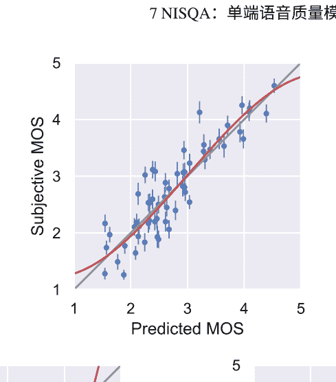

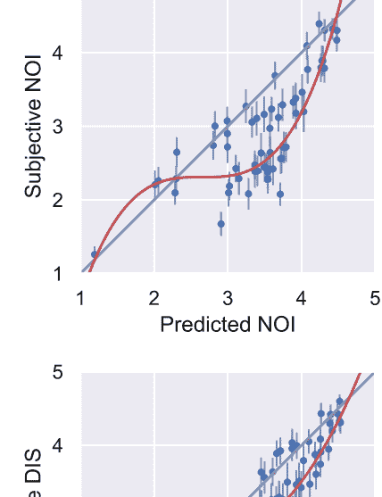

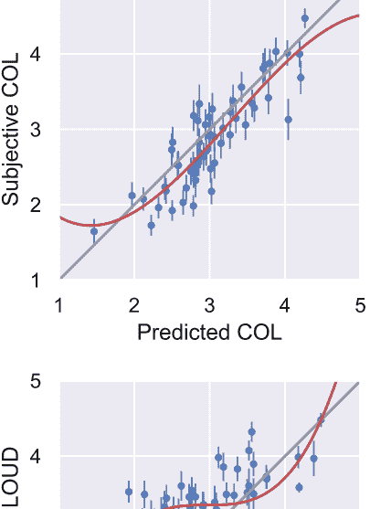

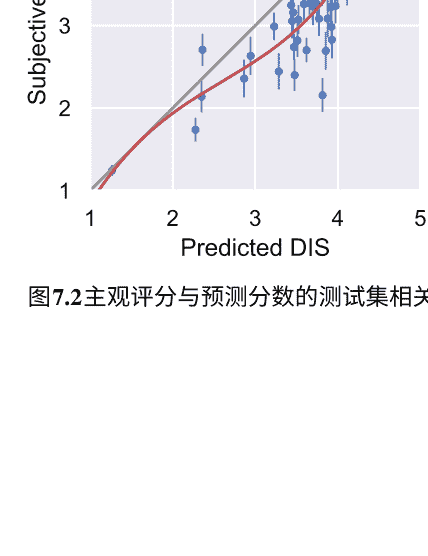

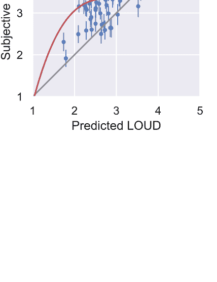

#### 图7.2 主观评分与预测分数的测试集相关图

### 7.3.5 损坏程度与质量预测

最后，分析了模型在不同失真类型的不同失真级别下的预测行为。分析的失真也包含在NISQA的训练和验证数据集中，因此可以进行主观评分进行比较。进行此分析是为了检查是否对某些失真级别出现了意外的预测。此外，预测应该与失真级别呈单调关系，即例如，如果噪声信号的信噪比降低，预测质量也应该降低，直到达到某个饱和点。

具体而言，分析了以下八种失真类型：

- 时间剪切
- 具有掩盖的突发数据包丢失
- 高通滤波
- 低通滤波
- 活动语音水平
- 幅度剪切
- MNRU噪声
- 白色背景噪声
- 酒吧背景噪声

对于此分析，从NISQA_VAL_SIM数据集中随机选择了十二个参考语音文件，其中包括来自AusTalk、UK-Ireland和DNS-Challenge数据集的一个女性和一个男性讲话者（有关源数据集，请参见第3.1.1节）。然后，对所有十二个文件进行了所有八种失真的处理，使用不同的级别。

#### 时间剪辑

首先分析的是时间剪辑失真，其中20毫秒的语音帧被随机设置为零，从而导致语音信号中断。图7.3展示了与帧错误率（FER）相关的预测结果。在左上角的子图（a）中，可以看到12个单独文件的整体质量预测，用不同的颜色表示。在子图（b）中，显示了这12个文件的平均MOS预测以及95%的置信区间。其他四个子图（c）-（f）显示了这十二个文件的平均质量维度预测（只显示整体MOS）。可以看到，整体MOS与帧错误率呈指数下降的关系，这也是ITU-T E模型（ITU-T Rec. P.107 2015）所知的。可以看到，这条线总体上是单调的，只有一些尖峰可能是由于丢帧的随机删除引起的。如果删除的帧出现在语音文件的静音段中，它们几乎不会引起任何质量下降。可以看到，不连续性维度的图表与整体MOS相似，这是预期的。实际上，与整体MOS相比，不连续性的预测质量下降速度更快。

其他三个维度似乎也受到时间剪辑的影响它们也有所减少，但速度较慢。虽然这似乎是一个不希望的行为，但图7.4中的主观评分显示了类似的趋势。在这个图中，呈现了主观MOS评分与帧错误率的散点图。这些是NISQA_TRAIN_SIM和NISQA_VAL_SIM数据集中使用的文件，每个文件由五个测试参与者评分。值得注意的是，每个点代表来自不同参考文件的语音样本（不是用于预测分数的十二个文件之一）。由于评分相当嘈杂，还显示了三阶回归线和95%置信区间。从图中可以看出，测试参与者还对高FER的文件的噪声、色彩和响度评分较低。总体而言，NISQA模型在与时间剪辑条件的帧错误率相关的预测结果没有出现意外。

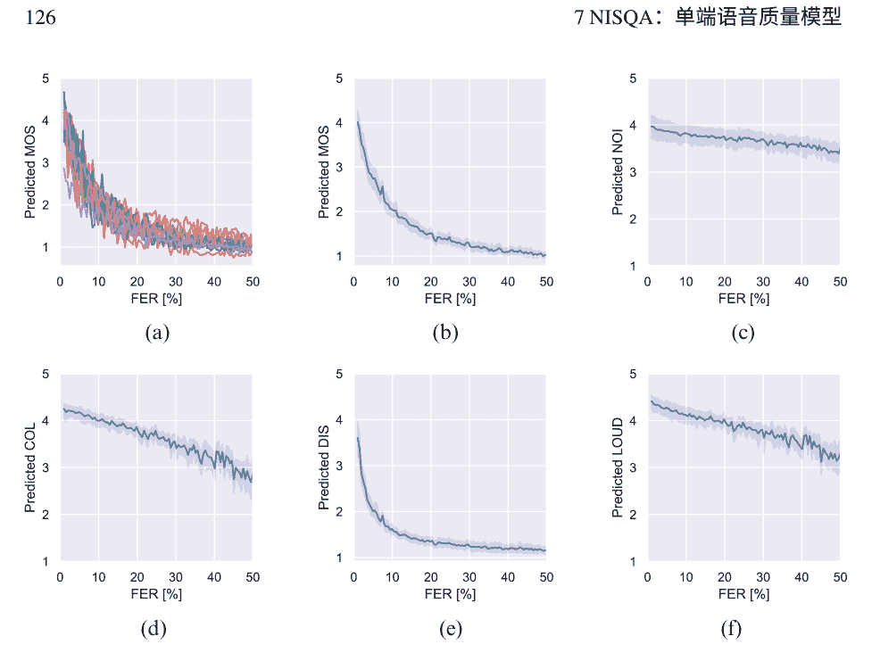

图7.3 不同帧错误率下的预测分数与时间剪辑对比。(a) MOS (单个文件)。(b) MOS。(c) NOI。(d) COL。(e) DIS。(f) LOUD

## 图7.4 主观评分与不同帧错误率的时间剪辑。(a) MOS. (b) NOI. (c) COL. (d) DIS. (e) LOUD

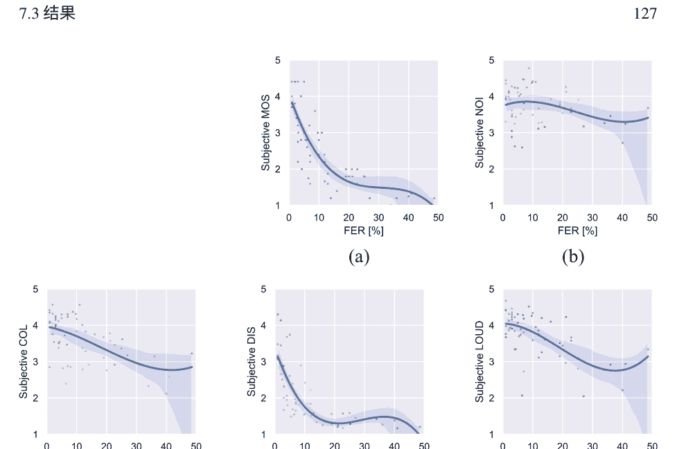

#### 突发性隐藏数据包丢失

作为下一个失真，分析了应用了隐藏算法的突发性数据包丢失。为此，语音样本以16.4 kbit/s模式使用EVS编解码器进行处理。然后应用了不同帧错误率的突发性数据包丢失。NISQA预测结果可见于图7.5，并且主观评分呈现于图7.6。从图7.5b可以看出，与时间剪辑条件相比，预测的MOS呈更线性下降趋势。这可以解释为隐藏的丢失帧不像未隐藏的零插入那样强烈地降低感知质量。此外，MOS预测与帧错误之间的关系不太单调，显示出许多峰值。然而，隐藏算法的效果在很大程度上取决于位置。

语音信号（例如语音的有声部分或无声部分）的变化，因此不能期望完全单调的曲线。同样，其他维度也受到数据包丢失的影响，尤其是色彩维度。这可以解释为当隐藏算法失败时出现的语音失真。在这种情况下，算法可能会产生机器人声音或被测试参与者评为色彩退化的人工声音。可以看出，不连续性估计几乎等于整体MOS预测。当预测值与图7.6的主观评分进行比较时，没有出现意外的偏差。

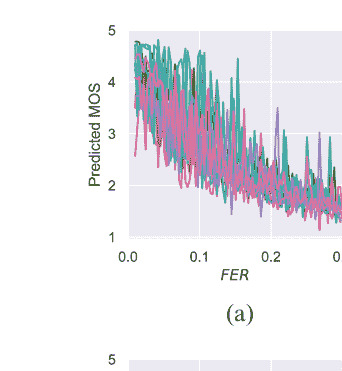

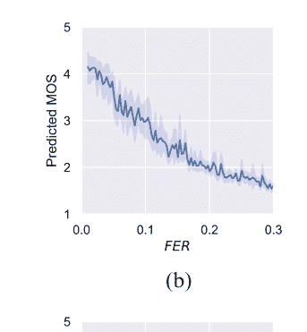

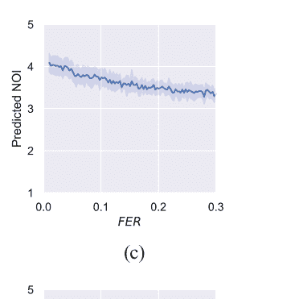

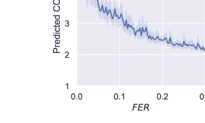

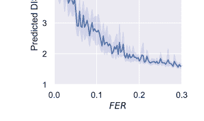

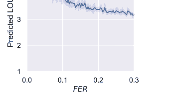

图7.5 预测分数与具有不同突发性帧错误率的EVS编解码器的关系。(a) MOS（单个文件）。(b) MOS。(c) NOI。(d) COL。(e) DIS。(f) LOUD。

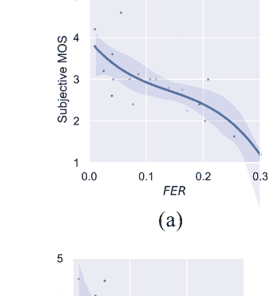

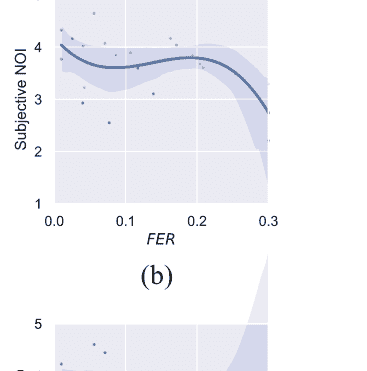

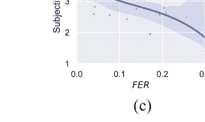

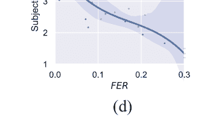

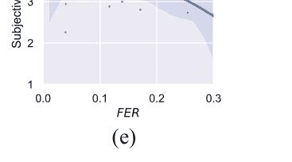

图7.6 主观评分与具有不同突发帧错误率的EVS编解码器的对比。(a) MOS. (b) NOI. (c) COL. (d) DIS. (e) LOUD

#### 高通滤波

下一个分析的退化条件是不同截止频率的高通滤波器。预测结果显示在图7.7中，相应的主观评分显示在图7.8中。在这种情况下，为了分析，选择了不包含在训练集中的极端值。在图7.7b中，可以观察到整体上的单调行为，直到大约5000 Hz。在600、1100和2500 Hz附近可见明显的尖峰。尽管尖峰不大，但它们的起源不清楚。

有趣的是，预测值首先在大约2500 Hz处下降，然后在5000 Hz处再次上升。实际上，在这个截止频率下，无法感知到语音；因此，这个范围内的分数对应于预测一个空文件。当预测结果与图7.8的主观评分进行比较时，没有明显的偏差。然而，预测的噪声和不连续性得分在600到2500 Hz的较小截止频率范围内显示出令人惊讶的非单调关系。目前尚不清楚这种不希望的行为源自何处，因为它在主观评分中无法直接观察到。

对于高于5 kHz的截止频率的非单调行为更多地是理论性质，因为这样的空信号通常不会应用于语音质量预测模型。

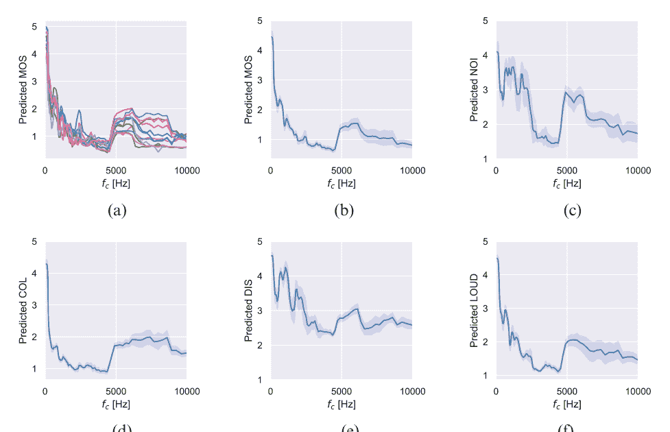

图7.7 不同截止频率的高通滤波器预测得分。(a) MOS (个别文件). (b) MOS. (c) NOI. (d) COL. (e) DIS. (f) LOUD

#### 低通滤波

图7.9展示了低通滤波器分析的预测得分。图7.10显示了相应的主观值。可以看出，如预期的那样，主要受到低通条件影响的是色彩维度。此外，响度维度也受到了很大的影响，这是有道理的，因为通过滤波器，语音信号中包含的能量较少。总体而言，截止频率之间的关系相当单调。当将图7.10的主观评分与预测值进行比较时，没有观察到任何重大的意外行为。然而，对于极低的截止频率，噪声得分的预测值有一个有趣的相对陡峭的下降。

#### 图7.9 不同截止频率下的预测分数与低通滤波器

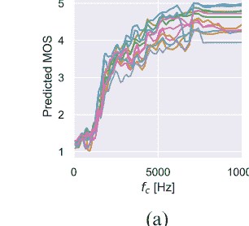

(a) MOS（单个文件）。

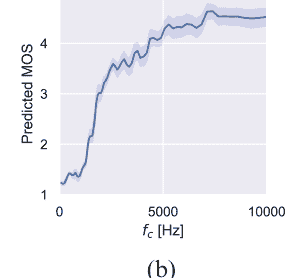

(b) MOS。

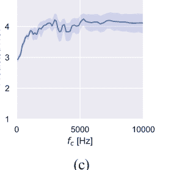

(c) NOI。

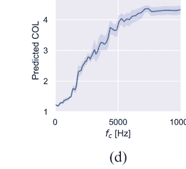

(d) COL。

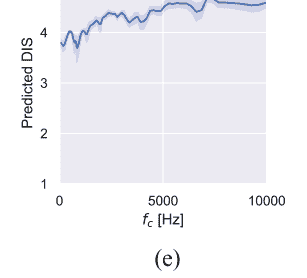

(e) DIS。

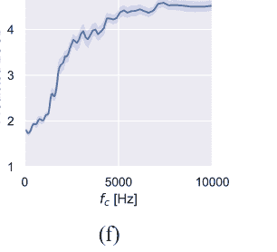

(f) LOUD。

#### 图7.10 不同截止频率下的主观评分与低通滤波器

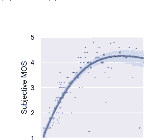

(a) MOS。

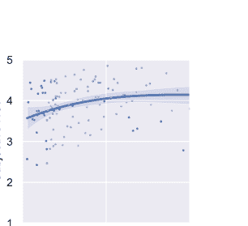

(b) NOI。

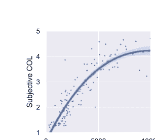

(c) COL。

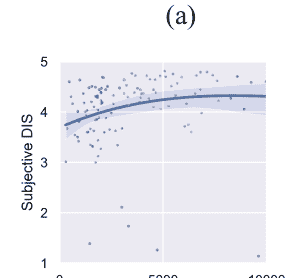

(d) DIS。

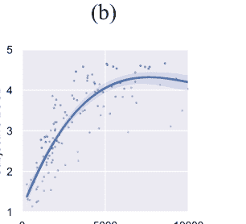

(e) LOUD。

活跃语音水平

作为下一个条件，分析活跃语音水平。 预测得分显示在图7.11中，相应的主观评分显示在图7.12中。主观语音质量实验中，ASL通常设置为 -26 dBov，这也可以在预测值中观察到，因为在约 -26 dBov的语音水平下获得了最高质量。 再次，分析中使用了未包含在训练集中的极端值。可以看到，当语音水平从-26 dBov增加或减少时，预测质量会降低，这也可以在主观评分中观察到。 语音水平的变化对响度维度的影响甚至更大，显示出更陡峭的斜率。 有趣的是，在主观评分的图7.12c中可以看到，测试参与者认为语音信号的较低或较高水平更嘈杂，这也可以在预测值中观察到。 此外，可以看到预测结果在非常低的语音水平下再次增加。 虽然这种效果似乎不太理想，在这些水平下，信号中已经没有可感知的语音，因此，类似于高通滤波条件，预测值对应于预测一个空信号。除了这个效果，总体上，预测行为在峰值的左右两侧是单调的，并且与主观值没有明显的偏差。

图7.11 预测分数与活跃语音水平 (a) MOS（单个文件）。 (b) MOS。 (c) NOI。(d) COL。 (e) DIS。 (f) LOUD

图7.12 主观评分与活跃语音水平。(a) MOS。 (b) NOI。 (c) COL。 (d) DIS。 (e) LOUD

幅度剪切

下一个分析条件是幅度剪切。 剪切阈值表示信号被剪切的幅度，即最高可能的信号水平被归一化为1。NISQA预测值显示在图7.13中，相应的主观值显示在图7.14中。对于这种失真，整体MOS预测行为非常单调，如图7.13b所示。有趣的是，受影响最大的质量维度是色彩，这也可以在图7.14d的主观评分中观察到。幅度的剪切导致声音失真，被听力测试参与者感知为色彩失真而不是噪声。这种效果也可以观察到丢包隐藏条件下，这可能导致被感知为色彩退化的机器人声音。当比较预测分数和主观评分时，可以注意到响度分数的预测似乎比主观响度评分稍微悲观；否则，没有主要偏差。

图7.13 不同阈值下的预测分数与幅度剪切。(a) MOS（单个文件）。(b) MOS。(c) NOI。(d) COL。(e) DIS。(f) LOUD

图7.14 不同阈值下的主观评分与幅度剪切。(a) MOS。(b) NOI。(c) COL。(d) DIS。(e) LOUD

**MNRU噪声**

图7.15展示了在不同MNRU噪声水平下的NISQA预测分数。与幅度剪切类似，MNRU是一种与信号相关的噪声，会导致声音失真。可以看出，MNRU对所有四个质量维度都有很大影响。受影响最大的维度是色彩，其次是噪声和响度。可以看到Q值和预测之间存在大部分单调的关系。只有在色彩和不连续性维度上，对于极度失真的信号，存在一些小的非单调片段，其Q值约为0。有趣的是，对于极度失真的信号，整体MOS预测值会低于1。这些趋势在图7.16中的主观评分中也可以观察到。

图7.15 预测分数与不同水平的MNRU噪声。(a) MOS（单个文件）。(b) MOS。(c) NOI。(d) COL。(e) DIS。(f) LOUD。

图7.16 主观评分与不同水平的MNRU噪声的关系。(a) MOS. (b) NOI. (c) COL. (d) DIS. (e) LOUD

当 Q值在15 dB和30 dB之间时，可以获得评分。 总体而言，客观分数与主观评分之间没有更大的偏差。

白噪声背景

接下来分析的是白噪声背景。 图7.17显示了与信噪比相关的预测分数，图7.18显示了相应的主观评分。如预期的那样，在预测分数和主观分数中，受影响最大的维度是噪声，小信噪比下的分数下降速度比整体MOS的分数更快。尽管响度评分在小信噪比下下降，但其他维度基本上没有受到影响，只有在极端信噪比值下几乎听不到语音时才会下降。

整体MOS和质量维度的预测值总体上是单调的，并且与主观值相比，没有观察到任何意外行为。

图7.17 不同水平的白噪声下的预测分数。(a) MOS (单个文件). (b) MOS. (c) NOI. (d) COL. (e) DIS. (f) LOUD

图7.18 主观评分与不同水平的白色背景噪声。(a) MOS. (b) NOI. (c) COL. (d) DIS. (e) LOUD

酒吧背景噪音

最后，预测得分与不同水平的“酒吧”背景噪音相关分析。 为此，语音信号与未包含在训练或验证集中的酒吧背景噪音混合。预测值可见于图7.19。这些值与图7.20中呈现的主观评分进行比较。值得注意的是，具有主观评分的样本的背景噪音文件是从大型噪音数据集中随机选择的。

图7.19 预测得分与不同水平的酒吧背景噪声。(a) MOS (单个文件)。 (b) MOS. (c) NOI. (d) COL. (e) DIS. (f) LOUD

两个图中呈现的曲线与白色背景噪声条件图表几乎相同。然而，公共噪声MOS预测的置信区间略高于白噪声。总体而言，当主观和预测分数进行比较时，没有观察到任何意外行为。

7.3 结果

7.4 总结

在本节中，介绍了单端语音质量模型NISQA。除了整体语音质量，它还预测了可用于语音退化诊断的语音质量维度。该模型在59个训练数据集和18个验证数据集的大量收集上进行了训练。该模型在一个独立的实时对话数据集上进行了测试，该数据集包含了不在训练或验证集中的不同环境中的实际电话录音和设备。

该模型预测了测试集的整体语音质量，PCC为0.9，RMSE*为0.24。语音质量维度的预测结果为PCC为0.71-0.87，RMSE*为0.17-0.25，远低于所需的P.SAMD目标RMSE*为0.35。

最后，预测得分与特定的语音障碍进行了分析。值得注意的是，高通滤波信号可能导致意外的噪声和不连续性预测。除了这个影响之外，总体上，该模型在八种分析的障碍水平下都表现出一致的语音质量预测。

第8章
结论

在本论文中，提出了一种新的基于深度学习的语音质量模型，除了整体质量外，还预测了四个感知质量维度：噪声、色彩、不连续性和响度。在开发过程中，分析了多种不同的神经网络架构，以确定其在语音质量预测中的适用性（第3章）。

> 研究问题1 哪种神经网络架构在语音质量预测方面表现最好，并且如何组合它们？
可以证明，与其他考虑的神经网络架构相比，帧级卷积神经网络与自注意力时间依赖模型和最终注意力池化网络（CNN-SA-AP）相结合可以获得最佳结果。

在第4章中，展示了如何将干净参考信号纳入基于深度学习的语音质量预测模型中。参考信号和退化信号通过具有以下自注意力网络的孪生卷积神经网络发送，该网络计算出两个信号的可比较特征。然后，使用余弦相似度函数作为对齐分数和硬注意机制，将参考特征与退化特征对齐。随后，将两个信号的特征合并在融合层中。融合后的特征然后通过第二个自注意力层发送，该层后面是一个最终的时间池化层。进一步证明，通过应用余弦相似度函数，实现的时间对齐可以达到与完全对齐信号相同的结果。

研究问题2 如何将干净的参考信号纳入神经网络进行语音质量预测，以构建全参考语音质量模型？包含参考信号是否改善了结果？

通过应用具有额外的类似注意力的时间对齐和后续融合层的连体神经网络，可以将干净的参考信号纳入基于深度学习的语音质量模型中。然而，双端模型仅通过0.012的相关系数超过了单端模型。考虑到侵入式语音通信监测设置所涉及的工作量，性能提升似乎太小，无法证明双端模型在结果相似的情况下使用的合理性。

在第5章中，介绍了四种不同的多任务模型，它们在质量维度之间共享不同数量的层。实验证明，感知分解方法可以成功地与多任务学习方法相结合，可以在整体MOS和维度得分之间提供一致的预测。所有质量维度的预测准确度都高于单个人的评分。最难预测的维度是色彩和不连续性，相关系数约为0.70。响度和噪音可以预测，相关系数分别约为0.79和0.81，而整体MOS可以预测，相关系数为0.87。与整体质量相比，质量维度的预测准确度较低可以通过主观评分的一致性较低来解释。

研究问题3：与单独训练的模型相比，语音质量和语音质量维度的多任务学习是否能提高结果？神经网络在不同任务之间应该共享多少？

所有维度和整体MOS都从多任务方法中受益，并且与单任务模型相比取得了更好的结果。特别是，色彩维度的准确性可以从约0.69的PCC提高到0.71。结果表明，仅在任务之间共享汇聚块或汇聚块+时间依赖块的MTL-POOL和MTL-TD模型取得了最佳的整体结果。虽然多任务方法只能稍微改善结果，但与单任务模型相比，计算时间大大缩短。

在第6章中，提出了一种考虑主观质量实验中出现的偏差的偏差感知损失函数。所提出的算法在模型训练期间自动学习不同数据集之间的未知偏差。偏差估计在每个epoch之后更新，并用于改善神经网络训练的损失。通过考虑这些偏差，损失函数不会惩罚仅由于主观偏差而产生的预测错误，而数据集内的排名顺序可能已经被正确预测。

虽然偏差感知损失在合成数据上明显优于普通的均方误差损失，并成功学习了引入的偏差，但在真实数据上的性能很大程度上取决于应用于其上的数据集。然而，偏差感知损失在大多数语音质量数据集上显示出明显改善预测性能的效果。

> > 研究问题4如何从多个数据集中训练基于机器学习的语音质量模型，这些数据集暴露于数据集特定的偏差？
>
> 可以通过在训练过程中使用一阶多项式函数估计各个偏差来训练模型。然后，可以将估计的偏差应用于模型的预测值，以实现几乎与数据集未暴露于任何偏差时相同的预测结果。

最后，介绍了单端和诊断语音质量模型NISQA。除了整体语音质量，它还预测可用于语音退化诊断的语音质量维度。该模型在59个训练数据集和18个验证数据集的大型集合上进行了训练。此外，它还在一个独立的实时对话数据集上进行了测试，该数据集包含了不在训练或验证集中的不同环境中的电话录音和扬声器设备。预测得分还与八种技术性语音损坏进行了分析。值得注意的是，高通滤波信号可能导致意外的噪声和不连续性预测。除了这种影响外，总体上，该模型在八种分析的损坏水平下给出了一致的语音质量预测。

> > 目标1在未知数据上，开发一个可靠地预测全频带环境下真实电话通话语音质量的单端语音质量模型。
>
> NISQA使用PCC为0.9和RMSE*为0.24的指标来预测测试集的整体语音质量。它在P.563、ANIQUE+和WEnets等单端语音质量模型上表现出色。NISQA在来自POLQA池的数据集上被双端模型POLQA超越。然而，在包含自发/对话式语音的数据集上，NISQA表现优于POLQA。

目标2开发一个单端模型，除了整体质量外，还可可靠地预测四个语音质量维度：噪音、色彩、不连续性和响度。

在实时对话测试集上，NISQA使用PCC分别为0.76、0.87、0.83和0.71，以及RMSE*分别为0.20、0.17、0.25和0.17来预测噪音、着色、不连续性和音量等语音质量维度。NISQA在自发/对话式数据集上超越了双端诊断模型P.AMD候选和DIAL，并在来自POLQA池的数据集上获得类似的结果。

虽然NISQA在所有分析的数据集上都能可靠地预测语音质量，但有趣的是，在POLQA池数据集上，它仍然被POLQA超越，尽管训练NISQA时使用了具有相同参考文件的POLQA池训练集。增加这些数据集的准确性的方法可能是找到这些数据集中的异常值，然后在训练集中包含更多受影响的条件。实际上，所提出的NISQA模型的复杂性相对较低，与其他深度学习模型相比。因此，当增加训练样本量时，增加复杂性和准确性可能会很有意思。例如，在这种情况下，可以增加CNN中的滤波器和层数。然而，语料库的规模至少需要增加一个数量级，并且还应该添加新的条件。另一种方法可能是向现有的NISQA数据集添加更多的主观评分，这些数据集只有5个众包评分。

在多任务方法中，另一个有趣的想法是使用技术参数作为辅助任务来提高预测性能。对于带有语音质量评分的模拟NISQA数据集，这些技术参数在生成语音样本时被使用，并与波形文件一起存储。因此，例如，编解码器可以作为分类任务进行预测，帧错误率可以作为回归任务进行预测。这些辅助任务可能有助于模型更好地正则化整体MOS和语音质量维度的预测。通过这种方式，模型还可以扩展以提供类似于Mittag和M ller（2018年，2019c年）提出的模型的额外技术根本原因分析输出。

NISQA模型还可以用作基础，以便对其进行微调以适应类似的任务。例如，Mittag和M ller（2020a年）表明，该模型可以用于预测合成语音的自然度，并且当它在语音质量数据集上进行预训练时，准确性得到了提高。因此，该模型可以被微调以预测经过降噪算法处理的语音的质量，或者预测助听器的语音可懂度。

## 附录A
数据集条件表

请参阅表A.1以获取TUB_AUS条件列表的条件列表和表A.2以获取NISQA_TEST_LIVETALK数据集的条件列表。

表A.1 TUB_AUS条件列表

| 条件 | 描述 | 设备 |
| :--- | :--- | :--- |
| 1 | 参考点：FB清晰 | 模拟 |
| 2 | 参考点：FB P50MNRU 25 dB | 模拟 |
| 3 | 参考点：FB噪声12 dB | 模拟 |
| 4 | 参考点：FB电平 -20dB | 模拟 |
| 5 | 参考点：FB BP 500-2500 Hz | 模拟 |
| 6 | 参考点：FB BP 100-5000 Hz + 电平 -10 dB | 模拟 |
| 7 | 参考点：FB时间剪辑2% | 模拟 |
| 8 | 参考点：FB时间剪辑20% | 模拟 |
| 9 | G.711 + 噪声20 dB + 电平 -13 dB | 模拟 |
| 10 | G.722 + 噪声25 dB + 电平 -18 dB | 模拟 |
| 11 | WhatsApp良好连接 | 电话 |
| 12 | WhatsApp良好连接幅度剪辑 | 电话 |
| 13 | WhatsApp良好连接+10 dB噪声（交通） | 电话 |
| 14 | WhatsApp连接质量差 | 电话 |
| 15 | WhatsApp连接质量好增益递增 | 电话 |
| 16 | Skype连接质量好 | 笔记本电脑 |
| 17 | Skype连接质量好+10 dB噪声（Mensa） | 笔记本电脑 |
| 18 | Skype连接质量差 | 笔记本电脑 |
| 19 | Skype连接质量差+10 dB噪声（Cafeteria） | 笔记本电脑 |
| 20 | Skype连接质量好幅度剪切 | 笔记本电脑 |
| 21 | Facebook连接质量好 | 笔记本电脑 |
| 22 | Facebook连接质量好+10 dB噪声（Pub） | 笔记本电脑 |## 表A.1

| 条件 | 描述 | 设备 |
|---|---|---|
| 23 | Facebook连接质量差 | 笔记本电脑 |
| 24 | Facebook连接质量好增益递增 | 笔记本电脑 |
| 25 | Facebook连接质量好增益递增+10 dB噪声（Traffic） | 笔记本电脑 |
| 26 | Line连接质量好 | 电话 |
| 27 | Line连接质量好幅度剪切 | 电话 |
| 28 | Line连接质量好+10 dB噪声（火车内部） | 电话 |
| 29 | Line连接质量差 | 电话 |
| 30 | Line连接质量好增益递增 | 电话 |
| 31 | SWB | 模拟 |
| 32 | 宽带 | 模拟 |
| 33 | NB | 模拟 |
| 34 | AMR-NB@5.9 | 模拟 |
| 35 | AMR-NB@12.2 | 模拟 |
| 36 | AMR-WB@6.6 | 模拟 |
| 37 | AMR-WB@12.65 | 模拟 |
| 38 | AMR-WB@12.65 + 5 dB级别 | 模拟 |
| 39 | AMR-WB@12.65 + 噪音20 dB（呼叫中心） | 模拟 |
| 40 | EVS@13.2 | 模拟 |
| 41 | EVS@13.2 PL 5%突发 | 模拟 |
| 42 | EVS@13.2 PL 10%突发 | 模拟 |
| 43 | EVS@13.2 PL 15%突发 | 模拟 |
| 44 | EVS@13.2 PL 15%随机 | 模拟 |
| 45 | AMR-NB@12.2 PL 3%—自串联 x3 + 噪音0 dB（购物中心） | 模拟 |
| 46 | AMR-NB@12.2 PL 3%—自串联 x3 + 噪音15 dB | 模拟 |
| 47 | AMR-NB@12.2 PL 3%—自串联 x3 + 级别 －10 dB | 模拟 |
| 48 | AMR-NB@12.2 PL 3% x G.711 x AMR-NB@12.2 PL 3% | 模拟 |
| 49 | AMR-WB@12.65 PL 3% x G.722 x AMR-WB@12.65 PL 3% | 模拟 |
| 50 | AMR-WB@12.65 PL 3% x G.722 x AMR-WB@12.65 PL 3% + 噪声 15 dB（车2 130 km/h） | 模拟 |

### 表A.2 NISQA_TEST_LIVETALK 条件列表

| Nr | 条件 |
|---|---|
| 1 | 参考点: FB清晰 |
| 2 | 参考点: FB P50MNRU 25 dB |
| 3 | 锚点: FB 噪声 12dB |
| 4 | 锚点: FB level –20 dB |
| 5 | 参考点: FB BP 500–2500 Hz |
| 6 | 锚点: FB BP 100–5000 Hz + level –10 dB |
| 7 | 参考点: FB时间剪辑2% |
| 8 | 参考点: FB时间剪辑20% |
| 9 | 手机 |
| 10 | Skype/大声说话 |
| 11 | Skype/小声说话 |
| 12 | Skype/讲话人远离麦克风 |
| 13 | Skype/讲话人远离麦克风/大声说话 |
| 14 | Skype/讲话人远离麦克风/小声说话 |
| 15 | Skype/扬声器 |
| 16 | Skype/音量变化 |
| 17 | Facebook |
| 18 | Skype |
| 19 | Facebook/大声说话 |
| 20 | 手机/大声说话 |
| 21 | 手机/低声说话 |
| 22 | 手机/扬声器 |
| 23 | 固定电话/低声说话 |
| 24 | Facebook/扬声器 |
| 25 | 建筑内（信号差）/手机 |
| 26 | 建筑内（信号差）/手机/大声说话 |
| 27 | 建筑内（信号差）/手机/扬声器 |
| 28 | 建筑内（信号差）/Skype |
| 29 | 建筑内（信号差）/Facebook/扬声器 |
| 30 | 建筑内（信号差）/Skype/低声说话 |
| 31 | 环境噪音（例如购物中心）/手机 |
| 32 | 环境噪音（例如购物中心）/手机/低声说话 |
| 33 | 环境噪音（例如购物中心）/手机/讲话人离麦克风较远 |
| 34 | 环境噪音（例如购物中心）/Skype |
| 35 | 地铁站噪音（信号差）/手机 |
| 36 | 地铁站噪音（信号差）/手机/低声说话 |
| 37 | 地铁站噪音（信号差）/手机/讲话人离麦克风较远 |
| 38 | 地铁站噪音（信号差）/Facebook |
| 39 | 地铁站噪音（信号差）/Skype |
| 40 | 地铁站噪音（信号差）/Facebook/大声说话 |
| 41 | 地铁站噪音（信号差）/Facebook/小声说话 |
| 42 | 咖啡厅噪音/手机 |
| 43 | 咖啡厅噪音/手机/小声说话 |
| 44 | 咖啡厅噪音/手机/讲话人离麦克风远 |
| 45 | 高速公路上的车辆噪音（信号差）/手机 |
| 46 | 高速公路上的车辆噪音（信号差）/手机/离麦克风远 |
| 47 | 高速公路上的车辆噪音（信号差）/Facebook |
| 48 | 高速公路上的车辆噪音（信号差）/Facebook/大声说话/背景音乐 |
| 49 | 高速公路上的车辆噪音（信号差）/Skype/小声说话/背景音乐 |
| 50 | 电梯噪音（信号差）/手机 |
| 51 | 街道噪音/手机 |
| 52 | 街道噪音/手机/大声说话 |
| 53 | 街道噪音/手机/讲话人离麦克风远 |
| 54 | 街道噪音/Facebook |
| 55 | 地铁站噪音/手机 |
| 56 | 地铁站噪音/手机/小声说话 |
| 57 | 地铁站噪音/Facebook |
| 58 | 地铁站/Skype |

## 附录B
训练和验证数据集维度直方图

图B.1、B.2、B.3和B.4显示了四个质量维度的训练和验证数据集的主观MOS直方图。

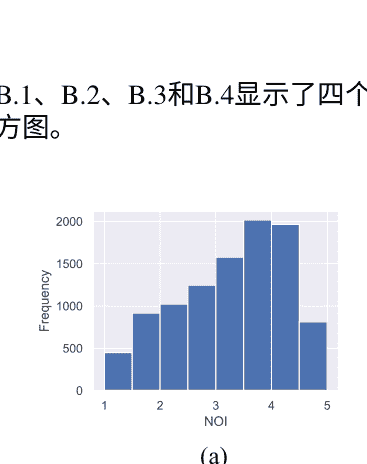

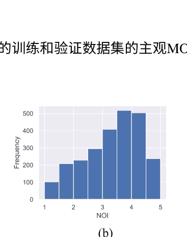

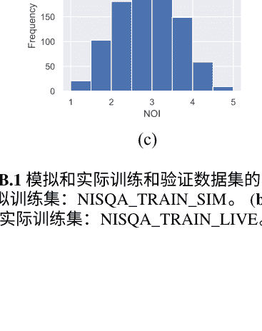

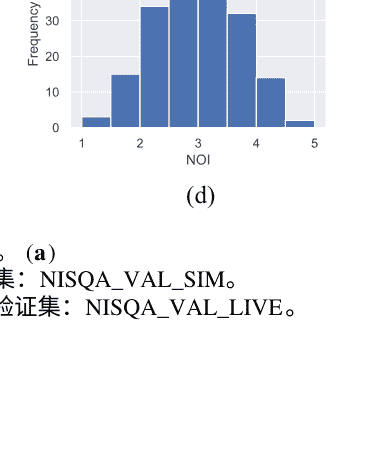

图 B.1 模拟和实际训练和验证数据集的噪声直方图。（a）模拟训练集：NISQA_TRAIN_SIM。（b）模拟验证集：NISQA_VAL_SIM。（c）实际训练集：NISQA_TRAIN_LIVE。（d）实际验证集：NISQA_VAL_LIVE。

图 B.2 模拟和实际训练和验证数据集的色彩直方图。(a) 模拟训练集：NISQA_TRAIN_SIM。(b) 模拟验证集：NISQA_VAL_SIM。(c) 实际训练集：NISQA_TRAIN_LIVE。(d) 实际验证集：NISQA_VAL_LIVE。

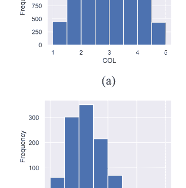

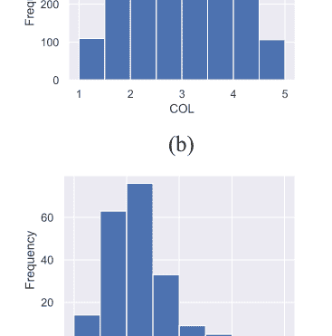

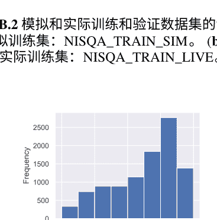

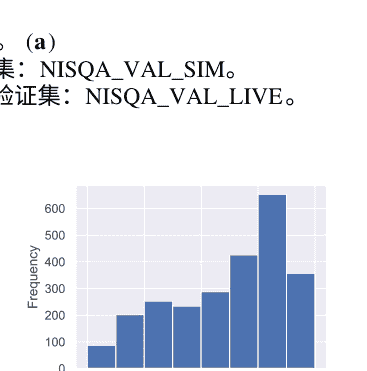

图 B.3 模拟和实际训练和验证数据集的不连续性直方图。(a) 模拟训练集：NISQA_TRAIN_SIM。(b) 模拟验证集：NISQA_VAL_SIM。(c) 实际训练集：NISQA_TRAIN_LIVE。(d) 实际验证集：NISQA_VAL_LIVE。

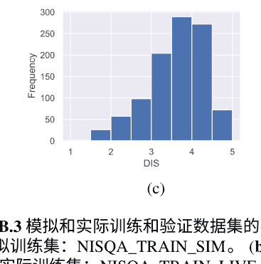

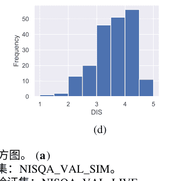


图 B.4 模拟和实际训练和验证数据集的响度直方图。(a) 模拟训练集：NISQA_TRAIN_SIM。(b) 模拟验证集：NISQA_VAL_SIM。(c) 实际训练集：NISQA_TRAIN_LIVE。(d) 实际验证集：NISQA_VAL_LIVE。

# 参考文献

3GPP TS 26.071，强制性语音编解码器语音处理功能；AMR语音编解码器；总体描述。3GPP，Sophia Antipolis Valbonne（1999年）

3GPP TS 26.171，语音编解码器语音处理功能；自适应多速率-宽带（AMR-WB）语音编解码器；总体描述。3GPP，Sophia Antipolis Valbonne（2001年）

3GPP TS 26.441，增强语音服务（EVS）编解码器；总体概述。3GPP，Sophia Antipolis Valbonne（2014年）

S. Amiriparian, M. Gerczuk, S. Ottl, N. Cummins, M. Freitag, S. Pugachevskiy, A. Baird, B. Schuller，基于图像的深度频谱特征的鼾声分类，于Interspeech 2017会议论文集，斯德哥尔摩（2017年）

A.R. Avila, J. Alam, D. O’Shaughnessy, T.H. Falk，基于i-vector相似性的噪声和增强语音的侵入式质量测量，在2019年第十一届多媒体体验质量国际会议（QoMEX）论文集中，柏林（2019a）

A.R. Avila, H. Gamper, C. Reddy, R. Cutler, I. Tashev, J. Gehrke，使用神经网络的非侵入式语音质量评估，在2019年IEEE国际声学、语音和信号处理会议（ICASSP）论文集中（2019b）

J. Ba, J. Kiros, G.E. Hinton，层归一化。ArXiv，abs/1607.06450（2016）

D. Bahdanau, K. Cho, Y. Bengio，通过联合学习对齐和翻译的神经机器翻译，在2015年国际学习表示会议（ICLR）论文集中，圣地亚哥（2015）

J.G. Beerends, J.A. Stemerding，基于心理声学声音表示的感知语音质量测量方法。J. Audio Eng. Soc. **42**(3), 115–123 (1994)

J.G. Beerends, C. Schmidmer, J. Berger, M. Obermann, R. Ullmann, J. Pomy, M. Keyhl，感知客观听觉质量评估（POLQA），ITU-T的第三代端到端语音质量测量标准第一部分 - 时间对齐。J. Audio Eng. Soc. **61**(6), 366–384 (2013a)

J.G. Beerends, C. Schmidmer, J. Berger, M. Obermann, R. Ullmann, J. Pomy, M. Keyhl，感知客观听觉质量评估（POLQA），ITU-T的第三代端到端语音质量测量标准第二部分 - 感知模型。J. Audio Eng. Soc. **61**(6), 385–402 (2013b)

J.G. Beerends, N.M.P. Neumann, E.L. van den Broek, A. Llagostera Casanovas, J.T. Menendez, C. Schmidmer, J. Berger，对全带宽语音质量的主观和客观评估。IEEE/ACM Trans. Audio Speech Lang. Process. **28**, 440–449 (2020)

J. Berger，用于语音质量评估的仪器化方法：听觉测试模型 (Shaker, D ren, 1998)

J. Berger, A. Hellenbart, R. Ullmann, B. Weiss, S. M ller, J. Gustafsson, G. Heikkil ，在模拟电话对话中估计“每通电话的质量”，在IEEE国际会议声学、语音和信号处理（ICASSP）的论文集中，拉斯维加斯(2008)

S. Bosse, D. Maniry, K. M ller, T. Wiegand, W. S amek，用于无参考和全参考图像质量评估的深度神经网络, IEEE Trans. Image Process. 27(1), 206–219 (2018)

T. Brown, B. Mann, N. Ryder, M. Subbiah, J. Kaplan, P. Dhariwal, A. Ne elakantan, P. Shyam, G. Sastry, A. Askell, S. Agarwal, A. Herbert-Voss, G. Kr ger, T. Henighan, R. Child, A. Ramesh, D. Ziegler, J. Wu, C. Winter, C. Hesse, M. Chen, E. Sigler, M. Litwin, S. Gray, B. Chess, J. Clark, C. Berner, S. McCandlish, A. Radford, I. Sutskever, D. Amodei，语言模型是少样本学习器。ArXiv, abs/2005.14165 (2020)

D. Burnham, D. Estival, S. Fazio, J. Viethen, F. Cox, R. Dale, S. Cassidy, J. Epps, R. Togneri, M. Wagner, Y. Kinoshita, R. G cke, J. Arciuli, M. Onslow, T.W. Lewis, A. Butcher, J. Hajek，构建一个澳大利亚英语的音频-视觉语料库：大规模语料收集与经济便携可复制的黑盒子，在Interspeech 2011会议论文集，佛罗伦萨(2011)

R. Caruana，多任务学习。机器学习。28(1), 41-75 (1997)

A.A. Catellier, S.D. Voran，Wawenets：一种基于卷积波形的无参考方法，用于估计窄带和宽带语音质量，在2020年IEEE国际声学、语音和信号处理会议(ICASSP)论文集，巴塞罗那 (2020)

B. Cauchi, K. Siedenburg, J.F. Santos, T.H. Falk, S. Doclo, S. Goetze，使用调制能量和lstm网络的非侵入式语音质量预测。IEEE/ACM Trans. Audio SpeechLang. Process. 27(7), 1151-1163 (2019)

J.R. Cavanaugh, R.W. Hatch, J.L. Sullivan，对电话连接中丢失、噪声和说话者回声的主观影响模型。贝尔系统技术杂志 55(9), 1319–1371 (1976)

CDC，有线电话正在消亡的品种 (2020). https://www.statista.com/chart/2072/landline-phones-in-the-united-states/ 2020年11月15日访问

A. Chehadi，通过真实电话通话进行主观质量评估. 学士学位论文, TU-Berlin (2020)

G. Chen, V. Parsa，使用自适应神经模糊推理进行非侵入式语音质量评估. IEEE信号处理快报 12(5), 403–406 (2005)

G. Chen, V. Parsa，基于贝叶斯模型的非侵入式语音质量评估, 在2005年IEEE国际声学、语音和信号处理会议(ICASSP)论文集，费城 (2005)

N. C t ，语音质量的积分和诊断性预测（Springer, 柏林, 2011年）

N. C t , V. Gautier-T urbin, S. M ller，音量水平对传输语音整体质量的影响,在第123届音频工程学会大会论文集，纽约 (2007年)

I. Demirşahin, O. Kjartansson, A. Gutkin, C. Rivera，英国群岛英语口音的开源多说话人语料库, 在第12届语言资源和评估会议论文集（LREC），马赛 (2020年)

J. Devlin, M.-W. Chang, K. Lee, K. Toutanova，Bert: 深度双向变压器的预训练，用于语言理解, 在第17届北美计算语言学协会年会：人类语言技术（NAACL-HLT 2019），明尼阿波利斯 (2019年)

X. Dong, D.S. Williamson，一种增强注意力的多任务模型，用于实际环境中的客观语音评估, 在2020年IEEE国际会议上，声学、语音和信号处理（ICASSP），巴塞罗那 (2020a)

X. Dong, D.S. Williamson，一种金字塔循环网络，用于预测实际信号的众包语音质量评分, 在2020年Interspeech会议上，上海 (2020b)

R.K. Dubey, A. Kumar，使用多种听觉特征进行非侵入式语音质量评估。国际语音技术杂志 16(1), 89-101 (2013)

T.H. Falk, W.-Y. Chan，使用高斯混合模型进行非侵入式语音质量估计。IEEE信号处理通讯 13(2), 108-111 (2006a)

T.H. Falk, W.-Y. Chan, Using machine learning for single-ended speech quality measurement. IEEE Trans. Audio Speech Lang. Process. 14(6), 1935–1947 (2006b)

L. Fernández Gallardo, B. Weiss, The nautilus speaker characterization corpus: speech recordings and labels of speaker characteristics and voice descriptions, in Proceedings of International Conference on Language Resources and Evaluation (LREC), Miyazaki (2018)

Freesound (2020). https://freesound.org/

R.M. French, Catastrophic forgetting in connectionist networks. Trends Cognit. Sci. 3(4), 128–135 (1999)

Q. Fu, K. Yi, M. Sun, Speech quality objective assessment using neural network, in Proceedings of 2000 IEEE International Conference on Acoustics, Speech, and Signal Processing (ICASSP), Istanbul (2000)

S.W. Fu, Y. Tsao, H.T. Hwang, H.M. Wang, Quality-net: an end-to-end non-intrusive speech quality assessment model based on BLSTM, in Proceedings of Interspeech 2018, Hyderabad (2018)

L.F. Gallardo, G. Mittag, S. Möller, J. Beerends, Variable voice cuteness影响主观语音质量评估, in Proceedings of Tenth International Conference on Quality of Multimedia Experience (QoMEX), Sardinia (2018)

J.F. Gemmeke, D.P.W. Ellis, D. Freedman, A. Jansen, W. Lawrence, R.C. Moore, M. Plakal, M. Ritter, AudioSet: An ontology and human-labeled dataset for audio events, in 2017 IEEE International Conference on Acoustics, Speech and Signal Processing (ICASSP), New Orleans (2017)

I. Goodfellow, Y. Bengio, A. Courville, Deep Learning (MIT Press, Cambridge, 2016). http://www.deeplearningbook.org

V. Grancharov, D.Y. Zhao, J. Lindblom, W.B. Kleijn, Low-complexity, non-intrusive speech quality assessment. IEEE Trans. Audio Speech Lang. Process. 14(6), 1948–1956 (2006)

A. Graves, G. Wayne, I. Danihelka, Neural Turing machines (2014, preprint). arXiv:1410.5401

N. Harte, E. Gillen, A. Hines, TCD-VoIP, a research database for quality assessment of VoIP applications, in Proceedings of 7th International Conference on Quality of Multimedia Experience (QoMEX), Costa Navarino, Messinia (2015), pp. 1–6

K. He, X. Zhang, S. Ren, J. Sun, Deep residual learning for image recognition, in Proceedings of the IEEE Conference on Computer Vision and Pattern Recognition (CVPR), Las Vegas (2016)

A. Hines, E. Gillen, N. Harte, Measuring and monitoring VoIP quality using POLQA, viSQOL and P.563, in Proceedings of Interspeech 2015, Dresden (2015a)

A. Hines, J. Skoglund, A.C. Kokaram, N. Harte, ViSQOL: An objective speech quality model. EURASIP J. Audio Speech Music Process. 2015(13), (2015b)

S. Hochreiter, J. Schmidhuber, Long short-term memory. Neural Comput. 9(8), 1735–1780 (1997)

D.F. Hoth, Room noise spectra at subscriber telephone locations. J. Acoust. Soc. Am. 12(4), 499–504 (1941)

L. Hove, Attribute-based speech quality assessment: narrowband and wideband (Shaker, 2015)

IEEE, IEEE recommended practice for speech quality measurements. IEEE Trans. Audio Electroacoust. 17(3), 225–246 (1969)

S. Ioffe, C. Szegedy, Batch normalization: Accelerating deep network training by reducing internal covariate shift, in International Conference on Machine Learning (ICML 2015), Lille (2015)

ITU-T P Suppl. 23, Perceptual objective listening quality assessment. ITU-T, Geneva (2008)

ITU-T Rec. G.191, Software tools for speech and audio coding standardization. ITU-T, Geneva (2019)

ITU-T Rec. G.192, Common digital parallel interface for voice standardization activities. ITU-T, Geneva (1996)

ITU-T Rec. G.711, Pulse code modulation (PCM) of voice frequencies. ITU-T, Geneva (1988)

ITU-T Rec. G.722, 7 kHz audio-coding within 64 kbit/s. ITU-T, Geneva (2012)

ITU-T Rec. G.722.2, Coding of speech at around 16 kbit/s using the adaptive multi-rate wideband (AMR-WB). ITU-T, Geneva (2003)

ITU-T Rec. P.10, Vocabulary for performance, service quality and quality of experience. ITU-T, Geneva (2017)

ITU-T Rec. P.107, The E-model: a computational model for use in transmission planning. ITU-T, Geneva (2015)

ITU-T Rec. P.107.1, Wideband E-model. ITU-T, Geneva (2019)

ITU-T Rec. P.107.2, Fullband E-model. ITU-T, Geneva (2019)

ITU-T Rec. P.1401, Methods, metrics and procedures for statistical evaluation, quality assessment and comparison of objective quality prediction models. ITU-T, Geneva (2020)

ITU-T Rec. P.48, Specification for an intermediate reference system. ITU-T, Geneva (1988)

ITU-T Rec. P.501, Test signals for use in telephonometry and other voice applications. ITU-T, Geneva (2020)

ITU-T Rec. P.56, Objective measurement of active speech level. ITU-T, Geneva (2011)

ITU-T Rec. P.563, Single-ended method for objective speech quality assessment in narrow-band telephony applications. ITU-T, Geneva (2004)

ITU-T Rec. P.800, Subjective determination of transmission quality. ITU-T, Geneva (1996)

ITU-T Rec. P.804, Subjective diagnostic test methods for conversational voice quality analysis. ITU-T, Geneva (2017)

ITU-T Rec. P.805, Subjective evaluation of conversational quality. ITU-T, Geneva (2007)

ITU-T Rec. P.806, Subjective quality test method using multiple rating criteria. ITU-T, Geneva (2014)

ITU-T Rec. P.808, Subjective evaluation of speech quality with a crowdsourcing approach. ITU-T, Geneva (2018)

ITU-T Rec. P.810, Modulated noise reference unit (MNRU). ITU-T, Geneva (1996)

ITU-T Rec. P.862, Perceptual evaluation of speech quality (PESQ): An objective method for end-to-end speech quality assessment of narrow-band telephone networks and speech codecs. ITU-T, Geneva (2001)

ITU-T Rec. P.862.2, Wideband extension to recommendation P.862 for wideband telephone networks and speech codecs. ITU-T, Geneva (2007)

ITU-T Rec. P.863, Perceptual objective listening quality assessment. ITU-T, Geneva (2018)

ITU-T Rec. P.863.1, Application guide for recommendation ITU-T P.863. ITU-T, Geneva (2019)

ITU-T SG12 C.287, Subjective test of the Orange P.AMD project set A. ITU-T, Geneva (2015). Source: Orange, study period 2013-2016

ITU-T SG12 C.440, P.SAMD updated results and validation plan. ITU-T, Geneva (2019). Source: TU-Berlin, study period 2017-2020

ITU-T SG12 TD.137, Technical requirement specifications for P.AMD and P.SAMD. ITU-T, Geneva (2017). Source: Rapporteur Q9/12, study period 2017-2020

K. Jarrett, K. Kavukcuoglu, M. Ranzato, Y. LeCun, What is the best multi-stage architecture for object recognition? in 2009 IEEE 12th International Conference on Computer Vision (ICCV), Kyoto (2009)

U. Jekosch, Voice and speech quality perception: Assessment and evaluation (Springer, Berlin, 2005)

N.O. Johansson, The ETSI computational model: A tool for telephone transmission planning. IEEE Commun. Mag. 35 (1), 70-79 (1997)

P. Kabal, TSP speech database. McGill University, Montreal, Canada, Technical Report, Database version 1.0 (2002)

D. Kim, ANIQUE: An auditory model for single-ended speech quality estimation. IEEE Trans. Speech Audio Process. 13(5), 821-831 (2005)

D. Kim, A. Tarraf, ANIQUE+: A new American national standard for non-intrusive narrowband speech quality estimation. Bell Labs Tech. J. 12(1), 221-236 (2007)

D.P. Kingma, J. Ba, Adam: A method for stochastic optimization. CoRR, abs/1412.6980 (2015)

F. Köster, D. Guse, M. Wöltelmann, S. Möller, Comparison of discrete ACR scale and extended continuous scale in transmission speech quality assessment, in 41. Jahrestagung für Akustik (DAGA 2015), Nürnberg (2015)

F. Köster, V. Cercos-lombart, G. Mittag, S. Möller, Non-intrusive estimation model for the speech quality dimension loudness, in Proceedings of 12. ITG-Fachtagung Sprachkommunikation, Paderborn (2016a)

F. Köster, G. Mittag, T. Polzehl, S. Möller, Non-intrusive estimation of noise-aware quality dimensions for transmitted speech, in Proceedings of the 5th ISCA/DEGA Workshop on Perceptual Quality of Systems, Berlin (2016b), pp. 74-78

A. Krizhevsky, I. Sutskever, G.E. Hinton, ImageNet classification with deep convolutional neural networks. Commun. ACM 60(6), 84-90 (2017)

J. Lecomte, T. Vaillancourt, S. Bruhn, H. Sung, K. Peng, K. Kikuri, B. Wang, S. Subasingha, J. Faure, Advances in packet loss concealment for EVS, in 2015 IEEE International Conference on Acoustics, Speech and Signal Processing (ICASSP), South Brisbane (2015)

Y. LeCun, B. Boser, J.S. Denker, D. Henderson, R.E. Howard, W. Hubbard, L.D. Jackel, Backpropagation applied to handwritten zip code recognition. Neural Comput. 1(4), 541–551 (1989)

Q. Li, Y. Fang, W. Lin, D. Thalmann, Non-intrusive quality assessment for enhanced speech signals based on spectro-temporal features, in 2014 IEEE International Conference on Multimedia and Expo Workshops (ICMEW), Chengdu (2014), pp. 1-6

LibriVox, free public domain audiobooks (2020). https://librivox.org/

M.-T. Luong, H. Pham, C.D. Manning, Effective approaches to attention-based neural machine translation, in Proceedings of 2015 Conference on Empirical Methods in Natural Language Processing (EMNLP), Lisbon (2015)

H. Maier, Android Qualitätmonitor für mobile Sprachnetze. Master's thesis, Technische Universität Berlin (2019)

L. Malfait, J. Berger, M. Kastner, P.563 – An ITU-T standard for single-ended speech quality assessment. IEEE Trans. Audio Speech Lang. Process. 14(6), 1924–1934 (2006)

G. Mittag, S. Möller, Non-intrusive estimation of packet loss rate in speech communication systems using convolutional neural networks, in IEEE International Symposium on Multimedia (ISM) Proceedings, Taipei (2018)

G. Mittag, S. Möller, Estimating noise speech quality using spectral entropy distance, in Proceedings of the 26th International Conference on Telecommunications (ICT), Hanoi (2019a)

G. Mittag, S. Möller, Speech network quality degradation diagnosis - estimating perceived noisiness, coloration and discontinuity of transmitted speech, in Interspeech 2019 Proceedings, Graz (2019b)

G. Mittag, S. Möller, Semantic labeling of speech spectral quality impairments based on deep convolutional networks, in Proceedings of the 11th International Conference on Quality of Multimedia Experience (QoMEX), Berlin (2019c)

G. Mittag, S. Möller, Non-intrusive speech quality assessment for ultra-wideband speech communication networks, in 2019 IEEE International Conference on Acoustics, Speech and Signal Processing (ICASSP) Proceedings, Brighton (2019d)

G. Mittag, S. Möller, Deep learning based naturalness assessment of synthetic speech, in Interspeech 2020 Proceedings, Barcelona (2020a)

G. Mittag, S. Möller, Full-reference speech quality estimation based on an attentional siamese neural network, in 2020 IEEE International Conference on Acoustics, Speech and Signal Processing (ICASSP) Proceedings, Barcelona (2020b)

G. Mittag, K. Friedemann, M. Sebastian, F. Köster, S. Möller, A method for non-intrusive estimation of the perceptual dimension coloration, in 42. Jahrestagung für Akustik (DAGA), Aachen (2016)

G. Mittag, S. Möller, V. Barriac, S. Ragot, Quantifying the quality degradation of the EVS ultra-wideband speech codec, in Proceedings of the 10th International Conference on Quality of Multimedia Experience (QoMEX), Sardinia (2018)

G. Mittag, L. Liedtke, N. Iskender, B. Nader, T. Hübschen, G. Schmidt, S. Möller, Impact of hidden packet loss location and amount on speech quality, in 45. Deutsche Jahrestagung für Akustik (DAGA), Rostock (2019)

G. Mittag, R. Cutler, Y. Hosseinkashi, M. Revow, S. Srinivasan, N. Chand, R. Aichner, DNN-based no-reference PSTN speech quality prediction, in Proceedings of Interspeech 2020, Shanghai (2020)

S. Möller, Speech quality assessment and prediction in telecommunications (Kluwer, Dortmund, 2000)

S. Möller, A. Reich, N. Kitaoka, A. Takahashi, M. Wöltelmann, A framework for impairment factors for wideband speech codecs. IEEE Trans. Audio Speech Lang. Process. 14(6), 1969-1976 (2006)

S. Möller, T. Hübschen, G. Mittag, G. Schmidt, Association of perceptual dimensions to disturbance causes in ultra-wideband speech transmission, in 45. Jahrestagung für Akustik (DAGA 2019), Rostock (2019a)

S. Möller, G. Mittag, T. Michael, V. Barriac, H. Aoki, Extending the E-model to ultra-wideband and fullband speech communication scenarios, in Interspeech 2019 Conference Proceedings, Graz (2019b)

B. Naderi, R. Cutler, An open source implementation and verification of ITU-T Recommendation P.808, in Proceedings of Interspeech 2020, Shanghai (2020)

B. Naderi, T. Polzehl, I. Wechsung, F. Köster, S. Möller, Effect of trap questions on the reliability of speech quality judgments in a crowdsourcing paradigm, in Proceedings of Interspeech 2015, Dresden (2015)

B. Naderi, T. Hoßfeld, M. Hirth, F. Metzger, S. Möller, R.Z. Jiménez, Impact of number of votes on reliability and validity of subjective speech quality assessment in crowdsourcing, in Proceedings of the Twelfth International Conference on Quality of Multimedia Experience (QoMEX), Athlone (2020), pp. 1-6

M. Narwaria, W. Lin, I.V. McLoughlin, S. Emmanuel, C.L. Tien, Non-intrusive speech quality assessment based on support vector regression, in Advances in Multimedia Modeling (MMM), Chongqing (2010)

M. Narwaria, W. Lin, I.V. McLoughlin, S. Emmanuel, L. Chia, Non-intrusive quality assessment for noise suppressed speech with mel-filter bank energies and support vector regression. IEEE Trans. Audio Speech Lang. Process. 20(4), 1217-1232 (2012)

J. Ooster, B.T. Meyer, Improving deep models of speech quality prediction via voice activity detection and entropy-based measures, in 2019 IEEE International Conference on Acoustics, Speech and Signal Processing (ICASSP) Proceedings, Brighton (2019)

J. Ooster, R. Huber, B.T. Meyer, Predicting perceived speech quality using deep machine listening, in Proceedings of Interspeech 2018, Hyderabad (2018)

N. Osaka, K. Kakehi, Objective evaluation model of telephone transmission performance based on basic transmission factors. Electron. Commun. Japan Part I - Commun. 69, 18-27 (1986)

J. Pons, X. Serra, Designing efficient architectures for modeling temporal features with CNNs, in 2017 IEEE International Conference on Acoustics, Speech and Signal Processing (ICASSP) Proceedings, New Orleans (2017)

A. Raake, S. Möller, M. Wöltelmann, N. Côté, J.P. Ramirez, Parameter-based speech quality prediction, in Proceedings of the Second International Conference on Quality of Multimedia Experience (QoMEX), Trondheim (2010)

C.K. Reddy, V. Gopal, R. Cutler, E. Beyrami, R. Cheng, H. Dubey, S. Matusevych, R. Aichner, A. Aazami, S. Braun et al., The Interspeech 2020 deep noise suppression challenge: Datasets, subjective evaluation framework, and challenge results, in Proceedings of Interspeech 2020, Shanghai (2020)

RFC 6716, Definition of the Opus audio codec. Internet Engineering Task Force (IETF), Fremont (2012)

A.W. Rix, M.P. Hollier, The perceptual analysis measurement system for robust end-to-end speech quality assessment, in 2000 IEEE International Conference on Acoustics, Speech, and Signal Processing (ICASSP) Proceedings, Istanbul (2000)

A.W. Rix, J.G. Beerends, M.P. Hollier, A.P. Hekstra, Perceptual evaluation of speech quality (PESQ) - a new method for speech quality assessment of telephone networks and codecs, in 2001 IEEE International Conference on Acoustics, Speech, and Signal Processing (ICASSP) Proceedings, Salt Lake City (2001)

> S. Ruder, 深度神经网络中多任务学习的概述. arXiv:1706.05098 (2017)

> D.E. Rumelhart, G.E. Hinton, R.J. Williams, 通过反向传播误差学习表示. Nature **323**(6088), 533–536 (1986)

> J. Schlä, S. Böck, 使用卷积神经网络改进的音乐起始检测, 在2014年IEEE国际声学、语音和信号处理会议(ICASSP)上, 佛罗伦萨 (2014)

> K. Scholz, 基于质量属性的电话语音仪器评估(Shaker, D ren, 2008)

> D. Sen, 预测多维度语音质量的前景SH、SL和BNH DAM分数, 在2004年IEEE国际声学、语音和信号处理会议(ICASSP)上, 蒙特利尔 (2004)

> D. Sen, W. Lu, 通过预测多个前景诊断可接受性测量属性来客观评估语音信号质量. J. Acoust. Soc. Am. **131**(5), 4087–4103(2012)

> Y. Shan, J. Wang, X. Xie, L. Meng, J. Kuang, 使用深度置信网络和反向传播神经网络的非侵入式语音质量评估, 在2018年第11届国际中文口语处理研讨会(ISCSLP)论文集中, 台北(2019)

> D. Sharma, Y. Wang, P.A. Naylor, M. Brookes, 一种基于数据驱动的非侵入式语音质量和可懂度测量方法. 语音通信。 **80**, 84-94(2016)

> M. Soni, H. Patil, 用于非侵入式语音质量评估的新型深度自编码器特征, 在2016年第24届欧洲信号处理会议(EUSIPCO)论文集中(2016)

> N. Srivastava, G. Hinton, A. Krizhevsky, I. Sutskever, R. Salakhutdinov, Dropout: 一种防止神经网络过拟合的简单方法. 机器学习研究。 **15**(1), 1929–1958(2014)

> J. Thiemann, N. Ito, E. Vincent, 多样环境多通道声音数据库(DEMAND): 一个多通道环境噪声录音数据库. 美国声学学会杂志。 **133**, 3591-3591(2013)

> L. Tóth, 使用分层卷积深度最大化网络进行电话识别. EURASIP J. 音频语音音乐处理。 **2015**（1）, 1-13 (2015)

> V.K. Varma, 测试用于无线通信系统的语音编码器, 在IEEE Workshop on Speech Coding for Telecommunications的会议魁北克 (1993)

> A. Vaswani, N. Shazeer, N. Parmar, J. Uszkoreit, L. Jones, A.N. Gomez, L.U. Kaiser, I. Polosukhin, 注意力就是你所需要的, 在2017年第31届神经信息处理系统（NeurIPS）会议上的论文, 长滩 (2017)

> M. Wältermann, 传输语音的基于维度的质量建模 (Springers, 柏林, 2012)

> M. Wältermann, A. Raake, S. Möller, 窄带和宽带语音的质量维度传输. Acta Acust. United Acust. **96** (6), 1090-1103 (2010)

> S. Wolf, C.A. Dvorak, R.F. Kubichek, C.R. South, R.A. Schaphorst, S.D. Voran, 未来工作关于客观和主观电信系统性能的关联, 在IEEE全球电信大会论文集 (GLOBECOM), 凤凰城 (1991)

> J. Yu, M. Li, X. Hao, G. Xie, 用于自动亲属验证的深度融合孪生网络(2020, 预印本). arXiv:2006.00143

> Zafaco GmbH. Kyago白皮书: 多媒体和基准测试平台 (2020)

> H. Zhang, I. McLoughlin, Y. Song, 使用卷积神经网络的鲁棒声音事件识别在2015年IEEE国际声学、语音和信号处理会议论文集 (ICASSP), 南布里斯班 (2015)

> Y. Zhang, M. Yu, N. Li, C. Yu, J. Cui, D. Yu, Seq2Seq注意力孪生神经网络用于文本相关的说话人验证, 在ICASSP 2019会议论文集中, Brighton (2019)

> S. Zielinski, F. Rumsey, S. Bech, 对现代音频质量听觉测试中遇到的一些偏见的回顾. J. Audio Eng. Soc. **56**(6), 427–451 (2008)

# 索引

- 绝对类别评分 (ACR) 刻度, 12, 99, 104
- 主动增益控制, 10
- 主动语音水平, 14, 37
- 附加注意力分数, 62
- 亚马逊机械土耳其人, 40
- 环境噪声, 10
- 幅度剪切, 10, 37
- AMR-NB, 37
- AMR-WB, 8, 37
- ANIQUE+, 21, 22, 118, 122
- 任意滤波器, 37, 38
- 注意力机制, 26-27
- 注意力池化 (AP), 52-53
- 音频带宽, 3, 9, 36
- AusTalk, 34, 108
- 澳大利亚英语, 34
- 自编码器, 28, 29
- 平均-/最大池化, 51
- 背景噪声, 13, 14, 34, 36, 51, 87, 136-138
- 反向传播算法, 28
- Bahdanau, 对齐分数函数, 26, 62
- 带通滤波器, 14, 37
- 批量归一化层, 28, 44
- Bellcore TR模式, 19
- 偏差感知损失
    - 锚定预测
    - 使用锚定数据集, 93
    - MOS值, 92
    - 使用加权MSE损失, 93
- 配置比较, 98-99
- 一次多项式函数, 90
- 函数, 140
- 学习, 91
- 均方误差, 90
- 最小准确率 r<sub>th</sub>, 95-96
- 多项式函数, 90
- 语音质量数据集, 99-100
- 合成数据, 94
- 在验证数据集上, 97
- 偏差估计, 99, 100, 141
- BiLSTM网络, 29, 31, 55, 56
- 电路噪声, 10, 19
- 电路交换网络, 8, 9
- CNN-TD网络, 60, 61
- 编解码器, 9, 37-38
- 编解码器串联, 38
- 着色, 11-12, 73, 139, 140
    - 维度, 83
    - 直方图, 148
- 比较类别评分 (CCR), 12
- 上下文效应, 15
- 卷积神经网络 (CNN)
    - 逐帧模型, 43-45
    - 图像分类任务, 2
    - 最大池化, 25
    - 池化层, 25
    - 零填充, 25
- 卷积神经网络-自注意-注意池化 (CNN-SA-AP), 4
- 余弦，对齐得分函数, 62, 66
- 众包
    - 微任务众包, 16
    - 通过主观评估, 16-18
- D
    - 基于数据驱动的语音质量模型, 32
    - 数据筛选, 18
    - 数据集条件表
        - NISQA_TEST_LIVETALK条件列表, 145-146
        - TUB_AUS条件列表, 143-144
    - 深度前馈网络, 24-25
    - 深度学习, 5
        - 卷积网络, 25
        - 深度前馈网络, 24-25
        - 基于深度学习的语音质量模型, 28-31
    - 退化类别评级（DCR）, 12
    - 退化分解方法, 86
    - 延迟, 1, 9, 10, 60, 67
    - DIAL模型, 2, 21, 35, 118, 122, 142
    - 不连续性, 11-12, 73, 83, 84, 139, 140
        - 直方图, 148
        - 预测, 138, 141
    - DNS-Challenge (Librivox), 35
    - 点积, 62
    - 点积注意力, 48-49
    - 点积自注意力, 50
    - 双端基于信号的模型, 19-21
    - 双端语音质量预测, 59-60
        - 对齐, 66-67
        - 挑战, 60
        - 特征融合, 67-68
        - LSTM vs. 自注意力, 65-66
        - 方法, 60-62
            - 特征融合, 64
            - 参考对齐, 62-64
            - Siamese神经网络, 62
        - vs. 单端, 68-70
        - 最先进的模型, 59
    - Dropout, 28
- E
    - 回声, 10
    - 回声消除, 10
    - E模型, 19
    - 时期, 28
    - EVS, 37-38
    - 极限学习机 (ELM), 30
- F
    - 前馈网络, 24, 45-46
    - 逐帧模型, 42, 43, 54-55
        - 卷积神经网络 (CNN), 43-45
        - 前馈网络, 45-46
    - 全频带 (FB), 8
    - 全连接层 (FC), 24
- G
    - G.711, 37
    - G.722, 37
    - 高斯混合概率模型 (GMMs), 23
    - 金标准问题, 17-18
- H
    - 切换, 8
    - 硬注意力方法, 63
    - 高通滤波器, 37
- I
    - ImageNet, 3
    - 国际电信联盟 (ITU-T), 2, 3, 8, 22, 60
    - ITU-T Rec. G.711, 7
- J
    - 抖动管理, 10
- L
    - 固定电话, 8
    - 固定电话网络, 7
    - 最后一步汇聚, 51-52
    - 层归一化层, 28
    - 线性滤波, 14
    - 听众, 14-15
    - 听觉环境, 17
    - 听觉水平, 17
    - 听觉系统, 17
    - 长短期记忆 (LSTM), 26, 30, 31
    - 长短期记忆网络 (LSTM)
        - vs. 自我注意力, 65-66
        - 时间依赖建模, 47-48
    - 长期依赖性, 15-16
    - 响度, 11-12, 73, 83, 139, 140
        - 直方图, 149
    - 低通滤波器, 37
    - Luong，对齐分数函数, 62
- M
    - 最大池化, 25
    - 平均意见分数 (MOS), 2, 12
    - 均方误差 (MSE), 27, 90
    - 平均时间距离 (MTD), 28
    - 中长期上下文效应/语料库效应, 15
    - 梅尔频率倒谱系数 (MFCC), 23, 24
    - 梅尔谱段, 42, 43, 78
    - 微任务众包, 16
    - 小批量, 28
    - MNRU噪声, 36
    - 移动/蜂窝网络, 8
    - 手机, 8
    - 调制噪声参考单元 249 (MNRU), 14
    - 多头注意力, 48-49
    - 多头自注意力, 27, 49
    - 多层感知机, 24
    - 乘法噪声, 23
    - 多任务方法, 3
    - 多任务学习 (MTL) 问题, 73
- N
    - 窄带 (NB), 7
    - 自然语言处理 (NLP) 任务, 26
    - 网络规划模型, 18-19
    - 神经网络架构, 4, 33
        - 数据集, 33
            - 听觉实验, 40-41
            - 实时失真, 39-40
            - 模拟失真, 35-39
            - 源文件, 34-35
        - 逐帧模型, 43, 54-55
            - 卷积神经网络, 43-45
            - 前馈网络, 45-46
        - Mel-Spec分割, 43
        - 神经网络模型, 42-43
        - 池化模型, 57
        - 时间依赖模型, 46, 56
            - LSTM, 47-48
            - 变换器/自注意力, 48-50
        - 时间池化, 51
            - 注意力池化, 52-53
            - 平均/最大池化, 51
            - 最后一步池化, 51-52
        - 训练和评估指标, 53-54
    - 神经网络模型, 42-43
    - NISQA, 141, 142
        - 偏差感知损失, 111
        - 数据集
            - PAMD, 106-107
            - TCD, 107
            - TUB_AUS1, 108–109
            - TUB_DIS, 107
            - TUB_LIK, 108
            - TUB_VUPL, 108
        - 评估指标, 114
        - 损坏级别与质量预测
            - 活跃语音级别, 130–133
            - 幅度剪切, 133–134
            - 突发性隐藏数据包丢失, 127–129
            - 高通滤波器, 129–130
            - 低通滤波器, 130
            - MNRU噪声, 134–136
            - 公共背景噪声, 136–138
            - 时间剪切, 125–127
            - 白色背景噪声, 136
        - ITU-T P Suppl. 23, 104–106
        - 实时对话测试集, 109–110
        - 缺失维度评分, 111–112
        - POLQA池, 104
        - 测试集结果, 122–125
        - 训练, 112–114
        - 验证集结果
            - 整体质量, 114, 116–118
            - 质量维度, 118–122
    - 降噪算法, 10
    - 噪音程度, 11–12, 73, 83, 138, 139, 140, 141
        - 直方图, 147
    - 非深度学习机器学习方法, 23–24
    - 非侵入式模型, 21
    - 非最优语音级别, 10
    - 无参考模型, 21
- O
    - 意见模型, 18-19
    - Opus, 38
    - 超级应用 (OTT), 2, 8
- P
    - P.563, 22
    - 丢包, 9, 38
    - 丢包隐藏, 8
    - 分组交换网络, 8
    - 参数模型, 18-19
    - 皮尔逊相关系数 (PCC), 54
    - 多维感知 (P.AMD) 分析的感知方法, 21
    - 感知维度, 11
    - 语音质量感知评估 (PESQ), 20
    - 感知线性预测 (PLP), 23
    - 感知客观听觉质量分析（POLQA）, 20, 39, 59
    - 普通电话服务（POTS）, 7
    - POLQA, 2, 142
    - 多项式函数, 90
    - 汇聚层, 25
    - 汇聚模型, 42, 57
    - 预测准确性, 140
    - 公共交换电话网络（PSTN）, 8
- 查询
    - 资格工作, 16-17
    - Quality-Net, 28
- R
    - 评级工作, 17
    - 评级噪声, 15
    - 记录的背景噪声, 36
    - 循环神经网络（RNNs）, 25-26
    - 参考, 14
    - 均方根误差（RMSE）, 54, 89
- S
    - 缩放效应, 15
    - 自注意力, 48-50
        - LSTM vs., 65-66
        - 自注意力时序依赖模型, 50
    - 短期上下文依赖/顺序效应, 15
    - Siamese CNN-TD网络, 59
    - Siamese神经网络, 62, 140
    - 信噪比（SNR）, 36
    - 单端CNN-LSTM语音质量866模型, 29
    - 基于单端机器学习的诊断语音质量模型, 5
    - 单端模型, 3
    - 基于单端信号的模型, 21-22
    - 单端语音质量模型, 3, 4
        - 双端 vs., 68-70
    - 单任务（ST）模型, 79
    - 智能手机, 1
    - 软注意力, 63
    - 源材料, 16
    - 语音通信, 1, 7-10
    - 语音材料, 13
    - 语音质量, 7, 10-12
    - 语音质量数据集, 99-100
    - 语音质量维度, 7, 10-12
    - 全任务评估, 83-84
    - 退化组成方法, 74
    - 退化分解, 85-87
    - 维度, 84-85
    - 计算时间更快, 73
    - 多任务学习, 74
    - 多任务模型, 75
        - 全连接（MTL-FC）, 76-77
        - 全连接+池化（MTL-POOL）, 77-78
        - 全连接+池化+时间依赖性（MTL-TD）, 78-79
        - 全连接+池化+时间依赖性+CNN（MTL-CNN）, 79-80
        - 负迁移, 75
        - 每个任务的评估, 80-83
    - 单任务模型, 75
    - 软参数共享, 74
    - 语音质量预测, 5, 33
        - 数据集, 33
            - 听觉实验, 40-41
            - 实时失真, 39-40
            - 模拟失真, 35-39
            - 源文件, 34-35
        - 逐帧模型, 43, 54-55
            - CNN, 43-45
            - 前馈网络, 45-46
        - Mel-Spec分割, 43
        - 神经网络模型, 42-43
        - 池化模型, 57
        - 时间依赖性模型, 56
        - 时间依赖性建模, 46
            - LSTM, 47-48
            - transformer/self-attention, 48-50
        - 时间池化, 51
            - 注意力池化, 52-53
            - 平均-/最大池化, 51
            - 最后一步池化, 51-52
        - 训练和评估指标, 53-54
    - 主体效应, 15
- T
    - 电信服务, 1
    - 时间剪辑, 14, 36-37
    - 测试持续时间, 16
    - 测试过程, 16
    - 时间依赖建模, 42, 46, 52, 56
        - LSTM, 47-48
        - transformer/self-attention, 48-50
    - 时间-频率域, 60
    - 时间池化, 51
        - 注意力池化, 52-53
        - 平均/最大池化, 51
        - 最后一步池化, 51-52
    - 传统语音质量模型, 31
    - 训练深度网络, 27-28
    - 训练工作, 17
    - 转码, 9
    - 变压器, 27
    - 变压器块, 48, 49
    - transformer/self-attention, 48-50
    - 传输语音，质量评估
        - 通过众包，主观评估, 16-18
        - 基于机器学习的仪器方法, 22-23
        - 深度学习架构, 24-28
        - 非深度学习机器学习方法, 23-24
        - 语音通信网络, 7-10
        - 语音质量和语音质量维度, 7, 10-12
        - 主观评估, 12-16
        - 传统仪器方法, 18
        - 双端信号模型, 19-21
        - 参数模型, 18-19
        - 基于单端信号的模型, 21-22
    - TSP语音数据库, 34
- U
    - 英国-爱尔兰数据集, 34-35
- V
    - VISQOL, 20-21
    - 语音活动检测（VAD）, 10
    - Voice over IP (VoIP), 2
    - Voice over LTE (VoLTE), 8
    - Voice over Wi-Fi (VoWiFi), 8
- W
    - 白噪声, 36
    - 宽带（WB）网络, 7
- Z
    - 零填充, 25