# 基于深度学习的高速铁路接触网支撑部件缺陷与故障检测


+   - 刘志刚
- 刘文强
- 钟俊平

# # 高速铁路技术的进步

《高速铁路技术的进步》介绍了高速铁路领域中最新和最前沿的理论、技术和方法，重点关注中国的进展和发现。该系列包括专著、专业书籍以及来自专门会议和研讨会的编辑卷。所有卷都由各自领域的知名专家撰写或编辑，并经过编辑的预览和选择以及独立专家的评审。目标受众包括研究人员、工程师、工业从业者、研究生和专业人士。《高速铁路技术的进步》感兴趣的主题包括但不限于：基础设施、移动设备、通信与信号、牵引供电、运营组织等。

刘志刚 · 刘文强 · 钟俊平

# 基于深度学习的高速铁路接触网支撑部件缺陷和故障检测

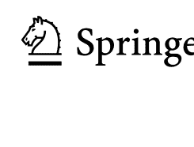

Springer

刘志刚 ID
西南交通大学电气工程学院中国四川成都

刘文强 ID
土木与环境工程系
香港理工大学
中国香港

钟俊平 ID
工业与系统工程系
香港理工大学
中国香港

ISSN 2363-5010
高速铁路技术的进步
ISBN 978-981-99-0952-0

ISSN 2363-5029（电子版）
ISBN 978-981-99-0953-7（电子书）

https://doi.org/10.1007/978-981-99-0953-7

© 编辑（如适用）和作者，独家许可给 Springer Nature Singapore Pte Ltd. 2023

本作品受版权保护。出版商独家授权所有权，无论是整体还是部分材料，特别是翻译、复制、重用插图、朗读、广播、微缩胶片复制或以任何其他实体方式复制、传输或信息存储和检索、电子适应、计算机软件或类似或不同的已知或今后开发的方法。

本出版物中使用的一般描述性名称、注册名称、商标、服务标志等，并不意味着即使在没有明确声明的情况下，这些名称不受相关保护法律和法规的约束，因此可以自由使用。

出版商、作者和编辑可以安全地假设本书中的建议和信息在出版日期时被认为是真实准确的。出版商、作者或编辑对本文所包含的材料不提供明示或暗示的保证，也不对可能存在的任何错误或遗漏承担责任。出版商在已发表的地图和机构隶属方面保持中立。

这本斯普林格印记由注册公司斯普林格自然新加坡私人有限公司出版。
注册公司地址为：152 Beach Road, #21-01/04 Gateway East, Singapore 189721, 新加坡

# # 前言

截至2022年底，中国的高速铁路运营里程已超过40000公里，可以绕地球赤道一圈，这是目前世界上最大的高速铁路运营网络。中国的高速铁路发展已逐渐从建设阶段过渡到运营和维护阶段。随着对高速铁路运营质量要求的逐步提高，对高速铁路牵引供电系统设备的可靠运行提出了更高要求。

接触网，也称为架空接触系统（OCS），是牵引供电系统的关键设备，主要负责多个动力单元（电力机车）的供电。其可靠性将直接影响电力机车的安全运行。因此，高速铁路接触网的高效检测和评估对整个铁路的维护至关重要，以确保接触网的正常运行。

接触网支撑装置是高速铁路接触网的关键部分，主要包括绝缘子、等位线、螺栓等12类支撑组件。实际运行表明，在外部环境和列车振动等复杂因素的影响下，支撑组件可能出现松动、缺失、断裂和裂纹等缺陷或故障，这可能导致其结构可靠性下降。它们可能导致接触网系统故障，危及高速铁路的运行安全。因此，对接触网支撑组件的缺陷和故障进行检测对于确保高速铁路的安全状况至关重要。

由于接触网支撑装置具有复杂的结构、多种类型的组件、大规模差异、缺陷和故障样本较少以及检测路线复杂等特点，这给高速铁路接触网的缺陷和故障检测带来了巨大困难。针对这些问题，本书详细介绍了基于深度学习的一系列解决方案，用于检测接触网支撑组件的缺陷和故障。

这本书包括七个章节。第一章概述了高速铁路中的接触网检测。第二章详细介绍了深度学习的进展。第三章介绍了高速铁路中的接触网支撑构件及其特点。第四章描述了接触网支撑构件图像的预处理方法和技术。本书的主要内容是接触网支撑构件的定位和缺陷及故障检测，分别在第五章和第六章中进行了讨论。此外，第七章介绍了基于三维点云的检测方法。

本书系统地展示了高速铁路中接触网检测技术的最新研究成果，特别是接触网支撑构件的缺陷和故障检测。一些方法或算法已经在实际工程中采用。它们可以为研究人员、学者和工程师在高速铁路的受电弓和接触网技术方面提供重要参考和帮助。与基于图像处理的传统接触网支撑构件检测方法不同，本书采用了一些深度学习领域的先进方法，包括卷积神经网络、强化学习、生成对抗网络等，并进行了改进。

在本书中，我们试图表明对深度学习在高速铁路接触网检测中的应用的日益增长的兴趣，以用于实际工程应用。我们希望为全球其他从事高速铁路维护的研究人员提供一些参考和帮助。

中国成都
中国香港
中国香港

刘志刚
刘文强
钟俊平

致谢本书部分得到了中国国家自然科学基金（51977182，U143420）和四川省青年科技创新团队（2016TD0012）的支持。这也是我们团队多年来的成果总结，得到了博士和硕士研究生的支持，如叶翰、常东昊、李友王、刘凯、吕阳、李宇阳、杨程、杨长江、杨长江、刘旭松、郭卫平、李乔和陈俊文的作品。

# # 目录

# ## 1 电气化铁路的接触网检测概述

# ### 1.1 引言

# ### 1.2 接触网检测与监测系统

# ### 1.3 接触网组件检测技术

# ### 1.4 接触网参数检测技术

# ### 1.5 总结

# ### 参考文献

# ## 2 深度学习的进展

# ### 2.1 引言

# ### 2.2 图像特征

# #### 2.2.1 手工特征

# #### 2.2.2 深度卷积神经网络特征

# ### 2.3 计算机视觉中的深度学习框架

# #### 2.3.1 图像目标检测

# #### 2.3.2 图像目标分割

# #### 2.3.3 图像异常检测

# ### 2.4 其他深度学习方法

# #### 2.4.1 深度自编码器

# #### 2.4.2 生成对抗网络

# #### 2.4.3 深度强化学习

# ### 2.5 总结

# ### 参考文献

# ## 3 高速铁路接触网支撑组件及其特性

在高速铁路中

# ### 3.1 引言

# ### 3.2 接触网系统

# ### 3.3 接触网特性

# ### 3.4 总结

# ### 参考文献

# ## 4 接触网支撑构件图像的预处理

# ### 4.1 引言

# ### 4.2 使用LWBCTCS对接触网图像进行去噪

# #### 4.2.1 去噪方法LWBCTCS

# #### 4.2.2 接触网图像去噪实验和分析

# ### 4.3 使用深度学习对接触网图像进行增强

# #### 4.3.1 基于接触网图像增强的Zero-DCE模型

# #### 4.3.2 基于Retinex的接触网图像增强理论和生成对抗网络

# #### 4.3.3 基于接触网图像增强的强化学习

# ### 4.4 总结

# ### 参考文献

# ## 5 接触网支撑构件的定位

# ### 5.1 引言

# ### 5.2 使用变种深度卷积神经网络同时定位CSCs目标检测框架

# #### 5.2.1 CSCDNET—多尺度CSC定位特征预测

# #### 5.2.2 CSCNET—无监督的CSC位置定位粗略图像分类

# #### 5.2.3 CSCSIN—基于位置的CSCs定位关系学习

# ### 5.3 CSCs的深度定位细化学习技术

# #### 5.3.1 使用深度学习进行水平定位盒的细化强化学习

# #### 5.3.2 倾斜定位盒生成的位置修正在对抗网络

# #### 5.3.3 分割边界的细化使用CascadePSP网络

# ### 5.4 总结

# ### 参考文献

# ## 6 探测接触网支撑组件的缺陷和故障

# ### 6.1 引言

# ### 6.2 使用信号线基础缺陷检测和评估小波变换

# #### 6.2.1 可疑裂纹区域提取

# #### 6.2.2 信号线底座裂纹检测

# #### 6.2.3 实验结果分析

# #### 6.2.4 结论

# ### 6.3 绝缘子缺陷检测和评估基于自动编码器网络（AE）

# #### 6.3.1 绝缘子分离

# #### 6.3.2 绝缘子缺陷提取

# #### 6.3.3 绝缘子缺陷评估

# #### 6.3.4 实验结果分析

# #### 6.3.5 结论

# ### 6.4 等位线缺陷检测和评估基于生成对抗网络（GANs）

# #### 6.4.1 生成对抗表示和故障等位线的诊断

# #### 6.4.2 实验结果分析

# #### 6.4.3 结论

# ### 6.5 总结

# ### 参考文献

# ## 7 接触网支撑装置参数的检测基于3D点云

# ### 7.1 引言

# ### 7.2 接触线几何参数检测使用RANSAC

# #### 7.2.1 架空线3D点云数据的获取和预处理

# #### 7.2.2 接触线的检测和提取

# #### 7.2.3 架空线导线的检测高度和错位

# #### 7.2.4 实验结果的分析

# #### 7.2.5 结论

# ### 7.3 使用3D深度分割进行结构参数检测神经网络

# #### 7.3.1 悬臂组件分离

# #### 7.3.2 悬臂结构参数测量

# #### 7.3.3 实验结果的分析

# #### 7.3.4 结论

# ### 7.4 总结

# ### 参考文献

# # 缩写

| 缩写 | 解释 |
|------|------|
| 3D PointCNN | 三维点卷积神经网络 |
| A3C | 异步优势演员-评论家 |
| ADNET | 动作决策网络 |
| AE | 自编码器 |
| ASIFT | 仿射尺度不变特征变换 |
| BEGAN | 边界平衡生成对抗网络 |
| BLS-GSM | 贝叶斯最小二乘高斯比例混合 |
| BS | 支撑套筒 |
| BSS | 支撑套筒螺钉 |
| CascadePSP | 级联金字塔场景解析网络 |
| CEB | 曲线增强块 |
| CGAN | 条件生成对抗网络 |
| CNN | 卷积神经网络 |
| CRN | 分类和回归网络 |
| CSC | 接触网支撑构件 |
| CSCDNET | 接触网支撑构件检测网络 |
| CSCNET | 接触网支撑构件网络 |
| CSCs | 接触网支撑构件 |
| CSCSIN | 接触网支撑构件结构推理网络 |
| CT | 轮廓变换 |
| CV | 曲线变换 |
| CVAE | 条件变分自编码器 |
| DAE | 去噪自编码器 |
| DBSCAN | 基于密度的带噪声应用空间聚类 |
| DCNN | 深度卷积神经网络 |
| DFB | 方向性滤波器组 |
| DL | 深度学习 |
| DRL | 深度强化学习 |
| EMU | 电力动车组 |
| FAB | 特征注意力块 |
| Faster R-CNN | 更快的基于区域的卷积神经网络 |
| FCN | 全卷积网络 |
| FEN | 特征提取网络 |
| FPN | 特征金字塔网络 |
| FPS | 每秒帧数 |
| GAN | 生成对抗网络 |
| GIoU | 广义交并比 |
| GRU | 门控循环单元 |
| GT | 真实值 |
| HOG | 方向梯度直方图 |
| ICEN | 光照分量增强网络 |
| IDN | 图像解耦网络 |
| IoU | 交并比 |
| IP_RANSAC | 改进的投影随机采样一致性 |
| LBP | 局部二值模式 |
| LEC | 光增强曲线 |
| LP | 拉普拉斯金字塔 |
| LSCCRN | 大规模分类和回归网络 |
| LSCSCs | 大规模接触网支撑构件 |
| LWBCT | 基于提升小波的轮廓变换 |
| LWBCTCS | 具有循环位移不变性的提升小波轮廓变换 |
| LWT | 提升小波变换 |
| MABR | 最小区域边界矩形 |
| mAP | 平均精度 |
| mBA | 平均边界准确度 |
| MDP | 马尔可夫决策过程 |
| mIoU | 平均交集联合 |
| MPN | 掩蔽预测网络 |
| MSE | 均方误差 |
| NMS | 非极大值抑制 |
| PCA-SIFT | 主成分分析尺度不变特征变换 |
| PGGAN | 渐进式增长生成对抗网络 |
| PixelRL | 像素强化学习 |
| PR曲线 | 精确率-召回率曲线 |
| PSNR | 峰值信噪比 |
| PSPNET | 金字塔场景解析网络 |
| RANSAC | 随机采样一致性 |
| RCCAEN | 重建和分类卷积自编码器网络 |
| RCDN | 反射成分去噪网络 |
| ResNet-101 | 具有101层的残差网络 |
| RL | 强化学习 |
| RMC | 奖励地图卷积 |
| RoI | 感兴趣区域 |
| RPN | 区域建议网络 |
| SAE | 稀疏自编码器 |
| SB | 稀疏块 |
| SC_LCCP | 斜率约束局部凸连通块 |
| SIFT | 尺度不变特征变换 |
| SIN | 结构推理网络 |
| SNR | 信号噪声比 |
| SPCCD | 悬挂链支撑装置的结构参数 |
| SSCCRN | 小规模分类和回归网络 |
| SSCSCs | 小规模悬挂链支撑构件 |
| SSD | 单次多框检测器 |
| SSIM | 结构相似性 |
| SURF | 加速稳健特征 |
| SVM | 支持向量机 |
| TOL-Framework | Tighter Oriented Localization Framework |
| TPH-YOLOv5 | 变压器预测头你只看一次版本5 |
| VAE | 变分自编码器 |
| VGG16 | 一个具有16层的卷积神经网络（由视觉几何组开发） |
| WG AN | Wasserstein生成对抗网络 |
| WGAN-GP | 具有梯度惩罚的Wasserstein生成对抗网络 |
| YOLACT | 只看系数 |
| YOLO | 只看一次 |
| Zero-DCE | 零参考深度曲线估计 |

# 第一章 电气化铁路的接触网检测概述

### 1.1 引言

高速铁路接触网系统主要由支撑装置和悬挂装置组成，是高速铁路的重要组成部分，负责为列车的运行提供稳定的电能，如图1.1所示。受电弓与接触网系统之间的相互作用影响，接触网容易发生剧烈振动，导致接触网支撑构件（CSCs）出现不同程度的机械故障，如松动或缺失、损坏和开裂。这些因素将降低接触网结构的稳定性，甚至威胁到整个铁路系统的安全运行。此外，由于接触网长时间暴露在室外，容易受到自然环境的影响，如强风和暴雪。一旦发生故障，将造成不可估量的损失。2012年，中国铁道部发布了《高速铁路供电安全检测与监控系统技术要求》[1]，以推动高效非接触式接触网检测与监控技术的发展和应用，及时发现和处理潜在的隐患，如图1.2所示。该系统主要研究非接触式接触网检测与监控技术。最初的研究采用了更传统的数据处理和分析技术，具有时效性、通用性和稳健性差的特点。满足现有和快速增长的大规模高速铁路线路的维护要求是具有挑战性的[2]。

因此，发展与最新人工智能技术相结合的接触网检测和监测技术对于不同工业领域的验证和应用是重要且必要的。在本章中，介绍和讨论了当前接触网组件缺陷和参数检测的概述。

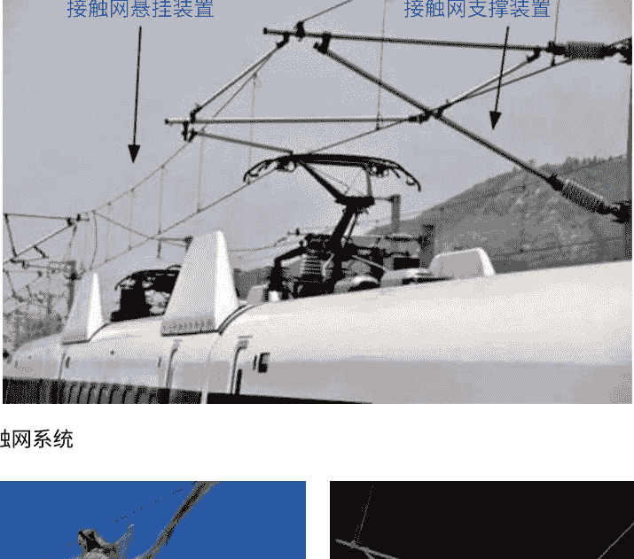

图 1.1 接触网系统

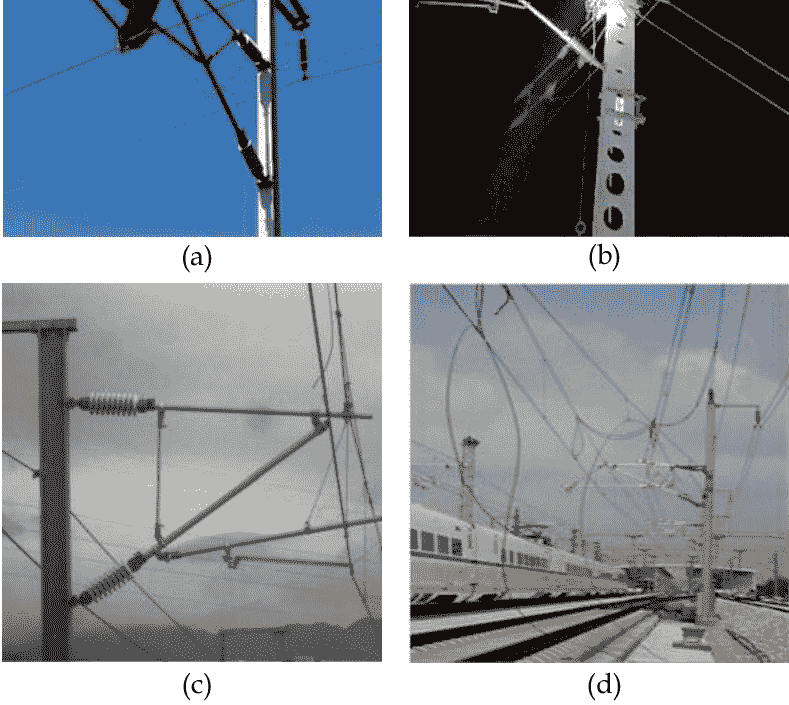

### 1.2 接触网检测与监测系统

高速铁路综合检测车是一种重要的技术手段，用于定期检测和监测铁路设施，及时发现和解决可能威胁列车运行安全和稳定性的潜在隐患[3]。目前，全球范围内已成功开发和应用了许多类型的综合检测车[4]。日本已相继生产了"黄色医生"和"东一"综合检测车，采用六辆电力动车组（EMU）编组，用于监测每个信号系统、系统定位、接触网和轨道。意大利开发了最高时速为220公里/小时的"Roger2000"综合检测车，采用六辆EMU编组，用于检测和监测各种信号、接触网、轮轨几何等。法国开发了最高时速为320公里/小时的"IRIS320"综合检测车，采用十辆EMU编组，用于检测和监测信号、接触网和轨道。英国开发了最高时速为200公里/小时的"NMT"综合检测车，采用七辆EMU编组，用于检测和监测轨道线路视频、轨道几何、轨道表面、紧固件和接触网。德国和美国在这方面的投资相对较小，尚未独立开发类似的检测车。但是通过在普通客车后部增加装备测试设备的车厢进行测试[5]。中国的综合检测车研发起步较晚。然而，通过引进、消化和吸收国外先进的检测车，成功研发了具有完全独立知识产权和检测技术的综合检测车[6]，如图1.3所示。

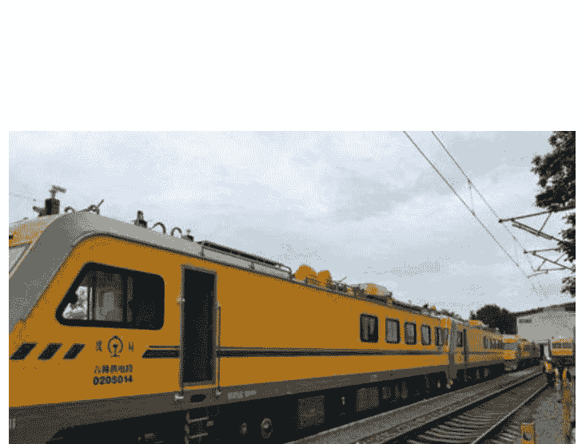

图1.3 接触网支撑构件检测车

# 1.3 接触网组件检测系统

在图1.4中，接触网检测车顶部安装了接触网支撑装置的图像采集系统。该系统由许多高清晰度（HD）摄像头组成，分为两组用于拍摄接触网支撑装置的前后图像[7]。每组摄像头瞄准接触网支撑装置的不同部位，尽可能地捕捉装置的局部高清图像，这方便后续的图像分析和处理。

# 1.4 接触网参数检测系统

图1.5显示了安装在接触网检测车顶部的三种常见基于视觉的非接触式接触网参数检测原理和系统。在图1.5a中，介绍了基于单目摄像头和红外传感器的几何参数（导线高度和错位）检测[8]，它使用由线结构光源组成的激光发射器照射光束到接触线上并形成一个亮点（交点），然后使用摄像头捕捉该亮点并根据它们之间的三角关系计算几何参数。在图1.5b中，描述了基于双目线扫描摄像头的几何参数检测[9]，它使用线结构光源照亮接触线，与前一种方法类似，然后使用两个线扫描摄像头捕捉该亮点并根据这两个摄像头的空间关系计算几何参数。

在图1.5c中，表示了基于双目面阵摄像头的定位器坡度梯度参数检测[10]，其原理与前者[9]相同。它利用双目摄像头的空间关系获取定位器中某一点的世界坐标，然后计算定位器的坡度。

### 1.3 接触网组件检测技术

随着全球高速铁路运营里程的快速增加，维护铁路基础设施的任务变得更加紧迫。为了确保列车的安全运行，快速高效地实现基础设施的检测、监控和维护是一个重要的挑战。因此，许多先进的非接触式检测技术被提出。根据数据处理技术的差异，基础设施检测技术的研究可以分为两个阶段：基于传统模式识别技术的检测方法和基于深度学习技术的检测方法。

- (i) 基于传统模式识别技术的第一阶段 Aydin等人[11, 12]提出了一种在受电弓-接触网系统中使用改进的基于核的跟踪的检测方法。他们修改了基于核的目标跟踪方法，以识别受电弓-接触网系统之间的相互作用，并使用高斯混合模型提取前景。

通过将它们结合起来，检测到了发生的弧。吴等人[13]提出了一种用于高架接触网中鸟巢检测的方法。他们提出了条纹方向直方图（HOS）和条纹长度直方图（HLS）来捕捉检测到的细枝条纹的方向和长度分布。然后，采用支持向量机（SVM）来学习模型的模式，以检测鸟巢。

谭等人[14]提出了一种基于轮廓特征和灰度相似度匹配的接触网绝缘子缺陷检测方法。他们提出了一种基于图像处理的绝缘子裙特征提取算法，用于分离绝缘子，然后使用提取的裙轮廓特征和灰度相似度匹配方法对绝缘子状态进行分类。Karakose等人[15]提出了一种基于图像处理的受电弓-接触网系统故障诊断方法。杨等人[16]提出了使用仿射不变矩来匹配和定位接触网绝缘子元件，并通过绝缘子灰度的统计信息来检测绝缘子是否存在外来故障。杨等人[17]进一步提出了使用SURF对绝缘子进行特征提取和匹配定位，然后根据绝缘子灰度最小值的分布规律判断绝缘子是否损坏。韩等人[18]提出了使用SIFT对接触网旋转双耳进行特征提取和匹配定位，然后通过检测旋转双耳边缘线的曲率来判断耳片是否破裂。张和刘[19]提出了使用Harris角点提取接触网绝缘子特征，并使用顺序相似性检测算法进行目标匹配和定位，然后通过聚类和Chan-Vese（CV）[20]模型提取绝缘子轮廓，最后通过分析绝缘子边缘信息判断绝缘子断裂和异物故障。韩等人[21]提出使用DPM提取接触网绝缘子特征，并与SVM分类器结合进行识别和定位。徐等人[22]提出了一种将LBP和HOG特征相结合的方法，用于从接触网的旋转双耳中提取特征，实现组件的检测和定位。韩等人[23]提出使用HOG和SVM实现旋转双耳的检测，然后使用二维Gabor小波提取组件特征，实现组件断裂故障的检测。杨和刘[24]提出使用SURF提取接触网旋转双耳的特征，实现组件的粗定位，并使用HT实现旋转双耳的精确定位。然后，利用二代曲波变换的特征提取组件的曲波系数，并通过曲波系数分布规律的数值统计提出了组件故障的判断依据。吴等人[13]提出了一种新的鸟巢检测方法，使用自适应二值化、主干/分支检测、悬挂点检测、条纹方向和长度直方图来提取鸟巢特征，然后使用SVM分类器实现鸟巢检测。钟等人[25]提出使用SIFT和RANSAC算法实现触头的旋转双耳定位，然后使用HT实现边缘检测、水平调整和耳片分割，并利用样本分布的差异实现耳故障的检测。陈等人[26]提出使用HOG特征提取触网支撑套管的特征，然后使用AdaBoost级联分类器检测组件，最后使用HT分离连接到支撑套管的紧固件（螺栓和螺母）以确定紧固件故障。张等人[27]提出使用差异HOG（DHOG）特征提取触网导线基座的特征，然后使用AdaBoost级联分类器检测组件，最后使用离散余弦变换滤除图像背景并通过提取的弧线检测导线和辅助导线。使用聚类方法实现了辅助导线的缺失故障检测。

## 1 电气化铁路接触网检测概述

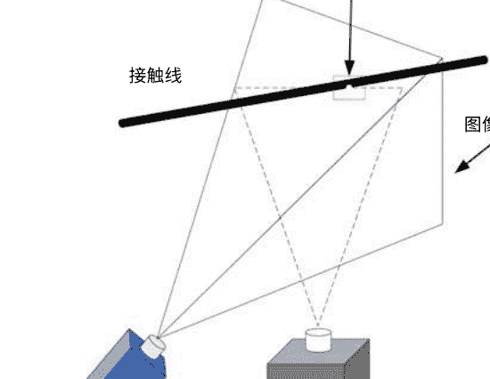

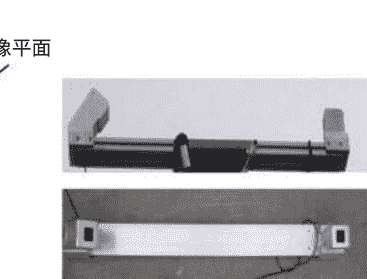

(a) 基于单目摄像头和红外传感器的几何参数检测

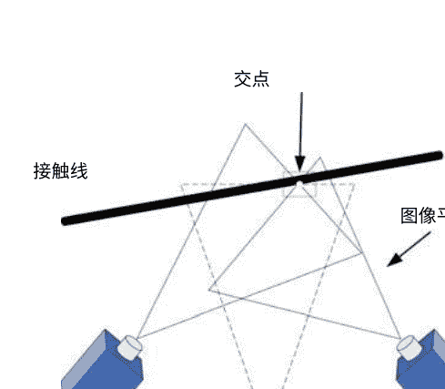

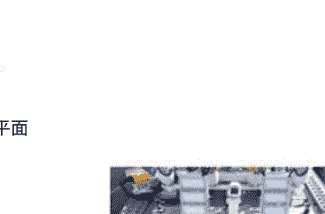

(b) 基于双目线扫描摄像头的几何参数检测

图1.5 接触网参数检测系统

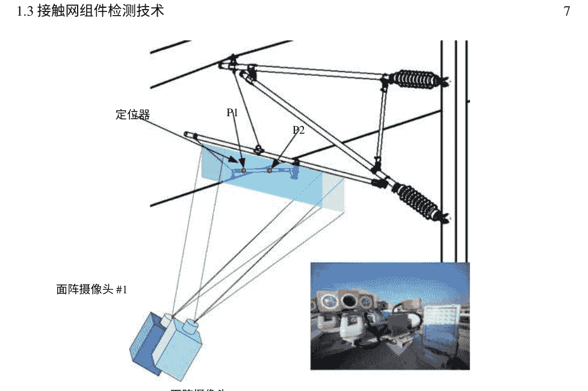

## (c) 基于双目面阵摄像头的定位器坡度梯度参数检测

## 图1.5（续）

- (ii) 基于深度学习技术的第二阶段

Karaduman等人[28]提出了一种使用卷积神经网络在受电弓-接触网系统中进行弧形检测和识别的方法。Huang等人[29]还提出了一种使用卷积神经网络在受电弓-接触网系统中进行弧形检测和识别的方法，可以准确检测弧形的发生及其大小。Luo等人[30]提出了一种改进的Faster R-CNN方法来检测受电弓-接触网中的弧故障。Wang等人[31]提出了一种用于检测接触网固定装置中分裂销缺陷的方法。他们提出了一种改进的YOLOv3方法，首先定位分裂销，并采用语义分割模型deeplabv3+来分割分裂销并确定其缺陷，遵循分裂销的结构特征。Chen等人[32]提出了一种基于改进的RetinaNet模型的电流环故障诊断方法，该方法通过空间注意力图和通道权重图可以提高对故障电流环的故障诊断准确性，相比原始检测网络。

刘等人[33]设计了一个基于Faster R-CNN目标检测框架的接触网等电线特征提取网络，能够准确检测等电线。基于马尔可夫随机场模型，可以准确分割等电线区域；最后，通过分析连接组件数量和像素标准差，可以实现接触网等电线的松动故障检测。陈等人[34]在单阶段目标检测框架下构建了一个三级CNN，实现了接触网紧固件故障检测。首先，在SSD检测网络框架下实现了接触网连接器（支撑套管和双套管连接器）的检测。其次，在YOLO检测网络框架下实现了接触网紧固件（螺栓、螺母、销钉）的检测。最后，建立了一个深度CNN用于紧固件故障检测。钟等人[35]提出使用PAVNET[36]网络、HT和CV模型实现接触网紧固件销钉的检测，并根据正常和异常状态下销钉的轮廓特征建立了故障判据，实现了松动故障的检测。

### 1.4 接触网参数检测技术

卡脱销的故障检测。刘等人[37]提出使用更快的R-CNN来粗略定位接触网的导线底座，使用Radon变换来实现导线的精确定位，最后使用Beamlet变换来提取导线的裂纹故障。康等人[38]提出了一个多任务检测网络框架，用于接触网绝缘子故障检测。首先，使用更快的R-CNN来定位接触网绝缘子等组件，然后建立一个多任务网络来实现绝缘子的分类和重建，并将网络的输出分数作为判断绝缘子故障的依据。此外，一些学者最初开始尝试增强接触网图像[39, 40]并使用3D点云来检测接触网的状态[41-43]。

接触网最关键的结构参数是定位器的坡度梯度、导线高度和接触线的错位。一旦这些参数发生变化，将直接导致受电弓的电流接收不稳定，容易发生安全事故。因此，需要准确检测这些参数。基于不同的测量技术，提出了许多非接触式检测方法。董杰等人[44]提出了一种基于深度学习的接触网定位器检测和识别方法。他们首先使用Faster R-CNN检测定位器，然后使用HT检测定位器的骨架轮廓，并拟合最佳直线来计算定位器的坡度梯度。张等人[45]提出了一种基于相机标定的导线高度和接触线错位的非接触式检测方法。该检测方法使用激光发射器在接触线上形成一个点，并使用安装在接触网检测车上的CCD摄像头获取接触线的激光点图像。经过图像预处理，定位激光点，并确定激光点在图像坐标系中的坐标。根据图像空间变换关系计算接触线的几何参数。基于研究[45]，刘等人[8]考虑了激光点的定位精度和检测车辆的振动对结果的影响。他们提出了基于粒子群优化的遗传粒子滤波算法（PSO-GAPF）来跟踪和定位激光点，并使用卡尔曼滤波（KF）来校正接触网几何参数的检测值。此外，针对接触网几何参数的高速动态测量，詹等人[9, 46]提出了一种基于双目线扫描相机的几何参数检测方法，该方法使用线结构化光源照亮接触线并形成明亮的激光点，然后使用两个线扫描相机捕捉激光点，并根据这两个相机的空间关系计算几何参数。张等人[47]设计了一种接触线几何参数检测系统。该系统使用模板匹配来识别受电弓，并使用渐进概率霍夫变换（PPHT）来检测接触线。然后，通过相机校准，检测受电弓与接触线的交点，计算导线高度和错位。段等人[48]提出了一种基于计算机视觉技术的非接触式定位器坡度梯度检测方法。他们开发了一个图像采集系统来捕捉定位器，使用灰度和中值滤波器来消除噪声和背景，提高图像质量，并使用HT算法提取悬臂装置的直线骨架并计算定位器的坡度梯度。

### 1.5 总结

在本章中，我们对触网检测技术的研究进行了全面介绍。第一节描述了触网检测系统的基本结构和功能。第二节总结了触网部件检测技术的研究现状和存在的问题。第三节总结了触网参数检测技术的研究现状和存在的问题。

## 参考文献

- 1. 韩志，刘志，张刚，杨华（2013）受电弓-接触网监测的非接触式图像检测技术概述。中国铁路学报35（6）：40-47
- 2. 高速铁路上受电弓支架组件缺陷和故障的深度学习检测和监测系统（6C）。在：第七届国际电力电子系统与应用智能移动、电力传输和安全会议（PESA）。第1-7页
- 3. 刘志，宋阳，韩洋，王辉，张军，韩忠（2018）高速铁路接触网研究进展。现代交通学报 26(1):1-23
- 4. 姚东，陈东，陶凯（2020）铁路基础设施综合检测和监测技术的讨论。铁道标准设计 32:64
- 5. Artagan SS, Bianchini Ciampoli L, D'Amico F, Calvi A, Tosti F (2020) 铁路基础设施的非破坏性评估和健康监测。地球物理学报 41(3):447-483
- 6. 于雷，高山，张东，康刚，詹德，罗伯茨 C（2021）基于计算机视觉的接触网自动检测综述。IEEE智能交通系统交易
- 7. 高山（2020）中国高速铁路受电弓-接触网自动检测和监测系统。IEEE仪器仪表测量交易 70:1-12
- 8. 刘Z，刘W，韩Z（2017）电气铁路接触网几何参数的高精度检测方法。IEEE仪器测量传感器66（7）：1798-1808
- 9. 詹D，景D，吴M，张D，于L，陈T（2018）铁路接触网几何参数的准确高效视觉测量方法。IEEE仪器测量传感器67（12）：2841-2853
- 10. 詹D，景D，吴M，张D（2018）电气化铁路接触网定位器坡度动态视觉测量研究。电子测量仪器32（08）：50-58
- 11. Aydin I, Karaköse M, Akin E (2013) 基于均值漂移跟踪和前景检测的受电弓-接触网系统的鲁棒异常检测。在：IEEE国际会议系统、人类和控制论。第4444-4449页
- 12. Wu X, Yuan P, Peng Q, Ngo C-W, He J-Y (2016) 高速铁路架空接触网中鸟巢的检测。Pattern Recognit 51:242–254
- 13. Tan P, Li X-F, Xu J-M, Ma J-E, Wang F-J, Ding J, Fang Y-T, Ning Y (2020) 基于轮廓特征和灰度相似度匹配的接触网绝缘子缺陷检测。浙江大学学报A 21(1):64–73
- 14. Karakose E, Gencoglu MT, Karakose M, Aydin I, Akin E (2016) 基于图像处理跟踪的受电弓-接触网系统故障诊断的新实验方法。IEEE工业信息学报 13(2):635–643
- 15. 杨华明, 刘志刚, 韩振伟, 韩洋 (2013年) 基于仿射矩不变量的电气化铁路绝缘子间异物检测。中国铁道学报35(4):30–36
- 16. 杨华, 刘志, 韩洋, 韩振 (2013年) 基于加速鲁棒特征的电气化铁路绝缘子缺陷检测。电力系统技术37(8):2297–2302
- 17. 韩洋, 刘志, 韩振, 杨华 (2014年) 基于SIFT特征匹配的高速铁路接触网支撑装置耳片断裂检测。中国铁道学报36(2):31–36
- 18. 张刚, 刘志 (2014年) 基于角点匹配和谱聚类的接触网绝缘子损伤/异物故障检测。中国科学仪器学报35(6):1370–1377
- 19. Chan T F, Vese LA (2001年) 无边缘主动轮廓。IEEE图像处理10(2):266–277
- 20. 韩Y, 刘Z, 李D-J, 张G, 邓M (2016) 使用分段聚类和可变形部件模型进行高速铁路杆绝缘子检测。在：IEEE国际图像处理会议 (ICIP)。第3852-3856页
- 21. 徐D, 于L, 陈T, 王J (2017) 基于LBP-HOG特征的接触网旋转双耳检测。J铁道科学工程14 (2)：370-378
- 22. 韩Y, 刘Z, 耿X, 钟J (2017) 基于HOG特征和二维Gabor变换的高速铁路接触网支撑装置耳片断裂检测。J中国铁路学会39 (2)：52-57
- 23. 杨H, 刘Z (2017) 基于第二代曲波变换的电气化铁路接触网交叉口装置旋转双耳缺陷检测。J中国铁路学会
- 24. 钟J, 刘Z, 张G, 韩Z (2017) 高速铁路接触网摇臂销的状态检测。中国铁路学报39（6）：65-71
- 25. 陈J, 刘Z, 韩Y, 钟J (2017) 基于局部特征描述的高速铁路接触网对角管的位置和故障检测。中国铁路学报39 (11)：30-37
- 26. 张G, 刘Z, 韩Y, 韩Z (2017) 高速铁路接触网辅助接触线的丢失故障检测。中国铁路学报39 (5)：40-46
- 27. Karaduman G, Karakose M, Akin E (2017) 基于深度学习的受电弓-接触网系统的弧形检测。在：第10届国际电气与电子工程会议 (ELECO)。pp 904-908
- 28. Huang S, Zhai Y, Zhang M, Hou X (2019) 基于卷积神经网络的受电弓-接触网系统中的弧形检测与识别. 信息科学 501:363–376
- 29. 罗Y, 杨Q, 刘S (2019年) 基于视觉的高速列车受电弓-接触网异常行为定位的新方法。IEEE Access 7:180935–180946
- 30. 王J, 罗L, 叶W, 朱S (2020年) 基于深度学习的高速铁路接触网固定装置分裂销缺陷检测方法。IEEE Trans Instrum Meas69(12):9517–9525
- 31. Chen Y, Song B, Zeng Y, Du X, Guizani M (2021) 基于深度学习的高速铁路可持续运输中接触网电流环故障诊断. Appl SoftComput 100:106907
- 32. 刘Z, 王L, 李C, 韩Z (2017年) 高速铁路等电线路松散股诊断方法的高精度研究。IEEE工业信息学报14（3）：1067-1077
- 33. 陈J, 刘Z, 王H, 努涅斯A, 韩Z (2017年) 使用深度卷积神经网络自动检测接触网支撑装置上的紧固件缺陷。IEEE仪器测量学报67（2）：257-269
- 34. 钟J, 刘Z, 韩Z, 韩Y, 张W (2018年) 一种基于CNN的高速铁路接触网分裂销缺陷检测方法。IEEE仪器测量学报68 (8) : 2849-2860
- 35. 金KH, 洪S, 鲁B, 全Y, 朴M (2016年) Pvanet: 用于实时目标检测的深度但轻量级神经网络。arXiv预印本arXiv:16 08.08021
- 36. 刘K, 刘Z, 陈J (2019) 基于Faster R-CNN的高速铁路接触网支撑构件缺陷和故障的裂纹检测。中国铁道学报41 (7) : 43-49
- 37. 康G, 高S, 于L, 张D (2018) 用于高速铁路绝缘子表面缺陷检测的深度架构：带有多任务学习的去噪自编码器。IEEE仪器测量技术学报68 (8) : 2679-2690
- 38. 吴C, 刘Z, 江H (2014) 基于小波轮换的接触网图像增强方法。Optik 125 (15) : 3922-3925
- 39. 吴C, 刘Z, 江H (2014) 基于多周期旋转的接触网图像去噪方法。TELKOMNIKA印度尼西亚电气工程杂志12 (5) : 3887-3893
- 40. 周J, 韩Z, 杨C (2018) 基于3D点云的接触网几何参数检测方法。中国科学仪器学报39 (4) : 239-246
- 41. Xu J, Liu Z, Han Z, Geng X (2017) 基于SIFT和LBP的接触网部件三维重建中点云配准的应用. 中国铁道学报 39(10):76–81
- 42. Han Z, Yang C, Liu Z (2019) 基于三维点云凹凸性的悬臂结构分割和参数检测. IEEE Trans Instrum Meas 69(6):3026–3036
- 43. Dongjie C, Wensheng Z, Yang Y (2017) 基于深度学习的高速铁路接触网定位器的检测和识别. 中国科学技术大学学报 47(4):320
- 44. Zhang G-N, Liu Z, Liu W, Han Z (2014) 基于相机标定的接触线导高和错位的非接触检测. 中国铁道学报 36(3):25–30
- 45. Zhan D, Yu L, Xiao J, Chen T, She R (2014) 高速动态视觉测量法测量接触网几何参数. 中国科学仪器学报 35(8):1852–1859
- 46. 张G, 凌C, 王X (2014) 接触线几何参数的图像检测系统设计。天津理工大学学报33 (5) : 57-62
- 47. 段R, 赵W, 黄S, 陈J (2010) 基于计算机视觉的稳定臂斜率自动检测方法。在：测量技术和机电自动化国际会议，第1卷。第714-718页

## 第2章 深度学习的进展

### 2.1 引言

传统的接触网检测机器视觉方法是基于手工特征和浅层学习设计的，例如模板匹配和奇异值检测。尽管这些方法可以使用专家知识进行数学建模，具有可解释性，但它们只对某些特定条件表现良好，无法很好地适应不同的场景。随着深度神经网络（DNN）的模型训练技术[1]、计算能力和大量可用数据的发展，深度学习[2]在图像分类和目标检测任务上在2012年[3]和2014年[4]取得了突破。从那时起，它已成为接触网检测中的主要技术。给定一个特定的任务，深度卷积神经网络（DCNN）可以自动地从大量数据中挖掘有用的信息/特征。对于一些数据驱动的学习机制，如自编码器重构、对抗学习和强化学习，可以将DCNN集成到这些机制中，从而引入各种新的基于深度学习的接触网状态监测方法，如图2.1所示。

在本章中，我们首先介绍传统的手工制作特征及其对接触网检测的不利影响。描述了深度卷积神经网络特征，然后介绍了不同计算机视觉任务（如目标检测、目标分割和异常检测）的深度学习框架。此外，还介绍了其他可能用于接触网检测的先进深度学习机制。最后，总结了深度学习技术的优势。

### 2.2 图像特征

为了定位和诊断接触网支撑组件，应提取和表示其图像的有用信息或模式，如纹理、语义、灰度、轮廓和颜色。

首先，传统手工特征是基于先验知识手动设计和处理的，而深度 CNN 则通过表示学习自动地从数据中挖掘所需的模式。

#### 2.2.1 手工特征

手工特征可以分为全局图像特征和局部特征。全局图像特征，如形状上下文和不变矩，可以用来描述目标的形状特征。像素值直方图和灰度共生矩阵可以分别描述目标的灰度和纹理特征。全局手工特征具有良好的不变性，但不能反映图像变化的细节。

局部手工特征反映了局部区域或关键点的特征。典型的局部特征包括 Haar [5]、LBP [6]、SIFT [7]、HOG [8] 等。Haar 及其变种 Haar-like 特征是使用不同方向的像素块模板手动设计的。他们将模板应用于图像，并获得相应方向上的差值作为特征值，以描述局部区域的灰度变化。LBP 用于描述图像的局部纹理特征；它是通过将一个点的像素值与邻域像素值进行比较而形成的局部二值块模式特征。SIFT 及其变种 ASIFT、PCA-SIFT 和 SURF [9]，提取图像中的关键点并将其转换为特征向量，用于表示局部图像区域的特征。HOG 检测图像边缘并建立方向梯度直方图，将其转换为特征向量作为特征表示。与全局特征相比，局部特征描述符在尺度变化、位置平移、位置旋转和光照变化方面具有更强的特征不变性。

通常，上述手工制作的特征使用特定的公式来描述点或区域的梯度，这些公式基于先前的知识或专家经验。

在架空线检查中，已经研究了典型的手工制作特征，如SIFT、HOG、SURF、纹理分布和灰度值，用于CSC的定位或缺陷诊断。它们可以单独用于模板匹配，也可以与浅层分类器结合使用。接下来，我们介绍一些基于典型手工制作特征的方法。

### 1. 用于CSC定位的手工特征

1.  用于CSC定位的SIFT特征匹配

    使用SIFT算法提取图像局部特征点的实现步骤如下所示。

    - 步骤1：在高斯差分（DoG）尺度空间中检测极值点

        首先，建立图像的DOG金字塔，并将DOG尺度空间中的每个点（不包括第一层和最后一层的点）与其26个相邻点进行比较，以获取局部极值点。然后，通过拟合三维二次函数可以确定关键点的位置和尺度。同时，可以去除对比度低和边缘响应不稳定的关键点，以提高匹配稳定性和抗噪声能力。

    - 步骤2：关键方向分配

        通过使用（2.1）和（2.2）计算关键点邻域的梯度和方向分布特征。然后，获得高斯加权邻域像素梯度直方图分布，确定关键点的位置、尺度和方向，并实现平移、缩放和旋转不变性。

        $$
        m(x, y) = ((L(x+1, y) - L(x-1, y))^2 + (L(x, y+1) - L(x, y-1))^2)^{\frac{1}{2}} \quad (2.1)
        $$

        $$
        \theta(x, y) = \arctan\left[ \frac{L(x, y+1) - L(x, y-1)}{L(x+1, y) - L(x-1, y)} \right] \quad (2.2)
        $$

        其中 $m(x, y)$ 和 $\theta(x, y)$ 分别是点(x, y)的梯度幅值和方向。

    - 步骤3：生成关键描述符

        首先，在关键点上绘制以高斯加权邻域像素梯度统计直方图，生成一个128维的SIFT特征向量。然后，对该向量进行归一化处理，消除光照变化的影响，生成关键描述符。

        SIFT描述符如图2.2a所示。

    - 步骤4：特征点匹配

        使用从两幅图像生成的SIFT特征向量的欧氏距离来判断两个特征点的相似度，并使用(2.3)来消除错误匹配。

        $$
        \frac{U_{\min}}{U_l} < R, \quad 0 < R \le 1, \quad (2.3)
        $$

        其中，$U_{m}$和$U_{l}$分别是SIFT特征向量的最近邻距离和次近邻距离，$R$是设定的阈值。

        如果上述公式成立，则可以接受匹配。图2.2b展示了用于触网支撑组件的SIFT特征匹配的示例。除了正确的匹配（红色椭圆），还出现了一些不匹配（绿色椭圆）。

2.  HOG + SVM/AdaBoost用于CSC定位

    HOG特征提取过程如下所示。

    - 步骤1：将图像分成相同大小的正方形单元格。每四个相邻的单元格合并成一个正方形块，这些块可以互相重叠，如图2.3所示。

    - 步骤2：使用 (2.4) - (2.7) 计算每个像素的梯度幅度 $m(x, y)$ 和方向 $\theta(x, y)$ ，以及每个单元格的梯度直方图。每个梯度直方图包括九个方向区间。

    - 步骤3：将同一块中的四个单元格对应的梯度直方图连接起来，生成一个36(4 × 9 = 36)维的特征向量。然后，通过使用公式(2.8)计算出 $L_2$ 归一化的特征向量，可以消除光照的影响。在公式(2.8)中，$v$ 表示归一化之前的特征向量，$\|v\|_2$ 表示特征向量的 $L_2$ 范数，而无穷小量 $\varepsilon$ 用于避免分母为0。

        $$
        \mathrm{d}x = I(x+1, y) - I(x-1, y) \qquad (2.4)
        $$

        $$
        \mathrm{d}y = I(x, y+1) - I(x, y-1) \qquad (2.5)
        $$

        $$
        m(x, y) = \sqrt{\mathrm{d}x^2 + \mathrm{d}y^2} \qquad (2.6)
        $$

        $$
        \theta(x, y) = \tan^{-1} \left(\frac{\mathrm{d}y}{\mathrm{d}x} \right) \qquad (2.7)
        $$

        $$
        v_{\mathrm{norm}} \leftarrow v / \sqrt{\|v\|_2^2 + \varepsilon^2} \qquad (2.8)
        $$

    - 步骤4：连接图像中的所有块特征向量

        为了提高HOG特征的计算速度，采用积分图来计算图像矩形区域中像素值的总和。任何像素点的值等于原始图像中对应坐标和坐标原点之间的矩形区域内所有像素点的灰度值之和。数学表达式如下所示。

        $$
        ii(x, y) = \sum_{x' \leq x, y' \leq y} i(x', y'), \qquad (2.9)
        $$

        其中 $ii(x, y)$ 是积分图中坐标点的值， $i(x', y')$ 是原始图像中具有该坐标的像素点的灰度值。

        通过使用(2.10)和(2.11)，可以计算出单次遍历中原始图像的积分图。$s(x, y)$ 是在同一行中 $(x, y)$ 左侧的累积像素值， $s(x, -1) = s(-1, y) = 0$。

        $$
        s(x, y) = s(x, y-1) + i(x, y) \qquad (2.10)
        $$

        $$
        ii(x, y) = ii(x-1, y) + s(x, y) \qquad (2.11)
        $$

        积分图的计算如图2.4所示。当计算区域D的梯度直方图时，只需要计算积分图中的四个点（在图2.4中用1、2、3和4表示）。计算公式如下所示。

        $$
        \sum_{i(x', y') \in D} i(x', y') = ii(4) + ii(1) - (ii(2) + ii(3)) \quad (2.12)
        $$

        最后，使用不同尺度的滑动窗口遍历接触网图像，以获取候选框，如图2.5a所示。然后，对候选框提取HOG特征，并将特征发送给浅层分类器（例如SVM）进行类别（物体/背景）分类，如图2.5b所示。

### 2. 用于缺陷诊断的手工特征

根据接触网组件的特点，从不同的组件中提取出曲线特征、灰度特征、梯度特征和纹理特征，用于诊断CSC的缺陷，如图2.6所示。然后，需要手动提出标准来识别CSC的状态。

在图2.6a中，将曲线变换应用于定位的绝缘子本体，通过分析曲线系数可以检测出异常区域。然后，通过提取梯度的异常变化来识别绝缘子的断裂[10]。在图2.6b中，可以通过提取梯度的异常变化来检测Rotary_double_ear的断裂。

曲线、灰度统计和纹理特征也是常用的方法[11]。在[11]中，灰度值在特定方向上累积，如图2.6c所示，支撑套螺丝的缺失和正常状态可以明显区分。在[12]中，通过迭代条件模型/后验边际最大化（ICM/MPM）算法提取等电线，然后可以通过灰度统计来检测松散的股线故障，如图2.6d所示。

基于手工特征的定位方法和缺陷诊断方法存在以下缺点，限制了传统方法在接触网检测中的应用。

- 首先，需要专业领域知识来手动设计特定的提取函数或规则，并且提取的特征能够相对单一地表达特征，因此表示能力有限。
- 其次，在手动特征设计中，大部分是由形态学、灰度和梯度等浅层信息引导的。一些关键参数需要手动设置，而固定的参数设置对图像的变化敏感。因此，它们的鲁棒性较低。
- 第三，SIFT、HOG和SURF的计算量很大，无法满足实时检测的要求。
- 第四，这些方法只能处理一类CSCs。对于多种组件，需要多个模型。因此，它们对CSC检查不够灵活。

#### 2.2.2 深度卷积神经网络特征

### 1. 人工神经网络

人工神经网络[13]模仿生物神经系统的工作机制进行逻辑推理，其基本单元如图2.7所示。相邻神经元的激活输出值形成一组向量 $X (x_1, x_2, ..., x_n)$，作为当前神经元的输入。输入向量通过一组权重 $W$ 进行加权求和，并加上偏置项 $b$。然后，使用非线性阈值函数 $\sigma$（也称为激活函数）来处理和求和结果，得到响应输出值。输出值将作为输入连接到其他神经元。单个神经元的数学表示如式（2.13）所示。

$$
y = \sigma(W X + b) \tag{2.13}
$$

常用的非线性激活函数如下所示。

$$
\sigma_{\text{ReLU}}(z) = \max(0, z) \tag{2.14}
$$

$$
\sigma_{\text{LReLU}}(z) = \max(\alpha z, z) \tag{2.15}
$$

$$
\sigma_{\text{softplus}}(z) = \ln(1 + e^z). \tag{2.16}
$$

### 2. 卷积神经网络的结构

卷积神经网络（CNN）是一种具有卷积操作和深层结构的前馈神经网络，是一种特殊的人工神经网络。传统的人工神经网络使用全局连接，即前一层的所有神经元的输出作为后一层的单个神经元的输入。CNN使用局部连接和权重参数共享。卷积层、池化层和全连接层的堆叠可以形成一种特殊的深度结构，适用于处理具有网格拓扑结构的数据，如图像。

#### (1) 卷积层 (Conv)

卷积层是CNN的主要组成部分。它通常作为骨干网络用于提取图像中的目标特征，并实现图像识别、分割等任务。如图2.8所示，卷积层执行线性计算。网络层之间有一系列的卷积核，卷积核是一个三维数组 ($k_c, k_c, d_c$)，其中$k_c$是卷积核的大小，$d_c$是当前层通道的深度。卷积核$k_c \times k_c \times d_c$作为一个滑动窗口，在当前网络层上以固定步长滑动，通过局部加权求和得到输出层的第一个通道。整个过程可以用公式(2.17)描述。卷积操作后的特征值将与激活函数连接，使得网络具有激活函数的属性。

$$
F_{\text{输出}}(x, y) = \sum_i \sum_j w(i, j) F_{\text{输入}}(x + i, y + j) \tag{2.17}
$$

#### (2) 池化层

池化层是一种压缩和过滤数据的操作。它用一个单一的值替换了特征图中一个区域的特征值。图2.9展示了两种常见的池化操作，即最大池化和平均池化。最大池化选择特征图区域中的最大值作为统计值，而平均池化计算区域平均值。池化的主要功能如下所示。首先，它减小了特征图的尺寸，同时保留了特征信息，可以减少整个网络的模型参数。其次，起到分类作用的全连接层通常需要具有固定维度大小的特征作为输入，这可以通过设计池化大小来实现。

#### (3) 批归一化 (Bn)

Bn可以抑制梯度扩散[14]。当训练系统更新网络参数时，后续网络层的输入数据分布发生了变化。如果未经处理的输入数据直接通过激活函数，可能导致数据处于梯度较小的区域，从而学习速度变慢。在这里，通过提前从输入数据中减去均值并除以方差，可以将数据分布移到中心位置，使数据分布在激活函数梯度显著的区域，从而大大解决了梯度扩散问题。

#### (4) 全连接层 (Fc)

Fc层的作用主要是在CNN的末端输出目标的类别和位置信息。其工作原理是将卷积层和池化层得到的特征图转换为特征向量。在图像分类网络中，Fc层的输出神经元数量根据目标类别数量进行设置，如图2.10所示。

#### (5) 卷积神经网络的构建

基于上述基本操作单元，可以根据视觉任务的要求构建不同的卷积神经网络结构。通常，一个卷积层、一个激活函数和（或）一个池化层被堆叠在一起形成一个基本块，然后多个块被堆叠在一起，最后在末尾添加一个全连接层形成一个卷积神经网络，如图2.11所示。堆叠的连接形成了一个层次结构，类似于人脑的复杂处理过程，并能提取抽象的语义信息。

典型的卷积神经网络包括特征提取器和分类器。经典卷积神经网络LeNet [15]的结构如图2.12所示。它的结构相对简单，主要由两个卷积层、两个池化层和两个全连接层组成。Conv_layer和Pooling_layer被堆叠在一起形成特征提取器，而Fc_layers形成一个分类器，输出最终的分类结果。

### 3. 卷积神经网络的发展

与传统的手工特征相比，卷积神经网络特征更适合人脑视觉系统的处理机制。浅层人工神经网络[16, 17]无法处理声音等复杂信号图像。1998年，LeCun等人提出了具有深层结构的LeNet。该网络使用反向传播（BP）[17]算法进行训练，以实现对简单手写数字图像的有效分类。作为早期经典的卷积神经网络分类网络，LeNet的有效性表明，分层的卷积神经网络通过训练和学习获得网络参数，而不是手动设计相关参数，并且可以在这些参数下提取适用于手写数字图像分类任务的卷积特征模式。

然而，随着神经网络层数的增加，网络训练的梯度会消失，这限制了深度神经网络的进一步发展。2006年，Hinton和Salakhutdinov [1] 提出使用神经网络前一层学习到的特征激活值来初始化下一层的参数。这种逐层预训练初始化方法使得实现最优的深度神经网络训练成为可能，并正式提出了深度学习的概念。从那时起，随着深度神经网络训练算法的突破、数据的爆炸性增长和硬件计算能力的提高，深度学习得到了快速发展。

2012年，Krizhevsky等人 [3] 设计了一个名为AlexNet的深度卷积神经网络，在ImageNet [18] 图像分类竞赛中取得了巨大成功，将分类错误率降低了11%。这一里程碑式的突破逐渐使得深度学习成为计算机视觉领域的主导方法。从那时起，一系列代表性的卷积神经网络框架已经相继提出。Zeiler和Fergus提出了ZF网络[19]，其结构如图2.13a所示。它的主要贡献是通过反卷积可视化技术揭示了神经卷积网络的每一层的作用以及每一层在训练过程中特征的演变，并探索了从深度CNN的分层架构中提取的特征的特点；即CNN网络的低层学习轮廓、颜色、纹理和其他信息，而高层学习抽象的语义信息，如图2.13b所示。Simonyan等人提出了VGG网络[20]，验证了增加网络深度可以在一定程度上提高图像分类准确性。使用反卷积可视化技术提取的VGG16对接触网图像的特征映射如图2.14所示，与[19]中的结论一致。He等人提出了残差网络ResNet [21]，它采用了层间跳跃连接和拟合残差来解决由更深的结构引起的梯度消失问题，并使网络层数达到152层。

深度卷积神经网络具有分层结构。通过训练，它可以自动提取适用于特定视觉任务的卷积特征模式，并取得前所未有的成功。然而，卷积神经网络在网络结构上具有很强的可扩展性。设计一个合适的卷积神经网络框架需要全面考虑特定的视觉任务、图像数据特征、计算效率和其他因素。

### 4. 与手工特征方法的学习方式比较

传统的机器学习使用提取的手工特征来独立训练分类器。常见的分类器，如线性支持向量机、潜在支持向量机（LSVM）和随机森林（RF），被选为分类器。在深度学习中，通常将分类器（“带Softmax的全连接层”，“带Sigmoid的全连接层”等）和深度卷积神经网络特征提取器结合起来，并以端到端的方式进行训练。学习方法的比较如图2.15所示。

### 2.3 计算机视觉中的深度学习框架

在计算机视觉领域，基本的深度学习任务包括目标检测、目标分割和异常检测。本节介绍了与铁路接触网检测相关的基本深度学习框架。

#### 2.3.1 图像目标检测

目标检测有两个子任务：目标分类和定位。前者用于判断图像中是否存在目标。如果存在感兴趣区域，则为其分配一个水平矩形框。

目标检测框架的主要模块如下所示。

- (1) 目标候选生成。
- (2) 图像特征。
- (3) 分类器。

随着深度学习技术的发展，可以根据实现相应功能的要求合理设计和添加一些新模块。

目前，目标检测有两种流行的深度学习框架，即两阶段框架[4, 22-26]和一阶段框架[27-32]。
下面介绍代表性模型Faster R-CNN [25]和YOLO [32]。

## 1. 两阶段目标检测框架

两阶段框架的工作流程如图2.16所示。第一阶段是生成目标提议，第二阶段是对提议进一步进行类别预测和位置回归。在第一阶段，使用卷积神经网络CNN1提取输入图像的特征。然后，在特征图的每个位置预设具有不同尺度和长宽比的锚点，并判断每个锚点的相应特征是否为目标或背景。

如果它是一个物体，锚定框将被回归以获得建议。这些框被认为可能有目标物体。在第二阶段，另一个卷积神经网络CNN2用于处理建议的相应特征，并预测它们的类别并进行位置回归以获得最终的框。

图2.16 两阶段目标检测框架（例如，Faster R-CNN [25]）

阶段，如下所示。

```math
L = L_{\text{第一阶段}} + L_{\text{第二阶段}} \qquad\qquad (2.18)
```

$L_{\text{第一阶段}}$表示为

```math
L_{\text{stage1}}(\{p_i\}, \{t_i\}) = \frac{1}{N_{\text{cls1}}} \sum_i L_{\text{cls1}}(p_i, p_i^*) + \lambda \frac{1}{N_{\text{reg1}}} \sum_i p_i^* L_{\text{reg1}}(t_i, t_i^*) \qquad\qquad (2.19)
```

其中 $p_i$ 和 $p_i^*$ 分别表示锚点的概率和标签值；
$t_i$ 和 $t_i^*$ 分别表示前景的预测值和标签值；
$N_{\text{cls1}}$ 和 $N_{\text{reg1}}$ 分别是分类损失项和回归损失项的归一化参数；
$\lambda$ 是平衡因子；
Lcls1和Lreg1分别是分类损失和位置回归损失。
它们分别由以下二元交叉熵和平滑损失函数表示。

```math
L_{\text{cls1}}(p_i, p_i^*) = -[p_i^* \log p_i + (1 - p_i^*) \log(1 - p_i)] \qquad\qquad (2.20)
```

```math
L_{\text{reg1}}(t_i, t_i^*) = \sum_i \text{smooth}_{L_1}(t_i - t_i^*) \qquad\qquad (2.21)
```

$L_{\text{stage2}}$ 的表达式如下所示。

```math
L_{\text{stage2}} = L_{\text{cls2}}(p, y) + \beta \varphi(y) L_{\text{reg2}}(t^y, v) \tag{2.22}
```

其中，p和y分别是提案类别的预测值和标签值，$t^y$和v分别表示提案的坐标回归值和标签值，$\beta$是平衡因子。

指示函数 $\varphi(\cdot)$、分类函数 $L_{\text{cls2}}$和回归函数 $L_{\text{reg2}}$的定义分别如下所示。

```math
\varphi(y) = \begin{cases} 1, & \text{如果 } y > 0 \\ 0, & \text{否则} \end{cases} \tag{2.23}
```

```math
L_{\text{cls2}}(p, y) = - \log p_y \tag{2.24}
```

```math
L_{\text{reg2}}(t^y, v) = \sum_i \text{光滑}_{L_1}(t_i^y - v_i) \tag{2.25}
```

更快的R-CNN网络可以通过使用（2.18）中的损失函数进行优化。

## 2. 单阶段目标检测框架

由于Faster R-CNN中每个阶段的功能非常相似，可以进一步简化网络以提高检测算法的计算效率。单阶段框架放弃了两阶段检测框架的第二阶段，直接预测锚点的类别和位置。代表性的单阶段目标检测方法包括YOLO [32]和SSD [31]，它们的工作流程如图2.17所示。首先，使用CNN网络提取图像特征以获得特征图。然后，在特征图上的不同位置预设具有不同尺度和长宽比的锚框。最后，直接进行锚框的类别预测和位置回归，从而检测出物体。

在这里，作为最具代表性的一阶段方法，以YOLO为例。YOLO的总损失在(2.26)中给出。

图2.17 一阶段目标检测框架（例如，YOLO [32]）

```math
L = \lambda_{\text{coord}} \sum_{i=0}^{S^2} \sum_{j=0}^{B} l_{ij}^{\text{obj}} [(x_i - \hat{x}_i)^2 + (y_i - \hat{y}_i)^2] + \lambda_{\text{coord}} \sum_{i=0}^{S^2} \sum_{j=0}^{B} l_{ij}^{\text{obj}} \left[ \left( \sqrt{w_i} - \sqrt{\hat{w}_i} \right)^2 + \left( \sqrt{h_i} - \sqrt{\hat{h}_i} \right)^2 \right] + \lambda_{\text{obj}} \sum_{i=0}^{S^2} \sum_{j=0}^{B} l_{ij}^{\text{obj}} (C_i - \hat{C}_i)^2 + \lambda_{\text{noobj}} \sum_{i=0}^{S^2} \sum_{j=0}^{B} l_{ij}^{\text{noobj}} (C_i - \hat{C}_i)^2 + \lambda_{\text{cls}} \sum_{i=0}^{S^2} l_i^{\text{obj}} \sum_{c \in \text{classes}} (p_i(c) - \hat{p}_i(c))^2, \quad (2.26)
```

其中 \((x_i, y_i)\)和\((\hat{x}_i, \hat{y}_i)\), \(w_i\)和\(\hat{w}_i\), 以及 \(h_i\)和\(\hat{h}_i\)分别表示预测框和真实框的中心坐标、宽度和高度； \(C_i\)和\(\hat{C}_i\)分别是预测框和真实框中对象的置信度得分； \(p_i(c)\)和\(\hat{p}_i(c)\)分别是预测框和真实框对应于属于类别 \(c\)的锚框的概率值。

YOLO网络可以通过最小化损失函数(2.26)来进行训练。比较一阶段框架和二阶段框架，它们具有以下特点。

- 两种框架在选择CNN结构方面具有灵活性。通过设计合适的CNN骨干网络，可以改进目标检测模型。
- 如果使用相同的骨干网络，一阶段模型通常具有更低的时间成本，因为它不需要第二阶段，并直接预测具有锚点的框。

#### 2.3.2 图像目标分割

基于深度学习的分割方法使用神经网络在像素级别预测图像的类别，这是计算机视觉领域中的一项具有挑战性的任务。

2015年，Long等人提出了全卷积网络（FCNs）[33]用于图像语义分割。在这种方法中，CNN分类网络中的全连接层被全卷积层替换，使得网络能够处理任意尺度的输入图像，并使用反卷积网络进行上采样，使得网络的输出结果与输入图像在尺度上保持一致。FCN通常被认为是深度学习语义分割的开创性工作，为后续相关研究奠定了坚实的基础。

Ronneberger等人提出了U-Net [34]，其结构与FCN类似。不同之处在于特征融合的方法。U-Net使用特征图通道维度拼接形成更厚的特征，进一步提高了分割准确性。Chen等人提出了DeepLab [35]，它使用空洞卷积来增加特征图的感受野，同时保持特征图的数量计算不变。赵等人提出了金字塔场景解析网络（PSPNET）[36]，该网络利用图像的全局信息和多尺度信息构建多尺度全局池化特征，并实现了场景图像的有效分割。目前，基于深度学习的实例分割广泛使用Mask R-CNN [37]和YOLACT [38,39]两种算法。Mask R-CNN使用Fc_layers来预测由Faster R-CNN架构生成的框内的掩蔽。YOLACT将最终的分割掩蔽视为一系列原型掩蔽的线性组合，并通过学习原型掩蔽及其相应的组合系数实现目标分割。以典型的分割算法Mask R-CNN为例，其框架如下所示。

Mask R-CNN是通用目标检测框架Faster R-CNN的扩展。在Mask R-CNN中，除了使用Faster R-CNN架构来检测带有矩形框的对象外，还添加了一个Fc_layer块作为掩码预测分支，为输入图像中的每个像素分配对象/背景标签。此外，RoIAlign操作在RoI池化中采用，以对齐RoI的坐标，从而减少特征图中的坐标偏移误差。最后，通过选择预测框内的掩码来获得目标掩码，如图2.18所示。

图2.18 典型的深度学习分割框架（Mask R-CNN）

Mask R-CNN的多任务损失函数表达式如下所示。

```math
L = L_{\text{RPN}} + L_{\text{class}} + L_{\text{box}} + L_{\text{mask}}, \qquad (2.27)
```

其中，$L_{\text{RPN}}$是RPN中的候选框损失；$L_{\text{class}}$和$L_{\text{box}}$是检测头中的损失，这些损失与Faster R-CNN的损失类似；$L_{\text{mask}}$是掩码分支中的熵损失。

深度学习目标分割框架可以通过设计卷积神经网络主干和添加特定功能模块来进行变化。

#### 2.3.3 图像异常检测

在实际行业场景中，有时很难获得大量的故障样本，甚至有些故障以前没有见过，这导致了训练监督分类模型时数据集样本不平衡的问题。为了解决这个问题，可以将故障视为异常，并且可以仅使用正常数据样本来构建检测模型。然后，故障诊断就是一项异常检测任务。

基于深度学习的图像异常检测[40]使用卷积神经网络构建分类模型。根据测量方法的差异，有两种类型的方法，即基于分类模型的方法[41-44]和基于图像重建误差的方法[45, 46]，如图2.19a所示。基于分类模型的方法使用正常样本形成正常模式，并根据测试样本（图中的A和B）与正常模式的距离来判断其状态d。如图2.19b所示，基于重建误差的方法使用正常样本训练一个深度神经网络（DNN），用于图像重建。由于训练的DNN不能很好地适应异常样本，重建的图像（图中的A'和B'）与其输入（A和B）差异很大。因此，可以根据重建误差E来判断测试样本的状态。

### 1. 基于分类模型的方法

深度支持向量数据描述（Deep SVDD）[41]是由Ruff等人于2018年提出的一种典型的基于分类模型的方法。如图2.20所示，Deep SVDD通过学习一个深度神经网络（DNN）变换ϕ(·; w)，其中W是权重，将输入空间χ ⊆ R^d映射到输出空间δ ⊆ R^p。DNN的学习过程试图将大多数正常样本映射到以中心c和最小体积半径R所特征化的超球面中。

给定一些训练样本 X = {x₁, …, x_n}在 χ 上，Deep SVDD的优化目标如下所示。

```math
\min_{R,W} R^{2}+\frac{1}{\nu n} \sum_{i=1}^{n} \max \left\{0,\left\|\phi\left(x_{i} ; W\right)-c\right\|^{2}-R^{2}\right\}+\frac{\lambda}{2} \sum_{l=1}^{L}\left\|W^{l}\right\|_{F}^{2} \quad(2.28)
```

其中“最小化 $R^{2}$”是为了最小化超球体的体积。第二项是一个惩罚项，用于控制超球体体积和边界违规之间的权衡。最后一项是对网络参数 $W$ 的权重衰减正则化器，参数为 $\lambda$，$\| \cdot \|_{F}$ 是Frobenius范数。

深度神经网络提取正常图像集的特征，并形成一个正常特征向量集。在测试阶段，计算测试图像样本的特征与正常特征之间的距离，以衡量其与正常样本的相似性。最后，将距离与 $R$ 进行比较，以判断测试图像的状态。

### 2. 基于图像重建误差的方法

这种方法的基本原理是，在测试过程中，训练于正常样本的重建模型无法很好地适应异常样本，因此异常样本的重建误差大于正常样本的重建误差。

常用的图像重建技术主要包括自编码器（AE）、生成对抗网络（GAN）[47]及其变种[48,49]。AE和GAN将在第2.4节中介绍。

图2.21展示了绝缘子图像重建的一个例子。图2.21b中的误差图显示了损坏区域具有较高的误差值。一些正常区域也具有相对较高的重建误差，这可能是由于训练不足引起的。

### 2.4 其他深度学习方法

除了主要的基于深度学习的计算机视觉任务，如目标检测、目标分割和异常检测，深度卷积神经网络还可以作为一些高级学习机制中的功能模块，例如自编码器、生成对抗网络和强化学习。在一些特定的应用场景中，这些深度学习机制有可能被引入到CSC定位、缺陷诊断等方面实现一些特定的功能。

#### 2.4.1 深度自编码器

自编码器（AE）是一种特殊的神经网络结构。基本的AE网络如图2.22所示。它由编码器和解码器组成，这两个核心模块由三个神经网络层（输入层 x，潜在层 z和输出层 y）构建。编码器将高维输入向量映射到低维空间，以提取更抽象的目标特征向量。而解码器是编码器的逆过程，它将提取的特征向量映射到高维空间，以重构输入向量，并使重构的数据尽可能与输入相似。

AE使用激活函数在两个层之间进行非线性变换。通过编码和解码过程，AE可以在输出层实现目标重构，在潜在层实现目标特征提取，广泛应用于工业领域。前者主要用于信号编码压缩传输领域，后者主要用于图像识别和分类领域。在图像重建任务中，通常使用CNN的局部连接模式来替代ANN的全连接模式，如图2.23所示。图像重建是在AE结构的框架下实现的。

通常，随机梯度下降算法用于最小化无监督模型中的重建误差，以实现AE网络训练，并从无标签样本中提取分层特征。具体过程如下所述。

- (a) 编码器
- (b) 解码器
- (c) 最小化重建误差

```math
z = f(W_e x + b_e).
```

```math
y = f(W_d z + b_d).
```

平方均差函数用于构建重建损失函数，并通过训练集不断优化和调整网络参数，使网络能够将数据重建得更接近原始输入。

```math
J_{\text{AE}} = \arg\min_{(W_e, b_e, W_d, b_d)} \frac{1}{n} \sum_{i=1}^{n} \|y_i - x_i\|^2, \quad (2.31)
```

其中$f$是激活函数，通常采用sigmoid、tanh或ReLU；$W_e$, $b_e$和$W_d$, $b_d$是编码器和解码器的网络参数。

以上是经典深度自编码器的一般描述。为了获得更好的潜在表示，还有其他流行的深度自编码器，如DAE [50]、SAE [51]、VAE [52]和CVAE [53]等方法。

#### 2.4.2 生成对抗网络

生成对抗网络（GAN）[47]是一种基于博弈论的生成模型，由Goodfellow于2014年提出。GAN由一个生成器$G$和一个判别器$D$组成。这两个子模块使生成器$G$能够通过对抗训练生成符合真实数据分布的样本。对抗过程的主要思想如下所示。

发电机$G$的功能是生成虚假数据，并使生成的数据尽可能与真实数据相似，以欺骗判别器$D$。判别器$D$判断输入是真实数据还是虚假数据。其目标是尽可能区分生成的虚假数据和真实数据。这两个模块的目标是相反的，它们可以交替训练，直到达到纳什均衡，即判别器$D$无法区分输入是真实数据还是虚假数据，并且发电机$G$生成的数据符合真实数据的分布。

如图2.24所示，真实数据样本$x$遵循数据分布$P_r(x)$。$G$将经过一定分布$P_z$的噪声数据$z$映射到样本数据$x'$中，表示为

```math
x'= G(z, \theta)。 \quad (2.32)
```

其中$\theta$是网络$G$的权重，$x'$是遵循数据分布$P_\theta(x)$的生成样本。

判别器$D$判断其输入$x$或$x'$是否属于真实数据分布，并输出属于真实分布的概率，分别表示为$D(x, \phi)$和$D(G(z, \theta), \phi)$。网络将根据损失函数交替进行优化。

优化$D$：判别器是一个分类器，判断输入$x$是真实样本还是生成样本，可以用$y=1$和$y=0$来表示。

```math
p(y = 1|x) = D(x , \phi) \quad (2.33)
```

```math
p(y = 0|x) = 1 - D(x, \phi)
```

给定样本(x, y)，判别器的目标函数是最小化二元交叉熵，即最大化似然函数，如式(2.35)所示。它使判别器变得越来越强大。

```math
v(\phi) = \min_{\phi} -(E_x[y \log p(y=1|x) + (1-y) \log p(y=0|x)])
```
```math
= \max_{\phi} (E_{x\sim p_r(x)}[\log D(x, \phi)] + E_{x'\sim p_\theta(x')}[\log(1 - D(x', \phi))])
```
```math
= \max_{\phi} (E_{x\sim p_r(x)}[\log D(x, \phi)] + E_{z\sim p_\theta(z)}[\log(1 - D(G(z, \theta), \phi))])
```

发电机 G的优化：发电机的目标函数与判别器相反。通过判别器的误差判别来优化模型，并迫使判别器将生成的样本判断为真实样本，如下公式所示。

```math
v(\theta) = \max_{\theta} (E_{z\sim p_\theta(z)}[\log D(G(z, \theta), \phi)])
```
```math
= \min_{\theta} (E_{z\sim p_\theta(z)}[\log(1 - D(G(z, \theta), \phi))])
```

目标函数 v(ϕ) 和 v(θ) 可以组合成完整的优化函数表达式 v(θ, ϕ)，可以看作是两个子网络之间的最大最小博弈过程。

```math
v(\theta, \phi) = \min_{\theta} \max_{\phi} (E_{x\sim p_r(x)}[\log D(x, \phi)] + E_{z\sim p_\theta(z)}[\log(1 - D(G(z, \theta), \phi))])
```

图2.25 DCGAN的结构

以上是对经典GAN的一般描述。在实际应用中，输入$z$和样本$x$的格式各不相同，可以根据具体要求进行设计。

对于图像处理，卷积神经网络被用作编码器和解码器，形成了深度生成对抗网络。深度卷积生成对抗网络（DCGAN）[54]是一种典型的深度GAN，其结构如图2.25所示。其他流行的深度GAN，如WGAN [55]，WGAN-GP [56]，CGAN [57]，BEGAN [58]，PGGAN [59]和CycleGAN [60]已经被开发用于图像生成。

#### 2.4.3 深度强化学习

强化学习（RL）是机器学习的一个分支。这是一个过程，在这个过程中，代理通过与环境的互动学习获得执行动作的策略。其关键因素包括代理、奖励、动作、状态和环境。

该过程如图2.26所示。代理通过执行动作影响其环境。环境根据动作改变状态，并对动作给予奖励。奖励评判一个动作的质量。状态和奖励反馈给代理，将指导代理的下一个动作。在这个循环中，代理将通过与环境反复互动并最大化获得的奖励来学习执行任务的动作策略。

强化学习任务可以通过马尔可夫决策过程（MDP）来描述，而MDP可以由四元组 $(S, A, \rho, f)$ [61]来定义。

- (1) $S$是可观察状态的集合；$s_t$是代理在时间步骤t时的状态。
- (2) $A$表示动作空间；$a_t$是代理在t时选择的动作。
- (3) $R$：$S \times A \rightarrow R$是奖励函数；$r_t \sim \rho(s_t, a_t)$是代理采取行动后获得的奖励。

图2.26 强化学习的交互过程

- (4)  $f: S \times A \times S \rightarrow [0, 1]$表示状态转移函数； $s_{t+1} \sim f(s_t, a_t)$是在$t$时代理采取行动后状态转移到$s_{t+1}$的概率。

强化学习的目标是学习策略$\pi$，该策略决定了代理的动作选择。设$\pi(a|s)$为在状态$s$下选择动作$a$的概率。值函数是状态（或带有动作的状态）的函数，用于评估当前状态（或给定的状态和动作）的质量。质量通过期望奖励值来反映。折扣因子$\gamma$用作后续动作获得奖励的权重。然后，代理从时间$t$到时间$T$获得的奖励$R_t$可以用公式（2.38）表示。

$$R_t = \sum_{t'=t}^{T} \gamma^{t'-t} r_{t'}.$$

基于奖励，定义了值函数。它包括状态值函数$V$和动作值函数$Q$。$V$表示代理在当前状态$s$下保持当前策略$\pi$所获得的奖励的期望值，可以表示为以下形式。

$$V_{\pi}(s) = E[R_t|s_t = s]$$

动作值函数$Q^{\pi}(s, a)$可以表示如下。

$$Q^{\pi}(s, a) = E[R_t|S_t = s, a_t = a, \pi]$$

为了获得最优策略$\pi$，期望最大化值函数(2.39)和(2.40)。当深度神经网络用于实现RL系统中的某些功能时，我们称之为DRL。接下来，我们介绍常用的DRL，即基于值的DRL和基于策略的DRL。

- 1. 基于值的DRL

基于值的方法是一类重要的RL方法，专注于表示值函数和寻找最优值函数。Q-learning算法是最经典的基于值的算法。本节介绍深度Q网络(DQN)[62]。

深度Q网络：在使用Q学习作为强化学习算法的前提下，使用深度神经网络（称为深度Q网络）从原始图像中提取低级特征，并近似行动值函数，而无需其他领域知识。DQN的隐藏层包括三个卷积层和一个全连接层，如图2.27所示。输出层的结果是每个动作的Q值。DQN在时间步骤t的近似值为

> $$y = R + \gamma \max_{a} Q(s_{t+1}, a; \theta), \quad (2.41)$$

其中θ表示深度Q网络的参数，并通过最小化近似值和真实Q值之间的均方误差来更新。

- 2. 基于策略的深度强化学习

基于策略的强化学习是通过估计每个动作的值函数、最大化值函数并在最大化组合下选择每个动作间接获得的。

当策略执行时，动作值函数获得最大值，被定义为最优策略。此时，动作值函数遵循贝尔曼最优方程，如式（2.42）所示。

> $$Q^*(s, a) = \mathbb{E}_{s' \sim S} \left[ r + \gamma \max_{a'} Q(s', a') | s, a \right], \quad (2.42)$$

公式中的动作值函数可以通过迭代贝尔曼方程获得，解决过程如式（2.43）所示，当i → ∞时，$Q_i \rightarrow Q^*$。

> $$Q_{i+1}(s, a) = \mathbb{E}_{s' \sim S} \left[ r + \gamma \max_{a'} Q(s', a') | s, a \right], \quad (2.43)$$

最优策略是通过最大化预期奖励直接更新策略参数，包括基于梯度的算法和无梯度的算法。

推导过程如下所示。

使用轨迹序列 $\tau$ 记录完整的强化学习过程，表示为（2.44）。

$$\tau = (s_1, a_1, s_2, a_2, s_3, \ldots, s_T, a_T, s_{T+1})$$

该轨迹序列的奖励由（2.45）表示。

$$R(\tau) = \sum_{t=1}^{T} r_t$$

$\theta$ 用于表示DNN的权重参数，并采用参数近似方法来近似表示策略 $\pi(a|s)$，表示如下。

$$\pi(a|s) \approx \pi_{\theta}(a|s) = P(a|s; \theta)$$

然后，强化学习的预期回报可以表示如下。

$$J(\theta) = \sum_{\tau} P(\tau; \theta) R(\tau),$$

其中，$P(\tau; \theta)$ 表示轨迹序列 $\tau$ 发生的概率。

使用(2.48)来优化参数 $\theta$。

$$\theta \leftarrow \theta + \alpha \nabla J(\theta),$$

其中，$\alpha$ 是学习率参数，$\nabla J(\theta)$ 是预期回报值的偏导数，可以从(2.49)到(2.51)推导出来。

$$\nabla J(\theta) = \sum_{\tau} R(\tau) \nabla P(\tau; \theta)$$
$$= \sum_{\tau} P(\tau; \theta) R(\tau) \nabla \log P(\tau; \theta)$$
$$= E_{\tau \sim P(\tau; \theta)}[R(\tau) \nabla \log P(\tau; \theta)]$$

$$\nabla \log P(\tau; \theta) = \sum_{t=1}^{T} \nabla \log \pi_{\theta}(a_t|s_t)$$

$$\nabla J(\theta) = E_{\tau \sim P(\tau; \theta)} \left[ R(\tau) \sum_{t=1}^{T} \nabla \log \pi_{\theta}(a_t | s_t) \right] \quad (2.51)$$

给定 $N$ 个训练样本，可以采用经验平均法来估计学习过程。最终参数优化通过(2.52)进行。

$$\theta \leftarrow \theta + \alpha \left( \frac{1}{N} \sum_{\tau \in D} R(\tau) \sum_{t=1}^{T} \nabla \log \pi_{\theta}(a_t | s_t) \right) \quad (2.52)$$

演员-评论家[63]结合了上述基于值的方法和基于策略的方法。在动作空间中，演员根据概率选择动作，通常基于策略梯度算法。行为评估主要基于演员的行为。评估主要基于基于值的算法。

演员将根据评论家的判断进行调整，并通过时间差分（TD）算法实现一步更新。图2.28显示了演员-评论家算法的流程图。

### 2.5 总结

随着深度神经网络训练技术的发展，数据量的爆炸性增长和计算设备性能的提升，深度学习在计算机视觉领域取得了突破，并成为主导技术。在本章中，我们首先回顾了传统的手工特征及其在铁路接触网检测中的不足之处，深度卷积神经网络特征的发展以及其结构特点。然后，介绍了基本的深度学习框架，即目标检测任务、目标分割任务和异常检测任务。给出了这些框架的一些代表性模型。

最后，介绍了一些其他流行的深度学习机制，如自编码器、生成对抗网络和强化学习。这些学习机制可以灵活地集成到基本框架中，实现一些特定的功能，为接触网检测带来了各种新的深度学习方法。利用深度学习技术，可以开发有效的深度学习方法，实现CSC的准确定位，利用少量可用的负样本进行缺陷诊断，测量接触网的结构参数等。利用深度学习技术的优势，可以开发出有效的深度学习方法，实现CSC的准确定位，利用少量可用的负样本进行缺陷诊断，测量接触网的结构参数等。

## 参考文献

- 1. Hinton GE, Salakhutdinov RR (2006) 用神经网络降低数据的维度。 《科学》 313(5786):504–507
- 2. Lecun Y, Bengio Y, Hinton G (2015) 深度学习。 《自然》 521(7553):436–444
- 3. Krizhevsky A, Sutskever I, Hinton GE (2012) 使用深度卷积神经网络进行图像分类。 在：神经信息处理系统的进展
- 4. Girshick R, Donahue J, Darrell T等 (2014) 用于准确目标检测和语义分割的丰富特征层次结构。 在：2014年IEEE计算机视觉和模式识别会议论文集，第580–587页
- 5. Viola P, Jones M (2001) 使用增强级联简单特征进行快速目标检测。 在：2001年IEEE计算机学会计算机视觉和模式识别会议论文集，第511–518页
- 6. 王X，韩T X，严S (2009) 具有部分遮挡处理的HOG-LBP人体检测器。 在：IEEE计算机视觉国际会议，第32-39页
- 7. Lowe DG (2004) 尺度不变关键点的独特图像特征。 Int J Comput Vis 60 (2) : 91-110
- 8. Dalal N, Triggs B (2005) 用于人体检测的梯度直方图。 在：IEEE计算机视觉和模式识别会议，第886-893页
- 9. Bay H, Tuytelaars T, Gool LV (2006) SURF：加速稳健特征。 在：欧洲计算机视觉会议，第404-417页
- 10. 韩Z-W，刘Z-G，杨H-M等 (2013) 基于Curvelet系数形态学和分区能量方法的绝缘子故障检测。 《中国铁道学会杂志》 35（3）：36-40
- 11. 韩Y，刘Z，韩Z等 (2014) 基于SIFT特征匹配的高速铁路接触网支撑装置耳片断裂检测。 《中国铁道学会杂志》 36（2）：31-36
- 12. 刘Z，王L，李C等 (2017) 高速铁路等电线松散股诊断方法的高精度。 IEEE工业信息交流 14（3）：1067-1077
- 13. Mcculloch WS, Pitts W (1943) 神经活动中内在思想的逻辑演算。 Bull Math Biophys 5(4):115–133
- 14. Ioffe S, Szegedy C (2015) 批量归一化：通过减少内部协变量偏移加速深度网络训练。 在：国际机器学习会议，第448-456页
- 15. Lecun Y, Bottou L, Bengio Y et al (1998) 基于梯度的学习应用于文档识别。 Proc IEEE 86(11):2278–2324
- 16. Fukushima K, Miyake S (1982) Neocognitron：一种新的对形变和位置偏移具有容忍性的模式识别算法。 Pattern Recogn 15(6):455–469
- 17. Rumelhart DE, Hinton GE, Williams RJ (1986) 通过反向传播学习表示。 Nature 323(6088):533–536
- 18. Russakovsky O, Deng J, Su H et al (2015) Imagenet大规模视觉识别挑战。 Int J Comput Vis 115(3):211–252
- 19. Zeiler MD, Fergus R (2014) Visualizing and understanding convolutional networks. In: European conference on computer vision, pp 818–833
- 20. Simonyan K, Zisserman A (2014) Very deep convolutional networks for large-scale image recognition. arXiv preprint [arXiv:14091556](https://arxiv.org/abs/14091556)
- 21. He K, Zhang X, Ren S et al (2016) Deep residual learning for image recognition. In: IEEE Conference on computer vision and pattern recognition, pp 770–778
- 22. Girshick R (2015) Fast R-CNN. In: Proceedings of the IEEE international conference on computer vision, pp 1440–1448
- 23. Dai J, Li Y, He K et al (2016) R-FCN: object detection via region-based fully convolutional networks. In: Advances in neural information processing systems, pp 379–387
- 24. Kim K-H, Hong S, Roh B et al (2016) PVANET: deep but lightweight neural networks for real-time object detection. arXiv preprint [arXiv:160808021](https://arxiv.org/abs/160808021)
- 25. Ren SQ, He KM, Girshick R等（2017）Faster R-CNN：面向实时目标检测的区域建议网络。IEEE Trans Pattern Anal Mach Intell 39（6）：1137–1142
- 26. Cai Z, Vasconcelos N（2018）Cascade R-CNN：深入研究高质量目标检测。在：2018 IEEE/CVF计算机视觉和模式识别会议，第6154-6162页
- 27. Redmon J, Farhadi A（2017）YOLO9000：更好、更快、更强。在：IEEE计算机视觉和模式识别会议论文集，第7263–7271页
- 28. Redmon J, Farhadi A（2018）YOLOV3：一种渐进改进。arXiv预印本[arXiv:180402767](https://arxiv.org/abs/180402767)
- 29. Huang L, Yang Y, Deng Y等（2015）Densebox：将地标定位与端到端目标检测统一起来。arXiv预印本[arXiv:150904874](https://arxiv.org/abs/150904874)
- 30. Law H, Deng J（2018）Cornernet：作为配对关键点的对象检测。在：欧洲计算机视觉会议(ECCV)论文集，第734-750页
- 31. Liu W, Anguelov D, Erhan D等(2016) SSD：单次拍摄多框检测器。在：欧洲计算机视觉会议(ECCV)，第21-37页
- 32. Redmon J, Divvala S, Girshick R等(2016) You only look once：统一的实时目标检测。在：2016年IEEE计算机视觉和模式识别(CVPR)会议，第779-788页
- 33. Long J, Shelhamer E, Darrell T (2015) 全卷积网络用于语义分割。在：IEEE计算机视觉和模式识别会议论文集，第3431-3440页
- 34. Ronneberger O, Fischer P, Brox T (2015) U-net：用于生物医学图像分割的卷积网络。在：国际医学图像计算与计算机辅助干预会议，第234-241页
- 35. Chen L-C, Papandreou G, Kokkinos I等（2017）DeepLab：基于深度卷积神经网络、空洞卷积和全连接CRFs的语义图像分割。IEEE Trans Pattern Anal Mach Intell 40(4)：834-848
- 36. Zhao H, Shi J, Qi X等（2017）金字塔场景解析网络。在：IEEE计算机视觉和模式识别会议论文集，第2881-2890页
- 37. He K, Gkioxari G, Dollár P等（2017）Mask R-CNN。在：IEEE国际计算机视觉会议论文集，第2961-2969页
- 38. Bolya D, Zhou C, Xiao F等（2019）YOLACT：实时实例分割。在：2019年IEEE/CVF国际计算机视觉会议（ICCV），第915-9165页
- 39. Bolya D, Zhou C, Xiao F等（2020）Yolact++：更好的实时实例分割。IEEE Trans Pattern Anal Mach Intell 44(2)：1108-1121
- 40. Perera P, Oza P, Patel VM (2021) 一类分类：一项调查。arXiv预印本[arXiv:210103064](https://arxiv.org/abs/210103064)
- 41. Ruff L, Vandermeulen R, Goernitz N等（2018）深度一类分类。在：国际机器学习会议，第4393-4402页
- 42. Yi J, Yoon S（2020）Patch SVDD：用于异常检测和分割的补丁级SVDD。在：亚洲计算机视觉会议论文集
- 43. Li C-L, Sohn K, Yoon J等（2021）CutPaste：用于异常检测和定位的自监督学习。在：IEEE/CVF计算机视觉和模式识别会议论文集，第9664-9674页

44. Roth K, Pemula L, Zepeda J等（2021）工业异常检测的综述。 arXiv预印本 arXiv:210608265

45. Shi Y, Yang J, Qi Z（2021）基于深度特征重建的无监督异常分割. Neurocomputing 424(11):9-22

46. Wang G, Han S, Ding E等（2021）用于无监督异常检测的学生-教师特征金字塔匹配. arXiv预印本arXiv:210304257

47. Goodfellow IJ, Pouget-Abadie J, Mirza M等（2014）生成对抗网络. Adv Neural Inf Process Syst 3:2672-2680

48. Schlegl T, Seeböck P, Waldstein SM等（2017）用生成对抗网络进行无监督异常检测以指导标记发现. In: 医学成像信息处理国际会议, pp 146-157

49. Akcay S, Atapour-Abarghouei A, Breckon TP (2019) GANomaly: 通过对抗训练进行半监督异常检测. In: 计算机视觉—ACCV, pp 622-637

50. Vincent P, Larochelle H, Lajoie I等 (2010) 堆叠去噪自编码器: 在具有局部去噪准则的深度网络中学习有用的表示. J Mach Learn Res 11:3371-3408

51. Ng A (2011) 稀疏自编码器。 CS294A 讲义 72(2011):1-19

52. Kingma DP, Welling M (2013) 自编码变分贝叶斯. arXiv 预印本 arXiv:13126114

53. Sohn K, Yan X, Lee H (2015) 使用深度条件生成模型学习结构化输出表示。 在: 第28届国际神经信息处理系统会议论文集, 第3483-3491页

54. Radford A, Metz L, Chintala S (2015) 使用深度卷积生成对抗网络进行无监督表示学习. arXiv 预印本 arXiv:151106434

55. Arjovsky M, Chintala S, Bottou L (2017) Wasserstein GAN. arXiv 预印本arXiv:170107875

56. Gulrajani I, Ahmed F, Arjovsky M等 (2017) 改进的 Wasserstein GAN 训练. arXiv 预印本 arXiv:170400028

57. Mirza M, Osindero S (2014) 条件生成对抗网络. arXiv预印本arXiv:14111784

58. Berthelot D, Schumm T, Metz L (2017) Began: 边界平衡生成对抗网络. arXiv预印本arXiv:170310717

59. Karras T, Aila T, Laine S等 (2017) 逐步增长的GANs以提高质量、稳定性和变化. arXiv预印本arXiv:171010196

60. Zhu J, Park T, Isola P等 (2017) 无配对图像到图像的转换, 使用循环一致的对抗网络. 在: IEEE国际计算机视觉会议论文集, pp 2223-2232

61. Sutton RS, Barto AG (2018) 强化学习: 一种介绍. 麻省理工学院出版社

62. Mnih V, Kavukcuoglu K, Silver D et al (2015) 通过深度强化学习实现人类水平的控制. 自然 518(7540):529-533

63. Haarnoja T, Zhou A, Hartikainen K et al (2018) 软演员-评论算法及其应用. arXiv预印本 arXiv:181205905

## 第三章 高速铁路中的接触网支撑组件及其特性

### 3.1 引言

接触网系统是高速铁路的重要组成部分，负责为高速列车提供稳定的电力传输。接触网系统主要由支撑装置和悬挂装置两部分组成。这些装置包含许多不同功能类型的组件。一旦组件损坏或性能下降，可能导致整个系统的故障，并威胁到列车的运行安全[1-4]。因此，需要全面了解不同组件的功能特性，以准确评估系统的状态。此外，为了准确检测和分析组件的故障，有必要总结组件的故障类型和特性，以便于研究并建立高精度的故障检测模型。

### 3.2 接触网系统

图3.1显示了接触网系统组件的组成和分布。接触网线和其他组件的强度是接触网设备的主要机械要求指标。在任何工作条件下，接触网线和其他组件的力必须在允许范围内，如表3.1所示。此外，为了匹配受电弓滑板和接触线，并减少弓和线之间的磨损，接触线的运动范围必须在一定的规定范围内。所有作用在接触网上的机械载荷必须由支柱和基础承担，并将其载荷传递给地面。

接触网组件的变形，如支柱的弯曲或共振的发生，不应影响供电（图3.2）。

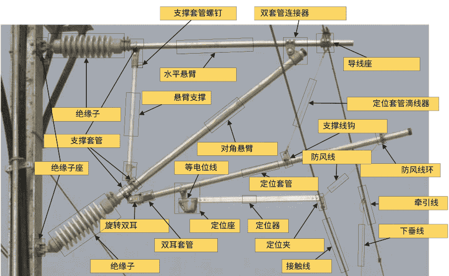

### 3.3 接触网特性

如上所述，接触网系统有许多组件，每个组件对应一个或多个功能（如绝缘子电气隔离、等电位线电气连接、螺钉固定），其典型分布如图3.1所示。实际工程操作表明，由于外部环境的影响、列车振动和其他复杂因素，支撑装置的组件可能存在松动、断裂和裂纹等缺陷，这将导致接触网支撑装置的结构可靠性下降和接触网系统的故障[5-7]。现场组件的典型缺陷如图3.3所示。在高速铁路接触网系统的各种设备故障中，支撑装置组件故障的比例可能高达70%。需要检测的关键组件的缺陷类型主要列在表3.2中。

高速铁路接触网支撑装置的组成部分具有以下特点。

- a) 数量大。测试的组件数量庞大。
- b) 种类繁多。根据形状和位置，这些核心组件主要分为至少12个类别。
- c) 尺寸差异大。例如，绝缘子的长度为235毫米，支撑套螺栓的直径为8.79毫米。两者之间的尺寸差异约为27倍。
- d) 背景复杂。铁路线上有单柱露天场景、复杂的多柱交叉场景以及众多隧道。

| 组件名称 | 性能要求（例如） |
| --- | --- |
| 双套管连接器 | 1. 最大水平工作负荷为5.8千牛顿，最大垂直工作负荷为4.9千牛顿。 2. 滑动负荷为7.5千牛顿。 3. 最大水平断裂载荷为17.4 kN，最大垂直工作载荷为14.7 kN 4. M20螺栓拧紧扭矩为100 N·m 5. M12螺栓拧紧扭矩为75 N·m |
| 导线基座 | 1. 导线基座的最大水平工作载荷为3.5 kN，最大垂直工作载荷为4.0 kN 2. 导线基座与水平悬臂之间的滑动载荷不小于5.3 kN 3. 导线基座的最大水平断裂载荷为18 kN，最大垂直断裂载荷为4.0 kN 4. 导线基座与导线（单根）之间的滑动载荷不得小于2.0 kN 5. 导线基座中M16螺栓的拧紧扭矩为70 N·m，M10为25 N·m。螺栓的拧紧扭矩为50 N·m |
| 悬臂支撑 | 1. 破坏荷载不得小于12.0千牛顿 |
| 支撑套管（单耳） | 1. 最大水平工作荷载为3.0千牛顿，最大垂直工作荷载为3.0千牛顿 2. 滑动荷载不得小于4.9千牛顿 3. 最大水平破坏荷载为9.0千牛顿，最大垂直破坏荷载为9.0千牛顿 4. 螺栓拧紧扭矩为44-56牛顿·米 |
| 支撑套管（双耳） | 1. 最大工作荷载为4.5千牛顿 2. 滑动荷载不得小于6.8千牛顿 3. 最大破坏荷载为13.5千牛顿 4. 螺栓拧紧扭矩为50牛顿·米 |
| 旋转双耳 | 1. 最大工作荷载为4.5千牛顿 2. 破坏负荷不得小于13.5 kN |
| 悬臂（绝缘子）基座 | 1. 最大水平工作负荷为7.4 kN，最大垂直工作负荷为4.9 kN 2. 最大水平破坏负荷为22.2 kN，最大垂直破坏负荷为14.7 kN |
| 定位器（稳定臂） | 1. 最大工作负荷为2.5 kN 2. 拉伸负荷为3.75 kN 3. 压缩负荷为2.5 kN 4. 破坏负荷不得小于7.5 kN |
| 定位器（稳定臂）基座 | 1. 最大工作负荷为2.5 kN<br>2. 滑动负荷不得小于3.75 kN<br>3. 破坏负荷不得小于7.5 kN<br>4. L型定位器的U型螺栓的拧紧扭矩为70-80 N·m |
| 定位器套筒 | 1. 最大工作荷载为4.5千牛顿<br>2. 拉伸载荷为6.75 kN<br>3. 压缩载荷为4.5 kN<br>4. 破坏载荷不得小于13.5 kN<br>5. 定位器套筒的螺栓拧紧扭矩为75 N·m，螺母的拧紧扭矩为50 N·m |
| 定位器套筒滑块（支撑线） | 1. 定位器套筒滑块的最大工作载荷为1.5 kN<br>2. 不锈钢钢丝绳悬挂线、悬挂环和心形环的压扁和固定后的滑动载荷不得小于4.5 kN |
| 滑块（支撑线）钩 | 1. 滑车钩的最大工作负荷为1.5 kN<br>2. U型螺栓的拧紧扭矩为44 N·m |

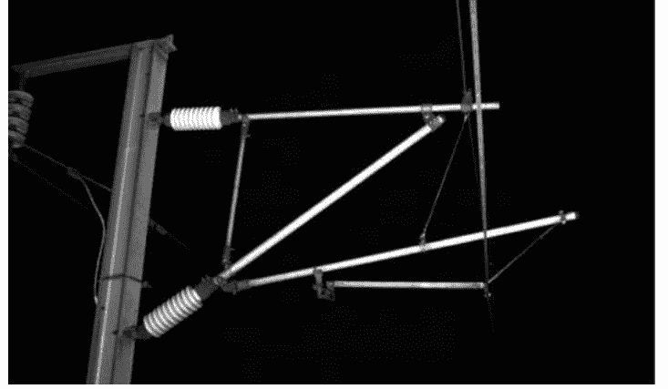

图3.2 由接触网检测车采集的接触网图像

- e) 多种类型的缺陷。由于同一部件的缺陷位置和程度不同，可能会出现多种不同的缺陷状态，导致许多组件缺陷的类型。

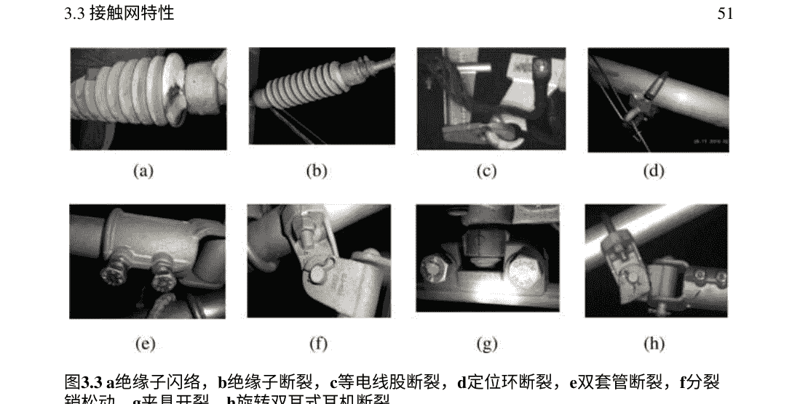

- f) 缺陷样本有限。与大量正常接触网部件相比，可用的缺陷样本数量非常有限。

对于高速铁路接触网支撑装置的状态检测，基于机器视觉技术的专用接触网检测车（以下统称为4C检测系统）已经初步应用于现场，并且所采集的接触网图像如图3.2所示。然而，接触网支撑装置的复杂性和多样性给接触网检测车的实际应用带来了严峻的挑战。

目前，4C检测系统的主要问题如下所列。

- (1) 它主要针对简单背景中单一类型组件的定位。检测算法是独立的、复杂的和低效的，系统资源占用大量，无法实现复杂背景中所有组件的同时定位。
- (2) 现有的模板匹配定位方法对尺度差异敏感，误定位率高，定位结果需要进一步手动检查。
- (3) 定位精度低，定位组件的位置与实际组件位置不匹配。
- (4) 缺乏统一的缺陷识别技术，当前的缺陷识别方法基于少量缺陷样本，只能检测单一组件缺陷类型，可靠性低、通用性差，仍需依赖手动判断。
- (5) 缺乏消除组件背景干扰的技术。穿越柱和隧道经常会受到外部物体的干扰，严重影响缺陷识别结果。

然而，目前高速铁路的接触网支撑组件检测技术方法单一，准确性不高，抗干扰能力差，整体智能性低。这些方法无法满足高质量高速铁路的运营和维护要求。

表3.2 支撑装置的关键组件及其缺陷类型
| 组件名称 | 正常图像 | 缺陷类型 |
|---|---|---|
| 绝缘子 |  | · 损坏<br>· 闪络<br>· 异物 |
| 旋转双耳 |  | · 开裂<br>· 分裂销缺失<br>· 分裂销松动 |
| 双耳套管 |  | · 开裂 |
| 支撑套管 |  | · 开裂 |
| 稳定臂底座 |  | · 开裂<br>· 螺母松动<br>· 螺母缺失 |
| 双套管连接器 |  | · 开裂<br>· 螺母松动<br>· 螺母缺失 |
| 信号线基座 |  | · 开裂<br>· 组装反向 |
| 防风线环 |  | · 松动<br>· 缺失 |
| 绝缘子基座 |  | · 分裂销缺失<br>· 分裂销松动 |
| 等电位线 |  | · 松散的绞线 |
（续）

表3.2（续）
| 组件名称 | 正常图像 | 缺陷类型 | 组件名称 | 正常图像 | 缺陷类型 |
|----------|----------|----------|----------|----------|----------|
| 支撑线钩 | ![image] | 松动<br>组装反向 | 支撑套螺钉 | ![image] | 松动<br>缺失 |

因此，考虑到高速铁路接触网支撑装置的复杂特性和当前4C检测系统的不足，迫切需要利用最新的机器视觉检测技术开发一种高度智能的接触网支撑装置缺陷检测系统。

### 3.4 总结

在本章中，我们介绍了接触网系统的结构、功能和故障发生特点。在第一节中，介绍了接触网系统的结构、功能和潜在的安全故障。在第二节中，总结了接触网的故障特点和面临的困难。

## 参考文献

1. 高山（2020）中国高速铁路受电弓-接触网自动检测与监测系统。IEEE TransInstrum Meas70：1-12
2. 高速铁路中的受电弓支架组件缺陷和故障的深度学习检测和监测系统（6C）。在：2017年第七届国际电力电子系统与应用智能移动、电力传输和安全会议（PESA）上，第1-7页。
3. 刘志（2017）高速铁路接触网检测与估计研究
4. 韩智, 刘志, 张刚, 杨辉 (2013) 受电弓-接触网监测的非接触式图像检测技术概述。 中国铁道学会35(6):40-47
5. 韩宇, 刘志, 吕阳, 刘凯, 李超, 张伟 (2020) 基于深度学习的高速铁路接触网卡箍断裂检测的视觉集成方法。 神经计算 396:556-568.
6. 刘伟, 刘志, Núñez A, 王磊, 刘凯, 吕阳, 王辉 (2018) 使用DCNNs多目标性能评估接触网支架组件检测。 IFAC-PapersOnLine 51(9):98-105
7. Chen J, Liu Z, Wang H, Núñez A, Han Z (2017) 使用深度卷积神经网络自动检测高速铁路接触网支撑装置上的紧固件缺陷和故障。 IEEE仪器测量67(2):257-269

## 第4章 接触网支撑装置图像的预处理

### 4.1 引言

原始接触网图像可能包含噪声或亮度较低，导致图像质量较低。一方面，接触网长时间安装在自然环境中，容易受到环境中的污垢影响。隧道中的接触网组件也容易受到隧道灰尘的长期影响。这会导致它们的状态特征被噪声和干扰淹没，增加了检测的难度。此外，在接收、传输和处理过程中，图像还会受到传感器的电磁干扰等噪声的影响，导致图像质量下降，影响检测准确性。另一方面，接触网图像是在夜间拍摄的，以避免强照明和复杂的背景。虽然使用了光补充设备，但由于硬件和环境的影响，所得到的图像可能存在亮度低、对比度低等质量问题，可能对接触网支撑装置的定位和缺陷检测产生负面干扰。因此，有必要对这些接触网图像进行去噪和增强处理。本章介绍了图像预处理技术，以解决上述问题。

首先，介绍了基于Lifting小波轮廓变换与循环位移不变性（LWBCTCS）的去噪方法，并在建立的接触网数据集中进行了验证。其次，本章描述了三种基于深度学习的接触网图像增强方法。

### 4.2 使用LWBCTCS对接触网图像进行去噪

根据统计数据，高斯白噪声是自然图像中的主要噪声，其他噪声对自然图像的质量影响很小。因此，本节主要讨论如何有效抑制图像中的高斯白噪声。

在这一部分中，使用了提升小波变换（LWT）[1]和轮廓变换（CT）[2]来进行接触网图像去噪。轮廓变换具有多尺度和多方向特性，可以稀疏表示图像，非常适合图像处理。然而，轮廓变换具有一定的冗余度，而提升小波具有小波变换的多分辨率特性，甚至可以实现整数变换以减少系统冗余。本节使用提升小波替代轮廓变换中的拉普拉斯变换。然后，将新的提升小波轮廓变换与循环平移不变算法相结合，形成了提出的LWBCTCS方法。

LWBCTCS可以实现更好的去噪效果并减少算法冗余。

#### 4.2.1 去噪方法LWBCTCS

##### 1. 提升小波变换

LWT是由Sweldens [1]提出的，与傅里叶变换无关。LWT不仅为设计各种小波提供了灵活和自由的框架，而且还具有操作可行性和灵活性。此外，它继承了WT的多分辨率特性，而复杂度仅为原始卷积操作的一半。LWT可以通过提升方案改善小波函数的特性，然后构造具有所需特性的小波。

提升方案由三个步骤组成：分割、预测和更新。预测和更新在提升方案中起着核心作用。原始信号首先通过奇偶序列分解为近似信号和细节信号。然后，利用预测算子消除分割后产生的冗余并获取紧凑的高频信息。由于分解生成的子集的某些特征与原始数据不同，更新可以捕捉原始图像的全局特征。提升小波变换具有传统小波变换的特点，其增加的消失矩可以更好地逼近原始信号，满足实际应用的要求。

该过程可以描述如下。

- (a) 分割：输入信号 $s_i$ 被分成两个小子集 $s_{i-1}$ 和 $d_{i-1}$，即 $F(s_i) = (s_{i-1}, d_{i-1})$。
- (b) 预测：根据原始数据的相关性，使用序列 $s_{i-1}$ 的预测值 $p(s_{i-1})$ 来预测序列 $d_{i-1}$。
- (c) 更新：为了保留原始信号的一些全局特征，通过计算得到的小波子集 $d_{i-1}$ 来更新 $s_{i-1}$，即 $s_{i-1} = s_{i-1} + U(d_{i-1})$。

提升小波分解方法可以逐层分解图像。首先，对每一行图像进行分解，然后对每一列图像进行分解。原始图像被分解为反映整体图像信息的低频部分和反映局部图像细节的高频部分。然后，低频部分进一步逐层分解，得到更详细的子图像。重构被定义为分解的逆过程。

##### 2. 轮廓变换

CT是一种优秀的图像去噪算法，具有频率定位、多尺度、多方向和多分辨率等优点。与WT相比，CT考虑了图像的几何结构和不连续性特征。因此，它具有更好的频率选择性和定向性。CT可以通过分离多尺度分析和多方向分析来表示图像的轮廓、边缘和纹理信息。轮廓变换滤波器组是通过将LP变换与DFB滤波器相结合得到的[3]。图4.1显示了CT的示意图。首先，将图像分解为低频子带 LL和三个高频子带 HH、 HL和 LH。然后，将这三个高频子带通过DFB分解为 $2^j$ (j=1,2, ..., n)个方向子带。此外，低频子带 LL 使用上述步骤进行迭代分解。通常，分解次数为3，方向数分别为4、8和16。如果分解次数较大，算法的效率将同步受到影响。在图4.1中，上部带通方向子带表示高频信号被分解为八个方向，下部带通方向子带表示高频信号被分解为四个方向。可以看出，CT具有更多的方向子带和方向信息，可以稀疏地表示图像。

##### 3. 基于深度学习的高速铁路接触网支撑组件缺陷和故障检测

CT是基于LP变换的方向性滤波器变换，反映了多分辨率和局部特性。DFB 反映了多方向特性。然而，与WT中的Mallat金字塔分解相比，LP是一种冗余变换。对于一个大小为 $m \times m$ 的图像，当它被Mallat金字塔分解 n 次时，子带的总数是 $m^2$。对于LP变换，系数的总数表示如下。

$$ m^2 + \left(\frac{m}{2}\right)^2 + \left(\frac{m}{4}\right)^2 + \cdots + \left(\frac{m}{2^n}\right)^2 = \left(2 - \frac{1}{2^n}\right)m^2 \quad (4.1) $$

与Mallat金字塔分解相比，LP变换的子带系数数量更多 $(1 - 1/2^n)m^2$。图像尺寸越大，分解次数越多，冗余度越高。因此，有必要减少其冗余度。

在本节中，我们使用提升小波来构建LWBCT，以取代CT的LP变换，从而减少其冗余。LWBCT可以逐渐增加分解数为2^j (j=1,2,...,n)可以展示图像的不同方向信息，非常适合去噪富有细节的接触网图像。

图4.2展示了使用LWBCT对接触网图像进行两层分解的示意图。在这种方法中，第一层使用LWBCT分解得到四个方向子带，第二层通过DFB滤波得到八个方向子带。这些子带包含丰富的方向和形状特征。方向分解和尺度变换是独立的，因此它们可以在不同尺度上实现不同的方向滤波。它还可以细化高频信息并保留图像的特征信息。

## 4. 循环移位不变算法

CT包含了下采样过程，该过程不是移位不变的。LWBCT使用LWT替代LP变换。虽然它减少了CT的冗余，但移位不变性问题尚未解决。因此，它会在奇点周围引入伪吉布斯现象[5]。为了弥补LWBCT缺乏移位不变性的问题，我们将LWBCT与循环移位不变性相结合，提出了LWBCTCS方法[6]，它不仅具有LWBCT的优点，还减少了伪吉布斯现象。所提出的LWBCTCS的流程图如图4.3所示。

对于一个大小为M×N的原始图像I，循环移位不变操作可以表示如下。

$$
\hat{I} = \frac{1}{M N} \sum_{i=1, j=1}^{M N} C_{-i,-j} \left( T^{-1}\left\{D\left[T\left(C_{i, j}(I)\right)\right]\right\}\right) \tag{4.2}
$$

其中 $\hat{I}$ 是去噪后的图像，$i$ 是行索引，$j$ 是列索引；$C_{i,j}(I)$ 和 $C_{-i,-j}$ 分别是循环移位因子和逆函数；$T$ 和 $T^{-1}$ 分别是LWBCT过程和其逆过程；$D$ 是去噪因子。

### 4.2.2 架空线图像去噪实验与分析

为了测试所提出的LWBCTCS对架空线图像去噪的有效性，首先将LWBCTCS应用于手动添加噪声的架空线图像，然后对所得结果进行分析和讨论。

在实验中，我们首先对两个架空线图像样本添加方差为30的高斯白噪声，架空线组件具有丰富的细节。然而，它们不够清晰，很容易被噪声淹没，如图4.4b和4.5b所示。小波变换（WT）、轮廓变换（CT）、曲线变换（CV）[7]、贝叶斯最小二乘高斯混合（BLS-GSM）算法[8]和所提出的LWBCTCS被应用于这些图像进行性能比较。在LWBCTCS中，选择Db5.3提升小波作为图像的多尺度分解，因为Db5.3提升小波具有计算复杂度低、内存需求低和速度快的特点。

同时，Pkva滤波器用于多方向滤波，方向数分别为4、8和16，因为Pkva滤波器能够有效定位图像的边缘轮廓信息。不同方法的结果如图4.4和4.5所示。可以看出，所有应用的方法都能在一定程度上抑制图像噪声，而由提出的LWBCTCS去噪的图像更清晰。

为了进一步定量评估图像去噪结果，选择均方误差（MSE）、信噪比（SNR）和峰值信噪比（PSNR）作为评估指标，其定义分别为（4.3）、（4.4）和（4.5）。

$$\text{MSE} = \frac{\sum_{i=1}^{M-1}\sum_{j=1}^{N-1}[\hat{f}(i,j) - f(i,j)]}{M*N}$$ \quad (4.3)

其中 $f(i,j)$ 是大小为 $M \times N$ 的原始图像，而 $\hat{f}(i,j)$ 是去噪后的图像。

$$\text{SNR} = 10 \lg \left( \frac{\sigma^2}{\text{MSE}} \right)$$ \quad (4.4)

其中 $\sigma$ 是图像灰度值的方差。

$$\text{PSNR} = 10 \lg \left( \frac{\hat{f}_{\text{max}}^2}{\text{MSE}} \right)$$ \quad (4.5)

其中 $\hat{f}_{\text{max}}$ 是去噪图像的最大灰度值。

对于图4.4和图4.5中的原始接触网图像样本，我们进一步添加方差分别为20、25、30、35、40、45和50的高斯白噪声。这些具有不同噪声强度的图像用于测试和验证。

### 4.2 使用LWBCTCS对接触网图像进行去噪

去噪性能。所有应用的去噪方法的信噪比（SNR）、均方误差（MSE）和峰值信噪比（PSNR）在图4.6中显示。图4.6的具体分析如下所示。

- 与小波变换相比，LWBCTCS的所有评估指标值都更高。例如，在图4.6a中，当σ=30时，我们的方法可以将SNR值和PSNR值分别提高2.09 dB和2.18 dB，而MSE值降低了9.0×10⁻⁴。当σ=50时，我们的方法可以将SNR值和PSNR值分别提高4.00 dB和4.08 dB，同时MSE值降低。这表明该方法不仅保持了良好的图像去噪效果，还可以获得更好的图像去噪评估指标。
- 与轮廓变换相比，LWBCTCS的去噪效果评估指标更好。例如，在图4.6b中，当σ=25时，该方法可以将SNR值和PSNR值分别提高0.37 dB和0.36 dB，而MSE值降低了3.4×10⁻³。
- 与曲线小波变换相比，在图4.6a中当σ<30时，LWBCTCS的评估指标并不更好。然而，当噪声强度逐渐增加时，我们的方法的降噪性能相对更好。在图4.6b中，当σ=30时，我们的方法的信噪比（SNR）值提高了3.34 dB，峰值信噪比（PSNR）值提高了1.40 dB，均方误差（MSE）值降低了0.006。当σ=50时，LWBCTCS的SNR和PSNR值分别提高了5.28 dB和3.34 dB，MSE值降低了0.061。因此，当图像噪声强度较大时，该方法的降噪评估指标优于曲线小波变换。
- 与BLS-GSM方法相比，在图4.5a和4.6a中可以看出，当图像中组件较少且噪声强度较小时，LWBCTCS优于BLS-GSM。然而，当噪声强度较大时，我们的方法的降噪效果不如BLS-GSM方法。例如，在图4.6a中，当σ=20时，LWBCTCS的SNR和PSNR比BLS-GSM高1.03 dB，MSE值较低。那时，SNR值和PSNR值比BLS-GSM方法低0.79 dB，MSE值较高。当图像中有许多接触网组件时，我们的方法的降噪效果的SNR值优于BLS-GSM。当噪声强度较大时，BLS-GSM方法在MSE和PSNR方面优于我们的方法。

上述分析表明，提出的LWBCTCS的去噪指标SNR、MSE和PSNR通常高于其他方法。此外，使用提出的LWBCTCS对添加了高斯白噪声σ=30的100张接触网图像进行去噪处理，得到的SNR、MSE和PSNR分别显示在图4.7、4.8和4.9中。

本节中，研究了小波变换、轮廓变换、曲线变换、BLS-GSM和LWBCTCS方法对噪声接触网图像的去噪处理。根据图像去噪的视觉结果和评估指标，LWBCTCS更适用于接触网图像的去噪处理。

### 4.3 使用深度学习对接触网图像进行增强

接触网图像通常在晚上采集，以避免复杂的背景和强烈的光照，并且通常使用光补偿系统来提高图像亮度，确保图像尽可能清晰，以便进行后续的图像分析。大多数捕获的图像具有高清晰度、强对比度等特点。对于这些图像，不需要进行增强处理。然而，由于图像拍摄条件、恶劣天气、不均匀的光照等因素的影响，图像可能局部或整体变暗，这对于接触网支撑构件的识别和故障分析有很大影响。一些传统的图像增强方法，如非下采样轮廓变换[9]和基于小波的轮廓变换[4]，已经用于接触网图像的增强，但这些方法通常对于接触网图像的各种不均匀光照不具有鲁棒性。在本节中，介绍了几种基于深度学习技术的图像增强方法。然而，由于图像拍摄条件、恶劣天气、不均匀的光照等因素的影响，图像可能局部或整体变暗，这对于接触网支撑构件的识别和故障分析有很大影响。

#### 4.3.1 基于Zero-DCE的接触网图像增强模型

- 1. 方法描述

为了更好地进行接触网检测，我们提出了一种改进的增强方法[10]，该方法基于Zero-DCE网络[11]，使模型更小、推理更快、性能更好。如图4.10所示，它由三个部分组成：稀疏块（SB）、特征注意力块（FAB）和曲线增强块（CEB）。具体而言，SB模块和FAB模块被设计用于估计一组最佳的光增强曲线（LEC）参数图，这些参数图将在CEB中使用。然后，CEB通过LEC迭代处理低亮度图像以实现增强。

- 1） 深度曲线估计网络

为了获得更好的LEC，我们将SB模块和FAB模块添加到DCE网络中。受到理论[12,13]的启发，我们在SB中添加了膨胀卷积层和标准卷积层，以扩大感受野的大小，从而提高网络性能而不会大幅增加模型参数。然后，在FAB中，通过跳跃连接将局部特征和全局特征进行整合，以增强LEC的表达能力。CEB使用FAB生成的一组八个LEC参数图来增强低亮度图像。LEC如式（4.6）所示，它通过迭代增强低亮度图像。

$$LE_{n}(x) = LE_{n-1}(x) + A_{n}(x)LE_{n-1}(x)(1 - LE_{n-1}(x))$$

其中 n 表示迭代次数，在实验中设置为八次；A 是具有与输入图像相同大小的LEC参数图；x 指的是输入图像的像素。

- 2) 损失函数

Zero-DCE网络设计了四组独特的无参考损失函数。考虑到对接触网检测的颜色不敏感性，我们采用了以下三个损失函数。

首先，曝光控制损失 L_exp被设计用来控制曝光水平。它计算局部区域的平均强度值与曝光之间的差异。参数 E被经验性地设置为0.29。损失 L_exp定义如下。

$$ L_{\exp} = \frac{1}{M} \sum_{k=1}^{M} |Y_k - E| \quad (4.7) $$

其中 M表示大小为16 × 16的局部区域的数量， Y是局部区域中的平均强度值 。

其次，空间一致性损失 L_spa被设计用来保持输入图像和增强图像之间邻域区域的差异。损失 L_spa定义如下。

$$L_{\text{spa}} = \frac{1}{K} \sum_{i=1}^{K} \sum_{j \in \Omega(i)} \left( (Y_i - Y_j) - (I_i - I_j) \right)^2 \qquad \qquad (4.8)$$

其中 $K$表示大小为$4 \times 4$的局部区域的数量；$\Omega(i)$指的是以第$i$个局部区域为中心的四个相邻区域（上、下、左、右）；$Y$表示增强图像中局部区域的平均强度。

第三，光照平滑损失 $L_{\text{tvA}}$建立了相邻像素之间的单调性约束。$L_{\text{tvA}}$的定义如下。

$$L_{\text{tvA}} = \frac{1}{N} \sum_{n=1}^{N} \left( |\nabla_x A_n| + |\nabla_y A_n| \right)^2 \qquad \qquad (4.9)$$

其中 $N$表示迭代次数，在这里设置为8；$\nabla_x$和$\nabla_y$分别表示水平和垂直方向的梯度。

最后，总损失定义为

$$L_{\text{total}} = W_{\text{tvA}}L_{\text{tvA}} + W_{\text{spa}}L_{\text{spa}} + W_{\text{exp}}L_{\text{exp}} \qquad \qquad (4.10)$$

其中 $W_{\text{tvA}}$，$W_{\text{spa}}$ 和 $W_{\text{exp}}$表示损失权重因子。

我们通过一系列参数搜索实验获得了损失权重因子的值，并设置 $W_{\text{tvA}} = 1500$，$W_{\text{spa}} = 1.5$，$W_{\text{exp}} = 5$。

- 2. 实验结果和分析

为了评估所提出的增强方法的性能，基于PyTorch深度学习框架进行了一系列模型训练和测试实验。首先，我们将我们的方法与其他竞争性增强方法进行比较。然后，介绍了目标检测方法TPH-YOLOv5 [14]，用于定位增强的接触网图像数据集和未增强的图像数据集上的CSCs。最后，通过比较定位精度来验证CSC定位的增强效果。

- （1）数据集和评估指标

共使用3601张接触网图像进行图像增强实验。其中，3301张图像用于训练，300张适合的图像用于测试。此外，选择了2000张图像和634张图像分别用于训练和测试TPH-YOLOv5目标检测模型。铁路检测车收集的原始图像分辨率为6600 × 4400。为了方便模型训练，将图像大小缩放为600 × 400。

对于评估指标，除了均方误差（MSE）和峰值信噪比（PSNR）分别在（4.3）和（4.5）中提到之外，结构相似性指数（SSIM）、亮度和对比度也被使用。它们分别在（4.11） - （4.13）中定义。

$$
\text{SSIM}(x, y) = \frac{(2\mu_x\mu_y + C_1)(2\sigma_{xy} + C_2)}{(\mu_x^2 + \mu_y^2 + C_1)(\sigma_x^2 + \sigma_y^2 + C_2)} \quad (4.11)
$$

$$
\text{亮度} = \sqrt{\frac{1}{H \times W} \sum_{i=1}^{H} \sum_{j=1}^{W} x_{(i,j)}^2} \quad (4.12)
$$

$$
\text{对比度} = \sum_{\delta} \delta(i, j)^2 P_{\delta}(i, j) \quad (4.13)
$$

其中，$\mu_x$和$\mu_y$分别是图像 $x$和 $y$的平均值；$\sigma_x^2$和$\sigma_y^2$是图像的方差；$\sigma_{xy}$是图像的协方差；$H$和 $W$分别是图像的高度和宽度；$\delta$（$i$, $j$）表示相邻像素之间的灰度差异；$P_{\delta}$（$i$, $j$）表示相邻像素之间灰度差异为 $\delta$的像素分布的概率。

- (2) 训练过程

网络的参数使用标准的零均值和0.02标准差的高斯函数进行初始化。 选择Adam优化器作为反向传播梯度下降的方法，学习率固定为0.0001，权重衰减为0.001。批量大小和最大迭代次数分别设置为16和100。

- (3) 消融实验结果

我们的方法的不同网络结构在构建的数据集上进行评估，结果如图4.11所示。从图4.11b可以看出，“没有SB模块的Zero-DCE”的增强效果并不明显，输出图像与输入图像相似。如图4.11c和d所示，当去除FEB模块时，增强结果是可见的，但细节和对比度不如“Zero-DCE模型”的结果好。这表明Zero-DCE的SB和FEB模块在增强图像和改善细节方面是有效的。

此外，不同结构的定量测试结果列在表4.1中，可以反映出图4.11中的可视化结果。Zero-DCE在比较的方法中表现最好，具有最高的峰值信噪比（PSNR）为33.32和最低的均方误差（MSE）为32.81。而“无SB模块的Zero-DCE”表现最差，具有最低的PSNR为23.04和最高的MSE为375.72。此外，我们将每个卷积层的卷积核大小从32扩大到64，并在测试集中评估了修改后的模型。将表4.1中的Zero-DCE与Zero-DCE（64）进行比较，可以发现PSNR增加了0.74，MSE减少了2.76，这表明扩大卷积核大小可以提高增强性能。然而，模型大小从349.5 KB扩大到1.3 MB，推理速度从25.98 FPS降低到19.71 FPS。在实际应用中，网络通常用于移动巡检车辆。由于移动小型设备的限制，计算能力不足。为了实现快速高效的处理，我们选择每层使用32个卷积核。

表4.1 不同结构的图像增强结果 [10]

| 网络结构 | PSNR | MSE |
| :--- | :--- | :--- |
| Zero-DCE | 33.32 | 32.81 |
| 无SB的Zero-DCE | 23.04 | 375.72 |
| 无FEB的Zero-DCE | 31.73 | 92.01 |
| Zero-DCE (64) | 34.06 | 30.05 |

- (4) 与其他方法的定量比较

我们将Zero-DCE与其他竞争方法进行比较。在这里，我们选择了两种代表性的方法，分别是用于鲁棒曝光校正的双重照明估计(DUAL)[15]和用于低光图像增强的光照网络(DLN)[16]进行性能比较。结果如表4.2所示。Zero-DCE在PSNR和SSIM方面具有最高值，在亮度和对比度方面具有适中的值。图4.12显示了不同增强模型之间的效果比较。可以看出，DUAL存在过多的噪声和微小的增强。此外，DLN增强的图像具有非常低的对比度和幻影阴影。相比之下，我们的方法增强的图像具有自然的曝光和清晰的细节。

表4.2 不同方法之间的定量比较[10]

| 算法 | PSNR | SSIM | 亮度 | 对比度 |
| :--- | :--- | :--- | :--- | :--- |
| Zero-DCE | **33.32** | **0.96** | 40.72 | 149.90 |
| DLN | 25.95 | 0.78 | 57.20 | 111.19 |
| DUAL | 15.93 | 0.58 | 35.21 | 180.32 |

在表中以粗体标记的PSNR和SSIM值最高，亮度和对比度值适中

- (5) 调查CSC定位的增强效果

为了比较检测接触网小部件的图像增强性能，我们进行了基于TPH-YOLOv5的以下实验。

本实验共有4000张接触网图像可用。我们选择了2000张适合作为训练集，200张作为验证集，以及634张低光图像作为测试集。此外，我们可以计算测试图像的平均灰度值，作为图像增强的阈值。

TPH-YOLOv5的训练使用了三种损失函数，分别是框损失、目标损失和分类损失，它们分别代表了预测帧与真实值之间的距离（GIoU）、网络的置信度和分类正确性得分。根据数据集和模型选择的超参数，将时代时间设置为300。训练损失曲线显示在图4.13中，可以看出损失函数在200个时代后逐渐收敛。同时，如图4.14所示，精确度（P）、召回率（R）和平均精确度（mAP）在150个时代后逐渐稳定，这表明所选的时代超参数能够满足训练要求。

当定位模型TPH-YOLOv5训练完成后，它被应用于低光照图像集和Zero-DCE增强图像集。不同图像的定位结果如图4.15所示。在低光照图像中，绝缘子和绝缘子底座组件未被检测到，如图4.15a中的红色箭头所示。通过Zero-DCE对图像进行增强，错过的组件成功被定位，如图4.15b所示。

### 4.3 使用深度学习对接触网图像进行增强

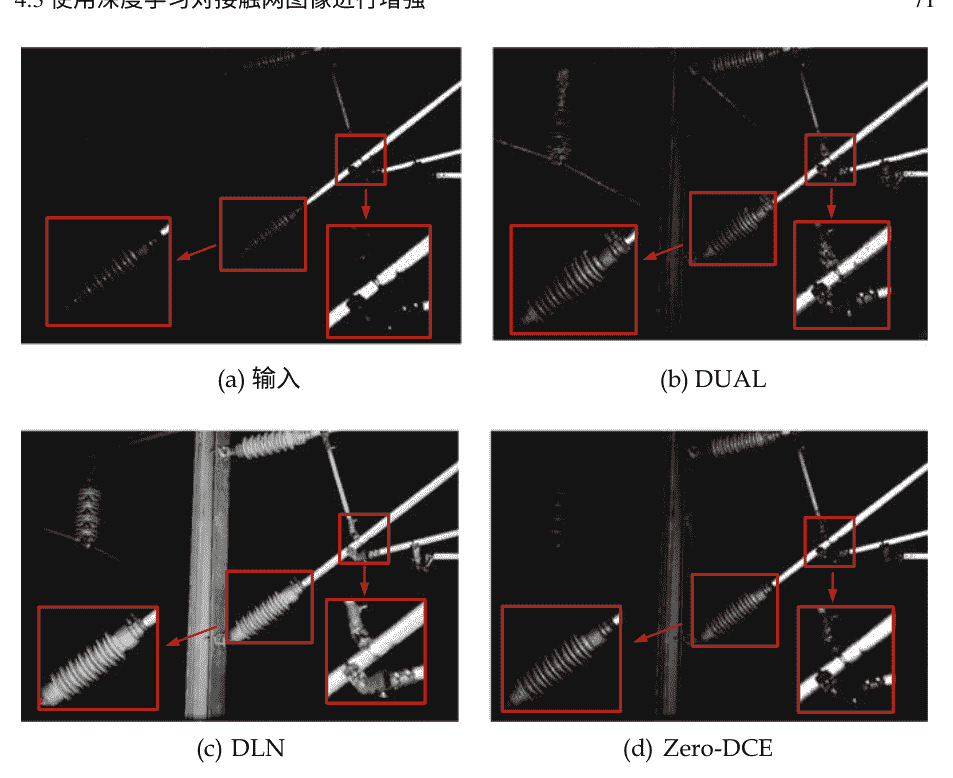

图4.12 不同典型方法的结果比较 红色框显示了接触网组件之间的详细差异[10]

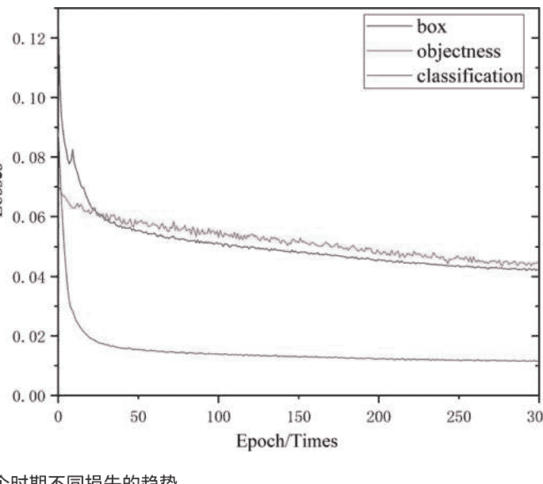

图4.13 300个时期不同损失的趋势

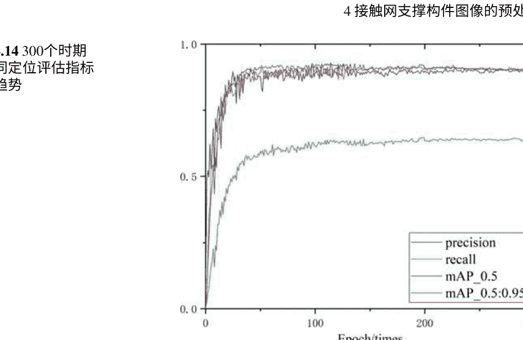

#### 4.3.2 基于Retinex理论和生成对抗网络的接触网图像增强

由于检测车上的光补充设备位置固定，我们无法获得亮度成对的接触网图像，即一张亮图像和一张暗图像。因此，现有基于成对数据驱动方法的深度神经网络图像增强方法无法使用。

基于非成对图像数据的图像增强方法主要使用传统图像增强技术，而基于数据驱动的深度神经网络方法的研究相对有限。本节介绍了一种基于Retinex理论和GAN的接触网图像增强网络，其工作流程如图4.16所示。它包括以下四个步骤。

- 步骤1：将从接触网检测车收集的低照度接触网图像输入到图像解耦网络（IDN）中，以提取低照度图像的反射分量和照明分量。
- 步骤2：将分解的反射分量输入到反射分量去噪网络（RCDN）中，以减少反射分量的噪声并获得降噪后的反射分量。
- 步骤3：将照明分量和反射分量输入到照明分量增强网络（ICEN）中，以提高照明分量的强度并获得增强的照明分量。
- 步骤4：根据Retinex理论，将RCDN和ICEN网络生成的降噪反射分量和增强光分量融合，以获得增强的接触网图像。

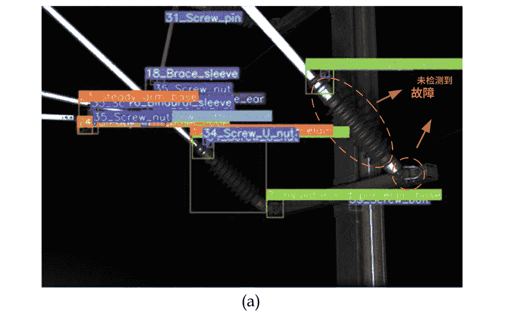

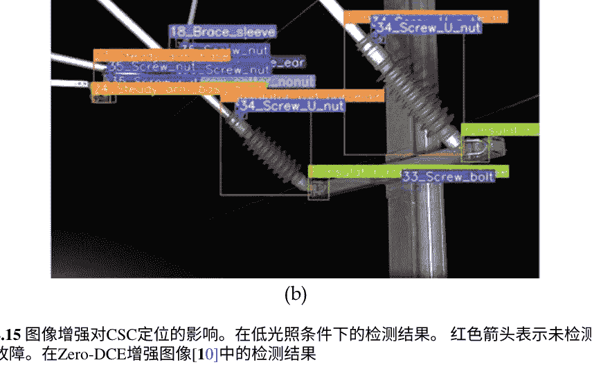

图4.15 图像增强对CSC定位的影响。在低光照条件下的检测结果。红色箭头表示未检测到的故障。在Zero-DCE增强图像[10]中的检测结果

- **1. Retinex理论和GAN模型的构建**

首先，基于Retinex理论构建图像解耦网络，获取光照分量和反射分量。其次，基于注意机制构建图像反射分量去噪网络，减少反射分量的噪声。然后，基于生成对抗网络构建图像光照分量增强网络，增强光照分量的强度。最后，根据Retinex理论，通过噪音降低的组件和增强的组件的乘积可以得到增强的图像。三个网络的构建过程如下所示。

**(1) 图像解耦网络（IDN）**

受[17,18]的启发，本节基于Retinex理论建立了一个新的图像解耦网络，如图4.17所示。网络的损失函数由三部分组成，即重构损失、光组件损失和反射组件损失。

- 1) 重构损失函数由一组低照明图像和正常图像组成，但可以是任意组合而不需要配对。
同时，一组图像被输入到网络中，它们共享相同的参数。因此，重建损失函数如下所示。

$$ L_{Recon} = \| R_{low} \cdot I_{low} - S_{low} \|_{1} + \| R_{normal} \cdot I_{normal} - S_{normal} \|_{1} \quad (4.14) $$

- 2) 光照分量损失函数来自一组不配对的低照度图像和正常图像的分解分量。光照分量损失函数如下所示。

$$ L_I = \lambda_{I_{\text{低}}} \| \nabla I_{low} \exp(-\lambda_g \nabla R_{low}) \|_1 + \lambda_{I_{\text{正常}}} \| \nabla I_{normal} \exp(-\lambda_g \nabla R_{normal}) \|_1 \quad (4.15) $$

- 3）反射成分的损失函数参考自[17]。假设增强图像的最大通道与低照度图像的最大通道相符，用于构建反射成分的损失函数。

$$L_R = \left\| \max_{c \in R, G, B} R_{\text{low}}^c - H\left( \max_{c \in R, G, B} S_{\text{low}}^c \right) \right\|_1 + \lambda \| \nabla R_{\text{low}} \|_1$$ (4.16)

最终构建的损失函数如下所示。

$$L = L_{\text{Recon}} + L_I + L_R$$ (4.17)

IDN的结构如图4.17所示，主要由卷积层Conv、激活函数ReLU和sigmoid组成。IDN的工作流程如下所示。首先，将原始图像和其亮度图像在通道方向上进行连接。连接后的图像输入到由五个Conv +ReLU(0.2)组成的特征提取网络中。然后，将潜在特征发送到一个卷积层和一个sigmoid，分别获得图像的反射成分和照明成分。最后，根据上述建立的损失函数更新网络参数。

**(2) 图像反射组件去噪网络（RCDN）**

基于图像解耦网络，可以同时提取低照度图像和正常图像的反射组件。假设正常图像的反射组件没有噪声。在正常图像的反射组件中引入高斯噪声，以引导低照度图像的去噪。考虑到噪声主要存在于图像的暗区域，生成高斯噪声时引入了照明组件的对称图（1-照明组件）作为权重。图像重建的损失函数采用如下的均方误差损失。

$$L_{\mathrm{mse}} = \frac{1}{C M N} \left\|R_{\mathrm{normal}} - \mathrm{RCDN}(R_{\mathrm{normal}}^{\mathrm{noise}})\right\|_2^2$$ \quad (4.18)

由于非配对的无监督解耦，实际的低照度图像和正常图像无法完全解耦。因此，在图像生成网络中引入感知损失，以抑制图像内容的变化，并尽可能保留原始图像信息。感知损失以网络的中间层激活作为目标，并使用中间层中两个图像的欧氏距离来评估它们的相似性。具体表达如下所示。

$$L_{\text {特征 }}^{\phi}()=\frac{1}{C_{j} M_{j} N_{j}}\left\|\phi_{j}\left(R_{\text {正常 }}\right)-\phi_{j}\left(\mathrm{RCDN}\left(R_{\text {正常 }}^{\text {噪声 }}\right)\right)\right\|_{2}^{2}$$ \quad (4.19)

其中，$\phi_{j}$表示训练模型$\phi$的第$j$个输出层特征，所选择的网络是VGG16；$C_{j} M_{j} N_{j}$是第$j$个层的通道数、高度和宽度。最后，得到的噪音减少损失函数如下所示。

$$L\left(R_{\text {正常 }}^{\text {噪声 }}\right)=\lambda_{m} L_{\mathrm{mse}}\left(R_{\text {正常 }}^{\text {噪声 }}\right)+L_{\text {特征 }}^{\phi}\left(R_{\text {正常 }}^{\text {噪声 }}\right)$$ \quad (4.20)

构建的DCRN如图4.18所示，主要由卷积层Conv、激活函数LeakyReLU、归一化层BatchNorm2d、最大池化层MaxPool2d和双线性插值层组成。DCRN的工作流程如下所示。首先，将反射成分图像反转并与高斯噪声相乘，得到噪声图像，然后将其叠加在照明成分图像上。然后，将得到的图像与反射成分的反转图像连接成一个解码网络，该网络由五组“Conv+LeakReLU(0.2) +BatchNorm2d”和四个“MaxPool2”以及一个编码网络组成，该编码网络由五组“Conv +LeakReLU(0.2) ) +BatchNorm2d”和四个双线性插值组成，以得到噪声图像。然后，通过从输入噪声图像中减去噪声图像来获得最终去噪的反射成分。最后，根据上述建立的损失函数更新网络参数。

**(3) 图像照明成分增强网络 (ICEN)**

根据图像解耦网络，可以同时提取低照度图像和正常图像的照明组件。因此，使用正常图像的照明组件来指导生成对抗网络（GAN）的训练，使低照度图像的照明组件的分布尽可能接近正常图像，即 $P_I$ 正常 $(I_低 + \hat{I}_低) \leftrightarrow P_I$ 正常($I$正常). 然而，考虑到图像的内容不能仅通过GAN简单地约束，照明组件乘以反射组件，即 $P_S$ 正常 $(R_低 \cdot (I_低 + \hat{I}_低)) \leftrightarrow P_S$ 正常 $(R$正常 $\cdot I$正常), 并且引入了感知损失来抑制它，以避免图像内容的严重变化。同时，为了尽可能学习光组分的变化，光组分被设置为三个通道，而不是在Retinex分解中作为单通道。最后，光组分增强网络的损失函数如下所示。

- **1) 生成对抗损失**

传统的GAN采用交叉熵作为损失函数，其优化目标是尽可能欺骗判别器，使生成器生成的图像与真实图像相似。然而，当一些生成的图片被判别器识别为真实图片时，生成器将不再继续优化这些图片，即使这些图片之间仍然存在很大的差距，这意味着生成图像的质量不高。因此，Mao等人提出了最小二乘GAN（LSGANs）[19]。生成器生成的图像更接近决策边界，同时欺骗判别网络得以实现。该方法中的GAN损失函数如下所示。

$$\min_D V(D) = \min_D \frac{1}{2} E_{x \sim p_{数据}(x)} [D(x) - a]^2 + \frac{1}{2} E_{z \sim p_z(z)} [D(G(z)) - b]^2 \quad (4.21)$$

$$\min_G V(G) = \min_G \frac{1}{2} E_{z \sim p_z(z)} [D(G(z)) - c]^2 \quad (4.22)$$

其中 $a = c = 1, b = 0$; $x = R_{\text{low}} \cdot L_{\text{low}}$和 $z = R_{\text{normal}} \cdot L_{\text{normal}}$分别是低照度图像和正常图像。ICEN的结构如图4.19所示。生成器采用U-Net网络结构。为了使生成器更加关注低照度图像的暗区域，在输入网络之前对照明分量进行反转。输入和U-Net前部网络的不同输出特征层被加权。增强的照明图像更加平衡。在网络的前向推理过程中，使用一个解码网络，它由五组“Conv +LeakReLU (0.2) +BatchNorm2d”和四个MaxPool2组成，以及一个编码网络，包括五组“Conv +LeakReLU (0.2) +BatchNorm2d”和四个双线性插值层，用于获取亮度增量图像。然后，将亮度增量与输入亮度图像叠加，得到照明组件增强图像。此外，执行增强组件和降噪组件的乘法。最后，根据(4.21)和(4.22)更新网络参数来训练模型。GAN的主要结构由几组简单的卷积层和池化层组成。为了保留局部图像的足够纹理信息，引入了一个补丁对抗网络（即，从生成的图像和输入图像中随机切割一些小块，并发送到一个独立的判别网络）。因此，在构建生成损失时，需要为小图像块建立生成损失。GAN的损失函数如下所示。

> $$ L_D = V(D)_{\text{global}} + V(D)_{\text{local}} \quad (4.23) $$

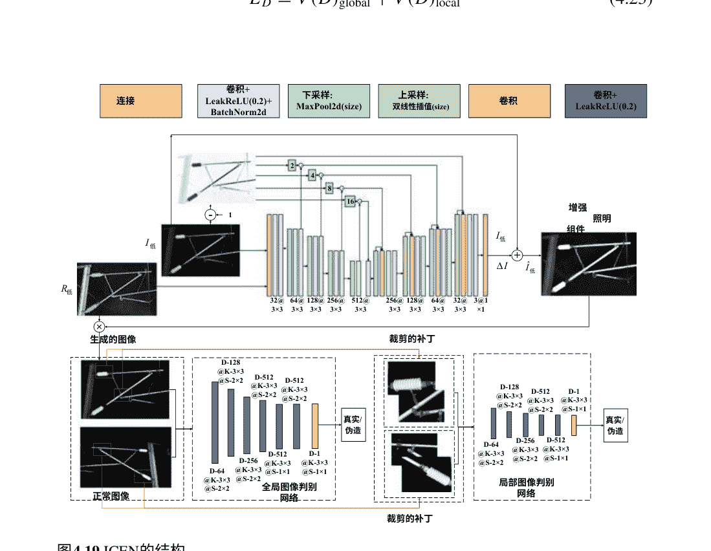

$$L_G = V(G)_{\text{global}} + V(G)_{\text{local}} \quad (4.24)$$

- **2) 感知损失**

如上所述，GAN的最终目标是使生成的图像欺骗辨别网络。也就是说，只要生成图像的分布符合真实图像集的分布，即使生成图像与输入图像数据完全不同，也可能被误认为是一个令人满意的图像，这不符合图像增强的目的。因此，在生成器中引入了感知损失来抑制图像的内容变化。最终的生成损失如下所示。

$$L_G = V(G)_{\text{global}} + V(G)_{\text{local}} + L_{\text{feat}}^{\text{VGG16}}(x)_{\text{global}} + L_{\text{feat}}^{\text{VGG16}}(x)_{\text{local}} \quad (4.25)$$

- **2. 实验结果和分析**

**(1) 数据集和评估指标**

建立了一个包括2600张低照度图像的数据集。其中，2200张图像（1100张低照度图像和1100张正常图像）用于训练，剩下的400张图像用于测试。不同CSC的具体数量如表4.3所示。

为了评估低照明接触网图像增强对后续CSC提取的影响，直接的方法是确定检测到的组件数量是否增加，并且边界是否被良好分割。在这里，使用掩膜评分R-CNN [20]来检测和分割CSCs，并采用召回率和掩膜质量来进行性能评估，其定义如下。

$$\text{召回率} = \frac{\sum_{i=1}^{N}，\text{目标数量检测}}{\sum_{i=1}^{N}，\text{实际目标数量}_i} \quad (4.26)$$

$$\text{掩膜质量} = \frac{\sum_{j=1}^{M}，\text{掩膜得分}_j}{\sum_{i=1}^{N}，\text{实际目标数量}_i} \quad (4.27)$$

**表4.3 测试集中不同CSC的具体数量**

| CSC类别 | 样本数量 | CSC类别 | 样本数量 |
| :--- | :--- | :--- | :--- |
| 绝缘子基座 | 622 | 防风线环 | 110 |
| 绝缘子 | 604 | 信号线基座 | 140 |
| 支撑套管 | 820 | 双套管连接器 | 160 |
| 旋转双耳 | 384 | 支撑线钩 | 136 |
| 稳定臂底座 | 145 | – | – |

其中，object_num_det_i表示图像中检测到的目标数量；object_num_real_i是图像中实际目标的数量；recall_rate是召回率，即所有目标检测成功的总成功率；∑_{i=1}^{N} object_num_det_i表示所有检测到的目标数量；mask_quality是整个数据集上所有检测到的目标掩膜得分的平均掩膜质量。

**(2) 结果和分析**

将CLAHE[21]、LIME[22]和SIEN[18]的增强方法与提出的“Retinex和GAN”方法进行比较。表4.4显示了可视化比较。不同方法的定量比较显示在表4.5中。以下是它们的分析。

- 1) 从表4.4可以看出，CLAHE方法的增强效果相对均匀。LIME方法增强的图像存在一定的过曝。SIEN方法产生的图像显示出一些失真。虽然Retinex和GAN的增强图像不是最好的，但它可以保存组件的结构和纹理信息。从表4.5可以看出，虽然SIEN的图像存在一些失真，但SIEN可以充分保留组件的结构信息，并且在CSC检测方面表现良好。然而，由于失真问题，SIEN的mask_quality结果较差，这将给后续的组件故障诊断带来一些困难。与原始图像相比，LIME和CLAHE提高了召回率，但它们的mask_quality指标无法达到原始图像的标准。与原始图像相比，Retinex和GAN的召回率显著提高，确保了组件不会被漏掉。在比较的方法中，Retinex和GAN的mask_quality也表现最好，这表明该方法可以很好地保留纹理信息。
- 2) 为了分析增强模型的时间消耗，训练好的模型被用于对测试集进行100个时期的训练。在每个时期中，评估所有测试图像的时间成本，并得到平均值。时间成本如图4.20所示。可以看出，每个图像的检测时间约为0.445-0.465秒，平均检测时间为0.456秒。为了提高接触网组件的检测和故障分析的准确性，并不需要对每个接触网图像进行增强。如图4.19所示，在训练照明组件网络时，使用了一种对抗性方法来处理正常图像。当网络训练完成后，可以用来判断输入图像是否为低照明图像。在实际场景中，大多数图像都是正常的，不需要增强。因此，只需要判断图像一次。为此，进行了一个耗时分析的判别网络，并将结果显示在图4.21中。判断图像是否需要增强的平均时间仅为0.036秒，对整个诊断系统的时间成本几乎没有影响。

**表4.4 不同方法对低照度图像增强和分割的比较**

| 方法 | 增强图像 | CSC检测结果 |
|------|----------|-------------|
| 原始图像 | [图像] | [图像] |
| CLAHE | [图像] | [图像] |
| LIME | [图像] | [图像] |
| SIEN | [图像] | [图像] |
| Retinex和GAN | [图像] | [图像] |

**表4.5 不同图像增强方法的定量比较**

| 索引 | 原始图像 | CLAHE | LIME | SIEN | Retinex和GAN(提出的) |
|------|----------|-------|------|------|----------------------|
| 召回率 | 2668/3121 | 2809/3121 | 2918/3121 | **3027/3121** | 2918/3121 |
| 掩膜质量 | 0.726 | 0.715 | 0.675 | 0.703 | **0.776** |

粗体标记的值表示最佳性能

## 4 接触网支撑构件图像的预处理

检测时间成本

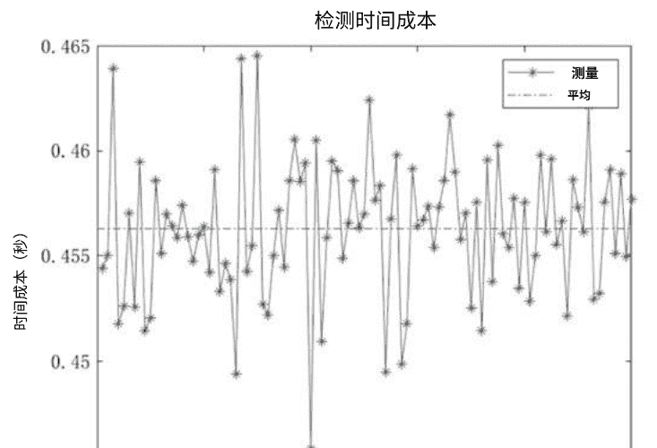

图4.20 Retinex和GAN对低照度接触网图像的时间成本

检测时间成本

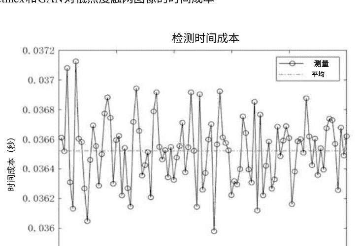

图4.21 判别网络的时间成本

## 4.3.3 基于强化学习的触网图像增强

在第4.3.1节和第4.3.2节介绍的图像增强方法是在图像级别上进行的。由于接触网图像中的光强度不同，这些方法很难准确地同时增强具有不同光强度的局部区域。在像素级别上增强图像是一种理想的方法。

然而，由于接触网图像具有较高的分辨率，如果使用各自的模型增强局部区域，那么就需要大量的模型。深度强化学习（DRL）是深度学习和强化学习的结合，可以处理具有更大状态空间和更高维度的任务，例如语音数据和图像数据。在本节中，将对像素级别的接触网图像增强应用DRL。采用的DRL称为PixelRL，通过迭代执行经过训练的RL代理设计的像素变化操作来调整每个像素值。

### 1. 方法描述

PixelRL网络将输入图像的每个像素设置为一个代理，通过异步优势演员-评论家（A3C）[23]算法进行异步训练。每个代理与环境独立交互。当其参数更新时，执行一个动作来改变像素值。这些动作可以手动定义。

#### (1) A3C模型

A3C模型如图4.22所示，包括公共网络、策略网络和价值网络。在执行A3C算法时，N并行代理（工作者）与其环境进行交互以计算策略损失的梯度。公共网络在接收到N代理的梯度后，在一定步骤后更新其策略。公共网络的更新策略指导了N代理与其各自环境的交互。每个代理与其环境进行交互以获取独立数据。A3C算法的策略学习和参数更新过程如图4.23所述。

#### (2) 全卷积网络（FCN）

对于A3C模型的简单应用，代理的数量将非常大（例如，如果一个接触网图像的分辨率为1000×1000，则代理的数量将达到一百万），计算机的计算负担将很大。当A3C模型的全局网络被卷积结构取代时，参数大大减少。这里采用了卷积结构FCN。在图像处理的分类任务中，卷积神经网络通常采用“卷积→池化→卷积→池化→全连接”的结构。所有特征图都在全连接层合成，并映射为一个向量。

图4.22 A3C算法的框架

其长度是对象类别的数量（包括图像类别的置信度水平）。对于图像增强的像素级任务，FCN去除了全连接层，并对特征图进行上采样，以保持输入图像的大小与输入图像一致。

图4.24a展示了传统的卷积方法，图4.24b展示了扩张卷积，扩张因子为2。可以看出，扩张卷积根据“扩张因子-1”的比例，将传统卷积的卷积核填充为0，从而使卷积核的大小变大。图4.24c中的扩张因子为4，可以增加卷积操作的感受野，并使每个卷积结果包含更多的图像信息。

#### (3) 奖励地图卷积 (RMC)

RMC考虑了邻域像素的权重，即在时间步骤$t$时，动作$a$不仅影响下一步的状态$S_{t+1}$，还影响下一步的邻域像素状态，这有助于增强网络的鲁棒性并实现更自然的增强效果。

考虑一步学习的简单情况，A3C算法的策略网络和价值网络的梯度更新由公式(4.28)和(4.29)表示。

图4.23 A3C算法的流程图

图4.24 扩张卷积的结构图

## 4 接触网支撑构件图像的预处理

$$d\theta_v = \nabla_{\theta_v} \frac{1}{N} \sum_{i=1}^{N} (R_i^{(t)} - V(s_i^{(t)}))^2 \quad\quad\quad\quad\quad\quad\quad\quad\quad\quad\quad\quad\quad\quad\quad (4.28)$$

$$d\theta_p = -\nabla_{\theta_p} \frac{1}{N} \sum_{i=1}^{N} \log \pi(a_i^{(t)}|s_i^{(t)}) A(a_i^{(t)}, s_i^{(t)}) \quad\quad\quad\quad\quad\quad\quad\quad\quad (4.29)$$

考虑到邻近像素的影响，学习过程中获得的奖励表示为(4.30)，其中 $N(i)$ 表示以当前像素为中心的窗口，$w_{i-j}$是权重，可以看作是卷积核并通过参数 $\theta_p$ 和 $\theta_v$ 进行学习。

$$R_i^{(t)} = r_i^{(t)} + \gamma \sum_{j \in N(i)} w_{i-j} V(s_j^{(t+1)}) \quad\quad\quad\quad\quad\quad\quad\quad\quad\quad\quad\quad\quad\quad\quad (4.30)$$

考虑到n步学习，奖励以矩阵形式重写，学习过程的奖励如公式(4.31)所示，其中 $R^t$, $r^t$ 和 $V(s^{(t)})$ 是矩阵，$*$ 表示卷积操作，$N$ 是使用核函数 $w$ 进行卷积的次数。

$$R^{(t)} = r^{(t)} + \gamma w * r^{(t+1)} + \gamma^2 w^2 * r^{(t+2)} + \dots + \gamma^{n-1} w^{n-1} * r^{(t+n-1)} + \gamma^n w^n * V(s^{(t+n)}) \quad\quad\quad\quad (4.31)$$

矩阵形式的梯度可以表示如下。

$$d\theta_v = \nabla_{\theta_v} \frac{1}{N} \mathbf{1}^T \{ (R^{(t)} - V(s^{(t)})) \odot (R^{(t)} - V(s^{(t)})) \mathbf{1} \} \quad\quad\quad\quad\quad\quad\quad\quad\quad\quad\quad\quad\quad\quad (4.32)$$

$$d\theta_p = -\nabla_{\theta_p} \frac{1}{N} \mathbf{1}^T \{ (\log \pi(a^{(t)}|s^{(t)})) \odot A(a^{(t)}, s^{(t)})) \mathbf{1} \} \quad\quad\quad\quad\quad\quad\quad\quad\quad\quad\quad\quad (4.33)$$

权重 $w$ 的梯度计算如下。

$$dw = -\nabla_{w} \frac{1}{N} \mathbf{1}^T \{ \log \pi(a^{(t)}|s^{(t)}) \odot A(a^{(t)}, s^{(t)}) \mathbf{1} \} + \nabla_{w} \frac{1}{N} \mathbf{1}^T \{ (R^{(t)} - V(s^{(t)})) \odot (R^{(t)} - V(s^{(t)})) \mathbf{1} \} \quad\quad\quad\quad\quad\quad\quad (4.34)$$

#### (4) 奖励函数

强化学习过程中的奖励函数是为了减少图像在CIELab空间中的 $L_2$ 距离，其定义如下。

$$r_i^t = \left\| I_i^{\text{target}} - s_i^t \right\|_2 - \left\| I_i^{\text{target}} - s_i^{(t+1)} \right\|_2 \quad\quad\quad\quad\quad\quad\quad\quad\quad\quad\quad\quad\quad\quad\quad\quad\quad\quad\quad\quad\quad\quad (4.35)$$

其中 $I_{i}^{\text{target}}$ 是图像标签；$s_{i}^t$ 和 $s_{i}^{(t+1)}$ 分别是时间步骤 $t$ 和步骤 $t+1$ 的输入图像的状态。

包括奖励卷积映射的卷积A3C算法的框架如图4.25所示，其具体网络参数如表4.6所示。

### 4.3 使用深度学习对接触网图像进行增强

### 2. 实验结果和分析

#### (1) 数据集

PixelRL需要配对数据进行验证。在高速铁路的实际运行中无法获得配对数据集。因此，选择通过基于GAN的方法增强的图像及其原始图像来构成配对数据集。在实验中，使用了1100对接触网图像进行训练，使用了150张图像进行测试。

#### (2) PixelRL的定性结果

在训练过程中，图像会随机调整大小为70×70，并随机翻转以进行数据增强。采用Adam优化器来训练卷积A3C模型。

表4.6 PixelRL的具体网络设置

| 网络设置 | | | | |
| :--- | :--- | :--- | :--- | :--- |
| 共享网络 | 卷积 + Relu<br>3×3, 1, 64 | 卷积 + Relu<br>3×3, 2, 64 | 卷积 + Relu<br>3×3, 3, 64 | 卷积 + Relu<br>3×3, 4, 64 |
| 策略网络 | 卷积 + Relu<br>3×3, 3, 64 | 卷积 + Relu<br>3×3, 2, 64 | ConvGRU<br>3×3, 1, 64 | 卷积 + Softmax<br>3×3, 1, \|A\| |
| 价值网络 | 卷积 + Relu<br>3×3, 3, 64 | 卷积 + Relu<br>3×3, 2, 64 | 卷积<br>3×3, 1, 1 | |

## 4 接触网支撑构件图像的预处理

模型。学习率设置为 $1 \times 10^{-3}$，最大学习步数 $t_{\max}$ 设置为10，RMC的窗口大小设置为 $33 \times 33$。采用恒等映射来初始化权重矩阵 $w$，即窗口中心像素的权重为1，其余像素的权重为0。图4.26展示了一些增强结果的示例。

#### (3) 动作空间

操作包括对比度调整、颜色饱和度调整、亮度调整、伽马校正、区域调整和无操作。通过组合这些操作和特定参数来设计动作。在实验中，定义了两个动作空间并应用于PixelRL验证。定义的动作列表如表4.7和表4.8所示。这些动作设计旨在首先通过伽马校正来纠正尽可能多的像素。然后，调整组件区域的像素以减少背景像素的变化。伽马校正的公式如下。

$$ V_{\text{out}} = a V_{\text{in}}^{\gamma} \quad (4.36) $$

其中，$V_{\text{in}}$和$V_{\text{out}}$分别是输入图像和校正图像的像素值；$a$是一个常数，设置为1；$\gamma$表示校正系数。

表4.7 动作列表1

| 行动 | 操作 | 参数 |
|------|------|------|
| 行动1/行动2 | 对比度调整 | ×0.95/×1.05 |
| 行动3/行动4 | 色彩饱和度调整 | ×0.95/×1.05 |
| 行动5/行动6 | 亮度调整 | ×0.95/×1.05 |
| 行动7 | 无 | - |

### 4.3 使用深度学习对接触网图像进行增强

表4.8 行动列表2

| 行动 | 操作 | 参数 |
| --- | --- | --- |
| 行动1 | 伽马校正 | 校正因子0.7 |
| 行动2/行动3 | 区域调整 | ×0.95/×1.05 |
| 行动4 | 伽马校正 | 校正因子0.8 |
| 行动5/行动6 | 区域调整 | ×0.90/×1.10 |
| 行动7 | 伽马校正 | 校正因子0.9 |
| 行动8/行动9 | 区域调整 | ×0.85/×1.15 |
| 行动10 | 无 | - |

伽马校正图像的输入像素值与输出像素值呈指数关系。

根据一些接触网图像的灰度值统计分析，组件区域的像素值大于30，在计算中被归一化为30/255。

使用相同的超参数训练具有三个行动列表的强化学习模型（原始行动列表和两个设计的行动列表），并在测试数据集中评估它们的性能。图4.27显示了测试图像与其标签图像之间的平均L2距离。可以看出，行动列表2获得了最小的L2距离，这表明其结果更接近标签并具有更好的增强性能。

#### (4) 增强政策分析和可视化

为了查看PixelRL增强过程中执行的操作，我们计算每个步骤执行特定操作的像素数量。在这里，提出的操作使用组合（操作列表2），学习步骤设置为10（$t =10$）。对于特定的测试图像，在每个中间步骤计算所有像素执行的操作次数。

统计结果如图4.28所示。当步骤=1时，操作8执行次数最多，代理程序更改了大多数像素值。当步骤=2时，执行操作10的次数急剧增加，同时步骤1、3、4和7的执行次数也显著增加，这表明代理程序选择在组件区域执行伽马校正和区域调整，并且不对大量像素执行任何操作。在第5步，操作1和操作3的执行次数继续增加，而操作10的执行次数减少。从第6步到第10步，不同执行操作的次数没有显著变化，这表明代理程序已经学习了增强策略。具体而言，它首先通过操作1和操作4对大多数像素进行伽马校正，然后通过操作3调整组件区域，同时保持大量像素不变。这些结果与我们的设计理念一致。

图4.29显示了一些中间步骤（$t =1, 3, 5,7$）下测试图像的增强图像，展示了接触网图像的整个增强过程。这是基于深度强化学习的图像增强方法的一个显著优势。

图4.30显示了不同步骤下测试图像的平均$L_2$距离。随着步骤数的增加，平均$L_2$距离逐渐减小。当步骤数超过5时，$L_2$距离不再改变，代理已经学会了增强策略。图4.29的结果与图4.28中显示的结果一致。

图4.29 不同步骤的增强结果

#### (5) 全局调整的比较分析

使用不同的伽马校正因子对150个测试图像进行全局调整，并选择增强图像与标签图像之间的均方误差（MSE）作为指标。比较了不同的深度增强学习模型的结果，如图4.31所示。PixelRL的MSE值远低于通过伽马校正得到的结果。

### 4.4 总结

图像预处理可以为后续的缺陷检测模型提供合适的图像。在本章中，介绍了一些图像去噪和图像增强技术。通过将LWBCT与循环位移不变性相结合，LWBCTCS不仅可以提炼高频信息并保留图像的特征信息，还可以减少伪吉布斯现象。实验证实了LWBCTCS在去噪方面的优势。对于接触网图像增强，深度学习方法Zero-DCE和Retinex以及GAN被应用于图像级别的增强，而深度强化学习方法PixelRL被采用用于像素级别的增强。在这些方法中，使用了一些最近的技术，如对抗学习和强化学习。它们可以在不同视角下增强低照度条件，并在构建的数据集中实现良好的增强效果。

## 参考文献

- 1. Sweldens W (1995) Lifting scheme: a new philosophy in biorthogonal wavelet构造。在：小波应用于信号和图像处理III，第68-79页
- 2. Do MN, Vetterli M (2005) 轮廓变换：一种高效的方向多分辨率图像表示。IEEE Transactions Image Process 14 (12)： 2091-2106
- 3. Li D-M, Zhang L-J, Yang J-H等 (2016) 基于小波的轮廓变换算法在自适应光学图像去噪中的研究。 Optik 127 (12)： 5029-5034
- 4. Wu C, Liu Z, Jiang H (2014) 基于小波的轮廓变换与周期平移的网架图像增强。 Optik 125 (15)： 3922-3925
- 5. Durand S, Froment J (2001) 无伪迹信号去噪的小波方法。在：2001年IEEE国际会议上，声音和信号处理会议论文集 (Cat No 01CH37221)，第3685-3688页
- 6. 吴C，江H (2019年) 基于提升小波轮廓变换的循环位移的接触网支撑构件缺陷和故障检测方法。国际小波多分辨率信息处理杂志17 (01)： 1850060
- 7. Candes E, Demanet L, Donoho D等 (2006年) 快速离散曲线变换。多尺度模型模拟5 (3)： 861-899
- 8. Portilla J, Strela V, Wainwright MJ等 (2003年) 基于高斯混合尺度的小波域图像去噪方法。IEEE图像处理杂志12 (11)： 1338-1351
- 9. 吴C, 刘Z, 江H (2017年) 基于非下采样轮廓变换的接触网图像增强方法中的滤波器选择。科学仪器评论88 (5)： 1-9
- 10. 郭W，王H，韩Z等 (2022年) 高速铁路中用于CSCs检测的新型低光强触网图像增强方法。IEEE开放式J仪器测量1： 1-7
- 11. 郭C，李C，郭J等 (2020年) 用于低光强图像增强的零参考深度曲线估计。在：IEEE/CVF计算机视觉和模式识别会议论文集，pp 1780-1789
- 12. 于F，科尔顿V (2015年) 通过扩张卷积进行多尺度上下文聚合。arXiv预印本arXiv:151107122
- 13. 田C，徐Y，李Z等 (2020年) 用于图像去噪的注意力引导CNN。神经网络124： 117-129
- 14. 朱X，吕S，王X等 (2021年) 基于变压器预测头的改进YOLOv5用于无人机场景目标检测。在：IEEE/CVF国际计算机视觉会议论文集，pp 2778-2788
- 15. 张Q，聂Y，郑WS (2019年) 用于稳健曝光校正的双照明估计。在：计算机图形学论坛，第243-252页
- 16. 王L-W，刘Z-S，萧W-C等 (2020年) 用于低光图像增强的闪电网络。IEEE图像处理29： 7984-7996
- 17. 魏C，王W，杨W等 (2018年) 用于低光增强的深度Retinex分解。arXiv预印本arXiv：180804560
- 18. 张Y，迪X，张B等 (2020年) 自监督图像增强网络：仅使用低光图像进行训练。arXiv预印本arXiv：200211300
- 19. 毛X，李Q，谢H等（2017年）最小二乘生成对抗网络。在：IEEE国际计算机视觉会议论文集，第2794-2802页
- 20. 黄Z，黄L，龚Y等（2019年）掩码评分R-CNN。在：IEEE/CVF计算机视觉和模式识别会议论文集，第6409-6418页
- 21. Pizer SM，Amburn EP，Austin JD等（1987年）自适应直方图均衡及其变种。计算机视觉与图像处理39（3）：355-368
- 22. Guo X，Li Y，Ling H（2016年）通过照明图估计实现低光图像增强。IEEE图像处理期刊26（2）：982-993
- 23. Mnih V，Badia AP，Mirza M等（2016年）深度强化学习的异步方法。在：机器学习国际会议，第1928-1937页# 第5章 接触网支撑构件的定位

### 5.1 引言

在故障诊断之前，监测接触网支撑构件的状态，定位目标构件是一个关键步骤。传统方法提取模板构件图像和全局接触网图像的手工特征（例如SIFT，SURF和HoG），然后采用特征匹配方法来定位目标构件。这些方法一次只能定位一个类别的构件，准确率和效率较低。当引入基本的深度学习框架（例如Faster R-CNN，YOLO和SSD）进行接触网支撑构件的定位时，可以实现多类构件的同时定位，且速度和准确度较高。然而，仍面临以下挑战。

- CSC的尺度差异很大，这使得一些组件无法被检测到，尤其是小组件。
- 局部组件可能包含复杂的背景或丢失一些信息，这干扰了故障诊断步骤。因此，需要进一步提高定位精度。

在本章中，介绍了一些先进的深度学习方法，旨在解决上述问题。首先，介绍了一些利用接触网组件的位置分布和尺度特征的同时定位方法。其次，为了提高定位精度，我们提出了三种新的细化模型作为不同类型CSC提取方法的后处理步骤（即水平定位、旋转定位和分割定位），并构建了三种新的深度学习定位框架，其中采用了强化学习、对抗学习和级联机制的先进技术。这些细化方法在第5.3节中介绍。

## 5.2 使用变种深度 CNN目标检测框架同时定位CSCs

主要的CSCs如图5.1所示，包括12类构件。CSCs具有不同的尺寸、形状和位置，如图5.2所示。一些构件之间的尺寸差异非常大，例如绝缘子和支撑套螺丝（BSS），这使得小构件非常难以检测。

为了减少漏检情况，本节研究了一些深度CNN方法，利用接触网构件的尺寸特征和位置分布。在第5.2.1节中，介绍了一种改进的Faster R-CNN，称为CSCDNET [1]。它使用骨干网络的不同层特征来预测不同的组件尺度。在第5.2.2节中，介绍了一种深度学习方法CSCNET [2]，它引入了CSC位置的先验知识。它使用无监督聚类算法将原始网架图像粗略分类为不同的类别，并且每个类别具有固定的CSC位置。然后，通过位置映射实现CSC的粗定位。在第5.2.3节中，介绍了一种新颖的深度学习网络CSCSIN [3]。CSCSIN将CSC之间的关系进行了建模，并将这种关系整合到深度学习网络中。通过训练这个网络，学习到了这种关系，可以帮助减少漏检。

#### 5.2.1 CSCDNET—多尺度特征预测的CSC定位

目前最流行的深度学习框架用于目标检测，即Faster R-CNN [4,5]已经被应用于定位CSCs，但其准确性仍需提高，特别是对于如Brace_sleeve_screw等小组件，可能无法被检测到。主要原因是Faster R-CNN只使用了CNN的最深层特征图来预测组件框。虽然特征图包含了丰富的语义信息，对于定位是有用的，但其尺寸太小，导致小组件特征的消失。

为了解决上述问题，我们提出了CSCDNET，它是一种改进的Faster R-CNN。CSCDNET在CSC定位方面具有以下创新点。

- 首先，它采用了CNN主干的多尺度特征图来定位不同尺度的组件。与使用单一特征图相比，所使用的变体特征可以更好地适应CSCs的尺度。
- 其次，基于小组件支撑套筒螺丝（BSS）与大组件支撑套筒（BS）相邻的位置关系，如图5.3所示，我们可以从CNN主干网络中提取BSS的特征，这将有助于定位小的BSS。
- 它是一个端到端的深度学习网络，易于在软件平台上实现。

### 1. CSCDNET定位算法

CSCDNET的工作流程如图5.4所示。它由四个功能网络组成，分别是FEN、RPN、LSCCRN和SSCCRN，通过以下步骤依次执行。

1. 步骤1：构建CNN主干特征提取网络（FEN），提取输入全局接触网图像的特征，并获取所有CSC的低级和高级特征。
2. 第二步：将CSC的高级特征发送到区域建议网络（RPN）中，以预测大规模CSC（LSCSC）的RoIs。
3. 第三步：将FEN的高级特征与RPN中的LSCSC的RoIs相结合，获取RoIs的高级特征，并将其发送到分类和回归网络（CRN）中，以检测LSCSC。该网络被命名为大规模CRN（LSCCRN）。
4. 第四步：根据LSCSC和小规模CSC（SSCSC）之间的上下文关系，将FEN的低级特征与LSCCRN的定位结果中的SSCSC的RoIs相结合，获取RoIs的低级特征，并将其发送到CRN中进行SSCSC的检测。该网络被命名为小规模CRN（SSCCRN）。

CSCDNET是基于Faster R-CNN开发的。为了展示改进，CSCDNET和原始的Faster R-CNN的详细结构在图5.5中显示出来。与Faster R-CNN相比，CSCDNET去除了最后一层的映射，并使用倒数第二层的映射来预测大型组件的位置，从而扩大了特征图的尺度并保留了有用的语义信息。同时，基于大型组件的位置，选择具有大尺度的第二层特征来预测小型组件的位置。

CSCDNET的架构设计如下所示。

#### (1) 特征提取网络

由于其特性，CNN被用作特征提取网络（FEN）来提取物体特征。这些特征是通过重复的卷积和池化操作获得的。理论上，不同CNN层的特征图具有不同的空间分辨率和语义信息。低层特征CNN映射具有更高的空间分辨率，但更粗糙，适用于小尺度的CSC检测。相反，高层特征映射具有更多的语义信息，视觉上更抽象，它们非常适合大规模物体检测，但是小组件的特征可能会消失。

Faster R-CNN的FEN使用VGG16网络，其低层和高层特征图如图5.6所示。可以看到高层特征图中小组件的特征消失了。因此，仅使用高层特征图无法识别小的CSC是不够的。在这里，我们通过删除第五阶段并选择Conv10作为最后的特征图来修改VGG16网络，如图5.5b所示。

#### (2) 区域建议网络

RPN广泛用于减少网络架构的计算复杂性，并通过应用锚点生成对象的感兴趣区域（RoIs）机制[4]如图5.7所示。首先，锚点生成多个预定义比例和宽高比的参考框，以覆盖不同尺度的对象。这些框用作判断图像中是否存在对象的标准，并用于计算边界框回归。此外，非极大值抑制（NMS） 用于通过合并基于交并比（IoU） 的重叠RoIs来减少预测的RoIs。

在图5.5a中，Faster R-CNN的RPN从上到下包含两个兄弟卷积操作，用于分类和回归。然而，提出的网络架构选择Conv10作为最后的特征图，这增加了RPN中RoI预测的时间成本。由于VGG16网络的特征图Conv11在预测CSCs的RoIs方面表现更好，我们在提出的RPN中添加了一个MaxPool层和一个卷积操作，以提高效率并确保准确性，如图5.5b所示。将接触网图像从6600×4400调整为990 ×660作为输入。通过计算调整大小的CSCs的图像尺寸，发现LSCSCs的尺寸范围约为45-200像素。在改进的RPN中，Conv11特征图中的锚点被分配给三个尺度{64, 128, 256}和三个长宽比{1:1, 1:2, 2:1}。

在生成提案时，根据与实际情况的IoU，为每个锚点分配一个标签。如果一个锚点与实际框具有最高的IoU，或者与任何实际框的IoU高于0.7，则将其标记为正样本。如果一个锚点的IoU低于0.3，则将其标记为负样本。其余的锚点将被忽略。

通过上述设计，最小化了遵循多掩码损失 $L_{\text{RPN}}$的目标函数。提出的损失函数如下所示：

> $$ L_{\text{RPN}}(p_i, t_i) = \frac{1}{N_{\text{cls}}} \sum_i L_{\text{cls}}(p_i, p_i^*) + \lambda \frac{1}{N_{\text{reg}}} \sum_i p_i^* L_{\text{reg}}(t_i, t_i^*), \quad (5.1) $$

其中，$L_{\text{cls}}$ 和 $L_{\text{reg}}$ 分别表示分类和回归的损失；$L_{\text{cls}}$ 是两类别（物体 vs. 非物体）的对数损失函数；$L_{\text{reg}}$ 表示在[4]中定义的平滑 $L_1$ 函数；$p_i$ 是一个锚点是物体的估计概率；$p_i^*$ 表示实际标签值；$t_i$ 是表示预测边界框的四个参数化坐标的向量；$\lambda$ 是两个任务损失之间的平衡参数。

#### (3) 用于LSCSCs的分类和回归网络

全连接（Fc）层通常用于预测对象的类别和回归对象的位置。

在图5.5a中，Faster R-CNN的分类和回归网络（CRN）从上到下包括两个串行的Fc操作。通过将RPN的预测RoIs与FEN的最后一个特征图结合起来，从最后一个特征图中裁剪并调整预测RoIs的特征到固定大小。然后，它们被发送到CRN进行目标检测。然而，与VGG16网络的最后一个特征图不同，提出的网络架构选择Conv10作为最后一个特征图。通过分析Conv10中预测RoIs的大小，最深的地图尺寸从7 × 7增大到10 × 10。此外，我们分析了CRN各个特征图中零值的比例，如图5.8所示。可以看出，两个Fc层中零值的比例大于0.74，这表明许多Fc中的单元不起作用。因此，我们将CRN的大小减半。

当小规模BSS和大规模BS重叠时，如图5.3所示，在RPN中执行NMS以通过合并重叠的RoIs来减少预测的RoIs时，小规模BSS被吸收，这可能导致小规模BSS组件CRN无法检测到这些大规模CSCs。在这里，我们仅使用原始CRN来识别大规模CSCs，并称之为LSCCRN。LSCCRN的损失函数定义如下：

$$L_{\text{LSCCRN}}(p_L, t_L^{u_L}) = L_{\text{cls}}(p_L, u_L) + \lambda[u_L \ge 1]L_{\text{reg}}(t_L^{u_L}, t_L^*)$$   (5.2)

其中 $u_L$ 和 $t_L^*$ 分别是RoI的类别标签和框标签； $p_L$ 和 $t_L$ 分别是预测的类别和框； Iverson括号指示函数 $[u \ge 1]$ 当 $u \ge 1$ 时为1，其他情况为0。

#### (4) 用于SSCSC的分类和回归网络

由于低层特征图具有较高的分辨率，我们选择低层特征图Conv3作为小型CSC定位的输出特征图。如图5.5b所示，在LSCCRN后面添加了一个SSCSC的CRN (SSCCRN) 。根据SSCSC和检测到的LSCSC之间的位置关系，将LSCSC的框选为SSCSC的RoI。然后，从Conv3中裁剪出SSCSC的RoI的特征。接下来，以步长为1，使用大小为7 × 7的滑动窗口在裁剪的特征图上滑动。这些特征图窗口被发送到SSCCRN进行小型组件定位。SSCCRN的损失函数为 (5.3) ，与 (5.2) 类似，只是使用了不同的特征图。

$$L_{\text{SSCCRN}}(p_S, t_S^{u_S}) = L_{\text{cls}}(p_S, u_S) + \lambda[u_S \ge 1]L_{\text{reg}}(t_S^{u_S}, t_S^*)$$   (5.3)

### 2. 实验验证

#### (1) 数据集和实验设置

图像数据集的总量为4644，训练数据集为2275，验证数据集为975，测试数据集为1394。测试数据集中每个CSC类型的具体数量如表5.1所示。

**表5.1 数据集中的CSC样本**

| CSC类型 | 数量 | CSC类型 | 数量 |
| :--- | :--- | :--- | :--- |
| 绝缘子基座 | 2218 | 防风线环 | 427 |
| 绝缘子 | 2066 | 信号线基座 | 488 |
| 支撑套管 | 2869 | 双套管连接器 | 560 |
| 支撑套螺钉 | 2869 | 支撑线钩 | 481 |
| 旋转双耳 | 1394 | 等电位线 | 285 |
| 双耳套管 | 1363 | 稳定臂底座 | 488 |

CSCDNET的训练参数和方案如下所示。

FEN参数使用ImageNet数据集上的VGG16网络参数进行初始化。建议网络架构的其他网络参数，包括RPN、LSCCRN和SSCCRN，使用随机正态函数进行初始化。对于训练参数，动量和权重衰减的值分别设置为0.9和0.0001。学习率设置为0.0001，迭代次数为15,000。采用以下训练方案。首先，LSC CRN进行10,000次训练。然后，SSCCRN进行10,000次训练。之后，这两个检测网络交替训练5000次。当网络训练10000次时，学习率设置为0.00001。

#### (2) 结果和分析

广泛使用的mAP、精确率、召回率和 $F_{1}$-得分被选为评估指标。接下来，首先研究RoI的尺寸设置，然后验证SSCCRN的有效性。介绍了CSCDNET与其他流行方法的比较。

##### 1) RoI的尺寸设置

在裁剪了LSCSC的RoI的局部特征之后，将其输入LSCCRN进行LSCSC定位。在此之前，这些局部特征应该被调整为固定的尺寸，这将影响LSCCRN的准确性。为了选择最佳尺寸，对八个连续尺寸进行了比较实验，即{7 × 7, 8× 8, 9 × 9, 10 × 10, 11 × 11, 12 × 12, 13 × 13, 14 × 14}。结果如图5.9所示。随着调整尺寸的增加，定位准确性逐渐提高。当尺寸达到10 × 10时，达到了最高的93.1%的准确率，这表明10 × 10的RoI尺寸是最适合大规模CSC定位的尺寸。

##### 2) SCCRN的有效性验证

理想情况下，SSCSCs可以直接通过提出的SCCRN在FEN的低级特征层中进行检测。然而，共享的FEN首先被训练以提取LSCSCs的特征信息，而SSCSCs的特征信息则丢失了。因此，SCCRN中添加了卷积操作以提取SSCSCs的额外特征信息。

为了评估所提出的SSCCRN的性能，表5.2显示了不同特征图下小规模组件Brace_sleeve_screw的定位结果。特征图组合“Conv3 + Conv13”的性能最佳，精确度、召回率和F1得分分别为96.5%、97.9%和97.2%。因此，FEN的原始低级特征图保留了SSCSCs的基本浅层特征，而随着网络层的加深，SSCSCs的特征逐渐减弱。然而，所提出的SSCCRN可以通过添加额外的卷积操作保留浅层特征并提取更深层特征，从而提高小型CSC的定位精度。此外，测试的时间消耗仅增加了0.007秒/帧。

**表5.2 使用不同层特征的小规模BSS的性能[1]**

| 方法 | 精确度 (%) | 召回率 (%) | F1-得分 (%) | 时间 (s) |
| :--- | :---: | :---: | :---: | :---: |
| Conv1 | **91.6** | **93.6** | **92.6** | **0.384** |
| Conv2 | 85.9 | 79.0 | 82.3 | 0.384 |
| Conv3 | 89.4 | 54.6 | 67.8 | 0.386 |
| Conv4 | 90.1 | 42.6 | 57.8 | 0.386 |
| Conv1 + Conv13 | 94.0 | 95.0 | 94.5 | 0.389 |
| Conv2 + Conv13 | 92.3 | 92.3 | 92.3 | 0.389 |
| Conv3 + Conv13 | **96.5** | **97.9** | **97.2** | **0.391** |
| Conv4 + Conv13 | 95.8 | 73.5 | 83.2 | 0.391 |

##### 3) 与通用的基于深度学习的定位方法的比较

为了评估CSCDNET的整体性能，进行了一些先进的基于深度学习的定位方法的比较实验。LSCSCs和SSCSCs的准确率(mAPs)如表5.3所示。

**表5.3 与通用的深度学习框架的性能比较[1]**

| 方法 | LSCSCs (%) | SSCSCs (%) | 所有CSCs (%) | 时间 (s) |
| :--- | :---: | :---: | :---: | :---: |
| YOLO | 64.4 | 3.8 | 59.3 | 0.143 |
| SSD | 80.0 | 5.0 | 73.7 | 0.231 |
| R-FCN | 84.9 | 0.0 | 77.9 | 0.263 |
| Faster R-CNN | 89.8 | 0.0 | 82.3 | 0.364 |
| CSCDNET | 93.1 | 89.4 | 92.8 | 0.391 |

从表5.3可以看出，CSCDNET对于LSCSCs和SSCSCs具有最高的mAPs。具体而言，与Faster R-CNN相比，CSCDNET将LSCSCs的准确率从89.8%提高到93.1%，提高了3.3%。检测时间消耗降低了0.009秒。此外，通过整合提出的SSCCRN，SSCSCs的准确率显著提高，达到89.4%，时间消耗仅需要额外的0.036秒。虽然系统的总时间消耗增加了0.027秒，但离线检测的要求仍然得到满足。CSCDNET产生的定位结果示例如图5.10所示。

上述实验结果和分析表明，在CNN骨干网络中利用低层和高层特征图可以提高CSC定位的准确性，尤其是对于小组件BSS。此外，通过利用大规模BS和小规模BSS之间的关系设计CRN可以获得更好的BSS定位结果。

## 5.2.2 CSCNET-基于无监督粗分类的CSC定位

5.2.1节中的CSCDNET尝试基于通用框架Faster R-CNN定位CSC，它可以通过结合多层特征来解决定位中的尺度差异问题。在本节中，模型构建过程中利用了相对固定的接触网结构的先验知识。它引入了一种新的CSC定位方法。

如图5.11所示，接触网图像是由多个固定摄像机从不同角度和距离拍摄的。理想情况下，获得的图像集可以被分成几个类别（如图5.11中的5个类别），每个类别具有相似的结构。然而，由于车辆振动、不同的接触网设备设置（即单柱和多柱）、不同的检测车辆和各种背景使得接触网图像变得复杂。因此，每个类别中的接触网图像可能会有所不同。在本节中，我们使用一种无监督聚类方法对原始接触网图像进行排序，然后根据先前的知识通过位置映射得到CSC的粗略区域。最后，在相对较小的CSC区域中应用通用定位方法SSD [7]来定位CSC。我们将这种由粗到细的定位方法称为CSCNET [2]。

CSCDNET在CSC定位方面具有以下创新点：

- 吊弦支撑组件的重要特征是其相对固定的结构，用于对原始吊弦图像进行排序。
- 提出了一种无监督聚类算法，用于对原始吊弦图像进行分类。通过先前的映射，可以在分类图像中获得粗略的CSC区域。
- 将通用定位模型SSD应用于获得的粗略CSC区域，这些区域比原始吊弦图像小得多。因此，尺度差异问题得到了很好的解决，可以轻松定位小型CSC，如支撑套螺钉（BSS）。

## 1. 算法描述

CSCNET的工作流程如图5.12所示，包括两个主要阶段：用于粗定位的接触网图像分类和用于精确定位的CSC位置网络。

阶段1：提出了一种无监督聚类算法来对原始接触网图像进行分类，并可以得到一个类别数 N。每个类别的图像具有相对相似的接触网结构。通过使用聚类后的图像作为训练数据，可以训练一个分类CNN网络将输入图像分到 N个类别中的一个。由于CSC的位置是通过这种无监督聚类构建的，所以每个类别的CSC位置是已知的。此外，通过映射规则可以获得测试图像中所有CSC的粗糙区域。

图5.11 由多个摄像头捕捉的全局和局部接触网图像

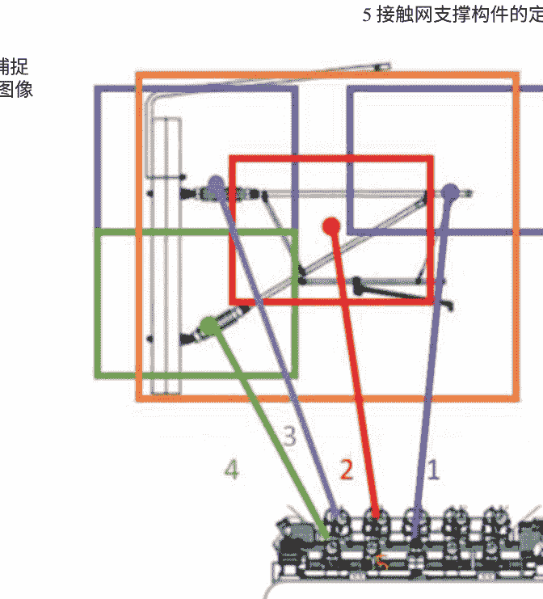

第二阶段：使用第一阶段获得的框对CSC的局部图像进行裁剪。由于局部图像中的CSC明显可见，可以应用定位网络实现精确定位。

### (1) 粗定位网络

#### 1) 基于CSC位置信息的无监督聚类算法

为了确保新的输入接触网图像能够根据CSC的位置信息进行分类并生成带有类别标签的提案区域，需要分类数据集以便训练CNN分类网络。

无监督聚类算法需要对多个目标具有多测量距离的高灵敏度。只有当两个接触网图像中的所有CSC类别彼此接近时，这两个图像才能被归为同一类。传统的无监督聚类算法如K均值[8], DBSCAN[9]和高斯混合[10]不能应用，因为算法的随机性和描述接触网图像之间距离的困难。在CSCNET中，提出的无监督聚类算法的流程图如图5.13所示。

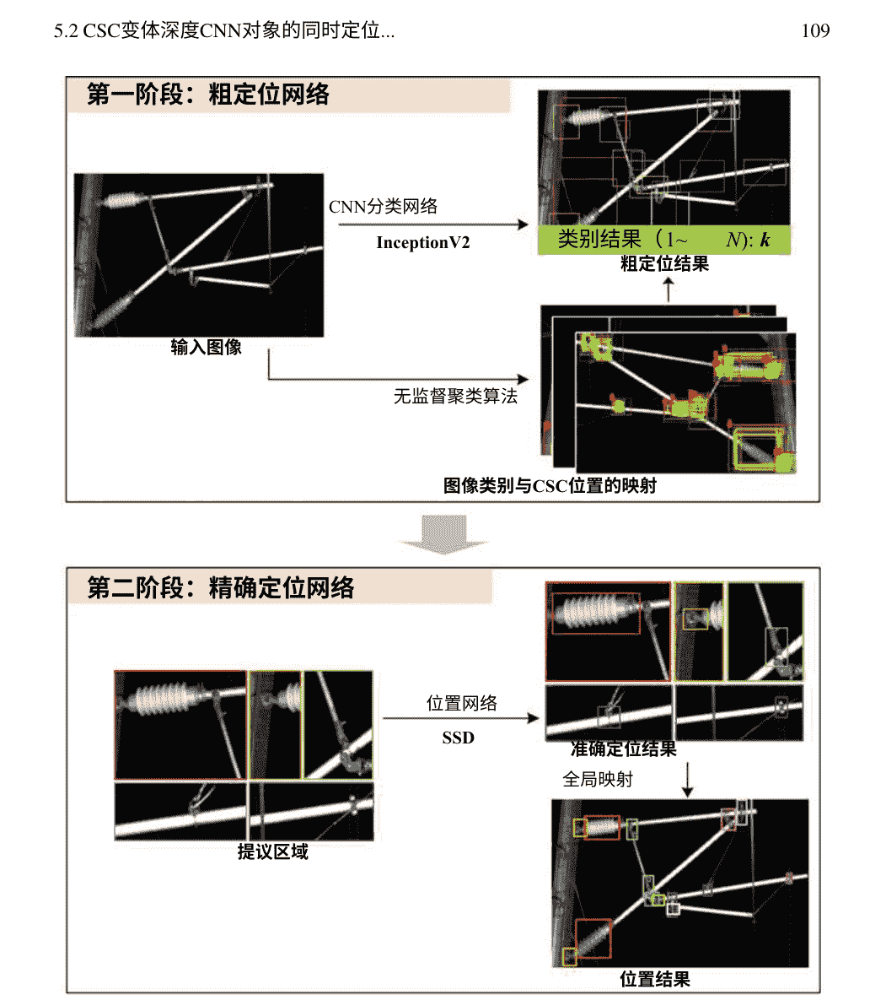

图5.12 CSCNET的工作流程

聚类数据集中的图像集和注释集都遵循PASCAL VOC [11]的格式。它包含所有图像中CSC的坐标和类别（即真实框，在图5.16中显示为黄色框）。它还将用于训练精确定位网络。经过手动标注和图像预处理，统计了每个接触网图像中的类别数量和CSC数量。

为了测量两个接触网图像之间的距离，采用了无权邻接列表算法。该邻接列表算法的聚类基础是接触网图像中每个接触网支撑组件类别的数量（用于粗分类结果）或每个类别的自交并比（用于细分类结果）。

图5.13 接触网支撑组件无监督聚类算法的流程图[2]

- Start
- Resize images and annotation files
- Count the categories and its numbers of CSCs included in images
- Establish the optimized adjacency list to obtain rough classification results (N class).
- k < N ?
  - Yes: calculate self-IOUs for every category between catenary images
  - No
- Establish the optimized adjacency list to obtain fine classification results (M_k class).
- Clustering results: $\sum_{k=1}^{N} M_k$ categories
- Generate the mapping between clustering results, Proposal regions and labels

如图5.14所示，细分类算法包括以下步骤（k=1）。

1. 步骤1：选择第k个接触网图像作为第k个单链的第一个节点，并将邻接列表Ek(1)=k。初始化该邻接列表中图像的索引，即n=1。
2. 步骤2：选择第(k+n)个接触网图像，并计算第(k+n)个图像与第k个图像之间的自交并比self-IoUs。对于12个接触网支撑组件类别，如果每个自交并比都大于阈值thresh(self-IoU(i) > thresh(i), i=1, 2, 3, ..., 12)，则该图像被判断为与kth张图片相同的类别，并添加到kth个单链表中，并且 \( E_k = [E_k, k + n] \)。
3. 第3步：令 \( n = n + 1 \)。重复第2步直到遍历完所有的图片。
4. 第4步：令 \( k = k + 1 \)。重复第1步直到遍历完所有的图片。
5. 第5步：优化邻接表（见图5.14），并令 \( l = 2 \)。可以判断出lth个单链表中的任何元素是否已存在于mth个单链表中（\( m = 1, 2, 3, ..., m < k \)）。如果存在，则将mth个单链表添加到lth个单链表中。删除lth个单链表和mth个单链表中的重复节点，并令 \( E_n = E_n \cup E_k \)。重复第5步直到遍历完所有的图片。

$$ \text{IoU} = \frac{A \cap B}{A + B - A \cap B} \tag{5.4} $$

其中A和B是两个真实框的面积（A，B > 0）。然而，IoU对于CSC聚类算法来说并不适用，因为IoU对小尺度的真实框非常敏感。由IoU生成的候选区域可能不够大，这会导致从输入图像生成的候选区域不太可能包含CSCs。所提出的自身IoU如下所示：

$$ \text{自身IoU} = \frac{A \cap B}{\max(A, B)} \tag{5.5} $$

通过比较（5.4）和（5.5），自身IoU始终大于IoU，这会导致更多的接触网图像在第2步中聚类到相同的类别中，并且候选区域更大。然而，对于大尺度的CSCs，自身IoU的阈值需要更大，以限制候选区域的最大尺寸。这里，使用（5.6）来计算阈值。

$$ \text{thresh}(i) = \min\left\{0.85, 0.5 + \frac{\overline{S_i}}{\sum_{n=1}^{12} \overline{S_n}} \right\}, \quad i = 1, \ldots, 12, \tag{5.6} $$

其中S是相同类别的真实框的平均面积。对于粗糙聚类，除了将自身IoU替换为每个类别中的CSC数量外，过程与上述步骤相同。图5.15显示了不同类别的一些聚类结果。根据CSC的一个类别对图像进行排序是困难的。相同颜色的点通常被聚类在一起，这证明了提出的聚类算法的有效性。

在获得分类结果后，将生成相应标签的提案区域。首先，可以基于每个CSC类别在每个分类中的边界框获得带有标签的最小边界框。如图5.16所示，绿色框表示结果。请注意，一张图像中的两个最小外接矩形（例如绝缘子和绝缘子底座）可能具有相同的类别标签。然后，生成带有标签的提议区域，它们比最小外接矩形更大，因为定义了额外的预测区域。额外的预测区域是通过记录地面实况框的位置顺序（图像顺序与捕捉顺序相同）并预测位置趋势来计算的。预测区域在$x$和$y$方向上的长度如下所述：

$$ L_x = \frac{5}{N-1} \sum_{i=2}^N \left( \frac{x_{i \text{ min}} + x_{i \text{ max}}}{2} - \frac{x_{(i-1) \text{ min}} + x_{(i-1) \text{ max}}}{2} \right) \tag{5.7} $$

$$ L_y = \frac{2.5}{N-1} \sum_{i=2}^N \left( \frac{y_{i \text{ min}} + y_{i \text{ max}}}{2} - \frac{y_{(i-1) \text{ min}} + y_{(i-1) \text{ max}}}{2} \right) \tag{5.8} $$

其中$N$是每个细分类结果的图像编号；$i$是图像索引；$x_{i \text{ min}}$和$x_{i \text{ max}}$是水平坐标的最小值和最大值；$y_{i \text{ min}}$和$y_{i \text{ max}}$是垂直坐标的最小值和最大值。最后，得到的带有标签的建议区域显示为图5.16中的红色框。

#### 2) CNN分类网络

由于同一类别的CSC位置接近且悬臂的结构固定，同一类别的网架图像相似。然而，由于实际安装要求和接触线震动，网架图像会有一定程度的变化。在这里，InceptionV2网络被用作CNN分类网络，用于生成带有标签的建议区域。

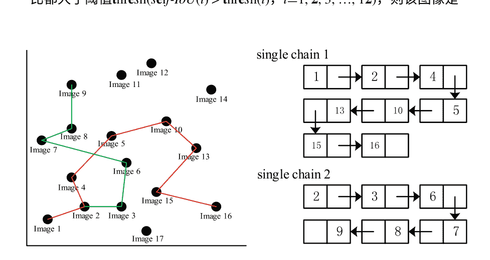

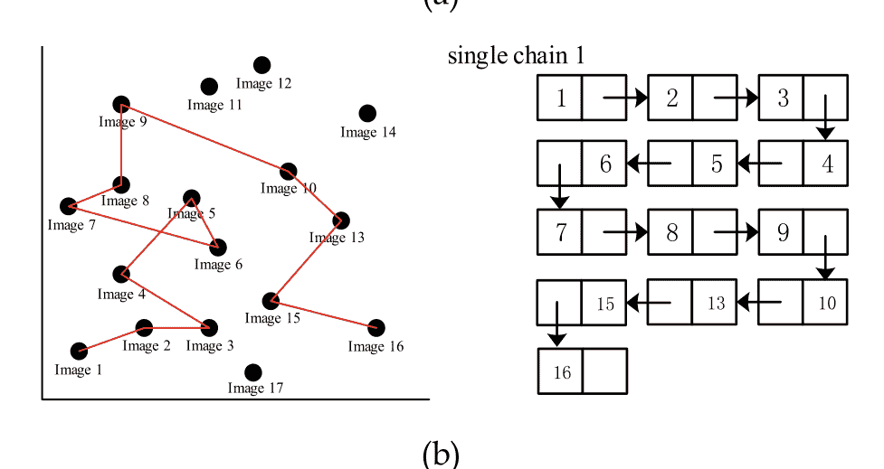

图5.14 优化邻接表算法图示。a k=2 在第4步。b k=2 在第5步[2]

InceptionV2网络[12]由Google构建；它包括一个Inception模块，并且对尺度差异具有很强的鲁棒性。Inception模块由几个“1 × 1 Conv → 3 × 3 Conv → 3 × 3 pooling”块并行组成。不同的卷积核可以捕捉不同大小的感受野。原始的接触线图像的尺寸为6600 × 4400 × 1。为了使粗定位操作快速进行，输入图像被调整为300 × 300 × 1，并且第一个卷积核的大小设置为7 × 7 × 1。

当CNN分类网络训练完成后，将测试图像输入到网络中以预测图像的类别。然后，根据预测的类别标签，图像与训练集中同一类别的CSC的位置信息相近。为了获得与CSC位置信息相关的分类结果，CNN需要学习CSC的位置信息。不同类别的CSC的位置信息是分类的关键，因此无法引入通用的数据增强技术（随机扩展、随机裁剪和水平翻转）来扩大训练数据集。

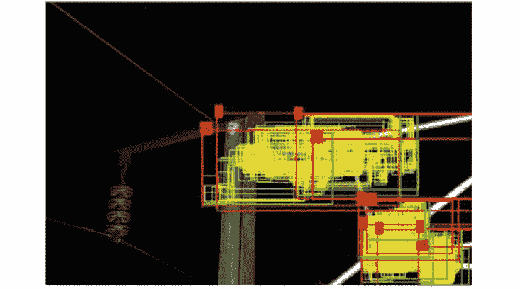

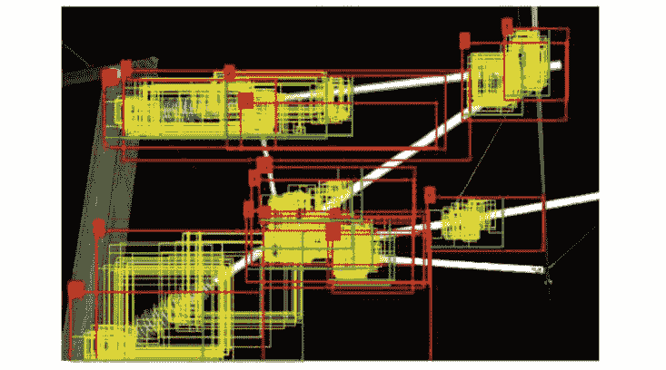

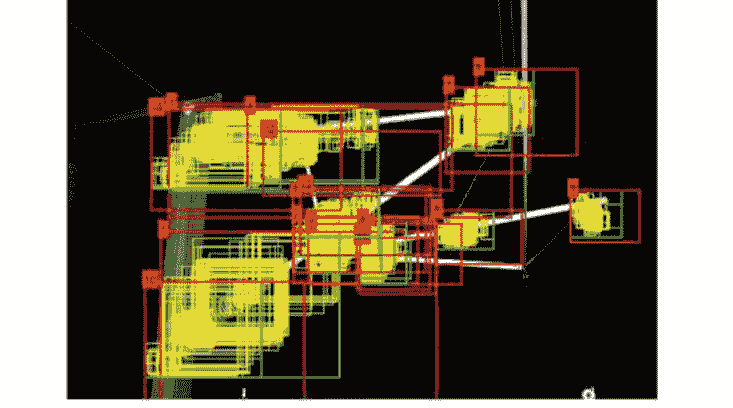

图5.16 聚类结果与带标签的建议区域之间的映射。黄色矩形-角：真实框。绿色矩形：最小边界框。红色矩形：带类别标签的建议区域。红色块中标记的数字是CSC标签。a类别1。b 类别4。c 类别9 [2]

### (2) 精确定位网络

在粗定位网络中，通过映射规则大致获取CSC的位置。这些粗略的区域可以从原始图像中裁剪出来，并输入到CNN中进行精确定位。在CSCNET中，引入了通用定位框架SSD作为精确定位网络。

SSD的核心思想是生成默认边界框，并根据下层和上层特征图预测默认框的类别。不同尺度的特征图是通过具有不同卷积核大小的卷积层生成的。默认框在特征图单元的每个位置上以不同的宽高比（1/2、2等）生成。对于每个默认框，SSD预测13个类别（12个类别和背景）的置信度和四个形状偏移量（x, y, w, h）。对于具有 m × n 像素和 k 种默认框的特征图，该层的输出为（13 + 4） × m × n × k。最后，通过非最大值抑制（NMS）对带有标签的边界框的预测结果进行过滤。

### (3) CSCNET的完整结构

所提出的CSCNET的完整结构如图5.17所示。粗定位网络是一个CNN分类网络，用于获取所有12个CSC类别的粗略位置。无监督聚类算法为CNN分类网络和图像类别与提案区域之间的映射标签提供训练数据集。当CNN分类网络训练充分后，将调整大小的网架图像输入到卷积网络中，并预测43个类别的置信度。将具有最高置信度的类别标签分配给输入图像。根据类别和提案区域之间的映射，生成粗定位结果。

精确定位网络是一种用于高速铁路所有12个类别的CSC的对象检测卷积网络。基于带有标签的建议区域，从输入图像中裁剪并调整大小的子图像调整为300 ×300。然后，调整大小后的子图像被输入到InceptionV2网络和额外的特征层中。经过非极大值抑制后，得到了每个子图像中12个类别的边界框和置信度的精确定位结果。

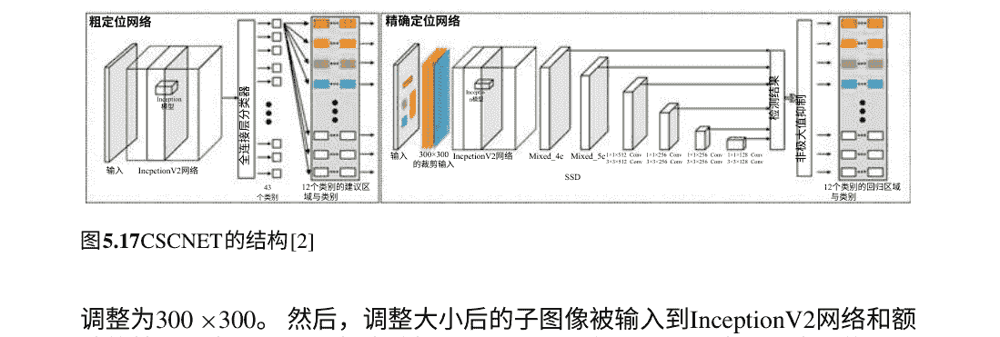

图5.17 CSCNET的结构[2]

在一般的框架中，根据置信度阈值选择最终结果。在CSCNET中，每个调整大小的子图像中只选择一个边界框和类别。边界框的选择类别应与粗定位网络生成的建议区域的标签相同，并且在其类别中置信度应最高。当所有建议区域输入到精细定位网络中时，将得到与结果相同数量的精确边界框。最后，根据以下公式将精确边界框映射回原始图像。

$$ \left\{\begin{array}{l} x_{\text{结果}} = \frac{W_c}{300} x_f + x_c \\ y_{\text{结果}} = \frac{H_c}{300} y_f + y_c \end{array}\right. \quad (5.9) $$

其中 W_c 和 H_c 是粗边界框的图像尺寸； x_c 和 y_c 是原始接触网图像中粗边界框的最小坐标； x_f 和 y_f 是精确边界框在粗边界框中的最小坐标； x结果 和 y结果 是精确边界框在原始接触网图像中的最小坐标。

## 2. 实验验证

### (1) 数据集

实验数据集包括2947个标记的接触网图像中的总共20,121个组件，每个组件的每个类别实例都具有各种尺度和姿态。随机选择70%的实例作为训练样本，其余的作为测试样本。为了避免过拟合，验证样本是从训练样本的30%中随机选择的。数据集中每个类别的接触网支撑组件的具体数量如表5.4所示。

### (2) 结果和分析

为了验证所提出的CSCNET的有效性，使用884个测试图像来评估训练模型的性能。CSCNET和其他深度学习模型生成的一些接触网支撑组件的同时定位结果如图5.18所示。

表5.4 数据集中每个类别的接触网支撑组件数量

| 类别 | 数量 | 类别 | 数量 |
| :--- | :--- | :--- | :--- |
| 绝缘子 | 2012 | 旋转双耳 | 1319 |
| 绝缘子基座 | 2027 | 信号线基座 | 1704 |
| 双耳套管 | 1411 | 稳定臂底座 | 1517 |
| 支撑套管 | 2710 | 防风线环 | 1122 |
| 支撑套螺钉 | 2508 | 双套管连接器 | 1567 |
| 支撑线钩 | 1412 | 等电位线 | 812 |

AP、mAP和FPS被用作评估每个模型的定位性能的指标。将代表性方法Faster R-CNN、YOLOv2、SSD、OVO SVMs和“Faster R-CNN +CSCNET”与CSCNET进行比较。这五个代表性模型的这三个指标总结在表5.5中。

从图5.18和表5.5可以看出，与其他四个深度学习模型和传统的OVO SVM算法相比，所提出的CSCNET在mAP和FPS方面表现良好。此外，CSCNET比Faster R-CNN更快。原因如下所述。

首先，带有标签的建议区域是由粗定位网络直接生成的，这与Faster R-CNN中的锚点和RPN网络不同。其次，每个图像生成的建议区域只有十几个，远少于其他模型（通常为300个）。在CSCNET中，粗定位网络每帧耗时0.098秒。对于精细定位网络，每个粗边界框耗时0.040秒，每个接触网图像平均耗时0.460秒。CSCNET的mAP最高达到0.837，并且小规模组件的AP得到了显著改善，例如Brace_sleeve_screw、Windproof_wire_ring和Bracing_wire_hook。对于大规模组件，如Insulator、Insulator_base和Brace_sleeve，CSCNET的性能与其他深度学习模型非常接近。

与传统图像处理和其他深度学习模型相比，CSCNET的级联结构和选择InceptionV2和SSD可以减少不同类别CSC之间的尺度差异。同时，无监督聚类算法和粗定位网络可以通过将类别标签添加到建议区域中提供比其他框架更多的位置信息。

上述实验结果和分析表明，无监督聚类在原始接触网图像和位置映射中的应用可以为CSC定位提供良好的粗略区域。CSCNET可以通过进行粗到细的定位来很好地解决尺度差异问题。

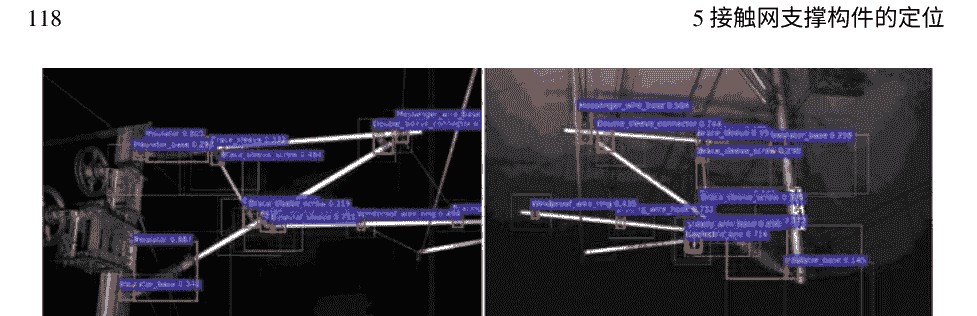

(a) CSCNET的定位结果

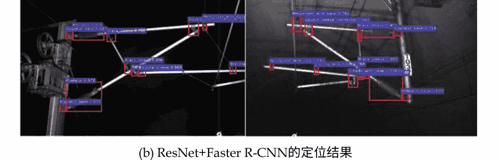

(b) ResNet+Faster R-CNN的定位结果

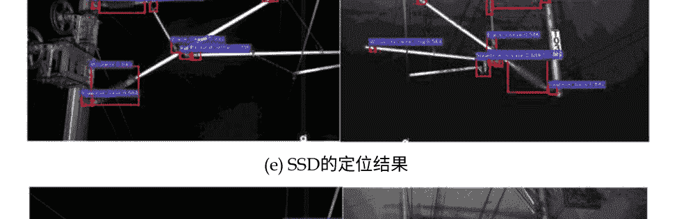

(e) SSD的定位结果

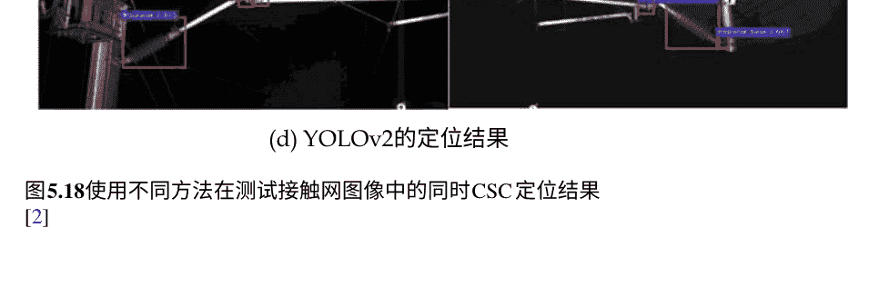

(d) YOLOv2的定位结果

图5.18 使用不同方法在测试接触网图像中的同时CSC定位结果 [2]

| CSC/mAP/FPS | 方法 | | | | | | |
| :--- | :--- | :--- | :--- | :--- | :--- | :--- | :--- |
| | CSCNET | Faster R-CNN+ResNet | Faster R-CNN+VGG16 | SSD | YOLO | OVO SVMs | CSCNET+Faster R-CNN |
| 绝缘子 | 0.872 | **0.916** | 0.783 | 0.877 | 0.886 | 0.403 | 0.903 |
| 绝缘子基座 | **0.831** | 0.748 | 0.65 | 0.683 | 0.743 | 0.341 | 0.884 |
| 双耳套管 | **0.836** | 0.796 | 0.785 | 0.818 | 0.381 | 0.302 | 0.859 |
| 支撑套管 | 0.84 | **0.851** | 0.796 | 0.834 | 0.225 | 0.211 | 0.896 |
| 支撑套螺钉 | **0.801** | 0 | 0 | 0.003 | 0.027 | 0.241 | 0.801 |
| 支撑线钩 | **0.786** | 0.564 | 0.563 | 0.459 | 0.587 | 0.323 | 0.812 |
| 旋转双耳 | 0.827 | **0.89** | 0.842 | 0.856 | 0.261 | 0.198 | 0.835 |
| 信号线基座 | **0.841** | 0.836 | 0.804 | 0.782 | 0.615 | 0.361 | 0.852 |
| 稳定臂底座 | **0.869** | 0.865 | 0.767 | 0.876 | 0.73 | 0.386 | 0.906 |
| 防风线环 | **0.838** | 0.684 | 0.508 | 0.223 | 0.586 | 0.129 | 0.839 |
| 双套管连接器 | 0.833 | **0.871** | 0.843 | 0.812 | 0.703 | 0.201 | 0.847 |
| 等电位线 | **0.871** | 0.575 | 0.181 | 0.716 | 0.511 | 0.135 | 0.873 |
| mAP | **0.837** | 0.716 | 0.627 | 0.662 | 0.521 | 0.269 | 0.859 |
| FPS | 2.17 | 1.73 | 1.46 | 2.3 | **3.7** | 0.01 | 1.57 |

每个组件的最高准确率用粗体标记。

## 5.2.3 CSCSIN-使用位置关系学习的CSCs定位

由于接触网的结构相对固定，这些组件的功能是空间相关的，例如绝缘子和绝缘子底座、稳定臂底座和等电位线，它们总是相邻并成对出现。这种知识在第5.2.2节的CSCNET中使用。然而，它需要使用无监督聚类算法首先对输入的接触网图像进行分类，然后使用先验知识，即接触网结构相对固定，来映射CSC位置。知识不是通过学习获得的。在本节中，介绍了一种定位方法接触网支撑构件结构推理网络（CSCSIN）[3]，该方法将组件之间的位置关系整合到模型中。

CSCSIN的动机是基于CSC结构推断（SI）的原则。通过对图5.11中捕获的接触网图像进行分析，检测车辆总是从几个固定角度拍摄接触网。因此，捕获的图像只包含几个固定场景。基于接触网组件之间的相对不变性和场景的固定性，可以建立CSC关系模型。该模型包括接触网组件本身的目标信息，组件之间的位置关系和场景信息，如图5.19所示，其中Vi是组件i的节点，ei→j表示节点Vi和Vj之间的位置关系，S表示图像场景。

是节点V_i和V_j之间的位置关系，S表示图像场景。

CSCSIN在CSC定位方面具有以下优势。

-   它可以建模CSC之间的关系，并将这些关系整合到定位模型学习中。
-   使用CNN骨干网络（改进的VGG16）的多层特征进行CSC定位，可以解决尺度差异问题。
-   与CSCNET相比，它是一个端到端的深度学习框架，易于在软件平台上部署。

## 1. 算法描述

CSCSIN的工作流程如图5.20所示，包括三个功能部分，即多级特征提取、结构先验信息的特征推理以及回归和分类。CSCSIN的一般流程如下所述：

阶段1：将接触网图像发送到改进的VGG16中，提取并融合所有CSC的低级和高级特征图。RPN使用低级特征图和多尺度锚点生成提案区域，并将其发送到聚合部分生成目标位置信息。将高级特征图和提案区域发送到RoI池化层，将每个提案区域映射到特征图上，并在池化操作后将它们合并成固定大小的特征图。然后，在全连接层之后提取目标视觉特征和视觉场景特征。

第二阶段：目标位置信息、目标视觉特征和视觉场景特征被发送到SIN，SIN由一组级联的场景GRU和边缘GRU网络组成。GRU从目标位置信息和场景视觉特征中选择相关信息来更新当前目标的隐藏状态。当目标的状态更新时，目标之间的关系也会发生变化，得到的稳定模型将输出用于分类的最终集成节点状态。

第三阶段：根据最终集成节点状态，softmax分类网络和回归网络对目标进行分类，并获得定位矩形框的坐标。

每个功能部分的详细信息如下所述。

### （1）多级特征提取

特征提取部分由修改后的VGG16、RPN、RoI池化层和FC层组成，如图5.21所示。

修改后的VGG16：在CSCDNET的VGG16中[1]，在四个卷积层Conv1-1、Conv1-2、Conv2-1和Conv2-2的卷积操作之后，小组件brace_sleeve_screw在Conv3-1的特征图输出中无法清晰显示。这个小规模的CSC被背景或其他CSC吸收，这可能使得通过RPN难以检测。在这里，提出了一个修改后的VGG16，如图5.21b所示。由于VGG16的低级特征图具有更高的空间分辨率，并且适用于小规模的CSC，因此选择第二个池化层操作后的特征图发送到RPN中，而不是原始特征图来生成提案区域。由于pool_2之后的通道数为256，原始通道数为512，因此添加了一个1×1的卷积层来保持通道数。同时，根据参考文献[1]，还可以看出Conv5-1输出的特征图和Conv5-1之后的卷积层过于模糊和

# 图5.21 VGG网络比较。 a原始VGG16。 b改进的VGG16 [3]

摘要。 因此，Conv5-1、Conv5-2和Conv5-3被取消，第四个池化层的特征图被送入RoI池化层，用于对提议区域中的对象进行分类。

RPN: CSCSIN的RPN的基本结构与Faster R-CNN和CSCDNET相似，使用三种尺度[8、16、32]和宽高比[2:1、1:1、1:2]。 仅使用多个尺度无法处理12种CSCs，因为锚点尺寸的选择直接影响正负样本的生成。 当锚点尺寸过大且小目标的真实值的IoU低于设定的阈值时，锚点将不会作为正样本参与后续训练，因此无法检测到小物体。

在原始比例尺的基础上增加了两个比例尺，并改为[2, 4, 8, 16, 32]，这有助于增强小型CSC的定位。

RoI池化层和全连接层： RoI池化层将提案区域映射到特征图上，并在池化操作后将它们合并成固定大小的特征图。 在全连接层之后，网络提取每个目标的特征作为视觉特征向量 $f_i^v$ ，并将整个图像的特征作为场景视觉特征向量 $f^s$。 目标之间的位置关系向量 $e_{i \rightarrow j}$通过目标提案区域的聚合获得。

### (2) 具有结构先验信息的特征推理

引入了SIN网络[13]进行特征推理。 如图5.22所示，SIN包括一组级联的场景GRU和边缘GRU网络，负责

# 图5.22 SIN的架构[3]

用于迭代更新建议区域的状态，使用视觉特征、视觉场景特征和位置关系。

门控循环单元（GRU）[14]：如图5.23所示，GRU网络的输入是当前状态$x^t$和上一个节点传递的隐藏状态$h^{t-1}$。隐藏状态$h^{t-1}$包含了先前节点的信息。网络的输出是当前隐藏节点状态$y^t$，并且隐藏状态$h^t$被传递给下一个节点。GRU首先通过$x^t$和$h^{t-1}$获得重置门状态（用$r$表示），然后通过$x^t$和$h^{t-1}$更新门状态（用$z$表示）。

$r^t = \sigma (W_r[x^t, h^{t-1}])$

$z^t = \sigma (W_z[x^t, h^{t-1}])$

其中$\sigma$是sigmoid逻辑函数；$W_r$和$W_z$都是可学习的权重矩阵。

然后，$h^{t-1}$可以通过重置门从$h^{t-1}$获得，而$h^t$通过与tanh函数拼接$h^{t-1}$和$x^t$获得。

# 图5.23 GRU网络[3]

$$
h^{t-1'} = h^{t-1} \odot r \qquad\qquad (5.12)
$$

$$
h' = \tanh\left(W\left[x^t, h^{t-1'}\right]\right) \qquad\qquad (5.13)
$$

最后， $h^t$和 $h^{t-1}$通过更新门 $z$进行更新。通过将更新后的 $h^t$和 $h^{t-1}$组合，得到 $h^t$，其公式如下：

$$
h^t = z \odot h^{t-1} + (1 - z) \odot h'. \qquad\qquad (5.14)
$$

SIN使用GRUs将不同的信息编码到目标状态中。GRUs从目标和场景视觉特征之间的关系信息中选择相关信息来更新当前目标的隐藏状态。当目标的状态更新时，目标之间的关系也会发生变化，随着时间步长的增加，得到的模型会变得更加稳定。

结构推断：如图5.24所示，场景GRU的初始状态是一个视觉特征 $f^v$，输入是一个视觉场景特征 $m^s$。边缘GRU的初始状态也是视觉特征 $f^v$，输入是目标位置信息$m^e$。$m^e$将每个目标与当前目标 $v_i$的位置关系整合起来，不同目标对当前目标$v_{i \rightarrow j}$的权重不同，这由相对位置和视觉关系决定。

$m^e_{i \rightarrow j}$集成目标信息的模型表示如下：

$$
m^e_{i \rightarrow j} = \underset{j \in V}{\text{最大池化}} \left(e_{i \rightarrow j} * f_j^v\right). \qquad\qquad (5.15)
$$

通过最大池化提取重要信息，避免干扰来自无关区域的信息。$e_{i \rightarrow j}$是节点 $v_i$和 $v_j$之间的位置关系，可以计算如下：

$$e_{i\rightarrow j} = \text{relu}(W_p R_{i\rightarrow j}^{p}) * \text{tanh}(W_v[f_i^v, f_j^v])$$ \quad (5.16)

其中 $W_p$ 和 $W_v$ 是可学习的权重矩阵；视觉关系向量 $f_j^v$ 按顺序排列；$R_{j\rightarrow i}^{p}$ 表示空间位置关系，如下所示。

$$R_{i\rightarrow j}^{p} = \left[ w_i, h_i, s_i, w_j, h_j, s_j, \frac{(x_i - y_j)}{w_j}, \frac{(y_i - y_j)}{h_j}, \frac{(x_i - y_j)^2}{w_j^2}, \frac{(y_i - y_j)^2}{h_j^2}, \log\left(\frac{w_i}{w_j}\right), \log\left(\frac{h_i}{h_j}\right) \right]$$ \quad (5.17)

其中，$(x_i, y_i)$ 表示目标组件的中心点坐标；$w_i$ 和 $h_i$ 分别表示宽度和高度；$s_i$ 是目标的面积。

通过接收现场和其他目标节点的信息，节点 $v_i$ 可以获得现场GRU的输出 $h_t^s$，边缘GRU的输出 $h_t^e$ 和最终输出 $h_t = (h_t^s + h_t^e)/2$。在下一次迭代中，现场GRU将更新后的节点状态作为其隐藏状态，以固定的现场特征作为输入，并计算下一个节点状态。边缘GRU将新的目标之间的关系信息作为新的输入，并计算下一个隐藏状态。最后，使用最终整合的节点表示来预测目标类别和Bbox偏移量。

### (3) 回归和分类

特征推理部分的稳定模型将每个目标的状态传输到该模块。根据最终目标节点的状态，softmax分类网络和回归网络使用预测分数对目标进行分类，并获得矩形框坐标的定位。

## 2. 实验验证

### (1) 数据集

共使用2947张图像进行实验验证，其中包括21,453个不同尺寸的组件。数据集与表5.4中的CSCNET相同。随机选择70%的图像作为训练集，剩下的30%作为测试集。为了防止过拟合，选择30%的训练样本作为验证集。CSCSIN的训练过程如图5.25所示。可以看出，CSCSIN的损失曲线在90k次迭代后收敛，这表明模型训练得很好。

### (2) 结果和分析

-   1) 验证CSCSIN的修改效果
    -   a) 结构推断的验证

为了验证结构推断的有效性，“Faster R-CNN +VGG16”被选为“SIN +VGG16”的对照组。在每个网络架构中，VGG16、RPN、RoI pooling、Softmax和其他配置都是相同的。

# 图5.25 CSCSIN的训练损失曲线[3]

“SIN +VGG16”除了结构推断网络外，与“Faster R-CNN+VGG16”具有相同的主干。在每个网络架构中，VGG16、RPN、RoI pooling、Softmax和其他配置都是相同的。

根据表5.6所示的结果，“SIN + VGG16”的mAP相比于“Faster R-CNN + VGG16”从0.627提高到0.856。得益于目标推断的定位和分类，大多数大规模和中规模的CSC的检测准确率显著提高，但是对于小规模的CSC的检测性能仍然没有达到理想状态，例如Brace_sleeve_screw和Isoelectric_line的AP。

-   b) 修改后的VGG16的验证

为了评估修改后的VGG16的性能，进行了一个包含“SIN +VGG16”和“SIN +修改后的VGG16”的比较实验。结果显示在表5.6中。可以看到，“SIN +修改后的VGG16”对小规模CSCs的AP明显增加，Brace_sleeve_screw的增幅为0.52，Windproof_wire_ring和Isoelectric_line分别为0.262和0.251。对于其他CSCs，检测准确率也有所提高。这些结果表明，修改后的VGG16是有效的，并且可以使RPN准确预测小规模CSCs的RoIs。

-   c) 锚定尺度选择的验证

RPN的锚定尺度默认设置为{8, 16, 32}，适用于公共数据集。对于接触网数据集，为了固定小型CSC的尺度，提出的RPN的锚定尺度设置为{2, 4, 8, 16, 32}。根据表5.6，使用锚定尺度{2, 4, 8, 16, 32}的SIN +VGG16的mAP达到87.6%，比使用锚定尺度{8, 16, 32}高2%，网络的FPS略有下降，因为数据量增加了。

# 表5.6 不同结构的不同方法的性能[3]

| CSC/mAP/FPS | CSCSIN | Faster R-CNN + VGG16 | SIN + VGG16 + 锚定尺度{8, 16, 32} | SIN + 修改后的VGG16 + 锚点 {8, 16, 32} | SIN + VGG16 + 锚点 {2, 4, 8, 16, 32} |
| :--- | :--- | :--- | :--- | :--- | :--- |
| 绝缘子 | **0.976** | 0.783 | 0.904 | 0.942 | 0.924 |
| 绝缘子基座 | **0.950** | 0.650 | 0.899 | 0.911 | 0.904 |
| 双耳套管 | **0.942** | 0.785 | 0.892 | 0.911 | 0.901 |
| 支撑套管 | **0.935** | 0.796 | 0.894 | 0.904 | 0.894 |
| 支撑套螺钉 | **0.862** | 0.000 | 0.313 | 0.833 | 0.692 |
| 支撑线钩 | **0.948** | 0.563 | 0.731 | 0.902 | 0.820 |
| 旋转双耳 | **0.940** | 0.842 | 0.889 | 0.925 | 0.903 |
| 信号线基座 | **0.949** | 0.804 | 0.898 | 0.903 | 0.902 |
| 稳定臂底座 | **0.933** | 0.767 | 0.903 | 0.917 | 0.921 |
| 防风线环 | **0.929** | 0.508 | 0.625 | 0.887 | 0.872 |
| 双套管连接器 | **0.958** | 0.843 | 0.904 | 0.916 | 0.923 |
| 等电位线 | **0.935** | 0.181 | 0.634 | 0.885 | 0.856 |
| mAP | **0.938** | 0.627 | 0.856 | 0.903 | 0.876 |
| FPS | 1.75 | 1.46 | **1.92** | 1.90 | 1.72 |

每个组件的最高准确率用粗体标记。

对于Brace_sleeve_screw的AP增幅为0.379，对于Windproof_wire_ring和Isoelectric_line分别为0.247和0.222。这些结果表明，对于小尺度CSCs，选择的锚点尺度是合理的。

-   d) CSCSIN的验证

CSCSIN提出了“SIN +修改后的VGG16 +锚点尺度{2, 4, 8, 16,32}”，其mAP最高，根据表5.6达到了0.938。小尺度CSCs的AP也是最高的，Brace_sleeve_screw为0.862，Windproof_wire_ring和Isoelectric_line分别为0.935和0.929。

-   2) 与其他深度学习方法的比较

本节中将使用三种流行的深度学习网络[15-18]，即Faster R-CNN +ZF、SSD和YOLO进行比较。它们在小规模CSCs上的准确性可以通过精确度-召回率（PR）曲线观察，如图5.26所示。CSCSIN的曲线下面积要比其他比较方法大得多。图5.27显示了一些可视化结果，表明CSCSIN可以定位小规模CSCs，而其他比较方法无法定位。

图5.26 小规模CSCs的PR曲线比较方法[3]

它们（图中标记为黄色框的部分）显示CSCSIN在小尺度上具有良好的定位精度。结果表明CSCSIN在小尺度上具有良好的定位精度。

上述实验结果和分析表明，对触网图像进行结构推断的应用对于CSC定位和解决尺度差异问题是有效的。CSCSIN有助于改善小组件的定位性能。

### 5.3 使用深度学习技术对CSC进行定位的精细化

大多数以前关于CSC定位的研究采用了目标检测方法，使用水平框。然而，由于CSC的形状非常不同，某些类型的组件（即绝缘子和等电线）的水平框可能包含背景或丢失一些组件信息，这导致故障检测方法没有正确的信息来进行诊断。 为了解决这些问题，一些改进方法进行了研究。

[19-21]实现了准确的CSC提取并取得了有希望的结果。 在本节中，介绍了最近的高级改进技术，包括水平定位、倾斜定位和分割方法。

#### 5.3.1 基于深度强化学习的水平定位框改进

CSC的一个典型改进要求是支撑套筒（BS）。 虽然第5.2节介绍的方法对于定位小组件支撑套筒螺丝（BSS）是有效的，并且可以避免许多漏检，但与BS相比，BSS的准确性仍然较低。由于BSS靠近BS，在获得的BS图像上定位BSS是一种理想的方法。 然而，水平框的定位精度不能满足BSS定位的要求，可能会出现过小或过大的定位，如图5.28a、b所示。在本节中，我们介绍了一种引入了强化学习（RL）方法来改进BS的水平定位框。

RL是一组广泛的学习技术。RL模拟了生物学习的方式，通过尝试行动并从成功和失败中学习。如图5.29所示，在RL中，代理器通过在给定环境中做出良好决策来接收奖励。代理器观察给定环境的状态，并根据其状态-行动策略采取行动，该策略在训练过程中学习。马尔可夫决策过程（MDP）是对代理器如何与环境交互以学习其策略的正式数学表示。对于计算机视觉问题，Caicedo等人提出了一种主动的类别特定定位方法。Yun等人提出了一种通过RL进行目标跟踪的动作决策方法。在[24, 25]中，采用RL来学习从五个固定子区域中选择区域的策略，并在几个步骤中实现目标定位。

#### 1. 算法描述

受强化学习中的奖励行为[23]的启发，我们将定位改进问题视为一个控制问题，其中包含一系列步骤为了改进定位框的几何形状，我们获得了一个新的定位框。然后，定位的改进变成了一个马尔可夫决策过程，可以通过强化学习进行训练。我们将动作定义为位置移动、尺度变化和形状变化。奖励是关于当前定位表现如何的反馈。因此，动作决策策略可以根据获得的奖励进行学习。

代理是一个称为动作决策网络（ADNET）的深度卷积神经网络，其架构如图5.30所示。初始框图像是一个称为动作决策网络（ADNET）的深度卷积神经网络的输入。ADNET将选择其中一种动作，这些动作被定义为通过移动、缩放和形状变化来改变框。然后，在选择动作后，初始几何框会发生变化，并产生一个新的框图像，该图像将发送给ADNET来决定下一步的动作。

最终，通过采取一系列的行动，准确地定位了BS组件。在这个动态过程中，应用的控制策略是通过强化学习来学习的，它考虑了每一步中所有行动的性能反馈。学习到的行动策略旨在自动调整初始框来自动包围BS组件。

##### (1) MDP形式化

定位细化策略遵循马尔可夫决策过程（MDP）。这个设置提供了一个形式化的框架来建模一个做出一系列决策的代理。MDP由状态 s ∈ S、行动 a ∈ A、状态转移函数 s' = f(s, a), 以及奖励 r(s, a)。动作、状态、状态转移函数和奖励的表达如下。

**动作**：使初始框适应BS的位置和形状, 移动的变换{左, 右, 上, 下}, 缩放的变换{放大, 缩小}, 以及形状变化的变换{变胖, 变高}都被定义为可能的动作。当代理找到最佳位置或当前定位的框与上一个框相同时, 需要执行停止动作来完成框的搜索。具体来说, 动作空间 A的定义如图5.31所示。它由15个动作组成, 为框的变换提供了足够的选项。

**状态**：由于定位的细化是改变框的几何形状的过程, 使用已执行的动作ADNET的信息有助于预测更好的框。因此, 盒子内的图像块和历史动作被用来形成状态s。对于图像I在步骤t的定位细化, 状态st被定义为一个元组 (pt, ct), 其中pt∈R^{112×112×3}是当前盒子内的图像, ct∈R^{150}表示动作历史的编码向量。pt的公式如下：
```
p_t = \phi([x_t, y_t, w_t, h_t], I), \quad (5.18)
```
其中 (xt, yt) 是pt在图像I中的中心点坐标; wt和ht分别是pt的宽度和高度; 函数ϕ从图像I中裁剪并调整pt的大小以适应ADNET的输入尺寸; ct是一个150维向量, 因为我们选择了前十个动作作为历史, 每个动作由15维编码。

**状态转移函数**：当ADNET选择一个动作 a_t时, 当前的状态 s_t将转移到 s_{t+1}。状态转移由两个函数 f_p(p_t, a_t)和 f_c(c_t, a_t)执行, 它们分别在当前图像块 p_t和当前动作历史 c_t上实现。对于 f_p, 应给出离散的动作变换量。移动动作的离散量在(5.19)中给出。在(5.20)中, 缩放和形状变换动作的离散量被定义。由于初始框离基站不远, 因此在实验中将因子 α1, α2, α3和α4设置为0.05。
```
$$\Delta x_t = \alpha_1 * w_t, \quad \Delta y_t = \alpha_2 * h_t$$
$$\Delta w_t = \alpha_3 * w_t, \quad \Delta h_t = \alpha_4 * h_t$$
```
对于状态转移 $f_c$，它将当前动作 $a_t$添加到动作历史 $c_t$中作为最新动作，并移除最早的动作。

**奖励**：奖励可以被视为采取行动后的反馈。在强化学习训练期间，如果选择的动作可以使状态转移到更好的状态，则代理将获得正向奖励。否则，将返回零奖励或负奖励。奖励函数 $R_t(p_t, p_{t+1})$定义如下：
```
$$R_t(p_t, p_{t+1}) = \begin{cases} +1, & \text{如果 } \text{IoU}(p_{t+1}, G) > \text{IoU}(p_t, G) \\ 0, & \text{如果 } \text{IoU}(p_{t+1}, G) = \text{IoU}(p_t, G) \\ -1, & \text{如果 } \text{IoU}(p_{t+1}, G) < \text{IoU}(p_t, G) \end{cases}$$
```
其中，$G$是目标BS的真实框；$\text{IoU}(p_t, G)$表示当前补丁$p_t$与目标BS的真实框$G$之间的重叠比例，使用交并比准则。

在(5.21)中，只有当下一个补丁比当前补丁更接近BS的真实框时，智能体才能获得正向奖励。

##### (2) 训练目标

智能体ADNET通过强化学习进行训练，其目标是学习一种状态-动作策略，以做出一系列动作决策。在应用强化学习之前，我们通过使用经过监督学习(SL)训练的权重参数来初始化ADNET，这已被证明对策略学习很有用[23, 26]。

在SL阶段，通过对BS的真实框$G_i[t_i, y_i, w_i, h_i]$施加高斯噪声来生成训练样本$p_i\{i=1, 2, ..., N\}$。动作标签$o_i^{(\text{act})}$和class标签 $o_i^{(\text{cls})}$分别由(5.22)和(5.23)定义。
```
$$o_i^{(\text{act})} = \arg \max_a \text{IoU}(f_p(p_i, a), G_i), \quad a \in A$$
```
```
$$o_i^{(\text{cls})} = \begin{cases} 1, & \text{if } \text{IoU}(p_i, G) > 0.6 \\ 0, & \text{otherwise} \end{cases},$$
```
其中 $A$是动作空间，共有15个动作。

然后，通过最小化损失函数学习初始权重 $W_{\text{SL}}, \{w_1, w_2, ..., w_7\}$。
```
$$L_{\text{SL}} = \frac{1}{N} \sum_{i=1}^{N} \left[ L\left(o_i^{(\text{act})}, \hat{o}_i^{(\text{act})}\right) + L\left(o_i^{(\text{cls})}, \hat{o}_i^{(\text{cls})}\right) \right].$$
```
损失 $L_{SL}$ 包括动作预测损失和分类（物体/背景）损失。$N$是训练样本的批量大小，$L$表示交叉熵损失。$\hat{\delta}^{(\text{act})}_i$和$\hat{\delta}^{(\text{cls})}_i$分别是样本$i$的预测动作和预测类别。请注意，历史动作向量在此阶段不使用。

在强化学习训练阶段，$W_{RL} \{w_1, w_2, ..., w_6\}$由$W_{SL}$初始化。忽略了fc7的权重，因为在强化学习中只考虑动作。对于图像帧$l$，初始框将采取由ADNET连续预测的$T$个动作。在每个步骤$t$中，从图像中提取新的特征，使得强化学习算法能够适应新的信息。动作$a_{t,l}$由以下方式选择
```
$$a_{t,l} = \arg \max p(a|s_{t,l}; W_{RL})$$
```
其中$t = 1, 2, ..., T - 1, T$。

在执行动作$a_t$之后，ADNET根据(5.21)获得奖励$R_{t,l}$。同时，还记录了ADNET之前所做的动作的历史记录。然后，通过添加$a_t$和删除最早的动作来更新新历史动作向量$c_t$。

最后，使用随机梯度上升[27]来更新$W_{RL}$，以最大化训练样本的累积奖励，具体如下：
```
$$\Delta W_{RL} \propto \sum_{l}^{L} \sum_{t}^{T_l} \frac{\partial \log p(a|s_{t,l}; W_{RL})}{\partial W_{RL}} R_{t,l}$$
```
其中$L$是在一个迭代中使用的图像补丁的大小。

#### 2. 实验验证

##### (1) 数据集

构建的数据集包含1596个从全球接触网图像中裁剪出来的接触网支撑组件图像。每个支撑组件图像都标注了一个紧密的真实位置框。全球图像中的支撑组件大小不同。每个裁剪的支撑组件图像的宽度（或高度）是支撑组件真实宽度（或高度）的2.5倍，这使得ADNET成为研究的适当区域。我们使用1020个图像进行训练，576个图像进行测试。

##### (2) 基于强化学习的细化的可视化和分析

由于初始定位框可以分布在支撑组件周围的任何位置，因此在真实位置上应用高斯函数以生成初始框。在测试中，ADNET代理在每个图像中执行$T$个连续的动作（步骤）来细化初始框。这里，$T$设置为20。所选的定位结果显示在图5.32、5.33和5.34中。所提出方法在整个数据集上的性能总结在表5.7中。详细的实验分析如下所示。

代理器的定位动态过程显示在以下图中。白色框是初始框，经过采取行动后，颜色逐渐变绿，直到达到最终的粉色框。我们将这些过程分为三种类型，即A型、B型和C型，如图5.32、5.33和5.34所示。

表5.7 通过RL [19, 21]提高定位精度

| 方法 | 召回率0.5(IoU > 0.5) (%) | 召回率0.8(IoU > 0.8) (%) | 召回率0.9(IoU > 0.9) (%) | 改进比例 | FPS |
|------|------------------------|------------------------|------------------------|---------|-----|
| 高斯初始 | 96.4 | 19.9 | 3.3 | – | – |
| 带RL的高斯初始 | 92.0 | 79.2 | 65.1 | 81.8% (471/576) | 6.13 |

在图5.32中，当A型初始框大于BS组件时，它可能包含来自其他组件的不必要信息，例如案例A2和案例A3。代理可以通过移动、缩小、缩短和变细等操作将这些初始框调整到更接近BS组件。

图5.33a显示了当步长增加时，A型案例的定位精度（IoU）变化。即使初始框包含不必要的信息，IoU也会增加。在图5.33中，B型案例的初始框部分重叠于BS。特别是，案例B3的初始框不仅包含不完整的BS，还包含附近组件的不必要的信息。然而，RL学习的代理仍然可以将这些初始框移动到更接近BS的位置。每个案例的准确性变化如图5.35b所示。A型和B型都是可以通过提出的方法正确优化的案例。对于优化的速度，虽然我们将每个图像的总步数设置为20，但大多数成功的案例只需要不到12步就可以达到最终位置，如图5.35a、b所示。

由于我们使用高斯函数随机生成初始框，一些初始框与BS组件的重叠较少，例如图5.34中的C型案例。C型案例的初始（第一步）IoU可以在图5.35c中观察到。它们在开始时小于0.15。在实验中，许多C型案例导致BS定位失败，框被进一步移离BS，如图5.34中的C2案例和C3案例所示。然而，仍然有一些案例，如C1案例，可以成功地将框调整到更接近BS组件的位置。我们推测C2案例和C3案例失败是因为它们的初始框中几乎没有包含BS的有用特征，而C1案例仍然包含一些有用的BS特征。从图5.35c中可以观察到第一步的IoU。

##### (3) 基于强化学习的细化结果的定量分析

整体数据集的定位准确度指标是广泛的召回率。召回率T_IoU (IoU > 0.5)表示IoU大于阈值T_IoU的比例。采用的速度指标是FPS（帧/秒）。所提出方法的定量定位性能如表5.7所示。表5.7显示，召回率0.5略有下降，与初始值相比，因为有少数框移离了BS位置。然而，召回率0.8从19.9%增加到79.2%，召回率0.9从3.3%增加到65.1%。总体而言，在576个测试图像中，471个图像的IoU变大，这意味着81.8%的测试图像获得了更好的定位。这表明所提出的RL方法可以将大多数框调整到更接近BS位置，并提高定位精度。此外，RL代理每张测试图像只需0.163秒（1/6.13），在应用中消耗的时间非常少。

#### 5.3.2 用生成对抗网络进行倾斜定位框细化

水平定位方法生成的框可能包含背景干扰或相邻目标干扰，特别是对于倾斜的CSC类绝缘子，如图5.36所示。采用倾斜定位方法可以解决这个问题。近年来，基于深度学习的倾斜定位方法相继提出，例如旋转区域建议网络（R RPN）[28]和R2CNN [29]，它们基于Faster R-CNN框架。然而，对于CSC的旋转定位几乎没有研究。另一个问题是如何使倾斜框接近CSC的真实位置，并实现准确的倾斜定位。

本节介绍了一种准确的旋转定位框架，称为TOL-Framework（更紧密的定位框架）。它从以下两个方面进行了开发：

- （1）改进旋转定位模型本身。基于现有的通用旋转目标定位参考模型RRPN，将两个回归模块级联并应用于RRPN中。可以级联多个回归模块，从而初步提高旋转定位的准确性。
- （2）通过添加一个独立的后处理GAN模块来优化初步生成的倾斜框。前面生成的旋转框改进的RRPN具有一定的准确性，并且可以在定位框附近生成一系列候选框。由于候选框与标准绝缘子之间的相似性不同，可以通过选择与标准绝缘子相似性最大的候选框来进行优化。在这里，引入了生成对抗网络（GAN）[30,31]来实现上述“相似性匹配”功能。引入GAN的动机在于，GAN可以作为生成模型，通过对抗训练生成与训练集相似的样本。当将标准绝缘子图像用作训练样本时，得到的生成模型只与标准绝缘子的输入图像匹配良好。当输入图像与标准绝缘子相似时，生成的图像具有较小的畸变，重构误差较小。相比之下，重构误差较大。基于这个原理，可以选择具有最小重构误差的候选框作为最终的旋转定位结果。

#### 1. 算法描述

TOL-Framework的工作流程如图5.37所示。它由两个子网络组成，即“基线 + 级联回归模块”和后续的精化网络（GAN），其详细信息如下所介绍。

##### (1) 基线 +级联回归模块

该网络主要遵循广泛使用的Faster R-CNN架构，但在每个模块（CNN骨干网络、RPN和回归）中采用了一些改进。

**CNN骨干网络**（**ResNet-101 + FPN**）。**CNN骨干网络**处理输入图像并在多个级别生成Conv特征图。与通常仅使用顶层特征图的方法不同，我们构建了一个特征金字塔网络（FPN）[32]，并使用金字塔特征作为提取的特征。FPN之所以有效，是因为每个金字塔级别都与骨干网络的更高级语义特征融合。对于骨干网络，选择了广泛使用的具有101个Conv层的ResNet模型。具体而言，如图5.37所示，捕获的6600 ×4400像素的接触网图像被调整为900 ×600像素，通过自下而上的Conv-残差块进行前向计算，产生五个尺度的激活图，缩放步长为2。骨干网络生成的特征被定义为{C1, C2, C3, C4, C5}，它们是每个Conv-残差块的最后输出特征。这些特征（除了C1由于其内存消耗较大）通过侧连接进一步增强。每个侧连接通过2倍上采样上层金字塔特征，并与相应的自下而上地图合并，其中添加了一个1 ×1的卷积层来减少通道维度。增强的金字塔特征{P2, P3, P4, P5, P6}是CNN骨干网络的最终提取特征。

**面向区域建议网络**。RPN [4] 是一个滑动窗口的类别无关的目标检测器。传统的 RPN 使用了一个锚点策略，它具有尺度和纵横比参数，在顶层特征图中产生初始水平边界框，称为锚点。这些锚点被分类和回归为建议。与传统的RPN相比，对ORPN进行了两个调整设计。首先，添加了一个方向参数到锚点策略中，以产生绝缘子的旋转建议。其次，建议不仅在顶层特征图上产生，还在金字塔特征上产生。具体而言，ORPN的工作流程可以描述如下。在特征图的每个点上，产生49个（7×7×1，方向×纵横比×尺度）有向锚点，其中包括7个方向{0°，15°，30°，45°，60°，75°，90°}，7个纵横比{1/5，1/3.5，1/2，1，2，3.5，5}和一个尺度[32×(i-1)]²。然后，有向锚点被发送到对象/背景分类模块，并进行回归以生成建议。最后，将建议映射到特征图P_i中相应的区域，如图5.37中P_i中的红色边界框所示，并传递给级联回归子网络。

级联回归边界框回归。通常，只应用一个经过IoU = 0.5训练的单个边界框回归模块。如图5.37所示，顶部边界框回归通过RoI池化将提案的特征下采样到14 × 14像素，并发送到多个全连接层进行分类和回归。受级联R-CNN [33]的启发，应用了一个经过IoU为0.5和0.5训练的级联定向边界框回归模块，以提高定位精度。不级联三个或更多的回归模块，因为应用更多的回归模块时准确性的提升很小。将第二个IoU设置为0.5而不是更高的IoU的原因是，由于其低IoU，许多由第一个回归输出的框将被过滤掉，并且添加的回归模块的训练样本将不足够。如图5.37所示，通过级联回归模块预测的蓝色边界框与绝缘子的真实位置相比，比单个回归预测的红色边界框更接近。

### (2) 后续改进网络 (GAN)

尽管之前基本网络的定位准确性有所提高，但仍无法满足缺陷诊断的要求。在这里，构建了一个后续改进网络，并通过标准的CSCs（即绝缘子）进行训练。训练好的生成器只能与与标准绝缘子具有较大相似性的输入很好地匹配。在测试过程中，首先可以产生围绕粗略获取的框的候选框，然后选择具有重构误差的候选框作为最终的定位结果。这个完整的改进过程在算法5.1中显示。

算法5.1 [20] 通过GAN进行后续改进
1: 输入: 通过“基线 + 级联回归模块”定位的框 {B₁, B₂, ..., Bₘ}
2: 输出: m 后处理的框 { B'₁, B'₂, ..., B'ₘ }
3: 对于每个框 B_i (i ≤ m) 执行
4:    应用候选边界框生成并获得候选边界框集合 {B_{i1}, B_{i2}, ..., B_{in}}
5:    对于 j ≤ n 执行
6:        将 B_{ij} 发送到训练好的GAN中计算重构误差 e_{ij}
7:    结束循环
8:    选择具有最小损失的候选边界框 min {e_{i1}, e_{i2}, ..., e_{in}} 作为后处理的边界框 B'_i
9: 结束循环

两个子过程的详细信息也在下面给出。候选边界框生成。在实验中，我们将证明基本网络生成的所有框的IoU > 0.8 且 |Δφ| < 10°(与真实位置的重叠度大于0.8，与真实角度的差异小于10°)。IoU和 |Δφ|的定义如(5.27)和图5.38b所示。

因此，对于BLN预测的每个边界框 $B_i$，可以形成一个包含潜在真实边界框中心点的最小区域。
在这里，我们扩展最小区域，并定义一个具有相同中心点 $B_i$和尺寸$[w/5, h/5]$的种子区域。种子区域被分为$12 \times 6$个种子，如图5.38c所示。在每个种子中，将生成50个候选框（基于$[w, h]$的5个尺度0.9、0.95、1、1.05、1.1和10个角度，角度步长为$2^{\circ}$在$[-10^{\circ} - 10^{\circ}]$范围内；因此，$5 \times 10 = 50$)。最后，种子区域可以生成3600个（$12 \times 6 \times 50$）候选框，形成算法5.1中的候选集合$\{B'_1, B'_2, ..., B'_m\}$。注意，每个候选集合包括真实边界框或非常接近真实边界框的边界框。

$$\mathrm{IoU} = \frac{S(P) \cap S(G)}{S(P) \cup S(G)} \tag{5.27}$$

### 生成对抗网络的改进。

对于每个候选集合$\{B_{i_1}, B_{i_2}, ..., B_{i_n}\}$，我们可以选择与标准绝缘子具有最大相似度的边界框作为最终定位的边界框。因此，我们使用GAN模型来评估相似度。该GAN模型仅通过使用大量标准正常绝缘子进行对抗训练，并且只与标准绝缘子匹配良好。

构建的GAN的概述如图5.39所示，包括一个生成器和一个判别器。在训练过程中，计算上下文损失、对抗损失和潜在损失，并分别表示为(5.28)-(5.31)。主要的训练目标是最小化这些损失的加权和，如(5.31)所示。最小化上下文损失意味着生成器使生成图像$x$的纹理与输入图像$x$的纹理相似。最小化对抗损失和潜在损失使判别器无法正确分类$x$（真实图像）和$\hat{x}$（生成的假图像）。

### 5.3 使用深度学习技术对CSC进行定位的精细化

图5.39 构建的GAN [20]

### 上下文损失:

$$L_{\text{con}} = E_{x \sim p_x} |x - \hat{x}|_1 \qquad (5.28)$$

### 对抗损失:

$$L_{\text{adv}} = E_{x \sim p_x}[\log D(x) ] + E_{x \sim p_x}[\log(1 - D(\hat{x}))] \qquad (5.29)$$

### 潜在损失:

$$L_{\text{lat}} = E_{x \sim p_x} |f(x) - f(\hat{x})|_2 \qquad (5.30)$$

### 总损失:

$$L_{\text{train}} = L_{\text{adv}} + 30 * L_{\text{con}} + L_{\text{lat}} \qquad (5.31)$$

经过训练的GAN生成器不能很好地适应非标准绝缘子。当在经过训练的GAN中测试一个非标准绝缘子和一个标准绝缘子时，标准绝缘子的上下文误差和潜在误差较小。因此，我们定义重建误差 e，如式（5.32）所示，来评估测试图像与标准绝缘子图像之间的差异。

$$e = 2 * L_{\text{con}} + L_{\text{lat}} \qquad (5.32)$$

对于一个边界框 $B_i$，当其候选边界框$\{ B_{i_1}, B_{i_2}, ..., B_{i_n} \}$输入到训练好的GAN中，计算它们的重构误差。图5.40a展示了一个候选集上计算的重构误差的示例。选择具有最小误差0.299的第444个候选边界框作为后续精化的边界框。图5.40b展示了一些候选边界框以及生成器生成的它们的伪图像。候选边界框的伪图像与标准绝缘子相似，与候选边界框相比变化很小。

## 2. 实验验证

### (1) 数据集

使用的数据集共有2479张全局网架图像，其中1240张网架图像用于TOL-Framework的训练，1239张用于测试。共使用了3000张标准绝缘子图像进行GAN训练。

### (2) 结果和分析

#### 1) 烧蚀实验

广泛使用的指标AP、$F_1$分数、精确度和召回率用于验证。为了直接观察准确性差异，设置了高IoU阈值为0.9。消融实验的结果如表5.8所示。可以看到，当逐步应用“FPN”、“级联回归模块”和“GAN”时，所有指标值都显著增加。它们的PR曲线如图5.41所示。TOL-Framework曲线下的面积最大。通过向基线模型添加不同的模块，准确性AP逐渐增长。

图5.42给出了不同架构之间的可视化定位示例比较，也展示了GAN细化和级联回归模块的有效性。

#### 2) TOL-Framework与其他倾斜定位方法的比较

性能比较考虑了定向定位方法R2CNN [29]、RRPN [28]、R-DFPN [34]以及广泛使用的水平定位方法Faster R-CNN [4]。结果如图5.43所示，为AP与IoU阈值曲线。以下是结果分析。

| 定向快速R-CNN ResNet-101 (基准) | 召回率 | 精确度 | $F_1$-分数 | AP |
| :--- | :--- | :--- | :--- | :--- |
|  | 0.377 | 0.399 | 0.388 | 0.159 |
| √ (FPN) | 0.601 | 0.597 | 0.599 | 0.367 |
| √ (FPN) √ (级联回归模块) | 0.764 | 0.765 | 0.765 | 0.594 |
| √ (FPN) √ (级联回归模块) √ (后细化模块) | 0.894 | 0.895 | 0.895 | 0.804 |

图5.42 不同方法产生的定位案例[20]

(a) 基线+FPN

(b) TOL框架无GAN

(c) TOL框架

* 当IoU阈值小于0.8时，只有TOL框架和“无后处理的TOL框架”具有最高的AP，接近1。召回率和精确率都等于1，这表明所提出的方法可以定位所有绝缘子，但定位的绝缘子可能与其真实位置重叠较少。此外，与我们的方法相比，其他比较方法的AP都较低，这表明即使将IoU阈值设置为较低的值，这些比较方法也无法定位某些绝缘子。
* 当IoU阈值大于0.8时，我们的方法的AP下降速度比其他方法慢，这表明我们的方法产生的绝缘子箱更接近其真实位置。
* 如图5.43中的绿色曲线所示，当IoU阈值设置为0.8时，我们将后续细化模块应用于“基线 + FPN + 级联回归”，因为当IoU阈值大于0.8时，一些绝缘子无法定位（AP < 1），而不准确的定位（AP ≈ 1，但与真实位置的重叠较小）会导致时间成本增加和性能下降在后续细化模块中。
* 对于所有IoU阈值，TOL-Framework可以实现比水平定位更高的AP。

#### 5.3.3 级联PSP网络的分割边界细化

在CSC中，一些组件是不规则和线性的，例如等电线，它们具有等电连接的重要功能。在实践中，等电线的松动可能会发生，如图5.44中的示例所示。

在等电线的定位中，分割方法以像素级别提取线性CSC，可以消除背景干扰。

对于等电线的分割，相关问题已在[16]中进行了研究。它使用基于传统阈值分割算法的单阶段分割框架，如图5.45所示，其关键算法是迭代条件模型/后验海洋优化(ICM/MPM) [35]。

ICM/MPM阈值分割算法的完整过程如图5.45a所示。它以定位图像作为输入，首先通过调整对比度/亮度来增强图像。接下来，ICM/MPM用于自动估计分割阈值，并粗略分离等电线以获取二值掩膜图像。然后，通过设计适当的滤波器来蚀刻和扩展掩膜图像，以去除背景并填充等电位线中的空洞。最后，选择图像中面积最大的连通区域作为最终的分割结果。在该方法的分割过程中涉及许多重要参数需要手动设置，例如增强系数、ICM/MPM算法迭代次数、腐蚀/膨胀滤波器的大小以及最终连通部分的数量。由于等电线图像相对复杂，这些手动设置的参数对于复杂的接触网图像不具有鲁棒性。

图5.45b显示了在相同参数设置下的两个分割示例的比较。从每个分割步骤的中间结果来看，两者都关键算法ICM/MPM和腐蚀扩展操作无法有效地去除背景。从最终结果来看，左侧实例的分割边界具有一定的准确性，而右侧实例包含明显的错误分割，这验证了一组参数设置对复杂图像不具有鲁棒性。

在本节中，介绍了一个两阶段的分割框架，如图5.46所示。它采用了通用的深度学习分割模型，如YOLACT和Mask R-CNN [36]，生成粗略的边界。然后，应用一个独立的后处理模型，称为CascadePSP，来优化分割边界。

## 1. 算法描述

### (1) 分割的基本网络—YOLACT

两阶段实例分割算法，如Mask R-CNN，需要先产生候选区域，然后使用候选区域的相应特征来预测掩模的分割。受纹理基元[37]和视觉词典表示[38,39]的启发，分割网络YOLACT [40]以一系列基本掩模（称为原型）的线性组合表示分割掩模。通过神经网络学习图像中目标的原型和相应的组合系数，可以得到目标的最终分割掩模。

YOLACT对等电线分割的工作流程如图5.47所示，主要包括两个部分，即特征提取网络（FEN）和掩膜预测网络（MPN）。YOLACT的具体分割步骤如下所示。

首先，FEN提取输入图像的卷积特征。然后，头网络和原型网络作为两个分支并行工作。头网络使用特征来预测目标的类别、水平位置框和图像中的原型掩膜系数Coeffs，而原型网络使用特征来预测目标的原型图像。此外，原型系数Coeffs和原型Prototypes线性组合，以获得图像中等电位线目标的响应图。最后，使用头网络获得的位置框裁剪组合响应图像，并通过设置响应阈值将响应图像二值化，生成等电位线的最终掩膜区域。

YOLACT分割的具体细节如下所示。

特征提取网络。YOLACT使用ResNet-101-FPN作为特征提取器。首先，使用残差卷积神经网络ResNet-101生成卷积特征图C1-C5。更深层的特征具有丰富的高级语义信息，有利于目标分类、位置框回归和生成原型掩码。FPN使用卷积深度特征将C3-C5映射到金字塔卷积特征{P3, P4, P5, P6, P7}，具有丰富的语义信息。这些特征将被掩膜预测网络用于生成等电线目标的响应图。

掩膜预测网络。MPN由两个并行的分支网络组成，即头网络和原型网络。它使用金字塔卷积特征来预测输入图像中的等电线目标并获得其响应特征图。MPN的网络结构和工作过程如图5.48所示。头网络分支的工作过程如下所述。首先，在金字塔特征图的每个位置的每个层上生成初始框（锚点）。然后，将每个层的特征分为三个分支，经过两个卷积层预测锚点的类别、位置框和原型系数。如图5.48a所示，具有宽度和高度为W和H的层特征P_i，输入到头网络中预测W×H×a的类别信息，W×H×4a的位置信息和W×H×ka的原型系数，其中k是原型的数量，设置为8。然后，使用非最大抑制（NMS）仅保留每个目标的一个框，并计算分类损失和位置回归损失。图5.48b显示了保留框的原型系数。

原型网络的结构如图5.48c所示，它是一个全卷积网络。原型网络分支的工作过程如下所述。首先，将P3作为原型网络的输入，生成k个原型。选择P3是因为它具有最深的特征和最大的尺寸。然后，每个原型对应于观察到的等电线图像的区域、边缘或背景，如图5.48d所示。最后，通过将原型和它们对应的原型系数Coeffs相乘，得到等电线的目标响应，如图5.48e所示。

头网络保留的位置框用于裁剪响应图。然后，移除响应值低于设定阈值T的响应点，并进行二值化处理，得到等电线的最终分割掩膜区域M，如图5.47中的二值图像所示。通过将掩膜Lmask与基准掩膜Mgt进行比较，可以计算掩膜损失Lmask。YOLACT分割网络的损失函数Lyolact列举如下：

$$L_{yolact} = \lambda_1 L_{cls} + \lambda_2 L_{reg} + \lambda_3 L_{mask\_} \qquad (5.33)$$

$$L_{mask\_} = \text{BCE}(M, M_{gt}), \qquad (5.34)$$

其中 $\lambda_1$, $\lambda_2$ 和 $\lambda_3$ 是平衡因子，$BCE$ 是二元交叉熵函数。

### (2) 分割细化网络—CascadePSP

#### 1. PSPNet

如图5.49所示，单个PSPNet的掩膜预测过程。首先，等电线的原始图像和粗糙掩膜被合并为输入，其尺度为S，输入掩膜的数量可以固定为k。CNN处理输入并生成尺度为S/n（n=1, 2, 4, 8）的特征图。通过金字塔池化模块，将该特征图与相应尺度S/n的特征进行融合，得到连接特征，用于预测输出掩膜。在PSPNet中，金字塔池化模块可以通过四种不同尺度的池化操作提取不同区域的上下文信息，通过使用不同信息的融合，掩膜预测可以更加准确。PSPNet采用残差网络作为特征提取器，并使用双线性插值进行上采样，以统一池化特征。

#### 2. CascadePSP

训练阶段. 让输入掩码数字k为3，输入图像的比例为S。初始掩码和等电位线图像作为PSPNet的输入，并经过以下步骤1到步骤3，如图5.50左侧所示。

* 步骤1: 生成一个比输入图像比例小1/8的掩码，记为S/8掩码。S/8特征图的分辨率较低，包含丰富的语义信息，并关注预测目标的全局结构。因此，使用掩码像素的二元交叉熵作为损失函数，记为Lbce，初步识别等电位线主体。
* 步骤2: 用步骤1生成的掩码替换输入掩码，然后生成一个比例为S/4的掩码。S/4特征图具有中等分辨率，既可以关注目标的全局结构，也可以关注目标的局部细节。因此，使用掩码像素的二元交叉熵损失Lbce来增强全局结构，以及L1损失（平均绝对误差）和L2使用均方误差损失（L1和L2）来增强局部细节。然后，输入掩码通过损失函数$L_{1}+L_{2}+L_{\text{bce}}$进行微调。

步骤3：使用步骤2生成的掩码更新输入掩码，然后生成一个具有尺度$S$的掩码。由于其分辨率较高，它可以专注于局部细节。因此，除了采用$L_{1}$和$L_{2}$损失函数外，还添加了边界梯度损失$L_{\text{gradient}}$。然后，输入掩码通过损失函数$L_{1}+L_{2}+L_{\text{gradient}}$进行微调。$L_{\text{gradient}}$的定义如下：

$$L_{\text{梯度}}=\frac{1}{n}\sum_{i}\|\nabla(f_{m}(x_{i}))-\nabla(f_{m}(y_{i}))\|_{1},\tag{5.35}$$

其中$f_{m}(\cdot)$表示$3\times3$的均值滤波；$\nabla$表示梯度计算，$n$是像素的总数；$x_{i}$和$y_{i}$分别表示第$i$个像素的真实值和预测值。

在实践中，使用Sobel [41]梯度算子来近似梯度计算$\nabla(f_{m}(\cdot))$。

最终的总损失函数$L$如式(5.36)所示。

$$L=L_{\text{BCE}}^{S/8}+0.5*\left(L_{L_{1}+L_{2}}^{S/4}+L_{\text{BCE}}^{S/4}\right)+L_{L_{1}+L_{2}}^{S}+L_{\text{梯度}}^{S}\tag{5.36}$$

CascadePSP使用不同尺度的PSPNet特征层来关注全局结构或局部细节，创建相应的损失函数，通过级联细化逐步更新输入掩码并调整分割边界。

测试阶段：图5.50中的右侧是测试阶段。将YOLACT获得的分割掩码与原始图像相结合，并输入训练好的PSPNet。然后，通过级联预测获得最终的输出掩码。图5.51显示了等电线在测试阶段的边界调整过程。

## 2. 实验验证

### (1) 数据集

从原始的全局接触网图像中裁剪出1288个等电线的局部图像，并将其标注为标准的COCO [42]格式数据，用于模型的训练和评估。在这些图像中，随机选择564个作为训练集，剩下的624个作为测试集。为了训练细化网络CascadePSP，通过对564个真实边界添加随机扰动生成2820个训练图像，如表5.9所示。

图5.51 由CascadePSP细化的分割边界

| 模型 | 训练集 | 测试集 |
|---|---|---|
| 基本分割网络 | Mask R-CNN | 564 | 624 |
| 基本分割网络 | YOLACT | | |
| 分割细化网络 | CascadePSP | 2820 | |

| 方法 | mIoU | ΔmIoU (%) | mBA | ΔmBA (%) | FPS |
|---|---|---|---|---|---|
| 比较1 | Mask R-CNN | 0.684 | 13.4 | 0.558 | 5.7 | 0.36 |
| 比较1 | Mask R-CNN + CascadePSP | 0.818 | | 0.615 | | 0.32 |
| 比较2 | YOLACT | 0.754 | 6.8 | 0.588 | 2.8 | 17.00 |
| 比较2 | YOLACT + CascadePSP | 0.822 | | 0.616 | | 2.48 |

### (2) 结果和分析

性能评估使用平均交并比（mIoU）、平均边界准确度（mBA）和FPS。在实验中，Mask R-CNN和YOLACT被用作基本分割网络，然后将CascadePSP应用于它们的结果进行细化。测试结果如表5.10所示。下面是表5.10的结果分析。

1) 通过比较Mask R-CNN和YOLACT，我们可以看到YOLACT的mIoU、mBA和FPS都高于Mask R-CNN，并且它具有更高的分割准确性和速度。因此，选择YOLACT作为基本的分割网络。
2) 根据比较1，即在Mask R-CNN的分割掩模上应用CascadePSP，mIoU从0.684增加到0.818，掩模的精度提高了13.4%。mBA从0.558增加到0.615，边界的准确性提高了5.7%。
3) 通过比较2，即在YOLACT的分割掩模上应用CascadePSP，mIoU从0.754增加到0.822，掩模的精度提高了6.8%。mBA从0.588增加到0.616，分割边界的准确性提高了2.8%。
4) 通过比较两次改进后的分割准确性，我们可以看到“YOLACT + CascadePSP”具有更高的分割准确性，但它们相对接近。可以推测最终的分割性能主要取决于改进模型CascadePSP，而基本的分割网络影响较小。

图5.52显示了四种分割方法的可视化结果。红色标记表示地面真实边界。图5.52中的边界比较显示了改进模型CascadePSP的有效性。

### 5.3 使用深度学习技术对CSC进行定位的精细化

| 左 | 右 |
| --- | --- |
| 地面真实边界 |  |
| Mask R-CNN | YOLACT |
| Mask R-CNN + CascadePSP | YOLACT + CascadePSP |

(a) 比较结果1

## 图5.52 分割改进结果

(b) 比较结果2

> 图5.52（续）

### 5.4 总结

CSC定位是故障诊断的前提。开发有效的CSC定位技术，以减少漏检和提高定位精度，在CSC检测中至关重要。从这两个角度出发，本章介绍了一些基于深度学习的先进CSC定位方法和定位细化方法。对于同时CSC定位，将新颖技术，即多尺度特征预测，无监督粗糙图像分类和定位关系学习，集成到通用深度学习目标检测框架中，以解决CSC定位中的尺度差异问题，可以减少定位遗漏情况，特别是对于小组件。对于定位细化，引入了新颖技术，深度强化学习（DRL），生成对抗网络（GANs）和级联PSPNet，用于调整水平定位框，倾斜定位框和分割边界，以减少背景干扰。上述方法在建立的接触网数据集中进行评估，获得的结果验证了它们的有效性。

与用于目标检测的流行通用深度学习框架相比，CSCDNET、CSCNET和CSCSIN的定位方法是根据接触网的一些特点设计的。与现有的一阶段定位方法相比，引入了后处理阶段来进一步优化定位结果。这些定位机制为研究人员开发更有效的CSC定位方法提供了新的视角和参考。以下方向可以进一步研究。

1) 优化模型将在系统中消耗更多的时间，例如，在第5.3.2节中使用的GAN需要处理许多候选框。开发一个适当的候选生成方法，只生成高质量的候选框，将有助于提高检测系统的效率。
2) 在一些复杂的图像场景中，例如多个接触网支柱重叠，以及部分CSC可能被前方支柱遮挡，应采取一些措施来解决这些情况，以避免漏检和错误分类。相应的措施需要在未来进行研究。
3) 目前，一些基于深度学习的定位模型可能不可解释，例如，CSCSIN中的关系是通过学习建模的，但其在GRU模块内部的工作过程无法严格表述。在理论上使深度学习模型可解释可以帮助优化模型。
4) 除了DRL、GAN和CascadePSP之外，还需要其他新的改进技术来进一步提高定位和分割的准确性。

## 参考文献

1. Liu W, Liu Z, Nunez A等 (2020) 用于检测所有接触网支撑构件的统一深度学习架构。IEEE Access 8:17049–17059
2. Liu Z, Liu K, Zhong J等 (2019) 一种用于接触网支撑构件的高精度定位方法。IEEE Trans Instrum Meas 69(3):700–711
3. Li Y, Han Z, Liu Z等 (2021) 一种基于多级特征和结构先验信息的接触网支撑构件定位方法。IEEE Trans Instrum Meas 70:1–13
4. Ren S Q, He KM, Girshick R等 (2017) Faster R-CNN：面向实时目标检测的区域建议网络。IEEE Trans Pattern Anal Mach Intell 39(6):1137–1149
5. 刘Z，钟J，吕Y等 (2018) 基于深度学习的高速铁路接触网支撑组件缺陷和故障的定位和检测。在: 2018年IEEE国际仪器与测量技术会议 (I2MTC)，第1-6页
6. Girshick R，Donahue J，Darrell T等 (2014) 用于准确目标检测和语义分割的丰富特征层次结构。在: 2014年IEEE计算机视觉和模式识别会议论文集，第580-587页
7. 刘W，Anguelov D，Erhan D等 (2016) SSD: 单次多框检测器。在: 欧洲计算机视觉会议，第21-37页
8. Kanungo T，Mount DM，Netanyahu NS等 (2002) 一种高效的k均值聚类算法: 分析和实现。IEEE模式分析与机器智能24(7):881-892
9. Ester M，Kriegel H-P，San der J等 (1996) 一种基于密度的大规模空间数据库中发现聚类的算法。在: KDD, 第226-231页
10. Stauffer C，Grimson WEL (1999) 自适应背景混合模型用于实时跟踪。在: 1999年IEEE计算机学会计算机视觉和模式识别会议论文集 (Cat No PR00149)，第246-252页
11. Everingham M，Eslami SA，Van Gool L等 (2015) 帕斯卡视觉对象类别挑战: 回顾。Int J Comput Vision 111(1):98–136
12. Szegedy C，Vanhoucke V，Ioffe S等 (2016) 重新思考计算机视觉中的Inception架构。在: IEEE计算机视觉和模式识别会议论文集，第2818-2826页
13. Liu Y，Wang R，Shan S等 (2018) 结构推理网络: 利用场景级上下文和实例级关系进行目标检测。在: IEEE计算机视觉和模式识别会议论文集，第6985-6994页
14. Chung J，Gulcehre C，Cho K等 (2014年) 对序列建模中门控循环神经网络的实证评估。arXiv预印本arXiv:1412.3555
15. Chen J，Liu Z，Wang H等 (2017年) 使用深度卷积神经网络自动检测接触网支撑装置上的紧固件缺陷。IEEE Trans Instrum Meas 67(2):257–269
16. Liu Z，Wang L，Li C等 (2017年) 高速铁路等电线松散股诊断方法的高精度。IEEE Trans Industr Inf 14(3):1067–1077
17. Kang G，Gao S，Yu L等 (2019年) 用于高速铁路绝缘子表面缺陷检测的深度架构: 带有多任务学习的去噪自编码器。IEEE Trans Instrum Meas 68(8):2679–2690
18. 韩Y，刘Z，吕Y等 (2020) 基于深度学习的高速铁路接触网支柱组件缺陷和故障检测。神经计算 396:556–568
19. 钟J，刘Z，王H等 (2021) 基于强化学习精细定位的铁路接触网紧固件松动检测方法。IEEE 仪器测量学报 70:1–13
20. 钟J，刘Z，杨C等 (2020) 基于对抗重建的高速铁路接触网绝缘子缺陷检测方法。IEEE 智能交通系统
21. 钟J，刘Z，王H等 (2020) 基于动作驱动的强化学习改进铁路接触网支撑套管定位。在: 2020年国际感知、测量和数据分析人工智能时代会议 (ICSMD)，第100-105页
22. Caicedo JC，Lazebnik S，IEEE (2015) 基于深度强化学习的主动目标定位。在: 2015年IEEE国际计算机视觉会议 (ICCV)，第2488-2496页
23. Yun S，Choi J，Yoo Y等 (2017) 基于深度强化学习的视觉跟踪动作决策网络。在: 第30届IEEE计算机视觉与模式识别 (CVPR) 会议，第1349-1358页
24. Bueno MB，Giró-I-Nieto X，Marqués F等 (2017) 基于深度强化学习的高速铁路接触网支撑组件缺陷和故障检测。arXiv预印本arXiv:1611.03718
25. Liu ST，Huang D，Wang YH (2020) 关注它们: 基于深度强化学习的级联目标检测。IEEE Trans Neural Networks Learn Syst 31(7):2544–2556
26. Silver D，Huang A，Maddison CJ等 (2016) 通过深度神经网络和树搜索掌握围棋。自然 529(7587):484–489
27. Williams RJ (1992) 用于连接主义强化学习的简单统计梯度跟随算法。机器学习 8(3):229–256
28. Ma J, Shao W, Ye H等 (2018) 通过旋转提议进行任意方向场景文本检测。IEEE Trans Multimedia 20(11):3111–3122
29. Jiang Y, Zhu X, Wang X等 (2018) R2CNN: 用于任意方向场景文本检测的旋转区域CNN。在：2018年第24届国际模式识别大会（ICPR）
30. Akcay S, Atapour-Abarghouei A, Breckon TP (2019) GANomaly: 通过对抗训练进行半监督异常检测。在：计算机视觉—ACCV, 第622-637页
31. Goodfellow IJ, Pouget-Abadie J, Mirza M等 (2014) 生成对抗网络。Adv Neural Inf Process Syst 3:2672-2680
32. Lin TY, Dollar P, Girshick R等 (2017) 特征金字塔网络用于目标检测。在：2017年IEEE计算机视觉和模式识别大会（CVPR），第936-944页
33. Cai Z, Vasconcelos N (2018) 级联R-CNN: 深入研究高质量目标检测。在：2018年IEEE/CVF计算机视觉和模式识别大会，第6154-6162页
34. Yang X, Sun H, Fu K等 (2018) 基于多尺度旋转密集集特征金字塔网络的Google Earth复杂场景遥感图像自动船只检测。Remote Sens 10(1):132. https://doi.org/10.3390/rs10010132
35. Comer ML, Delp EJ (2000) The EM/MPM algorithm for segmentation of textured images: analysis and further experimental results. IEEE Trans Image Process 9(10):1731–1744
36. He K, Gkioxari G, Dollár P et al (2017) Mask R-CNN. In: Proceedings of the IEEE international conference on computer vision, pp 2961–2969
37. Leung T, Malik J (2001) Representing and recognizing the visual appearance of materials using three-dimensional textons. Int J Comput Vision 43(1):29–44
38. Yu X, Yi L, Fermüller C et al (2007) Object detection using shape codebook. BMVC, pp 1–10
39. Ren X, Ramanan D (2013) Histograms of sparse codes for object detection. In: Proceedings of the IEEE conference on computer vision and pattern recognition, pp 3246–3253
40. Bolya D, Zhou C, Xiao F et al (2019) YOLACT: real-time instance segmentation. In: 2019 IEEE/CVF International conference on computer vision (ICCV), pp 9156–9165
41. Kanopoulos N, Vasanthavada N, Baker RL (1988) Design of an image edge detection filter using the Sobel operator. IEEE J Solid-State Circ 23(2):358–367
42. Lin T-Y, Maire M, Belongie S等 (2014) Microsoft coco：上下文中的常见物体。在：欧洲计算机视觉会议，第740-755页## 第6章 高速铁路接触网支撑组件缺陷和故障的检测

接触网始终暴露在空气中很长时间，其组件容易受到污垢、损坏、异物等影响。一旦发生故障，可能导致列车中断并危及乘客的安全。 中国铁路总公司使用综合接触网检测车辆定期检测和监测这些组件的状态，以尽可能避免或减少故障。 随着高速铁路的快速发展，传统的手动故障排除方法已经无法满足高速铁路的日常维护需求。

统计分析显示，接触网支撑装置组件的主要故障类型是物理和机械故障。目前，已经提出了许多基于计算机视觉的接触网缺陷检测方法。 这些方法主要包括三种类型。 第一种类型是在某种组件的缺陷样本足够多时，使用监督学习来分类故障，这样可以避免设计复杂的缺陷检测方法。 例如，陈等人[1]提出了一种使用三个深度卷积神经网络进行紧固件缺失检测的方法。然而，现实情况是，缺陷样本太少，无法将监督学习方法应用于所有类型的组件。第二种类型是根据不同组件的表面纹理特征设计特定的缺陷检测模型，这是最直接的方法。例如，韩等人[2]提出了一种绝缘子断裂检测方法。 首先，根据绝缘子片的纹理特征提取绝缘子片的边缘。 然后，使用小波熵检测提取区域中的绝缘子裂纹。 第三种类型是基于无监督学习的缺陷检测方法，不需要很多缺陷样本。 例如，康等人[3]提出了一种使用自编码器（AE）网络进行杆绝缘子缺陷检测的方法。

### 6.2 基于小波变换的接触网支撑构件缺陷检测和评估

接触网支撑构件对于固定接触线以确保稳定的接收电流至关重要。由于受电弓长时间的影响，安装在水平绝缘子悬臂上的接触网支撑构件的腰部容易出现裂纹。构件表面裂纹是一种常见的机械故障。为此，许多基于小波变换的先进裂纹检测方法已被提出。小波变换是裂纹检测的一项重要技术。

在本节中，我们提出了一种使用超声波小波变换[4]来检测承力索基座裂纹的方法。所提出的裂纹检测方法的架构如图6.1所示。首先，通过结合形态图像增强、Canny边缘检测、Radon变换、逆变换和投影方法确定承力索基座的疑似裂缝区域。接下来，使用Beamlet变换来检测和提取裂缝。

#### 6.2.1 可疑裂纹区域提取

由于承力索基座的复杂结构和裂缝形状的多样性，直接使用常规图像处理算法进行裂缝检测是具有挑战性的。对承力索基座图像特征的分析表明，虽然承力索基座的裂缝形状不确定，但疑似裂缝区域周围的结构特征和故障位置是明显且单一的。因此，一些预处理技术，如Radon变换、Radon逆变换和投影方法被用来提取可疑的裂缝区域。

#### 1. 形态学图像处理

形态学图像处理操作通过形态学结构元素的组合来区分图像的不同组件，并描述和提取各种组件的形状轮廓[5]。图像形态学的两个最基本的操作是膨胀和腐蚀操作。通过按顺序组合这两个基本操作，可以实现不同的操作结果，称为开运算和闭运算。

**(1) 膨胀和腐蚀操作**

二值图像的膨胀操作应该扩展二值图像对象的边缘并填补裂缝的间隙。膨胀操作 ⊕ 定义如下：
$$f \oplus B = \{z | (B)_z \cap A \neq \emptyset\}, \quad (6.1)$$
其中 $f$ 是二进制图像； $B$ 是结构元素； $B_z$ 是结构元素在图像 $f$ 中心位于坐标 $z$ 时覆盖的像素集合； $A$ 是图像 $f$ 中的白色像素集合。

相比之下，二进制图像的腐蚀操作应该减小二进制图像对象的轮廓并消除噪声。腐蚀操作 ⊖ 定义如下：
$$f \ominus B = \{z | B_z \subseteq A\}. \quad (6.2)$$

考虑到承力索基座的图像特征以及高速铁路线检查工作在夜间天窗期间进行的情况，基座的背景和前景差异很大。此外，由于基座的复杂结构，光照补偿会在图像边缘产生阴影，使得边缘难以区分。因此，需要使用一些图像增强预处理方法来解决这些问题。例如，我们需要适当锐化图像以提取和识别目标对象的边缘。如图6.2所示，通过形态学操作获得具有目标信息的背景图像。然后，对原始的承力索图像进行加减操作，分别得到适度锐化和增强的图像。

由于单一背景特征、集中的黑色像素和承力索基座的复杂结构，形态学增强方法可以适度增加目标物体与背景之间的对比度，而不破坏图像的清晰度。同时，它不会使边缘检测信息过于冗余，可能干扰可能的裂纹信息。 增强的结果图像证明形态学方法适用于夜间拍摄的承力索基座图像，方便后续的目标识别。

#### 2. 图像边缘检测

边缘信息可以反映对象的整体轮廓和形状特征。 它是图像校正和分割的必要基础，也是特征提取和图像匹配等复杂算法的操作基础。因此，图像边缘检测是图像预处理的必要工具[6]。

图像的边缘直观上表示为图像灰度值急剧变化的位置，因此可以使用一阶或二阶差分算子来计算梯度和滤波器来实现图像边缘检测。 我们以典型的Canny算子为例。 Canny算子是数字边缘定义的第一个边缘检测算子[7]，遵循以下三个边缘检测准则。

**(a) 最高信噪比原则**

图像边缘的信噪比（SNR）函数是评估边缘提取效果的指标，通过计算图像噪声内容来实现。 SNR越大，误检率越低[8]。计算SNR的公式如下所示。
$$SNR = \frac{\left|\int_{-W}^{W} G(-x) f(x) \, dx\right|}{n_0 \sqrt{\int_{-W}^{W} f^2(x) \, dx}} \quad (6.3)$$
其中，$n_0$表示噪声均方误差，$G(x)$是图像边缘函数，$f(x)$是冲激响应函数，其滤波器范围在$[W, -W]$之间。

**(b) 边缘定位原理**

计算实际边缘与检测到的物体边缘之间的距离相关值 $L$。两个边缘点之间的距离偏差最小[9]；距离相关值 $L$最大。公式如下所示。
$$L = \frac{\left| \int_{-W}^{W} G'(-x) f'(x) \, dx \right|}{n_0 \sqrt{\int_{-W}^{W} f'^2(x) \, dx}}, \quad (6.4)$$
其中 $G'(x)$ 和 $f'(x)$ 分别表示 $G(x)$ 和 $f(x)$ 的导数。

**(c) 单边响应原理**

为了确保每个真实边界点只输出一个边缘点像素，需要满足最大局部响应的最小要求。为此，需要同时最大化上述两个公式。例如，边缘检测算子的脉冲响应函数的导数的零点与实际边缘点之间的平均距离 $x_{zc}(f)$ 应满足以下公式。
$$x_{zc}(f') = \pi \left( \frac{\int_{-\infty}^{+\infty} f'^2(x) \, dx}{\int_{-\infty}^{+\infty} f''(x) \, dx} \right)^{\frac{1}{2}}, \quad (6.5)$$

基于以上三个原则，Canny算子的具体操作步骤如下。首先，采用2D高斯滤波对图像进行平滑处理。然后，使用一阶微分算子计算图像的梯度和方向。接下来，采用非最大值抑制策略选择单边缘像素。最后，利用双阈值方法提取图像的边缘并连接边缘点。

由于承力索基座结构复杂，收集到的图像包含了更多关于非承力索基座的信息，例如接触线、水平悬臂和承力索。首先提取一个没有冗余信息的单一目标轮廓，以获取承力索基座的倾斜和位置等信息。基本处理步骤如下：

- 1. 对图像进行二值化。
- 2. 在二值化图像上检测物体的边缘。
- 3. 最后过滤掉冗余信息。

这里使用局部动态阈值法、Ostu方法和固定阈值法对承力索基座进行二值化操作。如图6.3所示，使用局部动态阈值法会在目标物体外部产生大于阈值的噪声。使用Ostu方法会在目标物体内部产生小于阈值的孔洞。固定阈值方法在考虑固定照明和图像拍摄条件因素时具有很强的鲁棒性、快速计算速度和良好的分离准确性。因此，选择固定阈值二值化操作用于承力索基座。

在使用固定阈值进行二值化操作的结果上进行各种边缘检测，以选择效果最好的边缘检测算法。检测结果如图6.4所示。图像分析显示，Canny算子可以提取单个目标轮廓而不包含冗余信息。

然而，提取的对象仍然包含一些非边缘信息。为了消除冗余数据，我们提出了一种轮廓提取和过滤算法。该算法对Canny算子检测到的边缘进行膨胀和腐蚀操作，使得厚重且集中的非边缘信息膨胀成连通域并得到良好保留。狭窄和分散的边界被腐蚀和过滤。计算并计数所有连通域。如果一个连通域的面积小于设定的阈值（根据承力索基座的面积），则被定义为非边缘连通域。通过删除二值化图像中的非连通域，得到承力索基座的完整边缘轮廓。结果如图6.5所示。根据结果分析，该算法能够有效过滤承力索基座内的无效信息，并且能够良好保留边缘。

#### 3. 使用Radon变换进行接触线支撑组件缺陷和故障的图像旋转校正

如图6.5所示，可以看到所获取的接触线支撑组件图像存在拍摄角度，导致图像倾斜并包含非目标物体，如接触线和钢管。这严重影响图像识别。因此，有必要对图像进行旋转校正，仅提取出接触线支撑组件而不包含其他非识别目标物体。对图像特征的分析显示，钢管轮廓必须位于接触线支撑组件的两侧，表示上下平行的两条长直线，其与垂直线的倾斜角在[50°，130°]范围内。通过检测这两条直线可以计算倾斜角度，并定位接触线支撑组件。它不会受到其他直线的干扰，如垂直接触线和承力索。

根据上述分析，Radon变换和Radon逆变换用于实现直线的检测和图像校正。首先，将连续的二维平面函数 $f(x, y)$ 映射到一维的Radon空间函数 $R(\rho, \theta)$，如下所示。
$$R(\rho, \theta) = \iint_{D} f(x, y)\delta(\rho - x\cos\theta - y\sin\theta) \text{d}x\text{d}y, \quad (6.6)$$
其中 $D$ 是整个图像平面， $\rho$ 和 $\theta$ 是Radon空间平面的坐标， $f(x, y)$ 是像素点 $(x, y)$ 的灰度值， $\delta$ 是Dirac特征函数。

如果图像中有一条直线，则该直线在正常方向上的投影最大。在Radon空间平面上会形成一个峰值，然后得到相对于图像原点的直线的斜率和偏移量。通过将Radon变换应用于承力索基座的边缘滤波结果，得到了图6.6中的结果。

水平轴$\theta$表示直线方向的角度。垂直轴$\rho$表示积分线与图像中心原点之间的距离。在角度$[50^\circ, 130^\circ]$范围内，Radon变换系数的最大值$\rho_{\max}$表示钢管的上下边界之一，通过搜索在相同角度$\theta$下在一定距离$\rho \in (-\infty, \rho_{\max} - t) \cup (\rho_{\max} + t, +\infty)$内的最大值$\rho'_{\max}$来获得钢管的另一个边界。图6.6中的方框中的元素是钢管的上下边界。图像旋转校正角度与直线方向角度之间的关系如下所示。
$$\alpha = \begin{cases} 90^\circ - \theta & 0^\circ < \theta < 90^\circ \quad \text{or} \quad \theta > 90^\circ \\ 90^\circ + \theta & -90^\circ < \theta < 0^\circ \quad \text{or} \quad \theta < -90^\circ \end{cases} \quad (6.7)$$

根据角度 $\alpha$，将承力索基座图像旋转和调整为水平，得到修正图像，如图6.7a所示。获得修正后的钢管高度坐标后，将钢管图像分离和提取。钢管图像的垂直灰度像素的累积值如图6.8所示。

根据文献[10]，在车牌识别中通常使用投影法进行字符分割。由于修正和去除边框后车牌字符之间的距离明显，投影法可以获得更好的提取效果。它具有坚固的鲁棒性和快速的计算速度。经过预处理操作的承力索基座的钢管组件图像的纵向投影具有类似的投影特征。因此，通过改进投影法可以提取出承力索基座的左右纵向边界。结果如图6.9所示。

#### 4. 疑似裂纹区域提取

通过对承力索基座的工作状态和力分析[11]，承力索基座的裂纹通常发生在下半部分。因此，可以在图像的固定高度比例上提取疑似裂纹区域。提取范围如下所示，并在图6.10中显示提取效果。
$$f_l = \begin{cases} f\{(x, y)|0 < x < w, h/8 < y < h\} & p = 1 \\ f\{(x, y)|0 < x < w, h/4 < y < h\} & p = 0 \end{cases} \quad (6.8)$$
其中 $f_l$ 是可疑的裂纹图像； $f$ 表示经过预处理的图像； $w$ 和 $h$ 分别是 $f$ 的宽度和高度； $p$ 表示承力索基座的方向状态（1表示前方，0表示后方）。

#### 6.2.2 承力索基座裂纹检测

为了识别承力索基座上的微小裂纹，我们利用Beamlet变换的特性，可以在低信噪比的图像上突出显示足够的边缘信息，计算小直线的方向和相位。通过分析这些小直线的连通性，筛选和发现裂纹。

#### 1. Beamlet变换

Beamlet变换[12, 13]是一种用于多尺度几何分析的实用工具，主要用于低信噪比图像分析、道路标线分割[14]和CT图像处理[15]。Beamlet变换包括五个部分：Beamlet字典、Beamlet金字塔、Beamlet变换、Beamlet图和Beamlet算法。

首先，生成Beamlet字典 $B_{n,\delta}$，为所有线段集合的多尺度逼近提供线段基础库。线段基础库是通过对边长为$n$的正方形图像进行递归二分划分，并标记和连接顶点长度为 $\delta$而获得的。图6.11是一个尺度为3的Beamlet字典。

生成Beamlet字典后，可以对图像进行Beamlet变换。Beamlet连续变换的定义如式(6.9)所示。
$$T_f(b) = \int_b f(x(l)) \, \mathrm{d}l, \quad b \in B_{n,\delta}, \quad (6.9)$$
其中 $x$是像素的位置，$l$是Beamlet字典中的线段，$f$是连续函数，$T_f$是Beamlet变换系数。

对于特定尺度下的Beamlet线段基础$b$，其Beamlet离散变换系数由(6.10)计算得出。
$$T_f(b) = \sum_{x_1,y_1=1}^{n} f(x_1, y_1) M_b(x_1, y_1), \quad b \in B_{n,\delta}, \quad (6.10)$$
其中，$M_b$是方形图像中Beamlet线段基础的矩阵表示，$(x_1, y_1)$是方形图像中的水平和垂直坐标。

然后，根据(6.10)将尺度为4的Beamlet变换应用于修正后的疑似裂纹区域。变换结果如图6.12所示。在该图中，每个方格中的白色线段是由每个二进制分割得到的变换系数$T_f$的最大值所对应的直线段。可以看出，如果直接对裂纹区域进行Beamlet变换，非裂纹信息仍然会出现，这会影响承力索基座的状态判断。承力索基座的裂纹是一种细长的链状裂纹[4]，而Beamlet变换系数可以表示一条直线。鉴于上述两个特点，引入基于邻接表的局部链搜索算法来提取Beamlet变换得到的重建图像中的裂纹。算法流程如下所示。

步骤1：根据使用Beamlet变换的承力索基座的重建数据，将Beamlet系数 $T$ 大于选择的阈值 $t_1$ 的位置过滤为本地链搜索的种子 $A$。

步骤2：选择种子 $A$ 的第一个数据 $A(0)$ 作为本地链 $L$ 的起始点 $L(0)$ 和邻接表 $P$ 的起始点 $P(0)$。

步骤3：搜索点 $P(0)$ 周围八个邻域 $B$ 的Beamlet系数 $T[B]$。点 $b_i$ 属于邻域 $B$。如果点 $b_i$ 满足公式（6.11）且未被探索过，则将该点添加到邻接表和本地链的末尾。
$$T[b_i] > t_2 \quad \text{且} \quad T[b_i] - T[P(0)] < t_3 \quad (6.11)$$

步骤4：删除邻接表中的第一个数据 $P(0)$，重复步骤3，直到邻接表 $P$为空。

步骤5：删除所有在种子 $A$中已经搜索过的位置 $b_i$，并重复步骤2，直到种子 $A$为空。如果搜索到的局部链 $L_i$的长度 $l_i$和其纵横比 $r_i$满足(6.12)和(6.13)的要求，则判断该局部链 $L_i$为裂缝。 否则，判断为正常。
$$ l_i > \frac{n}{2} \quad (6.12)$$
$$ r_i = \frac{y_{\text{max}} - y_{\text{min}}}{x_{\text{max}} - x_{\text{min}}} < 1, \quad (6.13)$$
其中，$x_{\max}$和$x_{\min}$，$y_{\max}$和$y_{\min}$分别是局部链 $L_i$中数据的水平和垂直坐标。

使用提出的局部链搜索方法进行裂纹检测的结果如图6.13所示。可以看出，在局部链搜索后的Beamlet变换结果能更好地反映信号噪声比低的承力索基座的初始细小裂纹，并且对承力索基座图像的影响是显著的。

#### 6.2.3 实验结果分析

选择了122张接触网图像来验证提出的算法。 与提出的算法相比，选择了Canny边缘检测方法进行对比，实验结果如表6.1所示。通过对比，可以

| 方法 | 总样本数 | 正确检测数 | 错误检测数 | 准确率/% |
| :--- | :--- | :--- | :--- | :--- |
| 提出算法 | 122 | 115 | 7 | 94.3 |
| Canny算子 | 122 | 97 | 25 | 79.5 |## 表6.1 导线基座的故障测试数据

| 项目 | 总数 | 正确识别数量 | 误检数量 | 漏检数量 | 准确率 (%) |
| :--- | :--- | :--- | :--- | :--- | :--- |
| 使用Beamlet变换进行裂纹检测 | 45 | 42 | 3 | 0 | 93.3 |
| 使用Canny进行裂纹检测 | 45 | 25 | 20 | 0 | 55.6 |

可以看出，Canny算子存在太多的误检。这是因为Canny算子对灰度变化敏感，无法区分导线基座的裂纹和表面纹理。然而，所提出的方法可以更准确地判断和检测导线基座的裂纹，并且误检率低。这是因为Beamlet能够通过多尺度描述线性连通性和相位，并具有很强的鲁棒性。

#### 6.2.4 结论

我们提出了一种检测导线基座中小裂纹的方法。首先，采用形态学和其他预处理操作突出导线的特征。然后，提取可疑的裂纹区域。最后，将Beamlet变换与局部链搜索算法相结合。

### 6.3 基于自编码器网络（AE）的绝缘子缺陷检测和评估

作为接触网的关键组件，绝缘子将水平和对角悬臂连接到支柱上，以确保电气安全。然而，绝缘子表面容易因为表面灰尘而放电，导致污染或损坏。基于自编码器（AE）重建网络的方法在相对规则的组件形状的损坏检测方面受到广泛关注。

自编码器是一种有益且必要的异常检测技术。本节介绍了一种使用AE[16]的异常绝缘子检测方法。所提出方法的架构如图6.14所示。首先，使用最小面积边界矩形（MABR）、图像处理和边缘检测将绝缘子分离成片段。其次，构建了一个重构和分类卷积自编码（RCCAEN）网络，用于重构并分类绝缘子片段，并提取绝缘子缺陷区域。最后，提出了一种基于密度聚类算法（DBSCAN）的评估方法，用于评估绝缘子缺陷程度。

#### 6.3.1 绝缘子分离

为了便于分离绝缘子片段，使用MABR [17]方法将绝缘子调整为水平。首先，为了准确提取绝缘子区域并消除无关背景的干扰，引入分割网络Mask R-CNN来定位和分割整个绝缘子区域。由于绝缘子掩膜图像是一个完全连接的二值图像，它具有消除背景干扰的优势，如图6.14所示。因此，对生成的绝缘子掩膜图像进行MABR处理，而不是绝缘子灰度图像。完成绝缘子的水平调整后，采用图像二值化和异常值检测方法来过滤旋转的绝缘子图像。

具体步骤如下所示：

- **步骤1：绝缘子水平调整**
  MABR的目标是找到覆盖所有点集的最小面积边界矩形。然而，直接计算点集的MABR将会很复杂。众所周知，点集的凸包的特征是包含所有点的最小凸多边形。因此，点集的MABR可以等价于点集的最小凸多边形的MABR。此外，本节使用Graham扫描算法进行凸包搜索。确定了MABR后，可以计算MABR与水平轴之间的角度。根据旋转角度将绝缘子图像调整到水平位置，如图6.15c所示。

- **步骤2：图像预处理**
  - **a) 二值化**
    首先，为了突出绝缘子片的边缘信息，将绝缘子图像进行二值化处理，如图6.15d所示。可以看到绝缘子片表面的亮度最大。通过对不同阈值的效果进行分析，将二值化阈值设置为0.8。
  - **b) 异常值检测**
    为了避免噪声干扰，基于KNN的异常值检测最适合去除噪声。与简单的图像形态学腐蚀操作相比，异常值检测方法考虑了点集的空间关系，可以平滑图像边缘。通过分析二值化的绝缘子图像，可以看出影响计算的最大噪声长度约为9个像素。因此，搜索样本的数量设置为80，过滤阈值设置为4。结果如图6.15e所示。

图6.15所提出的绝缘子分离方法的结果示意图。a一个原始绝缘子图像。b分割的绝缘子图像和带有Mask R-CNN的掩模。c带有MABR的旋转绝缘子图像。d二值化的绝缘子图像。e去噪的绝缘子图像。f绝缘子碎片的检测边缘。g绝缘子碎片的分离结果[16]

- **步骤3：边缘检测**
  根据绝缘子的周期特性，通过曲线拟合（CF）方法检测绝缘子碎片的边缘。通过对绝缘子碎片的结构分析，可以看出绝缘子碎片的中心边缘轮廓近似为二次曲线。因此，我们在每个绝缘子碎片的边缘收集四个点进行边缘拟合。由于这四个点是在去噪的绝缘子图像上收集的，所以将它们向左修正4个像素。结果显示在图6.15f中。最后，使用修正后的边缘的垂直切线切割每个绝缘子碎片，结果显示在图6.15g中。

#### 6.3.2 绝缘子缺陷提取

为了准确检测接触网绝缘子的缺陷，需要将缺陷表面区域分离出来。因此，我们引入了RCCAEN网络来提取前景图像（恢复的绝缘子碎片）和背景图像（输入图像与恢复的绝缘子碎片的差异图像）。它主要由以下功能单元组成。（a）卷积单元（Conv）用于提取物体特征。（b）批归一化单元（BN）用于抑制中间层数据分布的梯度扩散现象。（c）修正线性单元（ReLU）用于防止梯度爆炸。（d）残差网络块单元（ResBlock）用于抑制深层网络引起的梯度退化。（e）池化单元（Pooling）用于减少网络参数和特征图的尺度。（f）上采样单元（Upsample）用于放大特征维度。（g）Sigmoid单元用作最后一层的输出激活函数，并用于归一化输出值。（h）采用丢弃单元来增强网络的鲁棒性和泛化能力，通过随机冻结网络层参数。根据上述功能单元构建了提出的网络。具体的构建过程如图6.16所示。

1.  输入绝缘子图像被调整为256 × 64，根据绝缘子的统计尺寸，并且像素值被归一化到0和1之间。
2.  这些功能单元在主干网络中被重复连接以实现编码和解码。
    - a) 编码阶段。输入数据通过多个ResBlock、MP和Conv单元进行处理，以获得绝缘子的抽象特征向量。
    - b) 解码阶段。抽象特征向量通过重复的US、ResBlock、BN、ReLU和Sigmoid单元进行处理，以重构绝缘子。
3.  重建误差是通过从输入数据中减去重建的输出数据得到的。在训练阶段，通过最小化重建误差来更新网络参数；在测试阶段，重建误差等同于绝缘子的缺陷图。
4.  编码阶段提取的抽象特征向量用于通过重复的Conv、BN、ReLU和Sigmoid单元对绝缘子进行分类。
5.  在输入图像后面添加了dropout单元。在训练阶段，概率设置为0.5，以增强鲁棒性并防止网络过拟合；而在测试阶段，概率设置为1.0，表示它不再起作用。

#### 6.3.3 绝缘子缺陷评估

为了准确评估缺陷级别，我们提出了一种使用DBSCAN的缺陷评估方法。DBSCAN [18]是最常见的基于密度的聚类算法之一。给定一组离散空间点，它将分组紧密排列的点。DBSCAN算法具有以下特点。(a) 它不需要预先确定聚类的数量。(b) 它可以找到任意形状的聚类。(c) 它可以识别噪声点，(d) 它对样本点的顺序不敏感。DBSCAN算法流程如表6.2所示。

如图6.17所示，我们通过使用上述聚类结果来定义一个缺陷评估方案。

1.  首先，我们根据绝缘子片的严重程度设置缺陷阈值 $Threshold_{severe}$ 和 $Threshold_{slight}$，对于严重缺陷和轻微缺陷。当一个聚类中的样本数量 $N_{cid}$ 超过阈值时，给出一个故障标签。如果检测到“严重”故障，则停止检测。
2.  然后，如果没有发现“严重”故障，我们判断轻微缺陷的聚类数量 $C_{slight}$ 是否超过阈值 $Threshold\_C_{slight}$。如果是，则将缺陷状态标记为“严重”。
3.  接下来，如果 $C_{slight}$ 低于阈值 $Threshold\_C_{slight}$ 但大于0，则将故障标记为“轻微”。否则，将故障标记为“正常”。

#### 6.3.4 实验结果分析

为了评估所提出的绝缘子缺陷检测方法的有效性，对接触网图像数据集进行了一系列验证实验。所有实验的硬件模拟环境如下：英特尔（R）Xeon（R）CPU E5-2640 v4 @2.40 GHZ服务器，一张TITAN RTX 24G GPU卡，32 GB内存和2 TB SSD。所有算法都是在TensorFlow框架和Ubuntu18.04系统上开发和测试的。

#### 表6.2 DBSCAN算法流程

| 步骤 |
| :--- |
| 算法1: DBSCAN（粒子集合 D，给定模式成为邻域核心对象所需的最小邻域模式数Min Pts，邻域半径 Eps） |
| {每个聚类都被赋予一个标识号 cid} |
| //初始化，所有模式都被标识为“噪声”和“未访问”。 |
| cid = 0; |
| 对于（每个模式 x在D中）执行 |
| 如果模式 x被识别为“未访问”，那么 |
| 检查邻域NEps（x，D）的 x； x被标记为“已访问”； |
| 如果邻域NEps（x，D）的模式数量≥ MinPts，那么 |
| //该模式被标记为一个新类，并且识别号增加一 |
| cid = cid + 1; |
| //检测x邻域NEps（x，D）中的未访问模式o |
| ExpandCluster（o, cid, D, MinPts, Eps）; |
| 结束如果 |
| 结束如果 |
| 结束循环 |
| 输出所有带有cid或“噪声”标记的D中的模式； |
| 函数ExpandCluster （ o, cid, D, MinPts, Eps） { |
| 如果模式被标记为“未访问”，则 |
| 将模式标记为“已访问”; |
| 将模式标记为cid; |
| 检查模式的邻域NEps（to, D）; |
| 如果邻域NEps（to, D）的模式数量≥MinPts，则 |
| 对于邻域NEps（to, D）中的每个模式y，执行以下操作 |
| ExpandCluster（y, cid, D, MinPts, Eps）; |
| 结束循环 |
| 结束如果 |
| 结束如果 |
| } |

#### 1. 绝缘子分离

- **1) 实验数据集**
  所有图像均来自于观察车，如图6.18所示。实验中选择的绝缘子图像数据集总数为2000，包括1200个训练数据，400个验证数据和400个测试数据。

- **2) 模型训练参数设置**
  Mask R-CNN网络参数使用在公共数据集上预训练的模型参数进行初始化。选择动量算法作为反向传播梯度下降法，动量和权重衰减项分别为0.9和0.0001。学习率为0.0001，最大迭代次数为500。

- **3) 评估指标**
  为了证明所提出的切割绝缘子片方法的有效性，我们手动标记绝缘子片边缘的x轴坐标作为真实的切割点。期望值 $X_{exp}$ 和方差 $X_{varoffset}$ 用于衡量边缘检测的准确性。具体定义见(6.14)-(6.16)。
  $X_{offset}^{i} = |X_{manu}^{i} - X_{det}^{i}|, \quad i = 1 \dots N \qquad \qquad \qquad \qquad \qquad \qquad (6.14)$
  $X_{exp} = \frac{1}{N} \sum_{i=1}^{N} X_{offset}^{i} \qquad \qquad \qquad \qquad \qquad \qquad \qquad \qquad \qquad \qquad (6.15)$
  $X_{var} = \sqrt{\frac{\sum_{i=1}^{N} (X_{offset}^{i} - X_{exp})^2}{N}} \qquad \qquad \qquad \qquad \qquad \qquad \qquad \qquad \qquad (6.16)$

- **4) 实验结果和分析**
  从图6.19和表6.3可以看出，偏移量 $X_{offset}$ 主要在一个像素内，最大偏移量为五个像素。期望值 $X_{exp}$ 和方差 $X_{var}$ 分别为0.6350和0.7101。这些结果证明了所提出的边缘切割算法的有效性和可靠性。

#### 2. 缺陷提取

- **1) 实验数据集**
  该部分绝缘子图像数据集的总数为8000。数据集包括4800个训练数据，1600个验证数据和1600个测试数据。

- **2) 模型训练参数设置**
  所提出的RCCAEN参数从均值为0.0、标准差为0.01的高斯分布中初始化。选择自适应矩估计 (Adam) 算法作为反向传播梯度下降方法，一阶矩的指数衰减因子为0.9。初始学习率为0.0001，每2000个epoch衰减0.5倍。最大迭代轮数为10,000。

- **3) 评估指标**
  为了评估所提出的RCCAEN的有效性，使用输入图像 $Image_{input}^{i,j}$ 和重建图像 $Image_{recon}^{i,j}$ 之间的重构误差 $E_{recon}^{m,n}$ 来证明重建效果。
  $E_{recon}^{m,n} = |Image_{input}^{i,j} - Image_{recon}^{i,j}|, \quad i = 1 \dots m, \quad j = 1 \dots n \qquad (6.17)$
  $E_{\text{exp}} = \frac{1}{m \times n} \sum_{i=1,j=1}^{m,n} E_{\text{recon}}^{i,j} \quad (6.18)$

- **4) 实验结果和分析**
  a) 不同连接结构的AE（全连接网络和全卷积网络）的重建误差和时间消耗比较如图6.20和表6.4所示。全连接网络的AE的误差略低于全卷积网络的AE，但是具有较大的波动和较差的稳定性。此外，全连接网络的AE的时间消耗是全卷积网络的三倍。总之，这些结果表明全卷积网络的AE的性能更适合所提出的网络。
  b) 图6.21显示了三条误差曲线，包括（1）无噪声曲线，表示所提出的网络在训练阶段，也不在验证阶段使用dropout单元； (2) 噪声曲线，表示所提出的网络在训练阶段不使用dropout单元，但在验证阶段使用dropout单元，相当于向验证数据集添加噪声； (3) 去噪曲线，表示所提出的网络在训练和验证阶段都使用dropout，相当于向训练和验证数据集都添加噪声。可以发现，当dropout单元向验证数据集添加噪声时，所提出的网络的重构误差变得更加显著。然而，当所提出的网络在训练阶段添加dropout单元时，重构误差减小并达到与无噪声曲线相同的水平。这些结果表明，带有dropout单元的所提出的网络具有更强的鲁棒性。
  c) 在图6.21中，辍学单元的概率设置为0.9，这意味着图像中的百分之十的像素被随机分配为零。通过调整概率进行一组比较实验来确定适当的概率，实验结果显示在图6.22和6.23中。可以看到，随着噪声的增加，重构误差略微增加，但相对偏差很小，约为0.0005。考虑到实际现场绝缘子故障的状态，绝缘子的污染覆盖面积通常不超过一半，因此我们将辍学单元的概率设置为0.5。

#### 3. 缺陷评估

- **1) 实验数据集**
  在实验中，根据预设的阈值标准，我们选择了200个绝缘子件，涵盖了不同程度的故障（其中包括120个正常状态、40个轻微缺陷和40个严重缺陷的绝缘子件）。这些数据的状态被分类和标记。
- **2) 实验结果和分析**
  首先，将严重阈值设置为200个像素，将轻微阈值设置为100个像素，并将轻微阈值_C设置为2。评估结果列在表6.5中。所有绝缘子件的状态都被准确验证。图6.24显示了不同状态的绝缘子件的一组评估结果。

#### 6.3.5 结论

本节介绍了一种基于无监督自编码器网络的绝缘子故障检测方法。首先，提出了绝缘子件分离方法，以提取绝缘子件，避免非目标组件的背景干扰。其次，利用自编码器网络的特征，包括目标重构和目标特征向量提取，构建了一个无监督自编码器网络。该网络被用于准确分类绝缘子并提取绝缘子缺陷区域。最后，使用DBSCAN确定故障级别。实验结果表明，该方法对绝缘子缺陷具有良好的故障检测性能。

### 6.4 基于生成对抗网络（GANs）的等电线缺陷检测和评估

等电线确保定位器管与定位器臂之间的可靠电连接。由于等电线没有固定的形状，它是使用自编码器重建方法实现故障检测是具有挑战性的。

一些典型的图像处理算法广泛应用于异常检测和监控系统中。Feng等人[19]提出了一种基于概率主题模型的自动视觉检测系统，用于检测部分磨损和完全丢失的紧固件。Liu等人[20]设计了一种基于改进的ICM [21]/MPM [22]分割算法的自动检测系统，用于检测等电线的松散股。然而，等电线是灵活的，具有各种形状和故障状态，如图6.25所示。这些方法无法检测图6.26中的故障。例如，图6.26a是一个正常样本，但EM/MPM将闭合线视为一个孔。图6.26b和c是松散的股，但是等电线的突出故障区域被忽略。提出了一种基于GAN的等电线异常检测方法，以克服这些限制。

#### 表6.3 边缘切割点误差的统计[16]

| 指标 | 像素 |
| :--- | :--- |
| 期望 \(X_{\text{exp}}\) | 0.6350 |
| 方差 \(X_{\text{var}}\) | 0.7101 |

#### 表6.4 不同连接结构的时间消耗[16]

| 连接结构 | 训练时间/小时 |
| :--- | :--- |
| 全连接 | 33.27 |
| 全卷积 | 11.66 |

#### 表6.5 所提方法的评估结果

| 样本 | 状态 | | | |
| :--- | :--- | :--- | :--- | :--- |
| | 正常 | 轻微 | 严重 | 总计 |
| 实际情况 | 120 | 40 | 40 | 200 |
| 预测 | 120 | 40 | 40 | 200 |# 图6.24绝缘子片不同状态评估结果的图表。a正常状态。b轻微缺陷。c严重缺陷[16]

等电线可以通过GANs [23]提取。基于GAN的方法已经在许多领域取得了成功应用，特别是在图像合成[24, 25]和图像到图像的转换[26, 27]方面，但在异常检测中很少见。Schlegl等人[28]提出了一种用于识别医学数据的异常检测框架。Kimura等人[29]在基于GAN的视觉检测中检测到了嘈杂的训练数据。目前尚未报道基于GAN的等电线异常检测研究。

本节介绍了一种使用GANs [30]进行等电线异常检测的新方法。所提出方法的架构如图6.27所示。首先，通过训练DCGAN模型[31]获得正常等电线的稳定概率分布。然后，构建一个异常评分准则，根据概率分布判断新捕获的图像是否具有与正常数据集类似的表示。

#### 6.4.1 生成对抗表示和等电线的故障诊断

- 1. AnoGAN
  AnoGAN [28] 是基于GAN的异常检测方法的先驱，它是第一个将GAN思想用于图像异常检测的方法。基本思想如下所示。首先，在DCGAN的潜在空间中使用无监督学习来学习正常样本的分布。训练阶段只使用正常样本。然后，冻结DCGAN的训练参数。通过反向传播和优化算法，在输入空间中可以找到一个点 z。它的损失函数最小，这表明生成器生成的图像 G(z)与测试图像 x在这个时刻最接近。由于生成器只在数据库中生成正常样本，可以通过比较 G(z)和测试图像 x之间的空间距离来判断样本状态。如果距离较大，则将测试图像 x 视为异常。

超过阈值。其骨架网络（DCGAN）的示意图如图2.25所示。

AnoGAN直接使用损失函数作为空间距离的度量，其损失函数是残差损失和判别损失的加权和。残差损失直接使用测试图片和生成图片的 $L_1$ 损失来计算损失，如式（6.19）所示。

$$R(z) = \sum |x - G(z)|$$

判别损失选择鉴别器中间的一层作为特征函数 f。它反映了生成图像和测试图像之间的鉴别器特征提取差异，如式（6.20）所示。

$$D(z) = \sum |f(x) - f(G(z))|$$

最终误差 L是两个损失的加权和，如式（6.21）所示。

$$L(z) = \lambda R(z) + (1-\lambda)D(z),$$

其中 λ是权重参数。

- 2. EGBAD

高效的基于GAN的异常检测（EGBAD）将BiGAN结构引入缺陷检测中，以解决AnoGAN的一些缺点。EGBAD的最重要贡献是在计算故障得分时不需要优化 z₀。原始的AnoGAN需要在将测试图像输入网络时进行反向传播和优化，时间效率非常低。

EGBAD的原理是在训练过程中，学习一个编码器 E将输入样本 x映射到隐藏空间 z。与一般的GAN鉴别器不同，EGBAD不仅考虑输入的差异（真实图像 x和生成图像 G(z)），还考虑隐藏空间的差异（生成器输入 z和编码器 E(x)）。通过重构编码器、生成器和鉴别器的目标函数 min_{G,E} max_D V(G, E, D)，可以直接获得相应的故障评分值。基本结构如图6.28所示。

如图6.29所示，GANomaly与之前的AnoGAN系列算法的关键区别在于图像的分布不再由于图像映射和逆映射的计算成本巨大，所以比较耗时。GANomaly被转移到图像编码的潜在空间中进行比较（参考一些f-AnoGAN的思想[33]）。对于正常图像，通过编码 $G_e(x)$、解码 $G_d(G_e(x))$ 和重新编码 $E(G_d(G_e(x)))$ 所得到的潜在空间与仅通过第一个编码 $G_e(x)$ 所得到的潜在空间之间的差异通常很小。然而，当未知的异常样本被输入训练好的模型时，它们之间的潜在空间差异非常大。

当潜在空间的差异超过一定阈值时，样本被判断为异常样本。

如图6.29所示，与AnoGAN和EBGAD相比，GANomaly强调编码特征。GANomaly的模型框架由三个部分组成。第一部分是编码器 $G_e$ 和解码器 $G_d$。输入图像 $x$ 被输入到编码器 $G_e$ 中以获取潜在向量 $z$，然后将潜在向量发送到解码器 $G_d$ 以获取重构数据 $x'$。第二部分是鉴别器 $f$，其核心思想与AnoGAN相同。鉴别器的中间层被选为特征函数 $f$。第三部分是重构编码器 $E$。通过 $E$ 获得重构图像的潜在向量 $z'$。在训练阶段，模型的参数使用正常样本进行训练。如果此时输入了异常样本，则 $z$ 和 $z'$ 之间的差距显著。异常分数用差距 $A(x)$ 表示，如下所示。

$$A(x) = \|G_e(x) - E(G(x))\| \quad (6.22)$$

一旦异常分数超过设定的阈值，样本 $x$ 可以被视为异常数据。

GANomaly中网络损失函数的前两部分（判别损失和残差损失）的数学形式与AnoGAN中的类似。第三部分的数学形式 $L_3(x)$ 与上述异常分数的表达式相同，如下所示。

$$L_3(x) = \|G_e(x) - E(G(x))\|$$

整个损失函数是三个损失的加权和。

$$L_{all}(x) = \omega_1 \|x - G(x)\| + \omega_2 \|f(x) - f(G(x))\|_2 + \omega_3 L_3(x)$$

- 4. 提出的改进缺陷检测框架

与原始的AnoGAN算法相比，所提出的方法在鉴别器的损失函数中进行了一些修改。鉴别器主要用于识别图像的真实性。鉴别器需要将生成的图像与真实图像区分开来，使生成的图像看起来更加逼真。因此，参考原始GAN的损失函数，鉴别损失通过使用交叉熵代价函数来定义。在这里，使用了sigmoid激活函数和对数形式来简化公式。因此，生成损失可以定义为（6.25）。

$$L_G(z_j) = \sum |i - G(z_j)|$$

$$L_D(z_j) = \log(1 - D(G(z_j)))$$

其中，$i$ 是图像集中的样本，$G(z)$ 表示由DCGAN生成的图像。迭代次数由迭代器 $j$ 表示。因此，生成损失是真实图像和假图像之间的 $L_1$ 损失的总和。

等电线的异常分数结合了生成损失和判别损失，如下所示。

$$S(i) = \rho L_G(z_j) + (1 - \rho) L_D(z_j)$$

其中，$\rho$ 是控制两种损失重要性的超参数。

当迭代器 $j$ 增加时，$S(i)$ 也会更新。需要在最后确认 $S^\wedge = \min(S(i))$。$S^\wedge$ 表示测试图像的最终异常分数。阈值 $\xi$ 用于诊断测试图像是否异常。如果 $S^\wedge \geq \xi$，则高概率预测测试图像为故障样本。等电线故障诊断方法的流程图如图6.30所示。

图6.30所提出的等电线故障诊断流程图[30]

#### 6.4.2 实验结果分析

实验环境如下所述：深度学习开源软件库TensorFlow，Ubuntu 16.04 LTS 64位操作系统，24 GB RAM，Intel Xeon CPU E3-1225 V3 CPU主频为3.2 Hz，以及一块11 GB内存的GTX 1080Ti GPU。在我们的实验中，选择了10万张未标记的等电线图像来训练模型。采用Adam优化DCGAN。动量项设置为0.5，学习率设置为0.002。

- 1. 验证所提出的方法

图6.31显示了训练期间生成的图像。最初（从第0个周期到第5个周期），只得到了一些噪声图像。经过5个周期后，生成的清晰图像越来越多；生成图像与真实图像之间的相似度也同时增加。经过15个周期后，等电线的整体结构形成。最终，在经过25个周期后，获得了关于等电线的纹理信息。

图6.31 训练过程中生成合成等电线的结果[30]

所有定性判断如上所示。在这里，使用相对简单的1-NN检测方法来定量确定生成的模型是否满足相关要求。图6.32显示了等电线在训练过程中的分类器准确率。当迭代次数较小时，判别器的准确率保持较高的值。随着生成器的迭代次数增加，分类器逐渐失去其判别能力。最后，准确率曲线缓慢收敛。根据图6.32的分析，选择经过25次训练迭代的等电线生成模型作为最终的最优生成模型。

测试集来自100张图片，包括88张正常图片和12张异常图片。使用提出的模型对异常评分结果在图6.33中进行统计。提出的方法可以准确检测等电线的缺陷状态并形成决策模型。当边界 ξ设置为1.5 ×10⁴时，在表6.6中可以找到一些故障诊断。

表6.6 一些异常检测结果 [30]

| 索引 | 图像 | 异常分数(×10⁴) | 结果 |
|------|------|----------------|------|
| (a)  | （图像） | 1.08 | 正常 |
| (b)  | （图像） | 1.26 | 正常 |
| (c)  | （图像） | 1.91 | 故障 |
| (d)  | （图像） | 2.39 | 故障 |
| (e)  | （图像） | 1.79 | 故障 |

- 2. 与现有异常检测算法的比较

我们的方法与现有的异常检测算法（EM/MPM和ICM）进行了全面比较。首先，使用这两种方法对图像进行分割，然后计算样本区域中独立连接区域的数量N。当N > Nth时，样本被认为是异常的。比较结果如表6.7所示。所提出的方法在分类等电线状态方面显示出相对较高的精度。现有的异常检测算法EM/MPM和ICM无法达到更高的精度，因为它们容易受到结构特征和光干扰的影响。

这些人工提取的特征缺乏鲁棒性。所提出的方法可以拟合正常等电线的正态分布，并具有很强的鲁棒性。

表6.7 三种方法的比较

| 算法 | 等电线的精度 |
|------|--------------|
| 我们的方法 | **96/100** |
| EM/MPM | 51/100 |
| ICM | 58/100 |

注意N被设置为3，阈值 ξ被设置为1.5 × 10^4

#### 6.4.3 结论

本节介绍了一种用于等电线异常检测的新方法。首先，通过训练DCGAN模型获得正常等电线的稳定概率分布。然后，构建了一个异常评分准则，根据概率分布判断新捕获的图像是否与正常数据集具有相似的表示。实验结果表明，基于GAN的网架支撑装置组件缺陷检测算法可以在缺乏缺陷样本的不利条件下发挥更好的分类和粗筛选作用。

### 6.5 总结

在铁路基础设施的结构健康监测中，检测和评估接触网支撑构件的缺陷和故障是至关重要且具有挑战性的问题。在本章中，介绍了三种典型的缺陷检测方法。在第一节中，提出了一种用于横梁式导线基座的裂纹缺陷检测方法，采用了Beamlet技术。第二节介绍了一种用于绝缘子的污垢缺陷检测方法，采用了AE技术。第三节讨论了一种用于等电线的松动缺陷检测方法，采用了GAN技术。

## 参考文献

- 1. Chen J, Liu Z, Wang H, Núñez A, Han Z (2017) 使用深度卷积神经网络自动检测接触网支撑装置上紧固件的缺陷。 IEEE Trans Instrum Meas67(2):257–269
- 2. Han Y, Liu Z, Lyu Y, Liu K, Li C, Zhang W (2020) 基于深度学习的高速铁路接触网悬挂环断裂检测的视觉集成方法。 Neurocomputing 396:556–568
- 3. Kang G, Gao S, Yu L, Zhang D (2018) 用于高速铁路绝缘子表面缺陷检测的深度架构：带有多任务学习的去噪自编码器。 IEEE Trans InstrumMeas 68(8):2679–2690
- 4. 刘K, 刘Z, 陈J (2019) 基于更快的R-CNN的高速铁路接触网支撑装置的支撑组件缺陷和故障检测。 中国铁道学报41（7）：43-49
- 5. Boato G, Dang-Nguyen D-T, De Natale FG (2020) 用于图像取证应用的形态学滤波器检测器。 IEEE Access 8: 13549-13560
- 6. 李Y, 毕Y, 张W, 孙C (2019) 用于图像边缘检测的多尺度各向异性高斯核。IEEE Access 8: 1803–1812
- 7. Mohamed C, Smaine M (2019) 使用改进的Canny滤波器进行距离图像边缘检测。在：理论和应用计算机科学国际会议（ICTAACS），第1卷。第1-7页
- 8. Devi MSN, Santhi S (2019) 改进的OCT图像边缘检测方法，基于CGWO算法的混合框架。在：国际通信和信号处理会议（ICCSP）。pp 0465–0469
- 9. Canny J (1986) 边缘检测的计算方法。IEEE Trans Pattern Anal Mach Intell 6: 679–698
- 10. Ran L (2012) 基于垂直投影的字符分割算法，用于车牌。Commun Technol 45 (4) : 89–91
- 11. Capitaine A, Bianchi J-P, Constant P, Genest F (2019) 自动张力接触线和牵引线的张力变化。在：世界铁路研究大会（WCR R）。pp 1–8
- 12. Donoho DL, Huo X (2000) Beamlet金字塔：一种适用于从非常嘈杂的图像数据中提取线条、曲线和对象的新形式的多分辨率分析。在：小波应用在信号和图像处理VIII，第4119卷。pp 434–444
- 13. Donoho DL, Huo X (2002) Beamlets and multiscale image analysis. 多尺度和多分辨率方法，第149-196页
- 14. Xu Z, Zhao X, Yang L, Wei N, Zhang L (2013) 基于Beamlet的快速精确的道路标线分割算法。长安大学学报（自然科学版）J Chang'an Univ(Nat Sci Ed) 33(5):101–108
- 15. Lu K, Ren L, Yin F-F (2022) 一种几何引导的多束Beamlet深度学习技术用于CT重建。Biomed Phys Eng Exp 8(4):045004
- 16. Liu W, Liu Z, Wang H, Han Z (2020) 一种基于无监督学习的用于接触网杆绝缘子纹理表面的自动缺陷检测方法。IEEE Trans Instrum Meas69(10):8411–8423
- 17. Cheng P-F, Yan H-W, Han Z-H (2008) 计算任意多边形的最小面积包围矩形的算法。J Eng Graph 1(1):122–126
- 18. Ester M, Kriegel H-P, Sander J, Xu X (1996) 一种基于密度的算法，用于发现大型空间数据库中的聚类和噪声。KDD 96:226–231
- 19. Feng H, Jiang Z, Xie F, Yang P, Shi J, Chen L (2013) 基于视觉的铁路检测系统中的自动紧固件分类和缺陷检测。IEEE Trans Instrum Meas 63(4):877–888
- 20. Liu Z, Wang L, Li C, Han Z (2017) 高速铁路等电线松散股诊断方法的高精度。IEEE Trans Industr Inf 14(3):1067–1077
- 21. Ekblad U, Kinser JM (2004) 交叉皮层模型的理论基础及其在飞机、汽车和核爆炸测试的变化检测中的应用。Signal Process 84(7):1131–1146
- 22. Comer ML, Delp EJ (2000) 用于纹理图像分割的EM/MPM算法：分析和进一步实验结果。IEEE Trans Image Process 9 (10) : 1731–1744
- 23. Goodfellow I, Pouget-Abadie J, Mirza M, Xu B, Warde-Farley D, Ozair S, Courville A, BengioY (2020) 生成对抗网络。Commun ACM 63 (11) : 139–144
- 24. Karras T, Aila T, Laine S, Lehtinen J (2017) 渐进增长的GANs以提高质量、稳定性和变化性。arXiv预印本arXiv:1710.10196
- 25. Shrivastava A, Pfister T, Tuzel O, Susskind J, Wang W, Webb R (2017) 通过对对抗训练从模拟和无监督图像中学习。在：IEEE计算机视觉和模式识别会议论文集。pp 2107–2116
- 26. Isola P, Zhu J-Y, Zhou T, Efros AA (2017) 基于条件对抗网络的图像到图像转换。在：计算机视觉和模式识别的IEEE会议论文集。第1125-1134页
- 27. Zhu J-Y, Park T, Isola P, Efros AA (2017) 使用循环一致性对抗网络的非配对图像到图像转换。在：IEEE国际计算机视觉会议论文集。第2223-2232页

28. Schlegl T, Seeböck P, Waldstein SM, Schmidt-Erfurth U, Langs G (2017) 使用生成对抗网络进行无监督异常检测以指导标记发现。 在： 医学图像信息处理国际会议。 第146-157页
29. Kimura M, Yanagihara T (2018) 使用GAN进行噪声训练数据中的视觉检测异常检测。 在： 亚洲计算机视觉会议。 第373-385页
30. Lyu Y, Han Z, Zhong J, Li C, Liu Z (2019) 基于生成对抗网络的高速铁路接触网支撑组件缺陷和故障的通用异常检测。 IEEE仪器测量学报 69(5):2439–2448
31. Radford A, Metz L, Chintala S (2015) 无监督表示学习与深度卷积生成对抗网络。 arXiv预印本 arXiv:1511.06434
32. Donahue J, Krähenbühl P, Darrell T (2016) 对抗特征学习。 arXiv预印本 arXiv:1605.09782
33. Schlegl T, Seeböck P, Waldstein SM, Langs G, Schmidt-Erfurth U (2019) f-AnoGAN: 基于生成对抗网络的快速无监督异常检测。 医学图像分析 54:30–44

# 第七章 基于3D点云的接触网支撑装置参数检测

### 7.1 引言

接触网悬臂系统作为支撑装置，在高速铁路的接触线稳定输电中起着至关重要的作用。 当高速列车快速通过时，整个装置会持续受到冲击。 悬臂系统的许多组件容易松动，导致整个悬臂系统的结构变形。 这将影响高速列车的电流接收质量，甚至可能导致像受电弓“钻孔”弯曲等严重故障，威胁列车的安全。 因此，为了确保列车的平稳和安全运行，有必要定期检测接触网悬臂系统的结构参数和接触线的几何参数。 随着图像检测技术的快速发展，许多基于计算机视觉技术的非接触式参数检测方法已被提出。 例如，Cho等人[1]使用旋转不变特征匹配来检测和定位受电弓。 他们根据接触线和受电弓的边缘交点检测出错位。Zhan等人[2]使用两个线性阵列相机构成双目距离测量系统，通过三角测量原理获取空间交点，并计算出接触线的几何参数的导线高度和错位。Yang等人[3]建立了一个新的单目视觉模型，通过结合基于CNN的粗略检测和基于Hough变换的精细检测，计算出定位器悬臂的空间坐标，然后实现定位器坡度梯度测量。 对于简单的线检测环境，基于2D接触网图像的上述几种参数检测方法可以满足现场测量的需求。 然而，整个接触网悬臂系统沿轨道的结构非常复杂，特别是在道岔区域，背景干扰增加，基于2D图像的几何参数检测方法难以满足现场测量的要求。 最直接的解决方案是使用3D数据采集设备捕捉接触网的3D空间信息。 它可以有效地

## 7.2 基于 RANSAC 的接触线几何参数检测

接触线的导线高度[6]是指电气化铁路接触网中接触线下表面与轨道平面之间的垂直高度。
为了确保接触线与受电弓之间的良好接触，在正常情况下，接触线的最小高度不应低于5730毫米，最大高度不应超过6450毫米。当导线高度过大时，可能导致受电弓脱线和发生电弧，影响受电弓和接触网的电流接收质量。如果导线高度过小，会加速受电弓与接触线之间的磨损，威胁列车的安全运行。此外，标准规定导线高度的允许偏差为 ±30毫米。

为了避免受电弓和接触线的过度磨损，延长它们的使用寿命，在电气化铁路接触网的布置中，接触线在直线段采用“之”字形安装，在曲线段采用折线形安装。接触线与受电弓的接触点到受电弓中心的距离称为错位[7]。在电气化铁路的直线段中，错位值的变化范围通常在 ±450毫米之间。当错位过大时，接触线与受电弓之间的摩擦面积会增加，导致脱线率增加，出现受电弓脱落等事故。如果错位过小，会导致受电弓中心区域附近的过度磨损。甚至可能导致定位器改变状态，影响列车的运行可靠性。

与其他接触网组件相比，接触线是沿铁路连续架设的传输线，具有明显的线性特征。因此，可以考虑对三维点进行分割和提取。

图7.1导线高度和错位检测流程图

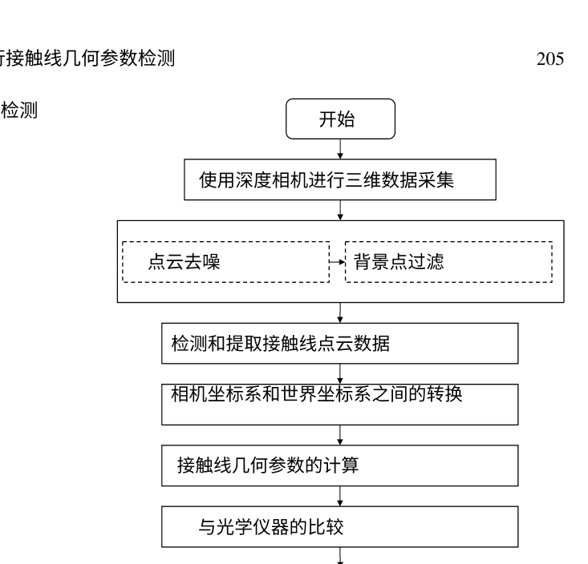

在收集接触网的三维点云数据时，根据其线性特征对接触线的点云数据进行提取。

本节介绍了一种使用接触线的三维点云数据进行几何参数检测的方法[8]。如图7.1所示，基于三维点云的接触网导线高度和错位检测主要包括以下过程：接触网三维点数据云的获取和预处理，接触线的检测和提取，三维空间坐标转换，导线高度和错位参数的计算，现场实验和结果分析。

#### 7.2.1 获取和预处理接触网3D点云数据

-   1. 数据获取

本研究选择Kinect V2.0深度相机来获取现场接触网3D点云数据。具体过程如下所示。

首先，将深度相机固定在检测车上，如图7.2所示。相机中的红外发射器发射红外光到接触网上，通过处理接收到的反射信息，获取图像中每个深度点的深度信息，并将其保存为点云数据。通过映射和转换，可以获得所有点在世界坐标系中的3D坐标。

将深度信息转换为世界坐标系。每帧的点云数据包含大约217,088个点，每个点通过其(x, y, z)位置信息唯一确定。图7.3显示了收集到的单帧点云数据。在该图中，深度相机坐标系的原点是相机的光学中心。相机的主光轴是z轴（蓝色），y轴（绿色）垂直于z轴，x轴（红色）垂直于y-z平面。点云数据中的(x, y, z)坐标是相机坐标系中的坐标。

## 2. 数据预处理

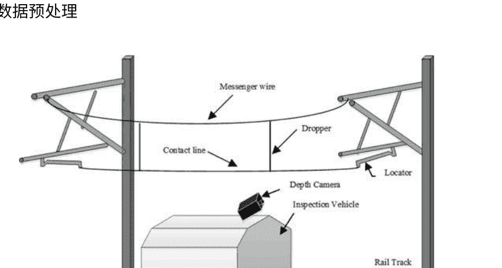

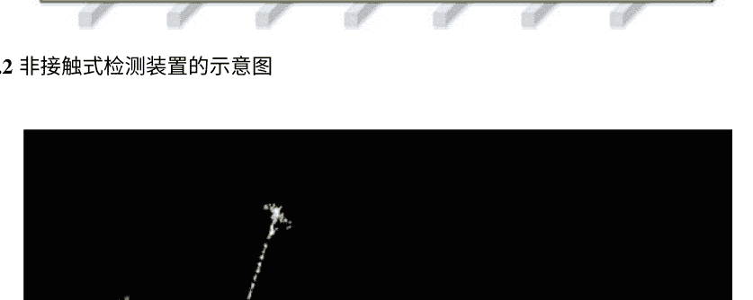

受人为干扰或空气中的杂质影响，采集到的点云数据可能会受到噪声的污染。 有必要对采集到的点云数据进行去噪处理。 此外，接触网的采集点云数据中包含大量接触网柱和支撑装置。 这些背景点云容易导致误目标检测，影响检测的准确性和效率。 因此，需要对原始点云数据进行滤波和预处理。 预处理方法如下所示。

### (a) 统计异常值去除

当深度相机扫描并生成点云数据时，测量误差会导致一些稀疏的异常值。 它会干扰点云的后续处理，并导致点云识别失败。 为此，使用统计异常值滤波算法来去除噪点。 该算法是基于目标点与其邻近点之间距离分布的概率方法。

通过比较每个点的k个最近邻点的平均距离d和阈值Td，可以确定该点是否有效，如式（7.1）所示。

>$$
\begin{cases}
\bar{d} = \frac{\sum_{i=1}^k d_i}{k} \leq Td & \text{标记为有效点} \\
\bar{d} = \frac{\sum_{i=1}^k d_i}{k} > Td & \text{标记为无效点}
\end{cases}
$$

### (b) 条件去除滤波器

除了噪声点外，采集到的点云数据中还包括大量的背景点云，如接触网支柱和支撑装置，这些会影响检测的准确性和效率，并容易导致误报目标检测。 因此，需要对这些背景点进行过滤。

在这里，使用条件移除滤波器来通过设置保留的点云范围{(x, y, z)|x_{min} \leq x \leq x_{max}, y_{min} \leq y \leq y_{max}, z_{min} \leq z \leq z_{max}}来去除无用信息的环境干扰。 这个过程可以去除大部分接触网柱和支撑装置的背景干扰，并有效去除隧道等复杂环境的背景干扰。 背景分离后的点云数据如图7.6所示。

从表7.1可以看出，通过预处理，噪点和大量背景点被去除，计算量减少，检测效率提高。

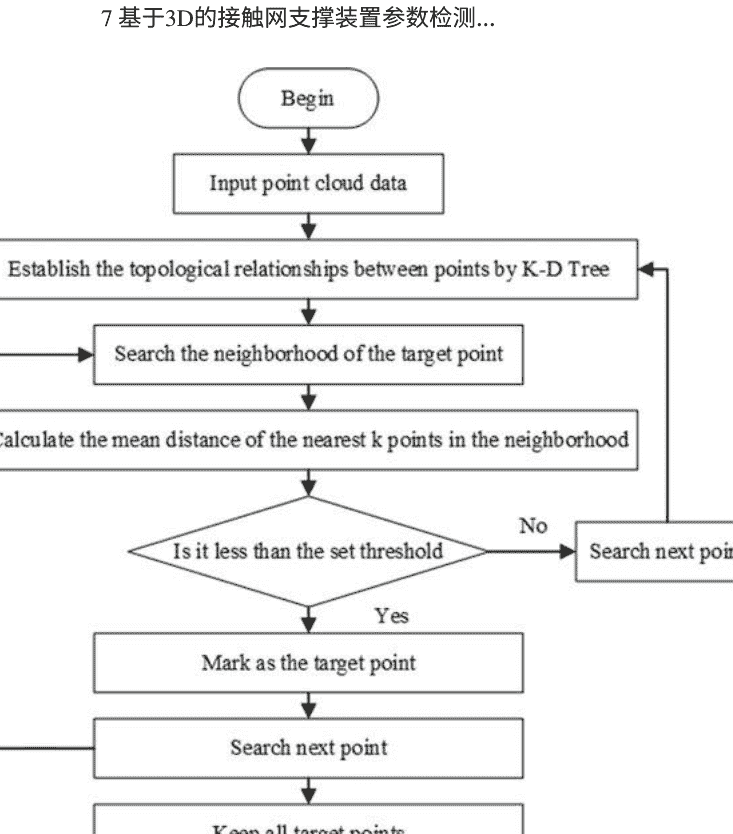

## 图7.4统计滤波算法的流程图

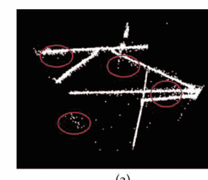

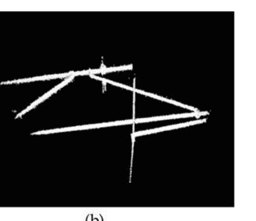

图7.5经过统计离群值去除后的3D点云。 a处理前。 b处理后

#### 7.2.2 接触线的检测和提取

在获取和预处理点云数据后，基于接触线特征提出了一种改进的基于悬挂系统的随机采样一致性（RANSAC）直线检测算法，用于检测接触线并提取其位置信息。

-   1. RANSAC算法

RANSAC算法[9-11]是一种用于随机参数估计的方法。RANSAC算法的基本思想如下所示。(1) 随机选择一定数量的数据作为样本子集，并使用最小方差计算方法估计该子集的模型参数。(2) 计算所有其他样本与模型的偏差值，并将偏差值与预设阈值进行比较。当阈值大于计算得到的偏差值时，样本点是模型的内点。当阈值小于计算得到的偏差值时，样本点是模型的离群点。(3) 记录当前模型下的内点数量，然后重复该过程。通过每次重复达到最多内点时，记录最佳模型参数。算法的每次迭代后，将综合计算用于判断模型是否

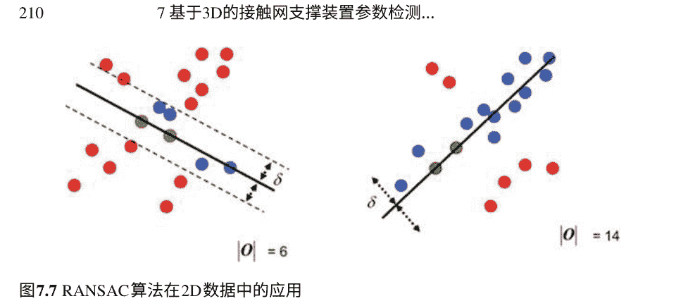

根据预期的错误率、样本总数、当前迭代次数和最大内点数，迭代结束。算法完成后，得到的模型参数是最终的模型估计结果。

RANSAC算法要求模型满足以下假设。

-   (1) 所有目标数据都是内点。
(2) 异常值不能适应目标模型。
(3) 所有其他点都是噪声点。

图7.7展示了RANSAC模型估计算法在2D数据中进行线检测的简单应用。蓝色点是内点，红色点是异常值，绿色点是开始时选择的两个原始点形成的初始直线模型。通过比较其他点到直线模型的距离和阈值 δ，将在阈值范围内的点分类为内点，并通过重复上述过程记录每个模型中的内点数。最后，通过迭代计算得到右侧图中的最优模型。

RANSAC算法在理论上可以完全消除所有离群值的影响，并获得最佳的模型参数估计。然而，原始的RANSAC算法存在两个问题。第一个问题是数据中内点和离群点的区分需要与预设阈值进行比较。

当目标模型具有明显的物理意义时，阈值的设定更容易。然而，如果目标模型相对抽象，很难找到合适的阈值。第二个问题是原始的RANSAC算法的迭代次数不能直接设置，而是由操作过程中的不同条件决定。因此，无法准确预测迭代次数。此外，原始的RANSAC算法只能从单个数据集中估计一个模型。当存在两个或更多模型时，无法找到其他目标模型。

### 2. 基于接触线特征的改进RANSAC线检测算法

结合接触线的三维点云数据的特点，基于点云中接触线的连续线特征进行接触线的检测和提取。

改进的RANSAC算法对接触线的检测过程可以分为以下几个步骤。

步骤1：在预处理的点云数据中，随机选择两个点A₁(x₁, y₁, z₁)和A₂(x₂, y₂, z₂)，得到由这两个点形成的直线l的方程如下。

```
\frac{x - x_0}{a} = \frac{y - y_0}{b} = \frac{z - z_0}{c}
```

将A₁和A₂的坐标代入上述方程，得到直线l的方程。

```
\frac{x - x_1}{x_2 - x_1} = \frac{y - y_1}{y_2 - y_1} = \frac{z - z_1}{z_2 - z_1}
```

第二步：计算点云数据中其他点到线的距离 d_i。例如，点 A的坐标 (x_a, y_a, z_a)在线外的距离可以通过公式(7.4)计算。

```
d_i = \frac{\sqrt{\begin{vmatrix} x_a - x_1 & y_a - y_1 \\ x_2 - x_1 & y_2 - y_1 \end{vmatrix} + \begin{vmatrix} y_a - y_1 & z_a - z_1 \\ y_2 - y_1 & z_2 - z_1 \end{vmatrix} + \begin{vmatrix} z_a - z_1 & x_a - x_1 \\ z_2 - z_1 & x_2 - x_1 \end{vmatrix}}}{\sqrt{(x_2 - x_1)^2 + (y_2 - y_1)^2 + (z_2 - z_1)^2}}
```

步骤3：设置距离阈值ε并遍历数据中的所有点。如果 d_i < ε，则该点是目标点。点云数据中的目标点数量被计算为直线的得分 s。

步骤4：重复上述步骤k次。选择得分最高的直线l’作为接触线的最终检测目标。迭代次数k由公式 (7.5) 确定。

```
k = \frac{\log(1 - p)}{\log(1 - w^n)}
```

其中p是在k次迭代后获得最优模型的概率，在本节中设置为0.99；n是形成估计模型所需的点的数量；w是目标点数与总点数之比的估计值。

步骤5：设置直线得分的上限和无效参数的允许范围，以抑制算法迭代过程中的无限循环。

步骤6：计算完成后，提取直线 l' 的点云数据。

结合接触线的三维点云的实际特征，大量实验统计表明，当选择 ε为0.02 ， w设置为0.16时，可以获得最佳的接触线检测效果。

图7.8显示了接触线的检测结果。 该方法可以有效提取接触线的点云数据。 此外，通过合理控制参数迭代次数和目标模型得分的上限，克服了原始RANSAC算法的缺点，改进后的RANSAC算法具有更强的鲁棒性。

#### 7.2.3 接触线导线高度和错位的检测

通过上述方法检测和提取接触线后，使用3D空间旋转和平移信息获得从相机坐标系到世界坐标系的变换矩阵。 使用变换矩阵计算导线高度和错位。 此外，通过将计算结果与光学仪器的静态测量值进行比较，可以获得检测误差，以验证参数检测结果的准确性。

非接触式检测装置参数的示意图如图7.9所示。

在图7.9中，世界坐标系中， θ是深度相机与检测装置平面之间的角度； l 是两条轨道之间的宽度； h是相机光学中心到地面的高度； Ow是坐标系的原点，位于两个轨道位置的中间； Zw是检测装置沿轨道的行进方向； Yw是垂直于轨道平面向上的方向； Xw是垂直于平面 Yw Zw并指向检测装置行进方向左侧的方向。 在相机坐标系中， Oc是坐标系的原点； Zc是相机主光轴的方向； Yc是垂直于平面 Xc Zc且与平面 Yw Zw的角度 θ不同。 此外， O是深度相机的中心； O'是点 O在水平地面上的投影； d是从 O'到轨道一侧的距离； P是深度相机采集的接触线的任意点，其在相机坐标系中的坐标为 (X c, Yc, Zc)。

从参数的示意图中可以看出，相机坐标系和世界坐标系之间存在绕 X轴的旋转变换和在 X和 Y轴方向上的平移变换。
旋转变换矩阵如下所示。

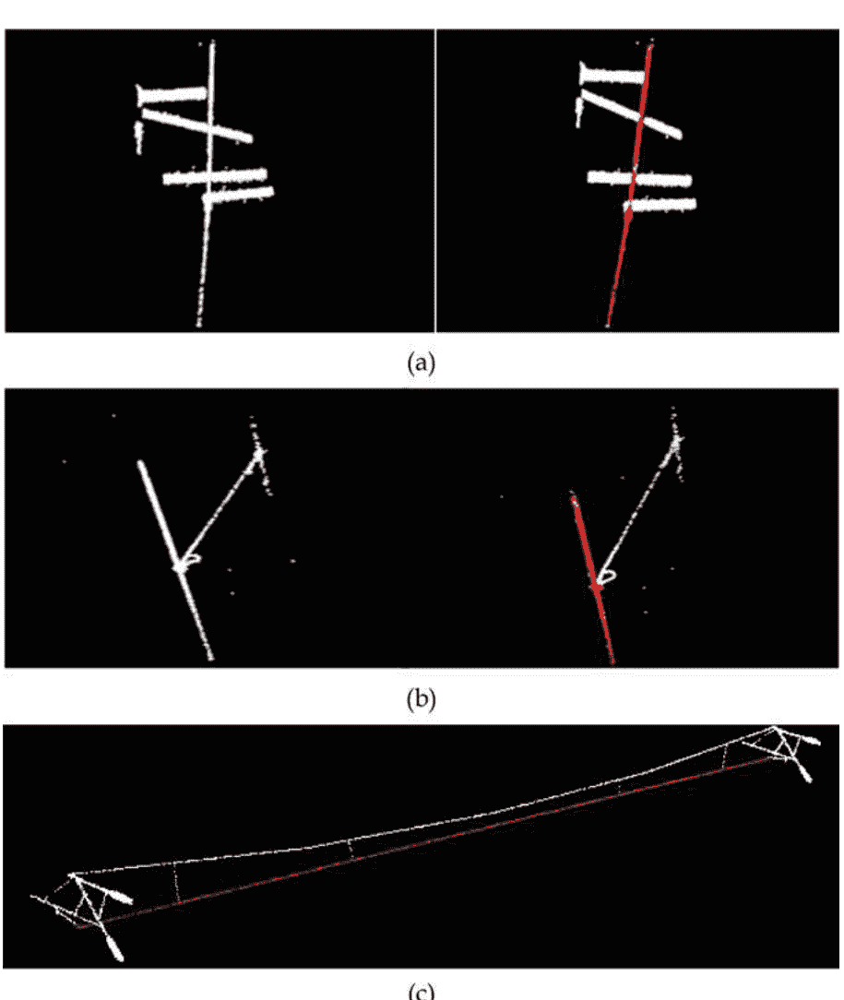

$$
M_{\text{Rot}}(X, \theta) = \begin{bmatrix}
1 & 0 & 0 & 0 \\
0 & \cos \theta & \sin \theta & 0 \\
0 & -\sin \theta & \cos \theta & 0 \\
0 & 0 & 0 & 1
\end{bmatrix}
$$

平移变换矩阵如下所示。

$$M_{\text{Trans}} = \begin{bmatrix} 1 & 0 & 0 & \frac{l}{2} - d \\ 0 & 1 & 0 & h \\ 0 & 0 & 1 & 0 \\ 0 & 0 & 0 & 1 \end{bmatrix}$$ (7.7)

最终的变换矩阵 \(M\) 如下所示。

$$M = M_{\text{Trans}} M_{\text{Rot}}(X, \theta) = \begin{bmatrix} 1 & 0 & 0 & \frac{l}{2} - d \\ 0 & \cos \theta & \sin \theta & h \\ 0 & -\sin \theta & \cos \theta & 0 \\ 0 & 0 & 0 & 1 \end{bmatrix}$$ (7.8)

世界坐标系点 \((X_W, Y_W, Z_W)\) 和相机坐标系点 \((X_C, Y_C, Z_C)\) 之间的对应关系可以通过以下方式获得。

$$\begin{bmatrix} X_W \\ Y_W \\ Z_W \\ 1 \end{bmatrix} = M \begin{bmatrix} X_C \\ Y_C \\ Z_C \\ 1 \end{bmatrix}$$ (7.9)

在图7.9中，点 \(P\) 是接触线的一个点，在相机坐标系中的坐标为 \((X_C, Y_C, Z_C)\)，可以代入公式(7.9)，从而得到该点在世界坐标系中的坐标。

然后，可以通过以下方式获得导线高度 \(y\) 和间距 \(x\)。

$$y = Y_W = Y_C \cos \theta + Z_C \sin \theta + h$$ (7.10)

$$x = X_W = X_C + \frac{l}{2} - d \quad (7.11)$$

#### 7.2.4 实验结果的分析

如图7.10所示，为了验证接触线提取方法的可行性和导线高度和错位的检测精度，在中国铁路电气化局铁路交通设备有限公司常州接触线试验线上进行了现场实验。现场接触线到地面的高度可以很好地模拟实际接触线与列车车顶之间的高度差。

如图7.11a所示，Kinect V2.0深度摄像机安装并固定在检测设备上，用于采集接触线点云数据，采集速度可达每秒30帧。

-   (1) 计算导线高度和错位

在实验中，连续检测了接触线测试线相邻四个跨距的导线高度和错位值。
从这些数据中，在不同的本地位置选择了六个点云数据帧，并且每个帧中的一个点被定位为与光学仪器的静态测量值进行比较的参考点。实验平台包括一个Windows 10 64位系统，CPU频率为2.5 GHz，8 GB的RAM，以及Visual Studio的编程环境。

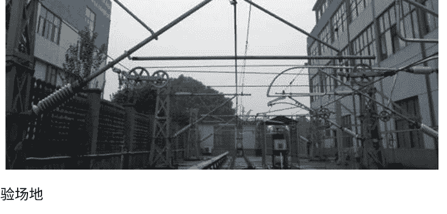

图7.10 实验场地

## 7.2 使用RANSAC进行接触线几何参数检测

2013年，六个本地位置的几何参数检测结果如图7.12所示。

(2) 检测结果与参考值的比较 使用光学仪器在六帧数据的相同位置上进行静态几何参数检测，以验证所提出方法得到的检测结果的准确性和有效性。

光学仪器测得的结果被视为参考值。同时，参考点的相机坐标系的坐标。

图7.11 接触网三维点云数据的现场采集。a接触网的几何参数检测设备。b接触网的三维点云数据和相应的二维图像。c接触线、下垂线和接触线的三维点云及其相应的二维图像

图7.12 不同本地位置的六帧点云数据的几何参数检测结果。a本地位置1。b本地位置2。c本地位置3。d本地位置4。e本地位置5。f本地位置6

表7.2 导线高度和错位的检测结果

| 序号 | 相机坐标系的坐标 (X_C) | 相机坐标系的坐标 (Y_C) | 相机坐标系的坐标 (Z_C) | 导线高度 y(mm) | 错位 x(mm) |
| :--- | :--------------------- | :--------------------- | :--------------------- | :------------- | :--------- |
| 1    | -198.004               | 168.101                | 1233                   | 1720.4         | -208.004   |
| 2    | -113.869               | 250.045                | 1133                   | 1718.6         | -135.869   |
| 3    | 364.107                | 186.915                | 1250                   | 1739.8         | 179.107    |
| 4    | 446.207                | 140.562                | 1262                   | 1742.7         | 186.207    |
| 5    | 319.174                | 386.528                | 1038                   | 1731.1         | 95.174     |
| 6    | 269.159                | 226.644                | 1443                   | 1721.7         | 67.159     |

表7.3 检测结果与参考值的比较

| 序号 | 检测结果 (导线高度 y(mm)) | 检测结果 (错位 x(mm)) | 参考值 (导线高度 y(mm)) | 参考值 (错位 x(mm)) | 误差 (Δy(mm)) | 误差 (Δx(mm)) |
| :--- | :------------------------ | :-------------------- | :---------------------- | :------------------ | :------------ | :------------ |
| 1    | 1720.4                    | -208.004              | 1718                    | -214                | -2.4          | -6.0          |
| 2    | 1718.6                    | -135.869              | 1721                    | -141                | -2.4          | -5.1          |
| 3    | 1739.8                    | 179.107               | 1740                    | 178                 | -0.2          | -1.1          |
| 4    | 1742.7                    | 186.207               | 1739                    | 181                 | -3.7          | -5.5          |
| 5    | 1731.1                    | 95.174                | 1734                    | 99                  | 2.9           | 3.9           |
| 6    | 1721.7                    | 67.159                | 1723                    | 59                  | 1.3           | -8.2          |

将点带入(7.10)和(7.11)计算几何参数。将结果与相应的参考值进行比较，如表7.2和7.3所示。

实验结果表明，使用所提出的方法，接触线的导线高度误差在4毫米以内，错位误差在9毫米以内，均满足接触网在线受电弓检测设备的主要技术规范，即导线高度误差小于10毫米，错位值误差小于25毫米。与[12]中没有振动校正的2D图像检测方法相比（错位误差为11毫米，导线高度误差为10毫米），检测精度进一步提高，也验证了所提出方法的可行性。

#### 7.2.5 结论

针对电气化铁路接触网几何参数检测问题，本节介绍了一种基于接触网三维点云的导线高度和错位的非接触计算方法。

首先，收集接触网的3D点云数据，并使用统计滤波和条件滤波算法去除数据的噪声和背景点干扰。然后，根据接触网点云的特征，改进原始RANSAC算法进行空间连续线检测和接触线提取。最后，通过空间旋转和平移信息获取相机坐标系到世界坐标系的转换矩阵，然后计算接触线的几何参数。所提出的方法测量导线高度的误差小于4毫米，错位的测量误差小于9毫米，可以满足实际检测要求。

### 7.3 使用3D深度分割神经网络进行结构参数检测

作为固定接触线的支撑装置，接触网悬臂装置对高速铁路牵引供电系统至关重要[13]。如图7.13所示，接触线被连接并固定在接触网悬臂装置的定位夹具中。当火车行驶时，受电弓从接触线上收集电流以供给火车。为了保证电流收集质量并使车辆平稳安全地行驶，定期监测接触网悬臂装置的结构稳定性至关重要[14,15]。随着人工智能技术的快速发展，已经提出了许多基于先进视觉的非接触式检测方法，用于接触网部件故障[16,17]和结构参数测量[1–3,18]。这些基于2D图像的方法主要集中在简单环境中的参数检测，并且这些方法容易受到背景干扰的影响。如图7.13a所示，这些方法无法对接触网悬臂装置的结构参数进行高精度检测，特别是在过渡区域存在复杂背景的情况下，如图7.13b所示。更精确地检测这些结构参数的一种可能解决方案是捕捉设备的3D深度信息（如图7.14所示）。

本节提出了一种使用3D CNN和改进的RANSAC方法[19]来检测接触网悬臂装置的结构参数的新方法。所提出的方法如图7.15所示。主要包括以下几个方面。

(1) 接触网组件的分割

引入了基于3D CNN的模型来分割接触网悬臂装置，如图7.15b所示。与无监督聚类分割方法SC_LCCP[20]相比，该方法结合了超体素聚类(SVC)[21]和局部凸连通补丁(LCCP)[22]，具有两个优点。(i) 使用了大量的3D点云数据集来训练神经网络，避免了手动参数设置和调整。(ii) 作为一种有监督方法，它可以准确识别组件，并且不依赖于关于悬挂式支架元素之间关系的先验信息。

(2) SPCCD的计算

如图7.15c所示，提出了一种改进的投影RANSAC（IP_RANSAC）方法来计算SPCCD。首先，提出了一种快速平面检测方法，用于划分过渡区域中的多悬挂式支架设备，并解决不同悬挂式支架设备之间的遮挡问题。然后，将点云数据投影到检测到的平面上。从投影平面直接提取悬挂式支架设备的每个组件的轴进行参数计算，可以避免将点云数据映射回原始空间进行参数计算的问题[20]，并且可以提高检测精度。

#### 7.3.1 悬臂组件分离

本节介绍了一种基于3D CNN的先进识别和分割模型，以提高传统分割方法的准确性，这是准确检测SPCCD的基础。识别和分割网络的描述如下。

(1) 3D点卷积神经网络

目前，CNN广泛用于学习基于规则网格的2D图像的局部空间相关性，从而学习分层特征表示，如图7.16[23]中虚线上部所示。基于分层架构的CNN扩展已应用于更高维度的规则域。然而，3D点云处于无序和不规则的域中，如图7.16虚线下部所示。解释如何提取3D点云特征的扩展CNN是困难的。随着3D感知技术的快速发展，基于深度学习理论的许多3D点云分割方法已经得到广泛研究[24-33]。

这些方法有不同的优点和缺点。例如，[24-28]成功解决了点云的混乱问题，但丢失了一些有价值的信息。参考文献[29-33]使用了典型的CNN网络，通过“插值”或“投影”特征到预定义的规则域中。然而，与每个点相关的卷积核是单独参数化的，并且无法提取局部结构。对于这些问题，李等人[34]提出了一个通用且直接的框架，称为3D PointCNN。该框架利用CNN的优势直接从3D点云中学习特征。3D PointCNN的思想是从前一层中选择K个候选点(p1, p2, ..., pk)。然后，通过使用多层感知机(MLP)学习一个K×K的变换矩阵（称为X-变换），即 X = MLP(p1, p2, ..., pk)。该矩阵的主要功能是对输入数据进行加权和排列。经过上述过程后，可以使用传统的CNN架构处理转换后的特征。整个过程称为X-Conv操作。基于X-Conv操作的网络结构图如图7.17所示。X-Conv操作的具体实现步骤如下列出。

图7.16 规则网格和点云上的分层卷积

#### 1) X-Conv运算符

**步骤1：点“投影”**

首先，利用最远点采样（FPS）来减少样本数量 F1= {(p1,i, f1,i) : i = 1, 2, ..., N1, p1,i ∈ R^Dim}，并且每个点都关联一个特征 {f1,i : f1,i ∈ R^{C1}}。从集合 (p1,i) 中选择代表点 F2= {(p2,j, f2,j) : j = 1, 2, ..., N2}，这些点是有助于“投影”信息的点，现在F2的特征维度为C1，因此 f2,j ∈ R^{C1}。然后，将上一层中每个代表点 (p2,j) 的K个最近邻点 P(p1, p2 …, p_k, p ∈ R^{K×Dim}) 投影到以每个代表点为中心的局部坐标系中。这里，N表示点的数量，C表示通道数，N1 > N2，且C1 < C2。

P' = P - p_{2,j}  (7.12)

**步骤2：提升维度空间**

将p中每个点的集合通过MLP_δ映射和提升到一个C_δ维空间中，然后得到每个代表点(p2,j)的新特征 f_{2,j}^δ ∈ R^{k×C_δ}。

f_{2,j}^δ = MLP_δ(P')  (7.13)

**步骤3：连接特征**

然后，将特征 f_{2,j}^δ 和 f_{2,j} 连接起来形成一个新特征 f_{2,j}，其维度为C2 = C_δ + C1。

f_{2,j}=[f^{\delta}_{2,j}, f_{2,j}] (7.14)

**步骤4：学习X变换矩阵**

通过对每个点的 P集合进行训练和学习，得到了 K × K X -变换矩阵。

X = \text{MLP}(P') (7.15)

**步骤5：加权和排列特征**

当得到变换矩阵和新特征时，使用矩阵 X 对特征 f_{2,j} 进行加权和排列。

F_X = X \times f_{2,j} (7.16)

**步骤6：特征卷积**

最后，使用典型的卷积算子对转换后的特征 F_X 与卷积核 K 进行卷积运算。F_p 是卷积输出。

F_p=\text{Conv}(K \times F_X) (7.17)

#### 2) 基于X-Conv的分割架构

基于 X-Conv结构的3D PointCNN网络结构如图7.17所示。首先，将原始的接触网点云进行下采样，得到6144个初始点云作为输入数据。然后，依次使用四个具有不同设置参数的 X-Conv操作。接下来，分割任务需要高分辨率的点级输出，因此采用Conv-DeConv架构和五个DeConv算子来实现。

需要注意的是，Conv和DeConv都是 X-Conv算子；唯一的区别在于后者的点数更多但特征通道更少。

图7.17 基于X-Conv运算符的3D PointCNN架构[19]

1.  X-Conv(N=6144, 通道=256, 卷积核=8, 扩张率=1)
2.  X-Conv(N=768, 通道=256, 卷积核=12, 扩张率=2)
3.  X-Conv(N=384, 通道=512, 卷积核=16, 扩张率=2)
4.  X-Conv(N=128, 通道=1024, 卷积核=16, 膨胀率=6)
5.  X-Conv(N=128, 通道=1024, 卷积核=16, 膨胀率=6)
6.  X-Conv(N=384, 通道=512, 卷积核=16, 膨胀率=6)
7.  X-Conv(N=768, 通道=256, 卷积核=12, 扩张率=6)
8.  X-Conv(N=6144, 通道=256, 卷积核=8, 扩张率=6)
9.  X-Conv(N=6144, 通道=256, 卷积核=8, 扩张率=4)

使用不同颜色输出分割结果

#### 7.3.2 悬臂结构参数测量

为了准确测量SPCCD，提出了一种快速高精度的IP_RANSAC算法。首先，将悬臂装置结构的检测平面划分，以解决遮挡问题。然后，将分割的点云数据投影到检测到的平面上，使用RANSAC提取组件轴。最后，根据它们的空间关系计算SPCCD。

(1) 悬臂装置结构的分割检测平面

由于多悬臂系统在某些特定区域（如道岔）存在遮挡干扰，检测到的组件很难与其相应的悬臂系统匹配。因此，提出了一种快速的RANSAC平面检测方法，用于捕捉每个独立悬臂所在的空间平面。提取的平面可以约束分割的组件区域，并准确地分组每个完整的接触网悬臂装置，避免了在SPCCD计算中的不匹配问题。然后，与标准的RANSAC不同，平面检测是通过在分割的局部区域中选择三个随机点而不是全局区域来进行的，这可以提高检测速度和检测精度。所提出方法的具体步骤如下列出。

**步骤1：确定第一个检测平面**

首先，从3D点云数据中随机采样三个点 P_1， P_2， P_3 来确定一个初始的检测平面，如图7.18所示。然后，使用公式(7.18)，(7.19)和(7.20)来计算点到检测平面的距离。与标准RANSAC [35]的全局随机点选择方法不同，所选的三个点来自局部分割的接触网悬臂构件区域。由于平面是在分割区域中检测的，而不是整个点云中，避免了其他非接触网悬臂系统的点云干扰，提高了计算效率和检测准确性。

$$\overrightarrow{Pn} = \overrightarrow{P_2 P_1} \times \overrightarrow{P_3 P_1} \qquad \qquad (7.18)$$

$$a(x-x_1)+b(y-y_1)+c(z-z_1)=0 \qquad \qquad (7.19)$$

$$d_{\text{平面}} = \frac{\overrightarrow{P P_1} \cdot \overrightarrow{Pn}}{\| \overrightarrow{Pn} \|} \qquad \qquad (7.20)$$

其中， d_{\text{平面}} 表示点到检测平面的距离；向量(a, b, c)是平面的法向量。

然后，计算距离检测平面距离小于给定阈值 τ_dp的点的数量。经过迭代 t_dp 次，可以找到并记录包含最多内部点的平面。最后，确定最佳的检测平面。

**步骤2：确定其他检测平面**

移除在前一步中检测到的平面的点云，并在剩余的点云中重复上述过程以提取下一个检测平面。当检测到的平面内部点的数量少于剩余点数的一半时，平面检测过程终止。图7.19显示了道岔处双触网悬臂系统的平面检测结果。

(2) 提取悬臂主体组件轴

在计算SPCCD之前，首先需要检测每个悬臂主体组件的轴向量。因此，提出了一种改进的投影RANSAC直线检测方法来提取轴向量。

与投影RANSAC直线检测方法[20]不同，触网的3D点云被投影到前一步检测到的悬臂平面上，而不是图7.15c中显示的X-Y平面。结构参数直接在投影平面上计算，可以有效避免由于从X-Y平面返回到原始空间的点云的二次映射而导致的结构参数检测偏差问题[20]。该方法的具体步骤如下所示。

**步骤1：确定第一个主干组件轴**

首先，计算每个分段主干组件的轴线和点到轴线的距离。如图7.20所示，从悬臂组件的点云中随机采样两个点 P1, P2。根据公式(7.21)，(7.22)和(7.23)计算组件的轴线，并记录组件上所有点到轴线的距离。

图7.20 使用RANSAC进行直线提取[19]

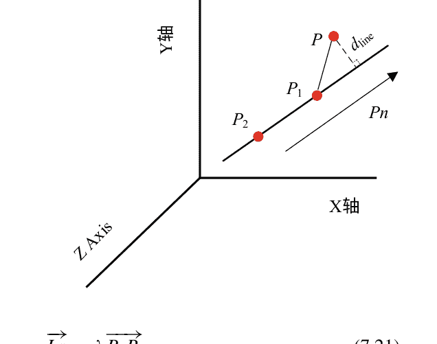

$$\overrightarrow{Ln} = \lambda \overrightarrow{P_2P_1} \qquad (7.21)$$

$$\frac{x-x_1}{l} = \frac{y-y_1}{m} = \frac{z-z_1}{n} \qquad (7.22)$$

$$d_{\text{line}} = \frac{\left\| \overrightarrow{PP_1} \times \overrightarrow{Ln} \right\|}{\left\| \overrightarrow{Ln} \right\|} \qquad (7.23)$$

其中，$d$是从点到提取轴的距离；$\lambda$是直线的比例因子；$(l, m, n)$是直线的方向向量。

然后，计算与轴距离小于给定距离阈值$\tau_{dl}$的内部点的数量。经过$t$次迭代后，可以找到并记录包含最多内部点的轴。

最后，确定最佳轴。

步骤2：确定另一个组件轴。

重复上述步骤，提取悬臂系统中其他组件的轴，直到检测到所有悬臂组件的轴，并终止整个检测过程。图7.21是悬臂系统所有组件轴的检测结果的示意图。

## 3. SPCCD的检测

如图7.22所示，当提取每个主干组件的轴线向量$(l, m, n)$后，根据主干组件的连接关系，可以通过公式(7.24)和(7.25)计算出结构角$\theta$和稳定臂的斜率$S$。图7.23是一个示例。

$$\theta = \arccos\frac{\overrightarrow{(l_i, m_i, n_i)} \cdot \overrightarrow{(l_j, m_j, n_j)}}{\left| \overrightarrow{(l_i, m_i, n_i)} \right| \times \left| \overrightarrow{(l_j, m_j, n_j)} \right|} \qquad (7.24)$$

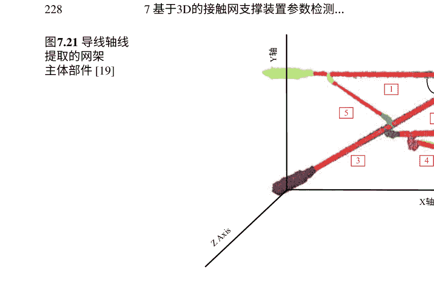

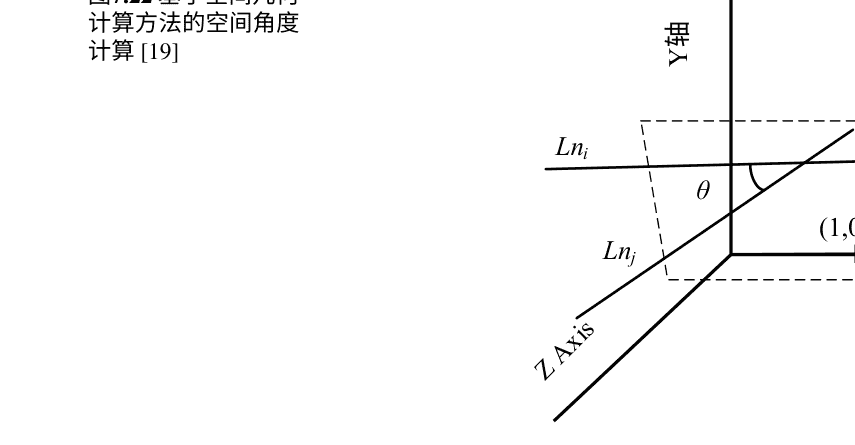

$$ S = \tan\left( \arccos \frac{\overrightarrow{(l_s, m_s, n_s)} \cdot \overrightarrow{(1,0,0)}}{\left| \overrightarrow{(l_s, m_s, n_s)} \right| \times \left| \overrightarrow{(1,0,0)} \right|} \right) \qquad (7.25) $$

其中 $(l_s, m_s, n_s)$和 $(l_j, m_j, n_j)$表示两个主体部件的轴向矢量；$(l_s, m_s, n_s)$是稳定臂部件的轴向矢量。

#### 7.3.3 实验结果的分析

所提出的方法的性能是通过使用现场采集的接触网悬臂装置的三维点云进行评估和验证的。实验的硬件系统环境是Intel (R) Xeon (R) CPU E5-2640 v4 @ 2.40 GHz, TITAN RTX 24GB GPU，32-GB RAM和2-TB SSD。所有核心算法代码都是使用TensorFlow架构[36]和MATLAB在Ubuntu 18.04系统上开发的。

### 1. 部件分割

- (1) 数据集

如图7.24所示，接触网的三维点云数据是从安装在检测车顶部梁上的Azure Kinect传感器摄像头获取的。该摄像头是一款1亿像素的飞行时间（TOF）深度扫描仪，并符合ISSCC 2018 [37]中提出的所有图像传感器特性。工作范围为0.5至5.46米。视场（FOV）可覆盖75°×65°。该传感器摄像头可以在以下条件下正常工作：温度在10至25℃之间，湿度在8至90%之间，无凝结相对湿度，低自然光干扰环境（<3 Klux）。为了准确分割部件的点云，我们将连续拍摄的20帧点云数据融合到一组数据中，以填补由于不均匀反射引起的空洞问题。这可以确保数据之间的偏差尽可能小，并提高接触网三维点云的分割性能。接触网悬臂装置的点云总共包含3000张图像，其中包括2000张训练集图像，550张验证集图像和450张测试集图像。基于开源代码（https://github.com/cloudcompare/cloudcompare）实现了三维点云标注。

- (2) 模型参数和评估指标

首先，3D PointCNN网络模型参数使用公共数据集中的预训练参数进行初始化。采用动量法选择反向传播梯度下降法，并将动量和权重衰减项分别设置为0.9和0.0001。

其次，将学习率设置为0.0001，最大迭代次数设置为500。

最后，为了评估3D PointCNN的性能，使用点比率 $P_R$ 作为评估指标来验证分割的准确性，并计算整个样本的平均误差$Error_{average}$来评估解决方案的鲁棒性。计算公式如(7.26)和(7.27)所示。

$$ P_R = \sum_{i=1}^{K} TP_i / \sum_{i=1}^{K} N_i \times 100\% \qquad (7.26) $$

$$ \text{平均误差} = \frac{1}{M} \sum_{j=1}^{M} (100\% - P_R_j) \qquad (7.27) $$

其中，$TP_i$表示类别$i$中真正例的预测点数；$N_i$表示类别$i$的总点数；$K$表示组件类别的数量；$M$表示架空设备测试数据集的样本数。

- (3) 实验结果与分析

a) 在训练和验证数据集上，使用上述评估指标评估网络模型，结果显示在图7.25中。对该图的分析表明，模型准确率在训练200个周期后开始收敛，准确率达到约97%。模型在验证数据集上表现相同：最高准确率达到98%，波动逐渐减小并进入稳定值范围。这些结果表明该模型具有高精度和强鲁棒性。

图7.25 训练阶段中用于训练和验证数据集的接触网点云的分割准确性[19]

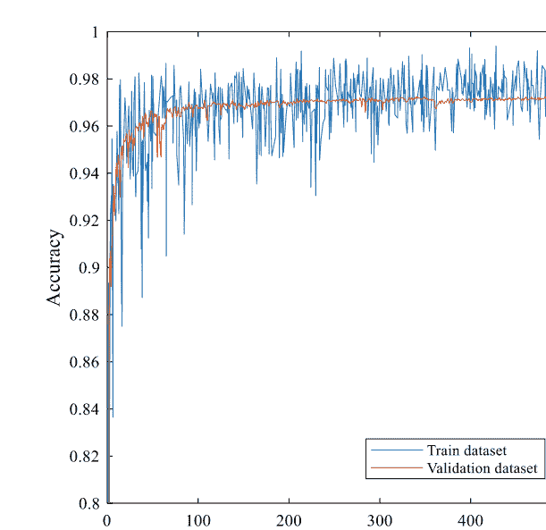

b) 图7.26和表7.4展示了3D PointCNN模型在接触网悬臂试验数据集上的分割结果。通过对这些结果的分析，可以看出模型的平均分割准确率达到了97.7%。与[20]中的结果相比（如表7.4所示），可以看出本节提出的方法的误差范围为2.0-2.6%，平均误差为2.26%，低于[20]中的结果。所提出的方法的准确性和稳定性得到了证明。

c) 对两种方法的计算时间消耗进行统计分析表明，本节分割方法的平均计算时间消耗约为0.48秒/帧，而[20]中的方法的平均计算时间消耗几乎为0.04秒/帧。显然，由于模型的复杂性，所提出的算法需要消耗更多的时间，但基本实时性能仍然可以得到保证。

### 2. 平面提取

- (1) 模型参数和评估指标

为了提取每个接触网悬臂装置在同一支柱上的所有检测平面，使用点云中在检测平面距离阈值 τ_dp 内的点云数量 N_inc 与所有组件中的点云数量 N_tot 之间的比值 IP_R 作为评估指标，选择最佳模型参数并评估提取的检测平面的准确性。此外，为了确保悬臂平面的准确检测，将迭代次数 t_dp 设置为1000。

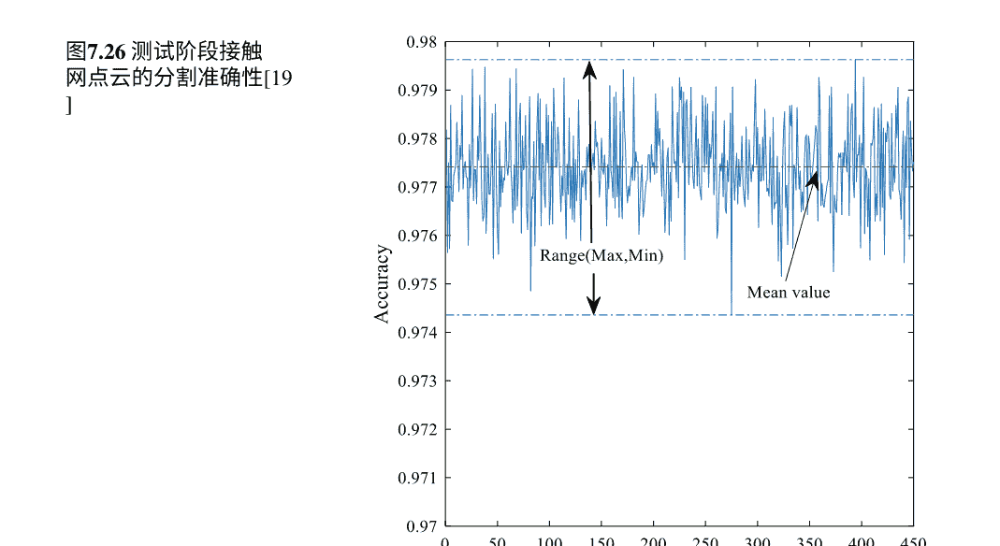

**表7.4 测试数据集的平均误差统计[19]**

| 方法 | 平均误差范围 (%) | 平均误差 (%) |
| :--- | :--- | :--- |
| SC_LCCP [18] | 2.3-5.3% | 3.80 |
| 3D PointCNN (我们的) | 2.0-2.3% | 2.26 |

为了证明改进的局部RANSAC算法的性能，我们将其与全局RANSAC算法在算法准确性和检测速度方面进行比较。结果如图7.27和表7.5所示。

$$IP\_R = \frac{N_{inc}}{N_{tot}} \tag{7.28}$$

- (2) 实验结果和分析

a) 如图7.27所示，本节提出的局部RANSAC算法的检测准确率在距离阈值为0.035 m附近可以达到96.5%。相比之下，全局RANSAC的检测准确率仅为81.1%。同时，根据接触网悬臂装置的实际物理半径，其半径范围在0.02至0.04 m之间，而局部RANSAC算法确定的平面半径（距离阈值参数）很好地匹配了这个范围。间接证明了所提出的方法可以更准确、更完整地提取接触网悬臂系统的检测平面。

图7.27 使用不同方法的平面提取准确度[19]

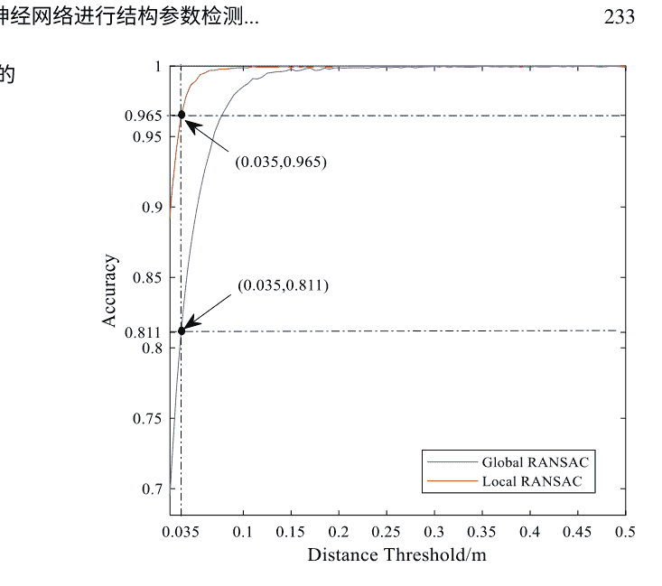

**表7.5 使用不同方法的平面检测[19]**

| 方法 | 检测速度/ms |
|------|-------------|
| 全局RANSAC | 2.83 |
| 局部RANSAC（我们的方法） | 2.12 |

b) 表7.5比较了两种算法的检测速度结果。表格的分析显示，局部RANSAC的检测速度比全局RANSAC快0.71毫秒。结果还表明，该方法通过在局部分割点而不是全局点中搜索平面，同时确保检测准确性，从而更快地进行检测。

### 3. 悬臂支撑构件的轴线检测

- (1) 模型参数和评估指标

为了评估所提出的IP_RANSAC方法在接触网悬臂构件轴线检测中的性能，我们计算检测到的构件轴线与x轴之间的角度 β，并将其与实际角度 $\beta_{ij}^{\text{real}}$（手动测量）进行比较，如（7.29）所示。角度误差$\text{Error}_{\beta}$在（7.30）中被选为评估指标，以证明所提出方法的有效性。为了选择模型的最优参数（包括距离阈值 $\tau_{d1}$和迭代次数 $t_{d1}$），进行相关实验，并通过测量最小角度误差确定上述两个参数。结果如图7.28所示。

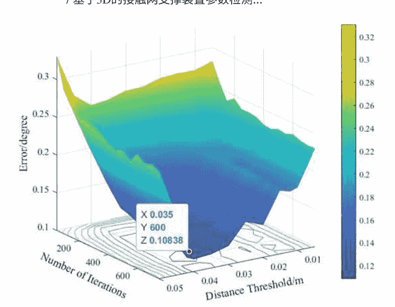

图7.28 不同模型参数的轴线误差[19]

$$\beta = \arccos \frac{\left( \overrightarrow{(l, m, n)} \right) \cdot \left( \overrightarrow{(0, 0, 1)} \right)}{\left| \overrightarrow{(l, m, n)} \right| \times \left| \overrightarrow{(0, 0, 1)} \right|} \qquad (7.29) $$

$$\text{误差}_{\beta} = \frac{1}{N M} \sum_{i=1}^{N} \sum_{j=1}^{M} \left| \beta_{ij} - \beta_{ij}^{\text{real}} \right| \qquad (7.30) $$

- (2) 实验结果和分析

从图7.28的分析可以看出，当距离阈值为0.035 m，迭代次数为600时，模型的测量角度误差最小。此外，整个接触网悬臂构件的物理半径范围在0.02到0.04 m之间，这些构件的平均半径接近0.035 m，间接证明了本节中模型参数选择的合理性和有效性。此外，在这组参数下，测量角度误差为0.1084°，表明所提出的方法具有较高的检测精度。

### 4. 参数检测

- (1) 评估指标

在获得每个组件的精确轴向矢量之后，可以根据每个组件的安装关系计算结构参数。为了最终评估所提出的SPCCD（结构角和定位器斜率）检测方法的有效性和稳定性，将检测到的SPCCD $\theta_{\text{str}}^i$ 和 $S_{\text{std}}^i$ 与手动测量的SPCCD $\theta_{\text{str\_true}}$ 和 $S_{\text{std\_true}}$ 的真实值进行比较。误差$\text{Error}_{\theta_{\text{str}}}$和$\text{Error}_{S_{\text{std}}}$进行计算。通过计算误差的期望值和方差来证明检测方法的准确性和稳定性。最后，将所提出的方法与本节中的方法[20]在数据集上进行测试和比较。结果如图7.29、7.30和表7.6、7.7所示。

$$\text{错误}_{\theta_{\text{str}}} = \left| \theta_{\text{str}}^i - \theta_{\text{str\_true}}^i \right|, \quad i = 1 \dots N \qquad (7.31) $$

$$\text{错误}_{\theta_{\text{str}}}^{\text{exp}} = \frac{1}{N} \sum_{i=1}^{N} \text{错误}_{\theta_{\text{str}}}^i \qquad (7.32) $$

$$\text{错误}_{\theta_{\text{str}}}^{\text{var}} = \sqrt{\frac{\sum_{i=1}^{N} \left| \text{错误}_{\theta_{\text{str}}}^i - \text{错误}_{\theta_{\text{str}}}^{\text{exp}} \right|^2}{N}} \qquad (7.33) $$

$$\text{错误}_{S_{\text{std}}} = \left| S_{\text{std}}^i - S_{\text{std\_true}}^i \right| / S_{\text{std\_real}}^i, \quad i, \dots, N \qquad (7.34) $$

$$\text{错误}_{S_{\text{std}}}^{\text{exp}} = \frac{1}{N} \sum_{i=1}^{N} \text{错误}_{S_{\text{std}}}^i \qquad (7.35) $$

$$\text{错误}_{S_{\text{std}}}^{\text{var}} = \sqrt{\frac{\sum_{i=1}^{N} \left| \text{错误}_{S_{\text{std}}}^i - \text{错误}_{S_{\text{std}}}^{\text{exp}} \right|^2}{N}} \qquad (7.36) $$

- (2) 实验结果和分析

通过对图7.29和表7.6的分析可以看出，所提出的方法对接触网结构角度的检测误差为0.1029°，比[20]中的方法低0.0761°。此外，所提出的方法具有较小的方差，因此其性能更加稳定。通过对图7.30和表7.7的分析可以看出，所提出的方法对接触网的定位器斜率误差为1.19%，比[20]的方法低0.44%，检测精度更高。此外，所提出的方法具有较小的方差，更加稳定。总之，所提出的方法可以满足现场的基本检测要求。

#### 7.3.4 结论

本节介绍了基于3D点云数据的接触网悬臂系统结构参数检测方法。首先，采用基于3D点云的卷积神经网络来实现接触网的高效检测，并且对接触网支撑构件进行鲁棒的分割，以避免二维图像中非物理连接区域的遮挡问题。其次，根据组件分割结果，构建了一种快速的RANSAC平面检测方法，实现了接触网悬臂系统平面的检测。检测到的平面是一个投影平面；构建了一种基于RANSAC的空间直线检测方法，实现了接触网悬臂构件轴线的精确提取和结构参数的检测。实验结果表明，该方法能够克服背景干扰，实现对接触网悬臂装置结构参数的高精度检测。

### 7.4 总结

由于检测背景干扰，基于二维图像的几何参数检测方法难以满足现场复杂检测环境的要求。在本章中，介绍了基于接触网三维点云的两种参数检测方法。在第一节中，介绍了一种改进的RANSAC几何参数检测方法，用于获取导线高度和错位。在第二节中，介绍了一种基于3D PointCNN卷积神经网络的结构参数检测方法，用于检测接触网悬臂装置的结构参数。

## 参考文献

1.  Cho CJ, Ko H (2014) 基于视频的铁路架空供电线路动态错位测量，使用旋转不变特征匹配。 IEEE Trans Intell Transp Syst 16(3):1294–1304
2.  Zhan D, Jing D, Wu M, Zhang D, Yu L, Chen T (2018) 铁路接触网几何参数的准确高效视觉测量方法。 IEEE Trans Instrum Meas 67(12):2841–2853
3.  Yang Y, Zhang W, He Z, Chen D (2019) 基于单目视觉的定位器坡度计算方法，使用深度表示。 Neural Comput Appl 31(7):2781–2794
4.  Pastucha E (2016) 使用移动扫描数据进行接触网系统检测、定位和分类。 Remote Sens 8 (10):801
5.  Lin S, Xu C, Chen L, Li S, Tu X (2020) 使用深度学习的激光雷达点云识别架空接触网系统。 Sensors 20(8):2212
6.  彭C-Y，王L，高X-R，王Z，叶Y (2004) 接触线高度的动态检测。 光电工程1

图7.29 不同方法中的结构角误差。 a) 使用方法[18]得到的结果。 b) 使用我们提出的方法得到的结果[19]

图7.30 坡度误差在不同的方法[19]

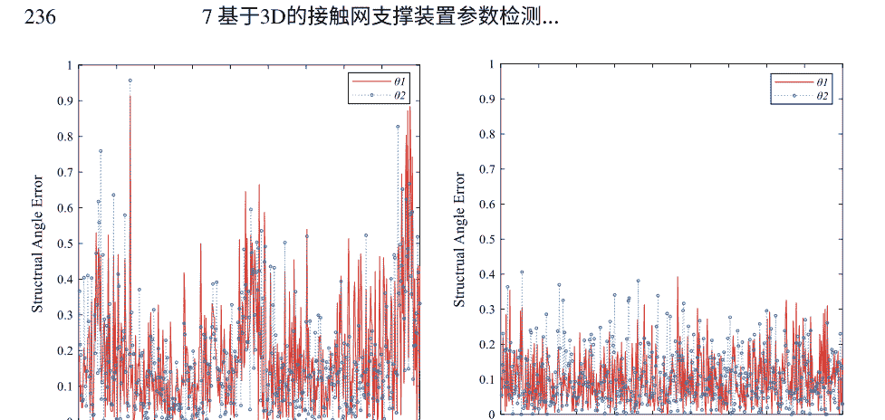

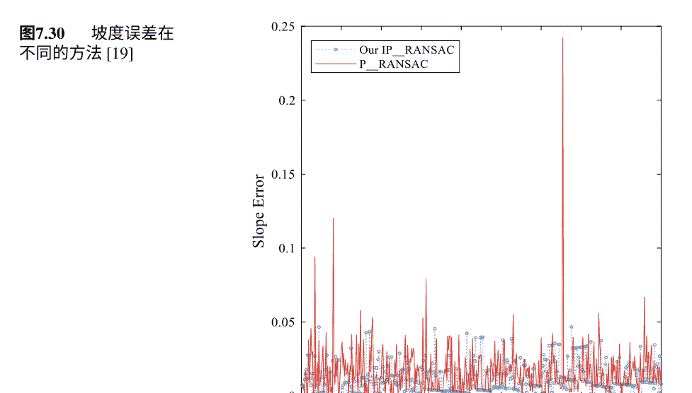

**表7.6 结构角误差的统计数据[19]**

| 指标 | 平均值 | 标准差 |
|------|--------|--------|
| P_RANSAC [20] | 0.1790° | 0.1567° |
| IP_RANSAC (我们的) | 0.1029° | 0.0773° |

**表7.7 斜率误差的统计数据[19]**

| 指标 | 平均值 (%) | 标准差 (%) |
| :--- | :--- | :--- |
| P_RANSAC [20] | 1.63 | 1.73 |
| IP_RANSAC (我们的) | 1.19 | 0.99 |## 7 基于3D的接触网支撑装置参数检测...

7. 詹D，于L，肖J，陈T，余R（2014）高速动态视觉测量法用于架空接触网几何参数检测。中国科学仪器学报35（8）：1852-1859

8. 周J，韩Z，杨C（2018）基于3D点云的接触网几何参数检测方法。中国科学仪器学报39（4）：239-246

9. Schnabel R，Wahl R，Klein R（2007）用于点云形状检测的高效RANSAC算法。计算机图形学论坛26：214-226

10. 施G，徐X，戴Y（2013）基于改进的RANSAC算法的SIFT特征点匹配。第5届智能人机系统与控制论国际会议，第1卷。第474-477页

11. 吴X，赵Q，布W（2014）一种基于SIFT的非接触式掌纹验证方法，使用迭代RANSAC和局部掌纹描述符。模式识别47（10）：3314-3326

12. 刘W，刘Z，张G（2014）基于相机标定和卡尔曼滤波的接触网几何参数检测值的校正。中国铁路学报36（9）：28-33

13. 陈J，刘Z，王H，努涅斯A，韩Z（2017）使用深度卷积神经网络自动检测接触网支撑装置上的紧固件缺陷。IEEE仪器测量交易67（2）：257-269

14. 刘W，刘Z，努涅斯A，王L，刘K，吕Y，王H（2018）使用DCNNs检测接触网支撑构件的多目标性能评估。IFAC-PapersOnLine51（9）：98-105

15. Song Y，Liu Z，Rönnquist A，Nävik P，Liu Z（2020）高速铁路受电弓-接触网交互作用中接触线不规则性的随机性及其影响。IEEE Trans Instrum Meas 69(10)：8196–8206

16. Kang G，Gao S，Yu L，Zhang D（2018）高速铁路绝缘子表面缺陷检测的深度架构：带有多任务学习的去噪自编码器。IEEE Trans Instrum Meas 68(8)：2679–2690

17. Yin H，Liu Z，Xu Z，Gao L（2019）用于道岔扩张位移的自动视觉监测系统。IEEE Trans Instrum Meas 69(6)：3015–3025

18. Liu Z，Liu W，Han Z（2017）电气化铁路接触网几何参数的高精度检测方法。IEEE Trans Instrum Meas 66(7)：1798–1808

19. Liu W，Liu Z，Li Q，Han Z，Núñez A（2020）使用三维点云数据的接触网悬臂装置结构参数的高精度检测方法。IEEE Trans Instrum Meas 70：1–11

20. 韩Z，杨C，刘Z（2019）基于三维点云的悬臂结构分割和参数检测，基于凹凸性。IEEE Trans Instrum Meas 69（6）：3026-3036

21. Papon J，Abramov A，Schoeler M，Worgotter F（2013）基于点云的体素云连接分割-超体素。在：IEEE计算机视觉和模式识别会议论文集。pp 2027-2034

22. Christoph Stein S，Schoeler M，Papon J，Worgotter F（2014）使用局部凸性进行对象分割。在：IEEE计算机视觉和模式识别会议论文集。pp 304-311

23. 何H，金S，温C-K，高F，李GY，徐Z（2019）用于物理层通信的模型驱动深度学习。IEEE无线通信26（5）：77-83

24. Ravanbakhsh S，Schneider J，Poczos B（2016）基于深度学习的高速铁路接触网支撑组件缺陷和故障检测。arXiv预印本 arXiv:1611.04500

## 参考文献

29. 苏H, Jampani V, 孙D, Maji S, Kalogerakis E, 杨M-H, Kautz J (2018) Splatnet: 用于点云处理的稀疏格点网络。 在：计算机视觉和模式识别IEEE会议论文集。 第2530-2539页

30. Tatarchenko M, Park J, Koltun V, 周Q-Y (2018) Tangent convolutions: 用于3D密集预测的切线卷积。 在：计算机视觉和模式识别IEEE会议论文集。 第3887-3896页

31. Groh F, Wieschollek P, Lensch H (2018) Flex-convolution (百万级点云学习超越网格世界)。 arXiv预印本 arXiv:1803.07289

32. Wang S, Suo S, Ma W-C, Pokrovsky A, Urtasun R (2018) Deep parametric continuous convolutional neural networks。 在：计算机视觉和模式识别IEEE会议论文集。 第2589-2597页

33. 徐Y, 范T, 徐M, 曾L, 乔Y (2018) Spidercnn: 基于参数化卷积滤波器的点集深度学习。 在：欧洲计算机视觉会议 (ECCV) 论文集。 第87-102页

34. 李Y, 布R, 孙M, 吴W, 迪X, 陈B (2018) Pointcnn: 基于X变换的点云卷积。 Adv Neural Inf Process Syst 31

35. 杨MY, Förstner W (2010) 点云数据中的平面检测。 在：第二届国际机器控制导航会议论文集， 波恩， 第1卷。 第95-104页

36. Abadi M, Agarwal A, Barham P, Brevdo E, 陈Z, Citro C, Corrado GS, Davis A, Dean J, Devin M (2016) Tensorflow: 异构分布式大规模机器学习。 arXiv预印本 arXiv:1603.04467

37. Bamji CS, Mehta S, Thompson B, Elkhatib T, Wurster S, Akkaya O, Payne A, Godbaz J, Fenton M, Rajasekaran V (2018) IMpixel 65纳米BSI 320MHz解调TOF图像传感器 3 μm全局快门像素和模拟分binning。 在：IEEE国际固态电路会议 (ISSCC)。 第94-96页