# 多元化深度学习

## 模型与数据

珍妮·贝努瓦-皮诺  

阿卡·泽玛里 编辑


珍妮·贝努瓦-皮诺 · 阿卡·泽玛里  

编辑

## 多方面的深度学习

### 模型与数据


编辑  

珍妮·贝努瓦-皮诺  

LaBRI UMR 5800  

波尔多大学  

塔朗斯塞德克斯，法国

阿卡·泽玛里  

LaBRI UMR 5800  

波尔多大学  

塔朗斯塞德克斯，法国

ISBN 978-3-030-74477-9  

ISBN 978-3-030-74478-6（电子书）  

[https://doi.org/10.1007/978-3-030-74478-6](https://doi.org/10.1007/978-3-030-74478-6)

© Springer Nature Switzerland AG 2021

本作品受版权保护。出版商保留所有权利，无论是整体还是部分材料，特别是翻译权、再版权、插图重用权、朗诵权、广播权、微缩胶片复制权，或以任何其他实体方式复制、传输或信息存储和检索、电子适配、计算机软件，或者通过类似或不同的方法（现在已知或今后开发的方法）。

在本出版物中使用一般描述性名称、注册名称、商标、服务标志等，并不意味着即使在没有具体声明的情况下，这些名称也不受相关保护法律和法规的约束，因此可以自由使用。

出版商、作者和编辑可以合理地假设本书中的建议和信息在出版日期时被认为是真实和准确的。出版商、作者或编辑对本文所包含的材料不提供明示或暗示的保证，也不对可能存在的任何错误或遗漏负责。出版商在发表的地图和机构隶属方面保持中立。

这个 Springer 印记由注册公司 Springer Nature Switzerland AG 出版，注册公司地址为：瑞士 Cham 市 Gewerbestrasse 11 号。

> “现在，如果你让我们开始工作，我们将为您服务二十四小时一天……”

>

> 鲁德亚德·吉卜林，《机器的秘密》

我们将这本书献给我们的学生。  

保持好奇心，创新，坚持不懈，并为科学女士服务！

# 前言

如今，人工智能方法渗透到社会活动的各个领域。其中一个主要分支——人工神经网络——由于图形处理单元和云计算的计算能力大幅增加，得到了新的生命。神经网络变得更加深入。深度学习现在是所有曾经用于数据挖掘和决策的监督式机器学习方法中的赢家。

这些工具在传统上被称为“多媒体”的领域特别有趣。事实上，这个领域提供了大量异构数据：图像、视频、音频和音乐、文本和多模态信号。此外，这些数据具有一种时空网格结构，便于卷积神经网络等深度学习网络处理。

因此，在本书中，我们试图提供一个方法、模型和数据的快照，这些方法、模型和数据正在被开发或在这个研究社区中使用。这本书是法国国家网络 GDR-ISIS 和 ACM 多媒体特别兴趣小组选定研究人员的集体作品。我们希望这本书对正在使用现有模型和设计新模型的年轻研究人员、学生和专业人士有所帮助。

法国波尔多  

2020年12月

Jenny Benois-Pineau  

Akka Zemmari

# 致谢

本书的编辑感谢法国国家研究网络 CNRS GDR-ISIS 以及 ACM-SIGMM，使本书作者能够进行合作。

## 目录

- 1 引言 — 1  

  Jenny Benois-Pineau

- 2 深度神经网络：模型与方法 — 5  

  Akka Zemmari 和 Jenny Benois-Pineau

- 3 用于语义分割的深度学习 — 39  

  Alexandre Benoit, Badih Ghattas, Emna Amri, Joris Fournel, 和 Patrick Lambert

- 4 深度学习中的超越全监督 — 73  

  Nicolas Thome

- 5 相似度度量学习 — 103  

  Stefan Duffner, Christophe Garcia, Khalid Idrissi, 和 Atilla Baskurt

- 6 基于深度神经网络的零样本学习用于物体识别 — 127  

  Yannick Le Cacheux, Hervé Le Borgne 和 Michel Crucianu

- 7 使用深度架构的图像和视频字幕 — 151  

  Danny Francis 和 Benoit Huet

- 8 视频压缩算法中的深度学习 — 175  

  Ofer Hadar 和 Raz Birman

- 9 用于动作识别的 3D 卷积网络：应用于体育手势识别 — 199  

  Pierre-Etienne Martin, Jenny Benois-Pineau, Renaud Péteri, Akka Zemmari 和 Julien Morlier

- 10 音频和音乐的深度学习 — 231  

  Geoffroy Peeters 和 Gaël Richard

- 11 可解释的医学图像 AI：知识至关重要 — 267  

  Pascal Bourdon, Olfa Ben Ahmed, Thierry Urruty, Khalifa Djemal, 和 Christine Fernandez-Maloigne

- 12 使用生成对抗网络改善视频质量 — 293  

  Leonardo Galteri, Lorenzo Seidenari, Tiberio Uricchio, Marco Bertini 和 Alberto del Bimbo

- 13 结论 — 315  

  Jenny Benois-Pineau 和 Akka Zemmari

## 第1章

## 引言


Jenny Benois-Pineau

人工智能（AI），尤其是深度学习，正在改变我们的日常生活。在过去几年中，这个领域从理论和实践的角度都引起了很大的兴趣。基于 AI 的解决方案已经部署在许多应用中，并在许多领域中使用。这包括金融应用、安全、交易、自动驾驶车辆等。

深度学习在可用数据的巨大数量和新的计算能力方面引起了非常高的兴趣。它还受益于从 1943 年 W. McCulloch 和 W. Pitts 的首次神经网络研究活动开始，到 2018 年 Y. LeCun、Y. Bengio 和 G. Hinton 获得图灵奖的加冕。

在本书中，我们从多方面的角度介绍了当今最流行的人工智能方法，用于数据挖掘的问题、方法和数据。本书对社区中正在进行的研究进行了丰富的概述，并由一流的国际研究人员撰写。

本书首先介绍了深度学习的各种架构的设计和实现，以及优化算法。它讨论了最先进的网络，如人工神经网络、卷积神经网络和循环神经网络。然后介绍了一些其他模型，如生成神经网络、自编码器和连体 CNN。作为深度学习方法的第一个应用，我们考虑了它在语义分割中的应用。一章回顾了图像语义分割任务以及近期在各种应用领域中应对典型训练问题（少量训练样本、特定数据、目标不平衡等）的先进策略。另一章考虑了使用深度学习进行图像和视频字幕生成。它旨在提供从图像和视频中生成描述性句子的见解。第三个应用研究了使用三维卷积神经网络进行动作识别，应用于体育手势识别。

如上所述，深度学习的惊人成功归功于大量可用的数据。然而，对于监督学习，这些数据必须有标签。在一个专门的章节中，我们介绍了基于三种方法家族的解决方案，用于使用成本较低的标注进行学习。我们详细介绍了一种基于这些方法的方法，用于使用不完整注释进行医学图像分割。

另一个有趣的问题与相似度度量学习有关。它旨在建模对象类别之间的一般语义相似性和距离（例如与人相关的对象），以便识别它们。与监督学习相反，类别标签通常事先不知道，也没有明确地进行训练。本文概述了用于相似度度量学习的主要方法和模型，并介绍了在图像中进行人物重识别和人脸验证的几个最新应用。

零样本学习（ZSL）是指在没有任何视觉训练样本的情况下识别对象的能力。为了弥补视觉数据的缺乏，每个要识别的类别都与一个反映对象基本特征的语义原型相关联。一般的方法是学习从视觉数据到语义原型的映射，然后在推理过程中仅使用来自类别原型的视觉样本进行分类。本章回顾了基于深度神经网络解决零样本学习问题的方法。我们还提出了几个改进常规方法以解决最有趣实际应用案例的贡献。

视频压缩是多媒体研究中的一个有趣问题。本书的一章探讨了使用深度学习改善视频编码的方法，主要目的是在保持相同视频质量的同时提高视频压缩率。该章节概述了最新研究工作，并提供了几篇重要已发表论文的示例，以进一步解释深度学习在视频压缩领域中的不同重点主题。

一章概述了如何使用深度学习技术处理音频信号。它回顾了三个主要应用类别：音频识别、音频转换和音频合成，针对三类主要音频内容：语音、音乐和环境声音。

AI 和模式识别社区最近对监督学习方法，特别是深度学习/人工智能的关注，使 AI 系统性能大幅提高，但也引发了对其预测可信度和适用性的质疑。一章讨论了可解释人工智能如何解决医学影像中的这些问题。它介绍了大部分用于乳腺癌诊断的机器学习方法。

一章涵盖了可用于恢复图像和视频质量的深度学习方法。大部分涵盖的方法将基于条件生成对抗网络（GAN），其具有产生更自然图像的优势。

我们邀请读者踏入这个多样化而丰富的深度学习方法领域。

## 第二章 深度神经网络：模型和方法

Akka Zemmari 和 Jenny Benois-Pineau

### 2.1 人工神经网络

人工神经网络由分布式信息处理单元组成。在本节中，我们定义这种网络的组成部分。我们首先介绍 McCulloch 和 Pitts 在 [MP43] 中引入的形式神经元。然后我们将解释如何将这些单元组装起来设计简单的神经网络。

#### 2.1.1 形式神经元

神经元是神经网络的基本单元。它接收输入信号 $(x_1, x_2, \cdots, x_p)$，并对信号的线性组合 $z$ 应用激活函数 $f$。这个组合由权重向量 $(w_1, w_2, \cdots, w_p)$ 和偏置 $b$ 决定。更正式地，输出神经元值 $y$ 定义如下：

$$y = f(z) = f \left( \sum_{i=1}^p w_i x_i + b \right).$$

图2.1a 总结了形式神经元的定义。图2.1b 给出了相同的简洁表示。

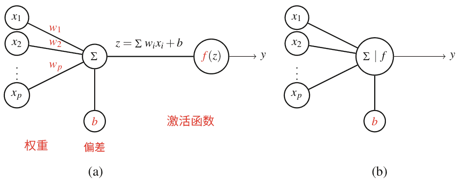

**图2.1** 一个形式神经元的两种表示：详细表示 **(a)** 和紧凑表示 **(b)**。请注意，当它是神经网络的一部分时，神经元只是由一个顶点表示。

##### 2.1.1.1 激活函数

在神经网络中常见不同的激活函数：

阶跃函数 $\xi_c$

$$\xi_c(x) =

\begin{cases}

1, & \text{如果 } x > c \\

0, & \text{否则}

\end{cases}

\eqno(2.1)$$

这个简单函数是最早考虑的激活函数。它的主要问题是它可能将不同标签都激活为 1，从而分类问题无法很好解决。因此，更倾向于使用平滑函数，因为它提供的是模拟激活而不是二进制激活，这样多个标签得分都为 1 的风险会大大降低。

Sigmoid 函数 $\sigma$

$$\sigma(x) = \frac{1}{1 + e^{-x}}. \eqno(2.2)$$

它是最受欢迎的激活函数之一。它将 $\mathbb{R}$ 映射到区间 $[0,1]$。这个函数是阶跃函数的平滑逼近，见图2.2a。它具有许多有趣的性质。

函数的连续性使得能够正确训练非二进制分类任务的网络。它的可微性在理论上是一个良好属性，因为这关系到神经网络的学习方式。此外，它在 0 附近具有陡峭梯度，这意味着该函数倾向于将 $y$ 值带到曲线两端：这对于分类是良好的行为，因为它能够清晰地区分预测。这个激活函数的另一个好处是有界性：这可以防止激活发散。

Sigmoid 函数的最大问题是当参数远离 0 时，其梯度非常小。这导致了梯度消失现象：学习速度大大减慢，甚至停止。

双曲正切函数

$$\tanh(x) = \frac{2}{1 + e^{-2x}} - 1 = 2\sigma(2x) - 1. \hfill (2.3)$$

正如上述方程所示，该函数实际上是一个经过缩放和垂直平移的 Sigmoid 函数，将 $\mathbb{R}$ 映射到区间 $[-1,1]$，因此它具有相同的优点和缺点。tanh 和 sigmoid 之间的主要区别在于梯度强度：tanh 倾向于具有更强的梯度值。就像 sigmoid 一样，tanh 也是一种非常流行的激活函数。

ReLU 函数

$$\text{ReLU}(x) = \max(0, x). \hfill (2.4)$$

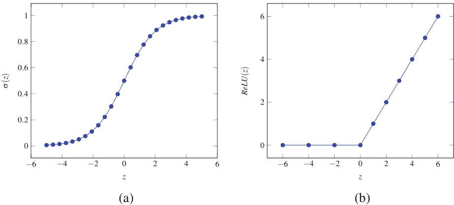

图2.2 两个特定的激活函数：(a) sigmoid 函数；(b) 修正线性单元（ReLU）函数。

修正线性单元（ReLU）（图2.2b）在最近几年变得非常流行。它确实具有非常有趣的特性：

- 该函数是激活函数的简单阈值处理。这个操作比 sigmoid 和 tanh 激活函数中昂贵的指数计算要简单。

- ReLU 倾向于加速训练。这似乎源于其线性和非有界的组成部分。

- 与 sigmoid 类激活函数不同，ReLU 的 0 水平分量导致激活稀疏性，这在计算上是高效的。

它也有自己的缺点：

- 它的线性分量是非有界的，可能导致激活爆炸。

- 激活稀疏性可能对网络训练产生不利影响：当一个神经元在 ReLU 的 0 水平分量上激活时，梯度消失，该神经元训练停止。神经元“死亡”。ReLU 可能使网络的一部分变得被动。

- 它在 0 处不可微：在计算接近 0 的梯度时存在问题。

还有许多其他激活函数存在。它们都具有非线性这一共同特点，这是必要的：如果它们是线性的，整个神经网络就会是线性的（线性组合被馈送到线性激活函数，然后再被馈送到线性组合，依此类推）。在这种情况下，无论有多少层，这些线性层都等于一个唯一线性层，我们将失去神经网络的多层架构特性：最后一层将简单地成为作用于第一层输入的线性变换。

Softmax：如何将输出转换为概率

给定一个向量 $\mathbf{y} = (y_1, y_2, \cdots, y_k)$，其中 $y$ 的坐标是实数，softmax 函数旨在将 $y$ 的值转换为一个范围在 $(0,1)$ 内且总和为 1 的实值向量 $\mathbf{s} = (p_1, p_2, \cdots, p_k)$。更准确地说，对每个 $i \in \{1,2,\cdots,k\}$ 定义为：

$$p_i = \frac{e^{y_i}}{\sum_{j=1}^k e^{y_j}}.$$

在多层神经网络的最后一层中常使用 softmax 函数，这些网络是在交叉熵下进行训练的（我们将在下一段中定义这个函数）。当用于图像识别时，softmax 函数计算每个输入数据在给定分类体系中属于某个类别的概率估计。

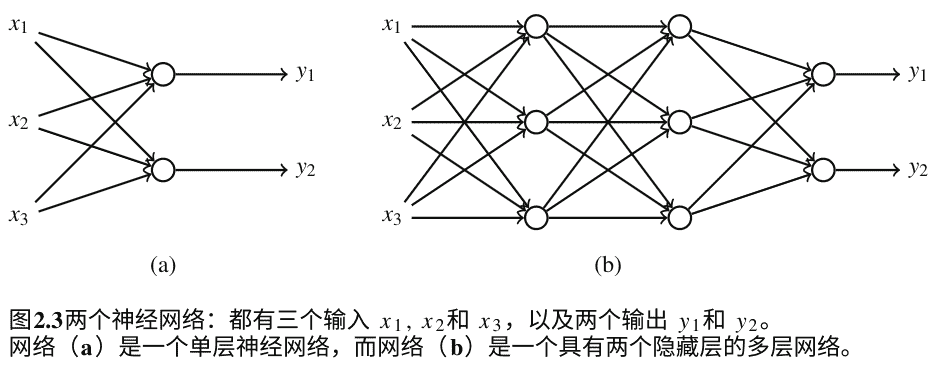

#### 2.1.2 人工神经网络和深度神经网络

人工神经网络（ANN）以一种简化方式将生物结构和行为纳入其架构中：神经网络由一组线性排列的层组成，每一层都是一组（人工）神经元。该模型简化为信号只能从第一层流向最后一层。

神经网络中第 $i$ 层的每个神经元都与第 $(i-1)$ 层的所有神经元相连，并且给定层中的神经元彼此独立。图2.3 给出了两个简单人工神经网络的例子。这是一个“前馈网络”，信息只能从输入 $\mathbf{x}$ 流向输出 $\mathbf{y}$，方向唯一。同一层的所有神经元具有相同激活函数，这一点也很重要。

所有输入直接连接到输出的网络是一个单层网络。图2.3a 展示了这样一个网络的例子。在 [MP43] 中，McCulloch 和 Pitts 证明了单元网络可以表示基本布尔函数 AND 和 OR。然而，很容易证明单层网络无法表示 XOR 函数。

同一层的所有神经元 $l$ 具有相同的激活函数 $f^{(l)}$。也就是说，给定一个具有 $L>0$ 层的神经网络，如果我们用 $\mathbf{y}^{(l)}$ 表示层 $l$ 的输出向量，对于任意 $1<l<L$，可以写成：

$$\mathbf{y}^{(l+1)} = f^{(l+1)} \left( w^{(l)T} \mathbf{y}^{(l)} + \mathbf{b}^{(l+1)} \right). \quad (2.5)$$

式（2.5）解释了输入到网络的值如何被前向传播以计算输出值 $\hat{\mathbf{y}} = \mathbf{y}^{(L)}$（图2.4）。

任何神经网络都必须至少包含两层：一层输入层和一层输出层。正如前述讨论，一些函数无法使用没有任何隐藏层的神经网络来实现（例如 XOR 门）。然而，Cybenko 在 [Cyb89] 中证明，任何连续函数都可以用具有一个隐藏层的网络以任意所需精度逼近（在一致范数意义下）。

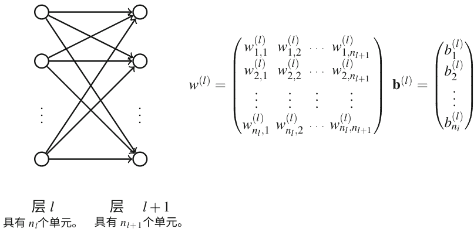

图 2.4 两层，两层之间的权重矩阵 $l$ 和 $l+1$ 以及层 $l$ 的偏置向量

激活函数是 sigmoid 函数。深度神经网络是一种具有至少一个隐藏层的人工神经网络。

## 2.2 卷积神经网络

我们在这里介绍了最初设计用于图像分析的卷积神经网络。首先，我们将介绍一些通用原则，然后逐层详细介绍，并简要概述最流行的卷积神经网络架构。

### 2.2.1 通用原则

常规神经网络在视觉信息挖掘方面无法很好地扩展。对于某一层中的某个神经元，它的架构将前一层的所有激活连接到该神经元。在计算机视觉的背景下，数据以图像（或视频）的形式存在，至少是三维对象。假设我们想要将第一层的一个神经元连接到一个尺寸相对较小的彩色图像（$200 \times 200 \times 3$）的每个像素。这将至少需要 120,000 个权重，仅用于第一层的一个神经元。即使是浅层神经网络在权重数量方面也会变得难以管理（请记住，每个权重都应在训练过程中学习）。

另一方面，在图像处理中，考虑图像中的空间局部相关性是至关重要的。例如，如果我们希望训练一个边缘检测器，一次性考虑整个图像对于每个神经元来说是没有意义的，我们应该将图像分解为不同的窗口，并在每个窗口上应用滤波器，以便对具有强边缘的窗口做出反应。

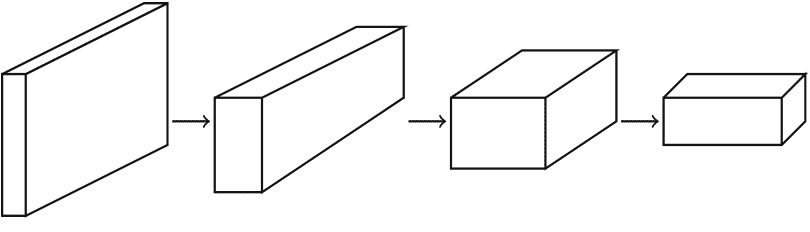

图 2.5 在卷积神经网络中，维度在每一层之后都会减小

卷积神经网络（缩写为 CNN）专门设计用于计算机视觉任务，其架构与常规神经网络有所不同。最明显的区别是 CNN 的层次结构以三维（高度、宽度和深度）排列其神经元，以匹配数据的几何形状（图像可以被视为像素的立方体）。

在大多数情况下，CNN 的第一层（有时称为底层）是局部连接的，即它们的空间支持（也称为感受野）是有限的，这有助于获取空间局部相关信息。此外，这些第一层通过池化操作减小了空间维度。一旦空间维度足够小（达到顶层时），通常会使用全连接层，就像在常规神经网络中一样，最后一层是一个计算类别得分的全连接层。

在 CNN 的底层中使用的层明显具有这种特定类型神经网络的局部连接属性。

卷积神经网络确实受到生物启发：Hubel 和 Wiesel 在 [HW68] 中通过观察动物的视觉皮层发现，后者由复杂的细胞排列组成，并且这些细胞只对全局视觉场景的有限部分敏感。

### 2.2.2 CNN 的层

#### 2.2.2.1 卷积层

卷积层是 CNN 架构的核心：它们对输入图像中的空间局部相关性做出反应。这些层由一组有限空间大小的滤波器组成，这些滤波器的权重是可训练的。卷积层的名称来自于该层类型的行为方式：它使其滤波器在整个图像上滑动，就像我们用滤波器对图像进行卷积计算一样。与图像处理操作相反，滤波器掩模在滑动时的移动


沿着输入图可以大于 1。这个移动被称为“步幅”参数，是深度卷积神经网络的一部分常规设置或“超参数”。在滤波器占据的每个位置，滤波器与图像中相应区域进行点积运算。一旦所有滤波器都在整个图像上滑动完成，就会得到每个滤波器的激活图。这些激活图沿着深度存储，这解释了为什么 CNN 的深度维度在每一层之后都会增加。

实际上，CNN 学习的每个滤波器在遇到特定的视觉特征时会被激活。随着层数的增加，滤波器趋向于变得越来越抽象。底层的滤波器倾向于对简单的对象（如边缘、特定形状或颜色）做出反应，而上层的滤波器可以对更复杂的对象（如建筑物、动物等）做出反应。这取决于它们训练的数据集。

在接下来的内容中，我们将解释卷积神经网络如何减少网络的参数（权重）的直观理解。为了简单起见，假设每个图像都使用一个元素为 0 或 1 的矩阵进行编码，如图 2.6 所示。

给定一个矩阵（对应于一幅图像），卷积层学习一组滤波器。图 2.7 给出了将滤波器大小为 3 × 3，步长为 1 应用于图 2.6 的矩阵时的操作示例。

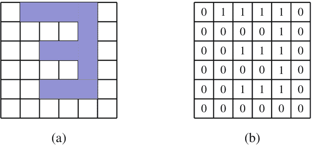

**图 2.6 图像编码：（a）手写数字和（b）其编码**

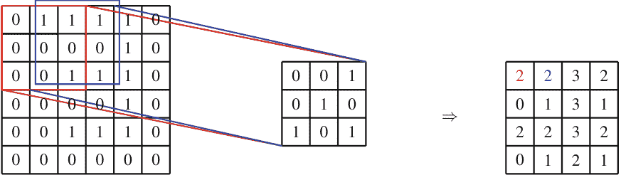

**图 2.7 图 2.6 中的图像（6 × 6）与一个大小为 3 × 3 的滤波器进行卷积，得到的矩阵**

图 2.7 解释了如何计算图像（$6 \times 6$）与滤波器（$3 \times 3$）和步长为 1 的卷积。我们可以观察到生成的图像尺寸较小（$4 \times 4$）。滤波器对应于要学习的权重，并引发卷积层的输入单元（层）与卷积层单元之间的连接。这在图 2.8 中有所说明。关键点如下：

- 卷积层的单元与前一层的所有单元都没有连接。
- 单元共享相同的权重。

这在图 2.8 中有所说明。很明显，与完全连接的网络相比，连接数和参数（权重）的数量减少了。

#### 2.2.2.2 最大池化层

池化减少了上层的计算复杂性，并总结了来自同一内核映射的相邻神经元组的输出。它通过为下一层的每个感受野的神经元获取一个值来减小每个输入特征图的大小。再次，这减少了要学习的参数数量。池化是一种通用操作，有许多变体存在。然而，在这里我们考虑最大池化操作，这意味着对于每个矩形，保留最大值，其他值被丢弃，如图 2.9 所示。

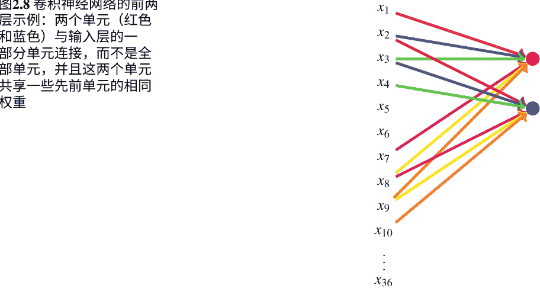

图 2.7 解释了如何计算图像（$6 \times 6$）与滤波器（$3 \times 3$）和步长为 1 的卷积。我们可以观察到生成的图像尺寸较小（$4 \times 4$）。滤波器对应于要学习的权重，并引发卷积层的输入单元（层）与卷积层单元之间的连接。这在图 2.8 中有所说明。关键在于：

卷积层的单元与前一层的所有单元都没有连接。
单元共享相同的权重。

很明显，与完全连接的网络相比，连接数和参数（权重）的数量减少了。

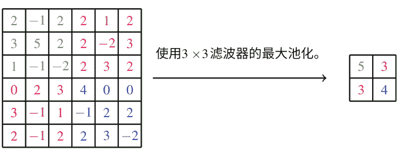

图 2.9 最大池化操作的示意图：图像的大小减小了

这一层可以看作是一种非线性子采样的形式。它提出了两个兴趣点：

- 它减少了空间维度，从而减少了上层的计算成本。
- 它提供了一种平移不变性的形式。为了看清楚这一点，考虑一个大小为 $2 \times 2$ 的区域最大池化，然后是一个卷积层。区域可以在八个方向上平移一个像素。在这八种配置中，有三种会在卷积层产生完全相同的输出。

应该注意过度使用池化的问题：减少空间维度会导致信息的丢失，从而影响训练。
请注意，存在不同类型的池化层，例如平均池化和 $L^2$-范数池化，但最大池化版本在大多数情况下被证明是最有效的。

#### 2.2.2.3 丢弃

监督学习方法的一个瓶颈是所谓的“过拟合现象”。这意味着经过训练的分类器在训练数据上具有较小的错误，但在未见数据上无法很好地进行泛化。

通过模型组合可以避免过拟合。这涉及到对许多单独训练的神经网络的输出进行平均，这在深度神经网络中非常昂贵。

此外，这种类型的平均假设（为了有效性）平均模型非常不同：它们应该具有不同的架构或在不同的数据上进行训练。前者很难实现，因为调整架构是复杂的，而调整许多架构则更加困难。后者对于大型模型来说很难实现：深度神经网络确实需要更多的数据来进行适当的训练，这意味着不同的神经网络可能会超过可用的训练数据量。

Dropout 方法通过对原始神经网络进行多次抽样来解决这些问题。这些版本是通过随机丢弃神经网络中的单元及其连接来获得的。更多细节可以看到在 [SHh+14] 中的正则化。辍学正则化在图 2.10 中有所说明。我们注意到，在 CNN 中，辍学是在完全连接的层上执行的，并且确实提高了网络性能。

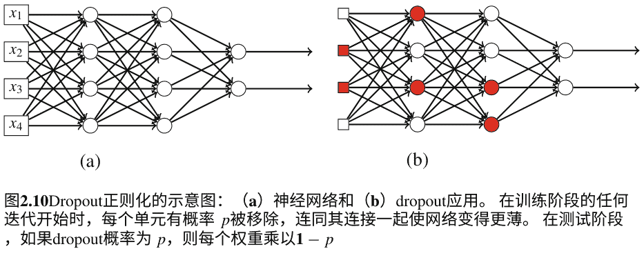

### 2.2.3 一些著名的 CNN 架构

在流行架构的概述中，要全面是非常困难的。我们将限制自己在相当大的一组应用中作为基础的那些架构。

#### 2.2.3.1 LeNet 架构和 MNIST 数据集

LeNet 是一种非常流行的架构，最早由 LeCun 等人在 1998 年引入 [LBBH98]。这种 CNN 架构被设计成以非常稳健的方式解决数字识别问题。它具有直观且相当浅的架构（仅有五个隐藏层），使其成为了理解深度学习基础的非常流行的 CNN。

LeNet 系列架构的核心原则是在较低层中重复模式卷积层 + 激活 + 最大池化层。由此产生的空间缩减使得可以在上层使用级联的全连接层，并且 softmax 分类器给出了模型的得分。

在 MNIST 数据集上训练 LeNet 架构非常常见。后者是一个包含 70,000 个手写数字图像的数据库。该数据集将数据分为 60,000 个用于训练的图像和 10,000 个用于验证的图像。该数据集中的每个数字图像都经过尺寸归一化和居中处理，形成一个 $28 \times 28$ 的固定大小图像。

LeNet 的简单架构与 MNIST 数据集的紧凑性结合在一起，非常适合尝试新的学习技术和模式识别方法。

在处理前期的预处理和格式化方面，可以将最小的工作量花在真实世界的数据上。即使没有 GPU 加速，也可以在非常有限的时间内实现超过 98% 的准确率的出色训练结果。

LeNet 架构对不同类型的变换具有弹性，因此它能够实现非常强大的字符识别。它提供了许多有趣的属性（对于合理的变换），如 LeCun 专门为 LeNet 设计的网站上所示。最值得注意的是，LeNet 的鲁棒性来自以下属性：

- 平移不变性：这在垂直平移方面非常有用，因为字符串中字符的定位永远不完美。
- 尺度不变性：LeNet 在广泛的尺度范围内实现了这种不变性。
- 旋转不变性：作者估计 LeNet 可以识别以 40°角度旋转的数字。
- 压缩不变性：LeNet 对纵横比的变化显示出鲁棒性。
- 笔画宽度不变性：这种鲁棒性对于限制对不可靠的预处理方法（如线条细化）的需求非常有用。
- 噪声鲁棒性：LeNet 对添加在数字上方的各种噪声具有弹性。

#### 2.2.3.2 AlexNet 架构

在最受欢迎的架构中，AlexNet 于 2012 年由 Krizhevsky 等人在题为"ImageNet Classification with Deep Convolutional Networks"的论文中提出，该论文被广泛认为是深度学习领域最有影响力的出版物之一。该架构旨在解决 ImageNet 数据集上的一个困难分类问题。ImageNet 数据集是根据 WordNet 层次结构组织的图像数据库，WordNet 是一个英语词汇数据库。目前，ImageNet 只考虑 WordNet 中的名词。层次结构的每个节点由数百甚至数千个图像描绘，每个节点平均有五百多个图像。这个数据集非常丰富而广为人知。创建了一个围绕 ImageNet 的年度竞赛：ILSVRC（ImageNet Large-Scale Visual Recognition Challenge），人们可以通过在 ImageNet 数据库上训练他们的 CNN 来解决大规模的目标检测和图像分类问题，从而评估和比较他们的架构。在过去几年中，ILSVRC 竞赛已经看到许多 CNN 候选成为计算机视觉领域的重要组成部分。

作者们在 2012 年 ILSVRC 上提出了 AlexNet 架构，并以远超第二名的 15.4% 的前 5 测试错误率赢得了比赛。这个结果被视为杰出的表现，令深度学习和计算机视觉界感到惊讶。

AlexNet 架构由 6000 万个参数组成，用于 500,000 个神经元，包括 5 个卷积层，其中一些后面跟着一个最大池化层，以及两个全连接层，后面跟着一个大小为 1000 的 softmax 分类器来评分模型。

作者还在他们的架构中引入了 dropout 作为正则化的形式。正如前一节讨论的那样，这种方法可以防止非常深的神经网络过拟合。

#### 2.2.3.3 GoogLeNet

2015 年，Google 发表了一种新的架构 [SLJ+14]。GoogLeNet 是一个 22 层的 CNN，是 ILSVRC 2014 的冠军，前 5 错误率为 6.7%。与其深度一起，GoogLeNet 与 2014 年大多数架构的不同之处在于它不仅仅依赖于卷积和池化层的交替使用，这是自 LeNet 架构引入以来的常见用法。作者们没有采用层的顺序排列，而是考虑在架构中引入并行性，引入了 9 个所谓的"inception blocks"，它们本身由不同的层组成，总共超过 100 层。图 2.11 展示了一个 inception block 的架构。

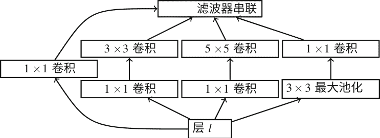

图 2.11 GoogLeNet 架构：一个 inception 块的结构

<!-- Placeholder for ResNet action logical structuring, resnet is a different section or list item in other arch -->

#### 2.2.3.4 其他重要的架构

还有许多 CNN 架构在深度学习中被证明是重要的。其中，我们可以举出：

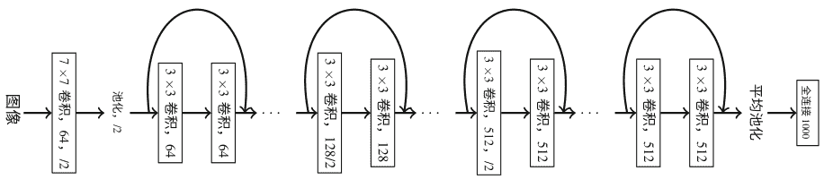

图 2.12 ResNet 网络的架构。它包含 34 层，并且每两个卷积之间有快捷方式

- **ZF Net 和 DeConv Net (2013)**: Matthew Zeiler 和 Rob Fergus 在 2013 年的 ILSVRC 挑战中使用了 一个名为 ZF Net 的 CNN，它是 AlexNet 的一个经过微调的 版本，其中包含了改进整体性能的想法。在他们的相关出版物 [ZF13] 中， 他们还提供了一些关于 CNN 背后直觉的丰富见解，并且还提出了一种名为 DeConv Net 的特殊算法，该算法可以在将图像输入到 CNN 时可视化训练过 的滤波器的响应。这有助于检查哪种结构激发了给定特征图，并有助于更 深入地了解特定架构的行为方式。
- **微软 ResNet (2015)**，见图 2.12: 微软亚洲研究院在 2015 年提出了一种打破了 许多记录的新架构 [HZRS15]。ResNet 是首次提出时最深的 CNN，并且它 在 2015 年的 ILSVRC 挑战中获胜，错误率仅为 3.6%，通常低于平均人类的 错误率。它引入了一种基于“残差块”的架构，基本上是在 conv-relu-conv 模 式之后考虑输入，通过将输入添加到输出中。根据作者的说法，“优化残 差映射比优化原始的未引用映射更容易”。此外，它有助于解决梯度消失 的问题。在许多视觉内容识别任务中，使用具有不同层数的 ResNet 作为 最高效的网络。
- **R-CNN (2013 年)**：2013 年，Ross Girshick 和他要在加州大学伯克利分校的 团队提出了一个新的 CNN 架构，旨在解决目标识别问题：R-CNN [GDDM 13]。该问题分为两个部分：区域提议步骤和分类步骤。对于第一步，使 用选择性搜索算法 [UvdSGS13]。该算法使用边界框选择一定数量的最有 可能包含目标的区域。然后，这些区域被输入到 CNN 中，每个区域输出 一个特征向量。

然后，这些向量被输入到一组线性 SVM（支持向量机）算法中，用于解 决分类问题。请注意，这个架构在 2015 年进行了修订和加速，推出了 Fast R-CNN [Gir15]，它优化了流程，并在稍后推出了 Faster R-CNN [RHGS15] ，它通过引入区域提议网络简化了 R-CNN 和 Fast R-CNN 的复杂流程。

## 2.3 优化方法

机器学习模型的目标是构建一个最小化损失函数的预测函数。许多算法旨在最小化损失函数。它们大多是迭代算法，并通过沿着下降方向减小损失函数来操作。这些方法解决了损失函数被假设为凸函数的问题。主要思想可以简单地表达如下：从参数空间中的初始任意（或随机）选择的点开始，它们允许根据选择的方向集合“下降”到损失函数的最小值。在这个领域中，我们讨论了一些最为知名和常用的优化算法。

本节介绍了优化方法的基础知识。我们使用与前一章不同的符号，但我们将展示这些方法如何应用于神经网络学习。

### 2.3.1 梯度下降

使用基于梯度的算法已被证明在优化神经网络的众多参数方面非常有效，因此它是网络学习中最常见的方法之一。因此，许多最先进的深度学习库都包含了对不同形式的梯度算法的广泛实现。我们简要回顾了梯度下降算法的相关事实。

让我们用 $\theta$ 表示包含神经网络所有参数的向量，并且让 $J(\theta, \ g(x), \ y)$ 表示代表真实标签 $g(\mathbf{x})$ (与训练数据 $\mathbf{x}$相关联) 和预测数据之间误差的代价函数由神经网络在参数 $\theta$ 下估计的数据 $y$。如果将代价函数的表示想象成一个山谷，梯度算法的思想就是沿着山坡下降，直到达到表面的底部。实际上，斜率给出的方向是局部最大程度下降的方向，实际上是梯度的相反方向。关于梯度下降的详细数学讨论可以在 [WF12] 中找到。

梯度下降的迭代步骤为：

$$\theta_{t+1} \leftarrow \theta_t - \eta \nabla_{\theta} J(\theta, \ g(x), \ y), \qquad (2.6)$$

其中 $\eta$ 是一个非负常数，称为学习率。这种方法适用于任意维度（甚至是无限维度）的空间，并且可以用于线性和非线性函数。为了使梯度下降问题良定义，函数需要满足 $L$-Lipschitz 条件，即

$$\forall u, \ v \in \mathbb{R}^N, \ \|\nabla J \ (u) - \nabla J \ (v)\|_2 \le L \|u - v\|_2, \qquad (2.7)$$

其中 $L$ 是 Lipschitz 常数。

此外，在函数 $J$ 严格凸的情况下，该算法只能保证收敛到全局解。如果不是这种情况，该算法甚至不能保证找到局部极小值点。

在神经网络学习中，特别是在深度学习中，人们希望优化大量的参数，即成本函数的参数将处于非常高维的空间中，这导致了鞍点的激增，而鞍点在寻找极小值时往往是有害的，因为它们往往被高误差平台所包围 [DPG+14]。

此外，正确选择学习率对于方法的高效性至关重要：它必须足够小以实现算法的收敛，但也不应该太小，因为这会严重减慢进程。

仔细而迭代地选择这个步长可能有助于改善结果。
用于此目的的经典算法是线搜索算法 [Hau07]。

### 2.3.2 随机梯度下降

在深度学习的背景下，梯度下降算法遇到的问题是一般情况下不满足问题的数学性质。事实上，在这种非常高维的情况下，损失函数可能是非凸的和非光滑的，因此收敛性质不满足，并且收敛到局部最小值可能非常缓慢。

解决这些问题的一个很好的方法是使用随机梯度下降算法。该算法是梯度下降算法的随机逼近。它旨在最小化一个可以写成可微函数之和的目标函数（通常在图像处理的上下文中，每个图像对应一个函数）。这个过程是在随机选择的数据批次（即整个数据集的子集）上迭代完成的。通过这种方式最小化的每个目标函数都近似于“全局”目标函数。下面的公式总结了这种方法：

$$\theta_{t+1} \leftarrow \theta_t - \eta \frac{1}{B_s} \sum_{i=1}^{B_s} \nabla_\theta J_t^i(\theta_t, x_t^i, y_t^i), \eqno(2.8)$$.

其中 $B_s$ 是批量大小或是与步骤 $t$ 相关的数据批次。其中 $x_t^i$ 和 $y_t^i$ 分别是该批次中的真实数据和估计数据，$J_t = \frac{1}{B_s} \sum_{i=1}^{B_s} J_t^i$ 是步骤 $t$ 的全局代价函数的随机逼近，$B_t$ 的分解为一系列可微函数 $J_t^i$ 与每个对 $(x_t^i, y_t^i)$ 的相关联。

随机梯度下降（SGD）解决了在深度学习环境中使用梯度下降时遇到的大部分问题：

- 该方法的随机性有助于弱数学设置：尽管问题是高维目标函数的非凸和潜在非光滑的，但随机性倾向于改善收敛性，因为它帮助目标函数通过局部最小值和鞍点，而这些点在高维空间中被认为是被非常平坦的高原所包围的。

- 收敛速度更快，因为对小批量数据执行多次更新步骤比对整个数据集执行单次更新步骤要低成本（在深度学习的背景下，特别是在视觉数据挖掘中，数据集可以包含数千个图像或视频帧）。

这也带来了一些缺点：首先，梯度下降的随机逼近意味着无法保证收敛到全局最小值。此外，使用SGD的批次越小，结果中的方差越大。因此，许多架构被设计为充分利用两方面的优势，通过选择批次大小的平均值。

### 2.3.3 基于动量的随机梯度下降

动量方法的主要目的是加速梯度下降过程。这是通过在经典模型中引入一个速度向量来实现的，该向量会在迭代之后逐渐增加。从物理角度来看，这种梯度加速类似于球体在山谷中滚动时动能的增加。

从优化行为的角度来看，（随机）梯度下降在目标函数曲面在某个方向上比另一个方向更陡峭的区域中下降困难。

动量变体的梯度下降的迭代步骤如下：

$$v_{t+1} \leftarrow \mu v_t - \eta \nabla J(\theta_t), \qquad (2.9)$$

$$\theta_{t+1} \leftarrow v_{t+1} + \theta_t.$$

向量 $v_{t+1}$（初始化为零）在每次迭代中首先计算，并表示“球体在山谷中滚动”的速度更新。速度在每次迭代中累积，因此需要超参数 $\mu$ 来阻尼速度，以避免在平坦的表面上移动过多，否则球体会靠近局部极值点。一个好的策略是根据学习阶段改变 $\mu$ 的值。

在速度更新中，有两个竞争的项：累积速度 $\mu v_t$ 和当前点的负梯度。关键思想是，在这种情况下，在前面的段落中描述的情况（当表面在一个方向上的曲线比在另一个方向上的曲线更陡峭时），速度的两个项将不具有相同的方向。这将防止梯度项过多振荡，从而加快收敛速度。动量和初始化在深度学习中的重要性在 Ilya Sutskever 等人的一篇论文（2013）[SMDH13a]中进行了讨论。

### 2.3.4 Nesterov 加速梯度下降

1983年，Nesterov 在[Nes83]中提出了对“经典动量”的轻微修改，并证明他的算法在凸函数优化方面具有改进的理论收敛性。这种方法已经变得非常流行，因为它通常在实践中表现更好，即使在今天，它仍然是梯度优化的良好选择。

Nesterov 算法和经典动量算法之间的关键区别是，后者首先计算当前位置 $\theta$ 处的梯度，然后沿着累积速度的方向执行一步，而 Nesterov 动量首先执行一步，得到更新后的参数的近似值 $\widetilde{\theta}_{t+1}$，并通过计算这个新位置的梯度来修正这一步。

为了理解这种差异背后的推理，可以将更新速度的梯度项 $-\eta \nabla J(\theta_t)$ 看作是累积速度 $\mu v_t$ 的修正项。在错误发生后（即在累积速度执行的步骤）纠正错误（即在位置 $\widetilde{\theta}_{t+1}$ 处计算梯度）更有意义。Nesterov 动量的迭代步骤为：

$$

\begin{aligned}

\widetilde{\theta}_{t+1} &\leftarrow \theta_t + \mu v_t, \\

v_{t+1} &\leftarrow \mu v_t - \eta \nabla J(\widetilde{\theta}_{t+1}), \\

\theta_{t+1} &\leftarrow v_{t+1} + \theta_t.

\end{aligned}

\eqno(2.10)

$$

### 2.3.5 自适应学习率

我们看到在随机梯度下降算法中，学习率被定义为一个非负常数。这可能是一个错误的来源：当梯度很小但一致时（例如接近局部极值点），较大的学习率会导致在谷底中产生振荡，从而阻止方法正确收敛。

我们希望在具有强烈但不一致梯度的方向上慢慢移动；相反，在具有小但一致梯度的方向上快速移动。

可以通过自适应地调整学习率来结合这两个属性。用于此目的的一些常见退火计划如下所述：

- 阶梯衰减：每 $k$ 个周期后，将学习率乘以一个常数 $C < 1$。

- 多项式衰减：将学习率设置为  

  $$\forall t \geq 0, \eta_t = \frac{a_0}{1 + b_0 t^n}, \quad a_0, b_0 \in \mathbb{R}_+. \qquad (2.11)$$

- 指数衰减：将学习率设置为  

  $$\forall t \geq 0, \eta_t = a_0 e^{-b_0 t}, \quad a_0, b_0 \in \mathbb{R}_+. \qquad (2.12)$$

这些策略的缺点是任意的，并且可能不适用于特定的学习问题。关于 SGD 方法的适当学习率调整的详细讨论由 LeCun 在[SZL13]中进行。另一种可能性是根据成本函数的 Hessian 矩阵的逆计算提出自适应学习率（牛顿和拟牛顿方法）。相应的迭代步骤为

$$\tilde{\theta}_{t+1} \leftarrow \theta_t - [H J (\theta_t)]^{-1} \nabla J (\theta_t). \qquad (2.13)$$

后一种方法是二阶优化过程的一个例子。关于牛顿优化方法的更多信息可以在[Chu14]中找到。

在实践中，计算二阶导数和进行矩阵求逆可能是昂贵的。此外，在 Hessian 矩阵求逆中可能会遇到稳定性问题，特别是在局部极值点附近。因此，在深度学习的背景下，这不是一个合适的方法。

### 2.3.6 梯度下降的扩展

在这里，我们简要回顾一些现有的梯度下降扩展：

- 平均梯度下降：梯度下降的这个特定版本在 Polyak [PBJ92] 的论文中研究，通过计算参数值 $\theta_t$ 的时间平均值来替代梯度下降的计算过程：  

  $$\bar{\theta}_T \leftarrow \frac{1}{T} \sum_{t=0}^T \theta_t. \qquad (2.14)$$

- Adagrad：在这种方法中（首次在2011年的一篇论文[DHS11]中引入），目标是根据参数的稀疏性自动调整学习率。  

  在这个背景下，参数的稀疏性意味着在迭代训练过程中该参数没有被充分训练。稀疏参数将学习得更快，而非稀疏参数将学习得更慢。这强调了对稀疏特征的训练，这些特征在传统的梯度下降算法中可能没有得到适当的训练。对于每个参数 $(\theta)_i$ 在参数向量 $\theta$ 中，相应的更新步骤是不同的。它由以下公式给出：  

  $$\forall i, (\theta_{t+1})_i \leftarrow (\theta_t)_i - \alpha \frac{(\nabla J(\theta_t))_i}{\sqrt{\sum_{u=1}^t (\nabla J(\theta_u))_i^2}}, \alpha > 0. \eqno(2.15)$$

- RMSProp：就像 Adagrad 算法一样，RMSProp 算法建议自动调整每个参数的学习率。它通过对该参数的最近梯度的幅度进行平均来实现。该算法在课程[HSS12]中介绍。相应的更新步骤由以下公式给出：  

  $$\begin{aligned}

  \forall i, (\nabla_{t+1})_i &\leftarrow \delta(\nabla_t)_i + (1-\delta)(\nabla J(\theta_t))_i^2, \\

  \forall i, (\theta_{t+1})_i &\leftarrow (\theta_t)_i - \alpha \frac{(\nabla J(\theta_t))_i}{\sqrt{(\nabla_{t+1})_i}}, \alpha > 0.

  \end{aligned} \eqno(2.16)$$  

  参数 $\delta$ 设置对过去梯度幅度的平均或最后一个计算的梯度幅度的置信度。

- Adam：Adam 算法是最近最高效的一阶梯度下降优化算法之一。它首次在[KB14]中提出。与 Adagrad 和 RMSProp 类似，它自动调整每个参数的学习率。这种方法的特殊之处在于它计算所谓的“自适应矩估计” $(m_t, v_t)$。这种方法可以看作是 Adagrad 算法的一种推广。其相应的更新过程如下所示：  

  $$\begin{aligned}

  \forall i, (m_{t+1})_i &\leftarrow \beta_1 \cdot (m_t)_i + (1 - \beta_1) \cdot (\nabla J(\theta_t))_i, \\

  \forall i, (v_{t+1})_i &\leftarrow \beta_2 \cdot (v_t)_i + (1 - \beta_2) \cdot (\nabla J(\theta_t))_i^2, \\

在前面的方程中，`\epsilon` 被用作精度参数。参数 `\beta_1` 和 `\beta_2` 用于对所谓的瞬时 `m_t` 和 `v_t` 进行运行平均。

## 2.4 神经网络中的梯度估计

前几节介绍了一般的优化方法。在本节中，我们考虑这些方法在神经网络优化中的应用。即成本函数 `J` 是损失函数 `\mathcal{L}`，参数 `\theta` 对应于神经网络中的参数：

`\theta = \left(w^{(l)}, b^{(l+1)}\right), \text{ 其中 } l \in \{0, 1, \dots, L-1\}。`

神经网络复兴的主要原因之一是开发出了一种高效计算成本函数梯度的算法，即计算所有权重和偏差相对于神经网络中的偏导数。

这个算法的关键思想在于，对于前馈神经网络，对一层 `l` 中的权重和偏差进行轻微修改会对下一层产生（轻微）影响，这种影响会级联到输出层。因此，为了计算相对于权重和偏差的偏导数，我们专注于错误的分析（输出的轻微修改），并且以反向方式进行（因此称为反向传播），因为我们神经网络的损失函数直接依赖于输出层的激活。换句话说，我们试图理解输出层中的错误如何从一层迭代地传播到前一层。

反向传播算法使用梯度下降来找到最小化损失函数的参数。它是一种基于链式法则的递归方法。在接下来的内容中，我们考虑一个具有隐藏层和 sigmoid 作为激活函数的神经网络（包括输出层）。我们还考虑损失函数是交叉熵函数。

我们使用与图 2.3 中相同的符号表示法。因此，网络的输出是一个向量 `\hat{\mathbf{y}} = (\hat{y}_1, \hat{y}_2, \dots, \hat{y}_{n_L})`，其元素由以下给出：

`\hat{y}_i &= y_i^{(L)} = \sigma\left(z_i^{(L)}\right) \\ &= \sigma\left(\sum_{k=1}^{n_{L-1}} w_{k,i}^{(L-1)} y_k^{(L-1)} + b_i^{(L)}\right).`

单个示例的交叉熵由以下求和给出：

`\mathcal{L} = -\sum_{i=1}^{n_L} \left(y_i \ln(\hat{y}_i) + (1-y_i) \ln(1-\hat{y}_i)\right).`

为了使用梯度下降迭代（参见方程 (2.6)），我们需要相应地计算损失函数对参数的导数。我们首先考虑输出层（层 `L`）中的参数。

令 `w=w_{k, i}^{(L-1)}` 是层 `L-1` 和输出层中单元 `i` 之间的权重。我们需要计算 `\frac{\partial \mathcal{L}}{\partial w}` 的值。为此，我们使用链式法则：

`\frac{\partial \mathcal{L}}{\partial w}=\frac{\partial \mathcal{L}}{\partial \hat{y}_{i}} \times \frac{\partial \hat{y}_{i}}{\partial z_{i}^{(L)}} \times \frac{\partial z_{i}^{(L)}}{\partial w}.`

我们还有：

`\frac{\partial \mathcal{L}}{\partial \hat{y}_{i}}=-\frac{y_{i}}{\hat{y}_{i}}+\frac{1-y_{i}}{1-\hat{y}_{i}}=\frac{\hat{y}_{i}-y_{i}}{\hat{y}_{i}\left(1-\hat{y}_{i}\right)}. \tag{2.19}`

由于

`\frac{\partial \hat{y}_{i}}{\partial z_{i}^{(L)}}=\hat{y}_{i}\left(1-\hat{y}_{i}\right), \tag{2.20}`

和 `\frac{\partial z_{i}^{(L)}}{\partial w}=y_{k}^{(L-1)}`，我们最终得到：

`\frac{\partial \mathcal{L}}{\partial w}=\left(\hat{y}_{i}-y_{i}\right) y_{k}^{(L-1)}. \tag{2.21}`

类似的计算得到：

`\frac{\partial \mathcal{L}}{\partial b_{i}^{(L)}}=\left(\hat{y}_{i}-y_{i}\right). \tag{2.22}`

上述结果给出了网络最后一层参数的梯度。计算隐藏层参数的梯度需要再次应用链式法则。

设 `w=w_{k, i}^{(l)}` 是隐藏层 `l` 中单元 `k` 与层 `l+1` 中单元 `i` 之间的权重，其中 `l \in\{1, 2, \cdots, L-2\}`。那么：

`\frac{\partial \mathcal{L}}{\partial w}=\frac{\partial \mathcal{L}}{\partial y_{i}^{(l+1)}} \times \frac{\partial y_{i}^{(l+1)}}{\partial z_{i}^{(l+1)}} \times \frac{\partial z_{i}^{(l+1)}}{\partial w}. \tag{2.23}`

设 `\left\{u_{1}, u_{2}, \cdots, u_{m}\right\}` 为连接到单元 `i` 的第 `l+2` 层中的单元集合。我们将 `\mathcal{L}` 视为函数 `\mathcal{L} \left(y_{1}^{(l+2)}, y_{2}^{(l+2)}, \cdots, y_{m}^{(l+2)}\right)`，是第 `l+2` 层中单元 `u_{i}` 的输出的函数。那么：

`\frac{\partial \mathcal{L}}{\partial y_{i}^{(l+1)}}=\sum_{j=1}^{m} \frac{\partial \mathcal{L}}{\partial y_{j}^{(l+2)}} \times \frac{\partial y_{j}^{(l+2)}}{\partial y_{i}^{(l+1)}}`

```
&= \sum_{j=1}^{m} \frac{\partial \mathcal{L}}{\partial y_{j}^{(l+2)}} \times \frac{\partial y_{j}^{(l+2)}}{\partial z_{j}^{(l+2)}} \times \frac{\partial z_{j}^{(l+2)}}{\partial y_{i}^{(l+1)}} \\
&= \sum_{j=1}^{m} \frac{\partial \mathcal{L}}{\partial y_{j}^{(l+2)}} \times y_{j}^{(l+2)}(1 - y_{j}^{(l+2)}) \times w_{i,j}^{(l+1)}.
```

由于 `\frac{\partial y_{i}^{(l+1)}}{\partial z_{i}^{(l+1)}} = y_{i}^{(l+1)}(1 - y_{i}^{(l+1)})` 和 `\frac{\partial z_{i}^{(l+1)}}{\partial w} = y_{k}^{(l)}`，我们可以推导出所需的导数：

`\frac{\partial \mathcal{L}}{\partial w} = y_{i}^{(l+1)}(1 - y_{i}^{(l+1)}) y_{k}^{(l)} \times \sum_{j=1}^{m} \frac{\partial \mathcal{L}}{\partial y_{j}^{(l+2)}} \times y_{j}^{(l+2)}(1 - y_{j}^{(l+2)}) \times w_{i,j}^{(l+1)}. \eqno(2.25)`

方程 (2.25) 意味着如果已知下一层输出的导数，就可以计算出对隐藏层权重的导数。这定义了一个递归算法。

类似的计算可以得到对偏置的导数 `b = b_{i}^{(l+1)}`：

$$\frac{\partial \mathcal{L}}{\partial b} = y_{i}^{(l+1)}(1 - y_{i}^{(l+1)}) \times \sum_{j=1}^{m} \frac{\partial \mathcal{L}}{\partial y_{j}^{(l+2)}} \times y_{j}^{(l+2)}(1 - y_{j}^{(l+2)}). \eqno(2.26)$$

## 2.5 循环神经网络

### 2.5.1 基本原理

循环神经网络（RNN）将当前输入的示例和之前接收到的信息作为输入。RNN 在时间 $t$ 的决策受到时间 $t-1$ 的决策的影响。也就是说，循环神经网络有两个输入来源：现在和过去。更正式地说，如果我们用 $y^{(t)}$ 表示网络在时间 $t$ 的响应，则有：

$$y^{(t)} = f\left( y^{(t-1)}, x^{(t)} \right).$$

图 2.13 直观地解释了循环神经网络（RNNs）与“经典”神经网络之间的区别。除了层内节点之间的连接和其后续层之间的连接外，层内单元之间还存在循环连接。


图 2.13 循环神经网络的一个非常简单的表示


图 2.14 一个循环网络及其在时间上的展开：（a）网络， （b）时间上的展开

从上面的讨论中，我们可以解释循环神经网络（RNNs）背后的思想：我们的目标是利用顺序信息。在之前的架构中，我们假设输入和输出是独立的，即时间 $t$ 的输出对时间 $t+1$ 的输出没有影响。但是对于许多机器学习任务，特别是视频挖掘，这是不正确的。如果想要对视频帧进行注释，就必须考虑之前看过哪些帧。

为了克服这个问题，引入了循环神经网络：它们可以在序列上执行任务，因此在时间 $t$ 的输出被认为是时间 $t$ 的输入。我们说它们具有可以用来存储到目前为止计算的信息的记忆。

图 2.14a 给出了神经网络的简单表示：输入 $x$ 与矩阵 $U$（w.l.o.g.，我们将偏置视为该矩阵的一部分）相结合，用于计算隐藏层的值 $h$，然后将该值存储在该层的记忆中，然后传递给输出层，使用另一个矩阵 $V$。

图 2.14b 给出了与 (a) 中相同概念的另一种表示。它将循环神经网络展开成一个完整的网络。这被称为展开。通过展开，我们的意思是将网络写成完整序列的形式。例如，如果我们关心的序列是一个包含 24 帧的视频，那么网络将展开成一个包含 24 层的神经网络，每一层对应一帧。使用以下符号：

- $x_t$ 是时间步 $t$ 的输入。这可以是帧的独热向量编码，

- $h_t$ 是时间步 $t$ 的隐藏状态。它对应于网络的记忆。它是使用先前的隐藏值和时间步 $t$ 的输入计算的：

$$h_t = f (U x_t + W h_{t-1}) .$$

函数 $f$ 可以是任何激活函数。通常是非线性函数，如 tanh 或 $ReLU$。第一个隐藏值 $h_0$ 初始化为零。

- $y_t$ 是时间步 $t$ 的输出。对于先前的网络，它以 softmax 的形式表示：

$$y_t = softmax(V h_t) .$$

### 2.5.2 长短期记忆网络

循环网络对于捕捉输入中的顺序依赖关系非常有用。然而，正如前一节所解释的，训练这样的网络受到梯度爆炸或梯度消失的困扰。因此，当用于学习长期顺序依赖关系的数据时，循环网络的效率不够高。1997 年，Hochreiter 和 Schmidhuber [HS97] 引入了长短期记忆网络（简称 LSTM）。这种架构及其变体在过去几年中被广泛应用，并在许多领域，包括语音识别、文本处理等方面证明了其效率。

LSTM 是一种循环神经网络，其中的单元比简单 RNN 中的单元更复杂。图 2.15 展示了 LSTM 的典型单元。

信息从当前数据 $x_t$ 和上一个隐藏层的值 $h_{t-1}$ 传递到单元中。该单元计算遗忘门的值：

$$f_t = \sigma\left(W_f \cdot [h_{t-1}, x_t] + b_f\right) .$$

这对应于将要从细胞状态 $C_t$ 中丢弃的信息。

同样的计算也适用于输入门：

$$i_t = \sigma\left(W_i \cdot [h_{t-1}, x_t] + b_i\right) ,$$

以及另一个值：

$$c_t = \tanh\left(W_C \cdot [h_{t-1}, x_t] + b_C\right) .$$

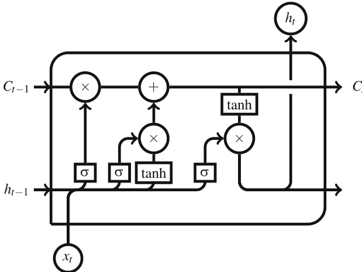

图 2.15 短期长期记忆网络的单元

然后使用这些值计算细胞状态的新值 $C_t$:

$$C_t = f_t C_{t-1} + i_t c_t.$$

最后要决定的是细胞的输出 $h_t$. 这可以通过两个步骤完成. 首先，我们计算（中间）输出的值：

$$o_t = \sigma (W_o . [h_{t-1}, x_t] + b_o) ,$$

然后：

$$h_t = o_t \tanh(C_t).$$

LSTM 网络还有许多其他变体. 门控循环单元 (Gated Recurrent Unit, 简称 $GRU$) 由 Cho 等人 [CVMBB14] 引入，旨在简化计算，并将遗忘门和输入门合并为一个单一的门：更新门. 它还合并了细胞状态和隐藏状态。

## 2.6 生成对抗网络

生成模型用于学习数据分布。主要目标是学习一组真实数据的分布，以便能够从学习到的分布中生成新的数据点。主要有两种高效的方法都基于神经网络：变分自编码器（见下一节）和生成对抗网络。


生成神经网络（GAN）[IJM+41]，基于博弈论的方法，由两个网络组成，见图 2.16，生成器和判别器。目标是从给定的分布中进行采样，例如均匀分布，然后学习使用神经网络等通用函数将噪声转换为训练数据分布。

对抗性一词来自这两个网络的训练方式。生成器 $G$ 学习数据分布，判别器 $D$ 估计样本来自训练分布而不是生成器的概率。因此，最后一个任务是生成类似于训练数据的数据（比如看起来像自然图像），鉴别器的任务是判断生成的数据是真实还是伪造的。这可以看作是一个极小极大的双人博弈，其中一个方面，$G$，试图通过尽可能生成真实数据来愚弄另一个方面，$D$，则试图通过提高鉴别能力来不被愚弄。

## 2.7 自编码器

自编码器（AEnc）[JMG95] 是一种神经网络方法，旨在为训练数据构建身份，同时尝试将特征空间压缩为较小的表示，如图 2.17 所示。因此，AEnc 应能够在输出层重现输入。AEnc 由两个主要组件组成：将输入映射到隐藏表示的编码器和通过与编码器相同的转换从隐藏表示重构原始输入空间的解码器。最小的隐藏表示称为潜在空间，瓶颈。AEnc 的训练旨在最小化输入和输出之间的差异，即最小化重构误差（RE）。在训练过程中，模型必须能够重建之前未见过的与训练集具有相同数据分布的实例。如果新的输入不属于相同的分布，重构误差将会很高。可以使用许多重构误差函数，例如均方误差（MSE），它反映了估计值（AEnc 的输出）与实际值（输入）之间的平均平方差。

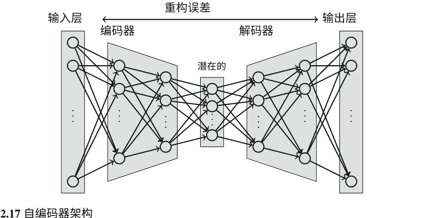

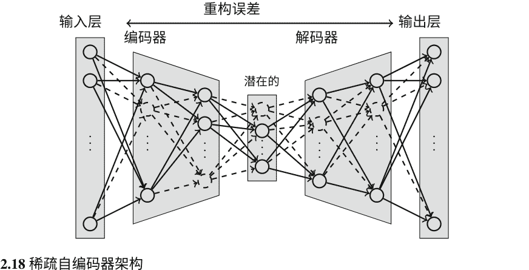

稀疏自编码器（SAE）[KPC18] 是一种在隐藏层上添加稀疏约束的 AEnc 类型。换句话说，成本函数中对 AEnc 的权重进行了惩罚。这种技术主要用于避免过拟合。

在 AEnc 中，隐藏层中的神经元数量少于输入/输出层的神经元。与此同时，在 SAE 中，数量可能较少或较多。

然而，由于稀疏性约束，不是所有的神经元都会“激活”。

其中一些将被禁用，如图 2.18 中的灰色链接所示。如果神经元的输出值接近 1，则被认为是“活跃”的或“发射”的。如果接近 0，则被认为是“非活跃”的。从数学上讲，将会添加一个额外的惩罚项（惩罚激活函数）到优化目标（成本函数）中，以便在将单个样本输入网络时，只鼓励少数节点激活。文献中存在许多选择的惩罚项 [JRP+15]，如基于 L1 范数的 L1 正则化器，基于 L2 范数的 L2 正则化器和 Kullback-Leibler (KL) 散度（衡量两个分布之间的差异）。


图 2.19 变分自编码器架构

该项将被添加到优化目标 (成本函数) 中，以便在将单个样本输入网络时，只鼓励少数节点激活。文献中存在许多选择的惩罚项 [JRP+15]，如基于 L1 范数的 L1 正则化器，基于 L2 范数的 L2 正则化器和 Kullback-Leibler (KL) 散度 (衡量两个分布之间的差异)。

变分自编码器 (VAE) [LRJY18]，继承了传统自编码器的架构，但不是将输入编码为固定向量 (瓶颈)，而是将其映射到一个分布 (图 2.19)。因此，编码器学习了一个数据生成分布，使解码器能够从潜在空间中随机采样并生成具有类似特征的输出。

## 2.8 同孪神经网络

同孪卷积神经网络 (Siamese CNN) 首次由 Chopra 等人在 [CHL05] 中引入。这样的模型由两个相同的 CNN 组成，它们共享所有权重。

设 $X = (X_1, X_2)$ 为一对输入。当给定两个输入 $X_1$ 和 $X_2$ 时，网络的目标是返回一个值 $Y \in \{0, 1\}$ (如果它们匹配则 $Y = 0$，否则为 1)。

两个组件中的每个都计算一个结果 $G_W(X_i)$，然后计算两个结果之间的欧几里得距离：

$$E_W = \|G_W(X_1) - G_W(X_2)\| .$$

在训练网络时，与使用交叉熵损失函数不同，对比损失函数更适合训练孪生 CNN。

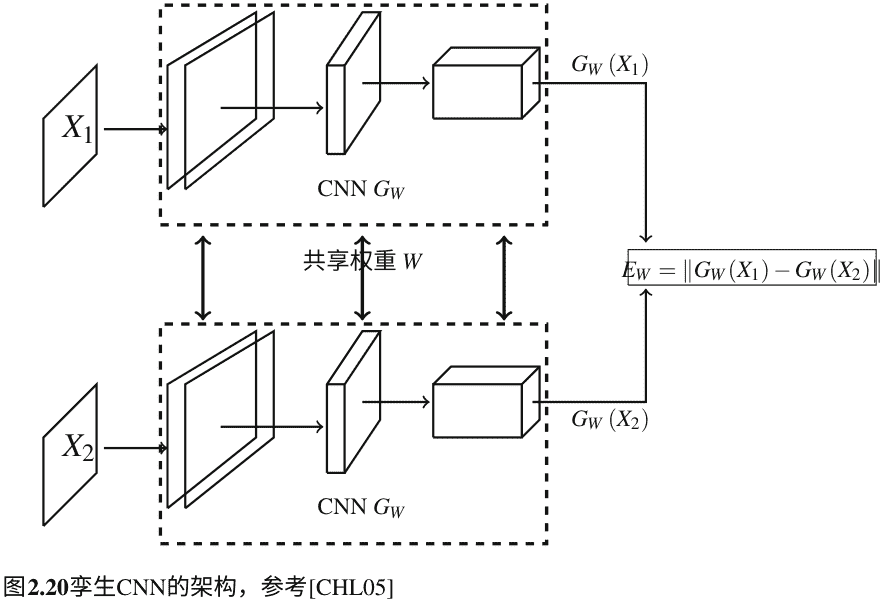

它的定义如下：

$$\mathcal{L}(X, Y) = (1 - Y) \frac{1}{2} E_W^2 + Y \frac{1}{2} \{\max \{0, m - E_W\}\}^2, \quad (2.27)$$

其中 $m$ 是一个边界。这个想法是鼓励神经网络学习一个嵌入，将具有相同标签的输入放在一起，并将具有不同标签的输入分开。图 2.20 展示了这样一个架构的例子。

## 2.9 结论

在本章中，我们介绍了人工神经网络和卷积神经网络：这两种可能的前馈架构在许多领域中证明了它们的效率，特别是在图像分析和计算机视觉中。然后，我们介绍了用于训练这些网络的一般梯度下降方法。我们还讨论了捕捉时间性的架构：循环神经网络和 LSTM，我们要讨论了如何调整梯度下降方法来训练这些网络。最后一节介绍了最近的特定和强大的架构：生成对抗网络、自编码器和连体卷积神经网络。本书的后续章节将说明所介绍的架构的使用。

## 参考文献

[CHL05] Sumit Chopra, Raia Hadsell, and Yann LeCun. 学习相似度度量，应用于人脸验证。在 2005 年 IEEE 计算机学会计算机视觉和模式识别会议 (CVPR 2005) 上，2005 年 6 月 20 日至 26 日，美国加利福尼亚州圣地亚哥，页码 539-546。IEEE 计算机学会，2005 年。

[Chu14] Wei-Ta Chu. 优化简介。2014 年。

[CVMBB14] Kyunghyun Cho, Bart Van Merri nboer, Dzmitry Bahdanau, and Yoshua Bengio. 关于神经机器翻译的性质：编码器 - 解码器方法。arXiv 预印本 arXiv:1409.1259, 2014 年。

[Cyb89] George Cybenko. 用 S 型函数的叠加逼近。MCSS, 2(4):303-314, 1989 年。

[DBL13] 第 30 届国际机器学习大会论文集，ICML 2013, 亚特兰大，美国，2013 年 6 月 16 日至 21 日，JMLR 研讨会和会议论文集的第 28 卷。JMLR.org, 2013 年。

[DHS11] John Duchi, Elad Hazan 和 Yoram Singer。自适应次梯度方法用于在线学习和随机优化。12:2121-2159, 2011 年 7 月。http://jmlr.org/papers/volume12/duchi11a/duchi11a.pdf。

[DPG+14] Yann Dauphin, Razvan Pascanu, T. G. Lehre, Kyunghyun Cho, Surya Ganguli 和 Yoshua Bengio。在高维非凸优化中识别和攻击鞍点问题。CoRR, abs/1406.2572, 2014 年。http://arxiv.org/abs/1406.2572。

[GBZN18] Pierre Gillot, Jenny Benois-Pineau, Akka Zemmari, 和 Yurii E. Nesterov. 增加深度卷积神经网络的训练稳定性. 在 2018 年 IEEE 国际图像处理会议 (ICIP 2018) 上，位于希腊雅典，2018 年 10 月 7 日至 10 日，第 3423 至 3427 页。IEEE, 2018 年。

[GDDM13] Ross B. Girshick, Jeff Donahue, Trevor Darrell, 和 Jitendra Malik. 用于准确目标检测和语义分割的丰富特征层次结构。CoRR, abs/1311.2524, 2013 年.. http://arxiv.org/abs/1311.2524.

[Gir15] Ross B. Girshick. 快速 R-CNN. CoRR, abs/1504.08083, 2015 年。http://arxiv.org/abs/1504.08083.

[Hau07] Raphael Hauser. 无约束优化的线搜索方法。第 8 讲，牛津大学计算实验室的数值线性代数与优化，2007 年。

[HCL06] Raia Hadsell, Sumit Chopra 和 Yann LeCun。通过学习不变映射进行降维。在 2006 年 IEEE 计算机学会计算机视觉与模式识别会议 (CVPR 2006) 上，2006 年 6 月 17 日至 22 日，美国纽约，1735-1742 页。IEEE 计算机学会，2006 年。

[HS97] Sepp Hochreiter 和 Jürgen Schmidhuber。长短期记忆。神经计算，9(8):1735-1780, 1997 年。

[HSS12] Geoffrey Hinton, Nitish Srivastava 和 Kevin Swersky。机器学习的神经网络 - 第 6a 讲 - 小批量梯度下降的概述。2012 年。

[HW68] D. H. Hubel 和 T. N. Wiesel。猴子条纹皮层的感受野和功能结构。195:215-243, 1968. http://hubel.med.harvard.edu/papers/HubelWiesel1968Jphysiol.pdf。

[HZRS15] Kaiming He, Xiangyu Zhang, Shaoqing Ren, 和 Jian Sun。深度残差学习用于图像识别。CoRR, abs/1512.03385, 2015.. http://arxiv.org/abs/1512.03385.

[IJM+41] Goodfellow I., Pouget-Abadie J., Mirza M., Xu B., Warde-Farley D., Ozair S., Courville A., 和 Bengio Y. 生成对抗网络。神经信息处理系统进展，页码 2672-2680, 2014 年。

[JH08] Orlando De Jesus 和 Martin T. Hagan. 通过时间的反向传播用于一般的动态网络。在 Hamid R. Arabnia 和 Youngsong Mun 编辑，Proceedings 2008 年国际人工智能会议，ICAI 2008, 7 月 14 日至 17 日，2008 年，美国内华达州拉斯维加斯，2 卷 (包括 2008 年国际机器学习会议；模型，技术和应用)，页面 45-51。CSREA Press, 2008 年。

[JMG95] Nathalie Japkowicz, Catherine Myers 和 Mark A. Gluck。一种新颖检测方法用于分类。在第十四届国际人工智能联合会议, IJCAI 95, 加拿大蒙特利尔魁北克，1995 年 8 月 20 日至 25 日，2 卷，页面 518-523。Morgan Kaufmann, 1995 年。

[JRP+15] 南江，荣文格，彭宝林，聂一帆和熊张。对无监督特征学习中自动编码器的不同稀疏惩罚的实证分析。在 2015 年国际神经网络联合会议 (IJCNN 2015) 上，爱尔兰基尔尼，2015 年 7 月 12 日至 17 日，第 1-8 页。IEEE, 2015 年。

[KB14] Diederik P. Kingma 和 Jimmy Ba。Adam: 一种随机优化方法。CoRR, abs/1412.6980, 2014 年。https://arxiv.org/pdf/1412.6980.pdf。

[KPC18] Rafal Kozik, Marek Pawlicki 和 Michal Choras。用于无监督网络流数据分类的稀疏自编码器。在 Michal Choras 和 Ryszard S. Choras 编辑的图像处理和通信挑战 10 - 第 10 届国际会议，IP&C'2018, 波兰比得哥什，2018 年 11 月 14 日至 16 日，论文集，卷 892 的智能系统和计算进展，第 192-199 页。Springer, 2018 年。

[KSH12] Alex Krizhevsky, Ilya Sutskever 和 Geoffrey E Hinton。使用深度卷积神经网络进行 ImageNet 分类。在神经网络进展的进展中，第 1097-1105 页，2012 年。

[LBBH98] Yann LeCun, Leon Bottou, Yoshua Bengio 和 Patrick Haffner。基于梯度的学习应用于文档识别。第 2278-2324 页，1998 年。http://yann.lecun.com/exdb/publis/pdf/lecun-01a.pdf。

[LeC] Yann LeCun. MNIST 演示。Yann LeCun 的网站。http://yann.lecun.com/exdb/lenet/index.html。

[LRJY18] Romain Lopez, Jeffrey Regier, Michael I. Jordan, and Nir Yosef. 对自动编码变分贝叶斯的信息约束。在 Samy Bengio, Hanna M. Wallach, Hugo Larochelle, Kristen Grauman, Nicol Cesa-Bianchi 和 Roman Garnett, 编辑，Advances in Neural Information Processing Systems 31: Annual Conference on Neural Information Processing Systems 2018, NeurIPS 2018, 3–8 December 2018, Montreal, Canada, 页面 6117–6128, 2018 年。

[MJ98] 马胜和纪传义。使用 EM 算法快速训练前馈和循环网络的统一方法。IEEE 信号处理，46(8):2270-2274, 1998 年。

[MP43] W. S. McCulloch 和 W. Pitts。关于神经活动中固有思想的逻辑演算。Bulletin of Mathematical Biophysics, 5: 115-133, 1943 年。

[Nes83] Yurii Nesterov。一种具有收敛速率 $O(1/k^2)$ 的解决凸规划问题的方法。Soviet Mathematics Doklady (Vol. 27), 1983 年。

[PBJ92] Boris Polyak 和 A B. Juditsky。通过平均加速随机逼近。30: 838-855, 1992 年 07 月。

[PBPZ+20] Miltiadis Poursanidis, Jenny Benois-Pineau, Akka Zemmari, Boris Mansencal, and Aymar de Rugy. Move-to-data: 一种新的深度卷积神经网络连续学习方法，应用于图像分类识别，2020 年。

[PMB13] Razvan Pascanu, Tomas Mikolov, and Yoshua Bengio. 关于训练循环神经网络的困难。在第 30 届国际机器学习大会 (ICML 2013) 上的论文集，2013 年 6 月 16 日至 21 日，美国亚特兰大 [DBL13]，第 1310-1318 页。

[RHGS15] Shaoqing Ren, Kaiming He, Ross B. Girshick, and Jian Sun. Faster R-CNN: 朝着实时目标检测与区域建议网络。CoRR, abs/1506.01497, 2015 年。. http://arxiv.org/abs/1506.01497。

[S+14] Nitish Srivastava, Geoffrey Hinton, Alex Krizhevsky, Ilya Sutskever, and Ruslan Salakhutdinov. Dropout: A Simple Method to Prevent Overfitting in Neural Networks. Journal of Machine Learning Research, 15:1929–1958, 2014.

[SLJ+14] Christian Szegedy, Wei Liu, Yangqing Jia, Pierre Sermanet, Scott E. Reed, Dragomir Anguelov, Dumitru Erhan, Vincent Vanhoucke, and Andrew Rabinovich. Going Deeper with Convolutions. CoRR, abs/1409.4842, 2014. http://arxiv.org/abs/1409.4842.

[SMDH13a] Ilya Sutskever, James Martens, George Dahl, and Geoffrey Hinton. Initialization and Momentum in Deep Learning. In Proceedings of the 30th International Conference on Machine Learning (ICML 2013), Atlanta, USA. June 16–21, 2013 [DBL13], III–1139–III–1147.

[SMDH13b] Ilya Sutskever, James Martens, George Dahl, and Geoffrey Hinton. Initialization and Momentum in Deep Learning. In Proceedings of the 30th International Conference on Machine Learning (ICML 2013), Atlanta, USA. June 16–21, 2013, III–1139–III–1147.

[SZL13] Tom Schaul, Sixin Zhang, and Yann LeCun. Minibatch Updates for Dense Neural Networks. 2013, Vol. 28, Issue 3: 343–351. https://arxiv.org/pdf/1206.1106.pdf.

[UvdSGS13] J. R. R. Uijlings, K. E. A. van de Sande, T. Gevers, and A. W. M. Smeulders. Selective Search for Object Recognition. International Journal of Computer Vision, Vol. 104, Issue 2: 154–171, 2013.

[WF12] Ge Zheng Wen, and Li Fan. Large-Scale Optimization - Lecture 4. 2012.

[ZB20] Akka Zemmari, and Jenny Benois-Pineau. Deep Learning for Visual Content Mining. Springer Briefs in Computer Science. Springer, 2020.

[ZF13] Matthew D. Zeiler, and Rob Fergus. Visualization and Understanding of Convolutional Networks. CoRR, abs/1311.2901, 2013. http://arxiv.org/abs/1311.2901.

# 第 3 章

## 用于语义分割的深度学习


**Alexandre Benoit, Badih Ghattas, Emna Amri, Joris Fournel, 和 Patrick Lambert**

## 3.1 引言

语义分割是指将类别标签分配给媒体内容的每个低级组件的任务。在图像分析社区中，它包括对标准 2D 图像上的每个像素进行分类，或者在处理体积图像或时空数据（如视频）时对体素进行分类。然后，它包括将媒体划分为可以总结为同质区域的集合，这些区域代表相同的概念或共享相同的属性。然后，这个任务接近于根据 Barghout [Bar14] 的提议，识别出空间分类的层次结构，从而创建观察到的视觉场景的分类法。

语义分割是许多高级应用的初步任务，这些应用需要精确的图像理解，例如自动驾驶车辆控制、机器人技术，包括医疗手术等人类辅助技术。

更具体地说，目标是对整个输入样本的每个像素进行分类，但不区分对象实例。考虑一组目标类别标签 $\Omega = \{c_0, c_1, \dots, c_l\}$ 和由 $pixels$ $I = p_0, p_1, \dots, p_n$ 组成的输入图像，语义分割的目标是找到满足每个图像像素的映射函数 $F_s : I, p_i \rightarrow c_j$。然而，这个任务与全局图像分类、对象实例检测和分割 [HGDG17] 有着密切的联系，这些任务限制了对图像的特定部分进行标记，并区分对象实例。它还与最近提出的全景分割 [KHG+19] 有关，该方法旨在对整个图像进行分割。

图 3.1 对于给定的图像 (a)，可以区分：(b) 具有前景鱼和背景海洋和地面类别的语义分割，(c) 前景实例检测和分割以及 (d) 全景分割，既包括完整图像的语义分割也包括实例检测。对象掩码最好以彩色查看。

在区分对象实例的同时进行分割。图 3.1 说明了这些不同的任务。语义分割是一个困难的问题，应该同时考虑局部特征分析、上下文分析和空间推理。

必须面对几个挑战，以提出一个能够在未见数据上很好地泛化的有效模型。

语义分割可以通过非常不同的方式实现，这取决于与数据相关的知识和目标语义级别。初步贡献主要依赖于无监督策略。最初考虑到少量样本 `$I_i$`，其中很少或没有注释，它通过考虑低级信息（像素颜色、亮度、轮廓检测等）来进行像素聚类。

然而，最近的进展更加关注高级别分析，以便在局部上对语义概念（对象、场景、动作等）进行分类。这是通过依赖大型注释数据集来实现的，这些数据集可以进行监督学习，考虑到样本元组 `$(I_i, Masks_i)$` 和 `$Masks_i$` 与输入图像 `$I_i$` 具有相同大小的矩阵，但报告了在 `$\Omega$` 中定义的预期像素级标签。

这个策略是当前研究的主要驱动力，得到了特定基准的支持，例如与 CityScapes 数据集相关联的基准 [COR+15]。

然而，正如我们将在本章中看到的那样，无监督策略仍然是一个有趣的选择，目前从最近的有监督模型提议中受益，这些模型提高了语义级别的分割能力。

最近已经发表了几篇调查论文，并对有监督方法的最新语义分割模型进行了广泛的比较 [YYT+18, LR19]，以及半监督或弱监督方法 [ZZZ+19]。可以观察到，目前所有最先进的方法都基于深度神经网络。读者被邀请参考这些调查论文以获得详细的视角。相比之下，本章预计提供更广泛的概述，并建立语义分割任务挑战、传统方法与基于深度神经网络的语义分割方法之间的联系，以帮助理解深度神经网络在语义分割任务中的价值。

本章首先在第 3.2 节中描述了面临分割模型的主要挑战。然后，在第 3.3 节中提供了传统方法的概述，以帮助了解深度学习方法的兴趣所在。接下来，在第 3.4 节中将提供更多关于基于深度学习的模型的见解。训练策略将指导讨论，并描述典型的网络。第 3.5 节详细介绍了改进各种网络和训练环境性能水平的高级技术和网络结构。本章以讨论各种应用领域和相关基准为结论，以指出一些当前问题和研究方向。

## 3.2 语义分割挑战

图像语义分割面临一些与一般图像处理问题相关的挑战，以及一些与任务特定的挑战。这里提供了一个简要概述，有助于理解各种提出的方法。

从一般的观点来看，目标概念的视觉外观因形状、纹理、与周围环境的交互、遮挡等的变异而广泛。这种数据的变异性预计将通过专门用于模型优化和验证的实验数据来很好地表示。然而，这种要求通常会带来数据不平衡或稀缺性，因为只有通过大规模的数据采集活动才能捕捉到一些罕见的情况，这些情况只能过度代表最常见的情况。这种不平衡在语义分割中尤为明显，因为像素级别上的语义概念分布与对象实例级别上的类别分布显著不同。例如，在图 3.1 中显示的样本图像上，背景类（海洋和地面）在像素数量上明显优于前景对象（鱼类），尽管它们的实例数量很高。因此，在算法的优化和验证过程中，必须精确控制数据选择和概念类别分布。

数据采集和调整失真对于给定的原始数据 `$x$` 要被 captured，一个单调且可能非线性的变换 `$A$` 应应用于一个传感器和后续的预处理，以便得到 `$\tilde{x}(t) = A(x)$`。对于一个给定的任务，可以使用多个传感器和数据预处理方法，每个方法都有不同的设计，会影响数据和噪声的统计分布。在像素级别分类的特定情况下，这个因素实际上是关键的，因为像素内容与传感器和预处理行为直接相关。必须针对各种配置解决这种变换的鲁棒性问题。

对象尺度的可变性 根据传感器分辨率和物体到相机的距离，要分割的语义对象的大小可能会有很大的变化，从远处轮廓到非常近距离的细纹理外观。

然而，像素级分类器应始终将对象的每个像素关联到相同的类别，无论其尺度如何。这实际上指出，像素 `$p_i$` 应该根据空间邻域 `$N(p_i)$` 进行分类，即输入媒体的一部分，使得 `$F_s: N(p_i) \rightarrow c_j$` 对数据中的尺度变化具有鲁棒性。

领域范围可以非常大，以捕捉整个对象的特定特征及其自身领域，从而提供一些上下文信息。

图像级别的变异性和不平衡 在语义分割的特定情况下，算法必须处理图像内的大量变异性和数据不平衡。由于数据中的局部线性和非线性变化无法通过全局图像预处理来补偿，局部图像行为可能发生剧烈变化。然后，相似概念实例的视觉外观在同一图像中可能发生显著变化。这些变化可能涉及图像线性像素动态修改，例如亮度和明暗区域的对比度。此外，非线性和非规则变化可能由影响纹理对比度的物理现象引入，这取决于空间位置和物体到相机的距离。雾化失真是一个自然的例子，可以影响包括自动驾驶在内的多个应用。对于这种变异性的鲁棒性是一个挑战，因为驱动这种变异性的物理模型并不完全被了解，就像雾化一样 [EKTM16]。

空间推理 空间关系非常重要，它们的建模可以显著改善语义分割 [LYZ+20]。这是一个特定的任务，它完成了局部纹理和物体表示，并尝试识别概念的共现以及它们的空间组织。这需要算法能够考虑潜在的大视野，以处理局部和上下文信息。

注释质量 对于许多任务来说，一个典型的问题与地面真实性质量有关。在语义分割的特定情况下，这些信息实际上是昂贵的，因为每个图像像素都应该被精确地分类，通常由人类专家完成。诸如 [RFB15a] 这样的方法更加惩罚边界分割错误，因此需要更高的注释质量。这期望在专业知识中有一个精确性的规律，这是无法保证的。事实上，标记单个图像可能需要几十分钟，这取决于其大小，并会产生随时间推移而降低质量的疲劳。还可能涉及多个注释者以加快交付速度，这会因不同的专业水平而产生不规则性。这既会产生噪声或弱注释，影响训练数据，也会影响用于验证模型的参考数据。在考虑对分割模型进行监督优化时，应该特别注意这一点。

后处理细化 所讨论的挑战产生了复杂的模型，其预测结果可能会受到错误的影响，可以通过后处理步骤来调节。错误可能与局部像素类别混淆或源自限制空间推理能力的狭窄视野有关。然后可以采用几种后处理策略，但是它们的调整通常是针对模型错误进行的，因此必须针对每个新模型提案进行调整。

- 这实际上与深度学习提出的'端到端学习'方法相矛盾，并增加了计算成本。

- 一个好的模型应该尽量少或不使用这些策略。

实时推理处理和轻量级模型 一些应用领域，如在线医疗辅助技术和自动驾驶，期望实时推理和低功耗。然而，高语义级别的对象分割希望依赖于图像的分层表示，这会增加计算成本。然后必须研究具体的策略，从轻量级和内存高效的模型设计 [CKR+19] 到训练过程中的模型简化 [EGM+20]。

在接下来的部分，我们对传统图像处理方法进行了简要概述，用于语义分割，并将其与这些挑战相结合，以更好地理解它们的优势和局限性。这将有助于理解为什么深度学习方法在这个领域取得了突破。

## 3.3 语义分割的传统方法

在本节中，我们简要介绍了一些基于经典非深度学习的图像分割方法。

用于此任务的早期算法通常分为两组：基于边缘或基于区域的方法。基于边缘的方法寻找相邻像素之间的强烈强度变化，而基于区域的方法主要基于某种局部均匀性准则。这些方法的二元性可以注意到，因为区域边界或多或少对应于边缘检测结果。这些方法是无监督的，相当简单。

基于边缘的方法通常分为两个步骤： (1) 边缘点检测和 (2) 边缘点分组以获得闭合轮廓。已经提出了许多解决方案来解决这两个步骤 [BCC+95]。然而，轮廓仍然是低级特征，很少与对象的轮廓匹配。事实上，一个对象通常由不同的部分组成，产生了许多轮廓，很难确定对象的真实轮廓是什么。

还有大量基于区域的分割方法。第一组解决方案在空间域中工作，试图构建一个根据某个标准具有同质性的图像分区。该过程可以是自下而上的过程，如区域生长方法 [Pav72]，也可以是自上而下的过程，因为它包括分割和合并步骤。数学形态学还提供了一些工具，如分水岭 [BM93]，用于获取区域。第二组解决方案是使用阈值或聚类。这些解决方案在像素强度（或特征）域中定义，并需要进行后处理步骤（即连接组件标记）以获取空间域中的区域。阈值化是一种非常简单的解决方案，仅适用于图像包含明显可区分的均匀背景和均匀对象的情况。然后，存在一个阈值将对象和背景之间的像素强度分开。Otsu [Ots79] 提出了一种自动确定最佳阈值的解决方案。

聚类方法更有趣，因为它们允许使用更丰富的描述每个像素的特征（强度、颜色、纹理等）。 聚类是在特征空间中进行的。K-means [HW79] 可能是统计学和机器学习中最广泛使用的聚类方法。它是一种非层次化的迭代方法，需要事先确定聚类的数量（一些启发式方法可以帮助选择或优化此参数）。K-means 的变体主要基于算法中使用的特征的选择。默认方法是使用 RGB 或 HSV 坐标中的像素强度。可以将这些强度的一阶或二阶导数包含在特征集中，以考虑聚类之间的不连续性（边缘检测），或者像素的空间位置等特征，以约束相邻像素属于同一聚类（超像素，[CGN19]）。

然而，所有这些方法的性能仍然有限，因为它们没有寻求图像的语义理解，特别是像素之间的长程依赖关系。为此，可以使用概率图模型，如条件随机场 (CRF) [LMP01]，来获得语义分割，如 [SJC08] 或 [LVZ11] 中所提出的。他们使用了一个完全连接的成对 CRF，其特征是具有一元和成对潜力函数的吉布斯能量函数。一元潜力函数由一个分类器独立地计算每个像素，产生一个第一标签分配，通常是不一致的。

然后，成对潜力函数鼓励成对标签预测与相应的手工特征一致。

## 3.4 语义分割深度学习方法

对于许多领域来说，深度神经网络 (DNN) 为语义分割带来了重大突破。深度神经网络对于这个任务的兴趣背后的思想是，人们可以直观地将视觉场景的层次结构与这些模型学习到的局部到全局特征层次结构进行类比。此外，由于高级别特征可以在局部进行编码，人们可以期望深度神经网络能够实现高级概念的语义分割。一个引人注目的观点是，由于在各种图像理解问题的第一处理阶段都需要这种分层局部特征描述，因此可以期望进行跨任务模型转移。

最近提出了许多种类的语义分割深度学习模型，并在调查论文中进行了详细介绍，例如 [YYT+18, LR19, ZZZ+19]。模型架构高度依赖于案例研究、可用数据和学习策略。接下来，我们提出了对监督学习和弱监督学习的典型方法的概述。每个方法都将通过典型的神经网络结构进行解释和说明。然而，由于所提出的方法共享常见的网络细化策略，为了澄清展示和展示方法之间的联系，这个讨论在更具体的第 3.5 节中进行。提出的概述呈现了构建和训练与语义分割相关的深度学习模型的主要策略。它们适应更具体的案例研究，如第 6 章中描述的零样本学习，可以考虑依赖类似的模型结构，但采用参数优化技术的调整。

### 3.4.1 监督学习方法

监督方法是优化深度神经网络的参考。对于语义分割，它需要图像和地面真值分割掩模的可用性。这是一个关键点，因为像素级注释在时间和专业知识方面特别昂贵。因此，这引入了两个主要的限制：注释数据的数量以及注释质量。此外，随着训练数据收集规模和模型复杂性的增加，计算成本也会增加。然而，从数据中学习具有良好泛化能力的高级抽象特征需要克服这些限制。

因此，可以从监督学习策略中得出两个主要方向。当处理有限数据或计算预算时，可以考虑迁移学习。否则，当有更多数据和计算能力时，可以考虑整个模型训练。接下来，我们介绍这两种方法，并举例说明一些最常考虑的模型。

#### 3.4.1.1 基于迁移学习的网络

迁移学习（TL），也被称为“知识迁移”，是一种旨在将从一个领域学到的知识应用于另一个领域以增强学习的技术。然后，它旨在克服孤立学习的范式，并在相关问题之间重复使用通用知识。TL 在 [PY09] 中被定义为一种改进目标预测函数 $f \mathcal{T}(.))$ 在目标领域 $\mathcal{D}_T$ 的学习任务 $\mathcal{T}_T$ 的方法。

这种改进源自源领域 $\mathcal{D}_S$ 中的初步学习任务 $\mathcal{T}_S$。在这个初步学习步骤中，预测函数 $f_S(.)$ 被认为是通用知识描述符 $f_k(.)$ 和专门任务头 $f_s(.)$ 的组合。随后，目标预测函数 $f_T(.)$ 利用知识描述符 $f_k(.)$ 与新的专门头 $f_t(.)$ 相结合。这个过程可以通过公式 3.1 来形式化：

$$

f_S(.) = f_s(f_k(.)), T_S \in \mathcal{D}_S

$$

$$

f_T(.) = f_t(f_k(.)), T_T \in \mathcal{D}_T, \qquad (3.1)

$$

其中 $\mathcal{D}_T = \mathcal{D}_S$，和/或 $\mathcal{T}_T = \mathcal{T}_S$。

使用深度网络进行特征转移的动机是，第一个模型层($f_k(\cdot)$) 足够通用，适用于许多任务，而后面的层($f_s(\cdot)$ 和 $f_t(\cdot)$) 更加特定于领域和任务。

迁移学习的成功应用已经在 [ZQD+20] 中得到了强调，并且在医学和多媒体等各个应用领域中得到了广泛的应用。

然而，重要的是要理解，并不总是成功的。事实上，如果源领域和目标领域或任务没有共享的知识，即 $\mathcal{D}_T \cup \mathcal{D}_S = \emptyset$ 和 $\mathcal{T}_T \cup \mathcal{T}_S = \emptyset$，那么这可能会适得其反。

TL 已经在典型案例研究中提出，在图 3.2 中进行了说明，并在后续中进行了描述。

### 特征提取和微调策略

特征提取和微调是迁移学习的典型方法，通常被同时考虑。基本的特征提取策略是从固定的通用知识描述符 $f_k(\cdot)$ 中获取高级语义特征，最终由一个在目标域 $\mathcal{D}_T$ 上经过专门优化的高级运算符 $f_t(\cdot)$ 进行处理。$f_k(\cdot)$ 是从源任务和领域的初步优化中得出的。

目的是提供相关特征并保持它们不变。

用于图像分类和语义分割任务的典型知识描述符是类别网络（如 VGG、AlexNet、ResNet）的除最后一层之外的所有层。这些网络通常在 Imagenet 数据集和相关的 ILSVRC 挑战中进行预训练。

这种语义分割策略的常见应用是在第 2 章中提到的编码器 - 解码器架构。如图 3.3 所示，$f_k(\cdot)$ 被用作编码器，提供低分辨率但高语义级别的特征给解码器。

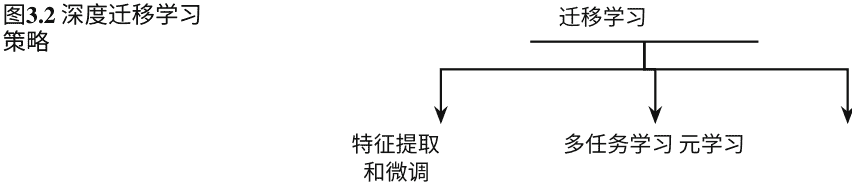

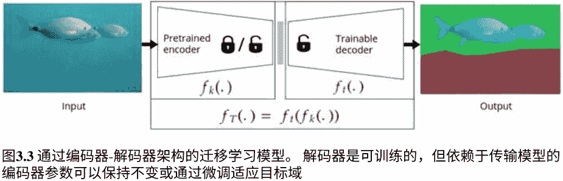

$f_t(.)$ 恢复数据大小并将特征映射到目标语义标签。与 $f_t(.)$ 相关的自由度受到目标任务复杂性和相关训练数据收集行为的限制。然而，这种策略期望 $f_k(.)$ 提供的特征足够相关，并且 $f_t(.)$ 能够有效地利用它们。下面介绍的互补微调策略克服了这些潜在限制。

通过允许在目标任务和领域上对整个网络进行优化（包括可迁移组件），微调完善了特征提取策略。然后，该策略使得可以对 $f_k(.)$ 的全部或部分组件进行领域适应性调整。因此，在预训练编码器中，可以保持可变数量的前几层冻结，并且只重新训练剩余高层，以帮助其适应领域和 $f_t(.)$。

当同时应用迁移学习和微调时，学习优先级仍然在新的头部 $f_t(.)$ 上，而 $f_k(.)$ 通常以较低学习率适应新领域。目标是保留在原始任务中学到的一些表征结构。使用适当的训练超参数，得到的模型可以优于特征提取方法 [GDDM14][ARS+15] 和从头开始训练的模型。Yosinski 等人在 [YCBL14] 中详细描述的早期观察结果显示了微调和迁移模型深度对分类网络的影响。确实需要微调来确保迁移模型对目标领域的适应性并增强与新头部的兼容性。

然而，当多次应用迁移和微调时，可能导致灾难性遗忘效应，即初始特征表示会在微调步骤中逐渐消失。这个问题目前是研究热点，超出本章范围，但已经提出了一些策略，如 [LH17]。

在考虑语义分割的迁移和微调时，首次突破是使用全卷积网络（FCNs）提出的 [LSD15]。FCNs 建立在标准图像编码器 $f_k(.)$ 上，就像用于图像分类的编码器一样。解码模型部分是一个浅层函数 $f_t(.)$，依赖于一些反卷积层，在初始分辨率上对特征进行上采样并预测语义标签。关于 TL，Long 等人的工作 [LSD15] 表明，迁移现代分类网络（如 AlexNet [KSH12] 和 VGG [SZ14]）可以产生准确的分割掩模。这种 TL 方法对许多语义分割任务非常有吸引力，因为分类任务上的优化更加廉价：有更多可用标注数据，而且标注成本更低。随后一些工作采用了这种策略，如 [SBT+19]、[IS18]、[GPHLG+16]。

对于语义分割迁移学习一个较近期且成功的应用是 DeepLab 模型家族，首次在 [CPK+17] 中提出。对于这些架构，预训练的 VGG-16 或 ResNet 分类模型被迁移用作 $f_k(.)$。解码模型部分 $f_t(.)$ 与 FCN 相比更先进。它利用 Atrous 空间金字塔池化（ASPP），应用具有不同扩张率的空洞卷积滤波器以增加模型感受野。

## 表3.1 用于语义分割任务的最常用模型

可迁移分类器通常被用作特征提取器，在本文中记为 $f_k(.)$；而可迁移的语义分割模型可以除像素分类头外整体迁移，或者整体适应新领域。

| 名称 | 发布 | 参数数量 | 相关的TL工作 |
| :--- | :--- | :--- | :--- |
| **可迁移的分类器** |  |  |  |
| AlexNet | 2012 | 60M | [KSH12], [TLQJ18] |
| VGG | 2014 | 138M | [IS18], [PKST20] |
| ResNet | 2015 | 55M | [JTK+18], [PKST20] |
| Inception | 2017 | 22M | [GdNV20] |
| **可迁移的语义分割模型** |  |  |  |


| U-Net | 2015 | 31M | [OdS18] |
| DeepLab | 2016 | 34M | [LCS+19] |

DeepLab 进一步引入了对特征尺度的鲁棒性。该模型显著提高了整体性能，特别是物体边界分割质量。

随后的几项研究证明了 TL 在语义分割中的有效性。Orsic 等人的工作 [OKBS19] 进一步展示了它在实时操作中的价值，并表明依赖迁移的 ResNet 编码器可以获得较高准确性与速度。也有从一个任务向另一个任务迁移语义分割模型的案例。例如，[OdS18] 迁移了一个 U-Net 模型，取得了成功结果，且再训练成本很小。

表3.1 总结了语义分割任务中应用 TL 最广泛的模型，介绍了相关参数数量、首次发布日期及一些 TL 工作示例。可以观察到参数数量随时间推移而减少，这也与较新模型提供更高推理速度有关，从而有利于语义分割模型。

### 与多任务学习（MTL）的联系

本节提出迁移学习与多任务学习之间的关系。第 3.5.3 节详细介绍了多任务学习。通过 TL，任务是顺序学习的，因此可迁移知识描述符 `$f_k(.)$` 先在源域与源任务 `$(T_S, D_S)$` 上学习，再在新任务和新领域 `$(T_T, D_T)$` 上复用。而 MTL 则涉及多个任务 `$\{T_1, T_2, \dots, T_n\}$` 在同一目标域 `$D_T$` 上联合学习。随后（若可行）通过学习任务之间关系，直接训练一个共享知识描述符以满足多个目标 [Rud17]。从某种意义上，MTL 可视为源任务和目标任务联合学习的迁移学习问题 [WP15]。

对于语义分割，多任务模型经常被提出。一个著名模型是 Mask R-CNN [HGDG17]（第 3.5.3 节详述），这是一个联合模型，可同时预测物体边界框、类别和分割掩模。然而，这个模型是特殊的，因为它依赖一个被称为“骨干”的编码器，该编码器可通过分类预任务迁移学习获得并进一步微调。近期一些研究也提出了类似模型，但仅在目标领域上以多任务方式训练，如 [ZTC+18]。

### 元学习

在多个计算机视觉任务中，在 ImageNet 上预训练的模型迁移到新任务和新领域时，即使训练数据较少，也能取得较好表现。然而在许多实际场景中，特别是目标数据与训练数据差异显著时，迁移学习并不总是有效。医学成像、天体物理等与 ImageNet 多媒体图像分布差异明显的场景尤为如此。在这种情况下，元学习被设计为一种技术，以更好利用先前学习步骤，即使只在小数据集上预训练。元学习在 [TP98] 中被定义。

考虑一组可训练任务与领域 `$\{(T_1, D_1), \dots, (T_n, D_n)\}$`，相应学习到一组知识描述符 `$\{f_{k_1}, f_{k_2}, \dots, f_{k_n}\}$`。元学习包括在目标任务及其领域 `$(T_T, D_T)$` 上，利用先前经验与相关知识描述符来指导新知识描述符 `$f_k$` 的学习过程，以在 `$T_T$` 上最大化性能。随后可以通过少量数据学习新任务。

Rakelly 等人在 [RSD+18] 中概述了多种分割任务，并展示了通过元学习可实现快速、准确且高效的数据分割。当有多个（小型）数据集可用，且需要学习数据通用表示并迁移到新问题时，这类方法很有价值。因此，它将迁移学习扩展到更多案例研究。

#### 3.4.1.2 无先验知识的学习

在没有可用先验知识，或需要学习无法通过权重迁移获得的新特征时，可以考虑完整模型训练（端到端学习）。与迁移学习相比，端到端学习可直接学习目标问题的适当特征。但它在数据和计算预算方面通常更昂贵，因为需要从头优化更多参数。

在语义分割背景下，端到端模型的设计和训练具有较大自由度。图 3.4 给出了典型先进方法的分类，下面段落将详细介绍。

**FCNs 模型**

语义分割最早的深度学习工作之一是 FCNs。它既可以依赖迁移学习，也可以从头训练。FCN 是不包含全连接层的网络。全连接层通常用于分类问题的最终层，以聚合全部信息并作出全局决策。作为替代，且为了适应语义分割所需的局部分类，FCNs 依赖 `$1\times1$` 卷积在局部融合特征以执行像素级预测。

FCNs 在 [LSD15] 中首次提出，实现了端到端语义分割。FCNs 依赖一个类似分类器的骨干网络，逐步下采样特征、提高语义层级，并在最后增加一个浅层上采样步骤。后者使用反卷积对输出特征图上采样，以恢复目标分割的空间维度。该模型还引入了跨层特征融合，通过输出求和结合早期层的细节空间信息与输出层的高区分语义特征。

在 2014 年，它达到了当时最先进分割性能。这项工作被视为图像分割里程碑，证明深度网络可用端到端方式训练用于语义分割。然而，尽管广受关注且效果显著，FCN 仍有局限：实时推理速度不够快，也未以有效方式利用全局上下文信息。不过，将原始组件替换为第 3.5.1 节所述的更新组件后，模型可更高效。

### 基于编码器-解码器和跳跃连接的模型

大多数图像分割深度模型实际上基于卷积编码器-解码器架构，后接最终逐像素分类层。编码器与解码器层通常近似对称。编码器目的在于提高表示语义层级并扩大感受野，从而更广泛地辅助每个像素分类。然而其内部下采样或池化操作会降低分辨率、丢失细节，并可能影响类别边界处分割质量。随后，解码器的目标是将低分辨率高级语义特征映射回原始分辨率。

对于 FCN 网络，特征上采样通过更多步骤完成，从而实现更高模型容量下的精细处理。较早提案之一是 SegNet [BKC17]。该模型试图解决分辨率损失问题。它依赖基于最大池化的下采样，并将编码器中的池化索引传递给解码器上采样操作，如图 3.5 所示。

上采样仅在对应编码器步骤所报告池化索引位置处复制先前神经激活。与 FCN 相比，这种上采样减少了模型复杂度，因为不需要可学习参数。然而后续仍需特征插值，可通过卷积层堆叠实现，并进行局部特征增强。最终解码器输出特征图送入逐像素 softmax 分类器。SegNet 的提出基于与现有架构对比后对“小而快”架构的需求。

在编码器-解码器类别中，最受欢迎模型之一是 U-Net，由 Ronneberger 等人 [RFB15b] 提出。它依赖所谓跳跃连接：将编码器中一组低级特征图传递到解码器，而非像 SegNet 那样使用最大池化索引。U-Net 在解码器级别连接编码器低级抽象信息与解码器高级语义信息，从而得到更精细、准确的预测图。事实上，U-Net 充分利用了前层特征中的高分辨率细节。

此外，跳跃连接有助于模型学习。这些连接可将误差梯度直接传输到前层，减少梯度消失。然而由于上采样通过转置卷积完成，它需要学习更多参数，相比 SegNet 训练速度较慢。

U-Net 的成功催生了庞大网络家族。整体 U-Net 结构可通过若干内部细化提高任务性能与计算开销表现。第 3.5.1 节介绍了解码器与编码器在不同特征尺度处理上最常见的一些模块结构。一个著名扩展是基于密集连接块的 FC-DenseNet。此外，还讨论了注意力机制的使用。在第 3.5.2 节中，SAUNet 模型 [SDZW20] 也取得了良好结果，并具备一定可解释性行为。

还有一些工作采用编码器-解码器进行图像分割，例如修改版 3D U-Net，引入了自定义 Dice 系数损失函数，如 V-Net [FSG+18]。

### 高分辨率模型

与 SegNet 和 U-Net 从低分辨率表示恢复高分辨率不同，其他模型结构可以并行处理多个特征尺度。因此目标是增强跨尺度鲁棒性并细化类别边界。例如，HRNet [WSC+20] 在整个网络中保持高分辨率表示。该网络由连续阶段组成：每个阶段由不同分辨率的并行卷积流构成；在每个阶段末端通过交换单元，以求和方式融合所有分辨率信息。

其主要优点是减少空间信息损失（这在编码器-解码器中并不总能避免），对图像分割尤其有利。这些 HRNet 结合其他技术（如 OCRNet 和 SegFix [YCW20]）在多个分割挑战（如 Cityscapes）中取得了最佳结果。尽管原始分割性能很高，但网络中始终维持高分辨率特征图会导致推理时间可能长于编码器-解码器分割网络。

### 分割和多任务模型

上述模型主要关注语义分割区域准确性，并未显式关注区域边界质量。边界检测及其他与语义分割相关任务可通过多任务模型同时执行。多任务模型可采用端到端策略训练，以降低总体计算成本，并提升分割性能。第 3.5.3 节概述了典型多任务策略及其在语义分割中的意义。

还可列举一些专注语义分割并采用特定多任务策略的工作。一个例子是 Boundary Aware Salient Object Detection（BASNet）模型 [QZH+20, QZH+19]。它由两个组件组成：语义分割预测网络，后接残差细化头。优点是第一模块捕捉大尺度结构，第二模块进行细化。预测模块提供多尺度分割输出并具有自身优化准则；细化模块具有单一优化准则。

### 表3.2 用于语义分割任务的典型端到端训练模型

| 名称 | 发布日期 | 参数数量 | 出版物 |
| :--- | :--- | :--- | :--- |
| FCNs | 2015 | 20M | [LSD15] |
| SegNet | 2015 | 14.7M | [BKC17] |
| U-Net | 2015 | 31M | [OdS18] |
| FC-DenseNet | 2017 | 15M | [JDV+17] |


| HRNet | 2019 | 65.8M | [WSC+20] |

### 端到端学习综合

作为本节结语，可以观察到可端到端训练的模型结构具有多样性。表 3.2 给出了所述模型的简要总结，展示了它们在参数数量与时间演化方面的复杂性。

端到端学习与所有方法一样存在局限，这些局限由 T. Glasmachers 等人 [Gla17] 研究。该工作展示了深度学习背景下端到端方法的框架，并介绍了其在某些情况下不切实际的原因。其中之一是在不利用先验知识时需要大量数据；另一个困难在于模型修改往往需要替换并重训练整个模型。

#### 3.4.1.3 性能指标和损失函数

在语义分割中，改进不仅来自模型结构修改，也包括训练配置（如损失函数），它们在模型训练中起重要作用。性能指标用于评估分割质量；一些性能指标也可作为损失函数。

在监督框架中，语义分割属于监督分类。真实像素标签可视为图像像素的一个划分，预测分类也可视为另一个划分。因此，用于比较划分的度量也可用于比较真实分割与预测分割。

考虑一幅有 $N$ 个像素的真实图像，每个像素标签为 $y_i \in \{1, \dots, J\}, i=1..N$，其中 $J$ 是考虑的标签数量。在语义分割中，每个像素可表示为 one-hot 向量 $\mathbf{p}_i=(p_i^1,p_i^2,\dots,p_i^J)$，除真实标签对应分量外其余分量为零。分割输出具有类似表示 $\hat{\mathbf{p}}_i=(\hat{p}_i^1,\hat{p}_i^2,\dots,\hat{p}_i^J)$。将像素真实标签记为 $y_i$，预测标签记为 $\hat{y}_i$，其中标签 $j$ 使 $\hat{p}_i^j$ 最大。一些指标直接比较 $y_i$ 与 $\hat{y}_i$，另一些指标比较概率向量 $\mathbf{p}_i$ 与 $\hat{\mathbf{p}}_i$。下面简要描述这些度量。

为简化记号，用 $\sum_i$ 表示 $\sum_{i=1}^N$，$\sum_j$ 表示 $\sum_{j=1}^J$，$\sum_{i,j}$ 表示 $\sum_{i=1}^N\sum_{j=1}^J$。

交叉熵：执行图像分割任务时，最常用损失函数是像素级交叉熵（CE）损失，定义如下：

$$CE=-\frac{1}{N}\sum_{i,j}p_i^j\cdot\log(\hat{p}_i^j)\eqno(3.2)$$

这是图像所有像素的平均交叉熵，也可在图像批次上取平均。

若类别不平衡可能会出现问题：出现频率最高类别可能主导学习。这种情况下可使用加权交叉熵（WCE）变体。方程（3.2）求和中的每个项被赋予权重，该权重与对应标签在训练样本中出现频率成反比。

语义分割模型在训练中通常使用交叉熵损失。但若关注图像细粒度信息，则提出了更高级损失函数。例如，Focal loss（FL）[LGG+17] 是标准交叉熵准则的改进。式（3.3）中的改动旨在减小简单样本的损失，使模型关注困难样本。

$$FL=-\frac{1}{N}\sum_{i,j}p_i^j\cdot(1-\hat{p}_i^j)^\lambda\log(\hat{p}_i^j)\eqno(3.3)$$

其中 $(1-\hat{p}_i^j)$ 是调节因子，$\lambda$ 是聚焦参数。设置 $\lambda>0$ 可减少对已良好分类样本（$\hat{p}_i^j>0.5$）的相对损失，更关注难分类或误分类样本。聚焦参数 $\lambda$ 可平滑调整对简单样本的降权速率。

**Dice、Jaccard 和 IoU**：Jaccard 指数通常称为交并比（IoU），是评估自然图像分割任务最常用指标之一。

给定两个区域（对应某一标签 $j$ 的像素集合）$R_j$ 和 $\hat{R}_j$，其 IoU 评估二者重叠程度，计算如下：

$$IoU(R_j,\hat{R}_j)=\frac{|R_j\cap\hat{R}_j|}{|R_j\cup\hat{R}_j|}$$

$|R_j|$ 表示 $R_j$ 中像素数，$|R_j\cap\hat{R}_j|$ 表示两个区域共有元素数。IoU 取值范围为 0 到 1：0 表示完全不重叠（不相交），1 表示完全重叠。

另一个度量标准，Dice 指数，与 Jaccard 指数密切相关，通常在医学图像分割任务中更受青睐。它的定义如下：

$$DI (R_j, \hat{R}_j) = \frac{2|R_j \cap \hat{R}_j|}{|R_j| + |\hat{R}_j|} \eqno(3.4)$$

Dice 指数和 Jaccard 指数可以对 $J$ 个标签进行平均。它们的缺点是它们对覆盖大图像区域的物体实例有偏见。因此，在同一类别的对象中观察到大尺度变化的任务中，可以使用变体，如实例级 IoU 度量。例如，在 Cityscape 数据集 [COR+15] 中，街景分割任务中评估模型对交通参与者的个体实例的分割效果。

基于 Dice 指数，当优化图像分割时经常使用 Dice 损失 (DL, [SLV+17])：

$$DL = 1 - \frac{2 \sum_{i,j} p_i^j \cdot \hat{p}_i^j + 1}{\sum_{i,j} (p_i^j)^2 + \sum_{i,j} (\hat{p}_i^j)^2 + 1} \eqno(3.5)$$

它可以被看作是骰子指数的互补的近似 (1-DI)。在这里，分子和分母都加上 1，以确保函数在边缘情况下不是未定义的，例如当 $p_i^j = \hat{p}_i^j = 0$。

一种称为广义骰子损失（GDL）的骰子损失的广义版本是骰子损失的多类扩展，其中每个类的权重与标签频率的平方成反比 [SLV+17]。

**Tversky 损失** [SEG17] 基于常规骰子系数提出了 DL 的一般化。它使用 $\beta$ 系数给 FP（假阳性）和 FN（假阴性）样本增加权重，这与使用相等权重的骰子损失不同。

$$TL = \frac{\sum_{i,j} p_i^j \cdot \hat{p}_i^j}{\sum_{i,j} p_i^j \cdot \hat{p}_i^j + \beta \sum_{i,j} (1 - p_i^j) \cdot \hat{p}_i^j + (1 - \beta) \sum_{i,j} p_i^j \cdot (1 - \hat{p}_i^j)} \eqno(3.6)$$

**豪斯多夫** 虽然 Dice 指数可以全面评估分割的质量，但豪斯多夫距离可以检测异常值。

我们首先通过以下方式定义点$x$与区域$Y$之间的距离函数：

$$d(x, Y) = \inf\{d(x, y) \mid y \in Y\}$$

然后我们定义两个区域$X$和$Y$之间的距离：

$$d(X, Y) = \sup\{d(x, Y) \mid x \in X\}$$

最后，豪斯多夫距离由以下公式给出：

$$d_H(X, Y) = \max\{d(X, Y), d(Y, X)\}$$

豪斯多夫距离通常与医学图像分割一起使用，以及 Dice 指数。然而，出于明显的原因，这个距离不适用于分散的区域。

### 体积相似性和临床指标

另一个值得一提的度量是体积相似性（VS）：

$$V S(X, Y) = 1 - abs(|X| - |Y|) / (|X| + |Y|)$$

与体积相关的指标在分割用于量化区域的体积和质量（给定密度）时特别有用（例如，在医学图像分割中，器官的体积和质量通常从器官的分割和像素间距离属性计算得出）。在医学图像分割任务中，临床指标有时与我们刚刚看到的分割指标一起使用。在这种范式中，自动化和手动分割首先用于量化所考虑器官的体积和质量，然后直接在量化信息上计算错误（平均绝对误差、偏差等）。

### 3.4.2 无监督和弱监督学习

用于比较分区的经典度量 这些度量通常分为两类：基于计数对的度量（**Rand**指数，调整后的**Rand**指数，**Jaccard**指数）和基于互信息的度量（互信息，归一化互信息，信息变异，[**Mei05**]）。这些度量不考虑像素在图像中的空间分布。

自编码器和受限玻尔兹曼机是深度学习中用于解决无监督问题的最常见方法之一。第一个用于编码图像，第二个用于聚类（图像或像素）。由于语义分割的主要共同问题是像素级标注的稀缺性，完全自动的无监督图像分割将非常有帮助。

一些最近的方法提出了这样的解决方案。W-net [CGN19] 是一个卷积自编码器网络，其中编码器和解码器都是 U-net 结构。编码器的输出是一个掩码，通过条件随机场和分层聚类进行处理，得到最终输出（分割图像）。解码器以掩码作为输入，并输出一个尽可能接近编码器输入的图像。损失函数是重建损失（在自编码器中常用）和应用于掩码的软切割损失的组合。这个损失可以被看作是类似于掩码表示的聚类的内部方差的一个相当经典的准则，因此与第 3.3 节中介绍的经典方法相连接。

其他无监督方法依赖于生成式方法，如 ReDO [CAD19]。该模型首先识别图像的分区，然后尝试分别生成每个分区的内容，然后将它们融合在一起创建一个类似于输入的生成图像。这种方法很有意思，因为它允许识别每个分区的分布。

最后，一些半监督方法也被提出用于语义分割，例如 [OHT20]。在这种情况下，与经典的半监督范式不同，强标签学习方法（使用像素级标记图像）与弱标签学习（使用图像级标签）以各种方式结合。

由于可用的注释数据集的限制，无监督和半监督方法在语义分割中引起了越来越多的兴趣。然而，关联的内部模型子结构通常遵循监督方法提出的结构，而全局结构则根据选择的学习方法进行调整。

## 3.5 模型改进

上述部分介绍的不同模型提供了现有模型架构的概述。然而，已经提出了几种改进方法，并且可以应用于大多数模型。本节描述了一些最先进的模型。

### 3.5.1 块级增强

已经提出：复合损失也可以组合多个损失。一种非常流行的组合是 `CE` 和 `DL` 的关联。另一种 `FL` 和 `DL` 的组合在 [ZHD+19] 中实现。另一种损失组合在 [AK19] 中介绍，它结合了 `Focal` 和 `Tversky` 损失。

神经层子结构执行每个尺度上的特征提取。

对于其他图像分析任务，例如分类，最先进的方法依赖于具有增加通信的层结构。正如在第 2 章中介绍的那样，大多数最新模型考虑残差块及其变体。基本思想是依赖于逐渐的数据转换，使得 $\mathbf{y} = \mathbf{x} + f(\mathbf{x}; \theta)$ 其中 $f$ 是具有可训练参数 $\theta$ 的非线性变换，由几个卷积层执行，通常是三个具有数百个卷积核的卷积层。通过级联这样的残差层来构建非常深的网络，可以以模型复杂性为代价学习到高度可传递和相关的特征。扩展如 `Xception` [Cho17] 和 `ResNeXt` [XGD+17] 引入了深度可分离和分组卷积，以找到表示能力和计算成本之间的最佳折衷。相反，还提出了更浅的架构，参数数量显著减少，但性能水平相当。例如，[HLVDMW17] 中提出的密集块增加了块之间的通信。在这种方法中，每个层生成少量（通常少于 50 个）激活图 $\mathbf{y}_l = f(\mathbf{x}_l; \theta_l)$ 其中 $\mathbf{x}_l = H([x_0, x_1, \dots, x_{l-1}])$ 是子结构之前所有层的激活的串联。然后，它最大化特征的重用，并限制了深层结构和具有许多神经元的宽层的需求。`FC-DenseNet` [JDV+17] 将这个概念应用于语义分割，并证明是一种性能卓越的结构模式。总结起来，可以考虑各种最新的运算符来设计高效的深度学习模型内的处理块。选择会影响模型特征的相关性、结构深度、连接性和参数数量。然而，它也会严重影响训练和推理模式的处理时间。我们在下面提出了对这个问题的讨论，并确定了一些能够实现更快处理的最新提议。

深度学习模型的神经层及其连接实际上涉及到大量的乘累加操作（MAC）和内存传输，这会影响处理延迟。如第 3.4 节所示，语义分割模型及其特定的编码器 - 解码器结构具有许多长距离的跨层（跳跃）连接和高分辨率特征处理块。从全局结构到神经层，必须考虑度量和策略，以减少计算预算并实现实时推理能力。[CKR+19] 建议将乘累加操作（或浮点运算）的数量与内存传输之间的比率作为一种补充性能指标。在层级上，MAC 受神经元数量和输入大小的控制。内存传输通过一个简单的度量指标 `Convolution Input Output (CIO)` 来近似，该度量指标对网络的每个卷积层的输入和输出张量大小求和。考虑到张量在网络层中交换的高度 h、宽度 w 和通道数 c，可以通过公式 3.7 估计整个网络的 CIO。

$$CI O = \sum_{l} h_{in}^{(l)} \times w_{in}^{(l)} \times c_{in}^{(l)} + h_{out}^{(l)} \times w_{out}^{(l)} \times c_{out}^{(l)} \quad (3.7)$$

因此，计算密度 $MoC = MAC/CIO$ 可以被认为是设计与推理平台相关的高效网络结构的考虑因素。低的 MoC 应该意味着与给定层的表示能力相关的高流量成本。因此，例如用于维度缩减的 $1 \times 1$ 卷积层通常应该避免使用，以及过度使用特征拼接。根据这个思路，最近的工作提出了增强的神经网络架构，例如在 [CKR+19] 中提出的 `HardNet` 模型。这种更新的 `DenseNet` 设计减少了 40% 的流量，同时提供了类似的任务性能水平。

通过考虑语义分割使用的通用网络子结构，可以得出这个讨论的结论，这些子结构在第 2 章中有描述。然而，语义分割模型的高计算成本与其深度编码器 - 解码器设计有关，应该优先选择计算和内存流量高效的结构，以满足推理和能耗要求。

### 3.5.2 注意力过程

注意机制是受生物模型启发的过程，它指导了感知。从 20 世纪中叶开始，神经科学研究人员提出了几种模型来解释人类的视觉搜索、空间注意力和特征集成，例如 Triesman 的工作 [TG80]。深度学习模型开始整合这些想法，从文本翻译 [BCB15] 开始。目前，注意力在深度学习中被认为是一种旨在实现两个目标的工具。首先，它旨在帮助模型根据特定上下文调整其响应，以提高预测准确性。此外，注意力图可以通过突出显示对给定输入刺激最有贡献的特征来提供预测的解释。

已经提出了各种注意力模型，以改进各种任务的深度学习模型，如本书所示。在本章中，我们重点关注那些更适应语义分割任务的模型，以应对其挑战。这里的目标主要是考虑空间注意力和特征集成，以增加图像或给定处理级别的一部分特征的重要性。这被引入为特定的可训练模块插入到神经结构中。它们通常在网络的解码或上采样部分中考虑，以改善来自不同尺度和语义级别的特征聚合。由于这些注意力模块在已经很大的模型中引入了额外的处理和内存成本，因此更倾向于使用轻量级策略。一些最近的论文提出了简单而高效的注意力模块，依赖于特征加权原则（由公式 3.8 总结），其中一组特征图 $\mathbf{f}_c$ 由缩放因子 $\mathbf{a}$ 加权，其维度和值取决于注意力模型的目标和设计。补充标量调节注意力模块的效果。如果 $\beta = 0,$ 不相关特征的贡献可以被消除。相反，如果 $\beta > 0$，并且通常为 1，注意力模块会强制执行感兴趣的特征图，同时保持不相关特征的初始贡献。

$$\tilde{\mathbf{f}}_c = \mathbf{f}_c \odot (\mathbf{a} + \beta) \hfill (3.8)$$

在这方面，`Squeeze and Excitation` 注意力模块 [HSS18] 是一个被广泛采用的特征集成注意力模型，它突出了特征通道之间的依赖关系。

根据公式 3.9 并考虑一组要处理的$n$个特征通道，它将注意力因子$\mathbf{a}_c$（$c$表示通道）视为一组$n$个标量的向量，全局缩放每个特征图。$\mathbf{a}_c$建立在全局活动向量$\mathbf{z}$上，其分量$z_c$是每个特征图$f_c$的缩减（挤压），大小为$H, W$，依赖于它们的全局平均池化。因此，空间信息没有被考虑在内，因此该方法不能区分短距离和长距离的空间依赖关系。最后，考虑非线性算子$g_f$来识别通道之间的依赖关系。它的输出激活依赖于 `Sigmoid` 算子，允许多个通道的激活（激励）。在这种方法中，特征图可以被屏蔽，然后 $= 0$。

$$\mathbf{a}_c = \sigma (g_f(\mathbf{z}, \theta_f)) \text{ with } \mathbf{z} = \{z_1, \dots z_n\} \text{ and } z_c = \frac{1}{W.H} \sum_{x=1}^W \sum_{y=1}^H f_c(x, y) \hfill (3.9)$$

空间注意力可以类似地定义。现在依赖于，$\mathbf{a}_s$（$s$代表空间），一个大小为$H, W$的 2D 权重矩阵，它与每个特征通道 $f_{c,i}$ 结合，依赖于 `Hadamard`（逐元素）乘积。[SDZW20] 提出了一个低复杂度的空间注意力模块，它计算 $\mathbf{a}_s$ 依赖于 $g_{s,\theta}$，这是基于$1 \times 1$卷积的输入特征图 $\mathbf{f}_c$ 的压缩，根据方程 3.10。

$$\mathbf{a}_s = \sigma (g_s(\mathbf{f}_c, \theta_s)) \hfill (3.10)$$

这两个注意力模块可以根据方程 3.11 进行组合，如 [SDZW20] 中所提出的，以提高性能水平，同时从和注意力值的分析中提供解释。

$$\tilde{\mathbf{f}}_c = (\mathbf{f}_c \odot \mathbf{a}_c) \odot (\mathbf{a}_s + 1) \hfill (3.11)$$

已经提出了不同组合策略的类似方法，例如 `CBAM` [WPLSK18] 和 [LWHY19]。后者通过并行的神经分支处理不同尺度的特征，最终通过统一的注意力模块进行调节。然而，大多数这些提议并不专门用于语义分割，而是适用于各种图像分析任务。

这个任务确实期望邻近像素之间的连接，即空间分组，在那些注意力机制中没有被考虑到。然而，这个方向最近由 SANet [ZLB+20] 模型提出，它提出了考虑对子采样特征进行注意，以明确引入局部像素分组。

### 3.5.3 多任务学习

语义分割任务是一个基本问题，但通常不是最终目标。它可以与其他任务相关联，以完成主要分析目标，如对象边界检测、对象检测等。相反，其他任务可以与语义分割相关联，以引导和改善分割质量。这些想法与多任务学习的概念相关。实际上，预计它能增加模型的泛化能力，因为它会偏向于学习适用于一组任务的表示 [Car97]。从模型结构的角度来看，它通常包括一个共享特征提取路径，生成特征 `$a_m = f_m(x, \theta_m)$`。然后，考虑一组任务 `$T \in \{t_1, \dots, t_n\}$`，每个任务都有自己的专用操作符，导致一个特定的网络头部 `$h_{ti}$`。它们可以由唯一的共享特征路径提供输入，因此可以形式化为 `$y_{hti} = f_{hti}(a_m, \theta_{hti})$`。这是最常用的硬参数共享架构。还提出了更复杂的策略，被称为部分或软参数共享架构。在这种情况下，每个任务专用路径 `$s_{ti}$` 既由共享特征又由原始输入数据提供输入，从而允许更复杂和专用的数据表示，并形式化为 `$y_{sti} = f_{sti}(x, a_m, \theta_{sti})$`。从优化的角度来看，所有模型路径可以同时优化。依靠与每个任务相关联的优化准则 `$L_{ti}$`，最小化全局损失。这个全局损失通常是加权和，形式化为方程式 3.12，其中 `$\beta_{ti}$` 是任务权重，可以手动调整并在训练过程中保持静态，或者动态调整以平衡任务重要性 [KGC18]。

$$L = \sum_{T} \beta_{ti} L_{ti} \eqno(3.12)$$

从计算的角度来看，一个引人注目的点是，在每个任务特定的模型运算符之前，共享特征只被提取一次。因此，与使用各种任务特定模型相比，这显著降低了训练和推理时间的处理和内存成本。下面介绍了与语义分割相关的典型多任务架构。

#### 3.5.3.1 作为辅助任务的语义分割

一个典型的案例研究是将语义分割与与对象实例检测相关的任务关联起来。后者是由流行的区域 - CNN 模型，更具体地说是它的改进版本 Faster-RCNN [Gir15]。这是一个能够检测、分类和回归对象实例边界框的多任务模型。

语义分割能力已经添加到了 Mask RCNN 架构中 [HGDG17]，如图 3.6 所示。在这种情况下，语义分割仅限于预测每个对象实例的二进制掩码。这与预测类别和框并行处理。这样可以解耦掩码和类别预测，从而减少任务间的依赖关系。更详细地说，对于一个 `$K$` 类对象检测和分割问题，语义分割路径的输出包括 `$K$` 个二进制掩码。语义分割头由几个`$3 \times 3$`的卷积层组成，通常为 3 到 6 个，每个层有 256 个神经元，最后一层限制为 `$K$` 个神经元，每个目标类别一个。在优化过程中，损失函数依赖于真实类别掩码和相关预测掩码之间的二元交叉熵。最后，这个损失函数与其他任务的损失函数相加，权重为 1，与其他任务一样。这个流行的模型在标准基准测试中表现出有趣的性能。然而，它也有一些限制。首先，架构复杂性限制了推理速度。

此外，分割掩模边界缺乏精确性，特别影响小型和细长物体的检测。最近对 Mask-RCNN 模型的扩展包括 PointRend [KWHG20]，旨在改善物体边界上的分割质量。

### 3.5.3.2 用于改进语义分割的辅助任务

语义分割的主要困难之一确实与类像素边界的分类准确性有关。可以提到几个原因。从数据的角度来看，这可以解释为在监督训练时，依赖于注释报告的边界的有限精度。此外，相邻物体边界的组合可能具有比物体本身更高的变异性，因此在这些区域的训练更加困难。从模型的角度来看，正如第 3.4 节所讨论的，最先进的方法通常依赖于在多次特征子采样步骤之后获得的粗略分辨率的语义特征提取。这实际上影响了边界预测的准确性，因此考虑使用跳跃连接进行补偿。然而，通常没有对边界提出明确的约束，并且仍然依赖于单一任务系统来进行像素分类。由此产生的模型仍然复杂，并且限制了对预测的理解，因为模型以一种隐晦的方式处理对象的颜色、纹理和形状。

另一种选择是通过辅助任务来引导语义分割，以解开与问题相关的因素。经典的轮廓分割任务是一个有趣的选择。这种方法由 Gated-SCNN 模型 [TAJF19] 引入，然后通过 SAUNet 模型 [SDZW20] 进行改进，如图 3.7 所示。主要贡献如下。首先，该模型依赖于两个处理路径。前者专门用于语义分割，并与上述现有模型保持相似。后者更具体，专门用于形状描述。它的前几层与分割路径共享，并在初始输入图像分辨率下提取特征，以保留详细的形状信息。该路径具有特定的优化准则，将其输出约束为生成形状掩码，依赖于其输出与参考形状掩码之间的二元交叉熵损失。问题实际上是提取图像的相关对象边界轮廓。为此，提出了一种名为 Gated 卷积的注意机制，以便让形状路径受到分割路径的调制，以减少内部对象轮廓的贡献。在 [TAJF19] 和 [SDZW20] 中提出的带门控卷积的调制可以总结为

图 3.7 SAUNet 模型 [SDZW20]，用于语义分割和边界检测的双任务深度神经网络。语义轮廓提取经过专门优化，并有助于改善语义分割。

如下：对于给定的门控步骤 `$t$` 在给定的处理尺度上，门控卷积首先通过连接聚合传入的形状和语义特征流。必要时，对语义通道特征进行双线性放大以匹配形状。然后，根据公式3.13构建注意力图。

$$
\alpha_t = \sigma (C_{1\times 1}(s_t \parallel f_t(r_t))) \tag{3.13}
$$

其中，`$C_{1\times 1}$` 是连接路径特征的 `$1 \times 1$` 卷积。对于 `$r_t$` 上的附加变换 `$f_t$`，可以限制为双线性插值（如[TAJF19]）或在[SDZW20]中引入额外的 `$1 \times 1$` 卷积。这个注意力图应用于形状流，使用 Hadamard 乘积。这种方法可以确定图像轮廓在语义分割任务中的重要性。然而，形状路径的输出是感兴趣轮廓的粗略地图。然后，为了改善边界，它与传统的计算机视觉轮廓提取器（如 Canny 滤波器[Can86]）结合，然后与分割路径融合以生成最终的语义分割预测。然而，由于在高分辨率特征上应用形状路径的处理，这种方法会导致高处理成本。

## 3.6 数据、基准和模型演化

本章概述了基于深度学习的语义分割方法。模型结构和训练策略的多样性突显了问题的难度。即使深度学习方法明显优于传统的图像处理方法，但目前无法通过统一的策略解决各种案例研究。接下来，我们提出了应用领域、相关数据集和挑战的概述，这将帮助感兴趣的读者找到与给定领域相关的最新策略。

### 3.6.1 数据和公共收藏的重要性

如第3.4节所示，语义分割深度神经网络依赖于大量的参数。然后，它们的优化需要大量的受控和注释数据。这个注释过程是繁琐、耗时的，有时需要专业知识。这就是大型公共数据集特别有趣的地方。它们被构建并提供给公众进行各种领域的竞赛，从自然场景理解到医学和地球观测。`https://grand-challenge.org/challenges/` 和 `https://evalai.cloudcv.org/` 等平台上报告了定期更新的列表。图3.8展示了当前最受关注的应用领域的示例。

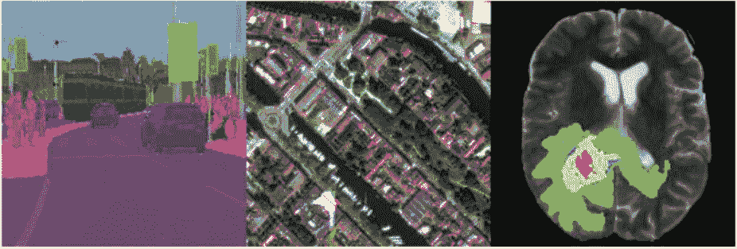

图3.8 一些典型的应用领域：多媒体、遥感、医学

除了在公平条件下允许对新模型与最先进模型进行比较之外，这些数据集还可以参与其他案例研究。从教学的角度来看，它们是学习深度学习技巧的工具。从研究和开发的角度来看，它们可以帮助模型在特定领域上收敛。第3.4.1.1节描述的迁移学习是经典方法，但公共数据集也可以与特定数据融合，用于其他学习策略。

### 3.6.2 跟踪最新技术的一种方式

除了原始数据外，这些竞赛还为深度学习从业者提供了一些有用的特性。由于深度学习不断发展，新模型或方法使以前的方法过时的情况并不罕见：这种演进可能难以跟踪。特别是在选择用于特定任务的架构类型时可能会很棘手（例如，U-Net 架构在医学图像分割任务中经常使用，通过增加数据集的大小和质量可以获得更好的改进）。这就是这些竞赛的排行榜的宝贵之处：它们可以轻松地可视化在给定任务上哪种方法有效，历史上哪些修改导致了改进，并且相关研究论文的链接通常在竞赛网站上给出。表3.3说明了 IoU 性能水平随时间的主要演变步骤，并展示了哪种模型结构和相关创新导致了显著的性能提升。

### 3.6.3 典型基准

Cityscapes 数据集[COR+15]是一个重要的公共数据集，用于语义理解城市街景。大多数旨在开发自然图像分割的最新模型的研究人员都在其上测试自己的模型，并包含一个将其结果与研究论文中的排行榜结果进行比较。这种情况适用于许多先驱架构，其中一些显示在表3.3中。这个挑战对大多数研究人员来说仍然是可访问的，以公平的条件评估新的提案。更近期的挑战，如 LVIS [GDG19]，更加专注于对象实例分割，显著扩展了要检测的数据和语义概念的数量。它们允许在更大规模上对泛化能力进行精细评估，并具有扩展的参与规则。

表3.3 IoU 性能指标在 Cityscapes 数据集上的演变。报告了主要的模型和创新，这些模型和创新导致了显著的性能提升，但没有报告它们的改进版本。

| 架构 | 发布 | IoU | 显著的创新 |
| :--- | :--- | :--- | :--- |
| HRNetV2 [YCW20] | 2019 | 0.818 | 保持高分辨率表示 |
| DANet [FLT+18] | 2019 | 0.815 | 注意力融合局部和全局特征 |
| DeepLabv3 [CZP+18] | 2018 | 0.813 | ASPP 和编码器-解码器结构 |
| DeepLabv2+CRF [CPK+17] | 2016 | 0.704 | 空洞空间金字塔池化（ASPP） |
| SegNet [BKC17] | 2015 | 0.570 | 解码器中的非线性上采样 |
| FCN-8 [LSD15] | 2015 | 0.653 | 深度编码器和浅层上采样 |

其他领域定期提出挑战。可以提到 IEEE GRSS 提出的每年数据融合背景，重点关注地球观测。通常提出大规模任务，并与语义分割密切相关，例如土地覆盖映射，但在地球观测尺度上。它允许开发新的策略，并利用多模态和多时相数据，依赖于各种地面、航空和卫星传感器。医学领域也经常提出挑战，可以在 `https://grand-challenge.org/` 平台上跟踪各种任务，通常与生物概念分割相关，如器官、生物异常等。它突显了与采集设备的多样性、稀缺注释和生物数据的变异性相关的困难。

## 3.7 结论

本章介绍了深度神经网络在语义分割问题中的应用。已经讨论了各种模型结构和优化策略。与传统方法相比，深度神经网络允许增加分割概念的语义级别，从低级像素信息到对象级别分割。

语义分割是先进的现实世界和更高级别应用的关键组成部分。自动驾驶、机器人技术、医学成像是典型的例子，还有像[WDYT19]这样的索引和查询系统。在视频序列中，利用语义分割进行交互式演员和动作分割。

目前最先进的技术在标准化的大规模数据集上展现出令人印象深刻的性能水平。然而，仍然存在许多挑战，特别是实时和高分辨率分割，以应对大规模数据处理，包括视频和体积数据。

另一个挑战与模型的可解释性和预测的合理性有关。模型结构的复杂性和像素级预测任务实际上使得这更加复杂。本章介绍的多任务模型和注意力策略为可解释性迈出了第一步。然而，需要更准确的解释。具有注释对象部分的大型数据集的可用性将有助于提供对数据的精细专业知识，从而帮助理解预测。此外，能够突出显示激活给定模型组件最多的输入数据特征的可解释性方法将完善可解释性工具包。最近已经开始对语义分割进行了这方面的工作，例如[HMK+19]和[VDM20]。

最后，重要的是强调语义分割任务与其他任务（如数据样本全局分类和对象实例检测）之间的互补性。最近提出的全景分割任务支持这个观点。因此，感兴趣的读者还应该关注这些领域的模型进展。

## 参考文献

[AK19] Nabila Abraham 和 Naimul Mefraz Khan。 一种新颖的焦点 Tversky 损失函数，具有改进的注意力 U-Net 用于病变分割。 在2019年 IEEE 第16届国际生物医学成像研讨会（ISBI 2019），页码 683-687。IEEE，2019年。

[ARS+15] Hossein Azizpour, Ali Sharif Razavian, Josephine Sullivan, Atsuto Maki 和 Stefan Carlsson。 对于通用卷积网络表示的可转移性因素。IEEE 模式分析和机器智能汇刊，38(9):1790-1802，2015年。

[Bar14] Lauren Barghout。 使用模糊-空间分类切割的视觉分类方法产生相关上下文区域。 在信息处理和不确定性管理国际会议上，页码 163-173。Springer，2014年。

[BCB15] Dzmitry Bahdanau, Kyunghyun Cho, and Yoshua Bengio. 通过联合学习对齐和翻译的神经网络机器翻译。2015年1月。第三届国际学习表征会议，ICLR 2015。

[BCC+95] Philippe Bolon, Jean-Marc Chassery, Jean-Pierre Cocquerez, Didier Demigny, Christine Graffigne, Annick Montanvert, Sylvie Philipp, Rachid Zboudj, Josiane Zerubia, and Henri Maitre. 图像分析：滤波和分割。物理教学。MASSON，1995年10月。在法国外交事务部科学和技术合作司的支持下出版。警告：1995年在 MASSON 出版的书籍（EAN13: 9782225849237）已经售罄。这个 pdf 版本是根据初步版本制作的，该版本已经提交给出版商。布局与书籍的略有不同。不幸的是，附录 C 中的一些图表已经丢失。

[BKC17] Vijay Badrinarayanan, Alex Kendall 和 Roberto Cipolla。`SegNet`：一种用于图像分割的深度卷积编码器-解码器架构。*IEEE 模式分析与机器智能汇刊*，39(12):2481-2495，2017年。

[BM93] S. Beucher 和 F. Meyer。分割的形态学方法：分水岭变换。1993年。

[CAD19] Mickael Chen, Thierry Artieres 和 Ludovic Denoyer。通过重绘进行无监督的物体分割。 在 Hanna M. Wallach, Hugo Larochelle, Alina Beygelzimer, Florence d'Alche-Buc, Emily B. Fox 和 Roman Garnett 编辑，《神经信息处理系统32进展：NeurIPS 2019》，2019年12月8日至14日，加拿大温哥华，页 12705-12716，2019年。

[Can86] John Canny。边缘检测的计算方法。*IEEE 模式分析与机器智能汇刊*，(6):679–698，1986年。

[Car97] Rich Caruana。多任务学习。机器学习，28(1):41–75，1997年。

[CGN19] Renu Chandran, Gopakumar 和 Hima S. Nair。关于超像素分割的不同方法的调查。国际科学与工程发展研究，4(2):115–120，2019年。

[Cho17] François Chollet。`Xception`: 使用深度可分离卷积的深度学习。 在*IEEE 计算机视觉与模式识别会议论文集*，页码 1251–1258，2017年。

[CKR+19] P. Chao, C. Kao, Y. Ruan, C. Huang, and Y. Lin. `HarDNet`: 一种低内存流量的网络。 在*2019年 IEEE/CVF 国际计算机视觉会议（ICCV）*，页码 3551–3560，2019年。

[COR+15] Marius Cordts, Mohamed Omran, Sebastian Ramos, Timo Scharwachter, Markus Enzweiler, Rodrigo Benenson, Uwe Franke, Stefan Roth, and Bernt Schiele. The Cityscapes Dataset. 在视觉数据集未来的 CVPR 研讨会上，第2卷，2015年。

[CPK+17] Liang-Chieh Chen, George Papandreou, Iasonas Kokkinos, Kevin Murphy, and Alan L. Yuille. `DeepLab`: 基于深度卷积神经网络、空洞卷积和全连接 CRFs 的语义图像分割。*IEEE 模式分析与机器智能*，40(4):834–848，2017年。

[CZP+18] Liang-Chieh Chen, Yukun Zhu, George Papandreou, Florian Schroff, and Hartwig Adam. 带有空洞可分离卷积的编码器-解码器用于语义图像分割。*CoRR*, abs/1802.02611，2018年。

[EGM+20] Utku Evci, Trevor Gale, Jacob Menick, Pablo Samuel Castro, 和 Erich Elsen。操纵彩票：使所有彩票中奖。机器学习研究论文集。PMLR，2020年。

[EKTM16] Jessica El Khoury, Jean-Baptiste Thomas, 和 Alamin Mansouri。用于雾霾模型和去雾方法评估的彩色图像数据库。 在 Alamin Mansouri, Fathallah Nouboud, Alain Chalifour, Driss Mammass, Jean Meunier, 和 Abder-rahim Elmoataz 编辑，《图像和信号处理》，页 109–117，Cham，2016年。Springer 国际出版社。

[FLT+18] Jun Fu, Jing Liu, Haijie Tian, Zhiwei Fang, 和 Hanqing Lu。用于场景分割的双重注意力网络。*CoRR*, abs/1809.02983，2018年。

[FSG+18] Filipe T. Ferreira, Patrick Sousa, Adrian Galdran, Marta R. Sousa, 和 Aurelio Campilho。端到端的监督肺叶分割。 在*2018年国际神经网络联合会议（IJCNN）*，第1-8页。IEEE，2018年。

[GDDM14] Ross Girshick, Jeff Donahue, Trevor Darrell, 和 Jitendra Malik。用于准确目标检测和语义分割的丰富特征层次结构。 在计算机视觉和模式识别 IEEE 会议论文集，第580-587页，2014年。

[GDG19] Agrim Gupta, Piotr Dollar, 和 Ross Girshick。LVIS: 用于大规模词汇实例分割的数据集。 在计算机视觉和模式识别*IEEE 会议论文集*，第5356-5364页，2019年。

[GdNV20] Renato Giorgiani do Nascimento 和 Felipe Viana。利用迁移学习进行卫星图像分类和分割。 在 AIAA Scitech 2020 论坛上，第1864页，2020年。

[Gir15] Ross Girshick。Fast R-CNN。 在 IEEE 国际计算机视觉会议上，2015年，页码 1440-1448。

[Gla17] Tobias Glasmachers。端到端学习的限制。arXiv 预印本 arXiv:1704.08305，2017年。

[GPHLG+16] Luis C. Garcia-Peraza-Herrera, Wenqi Li, Caspar Gruijthuijsen, Alain Devreker, George Attilakos, Jan Deprest, Emmanuel Vander Poorten, Danail Stoyanov, Tom Vercauteren, and Sebastien Ourselin。基于深度学习和跟踪的非刚性手术工具实时分割。 在国际计算机辅助和机器人内窥镜工作坊上，页码 84-95。Springer，2016年。

[HGDG17] Kaiming He, Georgia Gkioxari, Piotr Dollar, 和 Ross Girshick。Mask R-CNN。 在计算机视觉国际会议论文集，页码 2961–2969，2017年。

[HLVDMW17] Gao Huang, Zhuang Liu, Laurens van der Maaten, 和 Kilian Q. Weinberger。密集连接卷积网络。 在 IEEE 计算机视觉和模式识别会议中，页码 4700–4708，2017年。

[HMK+19] Lukas Hoyer, Mauricio Munoz, Prateek Katiyar, Anna Khoreva, 和 Volker Fischer。用于语义分割的网格显著性解释的上下文。 在神经信息处理系统进展中，页码 6462–6473，2019年。

[HSS18] Jie Hu, Li Shen, 和 Gang Sun。Squeeze-and-Excitation 网络。2018年 IEEE/CVF 计算机视觉和模式识别会议，页码 7132–7141，2018年。

[HW79] J. A. Hartigan 和 M. A. Wong。算法 AS 136: 一种 K-Means 聚类算法。应用统计，28(1):100–108，1979年。

[IS18] Vladimir Iglovikov 和 Alexey Shvets。TernausNet: 使用在 ImageNet 上预训练的 VGG11 编码器的 U-Net 用于图像分割。arXiv 预印本 arXiv:1801.05746，2018年。

[JDV+17] Simon Jegou, Michal Drozdzal, David Vazquez, Adriana Romero 和 Yoshua Bengio。The One Hundred Layers Tiramisu: 用于语义分割的全卷积 DenseNets。 在 IEEE 计算机视觉和模式识别会议论文集，第11–19页，2017年。

[JTK+18] Mostafa Jahanifar, Neda Zamani Tajeddin, Navid Alemi Koohbanani, Ali Gooya 和 Nasir Rajpoot。使用多尺度卷积神经网络和领域特定增强进行皮肤病变及其属性的分割。arXiv 预印本 arXiv:1809.10243，2018年。

[KGC18] Alex Kendall, Yarin Gal, and Roberto Cipolla。使用不确定性来加权场景几何和语义损失的多任务学习。 在 IEEE 计算机视觉和模式识别会议论文集上，第7482-7491页，2018年。

[KHG+19] Alexander Kirillov, Kaiming He, Ross Girshick, Carsten Rother, and Piotr Dollar。全景分割。 在 IEEE 计算机视觉和模式识别会议论文集上，第9404-9413页，2019年。

[KSH12] Alex Krizhevsky, Ilya Sutskever 和 Geoffrey E. Hinton。使用深度卷积神经网络进行 ImageNet 分类。 在神经信息处理系统进展中，第1097-1105页，2012年。

[KWHG20] Alexander Kirillov, Yuxin Wu, Kaiming He, and Ross Girshick。PointRend: 图像分割作为渲染。 在 IEEE/CVF 计算机视觉和模式识别会议论文集上，第9799-9808页，2020年。

[LCS+19] Chenxi Liu, Liang-Chieh Chen, Florian Schroff, Hartwig Adam, Wei Hua, Alan L. Yuille, and Li Fei-Fei。Auto-DeepLab: 分层神经网络架构搜索用于语义图像分割。 在 IEEE 计算机视觉和模式识别会议论文集上，第82-92页，2019年。

[LGG+17] Lin T.-Y., Priya Goyal, Ross Girshick, Kaiming He 和 Piotr Dollar。用于密集目标检测的焦点损失。 在 IEEE 国际计算机视觉会议论文集，2017年，页码 2980-2988。

[LH17] Zhizhong Li 和 Derek Hoiem。学习而不遗忘。*IEEE 模式分析与机器智能汇刊*，40(12):2935-2947，2017年。

[LMP01] John D. Lafferty，Andrew McCallum 和 Fernando C. N. Pereira。条件随机场：用于分割和标记序列数据的概率模型。见第十八届国际机器学习大会论文集，ICML '01，2001年，页码282-289，美国加利福尼亚州旧金山。Morgan Kaufmann 出版社。

[LR19] Fahad Lateef 和 Yassine Ruichek。使用深度学习技术进行语义分割的调查。*神经网络*，338:321-348，2019年。

[LSD15] Jonathan Long，Evan Shelhamer 和 Trevor Darrell。用于语义分割的全卷积网络。见 IEEE 计算机视觉与模式识别会议论文集，页码3431-3440，2015年。

[LVZ11] Victor S. Lempitsky，Andrea Vedaldi 和 Andrew Zisserman。用于语义分割的塔模型。见 John Shawe-Taylor，Richard S. Zemel，Peter L. Bartlett，Fernando C. N. Pereira 和 Kilian Q. Weinberger 编，NIPS，页码1485-1493，2011年。

[LWHY19] Xiang Li，Wenhai Wang，Xiaolin Hu 和 Jian Yang。选择性核网络。2019年。


[LYZ+20] 夏丽，杨一波，赵琦杰，沈天成，林洲琛 和 刘宏。基于空间金字塔的图推理用于语义分割。见 IEEE/CVF 计算机视觉与模式识别会议，页码8950-8959，2020年。

[Mei05] Marina Meila。比较聚类：一个公理观点。见第22届国际机器学习会议，页码577-584。ACM，2005年。

[OdS18] Hugo Oliveira 和 Jefersson dos Santos。深度迁移学习用于胸部 X 射线解剖结构的分割。见 2018 年第31届 SIBGRAPI 图形、模式和图像会议，页码204-211。IEEE，2018年。

[OHT20] Y. Ouali，C. Hudelot 和 M. Tami。带有交叉一致性训练的半监督语义分割。见 2020 年 IEEE/CVF 计算机视觉与模式识别会议（CVPR），页码12671-12681，洛杉矶，加利福尼亚州，美国，2020年6月。IEEE 计算机学会。

[OKBS19] Marin Orsic，Ivan Kreso，Petra Bevandic 和 Sinisa Segvic。为实时语义分割道路驾驶图像辩护的预训练 ImageNet 架构。见 IEEE 计算机视觉与模式识别会议论文集，页码12607-12616，2019年。

[Ots79] N. Otsu。一种基于灰度直方图的阈值选择方法。*IEEE 系统、人类与控制论汇刊*，9(1):62-66，1979年。

[Pav72] T. Pavlidis。通过函数逼近进行图片和地图分割。*计算机图形与图像处理*，1:360-372，1972年。

[PKST20] Mohammad Pashaei，Hamid Kamangir，Michael J. Starek 和 Philippe Tissot。用 UAS 超高空间分辨率图像进行高效土地覆盖制图的深度学习架构回顾与评估：以湿地为例。*遥感*，12(6):959，2020年。

[PY09] Sinno Jialin Pan 和 Qiang Yang。迁移学习综述。*IEEE Transactions on Knowledge and Data Engineering*，22(10):1345-1359，2009年。

[QZH+19] Xuebin Qin，Zichen Zhang，Chenyang Huang，Chao Gao，Masood Dehghan 和 Martin Jagersand。BASNet：边界感知显著目标检测。见 *IEEE 计算机视觉与模式识别会议（CVPR）*，2019年6月。

[QZH+20] Xuebin Qin，Zichen Zhang，Chenyang Huang，Masood Dehghan，Osmar R. Zaiane 和 Martin Jagersand。U2-Net：通过嵌套 U 结构进行更深入的显著目标检测。*Pattern Recognition*，106:107404，2020年。

[RDS+15] Olga Russakovsky，Jia Deng，Hao Su，Jonathan Krause，Sanjeev Satheesh，Sean Ma，Zhiheng Huang，Andrej Karpathy，Aditya Khosla，Michael Bernstein，Alexander C. Berg 和 Li Fei-Fei。ImageNet 大规模视觉识别挑战。*国际计算机视觉杂志（IJCV）*，115(3):211-252，2015年。

[RFB15a] Olaf Ronneberger，Philipp Fischer 和 Thomas Brox。U-Net：用于生物医学图像分割的卷积网络。见 Nassir Navab，Joachim Hornegger，William M. Wells 和 Alejandro F. Frangi 编，*医学图像计算与计算机辅助干预 - MICCAI 2015*，页码234-241，Cham，2015年。Springer International Publishing。

[RFB15b] Olaf Ronneberger，Philipp Fischer 和 Thomas Brox。U-Net：用于生物医学图像分割的卷积网络。见国际医学图像计算与计算机辅助干预会议，页码234-241。Springer，2015年。

[RSD+18] Kate Rakelly，Evan Shelhamer，Trevor Darrell，Alexei A. Efros 和 Sergey Levine。元学习指导分割。2018年。

[Rud17] Sebastian Ruder。深度神经网络中多任务学习概述。arXiv 预印本 arXiv:1706.05098，2017年。

[SBT+19] Suvash Sharma，John E. Ball，Bo Tang，Daniel W. Carruth，Matthew Doude 和 Muhammad Aminul Islam。用于越野自动驾驶的迁移学习语义分割。*Sensors*，19(11):2577，2019年。

[SDZW20] Jesse Sun，Fatemeh Darbehani，Mark Zaidi 和 Bo Wang。SAUNet：用于可解释医学图像分割的形状注意力 U-Net。2020年。

[SEG17] Seyed Sadegh Mohseni Salehi，Deniz Erdogmus 和 Ali Gholipour。Tversky 损失函数用于使用 3D 全卷积深度网络的图像分割。见国际医学图像机器学习研讨会，页码379-387。Springer，2017年。

[SJC08] J. Shotton，M. Johnson 和 R. Cipolla。用于图像分类和分割的语义文本森林。见 2008 年 IEEE 计算机视觉与模式识别会议，页码1-8，2008年。

[SLV+17] Carole H. Sudre，Wenqi Li，Tom Vercauteren，Sebastien Ourselin 和 M. Jorge Cardoso。广义 Dice 重叠作为高度不平衡分割的深度学习损失函数。见*医学图像分析和临床决策支持中的多模态学习深度学习*，页码240-248。Springer，2017年。

[SZ14] Karen Simonyan 和 Andrew Zisserman。用于大规模图像识别的非常深的卷积网络。arXiv 预印本 arXiv:1409.1556，2014年。

[TAJF19] Towaki Takikawa，David Acuna，Varun Jampani 和 Sanja Fidler。Gated-SCNN：用于语义分割的门控形状 CNN。见 IEEE 国际计算机视觉会议论文集，页码5229-5238，2019年。

[TG80] Anne M. Treisman 和 Garry Gelade。关于注意力的特征整合理论。*认知心理学*，12(1):97-136，1980年。

[TLQJ18] 胡涛，李伟华，秦先祥 和 贾丹。基于卷积神经网络和条件随机场的图像语义分割。见 2018 年第十届国际高级计算智能会议（ICACI），页码568-572。IEEE，2018年。

[TP98] Sebastian Thrun 和 Lorien Pratt。学习学习：介绍和概述。见 *Learning to Learn*，页码3-17。Springer，1998年。

[VDM20] Kira Vinogradova，Alexandr Dibrov 和 Gene Myers。通过梯度加权类激活映射实现可解释的语义分割（学生摘要）。见 AAAI，页码13943-13944，2020年。

[WDYT19] 郝旺，邓成，严俊驰 和 陶大成。非对称交叉引导的注意力网络用于从自然语言查询中进行演员和动作视频分割。见 IEEE 国际计算机视觉会议论文集，页码3939-3948，2019年。

[WP15] 王博宇 和 Joelle Pineau。用于任意迁移和多任务学习的在线增量算法。见第二十九届 AAAI 人工智能大会，2015年。

[WPLSK18] Sanghyun Woo，Jongchan Park，Joon-Young Lee 和 In So Kweon。CBAM：卷积块注意力模块。见欧洲计算机视觉会议（ECCV）论文集，页码3-19，2018年。

[WSC+20] 王京东，孙科，程天恒，蒋博睿，邓超瑞，赵阳，刘东，穆亚东，谭明奎，王兴刚 等。用于视觉识别的深度高分辨率表示学习。*IEEE 模式分析与机器智能汇刊*，2020年。

[XGD+17] Saining Xie，Ross Girshick，Piotr Dollár，Zhuowen Tu 和 Kaiming He。聚合残差变换用于深度神经网络。见 *IEEE 计算机视觉与模式识别会议论文集*，页码1492-1500，2017年。

[YCBL14] Jason Yosinski，Jeff Clune，Yoshua Bengio 和 Hod Lipson。深度神经网络中的特征可迁移性如何？见 *神经信息处理系统进展*，页码3320-3328，2014年。


[YCW20] Yuhui Yuan，Xilin Chen 和 Jingdong Wang。用于语义分割的对象上下文表示。见第16届欧洲计算机视觉大会（ECCV 2020），2020年8月。

[YYT+18] Hongshan Yu，Zhengeng Yang，Lei Tan，Yaonan Wang，Wei Sun，Mingui Sun 和 Yandong Tang。语义分割的方法和数据集：综述。*Neurocomputing*，304:82-103，2018年。

[ZHD+19] 周永进，黄伟健，董佩，夏勇，王珊珊。D-UNet：一种用于慢性中风损伤分割的维度融合 U 形网络。*IEEE/ACM 计算生物学与生物信息学汇刊*，2019年。

[ZLB+20] 钟子龙，林忠秋，Rene Bidart，胡晓丹，Ibrahim Ben Daya，李志峰，郑伟士，Jonathan Li 和 Alexander Wong。压缩与注意力网络用于语义分割。见 *IEEE/CVF 计算机视觉与模式识别会议（CVPR）*，2020年6月。

[ZQD+20] 庄福振，齐智远，段科宇，席冬波，朱永春，朱恒舒，熊辉，何青。迁移学习综合综述。*IEEE 会议论文集*，2020年。

[ZTC+18] 张子琛，唐敏，达纳·科布扎斯，多诺什·佐诺比，马丁·雅格桑德 和 雅各布·J·贾雷姆科。具有 ROI 卷积的端到端检测分割网络。见 *2018 年 IEEE 第15届生物医学成像国际研讨会（ISBI 2018）*，页码1509-1512。IEEE，2018年。

[ZWYC19] 赵帅，王洋，杨铮，蔡登。用于语义分割的区域互信息损失。见 *神经信息处理系统进展*，页码11117-11127，2019年。

[ZZZ+19] 张曼，周勇，赵佳琪，蔓一云，刘冰 和 姚睿。图像半监督和弱监督语义分割综述。*人工智能评论*，页码1-30，2019年。

# 第四章 在深度学习中超越完全监督

Nicolas Thome

## 4.1 上下文

深度学习和卷积神经网络（ConvNets）[LBD+89] 在人工智能领域有着悠久的历史，是最早的预测模型之一，在机器学习中也是最古老的模型之一。尽管在20世纪90年代和21世纪初，学术界对于使用深度学习技术持保留态度，但是我们目睹了深度神经网络在过去十年中取得的巨大成功。自从 ConvNets 在 ImageNet ILSVRC’12 挑战赛 [KSH12a] 中的杰出表现以来，深度学习已经成为视觉识别任务以及数据科学领域（例如语音识别、自然语言处理、游戏和机器人）的最先进技术。

然而，深度神经网络需要大量标注数据才能达到最佳性能。这是广泛使用这些模型的主要限制，特别是当标注成本很高时，例如在医疗保健领域需要高水平专业知识。因此，设计能够处理有限数量标注的深度模型学习方案，目前是一个非常广泛的研究领域。

在计算机视觉中，“深度特征”是利用在大规模数据集（例如 ImageNet）上训练的深度神经网络来提供通用视觉表示，从而对各种视觉识别任务有效 [ARS+16]。需要注意的是，深度特征对于大范围领域迁移具有鲁棒性，并且在遥感、医疗保健等领域中常被使用。我们现在介绍更一般的解决方案，以利用少量标记样本来使用深度学习模型。

### 4.1.1 弱监督学习（WSL）

弱监督学习（WSL）是指在训练模型时预测准确标签（例如图像分割中的密集预测），而训练时使用较粗糙的标签（例如全局图像标签）。放宽对训练数据昂贵且精确的手动标注要求，使得以合理成本构建大规模数据库成为可能。例如，在计算机视觉领域，使用全局标签对图像进行标注可以构建包含数百万示例的数据库，而像素级标注（即分割）则更加昂贵，这解释了为什么通常只有中等规模的数据集（约数千幅图像）可用。另一方面，处理弱标记数据通常需要通过潜在变量扩展表示空间，以建模隐藏因素并弥补弱监督。

关于 WSL 的开创性工作遵循多实例学习（MIL）范式 [DLLP97]：每个示例被表示为一组实例的集合，并且弱监督为每个集合提供一个标签。在过去15年中，这个问题在多个领域得到了广泛研究：如 [DLLP97] 中药物活性识别的开创性工作、文本分类 [ATH03]、基于内容的图像检索 [CW04] 等。MIL 的主要假设是集合标签与实例标签之间的关系：如果一个集合包含至少一个正实例，则该集合为正；如果只包含负实例，则为负。

一个经典的玩具例子是将一个集合视为一组钥匙：如果一个集合包含能够打开门的钥匙，则标记为正；如果没有钥匙能够打开，则标记为负。MIL 方法可以分为两类：集合方法 [MR98, CW04, GFKS02, KOB13] 与实例方法 [ATH03, BM07, GC07, DF10, JB12]。集合方法将每个集合嵌入到一个特征空间中，在该空间使用标准监督学习技术；实例方法则在实例空间中学习分类函数。近期方法对 MIL 假设提出了质疑，例如标签比例学习（LLP）框架 [QSCL09, Rue10, YLK+13, LYCC14]（该框架推广了 MIL），或者对称 MIL 变体 [DTC18, DTC15, LV15a, DTC16, DMTC17]。在深度学习时代，已经提出了几种使用图像级标签训练深度 ConvNets 的 WSL 方法 [OBLS15, PKS15, PC15, PSLD15, SPC+16, ZKL+16]。关键问题是如何对区域进行汇聚，以获得每个类别的得分。ConvNet 的输出是每个类别的检测图，因此为了使用标准分类损失进行训练，需要将这些图聚合成每个类别的全局预测。这个汇聚问题在 WSL 结构化模型中也存在 [YJ09, QWM+07, PLI14, SHPU12]。最流行的汇聚方法是最大汇聚 [OBLS15, PKS15, YJ09]，它选择最佳区域进行预测。在二分类情况下，这种汇聚总是多实例学习（MIL）范式 [DLLP97] 的一个实例。另一种方法是使用所有区域进行预测，通过对区域进行边缘化 [ZKL+16, QWM+07, PLI14]。在第4.2节中，我们将详细介绍汇聚方法。

基于负证据并考虑最高得分和最低得分区域的函数在 [DTC19] 中被提出。

### 4.1.2 半监督学习（SSL）

在半监督学习（SSL）中，目标是利用大量未标记数据以及少量标记数据。对于使用相对较小标注数据集训练深度模型，SSL 可作为一种正则化技术，利用未标记数据提升深度 ConvNets 的泛化性能 [Zhu05]。

在使用未标记数据训练深度模型时，通常遵循的标准目标是设计适应输入数据的模型。重构误差是（可能是去噪）自动编码器 [BLPL07, RS08, RHBL07, VLBM08] 中使用的标准准则，而最大似然与生成模型一起使用，例如受限玻尔兹曼机和深度置信网络 [HS06, RPCL07, LB08]。这种无监督训练框架通常用作反向传播之前的预训练，可能还有一个中间步骤 [GTCL13]。目前非常流行的生成对抗网络 [GPAM+14] 也属于这一类别。在现代 ConvNets 中，使用未标记数据进行正则化通常被表述为多任务学习问题，即在训练过程中将重构与分类目标结合起来 [ZMGL16, ZLL16]。在这些架构中，用于分类的编码器通过专用于重构的解码器进行正则化。

这种使用自动编码器同时进行分类和重构的策略存在争议，因为在特征提取方面，分类和重构可能起到相互矛盾的作用。分类旨在提取与类别无关的特征，以改善学习模型的样本复杂度 [HTF09]，因此会导致信息丢失，从而妨碍精确重构。一些近期方法提出了不同于标准重构准则的无监督项。在 Ladder Networks [RBH+15] 中，通过设计能够丢弃信息的自动编码器，解决了前述重构与分类之间的冲突。通过上层与下层噪声版本之间的跳跃连接，实现了重构的可能性。在 HybridNet [RTC18] 中，提出了一个双分支网络：第一个分支专注于分类，因此可以丢弃信息；第二个分支旨在恢复分类分支丢失的信息。通过这种方式，两个网络可以协作，并利用未标记数据进行重构。

另一个有趣的正则化准则依赖于预测函数的稳定性或平滑性，例如在 Slow Feature Analysis [TTC13] 中曾被使用。在 Adversarial Training [GSS15] 和 Virtual Adversarial Training [MMK+16] 中，研究了向预测函数加入稳定性。其他近期半监督模型也在预测中加入了基于稳定性的正则化项。

### 4.1.3 自训练

这个想法首先由 [SJT16] 提出，建议使预测向量对数据增强（例如平移、旋转）和模型随机性（dropout）稳定。后续的工作 [LA17, TV17] 通过提出计算稳定性目标的变体来改进它，以增加它们的一致性并更好地适应模型在训练过程中的演变。

在自训练或自监督学习中，目标是使用给定的模型自动注释数据。在半监督学习的背景下，可以使用自训练来根据在标记数据上训练的模型自动注释无标签数据。重新标记的步骤可以是迭代的，就像自适应学习 [KPK10] 中的那样，逐渐重新注释示例，从最简单到最困难。这受到课程学习 [BLCW09] 的一般原则的启发，其中的理论是让学生先从简单的例子中学习，然后再用更困难的例子构建一个粗略的预测模型，并在之后进行改进。

在执行迭代重新标记时，通常使用模型置信度来选择伪标记的示例。深度学习中的置信度估计是一个至关重要但复杂的问题。最简单的方法是使用最大类别概率（MCP）[HG17]。尽管这个基准在实践中被广泛使用，但它也存在一些根本性的缺点，例如概率校准问题 [GPSW17]。在贝叶斯深度学习中，通常使用蒙特卡洛 Dropout [GG16]。另一方面，误分类中的置信度估计是正确预测与错误之间的正确分离，一些最近的工作引入了特定的度量和方法，例如信任分数 [JKGG18] 或 ConfidNet [CTBH+19]。

自监督学习在过去几年中越来越多地用于处理少标记数据集。例如，它已经在图像分类 [DMM19]、医学图像中的语义分割 [BOS+17, ZWT+19, ZZSL19]、以及领域自适应 [LYV19, ZYVKW18, ZYL+19] 中得到了探索。

## 4.2 弱监督学习的负证据模型

我们在 [DTC19] 中提出了基于负证据的潜在结构模型。我们首先介绍符号，然后介绍我们的预测函数，学习公式和直觉。最后，我们将我们的模型与现有的潜在模型进行比较。

### 4.2.1 符号

我们首先给出在（潜在的）结构化输出学习框架中使用的一些基本符号。我们考虑一个任意的输入空间 $\mathcal{X}$ 和一个结构化的输出空间 $\mathcal{Y}$。对于 $(\mathbf{x}, \mathbf{y}) \in \mathcal{X} \times \mathcal{Y}$，我们对学习一个形式为 $f : \mathcal{X} \to \mathcal{Y}$ 的判别函数感兴趣。为了在训练时引入不可用的隐藏参数，我们将输入/输出对之间的描述与一个潜在变量 $\mathbf{h} \in \mathcal{H}$ 进行扩展。我们定义一个得分函数 $F_{\mathbf{w}}(\mathbf{x}, \mathbf{y}, \mathbf{h})$，它依赖于输入数据 $\mathbf{x} \in \mathcal{X}$，输出 $\mathbf{y} \in \mathcal{Y}$，潜在变量 $\mathbf{h} \in \mathcal{H}$ 和一些参数 $\mathbf{w} \in \mathbb{R}^d$。我们的目标是学习一个由参数 $\mathbf{w}$ 参数化的预测函数 $f_{\mathbf{w}}$，使得预测输出 $\hat{\mathbf{y}}$ 依赖于 $F_{\mathbf{w}}(\mathbf{x}, \mathbf{y}, \mathbf{h}) \in \mathbb{R}$。在训练过程中，我们假设我们有一个训练集 $\mathcal{D} = \{(\mathbf{x}_i, \mathbf{y}_i) \in \mathcal{X} \times \mathcal{Y} : i \in \{1, \dots, N\}\}$，其中 $\mathbf{y}_i$ 是示例 $i$ 的真实标签。我们的目标是优化 $\mathbf{w}$ 以最小化训练集上的用户提供的损失函数 $\Delta(\mathbf{y}_i, \mathbf{y})$。

### 4.2.2 负证据模型

我们负证据模型的主要直觉是：对每个可能的输出 $\mathbf{y} \in \mathcal{Y}$，配备一对潜在变量 $(\mathbf{h}_{i,y}^+, \mathbf{h}_{i,y}^-)$。$\mathbf{h}_{i,y}^+$（或 $\mathbf{h}_{i,y}^-$）对应于输入 $\mathbf{x}_i$ 和输出 $\mathbf{y}$ 的最大（或最小）评分潜在变量值：

$$\mathbf{h}_{i,y}^+ = \arg \max_{\mathbf{h} \in \mathcal{H}} F_{\mathbf{w}}(\mathbf{x}_i, \mathbf{y}, \mathbf{h}) \quad (4.1)$$

$$\mathbf{h}_{i,y}^- = \arg \min_{\mathbf{h} \in \mathcal{H}} F_{\mathbf{w}}(\mathbf{x}_i, \mathbf{y}, \mathbf{h}) \quad (4.2)$$

对于一个输入/输出对 $(\mathbf{x}_i, \mathbf{y})$，模型的评分 $s_{\mathbf{w}}(\mathbf{x}_i, \mathbf{y})$，求和 $\mathbf{h}_{i,y}^+$ 和 $\mathbf{h}_{i,y}^-$ 的评分如下：

$$s_{\mathbf{w}}(\mathbf{x}_i, \mathbf{y}) = \frac{1}{2} \left( F_{\mathbf{w}}(\mathbf{x}_i, \mathbf{y}, \mathbf{h}_{i,y}^+) + F_{\mathbf{w}}(\mathbf{x}_i, \mathbf{y}, \mathbf{h}_{i,y}^-) \right) \quad (4.3)$$

最后，我们的预测是：

$$\hat{\mathbf{y}} = f_{\mathbf{w}}(\mathbf{x}_i) = \arg \max_{\mathbf{y} \in \mathcal{Y}} s_{\mathbf{w}}(\mathbf{x}_i, \mathbf{y}) \quad (4.4)$$

方程 (4.4) 中的最大化问题被称为推理问题。我们在这里考虑了用于 $F_{\mathbf{w}}$ 的深度 ConvNets 模型，因此在方程 (4.3) 中的评分函数。

### 4.2.4 负证据直觉

$$ \mathbf{y} \in \mathcal{Y} $$

图 4.1 负证据直觉。不同学习类别模型（卧室，机场内部和餐厅）的热图和预测区域（绿色表示正样本，红色表示负样本，以及它们的得分 $F_w(\mathbf{x}, \mathbf{h}_y^+)$ 和 $F_w(\mathbf{x}, \mathbf{h}_y^-)$）在卧室图像 $\mathbf{x}$ 上显示。卧室和餐厅模型对最大区域具有较高的得分，因为每个模型都专注于与该类别有区别的对象（卧室的床和餐厅的椅子）。最小区域提供了补充信息：对于餐厅来说，它的得分较低，因为模型找到了一个负证据（床），表明餐厅类别不存在。

为了突出配对 $(\mathbf{h}^+, \mathbf{h}^-)$ 的重要性，我们在图 4.1 中展示了 MIT67 数据集 [QT09] 中的一个卧室图像的热力图，表示每个潜在位置使用卧室分类器、机场内部分类器和餐厅分类器的分类分数。$\mathbf{h}^+$（或 $\mathbf{h}^-$）区域用绿色（或红色）框起来。正如我们所看到的，正确类别分类器（卧室）的预测分数很高，因为模型发现了强烈的局部证据 $\mathbf{h}^+$ 存在，并且没有明确的证据表明其不存在（中等分数 $F_w(\mathbf{x}, y = \text{卧室}, \mathbf{h}_y^-) = 0.1$）。对于一个完全不同的错误类别，比如机场内部，预测分数非常低，因为没有与机场相似的区域。对于一个具有相似对象的错误类别，比如餐厅，餐厅分类器的最大分数与卧室分类器相当：模型在具有区分性的对象上有很强的反应（对于卧室是床，对于餐厅是椅子）。对于餐厅分类器，预测分数 $s_w$ 明显低于卧室分类器，因为它还发现了餐厅的明确缺失证据，即床（$F_w(\mathbf{x}, y = \text{餐厅}, \mathbf{h}_y^-) = -1.7$）。因此，我们的负证据模型正确预测了卧室类别。

讨论为了将负证据与现有的潜在结构化模型联系起来，我们引入了以下广义评分函数，其中“逆温度” $\beta_h^+$ 和 $\beta_h^-$ 参数在平滑之间：

$$ s_{\mathbf{w}}^{\left(\beta_h^+, \beta_h^-\right)}(\mathbf{x}, \mathbf{y}) = \frac{1}{2 \beta_h^+} \log \frac{1}{|\mathcal{H}|} \sum_{\mathbf{h} \in \mathcal{H}} \exp \left[\beta_h^+ F_{\mathbf{w}}(\mathbf{x}, \mathbf{y}, \mathbf{h})\right] $$

$$ + \frac{1}{2 \beta_h^-} \log \frac{1}{|\mathcal{H}|} \sum_{\mathbf{h} \in \mathcal{H}} \exp \left[\beta_h^- F_{\mathbf{w}}(\mathbf{x}, \mathbf{y}, \mathbf{h})\right] $$

如表 4.1 所示，方程 (4.8) 中的评分函数包括几个最先进的模型作为特殊情况。

### 4.2.5 ResNet-WELDON 网络架构

基于前一节介绍的模型，我们提出了 `ResNet-WELDON`，一种专门用于在训练期间仅使用图像级标签学习局部视觉特征的弱监督学习方法。所提出的网络架构分为两个子网络：基于全卷积网络（`FCN`）的深度特征提取网络和预测网络，如图 4.2 所示。

符号说明：我们将 $F_{\mathbf{w}}^l(\mathbf{x}, y, \mathbf{h})$ 表示为位于位置 $\mathbf{h}$ 的输入图像 $\mathbf{x}$ 的特征图（或类别）$\mathbf{y}$ 的层 $l$ 的输出。$\mathbf{w}$ 是 `ConvNet` 的参数。

#### 4.2.5.1 特征提取网络

特征提取网络专门用于计算输入图像的任何区域的固定大小表示。它们通过用卷积层替换全连接层来将标准分类网络（`AlexNet`，`VGG16`）转化为卷积网络。

为了在网络的顶部具有高空间分辨率，我们使用了最近引入的 `ResNet-101` [HZRS16]，它在设计上是完全卷积的。`ResNet-101` 具有 100 个卷积层，后面是全局平均池化和全连接层。为了具有空间信息的特征图，我们移除了完全连接层（通常在文献中这样做），以及没有可学习参数的全局平均池化。只有卷积层（和空间池化）的架构可以处理任意大小的图像，并在重叠的图像区域上共享中间特征。通过这种架构，空间信息在整个网络中自然地保留下来：对于输入图像尺寸为 $224 \times 224$，输出尺寸为 $7 \times 7$。空间分辨率影响学习表示的定位和可辨识性。因此，我们期望特征图的分辨率是我们模型的关键组成部分：更细的特征图保留更多的空间分辨率，并导致更具体的区域。此外，`ResNet` 在图像分类方面比 `VGG16` 更有效，同时具有参数和时间效率。

特征提取网络的输入是一个 RGB 图像 $h_i \times w_i$，其中 $h_i$（分别为高度和宽度）。输出是一个 $h \times w \times 2048$ 的特征图，其中 $h = \frac{h_i}{32}$ 和 $w = \frac{w_i}{32}$ 分别是图像中水平和垂直方向上滑动窗口位置的数量（见图 4.2）。特征提取网络的权重是在 `ImageNet` 上初始化的。

图 4.2 `ResNet-WELDON` 深度架构分解为两个子网络：特征提取网络（左）和预测网络（右）。特征提取网络基于 `ResNet-101`，从整个图像中提取具有良好空间分辨率的局部特征。然后使用传输层来学习类别特定的热图（汽车，摩托车和人），并且预测层将热图聚合起来为每个类别产生一个单一的分数。我们展示了每个类别右侧得分最高的 3 个区域。

#### 4.2.5.2 预测网络设计

这部分旨在选择相关区域以正确预测全局（结构化）图像标签。

**传输层** 预测网络的第一层是传输层。它的目标是将特征提取网络的权重从大规模数据集转移到新的目标数据集。它将特征提取网络的输出 $F^f$ 转换为大小为 $h \times w \times C$ 的特征图 $F^t$，其中 $C$ 是类别的数量（见图 4.2）。该层是由 $C$ 个卷积滤波器组成的卷积层，每个滤波器的大小为 $1 \times 1 \times 2048$。由于卷积的核大小，该层保留了特征图的空间分辨率。该层的输出可以看作是定位热图。在图 4.2 中，我们展示了不同类别的热图：`car`、`motorbike` 和人。

**弱监督预测 (WSP) 层** 第二层是一个空间池化层将得分图聚合成分类得分：对于每个输出 $\mathbf{y} \in \{1, \dots, C\}$，在 $h \times w$ 的区域中的得分被聚合成一个标量值。我们注意到 $F_{\mathbf{w}}^{t}(\mathbf{x}_i, \mathbf{y}, \mathbf{h})$ 是图像 $\mathbf{x}_i$ 中类别 $y$ 的区域 $\mathbf{h}$ 的得分。$y, \mathcal{H} = \{1, \dots, r_i\}$ 是区域索引集合，$r_i$ 是图像 $\mathbf{x}_i$ 的区域数量。预测层的输出是一个大小为 $1 \times 1 \times C$ 的向量。如第 4.1.1 节所述，从 MIL 继承的 WSL 的标准方法是选择得分最高的区域。我们提出在两个互补的方向上改进这个策略：使用负证据和多个实例。

**WELDON 池化** 这种池化通过融合负证据来改进最大池化。预测结果是将最大和最小得分区域相加。基于最近关于学习顶部实例的 MIL 洞察力 [Lv15b]，我们还提议将单个区域的选择扩展到多个区域。形式上，令 $h_z \in \{0, 1\}$ 为二进制变量，表示从层 $F^t$ 中选择第 $z$ 个区域。我们提出了评分函数 $s^{top}$，它按照以下方式选择 $k^+$ 个最高得分的区域：

$$
s_{\mathbf{w}, k^{+}}^{top}\left(F^{t}\left(\mathbf{x}_{i}, \mathbf{y}\right)\right)=\frac{1}{k^{+}} \sum_{z=1}^{r_{i}} h_{z}^{+} F_{\mathbf{w}}^{t}\left(\mathbf{x}_{i}, \mathbf{y}, z\right) \quad (4.9)
$$

其中 $\mathbf{h}^+ =\arg \max _{\mathbf{h} \in\{0,1\}^{r_{i}}} \sum_{z=1}^{r_{i}} h_{z} F_{\mathbf{w}}^{t}\left(\mathbf{x}_{i}, \mathbf{y}, z\right) \quad \text { s.t. } \sum_{z=1}^{r_{i}} h_{z}=k^+$

其中 $F_{\mathbf{w}}^{t}\left(\mathbf{x}_{i}, \mathbf{y}, z\right)$ 是类别 $y$ 的第 $z$ 个区域得分的值。$F^{top}$ 的直观理解是提供一种稳健的区域选择策略，因为使用单个区域会增加选择异常值的风险。为了在我们的预测函数中加入负证据，我们提出了评分函数 $s^{low}$，它选择 $k^-$ 个最低得分的区域，具体如下：

$$
s_{\mathbf{w}, k^{-}}^{low}\left(F^{t}\left(\mathbf{x}_{i}, \mathbf{y}\right)\right)=\frac{1}{k^{-}} \sum_{z=1}^{r_{i}} h_{z}^{-} F_{\mathbf{w}}^{t}\left(\mathbf{x}_{i}, \mathbf{y}, z\right) \quad (4.10)
$$

其中 $\mathbf{h}^-=\arg \min _{\mathbf{h} \in\{0,1\}^{r_{i}}} \sum_{z=1}^{r_{i}} h_{z} F_{\mathbf{w}}^{t}\left(\mathbf{x}_{i}, \mathbf{y}, z\right) \quad \text { s.t. } \sum_{z=1}^{r_{i}} h_{z}=k^-$

最终的预测结果简单地是 $F^{top}$ 和 $F^{low}$ 的求和：

$$
s_{\mathbf{w}}(\mathbf{x}_i, \mathbf{y}) = \frac{1}{2}\left(s_{\mathbf{w},k^+}^{top}(F^t(\mathbf{x}_i, \mathbf{y})) + s_{\mathbf{w},k^-}^{low}(F^t(\mathbf{x}_i, \mathbf{y}))\right) \eqno(4.11)
$$

当 $k^+ = k^- = 1$ 时，该预测函数等同于 `MANTRA` 预测函数。

### 4.2.6 学习和实例化

如图4.2所示，`WELDON` 模型输出 $s \in \mathbb{R}^C$。这个向量表示一个结构化输出，可以在分类框架中使用（详细信息见 [DTC19]），但我们还解决了优化排名指标的问题，特别是平均准确率（`AP`）。

我们使用潜在的结构化输出排名公式，参考 [YFRJ07]：我们的输入是一组 $N$ 训练图像 $\mathbf{x} = \{x_i : i \in 1, \dots, N\}$，带有它们的二进制标签 $y_i$。我们的目标是预测一个大小为 $N \times N$ 的排名矩阵 $\mathbf{y} \in \mathcal{Y}$，提供训练样本的排序。我们对类别 $c$ 的排名特征映射表示为：

$$
F_{\mathbf{w}_c}(\mathbf{x}, \mathbf{y}, \mathbf{h}) = \sum_{p \in \mathcal{P}} \sum_{n \in \mathcal{N}} y_{pn}\left(F_{\mathbf{w}}^{f_e}(x_p, c, h^{pn}) - F_{\mathbf{w}}^{f_e}(x_n, c, h^{np})\right) \eqno(4.12)
$$

其中 \(\mathcal{P}\)（分别为 \(\mathcal{N}\)）是正（分别为负）示例的集合。\(h^{pn}\)（分别为 \(h^{np}\)）是表示图像 \(x_p\)（分别为 \(x_n\)）的选定区域的向量。当考虑图像对 \((p,n)\) 时，\(\mathbf{h}\) 是所有示例对 \((p,n)\in \mathcal{P}\times\mathcal{N}\) 的选定区域集合。

$$
\begin{aligned}
\mathbf{h} = \{(h^{pn}, h^{np}) &\in \{0,1\}^{r_p} \times \{0,1\}^{r_n},\ \sum_{z=1}^{r_p} h_z^{pn} = k,\ \sum_{z=1}^{r_n} h_z^{np} = k,\\
& (p,n)\in \mathcal{P}\times\mathcal{N}\}
\end{aligned}
\eqno(4.13)
$$

其中 \(r_p\) 是图像 \(x_p\) 的区域数量（\(x_n\) 同理）。\(F_{\mathbf{w}}^{f_e}(x_p, c, h^{pn})\) 是图像 \(x_p\) 的区域 \(h^{pn}\) 的类别 \(c\) 得分。

在训练过程中，我们的目标是最小化以下损失函数：\(\Delta_{ap}(\mathbf{y}, \mathbf{y}) = 1 - AP(\mathbf{y}, \mathbf{y})\)，其中 \(\mathbf{y}\) 是真实排序。由于 \(AP\) 是非光滑的，我们使用以下替代（上界）损失函数：

$$
\ell_{\mathbf{w}}(\mathbf{x}, \mathbf{y}) = \max_{\mathbf{y} \in \mathcal{Y}}[\Delta_{ap}(\mathbf{y}, \mathbf{y}) + s_{\mathbf{w}}(\mathbf{x}, \mathbf{y})] - s_{\mathbf{w}}(\mathbf{x}, \mathbf{y}) \eqno(4.14)
$$

方程 (4.14) 中的最大化通常被称为损失增强推理（LAI）。由于结构化输出空间的巨大规模，穷举最大化是不可行的。在 WSL 设置中，这个问题甚至更加严重，参见 [BMJK15]。我们在这里展示了 WELDON 的以下结果：

- 命题1：对于每个训练样本，记

  \[
  s(i) = s_{\mathbf{w}}^{top,k}(F_{\mathbf{w}}^t(x_i, c)) + s_{\mathbf{w},k}^{low}(F_{\mathbf{w}}^t(x_i, c))
  \]

  （见方程 (4.11)）。通过按 \(s(i)\) 的降序对示例进行排序，可以精确地解决 WELDON 排名模型的推理和 LAI 问题。

证明详见 [DTC19]，它来自于由 max+min 操作引起问题的优雅对称化。这将推理和 LAI 优化简化为完全监督问题。推理解直接对应于 \(s(i)\) 的排序。只要有算法可以解决完全监督设置中的损失增强推理问题，就也允许在我们的模型中使用不同的损失函数。为了使用 \(\Delta_{ap}\) 解决它，我们使用 [YFRJ07] 提出的贪婪算法；如果需要，也可以使用更快的方法 [MJK14] 来解决大规模问题。

### 4.2.7 实验

与最先进的方法相比，所提出的方法在表4.2中显示出很好的性能。ResNet-WELDON 模型在各种标准数据集上的分类表现非常好。详细结果分析可见 [DTC19]，其中涉及分割检测方法或者分析所提出池化函数的影响。

## 4.3 半监督学习中的重建之外

在这里，我们介绍半监督学习（SSL）的 HybridNet 模型，该模型在 [RTC18] 中提出。该方法的原理如图4.3所示：目标是利用无标签数据通过重建成本来提高分类性能。大多数最先进的方法将分类成本和重建成本结合在一个模型中，例如使用自动编码器（AE）——参见第4.1.2节。这些方法的主要局限性如图4.3所示，即分类和重建可能在目标上起到相互矛盾的作用，因为分类旨在学习不变的类内特征。在 HybridNet 中，我们提出将信息分成两个互补的潜在空间 \(\mathbf{h}_c\) 和 \(\mathbf{h}_u\)，而不是使用一个自动编码器（AE）在单个潜在空间中表示所有信息。

表4.2 mAP 结果在目标识别数据集上。报告了 ResNet-WELDON 和最先进方法的结果。上半部分显示使用全局图像表示的性能，下半部分显示基于区域选择模型的性能。

| 方法 | VOC07 | VOC12 | MSCOCO |
| :--- | :---: | :---: | :---: |
| Retour d’Images [CSVZ14] | 82.4 | — | — |
| VGG16 [SZ15] | 89.3 | 89.0 | — |
| SPP-net [HZRS14] | 82.4 | — | — |
| NUS-HCP [WXH+14] | 85.2 | 84.2 | — |
| Non-linear Embedding [SS15] | 86.1 | — | — |
| ResNet-101 [HZRS16]\(^a\) | 89.8 | 89.2 | 72.5 |
| DeepMIL [OBLS15] | — | 86.3 | 62.8 |
| MANTRA [DTC15] | 85.8 | — | — |
| WELDON [DTC16] | 90.2 | — | 68.8 |
| ProNet [SPC+16] | — | 89.3 | 70.9 |
| RRSVM [WH16] | 92.9 | — | — |
| SPLeaP [KJZ+16] | 88.0 | — | — |
| ResNet-max | 92.0 | 90.9 | 78.9 |
| ResNet-WELDON | **95.0** | **93.4** | **80.7** |

\(^{a}\)结果是通过在数据集上使用在线代码 https://github.com/facebook/fb.resnet.torch 对网络进行微调获得的。

图4.3 说明了自动编码器和混合网络如何以不同方式编码信息。考虑图像中包含的有判别性和无判别性信息（左侧）。右侧展示了自动编码器和混合网络潜在空间中保留的信息。自动编码器会尽可能保留更多信息以进行重构，可能会保留大量无判别性信息。

### 4.3.1 设计混合网络架构

总体架构。正如我们所见，分类需要保持类内不变特征，而重构需要保留所有信息。为了解决这个问题，混合网络由两条自动编码器路径组成：判别路径（\(E_c\) 和 \(D_c\)）与无监督路径（\(E_u\) 和 \(D_u\)）。两个编码器 \(E_c\) 和 \(E_u\) 接受输入图像 \(\mathbf{x}\) 并产生表示 \(\mathbf{h}_c\) 和 \(\mathbf{h}_u\)，而解码器 \(D_c\) 和 \(D_u\) 分别将其输入作为输入，产生两个部分重建。最后，一个分类器 \(C\) 只使用判别特征进行类别预测：\(\hat{y} = C(\mathbf{h}_c)\)。

这两条路径应扮演不同且互补的角色。判别路径必须提取判别特征 \(\mathbf{h}_c\)，这些特征应被精心设计以有效执行分类任务，并产生有意义的部分重建 \(\hat{x}_c\)，因为我们不鼓励其保留所有信息。因此，无监督路径的作用是通过保留在 \(\mathbf{h}_c\) 中丢失的信息来补充判别分支。这样它可以产生互补重建 \(\hat{x}_u\)，使得在合并 \(\hat{x}_u\) 和 \(\hat{x}_c\) 时，最终重建 \(\hat{x}\) 接近于 \(\mathbf{x}\)。HybridNet 架构见图4.4，可由下式描述：

$$
\begin{aligned}
\mathbf{h}_c &= E_c(\mathbf{x}) & \hat{\mathbf{x}}_c &= D_c(\mathbf{h}_c) & \hat{\mathbf{y}} &= C(\mathbf{h}_c) \\
\mathbf{h}_u &= E_u(\mathbf{x}) & \hat{\mathbf{x}}_u &= D_u(\mathbf{h}_u) & \hat{\mathbf{x}} &= \hat{\mathbf{x}}_c + \hat{\mathbf{x}}_u
\end{aligned}
\eqno(4.15)
$$

请注意，这里重构的最终作用是作为判别编码器的正则化器。例如，得益于额外数据，它可以更好地把握输入数据多样性，使卷积滤波器更加稳健。

本文的主要挑战和贡献是找到一种确保两条路径按期望行为运行的方法。我们解决的两个主要问题是：希望判别分支专注于判别特征，并希望两分支合作并为重构做出贡献。事实上，采用这样的架构，可能最终得到两条独立工作的路径：一条分类路径 \(\hat{y}=C(E_c(\mathbf{x}))\)，以及一条重构路径 \(\hat{\mathbf{x}}=\hat{\mathbf{x}}_u=D_u(E_u(\mathbf{x}))\) 且 \(\hat{\mathbf{x}}_c=0\)。我们解决了这两个问题。

图4.4 HybridNet 框架的一般描述。\(E_c\) 和 \(C\) 对应一个分类器；\(E_c\) 和 \(D_c\) 形成一个称为判别路径的自编码器；\(E_u\) 和 \(D_u\) 形成第二个自编码器，称为无监督路径。用于训练 HybridNet 的各种损失函数也以黄色表示。

通过编码器和解码器的架构设计，以及适当的损失和训练过程来解决问题。

分支设计。为了设计 HybridNet 架构，我们从适应目标数据集的卷积架构开始，例如用于 CIFAR-10 的最先进 ResNet 架构。该架构分为两个模块：判别编码器 \(E_c\) 和分类器 \(C\)。在这个模型基础上，我们添加判别解码器 \(D_c\)。原始网络中分割点的位置是自由的，但 \(C\) 不会直接受重构损失影响。在实验中，我们选择 \(E_c\) 的输出 \(\mathbf{h}_c\) 作为最后的中间表示，在最终池化前保留所有空间信息，然后进行全局平均池化，接着是一个或多个全连接层。解码器 \(D_c\) 的设计是与编码器架构相对应的“镜像”，这在文献中是常见做法，例如 [ZMGL16, RBH+15, ZF14]。

在构建判别分支后，我们添加一个无监督补充分支。为确保两分支“平衡”且行为相似，\(E_u\) 和 \(D_u\) 的内部架构大部分与 \(E_c\) 和 \(D_c\) 相同。唯一差异在于池化层的镜像方式，可通过上采样或反池化实现。上采样会增加特征图空间尺寸，但不会增加额外信息；反池化则会使用空间信息（池化开关）从相应最大池化层进行上采样。在我们的架构中，建议在判别分支中使用上采样，因为我们希望鼓励空间不变性；在无监督分支中使用反池化，以补偿这种信息损失并促进空间相关低层信息学习。图4.5展示了 HybridNet 架构示例。如前所述，关键问题是确保模型按预期运行，即在判别编码器中学习判别特征，在无监督编码器中学习非判别特征。这通过架构设计从不同方面加以鼓励。首先，仅使用 \(\mathbf{h}_c\) 进行分类意味着 \(E_c\) 将受到分类损失推动以产生判别特征。因此，无监督分支自然会关注 \(E_c\) 丢失的信息。在 \(D_c\) 中使用上采样、在 \(D_u\) 中使用反池化，也鼓励无监督分支关注低层信息。除此之外，适配的损失和训练协议设计也是 HybridNet 高效训练的重要贡献。

### 4.3.2 训练 HybridNet

HybridNet 架构有两条信息路径，只有一条产生类别预测，两条都产生部分重建，并应合并。

在本节中，我们讨论如何高效训练该架构。完整损失由多项组成，如图4.4所示。它包括：

- 分类项 \(\mathcal{L}_{\text{cls}}\)
- 最终重建项 \(\mathcal{L}_{\text{rec}}\)
- 中间重建项 \(\mathcal{L}_{\text{rec-inter}_{b,l}}\)（针对层 \(l\) 和分支 \(b\)）
- 稳定性项 \(\Omega_{\text{stability}}\)

此外还伴随一种分支互补训练方法。每项都由相应参数 \(\lambda\) 加权：

$$
\mathcal{L} = \lambda_c \mathcal{L}_{\text{cls}} + \lambda_r \mathcal{L}_{\text{rec}} + \sum_{b \in \{c,u\}, l} \lambda_{rb,l}\mathcal{L}_{\text{rec-inter}_{b,l}} + \lambda_s \Omega_{\text{stability}}. \qquad (4.16)
$$

HybridNet 可以在部分标注数据集上训练，即由标注对 \(\mathcal{D}_{\text{sup}}=\{(x^{(k)}, y^{(k)})\}_{k=1..N}\) 和未标注图像 \(\mathcal{D}_{\text{unsup}}=\dots\) 组成。每个批次由 \(n\) 个样本组成，其中包括来自 \(\mathcal{D}_{\text{sup}}\) 的图像-标签对和来自 \(\mathcal{D}_{\text{unsup}}\) 的未标记图像。

#### 4.3.2.1 分类

分类项是常规交叉熵项，仅应用于批次中的标记样本，并对它们取平均：

$$
\ell_{\text{cls}} = \ell_{\text{CE}}(\hat{\mathbf{y}}, \mathbf{y}) = -\sum_i \mathbf{y}_i \log \hat{\mathbf{y}}_i,\quad
\mathcal{L}_{\text{cls}} = \frac{1}{n_s}\sum_k \ell_{\text{cls}}(\hat{\mathbf{y}}^{(k)}, \mathbf{y}^{(k)}). \qquad (4.17)
$$

#### 4.3.2.2 重建损失

在 HybridNet 中，我们选择将判别路径和无监督路径分开，以产生两个互补重建 \((\hat{\mathbf{x}}_u, \hat{\mathbf{x}}_c)\)，并通过加法合并为 \(\hat{\mathbf{x}}=\hat{\mathbf{x}}_u+\hat{\mathbf{x}}_c\)。在像素空间保持两路径独立，以及加法合并策略，使我们可以对它们施加不同处理并有效影响其行为。

像素空间中的加法合并也类似小波分解：信号被分解为低通和高通分支，然后在像素空间中解码并求和。我们使用的重建损失是输入与部分重建之和之间的简单均方误差：

$$
\ell_{\text{rec}} = \|\hat{\mathbf{x}}-\mathbf{x}\|_2^2 = \|\hat{\mathbf{x}}_u+\hat{\mathbf{x}}_c-\mathbf{x}\|_2^2,\quad
\mathcal{L}_{\text{rec}} = \frac{1}{n}\sum_k \ell_{\text{rec}}(\hat{\mathbf{x}}^{(k)}, \mathbf{x}^{(k)}). \qquad (4.18)
$$

除最终重建损失外，我们还在编码器和解码器的中间表示之间添加重建成本，这之所以可行，是因为编码器和解码器具有镜像结构。我们将这些成本应用于编码器池化层后产生的表示 \(\mathbf{h}_{b,l}\)（分支 \(b\)、层 \(l\)）与解码器中的重建 \(\hat{\mathbf{h}}_{b,l}\)（在对应上采样或反池化层之前产生）之间。这在文献 [ZMGL16, ZLL16, RBH+15] 中很常见，但在我们的场景尤为重要：除引导模型产生正确最终重建外，它还推动判别分支产生重建，避免仅由无监督分支贡献最终重建。对两个分支（\(b\in\{c,u\}\)）均适用：

$$
\mathcal{L}_{\text{rec-inter}_{b,l}} = \frac{1}{n}\sum_k \|\mathbf{h}_{b,l}^{(k)}-\hat{\mathbf{h}}_{b,l}^{(k)}\|_2^2. \qquad (4.19)
$$

#### 4.3.2.3 分支合作

如前所述，我们希望确保两个分支都对最终重建有贡献，否则意味着重建没有帮助正则化 \(E_c\)，而这正是最终目标。让两个分支产生部分重建并使用中间重建已对此有所帮助。此外，为了更平衡其训练，我们提出一种训练技术：仅将重建损失反向传播到对每个样本最终重建贡献较小的分支。具体做法是比较 \(\|\hat{\mathbf{x}}_c-\mathbf{x}\|^2\) 和 \(\|\hat{\mathbf{x}}_u-\mathbf{x}\|^2\)，并且只将最终重建损失应用于误差更高的分支。

这可以通过梯度下降实现，或者更简单地通过在某一分支使用“阻止梯度传播”等机制来实现。

在 TensorFlow 中使用 `tf.stop_gradient` 或在 PyTorch 中使用 `.detach()`：

$$\ell_{\text{rec-balanced}} = \begin{cases} \|\mathbf{\hat{x}}_u + \text{stopgrad}(\mathbf{\hat{x}}_c) - \mathbf{x}\|_2^2 & \text{if } \|\mathbf{\hat{x}}_u - \mathbf{x}\|_2^2 \ge \|\mathbf{\hat{x}}_c - \mathbf{x}\|_2^2 \\ \|\text{stopgrad}(\mathbf{\hat{x}}_u) + \mathbf{\hat{x}}_c - \mathbf{x}\|_2^2 & \text{otherwise} \end{cases} \quad (4.20)$$

#### 4.3.2.4 在判别分支中鼓励不变性

我们已经看到，在训练这个模型时需要解决的一个重要问题是确保判别分支能够过滤信息并学习不变特征。目前，推动模型这样做的唯一信号是分类损失。然而，在半监督的情况下，当我们的数据集只有一小部分被标记时，这个信号可能相当弱，可能不足以使判别编码器专注于不变特征。

为了进一步鼓励这种行为，我们建议使用一个稳定性正则化器。这样的正则化器目前是半监督设置中给出最常见数据集上最先进结果的模型的核心[SJT16, LA17, TV17]。其原则是鼓励分类器对于输入样本 $k$ 上的不同随机源（平移、水平翻转、随机噪声等）和网络（例如 dropout）应用的输出预测 $\mathbf{\hat{y}}^{(k)}$ 具有不变性。

这通过最小化输出 $\mathbf{\hat{y}}^{(k)}$ 与“稳定性”目标 $\mathbf{z}^{(k)}$ 之间的平方欧氏距离来实现。已经提出了多种方法来计算这样一个目标[SJT16, LA17, TV17]，例如通过在网络中对样本进行第二次传递，使用不同的随机因素来产生不同的输出。我们有：

$$\Omega_{\text{稳定性}} = \frac{1}{n} \sum_k \|\mathbf{\hat{y}}^{(k)} - \mathbf{z}^{(k)}\|_2^2. \quad (4.21)$$

通过在 $\mathbf{\hat{y}}$ 上应用这个损失函数，我们鼓励 $E_c$ 在数据中找到不变的模式，这些模式更有可能具有区分性和对分类有用。此外，这个损失函数的优点是适用于有标签和无标签的图像。

<!-- PAGE 98 -->

表 4.3 在 CIFAR-10 上使用 ConvLarge 架构进行的消融研究

| 模型 | 有标签样本 1000 | 有标签样本 2000 | 有标签样本 4000 |
| :--- | :---: | :---: | :---: |
| 分类 | 63.4 | 71.5 | 79.0 |
| 分类和稳定性 | 65.6 | 74.6 | 81.3 |
| HybridNet 架构 | 63.2 | 74.0 | 80.3 |
| HybridNet 架构和完整的训练损失 | **74.1** | **81.6** | **86.6** |

包括对 HybridNet 组件的更细致分析、可视化和最新技术比较的详细信息，请参阅[RTC18]。

请注意，两分支架构最近也被用于医学图像分割[CJP+18]和视频预测[GT 20b, GT20a]。

## 4.4 使用部分标签进行医学图像分割

我们在这里介绍了 [PTC+18] 中提出的使用部分标签进行医学图像分割的方法

腹部器官分割是医学影像和计算辅助诊断中的一个重大挑战。良好的器官定位和描绘可以帮助医生集中在感兴趣的区域，并为他们提供有关内部结构解剖的信息。

目前，视觉识别的最先进方法依赖于深度学习。卷积神经网络 (ConvNets) [KSH12b]，更具体地说是全卷积神经网络 (FCNs) [LSD15]，已经成为通用图像语义分割的标准解决方案。在医学图像分割的背景下，U-Net 和其变体 [RFB15, AL+16, MNA16, LCQ+18] 是标准选择，显示出最佳性能。

然而，在训练深度卷积神经网络时，一个重要问题与需要大量的注释数据有关。这个问题在医学图像分割中尤为突出，因为注释过程非常耗时，并且需要高度专业的专业人员。因此，大规模且清洁的医学图像数据集很少但很有价值。在腹部器官分割中，手动注释过程通常集中在特定的解剖结构上，例如肝脏及其病理。因此，包含部分标记图像的大型数据集比包含所有腹部器官的完整数据集更容易获得。

在本文中，我们解决了在这些部分注释数据集中训练深度卷积神经网络的问题。我们的训练环境如图 4.6 所示：在这个例子中，输入切片只有 7 个未知完整标签中的 3 个器官类别的部分注释。

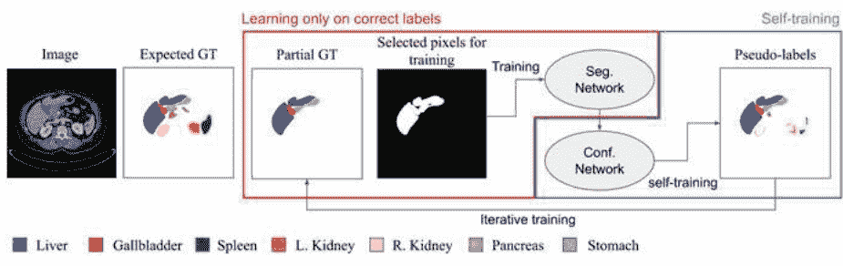

图 4.6 这个 3D CT 扫描只有部分注释：在这个切片中，只有 7 个器官中的 3 个被标记。天真地使用这样的部分真实标注是不合适的，因为它包含了错误的背景标签来表示缺失的器官。我们的 SMILE 方法基于识别出标签正确的像素，并忽略其他像素。

为了专门处理部分标注问题，我们引入了一种方法，包含了两个主要贡献。首先，我们提出了一种特定的损失函数来训练分割网络，专门包含只有正确标签的像素，即在训练过程中选择可以学习的像素和应该忽略的像素（图 4.6 中的白色像素与黑色像素）。总体动机是消除所有错误标记为缺失器官背景的像素。其次，我们提出了一种自我监督方案，通过将伪标签引入训练集来迭代地重新标记缺失的器官，以恢复未知的完整真实标注。我们的整体方法被称为 SMILE，用于部分标签的医学图像分割的深度卷积网络的自训练。

### 4.4.1 使用 SMILE 进行部分注释训练

在本节中，我们详细介绍了用于在部分注释数据上训练深度 ConvNets 的 SMILE 方法。

我们通过一种简单而有效的方法解决了在部分标记数据上学习的问题。第一步是从部分标记数据中提取最大的信息。这是通过从已标记的器官中推断出应该处理的歧义来完成的。方法的示意图如图 4.7 所示。

**仅使用正确标签进行训练** 我们通过构造知道，如果一个器官没有标签，那么整个体积都没有标签，即没有中间切片包含这个标签。因此，假设每个患者都有所有的器官（例如没有缺失的脾脏或肾脏），我们可以预先推断出每个患者缺失的类别。然而，我们不知道它们的位置，也不知道错误标签的位置。


图 4.7 在部分注释的数据集上训练 SMILE。每个器官都由一个共同的 FCN 进行预测。根据可用注释推断出的缺失器官，创建一个模糊图 $w_k$ 以在损失中忽略潜在的错误标签。它在最终损失函数中起到了加权的作用。

然而，如果我们想要专门使用正确的标签，我们不能使用经典的 softmax 激活函数和多类别损失。事实上，在这种配置下，当至少一个器官缺失时，无法使用背景标签。为了解决这个问题，我们将 $(K+1)$ 多类别分类问题转化为 $K$ 个二分类问题，每个器官都独立学习。这样做的原因是控制被标记和可以学习的类别以及被忽略的未标记类别。通过这样做，我们可以学习来自有标签类别的特征，包括正例（器官）和负例（背景），而对于无标签类别，正例和负例都被忽略。

在实践中，我们将最后的 softmax 替换为最后的 $1 \times 1$ 卷积层中的 sigmoid 激活函数。然而，我们仍然希望保持 softmax 的独特特性：我们的类别预测是通过对每个体素进行计算得出的，选择具有最高概率的类别作为预测结果 - 如果概率低于 0.5，则将其分配为背景标签。

训练 $K$ 个二分类器需要进行调整，特别是在损失函数上。实际上，我们有 $K$ 个损失函数，每个类别一个。我们选择二元交叉熵来训练我们的模型，该模型在方程 4.22 中定义了每个体素 $i$ 和类别 $k$：

$$l_{i,k}(\hat{y}_{i,k}, y_{i,k}) = -(y_{i,k} \log(\hat{y}_{i,k}) + (1 - y_{i,k}) \log(1 - \hat{y}_{i,k})) \qquad (4.22)$$

让我们将 $\hat{\mathbf{Y}} \in \mathbb{R}^{H,W,K}$ 作为我们模型的密集预测，将 $\mathbf{Y} \in \mathbb{R}^{H,W,K}$ 作为真实值。然后将 $K$ 损失聚合起来得到一个最终损失（等式 4.23）

等式 4.23

$$\mathcal{L}_{ce}(\mathbf{\hat{Y}}, \mathbf{Y}) = \sum_{k=1}^K \sum_{i=1}^N w_{i,k} \, l_{i,k}(\hat{y_{i,k}}, y_{i,k}) \quad (4.23)$$

其中 $\mathbf{W} \in \mathbb{R}^{H,W,K}$ 由 $K$ 个映射 $\mathbf{w}_k \in \mathbb{R}^{H,W}$ 组成，这是一个二进制矩阵，用于选择或丢弃给定类别 $k$ 应该学习的体系，指定在训练期间应用反向传播的体系。

这个模糊度图 $\mathbf{W}$ 是根据每个患者的缺失器官预先构建的。如图 4.7 所示，如果一个器官被标记，我们可以学习整个相关的分类器，所以我们用 1 填充 $w_{ko}$。另一方面，当一个器官缺失时，我们将 $w_k$ 设置为零，以便在训练期间忽略该器官对于这个特定的患者。然而，我们也可以使用其他器官来添加额外的信息，这些信息被指定为负标签。

在图 4.7 的示例中，标记了三个器官。然而，在学习缺失的器官（如示例的底部分支的脾脏）时，我们使用一个包含全零的模糊度图，除了其他已标记的器官的位置。在这种情况下，器官的标签被用来将脾脏的模糊度图填充为 1。

### 4.4.2 自监督和伪标签

TP 的数量与缺失器官的比例 $\alpha$ 线性减少。

我们可以通过在未标注的训练图像中恢复新的标签来改善结果。

这个想法是在具有缺失注释的图像中使用课程策略 [BLCW09]，对每个类 $k$，使用迭代的方式逐步添加新的正目标标签 $y_{i,t}^* = 1$。

迭代重新标记最初，模型是在所有可以被视为“简单正样本”的正确标签上进行训练。让我们将预测为正的像素 $\hat{y}_i^+$，表示给定未标注图像 $\mathbf{x}_i$ 中的正样本。SMILE 的想法是恢复 $\oplus$ 标签 $y^*$, 通过选择得分最高的像素点 $i,t$ 来进行 $\hat{y}_i^+$。然后，将新标签添加到训练集中重新训练模型。

这个过程会迭代地进行 $T$ 次，通过在正样本中选择得分最高的像素点的比例 $\gamma_t = \frac{t}{T} \gamma_{\text{max}}$。每一步中加入的新标签都是“困难样本”，因为它们来自一个自监督方案，可能会引入错误。

为了清晰起见，我们在 $y_{i,t}^*$ 中省略了类别 $k$ 的依赖

### 算法 1 为类别 $k$ 训练 SMILE

**输入**：$y_{i, 0}^* = y_i^*$ // 完全注释的训练集上的标签

**输出**：训练后的模型 $m_T$

$m_0 \leftarrow$ 在部分注释数据上训练的 FCN 模型 $y_{i, 0}^*$

$N_u \leftarrow$ 类别 $k$ 的未注释图像数量

对于 $t$ 从 0 到 $T-1$ 的每一个值**do**

  $\gamma_t = \frac{t}{T} \gamma_{\text{max}}$

  对于 $i=1$ 到 $N_u$**执行**

    $\hat{y}_i^+ \leftarrow (m_t, x_i)$ // 通过 $m_t$ 在图像 $x_i$ 中找到预测的正像素

    $y_{i, t}^{*,+} \leftarrow (m_t, x_i, \gamma_t, \hat{y}_i^+)$ // 分配新的 $\oplus$ 目标标签

    $y_{i, t}^* = y_{i, t-1}^* \cup y_{i, t}^{*,+}$ // 扩充训练集

  **结束循环**

  $m_t = \text{train}(\{(x_i, y_{i, t}^*)\})$ // 使用扩充的训练集重新训练模型

**结束循环**

**返回** $m_T$

<!-- PAGE 102 -->

### 4.4.3 实验

我们在一个包含完整地标注的数据集上评估了所提出的方法，该数据集包括三个器官：肝脏、胰腺和胃，共有 72 个 3D CT 扫描。我们通过随机删除体积中的$\alpha\%$的器官来生成一个部分标注的数据集。图 4.8 中的结果显示，即使删除了 70% 的标签，SMILE 的性能仍接近于使用完整地标注进行训练的模型。更多细节请参见 [PTC+18]。

<!-- PAGE 103 -->

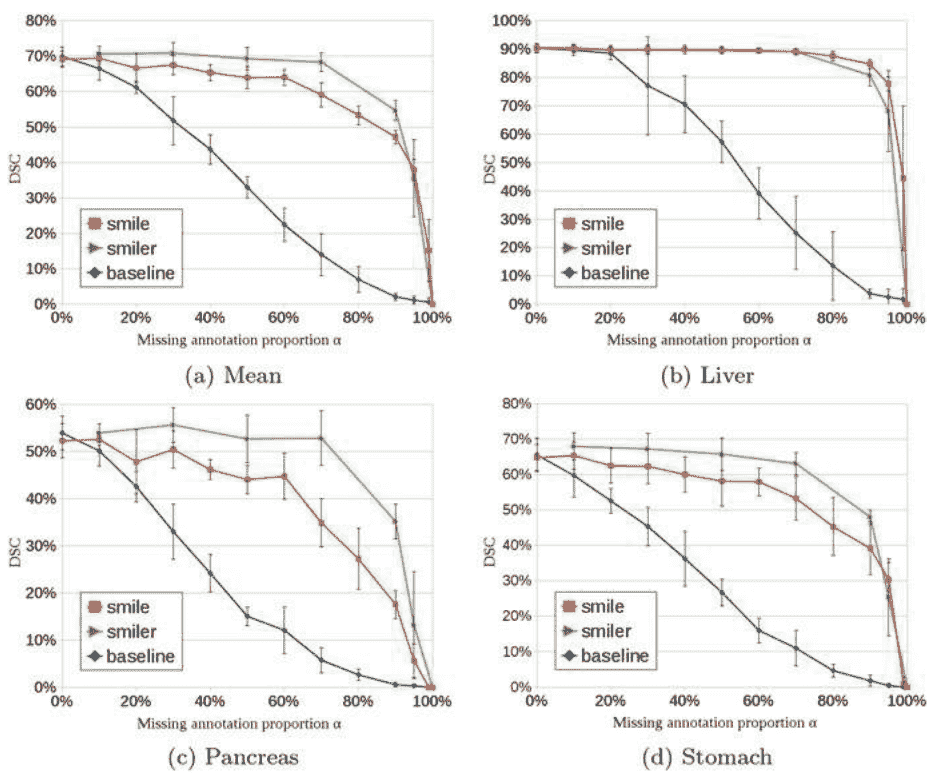

图 4.8 Dice 分数与缺失注释比例 $\alpha$ 的关系。基准以蓝色表示，SMILE 以红色表示，SMILEr 以绿色表示。

## 4.5 结论

在本章中，我们提出了解决训练深度模型所需大量标注数据集的需求的解决方案。我们提出了利用粗糙注释进行准确预测的方法，即弱监督学习（WSL），以及利用未标记数据的方法，即半监督学习（SSL）。这些方法可以提高低数据情况下的深度学习性能。未来工作的一个主要展望与无监督训练准则的正确定义有关，这基本上仍然是一个悬而未决的问题。基于预测编码和对比学习的当前方法，例如 transformers [VSP+17]，无疑是一个有趣的研究方向。

## 参考文献

- [ARS+16] Hossein Azizpour, Ali Sharif Razavian, Josephine Sullivan, Atsuto Maki 和 Stefan Carlsson。用于通用卷积神经网络表示的可转移因素。*TPAMI*, 2016 年。

- [ATH03] Stuart Andrews, Ioannis Tsochantaridis, 和 Thomas Hofmann. 支持向量机用于多实例学习. 在 *NIPS*, 2003.

- [BLCW09] Yoshua Bengio, Jérôme Louradour, Ronan Collobert, 和 Jason Weston. 课程学习. 在第 26 届国际机器学习大会, ICML '09, 页码 41–48, 美国纽约, 2009. ACM.

- [BLPL07] Yoshua Bengio, Pascal Lamblin, Dan Popovici, 和 Hugo Larochelle. 贪婪逐层训练深度网络. 在神经信息处理系统进展 (*NIPS*), 2007.

- [BM07] Razvan C. Bunescu 和 Raymond J. Mooney. 用于稀疏正例包的多实例学习. 在国际机器学习大会, 2007.

- [BMJK15] Aseem Behl, Pritish Mohapatra, C. V. Jawahar, 和 M. Pawan Kumar. 通过弱监督数据优化平均精度。*TPAMI*, 2015.

- [BOS+17] Wenjia Bai, Ozan Oktay, Matthew Sinclair, Hideaki Suzuki, Martin Rajchl, Giacomo Tarroni, Ben Glocker, Andrew King, Paul M. Matthews, 和 Daniel Rueckert. 基于网络的心脏 MR 图像分割的半监督学习. 在 Maxime Descoteaux, Lena Maier-Hein, Alfred Franz, Pierre Jannin, D. Louis Collins, 和 Simon Duchesne 编辑，医学图像计算与计算机辅助干预-MICCAI 2017, 页码 253-260, Cham, 2017. Springer International Publishing.

- [AL+16] Ogz Nik, Ahmed Abdulkadir, Soeren S. Lienkamp, Thomas Brox, 和 Olaf Ronneberger. 3D U-Net: 从稀疏注释中学习密集体积分割。在 Sebastien Ourselin, Leo Joskowicz, Mert R. Sabuncu, Gozde Unal, 和 William Wells 编辑，医学图像计算与计算机辅助干预-MICCAI 2016, 页码 424-432, Cham, 2016. Springer International Publishing.

- [CJP+18] Agisilaos Chartsias, Thomas Joyce, Giorgos Papanastasiou, Scott Semple, Michelle Williams, David Newby, Rohan Dharmakumar, 和 Sotirios A. Tsaftaris. 分解的空间表示学习：半监督心肌分割应用。在 Alejandro F. Frangi, Julia A. Schnabel, Christos Davatzikos, Carlos Alberola-López 和 Gabor Fichtinger 编辑的 Medical Image Computing and Computer Assisted Intervention – MICCAI 2018, 2018 年，第 490-498 页。Springer 国际出版社。

- [CSVZ14] K. Chatfield, K. Simonyan, A. Vedaldi, 和 A. Zisserman. 深入研究卷积神经网络的细节：魔鬼的回归。在 BMVC, 2014 年。

- [CTBH+19] Charles Corbière, Nicolas Thome, Avner Bar-Hen, Matthieu Cord, 和 Patrick Pérez. 通过学习模型置信度来解决故障预测问题。在神经信息处理系统进展中，2019 年，第 2902-2913 页。

[CW04] Yixin Chen 和 James Z. Wang。通过学习和推理区域进行图像分类。J. Mach. Learn. Res., 2004 年 12 月，第 5 页：913-939。

[DF10] Thomas Deselaers 和 Vittorio Ferrari。用于多实例学习的条件随机场。在国际机器学习会议中，2010 年。

[DLLP97] Thomas G. Dietterich, Richard H. Lathrop 和 Tomás Lozano-Pérez。通过轴平行矩形解决多实例问题。Artif. Intell., 1997 年。

[DMM19] Thibaut Durand, Nazanin Mehrasa, 和 Greg Mori. 使用部分标签学习深度卷积神经网络进行多标签分类。在 IEEE 计算机视觉和模式识别会议 (CVPR 2019) 中，位于美国加利福尼亚州长滩，2019 年 6 月 16 日至 20 日，647-657 页。计算机视觉基金会/IEEE，2019 年。

[DMTC17] Thibaut Durand, Taylor Mordan, Nicolas Thome, 和 Matthieu Cord. Wildcat: 用于图像分类、点位定位和分割的弱监督学习深度卷积神经网络。在 IEEE 计算机视觉和模式识别会议 (CVPR) 的论文集中，2017 年 7 月。

[DTC15] Thibaut Durand, Nicolas Thome, 和 Matthieu Cord. MANTRA: 最小最大潜在结构支持向量机用于图像分类和排序。在 ICCV, 2015 年。

[DTC16] Thibaut Durand, Nicolas Thome, 和 Matthieu Cord. WELDON: 弱监督学习深度卷积神经网络。在 CVPR, 2016.

[DTC18] Thibaut Durand, Nicolas Thome, 和 Matthieu Cord. Symil: 最小最大潜在支持向量机用于弱标记数据。IEEE Trans. Neural Networks Learn. Syst., 29(12):6099–6112, 2018.

[DTC19] T. Durand, N. Thome, 和 M. Cord. 利用负证据进行深度潜在结构模型。IEEE Transactions on Pattern Analysis and Machine Intelligence, 41(2):337–351, 2019.

[EBC+10] Dumitru Erhan, Yoshua Bengio, Aaron Courville, Pierre-Antoine Manzagol, Pascal Vincent, 和 Samy Bengio. 为什么无监督预训练有助于深度学习？机器学习研究杂志 (JMLR)，2010 年。

[GC07] Peter Gehler 和 Olivier Chapelle。确定性退火用于多实例学习。在人工智能和统计学，2007 年。

## 参考文献

- [GFKS02] Thomas Gärtner, Peter A. Flach, Adam Kowalczyk 和 Alex J. Smola。多实例核函数。在国际机器学习会议。Morgan Kaufmann，2002年。
- [GG16] Yarin Gal 和 Zoubin Ghahramani。辍学作为贝叶斯近似：在深度学习中表示模型不确定性。在国际机器学习会议，2016年，第1050-1059页。
- [GPAM+14] Ian Goodfellow, Jean Pouget-Abadie, Mehdi Mirza, Bing Xu, David Warde-Farley, Sherjil Ozair, Aaron Courville 和 Yoshua Bengio。生成对抗网络。在神经信息处理系统进展（NIPS），2014年。
- [GPSW17] Chuan Guo, Geoff Pleiss, Yu Sun, 和 Kilian Q. Weinberger。关于现代神经网络的校准。Proceedings of Machine Learning Research，第70卷，1321–1330页，International Convention Centre, Sydney, Australia, 06–11 Aug 2017。PMLR。
- [GSS15] Ian J. Goodfellow, Jonathon Shlens, 和 Christian Szegedy。解释和利用对抗性示例。在国际学习表示会议（ICLR），2015年。
- [GT20a] Vincent Le Guen 和 Nicolas Thome。用鱼眼图像进行太阳辐照度深度物理模型预测。在 2020 IEEE/CVF 计算机视觉与模式识别会议，CVPR Workshops 2020, Seattle, WA, USA, June 14–19, 2020, 2685–2688页。IEEE，2020年。
- [GT20b] Vincent Le Guen 和 Nicolas Thome。从未知因素中解开物理动力学的无监督视频预测。在 2020 IEEE/CVF 计算机视觉与模式识别会议（CVPR 2020）中，美国华盛顿州西雅图，2020年6月13日至19日，11471-11481页。IEEE，2020年。
- [GTCL13] Hanlin Goh, Nicolas Thome, Matthieu Cord 和 Joo-Hwee Lim。自上而下地规范化深度信念网络。在神经信息处理系统进展（NIPS）中，2013年。
- [HG17] Dan Hendrycks 和 Kevin Gimpel。在神经网络中检测错误分类和超出分布的基准线。国际学习表示会议论文集，2017年。
- [HS06] Geoffrey E. Hinton 和 Ruslan R. Salakhutdinov。用神经网络降低数据的维度。Science，2006年。
- [HTF09] Trevor Hastie, Robert Tibshirani, and Jerome Friedman。统计学习基础：数据挖掘、推断与预测。Springer，2009年。
- [HZRS14] Kaiming He, Xiangyu Zhang, Shaoqing Ren, and Jian Sun。深度卷积网络中的空间金字塔池化用于视觉识别。在 ECCV，2014年。
- [HZRS16] Kaiming He, Xiangyu Zhang, Shaoqing Ren, and Jian Sun。用于图像识别的深度残差学习。在 CVPR，2016年。
- [JB12] Armand Joulin and Francis Bach。一种用于弱监督分类器的凸松弛方法。在国际机器学习大会，2012年。
- [JKGG18] Heinrich Jiang, Been Kim, Melody Guan, and Maya Gupta。相信还是不相信一个分类器。在 S. Bengio, H. Wallach, H. Larochelle, K. Grauman, N. Cesa-Bianchi, 和 R. Garnett 编，神经信息处理系统31的进展，5541–5552页。Curran Associates, Inc., 2018年。
- [KJZ+16] Praveen Kulkarni, Frédéric Jurie, Joaquin Zepeda, Patrick Pérez, 和 Louis Chevalier。SLEAP：学习部分的软池化用于图像分类。在 ECCV，2016年。
- [KOB13] Gabriel Krummenacher, Cheng S. Ong, 和 Joachim Buhmann。椭圆多实例学习。在国际机器学习会议，2013年。
- [KPK10] M. P. Kumar, Benjamin Packer, 和 Daphne Koller。自定学习用于潜变量模型。在 J. D. Lafferty, C. K. I. Williams, J. Shawe-Taylor, R. S. Zemel, 和 A. Culotta 编，Advances in Neural Information Processing Systems 23，1189–1197页。Curran Associates, Inc., 2010年。
- [KSH12a] Alex Krizhevsky, Ilya Sutskever, 和 Geoff Hinton。使用深度卷积神经网络的ImageNet分类。在 NIPS，2012年。

- [KSH12b] Alex Krizhevsky, Ilya Sutskever, 和 Geoffrey E. Hinton。使用深度卷积神经网络的ImageNet分类。在 F. Pereira, C. J. C. Burges, L. Bottou, 和 K. Q. Weinberger 编，Advances in Neural Information Processing Systems 25，1097–1105页。Curran Associates, Inc., 2012年。

- [LA17] Samuli Laine 和 Timo Aila。用于半监督学习的时间集成。在 International Conference on Learning Representations (ICLR)，2017年。

- [LB08] Hugo Larochelle 和 Yoshua Bengio。使用判别式受限玻尔兹曼机进行分类。在 International Conference on Machine Learning (ICML)。ACM，2008年。

- [LBD+89] Yann LeCun, Bernhard Boser, John S. Denker, Donnie Henderson, Richard E. Howard, Wayne Hubbard 和 Lawrence D. Jackel。应用于手写邮政编码识别的反向传播。Neural Computation, 1(4): 541-551, 1989年。

- [LCQ+18] Xiaomeng Li, Hao Chen, Xiaojuan Qi, Qi Dou, Chi-Wing Fu 和 Pheng-Ann Heng。H-DenseUNet：用于肝脏和肿瘤分割的混合密集连接 UNet（基于CT体积）。IEEE Transactions on Medical Imaging, 37(12): 2663-2674, 2018年。

- [LSD15] Jonathan Long, Evan Shelhamer 和 Trevor Darrell。用于语义分割的全卷积网络。在 IEEE 计算机视觉与模式识别会议论文集，3431–3440页，2015年。

- [LV15a] Wei-Xin Li 和 Nuno Vasconcelos。通过 top instances 进行 soft bag 的多实例学习。在计算机视觉与模式识别会议，2015年6月。

- [LV15b] Weixin Li 和 Nuno Vasconcelos。通过 Top Instances 进行 Soft Bag 的多实例学习。在 CVPR，2015年。

- [LYCC14] Kuan-Ting Lai, Felix X. Yu, Ming-Syan Chen 和 Shih-Fu Chang。通过推断时间实例标签进行视频事件检测。在 CVPR，2014年。

- [LYV19] Yunsheng Li, Lu Yuan 和 Nuno Vasconcelos。用于语义分割领域适应的双向学习。在 IEEE 计算机视觉与模式识别会议论文集，2019年，6936-6945页。

- [MJK14] Pritish Mohapatra, C. V. Jawahar 和 M. Pawan Kumar。用于平均精度 SVM 的高效优化。在 NIPS，2014年。

- [MMK+16] Takeru Miyato, Shin-ichi Maeda, Masanori Koyama, Ken Nakae 和 Shin Ishii。具有虚拟对抗训练的分布平滑。在国际学习表示会议（ICLR），2016年。

- [MNA16] F. Milletari, N. Navab, 和 S. Ahmadi。V-Net：用于体积医学图像分割的全卷积神经网络。在2016年第四届国际三维视觉会议（3DV），565-571页，2016年。

- [MR98] Oded Maron 和 Aparna Lakshmi Ratan。自然场景分类的多实例学习。在国际机器学习会议，1998年。

- [OBLS15] M. Oquab, L. Bottou, I. Laptev, 和 J. Sivic。对象定位是否可以免费获得？——用卷积神经网络进行弱监督学习。在 CVPR，2015年。

- [PC15] Pedro O. Pinheiro 和 Ronan Collobert。从图像级别到像素级别标注：使用卷积网络。在 CVPR，2015年。

- [PKS15] George Papandreou, Iasonas Kokkinos, 和 Pierre-Andre Savalle。在深度学习中建模局部和全局变形：基于 Epitomic 卷积、多实例学习和滑动窗口检测。在 CVPR，2015年。

- [PLI14] Wei Ping, Qiang Liu, 和 Alex Ihler。具有隐藏变量的边际结构化 SVM。在 ICML，2014年。

- [PSLD15] Deepak Pathak, Evan Shelhamer, Jonathan Long, 和 Trevor Darrell。全卷积多类多实例学习。在 ICLR（Workshop），2015年。

- [PTC+18] Olivier Petit, Nicolas Thome, Arnaud Charnoz, Alexandre Hostettler, 和 Luc Soler。用深度卷积网络处理语义分割中的缺失标注。在医学图像分析中的深度学习和临床多模态学习支持决策（DLMIA workshop MICCAI），20-28页。Springer，2018年。

- [QSCL09] N. Quadrianto, A. Smola, T. Caetano, and Q. Le。从标签比例估计标签。Journal of Machine Learning Research, 10:2349–2374, 2009年。

- [QT09] Ariadna Quattoni 和 Antonio Torralba。识别室内场景。在 CVPR，2009年。

- [QWM+07] Ariadna Quattoni, Sybor Wang, Louis-Philippe Morency, Michael Collins, and Trevor Darrell。隐藏条件随机场。TPAMI，2007年。

- [RBH+15] Antti Rasmus, Mathias Berglund, Mikko Honkala, Harri Valpola, and Tapani Raiko。使用 Ladder 网络的半监督学习。在神经信息处理系统进展（NIPS），2015年。

- [RFB15] Olaf Ronneberger, Philipp Fischer, 和 Thomas Brox。U-Net：用于生物医学图像分割的卷积网络。在 Nassir Navab, Joachim Hornegger, William M. Wells, 和 Alejandro F. Frangi 编，Medical Image Computing and Computer-Assisted Intervention – MICCAI 2015，234–241页，Cham，2015年。Springer International Publishing。

- [RHBL07] M. Ranzato, F. J. Huang, Y. L. Boureau, 和 Y. LeCun。无监督学习具有物体识别应用的不变特征层次结构。在 IEEE 计算机视觉与模式识别会议（CVPR），2007年6月。

- [RPCL07] Marc’Aurelio Ranzato, Christopher Poultney, Sumit Chopra, 和 Yann LeCun。使用基于能量的模型高效学习稀疏表示。在神经信息处理系统进展（NIPS），2007年。

- [RS08] Marc’Aurelio Ranzato 和 Martin Szummer。使用深度网络进行紧凑的半监督学习文档表示。在国际机器学习会议（ICML）。ACM，2008年。

- [RTC18] Thomas Robert, Nicolas Thome 和 Matthieu Cord。HybridNet：半监督学习中的分类与重建协同。在 Vittorio Ferrari, Martial Hebert, Cristian Sminchisescu 和 Yair Weiss 编，计算机视觉 - ECCV 2018 - 第15届欧洲会议，德国慕尼黑，2018年9月8日至14日，第七部分论文集，Lecture Notes in Computer Science 第11211卷，158-175页。Springer，2018年。

- [Rue10] Stefan Rüping。从组概率估计 SVM 分类器。在国际机器学习会议，2010年。

- [SHPU12] A. G. Schwing, T. Hazan, M. Pollefeys, and R. Urtasun。用于一般图模型的具有潜在变量的高效结构化预测。在 ICML，2012年。  

- [SJT16] Mehdi Sajjadi, Mehran Javanmardi, 和 Tolga Tasdizen。用随机变换和扰动正则化深度半监督学习。在神经信息处理系统进展（NIPS），2016年。  

- [SPC+16] Chen Sun, Manohar Paluri, Ronan Collobert, Ram Nevatia, 和 Lubomir Bourdev。为级联神经网络学习对象特定候选框。在 CVPR，2016年。  

- [SS15] Gaurav Sharma 和 Bernt Schiele。用于语义基于类别的图像检索的可扩展非线性嵌入。在 ICCV，2015年。  

- [SZ15] Karen Simonyan 和 Andrew Zisserman。用于大规模图像识别的超深卷积网络。在 ICLR，2015年。  

- [TTC13] Christian Thériault, Nicolas Thome 和 Matthieu Cord。动态场景分类：使用慢特征分析学习运动描述符。在 IEEE 计算机视觉与模式识别会议（CVPR），2013年。  

- [TV17] Antti Tarvainen 和 Harri Valpola。平均教师是更好的榜样：加权一致性目标改善半监督深度学习结果。在神经信息处理系统进展（NIPS），2017年。  

- [VLBM08] Pascal Vincent, Hugo Larochelle, Yoshua Bengio 和 Pierre-Antoine Manzagol。使用去噪自动编码器提取和组合鲁棒特征。在国际机器学习会议（ICML）。ACM，2008年。  

- [VSP+17] Ashish Vaswani, Noam Shazeer, Niki Parmar, Jakob Uszkoreit, Llion Jones, Aidan N. Gomez, Łukasz Kaiser, and Illia Polosukhin。注意力就是你所需要的。在 I. Guyon, U. V. Luxburg, S. Bengio, H. Wallach, R. Fergus, S. Vishwanathan 和 R. Garnett 编，神经信息处理系统进展，第30卷，5998-6008页。Curran Associates, Inc.，2017年。  

- [WH16] Zijun Wei 和 Minh Hoai。区域排序 SVM 用于图像分类。在 CVPR，2016年6月。  

- [WXH+14] Yunchao Wei, Wei Xia, Junshi Huang, Bingbing Ni, Jian Dong, Yao Zhao 和 Shuicheng Yan。CNN：单标签到多标签。CoRR, abs/1406.5726, 2014年。  

- [YFRJ07] Yisong Yue, T. Finley, F. Radlinski, and T. Joachims。一种支持向量方法用于优化平均准确率。在 SIGIR，2007年。  

- [YJ09] Chun-Nam Yu and T. Joachims。学习具有潜在变量的结构化 SVM。在 ICML，2009年。  

- [YLK+13] Felix X. Yu, Dong Liu, Sanjiv Kumar, Tony Jebara, and Shih-Fu Chang。用于学习标签比例的 SVM。在 ICML，2013年。  

- [ZF14] Matthew D. Zeiler and Rob Fergus。可视化和理解卷积神经网络。在欧洲计算机视觉会议（ECCV），2014年。  

- [Zhu05] Xiaojin Zhu。半监督学习文献综述。技术报告1530，威斯康星大学麦迪逊分校计算机科学系，2005年。  

- [ZKL+16] Bolei Zhou, Aditya Khosla, Agata Lapedriza, Aude Oliva, 和 Antonio Torralba。学习用于判别性定位的深度特征。在 CVPR，2016年。  

- [ZLL16] Yuting Zhang, Kibok Lee, 和 Honglak Lee。用无监督目标增强监督神经网络进行大规模图像分类。在国际机器学习会议（ICML），2016年。  

- [ZMGL16] Junbo Zhao, Michael Mathieu, Ross Goroshin, 和 Yann LeCun。堆叠的 What-Where 自编码器。在国际学习表示会议（ICLR）研讨会，2016年。  

- [ZWT+19] Yuyin Zhou, Yan Wang, Peng Tang, Song Bai, Wei Shen, Elliot Fishman, 和 Alan Yuille。通过深度多平面协同训练进行半监督三维腹部多器官分割。在 2019 IEEE 冬季计算机视觉应用会议（WACV），121–140页。IEEE，2019年。  

- [ZYL+19] 邹阳，于志鼎，刘晓峰，BVK Kumar 和 王劲松。置信度正则化自训练。在 IEEE 国际计算机视觉会议论文集，5982-5991页，2019年。  

- [ZYVKW18] 邹阳，于志鼎，BVK Vijaya Kumar 和 王劲松。通过类平衡自训练进行无监督领域自适应语义分割。在欧洲计算机视觉会议论文集，289-305页，2018年。  

- [ZZSL19] 赵远星，张艳明，宋明 和 刘成林。使用自集成网络进行多视角半监督3D全脑分割。在医学图像计算与计算机辅助干预国际会议，256-265页。Springer，2019年。

## 第五章 相似度度量学习

Stefan Duffner, Christophe Garcia, Khalid Idrissi, 和 Atilla Baskurt

### 5.1 引言

传统上，神经网络，尤其是深度神经网络，已经在涉及监督学习的环境中使用，并在许多应用中展示了最先进的性能，其中有大量的注释数据可用。在这些应用中，通常需要事先知道要预测的类别数量及其明确的含义，即哪个实例属于它们或不属于它们，或者在回归问题的情况下对应于实例的值。此外，不明确地建模不同类别（或子类别）之间的关系，在给定的预测场景中通常没有用处。在本部分中，我们将考虑其他不允许或不适合这种监督学习方法的应用。例如，当：

- 实例标签（例如正面/负面、前景/背景或人员标识符）不可用或太难以获得用于训练时，就会出现这种情况。

- 类别数量不是事先确定的。

- 测试时要预测的类别与训练时可用的类别不同。

- 需要明确地建模和表示实例与类别之间的关系或相似性。

- 对于分类任务，需要实施强大的拒绝策略。

如果没有关于实例类别或它们之间关系的任何信息，无监督方法，如聚类方法或自编码器，是最适合自动学习和推断数据的一般模型的方法。然而，在许多情况下，至少对于一些训练数据，类别标签是可用的，并且我们对适用于同一类型的所有数据的通用模型感兴趣。在这种情况下，常常使用弱监督学习或半监督学习算法。

其中一种弱监督方法是自动学习给定类别（例如人脸）实例之间的相似度度量。也就是说，训练数据集的实例标签并没有被明确学习，而是用于建模相似和不相似实例之间的距离，例如使用实例对。需要注意的是，有时候会使用“距离学习”这个术语。但是许多现有的模型，例如本章描述的基于神经网络的模型，并不满足距离的数学要求，特别是三角不等式，因此不能表示度量。

相似性或不相似性的概念因应用而异。因此，其定义取决于学习问题和训练数据集。例如，让我们考虑一组人脸图像：（1）对于人脸验证任务，两个相同的人的图像被认为是相似的；（2）对于性别验证任务，显示两个男性或两个女性的人脸图像被定义为相似；（3）对于亲属关系验证任务，一对相似的人脸图像必须指示生物关系，如父子、母女等。原则上，大多数度量学习算法接收正对和负对实例，其中正对由被认为相似（例如属于同一类别）的实例组成，负对由被认为不同或不相似的实例组成，尽管在实践中可能不容易确定。通过呈现所有可能的对，一个好的度量学习方法必须能够捕捉两个对象的相关语义内容之间的内在关系。图5.1显示了来自LFW数据集的同一人的图像对。这些对可以用来定义相似关系，并且可以学习和应用通用的距离度量来处理未知的例如用于人脸验证的人员。另一种方法是给出三元组实例，其中包括一个参考实例（也称为“锚点”）、一个相似实例和一个与参考实例不相似的实例。然后，相似实例被认为比第三个实例更相似于参考实例。或者，有时也会使用四元组，其中第一对被认为比第二对更相似。图5.2说明了使用成对或三元组实例进行相似度度量学习的基本方法。

在本章中，我们将介绍基于连体神经网络（SNN）的相似度度量学习方法和模型。原始术语“连体”与 Bromley 等人引入的实例对的使用有关 [BGL+94]。然而，在文献中，这已经扩展到三元组或基于元组的架构。正如我们将在下一节中概述的那样，还有其他模型，例如基于统计投影或支持向量机。然而，前馈神经网络具有几个特性，使它们在这个问题上很有趣且特别适用：

- 它们可以对各种线性和非线性函数进行建模，参见通用逼近定理 [HSW89]，并且可以使用成熟的优化方法。
- 通过精确指定架构，可以控制模型的复杂性（以参数数量和不同抽象层次的维度为考虑因素，将其视为数据处理流水线）。
- 通过多层架构和误差反向传播算法，可以共同学习最佳特征和投影，以最好地表示语义相似性。
- 使用深度卷积神经网络架构，得到的模型适用于（自然）图像数据，并具有很强的能力。
- 最后，对于各种应用和数据，神经网络表现出很高的泛化能力和对不同类型噪声的鲁棒性。

接下来，我们将概述存在于相似度度量学习中的不同算法和神经模型，并描述文献中提出的主要 SNN 方法和变体。

S. Duffner (✉) · C. Garcia · K. Idrissi · A. Baskurt

里昂国立高等应用科学学院，里昂信息与知识处理实验室，维勒班

电子邮件：stefan.duffner@liris.cnrs.fr; christophe.garcia@liris.cnrs.fr; khalid.idrissi@liris.cnrs.fr; atilla.baskurt@liris.cnrs.fr

© Springer Nature Switzerland AG 2021

J. Benois-Pineau, A. Zemmari (eds.), 多方面的深度学习,

https://doi.org/10.1007/978-3-030-74478-6_5

## 5.2 用神经网络进行度量学习

大多数线性度量学习方法使用两种类型的度量：马氏距离或更一般的相似度度量。在这两种情况下，线性变换矩阵 $W$ 被学习用于将输入特征投影到目标向量空间中。通常，距离度量学习与马氏距离类似的距离函数相关 [XNJR03, WBS06]：$d_W(\mathbf{x}_1, \mathbf{x}_2) = \sqrt{(\mathbf{x}_1 - \mathbf{x}_2)^T W (\mathbf{x}_1 - \mathbf{x}_2)}$，其中 $\mathbf{x}_1$ 和 $\mathbf{x}_2$ 是两个示例向量，而 $W$ 不是（固定的）协方差矩阵，而是由算法学习得到的。请注意，当 $W$ 是单位矩阵时，$d_W(\mathbf{x}_1, \mathbf{x}_2)$ 对应于欧氏距离。相反，相似度度量学习方法学习一个更一般形式的函数：$s_W(\mathbf{x}_1, \mathbf{x}_2) = \mathbf{x}_1^T W \mathbf{x}_2 / N(\mathbf{x}_1, \mathbf{x}_2)$，其中 $N(\mathbf{x}_1, \mathbf{x}_2)$ 是一个归一化项 [QGCL08]。具体来说，当 $N(\mathbf{x}_1, \mathbf{x}_2)=1$，$s_W(\mathbf{x}_1, \mathbf{x}_2)$ 是双线性相似性函数 [CSSB10]；当 $N(\mathbf{x}_1, \mathbf{x}_2)=\sqrt{\mathbf{x}_1^T W \mathbf{x}_1}\sqrt{\mathbf{x}_2^T W \mathbf{x}_2}$，$s_W(\mathbf{x}_1, \mathbf{x}_2)$ 对应于广义余弦相似性函数 [HL11]。

非线性度量学习方法通过简单地用非线性变换替换上述线性投影来构建 [HLT14, CHL05, KTS+12, YYGT16]。例如，胡等人 [HLT14] 和 Chopra 等人 [CHL05] 使用神经网络来实现这一点。通过这些方法，学习算法优化非线性投影 $\mathbf{o}=f(\mathbf{x})$ 到一个度量空间，使得简单的距离度量 $d_W(f(\mathbf{x}_1), f(\mathbf{x}_2))$（主要是欧氏距离或余弦距离）反映了实例之间的语义相似性。这种非线性方法容易陷入局部最优解，并且更倾向于过拟合训练数据，但在许多问题上有超越线性方法的潜力 [BHS13, KTS+12]。与线性模型相比，非线性模型通常更适用于大型训练集，以更准确地捕捉数据的潜在分布 [LBOM12]。最近，Bell 等人 [BHS13] 发表了一篇详细的度量学习方法调查和评论，Moutafis 等人 [MLK16] 进行了实验分析和比较。我们将在这里集中讨论可以表示线性或非线性投影的连体神经网络（SNN），这取决于所使用的激活函数和层数。在文献中，随着更大更复杂的模型，经常使用术语“深度相似性度量学习”。

如前所述，SNN 通过其特定的训练策略，即涉及一组被标记为相似或不相似的示例，从而与传统的前馈神经网络区分开来。不同基于 SNN 的方法的能力取决于四个主要因素：网络架构、训练集选择策略、损失函数和训练算法 [BGL+94]。

接下来，我们将详细解释这些要点并给出一些示例。

### 5.2.1 架构

SNN 可以被看作是两个相同的、并行的神经网络 `NN`，它们共享相同的权重 $W$（见图5.3）。

尽管在大多数情况下输入分支的权重是共享的，但在某些特定应用中可能不是这样，特别是当两个输入示例的类型或来源不同时（例如来自两个不同相机视图的图像）。然后，神经网络的每个输入分支都专门用于特定的输入类型，两者不能互换。无论如何，子网络接收输入示例 $\mathbf{x}_1,\mathbf{x}_2$，并产生输出特征向量 $\mathbf{o}_1,\mathbf{o}_2$，这些向量应该对于同一类别的示例而言是接近的，对于不同类别的示例而言是远离的，根据某种距离度量，例如余弦相似度度量（参见第5.2.3节）。在训练阶段，使用所选择的距离度量定义的损失函数 $L_W$ 通过迭代最小化所有输入示例的输出（参见第5.2.3节）。神经网络的架构确定了投影函数的类型和复杂性。一个关键参数是输出层的大小，因为它定义了嵌入向量空间的维度。这通常是一种经验性的选择。它应该足够大，以捕捉训练数据的相似关系（根据不同的方面/轴），但不要太大，因为在过大的向量空间中的距离度量可能变得非常小，从而变得无意义。

Bromley 等人 [BGL+94] 于1994年引入了 Siamese 架构，使用了一个 Siamese CNN 和两个子网络来处理手工制作的低级特征的时间序列的签名验证系统。2005年，Chopra、Hadsell 和 LeCun [CHL05] 将 Siamese 架构应用于原始图像上的 CNN 进行人脸验证，然后将其调整为降维技术 [HCL06]（见图5.4b，显示了 Siamese CNN 架构的示例）。最近，Siamese CNN 已成功用于各种任务，如个人重识别 [YLLL14]、说话人验证 [CS11] 和人脸识别 [SCWT14]。

基于 CNN 的架构更加专注于图像输入，一些研究工作提出使用前馈多层感知器（MLP）来处理更一般的向量输入（参见图5.4a）。例如，Yih 等人 [YTPM11] 应用 SNN 在文本数据上学习相似性，Bordes 等人 [BWCB11] 在知识库中的实体上学习相似性，Masci 等人 [MBBS14] 在多模态数据上学习相似性。最近，Siamese 或三元组架构变得流行起来，并且已经被用于许多不同的应用和数据类型，并与其他类型的神经模型结合使用。

例如，对于使用递归神经网络进行序列或时间序列建模，如图5.4c所示。Mueller 和 Thyagarajan [MT16] 提出了一种用于学习句子之间相似性的 Siamese 神经网络，该网络使用长短期记忆（LSTM）神经网络，在最后一个隐藏层输出上计算距离。类似地，Neculoiu 等人 [NVR16] 的方法使用双向 LSTM 计算单词之间的相似性。在这里，隐藏层输出在序列上进行平均，以获得相同维度的两个嵌入向量。SNN 也与自动编码器架构 [KBR16, YCS19, SL20, ASS20] 一起使用（参见图5.4d）。在这种情况下，两个（或更多）自动编码器共享它们的权重，并且 Siamese 或三元组损失在由编码器产生的潜在嵌入（代码）上进行最小化，同时重构损失也进行优化。Compagnon 等人 [CLDG19] 将这种方法扩展到基于 LSTM 的序列度量学习与序列到序列自动编码器。这种多任务学习结构和算法在过去几年中非常流行，并成功应用于各个领域，尤其是计算机视觉。最近，图神经网络（GNN）已经与基于对比或三元组的相似度度量学习相结合，用于图像检索 [CBB19] 或一般图匹配 [LGD+19]。在这里，参数在多个 GNN 之间共享，并且相似度度量学习是在固定大小的图嵌入上进行的，如图5.4e所示。

### 5.2.2 训练集选择

#### 5.2.2.1 对

训练示例的选择策略主要取决于应用程序和希望在其中融入的相似性知识的类型模型。对于许多应用，例如人脸或签名验证，示例之间的相似性取决于它们的“真实世界”来源，即来自同一人的人脸/签名，并且神经网络可以通过二进制分类来确定测试示例相对于参考示例的真实性。大多数方法使用训练示例对 $(\mathbf{x}_1,\mathbf{x}_2)$ 进行配对，并且二进制相似性关系对于相似和不相似的配对采用不同的值（参见图5.3中的示例）。原则上，总损失被定义为在所有可能的训练实例对上的损失项之和（有关常见损失函数，请参见第5.2.3节）。然而，这会导致一个很大的不平衡，因为如果示例在类别上均匀分布，则通常会有比正样本更多的负样本。这种不平衡可能导致收敛问题，因为学习算法试图更多地关注不相似性而不是相似性，而相似性并没有很好地定义。因此，它可能无法学习到有意义的相似度度量。缓解这个问题的一种直接方法是在每个训练迭代中平衡正负样本对的数量（即使通过过采样/欠采样），或者在损失函数中引入一个权重项 [ZIG+15]。在某些情况下，仅学习正样本甚至是有益的 [ZDI+18]。这确保在学习过程中，不相似的配对不会影响将正样本在度量空间中靠近的学习投影。

### 5.2.2.2 三元组

Lefebvre 等人 [L13] 提出扩展关于预期邻域的信息，并基于 Weinberger 等人 [WBS06] 的思想提出了更对称的表示：通过考虑每个已知关系的参考示例 $\mathbf{x}_R$，可以定义三元组 $(\mathbf{x}_R,\mathbf{x}_+,\mathbf{x}_-)$，其中 $\mathbf{x}_+$ 与参考 $\mathbf{x}_R$ 形成一个真正的对，而 $\mathbf{x}_-$ 是来自另一个类别（冒名顶替者）的示例，有时也称为锚点、正例和负例。通过这种方式，学到的嵌入可以对数据的相似性和不相似性进行更平衡的表示。至于成对的 SNN，原则上，全局损失函数定义在所有可能的三元组上（有关不同三元组损失函数的定义，请参见第5.2.3节）。然而，在实践中，可能有太多的可能组合。因此，在每个训练迭代中，通常会随机均匀地抽取一部分所有可能的三元组。也可以依次将每个训练示例定义为参考示例 $\mathbf{x}_R$，并随机选择正例和负例。或者，如果类别不平衡，首先随机从每个类别中抽取一个参考示例，然后抽取另外两个。然而，这些采样策略可能不是非常高效，因为在一些训练迭代之后，大多数三元组对于学习相似度度量已经没有太大贡献（或者根本没有贡献），因此损失（和梯度）非常小甚至为零。因此，提出了不同的启发式方法来改善收敛性和学到的相似度度量的语义表达能力。

例如，Hermans 等人 [HBL17] 提出了 *hard-batch triplet loss*，这是常见 triplet loss（参见公式5.8）的一种修改，对于每个参考示例，只选择最难的正例（即与参考示例最远的正例）和最难的负例（即最接近的负例）进行训练。hard-batch 方法有时被称为“排名靠前的约束”。Wang 等人 [WZL17] 通过学习子空间和聚类身份的有效方法扩展了这个想法，并将该方法应用于具有100,000个身份的大规模人脸识别。

Schroff 等人 [SKP15] 认为，使用最难的负例可能会影响模型的收敛和性能，并提出了一种 *semi-hard batch mining* 策略，即在 mini-batch 中不使用那些与正例的距离小于负例的负例。Yu 和 Tao [YT19] 的深度度量学习公式引入了一个缩放方案，在其中加权了困难的三元组，并降低了较容易三元组的权重。

引入额外的松弛变量可以引入一个边界，防止过于困难的负样本过于重要。Ge 等人 [GHDS18] 引入了一种分层三元损失，该损失动态地调整了方程5.8中的边界 $m$，并且在嵌入中引入了分层结构，该嵌入是使用学习的距离度量构建的。这样可以选择有意义的困难负样本，并提高收敛性和性能。陈等人 [CDS+18] 提出了另一种称为 RankTriplet 的方法，用于检索应用中的排序。在这里，根据查询的排名，选择子集（训练批次）中的困难三元组，即仅使用错误排名的正样本和负样本。这样可以基于相似性排序定义一个列表式的度量。文献中还研究了适当的正样本的有效挖掘。例如，Shi 等人 [SYZ+16] 提出了一种适度的正样本挖掘策略，该策略排除了非常困难的正样本，因为它们的欧氏距离与学习度量应对应的复杂流形上的测地距离可能相差很大。

### 5.2.2.3 元组

过去提出了几种超越三元架构的 SNN 方法。例如，Yih 等人 [YTPM11] 提出的模型使用基于两对训练样本的损失（参见公式5.12），其中第一对被认为比第二对更相似。对于某些应用，这种相对相似性可能比相似对和不相似对之间的二元关系更容易定义。陈等人 [CCZH17a] 提出了一个四元组损失（参见公式5.14），引入了对三元组的额外约束，从而使负对与不同参考图像的正对相距较远。他们通过实验证明，这种方法减小了类内方差，同时增加了类间方差，从而提高了其判别能力。

### 5.2.3 损失函数

优化算法主要最小化的损失函数 $\mathcal{L}_W$ 在嵌入中定义了一个全局目标，该目标是基于训练样本的神经网络输出向量之间的距离 $d_W$ 的投影。

损失函数应该确保相似样本之间的距离较小，而不相似样本之间的距离较大。如上所述，这个度量通常在损失函数中对成对、三元组或元组进行定义，并且主要基于欧氏距离或余弦距离。通过迭代更新神经网络的共享权重 $W$ 来最小化训练样本上的经验损失，实际上是学习了一个将输入 $\mathbf{x}$ 投影到嵌入中的投影函数 $f(\mathbf{x})$，该嵌入形成了一个相似度度量空间，其中相似的样本靠近（根据定义的距离 $d_W$），而不相似的样本则相距较远。

在接下来的内容中，我们将简要描述一些最常用的损失函数。为了方便起见，除非另有说明，我们只记录给定子集（对、三元组、元组等）上的损失，并且总体损失通常被定义为所有可能子集上这些损失的总和。

#### 5.2.3.1 余弦对比

给定具有权重 $W$ 和两个示例 $\mathbf{x}_1$ 和 $\mathbf{x}_2$ 以及它们的标签 $Y$ 的网络，对于两个相应输出向量 $\mathbf{o}_1$ 和 $\mathbf{o}_2$ 之间的余弦值，目标 $t(Y)$ 被定义为相似对为“1”，不相似对为“-1”（或“0”）[BGL+94]：

$$\mathcal{L}_W(\mathbf{x}_1, \mathbf{x}_2, Y) = (t(Y) - \cos(\mathbf{o}_1, \mathbf{o}_2))^2. \qquad (5.1)$$

在余弦相似度度量学习（CSML）方法[HL11]中使用了类似的函数：

$$\mathcal{L}_W(\mathbf{x}_1, \mathbf{x}_2, Y) = -t(Y)\cos(\mathbf{o}_1, \mathbf{o}_2). \qquad (5.2)$$

#### 5.2.3.2 三角形

Zheng等人[ZDI+18]在成对损失函数中使用相同的目标，并对输出向量 $\mathbf{o}_1$ 和 $\mathbf{o}_2$ 的范数施加了额外约束。通过三角不等式的几何解释，得到的损失函数如下：

$$\mathcal{L}_W(\mathbf{x}_1, \mathbf{x}_2, Y) = \frac{1}{2}\|\mathbf{o}_1\|^2 + \frac{1}{2}\|\mathbf{o}_2\|^2 - \|\mathbf{o}_1 + t(Y)\mathbf{o}_2\| + 1. \qquad (5.3)$$

#### 5.2.3.3 基于范数的

一些研究工作[CHL05, HCL06, SCWT14, MBBS14]建议使用范数，例如 $\ell_2$-范数，作为相似度度量：

$$d_W(\mathbf{x}_1, \mathbf{x}_2) = \|\mathbf{o}_1 - \mathbf{o}_2\|_2. \qquad (5.4)$$

例如，Chopra等人[CHL05]定义了一个由“冒名顶替者” $I$ 项（$t(Y)=1$）和“真实” $G$ 项（$t(Y)=0$）组成的目标函数：

$$\mathcal{L}_W(\mathbf{x}_1, \mathbf{x}_2, Y) = (1 - t(Y))E_W^G(\mathbf{x}_1, \mathbf{x}_2) + t(Y)E_W^I(\mathbf{x}_1, \mathbf{x}_2). \qquad (5.5)$$

$$\text{with } E_W^G(\mathbf{x}_1, \mathbf{x}_2) = \frac{2}{Q}(d_W)^2,\quad E_W^I(\mathbf{x}_1, \mathbf{x}_2) = 2Qe^{\left(-\frac{2.77}{Q}d_W\right)}. \qquad (5.6)$$

其中 $Q$ 是 $d_W$ 的上界。许多最近的工作使用所谓的对比损失[HCL06]，其中

$$E_W^G(\mathbf{x}_1, \mathbf{x}_2) = d_W^2 \quad \text{and} \quad E_W^I(\mathbf{x}_1, \mathbf{x}_2) = \max(m - d_W^2, 0). \qquad (5.7)$$

其中 $m$ 作为一个固定的边界参数。

### 5.2.3.4 三元组

Weinberger等人[WBS06]引入了三元组损失，用于线性度量学习方法，同时使用真实对和冒名对的目标，形成一个参考 $\mathbf{x}_R$、一个正例 $\mathbf{x}_+$ 和一个负例 $\mathbf{x}_-$：

$$\mathcal{L}_W(\mathbf{x}_R, \mathbf{x}_+, \mathbf{x}_-) = \max(d_W(\mathbf{o}_R, \mathbf{o}_+)^2 - d_W(\mathbf{o}_R, \mathbf{o}_-)^2 + m, 0). \qquad (5.8)$$

这个损失函数在文献中被许多深度学习方法使用，并且用于各种不同的应用。

后来，Lefebvre等人[LG13]提出了一种基于余弦距离的三元相似度度量。在这里，正样本对的输出 $(\mathbf{o}_R, \mathbf{o}_+)$ 被训练成共线，而负样本对的输出 $(\mathbf{o}_R, \mathbf{o}_-)$ 被训练成正交。因此：

$$\mathcal{L}_W(\mathbf{x}_R, \mathbf{x}_+, \mathbf{x}_-) = (1 - \cos(\mathbf{o}_R, \mathbf{o}_+))^2 + (0 - \cos(\mathbf{o}_R, \mathbf{o}_-))^2. \qquad (5.9)$$

请注意，边界 $m$ 是一个通常经验确定的超参数。然而，找到其最佳值并不是微不足道的，因为它主要取决于应用程序、使用的数据集和嵌入空间的维度。

### 5.2.3.5 角度

Wang等人[WZW+17]提出了一种基于三元组角度的损失函数，称为角度损失。与经典的三元组损失相比，它不仅考虑了参考-正样本和参考-负样本对之间的关系，还考虑了负-正样本之间的关系，从而提高了训练的稳定性。它的定义如下：

$$\mathcal{L}_W(\mathbf{x}_R, \mathbf{x}_+, \mathbf{x}_-) = \max\left(0, \|\mathbf{o}_R - \mathbf{o}_+\|^2 - 4\tan^2\alpha\|\mathbf{o}_- - \mathbf{o}_c\|^2\right). \qquad (5.10)$$

其中 $\mathbf{o}_c = (\mathbf{o}_R + \mathbf{o}_+)/2$，而 $\alpha > 0$ 是一个角度上限参数，定义了 $\mathbf{o}_-$ 和 $\mathbf{o}_c$ 之间的角度上限。

### 5.2.3.6 偏差

Yi等人[YLLL14]使用二项式偏差来定义他们的损失函数：

$$\mathcal{L}_W(\mathbf{x}_1, \mathbf{x}_2, Y) = \ln\left(\exp^{-2r(Y)\cos(\mathbf{o}_1, \mathbf{o}_2)} + 1\right). \qquad (5.11)$$

### 5.2.3.7 四元组

Yih等人[YTPM11]考虑两对向量，$(\mathbf{x}_{p1}, \mathbf{x}_{q1})$ 和 $(\mathbf{x}_{p2}, \mathbf{x}_{q2})$，第一对向量的相似度高于第二对。主要目标是最大化

$$\Delta = \cos(\mathbf{o}_{x_{p1}}, \mathbf{o}_{x_{q1}}) - \cos(\mathbf{o}_{x_{p2}}, \mathbf{o}_{x_{q2}}). \qquad (5.12)$$

在逻辑损失函数中

$$\mathcal{L}_W(\Delta) = \log(1 + \exp(-\gamma\Delta)). \qquad (5.13)$$

其中 $\gamma$ 是一个缩放因子。

Chen等人[CCZH17b]提出了一种基于四元组的深度度量学习方法，通过引入一个额外的约束条件来扩展经典的三元组损失（Eq. 5.8），该约束条件强制负例之间的距离大于正例之间的距离，但参考点不同（锚点）。总体对于 $N$ 个训练样本，损失定义为：

$$\mathcal{L}_W = \sum_{i,j,k}^N \max(d_W(\mathbf{o}_i, \mathbf{o}_j)^2 - d_W(\mathbf{o}_i, \mathbf{o}_k)^2 + m_1, 0) + \sum_{i,j,k,l}^N \max(d_W(\mathbf{o}_i, \mathbf{o}_j)^2 - d_W(\mathbf{o}_l, \mathbf{o}_k)^2 + m_2, 0). \qquad (5.14)$$

其中 $m_1$ 和 $m_2$ 是两个边界，输入三元组 $(\mathbf{x}_i, \mathbf{x}_j, \mathbf{x}_k)$ 和四元组 $(\mathbf{x}_i, \mathbf{x}_j, \mathbf{x}_k, \mathbf{x}_l)$ 在标签约束下选择：$y_i = y_j,\ y_l = y_k,\ y_i \ne y_l,\ y_i \ne y_k$。

### 5.2.3.8 元组：成对

Berlemont等人的方法[BLDG15]基于由参考示例 $\mathbf{x}_R$、正例 $\mathbf{x}_+$ 和 $K$ 个负例组成的元组 $\mathbf{T}$。类似于三元组损失（参见方程5.9），使用一个元组 $\mathbf{T}$ 形成一个正对 $(\mathbf{x}_R, \mathbf{x}_+)$ 和 $K$ 个负对，对应的目标值为余弦距离的“1”和“0”。因此，给定神经网络的相应输出 $\mathbf{o}_R, \mathbf{o}_+, \mathbf{o}_{-,1}, \dots, \mathbf{o}_{-,K}$，一个元组 $\mathbf{T}$ 的损失定义如下：

$$\mathcal{L}_W(\mathbf{T}) = (1 - \mathbf{o}_R \cdot \mathbf{o}_+)^2 + \sum_{k=1}^K (0 - \mathbf{o}_R \cdot \mathbf{o}_{-,k})^2 + \sum_{\mathbf{x}_p \in \mathbf{T}} (1 - \|\mathbf{o}_p\|)^2. \qquad (5.15)$$

其中正对和 $K$ 个负对的余弦距离已被替换为标量积，如 $\cos(\mathbf{o}_1, \mathbf{o}_2) = \frac{\mathbf{o}_1 \cdot \mathbf{o}_2}{\|\mathbf{o}_1\|\|\mathbf{o}_2\|}$，并且范数在最后一项的求和中被强制为“1”。

Sohn[Soh16]提出了一种非常相似的方法，基于Weinberger等人的经典三元组公式（Eq. 5.8），使用所谓的 $N$ 对损失函数：

$$\mathcal{L}_W(\mathbf{T}) = \log\left(1 + \sum_{k=1}^K \exp\left(\mathbf{o}_R^\top \mathbf{o}_{-,k} - \mathbf{o}_R^\top \mathbf{o}_+\right)\right). \qquad (5.16)$$

Song等人[SXJS16]提出了另一种基于多个正对和多个负对的配对公式，分别为 $\mathcal{P}$ 和 $\mathcal{N}$。对于每个正对 $(\mathbf{x}_i, \mathbf{x}_j)$，只有最接近的负例（对于任何一个）在训练过程中有影响。初始损失函数涉及一个不连续的 $\max$ 函数，它被一个由两项“log-exp-sum”定义的平滑上界所替代。对于正样本对，导致最终损失：

$$L_W = \frac{1}{2|\mathcal{P}|}\sum_{(\mathbf{x}_i, \mathbf{x}_j)\in\mathcal{P}} \max(0, \mathcal{L}_W^{(i,j)})^2$$

$$\mathcal{L}_W^{(i,j)} = \log\left(\sum_{(\mathbf{x}_i, \mathbf{x}_k)\in\mathcal{N}} \exp(m - d(\mathbf{x}_i, \mathbf{x}_k)) + \sum_{(\mathbf{x}_j, \mathbf{x}_l)\in\mathcal{N}} \exp(m - d(\mathbf{x}_j, \mathbf{x}_l))\right) + d(\mathbf{x}_i, \mathbf{x}_j). \qquad (5.17)$$

其中 $d(\mathbf{x}_i, \mathbf{x}_j) = \|\mathbf{x}_i - \mathbf{x}_j\|_2$ 是欧几里得距离，$m$ 是一个边界。

Yang等人[YZW18]提出了一个类似的“结构”损失函数，基于所有正样本和负样本对 $\mathcal{P}$ 和 $\mathcal{N}$，在一个元组（小批量）$\mathbf{T}$ 中：

$$\mathcal{L}_W(\mathbf{T}) = \frac{1}{\mathcal{B}} \sum_{(\mathbf{x}_i, \mathbf{x}_j)\in\mathcal{P}} \beta_{ij} \log\left(1 + \sum_{(\mathbf{x}_i, \mathbf{x}_k)\in\mathcal{N}} \exp\left(\frac{d(\mathbf{x}_i, \mathbf{x}_j)^2 - d(\mathbf{x}_i, \mathbf{x}_k)^2 + m}{\xi}\right)\right)$$

$$+ \frac{\lambda}{2}\left([\sigma_p^2 - m_p]_+ + [\sigma_n^2 - m_n]_+\right). \qquad (5.18)$$

其中 $\xi < 1$ 是一个常数，使得三元组约束“更加柔和”，$m, m_p$ 和 $m_n$ 是边界参数，而 $[x]_+ = \max(0, x)$ 是一个最小化第二阶统计量 $\sigma_p$ 和 $\sigma_n$ 的正负对距离的铰链损失。这第二项作为正则化项（由因子 $\lambda$ 控制），防止正负距离的方差变得过大。因子 $\beta_{ij}$（带有 $\mathcal{B} = \sum_{(\mathbf{x}_i, \mathbf{x}_j)\in\mathcal{P}} \beta_{ij}$）根据欧几里得空间中的“难度”对每个正对进行加权，即

$$\beta_{ij} = \exp(d(\mathbf{x}_i, \mathbf{x}_j)^2 - \tau_c). \qquad (5.19)$$

其中 $\tau_c$ 是一个类相关的阈值，定义为两倍的平均值减去 $\mathcal{P}$ 中正距离的最小值。

### 5.2.3.9 元组：极坐标正弦

后来，Berlemont等人[BLDG16, BLDG18]提出了一种基于元组的损失函数，同时考虑了元组中所有示例之间的关系，即不仅仅是成对的负例和正例之间的关系，而是相对于一个参考点的。

受到二维正弦函数的启发，Lerman等人[LW09]定义了极坐标正弦，对于一组线性独立的 $m$ 维向量（$m > n$），其中 $V_m = \{\mathbf{v}_1, \ldots, \mathbf{v}_n\}$，其值对应一个归一化的超体积。给定 $\mathbf{A}=[\mathbf{v}_1\ \mathbf{v}_2\ \cdots\ \mathbf{v}_n]$ 以及它的转置 $\mathbf{A}^{\top}$：

$$PolarSine(\mathbf{v}_1, \dots, \mathbf{v}_n) = \frac{\sqrt{\det(\mathbf{A}^{\top}\mathbf{A})}}{\prod_{i=1}^n \|\mathbf{v}_i\|}. \qquad (5.20)$$

在特殊情况下 $m = n$，行列式中的矩阵乘积被替换为方阵 $\mathbf{A}$。

给定矩阵 $\mathbf{S}$，使得 $\forall(i,j)\in[1,\dots,n]^2,\ S_{i,j}=\cos(\mathbf{v}_i,\mathbf{v}_j)$，这个度量可以重写为 $PolarSine(\mathbf{v}_1,\dots,\mathbf{v}_n)=\sqrt{\det(\mathbf{S})}$。出于导出过程中的数值稳定性原因，并且使这个值与类别数量无关，作者定义了一个极坐标正弦度量如下：

$$psine(\mathbf{v}_1, \dots, \mathbf{v}_n) = \sqrt[n]{\det(\mathbf{S})}. \qquad (5.21)$$

这个度量只取决于集合中每个向量之间的角度。当所有向量都正交时，它达到最大值，因此可以用作不相似性的度量。对于一个元组 $\mathbf{T}$，损失函数被定义为：

$$\begin{aligned}
\mathcal{L}_W(\mathbf{T}) &= \mathcal{L}_W^p(\mathbf{T}) + \mathcal{L}_W^n(\mathbf{T}),\\
\mathcal{L}_W^p(\mathbf{T}) &= (1 - \cos(\mathbf{o}_R, \mathbf{o}_+))^2,\\
\mathcal{L}_W^n(\mathbf{T}) &= (1 - psine(\mathbf{o}_R, \mathbf{o}_{-,1}, \dots, \mathbf{o}_{-,K}))^2.
\end{aligned}
\qquad (5.22)$$

优化极坐标正弦函数对应于为从不同类别中采样得到的 $\mathbf{T}\setminus\{\mathbf{x}_R\}$ 的每对输出分配目标余弦值为0，即每对不相似示例的目标值。

### 5.2.3.10 SoftTriple

钱等人提出的方法[QSS+19]使用基于SoftMax函数的损失公式。他们表明，常用于监督学习的SoftMax损失实质上等同于平滑的三元组损失，其中每个类别都有一个单独的“中心”，并且他们将其扩展到多个中心，以应对大的类内变化和底层多模态分布。相似度度量是通过具有 $C$ 个类别和额外的全连接层 $l$ 来进行有监督学习的，该层具有权重向量 $[\mathbf{w}_1, \dots, \mathbf{w}_C] \in \mathbb{R}^{d\times C}$，在最终的SoftMax层之前。该算法最小化了在单个输入上定义的以下损失：

对于整个训练集中的输入 $\mathbf{x}_i$ 到层 $l$ 及其标签 $y_i$：

$$\mathcal{L}_W = -\log \frac{\exp(\lambda(S_{i,y_i} - \delta))}{\exp(\lambda(S_{i,y_i} - \delta)) + \sum_{j\neq y_i}\exp(\lambda S_{i,j})}. \qquad (5.23)$$

$$S_{i,c} = \sum_k \frac{\exp(\frac{1}{\gamma}\mathbf{x}_i^\top w_c^k)}{\sum_k \exp(\frac{1}{\gamma}\mathbf{x}_i^\top w_c^k)} \mathbf{x}_i^\top w_c^k \qquad (5.24)$$

是一个放松的（因此是软的）版本

$$S'_{i,c} = \max_k \mathbf{x}_i^\top w_c^k, \qquad (5.25)$$

输入 $\mathbf{x}_i$ 和（最接近的）第 $k$ 个中心（即权重向量）之间的相似度 $a_c$。因此，表示相似度度量的最终嵌入在第 $l$ 层的输出处产生。

### 5.2.3.11 球面损失

类似于 SoftTriple 损失，Fan 等人 [FJLF19] 提出了一种基于 SoftMax 函数的相似度度量方法，其中最后一层的嵌入 $\mathbf{o}_i$ 和权重 $\mathbf{w}_j$ ($i,j = 1..C$) 的单位范数设置为 1，因此位于一个超球面上。在这里，相似度是用角度 $\theta_{ij}$ 来表示的，这是权重（“中心”）$\mathbf{w}_j$ 和嵌入 $\mathbf{o}_i$ 之间的角度。一个示例 $\mathbf{x}_i$ 带有标签 $\mathbf{y}_i$ 的损失函数定义如下：

$$\mathcal{L}_W = -\log \frac{e^{s \cos \theta_{y_i}}}{\sum_{j=1}^C e^{s \cos \theta_j}}, \qquad (5.26)$$

其中 $s$ 是一个缩放因子。因此，在训练之后，嵌入由最后一层输出描述的超球面流形形成，并且相似性以角距离的形式衡量。

### 5.2.3.12 概率驱动

Nair 等人 [NH10] 在他们的神经网络架构中添加了一个最终单元，其激活函数计算两个示例 $\mathbf{x}_1, \mathbf{x}_2$ 来自同一类的概率 $P$:

$$P = \frac{1}{1 + \exp(-(w \cdot \cos(\mathbf{o}_1, \mathbf{o}_2) + b))}, \qquad (5.27)$$

其中 $w$ 和 $b$ 是标量参数。

### 5.2.3.13 统计

Chen 等人 [CS11] 在语音样本 $i$ 的 SNN 输出上通过滑动窗口计算一阶和二阶统计量 $\mu^{(i)}$ 和 $\Sigma^{(i)}$，并将损失函数定义为:

$$\mathcal{L}_W(\mathbf{x}_1, \mathbf{x}_2, Y) = (1 - t(Y))(D_m + D_s) + t(Y).\left(\exp(\frac{-D_m}{\lambda_m}) + \exp(\frac{-D_s}{\lambda_s})\right), \qquad (5.28)$$

其中

$$D_m = \left\| \mu^{(i)} - \mu^{(j)} \right\|_2^2, \quad D_s = \left\| \Sigma^{(i)} - \Sigma^{(j)} \right\|_F^2 \qquad (5.29)$$

是两个样本 $i$ 和 $j$ 之间这些统计量的不兼容性度量，$\lambda_m$ 和 $\lambda_s$ 是这些度量的容差界限，$\|\cdot\|_F$ 是 Frobenius 范数。

### 5.2.4 训练算法和方案

原则上，任何用于神经网络的优化算法都可以用于训练 SNN。在文献中的大多数相似性学习方法中，通常使用带有小批量的随机梯度下降（SGD）。批量大小有时是一个重要的超参数，因为它可能对整体收敛性产生影响。此外，如第 5.2.2 节所述，用于一个训练迭代的示例选择可能由 SNN 架构或损失函数预先确定。例如，对于具有成对损失函数（例如对比散度）的 SNN，可以使用批次中的示例形成不同的成对，并且通常建议平衡正负对的可能数量。对于三元组，每个示例可能至少需要一个正/相似对。对于元组，可能需要至少一个示例来表示每个类别。无论如何，在每个训练迭代中，损失函数（参见第 5.2.3 节）通常在批次中的示例集上进行评估。并且每个输入示例计算梯度并求和。然后根据标准的误差反向传播算法更新（共享的）权重。

为了解决穷举三元组采样的问题，Movshovitz-Attias 等人 [MATL+17] 引入了代理的概念，其中一个代表性点（代理）从一个更小的子集中分配给三元组中的每个正负训练样本，作为近似。代理在训练过程中进行更新，因此算法需要更少的内存，并进一步改善了收敛性。

Duan 等人 [DZL+18] 提出了另一种原始的相似度度量学习算法，该算法使用生成对抗网络（GAN）模型生成合成的困难负例，以便有效学习度量空间。

生成器损失鼓励创建尽可能接近正例且违反三元组约束的真实负例。该算法同时最小化该损失和度量损失，并且作者尝试了各种损失函数：对比、三元组、N 对元组等，并使用 N 对损失（参见公式 5.16）获得了改进的图像检索结果。

对于大型嵌入和复杂的深度 SNN 模型，在仅使用相似性和不相似性约束进行学习时，收敛可能会很困难。因此，一些方法建议使用训练数据集的标签和临时的最终全连接 SoftMax 层 [CS11] 以监督方式预训练模型，或者使用两个（或更多）损失函数的组合 [MdRM17, CCZH17b, YWLY18, MMLJ20] 同时训练身份和度量空间。

最后，当要学习的度量应用于排名问题时，例如图像检索，可以施加对此排名的附加约束。例如，陈等人提出的方法 [CDS+18] 将经典的平均精度和排名 1 的度量作为权重项集成到损失函数中，并在训练批次中特别选择错误排名的三元组以纠正排名错误。另一种用于深度度量学习排序的方法，称为 *FastAP*，由 Cakir 等人提出 [CHX+19]。

在这里，与其对训练样本进行成对或三元组采样，训练直接通过计算每个查询与批次中的图库样本集之间的距离直方图来优化平均精度。使用可微分的软分箱技术，可以直接在这些正负检索结果的直方图上进行梯度下降。

## 5.3 结论

在本章中，我们概述了使用神经网络进行相似度度量学习的主要模型和训练算法。在文献中提出了许多损失函数、神经网络架构和训练样本选择的变体，这些选择主要取决于给定的训练数据、解决的任务和应用领域。总体趋势似乎是从简单的成对训练和三元组训练转向涉及多个相似和不相似示例元组的样本，以建模更丰富的结构关系，但这些策略现在主要基于涉及经验参数的应用依赖启发式方法。需要进行更多的研究工作，以研究更复杂的最新深度度量学习模型的泛化能力和普适性（例如，超越人员重新识别）。在这方面，需要更好地理解分类、特征提取和学习度量之间的相互作用。最后，需要更加明确定义和扩展相似性（和不相似性）的概念，可能通过引入其他（先验）知识，设计出能够学习丰富、抽象和语义化的训练数据表示的新模型和算法。

## 参考文献

[ASS20] Mohammad Adiban, Hossein Sameti, 和 Saeedreza Shehnepoor. 使用自编码器和孪生网络在 ASVspoof 2019 挑战中进行重放欺骗对策。计算机语音与语言，64, 2020 年。

[BGL+94] Jane Bromley, Isabelle Guyon, Yann LeCun, Eduard S ckinger, 和 Roopak Shah. 使用“孪生”时延神经网络进行签名验证。在 NIPS 的会议论文中，1994 年。

[BHS13] A. Bellet, A. Habrard, 和 M. Sebban. 特征向量和结构化数据的度量学习综述。计算机研究库，abs/1306.6709, 2013 年。

[BLDG15] Samuel Berlemont, Gregoire Lefebvre, Stefan Duffner, 和 Christophe Garcia. 基于孪生神经网络的惯性手势分类和拒绝相似度度量。在国际自动人脸和手势识别会议（FG）的论文集中，斯洛文尼亚卢布尔雅那，2015 年 5 月。

[BLDG16] Samuel Berlemont, Gregoire Lefebvre, Stefan Duffner, 和 Christophe Garcia. 基于极坐标正弦的孪生神经网络用于手势识别。在国际人工神经网络会议 (ICANN), 西班牙巴塞罗那，2016 年。

[BLDG18] Samuel Berlemont, Gregoire Lefebvre, Stefan Duffner, 和 Christophe Garcia. 平衡类别的孪生神经网络。神经计算，273:47–56, 2018 年。

[BWCB11] Antoine Bordes, Jason Weston, Ronan Collobert, 和 Yoshua Bengio. 学习知识库的结构化嵌入。在人工智能会议，2011 年。

[CBB19] Ushasi Chaudhuri, Biplab Banerjee, 和 Avik Bhattacharya. 用于基于内容的遥感图像检索的孪生图卷积网络。计算机视觉和图像理解，184:22–30, 2019 年。

[CCZH17a] Weihua Chen, Xiaotang Chen, Jianguo Zhang, and Kaiqi Huang. 超越三元组损失：用于人物识别的深度四元组网络。在计算机视觉和模式识别国际会议（CVPR）的论文集中，2017 年。

[CCZH17b] Weihua Chen, Xiaotang Chen, Jianguo Zhang, and Kaiqi Huang. 用于人物再识别的多任务深度网络。在人工智能 AAAI 会议的论文集中，2017 年。

[CDS+18] Yiqiang Chen, Stefan Duffner, Andrei Stoian, Jean-Yves Dufour, and Atilla Baskurt. 用于人物再识别的列表排序相似性学习。在图像处理国际会议（ICIP）的论文集中，2018 年。

[CHX+19] Fatih Cakir, Kun He, Xide Xia, Brian Kulis 和 Stan Sclaroff。深度度量学习用于排序。在计算机视觉和模式识别国际会议 (CVPR) 的论文集中，2019 年。

[CHL05] S. Chopra, R. Hadsell, and Y. LeCun. 学习一个有区别的相似度度量，并应用于人脸验证。在计算机视觉和模式识别国际会议（CVPR）的论文集中，第 1 卷，第 539-546 页。IEEE, 2005 年。

[CLDG19] Paul Compagnon, Gregoire Lefebvre, Stefan Duffner 和 Christophe Garcia。时序度量学习用于例行建模。在国际人工神经网络会议 (ICANN) 的论文集中，2019 年 9 月。

[CS11] Ke Chen 和 Ahmad Salman。使用正则化的 Siamese 深度网络提取说话者特定信息。在《Advances in Neural Information Processing Systems (NIPS)》的论文集中，第 298-306 页，2011 年。

[CSSB10] G. Chechik, V. Sharma, U. Shalit 和 S. Bengio。通过排序进行大规模在线学习图像相似性。《机器学习研究杂志》，第 11 卷，第 1109-1135 页，2010 年。

[DZL+18] Yueqi Duan, Wenzhao Zheng, Xudong Lin, Jiwen Lu 和 Jie Zhou。深度对抗度量学习。在《国际计算机视觉与模式识别会议（CVPR）》的论文集中，2018 年。

[FJLF19] Xing Fan, Wei Jiang, Hao Luo 和 Mengjuan Fei。SphereReID：用于人物再识别的深度超球面流形嵌入。《视觉通信与图像表示杂志》，第 60 卷，第 51-58 页，2019 年。

[GHDS18] 葛伟峰，黄伟林，董登科和马修 R.斯科特。具有分层三元组损失的深度度量学习。在欧洲计算机视觉会议（ECCV）的论文集中，2018 年。

[HBL17] 亚历山大·赫尔曼斯，卢卡斯·拜尔和巴斯蒂安·莱贝。为人物再识别辩护的三元组损失。arXiv 预印本 arXiv:1703.07737, 2017 年。

[HCL06] 莱亚·哈德塞尔，苏米特·乔普拉和杨立昆。通过学习不变映射进行降维。在国际计算机视觉与模式识别会议（CVPR）的论文集中，页码 1735-1742，2006 年。

[HL11] N. V. Hieu 和 B. Li。用于人脸验证的余弦相似度度量学习。在亚洲计算机视觉会议（ACCV）的论文集中，页码 709-720。Springer, 2011 年。

[HLT14] J. Hu, J. Lu 和 Y.-P. Tan。野外面部验证的判别式深度度量学习。在计算机视觉和模式识别国际会议（CVPR）的论文集中，页码为 1875-1882，2014 年。

[HSW89] Kurt Hornik, Maxwell Stinchcombe 和 Halbert White。多层前馈神经网络是通用逼近器。神经网络，2(5):359-366, 1989 年。

[KBR16] Theofanis Karaletsos, Serge Belongie 和 Gunnar Rätsch。具有 Oracle 约束的贝叶斯表示学习。在学习表示国际会议（ICLR）中，2016 年。

[KTS+12] D. Kedem, S. Tyree, F. Sha, G. R. Lanckriet 和 K. Q. Weinberger。非线性度量学习。在神经信息处理进展会议（NIPS）的论文集中，页码为 2573-2581，2012 年。

[LBOM12] Y. A. LeCun, L. Bottou, G. B. Orr, 和 K.-R. Müller。高效的反向传播。在神经网络：技巧的诀窍，第 9-48 页。Springer, 2012 年。

[LG13] Gregoire Lefebvre 和 Christophe Garcia。基于非线性特征包的学习度量用于面部相似性。在国际高级视频和信号监控会议（AVSS），第 238-243 页，2013 年。

[LGD+19] Yujia Li, Chenjie Gu, Thomas Dullien, Oriol Vinyals, 和 Pushmeet Kohli。用于学习图结构对象相似性的图匹配网络。在国际机器学习会议（ICML），2019 年。

[LW09] Gilad Lerman 和 J. Tyler Whitehouse。关于 D 维度 D 半度量和高维正弦函数的单纯形不等式。近似论，156(1):52-81, 2009 年 1 月。

[MATL+17] Yair Movshovitz-Attias, Alexander Toshev, Thomas K. Leung, Sergey Ioffe, and Saurabh Singh。使用代理进行无忧距离度量学习。在国际计算机视觉会议 (ICCV) 的论文集中，2017 年。

[MBBS14] Jonathan Masci, Michael M. Bronstein, Alexander M. Bronstein, and Jurgen Schmidhuber。多模态相似性保持哈希。IEEE 模式识别与机器智能交易，36(4):824–830, 2014 年 4 月。

[MdRM17] Niall McLaughlin, Jesus Martinez del Rincon, and Paul C Miller。使用多任务学习的深度卷积神经网络进行人物再识别。IEEE 视频技术电路与系统交易，27(3):525–539, 2017 年。

[MLK16] Panagiotis Moutafis, Mengjun Leng, and Ioannis A Kakadiaris。距离度量学习方法的概述和实证比较。IEEE Transactions on Cybernetics, 2016.

[MMLJ20] Weiqing Min, Shuhuan Mei, Zhuo Li, and Shuqiang Jiang。用于图像检索的两阶段三元组网络训练框架。IEEE Transactions on Multimedia, 2020.

[MT16] J. Mueller and A. Thyagarajan。用于学习句子相似性的连体循环架构。在 AAAI 人工智能会议论文集，2016.

[NH10] Vinod Nair and Geoffrey E. Hinton。矫正线性单元改进了受限玻尔兹曼机。在国际机器学习会议 (ICML) 论文集，页码 807-814, 2010.

[NVR16] Paul Neculoiu, Maarten Versteegh, 和 Mihai Rotaru。使用 Siamese 循环网络学习文本相似性。在第 1 届自然语言处理表示学习研讨会上，页码 148-157, 2016 年 8 月.

[QGCL08] A. M. Qamar, E. Gaussier, J. P. Chevallet, 和 J. H. Lim。用于最近邻分类的相似性学习。在国际数据挖掘会议 (ICDM) 的论文集中，页码 983-988. IEEE, 2008 年.

[QSS+19] Qi Qian, Lei Shang, Baigui Sun, Juhua Hu, Hao Li, 和 Rong Jin。SoftTriple 损失：无需三元组采样的深度度量学习。在国际计算机视觉会议 (ICCV) 的论文集中，2019 年.

[SCWT14] 孙阳，陈勇，王晓，唐晓。通过联合识别 - 验证进行深度学习人脸表示。在神经信息处理系统 (NIPS) 进展会议上，页码 1988-1996, 2014 年.

[SKP15] 弗洛里安·施罗夫，德米特里·卡列尼琴科和詹姆斯·菲尔宾。Facenet：用于人脸识别和聚类的统一嵌入。在国际计算机视觉与模式识别会议 (CVPR ) 上，页码 815-823, 2015 年.

[SL20] 盛伟杰和李新德。用于关节轨迹重建和鲁棒步态识别的连体降噪自编码器。神经计算，395:86-94, 2020 年.

[Soh16] Kihyuk Sohn。用多类 N 对损失目标改进深度度量学习。在 2016 年的 Advances in Neural Information Processing Systems (NIPS) 会议上。

[SXJS16] 宋贤哦，向宇，Stefanie Jegelka 和 Silvio Savarese。通过提升结构化特征嵌入进行深度度量学习。在 2016 年的国际计算机视觉和模式识别会议 (CVPR) 上。

[SYZ+16] 施海林，杨洋，朱向宇，廖胜才，雷振，郑伟士和李斯坦。嵌入深度度量用于人员再识别：对大变化的研究。在 2016 年的欧洲计算机视觉会议 (ECCV) 上。

[WBS06] K. Weinberger, J. Blitzer 和 L. Saul。用于大边界最近邻分类的距离度量学习。在 2006 年的 Advances in Neural Information Processing Systems (NIPS) 会议上，第 18 卷，第 1473 页。

[WZL17] Chong Wang, Xue Zhang, and Xipeng Lan。如何训练具有 100k 个身份的三元组网络？在计算机视觉国际会议 (ICCV) 的论文中，2017 年。

[WZW+17] J. Wang, F. Zhou, S. Wen, X. Liu, and Y. Lin。带有角度损失的深度度量学习。在计算机视觉国际会议 (ICCV) 的论文中，2017 年。

[XNJR03] E. P. Xing, A. Y. Ng, M. I. Jordan, and S. Russell。带有应用于聚类的辅助信息的距离度量学习。在神经信息处理系统进展 (NIPS) 的论文中，第 521-528 页。麻省理工学院；1998 年，2003 年。

[YCS19] Yao Yang, Haoran Chen, and Junming Shao。三元组增强自编码器：无模型的判别式网络嵌入。在人工智能国际联合会议 (IJCAI) 的论文中，2019 年。

[YLLL14] 董毅，郑磊，廖胜才和李斯坦。用于人物再识别的深度度量学习。在国际模式识别大会 (ICPR) 的论文集中，第 34-39 页，2014 年。

- [YT19] 于宝生和陶大成。具有元组边界损失的深度度量学习。在国际计算机视觉大会（ICCV）的论文集中，2019年。  

- [YTPM11] 易文涛、克里斯蒂娜·图托诺娃、约翰·普拉特和克里斯托弗·米克。学习用于文本相似度度量的判别式投影。在第十五届计算自然语言学协会会议论文集中，第247-256页。计算语言学协会，2011年。  

- [YWLY18] 叶芒、王铮、兰祥远和袁邦灿。可见光-热人物再识别的双约束排名方法。在国际人工智能联合会议（IJCAI）的论文集中，2018年。  

- [YYGT16] 俊宇、杨晓康、高飞和陶大成。使用点击约束进行图像排序的深度多模态距离度量学习。IEEE Transactions on Neural Networks，2016年。  

- [YZW18] 寻阳、周培成和王孟。通过结构化深度度量学习进行人员再识别。IEEE Transactions on Neural Networks and Learning Systems，30(10)，2018年。  

- [ZDI+18] 郑立磊、斯特凡·达夫纳、哈利德·伊德里西、克里斯托夫·加西亚和阿蒂拉·巴斯库特。通过线性度量学习进行成对身份验证。IEEE Transactions on Neural Networks，48(1):324–335，2018年。  

- [ZIG+15] 郑立磊、哈利德·伊德里西、克里斯托夫·加西亚、斯特凡·达夫纳和阿蒂拉·巴斯库特。用于人脸验证的逻辑相似度度量学习。在声学、语音和信号处理国际会议（ICASSP）的论文集中。IEEE，2015年。  

# 第6章 使用深度神经网络进行零样本学习，用于目标识别

**Yannick Le Cacheux, Hervé Le Borgne 和 Michel Crucianu**

## 6.1 引言

监督学习的核心问题在于将模型在训练集中观察到的一些样本的预测推广到测试集中的其他未观察到的样本。一个关键的假设是，训练集的样本能够公平地估计测试集的分布，因为两者都来自相同的独立同分布随机变量。除了与训练样本全面性相关的实际问题之外，这种范式并不适合所有需求，也不反映人类学习和推广的方式。

尽管据我们所知，没有人见过真正的龙、独角兽或任何古典幻想中的野兽，但如果遇到它们，人们很容易就能认出其中的一些。实际上，根据这些生物的单一文本描述，并从对真实野生动物的了解中推断，娱乐行业存在许多绘画和其他视觉表现形式。

零样本学习（ZSL）解决了在训练集中不存在的测试集类别的识别问题 `[LEB08, LNH09, PPHM09, FEHF09]`。训练时使用的类别称为已见类别，而测试时使用的类别称为未见类别。与传统监督学习不同，在训练过程中没有任何未见类别的样本可用。为了弥补这种信息缺乏，每个类别仍然以语义方式进行描述，可以是属性列表，或自然语言中的一组单词或句子。ZSL的一般思想是从训练数据中学习一些中间特征，这些特征可以在测试过程中使用，将样本映射到未见过的类别。这些中间特征可以反映颜色或纹理（毛皮、羽毛、雪、沙……），甚至是物体的一部分（爪子、眼睛、耳朵、象鼻、叶子……）。由于这些特征很可能存在于已见和未见类别中，人们可以期望从中推断出更复杂概念的区分性描述（例如某些动物、树木、花朵……），因此问题变得可解。

Y. Le Cacheux · H. Le Borgne (✉)  

Université Paris-Saclay, CEA, List, F-91120, Palaiseau, France  

e-mail: yannick.lecacheux@cea.fr; herve.le-borgne@cea.fr

M. Crucianu  

法国巴黎 Cedex 03 CNAM Case courrier 2D4P30  

e-mail: michel.crucianu@cnam.fr

## 6.2 形式化、设置和评估

### 6.2.1 标准零样本学习设置

形式上，我们将已见类的集合记为 `$\mathcal{C}^S$`，未见类的集合记为 `$\mathcal{C}^U$`。所有类的集合为 `$\mathcal{C}=\mathcal{C}^S\cup\mathcal{C}^U$`，其中 `$\mathcal{C}^S\cap\mathcal{C}^U=\emptyset$`。

对于每个类 `$c\in\mathcal{C}$`，提供了语义信息。它可以包含二进制属性，例如“有条纹”“是橙色”和“有蹄子”。以这个例子为例，类 *tiger* 的语义表示将是 `$(1\ 1\ 0)^\top$`，而类 *zebra* 的表示将是 `$(1\ 0\ 1)^\top$`。对于给定的类 `$c$`，我们将其对应的语义表示向量记为 `$c$` 的类原型。所有类的原型具有相同的维度 `$K$`，并且表示相同的属性。更一般地，语义信息不一定是二进制属性，并且可能根本不对应属性。有关最常见类型原型的更多详细信息，请参见第6.4节。对于每个类 `$c$`，都有一组图像可用。可以从图像中提取特征向量 `$\mathbf{x}_i\in\mathbb{R}^D$`，通常使用预训练的深度神经网络，例如第2章中提到的基于 VGG `[SZ14]` 或 ResNet `[HZRS16]` 架构的网络。在后一种情况下，图像的特征向量对应于网络中最后一个最大池化层之后、最后一个全连接层之前的内部表示。当然，也可以从头开始训练深度网络，使用可用训练图像。在接下来的内容中，我们将用统一符号 `$\mathbf{x}$` 来表示图像、类别样本或其特征向量。

在训练阶段，模型只能访问已见类别的语义表示 `$\{s_c\}_{c\in\mathcal{C}^S}$` 和属于这些类别的 `$N$` 个图像。因此，训练数据集为 `$\mathcal{D}_{tr}=(\{(\mathbf{x}_n,y_n)\}_{n\in\llbracket1,N\rrbracket},\{s_c\}_{c\in\mathcal{C}^S})$`，其中 `$y_n\in\mathcal{C}^S$` 是第 `$n$` 个训练样本的标签。在测试阶段，模型可以访问未见类别的语义表示 `$\{s_{c'}\}_{c'\in\mathcal{C}^U}$`，以及属于未见类别的 `$N'$` 个无标签图像 `$\{\mathbf{x}_{n'}\}_{n'\in\llbracket1,N'\rrbracket}$`。模型的目标是对每个测试图像 `$\mathbf{x}_{n'}^{te}$` 进行预测，将其分配给最可能的未见类别 `$\hat{y}_{n'}\in\mathcal{C}^U$`。

作为第一个基本示例，一个简单的零样本学习模型可以仅预测与图像 `$\mathbf{x}$` 相关的属性 `$\hat{s}$`；参数 `$\mathbf{w}$` 可以使用最小二乘损失函数在训练集 `$\mathcal{D}^{tr}$` 上进行估计。为了进行预测，我们可以简单地预测与估计值最接近的未见类别 `$c$` 的属性 `$s_c$`（通过欧几里得距离测量的属性 `$\hat{s}$`）。这样的模型在图6.1中有所说明，并将在第6.3.1节中详细介绍。

图6.1 基本零样本学习模型的示意图，包括两个已见类别狐狸和斑马，以及两个未见类别马和老虎。每个类别由一个三维语义原型表示，对应“有条纹”“是橙色的”和“有蹄子”的属性。在训练阶段，模型通过使用已见类别学习视觉特征和属性之间的关系。在评估阶段，模型估计每个测试图像的属性，并预测最接近原型的未见类别。

更一般地，文献中的大多数零样本学习方法都基于一个兼容性函数  

`$f:\mathbb{R}^D\times\mathbb{R}^K\rightarrow\mathbb{R}$`，将视觉样本 `$\mathbf{x}\in\mathbb{R}^D$` 和语义原型 `$\mathbf{s}\in\mathbb{R}^K$` 的配对分配一个“兼容性”得分 `$f(\mathbf{x},\mathbf{s})$`，反映 `$\mathbf{x}$` 属于类别 `$c$` 的可能性（如果 `$\mathbf{s}$` 是 `$\mathbf{s}_c$`）。这个函数可以由向量 `$\mathbf{w}$` 或矩阵 `$\mathbf{W}$` 参数化，也可以由一组参数 `$\{\mathbf{w}_j\}_j$` 参数化，记为 `$f_{\mathbf{w}}(\mathbf{x},\mathbf{s})$` 或 `$f(\mathbf{x},\mathbf{s};\{\mathbf{w}_j\}_j)$`。这些参数通常通过选择合适的损失函数 `$\mathcal{L}$` 并最小化训练数据集 `$\mathcal{D}_{tr}$` 上的总训练损失 `$\mathcal{L}^{tr}$` 来学习：

$$

\mathcal{L}_{tr}(\mathcal{D}^{tr})=\frac{1}{N}\sum_{n=1}^N\sum_{c\in\mathcal{C}^S}\mathcal{L}[(\mathbf{x}_n,y_n,\mathbf{s}_c),f_{\mathbf{w}}]+\lambda\Omega[f_{\mathbf{w}}]\quad(6.1)

$$

其中 $\Omega[f]$ 是基于 $f$ 的正则化惩罚项，并由 $\lambda$ 加权。一旦模型学习完毕，可以根据语义表示 $\{s_c\}_{c\in\mathcal{C}^U}$ 从候选测试类中选择测试图像 $\mathbf{x}$ 的预测标签 $\hat{y}$：

$$
\hat{y}=\mathrm{argmax}_{c\in\mathcal{C}^U}f_{\mathbf{w}}(\mathbf{x},\mathbf{s}_c)\quad(6.2)
$$

在零样本学习的标准设置中，训练阶段只有 seen 类别的原型和相应的标记视觉样本可用；测试阶段才提供 unseen 类别的类原型以及来自这些未标记类别的实例。此外，我们只对这些未标记类别的测试样本进行预测。

### 6.2.2 替代的零样本学习设置

当在训练阶段同时有已知类别和未知类别的原型时，[WZYM19] 将其视为类别转导设置。与标准设置相反，在标准设置中，未知类别的原型仅在模型训练完成后提供。在类别转导设置中，未知类别的原型可以通过生成模型利用，该模型试图根据未知类别的语义描述合成对象图像（第6.3.3节）。它们也可以在训练过程中直接使用，以确保模型不会将已知类别的样本错误分类为未知类别样本。在训练阶段尽早获得这些信息可能对某些用例合理，但在类别归纳设置中，不能像类别转导设置中那样仅通过提供语义表示就无缝添加新类别（无需重新训练）。

更宽松的设置允许在训练过程中考虑未标记的未知类实例。这种设置称为实例转导，与实例归纳相对应。这两种设置通常分别称为转导和归纳，尽管对于（实例）归纳设置是否指代类归纳或类转导设置存在一些歧义。一些方法使用特定策略利用这些未标记图像的可用性，例如提取视觉流形的几何信息 [FYH+15]。尽管在转导设置下运行并利用该信息的模型通常可比为归纳设置设计的模型实现更高准确率，但这种设置对许多实际应用可能并不适用。除了一些例外 [LG15]，大多数转导方法认为实际（未标记）测试实例在训练阶段可用，这排除了许多实际应用。即使没有这个强假设，在训练阶段获取大量未知类未标记样本也并不总是合理预期。还可以进一步认为这更不现实，因为有证据表明，即使在“一次性学习”场景中，为每类标记单个实例也可显著提高准确率，超过标准零样本学习场景。

在某些情况下，可用信息本身可能与默认设置不同。例如，除语义原型外，一些方法还利用类之间关系，这些关系可由图 [WYG18, KCL+19] 或层次结构 [RSS11] 定义。其他方法利用对象环境信息，例如通过检测周围对象 [ZBS+19] 或使用附加多标签数据集 [MGS14] 计算共现统计信息。其他方法认为并非每个类别都有语义表示，而是每个图像都有语义表示，例如文本描述 [RALS16] 或人眼注视信息 [KASB17]。

另一种零样本学习设置的分类与测试阶段需要识别哪些类别有关。确实，人们可能希望同时识别已知类别和未知类别。测试实例既可属于已知类别也可属于未知类别的设置通常称为广义零样本学习（GZSL），由 [CCGS16b] 引入。将ZSL扩展到GZSL的方法大致可分为两类：

- 明确尝试识别样本是否属于已知类别，并据此使用标准分类器或零样本学习方法；

- 使用统一框架同时处理已知类别和未知类别。

在 [SGMN13] 中，作者明确估计测试实例 $\mathbf{x}$ 属于未知类别的概率：  

$g_u(\mathbf{x})=P(y\in\mathcal{C}^{U}\mid\mathbf{x})$。  

他们首先通过假设语义空间中的视觉特征投影 $\hat{\mathbf{s}}(\mathbf{x})$ 围绕语义原型 $\mathbf{s}_c$，来估计所有已知类别 $c\in\mathcal{C}^{S}$ 的类条件概率密度 $p(\mathbf{x}\mid c)$。然后，如果实例 $\mathbf{x}$ 对所有已知类别的类条件概率都低于阈值 $\gamma$，就可认为该实例不属于已知类别：

$$
g_u(\mathbf{x})=1[\forall c\in\mathcal{C}^{S},\,p(\mathbf{x}\mid c)<\gamma]\quad(6.3)
$$

如果将视觉实例 $\mathbf{x}$ 的标签为 $c$ 的兼容性 $f(\mathbf{x},\mathbf{s}_c)$ 视为其属于 $c$ 的概率，即 $P(y=c\mid\mathbf{x})\propto f(\mathbf{x},\mathbf{s}_c)$，则已知和未知类别的兼容性可根据 $\mathbf{x}$ 属于已知或未知类别的估计概率进行加权。

最近的 GZSL 方法 [VAMR18, XLSA18b, CCGS20] 采用更直接的方法：使用未加权的兼容性函数 $f$ 直接估计已见与未见类别之间的兼容性，从而可简单地

$$
\hat{y}=\mathop{\mathrm{argmax}}_{c\in\mathcal{C}^{S}\cup\mathcal{C}^{U}} f(\mathbf{x},\mathbf{s}_c)\quad(6.4)
$$

这种方法的优点是，在 GZSL 设置中使用训练好的 ZSL 模型非常简单，只需将已见类别原型加入需要评估其与 $\mathbf{x}$ 兼容性的原型列表中。然而，经验验证表明 [CCGS16b, XSA17]，许多 ZSL 模型对已见类别存在偏见。以图6.1为例，许多模型倾向于将斑马视为“奇怪的马”，而不是新未见类别的成员。为解决此问题，直接方案之一是通过将已见类别兼容性减去一个常数值 $\gamma$ 来惩罚已见类别（类似公式6.5）。[LCLBC19b] 提出了一种基于 GZSL 训练-验证-测试划分来选择合适 $\gamma$ 的简单方法，从而在已见类别准确率略有降低的情况下，显著提升未见类别准确率，并提高模型整体 GZSL 得分。

在测试或应用阶段还可考虑其他限制更少的任务。例如，模型可能需要回答某视觉实例既不属于已见类别也不属于未见类别的问题。或者模型可能旨在识别属于多个非互斥类别的实体，这种设置称为多标签 ZSL [MGS14, FYH+15, LFYFW18]。其他工作还关注应用于其他任务的 ZSL 设置，例如目标检测 [BSS+18] 或语义分割 [XCH+19]。

### 6.2.3 ZSL评估

迄今为止，大多数（G）ZSL 工作都处理互斥类别分类任务，因此性能通过分类率评估。标准准确率仍按每个样本计算分数（微平均准确率）。尽管许多公开可用的零样本学习数据集 [WBW+11, LNH14] 具有类别平衡性，其他数据集或用例未必如此。[XSA17] 因此建议计算每个类别的分数（宏平均准确率），近期研究也采用该指标。

对于广义零样本学习，性能度量是更复杂的问题。当然，对于每个测试实例使用 $y_n\in\mathcal{C}^S\cup\mathcal{C}^U$，仍可使用微平均和宏平均准确率。然而这并不总能提供（广义）零样本学习模型性能的完整图景：假设采用每类准确率且80%的类别是已知类别，一个完美监督模型即使没有零样本学习能力也可达到80%准确率。这一点尤为重要，因为许多广义零样本学习模型存在对已知类别的偏见，如前所述。

为了考虑已知与未知类别之间的权衡，通常分别评估两类类别性能。Chao 等人 [CCGS16b] 将 $\mathcal{A}_{\mathcal{U}\rightarrow\mathcal{U}}$ 定义为仅在未知类别测试实例上评估的（每类）准确率，且候选类别为未知类别 $\mathcal{C}^U$。此外，$\mathcal{A}_{\mathcal{U}\rightarrow\mathcal{C}}$ 是候选类别为所有类别 $\mathcal{C}$（已知和未知）时，在未知类别测试实例上评估的准确率。相应地定义 $\mathcal{A}_{\mathcal{S}\rightarrow\mathcal{S}}$ 和 $\mathcal{A}_{\mathcal{S}\rightarrow\mathcal{C}}$。在 GZSL 设置之前，测试类别均为未知类别，因此（每类）准确率是 $\mathcal{A}_{\mathcal{U}\rightarrow\mathcal{U}}$。在标准监督学习设置中，$\mathcal{A}_{\mathcal{S}\rightarrow\mathcal{S}}$ 对应于测量内容。在 GZSL 设置中，$\mathcal{A}_{\mathcal{C}\rightarrow\mathcal{C}}$ 对应标准每类准确率。GZSL 模型在未知类别和已知类别上的性能分别由 $\mathcal{A}_{\mathcal{U}\rightarrow\mathcal{C}}$ 和 $\mathcal{A}_{\mathcal{S}\rightarrow\mathcal{C}}$ 衡量。

[XSA17] 建议使用调和平均作为两者之间的权衡，以惩罚在其中一个子任务上得分高、另一个子任务上性能低的模型。该度量是近期 GZSL 文献中最常用的 [CZX+18, VAMR18, LCLBC19a, MYX+20]。值得注意的是，该度量需要在给定的 ZSL 基准数据集上保留一些来自已知类别的实例用于测试阶段。当这不方便时，例如如果每个类别的训练样本数量非常少，或者数据集存在偏差（参见第6.2.4节），有时只评估 \(\mathcal{A}_{\mathcal{U}\rightarrow\mathcal{C}}\) [HAT19]，以便仍然提供一些GZSL性能的度量。另外，[CCGS16b]引入了校准堆叠，其中一个权重 \(\gamma\) 被用作在偏好 \(\mathcal{A}_{\mathcal{U}\rightarrow\mathcal{C}}\)（当 \(\gamma > 0\)）和偏好 \(\mathcal{A}_{\mathcal{S}\rightarrow\mathcal{C}}\)（当 \(\gamma < 0\)）之间进行权衡的因素：

$$
\hat{y} = \operatorname*{argmax}_{c \in \mathcal{C}} f(\mathbf{x}, \mathbf{s}_c) - \gamma \mathbb{1}[c \in \mathcal{C}^S] \qquad (6.5)
$$

[CCGS16b]将Seen-Unseen准确率曲线下的面积（AUSUC）定义为在 \(\mathcal{A}_{\mathcal{U}\rightarrow\mathcal{C}}\) 在 \(x\) 轴上和 \(\mathcal{A}_{\mathcal{S}\rightarrow\mathcal{C}}\) 在 \(y\) 轴上的曲线下面积，当 \(\gamma\) 从 \(-\infty\) 到 \(+\infty\) 时。与接收器操作特性曲线下面积类似，AUSUC可以用作评估GZSL模型性能的指标。

## 6.2.4 标准ZSL数据集和评估偏差

我们简要描述了一些常用于基准测试ZSL模型的数据集，提供了2020年中期在这些数据集上获得的大致准确度，并提到了在这些基准测试中测量ZSL准确度时要避免的一些常见偏差。这些数据集中一些典型图像的示例如图6.2所示。数据集列表远非详尽无遗，因为文献中还可以找到许多其他零样本学习评估数据集。

**Animals with Attributes或AwA [LNH14]** 是零样本学习最早提出的基准之一 [LNH09]；最近由于一些图像的版权问题，它被非常相似的AwA2 [XLSA18a] 所取代。它包含37,322张来自50种动物物种的图像，例如羚羊、灰熊或海豚，其中有10种动物被用作未见过的测试类别，其余被用作已见过的训练类别。类别原型具有85个二进制属性，例如棕色、条纹、无毛或爪子。如第6.2.1节所述，通常使用像ImageNet这样的通用数据集上预训练的深度网络（如ResNet）从图像中提取视觉特征。正如 [XSA17] 所证明的那样，这可能对AwA2数据集产生重要偏差。

实际上，10个未见过的测试类别中有6个属于ImageNet的1000个类别之一，用于训练ResNet模型；因此，这些类别不能被视为真正“未见过”。因此，在 [XSA17] 中提议采用不同的训练/测试划分，称为提议划分，以确保在1000个ResNet训练类别中没有未见过（测试）类别。这种设置已被零样本学习（ZSL）社区广泛采用。在这个提议划分的10个测试类别上，最近的ZSL模型在标准ZSL设置下可以达到约71%的准确率。

**Caltech UCSD Birds 200–2011或CUB [WBW+11]** 被称为“细粒度”数据集，因为它的200个类别都对应鸟类物种（黑足信天翁、锈黑鸟、东部灰雀等），并且被认为相当相似（图6.2）。其中50个类别被用作未见过测试类别；与AwA2类似，[XSA17]中提出了标准训练/测试划分。类别原型由312个通常连续的属性组成，取值范围在0到1之间。属性示例包括“具有蓝色冠”“具有白色枕颈”或“具有圆锥形嘴形”。最近的模型在50个测试类别上可以达到约64%的零样本学习准确率。

**ImageNet [DDS+09]** 数据集也被用作大规模ZSL基准 [RSS11]。与AwA或CUB相反，常用语义原型不包括属性，而是类名的词嵌入——更多细节请参见第6.4节。该数据集包含多样类别，如 *coyote*、*goldfish*、*lipstick* 或 *speedboat*。训练类通常包括ILSVRC挑战的1000个类 [RDS+15]。过去，剩下约20,000个类别被用作未见过测试类别。然而，[HAT19] 最近表明这会引入偏差，部分原因是未见过类别通常是已见过类别的子类或超类。作者建议只使用500个未见过类别的子集以避免该问题。[HAT19]中最好的ZSL模型在这500个测试类别上的准确率约为14%；这一准确率明显低于其他两个数据集，这可以归因于类别数量更多，也归因于语义原型质量较低（第6.4节）。

## 6.3 方法

存在几个关于零样本学习文献的综述，每个综述都有自己的分类 [XLSA18a, FXJ+18, WZYM19]。在这里，我们将最新技术分为三个主要类别：回归方法（第6.3.1节）、排序方法（第6.3.2节）和生成方法（第6.3.3节）。我们首先介绍最简单的方法，这些方法可以被视为基准。

为了简洁和易懂，下面描述的方法与原始文章中的初始公式略有不同。我们的目标是给出这些方法的优点、缺点和基本假设的概述，而不是深入研究具体实现细节。此外，我们主要讨论GZSL和标准ZSL设置，因为它们最容易适用于实际用例。

直接属性预测（DAP）[LNH09] 方法是通过训练 \(K\) 个标准分类器来提供概率 \(P(a_k|\mathbf{x})\)，其中 \(a_k\) 是视觉输入 \(\mathbf{x}\) 中属性的存在与否。在测试时，我们预测使与其类别原型 \(\mathbf{s}_c\) 相对应属性概率最大化的类别 \(c\)。假设确定性的二进制属性、相同的类先验 \(P(c)\)、均匀的属性先验和属性独立性，我们有：

$$
\operatorname*{argmax}_{c \in \mathcal{C}^U} P(c \mid \mathbf{x})

=

\operatorname*{argmax}_{c \in \mathcal{C}^U}

\prod_{k=1}^{K}

P\!\left(a_k=(\mathbf{s}_c)_k \mid \mathbf{x}\right)

\qquad (6.6)
$$

使用概率密度函数和回归器而非分类器，也可以得到连续属性的类似结果。间接属性预测（IAP）也在 [LNH09] 中提出，与DAP非常接近。一个显著区别是，它不需要除已见类别上的标准多类分类器之外的任何模型训练，尤其不需要与属性相关的训练。因此，只要每个已见和未见类别都有语义表示可用，它就可以无缝地将任何预训练的标准监督分类模型转换为零样本学习设置。在公式(6.6)中，将 \(P(a_k|\mathbf{x})\) 写为 \(P(a_k|c)P(c|\mathbf{x})\)。对已见类别，可使用在训练数据集上训练的监督分类器获得 \(P(c|\mathbf{x})\)；另一方面，当 \(a_k=(\mathbf{s}_c)_k\) 时 \(P(a_k|c)=1\)，否则为0，最终得到：

$$
\hat{y}

=

\operatorname*{argmax}_{c \in \mathcal{C}^U}

\prod_{k=1}^{K}

\sum_{\substack{c' \in \mathcal{C}^S \\ (\mathbf{s}_c)_k=(\mathbf{s}_{c'})_k}}

P(c' \mid \mathbf{x})

\qquad (6.7)
$$

与IAP类似，基于凸语义嵌入（ConSE）[NMB+14] 的方法仅依赖标准分类器，并可在无需进一步训练的情况下将预训练标准模型适配到零样本学习设置。给定视觉样本 \(\mathbf{x}\)，我们估计其语义表示 \(\hat{\mathbf{s}}(\mathbf{x}) \in \mathbb{R}^K\) 为最佳预测类别的语义原型的凸组合，每个原型的权重由其分类得分加权。对于测试实例 \(\mathbf{x}\)，可以将其预测为与估计语义表示余弦相似度最接近的类别。可以注意到，与DAP和IAP相反，ConSE对类别原型性质没有隐含假设，可与二进制或连续分量语义表示一起使用。

有趣的是，如果凸组合被限制为单个原型，这种方法等价于先找到与（未见）测试实例 \(\mathbf{x}\) 最匹配的已见类，再预测与该已见类原型最接近的未见类。

### 6.3.1 岭回归方法

一种简单的零样本学习方法是将任务视为回归问题，其中目标是从视觉实例预测连续属性。线性回归是直观基准。给定视觉样本 \(\mathbf{x}\) 和相应语义表示 \(\mathbf{s}\)，目标是预测每个语义分量 \(s_k\) 为 \(\hat{s}_k=\mathbf{w}_k^\top \mathbf{x}\)，使预测与真实值之间的平方误差 \((\hat{s}_k-s_k)^2\) 最小，其中 \(\mathbf{w}_k \in \mathbb{R}^D\) 是模型参数。若记 \(\mathbf{W}=(\mathbf{w}_1,\dots,\mathbf{w}_K)^\top \in \mathbb{R}^{K\times D}\)，则可直接估计整个原型 \(\hat{\mathbf{s}}=\mathbf{W}\mathbf{x}\)，并比较 \(\hat{\mathbf{s}}\) 与 \(\mathbf{s}\) 的接近程度 \(\|\hat{\mathbf{s}}-\mathbf{s}\|_2^2\)。

与标准线性回归一样，我们通过最小化训练集 \(\mathcal{D}^{tr}\) 上误差来确定最优参数 \(\mathbf{W}\)。记 \(\mathbf{X}=(\mathbf{x}_1,\dots,\mathbf{x}_N)^\top \in \mathbb{R}^{N\times D}\) 为视觉特征矩阵，\(N\) 行对应训练样本；\(\mathbf{T}=(\mathbf{t}_1,\dots,\mathbf{t}_N)^\top \in \mathbb{R}^{N\times K}\) 为每个图像关联类原型矩阵，其中 \(\mathbf{t}_n=\mathbf{s}_{y_n}\)。

为简化符号，用 \(\|\cdot\|_2\) 同时表示向量的 \(\ell_2\) 范数和矩阵的Frobenius范数。损失可写为矩阵形式，并通过超参数 \(\lambda\) 对模型参数施加 \(\ell_2\) 正则化：

$$
\frac{1}{N}\|\mathbf{X}\mathbf{W}^\top-\mathbf{T}\|_2^2+\lambda\|\mathbf{W}\|_2^2
\qquad (6.8)
$$

该损失有闭式解，直接给出最优参数：

$$
\mathbf{W}=\mathbf{T}^\top\mathbf{X}\left(\mathbf{X}^\top\mathbf{X}+\lambda N\mathbf{I}_D\right)^{-1}
\qquad (6.9)
$$

测试时，给定未知类别图像 \(\mathbf{x}\)，估计其语义表示 \(\hat{\mathbf{s}}=\mathbf{W}\mathbf{x}\)，并预测最接近语义原型的类别。注意预测阶段也可使用其他距离或相似度度量，如余弦相似度。

零样本学习的“尴尬简单”方法 [RPT15]（通常缩写为ESZSL）使用类似思想，并增加了一些额外步骤。同样，图像 \(\mathbf{x}_n\) 的投影 \(\hat{\mathbf{t}}_n=\mathbf{W}\mathbf{x}_n\) 应接近预期语义表示。这里相似度通过点积 \(\hat{\mathbf{t}}_n^\top \mathbf{t}_n\) 估计；对于真实 \(t_n=\mathbf{s}_{y_n}\) 应接近1，而对其他类别原型设为-1。考虑矩阵 \(\mathbf{Y}\in\{-1,1\}^{N\times C}\)，其中第 \(n\) 行第 \(y_n\) 列为1，其他为-1；以及 \(\mathbf{S}=(\mathbf{s}_1,\ldots,\mathbf{s}_C)^\top \in \mathbb{R}^{|\mathcal{C}^S|\times K}\) 为已知类别原型矩阵。 [RPT15] 进一步正则化，使投影到语义空间的视觉特征 \(\mathbf{XW}^\top\) 具有相似范数，以便公平比较；投影到视觉空间的语义原型 \(\mathbf{W}^\top\mathbf{S}^\top\) 亦然。再加上模型参数上的 \(\ell_2\) 惩罚：

$$
\frac{1}{N}\|\mathbf{XW}^\top\mathbf{S}^\top-\mathbf{Y}\|_2^2
+\gamma\|\mathbf{W}^\top\mathbf{S}^\top\|_2^2
+\frac{\lambda}{N}\|\mathbf{XW}^\top\|_2^2
+\gamma\lambda\|\mathbf{W}\|_2^2
\qquad (6.10)
$$

\(\lambda\) 和 \(\gamma\) 是控制不同正则项权重的超参数。最小化该表达式也得到闭式解：

$$
\mathbf{W}
=
(\mathbf{S}^\top\mathbf{S}+\lambda N\mathbf{I}_K)^{-1}
\mathbf{S}^\top\mathbf{Y}^\top\mathbf{X}
(\mathbf{X}^\top\mathbf{X}+\gamma N\mathbf{I}_D)^{-1}
\qquad (6.11)
$$

与其从视觉特征 \(\mathbf{x}\) 预测类别原型 \(\mathbf{s}\)，也可考虑从类别原型预测视觉特征。每个视觉维度都表示为原型的线性组合，从而估计与原型 \(\mathbf{s}\) 相关联的“平均”视觉表示 \(\mathbf{W}^\top\mathbf{s}\)。然后，在视觉空间中通过最小化样本 \(\mathbf{x}_n\) 和预测视觉特征 \(\hat{\mathbf{x}}_n=\mathbf{W}^\top\mathbf{s}_{y_n}\) 之间的距离 \(\|\hat{\mathbf{x}}_n-\mathbf{x}_n\|^2\) 来计算观测与预测间距离。得到的正则化损失 \(\frac{1}{N}\|\mathbf{X}-\mathbf{TW}\|^2+\lambda\|\mathbf{W}\|^2\) 也有闭式解：

$$
\mathbf{W}
=
(\mathbf{T}^\top\mathbf{T}+\lambda N\mathbf{I}_K)^{-1}\mathbf{T}^\top\mathbf{X}
\qquad (6.12)
$$

测试图像 \(\mathbf{x}\) 的标签随后通过在视觉空间进行最近邻搜索来预测。尽管该方法与前述方法非常相似，但事实证明将语义对象投影到视觉空间具有优势。

与其他机器学习方法一样，ZSL方法可能受到“hubness”问题影响 [RNI10]，即某些对象（称为“hubs”）成为许多其他对象最近邻的现象。在ZSL中，如果某个语义原型过于居中，即便样本属于其他类别，它也可能成为将视觉样本投影到语义空间后的最近邻，从而导致错误预测并降低性能。使用岭回归做ZSL时，实验已证实 [LDB15, SSH+15] 这种情况通常会发生。然而，[SSH+15] 表明，与相反方向相比，从语义到视觉空间的投影可减轻这一效应。值得注意的是，hubness问题不仅出现在岭回归中，更复杂的ZSL方法如 [ZXG17] 也利用了 [SSH+15] 的研究结果。

语义自编码器（SAE）[KXG17] 方法可看作语义到视觉以及反向两个岭回归投影的组合。其思想是先通过线性投影将视觉样本编码到语义空间，再把结果投影回视觉空间进行解码。与之前提议不同，这个问题没有直接闭式解；但它可表示为Sylvester方程，并可用Bartels-Stewart算法 [BS72] 高效求得数值解。测试阶段可在语义空间或视觉空间进行预测。

此前方法都将一个模态（视觉或语义）线性投影到另一个模态，但可按Cross-Modal Transfer（CMT）[SGMN13] 的建议扩展为非线性回归。它是一个简单的全连接单隐层神经网络，使用双曲正切非线性函数来预测从视觉特征到语义原型的映射。因此，方程(6.8)可改写为：

$$
\frac{1}{N}\sum_n \left\|\mathbf{t}_n-\mathbf{W}_2\tanh(\mathbf{W}_1\mathbf{x}_n)\right\|_2^2
\qquad (6.13)
$$

\(\mathbf{W}_1 \in \mathbb{R}^{H\times D}\) 和 \(\mathbf{W}_2 \in \mathbb{R}^{K\times H}\) 是模型参数，\(H\) 是隐藏层维度超参数。类似或更复杂的调整也可轻松应用于其他方法。与前述线性方法相比，这类非线性投影的主要缺点是没有通用闭式解，必须使用迭代数值算法确定参数。

### 6.3.2 三元损失方法

三元损失方法更直接地使用兼容性函数 \(f\)。其核心思想是：匹配对的兼容性应显著高于非匹配对。更具体地，给定带标签 \(y\) 的视觉样本 \(\mathbf{x}\)，希望其与对应原型 \(\mathbf{s}_y\) 的兼容性明显高于其与其他类别 \(c\neq y\) 原型 \(\mathbf{s}_c\) 的兼容性。可通过引入边界 \(m\) 精确定义“高得多”：\(f(\mathbf{x},\mathbf{s}_y)\ge m+f(\mathbf{x},\mathbf{s}_c)\)。为强制该约束，可使用三元损失惩罚不满足不等式的三元组 \((\mathbf{x},\mathbf{s}_y,\mathbf{s}_c)\)：

$$
\mathcal{L}_{\text{三元组}}(\mathbf{x}, \mathbf{s}_c, \mathbf{s}_y; f)
=
\left[m+f(\mathbf{x},\mathbf{s}_c)-f(\mathbf{x},\mathbf{s}_y)\right]_+
\qquad (6.14)
$$

这样，对于给定三元组 \((\mathbf{x},\mathbf{s}_y,\mathbf{s}_c)\)，当 \(f(\mathbf{x},\mathbf{s}_c)\) 远小于 \(f(\mathbf{x},\mathbf{s}_y)\) 时损失为0或更低；当两者接近或前者超过后者时损失增大。一般来说，基于三元组损失的方法无法通过解析方式求解，因此必须采用数值优化方法。

在许多零样本学习的三元组损失方法中，兼容性函数 $f$ 通常被定义为视觉空间和语义空间之间的双线性映射，由矩阵 $\mathbf{W} \in \mathbb{R}^{D \times K}$ 参数化，使得 $f(\mathbf{x}, s) = \mathbf{x}^\top \mathbf{W} s$。这个兼容性函数实际上与 ESZSL 中的相同，尽管用于学习参数 $\mathbf{W}$ 的损失函数不同。深度视觉语义嵌入模型或 DeViSE [FCS+13] 是将三元组损失与线性兼容性函数直接应用于零样本学习的最直接方法：总损失简单地是所有训练三元组损失之和 $(\mathbf{x}_n, s_{y_n}, c), c \neq y_n$：

$$\mathcal{L}_{tr}(\mathcal{D}^{tr}) = \frac{1}{N} \sum_{n=1}^N \sum_{c \in \mathcal{C}^S \atop c \neq y_n} [m + f(\mathbf{x}_n, s_c) - f(\mathbf{x}_n, s_{y_n})]_+ \quad (6.15)$$

DeViSE 也可以被视为将 Weston-Watkins 损失 [WW+99] 直接应用于 ZSL 的一种方法。可以注意到，与许多三元组损失方法一样，它与 Eq. (6.1) 中的通用损失框架的联系这次非常直接。尽管原始出版物中没有明确提到对 $f$ 的正则化 $\Omega$（尽管作者在梯度下降中使用了早停止），但再次添加一个 $\ell_2$ 惩罚是很直接的。结构化联合嵌入方法，或 SJE [ARW+15]，与 DeViSE 非常相似。它受到结构化 SVM 的启发 [THJA04, TJHA05]，并使用 Crammer-Singer 损失 [CS01] 进行多类别 SVM。应用于 ZSL，这意味着每个样本只考虑违反三元组损失约束最严重的类别。在我们的情况下，结果如下：

$$\mathcal{L}_{tr}(\mathcal{D}^{tr}) = \frac{1}{N} \sum_{n=1}^N \max_{c \in \mathcal{C}^S \atop c \neq y_n} \left([m + f(\mathbf{x}_n, s_c) - f(\mathbf{x}_n, s_{y_n})]_+\right) \quad (6.16)$$

属性标签嵌入方法或 ALE [APHS13, APHS15] 将 ZSL 任务视为一个排名问题，其目标是在候选未见类别列表中尽可能高地排名正确的类别 $c$。从这个角度来看，我们可以认为 SJE 只考虑排名列表的顶部元素，前提是边界 $m$ 接近于 0。相比之下，DeViSE 惩罚所有的排名错误：对于给定的标记样本 $(\mathbf{x}, y)$，对于所有被错误地排名高于类别 $y$ 的类别 $c$，即 $f(\mathbf{x}, s_c) > f(\mathbf{x}, s_y)$，都会受到惩罚。

ALE 方法旨在介于这两个提议之间，因此当真实类别接近排名列表的顶部时，排名错误的权重大于真实类别在列表较低位置时的错误。

与前一节中的 CMT 类似，所有三元组损失模型都可以扩展到非线性情况。

- 这种扩展更加直接，因为这次没有闭式解，所有模型都需要使用数值优化。

- 一个值得描述的非线性模型例子是合成分类器，由于其历史意义和良好的性能。

该方法称为 SynC [CCGS16a, CCGS20]，基于流形学习框架，旨在学习语义空间和视觉空间中的虚拟类别，以便合成已知和未知类别的线性分类器。更准确地说，目标是在视觉空间中合成线性分类器 $\mathbf{w}_c$，以便可以使用 $f(\mathbf{x}, \mathbf{s}_c) = \mathbf{w}_c^\top \mathbf{x}$ 来计算图像 $\mathbf{x}$ 和类别 $c$ 之间的兼容性。然后预测值为 $\hat{y} = \arg\max_c \mathbf{w}_c^\top \mathbf{x}$。

让我们分别记 $\{\hat{\mathbf{x}}_p\}_{p \in \llbracket 1, P \rrbracket}$ 和 $\{\hat{\mathbf{s}}_p\}_{p \in \llbracket 1, P \rrbracket}$ 为视觉和语义空间中的虚拟类别。这些虚拟类别是通过学习得到的，并且构成了模型的参数。每个视觉分类器都被合成为视觉虚拟类别的线性组合：$\mathbf{w}_c = \sum_{p=1}^P v_{c,p} \hat{\mathbf{x}}_p$。每个系数 $v_{c,p}$ 的值被设置为对应于在语义空间中观察到虚拟类别 $\hat{\mathbf{s}}_p$ 在真实类别 $\mathbf{s}_c$ 的邻域中的条件概率。根据流形学习的相关工作 [HR03, MH08]，这可以表示为 $\mathbf{s}_c$ 和 $\hat{\mathbf{s}}_p$ 的函数。模型的参数，即虚拟类别 $\{(\hat{\mathbf{x}}_p, \hat{\mathbf{s}}_p)\}_p$，可以通过使用 Crammer-Singer 损失进行估计，并通过适当正则化得到以下目标：

$$\begin{aligned}
\min_{\{(\hat{\mathbf{x}}_p, \hat{\mathbf{s}}_p)\}_p} \quad
& \frac{1}{N} \sum_{n=1}^N \max_{c \in \mathcal{C}^S \atop c \neq y_n}
\left([m + \mathbf{w}_c^\top \mathbf{x}_n - \mathbf{w}_{y_n}^\top \mathbf{x}_n]_+\right) \\
& + \lambda \sum_{c \in \mathcal{C}^S} \|\mathbf{w}_c\|^2
+ \gamma \sum_{p=1}^P \|\hat{\mathbf{s}}_p\|^2
\end{aligned}
\eqno(6.17)$$

其中 $\lambda$ 和 $\gamma$ 是超参数。有趣的是，ALE 实际上可以被视为 SynC 的一个特例，其中分类器只是语义原型的线性组合。

最近，[LCLBC19a] 表明，对三元组损失的修改可以使该损失得到的模型达到与生成模型（第 6.3.3 节）竞争的 (G)ZSL 准确性。这些修改包括一个依赖于 Eq. (6.14) 中 $\mathbf{s}_y$ 和 $\mathbf{s}_c$ 之间相似度的边界，使得在训练过程中，非常相似类别之间的混淆不像不相似类别之间的混淆那样受到惩罚；以及一个加权方案，使得“代表性”训练样本比异常值更有影响力。

为了清晰和简洁起见，进行了一些简化：在原始文章 [CCGS16a] 中，幻影类实际上是语义原型的稀疏线性组合；可以进一步使用马氏距离；可以使用其他损失函数（如平方铰链损失）代替 Crammer-Singer 损失；可以使用语义原型之间的欧氏距离代替三元组损失中的固定边距；在模型中引入了额外的正则化项和超参数；并且在 $\{\hat{\mathbf{x}}_p\}_p$ 和 $\{\hat{\mathbf{s}}_p\}_p$ 之间进行了交替优化。

### 6.3.3 生成方法

应用于零样本学习的生成方法旨在根据语义描述生成属于未见类别的视觉样本；然后可以使用这些样本来训练标准分类器。部分原因是，大多数生成方法直接生成高级视觉特征，而不是原始像素。另一个原因是生成原始图像通常效果不如生成高级特征好 [XLSA18b]。生成方法在过去几年中引起了很多关注：许多最近的高可见度零样本学习方法 [VAMR18, XLSA18b, XSSA19] 都依赖于生成模型。这部分是因为这些方法具有有趣的特性，使它们特别适用于某些情况，如广义零样本学习。然而，缺点是它们只能在类转导设置中操作，因为需要未见类别的类原型来生成属于这些类别的样本；与基于回归或显式兼容性函数的方法相反，至少需要一些额外训练来将新类别集成到模型中。

我们将生成方法分为两个主要类别：生成参数分布的方法，这些方法认为视觉样本遵循标准概率分布，如多元高斯分布，并尝试估计其参数，以便可以从该分布中采样视觉特征；以及非参数方法，其中视觉样本直接由模型生成。

## 基于参数分布的方法

基于参数分布的方法假设每个类别的视觉特征都遵循标准的参数分布。例如，可以认为对于每个类别 $c$，视觉特征是从具有均值 $\mu_c \in \mathbb{R}^D$ 和协方差 $\Sigma_c \in \mathbb{R}^{D \times D}$ 的多元高斯分布中采样的，因此对于来自类别 $c$ 的样本 $\mathbf{x}$，我们有 $p(\mathbf{x}; \mu_c, \Sigma_c) = \mathcal{N}(\mathbf{x}\mid \mu_c, \Sigma_c)$。如果可以估计出未见类别的 $\mu$ 和 $\Sigma$，就可以生成属于这些类别的样本。然后，可以通过在标记的生成样本上训练标准的多类分类器来进行零样本识别。

或者，通过了解来自未见类别样本的（估计）分布，可以使用最大似然或类似的方法确定测试视觉样本的类别 [VR17]：

$$\hat{y} = \arg\max_{c \in \mathcal{C}^U} p(\mathbf{x}; \mu_c, \Sigma_c) \eqno(6.18)$$

其他方法 [XLSA18b] 还建议使用生成样本和相应的类别原型进一步训练 ZSL 模型，然后像通常一样使用公式 (6.2) 进行零样本识别。

### 零样本学习的生成框架 (GFZSL)

零样本学习的生成框架 [VR17]（GFZSL）假设给定类别的视觉特征服从正态分布。分布参数 $(\mu_c, \sigma_c^2)$（为简化起见，假设 $\Sigma_c = \mathrm{diag}(\sigma_c^2)$，其中 $\sigma_c^2 \in \mathbb{R}_+^D$）对于已见类别 $c \in \mathcal{C}^S$ 很容易获得，例如使用最大似然估计器，但对于未见类别是未知的。由于关于未见类别的唯一信息是类别原型，因此可以假设类别 $c$ 的参数 $\mu_c$ 和 $\sigma_c^2$ 依赖于类别原型 $\mathbf{s}_c$。[VR17] 进一步假设线性依赖关系，即

$\mu_c = \mathbf{W}_{\mu}^\top \mathbf{s}_c$ 和 $\rho_c = \log(\sigma_c^2) = \mathbf{W}_{\sigma}^\top \mathbf{s}_c$。

模型参数 $\mathbf{W}_{\mu} \in \mathbb{R}^{K \times D}$ 和 $\mathbf{W}_{\sigma} \in \mathbb{R}^{K \times D}$ 可以通过岭回归获得，使用已见类别估计得到的类别分布参数 $\{(\hat{\mu}_c, \hat{\rho}_c)\}_{c \in \mathcal{C}^S}$ 作为训练样本。与之前的方法类似，这包括最小化 $\ell_2$ 正则化损失，并有闭式解。记

$\mathbf{M} = (\hat{\mu}_1, \dots, \hat{\mu}_C)^\top \in \mathbb{R}^{C \times D}$ 和

$\mathbf{R} = (\hat{\rho}_1, \dots, \hat{\rho}_C)^\top \in \mathbb{R}^{C \times D}$，我们有：

$$\mathbf{W}_{\mu} = (\mathbf{S}^\top \mathbf{S} + \lambda_{\mu}\mathbf{I}_K)^{-1}\mathbf{S}^\top \mathbf{M} \eqno(6.19)$$

$$\mathbf{W}_{\sigma} = (\mathbf{S}^\top \mathbf{S} + \lambda_{\sigma}\mathbf{I}_K)^{-1}\mathbf{S}^\top \mathbf{R} \eqno(6.20)$$

因此，我们可以预测所有未见类别 $c \in \mathcal{C}^U$ 的参数 $(\hat{\mu}_c, \hat{\rho}_c)$，并相应采样未见类别的视觉特征。然后，可以使用标准分类器或估计分布本身进行预测。[VR17] 还将这种方法扩展到更通用的指数族分布和非线性回归器。

### 零样本学习的合成样本 (SSZSL)

零样本学习的合成样本 [GDHG17]（SSZSL）方法同样假设 $(\boldsymbol{\mu}, \boldsymbol{\Sigma})$ 服从高斯分布，使用类似于 GFZSL 的技术估计已见类别参数，并旨在预测未知类别参数 $(\hat{\mu}, \hat{\boldsymbol{\Sigma}})$。以一种类似于 ConSE 方法的方式，使用来自已知类别参数的凸组合来估计分布参数，例如

$\hat{\mu} = \frac{1}{Z}\sum_{d \in \mathcal{C}^S} w_d \mu_d$

且

$\hat{\sigma}^2 = \sum_{d \in \mathcal{C}^S} w_d \sigma_d^2$，

其中 $Z = \mathbf{1}^\top \mathbf{w} = \sum_d w_d$。因此，该模型具有向量参数 $\mathbf{w}_c \in \mathbb{R}^{|\mathcal{C}^S|}$，用于确定每个未知类别 $c$。这些参数被设置为使未知类别语义原型 $\mathbf{s}_c^{te}$ 大致上是已知类别原型的凸组合，即 $\mathbf{s}_c^{te} \simeq \mathbf{S}^\top \mathbf{w}_c / Z_c$，同时防止与 $\mathbf{s}_c^{te}$ 不相似的类别被分配较大权重。这导致未知类别的损失如下：

$$\|\mathbf{s}_c^{te} - \mathbf{S}^\top \mathbf{w}_c\|_2^2 + \lambda \mathbf{w}_c^\top \mathbf{d}_c \eqno(6.21)$$

其中，$\mathbf{d}_c$ 的每个元素 $(\mathbf{d}_c)_i$ 是衡量未知类别 $c$ 与已知类别 $i$ 之间差异的度量，而 $\lambda$ 是超参数。在公式 (6.21) 中，最小化第二项自然会导致对与 $c$ 不相似的类别分配较小的权重。

## 非参数方法

非参数方法不会对视觉特征分布形状做明确的简化假设，而是使用强大的生成方法，如变分自动编码器（VAE）[KW14] 或生成对抗网络（GAN）[GPAM+14] 来直接合成样本。尽管这些模型原则上能够捕捉复杂的数据分布，但训练起来可能会很困难 [AB17]。

### 用于 GZSL 的合成示例方法 ($\mathcal{SE}$-GZSL)

用于 GZSL 的合成示例方法 [VAMR18]，或者 $\mathcal{SE}$-GZSL，基于条件 VAE [SLY15] 架构。它由两个主要部分组成：一个编码器 $\mathcal{E}(\cdot)$，将输入 $\mathbf{x}$ 映射到一个 $R$ 维内部表示（潜在代码）$z \in \mathbb{R}^R$；以及一个解码器 $\mathcal{D}(\cdot)$，试图从内部表示中重构输入 $\mathbf{x}$。模型还可以添加一个可选的第三部分：回归器 $\mathcal{R}(\cdot)$，用于估计视觉输入 $\mathbf{x}$ 的语义表示 $\mathbf{t}$。有关 VAE 架构的更多细节，请参见第 2 章。为了帮助解码器产生类依赖的重构输出，相应类原型 $\mathbf{t}_n = s_{y_n}$ 被连接到表示 $\mathbf{z}_n$。

其他方法，如 [MKRMM18]，认为编码器输出一个概率分布，假设视觉样本的真实分布在给定潜在表示的情况下是各向同性高斯分布，即

$$p(\mathbf{x}\mid \mathbf{z}, \mathbf{t}) = \mathcal{N}(\mathbf{x}\mid \mu(\mathbf{z}, \mathbf{t}), \sigma^2\mathbf{I})$$

在这种情况下，解码器输出应为 $\hat{\mathbf{x}} = \mu(\mathbf{z}, \mathbf{t})$，并且可以证明最小化 $-\log(p(\mathbf{x}\mid \mathbf{z}, \mathbf{t}))$ 等价于最小化 $\|\mathbf{x} - \hat{\mathbf{x}}\|^2$。此外，在 [MKRMM18] 中，类原型附加到视觉样本而不是潜在代码。

[VAMR18] 的作者进一步提出使用回归器 $\mathcal{R}$ 来鼓励解码器生成有区分性的视觉样本。这样的组件示例包括从合成样本中评估预测属性的质量，并采用以下形式：

$\mathcal{L} = -\mathbb{E}_{p(\hat{\mathbf{x}}\mid \mathbf{z}, \mathbf{t})p(\mathbf{z})p(\mathbf{t})}[\log(p(a\mid \hat{\mathbf{x}}))]$。

回归器本身在标记训练样本和生成样本上训练，编码器/解码器与回归器参数交替优化。

f-GAN [XLSA18b] 基于类似方法，但利用条件 GAN [MO14] 生成视觉特征。它由两部分组成：判别器 $\mathcal{D}$ 试图区分真实图像和合成图像，生成器 $\mathcal{G}$ 试图生成 $\mathcal{D}$ 无法区分的图像。生成器类似于先前方法中的解码器，它以潜在代码 $\mathbf{z} \in \mathbb{R}^R$ 和类 $c$ 的语义表示 $\mathbf{s}_c$ 为输入，并尝试生成一个类 $c$ 的视觉样本 $\hat{\mathbf{x}}$：

$\mathcal{G}: \mathbb{R}^R \times \mathbb{R}^K \to \mathbb{R}^D$。

关键区别在于潜在代码不是编码器输出，而是随机高斯噪声。判别器以类 $c$ 的视觉样本（真实或生成）以及原型 $\mathbf{s}_c$ 为输入，并预测视觉样本为生成样本的概率：

$\mathcal{D}: \mathbb{R}^D \times \mathbb{R}^K \to [0,1]$。

$\mathcal{G}$ 和 $\mathcal{D}$ 在一个两人零和博弈中竞争，优化目标如下：

$$\min_{\mathcal{G}} \max_{\mathcal{D}} \mathbb{E}_{p(\mathbf{x}, y), p(\mathbf{z})}\left[\log(\mathcal{D}(\mathbf{x}, \mathbf{s}_y)) + \log\left(1 - \mathcal{D}(\mathcal{G}(\mathbf{z}, \mathbf{s}_y), \mathbf{s}_y)\right)\right] \quad (6.22)$$

在 [XLSA18b] 中，作者进一步提出了训练改进的 Wasserstein GAN [ACB17, GAA+17]，并且类似于 [VAMR18]，他们在损失函数中添加了另一个组件，以确保生成特征具有辨别性，使用分类损失而不是回归损失。他们将这种扩展方法称为 f-CLSWGAN。

## 6.4 大规模零样本学习的语义特征

在大多数零样本学习的工作中，语义特征 $s_c$ 通常被假设为属性的向量，例如“是红色的”，“有条纹的”或“有翅膀的”。这些属性可以是二进制的，也可以是连续的，取值在 [0, 1] 之间。在后一种情况下，与属性“是红色的”相关联的值为 0.8 可能意味着动物或物体大部分是红色的。但对于具有数百甚至数千个类别的大规模数据集，或者对于预计随时间出现新类别的开放数据集，事先定义所有有用属性并为所有类别手动提供基于这些属性的语义原型是不切实际甚至不可能的。

由于细粒度数据集可能需要数百个不同属性才能达到令人满意的准确性 [LCPLB20]，因此这更加耗时。

因此，在大规模或开放数据集中，有必要确定适当的语义信息来源，并找到提取这些信息的方法，以获得相关的语义原型。在 ImageNet 的情况下，可用的来源是类名的词嵌入以及根据 WordNet [Mil95] 之间的关系，WordNet 是一个大型的英语词汇数据库，经过多年的等人类努力开发，现在是公开可用的。词嵌入是以无监督的方式获得的，自从 [RSS11] 以来，这些类名的嵌入已被用作零样本学习中的语义类别表示。

词嵌入模型通常在大型文本语料库（如维基百科）上进行训练，其中一个神经网络架构被赋予预测给定单词上下文的任务。例如，skip-gram 目标 [MSC+13] 旨在找到包含关于给定单词附近出现的单词的预测信息的单词表示。给定一个序列 $\{w_1, \ldots, w_T\}$ of $T$ 训练单词和大小为 $S$ 的上下文窗口，目标是最大化

$$ \sum_{t=1}^T \sum_{\substack{-S \le i \le S \\ i \ne 0}} \log p(w_{t+i} | w_t) \eqno(6.23) $$

虽然深度神经网络结构可以用于这个任务，但更常见的是使用一个只有一个隐藏层的浅层网络。在这种情况下，每个唯一的单词 $w$ 都与一个“输入”向量 $\mathbf{v}_w$ 和一个“输出”向量 $\mathbf{v}'_w$ 相关联，并且计算 $p(w_i | w_t)$ 使得

$$ p(w_i | w_t) = \frac{\exp(\mathbf{v}'^\top_{w_i} \mathbf{v}_{w_t})}{\sum_w \exp(\mathbf{v}'^\top_w \mathbf{v}_{w_t})} \eqno(6.24) $$

与隐藏层对应的内部表示，即输入向量表示 $\mathbf{v}_w$，然后可以用作词嵌入。其他方法，如 [BGJM17] 或 [PSM14] 也已经被提出。

通过 ImageNet 类之间的 WordNet 包含关系（或 IS-A 关系），还可以提供有关 ImageNet 类的语义信息。它们通过多种方法获得，例如使用图卷积神经网络，并且在 ImageNet 上进行零样本学习，取得了最先进的结果[WYG18, KCL+19]。然而，正如[HAT19]所示，这些结果受到了传统 ImageNet 零样本学习中已见和未见类别之间的偏差的影响，未见类别通常是已见类别的子类别或超类别。当修改 ZSL 划分以消除这种偏差时，基于 WordNet 图的嵌入导致根据[HAT19]的结果准确率约为 14%。然而，尽管使用单词或图形嵌入可以将获取类别原型所需的额外人力工作几乎降至零 - 预训练的单词嵌入可以很容易地在网上找到 - 但是这种嵌入和手工制作的属性之间仍然存在很大的性能差距[LCPLB20]。

利用互补信息源生成用于 ZSL 的语义类别表示的方法基于这样一个假设，即这些信息源提供的信息反映了类别之间的视觉相似性关系。然而，单词嵌入通常是从通用文本语料库（如维基百科）中开发出来的，这些语料库并不关注视觉方面。此外，来自 WordNet 的包含关系并支持基于图的类别嵌入表示层次概念关系。在这两种情况下，所寻求的视觉关系最多以非常间接和不完整的方式表示。

为了解决这个限制并包含更多的视觉信息来构建语义原型，最近提出了使用具有更多视觉特性的文本语料库的方法，通过从 Flickr 标签[LCPLB20]构建这样的语义语料库。在[PG11]的基础上，[LCPLB20]的作者进一步建议解决批量标记[OM13]的问题——用户给许多照片都添加相同的标签——通过确保在训练过程中每个用户只能出现一次单词元组($w_i$, $w_j$)，从而防止单个用户对最终嵌入的权重产生不成比例的影响。此外，[LCLBC20]建议利用 WordNet 概念的句子描述，除了类名嵌入之外，以产生更好地反映视觉关系的语义表示。这两个提议中的任何一个都可以在语义到视觉空间的线性模型（第 6.3.1 节）上达到 17.2 到 17.8 的准确度，与基于标准嵌入的语义原型相比，后者在 ImageNet ZSL 基准测试的 500 个测试类别上的准确度为 14.4。

## 6.5 结论和当前挑战

零样本学习解决了在训练集中缺失类别的识别问题。ZSL 已经从一些机器学习和计算机视觉研究人员的努力中发展出来，以找到更接近人类学习识别物体类别的方法。现在，它的目标是成为对于标记数据量增长速度远远慢于总体数据量的担忧的一个彻底的答案，因此仅仅依靠监督学习无法为许多实际应用提供令人满意的解决方案。

能够识别以前未见过的类别的关键在于除了传统标签之外，所有类别（包括已见和未见类别）都有更多的补充信息可用。对于每个类别，我们应该有反映用于识别的模态特征（如果识别是针对图像，则为视觉特征）。这些特征与目标模态之间的关系可以从已见类别中学习，然后用于识别未见类别。

大多数零样本学习的工作都利用了一些小型或中型数据集的存在，这些数据集通过属性的形式被设计和手动提供，以支持零样本学习方法的开发。然而，在一般的应用中，人们需要处理大规模甚至开放的类别集合，因此需要找到其他方法来识别相关的补充信息源，并在零样本学习中加以利用。对于大规模的 ImageNet 数据集，已经找到了几个可用的补充信息源，包括类别名称的词嵌入、基于 WordNet 的概念层次结构以及来自 WordNet 的简短文本定义。

本定义。虽然这使得零样本学习方法得以扩展到这样的大规模数据集，但在 ImageNet 的未见类别上获得的最新准确性仍然令人失望。这是因为这些信息源提供的信息主要反映了概念关系，而不是类别的视觉特征。为了超越这个性能水平，我们认为应该采取两个重要的步骤。首先，需要组建大规模的语料库，其中包括大量对象类别的相当详细的视觉特征文本描述。在各个领域（例如植物描述）和不同语言中都存在部分语料库。其次，零样本识别应该依赖于对图像的更深入、更组合的分析，以及视觉推理。

## 参考文献

- [AB17] Martin Arjovsky 和 Léon Bottou。朝着训练生成对抗网络的原则方法。arXiv 预印本 arXiv:1701.04862, 2017 年。

- [ACB17] Martin Arjovsky, Soumith Chintala 和 Léon Bottou。Wasserstein GAN。arXiv 预印本 arXiv:1701.07875, 2017 年。

- [APHS13] Zeynep Akata, Florent Perronnin, Zaid Harchaoui 和 Cordelia Schmid。基于属性的分类标签嵌入。在计算机视觉和模式识别，页码 819-826, 2013 年。

- [APHS15] Zeynep Akata, Florent Perronnin, Zaid Harchaoui 和 Cordelia Schmid。用于图像分类的标签嵌入。IEEE T. Pattern Analysis and Machine Intelligence, 38(7): 1425-1438, 2015 年。

- [ARW+15] Zeynep Akata, Scott Reed, Daniel Walter, Honglak Lee, and Bernt Schiele. 评估输出嵌入用于细粒度图像分类。在计算机视觉和模式识别中, 2015 年。

- [BGJM17] Piotr Bojanowski, Edouard Grave, Armand Joulin, and Tomas Mikolov. 用于词信息丰富词向量。计算语言学协会交易，5:135-146, 2017 年。

- [BS72] Richard H. Bartels and George W Stewart. 解决矩阵方程 AX + XB = C [F4]。ACM 通信，15(9): 820–826, 1972 年。

- [BSS+18] Ankan Bansal, Karan Sikka, Gaurav Sharma, Rama Chellappa, and Ajay Divakaran. 零样本目标检测。在欧洲计算机视觉会议，2018 年。

- [CCGS16a] Soravit Changpinyo, Wei-Lun Chao, Boqing Gong, 和 Fei Sha. 用于零样本学习的合成分类器。在计算机视觉和模式识别中，页码 5327-5336，2016 年。

- [CCGS16b] Wei-Lun Chao, Soravit Changpinyo, Boqing Gong, 和 Fei Sha. 对野外物体识别的广义零样本学习进行实证研究和分析。在欧洲计算机视觉会议中，页码 52-68, 2016 年。

- [CCGS20] Soravit Changpinyo, Wei-Lun Chao, Boqing Gong, 和 Fei Sha. 用于零样本学习的分类器和样本合成。国际计算机视觉杂志，128(1): 166-201, 2020 年。

- [CS01] Koby Crammer 和 Yoram Singer. 多类别基于内核的向量机的算法实现。机器学习研究杂志，2(12 月): 265-292, 2001 年。

- [CZX+18] 长陈，汉旺张，军肖，伟刘和士福张。使用保持语义的对抗嵌入网络进行零样本视觉识别。在计算机视觉和模式识别中，2018 年，第 1043-1052 页。

- [DDS+09] 邓嘉，董伟，Richard Socher, 李丽佳，李凯和李飞飞。ImageNet：一个大规模的分层图像数据库。在 2009 年 IEEE 计算机视觉和模式识别会议上，第 248-255 页。IEEE, 2009 年。

- [FCS+13] Andrea Frome, Greg S. Corrado, Jon Shlens, Samy Bengio, Jeff Dean, Tomas Mikolov 等。Devise：一个深度视觉语义嵌入模型。在神经信息处理系统的进展中, 2013 年。

- [FEHF09] Ali Farhadi, Ian Endres, Derek Hoiem, and David Forsyth. 通过他们的属性描述对象。在计算机视觉和模式识别，页码 1778-1785。IEEE, 2009.

- [FXJ+18] Yanwei Fu, Tao Xiang, Yu-Gang Jiang, Xiangyang Xue, Leonid Sigal, and Shao-gang Gong. 最近在零样本识别方面取得的进展：朝着数据高效理解视觉内容的方向发展。IEEE 信号处理杂志, 35(1): 112-125, 2018.

- [FYH+15] Yanwei Fu, Yongxin Yang, Tim Hospedales, Tao Xiang, and Shaogang Gong. 迁移多标签零样本学习。arXiv 预印本 arXiv:1503.07790, 2015.

- [GAA+17] Ishaan Gulrajani, Faruk Ahmed, Martin Arjovsky, Vincent Dumoulin, and Aaron C Courville. 改进的 Wasserstein GANs 训练。在神经信息处理系统进展，页码 5767-5777, 2017.

- [GDHG17] 郭宇辰，丁贵光，韩俊功和高越。从零样本学习中合成样本。在 IJCAI 中。IJCAI, 2017 年。

- [GPAM+14] Ian 古德费洛，Jean 普吉 - 阿巴迪，Medhi 米尔扎，徐冰，大卫·沃德 - 法利，Serban 乌泽尔，Aaron Courville 和 Joshua 本吉奥。生成对抗网络。在神经信息处理系统的进展中，第 2672-2680 页，2014 年。

- [HAT19] Tristan 哈斯科特，Kouji 有井和 Tetsuya 醐口。关于通用物体的零样本识别。在计算机视觉和模式识别中，第 9553-9561 页, 2019 年。

- [HR03] Jeffrey 辛顿和 Sam Roweis. 随机邻居嵌入。在神经信息处理系统的进展中，第 857-864 页，2003 年。

- [HZRS16] Kaiming He, Xiangyu Zhang, Shaoqing Ren, and Jian Sun. 深度残差学习用于图像识别。在计算机视觉和模式识别中，页码为 770-778, 2016 年。

- [KASB17] Nour Karessli, Zeynep Akata, Bernt Schiele, 和 Andreas Bulling。凝视嵌入用于零样本图像分类。在计算机视觉和模式识别中，页码为 4525-4534，2017 年。

- [KCL+19] Michael Kampffmeyer, Yinbo Chen, Xiaodan Liang, Hao Wang, Yujia Zhang, 和 Eric P. Xing。重新思考知识图传播用于零样本学习。在计算机视觉和模式识别中，页码为 11487-11496，2019 年。

- [KW14] Diederik P Kingma 和 Max Welling。自动编码变分贝叶斯。在国际学习表示会议中，2014 年。

- [KXG17] Elyor Kodirov, Tao Xiang, and Shaogang Gong. 语义自编码器用于零样本学习。在计算机视觉和模式识别中，第 4447-4456 页。IEEE, 2017 年。

- [LCLBC19b] Yannick Le Cacheux, Hervé Le Borgne, 和 Michel Crucianu. 从经典到广义零样本学习：一个简单的适应过程。在多媒体建模国际会议中，第 465-477 页。Springer，2019 年。

- [LCLBC19a] Yannick Le Cacheux, Hervé Le Borgne, 和 Michel Crucianu. 在三元损失中建模类间和类内关系，用于零样本学习。在计算机视觉和模式识别中，第 10333-10342 页，2019 年。

- [LCLBC20] Yannick Le Cacheux, Hervé Le Borgne, 和 Michel Crucianu. 使用句子作为大规模零样本学习的语义嵌入。在 ECCV 2020 Workshop: *Transferring and Adapting Source Knowledge in Computer Vision* 中。Springer, 2020 年。

- [LCPLB20] Yannick Le Cacheux, Adrian Popescu, 和 Hervé Le Borgne. 用于大规模零样本学习的网络超级监督语义嵌入。*arXiv* 预印本 *arXiv:2008.02880*, 2020 年。

- [LDB15] Angeliki Lazaridou, Georgiana Dinu, 和 Marco Baroni. Hubness 和污染：深入研究用于零样本学习的跨空间映射。在第 53 届年会的计算机语言学协会和第 7 届国际自然语言处理联合会议（*第 I 卷：长论文*），页码 270–280, 2015 年。

- [LEB08] Hugo Larochelle, Dumitru Erhan, 和 Yoshua Bengio. 零数据学习新的任务。在 AAAI 人工智能会议, 第 2 卷, 页码 646–651, 2008 年。

- [LFYFW18] 李忠伟，方伟，叶志宽和王宇强。带有结构化知识图的多标签零样本学习。在计算机视觉和模式识别中，页码为 1576-1585，2018 年。

- [LG15] 李欣和郭宇红。用于多类别分类的最大间隔零样本学习。在人工智能和统计学中，页码为 626-634, 2015 年。

- [LNH09] Christoph H. Lampert, Hannes Nickisch 和 Stefan Harmeling。通过类间属性转移学习检测未见过的物体类别。在计算机视觉和模式识别中，页码为 951-958。IEEE, 2009 年。

- [LNH14] Christoph H. Lampert, Hannes Nickisch 和 Stefan Harmeling。基于属性的零样本视觉对象分类。*IEEE T. Pattern Analysis and Machine Intelligence*, 36(3): 453-465, 2014 年。

- [MGS14] Thomas Mensink, Efstratios Gavves, and Cees GM Snoek. Costa: 零样本分类的共现统计。在计算机视觉和模式识别中，2014 年，第 2441-2448 页。

- [MH08] Laurens van der Maaten 和 Geoffrey Hinton。使用 t-SNE 可视化数据。机器学习研究杂志，9(Nov): 2579-2605，2008 年。

- [Mil95] George A. Miller. WordNet: 一个英语词汇数据库。Commun. ACM, 38(11): 39-41, 1995 年 11 月。

- [MKRMM18] Ashish Mishra, Shiva Krishna Reddy, Anurag Mittal 和 Hema A Murthy。使用条件变分自动编码器的零样本学习生成模型。在*IEEE 计算机视觉和模式识别会议论文集工作坊中*, 2018 年，第 2188-2196 页。

- [MO14] Mehdi Mirza 和 Simon Osindero。条件生成对抗网络。arXiv 预印本 arXiv:1411.1784，2014 年。

- [MSC+13] Tomas Mikolov, Ilya Sutskever, Kai Chen, Greg S. Corrado 和 Jeff Dean。单词和短语的分布式表示及其组合性。在神经信息处理系统的进展，第 3111-3119 页，2013 年。

- [MYX+20] Shaobo Min, Hantao Yao, Hongtao Xie, Chaoqun Wang, Zheng-Jun Zha 和 Yongdong Zhang。消除广义零样本学习中的领域感知视觉偏见。在计算机视觉和模式识别，第 12664-12673 页，2020 年。

- [NMB+14] Mohammad Norouzi, Tomas Mikolov, Samy Bengio, Yoram Singer, Jonathon Shlens, Andrea Frome, Greg S Corrado 和 Jeffrey Dean。通过语义嵌入的凸组合进行零样本学习。在国际学习表示会议，第 488-501 页，2014 年。

- [OM13] Neil O'Hara 和 Penelope McPherson。用社交媒体建模位置。信息检索，16(1): 30–62，2013 年。

- [PG11] Adrian Popescu 和 Gregory Grefenstette。社交媒体驱动的图像检索。在第一届 ACM 国际多媒体检索会议，页 1–8，2011 年。

- [PPHM09] Marco 帕拉图奇、Dean 波默洛、Jeffrey 辛顿和 Tom 米切尔。具有语义输出代码的零样本学习。在神经信息处理系统进展，页 1410–1418，2009 年。

- [PSM14] Jeffrey Pennington, Richard Socher 和 Christopher D. Manning. Glove: 全局词向量表示。在会议论文集上的经验自然语言处理方法，页 1532–1543，2014 年。

- [RALS16] Scott Reed, Zeynep Akata, Honglak Lee, and Bernt Schiele。学习细粒度视觉描述的深度表示。在计算机视觉和模式识别中，第 49-58 页，2016 年。

- [RDS+15] Olga Russakovsky, Jia Deng, Hao Su, Jonathan Krause, Sanjeev Satheesh, Sean Ma, Zhiheng Huang, Andrej Karpathy, Aditya Khosla, Michael Bernstein, Alexander C. Berg 和 Li Fei-Fei。ImageNet 大规模视觉识别挑战。国际计算机视觉杂志（IJCV），115(3)：211–252，2015 年。

- [RNI10] Milo Radovanović, Alexandros Nanopoulos, and Mirjana Ivanović。空间中的中心点：高维数据中的热门最近邻。机器学习研究，第 11 卷 (Sep)：2487-2531 页，2010 年。

- [RPT15] Bernardino Romera-Paredes and Philip Torr. 零样本学习的一个令人尴尬地简单方法。在国际机器学习会议中，第 2152-2161 页，2015 年。

- [RSS11] Marcus Rohrbach, Michael Stark, and Bernt Schiele. 在大规模环境中评估知识传输和零样本学习。在计算机视觉和模式识别中，第 1641-1648 页，2011 年。

- [SGMN13] Richard Socher, Milind Ganjoo, Christopher D. Manning, and Andrew Ng. 通过跨模态转移实现零样本学习。在神经信息处理系统进展中，第 935-943 页，2013 年。

- [SLY15] Kihyuk Sohn, Honglak Lee, and Xinchen Yan. 使用深度条件生成模型学习结构化输出表示。在神经信息处理系统进展中，第 3483-3491 页，2015 年。

- [SSH+15] Yutaro Shigeto, Ikumi Suzuki, Kazuo Hara, Masashi Shimbo, and Yuji Matsumoto. 岭回归，枢纽性和零样本学习。在联合欧洲机器学习和知识发现数据库会议中，第 135-151 页。Springer, 2015 年。

- [SZ14] Karen Simonyan 和 Andrew Zisserman。用于大规模图像识别的非常深的卷积网络。arXiv 预印本 arXiv:1409.1556, 2014 年。

- [THJA04] Ioannis Tsochantaridis, Thomas Hofmann, Thorsten Joachims, and Yasemin Altun. 支持向量机学习用于相互依赖和结构化输出空间。在第二十一届国际机器学习会议论文集中，第104页，2004年。

- [TJHA05] Ioannis Tsochantaridis, Thorsten Joachims, Thomas Hofmann, and Yasemin Altun. 用于结构化和相互依赖输出变量的大边界方法。机器学习研究杂志, 6(Sep):1453–1484, 2005.

- [VAMR18] Vinay Kumar Verma, Gundeep Arora, Ashish Mishra, and Piyush Rai. 通过合成示例进行广义零样本学习。在计算机视觉和模式识别中，页码4281–4289，2018年。

- [VR17] Vinay Kumar Verma and Piyush Rai. 用于零样本学习的简单指数族框架。在机器学习和知识发现数据库的联合欧洲会议中，页码792–808。Springer, 2017.

- [WBW+11] Catherine Wah, Steve Branson, Peter Welinder, Pietro Perona, and Serge Belongie. 加州理工学院-加州大学圣地亚哥分校鸟类数据集，2011年。  

- [WW+99] Jason Weston, Chris Watkins, 等。支持向量机用于多类模式识别。在欧洲人工神经网络研讨会上，第99卷，第219–224页，1999年。  

- [WYG18] Xiaolong Wang, Yufei Ye, 和 Abhinav Gupta。通过语义嵌入和知识图谱进行零样本识别。在计算机视觉和模式识别中，第6857–6866页，2018年。  

- [WZYM19] Wei Wang, Vincent W. Zheng, Han Yu, 和 Chunyan Miao。零样本学习的调查：设置、方法和应用。ACM智能系统和技术汇刊（TIST），10(2):1–37，2019年。  

- [XCH+19] Y. Xian, S. Choudhury, Y. He, B. Schiele, 和 Z. Akata。用于零和少标签语义分割的语义投影网络。在计算机视觉和模式识别中，第8248–8257页，2019年。  

- [XLSA18a] Yongqin Xian, Christoph H. Lampert, Bernt Schiele, and Zeynep Akata. 零样本学习——好的、坏的和丑陋的全面评估。IEEE TPAMI, 41(9):2251–2265, 2018年。  

- [XLSA18b] Yongqin Xian, Tobias Lorenz, Bernt Schiele, and Zeynep Akata. 用于零样本学习的特征生成网络。在计算机视觉和模式识别中，页码5542–5551，2018年。  

- [XSA17] Yongqin Xian, Bernt Schiele, and Zeynep Akata. 零样本学习——好的、坏的和丑陋的。在计算机视觉和模式识别中，页码4582–4591，2017年。  

- [XSSA19] Yongqin Xian, Saurabh Sharma, Bernt Schiele, and Zeynep Akata. f-VAEGAN-D2：用于任意样本学习的特征生成框架。在计算机视觉和模式识别中，页码10275–10284，2019年。  

- [ZBS+19] Eloi Zablocki, Patrick Bordes, Laure Soulier, Benjamin Piwowarski, 和 Patrick Gallinari. 上下文感知的零样本学习用于物体识别。在国际机器学习会议上，页码7292–7303，2019年。  

- [ZXG17] Li Zhang, Tao Xiang, 和 Shaogang Gong. 学习用于零样本学习的深度嵌入模型。在计算机视觉和模式识别中，页码2021–2030，2017年。  

# 第7章 使用深度架构进行图像和视频字幕生成

Danny Francis 和 Benoit Huet

## 7.1 引言

图像字幕生成任务和视频字幕生成任务分别是自动生成图像和视频的简短文本描述，如图7.1所示。自动图像字幕生成可以为视觉障碍者提供帮助，例如在网站上为他们无法看到的图像提供自动文本描述。自动视频字幕生成可以用于丰富电视节目的场景文本信息，从而提高用户体验。字幕生成任务是具有挑战性的多媒体任务，因为它们需要理解视觉文档中包含的所有信息，例如对象、人物、上下文、动作、位置，并将这些信息转化为文本。这个任务可以与翻译任务进行比较，不同之处在于，翻译任务是将源语言中的一系列单词翻译成目标语言中的一系列单词，而图像或视频字幕生成的目标是将照片或一系列帧翻译成一系列单词。因此，最近在字幕生成方面的大部分工作都依赖于编码器-解码器框架，该框架最初是为文本翻译提出的。在图像或视频字幕生成中，编码器旨在分别生成图像或视频表示。深度学习的最新进展已经在这个任务中取得了很好的效果。特别是，卷积神经网络（CNNs）在生成高度描述性的图像表示或视频表示方面已经证明效果出色。解码器部分旨在根据编码器生成的表示生成一个句子。

循环神经网络，如长短期记忆单元（LSTMs）[HS97] 和门控循环单元（GRUs）[CVMG+14] 通常被选择用于这个任务，尽管 Transformer 网络 [VSP+17] 最近在字幕 [LZLY19, HWCW19] 方面表现出了很高的性能。图像字幕 [VTEB15] 和视频字幕似乎是相似的任务，因为它们都需要将视觉对象“翻译”成文本对象。然而，视频字幕面临一个问题，使其比图像字幕更具挑战性：它需要考虑时间因素。

在本章中，我们旨在深入了解如何从图像和视频中生成描述性句子。在第7.2节中，我们介绍了图像和视频字幕的基础知识。第7.3节介绍了深度字幕模型的优化。在第7.4节中，我们解释了如何评估生成字幕的质量。第7.5节介绍了字幕数据集，并在第7.6节中报告了文献中的实验结果。第7.7节简要介绍了本章之前未提及的相关工作。第7.8节总结了本章。

## 7.2 视觉字幕的基础知识

本节旨在解释视觉字幕的基础知识。它解释了如何在深度神经网络架构的基础上构建字幕模型。

### 7.2.1 从神经机器翻译到视觉字幕

字幕可以被看作是一个翻译任务：一张图像或一系列帧，可以与源语言中的一系列单词进行比较，需要被翻译成目标语言。一些在图像字幕中的开创性工作，如 [FGI+15]，以及在视频字幕中的开创性工作，如 [RQT+13]，利用统计机器翻译技术从图像或视频分别生成字幕。然而，现如今，大多数关于图像或视频字幕的最新研究都依赖于深度学习技术，尤其是在编码器-解码器框架方面，该框架已经在 [SVL14] 中开发用于文本翻译，并且我们在图7.2中表示出来。此外，在解码阶段关注编码器的隐藏状态已经在神经机器翻译 [LPM15] 中显示出显著的改进，这已经由 [XBK+15] 和 [YTC+15] 在图像字幕和视频字幕的背景下得到了证实。

要了解注意力如何改进字幕模型的更多见解，请参阅第7.2.4节。

字幕如何自动生成？为此，建立一个语言模型是必要的。在下一节中，我们将描述基于神经网络的语言模型。

### 7.2.2 图像和视频的神经网络语言模型字幕

语言模型表示句子的概率分布。这些模型用于生成句子的任务，包括图像和视频字幕。

更准确地说，给定一张图像或一个视频 $\mathbf{V}$，以及一个字幕 $\mathbf{C} = (w_1, \dots, w_L)$（长度为 $L$），字幕语言模型输出概率 $P_V(w_1, \dots, w_L)$。为了方便起见，在本章中，$w_i$ 表示一个单词或其独热编码。我们的目标是找到相对于该语言模型最有可能的句子。如何找到那个句子？由于字幕的长度不固定，生成它们的词汇量可能非常庞大，因此计算所有可能字幕的概率是不可行的。因此，通常采用贪婪搜索或基于束搜索的算法（见第7.3.5.1节）逐字生成字幕，使用以下公式：

$$

P_{\mathcal{V}}(\mathbf{w}_1, \ldots, \mathbf{w}_L)

= \left( \prod_{i=2}^L P_{\mathcal{V}}(\mathbf{w}_i \mid \mathbf{w}_1, \ldots, \mathbf{w}_{i-1}) \right)

\times P_{\mathcal{V}}(\mathbf{w}_1).

$$

一般来说，在标题的开头和结尾处都会添加一个 $\langle START \rangle$ 标记和一个 $\langle END \rangle$ 标记。例如，标题“一只狗正在和一只猫玩耍”将被处理为“$\langle START \rangle$ 一只狗正在和一只猫玩耍 $\langle END \rangle$”。

因此，术语 $P_{\mathcal{V}}(\mathbf{w}_1) = P_{\mathcal{V}}(\langle START \rangle)$ 实际上始终等于1。上述公式变为：

$$

P_{\mathcal{V}}(\mathbf{w}_1, \ldots, \mathbf{w}_L)

= \prod_{i=2}^L P_{\mathcal{V}}(\mathbf{w}_i \mid \mathbf{w}_1, \ldots, \mathbf{w}_{i-1}).

$$

现在让我们深入研究神经网络架构，这些架构是神经语言模型的基础。循环神经网络（RNNs）是一种直观的语言建模解决方案，因为它们的输出取决于先前的输入。更正式地说，RNN 是一种用于处理可变长度输入序列的神经网络架构：如果 $(\mathbf{x}_1, \ldots, \mathbf{x}_L)$ 是要由 RNN 处理的序列，那么可以按照以下方式输出一个序列 $(\mathbf{h}_1, \ldots, \mathbf{h}_L)$：

$$

\mathbf{h}_{i+1} = \text{RNN}(\mathbf{x}_i, \mathbf{h}_i).

$$

通常，$\mathbf{h}_i$ 被称为 RNN 的第 $i$ 个隐藏状态。初始隐藏状态 $\mathbf{h}_1$ 通常设置为零。

与 [KFF15] 等早期关于字幕生成的作品不同，最近关于使用 RNN 的字幕生成作品基于长短期记忆网络（LSTMs）[HS97] 或门控循环单元（GRUs）[CVMG+14]，因为这些类型的 RNN 可以捕捉长期依赖关系并更好地避免梯度消失和梯度爆炸问题。还应该注意到，最近，Transformer 网络 [VSP+17] 在字幕生成任务上展示出了最先进的性能 [HWCW19]。

RNN 的输入和输出与图像、视频和标题有什么关系？在下一节中，我们将介绍一种非常通用的生成标题的方法。读者可以在第7.6节的参考文献中找到其他方法。

### 7.2.3 构建深度字幕生成模型：一种通用方法

在本节中，我们将提出一种构建字幕生成模型的通用方法。这与 [VTBE15] 中使用的方法非常相似。此后，文献中提出了更加高效的方法。然而，这些方法通常是 [VTBE15] 的更复杂推导。为了简单起见，我们决定介绍最通用的方法。有兴趣的读者可以参考第7.6节获取更多参考文献。此外，基于注意机制的更高效变体将在第7.2.4节中讨论。

#### 7.2.3.1 编码图像和视频

该方法的第一部分对应于编码器-解码器设计中的编码器。它的作用是从图像或视频中派生出向量表示。更具体地说，要生成字幕的对象被转换为一个固定长度的特征向量。由于深度特征在2012年的 ImageNet 大规模视觉识别挑战中取得了巨大的成果 [KSH12]，通常使用深度卷积神经网络来派生图像和视频的特征向量。更正式地说，如果 $\mathbf{V}$ 是要生成字幕的图像或视频，我们的第一步是将 $\mathbf{V}$ 转换为一个固定长度的 CNN 特征向量 $\text{CNN}(\mathbf{V})$。

#### 7.2.3.2 解码图像和视频

第二部分对应于编码器-解码器设计中的解码器。尽管其他深度架构如 Transformer 网络可以用于构建语言模型，但在本节中，我们假设语言模型是基于 RNN 构建的——实际上，RNN 可以是 LSTM 或 GRU。我们的目标是计算任意长度为 $L$ 的句子 $(\mathbf{w}_1, \ldots, \mathbf{w}_L)$ 的概率，其中 $i \in \{1, \ldots, L\}$。通过全连接层（也称为嵌入层）将维度为 $D$ 的独热向量表示转换为词向量，其中 $D$ 是词汇表大小。更正式地说，一个词 $\mathbf{w}$ 通过嵌入层 $\text{Emb}(\bullet; \theta_e)$ 转换为一个词向量 $\mathbf{v}_{\mathbf{w}}$，其中 $\theta_e$ 是一组可训练参数：

$$
\mathbf{v}_{\mathbf{w}} = \text{Emb}(\mathbf{w}; \theta_e).
$$

由于我们要构建的语言模型依赖于图像或视频 $\mathbf{V}$，因此 RNN 的输入必须同时依赖于单词和 $\mathbf{V}$。实现这个目标的一种方法是将单词嵌入与 $\text{CNN}(\mathbf{V})$ 连接起来。然后，RNN 的第 $(i+1)$ 个隐藏状态计算如下：

$$
\mathbf{h}_{i+1} = \text{RNN}(\mathbf{x}_i, \mathbf{h}_i; \theta_r),
$$

其中 $\mathbf{x}_i = \text{Concat}(\mathbf{v}_{\mathbf{w}}, \text{CNN}(\mathbf{V}))$，且 $\theta_r$ 是一组可训练参数。

每个隐藏状态 $\mathbf{h}_i$ 依赖于前一个隐藏状态，这意味着 $\mathbf{h}_{i+1}$ 依赖于单词 $\mathbf{w}_1, \ldots, \mathbf{w}_i$。因此，我们可以假设概率 $P_{\mathbf{V}}(\mathbf{w}_{i+1} \mid \mathbf{w}_1, \ldots, \mathbf{w}_i)$ 可以基于 $\mathbf{h}_{i+1}$ 推导出来。这可以通过一个全连接层 $\text{Pred}(\bullet; \theta_p)$ 来实现，其输出维度为 $D$ 且具有可训练参数 $\theta_p$，然后通过 softmax 函数为词汇表中的每个词分配概率：

$$
P_V(\mathbf{w}_{i+1} \mid \mathbf{w}_1, \ldots, \mathbf{w}_i)
= \text{Softmax}_{\mathbf{w}_{i+1}}(\text{Pred}(\mathbf{h}_{i+1}; \theta_p)).
$$

总的来说，我们可以计算一个句子 $(\mathbf{w}_1, \ldots, \mathbf{w}_L)$ 的概率如下：

$$
P_V(\mathbf{w}_1, \ldots, \mathbf{w}_L)
= \prod_{i=2}^{L} \text{Softmax}_{\mathbf{w}_i}(\text{Pred}(\mathbf{h}_i; \theta_p)).
$$

参数 $\theta_e$、$\theta_r$ 和 $\theta_p$ 根据第7.3节中提到的目标之一进行优化。

### 7.2.4 使用注意力改进字幕模型

图像和视频字幕的最初工作基于我们在第7.2.1节中描述的简单编码器-解码器方案，没有注意力机制。Karpathy 等人的 NeuralTalk [KFF15] 和 Vinyals 等人的 Show and Tell [VTBE15] 属于这一类别。在 [XBK+15] 提出的图像字幕模型之后，使用注意力机制来改进编码器-解码器方案在图像字幕中迅速成为一种标准。从具有注意力机制的编码器-解码器基线开始，提出了不同的图像字幕模型，通常考虑局部特征 [GCWC18] 或对象检测 [AHB+18]，而不仅仅是全局特征。一些作品，如 [FH19]，使用注意力机制来处理视频字幕中的时空特征。本节详细介绍了注意力机制如何利用多个特征。

已经证明，注意力机制可以提高神经机器翻译（NMT）的性能。图7.3中给出了一个例子：在每个解码步骤中，解码器会关注源语言句子的相关部分来进行解码，基于先前解码的单词，在目标语言中生成相应的句子。

通常在字幕任务中使用的注意机制受到了 NMT 中使用的注意机制的启发。与第7.2.3节中所介绍的不同，它们要求从图像或视频中派生出多个特征向量，而不是一个。它们的工作原理如下：第 $i$ 个生成单词所对应的第 $i$ 个隐藏状态被用作参考，帮助解码器生成下一个 $(i+1)$ 个单词。更正式地说，如果 $\mathbf{h}_i$ 是最后一个单词生成时的隐藏状态，而 $\mathbf{v}_1, \dots, \mathbf{v}_n$ 是视觉特征向量（对应于图像区域或视频区域），那么输入给解码器、用于帮助生成下一个单词的特征向量是：

$$
\mathbf{v} = \sum_{j=1}^{n} \alpha_j \mathbf{v}_j, \eqno(7.1)
$$

其中 $\alpha_j$ 是非负权重。这些权重通过以下计算得出：

$$
(\alpha_1, \dots, \alpha_n) = \text{Softmax}(a_1, \dots, a_n), \eqno(7.2)
$$

其中 $a_j$（$j \in \{1, \dots, n\}$）定义为：

$$
a_j = f(\mathbf{w}_v \cdot \mathbf{v}_j + \mathbf{w}_h \cdot \mathbf{h}_i + b), \eqno(7.3)
$$

其中 $f$ 是一个激活函数。在最后一个方程中，$\mathbf{w}_v$、$\mathbf{w}_h$ 和 $b$ 在字幕模型训练时进行优化，如第7.3节所述。因此，得到的特征向量加权和强调了单词预测的重要区域，并消除了不相关区域。注意机制现在在字幕模型中被广泛使用，因为它们极大地提高了性能，如第7.6节所示。

## 7.3 视觉字幕模型的优化

在前一节中，我们看到字幕模型涉及多个参数的优化：词嵌入层、RNN 解码器、注意力机制（如果有的话）、词预测层。读者可能已经注意到，我们没有提到关于编码器的可训练参数。原因是，正如我们将在第7.3.1节中解释的那样，现有的字幕数据集不足以让我们训练高效的深度 CNN 编码器：这会导致过拟合。在本节中，我们将详细介绍预训练编码器和用于训练解码器的目标函数。

### 7.3.1 预训练视觉特征

字幕模型通常涉及使用预训练模型提取的视觉特征。如前所述，原因是字幕数据集不足以训练整个 CNN 进行特征提取。我们将介绍三个常用于预训练 CNN 编码器的数据集，以便在字幕模型中使用。

我们介绍第一个数据集是 ImageNet [DDS+09]。ImageNet 包含了根据 WordNet [Mil95] 类别进行分类的图像。通常，选择 1,000 个类别进行分类器的训练。这些分类器可以通过移除最后的预测层来作为特征提取器使用。图 7.4 展示了 ImageNet 中“吉娃娃”类别的四张图像示例。

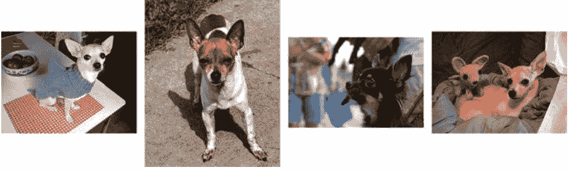

图 7.4 ImageNet：来自“吉娃娃”类别的四个样本图像

最近，另一个大型的带有注释图像的数据集已经发布。VisualGenome [KZG+17] 是一个包含超过 100,000 张图像的数据集，具有非常密集的区域注释，如图 7.5 所示。在使用基于 VisualGenome 训练的区域特征提取器时，可以在我们在第 7.2.4 节中描述的注意力机制的上下文中使用局部特征，从而提高字幕模型的性能。可以在该数据集上训练的特征提取器包括广泛使用的 Faster R-CNN [RHGS16]；在第 7.6 节中，我们展示了基于在 VisualGenome 上训练的 Faster R-CNN 的图像字幕模型具有最先进的性能。

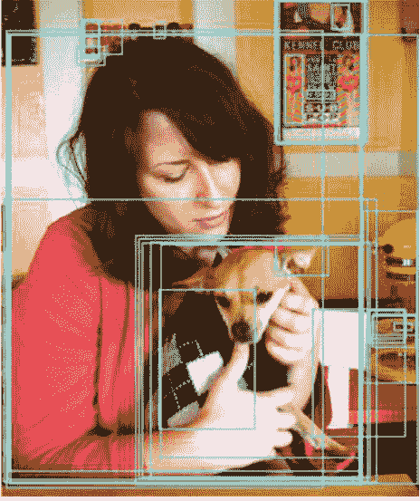

图 7.5 VisualGenome：一个带有多个边界框的图像示例。这些边界框带有类别（“狗”，“衬衫”，“瓶子”，...），描述（“桌子上的白色盘子”，“墙上的装裱海报”，...），属性（“衬衫是红色的”，“狗很小”，...）和关系（“女人穿着衬衫”，“盘子在桌子上”，...）的注释。

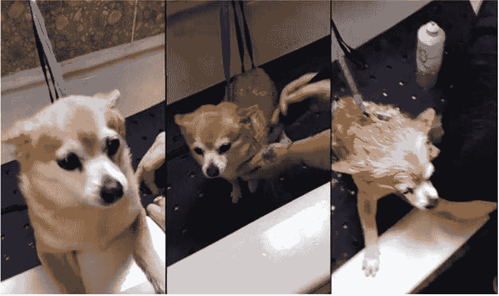

图 7.6 动力学：从属于“狗美容”类别的视频剪辑中提取的帧

通过 3D-CNN 提取的特征可以改善视频字幕生成。一个广泛使用的用于预训练全局视频特征提取器的数据集示例是 Kinetics [CZ17]。在 Kinetics 中，不同活动的视频被分类为 700 个不同的类别。Kinetics 中一个带注释的视频示例如图 7.6 所示。

### 7.3.2 使用交叉熵优化语言模型损失

字幕模型的目标是在给定图像或视频输入的情况下输出一个描述性句子。通常使用交叉熵函数作为训练过程中的损失函数来执行该任务。从数学上讲，给定图像或视频 $V$ 和长度为 $L$ 的真实字幕 $\mathbf{C} = (\mathbf{w}_1, \dots, \mathbf{w}_L)$，交叉熵损失定义为：

$$\mathcal{L}(\theta) = -\sum_{i=2}^L \log \left( \mathrm{P}_V(\mathbf{w}_i | \mathbf{w}_1, \dots, \mathbf{w}_{i-1}; \theta) \right) \quad (7.4)$$

其中 $\theta$ 是我们字幕模型的可训练权重集合。

交叉熵损失的问题在于与用于评估的指标存在差异——有关用于评估字幕模型的指标的描述，请参见第 7.4 节。在下一节中，我们将介绍另一种处理该问题的损失函数。

### 7.3.3 通过强化学习优化语言模型

出于前一节提到的原因，一些作品（如 [RMM+17]）引入了一种强化学习损失，即 REINFORCE 损失，旨在直接优化字幕模型的评估指标。更正式地说，对于给定的输入图像或视频 $V$，对于给定的字幕 $C$，将其分配的分数记为 $r(\mathbf{C})$（当字幕好时，$r(\mathbf{C})$ 较高，否则较低）。然后，新的损失函数为：

$$\mathcal{L}(\theta) = -r(\mathbf{C}), \quad \mathbf{C} \sim \mathrm{P}_V(\bullet; \theta). \quad (7.5)$$

该损失函数不可微分，因此不能直接用于梯度下降。然而，期望的 $L$ 的梯度可以写成：

$$\begin{aligned} \nabla_\theta \mathbb{E} [ \mathcal{L}(\theta) ] &= \nabla_\theta \mathbb{E} [ -r(\mathbf{C}) ] \\ &= -\sum_\mathbf{C} r(\mathbf{C}) \nabla_\theta \mathrm{P}_V(\mathbf{C}; \theta) \\ &= -\sum_\mathbf{C} r(\mathbf{C}) \mathrm{P}_V(\mathbf{C}; \theta) \nabla_\theta \log(\mathrm{P}_V(\mathbf{C}; \theta)) \quad (7.6) \\ &= -\mathbb{E} [ r(\mathbf{C}) \nabla_\theta \log(\mathrm{P}_V(\mathbf{C}; \theta)) ] \\ &= \nabla_\theta \mathbb{E} [ -r(\mathbf{C}) \log(\mathrm{P}_V(\mathbf{C}; \theta)) ] \end{aligned}$$

因此，它归结为对损失函数 $\mathcal{L}'$ 进行优化，定义为：

$$\begin{aligned} \mathcal{L}'(\theta) & =-r(\mathbf{C}) \log \left(P_V(\mathbf{C})\right), \quad \mathbf{C} \sim P_V(\bullet ; \theta) \\ & =-r(\mathbf{C}) \sum_{l=2}^L \log \left(P_V\left(\mathbf{w}_l \mid \mathbf{w}_1, \ldots, \mathbf{w}_{l-1} ; \theta\right)\right) . \end{aligned} \eqno(7.7)$$

如第 7.6 节所示，使用上述强化学习损失优化字幕模型相对于基于交叉熵损失优化的模型有很大的改进。

### 7.3.4 规范化字幕模型

除了我们在之前章节介绍的损失函数外，还可以添加一些规范化项到目标函数中，以提高字幕模型的性能。我们将介绍两种特定于字幕模型的规范化方法：匹配规范化和属性预测。

#### 7.3.4.1 匹配规范化

对于索引和检索任务来说，匹配图像或视频与相应的文本非常重要。这个匹配任务与我们在本章讨论的字幕任务是不同的。然而，一些研究表明它们可以互补：同时训练一个用于匹配图像或视频和字幕的模型以及一个用于生成字幕的模型可以改善两个任务的结果。

一般来说，视觉 - 文本匹配模型由两个嵌入模型组成，旨在将两种模态投影到同一个向量空间中。图像或视频嵌入模型通常由特征提取器和全连接层组成。文本嵌入模型通常建立在 RNN 上，通常是 LSTM 或 GRU。更正式地说，如果 $\text{vEmb}(\bullet ; \theta_v)$ 是视觉嵌入模型，$\text{cEmb}(\bullet ; \theta_c)$ 是文本嵌入模型，其中 $\theta_v$ 和 $\theta_c$ 是可训练参数，则视觉 - 文本匹配模型的优化目标是最小化损失函数 $\mathcal{L}_m$，定义如下：

$$\begin{aligned} \mathcal{L}_{m_1}\left(\theta_v, \theta_c\right) & =\max (0, \alpha-S(\mathbf{v}, \mathbf{c})+S(\mathbf{v}, \overline{\mathbf{c}})) \\ \mathcal{L}_{m_2}\left(\theta_v, \theta_c\right) & =\max (0, \alpha-S(\mathbf{v}, \mathbf{c})+S(\overline{\mathbf{v}}, \mathbf{c})) \\ \mathcal{L}_m\left(\theta_v, \theta_c\right) & =\mathcal{L}_{m_1}\left(\theta_v, \theta_c\right)+\mathcal{L}_{m_2}\left(\theta_v, \theta_c\right), \end{aligned}$$

其中 $S$ 是一个相似度函数，通常是余弦相似度，但不总是如此，例如 [VKFU15]，$\mathbf{v}$ 和 $\mathbf{c}$ 分别是图像或视频和相应的标题，$\overline{\mathbf{v}}$ 是一个不相关的图像或视频，$\overline{\mathbf{c}}$ 是一个不相关的标题，$\mathbf{v} = \text{vEmb}(\mathbf{V}; \theta_v)$，$\mathbf{c} = \text{cEmb}(\mathbf{C}; \theta_c)$，$\overline{\mathbf{v}} = \text{vEmb}(\overline{\mathbf{V}}; \theta_v)$ 和 $\overline{\mathbf{c}} \equiv \text{cEmb}(\overline{\mathbf{C}}; \theta_c)$。

添加匹配正则化项的解释可以是以下的：在损失函数中添加匹配项可以强制视觉表示和文本表示在一个共同的空间中接近，从而强制字幕模型区分相似的图像、视频或字幕。

#### 7.3.4.2 属性预测

一些研究表明，预测图像或视频属性可以提高字幕任务的结果。更具体地说，预测可以用于描述图像或视频的单词可以提高字幕性能 [YPL+17, PYLM17]。在这种情况下，属性是我们试图预测的单词。除此之外，预测的属性可以注入到字幕模型的解码器中，以提高生成字幕的质量 [YPL+17, PYLM17]。

### 7.3.5 提高推理时的字幕质量

在推理时，有几个技巧可以帮助提高字幕的质量。我们将介绍其中的两个：束搜索和重新排序。

#### 7.3.5.1 贪婪搜索 vs 束搜索

在第 7.2.3 节中，我们看到一个字幕与给定图像或视频相对应的概率可以基于解码器的隐藏状态进行迭代计算。特别地，我们看到如果 $\mathbf{V}$ 是一个图像或视频，$\mathbf{w}_i$ 是要评估的字幕的第 $i$ 个单词，$\mathbf{h}_i$ 是解码器的第 $i$ 个隐藏状态，我们有以下关系：

$$P_{\mathbf{V}}(\mathbf{w}_1, \dots, \mathbf{w}_L) = \prod_{i=2}^L \text{Softmax}_{\mathbf{w}_i} (\text{预测}(\text{H}_i; \theta_p)).$$

在推理时间，字幕任务归结为寻找输入图像或视频的最可能的字幕。实现这个目标的一种简单方法是进行贪婪搜索：在每一步，我们选择最可能的单词，如下所示：

$$\mathbf{w}_i = \text{argmax}_{\mathbf{w}} (\text{Softmax}_{\mathbf{w}}(\text{Pred}(\mathbf{h}_i; \theta_p))).$$

然而，贪婪算法是有偏见的：如果最可能的字幕只有一个不太可能的单词，它将永远不会被贪婪算法选择。为了解决这个问题，许多作品使用了一种束搜索算法 [MXY+14, FGI+15, RMM+17, KFF15]。不仅仅跟踪一个可能的句子，束搜索在内存中保留 $B$ 个不同的可能句子，其中 $B$ 是束大小。算法结束时，在保留的句子中选择最佳标题。可以注意到，如果 $B = 1$，我们得到一个贪婪算法：贪婪搜索是束搜索的一个特例。

#### 7.3.5.2 字幕重新排序

除了我们在第 7.3.5.1 节中提到的波束搜索算法外，一些研究表明，选择最可能的字幕并不总是最好的解决方案。字幕重新排序也可以提高结果。字幕重新排序不仅生成一个句子，而是生成多个句子，然后为每个句子计算一个分数，以优化它们的排序。例如，已经证明使用匹配模型（如我们在第 7.3.4.1 节中提到的模型）来评估句子与图像或视频的匹配程度可以改善字幕生成结果 [DLL+16]。

现在让我们描述一下用于评估字幕生成模型的评估指标。

## 7.4 字幕质量评估

已经设计了几个指标来评估翻译任务或字幕生成模型。正如我们之前解释的那样，字幕生成任务可以被看作是一种翻译任务：实际上，用于翻译任务的评估指标被广泛用于评估字幕生成。让我们描述一下本章中将使用的评估指标。

### 7.4.1 BLEU-n

BLEU-$n$ 指标已在 [PRWZ02] 中定义。它计算参考句子中出现在候选句子中的 $n$-gram 的比例，这被称为 $n$-gram 精度。如果一个 $n$-gram 在任何参考句子中不超过 $p$ 次，在候选句子中也不超过 $p$ 次，即使候选句子中有更多该 $n$-gram 的出现次数。让我们举个例子：候选句子：“一只狗躺在一张蓝色的沙发上”参考句子 1：“沙发上有一只黑狗”参考句子 2：“狗躺在沙发上”BLEU-1 = 0.875（一只狗躺在一张蓝色的沙发上）

BLEU-2 = 0.429（一只狗，狗躺在，躺在一张，一张蓝色的，蓝色的沙发上）

### 7.4.2 ROUGE$_L$

ROUGE$_L$ [Lin04] 指标基于候选句子和参考句子之间的最长公共子序列（LCS）。计算方法如下：

$$\text{ROUGE}_L(c, r) = \frac{(1 + \beta^2)RP}{R + \beta^2 P}, \qquad (7.8)$$

其中，$c$ 是候选句子，$r$ 是参考句子，$P = \frac{\text{LCS}(c,r)}{\text{length}(c)}$，$R = \frac{\text{LCS}(c,r)}{\text{length}(r)}$ 和 $\beta = \frac{P}{R}$。在前面的例子中，候选句子相对于第一个参考句子的 ROUGE$_L$ 得分为 0.625，相对于第二个参考句子的 ROUGE$_L$ 得分为 0.661。因此，它的全局 ROUGE$_L$ 得分为 0.643。为方便起见，本章剩余部分将 ROUGE$_L$ 指标简称为 ROUGE。

### 7.4.3 METEOR

METEOR [BL05] 指标是通过首先对候选句子和参考句子进行对齐来计算的。一旦对齐完成，就会计算两个句子之间的相似度得分。

更准确地说，第一步是将两个句子中的单个词映射起来，如果它们完全相同。然后，如果经过 Porter stemming 处理后它们相等，剩下的单个词也会被映射在一起。最后一个匹配步骤是根据 WordNet 层次结构 [Mil95] 来匹配单个词是否是同义词。

一旦完成了这三个映射步骤，就会得到一个得分 $F_{\text{mean}}$，计算方式如下：

$$P = \frac{\text{候选句子中映射的单个词数目}}{\text{候选句子的长度}},$$

$$R = \frac{\text{参考句子中映射的单个词数目}}{\text{参考句子的长度}},$$

$$F_{\text{mean}} = \frac{10PR}{9P + R},$$

其中 $c$ 是候选句子，$r$ 是参考句子。

然后，根据候选句子中的 chunk-to-chunk 映射数量对该得分进行惩罚：如果候选句子与参考句子之间的映射是一个 chunk，则惩罚最小化，而当 chunk 由单个词组成时，惩罚最大化。该惩罚定义为：

$$\text{惩罚} = 0.5 \times \left( \frac{\text{块到块映射的数量 } c}{\text{映射的单个词的数量 } c} \right)^3.$$

最终的 METEOR 分数由以下公式给出:

$$\text{METEOR} = F_{\text{mean}} \times (1 - \text{惩罚})$$

### 7.4.4 CIDEr$_D$

CIDEr 指标 [VLZP15] 是基于 1-gram、2-gram、3-gram 和 4-gram 的参考文本和候选字幕的 TF-IDF 向量的余弦相似度的平均值。CIDEr$_D$ 指标，也在 [VLZP15] 中引入，是对 CIDEr 的改进，使得游戏更加困难。

更具体地说，如果 $\Omega^{(n)} = \{\omega_1^{(n)}, \dots, \omega_{D_n}^{(n)}\}$ 是所有 $n$-gram 的集合，我们计算一句话相对于 $\omega_k^{(n)}$ 的 TF-IDF 如下：

$$g_k^{(n)}(s) = \frac{h_k(s)}{\sum_{\omega_l^{(n)} \in \Omega} h_l(s)} \times \log \left( \frac{|I|}{\sum_{I_p \in I} \min(1, \sum_q h_k(r_{pq}))} \right),$$

其中 $h_k(s)$ 是 $\omega_k^{(n)}$ 在 $s$ 中出现的次数，$I$ 是所有可能的图像或视频的集合，$r_{pq}$ 是参考句子。然后，$n$-gram CIDEr$_D$ 得分如下：

$$\text{CIDEr}_{D_n}(c, R_i) = \frac{10}{m} \sum_j e^{-\frac{(l(c)-l(r_{ij}))^2}{72}} \times \frac{\min(\mathbf{g}^{(n)}(c), \mathbf{g}^{(n)}(r_{ij})) \cdot \mathbf{g}^{(n)}(r_{ij})}{\|\mathbf{g}^{(n)}(c)\| \times \|\mathbf{g}^{(n)}(r_{ij})\|}$$

其中 $l(s)$ 表示句子 $s$ 的长度，$\mathbf{g}^{(n)}(s)$ 表示所有 $g_k^{(n)}(s)$ 的向量，而 $c$ 是候选标题。实际的 CIDEr$_D$ 分数最终得出为：

$$\text{CIDEr}_D = \frac{1}{4} \sum_{i=1}^4 \text{CIDEr}_{D_i}.$$

为了方便起见，本章剩余部分将将 CIDEr$_D$ 度量指定为 CIDEr。

图 7.7 一个图像字幕示例：一张狗的照片配有五个标题

- ### 参考标题

- 一只狗躺在一块毛茸茸的地毯上

- 地板视角下的一只仰卧的狗，希望得到一些关注

- 一只棕白相间的狗躺在桌子下的地毯上

- 一只柯基犬休息在蓬松的米色地毯上

- 一张照片，一只狗躺在桌子下的地毯上

## 7.5 字幕数据集

在本节中，我们将介绍三个图像字幕数据集和两个视频字幕数据集。这些字幕数据集都由图像或视频组成，附有几个人工编写的标题。图 7.7 显示了一个图像字幕数据集的示例。

### 7.5.1 图像字幕数据集

Flickr8k [HYH13] 和 Flickr30k [PWC+15] 是基于 Flickr 图像的两个数据集。Flickr30k 包含 30,000 张图像，每张图像有五个字幕，是 Flickr8k 的扩展，Flickr8k 包含 8,000 张图像，每张图像有五个字幕。在文献中，这两个数据集通常被划分为 1,000 张图像用于验证，1,000 张图像用于测试，其余用于训练。MS COCO [LMB+14] 是比前面提到的数据集更大的数据集，它包含大约 120,000 张图像，每张图像有五个字幕。通常将其划分为 5,000 张图像用于验证，5,000 张图像用于测试，其余用于训练。所有这些数字已在表 7.1 中报告。

### 7.5.2 视频字幕数据集

MSVD [CD11]，也称为 YouTube2Text，是基于 YouTube 视频的视频字幕数据集。它包含 1,970 个视频，每个视频约有 35 个字幕。

## 表7.1 图像字幕数据集

|  | Flickr8k | Flickr30k | MSCOCO |
| :--- | :--- | :--- | :--- |
| 训练图像数量 | 6000 | 28,000 | 110,000 |
| 验证图像数量 | 1000 | 1000 | 5000 |
| 测试图像数量 | 1000 | 1000 | 5000 |
| 每个图像的字幕数量 | 5 | 5 | 5 |

## 表7.2 视频字幕数据集

|  | MSVD (YouTube2Text) | MSR-VTT |
| :--- | :--- | :--- |
| 训练图像数量 | 1100 | 6500 |
| 验证图像数量 | 100 | 500 |
| 测试图像数量 | 670 | 3000 |
| 每个图像的字幕数量 | 35 | 20 |

根据文献，通常将其分为100个视频用于验证，670个视频用于测试，其余用于训练。MSR-VTT [XMYR16] 是比MSVD更大的数据集，它包含10,000个视频，每个视频有20个字幕。通常将其分为500个视频用于验证，3000个视频用于测试，其余用于训练。所有这些数字都在表7.2中报告。

## 7.6 发表作品中的结果

在本节中，我们报告了一些可以在文献中找到的实验结果。

### 7.6.1 图像字幕

一些来自Flickr8k、Flickr30k和MSCOCO文献的图像字幕结果分别在表7.3、7.4和7.5中报告。表7.6给出了我们报告结果的模型的一些特征。现在，大多数强大的图像字幕模型使用Transformer网络作为解码器，并使用我们在第7.3.3节介绍的REINFORCE损失进行训练。

### 7.6.2 视频字幕

一些来自MSVD和MSR-VTT文献的视频字幕结果分别在表7.7和7.8中报告。表7.9给出了一些特征。

## 表7.3 Flickr8k结果

| 模型 | Bleu-4 | METEOR | CIDEr |
| :--- | :--- | :--- | :--- |
| [KFF15] | 16.0 | 16.7 | 31.8 |
| [XBK+15] | 21.3 | 20.3 | — |
| [PGH+16] | 25.0 | — | — |

## 表7.4 Flickr30k上的结果

| 模型 | Bleu-4 | METEOR | CIDEr |
| :--- | :--- | :--- | :--- |
| [KFF15] | 15.7 | 15.3 | 24.7 |
| [DAHG+15] | 16.5 | — | — |
| [XBK+15] | 19.9 | 18.5 | — |
| [PGH+16] | 25 | — | — |

## 表7.5 MSCOCO上的结果

| 模型 | Bleu-4 | ROUGE | METEOR | CIDEr |
| :--- | :--- | :--- | :--- | :--- |
| [KFF15] | 23.0 | — | 19.5 | 66.0 |
| [DAHG+15] | 24.9 | — | — | — |
| [XBK+15] | 25.0 | — | 23.0 | — |
| [FGI+15] | — | — | 23.6 | — |
| [VTBE15] | 27.7 | — | 23.7 | 85.5 |
| [PGH+16] | 28 | — | 24 | 90 |
| [MXY+14] | 30.4 | 51.9 | 23.9 | 93.8 |
| [CZX+17] | 31.1 | — | 25.0 | — |
| [YPL+17] | 32.6 | 54.0 | 25.4 | 100.2 |
| [RMM+17] | 35.4 | 56.6 | 27.1 | 117.5 |
| [AHB+18] | 36.3 | 56.9 | 27.7 | 120.1 |
| [LZLY19] | 39.9 | 59.0 | 28.9 | 127.6 |
| [HWCW19] | 40.2 | 59.4 | 29.3 | 132.0 |

我们报告了结果的模型。现在，大多数强大的视频字幕模型都是使用我们在第7.3.3节中介绍的REINFORCE损失进行训练的。

## 7.7 其他相关工作

在本节中，我们将简要介绍一些与图像和视频字幕相关的现有工作。它包括图像密集字幕、视频密集字幕和电影字幕。

### 7.7.1 图像密集字幕

图像密集字幕不仅仅是为给定的图像生成一个字幕，而是生成多个字幕，对应于不同的感兴趣区域 [JKFF16]。

**表7.6** 一些图像字幕模型。我们报告它们使用的编码器类型、解码器类型、是否使用注意机制、是否使用局部特征和目标函数。“BRNN”代表“双向RNN”。“MELM”代表“最大熵语言模型”。“m-RNN”代表“多模态RNN”。“ELBO”代表“证据下界”。

| 模型 | 编码器 | 解码器 | 注意力 | 局部特征 | 文本目标 |
| :--- | :--- | :--- | :--- | :--- | :--- |
| [KFF15] | VGG16 | BRNN | 否 | 是 | 交叉熵 |
| [DAHG+15] | CaffeNet | LSTM | 否 | 否 | 交叉熵 |
| [XBK+15] | VGG16 | LSTM | 是 | 是 | 交叉熵 |
| [FGI+15] | VGG16 | MELM | 否 | 是 | 交叉熵 |
| [VTBE15] | GoogLeNet | LSTM | 否 | 否 | 交叉熵 |
| [PGH+16] | VAE | GRU | 否 | 否 | ELBO |
| [MXY+14] | VGG16 | m-RNN | 否 | 否 | 交叉熵 |
| [CZX+17] | ResNet-152 | LSTM | 是 | 是 | 交叉熵 |
| [YPL+17] | GoogLeNet | LSTM | 否 | 是 | 交叉熵 |
| [RMM+17] | ResNet-101 | LSTM | 是 | 是 | REINFORCE |
| [AHB+18] | VG-ResNet-101 | LSTM | 是 | 是 | REINFORCE |
| [LZLY19] | VG-VGG16 | Transformer | 是 | 是 | REINFORCE |

### 7.7.2 视频密集字幕

与图像密集字幕不同，视频密集字幕不旨在为感兴趣的区域生成字幕。在视频密集字幕中，我们旨在为视频中发生的有趣事件生成字幕。它涉及捕捉视频中不同时刻之间的依赖关系。数据集`ActivityNet Captions` [KHR+17] 包含20,000个视频，对应不同的事件有100,000个不同的字幕。

**表7.7** MSVD结果（YouTube2Text）

| 模型 | Bleu-4 | ROUGE | METEOR | CIDEr |
| :--- | :--- | :--- | :--- | :--- |
| [SGG+17] | 53.0 | — | 33.6 | 73.8 |
| [HHL+17] | 53.9 | — | 32.2 | 67.4 |
| [GGZ+17] | 50.8 | — | 33.3 | 74.8 |
| [PYLM17] | 52.8 | — | 33.5 | 74.0 |
| [GGH+17] | 51.1 | — | 33.5 | 77.7 |
| [PB17] | 54.4 | 72.2 | 34.9 | 88.6 |
| [SGG+18] | 53.3 | — | 33.8 | 74.8 |
| [WMZL18] | 52.3 | 69.8 | 34.1 | 80.3 |
| [PZW+19] | 48.6 | 71.9 | 35.1 | 92.2 |
| [FH19] | 55.1 | 72.7 | 35.4 | 86.8 |

我们在第7.3.1节中介绍的最新数据集`VisualGenome`包含了密集的区域描述，可以用来训练密集字幕模型。

表7.8 MSR-VTT上的结果。第一个报告的结果（以斜体字符表示）是在MSR-VTT的验证集上计算得出的。

| 模型 | Bleu-4 | ROUGE | METEOR | CIDEr |
| :--- | :--- | :--- | :--- | :--- |
| [RDP+16] | 39.5 | 61.0 | 27.7 | 44.2 |
| [JCC+16] | 40.8 | 60.9 | 28.2 | 44.8 |
| [DLL+16] | 38.7 | 58.7 | 26.9 | 45.9 |
| [SGG+17] | 38.3 | — | 26.3 | — |
| [HHL+17] | 39.7 | — | 25.5 | 40.0 |
| [GGZ+17] | 38.0 | — | 26.1 | 43.2 |
| [PB17] | 40.5 | 61.4 | 28.4 | 51.7 |
| [SGG+18] | 39.8 | 59.3 | 26.1 | 40.9 |
| [WMZL18] | 39.1 | 59.3 | 26.6 | 42.7 |
| [WCW+18] | 41.3 | 61.7 | 28.7 | 48.0 |
| [PZW+19] | 40.4 | 60.7 | 28.1 | 47.1 |
| [FH19] | 40.7 | 61.2 | 27.6 | 44.8 |

表7.9 一些视频字幕模型。我们报告了使用的2D编码器（如果有）、使用的3D编码器（如果有）、解码器、是否使用了注意机制、是否使用了局部特征、是否使用了音频特征以及使用的目标函数。“XE”代表“交叉熵”。

| 模型 | 2D编码器 | 3D编码器 | 解码器 | Att. | 局部 | 音频 | 损失 |
| :--- | :--- | :--- | :--- | :--- | :--- | :--- | :--- |
| [RDP+16] | `ResNet` | `C3D` | `LSTM` | 否 | 否 | 是 | XE |
| [JCC+16] | 无 | `C3D` | `LSTM` | 否 | 否 | 是 | XE |
| [DLL+16] | `GoogLeNet-bu4k` | `C3D` | `LSTM` | 否 | 否 | 否 | XE |
| [SGG+17] | `ResNet-152` | 无 | `LSTM` | 是 | 否 | 否 | XE |
| [HHL+17] | `VGG16` | `C3D` | `LSTM` | 是 | 否 | 是 | XE |
| [GGZ+17] | `Inception-v3` | 无 | `LSTM` | 是 | 否 | 否 | XE |
| [PYLM17] | `VGG19` | `C3D` | `LSTM` | 否 | 否 | 否 | XE |
| [GGH+17] | `ResNet-152` | `C3D` | `LSTM` | 否 | 否 | 否 | XE |
| [PB17] | `Inception-v4` | 无 | `LSTM` | 是 | 否 | 否 | REINFORCE |
| [SGG+18] | `ResNet-152` | 无 | `LSTM` | 否 | 否 | 否 | ELBO |
| [WMZL18] | `Inception-v4` | 无 | `LSTM` | 是 | 否 | 否 | XE |
| [WCW+18] | `ResNet-152` | 无 | `LSTM` | 是 | 否 | 否 | REINFORCE |
| [PZW+19] | `ResNet-101` | `ResNeXt-101` | `LSTM` | 是 | 否 | 否 | XE |
| [FH19] | `ResNet-152` | `I3D` | `LSTM` | 是 | 是 | 否 | XE |

### 7.7.3 电影字幕

电影字幕看起来可能与视频字幕非常相似，但实际上并不是这样。电影字幕模型必须捕捉电影片段的叙事，不仅描述视频中正在发生的事情，还要描述事件和角色之间的关系以形成一个故事情节。`MPII-MD` [RRTS15] 和 `M-VAD` [TPLC15] 是电影字幕数据集的例子。最近，数据集 `M-VAD Names` [PCB+19] 扩展了 `M-VAD`，通过在注释中添加角色名称：在此之前，角色名称被一个“某人”标记替代。

## 7.8 结论

本章概述了深度学习在图像和视频字幕中的应用，从最早的作品到最新的发展。特别是，我们提到如何有效地构建和训练带有注意机制的深度字幕模型，并讨论了文献中已经建立的一些改进。

字幕的最新工作包括使用局部特征、注意机制，尤其是使用`Transformer`网络作为广泛使用的`LSTM`和`GRU`的高效替代品。

图像和视频字幕是热门话题，每年都会产生许多创新的科学出版物，也催生了相关且同样有趣的研究领域，如密集字幕或电影字幕。

## 参考文献

- [AHB+18] Peter Anderson, Xiaodong He, Chris Buehler, Damien Teney, Mark Johnson, Stephen Gould, and Lei Zhang. 底层和顶层注意力用于图像字幕和视觉问答。在计算机视觉和模式识别的IEEE会议论文集中，第6077-6086页，2018年。
- [BL05] Satanjeev Banerjee 和 Alon Lavie。`Meteor`: 一种用于机器翻译评估的自动度量标准，与人类判断的相关性得到改进。在ACL会议上关于机器翻译和/或摘要的内在和外在评估措施的研讨会论文集中，第65-72页，2005年。
- [CD11] David Chen 和 William B Dolan。收集用于释义评估的高度并行数据。在第49届年度计算语言学协会会议：人类语言技术，2011年，第190-200页。
- [CVMG+14] Kyunghyun Cho, Bart Van Merriënboer, Caglar Gulcehre, Dzmitry Bahdanau, Fethi Bougares, Holger Schwenk 和 Yoshua Bengio。使用`RNN`编码器-解码器学习短语表示用于统计机器翻译。arXiv预印本 `arXiv:1406.1078`，2014年。
- [CZ17] Joao Carreira 和 Andrew Zisserman。`Quo vadis`, 动作识别？一个新模型和动力学数据集。在IEEE计算机视觉和模式识别会议，2017年，第6299-6308页。
- [CZX+17] 长陈，汉旺张，军肖，立强聂，建邵，伟刘，和达特-圣蔡。`Sca-CNN`: 用于图像字幕的空间和通道注意力的卷积网络。在计算机视觉和模式识别的IEEE会议论文集，页码5659-5667，2017年。
- [DAHG+15] 杰弗里·多纳休，丽莎·安妮·亨德里克斯，塞尔吉奥·瓜达拉马，马库斯·罗尔巴赫，Subhashini Venugopalan，凯特·萨恩科，和特雷弗·达雷尔。长期循环卷积网络用于视觉识别和描述。在计算机视觉和模式识别的IEEE会议论文集，页码2625-2634，2015年。
- [DDS+09] 邓嘉，董伟，Richard Socher，李丽佳，李凯 和 李飞飞。`ImageNet`: 一个大规模的分层图像数据库。在2009年IEEE计算机视觉和模式识别会议上，第248-255页。IEEE，2009年。

- [DLL+16] 董建峰，李锡荣，兰伟宇，路嘉浩，和 Cees G M Snoek。用于视频字幕的早期嵌入和后期重新排序。在第24届ACM国际多媒体会议论文集，页码1082-1086，2016年。

- [FGI+15] Hao Fang, Saurabh Gupta, Forrest Iandola, Rupesh K Srivastava, Li Deng, Piotr Dollár, Jianfeng Gao, Xiaodong He, Margaret Mitchell, John C Platt, et al. 从字幕到视觉概念再到字幕。在IEEE计算机视觉和模式识别会议论文集，2015年，第1473-1482页。

- [FH19] Danny Francis 和 Benoit Huet。L-STAP: 学习的时空自适应池化用于视频字幕。在第一届国际智能电视内容制作、访问和传递研讨会论文集，2019年，第3-41页。

- [GCJ+18] 顾九祥，蔡建飞，Shafiq R Joty，牛力 和 王刚。看、想象和匹配：通过生成模型改进文本-视觉跨模态检索。在IEEE计算机视觉和模式识别会议论文集，2018年，第7181-7189页。

- [GCWC18] 顾九湘，蔡建飞，王刚，陈图翰。堆叠字幕：用于图像字幕的粗-细学习。在第三十二届AAAI人工智能大会上，2018年。

- [GGH+17] 甘喆，甘闯，何晓东，蒲云辰，Tran Kenneth，高建峰，Lawrence Carin，邓力。用于视觉字幕的语义组合网络。在IEEE计算机视觉和模式识别会议论文集，页5630-5639，2017年。

- [GGZ+17] 高连利，郭钊，张汉旺，徐星，沈恒涛。基于注意力的LSTM和语义一致性的视频字幕。IEEE多媒体交易，19(9):2045-2055，2017年。

- [HHL+17] Chiori Hori, Takaaki Hori, Teng-Yok Lee, Ziming Zhang, Bret Harsham, John R Hershey, Tim K Marks, and Kazuhiko Sumi. 基于注意力的多模态融合视频描述。在IEEE国际计算机视觉会议论文集，2017年，第4193-4202页。

- [HS97] Sepp Hochreiter 和 Jürgen Schmidhuber。长短期记忆。神经计算，9(8):1735-1780，1997年。

- [HWCW19] Lun Huang, Wenmin Wang, Jie Chen 和 Xiao-Yong Wei. 注意力机制在图像字幕生成中的应用。在IEEE国际计算机视觉会议论文集，2019年，第4634-4643页。

- [HYH13] Micah Hodosh, Peter Young 和 Julia Hockenmaier. 将图像描述作为排序任务：数据、模型和评估指标。人工智能研究杂志，47:853-899，2013年。

- [JCC+16] 秦进，贾晨，陈世哲，熊一凡 和 亚历山大·豪普特曼。使用多模态融合描述视频。在第24届ACM国际多媒体会议上，页码1087-1091，2016年。

- [JKFF16] Justin Johnson, Andrej Karpathy 和 Li Fei-Fei。DenseCap: 用于密集字幕的全卷积定位网络。在IEEE计算机视觉和模式识别会议上，页码4565-4574，2016年。

- [KFF15] Andrej Karpathy 和 Li Fei-Fei。用于生成图像描述的深度视觉语义对齐。在IEEE计算机视觉和模式识别会议上，页码3128-3137，2015年。

- [KHR+17] Ranjay Krishna, Kenji Hata, Frederic Ren, Li Fei-Fei 和 Juan Carlos Niebles。在视频中进行密集字幕事件。在IEEE国际计算机视觉会议上，页码706-715，2017年。

- [KSH12] Alex Krizhevsky, Ilya Sutskever, 和 Geoffrey E Hinton. 使用深度卷积神经网络进行ImageNet分类。在NIPS，2012年。

- [KZG+17] Ranjay Krishna, Yuke Zhu, Oliver Groth, Justin Johnson, Kenji Hata, Joshua Kravitz, Stephanie Chen, Yannis Kalantidis, Li-Jia Li, David A. Shamma, 等. 使用众包图像注释连接语言和视觉的 Visual Genome. 国际计算机视觉杂志, 123(1):32–73, 2017年。

- [Lin04] Chin-Yew Lin. ROUGE: 用于自动摘要评估的软件包. 在 *Text Summarization Branches Out*, 页码74–81, 2004年。

- [LMB+14] Tsung-Yi Lin, Michael Maire, Serge Belongie, James Hays, Pietro Perona, Deva Ramanan, Piotr Dollár, 和 C. Lawrence Zitnick. Microsoft COCO: 上下文中的常见物体. 在 *European Conference on Computer Vision*, 页码740–755. Springer, 2014年。

- [LPM15] Minh-Thang Luong, Hieu Pham, and Christopher D. Manning. 有效的基于注意力的神经网络机器翻译方法。arXiv预印本 arXiv:1508.04025, 2015年。

- [LRY18] Sheng Liu, Zhou Ren, and Junsong Yuan. SibNet: 兄弟卷积编码器用于视频字幕。 在第26届ACM国际多媒体会议上, 第1425–1434页, 2018年。

- [LZLY19] Guang Li, Linchao Zhu, Ping Liu, and Yi Yang. 缠绕变压器用于图像字幕。 在IEEE国际计算机视觉会议上, 第8928–8937页, 2019年。

- [Mil95] George A. Miller. WordNet: 一个用于英语的词汇数据库。ACM通信, 38(11):39–41, 1995年。

- [MXY+14] Junhua Mao, Wei Xu, Yi Yang, Jiang Wang, Zhiheng Huang, and Alan Yuille. 多模态递归神经网络（m-RNN）的深度字幕。arXiv预印本 arXiv:1412.6632, 2014年。

- [PB17] Ramakanth Pasunuru 和 Mohit Bansal。通过蕴含奖励加强视频字幕。 在2017年自然语言处理经验方法会议论文集, 页码979–985, 2017年。

- [PCB+19] Stefano Pini, Marcella Cornia, Federico Bolelli, Lorenzo Baraldi 和 Rita Cucchiara。M-VAD Names：用于视频字幕的数据集。多媒体工具和应用, 78(10):14007–14027, 2019年。

- [PGH+16] Yunchen Pu, Zhe Gan, Ricardo Henao, Xin Yuan, Chunyuan Li, Andrew Stevens, and Lawrence Carin. 图像、标签和标题的变分自编码器深度学习。 在神经信息处理系统进展, 第2352–2360页, 2016年。

- [PRWZ02] Kishore Papineni, Salim Roukos, Todd Ward, and Wei-Jing Zhu. BLEU: 一种用于自动评估机器翻译的方法。 在计算语言学协会第40届年会, 第311–318页, 2002年。

- [PWC+15] Bryan A. Plummer, Liwei Wang, Chris M. Cervantes, Juan C. Caicedo, Julia Hockenmaier, and Svetlana Lazebnik. Flickr30k Entities: 为更丰富的图像到句子模型收集区域到短语的对应关系。 在IEEE国际计算机视觉会议, 第2641–2649页, 2015年。

- [PYLM17] 潘颖伟, 姚婷, 李厚强 和 梅涛。具有转移语义属性的视频字幕。 在IEEE计算机视觉与模式识别会议论文集, 页码6504–6512, 2017年。

- [PZW+19] 裴文杰, 张继远, 王向荣, 柯磊, 沈晓勇 和 Yu-Wing Tai。用于视频字幕的记忆关注循环网络。 在IEEE计算机视觉与模式识别会议论文集, 页码8347–8356, 2019年。

[RDP+16] Vasili Ramanishka, Abir Das, Dong Huk Park, Subhashini Venugopalan, Lisa Anne Hendricks, Marcus Rohrbach 和 Kate Saenko。多模态视频描述。 在第24届ACM国际多媒体会议论文集, 页码1092–1096, 2016年。

[RHGS16] Shaoqing Ren, Kaiming He, Ross Girshick, 和 Jian Sun. Faster R-CNN: 向实时目标检测与区域提案网络靠拢。IEEE模式分析与机器智能汇刊, 39(6):1137–1149, 2016年。

[RMM+17] Steven J. Rennie, Etienne Marcheret, Youssef Mroueh, Jerret Ross, 和 Vaibhava Goel. 自我关键序列训练用于图像字幕。 在IEEE计算机视觉与模式识别会议, 页码7008–7024, 2017年。

[RQT+13] Marcus Rohrbach, Wei Qiu, Ivan Titov, Stefan Thater, Manfred Pinkal, 和 Bernt Schiele。将视频内容翻译为自然语言描述。 在IEEE国际计算机视觉会议, 页码433–440, 2013年。

[RRTS15] Anna Rohrbach, Marcus Rohrbach, Niket Tandon, 和 Bernt Schiele。一个用于电影描述的数据集。 在IEEE计算机视觉与模式识别会议（CVPR）, 2015年。

[SGG+17] Jingkuan Song, Lianli Gao, Zhao Guo, Wu Liu, Dongxiang Zhang, 和 Heng Tao Shen。具有调整的时间注意力的分层LSTM用于视频字幕。 在第26届国际人工智能联合会议, 第2737–2743页, 2017年。

[SGG+18] Jingkuan Song, Yuyu Guo, Lianli Gao, Xuelong Li, Alan Hanjalic, 和 Heng Tao Shen。从确定性到生成性：用于视频字幕的多模态随机RNN。IEEE神经网络与学习系统汇刊, 30(10):3047–3058, 2018年。

[SVL14] Ilya Sutskever, Oriol Vinyals, 和 Quoc V. Le. 序列到序列学习与神经网络。 在神经信息处理系统进展, 第3104–3112页, 2014年。

[TPLC15] Atousa Torabi, Christopher Pal, Hugo Larochelle, 和 Aaron Courville. 使用描述性视频服务创建大型视频注释研究数据源。arXiv预印本 arXiv:1503.01070, 2015年。

[VKFU15] Ivan Vendrov, Ryan Kiros, Sanja Fidler, 和 Raquel Urtasun. 图像和语言的顺序嵌入。arXiv预印本 arXiv:1511.06361, 2015年。

[VLZP15] Ramakrishna Vedantam, C. Lawrence Zitnick, 和 Devi Parikh. CIDEr: 基于共识的图像描述评估。 在IEEE计算机视觉与模式识别会议论文集, 第4566–4575页, 2015年。

[VSP+17] Ashish Vaswani, Noam Shazeer, Niki Parmar, Jakob Uszkoreit, Llion Jones, Aidan N. Gomez, Łukasz Kaiser, 和 Illia Polosukhin. 注意力就是一切。 在神经信息处理系统进展, 第5998–6008页, 2017年。

[VTBE15] Oriol Vinyals, Alexander Toshev, Samy Bengio, 和 Dumitru Erhan. 展示和讲述：一个神经图像标题生成器。 在IEEE计算机视觉与模式识别会议论文集, 第3156–3164页, 2015年。

[WCW+18] Xin Wang, Wenhu Chen, Jiawei Wu, Yuan-Fang Wang, 和 William Yang Wang. 通过分层强化学习进行视频字幕生成。 在IEEE计算机视觉与模式识别会议论文集, 第4213–4222页, 2018年。

[WMZL18] Bairui Wang, Lin Ma, Wei Zhang, and Wei Liu. 用于视频字幕的重建网络。 在IEEE计算机视觉与模式识别会议论文集, 第7622–7631页, 2018年。

[XBK+15] Kelvin Xu, Jimmy Ba, Ryan Kiros, Kyunghyun Cho, Aaron Courville, Ruslan Salakhudinov, Rich Zemel, and Yoshua Bengio. 展示、关注与描述：带有视觉注意力的神经图像字幕生成。 在国际机器学习会议, 第2048–2057页, 2015年。

[XMYR16] Jun Xu, Tao Mei, Ting Yao, and Yong Rui. MSR-VTT: 用于连接视频和语言的大型视频描述数据集。 在IEEE计算机视觉与模式识别会议论文集, 第5288–5296页, 2016年。

[YPL+17] 姚婷, 潘英伟, 李叶昊, 邱照凡 和 梅涛。用属性提升图像标题生成。 在IEEE国际计算机视觉会议论文集, 第4894–4902页, 2017年。

[YTC+15] 姚力, Atousa Torabi, Kyunghyun Cho, Nicolas Ballas, Christopher Pal, Hugo Larochelle 和 Aaron Courville。通过利用时间结构描述视频。 在IEEE国际计算机视觉会议论文集, 第4507–4515页, 2015年。

# 第8章 视频压缩中的深度学习算法

Ofer Hadar 和 Raz Birman

## 8.1 引言

视频内容正在成为互联网上消费内容的主要方式。由于便捷的边缘设备（如智能手机和平板电脑）以及无线和有线网络可用带宽的不断增加，视频内容的使用量不断增长，使得用户在消费内容时能够获得合理的体验。出现了各种各样的内容提供商，它们提供丰富的内容并进一步鼓励其消费，例如 Netflix、YouTube、Facebook、Hulu、Amazon 等。

此外，摄像机作为确保公共安全与安防的手段越来越普遍，随着其渗透率的增加，传输和记录大量视频内容的需求也在增加。不断增长的使用量和消费模式的转变，推动了通过信道获取高效且具成本效益的视频传输需求。在过去二十年中，已经投入了大量研究和标准化工作，以开发创新算法，将视频内容压缩为更紧凑的表示形式，同时保持观察者眼中的质量。已经设计了多个指标来评估结果并与基准比较，以持续展示进展与成就。到目前为止，最成功的两个视频编码标准 H.262/MPEG-2 Video 和 H.264/MPEG-4 AVC，均由 ITU-T 和 ISO/IEC 共同开发。H.265/HEVC 现在是第三个这样的联合项目[OS13]。图8.1展示了视频编码标准的演变过程。

图8.1 视频标准的发展 [OW]

多年来，视频编码标准的演进一直遵循一个总体概念：当在相同质量下的压缩率（例如比特率降低）相对于之前标准至少改进50%时，引入新的标准。最新发布的标准是 HEVC（也称为 H.265）。ITU-T 和 ISO/IEC 的联合视频探索团队（JVET）一直在研究通用视频编码（VVC）标准，该标准已于2020年7月完成，并很可能成为继 HEVC 之后的下一代标准。该编解码器被命名为通用视频编码，因为它“旨在非常灵活，并满足从低分辨率和低比特率到高分辨率和高比特率、HDR、360全景等各种视频需求”。根据计划，VVC 标准应于2020年底发布，并在相同感知质量下具有30–50%更好的压缩率。通过对经典混合视频编码设计组件的许多小改进，实现了这一改进。

使视频压缩成为可能的主要因素是：

- 时空域中数据表示的固有冗余；

- 人类视觉系统（HVS）对高空间频率的低敏感性；以及

- 编码参数与变换系数之间的统计相关性。

所有流媒体视频压缩算法的基础建立在两个基本原则上：

- 通过使用变换和熵编码来消除各类数据冗余，这是一个无损过程；以及

- 通过消除对 HVS 感知上无关的特征（例如高空间频率和颜色分辨率）来消除视频信号中的无关信息，这是一个有损过程。

神经网络从20世纪50年代开始出现。多年来，它们经历了一些起伏，与其他人工智能（AI）方法竞争，用于执行分类和预测任务。近年来，由于计算能力的提升以及使用图形处理单元（GPU）进行并行处理的重大改进，深度神经网络（DNN）的应用呈现出巨大增长。深度学习（DL）在过去5年中获得认可，成为替代传统分析算法的新兴最佳选择，适用于各种应用，包括识别、认知和分类。考虑到其性能和适用场景，DNN 架构似乎是视频压缩算法的自然选择，主要关注预测和滤波。本章介绍通常利用神经网络的基本算法和方法，并概述适用于视频压缩编解码器各个模块的若干神经网络家族/变体。

## 8.2 视频压缩标准

传统视频编码标准利用视频内容中的数据冗余以及人类视觉系统（HVS）的特性，以降低传输速率要求，同时保持令人满意的视频质量。在下面的段落中，我们回顾了不同视频压缩步骤/组件，总结其在不同标准之间的演变，并为引入神经网络学习算法改进这些组件奠定基础。

视频压缩编码器的一般框图如图8.2所示[SBS14]。在该图中，展示了对压缩有贡献的各种基本组件。

主要组件包括：

- 帧内预测（减少空间冗余）

- 帧间预测（减少时间冗余）

- DCT变换

- 量化（有损操作）

- 熵编码（无损操作）

- 色度分量处理（颜色）

图8.2 带内置解码器的HEVC编码器框图（灰色阴影）[SBS14]

`Intra-Prediction` [Che14], [SPC13], [OY16], [LU11], [HSM+17], [Ric11] 用于减少视频 I 帧内容中的空间冗余，这也对应于 HEVC 标准中的 `Intra Random Access Point (IRAP)` 帧。这些帧包含所有图像信息，因此用于提供比特流中的可解码起点。`Intra-Prediction` 方案通过预测邻域像素值来预测图像像素值。使用预测的动机是减小需传输值的幅度。这通过计算预测像素值与实际像素值之间的残差误差来实现。预测越好，残差值越低，因此可获得更好的压缩率。`Intra-Prediction` 遵循传输图像/帧的光栅扫描顺序，因此解码器可以利用已知像素值预测新像素值。预测在块中进行，这些块将视频图像/帧划分为不同部分。将图像划分为不同矩阵尺寸的独立预测块单元，这种划分在不同标准间有所不同。改进该划分算法有助于压缩效率，因为可更好优化相邻像素值之间的依赖关系。然而，预测概念保持不变。通过对块周围像素进行插值来预测块像素。不同插值公式称为“模式”。HEVC 中共有35种预测模式，包括33种角向模式，以及 DC 和 Planar 模式。

图8.3 4×4 H.264 中使用的帧内预测模式 [Ric11]

这些模式为平滑图像内容提供了良好的预测。图8.3 展示了 H.264 角向模式和 4×4 块的 DC 模式 [Ric11]。箭头表示每个模式的预测方向。

需要注意的是，所选模式应传递给解码器。因此，在计算压缩效率时还应考虑信令比特。

帧间预测 [SBS14], [Ric11] 减少了不同视频图像/帧之间时域冗余的像素值。由于连续帧的纹理内容在许多图像区域中接近甚至相同，因此可根据序列中先前或后续帧相似区域的值来预测特定图像像素值。与帧内预测类似，这也是在块级进行。图像被分割为不同大小块，并搜索不同图像块之间的相似性。该搜索过程称为运动补偿预测（MCP）。一旦发现相似块，便计算运动矢量（MV），其表示预测目标块与源块之间的垂直和水平位移。由于视频帧被缓冲，可在过去和未来帧中检测此类相似块。用于描述这些帧的术语分别是 P 帧和 B 帧。还可执行双向预测，即对过去和未来帧的块内容进行数学组合。该概念见图8.4所示。

在计算 MV 后，块像素值相减，仅对残差进行处理后传输到解码器，从而使解码器可利用传输的 MV 值执行相同预测，并用残差误差校正实际块像素值，类似于 Intra-Prediction 校正。随后，使用二维离散余弦变换将块残差转换到空间频率域。研究观察到，自然图像的大部分能量集中在低空间频率，而 HVS 对高空间频率不太敏感。因此，标准采用后续量化将变换系数置零并降低码率，同时引入一定损失，影响接收端图像重建质量。损失程度由量化参数决定，该参数表示数值分辨率的粒度因子。

视频帧像素的红绿蓝（RGB）值会转换为亮度和色度分量，分别表示明亮度和颜色内容。研究发现，人眼对色度的敏感性低于亮度。因此，标准以较低分辨率传输颜色，从而获得另一种压缩增益。

视频编码最后阶段（也是视频解码第一阶段）是熵编码。压缩后的视频数据由一系列数字表示。熵编码是一种利用这些数字统计特性实现额外压缩的无损方案。简单来说，每个传输数字由一组比特表示。熵编码计算数据流中每个数字的频率，数字出现频率越高，分配给它的位数越少。表示数据所需位数与数据概率呈对数比例关系。这样可以最小化传输完整数据流所需的总位数。

在 H.264 和 HEVC 中广泛使用的熵编码方法称为上下文自适应二进制算术编码（CABAC）[MWS03]。CABAC 通过 [Ric11] 实现了良好的压缩性能：

- 根据语法元素的上下文选择概率模型；

- 基于局部统计数据调整概率估计；以及

- 使用算术编码而非可变长度编码。

## 8.3 使用神经网络进行视频压缩

神经网络已被证明在分类、回归和预测任务中表现出色。已经提出了各种架构来提供适合不同挑战的解决方案。例如，卷积神经网络（CNN）

图 8.5 (a) 传统视频编解码器 H.264 或 H.265 使用的预测编码架构与 (b) 提出的神经网络压缩方案 [LOX+18] 相比

在图像中，深度学习模型最擅长检测文本模式，如视觉对象，从而在分类任务中提供帮助。循环神经网络（RNN）及其后来的演化——长短期记忆（LSTM）网络，为处理时间序列提供了良好的学习架构，因此被自然语言处理（NLP）应用所采用。鉴于神经网络具有学习复杂数据模式和从相同学习数据概率分布中获得准确且泛化结果的能力，它们被认为具有改善视频压缩链不同组成部分的潜力。在我们发表的一篇论文 [BSH20] 中，我们概述了利用神经网络提升视频压缩算法的最新研究进展。

G. Lu 等人提出了一种基于神经网络的视频编解码器的端到端优化方法 [LOX+18]。在这项研究中，使用了多个网络来模拟标准编解码器结构，通过用神经网络替换完整的功能块 [LOX+18]。他们进一步通过使用卷积神经网络提取光流图的显著特征，将 MV 方案替换为光流（OF），以期望获得更准确的结果，同时避免了基于像素移动表示的大量数据量。图 8.5 展示了整体提出的编解码器架构（b）和传统架构（a）。

1. 热图图像反映了连续视频帧之间各个像素的运动幅度和方向。

在编码器中，通过比特率估计网络（`Bit Rate Estimation Net`）和去量化，以执行运动补偿的运动补偿网络（`Motion Compensation Net`）对图像的残差进行转换。

在运动补偿后，图像的残差经过残差编码器网络（`Residual Encoder Net$_t$`）进行转换，然后进行量化，以构建端到端的训练方案。图像的残差值 $\hat{y}_t$ 以及量化的运动表示 $\hat{m}_t$ 经过熵编码成比特流，然后发送到解码器。

包括所有这些网络的完整网络架构是通过使用一种称为速率失真（RD）损失函数进行端到端优化的，该函数的描述如下：

$$\lambda D + R = \lambda d (x_t, \hat{x}_t) + (H (\hat{m}_t) + H (\hat{y}_t)) \quad (8.1)$$

其中 $d(x_t, \hat{x}_t)$ 表示 $x_t$ 和 $\hat{x}_t$ 之间的失真，$H(\cdot)$ 表示用于编码表示的比特数。

已经提出了不同的额外方法，用于使用神经网络改进编解码器的各个组件，以及基于非标准符合的神经网络进行整体视频压缩。在本章的以下段落中，我们描述了改进编解码器预测算法的方法，并简要概述了一些更为主要的整体方法。

## 8.4 使用神经网络改进帧内和帧间预测

帧内和帧间预测用于减少与帧内像素值和帧间像素值相关的数据冗余。其基本概念是利用已知的像素值，无论是单帧中的相邻像素（帧内）还是先前传输帧的已知像素（帧间），来预测尚未知道的像素值。由于帧内/帧间的依赖关系，预测可以通过从真实值中减去预测值并传输残差来减少传输的数据量。由于编码残差决定了比特率，其值越低，比特率就越低，这意味着预测越好，比特率就越低。在视频压缩标准中，已经使用了各种人工分析方法来改进预测。近年来，已经有努力将神经网络用于此目的。

改进了 `Intra-Prediction` 方法，采取了几种可能的方向：

- 1. 预测每个块的最适合的标准模式，以防止编码器进行大量的 MSE 计算 [LO16]。

- 2. 使用相邻块来预测块残差错误并校正值，以实现改进（更低）的残差错误 [CZZ+18]。

- 3. 使用相邻像素来预测后续块像素 [LO16], [CZZ+18], [LLXX17]。

虽然预测最适合的模式（上述第一种方法）可以提高编码器的计算效率，但并不 contribute to 改进 RD。如果预测下一个像素值（上述第二和第三种方法）足够准确，则可以完全替代现有模式，或者作为一个更好的附加模式更频繁地选择。这种方法有潜力改进 RD，然而，迄今为止取得的改进效果最多只是微小的。由于通常用于预测的神经元（像素）数量相对较小，网络并不太深，并且通常使用全连接层。模式选择标准与标准使用的标准相似。

在 [LO16] 中，作者使用分类卷积神经网络（CNN）和监督学习来分析图像块并训练网络以预测最可能的最佳 HEVC 模式。考虑的模式是 33 个角度的内部 - 预测模式，DC 模式和平面模式 [LBH+12]。网络是根据最佳选择的模式对 32×32 块进行标记的。通用的 CNN 架构如图 8.6 所示。

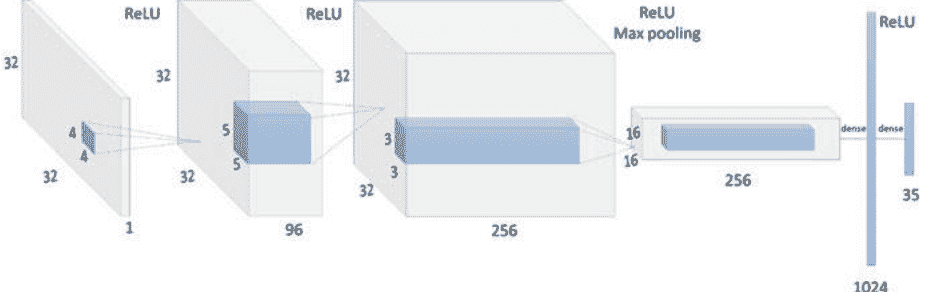

图 8.6 用于预测最佳模式的 CNN 架构 [LO16]


图 8.7 CNN 块预测框架 [CZZ+18]

标准计算模式。训练好的网络用于纠正预测残差误差。整体框架如图 8.7 所示。图像在左侧和右侧分别被分为训练部分和运行时部分。相邻的块被插入到 IPCCN 网络中，目的是预测残差误差，这在本例中是真实值。然后，这些预测的残差误差被用于通过从原始块中减去残差块来进一步减小实际误差。

获得的较低残差误差有助于编码性能。与标准 HEVC 进行了 RD 结果比较，并获得了一些收益，如表 8.1 的结果所示。请注意，这些结果表示整体改进，而实际收益主要与 I 帧相关（仅使用 Intra-Prediction）。

从相邻像素预测块像素值的过程如图 8.8 所示，其中相邻像素与完全连接网络的第一层以及其余层和预测块一起映射为网络输出。

另一种有趣的方法是利用循环神经网络 (RNN) 的力量，由 Yueyu H. 等人在 [HYLL19] 中提出。RNN 通常用于预测时间序列，允许利用加权样本的历史序列数据，从而逐渐忘记记长时间过去的样本，这些样本对于预测来说不太相关。该论文建议使用垂直和水平块的组合来使用 RNN 预测当前块。

表 8.1 基于 CNN 的 HEVC 内部预测增强性能结果 [CZZ+18]

| 序列 | BD 速率 | 序列 | BD 速率 |
| :--- | :--- | :--- | :--- |
| 交通 | -0.9% | 派对场景 | -0.5% |
| 街头行人 | -1.2% | 赛马 | -0.7% |
| 和服 | -0.2% | 篮球传球 | -0.4% |
| 公园场景 | -0.8% | BQ 广场 | -0.1% |
| 仙人掌 | -0.8% | 吹泡泡 | -0.7% |
| 篮球驱动 | -0.6% | 赛马 | -0.7% |
| BQT 露台 | -0.8% | 四个人 | -0.3% |
| 篮球训练 | -0.5% | 约翰尼 | -1.0% |
| BQ 商场 | -0.6% | 克里斯汀和莎拉 | -0.8% |
| **所有平均** | **-0.70%** | | |

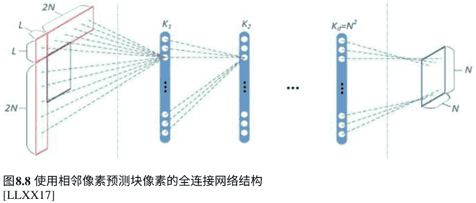

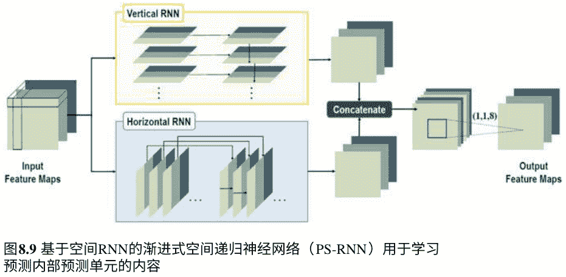

学习两个方向的特征进展。所使用的网络如图 8.9 所示。第一阶段使用 CNN 提取块局部特征图张量。它们分别从垂直和水平方向级联到 RNN 结构中，结果被连接并转换为聚合特征

然后用于重建预测的块。作者报告称，在相同的重建质量下，在可变块大小设置下，比 HEVC 减少了平均 2.5% 的比特率。

由于在预测完整块时存在预测准确性挑战，我们的研究小组已经投入了一些努力来逐像素预测块。在我们的论文 [BSDMH18] 中，我们使用全连接深度神经网络（FC-DNNs）来预测像素块。该网络被训练成逐像素或基于之前帧扫描序列中的前导像素预测对角像素组。该方法利用了块内像素进行预测，并且由于量化误差，我们已经证明，尽管在标准模式下，均方误差（MSE）的改进非常有希望，达到了高达 386%（变换和量化之前的预测误差），但进一步的研究表明，总体速率失真（RD）结果与 HEVC 的性能不匹配。使用这种方法，与标准模式相比，可以获得非常有希望的预测误差 MSE 改进，然而，在引入量化（有损压缩）时，这种优势被认为无效的。原因是标准编解码器对每个块进行预测，并在编码器中引入量化校正循环以解决量化误差。在使用块内值进行预测时，无法在块级别修复量化误差，因此总体误差增加，总体速率失真结果恶化。像素逐像素预测方案的准确性优势可以用于改善无损压缩，如 I. Schiopu 等人在 [SLM18] 中所示，其中使用卷积神经网络（CNNs）从高活动图像区域的邻居预测像素。由于计算效率不断提高，最近的一些研究工作已经针对部分块预测和/或像素逐像素预测进行了指导。这将需要改变编解码器的设计，但有望提高预测准确性。

改进 `Inter-prediction` 的最主要研究方向是使用神经网络，特别是 CNN，来捕捉匹配块的特征，并利用它们来改进预测块，从而减少 `Inter-prediction` 残差误差 [ZWW+18], [HLWL18], [LKCK18], [WFJ+18]。

与先前描述的使用 CNN 捕捉 `Intra-Frame` 特征以改进 `Intra-Prediction` 类似，当进行 `Inter-Prediction` 时，CNN 也用于捕捉帧之间的特征相似性。下面提供了一些示例。

`B-Frame` 的预测使用前向和后向帧块的双向平均。提出了一种使用 CNN 网络进行更准确的双向运动补偿加权的方法 [ZWW+18]。

图 8.10 提供了该概念的示意图。使用一对过去和未来帧进行训练 CNN 网络，将它们组合起来，得到比传统简单平均计算的预测帧更准确的帧。据称，该方法相比 HEVC 实现了高达 10.5% 的 BD-rate 节省和平均 3.1% 的 BD-rate 节省。

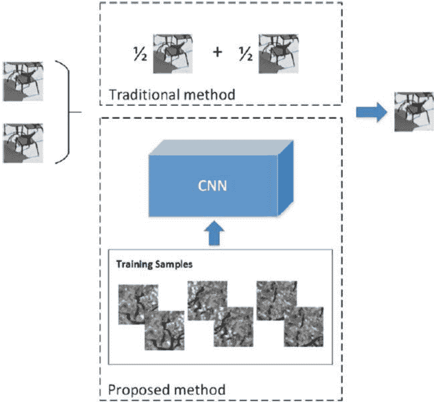

图 8.10 所提出的基于 CNN 的预测与传统的平均方法进行比较 [ZWW+18]

另一种提高帧间预测准确性的方法是结合时域和空域冗余。CNN 和 FC 网络被训练用于预测任何运动补偿 (帧间预测) 块像素值，从先前帧中的标准识别运动补偿块以及同一帧的相邻块像素 [ZWW+18], [LKCK18]。将时域和空域的像素结合到网络输入层并训练网络，比仅使用简单的运动补偿块获得了更好的预测结果。据报道，该方法相比 HEVC 实现了平均 5.2% 的 BD-Rate 降低。

在 [LKCK18] 中，作者提出使用视频插值 CNN (VI-CNN) 从前向和后向帧创建虚拟参考 (VR) 帧。VR 帧与当前帧具有更高的时间相关性，比任何前向和后向参考帧，从而允许计算更小的 MV 和更低的块残差值。这个想法在图 8.11 中有所说明。这种方法已经证明比 HEVC 提供了 1.4% 的 BD-Rate 降低。


图 8.11 使用自适应可分离卷积神经网络的 VI-CNN [LKCK18]

另一个提出的研究方向是改进分数/子像素运动估计的计算效率。传统编解码器通过计算块之间的子像素匹配来改进时间块预测，而不是整数像素匹配。神经网络已经被用于预测参考帧中最佳匹配的预测块（PB），无论是整数像素精度还是子像素精度 [IBA+18], [YLL+18], [ZSLY17], [LXY+19]，从而消除了传统编解码器需要进行广泛插值搜索和找到最佳子像素匹配的需求，并在视频信号不是低通的、不是固定的情况下获得更好的预测。

我们目前致力于改进地面真实运动矢量（GTMV）的运动矢量预测（MV P），该矢量是从相邻空间和前一帧时间块的矢量列表中选择的 [BSHBP20]。在解码器端选择最合适的运动矢量需要来自编码器的信令。能够更准确地预测解码器端的值并节省 HEVC 标准使用的必要信令，预计将进一步降低比特率。我们使用两种不同的方法来执行此任务：

- 1. 训练用于预测列表中最佳运动矢量的分类网络；

- 2. 预测候选运动矢量列表中最接近的运动矢量值的回归网络。

迄今为止获得的初步结果表明，在高运动快进电影中，传输最佳匹配计算的运动矢量预测 (MVP) 所需的比特数减少了 34%，而不降低质量。

## 8.5 整体方法

视频编码是在编码器端对原始视频流应用的一种函数，以在解码器端重建流的传输速率和质量之间实现优化折衷。由于使用了各种非线性优化方案（例如量化），所以理想的函数并不是线性的。监督神经网络在执行类似任务方面表现出色。因此，可以采用更全面的方法来实现这种优化函数或其大部分，并在不与标准视频编码方案对齐的情况下实现性能改进，而不是替换编解码器的特定人工组件。

在本章中，我们将简要回顾以下提出的方法：

- 端到端 RD 优化方案 [TJZ+17], [LOX+18], [BLS17];

- 下一帧预测 [CHJW20], [SCW+15], [CLS+17];
- 生成模型 [SBS18], [MCL16], [LSLW16];
- 内容感知编码 [SMPH18], [CBHA16], [ZLX19];
- 速率控制优化方案 [LLLC17]。

端到端方案模拟编解码器的完整块并优化速率 - 失真 (RD) 作为损失函数以获得最佳结果。在 [LOX+18] 中提出的模型如上所述是一种端到端方案，采用不同的神经网络来替代标准编解码器功能块的方法。

然而，还有其他完全偏离标准的端到端方案，引入了一个全新的神经网络复杂体来获得结果。其中一种独特的方法，应用于图像，是在 [BLS17] 中提出的。图 8.12 说明了一般思路，其中：(x) 是表示输入的向量

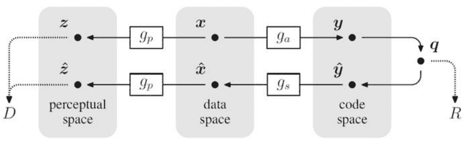

图 8.12 用于端到端图像压缩优化的一般非线性变换编码 [BLS17]

图像，位于数据空间中； (y) 是映射转换的码空间，通过 q 进行量化表示； R 是计算得到的速率；从码空间转换回数据空间时，使用变换来得到失真 (D )。

作者优化变换参数 ($\varnothing$) 和 ($\theta$) 以获得速率和失真度量的加权和： $(R + \lambda D)$。

其中： $y = g_a (x; \varnothing), \hat{x} = g_s (\hat{y}; \theta), \hat{z} = g_p (\hat{x})$

所使用的变换是具有非线性激活函数的卷积神经网络（CNN）。

下一个视频帧预测方法采用了与标准编解码器相同的方案，利用像素值之间的时空冗余来预测下一个视频帧的不同部分，并使用这些预测来得到残差，需要较低的传输速率。

在 [CHJW20] 中，研究人员实现了一种神经网络架构，用于预测重建的先前视频帧的块之间的时空关系，以及同一帧的左侧和顶部的相邻块，以预测完整的块。 所提出的编解码器利用了两阶段的网络方法：

1. 该网络以当前帧的相邻块（空间冗余）和使用前两帧的运动扩展导出的块作为输入（注意传统编解码器中使用的运动估计和此处使用的运动扩展之间的差异。后者不需要进行大量的搜索计算）。该网络由卷积层（用于提取空间特征）和 `ConvLSTM` 层（用于考虑时间序列变化）组成。 用于预测的像素基于 `PixelCNN` [vdOKK16] 方法。

2. 该网络以迭代方式最小化残差块误差。 由于解码器基于重建的块进行预测，因此无法访问原始像素值，因此该网络必须考虑量化过程，以便编码器可以使用解量化值（与解码器使用的值相同）进行下一个块的预测。 为了考虑非可微分的量化操作，作者在前向传递计算中添加了概率量化噪声，并保持反向传递的梯度不变，从而允许将量化操作包含在优化中。 该网络由卷积层和 `ConvLSTM` 层组成，并通过迭代处理残差误差来减小误差。

提供了单块处理网络的示意架构，如图 8.13 所示。

速率失真（RD）结果令人鼓舞，但在许多情况下，与 H.264 标准的 RD 性能曲线不匹配。

在 [LT18] 中，作者使用 `FC-DNN` 网络逐像素预测一帧。 本文分别对帧内预测和帧间预测进行了划分。

在帧内预测方案中，训练了多个 DNN 网络，用于从之前的所有像素预测帧的每个像素，因此网络的数量等于帧像素的数量。

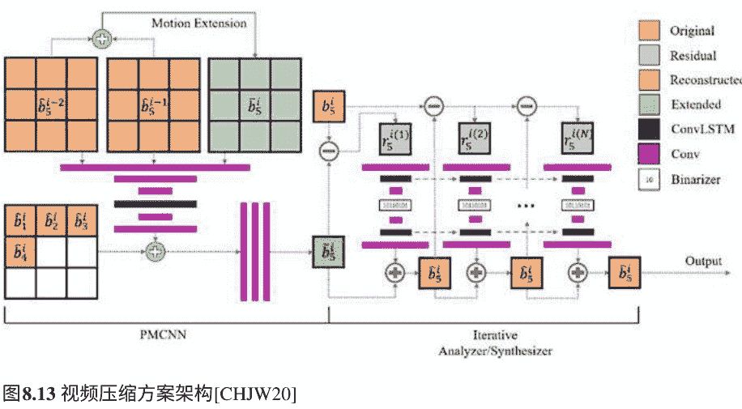

在 [SCW+15] 中，提出了另一种有前途的方法来预测完整的视频帧，作者使用了 `ConvLSTM` 网络架构来预测近期未来的降雨强度。扩展了之前使用全连接 LSTM 网络（`FC-LSTM`）[SMS15] 预测未来帧的工作，作者们意识到 `FC-LSTM` 网络足够强大，可以处理时间相关性，但对于空间数据来说包含了太多冗余。因此，他们设计了一个多层 `ConvLSTM` 网络。由于本文并不打算利用这些网络进行视频压缩，因此结果没有以可用于评估潜在压缩效益的度量标准来陈述。然而，这种方法可以应用于下一帧视频的预测。

生成图像和视频压缩模型利用生成对抗网络（GANs），由 Ian Goodfellow 等人在 2014 年的一项重要研究中提出 [GPM+14]。GAN 的力量被用于压缩。

其中一个最具挑战性的障碍是构建复杂且表达丰富的模型，同时又易于处理和扩展。这是通过将模型与外部信息进行条件化来实现的，通过使用实际图像实例作为输入，确保解码后的图像与同一概率空间中的同一实例完全匹配，而不是任意实例。

在他们的生成压缩工作 [SBS18] 中，作者使用了深度卷积 GAN 来压缩图像。图像的架构如图 8.14 左侧所示，而右侧则扩展了框架以适用于视频压缩。

训练了一个判别网络 ($d_v$) 来检测由生成网络 ($g_{\varnothing}(z)$) 生成的图像，该生成网络使用均匀分布的潜在变量生成这些图像。训练了第二个网络 ($g_{\varnothing}(f_{\theta}(x))$) 来预测输入图像。通过使用相同的参数来训练 ($g_{\varnothing}$) 网络，确保预测的图像确实与输入图像匹配。为了确保图像的正确预测，使用了 `AlexNet`'s 的子集 [KSH12]。

图8.14 生成式压缩架构：（左）图像和（右）视频 [SBS18]

图8.15 多尺度预测架构 [MCL16]

学习用于重建的特征。通过在潜在域（z）中预测每个第 N 帧并在它们之间插值来执行对视频的扩展，同时还传输插值结果与实际帧预测之间的差异。

运行网络，并将图像压缩结果与 JPEG/JPEG2000 进行比较。所提出的网络在更高的压缩水平下（以 SSIM 和视觉检查为指标）比 JPEG/JPEG2000 产生更高质量的重建。它还在高达约 190 倍的压缩比下提供更可识别的图像，并与 MPEG4 视频压缩进行比较。结果表明平均性能提高了 20%–50%。然而，结果的呈现方式不够连贯，无法确认这种改进并在此报告。

研究人员利用生成对抗网络（GAN）架构 [MCL16] 来预测未来的帧。[GPM+14] 网络架构如图 8.15 所示。

该模型利用 CNN 在多个分辨率上预测下一个视频帧，并为每个分辨率使用 GAN 模型。多尺度分辨率使 CNN 网络能够学习不同尺度的特征。这是网络的生成部分（G）。鉴别网络经过训练，可以区分由 G 生成的帧和原始序列中的真实帧。通过学习区分生成帧和真实帧，模型可以确保通过防止观察到的模糊现象来获得逼真的帧样本。

这是由于使用 L2 距离作为优化损失函数而导致的。预测结果在视觉效果和 PSNR/SSIM 指标方面是有希望的。在 [LLLW18] 中，作者使用 GAN 从先前的帧序列中推断出下一个视频帧，并采用了类似的多分辨率方案。他们将预测结果整合到 HEVC 编码器算法中，并报告与标准相比 2.0% 的 BD 速率降低。

利用视频内容中的冗余和 HVS 对压缩的敏感性是内容感知编码的泛化，适用于大规模视频的自然特征。可以将实现重点放在视频流的局部部分，从而设计依赖于特定帧特征的新的内容感知方案。其中一种方法是基于感兴趣区域（ROI）的。通过检测图像中区域的显著性，可以在 ROI 中应用更好的分辨率，同时在其他区域降低分辨率 [SMPH18]，[CBHA16]。图 8.16 显示了通过 MS-ROI 热图检测到的 ROI 示例。

CNN 网络在提取图像的特定特征和分类对象方面表现出色。ROI 检测挑战更简单，可以由一个退化的网络执行，该网络能够检测对象而无需对其进行分类。

一旦确定，感兴趣区域（ROIs）可以以更高的质量进行压缩，减少损失。这是通过在图像上非均匀地应用量化因子（Q）来实现的。通过引入非感兴趣区域的更高 Q 值来实现压缩，这在大多数情况下将覆盖图像的大部分。S. Zhu 等人 [ZLX19] 扩展了显著性概念，提出了一种基于时空域显著性的灵活 QP 选择算法，而显著性地图则通过与基于视频的眼动跟踪数据集进行比较来验证，该数据集由 100 名参与者参与制作。

速率控制（RC）意味着在固定速率约束下最大化压缩视频流的质量。由于带宽限制和利用效率，RC 在广域网（WAN）上传输视频流中起着重要作用。应用 RC 的典型方法是构建一个模型，描述速率（R）与量化参数（$Q_p$）或拉格朗日乘子（$\lambda$）之间的关系，该模型控制速率-失真权衡。对于帧间帧来说，这更容易实现，因为可以在帧之间调整 RC 参数。然而，对于帧内帧，特别是视频的第一帧序列（I 帧），比交互帧包含更多的比特，且没有先验信息可依赖。为了解决这个挑战，引入了一个 CNN 网络，它有效地分析编码树单元（CTU）² 级的帧内容，并为每个 CTU 选择一个最合适的量化参数 [LLLC17]。该概念在图 8.17 中说明。

图 8.17 一种基于 CNN 的帧内速率控制方法的提议 [LLLC17]

CNN 网络为每个 CTU 预测模型参数，从而为每个 CTU 提供一个合适的量化参数，该参数受网络学习的块像素纹理影响。

## 8.6 总结

在过去的 5 年（2015 年至 2020 年）中，已经投入了大量研究工作来利用深度学习改进视频压缩。尽管进行了上述研究努力，但迄今为止还没有报道任何突破，表明需要改变传统的视频压缩标准。

改进的 Intra/Inter-Prediction 算法仅带来了轻微的编解码性能提升，因此可以作为未来编解码器的一部分并与标准方案相一致。上述 Inter-Prediction 改进针对现有时间预测算法的不同部分进行了优化。通过更准确地搜索匹配块的原始区域，并进一步减小真实匹配块 MV 与相邻块 MV 中位数之间的残差误差，可以实现计算需求的进一步降低。

² HEVC 的基本处理单元，相当于之前标准（如 H.264）中的块。

纯学习方法不符合当前可用的编解码器标准，包括下一帧预测；迄今为止提供的结果较差或仅可比。然而，这个方向无疑将继续探索，因为基于全面 DNN 的视频压缩方案的承诺就在于这个研究方向。由于神经网络的特性，可以处理大型数据结构，并使用大量可调节的权重聚合输入，从而考虑到全局和局部帧/帧序列的相关性，并获得改进的压缩率。

沿着这条线，我们相信通过设计混合全局和局部范围的网络，并适当地构建架构以从像素内和像素间相关性中获益，可以获得进一步改进。目前，人工制作的视频编码标准很少关注内容，并且在大多数情况下（除了 I 帧的不同预测块划分等一些普遍的例外情况），不能准确地适应视频内容。可以合理地期望，正如已经通过所描述的 ROI 依赖量化所证明的那样，多个神经网络可以潜在地用于执行更准确和高效的内容自适应编码方案。

在使用神经网络进行视频压缩时，另一个要记住的要点是，尽管在许多情况下更深的网络提供更好的预测结果，但它们具有相当大的计算成本，并且在处理实时视频流时应仔细评估其实时影响。

## 参考文献

- [BLS17] Johannes Ball，Valero Laparra 和 Eero P. Simoncelli。端到端优化的图像压缩。在 2017 年第五届学习表示国际会议（ICLR 2017）上，法国土伦，2017 年 4 月 24 日至 26 日，会议论文集。OpenReview.net，2017 年。

- [BSDMH18] Raz Birman, Yoram Segal, Avishay David-Malka, 和 Ofer Hadar. 使用深度学习的帧内预测。在数字图像处理 XLI 的应用中，卷 10752，页 1075214。国际光学与光子学学会，2018 年。

- [BSH20] Raz Birman, Yoram Segal, 和 Ofer Hadar. 使用深度神经网络进行视频压缩研究概述。Multim. Tools Appl.，79(17–18): 11699–11722，2020 年。

- [BSHBP20] Raz Birman, Yoram Segal, Ofer Hadar, 和 Jenny Benois-Pineau. 使用神经网络改进运动估计和编码。arXiv 预印本 arXiv:2002.10439，2020 年。

- [CBHA16] Souad Chaabouni, Jenny Benois-Pineau, Ofer Hadar, 和 Chokri Ben Amar. 自然视频中的显著性预测的深度学习。CoRR, abs/1604.08010，2016 年。

- [Che14] Roman I. Chernyak. H.265/HEVC 中帧内预测的分析。应用数学科学，8(148): 7389–7408，2014 年。

- [CHJW20] 陈志波，何天宇，金鑫，吴峰。视频压缩的学习。IEEE Trans. Circuits Syst. Video Techn.，30(2): 566–576，2020 年。

- [CLS+17] 陈彤，刘浩杰，沈秋，岳涛，曹勋，马展。DeepCoder：基于深度神经网络的视频压缩。在 2017 年 IEEE 视觉通信和图像处理会议（VCIP 2017）中，美国佛罗里达州圣彼得堡，2017 年 12 月 10 日至 13 日，第 1–4 页。IEEE，2017 年。

- [CZZ+18] 崔文学，张涛，张胜平，姜峰，左旺孟，赵德斌。基于卷积神经网络的 HEVC 帧内预测。CoRR, abs/1808.05734，2018 年。

- [GPM+14] Ian J. Goodfellow, Jean Pouget-Abadie, Mehdi Mirza, Bing Xu, David Warde-Farley, Sherjil Ozair, Aaron C. Courville, and Yoshua Bengio. 生成对抗网络。CoRR, abs/1406.2661，2014 年。

- [HLWL18] Shuai Huo, Dong Liu, Feng Wu, and Houqiang Li. 基于卷积神经网络的运动补偿细化视频编码。在 IEEE 国际电路与系统研讨会 ISCAS 2018，意大利佛罗伦萨，2018 年 5 月 27 日至 30 日，第 1–4 页。IEEE，2018 年。

- [HSM+17] Ofer Hadar, Ariel Shleifer, Debargha Mukherjee, Urvang Joshi, Itai Mazar, Michael Yuzvinsky, Nitzan Tavor, Nati Itzhak, and Raz Birman. AV1 中用于帧内预测的新模式和自适应块扫描顺序。在数字图像应用 XL，卷 10396，第 103960G 页。国际光学与光子学学会，2017 年。

- [HYLL19] Yueyu Hu, Wenhan Yang, Mading Li, 和 Jiaying Liu. 用于帧内预测的渐进空间循环神经网络。IEEE Trans. Multimedia, 21(12): 3024–3037，2019 年。

- [IBA+18] Ehab M. Ibrahim, Emad Badry, Ahmed M. Abdelsalam, Ibrahim L. Abdalla, Mohamed Sayed, 和 Hossam Shalaby. 基于神经网络的 HEVC 分数像素运动估计。在 2018 IEEE International Symposium on Multimedia (ISM 2018)，台中，台湾，2018 年 12 月 10 日至 12 日，第 110–113 页。IEEE 计算机学会，2018 年。

- [KSH12] Alex Krizhevsky, Ilya Sutskever, 和 Geoffrey E. Hinton. 使用深度卷积神经网络的 ImageNet 分类。在 Advances in Neural Information Processing Systems 25，2012 年，第 1106–1114 页。

- [LBH+12] Jani Lainema, Frank Bossen, Woojin Han, Junghye Min, and Kemal Ugur. HEVC 标准的帧内编码。IEEE Trans. Circuits Syst. Video Techn., 22(12): 1792–1801, 2012.

- [LKCK18] Jung Kyung Lee, Na-Young Kim, Seunghyun Cho, and Je-Won Kang. 基于卷积神经网络的视频编码技术，使用参考视频合成。在 APSIPA ASC 2018，檀香山，夏威夷，美国，2018 年 11 月 12 日至 15 日，第 505–508 页。IEEE，2018 年。

- [LLLC17] Ye Li, Bin Li, Dong Liu, and Zhibo Chen. 基于卷积神经网络的 HEVC 帧内编码速率控制方法。在 VCIP 2017，圣彼得堡，佛罗里达州，美国，2017 年 12 月 10 日至 13 日，第 1–4 页。IEEE，2017 年。

- [LLLW18] 林建平，刘东，李厚强，吴峰。基于生成对抗网络的视频编码帧外推。在 VCIP 2018，台中，台湾，2018 年 12 月 9 日至 12 日，第 1–4 页。IEEE，2018 年。

- [LLXX17] 李佳豪，李斌，徐继征，熊瑞琴。基于全连接网络的视频编码帧内预测。在 ICIP 2017，北京，中国，2017 年 9 月 17 日至 20 日，第 1–5 页。IEEE，2017 年。

- [LO16] Thorsten Laude 和 Jrn Ostermann。基于深度学习的 HEVC 帧内预测模式决策。在 PCS 2016，德国纽伦堡，2016 年 12 月 4 日至 7 日，第 1–5 页。IEEE，2016 年。

- [LOX+18] 郭璐，欧阳万里，徐东，张晓云，蔡春雷，高志勇。DVC：一种端到端的深度视频压缩框架。CoRR, abs/1812.00101，2018 年。

- [LSLW16] Anders Boesen Lindbo Larsen，Søren Kaae Sønderby，Hugo Larochelle，Ole Winther。使用学习的相似度度量进行像素之外的自动编码。在 ICML 2016，第 1558–1566 页。JMLR.org，2016 年。


- [LT18] 李洪贵，Maria Trocan. 基于深度神经网络的单像素预测用于统一视频编码。Neural Computing, 272: 558–570，2018 年。

- [LU11] Jani Lainema 和 Kemal Ugur. 角度帧内预测在高效视频编码（HEVC）中的应用。在 MMSP 2011，中国杭州，2011 年 10 月 17 日至 19 日，第 1–5 页。IEEE，2011 年。

- [LXY+19] 刘佳颖，夏思峰，杨文瀚，李马丁，刘东。一对多：基于分组变异网络的视频编码中的分数插值。IEEE Trans. Image Process., 28(5): 2140–2151，2019 年。

- [MCL16] Michal Mathieu，Camille Couprie，Yann LeCun. 深度多尺度视频预测：超越均方误差。在 ICLR 2016，2016 年。

- [MWS03] Detlev Marpe，Thomas Wiegand，Heiko Schwarz。基于上下文的自适应二进制算术编码在 H.264/AVC 视频压缩标准中。IEEE Trans. Circuits Syst. Video Techn., 13(7): 620–636，2003 年。

- [OS13] Jens-Rainer Ohm 和 Gary J. Sullivan。高效率视频编码：视频压缩的一个前沿。IEEE Signal Process. Mag., 30(1): 152–158，2013 年。

- [OW] J.-R. Ohm 和 M. Wien. 视频编码标准化的趋势和最新发展（slideshare）。https://www.slideshare.net/MathiasWien/trends-and-recent-developments-in-video-coding-standardization

- [OY16] Carlo Noel Ochotorena 和 Yukihiko Yamashita。基于回归的图像和视频编码帧内预测。CoRR, abs/1605.03754，2016 年。

- [Ric11] Iain E. Richardson。H.264 高级视频压缩标准。John Wiley & Sons，2011 年。

- [SBS14] Vivienne Sze，Madhukar Budagavi，Gary J. Sullivan（编）。高效视频编码（HEVC）：算法和架构。Springer，2014 年。

- [SBS18] Shibani Santurkar，David M. Budden，Nir Shavit。生成式压缩。在 PCS 2018，美国加利福尼亚州旧金山，2018 年 6 月 24 日至 27 日，第 258–262 页。IEEE，2018 年。

- [SCW+15] Xingjian Shi, Zhourong Chen, Hao Wang, Dit-Yan Yeung, Wai-Kin Wong, and Wang-Chun Woo. 卷积 LSTM 网络：一种用于降水预测的机器学习方法。在 NIPS 2015，第 802–810 页，2015 年。

- [SLM18] Ionut Schiopu，Yu Liu，Adrian Munteanu。基于 CNN 的无损编码摄影图像预测。在 PCS 2018，旧金山，加利福尼亚州，美国，2018 年 6 月 24 日至 27 日，第 16–20 页。IEEE，2018 年。

- [SMPH18] Alena Selimovic, Blaz Meden, Peter Peer, and Ales Hladnik. 使用 VGG16 分析内容感知图像压缩。在 IEEE 国际生物启发式智能工作会议 IWOBI 2018，哥斯达黎加圣卡洛斯，2018 年 7 月 18 日至 20 日，第 1–7 页。IEEE，2018 年。

- [SMS15] Nitish Srivastava, Elman Mansimov, 和 Ruslan Salakhutdinov. 使用 LSTMs 无监督学习视频表示。在 ICML 2015，法国里尔，2015 年 7 月 6 日至 11 日，第 843–852 页。JMLR.org，2015 年。

- [SPC13] Maxim P. Sharabayko, Oleg G. Ponomarev, 和 Roman I. Chernyak. VP9 和 HEVC 中的帧内压缩效率。应用数学科学, 7(137): 6803–6824, 2013 年。

- [TJZ+17] Wen Tao, Feng Jiang, Shengping Zhang, Jie Ren, Wuzhen Shi, Wangmeng Zuo, Xun Guo, 和 Debin Zhao. 基于卷积神经网络的端到端压缩框架。在 DCC 2017, Snowbird, UT, USA, 2017 年 4 月 4 日至 7 日，第 463 页。IEEE，2017 年。

- [vdOKK16] Aäron van den Oord, Nal Kalchbrenner, 和 Koray Kavukcuoglu. 像素递归神经网络。在 ICML 2016，第 1747–1756 页。JMLR.org，2016 年。

- [WFJ+18] 杨旺，范晓鹏，贾传民，赵德斌，高文。基于神经网络的 HEVC 帧间预测。在 ICME 2018，美国加利福尼亚州圣地亚哥，2018 年 7 月 23 日至 27 日，第 1–6 页。IEEE 计算机学会，2018 年。

- [YLL+18] 严宁，刘东，李厚强，徐彤，吴峰，李斌。基于卷积神经网络的可逆半像素插值滤波器用于视频编码。在 ICIP 2018，雅典，希腊，2018 年 10 月 7 日至 10 日，第 201–205 页。IEEE，2018 年。

- [ZLX19] 朱世平，刘畅，徐子瑶。基于卷积神经网络和 HEVC 压缩域显著信息感知引导的高清视频压缩系统。IEEE Trans. Video Techn., 2019 年。

- [ZSLY17] 张瀚，宋力，罗正义，杨晓康。学习用于 HEVC 帧间编码分数插值的卷积神经网络。在 VCIP 2017，美国佛罗里达州圣彼得堡，2017 年 12 月 10 日至 13 日，第 1–4 页。IEEE，2017 年。

- [ZWW+18] 郑辉赵，石琦王，山社王，新峰张，思伟马，建生杨。基于 CNN 的双向运动补偿用于高效视频编码。在 IEEE 国际电路与系统研讨会 ISCAS 2018，意大利佛罗伦萨，2018 年 5 月 27 日至 30 日，第 1–4 页。IEEE，2018 年。

# 第9章 用于动作识别的3D卷积网络：应用于体育手势识别


Pierre-Etienne Martin, Jenny Benois-Pineau, Renaud Peteri, Akka Zemmari, 和 Julien Morlier

P.-E. Martin (✉)

比较文化心理学系，马克斯·普朗克进化人类学研究所，莱比锡，德国

电子邮件：pierre_etienne_martin@eva.mpg.de

J. Benois-Pineau · A. Zemmari

LaBRI UMR 5800, 波尔多大学，塔朗斯塞德克斯，法国

电子邮件：jenny.benois-pineau@u-bordeaux.fr; akka.zemmari@u-bordeaux.fr

R. Peteri

MIA, 拉罗谢尔大学，拉罗谢尔，法国

电子邮件：renaud.peteri@univ-lr.fr

J. Morlier

IMS, 波尔多大学，塔朗斯塞德，法国

© Springer Nature Switzerland AG 2021

J. Benois-Pineau, A. Zemmari (编辑), 多方面的深度学习, https://doi.org/10.1007/978-3-030-74478-6_9

## 9.1 引言

运动是视觉感知中最重要的方面之一，与运动相关的刺激往往具有生物学意义 [RMB+10]。视觉心理实验表明，不必对场景进行完整和详尽的测量即可解释其内容。在动物世界中，即使是部分的运动信息也足以识别潜在的食物：一只青蛙可以区分苍蝇的飞行和落叶的下落，而无需对整个场景进行几何重建。

通过人类的运动来识别的示例是由 Johannsson 的实验提供的（Moving Light Display experiment [Joh73]），其中关于移动演员的唯一信息来源是附着在几个关节上的亮点。被展示静态图像的人只能看到无意义的点图案。然而，一旦他们看到整个图像序列，他们可以识别出特征动作，如跑步或走路，甚至是演员的男性或女性性别。这些能力表明，单凭运动本身就可以作为一种识别手段。


在计算机视觉领域，通过自然语言描述视频场景涉及对场景中发生的一些关键事件或动作进行叙述。运动分析显然是能够充分利用图像序列的时间连贯性的关键要素。此外，[Lap13] 指出，平均而言，网络上的每个视频中，35% 的像素代表人类。因此，通过人类的运动和活动来描述图像序列对于分析或索引视频来说是具有潜在区分性和相关性的。这些不同的元素，加上任务的复杂性，突显出为什么在过去几年中，视频中的人体动作识别一直是计算机视觉中一个非常活跃的研究课题。然而，正如已经广泛研究的历史所显示的那样，当需要分析真实世界的视频场景时，仅仅运动特征是不够的。这就是为什么使用同时包含运动特征（如速度场，即光流（OF））和从视频帧中派生的颜色像素值的空间特征的方法表现更好的原因。这对于基于手工制作特征或始终获胜的卷积神经网络（CNNs）的方法都是成立的。

尽管专注于深度学习方法，但从历史的角度来看，展示问题仍然很有趣，以更好地预测未来。在本章中，我们将简要介绍从手工制作到由深度神经网络生成的不同特征的行动识别方法。我们将讨论用于开发和测试行动识别方法的数据集的演变，并介绍我们研究中最近创建的用于细粒度分类的乒乓球击球动作数据集。我们还将介绍细粒度行动识别中的最新贡献，包括双时空网络。

## 9.2 行动识别问题的亮点

在视频中识别人类动作的问题具有广泛的应用，这就是为什么研究历史相对较长的原因。从历史的角度来看，可以区分出两种主要方法，并逐步将它们结合起来。第一种方法是设计所谓的“手工制作”特征，以局部或整体的方式表达视频帧的特征，从而形成一个新的描述空间。在这个新空间中使用机器学习方法对特征进行分类，从而解决了行动识别问题。第二种方法是使用深度神经网络的“端到端”解决方案，它提取特征然后对其进行分类。

### 9.2.1 从视频中使用手工制作的特征进行动作分类

从视频中提取的手工制作的特征的开发始于我们最好的知识-从图像中提取特征。随后努力从时间域中提取信息。这些特征主要用于动作识别任务，但也用于其他任务，如从视频中识别场景和事件。大多数使用手工制作的特征的方法都寻求它们的紧凑表示。袋子模型 (BoW) 或视觉词袋 (BoVW) [CDF+04] 的模型被引入，允许将大量的特征向量量化为一组类别-字典中的词汇。字典中的类别词是通过统计聚类方法（如 K-means [Mac67]）或更复杂的向量量化技术构建的。因此，图像、其中的区域或视频帧的最终描述符是一个统计模型-图像中“单词”的类别出现的直方图。这个模型长期以来被用于动作识别和视频场景分类。

关于静态图像的时间维度的使用首次在 2003 年引入了时空兴趣点 (STIP) 特征 [SLC04]。它们是 2D 角点检测器在时间维度上的扩展，用于视频。视频中与图像角点相当的是随着空间和时间变化的点。[SLC04] 的作者表明他们的描述符与动作相匹配，这意味着 STIPs 将出现在动作发生的地点和时间。他们将自己的方法应用于他们新创建的 KTH 数据集，这成为了最早被广泛使用的动作数据集之一。使用支持向量机 (SVM) 分类器和最近邻分类 (NNC) 对他们的时空局部特征的词袋进行比较。这导致了对于不相似的动作的良好分类得分；但是对于类似的动作，如“行走”、“慢跑”和“奔跑”，得分仍然较低。这些动作中的运动非常相似，STIPs 集中在相同的身体部位上。

在 [LP07] 的作者中，他们联合使用了直方图梯度 (HOG) 描述符和运动边界直方图 (MBH) 描述符，在他们自己的基于电影的数据集上使用 AdaBoost 算法来识别两种动作——吸烟和喝酒。同时，[GBS+07] 引入了时空形状 (STS) 特征用于动作分类，并使用了新的 Weizmann 动作数据集。

STS 的分类基于与图像形状分类相同的思想，使用泊松方程。作者使用最近邻聚类和欧氏距离对计算得到的形状进行分类。他们在自己的数据集上达到了 97.8% 的准确率，但对于相似动作的置信度较低。需要强调的是，他们的数据集是在受控环境中获取的，并且与 KTH 数据集具有相同的复杂性。

在 [SG08] 中，作者将 Gabor 滤波器特征和光流特征连接起来，以在 KTH 和 Weizmann 数据集上进行动作分类。他们展示了他们的模型在两个数据集上的优越性，相比其他方法，他们得出结论，一个令人满意的分类得分。事实上，仅使用一个帧和人的姿势，两个数据集中的动作很容易区分开来。

在 2009 年，动作识别方法已经在 KTH 和 Weizmann 数据集上达到了非常高的准确率，而 UCF11 数据集的引入为改进提供了更多空间。事实上，这个数据集更具挑战性，因为它是在自然条件下，受到相机运动和闪烁等限制的情况下记录的。UCF101 [SZS12] 样本是从 YouTube 平台提取的。作者们还提出了一种基于运动特征和静态特征的分类方法。他们在基于直方图的表示上使用 AdaBoost 学习方法，并将其与 k-means 聚类方法进行比较。AdaBoost 取得了更好的结果，混合组合在 KTH 数据集上的准确率达到了 93.8%，而在 UCF11 数据集上只有 71.2%，这表明对于这样的数据集，任务的复杂性更高，但类别数量相同。

在 [CRHV09] 的作者同时引入了方向直方图光流（HOF）特征，并在 Weizmann 动作数据集上达到了 94.4% 的准确率。该方法简单易复现，并将在 [WKSL11] 中与 MBH、HOG 特征一起用于计算基于密集光流场的密集轨迹特征。

在 [WS13] 中，作者通过考虑相机运动改进了密集轨迹特征。相机运动是通过密集光流和加速稳健特征 (SURF) 描述符来估计的。使用随机抽样一致性（RANSAC）算法估计了单应性变换。改进的密集轨迹（IDT）相对于原始密集轨迹特征的准确率提高了 91.2% 对比 88.6%。这项工作后来在许多应用中被用于动作定位。

后一个问题在于不仅要定义视频中的时间边界，还要定义它们的空间位置。

在 [GHS13] 中，作者将动作重新定义为"actoms”。Actom 是一个具有辨别性视觉信息的短暂原子动作，例如打开门。它对于动作定位很有用，但也可以应用于分类定位。在动作识别领域中，actoms 的定义非常重要，可以将一个动作分解为各个部分。因此，actoms 可以存在于不同的动作中，例如进入或离开房间时的“打开门”作为一个 actom。对它们的理解可以带来更好的视频表示，从而实现更好的分类。然而，过多的 actoms 可能导致这样一种情况：它们在训练集中很好地呈现，但在测试集中不存在，并且与执行的动作无关。考虑 actoms 的数量因此成为一个根据要分类的动作复杂性来控制的变量。

另一种执行动作识别的方法是由 [JvGJ+14] 开发的，他引入了 Tubelets 的概念。这是一种采样方法，用于产生定位动作的 2D+T 边界框序列。这种方法同时解决了动作的定位和分类问题，它基于使用颜色、纹理和运动进行迭代过程中的超体素生成，最终创建 Tubelets。这些 Tubelets 然后由 MBH 描述特征，并且每个类别使用一种 BoW 方法进行分类。具有最高分数的分类器将类别分配给管道。

### 9.2.2 动作识别问题中的深度神经网络应用

由于这些分类器具有很强的泛化能力，深度神经网络很快超越了所有手工制作的基于特征的方法。在 [KJYY13] 中描述的方法是使用 3D CNN 进行动作识别的最早的方法之一，但他们在 KTH 数据集上并没有获得比现有技术更好的结果。直到 2014 年，[SZ14] 的创新的双流网络方法才开始利用 CNN 中的时间连贯性，并且深度学习方法开始取代其他方法。

在兴趣识别的深度学习方法的发展中，我们可以观察到两个趋势：深度卷积神经网络（CNNs）和循环神经网络（RNN），如 LSTM 在第 2 章（第 2.5.2 节）中简要介绍。然而，根据 [VLS18] 和作者自己的经验，这些网络比 3D CNNs 更难训练，后者在视频中沿时间维度整合了空间信息。它们也难以处理长期的时间交互作用。因此，在本章中，我们不会重点关注它们。

深度神经网络（DNNs）在端到端训练和泛化过程中具有固有的特征提取能力，并不意味着工程特征必须消失。相反，对视觉场景的人类理解影响了设计特征的选择，例如光流。然而，最近的工作可能将手工设计的特征用作基准，或者将它们与由 DNN 提取的深度特征融合。[BGS+17] 证实 SVM 的性能不如部分重新训练的深度卷积神经网络（DCNN），并且学习到的特征比工程特征产生更好的结果；然而，融合效果超过了单一模态。这些研究结果证实了社区的发现：多个特征的融合可以提高对复杂视觉或多模态内容的识别分数 [IBPQ14]。使用深度 CNN 进行动作识别首先使用了 2D CNN 架构。在这里，我们将简要讨论其中一些。

### 9.2.3 用于动作分类的 2D 卷积神经网络

2D 卷积是指在图像的 2D 空间支持上进行卷积运算。对于 RGB 数据，2D 卷积实际上使用 3D 卷积核来对每个颜色通道进行加权。然而，卷积核在图像中移动的方式只有两个维度。

在动作识别的范围内，这是 [SZ14] 所做的。他们引入了一个双流卷积网络，其中一个流接收一个单独的 RGB 帧，另一个流接收计算出的光流的几个帧。每个流分别被称为“空间流 ConvNet”和“时间流 ConvNet”。他们注意到，“时间流 ConvNet"相比于“空间流 ConvNet"取得了更好的性能。

易地解释，因为除了输入数据的动态类型之外，时间流分支使用了多达十帧的数据，而空间流分支只使用了一帧。当时间流分支只使用一帧时，性能更加相似。当然，使用 SVM 方法融合两个流的效果最好。

一个动作可以被视为一个体积，即视频中的管道。这个概念的管道——在我们的情况下表示一个同质内容，在单一的动作，在 [LWLW16] 中被使用。引入了一个管道卷积神经网络（T-CNN），可以被顺序分解为两个不同的网络。他们首先使用残差卷积神经网络（R-CNN）[RHGS17] 创建运动分割的管道。然后这些管道通过一个类似 VGG 的网络，使用沿通道维度分布的 20 个运动幅度帧进行输入。

到目前为止，我们一直在谈论 CNNs。然而，时间（循环）神经网络也是 CNNs 的一种替代方法，采用窗口化方法。

我们的工作重点是 CNNs，因此我们只会非常简要地提到它们。

长期循环卷积网络 (LRCN) 模型在 [DHR+17] 中被引入用于动作识别。作者使用 2D CNN 为每个图像提取特征，然后将其从开始到结束输入到 LSTM 中。决策基于平均分数。这个简单的模型使用 OF 和单个 RGB 图像进行测试。两种模态的融合显然表现最好。

许多作品使用基于时间网络的模型，如递归神经网络 (RNN) 和长短期记忆 (LSTM) [UAM+18]。然而，根据应用背景，RNN 可能更难训练。此外，当 LSTMs 与 CNN 的输出耦合时，它们更高效 [NHV+15]。

现在回到卷积神经网络用于动作识别，我们可以说 2D CNN 经常被用作特征提取器，而 3D 卷积则在提取的特征上进行。因此，时间维度被考虑在内。这使我们现在专注于基于 3D CNN 的动作识别方法。

### 9.2.4 从 2D 到 3D ConvNets 在动作分类中

我们可以将视频视为具有沿时间轴的第三维的 3D 数据，可以像处理 2D 图像一样处理它们，或者以不同的方式处理时间维度，或者提取动态数据等时间信息，以供 DNN 使用。

然而，大多数方法需要考虑额外的信息，这显然导致了更大的网络、更多的参数和更强大的 GPU 数量的需求。这对于每个研究团队来说可能是不可能的，并且使一些团队尝试在模型大小或计算时间上限制下获得准确的结果。这一方面因此在性能上有许多不同的表现，并且已经揭示了许多不同的方法，这些方法不仅仅在性能上进行比较，还要通过它们实现的方式进行比较。除了这些限制之外，为特定任务选择架构仍然是开放的，导致了许多实现尝试。

3D 卷积神经网络也是捕捉长期依赖关系的一个很好的选择 [CZ17]，它在空间和时间上都涉及到 3D 卷积。

当在深度为 $D$、宽度为 $W$、高度为 $H$ 的信号上使用 $C$ 个通道进行 3D 卷积时，具有输入尺寸 ($C_{in}, D, H, W$) 和输出尺寸 ($C_{out}, D_{out}, H_{out}, W_{out}$) 的层的输出值可以精确地描述为：

$$输出 (C_{输出}) = 偏置 (C_{输出}) + \sum_{k=0}^{C_{输入}-1} 权重 (C_{输出}, k) 输入 (k) \qquad (9.1)$$

其中 $C_{输出_j}$ 是第 $j$ 个有效的三维互相关运算符的输出通道。

### 9.2.5 用于动作分类的三维卷积神经网络

三维卷积（C3D）模型 [TBF+15] 由八个连续的卷积层和五个最大池化层组成，使用 $3\times3\times3$ 的卷积核。在 [HCS17] 中，他们将这个模型用于两流 T-CNN。视频首先被分成相等长度的片段，并使用三维 R-CNN 进行分割以创建管道建议。然后对管道进行分类和链接。通过使用从分割的视频管道中提取的特征与 C3D 模型，他们提高了性能，相比直接应用 C3D 模型。

在多媒体领域，[FPW17] 的作者扩展了 [SZ14] 在 2D 领域的工作，引入了他们的时空 ResNet（ST-ResNet）。他们用 R-CNN 替换了简单的 CNN 分支，并在两个分支之间建立了一个连接。他们的结果证明，仅处理 RGB 流的性能比处理 OF 流要好。通过将它们一起处理，他们在 UCF101 数据集上达到了 93.4 % 的准确率。

[CZ17] 的方法提出了一个重大突破，在动作分类中获得了更高的分数。他们将 RGB-I3D 和 Flow-I3D 模型分别训练，并将它们组合成 Two-Stream I3D 模型。他们的每个模型都使用了膨胀的 inception 模块，受到了 2D inception 模块 [SLJ+15] 的启发。他们的模型的主要优势是预训练应用 ImageNet 首先，然后是 Kinetics-400 数据集 [KCS+17]，比 UCF101 更复杂，有 400 个类别。通过使用 Kinetics，他们将 UCF101 的性能从 93.4% 提升到 98%。他们还在 Kinetics-400 数据集上达到了 74.2% 的准确率。Inception 模块已经在 ImageNet 数据集上证明了它们在图像分类中的效率，因此已经成功地应用于 I3D 模型中。

长期时序卷积（LTC）CNN 是由 [VLS18] 引入的。他们尝试了不同的时间大小的输入视频片段，以改善分类。当考虑更多帧作为输入时，特别是对于持续时间较长的动作，可以获得更高的准确性，因为它们具有更长时间支持。

[WGW+18] 使用 3D 卷积在类似于两流的网络中引入了空间-时间金字塔池化层（STPP），这个网络由 RGB 和 OF 流输入。输出成为 LSTM 网络的输入。使用 LSTM 可以对任意大小和长度的视频进行分类。每个模态表现相似：RGB 流和 OF 流的准确率分别为 85% 和 83.8%。当融合在一起时，该方法的准确率达到 92.6%。

[KKA20] 引入了双向编码器表示转换（BERT）层，以更好地利用 BERT 的注意机制对时间信息进行理解 [VSP+17]。BERT 层基于多头注意力层的使用，该层包括一个缩放的点积层。多头注意力层是更大网络——Transformer 模型的一部分，专门用于翻译任务。将 BERT 层整合到先前描述的 ResNeXT、R(2+1)D 和 I3D 模型中可以提高它们的性能。使用 R(2+1)D 架构在 UCF101 数据集上达到了 98.7% 的准确率，这是最先进的结果 [TWT+18]。这是一种 ResNet 类型的架构，具有可分离的时间和空间卷积以及一个最终的 BERT 层，以更好地利用获得的特征。还有一个重要的要点是使用 IG65M 数据集 [GTM19] 对模型进行预训练。IG65M 数据集是从 Kinetics-400 [KCS+17] 类名构建的。这些类名在 Instagram 上用作标签，并导致了来自 400 个类别的 6500 万个剪辑。

然而，他们的数据集并不公开可用。

### 9.2.6 球拍运动的视频理解

我们的兴趣是在乒乓球领域中进行细粒度动作识别。因此，我们提出了一些专注于球拍运动领域中视频分类和/或分割的方法。

[EBMM03] 提出了一种基于光流的运动描述符，以便对运动进行分类。为此，他们考虑了三个不同的数据集：芭蕾舞、足球和网球数据集。他们跟踪运动员（或执行行动的人）并基于他们的运动构建一个 3D 体积。他们的运动描述符有四个通道：水平和垂直运动的正负值。

然后，通过使用相似度度量，执行最近邻方法进行分类：

$$S = \sum_{k} C_1(k) C_2(k) \eqno (9.2)$$

其中 $C_1$ 和 $C_2$ 是基于坐标 $k$ 的运动描述符的两个立方体样本。

即便芭蕾数据集和网球数据集在受控环境中获取，网球数据集的表现也更有限。足球数据集来自广播源，这解释了表演的有限性。此外，网球数据集的类别数比其他两个数据集少，然而，它是他们的方法效率最低的地方。这凸显了球拍运动的更大复杂性和细粒度特征。

视频分类的另一个研究领域旨在识别网球广播的不同部分。为此，[KGOG06] 应用了 HMMs 来进行网球动作识别。他们的模型是统计的，并整合了网球比赛的结构。他们结合音频和关键帧特征，能够以很高的准确性分割网球广播的不同部分，如第一发球、回球、重播和休息时间。观众的掌声、球的声音或评论员的讲话与捕捉视觉信息的关键帧相结合，使得分割准确率达到 86%，而仅使用视觉特征和音频特征分别只有 65% 和 77%。这样的应用对于希望仅评论和检查体育比赛片段的教练非常有趣。

[dCBM+11] 提供了一个新的网球动作数据集。这个数据集只包含三种类型的类别：“击球”，“发球”和“非击球类”。该数据集是从澳大利亚公开赛女子比赛的电视转播中构建的。他们对动作定位和分类感兴趣。为此，他们在时空梯度 HOG3D 特征上引入了一种局部 BoW 方法，这是对经典的二维 HOG 特征在三维上的扩展。他们还使用了 STS 特征。这两种特征都来自于定位的演员，并使用 Fisher 判别分析进行分类。他们使用基于 STS 模型的准确率达到了 77.6%。他们的混淆矩阵如图 9.1 所示。

可以看出，“发球”样本比“击球”或“非击球”样本更容易分类。这当然是因为发球所需的时间及其在时间上的分解，它从球员发球时的大幅度移动开始。击球和非击球类别更难区分，因为击球类别在时间上非常有限。仅仅看球员的形状，球可能看不见，特征可能与球员在场上简单移动时相同。

最近，与我们领域密切相关的 [CPM19] 使用 OF 奇点结合 BoW 和 SVM 来对非常相似的动作进行分类。这个任务也被称为细粒度动作分类。他们将他们的方法应用于包含 20 种不同笔画和一个负类的 TTStroke-21 数据集。他们的方法是

## 图9.1 电视转播的网球比赛混淆矩阵 [dCBM+11]

左边是样本数量，右边是归一化结果。

灵感来自于 [BPM14]，该论文使用关键点的轨迹进行分类。在这种情况下，要识别的动作是在乒乓球训练过程中进行的不同类型的击球。

- 然而，由于不同击球之间的相似性和有限的视频样本数量，得分仍然较低。

- 这使得提取特征的泛化变得更加困难。

乒乓球击球识别也由 [LWS+19] 进行。它基于他们的身体传感器网络（BSN）。他们的传感器从球员的上臂、下臂和背部收集加速度和角速度信息。从记录的信号中，他们提取主成分分析（PCA）特征，然后将其输入到 SVM 中。他们达到了 97.4% 的准确率，但他们只使用了五个类别：“正手推球”“挡拍”“正手削球”“反手削球”和“扣杀”。类似地，[XWX+20] 最近提出了使用集成可穿戴传感器进行分类的方法，使用 K-means 和 DBScan 聚类。他们的分类法比 TTStroke-21 更有限，因为他们只使用了羽毛球和乒乓球运动中的九个类别。当考虑所有类别时，他们的准确率达到 86.3%。当仅考虑乒乓球时，这个分数达到 92.5%，但这种分类仅限于四个类别：“发球”“击球”“旋转”和“拾球”。他们的分类法范围有限，对于玩家体验没有太大贡献。此外，使用这样的传感器会严重限制应用的可能性，并且在训练设备适应方面成本更高。此外，他们的系统不提供所执行击球的可视化，因为它基于传感器，这限制了对玩家的反馈。

最近，[WZD+20] 引入了一种方法来根据过去比赛中球员的表现来获取战术。他们的模型基于隐马尔可夫模型（HMM），旨在描述和模拟乒乓球比赛过程。他们使用比以前介绍的方法更丰富的击球技术分类和术语：13 个不同的类别和 4 个可以组合的球员位置。与 TTStroke-21 相比，我们考虑了 10 个类别和 2 个球员位置：“正手”和“反手”。因此，他们的目标不是对一个输入进行分类，而是模拟两个不同选手之间的比赛。它与动作识别方法没有直接关联，但它为玩家提供了模拟体育比赛的工具，并且对 TTStroke-21 数据集提出了比以前数据集更丰富的分类法。

因此，通过分析手工特征和深度神经网络两种方法，我们可以得出以下结论。尽管使用了来自 OF 和派生特征的时间信息，但是使用手工特征的方法在数据集上仍然能够进行良好的分类：无论是具有较少类别的简单数据集，还是具有易于分离类别的数据集。当任务集中在一个特定运动上，其中包含不同动作，或者当“野外”场景的复杂性更高时，情况就变得更加复杂。在我们提出解决方案之前，早期研究已经给出了一个方向：使用深度神经网络。在视频中进行动作识别时，有必要回顾社区使用的现有数据集。

## 9.3 动作识别数据集

近年来，对于动作识别数据集的需求不断增长。这些数据集的规模可以从几个视频到数百万个视频不等。除了规模之外，类别数量和复杂性也各不相同，可以是几个类别，甚至是几百个或几千个类别。每个数据集可以通过丰富术语、在空间和时间上定位动作，或添加骨架等模态信息来进行标注。

### 9.3.1 标注过程

可以区分两种标注数据集的方式：自动或“手动”，即由人工操作员进行标注。标签传播技术是为了弥补完全“手动”标注和自动标注之间的差距而提出的 [HOSS13]。在这里，数据集被表示为一个包含样本节点及其相关相似度度量的大图。标签传播是通过在图上进行最优搜索，从手动标注节点传播到未标注节点。

然而，在视频数据集的标注实践中，通常会先使用现有概念识别方法进行自动标注，然后需要人工干预来过滤自动标注错误。此外，将数据集分为“自动”和“清洁”两部分也很常见。“自动”部分是使用自动方法进行标注的部分，“清洁”部分是经过自动标注、验证和手动调整的部分。

在介绍数据集之前，首先描述两个注释过程。

#### 9.3.1.1 自动注释

社交网络平台上的标签可以用来收集丰富的数据集。例如，IG65M 数据集 [GTM19] 就是这种情况。为了收集这个数据集，作者使用了 Kinetics-400 [KCS+17] 数据集的类名作为 Instagram 上的标签，并从 400 个类别中收集了 6500 万个视频片段。这种注释过程需要进行过滤，以便对注释进行精细化处理。

在电影中，剧本也可以帮助自动标记序列。这就是 [MLS09] 为 Hollywood2 数据集所做的事情。他们以这种方式生成样本，并手动清理测试集。类似地，也可以根据在线平台上托管视频的描述来构建数据集。

然后，根据描述，可以自动生成数据集。

#### 9.3.1.2 手动注释

对于数据集注释，特别是当数据集不大时，最常见的方法是手动标记所有样本。在这个过程中，可以使用一些辅助工具，比如在模型已存在时进行预分类，或者在视频未裁剪时对动作定位段候选项进行分割。

在手动标注过程中，可以区分两种方式：由一个人完成注释，或由多个人完成注释。如果由一个人完成注释，存在风险：由于注意力不集中导致错误，或使数据偏向注释者观点。为了解决这个问题，可以使用众包方法。

众包基于不同人员对相同片段的注释。它依赖集体智慧，通常比单人注释效果更好。注释中的异常值不会在最终决策中被考虑。可以应用不同规则，例如在可能情况下取注释者平均值，或者只考虑当天表现最好的注释者，以便进行注释决策。还有一些数据集提供粗略的众包注释，由处理数据集的团队决定采取哪种决策。

最近出现了一个新趋势：使用亚马逊机械土耳其（AMT）。AMT（也称“MTurk”）是一个众包市场，个人和企业可以将流程和工作外包给分布式劳动力，他们可以在线执行这些微任务。这里它被应用于注释，AMT 根据执行的注释数量支付报酬。它开始与 ImageNet 数据集一起使用，该数据集专门用于图像分类，包含 320 万张图像，分为 5247 个类别。这个策略是双重的：AMT 工作者验证视频候选中的动作是否存在，也可以进行时间标注。它通常与众包方法相结合，这意味着每个视频将由多个 AMT 工作者注释。这样可以在短时间内构建大型数据集。

### 9.3.2 用于动作分类的数据集

动作分类问题的数据集可以按多种方式分类。本节根据获取过程分组：受控环境获取、从电影提取或在野外记录。显然，这种分类并不完美，因为一些数据集混合了不同类型视频。

虽然并不详尽，我们将主要介绍一些以体育视频为重点的数据集。

#### 9.3.2.1 获取—受控数据集

这些数据集通常由作者自行制作，他们决定动作在何种环境中进行。这并不总意味着该数据集比“野外”更容易，因为困难可以被故意增加。本小节还考虑了不用于动作识别任务的广播或录制数据库，因为获取环境也可在分类过程中考虑。

**KTH 和 Weizmann 数据集是动作识别研究早期最受欢迎的两个数据集。尽管它们很简单，一些研究人员仍将其作为基准。**

KTH 在 [SLC04] 中介绍，代表瑞典皇家理工学院（Kungliga Tekniska Högskolan，斯德哥尔摩，瑞典），即作者所在机构。数据集由六个类别组成：“行走”“慢跑”“奔跑”“拳击”“挥手”和“拍手”。采集在受控环境中进行，背景均匀，静态摄像机以 25 帧/秒拍摄，共 25 名演员，2391 个视频剪辑分布在 600 个视频中。

视频在室内外录制。Weizmann 数据集 [GBS+07] 与之相似，但增加了更多动作，例如“开合跳”“横向奔跑”等，动作类别增至 9 类。它由 81 个低分辨率（180×144）、25 帧/秒录制的视频序列组成。

“野外”动作识别的需求催生了更复杂的数据集，如下所述。

2 https://www.csc.kth.se/cvap/actions/  

3 http://www.wisdom.weizmann.ac.il/~vision/SpaceTimeActions.html

ACASVA [dCBM+11]（“自适应认知用于自动化体育视频注释”）引入了一个网球动作数据集。其目标是评估经典动作识别方法在网球比赛球员动作识别方面的表现。数据来自网球电视转播。随后对视频进行空间分割，并用三个类别进行时间注释：“击球”“发球”和“非击球”。数据集复杂性保持较低。

FineGym 数据集 [SZDL20] 是一个细粒度动作数据集，特别关注体操运动。作者使用丰富分类法分解结构化体操动作，采用三级语义分析四种不同体操项目：平衡木、高低杠、跳马和自由体操。总共有 530 个元素类别，但仅有 354 个类别至少有一个实例。类别如此之多是由于动作组合造成的。作者提供两种设置：Gym288 有 288 个类别但分布很不均衡；Gym99 更平衡，但只有 99 个类别。考虑所有类别时样本总数达 32,697。708 小时视频托管在 YouTube 上，其中大部分为高分辨率。

TUHAD 数据集 [LJ20] 也是一个专门用于细粒度跆拳道动作识别的数据集。该数据集在 10 名跆拳道专家协助下，使用前后两个 Kinect 相机录制。类别较少，只有 8 个跆拳道动作。共记录 1936 个动作样本，包括深度图像、红外图像和 RGB 数据。这些类别在许多方面非常相似，但脚部位置可通过适当特征加以区分。

#### 9.3.2.2 电影数据集

尽管这些数据集通常不包含体育动作，但它们也很有趣，因为它们包含了杂乱环境中演员自然行为的录制。因此，`Drinking and Smoking` 数据集 [LP07] 由 Jim Jarmusch 电影《咖啡和香烟》中的序列组成。它用于联合动作检测与分类，包括“吸烟”和“饮酒”两个类别，分别有 141 和 105 个样本。

`Hollywood2` 数据集 [MLS09] 为动作和场景分类而设计。它包含 10 个场景类别和 12 个动作：“接电话”“开车”“吃饭”“与人打架”“下车”“握手”“拥抱”“亲吻”“跑步”“坐下”“起身”和“站起来”；来自 69 部电影、超过 7 小时视频。总共有 1694 个动作样本。难点在于不同动作可能发生在同一序列中。

### 9.3.2.3 野外数据集

“野外”意味着视频来自不同来源，可由专业人员或业余爱好者录制。因此，可能包含相机运动、强模糊、遮挡等情况，这些都会增加动作识别难度。

然而，视频也可能包含大量背景信息，这可能成为训练分类模型的可利用来源。

`UCF` 数据集 [SZS12] 已成为发展和基准测试运动视频动作识别方法的流行选择。`UCF` 名称来自该数据集所属大学：中佛罗里达大学。

第一个 `UCF` 数据集是 `UCF-Sports`。它包含来自 9 种不同运动的序列：跳水、高尔夫挥杆、踢球、举重、骑马、跑步、滑冰、挥棒击球和撑杆跳。撑杆跳分为两个类别：“Swing-Bench”和“Swing-Side”，总计 10 个类别。最初包含 200 个序列（后减少到 150 个），图像分辨率 740×480，帧率 10 fps。

随后介绍了 `UCF YouTube Action`（也称 `UCF11`）数据集。它由来自 YouTube 的 1160 个视频、11 个类别组成。`UCF50` 是 `UCF11` 的扩展，共 50 个动作类别。之后又扩展为 `UCF101` 数据集。`UCF101` 共包含 101 个动作类别，可分为五个领域：“人-物互动”“仅身体动作”“人-人互动”“演奏乐器”和“运动”。从 2500 个“野外”视频中构建，共提取 13,320 个片段，以确保每类至少有 101 个片段。

该数据集被科学界广泛使用，并在 2013、2014 和 2015 年举办了 `THUMOS` 挑战。2015 年，该数据集被清理和丰富，以提供不同方法的质量基准，也可用于时空定位和纯时间检测。

`Kinetics` 数据集：`Kinetics-400` [KCS+17]、`Kinetics-600` 和 `Kinetics-700` [CNHZ19] 分别包含 400、600 和 700 个动作类别。它们均由 `DeepMind` 资助（该公司专注于人工智能，自 2014 年起属于 Google）。在动作分类中也包含体育动作，如“打壁球或橄榄球”。

这些视频从 YouTube 收集，通过 `AMT` 进行自动注释和候选筛选。各版本差异在于：

- 类别数量：随着时间推移逐步增加。新增类别并改进现有类别，部分类别被合并。

- 视频数量：从最初 306,245 个剪辑增加到最新版本的两倍以上。

- 数据划分：训练集、验证集和测试集划分随时间修改。例如，首版中的训练样本在新版中可能属于测试集。

`AVA` 和 `AVA-Kinetics`：在 [GSR+18] 中，作者引入 `AVA` 数据集，用于动作联合定位和分类。该数据集包含从 YouTube 收集的 437 个视频，从中提取 15 分钟片段并按秒注释。使用了 80 个原子动作词汇。其难点在于时间重叠动作及其定位。他们提供了数据划分：从所有 15 分钟视频中提取 900 个 3 秒视频片段。由此，55 小时视频被分成 392,000 个重叠片段。`AVA-Kinetics` 数据集 [LTR+20] 是 `Kinetics-700` 与 `AVA` 的合并。使用 `AVA` 协议对 `Kinetics` 视频注释。因此该数据集包含超过 230,000 个视频剪辑，并在时空上标注了 80 个 `AVA` 动作类别。

`SAR4` [FVD+19] 介绍了 `SAR4` 数据集，聚焦足球运动动作。他们通过 YouTube 视频跟踪并标记球员，然后用四类分类法注释动作：“跳水”“射门”“接球”和“传球”。序列总数为 1292，动作时长从 5 帧到 59 帧不等。讨论的数据集汇总于表 9.1。

### 9.3.3 TTStroke-21 数据集

`TTStroke-21` 数据集用于细粒度运动动作识别，目标是提升业余或专业运动员表现。我们的案例研究是乒乓球，目标是对执行的击球进行时间分割与分类。与 `UCF` 或 `Kinetics` 等通用动作库相比，类间低变异性使该任务更困难。

表 9.1 根据类别数量、获取过程、视频数量和提取剪辑数量展示不同动作数据集情况：

| 数据集 | 类别数量 | 获取过程 | 视频数量 | 剪辑数量 |
|---|---:|---|---:|---:|
| `KTH` [SLC04] | 6 | 受控 | 600 | 2391 |
| `Weizmann` [GBS+07] | 9 | 受控 | - | 81 |
| 咖啡和香烟 [LP07] | 2 | 电影 | 1 | 246 |
| `UCF Sports` | 10 | 广播 | - | 150 |
| `UCF11` | 11 | 野外 | - | 1160 |
| `Hollywood2` [MLS09] | 12 | 电影 | 69 | 1694 |
| `UCF101` [SZS12] | 101 | 野外 | 2500 | 13,320 |
| `AVA` [GSR+18] | 80 | 野外 | 437 | 392,000 |
| `SAR4` [FVD+19] | 4 | 广播 | - | 1292 |
| `Kinetics-700` [CNHZ19] | 700 | 野外 | - | 650,317 |
| `FineGym` [SZDL20] | 354 | 广播 | - | 32,697 |
| `AVA-Kinetics` [LTR+20] | 80 | 野外 | - | 230,000 |

根据乒乓球规则，建立了 20 个击球类别和 1 个额外的拒绝类别。拍摄对象是学生，由老师在录制过程中监督练习。乒乓球击球识别的目标是帮助老师关注部分击球动作，以帮助学生练习。

乒乓球击球动作在大多数时间视觉上非常相似。在这种情况下，动作识别不仅需要量身定制的解决方案，还需要专门领域知识来构建准确基准。这就是为什么注释由专业运动员完成。他们使用了相当丰富的术语，可以对击球进行细致定义。此外，注释分析显示，对于同一视频和同一击球，专业人员并不总能达成一致。定义击球时间边界也是如此，不同注释者可能不同。这种变异性不应被视为噪声，而是显示了数据的模糊性和复杂性，必须加以考虑。我们将这个新数据库称为 `TTStroke-21`，`TT` 代表乒乓球，21 代表类别数量。

#### 9.3.3.1 TTStroke-21 获取

`TTStroke-21` 由 17 名不同选手的乒乓球比赛视频组成。这些序列在室内使用人工光源和轻便相机录制。录制设置如图 9.2a 所示。球员在三种情况下被拍摄：

- 执行同一击球的重复。然而在视频中，这些重复可能失败一次或多次，球员也可能执行与预期不同的击球。

- 两名球员之间的简单对打：旨在练习不同技巧。

- 比赛条件下：球员以得分为目标。比赛速度更快，击球时间更短。

#### 9.3.3.2 TTStroke-21 注释

注释过程设计为众包方法。注释会话由专业乒乓球运动员和教师监督。我们团队为此开发了用户友好的网络平台（图 9.2b），用于标记和标注视频中的击球：起始帧、结束帧和击球类别。标注者还会指示球员是右手还是左手。该分类法基于握拍方式，根据使用的球拍一侧区分正手与反手击球。

该分类包含 20 个乒乓球击球类别。所有击球动作也可分为两个超类：正手和反手。对注释的语言分析显示，对于同一段视频和同一击球动作，专业人员在注释中使用的细节程度不同。时间分析中也有同样问题：例如，一个动作（球员抛球时的第一次击球）可能被认为在（1）球员就位时开始，（2）球被抛出时开始，或（3）球拍开始移动时开始。

由于一个视频可以由多个注释者注释，因此需要对时间注释进行过滤。允许每条注释与该击球持续时间重叠 25%。超过该比例时，注释被视为同一击球的一部分，并在时间上融合。

另一个过滤器通过检查同一击球标签是否一致来应用。若不一致，则该视频片段不纳入我们的分类任务。这种基于同一录制视频的多注释过滤仍可能留下一些。由于不同注释者对同一剪辑进行多次标注并不总是容易实现，因此存在标注错误的问题。

#### 9.3.3.3 负样本提取

负样本是从检测到超过 10 个笔画的视频中创建的。在注意到一些视频标注不准确且可能将实际笔画包含为负样本后，做出了这个决定。

负样本是每个检测到的笔画之间的视频子序列。我们允许与前一个和后一个笔画的重叠部分占目标时间窗口长度的 10%：0.83 秒，这样可以捕捉到短笔画而不考虑另一个笔画。这表示在 120 帧每秒的情况下有 100 帧。

#### 9.3.3.4 评估数据

考虑了 129 个以 120 帧每秒的速度录制的视频。这些内容总共包括 94 分钟的乒乓球比赛，共计 675,000 帧视频和 1387 个标注。经过筛选，保留了 1074 个标注。笔画持续时间的峰值统计为最小值 = 0.64 秒，最大值 = 2.27 秒，平均持续时间为 1.46 秒，标准差为 0.36。因此，总共提取了 1048 个笔画，最短持续时间为 0.83 秒，最长持续时间为 2.31 秒，平均持续时间为 1.47 秒，标准差为 0.36。一些标注被合并，使统计持续时间稍长。在这些步骤之后，提取了 681 个负样本（非笔画）。它们的平均持续时间为 2.34 秒，标准差为 2.66 秒。这种高标准差来自于笔画之间的非比赛活动，可能是球丢失或选手之间的交流。然而，如表 9.2 所示，数据集的分布情况并不考虑所有样本，以避免在训练和评估过程中产生偏差。

## 9.4 TSTCNN：一种用于动作识别的双时空三维卷积神经网络

在审查了大量用于视频动作识别的方法和参考数据集之后，我们在这里介绍了我们对细粒度视频动作识别问题的解决方案，即我们称之为 `TSTCNN` 的三维卷积神经网络，它是一个双时空卷积神经网络。

### 双流架构

双时空卷积神经网络（`TSTCNN`），如图 9.3 所示，是一个由两个流组成的双时空三维卷积网络。


分支。每个分支都遵循相同的结构：由三个块组成，每个块由一个 3D 卷积层组成，使用大小为 `(3 × 3 × 3)` 的卷积核，在所有方向上的步幅和填充都为 1，并使用"ReLU"作为激活函数，然后进入一个 3D 最大池化层，使用大小为 `(2 × 2 × 2)` 的卷积核和向下取整函数。从输入到输出，卷积层使用 30、60 和 80 个滤波器。每个分支以一个大小为 500 的全连接层结束。两个分支使用双线性变换和 Softmax 函数进行组合，输出一个大小为 21 的分类得分，对应于我们任务中考虑的类别数。

### 动态数据

使用动态数据，如光流，为网络提供额外的信息，并且对于只有 RGB 视频流的网络来说，可以理解物理世界。光流 (OF) 通过像素从一幅图像到另一幅图像的位移来表示运动，使用笛卡尔坐标系编码为 `$V = (v_x, v_y)^T$`，其中 `$v_x$` 表示水平位移，`$v_y$` 表示垂直位移。光流值被归一化到 -1 到 1 之间。


### 表 9.2 TTStroke-21 数据集分类

| 乒乓球击球动作 | 样本数 - 训练 | 样本数 - 验证 | 样本数 - 测试 | 样本数 - 总计 | 帧数 - 最小 | 帧数 - 最大 | 帧数 - 平均 ^a |
| :--- | :---: | :---: | :---: | :---: | :---: | :---: | :---: |
| 防守反手切球 | 22 | 6 | 3 | 31 | 121 | 233 | 189 ± 25 |
| 防守反手挡球 | 19 | 5 | 3 | 27 | 100 | 261 | 131 ± 37 |
| 防守反手推球 | 6 | 2 | 1 | 9 | 121 | 229 | 155 ± 31 |
| 防守正手切球 | 29 | 8 | 4 | 41 | 129 | 229 | 177 ± 25 |
| 防守正手挡球 | 8 | 2 | 2 | 12 | 100 | 137 | 115 ± 14 |
| Def. 正手推球 | 23 | 7 | 3 | 33 | 105 | 177 | 143 ± 19 |
| 进攻反手翻打 | 25 | 7 | 3 | 35 | 100 | 265 | 195 ± 49 |
| 进攻反手击球 | 28 | 8 | 4 | 40 | 100 | 173 | 134 ± 21 |
| 进攻反手弧圈 | 21 | 6 | 3 | 30 | 100 | 229 | 155 ± 32 |
| 进攻正手翻打 | 31 | 9 | 5 | 45 | 113 | 269 | 186 ± 44 |
| 进攻正手击球 | 45 | 13 | 6 | 64 | 100 | 233 | 158 ± 34 |
| 进攻正手弧圈 | 23 | 7 | 3 | 33 | 101 | 277 | 177 ± 43 |
| 发球反手反旋 | 56 | 16 | 8 | 80 | 133 | 261 | 188 ± 31 |
| 发球反手弧圈 | 43 | 12 | 6 | 61 | 100 | 265 | 186 ± 42 |
| 发球反手侧旋 | 60 | 17 | 9 | 86 | 129 | 269 | 193 ± 33 |
| 发球反手上旋 | 57 | 16 | 8 | 81 | 100 | 273 | 175 ± 48 |
| 发球正手反旋 | 58 | 17 | 8 | 83 | 125 | 269 | 182 ± 35 |
| 发球正手弧圈 | 56 | 16 | 8 | 80 | 100 | 273 | 171 ± 51 |
| 发球正手侧旋 | 57 | 16 | 9 | 82 | 101 | 273 | 192 ± 39 |
| 发球正手上旋 | 67 | 19 | 9 | 95 | 100 | 273 | 184 ± 52 |
| 非击球样本 | 74 | 21 | 11 | 106 | 100 | 1255 | 246 ± 154 |
| **总计** | 808 | 230 | 116 | 1154 | 100 | 1255 | 182 ± 65 |

^a 均值 ± 标准差

在 `[MBPM19]` 中，使用运动补偿的均方误差（`MSE`）、角度误差（`AE`）和端点误差（`EPE`）质量指标对多种光流估计方法在两个数据集上进行了比较：

- Sintel 基准 `[MHI+16]`，合成视频数据集，提供参考光流（与 `MSE`、`AE` 和 `EPE` 进行比较）
- 和 `TTStroke-21` `[MBPM20]`，在强烈的合成光照条件下记录的自然环境中（仅与 `MSE` 进行比较，因为没有参考光流可用）。

在同一项工作中，还对分类进行了不同的归一化方法的测试。根据他们的结果，光流估计器和归一化方法都对分类至关重要。事实上，根据每个光流估计器的最佳性能，`TTStroke-21` 的测试集上的分类准确率从 `DeepFlow` 方法 `[WRHS13]` 的 41.4% 到 `Beyond Pixel` 方法 `[Liu09]`（`BP`）的 74.1% 不等。即使 `BP` 对闪烁很敏感，它仍能捕捉到细节，例如球的运动，与 `DeepFlow` 方法相反，解释了这两种估计器之间性能差距的原因。另一方面，归一化方法可以将性能提升从"Max"归一化方法的 44% 提高到"Normal"归一化方法的 74.1%。"Max"归一化方法大大降低了大多数运动矢量的幅度，从而也增加了笔画之间的相似性；而"正常"归一化方法增加了大多数向量的幅度，并留出了相异性的空间。

根据这些结果，我们使用基于迭代加权最小二乘求解器的 `Beyond Pixel` 方法 `[Liu09]` 来估计光流，并使用"正常"归一化方法对其进行归一化，如公式 9.3 所述。

$$
\begin{aligned}
v^{\prime} &=\frac{v}{\mu+3 \times \sigma} \\
v^{N}(i, j) &=\left\{\begin{array}{ll}
v^{\prime}(i, j) & \text { 如果 }\left|v^{\prime}(i, j)\right|<1 \\
\operatorname{SIGN}\left(v^{\prime}(i, j)\right) & \text { 否则。 }
\end{array}\right.
\end{aligned}
$$

(9.3)

其中，`$v$` 和 `$v^N$` 分别表示光流 `V` 的一个分量及其归一化，`$\mu$` 和 `$\sigma$` 是该分量的均值和标准差。

然后，通过考虑只有前景的光流，使用 `Zivkovic` 和 `Van der Heijden` `[ZvdH06]` 的方法对光流进行滤波。

### 3D 注意力：它能带来什么？

在从 RGB 图像进行分类问题时，注意机制被用来确定哪部分信息是有用的和/或需要用来分类图像的。

这种注意力可以通记录个体在观看图像时的凝视固定点，并执行相同的分类任务 `[OBGR19]` 作为 CNN 分类器，在图像上创建显著性地图，然后将其传播到 CNN 的层中来获得。在 DNN 中，内部注意机制变得流行起来。

我们区分其中的两种：(1) 全局注意力，它表达了卷积层中特征通道对图像分类任务决策的贡献 `[HSA+20]`，以及 (2) 局部注意力，它专注于通道中的重要特征。

当需要计算特征通道的重要性时，处理包括三个步骤：(1) 压缩（聚合），(2) 激发和 (3) 特征缩放。因此，每个层的每个通道都学习了一个加权系数，将加权后的特征通道输出到下一层。

对于局部注意力，[WJQ+17] 的作者使用残差神经网络的原理，在前向和后向传播中提出了注意力掩码的"残差"学习，从而提高了对噪声的鲁棒性。通过梯度下降最小化目标函数，注意机制通过导数计算隐式引入，其中使用加权特征。"师生"网络是在分类网络的层中引入注意力的另一种方式。[ZK17] 中，"教师"网络是学习注意力并指导"学生"网络进行图像分类任务的网络。这些专注于图像分类的工作启发了时空注意力的设计，以解决动作分类问题。

[DYL+18] 中，作者使用基于特征金字塔的空间注意机制，并通过在时间域中聚合空间上获得的注意力图构建时间注意力。然后，基于他们的工作，[DK19] 的作者构建了 3D 卷积块，并将其纳入 3DResNet 中。


如图 9.5 所示，注意机制使用了几个 3D 残差块，如图 9.6 所示。

### 图 9.6 3D 残差块架构

### 

用于 3D 手势识别的网络。然而，正如 [DYL+18] 中所述，作者并没有明确使用运动信息。在 [MBPM21] 中，我们通过我们的 TSTCNN 将注意力块引入了两个视频流：包含空间信息 (RGB) 的分支和包含时间信息 (光流) 的分支，如图 9.4 所示。光流在分类中起到了区分的作用，并且不仅仅是定位信息。

如图 9.5 所示，注意机制使用了几个 3D 残差块，如图 9.6 所示。

实现的残差块受到 2D 中进行的工作的启发在 [HZRS16] 中，并通过具有 4D 数据块的 3D 进行了扩展和调整大小为 ($N \times W \times H \times T$), 分别表示通道数，两个空间维度和时间维度。然后，输入数据经过三个连续的层 $f_{conv}$ 进行处理 $i, i = 1, \dots, 3$, 参见方程式 9.10，分别为 $\frac{N}{4}, \frac{N}{4}$ 和 $N$ 大小为 ($1 \times 1 \times 1$), ($3 \times 3 \times 3$) 和 ($1 \times 1 \times 1$) 的过滤器。然后将它们的输出与输入数据相加，构建 3D 残差块的输出 (图 9.6)。

$$res(x) = f_{conv_3}(f_{conv_2}(f_{conv_1}(x))) + x$$

(9.4)

对于批次中的每个通道，进行 3D 批次归一化。如果我们有 $x = (x_1, x_2, \dots, x_{N_{_{通道}}})$, 那么归一化是 $F_n(x) = (f_n(x_1), f_n(x_2), \dots, f_n(x_{N_{_{通道}}}))$ 具有以下形式：

$$f_n(x_i) = \frac{x_i - \mu_i}{\sqrt{\sigma_i^2 \oplus}} * \gamma_i \oplus \beta_i \quad (9.5)$$

其中 $i = 1, \dots N_{\text{通道}}$, $\mu_i$ 和 $\sigma_i$ 是计算在批次上的均值和标准差向量，$\oplus$ 是将标量添加到每个向量坐标上，$\gamma_i$ 和 $\beta_i$ 是每个通道的可学习参数，除以 $\sqrt{\sigma_i^2 \oplus}$ 是逐元素操作。在这里，$N_{\text{通道数}} = N$ 或 $\frac{N}{4}$，取决于残差块中的归一化位置。

图 9.5 中所示的 3D 注意力块受到 2D 中 [WJQ+17] 的工作的启发。

3D 注意力块以大小为 ($N \times W \times H \times T$) 的 4D 数据块作为输入。在该块中，所有卷积都使用相同数量的滤波器 $N$ 进行处理，以保持处理数据的维度。输入数据由第一个 3D 残差块处理，表示为 $res$。然后，网络分为两个分支：主干分支由两个连续的 3D 残差块组成，由 Eq. 9.6 描述；软掩码分支位于图 9.5 中的最低位置，通过 Eqs. 9.7、9.8、9.10 描述。它的作用是强调主干分支生成的特征。这两个分支按照 Eq. 9.11 进行合并。

$$分支主干(.) = 残差(res(.)) \quad (9.6)$$

软掩模分支由几个 3D 残差块组成，后面跟着最大池化层，表示为 $MaxP$。它使用自底向上的架构增加了卷积的感受野，表示为 $f_{bu}(.) = 残差(MaxP(.))$。经过三个最大池化步骤后，得到最低分辨率。

$$x_1 = 残差(输入)$$

$$x_2 = 残差(x_1))$$

$$x_3 = 残差(x_2))$$

(9.7)

然后，通过对称的自顶向下架构进行信息扩展，$f_{td}(.) = 插值(res(.))$，以投影每个分辨率级别的输入特征。$Inter$ 表示用于上采样的三线性插值。使用两个跳跃连接来收集不同尺度的信息。

$$y_1 = f_{td}(x_3) + 残差(x_2)$$

$$y_2 = f_{td}(y_1) + res(x_1)$$

$$y_3 = f_{td}(y_2)$$

(9.8)

然后，软掩膜分支由两个连续的层组成。每个分支都包括一个 3D 批量归一化，表示为 $F_n(.)$，如公式 9.5 所述，然后是一个 ReLU 激活函数和一个卷积层，卷积核大小为 ($1 \times 1 \times 1$)。这可以用公式 9.9 表示：

$$f_{conv}(.) = \operatorname{conv}(ReLU(F_n(.)))$$

(9.9)

最后使用一个称为"Sig"的 sigmoid 函数，将值缩放到 0 和 1 之间。这两个层在图 9.5 中最底部分支的右侧表示，并且可以用公式 9.10 表示。

分支 $f_{mask}$(输入) = $Sig(f_{conv}(f_{conv}(y_3)))$

(9.10)

然后，将主干分支的输出与（$1 \oplus$ 分支 $f_{掩码}$(输入)）逐项相乘，其中分支 $f_{掩码}$(输入) 是掩码分支的输出。然后，将结果经过最后的 3D 残差块 $res(.)$ 处理，这结束了注意力块，参见公式 9.11。

$$y = res(分支 \quad 主干 (输入) \odot (1 \oplus 分支 \quad f_{掩码}(输入)))$$

(9.11)

这里的 $\odot$ 是逐元素相乘， $\oplus$ 是将标量添加到每个向量分量中，如上所定义。

### 9.4.1 结果

在表 9.3 中，我们比较了纯分类任务的准确性方面的模型。为了全面了解，我们将使用三个注意力块（一个在每个最大池化层之后）的模型与使用和不使用这些模型进行比较。

### 表格 9.3 比较使用注意机制的模型在收敛后的分类性能方面的准确性。每种模态的最佳模型和测试准确性以粗体报告。

| 模型 | 时期 | 准确率 (%) | | |
| :--- | :--- | :---: | :---: | :---: |
| | | 训练 | 验证 | 测试 |
| RGB-I3D | 778 | 98.3 | 72.6 | 69.8 |
| RGB-STCNN | 1665 | 96.7 | 88.7 | 89.8 |
| **带有注意力的 RGB-STCNN** | 524 | 96.5 | 88.3 | **93.2** |
| Flow-I3D | 1112 | 98.8 | 74.8 | 73.3 |
| Flow-STCNN | 1449 | 97.5 | 79.6 | 75.9 |
| **带有注意力的 Flow-STCNN** | 732 | 96.4 | 83.5 | **90.7** |
| 双流 I3D | - | 99.2 | 76.2 | 75.9 |
| LF-STCNN | - | 97 | 88.7 | 89.8 |
| 带有注意力的 LF-STCNN | - | 97 | 88.7 | 94.9 |
| T-STCNN | 1784 | 95.8 | 87.8 | 93.2 |
| **带有注意力的 T-STCNN** | 591 | 97.3 | 87.8 | **95.8** |

每种模态的最佳模型和测试准确性以粗体报告。

使用比 I3D 模型更浅的时空卷积的所提出的模型在具有有限样本量的具有挑战性的数据集上证明了更高效率地分类细粒度动作的能力。如果模型不太深，任务的细粒度方面似乎处理得更好。的确，I3D 模型的深度在需要识别大量对象和场景以对粗粒度动作进行分类的任务中是高效的，但对于细粒度任务来说似乎不太有效。

此外，样本数量的增加以及模型未经预训练使得任务变得更加困难。过拟合问题在非常深的 I3D 模型上更加明显。然而，使用注意机制的 STCNN 模型不会受到这个问题的困扰：性能得到了改善，收敛速度更快。使用注意机制的 Twin 模型表现最佳。中间融合可以更好地组合每个分支，以进行分类。后期融合方法似乎有效，但效果比前者差 1%。

## 9.5 结论与展望

在本章中，我们展示了随着数据集的复杂性和视频样本数量的增加，用于视频动作分类的特征从手工设计逐渐演变为深度学习。

此外，CPU 和 GPU 处理大量数据的能力的增加使得深度学习方法从 2D 卷积向 3D 卷积迁移成为可能。3D 卷积在视频动作分类中被证明是有效的工具，可以高效地捕捉时空特征以进行分类。

通过注意力机制的引入，通过注意力块的帮助，在突出判别特征、提高收敛速度和分类性能方面起到了作用。在细粒度数据集 TTStroke-21 上观察到了这种行为。还注意到，为了避免过拟合，实施的模型的深度需要根据分类任务和数据集进行调整。

## 参考文献

- [BGS+17] Mateusz Budnik, Efrain-Leonardo Gutierrez-Gomez, Bahjat Safadi, Denis Pellerin, and Georges Quinot. 学习特征与多媒体索引的工程特征相比。*Multim. Tools Appl.*, 76(9):11941–11958, 2017.

- [BPM14] Cyrille Beaudry, Renaud Peteri, and Laurent Mascarilla. 使用关键点轨迹的频率分析进行视频动作识别。在 2014 年 IEEE 国际图像处理会议（ICIP 2014）上，法国巴黎，2014 年 10 月 27 日至 30 日，页码 1445–1449, 2014 年。

- [CDF+04] Gabriella Csurka, Christopher R. Dance, Lixin Fan, Jutta Willamowski, and Cedric Bray. 使用关键点袋进行视觉分类。在计算机视觉统计学习研讨会，*ECCV*，2004 年，第 1–22 页。

- [CNHZ19] Joao Carreira, Eric Noland, Chloe Hillier, 和 Andrew Zisserman. 关于动力学-700 人类动作数据集的简短说明。*CoRR*, abs/1907.06987, 2019 年。

- [CPM19] Jordan Calandre, Renaud Peteri, 和 Laurent Mascarilla. 用于体育视频注释的光流奇点：乒乓球中击球的检测。在 *Working Notes Proceedings of the MediaEval 2019 Workshop*, Sophia Antipolis, France, 27–30 October 2019, 2019 年。

- [CRHV09] Rizwan Chaudhry, Avinash Ravichandran, Gregory D. Hager, and Ren Vidal. 基于非线性动力学系统的有向光流直方图和 Binet-Cauchy 核函数用于人体动作识别。在 2009 年 IEEE 计算机学会计算机视觉与模式识别会议（*CVPR 2009*）上，2009 年 6 月 20 日至 25 日，美国佛罗里达州迈阿密，页码 1932–1939，2009 年。

- [CZ17] Joao Carreira 和 Andrew Zisserman. Quo vadis，动作识别？一个新模型和动力学数据集。在 2017 年 IEEE 计算机视觉与模式识别会议（*CVPR 2017*）上，2017 年 7 月 21 日至 26 日，美国夏威夷檀香山，页码 4724–4733，2017 年。

- [dCBM+11] Teofilo de Campos, Mark Barnard, Krystian Mikolajczyk, Josef Kittler, Fei Yan, William J. Christmas 和 David Windridge. 对词袋和时空形状进行动作识别的评估。在 2011 年 IEEE 计算机视觉应用研讨会（WACV 2011）上，2011 年 1 月 5 日至 7 日，美国夏威夷科纳，页码 344–351, 2011 年。

- [DHR+17] Jeff Donahue, Lisa Anne Hendricks, Marcus Rohrbach, Subhashini Venugopalan, Sergio Guadarrama, Kate Saenko, and Trevor Darrell. 长期循环卷积网络用于视觉识别和描述。*IEEE Trans. Pattern Anal. Mach. Intell.*, 39(4):677–691, 2017.

- [DK19] Naina Dhingra 和 Andreas M. Kunz. Res3ATN - 深度 3D 残差注意力网络用于手势识别视频。在 2019 年国际三维视觉会议 *3DV 2019*, 加拿大魁北克市, 2019 年 9 月 16 日至 19 日, 页码 491–501, 2019.

- [DYL+18] Yang Du, Chunfeng Yuan, Bing Li, Lili Zhao, Yangxi Li, 和 Weiming Hu. 交互感知时空金字塔注意力网络用于动作分类。在 *ECCV (16)*, volume 11220 of *Lecture Notes in Computer Science*, 页码 388–404. Springer, 2018.

- [EBMM03] Alexei A. Efros, Alexander C. Berg, Greg Mori, and Jitendra Malik. 远距离识别动作。在第 9 届 IEEE 国际计算机视觉会议（ICCV 2003），2003 年 10 月 14 日至 17 日，法国尼斯，726–733 页，2003 年。

- [FPW17] Christoph Feichtenhofer, Axel Pinz, and Richard P. Wildes. 视频动作识别的时空多路网络。在 2017 年 IEEE 计算机视觉与模式识别会议（CVPR 2017），2017 年 7 月 21 日至 26 日，美国夏威夷檀香山，7445–7454 页，2017 年。

- [FVD+19] Mehrnaz Fani, Kanav Vats, Christopher Dulhanty, David A. Clausi, and John S. Zelek. 足球中的姿势投影动作识别沙漏网络（PARHN）。计算机与机器人视觉会议第 16 届，CRV 2019，加拿大金斯顿，2019 年 5 月 29 日至 31 日，第 201 至 208 页，2019 年。

- [GBS+07] Lena Gorelick, Moshe Blank, Eli Shechtman, Michal Irani 和 Ronen Basri. 动作作为时空形状。*IEEE Trans. Pattern Anal. Mach. Intell.*, 29(12):2247–2253，2007 年。

- [GHS13] Adrien Gaidon, Zaid Harchaoui 和 Cordelia Schmid. 使用 actoms 进行时间定位的动作。*IEEE Trans. Pattern Anal. Mach. Intell.*, 35(11):2782–2795，2013 年。

- [GSR+18] Chunhui Gu, Chen Sun, David A. Ross, Carl Vondrick, Caroline Pantofaru, Yeqing Li, Sudheendra Vijayanarasimhan, George Toderici, Susanna Ricco, Rahul Sukthankar, Cordelia Schmid 和 Jitendra Malik. AVA：一个时空定位的原子视觉动作视频数据集。在 2018 年 IEEE 计算机视觉与模式识别会议，CVPR 2018，美国盐湖城，2018 年 6 月 18 日至 22 日，第 6047 至 6056 页，2018 年。

- [GTM19] Deepti Ghadiyaram, Du Tran, and Dhruv Mahajan. 大规模弱监督预训练用于视频动作识别。在 IEEE 计算机视觉与模式识别会议，CVPR 2019，长滩，加利福尼亚州，美国，2019 年 6 月 16 日至 20 日，页码 12046–12055，2019 年。

- [HCS17] Rui Hou, Chen Chen 和 Mubarak Shah. 管状卷积神经网络（T-CNN）用于视频中的动作检测。在 IEEE 国际计算机视觉会议，ICCV 2017，意大利威尼斯，2017 年 10 月 22 日至 29 日，页码 5823–5832，2017 年。

- [HOSS13] Michael E. Houle, Vincent Oria, Shin'ichi Satoh 和 Jichao Sun. 使用相似性图在图像数据库中进行注释传播。*ACM Trans. Multim. Comput. Commun. Appl.*, 10(1):7:1–7:21，2013 年。

- [HSA+20] Jie Hu, Li Shen, Samuel Albanie, Gang Sun, 和 Enhua Wu. 挤压与激励网络。*IEEE Trans. Pattern Anal. Mach. Intell.*, 42(8):2011–2023, 2020.

- [HZRS16] Kaiming He, Xiangyu Zhang, Shaoqing Ren, 和 Jian Sun. 深度残差学习用于图像识别。在 2016 IEEE 计算机视觉与模式识别会议，CVPR 2016，拉斯维加斯，NV，美国，6 月 27 日–30 日，2016，页码 770–778, 2016.

- [IBPQ14] Bogdan Ionescu, Jenny Benois-Pineau, Tomas Piatrik, 和 Georges Quenot, 编辑. 计算机视觉中的融合——理解复杂的视觉内容。计算机视觉和模式识别的进展。Springer, 2014.

- [Joh73] G. Johansson. 生物运动的视觉感知及其分析模型。感知与心理物理学, 14:201–211, 1973 年。

- [JvGJ+14] Mihir Jain, Jan C. van Gemert, Hervé Jégou, Patrick Bouthemy, and Cees G. M. Snoek. 基于运动的动作定位与管道。在 2014 年 IEEE 计算机视觉与模式识别大会（CVPR 2014）上，美国俄亥俄州哥伦布市，2014 年 6 月 23 日至 28 日，页码 740–747，2014 年。

- [JXYY13] Shuiwang Ji, Wei Xu, Ming Yang, and Kai Yu. 用于人类动作识别的 3D 卷积神经网络。*IEEE Trans. Pattern Anal. Mach. Intell.*, 35(1):221–231，2013 年。

- [KCS+17] Will Kay, João Carreira, Karen Simonyan, Brian Zhang, Chloe Hillier, Sudheendra Vijayanarasimhan, Fabio Viola, Tim Green, Trevor Back, Paul Natsev, Mustafa Suleyman, and Andrew Zisserman. The kinetics human action video dataset. *CoRR*, abs/1705.06950, 2017.

- [KGOG06] Ewa Kijak, Guillaume Gravier, Lionel Oisel, and Patrick Gros. Audiovisual integration for tennis broadcast structuring. *Multim. Tools Appl.*, 30(3):289–311, 2006.

- [KKA20] M. Esat Kalfaoglu, Sinan Kalkan, and A. Aydin Alatan. Late temporal modeling in 3D CNN architectures with BERT for action recognition. *CoRR*, abs/2008.01232, 2020.

- [Lap13] Ivan Laptev. 人类动作和互动的建模和视觉识别。Habilitation à diriger des recherches, Ecole Normale Supérieure de Paris - ENS Paris, 2013 年 7 月。

- [Liu09] Ce Liu. 超越像素：探索运动的新表达和应用。麻省理工学院博士论文, 2009 年 5 月。

- [LJ20] Jinkue Lee 和 Hoeryong Jung. Tuhad: 基于关键帧的 CNN 动作识别的跆拳道单元技术人类动作数据集。*Sensors*, 20(17):4871, 2020 年。

- [LP07] Ivan Laptev 和 Patrick Pérez. 在电影中检索动作。在 *IEEE 第 11 届国际计算机视觉会议, ICCV 2007*, 巴西里约热内卢, 2007 年 10 月 14 日至 20 日, 第 1–8 页, 2007 年。

- [LTR+20] Ang Li, Meghana Thotakuri, David A. Ross, João Carreira, Alexander Vostrikov, and Andrew Zisserman. AVA-Kinetics 本地化人类动作视频数据集。*CoRR*, abs/2005.00214, 2020.

- [LWLW16] Zhihao Li, Wenmin Wang, Nannan Li, and Jinzhuo Wang. 管道卷积神经网络：更好地利用动作进行动作识别。在 *2016 年 IEEE 国际图像处理会议（ICIP 2016）*, 美国亚利桑那州凤凰城, 2016 年 9 月 25 日至 28 日, 第 3056–3060 页, 2016 年。

- [LWS+19] Ruichen Liu, Zhelong Wang, Xin Shi, Hongyu Zhao, Sen Qiu, Jie Li, and Ning Yang. 基于身体传感器网络的乒乓球击球识别。在互联网和分布式计算系统——第 12 届国际会议（IDCS 2019）, 意大利那不勒斯, 2019 年 10 月 10 日至 12 日, 论文集, 第 1–10 页, 2019 年。

- [Mac67] J. MacQueen. 一些多变量观测的分类和分析方法。在第 5 届伯克利数理统计与概率学研讨会上, 1967 年, 第 281–297 页。

- [MBPM19] Pierre-Etienne Martin, Jenny Benois-Pineau, Renaud Péteri, 和 Julien Morlier. 用于细粒度动作分类的运动估计方法的最佳选择，使用 3D 卷积神经网络。在 2019 年 IEEE 国际图像处理会议（ICIP 2019）上，台北，台湾，2019 年 9 月 22–25 日，第 554–558 页。

- [MBPM20] Pierre-Etienne Martin, Jenny Benois-Pineau, Renaud Péteri, 和 Julien Morlier. 使用双时空卷积神经网络进行细粒度运动识别。多媒体工具与应用，第 79 卷第 27–28 期，第 20429–20447 页，2020 年。

- [MBPM21] Pierre-Etienne Martin, Jenny Benois-Pineau, Renaud Péteri, and Julien Morlier. 双时空卷积神经网络中的 3D 注意机制：应用于乒乓球比赛视频中的动作分类。在第 25 届国际模式识别大会（ICPR 2020）- MiCo Milano Congress Center, 意大利, 2021 年 1 月 10 日至 15 日, 2021 年。

- [MIH+16] Nikolaus Mayer, Eddy Ilg, Philip Häusser, Philipp Fischer, Daniel Cremers, Alexey Dosovitskiy, and Thomas Brox. 用于视差、光流和场景流估计的卷积网络的大型数据集。在 2016 年 IEEE 计算机视觉与模式识别会议（CVPR 2016）上，拉斯维加斯，内华达州，美国，2016 年 6 月 27 日至 30 日，第 4040–4048 页，2016 年。

- [MLS09] Marcin Marszalek, Ivan Laptev, 和 Cordelia Schmid. 上下文中的动作。在 2009 年 IEEE 计算机学会计算机视觉与模式识别会议（CVPR 2009）, 2009 年 6 月 20 日至 25 日, 美国佛罗里达州迈阿密, 页码 2929–2936, 2009 年。

- [NHV+15] Joe Yue-Hei Ng, Matthew J. Hausknecht, Sudheendra Vijayanarasimhan, Oriol Vinyals, Rajat Monga, 和 George Toderici. 超越短片段：用于视频分类的深度网络。在 *IEEE 计算机视觉与模式识别会议, CVPR 2015*, 美国马萨诸塞州波士顿, 2015 年 6 月 7 日至 12 日, 页码 4694–4702, 2015 年。

- [OBGR19] Abraham Montoya Obeso, Jenny Benois-Pineau, Mireya Sara Garcia-Vazquez, 和 Alejandro Alvaro Ramirez-Acosta. 在深度神经网络和内部注意机制中的前向后向视觉显著性传播。在第九届国际图像处理理论、工具和应用会议，`IPTA 2019`，土耳其伊斯坦布尔，2019 年 11 月 6 日至 9 日，页码 1–6, 2019 年。

- [RHGS17] Shaoqing Ren, Kaiming He, Ross B. Girshick, 和 Jian Sun. `Faster R-CNN`: 朝着实时目标检测与区域提案网络。*IEEE Trans. Pattern Anal. Mach. Intell.*, 39(6):1137–1149, 2017.

- [RMB+10] A Rokszin, Z Markus, G Braunitzer, A Bernyi, G Benedek, 和 A Nagy. 哺乳动物大脑中用于运动检测的视觉通路。*Sensors*, 10(4):3218–3242, 2010.

- [SFBC16] Andrei Stoian, Marin Ferecatu, Jenny Benois-Pineau, 和 Michel Crucianu. 大规模视频档案中的快速动作定位。*IEEE Trans. Circuits Syst. Video Techn.*, 26(10):1917–1930, 2016.

- [SG08] Konrad Schindler 和 Luc Van Gool. 动作片段：人类动作识别需要多少帧？在 2008 年 *IEEE 计算机学会计算机视觉与模式识别会议（`CVPR 2008`）* 上，2008 年 6 月 24 日至 26 日，美国阿拉斯加州安克雷奇。

- [SLC04] Christian Schuldt, Ivan Laptev 和 Barbara Caputo. 识别人类动作：一种本地 SVM 方法。在 2004 年 8 月 23 日至 26 日，英国剑桥举行的第 17 届国际模式识别大会（`ICPR 2004`）上，第 32 至 36 页，2004 年。

- [SLJ+15] Christian Szegedy, Wei Liu, Yangqing Jia, Pierre Sermanet, Scott E. Reed, Dragomir Anguelov, Dumitru Erhan, Vincent Vanhoucke 和 Andrew Rabinovich. 用卷积更深入。在 2015 年 6 月 7 日至 12 日，美国马萨诸塞州波士顿举行的 IEEE 计算机视觉与模式识别会议（`CVPR 2015`）上，第 1 至 9 页，2015 年。

- [SZ14] Karen Simonyan 和 Andrew Zisserman. 用于动作识别的双流卷积网络。在神经信息处理系统进展 27：神经信息处理系统年会 2014，2014 年 12 月，加拿大蒙特利尔魁北克，页码 568–576, 2014 年。

- [SZDL20] Dian Shao, Yue Zhao, Bo Dai 和 Dahua Lin. `FineGym`: 一种用于细粒度动作理解的分层视频数据集。在 2020 年 IEEE/CVF 计算机视觉与模式识别会议，*`CVPR 2020`*, 美国西雅图, 2020 年 6 月 13 日至 19 日, 页码 2613–2622, 2020 年。

- [SZS12] Khurram Soomro, Amir Roshan Zamir 和 Mubarak Shah. `UCF101`: 野外视频中的 101 个人类动作类别数据集。*CoRR*, abs/1212.0402, 2012 年。

- [TBF+15] Du Tran, Lubomir D. Bourdev, Rob Fergus, Lorenzo Torresani, and Manohar Paluri. 使用 3D 卷积网络学习时空特征。在 2015 年 IEEE 国际计算机视觉会议（`ICCV 2015`）上，智利圣地亚哥，2015 年 12 月 7 日至 13 日，第 4489–4497 页，2015 年。

- [TWT+18] Du Tran, Heng Wang, Lorenzo Torresani, Jamie Ray, Yann LeCun, and Manohar Paluri. 对时空卷积进行更详细的研究以进行动作识别。在 2018 年 IEEE 计算机视觉与模式识别会议（`CVPR 2018`）上，美国犹他州盐湖城，2018 年 6 月 18 日至 22 日，第 6450–6459 页，2018 年。

- [UAM+18] Amin Ullah, Jamil Ahmad, Khan Muhammad, Muhammad Sajjad, and Sung Wook Baik. 使用深度双向 LSTM 和 CNN 特征进行视频序列中的动作识别。*IEEE Access*, 6:1155–1166, 2018 年。

- [VLS18] Gül Varol, Ivan Laptev, 和 Cordelia Schmid. 长期时间卷积用于动作识别。*IEEE Trans. Pattern Anal. Mach. Intell.*, 40(6):1510–1517, 2018.

## 第10章 音频和音乐的深度学习

Geoffroy Peeters 和 Gaël Richard

### 10.1 引言

与计算机视觉（`CV`）或自然语言处理（`NLP`）一样，深度学习现在已成为建模和处理音频信号的主导范式。虽然“深度学习”一词可以指任何执行深度处理的算法，但我们在这里将其定义为通过非线性连接神经元层的非线性投影的深度堆栈；这个过程在某种程度上受到生物神经网络的启发。这样的算法在过去被称为人工神经网络（`ANN`），自[HOT06]以来被称为`DNN`。

深度学习涵盖了一系列不同的架构和训练范式，区分了神经元之间的连接方式，以及如何考虑空间或时间信息，以及正在优化哪些标准，以及网络应该用于哪些任务。这通常被认为是可能架构的“动物园”。然而，这些架构中大多数都共享一种梯度下降和反向传播算法的常见用法[RHW86]，用于估计非线性投影的最佳参数。在本章中，我们描述了用于音频处理的`DNN`构建模块。虽然其中一些是`CV`或`NLP`网络的音频翻译，但其他一些则专门用于音频处理。

我们专注于两种在文献中较少涉及的音频内容：音乐和环境声音。关于应用于语音处理的`DNN`的最新和良好概述，我们建议读者参考[KLW19]。

语音、音乐和环境声音之间的区别虽然语音音频信号通常只包含一个说话者（单一来源），音乐和环境声音音频信号由多个同时源组成。在音乐的情况下，一些源是复音的（如钢琴），因此可以同时产生多个音高。这使得音乐和环境声音的分析特别具有挑战性。语音在时间上高度结构化（或者在水平方向上参考音频信号的时间-频率表示中常用的约定）。这种结构源于使用特定语言的词汇和语法。音乐在水平（时间）和垂直（多个同时声音事件）上也高度结构化。这种结构源于特定文化的音乐作曲规则（西方音乐的和声，东方/印度音乐的调式/拉格）。相反，环境声音没有特定的时间结构。

### 音乐处理的深度学习

音乐处理与一个跨学科研究领域——音乐信息研究（`MIR`）相关。<sup>1</sup>该领域致力于对音乐的理解、处理和生成。它结合了音乐理论、计算机科学、信号处理、感知和认知的理论、概念和技术。`MIR`涉及算法的开发

- 从音频信号分析中描述音乐内容。其中的例子包括对各种音高、和弦、节奏的估计，识别音乐中使用的乐器，给音乐分配“标签”（如流派、情绪或用途），从目录中推荐音乐，检测目录或用户生成内容中的翻唱/抄袭。

- 处理音乐内容。其中的例子包括增强、源分离。

- 生成新的音频信号或音乐片段，或者从一个信号转移属性到另一个信号。

### 环境声音处理的深度学习

环境声音处理与声音场景和事件的检测和分类（`DCASE`）研究领域相关。<sup>2</sup>后者涉及算法的开发

- 分类声音场景（识别录音的地点，例如地铁站、办公室或街道），

- 检测声音事件（检测音频场景中发生的事件——狗叫、车经过、警报响起——），

- 定位这些事件在空间中（方位角和仰角）。

### 历史视角

早在[WHH+90]年，就提出使用`DNN`算法来表示音频信号（`TDNN`）被提出允许表示语音中音素的时变性质。后来，[BM94]在他们的“连接主义语音识别”中令人信服地展示了`DNN`提取音频特征的判别投影能力。这导致了“串联特征”[HES00]的开发，它使用训练有素的多层感知器（`MLP`）的后验概率作为音频特征，或者使用从`MLP`的瓶颈部分提取的“瓶颈特征”[GKKC07]。这导致了今天的端到端语音识别系统，其输入直接是原始音频波形，输出是转录的文本[SWS+15, SVSS15]。2012年被认为是`CV`的里程碑之年（`AlexNet` [KSH12]网络赢得了`ImageNet`大规模视觉识别挑战赛），也是语音识别的里程碑之年，发表了具有里程碑意义的论文[HDY+12]，由多伦多大学、微软研究、谷歌和IBM研究的研究小组共同撰写，展示了`DNN`架构在语音处理中的好处。

同年[HBL12]发表了一份宣言，提倡在非语音音频处理（MIR和DCASE）中使用DNN。在这篇论文中，作者们证明了迄今为止使用的任何手工特征（如MFCC或Chroma）或算法（如音高、和弦或节奏估计）都只是非线性投影和池化操作的层次，因此可以通过可训练的DNN的非线性投影来取代。DNN现在已成为MIR和DCASE中的主导范式。

章节组织在第10.2节中，我们首先回顾了用于音频处理的常用DNN架构、元架构和训练范式。

在第10.3节中，我们回顾了用作DNN输入的各种音频表示形式以及为考虑音频特性而提出的第一层DNN的适应性建议。在第10.4节中，我们介绍了一组用于内容描述、处理和生成的常见MIR和DCASE应用。

我们还讨论了如何在这些领域中开发半监督学习和自监督学习来应对缺乏大规模注释数据集的问题。

最后，在第10.5节中，我们讨论了深度学习在音频处理中的未来发展方向。

### 10.2 音频处理的DNN架构

DNN架构定义了一个带有参数$\theta$的函数$f$，其输出$\hat{y}=f_{\theta}(x)$近似地表示根据某些测量得到的真实值$y$。

参数$\theta$通常通过使用一组输入/输出对$(x^{(i)}, y^{(i)}) \; i \in \{1, \dots, N\}$进行监督式训练来进行训练。然后，使用最陡梯度下降算法的一种变体来估计参数$\theta$，使用众所周知的反向传播算法来计算损失函数的梯度。

关于参数的函数$f$定义了网络的架构。我们首先回顾最流行的架构。

### 10.2.1 深度神经网络架构

多层感知机（MLP） MLP是感知机的扩展[Ros57^1]，其中许多感知机^3以全连接（FC）的方式组织成层。FC表示每个神经元$a_j^{[l]}$与层$[l]$中的所有神经元$a_i^{[l-1]}$相连。

与上一层$[l-1]$的连接通过权重$w_{ij}^{[l]}$的乘法、偏置$b_j^{[l]}$的加法和通过非线性激活函数$g$（常见的sigmoid、tanh或ReLU函数）进行传递：$a_j^{[l]}=g(\vec{a}^{[l-1]}\vec{w}_j^{[l]}+b_j^{[l]})$。每个$\vec{w}_j^{[l]}$因此定义了前一层神经元的特定投影。

卷积神经网络（CNN） FC架构不假设给定层的神经元之间有任何特定的组织$[l]$。这与视觉不同，视觉中代表附近像素的神经元通常是相关的（形成“猫耳朵”的相邻像素），而远离的像素则是不相关的。因此，考虑神经元$i$的局部连接性将是有益的。在FC架构中，权重是针对每个连接具体指定的，从不重复使用。这与视觉相反，代表两个“猫耳朵”的神经元从共享它们的权重中受益。这两个属性导致了CNN架构的发展[FM82, LBBH98]。在其中，投影由$J$小滤波器/卷积核$\vec{W}_j$（其大小$(h, w)$通常为$(3,3)$或$(5,5)$）沿着输入图像$\vec{X}$（或前一层输出$\vec{A}^{[l-1]}$）的两个空间维度（高度和宽度）进行卷积。这些滤波器是网络的可训练参数。在经典的计算机视觉中，这些滤波器可以用于检测边缘或角点。卷积的输出是一组新的$J$图像$\vec{A}_j^{[l]}$，被视为深度为$J$的3D张量$\vec{A}^{[l]}$。然后，该张量作为输入传递给以下层：$\vec{A}_{j'}^{[l+1]}=g(\vec{A}^{[l]}\circledast \vec{W}_{j'}^{[l+1]}+b_{j'}^{[l+1]})$（其中$g$表示非线性激活函数，$\circledast$表示卷积运算符，$\vec{W}$表示$[l+1]$的张量维度）是一个维度为$(h, w, J)$的张量。通过应用池化操作，实现了空间不变性（例如，独立于图像中位置的“猫耳朵”检测）。最流行的池化操作是最大池化，它只保留空间区域中的最大值。CNN是计算机视觉中最流行的架构。

时间卷积网络（TCN） 尽管已经尝试将CNN应用于音频信号的2D表示（如其频谱图），但最近的方法[DS14]直接在原始音频上使用1D卷积。

> ^3 感知器使用阶跃函数，而多层感知机使用非线性可导函数。

波形$x(n)$。滤波器$\tilde{W}_j$只有一个维度（时间），并且仅在输入波形的时间轴上进行卷积。使用这种卷积的动机是为了学习比通常的频谱变换（例如傅里叶变换的正弦和余弦）更好的滤波器。然而，与图像相比，音频波形的维度要高得多。为了理解这一点，我们考虑它们各自的感受野（RC）。RC被定义为给定神经元响应的输入数据的部分。因为图像通常是低维的（$256 \times 256$像素），所以在计算机视觉中只需要几层来使神经元的感受野覆盖整个输入图像。相反，由于输入音频波形的维度非常高（1秒的音频对应44,100个样本），使感受野覆盖整个信号所需的层数变得非常大（需要训练的参数数量也相应增加）。为了解决这个问题，[v_dODZ+16]在他们的WaveNet模型中提出了使用`1D-Dilated-Convolutions`（也称为带孔卷积或空洞卷积）。对于大小为$l$的1D滤波器$w$和序列$x(n)$，通常的卷积写作$(x \circledast w)(n)=\sum_{i=0}^{l-1} w(i)x(n-i)$；带有扩张因子$d$的扩张卷积写作$(x \circledast_d w)(n)=\sum_{i=0}^{l-1} w(i)x(n-(d \cdot i))$，即滤波器只考虑一个过去的$d$值与信号的卷积。这样可以大大扩展RC，从而使模型能够捕捉到更长时间范围内的音频样本之间的相关性。`1D-Dilated-Convolutions`是时序卷积网络（TCN）[BKK18]的核心，目前在音频领域非常流行。TCN添加了因果性约束（只使用过去的数据进行卷积），类似于ResNet单元，将两个扩张卷积层叠加在一起（每个卷积层后面跟着权重归一化、ReLU和DropOut），并行地进行残差路径。

循环神经网络（RNN） 虽然CNN可以表示数据的空间相关性，但不能表示数据的时序特征（例如文本中的单词顺序或视频中的图像顺序）。RNN [RHW86]是一种与Hopfield网络相似的架构，其中时间$t$的内部/隐藏表示$\vec{a}^{<t>}$不仅取决于输入数据$\vec{x}^{<t>}$，还取决于上一个时间$t^{-1}$的内部/隐藏表示$\vec{a}^{<t-1>}$：$\vec{a}^{<t>}=g(\vec{x}^{<t>}\vec{W}_{xa}+\vec{a}^{<t-1>}\vec{W}_{aa}+\vec{b}_a)$。因此，RNN架构已成为NLP任务中处理单词序列的标准。^4虽然RNN理论上可以表示长期依赖关系，但由于梯度消失问题，实际上无法实现。

因此，它们已被更复杂的长短期记忆（LSTM）[HS97]或门控循环单元（GRU）[CVMG+14]所取代，其中一组门（sigmoid函数）允许信息随时间存储和传递。

4然后通常使用词嵌入技术与词汇的表示相结合。

#### 10.2.2 DNN元架构

上述MLP、CNN和RNN架构可以在“元架构”中组合，我们在这里进行描述。

自编码器（AE） AE是由两个子网络组成的一种网络类型。编码网络$\phi_e$将输入数据$\vec{x} \in \mathbb{R}^M$投影到较低维度的潜在空间$\vec{z} \in \mathbb{R}^d$（$d \ll M$）：$\vec{z}=\phi_e(\vec{x})$。解码网络然后尝试从潜在维度中重构输入数据$\hat{y}=\phi_d(\vec{z})$。

编码和解码网络可以是上述架构中的任何一种（MLP、CNN、RNN）。训练被认为是无监督的，因为它不需要地面真实标签。我们训练网络，使得$\hat{y}$是输入$\vec{x}$的一个好的重建（通常根据均方误差（MSE）损失）。

AE经常用于特征学习（学习输入数据的表示，潜在空间）。这个基本AE的许多变体已经被提出，可以改善潜在空间的性质，例如去噪AE、稀疏AE或收缩AE。

变分自编码器（VAE） 对于生成，最流行的AE形式可能是VAE[KW14a]。与基本AE相比，VAE是一个生成模型，即可以在潜在空间中采样点$\vec{z}$以生成新的数据$\hat{y}$。在VAE中，编码器建模后验概率$p_{\theta}(\vec{z}|\vec{x})$，而解码器（生成网络）建模似然概率$p_{\theta}(\vec{x}|\vec{z})$。然而，由于$p_{\theta}(\vec{z}|\vec{x})$是难以计算的，它被近似为$q_{\phi}(\vec{z}|\vec{x})$（变分贝叶斯方法），该方法被设置为高斯分布（为了数学简化），其参数$\vec{\mu}$和$\vec{\Sigma}$是编码器的输出。最小化$q_{\phi}(\vec{z}|\vec{x})$和$p_{\theta}(\vec{z}|\vec{x})$之间的Kullback-Leibler散度在数学上等价于最大化ELBO（Evidence Lower BOund）准则。对于后者，需要设置先验概率$p_{\theta}(\vec{z})$。它被设置为$\mathcal{N}(0, 1)$（再次为了数学简化）。目标是最大化$\mathbb{E}_q[\log p(x|z)]$。这可以使用蒙特卡洛方法来估计，即在给定给解码器的样本$z \sim q_{\phi}(\vec{z}|\vec{x})$的情况下，最大化$\log p(x|z)$（重建误差）。由于获得的潜在空间$z$的平滑性（与基本AE的平滑性相比），它适用于采样和生成。

生成对抗网络（GAN） 另一种流行的网络类型是GAN [GPAM+14]。GAN只包含了一个自编码器的解码器部分，这里称为“生成器”G。与变分自编码器（VAE）相反，$z$在这里是从选择的分布$p(z)$中明确采样的。由于$z$不是来自任何现有的真实数据，生成器$G(z)$必须学会生成看起来真实的数据，即生成数据的分布$p_G$应该与真实数据的分布$p_{data}$相似。与其强加一个分布（如VAE），这里通过定义第二个网络“判别器”D来实现，其目标是区分真实和伪造的（生成的）数据。D和G轮流进行训练，使用极小极大优化算法。

对于固定的$G$，$D$被训练来识别真实数据和伪造数据（由$G$生成的数据）。对于固定的$D$，然后训练$G$来欺骗$D$。

编码器/解码器（ED） 虽然AE的目标是将数据编码成一个潜在空间$\vec{z}$，以便能够重构输入，但ED [CVMG+14]或序列到序列[SVL14]的架构旨在将输入序列编码成一个序列$\{\vec{x}^{<1>}, \dots, \vec{x}^{<t>}, \dots, \vec{x}^{<T_x>}\}$进入$\vec{z}$，然后作为解码的初始化$\{\vec{y}^{<1>}, \dots, \vec{y}^{<\tau>}, \dots, \vec{y}^{<\tau_y>}\}$进入另一个领域。这样的架构例如用于机器翻译，其中输入的英文句子被翻译成输出的法文句子。两个序列通常具有不同的长度$T_x=\tau_y$。在机器翻译中，编码器和解码器都是RNN（或其LSTM或GRU版本）。在图像字幕生成中[VTBE15]，使用深度CNN将输入图像编码成$\vec{z}$；然后作为RNN解码器的初始化，用于生成图像字幕的文本。

注意机制 在原始的机器翻译中[CVMG+14]，$\vec{z}$被定义为RNN在处理整个输入序列后的内部状态，即在最后的编码时间步骤$\vec{a}^{<T_x>}$。很快就发现这样做会导致无法正确翻译长句子。[BCB14]因此提出在ED架构中添加注意机制。后者提供了一种机制，让解码器在每个解码时间$\tau$选择最具信息量的编码内部状态的时间$t\vec{a}^{<t>}$。这个机制是一个小型网络，用于对齐编码和解码的内部状态。

变压器 最近的研究[VSP+17]表明，只有注意机制就足以进行机器翻译。变压器仍然有编码器和解码器部分，但现在它们是一系列所谓的自注意机制和FC的简单堆叠。在每一层中，自注意机制根据元素与序列中其他元素的关系对序列的每个元素进行编码。这是通过一个简单的查询、键和值机制来实现的。变压器在序列处理中变得非常流行。

### 10.2.3 DNN 训练范式和损失

DNN最流行的训练范式是分类、重构和度量学习。

分类最简单的情况是二分类。在这种情况下，网络有一个输出神经元（具有sigmoid激活函数），用于预测正类的可能性$\hat{y}=p(y=1|x)$。网络的训练通过最小化二元交叉熵（BCE）来实现$y$和$\hat{y}$之间的差异。

> 当$D(x \sim P_{data})$输出“真实”时，$D(G(z))$应该输出“伪造”。

> 当$D(G(z))$输出“真实”时。

## 10.3 音频处理的 DNN 输入

广泛使用各种音频表示作为 DNN 的输入。这些表示可以广泛地分为：

- 1) 时间和频率表示

- 2) 波形表示

- 3) 知识驱动的表示

- 4) 感知驱动的表示

后者在本章中没有详细讨论，但感兴趣的读者可以参考 [RSN13] 了解流行的感知驱动音频分类任务的概述。

### 10.3.1 使用时间和频率表示作为输入

记录的音频信号 $x(t)$ 表示声压随时间的演变 $t$。在其离散版本中，时间维度以样本 $m$ 离散化，得到一个离散序列 $x(m)$。从 $x$ 中采样的样本数在一秒钟内被称为“采样率”。常见的值为 44,100 Hz。一秒钟的音频信号由序列 $\{x(1), \dots, x(44,100)\}$ 表示。为了表示一段 4 分钟的音乐，这将导致非常高的数值。

对于离散非周期信号，使用离散傅里叶变换（DFT）来表示 $x(m)$ 在离散频率 $k \in [0, N-1]$ 上的变化：

$$X(k) = \sum_{m=0}^{N-1} x(m)e^{-j2\pi \frac{k}{N} m}$$

由于音频信号的内容随时间变化（例如，假设语音中的音素速率约为 4Hz），DFT 是通过对信号的连续时间帧（通过与分析窗口 $h(m)$ 相乘获得）进行计算的，从而得到了众所周知的短时傅里叶变换（STFT）：

$$X(k, n) = \sum_{m=0}^{N-1} x(m)h(n-m)e^{-j2\pi \frac{k}{N} m}$$

$X(k, n)$ 表示音频信号在频率 $k$ 和时间 $n$ 周围的内容。

复数值的 STFT 矩阵 $X(k, n)$ 可以通过其实部和虚部或者幅度（表示在给定频率上的周期性量）和相位（表示在给定频率上的位置）来表示。大多数使用 STFT 来表示音频的方法只考虑其幅度。因此，它通常被称为谱图。由于后者可以被显示为“图像”，第一个音频-DNN 使用标准的计算机视觉 CNN 应用于这个谱图图像。

最近，提出直接使用复数 STFT 作为 DNN 的输入，以便从相位中获得位置信息的好处。为此，已经测试了（实部，虚部）或者（幅度，瞬时频率）的表示方法。

在深度学习在音频领域崛起之前，最流行的音频表示方法是用于语音任务（识别/鉴别/说话人分离）和 MIR 或 DCASE 任务的 Mel 频率倒谱系数（MFCC）。这些是通过在 Mel 尺度表示上计算实际倒谱表示（离散余弦变换（DCT）应用于 DFT 的对数幅度）来获得的。$^7$ 可以证明，在源 - 滤波器声音生成模型的情况下（参见第 10.3.3 节），倒谱可以将滤波器的贡献（倒谱的最低系数）与源的贡献（最高系数）分离开来。因此，通常使用这些最低系数来获得紧凑的表示

> $^7$Mel 刻度是一种对音高感知的感知刻度。然后，Mel 滤波器组是一组带宽中心频率在 Mel 刻度上等间距（或在赫兹上对数间距）分布的滤波器。

#### 10.3.1.1 频谱图像与自然图像

尽管频谱图像通常使用 CNN 进行处理，因此被视为图像，但是这种图像与自然图像（例如猫的图片）之间存在很大的差异。

在自然图像中（参见图 10.1 左侧），两个轴 x 和 y 表示相同的概念（空间位置）。图像的元素（例如猫的耳朵）的含义与它们在 x 和 y 上的位置无关。此外，图像的相邻像素通常高度相关，并且经常属于同一个对象（例如猫的耳朵）。CNN 的使用及其固有属性（隐藏神经元仅与输入图像局部连接，参数在同一特征图的各个隐藏神经元之间共享，并且最大池化允许空间不变性），因此非常适合处理此类数据。

在时频音频表示（例如频谱图、LMS 或 CQT）中（参见图 10.1 右侧），两个轴 x 和 y 代表非常不同的概念（时间和频率）。频谱图的元素（例如表示声源的时频区域）在时间上具有相同的含义，但在频率上没有。因此，在 y 上没有不变性，即使在对数频率的情况下也是如此。频谱图的相邻像素并不由于给定的声源（如谐波声音）可以以稀疏的方式分布在整个频率上，因此它们之间存在必然的相关性（给定声音的谐波可以在整个频率轴上分布）。因此，使用 CNN 找到局部结构是困难的。

#### 10.3.1.2 以时间和频率表示为输入的 DNN 模型

通常认为 DNN 学习输入的分层特征表示。然而，可以很容易地认为第一层更多地与特征学习相关，而最后一层与任务相关，例如分类任务。我们在这里回顾了迄今为止为使这些第一层能够处理时间和频率表示的音频输入所做的选择。

在语音中，将 DNN 应用于音频信号的首次尝试之一是使用所谓的时延神经网络（TDNN）[WHH+90]。这种架构类似于仅在时间上运行的 1-D 卷积。在 [WHH+90] 中，这种卷积应用于 Mel-gram（16 个归一化的 Mel 尺度谱系数）。在频率轴上不执行卷积。在遵循“连接主义语音识别”方法 [BM94]（“串联特征”[HES00] 或“瓶颈特征”[GKKC07]）的工作中，将特征向量（如 MFCC）的几个连续帧的上下文窗口用作输入到 MLP。这里，对时间的卷积被上下文窗口替代。在频率轴上不执行卷积。在 [LPLN09] 中，使用卷积深度置信网络（CDBN）$^8$ 来处理音频输入。音频输入是一个 160 维的频谱图，然后进行 80 维的 PCA 白化。$^9$

$^8$ CDBN 是一堆具有卷积操作的受限玻尔兹曼机（RBM）的堆叠，因此以无监督的方式进行训练。

$^9$ 每个白化的维度都是初始 160 个频谱的组合。

第一层和第二层的滤波器 (在 [LPLN09] 中称为基) 的长度为 6，通过 PCA 白化的频谱进行卷积。通过视觉比较，可以看出学习到的滤波器（基）与语音的不同音素相关。

随后，开创性的论文 [HDY+12] 将 DNN-HMM 模型定义为语音识别系统的新基准。在这个系统中，声学模型部分被定义为 DNN 模型（更准确地说是堆叠的 RBM）。在音乐中，[Die14] 还考虑了仅在时间上操作的一维卷积。对于预测音乐曲目的潜在表示（回归问题）的任务，他们将 128 个频率箱的 Mel-Spectrogram（MS）作为 1D-CNN 的输入。第一层的滤波器形状为（时间=4，频率=128），仅在时间上进行卷积。

在相反的 [CFS16] 中，将时间/频率表示视为自然图像，并将计算机视觉 CNN 应用于其上。该网络是一个 VGG-Net [SZ15]，即一堆具有小型 (3,3) 滤波器的卷积层，通过时间和频率轴进行卷积。通过这种架构，他们表明使用 MS 作为输入比 STFT 或 MFCC 效果更好。

然而，正如第 10.3.1.1 节所述，时间/频率表示不能被视为自然图像。在使用 CNN 架构时，应仔细选择滤波器的形状和卷积所执行的轴。

处理这种必要的适应的第一项工作是 [SB13]。对于一个开始检测的任务 (检测音乐事件的开始)，他们精心设计了滤波器，以突出小频率范围内的中等持续时间变化。

为此，他们指定了形状为（时间=7，频率=3）的滤波器。然后，LMS 表示在时间和频率上与这些滤波器进行卷积。他们方法的另一个特点是允许多尺度分析的表示，即使用不同的窗口持续时间（23 毫秒、46 毫秒和 93 毫秒）计算的 STFT，以更好地应对时间/频率分辨率的权衡。他们使用输入层的深度$^{10}$来表示不同的尺度。由此产生的起始检测算法长期以来一直是最先进的。

在 [PLS16] 中介绍的工作完全致力于这种音乐驱动的滤波器设计。在他们的工作中，CNN 滤波器的形状被精心选择，以允许表示音色（沿频率轴延伸的垂直滤波器）或节奏（沿时间轴延伸的水平滤波器）的音乐曲目内容。

他们表明，仔细选择滤波器的形状可以获得与基于 CV 的方法 [CFS16] (此处重命名为“黑盒子”) 相当的性能，但参数要少得多。

### 10.3.2 使用波形表示作为输入

虽然以音乐为动机的 CNN 滤波器形状是一条有希望的道路，但仍然需要为给定的应用程序手动设计这个形状。同时，还需要决定什么是最合适的 2D 表示（STFT、LMS 或 CQT）及其参数（窗口大小、跳跃大小、频带数）对于给定的应用程序来说。

出于这些原因，所谓的“端到端”方法已经被开发出来。这些方法直接考虑原始音频波形作为输入。

在语音中，最早的端到端方法之一是 [JH11] 的方法，其中使用 RBM 对原始语音信号进行建模。

在音乐领域，最早的端到端方法之一是 [DS14] 的方法，他们提出在音频波形上使用 1D 卷积（一维滤波器对时间进行卷积）作为替代输入来进行音乐自动标记任务。为了比较两者，[DS14] 实际上使用 1D 卷积来重现了声谱图的计算。声谱图是通过一系列长度为 $N$ 的音频帧上的 DFT 计算得到的，每个音频帧之间的间隔为 $S$。而 1D 卷积是使用长度为 $N^{12}$ 的一维滤波器和步长为 $S^{13}$ 进行计算的。然而，他们的“端到端”方法表现不佳，可能是因为他们的表示缺乏时间平移不变性（TTI）的原因。

时间平移不变性（TTI）是一种变换的属性，使其对输入的时间平移（或相位移动）不敏感。DFT 的幅度（如光谱图中使用的）是 TTI。这是因为 DFT 将波形投影到正交的余弦和正弦基上，而结果向量的模保持对时间平移不变（向量的相位根据时间平移而移动）。要用 1D 卷积模拟这个属性，需要 (a) 将步长减小到 S=1（并使用非常高的采样率），或者 (b) 为每个可能的时间平移使用不同的 1D 滤波器。对于 (a)，仍然需要在时间步上执行最大池化，对于 (b)，需要在滤波器上执行最大池化。然而，这两种方法在计算上都是禁止的。

**Sample-CNN** 改进 TTI 的一种方法是减小 1D 卷积滤波器的大小（因此也减小步长）。如果滤波器更小，则需要学习的时间平移数量也减少。这是 **Sample-CNN** [LPKN17] [KLN18] 网络中提出的思想。后者可以被认为是以应用于波形的 1D 卷积的等效 VGG-Net。它是应用于波形的小型 (3,1) 滤波器的深层 1D 卷积堆叠。**Sample-CNN** 在光谱图上略优于 2D-CNN。

多尺度在计算频谱图时，窗口大小的选择固定了时间和频率分辨率之间的权衡。人们可以将其视为相同的卷积的 1D 滤波器大小选择 $N_c$。为了避免这种选择，[ZEH16] 提出了一种多尺度方法，其中波形同时与不同大小的滤波器（1ms、5ms 和 10ms）进行卷积。然后将得到的输出连接起来。这个想法类似于计算机视觉中的 Inception 网络 [SLJ+15]。

### 10.3.3 使用基于知识的表示作为输入

当人们对声音产生过程有一些了解时，可以利用这些知识来更好地塑造输入和/或网络的第一层。常用的声音产生过程包括源/滤波器模型和谐波模型。源/滤波器模型认为声音 $x(t)$ 是由周期性（激励）源信号 $e(t)$（例如声音中的声门脉冲）与滤波器 $v(t)$（例如声音中的声道）的卷积得到的：$x(t) = (v \circledast e)(t)$。谐波模型认为具有音高 $f_0$ 的声音可以在频谱域中表示为频率为 $f_0, h \in \mathbb{N}^+$ 的谐波相关分量的和，其振幅为 $a_h$。

[LC16] 是最早使用这种模型进行音乐乐器识别任务的。在一个截止频率以下，他们考虑谐波模型：谐波声音的频谱是稀疏的，并且与音高相关。因此，它使用卷积滤波器进行处理，这些滤波器只在八度间隔处具有值（模仿 Shepard 音高螺旋阵列）。在这个截止频率以上，他们考虑源/滤波器模型：频谱是密集的，并且与音高无关（根据源/滤波器模型，变调的声音具有相似的频谱）。因此，它使用延伸到整个频谱上部的滤波器进行处理。

谐波 CQT [BMS+17] 也使用了谐波假设；这是为了进行主旋律和多音高估计任务。与自然图像不同（在自然图像中，相邻像素通常属于同一来源），给定声源的谐波分布在整个频谱上，并且还可以与其他声源的谐波交错。[BMS+17] 提出通过将每个频率 $f$ 投影到第三个维度（输入的深度）来恢复谐波的邻近性，该维度表示谐波 $hf$ 处的频谱值。这种表示被称为谐波 CQT，并在这个背景下取得了出色的结果。这种方法已经被 [FP19] 成功地扩展到了节奏估计任务。在这种情况下，音高频率被节奏频率取代，音频信号的 CQT 将被起始能量函数的 CQT 取代。

对于主旋律估计任务，[BEP18] 使用源/滤波器假设。与将音频作为网络输入不同，他们将非负矩阵分解（NMF）模型的输出作为输入。

他们使用 [DRDF10] 的 NMF 源/滤波器模型，并将源激活矩阵作为网络输入。他们表明，包含生成模型的知识可以大大减少训练集的大小。

SincNet 在上述端到端方法中，1D 卷积的滤波器往往难以解释，因为它们的形状没有限制。虽然在时间域中进行学习，但作者经常在频率域中显示它们，以证明已经学到了有意义的滤波器（例如 [Sai15] 中的 Gamma-tone 滤波器）。考虑到这一点，SincNet 模型 [RB18] 建议将 1D 滤波器定义为参数化函数 $g$，其理论频率响应是可参数化的带通滤波器。为此 $g$ 在时间域中定义为两个 sinc 函数之间的差异，可学习的参数定义了带通滤波器的低频和高频截止频率。他们表明，获得的滤波器不仅更易解释，而且在说话人识别任务中的性能也得到了显著改善。这个想法最近在复杂域中得到了扩展，即复杂 Gabor CNN [NPM20]。

**HarmonicCNN** 将 SincNet 的思想与谐波模型相结合，得到了 [WCNS20] 的 **HarmonicCNN**。在这个模型中，1D 卷积是在约束为 SincNet 的情况下进行的，但在谐波维度上进行了扩展（在谐波频率上堆叠带通滤波器 $h f_c$）。

#### 神经回归模型

一个源/滤波器模型 $x(n) = (v \circledast e)(n)$ 可以与自回归模型相关联，即值 $x(n)$ 可以被预测为其 $P$ preceding 值的线性组合：$x(n) = \sum_{p=1}^P a(p)x(n-p)$。神经自回归模型是自回归模型的非线性形式，其中线性组合被 DNN 所取代。最流行的两个模型可能是 `WaveNet` [vdODZ+16] 和 `SampleRNN` [MKG+17] 架构。

在 `WaveNet` 中，条件概率分布 $p(x_n | x_1, \dots, x_{n-1})$ 通过一系列扩张的 1D 卷积进行建模。为了便于训练，问题被视为一个分类问题。为了实现这一点，$x(n)$ 被离散化为 256 个可能的值（使用 $\mu$-law 进行 8 位编码），被视为 softmax 要预测的类别。

该模型已经用于语音生成，并可以根据侧面信息 $\mathbf{h}$（如说话者身份或文本）进行条件约束：$p(x_n | x_1, \dots, x_{n-1}, \mathbf{h})$。

虽然 `WaveNet` 依赖于扩张卷积来允许短期和长期依赖关系在 $p(x_n | x_1, \dots, x_{n-1})$ 中存在，`SampleRNN` 则使用一系列在不同时间尺度上运行的 RNN 堆叠。$^{14}$

`DDSP` 最近提出的可微分数字信号处理（`DDSP`）[EHGR20] 可能是最依赖声音产生过程先验知识的 DNN 模型。就像 SincNet 将 1D 滤波器定义为参数化函数 $g$，并且训练过程是找到 $g$ 的参数一样，`DDSP` 定义了声音生成模型，并且训练过程是找到其参数。

$^{14}$ RNN 层在不同的时间分辨率下运行，并在下一个尺度上采样。

---

**Footnotes from Document:**

1^2: CDBN 是一堆具有卷积操作的受限玻尔兹曼机（RBM）的堆叠，因此以无监督的方式进行训练。

1^3: 每个白化的维度都是初始 160 个频谱的组合。

1^12: 在他的实验中 $N \in 256, 512, 1024$，采样率为 16 kHz。

13: $S \in 256, 512, 1024$。

1^14: RNN 层在不同的时间分辨率下运行，并在下一个尺度上采样。

参数。这里考虑的模型是谱建模合成（SMS）模型 [SS90]。它将谐波加法合成（将许多谐波正弦成分相加）与减法合成（通过滤波白噪声）相结合；它还通过混响为产生的声音添加了房间声学特性。在 `DDSP` 中，输入音频信号 $x$ 首先被编码为其音高 $f_0$ 和潜在表示 $\tilde{z}$。

随时间变化的响度 $l(t)$，$f_0(t)$ 和 $\tilde{z}(t)$ 然后被输入到解码器中，该解码器估计出加性和滤波噪声合成器的控制参数。

## 10.4 应用

### 10.4.1 音乐内容描述

如第 10.1 节所述，音乐信息研究（MIR）涵盖了与音乐描述相关的一系列任务，这些任务是通过对音频信号进行分析来完成的。由于几乎所有可能的音频前端和 DNN 算法都已经针对每个任务进行了测试，因此描述它们是没有意义的。我们在这里更关注一些标志性的 MIR 任务和一个用于解决每个任务的标志性 DNN 算法。

**节拍跟踪**“节拍”或“脉冲”是音乐中的基本时间单位。通常情况下，它被定义为听众在听音乐时会随之拍脚的节奏。节拍跟踪是估计音乐曲目中节拍的时间位置的任务。在 2011 年之前，即在深度学习在音频领域兴起之前，[BS11] 已经提出了一个完全的 DNN 系统来估计节拍位置。网络的输入由三个使用窗口大小为 23.2 毫秒、46.4 毫秒、92.8 毫秒的 Log-Mel-Spectrogram（LMS）和它们对应的正的一阶中位数差组成。由于“节拍”是一个时间现象，[BS11] 建议使用 RNN 架构来估计它。该网络由三层双向 LSTM 单元组成。最后一层具有 softmax 激活函数，用于在每个时间点预测输入时间是否为节拍（1）或非节拍（0）。然后在 softmax 输出上应用峰值拾取算法来检测节拍。该算法在 MIREX 基准测试中取得了出色的结果。$^{15}$

为了估计更高级的节奏概念，例如下拍，即每个小节的第一拍，通常需要依赖多个表示（或特征）。例如，在 [DBDR17] 中，通过精心设计的表示估计了四个有助于将节拍分组为小节的音乐属性，即和声、节奏模式、低音内容和旋律，然后将其馈送到并行的特定 CNN 中。

**起始检测**“起始”表示音乐事件（有音高或无音高）的开始时间。起始检测是估计音乐曲目中所有起始点时间位置的任务。[SB13] 提出的系统是一个典型的 MIR DNN 系统。它使用一堆卷积/最大池化层逐渐减小时间和频率维度，并将其转化为深度。然后，它被压平并馈送到一堆具有 sigmoid 或 softmax 输出的 FC 层进行预测。[SB13] 提出的新思想是将网络馈送以声谱图的块（每个块表示 15 个连续的时间帧的声谱图）并将其与单个输出相关联 $y$ 表示块的中间帧的基准 - 真实值 ($y=1$ 表示块的中间帧是起始点)。这些块可以被视为 [HES00] 中的“上下文窗口”，但受益于卷积过程。与使用 RNN 不同，音乐曲目在这里被处理为一组可以独立并行处理的块。网络的输入由相同的三个 LMS 组成，使用窗口大小为 23.2 毫秒、46.4 毫秒和 92.8 毫秒。该算法在 MIREX 基准测试中取得了出色的结果。

**音乐结构**“音乐结构”指的是将音乐曲目按照部分（如引子、副歌、桥段等流行音乐或乐章等古典音乐）进行全局时间组织的方式。音乐边界检测是估计这些部分之间的过渡时间的任务。为了解决这个问题，[SUG14] 实际上采用了与音符检测 [SB13] 相同的思路：将一个大的时间块作为深度卷积神经网络的输入，输出预测该块的中心帧是否为“音乐边界”。然而，这里网络的输入不同：除了 LMS 输入外，还使用了所谓的 Lag-Similarity-Matrix [Got03] 来更好地突出音轨的大尺度结构。这条路径已经被 [CHP17] 采用，并取得了出色的结果。

**主旋律和多音高估计**主旋律指的是音乐曲目中主导乐器演奏的音符的时间序列（如流行音乐中的歌手或爵士音乐中的萨克斯风/小号）。多音高估计指的是估计整个乐谱（每个乐器的音符的时间序列）。这是音乐信息检索中研究最多的任务之一。[BMS+17] 提出的 DNN 估计方法可以被视为一项突破。该方法使用谐波-CQT（已在第 10.3.3 节中提到）作为深度卷积神经网络的输入，输出是表示每个时间和频率区间音高显著性的图像。因此，该网络经过训练可以根据音频信号构建一个“音高显著性图”，然后可以使用简单的峰值选择或阈值方法来估计主旋律或多音高。

**和弦估计**和弦是一组多个音高，听起来好像同时发出。它是音乐的和声内容在给定时间的方便减少。和弦产生了吉他谱，吉他手广泛使用或者爵士乐手使用的真实乐谱。它们的估计既是分割任务（找到每个和弦的开始和结束时间），也是标记任务（找到正确的和弦标签，如 C 大调，C7 或 Cm7）。由于与语音识别的密切关系，第一个和弦估计系统 [SE03] 依赖于一个声学模型（通常是高斯混合模型（GMM）表示音色特征 [Wak99]）连接到一个语言模型（表示特定于西方音乐的和弦转换规则的隐马尔可夫模型。）[MB17] 提出使用单个 DNN 系统解决该问题。这种方法的特殊性在于利用和弦类之间的结构关系，即标签 C 大调和 Cm7 不同，它们的基础和弦构造共享大量音符。为此，首先对 CQT 输入进行编码（使用卷积循环网络架构，即 CNN 后跟双向 GRU），得到与和弦对应的{根音、音高和低音}标签。然后将这些输出与编码器的输出结合起来估计最终的和弦标签。作者表明，通过约束训练学习和弦的基本结构，可以提高和弦识别准确性，特别是对于少数和弦标签。

**自动标记**自动标记可能是最受欢迎的 MIR 任务。它涉及估计一组标签，以描述音乐曲目。这些标签可以与音乐曲目的音乐流派（如摇滚、流行、古典）、情绪（如快乐、悲伤、浪漫）、乐器（如钢琴、小号、电吉他）或其他描述信息相关。一些标签可以是互斥的（如唱歌/器乐），而其他一些则不是（如钢琴和鼓可能同时出现）。自动标记中最常引用的 DNN 系统之一是 [CFS16] 的系统。该系统是一个完全卷积网络（不使用 FC 层），受到 VGG-Net 架构 [SZ15] 的启发：它是一堆具有小（3,3）卷积核的 2D 卷积层，后面是具有小（2,4）卷积核的最大池化层。这逐渐将输入的时间维度转换为深度，最终连接到 50 个 sigmoid 输出（多标签分类任务）。

在测试的各种输入表示中，Mel-Spectrogram 提供了最好的结果。在 Magna-Tag-A-Tune 数据集 [LWM+09] 上，他们的方法优于任何现有系统。虽然是最常被引用的自动标记论文，但 [Pon19] 批评其对音频特性的考虑不足。它基本上是将计算机视觉网络应用于音频表示。令人费解的是，它的效果非常好。

**通过音频相似性进行音乐推荐**音频相似性的音乐推荐旨在向用户推荐一个排名列表的音乐曲目。排名是基于它们与目标音乐曲目的音频相似性。这种推荐方式可以解决“冷启动”问题。为了计算这种音频相似性，过去的方法使用生成模型（如 `GMM`）对手工特征（通过 `MFCC`）的轨迹内容进行建模。然后计算两个轨迹的音频相似性，即 Earth Mover's 距离——它们各自的 `GMM` 之间的 Kullback-Leibler 散度 [APS05]。这种方法在计算上很昂贵，并且不能产生一个真实的排名列表。最近 [PRP20] 提出将 `DNN` 度量学习应用于这个问题。从真实的排名列表开始，他们首先定义了一组排名三元组 `Tr={锚点，正样本和负样本}` 使用它们在排名列表中的相对位置。然后使用三元组损失函数 [SKP15] 训练一个类似于 [CFS16]（`VGG-Net`）的 `CNN`。它被输入 512 个 `CQT` 帧的块。

该网络学习将每个音轨投影到一个 128 维的“音频相似性嵌入”空间中。在此过程中，通过计算它们之间的欧氏距离来获得两个音轨之间的相似度。

**封面检测**“封面”指的是对音乐作品的各种录制演绎（例如由披头士演唱的“Let It Be”或由阿瑞莎·弗兰克林演唱的版本）。由于大量的用户生成内容，这个问题最近引起了很多关注，需要可扩展的版权监测系统。虽然很难准确定义为什么两个音轨可以被认为是彼此的“封面”，但可以提供这方面的例子和反例。这是 [DP19, DP20, DYS+20] 提出的方法。他们建议使用 `CQT`、估计的主音高和估计的多音高表示共同表示音乐音轨的内容。这些数据被输入到深度卷积神经网络中。然后使用三元组损失范式 [SKP15] 对网络进行训练，使用一组锚定音轨、正例（锚定音轨的封面）和负例（非锚定音轨的封面）。网络的输出被视为音轨嵌入，研究表明，一旦训练完成，两个音轨嵌入之间的距离可以指示它们的封面关系。这种算法大大提高了封面检测的性能。

### 10.4.2 环境声音描述

与声音场景和事件（`DCASE`）的检测和分类相关的研究领域已经受到了高度的工业期望，引起了极大的兴趣。与其他领域类似，环境声音识别的最新进展主要得益于深度神经网络（`DNN`）框架的出现 [Abe20], [VPE17], [MHB+18]。几乎所有上述描述的概念和架构都已经在特定的 `DCASE` 问题上使用过例如城市场景分析（交通事件识别，场景识别等），生物声音识别（鸟鸣识别，海洋哺乳动物识别等），或生物声音（吞咽，消化等）。

然而，自然声景中潜在声音的极端多样性促进了开发出更容易适应这种变异性的特定方法。一种有趣的策略是依赖于特征学习方法这些方法被证明比传统的时间或时间频率音频表示更高效 [SBER18]。稀疏表示，矩阵分解和字典学习是这种策略的典型例子之一。例如，一些方法旨在将音频场景记录分解为一组基本组件，这些组件可以使用非负矩阵分解（`NMF`）[BSER17] 或平移不变概率潜在成分分析（`SIPLCA`）[BLD12] 获得。在 [BSER17] 中，特别指出这种策略与 `DNN` 相结合在声学场景分类问题中可以选择更简单的神经网络架构并使用更少的训练数据。

在网络结构和架构方面，`Resnets` 和浅层 inception 模型在声源分类中被证明特别高效 [SSL20] [MG20]。`Resnets` 是一种特殊的网络结构，每个层由一个残差模块和一个绕过该模块的跳跃连接组成 [HZRS16]。最近的研究表明，它们可以被解释为一组较小网络的集合，这可能是它们高效的原因 [VWB16]。

对于预测性维护（异常声音检测）的应用，基于自编码器的架构因其能够以无监督的方式进行学习而变得特别流行。这对于这个问题特别有趣，因为通常很少或根本没有关于要检测的异常声音的观察结果 [KSU+19]。

环境声音识别的另一个有趣的方法是适用于少样本学习或迁移学习的方法，例如关系网络（原型网络 [SSZ17] 或匹配网络 [VBL+16]）。匹配网络使用在学习的潜在空间上的注意机制来预测未标记点的类别，并且可以被解释为在嵌入空间中应用的加权最近邻分类器。在原型网络中，核心思想是存在一个由每个类别的单个原型表示描述的潜在空间（例如嵌入）。更准确地说，使用神经网络学习将输入非线性映射到嵌入空间，并将类别的原型带入嵌入空间中的支持集的均值。通过简单地找到最近的类别原型，可以对嵌入查询点进行分类。原型网络超越了更直接的迁移学习方法，并且在声音事件识别方面显示出了其效能 [PSS19]。

### 10.4.3 内容处理：源分离

盲音频源分离（`BASS`）是研究领域，涉及开发算法，允许从给定混合信号 `$x(t) = \sum_j s_j(t)$` 中恢复一个或多个源信号 `$s_j(t)$` 没有任何额外的信息（分离是盲目的）。它与语音增强/降噪有密切关系。

长期以来，`BASS` 算法依赖于应用计算听觉场景分析（`CASA`）原理 [BC94] 或矩阵分解方法。在后者中，独立成分分析（`ICA`）假设各种源是非高斯的和统计独立的；`NMF` 将混合谱图分解为非负源激活矩阵与非负源基矩阵的乘积（有关音乐源分离的概述，请参见 [PLDR18]）。

近年来，`BASS` 的 `DNN` 方法大大提高了分离质量。大多数 `DNN` 方法将 `BASS` 问题视为一个监督任务：训练一个 `DNN` 模型将输入混合信号 `$x(t)$` 转换为输出分离源 `$s_j(t)$` 或输出分离掩码 `$m_j(t)$`，以应用于输入以获得分离源 `$s_j(t) = x(t) \odot m_j(t)$`。

**U-Net** 这样的 `DNN` 模型通常采用去噪自编码器（`DAE`）的形式，模型被训练用于从嘈杂版本中重构出干净的信号。由于它们（理论上）具有无限的记忆，最初的模型使用了 `RNN`（或其 `LSTM` 和 `GRU` 变体）作为编码器和解码器 [MLO+12, WHLRS14, EHWLR15]。此后，已经证明非递归架构，如 `CNN`，也可以以更低的成本成功应用。然而，卷积 `DAE` 在图像去噪方面取得了成功，但在音频重构方面存在局限性（瓶颈层无法捕捉到重构谐波频谱所需的细节）。为了允许重构这些细节，提出了 `U-Net` 架构。这个架构最初是用于生物医学图像分割的 [RFB15]。它是一个带有编码器和解码器之间跳跃连接的自编码器，允许重构细节。在 [JHM+17] 中，这个架构被应用于频谱表示，以从真实的多音乐中分离出歌声，大大改善了之前的结果。

准确地说，网络被训练成输出一个时间/频率掩码 `$M_j(t, f)$`，应用于混合信号的幅度 `STFT` `$|X(t, f)|$`，它可以将混合信号的幅度 `STFT` 分离出来 `$|S_j(t, f)| = |X(t, f)| \odot M_j(t, f)$`。然后，通过反转初始混合谱图 `$\phi_X(t, f)$`，重建信号 `$|S_j(t, f)|$`。然而，使用原始信号的相位限制了系统的性能。

**Complex-U-Net** 为了解决这个限制，[CKH+19] 在语音增强的情况下提出使用复数谱图作为输入，并修改网络、掩码和损失来处理复数值。在这种情况下，复数掩码不仅修改幅度 `$|X(t, f)|$`，还会对相位 `$\phi_X(t, f)$` 进行改变，以估计孤立源的复数谱图 `$S_j(t, f)$`。

**Wave-U-Net** 另一种处理相位问题的方法是绕过 `STFT` 直接处理音频波形。除此之外，[SED18] 提出了一种 `Wave-U-Net`，它直接将 `U-Net` 应用于波形。在这种情况下，编码器由一系列 1D 卷积/降采样级联组成，逐渐减小 `$x(t)$` 的时间维度，直到瓶颈表示 `$z$`。级联的然后使用上采样/1D 卷积来解码 `$z$` 在分离的信号 `$s_j(t)$`（这里不使用掩蔽滤波器）。

**端到端** [LPS19] 还提出直接使用波形，但没有使用 `U-Net` 架构。该架构受 `WaveNet` [vdODZ+16] 的启发，使用一堆具有跳跃连接的扩张卷积，但 `WaveNet` 旨在预测下一个样本值，而在这里以非因果方式用于预测中心帧的一组隔离源。

**SEGAN** `SEGAN`（语音增强生成对抗网络）[PBS17] 是一种用于语音增强的架构，它还使用 `WaveNet` 块来表示波形。此外，它还使用 `DAE` 架构，但在这里被视为 `GAN` 设置中的生成器 `G`。生成器被训练生成看起来像真实信号的增强信号。

**AE** 作为 NMF [SV17] 通过将 AE 表示为非线性 NMF 来调和 DNN 和 NMF 源分离研究社区。在 NMF 中，一个正的观察矩阵 $X$ 被重构为一个正的基矩阵 $W$ 与一个正的激活矩阵 $H$ 的乘积：$\hat{X} = W \cdot H$。类似地，在 AE 中，$X$ 通过将 $z$ 传递给解码器函数 $\phi_d$ 来重构：$\hat{X} = \phi_d(z)$。只考虑 $\phi_d$ 的一个线性层将使 $\phi_d$ 扮演与 $W$ 相同的角色，$z$ 扮演与 $H$ 相同的角色。编码器部分 $z = \phi_e(X)$ 然后是 $H = W^\ddagger \cdot X$。$^{18}$ 然后他们提出了一个非负 AE 作为非线性编码层的堆叠 $Y_0 = X, Y_1 = g(W_1 \cdot Y_0), Y_2 = g(W_2 \cdot Y_1) \dots H = Y_L$ 后面是一堆非线性解码层 $Y_{L+1} = g(W_{L+1} \cdot Y_L) \dots \hat{X} = Y_{2L}$。$g$ 可以选择为正的非线性函数。

潜在表示 $H$ 可以被视为激活矩阵，激活解码器的“基” $\phi_d$。基于此，作者提出了各种源分离算法。

考虑到这一点，具有里程碑意义的网络 TasNet [LM18] 和 ConvTasNet [LM19] 也可以被视为提供激活的编码器和重构信号的解码器的示例。然而，TasNet 和 ConvTasNet 都直接使用 1D 卷积处理波形。解码器 $\phi_d$ 将混合波形重构为非负加权和的基信号 $\vec{V} : x = \vec{w}\vec{V}$。权重 $\vec{w}$ 是一个简单编码器的输出 $\phi_e$ 形式为 $w = \mathcal{H}(\vec{x}U)$ 其中 $\mathcal{H}$ 是一个可选的非线性函数。$^{19}$ 分离通过对权重 $\vec{w}$ 进行掩蔽并仅保留重构信号 $\vec{s}_j$ 所需的权重来完成：$\vec{s}_j = (\vec{w} \odot \vec{m}_j)$。掩蔽 $\vec{m}_j$ 是“分离网络” $\phi_s$ 的输出 $\vec{m}_j = \phi_s(\vec{w}) \in [0, 1]$。后者是 TasNet 的 Deep-LSTM 或 ConvTasNet 的 1D 卷积堆叠。与上述 [U-Net 方法] ([JHM+17, CKH+19, SED18]) 将掩蔽应用于原始混合物不同，这里的掩蔽应用于权重。

**深度聚类** [HCLRW16] 提出了一种非常不同的范例来训练 DNN 架构进行源分离。深度聚类使用度量学习方法。为此，训练一个 DNN 来非线性地将每个时间和频率点 $(t, f)$ 的谱图投影到一个空间中，使属于同一源的点被投影到相邻的位置（属于不同源的点被投影到分别远离）。然后可以使用投影点的简单 K-means 聚类算法来进行分离。

### 10.4.4 内容生成

在统计分类或机器学习中，我们经常区分判别式或生成式方法 [Jeb04]。生成式方法特别有吸引力，因为它们能够从模型中生成新的数据样本。

一些流行的模型包括不同形式的自编码器（包括变分自编码器（VAEs） [KW14b, CWBv19], 自回归模型 [vdODZ+16, PVC19, VSP+17] 和生成对抗网络（GANs） [DMP18, GBC16]。自从它们被引入以来，这些通用模型引起了极大的兴趣，主要是因为它们能够生成新的高质量图像 [RMC16a, SGZ+16]，但最近还展示了它们在音频内容生成方面的能力。

**自回归和注意力模型** 正如在第 10.3.3 节中已经讨论的那样，WaveNet 是目前最流行的神经网络自回归生成模型之一，用于音频波形合成 [vdODZ+16]。它能够进行高质量的语音和音乐合成，但仍然是一个复杂的模型，具有高要求的样本级自回归原则。尽管如此，它在许多其他框架中被使用，特别是在编码器 - 解码器架构中，例如 Nsynth [ERR+17] 或变分自编码器（VAEs），如下面进一步讨论的那样。

合成中的另一个趋势最初是为了文本到语音（TTS）而引入的，它旨在实现完全端到端的生成模型，其中信号直接从字符合成。例如，原始的 Tacotron 依赖于带有注意力机制的序列到序列架构，从中生成线性尺度的频谱图，然后使用 Griffin 和 Lim 算法 [GJ84] 估计音频信号。

它的扩展，Tacotron2 [SPW+18]，结合了之前两个模型的优点，使用序列到序列的 Tacotron 风格模型生成 mel-scale 频谱图，然后使用改进的 WaveNet 合成器。

**变分自编码器** VAEs 被用于语音合成，作为 wavenet 自编码器的扩展，其中量化的潜在空间受到说话人身份的条件限制 [vDOVK17]。对于音乐合成，[MWPT19] 提出了前一概念的推广，以通用音乐转换网络的形式呈现。主要思想是拥有一个所谓的通用编码器，强制所有音乐领域的嵌入都位于同一空间中，但为每个领域提供单独的重构解码器，利用辅助条件网络。

---

$^{15}$ MIREX（音乐信息检索评估交换）是一项年度评估活动，用于 MIR 算法。

---

16. 例如，“II-V-I”（二五一）的终止和弦进行在爵士音乐中非常常见和特别受欢迎。

17. 当没有元数据（用于基于标签的推荐）或使用数据（用于协同过滤推荐）可用时。

---

18. ‡ 表示伪逆。

19. 例如 ReLU，使权重为正。

描述了音乐领域转换的几个实验，包括从管弦乐到钢琴的早期尝试。VAEs 的核心正则化原则也可以扩展为 `[ECRSB18]` 中所述的方式，以强制潜在空间呈现与音乐音色等感知空间相同的拓扑结构。这种方法的主要优点之一是潜在空间可以直接用于合成具有连续音色演变的声音。这种能力也可以通过生成对抗网络 (GANs) 实现，如下所述，以鼓合成为例 `[NLR20b]`。VAEs 的另一个扩展被称为矢量量化 VAE (VQ-VAE) `[vdOVK17]`，旨在学习离散的潜在表示或码本。VQ-VAE 可以实现比经典 VAEs 更清晰的重构，并提取与音频语义信息 (如音素) 强相关的高级可解释音频特征，可用于语音转换 `[CWBv19]` 或音乐音色转换等应用。在该框架中的另一种有趣的方法是 Jukebox 方法 `[DJP+20]`。它基于多尺度 VQ-VAEs (例如在不同时间分辨率上操作) 和具有稀疏注意力的简化自回归变换器。该模型特别用于合成带有人声的整首歌曲。

对抗性音频合成生成对抗网络 (GANs) 最初在语音合成方面取得了成功 `[STS18]`，但很快被扩展到音乐合成领域。例如，WaveGan `[DMP18]` 可以无监督地合成原始波形音频。WavGan 基于二维深度卷积生成对抗网络 (DCGAN) 架构，该架构最初用于图像合成 `[RMC16b]`，并针对音频进行了适应，考虑到音频和图像之间的内在差异 (这导致在层之间使用更大的感受野和更高的上采样因子)。如第 10.3 节中所讨论的，神经音频处理中使用了许多音频表示方法。

例如，在 GANsynth `[EAC+19]` 中，评估了几种音频表示方法，包括短时傅里叶变换 (STFT) 表示 (对数幅度、包裹相位和解包裹相位) 以及瞬时频率 (IF)。在对抗性音频合成任务中，还比较了其他表示方法，包括原始音频波形和各种时频表示方法 (如复杂谱图、CQT 或 MFCC) `[NLR20a]`。

许多对 GAN 概念的扩展或改进被提出，包括 StyleGAN `[KLA19]`、CycleGAN `[ZPIE17]` 或 Progressive Growing GANs `[AHPG18, KALL18]`。例如，在音频合成方面，`[NLR20b]` 提出了一种特定的渐进增长 GAN 架构，用于使用连续的感知特征描述音色 (例如，低沉度，明亮度，深度) 进行鼓声合成的条件生成方案。

除了音频内容生成之外，改变给定音乐作品的风格或乐器组合正受到研究界越来越多的关注。一些研究工作针对直接转换输入音频信号的风格，例如使用卷积神经网络的 `[GDOP18]`，或者像上面讨论的通用音乐转换网络 `[MWPT19]` 一样。

然而，大多数研究都是针对 MIDI 等符号音乐进行的，并且可以专注于一个或多个音乐属性，如旋律 `[NSNY19]`，乐器或音色 `[HCCY19, HLA+19]`，伴奏 `[CcR19, HSP16]` 或整体编排风格 `[BKWW18, LS18]`。在伴奏生成和风格转换的交叉路口上，有一个被称为 Groove2Groove 模型 `[CSR20]` 的有趣工作。这是一种一次性风格转换编码器 - 解码器神经网络方法，用合成的并行数据以监督方式进行训练。在这个模型中，风格转换模型的输入是完整的伴奏，但输出完全重新生成，不包含任何原始伴奏轨道。

### 10.4.5 半监督学习和自监督学习

监督学习假设有标记数据，即具有相关地面真实标签的数据，可用于训练预测模型的参数 $\theta$。要训练一个深度神经网络模型，这种标记数据的数量可能非常大。

虽然对于图像或语音等大型标记数据集是存在的，但对于音频内容（如音乐或环境声音）却不是这种情况。我们在这里回顾两种处理缺乏注释数据的流行技术：半监督学习（师生范式）和自监督学习。

#### 10.4.5.1 半监督学习

半监督学习（Semi-SL）将少量标记数据的训练与大量未标记数据的训练相结合。一种流行的半监督学习形式使用所谓的师生范式。这是一种监督学习技术，其中使用一个教师的知识（在干净标记数据上训练的模型）来标记一大批未标记数据，然后再用这些数据来训练学生模型。

`SoundNet` `[AVT16]` 是音频领域中最早采用师生技术的模型之一，用于环境声音识别任务。这个想法是将计算机视觉（CV）网络的知识转移到音频网络中。

为此，考虑了大量的音视频剪辑。每个剪辑都有一个视频轨道和一个音频轨道。将 CV 网络应用于视频轨道，以注释相应的音频轨道，然后用于训练音频网络。

这些教师是之前为对象和场景识别训练过的计算机视觉网络（一个 `ImageNet` CNN 和一个 `Places` CNN）。音频网络是一个深度堆叠的 1-D 卷积。通过最小化音频和图像网络输出概率之间的 Kullback-Leibler 散度来进行转移。训练是使用两百万个未标记的视频完成的。研究表明，使用这样一个经过训练的音频网络作为典型声场分类任务的特征提取器，大大优于先前的方法。

在音乐描述中，`[WL17]` 是第一个使用师生范式的人。对于鼓转录的任务，先使用一个在干净标记数据上进行过训练的教师模型（部分固定非负矩阵分解模型）在大规模无标签数据集上进行应用，然后用这个数据集来训练一个 DNN 学生模型。作者表明学生模型在很大程度上优于教师模型。对于歌声分割的任务，`[MBCHP18]` 也提出使用师生技术，但方式不同。先使用一个在干净但规模较小的标记数据集上进行过训练的教师模型（深度卷积神经网络）来处理从网络上抓取的带有通过众包获得的标签（因此非常嘈杂）的大量数据。然后使用教师模型的输出来过滤数据中的噪声。这些清理过的数据用作学生模型的训练标签。作者还报告了学生模型的更好性能。

### 10.4.6 自监督学习

自监督学习（Self-SL）是一种监督学习技术，其中训练数据自动标记。

为了自动创建标签，可以利用多媒体数据的各种模态之间的自然时间同步。这被称为音频 - 视觉对应（AVC）。使用 AVC 的第一种方法是“看、听和学习” $L^3$ 网络 `[AZ17]`，其中视频被分解为图像和音频模态。然后，一个视觉子网络和一个音频子网络被输入到一个融合网络中，该网络具有 softmax 输出，旨在预测输入图像和音频是否对应。相应的配对是从同一视频中同时获取的配对，而不匹配的配对是从不同视频中提取的。研究表明，以这种方式训练的两个图像和音频子网络可以用于解决声音分类或视觉分类（`ImageNet`）任务，并具有非常高的性能。

`AVE-Net` `[AZ18]` 是 $L^3$ 网络的扩展，其中融合网络被简单的欧几里得距离所取代。因此，子网络被迫学习将数据（非线性地）投影到一个空间中，图像内容（例如吉他手）和其对应的声音（例如吉他声音）在该空间中被投影在附近。由于音频和视频都被投影在同一个空间中，因此可以进行跨模态应用（例如根据声音查询图像或反之），以及在视觉上定位“发出声音的物体”（图像的子部分，其投影与声音的投影最接近）。

在同样的精神下，`[ZGR+18]` 提出了训练两个分支（图像和音频）网络的音源分离任务：提供在图像上选择的“像素的声音”。音频分支（`U-Net`）被训练用于将音频分离成一组独立的组件。然后使用自监督学习方法来学习这些组件与图像的各个部分之间的映射关系。

另一种自监督学习 (Self-SL) 的类型是基于对音频信号进行变换 $x$ 我们可以预测对地面真实标签的影响 $y$。`SPICE` (Self-监督音高估计) `[GFR+20]` 网络采用了这种方法。在这种方法中，使用了一个 `Siamese AE`。首先将编码器应用于原始音频以获得一个潜在变量 $z_1$。然后通过一个因子 $p$ 对信号进行音高转换并进行编码以获得 $z_2$。然后训练网络以允许从 $z_1$ 和 $z_2$ 之间的差异预测 $p$。研究表明，虽然训练用于预测音高转换，但该网络可以用于执行音高估计，结果非常接近完全监督方式训练的网络。

## 10.5 结论和未来方向

深度学习的进展对音频分析和合成领域产生了强烈的影响。对于许多应用程序来说，目前的技术水平至少在某种程度上利用了某种形式的深度神经网络。深度神经网络作为纯数据驱动方法的出现得益于不断增长的超级计算设施的可用性，以及大量数据存储库的可用性（尽管大部分未经注释）。然而，这也带来了一些挑战，特别是在复杂性、可解释性、公平性和数据需求方面。我们希望在下面概述一些关于音频和音乐深度学习未来方向的观点。

-   使用音频模型增加可解释性。几十年来，许多音频模型已经被开发出来。这些模型包括感知模型（仅对可听到的信息进行建模），基于信号的模型（捕捉信号的性质或结构的参数模型）或基于物理的模型（利用声音产生机制或声音传播特性的知识）。除了降低复杂性的目标外，在深度架构中依赖适当的音频模型可以约束或“引导”网络收敛到适当的解决方案，或者获得更可解释的网络。一些最近的研究已经利用了这个观点的一些方面：使用 CNN 和非负因子分解模型进行音频场景分类 `[BSER17]`，或用于语音分离 `[LM19]`，或将信号处理模块与深度学习相结合进行音频合成 `[EHGR20, WTY20]`。

-   使用多模态增加性能和可解释性。在许多情况下，音频信号可以与其他模态相关联，包括视频（例如在视听场景中），文本（如歌词或乐谱），身体动作或脑电图（例如听音乐的主题）。视频已经证明对许多音频任务很有用，包括例如音频 - 视觉音乐表演分析 `[DEL+19]` 和音频 - 视觉场景/对象识别，但是当模态不同步观察时仍然存在重要挑战 `[PEO+20]`。作为其他例子，许多知情源分离方法 `[OLBR13, LDDR13]` 确实利用了额外的模态用于分离的歌词，例如用于歌声的声音 `[SDRB19, LOD13, MBP20]` 用于音乐混音的乐谱 `[EM12]`，用于选择性源分离的频谱图表示的草图 `[SM09]`，或用于基于注意力的音乐源分离的脑电图 `[ceR20]`。当可用时，有明确的兴趣进一步利用并发线索来构建更好、更可解释的模型。

-   增加公平性和伦理道德。如果这是深度学习在健康或司法领域应用中的一个明显问题，那么在音频领域也同样重要。在语音识别中，我们当然不希望系统对男性的声音比女性的声音更有效率。同样，在音乐方面，由于大多数研究都是关于西方音乐的，存在对这种类型音乐的明显偏见。对于音乐推荐系统，公平性也应该是一个核心目标，以避免在性别、种族或商业不平等方面的偏见。在内容方面，为了遵守伦理规则，有必要能够过滤不适当或明确的内容 `[VHM+20]`。

## 参考文献

-   `[Abe20]` Jakob Abeßer. 基于深度学习的声音场景分类方法综述。应用科学, 2020 年 03 月。

-   `[AHPG18]` Dinesh Acharya, Zhiwu Huang, Danda Pani Paudel 和 Luc Van Gool. 朝着高分辨率视频生成的渐进式切片 Wasserstein GANs, 2018 年。

-   `[APS05]` Jean-Julien Aucouturier, François Pachet 和 Mark Sandler. 它的声音方式：用于多音乐信号分析和检索的音色模型。IEEE 多媒体交易, 2005 年 7 月 6 日：1028-1035.

-   `[AVT16]` Yusuf Aytar, Carl Vondrick 和 Antonio Torralba. `Soundnet`：从无标签视频中学习声音表示。在 NIPS（神经信息处理系统会议）, 2016 年。

-   `[AZ17]` Relja Arandjelovic 和 Andrew Zisserman。看、听和学习。在 IEEE ICCV（国际计算机视觉会议）, 2017 年。

-   `[AZ18]` Relja Arandjelovic 和 Andrew Zisserman。发出声音的物体。在 ECCV（欧洲计算机视觉会议）, 2018 年。

-   `[BC94]` Guy J Brown 和 Martin Cooke。计算听觉场景分析。计算机语音和语言, 8(4):297–336, 1994 年。

-   `[BCB14]` Dzmitry Bahdanau, Kyunghyun Cho 和 Yoshua Bengio。通过联合学习对齐和翻译的神经网络翻译。arXiv 预印本 arXiv:1409.0473, 2014 年。

-   `[BEP18]` Dogac Basaran, Slim Essid 和 Geoffroy Peeters。使用源 - 滤波器 nmf 和 c-rnn 进行主旋律提取。在 ISMIR (国际音乐信息检索学会), 法国巴黎, 2018 年 9 月 23 日至 27 日。

-   `[BGL+94]` 简·布罗姆利, 伊莎贝尔·盖恩, 杨立昆, 埃德华·萨金格, 和鲁帕克·沙。用“连体”时延神经网络进行签名验证。在神经信息处理系统进展，页码 737-744, 1994 年。

-   `[BKK18]` 白少杰, J Zico Kolter, 和 Vladlen Koltun。对序列建模的通用卷积和循环网络的实证评估。arXiv 预印本 arXiv:1803.01271, 2018 年。

-   `[BKWW18]` Gino Brunner, Andres Konrad, Yuyi Wang, 和 Roger Wattenhofer。MIDI-VAE: 用于风格转换的音乐动态和乐器建模。在 ISMIR, 2018 年。

-   `[BLD12]` Emmanouil Benetos, Mathieu Lagrange, 和 Simon Dixon。使用时间约束的无关模型对声学场景进行表征。第 15 届数字音频效果国际会议, DAFx 2012 会议论文集, 2012 年 9 月。

-   `[BM94]` Hervé A. Bourlard 和 Nelson Morgan. `Connectionist Speech Recognition A Hybrid Approach`, volume 247. Springer US, 1994.

-   `[BMS+17]` Rachel Bittner, Brian McFee, Justin Salamon, Peter Li 和 Juan Pablo Bello. 用于多声部音乐中 f0 估计的深度显著性表示。在 `ISMIR（国际音乐信息检索学会）的论文集中`, 中国苏州, 2017 年 10 月 23 日至 27 日。

-   `[Bro91]` J. Brown. 计算一个常数 q 谱变换. `JASA (美国声学学会杂志)`, 89(1):425–434, 1991 年。

-   `[BS11]` Sebastian Böck 和 Markus Schedl. 基于上下文感知的增强节拍跟踪神经网络。在 `DAFx（国际数字音频效果会议）中`, 法国巴黎, 2011 年。

-   `[BSER17]` V. Bisot, R. Serizel, S. Essid, 和 G. Richard. 使用矩阵分解进行特征学习应用于声音场景分类。`IEEE/ACM Transactions on Audio, Speech, and Language Processing`, 25(6):1216–1229, 2017.

-   `[CcR19]` Ondřej Cífka, Umut Şimşekli, 和 Gaël Richard. 使用合成数据进行监督式符号音乐风格转换。在 `ISMIR`, 2019.

-   `[ceR20]` Giorgia Cantisani, Slim Essid, 和 Gael Richard. 使用基于 EEG 的听觉注意力解码和对比-NMF 进行神经引导的音乐源分离。工作论文或预印本, 2020 年 10 月。

-   `[CFS16]` Keunwoo Choi, György Fazekas, 和 Mark Sandler. 使用深度卷积神经网络进行自动标记。在 `ISMIR 会议上`, 纽约, 美国, 2016 年。

-   `[CHP17]` Alice Cohen-Hadria 和 Geoffroy Peeters. 使用多个自相似矩阵作为卷积神经网络的输入深度进行音乐结构边界估计。在 `AES 语义音频会议上`, 德国埃尔朗根, 2017 年 6 月 22 日至 24 日。

-   `[CKH+19]` Hyeong-Seok Choi, Jang-Hyun Kim, Jaesung Huh, Adrian Kim, Jung-Woo Ha 和 Kyogu Lee。具有深度复杂 U-Net 的相位感知语音增强。`ICLR（国际学习表示会议）的会议论文`, 2019 年。

-   `[CSR20]` O. Cífka, U. Simsekli 和 G. Richard。Groove2groove: 使用合成数据监督的一次性音乐风格转换。`IEEE/ACM 音频、语音和语言处理交易`, 28: 2638-2650, 2020 年。

-   `[CVMG+14]` Kyunghyun Cho, Bart Van Merriënboer, Caglar Gulcehre, Dzmitry Bahdanau, Fethi Bougares, Holger Schwenk 和 Yoshua Bengio。使用 RNN 编码器 - 解码器学习短语表示用于统计机器翻译。`arXiv 预印本` arXiv:1406.1078, 2014 年。

-   `[CWBv19]` J. Chorowski, R. J. Weiss, S. Bengio, 和 A. van den Oord. 使用 Wavenet 自编码器进行无监督语音表示学习。`IEEE/ACM Transactions on Audio, Speech, and Language Processing`, 27(12):2041–2053, 2019.

-   `[DBDR17]` S. Durand, J. P. Bello, B. David, 和 G. Richard. 使用卷积网络集成进行稳健的下拍跟踪。`IEEE/ACM Transactions on Audio, Speech, and Language Processing`, 25(1):76–89, 2017.

-   `[DEL+19]` Z. Duan, S. Essid, C. C. S. Liem, G. Richard, 和 G. Sharma. 音乐表演的视听分析：新兴领域的概述。`IEEE Signal Processing Magazine`, 36(1):63–73, 2019.

-   `[Die14]` Sander Dieleman. 使用深度学习在 Spotify 上推荐音乐。技术报告, [http://benanne.github.io/2014/08/05/spotify-cnns.html](http://benanne.github.io/2014/08/05/spotify-cnns.html), 2014 年。

-   `[DJP+20]` Prafulla Dhariwal, Heewoo Jun, Christine Payne, Jong Wook Kim, Alec Radford 和 Ilya Sutskever。Jukebox: 一种用于音乐生成的生成模型, 2020 年。

-   `[DMP18]` Chris Donahue, Julian McAuley 和 Miller Puckette。对抗性音频合成。arXiv 预印本 arXiv:1802.04208，2018 年。

-   `[DP19]` Guillaume Doras 和 Geoffroy Peeters。使用主旋律嵌入进行封面检测。在 ISMIR (国际音乐信息检索学会) 会议上，荷兰代尔夫特，2019 年 11 月 4 日至 8 日。

-   `[DP20]` Guillaume Doras 和 Geoffroy Peeters。用于封面检测的原型三元组损失。在 IEEE ICASSP (国际声学、语音和信号处理会议)，西班牙巴塞罗那，2020 年 5 月 4 日至 8 日。

-   `[DRDF10]` Jean-Louis Durrieu, Gaël Richard, Bertrand David 和 Cédric Fèvre. 用于无监督主旋律提取的源/滤波器模型从多音频信号中。IEEE 音频、语音和语言处理交易，2010 年，18 (3) : 564-575。

-   `[DS14]` Sander Dieleman 和 Benjamin Schrauwen。用于音乐音频的端到端学习。在 2014 年 IEEE 国际声学、语音和信号处理会议 (ICASSP)，页面 6964-6968。IEEE，2014 年。

-   `[DYS+20]` Guillaume Doras, Furkan Yesiler, Joan Serra, Emilia Gomez, and Geoffroy Peeters .将音乐特征结合起来进行封面检测。在 ISMIR (国际音乐信息检索学会) 的论文集中，加拿大蒙特利尔，2020 年 10 月 11 日至 15 日。

-   `[EAC+19]` Jesse Engel, Kumar Krishna Agrawal, Shuo Chen, Ishaan Gulrajani, Chris Donahue, and Adam Roberts. GANsynth: 对抗性神经网络音频合成。在 ICLR (国际学习表示会议)，2019 年。

-   `[ECRSB18]` Philippe Esling, Axel Chemla-Romeu-Santos, and Adrien Bitton. 用感知正则化的变分音色空间连接音频分析、感知和合成。在 ISMIR (国际音乐信息检索学会) 的论文集中，2018 年。

-   `[EHGR20]` Jesse Engel, Lamtharn Hantrakul, Chenjie Gu, and Adam Roberts. `Ddsp`: 可微分数字信号处理. 在 ICLR (国际学习表示会议)，2020 年的论文集中.

-   `[EHWLR15]` Hakan Erdogan, John R Hershey, Shinji Watanabe, and Jonathan Le Roux. 相位敏感和增强识别的深度递归神经网络语音分离. 在 2015 年 IEEE 国际声学、语音和信号处理会议 (ICASSP), 第 708-712 页. IEEE, 2015 年。

-   `[EM12]` Sebastian Ewert and Meinard Müller. 针对音乐信号的得分指导源分离. 在 Meinard Müller, Masataka Goto, 和 Markus Schedl 编辑的多模态音乐处理，第 3 卷 Dagstuhl Follow-Ups, 第 73-94 页. Schloss Dagstuhl-Leibniz-Zentrum fuer Informatik, 德国 Dagstuhl, 2012 年。

-   `[ERR+17]` Jesse Engel, Cinjon Resnick, Adam Roberts, Sander Dieleman, MohammadNorouzi, Douglas Eck 和 Karen Simonyan。使用 `wavenet` 自动编码器进行音频合成。在 ICML (国际机器学习大会) 的论文集中，第 1068-1077 页，2017 年。

-   `[FM82]` Kunihiko Fukushima 和 Sei Miyake。`Neocognitron`: 一种自组织的神经网络模型，用于视觉模式识别的机制。在神经网络中的竞争与合作，第 267-285 页。Springer, 1982 年。

-   `[FP19]` Hadrien Foroughmand 和 Geoffroy Peeters。用于音乐全局速度估计的 `Deep-rhythm`。在 ISMIR (国际音乐信息检索学会) 的论文集中，荷兰代尔夫特，2019 年 11 月 4-8 日。

-   `[GBC16]` Ian Goodfellow, Yoshua Bengio, 和 Aaron Courville. 深度学习 . MIT Press, 2016. http://www.deeplearningbook.org.

-   `[GDOP18]` Eric Grinstein, Ngoc Q. K. Duong, Alexey Ozerov, 和 Patrick Pérez. 音频风格转换. 在 ICASSP, 2018.

-   `[GFR+20]` Beat Gfeller, Christian Frank, Dominik Roblek, Matt Sharifi, Marco Tagliasacchi, 和 Mihajlo Velimirovic. `Spice`: 自监督音高估计. IEEE/ACM 音频、语音和语言处理, 28:1118–1128, 2020.

## 参考文献

- `[GJ84]` D. Griffin 和 Jae Lim. 从修改的短时傅里叶变换估计信号. IEEE Transactions on Acoustics, Speech, and Signal Processing, 32(2):236-243, 1984.

- `[GKKC07]` Frantisek Grzl, Martin Karafiat, Stanislav Kontar, 和 Jan Cernocky. 会议的 LVCSR 的概率性和瓶颈特征。在 2007 年 IEEE 国际会议上关于声学、语音和信号处理-ICASSP'07, 第 4 卷, 第 IV-757 页。IEEE, 2007 年。

- `[Got03]` Masataka Goto. 音乐音频信号的合唱部分检测方法。在 Proc. of IEEE ICASSP（国际声学、语音和信号处理会议）, 第 437-440 页, 中国香港, 2003 年。

- `[GPAM+14]` 伊恩·古德费洛, 让·普吉-阿巴迪, 梅迪·米尔扎, 徐冰, 大卫·沃德-法利, 谢尔吉尔·奥泽尔, 亚伦·库尔维尔和约书亚·本吉奥。生成对抗网络。在神经信息处理系统的进展中, 第 2672-2680 页, 2014 年。

- `[HBL12]` Eric J. Humphrey, Juan Pablo Bello, 和 Yann LeCun. 超越特征设计：音乐信息学中的深度架构和自动特征学习。在 ISMIR（国际音乐信息检索学会）会议上, 波尔图, 葡萄牙, 2012 年。

- `[HCCY19]` Yun-Ning Hung, I-Ping Chiang, Yi-An Chen, and Yi-Hsuan Yang. 通过分离的音色表示进行音乐作曲风格转换。在 IJCAI, 2019 年。

- `[HCL06]` Raia Hadsell, Sumit Chopra, and Yann LeCun. 通过学习不变映射进行维度降低。在 2006 年 IEEE 计算机学会计算机视觉和模式识别会议（CVPR'06）, 第 2 卷, 第 1735-1742 页. IEEE, 2006 年。

- `[HCLRW16]` John R. Hershey, Zhuo Chen, Jonathan Le Roux, and Shinji Watanabe. 深度聚类：用于分割和分离的判别嵌入。在 2016 年 IEEE 国际声学、语音和信号处理会议（ICASSP）, 第 31-35 页. IEEE, 2016 年。

- `[HDY+12]` Geoffrey Hinton, Li Deng, Dong Yu, George E. Dahl, Abdel-rahman Mohamed, Navdeep Jaitly, Andrew Senior, Vincent Vanhoucke, Patrick Nguyen, Tara N. Sainath, et al. 深度神经网络在语音识别中的声学建模：四个研究小组的共同观点。IEEE 信号处理杂志, 29(6):82-97, 2012 年。

- `[HES00]` Hynek Hermansky, Daniel P. W. Ellis 和 Sangita Sharma. 串联连接主义特征提取用于传统 HMM 系统。在 2000 年 IEEE 国际会议上关于声学、语音和信号处理的论文集（Cat. No. 00CH37100）, 卷 3, 页 1635-1638。IEEE, 2000 年。

- `[HLA+19]` Sicong Huang, Qiyang Li, Cem Anil, Xuchan Bao, Sageev Oore 和 Roger B. Grosse。`TimbreTron`：用于音乐音色转换的 `WaveNet(CycleGAN(CQT(音频)))` 流水线。在 ICLR, 2019 年。

- `[HOT06]` Geoffrey E. Hinton, Simon Osindero, and Yee-Whye Teh. 一种用于深度置信网络的快速学习算法。神经网络, 18(7):1527-1554, 2006 年。

- `[HS97]` Sepp Hochreiter 和 Jürgen Schmidhuber. 长短期记忆。神经计算, 9(8):1735-1780, 1997 年。

- `[HSP16]` Gaëtan Hadjeres, Jason Sakellariou, and François Pachet. 在多音乐中进行风格模仿和弦创作的指数族方法。ArXiv, abs/1609.05152, 2016 年。

- `[HZRS16]` K. He, X. Zhang, S. Ren, and J. Sun. 用于图像识别的深度残差学习。在 2016 年 IEEE 计算机视觉和模式识别会议（CVPR）, 页码 770-778, 2016 年。

- `[Jeb04]` T. Jebara. 机器学习：判别式和生成式。2004 年。

- `[JH11]` Navdeep Jaitly and Geoffrey Hinton. 使用受限玻尔兹曼学习更好的语音波形表示。在 2011 年 IEEE 国际会议上关于声学、语音和信号处理（ICASSP）, 页码 5884-5887. IEEE, 2011 年。

- [JHM+17] Andreas Jansson, Eric J. Humphrey, Nicola Montecchio, Rachel Bittner, Aparna Kumar, and Tillman Weyde. 使用深度 U-Net 卷积网络进行歌声分离。在 ISMIR（国际音乐信息检索学会）会议上, 中国苏州, 2017 年 10 月 23 日至 27 日。

- [KALL18] Tero Karras, Timo Aila, Samuli Laine, and Jaakko Lehtinen. 渐进式增长的 GANs 以提高质量、稳定性和变化性, 2018 年。

- [KLA19] Tero Karras, Samuli Laine, and Timo Aila。用于生成对抗网络的基于风格的生成器架构, 2019 年。

- [KLN18] Taejun Kim, Jongpil Lee, and Juhan Nam. 使用原始波形的样本级 CNN 架构进行音乐自动标记, 2018 年。

- [KLW19] Uday Kamath, John Liu 和 James Whitaker。深度学习用于 NLP 和语音识别, 卷 84。Springer, 2019 年。

- [KSH12] Alex Krizhevsky, Ilya Sutskever 和 Geoffrey E. Hinton。使用深度卷积神经网络进行 ImageNet 分类。在神经信息处理系统的进展, 2012 年, 第 1097-1105 页。

- [KSU+19] Y. Koizumi, S. Saito, H. Uematsu, Y. Kawachi 和 N. Harada。基于深度学习和 Neyman-Pearson 引理的无监督异常声音检测。IEEE/ACM 音频、语音和语言处理交易, 27(1):212-224, 2019 年。

- [KW14a] Diederik P. Kingma 和 Max Welling。自动编码变分贝叶斯。在 ICLR（国际学习表示会议）的 Proc.，2014 年。

- [KW14b] Diederik P. Kingma 和 Max Welling。自动编码变分贝叶斯。在 ICLR（国际学习表示会议）的论文中，2014 年。

- [LBBH98] Yann LeCun, Léon Bottou, Yoshua Bengio 和 Patrick Haffner。基于梯度的学习应用于文档识别。IEEE 会议记录, 86(11):2278-2324, 1998 年。

- [LC16] Vincent Lostanlen 和 Carmine-Emanuele Cella。用于音乐乐器识别的螺旋音高的深度卷积网络。arXiv 预印本 arXiv:1605.06644, 2016 年。

- [LDDR13] A. Liutkus, J. Durrieu, L. Daudet 和 G. Richard。关于知情音频源分离的概述。在 2013 年第 14 届国际多媒体交互服务图像分析研讨会（WIAMIS）中, 页 1-4, 2013 年。

- [LM18] 罗毅 和 尼玛·梅斯加拉尼。TasNet：用于实时、单通道语音分离的时域音频分离网络。在 2018 年 IEEE 国际会议上声学、语音和信号处理（ICASSP）中, 第 696-700 页。IEEE, 2018 年。

- [LM19] 罗毅 和 尼玛·梅斯加拉尼。Conv-TasNet：超越理想的时域幅度掩蔽的语音分离。IEEE/ACM 音频、语音和语言处理交易, 27(8):1256-1266, 2019 年。

- [LOD13] L. Le Magoarou, A. Ozerov 和 N. Q. K. Duong。使用非负矩阵部分共因子分解的文本导向音频源分离。在 2013 年 IEEE 机器学习信号处理国际研讨会（MLSP）上, 第 1-6 页, 2013 年。

- [LPKN17] Jongpil Lee, Jiyoung Park, Keunhyoung Luke Kim, and Juhan Nam. 使用原始波形的音乐自动标记的样本级深度卷积神经网络。arXiv 预印本 arXiv:1703.01789, 2017 年。

- [LPLN09] Honglak Lee, Peter Pham, Yan Largman, and Andrew Y. Ng. 使用卷积深度置信网络进行音频分类的无监督特征学习。在神经信息处理系统进展中, 2009 年, 第 1096-1104 页。

- [LPS19] Francesc Lluís, Jordi Pons, and Xavier Serra. 端到端的音乐源分离：在波形域中是否可能？在 Interspeech 会议上, 2019 年 9 月 15-19 日, 奥地利格拉茨。

- [LS18] Wei-Tsung Lu and Li Su. 使用递归神经网络和自回归模型转移谐音音乐的风格。在 ISMIR 会议上, 2018 年。

- [LWM+09] Edith Law, Kris West, Michael I. Mandel, Mert Bay, and J. Stephen Downie. 评估使用游戏的算法：以音乐标记为例。在 ISMIR, 页面 387-392, 2009 年。

- [Mal89] Stephane Mallat. 多分辨率信号分解的理论：小波表示。IEEE 模式分析与机器智能交易, 11(7):674-693, 1989 年。

- [MB17] Brian McFee 和 Juan Pablo Bello。大词汇和弦识别的结构化训练。在 ISMIR（国际音乐信息检索学会）的会议记录, 苏州, 中国, 2017 年 10 月 23 日至 27 日。

- [MBCHP18] Gabriel Meseguer Brocal, Alice Cohen-Hadria, and Geoffroy Peeters. DALI：一个大的数据集, 包含同步的音频、歌词和音高, 使用教师-学生自动创建。在 ISMIR（国际音乐信息检索学会）的会议记录, 巴黎, 法国, 2018 年 9 月 23 日至 27 日。

- [MBP20] Gabriel Meseguer Brocal 和 Geoffroy Peeters。通过使用对齐的音素进行强条件的基于内容的歌声源分离。在 ISMIR（国际音乐信息检索学会）的论文中, 加拿大蒙特利尔, 2020 年 10 月 11 日至 15 日。

- [MG20] M. D. McDonnell 和 W. Gao。使用分离的高频和低频路径的深度残差网络进行声景分类。在 ICASSP 2020 - 2020 IEEE 国际声学、语音和信号处理会议 上, 第 141-145 页, 2020 年。

- [MHB+18] A. Mesaros, T. Heittola, E. Benetos, P. Foster, M. Lagrange, T. Virtanen 和 M. D. Plumbley。声学场景和事件的检测和分类：DCASE 2016 挑战的结果。IEEE/ACM 音频、语音和语言处理交易, 26(2):379-393, 2018 年。

- [MKG+17] Soroush Mehri, Kundan Kumar, Ishaan Gulrajani, Rithesh Kumar, Shubham Jain, Jose Sotelo, Aaron Courville, and Yoshua Bengio. SampleRNN：一个无条件的端到端神经音频生成模型。在 ICLR（国际学习表示会议）, 2017 年。

- [MLO+12] Andrew Maas, Quoc V. Le, Tyler M. O'Neil, Oriol Vinyals, Patrick Nguyen, and Andrew Y. Ng. 用于噪声降低的递归神经网络在鲁棒 ASR 中的应用。在 Interspeech 会议, 2012 年。

- [MWPT19] Noam Mor, Lior Wolf, Adam Polyak, and Yaniv Taigman. 一个通用的音乐翻译网络。在 ICLR（国际学习表示会议）, 2019 年。

- [NLR20a] Javier Nistal, Stefan Lattner, 和 Gaël Richard. 使用生成对抗网络比较音频合成的表示方法, 2020 年 6 月。

- [NLR20b] Javier Nistal, Stephan Lattner, 和 Gaël Richard. DrumGAN：使用生成对抗网络和音色特征调节合成鼓声。在 ISMIR（国际音乐信息检索学会）会议上, 加拿大蒙特利尔, 2020 年 10 月。

- [NPM20] Paul-Gauthier Noé, Titouan Parcollet, 和 Mohamed Morchid. CGCNN：基于原始语音的复杂 Gabor 卷积神经网络。在 IEEE ICASSP（国际声学、语音和信号处理会议）上, 西班牙巴塞罗那, 2020 年 5 月 4 日至 8 日。

- [NSNY19] Eita Nakamura, Kentaro Shibata, Ryo Nishikimi, 和 Kazuyoshi Yoshii. 无监督的旋律风格转换。在 *ICASSP 会议* 上, 2019 年。

- [OLBR13] A. Ozerov, A. Liutkus, R. Badeau, 和 G. Richard. 基于编码的知情源分离：非负张量分解方法。*IEEE Transactions on Audio, Speech, and Language Processing*, 21(8):1699-1712, 2013。

- [PBS17] Santiago Pascual, Antonio Bonafonte, 和 Joan Serra. SEGAN：语音增强生成对抗网络。*arXiv preprint arXiv:1703.09452*, 2017。

- [PEO+20] S. Parekh, S. Essid, A. Ozerov, N. Q. K. Duong, P. Pérez, 和 G. Richard. 弱监督表示学习用于音频-视觉场景分析。*IEEE/ACM Transactions on Audio, Speech, and Language Processing*, 28:416-428, 2020。

- [PLDR18] Bryan Pardo, Antoine Liutkus, Zhiyao Duan, and Gaël Richard. 将源分离应用于音乐, 第 16 章, 第 345-376 页。John Wiley & Sons, Ltd, 2018 年。

- [PLS16] Jordi Pons, Thomas Lidy 和 Xavier Serra。用于音乐动机的卷积神经网络实验。在 *IEEE CBMI*（国际基于内容的多媒体索引工作坊）, 2016 年。

- [Pon19] Jordi Pons。用于音乐和音频标记的深度神经网络。博士论文, 音乐技术组（MTG）, 巴塞罗那庞培法布拉大学, 2019 年。

- [PRP20] Laure Pretet, Gaël Richard 和 Geoffroy Peeters。使用三元损失学习排名音乐曲目。在 *IEEE ICASSP*（国际声学、语音和信号处理会议）, 西班牙巴塞罗那, 2020 年 5 月 4 日至 8 日。

- [PSS19] J. Pons, J. Serrà 和 X. Serra。用少量数据训练神经网络分类器。在 *ICASSP 2019 - 2019 IEEE 国际声学、语音和信号处理会议（ICASSP）*, 第 16-20 页, 2019 年。

- [PVC19] R. Prenger, R. Valle, 和 B. Catanzaro. WaveGlow：一种基于流的生成网络用于语音合成。在 *ICASSP 2019 - 2019 IEEE 国际声学、语音和信号处理会议（ICASSP）*, 第 3617-3621 页, 2019 年。

- [RB18] Mirco Ravanelli 和 Yoshua Bengio. 从原始波形进行说话人识别的 SincNet。在 *2018 IEEE 口语语言技术研讨会（SLT）*, 第 1021-1028 页. IEEE, 2018 年。

- [RFB15] Olaf Ronneberger, Philipp Fischer, 和 Thomas Brox. U-Net：用于生物医学图像分割的卷积网络。在 *国际医学图像计算与计算机辅助干预会议*, 页码 234-241. Springer, 2015 年。

- [RHW86] David E. Rumelhart, Geoffrey E. Hinton, and Ronald J. Williams. 通过反向传播误差学习表示。自然, 323(6088):533-536, 1986.

- [RMC16a] A. Radford, Luke Metz, and Soumith Chintala. 无监督的深度卷积生成对抗网络的表示学习。*CoRR, abs/1511.06434*, 2016。

- [RMC16b] Alec Radford, Luke Metz, and Soumith Chintala. 无监督的深度卷积生成对抗网络的表示学习, 2016。

- [Ros57] Frank Rosenblatt. 感知和识别自动机项目感知器。康奈尔航空实验室, 1957。

- [RSN13] G. Richard, S. Sundaram, and S. Narayanan. 感知动机音频索引和分类的概述。*IEEE 会议记录*, 101(9):1939-1954, 2013。

- [Sai15] Tara N. Sainath. 利用深度神经网络实现端到端的语音识别。在 *ICML（国际机器学习大会）* 的论文集中, 2015 年。

- [SB13] Jan Schlüter 和 Sebastian Böck. 使用卷积神经网络进行音乐起始检测。在第六届 *机器学习与音乐国际研讨会（MML）* 上与欧洲机器学习大会和数据库知识发现的原则与实践（*ECML/PKDD*）合作, 2013 年, 捷克共和国, 布拉格。

- [SBER18] Romain Serizel, Victor Bisot, Slim Essid 和 Gaël Richard. 用于环境声音分析的声学特征, 第 71-101 页, 2018 年 01 月。

- [SDRB19] K. Schulze-Forster, C. Doire, G. Richard 和 R. Badeau. 弱信息音频源分离。在 *2019 年 IEEE 信号处理应用研讨会音频与声学（WASPAA）*, 第 273-277 页, 2019 年。

- [SE03] A. Sheh 和 Daniel P. W. Ellis。使用经过训练的隐马尔可夫模型进行和弦分割和识别。在 ISMIR（国际音乐信息检索学会）的论文集中，第 183-189 页，美国马里兰州巴尔的摩，2003 年。

- [SED18] Daniel Stoller, Sebastian Ewert 和 Simon Dixon。Wave-U-Net：一种用于端到端音频源分离的多尺度神经网络。在 ISMIR（国际音乐信息检索学会）的论文集中，法国巴黎，2018 年 9 月 23-27 日。

- [SGZ+16] Tim Salimans, Ian Goodfellow, Wojciech Zaremba, Vicki Cheung, Alec Radford 和 Xi Chen。改进的 GAN 训练技术。在第 30 届神经信息处理系统国际会议的论文集中，NIPS'16，第 2234-2242 页，美国纽约红钩，2016 年。Curran Associates Inc.

- [SKP15] Florian Schroff, Dmitry Kalenichenko 和 James Philbin。FaceNet：一种用于人脸识别和聚类的统一嵌入。在 IEEE CVPR（计算机视觉与模式识别会议）的论文集中，第 815-823 页，2015 年。

- [SLJ+15] Christian Szegedy, Wei Liu, Yangqing Jia, Pierre Sermanet, Scott Reed, Dragomir Anguelov, Dumitru Erhan, Vincent Vanhoucke 和 Andrew Rabinovich。使用卷积进行更深入的研究。在 IEEE 计算机视觉与模式识别会议的论文集中，第 1-9 页，2015 年。

- [SM09] P. Smaragdis 和 G. J. Mysore。通过“哼唱”进行分离：用户引导的声音提取自单声道混音。在 2009 年 IEEE 音频和声学信号处理应用研讨会上，页码 69-72，2009 年。

- [SPW+18] Jonathan Shen, Ruoming Pang, Ron J. Weiss, Mike Schuster, Navdeep Jaitly，Zongheng Yang，Zhifeng Chen，Yu Zhang，Yuxuan Wang，RJ Skerry-Ryan 等。通过在 Mel 频谱图预测上调节 WaveNet 进行自然 TTS 合成。在 IEEE ICASSP（国际声学、语音和信号处理会议）的论文集中，页码 4779-4783。IEEE，2018 年。

- [SS90] Xavier Serra 和 Julius Smith。谱建模合成：基于确定性加随机分解的声音分析/合成系统。计算机音乐杂志，14(4):12–24，1990 年。

- [SSL20] 郑永和，苏尚文，朴秀英 和 李泰进。使用 CNN 变体设计声学场景分类模型。在 DCASE 挑战中，技术报告，2020 年。

- [SSZ17] 杰克·斯内尔，凯文·斯沃斯基 和 理查德·泽梅尔。用于少样本学习的原型网络。2017 年 3 月。

- [STS18] Y. 斋藤，S. 高道，和 H. 猿渡。统计参数语音合成结合生成对抗网络。IEEE/ACM 音频、语音和语言处理汇刊，26(1):84–96，2018 年。

[SUG14] Jan Schlüter, Karen Ullrich 和 Thomas Grill。使用卷积神经网络进行结构分割 MIREX 提交。在 MIREX（扩展摘要），台北，台湾，2014 年。

[SV17] Paris Smaragdis 和 Shrikant Venkataramani。一个神经网络替代非负音频模型的选择。在 IEEE ICASSP（国际声学、语音和信号处理会议）的论文集中，第 86-90 页。IEEE，2017 年。

[SVL14] Ilya Sutskever, Oriol Vinyals 和 Quoc V. Le。序列到序列学习与神经网络。在神经信息处理系统进展，第 3104-3112 页，2014 年。

[SVSS15] Tara N. Sainath, Oriol Vinyals, Andrew Senior 和 Haşim Sak。卷积、长短期记忆、全连接深度神经网络。在 2015 年 IEEE 国际声学、语音和信号处理会议（ICASSP），第 4580-4584 页。IEEE，2015 年。

[SWS+15] Tara N. Sainath, Ron J. Weiss, Andrew Senior, Kevin W. Wilson, and Oriol Vinyals。使用原始波形 CLDNN 学习语音前端。在第 16 届国际语音通信协会年会论文集中，2015 年。

[SZ15] Karen Simonyan 和 Andrew Zisserman。用于大规模图像识别的非常深的卷积网络。在 ICLR（国际学习表征会议）论文集中，2015 年。

[VBL+16] Oriol Vinyals, Charles Blundell, Timothy Lillicrap, Koray Kavukcuoglu 和 Daan Wierstra。用于一次性学习的匹配网络。2016 年 6 月。

[vdODZ+16] Aaron van den Oord, Sander Dieleman, Heiga Zen, Karen Simonyan, Oriol Vinyals, Alex Graves, Nal Kalchbrenner, Andrew Senior 和 Koray Kavukcuoglu。WaveNet：用于原始音频的生成模型。arXiv 预印本 arXiv:1609.03499，2016 年。

[vdOVK17] Aaron van den Oord, Oriol Vinyals, 和 Koray Kavukcuoglu。神经离散表示学习。在第 31 届神经信息处理系统国际会议，NIPS'17，第 6309-6318 页，红钩，纽约，美国，2017 年。Curran Associates Inc.

[VHM+20] Andrea Vaglio, Romain Hennequin, Manuel Moussallam, Gael Richard, 和 Florence d’Alché-Buc。基于音频的音乐中明确内容的检测。ICASSP 2020 - 2020 IEEE International Conference on Acoustics, Speech and Signal Processing (ICASSP)，第 526-530 页，巴塞罗那，法国，2020 年 5 月。IEEE。

[VPE17] Tuomas Virtanen, Mark Plumbley, 和 Dan Ellis。声音场景和事件的计算分析。2017 年 9 月。

[VSP+17] Ashish Vaswani, Noam Shazeer, Niki Parmar, Jakob Uszkoreit, Llion Jones, Aidan N. Gomez, Łukasz Kaiser, 和 Illia Polosukhin。注意力就是你所需要的。在神经信息处理系统进展，2017 年，第 5998-6008 页。

[VTBE15] Oriol Vinyals, Alexander Toshev, Samy Bengio, 和 Dumitru Erhan。展示和讲述：一个神经图像标题生成器。在 IEEE 计算机视觉与模式识别会议论文集中，2015 年，第 3156-3164 页。

[VWB16] Andreas Veit, Michael J. Wilber, 和 Serge J. Belongie。残差网络的行为类似于相对较浅网络的集合。在 NIPS，2016 年。

[Wak99] Gregory H. Wakefield。联合时间-色度分布的数学表示。在 SPIE 高级信号处理算法、架构和实现会议，1999 年，第 637-645 页，美国科罗拉多州丹佛市。

[WCNS20] M. Won, S. Chun, O. Nieto, 和 X. Serra。用于音频表示学习的数据驱动谐波滤波器。在 IEEE ICASSP 国际会议（国际声学、语音和信号处理会议），2020 年 5 月 4-8 日，西班牙巴塞罗那。

[WHH+90] Alexander Waibel, Toshiyuki Hanazawa, Geoffrey Hinton, Kiyohiro Shikano, 和 Kevin J. Lang。使用时延神经网络进行音素识别。载于《语音识别阅读材料》，Elsevier 出版，1990 年，第 393-404 页。

[WHLRS14] Felix Weninger, John R. Hershey, Jonathan Le Roux, and Björn Schuller。用于单通道语音分离的判别式训练循环神经网络。在 2014 年 IEEE 全球信号与信息处理大会（GlobalSIP）上，页 577-581。IEEE，2014 年。

[WL17] Chih-Wei Wu 和 Alexander Lerch。使用未标记音乐数据的学生-教师学习范式进行自动鼓转录。在 ISMIR（International Society for Music Information Retrieval）会议上，中国苏州，2017 年 10 月 23-27 日。

[WTY20] X. Wang, S. Takaki 和 J. Yamagishi。用于统计参数语音合成的神经源-滤波波形模型。IEEE/ACM 音频、语音和语言处理汇刊，28:402-415，2020 年。

[ZEH16] Zhenyao Zhu, Jesse H. Engel, and Awni Hannun。直接从波形中学习多尺度特征。arXiv 预印本 arXiv:1603.09509，2016 年。

[ZGR+18] Hang Zhao, Chuang Gan, Andrew Rouditchenko, Carl Vondrick, Josh McDermott, 和 Antonio Torralba。像素的声音。在欧洲计算机视觉会议（ECCV）论文集中，页码 570-586，2018 年。

[ZPIE17] J. Zhu, T. Park, P. Isola, 和 A. A. Efros。使用循环一致的对抗网络进行非配对图像到图像的转换。在 2017 年 IEEE 国际计算机视觉会议（ICCV）上，页码 2242–2251，2017 年。

# 第11章 可解释的医学影像人工智能：知识至关重要

Pascal Bourdon, Olfa Ben Ahmed, Thierry Urruty, Khalifa Djemal, 和 Christine Fernandez-Maloigne

## 11.1 引言

### 11.1.1 信任的问题

每个决策过程都会产生一个最终选择：在仅有几个或许多其他选项中选择一个单一的信念或行动。无论这个最终选择是完全来自人类认知、完全来自算法计算（人工认知）还是两者之间的合作，都是一个选择的问题。事实上，过去几十年来，计算机辅助决策方法取得了重大进展，使得人工智能（AI）在越来越多的行业和企业中找到了自己的位置 `[BMKV18, BM17, Dir15, Mos86]`。当涉及到看似低风险的企业，比如社交媒体广告，采用人工智能的好处几乎是毋庸置疑的：如果一个人对某个个性化产品推荐没有兴趣，那么它们不需要百分之百可靠。只要偶尔有一个建议命中目标并且业务进行，对每个人来说都是一个胜利，没有损失的情况。然而，在许多其他领域，信任不是一个选择，而是一种必要性。

医疗保健是其中之一。机器学习（ML）经常与人工智能（AI）混淆。ML 算法的目标是让机器从数据（训练）中学习并解决问题。

P. Bourdon (✉) · O. Ben Ahmed · T. Urruty · C. Fernandez-Maloigne

XLIM 实验室，UMR CNRS 7252，Poitiers 大学，Poitiers，法国

CNRS-Siemens I3M 共同实验室，Poitiers，法国

e-mail: `Pascal.Bourdon@univ-poitiers.fr`

K. Djemal

IBISC 实验室，埃夫里-瓦尔德埃松大学，埃夫里-库尔库龙，法国

e-mail: `Khalifa.Djemal@univ-evry.fr`

© Springer Nature Switzerland AG 2021  

J. Benois-Pineau, A. Zemmari (eds.)，多方面的深度学习，  

https://doi.org/10.1007/978-3-030-74478-6_11

实际问题的挑战，从而自动化部分依赖于人类认知的预测任务。在监督式机器学习中，使用样本数据和设计用于确定任何计算解决方案（预测）质量的评估（客观）函数来构建计算模型。术语“监督”意味着每个训练样本不仅包含用于解决问题的输入数据（特征），还包含解决方案（真实数据）。因此，可以说在其最基本的形式中，ML 的唯一目的是通过数学规则复制已知解决方案，这对于具有未知解决方案的新输入数据没有什么帮助。当然，这种说法是错误的，原因与公司根据学术成绩或以前的工作表现来雇用新员工的原因相同。再次强调，这完全是一种信任的问题，一方愿意依赖另一方的行动来决定未来。

在心理学中，信任是指受托人会按预期行事的信念。但在计算机辅助问题解决中，预期是什么呢？它仅仅是用户端的解决方案，还是一种可接受的认知和/或计算过程，导致解决方案，即可接受的解释？由于其解决越来越复杂问题的能力，计算机辅助决策方法已经在越来越多的行业和企业中得到应用。但为了做到这一点，机器学习算法必须依赖于具有同等复杂性的数学模型。最新的深度神经网络（DNN）架构无疑为以前难以处理的科幻领域问题（如自动驾驶汽车）铺平了道路，但它们依赖于由大量函数（节点）和参数（超参数）执行的高度复杂计算。信任是一种启发式决策规则，允许人类处理需要巨大努力进行理性推理的复杂性。此外，心理学家们认为意识和理性思维的主要目的是为了证明非理性的本能驱动。几千年来，人类一直信任其他人类，无意识地依赖面部相似性或肢体语言等策略。因此，一个新来的、非人类的、没有面孔、没有肢体语言的实体（如 AI 代理）获得人类信任和信心的机会非常小，特别是：

- 如果人类方（委托人）在社交媒体网站上对完全不合理的计算机生成推荐有负面经历；

- 如果人类方无法与具有“超自然能力”的一方（例如能够处理已经无法通过设计解释的非常复杂计算）产生共鸣；

- 如果人类方倾向于以反事实的方式思考，非常了解关于 deepfooling、单像素攻击或对抗样本的流行人工智能失败和科学传播；

- 如果人类方，像所有人类一样，容易受到认知偏见的影响，例如倾向于丢弃不支持其先前信念或伦理的任何信息（确认偏见）；

- 如果需要做出的决策涉及可能危险、威胁生命的任务，例如汽车驾驶或医学诊断。

### 11.1.2 可解释人工智能的出现

成功带来麻烦。公众对个人数据使用和基于人工智能的决策支持系统的关注已成为一个经常出现在媒体上的热门政治话题 [FH17]，并在社会科学研究中得到了大规模调查 [DVKB+17, WS18, Ren19, Smu19, SA19, O’n16]。对不公平、不安全的、类似赫胥黎式新算法社会的担忧促使许多政府采取行动。最近的官方通信，如美国白宫科学技术政策办公室的报告《为人工智能的未来做准备》[Fel16]，明确指出 AI 系统应该是开放的、透明的和可理解的。另一个例子是欧洲委员会的《欧洲可信赖人工智能伦理准则》报告 [Eur18, DT18, Hig19]，该报告指出人类需要理解 AI 系统的行为。即使世界知名的 AI 专家也公开表达了他们对使用算法预测进行高风险决策的担忧。一个著名的批评来自 2017 年神经信息处理系统（NIPS）会议上的 Ali Rahimi，他将当前的深度学习状态描述为炼金术 [RR17, Rah17]：

> 机器学习已经变成了炼金术。现在炼金术是可以的（...）炼金术“起作用”（...）但我们已经超越了那个阶段。我们正在构建能够管理医疗保健并调解我们公民对话的系统。

在第一次工业革命早期，反对引入机械的工厂工人采取了破坏机器的行动，作为对抗不可避免新系统的一种手段 [Hob52, N+02]。有人可以认为，人工智能透明度背后的暗示性术语只是信息时代“机器破坏”的一种和平外表（例如打开黑匣子）。但事情并不仅如此。DNN 系统从来没有被设计成拥有无数超参数的黑匣子，只是某种情况发生了：对于非常复杂的问题，人为引导的假设变得过于限制性，以假设为驱动的预测模型开始表现不佳。另一方面，数据驱动模型在获得足够训练数据、计算能力和实用指导规则（例如交叉验证）后开始表现出色。正如 O’Neil [O’n16] 所指出的，数学模型应该是我们的工具，而不是我们的主宰。虽然数据驱动模型最初并不是为解释而设计，但它们通过使用约束来解决多目标任务。因此，它们可以更新以用于额外的解释任务 [Rud19]。此外，人类的假设是从观察中得出的：数据驱动的预测模型能够被观察到吗？

所有讨论人工智能（AI）或机器学习（ML）社会接受度的各方都强调可解释人工智能（Explainable AI）作为监控算法决策手段的重要性 [SSWR18]。可解释人工智能，或者 XAI，是 Van Lent 等人创造的术语，用来描述其系统解释基于 AI 预测的能力 [VLFM04]。在 2020 年，可解释人工智能（XAI）可能已经被认为是一个涵盖许多不同事物的总称。尽管有关揭示黑盒决策系统需求这一点对任何人来说都很明确，但它仍然是一个模糊或多面的概念，许多作者已尝试从各个角度评估它 [AB18, Hon18, Lip18, LCG12, LL17, Mil19, Mol20, MSM18, NYC16, RSG16, Gun17, SWM17]。对于将兴趣仅放在假设驱动模型上并将机器学习算法视为黑盒系统的数据分析师来说，这样的概念可能很难应对，因为他们对解释的理解仅限于假设检验。另一方面，一些过于关注深度神经网络（DNN）的研究人员将可解释性仅描述为数学规则或算法透明度，假设开源代码在开源公共许可下的可见行为足以解决社会接受度问题。当然，这样的假设对公众辩论或公民理解人工智能系统的需求没有帮助。解释的定义在 [CPC19] 等著作中有详细讨论，这些著作探讨了与解释概念相关的许多公理、属性和主观性。

### 11.1.3 医学影像的案例

当涉及计算机辅助决策系统与严格的人际互动或遗传记忆等来源所继承的决策能力和技能成果时，医学影像是一个非常有趣的案例。事实上，我们今天所知道的医学影像已经成为事实上的先进技术：在显微镜、磁共振（MR）或超声图像分析方面没有祖先式训练。用于医疗保健支持的大多数图像都不是自然图像；它们是从有机组织的物理或化学特性生成的可理解视觉表示，期望产生可理解信息。此外，目前使用指数增长的视觉数据源进行诊断的趋势带来了巨大挑战，将对 AI 决策辅助工具的需求变成不可避免之事 [MD13, SR13, SZ16, CHH+17, LY17, EKAK17, WYB+10, RWD+16, Wan16]。

从大型医疗数据集中提取或预测有用信息是一项非常繁琐的任务，即使对于高级专家也是如此。到目前为止，我们主要从社会接受角度评估了对可解释人工智能的需求，将最终用户视为具有有限专业知识的一方。当涉及医疗决策时，医生或医学科学家可以通过 AI 辅助数据分析从中受益，而无需认可数字时代所带来的一切，或被指责使用不透明系统。在这种特殊情况下，我们将考虑医疗专家而不是患者作为最终用户。我们的立场是：深度学习算法不是用来提问的，它们是在提供一组信息线索（特征）后给出答案的，数据分析师期望这些线索足够详尽以解决问题。因此，它们是我们的工具，而不是我们的

## 11.2 增强病理学家

增强病理学家是由[HMK+17]的作者创造的一个术语，用于定义诊断医学中人类和人工智能之间的完美平衡。

与人类相比，深度学习算法具有许多优势，例如能够学习和记忆成千上万个示例。

人类不能做到，至少不能明确地做到，但他们能够从仅有的几个选择示例中推断出复杂模式，这是经验或专业知识的基本定义。在这个前景下，利用计算机辅助的增强记忆能力是非常诱人的。在本节中，我们提供了一些在医学影像中采用深度学习的最有前景的观点。

### 11.2.1 可解释的人类智能？

理解人类智能、大脑机制和决策过程一直是科学家和医生们一个迷人而具有挑战性的问题。对于ML系统的构想来说，理解人类智能、大脑机制和决策过程自然是一个重要关键，尤其是在当今标准下，生物启发的深度人工神经网络已经在模式识别和计算机视觉的准确性方面创下了新纪录。

直到最近，人工智能和神经科学研究之间的关系可以被定义为单向交流，后者为前者提供灵感。但是最近深度学习的成功揭示了神经科学的新范式。

[GvG15]的作者通过使用DNN来探测人脑活动，展示了对深度学习研究的有趣观点。在他们的研究中，志愿者受试者在进行功能性磁共振成像（fMRI）扫描记录的同时，被呈现自然图像。所有扫描（解剖学和功能体积）都被共同配准，并使用视网膜映射数据分配给视觉区域。对于每个呈现图像，估计每个体素的fMRI响应幅度，并与从图像特征表示计算的预测进行拟合。虽然预测模型是线性的，但输入特征表示是多层非线性响应，提取自受AlexNet [KSH12, CSVZ14]启发的预训练卷积神经网络（CNN）架构。通过相关性和信噪比（SNR）分析，以及模型重拟合并与基准模型比较，仔细评估模型性能。

通过检查哪个DNN层和（或）个别特征对视觉皮层中的每个给定体素具有最高预测性，作者能够对人脑的自然编码和识别过程得出许多结论。他们证明了：

- 不仅低级视觉特征（即Gestalt意义上的简单模式，如斑点或边缘），而且中高级特征对于识别也很重要；

- 人脑中的图像解码主要受到辨别性信息（即使用独特特征）的驱动，语义信息（即语义内容）仅为视觉腹侧通路的上游区域（层）提供额外线索；

- 视觉腹侧通路具有分层组织，下游区域处理越来越复杂的特征，并且连续内部表示之间存在一定重叠；

- 单个体素（节点）的选择性分布在许多个别特征上，反之亦然。

虽然此类结论以前已经被提出和理论化，但使用人工神经网络进行分析有助于以“虚拟探针”的方式提供定量证据。这对于DNN架构设计非常有帮助，因为它揭示了已被证明有效策略的细节（自适应核大小、非线性激活、dropout正则化、全连接层和跳跃连接等），以及可供考虑的新策略提示。除了[FSR+19]之外，神经科学或计算神经科学在XAI文献中很少被讨论。然而这项工作和类似研究（如[CKP+16, EGVT17, TNM+19]）可以在“解开黑盒”的努力方面提供更多灵感。例如，前述神经元的分布选择性在[SZS+13]中也有详细讨论，作者在没有任何人类视觉机制参考的情况下得出了类似结论。

### 11.2.2 数据和模型可视化

与AI启发神经科学相对较低的覆盖率相反，在XAI文献中，数据和模型可视化似乎对模型行为的可解释性具有重要价值。对于医学成像来说，数据可视化是使高维空间可访问的一种手段：多模态解剖、功能和代谢MRI序列，MR光谱，计算机断层扫描（CT）或正电子发射断层扫描（PET）等。

在深度学习出现之前，计算机图像分析已整合进医学成像，帮助医学专家完成低级视觉任务，如自动对比度/亮度增强、去噪、分割或局部目标检测。算法工具通过揭示决策者本可访问但被采集伪影（模糊、噪声、曝光不足等）或遮蔽效应隐藏的视觉信息，提高了人类决策的生产力。通过将焦点转移到决策规则而不仅仅是准确性，XAI研究为增强可视化打开了新视角：可以生成并与传统图像源融合的、基于语义的新视觉信息。

在发现DNN模型隐含决策规则背后语义的期望下，渲染图形表示已成为常见方法。图11.1提供了视觉CNN分析示例，使用`CNNVis`软件工具[LSL+16]展示（并希望评估）输入样本与识别任务中神经元之间的相互作用。在[TG19]中，作者介绍了全局概念的感知可解释性。可视化技术可分为两个子类别，在文中定义为显著性方法和信号方法。

显著性方法关注给定输入对模型预测的影响。它通过生成热图形式的视觉反馈，突出每个像素或超像素组件相对于决策边界的重要性。许多显著性模型被设计用于DNN解释，例如深度泰勒分解[MLB+17]（作为层级相关传播LRP[BBM+15, LWB+19]的后继者）、引导反向传播[SDBR14]、类激活图（CAM）[ZKL+16]、Grad-CAM [SCD+17]或概念激活向量（CAV）[KWG+17]。本章稍后将详细介绍和讨论医学成像中使用CAM的示例。

[TCD+19]提供了另一个例子：一种基于CNN的阿尔茨海默病病理分类模型。虽然其预测模型达到了很高分类准确性，作者还通过引导Grad-CAM显著性研究了其内部决策规则。结果与人类专业知识一致，因为人工网络学习到了与公认病理特征一致的模式。数据驱动预测能够在没有先验知识的情况下验证既有假设，这是建立信任的黄金路径。正如前面讨论的，为可解释人工智能开发的算法工具为医学研究提供了在实验前生成真实世界新假设的机会。

信号方法是[KHA+19]中最初用于该背景的术语，尽管许多先前网络解剖或探查技术都属于这一类。这些方法不严格关注训练数据集中的输入样本，而是观察导致个体或群体神经元活动被刺激的原因。这可以通过生成2D或3D重建来实现，以显示卷积滤波器作用于整个层（特征图）时的影响；或者通过求解逆问题，从给定一组输出激活值出发（至少在有限层数中实现）[ZF14]。从上游层激活角度看，图像重建逆问题的另一种方法是激活最大化：通过迭代调整噪声，达到一组神经元的选择性激活配置[EBCV09]。

据我们所知，尽管在自然图像上训练和测试的人工识别模型展示出有趣特性——例如使用信号方法研究时，显示神经元专用于区分白色花朵或圆形绿色物体[SZS+13]——但在医学成像方面，针对DNN模型的类似研究仍非常有限。这可能是由于医学图像模式结构复杂，难以用明确语义术语向医学专家描述（甚至对机器学习专家也更难）。另一种假设是，尽管这些模式具有独特特征，医学图像分析专业知识在一定程度上仍依赖于从自然图像习得的视觉识别先验。该假设可能与[TSG+16]发现一致：在自然图像上预训练并适当微调用于医学图像分析的CNN，优于从头训练用于相同任务的CNN。

选择何种方法解释模型预测会受许多因素影响；有时，即使在同一类别或子类别中，不同方法也可能相互补充，就像医学评估可能需要多个数据源一样。请参考图11.2。在该例中，我们使用多序列MR脑图像，基于`ResNet-50`架构[HZRS16]训练了一个二分类CNN模型输入。给定输入样本，模型必须预测对应患者是否患有高级别胶质瘤（HGG）。胶质瘤特征已被临床医生接受，如FLAIR或T2加权高信号区域或明显肿块效应。可惜它们通常只是提示。例如，肿块效应已被证明对胶质母细胞瘤有预后意义，但其定量化仍较差[STB+18]。当使用LRP-Epsilon [BBM+15]和Deep Taylor [MLB+17]显著性图揭示预测规则时，可以注意到：虽然模型训练目标是全图分类而非分割，但它能够自主定位白质高信号区域（图11.2e的LRP-Epsilon映射）。此外，它似乎部分隔离了肿块效应伪影（图11.2f的Deep Taylor映射）。我们假设，虽然还需进一步工作，这种事后预测映射可能提供上述所需的放射学特征定量系统。

### 11.2.3 安全性和鲁棒性改进

本章讨论始于“信任”问题，它是诊断医学采用人工智能的必要条件。为了支持机器辅助决策，增强病理学家首先必须确保预测模型在准确性和泛化性能方面表现良好。其次，模型不仅必须正确，还必须“因为正确的原因而正确”，借用[RHDV17]的话——这通常是XAI文献中最有意义的内涵。

如何评估模型是否“因为正确原因而正确”，在前一节11.2.2中已经给出一些提示。但是，一旦有证据表明尽管准确性良好，模型仍依赖糟糕决策规则或不必要偏见，该如何处理，还未涉及。同样，如何确保模型不会因明显原因出错，也是关注点。

根据许多人的观点，鉴于当前深度神经网络架构具有很高预测能力，“因为正确原因而正确”或“明显原因上从不出错”，可能是泛化强制实施的问题：即保持对训练数据集外（或超出其范围）观测仍有良好预测性能。这可以通过更多样本数据或启发式数据增强方案来做。计算机科学家、Google研究总监彼得·诺维格曾为“数据的力量”辩护：“我们没有更好的算法，我们只是有更多的数据”[HNP09]。但是，即使最详尽的数据集和性能指标，也需要额外的全局知识和专业知识。

在[RHDV17]中，作者以[CLG+15]为讨论基础：一个模型被训练来预测肺炎患者护理优先级。尽管哮喘患者医疗风险更高，该模型却将其判定为死于肺炎的风险较低。事后解释指出：由于有哮喘病史患者会自动接受更积极治疗，与其他患者相比其实际风险确实更低。这个例子反映了“领域约束训练”的需求，即模型解释可受领域知识限制。在[RHDV17]中，这通过带惩罚项的正则化实现。常见趋势是使用更简单模型（如线性回归或决策树）作为替代模型，有时不仅为可解释性，也为诱导鲁棒性和便于整合领域知识。

如前所述，人类倾向于以反事实方式思考。信任涉及安全与保障感，如果预测模型倾向犯明显错误，这种感觉无法实现。在11.2.2节中，我们将信号方法描述为一类人工网络探索技术，目的是通过图像改变或完整重建观察何种因素导致神经活动变化。激活最大化描述了“哪类输入奇异性有利于一种预测而不利于另一种预测”。也可以从另一个角度衡量：什么有利于“任意预测”而非“正确预测”。例如DeepFool [MDFF16]或one-pixel attacks [SVS19]等方法显示，许多著名深度神经网络架构对输入图像微小扰动不稳定。深度对抗攻击与防御技术引发越来越多关注，并对在临床环境部署深度神经网络系统带来巨大担忧[FBI+19, MNG+20]。在[YHZL19]中给出了最新综述，作者强调了“对抗样本是否是深度神经网络固有属性”的问题，这又把我们带回人工智能与诊断医学之间的平衡问题。

### 11.3 用CAM研究阿尔茨海默病

在使用基于人工智能的软件之前，医疗从业者会问的第一个问题是：“我们能相信人工智能模型做出的决策吗？”确实，训练后模型的可解释性对于信任人工智能至关重要。正如前面讨论的，有多种技术可帮助临床医生更好理解人工智能算法的决策规则。最终，这些技术提供的信息应与领域知识和临床研究发现一致。

类激活图（CAM）[ZKL+16]是一种标准模型解释技术，可突出显示模型用于识别某个类别的区域。CAM已广泛用于解释医学领域深度模型的决策[FYLA18, KAH19, KRA19, KAH19]。最近，CAM也用于阿尔茨海默病（AD）诊断[YRR18]。大体上，CAM可解释为“深度卷积神经网络关注的区域”，更准确地说，是空间组织数据中对于区分AD与正常对照（NC）受试者最重要的区域。

针对不同医学成像模态，已提出若干基于CAM的AD诊断方法，例如PET [YPBI20, YPBtADNI20]和结构MRI [FYL+18, LLWS19]。在[YPBtADNI20]中，作者提出了带残差连接的3D CNN用于AD检测。该CNN生成了FDG-PET图像解释的类激活图。图11.3展示了AD受试者的激活图，突出后扣带回皮质（PCC）作为预测AD最重要区域[YPBtADNI20]。提出的3D深度CNN使用来自阿尔茨海默病神经影像学计划（ADNI）公共数据集的PET-FDG数据进行训练。由图11.3可见，生成的CAM清晰突出PCC区域，这与既往临床研究一致，验证了这些脑区在AD诊断中的区分能力。

$^1$ http://adni.loni.usc.edu

在AD病例中，另一种有前景的脑代谢研究技术是磁共振波谱（MRS）[FGSO+05]。MRS通过检测脑部微小代谢变化，提供一种安全、无创的“虚拟活检”方式。最近，1D CNN已用于MRS代谢物定量[DCSM17]和去除幽灵伪影[KDK18]。在AD中，这些代谢信息对应于影响脑组织的神经退行性病理。尽管处于AD风险的患者不总能通过结构MRI或FDG-PET检测[WTW+15]，基于MRS的检测即使在认知障碍等临床综合征尚不明显时也可成功识别。

据我们所知，使用CAM分析基于MRS数据的AD研究很少。最近在[AFG+20]中，我们提出了DeepMRS模型用于MRS阿尔茨海默病检测。我们使用普瓦捷大学医院收集的135名受试者数据训练DeepMRS网络。早期AD与NC分类取得94.74%的AUC、100%的敏感性和89.47%的特异性；相比结构MRI，表现出有希望的早期痴呆检测性能。由DeepMRS超参数生成的CAM，提供了关于最重要感兴趣区域的关键见解，这些区域对信息提取和模型预测最为显著。

DeepMRS生成的CAM激活图突出显示了信号中哪些代谢物与AD和NC类别检测相关。在这一特定情况下，激活图突出显示了给定类别检测中相关代谢物。

给定输出类别 \(c\)，其对应CAM由最后一个卷积层特征图的线性组合计算得到，权重由分类器学习。类别 \(c\) 的CAM如下：

\[

CAM_{MRS} = \sum_{k=1}^{K} Conv_k\, w_{k,c} \qquad (11.1)

\]

其中，\(Conv_k\) 是全局平均池化层之前的第 \(k\) 个特征图，\(w_{k,c}\) 是与第 \(k\) 个特征图和类别 \(c\) 相关联的权重。

图11.4展示了一个随机选择患者的MRS与信号相关性（蓝色）。它以蓝线形式可视化于该患者给定类别（阿尔茨海默病）的频谱上，突出对DeepMRS决策贡献最大的代谢物。我们可见，在一些已知与诊断无关区域中，相关性值非常低（\(\le 0\)）。对模型区分AD与NC贡献最重要的特征位于550到800 ppm之间。根据领域知识，这些区域对应胆碱类化合物（Cho）、N-乙酰天冬氨酸（NAA）和肌酸（Cr）等代谢物。我们的模型依赖这三种代谢物区分AD与NC，与临床标准最新进展一致[GB14, SZD+12]。结果表明，该模型能从MRS原始数据自动学习这些代谢物用于AD检测，无需定量或数据预处理步骤。我们还看到，模型将水信号峰值（约500 ppm附近高幅峰）等信号噪声伪迹视为无关特征，并在相应ppm范围分配负值。

## 11.4 使用深度学习进行乳腺癌识别

### 方法

本节介绍乳腺癌识别方法以及大多数机器学习方法。为此，我们讨论乳腺癌描述符和近年来广泛使用的具体深度学习方法。尽管深度学习性能令人期待，先进分析技术也发现了其面临的一些重要挑战，例如该领域学习数据库的规模问题。

### 11.4.1 乳腺癌描述

在乳腺癌中，病变主要有两种类型：一是微钙化，二是肿块。本工作关注乳腺肿块描述。根据定义，肿块是占据空间并在两个不同投影上可见的重要不透明物。如果肿块只在一个投影上观察到，在其三维性质确认前被称为不对称性。专家通常通过形状、轮廓和密度等特征描述肿块以确定其性质。

为了检测和分类良性与恶性肿瘤，[BLB90]首先使用基于模糊金字塔的多分辨率方法对图像中肿块进行分割。从分割肿块中提取若干形状与纹理描述符。随后，这些描述符被用于一个四级分层分类模型以分类乳腺肿块。他们在包含25幅图像的数据集上获得了85%的良好分类率。类似地，[REFDA97]提出了基于矩的形状描述符，用于描述感兴趣区域（ROI）与肿块之间的过渡，该描述符基于轮廓上每个像素的密度。

后者。良性/恶性分类的结果显示了94.9%的令人满意的性能。在他们的研究中，[GRCS07]开发了一种基于多边形模型的肿块描述方法，该方法保留了刺状突起以及重要的诊断细节。一旦建模完成，他们开始提取几个刺状突起的描述符。在由恶性和良性肿块组成的数据集上评估，他们的技术相关性得分为94%。

在他们的工作中，[NR12]更喜欢使用提取自良性和恶性肿块轮廓的Krawtchouk矩，然后将其用作kNN分类器的输入。然后，进行了一项比较研究，以评估Krawtchouk矩与Zernike矩相比的性能。然后他们注意到，Krawtchouk矩的性能优于Zernike矩，达到93%对85%的比率。

[KDM12]提出了三个形态学描述符，即骨架端点（SEP）、突起选择（PS）和刺状肿块描述符（SMD）。在从DDSM提取的良性和恶性图像数据库上，他们分别获得了SEP、PS和SMD的92%、93%和97%的得分。他们还注意到，这些性能优于诸如紧凑性等标准描述符所显示的性能。我们将最后三个描述符的结果与基于卷积神经网络（AlexNet）的架构获得的结果进行了比较。

### 11.4.2 深度学习和乳腺癌数据库

卷积神经网络（CNN）是深度学习中最显著的方法之一，它以稳健的方式形成了多层神经元。它们已经证明自己能够在数百万张图像的大型数据集上展示出很高的泛化能力[KSH12]，[SZ14]，[RDS+15]。这些结果主要来自CNN的特定架构，该架构考虑了与计算机视觉领域相关任务的特定拓扑结构，这些任务利用了二维图像。在处理多通道彩色图像时，还可以考虑其他维度。CNN利用局部二维结构内的非常强的相关性，通过将隐藏单元的接收域限制在局部变化上，来描述简单结构，如边缘或角点。因此，在第一层隐藏层上学习了一种局部连接方案，用于描述简单结构，如边缘或角点。堆叠卷积层，即增加深度，迫使网络学习更抽象、更具区分性和更高层次的表示，在更深层次中结合了在第一层中学习的局部描述符。

卷积神经网络必须学会区分图像中的特定对象和其他对象。在第一层中，卷积核可以检测简单的形状，如边界，并且可以根据多个旋转进行检测。这些卷积核与计算机视觉中常用的Gabor滤波器非常相似。隐藏层越深，学习到的描述符越复杂和抽象。在第二个隐藏层中，卷积核通过卷积前面的核来形成更复杂的模式，这些模式对应于感兴趣物体的特定部分，如面部识别中的眼睛、鼻子或嘴巴。最后，最后一个隐藏层显示了物体的几个抽象表示。CNN能够以无监督的方式学习高级描述符，并且目前在技术水平上取得的成果要好得多。这证明了使用CNN可以帮助我们改进对乳腺癌的描述和分类。

#### 11.4.2.1 深度学习架构

由于乳腺X光照片数据集的规模较小，我们认为使用预训练的卷积神经网络（CNN）更合适，这将允许在训练数据库上进行无监督特征提取。CNN有几种模型，包括AlexNet [KSH12]。这个选择是有道理的，因为它是CNN的第一个现代模型，也是科学界对CNN重新产生兴趣的起源[RDS+15]。

该模型的组成和功能可以总结如下：首先，为了减少过拟合，作者进行了图像预处理，包括对图像进行平移和水平翻转，通过在起始图像上随机提取大小为224×224的补丁；然后，这些补丁作为学习数据库。然后，为了确保对光照和颜色的不变性，他们通过向学习数据库中的图像主成分添加噪声来改变RGB颜色通道的强度。就层次而言，作者使用了八个层次，包括五个卷积层和三个全连接层。第一和第二个卷积层后面是归一化和最大池化层，而最后三个卷积层之间没有任何归一化和池化干预。此外，作者使用了一些技巧，使他们能够设计出比以前更高效的CNN模型。首先，激活函数使用的是ReLU，这有助于显著减少CNN的训练时间，相比之下是tanh(x)。其次，他们采用了局部标准化，这有助于泛化。最后，他们使用了重叠子采样技术，这提高了描述符矩阵对各种变换的不变性。传统上，子采样的相邻神经元不重叠；通过采用重叠子采样，他们能够降低学习误差率。在卷积层之后，有两个称为FC1和FC2的全连接层，每层都有4096个神经元。最后的输出层与FC2层相连，包含1000个神经元，对应ImageNet数据库中的每个类别预测。总之，AlexNet有超过6000万个超参数，其性能取决于这些超参数。

对于我们关心的应用，即良性和恶性肿块的区分，我们提出了一个三层次的决策方法，允许放射科医生确认或否定有关肿块性质的诊断。

肿块。首先，基于感兴趣区域（ROIs）应用AlexNet，以无监督的方式提取高级描述符，用于做出决策。

然后，在分割后获得的图像上运行AlexNet。在这里，AlexNet的作用是提取与学习数据库中不同肿块相关的不同形状和轮廓描述符。

CNN的架构由多个层组成，包括包含多个神经元的全连接层（`FCs`），用于提供提取的描述符。在我们的案例中，我们使用第二个全连接层（`FC7`），它由4096个神经元组成，作为描述符层。随后，这些描述符被`SVM`分类器使用来构建学习模型。然后，该模型被用于对肿块进行良性或恶性的分类和识别，以支持决策（图11.5）。

最后，就刺状突起而言，我们建议让放射科医生判断是否在他们的决策中考虑其相关性。事实上，乳腺癌形状的随机性、肿块的密度和刺状突起的类型（长度和数量）使得提出任何具有普遍适用性的规则都是不现实的。然而，通过`BI-RADS`，我们确信刺状突起几乎可以完美地区分良性肿块与恶性肿块或结构扭曲，因为没有良性肿块能产生刺状突起。

此外，刺状突起的数量和长度可以帮助区分有刺状突起的肿块和结构扭曲。然而，只有放射科医生的专业知识和经验才能帮助实现高度识别。

我们通过分割提供的帮助，是通过消除可能引起混淆的结构，引起他们对真正感兴趣结构的注意。图11.6展示了在决策支持中考虑的两种信息类型。

一旦提取了描述符，它们将被用于`SVM`分类器中，以获得一个学习模型，从而帮助做出决策。这个模型是我们乳腺癌识别系统的第一步，如图11.5所示。

### 11.4.2.2 乳腺癌数据库

为了建立乳腺癌肿块分类器，我们使用了一个数据集，与[KDM12]使用的相同。为了进行客观比较，我们将其分为三个不同的分区，分别是：`$DB_{train}$`、`$DB_{valid}$`、`$DB_{test}$`。`$DB_{train}$`表示用于调整模型参数的图像数据库。`$DB_{valid}$`是用于选择超参数的数据库，并对模型性能进行评估。至于`$DB_{test}$`，它表示用于评估整体泛化性能的数据集。

图11.6 决策支持过程中涉及的图像示例：(a) ROI，(b) 分割后获得的二值图像

## 表11.1 数据库的组成

| 数据库 | 良性 | 恶性 |
|---|---:|---:|
| DB训练 | 57 | 57 |
| DB验证 | 56 | 58 |
| DB测试 | 14 | 6 |

为此，在实验部分中选择了仅包含肿块的`DDSM`图像。所选数据库显示在表11.1中。考虑到我们CNN的架构（五个卷积层和三个全连接层）以及要学习的参数数量（超过6000万），我们使用了一张`NVIDIA GeForce GTX 1070`显卡。计算时使用了`MatConvNet`和/或`Caffe`库。最后，我们每次迭代扫描数据库中的每个图像100次，提取`$DB_{train}$`和`$DB_{valid}$`描述符。

### 11.4.3 识别结果

为了验证我们在数据集上学习的模型与良性或恶性肿块分类质量的相关性，我们决定与最有效的现有方法进行比较研究。用于比较的特征是由[KDM12]提出的`SEP`、`PS`和`SMD`。这个选择的理由一方面是因为作者已经证明了这些形状和轮廓描述符的性能超过了标准描述符和特定描述符。另一方面，我们使用的数据集完全相同，即与[KDM12]用于评估其描述符性能的相同区域和图像。为了严格比较`AlexNet`提取的描述符与`SEP`、`PS`和`SMD`的性能，将使用`ROC`曲线进行评估。

表11.2 不同描述符的性能

| 描述符 | ROC (%) |
|---|---:|
| 卷积神经网络 | 99 |
| SMD | 97 |
| PS | 93 |
| SEP | 92 |

为了客观地比较我们的结果与这些不同贡献，我们使用`ROC`曲线作为度量标准，因为这是引用作品中使用的度量标准。通过`$DB_{valid}$`对我们识别系统的分类性能进行了评估，并通过`$DB_{test}$`对泛化过程进行了评估。对于`$DB_{valid}$`或`$DB_{test}$`中包含的每个图像，`AlexNet`使用`FC7`提取一组4096个描述符。一旦获得了描述符，就使用从`$DB_{train}$`数据库构建的学习模型来预测肿块性质，无论是良性还是恶性。最后，使用`ROC`曲线得到的结果计算系统的平均精度。表11.2展示了不同描述符获得的准确率。使用`AlexNet`架构获得了最佳准确率。

## 11.5 结论

深度学习辅助的医学图像分析对于更好的病理诊断提出了许多挑战和希望。我们从信任作为医疗领域AI采用的必要规则开始介绍本章。然而，AI的采用并不一定意味着用机器决策取代人类决策。数据驱动的预测模型可以用于推断在显微镜、`MRI`、`PET`或超声图像中通常存在的复杂纹理模式细节，生成新的假设，并通过实验测试将它们转化为临床上可察觉的症状。

改善信任需要可量化的措施，其中一些尚未定义用于诊断医学。显然，找到人类和人工智能之间的最佳平衡，不是关于什么可以自动化，而是关于什么应该自动化。正如前面提到的，与人类相比，深度学习算法具有许多优势，而人类与深度学习算法相比也有许多优势。在这些页面中，我们介绍了神经科学和可解释人工智能相关文献的工作，我们希望能够展示在医疗保健领域中人类和机器专业知识之间的界限在哪里。我们相信，由于其复杂性和数量的增加，医学图像需要新的范例来弥合基于组织可视化的标准分析和基于机器学习的数据表示之间的差距，例如在第11.2.2节中介绍的。在第11.3节中给出了一个具体的例子，其中`MRS`数据的可视化通过`CAM`曲线进行了增强，以更好地理解阿尔茨海默病对代谢物的影响。我们还专注于机器学习方法在乳腺癌诊断中的发展，并讨论了该领域的进展和新兴挑战。这两项研究表明，尽管深度学习在许多机器学习挑战中表现出强大的性能，但其在实际医疗保健中的直接应用仍然是一个有待解决的问题，存在许多未满足的需求，值得进一步研究。

## 参考文献

- [AB18] Amina Adadi 和 Mohammed Berrada。窥探黑盒子：关于可解释人工智能（`XAI`）的调查。IEEE Access, 2018年6月：52138-52160。

- [AFG+20] O. B. Ahmed, S. Fezzani, C. Guillevin, L. Fezai, M. Naudin, B. Gianelli 和 C. Fernandez-Maloigne。Deepmrs：一种用于痴呆病检测的端到端深度神经网络。在2020年IEEE第17届国际生物医学成像研讨会（`ISBI`）上，2020年，页码1459-1463。

- [BBM+15] Sebastian Bach, Alexander Binder, Grégoire Montavon, Frederick Klauschen, Klaus-Robert Müller 和 Wojciech Samek。关于非线性分类器决策的像素级解释的层级相关传播。PLoS One, 2015年10月（7）。

- [BLB90] Dragana Brzakovic, Xiao Mei Luo, and P Brzakovic。乳腺X光片中肿瘤的自动检测方法。《IEEE医学成像汇刊》, 9(3):233-241, 1990。

- [BM17] Erik Brynjolfsson and Andrew McAfee。人工智能的商业化。《哈佛商业评论》, 页码1-20, 2017。

- [BMKV18] Charlynne Bolton, Veronika Machová, Maria Kováčová, and Katarina Valaskova。人机协作的力量：人工智能、商业自动化和智能经济。《经济学、管理学和金融市场》, 13(4):51-56, 2018。

- [CHH+17] Min Chen, Yixue Hao, Kai Hwang, Lu Wang, and Lin Wang。基于医疗社区大数据的疾病预测方法。《IEEE Access》, 5:8869-8879, 2017。

- [CKP+16] Radoslaw Martin Cichy, Aditya Khosla, Dimitrios Pantazis, Antonio Torralba, and Aude Oliva。比较深度神经网络与人类视觉对象识别的时空层动态，揭示了层次对应关系。Scientific Reports, 6:27755, 2016。

- [CLG+15] Rich Caruana, Yin Lou, Johannes Gehrke, Paul Koch, Marc Sturm, and Noemie Elhadad。可理解的医疗模型：预测肺炎风险和医院30天再入院。在第21届`ACM SIGKDD`国际会议“知识发现与数据挖掘”上，页码1721-1730, 2015。

- [CPC19] Diogo V Carvalho, Eduardo M Pereira, and Jaime S Cardoso。机器学习可解释性：方法和度量的调查。Electronics, 8(8):832, 2019。

- [CSVZ14] Ken Chatfield, Karen Simonyan, Andrea Vedaldi, and Andrew Zisserman。深入研究卷积神经网络：细节中的魔鬼。arXiv预印本 `arXiv:1405.3531`, 2014。

- [DCSM17] Dhritiman Das, Eduardo Coello, Rolf F Schulte, and Bjoern H Menze。使用机器学习在磁共振波谱成像中量化代谢物。在国际医学图像计算与计算机辅助干预会议上，第462-470页。Springer, 2017。

- [Dir15] Cüneyt Dirican。机器人技术、人工智能对商业和经济的影响。Procedia - Social and Behavioral Sciences, 195:564-573, 2015。

- [DT18] Laura Delponte and G Tamburrini。欧洲人工智能（AI）领导力：实现综合愿景的路径。欧洲议会, 2018。

- [DVKB+17] Finale Doshi-Velez, Mason Kortz, Ryan Budish, Chris Bavitz, Sam Gershman, David O’Brien, Stuart Schieber, James Waldo, David Weinberger, and Alexandra Wood。AI在法律下的问责制：解释的作用。arXiv预印本 arXiv:1711.01134, 2017。

- [DY14] 邓力 和 余东。深度学习：方法与应用。Foundations and Trends in Signal Processing, 7(3-4):197-387, 2014。

- [EBCV09] Dumitru Erhan, Yoshua Bengio, Aaron Courville, and Pascal Vincent。可视化深度网络的更高层特征。蒙特利尔大学, 1341(3):1, 2009。

- [EGVT17] Michael Eickenberg, Alexandre Gramfort, Gaël Varoquaux, and Bertrand Thirion。看到一切：卷积网络层映射人类视觉系统的功能。NeuroImage, 152:184-194, 2017。

- [EKAK17] Bradley J Erickson, Panagiotis Korfiatis, Zeynettin Akkus, and Timothy L Kline。医学影像的机器学习。Radiographics, 37(2):505-515, 2017。

- [Eur18] 欧洲委员会（EC）。欧洲的人工智能。COM(2018) 237 final，2018年4月。欧洲议会、欧洲理事会、理事会、欧洲经济和社会委员会以及地区委员会。

- [FBI+19] Samuel G Finlayson, John D Bowers, Joichi Ito, Jonathan L Zittrain, Andrew L Beam, and Isaac S Kohane。对医疗机器学习的对抗性攻击。Science, 363(6433):1287-1289, 2019。

- [Fel16] Ed Felten。为人工智能的未来做准备。华盛顿特区：白宫, 2016年5月3日。

- [FGSO+05] Alberto Fernández, Juan M García-Segura, Tomás Ortiz, Julia Inés Escobar-Montoya, Fernando Maestú, Pedro Gil-Gregorio, Pablo Campo, and Juan Carlos Viano。质子磁共振波谱和脑磁图估计的δ偶极密度：一种可能有助于阿尔茨海默病诊断的技术组合。Dementia and Geriatric Cognitive Disorders, 20(2-3):169-177, 2005。

- [FH17] Ethan Fast and Eric Horvitz。公众对人工智能的长期趋势感知。在第三十一届AAAI人工智能大会上, 2017。

- [FSR+19] Jean-Marc Fellous, Guillermo Sapiro, Andrew Rossi, Helen S Mayberg, and Michele Ferrante。可解释的神经科学人工智能：行为神经刺激。Frontiers in Neuroscience, 13:1346, 2019。

- [FYL+18] 冯新阳, 杨杰, Zachary C Lipton, Scott A Small, Frank A Provenzano, 阿尔茨海默病神经影像学倡议等。深度学习在MRI上确认了海马区在阿尔茨海默病分类中的重要性。bioRxiv, 456277, 2018。

- [FYLA18] 冯新阳, 杨杰, Andrew F Laine, and Elsa D Angelini。使用球面CNN对人类皮层进行判别分析——一项关于阿尔茨海默病诊断的研究。arXiv预印本 arXiv:1812.07749, 2018。

- [GB14] F Gao and Peter B Barker。用于阿尔茨海默病和轻度认知障碍的各种MRS应用工具。《美国神经放射学杂志》, 35(6 Suppl):S4-S11, 2014。

- [GBC16] Ian Goodfellow, Yoshua Bengio, and Aaron Courville。深度学习。MIT Press, 2016。

## 参考文献

- [GRCS07] Denise Guliato, Rangaraj M Rangayyan, Juliano D Carvalho, 和 Sérgio A Santiago. 用于保存棘刺的乳房肿瘤轮廓的多边形建模。*IEEE Transactions on Biomedical Engineering*, 55(1):14–20, 2007.

- [Gun17] David Gunning. 可解释的人工智能（XAI）。国防高级研究计划局（DARPA）, nd web, 2, 2017.

- [GvG15] Umut Güçlü 和 Marcel A. J. van Gerven. 深度神经网络揭示了腹侧通路中神经表征复杂性的梯度。*神经科学杂志*, 35(27):10005–10014, 2015.

- [HDWF+17] Mohammad Havaei, Axel Davy, David Warde-Farley, Antoine Biard, Aaron Courville, Yoshua Bengio, Chris Pal, Pierre-Marc Jodoin, and Hugo Larochelle. 使用深度神经网络进行脑肿瘤分割。*医学图像分析*, 35:18–31, 2017年。

- [Hig19] 高级专家组关于人工智能（AI HLEG）的伦理指南：建立可信赖的人工智能。COM(2018) 237 最终版, 2019年4月。由欧洲委员会出版。

- [HMK+17] Andreas Holzinger, Bernd Malle, Peter Kieseberg, Peter M Roth, Heimo Müller, Robert Reihs, and Kurt Zatloukal. 迈向增强病理学家：数字病理学中可解释AI的挑战。arXiv预印本 arXiv:1712.06657, 2017年。

- [HNP09] Alon Halevy, Peter Norvig, and Fernando Pereira. 数据的不合理有效性。*IEEE Intelligent Systems*, 24(2):8–12, 2009年。

- [Hob52] Eric J Hobsbawm. 机器破坏者。*过去与现在*, (1):57–70, 1952年。

- [Hon18] Milo Honegger. 阐明黑盒机器学习算法：开发一个公理框架来评估解释个体预测的方法质量。arXiv预印本 arXiv:1808.05054, 2018年。

- [HZRS16] Kaiming He, Xiangyu Zhang, Shaoqing Ren, and Jian Sun. 深度残差学习用于图像识别。在*计算机视觉与模式识别IEEE会议论文集*, 页码770–778, 2016年。

- [KAH19] Naimul Mefraz Khan, Nabila Abraham, and Marcia Hon. 使用智能训练数据选择的迁移学习预测阿尔茨海默病。*IEEE Access*, 7:72726–72735, 2019.

- [KDK18] Sreenath P Kyathanahally, André Döring, and Roland Kreis. 用于检测和去除MR谱中幽灵伪影的深度学习方法。*磁共振成像*, 80(3):851–863, 2018.

- [KDM12] Imene Cheikhrouhou Kachouri, Khalifa Djemal, and Hichem Maaref. 在计算机辅助诊断系统中使用的新形状描述符对乳腺X线照片进行表征。*国际信号与成像系统工程杂志*, 5(2):132–142, 2012.

- [KHA+19] Pieter-Jan Kindermans, Sara Hooker, Julius Adebayo, Maximilian Alber, Kristof T. S. Schütt, Sven Dähne, Dumitru Erhan, and Been Kim. 突出性方法的（不）可靠性。在*可解释的AI：解释、可释义和可视化深度学习*中, 第267–280页。Springer, 2019年。

- [KRA19] Incheol Kim, Sivaramakrishnan Rajaraman, and Sameer Antani. 用于分类医学图像模态的卷积神经网络预测的视觉解释。*Diagnostics*, 9(2), 2019.

- [KSH12] Alex Krizhevsky, Ilya Sutskever 和 Geoffrey E Hinton. 使用深度卷积神经网络进行ImageNet分类。在*神经信息处理系统进展*, 第1097–1105页, 2012年。

- [KWG+17] Been Kim, Martin Wattenberg, Justin Gilmer, Carrie Cai, James Wexler, Fernanda Viégas, and Rory Sayres. 超越特征归因的可解释性：使用概念激活向量（TCAV）的定量测试。arXiv预印本 arXiv:1711.11279, 2017.

- [LBH15] Yann LeCun, Yoshua Bengio, and Geoffrey Hinton. 深度学习。*Nature*, 521(7553):436–444, 2015.

- [LCG12] Yin Lou, Rich Caruana, and Johannes Gehrke. 用于分类和回归的可解释模型。在第18届ACM SIGKDD国际会议的知识发现与数据挖掘中, 页码150–158, 2012年。

- [Lip18] Zachary C Lipton. 模型可解释性的神话。*Queue*, 16(3):31–57, 2018.

- [LL17] Scott M Lundberg 和 Su-In Lee. 解释模型预测的统一方法。在*神经信息处理系统进展*, 页码4765–4774, 2017.

- [LLWS19] Chunfeng Lian, Mingxia Liu, Li Wang, 和 Dinggang Shen. 使用多任务弱监督注意力网络从脑MRI进行端到端的痴呆状态预测。在*医学图像计算与计算机辅助干预国际会议*, 页码158–167. Springer, 2019.

- [LSL+16] Mengchen Liu, Jiaxin Shi, Zhen Li, Chongxuan Li, Jun Zhu, 和 Shixia Liu. 对深度卷积神经网络进行更好的分析。*IEEE Transactions on Visualization and Computer Graphics*, 23(1):91–100, 2016.

- [LWB+19] Sebastian Lapuschkin, Stephan Wäldchen, Alexander Binder, Grégoire Montavon, Wojciech Samek, and Klaus-Robert Müller. 揭开聪明汉斯预测器的面纱：评估机器真正学到了什么。*自然通讯*, 10(1):1–8, 2019年。

- [LY17] Choong Ho Lee and Hyung-Jin Yoon. 医疗大数据：机遇与挑战。*肾脏研究与临床实践*, 36(1):3, 2017年。

- [MD13] Travis B Murdoch and Allan S Detsky. 大数据在医疗保健中的不可避免应用。*JAMA*, 309(13):1351–1352, 2013年。

- [MDFF16] Seyed-Mohsen Moosavi-Dezfooli, Alhussein Fawzi, and Pascal Frossard. DeepFool：一种简单而准确的欺骗深度神经网络的方法。在*计算机视觉与模式识别IEEE会议论文集*, 页码2574–2582, 2016年。

- [Mil19] Tim Miller. 人工智能解释：来自社会科学的见解。*Artificial Intelligence*, 267:1–38, 2019年。

- [MLB+17] Grégoire Montavon, Sebastian Lapuschkin, Alexander Binder, Wojciech Samek 和 Klaus-Robert Müller. 用深度泰勒分解解释非线性分类决策。*模式识别*, 65:211–222, 2017年。

- [MNG+20] Xingjun Ma, Yuhao Niu, Lin Gu, Yisen Wang, Yitian Zhao, James Bailey 和 Feng Lu. 理解基于深度学习的医学图像分析系统的对抗性攻击。*模式识别*, 页码107332, 2020年。

- [Mol20] Christoph Molnar. *可解释的机器学习*。Lulu.com, 2020年。

- [Mos86] Jorge G Moser. 在一个全面的决策支持系统中集成人工智能和模拟。*Simulation*, 47(6):223–229, 1986.

- [MSM18] Grégoire Montavon, Wojciech Samek, 和 Klaus-Robert Müller. 解释和理解深度神经网络的方法。*数字信号处理*, 73:1–15, 2018.

- [N+02] Alessandro Nuvolari 等. “机器破坏者”和工业革命。*欧洲经济史杂志*, 31(2):393–426, 2002.

- [NR12] Fabián Narváez 和 Eduardo Romero. 使用正交矩进行乳房肿块分类。在*国际数字乳房摄影研讨会*, 第64–71页。Springer, 2012.

- [NYC16] Anh Nguyen, Jason Yosinski, and Jeff Clune. 多方面特征可视化：揭示深度神经网络中每个神经元学习到的不同类型特征。*arXiv预印本 arXiv:1602.03616*, 2016年。

- [O'n16] Cathy O'Neil. *数学毁灭的武器：大数据如何增加不平等并威胁民主*。Broadway Books, 2016年。

- [Rah17] A Rahimi. 机器学习已成为炼金术。在*第一届神经信息处理系统会议*, 2017年。

- [RDS+15] Olga Russakovsky, Jia Deng, Hao Su, Jonathan Krause, Sanjeev Satheesh, Sean Ma, Zhiheng Huang, Andrej Karpathy, Aditya Khosla, Michael Bernstein 等。ImageNet大规模视觉识别挑战。*国际计算机视觉杂志*, 115(3):211–252, 2015年。

- [REFDA97] Rangaraj M Rangayyan, Nema M El-Faramawy, J E Leo Desautels, and Onsy Abdel Alim. 用于乳腺肿瘤分类的锐度和形状度量。*IEEE医学成像汇刊*, 16(6):799–810, 1997年。

- [Ren19] Andrea Renda. 人工智能：伦理、治理和政策挑战。CEPS任务组报告, 2019年。

- [RHDV17] Andrew Slavin Ross, Michael C Hughes 和 Finale Doshi-Velez. 出于正确的原因：通过约束解释来训练可微模型。arXiv预印本 arXiv:1703.03717, 2017年。

- [RR17] Ali Rahimi 和 Ben Recht. 对随机厨房水槽的思考, 2017年。

- [RSG16] Marco Tulio Ribeiro, Sameer Singh, and Carlos Guestrin. “为什么我应该相信你？”解释任何分类器的预测。在第22届ACM SIGKDD国际会议的知识发现与数据挖掘中, 第1135–1144页, 2016年。

- [Rud19] Cynthia Rudin. 停止为高风险决策解释黑盒机器学习模型，改用可解释模型。*自然机器智能*, 1(5):206–215, 2019年。

- [RWD+16] Daniele Ravì, Charence Wong, Fani Deligianni, Melissa Berthelot, Javier Andreu-Perez, Benny Lo, and Guang-Zhong Yang. 用于健康信息学的深度学习。*IEEE生物医学与健康信息学杂志*, 21(1):4–21, 2016年。

- [SA19] Deniz Susar and Vincenzo Aquaro. 人工智能：公共部门的机遇和挑战。在第12届国际电子治理理论与实践会议上, 2019年, 第418–426页。

- [SCD+17] Ramprasaath R Selvaraju, Michael Cogswell, Abhishek Das, Ramakrishna Vedantam, Devi Parikh, and Dhruv Batra. Grad-CAM：基于梯度定位的深度网络视觉解释。在`IEEE国际计算机视觉会议论文集`, 第618–626页, 2017年。

- [Sch15] Jürgen Schmidhuber. 神经网络中的深度学习：概述。`神经网络`, 61:85–117, 2015年。

- [SDBR14] Jost Tobias Springenberg, Alexey Dosovitskiy, Thomas Brox, and Martin Riedmiller. 追求简单性：全卷积网络。

- [Smu19] Nathalie A Smuha. 欧盟关于可信赖人工智能伦理指南的方法。`CRi—国际计算机法律评论`, 2019年。

- [SR13] Jimeng Sun 和 Chandan K Reddy. 医疗保健的大数据分析。在第19届ACM SIGKDD国际会议的知识发现与数据挖掘中, 2013年, 第1525页。

- [SSWR18] David Sculley, Jasper Snoek, Alex Wiltschko 和 Ali Rahimi. 胜者的诅咒？关于步伐、进展和经验严谨性。2018年。

- [STB+18] Tyler C Steed, Jeffrey M Treiber, Michael G Brandel, Kunal S Patel, Anders M Dale, Bob S Carter 和 Clark C Chen. 通过侧脑室位移量化胶质母细胞瘤的质量效应。`科学报告`, 8(1):1–8, 2018年。

- [STE13] Christian Szegedy, Alexander Toshev 和 Dumitru Erhan. 用于目标检测的深度神经网络。在`神经信息处理系统进展`, 2013年, 第2553–2561页。

- [SVS19] Jiawei Su, Danilo Vasconcellos Vargas, 和 Kouichi Sakurai. 一个像素攻击用于愚弄深度神经网络。`IEEE进化计算汇刊`, 23(5):828–841, 2019.

- [SWM17] Wojciech Samek, Thomas Wiegand, 和 Klaus-Robert Müller. 可解释的人工智能：理解、可视化和解释深度学习模型。arXiv预印本 arXiv:1708.08296, 2017.

- [SZ14] Karen Simonyan 和 Andrew Zisserman. 用于大规模图像识别的非常深的卷积网络。arXiv预印本 arXiv:1409.1556, 2014年。

- [SZ16] Siuly Siuly 和 Yanchun Zhang. 医学大数据：通过医学数据分析进行神经疾病诊断。`Data Science and Engineering`, 1(2):54–64, 2016.

- [SZD+12] Xiaowei Song, Ningnannan Zhang, Ryan D’Arcy, Steven Beyea, Robert Bartha, Denise Bernier, Sultan Darvesh, 和 Kenneth Rockwood. 早期阿尔茨海默病后扣带回皮层中的肌酸增加：一项高场磁共振波谱研究。`阿尔茨海默病与痴呆`, 8(4, 补充):P35, 2012. 阿尔茨海默病协会国际会议, 2012年。

- [SZS+13] Christian Szegedy, Wojciech Zaremba, Ilya Sutskever, Joan Bruna, Dumitru Erhan, Ian Goodfellow, and Rob Fergus. 神经网络的有趣特性。arXiv预印本 arXiv:1312.6199, 2013年。

- [TCD+19] Ziqi Tang, Kangway V Chuang, Charles DeCarli, Lee-Way Jin, Laurel Beckett, Michael J Keiser, and Brittany N Dugger. 用卷积神经网络流水线解释阿尔茨海默病病理分类。`自然通讯`, 10(1):1–14, 2019年。

- [TG19] Erico Tjoa and Cuntai Guan. 解释性人工智能（XAI）综述：面向医学XAI。arXiv预印本 arXiv:1907.07374, 2019年。

- [TNM+19] Hidenori Tanaka, Aran Nayebi, Niru Maheswaranathan, Lane McIntosh, Stephen Baccus, 和 Surya Ganguli. 从深度学习到神经科学的机制理解：视网膜预测的结构。在`神经信息处理系统进展`, 第8535–8545页, 2019年。

- [TSG+16] Nima Tajbakhsh, Jae Y Shin, Suryakanth R Gurudu, R Todd Hurst, Christopher B Kendall, Michael B Gotway, 和 Jianming Liang. 用于医学图像分析的卷积神经网络：完全训练还是微调？`IEEE医学成像汇刊`, 35(5):1299–1312, 2016年。

- [VLFM04] Michael Van Lent, William Fisher, 和 Michael Mancuso. 一个可解释的小型战术行为人工智能系统。在国家人工智能会议论文集, 第900–907页。Menlo Park, CA; Cambridge, MA; London; AAAI Press; MIT Press; 1999, 2004年。

- [Wan16] Ge Wang. 关于深度成像的观点。`IEEE Access`, 4:8914–8924, 2016年。

- [WS18] Scott A Wright 和 Ainslie E Schultz. 人工智能和业务自动化的兴起：制定伦理框架。`商业视野`, 61(6):823–832, 2018年。

- [WTW+15] Hui Wang, Lan Tan, Hui-Fu Wang, Ying Liu, Rui-Hua Yin, Wen-Ying Wang, Xiao-Long Chang, Teng Jiang 和 Jin-Tai Yu. 阿尔茨海默病的磁共振波谱：系统综述和荟萃分析。`Journal of Alzheimer’s Disease: JAD`, 46(4):1049–1070, 2015年。

- [WYB+10] Miles N Wernick, Yongyi Yang, Jovan G Brankov, Grigori Yourganov 和 Stephen C Strother. 医学影像中的机器学习。`IEEE信号处理杂志`, 27(4):25–38, 2010年。

- [YHZL19] 袁晓勇，何攀，朱琦乐，和李晓林。对深度学习的攻击和防御的对抗性示例。`IEEE神经网络和学习系统汇刊`, 30(9):2805–2824, 2019年。

- [YPBI20] Evangeline Yee, Karteek Popuri, Mirza Faisal Beg 和阿尔茨海默病神经影像倡议。将FDG-PET图像的脑代谢量量化为阿尔茨海默病概率评分。`人脑映射`, 41(1):5–16, 2020年。

- [YPBtADNI20] Evangeline Yee, Karteek Popuri, Mirza Faisal Beg 和阿尔茨海默病神经影像倡议。将FDG-PET图像的脑代谢量量化为阿尔茨海默病概率评分。`人脑映射`, 41(1):5–16, 2020年。

[YRR18] Chengliang Yang, Anand Rangarajan, 和 Sanjay Ranka. 用于阿尔茨海默病分类的深度 3D 卷积神经网络的视觉解释。在 AMIA 年度研讨会论文集，2018 年卷，第 1571 页。美国医学信息学协会，2018 年。

[ZF14] Matthew D Zeiler 和 Rob Fergus. 可视化和理解卷积神经网络。在欧洲计算机视觉会议上，第 818-833 页。Springer, 2014 年。

[ZKL+16] Bolei Zhou, Aditya Khosla, Agata Lapedriza, Aude Oliva 和 Antonio Torralba. 学习用于判别定位的深度特征。在 IEEE 计算机视觉和模式识别会议论文集上，第 2921-2929 页，2016 年。

## 第 12 章

用生成对抗网络提高视频质量


**Leonardo Galteri, Lorenzo Seidenari, Tiberio Uricchio, Marco Bertini, 和 Alberto del Bimbo**

## 12.1 引言

视频流媒体已成为日常生活中的基本技术：娱乐、教育和通信越来越依赖于它。受到 5G 和现代视频编解码器等网络发展的刺激，流媒体在全球范围内的 COVID-19 疫情蔓延下出现了显著增长。受紧急情况限制在家的人们已经将视频会议作为主要的沟通媒介，用于商务会议、讲座以及与朋友和家人交流。这种网络流量已经添加到所有提供电视节目和电影访问的视频流媒体服务中。因此，全球网络受到了过多的流量影响，他们没有准备好接收，从而导致用户体验降低。为了传输或存储原始视频，必须对其进行压缩以减少带宽和存储需求。这是以感知质量为代价的，感知质量在很大程度上取决于可用带宽和压缩算法。视频编码算法通常使用人类视觉系统的模型来保持最高的感知质量损失。它们不考虑视频的语义，忽略了对观众来说最重要的信息线索。现代视频编解码器分配的比特率可能偏向错误的画面部分，限制了观众想要观察的内容的质量（例如视频通话中演讲者的脸部）。事实上，商业视频通话系统的标准功能是模糊背景 [天空] 甚至用更愉快的图像 [动物园] 替换背景。相反，计算机视觉技术最近能够正确定位对象，评估语义并因此提示编解码器在这些位置上保留更多比特率，对用户体验几乎没有影响 [WCRR+19]。

计算机视觉领域的最新研究方向是解决恢复压缩视频的降低质量问题。核心思想是通过高度压缩和子采样视频来减少所需带宽，特别是在不重要的区域。然后，使用基于生成对抗网络（GANs）[GSB+19] 的方法，可以重建压缩区域，以提供与更高比特率压缩的等效视频相同的用户体验。在实时应用程序中，例如视频通话，解决方案应该能够在平板电脑和智能手机上实时运行 [GSBDB19, GSBD19]。

在描述基于 GAN 的方法之前，可以实现重建降质媒体的方法，我们需要关注研究者目前正在考虑的不同方向。修复和压缩是相互交织的方法，它们在基本网络上有相似之处，但是针对不同的用例。修复旨在在压缩后恢复丢失的细节，而压缩旨在根据帧的显著性尽可能保留更多细节。

本章的组织如下。我们首先将描述修复方法，计算机视觉辅助压缩算法和混合方法。然后，我们将讨论如何衡量视频的人类语义感知质量。基于 GAN 的方法是重点，包括对网络架构、最新损失函数和最新的 NoGAN 训练的讨论。最后，我们将超越从固定压缩视频中恢复丢失的细节。我们将讨论一种在编码阶段利用语义的方法，与恢复阶段协同工作，获得更优越的性能。

## 12.2 相关工作

我们可以将提高视频质量的技术分为两种主要类型：(1) 将压缩图像或帧恢复为高质量图像，消除压缩产生的伪影并重新创建丢失的细节；(2) 改进压缩算法，以尽可能保留相关部分和可能因有损编码而丢失的图像细节。

### 12.2.1 视频和图像恢复

提高视觉质量是过去科学界非常关注的一个话题，主要涉及压缩伪影去除以及其他干扰因素，如模糊和噪声。过去的许多方法都基于图像处理技术 [DBEG16, JLJ+17, LHQ+17, LGTB14, ZXZ+16, ZXF+13]。最近，已经研究了基于学习的方法来提高视觉质量。例如 [KHZ+15, DDCLT15, MSY16, SHBZ16, WLC+16, GSBD17, GSBD19, CHB17, YLK18, MNDS18]。这些方法使用深度卷积架构将受压缩伪影影响的图像转化为高质量图像。

第一个使用 CNN 进行压缩伪影去除的工作是 [DDCLT15]。他们的网络设计专门针对 JPEG 压缩，就像 Fu 等人的最新工作 [FZW+19] 一样，而最新的工作 [SHBZ16, CHB17, YLL+21] 则采用通用架构；这些工作共享一些共同特点，如残差学习和跳跃连接，带来了多层表示和直接传递信息的好处从较早的层到最终重建；这种后一种效果也可以使用 U-Net 架构 [MBGDB21] 来实现。值得注意的是，使用生成对抗网络 [GSBD19, MBGDB21] 可以获得更加符合感知的结果。在 [GSBD17, GSBD19] 中，Galteri 等人展示了即使在没有关于编码的信息的情况下，也可以在各种编码器上进行基于 GAN 的图像恢复，通过预测编码参数（图 12.1）。

### 12.2.2 视频和图像压缩

语义视频编码技术可用于解决带宽需求。基本思想是识别帧的部分，这些部分对观众来说更相关，要么是感知上的，要么是因为它们包含感兴趣的对象，并通过为它们分配自适应更多的比特来改善它们的外观。

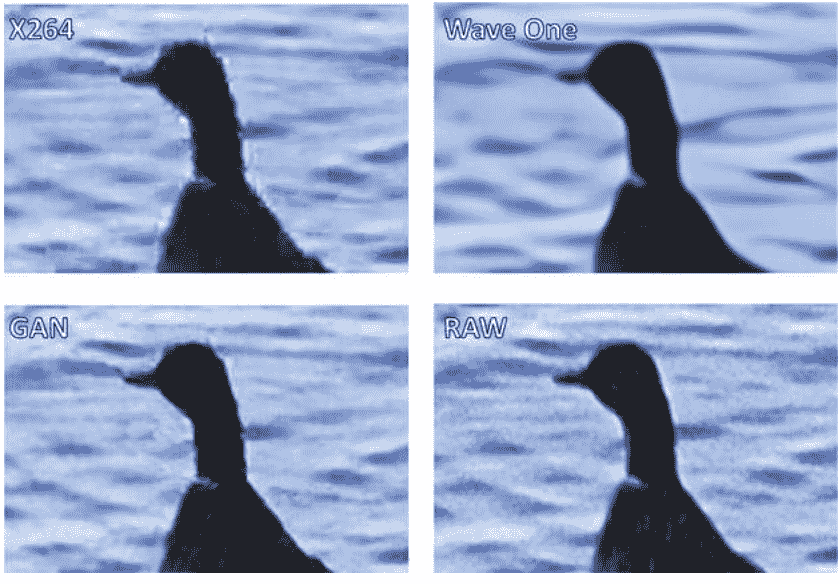

图 12.1 通过 wave.one 的基于 GAN 的恢复流水线 [GSBD19] 与基于深度学习的编解码器进行图像质量比较。我们展示了一个未压缩（RAW）的帧和通过 GAN 恢复的源帧（x.264）。

观众可以感知或者因为它们包含感兴趣的对象，改善它们的外观，为它们的编码分配自适应更多的比特。我们可以提出两个主要的研究方向：视觉显著性 [AT18, LEGV17] 和基于对象 [WCRR+19, GBSDB18] 的视频编码。在前一种方法中，无论图像的语义内容如何，都会像素级计算图像的某些函数，以计算帧区域的感知相关性。相反，基于对象的视频假设已经应用了某种形式的语义分割，以获得相关对象的掩码。这种方法需要使用强大的对象分割 [HGDG17, BZXL19]，这些分割现在以高计算效率实现。语义视频编码方法已经在非常不同的领域中使用，例如飞机驾驶舱 [MFC+19]，体育视频 [BDBPC06]，无人机视频 [WCC16]，车辆 [ASBA+19] 和监控视频 [BBDBS11]。

最近提出了一些直接使用神经网络进行视频和图像编码的方法 [RB17, RNL+19]，也使用了 GAN 方法 [ATM+19]。然而，由于其非常高的计算要求，这些方法目前在实际应用中无法满足令人满意的视觉效果。此外，完全学习的压缩需要一种新技术的标准化和传播，这提高了市场准入的门槛。

如果管道的解码端继续遵循标准，这个问题可以得到缓解。正如 [RBB+16] 中部分回顾的那样，改善视频质量的主要策略有两种：基于预处理和基于后处理。Talebi 等人的研究 [TKL+20] 是一种基于预处理的混合方法，用于改善压缩图像的质量。作者不依赖于深度网络进行编码和解码，而是学习了一种在标准 JPEG 压缩之前对图像进行预处理的深度网络。训练目标是为给定的 JPEG 质量因子共同最小化熵和图像失真。

### 12.2.3 混合方法

将属于上述两种方法族的方法结合起来的想法迄今为止研究较少。最近在 [GBS+20a] 中提出了一种将基于学习的图像增强方法与语义编码的视频相结合的系统，旨在改善视频会议的质量，使用语义编码的人脸。该系统能够以三分之一的带宽为人类对话的视频提供可比较的质量。Mentzer 等人 [MTTA20] 结合了 GAN 和学习压缩，获得了一种最先进的生成有损压缩系统，能够以一半的带宽获得与其他竞争方法相当的视觉质量。

### 12.2.4 质量度量

可以使用不同的视觉质量度量来评估编码 - 解码流程的性能。这些度量可以分为 (1) 全参考，即有一个参考图像可用于将其与恢复图像进行比较以评估图像质量；(2) 无参考，即仅使用恢复图像的特征和特性。Blau 和 Michaeli [BM19] 的最新工作表明，存在一种速率 - 失真 - 感知的权衡，表明优化源图像和解码图像的统计相似性将增加信号失真率。这与大量的结果一致，这些结果显示，根据全参考 SSIM（结构相似性）和 PSNR 度量，人类评级较高的图像得分较低。在 [KLCB20] 中也表明，许多现有的图像质量算法（如 SSIM）在评估 GAN 生成的内容时不可靠，因为在考虑基于像素比较的度量时，这些生成方法生成的图像可能与参考图像匹配较差，尽管它们可能与原始图像在感知上相似且逼真。

出于这些原因，基于“自然性”评估的度量更加合适，为了获得更可靠的图像质量评估度量，已经进行了大量的工作 [KLCB20, ZIE+18, MSB13, MSB16]。在接下来的部分中，我们将使用现代 LPIPS 度量作为全参考评估，使用 BRISQUE [MMB12] 和 NIQE [MSB13] 进行无参考图像质量评估。后面的这些度量评估图像的自然性。

## 12.3 生成对抗网络与标准增强 CNN

压缩伪影去除的目标是从压缩输入图像 `$I^C$` 中获得重建的输出图像 `$I^R$`。在这种情况下，`$I^C = A(I)$` 是一个压缩算法 `$A$` 的输出图像，`$I$` 是一个未压缩的输入图像。

不同的 `$A$` 算法将产生不同的 `$I^C$` 图像，具有不同的压缩伪影。许多图像和视频压缩算法（例如 JPEG, JPEG2000, WebP, H.264/AVC, H.265/HEVC）在 YCbCr 颜色空间中工作，将亮度与色度信息分离。这样可以更好地去相关颜色分量，从而实现更高效的压缩；它还允许第一步有损压缩对色度进行子采样，考虑到人眼对其变化的较低敏感性。

我们用具有尺寸 $W \times H \times C$ 的实值张量来表示图像 $I^R, I^C$ 和 $I$，其中 $W$ 和 $H$ 分别是宽度和高度，$C$ 是颜色通道的数量。

对于一个未压缩的图像 $I \in [0, 255]^{W \times H \times C}$ 的压缩是根据以下方式进行的：

$$I^C = A (I, QF) \in [0, 255]^{W \times H \times C} \eqno(12.1)$$

其中 $A$ 是表示某种压缩算法的函数，该函数由质量因子 $QF$ 参数化。无损压缩伪影去除问题可以看作是计算一个逆函数 $G \approx A_{QF}^{-1}$，该函数从 $I^C$ 中重建 $I$：

$$G(I^C) = I^R \approx I \eqno(12.2)$$

原则上，每个生成器可以使用从不同质量的图像进行训练。实际上，我们在第 12.3.3 节中展示了单一质量生成器的性能更好，并且可以由质量预测器驱动。

为此，我们训练了一个卷积神经网络 $G$ ($G(I^C; \theta_g)$) 其中 $\theta_g = \{W_{1:K}; b_{1:K}\}$ 是表示网络的 $K$ 层的权重和偏差的参数。给定 $N$ 个训练图像，我们通过求解一个自定义损失函数 $l_{AR}$ 来进行优化：

$$\hat{\theta}_g = \arg \min_{\theta_g} \frac{1}{N} \sum_{n=1}^N L_{AR}(I, G(I^C, \theta_g)) \eqno(12.3)$$

### 12.3.1 网络架构

消除压缩伪影是一种属于图像转换问题类别的任务，该类别还包括超分辨率和风格迁移等其他任务。使用生成方法来处理这类任务非常方便，即学习一个完全卷积神经网络 (FCN) [LSD15]，它可以根据给定的输入图像输出一个改进版本。在图像处理中使用 FCN 架构的原因是它们非常方便地执行局部非线性图像转换，并且可以处理任意大小的图像。

有趣的是，我们利用这种特性来加快训练速度。事实上，我们感兴趣的伪影出现在接近块大小的尺度上。因此，我们可以使用更大的批次在较小的补丁上学习模型。

在本章中，我们介绍了三种用于图像增强网络的架构，我们也可以互换地称之为生成器。一个完全卷积的架构，可以通过直接监督进行优化，也可以与一个新颖的鉴别器结合在生成对抗框架中。我们将分析如何通过替换一些计算量最大的块来使推理更加高效。最后，我们将展示如何通过使用所谓的 NoGAN 方法以及一个快速收敛的 U-Net 类似架构来加速训练。

#### 12.3.1.1 完全卷积生成器

在 [GSBD19] 中提出了使用深度残差生成网络，仅由具有非线性 LeakyReLU 激活函数的卷积层块组成。这个生成器受到 [HZRS16] 的启发。我们使用具有 6 个卷积核和 $3 \times 3$ 支持的层，然后是 LeakyReLU 激活函数。在第一层卷积之后，我们应用一个步长为 2 的层来减半特征图的大小。

然后我们使用 15 个残差块，在每个卷积之后使用 1 像素的填充，并采用复制策略来减轻边界效应。使用最近邻上采样层来获得原始尺寸的特征图 [ODO16]。考虑到上采样可能会产生伪影，我们再应用一个步长为 1 的卷积层。

最后，为了生成图像，我们使用具有 $tanh$ 激活函数的单核卷积层。这将产生值在 $[-1, 1]$ 范围内的输出张量，因此可以与重新缩放的图像输入进行比较。添加批归一化有助于训练 GAN，从而在性能上有适度的改进。

这个网络可以与鉴别器耦合，并用作生成器，以获得生成对抗框架。最近的对抗训练方法 [GPAM+14] 在生成逼真图像和超分辨率任务 [LTH+16] 方面表现出了显著的性能。

在这种方法中，生成器网络 $G$ 被鼓励产生与真实数据流形上的解决方案，通过学习如何欺骗一个判别网络 $D$。另一方面，鉴别器被训练来区分重建的补丁 $I^R$ 和真实的补丁 $I$。具体而言，我们采用了一种条件生成的方法，即我们将正样本 $I | I^C$ 和负样本 $I^R | I^C$ 作为输入提供给生成网络，其中 $\cdot | \cdot$ 表示按通道连接。

对于大小为 $N \times N \times C$ 的样本，我们区分大小为 $N \times N \times 2C$ 的样本。

#### 12.3.1.2 提高增强架构的效率

最近的图像恢复的最新神经网络对移动设备和嵌入式系统的要求非常高，超过了其能力。我们可以通过操纵生成器的组件来提高这些网络的效率，以减少所需的总操作数，同时保持高质量的重建输出。我们的生成器的架构基于 MobileNetV2 [SHZ+18]，这是一个非常高效的网络，专为移动设备执行分类任务而设计。与 [GSBD19] 不同，我们用瓶颈深度可分离卷积块替换了标准残差块，如表 12.1 所示，以减少总参数数量。我们将扩展因子 $n$ 设置为 6，用于所有实验。

在第一个标准卷积层之后，通过步幅卷积将特征图减半两次，然后我们应用一系列 $B$ 瓶颈残差块。每当特征图尺寸减半时，卷积滤波器的数量就会加倍。我们使用两种最近邻上采样和标准卷积层的组合来恢复特征图的原始尺寸。最后，我们通过 $1 \times 1$ 卷积生成 RGB 图像，然后使用 $tanh$ 激活函数，以保持输出值在 $[-1, 1]$ 范围内。在我们要训练的模型中，我们使用批归一化来稳定训练过程。表 12.2 报告了先前工作 [GSBD19] 中使用的 GAN 的滤波器、块和权重数量，以及提出的网络的两个变体，称为“快速”和“非常快速”，因为它们旨在实现实时性能。可以观察到新的 GAN 架构具有更少的参数数量，从而降低了计算成本，使其能够达到所需的实时性能。

表 12.1 生成器网络中使用的瓶颈残差块

| 层 | 输出 |
| :--- | :--- |
| `Conv2d 1x1`, ReLU6 | $m \times n \times t * c$ |
| `Dw Conv2d 3x3`, ReLU6 | $m \times n \times t * c$ |
| `Conv2d 1x1` | $m \times n \times c$ |

表 12.2 使用的不同 GAN 的参数。与之前的工作 [GSBD19] 相比，我们的新的“快速”和“非常快速”网络具有更少的参数数量，从而提高了计算时间。

| 模型 | # 过滤器 | # 块 | # 参数 |
| :--- | :--- | :--- | :--- |
| Galteri 等人 [TMM'19] | 64 | 16 | 5.1M |
| 我们的快速 | 32 | 12 | 1.8M |
| 我们的非常快速 | 8 | 16 | 145k |

当使用其他方法（如 U-Net）时，值得考虑不同的主干网络。例如，在 [MBGDB21] 中，使用了 U-Net 架构，具有 ResNet 和 MobileNet 主干网络以及自注意机制，这在对存档黑白媒体进行图像和视频上色方面取得了成功。

通过替换原始的深度 ResNet 主干网络（ResNet101），该网络具有 $\sim 40M$ 参数，使用更小更快的主干网络，如 MobileNetV3 [HSC+19]，该网络只有 $\sim 5.5M$ 参数。这样可以减少计算成本，处理大型视频档案。如 [MBGDB21] 所报道，这种技术可以将处理时间减半，对于 NVIDIA TitanX，从 0.27 秒减少到 0.15 秒和 0.12 秒，具体取决于使用标准 MobileNetV3 还是 SmallMobileNetV3 变体。

#### 12.3.1.3 判别网络

在进行 GAN 训练时，我们需要定义一个合适的判别器网络与生成器配对。判别器的架构通常基于一系列没有填充且步长为单像素的卷积层，然后是 LeakyReLU 激活函数。每两层的滤波器数量翻倍，最后一层除外。没有全连接层。特征图的尺寸仅因卷积在最后一层达到单位维度的效果而减小，该层使用的激活函数是 sigmoid 函数。

D 网络的权重集合 $\psi$ 通过最小化来学习：

$$L_d = -\log \left( D_\psi \left( I | I^C \right) \right) - \log \left( 1 - D_\psi \left( I^R | I^C \right) \right)$$

在子块级别上进行判别；这是因为压缩算法将图像分解为块，因此通常在其中产生伪影。为了鼓励生成具有真实感的图像块，$I$ 和 $I^R$ 被分割成大小为 $16 \times 16$ 的 $P$ 块，然后输入鉴别器网络。这种方法对减少蚊子噪声和振铃伪影有益。

### 12.3.2 损失函数

现在，我们讨论用于学习具有直接监督和使用对抗方法的增强网络的损失。

当损失函数计算为重建图像 $I^R$ 和原始未压缩输入图像 $I$ 的函数时，我们称之为直接监督。在这种情况下，使用经典的反向传播来更新网络权重。在这种情况下，可以应用多种损失函数，下面我们将介绍最有效的几种。请注意，即便在生成对抗的设置中，这些损失仍将被使用，以确保最终图像不偏离原始外观。

#### 12.3.2.1 像素级均方误差损失

基准损失通常采用均方误差损失（MSE）：

$$L_{MSE} = \frac{1}{WH} \sum_{x=1}^W \sum_{y=1}^H \left( I_{x,y} - I^R_{x,y} \right)^2 . \quad (12.4)$$

这种损失常用于图像重建和恢复任务 [DDCLT15，SHBZ16，MSY16]。已经证明 $l_{MSE}$ 能够有效地从压缩图像中恢复低频细节，但缺点是高频细节被抑制。从实际角度来看，这种损失将会恢复出具有模糊特征的高质量图像。

### 12.3.2.2 SSIM 损失

结构相似性（SSIM）[WBSS04] 已成功提出作为 MSE 和峰值信噪比（PSNR）图像相似度的替代方法度量，因为这两个度量与人类视觉对图像相似性的感知不一致。

计算未压缩图像 $I$ 和重建图像 $I^R$ 的 SSIM 的公式为：

$$SSIM\left(I, I^R\right)=\frac{\left(2 \mu_I \mu_{I^R}+C_1\right)\left(2 \sigma_{I I^R}+C_2\right)}{\left(\mu_I^2+\mu_{I^R}^2+C_1\right)\left(\sigma_I^2+\sigma_{I^R}^2+C_2\right)} \quad (12.5)$$

考虑到 SSIM 函数是完全可微的，可以定义损失为：

$$L_{S S I M}=-\frac{1}{W H} \sum_{x=1}^W \sum_{y=1}^H S S I M\left(I_{x, y}, I_{x, y}^R\right) \quad (12.6)$$

然后可以通过最小化 Eq. 12.6 来训练网络，这意味着最大化在未压缩和重建图像对上计算的结构相似性分数。

### 12.3.2.3 感知损失

一些工作提出了在一个保留语义特征而不是低级像素相似性的空间中测量图像相似性的方法。这些损失函数在 Dosovitskiy 和 Brox [DB16], Johnson 等人 [JAFF16], Bruna 等人 [BSL15] 和 Gatys 等人 [GEB15] 中被提出，并被称为感知损失。

在某个可微分函数 $\phi$ 的特征空间中，通过将图像 $I$ 和 $I^R$ 投影后计算它们之间的距离，然后取欧氏距离来衡量图像之间的距离：

$$L_P=\frac{1}{W_f H_f} \sum_{x=1}^{W_f} \sum_{y=1}^{H_f}\left(\phi(I)_{x, y}-\phi\left(I^R\right)_{x, y}\right)^2 \quad (12.7)$$

其中 $W_f$ 和 $H_f$ 分别是特征图的宽度和高度。使用感知损失训练的模型重建的图像可能不会在像素级距离度量上准确，但从特征表示的角度来看，输出将更加相似。

一种可能的选择是通过从预训练的 VGG-19 模型 [SZ15] 中提取特征图，使用网络的倒数第二个卷积层和最后一个最大池化层之前的卷积层来计算 $\phi(I)$。

基于 VGG 的感知损失也被用于 DeOldify 中的着色 [AHM19]。在 [MBGDB21] 中，感知损失被修改为使用 LPIPS 视觉质量度量。选择这种方法的动机是 LPIPS 度量与人类视觉感知密切相关，因此可以被视为真实的感知损失，而基于 VGG 的损失可以更多地被视为特征损失。另一个好处是，这个度量标准被设计成在小块上操作，因此非常适合使用基于块的训练方法，比如 [MBGDB21]。

### 12.3.2.4 对抗性贴片损失

当图像增强网络在对抗性环境中训练时，我们需要在生成器损失中添加一个损失组件。这种损失惩罚了不能很好地欺骗鉴别器网络的重建。因此，虽然鉴别器是用标准的二元交叉熵损失进行训练，但生成器是用对抗性损失进行训练，当鉴别器损失减小时，对抗性损失增加。

最后，如前所述，生成器通过将感知损失与对抗性损失相结合进行训练，从而获得：

$$L_{AR} = L_P + \lambda L_{adv} . \quad (12.8)$$

其中，$l_{adv}$ 是标准的对抗性损失：

$$L_{adv} = - \log \left( D_{\psi} \left( I^R | I^C . \right) \right) \quad (12.9)$$

### 12.3.2.5 相对论生成对抗网络

在 [WYW+18] 中，作者们基于相对论生成对抗网络 [JM18] 而不是标准的生成对抗网络设置来获得更好的重建输出。在这里，关键思想是驱使鉴别器估计一个真实图像 $I$ 相对于一个生成图像 $I^R$ 而言更加真实的概率。我们定义 $D(I, I^R) = \sigma (C(I) - \mathbb{E}_{I^R} [C(I^R)])$ 作为相对论鉴别器的输出，其中 $\sigma, C(.)$ 和 $\mathbb{E}_{I^R} [.]$ 分别表示 sigmoid 激活函数、鉴别器的密集层输出和小批量中所有重建图像的平均值。在这种情况下，鉴别器的损失定义为：

$$L_D = - \mathbb{E}_I [\log(D(I, I^R))] - \mathbb{E}_{I^R} [1 - \log(D(I^R, I))] \quad (12.10)$$

生成器的对抗损失为：

$$L_{Adv} = - \mathbb{E}_I [1 - \log(D(I, I^R))] - \mathbb{E}_{I^R} [\log(D(I^R, I))] \quad (12.11)$$

## 12.3.2 语义编码与感知损失优化

如果我们对编码/解码过程有更多控制，尤其是当我们可以假设内容语义有限时，我们可以设计专门的损失函数来训练图像增强网络。我们以 [GBS+20b] 中提出的工作为例，通过意识到我们要重建的数据不是均匀的，我们定义了一种更有效的感知损失。

事实上，语义编码将图像分为两个区域，与内容（背景/人脸）和质量（低质量/高质量）不同。

因此，网络需要根据面部解析器计算的语义掩码学习不同部分的重建。我们将$M$定义为前景二进制掩码，将$\bar{M}$定义为通过逻辑否定$M$计算得到的背景掩码。

在这种情况下，可以基于 VGG-19 的感知损失用于背景，将其计算限制在$\bar{M}$值不为零的图像部分。将这种基于背景的感知损失命名为$L_B$：

$$L_B = \mathbb{E}_{(I, I^R)} \left[ ||VGG(I \odot \bar{M}) - VGG(I^R \odot \bar{M})|| \right] \qquad (12.12)$$

其中$\odot$表示逐元素乘法。

以人脸为例，前景由人脸组成，必须使用不同的特征提取器来处理这个特定的类别。逻辑选择是从已处理了数百万张人脸图像的预训练网络中提取这些特征，例如 VGG-Face [PVZ15]。由于 VGG-Face 基于 VGG-16 骨干网络，我们从第五个块的第三个卷积层的 ReLU 激活之前提取输出用于损失计算。在这些假设下，我们将感知损失限制在前景上定义为：

$$L_F = \mathbb{E}_{(I, I^R)} \left[ ||VGGFace(I \odot M) - VGGFace(I^R \odot M)|| \right] \qquad (12.13)$$

生成器的总损失为：

$$L_G = L_B + L_F + \lambda L_{Adv} \qquad (12.14)$$

其中$\lambda$是一个固定的系数，用于平衡对抗损失的贡献。

## 12.3.3 无关质量的伪影去除

无法事先知道图像的质量。在实际场景中应用模型时，我们不能依赖于这些信息的先验知识。

不幸的是，训练一个单独的生成对抗网络来处理所有的压缩质量因子是不可行的；事实上，我们观察到在更高的压缩率下出现了模式崩溃。

我们认为这种效应是因为低压缩质量的图像包含更多的伪影并产生更多的信号，从而克服了对更好质量图像中需要的微妙模式去除的学习。

为了应对这个问题，我们的完整解决方案包括两个模块。第一个模块通过回归预测图像的真实 QF。这可以以极高的精度实现。压缩质量估计器用于将图像信号驱动到我们集合中训练的固定 QF 的 GAN 之一。系统的框图如图 12.2 所示。

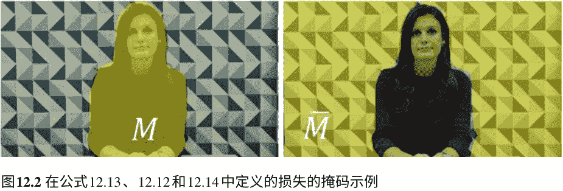

表 12.3 所提出的 QF 预测器的网络架构

| 层 | 卷积核大小/步长 | 输出大小 |
| :--- | :--- | :--- |
| 卷积层 11 | 3 × 3 / 1 | 128 × 128 × 64 |
| 卷积层 12 | 3 × 3 / 2 | 64 × 64 × 64 |
| Conv21 | 3 × 3 / 1 | 64 × 64 × 128 |
| Conv22 | 3 × 3 / 2 | 32 × 32 × 128 |
| Conv31 | 3 × 3 / 1 | 32 × 32 × 256 |
| Conv32 | 3 × 3 / 2 | 16 × 16 × 256 |
| Conv41 | 3 × 3 / 1 | 16 × 16 × 512 |


| Conv42 | 3 × 3 / 2 | 8 × 8 × 512 |
| FC5 | – | 1024 |
| FC6 | – | 1 |

预测结果。我们使用这个预测结果来根据输入图像质量选择适当的模型来重建受损图像。因此，我们训练了六个不同的生成器，每个生成器都有固定的 QF 训练图像（5、10、20、30、40、60）。根据预测结果，我们将受损图像输入到与 QF 预测器输出更接近的固定 QF 重建网络中。

图 12.3 展示了集合中单一质量模型在不同质量图像上的性能。图 12.3 测量了经过训练的目标检测器在不同 QF 下压缩的 JPEG 图像上的 mAP，并使用 QF 特定模型进行重建。可以看到，当相似 QF 的模型时，mAP 变化平滑。有趣的是，对于 QF 较低的图像，如 5 和 10，每个应用的模型都有改进。较高质量的图像必须使用经过较高 QF 训练的模型进行恢复，否则性能甚至可能下降。

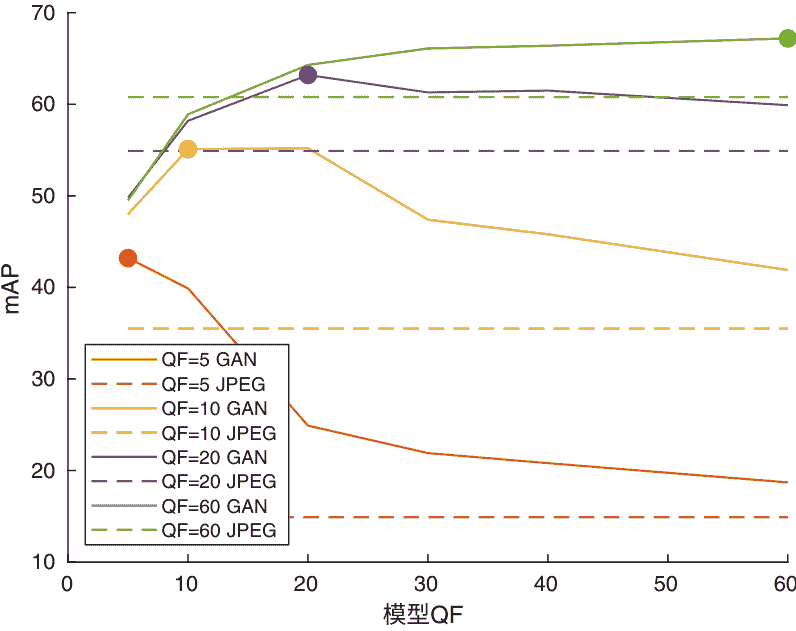

图 12.3 在 PASCAL VOC2007 上变化图像质量（QF）和用于恢复的模型的平均精度 原始 mAP 以虚线表示，对于每个 QF，圆形标记表示使用正确模型获得的最大 mAP

NoGAN 是一种训练 GAN 架构的方法，旨在获得更好的结果，稳定训练和生成图像；它最初是在图像和视频上色的背景下 [AHM19] 提出的。这种方法的主要思想是分别预训练生成器和判别器网络，然后进行标准的最终对抗训练步骤，时间很短。在这种设置中，生成器首先使用一些感知损失（例如，12.3.2.3 节中报告的特征损失）进行训练，然后使用生成的图像来训练判别器作为二元分类器。生成器和判别器的分别训练占据了绝大部分时间，而标准的 GAN 训练可能只占用分别训练时间的 5-10%，例如，每两次生成器迭代之前进行五次判别器迭代，如 [MBGDB21] 中所述。

表 12.4 比较了使用 NoGAN 方法 (后-GAN) 与直接训练生成器 (前-GAN) 获得的结果，并比较了不同感知/特征损失的性能。使用 LPIPS 而不是其他基于信号的损失函数可以获得更好的结果，尽管很难决定最终 GAN 训练步骤与直接训练之间的胜者。然而，对结果的手动检查显示，最终的 GAN 训练有助于减少对象边界附近的高频伪影 (图 12.4) 。

这些结果是使用 Div2K 数据集 [IT+19] 获得的，使用标准设置进行训练，包括 800 张图像用于训练，100 张用于验证和 100 张用于测试。图像已经被压缩为 JPEG 格式，质量因子设置为 20 (QF20) 。

表 12.4 不同损失和训练步骤的质量指标。较高的 SSIM 分数越好，较低的 LPIPS、BRISQUE 和 NIQE 分数越好。最佳结果以粗体显示。"small"表示使用 MobileNetV3 Small 骨干网络。

| 损失 | SSIM ↑ | LPIPS ↓ | BRISQUE ↓ | NIQE ↓ |
| :--- | :--- | :--- | :--- | :--- |
| LPIPS (pre-GAN) | 0.6933 | **0.1243** | 85.09 | **16.76** |
| LPIPS (post-GAN) | **0.7374** | 0.1526 | 89.31 | 17.57 |
| LPIPS (post-GAN small) | 0.7301 | 0.1502 | **84.14** | 17.67 |
| MSE | 0.7293 | 0.1661 | 88.91 | 17.82 |
| SSIM | 0.7354 | 0.1830 | 86.87 | 17.57 |
| 目标 | 不适用 | 不适用 | 85,32 | 15,69 |

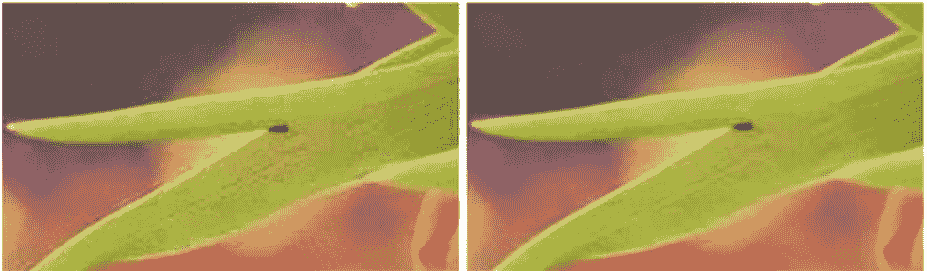

图 12.4 左 LPIPS 损失，预 GAN；右 LPIPS 损失，后 GAN；添加最终的 GAN 训练减少了物体边界处的方块状伪影

## 12.4 利用发射机和接收机进行改进

在 [GBS+20a] 中，我们提出了一种基于压缩伪影去除方法的方法，通过利用语义编码的视频来恢复具有更好感知视觉质量的视频。我们首先描述了发射机上如何执行语义视频编码。然后，我们报告了基于 GAN 的视频恢复方法，以改善接收方的感知视觉质量。

### 12.4.1 语义视频编码

语义视频编码的主要思想是为了观众，将更多的比特分配给描绘感兴趣的语义内容的区域，而不利于背景。

理想情况下，比特的数量应足够以最大化观众对感兴趣对象的感知质量。语义视频编码与基于显著性的视频编码 [LEGV17, LEPV19] 相关，因为它们都考虑应该用更多数据存储的区域。然而，它们的目标不同。

语义编码旨在传输对观众最感兴趣的高级语义内容，而不考虑任何其他背景元素。相反，基于显著性的编码对场景中的对象没有特定的知识。

它旨在传输最有可能被观众眼睛观察到的内容，而不考虑其重要性。

为了进行编码，我们为每个帧构建一个语义掩码，在其中将每个像素标记为前景（即分配更多比特的区域的像素）或背景。根据领域的不同，前景可能不同。在我们考虑的视频会议应用的上下文中，前景是说话的人，更具体地说是他的脸。因此，我们使用流行的 BiSeNet [YWP+18] 图像分割方法，在 CelebAMask-HQ [LLWL20] 上进行训练，进行面部解析。我们将检测到的每个像素标记为面部和颈部的一部分作为前景，其余部分作为背景。

最终的视频使用经过修改的 h.264 编码器进行编码，该编码器被修改以将给定比特率的预定百分比分配给输入掩码。我们采用了 [LEGV17] 的实现，该实现使用了对 h.264 常量量化参数的宏块大小的非平凡估计。

### 12.4.2 视频恢复

大多数基于深度学习的恢复方法试图最小化参考原始帧 `$I$` 和从压缩输入 `$I^C$` 生成的输出 `$I^R$` 之间的像素均方欧氏距离。

然而，这种训练策略导致恢复的图像看起来很弱

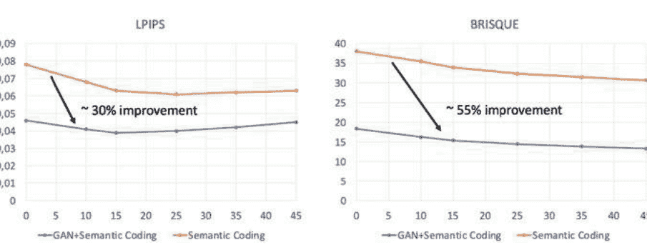

图 12.5 使用 BRISQUE 和 LPIPS 的语义编码与 GAN 的性能（较低的值更好）。 增加分配给显著部分的比特率百分比，性能有所提高，无论是否进行了 GAN 伪影去除。应用 GAN 分别导致两个指标分别提高了 30% 和 55%。

通常模糊且缺乏重要细节。此外，h.264 编码器通常在压缩流程的末尾包含一个强大的循环去块滤波器，导致产生模糊的帧，因此使用基于 MSE 的神经网络来恢复图像效果更差。

生成对抗网络已广泛用于恢复和增强任务，以解决上述问题。GAN 框架试图估计一个近似目标分布的模型分布，并且由生成器和判别器两个不同的实体组成。在这个设置中，生成器的目标是在给定一些噪声输入和判别器的情况下产生模型分布，而判别器的作用是区分模型分布和目标分布。这两个网络是逐个训练的，同时逐渐减小模型分布和生成器之间的距离。

由于我们不想从模型分布中生成全新的图像，而是希望恢复一些失真的数据，因此我们需要相应地调整 GAN 的训练过程。因此，我们将判别器分别用真实样本 `$I | I^C$` 和伪造样本 `$I^R | I^C$` 进行馈送，其中运算符 `$\cdot | \cdot$` 定义了输入的逐通道连接。

从图 12.5 中可以清楚地看出控制两端的优势，事实上仅通过使用显著性编码就可以在质量方面获得收益。应用经过训练的生成对抗网络（GAN）来重建显著性编码视频，我们可以进一步提高图像质量。

## 12.5 结论

媒体的退化过程是已知且可复制的，可以随意生成高质量的大型训练集。利用现有的深度学习工具和知识，我们展示了如何使这项技术足够高效，可以在移动设备上运行。将恢复网络与标准计算机视觉工具相结合，可以实现一系列垂直应用，其中发射器和接收器节点的控制可以以更少的带宽获得更高的质量。我们对本章介绍的方法的看法是，越来越多的深度学习将用于提高消费媒体的质量，无论是在设备上实时进行还是在批处理过程中改善现有的低质量数字档案。虽然在本章中我们主要涵盖了图像和视频，但我们预计这种增强方法将扩展到其他媒体，如音频和 3D 网格和点云。

## 参考文献

- [AHM19] Jason Antic, Jeremy Howard, and Uri Manor. 解除垃圾化、去老化和超分辨率，2019.
- [ASBA+19] Noor Al-Shakarji, Filiz Bunyak, Hadi Aliakbarpour, Guna Seetharaman, 和 Kan-appan Palaniappan. 多线索车辆检测用于地理注册航拍视频的语义视频压缩。在 (CVPR) Workshops 的论文集中，2019 年 6 月.
- [AT17] Eirikur Agustsson 和 Radu Timofte. Ntire 2017 单图像超分辨率挑战：数据集和研究。在 IEEE CVPR Workshops 的论文集中，2017 年.


- [AT18] A Diana Andrushia 和 R Thangarjan. 基于显著性的图像压缩使用 Walsh-Hadamard 变换 (WHT)。在生物合理化的计算技术用于图像处理应用，第 21-42 页。Springer, 2018 年。

- [ATM+19] Eirikur Agustsson, Michael Tschannen, Fabian Mentzer, Radu Timofte, and Luc VanGool. 生成对抗网络用于极端学习图像压缩。在 IEEE/CVF 国际计算机视觉会议 (ICCV) 的论文集中，2019 年 10 月。

- [BBDBS11] Andrew D. Bagdanov, Marco Bertini, Alberto Del Bimbo, and Lorenzo Seidenari. 自适应视频压缩用于视频监控应用。在国际多媒体研讨会上，2011 年。

- [BDBPC06] Marco Bertini, Alberto Del Bimbo, Andrea Prati, and Rita Cucchiara. 基于用户中心性能分析的体育视频语义适应。IEEE 多媒体交易，8(3):433–443, 2006 年 6 月。

- [BM19] Yochai Blau and Tomer Michaeli. 重新思考有损压缩：速率 - 失真 - 感知权衡。在 ICML 研讨会上，2019 年。

- [BSL15] Joan Bruna, Pablo Sprechmann 和 Yann LeCun。使用深度卷积充分统计进行超分辨率。CoRR, abs/1511.05666, 2015 年。

- [BZXL19] Daniel Bolya, Chong Zhou, Fanyi Xiao 和 Yong Jae Lee。Yolact: 实时实例分割。在计算机视觉国际会议的 Proc.中，页面 9157-9166, 2019 年。

- [CHB17] Lukas Cavigelli, Pascal Hager 和 Luca Benini。CAS-CNN: 用于图像压缩伪影抑制的深度卷积神经网络。在 IJCNN 的 Proc.中，2017 年。

- [DB16] A. Dosovitskiy 和 T. Brox。基于深度网络的感知相似度度量生成图像。在 NIPS 的 Proc.中，2016 年。

- [DBEG16] Y. Dar, A. M. Bruckstein, M. Elad, and R. Giryes. 通过顺序去噪处理压缩图像。IEEE 图像处理，25(7):3044–3058, 2016 年 7 月。

## 参考文献

- [DDCLT15] Chao Dong, Yubin Deng, Chen Change Loy, and Xiaoou Tang. 通过深度卷积网络减少压缩伪影。在国际计算机视觉会议，2015年。

- [FZW+19] Xueyang Fu, Zheng-Jun Zha, Feng Wu, Xinghao Ding, and John Paisley. 通过深度卷积稀疏编码减少JPEG伪影。在IEEE/CVF国际计算机视觉会议（ICCV），2019年10月。

- [GBS+20a] Leonardo Galteri, Marco Bertini, Lorenzo Seidenari, Tiberio Uricchio, and Alberto Del Bimbo. 通过GAN和语义编码提高视频感知质量。在ACM多媒体国际会议（ACM MM），MM '20，页862-870，纽约，美国，2020年。计算机协会。

- [GBS+20b] Leonardo Galteri, Marco Bertini, Lorenzo Seidenari, Tiberio Uricchio, and Alberto Del Bimbo. 通过GAN和语义编码提高视频感知质量。在第28届ACM国际多媒体会议，页862-870，2020年。

- [GBSDB18] Leonardo Galteri, Marco Bertini, Lorenzo Seidenari, and Alberto Del Bimbo. 视频压缩用于目标检测算法。在国际模式识别会议论文集，页3007-3012。IEEE，2018年。

- [GEB15] Leon A. Gatys, Alexander S. Ecker, and Matthias Bethge. 纹理合成和使用卷积神经网络控制生成自然刺激。CoRR, abs/1505.07376, 2015年。

- [GPAM+14] Ian Goodfellow, Jean Pouget-Abadie, Mehdi Mirza, Bing Xu, David Warde-Farley, Sherjil Ozair, Aaron Courville, and Yoshua Bengio. 生成对抗网络。在NIPS会议论文集，2014年。

- [GSB+19] Leonardo Galteri, Lorenzo Seidenari, Marco Bertini, Tiberio Uricchio, and Alberto Del Bimbo. 使用GANs进行快速视频质量增强。在ACM多媒体会议，MM '19，页1065-1067，纽约，美国，2019年。计算机协会。

- [GSBD17] Leonardo Galteri, Lorenzo Seidenari, Marco Bertini, 和 Alberto Del Bimbo. 深度生成对抗压缩伪影去除。在国际计算机视觉会议，2017年。

- [GSBD19] L. Galteri, L. Seidenari, M. Bertini, 和 A. Del Bimbo. 深度通用生成对抗压缩伪影去除。IEEE多媒体交易，页1-1，2019年。

- [GSBDB19] Leonardo Galteri, Lorenzo Seidenari, Marco Bertini, 和 Alberto Del Bimbo. 实时图像增强GANs的研究。在图像和模式分析国际会议（CAIP）。IAPR，2019年。

- [HGDG17] Kaiming He, Georgia Gkioxari, Piotr Dollár, 和 Ross Girshick. Mask R-CNN。在国际计算机视觉会议，页2961-2969，2017年。

- [HSC+19] Andrew Howard, Mark Sandler, Grace Chu, Liang-Chieh Chen, Bo Chen, Mingxing Tan, Weijun Wang, Yukun Zhu, Ruoming Pang, Vijay Vasudevan, et al. 搜索MobileNetV3。在IEEE国际计算机视觉会议论文集，页1314-1324，2019年。

- [HZRS16] Kaiming He, Xiangyu Zhang, Shaoqing Ren, and Jian Sun. 深度残差学习用于图像识别。在IEEE计算机视觉与模式识别会议论文集，2016年。

- [IT+19] Andrey Ignatov, Radu Timofte, et al. 智能手机上的感知图像增强PIRM挑战：报告。在欧洲计算机视觉大会（ECCV）工作坊，2019年。

- [JAFF16] Justin Johnson, Alexandre Alahi, and Li Fei-Fei. 用于实时风格转换和超分辨率的感知损失。在欧洲计算机视觉大会论文集，2016年。

- [JLJ+17] V. Jakhetiya, W. Lin, S. P. Jaiswal, S. C. Guntuku, 和 O. C. Au. 最大后验和感知驱动的重建算法：一个通用框架。IEEE多媒体交易，19(1):93-106，2017年。

- [JM18] Alexia Jolicoeur-Martineau. 相对论鉴别器：标准GAN中缺失的关键元素。arXiv预印本 arXiv:1807.00734，2018年。

- [KHZ+15] L. W. Kang, C. C. Hsu, B. Zhuang, C. W. Lin, 和 C. H. Yeh. 基于学习的联合超分辨率和去块化的高度压缩图像。IEEE多媒体交易，17(7):921-934，2015年。

- [KLCB20] H. Ko, D. Y. Lee, S. Cho, 和 A. C. Bovik. 对深度生成图像的质量预测。IEEE图像处理交易，29:5964-5979，2020年。

- [LEGV17] Vitaliy Lyudvichenko, Mikhail Erofeev, Yury Gitman, 和 Dmitriy Vatolin. 一种半自动显著性模型及其在视频压缩中的应用。在IEEE国际智能计算机通信和处理会议（ICCP），2017年。


- [LEPV19] Vitaliy Lyudvichenko, Mikhail Erofeev, Alexander Ploshkin, 和 Dmitriy Vatolin. 用深度视觉注意力模型改进视频压缩。在智能医学和图像处理国际会议（IMIP '19），页88-94，纽约，美国，2019年。计算机协会。

- [LGTB14] Yu Li, Fangfang Guo, Robby T. Tan, 和 Michael S. Brown. 一种对抗JPEG伪影的对比度增强框架。在欧洲计算机视觉会议，2014年。

- [LHQ+17] 李涛，何晓海，庆林波，滕启志，和 陈洪刚。用于压缩图像的级联去块和超分辨率的迭代框架。IEEE多媒体交易，2017年。

- [LLWL20] 李成汉，刘子伟，吴凌云，和 罗平。MaskGAN：朝着多样化和交互式面部图像操作。在CVPR论文集，2020年。

- [LSD15] Jonathan Long，Evan Shelhamer，和 Trevor Darrell. 用于语义分割的全卷积网络。在IEEE计算机视觉与模式识别会议论文集，2015年。

- [LTH+16] Christian Ledig，Lucas Theis，Ferenc Huszár，Jose Caballero，Andrew Aitken，Alykhan Tejani，Johannes Totz，Wenzhe Shi，和 Zehan Wang. 使用生成对抗网络的照片逼真单幅图像超分辨率。CoRR, abs/1609.04802, 2016年。

- [MBGDB21] Filippo Mameli, Marco Bertini, Leonardo Galteri, and Alberto Del Bimbo. 一种用于图像和视频恢复和压缩伪影去除的非生成对抗网络方法。在国际模式识别会议（ICPR），2021年。

- [MFC+19] I. Mitrica, A. Fiandrotti, M. Cagnazzo, E. Mercier, 和 C. Ruellan. 带有时域预测的驾驶舱视频编码。在欧洲视觉图像处理会议（EUVIP），2019年，页28-33。

- [MMB12] A. Mittal, A. K. Moorthy, 和 A. C. Bovik. 空域中的无参考图像质量评估。IEEE图像处理交易，21(12):4695-4708，2012年12月。

- [MNDS18] Danial Maleki, Soheila Nadalian, Mohammad Mahdi Derakhshani, 和 Mohammad Amin Sadeghi. BlockCNN：一种用于伪影去除和图像压缩的深度网络。在CVPR研讨会，2018年，页2555-2558。

- [MSB13] Anish Mittal, Rajiv Soundararajan, and Alan C. Bovik. 制作一个“完全盲目”的图像质量分析器。IEEE信号处理快报，20(3):209-212，2013年。

- [MSB16] Anish Mittal, Michele A. Saad, and Alan C. Bovik. 一个完全盲目的视频完整性预测器。IEEE图像处理交易，25(1):289-300，2016年。

- [MSY16] Xiaojiao Mao, Chunhua Shen, and Yu-Bin Yang. 使用具有对称跳跃连接的超深卷积编码器-解码器网络进行图像恢复。在NIPS会议，2016年。

- [MTTA20] Fabian Mentzer, George Toderici, Michael Tschannen, and Eirikur Agustsson. 高保真生成式图像压缩。2020年。

- [ODO16] Augustus Odena, Vincent Dumoulin, and Chris Olah. 反卷积和棋盘伪影。Distill, 2016. http://distill.pub/2016/deconv-checkerboard.

- [PVZ15] Omkar M. Parkhi, Andrea Vedaldi, 和 Andrew Zisserman. 深度人脸识别。2015年。

- [RB17] Oren Rippel 和 Lubomir Bourdev. 实时自适应图像压缩。在ICML论文集，2017年。

- [RBB+16] Alessandro Redondi, Luca Baroffio, Lucio Bianchi, Matteo Cesana, 和 Marco Tagliasacchi. 先压缩再分析还是先分析再压缩：在视觉传感器网络中哪个更好？IEEE移动计算交易，15(12):3000-3013，2016年。

- [RNL+19] Oren Rippel, Sanjay Nair, Carissa Lew, Steve Branson, Alexander G. Anderson, 和 Lubomir Bourdev. 学习视频压缩。在ICCV论文集，页3454-3463，2019年。

- [SHBZ16] Pavel Svoboda, Michal Hradis, David Barina, and Pavel Zemcik. 使用卷积神经网络去除压缩伪影。arXiv预印本 arXiv:1605.00366，2016年。

- [SHZ+18] Mark Sandler, Andrew Howard, Menglong Zhu, Andrey Zhmoginov, and Liang-Chieh Chen. MobileNetV2：反向残差和线性瓶颈。在IEEE计算机视觉与模式识别会议，2018年6月。

- [sky] Skype视频会议应用程序。http://www.skype.com.

- [SZ15] Karen Simonyan 和 Andrew Zisserman. 用于大规模图像识别的超深卷积网络。在ICLR会议，2015年。

- [TKL+20] Hossein Talebi, Damien Kelly, Xiyang Luo, Ignacio Garcia Dorado, Feng Yang, Peyman Milanfar, 和 Michael Elad. 通过深度预编辑实现更好的压缩。arXiv预印本 arXiv:2002.00113，2020年。

- [TMM'19] Galteri, L., Seidenari, L., Bertini, M., and Del Bimbo, A. (2019). 深度通用生成对抗压缩伪影去除。IEEE多媒体交易，21(8):2131-2145。

- [WBSS04] Zhou Wang, A. C. Bovik, H. R. Sheikh, and E. P. Simoncelli. 图像质量评估：从误差可见性到结构相似性。IEEE图像处理交易，13(4):600-612，2004年4月。

- [WCC16] Xiaoli Wang, Aakanksha Chowdhery, and Mung Chiang. SkyEyes：来自无人机的自适应视频流媒体。在HotWireless'16研讨会，页2-6，纽约，美国，2016年。

- [WCRR+19] Maarten Wijnants, Sven Coppers, Gustavo Rovelo Ruiz, Peter Quax, and Wim Lamotte. Talking video heads：通过自适应应用基于对象的视频原则，节省类采访镜头的流媒体比特率。在ACM多媒体会议，MM '19，页2449-2458，纽约，美国，2019年。计算机协会。

- [WLC+16] 张扬王，刘丁，常世宇，青玲，应振洋，和 Thomas S. Huang. D3：基于深度双域的快速还原JPEG压缩图像。在IEEE计算机视觉与模式识别会议论文集，2016年。

- [WYW+18] 王新涛，于科，吴世祥，顾金金，刘义豪，董超，乔宇，和 陈昌乐。ESRGAN：增强超分辨率生成对抗网络。在欧洲计算机视觉会议（ECCV）论文集，2018年，页0-0。

- [YLK18] Jaeyoung Yoo, Sang-ho Lee, 和 Nojun Kwak. 通过估计局部补丁的频率分布进行图像恢复。在IEEE计算机视觉与模式识别会议论文集，2018年。

- [YLL+21] 叶家宏，林楚涵，林敏慧，康立伟，黄志翔，和 陈美娟。基于多尺度图像融合的深度学习压缩图像伪影减少。信息融合，67:195-207，2021年。

- [YWP+18] 于长乾，王静波，彭超，高长新，于刚，和 桑农。BiSeNet：用于实时语义分割的双边分割网络。在欧洲计算机视觉会议，页325-341，2018年。

- [ZIE+18] Richard Zhang, Phillip Isola, Alexei A. Efros, Eli Shechtman, 和 Oliver Wang. 深度特征作为感知度量的不合理有效性。在CVPR，2018年。

- [zoo] Zoom视频会议应用程序。http://www.zoom.us。


- [ZXF+13] 张晓，熊瑞，范晓，马胜，高伟。通过重叠块变换系数估计和块相似性减少压缩伪影。IEEE图像处理交易，22(12):4613-4626，2013年。

- [ZXZ+16] 张健，熊瑞，赵超，张勇，马胜，高伟。CONCOLOR：约束非凸低秩模型用于图像去块。IEEE图像处理交易，25(3):1246-1259，2016年3月。

## 第13章

## 结论

Jenny Benois-Pineau 和 Akka Zemmari

在本书中，我们对许多新的人工智能方法（如深度学习）所面临的问题感兴趣。我们首先回顾了深度学习方法的基础，然后在深度学习框架下解决了最有趣和开放的机器学习问题。

尽管我们提出了许多模型的熟练应用，机器学习社区仍然面临着各种问题。其中之一是为训练深度神经网络提供大规模标注数据集的可用性。在几个章节中，贡献作者对可用的标注语料库进行了概述，例如体育视频数据集。此外，他们展示了如何使用需要大量训练数据的深度神经网络分类器实现零样本学习。缺乏标注的训练数据自然地推动研究人员实施低监督算法。度量学习是一个长期研究方向，但在深度学习方法的框架下，它变得新鲜而独特。

深度学习方法渗透到视觉和多模态内容获取、挖掘和编码的整个链条。对于像视频编码这样发展成熟的领域，我们已经看到了两个例子：编码模式的预测和传输视频质量的改进。

在本书中，几乎涵盖了所有类型的深度神经网络：简单的卷积神经网络、孪生架构、生成对抗网络、全卷积网络、自编码器、循环神经网络等。由于深度学习方法模仿人类认知过程——从示例中学习——我们认为将（自）注意机制引入网络训练过程是一个非常活跃的研究领域，从而模仿人类的选择性注意力。这种机制加速了网络训练收敛，并略微改善了性能。

但是，正如我们在使用3D CNN进行动作识别时所看到的那样，它们可以提高分类得分。

所有贡献章节都基于同样的原则，提出了方法论创新，并通过大量应用实例对所谓“多媒体”数据进行了说明：图像、视频、声音、跨模态，以及不同的应用领域，如通用内容和医学图像、音频与音乐、体育视频等。

深度学习的兴起导致了人工智能系统性能的显著提高，但也引发了关于其预测可靠性和可解释性的问题，以支持决策制定。这些缺点引发了许多伦理问题，尤其在医学图像分析等领域尤为重要。在本书中，我们还看到了关于为医学图像分析建立可解释且可信模型的初步贡献。

尽管本书介绍了丰富的模型、方法及其开发所依赖的各种数据，深度学习研究远未达到饱和。我们不仅需要努力提高深度神经网络的决策准确性——通过设计合适架构、制定新目标函数、改进训练算法——还需要使其可信，能够向人类解释其决策，并尽可能使其决策接近人类决策过程。