# 大数据分析和深度学习应用

## 智能系统与计算进展 744

第一届国际大数据分析和深度学习会议论文集

Thi Thi Zin, Jerry Chun-Wei Lin 编辑

---

## 智能系统与计算进展

第744卷

**系列编辑**

Janusz Kacprzyk, 波兰科学院, 华沙, 波兰

e-mail: kacprzyk@ibspan.waw.pl

系列“智能系统与计算进展”包括关于智能系统和智能计算的理论、应用和设计方法的出版物。几乎涵盖了所有学科，如工程学、自然科学、计算机和信息科学、信息通信技术、经济学、商业、电子商务、环境、医疗保健、生命科学等。主题列表涵盖了现代智能系统和计算的所有领域，如计算智能、软计算，包括神经网络、模糊系统、进化计算和这些范例的融合，社会智能、环境智能、计算神经科学、人工生命、虚拟世界和社会、认知科学和系统、感知和视觉、DNA和免疫系统、自组织和自适应系统、电子学习和教学、以人为中心的计算、推荐系统、智能控制、机器人学和机电一体化，包括人机协作、基于知识的范例、学习范例、机器伦理、智能数据分析、知识管理、智能代理、智能决策和支持、智能网络安全、信任管理、互动娱乐、Web智能和多媒体。

“智能系统与计算进展”中的出版物主要是重要会议、研讨会和大会的论文集。它们涵盖了该领域最近的重要发展，无论是基础性的还是应用性的。该系列的一个重要特征是出版时间短，全球分发。这使得研究成果能够快速广泛地传播。

### 咨询委员会

**主席**

Nikhil R. Pal, 印度统计研究所, 加尔各答, 印度

电子邮件: nikhil@isical.ac.in

**成员**

- Rafael Bello Perez, 圣克拉拉中央大学 “Marta Abreu”, 古巴圣克拉拉 (电子邮件: rbellop@uclv.edu.cu)

- Emilio S. Corchado, 萨拉曼卡大学, 萨拉曼卡, 西班牙 (电子邮件: escorchado@usal.es)

- Hani Hagras, 埃塞克斯大学, 科尔切斯特, 英国 (电子邮件: hani@essex.ac.uk)

- László T. Kóczy, Széchenyi István 大学, 匈牙利 Győr (e-mail: koczy@sze.hu)

- Vladik Kreinovich, 德克萨斯大学埃尔帕索分校, 埃尔帕索, 美国 (e-mail: vladik@utep.edu)

- Chin-Teng Lin, 国立交通大学, 新竹, 台湾 (e-mail: ctlin@mail.nctu.edu.tw)

- Jie Lu, 悉尼科技大学, 悉尼, 澳大利亚 (e-mail: Jie.Lu@uts.edu.au)

- Patricia Melin, 提华纳理工学院, 提华纳, 墨西哥 (e-mail: epmelin@hafsamx.org)

- Nadia Nedjah, 里约热内卢州立大学, 巴西里约热内卢 (电子邮件: nadia@eng.uerj.br)

- Ngoc Thanh Nguyen, 弗罗茨瓦夫理工大学, 波兰弗罗茨瓦夫 (电子邮件: Ngoc-Thanh.Nguyen@pwr.edu.pl)

- Jun Wang, 香港中文大学, 沙田, 香港 (电子邮件: jwang@mae.cuhk.edu.hk)

有关该系列的更多信息, 请访问 http://www.springer.com/series/11156

---

## 大数据分析和深度学习应用

第一届国际大数据分析和深度学习会议论文集

Thi Thi Zin, Jerry Chun-Wei Lin 编辑

### 编辑

- **Thi Thi Zin**, 宫崎大学工程学院, 宫崎, 日本

- **Jerry Chun-Wei Lin**, 西挪威应用科学大学计算、数学和物理系, 卑尔根, 挪威

ISSN 2194-5357

ISSN 2194-5365（电子版）

智能系统与计算进展

ISBN 978-981-13-0868-0

ISBN 978-981-13-0869-7（电子书）

https://doi.org/10.1007/978-981-13-0869-7

国会图书馆控制号：2018944427

© Springer Nature Singapore Pte Ltd. 2019

本作品受版权保护。出版商保留所有权利，包括整体或部分材料的翻译、重印、插图的再利用、朗读、广播、微缩胶片复制或以任何其他实体方式的复制和传播、信息存储和检索、电子适应、计算机软件，或通过类似或不同的已知或今后开发的方法。

在本出版物中使用一般描述性名称、注册名称、商标、服务标志等，并不意味着即使在没有具体声明的情况下，这些名称也不受相关保护法律和法规的约束，因此可以自由使用。

出版商、作者和编辑可以安全地假设本书中的建议和信息在出版日期时被认为是真实准确的。出版商、作者或编辑对本文中包含的材料不提供任何明示或暗示的保证，也不对可能存在的任何错误或遗漏承担责任。出版商在发表的地图和机构关系方面保持中立。

采用无酸纸印刷。本 Springer 印记由注册公司 Springer Nature Singapore Pte Ltd. 出版，属于 Springer Nature。注册公司地址为：152 Beach Road, #21-01/04 Gateway East, Singapore 189721, Singapore.

---

### 前言

本卷收录了第一届大数据分析与深度学习国际会议（ICBDL 2018）的论文集，该会议由日本宫崎大学和缅甸信息技术学院联合举办。ICBDL 2018于2018年5月14日至15日在日本宫崎举行。

ICBDL 2018由Springer、日本宫崎大学、缅甸信息技术学院和中国深圳哈尔滨工业大学共同赞助。

ICBDL 2018的重点是数据科学、工程和计算机科学领域的前沿主题。特别是大数据分析、深度学习、信息通信和图像技术是本次会议的主题。

所有提交的论文都经过同行评审过程。共有四十五篇优秀论文被接受发表。我们要向审稿人和国际技术程序委员会成员表示衷心的感谢，感谢他们使本次会议取得成功。我们还要感谢所有作者为本次会议做出的高质量贡献。

我们要向宫崎大学校长Tsuyomu Ikenoue教授表示衷心的感谢，他使得会议成为可能。

最后，我们要衷心感谢会议主办方——日本宫崎大学。

2018年3月

会议程序委员会主席 Thi Thi Zin

---

### 组织委员会

### 总主席

- Tsuyomu Ikenoue, 日本宫崎大学

### 总联合主席

- Win Aye, 缅甸信息技术学院，缅甸

- Masahito Suiko, 日本宫崎大学

- Toshiaki Itami, 日本宫崎大学

### 咨询委员会主席

- Mitsuhiro Yokota, 日本宫崎大学

- Masugi Maruyama, 日本宫崎大学

- KRV Raja Subramanian, 国际信息技术学院，印度班加罗尔

- Pyke Tin, 日本宫崎大学

- Hiromitsu Hama, 日本大阪市立大学

### 程序委员会主席

- Thi Thi Zin, 日本宫崎大学

### 程序委员会副主席

- Mie Mie Khin, 缅甸信息技术学院，缅甸

### 出版主席

- Thi Thi Zin, 日本宫崎大学

- Jerry Chun-Wei Lin, 挪威西部应用科学大学 (HVL)，挪威

### 特邀会议主席

- Soe Soe Khaing, 缅甸亚丹那邦网络城市技术大学，缅甸

- Myint Myint Sein, 缅甸仰光计算机研究大学

### 国际技术程序委员会成员

| 姓名 | 机构 |
| :--- | :--- |
| Moe Pwint | 缅甸曼德勒计算机研究大学，缅甸 |
| Win Zaw | 缅甸仰光技术学院，缅甸 |
| Aung Win | 缅甸亚丹那邦网络城市技术大学，缅甸 |
| Thi Thi Soe Nyunt | 缅甸仰光计算机研究大学，缅甸 |
| Khin Thida Lynn | 缅甸曼德勒计算机研究大学，缅甸 |
| Myat Myat Min | 缅甸曼德勒计算机研究大学，缅甸 |
| Than Nwe Aung | 曼德勒计算机学院，缅甸 |
| Mie Mie Tin | 缅甸信息技术学院，缅甸 |
| Hnin Aye Thant | 亚丹邦网络城市技术大学，缅甸 |
| Naw Saw Kalayar | 计算机大学（东吁），缅甸 |
| Myint Myint Khaing | 计算机大学（Pinlon），缅甸 |
| Hiroshi Kamada | 金泽工艺大学，日本 |
| Tomohiro Hase | 龙谷大学，日本 |
| Takashi Toriu | 大阪市立大学, 日本 |
| Atsushi Ueno | 大阪市立大学, 日本 |
| Shingo Yamaguchi | 山口大学, 日本 |
| Chien-Ming Chen | 哈尔滨工业大学 (深圳), 中国 |

| Tsu-Yang Wu | 福建工艺大学, 中国 |

---

## 目录

### 大数据分析

- **基于数据驱动的约束进化方案用于预测动态市场环境中个股价格** (3)

  Henry S. Y. Tang 和 Jean Hok Yin Lai

- **使用多元线性进行预测性大数据分析回归模型** (9)

  Kyi Lai Lai Khine 和 Thi Thi Soe Nyunt

- **对教师能力进行评估和预测学生的职业发展** (20)

  Zun Hlaing Moe, Thida San, Hlaing May Tin, Nan Yu Hlaing, 和 Mie Mie Tin

- **基于大数据处理的医疗保健推文情感分析和最大熵分类器的物联网架构** (28)

  Hein Htet, Soe Soe Khaing 和 Yi Yi Myint

- **关于推特影响力和信息传播的调查使用大数据分析** (39)

  Radia El Bacha 和 Thi Thi Zin

- **从社交媒体流中实时语义事件检测** (48)

  Phyu Phyu Khaing 和 Than Nwe Aung

- **社交网络中的社区和异常值检测** (58)

  Htwe Nu Win 和 Khin Thidar Lynn

- **基于SVM和朴素贝叶斯算法的社交媒体数据情感分析水平** (68)

  Hsu Wai Naing, Phyu Thwe, Aye Chan Mon 和 Naw Naw

### 深度学习及其应用

- **基于加速度计的使用神经网络进行位置精度改进估计** (79)

  Noritaka Shigei, Hiroki Urakawa, Yoshihiro Nakamura, Masahiro Teramura 和 Hiromi Miyajima

- **使用卷积神经网络进行透明物体检测** (86)

  May Phyo Khaing 和 Mukunoki Masayuki

- **使用深度学习进行多标签遥感图像土地覆盖指数分类** (94)

  Su Wit Yi Aung, Soe Soe Khaing 和 Shwe Thinzar Aung

- **使用更快的基于区域的卷积神经网络进行实时手势姿势识别** (104)

  Hsu Mon Soe 和 Tin Myint Naing

### 数据挖掘及其应用

- **缅甸基础教育学校的学校映射** (115)

  Myint Myint Sein, Saw Zay Maung Maung, Myat Thiri Khine, K-zin Phyo, Thida Aung 和 Phyo Pa Pa Tun

- **GBSO-RSS：基于GPU的规则空间概括** (123)

  Youcef Djenouri, Jerry Chun-Wei Lin, Djamel Djenouri, Asma Belhadi 和 Philippe Fournier-Viger

- **基于机器学习的高效实时虚拟机迁移云数据中心** (130)

  Ei Phyu Zaw

- **分布式文件系统的动态复制管理方案** (139)

  May Phyo Thu, Khine Moe Nwe 和 Kyar Nyo Aye

- **使用Hadoop GM-Tree和GTree进行动态数据库频繁模式挖掘** (149)

  Than Htike Aung 和 Nang Saing Moon Kham

- **学习管理系统（Moodle）的研究：在曼德勒计算机大学的应用** (160)

  Thinzar Saw, Kyu Kyu Win, Zan Mo Mo Aung 和 Myat Su Oo

- **使用乘法自适应 Refinement 搜索算法进行用户偏好信息检索** (169)

  Nan Yu Hlaing 和 Myintzu Phyo Aung

- **提出的缅甸语句法分析框架** (179)

  Myintzu Phyo Aung, Ohnmar Aung 和 Nan Yu Hlaing

### 信息通信系统和应用

- **基于FDTD的电磁波多层圆柱形人头辐射数值计算** (191)

  Z. M. Lwin 和 M. Yokota

- **奇异值分解改进的子域问题涡流分析收敛性数值分解** (199)

  Takehito Mizuma 和 Amane Takei

- **用于大空间声场设计的并行声学分析方法的开发和验证** (206)

  村上裕也, 山本航太, 竹井天音

- **隐藏在图像中的秘密音频消息** (215)

  Saw Win Naing 和 Tin Myint Naing

- **基于位置的使用GPS技术个人任务提醒系统** (224)

  Thwet Hmue Nyein 和 Aye Mon Yi

### 智能系统

- **能够减少爬楼时水平力的前轮支架盖** (233)

  李根浩, 白石正树, 田村宏树, 川末菊人

- **基于移动位置的范围搜索索引** (240)

  Thu Thu Zan 和 Sabai Phyu

- **从公共交通轨迹数据中建立仰光市行驶速度估计模型** (250)

  Thura Kyaw, Nyein Nyein Oo 和 Win Zaw

- **栅格地图的块编码和四叉树压缩方法的比较** (258)

  Phyo Phyo Wai, Su Su Hlaing, Khin Lay Mon, Mie Mie Tin, 和 Mie Mie Khin

### 视频监控系统和应用

- **结合视频图像和传感器信息的牛发情检测研究** (267)

  平田哲也, Thi Thi Zin, 小林郁夫, 和浜弘光

- **养老院监控系统的行为分析** (274)

  Pann Thinzar Seint 和 Thi Thi Zin

- 一项关于监控异常行为检测的研究（相机图像），284，津下浩明和Thi Thi Zin

- 智能监控系统中可疑人员检测的研究（监控系统），292，石川辰也和Thi Thi Zin

- 两人之间的暴力行为检测系统研究（两人），302，川野温希和Thi Thi Zin

## 图像和多媒体处理

- 用于拾取和放置机器人的目标检测和识别系统，315，Aung Kaung Sat和Thuzar Tint

- 利用图像处理技术进行缅甸稻谷分类，324，Mie Mie Tin，Khin Lay Mon，Ei Phyu Win和Su Su Hlaing

- 基于人类感知的颜色分割（使用模糊逻辑），333，Tin Mar Kyi和Khin Chan Myae Zin

- 关键帧提取技术，342，Mie Mie Khin，Zin Mar Win，Phyo Phyo Wai和Khaing Thazin Min

- 使用图像处理的音乐检索系统研究，346，Emi Takaoka和Thi Thi Zin

- 利用卫星图像分析环境变化检测（案例研究：缅甸伊洛瓦底江三角洲），355，Soe Soe Khaing，Su Wit Yi Aung和Shwe Thinzar Aung

- 利用卫星图像分析Patheingyi Township的土地覆盖变化检测，364，Hnin Phyu Phyu Aung和Shwe Thinzar Aung

- 缅甸马格韦分部的环境变化检测分析，374，Ei Moh Moh Aung和Thu Zar Tint

- 作者索引，385

## 大数据分析

### 基于数据驱动的约束进化方案用于预测动态市场环境中的个股价格

Henry S. Y. Tang (✉) 和 Jean Hok Yin Lai (✉)

香港浸会大学, 九龙塘, 香港

henry.tang.22303@gmail.com, jeanlai@comp.hkbu.edu.hk

**摘要。** 预测股票价格是一个具有挑战性的问题，因为市场涉及到不断变化的环境和多个代理人的活动。我们提出了一种基于遗传算法（`GA`）和人工神经网络（`ANN`）的约束进化（`CE`）方案，用于股票价格预测。股票市场不断受到政府政策、投资者活动、合作活动和许多其他隐藏因素的影响。由于市场的动态和非线性特性，个股价格的变动通常很难预测。普通投资者使用的投资策略通常需要不断修改，保持保密，并有时被放弃。这种行为的一个原因是由于高效市场的动态结构，所有公开的信息都会反映在股票价格上，导致市场的动态行为和静态策略的无利可图性。`CE`方案包含了对模型进行动态响应外部因素的演化机制，这些机制是时间和环境敏感的。

**关键词:** 遗传算法 · 人工神经网络 · 数据驱动 · 进化 · 股票 · 预测

#### 1 引言

股票市场通常被视为一个随时间变化的动态结构[1]，这种性质导致了在市场内预测个别股票价格的挑战。


由于统计基础和自动交易的进步，技术分析逐渐受到欢迎。已经尝试使用不同的方法基于人类行为来创建预测股价变动的模型[2]。时间序列分析和机器学习算法通常是这个任务的常用模型[3]，然而，大部分研究并不涉及市场的动态性质，其中模型的参数通过测量统计置信度或学习算法从历史数据中获得并固定。这种方法在长期运行中可能会表现不佳，因为市场结构会发生变化。

##### 1.1 人工神经网络

受到人脑非线性、并行和复杂计算能力的启发，人工神经网络被证明是一个通用的函数逼近器，只要网络的隐藏层中有足够的神经元 [4]。在 [5] 中提出了使用人工神经网络预测股票趋势的不同尝试，表明了这种方法在某些类型的神经网络中可能是可行的。

##### 1.2 遗传算法 (GA)

约翰·荷兰在1970年提出了遗传算法的概念，受到生物进化过程的启发 [6]。这种方法为我们提供了一种学习方法，可以在给定优化函数（适应度函数）的情况下找到最优解。GA通过对表示问题潜在解的染色体进行编码来搜索解决方案。然后，通过适应度函数对染色体进行测试，该函数将返回表示生存能力的适应度值。适应度函数专门为特定问题设计，它评估染色体对问题的优劣。具有较高适应度值的染色体表示对特定问题的更好解决方案。这些染色体将根据适应度值通过交叉操作产生后代，具有较高适应度值的染色体将被选择出来并产生更多后代。然后，所有后代将经历突变操作，染色体可能在预定义的概率下发生突变。在足够的迭代次数下，遗传算法将找到问题的近似最优解。在金融应用方面，在 [7] 中，提出了基于遗传算法的集成系统来预测股票市场。在 [8] 中，提出了一个基于网络机器人、遗传算法和支持向量机的框架用于数据分析和预测。

#### 2 问题场景和假设

股票价格预测问题可以看作是一个二分类问题。我们模型的输出 `$y$` 具有 `$y \in [0, 1]$` 的特性，其中 0 表示下降趋势预测，1 表示上升趋势预测。

在现实世界中，个别公司的股票价格受到多个因素的影响，包括时间事件、竞争对手、合作伙伴和其他因素。由于因素组合的权重很可能随时间变化，任何非动态模型在长期股票价格预测中可能不适用。

我们假设对于任何给定的时间 `$t$` 存在一个 `$f(., .)$` 决策边界，使得决策边界的预期误差小于临界值 `$\varepsilon$`，其中：

$$E(error(f(x, t), true\ label)) \le \varepsilon \quad (1)$$

不幸的是，函数 `$f$` 太过复杂，无法建模，几乎不可能观察到。然而，我们可以在给定的时间近似函数 `$f^*(x)_t$` 在时间 `$t \sim f(x, t)$` 处。我们进一步假设近似函数 `$f^*(x)_t$` 的决策边界会随时间连续变化，其中：

$$f^*(x)_t \sim f^*(x)_{t+\Delta t} \quad (2)$$

基于这些假设，为了创建一个有效的近似函数，该方案应该解决以下问题。

##### 2.1 移动检测（触发器）

为了使该方案对市场结构的变化具有功能性，我们需要一个机制来检测移动信号并开始触发演化过程。这个机制可能只考虑移动的存在，而不考虑移动的原因和对其的反应。

##### 2.2 移动方向

一旦我们检测到移动的存在，我们需要更多关于移动类型的信息，例如市场引入了新的参与者或者宣布了新的监管政策。不同的外部环境影响会导致市场和投资者行为发生剧变。因此，我们需要了解我们当前正在经历的移动类型。

##### 2.3 移动程度

在我们了解演化的目标之后，考虑模型应该以多快的速度演化以及从哪个路径演化是合理的。演化的调度将使我们逐步达到目标。在演化过程中，需要修订问题2的结果以获得更准确的估计。

#### 3 方法论

在本节中，我们介绍了解决前一节中指出的问题的方案。该方案的架构由三个主要结构组成：检测函数、演化函数和模型库。在操作方面，检测函数持续监控系统的新数据源，一旦函数检测到市场移动，它将开始触发演化过程并请求模型库支持其操作。最后，产生的新模型将替换当前模型并存储在模型库中。

##### 3.1 移位检测函数

在方案的第一阶段中，使用最近的历史数据，例如过去4个月，按时间顺序分成不同的部分 (`$i$`)，对于每个部分，我们运行当前模型 `$f^*(x)$`，并计算误差率，其中：

$$部分误差(i) = \frac{1}{U(i)\text{中的数据点数量}} \sum_{x \in U(i)} (f^*(x)_t - y(x))^2 \quad (3)$$

如果观察到对 `$i$` 的渐进误差增加，则方案确定市场结构存在变化，并触发进化过程。

##### 3.2 移位方向和移位程度

在提出的模型中，我们使用约束一词来描述进化过程受当前和之前存储在模型库中的模型的限制。每个模型的染色体是模型的权重和激活函数。

图1显示了神经网络染色体的构建，其中网络的每一层可以表示为一个 `$m \times n$` 矩阵 `$M_{m,n}^L$`。矩阵 `$M_{m,n}^L$` 的每一行 `$i$` 是神经元 `$i$` 在层 `$L$` 到其后代的所有连接的权重。每个模型都包含一个或多个矩阵 `$M_{m,n}^L$` 的层和附加到每个层的激活函数向量。

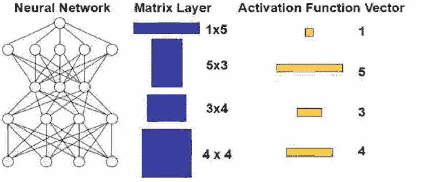

**图1。ANN模型及其相应染色体表示的示意图。**

进化方案中存在两种交叉操作。第一种是神经元交换操作，其中交叉线仅位于矩阵 `$M_{m,n}^L$` 的行之间。由于不同层之间的一致性，子层必须与其父层具有相同的维度。请注意，对于此操作，激活函数向量将按照交换的方式进行，如图2a所示。第二种交叉操作将是连接交换操作。在此操作中，交叉线仅位于随机选择的矩阵 `$M_{m,n}^L$` 的行内。见图2b。在这个操作中，激活函数向量将根据贡献最多权重的父节点而改变。

变异将以一定的概率发生在矩阵集合的权重和激活函数向量集合上。因此，神经元的激活函数可以从sigmoid函数变异为tanh或其他可能的激活函数，反之亦然。

当前模型和先前模型产生的子代数量将基于先前模型在当前数据输入下的错误率。错误率较低的模型将产生更多的子代。选择当前模型作为主要合作伙伴的原因是根据假设2，当前模型将作为下一个进化点的父节点的良好起点。

##### 3.3 微调

在交叉和变异过程之后，子代模型将经历微调和选择阶段。在这个阶段，将使用数据输入使用小学习率的反向传播训练方法来微调子代模型。适应度函数是微调后子代模型的交叉验证误差结果。下一代将根据适应度函数结果和微调后子代模型的交叉操作来创建。该过程将在达到期望的适应度得分或达到最大代数时终止。

#### 4 讨论

由于模型的可能结果是基于存储在模型库中的先前模型的数量，因此初始化方案的方法可以进一步改进，以在早期引入更多有建设性的模型。

本文仅提供了所提出模型的概念，鼓励在真实世界数据上进行进一步实验，并将所提出的模型与随机方法进行比较，以说明遗传算法的收敛速度和对长期股票价格预测的准确性。

#### 参考文献

- 1. Hamilton, J.D., Lin, G.: 股市波动性与商业周期。应用计量经济学杂志 **11**(5), 573–593 (1996). 特刊：计量经济预测

- 2. Barberis, N., Thaler, R.: 行为金融学综述。在：金融经济学手册，卷1，第B部分，第1053–1128页（2003年）。第18章

- 3. Murphy, J.J.: 金融市场技术分析：交易方法和应用的综合指南，纽约金融学院（1999年）

- 4. Haykin, S.: 神经网络与学习机，第三版。Pearson, Upper Saddle River (2009年)

- 5. Saad, E.W., Prokhorov, D.V., Wunsch, D.C.: 使用时延、循环和概率神经网络进行股票趋势预测的比较研究。IEEE Trans. Neural Netw. **9**(6), 1456–1470 (1998年)

- 6. Holland, J.H.: 自然和人工系统中的适应性，第183页。密歇根大学出版社，密歇根（1975年）

- 7. Gonzalez, R.T., Padilha, C.A., Couto, D.A.: 基于遗传算法的集成系统用于股票市场预测。在：IEEE进化计算大会（CEC）（2015年）

- 8. Wang, C.-T., Lin, Y.-Y.: 使用遗传算法进行股票市场数据分析的预测系统。在：模糊系统与知识发现国际会议，pp. 1721–1725（2015年）

---

### 使用多元线性回归模型的预测性大数据分析

Kyi Lai Lai Khine$^1$ 和 Thi Thi Soe Nyunt $^{2(✉)}$

$^1$ 云计算实验室, 计算机研究学院, 缅甸仰光

kyilailai67@gmail.com

$^2$ 软件部门负责人, 计算机研究学院, 缅甸仰光

thithi@ucsy.edu.mm


**摘要。** 在当今快速发展的技术时代，数据在全球范围内迅速增长，成为非常庞大的数据集。这种所谓的“大数据”并从中提取有价值信息的分析已经成为数据分析研究中最重要和最复杂的挑战之一。限制内存使用、计算障碍和较慢的响应时间是考虑传统数据分析在大数据上的主要因素。然后，传统数据分析方法需要适应运行在分布式环境中的高性能分析系统，这些系统提供可扩展性和 flexibility。多元线性回归是一种经验性、统计性和数学成熟的数据分析方法，需要适应分布式大规模数据处理，因为它可能不适用于大规模数据集。在本文中，我们提出了基于MapReduce的多元线性回归模型，适用于并行和分布式处理，目的是在大规模数据集上进行预测分析。所提出的模型将基于“QR分解”在MapReduce框架上分解大矩阵训练数据，从大量矩阵数据中提取模型系数。实验结果表明，我们提出的模型的实现可以在并行和分布式环境中高效处理大规模数据，并提供可扩展性和 flexibility 的良好性能。

**关键词：** 大数据 · 多元线性回归 · 预测分析 · MapReduce · QR分解

## 1 引言

如今，互联网代表了一个巨大的存储空间，每秒都会产生大量的信息。IBM大数据洪水信息图表述了今天数字宇宙中存在的2.7泽字节的数据。此外，根据Facebook的研究，每天更新100TB的数据，预计到2020年社交网络每年将产生35泽字节的数据，从而引发大量的活动和大事件 [3]。大数据分析可以被定义为传统分析和数据挖掘技术与大量结构化、半结构化和非结构化数据的组合，以创建一个基本平台来分析、建模和预测客户、市场、产品、服务等的行为。

“Hadoop”因其经济存储和分析大数据集的能力而被广泛接受。使用MapReduce等并行处理范式，Hadoop可以将长时间处理缩短到几小时或几分钟。大数据分析有三种类型：描述性分析回答问题：“发生了什么？”，使用数据聚合和数据挖掘技术提供对过去的洞察；预测性分析也回答类似这样的问题：“未来可能发生什么？”，应用统计模型如回归和预测来理解未来。它包括各种技术，可以根据历史和当前数据预测未来结果；最后一种是规划分析，使用优化和模拟算法为问题提供可能的结果和建议：“为了未来发生，我们应该做什么？”[7]。

从大数据集中提取有用的特征也成为一个大问题，因为许多统计量在数据集太大无法存储在主存储器中时，通过标准传统算法计算起来很困难。在某些计算环境中，内存空间可以达到几个TB甚至更大。然而，可以存储在主存储器中的观测数量通常是有限的[10]。因此，在监督学习中，海量数据面临两个挑战，由Moufida Rehab Adjout和Faouzi Boufares解释。首先，海量数据集将面临两种严峻情况，如限制内存使用和计算复杂监督学习系统的计算障碍。因此，实际上无法将这些海量数据加载到主内存中。其次，分析庞大的数据可能需要不可预测的时间来响应目标分析结果[1]。在预测大数据分析中，一个重要的主要问题是如何一次性在整个庞大数据上应用统计回归分析，因为包括回归方法在内的统计数据分析方法在处理这些庞大数据集时存在计算限制。Jun等人[8]讨论了子采样技术来克服内存利用的困难。他们还提出，这种方法对于只在部分数据中带来回归参数或估计器的回归分析是有用的，与从整个数据集中导出的估计器相比，效率较低。然而，对整个数据集进行理想的回归估计可能是不可能的[9]。

这就是为什么我们提出了一种方法来减轻统计大数据分析的计算负担，特别是在MapReduce范式下应用多元线性回归分析。本文的组织结构如下：第2节介绍了回归分析和大数据之间的概念和关系。第3节描述了多元线性回归的背景理论及其方程，以及MapReduce框架的解释。第4节详细介绍了我们提出的算法的主要实现及其解释。第5给出了一些性能评估结果、讨论和最终结论，以说明所提方法的适用性。

## 2 回归分析和大数据

统计在大数据中起着重要的作用，因为许多统计方法被用于大数据分析。统计软件提供了丰富的数据分析和建模功能，但只能处理有限的小量数据。回归分析在许多领域广泛应用，如商业、社会行为科学、生物科学、气候预测等。回归分析在统计大数据分析中应用广泛，因为回归模型本身在数据分析中很受欢迎。

使用统计方法（如回归）进行大数据分析有两种方法。第一种方法是从大数据中提取样本，然后使用统计方法对该样本进行分析。这实际上是传统的统计数据分析方法，假设大数据是一个总体。Jun等人[8]已经在统计学中表达了这一点，即在研究领域中，数据集中包含的所有元素的集合可以被定义为总体。这就是为什么整个总体不能被分析的原因，因为存在诸多因素，如计算负载、分析时间等。由于大数据计算环境的发展和数据存储设施成本的降低，接近总体的大数据可以用于某些分析目的。然而，使用统计方法分析大数据仍然存在计算负担的限制。

第二种方法是将整个大数据集分成几个块，而不使用大总体数据。在每个块上应用经典的回归方法，然后将所有块的相应回归结果合并为最终输出 [6]。这只是一个按块读取和存储数据的顺序过程，存储在主内存中。在每个块中单独分析数据可能是方便的，只要数据的大小足够小，可以在各种计算环境中实施估计过程。然而，一个问题是如何替换顺序处理多个数据块，这可能会对响应时间产生不利影响，仍然是处理增加的数据量的问题 [12]。Jinlin Zhu、Zhiqiang Ge和其他人证明了MapReduce框架是解决这个问题的一种方法，它使用并行分布式计算来替代顺序处理，使得在具有不同特性的机器集群上进行并行处理的分布式算法成为可能。

## 3 多元线性回归

多元线性回归是一种用于描述因变量（称为“响应变量”）与一组自变量或预测变量（称为“解释性变量”）之间线性关系的统计模型。最简单的回归形式，我们指的是线性回归，使用直线的公式 ($y_i = \beta_i X_i + \varepsilon$) ，并确定...为了基于输入参数$x$预测$y$的值，需要找到适当的$\beta$和$\varepsilon$的值。对于简单线性回归，即只有一个预测变量的情况，模型如下：

$$Y = \beta_0 + \beta_1 X_1 + \varepsilon \eqno(1)$$ 

该模型假设误差项$\varepsilon$是来自均值为零、标准差为$\sigma$的总体样本。多元线性回归，即有多个预测变量的情况，模型如下：

$$Y = \beta_0 + \beta_1 X_1 + \beta_2 X_2 + \dots + \beta_n X_n + \varepsilon \eqno(2)$$ 

其中$Y$是因变量；$X_1, X_2, \dots, X_n$是无误差（非随机）的自变量；$\beta_0, \beta_1, \dots, \beta_n$是模型的参数。

这个方程定义了因变量$Y$与自变量$X$之间的关系[5]。多元线性回归分析的主要目标是找到$\beta_0, \beta_1, \dots, \beta_n$，使得平方误差的和最小。多元线性回归是最强大和数学成熟的数据分析方法，传统上它只在单台机器上处理一组数据。随着数据量的增加，很难在分布式环境中实现算法的转换。多元线性回归是一种经典的统计数据分析方法，由于计算内存和响应时间的限制，也无法适应分布式环境中处理数据的可扩展性。在这项工作中，我们的贡献是展示经典数据分析算法和预测算法对于多元线性回归的适应性，以应对大数据现象。在大数据时代，解决并行和分布式海量数据处理算法的可扩展性转换是一个基本要求，使用MapReduce范式似乎是解决这个问题的自然解决方案。

### 3.1 MapReduce框架

朱等人（如[14]所定义的，第2页）讨论了MapReduce框架的基础设施、数据流和处理。MapReduce是一个与Hadoop中的HDFS协作的编程平台，用于分析大量数据。MapReduce框架中有两种计算节点：一个主节点（NameNode）和多个从节点（DataNode）。这可以被称为主从架构，所有计算节点及其相应的操作都以大规模并行和分布式数据处理的形式存在。主节点负责整个文件系统的职责，每个从节点充当工作节点。实际上，每个从节点执行两个主要阶段或过程，称为Map()和Reduce()。这两个阶段的数据结构以<Key, Value>对的形式存在。在Map阶段，每个工作节点最初将具有相同键性质的<Key, Value>对组织起来，然后生成一组中间的<Key, Value>对作为中间Map结果。此外，MapReduce系统还可以执行另一个洗牌过程，该过程通过具有相同键对的Map操作生成的中间结果，使用一组隐式函数（例如排序、复制和合并步骤）。然后，洗牌具有特定键的配对列表被组合，并最终传递给Reduce阶段。在Reduce阶段，它接收到由前一过程产生的<键，值>配对列表，计算出期望的最终输出<键，值>配对。

## 4 基于MapReduce的多元线性回归模型与QR分解

由于数据量庞大，在单台机器上训练多元线性回归通常是非常耗时的任务，有时甚至无法完成。Hadoop是用于大数据分析的开放框架，其主要处理引擎是MapReduce，是最流行的大数据处理框架之一。需要高度可并行化和可分布式执行的算法也可以使用MapReduce在大量普通计算机上执行。本文将开发一种基于MapReduce的回归模型，使用多元线性回归。我们特别关注多元线性回归在分布式大规模数据处理中的适应性。本研究展示了一种方法，即多元线性回归的并行性，这是一种经典的统计学习算法，可以应对MapReduce范式下的大数据挑战。然而，我们仍然面临一个大问题或难题，即在计算回归模型参数“$\beta$”时如何分割或分解大型输入矩阵。在解决“$\beta$”的值时，我们实际上需要加载输入矩阵的转置，并与其原始矩阵进行乘法运算，然后进行其他复杂的矩阵操作。不可能一次处理整个巨大的输入矩阵。因此，为了克服多元线性回归在大量数据中的限制和挑战，我们提出了矩阵分解的回归模型。我们希望提出一种新的计算方法，即使用QR分解的回归模型，它在分解或因式分解矩阵上进行计算，比在原始矩阵上立即进行计算更具可扩展性且速度更快。

许多计算任务的基本构建块包括复杂的矩阵运算，包括在科学计算、机器学习、数据挖掘、统计应用等领域中使用的矩阵分解。在大多数这些领域中，需要对大型矩阵进行扩展，以获得更高的准确性和更好的结果。在扩展大型矩阵时，设计高效的并行算法进行矩阵运算非常重要，使用MapReduce是实现这一目标的一种方法。例如，在计算方程 (3) 中的“$\beta$”值时，必须计算矩阵“$R$”的逆矩阵。矩阵求逆在MapReduce中很难实现，因为逆矩阵中的每个元素都依赖于输入矩阵中的多个元素，所以计算不容易按照MapReduce编程模型所要求的方式进行分割。给定矩阵`$X$`的QR分解（也称为QR因式分解）是将矩阵`$X$`分解为一个正交矩阵`$Q$`和一个上三角矩阵`$R$`的乘积`$X = QR$`的分解。其中`$Q^T = Q^{-1}$`或`$Q^TQ = I$`，`$R$`是上三角矩阵。

它用于解决多元线性回归中的普通最小二乘问题，也是计算具有许多行而列数较少 ($m > n$) 的矩阵的QR分解的标准方法，引起许多现实世界应用中的常见问题。正如我们已经知道，在MapReduce处理中，数据由一组键值对表示。当我们将MapReduce应用于分析矩阵形式的数据时，一个键表示一行的标识，一个值表示该行中的元素[4]。因此，矩阵也是一组键值对的集合，假设每行都有一个不同的键以简化表示，尽管有时每个键可能表示一组行[2]。为了确定多元线性回归模型的系数“$\beta$”，计算方法QR分解是通过将数据矩阵`$X$`分解为两个矩阵“$Q$”和“$R$”来简化计算，如下所示：`$\beta = (X^T X)^{-1}X^T Y$`。

通过替换 `$X = QR, \beta = (Q^T R^T Q R)^{-1} Q^T R^T Y$`, 我们得到：

$$\beta = R^{-1} Q^T Y \eqno(3)$$ 

## 4.1 提出模型的实现

使用QR分解在MapReduce框架上计算多元线性回归的系数“$\beta_i$”将是三阶段处理或迭代，以便以高效的方式实现所提出模型的并行和分布式处理。在下一节中，我们将介绍包括主要或驱动函数在各自表中的三阶段MapReduce处理的算法。

### 提出模型的算法

提出模型的算法以参数形式接受要用于将大型训练输入矩阵 ‘$X$’ 分割并分布在多个任务上的块编号。

- **“映射”函数**：第一阶段的‘映射’函数对所有‘noBlock’的大型训练数据‘$X$’矩阵进行分解得到‘$X_i$’子矩阵。为‘Reduce’函数生成具有相应‘$Key_i$’的两个结果矩阵‘$Q_i$’和‘$R_i$’。这里的主要思想是强调每个‘映射’过程在内存中加载的最大矩阵大小$(BlockSize, n)$，这显著克服了大型矩阵训练数据的“内存不足”问题。

- **‘MapReduce框架并行’**：同样，‘Reduce’过程也将接收一个大小为$(n \times noBlock, n)$的最大数组。因此，选择块的数量应根据应用的集群中的机器的大小或数量来考虑。更多的计算能力可以通过简单地将新机器添加到集群中来提高。第二阶段接收来自第一阶段结果的输入和所有块的 `$y_i$`。在‘Map’函数中，向量 `$y$` 被分解成多个向量 `$y_i$`（块的数量），然后与相关键‘$Key_i$’一起发送到‘Reduce’函数中。第三个或最终阶段使用来自第二阶段的输入，包括向量集合‘$V_i$’和‘$R_{final}$’。‘Map’函数构建一个列表‘ListRV’与所有块‘$i$’的所有‘$V_i$’集合以及‘$R_{final}$’和相关键‘$Key_{final}$’组合。‘Reduce’函数接收列表‘ListRV’，并将所有‘$V_i$’向量的值相加，得到最终向量 `$V$`。此外，应用‘$R_{final}$’作为逆矩阵，并最终与‘$V$’相乘，以获得提出模型的‘$\beta_i$’作为最终输出（表1、2、3和4）。

### 表 1. 提出模型的主要或驱动函数

```
Input: Matrix X and Vector y from Input Dataset
Start
  noBlock = Size (X) / BlockSize
  n (No of Observations for each Block 'i'): = X / noBlock

  Xi:= X / noBlock
  For all row of y
    yi:= y / noBlock
End
Output: Xi; with i: =1...noBlock
```

### 表 2. 提出模型的第一阶段映射/归约函数

| Map Function (*Mapper 1*) | Reduce Function (*Reducer 1*) |

| :--- | :--- |

| **Input: X<sub>i</sub> of X for all blocks**<br>**Output: Q<sub>i</sub>, R<sub>i</sub>**<br>**Start**<br>&nbsp;&nbsp;**For all block X<sub>i</sub> of X**<br>&nbsp;&nbsp;&nbsp;&nbsp;**(Q<sub>i</sub>, R<sub>i</sub>) = Map1 (X<sub>i</sub>)**<br>&nbsp;&nbsp;&nbsp;&nbsp;**Produce (Key<sub>i</sub>, Q<sub>i</sub>)**<br>&nbsp;&nbsp;&nbsp;&nbsp;**Produce (Key<sub>i</sub>, R<sub>i</sub>)**<br>&nbsp;&nbsp;**End for**<br>**Function Map1 (X<sub>i</sub>)**<br>&nbsp;&nbsp;**Input: X<sub>i</sub> of Matrix ‘X’**<br>&nbsp;&nbsp;**Start**<br>&nbsp;&nbsp;&nbsp;&nbsp;**(Q<sub>i</sub>, R<sub>i</sub>) := QRDecompose (X<sub>i</sub>)**<br>&nbsp;&nbsp;&nbsp;&nbsp;**Output: Q<sub>i</sub>, R<sub>i</sub>**<br>&nbsp;&nbsp;**End**<br>**Function QRDecompose (X<sub>i</sub>)**<br>&nbsp;&nbsp;**Start**<br>&nbsp;&nbsp;&nbsp;&nbsp;**Factorizing X<sub>i</sub> into Q<sub>i</sub> and R<sub>i</sub> for all respective blocks ‘i’**<br>&nbsp;&nbsp;**End** | **Input: <key, value> pairs for ‘R<sub>i</sub>’ Matrix from Mapper1.**<br>**Output: Q<sub>i</sub>’ for all block ‘i’, R<sub>final</sub> for intermediate result in ‘β’ calculation**<br>**(Q<sub>i</sub>’, R<sub>final</sub>) = Reduce1 ((Key<sub>r</sub>, [R<sub>1</sub>,R<sub>2</sub>,......,R<sub>i</sub>])**<br>**For all blocks Q<sub>i</sub>’ of Q’**<br>&nbsp;&nbsp;**Produce (Key<sub>i</sub>, Q<sub>i</sub>’)**<br>**End for**<br>**Produce (Key<sub>final</sub>, R<sub>final</sub>)**<br>**Function Reduce1 (Key<sub>r</sub>, [R<sub>1</sub>,R<sub>2</sub>,......,R<sub>i</sub>])**<br>**Input: R<sub>temp</sub> = Matrix[R<sub>1</sub>,R<sub>2</sub>,......,R<sub>i</sub>]**<br>&nbsp;&nbsp;**Start**<br>&nbsp;&nbsp;&nbsp;&nbsp;**(Q<sub>i</sub>’, R<sub>final</sub>) := QRDecompose (R<sub>temp</sub>)**<br>&nbsp;&nbsp;&nbsp;&nbsp;**For all row of Q’**<br>&nbsp;&nbsp;&nbsp;&nbsp;&nbsp;&nbsp;**Q<sub>i</sub>’ := Decompose (Q’, BlockSize)**<br>&nbsp;&nbsp;&nbsp;&nbsp;**End For**<br>&nbsp;&nbsp;&nbsp;&nbsp;**Function QRDecompose (R<sub>temp</sub>)**<br>&nbsp;&nbsp;&nbsp;&nbsp;&nbsp;&nbsp;**Start**<br>&nbsp;&nbsp;&nbsp;&nbsp;&nbsp;&nbsp;&nbsp;&nbsp;**Factorizing R<sub>temp</sub> into Q’ and R<sub>final</sub>**<br>&nbsp;&nbsp;&nbsp;&nbsp;&nbsp;&nbsp;**End**<br>&nbsp;&nbsp;&nbsp;&nbsp;**Function Decompose (Q’, BlockSize)**<br>&nbsp;&nbsp;&nbsp;&nbsp;&nbsp;&nbsp;**Start**<br>&nbsp;&nbsp;&nbsp;&nbsp;&nbsp;&nbsp;&nbsp;&nbsp;**Decomposition of Q’ into Q<sub>i</sub>’ for all blocks ‘i’ applying Q’/ BlockSize**<br>&nbsp;&nbsp;&nbsp;&nbsp;&nbsp;&nbsp;**End**<br>&nbsp;&nbsp;**End** |

###### 表 3. 提出模型的第二阶段映射/归约函数

| Map Function (*Mapper 2*) | Reduce Function (*Reducer 2*) |

| :--- | :--- |

### 表 4. 提出模型的第三阶段映射/归约函数

| Map Function (`Mapper 3`) | Reduce Function (`Reducer 3`) |
| :--- | :--- |
| **Input:** `ListQ<sub>i</sub>; = List [Key<sub>i</sub>, (Q<sub>i</sub>, Q')<sub>i</sub>]`<br>`y<sub>i</sub>` of Vector `y` for all blocks 'i'<br>**Output:** `(Key<sub>i</sub>, y<sub>i</sub>)` for all blocks 'i'<br>Start<br>`y<sub>i</sub>` = `Map2(y<sub>i</sub>)`<br>Function `Map2 (y<sub>i</sub>)`<br>&nbsp;&nbsp;Input: `y<sub>i</sub>`<br>&nbsp;&nbsp;Start<br>&nbsp;&nbsp;&nbsp;&nbsp;Produce `(Key<sub>i</sub>, y<sub>i</sub>)`<br>&nbsp;&nbsp;End<br>End | **Input:** List of `Q<sub>i</sub>`, `Q<sub>i</sub>'`, `y<sub>i</sub>` with the same key ‘`Key<sub>i</sub>`’<br>**Output:** `V<sub>i</sub>[]` for intermediate result in ‘β’ calculation<br>For all block ‘i’<br>&nbsp;&nbsp;`V<sub>i</sub>[]` = `Reduce2(Key<sub>i</sub>, List[Q<sub>i</sub>, Q<sub>i</sub>', y<sub>i</sub>])`<br>End for<br>Function `Reduce2 (Key<sub>i</sub>, List [Q<sub>i</sub>, Q<sub>i</sub>', y<sub>i</sub>])`<br>&nbsp;&nbsp;Input: `List [Q<sub>i</sub>, Q<sub>i</sub>', y<sub>i</sub>]`<br>&nbsp;&nbsp;Start<br>&nbsp;&nbsp;&nbsp;&nbsp;`Q<sub>i</sub>` = `Multiply1 (Q<sub>i</sub>, Q<sub>i</sub>')`<br>&nbsp;&nbsp;&nbsp;&nbsp;`Q<sub>i</sub><sup>T</sup>` := `Transpose (Q<sub>i</sub>)`<br>&nbsp;&nbsp;&nbsp;&nbsp;`V<sub>i</sub>` := `Multiply2 (Q<sub>i</sub><sup>T</sup>, y<sub>i</sub>)`<br>&nbsp;&nbsp;End<br>Function `Multiply1 (Q<sub>i</sub>, Q<sub>i</sub>')`<br>&nbsp;&nbsp;Start<br>&nbsp;&nbsp;&nbsp;&nbsp;Matrix multiplication producing matrix ‘Q’<br>&nbsp;&nbsp;End<br>Function `Multiply2 (Q<sup>T</sup>, y<sub>i</sub>)`<br>&nbsp;&nbsp;Start<br>&nbsp;&nbsp;&nbsp;&nbsp;Matrix multiplication resulting ‘`V<sub>i</sub>`’ arrays<br>&nbsp;&nbsp;End |
| **Input:** `V<sub>i</sub>[]` for all blocks ‘i’, `(Key<sub>final</sub>, R<sub>final</sub>)`<br>**Output:** `ListRV (|R<sub>final</sub>, V<sub>1</sub>,..., V<sub>i</sub>|)`<br>Start<br>`ListRV` := `Map3 (V<sub>i</sub>[], (Key<sub>final</sub>, R<sub>final</sub>))`<br>Function `Map3 (V<sub>i</sub>[], (Key<sub>final</sub>, R<sub>final</sub>))`<br>&nbsp;&nbsp;Input: `V<sub>i</sub>[]`, `(Key<sub>final</sub>, R<sub>final</sub>)`<br>&nbsp;&nbsp;Start<br>&nbsp;&nbsp;&nbsp;&nbsp;Mapping `Key<sub>final</sub>` with all `V<sub>i</sub>[]`<br>&nbsp;&nbsp;&nbsp;&nbsp;Produce `ListRV (|R<sub>final</sub>, V<sub>1</sub>,..., V<sub>i</sub>|)`<br>&nbsp;&nbsp;End<br>End | **Input:** `ListRV (|R<sub>final</sub>, V<sub>1</sub>,...,V<sub>i</sub>|)`<br>**Output:** `β[]` coefficients of proposed model<br>Start<br>`β[]` := `Reduce3(ListRV (|R<sub>final</sub>, V<sub>1</sub>,...,V<sub>i</sub>|))`<br>Function `Reduce3 (ListRV)`<br>&nbsp;&nbsp;Start<br>&nbsp;&nbsp;&nbsp;&nbsp;`InvR<sub>final</sub>` := `Inverse (R<sub>final</sub>)`<br>&nbsp;&nbsp;&nbsp;&nbsp;`SumV` := `Sum (V<sub>i</sub>)`<br>&nbsp;&nbsp;&nbsp;&nbsp;`β[]` := `Multiply (InvR<sub>final</sub>, SumV)`<br>&nbsp;&nbsp;End<br>Function `Inverse (R<sub>final</sub>)`<br>&nbsp;&nbsp;Start<br>&nbsp;&nbsp;&nbsp;&nbsp;Inverse matrix operation of ‘`R<sub>final</sub>`’<br>&nbsp;&nbsp;End<br>Function `Sum (V<sub>i</sub>)`<br>&nbsp;&nbsp;Start<br>&nbsp;&nbsp;&nbsp;&nbsp;Σ `V<sub>i</sub>` for all blocks ‘i’<br>&nbsp;&nbsp;End<br>Function `Multiply (InvR, SumV)`<br>&nbsp;&nbsp;Start<br>&nbsp;&nbsp;&nbsp;&nbsp;Multiplication of `InvR<sub>final</sub>` and `SumV`<br>&nbsp;&nbsp;End |

### 5 实验、讨论和结论

#### 5.1 实验设置

我们应用了`Apache Hadoop`（版本`2.7.1`）框架，该框架已经包含了`MapReduce`处理引擎和`Hadoop`分布式文件系统（`HDFS`）。对于集群设置，有三台机器，规格为`CPU`（`2.4 GHz 4核`，`RAM 4 GB`，`HDD 500 GB`）。一台机器作为主节点（“`NameNode`”），其余两台机器作为从节点（“`DataNode`”）使用`Java`实现来测试我们的提出模型。在这个实验中，我们使用了`1.5`万个样本的数据集，该数据集应用于缅甸仰光市的单行道或街道导航模拟。这个训练矩阵形式的数据集由`15,000`行、`225`列组成。

然后，在四个条件下执行时间的性能指标（图1和图2）：

1.  在不应用分解技术的分布式环境中进行单一或传统处理
2.  在不应用分解技术的分布式环境中进行并行处理
3.  在应用分解技术的非分布式环境中进行单一或传统处理
4.  在应用分解技术的分布式和并行处理中（提出的想法）在以下图表中呈现。

图1. 四个条件下的性能指标

图2. 四个条件之间的整体性能指标

#### 5.2 讨论和结论

根据实验结果，我们提出的工作可以通过将计算分布在“Map”任务上，然后在本地矩阵分解函数上进行优化，最后在“Reduce”任务上组合和提取模型系数“$\beta$”，而不会面临“内存不足”的风险，来处理输入的大规模训练矩阵（m, n）。此外，我们还可以证明我们的方法在与其他方法相比提供了更高效的计算和响应时间。在本文中，我们的贡献思路是展示经典回归分析一般和多元线性回归特别是如何适应大数据分析现象。因此，我们的重点主要放在使用MapReduce范式进行并行和分布式大规模数据处理的传统多元线性回归上。我们打算通过避免在大规模数据上使用有限内存来提高处理性能，从而提供可扩展性和灵活性。

此外，提出的模型将用于解决非常大的矩阵问题，整个矩阵的问题无法放入内存中，需要多次读写硬盘。我们将通过添加预处理步骤来进一步改进我们提出的模型，将输入训练矩阵转换为高而瘦的矩阵形式（行数非常多，但列数较少），这在线性回归模型中非常重要且常用。然后，我们将展示进一步的性能评估结果和从模型中获得的预测准确性结果的比较研究。

#### 参考文献

- 1. Adjout, M.R., Boufares, F.: 多重线性回归的大规模并行处理。 在：2014年第十届信号图像技术与基于互联网的系统国际会议（2014）
- 2. Ahsan, O., Elman, H.: 多核环境下的QR分解（2014）
- 3. Amir, G., Murtaza, H.: 超越炒作：大数据概念、方法和分析。国际管理学杂志 35, 137–144 (2014)
- 4. Benson, A.R., Gleich, D.F., Demmel, J.: 高瘦矩阵的直接QR分解在MapReduce架构中的应用。在：2013年IEEE国际大数据会议(2013)
- 5. Dergisi, T.B., Sayfasi, D.W.: 基于主成分得分的多元多元回归分析，研究肉鸡的一些屠宰前后性状之间的关系。农业科学杂志 17, 77–83 (2011)
- 6. Fan, T.H., Lin, D.K.J., Cheng, K.F.: 用于大规模数据集的回归分析。数据与知识工程 61, 554–562 (2007)
- 7. Florina, C., Elena, G.: 大数据和大数据分析的视角 (2013)
- 8. Jun, S., Lee, S.J., Ryu, J.B.: 一种针对大数据的分割回归分析。国际软件工程应用 9, 21–32 (2015)
- 9. King, M.L., Evans, M.A.: 基于调查数据的回归模型中的块效应测试。美国统计协会杂志 63, 1227–1236 (1986)
- 10. Li, R., Li, B., Lin, D.K.J.: 大规模数据集中的统计推断。应用随机模型商业产业 29, 399–409 (2013)
- 11. Nugraha, A.S., Basaruddin, T.: 在某些类型的矩阵中分析和比较QR分解算法。在: 2012年计算机联合会议论文集科学和信息系统 (2012)
- 12. 唐，L., 周，L., 宋，P.X.K.: 大数据正则化广义线性模型中的分割与组合方法 (2016年)
- 13. 向，J., 孟，H., 阿布拉纳加，A.: 使用MapReduce进行可扩展的矩阵求逆 (2014年)
- 14. 朱，J., 葛，Z., 宋，Z.: 用于建模和监测大规模工厂级过程的分布式并行PCA与大数据。IEEE Trans. Industr. Inform. 13, 1877–1885 (2009)

### 基于大数据的教师能力评估和学生职业预测

Zun Hlaing Moe(✉), Thida San, Hlaing May Tin, Nan Yu Hlaing, and Mie Mie Tin

缅甸信息技术学院，曼德勒，缅甸

zunhlaing@gmail.com, thidako22@gmail.com, hlaingmaytin1982@gmail.com, nanyu.man@gmail.com, miemietinl1983@gmail.com

**摘要**：本文试图提供教师评估和学生职业机会预测。教师的能力是基于学生的反馈、课堂积极参与、学生在测试中的成绩和教师的能力来决定的。反馈是学习过程中的一个重要元素。学生的反馈是教师评估和发展的有效工具。学生的职业机会是决定大学排名的一个重要领域。这项研究还将根据学生个人科目成绩预测他们的职业发展。该系统通过使用情感分析来分析教师的能力，情感分析也被称为意见挖掘技术。学生职业预测基于预测分析。它包括一系列基于历史和当前数据预测未来结果的技术。

**关键词**：大数据 · 挖掘 · 情感分析 · 预测分析 · 职业 · 能力 · 成绩

#### 1 引言

教师和学生的表现对大学的声誉至关重要。一位有效的教师通常具备以下特点：教学技巧、课堂管理、学科知识、课程知识、明确的课程目标、引人入胜的个性和教学风格、对学生更高的期望和沟通能力。

基于学生反馈的评估是提高教学质量的重要策略。因此，本研究将通过收集学生对个别教师的反馈来分析教师的能力。收集学生的反馈的目的是了解教师的能力如何影响大学的教学和学习系统的进展。有许多因素可以分析教师的能力。教师的经验、知识和能力在很大程度上影响学生的职业机会。因此，该系统还将通过教学方法和课堂管理等方面分析教师的能力。

学生及其表现在一个国家的社会和经济增长中起着关键作用。他们的创造和创新有助于提升他们的大学形象。因此，学生的成功是大学最重要的事情之一。这项研究还将预测学生的职业。因此，我们可以知道有多少学生从大学毕业，以及他们在哪些行业获得了好工作。通过审查学生每个科目的成绩，可以预测他们的职业。

本文介绍了与大数据相关的基本概念。大数据是庞大而复杂的数据集。数据管理对大数据有三个挑战维度：数据的极大体量，数据类型的广泛多样性以及数据处理的速度。大数据量是相对的，并且会受到时间和数据类型等因素的影响。今天被认为是大数据的数据量，在未来可能不再达到阈值，因为存储容量将增加，使得可以捕获更大的数据集。大数据的多样性指的是数据集中的结构异质性。技术进步使得企业能够使用各种类型的结构化、半结构化和非结构化数据。大数据的速度指的是数据生成的速率以及分析和采取行动的速度[1]。

本文分为7个部分进行组织。相关工作在第2节中介绍，系统的过程在第3节中介绍。在第4节中，介绍了分析教师能力和预测学生职业的系统实现中的重要因素。第5节包含了预期结果。结论在第6节中。

#### 2 相关工作

已经有很多研究分析了教师的能力和预测学生的成绩和表现。本节描述了系统的相关工作。文献[2]比较了学生反馈的结果，包括纸质和网络调查。学生是机构或大学的主要利益相关者，他们的表现对一个国家的社会和经济增长起到重要作用，可以培养出有创造力的毕业生、创新者和企业家[3]。

文献[4]基于学生的兴趣、能力和优势来预测学生的表现。研究工作[5]使用皮尔逊相关系数方法预测 student 每门课程的最终成绩。我们的研究主要集中在分析教师的能力和预测学生的职业。我们的系统将使用预测分析。

Baradwaj和Pal [6]进行了一项研究，分析了50名学生的表现。他们在4年的时间内（2007–2010），关注了多个绩效指标，包括“上学期成绩”、“课堂测试成绩”、“研讨会表现”、“作业”、“一般能力”、“出勤情况”、“实验室工作”和“期末成绩”。理论上，多个因素被认为会影响高等教育中学生的表现[7]，并且他们根据相关的个人和社会因素预测了学生的表现。在这篇研究论文中，我们的目标是通过分析学生的反馈来评估教师的能力，并使用每个学期的成绩来预测学生的职业。

#### 3 处理

从2015年到2017年的学生成绩被收集为数据集，该数据集用于根据每年的最终成绩预测学生的职业。该数据集包括实践成绩、实验成绩、测验成绩、突发测试成绩、作业成绩、课堂活动成绩和期中成绩。期末考试成绩将用于预测学生的职业。

##### 3.1 数据收集

为了我们的研究，将收集来自缅甸信息技术学院在2015年至2017年期间的本科生数据。最初将收集约360个学生记录。在我们的大学中，有两个学位课程，计算机科学与工程和电子与通信工程。在我们的大学中，每年增加120名学生。因此，在接下来的十年里，学生数据将越来越大。然后，如果我们的大学扩展课程，如文凭、硕士、博士，那么我们的数据也会越来越多。因此，研究的主要目标是预测学生毕业后的职业机会。

**训练数据**。在这篇研究论文中，整个数据集将被分为两部分，一部分是80%的训练数据集，另外20%用作测试数据集。在这项研究中，系统将使用2015年至2017年学生的数据作为训练阶段。

**测试数据**。在测试过程中，我们将从原始数据集中分离出20%的计算机科学与工程专业三年级学生。它将用于与模型进行测试。

#### 4 实施

该系统将实施两个部分。第一个部分是分析教师的能力，第二个部分是预测学生的职业机会。

##### 4.1 分析教师的能力

分析教师能力有三个主要部分。一个是教师，另一个是学生和大学。为了分析教师的能力，系统将首先检查有多少学生参加了教师的课程。系统还将通过学生的反馈和测试结果分析教师的能力。当系统收集到学生的反馈时，不需要透露学生的姓名或学号。通过收集反馈，系统可以了解学生对课程和教师的真实意见。根据反馈，教师将了解自己的能力、教学中的优点和缺点，然后可以提高他们的教学能力。

在反馈中，有五个评分标准来分析教师的能力：`R1`是不满意的，`R2`是公平的，`R3`是满意的，`R4`是非常好的，`R5`是优秀的。该系统将根据技术能力、管理能力和沟通能力来分析教师的能力。下表显示了与上述三种能力相关的一些事实（表1）。

**表1。收集反馈的三个技能特点**

| 否 | 技能 | 问题 |
| :--- | :--- | :--- |
| 1 | 技术技能 | • 老师是否具备所教科目的深入知识？<br>• 清楚地解释课程的目标、要求和评分制度<br>• 使用学生能理解的词语和表达方式<br>• 老师详细讨论了各个主题<br>• 清晰而系统地呈现了教学内容 |
| 2 | 管理技能 | • 老师上课准时<br>• 有效利用上课时间<br>• 管理一个允许你工作和学习而几乎没有干扰的教室<br>• 让课堂有趣且与实际相关<br>• 课堂上移动以检查所有学生 |
| 3 | 沟通技能 | • 友善且愿意帮助你<br>• 鼓励合作和参与<br>• 为学生提供选择的机会<br>• 在大学内支持和关心学生<br>• 老师对所有学生都有耐心<br>• 让你了解自己的进展情况<br>• 展示出的自信水平 |

**基于三种能力的教师能力**。该系统收集了在2015年和2017年期间在缅甸信息技术学院（MIIT）学习计算机科学学位课程的一百名学生的数据。该系统将根据技能以条形图显示教师的能力。图1显示了根据教师的技术、管理和沟通能力的问题的评估结果。学生对以下问题的评价结果为100%优秀：“教师上课准时”、“教师详细讨论课题”和“教师对所教科目有深入的知识”。所有学生对以下问题给出了非常好的评价：“老师可以彻底解释或使用其他方法来理解这个主题”。62%的学生给出了满意的评价，38%的学生对问题“老师对所有学生都有耐心”做出了很好的回应。根据这些回答，可以认为老师是一位优秀的教师。

图1。学生对教师能力的调查

#### 4.2 预测学生的职业

预测学生职业的重要属性是学生的成绩。在预测学生职业时，系统主要使用学期平均绩点（`SGPA`）和累计绩点平均（`CGPA`）。一些论文使用`CGPA`来预测学生的表现[8-10]。

系统将通过审查学生的成绩来预测他们的职业。如果一个学生在毕业前保持并保留了他们最好的成绩，这将有助于他们获得好的职业。

**基于成绩的学生职业**。以下图表审查了每门课程的学生绩点。例如，系统会审查计算机科学与工程专业学生从第一年到第二年的成绩。图2(a)和2(b)代表每个学期每个科目的课程成绩点。第一个学期有5门课程，第二个学期有7门课程。

图2(a)。第一学年第一学期的成绩点

图2(b)。1年级第2学期绩点

图3(a)和3(b)代表每个学期每个科目的课程成绩点。第一个学期有7门课程和5门实验室成绩点，第二个学期有6门课程。

图3(a)。2年级第1学期绩点

图3(b)。2年级第2学期绩点

图4显示了学生根据成绩的进展情况。系统将通过比较每年的学期平均成绩点（`SGPA`）来展示学生的进展。根据图4，学生的职业发展将不利，因为他的成绩逐年下降。

图4. 使用`SGPA`的第1年到第2年绩点

#### 5 预期结果

预期结果将显示我们大学的合格教师人数，获得更好工作的学生人数以及教师能力对学生职业的影响。该系统将显示教师的表现以及产生了多少优秀学生。

#### 6 结论

我们的研究论文分析了教师的能力并预测了学生的职业。分析教师的能力有助于帮助教师改进他们的教学方法。反馈是教师发展的有效工具。本文回顾了学生的反馈。预测学生的职业也非常有用，可以了解大学的产品和标准。本文通过分析方法和预测方法预测了学生的职业生涯。总之，对教师和学生表现的分析和预测激励我们进行进一步的研究，以应用于我们的环境。它将有助于教育系统以系统化的方式监控学生的表现。

#### 参考文献

- 1. Osmanbegović, E., Suljić, M.: 预测学生表现的数据挖掘方法。 Econ. Rev. 10(1) (2012)
- 2. Ardalan, A., Ardalan, R., Coppage, S., Crouch, W.: 通过纸质和网络调查比较获得的学生反馈对教师教学的影响 38(6) (2007)
- 3. Yadav, S.K., Bharadwaj, B., Pal, S.: 数据挖掘应用：预测学生表现的比较研究。Int. J. Innov. Technol. Creative Eng. 1(12), 13–19 (2011)
- 4. Dietz-Uhler, B., Hurn, J.E.: 使用学习分析预测（和改善）学生的成功：教师的观点。J. Interact. Online Learn. 12, 17–26 (2013)
- 5. Ephrem, B.G., Balasubramanian, N., Al-Shuaily, H.: 使用预测数据分析预测学生考试成绩
- 6. Gandomi, A., Haider, M.: 超越炒作：大数据概念、方法和分析
- 7. Saa, A.A.: 教育数据挖掘和学生绩效预测。（IJACSA）。国际高级计算机科学与应用杂志 7 (5) , 212–220 (2016)
- 8. Baradwaj, B.K., Pal, S.: 挖掘教育数据以分析学生绩效。（IJACSA）国际高级计算机科学与应用 2(6), 2011 (2011)
- 9. Angeline, D.M.D.: 使用关联规则生成学生绩效分析的 apriori 算法。SIJ 计算机科学与工程应用交易（CSEA） 1 (1) , 12–16 (2013)
- 10. Quadri, M.M., Kalyankar, N.: 使用决策树技术进行学术绩效的学生数据的辍学特征。全球计算机科学与技术杂志 10 (2) (2010)

## 基于大数据处理和物联网架构的医疗保健推文情感分析使用最大熵分类器

Hein Htet(✉), Soe Soe Khaing(✉), 和 Yi Yi Myint(✉)

缅甸Pyin Oo Lwin科技大学（Yatanarpon Cyber City）

`nightstalker.hh.5005@gmail.com, khaingss@gmail.com, yiyimyint.utycc@gmail.com`

**摘要**：人们很少讨论或谈论他们的健康问题，很难了解他们的真实健康状况。但是，现在大多数人都喜欢使用社交媒体，人们已经开始在上面表达他们的感受和活动。仅关注Twitter，用户创建的推文包括新闻、政治、生活对话，也可以用于各种分析目的。因此，医疗保健系统被开发出来，以挖掘Twitter用户的健康状况，并为卫生当局提供便利，以便根据Twitter数据轻松检查他们的大陆健康行为。最大熵分类器（`MaxEnt`）用于对推文进行情感分析，以推测他们的健康状况（良好、一般或糟糕）。它与Twitter数据（大数据环境）进行交互，因此构建了基于物联网的大数据处理框架，以高效处理大量的Twitter用户数据。本文旨在提出使用`MaxEnt`分类器和基于Hadoop框架集成物联网架构的医疗保健系统。

**关键词**：情感分析 · 大数据框架 · 物联网

#### 1 引言

大多数人认为分享他们的健康问题的情况是不重要的，而且他们中的大多数人对他们真实的健康状况了解甚少。在这些日子里，人们使用社交媒体（Twitter、Facebook等）并开始在公共领域分享他们的感受和活动。

因此，通过对社交媒体情感分析来开发健康监测系统，对于那些对自己的健康状况了解甚少的人非常有用。此外，它还用于为健康管理部门提供检查他们的大陆健康行为水平的工具。在监督式机器学习算法中，最大熵分类器被应用于推文情感分析的数据训练和准确分类，以获得积极、消极和中性的健康结果。

- 构建了一个大数据处理框架，以高效处理不断增长的Twitter用户的数据存储。

- 总体而言，本文旨在通过应用Twitter API获取推文，然后在云服务器上对这些数据进行预处理和爬取。将其存储到大数据处理框架中以供进一步使用。然后，通过最大熵分类器进行分析，并最终为特定测试用户或特定大陆生成关于健康状况百分比的正面、负面、中性结果。

本文共分为八个部分。第二和第三部分涉及相关工作和整体系统架构；数据收集、数据存储和处理、数据分析分别在第四、第五和第六部分；实验结果在第七部分进行解释；第八部分涉及结论和未来工作。

#### 2 相关工作

大多数研究者正在进行关于Twitter数据的情感分析研究。Syed Akib Anwar [1] 提出公众情感是收集产品反馈的主要事项。本文使用Twitter作为社交媒体来收集关于任何产品的评论。收集到的评论根据地点、特征和性别进行分析。然后，进行数据提取和数据处理，并使用情感评分进行产品分析。

下一位研究者 Aarathi Patil [2] 提出可以通过基于地点的社交媒体对任何产品或事件进行情感分析。本文涉及四个主要步骤：第一步是创建用于挖掘 `twitter4j` 并分析数据的 Twitter 应用程序；接下来，使用来自 Twitter 的秘密令牌收集推文，这些收集到的推文保存在 Excel 文件中。数据预处理已经完成，然后使用朴素贝叶斯分类器对筛选出的推文进行分类。情感得分为 1 表示负面情绪，2 表示中性情绪，3 表示积极情绪。

## 3 总体系统架构

总体系统架构如图 1 所示，首先通过 Twitter API 从 Twitter 上爬取数据到云端 Web 服务器。这些原始推文数据需要进行清洗，因此进入预处理阶段。预处理阶段是非常重要的阶段，它将原始数据转化为有价值的数据以进行分析处理。首先，需要将原始推文文本转换为相同格式（小写）；然后，需要删除停用词，如 a、an、the、is 等。接下来进行分词，将推文集分解为每个单词，并经过词形还原阶段，根据系统中的几种分组格式（名词、动词、形容词和副词）对单词进行分组。

之后，将特征集与健康数据进行对应，并将得到的特征向量存储回云数据库服务器。

在本地端，使用一个 PC 作为主节点和四个树莓派板作为数据节点构建了基于物联网的大数据分布式处理框架。在该框架中配置了 Hadoop、MapReduce 和 Hive 数据仓库等大数据处理生态系统。在本地端框架上进行推文情感分析，预测出健康状态（良好、一般或不好）的百分比结果，并展示给被测试的 Twitter 用户。

## 4 数据收集

这一部分也是进行数据分析的第一阶段，涉及从多种数据源、数据集市和数据仓库收集数据。在该系统中，数据从社交媒体 Twitter 上收集。使用开放 API 从 Twitter 获取数据。要获取 Twitter 数据，需要 API、API 密钥、访问令牌和访问令牌密钥。在满足所有这些要求之后，可以使用 REST API 和 Twitter4J 获取 Twitter 数据，以 CSV 或 JSON 格式将数据文件返回给开发人员。以下是一些与健康相关的样本训练数据：

**积极的推文**

> “孕期轻度饮酒的健康风险与禁酒是最安全的方法相一致… https://t.co/YcfHfoZfcB 英国”

**中性推文**

> “RT @9DashLine: 中国和文莱在基础设施、健康和国防方面承诺更紧密的合作 https://t.co/mxxzVpTgY5#”

**负面推文**

> “15岁少年接受极端 #整容手术-https://t.co/2Yk3XN1qPY <<”

## 5 数据存储和处理

在数据存储和处理阶段，数据存储在大数据数据仓库 (Hive) 中，这是一个构建在 Hadoop 核心元素 (HDFS 和 MapReduce) 上的批处理数据仓库层。如图 2 所示，结果特征词被导入到 Hadoop 分布式文件系统 (HDFS) 中，借助 FLUME 的帮助，用于导入和导出非结构化数据。从 HDFS 导入的数据必须发送到 MapReduce 范式中，这也是解决大数据问题的主要工具。

Twitter API 每个用户最多可以响应 3600 条推文，每次最多 200 条。一条推文最多有 140 个字符，因此每个 Twitter 用户的数据大小约为 3.6 Mb，用于预测他们的健康状况。测试的用户越多，需要更多的存储空间来持久化他们的数据。因此，应用了大数据处理框架 Hadoop 生态系统。

### 5.1 Hadoop

Hadoop 是一个基于 Java 的开源平台，提供了 MapReduce 和 Google 文件系统技术的实现。此外，Hadoop 是一个开源框架，用于处理跨低成本商品硬件集群的大规模数据集。Hadoop 生态系统是大数据解决方案技术之一，用于处理大量用户测试数据，以预测其健康状态。在这个提议的系统中，Hadoop 的两个主要组件主要用于处理这些数据：

1. **Hadoop分布式文件系统（HDFS）**：HDFS 是在大数据环境中管理文件的一种多功能、弹性的集群方法。它是一个数据服务，提供了在数据量和速度高的情况下所需的独特能力。HDFS 中有两种类型的服务：NameNode 和 DataNode。

2. **MapReduce (MR)**：MapReduce 是一种数据处理范例，该过程从用户发出运行 MapReduce 程序的请求开始，直到结果写回 HDFS 为止。MR 任务将在测试数据上执行，以便高效地存储以供进一步处理。

Map 阶段的第一步是定位和读取包含原始健康数据的输入文件。这是 InputFormat 和 RecordReader 的功能。InputFormat 决定如何将文件分割成较小的部分进行处理，使用一个名为 InputSplit 的函数。然后，它被分配给一个 RecordReader (RR) 来转换供 Map 处理的原始数据。RR 是实际从源加载数据的类 [4]。它是将数据转换为 `<Key, Value>` 对的类，例如 `[<health, 2>, <medical, 1>], [<risk, 3>, <medical, 2>], [<health, 1>, <defense, 1>]`。Mapper 将一次接收一个 `<Key, Value>` 对，直到分割被消耗完。

Reduce 阶段通过从 Map 阶段的输出中收集中间结果，然后通过洗牌、排序和组合来获得所需的结果。Reduce 任务的输出也是一个键和一个值，例如 `[<健康, 3>], [<医疗, 3>], [<风险, 3>] 和 [<防御, 1>]`。然后，Hadoop 提供了 OutputFormat 功能，它接受键值对并组织输出以写入 HDFS。最后，RecordWriter 用于将用户测试数据写入 HDFS。

### 5.2 树莓派 Hadoop 集群

Hadoop 已经发展成为各种大数据分析的关键技术。为了激发 Hadoop 的原型，可以在树莓派 3 Model B 上从头开始安装开源 Apache Hadoop。Hadoop 被设计用于在商品硬件上运行，因此在树莓派上作为主节点和从节点类型运行良好。如图 3 所示，通过使用四个树莓派、四根 Cat-5 网络电缆和五口交换机构建了基于物联网的大数据处理框架。

### 5.3 物联网 (IoT)

物联网是物理设备的网络，使这些物体能够连接和交换。借助这项技术，分布式大数据处理框架可以从本地网络系统转变为互联网上的系统。有很多物联网平台，但在该系统中使用了远程物联网服务。远程物联网使用安全的 AWS IoT 云平台与网络设备连接，所有网络通信都通过 SSH 隧道加密，如图 4 所示。

此外，它可以完全控制设备，包括监控 CPU、内存和网络使用情况，并在设备上运行批处理作业。然后，它不需要专用的 VPN/防火墙，可以通过在具有 TCP/IP 协议栈的设备上安装远程 IoT 服务来使用。在这种基于物联网的大数据处理架构中，每个设备的网络接口根据表 1 进行设置。

在构建基于物联网的架构之前，首先构建了简单的分布式集群拓扑，使用了 NameNode 和 DataNodes。在这个集群中，每个节点内部都配置了 Java 环境、SSH 服务器/客户端和 Hadoop，并首先使用静态 IP 地址，这些地址在表 1 内部 IP 列中描述，但主节点（NameNode）接口被划分为两个部分：DHCP 和 静态。成功完成后，基于物联网的集群通过将代理地址和端口设置到每个网络接口中进行转换，这些地址在表 1 外部 IP 列中显示，借助 Remote-IoT 的帮助。

### 表1. 网络接口表

| 设备 | 内部IP | 外部IP |
| :--- | :--- | :--- |
| NameNode | DHCP/192.168.56.100 | 103.52.12.61:15865 |
| DataNode01 | 192.168.56.101 | 103.52.12.61:24244 |
| DataNode02 | 192.168.56.102 | 103.52.12.61:18845 |
| DataNode03 | 192.168.56.103 | 103.52.12.61:31654 |
| DataNode04 | 192.168.56.104 | 103.52.12.61:20018 |

## 6 数据分析

数据分析是指用于分析大数据集以支持和改进决策的方法和工具。许多组织使用情感分析来收集用户的反馈。在这个提出的系统中，它分析数据以关注社交媒体用户的健康状况。它还可以根据每个大陆分析健康状况。如图 5 所示，情感分析步骤包括两个阶段：训练阶段和测试阶段。在这两个阶段中，原始输入文本需要进行预处理和提取特征。

### 6.1 文本数据预处理

预处理非常重要，因为评论中可能存在一些词语或表达方式没有任何意义，无法正确进行情感分析。因此，通过预处理可以获得更准确的结果。

在预处理阶段，步骤包括：转换为小写，去除停用词，文本分词，然后进行归一化。以下是在进行这些步骤后所得到的样本正面推文的结果数据：

正面推文：‘健康’, ‘风险’, ‘光’, ‘饮酒’, ‘怀孕’, ‘条件’, ‘意图’, ‘安全’, ‘方法’, ‘专家’, ‘敦促’, ‘行动’, ‘毒药’, ‘亚洲’。

### 6.2 特征提取 (TF-IDF)

在预处理阶段完成后，获取与健康数据相关的清理后的单词。然后，系统通过最大熵分类器在 TF-IDF [5] 加权词频特征上进行训练。无论情感如何，出现在语料库所有文件中的频繁词（如‘健康’, ‘发烧’, ‘快乐’, ‘生病’等）将被选为特征词。

词频（TF）增加了在文档中更频繁出现的词的权重：

$$tf(t, d) = \log(F(t, d)) \eqno(1)$$

其中 $F(t, d)$ 为词 ‘t’ 在文档 ‘d’ 中出现的次数。

逆文档频率（IDF）减小了在语料库中所有文档中出现的词的权重，同时增加了在罕见文档中出现的词的权重：

$$idf(t, D) = \log \left( \frac{N}{N_{t \in d}} \right) \eqno(2)$$

### 6.3 最大熵分类器 (MaxEnt)

在自然语言处理应用中，最大熵（MaxEnt）分类器被有效地使用。在标准文本分类中，它有时比朴素贝叶斯 [6] 表现更好。它对 $P(c|d)$ 的估计采用指数形式：

$$P_{ME}(c/d) = \frac{1}{Z(d)} \exp \left( \sum_i \lambda_{i,c} F_{i,c}(d, c) \right) \eqno(3)$$

其中 $Z(d)$ 是一个归一化函数，$F_{i,c}$ 是特征/类别函数：

$$F_{i,c}(d, c') = \begin{cases} 1, & \text{if } (n_i(d) > 0 \text{ and } c' = c) \\ 0, & \text{otherwise} \end{cases} \eqno(4)$$

### 6.4 分类器训练算法

本文介绍了两种分类器训练算法：

1. **改进的迭代缩放（IIS）**：使用 IIS 计算给定约束条件的最大熵分类器参数。IIS 通过收集标记文档 ‘D’ 和一组特征函数 $f_i$ 执行。对于每个特征 $f_i$，在训练文档上估计其期望值，将所有 $\lambda$ 初始化为零并进行迭代收敛。对数似然计算公式如下：

   $$l(\Lambda/D) = \sum_{d \in D} \sum_i \lambda_i f_i(d, c(d)) - \sum_{d \in D} \log \sum_c \exp \sum_i \lambda_i f_i(d, c) \eqno(5)$$

2. **广义迭代缩放（GIS）**：GIS 是一种搜索最大熵解的指数族方法，形式如下：

   $$P^{(0)}(x) = \prod_i \mu^{(0) f_i(x)} \eqno(6)$$

   每次迭代旨在更好地满足约束条件：

   - 计算当前估计函数下所有 $f_i$ 的期望：$\sum_x P^{(j)}(x) f_i(x)$

   - 更新参数：$\mu_i^{(j+1)} = \mu_i^{(j)} \cdot \frac{K_i}{E_{P^{(j)}} f_i}$

   - 设置新的估计函数：$P^{(j+1)} = \prod_i \mu_i^{(j+1) f_i(x)}$

## 7 实验结果

实验在 8768 个训练数据集上进行。通过应用最大熵分类器和改进的迭代缩放（IIS）算法，系统迭代了 100 次。

### 表2. IIS和GIS之间的性能比较

| 进程状态 | IIS (健康数据集 8768) | GIS (健康数据集 8768) |
| :--- | :--- | :--- |
| 训练时间 | 3小时32分钟 | 3小时14分钟 |
| 测试时间 | 1.55分钟 | 1.05分钟 |
| 正面精确度 | 0.944250 | 0.899910 |
| 正面召回率 | 0.957763 | 0.905531 |
| 中性精确度 | 0.901954 | 0.912234 |
| 中性召回率 | 0.912263 | 0.779985 |
| 负面精确度 | 0.881472 | 0.801172 |
| 负面召回率 | 0.857440 | 0.784542 |
| 平均精确度 | 0.909225 | 0.871105 |
| 平均召回率 | 0.909155 | 0.823352 |
| 平均准确率 | 90.91% | 84.72% |

在表 2 中，根据实验结果讨论了 IIS 和 GIS 之间的评估结果。性能比较考虑了精确度（返回结果与信息需求相关的比例）和召回率（返回系统中相关文档在集合中的比例）。

通过饼图可以展示健康状况分析结果，还可测试每个推特用户和七大洲地区的健康情况。图 6 显示了亚洲健康状况的实际分析结果。根据测试集中的 300 条推文，系统预测为积极（50.5%）、消极（16.2%）和中性（33.3%），总结出亚洲的健康状况良好。

## 8 结论和未来工作

为了进一步扩展该系统，仍有工作待完成：首先，Hadoop MapReduce 可由支持更方便 I/O 事务的 Hadoop YARN 取代；其次，树莓派板应由更强大的台式电脑取代以进行实时处理；此外，在情感分析中应加入元数据分析。

该系统通过构建情感分析器解决社交媒体大数据挑战，主要包括：

- 构建社交媒体挖掘情感分析器

- 研究此案例中的大数据解决方案

该系统使用 Python 语言、开放 API、开源大数据平台和云计算技术进行开发。

## 参考文献

- 1. Anwar, S.A.: 使用情感分析进行本地化 Twitter 舆情挖掘，印度

- 2. Patil, A.: 基于位置的社交媒体产品或事件情感分析，印度（2014年）

- 3. Pyo, P.S.: 大数据和 Hadoop 生态系统简介。韩国-缅甸电子学习中心主任，韩国（2016年3月）

- 4. Shinde, G., Deshmukh, S.N.: 情感 TFIDF 特征选择方法。国际计算机通信工程杂志（2016年）

- 5. Mehra, N., Khandelwal, S., Priyank, P.: 使用最大熵分析电影评论的情感识别。国际杂志 (0975-8887)（2016年）

- 6. Nigam, K., Lafferty, J.: 使用最大熵进行文本分类. Andrew McCallum, 卡内基梅隆大学，匹兹堡（2013年）

---

## 使用大数据分析的 Twitter 上的影响和信息传播调查

Radia El Bacha ✉ 和 Thi Thi Zin ✉

宫崎大学工学研究科，日本宫崎

radia.elbacha@gmail.com, thithi@cc.miyazaki-u.ac.jp

**摘要.** 即使我们仍然地理上相距甚远，我们通过社交网络能够相互接触和了解，这是前所未有的。在所有流行的社交网络中，Twitter 被认为是最开放的社交媒体平台，被名人、政治家、记者使用，并且最近因其独特的潜力吸引了研究人员的广泛关注。主要是因为其能够接触到大量多样化的人群，以及其有趣的快速动态时间线，可以挖掘出许多潜在信息，例如寻找影响者或理解影响传播过程。这些研究对于各种应用具有重要价值，例如理解客户行为，预测流感趋势，事件检测等。本文的目的是调查与该主题相关的最新研究方法，并将它们相互比较。最后，我们希望这篇总结的文献能够为其他研究人员在这个主题上提供方向。

**关键词:** 影响 · 社交网络 · 信息传播 · 推特 · 大数据分析

## 1 引言

随着 Web 2.0 的出现，Web 上的用户体验从单向对话转变为双向对话的环境，用户能够通过社交网络服务进行互动和分享信息。因此，生成的数据增长非常迅猛。2013 年，“数字宇宙”的规模达到 4.4 泽字节，预计到 2020 年将增长到 44 泽字节 [1]。所有这些都是在一个通常不结构化的模型中。但最重要的是数据生成的速度。例如，每秒钟在 Twitter 上发送超过 9,100 条推文 [2]。这就是我们进入一个新的数字时代——大数据时代。目前，与大数据相关的最热门话题通常是社交网络服务。在社交网络中交换的大量数据吸引了许多研究人员、公司和数据科学家深入研究，以了解信息传播模型并从中获取隐藏的价值。

在本文中，我们调查了与 SNS 中的信息传播和影响相关的研究结果，特别是关于 Twitter。因为它是一个拥有 3.3 亿活跃用户 [2] 的流行且快速增长的平台，具有公共配置文件而不是受保护配置文件，这使得它成为研究人员在这个主题上的一个很好的数据来源。

通过调查Twitter数据集，可以挖掘出许多隐藏的信息。许多研究工作已经投入到这个主题中，但总体上相关文献可以分为三种方法：基于网络拓扑的方法，基于Twitter指标的方法（研究用户在Twitter上的行为），或者结合两者的方法。

本文的组织如下。第2节描述了Twitter网络的特性和API（应用程序接口）。在第3节中，我们描述并比较了文献中使用的影响模型。第4节介绍了一些应用于其他领域的案例，最后在第5节中总结了这项工作。

## 2 Twitter网络

如今，Twitter是世界上主要的社交网络之一。Twitter于2006年推出，但迅速成为最受欢迎的微博网站之一，人们可以交换短句（140个字符）、个人图片、URL或视频链接等内容。Twitter用户可以关注其他用户，也可以被其他用户关注，但互相关注并非必需。重要的是要知道，在Twitter上成为某人的关注者意味着用户会收到该用户发布的所有消息（称为推文）。

### 2.1 Twitter指标

在Twitter上，用户可以进行四种互动操作：发布推文、转发、提及和回复。关于Twitter的一个有趣之处是其标记文化，例如以‘@’符号开头的Twitter用户名，用于在推文中提及用户地址，它是指向该Twitter个人资料的链接，以及以‘#’符号开头的关键词，称为标签。它可以放置在推文的任何位置。在Twitter上搜索一个标签可以显示所有带有该标签的其他推文。通常热门话题是非常流行的标签。在推文消息中，符号‘RT’或有时‘R/T’表示转发。这意味着这是对他人推文的转发。

Twitter用户的行为被广泛用作定义有影响力的用户或影响传播的度量标准。这些不同度量标准的详细信息总结在表1中。

**表1. 研究文献中使用的Twitter度量标准**

| Twitter度量标准 | 解释 |
| :--- | :--- |
| 推文 (T) | 用户发布的消息数量 |
| 转发 (RT) | 其他用户转发用户的推文次数 |
| 提及 (M) | 其他用户提及用户的次数 |
| 回复 (R) | 对其他用户推文的回复次数 |
| 关注者 (F) | 关注用户的用户数量（入度） |
| 时间 (TI) | 用户的活跃度或其推文与其他用户第一次转发之间的时间差，用于评估其在网络中获得反应的速度 |

### 2.2 Twitter API

为了计算上述指标，必须收集Twitter数据。为此，可以使用`Twitter API`。Twitter为开发者提供了两个公共API。第一个称为`REST API`，适用于搜索历史推文或阅读用户个人资料信息。另一个是流式API（`Streaming API`），它可以访问推文的一部分样本，就像它们在Twitter上发布一样。平均每秒有大约9,100条推文发布在Twitter上，开发者可以爬取其中的一小部分（<=1%）。

通常，任何一个API生成的输出都是以`JSON`（JavaScript对象表示）格式呈现的，其中包含键值对。推文元数据除了文本内容本身外，还可以有150多个属性。推文的完整属性列表可以在[4]中找到。

### 2.3 数据收集

由于隐私问题，很难找到公共的Twitter数据集，因此研究人员更常常从`Twitter API`中收集自己的数据集。考虑到`Twitter REST API`的限制，研究人员更常常选择使用`Twitter流式API`来收集数据集以测试他们的方法。Twitter提供了一个可能的请求列表及其相关的令牌[5]。例如，要获取用户的推文，我们需要请求`'GET lists/statuses'`，它有900个令牌。

一些研究人员提到使用一个名为`TweetScope`的软件系统[6-19]来收集数据集。该系统可以通过连接到`Twitter API`来收集推文流。

在对收集到的Twitter数据集上测试所提出的方法后，通常将实验结果与研究人员进行的调查进行比较，以验证结果的准确性[7, 8]。

## 3 社交网络中的影响模型

信息在社交网络中的传播的关键方面之一是影响力。因此，在审查信息传播研究时，这被认为是不能忽视的最重要的要点之一。

### 3.1 影响力的定义

许多研究都是在Twitter网络数据上进行的，以调查影响力传播。但是，即使我们只关注一个特定的社交网络，即Twitter，我们仍然无法找到一个全局的影响力定义，因为它取决于所使用的影响力度量标准，这通常因研究人员而异。

一些研究人员认为，更有影响力的用户是指那些有潜力引导与他/她相连的其他用户以某种方式行动的人，考虑到在Twitter上的独立度和其他2种用户活动：转发和提及[8]。以稍微不同的方式，其他研究者[9]认为，影响力是通过“激励”来衡量一个用户在网络中引起的关注来自其他用户。“激励”被定义为用户在网络上接收到的兴趣或关注程度，并且考虑了三种交互机制：转发、回复和提及进行估计。

在其他一些研究方法中，引入了影响力的分类[10]，通常是根据用户在对话中扮演的特定角色而不是他的静态关注网络来确定的。最常用的确定影响力的方法是转发网络。

### 3.2 推特上的信息传播

除了节点的影响外，了解信息如何从一个用户传播到网络上的另一个远程用户也很重要。在离线情况下，这被称为口碑传播模型，是我们日常生活中信息从人传播到人的传统方式。同样，这种现象也可以在SNS上看到，Jansen等人将其定义为电子口碑（`e-WOM`），而Bakshy等人称之为级联，并认为最大的级联往往由过去有影响力且拥有大量关注者的用户生成。例如，在图1中，假设节点`a`是一个Twitter用户，假设他发布了一条推文，他的所有关注者都可以立即在他们的动态中看到他的推文，其中包括用户`b`。然后`b`决定转发这条推文让他的关注者知道。在`t`时刻，`b`的一个关注者`c`决定转发`b`的推文，然后在时刻`T`，`c`的一个关注者`d`也会进行转发。

这是推文如何在级联模型中传播的方式，即使它们在网络中没有直接连接。这是一种在社交网络服务上传播信息的非常流行的方式，可以传播思想、活动、趋势、时尚等等。

Galuba等人[13]使用这种信息传播机制来预测Twitter上URL的传播。在他们的研究中，他们强调转发作为信息流向的强有力指示的重要性。所提出的模型考虑了用户对彼此的影响和时间维度，引入了一种称为传播延迟的新指标，即用户发推文和他的推文首次被转发之间的时间间隔。

据我们所知，关于信息传播的大部分研究工作都是从生产者的角度来看级联模型，而不是从消费者的角度来看。事实上，Twitter用户可以扮演两种角色，内容生产者或内容消费者。如果用户发推文/转推，则他是生产者；如果他查看由他关注的用户产生的内容，则他是消费者。

Rotabi等人[14]提出了一种方法，通过考虑用户时间线上推文的浏览和参与度来衡量级联效应。令人惊讶的是，他们发现用户对级联效应比对时间线上未被转发的内容表现出更高的参与度。该提出的方法还基于一种新的Twitter指标，即推文浏览量。它通过计算推文在用户的移动屏幕上停留的时间来确定。

表2总结了关于级联模型的文献回顾。在第二列中，我们标记是否从生产者角度（`PP`）或消费者角度（`CP`）研究了Twitter上的级联，是（✓）或否（）。

**表2. 文献中级联模型的比较**

| 参考文献 | 观点 (PP) | 观点 (CP) | 应用 |
| :--- | :---: | :---: | :--- |
| Jansen等人[11] | ✓ | | 通过口碑传播模型调查消费者对品牌的意见 |
| Bakshy等人[12] | ✓ | | 通过跟踪包含URL的推文来调查Twitter上的事件传播 |
| Galuba等人[13] | ✓ | | 预测用户在Twitter上提到的URL |
| Rotabi等人[14] | | ✓ | 观众级联模型建模(理论模型) |

### 3.3 文献中的用户影响模型

根据[15]，几乎一半的现有影响力衡量基于`PageRank`算法[16]或社交网络分析方法[17]。`PageRank`是由Google创始人[18]创建的，它是Google用来排序搜索引擎结果的算法之一。它为每个网页赋予一个数值权重，以表示其在整个网络中的重要性。这个权重是基于链接分析的。页面的权重是递归定义的，并且取决于链接到它的数量和入链。链接到许多页面的页面获得较高的排名。Alp和Öğüdücü[7]提出了基于传播得分和其他基准方法的个性化`PageRank`算法。他们的分析考虑了用户行为和特定主题，以识别主题影响者。

Cha等人[8]提出了一种在Twitter中测量用户影响力的方法。该方法通过考虑入度度量（用户的关注者数量）和2个用户操作：转发和提及来研究网络拓扑。他们分别按入度计数、转发计数和提及计数对用户进行排名。然后计算`Spearman`等级相关系数，以量化用户在不同度量之间的排名变化。这项研究的发现表明，入度度量并不能很好地揭示用户的影响力，并证明转发和提及对于衡量用户影响力更好，更能指示有影响力的用户。作者还研究了这些结果在时间上和各种主题上的有效性。他们发现最有影响力的用户在不同主题上都具有重要影响力，并且需要关注不同主题上的努力和参与，以保持他们在网络中的影响力。

在Twitter上，一切都发生得如此迅速，因此结果的即时性变得非常重要。Cappelletti和Sastry [9]提出了一种实时为大规模事件排名有影响力的Twitter用户的方法。他们的排名是基于信息放大的概念设计的，即认为那些有潜力吸引大量观众的用户具有影响力。提出了两种影响力度量，累积影响力是通过得到其他用户的持续关注而实现的，瞬时影响力是指如果一个有影响力的用户对一个普通用户感兴趣，那么这个普通用户被认为是有影响力的。这两种度量被一个放大潜力所加权，该放大潜力结合了两个因素：热度和结构优势。

$$热度 = \frac{\#提及次数}{\#事件活动} \qquad (1)$$

$$结构优势 = \frac{\#追随者}{\#追随者 + \#关注者} \qquad (2)$$

\#事件活动是用户的推文、转推和提及或回复与一个事件相关的数量。

结构优势类似于流行度，它衡量用户周围的网络是否能够为他提供信息或从他那里获取信息，这由公式（2）表示。

该方法在近实时排名前4或5个有影响力的用户方面表现良好。此外，结果表明，与PageRank算法相比，它的速度要快得多，证明了它在近实时排名方面的质量。但是，考虑到排名的准确性，PageRank仍然以更高的准确性获胜。

Tinati等人提出了另一种相关方法，但与之前的方法略有不同。它仅基于Twitter用户的动态通信行为，不包括任何网络拓扑度量。在这种方法中，基于Edelman的影响拓扑的工作，应用了一个分类模型到Twitter数据集，以创建一个网络，其中用户之间的互动决定了他们的角色 and 相互影响。该模型根据用户的沟通角色分为五类：放大器、策展人、创意发起人和评论员。所有这些角色都是通过转发功能确定的。

表3总结了在Twitter上寻找有影响力的用户所使用的方法。我们从多个方面进行比较。在第四列中，我们使用Twitter指标标记为是（✓）或否（）：推文（T），转发（RT），提及（M），回复（RP），关注者（F），时间（TI）。所有这些指标在第2.1节中有解释。

**表3. 影响方法的比较**

| 参考文献 | 研究方法 | 网络拓扑 | T | RT | M | R | F | TI | 应用 |
| :--- | :--- | :---: | :---: | :---: | :---: | :---: | :---: | :---: | :--- |
| Alp等人[7] | - PageRank<br>- Spread score<br>- 基准方法 | ✓ | ✓ | ✓ | | | | ✓ | 在网络中识别主题社交影响者 |
| Cha等人[8] | - 影响度度量之间的相关性：- 斯皮尔曼等级 | ✓ | | ✓ | ✓ | | ✓ | | 调查是否在不同主题中保持影响力 |
| Cappelletti和 Sastry [9] | - 放大排名或IARank | ✓ | | ✓ | ✓ | ✓ | ✓ | | 在大规模事件中的影响力排名：伦敦时装周和伦敦奥运会案例研究 |
| Tinati等人 [10] | - 基于Edelman的影响拓扑的分类模型 | | | ✓ | | | | ✓ | 使用不同的主题、规模和地理背景的数据集进行评估 |

## 4 应用

在社交网络分析、计算机科学和社会学的背景下，已经进行了许多研究，以识别Twitter上的有影响力的用户或影响力的传播。但最近我们可以在文献中发现这项研究的创造性应用于政治学、商业、健康等不同目的。

一些研究表明，分析与流感或流行病相关内容的推文的出现可能是评估健康话题讨论并促进健康意识的有效方式。Achrekar等人[19]将推特用户模拟为传感器，并将提到与流感相关的关键词的推文作为早期指标来跟踪和预测流感或类流感疾病在人群中的出现和传播。

Piccialli e Jung [20]进行的另一项研究介绍了推特上客户体验传播的案例研究。这项研究展示了公司分享的信息是如何分布的，并调查了促进广告或促销活动的传播过程更快、更广泛的主要因素。

以同样的方式但针对不同领域，Chung等人[21]研究了推特在健康促进中的应用，该研究的目标是评估与乳腺癌意识月相关的推文内容。了解推特用于打击健康问题的方式对于改进这一过程非常重要。

Twitter在政治传播方面也可能产生影响，例如在总统选举中的推广[22]，在经济学中用于预测股市波动[23]，甚至用于实时事件的检测，如地震[25]。Sakaki等人[25]利用Twitter在日本的普及度（统计数据显示[24]，日本在美国以外的Twitter账户数量上排名第二，拥有2590万个账户）来实时检测地震。

## 5 结论

关于在Twitter上寻找有影响力的用户和理解信息传播的各种度量和方法有大量的文献。在这项调查中，我们试图更多地关注最近的文献，并得出结论，大部分研究方法要么涉及Twitter上的用户行为，要么涉及网络拓扑。大多数关于这个主题的早期研究（大约在2009年左右）侧重于使用PageRank算法的网络拓扑，而较新的研究侧重于基于用户在网络上的行为的度量。

考虑到影响度量，我们希望强调转发的使用。从表1中呈现的所有指标中，所有方法中使用的指标都是转发。它非常有用，确实可以帮助我们找到推文的来源和传播方向。尽管如此，研究结果已经证明时间维度非常重要，因此我们建议在影响度量中考虑时间维度。

最后，我们希望这项调查能够为研究人员提供最近用于识别Twitter网络上有影响力的实体的各种影响度量的概述。

## 参考文献

- 1. 机会的数字宇宙：丰富的数据和物联网的不断增值。https://www.emc.com/leadership/digital-universe/2014iview/executive-summary.htm。访问日期：2018年12月2日
- 2. Twitter统计数据。https://www.statisticbrain.com/twitter-statistics/。访问日期：2018年12月2日
- 3. Makice, K.: Twitter API: 上手学习如何使用Twitter构建应用程序，第一版。O'Reilly Media, Sebastopol (2009年)
- 4. 推文数据字典。https://developer.twitter.com/en/docs/tweets/data-dictionary/overview/tweet-object。2018年12月2日访问
- 5. 速率限制。https://developer.twitter.com/en/docs/basics/rate-limits。2018年12月2日访问
- 6. Trung, D.N., Jung, J.: 基于模糊传播的在线社交网络情感分析：以TweetScope为例。计算机科学与信息系统 11(1), 215–228 (2014)
- 7. Alp, Z.Z., Öğüdücü, S.G.: 基于用户行为和网络拓扑的 Twitter 主题影响者。基于知识的系统 141, 211–221 (2018)
- 8. Cha, M., Haddadi, H., Benevenuto, F., Gummadi, P.K.: 在 Twitter 中衡量用户影响力：百万粉丝谬论。在：ICWSM 2010, 第10-17页（2010年）
- 9. Cappelletti, R., Sastry, N.: IARank：基于信息放大潜力的 Twitter 用户实时排名。在：2012年国际社会信息学会会议，洛桑, 第70-77页（2012年）
- 10. Tinati, R., Carr, L., Hall, W., Bentwood, J.: 在 Twitter 中识别沟通者角色。在：第21届世界万维网国际会议论文集，第1161-1168页。ACM，纽约（2012年）
- 11. Jansen, B.J., Zhang, M., Sobel, K., Chowdury, A.: Twitter力量：推文作为电子口碑。JASIST **60**, 2169–2188 (2009)
- 12. Bakshy, E., Hofman, J.M., Mason, W., Watts, D.J.: 每个人都是一个影响者：量化推特上的影响力。在：第4届ACM国际网络搜索和数据挖掘会议（WSDM 2011）论文集，第65-74页（2011年）
- 13. Galuba, W., Aberer, K., Chakraborty, D., Despotovic, Z., Kellerer, W.: 在微博中预测信息级联。在：第三届在线社交网络会议论文集（WOSN 2010）（2010年）
- 14. Rotabi, R., Kamath, K., Kleinberg, J., Sharma, A.: 级联：来自观众的视角。在：第26届国际万维网会议论文集，第587-596页（2017年）
- 15. Riquelme, F., González-Cantergiani, P.: 在 Twitter 上衡量用户影响力：一项调查。Inf. Process. Manage. **52**(5), 949-975（2016年）
- 16. 李，M.，王，X.，高，K.，张，S.：在线社交网络中信息传播的调查：模型和方法。信息 **8**, 118（2017年）
- 17. 吴，X.，张，H.，赵，X.，李，B.，杨，C.：基于用户行为网络的微博意见领袖挖掘算法。计算机应用研究 **32**, 2678-2683（2015年）
- 18. 布林，S.，佩奇，L.：大规模型文本网络搜索引擎的解剖学。在：第七届世界互联网大会（WWW7）论文集，荷兰阿姆斯特丹，第107-117页（1998年）

- 19. Achrekar, H., Gandhe, A., Lazarus, R., Yu, S.-H., 刘，B.：使用 Twitter 数据预测流感趋势。在：2011年 IEEE 计算机通信会议研讨会（INFOCOM WKSHPS），上海，第702-707页（2011年）

- 20. Piccialli, F., Jung, J.E.：通过大数据分析理解社交网络服务中的客户体验传播。移动网络应用。 **22**, 605-612（2017年）

- 21. Chung, J.E.：在健康促进中的转推：关于乳腺癌意识月的推文分析。计算机与人类行为。 **74**, 112-119（2017年）

- 22. Kreiss, D.：抓住机遇：2012年选举周期中总统竞选团队对 Twitter 的使用。新媒体与社会。 **18**, 1473-1490（2014年）

- 23. Bollen, J., Mao, H., Zeng, X.：推特情绪预测股市。计算机科学。 **2** (1) , 1-8（2011年）

- 24. 推特的数字：统计数据、人口统计数据和有趣的事实。`https://www.omnicoreagency.com/twitter-statistics/`。2018年12月2日访问

- 25. Sakaki, T., Okazaki, M., Matsuo, Y.：地震震动推特用户：社交传感器实时事件检测。在：第19届世界万维网国际会议论文集，WWW 2010，第851-860页。ACM，纽约（2010年）

### 实时语义事件检测：来自社交媒体流

Phyu Phyu Khaing<sup>(✉)</sup> 和 Than Nwe Aung <sup>(✉)</sup>

曼德勒计算机学院，缅甸

phyuphyukhaing07@gmail.com, mdytna@gmail.com

#### 摘要

实时监控推特推文流以检测事件在过去十年中变得流行。这为政府、企业和其他组织提供了实时了解当前情况的有效信息。该任务包括许多挑战，包括实时处理大量数据和高噪声水平。本研究的主要目标是及时检测最近发生的语义突发事件，并发现它们在时间轴上的演化模式。我们提出了自适应时间窗口中的语义突发检测，然后检索突发事件在一段时间内的演化模式。突发事件是在实时推特流中找到某些数量的意外变化的任务。此外，突发事件高度依赖于采样时间窗口大小和阈值。因此，我们提出了如何调整实时突发事件检测的时间窗口大小和阈值。为了从实时推特流中获得准确的突发事件，提出了从噪声污染的文本流中提取语义词和短语。我们的实验结果表明，自适应时间窗口中的语义突发检测在实时数据流和离线数据流的处理中是高效和有效的。

#### 关键词

- 突发事件检测

- 实时事件检测

- 语义词提取

- 流挖掘中的自适应采样

- 大规模数据挖掘

#### 1 引言

Twitter是一个社交信息分享系统，供Twitter用户使用。社交媒体消息的特点是短小、不规则和不完整，而且随着时间的推移增长迅速。在Twitter的情况下，这些文档被称为推文。它通常与全球各地的许多人相关。推文涵盖了从简单活动更新到新闻再到对任意主题的观点的所有可能事件。

通过从文本流[3–6]中检测突发模式，社交事件可以被检索出来。然而，以前的工作主要集中在传统的文本流，如科学出版物和新闻文章。对于通过社交媒体活动识别与突发模式相关的趋势，仍然缺乏系统性的研究。此外，他们的方法处理的是一种特定类型的社交活动。

在某些情况下，突发事件的检测至关重要。如果突发事件发生的时间段长度或空间区域的大小如果事件发生次数事先已知，则可以通过保持一个运行计数来轻松线性时间完成检测。然而，在许多情况下，窗口大小事先不知道。窗口大小本身可能是一个有趣的研究课题。已经提出了许多方法来检测固定预定义时间窗口中的突发事件。

然而，这些方法对于突发事件检测的实时应用不够自适应，因为它们使用了固定的参数设置，如时间窗口大小和阈值。本研究的目标是开发一种高效的算法，用于在动态大小的数据流窗口中检测自适应聚合语义突发事件。借助统计特征和草图摘要的帮助，可以准确高效地在线检测突发事件。

#### 2 相关工作

关键词经常被用作许多事件中的重要信息指标。与传统的自然语言处理任务（NLP）不同，Twitter数据由于推文大小限制而包含许多噪音数据。每条推文的最大字符数可达到140个。因此，Twitter推文包含许多嘈杂的关键词，如首字母缩写和其他类型的缩写，因为其固有的大小限制。为了解决文本流中的噪音问题，一些作者使用了带有关键词注释的Twitter推文语料库。它是通过使用众包方法创建的[5]。为了提供语义关键词提取，提出了算法1来处理典型的用法，如缩写、打字和间隔错误。

从爆发性术语中检测事件的方法被提出，并且他们使用了Kleinberg提出的爆发检测方案。在他们的系统中，他们通过识别数字报纸中的爆发性关键词并将这些关键词分组来识别爆发性事件[2, 3]。他们的工作表明这样的检测任务是可行的，并且在识别趋势事件方面表现良好。[9]论文提出了从Twitter流中检测本地地震的事件。在[4]中，他们构建了概率流行事件跟踪器。

#### 3 语义事件检测

执行语义突发检测和分析事件的步骤有三个，作为第四步进行。首先，使用Twitter API从Twitter上爬取推文，该API提供了编程访问读写Twitter数据的REST API。

其次，从推文中提取关键词并并行解决关键词变体。第三步是识别突发关键词，即在推文中突然出现的关键词，其出现率异常高。然后，根据推文中的共现将突发关键词分组形成事件。作为第四步，通过在推文中频繁同时出现的一组突发关键词来识别事件。本研究提出了自适应时间窗口上的突发检测。通过使用关键词计数的统计摘要，将调整采样时间窗口大小和阈值。上述四个步骤中的每一个都被描绘为图示中的一个组件（见图1）。为了实时检测突发事件，所有任务都在并行处理。此外，为了在大规模文档流上具有可扩展性，需要一种尽可能少地对数据进行遍历的方法。因此，使用一次遍历处理突发事件检测。

（此处为图1：语义事件检测组件图示）

#### 4 语义词提取

为了检测事件和突发关键词，首先从推文中提取候选关键词。在推文中，各种缩写、俚语和小的打字错误经常发生。为了解决这个问题，提出了一种“语义关键词提取算法（见算法1）”，用于从推文中过滤语义词。

**算法1. 语义关键词提取算法**

1. 输入: 随时间变化的推文集合 `tweet Jsonfile`, 推文计数 `t`

2. 输出: `Map<String, Integer> wordCountList`, 否则为 `null`

3. 如果 `t == 0`, 则

4.     `wordCountList = null;`

5. 结束如果

6. 如果 `t > 0`, 则

7.     读取文件中的行直到文件结束;

8.     当 (`行 != null`)

9.     {

10.        清除推文标志(`行`);

11.        移除停用词(`行`);

12.        命名实体识别(`行`);

13.        解决关键词变体(`行`);

14.        `wordList[] = line.split;`

           将单词保存在 `wordCountList` 中

15.    } // 结束循环

16. 结束条件

17. 返回 `wordCountList`;

上述提出的算法返回时间窗口内推文的语义词和计数列表。该算法是用于数据预处理的。在下一节中，我们将详细介绍解决方案。

##### 4.1 数据预处理

为了获取特定国家用户发布的推文，我们定义了地理边界框。例如，使用仰光的纬度和经度作为边界框(16.8661° N, 96.1951° E) 是 `[lon-0.5, lat-0.5] [lon+0.5, lat+0.5]`。通过使用推文内容，我们将推文id、创建时间、用户id和文本保存在数据库中。为了从特推文流中获取有效和准确的关键词，有五个步骤来获取有意义的关键词。

- **清理推文标记**：要清理推文，请删除所有的 # 主题标签，@提及，表情符号和URL（http）以及其他标点符号。从推文中删除长度小于3的单词。

- **停用词去除**：停用词是常见的词，如“一个”，“这个”等等。在检测突发术语之前，会先删除停用词。在这种方法中，使用英文停用词列表，它是从自然语言工具包（NLTK）网站下载的。

- **检查拼写错误**：通过与预定义的英语词典进行比较来检查拼写错误。该词典是在布朗大学创建的布朗语料库。

- **命名实体标记**：通过使用预定义的语料库来查找和替换人名和国家名。一个人的名字是典型的例子。在我们的实验数据集中，人名使用了几种不同的格式。例如，对于“昂山素季”，缅甸的领导人，也使用了“素季”，“ASSK”等等。

- **关键词变体**：社交媒体的流动文本变体包括缩写、打字/间隔错误和词扩展。对于首字母缩略词，使用预定义语料库扩展，如将“NLD”扩展为“国家民主联盟”。对于同义词歧义，为某些词添加预定义同义词。打字和间隔错误通过确定关键词的大小和字符直方图来处理。

#### 5 实时突发检测

流数据可能是短暂的，并且在大小上可能是无限的。一旦从数据流中处理了一个元素，数据就会被丢弃或存档。从数据流中查询需要存储关于先前感知到的数据的摘要或概要信息的技术。摘要的大小和提供精确答案的能力之间存在权衡。

在我们的方法中，使用离散时间窗口进行采样。采样时间窗口大小对于突发事件检测的延迟和准确性之间的权衡有重要影响。较短的窗口会导致较小的延迟，但在帖子速率低时性能较差。另一方面，采样时间窗口过大时，很少检测到突发事件。为了处理动态时间窗口大小和阈值，使用推文到达速率的摘要统计信息，算法2中详细说明。

### 算法2. 自适应突发检测算法

1. 输入：流式推文;
2. 输出: `Map<String, Integer> burstList`;
3. 初始化
   3.1 `winSize` = 5分钟
   3.2 `threshold` = 30
   3.3 计时器 `timer` 设置为 10分钟
4. 如果计时器到期，则
5.    `Map<String, Integer> wordlist` = `TweetPreprocessing(每个时间段的推文列表)`
6.    for `i` = 0 to `wordlist.count`
7.        如果 (`wordcount` > `threshold` && `wordcount` > 总推文数) 则
7.1           `burstList[word]` = 突发词;
7.2           `burstList[count]` = 突发词计数;
8.        结束如果
9.    结束循环
10.   计算分布率 (偏度方程)
11.   计算峰度 (峰度方程)
12.   调整窗口大小并设置新的 `winSize` 值
13.   调整阈值并设置新的 `threshold` 值
14. 结束如果
15. 下一个周期的突发检测
16. 返回突发列表;
结束算法

在检测到突发词汇后，通过使用两个连续时间窗口内推文的分布率来计算下一个时间窗口的大小。为了检测推文的分布率和突发定义的阈值值，根据公式1和2计算摘要统计量。

偏度 = $\frac{\sum(x-\bar{x})^3}{ns^3}$ (1)

峰度 = $\frac{\sum(x-\bar{x})^4}{ns^4}$ (2)

其中 $x$ 为数据点，$s$ 是标准差，$n$ 为时间窗口内的关键词数量。通过比较连续两个时间窗口的偏度调整窗口大小；通过计算峰度值调整阈值。

## 6 语义事件检测

为了从Twitter流中检索语义事件，使用了突发列表和该时间段内的推文。我们可以通过在同一条推文中找到突发术语的共现来找到相关的突发术语。

### 算法3. EventDetection算法

1. 过程 `CoBurstyTerms`（突发列表，窗口内的总推文数）
2. 计数 = 0;
3. 执行
4.     `BurstTerm` = `burstylist.Get(计数)`
5.     对于 `totaltweet` 中的每一行
6.         如果（行包含 `BurstTerm`），则
7.             在临时列表中保存单词和单词计数
8.         结束如果
9.     结束 for
10.    做
11.        如果（临时列表中每个单词的计数 >= 突发定义阈值/4）则
12.            将此单词保存为相关的突发术语
13.        结束 如果
14.    当（临时列表中存在单词）时
15.    计数 = 计数 + 1
16. 当（计数 < 突发列表长度）时；
17. 返回相关的突发术语列表；

## 7 实验结果

为了衡量我们的自适应时间窗口采样和自适应阈值对突发检测的有效性，使用了两个离线数据集，它们在表1中描述。

**表1. 数据集描述**

| 数据集名称 | 数据爬取的日期范围 |
| :--- | :--- |
| 缅甸民主政府2016年 | 2016年3月22日至3月28日 |
| 缅甸地震2016年 | 2016年8月30日至9月5日 |

这个数据集中的大多数事件与缅甸国家民主联盟（NLD）赢得2016年缅甸民主政府的事件有关。例如：Daw Aung San Suu Kyi被任命为缅甸内阁成员。如图2所示，我们提出的方法可以检测到比等窗口方法更多的事件。检测到的事件有：

- (1) NLD赢得2015年选举
- (2) Aung San Suu Kyi被任命为缅甸内阁成员
- (3) Aung San Suu Kyi决定缅甸总统
- (4) 仰光证券交易所（YSX）

使用缅甸2016年地震的离线数据集来衡量我们方法的有效性。在此期间，意大利地震事件也发生了。在我们的方法中，窗口9中检测到了39个突发术语，这是等窗口方法优势的三倍。这是因为在等窗口方法中，推文的到达速率很高，但窗口大小没有增加。

在处理第8和9个窗口之后，自适应方法中的窗口大小和阈值被增加。如果到达速率下降，窗口大小会缩小。检测到的缅甸2016年地震事件列表包括：

- (1) 缅甸地震
- (2) 意大利地震
- (3) 勃固佛塔损坏
- (4) 俄克拉荷马州关闭水处理站
- (5) 志愿者帮助计划
- (6) 泰国边境也遭受地震

为了评估和比较，使用LDA来比较事件检测。图4显示，我们的方法检索到的相关突发术语比LDA方法更相关。

**表2. 语义关键词提取的性能**

| 数据集名称 | 精确度 | 召回率 | F1度量 |
| :--- | :--- | :--- | :--- |
| 缅甸民主政府2016年 | 73.03 | 25.73 | 38.05 |
| 缅甸地震2016年 | 81.34 | 12.14 | 19.73 |

**表3. 使用精确度评分比较语义关键词提取的性能**

| 数据集名称 | 语义关键词提取 | 没有语义关键词提取 |
| :--- | :--- | :--- |
| 缅甸民主政府2016 | 73.03% | 32.33% |
| 缅甸地震2016年 | 81.34% | 28.12% |

由于提出的方法包含可能的单词纠正方法，并与字典进行比较，因此精确度得分更高。结果单词几乎正确率达到100%，但在我们的方法中，情感词汇没有得到解决。我们的方法将时间窗口内推文的总词数减少到30%，提高了处理效率。

实验证明，我们的方法检测到的事件是等窗口方法的三倍。因此，等时间窗口采样不适用于实时系统，因为推文到达的速率是不稳定的。

## 8 结论

在本文中，我们提出了一种通过社交媒体活动中的爆发来识别事件的方法。我们还提出了一种优化模型，用于调整多个活动流中的时间窗口采样大小和阈值。为了更好地提取有意义的事件，我们提出了语义关键词提取算法。实验结果显示了我们方法的可扩展性和准确的事件检测，证明了其在实时窗口大小和阈值调整方面的优势。

## 参考文献

1. Aho, A.V., Ullman, J.D.: 解析、翻译和编译的理论，卷1, pp. 368–399. Prentice-Hall, Englewood Cliffs (1972)
2. Allan, J., Papka, R., Lavrenko, V.: 在线新事件检测和跟踪。在：第21届年度国际ACM SIGIR会议研究和信息检索开发, pp. 37–45. ACM (1998)
3. Becker, H., Naaman, M., Gravano, L.: 超越热门话题：Twitter上的现实世界事件识别。ICWSM 11, 438–441 (2011)
4. Buntain, C., Lin, J., Golbeck, J.: 在社交媒体流中发现关键时刻。在：2016年第13届IEEE消费者通信和网络会议（CCNC）（2016年）
5. Diao, Q., Jiang, J., Zhu, F., Lim, E.-P.: 从微博中找到突发话题。在：计算语言学协会第50届年会论文集：长篇论文，卷1，第536–544页。计算语言学协会（2012年）
6. Fung, G.P.C., Yu, J.X., Yu, P.S., Lu, H.: 文本流中无参数突发事件检测。在：第31届国际大数据会议VLDB 2005上的论文集，第181–192页。VLDB Endowment（2005年）
7. Kleinberg, J.: 流中的突发和分层结构。在：第八届ACM SIGKDD国际知识发现与数据挖掘会议论文集，KDD 2002，第91–101页。ACM，纽约（2002年）
8. Lanagan, J., Smeaton, A.F.: 使用Twitter检测和标记现场体育重要事件。在: 人工智能，第542–545页（2011年）
9. Lin, J., Efron, M., Wang, Y., Sherman, G., Voor-hees, E.: TREC-2015微博赛道概述。在：第二十四届文本检索会议论文集，TRECGaithersburg，MD（2015年）
10. Khaing, P.P., New, N.: 用于高效突发和相关突发检测的自适应方法。在：2017年IEEE / ACIS第16届国际计算机与信息科学会议（ICIS）。IEEE（2017年）

### 社交网络中的社区和异常值检测

Htwe Nu Win$^{1(✉️)}$, Khin Thidar Lynn$^2$

$^1$ 曼德勒计算机学院，曼德勒，缅甸

htwenuwin99@gmail.com

$^2$ 信息科学学院，曼德勒计算机学院，曼德勒，缅甸

lynnthidar@gmail.com

**摘要**：在社交网络时代，检测用户之间的社区具有重要意义。以前的研究者提出了不同的观点来检测社区。然而，仅基于边结构和节点相似性仍难以完美地对社区进行分组，这始终是一个研究动力。考虑到社区检测的动力在于从相似性测量过渡到检测显著社区，这些社区在边结构上紧密连接，而异常值则不需要分组到社区中。本文提出了一种基于节点邻域重叠相似性测量的方法来组织社区，并根据边结构识别无法分组到任何社区中的异常值。结果表明，在删除网络结构中的异常值后，使用模块度测量获得了最佳质量，从而得到了更准确的社区并改善了它们的密度。

**关键词**：社交网络 · 社区 · 异常值

#### 1 引言

社交网络自然地被建模为图形，有时将其表示为社交图。实体是节点，如果节点之间存在关系形成网络，则存在连接两个节点的边。对于我们在工作中使用的 Facebook 友谊图，社交图是无向且无权重的。复杂网络的社区是一组节点，这些节点与同一组的节点紧密连接，而与不同组的节点连接较少 [18]。社区可以是社交网络中的友谊群体、与相同主题相关的网页集合以及具有相似功能的细胞群体。

在图形中识别社区时，无法与任何社区分组且不必要分组的节点将被识别为异常值。异常值的早期观察者是 Hawkins [2]，他指出：“异常值是与其他观察值相差很大，以至于引起怀疑其由不同机制生成的观察值。”相互之间相似的顶点自然被认为是社区。每对顶点之间的相似度可以相对于某个参考属性进行计算，无论它们是否通过边连接。与社区具有相似性值的顶点可以分组到相应的社区中。我们提出的方法采用了 Hawkins 的定义，将没有任何友谊或没有共同朋友、过于偏离且处于孤立状态的节点定义为异常值，并基于边结构上的相似度测量来划分社区。

本文探讨了使用顶点相似度方法进行异常值和显著社区检测的邻域重叠应用。这种方法的核心是将底层数据集表示为无向图，其中用户表示每个节点，两个用户之间的友谊表示每条边。在测量邻域重叠的相似性之前，使用度中心性找到种子节点是必要的，度中心性设计用于找到对图最“中心”的节点。

我们从最核心节点及其邻居节点开始进行相似度运算。然后，将零相似度的值用于识别异常值。

举例来说，考虑图 1 的图形，它由 18 个节点和 25 条边组成。在应用该方法后，黄色、绿色和深橙色分别代表三个社区。此外，红色节点被显示为异常值。在这个示例中，可以看到显著的社区和异常值。

（此处为图 1：社区和异常值的示例）

本文的其余部分安排如下：第 2 节简要概述相关工作；第 3 节描述我们工作的背景方法；第 4 节简要描述我们提出的系统；第 5 节讨论实验和评估；第 6 节总结工作并讨论未来研究方向。

#### 2 相关工作

多年来已经证明了许多异常值检测算法的方法。每个趋势都在其领域内高效而有效。在 Hawkins [2] 的定义之后，出现了许多不同的异常值观点。基于图的异常值检测也随着研究潮流而出现。SimRank 方法 [3] 识别了图中两个节点之间的接近度量，该度量基于它们与其他对象的关系，并计算了图中对象出现的结构上下文的相似性。[5, 17] 还提出了几种 SimRank 的变体。另一方面，[8] 提出了一种可以用来计算给定图结构中节点、二元组、三元组、六元组、社区以及全局图结构相关度量的方法。[9] 提出了 OddBall 算法，用于检测加权图中的异常节点。[1] 提出了使用最小描述长度（MDL）原则的变体来检测异常子图。Outrank 方法 [4] 也使用了 MDL 原则以及其他概率度量来检测多种类型的异常（例如意外/缺失的节点/边）。OutRank 和 LOADED [13] 使用对象的相似性图来检测异常值。[6] 使用 MDL 来发现异常边。[7] 使用接近度量和随机游走来评估二分图中节点的正常性。[14] 提出了使用最小有效大小（mvs）通过社区检测异常值的方法。如果最小大小为 2，则选择单个节点并将其标记为异常值。与上述方法相比，我们使用重叠邻域的方法处理无向且无权重的图数据。我们明确关注边结构，以检测异常值和具有节点相似性的显著社区。

#### 3 背景理论

##### 3.1 图

我们考虑给定网络的基本定义，表示为有向图或无向图。在我们的工作中，我们将使用 Facebook 的友谊网络，一个图可以是无向的，这意味着每个边关联的两个顶点之间没有区别。

图的符号表示为 $G = (V, E)$，由两个集合 $V$ 和 $E$ 组成。$V$ 的元素 $V = \{v_1, v_2, ..., v_N\}$ 是图 $G$ 的节点或顶点，其中每个顶点 $v_i$ 与输入数据 $X$ 中的实例 $x_i$ 相关联，$|V|$ 的基数是 $N$。$E$ 的元素 $E = \{e_1, e_2, ..., e_M\}$ 是节点之间的链接或边，$|E|$ 的基数是 $M$。连接顶点 $v_i$ 和 $v_j$ 的边用 $e_{ij}$ 表示。

##### 3.2 节点度和其邻域

在网络 $G$ 中，任何节点 $i$ 的度是与 $i$ 相邻的节点的数量。节点 $v$ 的度是 $d(v)$，即与节点 $v$ 相关联的边的数量。通常，节点的度越高，它的重要性就越大 [10]。

如果两个顶点 $v$ 和 $u$ 由一条边连接，则它们被称为邻居。设 $\Gamma_i$ 是图中顶点 $i$ 的邻域，即直接通过一条边与 $i$ 相连的顶点的集合。对于给定的节点 $u$，$N(u) = \{v | (u, v) \in E\}$ 是包含节点 $u$ 的所有邻居的集合 [10]。

##### 3.3 社区

社交网络中的社区是一组节点，同一组中的节点之间有更多的连接，而不同组中的节点之间有相对较少的连接。在网络中识别社区可以提供有关网络结构特性、社区内节点之间的相互作用以及每个社区中节点的角色的宝贵信息 [18]。

在一个无向图 $G(V, E)$ 中，节点总数为 $|V| = n$，边总数为 $|E| = m$。我们可以识别出一组社区，使得 $Coms = \{V_1', V_2', \dots, V_{cn}'\}$，其中 $\bigcup_{i=1}^{cn} V_i' \subseteq V$ 且 $cn$ 是社区总数，$V_i' \cap V_j' = \emptyset$ [14]。

##### 3.4 顶点中心性

节点的重要性由其相邻节点的数量决定。度中心性被定义为：

$$C_D(v_i) = d_i = \sum_j A_{ij} \qquad (1)$$

当需要比较不同网络中的两个节点时，应使用归一度中心性：

$$C'_D(v_i) = d_i / (n - 1) \qquad (2)$$

其中，$n$ 是网络中节点的数量。它是与节点 $v_i$ 相邻的节点的比例 [10]。

##### 3.5 异常值

根据 Hawkins [2] 的说法，异常值可以定义为与其他观测值相比偏离巨大的观测值。我们的系统假设异常值是在图中具有相似度测量值为零的节点。图中的每个不能被分组到任何社区中的节点都被称为异常值。异常值和社区可以通过以下关系定义：

$$Outliers = \{v | v \in V, \neg \exists V_i' \in Coms \wedge v \in V_i'\} = V - \bigcup_{i=1}^{cn} V_i' \qquad (3)$$

通过从小社区获取节点直接识别异常值 [14, 19]：

$$Coms \cup Outliers = V$$

$$Coms \cap Outliers = \emptyset$$

其中，$Coms$ 表示社区，$Outliers$ 表示异常值。

##### 3.6 顶点相似度

我们假设社区是相互相似的顶点组。在搜索种子节点后，计算每对顶点之间的相似度。在考虑所选节点与其邻域之间的相似度时，杰卡德（Jaccard）相似度更加方便。设 $N_i$ 表示节点 $v_i$ 的邻居。给定一条链接 $(v_i, v_j)$，邻域重叠定义为：

$$Overlap(v_i, v_j) = \frac{|N_i \cap N_j|}{|N_i \cup N_j| - 2} \qquad (4)$$

分母中的 -2 是为了从并集中排除 $v_i$ 和 $v_j$ 本身。如果 $N_i$ 和 $N_j$ 没有重叠顶点，即 $N_i \cap N_j = \emptyset$，则可将 $N_j$ 视为 $N_i$ 的异常值。

#### 4 提出的方法

本研究提出了一种通过节点相似性检测异常值来识别显著社区的系统。其核心属性包括：

- 异常值定义为与其相关节点没有任何邻域交集的节点。

- 种子节点通过度中心性（最大度数）确定。

- 社区通过与种子节点相连的节点间的顶点相似性计算得出。

- 属于同一社区的节点彼此连接更紧密，且与外部连接较少。

- 同一社区中的节点通常共享共同的邻居节点。

该过程包含三个主要步骤：首先通过节点交集检测异常值，然后使用度中心性确定种子节点，最后利用邻域重叠方法检测社区。

## 5 实验

### 5.1 数据集描述

本文使用了真实的无向网络数据集——Zachary Karate Club（扎卡里空手道俱乐部）[20]。该数据集包含 34 个成员节点和 78 条边，如图 2 所示。

（此处为图 2：Zachary Karate Club 的原始网络）

### 5.2 评估方法

衡量社区质量主要有两个标准：簇内成员的边数（内部边）和簇内成员与网络其余部分的边数（跨越边）。

**多准则评分**：

设 `$G(V, E)$` 有 `$n$` 个节点和 `$m$` 条边，`$S$` 为集群节点集，`$n_s = |S|$`，`$m_s$` 为内部边数，`$c_s$` 为边界边数。

- **电导 (Conductance)**：`$f(S) = \frac{c_s}{2m_s + c_s}$`，测量指向社区外部的边比例。值越小，质量越好。

- **扩展 (Expansion)**：`$f(S) = \frac{c_s}{n_s}$`，测量每个节点指向外部的边数。值越小，质量越好。

**单一标准分数**：

- **体积 (Volume)**：`$\sum_{u \in S} d(u)$`，集群内节点度数总和。值越大，质量越好。

- **边缘剪切 (Edge Cut)**：`$c_s$`，断开集群所需的边数。值越小，质量越好。

### 5.3 结果与评估

实验结果显示，通过计算交集定义了两个异常值（节点 10 和节点 12），它们之间没有共同邻居。确定种子节点后，通过计算相似度检测到了两个主要社区和上述异常值（见图 3）。

图 4 和图 5 展示了评估得分。结果表明，在考虑异常值后，电导率和扩展值显著降低，这证明了在社交网络中检测异常值对于获取显著社区是有效的。

## 6 结论

本文提出了一种通过邻域重叠识别异常值并检测社区的方法。该方法强调利用边结构检测那些没有共同节点的异常值，从而提高社区检测的准确性。通过在 Zachary Karate Club 数据集上的实验，单一标准和多标准分数均证明了该方法的显著性。未来的工作将考虑引入用户个人资料等特征，以进一步提升社区检测的效能。

## 参考文献

- 1. Noble, C.C., Cook, D.J.: Graph-based anomaly detection. In: KDD, 2003, pp. 631–636 (2003)
- 2. Hawkins, D.: Identification of Outliers. Chapman and Hall, London (1980)
- 3. Jeh, G., Widom, J.: SimRank: A measure of structural-context similarity. In: SIGKDD, Edmonton, AB, pp. 538–543 (2002)
- 4. Moonesinghe, H.D.K., Tan, P.N.: Outrank: A graph-based outlier detection framework using random walks. Int. J. Artif. Intell. Tools 17(1), pp. 19–36 (2008)
- 5. Chen, H.-H., Giles, C.L.: ASCOS: An asymmetric network structure context similarity measure. In: ASONAM, Niagara Falls, Canada (2013)
- 6. Chen, J., Zaiane, O.R., Goebel, R.: Detecting communities in large networks by iterative local expansion. In: International Conference on Social Networks Computing (2009)
- 7. Sun, J., Qu, H., Chakrabarti, D., Faloutsos, C.: Neighborhood formation and anomaly detection in bipartite graphs. In: ICDM, Nov 27–30, 2005
- 8. Henderson, K., et al.: Metricforensics: A multi-level approach for mining volatile graphs. In: SIGKDD, Washington, DC, pp. 163–172 (2010)
- 9. Akoglu, L., McGlohon, M., Faloutsos, C.: Anomaly detection in large graphs. In: CMU-CS-09-173, Nov 2009
- 10. Tang, L., Liu, H.: Community Detection and Mining in Social Media. Morgan & Claypool Publishers (2010)
- 11. Newman, M.E.J.: Modularity and community structure in networks. PNAS 103(23), 8577–8582 (2006)
- 12. Newman, M.E.J., Girvan, M.: Finding and evaluating community structure in networks. Phys. Rev. E 69, 026113 (2004)
- 13. Girvan, M., Newman, M.E.J.: Community structure in social and biological networks. PNAS 99, 7821–7826 (2002)
- 14. Wang, M., et al.: Community detection in social networks: An in-depth benchmarking study. VLDB 8(10) (2015)
- 15. Plantié, M., Crampes, M.: Survey on social community detection. In: Social Media Retrieval, pp. 65–85. Springer (2013)
- 16. Chen, M., Nguyen, T., Szymanski, B.K.: On measuring the quality of a network community structure. In: IEEE SocialCom, pp. 122–127 (2013)
- 17. Zhao, P., Han, J., Sun, Y.: P-rank: A comprehensive structural similarity measure in information networks. In: CIKM, Hong Kong, pp. 553–562 (2009)
- 18. Fortunato, S.: Community detection in graphs. Phys. Rep. 486, 75 (2010)
- 19. Eberle, W., Holder, L.: Discovering structural anomalies in graph-based data. In: ICDM Workshops, pp. 393–398 (2007)
- 20. Zachary, W.W.: An information flow model for conflict and fission in small groups. J. Anthropol. Res. 33, 452–473 (1977)

## 基于SVM和朴素贝叶斯算法的社交媒体数据情感级别分析

Hsu Wai Naing(✉), Phyu Thwe(✉), Aye Chan Mon(✉), 和 Naw Naw(✉)

信息科学系, 技术大学 (亚丹那波城市), 彬乌林, 缅甸

hsuwainaing2054@gmail.com, pthwel9@gmail.com, polestar.mon20@gmail.com, nawnawl1986@gmail.com

**摘要**：社交媒体是一个流行的网络，用户可以在其中分享他们对各种主题、新闻、产品等的评论。人们使用互联网来访问或更新评论，因此表达观点是必要的。Twitter是一个非常有价值的资源，可以通过使用文本挖掘工具如情感分析来提取洞察。情感分析是识别评论中观点的任务。该系统通过结合朴素贝叶斯 (NB) 和支持向量机 (SVM) 进行分类。该系统旨在根据东盟公民的社交媒体使用行为来衡量其影响力。该系统用于分析马来西亚、新加坡、越南和缅甸发生的国家教育率、商业率和犯罪率。该系统比较这两个分类器在准确性、精确度和召回率方面的性能。

**关键词**：观点挖掘 · 情感分析 · 推特 · 支持向量机 (SVM) · 朴素贝叶斯 (NB) · 文本分类

## 1 引言

大多数人都在使用社交媒体应用程序，如推特、脸书，来表达他们的情绪、观点和分享他们生活中的日常活动。情感分析领域成为了分析特定主题背后的公众观点、人们的情感和态度的创新研究领域。情感分析是识别文档中表达的观点对给定主题是积极的、消极的还是中立的任务。

- 情感分析是一项任务，旨在识别作者在积极、消极和中立评论中表达的情感。

- 机器学习情感分析通常属于有监督的分类和文本分类技术中的一种特定技术。

推特是一个社交网络网站，允许用户发布对其他用户可见的短消息。这些消息被称为推文，长度不能超过140个字符。该系统是为了分析马来西亚、新加坡、越南和缅甸发生的教育率、商业率和犯罪率而开发的，通过推特了解缅甸的国家情况。在日常生活中，许多用户在社交媒体上分享他们的意见和经验。本文首先从推特上实时爬取社交媒体数据。然后，系统使用朴素贝叶斯和支持向量机进行情感分类任务。之后，系统使用可视化技术显示情感得分。还使用精确度、召回率和准确度对分类性能进行分析。

本文的组织结构如下：第二部分介绍相关工作；第三部分描述预处理阶段。第五部分介绍了提出的特征提取和分类过程，接着第六部分展示了关于教育、商业和犯罪的情感分析的实验结果。

## 2 相关工作

Rambocas [2] 通过使用基于关键词的方法进行情感分析。他基于形容词识别了这些词。这些形容词表示情感极性分数。其他研究人员使用 Wordnet 获取带有情感极性分数的形容词集合。

Weibe [3] 通过使用文档和句子级别的分类进行情感分析。他使用来自不同产品目的地（如汽车、银行、电影和旅行）的原始数据集。他通过计算单词的正负极性分数将其分为正面和负面两个类别。他认为正面类别是指正面词的数量多于负面词，否则为负面类别。

## 3 系统设计概述

首先，系统从 Twitter 获取有关教育、商业和犯罪的实时社交媒体数据。然后，系统对这些收集到的数据进行情感分析。系统的输入包括教育、商业和犯罪推文。

推特数据不能直接分类，因为它包含噪音信息。因此，通过预处理去除这些噪音信息。之后，系统使用有监督机器学习算法（朴素贝叶斯和支持向量机），在使用特征进行训练时可以达到竞争性的准确性。这个系统的主要任务是通过应用人工智能的机器学习方法进行社交媒体情感分析。然后，该系统可以比较马来西亚、新加坡、越南和缅甸的犯罪、商业和教育领域的变化率。在系统设计中，有三个主要组件：预处理、特征提取和分类。

首先，系统从 Twitter 上爬取有关教育、商业和犯罪的推文。使用 Twitter Streaming API，语言为英语。提取的推特数据需要进行预处理。在预处理阶段，进行转换、分词，执行过滤和归一化。然后，系统通过使用词频-逆文档频率（TF-IDF）提取有意义的特征。特征通过减少要分析的数据量来使分类器更加有效，从而提取相关特征以进行进一步处理。之后，系统将特征选择为分类器（朴素贝叶斯和支持向量机）的输入特征。最后，系统使用可视化技术根据得分提供教育、商业和犯罪部门的百分比得分并显示。该系统还比较了这两个分类器在准确性、精确度和召回率方面的性能。

## 4 预处理阶段

在预处理中，提取的数据被清理并准备好输入分类器。在这个阶段，有四个主要过程：

### 4.1 转换

在转换阶段，一个干净的推文不应包含 URL、主题标签（即 #studying）或提及（即 @Irene）。输入的推文被转换为小写。URL 被替换为通用词 URL。然后，@username 被替换为通用词 AT_USER。#hashtag 被替换为没有井号的完全相同的单词。之后，所有推文开头和结尾的标点符号都被删除。额外的空格被替换为一个空格。下一步操作是删除至少连续三次出现的元音字母。来自缅甸、新加坡、越南和马来西亚的有关教育、商业和犯罪的推文在转换步骤中进行预处理。

### 4.2 分词

分词可以被定义为将文本分割成较小的部分（称为标记）的过程，在自然语言处理中被认为是关键步骤。系统将输入的句子进行分词，将其分割成较小的组件（一元组）。

### 4.3 过滤

预处理的主要形式之一是过滤掉无用的数据。在自然语言处理中，无用的词被称为停用词（例如 “the”, “a”, “an”, “in”）。大多数搜索引擎会忽略这些词，因为它们太常见了，包含它们会大大增加索引的大小，而不会提高准确性或召回率。系统会对转换步骤的输出推文进行标记化，然后删除停用词。

### 4.4 标准化

在预处理步骤中，标准化是将单词列表转换为更统一序列的过程。通过将单词转换为标准格式，系统可以实现更准确的分类。在标准化步骤中，应用了词形还原。词形还原依赖于正确识别句子中单词的词性和含义。在词形还原之后，获取了根词，并将其用于特征提取步骤。

## 5 特征提取

将输入转化为一组特征被称为特征提取。如果选择的特征提取正确，预期特征集将使用缩小的表示而不是完整的输入执行所需的任务。在这个系统中，朴素贝叶斯分类器和支持向量机分类器是在 TF-IDF 加权词频特征上进行训练的。词频-逆文档频率（TF-IDF）是一种流行的特征提取方法，反映了一个词在语料库中特定文档中的相关性。在使用 TF-IDF 进行特征提取后，系统将选择特征作为分类的输入特征。通过这种方式，系统可以获取关键特征并实现最佳准确性。

## 6 分类

情感分析是文本挖掘中的一个当前研究领域，是自然语言处理或机器学习方法的基础。情感分析有两种技术，即无监督技术和监督技术。在无监督技术中，分类是通过将给定文本的特征与在使用之前确定极性的歧视性词汇表进行比较来完成的。在监督技术中，主要任务是构建一个分类器。分类器需要进行训练，可以使用手动标记或从用户生成的在线来源获取的示例。该系统通过使用监督技术、朴素贝叶斯分类器和支持向量机分类器进行情感分析。

### 6.1 朴素贝叶斯分类器

朴素贝叶斯分类器是一种监督式机器学习算法，可以预测新的文本消息是否可以被归类为正面、负面或中性。它用于预测给定单词属于特定类别的概率。经过预处理和特征提取的数据作为输入，使用朴素贝叶斯分类器对输入集进行训练。训练好的模型应用于测试数据，生成教育、商业和犯罪的正面、负面或中性结果。首先，分类器计算先验概率；其次，计算每个单词属性的条件概率；第三，计算后验概率；最后，确定类别。

### 6.2 支持向量机分类器

支持向量机是监督学习模型。它分析用于分类和回归分析的数据。预处理和特征提取后的数据作为输入集合输入到支持向量机分类器。SVM 分类器生成关于教育、商业和犯罪的正面、负面和中性评估。关于教育、商业和犯罪的每个特征都被转换为向量。SVM 寻找一个线性超平面（决策边界），以使间隔最大化。新的测试数据被映射到相同的空间，并根据它们落在间隙的哪一侧预测属于哪个类别。

### 6.3 准确率、精确率和召回率

准确率评估系统的性能。系统对两个分类器的准确率、精确率和召回率进行评估。系统将精确率定义为分类器的准确性，将召回率定义为分类器的完整性。系统使用正确选择的正面、负面和中性词的数量除以语料库中的总词数来计算准确率。系统使用 NLTK 度量模块来测量精确率和召回率。

## 7 实验结果

从特定的 Twitter 账户中提取有关教育、商业和犯罪的样本推文。训练数据集中包含 7540 条教育推文、5414 条犯罪推文和 8000 条商业推文。提取的推文经过预处理（转换、分词、过滤、词形还原）后，输出的单词成为系统的有意义特征。输出的特征单词是朴素贝叶斯分类器和支持向量机分类器的输入特征。该系统使用实时的推特测试数据。

测试数据集是通过 twitter4j API 从推特中获取的（表 1）。

**表1. 使用支持向量机和朴素贝叶斯的实验结果**

| 位置 | 积极百分比 | 消极百分比 | 中性百分比 | 总百分比 | 搜索关键字 |
| :--- | :--- | :--- | :--- | :--- | :--- |
| 缅甸 | 15 | 15 | 69 | 99 | 教育 |
| 马来西亚 | 27 | 18 | 53 | 98 | 教育 |
| 新加坡 | 52 | 17 | 29 | 98 | 教育 |
| 越南 | 34 | 35 | 27 | 96 | 教育 |
| 缅甸 | 33 | 22 | 44 | 99 | 犯罪 |
| 马来西亚 | 31 | 24 | 43 | 98 | 犯罪 |
| 新加坡 | 35 | 20 | 44 | 99 | 犯罪 |
| 越南 | 24 | 35 | 33 | 92 | 犯罪 |
| 缅甸 | 45 | 35 | 10 | 90 | 商业 |
| 马来西亚 | 45 | 25 | 15 | 85 | 商业 |
| 新加坡 | 46 | 25 | 26 | 97 | 商业 |
| 越南 | 45 | 15 | 30 | 90 | 商业 |

### 7.1 性能比较

该系统旨在对支持向量机分类器和朴素贝叶斯分类器在相同训练数据集上进行准确性、精确度和召回率的比较。

| 训练数据800 测试数据100 | 支持向量机 (SVM) | 朴素贝叶斯 (NB) |
| :--- | :--- | :--- |
| 准确率 | 0.91625 | 0.88125 |

| 正面精确度 | 0.967302452316 | 0.917098445596 |
| :--- | :--- | :--- |
| 负面精确度 | 0.97619047619 | 0.602564102564 |
| 中性精确度 | 0.86189258312 | 0.904761904762 |
| 正面召回率 | 0.878712871287 | 0.876237623762 |
| 负面召回率 | 0.694915254237 | 0.796610169492 |
| 中性召回率 | 1.0 | 0.902077151335 |

| 训练数据700 测试数据100 | 支持向量机 (SVM) | 朴素贝叶斯 (NB) |
| :--- | :--- | :--- |
| 准确率 | 0.94 | 0.888571428571 |
| 正面精确度 | 0.993243243243 | 0.772093023256 |
| 负面精确度 | 0.993243243243 | 0.772093023256 |
| 中性精确度 | 0.923232323232 | 0.978365384615 |
| 正面召回率 | 0.821229050279 | 0.927374301676 |
| 负面召回率 | 0.870967741935 | 0.790322580645 |
| 中性召回率 | 0.995642701525 | 0.886710239651 |

| 训练数据 600 测试数据 100 | 支持向量机（SVM） | 朴素贝叶斯（NB） |
| :--- | :--- | :--- |
| 准确率 | 0.951666666667 | 0.913333333333 |
| 正面精确度 | 0.983146067416 | 0.957575757576 |
| 负面精确度 | 0.991666666667 | 0.902985074627 |
| 中性精确度 | 0.917218543946 | 0.893687707641 |
| 正面召回率 | 0.916230366492 | 0.82722513089 |
| 负面召回率 | 0.908396946565 | 0.923664122127 |
| 中性召回率 | 0.996402877698 | 0.967625899281 |

支持向量机分类器在大数据集上表现良好，并获得最佳准确率。朴素贝叶斯分类器在小数据集上表现良好，在决策时速度快，而支持向量机分类器在决策时相对较慢。

## 8 结论

本文介绍了朴素贝叶斯和支持向量机分类器在推特上对教育、商业和犯罪进行分类的方法。该系统旨在分析马来西亚、新加坡和缅甸发生的教育率、商业率和犯罪率。通过分析，可以清楚地比较这三个领域的变化率。该系统能为各国的教育部、经济学家和内政部做出贡献。未来，该系统可以扩展到 Facebook 等其他社交媒体，并支持图像数据的分析。

**致谢**：首先感谢亚丹那邦网络城市科技大学副校长苏苏卡英博士提供的建议与指导。感谢导师 Hninn Aye Thant 教授以及研究团队共同负责人翼翼明博士。同时也感谢所有直接和间接为本文成功做出贡献的人。

## 参考文献

1. Twitter. http://www.businessdictionary.com/definition/Twitter.html
2. Rambocas, M., Gama, J.: 市场研究: 情感分析的作用, 2013年4月. ISSN 0870-8541
3. Weibe: 电影评论数据集. http://www.cs.cornell.edu/people/pabo/movie-review-data, 2013年10月访问
4. Angiani, G., Ferrari, L., Paolo Fornacciari, T., Eleonoralotto, M.F., Manicard, S.: 推特情感分析中预处理技术的比较 (2017)
5. 分词. https://www.packpub.com/mapt/book/big_data_business_intelligence/01/20/ch01/v11sec008/tokenization
6. 停用词-搭配. https://streamhacker.com/2010/05/24/text-classification-sentiment-analysis-stopwords-collocation
7. 词形还原. https://en.m.wikipedia.org/wiki/Lemmatisation
8. 精确率-召回率. https://streamhacker.com/2010/05/17/text-classification-sentiment-analysis-precision-recall/

---

# 深度学习及其应用

## 基于神经网络的加速度计定位精度改进

Noritaka Shigei1(✉), Hiroki Urakawa1, Yoshihiro Nakamura1, Masahiro Teramura2, 和 Hiromi Miyajima1

1 鹿儿岛大学, 鹿儿岛 890-0065, 日本 shigei@eee.kagoshima-u.ac.jp

2 国立技术学院, 佐世保学院, 佐世保 857-1193, 日本

**摘要**：本研究提出了一种基于加速度计和陀螺仪传感器的定位精度改进方法。该方法利用神经网络估计物体的加速度。通过实验结果证明了所提出方法的有效性。

**关键词**：位置估计 · 加速度计 · 陀螺仪 · 神经网络

### 1 引言

使用加速度计和陀螺仪传感器进行位置估计具有自主定位和低成本的优势。另一方面，其主要缺点是由于干扰和安装状态的不稳定性导致估计的精度较低。在本研究中，我们提出了一种基于加速度计和陀螺仪传感器改善位置估计精度的方法。该方法利用神经网络来估计物体的加速度。实验结果证明了所提出方法的有效性。

### 2 使用加速度计和陀螺仪传感器进行位置估计

#### 2.1 加速度计和陀螺仪传感器

Adafruit 10-DOF IMU 传感器模块配备了一个加速度计芯片 LSM303DLHC 和一个陀螺仪芯片 L3GD20H。该模块检测加速度 ($a_x, a_y, a_z$) 和角速度 ($\omega_r, \omega_p, \omega_y$)。

如图1所示，传感数据的三个轴的方向。传感数据中包含如图2(a)所示的高频噪声成分。可以通过平滑处理来去除高频噪声。设 $\boldsymbol{r}^{(p)} = (a_x^{(p)}, a_y^{(p)}, a_z^{(p)}, \omega_r^{(p)}, \omega_p^{(p)}, \omega_y^{(p)})$ 为 $p \in \{1, 2, \dots, P\}$ 的第 $p$ 个传感数据。然后，平滑数据 $\tilde{\boldsymbol{r}}^{(p)}$ 计算如下：

$$\tilde{\boldsymbol{r}}^{(p)} = \frac{1}{W} \sum_{w=1}^{W} \boldsymbol{r}^{(p-W+w)}, \quad (1)$$

其中 $W$ 是用于平滑的样本数量。此外，感知数据也存在偏差。通过校准可以消除偏差，校准时从感知数据中减去在静止状态下测得的均值。

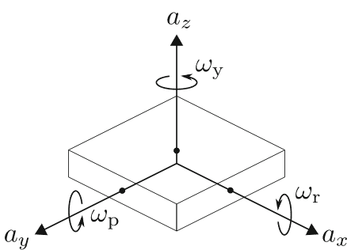

图1. 加速度计和陀螺仪传感器的三个轴。

#### 2.2 位置估计方法

假设（1）传感器连接在被估计位置的移动物体上，（2）移动物体的加速度和偏航角速度对应于感知数据 $\boldsymbol{a}$ 和 $\omega_y$。设 $\boldsymbol{a}_t$、$\boldsymbol{v}_t$ 和 $\boldsymbol{s}_t$ 分别为时间 $t$ 时的加速度、速度和位移（从初始位置开始计算），那么 $\boldsymbol{v}_{t+1}$ 和 $\boldsymbol{s}_{t+1}$ 如下所示：

$$\boldsymbol{v}_{t+1} = \boldsymbol{v}_t + \boldsymbol{a}_t \times \Delta t \quad (2)$$

$$\boldsymbol{s}_{t+1} = \boldsymbol{s}_t + \boldsymbol{v}_{t+1} \times \Delta t, \quad (3)$$

其中 $\boldsymbol{a}_t$、$\boldsymbol{v}_t$ 和 $\boldsymbol{s}_t$ 是移动物体上的坐标系，$\Delta t$ 是感知数据的采样间隔。

移动物体在时间 $t$ 的位置 $\boldsymbol{S}_t$ 是世界（全局）坐标系，如图3所示。设 $\phi_t$ 为移动物体相对于世界坐标系的 $X$ 轴的移动方向。那么，在时间 $t+1$ 时，移动物体的位置 $\boldsymbol{S}_{t+1} = (X_{t+1}, Y_{t+1})$，可以通过以下方式获得：

$$\phi_{t+1} = \phi_t + \omega_t \times \Delta t \quad (4)$$

$$X_{t+1} = X_t + |\boldsymbol{s}_{t+1}| \cos(\phi_{t+1} + \phi_0) \quad (5)$$

$$Y_{t+1} = Y_t + |\boldsymbol{s}_{t+1}| \sin(\phi_{t+1} + \phi_0) \quad (6)$$

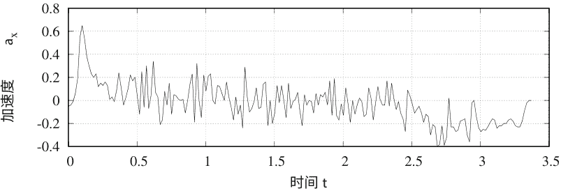

(a) 原始感知数据。

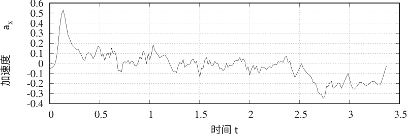

(b) 平滑后的感知数据。

图2. 加速度计的感知数据样本 $a_{xo}$。

### 3 使用神经网络的位置估计方法

#### 3.1 神经网络模型

仅使用子节中描述的平滑和校准是不足以消除由环境和不稳定状态引入的干扰和偏差的。为了消除降低估计精度的因素，我们提出使用神经网络（NN）来估计方程（2）中的加速度 $a_{t}$。假设移动物体在 $X-Y$ 平面上移动。对于这种情况，加速度 $a_{t}$ 由 $x$ 和 $y$ 分量组成。使用三层神经网络来估计 $a_{t}$ 的每个分量，如图4所示。

NN的输入 $\boldsymbol{r}=(r_1, r_2, \cdots, r_6)$ 是原始感知数据 $\boldsymbol{r}^{(p)}$ 或平滑后的数据 $\tilde{\boldsymbol{r}}^{(p)}$。每个内部单元的输出 $h_i$ 和 NN 的输出 $a$ 的计算如下：

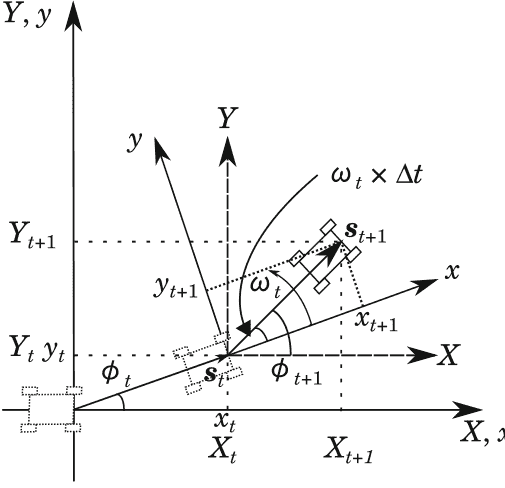

图3. 所使用的坐标系统.

#### 3.2 NN的训练

前一小节描述的NN是通过使用训练数据进行训练的。训练数据包括传感器的感知数据和加速度数据。加速度数据是参考信号（教师信号），通过使用其他测量系统进行准备。在本研究中，加速度数据从移动图像中提取，如后面所述。给定训练数据集 $\{(r^{(p)}, a^{(p)})|p \in \{1, 2, \dots, P\}\}$，对于每个 $p \in \{1, 2, \dots, P\}$，训练更新参数 $w_{1ij}$, $w_{2i}$, $\theta_i$ 和 $\theta$ 以最小化以下误差 $E$：

$$E = \frac{1}{2} \left(a(\boldsymbol{r}^{(p)}) - a^{(p)}\right)^2, \quad (9)$$

其中 $\boldsymbol{r}^{(p)}$ 是输入数据，$a^{(p)}$ 是参考信号，$a(\boldsymbol{r}^{(p)})$ 是输入 $\boldsymbol{r}^{(p)}$ 的NN的输出。每个参数 $b \in \{w_{1ij}, w_{2i}, \theta_i, \theta | i \in \{1, 2, \dots, N\}, j \in \{1, 2, \dots, 6\}\}$ 的更新如下：

$$b \leftarrow b - \alpha \frac{\partial E}{\partial b}, \quad (10)$$

其中 $\alpha$ 是学习率。本研究中使用的学习算法重复执行以下步骤 $T_{\max}$ 次：(1) 随机选择数据编号 $p \in \{1, 2, \dots, P\}$, (2) 使用公式(10)更新参数 $w_{1ij}, w_{2i}, \theta_i$ 和 $\theta$。

#### 3.3 参考信号准备

在这项研究中，参考信号 $a^{(p)}$ 是从移动图像中准备的。在准备过程中，首先确定移动物体在第 $k$ 帧中的位置 $(x', y')$，通过Homography变换，将其转换为在 $x - y$ 平面上的位置 $(x, y)$，具体如下：

$$x = \frac{M_{11}x' + M_{12}y' + M_{13}}{M_{31}x' + M_{32}y' + M_{33}} \qquad (11)$$

$$y = \frac{M_{21}x' + M_{22}y' + M_{23}}{M_{31}x' + M_{32}y' + M_{33}} \qquad (12)$$

其中变换矩阵 $M = (M_{ij})$ 通过解决以下方程组获得，该方程组由四个坐标对 $(x', y')$ 和 $(x, y)$ 得到：

$$\begin{bmatrix} x \\ y \\ 1 \end{bmatrix} = \begin{bmatrix} M_{11} & M_{12} & M_{13} \\ M_{21} & M_{22} & M_{23} \\ M_{31} & M_{32} & M_{33} \end{bmatrix} \begin{bmatrix} x' \\ y' \\ 1 \end{bmatrix}. \qquad (13)$$

然后，从得到的位移 $\mathbf{s}_t = (x_t, y_t)$，得到参考信号 $\mathbf{a}_t$ 如下：

$$\mathbf{v}_t = \frac{\mathbf{s}_{t+1} - \mathbf{s}_t}{\Delta t} \qquad (14)$$

$$\mathbf{a}_t = \frac{\mathbf{v}_{t+1} - \mathbf{v}_t}{\Delta t}. \qquad (15)$$

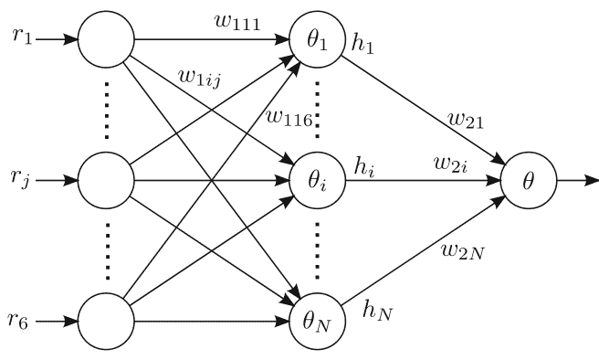

图4. 每个组件的三层神经网络 $a_t$。

### 4 实验评估

评估通过18个数据集的留一法交叉验证（LOOCV）进行，这些数据集是通过在直线上运行移动物体收集的3米长的数据。实验条件为 NN 的隐藏单元数 $N=2$，最大学习迭代次数 $T_{\max} = 500,000$，学习率 $\alpha = 0.01$ 和采样间隔 $\Delta t = 8$ 毫秒或9毫秒。表1显示了用于平滑的不同样本数 $W$ 的估计距离的误差率。“卷积”是使用传统方法进行的平滑和校准的传感数据 $\tilde{r}^{(p)}$，“NN”是本文第3节中描述的提出的方法。

#### 表1. 对于不同数量的样本用于平滑处理，估计距离的误差率 (%)

| 方法 | $W=1$ | $W=2$ | $W=3$ | $W=4$ | $W=5$ | $W=6$ | $W=7$ | $W=8$ | $W=9$ | $W=10$ |
| :--- | :--- | :--- | :--- | :--- | :--- | :--- | :--- | :--- | :--- | :--- |
| 卷积 | 35.69 | 35.22 | 35.05 | 35.10 | 35.01 | 35.01 | 34.97 | 34.95 | 34.95 | 35.00 |
| NN | 25.38 | 19.96 | 14.70 | 15.20 | 12.57 | 12.13 | 13.26 | 14.12 | 14.07 | 15.10 |

根据结果，传统方法和提出的NN在 $W=8\sim9$ 和 $W=6$ 的情况下分别达到最佳准确率。对于没有平滑处理的情况，即 $W=1$，所提出的方法的误差约比传统方法小10.3%。此外，在最佳平滑处理情况下，所提出的方法的误差约比传统方法小22.8%。

图5显示了每18个测试案例中所提出方法估计的位置。理想情况下，估计的位置在时间结束时为3米。从图中可以看出，$W=6$ 的情况比 $W=1$ 的情况更接近理想位置。

### 5 结论

在这项研究中，我们提出使用神经网络来改善基于加速度计和陀螺仪传感器的定位估计的准确性。根据实验结果，所提出的方法将估计误差从34.97%降低到12.13%。

致谢：本工作得到JSPS KAKENHI Grant Number 26330108的支持。

### 参考文献

- 1. Hsu, C.H., Yu, C.H.: 基于加速度计的室内定位方法，智能计算的会议和研讨会，pp. 223–227 (2009)
- 2. STMicroelectronics, LSM303DLHC datasheet (2011)
- 3. STMicroelectronics, L3GD20H 数据手册 (2012年)

### 使用卷积神经网络进行透明物体检测

May Phyo Khaing$^{1,2}$ 和 Mukunoki Masayuki $^{2(\text{✉})}$

$^1$缅甸亚丹邦网络城科技大学，缅甸亚丹邦网络城

mayyphyokhaing@gmail.com

$^2$宫崎大学工学研究科，日本宫崎

mukunoki@cs.miyazaki-u.ac.jp

**摘要**：最近，在计算机视觉研究中，透明物体（如玻璃）的检测变得越来越流行。在图像中检测物体的各种任务中，检测透明物体的内容并不是一项容易的任务。使用传统的计算机视觉算法来执行透明物体的检测非常困难，因为透明物体的外观极大地依赖于其背景和照明条件。除了透明物体检测的流行之外，深度学习在物体检测任务中也表现出很高的性能。在本文中，我们应用了一种称为单次多框检测器（SSD）的卷积神经网络来进行透明物体检测任务，并评估了系统的性能。结果表明，深度学习方法在透明物体检测中的应用可以成功地检测图像中的透明物体。

**关键词**：透明物体检测 · 深度学习 · 卷积神经网络

## 1 引言

如今，不同种类物体的检测越来越具有挑战性，对计算机视觉研究人员提出了更高要求。在这些挑战中，透明物体的检测已成为物体检测任务中的一个重要问题。透明物体在我们的日常生活中被广泛使用，并存在于我们的家庭环境中与其他物体一起。与其他非透明（不透明）物体的检测相比，透明物体很难通过常规图像分割方法进行检测，因为这些物体通常从背景中获取纹理，并且它们的外观与周围环境相似。

以前，透明物体的检测是通过基于透明物体的某些特征对玻璃覆盖区域和其他区域进行分类来完成的。因此，需要考虑透明物体的各种特征来进行每次检测，这导致了较慢的检测过程。在这项研究中，透明物体检测是通过利用深度学习方法（称为单次多框检测器SSD）的优势来进行的，该方法可以提供更快速和准确的检测结果。

作为论文的概要，第2节介绍了与研究相关的先前工作。第3节描述了在图像中检测透明物体的方法。第4节包括了实验结果。最后，第5节总结了使用卷积神经网络检测透明物体的研究，并展望了系统的未来工作。

## 2 相关工作

由于透明物体缺乏自身的外观，检测透明物体一直是一项困难的工作。随着智能家居服务机器人和图像搜索的发展，对透明物体检测的研究越来越受关注。在家庭场景中，透明物体位于其他物体之间。

为了检测这些透明物体，Osadchy等人[1]应用了镜面高光特征，使玻璃物体与其他物体不同。然而，这需要一个光源。McHenry等人[2]考虑了透明物体检测目的中的颜色相似性、模糊、叠加一致性和纹理失真等多个特征。Fritz等人[3]在一个包含4个透明物体的数据集上，使用了潜在因子的加法模型，结合了SIFT和潜在狄利克雷分配（LDA）方法，生成透明局部补丁外观。该算法在不同背景下检测透明物体提供了有用的结果。

Phillips等人[4]和Lysenkov等人[5]分别提出了透明物体的检测和姿态估计方法，其中使用了激光测距仪、立体和Kinect深度传感器。[4]使用逆透视映射的方法，假设测试场景有两个视图，并且物体停留在一个支撑平面上。在[5]中，利用Kinect传感器无法估计镜面或透明表面的深度这一事实，对图像进行透明物体分割。然后，他们进行6自由度（6DOF）的姿态估计和透明物体识别。然而，这两种方法都无法处理重叠的透明物体。因此，Lysenkov等人提出了[6]作为改进方法来处理重叠的透明物体。

作为一种从光场图像中分割透明物体的有趣方法，徐等人[7]提出了使用光场线性性、遮挡检测器和图割进行像素标记的TransCut方法。与通常依赖颜色相似性和高光信息的传统方法不同，[7]使用叠加一致性和纹理失真特性来分割光场图像中的透明物体区域。

近年来，传统的物体识别任务已经转向深度学习物体识别任务。除了强大而高效的结果外，深度神经网络也被应用于识别透明物体。赖等人[8]使用区域卷积神经网络（R-CNN）来识别彩色图像中的透明物体。R-CNN技术使用选择性搜索[9]来提取感兴趣的区域建议[10]，并且在[8]中通过考虑透明物体的高光和颜色相似性特征来改进选择性搜索算法的效率，以去除一些不透明的区域建议。在后续深度神经网络的应用中，我们使用单次多框检测器 (SSD) [11]来检测图像中的透明物体。

## 3 方法论

对于透明物体的检测，数据集来自ImageNet ILSVRC数据集。该数据集提供了一些类别，如烧瓶、水杯、啤酒杯和酒杯。对于每个类别，都提供了图像和注释文件。注释文件是与每个图像相关的文件，描述了图像中物体的位置以及它们的标签。对于一些类别，如水杯，注释文件并不是直接给出的，我们需要手动创建它们以用于训练神经网络。图1显示了一个带有注释边界框的示例图像。


图1. 带有注释边界框的图像

对于SSD [11]的简要介绍，它从架构中消除了提案提取阶段和特征重采样阶段，并基于不同阶段生成的特征图进行对象检测的预测。换句话说，检测对象的特征是从特征图的不同尺度或分辨率中提取的，并且对象标签和边界框的预测是在单次通过中进行的，形成了一个单次多尺度或多框检测器。由于它还使用了更接近原始图像的层的特征图，SSD甚至可以在低分辨率图像中进行对象检测。因此，SSD可以准确地检测不同尺度和不同大小的对象，并且通过单次检测实现更快的检测。SSD的架构如图2所示。


图2. 单次多框检测器的架构[11]

卷积神经网络是通过透明物体类别的图像和边界框注释文件进行训练的。使用训练好的网络，可以从图像中检测出透明物体。在SSD的检测输出中，通过边界框显示检测到的物体的位置，并为每个边界框描述了类别标签和类别得分。在该系统中，我们将透明物体定义为类别标签1。由于检测得分是检测区域与透明物体具有相同特征的概率，因此它的值介于0和1之间。图3显示了图像中透明物体的一些检测结果。

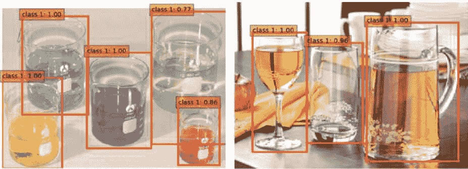

图3. 图像中透明物体的检测结果，其中类别1表示玻璃物体的标签。

基本上，SSD可以准确地检测所有透明物体。但是，SSD存在一个问题，即如果对与透明物体形状相同的非透明物体进行检测，SSD也会将非透明物体分类为透明物体。虽然使用SSD检测透明物体的结果非常准确，如图3所示，但是当检测到形状相似的非透明物体时，结果中会出现一些误检，如图4所示。

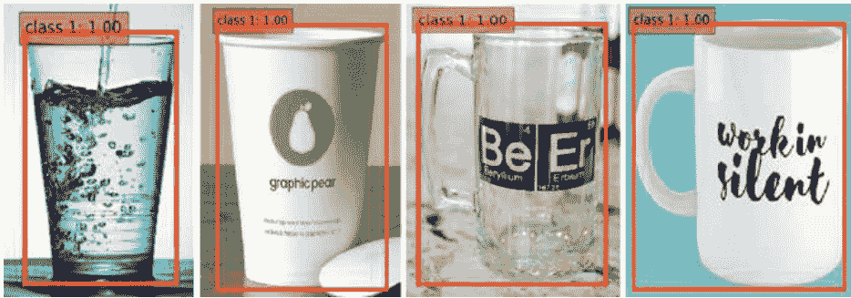

图4. 非透明物体的误检结果与透明物体具有相同的形状。

当网络在其他类型的物体上进行测试时，这个问题不会出现，比如时钟，这是因为透明物体和时钟之间的特征非常明显。换句话说，某些物体具有与其他物体非常不同的特征。对于透明物体来说，它们的外观非常简单，通常没有自己的颜色。为了解决这个问题，神经网络需要经过训练，学习透明物体和非透明物体之间的显著特征。因此，神经网络再次使用负训练图像数据集进行训练，以便学习透明物体和形状相同的非透明物体之间的显著特征。

## 4 实验结果

我们准备了共2700张图像及其注释文件，用于训练卷积神经网络。该集合包含1800张透明物体的图像和900张非透明物体的图像。内部包含400张烧瓶、啤酒杯和水杯的每个类别的图像，以及600张酒杯的图像作为透明物体的子类。然后，500张纸杯的图像，以及每个咖啡杯和咖啡杯类别的200张图像被用作非透明物体的子类。所有的训练数据都来自ImageNet ILSVRC数据集。

在使用正负训练图像训练网络之后，网络可以正确地检测透明物体和非透明物体之间的区别。这里，类别标签1用于透明物体，类别标签2用于非透明物体。最终的检测结果如图5所示。

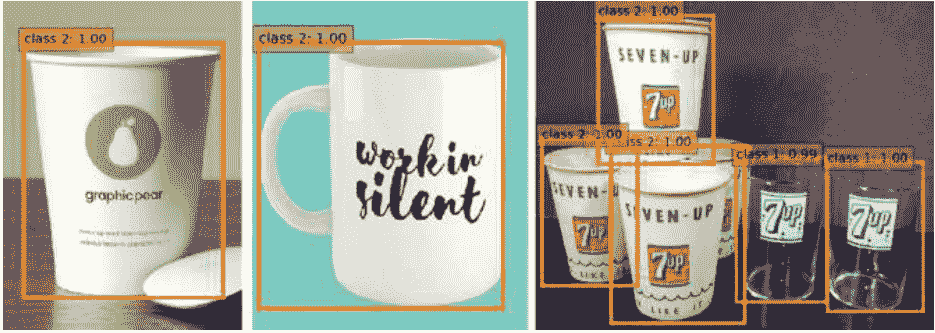

图5. 透明和非透明物体的检测结果，其中类别1表示透明物体，类别2表示非透明物体。

为了评估检测结果的性能，使用了一组300个测试图像，其中包含200个透明物体图像和100个非透明物体图像。对于这些测试图像中的每一个，创建了真实物体的地面真实边界框，也就是与训练网络预测的边界框进行比较的真实位置。图6显示了一个地面真实边界框和预测边界框的示例。

## 图 6. 检测到的物体上的地面真实边界框和预测边界框

测试图像中每个类别的地面真实边界框数量如下表 1 所示。

### 表 1. 测试图像中每个类别的地面真实边界框数量

| 类别 | 物体名称 | 真实边界框数量 |
| :--- | :--- | :--- |
| 透明物体 | 烧杯 | 121 |
| | 啤酒杯 | 92 |
| | 水杯 | 104 |
| | 酒杯 | 88 |
| 不透明物体 | 纸杯 | 92 |
| | 咖啡杯 | 64 |
| | 咖啡杯子 | 82 |

使用真实边界框和预测边界框，我们评估网络在图像中能够准确检测透明物体的能力。交并比（IoU），也称为 Jaccard 重叠指数，用于计算每个检测的值。

$$IoU = \frac{A \cap B (\text{重叠区域的面积})}{A \cup B (\text{并集的面积})} \quad (1)$$

在上述方程中，`A` 表示真实边界框的面积，`B` 表示网络预测的边界框的面积。然后，通过将 `A` 和 `B` 的重叠面积除以 `A` 和 `B` 的并集面积来计算每个检测的 `IoU`。较高的 `IoU` 值意味着网络能够更准确地检测物体区域，较低的 `IoU` 值意味着检测效果较差。因此，在这个实验中，使用 `IoU` 阈值为 0.7 来更精确地检测透明物体。然后，在所有测试图像上计算系统的整体精确度和召回率。

图 7 比较了两个训练过程的检测结果的精确度和召回率：仅使用透明物体图像训练的网络和同时使用透明和非透明物体图像训练的网络。精确度和召回率是在检测结果的不同分数下计算的。系统的精确率是真实检测数和总检测数的比率。召回率是真实检测数和总真实检测数的比率。在图 7 中，结果 1 曲线是仅使用透明物体训练的网络的精确度和召回率，结果 2 曲线是同时使用透明和非透明物体训练的网络的精确度和召回率。将 `SSD` 的输出分数阈值从 0 到 1 按 0.1 的间隔进行变化，我们绘制了曲线。根据实验，同时使用透明和非透明物体训练的网络获得了比仅使用透明物体类别训练的网络更高的性能结果。研究在结果 2 曲线中透明物体检测中取得了 85.1% 的平均精确度。

#### 5 结论

在提出的系统中，透明物体的检测实现了准确和客观的结果。介绍了在测试具有与透明物体相同形状的非透明物体时网络的问题，并描述了解决方案。总之，该系统已经证明了在不考虑透明物体的特殊属性的情况下，透明物体的检测是可行的。

目前，通过使用具有相同形状的非透明物体的负例对网络进行训练，已经解决了误检问题。未来的工作将不是针对每个具有相同形状的透明和非透明物体进行网络训练，而是训练网络学习透明物体和具有相同形状的非透明物体之间的可区分特征。

#### 参考文献

- 1. Osadchy, M., Jacobs, D., Ramamoorthi, R.: 使用镜面反射进行识别。在：IEEE 国际计算机视觉会议，第 1512-1519 页（2003 年）
- 2. McHenry, K., Ponce, J., Forsyth, D.: 寻找玻璃。在：IEEE 计算机学会计算机视觉和模式识别会议上，第 973-979 页（2005 年）
- 3. Fritz, M., Bardski, G., Karayev, S., Darrell, T., Black, M.: 透明物体识别的附加潜在特征模型。在：神经信息处理系统，第 558-566 页（2009 年）
- 4. Phillips, C.J., Derpanis, K.G., Daniilidis, K.: 半透明物体的图像-背景分离的新型立体视觉线索。在：IEEE 国际计算机视觉会议上，第 1100-1107 页（2011 年）
- 5. Lysenkov, I., Eruhimov, V., Bardski, G.: 使用 Kinect 传感器识别和姿态估计刚性透明物体。在：机器人科学与系统，第 273 页（2013 年）
- 6. Lysenkov, I., Rabaud, V.: 透明杂乱环境中刚性透明物体的姿态估计。在：IEEE 国际机器人与自动化会议，第 162-169 页（2013 年）
- 7. Xu, Y., Nagahara, H., Shimada, A., Taniguchi, R.: TransCut：透明物体分割从光场图像中。在：IEEE 国际计算机视觉会议，第 3442-3450 页（2015 年）
- 8. Lai, P.J., Fuh, C.S.: 使用卷积神经网络的区域进行透明物体检测。在：IPPR 计算机视觉、图形和图像处理会议，第 1-8 页（2015 年）
- 9. Uijlings, J.R., van de Sande, K.E., Gevers, T., Smeulders, A.W.: 选择性搜索目标识别。计算机视觉国际期刊 104, 154-171 页（2013 年）
- 10. Girshick, R., Donahue, J., Darrell, T., Malik, J.: 用于准确目标检测和语义分割的丰富特征层次结构。在：IEEE 计算机视觉和模式识别会议，第 580-587 页（2014 年）
- 11. 刘伟等：SSD：单次多框检测器。在：Leibe, B., Sebe, N., Welling, M. (eds.) 2016 年欧洲计算机视觉大会。LNCS，卷 9905，页 21-37。Springer, Cham（2016 年）

### 使用深度学习对卫星图像进行多标签土地覆盖指数分类

苏维依昂 (✉), 苏苏凯英, 和薛丁扎昂

信息与通信技术学院, 技术大学 (亚丹那波恩网络城市), 缅甸彬乌林

suwityiaung123@gmail.com, khaingss@gmail.com, shwethinzaraung@gmail.com

**摘要**。准确的土地覆盖指数分类对于不同的学科 (如生态学、地理学和气候学) 非常重要，因为它是各种实际应用的基础。对于土地覆盖的检测和分类，遥感技术长期以来一直被用作寻找土地覆盖中存在的不同数据属性的优秀数据源。使用卫星图像对土地覆盖进行分类已经使用了各种特征提取和分类方法。近年来，深度学习在各个领域中已经成为机器学习的主导范式。

本文的目标是使用深度卷积神经网络 (`DCNN`) 对 `Google Earth` 卫星图像进行多标签土地覆盖指数分类。由于缺乏大规模标记的土地覆盖数据集，本研究使用自己创建的伊洛瓦底三角洲 (`Ayeyarwaddy Delta`) 标记数据集，并使用 `AlexNet` 进行测试。然后将土地覆盖分类结果与多类支持向量机 (`Multiclass-SVM`) 使用混淆矩阵进行比较。根据测试结果，使用 `DCNN` 可以正确分类 76.6% 的建筑指数， 81.5% 的道路指数， 91.8% 的植被指数和 93.2% 的水域指数。使用多类支持向量机的混淆矩阵显示， 78.9% 的建筑指数， 72.7% 的道路指数， 94.2% 的植被指数和 98.1% 的水域指数可以被正确分类。

**关键词**: 多标签土地覆盖指数 · `DCNN` · 多类支持向量机 (`Multiclass-SVM`)

#### 1 引言

2008 年 5 月初，飓风纳尔吉斯袭击了缅甸。这是缅甸有记录以来最严重的自然灾害。飓风于 2008 年 5 月 2 日星期五登陆缅甸，引发了 4 米高的热带风暴潮，对人口稠密的伊洛瓦底三角洲造成了灾难性破坏，至少造成了 138,000 人死亡。伊洛瓦底三角洲的成千上万座建筑物被摧毁，国家电视台报道称，75% 的建筑物倒塌，20% 的建筑物的屋顶被撕掉。有一份报告显示，伊洛瓦底三角洲地区 95% 的建筑物被摧毁。因此，有必要了解纳尔吉斯飓风前后的土地覆盖变化，以便进行区域规划、政策规划和了解灾害的影响。关于这方面的信息在纳尔吉斯飓风期间的破坏以及纳尔吉斯之后的重建和由于灾害导致的土地覆盖变化也是必要的。

这项提议的主要重点是利用遥感卫星图像对伊洛瓦底三角洲的土地覆盖和土地利用区进行分类。在过去的几十年中，研究人员应用遥感卫星图像作为重要的数据类型，用于土地利用和土地覆盖变化的分类。从土地利用和土地覆盖分类中获得的信息和数据已经应用于大多数应用程序和研究，以找到研究区域的变化检测。土地利用和土地覆盖分类主要在城市地区进行，获得的信息可以应用于研究结果的定性和定量分析[1]。

地球表面的物质，如水、植被和建筑物，可以被视为地表覆盖物。因此，为了描述地球表面的数据和信息，地表覆盖被视为一个基本参数。土地利用可以被定义为利用地表覆盖区域进行城市化、保护或农业等各种目的。因此，精确的土地利用和地表覆盖信息已被应用于城市规划、洪水预测和灾害管理。遥感卫星以每日或每周重访和多光谱波段的方式捕捉了同一场景的各种图像。这些图像已被用于城市土地覆盖分类[2, 3]、城市规划[4]、土壤测试和研究森林动态[5]。

本文使用深度卷积神经网络和 `AlexNet` 从 `Google` 地球图像中对建筑物、道路/土地、植被/森林和水四个地表覆盖指数进行分类。本文的组织结构如下：第 2 节和第 3 节介绍相关工作和数据集以及方法论。第 4 节描述了讨论。最后，在第 5 节给出了结论。

#### 2 相关工作

在过去的几年中，遥感和高分辨率图像处理取得了重大进展，并且在最近开发了各种土地利用和土地覆盖（`LULC`）分类算法。对于土地覆盖分类，使用了各种机器学习算法。作为一种先进的机器学习方法，深度学习近年来已成功应用于图像识别和分类领域[6-10]。通过模仿人脑的分层结构，深度学习方法（如深度置信网络）可以利用研究数据中隐含的复杂时空统计模式[11, 12]。对于遥感数据，深度学习方法可以自动提取更抽象、不变的特征，从而促进土地覆盖制图。在[13]中，利用极化合成孔径雷达（`PolSAR`）数据应用了深度置信网络进行城市土地覆盖分类。然后使用支持向量机（`SVM`）、传统神经网络（`NN`）和随机期望最大化（`SEM`）来比较基于深度置信网络的分类方法的结果。根据实验结果，基于深度置信网络的方法优于其他三种方法。

最近使用了两种不同的深度学习架构，`CaffeNet` 和 `GoogLeNet`，在[14]中应用于遥感图像的土地利用分类，使用了两个标准数据集。使用了著名的 UC Merced Land Use 数据集和巴西咖啡场景数据集，这两个数据集具有明显不同的特征，用于进行深度学习的土地覆盖分类。除了传统的从头开始训练，还使用了仅在目标数据上进行微调的预训练网络，以避免过拟合问题并减少设计时间。Romero 等人[15]最近提出了一种用于遥感图像分类的无监督深度特征提取方法。作者建议使用贪婪逐层无监督预训练结合无监督学习稀疏特征的算法。该算法在航空场景分类以及非常高分辨率（VHR）的土地利用分类或多光谱和高光谱图像的土地覆盖分类中进行了测试。

在[16]中，将 `DCNN` 与迁移学习（TL）和数据增强两种组合技术应用于 UC Merced 数据集的高分辨率图像地物分类中。使用这些技术，`CaffeNet`、`GoogLeNet` 和 `ResNet` 架构被用于著名的 UC Merced 数据集进行地物分类，实现了 97.8 ± 2.3%、97.6 ± 2.6% 和 98.5 ± 1.4% 的分类准确率。

## 3 数据集和方法论

前述相关工作在遥感领域应用了不同的深度学习架构和标准的已知标记遥感数据集，因为缺乏大规模标记数据集。在这个提出的系统中，使用 2002 年至 2017 年从 Google Earth 获取的伊洛瓦底三角洲（Ayeyarwaddy Delta）的卫星图像创建了自己的数据集。然后，将获取的卫星图像标记为四个地物分类，以进行深度学习的分类。伊洛瓦底三角洲的输入卫星图像样本如图 1 所示。

**图 1. 伊洛瓦底三角洲数据集的样本图像**

伊洛瓦底三角洲数据集的四个土地覆盖类别如下：建筑物、道路/土地、植被/森林和水域。由于输入的一个场景包含多个土地覆盖类别的分类需要考虑多标签分类框架。对于多标签分类框架，考虑并比较以下两个选项：

1. 使用深度学习 (`AlexNet`) 进行特征提取、训练和分类
2. 使用深度学习进行特征提取，使用多类支持向量机进行训练和分类

系统提出的多标签分类框架的伪代码如下：

```
1: SGRow ← Row/21
2: SGCol ← Col/21
3: Step ← SGRow/2
4: for i ← Step:Step:SGRow-Step
5:   for j ← Step:Step:SGCol-Step
6:     Tempfm = Img(i-Step:i+Step,j-Step:j+Step)
7:     Label = classifynet(Net,Tempfm)
8:     switch Label
9:       case Building
10:        Index(i-Step/2:i+Step/2,j-Step/2:j+Step/2) ← Blue
11:      case Road
12:        Index(i-Step/2:i+Step/2,j-Step/2:j+Step/2) ← Yellow
13:      case Vegetation
14:        Index(i-Step/2:i+Step/2,j-Step/2:j+Step/2) ← Green
15:      case Water
16:        Index(i-Step/2:i+Step/2,j-Step/2:j+Step/2) ← Black
17:     end
18:   end
19: end
```

### 3.1 使用深度学习 (`AlexNet`) 进行多标签土地覆盖分类

首先，将输入的卫星图像分割成 25x25 像素块，以便进行多标签分类，因为可以使用 `AlexNet` [17]对单标签图像进行分类。

`AlexNet` 深度卷积神经网络由两个阶段组成：特征提取和分类，每个阶段都有不同的层次。首先，将分割后的图像传递到深度卷积神经网络的特征检测层，以检测输入图像的不同特征。`AlexNet` 的特征提取层使用多层卷积、激活、最大池化和归一化，以不同的顺序进行。特征提取后，图像在分类阶段的全连接层中进行分类。分类阶段使用提取的视觉特征，并将其传递到 4096×4096×N 的多层感知器 (MLP) 神经网络中。该阶段利用修正线性单元[18]提供非饱和激活函数，定义为 `f(x) = max(0, x)`。两个 4096-D MLP 层也配置为使用 50% 的 dropout 减少过拟合[17]。最近引入的技术，称为“dropout”[19]，用于以 0.5 的概率将每个隐藏神经元的输出设置为零。该方法的流程图如图 2 所示。

**图 2. 使用 `DCNN` 作为分类器的多标签土地覆盖分类的流程图**

### 3.2 使用多类支持向量机进行多标签土地覆盖分类

对于使用多类支持向量机进行土地覆盖分类，输入的卫星图像被分割成 25×25 像素块进行多标签分类。然后，使用 `DCNN` 从分割图像中提取特征。在使用 `Multiclass-SVM` 对这些特征进行训练和分类之后，采用该方法的流程图如图 3 所示。

**图 3. 使用多类支持向量机作为分类器的多标签土地覆盖分类流程图**

### 3.3 实验结果

使用深度卷积神经网络对伊洛瓦底三角洲数据集进行评估，并与多类支持向量机进行土地覆盖分类性能比较。实验中使用的图像数量如表 1 所示。

**表 1. 实验使用的图像数量**

| 索引 | 总图像数量 |
| :--- | :--- |
| 建筑 | 582 |
| 道路 | 792 |
| 植被 | 1923 |
| 水域 | 542 |
| 总计 | 3839 张图像 |

使用 `DCNN` 和多类支持向量机进行伊洛瓦底三角洲的 MyaungMya 地区、Petye 地区和 Pathein 地区的土地覆盖分类结果如图 4、5 和 6 所示。

图 4 显示了 MyaunagMya 地区的原始图像及分类结果。图 4(a) 为原始图像，(b) 和 (c) 分别显示了使用 `DCNN` 和多类别 SVM 的多标签分类结果。从多标签土地覆盖分类图像中，蓝色表示建筑指数；黄色表示道路/土地指数，绿色表示植被/森林指数，黑色表示水指数。

图 5(a) 显示了 Petye 地区的原始图像。使用 `DCNN` 和多类别 SVM 的分类结果分别显示在图 5(b) 和 (c) 以及 Pathein 地区的图 6(a) 和 (b) 中。

使用混淆矩阵计算了四个土地覆盖指数的分类结果性能。使用 `DCNN` 作为分类器的混淆矩阵显示在表 2 中。

#### 表 2. 使用 `DCNN` 作为分类器的混淆矩阵

| | 建筑 | 道路 | 植被 | 水域 |
|---|---|---|---|---|
| 建筑 | 0.7657 | 0.0286 | 0.1943 | 0.0114 |
| 道路 | 0.0210 | 0.8151 | 0.1555 | 0.0084 |
| 植被 | 0.0243 | 0.0468 | 0.9185 | 0.0104 |
| 水域 | 0.0368 | 0 | 0.0307 | 0.9325 |

通过使用 `DCNN` 作为分类器，建筑指数正确分类率为 76.6%，道路指数正确分类率为 81.5%，植被指数正确分类率为 91.8%，水域指数正确分类率为 93.2%。使用多类支持向量机作为分类器的混淆矩阵如表 3 所示。

#### 表 3. 使用多类支持向量机作为分类器的混淆矩阵

| | 建筑 | 道路 | 植被 | 水域 |
|---|---|---|---|---|
| 建筑 | 0.7886 | 0.0229 | 0.1371 | 0.0514 |
| 道路 | 0.0672 | 0.7269 | 0.1975 | 0.0084 |
| 植被 | 0.0295 | 0.0173 | 0.9428 | 0.0104 |
| 水域 | 0.0184 | 0 | 0 | 0.9816 |

通过使用多类支持向量机作为分类器，建筑指数正确分类率为 78.9%，道路指数正确分类率为 72.7%，植被指数正确分类率为 94.2%，水域指数正确分类率为 98.1%。

## 4 讨论

在这个提出的系统中，`AlexNet` 框架被修改为多标签土地覆盖分类，因为它考虑了单标签分类。根据测试结果，遥感图像可以使用深度卷积神经网络来分类多标签土地覆盖指数。然后，将 `DCNN` 的分类结果与多类支持向量机使用混淆矩阵进行比较，混淆矩阵被用作分类器性能度量。

## 5 结论

该提出的系统提供了一种利用 Google Earth 卫星图像进行伊洛瓦底三角洲多标签土地利用和土地覆盖分类的技术。从实验结果可以看出，`AlexNet` 架构可用于多标签土地覆盖分类。然后，将分类结果与多类支持向量机进行比较。该提出的系统的土地覆盖分类信息可用于计算纳尔吉斯飓风前后伊洛瓦底三角洲的土地覆盖变化检测，作为未来的工作。这些土地覆盖变化信息旨在形成有价值的参考依据。为城市规划师和决策者提供资源，以在灾害发生前后决定土地覆盖变化的数量和灾害的影响。

## 参考文献

- 1. Kaya, S., Pekin, F., Seker, D.Z., Tanik, A.: 一种用于城市土地利用/覆盖分析的算法方法：逻辑过滤器。环境地理信息学国际期刊 **1**(1), 12-20 (2014)

- 2. Zhang, J., Kerekes, J.: 使用WorldView-2数据和自组织映射的无监督城市土地覆盖分类。在：国际地球科学与遥感研讨会 (IGARSS), pp. 201-204. IEEE (2011)

- 3. 蔡, W., 刘, Y., 李, M., 张, Y., 李, Z.: 一种用于城市土地覆盖分类的最佳多变量决策树方法。在：第8届IEEE几何学会议论文集, 北京 (2010年)

- 4. Thunig, H., Wolf, N., Naumann, S., Siegmund, A., Jurgens, C., Uysal, C., Maktav, D.: 应用城市规划的土地利用/土地覆盖分类—自动化的挑战。在：联合城市遥感事件 JURSE, 德国慕尼黑, 第229-232页 (2011年)

- 5. Naydenova, V., Jelev, G.: 利用航空照片和卫星图像进行森林动态研究, 空间分辨率非常高。在：第4届国际空间技术最新进展会议“空间为社会服务”—RAST 2009, 土耳其伊斯坦布尔, 第344-348页。IEEE (2009年)。ISBN 978-1-4244-3624-6

- 6. 琼斯, N.: 计算机科学: 学习机器。自然 **505**(7482), 146–148 (2014)

- 7. Arel, I., Rose, D.C., Karnowski, T.P.: 深度机器学习——人工智能研究的新前沿[研究前沿]。IEEE计算智能杂志 **5**(4), 13–18 (2010)

- 8. Yu, D., Deng, L.: 深度学习及其在信号和信息处理中的应用。IEEE信号处理杂志 **28**(1), 145–154 (2011)

- 9. Bengio, Y.: 学习人工智能的深度架构。机器学习基础趋势 **2**(1), 1–27 (2009)

- 10. Bengio, Y., Courville, A., Vincent, P.: 表示学习: 综述与新视角。IEEE模式分析与机器智能杂志 **35**(8), 1798–1828 (2013)

- 11. Hinton, G.E., Osindero, S., Teh, Y.-W.: 一种用于深度信念网络的快速学习算法。神经计算 **18**(7), 1527–1554 (2006)

- 12. Hinton, G.E., Salakhutdinov, R.R.: 用神经网络降低数据的维度。科学 **313**(5786), 504–507 (2006)

- 13. Lv, Q., Dou, Y., Niu, X., Xu, J., Xu, J., Xia, F.: 利用遥感SAR数据通过深度置信网络进行城市土地利用和土地覆盖分类. J. Sens. **2015**, 10页 (2015)

- 14. Castelluccio, M., Poggi, G., Sansone, C., Verdoliva, L.: 通过卷积神经网络在遥感图像中进行土地利用分类

- 15. Romero, A., Gatta, C., Camps-Valls, G.: 无监督的深度特征提取用于遥感图像分类. IEEE Trans. Geosci. Remote Sens. **54**, 1349–1362 (2016)

- 16. Scott, G.J., England, M.R., Starms, W.A., Marcum, R.A., Davis, C.H.: 用于高分辨率图像土地覆盖分类的深度卷积神经网络训练. IEEE Geosci. Rem. Sens. Lett. **14**, 469–470 (2017)

- 17. Krizhevsky, A., Sutskever, I., Hinton, G.E.: 使用深度卷积神经网络进行ImageNet分类。在: Pereira, F., Burges, C., Bottou, L., Weinberger, K. (eds.) Advances in Neural Information Processing Systems, pp. 1097–1105. Curran & Associates Inc., Red Hook (2012)

- 18. Glorot, X., Bordes, A., Bengio, Y.: 深度稀疏整流神经网络。在: 国际人工智能与统计学会会议论文集, pp. 315–323, 2011年4月

- 19. Hinton, G.E., Srivastava, N., Krizhevsky, A., Sutskever, I., Salakhutdinov, R.R.: 通过防止特征检测器的共适应来改进神经网络。arXiv预印本 arXiv:1207.0580 (2012)

## 使用更快的基于区域的卷积神经网络进行实时手势姿势识别

Hsu Mon Soe (✉) 和 Tin Myint Naing

缅甸比恩乌温技术大学 (Yatanarpon Cyber City)

hsumon.1740@gmail.com, utinmyintnaing08@gmail.com

**摘要**：手势可以作为与机器交互的现代技术。手势识别一直是计算机视觉中一个有趣的研究领域。本文提出了一种使用更快的 R-CNN 来识别实时网络摄像头输入的静态手势或姿势的方法。使用 NUS Hand Pose Dataset II 来训练更快的 R-CNN。该系统能够识别出展示给网络摄像头的 10 种不同的手势姿势，并根据识别出的姿势来控制 VLC Media Player。该系统是在 Caffe 深度学习框架中开发的。该系统能够从实时网络摄像头输入中识别手势姿势，并达到可接受的准确率。

**关键词**：手势识别 · 更快的 R-CNN · NUS 手势姿势数据集 II · 深度学习 · Caffe 框架 · VLC 媒体播放器

### 1 引言

人们使用不同种类的手势来相互沟通。这是人与人之间的非语言交流。手势对于澄清语言的意义非常有用，因为手势显示出同意、反对或情感，而且手势可以在更短的时间内表达更多的内容。人类在日常生活中使用头部和手势。手势是有意义的身体运动，包括手指、手、臂或身体其他部位的运动。

人的手有能力做出大量的姿势和动作。由于手由 27 块骨头、大量的肌肉和肌腱组成，手模型可以轻松达到 30 到 50 个自由度 [1]。手势可以替代鼠标和键盘作为计算机的输入方式。手势命令可以用来控制计算机和其他智能机器。

手势识别可以通过两种方法进行：静态和动态。静态手势，也称为姿势，是手势的静态形式，具有特定的含义。动态手势是一系列静态姿势的组织，形成一个单一的手势，并在一定的时间段内呈现 [6]。该系统被开发出来，用于识别通过网络摄像头展示的 10 种静态手势，并将识别出的手势用作控制个人计算机的命令。在本文中，手势命令被用来控制 VLC 媒体播放器。

人类在复杂动作和强约束之间估计手的存在和姿势时非常擅长。但是对于机器和计算机视觉系统来说，这个任务相对困难 [2]。手势识别的旧方法包括使用带有传感器或连接线的数据手套，基于 3D 模型的方法和基于外观的方法 [3]。这些方法在光照条件稳定时达到了高识别准确率和低错误率。然而，在各种光照条件下正确分类手势，以及来自不同主体的手势仍然具有挑战性。在深度学习卷积神经网络（CNN）在识别任务中变得流行之后，CNN 已经取代了图像识别和计算机视觉任务的传统方法。Molchanov 等人 [8] 从深度、颜色和雷达传感器中收集了手势的信息，并用它们相互训练了一个卷积神经网络。他们的系统能够准确地识别室内和室外车内白天和晚上捕捉到的 10 种不同手势。

他们的方法需要短程雷达、彩色摄像头和深度摄像头。Neverova 等人 [5] 将多尺度和多模态深度学习相结合，实现了一种手势识别和定位的方法。他们的方法分别处理手势分类和定位。在 [4] 中，Pavlo Molchanov 等人使用三维卷积神经网络从强度和深度数据中识别驾驶员的动态手势。他们的方法在 VIVA 挑战数据集上实现了 77.5% 的分类率。Barros 等人 [7] 设计了一种多通道卷积神经网络（MCNN），可以提取隐含特征并识别手势。为了实时识别，他们的模型需要将图像缩小。

大多数手势识别方法（静态和动态）只能检测到较大尺寸的手（例如整个图像的四分之一），除了 [7]。输入图像的捕获环境通常有许多限制，例如图像必须以简单的背景捕获，并且光照条件必须稳定。一些方法还限制手在图像中心。在提出的系统中，输入图像的约束很少。该模型可以在复杂背景（类似皮肤的物体和人脸也允许）和各种照明条件下正确识别手势。使用 Faster R-CNN [13]，可以检测到图像中各种位置和各种大小的手（甚至可以小到整个图像的十分之一）。

该系统是在`Caffe`深度学习框架和`ZF Faster R-CNN`上开发的。`Faster R-CNN`模型在`NVIDIA Geforce GTX 1080` GPU上进行训练，具有8 GB GDDR5X视频内存。系统的概述在第2节中描述。`Faster R-CNN`的背景和工作流程在第3节中解释。第4节介绍了系统的设置、研究的训练和测试结果。本系统的结论和未来工作在第5节中描述。

## 2 提出系统的概述

该系统采用`Faster R-CNN`进行手势识别。在训练阶段，原始图像（未经预处理的RGB图像）被用作修改后的`Faster R-CNN`模型的输入。在`Faster R-CNN`中，`CNN`部分提取特征（从低级特征到高级特征）并生成特征图。`RPN`（区域建议网络）使用特征图生成区域建议。`ROI`池化使用特征图和区域建议进行分类。训练阶段的输出是一个新的`Caffe`模型。该模型用于对实时网络摄像头输入进行检测。模型的输出是手势姿势的类别，以及边界框和类别得分（预定义手势的概率）。识别到的手势姿势用作命令来控制`VLC`媒体播放器。图1显示了系统的工作原理。输入视频来自常规网络摄像头，输入帧的图像被馈送到更快的`R-CNN`网络。当检测到手势姿势时，系统根据检测到的姿势类别生成键盘命令来控制`VLC`媒体播放器。

## 3 方法论

卷积神经网络（`CNN`）因其在图像识别和分类中的有效性而变得流行。对于图像分类，卷积神经网络非常适用，因为它们以图像作为输入，并输出图像中物体的类别。为了使`CNN`能够执行检测任务，发展了三代基于区域的`CNN`（`R-CNN`），即`R-CNN`、`Fast R-CNN`和`Faster R-CNN`。

### 3.1 基于区域的CNN

基于区域的`CNN`（`R-CNN`）[11]是由`Girshick`等人引入的用于目标检测的方法。在`R-CNN`中，通过选择性搜索生成区域建议。所提出的区域是具有包含物体的高概率的区域。每个区域建议中的图像部分都会被扭曲并输入到`CNN`（例如`AlexNet`）中。`CNN`为每个区域提取特征向量。这个特征向量被用作`SVM`的输入进行分类。特征向量也被输入到一个边界框回归器中以检测对象的位置。`R-CNN`在目标检测方面表现良好，准确性高，但需要很长时间，因为它为每个对象提案运行一个单独的`CNN`。

### 3.2 快速R-CNN

快速`R-CNN`[12]首先在整个输入图像上运行`CNN`，并共享对象提案之间的特征。它使用`ROI`池化从`CNN`生成的特征图中提取每个区域提案的特征。快速`R-CNN`在一个模型中训练`CNN`、分类器和边界框回归器。快速`R-CNN`不使用单独的`SVM`分类器，而是为分类添加了一个`Softmax`层。它还添加了一个线性回归层来输出边界框。但它仍然需要一个区域提案方法来生成对象提案。

### 3.3 更快的R-CNN

`R-CNN`和`Fast R-CNN`都使用外部对象提议技术，如选择性搜索或边缘框来生成区域提议。更快的`R-CNN`实际上是`Fast R-CNN`的修改版本。它添加了一个区域提议网络 (`RPN`)来生成对象提议给`Fast R-CNN`。`RPN`重用了卷积神经网络最后一层的特征图，因此在生成区域提议时是高效的。在更快的`R-CNN`中，区域提议和分类是在一个网络中完成的。更快的`R-CNN`由两个模块组成：`Fast R-CNN`和区域提议网络（`RPN`）。`RPN`作为区域提议者，`Fast R-CNN`使用这些区域提议进行目标检测。`RPN`是在`CNN`之上构建的完全卷积网络。

#### 3.3.1 区域建议网络（RPN）

`RPN`的任务是在图像的每个位置猜测对象边界和对象性得分。`RPN`的输入是一张图像（任意大小且无预处理），输出是一组带有对象性得分的矩形对象建议。为了生成区域建议，滑动网络在`CNN`的最后一个卷积特征图输出上运行。在每个滑动窗口位置预测出多个区域建议。滑动网络从卷积特征图中取出一个`n × n`的空间窗口，并输出一个256维（在这里是`ZF`）的中间层。这个中间层后面跟着两个`1 × 1`的卷积层：分类层和回归层。分类层输出对象和非对象的概率。回归层输出边界框的坐标。`Faster R-CNN`使用具有不同尺度和比例的锚点来实现平移不变性。因此，`Faster R-CNN`可以接受各种大小的输入，并检测各种位置和不同长宽比的对象。

## 4 实验结果

该系统使用`Caffe`（卷积架构特征提取）深度学习框架来训练模型。首先建立`Caffe`框架的系统环境。采用预训练的`Faster R-CNN`模型，并进行微调 (`fine-tuned`)以训练`NUS Hand Pose`数据集II。

### 4.1 设置

这项工作在`Ubuntu 16.04`操作系统上进行，并使用`CUDA 8.0`和`cuDNN 5.1`。CPU和GPU的规格是：CPU: `Intel Core i7-7700`, GPU: `GeForce GTX 1080` 8 GB。设置`Caffe`框架包括安装`BLAS`（基本线性代数子程序）、`OpenCV`和其他必要的软件包。安装了`OpenCV 3.0.0`版本。`OpenCV`支持图像和数据预处理、高级机器学习任务、通用图像I/O和显示接口。`Caffe`是从`BVLC GitHub`存储库中获取的，原始的`Faster R-CNN`模型由`R. B. Girshick`从`GitHub`获取。

### 4.2 数据集

本研究使用了`NUS Hand Pose Dataset II`[10]。选择该数据集是因为它包含了在不同光照条件下捕捉到的各种大小的手部图像。该数据集包括：2000个手部图像和750个带有人为噪声的手部图像以及2000个背景图像。该数据集可供学术研究免费使用。

### 4.3 Faster R-CNN的训练

使用`Caffe`框架在`Faster R-CNN`上训练`NUS Hand Pose Dataset II`包括3个主要阶段。首先，将数据集准备成`Pascal VOC`数据集的形式。其次，修改网络和预训练模型，以便根据`NUS Hand Pose Dataset II`对手势进行分类。最后，使用`NUS Hand Pose Dataset II`训练`Faster R-CNN`，得到一个能够识别不同手势的新的`Caffe`模型。

为了训练`NUS Hand Pose`数据集II，所有2000张手部图像都放在`Images`文件夹中，它们的注释放在`Annotations`文件夹中。在这2000张图像中，有1800张用于训练，200张用于测试。使用`LabelImg`应用程序对图像进行注释。采用`ZF Faster R-CNN`预训练模型并进行了修改，以分类10种不同的手势。实际上，它被训练成能够分类11个类别（背景和10种手势）。

微调的结果是一个新的`Caffe`模型。总共使用了1800张尺寸为`160 × 120`像素的`.jpg`格式图像进行训练。在`Geforce GTX 1080` GPU上，10000次迭代大约需要30分钟。

### 4.4 控制VLC媒体播放器

该系统使用10个手势来控制`VLC`媒体播放器，用字母‘a’到‘j’命名：

- (a) 快退到上一首歌曲
- (b) 播放和暂停视频
- (c) 音量增大
- (d) 开始和停止录制
- (e) 关闭媒体播放器
- (f) 音量减小
- (g) 静音/取消静音
- (h) 切换到全屏模式
- (i) 停止视频
- (j) 快进到下一首歌曲

通过生成键盘事件来控制`VLC`媒体播放器。图2展示了通过手势‘b’暂停`VLC`的演示。

### 4.5 测试结果

首先，修改后的网络在数据集中的图像上进行测试。其次，网络在网络摄像头输入上进行测试。图3显示了来自数据集的测试图像的检测结果（红色边界框）。图4显示了网络摄像头输入的检测结果（绿色边界框）。每个边界框显示姿势类别和得分。

模型在数据集上的测试图像和实时网络摄像头输入上的准确率见表1。姿势用字母‘a’到‘j’命名。为了计算准确率，每个类别使用数据集中的20个测试图像（无人为干扰）和75个图像（有人为干扰）。对于实时测试，每个手势向网络摄像头展示120次。模型的性能评估总结在表2中，显示了每张图像的检测时间和平均准确率。

计算公式如下：

- 准确率 = (真正例 + 真负例) / 样本总数 (4.1)
- 平均准确率 = 每个类别的准确率之和 / 类别数 (4.2)

准确率降低的原因可能是图像中包含非常小的手部或由于运动引起的变形。实时测试中从网络摄像头拍摄的图像具有复杂的背景（场景中的皮肤样物体）和不同的光照条件。

## 表1. 每个姿势类别的准确率

| 姿势类 | 来自数据集的手部图像 | 来自网络摄像头的图像 |
| :--- | :--- | :--- |
| 姿势 ‘a’ | 80.36% | 86.66% |
| 姿势 ‘b’ | 89.2% | 99.4% |
| 姿势 ‘c’ | 65.82% | 77.77% |
| 姿势 ‘d’ | 100% | 94.26% |

## 表2. 模型的性能评估

| 输入类型 | 测试时间 | 平均准确率 |
| :--- | :--- | :--- |
| 来自数据集的手部图像 | 0.030 秒 | 89.95% |
| 来自网络摄像头的图像 | 0.035 秒 | 86.12% |

#### 5 结论和未来工作

本文介绍了使用 Faster R-CNN 进行实时手势姿势识别的方法。使用 Faster R-CNN 解决了输入图像中复杂背景和不同光照条件的问题。训练数据（RGB 图像）不需要预处理。

唯一的缺点是它无法检测非常小的物体。该模型可以以高准确率正确检测和识别手势姿势，但无法检测小手（即整个图像的十分之一大小的手）。通过使用更多的训练图像可以提高性能。本研究尝试使用手势命令来控制 VLC 媒体播放器。该系统可以扩展为能够控制个人电脑上的其他应用程序。

#### 参考文献

- 1. Thippur, A., Ek, C.H., Kjellström, H.: 推断手势: 视觉形状特征的比较研究。在: 第10届IEEE国际自动人脸和姿势识别会议和研讨会 (FG) , 第1–8页。IEEE (2013年)
- 2. Fanelli, G., Gall, J., Van Gool, L.: 随机回归森林实时头部姿势估计。在: 2011年IEEE计算机视觉和模式识别会议 (CVPR) , 第617–624页。IEEE (2011年)
- 3. Simion, G., Gui, V., Oteşteanu, M.: 基于视觉的手势识别简要综述。在: 近期电路、系统、力学和交通系统研究 (2009年) 。ISBN 978-1-61804-062-6
- 4. Molchanov, P., Gupta, S., Kim, K., Kautz, J.: 用3D卷积神经网络进行手势识别。在: IEEE计算机视觉和模式识别会议论文集工作坊 (2015年)
- 5. Neverova, N., Wolf, C., Taylor, G.W., Nebout, F.: 多尺度深度学习用于手势检测和定位。在: 计算机视觉 - ECCV 2014研讨会, pp. 474–490
- 6. Ibraheem, N.A., Khan, R.Z.: 基于视觉的手势识别使用神经网络方法: 综述。国际人机交互杂志 (IJHCI) 3(1), 1–14 (2012年)
- 7. Barros, P., Magg, S., Weber, C., Wermter, S.: 用于手势识别的多通道卷积神经网络。在: 第24届国际人工神经网络会议论文集 (ICANN 2014) , 2014年9月15–19日
- 8. Molchanov, P., Gupta, S., Kim, K., Pulli, K.: 驾驶员手势多传感器系统识别. 在: 2015年第11届IEEE国际会议和研讨会自动人脸和手势识别
- 9. Pisharady, P.K., Vadakkepat, P., Loh, A.P.: 基于注意力的复杂背景下手势姿势检测和识别. Int. J. Comput. Vis. 101(3), 403–419 (2013)
- 10. Pramod Kumar, P., Vadakkepat, P., Poh, L.A.: NUS手势姿势数据集II. ScholarBank@NUS Repository, 2017年6月11日
- 11. Girshick, R., Donahue, J., Darrell, T., Malik, J.: 准确的物体检测和语义分割的丰富特征层次结构. 在: CVPR (2014)
- 12. Girshick, R.: 快速 R-CNN. 在: IEEE国际计算机视觉大会论文集, pp. 1440–1448 (2015)
- 13. Ren, S., He, K., Girshick, R., Sun, J.: 更快的 R-CNN: 朝着实时目标检测与区域提议网络. 在: IEEE国际计算机视觉大会 (ICCV)(2016)

## 数据挖掘及其应用

## 缅甸基础教育学校的学校映射

Myint Myint Sein(✉), Saw Zay Maung Maung, Myat Thiri Khine, K-zin Phyo, Thida Aung, and Phyo Pa Pa Tun

缅甸仰光计算机研究大学

{myint, sawzaymaungmaung, myatthirikhine, kzinphyo, tdathida, phyopapatun}@ucsy.edu.mm

**摘要.** 学校映射基本上是为了检测和完成学校的教育设施。学校映射的安卓应用程序可以方便地检查和执行教育委员会或政府的投资决策。特别是，这个学校映射是为缅甸的基础教育学校生成的。收集每所学校的位置、建筑物、实验室、电力、饮用水和供水、男生和女生、教师、学生、员工和空缺职位的信息，并存储在`SQLite`数据库中。通过将`B树`和倒排文件结合起来构建了一个新的索引结构，以快速检索学校数据。开发的系统将提供易于理解感兴趣学校的情况，并支持未来学校发展规划的决策。生成的学校映射应用程序可以在安卓4及以上版本的手机上随时执行。

**关键词：** 学校映射 · 基础教育 · 农村发展 · 空间查询 · `SQLite`数据库 · 索引结构 · 安卓应用程序

#### 1 引言

缅甸的教育主要由教育部（MOE）管理和支持。基础教育部门包括小学教育、初中教育（中学）和高中教育。一般来说，6至11岁的所有儿童都可以入读小学。他们在完成五年的小学教育后可以进入中学。

中学和高中教育的每三年课程都包含在中等教育中。每所学校都应该获得足够的教师数量、高质量的学习、协助、教学材料、设备、教室、实验室等设施。这些对于顺利完成基础高中教育（中等教育）非常重要。缅甸政府共设立了45,900所基础教育学校。一次性了解所需学校的信息和情况是困难的。学校映射是规划扩展这些学校教育能力的非常重要的工具。生成的通过使用他们的手机或平板电脑，为用户提供学校映射系统，以搜索所需学校的设施和要求。

许多现有的学校映射系统[1-4]是为其国家的小特定地区生成的，并且仅考虑少于100所学校。一些学校映射系统是基于Web应用程序开发的，而另一些则基于GIS应用程序。Mendelsohn [1] 提出了索马里国家的学校映射程序。Khobragade 和 Kale 提出了使用GIS的奥兰加巴德市学校映射系统[2]。许多研究使用`B-Tree`和各种数据库进行映射应用[5–9]。Graefe [5] 回顾了`B树`的基础知识和与`B树`相关的查询处理技术。Wang [6] 提出了一种使用双索引结构的方法，并引入了一种基于最短距离的树（`SD-Tree`）来保留和重用网络连接性和距离信息。当查询点位置更新时，该方法支持减少连续查询更新成本。

Bender等 [7] 使用不同大小的原子键进行`B树`查询来构建原子键字典。Mate等 [8] 修改了基于安卓的连续查询处理，用于孟买城市指南应用的位置服务。它可以方便地搜索用户需求，如酒店、医院、学校等。

为缅甸九个州和九个地区的所有基础教育学校开发了学校映射系统的安卓应用程序（图1）。 基于缅甸关键字查询的索引结构[10, 11]，开发了一种将`B树`和倒排文件结合的新索引结构，以有效和高效地搜索基础教育学校数据。应用谷歌地图来确认和描述学校的位置。

| | 州 | 地区 |
| :--- | :--- | :--- |
| 1 | 克钦邦 | 仰光 |
| 2 | 卡亚 | 内比都 |
| 3 | 克伦 | 马圭 |
| 4 | 钦 | 实皆 |
| 5 | 孟 | 艾雅瓦底 |
| 6 | 若开邦 | 曼德勒 |
| 7 | 掸邦（东部） | 勃固（东部） |
| 8 | 掸邦（北部） | 勃固（西部） |
| 9 | 掸邦（南部） | 丹兑 |

图1. 缅甸地图与各邦和地区

#### 2 系统设计

系统概述见图2。应用具有倒排`B树`的文件检索系统可以高效地检索学校数据。搜索过程取决于用户选择的邦和地区，并将结果显示在移动设备上。开发的Android应用系统将数据存储在Android手机内的`SQLite`数据库中。`SQLite`是一种关系型数据库管理系统，类似于`Oracle`、`MySQL`、`PostgreSQL`和`SQL Server`。它对Android和iOS都很直观，每个应用程序都可以根据需要创建和使用`SQLite`数据库。`SQLite`的主要优点是不需要独立的服务器进程来安装、设置、配置、初始化、管理和故障排除。

根据相关项目，详细的学校信息分为八个组，如教师、学生、建筑物、水电、需求、位置和员工。每个组中的一些内容如图3所示。

#### 3 用于搜索学校数据的索引结构

学校映射的新索引结构如图4所示。它结合了B树和倒排文件。B树是一种树数据结构，它可以对节点集合进行特定的排序。B树格式的优点是可以提高大数据集的数据访问效率。在构建B树之前，构建两个数组。

第一个数组是根据缅甸的地区和州的名称创建的。另一个数组是根据地区和州的名称创建的乡镇的名称。然后，根据乡镇的名称，构建了学校的B树。然后，将倒排文件与树结合起来，以便轻松检索学校的地理位置、校长、电话号码和其他详细信息。在倒排文件中，它包含ID和相应的关键字，以检索学校数据的信息。

为了了解学校的详细信息，根据ID从各自的文件中检索学生、员工、教师等信息。

### 4 系统实施

为了实现开发的学校映射系统，使用带有倒排索引数据结构的B树来高效访问学校信息。首先，该系统在图5中显示为主要原型页面。在主页上，学校信息按州和地区进行分类。因此，可以从该原型页面查询所需学校的详细信息。

缅甸的十八个州和地区设有基础教育学校。用户在选择州或地区后应选择乡镇。例如，选择仰光地区的YANKIN乡镇（见图6（a））。所选乡镇中的高中数量、初中数量、小学数量和总学校数量如图6（b）所示。可以从这20所学校中选择所需的学校名称。使用带有倒排索引数据结构的B树来获取所需学校的信息。

如果选择了No. (1) 高中，则会显示校长姓名、联系电话和位置地图的信息，如图7 (a)所示。详细信息可以从分段的八个组中获取（图7 (b)）。

对于每所学校，教师信息是通过使用职级信息和教师职位来创建的。允许的职位数、当前职位和空缺职位数按照排名的升序列出，如图8（a）所示。作为每所学校的教师信息，有许多学生，他们的信息也是通过B树索引结构来存储的。因此，学生的信息可以查询，并且结果显示在图8（b）中。

学生和教室数量由三个教育层次描述，例如小学水平、初中水平和高中水平。幼儿园（KG），1年级（G-1）到10年级（G-10）都包括在这十一年的教育体系中。可以从这个描述中轻松地调查每个教育层次的学生总数。并且每所学校的一般职员信息也包含在这个系统中，通过职位等级进行划分和存储。选择建筑群组可以检测建筑信息。此外，该系统还提供了每所学校的其他相关信息，如总教室数量、图书馆信息、土地距离以及学校位置的纬度和经度等。

这次测试使用了缅甸的18个州和地区。缅甸的每个州和地区大约有400（最少）到4000（最多）所学校。基础教育学校的总数超过了4.6万所。

### 5 结论

在这个提议的工作中，数据库是基于缅甸教育部的信息创建的。使用带有倒排文件的B树的新索引结构用于检索学校信息。使用Google Earth确认了每所学校的位置。用户可以通过安卓4及以上版本的手机轻松找到缅甸所有基础教育学校的信息。因此，学校的信息可以在短时间内进行管理和更新。通过更改相关数据库，这个应用程序可以扩展到缅甸的大学和学院。

致谢。我们想向缅甸教育部致以感谢，感谢他们支持我们收集基础教育学校的数据并允许我们完成这个项目。此外，作者们还要感谢UCSY校长Mie Mie Thet Thwin博士，感谢她允许并支持这个项目。我们还要感谢Wai Mar Lwin女士、Thazin Moe女士和UCSY的GIS实验室成员们在数据整理方面的帮助。

### 参考文献

- 1. Mendelsohn, J.: 索马里学校地图综合评估。UNICEF（索马里）学校地图报告，第1–28页，2007年8月–9月

- 2. Khobragade, S.P., Kale, K.V.: 使用GIS的奥兰加巴德市学校地图系统。J. IJIRCCE 4(10), 17110–171119（2016年）

- 3. 牧野, Y., 渡边, S.: 地理信息系统在曼谷学校制图中的应用。在: E-Leader会议论文集，曼谷（2018年）

- 4. Olubadewo, O., Abdulkarim, I.A., Ahmed, M.: 地理信息系统作为卡诺州地方政府小学教育决策支持系统（EDSS）的应用。SAVAP国际期刊 4（6），614–624（2013年）

- 5. Graefe, G.: 现代B树技术。数据库基础与趋势，第3卷，第4期（2010年）

- 6. 王, H., 齐默尔曼, R.: 在道路网络中处理连续基于位置的范围查询的方法。IEEE Trans. Knowl. Data Eng. 23（7），1065–1078（2011年）。https://doi.org/10.1109/TKDE.2010.171

- 7. Bender, M.A., Hu, H., Kuszmaul, B.C.: 具有不同大小原子键的B树的性能保证。在: ACM 978-1-4503-0033-9/10/06 (2010)

- 8. Mate, P., Chavan, H., Gaikwad, V.: 基于Android的位置服务中的连续查询处理。Int. J. Adv. Res. Comput. Sci. Softw. Eng. 4(5), 134–138 (2014)

- 9. Aung, S.N., Sein, M.M.: 空间数据库的最近邻近似关键字搜索。在：第9届国际电气、电子和计算机工程技术进展会议（ICTAEECE）论文集，泰国曼谷，2015年2月7日，第65–68页 (2015)

- 10. Khine, M.T., Sein, M.M.: 缅甸关键字查询的地理空间索引结构。在：第15届国际计算机应用会议（ICCA2017）论文集，缅甸仰光，2017年2月

- 11. Khine, M.T., Sein, M.M.: 海报: 用于移动设备上缅甸语空间关键字查询的索引结构。在: Processing MobiSys 2016 Companion Proceedings of the 14th Annual International Conference on Mobile System, Application, and Services Companion, Singapore, p. 43 (2016)

## GBSO-RSS: 基于GPU的BSO用于规则空间总结

Youcef Djenouri$^1$, Jerry Chun-Wei Lin$^{2(\boxtimes)}$, Djamel Djenouri$^3$, Asma Belhadi$^4$, and Philippe Fournier-Viger$^5$

$^1$ IMADA, 南丹麦大学计算机科学系, Odense, 丹麦

djenouri@imada.sdu.dk

$^2$ 哈尔滨工业大学计算机科学与技术学院 深圳研究生院, 深圳, 中国

jerrylin@ieee.org

$^3$ 阿尔及尔CERIST研究中心, 阿尔及尔

ddjenouri@acm.org

$^4$ 阿尔及尔USTHB RIMA, 阿尔及尔

abelhadi@usthb.dz

$^5$ 哈尔滨工业大学深圳人文与社会科学学院 深圳研究生院, 中国

philfv8@yahoo.com

**摘要。** 本文提出了一种新颖的GBSO-RSS算法, 用于处理大数据中的关联规则的探索和挖掘, 面临着计算时间增加的巨大挑战。GBSO-RSS算法基于元规则发现, 通过元规则表示向用户提供规则空间的摘要。这使得用户可以决定要采取和修剪的规则。我们还采用了我们之前工作的修剪策略, 只保留代表性规则。由于元规则空间远大于规则空间, 提出了一种新的基于GPU的方法, 称为GBSO-RSS方法, 用于高效利用。所提出的方法在大型数据库实例上进行了比较, 结果显示了摘要过程的加速。进一步的实验表明, 与Berrado方法相比, GBSO-RSS在满足关联规则的数量方面具有优势。

**关键词：** 大数据 · 关联规则 · 总结 · GPU架构

### 1 引言

关联规则挖掘 (ARM) 是一项基本的数据挖掘任务, 它包括在交易数据库中发现隐藏的模式。它应应用于许多实际问题, 如: 约束编程[1,2], 信息检索[3]和商业智能[4,6]。因此，ARM问题可以简单地定义如下：设 $I = \{i_1, i_2, \dots, i_n\}$，$T = \{t_1, t_2, \dots, t_m\}$ 是一组 $n$ 个不同的项和 $m$ 个事务。每个事务 $t_i \subseteq I$，其中 $i \in \{1, 2, \dots, m\}$。关联规则表示为 $X \to Y$，其中 $X \subset I, Y \subset I$，且 $X \cap Y = \emptyset$。通常使用两个基本阈值来验证关联规则的有趣性：(i) 规则 $X \to Y$ 的支持是包含 $X \cup Y$ 的事务数量；(ii) 规则 $X \to Y$ 的置信度定义为：$\frac{support(X \cup Y)}{support(X)}$。

当挖掘大型数据库时，ARM成为了一个真正的挑战，对用户来说，利用大量选择的规则变得具有挑战性。在[26]中，通过应用关联规则挖掘从规则集中获得了相关规则的摘要。然后，生成一组元规则以推导规则之间的关系。使用元规则，用户可以轻松决定哪些规则将被保留，哪些将被撤回。在[6-9]中提出的替代方法旨在探索生物启发方法以减少Berrado工作的运行时间。这些算法在挖掘大型数据库时需要较长的计算时间。为了应对这个具有挑战性的主题，本文建议使用基于GPU的版本，从而受益于大规模GPU线程。该建议的方法已在大型数据库上进行了比较，结果显示了摘要过程的加速。进一步的实验揭示了GBSO-RSS相对于Berrado方法在满足关联规则数量方面的优越性。

论文的大纲如下：第2节介绍了基于GPU的关联规则挖掘算法。第3节介绍了本研究的主要贡献。第4节展示了所提出方法的实验和结果。我们通过一些评论和未来展望来总结本文。

## 2 文献综述

在过去的两个十年中，已经探索了许多顺序方法来解决ARM问题[5,10-14]。然而，当应用于大数据实例时，这些算法的时间消耗很高，并且生成大量无用的规则。ARM方法的高时间消耗问题在之前的研究中已经深入探讨，使用了GPU架构。事实上，正在开发基于GPU的ARM算法的扩展[15,16]。

Wenbin等人在[21]中开发了一个名为`Pure Bitmap Implementation (PBI)`的Apriori并行算法。对于`PBI`方法，项集和事务存储在位图数据结构中。项集被表示为位图结构，其中行数设置为 $k$ 项集的数量，列数设置为其项的数量。此外，如果项 $j$ 属于项集 $i$，则位 $(i, j)$ 设置为1，否则设置为0。事务结构是一个位图，其中行数是项集的数量，列数是事务的数量，如果项集 $i$ 属于事务 $j$，则位 $(i, j)$ 设置为1，否则设置为0。

Zhou等人[22]提出了一种类似Apriori的算法`GPU-FPM`（GPU用于频繁模式挖掘），它应用垂直表示来存储数据库。由于GPU内存使用的限制，在挖掘大型事务数据库时，加速比为15倍。Syed等人[23]开发了一种基于GPU的Apriori实现，它分为两个步骤：(i) 首先在GPU主机上执行项集的生成，其中每个块计算一组项集的支持度；(ii) 派生的项集发送回CPU，用于生成和评估每个项集的相应规则。

这种方法的限制是CPU和GPU之间的通信成本。Cui等人[24]提出了`Cuda-Apriori`算法。事务集首先在GPU线程之间划分。然后，$k$-候选项集在全局内存中生成和探索。每个线程只处理一个由其分配的候选项。在每次迭代期间，建立块之间的同步，以确定每个候选项的全局支持。张等人[25]建议使用两个数据结构的`GPApriori`算法来加速项集计数。这个算法在小型数据库中达到了 $\times 100$ 的加速比，但是在挖掘大型数据库时，加速比会降低。这些结果可以解释为`GPApriori`需要高数量的线程分歧。

针对在ARM中使用的生物启发方法，分别提出了几种基于GPU的工作[17-20]。对于[17]，它应用了进化方法来解决基于GPU模型的ARM问题。然后，发现的规则在内存中进行排序，并同时评估前提和结论规则。在`SEGPU` [18]的第 $j$ 个线程中，每个单一项集都在GPU上进行评估，并且对于每个块，它检查当前项集是否包含在数据库中的一个事务中。对于`MEGPU` [19]，多个项集由GPU进行评估。每个块被一个单一项集占用，每个线程检查当前项集是否属于分配给它的事务集。此外，[20]提出了一种基于GPU架构处理大规模事务数据库的三种生物启发方法的比较分析。所有这些工作都处理了ARM问题的耗时问题。然而，该过程仍然会生成大量无用的规则。在本文中，我们提出了一种智能机制和`GBSO-RSS`算法来总结所得到的规则。

## 3 GBSO-RSS算法

总结规则旨在发现一组派生规则之间的关系。在大数据环境中，规则之间的关系数量太多，因此只提取最频繁的关系。第一篇解决这个问题的工作发表在[26]中。元规则是从事务表示中保存的关联规则集合中派生出来的，其限制是高计算时间的元规则挖掘过程。这是通过应用Apriori算法实现的。因此，生成的规则数量远远大于事务数量。在这种情况下，研究的重点是GPU计算和群体智能，而不是精确和顺序方法。

在本节中，我们提出了一种新的元规则发现方法，可以在合理的时间内总结大量规则。该方法是`BSO-ARM`算法[10]的改进版本，利用了GPU架构中提供的大规模线程。这产生了一种名为`GBSO-RSS`（基于GPU的规则空间总结的蜜蜂群优化）的新算法。

图1显示了`GBSO-RSS`算法的框架，搜索区域的确定和邻域搜索在CPU上执行，而解的评估则使用GPU架构的大规模线程进行并行化。`GBSO-RSS`算法遵循以下步骤：首先在CPU上随机初始化解引用，然后从解引用开始顺序应用搜索区域的确定，找到 $K$ 个不同的区域，每个区域分配给一个蜜蜂。然后，每个蜜蜂按顺序探索其区域，通过以随机方式改变当前蜜蜂的一个位来获得邻域搜索。基于这个简单的操作，生成了 $n$ 个邻居，所有邻居将在GPU上进行评估。每个蜜蜂的最佳邻居被放在舞蹈台上。然后，蜜蜂之间进行通信，并返回所有蜜蜂获得的最佳解决方案。这个最佳解决方案成为下一次迭代的解引用。然后重复上述过程，直到达到最大迭代次数。

## 4 实验

实验使用CPU主机和GPU设备进行。接下来，进行了几项测试来验证提出的方法。首先评估了`GBSO-RSS`方法的顺序版本，并在执行时间方面，将并行方法的版本与顺序版本进行比较以计算加速比。然后比较了`GBSO-RSS`与Berrado方法生成的元规则的质量。

### 表1 并行方法在执行时间方面相对于顺序版本的加速

| 规则数量（以百万计） | 顺序版本/GBSO-RSS |
| :--- | :--- |
| 1 | 35 |
| 2 | 65 |
| 5 | 102 |
| 10 | 343 |
| 100 | 834 |
| 1000 | 1067 |

### 表2 GBSO-RSS和Berrado方法的满意规则的百分比

| 交易数量（以百万计） | GBSO-RSS | Berrado |
| :--- | :--- | :--- |
| 1 | 76 | 72 |
| 2 | 72 | 67 |
| 5 | 70 | 62 |
| 10 | 68 | 60 |
| 100 | 60 | 53 |

表1显示了`GBSO-RSS`与顺序版本在不同规则数量下的加速比。当规则数量从1百万增加到10亿规则时，并行方法的加速比得到了提升。例如，当规则数量为10亿时，`GSum-BSO`的执行时间比顺序版本快1067倍。所提出的方法显著改善了执行时间。前面的实验表明，`GBSO-RSS`在CPU时间方面优于顺序版本。

然而，优化方法提供的是接近解而不是最优解。事实上，这个问题的关键是并行化如何影响返回的元规则的质量。表2展示了`GBSO-RSS`和Berrado方法[26]在不同输入事务数量下满足规则的百分比（超过最小支持和最小置信约束）。当事务数量从100万增加到1亿时，`GBSO-RSS`在所有情况下都优于Berrado方法。前面的实验表明，与基准的Berrado方法相比，`GBSO-RSS`更好地总结了规则空间。

## 5 结论

在本文中，提出了一种在大数据环境中总结规则空间的新方法。通过新的元规则提出了规则空间的总结。用户使用元规则提供的信息仅提取相关规则。此外，基于GPU的并行蜜蜂群优化算法已经用于元规则发现过程，以充分利用这些设备提供的计算能力。在这个解决方案中，解决方案的生成和搜索过程在CPU上执行。然而，大量的线程用于在GPU上评估单个解决方案。进行了多次实验。结果表明，基于GPU的方法加速了总结规则的过程，而不降低结果元规则的质量。进一步的实验表明，与基准Berrado方法相比，所提出的方法更好地总结了规则空间。作为未来的工作，我们计划使用其他高性能计算方法实时总结大型关联规则空间。

**确认**：本研究部分得到了中国国家自然科学基金（NSFC）的支持，合同号61503092，深圳市技术项目JCYJ20170307151733005和KQJSCX20170726103424709的支持。

## 参考文献

- 1. Djenouri, Y., Habbas, Z., Djenouri, D.: 基于数据挖掘的分解方法求解MAXSAT问题：一种新方法。IEEE Int. Syst. **32**(4), 48–58(2017)
- 2. Djenouri, Y., Habbas, Z., Djenouri, D., Fournier-Viger, P.: 利用先验知识解决MAXSAT问题的蜜蜂群优化方法。Soft Comput., 1-18(2017)
- 3. Djenouri, Y., Belhadi, A., Belkebir, R.: 数据挖掘技术指导的蜜蜂群优化方法用于文档信息检索。Expert Syst. Appl. **94**(15), 126–136 (2018)
- 4. Djenouri, Y., Belhadi, A., Fournier-Viger, P.: 从事件日志中提取有用知识: 一种频繁项集挖掘方法. 知识基础系统 **139**, 132–148(2018)

- 5. Agrawal, R., Imielinski, T., Swami, A.: 在大型数据库中挖掘项集之间的关联规则. In: ACM SIGMOD Record, vol. 22, no. 2. ACM (1993)

- 6. Djenouri, Y., Drias, H., Ben djoudi, A.: 使用知识挖掘修剪无关关联规则. 国际商业智能数据挖掘杂志 **9**(2), 112–144 (2014)

- 7. Djenouri, Y., Comuzzi, M.: 结合Apriori启发式算法和生物启发算法解决频繁项集挖掘问题. 信息科学 **420**, 1–15 (2017)

- 8. Djenouri, Y., Comuzzi, M.: GA-Apriori: 结合Apriori启发式算法和遗传算法解决频繁项集挖掘问题. In: 知识发现与数据挖掘太平洋亚洲会议, pp. 138-148. Springer, Cham, May 2017

- 9. Djenouri, Y., Habbas, Z., Djenouri, D., Comuzzi, M.: 蜜蜂群优化中的多样化启发式算法用于关联规则挖掘。在: 知识发现与数据挖掘的太平洋亚洲会议上，第68-78页。Springer，Cham，2017年5月

- 10. Djenouri, Y., Drias, H., Habbas, Z.: 使用多种策略的蜜蜂群优化进行关联规则挖掘。国际生物启发计算杂志。 6(4), 239-249 (2014) 

- 11. Gheraibia, Y., Moussaoui, A., Djenouri, Y., Kabir, S., Yin, P.Y.: 企鹅搜索优化算法用于关联规则挖掘。CIT计算机信息技术杂志。24(2), 165-179 (2016)

- 12. Djenouri, Y., Drias, H., Habbas, Z.: 使用多种策略进行关联规则挖掘的混合智能方法。国际应用元启发式计算期刊 (IJAMC) 5 (1) , 46-64 (2014年)

- 13. Djenouri, Y., Bendjoudi, A., Nouali-Taboudjemat, N., Habbas, Z.: 一种改进的关联规则挖掘进化方法。在：生物启发计算-理论与应用，第93-97页。 Springer, 海德堡 (2014年) 

- 14. Djenouri, Y., Comuzzi, M., Djenouri, D.: SS-FIM: 事务数据库中频繁项集挖掘的单次扫描。在：太平洋亚洲知识发现与数据挖掘会议，第644-654页。Springer, Cham, 2017年5月

- 15. Djenouri, Y., Belhadi, A., Fournier-Viger, P., Lin, J.C.W.: 用于大规模关联规则挖掘的混合多核/GPU仿真算法。在：遗传和进化计算国际会议，第59-65页。Springer, 新加坡，2017年11月

- 16. Djenouri, Y., Djenouri, D., Habbas, Z., Belhadi, A.: 如何利用高性能计算来解决关联规则挖掘问题的种群元启发算法。在：分布式和并行数据库，第1-29页 (2018) 

- 17. Cano, A., Luna, J.M., Ventura, S.: 在GPU上高性能评估进化挖掘的关联规则。J. Supercomput. 66 (3) , 1438-1461 (2013) 

- 18. Djenouri, Y., Bendjoudi, A., Mehdi, M., Nouali-Taboudjemat, N., Habbas, Z.: 使用GPUS和蜜蜂行为进行关联规则挖掘。在：2014年第六届软计算和模式识别国际会议 (SoCPaR) ，第401-405页。IEEE, 2014年8月

- 19. Djenouri, Y., Bendjoudi, A., Mehdi, M., Nouali-Taboudjemat, N., Habbas, Z.: 基于GPU的蜜蜂群优化用于关联规则挖掘. J. Supercomput. 71(4), 1318-1344 (2015) 

- 20. Djenouri, Y., Bendjoudi, A., Djenouri, D., Comuzzi, M.: 基于GPU的生物启发模型用于解决关联规则挖掘问题. In: 2017年第25届欧洲微处理器国际会议并行、分布式和基于网络的处理 (PDP) , pp. 262-269. IEEE, 2017年3月

- 21. Fang, W., Lu, M., Xiao, X., He, B., Luo, Q.: 图形处理器上的频繁项集挖掘. In: 第五届新硬件数据管理研讨会论文集, pp. 34-42. ACM (2009)

- 22. 周, J., 于, K.M., 吴, B.C.: 并行频繁模式挖掘算法在GPU上。在：2010年IEEE国际系统人与智能会议 (SMC) ，第435-440页。IEEE (2010年)

- 23. Adil, S.H., Qamar, S.: 使用CUDA实现关联规则挖掘。在：2009年国际新兴技术会议，ICET，第332-336页。 IEEE (2009年)

- 24. 崔, Q., 郭, X.: GPU上并行关联规则挖掘研究。在：2012年第二届绿色通信和网络国际会议 (GCN 2012) ，第2卷，第215-222页。Springer, Heidelberg (2013年 ) 

- 25. 张, F., 张, Y., Bakos, J.: Gpapriori: GPU加速频繁项集挖掘。在 : 2011年IEEE国际集群计算会议，第590-594页。 IEEE (2011年)

- 26. Berrado, A., Runger, G.C.: 使用元规则来组织和分组发现的关联规则。数据挖掘与知识发现 14 (3) , 409-431 (2007年)

### 基于机器学习的实时虚拟机迁移以提高云数据中心的效率

Ei Phyu Zaw

帕廷计算机学院，帕廷，缅甸

zaw.eiphyu@gmail.com

**摘要**：随着用户服务需求的增加，大规模的IaaS云数据中心被广泛使用。IaaS云数据中心运行着数千台异构服务器，因此虚拟化是当今IT趋势中降低能源消耗的先进技术。虚拟化是一种逻辑上划分计算机资源的方法。它允许多个具有异构操作系统的虚拟机在同一台物理机上并行运行。

在不同物理主机之间迁移操作系统实例是数据中心管理员的有用工具。通过在操作系统仍在运行时执行大部分迁移，实现了非常少的停机时间。通过在操作系统继续运行时进行大部分迁移，我们实现了令人印象深刻的性能，并且服务停机时间和总迁移时间都很少。本文提出了基于机器学习的工作集预测方法，以减少总迁移时间。它在实时虚拟机迁移过程中使用具有历史数据的预测模型。首先，它使用机器学习技术从各种工作负载中收集的性能参数训练实验数据集，以构建最佳预测模型，然后预测可能影响总迁移时间的工作集。我们使用仿真模型评估了工作集预测算法在各种工作负载下的有效性，实验结果表明，与XEN的默认预复制式实时虚拟机迁移相比，该方法可以更有效地减少实时虚拟机迁移的总迁移时间。

**关键词**：虚拟机 · 实时虚拟机迁移 · 机器学习 · 总迁移时间

#### 1 引言

基础设施即服务（IaaS）云数据中心，包括 Amazon EC2，根据按需付费模式提供几种不同资源量的虚拟机（VMs）。目前，IaaS云数据中心由成千上万甚至数百万个异构服务器组成，每个服务器可能托管一组异构VMs。因此，为了实现以下关键目标：最大化资源利用和降低能源成本，需要有效地管理物理服务器和VMs不断增加的异构性。

在虚拟化集群和数据中心中，强大的功能是实时VM迁移。这意味着虽然运行操作系统，但可以执行VM迁移。VM迁移的主要过程是将其内存页从一个虚拟机传输到另一个虚拟机。在以前的活动虚拟机迁移工作中，首先传输整个内存页，然后在迁移过程中更新的内存页在下一次再次传输。在整个迁移过程中，更新的内存页一次又一次地传输，导致总的迁移时间延长。为了提高活动虚拟机迁移性能，减少传输的内存页是很重要的。

在这个算法中，将来可能需要的内存页被预测为工作集。然后，在推送阶段传输除工作集之外的内存页，在停止阶段传输工作集和系统状态。所提出的系统被命名为 WSPML。

本文的其余部分组织如下：第2节讨论相关背景理论，第3节描述了WSPML的系统设计。第4节涉及该系统的仿真模型。在第5节中，描述了实验结果。最后，第6节总结了本文。

#### 2 背景理论

##### 2.1 实时虚拟机迁移

虚拟化承诺通过打破物理服务器与向客户授予的资源份额之间的联系，从而彻底改变数据中心的运作方式。实时迁移是虚拟化技术带来的一个重要好处，指的是将虚拟机的运行时数据从一个物理主机（源主机）转移到另一台机器（目标主机）的过程。在大部分迁移过程中，虚拟机的执行不会中断。这使得管理员能够实时管理系统资源，并简化维护工作。

最适合虚拟机实时迁移的方法是预复制方法[1]。这些方法包括基于虚拟机监视器的方法，如VMware [5]、Xen [1]、KVM [3]，以及不使用虚拟机监视器的操作系统级方法，如OpenVZ [6]。预复制技术包括迭代推送阶段和一个持续时间非常短的停止-复制阶段。简而言之，在第 ‘n’ 轮迁移过程中，只有在第 ‘n - 1’ 轮中被修改的页面需要被传输。

另外，还引入了一种新的策略后复制到虚拟机的迁移中。在这种方法中，所有内存页面在整个迁移过程中只传输一次，并且达到了基准总迁移时间。但是由于从源节点获取页面的延迟，停机时间比预复制的停机时间要高得多，然后才能在目标上恢复虚拟机。

## 2.2 机器学习技术

机器学习（ML）技术是从先前的执行中学习哪些最重要的变量要考虑来构建模型的能力。WSPML中使用的技术可以通过使用与实时虚拟机迁移过程相关的资源收集的指标来预测工作集，其中包括将来近期将使用的内存页面。机器学习技术包括：
- 线性回归是一种统计建模工具，它假设输入和输出之间存在线性关系。它可以用于预测所有输入值已知的未知输出值。它在今天被广泛用于帮助容量规划分析或检测系统异常。
- 减少误差修剪（REPTree）是一种基于模型的树。从叶子开始，每个节点都被其最流行的类别替换。如果预测准确性不受影响，则保留更改。减少误差修剪具有简单和快速的优点。
- M5P实现使用决策树来建模非线性。决策树是基于树的数据结构，根据与独立输入相关的条件对数据进行分类。在每个节点处进行检查，沿着树向下，直到在叶子节点处进行分类。传统决策树在叶子节点处具有简单的分类，而M5P则在叶子节点处构建线性回归模型。这使我们能够在具有一定非线性的数据集上使用线性回归。

## 基于机器学习的实时虚拟机迁移的系统设计

该系统设计包括两个主要过程，如图1所示。在机器学习评估过程中，使用ML构建预测模型，并将来自各种工作负载的性能参数组成的实验数据集分为训练集和测试集。通过仅对训练集进行参数处理来构建初始预测模型。然后，将预测准确性与预定义的预测率阈值进行比较。

在构建预测模型之后，通过5折交叉验证再次进行评估，以进行无偏的预测评估。最后，通过与测试集相关系数的评估来评估预测模型，以考虑预测模型的准确性。这个过程通过各种机器学习技术完成，并通过模型的准确性选择最佳模型。

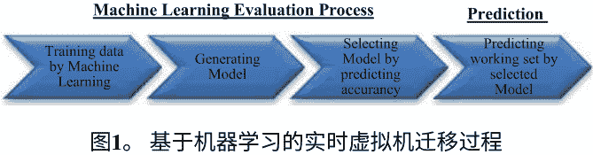

在预测工作集过程中，系统在实时虚拟机迁移过程中使用具有历史数据的预测模型，并训练模型参数。模型读取内存更新的统计数据和其他性能参数，如内存脏化率和传输速率，并模拟迁移过程以减少总迁移时间。

### 3.1 机器学习评估过程

机器学习用于预测实时虚拟机迁移过程中的工作集。由于建模复杂环境的复杂性以及对其的先验知识较少，机器学习用于从虚拟机中易于获取的一组指标（如内存脏化率和传输速率）自动构建模型。本文使用的技术可以预测与实时虚拟机迁移过程相关的工作集，前提是收集到相关指标。这个想法是，如果系统的状态（包括工作负载）不会变化，机器学习算法在预测工作集方面是有效的。然而，如果情况发生变化（消耗速度变化），模型必须能够在新情况下重新计算工作集。

为此，添加了一组衍生指标作为变量，以实现更准确的预测。所有指标都是从完整的实验运行中收集的，使用两台物理服务器进行虚拟机迁移过程。之后，发生在实时虚拟机迁移中的工作集将被识别出来。新的数据集被用作该过程的输入，其主要任务是添加从监测的指标中衍生出的变量。所得到的数据集用于构建模型，并使用不同的工作负载和传输速率进行验证。此外，还准备开发一组模型，并根据不同的参数选择最准确的结果。

机器学习评估过程包括以下两个步骤：
- 模型选择：比较不同的机器学习算法，以选择（近似）最佳算法。
- 模型评估：在选择了最终算法后，估计其在新数据上的泛化误差。

这个子章节的主要目标是评估不同的机器学习算法，以选择最佳算法。模型选择过程要求使用训练数据集对机器学习算法进行训练，然后根据估计的测试误差使用完全不同的数据集（称为验证数据集或开发数据测试集）进行比较。

根据表1，M5P在准确性和训练之间提供了一个良好的平衡。WSPML需要快速预测并具有低计算成本，而M5P可以满足这一约束。最后，选择M5P的另一个重要因素是M5P模型具有人类可解释性。

表1。使用不同的机器学习算法的预测模型准确性

| 算法 | Linux空闲 | Dbench | TPC-C | SPECWeb | LinPack |
| :--- | :--- | :--- | :--- | :--- | :--- |
| M5P | 0.9977 | 0.9635 | 0.9975 | 0.9937 | 0.9941 |
| 线性回归 | 0.9939 | 0.9535 | 0.9636 | 0.9757 | 0.9729 |
| REPTree | 0.9415 | 0.9182 | 0.9347 | 0.9576 | 0.9563 |

### 3.2 预测过程

在传统的预复制方法中，内存页面在多次迭代中被复制，然后最终传输处理器状态。WSPML可以提供一个“双赢”的局面，将总迁移时间缩短到非实时虚拟机迁移所需的时间。WSPML构建了一个模拟模型，通过历史数据预测实时虚拟机迁移过程中的工作集。由于建模真实环境的复杂性以及对其先验知识的缺乏，WSPML决定使用机器学习从一组影响实时虚拟机迁移总时间的指标（如内存脏页率和网络传输速率）中自动构建模型。

工作集包括在迁移过程中频繁更新的内存页。在迭代的预复制阶段应该跳过工作集，并在停止复制阶段传输。工作集的大小大致与每次迭代中脏页的数量成比例。即：

$$W_s = y \cdot T_i \cdot DR$$

其中 $y$ 是与内存脏页率和每次迭代持续时间相关性的比率。线性方程模型中的关系如下：

$$y = w_0 + (w_1 \cdot T_i) + (w_2 \cdot DR)$$

其中 $w_0, w_1$ 和 $w_2$ 是要学习的模型权重。WSPML通过运行各种工作负载并使用WEKA工具逐个执行每个工作负载的迁移来估计模型权重。

## 基于机器学习的实时虚拟机迁移模拟模型

在本小节中，描述了WSPML和基于预复制的实时虚拟机迁移的模拟模型。假设内存可以在提议的框架中以大小为 $P$ 字节的页面进行处理，$M$ 是内存大小，传输可用带宽恒定且等于 $B$ 字节每秒，$W_s$ 是工作集列表，$W_M$ 是每秒修改的页面数。因此，在提议的框架中传输内存页面的时间成本为提议框架的推送阶段的执行时间：

$$T_i = \frac{(M_i - W_s)P}{B}$$

其中 $i = 1, 2, 3, \dots, n$ 且 $M_n \le W_M$ 以及 $M_1 = M$ 用于第一次迭代，然后通过以下方式修改内存页面大小更新为：

$$M_{i+1} = T_i W_M$$

所提框架停止阶段的执行时间：

$$T_{stop} = \frac{W_s P}{B}$$

总迁移时间 = $T_{pre} + \sum_{i}^n T_i + T_{stop}$

在XEN中传输内存页面的时间成本为XEN推送阶段的执行时间：

$$T_i = \frac{M_i P}{B}$$

其中 $i = 1, 2, 3, \dots, n$ 且 $M_n \le W_M$ 以及 $M_1 = M$ 用于第一次迭代，然后通过以下方式修改内存页面大小更新为：

$$M_{i+1} = T_i W_M$$

XEN停止阶段的执行时间：

$$T_{stop} = \frac{W_s P}{B}$$

总迁移时间 = $\sum_i^n T_i + T_{stop}$

使用两种方法的仿真模型，WSPML在实时虚拟机迁移的预复制过程中使用工作集来减少内存页面的传输。但是WSPML的总迁移时间不仅包括预复制过程和最后一次迭代的迁移时间，还包括预测过程的开销。WSPML的仿真算法如图2所示。在每个迁移过程中，跟踪脏页面的数量，并在每次预复制迭代中跳过页面，以计算 $y$ 的值。

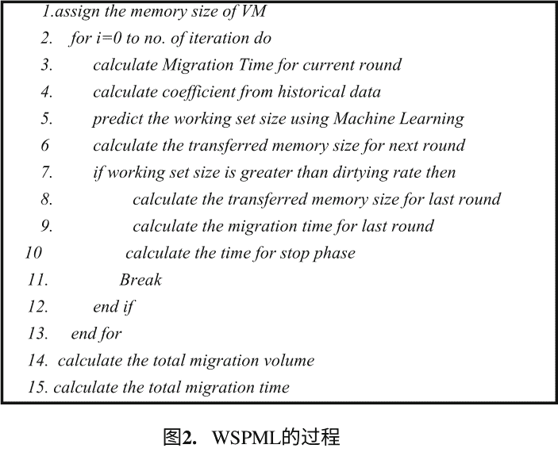

根据每次预复制迭代的迁移时间和内存脏化率，WSPML基于实验结果建立了一组独立方程，并推导出每个参数 ($w_0, w_1, w_2$) 的值。在回归分析中，$R^2$ 决定系数是衡量回归线与实际数据点拟合程度的统计指标。$R^2$ 为 1.0 表示回归线完全拟合数据。WSPML模拟模型的 $R^2$ 为 0.92813。

## 5 评估

在本节中，提出的系统评估了以下工作负载使用的工作集预测算法的框架，然后分析了如何改进基于传统预复制的实时虚拟机迁移算法在XEN中的性能。

### 5.1 实验环境

对于我们的实验平台，提出的系统使用六台相同的计算机服务器作为集群。两台服务器用作具有千兆以太网的实时迁移的源和目标。第三台服务器用于使用iSCSI协议的共享存储。其他三台服务器以不同的工作负载运行为客户端。在提出的系统中使用Citrix Xen-5.6.0作为VMM和修改后的Linux 2.6.18.8作为客户操作系统。所有服务器和客户端共享同一网络，并通过千兆局域网连接。

为了评估WSPML的性能，我们选择了虚拟化环境中的几个代表性应用作为迁移虚拟机的工作负载：

- **Linux空闲**：一个用于日常使用的空闲Linux操作系统，作为比较的参考框架。

- **TPC-C**：一个在线事务处理（OLTP）基准测试，模拟了完整的数据库事务环境。在我们的实验中，配置了1000个终端线程和500个数据库连接。

- **Dbench**：一个模拟开源文件系统负载的基准测试。该基准测试通过执行创建/写入/读取/删除操作来模拟各种真实文件服务器。配置了10个同时连接以生成磁盘负载。

- **MP LINPACK**：用于执行大规模的向量和矩阵运算，会产生严重的CPU和内存压力。

##### 5.2 评估结果

总迁移时间是一个关键的性能指标。系统进行了一系列实验来验证WSPML的有效性。对于每个工作负载，系统将总迁移时间与使用仿真模型和传统的预复制方法的估计进行了比较。

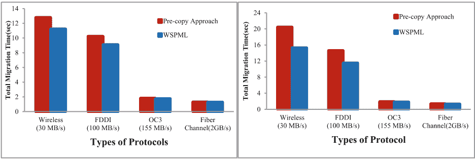

图3。总迁移时间的比较（a. LinuxIdle）和（b. TPC-C）

图3(a)显示了使用LinuxIdle工作负载时，总迁移时间随不同类型的传输速率的变化。使用这个工作负载，WSPML在使用无线和FDDI进行迁移过程中可以更有效地减少。图3(b)比较了传统预复制方法和TPC-C工作负载中WSPML的各种协议的总迁移时间。该图显示了WSPML在慢速网络传输率（如无线协议）中可以更有效地减少，但在快速网络传输率（如光纤通道）中几乎没有减少。

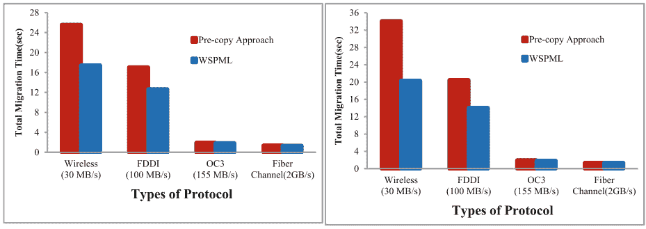

图4。总迁移时间的比较（a. Dbench）和（b. SPECWeb）

图4(a)显示了在Dbench工作负载中使用不同类型的协议时，WSPML和XEN的总迁移时间。使用无线连接，WSPML的总迁移时间比传统方法显著减少。图4(b)展示了在SPECWeb工作负载中，所提出的方法在无线协议中比传统方法减少了近14秒。

总迁移时间主要与迁移过程中需要传输的脏内存页面数量相关。由于其高内存脏页率和传输速度慢，预复制方法在无线协议下往往时间较长。然而，在WSPML的指导下，系统在各种工作负载和传输速度下始终比XEN的默认预复制方法更有效地减少总迁移时间。

#### 6 结论

为了解决IaaS云数据中心能源消耗过高的问题，需要消除计算资源使用中的低效率。WSPML对机器学习算法进行了广泛评估，以预测影响虚拟机性能下降的工作集。实验结果表明，M5P是一个准确的预测器，WSPML在迁移过程中比传统的预复制方法更有效地减少了总迁移时间。

#### 参考文献

- 1. Clark, C., Fraser, K., Hand, S., Hansen, J.G., July, E., Limpach, C., Pratt, I., Warfield, A.: 虚拟机的实时迁移。在：第二届USENIX网络系统设计与实现研讨会论文集（2005年）。Tavel, P.：建模与仿真设计。AK Peters Ltd.（2007年）

- 2. Hines, M.R., Gopalan, K.：基于后复制的实时虚拟机迁移，使用自适应预分页和动态自动膨胀。在：ACM/Usenix国际虚拟执行环境会议论文集（VEE 2009），第51–60页（2009年）

- 3. Kivity, A., Kamay, Y., Laor, D.：KVM：Linux虚拟机监视器。在：渥太华Linux研讨会论文集（2007年）

- 4. Li, L., Vaidyanathan, K., Trivedi, K.S.: 一种用于估计Web服务器软件老化的方法。在：2002年国际经验软件工程研讨会论文集，华盛顿特区，美国，第91页。IEEE计算机学会（2002年）

- 5. Nelson, M., Lim, B., Hutchines, G.: 快速透明迁移虚拟机。在：USENIX年度技术会议论文集（USENIX 2005），第391–394页（2005年）

- 6. OpenVZ. (Virtuozzo). http://www.openvz.com/

- 7. Zhang, Q., Cherkasova, L., Mi, N., Smirni, E.: 一种基于回归的多层应用容量规划分析模型。集群计算。11(3), 197–211（2008年）

- 8. Vaidyanathan, K., Trivedi, K.S.: 一种基于测量的操作系统系统资源耗尽估计模型。在：第10届国际软件可靠性工程研讨会论文集，华盛顿特区，美国，第84页。IEEE计算机学会（1999年）

### 分布式文件系统的动态复制管理方案

May Phyo Thu, Khine Moe Nwe(✉), 和 Kyar Nyo Aye(✉)

计算机科学学院，计算机研究学院（仰光），仰光，缅甸

mayphyothu.mptl@gmail.com, khinemoenwe@ucsy.edu.mm, kyarnyoaye@gmail.com

**摘要**：如今，复制技术广泛应用于数据中心存储系统中，以防止数据丢失。数据流行度是数据复制的关键因素，因为流行的文件最常被访问，其访问模式往往变得不稳定和不可预测。此外，副本的放置是影响系统性能的关键问题，如负载平衡、数据局部性等。为了解决这些挑战，本文提出了一种基于数据流行度和数据局部性的动态复制管理方案，包括副本分配和副本放置算法。在所提出的数据放置算法中考虑了数据局部性、磁盘带宽、CPU处理速度和存储利用率，以实现更好的数据局部性和负载平衡效果。我们提出的方案将对大规模云存储产生效果。

**关键词**：复制 · 数据流行度 · 数据本地性 · 存储利用率 · 磁盘带宽

#### 1 引言

云存储是一种技术，允许我们将文件保存在存储中，然后通过云访问这些文件。云存储系统将数据存储在多个服务器中的单个存储池中，为用户提供广泛资源和应用程序的即时访问。

目前，现有的云存储产品有Google（GFS），亚马逊（S3），IBM（蓝云），雅虎（HDFS）等。HDFS提供可靠的存储和高吞吐量访问。在HDFS中，数据被分割成固定大小的数据块（块），并存储在多个数据节点中。为了提供数据本地性，Hadoop尝试自动将数据与计算节点进行关联。数据本地性指的是数据与处理节点之间的距离程度，分为三种类型：节点本地性、机架本地性以及机架间本地性。

当前MapReduce系统中使用统一数据复制。引入了文件的流行度概念来选择流行的文件进行复制。因此，本文提出了基于数据流行度的复制方法，以克服HDFS中静态复制的问题。首先计算文件流行度的变化率，其次计算复制度，最后根据放置算法放置副本。

#### 2 相关工作

在云存储环境中，魏[2]提出了一种成本效益的云存储集群复制管理方案，通过确定理想副本数量和放置策略来提高可用性。Chang和Chang提出了最新访问最大权重（LALW）算法[7]，用于数据网格，计算每个时间间隔内最受欢迎的文件并决定副本位置。

Hunger和Myint比较了PopStore和LALW算法[1]，通过半衰期概念找到更受欢迎的文件，但未考虑负载平衡。Scarlett [5]采用主动复制方案，根据预测的流行度定期复制文件。DARE [3]提出基于运行时数据块访问模式的动态复制以改善局部性。

[8]中提出了延迟调度方法，关注数据局部性与公平性的冲突。在[4]中，作者提出了一种基于Hadoop框架中访问计数预测的效率数据复制方案，但该方案仅考虑文件级复制而非块级复制。

#### 3 提议的系统架构

所提议系统的目标是设计一种自适应复制方案，通过复制“热门”数据来增加数据局部性，同时保持对不受欢迎数据的最少复制数。所提议的系统流程图如图1所示。

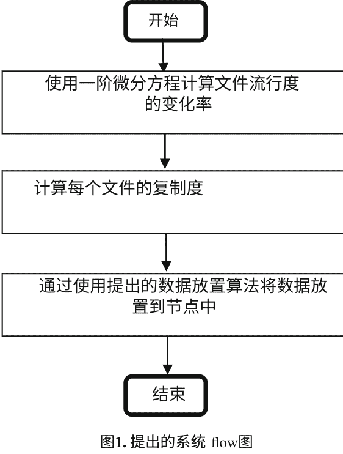

所提出的方案包括三个步骤：第一步，使用一阶微分方程计算文件的流行度变化率；第二步，计算每个文件的副本数量；第三步，根据提出的数据放置算法将副本放置在节点中。

##### 3.1 提出的流行度增长率算法

在这一步中，将使用一阶微分方程计算文件流行度的变化率。LALW和Pop-Store算法采用半衰期策略，即一个时间间隔内的记录权重衰减为其前一个权重的一半。流行度的概念是一个假设，即一个项目的流行度增长速度...在某个特定时间，与该时间的物品总受欢迎程度成比例。在数学术语中，如果 $P(t)$ 表示时间 $t$ 的总人口，则

$$\frac{dP}{dt} = kP(t) \eqno(1)$$

其中 $P(t)$ 表示时间 $t$ 的人口，$k$ 是增长常数或衰减常数，视情况而定。如果 $k > 0$，我们有增长；如果 $k < 0$，我们有衰减。这是一个线性微分方程，可以解得：

$$P(t) = P_0 e^{kt} \eqno(2)$$

然后，

$$k = \frac{\ln\left(\frac{P(t)}{P_0}\right)}{t} \eqno(3)$$

其中 $P_0$ 是初始人口，即 $P(0) = P_0$，$k$ 被称为增长或衰减常数。在这一步中，将使用 Yahoo Hadoop 审计日志文件 [9] 作为数据源计算文件受欢迎程度的变化率。用户可以从 NameNode 启用审计日志记录。Yahoo HDFS 用户审计日志格式如图 2 所示。

```
2016-12-10 11:11:59,693 INFO
org.apache.hadoop.hdfs.server.namenode.FSNamesystem.audit: ugi=hduser
ip=/134.91.100.59 cmd=delete src=/app/hadoop/tmp/test.txt dst=null perm=null
```

图 2. HDFS 用户审计日志格式

为了获得每个文件的频率计数，用户审计日志根据时间段持续时间和记录数量分割成小文件。然后提取所需的字段，如日期、时间、IP 和 `src`。之后，从图 2 的 `src` 源链接中计算用户访问频率。在每个时间段内，计算并存储个别文件的访问频率。然后根据表 1 和图 3 计算每个文件的流行度在每个时间段的变化率。

###### 表 1. 流行度增长率算法中使用的符号

| 符号 | 描述 |
| :--- | :--- |
| $P(t_f)$ | 文件的流行度值 |
| $AF(t_f)$ | 每个时间段内文件的总访问频率 |
| $inLog$ | 输入日志文件 |
| $k$ | 文件流行度的变化率 |

###### 算法 1. 流行度增长率算法

1. 读取 $inLog$。
2. 通过使用 $P(t_f) = AF(t_f), \forall f \in F$ 计算每个文件的访问频率 $t_f$。
3. 通过公式 (3) 将每个文件的访问频率代入 $P(t)$ 计算流行度变化率 $k$。
4. 返回 $k$。

图 3. 流行度增长率算法

根据文件流行度的变化率，考虑每个文件的副本数如下：如果文件流行度的变化率大于 0，则现有副本数增加 1。如果文件流行度的变化率小于 0，则现有副本数减少 1。如果文件流行度的变化率等于 0，则现有副本数保持不变。否则，如果访问的文件是新文件且没有访问记录历史，则为该文件分配 3 个副本，与 HDFS 默认副本数相同。

##### 3.2 提出的数据放置算法

确定副本数量后，我们将考虑如何高效地放置这些副本以改善数据局部性和负载平衡。在这一步中，假设作业将在下一个时间段访问这个副本。传入的作业被分解为任务，每个映射任务被分配到集群中的节点上。

每个输入块有一个映射任务。在这个系统中，输入数据文件被划分为 64 MB 的块，并将它们放置在集群中。例如，如果这个文件的副本数为 3，而这个文件有 4 个块，那么这个文件的总副本块数为 12。让最大副本数为集群中的节点数，最小副本数为 1。

假设在分配的节点上，没有副本块用于传入的映射任务。在这种情况下，该系统考虑提高节点局部性。在这种情况下，通过将副本数据块加载到该节点中执行远程数据检索。在加载此数据块时，如果该节点的负载因子小于预定义的阈值，则将该副本数据块加载到该节点中。否则，将通过将该副本数据块替换为现有块来执行替换操作。

所提出的数据替换算法基于最近最少使用（LRU）算法。它将比 LRU 更可靠，并且在替换方面将具有更高的效率结果，因为它考虑了访问频率。所提出的增强型 LRU 替换算法如图 4 所示。

现有的 Hadoop 块放置策略不考虑数据节点的利用率，导致负载不平衡。该策略假设集群中的所有节点都是同质的，并且随机放置块而不考虑任何节点的资源特征，这降低了系统的自适应性。

因此，该系统考虑了集群中节点的异构环境。我们需要考虑负载因素，如存储利用率、磁盘带宽和 CPU 处理速度。在放置过程中，DataNode 的存储利用率、磁盘带宽和 CPU 处理速度是影响 HDFS 负载均衡的重要因素。因此，在有效负载均衡的条件下，DataNode 存储的容量应与其总磁盘容量成比例。我们可以将存储利用模型表示为：

$$U(D_i) = \frac{D_i(use)}{D_i(total)} \eqno(4)$$

其中，$U(D_i)$ 是第 $i$ 个 DataNode 的存储利用率，$D_i(use)$ 是第 $i$ 个 DataNode 的已使用磁盘容量，$D_i(total)$ 是第 $i$ 个 DataNode 的总磁盘容量，它是每个 DataNode 的固定值，单位为 GB。然后，我们可以建立磁盘带宽模型：

$$BW(D_i) = \frac{T_b}{T_s} \eqno(5)$$

其中，$BW(D_i)$ 是第 $i$ 个 DataNode 的磁盘带宽，$T_b$ 是传输的总字节数，$T_s$ 是从第一个请求服务到最后一次传输完成的总时间。

然后，CPU 处理速度被用作重要因素之一，每个节点由于异构环境而具有不同的 CPU 处理速度。在这三个因素中，存储利用率被设置为第一优先级，磁盘带宽为第二优先级，CPU 处理速度为最后优先级。

因此，我们将存储利用率、磁盘带宽和 CPU 处理速度的系数分别设置为 $\alpha, \beta$ 和 $\gamma$。因此，我们可以建立负载因子模型：

$$LF(D_i) = \alpha U(D_i) + \beta BW(D_i) + \gamma SP(D_i) \eqno(6)$$

第 $i$ 个集群的预定义阈值 $T_i$ 被假设为存储利用率的最大值、磁盘带宽的最大值和 CPU 处理速度的最大值之和。

###### 算法 2. 增强型 LRU 算法

- **步骤 1.** 当将副本数据块加载到分配的节点时，将计算该节点中所有块的总访问频率（TAF）。
- **步骤 2.** 如果只找到一个具有最小 TAF 的块，则选择该块从该节点中驱逐。
- **步骤 3.** 如果找到一个或多个具有最小 TAF 的块，则选择最近最少访问的块（LRU 块）从该节点中驱逐。

图 4. 增强型 LRU 算法

集群由集群中的节点数量划分。因此，我们可以按照预定的阈值对集群 $C_i$ 进行处理：

$$T_i = \frac{Max_i(U) + Max_i(BW) + Max_i(SP)}{N} \eqno(7)$$

其中，$T_i$ 是第 $i$ 个集群的预定阈值，$N$ 是第 $i$ 个集群中的节点数量。如果该节点的负载因子小于预定的阈值，则将该副本数据块加载到该节点。所提出的数据放置算法在表 2 和图 5 中显示。

###### 表 2. 数据放置算法中使用的符号

| 符号 | 描述 |
| :--- | :--- |
| `DN` | DataNodes 列表 |
| `BW` | 磁盘带宽 |
| `U` | 存储利用率 |
| `RP` | 副本列表 |
| `MT` | 映射任务列表 |
| `SP` | CPU 处理速度 |
| `C` | 集群列表 |
| `LF` | 负载因子列表 |

#### 4 性能评估

在本节中，概率模型被应用于评估可用性分析。在该模型中，数据文件 $F$ 被分割成 $n$ 个块，表示为 $B = \{b_1, b_2, b_3, \dots, b_n\}$，并存储在不同的 DataNodes 中。数据文件 $F$ 的每个块都有 $r_n$ 个副本，在相同位置上的所有块都具有相同的可用概率，因为所有块都存储在具有相同配置的 DataNodes 中。假设 NameNode 不会发生任何故障。为了分析该系统的数据可用性，假设节点故障与故障概率独立。如果一个节点故障，所有的块都会丢失。数据块 $B_n$ 的可用性表示为 $BA_n$，$P(BA_n)$ 是数据块 $B_n$ 处于可用状态的概率。

假设数据块 $b_n$ 的副本数为 $r_n$，并且每个数据块 $b_n$ 的可用和不可用概率分别为 $P(b_n)$ 和 $P(\overline{b_n})$。因此，数据块 $B_n$ 的可用性和不可用性可以计算为：

$$P(BA_n) \approx 1 - (1 - P(b_n))^{r_n} \eqno(8)$$

$$P(\overline{BA_n}) = (1 - P(b_n))^{r_n} \eqno(9)$$

###### 算法 3. 数据放置算法

**输入：** 数据节点列表 $DN= \{DN_1, DN_2, \dots, DN_n\}$, 副本列表 $RP = \{RP_1, RP_2, \dots, RP_n\}$, 映射任务列表 $MT = \{MT_1, MT_2, \dots, MT_n\}$, 负载因子列表 $LF = \{LF_1, LF_2, \dots, LF_n\}$, 预定义阈值 $T_i$, 集群列表 $C = \{C_1, C_2, \dots, C_n\}$

**输出：** 更新后的数据节点列表 $DN$

1. 对于每个传入的映射任务 $MT_i$:
2.   对于每个数据节点 $DN_i$:
3.     检查任务 $MT_i$ 的节点本地性
4.     如果存在节点局部性:
5.       则将任务 $MT_i$ 分配给该数据节点 $DN_i$
6.     否则:
7.       为任务 $MT_i$ 执行远程数据副本检索

8. 使用公式 (4) 计算存储利用率 `$U$`

9. 使用公式 (5) 计算磁盘带宽 `$BW$`

10. 检查 CPU 处理速度 `$SP$`

11. 使用公式 (6) 计算负载因子 `$LF_i$`

12. 计算集群 `$C_i$` 的预定义阈值 `$T_i$`

13. 如果负载因子 `$LF_i > T_i$`:

14. 执行算法 2 进行替换

15. 将该任务的副本 `$RP_i$` 放置在该数据节点 `$DN_i$` 上

16. 跳出循环

图 5. 数据放置算法

考虑系统中包含 `$n$` 个 DataNodes 的每个副本块 `$b_n$` 的概率，其中包含了 `$b_r$` 个数据块的副本。因此，`$b_n$` 可用的概率是：

$$P(b_n) = \sum_{f=0}^{n} P_{失败}(f) \cdot P(\text{no loss}) \eqno(10)$$

其中 `$P_{失败}(f)$` 是系统中有恰好 `$f$` 个节点失败的概率，该系统具有 `$n$` 个数据节点。因此，`$P_{失败}(f)$` 是：

$$P_{失败} = \binom{n}{f} \times p^f \times (1 - p)^{(n-f)} \eqno(11)$$

`$P(\text{no loss})$` 是在发生 `$f$` 次故障的系统中不丢失数据的概率。为了计算 `$P(\text{no loss})$`，首先计算在发生 `$f$` 次故障时丢失数据块的概率：

$$P(\text{no loss}) \approx 1 - P(\text{单个块})^b \eqno(12)$$

当 `$n$` 个 DataNodes 中有 `$f$` 个故障时，丢失单个数据块的概率为：

$$P(\text{单个块}) = \binom{f}{b_r} / \binom{n}{b_r} \eqno(13)$$

因此，我们得到：

$$P(b_n) = \sum_{f=0}^n \binom{n}{f} \times p^f \times (1-p)^{(n-f)} \times \left(1 - \frac{\binom{f}{r}}{\binom{n}{r}}\right)^b \eqno(14)$$

要检索数据文件 `$F$`，我们需要获取所有的数据块 `$\{b_1, b_2, \dots, b_n\}$`。任何不可用的数据块都会导致文件不可用。文件 `$f_n$` 的可用性表示为 `$FA_n$`，`$P(FA_n)$` 是文件 `$f_n$` 处于可用状态的概率，`$P(\overline{FA}_n)$` 是文件 `$f_n$` 处于不可用状态的概率。

$$P(FA_n) \approx 1 - (1 - P(b_n)^{r_n})^{b_n} \eqno(15)$$

$$P(\overline{FA}_n) = 1 - P(FA_n) \eqno(16)$$

为了评估数据块的可用性，1 GB 的数据存储在基于集群的存储系统中。系统中每个 DataNode 的平均故障率为 0.01、0.02、0.03、0.04 和 0.05（图 6）。

图 6. 在 80 个 DataNode 中，文件可用性的复制因子（r）为 2、3 和 4

从评估结果可以观察到，在系统中，可用性随着复制因子为 2 的数据节点数量的增加而迅速下降。根据评估结果，文件的可用性取决于复制因子和故障概率。从实验中可以明显看出，在集群故障存在的情况下，通过增加复制制度可以满足期望的可用性值。

#### 5 结论

在云存储环境中，数据可以以一定的地理或逻辑距离存储，并且这些数据对基于云的应用程序是可访问的。本文提出了一种用于云存储的动态复制管理方案。在每个时间间隔内，所提出的系统收集云存储中的数据访问历史。

根据所有文件的访问频率，可以计算文件流行度的变化率，并将其复制到适当的数据节点，以实现系统的负载平衡和节点本地性。作为未来的工作，需要进行许多实验评估，以获得所提出的数据放置算法的效率。此外，还需要进行许多实验评估，以获得更好的阈值和负载因子值。同时，还将考虑副本释放以改善整个系统。

#### 参考文献

- 1. Hunger, A., Myint, J.: 云数据存储的自适应文件复制算法的比较分析。在：2014年国际物联网和云计算大会 (2014)

- 2. Gong, B., Veeravalli, B., Feng, D., Zeng, L., Wei, Q.: CDRM：一种成本效益的动态云存储集群复制管理方案。在：2010年IEEE国际集群计算大会，2010年9月，第188–196页 (2010)

- 3. Abad, C.L., Lu, Y., Campbell, R.H.: DARE：用于高效集群调度的自适应数据复制。在：IEEE国际集群计算大会 (CLUSTER 2011)，第159–168页 (2011)

- 4. Lee, D., Lee, J., Chung, J.: 基于 Hadoop 分布式文件系统的高效数据复制方案。软件工程应用国际期刊 9(12), 177–186页 (2015)

- 5. Ananthanarayanan, G., 等：Scarlett：应对 MapReduce 集群中的内容偏好不均衡问题。在：计算机系统会议论文集 (EuroSys)，第287–300页 (2011年)

- 6. Gobioff, H., Ghemawat, S., Leung, S.-T.: Google 文件系统。在：第19届操作系统原理 ACM 研讨会 (SOSP 2003)，美国纽约，2003年10月

- 7. Chang, H.-P., Chang, R.-S., Wang, Y.-T.: 数据网格中的动态加权数据复制策略。在：2008年 IEEE/ACS 国际计算机系统与应用会议，2008年3月，第414–421页

- 8. Zaharia, M., Borthakur, D., Sen Sarma, J., Elmeleegy, K., Shenker, S., Stoica, I.: 延迟调度：在集群调度中实现局部性和公平性的简单技术。在：欧洲计算机系统会议论文集 (EuroSys) (2010年)

- 9. https://webscope.sandbox.yahoo.com

### 使用 Hadoop GM-Tree 和 GTree 进行动态数据库的频繁模式挖掘

Than Htike Aung(✉) 和 Nang Saing Moon Kham  

信息科学系，仰光计算机大学，仰光，缅甸  

{thanhtikeaung, moonkhamucsy}@ucsy.edu.mm

**摘要：** 自挖掘技术诞生以来，频繁模式挖掘已成为数据挖掘中的一个必要问题。挖掘模式的事务处理需要高效的数据结构和算法。该系统提出了一种树结构，称为 GMTree（生成和合并树）- GTree（分组树），它是基于规范顺序树和批量增量技术的混合型增量挖掘。所提出的系统使树结构更加紧凑，节点按规范顺序排列，并避免了事务的顺序增量。它提供了一种可扩展的算法，在更新操作期间修改树结构的开销最小。它在动态环境中操作极大的事务数据库，特别是在这种情况下预计能够获得更好的结果。所提出的系统使用了 Apache Hadoop 和混合型 GMTree-GTree。结果显示，Hadoop 实现的算法比 Java 实现的算法更快。

**关键词：** 规范 · 频繁模式 · GM树 · G树 · Hadoop 混合

#### 1 引言

在过去的几十年里，许多研究人员提出了许多算法来从给定的数据集中发现频繁项集 [1, 4, 7, 14, 16]。通常，数据集可以分为静态或动态两种类型。大多数算法专注于静态数据集。然而，静态数据挖掘算法无法应用于动态数据集。特别是，实时方法优于批处理方法。基于窗口概念，流数据挖掘可以分为以下几种类型：里程碑、阻尼和滑动窗口。里程碑模型主要关注从过去的某个时间观察到现在的数据集。在阻尼方法中，频繁项集是从数据流中提取的，其中每个事务都被分配了一个随着时间减少的权重。滑动窗口模型中，项集是在一定时间间隔内从当前时间收集的。

所提出的系统的算法是滑动窗口技术 [6, 12]，每个批次移动一次。所提出的系统高效地表示交易，利用从 GMTree 构建的基本树，几乎与 CanTree 相同。两者之间的差异在于当新项到达时，相似的项通常形成一个单独的节点进行比较（不需要将每个新项作为 CanTree 进行比较），并且不需要像 FPTree 一样重新构建整个树。

GMTree 节点表示在基本树（GMTree 或父 GTree）中具有相同数据项的一组节点。这就是所提出的算法称为 Hadoop GMTree-GTree 的原因。它非常简单和高效。该算法具有以下特性：

- 单个数据库扫描。
- 使用滑动窗口。
- 相似的项通常在新树中形成一个单独的节点进行比较（不需要每个新项进行比较）。
- 查找精确和完整的频繁项集。

#### 2 相关工作

FPTree 数据结构被用于 FP-growth 算法 [2] 中，将事务数据库的紧凑树结构表示为主内存。FP-growth 算法使用分治法生成频繁项集，只需要两次数据库扫描。该算法在内存使用和处理成本方面非常高效。

最成功的数据挖掘方法导致了许多基于`FP-growth`的算法，用于静态数据集以减少数据库扫描次数。但是，基于`FPTree`的`FP-growth`算法不能应用于流数据挖掘环境。

然而，`FP-growth`算法已经在许多流数据挖掘方法中使用，例如`FP-stream` [5]，`DSTree` [21]，`CanTree` [13]，`FUFP-Tree` [7, 8]，`CPSTree` [20] 等 [16, 17]。此外，许多研究人员基于`apriori`算法进行研究，例如`SWF` [13]，`SWFI stream` [12] 和 `MFI-TransSW` [15]。这些增量挖掘方法在多个应用中显示出良好的性能和挖掘结果，但基本上在处理数据流方面有一定的限制。

有几项研究 [9, 10, 20] 指出，处理成本和内存消耗是一个相当大的问题，通常需要生成和测试候选项集。候选项集生成的输出结果具有巨大的处理成本，特别是如果有大量的项（或候选项集的长度很长）的话。

## 3 GM-Tree 的背景知识

本节描述了一种称为`GM-Tree`的树结构，它用于维护频繁模式。`GM-Tree`的数据结构通过结合规范排序和批量增量技术来改进其功能和性能。

所提出的方法使用增量挖掘技术来维护在事务数据库中发现的频繁项集。当数据库经常通过添加、删除和修改事务来改变时，`GM-Tree`可以高效地更新其数据结构。批量增量技术提到将两个数据集（在这里以树的形式）合并成一个等效的新数据集。

由这两个集合组成的整个数据库。树结构由更紧凑的方式构建，避免了事务的顺序递增，节点按照规范顺序排序，并提供了一种可扩展的算法，修改树结构的更新操作开销最小。该算法通过对第一个数据库进行单次扫描来构建树结构。所形成的树的项目按照词典顺序从根到叶子排列，因此项目的排序不受其频率的影响。

在挖掘树时考虑支持频率。现在，为了处理动态环境，从数据库中的新事务构建一个类似的新树。一旦创建，新树将与最后更新的树合并，形成整个更新数据库的相应树结构，避免重新扫描整个更新数据库，从而提供更好的效率。上述陈述可以总结为`GM-Tree`的两个重要属性，如下所述：

- **属性1：** `GM-Tree`中的节点按字典顺序排序，因此排序不受更改项频率的影响。

- **属性2：** 新事务用于生成另一个树，然后与最后更新的树合并，避免重新扫描整个更新的数据库。

图1显示了从表1生成的`GM-Tree`。改进的`GM-Tree`解决了上述树的限制，具体如下：

- (1) 在`GM-Tree`的情况下，节点按照规范（即按字典顺序）排列，因此在合并两个树时，无需检查和交换具有不同频率的节点。

- (2) `GM-Tree`不受频率计数的影响，因此可以完全避免节点的交换、冒泡和重新扫描，从而使其更加高效。

- (3) 在`GM-Tree`构建过程中，当形成一个新树时，只需要将该新树的节点与最后更新的树节点进行比较。因此，当数据大小增加且树的大小增加时，可以避免大量不必要的比较。这表明`GM-Tree`非常适用于极大型数据库。

- (4) `GM-Tree`在合并两棵树时需要更多的内存，但由于不需要交换或重新扫描节点，大大减少了计算时间。此外，在这个现代世界中，空间需求（即主内存）不再是一个大问题[3, 21]。

### 改进的GM树算法步骤如下：

- (1) 从原始数据库 (`$db_{original}$`) 的内容创建一棵树 (T)，并按字典顺序排序T的节点。

- (2) 从数据库 (`$db_{new}$`) 中创建另一棵新树 (t)，其中包含新的事务（考虑在预定时间内输入到数据库中的那些事务），并按字典顺序排序t的节点。

- (3) 将树t合并到最后更新的树T中。合并t到T后形成的树将具有整个更新的数据库 (`$db_{original} \cup db_{new}$`) 的内容与按字典顺序排序的树节点 (即 `$T \leftarrow T \cup t$`)。

- (4) 当新的事务输入到 (`$db_{new}$`) 时，继续执行第2步。

## 表1. 事务数据库

| 事务ID | 原始数据库事务 | 事务ID | 新条目事务 |
| :--- | :--- | :--- | :--- |
| t1 | {p, a, s, t} | t5 | {a, t, c} |
| t2 | {b, s, c, a, t} | t6 | {s, t, a, c} |
| t3 | {a, b, q, s, t} | t7 | {b, c, q, t} |
| t4 | {t, a, s} | | |

图1。每次添加事务后的GMTree

## 4 提出的方法论

所提出的系统使用滑动窗口方法和`GMTree-GTree`数据结构。这些数据结构比`CanTree-GTree`数据结构更高效。

新树的数据节点数据结构通常需要与相似项进行比较，形成单个节点。在`CanTree`中，可能会生成具有过多分支和节点的倾斜树。它一次考虑一个来自数据库的事务。如果时间效率下降，它会产生简洁的树。只有当大多数交易具有共同模式时，它才会生成简洁的树。

### 4.1 GMTree-GTree算法

`GMTree-GTree`算法[4]使用滑动窗口技术[2]。一个批次包含一组被视为单个实体的交易。滑动窗口由 ‘k’个交易组成，其中 ‘k’是窗口大小。当窗口变满时，最早的批次被移除，新的批次被插入。

该方法使用以下数据结构：

- (1) `GMTree` [14, 20]是一棵基础树，可以高效地存储当前窗口中的交易。`GMTree`将与之关联的项目表（`iTable`）和交易的最后节点表（`lTable`）。`iTable`的每一行包含项目ID、项目的支持计数以及在`GMTree`中具有该项目的节点列表。`lTable`的每一行包含批次的索引以及在`GMTree`中交易的最后节点列表。

- (2) `GTree`是一棵投影树，由`GMTree`构建，用于挖掘频繁模式。`GTree`还有一个关联的`iTable`。

- (3) 原始树节点与相似项进行比较，通常在新树中形成一个单一节点。

**ALGORITHM 1. Tree Generation from transaction database (DB)**

**Data:** Transaction Database (DB)

**Result:** lexicographic order of Tree nodes

```
1. Set the Transaction Pattern base empty
2. Declare head node of GM-Tree, head = null
3. Scan the transaction database (DB), sorting each transaction $T_i$ lexicographically until the last transaction reached
4. for every $T_i \in DB$ do
5.     if the first item does not exist as the child of the head then
6.         add the transaction to the child of head with count value 1
7.         add the transaction to iTable
8.     end
9.     if first item exists as a child of the head then
10.        while items $I \in T_i$ equals to the node of the Tree do
11.            increment their count value by 1
12.        end
13.        add the remaining items $I \in T_i$ to the tree with a count value as 1
14.    end
15. end
```

**ALGORITHM 2. Merge (T, t)**

**Data:** Tree (T) $\in db_{original}$ and Tree (t) $\in db_{new}$, new batch

**Result:** New Merged Tree ($T \leftarrow T \cup t$) having the lexicographic order of nodes

**initialization:** $head_1 \leftarrow T$ and $head_2 \leftarrow t$

```
1. for all child nodes, $N_2 \in head_2$ do
2.     if $N_2$ exists as a child node of $N_1 \in head_1$ then
3.         add the count of the two nodes
4.         Merge ($N_1$, $N_2$)
```

5. 更新`$N_1$`到`iTable`

6. **结束**

7. **否则**

8. 将`$N_2$`添加为`$head_1$`的子节点

9. **结束**

10. **结束**

11. 将`T`添加到`iTable`以用于新批次；

### ALGORITHM 3. GMTree-GTree

```
Input: a sequence of batches
Output: frequent itemsets window, listOfItemsets
Method:
    GMTree-Gtree( ) {
        While (true) {
            Get a new batch;
            If a window is full of batches,
                Delete the oldest batch from GMTree;
                Add the new batch to GMTree;
            For each data item D in GMTree, construct GTree_D from GMTree;
            itemset = null;
            listOfItemsets = null;
            call PreorderTraverse(GTree_D, itemset);
        }
    }

    PreorderTraverse(GTree, itemset) {
        If (GTree is null) return;
        newItem = itemset + item(root(GTree)); 
        add newItem to listOfItemsets;
        For each data item X in (I(GTree) - {root of GTree}) {
            If the support of X >= minimum support { 
                construct GTree_X from GTree;
                call PreorderTraverse(GTree_X, newItem);
            }
        }
    }
```

所有频繁或非频繁的事务数据项都存储在基础树中。`GMTree`与`FPTree`有些不同。在`GMTree`中，事务的数据项在添加到`GMTree`之前按照规范顺序排序，而在`FPTree`中，排序是基于频率的。

`FPTree`算法需要两次数据库扫描，而`GMTree`只需要一次数据库扫描。因此，对于实时应用程序，`GMTree-GTree`算法比`FP-growth`算法更好且更适用[6, 18, 20]。

### 4.2 挖掘闭合频繁项集、关联规则并在Hadoop上实现

修改`GMTree-GTree`算法[4]用于挖掘闭合频繁项集[4, 11]。该算法挖掘支持度大于最小阈值的闭合项集。如果一个项集不存在任何具有相等支持计数的超集，那么该项集在特定数据集中是闭合的。

闭合频繁项集适用于比最大频繁项集更多的使用场景，因为它的效率比空间更重要，且子集的支持度已经提供。因此，这种方法不需要额外的遍历来获取这些信息。

知识发现过程在数据挖掘中很重要，通常通过挖掘关联规则[1, 2, 19]来获得。这些基本上是用于发现数据之间关系的一组 if/then 语句，可以在关系数据库、数据仓库或存储库中使用。例如，考虑两个支持计数为2的频繁项集`{a, c, e}`（图2）。

## 表2. 样本数据集

| TID | Items |
| :--- | :--- |
| 100 | a c d |
| 200 | b c e |
| 300 | a b c e |
| 400 | b e |
| 500 | a c e |

对于项目集`$I$`的每个非空子集`$s$`，如果`$supportcount(I) / supportcount(s) \ge$`最小置信度，则输出规则：`$s \rightarrow (I-s)$`

假设最小置信度为60%：

- 对于`$R_1$`: `$a, c \rightarrow e$`，置信度 = 2/3 = 66.66%。选择规则。

- 对于`$R_2$`: `$c \rightarrow a, e$`，置信度 = 2/4 = 50%。拒绝规则。

#### 5 结果与讨论

`GMTree-GTree`算法首先使用Java在单节点上实现，并使用来自匈牙利新闻门户网站的真实世界数据集`kosarak (.gz)` 进行测试。然后，在Hadoop框架上进行了一些修改后实现了该算法，并将其所需时间与使用Java的单节点进行了比较。用于比较的数据集是来自FIMI存储库的网页文档数据集“webdocs”。这是一个包含了爬取的网页HTML文档集合的交易数据集。数据集的大小约为1.48 GB，包含大约17万笔交易。实验在以下系统上进行：

- **单节点Java实现：**

    - 硬件: Intel Core i5, 8 GB RAM, CPU 2.4 GHz

    - 软件: Windows 8.1, 带有JDK 1.8的Java

- **Hadoop实现：**

    - 硬件: Intel Core i5, 8 GB RAM, CPU 2.4 GHz

    - 软件: Ubuntu 16.10, 带有JDK 1.8和Hadoop 2.7.2（伪分布式模式）

图3. `iTable`和`ITable`以及完整和闭合的频繁项集

图3展示了构建的`GMTree`的`iTable`和`ITable`，以及完整的频繁项集、闭合频繁项集及其支持计数和具有60%置信度和最小支持集为4的关联规则。这个结果是针对小数据集的，如表1所示。正如我们所看到的，`iTable`包含了项A、B、C等及其频率。`ITable`包含了项、其最大频率以及它所在的最后节点，这有助于我们轻松追踪交易。例如，对于C，最大频率为1，它出现在节点3和11中。因此，通过消除最小支持计数以下的项，我们得到频繁项集。此外，通过第4.2节中讨论的方法，可以获得闭合频繁项集和关联规则。

图4. Hadoop实现

图4是当`GMTree-GTree`算法的Hadoop实现成功完成时的屏幕截图。`GMTree-GTree`算法在Hadoop框架中执行，使用50个输入分片，2个映射器（Mapper）和2个减少器（Reducer）。使用Hadoop花费的总执行时间约为2小时，而使用单节点Java程序完成执行花费了近10小时。

图5. Java和Hadoop实现的时间比较

图5显示了单节点Java和Hadoop框架实现所花费的执行时间的比较图。可以看出，使用Hadoop比简单的Java执行花费的时间要少得多，因为Hadoop被设计为高效处理大数据，并将给定的输入分割，并将每个输入分片馈送到不同的映射器中并行执行。与在单节点上使用Java进行顺序执行相比，在Hadoop框架中可以显著减少时间。

#### 6 结论和未来工作

从所得结果可以看出，Hadoop `GMTree-GTree`算法在实时流数据中挖掘频繁出现的模式方面表现良好。随着窗口滑动，算法将新的事务添加到`GMTree`中，无需进行任何重组。在这里，`GTree`用于构建投影树，以发现频繁出现的项集。因此，该算法在从动态数据流中挖掘完整频繁项集方面更加高效。在MapReduce框架中使用相同的算法显著降低了执行时间。

作为未来的工作，将在Hadoop或其他类似的框架（如Apache Spark、Storm等）中实现考虑实时条件的数据流挖掘的其他树算法。

#### 参考文献

- 1. Agrawal, R., Imielinski, T., Swami, A.N.: 在大型数据库中挖掘项集之间的关联规则。在：数据管理ACM SIGMOD会议论文集, pp. 207–216 (1993)

- 2. Chang, J., Lee, W.: 一种用于在在线数据流上找到最近频繁项集的滑动窗口方法。信息科学与工程杂志 24(4), 753–762 (2004)

- 3. Cheung, W., Zaiane, O.R.: 无候选生成或支持约束的频繁模式增量挖掘。在：第七届国际数据库工程和应用研讨会论文集, pp. 111–116. IEEE (2003)

- 4. Chi, Y., Wang, H., Yu, P.S., Muntz, R.R.: 捕捉时刻：在数据流滑动窗口上维护闭合频繁项集。知识与信息系统 10(3), 265–294 (2006)

- 5. Giannella, C., Han, J., Pei, J., Yan, X., Yu, P.S.: 在多个时间粒度上挖掘数据流中的频繁模式, pp. 192–209 (2016)

- 6. 韩, J., 裴, J., 尹, Y., 毛, R.: 无候选生成的频繁模式挖掘：一种频繁模式树方法. 数据挖掘与知识发现 8, 53–87 (2004)

- 7. 洪, T.-P., 林, C.W., 吴, Y.L.: 一种高效的FUFP树维护算法用于记录修改. 创新计算与信息控制 4(11), 2875–2887 (2008)

- 8. 洪, T.P., 林, C.W., 吴, Y.L.: 增量快速更新频繁模式树. 专家系统与应用 34, 2424–2435 (2008)

- 9. 江, N., 格伦瓦尔德, L.: 数据流关联规则挖掘的研究问题. SIGMOD记录 35(1), 14–19 (2006)

- 10. Krempl, G., Zliobaite, I., 等：数据流挖掘研究的开放挑战。ACM SIGKDD Explor. Newslett. 16(1), 1–10 (2014)

- 11. Kumar, V., Satapathy, S.R.: 一种利用可变滑动窗口挖掘闭合频繁项集的新技术。In: IEEE国际先进计算会议（IACC）2014, 第504–510页（2014）

- 12. Lee, C.H., Lin, C.R., Chen, M.S.: 滑动窗口 filtering：一种在时变数据库上进行增量挖掘的高效方法。Inf. Syst. 30, 227–244 (2005)

- 13. Lee, C., Lin, C., Chen, M.: 基于滑动窗口的频繁模式挖掘。In: 信息系统, 第227–244页（2005）

- 14. 梁志胜, 汗, 何: CanTree: 一种用于高效增量挖掘频繁模式的树结构。第五届IEEE国际数据挖掘会议论文集（2005年）

- 15. 李华, 李, S.: 使用高效的窗口滑动技术在数据流上挖掘频繁项集。Expert Systems with Applications. 36, 1466-1477 (2009年)

- 16. 李华, 张, N., 陈, Z.: 一种简单但有效的流式最大频繁项集挖掘算法。软件学报。7 (1), 25-32 (2012年)

- 17. 毛, G., 吴, X., 朱, X., 陈, G.: 从数据流中挖掘最大频繁项集。信息科学杂志。33 (3), 251-262 (2007年)

- 18. Nguyen, T.T.: 一种用于快速频繁模式检索的紧凑FP树。PACLIC 2013, 第27卷（2013年）

- 19. Shen, L., Shen, H., Cheng, L.: 一种用于高效挖掘关联规则的新算法。Inf. Sci. 118, 254–268 (1999)

- 20. Tanbeer, S.K., Ahmed, C.F., Jeong, B.S., Lee, Y.K.: 基于滑动窗口的数据流频繁模式挖掘。Inf. Sci. 179, 3843–3865 (2009)

- 21. Zaki, M.J., Hsiao, C.-J.: Charm: 一种用于闭合项集挖掘的高效算法。在：SDM, vol. 2, pp. 457–473. SIAM (2002)

## 对曼德勒计算机大学学习管理系统 (Moodle) 的使用进行调查

Thinzar Saw ✉, Kyu Kyu Win ✉, Zan Mo Mo Aung ✉, 和 Myat Su Oo ✉

曼德勒计算机大学, 缅甸

thinzarsaw@gmail.com, kyukyu567@gmail.com, zanmomoaung@gmail.com, Myathsuoo90@gmail.com

**摘要。** 如今，全球高等教育中对电子学习平台的使用呈现出显著增长。目前，在缅甸高等教育机构中，电子学习技术已成为必需品。学习管理系统 (LMS) 作为教学和学习环境中的工具应运而生。LMS (如 Modular Object-Oriented Dynamic Learning Environment (Moodle)) 是一种通过互联网进行课程管理的系统。本文旨在调查曼德勒计算机大学 (UCSM) 本科生和教师对 LMS (Moodle) 使用的看法。通过问卷调查收集定量数据，由 UCSM 的本科生和教师回答。使用 SPSS (社会科学统计软件) 对收集到的数据进行分析。共有 318 名受访者回答了问卷。本研究结果表明，Moodle 对 UCSM 的教学和评估进步提供了真实的支持。然而，在使用 Moodle 之前和之后，学生和教师之间的互动对学生学期成绩的提高没有显著影响。

**关键词：** 电子学习 · 学习管理系统 (LMS) · Moodle

### 1 引言

在过去几年中，对于电子学习在社会和教育环境中的使用越来越引人关注。在这段时间里，在线学习，也被称为电子学习，以及电子学习与传统课堂的各种整合正在迅速改善。如今，在全球范围内，高等教育中使用电子学习平台的规模正在大幅增长，并逐渐成为教学和学习过程中的重要促进者。高等教育机构在全球范围内扮演着承担研究和孵化创新和创造性思维的关键角色 [5]。

在其他国家，许多高等教育机构已经采用了学习管理系统 (LMS)。由于灵活的学习时间和有效的学习等各种优势，LMS 在高等教育中被广泛使用 [7]。模块化对象面向动态学习环境 (Moodle)，也被称为 LMS，是一种通过互联网进行课程管理的系统。使用 Moodle 有很多优势，例如学生和教师的互动，培养学生的独立性，并允许学生有更灵活的学习时间等。Moodle 可以在任意数量的服务器上安装，而且无需支付维护成本来增强系统 [9]。从学生的角度来看，Moodle 为他们提供了访问由教师提供的课程材料，并在学习活动中使用通信和互动功能的能力 [1]。教育机构广泛使用这个系统来增强传统教学。全球范围内的用户，如大学、学校、教师、讲师、课程和社团，都使用这个学习平台。

作为一个在技术上发展中的国家，缅甸在实现高水平的电子学习增长率方面还有很长的路要走。然而，在缅甸的高等教育机构中，LMS 的使用率仍然非常低。很明显，缺乏关于 LMS 用户接受度、技术、基础设施、人力资源以及对于 IT 的恐惧的知识。尽管有几项研究专注于学生对 LMS 的感知，但在其他国家中，关于讲师对 LMS 的感知的研究报道非常少。因此，本研究旨在调查 Moodle 学习管理系统在 UCSM 的教学过程中的使用情况，以改进计算机大学的教学和学习技术，并了解 Moodle 使用的有用性。本文旨在实现其他计算机大学教学学习过程的改进。

### 2 相关工作

在过去几十年中，LMS 的有效性已经在学生评估中进行了研究，作为一种更常用的教学技术。电子学习带来了许多优势。一个设计良好的电子学习系统可以提供及时访问资源、最新的学习材料 [3]、快速访问、成本效益 [4]、互动和协作 [7] 等优势。Holley 声称，在高等教育机构参与在线学习的学生比参与传统面对面学习的学生表现更好 [1]。此外，研究表明，在使用 Moodle 和面对面讲座的混合技术时，学生的成绩和资格有所提高。

从另一个角度来看，罗素（2001 年）也指出，经典学习和在线学习之间没有明显的统计差异。通过使用 LMS，教师可以更快、更容易地创建和管理教育课程。此外，他们还可以通过网络与学生交流信息，在论坛上进行在线讨论，并通过在线方式评估学生的表现 [4]。学生可以通过使用 LMS 访问讲座笔记，并在学习活动中使用沟通和互动功能 [3]。

一些研究人员指出，当进一步研究如何提高教学过程中学生在不同层次上的表现时，Moodle 在线学习系统是大学管理的重要指导方针。此外，Wiburg (2003 年) 认为，在教学中整合 LMS 与学习有关，提供了几种学习机会，如提高学生的批判性思维和问题解决能力的发展。

显然，LMS 在任何教育机构的成功可以通过学生对 LMS 的接受和利用来定义。了解学生对电子学习系统的感知是改善电子学习使用和效果的关键问题。据描述，用户接受度通常是决定信息系统项目成功或失败的关键因素。

在其他国家中，电子学习材料的使用逐渐成为机构的基本资源。在过去的十年中，缅甸努力在所有大学应用 LMS。Moodle 电子学习系统提供的所有功能都倾向于激励学生，提高他们的效率和节约成本 [12]，尤其倾向于加速他们的学习过程 [13]。然而，到目前为止，缅甸只有少数几所计算机大学使用 LMS。不使用 LMS 的明显原因是对 LMS、技术、基础设施和人力资源的缺乏了解。

本研究侧重于本科生和教师对 LMS 在计算机大学，特别是 UCSM 中的使用的感知。然而，本文试图填补上述明显事实并强调 Moodle 在 UCSM 学习环境中对本科生和教师感知的重要作用。

### 3 研究方法

#### 3.1 数据收集程序

调查问卷是数据收集的主要方法。调查数据使用纸质调查收集器收集。共有 240 名学生和 78 名教师回答了问卷。本研究使用的 22 个问题根据三个类别（一般便利性、情感和技术障碍）考察了学生和教师的感知。大部分陈述是通过参考以前的问卷构建的（例如，2010 年春季教职员调查样本）。

具体而言，本问卷旨在确定学生对 Moodle 的趣味性、有用性的感知，并考察教师对如何获得更全面的 Moodle 视角的感知。

在这个问卷调查中，有四种类型的问题，如 5 点李克特量表、多项选择、封闭和开放类型。李克特量表编码为 1-5，其中 1 = 强烈不同意，2 = 不同意，3 = 中立，4 = 同意，5 = 强烈同意。多项选择题按照排名顺序编码为 1-5，封闭类型（是和否）问题编码为 1-2，其中 2 = “是”，1 = “否”。

UCSM 在 2017-2018 学年的 318 名受访者的数据以 Moodle 调查数据的形式呈现。每个问题被称为一个变量编号（Q1、Q2 等）。每个变量编号对应于调查数据中的问题编号（即 Q1 是问题 1；Q2 是问题 2 等）。在数据管理中存在一个重要问题，即如何处理“缺失数据”。缺失数据是指受访者无意或不愿意回答问题时产生的数据缺失。缺失数据被视为零（0）处理。

### 3.2 统计分析

为了分析数据，使用了两种统计方法。在第一次分析中，使用 SPSS 运行因子分析以获得问卷项目的可靠性和有效性测量值。本研究使用 Pearson 相关系数来测试问卷的有效性。在有效性测试中，使用 1% 的显著水平和调查受访者的总数。如果双尾的 Sig. 值小于显著值 (0.01)，并且分析得到的值大于 r 表的乘积矩阵 0.165，可以得出问题是有效的结论。

完成问卷的有效性测试后，需要测试问卷的一致性和可靠性。为了确定可靠性，使用 Cronbach's alpha 评估代表每个问卷的项目内部一致性。Cronbach's alpha 方法是评估由多个 Likert 类型量表和项目组成的问卷 (或调查) 的内部一致性最常用和流行的方法。

Cronbach's alpha 是根据受访者的答案计算的。可靠性方法的值范围为 0 到 1。接近 1 的值表示可靠性好。通常，如果值大于 0.7，问卷是可靠的。教师和学生的 Cronbach's alpha 值如表 1 所示。

**表1. 学生和教师对 Moodle 的感知可靠性统计**

| 受访群体 | Cronbach's Alpha 系数 | 受访者人数 |
| :--- | :--- | :--- |
| 教师 | 0.764 | 78 |
| 学生 | 0.714 | 240 |

其次，描述性统计用于描述数值数据，数据以表格、图表或百分位数和标准差的形式呈现。

## 4 发现

本研究调查了 UCSM 中学生和教师对 LMS (Moodle) 使用的看法。LMS (Moodle) 在 UCSM 的 2014-2015 学年引入。基于 2017-2018 学年第一学期的调查数据，对 Moodle 使用进行了描述性分析的结果如下表 2 和表 3。

根据学生和教师的感知，Moodle 易于使用且用户友好。它对教学、评估和技术提供了真正的支持。通过使用 Moodle 可以访问时间表、课程信息和学生学期成绩结果。因此，大多数学生和教师更喜欢在 Moodle 上进行教程和作业，而不是传统方式。但只有一半的教师和学生愿意进行教程和实验室测试，因为这需要互联网访问。UCSM 的 44% 教师认为使用 Moodle 可以减轻教师的工作量。但是，对提高学生学期成绩和学生与教师之间的互动没有明显的影响。

**表2. 学生的调查问卷：回答和百分比**

| 一般方便 | 强烈不同意 | 不同意 | 中立 | 同意 | 强烈同意 |
| :--- | :--- | :--- | :--- | :--- | :--- |
| 下载课程材料很容易 | 2 (0.8%) | 6 (2.5%) | 20 (8.4%) | 117 (49%) | 94 (39%) |
| 提交和下载作业很容易 | 1 (0.4%) | 10 (4.2%) | 30 (12.6%) | 154 (64.4%) | 44 (18.4%) |
| Moodle 可以访问时间表和课程信息 | 1 (0.4%) | 19 (8%) | 67 (28.2%) | 134 (56.3%) | 17 (7.1%) |
| Moodle 可以为学生进行在线讨论和论坛 | 20 (8.4%) | 58 (24.5%) | 116 (48.9%) | 36 (15.2%) | 7 (3%) |
| Moodle 可以方便学生和教师之间的互动 | 9 (3.8%) | 51 (21.5%) | 87 (36.7%) | 82 (34.6%) | 8 (3.4%) |
| Moodle 可以实现教学和学习的改进 | 1 (0.8%) | 14 (5.9%) | 71 (29.7%) | 131 (54.8%) | 21 (8.8%) |
| Moodle 可以获取学生评估的成绩结果 | 5 (2.1%) | 13 (5.5%) | 63 (26.6%) | 126 (53.2%) | 30 (12.7%) |
| **情绪** | | | | **是** | **否** |
| 您认为 Moodle 对学习过程有真正的支持吗？ | | | | 202 (85.6%) | 34 (14.4%) |
| 您在工作日是否有足够的时间使用 Moodle? | | | | 93 (38.9%) | 146 (61.1%) |
| 您是否希望在工作日 24 小时内使用 Moodle? | | | | 154 (64.4%) | 85 (35.6%) |
| 您是否愿意使用 Moodle 的聊天和论坛功能进行知识共享？ | | | | 192 (80.3%) | 47 (19.7%) |
| 您喜欢使用 Moodle 学习吗？ | | | | 213 (91.4%) | 20 (8.6%) |
| 您认为 Moodle 用户友好吗？ | | | | 191 (82%) | 42 (18%) |
| 总体上，您对 Moodle 的服务满意吗？ | | | | 184 (78%) | 45 (22%) |
| **技术障碍** | | | | **是** | **否** |
| 您认为这所大学能够提供 24 小时的电力支持吗？ | | | | 180 (75.3%) | 59 (24.7%) |
| 你认为这所大学需要额外的技术支持，如计算机、实验室和互联网接入等吗？ | | | | 179 (75.5%) | 58 (24.5%) |
| 你需要额外的时间和培训来学习 Moodle 吗？ | | | | 114 (48.3%) | 122 (51.7%) |
| 除了 Moodle，你曾经使用过其他学习管理系统吗？ | | | | 69 (29.7%) | 163 (70.3%) |
| 你在使用 Moodle 时有困难吗？ | | | | 71 (30%) | 166 (70%) |

**表3. 调查问卷：教师的回答和百分比**

| 一般方便 | 强烈不同意 | 不同意 | 中立 | 同意 | 强烈同意 |
| :--- | :--- | :--- | :--- | :--- | :--- |
| 上传课程材料很容易 | 2 (2.6%) | 1 (1.3%) | 4 (5.1%) | 49 (62.8%) | 22 (28.2%) |
| 在 Moodle 中下载教程和作业的答案很容易 | 2 (2.6%) | 1 (1.3%) | 15 (19.2%) | 46 (59.0%) | 14 (17.9%) |
| Moodle 可以访问时间表和课程信息 | 2 (2.6%) | 2 (2.6%) | 14 (18.4%) | 47 (61.8%) | 11 (14.5%) |
| Moodle 可以方便地实现学生和教师之间的互动 | 2 (2.6%) | 1 (1.3%) | 20 (26.0%) | 51 (66.2%) | 3 (3.9%) |
| Moodle 可以查看学生评估的学期成绩结果 | 3 (4.0%) | 4 (5.3%) | 15 (20.0%) | 46 (62.3%) | 7 (9.3%) |
| 我更喜欢在 Moodle 上进行软件和硬件实验室测试 | 2 (2.7%) | 15 (20.0%) | 21 (28.0%) | 31 (41.3%) | 6 (8.0%) |
| 我更喜欢在 Moodle 上进行教程和作业 | 3 (3.8%) | 6 (7.7%) | 13 (16.7%) | 47 (60.3%) | 9 (11.5%) |
| 使用 Moodle 可以减轻教师的工作量 | 3 (4.0%) | 10 (13.3%) | 29 (38.7%) | 30 (40.0%) | 3 (4.0%) |
| **情绪** | | | | **是** | **否** |
| 你认为 Moodle 对教学过程的支持是真实的吗? | | | | 70 (92.1%) | 6 (7.9%) |
| 你愿意使用 Moodle 的聊天和论坛功能进行知识分享吗? | | | | 41 (56.2%) | 32 (43.8%) |
| 您在工作日是否有足够的时间使用 Moodle? | | | | 60 (81.1%) | 14 (18.9%) |
| 你认为 Moodle 能够提高学生的学期成绩吗? | | | | 35 (50.7%) | 34 (49.3%) |

| 您是否希望在工作日 24 小时内使用 Moodle? | | | | 38 (50%) | 38 (50%) |
| 你喜欢用 Moodle 教学吗? | | | | 61 (87.1%) | 9 (12.9%) |
| 您认为 Moodle 用户友好吗? | | | | 67 (88.2%) | 9 (11.8%) |
| 总体上，您对 Moodle 的服务满意吗? | | | | 64 (82%) | 10 (18%) |
| **技术障碍** | | | | **是** | **否** |
| 您认为这所大学能够提供 24 小时的电力支持吗? | | | | 63 (84.0%) | 11 (14.7%) |
| 你需要额外的时间和培训来学习 Moodle 吗? | | | | 25 (67.7%) | 24 (33.3%) |
| 你认为这所大学需要额外的技术支持吗? | | | | 55 (78.6%) | 15 (21.4%) |
| 除了 Moodle，你曾经使用过其他学习管理系统吗? | | | | 12 (16.9%) | 59 (83.1%) |
| 你在上传和下载文件时有困难吗? | | | | 17 (22.4%) | 59 (77.6%) |

大多数学生喜欢使用 Moodle 的聊天和论坛功能进行知识分享。几乎所有的教师和学生每周至少使用 Moodle 进行教学和学习三次。因此，使用 LMS 的频率一直很好。教师在工作日有足够的时间使用 Moodle。然而，学生的时间不够。学生和教师在工作日内使用 Moodle 的愿望比例约为 2:1 和 1:1。

由于网络速度慢，使用 Moodle 时会遇到一些困难。因此，应该加快互联网接入速度。虽然 PPT 和 PDF 文件容易上传和下载，但 MP3 和 MP4 文件比较困难。他们更喜欢在 UCSM 使用 Wi-Fi 覆盖整个区域。他们希望不仅能在本地网络上使用 Moodle，还能在其他网络上使用。

要使用 Moodle，必须有技术资源（计算机、实验室、更快的互联网访问和 24 小时电力）。这些资源在这所大学得到了完全支持。使用 Moodle 进行教学和学习对学生和教师来说非常舒适。总体而言，他们对 Moodle 服务感到满意。

### 5 讨论

LMS 在任何教育机构的成功始于学生的接受，并促进学生在课堂上使用 LMS。了解学生对电子学习系统的感知是改善电子学习使用和效果的关键问题 (Davis 1993)。在这项工作中，研究了教师和学生对 Moodle 使用的感知，以促进教学和学习过程。

这项研究显示了 LMS 对学生和教师的积极影响。根据 UCSM 2017-2018 学年本科生的回应，使用 LMS 的频率很好。学生们对课程材料的满意度提高了，学习能力得到了提高。总体而言，学生和教师的回应表明满意度是课程管理中的“积极教学和学习体验”。Novo-Corti、Varela-Candamio 和 Ramil-Diaz (2013) 报告称，在 Moodle 和面对面讲座中使用混合技术的情况下，学生的表现（成绩和资格）有所提高。而在本研究中，对学生的学期成绩和学生与教师之间的互动没有显著影响。

此外，LMS 为学生提供了访问讲义和互动功能的能力 [8]。类似地，这项研究发现它对教学过程、评估评价和技术资源是真正的支持。研究结果表明，如果互联网速度比现在更好，教师和学生的互动可以在 Moodle 的评估中增加。可以进行这项研究，以调查来自缅甸其他计算机大学的学生和教师的看法，以获得更全面的看法。

除了目前使用的 Moodle 功能外，大多数学生和教师希望利用 Moodle 的其他功能，如视频讲座文件、用户最近的活动、每周课程安排、聊天和论坛。他们还希望获得作业的反馈。当他们忘记密码时，他们希望自己恢复。

大多数本科生还没有使用其他开源学习管理系统。通过进行试点研究，研究发现三个类别中哪个对有用性影响最大，结果表明学习管理系统的使用具有积极影响，表现良好且具有公平性，这显示了学生和教师对其好处的认识。Moodle是最好的沟通工具，具有用户友好界面和易于访问的特点。

### 6 结论

学习管理系统（LMS）已成为教育中非常重要的工具。LMS系统还提供了教师和学生之间互动教学和学习的工具，并提升了他们的教学技巧。本研究通过分析UCSM中学生和教师对LMS（Moodle）的使用感知，以改进计算机大学的教学和学习技巧，并了解其好处。结果表明Moodle在UCSM的教学和评估中起到了真正的支持作用。但是，对提高学生学期成绩和学生与教师之间的互动没有显著影响。这可能是本研究问卷的不足之处。因此，使用更多相关问题可能会得到更好的结果。

这项研究在UCSM中对Moodle LMS的使用进行了一些限制。人口范围仅限于2017-2018学年的本科生和教师（仅第一学期）。因此，研究结果可能不反映其他大学的信息技术的普遍使用。

未来的研究可以进一步调查缅甸其他大学本科生和教师对LMS的看法，以获得更全面的Moodle感知。移动设备（如平板电脑、PDA和智能手机）以及使用不同的通信方式（如短信）是未来的发展方向。LMS可能需要适应流行技术，以便为未来的学生提供更好的可用性。

### 参考文献

1. Fidani, A., Idrizi, F.: 探究学生对学习管理系统在大学教育中的接受度：结构方程建模方法。在: ICT创新2012网络会议论文集，第311–320页（2012年）
2. Al-Assaf, N., Almarabeh, T., Eddin, L.N.: 对约旦大学学生学习管理系统影响的研究. J. Softw. Eng. Appl. 8(11), 590 (2015)
3. Sen, T.K.: 在高等教育中应用混合和传统课堂教学方法及学生学习体验. Int. J. Innovation Manag. Technol. 2(2), 107(2011)
4. Hwa, S.P., Hwei, O.S., Peck, W.K.: 使用技术接受模型调查大学生对学习管理系统的接受度. J. Educ. Soc. Sci. 2(5), (2016)
5. Umek, L., Keržic, D., Tomaževic, N., Aristovnik, A.: Moodle电子学习系统与高等教育中学生的表现：以公共行政项目为例. In: 国际信息社会发展协会. 国际电子学习会议 (2015)
6. Thuseethan, S., Achchuthan, S., Kuhanesan, S.: 斯里兰卡大学学习管理系统的可用性评估。arXiv预印本arXiv:1412.0197 (2014)
7. Mafata, M. P.: 对教育技术模块中学习管理系统使用的调查研究。南非夸祖鲁纳塔尔大学 (2009)
8. Alaofi, S.: 教师和学生如何看待Blackboard作为远程学习平台的实用性？案例研究。沙特阿拉伯塔伊巴大学 (2016)
9. Al-sarrayrih, H.S., Knipping, L., Zorn, E.: 基于ISO-9126评估柏林工业大学应用的Moodle学习管理系统。在：ICL 2010会议, Hasselt, 比利时, 第880–887页 (2010)
10. Lonn, S., Teasley, S., Krumm, A.: 调查本科生对学习管理系统的看法和使用情况：两个校园的故事。在：美国教育研究协会年会, 4月16日, 加利福尼亚圣地亚哥, 2014年6月检索, 第6卷, 第2014页 (2009)
11. 林, C.H.: 在通用教育英语作为第二语言项目中使用 Moodle: 台湾大学生的经验和观点。教育与社会研究杂志 3(3), 97 (2013)
12. Al-Busaidi, K.A., Al-Shihi, H.: 教师对学习管理系统的接受：一个理论框架。在：IBIMA通信 (2010)
13. Cavus, N., Momani, A.M.: 计算机辅助评估学习管理系统。Procedia Soc. Behav. Sci. 1, 426–430 (2009)
14. Landau, S., Everitt, B.S.: 使用 SPSS 进行统计分析手册。Chapman & Hall/CRC Press LLC, Boca Raton (2004)

---

### 使用乘法自适应精细化搜索算法进行用户偏好信息检索

Nan Yu Hlaing$^{(\bowtie)}$ 和 Myintzu Phyo Aung

缅甸信息技术学院, 曼德勒, 缅甸

`nanyu.man@gmail.com`

**摘要**：用户偏好信息检索的一个实验是对最相关的文档进行排名。该系统使用MARS（乘法自适应精细化搜索）算法来处理用户偏好信息。用户可以输入一个查询，包含歌曲名称、歌曲类型、歌手名称等信息。歌曲信息是从网页中检索得到的。系统通过使用余弦相似度计算网页和查询之间的相似性值，返回相关的歌曲信息。从初始结果开始，用户可以通过在界面上点击复选框来标记偏好。当用户标记了相关文档后，再使用MARS算法进行精细化处理。最终结果是位于中央位置的文档列表集合。相关文档作为输出显示在系统的顶部。该系统使用精确度和召回率作为性能度量，依赖于用户的相关性判断。

**关键词**：`IR` · `MARS` · 余弦相似度

## 1 引言

如今，信息检索系统的评估是信息检索研究的关键部分。信息检索 (`IR`) 是从一组信息资源中检索相关信息。任何`IR`系统的目标是识别与用户查询相关的文档。大多数信息检索系统需要高性能，例如速度、一致性和易用性。本文描述了用于歌曲信息检索系统的方法，并演示了如何衡量信息检索系统的性能。

## 2 相关工作

用户可以通过相关反馈的迭代在某些搜索系统中搜索信息，以获得高性能。该系统使用了一种`MARS`查询扩展算法，使用了查询修改方法来逐步改进查询向量的自适应性。它是为了展示`MARS`的有效性和性能效率而实现的。该算法的性能优于其他基于相似性的相关反馈算法。实验表明，`MARS`算法显著提高了信息检索系统的搜索性能 [1]。

## 3 背景理论

### 3.1 信息检索系统

信息检索 (`IR`) 是从一组信息资源中找到与用户需求相关信息的活动。用户可以使用文本或其他基于内容的索引进行搜索。信息检索是在文档中查找信息的识别和高效使用。用户可以搜索文本、文档本身、元数据、歌曲和图像。

当用户输入查询到系统时，信息检索过程开始。查询是用户定义的所需信息的语句。在信息检索中，查询不与组中的任何对象精确匹配；相反，它与许多对象匹配，其中最相关的文档被作为主要评估对象。大多数信息检索系统计算与用户查询相关的文档排名。系统通过图形用户界面显示结果，该过程重复进行，直到用户满意为止。

### 3.2 信息检索模型

信息检索 (`IR`) 模型是`IR`研究的核心。首先，相关性意味着查询和文档之间的相似性关联。其次，它使用二进制随机变量通过概率模型来评估相关性。第三，它处理文档查询的不确定性和模糊性。常见的`IR`模型包括布尔模型、向量空间模型、概率模型等。

#### 3.2.1 向量空间模型

该模型将文档和查询表示为多维空间中的向量，维度是与索引项相关的权重，表示索引项在文档中的重要性。用户查询的相关文档是通过计算两个向量之间的相似度度量来估计的 [5]。

歌曲文档的词权重计算公式如下：

$$w_{td} = tf_{t,d} \cdot \log \frac{|D|}{|\{d' \in D | t \in d'\}|} \hfill (1)$$

其中：

- $tf_{t,d}$ = 术语 $t$ 在歌曲文档 $d$ 中的词频

- $\log \frac{|D|}{|\{d' \in D|t \in d'\}|}$ = 逆文档频率

- $|D|$ = 文档集中的歌曲文档总数

- $|\{d' \in D|t \in d'\}|$ = 包含术语 $t$ 的歌曲文档数

#### 3.2.2 余弦相似度

余弦相似度用于衡量两个向量之间的角度。对于属性向量 $a$ 和 $b$，其余弦相似度表示为：

$$相似度 = \cos \theta = \frac{a \cdot b}{\|a\| \|b\|} \hfill (2)$$

在信息检索中，文档向量通常是非负的，因此结果范围为 0 到 1。两个文档 $d_1$ 和 $d_2$ 的相似度公式为：

$$相似度(d_1, d_2) = \cos(\vec{d_1}, \vec{d_2}) = \frac{\vec{d_1} \cdot \vec{d_2}}{\|\vec{d_1}\| \|\vec{d_2}\|} \hfill (3)$$

此方程适用于具有词项权重的文档：

$$相似度(d_1, d_2) = \frac{\sum_{a=1}^n W_{a,1} W_{a,2}}{\sqrt{\sum_{a=1}^n W_{a,1}^2} \sqrt{\sum_{a=1}^n W_{a,2}^2}} \hfill (4)$$

对于歌曲文档 $d_2$ 和查询 $d_3$：

$$相似度(d_2, d_3) = \frac{\sum_{a=1}^n W_{a,2} W_{a,3}}{\sqrt{\sum_{a=1}^n W_{a,2}^2} \sqrt{\sum_{a=1}^n W_{a,3}^2}} \hfill (5)$$

### 3.3 相关反馈

相关反馈用于改进检索结果。其过程如下：

- 用户输入查询。

- 系统返回初始结果文档集。

- 用户标记文档是否相关。

- 系统根据反馈计算并返回经过审查的新结果。

相关反馈通过多次迭代，帮助用户在不确定具体查询词的情况下，通过观察结果集来精细化需求。

## 4 乘法自适应精细化搜索 (`MARS`)

使用乘法精细化技术来识别用户偏好。如果文档被判定为相关，则其术语权重通过一个因子提升；如果不相关，则降低。系统使用非递减更新函数 $f(x)$。

### 4.1 乘法自适应精细化搜索 (`MARS`) 算法

```text
Algorithm MA(q0, f, Θ)
(i) Inputs:
    q0: non-negative initial vector
    f(x): updating function
    Θ: classification threshold
(ii) Set k=0;
(iii) Classify and rank document with linear classifier (qk, Θ)
(iv) While (user feedback exists) {
    for (i = 1, ..., n) {
        if (di ≠ 0) {
            if (qi,k ≠ 0) qi,k+1 = qi,k
            else qi,k+1 = 1
            if (d is relevant) {
                qi,k+1 = (1 + f(di)) * qi,k+1
            } else {
                qi,k+1 = qi,k+1 / (1 + f(di))
            }
        }
    }
    queryexpansion(rq, q, k)
}
(v) If no feedback, stop. Else, k=k+1 and repeat (iv).
```

### 4.2 查询扩展

查询扩展通过添加搜索词来改进检索性能，弥补初始查询的不足。

#### 4.2.1 查询扩展算法

```text
queryexpansion (rq, q, k) {
    set newquery = Same Keyword in rq;
    for(i=1, ..., n) {
        set count = 0;
        for (j=1, ..., m) {
            if(newquery_j contained in rq_i)
                count = count + 1;
        }
        qi,k = qi,k + count;
    }
}
```

## 5 系统设计

系统流程图如图1所示。用户输入包含歌曲标题、类型、歌手等关键词的查询。系统使用余弦相似度查找文档。从初始结果开始，如果用户需要，可以进行精细化过程。用户选择相关文档后，系统运行`MARS`算法并扩展查询，最终返回符合期望的文档。

（此处对应原文档图1：系统流程图）

## 6 精细化过程

精细化（Refinement）通过对页面分类评分来改善性能。`MARS`算法根据用户反馈提升相关文档权重并降低不相关文档权重。例如，若用户偏好某三个文档，系统将提取相似关键词更新查询，使相关文档排在列表顶部。

### 6.1 精细化过程样本结果

**对于不相关文档计算示例：**

- 原始排名值 = 6.92

- 更新后排名 = 6.92 / (1 + 0.0021591) = 6.9050913

**对于相关文档计算示例：**

- 原始排名值 = 6.059

- 更新函数 = 0.2493198

- 新排名值 = 6.059 * (1 + 0.2493198) = 7.5696287

**用户标记的相关文档：**

- Document 3

- Document 4

**文档新排名列表：**

| 文档编号 | 新排名值 |
| :--- | :--- |
| Document 1 | 6.9050913 |
| Document 2 | 4.9115114 |
| Document 3 | 7.5696287 |
| Document 4 | 8.3134846 |
| Document 5 | 3.3415453 |
| Document 6 | 3.1838346 |
| Document 7 | 2.8255713 |
| Document 8 | 2.9971855 |

**新查询（New Query）：**

- Allow me to see you Aung Phyo Unknown Pop

- Yin Mhar A Shi Tine Ait Za Ni Unknown Pop

新的查询: [流行, 未知]

> Result of Refinement Process

> A Lwan Win Ga Bar Ait Za Ni Aung Thwal Pop  

> Allow me to see you Aung Phyo Unknown Pop  

> Yin Mhar A Shi Tine Ait Za Ni Unknown Pop  

> Complicated Avril Lavigne Unknown Punk  

> Maryar Lay Phyu Unknown Rock  

> Ar Nar Light Tar Examplez + JoJar Unknown Pop  

> Min Ko Thati Ya Yin Kaung Kaung + Moe Moe The best Melody World Pop  

> Hamster never be replaced Sai Sai Kham Hlaing Unknown Hip Hop

#### 7 精确度和召回率

系统可以通过使用精确度和召回率来衡量歌曲信息的性能。这些度量需要一组与用户查询相关的歌曲文档 [2]。

##### 7.1 精确度

精确度是与用户查询相关的检索到的歌曲文档的比例：

$$ 精确度 = \frac{返回的相关歌曲文档数目}{返回的歌曲文档总数} \qquad (9) $$

##### 7.2 召回率

召回率是成功检索到的相关歌曲文档的比例。

$$ 召回率 = \frac{返回的歌曲文档数量}{相关歌曲文档的总数} \qquad (10) $$

#### 8 结论

在结论中，系统接受查询，然后通过使用余弦相似度找到相似的文档。该系统旨在用于歌曲组领域。用户只需输入查询即可获取歌曲信息。与与歌曲类型交互不同，该系统可以立即提供信息。用户从结果页面中提供相关反馈。根据这些反馈，系统使用MARS算法通过文档的状态（相关或不相关）来提升或降低排名。为了更多用户偏好，精确度将会增加，而召回率将会减少。最后，系统的结果更符合用户的偏好歌曲信息。

#### 参考文献

- 1. https://pdfs.semanticscholar.org/09db/f0df802c1601076ae9b7f55b1149892a0706.pdf

- 2. 信息检索。https://en.wikipedia.org/wiki/Information_retrieval

- 3. 相关反馈和查询扩展。剑桥大学出版社 (2009) 。https://nlp.stanford.edu/IR-book/pdf/09expand.pdf

- 4. 查询扩展。https://en.wikipedia.org/wiki/Query_expansion

- 5. Lewandowski, D.：网络搜索，搜索引擎和信息检索（2005）

- 6. 余弦相似度。https://en.wikipedia.org/wiki/Cosine_similarity

- 7. Refinement过程。https://en.wikipedia.org/wiki/Refinement

---

### 提出的缅甸语随机解析框架

Myintzu Phyo Aung<sup>(✉)</sup>, Ohnmar Aung和Nan Yu Hlaing  

缅甸信息技术学院，曼德勒，缅甸  

myitzu.mm@gmail.com, mamalay2009@gmail.com, nanyuhlaing@gmail.com

**摘要。** 解析是将句子分解为其组成的非终端符号。解析在人工智能研究中有各种用途，例如在信息检索中生成索引术语；从大型语料库中提取搭配知识；开发用于语言分析的计算工具。本文提出了一种缅甸语随机解析框架。该解析系统将使用上下文无关文法和随机上下文无关文法。缅甸语句子将作为输入被接受。然后，该输入句子将被分词、分段并分配词性标签。最后，将使用随机上下文无关文法生成随机解析树作为随机解析系统的输出。

**关键词：** 解析 · 随机解析 · 随机上下文无关文法 · 解析树

#### 1 引言

文本的分类或归类是将文档自动分类到预定义的类别中。文本分类有许多应用，例如垃圾邮件过滤、电子邮件路由、语言识别、体裁分类、可读性评估等。因为在语言表达和意义之间进行调解是重要的，而一个语言的句法结构与另一个语言的句法结构不同，所以句法解析是自然语言处理中的一个核心任务。例如，英语的语序是主-谓-宾（SVO）的，缅甸语的语序是主-宾-谓（SOV）的，等等。其他句法成分的顺序，如头名词及其修饰语的顺序，也可以在主语、谓语和宾语的顺序之外进行处理。

由于语言不仅可以用于表达思想，还可以用于交换信息，它在人类交流中起着重要作用。自然语言处理是语言学、人工智能和计算机科学的一个分支，旨在实现人类语言和计算机之间的交互。

语言处理任务的例子包括词性标注、命名实体识别和词义消歧。本文将重点关注浅层解析，该解析方法可以识别文本中各种短语类型的非递归核心，可能作为完整解析或信息提取的前置步骤。

#### 2 相关工作

近年来，人工智能社区研究了自然语言（NL）的各种随机行为，以进行成功的信息提取过程。本节描述了系统的相关工作。在[17]中介绍了对缅甸文本的自动摘要。在他们的方法中，缅甸文档被接受为输入。首先，识别句子边界，并进行词分割、停用词去除和词性标注作为预处理步骤。通过使用文档摘要对的训练语料库，从句子中提取位置、与标题的相似性和数值数据等特征。

分块可以用于多个任务，也是提供输入给下一步骤的前一步。分块基本上是识别词类（如短语）的标识，由一个内容词围绕着一系列功能词组成。在[20]中介绍了使用条件随机场的缅甸短语识别系统。该系统首先使用训练数据进行训练，然后使用测试数据进行测试。尽管存在一些错误识别，但该系统获得了最佳准确性。

形态分析是许多自然语言处理任务的重要第一步，如解析、机器翻译、信息检索、词性标注等。在[1]中提出了一种用于缅甸联合形态分割和词性标注的概率语言模型。在他们的实验中，使用了三个测试语料库进行评估，以计算单词分割和标记的准确性。每个语料库包含150个句子，这些句子来自新闻网站和缅甸语法书。

在[9]中介绍了用于缅甸名词短语结构的有限状态机（FSM）的构建，以应用于缅甸名词短语识别和翻译系统。在作为缅甸到英文机器翻译系统的一部分中，用于缅甸名词短语识别和翻译系统的构建。在之前的研究中，报道了一种用于缅甸自然语言处理的新短语分块算法[10]。

在[11]中介绍了用于缅甸名词短语提取的短语结构语法。在他们的方法中，生成并使用上下文无关文法来提取缅甸名词短语。该系统在1500个测试句子上进行了测试：1000个简单句子和500个复合句子。评估指标以精确度、召回率和F-measure的形式进行定义，并表明该系统具有很高的准确性。

#### 3 缅甸语的词汇类别

缅甸语（Burmese）是缅甸联邦的官方语言，有3200万人以其为第一语言，少数民族以其为第二语言。每种语言的基本单位是句子。缅甸语句子由语法结构化的单词组成。这些单词被分为类别，称为词性（POS），具有相似的句法行为和语义类型。缅甸语有八个基本词性。最重要的两个词性是名词和动词。这些词类或词性在表1中显示。

**表1。缅甸语的词汇类别**

| Lexical Category | Definition | Examples |
| :--- | :--- | :--- |
| Noun | names of persons, places, things or concepts | မောင်မောင်၊ ကျောင်းသား၊ စာအုပ် |
| Verb | expression of actions or states in a sentence | စားသောက် |
| Pronoun | replace nouns or can be used instead of nouns | ကျွန်တော်ကျွန်မ |
| Adjective | describing the properties of nouns | တော်၊ ဆိုး၊ ဤ |
| Adverb | modifiers to verbs, adjectives and other adverbs | မြန်မြန်၊ ခင်ခင်၊ မင်း |
| Preposition | indication of the relationships between the nouns or pronouns and some other parts of speech | သည်၊ က၊ မှာ |
| Conjunction | join clauses, parallel nouns, and adjectives | နှင့်၊ သို့မဟုတ်၊ မှတစ်ပါး |
| Particles | indicating words which is subjects, objects, place, or time etc | များ၊ တို့ |

#### 4 语言的不同层次

为了理解语言，语言被研究在不同的层次上。语言分析有七个层次。这些语言研究层次在表2中呈现[8]。

**表2. 不同级别的语言学习**

| 级别 | 描述 | 示例用法/系统 |
| :--- | :--- | :--- |

| 音韵学 | 对单词内部和跨单词的语音解释 | 语音识别系统 |
| 形态学 | 对单词的有意义的部分的研究 | 自动词干提取、截断或屏蔽 |
| 词汇学 | 对词汇的研究 | 词性标注或使用词典 |
| 句法 | 研究句子中单词排列的规则或“模式化关系”的学科 | 解析算法 |
| 语义学 | 研究单词的意义和更复杂的语言分析层面 | 自动识别两个或更多单词的短语，当单独看时具有完全不同的含义 |
| 话语分析 | 适用于超过一个句子长度的文本单位 | 通过理解文档的结构，自然语言处理系统可以做出某些假设 |
| 语用学 | 研究上下文如何影响含义 | - |

语言处理的上述级别反映了从音韵学级别到语用学级别的单位分析的增加以及增加的复杂性和困难性。

#### 5 提出的随机解析系统

每种语言都有一种语法。语言的符号串可以从该语言的语法中派生出来。如果有一个输入文本和一个语法，可以进行解析或句法分析。这是确定文本是由语法生成的，以及它是如何生成的，使用了哪些语法规则和哪些替代方案的过程。在自顶向下的派生过程中，过程从起始符号向下到给定的字符串。自底向上的解析从自顶向下的相反方向工作。自底向上的解析器从终结符串本身开始，并通过反向应用产生式从叶子向上构建，向后工作到起始符号。本节描述了缅甸语随机解析系统的提出，如图1所示。

##### 5.1 预处理

缅甸语和其他南亚语言一样，在单词之间不加空格，但通常用空格分隔短语。此外，在缅甸语句子中，有些带有介词或助词，有些则没有。该语言被分为两个类别。一个是正式的，用于文学作品、官方出版物、广播和正式演讲。另一个是口语，用于日常对话和口语交流。在缅甸文字中，句子由句子边界标记清晰地分隔，但单词并不总是由空格分隔。因此，在生成句子的解析树之前，需要进行一些预处理步骤，如分词、分段和词性标注。

###### 5.1.1 分词

分词是将给定的文本分解为称为标记的单元的过程。标记可以是单词、数字或标点符号。分词通过定位单词边界来完成这个任务。因此，分词也可以被称为音节边界的识别。一个词的结束点和下一个词的开始点被称为词边界。分词存在许多挑战，这取决于语言的类型[21]。

该系统的分词过程使用基于`Myanmar3`的分词器。它基于缅甸书写格式，以辅音、元音、数字、特殊字符之一开头。例如，对于输入的缅甸句子 “နေဥတုသည်ပူပြင်းသည်။”，该系统的分词过程将句子分词为：`နေ့/ဥ/တု/သည်/ပူ/ပြင်း/သည်။`

###### 5.1.2 分割

在缅甸文字中，句子由句子边界标记清晰地分隔，但单词并不总是由空格分隔。因此，将缅甸句子分割成单词是一项具有挑战性的任务。分割过程将缅甸单词构建成音节。在系统的分割过程中，通过使用缅甸到英文双语词典的帮助，将输入的缅甸句子分隔成单词。例如，对于输入的句子，“နေဥတုသည်ပူပြင်းသည်။”，该过程将生成：`နေဥတု/သည်/ပူပြင်း/သည်။`

###### 5.1.3 词性标注

在缅甸语中，有八种词性：名词、代词、动词、副词、形容词、介词、连词和助词，如表1所述。系统的词性标注过程将句子中的每个单词分配这些标签[19]。系统的词性标注过程将标记分割后的句子如下：

`နေဥတု/သည်/ပူပြင်း/သည်။`

- `နေဥတု` - 普通可数单数
- `သည်` - 主语介词
- `ပူပြင်း` - 动词
- `သည်` - 动词介词

##### 5.2 随机解析

句子分析，类似于计算机语言的词法分析，被称为解析，识别出句子的组成部分（名词、动词、形容词等），然后将它们链接到具有离散语法意义的更高级单元（名词组或短语、动词组等）。

#### 5.2.1 上下文无关文法

上下文无关文法（CFG）可以定义为以下4元组：

`G = (N, Σ, R, S)`，其中

- 1. `N`是非终结符号的集合。
- 2. `Σ`是终结符号的集合。
- 3. `R`是形如`A → β`的规则或产生式的集合，其中`A ∈ N`，`β`是从`N ∪ Σ`中选择的符号的有序列表。
- 4. `S`是起始符号。

句子可以从上下文无关文法（CFG）的推导过程中生成：推导过程从`S`开始，通过用规则右侧替换非终结符`A`来重写`A`，规则左侧有`A`。这个过程重复进行，直到得到一串终结符。解析也可以被定义为获得这个推导过程的过程，用于生成目标输出句子。因为自然语言存在高度的歧义，对于一个句子可能存在多个CFG解析树。对于缅甸语，这些上下文无关文法规则是根据缅甸语的词性序列定义的。

#### 5.2.2 随机上下文无关文法

概率上下文无关文法（PCFG）是CFG的扩展，其中每个规则都有一个概率 `$p \in [0, 1]$`。在一个一致的PCFG中，具有相同左侧非终结符的所有规则的概率之和必须为一。PCFG主要用于在多个解析中选择最佳解析，根据其概率模型。在PCFG中，解析树的概率可以通过乘以解析树中每个规则的概率来计算[5]。

#### 6 结论

分块或浅层解析将句子分割成一系列句法成分。本文介绍了缅甸语的随机解析系统。在该系统中，将使用上下文无关文法和随机上下文无关文法（SCFG）来解析缅甸语句子。缅甸语有两种形式，书面语和口语。本文介绍的系统基于书面形式的缅甸语。为了生成语法规则（即CFG和PCFG），使用了缅甸语语法书中的例句作为训练句子。这些CFG和SCFG将应用于自底向上解析器，然后生成缅甸语句子的解析树，并比较两种语法（CFG和PCFG）的准确性。解析句子可以帮助许多其他自然语言处理应用，如文本摘要、机器翻译、短语分块和信息检索系统。

#### 参考文献

- 1. Cing, D.L., Htwe, T.M.: 一种用于缅甸语形态分割和词性标注的概率模型。在：计算机应用国际会议，缅甸仰光，2017年2月
- 2. Keryszig, E.: 高级工程数学，第7版。
- 3. Feng, F., Bruce Croft, W.: 短语提取的概率技术。信息处理管理国际期刊，37, 199-220(2001年)
- 4. Oliveraet, F., et al.: 通过解析约束同步语法在葡萄牙语中文机器翻译中进行系统名词短语分块。在：第六届国际信息技术应用会议论文集（2009年）
- 5. Cheung, J.C.K.: 用概率上下文无关文法解析德语的拓扑场。计算机科学研究生部门多伦多大学硕士论文
- 6. Okell, J., Allott, A.: 缅甸/缅甸语法形式词典。Cruzan Press（2001年）
- 7. Batra, K.K., Lehal, G.S.: 基于规则的旁遮普语名词短语机器翻译到英语. Int. J. Comput. Sci. Issues (2010)
- 8. Karoo, K., Katkar, G.: 自然语言处理中的概率解析分析. Int. J. Innovative Res. Comput. Commun. Eng. 4(10) (2016)
- 9. Aung, M.P., Lynn, K.T.: 构建缅甸名词短语的有限状态机. 在: MJIIT_JUC联合国际研讨会论文集, 日本平塚 (2013)
- 10. Aung, M.P., Moe, A.L.: 缅甸自然语言处理的新短语分块算法. Int. J. Appl. Mech. Mater 695, 548-552 (2015)
- 11. Aung, M.P.: 构建缅甸名词短语提取的缅甸短语结构语法. 在: 第七届科学与工程国际会议, 缅甸仰光, 2016年12月
- 12. Aunget, M.P., 等: 用于缅甸统计解析的随机上下文无关文法。在：计算机应用国际会议，缅甸仰光，2018年2月
- 13. Win, M.T., 等: 缅甸短语分割。在：人类语言技术发展会议论文集，埃及亚历山大，2011年5月，第27-33页
- 14. Hopple, P.M.: 缅甸名词化的结构
- 15. Nugue, P.M.: 用Pearl和Prolog进行语言处理的简介
- 16. Soe, S.P.: 缅甸语的方面。缅甸仰光大学缅甸语系 (2010年)
- 17. Yuzana, S.S.L., Nwet, K.T.: 具有朴素贝叶斯分类器的缅甸文本摘要提取框架。在：计算机应用国际会议，缅甸仰光，2017年2月
- 18. Myint, S.T.Y., Khin, M.M.: 基于词典的缅甸文本分词和词性标注。国际计算语言学与自然语言处理杂志 2(6), 394–403 (2013)
- 19. Myint, S., Khin, M.M.: 基于词典的缅甸文本分词和词性标注。国际计算语言学与自然语言处理杂志 2(6), 396–493 (2013)
- 20. Yin, Y.M.S., Soe, K.M.: 使用条件随机场识别缅甸短语
- 21. `www.language.worldofcomputing.net/category/tokenization`

## 信息通信系统与应用

## 基于FDTD的多层圆柱形人头中电磁波辐射的数值计算

Z. M. Lwin$^{1(✉)}$ 和 M. Yokota $^2$

$^1$宫崎大学农业与工程跨学科研究生院，日本宫崎市学园基地西1-1，宫崎889-2192

`z3t1601@student.miyazaki-u.ac.jp`

$^2$宫崎大学电气与系统工程系，日本宫崎市学园基地西1-1，宫崎889-2192

m.yokota@m.ieice.org

**摘要。** 使用`FDTD`（有限差分时域）方法研究多层圆柱形人头模型中的电磁辐射率，分别在3.35 GHz和4.5 GHz两个不同频率下进行。人头被设计为分层结构，如皮肤、脂肪、骨骼、硬脑膜、脑脊液和大脑。通过二维Maxwell方程的`FDTD`方法对电场和磁场进行数值分析。对于二维`FDTD`，电场沿圆柱轴极化，使用`MATLAB`编程实现`FDTD`方法。电场点源靠近圆柱形人头，然后通过阻抗失配和特定吸收率（`SAR`）分析波在组织层之间的传播特性。只有靠近源的头部部分具有高水平的电场吸收率，然后急剧下降。电场吸收率在皮肤和脑脊液层达到峰值。本文还提出了各组织层界面上`SAR`率的上升与反射率之间的关系。

**关键词：** `FDTD` · 人头 · `SAR`

## 1 引言

人类的环境被无线电波所包围，大多数人无法离开现代化的奢侈设备。每天，人们使用计算机、手机、微波炉和其他不同类型的设备。即使我们不使用这些设备，我们周围也有很多无线传输塔或天线站。而且，现代社会中，人们利用手机上网浏览、通话、玩游戏、阅读等来度过空闲时间。长时间使用电子设备，尤其是手机，可能会产生一些不良影响。一般来说，人体从各种来源接受辐射。

根据人体的性质，它能够吸收电磁场。这样一来，会导致人体细胞和组织的温度升高，也称为热效应。人体细胞的新陈代谢和组织可能会被这种效应摧毁。因此，研究电场传播的效应是重要的。特定吸收率（`SAR`）是以数值方式研究热效应的重要步骤。

Nishazawa等人[1]研究了电磁平面波在300 MHz和1300 MHz下传播到二维椭圆形人体中的情况，使用了矩量法进行计算。人体被认为是由皮肤、脂肪和肌肉三层结构组成的。结果中提到了局部`SAR`和全身平均`SAR`值。Alisoy等人[2]使用2D `FDTD`在TM模式下研究了带有空气界面的矩形三层人体组织，旨在模拟生物医学设备。因此，点源不仅靠近人体表面，还在人体皮肤和脂肪内部。通过电磁波在人体组织层的反射特性来呈现传播特性。Seyfi等人[3]使用2D `FDTD`方法计算了900 MHz下均匀圆柱形人头的1 g和10 g `SAR`，并研究了使用点源减少头部`SAR`率的屏蔽效应。Caorsi等人[4]使用Mathieu函数在900 MHz下研究了椭圆柱形二维人体模型，不仅使用均匀人体模型，还使用多层结构。`SAR`是平面波以TM模式入射时的计算结果。

在Siriwitpreecha等人的研究中，使用有限元方法在TE和TM模式下研究了二维人体模型[5]。他们使用基于MRI的人体二维切片模型，研究了300 MHz、915 MHz、1300 MHz和2450 MHz泄漏电磁波引起的`SAR`和温度分布。使用MRI图像，分析了人体模型的九个层次，然后将结果与简单的三层椭圆形人体模型进行验证。

本研究使用了一种被称为有限差分时域（`FDTD`）方法，对电磁波辐射和传播到人头进行了数值分析。`FDTD`是最常用的电磁问题求解方法之一。

`FDTD`方法已经应用于生物医学领域的研究中[6]。实际上，组织层的厚度和人体组织的介电性质因人而异。在数值计算中，很难得到适合且稳定的计算结果。但是`FDTD`方法能够在异质人体中高效计算。因此，它是在生物医学电磁场中实施的一种流行方法。

本文研究了电磁波在人体头部模型中的传播特性，频率为3.35 GHz和4.5 GHz，假设为5G频率。人头被设计成分层结构，如皮肤、脂肪、骨骼、硬脑膜、脑脊液组织和大脑。使用二维Maxwell方程的`FDTD`方法对电磁波辐射和电场传播进行了数值分析。

假设E极化，并使用`MATLAB`编程实现了`FDTD`代码。电场点源位于靠近圆柱状人头的位置。使用阻抗失配和`SAR`分布逐层研究了电场的传播到组织层。

## 2 建模和方法

人头被设计为六个不同的层，即皮肤、脂肪、骨骼、硬脑膜、脑脊液和大脑。每个层具有不同的介电性质，这些值取决于频率。表1列出了3.35 GHz和4.5 GHz频率下人体组织的介电常数和电导率。组织的介电性质来自在线介电性质数据库[7]。人头组织层的这些参数在表1中给出。计算区域为30 cm²，圆柱状人头放置在该正方形内。点源距离人头2 cm。人头的半径为9 cm。系统的几何表示如图1所示。宽阔的蓝色区域是自由空间，然后是小点源。然后，彩色层的圆圈表示每个组织层。最外层的青色表示皮肤，蓝色表示脂肪，浅蓝色表示骨骼，绿色表示硬脑膜，黄色表示脑脊液（`CSF`），最内层的绿色表示大脑。

表1. 人头的介电性质

| 层 | 3.35 GHz σ (S/m) | 3.35 GHz ε | 4.5 GHz σ (S/m) | 4.5 GHz ε | ρ (kg/m³) | 厚度 (cm) |
| :--- | :--- | :--- | :--- | :--- | :--- | :--- |
| 皮肤 | 1.9363 | 37.135 | 2.6861 | 36.18 | 1010 | 0.1 |
| 脂肪 | 0.14767 | 5.1888 | 0.21187 | 5.0766 | 920 | 0.14 |
| 骨头 | 0.58152 | 10.874 | 0.8438 | 10.28 | 1810 | 0.41 |
| 硬脑膜 | 2.2569 | 40.903 | 3.1523 | 39.477 | 1010 | 0.05 |
| 脑脊液 | 4.3952 | 64.825 | 5.8729 | 62.854 | 1010 | 0.2 |
| 大脑 | 2.11205 | 41.344 | 3.0332 | 39.9105 | 1040 | 16.2 |

### 2.1 `FDTD`和`SAR`方程

使用2D `FDTD`方法，通过E极化波（`Ez`, `Hx`, `Hy`）确定电场强度，如方程（1）至（3）所示。

$$\begin{aligned} \frac{\partial E_{z}}{\partial y} &= -\mu \frac{\partial H_{x}}{\partial t} \quad & (1) \\ \frac{\partial E_{z}}{\partial x} &= \mu \frac{\partial H_{y}}{\partial t} \quad & (2) \\ \frac{\partial H_{y}}{\partial x}-\frac{\partial H_{x}}{\partial y} &= \varepsilon \frac{\partial E_{z}}{\partial t}+\sigma E_{z} \quad & (3) \end{aligned}$$

其中 $\mu$, $\varepsilon$ 和 $\sigma$ 是介质组织层的磁导率、介电常数和电导率 [6]。在`FDTD`计算中，参数如下：对于3.35 GHz的实现，`FDTD`单元尺寸 ($\Delta x = \Delta y$) 为0.22 mm，时间分辨率 ($\Delta t$) 为0.47 ps，波长为89.6 mm。计算区域为1349 $\times$ 1349，总`FDTD`迭代次数为17067。最高的介电常数值存在于脑脊液（`CSF`）层中，为64.825，最小波长为11.1 mm。对于4.5 GHz，`FDTD`单元尺寸 ($\Delta x = \Delta y$) 为0.17 mm，时间分辨率 ($\Delta t$) 为0.35 ps，波长为66.7 mm。计算区域为1784 $\times$ 1784，总`FDTD`迭代次数为22225。最高的介电常数值也存在于`CSF`层中，为62.845，最小波长为8.4 mm。

对于`FDTD`计算的吸收边界，使用Mur二阶吸收边界条件（`Mur 2nd ABC`）来吸收边界上的电磁波。`SAR`通过以下方程计算：

$$\text{SAR} = \frac{\sigma E^{2}}{2\rho} \text{ [W/kg]} \quad (4)$$

其中 $\rho$ 是组织的密度[8]。

当电磁波入射到介质表面时，会在界面上产生固有阻抗，入射波部分透射，部分反射[9]。每个层界面的反射系数 (`R`) 通过阻抗 ($\eta$) 计算：

$$R = \frac{\eta_{i+1} - \eta_{i}}{\eta_{i+1} + \eta_{i}} \quad (5)$$

阻抗是根据该层的介电性质计算的：

$$\eta_{i} = \sqrt{\frac{\mu_{i}}{\varepsilon_{i}}}, \text{ 其中 } i = 0, 1, 2, 3, 4, 5, 6(\text{层}) \quad (6)$$

在这项研究中，人头有六层，空气或自由空间也被计算在内。

## 3 分析和结果

在模拟中，为了比较频率的影响，我们研究了场分布和`SAR`。图3(a)和(b)分别显示了频率为3.35 GHz和4.5 GHz时`FDTD`迭代的最后一步的电场分布。

本地`SAR`分布也显示在图4中。电场附近的`SAR`率很高。而且，在图5的对数本地`SAR`分布图中，可以清楚地看到人头中的电场吸收率。靠近电源的区域是吸收率最高的。

给定的两个频率的电场分布性质在图6(a)中进行了比较。在两个频率下，人头内的电场强度逐渐减小，但是3.35 GHz的强度率高于4.5 GHz。在两种情况下，超过90%的入射电场在空气-皮肤界面反射，只有少量的电场传输到头部。传输的功率也被皮肤和脑脊液层吸收，所以很少有电场传输到大脑。因此，电场分布的最高水平可以在头部最外层的约1厘米处看到，然后显著减小。

图6(b)显示了人头部交叉截面视图中的局部SAR。由于电场传输的结果，皮肤和脑脊液层中的SAR值急剧上升。由于组织的介电常数和电导率的性质，脂肪和骨层的吸收率与其他层相比不大。

由于连续组织层的介电常数和电导率值的不同，每个层界面的吸收率发生了许多变化。通过使用阻抗失配的反射率可以看出。层x的反射 (`Rx`) 与吸收率的增加和减少有关。图6(b)中箭头的方向表示该界面的SAR率的增加和减少。表2显示了从`R0`到`R5`的每个界面的R值。

表2. 每层的反射率R

| 频率 | R₀ | R₁ | R₂ | R₃ | R₄ | R₅ |
| :--- | :--- | :--- | :--- | :--- | :--- | :--- |
| 3.35 GHz | -0.99 | 0.46 | -0.18 | -0.32 | -0.11 | 0.11 |
| 4.5 GHz | -0.99 | 0.45 | -0.17 | -0.32 | -0.12 | 0.11 |

根据图6(b)和表2，可以得出结论，如果R小于零，则在该界面上会发生SAR率的增加。否则，吸收率会减少。

#### 4 结论

使用FDTD 2D TM方法对多层人头模型进行了数值分析，包括近场天线配置。由于介质层的性质不同，电场的吸收和传播发生了很多变化。这些变化通过层界面的阻抗和反射特性进行了验证。可以看出与其他先前的研究结果一致，脑脊液和皮肤的SAR率最高。

研究了不同类型组织层中的两种频率。结果表明传播的性质几乎相同。每个组织层界面的SAR率的增加和减少也是同向的。但是更高的频率4.5 GHz的吸收率低于3.35 GHz。

在实际使用中，使用MATLAB编程计算时间太长。为了获得更快的计算时间，考虑使用MATLAB Mex函数。本文预测了二维情况，将扩展到三维结构中进行研究。

#### 参考文献

- 1. Nishizawa, S., Hashimoto, O.: 对三层人体模型的有损介质屏蔽效果分析. IEEE Trans. Microwave Theor. Tech. 47(3), 277–286 (1999)
- 2. Alisoy, H.Z.: 基于FDTD的皮肤-脂肪组织层微波传播特性的数值分析. Optik J. 124(21), 5218–5224 (2013)
- 3. Seyfi, L., Yaldiz, E.: 使用铜屏蔽对均匀头部模型中SAR值的减小进行数值计算. In: Proceedings of the World Congress on Engineering (WCE2010), 英国, vol. 2, pp. 1–5 (2010)
- 4. Caorsi, S., Pastorino, M., Raffetto, M.: 用于生物电磁应用的多层椭圆柱体中的解析SAR计算. Bioelectromagnetics 20(6), 365–371 (1999)
- 5. Siriwitpreecha, A., Rattanadecho, P., Wessapan, T.: 电磁波对人体的波传播模式对比特吸收率和热传递的影响. Int. J. Heat Mass Transfer 65, 423–434 (2013)
- 6. Taflove, A., Hagness, S.C.: 计算电动力学: 有限差分时域方法. Artech House, 波士顿 (2000)
- 7. Andreuccetti, D., Fossi, R., Petrucci, C.: 一个用于计算人体组织介电性质的互联网资源, 频率范围为10 Hz–100 GHz, IFAC-CNR, 佛罗伦萨, 意大利 (1997). 基于Gabriel, C., et al. 1996发布的数据. http://niremf.ifac.cnr.it/tissprop/. 2018年2月11日访问
- 8. Ishimaru, A.: 电磁波传播、辐射和散射, 第二版. IEEE 出版社, 英国 (2017)
- 9. Cheng, D.K.: 场和波电磁学, 第二版. Addison-Wesley Publishing Company, 纽约 (1983)

---

## 奇异值分解在涡流分析中改善收敛性的子域问题

水间武人 (✉) 和竹井天音

宫崎大学，宫崎市学园基板台西1-1号，日本宫崎889-2192

tcl5037@student.miyazaki-u.ac.jp

**摘要。** 本研究的目的是改善时间谐波涡流分析中界面问题的迭代域分解方法的收敛性。所应用的求解器是`A-φ`方法，由磁矢量势`A`和电标量势`φ`的未知函数组成。然而，已知在具有大规模数值模型的分析中，迭代域分解方法对界面问题的收敛性会恶化。此外，由`A-φ`方法得到的方程是奇异线性方程。通常，迭代方法被应用于解决这个方程，然而由于截断误差，很难达到高精度。在这项研究中，为了解决这个问题，引入了一种基于奇异值分解方法的广义逆矩阵的直接方法来解决子域问题。虽然这增加了计算成本，但可以实现高精度计算。在标准时间谐波涡流问题中，通过将我们提出的方法与先前的方法进行比较，我们研究了界面问题的收敛性改善。

**关键词：** 迭代域分解方法 · 时谐涡流分析 · 奇异值分解

#### 1 引言

变压器、旋转机械、线性电机和其他设备变得越来越复杂，并被用于各种应用。为了提高设计的准确性，准确估计电气设备内部的电磁特性非常重要。基于数值方法的电磁场分析，如有限元法，在计算机上进行是一种有效的方法。

为了实现高精度的电磁场分析，最好使用能够精确重现目标系统的高密度数值模型。基于有限元法的数值分析的并行化方法已经被研究，以实现更准确的结果。迭代域分解方法[1]是其中之一。在这种方法中，整个分析区域首先被划分为较小的非重叠区域，称为子域。接下来，进行有限元分析。在每次迭代中，执行子域（称为子域问题）的子域边界问题（称为界面问题）。通过迭代方法获得整个分析区域的解。子域问题具有很高的并行性，因为可以独立计算子域的解。

一般而言，已知界面问题求解器的收敛性随着自由度的增加而恶化。此外，通过提高子域问题的解的精度可以改善收敛性。在考虑的问题中，同时线性方程组的系数矩阵的性质取决于问题本身。对于奇异问题（如涡流问题），通常使用迭代方法作为子域问题的求解器。

然而，由于迭代方法得到的解通常包含截断误差，在双精度浮点数的子域问题中很难获得高精度的解。在[2]中，使用伪四倍精度的高精度算术实现了迭代方法的收敛改进。然而，这种方法的计算时间比传统方法要长得多。

另一方面，为了解决同时线性不定方程，需要获得广义逆矩阵。一般来说，迭代方法的内存需求比直接方法要少，但精度较差。可以使用奇异值分解方法来替代迭代方法。奇异值分解方法将要解决的方程的系数矩阵分解为由奇异值组成的对角矩阵和两个单位矩阵。通过使用这三个分解矩阵，可以轻松获得广义逆矩阵。与迭代方法不同，这种方法没有截断误差。此外，如果保留广义逆矩阵，只需对已知向量执行矩阵-向量乘积即可找到解。

在这项研究中，我们通过在子域问题中引入奇异值分解的直接方法来改进界面问题的收敛性。所提出的方法的性能与使用标准模型的先前方法进行了比较。

#### 2 数值分析

##### 2.1 时间谐波涡流分析

整个分析区域的`A-φ`方法由磁矢势函数`A`和电标量势函数`φ` [V] 组成，其中电标量势函数`φ`是未知函数，被称为时间谐波涡流问题的基本方程。区域`Ω`由不重叠的导体区域`R`和非导体区域`S`组成。通过将`A`近似为线性 Nédélec 四面体和`φ`近似为正则四面体，得到了方程(1)和(2)中的有限元方法[1]。考虑的单元`A`位于单元的边缘，`φ`位于节点上。

```
(ν rot A_h, rot A_h^*) - (j ω σ A_h, A_h^*) + (σ grad φ_h, A_h^*) = (J̃_h, A_h^*)   (1)
(σ grad φ_h, grad φ_h^*) - (j ω σ A_h, grad φ_h^*) = 0   (2)
```

在这里，$(\cdot, \cdot)$ 是区域 $\Omega$ 中的 $L^2$ 内积。$A_h$, $\phi_h$ 和 $\tilde{J}_h$ 是 $A$, $\phi$ 的有限元近似，$A_h^*$ 和 $\phi_h^*$ 是相应的任意测试函数。$\nu$ 是磁阻率，$\sigma$ 是电导率，$\omega$ [rad/s] 是角频率，$j$ 是虚数单位，$\nu$ 是分段正常数，$\sigma$ 是 $R$ 区域中的正常数，在 $S$ 区域中为零。$\tilde{J}_h$ 是经过修正的电流密度，使得 $J$ 满足连续性方程(3) [3]。

$$\text{div } J = 0 \text{ 在 } \Omega \eqno(3)$$

### 2.2 迭代域分解方法

在本节中，我们描述了迭代域分解方法，该方法应用于作者开发的代码进行涡流分析。通过对区域 $\Omega$ 进行有限元划分，得到需要解决的同时线性方程组（方程4）。该区域被划分为 $N$ 个不重叠的子域（方程5）。

$$Ku = f \eqno(4)$$

$$\Omega = \cup_{i=1}^N \Omega^{(i)} \eqno(5)$$

$K$ 是一个系数矩阵，$u$ 是一个未知向量，$f$ 是一个已知向量，下标 $i$ 是 $\Omega^{(i)}$ 上的数据。$u_B$ 是界面边界上的自由度。当应用域分解时，方程 (4) 变为方程 (6)，其中 $u_I^{(i)}$ 作为子域内部节点的自由度。

$$\begin{bmatrix}

K_{II}^{(1)} & 0 & 0 & K_{IB}^{(1)} R_B^{(1)T} \\

0 & \ddots & 0 & \vdots \\

0 & 0 & K_{II}^{(N)} & K_{IB}^{(N)} R_B^{(N)T} \\

R_B^{(1)} K_{IB}^{(1)T} & \dots & R_B^{(N)} K_{IB}^{(N)T} & \sum_{i=1}^N R_B^{(i)} K_{BB}^{(i)} R_B^{(i)T}

\end{bmatrix}

\begin{bmatrix}

u_I^{(1)} \\ \vdots \\ u_I^{(N)} \\ u_B \end{bmatrix}

=

\begin{bmatrix} f_I^{(1)} \\ \vdots \\ f_I^{(N)} \\ f_B \end{bmatrix}

\eqno(6)$$

$R_B^{(i)T}$ 是一个0-1矩阵，用于限制 $u$ 到子域 $\Omega^{(i)}$ 的界面自由度 $u_B^{(i)}$。从中可以得到方程 (7) 和 (8)。$f_B^{(i)}$ 是 $u_B$ 方程的右手向量。方程 (8) 是一个界面问题，它是满足子域之间连续性的表达式[1]。

$$K_{II}^{(i)} u_I^{(i)} = f_I^{(i)} - K_{IB}^{(i)} u_B \quad (i = 1, \dots, N) \eqno(7)$$

$$\left\{\sum_{i=1}^{N} R_{B}^{(i)}\left\{K_{B B}^{(i)}-K_{I B}^{(i) T}\left(K_{I I}^{(i)}\right)^{\dagger} K_{I B}^{(i)}\right\} R_{B}^{(i) T}\right\} u_{B}=\sum_{i=1}^{N} R_{B}^{(i)}\left\{f_{B}^{(i)}-K_{I B}^{(i) T}\left(K_{I I}^{(i)}\right)^{\dagger} f_{I}^{(i)}\right\} \quad (8)$$

涡流问题涉及奇异性和 $K_{II}$ 的敏感性，$(\cdot)^{\dagger}$ 表示一个广义逆矩阵。方程（8）可以重写为以下形式：

$$S u_{B}=g \quad (9)$$

$$S=\sum_{i=1}^{N} R_{B}^{(i)} S^{(i)} R_{B}^{(i) T} \quad (10)$$

$$S^{(i)}=K_{B B}^{(i)}-K_{I B}^{(i) T}\left(K_{I I}^{(i)}\right)^{\dagger} K_{I B}^{(i)} \quad (11)$$

在这里，$S$ 是舒尔补（Schur Complement）矩阵，$S^{(i)}$ 是子域 $\Omega^{(i)}$ 中的局部舒尔补矩阵。方程（9）可以通过对角缩放预处理的共轭正交共轭梯度（称为COCG）方法来求解。

在实现中，当子域边界上的自由度被 Dirichlet 边界条件固定时，对每个子域的内部自由度进行有限元分析。该算法中的最大计算负载是界面问题迭代方法中的舒尔补矩阵的向量乘法运算。在每个子域中进行的有限元分析称为子域问题。通过迭代域分解方法，这可以分为两个问题：界面问题和子域问题。

（图1. 带对角缩放预处理的COCG方法）

对于方程 (9) 中的界面问题，应用图1中的算法。首先，计算内部边界自由度 $u_{B}$。$\delta$ 是收敛值，是一个正常数。$\|\cdot\|$ 表示 2-范数。在计算初始残差时，需要对 Schur 补矩阵 $S$ 进行向量乘法运算。然而，与系数矩阵 $K$ 相比，$S$ 的构建非常耗费计算资源。因此，通过使用方程 (10) 和 (11) 对算法进行有限元分析，间接计算 $S$ [1]。最后，通过方程 (7) 计算每个子域的 $u_{I}^{(i)}$ 以获得整个区域的解。

## 3 界面问题中收敛性的改进

在这项研究中，通过基于奇异值分解的广义逆矩阵来解决子域问题中的奇异线性方程。已经提出了各种获得奇异值分解的方法。在这项研究中，应用了广泛使用的 Golub-Reinsch 的奇异值分解算法的扩展版本[4]。矩阵 $K$ 被分解为以下形式:

$$K = U \Sigma V^H \qquad (12)$$

在这里，$\Sigma$ 是由 $K$ 的奇异值组成的对角矩阵，$U$ 和 $V$ 是酉矩阵，$H$ 是厄米转置。通过以下方程获得方程 $Kx = b$ 的解，其中 $x$ 是未知向量，$b$ 是已知向量：

$$x = V \Sigma^\dagger U^H b \qquad (13)$$

这种方法被采用作为迭代域分解方法中的子域求解器。这种方法的优点是不需要解决常规矩阵，因此可以针对每个问题使用适当的求解器，例如涡流分析的 $A-\phi$ 方法。

## 4 分析

### 4.1 分析模型

为了检验所提出的方法，我们使用了 TEAM 研讨会问题 7 [5]（图2），这是涡流分析中的一个标准问题。在这里考虑的模型如图2所示。一个带有孔的厚铝板被偏心放置在一个非均匀磁场中。通过随时间正弦变化的激励电流产生一个磁场。物理性质设置如 [5] 所述。该模型被分割成四面体元素，共有 13,453,974 个元素，2,332,695 个顶点和 15,997,971 条边。

图3显示了在上述条件下分析的收敛结果。水平轴是迭代次数，垂直轴是界面问题的相对残差范数。当残差范数显示最小值时，获得了最高精度的分析方法。此外，残差范数越小，解决方案越准确。如图3所示，与先前的迭代方法相比，我们成功地将残差范数降低了 1-2 个数量级，从而证实了我们的方法可以实现高精度。

## 5 结论

我们在介绍了另一种使用奇异值分解来解决涡流问题中的子域的直接方法时，尝试改进界面问题的收敛性。在子域问题中，通常使用迭代方法。然而，广义逆矩阵的引入已被证明是一个有效的选择。

## 参考文献

1. Kanayama, H., Sugimoto, S.: 并行计算中A-phi方法的有效性与迭代域分解方法。IEEE Trans. Magn. 42(4), 539–542 (2006)

2. Mizuma, T., Takei, A.: 使用双精度方法改进迭代域分解方法中界面问题的收敛性。在：第34届JSST年会会议论文集（2016）

3. Kanayama, H., Shioya, R., Tagami, D., Matsumoto, S.: 3-D涡流计算用于变压器罐。COMPEL 21(4), 554–562 (2002)

4. Wilkinson, J.H., Reinsch, C. (eds.): 自动计算手册，线性代数。Springer-Verlag，纽约（1971）

5. Fujiwara, K., Nakata, T.: 带孔的非对称导体基准问题结果。COMPEL 9(3), 137–154 (1990)

---

## 大空间声场设计的并行声学分析方法的开发和验证

村上裕也 $^{(\text{\Letter})}$, 山本孝太, 竹井天音

宫崎大学, 宫崎市学园木场西1-1, 日本

hl13049@student.miyazaki-u.ac.jp

**摘要**。最近，声学分析技术被用于设计包含声源的室内和室外声学环境。然而，当分析区域扩大或频率增加时，解线性方程的未知数增加，需要进行大规模分析。因此，在本研究中，基于并行有限元方法开发了一种大规模声学分析方法。在提出的大规模分析方法中，迭代方法被应用于界面问题，作为已知的有效并行化方法的迭代域分解方法。为了改善迭代方法的收敛性，平衡域分解（BDD）被应用作为预处理步骤，并证明了它在大规模声学分析中的有效性。本研究开发了声学分析代码，能够以高精度进行数千万个元素级别的大规模有限元模型分析。

**关键词**：声学分析，平衡域分解预处理，并行有限元方法

#### 1 引言

近年来，声学分析技术在音乐厅和演唱会场所等声学环境设计中的应用越来越广泛[1]，得益于计算机性能的大幅提升，如K计算机的出现[2]。在传统的声学环境设计中，通常会在实际设计之前进行缩比声学模型实验，这种方法非常昂贵且耗时。为了解决这个问题，人们开始尝试应用声学分析技术。借助这种技术，可以提前确定影响声音的因素，提高声学空间的质量，并大大减少施工所需的时间和成本。然而，由于分析领域的规模较大和分析频带的扩展，大规模问题的声波分析是一个难题。

因此，在这项研究中，我们可以使用非结构化网格，并使用适合并行内存并行计算机的域分解方法进行大规模有限元声学分析方法。目前，使用 Beowulf 类型的个人计算机（PC）集群和超级计算机等先进的分布式内存并行计算机正在广泛应用。使用这样的并行计算机和在其上运行的并行分析代码，可以进行数千万到数亿个元素的分析。在本研究中，改进了有限元分析和其他库的并行计算算法，包括域分割，并开发了在数十亿个有限元尺度上进行结构和电磁场分析的数值示例[3, 4]。

基于上述背景，在本研究中，基于迭代域分解方法（IDDM）的并行有限元方法开发了一种新的三维声学分析方法，前提是使用并行计算机。首先，作为基础研究，开发了一种使用有限元方法的声学分析代码，并且在基准问题[5]中与参考解的最大误差相比，误差约为 1.4%。基于这个测试代码，通过引入迭代域分解方法进行并行化，开发了一种基于并行有限元方法的大规模声学分析方法。

在迭代域分解方法中，众所周知，随着区域数量的增加，作为界面问题解的迭代方法的收敛性变差。平衡域分解（BDD）预处理器已被提出作为改善界面问题收敛性的方法[6, 7]。BDD 预处理器是一种预处理方法，可以改善界面问题的收敛性并实现高速分析，其效果已通过结构分析和热问题应用得到确认[8]。此外，开发代码的基本方程是将 d'Alembert 方程修改为 Helmholtz 方程的版本。几乎没有使用 BDD 预处理器进行 Helmholtz 方程的并行计算的例子，也没有关于 BDD 预处理器在大规模问题中有效性的报告。因此，在本研究中，将基于迭代域分解方法和 BDD 预处理器的并行有限元声学分析代码应用于涉及数千万单元的大规模问题，并确认了该方法的有效性。

然后证明了本研究中开发的分析代码作为一种数值声学分析方法具有合理的准确性，并且通过 BDD 预处理器改善了解决界面问题的迭代方法的收敛性。此外，作为一个真实的环境问题，在一个简单的现场模型中进行了声学分析，并确认了该方法的有效性。

#### 2 公式

### 2.1 速度势方程的公式

考虑三维区域 $V$。区域 $V$ 的边界 $S$ 由声源 $S_1$ 和声吸收边界 $S_2$ 给出。在密度为 $\rho$ [kg/m$^3$] 和声速为 $c$ [m/s] 的介质中，控制区域 $V$ 的方程为速度势 $\phi$ 的达朗贝尔方程：

$$\frac{\partial^2 \phi}{\partial x^2} + \frac{\partial^2 \phi}{\partial y^2} + \frac{\partial^2 \phi}{\partial z^2} = \frac{1}{c^2} \frac{\partial^2 \phi}{\partial t^2} \quad \text{in } V, \tag{1}$$

在这里，当速度势 $\phi$ 被定义为 $\phi = \Phi \exp(-i \omega t)$ 时，方程 (1) 变为：

$$\frac{\partial^2 \Phi}{\partial x^2} + \frac{\partial^2 \Phi}{\partial y^2} + \frac{\partial^2 \Phi}{\partial z^2} + k^2 \Phi = 0 \quad \text{in } V. \tag{2}$$

这使得在稳态下获得 Helmholtz 方程的形状成为可能。在这里，$i$ 是虚数单位，$k = \omega/c$ 是波数，$\omega$ 是角频率。

### 2.2 有限元模型

从方程 (2) 中，使用 Galerkin 方法推导出弱形式。考虑对区域 $V$ 进行有限元划分。当使用四面体单元离散化速度势 $\Phi$ 时，方程 (2) 得到以下离散化方程：

$$[A]\{\Phi\} - k^2[M]\{\Phi\} + j \rho \omega [C]\{\Phi\} = \{q\}, \tag{3}$$

这里，$[A]$、$[M]$ 和 $[C]$ 是矩阵，$\{\Phi\}$ 是未知向量，$q$ 是点声源。

#### 3 并行化方法

引入了迭代域分解方法作为一种高效求解大规模线性方程组的方法。在迭代域分解方法中，分析区域被划分为任意的部分区域，并在每个迭代计算步骤中执行部分区域之间的平衡计算。当平衡计算完成后，可以得到解。这种方法已经被应用为大规模分析的有效并行化方法[8]。有限元方程（方程 (3) ）可以写成：

$$[K]\{u\} = \{f\} \tag{4}$$

其中 $K$ 是一个系数矩阵，$u$ 是一个未知向量，$f$ 是一个已知向量。分析区域 $V$ 被划分为 $N$ 个部分，最小单位是一个元素，区域之间的边界不重叠。设 $u_B$ 为界面边界上的自由度，$u_I^{(i)}$ 为各子域内部自由度，应用域分解方法得到：

$$\begin{bmatrix} K_{II}^{(1)} & \dots & 0 & K_{IB}^{(1)}R_B^{(1)T} \\ 0 & \ddots & \vdots & \vdots \\ 0 & \dots & K_{II}^{(N)} & K_{IB}^{(N)}R_B^{(N)T} \\ R_B^{(1)}K_{IB}^{(1)T} & \dots & R_B^{(N)}K_{IB}^{(N)T} & \sum_{i=1}^N R_B^{(i)}K_{BB}^{(i)}R_B^{(i)T} \end{bmatrix} \begin{Bmatrix} u_I^{(1)} \\ \vdots \\ u_I^{(N)} \\ u_B \end{Bmatrix} = \begin{Bmatrix} f_I^{(1)} \\ \vdots \\ f_I^{(N)} \\ f_B \end{Bmatrix} \quad (5)$$

#### 4 分析方法的验证

### 4.1 基准模型

在分析方法的准确性验证和性能评估中，使用了 `Code_Aster` 基准模型 `AHLV 100` [9]（图1）。该测试模型是一个带有吸声端的声学管，长度为 1 米，高度为 0.1 米，宽度为 0.2 米。在左端施加了振动边界条件 $v_n = 0.014$ [m/s]，对应于声源，并在右端施加了吸声边界条件 $Z_n = 445.9$ [kg/m$^2$·s]。此外，分析频率使用 $f = 500$ Hz，声场介质使用空气 $\rho = 1.3$ [kg/m$^3$]。声速考虑为 $c = 343$ m/s。除声源和吸声端之外的所有表面均假定为完全刚性（全反射）。元素数量为 140,604，节点数量为 26,927，使用四面体主要单元进行离散化。

准确性验证中考虑的点是图1中声吸收表面上标有 A 和 B 的两个节点。这些点分别对应于声吸收表面顶点处的节点和位于声吸收表面中心附近的节点。本研究考虑的有限元公式和用于确认边界条件适当性的准确性验证随后被实施。为了验证所提出方法的准确性，使用理论值[10]和测试代码[5]得到的解作为参考。在收敛评估中，当共轭正交共轭梯度（`COCG`）方法中的相对残差范数达到 $10^{-6}$ 或更低时，计算终止。

### 4.2 准确性验证

使用 `AHLV 100` 进行的分析结果如表1所示。使用开发的代码和测试代码得到的声压实部可视化结果证实了它们之间的良好一致性。将点 A 和点 B 的值与理论值和开发代码进行比较，误差在 ±1.4% 之内。

表1. 使用 `AHLV 100` 获得的分析结果

| 点 | A 实部 | A 虚部 | B 实部 | B 虚部 |
| :--- | :--- | :--- | :--- | :--- |
| 理论 | 6.0237 | 1.6387 | 6.0237 | 1.6837 |
| 开发代码 | 6.0136 | 1.6587 | 6.0210 | 1.6613 |
| 误差% | -0.1677 | 1.2205 | -0.0448 | -1.3304 |

从上述结果可以看出，本研究开发的并行有限元分析代码的误差率小于数值分析中通常接受的 5% 的误差率，证实了所提出的方法具有较高的准确性。此外，使用开发代码获得的结果与使用测试代码获得的结果显示出良好的一致性，因此认为所提出的方法是合理的。

#### 5 使用真实环境模型进行验证

##### 5.1 现场房屋模型

为了验证本研究开发的并行声学分析代码的有效性，基于真实声学环境进行了大规模分析。分析对象是一个小型声学环境（现场音乐厅）。音乐厅的形状模型如图3所示。该模型是基于目前运营的音乐厅建立的[12]。形状模型的尺寸如图3(b)所示：宽度为 6 [m]，高度为 6 [m]，深度为 15 [m]，包含模拟音响反射的形状。

声源、舞台、人体和房间内的结构。舞台上的一个矩形平行六面体表面被定义为声源，声压为0.2帕，频率为150赫兹，具有古典吉他的声学特性。具体的声阻抗被设置为吸声边界条件，地板被建模为木材。其他墙壁和结构的表面被建模为玻璃棉，人体结构被假设为圆柱形。介质被假设为空气（$\rho=1.3$千克/立方米），声速设置为 $c=340$ [米/秒]。

图3. (a) 分析形状模型的外观。(b) 分析形状模型在x-z平面上的横截面视图和相关模型尺寸。

计算机辅助设计（CAD）模型使用最大元边长为0.047 m的四面体主要单元进行划分，得到的数值模型有51,527,590个单元和8,484,771个节点。所选的最大元边长约为分析频率150 Hz的波长的1/48，对于波长来说具有足够的分辨率。

通过执行BDD预处理器可以大大提高问题的收敛性，该预处理器在解决已知适用于界面问题的Neumann-Neumann预处理器时，将使用粗网格得到的修正解添加到解中。BDD预处理器基于多重网格方法，在结构和热问题中已经证明了其有效性[8]。在区域平衡问题的COCG方法应用之前，先应用BDD预处理器。描述了本研究中开发的迭代域分解方法引入的BDD预处理器的性能评估。

##### 5.2 分析环境

本研究使用的并行计算环境是由22个Intel Core i7 2600多核心中央处理单元（CPU）（3.4 GHz，L2 256 kB × 4，L3 8 MB）和22台配备24 GB内存的个人电脑（88个核心）组成的PC集群。此外，MPICH 3.2被用作通信库。

##### 5.3 分析结果

图4显示了在界面问题的迭代方法（COCG方法）中残差范数的收敛历史，其中使用了无预处理器、对角缩放预处理器和BDD预处理器。图5显示了与图3(b)中虚线位置相对应的截面上获得的声压的实部的热图。表2显示了迭代次数、计算时间和内存使用的比较。

图4. 使用每个预处理方法获得的残差范数的收敛历史。

图5. 在xy平面上的一个截面中声压的实部可视化。

表2. 迭代次数、计算时间、内存使用的比较

| 预处理方法 | CG循环[次数] | 时间[s] | 内存[GB] |
| :--- | :--- | :--- | :--- |
| 无 | 3528 | 14634.3 | 0.37 |
| 对角缩放 | 2710 | 14313.7 | 0.37 |
| BDD | 275 | 13863.8 | 0.46 |

从图4、图5、表2可以确认，在现场的声场具有高低声压，并具有波动性。从提出的方法、图4、图5、表2可以看出，基于真实环境的大规模模型可以应用于具有复杂形状的模型；此外，BDD预处理对于使用真实环境模型进行大规模分析有很大的帮助。

#### 6 结论

本文描述了一种基于迭代域分解的并行有限元方法的大规模声学分析方法的开发和检验。在使用AHLV 100模型对分析代码进行准确性验证时，代码的错误率约为1.4%，小于数值分析中通常允许的5%的错误率。此外，本研究使用我们的分析代码得到的声压结果与测试代码显示出良好的一致性，从而验证了分析代码。此外，在迭代域分解方法中引入了BDD预处理器来获得界面问题的迭代方法。确认应用BDD预处理器极大地改善了解的收敛性，并且已经证明了所提出的方法可以应用于实际问题。

#### 参考文献

- 1. 大规模声场分析的有限元方法应用于具有温度分布的房间。在: ICSV 9/CD-ROM会议论文集 (2002年)
- 2. 物质・化学研究所计算科学研究主页。`http://www.aics.riken.jp/jp/`。访问日期：2018年2月24日
- 3. Takei, A., Muroya, K., Yoshimura, S., Kanayama, H.: 使用数值人体模型进行微波频率电磁场的有限元分析。日本模拟学会杂志 4(3), 81–95 (2012)
- 4. Takei, A., Yoshimura, S., Kanayama, H.: 通勤列车环境中高频电磁场的大规模并行有限元分析，卷1，页1–10 (2009)
- 5. 山本健，工藤亚纪，武井亚纪：基于并行有限元方法的大规模声学分析研究与开发。日本机械工程学会关东支部第23号，OS0701-04 (2017)
- 6. Mandel, J.: 域分解平衡。通信数值方法工程 9, 233–241 (1993)
- 7. Mandel, J., Brezina, M.: 平衡域分解: 二维和三维计算数学组的理论和计算. 技术报告 7 (1993)
- 8. Ogino, M., Shioya, R., Kanayama, H., Tagami, D., Yoshimura, S.: 使用平衡域分解的并行弹性有限元分析. Trans. Jpn. Soc. Mech. Eng. A 69(685), 1360–1367 (2003)
- 9. 通过迭代域分解方法进行大规模全波分析的EMC分析。 在：第62届全国理论与应用力学大会, ID: OS22-09
- 10. Delmas, J.: AHLV100 - 无回声出口的导波, Code_Aster, 版本11。 `https://www.codeaster.org/V2/doc/v13/en/man_v/v8/v8.22.100.pdf`。 2018年11月访问。
- 11. Okamoto, N., Yasuda, Y., Oturu, T., Tomiku, R.: 应用Krylov子空间-CE方法进行有限元声场分析: 使用迭代求解器的大规模声场数值分析第二部分, 第71卷, 第610期, 第11-18页 (2006年)
- 12. 星之音咖啡馆。 `http://mandala.gr.jp/SPC/home`。 2018年2月28日访问。

### 隐藏在图像中的秘密音频消息

Saw Win Naing$^{(\text{✉})}$ 和 Tin Myint Naing $^{(\text{✉})}$

信息与通信技术学院，技术大学（亚丹那波恩网络城市），缅甸彬乌林

`sawwinnaing321@gmail.com`, `utinmyintnaing08@gmail.com`

**摘要**。如今，数据传输的安全是一个社会中的大问题。信息安全领域在网络通信中起着至关重要的作用。为了保护信息，广泛使用了密码学和隐写术。图像隐写术因为图像在互联网上的频繁使用而变得流行起来。

本文使用密码学和隐写术的组合来提供更安全的保护，这意味着提供了两层保护。秘密音频或重要演讲被记录下来，这些秘密数据使用高级加密标准（AES）进行加密。使用基于随机的最低有效位（LSB）方法将这些加密数据嵌入到覆盖图像中。通过使用AES密钥生成图像的随机LSB位置，将得到的隐写图像发送给接收者，接收者需要执行相反的过程来获取秘密数据。通过在覆盖图像和隐写图像之间测量均方误差（MSE）和峰值信噪比（PSNR），分析图像质量。

**关键词**：信息安全 · 高级加密标准（AES） · 最低有效位（LSB）方法 · 均方误差（MSE）和峰值信噪比（PSNR）

#### 1 引言

信息安全被定义为保护存储和传输信息的系统中的信息。对于一个组织来说，信息是有价值的，应该得到适当的保护。在一个日益互联的商业环境中，安全尤为重要，因为信息现在面临着越来越多的威胁和漏洞。诸如恶意代码、计算机黑客和拒绝服务攻击等造成的损害变得越来越常见、越来越有野心和越来越复杂。因此，通过在组织中实施信息安全，可以保护组织正在使用的技术资产 [1]。

密码学是一门应用复杂数学和逻辑设计强大加密方法的科学。它提供数据安全，采用了许多密码学技术，如对称和非对称技术。对称技术意味着发送方和接收方使用相同的加密密钥，而非对称方法意味着发送方和接收方使用不同的密钥。分析了不同类型的非对称密码学技术，如RSA（Rivest-Shamir-Adleman）、Diffie-Hellman、DSA（数字签名算法）、ECC（椭圆曲线密码学）。不同类型的对称加密算法，如数字加密标准 (DES), 三重数字加密标准 (TDES) 和高级加密标准 (AES) 算法 [2]。

隐写术广泛应用于数字领域，其技术日益发展 [4]。信息安全领域包括数字水印、密码学和隐写术。隐写术和密码学的目的都是为了保护信息不被未经授权的人看到。它们之间的主要区别在于隐写术关注的是隐藏数据和隐藏数据的存在，而密码学关注的是将数据转化为不可读的形式。在本文中，数据被加密 (密码学) 然后隐藏在一个载体图像中 (隐写术) 以提供另一层保护。

本文提出了将数据嵌入图像中。本工作的目标是通过图像处理和隐写术提供高水平的安全性、最大的嵌入容量、高效性和可靠性，用于秘密通信。在这项研究中，音频文件被视为秘密信息。根据秘密音频文件的大小，计算所需图像的数量。为了增强安全性，使用高级加密标准 (AES) 对音频文件进行加密，这种加密技术比当今其他加密技术更安全。最后，通过最低有效位 (LSB) 将秘密消息嵌入图像中。

本文的剩余部分组织如下：第2节描述了本文提出的方法，提供了系统设计的概述。第2节还解释了AES和LSB的细节。第3节说明了实验结果、MSE和PSNR计算以及性能分析，并在第4节中解释了结论。

## 2 提出的方法

该系统的主要过程是秘密音频和封面图像的获取，应用AES算法，使用LSB技术进行嵌入过程以获取隐写图像。

首先，将秘密音频加载到系统中。根据音频的大小计算所需图像的数量。使用AES (高级加密算法) 对秘密音频进行加密，它是最常用的加密算法之一，因为它具有较高的安全性。最后，使用LSB (最低有效位) 技术将加密音频文件嵌入图像中，从而获得隐写图像。这些隐写图像将发送给接收者，接收者拥有预共享密钥。接收者需要使用LSB提取方法从每个隐写图像中提取加密音频。然后接收者将获得密文数据。使用AES对该密文数据进行解密，以获得原始秘密音频。接收者需要使用该密钥进行反向处理。该提出的解决方案是基于隐写图像和原始图像之间的PSNR (峰值信噪比) 和MSE (均方误差) 频率进行分析 (图1)。

图1. 提出的系统设计

### 2.1 秘密音频和封面图像获取

采样率或采样频率定义了每秒从连续信号中获取的离散或数字信号的样本数。采样率是以赫兹 (Hz) 为单位进行测量。人类听觉范围通常被认为是 20 Hz 到 20 kHz。在这个系统中，采样率为 4 kHz，足以听到语音信息。根据音频文件的持续时间，样本数据可能会有所不同。

音频样本数量的计算：

- 对于采样率为 4000 的 3 秒音频 — 3 × 4000 = 12,000 个样本

- 对于采样率为 4000 的 30 秒音频 — 30 × 4000 = 120,000 个样本

- 对于采样率为 4000 的 1 分钟音频 — 60 × 4000 = 240,000 个样本

- 对于采样率为 4000 的 3 分钟音频 — 3 × 60 × 4000 = 720,000 个样本

- 对于采样率为 4000 的 5 分钟音频 — 5 × 60 × 4000 = 1,200,000 个样本

本文中使用分辨率为 1280 × 720 的封面图像。在 24 位图像中，可以使用所有的红色、绿色和蓝色分量。因此，每个像素有 3 位的秘密信息。

每个图像中的像素总数：

- 对于 1280 × 720 的图像 — 1280 × 720 = 921,600 个像素 (1 个通道) = 921,600 × 3 = 2,764,800 个像素 (RGB 通道)

所需图像数量的计算：

- 3秒音频中的位数 — 12000 × 8 = 96,000 位；所需图像数量 = 96000 / 2764800 ≈ 0.0347 ～ 1 个图像

- 5分钟音频中的比特数 — 1200000 × 8 = 9,600,000 比特；所需图像数量 = 9600000 / 2764800 ≈ 3.4722 ～ 4 张图像

### 2.2 高级加密标准 (AES)

AES算法是一种对称密钥密码，发送方和接收方都使用同一个密钥进行加密和解密。根据密钥大小，AES有三种类型，即AES-128、AES-192和AES-256，密钥大小分别为128、192和256比特[7]。密钥大小决定了安全级别，随着密钥大小的增加，安全级别也增加。数据块长度固定为128比特。本文中使用AES-128进行加密和解密过程。

AES由两个主要阶段组成：

- 密钥扩展

- AES加密和解密

#### 2.2.1 密钥扩展

- Rotword：对一个字进行一字节的循环左移。

- Subword：对其输入字的每个字节进行字节替换，使用S盒。

- 步骤1和步骤2的结果与一个轮常数进行异或[8]。

#### 2.2.2 AES加密和解密

AES算法是一个迭代算法。每次迭代可以称为一轮，当密钥长度为128、192或256时，总轮数分别为10、12或14。本文中使用的密钥长度为AES-128。因此，它有10轮，每轮有以下四个阶段。对于加密过程，最后一轮只有三个阶段：添加轮密钥、字节替换和行移位。

- 添加轮密钥：添加轮密钥阶段是状态和轮密钥之间的简单异或操作[5]。

- 字节替换：S盒表示为一个 16 × 16 的数组，行和列由于十六进制位索引[6]。每个字节都被一个 16×16 的表格的行（左4位）和列（右4位）索引的字节替换[8]。

- 行移位：行移位步骤对状态的行进行操作；它按照一定的偏移量循环移动每行中的字节。对于AES，第一行保持不变。第二行的每个字节向左移动一位。类似地，第三行和第四行分别按照偏移量为二和三进行移位[5]。

- 混合列：该变换可以通过对状态数组进行矩阵乘法来定义。乘积矩阵中的每个元素是一行和一列的元素的乘积之和[5]（图2）。

### 2.3 最低有效位 (LSB)

在计算中，最低有效位 (LSB) 替换方法是最早和最简单的隐藏信息方法之一。在 LSB 编码中，将封面媒体的最低有效位改变以包含秘密信息。在这种方法中，将使用基于随机的 LSB；这意味着秘密位将嵌入到图像的随机像素中。

图2. 高级加密标准的过程

例如：要隐藏二进制值为 01000001 的字母 A，将替换图像像素的最低有效位值。随机序列是通过预共享密钥获得的。

用于嵌入的随机像素位置示例：

| 63 | 38 | 2 | 31 | 27 | 50 | 25 | 7 |
|---|---|---|---|---|---|---|---|

表1. 封面图像的总像素位置示例 (8 × 8)

| 1 | 2 | 3 | 4 | 5 | 6 | 7 | 8 |
|---|---|---|---|---|---|---|---|
| 9 | 10 | 11 | 12 | 13 | 14 | 15 | 16 |
| 17 | 18 | 19 | 20 | 21 | 22 | 23 | 24 |
| 25 | 26 | 27 | 28 | 29 | 30 | 31 | 32 |
| 33 | 34 | 35 | 36 | 37 | 38 | 39 | 40 |
| 41 | 42 | 43 | 44 | 45 | 46 | 47 | 48 |
| 49 | 50 | 51 | 52 | 53 | 54 | 55 | 56 |
| 57 | 58 | 59 | 60 | 61 | 62 | 63 | 64 |

根据表 2，使用 LSB 的优点包括：它不会影响封面数据的大小，只是用秘密位替换封面图像的一些最后数据位，这种变化对人眼和耳朵来说是不可察觉的。

表2. 基于随机的LSB替换过程

| **A. 嵌入过程之前的一系列原始字节** | | | |
| :--- | :--- | :--- | :--- |
| 像素 63: 11010010 | 像素 38: 01001010 | 像素 2: 10010111 | 像素 31: 10001100 |
| 像素 27: 00010101 | 像素 50: 01010111 | 像素 25: 00100110 | 像素 7: 01000011 |
| **B. 嵌入过程后的结果字节** | | | |
| 像素 63: 1101001**(0)** | 像素 38: 0100101**(1)** | 像素 2: 1001011**(0)** | 像素 31: 1000110**(0)** |
| 像素 27: 0001010**(0)** | 像素 50: 0101011**(0)** | 像素 25: 0010011**(0)** | 像素 7: 0100001**(1)** |

## 3 系统的实验结果

首先，将秘密音频加载到系统中。图像的数量由音频文件的大小决定。其中，只能使用‘.mp3’或‘.wav’格式。使用AES算法对秘密音频进行加密。将得到的密文音频使用基于随机的最低有效位嵌入到图像中。密钥可以是字母、数字或特殊字符。

### 3.1 均方误差和峰值信噪比

本文的一个目标是分析嵌入过程前后的图像质量。MSE是原始图像和嵌入图像之间的累积平方误差，而PSNR表示峰值误差。MSE值越低，PSNR值越高，表示嵌入图像的质量越好。两个每像素样本8位的图像之间的PSNR（以分贝（dB）为单位）公式为：

$$PSNR = 20\log_{10} \left[ \frac{B^2 - 1}{\sqrt{MSE}} \right] \quad (1)$$

其中B代表每个样本的位数。MSE的计算公式如下：

$$MSE = \frac{1}{MN} \sum_{x=0}^{M-1} \sum_{y=0}^{N-1} (C(x, y) - S(x, y))^2 \quad (2)$$

表3显示了四张图像的MSE和PSNR计算结果。

表3. MSE和PSNR计算结果

| 图像编号 | MSE | PSNR (dB) |

| :--- | :--- | :--- |

| 1 | 0.0124 | 60.7295 |

| 2 | 0.0176 | 58.6843 |

| 3 | 0.0145 | 59.5937 |

| 4 | 0.0085 | 66.5937 |

## 3.2 AES和LSB的性能分析

表4展示了AES和LSB的性能分析结果。AES加密样本需要较长时间，因为其每次处理16字节。LSB作为一位替换方法，嵌入过程也较为耗时。测试在Intel PENTIUM处理器上进行。

表4. AES和LSB替换的性能分析

| 采样率 (Hz) | 音频名称 | 长度 | 所需图像数量 | 加密时间 | 嵌入时间 |
| :--- | :--- | :--- | :--- | :--- | :--- |
| 4000 | 呼叫 | 3 秒 | 1 | 10 秒 | 20 秒 |
| 4000 | 报告 | 30 秒 | 1 | 1 分 20 秒 | 2 分 10 秒 |
| 4000 | 秘密新闻 | 1 分钟 | 1 | 3 分钟 | 5 分 20 秒 |
| 4000 | 邮件 | 3 分钟 | 3 | 9 分 37 秒 | 18 分钟 |
| 4000 | 记者 | 5 分钟 | 4 | 15 分钟 25 秒 | 28 分钟 10 秒 |

#### 4 结论

本文的主要目的是在网络上提供安全的秘密音频传输。本文使用密码学和隐写术的组合来提供更安全的传输。秘密音频被发送到接收器，而不被察觉到。由于AES在加密时需要16个数据块，当大型音频文件加载到系统中时，需要太多时间。在AES中，密钥为所提议的系统维护了最高可能的安全级别。基于随机的LSB比顺序的LSB更安全，因为攻击者必须知道随机序列才能获取秘密位。实验结果通过MATLAB进行分析。本文使用图像作为隐蔽对象。所需图像的数量将根据音频的大小而变化。这是因为需要隐藏大音频files。由于这个原因，需要花费一定的时间。对于未来的工作，可以使用文本和图像作为秘密音频，而不是音频。系统可以使用AES-192和AES-256来提供更多的安全性。可以使用各种LSB技术。该系统是通过使用MATLAB编程实现的。

致谢。首先，我要特别感谢`Yatanarpon Cyber City`技术大学校长`Aung Win`博士。我要向`Yatanarpon Cyber City`技术大学副校长`Soe Soe Khaing`博士表示我对她的允许完成这篇文章的尊敬和感激。我感谢她对她的想法和观点给予足够的考虑。我要对计算机工程系主任`Cho Me Me Maung`博士和课程协调员`Hnin Hnin Htun`博士表示感激，感谢他们的指导和鼓励，使我的论文成功完成。我非常感谢我的导师`Tin Myint Naing`博士，`Yatanarpon Cyber City`技术大学副教授，他的指导和鼓励。他在这篇文章中给予了很大的支持，并在演示的质量方面提供了很多指导。

#### 参考文献

- 1. Jirwan, N., Singh, A., Vijay, S.: 密码学技术的回顾与分析. 国际科学与工程研究杂志 **4**(3), 1–6 (2013)
- 2. Dilawar, A.: 图像隐写术: 在灰度图像中隐藏音频信息. 计算机科学与软件工程系, 国际伊斯兰大学 (2014)
- 3. Sakthisudhan, K., Prabhu, P., Thangaraj, P.: 用于隐藏秘密信息的安全音频隐写术. 在: 国际计算方法、通信和控制近期趋势会议 (ICON3C 2012). Bannari Amman技术学院, Erode –印度 (2012)
- 4. Sherly, A.P., Amritha, P.P.: 使用TPVD的压缩视频隐写术. 国际数据库管理系统杂志 (IJDMS) **2**(3), 2010年8月. TIFAC核心网络安全, Amrita VishwaVidyapeetham, 科伊马托尔
- 5. 宣布高级加密标准 (AES) : 联邦信息处理 标准出版物197, 美国国家标准与技术研究所 (NIST) , 2001年11月26日
- 6. Stallings, W.: 密码学与网络安全原理与实践，第4版，2005年11月16日
- 7. Lin, E.T., Dell, E.J.: 数字图像中数据隐藏的综述。在：电气与计算机工程学院的视频和图像处理实验室
- 8. Dilawar, A.: 图像隐写术：在灰度图像中隐藏音频消息。计算机科学与软件工程系，国际伊斯兰大学 (2014)
- 9. Bhagyashri, A.P.等：通过基于随机方法的LSB改进的音频隐写术技术综述。IOSR J. Comput. Eng.（IOSR-JCE）。印度马哈拉施特拉邦奥兰加巴德政府工程学院


## 使用GPS技术的基于位置的个人任务提醒系统

**Thwet Hmue Nyein 和 Aye Mon Yi**

信息科学系，技术大学 (亚丹那波城市), 彬乌林, 缅甸

thwethmuenyein.thn@gmail.com, ayemonyi@gmail.com

摘要。大多数手机提醒只是时间特定的，即只在特定时间提醒。有些任务只有在特定位置才有意义。因此，开发了基于位置的任务提醒系统。当用户进入预定位置的警报范围内时，它会提醒用户所在位置。用户只需要拥有安卓手机。研究的主要目标是开发一个基于GPS（全球定位系统）的应用程序，以满足以下要求：在用户接近预选目的地时向用户提供警报，检索用户的当前位置地理坐标，允许用户为目标位置创建提醒并将其保存到列表中，允许用户删除和编辑列表中的提醒。根据保存的位置，当用户接近目标位置时，闹钟会自动响起，并显示提醒任务的详细信息。使用Haversine公式可以得到用户当前位置和目的地之间的距离。这个基于位置的提醒系统将作为频繁旅行者使用LBS（基于位置的服务）访问新地点的辅助工具。

关键词：GPS（全球定位系统） · Haversine公式 · LBS（基于位置的服务）

#### 1 引言

现在，LBS服务和关于位置学习的概念吸引了人们的注意。在短时间内，这些服务通过支持用户作为移动系统而变得非常流行。最近，智能手机是用户之间最受欢迎的设备，并在他们的日常生活中扮演重要角色。因此，该系统作为移动应用程序提供。随着人们越来越忙碌，并且不得不执行各种任务，记住并执行这些任务变得非常困难。因此，该系统将帮助用户执行任务，而不必担心记住。

开发此应用程序有三个基本部分。缺少其中任何一个部分意味着无法开发此应用程序。这些基本部分是：

- 用户 – 一个使用手机并在手机上安装此应用程序的人；
- 手机 – 一种配备了硬件的终端，可以安装此应用程序；
- `GPS 系统` – 用于定位的卫星和接收器系统[1]。

本文的其余部分组织如下：第2节讨论相关工作，第3节介绍背景理论，第4节展示系统概述，第5节描述系统实施和结果，第6节描述准确性分析，最后我们在第7节总结本文。

#### 2 相关工作

Marmasse和Schmandt (2003)开发了一种使用GPS技术的系统，名为commotion [4]，该系统可以了解用户经常访问的位置，并允许用户在这些位置附加提醒。这些提醒可以是语音或文本列表。

Vasileios Zeimpekis, George M. Giaglis和George Lekakos [7]开发了一种基于LBS的室内外定位系统技术，用于获取用户的位置。该系统基于无线通信系统与移动性。使用不同类型的基于位置的服务来通过三种不同的定位技术（自定位、远程定位和无线定位技术）获取实际位置。

Sohn等人(2005年)开发的一个名为Place_Its [6]的应用程序使用GSM基站和GSM手机进行位置检测,可在许多手机上使用。许多用户通过使用该系统来减少对其他提醒工具的使用。

Ludford等人(2005年)开发了一个名为PlaceMail [3]的系统。在该系统中，如果可用，使用GPS。当GPS信号不可用时，使用服务GSM基站的坐标。提醒触发器既与定义的位置与当前位置的接近程度有关，也与用户手机的速度和方向有关。

#### 3 背景理论

这个系统是基于位置的服务(LBS)的一个例子。几乎所有的LBS系统都使用GPS获取位置的地理坐标。

### 3.1 基于位置的服务(LBSs)

LBSs是通过移动网络和利用移动设备的位置信息来访问的信息服务。这些定义将LBS描述为三个技术的交集：互联网、地理信息系统(GIS)和移动设备(见图1)[5]。

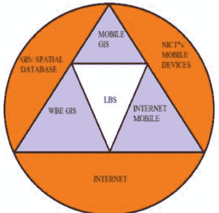

图1. LBS作为技术交叉点

##### 3.2 GPS

全球定位系统（GPS）是一种基于24颗卫星的导航系统，它使用多个卫星信号来确定接收器在地球上的位置。美国国防部（DoD）开发了GPS技术。该技术最初用于军事目的。自1980年以来，当GPS技术可供消费者市场使用时，它已经在汽车、船只、手机、移动设备甚至个人抬头显示（HUD）眼镜中普及。GPS接收器通过从三个或四个卫星信号获取坐标信息来确定用户的位置。这些信息包括卫星的位置和传输的精确时间。通过三个信号，可以在地球上找到任何2D位置；额外的卫星信号可以确定海拔高度。GPS技术几乎在任何条件下都可以工作，并且精度在3–15米之间，取决于接收到的信号数量[11]。

### 4 系统概述

所提出的系统是基于位置的提醒系统。用户可以通过使用GPS获取自己的当前位置。当用户到达该位置时，系统将检查任务提醒的指定位置的纬度和经度。然后，将任务提醒位置与用户当前位置的距离与用户预定义的警报半径进行比较。如果距离小于警报半径，则会生成任务提醒的警报，并通过通知向用户提供有关之前设置的任务详细信息的提醒。所有这些活动将使用GPS服务执行。

该系统要求用户设置完成任务的位置，用户还需指定要提醒自己的任务。每当用户进入该位置的警报半径范围内时，系统会通过通知提醒用户任务，从而使用户能够尽快完成任务。在这个提出的系统中，它不会给用户提供持续的提醒，而只是简单地显示任务提醒，直到用户拒绝该通知。

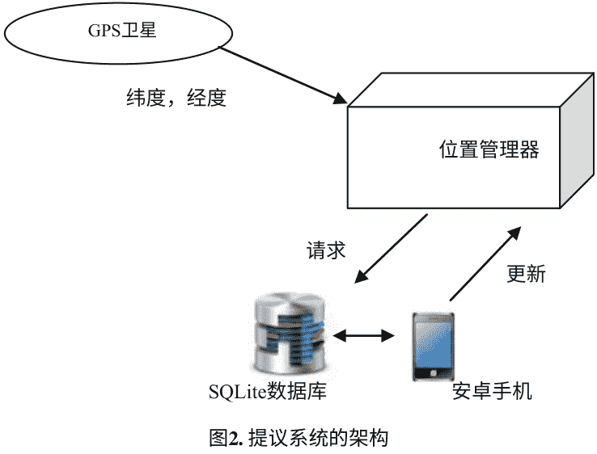

该系统还允许用户在同一位置设置多个任务提醒。当用户到达指定位置时，所有需要执行的任务都会通知用户，以确保没有任务被错过或未完成。所有需要执行的任务都会通知用户，以确保没有任务被错过或未完成（图2）。

### 5 系统实施和结果

建议的系统可以按以下方式实施：

1. 安装应用程序并找到用户位置。
2. 启用GPS提供者。
3. 启用后台服务。

输入：任务详情（任务标题、任务描述、位置、提醒半径、警报和通知）

处理：

1. 使用GPS跟踪当前位置。
2. 在后台服务中计算用户当前位置和任务提醒位置之间的距离。

输出：通知用户任务详情。

图3显示了创建带有任务详情的新提醒。

图4显示了通知用户任务详情。


图3. 设置提醒


图4. 使用闹钟通知用户

### 6 准确性分析

为了评估我们距离计算的准确性，我们使用Haversine公式、Vincenty公式（考虑地球的扁平形状[10]）和距离计算网站的大圆距离来比较不同缅甸城市的GPS坐标之间的距离。对于Vincenty公式，使用GPS Visualizer工具[9]计算距离。使用不同缅甸城市的GPS坐标[8]作为算法的输入。

表1. 使用Vincenty和Haversine公式比较缅甸城市的大圆距离

| 城市 | Vincenty 公式 (km) | Haversine 公式 (km) | 缅甸城市的大圆距离 (公里) |
|---|---|---|---|
| 仰光-曼德勒 | 572.295 | 575.047 | 575 |
| 内比都-莫尔米 | 393.57 | 395.131 | 395 |
| 勃固-勃丁 | 196.114 | 196.019 | 196 |
| 实兑-东吁 | 437.695 | 437.233 | 437 |
| 大城-马格威 | 756.627 | 759.471 | 759 |

如上表1所示，Haversine公式与Vincenty公式非常相符，并且产生了相当准确的结果。

### 7 结论

现在，我们在日常活动中需要去很多地方，了解在哪个位置执行哪个任务是必要的。通常，用户会忘记自己到达的位置以及在该特定位置上要做的重要工作。所提出的应用程序帮助他们提醒所有这些类型的活动，并使他们的生活变得更加轻松。

致谢。首先，我要感谢Yatanarpon Cyber City大学校长Aung Win博士对成功开发该系统的支持。其次，我要感谢Yatanarpon Cyber City大学研究开发团队负责人Soe Soe Khaing博士对本文的愿景、选择、宝贵建议和指导。然后，我要向我的导师Hninn Aye Thant博士表达最深切的感谢，她是Yatanarpon Cyber City大学信息科学与技术系的教授，对本文提供了宝贵的建议。我还要感谢Yatanarpon Cyber City大学副教授Aye Mon Yi博士给予我们宝贵的建议。最后，衷心感谢所有直接和间接为本文的成功做出贡献的人。

### 参考文献

1. Angadi, A.B., Shetti, N.V.: 基于用户位置的友好的Mobiminder提醒系统，使用GPS。IJETAE 3(1), 269 (2013)。ISSN: 2250-2459
2. Hedin, B., Norén, J.: 使用GSM基站识别的移动位置学习提醒系统。IADIS 7(1), 166–176
3. Ludford, J., et al.: 因为我总是随身携带手机：功能性基于位置的提醒应用。在：SIGCHI人机交互会议论文集，加拿大蒙特利尔，第889–898页 (2006)
4. Marmasse, N., Schmandt, C.: Commotion的位置感知信息传递，讲座（2003年）
5. Yeram, S., Patil, P., Gupta, D., Mule, K., Kulkarni, M.: 基于用户位置的提醒使用安卓智能手机[RBUOID]（一款安卓应用）。 IJSRCSEIT 2(2), 119 (2017). ISSN: 2456-3307
6. Sohn, T., Li, K.A., Lee, G., Smith, I., Scott, J., Griswold, W.G.: Place-Its: 移动电话上基于位置的提醒研究。 In: Beigl, M., Intille, S., Rekimoto, J., Tokuda, H. (eds) UbiComp 2005: 无处不在的计算。计算机科学讲座笔记，卷 3660. Springer, Heidelberg (2005). https://doi.org/10.1007/11551201_14
7. Zeimpekis, V., Giaglis, G., Lekakos, G.: 移动位置服务的室内外定位技术分类。SIGecom Exch. 3(4), 19–27 (2002)
8. https://www.distancecalculator.net/country/myanmar
9. http://www.gpsvisualizer.com/calculators#distance_address
10. http://www.movabletype.co.uk/scripts/latlong-vincenty.html
11. https://whatis.techtarget.com/definition/GPS-navigation-system

## 智能系统

### 能够减少步行时的水平力的前轮转向器

**Geunho Lee$^{1,2}$, Masaki Shiraishi$^1$, Hiroki Tamura$^1$, and Kikuhito Kawasue$^1$**

$^1$ 宫崎大学环境机器人学系，宫崎市学园基板台西1-1, 日本宫崎889-2192

{geunho, htamura, kawasue}@cc.miyazaki-u.ac.jp, futsal_fifa_of@yahoo.co.jp

$^2$ 大沼机器人与设计有限公司, 宫崎, 日本

**摘要。** 在家庭、办公室和其他公共场所中，常常会遇到坡道、台阶和不规则的地板表面等障碍物。这些障碍物经常限制了使用移动辅助设备的人们的日常活动。本文提出了一种新的攀爬台阶的偏移机制，可以减少所需的水平攀爬力，并提出了其攀爬台阶的轮子原型。具体而言，所提出的轮子可以集成到现有的个人辅助设备中。所提出的攀爬台阶轮子可以帮助减少这种限制。通过使机制的使用者更加自给自足，还可以减轻护理人员和医务人员的身体和心理负担。本文详细介绍了这种偏移机制及其原型。通过数学分析和使用原型进行实验验证了该机制的功能。

**关键词:** 个人移动辅助 · 阈值和步骤 · 爬楼轮 · 轴向平移

#### 1 引言

最近，各种轮式辅助设备，如轮椅[1]和助行器[2]已经被开发和引入。基本上，这些辅助设备是设计用于理想条件下的使用，即没有坑洼和凹陷的平坦地面。然而，我们日常生活中遇到的门槛、不平整的地面和坡道阻碍了这些辅助设备的使用。因此，他们的日常活动受到限制。已经提出了各种各样的研究来克服这些问题。

例如，为了连接到典型的轮椅上，设计了辅助轮组件[3]。另一方面，开发了具有增强爬楼能力的替代部件。其中一些替代轮将多个较小的轮子组合成一个较大的轮子组件[4–6]。尽管取得了这样的技术进步，现有设备可能存在高成本、笨重、重量大和复杂性高的弱点。此外，现有设备难以集成到低成本的自助式辅助设备中。

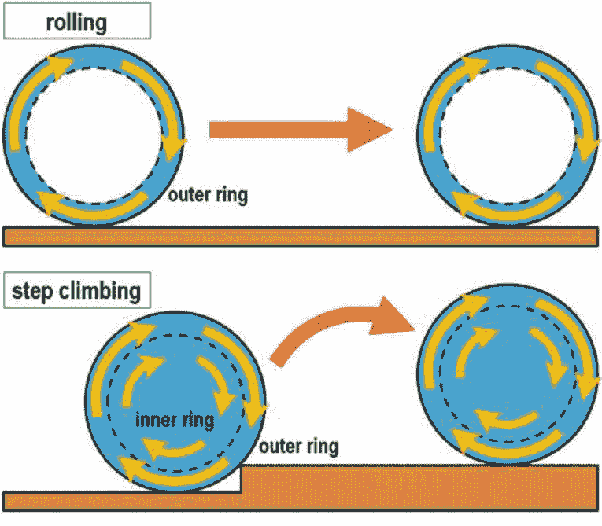

图1. 两种不同的轮子运动方式的示意图: 标准滚动 (上) 和阶梯攀爬 (下)

本文介绍了一种新的阶梯攀爬轮子装置，可以集成到现有的个人辅助设备中。该轮子装置基于一种增加轮子滚动半径的新思想，从而减小水平力。具体而言，通过将轮子的旋转轴在垂直方向上偏移，实现了滚动半径的变化。换句话说，伪轮子直径的概念是将轮子中心的轴线平移到地面以上的位置。图1说明了根据伪轮子直径进行标准滚动和阶梯攀爬等不同的轮子运动方式。

在标准滚动运动中，轴心位于轮子中心，并且进行纯水平平移。在爬楼梯运动中，轴心偏离轮子中心。一旦辅助中心在爬楼梯过程中发生平移，在图1中，内环和外环相对于中心一起旋转。本文详细描述了辅助中心的实际应用方面。本文还提供了关于这个爬楼梯轮子装置及其控制的详细信息。通过数学分析和原型实验验证了该装置的功能。技术贡献主要体现在实现了用于爬楼梯运动的建议轮子单元。

### 2 爬楼梯轮子的设计概念

在爬楼梯轮子机构的开发中考虑了三个方面。首先，实现低成本设计使得提出的轮子机构能够被更广泛的人群接受。其次，需要紧凑的设计以尽可能方便日常使用。第三，轮子机构的易集成性将决定其在各种现有设备中的应用程度。

考虑到这些方面，本文提出的轮子机制能够进行两种不同的运动。第一种运动是标准滚动，第二种是阶梯爬升，如图1所示。在标准滚动运动中，轴心位于轮子中心，并进行纯水平平移。在阶梯爬升模式中，轴心偏离轮子中心，可以同时进行水平和垂直平移。

### 3 阶梯爬升轮的机械配置

提出的轮子机制设计用于轮椅和手推车。在我们的工作中，原型旨在集成到商用轮椅中。轮椅配备了曲柄单元、轮子单元和齿轮电机单元，如图2所示。两个齿轮电机单元驱动轴旋转机制，另一个驱动轴扩展机制。具体来说，轮子直径为160毫米，轮子宽度为70毫米，两个轮子之间的距离为530毫米，主孔离地面的高度和辅助孔离地面的高度分别为80毫米和130毫米。

首先，称为曲柄单元的轴组件由两个曲柄单元和一个可扩展的轴组成。曲柄围绕在轮毂上的枢轴处旋转，在`$O$`和`$O'$`之间的中点处如图2所示。轴由螺杆和螺母组成。通过旋转螺杆，轴可以根据旋转方向进行扩展或收缩。轴由两个曲柄单元支撑。通过曲柄单元，可以在`$O$`和`$O'$`之间旋转轴。

其次，轮组件由轴承、由两个盘片组成的轮毂、锥形离合器部分和分为两个环的外缘组成。在这里，环2容纳离合器的外锥。锥形离合器由三个导向杆、三个弹簧和内锥组成。如图2所示，轮子可以绕`$O$`和`$O'$`旋转的两个轴。这两个旋转轴由内部离合器锥中的两个孔实现。主孔如图2顶部所示，位于`$O$`处，用于在平坦表面上移动。辅助孔位于`$O'$`处，用于攀爬台阶。轴承允许边缘和轮毂组件之间的相对旋转。通过使用离合器机制，可以实现两种运动。边缘通常相对于轮毂自由旋转，但通过接合离合器，可以统一边缘和轮毂的运动。

图2. 轮子原型（顶部）和原型的组装细节（底部）。

第三，齿轮电机单元由三个伺服电机、它们的电机驱动器和齿轮组件组成。电机通过微控制器和电机驱动器进行控制。两个电机允许轴双向旋转。另一个电机通过螺杆和螺母机构来扩展和收缩轴。

离合器锥体的主孔是盲孔；而辅助孔是通孔。在平坦的表面上移动时，使用主孔。当扩展到主孔时，轴推向盲孔底部并解除离合器。因此，在这种情况下只有轮缘旋转。

在主孔和辅助孔之间切换时，轴被收缩，围绕导杆的弹簧使离合器接合。然后，轴通过辅助孔扩展，使离合器保持接合。因此，在爬坡过程中，轮毂和轮缘一起旋转。

图3. 使用商用轮椅进行阶梯攀爬操作的实验结果。

### 4 评估结果和讨论

在本节中，对所提出的轮椅机构进行了实验评估，以验证其有效性。此外，为了展示轮椅机构的实用性，已经在轮椅上安装了实现的原型，并进行了大量实验。

图3显示了将阶梯攀爬机构集成到商用轮椅中的实验结果。在这些评估中，研究了阶梯攀爬过程中轴的轨迹，并进行了分析。还研究了轴的高度。首先，图3(a)显示了在控制程序序列下的连续快照（从编号为“1”的快照到编号为“6”的快照）。正如我们所预期的那样，所提出的控制似乎根据每个条件产生了准确的运动。图3(b)和(c)分别显示了阶梯攀爬序列中轴位置和轴高度的变化。在图3(b)中，红色虚线和黑色粗线分别表示现有设备和所提出的轮椅机构的轴轨迹。此外，灰色线条表示每个时间点的所提出的轮椅轮廓。

在图3(c)中，黑线表示轮子机构的轴高度变化。从这些结果中，我们确认了提出的轮子机构可以基于提出的偏移控制产生阶梯爬升运动。此外，在平坦表面上滚动时，轴高度保持不变，直到`$t= 3[s]$`。当`$3 \le t < 8.5[s]$`时，轴高度通过轴偏移操作增加。由于偏移操作，轴的高度达到最大值。当`$t = 8.5[s]$`时，对于`$8.5 \le t \le 11[s]$`，由于轮子滚过台阶，轴高度变化很大。由于轮子的旋转轴的偏移，轴平稳地穿过台阶。当`$t = 11[s]$`时，轴相对于轮子中心处于爬升序列中的最低点。最后，在`$11 < t \le 14[s]$`的时间内，通过反向偏移运动，轴恢复到原始位置`$O$`。

图4. 使用商用轮椅安装提出的轮子装置进行阶梯爬升的实验结果。

为了检验所提出的轮子装置的可行性，实验在日常生活环境条件下进行。图4展示了根据不同的台阶高度和材料进行的实验的快照。这些实验包括标准滚动和爬台阶的动作。具体来说，图4展示了在台阶高度分别为5厘米和2厘米时进行的爬台阶动作的实验场景。

通过这些实验的结果，观察到安装了所提出的轮子的轮椅可以在台阶上自然地爬行而不会遇到任何问题。我们相信我们的实现在真实世界条件下表现良好，但还有以下问题需要解决。实际上，所提出的轮子的重量约为5千克。通过选择材料和现成零件，可以研究轻量化和更紧凑的系统设计性能，这将是有趣的。考虑到我们的未来方向，下一个原型需要采用更可靠的结构和更紧凑的设计。

### 5 结论

介绍了一种用于爬楼梯运动的轮子机构及其原型。该轮子原型基于增加轮子滚动半径的新思路，在爬楼梯时减小了水平力。

为了展示爬楼梯轮子机构的可行性和有效性，我们进行了几次室内实验，并在商用轮椅整合后展示了轮子原型的基本运动性能。从实际角度来看，这些实验结果是相当令人鼓舞的。通过这些结果，我们能够确认所提出的轮子原型在爬楼梯时可以为自行推动轮椅的用户提供轻松操纵性，而不需要任何水平力。我们下一步的研究方向是在考虑安全性的基础上减轻重量和尺寸。

**致谢。** 这项工作得到了Tateisi科学技术基金会授予的研究资助。

### 参考文献

1. Carlson, T., Leeb, R., Chavarriaga, R., Millan, J.R.: 脑控轮椅的诞生。在: IEEE/RSJ 国际智能机器人与系统会议论文集，第5444-5445页（2012年）

2. Lee, G., Ohnuma, T., Chong, N.Y., Lee, S.-G.: 基于行走意图的JAIST主动式机器人行走控制。IEEE Trans. Syst. Man Cybern. Syst. 44(5), 665–672 (2014)

3. Mori, Y., Katsumura, K., Nagase, K.: 为手动轮椅用户开发一对爬楼梯单元。Trans. JSME 80 (820) (2010). (in Japanese). https://doi.org/10.1299/transjsme.2014dr0381

4. Quaglia, G., Franco, W., Oderio, R.: Wheelchair.q, 一种具有爬楼梯能力的电动轮椅。Mech. Mach. Theory 46(11), 1601–1609 (2011)

5. Razak, S.: 设计和实施电动轮椅，通过使用液压千斤顶爬楼梯。IOSR J. Electr. Electron. Eng. 7(3), 82–92 (2013)

6. Sasaki, K., Eguchi, Y., Suzuki, K.: 带有杠杆推动旋转腿的爬楼梯轮椅。在: IEEE/RSJ 国际智能机器人与系统会议论文集, 第1190-1195页 (2015年)

---

### 基于移动位置的范围索引

Thu Thu Zan(✉) 和 Sabai Phyu

缅甸仰光计算机研究大学

{thuthuzan, sabaiphyu}@ucsy.edu.mm

**摘要。** 近年来，基于二维索引技术有许多应用。这些应用通常用于静态数据或无移动对象数据。随着位置服务的进步，索引对于静态和动态数据都是必不可少的。对于存储和处理这两种数据并不困难，但在任意和不可预测数量的移动对象节点和索引结构之间进行更新需要保持一致。因此，本文提出了一种基于预排序范围树的移动对象索引结构，可以方便地存储移动位置。在这种情况下，需要合成数据集来生成对多个移动位置数据的访问。因此，本文还提出了一种生成动态二维点的合成数据集的方法。此外，还对预排序范围树和kd树等不同索引技术进行了比较，并对树构建和范围搜索在移动对象上的性能进行了评估。此外，还添加了基于距离的范围搜索来比较这两种索引。

**关键词：** 位置更新策略 · 基于位置的服务 (LBS) · 预排序范围树 · 基于距离的范围搜索 · 2D范围查询 · kd树

## 1 引言

在IT领域的每个人都说：“今天是云计算、物联网和移动的时代。”这句话是真实的，因为毫无疑问，企业可以从中获得巨大的好处[2]。

大多数基于位置的服务通常在获取位置后迅速而准确地进行活动。对于这个执行计划，基本的位置提供者，如GPS到位置管理提供者，如Google API，随着移动技术的普及而出现。事实上，它们不仅支持获取准确和高效的位置，还根据不同的位置条件快速和正确地获取位置。不同的用户有不同的需求和需要的信息，因此所有这些有时都建立在当前位置的基础上。

由于存在不断移动的位置对象，研究人员思考并寻找维护和处理它们的技术。其中一种解决方案或技术是平衡结构索引，比传统索引更好。总结来说，本文介绍了用于动态属性的预排序范围树，主要贡献如下：

- i. 为具有动态圆形范围查询的移动对象提出了预排序范围树结构。

- ii. 提出了一种生成几乎与现实相同的虚拟移动对象合成数据集的过程。

此外，还添加了一个模型来处理整个系统和动态属性，这些属性被紧密地纳入了预排序范围树中。事实上，所提出的树在直接通过数据库查询而不是在索引结构中使用排序来减少排序时间方面表现出色。此外，本文详细介绍了使用索引树（预排序范围树和kd树）和基于距离的范围搜索的实验结果。

## 2 基于位置的服务

基于位置的服务是通过手机或可获取位置的设备提供的服务，与地理位置有关。通常，一个人在出发前想要查询与路线或地点相关的所有信息。在这种情况下，有两种类型的位置服务：拉取和推送。在拉取类型中，用户必须主动请求信息。在推送类型的服务中，用户在那一时刻无需请求即可从服务提供商那里接收信息[4]。

### 2.1 获取移动位置框架

大多数手机通常基于GPS获取其位置。事实上，不同的手机具有不同的功能和特性来获取位置。一些手机有强大的蜂窝网络功能，并支持准确的定位。同样，一些手机通常根据网络提供商生成其位置。因此，不同手机的功能和特性之间存在权衡；Google API是一个最佳解决方案。

图1. 系统框架图。

该系统具有一个框架，可以尽快获取当前位置。这在图1中显示。它有助于提供比通常更强大的位置框架。该框架旨在自动处理位置提供者的支持、准确位置和更新调度。

## 3 位置更新策略

移动计算中有各种位置更新策略可用。它们被分为特定的策略，如(1)基于距离的位置更新、(2)基于时间的位置更新、(3)基于移动的位置更新、(4)基于配置文件的位置更新和(5)基于偏差的位置更新[1]。

### 3.1 混合更新算法

基于距离的更新是一种简单易行的位置更新方案。为了获取其最后和更新的位置，每个移动主机通常会跟踪其移动的距离。当距离达到其距离阈值（distance threshold）时，移动主机发出更新位置的信号。但由于小区大小的变化和计算移动距离的需要，这变得复杂起来。

基于时间的位置更新方案也是一种简单的策略。在这种方案中，移动基站在达到特定时间周期或计时器后更新用户的位置。当用户处于静止状态时存在限制，会执行不必要的更新。

本文提出了一种基于时间和距离的混合位置更新算法，可以显著减少位置更新开销，提高移动性支持机制的效率。移动位置更新的结构如图1所示。所提出的算法的优点是减少了位置更新的流量，同时最小程度增加了实现复杂性。

**算法：混合位置更新**

**输入：** 移动位置数据库，包含注册移动设备的位置和时间信息

**输出：** 当前注册手机位置

1. `$i=0; dis\_threshold; time\_threshold; time\_scheduler;$`

2. 读取当前位置(`$L_{xi}, L_{yi}, t_i$`)和先前位置(`$L_{xi-1}, L_{yi-1}, t_{i-1}$`)的注册手机位置

3. 如果 `$time\_scheduler > time\_threshold$` && `$\sqrt{(L_{xi}-L_{xi-1})^2 + (L_{yi}-L_{yi-1})^2} > dis\_threshold$`

    - 3.1. 使用当前位置(`$L_{xi}, L_{yi}, t_i$`)更新数据库中的先前位置(`$L_{xi-1}, L_{yi-1}, t_{i-1}$`), `$i=i+1$`.

    - 3.2. 更新总数 = 更新总数 + 1;

4. 否则当前位置(`$L_{xi}, L_{yi}, t_i$`) = 先前位置(`$L_{xi-1}, L_{yi-1}, t_{i-1}$`), `$i=i+1$`;

## 4 相关工作

有很多论文描述了关于移动对象的索引树结构和移动更新策略。大多数论文都专注于使用一种索引结构和一种更新策略。一些论文讨论了混合树结构的索引树组合和使用一种索引结构的比较。

Kwon 等人提出了一种新颖的基于 R 树的索引技术，称为 LUR 树。这种技术只在对象从其最小边界矩形 (MBR) 发生变化时更新其索引结构。如果对象的新位置在 MBR 中，它只会更改叶节点中对象的位置。因此，在更改位置时，它会删除索引树的不必要修改。

Xia 和 Prabhakar 提出了一种新颖的索引结构，即 Q+R 树，它是一种混合树结构，由 R* 树和 QuadTree 组成。在 Q+R 树中，准静态或不移动的对象存储在 R* 树中，而快速且频繁移动的对象存储在 QuadTree 中。通过分别处理不同类型的移动对象，该索引结构更准确地反映现实并具有良好的性能。在他们的工作中，不对对象的未来位置做任何假设，最大速度也没有限制 [7]。

程等人提出了一种位置更新方案，当达到移动阈值或时间阈值时进行更新。进行位置更新后，移动计数器和周期性位置更新计时器将重置为当前状态。他们使用了移动阈值的凸函数，表明 HMTBLU 方案的信令成本高于 MBLU 方案 [3]。

Casares-Giner 和 Garcia-Escalle 提出了一种位置更新方案，结合了基于移动和基于距离的两种动态策略 [6]。他们表明，在移动终端的内存需求很小的情况下，可以获得非常好的性能。

## 5 提出的方法

本文由两个主要组成部分组成：客户端和服务器端。整体系统模型是在客户端提出的，它建立了一个混合更新算法，可以帮助获取最后的当前位置并减少服务器更新成本。服务器端包括移动对象的预排序范围树过程。

### 5.1 系统模型

建立了一个可搜索的模型，将动态属性纳入预排序范围树和查询处理中。这包括一个服务器和一组注册的移动设备物体。通过无线通信网络，注册的移动物体连接到数据库服务器。移动物体的当前位置由Google API以固定速率（例如2秒）存储和更新。数据库由支持调度程序的DBMS管理。为了保持位置信息的最新状态，这些物体定期将其更新的位置发送到服务器。由于在客户端应用了混合更新算法，服务器上不会执行不必要的更新。调度程序在达到更新策略限制时对数据库进行调整和更新。服务器用于范围查询，例如“哪些移动设备当前位于灾区内？”为了高效处理此类查询，服务器维护一个索引树，除了加快查询处理速度外，还能吸收所有传入的更新。

## 6 预排序范围树

树数据结构是一种基于索引对数据对象进行组织的有用工具。它同样适用于根据二维关系组织多个移动对象。对于移动位置，有一个假设，即没有两个点具有相同的x坐标和y坐标。要构建任何树结构，首先需要将数据预处理成数据结构。然后，在数据结构上执行查询和更新操作。

### 6.1 提出的预排序范围树

提出的预排序范围树的过程如下：

**输入：**

- `Lats` = 按纬度排序的二维点数组

- `Longs` = 按经度排序的二维点数组

**过程 `PRTree (Lats, Longs)`**

1. 如果 `Lats.length == 1`, 则返回新的 `LeafNode(Lats[1])`;

2. `medium = [Lats.length / 2]`;

3. 将 `Lats[1...medium]` 复制到 `Lats_L`, 将 `Lats[medium+1...Lats.length]` 复制到 `Lats_R`;

4. 对于 `i = 1` 到 `Longs.length` 做

5. 如果 `Longs[i].x <= Lats[medium].x` 则将 `Longs[i]` 追加到 `Longs_L`;

6. 否则将 `Longs[i]` 追加到 `Longs_R`;

7. `root = 新节点((Lats[medium].x), 一维范围(Y))`;

8. `root.left = PRTree(Lats_L, Longs_L)`;

9. `root.right = PRTree(Lats_R, Longs_R);`

10. 返回 `root`;

### 6.2 循环范围搜索

在树构造的预处理完成后，该结构允许对移动对象进行循环范围查询。为了确定注册的移动设备是否在服务区域内，该系统需要获取带有中心和服务距离的边界坐标：`(centerLat, centerLong, bearing, distance)`。

```
bearingRadians = 弧度(bearing);
lonRads = 弧度(centerLong);
latRads = 弧度(centerLat);
maxLatRads = asin((sin(latRads) * cos(distance/ 6371) + cos(latRads) * sin(distance/ 6371) * cos(bearingRadians)));
maxLonRads = lonRads + atan2((sin(bearingRadians) * sin(distance/6371) * cos(latRads)), (cos(distance/ 6371) - sin(latRads) * sin(maxLatRads)));
```

### 6.3 示例：计算带有中心和服务距离的预排序范围树

首先，按纬度和经度对移动位置进行排序。然后，预排序范围树被构建并显示如下：

- 25.40319 98.11739
    - LEFT: 16.80958 96.12909
        - LEFT: 16.35099 96.44281
        - RIGHT: 16.77923 96.03917
    - RIGHT: 24.99183 96.53019
        - LEFT: 24.77906 96.3732
        - RIGHT: 25.38048 97.87883
    - RIGHT: 25.88635 98.12976
        - LEFT: 25.59866 98.37863
        - RIGHT: 25.82991 97.72671
    - RIGHT: 26.35797 96.71655
        - LEFT: 26.15312 98.27074
        - RIGHT: 26.69478 96.2094

在中心纬度 26.693、中心经度 96.208、距离为 100 公里的样本范围搜索结果中，注册的移动位置将发送通知如下：

- 节点 (25.40319, 98.11739)
    - 右：节点 (24.99183, 96.53019)
        - 左：节点 (24.77906, 96.3732)
        - 右：节点 (25.38048, 97.87883)
    - 右：节点 (25.88635, 98.12976)
        - 左：节点 (25.59866, 98.37863)
        - 右：节点 (25.82991, 97.72671)
    - 右：节点 (26.35797, 96.71655)
        - 左：节点 (26.15312, 98.27074)
        - 右：节点 (26.69478, 96.2094)

## 7 合成移动数据集生成

当现实中无法获得数百万移动定位数据时，需要使用合成数据集来模拟移动对象。为了适当生成合成数据集，通过对移动对象的行为进行分类来动态创建它们。

事实上，不同的移动物体具有不同的速度和运动。因此，位置对象是通过使用随机函数生成的，可以按照三种不同的行为进行分类，使其看起来更加真实。它旨在获得用于性能评估的真实数据，该数据包括索引和存储动态位置数据的预排序范围树。

它包括两个主要类别：(a) 生成位置，包括纬度和经度在 `minlat`, `maxlat` (–90, 90)、`minlon`, `maxlon` (0, 180) 之间；(b) 更新纬度和经度的一致性。

**过程：虚拟移动位置生成器**

- (1) 在 (`maxlat` `minlat` –90,90 和 `maxlon` `minlon` 0,180) 范围内随机生成纬度和经度
    - a. 纬度 = `minLat + (Math.random() * ((maxLat-minLat) + 1));`
    - b. 经度 = `minLon + (Math.random() * (maxLon-minLon)+1);`
- (2) 根据距离和时间将纬度和经度分为三种类型：汽车、步行和拥堵车辆
- (3) 更新纬度和经度的一致性
    - a. 首先将纬度和经度转换为弧度
    - b. `updateLat = asin(sin(latitude) * cos(distance/ R) + cos(latitude) * sin(distance/R) * cos(BearingAngle));`
    - c. `updateLon = longitude + atan2(sin(BearingAngle) * sin(distance/R) * cos(latitude), cos(distance/R) – sin(latitude) * sin(updateLat));`

其中，`longitude`, `latitude` 为随机生成的初始坐标，距离分别为 0.00832 km、0.01112 km、0.01020 km（对应汽车、步行和拥堵汽车），`R` = 地球半径 = 6378.1，`bearingAngle` = 随机生成 0 到 360 之间的角度并转换为弧度。

## 8 模拟结果

下一个实验在一台 2.60 GHz 的 ASUS PC 上进行，配备 Intel (R) Core(TM) i7 CPU 和 4 GB 内存。对于这个实验，该系统使用了 Java 中最流行的测试框架 `JUnit`。它是一个开源的测试框架，用于编写和运行可重复的自动化测试。该实验是为了计算范围搜索的查询和执行时间，数据集点的数量在二维空间中组织。

图2 显示了基于移动区域检查 (MRC) 过程的基于距离的范围搜索。对于这个实验，该系统以纬度 16.8548383 和经度 96.1349713 为中心。数据集从 10,000 开始到 500,000。

图2。基于距离的范围搜索执行时间

有一个发现，数据集增加越多，使用基于距离的范围搜索所需的执行时间越长。

图3显示了 `kd` 树的两个类别：树构建时间和范围搜索时间。在移动数据集的数量上，范围搜索没有更多的变化。树的构建时间与数据集的数量成正比。然而，使用 `kd` 树（树构建加上范围搜索）的整个执行时间比基于距离的范围搜索要少。

图3。`kd` 树的构建时间和范围搜索时间

构建预排序范围树结构的第一件事是将数据预处理成数据结构。在这个过程中，每个维度都进行了预排序，然后将其作为输入参数构建范围树。在进行预处理之后，对数据结构进行查询和更新。在图4中测试了不同数据集数量下的预排序时间、树构建时间和范围搜索时间。

在图5中讨论了三种方法所需的执行时间。结果相当不同。一般来说，两种索引方法的查询结果是相同的点。对于平衡树结构，无论数据集如何增加，范围搜索所需的时间几乎相同。此外，提出了预排序范围树，通过采用基于纬度和经度的数据库查询，减少排序时间，提高了性能。结果是，在包括树构建在内的范围搜索中，使用更大的数据集可以获得更好的性能。数据测试的数量越多，预排序范围树所需的秒数越少。

图4. 预排序范围树的执行时间（排序、构建树和范围查询）

图5. 三种技术的总执行时间与范围搜索的比较

## 9 结论和未来工作

本文的主要服务任务是基于索引树结构处理移动对象。系统维护移动对象的位置，并且可以从服务器上进行循环范围查询。因此，该系统用于监视移动对象，能够在所需时间内高效定位和回答与这些对象位置相关的查询。该系统将有助于权衡由于移动对象位置而导致的更新频率，并降低服务器更新成本。它还支持具有动态对象位置的范围查询。

对于未来的工作，提出的混合更新方法将应用于其他索引结构（例如四叉树、`K-D-B` 树）。此外，这个提出的系统可以用来存储其他移动对象，如温度、车辆位置等。可以将其他索引树结构的结果与本文的结果进行比较。

## 参考文献

- 1. Kalpesh, A., Priyanka, S.: 移动计算中的各种位置更新策略。在：国际计算机应用杂志® (IJCA) (0975–8887) 关于新兴信息与通信技术的全国会议 (NCETICT 2013) 论文集 (2013)
- 2. Rundle, M.H.: 技术未来白皮书，英国 (2015)
- 3. 程鹏飞，雷晓，胡瑞庆：蜂窝网络中中基于混合运动和时间的位置更新方案的成本分析。IEEE Trans. Veh. Technol. 64(11) (2015)
- 4. Jensen, C.S., Lin, D., Ooi, B.C.：基于 `B+`-树的移动对象查询和更新的高效索引。在：VLDB 2004 Proceedings of the Thirtieth international conference on Very largedatabases, vol. 30, pp. 768–779 (2004)
- 5. Kwon, D., Lee, S., Lee, S.：使用惰性更新 `R` 树索引移动对象的当前位置。在：第三届移动数据管理国际会议。IEEE (2002)

- 6. Casares-Giner, V., Garcia-Escalle, P.：一种基于混合运动距离的位置更新策略用于移动跟踪, CICYT（西班牙）在项目编号`TIC2001-0956-C04-04`下提供财务支持 (2004)

- 7. 夏，Y.，普拉巴卡尔，S.：`Q+Rtree`：移动对象数据库的高效索引。在：第八届国际高级应用数据库系统会议 (`DASFAA 2003`)，2003年3月26日至28日，日本京都 (2003年)

### 从公共交通轨迹数据中构建仰光市的旅行速度估计模型

Thura Kyaw(✉), Nyein Nyein Oo(✉), 和Win Zaw (✉)

计算机工程与信息技术系，仰光技术大学，东Gyogone, Insein Township, 仰光，缅甸

`thurakyaw.ytu@gmail.com`, `{nyeinnyeinoo, winzaw}@ytu.edu.mm`

摘要：估计旅行速度是构建智能交通系统（ITS）的最重要步骤之一。在本文件中，我们提出了一种通过分析公交车使用机器学习技术的GPS数据来建立仰光市道路网络的旅行速度估计模型（`TSEM`）。GPS数据是从通过仰光市最拥挤地区的公交车收集的。本文设计了旅行速度估计模型的四个步骤。

第一步是通过去除异常点、通过降维方法减少特征并选择原始GPS数据的重要特征来进行GPS数据收集和预处理，从而得到一个结构良好的数据集。第二步是道路网络分析和地图匹配，从附近的道路边缘地点提取`POI`特征向量，并使用`KNN`模型沿着公交路线通过公交站点位置对公交路线进行分段。下一步是从匹配的轨迹点估计每个路段的行驶速度。最后一步是计算所有道路段的速度因子，并将其存储在一个矩阵中，可以在不同的城市交通应用中使用。

关键词：行驶速度估计模型 · GPS数据 · 速度因子矩阵

#### 1 引言

估计行驶速度是解决全球各大城市交通拥堵问题的重要问题。人们在上下班的路上遭受拥堵的交通问题。车辆数量与城市爆炸性人口增长成正比增加。现有的道路基础设施变得不足，导致车辆在道路上不得不以停停走走的方式行驶。这直接影响一个国家的劳动力，消耗他们的工作时间，影响国家的发展。此外，拥堵的交通导致燃油消耗增加和大量二氧化碳排放。因此，大多数研究人员参与智能交通系统（ITS）研究领域。

为了估计道路网络的行驶速度，收集当前车辆的位置和速度、道路网络的容量和参数是非常重要的第一步，这也是导致交通拥堵的原因。存在许多技术可以从道路上的车辆收集交通相关数据。一些研究人员使用路边传感器、交通绳索和交通摄像头，这些设备安装在道路和交叉口上。但是这些用于数据收集的技术需要大量的初始投资，设备的定期维护，以及对从视频和路边传感器中提取交通相关特征的复杂转换。

下一种方法是使用从汽车、出租车和公共交通工具收集的GPS轨迹数据，并使用机器学习模型分析和识别交通模式。随着GPS传感器的灵敏度越来越高，价格也比路侧传感器网络安装更便宜，这是由于电子和通信技术的进步，第二种方法比第一种方法更具成本效益。

本文基于仰光公共交通系统的GPS数据设计了行驶速度估计模型，该系统运行在仰光市最拥挤的路线之一，使用了最先进的机器学习模型。主要贡献如下：

- (1) 从道路网络数据和兴趣点 (`POI`) 数据中提取与交通延迟相关的特征。

- (2) 从收集到的轨迹数据和交通延迟相关特征中估计21路公交车沿途每个路段的平均行驶速度。

- (3) 通过计算每个路段的平均行驶速度与限速的比值，将路段的速度因子存储在矩阵中。

本文按照以下章节组织。第2节描述了相关工作。第3节描述了旅行速度估计的提出模型。第3.1节和3.2节介绍了与交通延误相关特征的提取方法。第3.3节是关于估计平均旅行速度和构建每个道路段的速度因子矩阵。第4节展示了实验结果，并在第5节中总结我们的工作。

#### 2 相关工作

本节介绍了关于交通拥堵预测、旅行速度估计、城市道路网络上的出行模式挖掘的相关研究。在[1]中，Xianyuan使用轨迹数据预测了北京市的全市交通流量。他们的模型能够通过从GPS轨迹中提取特殊特征，基于交通流理论来预测北京市每条高速公路、主要道路和次要道路的行驶速度，以提供速度-流量关系。首先预测网络范围内的速度，然后预测整个城市的交通流量。他们使用交通流量理论，其中包含了一些假设来构建他们的模型。

Swe Swe Aung和Thinn Thu Naing [2]提出了一种使用收集到的渡轮公交GPS数据在仰光市进行交通拥堵预测的模型，该模型使用了朴素贝叶斯分类器。该模型能够预测由于他们在上下班途中使用安卓手机收集到的轨迹数据而导致的单个路口的交通拥堵情况。

Xiujuan Xu等人[3]提出了一种通过GPS数据压缩方法进行城市交通检测的算法。他们的算法基于三个关键特征，即平均行驶速度、交通密度和交通流量，来预测道路拥堵情况。在[4]中，Yuqi Wang等人提出了一个研究多个实际数据中道路段之间拥堵相关性的框架。他们的工作包括三个阶段：从GPS轨迹中提取拥堵信息，从道路网络和`POI`数据中提取每对道路段的各种特征，以及基于前两个阶段的结果预测拥堵相关性。

我们的工作是提取`POI`的交通延迟特征，并基于GPS数据估计沿公交路线的每个道路段的行驶速度。之后，我们将所有道路段的交通速度因素存储在常规时间窗口中，以生成交通历史数据并进行进一步研究。

#### 3 提出的系统模型

我们研究中提出的旅行速度估计模型如图1所示。从公交车收集的GPS数据存储在服务器中，进行数据预处理以获得清晰的数据集。然后进行地图匹配过程，将跟踪的公交车匹配到公交路线21上，然后估计每个道路段的平均行驶速度。彩色编码的交通地图用于显示道路网络的平均行驶速度。每个道路段的速度因素存储在矩阵中，以供进一步参考。

图1. 旅行速度估计的提出系统模型

### 3.1 GPS数据收集和预处理

数据收集在每个数据分析模型中起着重要的作用。收集到的数据的完整性和清晰度是构建良好数据集的关键属性。YBS公交车21路为我们的研究提供了他们的公交车跟踪数据。他们通过在公交车上安装`Sino Track GPS`跟踪器来收集GPS数据，并在每20秒内跟踪公交车的行驶模式、燃油消耗率、里程、发动机开关状态和位置，每天24小时。

我们可以获取每辆服务于21路线的公交车的实时GPS数据，以及过去三个月的历史数据。下一步是从收集到的轨迹数据中构建一个结构良好的数据集。GPS数据的预处理包括通过降维方法删除异常点、丢弃不需要的特征以及为旅行速度估计模型 (`TSEM`) 选择重要特征。预处理后的轨迹可以表示为：

$$T_i \in \{t_i, lat_i, lon_i, dir_i, v_i\} \quad (1)$$

其中，$T_i$是来自公交车的具体轨迹，$t$表示当地时间的一天中的时间，位置数据信息由 $(lat_i, lon_i)$ 表示，$dir_i$是公交车的方向，$v_i$表示公交车的当前速度。在原始GPS数据的预处理之后，数据集已经准备好进行分析。

##### 3.2 道路网络和地图匹配过程

整个城市的真实地图数据太大，无法在旅行速度估计模型中使用。地图数据可以分成较小的数据集。假设每条道路 $R$ 是一组道路段 $e$：$R \in \{e_1, e_2, \dots, e_n\}$，每个道路段由起点和终点组成：$e \in \{lat_1, lon_1, lat_2, lon_2\}$，其中 $lat_1, lon_1$ 表示起点，$lat_2, lon_2$ 表示道路段的终点。下一个重要特征是每个道路段 $e$ 周围50米范围内的兴趣点 (`POI`)。

在道路段附近最常见的`POI`包括学校、市场、商店、汽车服务、居民区、购物中心、餐馆、银行和ATM、酒店和娱乐服务。我们创建了一个9维向量，其中每一列表示个别`POI`类型的出现情况，如图2所示。

图2. 特定道路段的`POI`特征向量：

| Schools | Market places & Shops | Auto-mobile services | Hospital | Shopping malls | Restaurants | Bank and ATM | Hotels and Entertainment |
| :--- | :--- | :--- | :--- | :--- | :--- | :--- | :--- |
| 2 | 5 | 1 | 1 | 1 | 4 | 2 | 2 |

下一步是将轨迹映射到地图上进行平均速度计算和进一步处理。我们使用袁等人提出的地图匹配算法将公交车GPS点投影到地图上。他们的算法考虑了GPS点的位置上下文和道路网络拓扑。感兴趣的公交线路包括18个信号化交叉口和48个公交车站。我们必须通过沿途每个公交车站的收集位置(纬度, 经度)来分段公交线路。基于用户的`KNN`模型用于找出公交车距离公交车站位置最近的位置。

##### 3.3 估计平均行驶速度

在将GPS点与每个道路段进行匹配后，可以计算出公交车在特定道路段上的平均速度 $v_i$，标准差 $dv$ 和平均行驶速度 $v_{avg}$：

$$v_i = \frac{Dist(p_i, p_{i+1})}{(t_{i+1} - t_i)} \quad (2)$$

$$v_{avg} = \frac{\sum_i^n v_i}{n}, \quad dv = \sqrt{\frac{\sum(v_i - v_{avg})^2}{n}} \quad (3)$$

其中，`$Dist$` 是计算地球表面曲率距离的哈弗斯坦距离，用于计算两个GPS点 `$p_i$` 和 `$p_{i+1}$` 之间的距离，`$t$` 是当地时间的时间。图3展示了地图匹配和速度计算的过程。如果有公交车的实时位置数据可用，道路段的估计行驶速度可以直接获得。

构建速度因子矩阵：速度因子是公交车的平均行驶速度与道路段限速的比率。由于在特定时间窗口（例如8:00–8:10）内可以追踪的运行公交车数量有限，因此存在一些没有公交车行驶的道路段。为了解决这个问题，我们需要重叠历史GPS轨迹，以获取每个道路段的平均行驶速度。每隔10分钟时间间隔计算并记录每个道路段的历史数据，作为统计数据。

每个道路段的POI特征向量对公交路线的交通流量和交通速度有重要影响。每个POI类别及其相应的发生次数被用来定义对速度因子生成产生影响的交通延迟因子。速度因子是从统计数据、实时数据和每个路段的交通延迟因子中定期计算和更新的（图4）。

图4. 每个道路段的速度因子矩阵：

| Road Segment id | 0000 | 0010 | 0020 | ..... | 2350 |
| :--- | :--- | :--- | :--- | :--- | :--- |
| 1 | 1 | 0.98 | 0.78 | ... | 0.98 |
| 2 | 1 | 0.95 | 0.72 | ... | 0.93 |
| 3 | 1 | 0.90 | 0.80 | ... | 0.95 |
| ... | ... | ... | ... | ... | ... |
| n | 1 | 0.85 | 0.74 | .... | 0.97 |

#### 4 实验结果

本节描述了我们提出的旅行速度估计模型的实验结果。21路公交车从农村地区出发，经过仰光市最拥挤的地区，最后到达市中心，如图5所示。在将轨迹与地图匹配后，通过公式（2）和（3）计算每个道路段的平均速度 `$v_{avg}$`、标准差 `$d_v$`、最大速度和最小速度。我们从每个道路段的POI矩阵中提取交通延迟特征，生成交通速度因子矩阵。

图6显示了周末（2017年9月16日星期六，12:30至13:30）公交车的行驶速度。图中显示了估计的行驶速度、平均速度、标准差、最大速度和最小速度。从这个图中，我们提取道路段的统计速度数据，并将其存储在矩阵中。回归线的斜率在12:36至13:26的时间间隔内逐渐下降。可以清楚地看到，在13:12至13:26的时间段，路线上出现了严重的交通拥堵，几乎没有移动，估计速度为0公里/小时。然后，使用附近POI的交通延迟特征获取道路段的速度因子矩阵。

图5. 将收集到的GPS数据与21路公交车路线进行地图匹配结果

图6. 特定时间窗口内探测车辆的行驶速度

#### 5 结论

我们开发了一个模型来估计道路网络的行驶速度，该模型使用了机器学习技术、线性代数和非线性代数。从行驶速度估计模型的样本结果可以看出，平均行驶速度与星期几和一天中的时间高度相关。通过观察行驶速度的变化和回归线的斜率，可以从图中提取交通拥堵信息。

该模型的平均误差非常小，`$R^2$` 值为0.1318。时间-位置数据是从YBS公交车路线中收集的。如果我们能够收集到穿过仰光市的所有公交车路线的数据，将会得到更准确的估计和更好的结果。我们下一步的工作将是使用最先进的机器学习技术对仰光市的交通拥堵进行预测，作为当前研究的延伸。

##### 致谢

本研究得到了仰光技术大学研究基金的支持，我们要特别感谢在研究过程中热情分享他们的想法和建议的所有同事和朋友。最后，我们要感谢YBS公交车21路为我们的研究提供宝贵的数据。

#### 参考文献

- 1. Zhan, X., Zheng, Y., Yi, X., Ukkusuri, S.V.: 使用轨迹数据进行城市交通量估计。IEEE Trans. Knowl. Data Eng. 29(2), 272–285 (2017)
- 2. Aung, S.S., Naing, T.T.: 基于云基础设施的朴素贝叶斯分类器交通检测系统。在: 第六届智能系统、建模和模拟国际会议 (2015)
- 3. Xu, X., Gao, X., Zhao, X., Xu, Z., Chang, H.: 基于GPS数据压缩的城市交通拥堵检测新算法。IEEE (2016). 978-1-5090-2927-3/16/$31.00©2016
- 4. Wang, Y., Cao, J., Li, W., Gu, T.: 在GPS轨迹上挖掘道路路段之间的交通拥堵相关性. IEEE (2016). 978-1-5090-0898-8/16/$31.00 ©2016
- 5. Yuan, J., Zheng, Y., Zhang, C., Xie, X., Sun, G.Z.: 一种基于交互式投票的地图匹配算法. In: IEEE国际移动数据管理会议论文集, pp. 43–52 (2010)
- 6. Liu, D., Kitamura, Y., Zeng, X., Araki, S., Kakizaki, K.: 通过公交车路线探讨数据分析和可视化道路网络交通状况. In: IEEE多媒体大数据国际会议 (2015)

### 栅格地图的块编码和四叉树压缩方法的比较

Phyo Phyo Wai(✉), Su Su Hlaing, Khin Lay Mon, Mie Mie Tin, 和 Mie Mie Khin

缅甸信息技术学院（MIIT），曼德勒，缅甸

Phyophyowai84@gmail.com, susu07.su@gmail.com, khin_lay_mon@miit.edu.mm, miemietin1983@gmail.com, miemie.khin9@gmail.com

**摘要。** 压缩方法对于大数据（如地图、图像和大数据）非常重要，因为随着数据的超载，存储空间需求越来越大。本文基于栅格地图比较了四叉树压缩方法和块编码压缩方法的无损压缩结果。四叉树是一种在分割和压缩领域非常成熟和流行的方法。块编码方法是一种二维版本的游程编码方法。

**关键词：** 四叉树 · 块编码 · 无损压缩

#### 1 引言

地图对于定位地点非常有用。原始地图的大小通常非常大。与计算机存储空间相比，安卓设备的存储空间非常有限。随着安卓设备的普及，用于安卓设备的地图也需要进行压缩以节省存储空间。栅格地图是基于像素的网格单元结构。一个像素可以代表一个重要区域的位置。因此，对于地图来说，无损压缩非常重要。当在压缩过程中丢失一些像素时，地图上的信息也将丢失。因此，对于栅格地图的无损压缩是必不可少且非常有效的。在压缩地图时，可以使用许多无损压缩技术。四叉树压缩技术非常流行，四叉树具有非常有效的分割结果。块编码技术与四叉树数据结构非常相似。但是块编码可以处理图像的大小，例如图像的宽度和高度不等于长度，而四叉树只能处理正方形图像。

#### 2 相关工作

Mohammed 和 Abou-Chadi [4] 研究了图像的块截断编码压缩。在他们的论文中，原始的块截断编码 (BTC) 和绝对矩块截断编码 (AMBTC) 算法基于将图像分割成不重叠的块，并使用两级量化。这两种技术被应用于不同的灰度测试图像，每个图像包含 512×512 像素，每个像素 8 位。Li 和 Lei [5] 提出了一种用于扫描文档（如照片、文本和图形图像）的视觉无损压缩的新型基于块的分割和自适应编码 (BSAC) 算法。Klajnšek, Rupnik 和 Špelic [6] 开发了一种用于体积数据的无损压缩算法。他们的算法基于之前提出的算法，该算法使用数据切片的四叉树编码来发现连续切片之间的一致性和匹配。Li 和 Li [7] 描述了大型空间数据库管理通常使用多级空间索引技术。在那篇论文中，提出了一种基于多网格和 QR 树的混合空间索引结构。Cho, Grimpe 和 Blue Lan [8] 讨论了四叉树压缩技术是应用于栅格数据的最常见的压缩方法。四叉树编码通过将一个正方形区域细分为四个象限来存储信息，每个象限可以进一步细分为正方形，直到单元格的内容具有相同的值。Zhao, Lu, Wang 和 Yao [9] 描述了移动 GIS 已经发展成为 GIS 的一个流行和重要的研究方向。他们在移动终端应用程序上实现了移动 GIS 的浏览查询，使用移动小部件和移动地图小部件作为技术平台。Yu, Zhang, Li 和 Huang [10] 目睹了移动地理信息服务 (MGS) 的爆炸式发展，这是一个涉及许多不同技术领域或学科的复杂系统工程。

#### 3 真彩色和颜色映射

真彩色是一种辐射分辨率，超过了人眼的颜色分辨能力。计算机图形学适用于至少 24 位等同于 `$2^{24}$`（1680 万）种颜色的辐射分辨率，而高彩色是最多 16 位（65,536 种颜色）的辐射分辨率 [1, 2]。

颜色映射也被称为调色板或颜色查找表。它们使用间接或伪彩色表示，为每个像素分配索引值而不是实际颜色值。这些索引值代表用于在先前建立的颜色表中查找实际颜色值的地址，这在应用于颜色相对较少的图像时可以显著减少数据量，因为索引值可以比实际颜色值（如完整的红色、绿色和蓝色（RGB）三元组）小得多。通常情况下，索引值以 4 位或 8 位整数值存储，而颜色映射元素通常以 24 位（每种颜色 3×8 位）存储。颜色表不适用于存储包含超过 256 种颜色的图像，例如照片。彩色地图非常适合用于具有有限颜色数量的地图栅格数据，这些颜色通常对应于各个颜色层 [3]。在本文中，使用 24 位真彩色对地图进行无损压缩（图 1）。

#### 4 四叉树压缩方法

在我们的四叉树方法中，首先，当我们输入栅格地图时，四叉树方法将把地图分割成段。进行分割后，我们将获得分割区域并计算每个段的颜色像素。然后，我们将获得具有颜色值的像素。同时，当我们获得分割区域时，我们将进行空间索引创建，然后获得像素邻域关系。

#### 5 块编码方法

块编码方法由两部分组成，即标志编码和块数据编码。标志编码记录块目标的位置和颜色信息，块数据编码记录获取块数据及其边界信息。

#### 6 总体性能

为了评估该系统的性能，它使用以下方程计算数据集中图像的压缩比。

$$\text{压缩比} = \frac{\text{输出流大小}}{\text{输入流大小}} \quad (1)$$

接下来，它通过随机选择从地图集合 #1 中的一个图像来计算压缩比。图像名称为 `T1_1` 图像，其原始大小为 1024 × 1024 像素大小的位图文件。原始文件大小为 3 MB。压缩后的输出文件大小为 1.3 MB。在计算压缩比时，使用此方程式 $100 \times (1 - \text{压缩比})$ 作为合理的压缩性能度量。将压缩比插入方程式中时，$100 \times (1 - 0.4) = 60$，得到输出结果为 60。60 的结果值意味着输出流占据其原始大小的 40%，或者压缩节省了 60%。在这个系统中，时间不像在计算机上运行那样有效。因为这个系统是在安卓设备上运行的，其操作系统版本为 v4.4.2 (KitKat)，芯片组为 Qualcomm MSM8226 Snapdragon 400，CPU 为四核 1.2 GHz Cortex-A7，GPU 为 Adreno 305，内部存储器为 8 GB，RAM 为 1.5 GB。

#### 7 实验结果

在这个系统中，对于地图，实验了 1024 × 1024 个地图大小，MapSet #1 有 49 个地图，MapSet #2 有 5 个地图，MapSet #4 有 4 个地图。他们的一些详细结果和地图如下所示（图 2、3）和表 1。

| 原始地图名称与大小 | 压缩方法 | 分析结果 |
| :--- | :--- | :--- |
| `T1_02.bmp`<br>原始文件大小 = 3073 KB<br>图像尺寸 = 1024x1024 | 四叉树 (Quadtree) | 压缩时间 = 21.4561s<br>最小块大小 = 1<br>四叉树节点 = 294919<br>四叉树层级 = 10<br>解压时间 = 4.0017s<br>压缩文件大小 = 3457 KB |
| | 块编码 (Block-Encoding) | 压缩时间 = 11.1700s<br>块计数 = 16384<br>解压时间 = 2.3808s<br>压缩文件大小 = 1863 KB |

**图 2. 压缩结果**

###### 表 1. 压缩比结果

| 文件名和大小 | 四叉树 | 块编码 |
| :--- | :--- | :--- |
| `T1_1.bmp`, 3073 KB | 0.875691507 | 0.513179304 |
| `T1_2.bmp`, 3073 KB | 1.124959323 | 0.606247966 |
| `T1_3.bmp`, 3073 KB | 1.109339408 | 0.589977221 |
| `T1_4.bmp`, 3073 KB | 1.135047185 | 0.602668402 |
| `T1_5.bmp`, 3073 KB | 1.267816466 | 0.655385617 |
| **总计** | 56.13016596 | 30.20240807 |
| **平均** | 1.145513591 | 0.616375675 |

#### 8 结论

总之，虽然四叉树在图像分割方面是成熟的，并且对于黑白图像是有效的，但对于真彩色地图的无损压缩来说并不有效。有时，压缩后的文件大小甚至会大于原始文件大小。块编码方法可以将文件压缩近 2:1，且压缩时间也更短。因此，对于本文的研究，块编码方法比四叉树方法更有效。

#### 参考文献

- 1. Munay, J.D., VanRyper, W.: 图形文件格式百科全书. O’Reilly & Associates Inc., Sebastopol (1994)
- 2. Nebiker, S.: 地理信息系统的空间栅格数据管理-数据库视角。ETH 博士论文编号 12374 (1997年)
- 3. 调色板主页。`http://www.wikipedia/Palette (计算) - 维基百科，自由百科全书.htm`
- 4. Mohammed, D., Abou-Chadi, F.: 使用块截断编码的图像压缩。Cyber J. Multi. J. Sci. Technol., J. Sel. Areas Telecommun. (JSAT) (2011). 二月版
- 5. Li, X., Lei, S.: 基于块的分割和自适应编码用于视觉无损压缩扫描文档. IEEE (2001). 0-7803-6725-1/01/20001
- 6. Klajnšek, G., Rupnik, B., Špelic, D.: 一种改进的基于四叉树的无损压缩体积数据集算法. 在: 2007年12月14-16日，西班牙特内里费举行的第六届 WSEAS 国际计算智能、人机系统和控制论国际会议上，第 264–270 页 (2007)
- 7. Li, G., Li, L.: 基于多网格和 QR 树的混合空间索引结构. 在：第三届计算机科学与计算技术国际研讨会(ISCSCT 2010)，中国焦作，2010年8月14–15日，第 447–450 页，(2010). ISBN 978-952-5726-10-7
- 8. Cho, C., Grimpe, E., Lan, Y.-C.B.: 用于数字视频流解码的分块压缩和解压缩的方法和装置。在：国际专利合作条约(PCT)下发表的国际申请，世界知识产权组织，国际局，EP1994762 A1，2008年11月26日(2008)
- 9. Zhao, X., Lu, H., Wang, H., Yao, P.: 基于移动小部件技术的移动 GIS 的研究与实现。A. J. Eng. Technol. Res. 11(9) (2011)
- 10. 于明，张健，李强，黄健：移动地理信息服务——概念、现实和问题。AsiaGIS2003 (2003)

---

## 视频监控系统和应用

### 结合视频图像和传感器信息的牛发情检测研究

Tetsuya Hirata $^{1(\otimes)}$, Thi Thi Zin $^{1(\otimes)}$, Ikuo Kobayashi $^{2(\otimes)}$, 和 Hiromitsu Hama $^{3(\otimes)}$

$^1$ 宫崎大学工学院, 日本宫崎

$^2$ 宫崎大学农学院田野科学中心, 日本宫崎

$^3$ 大阪市立大学, 日本大阪

**摘要。** 在日本，牛的发情行为检测率在大约 20 年内从 70% 下降到 55%。原因包括养殖户年龄增长导致的监测系统负担加重以及多重饲养导致的发情行为检测的疏忽。因为发情行为明显出现的时间段在白天和晚上几乎相同，所以需要进行 24 小时监测。本文提出的方法通过结合帧差和 MHI（运动历史图像）对黑牛进行区域提取，然后利用骑乘行为的特征进行检测。此外，作为模型实验的考虑，提出了一种通过结合摄像机消失点和牛脚底高度来检测骑乘行为的方法。通过实验结果确认了两种方法的有效性。

**关键词：** 发情检测 · 帧差 · 消失线

#### 1 引言

目前，牛发情行为的检测率从大约 20 年前的 70% 下降到了 55%。原因包括养殖户年龄增长导致监测系统负担加重以及对多次饲养的发情行为检测的疏忽。此外，发情行为在白天和晚上几乎以相同的比例发生，因此我们需要进行 24 小时的监测 [1]。在这项研究中，我们旨在通过图像处理技术自动检测牛的发情行为，减轻养殖户的负担，并相应提高人工授精率。

#### 2 提出方法

在牛的发情行为中，最明显的行为是骑乘和站立动作。骑乘是只有发情的牛才会进行的状态，而被骑的牛则不发情。此外，站立是指允许骑乘的牛也处于发情状态。在这里，我们提出了检测这两种状态的方法。图 1 显示了所提出方法的流程图。

##### 2.1 使用帧差法进行区域检测

首先，使用每 3 帧的差异来确定运动的变化。这是因为帧差法作为帧差异的特征，正常行为和发情行为之间存在很大差异。在这项研究中，我们将帧差法与 MHI (运动历史图像) 相结合，并使用每个坐标的能量强度提取对象区域。现在，让我们将当前帧的差异表示为 `$FD_t$`，当前帧的运动强度表示为 `$E_t$`，能量更新率表示为 `$\alpha$`，能量表示为 `$C_E$`，那么它们可以用以下方程式表示:

$$E_t(x, y) = \delta_t(x, y) + E_{t-1}(x, y) \times \alpha \eqno(1)$$

$$\delta_t(x, y) = \begin{cases} C_E & \text{if } FD_t(x, y) \in FD_{t-1}(x, y) \\ 0 & \text{否则为 0} \end{cases} \eqno(2)$$

此时，能量更新速率 `$\alpha$` 和能量函数 `$C_E$` 分别设置为 0.48 和 80。

### 2.2 使用光流检测发情行为

作为一种检测方法，我们使用光流（Optical Flow）检测骑乘行为。光流是数字图像中物体运动的矢量表示，是一种用于检测移动物体和运动分析的方法。我们关注的是骑乘行为中物体斜向上移动的事实，并且我们处理时只保留矢量角度为 0° 至 180° 的情况。

### 2.3 使用光流进行评估方法

超过预先确定的阈值的向上方向的向量被设置为骑乘行为的起始时间和系统计数的标准。之后，当水平方向上的向量持续超过一定水平时，系统继续计数，并根据计数判断行为是发情还是非发情。这里用于检测的向量的大小由一个 40×40 的块的大小表示。

### 2.4 使用摄像机消失点进行发情检测

作为另一种方法，我们尝试使用摄像机的消失点来检测牛的发情。消失点和消失线的定义如下：当在 3D 空间中排列的直线在深度方向上延伸时，它们会在无限远处达到消失点。在 3D 空间中平行的直线具有相同消失点的特征。消失线也可以被视为一组消失点。当相机的光轴与地面平行时，与相机镜头中心高度相同的任何点的消失点位于消失线上。基于这个特征，我们进行了一个模型，在该模型中，相机的镜头中心与牛背部的高度相同。在消失线的高度上设置一个确定的阈值，稍微设置得更高以增加容差。如果牛的背部超过了阈值，就假设正在发生骑乘行为。通过设置阈值，可以根据每头牛的背部高度进行调整。

在相机图像上，中央水平线通常与地平线相关。在 3D 空间中，深度方向上的平行线用于寻找消失点。线相交的地方是消失点。通过从捕捉到的牛背部坐标得到的近似线被视为消失线，并据此进行骑乘行为的检测。

## 3 实验结果

### 3.1 使用帧差法进行检测结果

该实验在宫崎大学拥有的牧场进行，用于评估所提出方法的训练数据和测试数据数量总结如表 1 所示。在实验中，使用每三帧的图像，计算满足阈值条件的图像数量，并当数量超过一定值时，将其视为发情。

**表 1. 使用的数据量 (视频)**

| 训练数据 | 测试数据 |
| :--- | :--- |
| 10 | 5 |

**表 2. 发情行为类型和检测结果**

| 测试编号 | 发情类型 | 结果 |
| :--- | :--- | :--- |
| 1 | 站立 | 〇 |
| 2 | 骑乘 | 〇 |
| 3 | 站立 | △(〇) |
| 4 | 骑乘 | 〇 |
| 5 | 骑乘 | 〇 |

**表 3. 发情行为的最终检测结果**

| 发情次数 | 检测次数 | 检测率 (%) |
| :--- | :--- | :--- |
| 5 | 5 | 100 |

虽然我们的系统可以检测到发情行为，但在表 2 的第 3 次测试中，发情行为发生在摄像机附近。由于帧差异的结果较大，向量的移动似乎较大，可以被检测到，但在我们的系统中，其他地方同时发生站立和骑乘操作。在这种情况下，系统对其中一个反应较模糊，但仍被视为能够成功检测。

### 3.2 使用摄像机消失线的检测结果

本节讨论使用摄像机消失线进行骑乘行为检测的结果。使用的数据数量和检测结果总结在表 4 和表 5 中。

**表 4. 使用的数据数量**

| 训练数据 | 测试数据 |
| :--- | :--- |
| 5 | 10 |

**表 5. 检测结果的示例**

| 测试编号 | 发情类型 | 结果 |
| :--- | :--- | :--- |
| 1 | 非发情期 | ○ |
| 2 | 非发情期 | ○ |

## 4 结论

本研究中提出的方法结合了帧差和 MHI，通过光流聚焦于向量的方向，并检测发情行为。通过高检测率的实验结果，验证了该方法的有效性。然而，测试数据的数量较少，需要获取大量的发情行为数据并进一步优化阈值。

在该方法中，由于在区域提取时保留了噪声，因此受到一定影响。从帧差的结果来看，摄像机噪声是一个待解决的问题。由于噪声本身的幅度不大，可以认为通过滤波可以进行更准确的检测。此外，由于拍摄距离不同，总分数存在差异，未来可以根据距离动态设置阈值来进行更准确的检测。

最后，通过结合传感器，可以估计图像距离并进行更有用的发情检测。

使用消失线的方法，由于使用模型进行的模拟实验，检测准确率达到了100%。在实际环境中的实际应用中，还有一些待解决的问题。摄像机必须设置在室外不移动。此外，需要设置标记以获取摄像机的消失线。如果解决了这些问题并且知道牛背部的坐标，则可以制作更有用的发情检测系统。

致谢：本工作部分得到了SCOPE：战略信息和通信研发促进计划（授权号172310006）和JSPS KAKENHI授权号17K08066的支持。

## 参考文献

1. 畜牧改良工作组构思研究结果。http://liaj.or.jp/giken/gijutsubu/seieki/jyutai.htm。2017年1月10日访问

2. Tsai, D.-M., Huang, C.-Y.: 一种用于自动检测牛发情和交配行为的运动和图像分析方法。计算机与电子农业 **104**(2014), 25–31 (2014)

3. Gu, J., Wang, Z., Gao, R., Wu, H.: 基于图像分析和活动的牛行为识别。国际农业生物工程学报 **10**(3), 165–174 (2014)

## 养老院监测系统的行为分析

Pann Thinzar Seint和Thi Thi Zin (✉)

宫崎大学工学研究科，日本宫崎

thl7054@student.miyazaki-u.ac.jp, thithi@cc.miyazaki-u.ac.jp

**摘要**：在本文中，我们描述了基于计算机视觉的养老院监控系统。该系统旨在有效自动地照顾老年人，监控适当的药物摄入。主要进行口腔和手部跟踪的皮肤区域检测以及水和药物瓶跟踪的颜色标签检测用于初始化。为了区分手部和面部区域，我们使用头部的区域特性进行在线学习。跟踪是通过最小特征值检测完成的。将所需对象与身体部位的重叠区域比率简单地用作特征向量，并提出了模式识别神经网络来决定最简单的动作。本文介绍了药物摄入的7种简单动作识别，我们的实验结果给出了有希望的结果。

**关键词**：药物摄入监测 · 口腔和手部跟踪 · 特征值 · 特征向量 · 模式识别神经网络

### 1 引言

如今，全球老年人口正在增加[1]，其中与照顾者相比，与“残疾”一起度过一生的人数增长更快。为了克服这些问题，智能监控变得越来越受欢迎，作为与信息技术相结合的“全面关怀单位”。技术可以显著改善身体和心理缺陷的人的生活质量。视频监控领域引起了很多兴趣，但很少有人将其指向控制药物摄入[2]。

药物摄入的识别是基于场景概念的。简单状态之间的转换对于各种类型的场景来说是非常重要的。通过分析状态持续时间统计，可以检查完整或不完整的状态。为了实现系统模型，特征向量的正确性起着重要的作用。需要稳健地检测手、嘴和瓶子。一般来说，系统包括颜色分割、对象表示、特征提取和动作分类。监测“嘴和手”、“四个带有颜色标签的瓶子和手”以及“嘴和水瓶”之间的交互，以识别每个最简单的动作。基于视觉的系统通过检测和跟踪区域具有挑战性，因为手部和头部外观、光照和环境变化剧烈。在本文中，我们提出了简单的基本动作，通过跟踪方法，使用神经网络进行药物摄入识别。

### 2 相关工作

视频监控系统吸引了许多应用领域。近年来，药物摄入监测系统变得流行起来。在[3]中，使用手指跟踪来处理瓶子。但是，手指不是每一帧都可见。

并且，使用模板匹配来检测和跟踪脸部，通过唇色定位嘴巴。在[4]中，作者首先用椭圆建模头部，然后通过局部搜索确定与头部匹配的椭圆。作者提出基于粒子滤波器的人脸轮廓跟踪方法[5]。

为了区分脸部和手部，作者使用Ada-boost检测眼睛，使用Sobel算子基于轮廓检测手部区域[1]。为了了解瓶子的处理，计算了两只手和瓶子质心之间的距离，并使用Petri网在[2]中识别了97%的完整用药事件。在[6]中使用多分辨率HOG特征来检测多种手势。这些方法对于某些外观需要离线训练，并且需要代表性的训练数据集和存储空间。在本文中，我们不使用先前的脸部和手部检测训练。仅使用面部区域的区域属性进行在线学习进行面部检测，然后通过区分面部和皮肤区域轻松检测手部。

### 3 提出的系统

在本文中，主要使用颜色信息，然后是外观信息。引入了带有神经网络的监督学习来对每个最简单的动作进行分类，所提出的系统如图1所示。当检测到三个皮肤区域时，开始使用所提出的方法。

### 3.1 颜色分割

- **(i) 皮肤区域分割**

这是视频序列中的预处理步骤。`$YC_bC_r$`颜色空间用于进行皮肤区域分割。通过从蓝色和红色分量中减去亮度，选择了两个不同的色度值`$C_b$`和`$C_r$`，并使用启发式阈值。由于亮度和色度分量的分离，这种颜色空间对于皮肤颜色建模是有效的[7]。

基于`$C_b$`和`$C_r$`值的肤色可以很好地覆盖不同的人种。如果输入值`{$C_b$, $C_r$}`在阈值范围内，由`[$C_r1$, $C_r2$]`和`[$C_b1$, $C_b2$]`选择的阈值被分类为肤色调。我们在皮肤颜色分割后得到噪声图像。形态学操作和中值滤波被用于对从皮肤像素中提取的皮肤区域进行细化，对各种不规则和嘈杂区域进行分割。在图2(a)中，图像二值化后，获得了面部和手部区域的斑点。

- **(ii) 彩色-标记分割**

在这种情况下，使用RGB颜色空间来检测颜色瓶。通过颜色阈值分割，提取药瓶的红色、蓝色和绿色，以及水瓶的黄色。为了检测颜色瓶，首先将RGB图像转换为灰度图像，然后与所需的颜色通道图像进行差异化处理。然后，将预定义的颜色阈值应用于结果图像。最后，所有所需的物体都通过边界框（BB）信息表示，如图2(b)所示。

（图1. 提出系统的概述）

（图2. 边界框表示的对象）

### 3.2 嘴部检测和跟踪

- **(i) 头部和手部区域的区分**

对于嘴部检测，我们提出了在线学习方法以节省时间和内存消耗。我们使用Viola Jones的人脸和嘴部检测器进行了测试。它在正面人脸检测方面表现非常好。但是，当头部发生剧烈变化时，该检测器无法工作。在我们提出的方法中，首先根据区域属性（质心、主轴长度和次轴长度）提取头部区域，这些属性在可能值的范围内。在这个实验中，从皮肤区域中提取头部区域的方法非常简单，如图3(b)所示。我们还可以通过将头部与皮肤区域进行差异化处理来轻松获取手部区域，如图3(c)所示。然后，需要考虑跟踪过程，以进行服药活动，这非常直观。在部分遮挡的情况下，跟踪嘴部非常重要。

- **(ii) 嘴部跟踪**

我们对每个视频序列提取皮肤区域。在提取头部区域后，我们可以检测到嘴部区域。对于药物摄入场景，先前的研究中使用了几何约束，如皮肤区域的长短轴比例，来检测头部区域。当图像在手靠近相机系统的情况下变大时，这些约束可能导致错误的检测。在我们的工作中，可以通过额外的头部质心信息避免这种情况。对于服药和喝水的动作，嘴部可能会被手或瓶子遮挡。在这种情况下，检测效果不好。因此，对嘴部的检测和跟踪计算特征值。

特征几何提供了两种不同的几何变换，旋转可以用角度和轴（四元数）来描述。四元数是一个复数系统，可以用以下方式表示：

$$q = a + bi + cj + dk \quad (1)$$

其中a、b、c、d是实数，i、j、k是基本四元数单位，只有三个自由度代表旋转[8]。几何变换通过将前遮挡和遮挡图像之间的最大点对映射得到变换矩阵。在本文中，我们使用“相似性矩阵”，其特征值可以用`{$1, se^{i\theta}, se^{-i\theta}$}`来描述旋转和各向同性缩放[9]。通过这种方式，我们可以进行嘴部跟踪，如图4所示。通过特征值的方向跟踪如图5所示。我们提出的方法为面部定位提供了有希望的结果。特征值检测器由于特征值的移动而给出了定向边界框。

- **(iii) 边界框定位**

在这个实验中，我们使用所有追踪对象的矩形框信息。对于使用特征值进行人脸跟踪，我们得到了定向边界框的信息。定向框的旋转角度为`$\theta$`度，并由2D轴信息和4个角点（8个坐标）描述，如图6(b)所示。通常，矩形框有4个坐标（x，y，高度，宽度），如图6(a)所示。因此，将归一化的矩形框转换为获得所有边界框信息的相同尺寸。这些矩形框位置是对每个视频序列进行追踪。然后使用这些信息计算简单动作分类的特征向量。

（图4. 嘴部跟踪的流程图）

（图5. 使用特征值进行追踪：(a) 人脸追踪 (b) 嘴部追踪）

（图6. 边界框旋转：(a) Rectangle Box (b) Polygon Box）

### 3.3 特征提取

边界框（BB）的重叠区域比例主要用作每个视频序列的特征向量。重叠比可以通过计算`$BB_A$`和`$BB_B$`的交集面积与并集面积的比例来得到[10]：

$$重叠比 = \frac{BB_A \cap BB_B}{BB_A \cup BB_B} \qquad (2)$$

在训练阶段引入了11个特征向量来描述皮肤区域和彩色物体之间的交互作用。每帧可以获得8个特征向量用于“手到四个物体”的交互，2个特征向量用于“手到嘴巴”的交互，1个特征向量用于“水瓶到嘴巴”的交互。这些特征是神经网络的输入模式。

### 3.4 简单动作的决策方法

模式识别神经网络（PRNN）用于对每个简单动作进行分类。这是一种监督学习技术，网络通过比例共轭梯度训练函数进行训练。网络制定规则和决策。并且，针对所有可能的输入提供了一个合理的答案，考虑到它们的统计变化。在学习行为模式之后，它将给出执行的动作类型。在该系统中，具有20个神经元的单隐藏层效果良好。训练模式是一个带有`$(p_1, p_2, \dots, p_{11})$`的输入向量`$p$`，其期望输出向量为`$(t_1, t_2, \dots, t_7)$`。图7显示了我们实验的网络架构。

## 4 实验结果

PRNN用于训练图8所示的7种简单动作。这7个简短的动作（A1、A2、A3、A4、A5、A6和A7）的描述如下：

- 动作 1: 正常

- 动作 2: 拿绿色药瓶

- 动作 3: 拿红色药瓶

- 动作 4: 拿蓝色药瓶

- 动作 5: 拿黄色水瓶

- 动作 6: 拿并拿走药瓶

- 动作 7: 喝水

我们使用从皮肤提取的手部区域。因此，在人穿短袖衬衫的情况下，手部区域与物体之间可能存在不正确的交叉，如图9所示。在这种情况下，由于手部区域包括手臂区域，红色和蓝色瓶子的识别是错误的，尽管颜色检测是正确的。

通过不同人员的4个视频序列测试了药物摄入场景的简单动作识别。视频序列1和2是穿长袖衬衫的，序列3和4是穿短袖衬衫的。我们的实验中使用了SONY 4K FDR-AX100视频摄像机。

图10(a)展示了长袖衬衫的动作识别结果。在第26和52帧中，有一些错误的结果，将“拿起蓝色”改为“服用药物”，将“拿起红色”改为“正常”。在服用药物之前，在第58、59、63、75和89帧中，有一些错误的分类，将“仍然拿起药物”改为“服用药物”。图10(b)展示了短袖衬衫的结果。由于手臂区域的原因，在第63、64、78和79帧中，系统错误地将“拿起蓝色”识别为“红色”作为初始拿起和放下。

总结一下，颜色瓶和皮肤检测是完全正确的。对于所有的视频序列，口腔跟踪几乎都是正确的。在服用药物之前发生了一些错误。而且，当一只手被物体遮挡时，会出现一些错误。但这并不会对完整的用药情景产生严重影响。所提出的系统对简单动作识别的整体准确率达到90%。下表1显示了测试视频序列的动作识别结果。

表1. 简单动作的正确识别率

| 视频序列 | 正确率 |
| :--- | :--- |
| 序列 1 | 93.27% |
| 序列 2 | 94.54% |
| 序列 3 | 83.65% |
| 序列 4 | 88.76% |

## 5 结论和未来工作

护理院监测系统用于监测老年人的实际用药行为。在给定的药物环境约束下，我们提出了简单的短期动作识别。重要的限制是不穿颜色强度值高的衣服的用户的合作。本文介绍了在用药情境中从皮肤区域和彩色瓶子中区分和跟踪面部和手部区域。对于这种跟踪，没有特定的预训练。PRNN分类器的设计简单，用于实现系统模型。我们的结果表现良好，有时由于短袖衬衫中初始拿起瓶子和其他隐藏情况而导致错误结果。

在我们的未来工作中，我们将使用双摄像头系统进行观察。此外，手部区域检测需要更强大的鲁棒性以获得准确的特征。为了提高简单动作识别的准确性，我们将添加更多的视频训练数据源，因为不同的人可能会出现不同的风格和动作序列，并且他们的用药速度也可能不同。通过使用深度学习和马尔可夫链模型分析每个简单动作序列的统计数据，将检查“完成用药事件与否”。

确认：这项工作得到了电信先进基金的部分支持。

## 参考文献

1. Huynh, H.H., Meunier, J., Sequeria, J., Daniel, M.: 药物摄入的实时检测、跟踪和识别。世界科学、工程和技术学院，第280–287页（2009年）

2. Ammouri, S., Bilodeau, G.-A.: 用于药物摄入监测的人脸和手部检测和跟踪。在：IEEE加拿大计算机和机器人视觉会议，第147–154页（2008年）

3. Batz, D., Batz, M., Lobo, N.D.V., Shah, M.: 用于监测药物摄入的计算机视觉系统。在：第二届加拿大计算机和机器人视觉会议，第362–369页（2005年）

4. Valin, M., Meunier, J., Starnaud, A., Rousseau, J.: 药物摄入的视频监控。在：第28届IEEE年度国际工程医学与生物学会会议学会，第6396–6399页（2006年）

5. Rui, Y., Chen, Y.: 更好的提议分布：使用无香精粒子滤波器进行目标跟踪。在：IEEE计算机学会计算机视觉和模式识别（CVPR）会议论文集，第2卷，第786–7934页（2001年）

6. Zho, Y., Song, Z., Wu, X.: 使用多分辨率HOG特征进行手部检测。在：IEEE国际机器人与生物识别（ROBIO）会议，第1715–1720页（2012年）

7. Maheswari, R.: Korah: 使用启发式阈值法进行增强的肤色检测。生物医学研究 28, 第4147–4153页（2017年）

8. 四元数。https://en.wikipedia.org/wiki/Quaternion。访问日期：2018年2月11日

9. Hartley, R., Ziserman, A.: 计算机视觉中的多视图几何, 第二版, 第37–64页. 剑桥大学出版社, 纽约 (2003)

10. Bboxoverlapratio. https://uk.mathworks.com/help/vision. 2018年1月12日访问

11. Kriesel, D.: 神经网络简介. 可扩展和广义神经信息处理引擎, 第80–90页 (2005)

### 通过监控摄像头图像检测异常行为的研究

津下宏明 $^1$ 和 Thi Thi Zin $^{2(\otimes)}$

1 宫崎大学工学研究科, 日本宫崎

hcll046@student.miyazaki-u.ac.jp

2 宫崎大学工学部, 日本宫崎

thithi@cc.miyazaki-u.ac.jp

**摘要**：目前，全球范围内发生了大量的事故和恐怖主义事件，不仅限于日本。由于安全摄像头的普及，盗窃和抢劫事件的发生次数越来越少。然而，逮捕率并没有得到很大的改善，需要改善和提高逮捕率。本文的目标是检测涉及两个人之间的抢夺事件，并通过使用一些视频场景来努力检测各种情况下的抢夺事件。这些视频场景包括骑自行车的抢夺场景和正常行人通过的非抢夺场景。我们提出的方法包括几个步骤：背景减除、行人跟踪、特征提取和抢夺事件检测。我们详细讨论了特征提取过程，并在本文中基于这些参数、区域特征、运动特征和外观特征使用加权决策融合系统。我们尝试从不同的特征中检测抢夺事件。

**关键词**：抢夺 · 特征提取 · 加权决策融合

#### 1 引言

##### 1.1 背景

据说日本的总人口将在2060年减少到8674万人。此外，65岁以上的老年人口预计将增加到约40% [2]。抢夺是一种频繁发生的犯罪行为，与其他严重犯罪相比，其特点是易于针对社会弱势群体，如老年人和妇女。本文旨在开发一种能够自动检测街头抢夺事件的监控摄像头系统。监控摄像头已经广泛应用，并且还需要积极检测事件以降低安全问题的成本。

##### 1.2 目标

在本文中，我们建立了一个检测抢劫的系统。主要目的是在各种情况下检测抢劫等盗窃行为。此外，我们希望能够从最近的抢劫发生情况中实时检测到骑自行车的抢劫事件和各种环境中的抢劫事件[3]。我们认为这项研究的发展是必要的，因为它可以降低安全问题的成本并预防事故事件的发生。

#### 2 提出的方法

在本节中，我们提出了一种有效的方法来检测抢劫犯。整体系统流程图如图1所示。我们提出的系统包括五个步骤来检测抢劫事件。此外，我们引入了点系统来通过使用三个特征参数（区域、运动和外观）高效地检测抢劫事件。我们需要找出其特征，将其识别为异常行为并加以辨认。这些特征在本研究中用于检测是否发生了抢劫事件，并区分正常行人和可疑人员。

##### 2.1 背景减除

前景图像是通过背景和输入图像之间的差异生成的。如果我们不在去除人物轮廓阴影的情况下计算白色像素的数量，那么提取的结果就不准确[4]。这就是为什么我们从边界框（BB）的底部剪切人物轮廓约10%的原因。处理结果如图2所示。

##### 2.2 特征提取

这一步是我们提出的系统中检测抢劫的主要过程。正如前面的一些章节中提到的，通过从输入图像中提取人物并考虑人物的特征，可以判断出异常行为[5]。

我们将与事件发生前后的交集进行比较，并将与之前和之后的变化量作为特征值（FV）使用。我们将从以下详细描述这些特征。

###### 空间特征

这个特征值在我们的评分系统中权重最高。这个特征用于获取视频帧中两个人移动的方向信息。此外，我们只关注交叉点之后的帧在这个区域特征[6]中。我们将一个人移动的区域分为八个区域（图3）。然后，如果两个人在交叉点之后的移动方向相同，就可以确定在空间特征中发生了抢夺的可能性很高。

###### 运动特征

这次使用的运动特征不仅仅是移动速度，还包括一个人的移动加速度。对于在画面中只是行走的人来说，由于以恒定速度行走，移动加速度没有明显变化。另一方面，当嫌疑人抢夺包后，其加速度特征值估计会变得很高，因为嫌疑人在逃跑。行走和奔跑人之间的加速度差异如图4所示。此外，我们在这个特征中关注交叉点之前和之后的帧。

平均值是使用每个5帧之前和之后的特征值取得的交叉点。计算每个5帧的移动加速度特征值 $FV_M$ 的方程如下所示：

$$FV_M = \text{加速度} \quad (1)$$

###### 外观特征

采用外观特征的原因是在这种情况下，包的轮廓会增加和减少，发生抢夺事件。抢夺事件前后的直方图如图5所示。即使有外观特征，我们也关注交叉点前后的帧以及运动特征。

我们还使用每5帧的特征值取得每个交叉点前后的平均值。计算每个5帧的外观特征值 $FV_A$ 的方程如下所示：

$$FV_A = \frac{\text{边界框中白色像素的总数}}{\text{边界框的高度}} \quad (2)$$

##### 2.3 我们系统中的加权点

作为确定比重的一种方法，考虑到发生在不同场景中的抢夺事件的发生情况和各种环境[7]。我们提出的系统总共有10个点，并将其分类为三个输出：“抢夺”，“潜在抢夺”，“非抢夺”。分类流程图如图6所示。

在区域特征中，如果两个人的移动方向相同区域，则添加5个点。另一方面，如果每个人的移动方向是相邻区域，则添加4个点。在运动特征中，如果视频序列中出现的两个人的运动特征值大于阈值（$Th_M$），则添加3个点。在外观特征中，如果任一人的特征值大于阈值（$Th_A$），则添加2个点。

##### 2.4 设置阈值

我们在这篇论文中使用了4个训练视频来设置阈值。训练视频中发生的事件的内容如下：骑自行车抢夺、不骑自行车抢夺、非抢夺（互相穿越）、非抢夺（经过袋子）。训练视频中发生的事件的状态如图7所示。通过在训练视频中包含所有这些不同类型的场景并设置阈值，可以对各种类型的测试视频进行对应。

每个训练视频中的每个特征值如表1所示。以下方程（3）和（4）用于计算运动特征和外观特征的阈值，分别为 $Th_M$ 和 $Th_A$：

### 表1. 4个训练视频中的每个特征值

| Data | Person | Area | Motion | Appearance |
| :--- | :--- | :---: | :---: | :---: |
| Training 1 | Suspect | 4 | 0.051 | 16.9 |
| | Victim (with bicycle) | 4 | 0.111 | -17.9 |
| Training 2 | Victim | 1 | 0.034 | -12.1 |
| | Suspect | 1 | 0.164 | 26.8 |
| Training 3 | Pedestrian A | 1 | 0.034 | 12.2 |
| | Pedestrian B | 5 | 0.054 | -14.5 |
| Training 4 | Pedestrian A | 5 | 0.064 | -0.4 |
| | Pedestrian B | 1 | -0.020 | -1.1 |

$\square$: Data with snatching $\quad$ $\square$: Data without snatching

$$Th_M = \frac{\sum_{i=1}^{8} FV_{\text{运动 } i}}{8} = 0.061 \quad (3)$$

$$Th_A = \frac{\sum_{i=1}^{8} FV_{\text{外观 } i}}{8} = 12.8 \quad (4)$$

#### 3 实验结果

在这个实验中，使用的视频总数为19个。其中包括4个用于训练以确定阈值的视频和15个用于测试是否正确检测到抢夺事件的视频。测试数据包含9个具有抢夺事件的视频数据和6个没有抢夺事件的视频数据。具有抢夺事件的视频数据包括使用自行车的场景和人与人之间发生抢夺的场景。另一方面，没有抢夺事件的视频数据包括两个人相互经过的场景和交接包的场景。因此，我们在各种情况下对抢夺事件进行了检测，并在本文中获得了正确的分类结果。

结果显示在表2中。

### 表2. 总测试视频数据的分类结果

| 视频类型 | 抢夺 | 潜在抢夺 | 非抢夺 | 总计 |

| :--- | :---: | :---: | :---: | :---: |
| :--- | :---: | :---: | :---: | :---: |
| 有抢夺的视频 | 8 | 1 | 0 | 9 |
| 无抢夺的视频 | 0 | 0 | 6 | 6 |

#### 4 结论

我们提出并尝试了一种方法，可以有效地检测到现代生活中越来越普及的监控摄像头中的抢夺事件。作为引入点系统的方法，我们进行了研究，以帮助解决各种环境和情况下发生的抢夺事件。主要使用三种特征参数来尝试检测抢夺事件。还考虑了两个人交叉点之前和之后的特征，我们重点关注每个特征参数的变化量。

在最近的抢夺案件中，有许多不同类型的抢夺案件，例如使用汽车和摩托车。预计抢夺事件不仅会发生在白天，还会发生在晚上和夜间。因此，解决盗窃案件是未来的需求，它成为一个具有挑战性的研究领域。

#### 参考文献

1. Penmetsa, S., Minhuj, F., Singh, A.: 使用图像人体姿势估计和分类的自主无人机进行可疑行为检测。电子信件。计算机视觉。图像分析。13(1), 18–32 (2014)
2. 高性能下一代智能安防摄像系统的开发用于自动检测犯罪情况。https://kaken.nii.ac.jp/ja/grant/KAKENHI-PROJECT-26350454/. 2017年12月25日访问
3. Ibrahim, N., Mokri, S.S., Siong, L.Y., Mustafa, M.M., Hussain, A.: 使用低级特征进行抢夺检测。在: 世界工程大会论文集, 伦敦, 英国, 第2卷, 第862–866页, 2010年7月
4. Tsushita, H., Zin, T.T.: 在视频监控中检测抢夺犯的有效方法。在: 国际人工生命和机器人学会议（ICAROB 2017）, 宫崎, 日本, 第303–306页, 2017年1月
5. Chang, Y.-H., Lin, P.-C., Jeng, L.-D.: 使用视频序列进行双人交互的自动运动轨迹分析。国际计算机电气自动化控制信息工程杂志 9, 1294–1301页（2015年）。世界科学、工程和技术学院
6. van Huis, J.R., Bouma, H., Baan, J., Burghouts, G.J.: 在真实拥挤环境中基于轨迹的事件识别。在: SPIE会议论文集, 第9253卷, 第92530E-2–92530E-7页。版权所有光学仪器工程师学会（SPIE）, 荷兰, 2014年9月
7. 杨, H., 杜, Q., 马, B.: 加权决策融合用于监督和无监督高光谱图像分类。在: IEEE国际地球科学和遥感研讨会（IGARSS）论文集, 美国檀香山, 第875–879页, 2010年12月

### 智能监控系统中可疑人员检测研究

Tatsuya Ishikawa 和 Thi Thi Zin

宫崎大学工学研究科，日本宫崎

hl12001@student.miyazaki-u.ac.jp, thithi@cc.miyazaki-u.ac.jp

**摘要**：目前，监控摄像头在全世界范围内用于预防犯罪和早期发现紧急情况，它们在犯罪预防和对抗各种犯罪的领域中起着非常重要的作用。就犯罪识别和犯罪逮捕而言，由于监控摄像头的普及，其数量不断增加，这也导致了犯罪预防。然而，在大多数情况下，犯罪发生后才会应对，而且对于24小时持续监控，监控方面的负担很重，有时会忽视可疑人员。本文通过关注犯罪分子使用人的各种特征所进行的“徘徊”行为，可以自动确定目标人员是“正常行人”还是“可疑行人”。我们将开发算法，使其在犯罪预防和犯罪验证方面具有可识别性和有用性。建立检测技术还有望作为犯罪威慑手段，有助于减少犯罪。

**关键词**：犯罪预防 · 徘徊 · 监控系统 · 可疑人员

#### 1 引言

目前，恐怖袭击和可疑案件在世界各地发生，因此，在加强安全和犯罪预防措施的地方进行24小时监控 [1]。随着监控摄像头的普及，成功逮捕犯罪嫌疑人的数量不断增加。虽然有无人机（无人驾驶飞行器）的监控方法，但监控摄像头更为普遍 [2]。这些重要的犯罪行为并不是突然发生的，在很多情况下都是计划犯罪。在计划阶段，为了对目标犯罪现场进行初步检查和确认犯罪计划，犯罪者经常往返于上述地点，这是从客观角度看的可疑行为 [4]。

注意：在引用 [4] 之前应提及引用 [3]。从可疑行为中发生了各种犯罪，其中一个典型案例是“波士顿马拉松爆炸恐怖案”。这起事件发生在美国马萨诸塞州的波士顿，在当地时间2013年4月15日14:45左右（日本时间下午3:45）发生了一起爆炸事件，这正是第117届波士顿马拉松比赛期间。根据美国政府在此案发生时的调查，被认为是嫌疑的人与一般人相比表现异常。此外，爆炸发生的时间正是前一次比赛中大多数选手到达终点的时间段，暗示犯罪分子在事件发生前就有计划[5]。

如果大多数恐怖袭击和事件都有这个计划阶段，并且有可能在这个计划阶段抓住犯罪者，那么有可能事先防止它，但是在预防严重犯罪方面存在一些问题。首先，人类行为有无限的模式，很难识别其中哪些行为是可疑的行为。其次，在犯罪发生之前，最好逮捕一个可疑的目标，但是在当前24小时制度下进行监视的情况下，对监视方来说将是一个巨大的负担。此外，如果不能通过视觉识别，很难确定这个人是否可疑。监视人员通过人眼进行监视的优点是可以进行无法由机器完成的识别，但是缺点是可能会忽视细节并因监视方的身体负担而产生误识别。第三，根据场所的不同，可疑个体采取的行动可能意味着正在进行严重犯罪。

这些观点在很大程度上取决于目标地点是否是犯罪的重要地点[6]。例如，当一个人在火车站、家里或银行前采取可疑行动时，他/她会将其视为一个值得警惕的人。然而，在周围没有任何东西的地方采取相同的行动并不需要特别注意。如上所述，需要通过添加“地点”、“行动”和“时间”等因素来识别可疑人员。

针对上述问题，如果能够通过处理视频摄像机中的视频来自动识别目标是否是可疑人员，就可以实现犯罪的预防和威慑，减轻监控方的负担。本文提出了一种方法，用于分析摄像机中的人类是正常行人还是可疑行人。

本文的组织结构如下：第2节介绍了一些相关工作和使用计算机视觉和图像处理技术进行徘徊事件检测。第3节详细介绍了所提出系统的细节，第4节呈现了实验结果。最后，在第5节中描述了结论和一些未来工作。

#### 2 相关工作

在本节中，我们将介绍一些相关工作，涉及使用计算机视觉和图像处理技术进行可疑人员检测。在论文[8]中，作者提出了一种能够通过关注徘徊在队列周围的人员和逆向排队或采取可疑路径的人员的检测来提取队列异常的强大知识发现工具。他们首先从立体深度图中检测和跟踪移动的个体，然后通过应用基于软计算的算法，自动学习队列区域，考虑到检测到的移动物体的轨迹。然后，通过对区域占用和区域之间的转换的统计特性检测异常行为。

在论文[9]中，作者通过关注购物中心潜在可疑行为的实时检测，提出了一个完整的专家系统。首先，他们通过图像分割定位场景中的前景对象。然后，使用两步方法进行跟踪，其中跟踪是通过卡尔曼滤波器（Kalman filter）进行的，并优化了线性求和分配问题（LSAP）。他们还通过使用基于全局颜色直方图（GCH）、线性二进制模式（LBP）和方向梯度直方图（HOG）的支持向量机（SVM）来处理遮挡问题。最后，人们的轨迹被用于分析人类行为并识别潜在的购物中心警报情况，特别是在商店入口或出口等地方以及徘徊和无人看管的收银台情况。实验在CAVIAR数据集上进行，跟踪方法在遮挡情况下达到85%的准确率。

在文献[5]中，作者提出了一种在公共区域应用关联行人跟踪器的徘徊检测方法。在提出的方法中，作者分析了时空特征以检测徘徊者，并在检测到徘徊者时生成警报。通过应用基于直方图的梯度方向直方图特征的均方误差进行目标识别。跟踪是通过使用基于HSI颜色模型的欧氏距离以及每一个一致标记跟踪的颜色和形状差异来完成的。性能评估是在PETS2007数据集上进行的，平均召回率为75.45%，平均精确率为87.12%。

#### 3 提出的系统

一般视频监控系统的系统流程如图1所示。在检测到可疑个体或犯罪时，通过执行“背景减除”从“输入图像”中提取人物。然后进行“特征提取”、“跟踪”和“行为识别”，通过对目标人员的行为进行分析来确定其行为。虽然这个系统是一个用于寻找犯罪者的系统，但是即使是一个犯罪行为，也有多种不同的犯罪类型。在这里，大致可以分为以下三类可疑事件检测：“人物与物体的互动”，“单个人物”和“多个人物”[7]。

在这个提出的系统中，我们将重点关注持续在场地周围活动的“徘徊”的人员的检测。这种行为经常发生在犯罪发生前的计划阶段，也很难一眼就能识别出来。因此，对这种行为的检测是防止犯罪的重要一步。由于这项研究是作为整体视频摄像机系统研究的一部分，本文将从处理开始进行“后续跟踪”到“行为识别”，以确定目标人员是否是可疑行人。所提出系统由四个主要分析过程组成，用于检测可疑人员。第一个是基于网格的分析，使用位置信息。另外还有基于方向、距离和加速度的分析过程，可以为检测可疑人员生成重要的评分。图2显示了所提出系统的流程。

##### 3.1 基于网格的分析

徘徊者是指在某个地点长时间走来走去、停下来的人，目的不明。特别是在城市街道上，大多数行人不会停留在那个地方，因为他们会走向目的地。然而，可疑人员倾向于在附近走动，以确定周围的人和环境。这成为排除普通行人的重要因素。为了获取这些信息，我们使用了基于网格的分析方法。

首先，我们将输入的视频帧垂直和水平地分成25个块，根据原始尺寸将图像分成5个部分，如图3所示。然后，找到目标人物脚部坐标所在的块编号，并计算每帧中相同块编号的频率。为了区分可疑行人和停下等待的正常行人，我们定义了阈值过滤器。当块的计数频率增加时，阈值过滤器将应用于块的八个周边方向，如图4所示。

然后，根据基于网格的分析结果进行评分，使用以下规则：

- 目标块计数少于30帧的块号得0分。

- 对于目标块计数为30帧或更多但少于50的块号，每个块号得1分。

- 对于目标块计数为50或更多的块号，每个块号得3分。

此外，当检测到目标块计数为50或更多的块号时，还会进行以下分数增加：

- 当目标块计数为一个或多个块号时，计算目标块号周围八个方向的块号数量，并对每个计数为10帧或更多的块号计算1分。

- 当存在多个目标块计数为50或更多的块号时，计算目标块号中计数最大的块号周围八个方向的块号数量，并对每个块号计算1分。

### 3.2 基于方向的分析

普通行人在前往目的地的过程中可以进行多次转弯，而方向变化可能会根据目的地和道路形状而异。但是普通行人只会朝一个方向前进，因此改变方向的频率也是有限的。然而，在“徘徊”时，目标人员在感知范围内来回移动，因此改变方向的次数往往比正常行人多。为了检测方向的变化，我们根据每一帧中目标人员的坐标，使用公式（3.1）计算角度。

$$\theta = \arctan \frac{y_t - y_{t-1}}{x_t - x_{t-1}} \qquad (3.1)$$

为了定义正方向和负方向，我们将移动方向的角度分为两个类别：0到180°和0到-180°。之后，每个方向再分为四个部分。如果目标人员的方向从正方向变为负方向，或者从负方向变为正方向，我们计为一次方向转变。在统计目标人员的转向次数后，我们可以使用阈值确定目标是正常行人还是可疑人。图5显示了方向变化角度的分类结果。

基于方向的分析方法的评分规则如下：

- 当目标人物的方向变化次数小于1时，得1分。

- 当目标人物的方向变化次数为1到3次时，得2分。

- 当目标人物的方向变化次数大于等于4次时，得3分。

### 3.3 基于距离的分析

在监控场景中，当普通行人经过时，起始位置与目标位置之间的距离每10秒的变化也是检测可疑行人的有用信息，因为徘徊者的距离值可能大于普通行人。即使这个距离值可能取决于目标人物的行进方向，在公共道路的场景中，这个规则仍然成立，因为所有行人都沿着道路行走。通过使用这个规则，可以分析目标人物是否连续行走，如图6所示。

我们计算了两种移动距离。第一种是位置 $s = (p_1, q_1)$，即目标人物进入画面时的位置，和离开画面时的位置或者视频最后1帧的位置 $l = (p_l, q_l)$（距离1）。第二个距离是坐标之间的距离 $n = (p_n, q_n)$，每10秒计算一次目标人物的位置。我们使用公式(3.2)计算距离1，使用公式(3.3)计算距离2。

$$D_1(p, q) = \sqrt{(p_n - p_{n-1})^2 + (q_n - q_{n-1})^2} \qquad (3.2)$$

$$D_2(p, q) = \sqrt{(p_l - p_1)^2 + (q_l - q_1)^2} \qquad (3.3)$$

计算距离后，使用以下规则进行分析结果：

- 当目标人每10秒的距离值小于阈值时，每个值为0分。

- 当目标人每10秒的距离值等于或大于阈值时，每个值为1分。

### 3.4 基于加速度的分析

在比较普通行人和可疑人员时，不仅在行进距离和方向变化特征上存在差异，加速度也存在差异。普通行人的加速度变化不大，朝着特定目的地前进。然而，在“徘徊”情况下，“停留行人”的行为比普通行人更明显，因为他们来回穿梭于该地点而不是立即经过。因此，通过反复计算加速度，将目标人的加速度极低的次数与普通行人的数据进行比较，可以分析目标人是否为普通行人。

### 3.5 决策融合

在计算每种分析方法的得分之后，我们通过将每种方法的得分相加来进行决策融合过程。然后，我们根据以下规则应用一些阈值来进行最终决策：

- 如果目标人员的总得分小于10，我们将其分类为“正常”人员。

- 如果目标人员的总得分为10或更多，我们将其分类为“徘徊”人员。

## 4 实验结果

为了进行实验，我们拍摄了6个视频，包括正常行人和徘徊行人。其中，一个视频用作阈值确定的训练数据，数据来自1个“可疑行人（徘徊人员）”和5个“普通行人（正常）”。在确定阈值之后，剩下的5个被用作测试数据，以确定视频中的人员是“可疑行人”还是“正常行人”。实际使用的视频图像示例显示在图7(i)和(ii)中。实验结果显示在表1中。

**表1. 整体实验结果**

| | 传统方法[8] | 提出的方法 |
| :--- | :--- | :--- |
| 徘徊 (准确率) | 100% | 100% |
| 正常 (准确率) | 91.0% | 100% |
| 受试者数量 (徘徊) | 1 | 4 |
| 受试者数量 (正常) | 9 | 27 |

## 5 结论

在本文中，我们针对犯罪现场中的“可疑行人”特别是“徘徊”行为进行了目标人物的行为检测。对于行为检测，通过进行四种分析（块分割分析、方向变化分析、移动距离分析和加速度分析），识别目标人物是否为“可疑行人”，并将实验结果与传统方法的结果进行比较。

与传统方法相比，我们能够提高人数的识别，例如识别两种“徘徊”行为和识别18种“正常”行为。未来，如果能够增加多适应性的灵活性，通过该算法，我们可以判断目标人在任何情况下的“可疑性”，实现各种成本降低、犯罪的早期检测和预防。我们相信它不仅可以对恐怖主义等重要犯罪做出贡献，还可以对常见轻微犯罪的威慑起到作用。

## 参考文献

1. Zin, T.T., Tin, P., Hama, H., Toriu, T.: 一种用于徘徊行为检测的三元马尔可夫链模型. ICI C Express Lett. Part B Appl. **6**(3), 613–618 (2015)
2. Chau, D.P., Bremond, F., Thonnat, M.: 视频中的目标跟踪: 方法和问题. 在: 国际研讨会“Rencontres UNS-UD”, 越南岘港, arXiv:1304.5212 [cs.CV], 2013年4月18日 (2013)
3. Zin, T.T., Tin, P., Toriu, T., Hama, H.: 一个用于徘徊人员检测的马尔可夫随机游走模型. 在: 2010年第六届智能信息隐藏与多媒体信号处理国际会议论文集, 德国达姆斯塔特, 第680–683页 (2010年)
4. 维基百科, 波士顿马拉松爆炸事件, (更新于2017年12月22日) (2017年). (https://ja.wikipedia.org/wiki/%E3%83%9C%E3%82%B9%E3%83%88%E3%83%B3%E3%83%9E%E3%83%A9%E3%82%BD%E3%83%B3%E3%83%90%E3%82%AF%E3%83%80%E3%83%B3%E3%83%86%E3%83%AD%E4%BA%8B%E4%BB%B6)
5. Nam, Y.: 在拥挤场景中使用关联行人跟踪器进行徘徊检测. Multimed. Tools Appl. **74**(9), 2939–2961 (2015)
6. Xiao, J., Peng, H., Zhang, Y., Tu, C., Li, Q.: 基于颜色空间融合的快速图像增强. Color Res. Appl. **41**(1), 22–31 (2016)
7. Ishikawa, T.: 使用图像处理技术检测可疑人员的研究。宫崎大学工学部电气系统工程系毕业论文, 2016年2月
8. Patino, L., Ferryman, J., Beleznai, C.: 从立体相机的队列分析中检测异常行为。 In: 第12届IEEE国际高级视频和信号监控会议(AVSS), 第1–6页, 2015年8月
9. Arroyo, R., Yebes, J.J., Bergasa, L.M., Daza, I.G. Almazán, J.: 专家视频监控系统用于实时检测购物中心可疑行为。专家系统应用 **42**(21), 7991–8005 (2015)

---

### 两人之间的暴力行为检测研究

Atsuki Kawano$^{1(\text{✉})}$ 和 Thi Thi Zin$^{2(\text{✉})}$

$^1$ 宫崎大学工学研究科，日本宫崎

hll4010@student.miyazaki-u.ac.jp

$^2$ 宫崎大学工学部，日本宫崎

thithi@cc.miyazaki-u.ac.jp

**摘要**：最近，监控摄像头广泛用于安全问题，通过使用图像处理技术来监视人类行为分析。为了考虑人权、成本效益、性能准确性，需要开发一种自动人类行为分析系统。特别是，本文重点研究了两人之间的暴力行为，并检测两人互相打架的情况。通过使用 ICPR 2010 人类活动语义描述竞赛（SDHA 2010）数据集，对提出的方法进行了一些实验结果的确认。

**关键词**：行为检测 · 形态学处理 · 暴力检测 · 安全摄像头

## 1 引言

### 1.1 背景

近年来，车站场地的暴力问题，特别是对车站员工的暴力问题备受质疑。仅在 2014 年，西日本铁路的车站员工暴力问题就发生了 800 起案件。当午夜时区到来时，袭击者一方经常喝酒，大约 70% 的案件发生在闸机和站台。虽然也进行了安装安全摄像头的对应措施，但由于摄像头录制只是事后应对，很难预防这种情况。此外，还存在人员费用、疲劳和疏忽监督的问题，当人类使用安全摄像头进行监视时容易出现疏忽。因此，认为进行实时检测可以解决减少看守人员负担的问题，如减少工作人员的疲劳或疏忽。此外，即使看守人员无法及时赶到，通过光线或声音的警报，以及实时自动检测暴力的告示海报，可以有助于减少暴力行为 [1-3]。

## 2 提出的方法

近年来，深度学习很受欢迎，但处理动画和大量图像并不完全适合，因为深度学习主要用于静态图像，并且需要大量的训练数据。因此，我们建议在这次研究中不使用深度学习的情况下进行动作分类技术。为了处理从安全摄像头获得的每一帧动画，我们从提供的轮廓图像的形状中提取特征，并对动作进行分类。我们将考虑三种非暴力动作（拥抱、握手、指点）和三种暴力动作（打、推、踢）。

### 2.1 背景减除

首先，我们比较输入图像的两个图像，一个是背景图像，另一个是没有人进入的人物图像，并通过执行差分技术使得只有图像之间的不同部分被提取出来。图1(a)显示了一个输入图像，图1(b)显示了一个背景图像。这次我们使用了彩色图像、灰度图像和边缘图像三种类型的图像来更精确地进行差分。

通过对背景图像和彩色图像的像素进行背景差异和颜色图像的三维欧几里德距离计算，生成一个新的图像来替代原有的数值。这个结果用灰度图像表示，差异小的像素为黑色，差异大的像素为白色，如图1(c)所示。图像的种类与背景差异和灰度图像相同，采用了与背景差异和彩色图像相同的方法。这样做也使得阈值相等，并进行背景差分处理。

边缘图像是选择颜色变化较大的部分的图像。边缘提取方法有多种，但这次使用了零交叉法提取边缘。使用零交叉法，从二次拉普拉斯滤波器的方法结果中检测到0（零）点的值，通过将其与相邻像素的值进行差分。当用于拉普拉斯滤波器的二次微分表达式假设像素的值为 $x$ 行的 $f(x)$ 时，

$$f'' = f(x+1) - 2f(x) + f(x-1) \qquad (1)$$

边缘图像显示在图1(d)中。然后，我们执行帧间差分。帧间差分是一种技术，用于获取输入图像和前1帧图像之间的差异。通过这种方式，可以检查在1帧之间移动的量。在图1(e)中展示了帧间差分的结果。我们将三种背景差分和帧间差分组合在一起，制作成一幅图像，如图1(f)所示的合成图像。

### 2.2 噪声和阴影处理

图1(f)的图像包含许多噪声。首先，我们通过标记处理（Labeling）来计算所有噪声的体积，并删除小于阈值的小噪声。当一个人在输入图像中看起来很小，如果设定阈值来删除大噪声，可能会导致人物消失。因此，必须使阈值适度。我们使用纵横比来删除大噪声。大多数边界框（BB）是纵向的，但是当两个人接触时，为了防止误删，只有与人物轮廓明显相反的标签才会被删除。

接下来是阴影处理。图1(g)的图像中仍然包含一些噪声。为了克服这个问题，使用标记处理来计算所有噪声的体积，并去除小于阈值的噪声。设置适当的阈值对于获取实际的前景对象非常重要。通过使用纵横比来去除阴影，因为阴影噪声通常位于BB的一侧。同时，只有在两人接触时，才去除那些不属于实际轮廓的标签。

### 2.3 形态学处理

对于去除阴影的图像，人的轮廓中可能会有空洞，并且可以看到不连续的部分。因此，我们通过形态学处理来连接缺失的部分。形态学处理 [4, 5] 是一个通用名称，基于形状的图像处理操作在处理图像的过程中被广泛使用。首先，我们进行了多数处理（Majority processing）来填补缺失的部分。通过多数处理，在中心像素周围的八个像素中，如果超过五个像素有值，则用该值替换中心像素。

通过闭运算处理，我们可以填补被白色像素包围的部分。通过上述处理，可以得到一个干净的轮廓图像。轮廓图像如图1(h)所示。此外，这个轮廓图像被用于提取特征量。

### 2.4 估计背景

要执行背景差分，必须确保背景图像与输入图像的一致性。由于我们无法预处理光照变化和阴影对背景的影响，需要估计背景图像并动态更新它。我们准备了一定数量的帧来估计背景，并找到每个像素的中值。

- 通过估计没有人物的背景图像，我们可以用出现频率较高的值替换像素的值。

然而，当人物在背景更新期间停留时间超过一半时，人会被误识别为背景。通过将背景图像的像素级别仅在输入图像合成图 Fig. 1(h) 中非白色像素对应的位置进行更新，可以解决这个问题。这种技术即使人员长时间停留，也能通过特征量提取来提高背景估计的通用性。

## 3 提取特征量

### 3.1 轮廓图像的面积

我们计算轮廓图像的标签大小以计算有多少人进入画面。当人离摄像机较远时，如果将阈值设置为固定数字，就无法很好地把握人数。因此，首先将人的面积除以BB的纵向长度进行归一化。然后，使用两个相邻人的y坐标的最大值来确定阈值。我们了解到，基于图像的左侧，y坐标增加，代表人物离摄像机更近。在面积为 $S$ 的情况下，最接近的人的归一化面积约为48个像素。

$$S = -a(y - b)^2 + c \qquad (2)$$

我们可以表示这个公式（$a, b, c$ 是常数）。通过动态决定阈值，增加了从相机到人距离条件的灵活性。当BB中的白色像素数超过 $S$ 的两倍时，我们可以认为两人正在接触。

### 3.2 制作人体躯干图像

通过提取腰部的位置来了解两个人的位置。我们将两者都包围在BB中，提取出近似腰部的位置，并将其视为感兴趣区域（ROI）。感兴趣区域如图2(a)所示。然而，当两人接触时，由于只有一个BB，无法直接检测每个人的腰部位置。接触状态如图2(b)所示。因此，需要在两人接触时通过分析纵向白色像素的总和来分割接触部分。图2(c)显示了纵向白色像素的总和，通过使所有线的值小于阈值来确定两人之间的连接。通过这个处理，除了身体重心的主要部分，其他细小连接被去除。我们可以通过提取两个最大的标签来排除无用的噪声标签。

图2(d)展示了制作的图像，称之为人体躯干图像。我们为人体躯干图像制作了BB，并将腰部高度的区域取出作为ROI。通过计算重心，可以得到两个人的腰部位置。仅提取腰部的图像显示在图2(e)中，称为腰部图像。

### 3.3 制作下半身与上半身图像

我们只为下半身制作BB。当人抬起手时，剪影图像的底部一半无法仅通过BB来准确计算。对于剪影图像，我们通过比腰部图像BB宽度稍微宽一点的范围，将上半部分去除。删除的范围显示在图2(f)中。这样即使抬起脚，也不会误删上半身。为了消除向两侧突出的手部干扰，我们重新计算标签大小，仅保留最大的标签。生成的图像如图2(g)所示，称为下半身图像。

通过对总轮廓图像和下半身图像取差集，仅生成上半身的图像。图2(h)显示了仅包含上半身的图像，称为上半身图像。

### 3.4 检测头部位置

当我们将轮廓图像的BB顶部作为头部位置时，如果两人的手部接触，简单的比例计算会失效。因此，我们在BB顶端10%的范围内，使用人体躯干图像作为感兴趣区域来计算重心，以此确定头部位置。

### 3.5 两人之间的轮廓相似度

非暴力行动（如握手）在两人之间经常表现出轮廓的对称性或相似性。因此，当轮廓接触时，我将其分为左侧人物和右侧人物。我们以3.4中计算的头部重心的中点作为左右人物的分界线，计算左右人物轮廓的相似度。

我们计算两者的长度、侧面白色像素的总离散度，并计算相似程度。由于使用离散度的乘积，当两者动作相似时，该值接近于0。

## 4 检测动作

动作检测的流程如图3所示，利用提取的特征量进行分类。

### 4.1 指向检测

指向动作没有两人的身体接触，且具有上半身图像BB宽度增加的特征。因此，当上半身图像的BB宽度超过阈值时，将其定义为指向。

### 4.2 踢腿检测

当下半身图像中的标签数量在特定动态下变为1（即腿部伸出合并）且符合运动特征时，定义为踢腿。

### 4.3 打击和推动检测

打击和推动通过接触时的纵向长度进行分类。推动通常涉及较大面积的接触，使用纵向白色像素的总长度。相反，打击的情况下，由于只有手部瞬时接触，接触长度较小。当长度超过阈值但小于推动的阈值时，定义为打击。

### 4.4 拥抱检测

拥抱具有两人接触面积巨大的特点。我们将腰部图像的标签数（合并为一）和接触面积作为判断标准，将其定义为拥抱。

### 4.5 握手检测

握手是指两人接触且左右轮廓保持较高相似度的状态。因此，当3.5中计算的相似度在多帧内低于设定的相似度阈值时，我们将其定义为握手。

## 5 实验环境和评估方法

使用“2010年ICPR人类活动语义描述竞赛”公开数据集 [6]。该数据集包含 Video1 到 Video10。其中包含了六种动作，分类顺序随机，拍摄地点、人物、服装和亮度各不相同。我们使用 Video1 和 Video2 作为训练数据，将 Video3 到 Video10 作为测试数据。

## 6 结果和考虑

### 6.1 实验结果

我们对每一帧进行分类。由于动作开始和结束的定义较为困难，我们将两者轮廓开始接触视为动作开始，在每一帧中检测。为了提高鲁棒性，我们检查当前帧及前4帧的结果，取出现频率最高的动作。如果检测结果在动作持续帧的一半以上是正确的，则算作检测成功。○表示成功，×表示失败，- 表示该行为未在数据集中出现（表1）。

**表1. 实验结果**

| 视频 | 1 | 2 | 3 | 4 | 5 | 6 | 7 | 8 | 9 | 10 |
| :--- | :--- | :--- | :--- | :--- | :--- | :--- | :--- | :--- | :--- | :--- |
| 握手 | ○ | ○ | ○ | ○ | ○ | ○ | ○ | ○ | ○ | × |
| 拥抱 | ○ | ○ | ○ | ○ | ○ | ○ | ○ | ○ | ○ | ○ |
| 指向 | ○ | ○ | ○ | ○ | ○ | ○ | ○ | × | ○ | ○ |
| 推动 | ○ | ○ | ○ | ○ | - | ○ | ○ | × | ○ | ○ |
| 拳击 | ○ | ○ | - | ○ | - | - | ○ | × | ○ | ○ |
| 踢腿 | ○ | ○ | × | - | ○ | - | ○ | ○ | ○ | ○ |
| 准确率 (%) | 100 | 100 | 80 | 100 | 50 | 100 | 100 | 100 | 100 | 83 |

### 6.2 考虑因素

作为无法检测到的行为模式的最大问题是，在一个帧中，非连续的两个人之间没有接触。特别是，在视频中有许多这样的帧，检测率很低。因为除了物体之外，当轮廓图像与人体接触时，我们无法很好地提取轮廓特征，这是由于无法很好地提取轮廓。

图4(a)显示了当除了2个人之外的人被反射时的输入图像和轮廓图像。此外，在此示例中，没有进行阴影处理，头部附近的轮廓和右侧人物的轮廓被模糊处理，其他人物的轮廓被识别为身体的下半部分。

由于踢腿的方式与其他数据集不同，在视频3中无法检测到踢腿。根据踢腿的定义，它是通过身体的下半部分接触的，但是在视频3中，由于没有检测到身体的下半部分接触，所以检测到了拳击，因为脚在视频3中抬得很高。图4(b)显示了视频3中踢腿的状态。

## 7 结论

我们在这篇文章中使用图像处理来检测两个人之间的暴力行为。当只有两个人开始争吵时，检测率很高，并且我们知道这种技术作为一种暴力检测方法在这种情况下是有效的。当发生暴力行为时，因为这种技术通过4帧对人类动作进行分类，所以它是最短的，并且在接触后一秒内通过声音或灯光在现场发出警告，并且可以通知看守员。然而，当其他人被检测到时，检测率大大降低。因为在真实环境中，除了两个人之外，还可能出现包括暴力在内的各种情况，所以必须改进它。

关于轮廓堆积的问题，我们可以从较高的位置拍摄，并通过使用多个摄像头来降低可能性。在处理中，当轮廓的标签与其他轮廓连接在一起以提取更正确的轮廓作为未来的前景，动态阴影处理时，有必要检查决定使用的阈值的方法。

## 参考文献

- 1. Yun, K., Honorio, J., Chattopadhyay, D., Tamara, L., Samaras, D.: 使用身体姿势特征和多实例学习进行双人交互检测。在: IEEE计算机学会计算机视觉和模式识别研讨会（CVPR RW 2012），2012年6月16日–21日，第28–35页（2012年）
- 2. Shu, Z., Yun, K., Samaras, D.: 使用改进的密集轨迹和滑动窗口进行动作检测。在: Agapito, L., Bronstein M., Rother, C.（编辑）计算机视觉 - ECCV 2014研讨会。ECCV 2014。计算机科学讲义，Springer，第8925卷，第541–551页（2014年）
- 3. Wang, H., Schmidt, C.: 改进轨迹的动作识别。在：IEEE国际计算机视觉会议(ICCV)论文集，悉尼，澳大利亚，第3551–3558页，2013年12月。
- 4. MathWorks, R2017a. (https://jp.mathworks.com/help/images/morphological-dilation-and-erosion.html). 2018年1月30日访问。
- 5. Chang, Y., Lin, P., Jeng, L.: 使用视频序列进行双人交互的自动运动轨迹分析。世界科学工程技术学术期刊。计算机电气自动化控制信息工程 9(5), 1336–1343 (2015)
- 6. ICPR 2010人类活动语义描述竞赛，交互挑战样本。2018年1月30日访问。(http://cvrc.ece.utexas.edu/SDHA2010/Human_Interaction.html)

---

## 图像和多媒体处理

### 物体检测和识别系统：用于拾取和放置机器人

Aung Kaung Sat<sup>(✉)</sup> 和 Thuzar Tint<sup>(✉)</sup>

信息科学系，技术大学（亚丹那波城市），彬乌林，缅甸

aungkaungsat93@gmail.com, thuzartint1984@gmail.com

**摘要**。物体识别系统在控制机器人手臂方面起着重要作用，例如拾取和放置物体。本文主要针对图像处理算法的开发，这是拾取和放置机器人手臂控制系统的主要过程。在本文中，软饮料罐等物体如“Shark”，“Burn”，“Sprite”和“100 Plus”被识别。当用户指定软饮料罐物体时，系统尝试自动识别该物体。在系统中，首先检测目标物体区域和物体的运动，使用基于YCbCr颜色空间的模板匹配（归一化交叉相关）。检测到的图像被分割成五个部分，水平提取颜色特征。在特征提取步骤中，从每个分割图像中提取平均颜色和色调值。然后，采用自适应神经模糊推理系统（ANFIS）基于颜色特征识别目标物体。在识别用户指定的物体后，机器人手臂将其拾取并放置在目标区域。实验结果表明，所提出的方法能够有效地识别软饮料罐物体。

**关键词**：模板匹配 · 平均颜色 · 色调值 · ANFIS

## 1 引言

基于视觉的机器人系统控制是使用视觉传感器作为反馈信息来操作机器人。基于视觉的配置是使用网络摄像头。通过使用机器人臂，物体识别对于导航和抓取任务至关重要。视觉系统用于获取和分析图像以检测物体并计算其位置信息。

本文与使用视频摄像机拍摄的图像序列自动提取和分析有用信息的焦点相关。为了执行自动分析任务，如运动检测、分割、特征提取和图像序列上的移动对象的分类，不同类型的计算机视频监控系统可以自动执行上述分析任务而无需人力。

许多研究人员和计算机科学家仍在努力开发新的有效算法，用于运动检测、特征提取和其他图像分析任务，以构建完美的计算机视频监控系统。在[1]中，有许多模板匹配技术，如naïve模板匹配和图像相关匹配。Naïve模板匹配中出现的问题是计算对齐模式图像的相似度度量。而且有许多用于模板匹配的相关方法。归一化交叉相关是传统交叉相关方法的改进模型。模板匹配过程中存在许多挑战，如光照和杂乱背景问题。由于这些挑战，该方法会检测出错误的对象。因此，特征提取过程被用来解决这个问题。

在[9]中，传统的数学工具不适用于解决不精确的系统。相比之下，模糊推理系统对应于一组模糊的IF-THEN规则，具有学习能力，可以近似非线性函数，而不使用准确的分析。因此，模糊推理系统被认为是一个通用的逼近器。Takagi和Sugeno先前系统地发现了这个模糊识别系统方法。模糊推理系统可以应用于控制、预测和推理等各种实际应用。

本文的组织结构如下：第二部分概述系统设计；接着第三部分描述了颜色空间转换、模板匹配；第四部分介绍了特征提取；第五部分描述了分类过程；第六部分展示了基于不同测试的实验结果。

## 2 系统设计概述

该系统旨在检测和识别指定的软饮料罐对象。图1展示了对象识别系统的整体流程。在该系统中，有两个主要部分，即训练和测试。系统中有三个组件，分别是预处理阶段、特征提取阶段和识别阶段。

在预处理阶段，使用颜色转换过程和目标检测过程。在特征提取阶段，检测到的目标被水平分割成五个部分，然后从这些部分的五个区域提取平均值和色调颜色特征。在识别阶段，基于训练特征和目标对象特征，采用ANFIS进行识别特定的对象。最后，系统给出识别对象的坐标（x和y）。

## 3 预处理阶段

在目标识别系统中，预处理阶段包括两个主要过程：它们是颜色转换和目标检测。

### 3.1 颜色转换

在系统中，来自视频摄像机的输入帧是RGB颜色空间。系统将RGB颜色帧转换为YCbCr颜色帧。可以使用不同形式的转换从RGB计算得到YCbCr颜色。Y是亮度分量，Cb和Cr是蓝色差异和红色差异色度分量。


变换使用RGB输入值，每个分量的范围为[0–255]，并将其转换为Y、Cb和Cr，范围分别为[0.0, 255.0]、[–128.0, 127.0]和[–128.0, 127.0]。Y分量向下平移128，使其也落在[–128.0, 127.0]范围内[2]。

RGB到YCbCr颜色转换的转换方程如下所示：

$$ \begin{bmatrix} Y \\ C_b \\ C_r \end{bmatrix} = \begin{bmatrix} 0.299 & -0.168935 & 0.499813 \\ 0.587 & -0.331665 & -0.418531 \\ 0.114 & 0.50059 & -0.081282 \end{bmatrix} \begin{bmatrix} R \\ G \\ B \end{bmatrix} \qquad (1) $$

YCbCr颜色空间的结果图像显示在图2(b)中，结果相当不错。输入图像的原始图像和YCbCr颜色转换分别显示在图2(a)和(b)中。

### 3.2 目标检测

在应用YCbCr颜色转换过程后，采用模板匹配方法来检测特定的对象区域。如果有一个描述特定对象的模板可用，目标检测就成为模板和图像序列之间特征匹配的过程。具有精确匹配的目标检测通常计算成本高，并且匹配的质量取决于对象模板提供的细节和精度程度。有两种类型的模板匹配，固定和可变形的模板匹配。当对象形状不随摄像机的视角变化而变化时，固定模板是有用的[3]。在本文中，每种软饮料罐（Shark、Burn、Sprite和100 Plus）使用28个固定模板（7*4 = 28个模板）进行模板匹配。

为了在不同图像中找到匹配点，标准化互相关（NCC）是一种常用方法。NCC方法是一种简单的模板匹配技术，用于确定所需形状的位置。通过逐像素移动，将模板图像与源图像的所有可能位置进行匹配，并计算出最佳匹配位置的位置[4, 5]。

标准化互相关使用以下一般过程：

1. 根据图像大小，在空间域或频率域中计算互相关。
2. 通过预计计算运行和求和来计算局部和。
3. 使用局部和将互相关归一化，得到相关系数。

### 4 特征提取阶段

在检测到指定对象后，将进行特征提取阶段。在特征提取阶段中，有两个部分：它们是分割过程和颜色特征提取过程。

#### 4.1 分割过程

在提取颜色特征之前，通过模板匹配得到的检测到的对象被水平分割成五个部分，从每个分割图像中提取颜色特征。本文提出了一种新的图像分割技术，以提高识别过程的准确性。图3(a)和(b)分别显示了检测到的对象或模板图像以及包含五个子部分的分割过程的结果图像。

#### 4.2 颜色特征提取

在分割检测到的对象之后，从每个分割区域提取颜色特征。在RGB彩色图像中，颜色由红色、绿色和蓝色等三个颜色通道组成。对于整个图像，有三个度量指标，每个通道表示颜色特征[7]。

颜色分布与概率论中的颜色组合相同。直方图可以看作是离散概率分布。代表图像强度的颜色直方图是最为人所知的用于特征提取的颜色特征之一。从概率论的角度来看，概率分布可以通过其矩来表示。因此，如果将概率分布视为图像的颜色分布，则可以使用矩来区分颜色分布。第一阶（均值）、第二阶（标准差）和第三阶（偏度）颜色矩被证明在表示图像的颜色分布方面非常有效[8]。本文中，在这三个颜色矩中，第一阶（均值或颜色平均值）用于从图像中提取特征。如果第i个颜色通道在第j个图像像素处的值为pij，则第一阶（均值）颜色矩如下：

$$E_i = \frac{1}{N} \sum_{j=1}^{N} P_{ij} \qquad (2)$$

对于彩色图像，与其他颜色特征相比，颜色矩是非常紧凑的表示特征，因为每个图像通道的颜色内容使用15个数值（每个段落3个数值）来表示。平均颜色图像显示在图4(a)和(b)中。

每个段落的平均颜色值被转换为HSV颜色值。HSV（色调、饱和度、明度）颜色空间是从RGB颜色空间简单转换而来的，所有现有的图像格式都是以此呈现的。HSV颜色空间是处理颜色的常用选择。因此，从每个分割图像中提取代表性颜色值的色调值。因此，五个色调值已准备好用于训练和识别对象分类。

### 5 识别阶段

在从分割图像中提取颜色特征（五个色调值）之后，下一步是识别。在这一步骤中，使用自适应神经模糊推理系统（ANFIS）对提取的颜色特征进行识别。

#### 自适应神经模糊推理系统

自适应神经网络前馈模型(ANFIS)是一种基于高木-杉野模糊推理系统的前馈自适应神经网络。由于它集成了神经网络和模糊逻辑原理，它有潜力在一个单一框架中捕捉两者的优点。它的推理系统对应一组模糊的IF-THEN规则。因此，ANFIS被认为是通用逼近器。因此，ANFIS比其他任何方法和技术更可靠。利用ANFIS从训练数据中学习的能力，可以创建具有有限数学表示的ANFIS系统[9]。

在这个ANFIS架构中，有五个输入值，它们是每个分割图像的色调颜色值。输出是分类对象的名称（Shark，Burn，Sprite和100 Plus）。在这个模型中，使用了三个三角隶属函数。因此，ANFIS模型为分类提供了243个训练规则（3⁵= 243）。

在识别步骤之后，产生了指定的对象名称和坐标。根据结果，机器人手臂将用户指定的对象放置到目标区域。

### 6 实验结果

在本节中，采用了提出的系统并进行评估，以证明提出方法的有效性和强大性。提出的系统经过了对瓶子、水果和软饮料罐等各种物体的测试。

在本文中，将详细描述两个测试。在测试中，第一个是用于“Shark”对象，第二个是用于“Sprite”对象。当用户通过语音命令“Shark”时，系统将找到“Shark”对象。如果系统找到了这个“Shark”对象，将显示包含对象ID、对象名称、对象数量、X-Y坐标和位置的信息对话框。根据信息对话框，机械臂将拾取并放置命令的对象到目标区域。

对于对象检测和识别的性能度量，使用以下方程：

- 平均处理时间（秒）= 每个对象的总处理时间 / 总图像数
- 准确率（%）= ( (总图像数 – 错误图像数) / 总图像数 ) * 100

错误图像总数包括误接受图像和误拒绝图像的总数。所提出系统的实验结果如表1所示。

#### 表1. 提议系统的实验结果

| 物体名称 | 帧数 | 误接受图像数 | 误拒绝图像数量 | 平均处理时间 | 准确率(%) |
| :--- | :--- | :--- | :--- | :--- | :--- |
| Shark | 400 | - | 2 | 2.66 秒 | 80% |
| Sprite | 400 | - | 1 | 1.48 秒 | 90% |
| Burn | 400 | 1 | 1 | 2.85 秒 | 80% |
| 100 Plus | 400 | - | 1 | 2.62 秒 | 90% |
| **总平均** | | | | **2.4 秒** | **85%** |

### 7 结论

本文旨在识别软饮料罐对象，以便机械臂进行拾取和放置。在该系统中，采用模板匹配方法进行对象检测，并基于颜色特征使用ANFIS进行对象识别。在识别用户指定的对象后，机械臂将其拾取并放置在目标区域。该系统评估了所提出系统的准确性和计算时间。实验结果显示，所提出的软饮料罐对象检测和识别系统的准确率达到85%，平均处理时间为2.4秒，处理了400帧图像。尽管所提出的方法可以实时检测所需对象，但在光线明亮或昏暗时，光照对对象的检测敏感。因此，未来的研究方向是在各种条件下检测和识别软饮料罐对象。

**致谢**。首先，我要感谢Yatanarpon Cyber City大学校长Aung Win博士对成功开发该系统的支持。其次，我要感谢苏苏凯博士，亚丹那波恩网络城市大学研究开发团队领导，对于国内拾取和放置机器人臂控制系统的愿景、选择、提供宝贵的建议和指导。然后，我要向我的导师Hninn Aye Thant博士，亚丹那波恩网络城市大学信息科学与技术系的教授，表示最深切的感谢。我也要感谢Thuzar Tint博士，亚丹那波恩网络城市大学的讲师，为我们提供宝贵的建议。最后，特别感谢所有直接和间接为本文的成功做出贡献的人。

### 参考文献

1. Swaroop, P., Sharma, N.: 图像处理中各种模板匹配方法的概述. Int. J. Comput. Appl. (097 5-8887) **153**(10), 8-14 (2016)
2. Prentic Hall.: 数字图像处理: 图像处理技术的实际应用。
3. Nath, R.K., Deb, S.K.: 使用模板进行道路车辆/物体检测和跟踪。Indian J. Comput. Sci. Eng. **1**(2), 98-107 (2010)
4. Briechle, K., Hanebeck, U.D.: 使用快速归一化互相关进行模板匹配，德国自动控制工程研究所
5. 辛格，S.，甘特拉，D.：模板匹配应用中标准化交叉相关表达式的修改，GGS印度拉普拉斯大学，德里，印度
6. Alattab, A.A., Kareem, S.A.: 面部图像检测和检索的高效视觉特征提取方法。在：2012年第四届国际计算智能、建模和仿真会议（CIMSim）论文集，第220-225页（2012年）


- 7. Venkata Ramana Chary, R., Rajya Lakshmi, D., Sunitha, K.V.N.: 用于彩色图像相似性的特征提取方法。Adv. Comput. Int. J. (ACIJ) **3** (2) , 2 (2012年)

- 8. Stricker, M., Orengo, M.: 彩色图像的相似性。在：SPIE存储和检索图像和视频数据库III论文集，第2420卷，第381-392页，1995年2月

- 9. Roger Jang, J.-S.: ANFIS: 自适应基于网络的模糊推理系统。IEEE Trans. Syst. Man Cybern. 23 (3) , 665-685 (1993年)

### 利用图像处理技术进行缅甸稻谷分类

Mie Mie Tin (✉), Khin Lay Mon, Ei Phyu Win, 和 Su Su Hlaing

缅甸信息技术学院，曼德勒，缅甸

`{mie_mie_tin, khin_lay_mon, ei_phyu_win, su_su_hlaing}@miit.edu.mm`

**摘要**。 现代技术在农业中的应用，如粮食质量控制和分类，对于更高产和可持续生产非常重要。利用图像处理技术也可以对相似的米粒进行分类。本文研究了缅甸稻谷及其品种的不同特征。

利用图像处理技术和算法对不同品种的稻谷进行分类。本研究考虑了缅甸的五种稻谷，如 Paw San Hmwe, Lone Thwe Hmwe, Ayeyarmin, Kauk-Nyinn-Thwe 和 Kauk-Nyinn-Pu，用于对稻谷种子和质量进行分类。首先，对每个谷粒图像进行预处理以增强谷粒图像，然后使用阈值法等边缘检测方法进行分割。

从每个谷物图像中提取出五个形态特征。该系统强调开发一个基于计算机视觉的系统，结合适当的启发式算法，用于自动分类缅甸稻谷样本。这项研究对缅甸来说非常重要，因为缅甸是不同品质稻谷的主要生产国，因此该研究和基本实施将极大地帮助研究人员、农业专家和其他农业增长的利益相关者。

**关键词**：图像处理 · 增强 · 分割 · 分类 · 稻谷 · 缅甸

#### 1 引言

稻米是缅甸的主要主食，种植在超过 800 万公顷的土地上，占其可耕地的一半以上。缅甸是世界上第六大稻米生产国。因此，在我们的国家中，利用先进和新技术改善和实现这些农业自动化非常重要。

通过专家的视觉检查，可以快速评估谷物质量和类型 [8]。然而，由于大米样本的不同形状和外观，专家可能难以手动识别和分类各种大米谷粒。因此，在各种大米谷粒中选择和找到特定类型的大米仍然是一项具有挑战性的任务 [7]。

在本研究中，设计了一种数字图像处理方法，以研究不同类型的特征以识别大米品种。在这个系统中，使用佳能 PowerShot SX60 HS 相机拍摄了五种不同大米样本的图像。使用边缘检测方法对每个谷粒图像进行分割。图像分割后，基于一些形状、大小和颜色特征创建了主要的五个特征，这些特征是区分大米样本的质量指标。为了获得高分类准确度，选择最佳分类器是必要的。本研究强调开发基于计算机视觉的系统，结合适当的元启发式算法，用于自动识别和分类大量谷物样本。

#### 2 相关工作

赵燕等人（2005年）提出了一种基于图像分析的研究方法，用于识别浙江六种类型的稻谷。该系统基于七种颜色和十四个形态特征对稻谷种子进行分类和分析。在该系统中，使用 240 个核作为训练数据集，60 个核作为神经网络的测试数据集。对于六种稻谷品种，识别准确率在 74% 至 95% 之间。然而，该研究缺乏鲁棒性 [3]。

Ozan AKI 等人（2015年）通过使用图像处理和机器学习技术研究了稻谷的分类。在这项研究中，考虑了土耳其的四种稻谷进行分类。每个谷粒图像都被分割，并从每个谷粒图像中提取了与其形状几何相关的六个属性。使用 Weka 应用程序评估了几种机器学习算法。对于稻谷的实时质量评估，最近邻与泛化算法实现了 90.5% 的分类准确率 [4]。

Kaur 等人（2015）提出了一种从数字图像中提取个体稻谷的七个几何特征的方法。稻谷的品种被分为三个不同的类别。校准因子被计算出来，使得该方法不依赖于相机位置。在这种方法中，它被测试在五个谷物品种上。所提出的方法与使用数字游标卡尺进行的实验分析进行了比较，稻谷几何特征的测量误差率在 -1.39% 和 1.40% 之间 [10]。

Birla 等人（2015）提出了一种利用机器视觉和数字图像处理对印度巴斯马蒂 Oryza sativa L 稻谷进行质量分析的高效方法。机器视觉被证明是一种可靠的种子质量评估工具，而不是人工检查员的分析。该提出的算法使用了完美的阈值、目标检测和目标分类来计算粉状稻谷和破碎稻谷的数量，并提高了准确性 [6]。

Silva Ribeiro（2016）提出使用从数字图像中提取的形状、颜色和纹理的数据分析方法进行谷物分类。从所得结果可以证明，使用形态学、颜色和纹理的模式以及使用数字图像处理技术从图像中提取的模式对于谷物分类是有效的。LBP 纹理模式被证明是三种信息中最有效的，仅使用它就可以达到 94% 的命中率。将 LBP 信息的模式形状与 FCC 和 HSV 的颜色相结合，可以将成功率提高到 96% [11]。

基于对不同类型谷物的分类的广泛文献调查，无论是在国内还是国际上，都报告了一些主要挑战作为现有研究贡献的限制，其中一些是：

- 在大多数工作中，实现并不稳健；

- 对于稻谷的彩色图像的研究较少；

- 最重要的是，在缅甸稻谷方面的研究有限。

上述限制，尤其是最后一个，是进行本研究工作的主要因素，因为需要对缅甸稻谷进行分类。

#### 3 缅甸稻谷

实际上，缅甸有各种各样的稻谷，并且事实上，缅甸向其他邻国出口大量稻谷。尽管如此，本研究工作只考虑了几种著名的稻谷，以便将该工作的普遍性应用于开发图像处理工具或技术的框架，用于稻谷的分类。本研究中使用了五种缅甸稻谷品种，如 Paw San Hmwe、Lone Thwe Hmwe、Ayeyarmin、Kauk-Nyinn-Thwe 和 Kauk-Nyinn-Pu 进行分类。稻谷样本是从当地市场收集的。

图 1 展示了谷物样本。

#### 4 提出的方法

稻谷的分类需要几个重要的图像处理阶段，如图像采集；图像增强；图像分割；图像特征提取和分类。这些阶段可以在图 2 中看到。下面简要解释了这些阶段。

**图像采集和预处理**：在这项研究中，图像采集是第一步。图像采集是使用佳能 PowerShot SX60 HS 相机在统一的照明环境下进行的。稻谷放置在黑色纸张上，以获得图像的黑色背景，这有助于从图像中提取参数。相机固定在固定位置，并安装在支架上以获取谷物图像。图像以 JPG 格式捕获和存储。颜色表示为 RGB 类型，水平和垂直分辨率为 180dpi。样本图像中的所有谷物都以任意方向和位置排列。

**图像增强**：在采集步骤之后，所有图像都不可避免地会包含一定量的噪声。图像增强步骤改善了图像的视觉质量和清晰度。首先，将颗粒图像转换为灰度图像。中值滤波器是一种非线性数字滤波器，在去除椒盐噪声方面非常有效。因此，在本研究中使用 5 × 5 核大小的中值滤波器作为预处理，以平滑和去除每个图像中的噪声。在去噪过程中，还使用 Sobel 边缘检测技术来保留图像的边缘。然后，使用适当的创建掩模通过卷积方法生成二值图像。可选地，可以应用图像开运算来分离接触的颗粒图像。

**图像分割**：接下来的步骤是对图像进行分割，这是图像分析中最重要的阶段。图像分割是将图像细分为不同的部分或对象 [2]。可以使用三种不同的技术来实现图像分割，如边缘检测、区域生长和阈值法。在本研究中，使用阈值法进行图像分割。这是最简单的图像分割方法。通过使用阈值进行图像二值化处理。阈值用于根据要分析的对象将图像中的区域分隔开。这个分隔的区域基于对象像素和背景像素之间的强度变化。通过使用适当的阈值将必要的像素分离出来，生成二值图像如图 3 所示。

**特征提取**：从分割对象中获取定量信息，特征提取非常重要。图像处理中的对象分类和对象提取是基于特征提取过程的 [1]。系统考虑了五个特征来分类混合不同种类的缅甸水稻：

- **面积 (cm2) 特征**：该系统测量了水稻颗粒对象的边界和内部像素的总数。

- **主轴长度特征**：该距离被假设为水稻颗粒的最大长度。该长度是水稻颗粒的最长长度，并且是两个边界端点的距离。沿着长度计算像素值，该值将成为考虑颗粒类型的一个特征。

- **次轴长度特征**：该特征是与主轴垂直的线。该线指的是米粒的宽度。该线的像素计数将成为一个特征。

- **偏心特征（离心率）**：偏心特征是指稻谷椭圆形状焦点之间的距离与其主轴长度的比值。该特征值介于 0 和 1 之间。

- **周长特征**：该特征被认为是稻谷对象的像素总数。该特征可以帮助分类不同类型的稻谷。

在特征提取处理之后，进行数字图像的分类过程。许多特征与其他特征高度相关，系统考虑一些特征来分类谷物的类型 [5]。在图像处理中，分类过程是目标的一个非常重要的过程，该过程基于特征提取。稻谷具有许多不同的特征，系统仅考虑五个特征来分类缅甸稻谷的类型。通过依赖于基本的五个特征，缅甸稻谷可以被准确清晰地分类。

#### 5 结果与讨论

在这项研究中，对五种大米谷物进行了测试，以达到良好的分类准确性。该系统实现了从混合谷物图像中提取特征，如图 3(a) 所示。对这张包含 38 颗谷物的测试图像进行了测试。表 1 显示了大米谷物品种的测试结果。在 Paw San Hmwe 方面取得了良好的结果。然而，Lone Thwe Hmwe 的测量结果与 Kauk-Nyinn-Pu 的测量结果略有相似。Kauk-Nyinn-Thwe 和 Ayeyarmin 非常相似。因此，良好的分类准确性非常困难。测试图像提取的五个测量特征如表 2 所示。提取特征（面积、主轴长度、次轴长度、离心率、周长）的预期分类范围五种水稻谷物如表 3 所示。Kauk-Nyinn-Thwe 和 Ayeyarmin 之间的主轴长度差异非常小，Kauk-Nyinn-Pu 和 Lone Thwe Hmwe 之间的主轴长度差异不大。因此，准确度被定义为相对于整体数据的正确分类的百分比。因此，使用提取的特征，该系统对缅甸水稻样本的准确度为 80%。

**表 1. 水稻谷物品种数量的测试结果**

| 水稻品种 | 测试图像中的实际稻谷数量 | 稻谷数量的测试结果 |
| :--- | :--- | :--- |
| Paw San Hmwe | 6 | 6 |
| Lone Thwe Hmwe | 9 | 5 |
| Ayeyarmin | 8 | 12 |
| Kauk-Nyinn-Thwe | 7 | 3 |
| Kauk-Nyinn-Pu | 8 | 12 |
| **总计** | **38** | **38** |

**表 2. 测试图像提取的五个特征的测量**

| 缅甸稻谷品种 | 样本编号 | 面积 | 主轴长度 | 次轴长度 | 离心率 | 周长 |
| :--- | :--- | :--- | :--- | :--- | :--- | :--- |
| **Paw-San-Hmwe** | Psm-1 | 0.1478 | 0.491 | 0.301 | 0.294 | 1.570 |
| | Psm-2 | 0.1478 | 0.501 | 0.295 | 0.287 | 1.576 |
| | Psm-3 | 0.1477 | 0.475 | 0.311 | 0.308 | 1.566 |
| | Psm-4 | 0.1260 | 0.492 | 0.256 | 0.251 | 1.486 |
| | Psm-5 | 0.1227 | 0.489 | 0.251 | 0.259 | 1.496 |
| | Psm-6 | 0.0653 | 0.493 | 0.285 | 0.275 | 1.536 |
| **Lone-Thwe-Hmwe** | Ltm-1 | 0.037 | 0.172 | 0.217 | 0.195 | 0.734 |
| | Ltm-2 | 0.143 | 0.709 | 0.202 | 0.191 | 1.800 |
| | Ltm-3 | 0.158 | 0.722 | 0.219 | 0.208 | 1.860 |
| | Ltm-4 | 0.161 | 0.730 | 0.220 | 0.210 | 1.880 |
| | Ltm-5 | 0.155 | 0.719 | 0.215 | 0.205 | 1.848 |
| **Aye-Yar-Min** | Aym-1 | 0.122 | 0.671 | 0.182 | 0.180 | 1.702 |
| | Aym-2 | 0.122 | 0.659 | 0.185 | 0.179 | 1.676 |
| | Aym-3 | 0.118 | 0.664 | 0.178 | 0.173 | 1.674 |
| | Aym-4 | 0.122 | 0.642 | 0.190 | 0.185 | 1.654 |
| | Aym-5 | 0.128 | 0.675 | 0.182 | 0.181 | 1.712 |
| | Aym-6 | 0.124 | 0.672 | 0.185 | 0.183 | 1.710 |
| | Aym-7 | 0.118 | 0.655 | 0.180 | 0.178 | 1.666 |
| | Aym-8 | 0.121 | 0.666 | 0.181 | 0.177 | 1.686 |
| | Aym-9 | 0.127 | 0.649 | 0.195 | 0.190 | 1.688 |
| | Aym-10 | 0.131 | 0.647 | 0.202 | 0.193 | 1.698 |
| | Aym-11 | 0.127 | 0.646 | 0.197 | 0.191 | 1.686 |
| | Aym-12 | 0.131 | 0.653 | 0.201 | 0.192 | 1.708 |
| **Kauk-Nyinn-Thwe** | Kn-1 | 0.126 | 0.652 | 0.193 | 0.185 | 1.690 |
| | Kn-2 | 0.127 | 0.649 | 0.195 | 0.190 | 1.688 |
| | Kn-3 | 0.131 | 0.647 | 0.202 | 0.193 | 1.698 |
| **Kauk-Nyinn-Pu** | Knp-1 | 0.155 | 0.685 | 0.227 | 0.205 | 1.780 |
| | Knp-2 | 0.156 | 0.699 | 0.223 | 0.209 | 1.816 |
| | Knp-3 | 0.158 | 0.689 | 0.23 | 0.207 | 1.792 |
| | Knp-4 | 0.147 | 0.685 | 0.215 | 0.203 | 1.776 |
| | Knp-5 | 0.156 | 0.693 | 0.225 | 0.208 | 1.802 |
| | Knp-6 | 0.122 | 0.671 | 0.182 | 0.18 | 1.702 |
| | Knp-7 | 0.122 | 0.659 | 0.185 | 0.179 | 1.676 |
| | Knp-8 | 0.118 | 0.664 | 0.178 | 0.173 | 1.674 |
| | Knp-9 | 0.122 | 0.642 | 0.19 | 0.185 | 1.654 |
| | Knp-10 | 0.155 | 0.685 | 0.227 | 0.205 | 1.780 |
| | Knp-11 | 0.156 | 0.699 | 0.223 | 0.209 | 1.816 |
| | Knp-12 | 0.158 | 0.689 | 0.23 | 0.207 | 1.792 |

**表 3. 提取特征的分类范围结果**

| 缅甸大米颗粒 | 分类面积范围 | 分类主轴长度范围 | 次轴长度分类范围 | 离心率分类范围 | 周长分类范围 |
| :--- | :--- | :--- | :--- | :--- | :--- |
| Paw San Hmwe | 0.120–0.150 | 0.470–0.501 | 0.250–0.311 | 0.251–0.308 | 1.485–1.570 |
| Lone Thwe Hmwe | 0.143–0.161 | 0.710–0.730 | 0.202–0.220 | 0.195–0.210 | 1.810–1.880 |
| Ayeyarmin | 0.115–0.122 | 0.650–0.675 | 0.175–0.190 | 0.173–0.185 | 1.670–1.715 |
| Kauk-Nyinn-Thwe | 0.126–0.131 | 0.645–0.655 | 0.193–0.202 | 0.180–0.193 | 1.680–1.690 |
| Kauk-Nyinn-Pu | 0.145–0.160 | 0.680–0.701 | 0.215–0.227 | 0.203–0.210 | 1.770–1.820 |

## 6 结论

稻谷分类是一个挑战，因为目前在行业中使用的手动分类可能效率不高。稻谷分类系统已经在缅甸稻谷品种上实施。在目前的研究中，它被测试在五种稻谷品种上，如 Paw San, Lone Thwe Hmwe, Aye Yar Min, Kauk Nyinn Thwe 和 Kauk Nyinn Pu。决定稻谷品种是基于五个不同的稻谷特征。这个系统可以正确地应用于使用图像处理识别和分类缅甸稻谷的品种。作为未来的工作，我们将集中于优化实时应用程序的分类准确性，并在目前测试的五个品种之外，实现对大量缅甸稻谷的准确结果。

## 参考文献

1. Gujjar, H.S., Siddappa, D.M.: 一种用于印度巴斯马蒂大米谷物和其质量的模式分类识别方法. Int. J. Eng. Res. 3(1), 268–273 (2013)
2. Herath, H.M.K.K.M.B., Eng. de Mel, W.R.: 利用图像处理技术进行大米谷物分类. 斯里兰卡开放大学机械工程系, Nawala Nugegoda, 斯里兰卡 (2016)

### 基于人类感知的模糊逻辑颜色分割

Tin Mar Kyi<sup>(✉)</sup> 和 Khin Chan Myae Zin

缅甸信息技术学院，曼德勒，缅甸

{tin_mar_kyi, khin_chan_myae_zin}@miit.edu.mm

**摘要：** 颜色分割在遥感和地理信息系统（GIS）领域中非常重要。大多数颜色视觉系统需要对给定图像中的像素颜色进行分类。基于人类感知的像素颜色分割是通过模糊逻辑完成的。模糊集定义在 HSV 颜色空间的 H、S 和 V 分量上。三个值（H、S 和 V）构成模糊逻辑模型的三个前提变量（色调、饱和度和明度），结果变量为颜色类别 ID，使用三角模糊数方法进行模糊化。根据语言模糊集构建模糊规则。采用零阶 Takagi-Sugeno 模型的离散去模糊化方法进行颜色分割。为了定义输出颜色值，使用零阶 Takagi-Sugeno 模型进行模糊推理来分配给定颜色。共有十六种输出颜色：黑色、白色、红色、橙色、黄色、深灰色、浅灰色、粉色、浅棕色、深棕色、水蓝色、蓝色、橄榄色、浅绿色、深绿色和紫色。

**关键词：** 颜色分割 · 模糊逻辑 · Takagi-Sugeno 模型

#### 1 引言

本研究重点是视觉系统中颜色分割的重要性。它还解释了颜色分割系统的一般结构。此外，它展示了如何将彩色图像的 RGB 值转换为 HSV 颜色空间以进行进一步处理。

该系统的任务是识别输入和输出的模糊集范围。这个系统是计算机视觉系统的第一部分，可以扩展到有色物体检测应用。系统使用了十六种输出颜色来定义颜色分类。为了获得更准确的颜色分类，系统可以扩展以定义更多的输出颜色。在这个系统中，机器的任务比人眼在可见光谱中对颜色进行分类更具挑战性。本研究基于模糊逻辑建模，通过颜色空间和人类对颜色分类的直觉来分割图像。

#### 2 色彩分割系统

颜色是识别物体的主要特征之一，颜色视觉是人类视觉中研究最深入的感知过程之一。在机器视觉中，颜色作为图像分割和物体识别的有用属性最近受到了关注。颜色视觉的目的是提取物体表面的光谱特性，同时排除各种光照条件的影响，以提供图像分析中的有用信息。最显著的应用包括识别有色物体和图像分割 [13]。

#### 3 将 RGB 转换为 HSV

系统基于使用模糊逻辑模型对 HSV 颜色空间进行分割，遵循人类对颜色分类的直觉。它使用模糊逻辑模型预定义分段，并根据语言术语将颜色空间分割成段。

因此，需要将输入的 RGB 颜色空间转换为 HSV 模型。RGB 到 HSV 的转换公式如下：首先，将 $R$、$G$、$B$ 的值除以 255，将范围从 0-255 归一化为 0-1。

$$R' = R/255, G' = G/255, B' = B/255 \eqno(1.1)$$

然后，从中提取最大值和最小值作为 $C_{max}$ 和 $C_{min}$。

$$C_{max} = \max(R', G', B') \eqno(1.2)$$

$$C_{min} = \min(R', G', B') \eqno(1.3)$$

$C_{max}$ 和 $C_{min}$ 之间的差值被计算为 $\Delta$（delta）值。

$$\Delta = C_{max} - C_{min} \eqno(1.4)$$

在计算完上述参数之后，色调（H）、饱和度（S）和明度（V）的定义如公式 1.5、1.6 和 1.7 所示。

色调计算：

$$H = \begin{cases} 60^\circ \times \left( \frac{G'-B'}{\Delta} \text{mod} 6 \right), & C_{max} = R' \\ 60^\circ \times \left( \frac{B'-R'}{\Delta} + 2 \right), & C_{max} = G' \\ 60^\circ \times \left( \frac{R'-G'}{\Delta} + 4 \right), & C_{max} = B' \end{cases} \eqno(1.5)$$

饱和度计算：

$$S = \Delta / C_{max} \eqno(1.6)$$

明度计算：

$$V = C_{max} \eqno(1.7)$$

##### 3.1 模糊颜色识别

在该系统中，HSV 颜色空间中的每种颜色由三个值（色调、饱和度和明度）定义。模糊逻辑模型具有三个前提变量（色调、饱和度和明度）和一个结果变量（颜色类别 ID）。色调、饱和度和明度变量的取值范围是 (0, 240)。结果变量的取值范围是离散的，并且取决于预定义颜色类别的数量。

色调有 10 个模糊集，饱和度有 5 个模糊集，明度有 4 个模糊集。所有隶属函数都采用三角函数形式。前提模糊变量“色调”的模糊集基于分布在 0-240 光谱上的 10 个基本色调，包括：红色、深橙色、浅橙色、黄色、浅绿色、深绿色、水绿色、蓝色、深紫色和浅紫色。饱和度使用五个模糊集：灰色、几乎灰色、中等、几乎透明和透明。明度使用四个模糊集：深色、中等偏暗、中等偏亮和明亮。

该模型中的模糊规则基于人类观察而定义。由于色调有 10 个模糊集，饱和度有 5 个模糊集，明度有 4 个模糊集，因此该模型所需的规则总数为 $10 \times 5 \times 4 = 200$。推理过程基于零阶 Takagi-Sugeno 模型，因此每个模糊规则的输出颜色是：黑色、白色、红色、橙色、黄色、深灰色、浅灰色、粉色、浅棕色、深棕色、水蓝色、蓝色、橄榄色、浅绿色、深绿色和紫色的离散值。

##### 3.2 Sugeno 类型模糊推理系统

到目前为止，所提到的模糊推理过程被称为 Mamdani 模糊推理方法，是最常见的方法。在本节中，讨论 Sugeno 或 Takagi-Sugeno-Kang 模糊推理方法。它在许多方面与 Mamdani 方法相似。模糊推理过程的前两个部分（模糊化输入和应用模糊运算符）完全相同。

Mamdani 和 Sugeno 之间的主要区别在于 Sugeno 输出隶属函数要么是线性的，要么是常数 [19]。Sugeno 模糊模型中的典型规则具有以下形式：

如果输入 $1 = x$ 且输入 $2 = y$，则输出为 $z = ax + by + c$。

对于零阶 Sugeno 模型，输出级别 $z$ 是一个常数（即 $a = b = 0$）。每个规则的输出级别 $z_i$ 通过规则的权重 $w_i$ 加权。例如，对于一个 AND 规则，firing 强度为：

$$w_i = \text{AndMethod}(F_1(x), F_2(y))$$

其中 $F_{1,2}(\cdot)$ 是输入 1 和输入 2 的隶属函数。系统的最终输出是所有规则输出的加权平均值，计算方式为：

$$\text{最终输出} = \frac{\sum_{i=1}^N w_i z_i}{\sum_{i=1}^N w_i}$$

#### 4 实施

系统的输入是 RGB 图像，但在计算时转换为 HSV 色彩空间。

1. 首先，从给定图像中逐像素提取 RGB 值。

2. 在第二阶段，将每个像素的 RGB 值转换为 HSV 色彩空间。

3. 在第三阶段，使用三角模糊数对 HSV 值进行模糊化。模糊规则预先定义，用于进一步处理。根据 HSV 的模糊值，匹配每个像素对应的模糊规则。

---

3. Liu, Z., Cheng, F., Ying, Y., Rao, X.: 基于颜色和形态特征的数字图像分析算法用于识别六个品种. J. Zhejiang Univ. Sci. 6(11), 1095–1100 (2005)

4. Aki, O., Gullu, A., Uçar, E.: 利用图像处理和机器学习技术对大米谷物进行分类. 在: 国际科学会议 UNITECH (2015)

5. Ajaz, R.H., Hussain, L.: 利用机器学习技术进行种子分类. J. Multi. Eng. Sci. Technol. (JMEST) 2(5), 1098–1102 (2015)

6. Birla, R., Chauhan, A.P.S.: 一种用于大米质量分析的高效方法，使用机器视觉系统. J. Adv. Inf. Technol. 6(3), 140–145 (2015)

7. Rexce, J., Usha Kingsly Devi, K.: 使用图像处理对磨制大米进行分类. Int. J. Sci. Eng. Res. 8(2) (2017). ISSN 2229-5518

8. “Ricepedia: 大米的在线权威”，全球大米科学研究计划合作伙伴关系. http://ricepedia.org/myanmar

9. Kambo, R., Yerpude, A.: 使用图像处理和主成分分析对香米谷物品种进行分类。国际计算趋势与技术杂志 (IJCTT) 11(2), 306–309 (2014)

10. Kaur, S., Singh, D.: 使用图像处理技术对选定的稻谷进行几何特征提取。国际计算应用杂志 124(8), 0975–8887 (2015)

11. Ribeiro, S.S.: 基于数字图像提取的谷物形态、颜色和纹理信息的分类。国际计算应用工程技术杂志 5(3), 359–366 (2016)

4. 在第四阶段，使用零阶 Takagi-Sugeno 模型 [19, 20] 进行去模糊化。最后，为像素分配颜色，如图 1 所示。

该过程迭代进行，直到处理完图像的所有像素。

## 5 结果与讨论

在这项研究中，颜色分类系统按像素定义输入图像的颜色。系统的详细实现包括 RGB 到 HSV 的转换、HSV 值的模糊化以及根据模糊规则提取颜色输出。实现过程简单，输入为彩色图像。在加载图像后，从每个像素中提取 RGB 数值 [3]，并将其转换为 HSV 数值，如表 1 所示。

### 表 1. 输入图像每个像素的 RGB 值和 HSV 值

| 像素 | R | G | B | 色调 (H) | 饱和度 (S) | 明度 (V) |
| :--- | :--- | :--- | :--- | :--- | :--- | :--- |
| 0x0 | 255 | 209 | 61 | 45.773 | 76.078 | 100 |
| 0x1 | 255 | 209 | 61 | 45.773 | 76.078 | 100 |
| 0x2 | 255 | 209 | 61 | 45.773 | 76.078 | 100 |
| 0x3 | 255 | 209 | 61 | 45.773 | 76.078 | 100 |
| 0x4 | 255 | 209 | 61 | 45.773 | 76.078 | 100 |
| 0x5 | 255 | 209 | 61 | 45.773 | 76.078 | 100 |
| 0x6 | 254 | 210 | 59 | 46.462 | 76.772 | 99.608 |
| 0x7 | 254 | 210 | 59 | 46.462 | 76.772 | 99.608 |
| 0x8 | 252 | 211 | 59 | 47.254 | 76.587 | 98.824 |
| 0x9 | 252 | 211 | 59 | 47.254 | 76.587 | 98.824 |
| 0x10 | 251 | 211 | 61 | 47.254 | 76.587 | 98.824 |

### 5.1 模糊隶属函数

系统有三个输入 H、S 和 V。对于每个分量，根据其数值对应相应的模糊集。表 2、3、4 分别列出了色调、饱和度和明度的数值及其对应的模糊集和模糊值。

#### 表 2. “色调”值及其相应的模糊值

| 像素 | 色调模糊值 1 | 色调模糊集 1 | 色调模糊值 2 | 色调模糊集 2 |
| :--- | :--- | :--- | :--- | :--- |
| 0x0 | 0.711 | 浅紫色 | 0.218 | 红色 |
| 0x1 | 0.811 | 浅紫色 | 0.189 | 红色 |
| 0x2 | 0.968 | 浅紫色 | 0.32 | 红色 |
| 0x3 | 0.013 | 深紫色 | 0.987 | 浅紫色 |
| 0x4 | 0.052 | 深紫色 | 0.948 | 浅紫色 |
| 0x5 | 0.04 | 深紫色 | 0.96 | 浅紫色 |
| 0x6 | 0.973 | 浅紫色 | 0.027 | 红色 |
| 0x7 | 0.032 | 深紫色 | 0.968 | 浅紫色 |
| 0x8 | 1 | 浅紫色 | 0 | 红色 |
| 0x9 | 0.914 | 浅紫色 | 0.086 | 红色 |
| 0x10 | 0.043 | 深紫色 | 0.957 | 浅紫色 |

每个像素的 HSV 数值最多可以触发八条规则。最终输出颜色由规则的最大强度决定。示例如下：

- 如果色调 = 红色 (0.019) 且饱和度 = 几乎灰色 (0.266) 且明度 = 深 (0.484)，则输出 = 黑色 (0.019)
- 如果色调 = 红色 (0.019) 且饱和度 = 几乎灰色 (0.266) 且明度 = 中等深 (0.033)，则输出 = 深棕色 (0.019)
- 如果色调 = 浅紫色 (0.981) 且饱和度 = 中等 (0.734) 且明度 = 黑暗 (0.484)，则输出 = 蓝色 (0.484)

最终输出颜色为蓝色 (0.848)。

#### 表 3. “饱和度”值及其相应的模糊值

| 像素 | 饱和度模糊值 1 | 饱和度模糊集 1 | 饱和度模糊值 2 | 饱和度模糊集 2 |
| :--- | :--- | :--- | :--- | :--- |
| 0x0 | 0.25 | 几乎灰色 | 0.75 | 中等 |
| 0x1 | 0.25 | 几乎灰色 | 0.75 | 中等 |
| 0x2 | 0.266 | 几乎灰色 | 0.734 | 中等 |
| 0x3 | 0.518 | 几乎灰色 | 0.482 | 中等 |
| 0x4 | 0.492 | 几乎灰色 | 0.508 | 中等 |
| 0x5 | 0.25 | 几乎灰色 | 0.75 | 中等 |
| 0x6 | 0.258 | 几乎灰色 | 0.742 | 中等 |
| 0x7 | 0.25 | 几乎灰色 | 0.75 | 中等 |
| 0x8 | 0.25 | 几乎灰色 | 0.75 | 中等 |
| 0x9 | 0.25 | 几乎灰色 | 0.75 | 中等 |
| 0x10 | 0.361 | 几乎灰色 | 0.639 | 中等 |

#### 表 4. “明度”值及其相应的模糊值

| 像素 | 明度模糊值 1 | 明度模糊集 1 | 明度模糊值 2 | 明度模糊集 2 |
| :--- | :--- | :--- | :--- | :--- |
| 0x0 | 0.513 | 深色 | 0.487 | 明亮 |
| 0x1 | 0.516 | 深色 | 0.484 | 明亮 |
| 0x2 | 0.974 | 深色 | 0.026 | 明亮 |
| 0x3 | 0.719 | 深色 | 0.281 | 明亮 |
| 0x4 | 0.752 | 深色 | 0.248 | 明亮 |
| 0x5 | 0.51 | 深色 | 0.49 | 明亮 |
| 0x6 | 0.513 | 深色 | 0.487 | 明亮 |
| 0x7 | 0.993 | 深色 | 0.007 | 明亮 |
| 0x8 | 0.5 | 深色 | 0.5 | 明亮 |
| 0x9 | 0.507 | 深色 | 0.493 | 明亮 |
| 0x10 | 0.824 | 深色 | 0.176 | 明亮 |

### 5.2 实验结果

每个像素的模糊规则系统输出颜色在每个像素处更新。实验在 1.80 GHz 的 Intel i5 CPU 和 4 GB RAM 上进行。得到如下结果：

| No | Input Image | Output Image | Dimensions and Size (KB) | Computation Time (seconds) |
| :--- | :--- | :--- | :--- | :--- |
| 1. | [图1输入] | [图1输出] | 150x85, 5.9 | 608 |
| 2. | [图2输入] | [图2输出] | 66x50, 10.7 | 87 |
| 3. | [图3输入] | [图3输出] | 150x84, 6.3 | 446 |

## 6 结论

本研究基于模糊逻辑建立了一个模拟人类感知颜色的模型。HSV 颜色空间被用于获取接近人类视觉的颜色表达。基于模糊逻辑的颜色分割模型在许多实际应用中具有价值。本系统使用三角模糊数和基于零阶 Takagi-Sugeno 方法的模糊规则对像素颜色进行分类。由于需要逐像素计算，根据图像大小不同，计算时间相对较长。

获取符合人类感知的颜色分割结果高度依赖于模糊规则的定义。本系统是计算机视觉系统的基础部分，可扩展至有色物体检测。系统目前定义了十六种输出颜色。为了提高分类精度，未来可以定义更多输出颜色。

## 参考文献

- 1. Voloshyn, A., Gnatienko, G., Drobot, E.: 模糊成员函数在模糊决策问题中的应用 (2002). 引用次数 20-21
- 2. Khaliq, A., Ahmad, A.: 模糊逻辑和近似推理. Blekinge Institute of Technology (2010)
- 3. 篮球机器人: 从 RGB 到 HSV 的转换, GE 423 – 机电一体化实验室期末项目 (2005)
- 4. 基础机电一体化实验室期末项目 (2005)
- 5. Healey, C.G., Enns, J.T.: 一种感知色彩分割算法. University of British Columbia (1996). 引用次数 38
- 6. Amante, J.C., Fonseca, M.J.: 模糊颜色空间分割以识别与用户相同的主导颜色. Department of Computer Science and Engineering, INESC-ID/IST/TULisbon, Portugal (2010-2014)

- 7. Chen, J., Pappas, T.N., Mojsilović, A., Rogowitz, B.E.: 自适应感知色彩纹理图像分割。IEEE 图像处理交易 (2005年)

- 8. Bruce, J., Balch, T., Veloso, M.: 快速且廉价的交互式机器人彩色图像分割 (IROS 2000) (2000年)

- 9. Delon, J., Desolneux, A., Lisani, J.L., Petro, A.B.: 使用可接受的直方图分割的彩色图像分割。Springer (2005年)

- 10. Busin, L., Vandenbroucke, N., Macaire, L.: 色彩空间和图像分割。里尔科学与技术大学，法国 (2007年)

- 11. Shamir, L.: 基于人类感知的模糊逻辑颜色分割。在: 亚洲计算机视觉会议, 台湾, 密歇根理工大学计算机科学系 (2000年)。

- 11b. Tan, L.: 度假村管理系统的高田-杉野和曼达尼模糊控制, 布莱金厄技术学院工程学院, 2011年11月

- 12. Batavia, P.H., Singh, S.: 使用自适应色彩分割和颜色立体视觉的障碍物检测, 卡内基梅隆大学机器人学院, 2001年5月21-26日

13. Puranik, P., Bajaj, P., Abraham, A., Palsodkar, P., Deshmukh, A.: 基于人类感知的综合学习粒子群优化的彩色图像分割。信息、隐藏多媒体信号处理（2011年）

14. Zhang, Q., Liang, Y., Xiao, Y.: 基于颜色的点云分割。IAPRS, 巴黎, 法国（2009年）

15. Bajcsy, R., Lee, S.W., Leonardis, A.: 使用颜色进行图像分割并检测高光和相互反射（1989年）

16. Hanek, R., Schmitt, T., Buck, S., Beetz, M.: 在自然场景中快速基于图像的物体定位。在：IEEE智能机器人和系统会议, 瑞士（2002年）

17. Belongie, S., Carson, C., Greenspan, H., Malik, J.: 基于颜色和纹理的图像分割使用EM及其在基于内容的图像检索中的应用。在: IEEE ICCV（1998年）

18. Sural, S., Qian, G., Pramanik, S.: 使用HSV颜色空间进行图像检索的分割和直方图生成。在: IEEE ICIP (2002)

19. Sugeno类型模糊推理教程

20. Takagi, T., Sugeno, M.: 模糊系统的识别和建模及其在控制中的应用。IEEE Trans. Syst. Man Cybern. (1985)

21. Skarbek, W., Koschan, A.: 彩色图像分割, 柏林工业大学（1994）

## 关键帧提取技术

Mie Mie Khin<sup>(✉)</sup>, Zin Mar Win, Phyo Phyo Wai, 和 Khaing Thazin Min

缅甸信息技术学院，曼德勒，缅甸

{mie_mie_khin, zin_mar_win, phyo_phyo_wai}@miit.edu.mm, khaing_thazin_min@edu.mm

**摘要。** 视频是最具挑战性的领域，因为它结合了所有形式的多媒体信息。关键帧提取在许多视频处理应用中起着重要作用。关键帧提取减少了视频中的无用信息。关键帧对于大量视频序列的分析是必不可少的。本文描述了不同的关键帧提取技术，并帮助选择最佳的关键帧方法进行关键帧提取。

**关键词：** 关键帧 · 关键帧提取技术

### 1 引言

如今，由于数字视频捕获和技术的发展，视频数据正在增加。视频是一系列关键帧的集合。为了发现视频的内容，主要的重点是从该视频中消除冗余信息。关键帧提取是一种强大的工具，通过选择一组摘要关键帧来表示视频序列的内容。视频的一个关键组成部分是图像；图像的标准术语是帧。

在视频摘要技术中，关键帧提取是该过程的一个主要有用部分。视频摘要是创建这些视频文件的主要链接，并展示该视频的核心信息。视频摘要用于许多应用领域，如娱乐、安全领域、医疗保健等。[7]

从视频文件检索中找到适当的帧使用关键帧提取方法。[8] 从视频中提取静态关键帧保留了视频的重要内容。这些帧代表了视频的摘要。动态关键帧关注视频的动态特性。这些动态感知使用了提取的关键帧的时间顺序序列。[3]

关键帧提取技术可以大致分为四种类型，基于镜头边界、视觉信息、运动分析和聚类方法。然后有时可以在压缩域中完成。现在，基于聚类的方法在视频内容分析研究中被广泛应用。在这些方法中，关键帧提取通常被建模为一个典型的聚类过程，将一个视频镜头分成几个聚类，然后基于低级或高级特征提取一个或多个帧。压缩域中的方法通常不适用于来自互联网的各种视频格式。转码可能会增加时间复杂度和不准确性。

本文的组织结构如下。关键帧提取方法在第2节中介绍，结论在第3节中得出。

### 2 关键帧提取技术

Narayanan通过使用连续帧的直方图的绝对值来提取关键帧。该实验在包含六种人类动作（行走、慢跑、奔跑、拳击、挥手和鼓掌）的KTH动作数据库上进行测试。他们的技术性能是基于保真度和压缩比率[2]进行评估的。

Ghatak使用阈值技术来提取关键帧。该技术包括三个模块：模块1输入avi格式的视频，并从输入视频中输出一组帧。之后，模块2找到帧差异。为了找到差异，首先将图像转换为灰度，并将灰度图像绘制到直方图中。最后，计算差异矩阵。在模块3中，计算阈值。基于阈值，判断输入帧是否为关键帧[1]。

Mentzelopoulos等人通过使用熵差提取关键帧的算法提出了[4]。熵提供了可以通过压缩算法进行编码的信息。在这个算法中，作者使用熵作为局部运算符，而不是整个图像的全局特征。熵是表示一组数据的不纯度或不可预测性的一种很好的方式，因为它取决于测量所采取的上下文。在这里，作者说先将熵分布在图像中，然后熵分布较高的区域将给出包含视频序列中显著对象的区域。因此，显著区域对象外观的任何变化都会影响整个故事序列中相关的语义信息。

Rasheed和Shah [5]提出了基于UCF的颜色直方图方法。该算法使用颜色直方图来测量交集相似性以提取关键帧。该算法提出了一种选择 first 关键帧的方法，然后根据 first 帧和下一帧的差异来决定关键帧。如果帧之间存在显著差异，则将与下一帧进行比较，并基于帧之间的差异选择新帧，当前帧将成为关键帧。

Zhuang等提出了一个GGD模型用于关键帧提取。GGD模型（α和β）估计了系数的密度函数。GGD估计给出了2D小波子带直方图的良好近似。在内容分析过程中，必须从视频帧的2D变换中提取适当的特征，如运动信息、颜色直方图或特征。然而，现有的方法都没有与人类视觉系统（HVS）结构匹配，这是定位关键帧中错误的主要来源。为了消除这个错误，从每个帧的小波变换子带中提取特征，以更好地与GGD中的HVS匹配。GGD参数有助于构建特征向量，并检查聚类中两个帧之间的相似性，并区分两个来自不同聚类的帧。与之前的方法[6]相比，这些结果更准确、更主观地反映了人类的选择。

多利小组提出了各种场景变化检测（SCD）方法。他们讨论了视频摘要或抽象、视频分类、视频注释和基于内容的视频检索研究。他们的研究使用了块处理场景变化检测技术和算法[9]。

董、张、贾和包等人提出了一种新的关键帧选择和识别方法，用于鲁棒的无标记实时相机跟踪。本文描述了一个离线模块，用于从一组参考图像中选择特征，并通过在线模块将其与输入的实时视频匹配，以快速估计相机姿态。他们的工作流程如下：对于离线空间抽象，他们从参考图像中提取尺度不变特征变换（SIFT）特征，并通过结构运动恢复其三维位置。然后，选择最佳关键帧并构建用于在线关键帧识别的词汇树。对于在线实时相机跟踪，他们为每个输入帧提取SIFT特征。然后，他们快速选择候选关键帧并将特征进行匹配。而且，他们通过匹配特征[10]估计相机姿态。

这种提出的方法是基于相关方法进行关键帧提取和并行处理。这种方法使用相关技术来总结视频。在本文中，他们使用一种简单的技术来比较帧和关键帧提取。他们使用相关技术来找出两个帧之间的相似程度或不同程度。当帧相似时，他们会假设这些帧是重复帧并将其删除。否则，不同的帧将被存储为关键帧，以便在总结视频时使用。他们使用映射来将关键帧映射到原始视频中的适当视频序列。在他们提出的系统中，他们可以从视频中提取帧，并同时比较这些提取的帧，并从中选择唯一的帧。他们使用关键帧提取算法来选择唯一的帧。尽管他们可以直接在这个帧上应用关键帧提取算法，但这将以线性方式工作，这将增加计算时间。因此，他们使用任务函数来减少计算时间。任务主要用于并行处理。任务与提取帧、创建、应用的操作并行进行。通过使用并行处理，他们可以提高处理速度。并行处理也用于发现帧差异相关性[11]。

Goularte等人提出了一种基于SIFT局部特征的新关键帧提取方法。最初，他们将关键帧候选集（KCS）分组以选择每个镜头中的最佳帧。KCS中的第一帧被定义为镜头的第一帧。KCS中的下一帧由窗口规则确定。窗口大小25是一个很好的选择，因为大多数电影的捕捉速率为25帧每秒，并且连续帧内容没有显著变化。然后，从KCS中的帧中提取SIFT特征。每个帧表示128维的特征向量。他们在电影领域的五个视频片段上进行了实验[12]。他们在场景分割环境中评估了他们的方法，使用来自电影领域的视频，并与基于局部特征的三种最新方法进行了比较研究。结果显示他们的方法超越了这些方法。他们的方法不依赖于场景分割技术。

## 3 结论

本文描述了不同的关键帧提取技术。每种技术都有其优点和缺点。关键帧将提供更紧凑和有意义的视频摘要。因此，借助关键帧，浏览视频将变得更容易，并且可以得到适当的搜索结果。通过与其他技术进行比较，每种技术都有简要的解释以及其性能结果和反馈。本文将帮助研究人员选择最佳的关键帧提取技术。

## 参考文献

- 1. Ghatak, S.: 使用阈值技术进行关键帧提取。Int. J. Eng. Appl. Sci. Technol. 1(8), 51–56 (2016). ISSN No. 2455–2143
- 2. Omidyeganeh, M.等: 在视觉敏感参数空间中使用基于段的统计度量进行视频关键帧分析。IEEE (2011)
- 3. Mithlesh, C.S., Shukala, D.: 关键帧提取技术案例研究. Int. J. Adv. Res. Electr. Electron. Instrum. Eng. 5(3) (2016)
- 4. Mentzelopoulos, M., Psarrou, A.: 使用熵差异的关键帧提取算法. In: Proceedings of the 6th ACM SIGMM International Workshop on Multimedia Information Retrieval, MIR 2004, 15–16 October 2004, New York, NY, USA (2004)
- 5. Rasheed, Z., Shah, M.: 场景视频的检测和表示. IEEE Trans. Multimedia 7(6) (2005)
- 6. Nasreen, A., Shobha, G.: 视频关键帧提取综述. Int. J. Comput. Sci. Commun. Netw. 3(3), 194–198 (2013)
- 7. Asadi, E., Charkari, N.M.: 使用模糊C均值聚类的视频摘要. 在: 第20届伊朗电气工程会议, 第690–694页 (2012)
- 8. Sheena, C.V., Narayanan, N.K.: 通过统计方法分析视频帧的直方图进行关键帧提取. 在: 第4届国际生态友好计算与通信系统会议, 第36–40页 (2015)
- 9. Shukla, D., Mithlesh, C.S., Sharma, M.: 使用块处理方法设计、实现和分析场景变化检测器. 应用科学研究杂志 (TJASR) 2(2), 103–110页 (2015)
- 10. Dong, Z., Zhang, G., Jia, J., Bao, H.: 基于关键帧的实时摄像机跟踪. 在: 2009年IEEE第12届国际计算机视觉会议, 2009年9月29日–10月2日
- 11. Satpute, A.M., Khandarkar, K.R.: 通过关键帧提取从监控视频中去除重复帧的视频摘要. 创新研究计算机通信工程国际杂志 5(4) (2017)
- 12. de Souza Barbieri, T.T., Goularte, R.: 基于本地特征的关键帧提取方法KS-SIFT. 在: 2014年IEEE多媒体国际研讨会 (2014)

## 使用图像处理的音乐检索系统研究

Emi Takaoka<sup>(✉)</sup> 和 Thi Thi Zin<sup>(✉)</sup>

宫崎大学工学研究科, 日本宫崎

`hl14025@student.miyazaki-u.ac.jp, thithi@cc.miyazaki-u.ac.jp`

**摘要.** 音乐检索系统使得通过在智能手机应用上简单地听歌来轻松搜索音乐成为可能。然而，它需要现有系统中的声音信息的大量数据。因此，我们提出了一种使用声音信号处理可视化的图像的新音乐检索系统。在实验中，我们使用了35首歌曲，并通过从中提取一部分并仅使用旋律信息来制作检索数据。结果显示，在前3个位置中出现的正确答案的百分比为89%，证明了所提出的方法的有效性。

**关键词：** 音乐检索 · 频谱图 · 色度向量 · 互相关

### 1 引言

音乐检索系统广泛应用于智能手机应用等领域。随着系统的广泛使用，通过简单地听歌来搜索音乐变得更加容易。大多数现有系统从音乐中读取波形数据，并通过与数据库中存储的波形数据进行比较来判断歌曲。

然而，当声音数据在数据库中积累时，数据量变得巨大。在这项研究中，我们旨在通过音频信号处理和图像处理创建可视化音高的图像来减少数据量。

### 2 提出的方法

#### 2.1 创建数据库

所提出的音乐检索系统包括两个组件，即数据库创建组件和音乐搜索组件，如图1(a)和(b)所示。在这种方法中，每首歌曲都被聚类，并使用频谱图的计算结果创建图像，并保存在数据库中。

##### (i) 色度向量

色度向量显示与12个音高相关的强度，并通过调式显示特征值。色度向量与音调音高之间的关系可以通过螺旋结构来表示（图2）。

色度向量是多个八度之间每个半音的功率谱的总和[1, 2]。

$$c(k, t) = \log \left( \sum_{i=0}^{I-1} H(12i + k, t) \right)_{k=0, \cdots, 11}$$

其中 $H(i, t)$ 是频谱图中频率 bin $i$ 和时间帧 $t$ 的功率, $I$ 是八度的数量[3]。

##### (ii) 钢琴卷显示

钢琴卷显示将音高显示在垂直轴上, 时间显示在水平轴上, 并在时间序列上输入声音发声的时机。这样可以在屏幕上可视化演奏信息, 如声音过渡。

##### (iii) 频谱图

频谱图是从音频信号中获得的特征, 通过短时傅里叶变换和声音频谱的时间变化来表示颜色和图形。

为了研究某个时间 $t$ 的信号特性, 可以在时间窗口中截取波形。在这里, 通过利用窗口函数在不可观测区域外部的值为0的事实, 并准备具有截取波形宽度的窗口函数, 可以检查某个时间点的信号特性。

使用以时间 $t$ 为中心的窗口函数, 信号变为如下形式：

$$s_t(\tau) = s(\tau)h(\tau - t) \eqno(2.1)$$

傅里叶变换反映了围绕时间 $t$ 的频率分布, 如下所示：

$$S_t(\omega) = \frac{1}{\sqrt{2\pi}} \int e^{-j\omega\tau} s(\tau)h(\tau - t) d\tau \eqno(2.2)$$

因此, 能量谱密度变为如下形式：

$$P_{SP}(t, \omega) = |S_t(\omega)|^2 = \left| \frac{1}{\sqrt{2\pi}} \int e^{-j\omega\tau} s(\tau)h(\tau - t) d\tau \right|^2 \eqno(2.3)$$

整个频谱代表了时频分布（谱图）[4]。将与时间窗口 $h(t)$ 对应的频率窗口相关联(2.4), 频率分布具有以下关系:

$$H(\omega) = \frac{1}{\sqrt{2}} \int h(t) e^{-j\omega t} dt \eqno(2.4)$$

$$S_t(\omega) = e^{-j\omega t} s_{\omega}(t) \eqno(2.5)$$

根据频率分辨率，谱图分为窄带谱图和宽带谱图。本文使用窄带谱图，可以通过扩大频率窗口计算 $H(\omega)$。

##### (iv) k-means聚类

k-means聚类是一种迭代算法，用于将数据分割。分类流程如下：

- (1) 计算任意初始聚类的重心。
- (2) 计算聚类的重心与点到重心的距离。
- (3) 将每个点分配给最近的聚类。
- (4) 计算新聚类的重心。
- (5) 重复 (2)–(4) 直到分配不再改变。

在这项研究中，我们使用每首歌曲的色度向量计算结果来使用k-means方法进行分类。通过这样做，缩短了搜索所需的时间。

#### 2.2 音乐检索过程

所提出的检索系统的过程如图1(b)所示。

##### (i) 模板匹配

计算巧合度并计算整个输入图像中是否存在特定部分（模板）的图像被称为模板匹配。

当模板为 $g$ 且输入图像为 $f$ 时，在某个坐标 $(m, n)$ 处的互相关计算公式如下：

$$R_{fg}(m, n) = \frac{\sum_{(i,j) \in D} g(i, j) f(i + m, j + n)}{\sqrt{\left[ \sum_{(i,j) \in D} g^2(i, j) \right] \left[ \sum_{(i,j) \in D} f^2(i + m, j + n) \right]}} \eqno(2.6)$$

互相关 `$R_{fg}(m, n)$` 越大，得到更好的匹配 [5]。

#### (ii) 动态时间规整

在音乐演奏和对话中，即使是相同的音乐，频谱序列的长度也因演奏者而异。因此，动态时间规整 (DTW) 被广泛用作通过时间序列模式的非线性扩展匹配来计算两个时间序列的匹配程度的方法。

考虑两个 K 维信号：

$$ X = \begin{bmatrix} x_{1,1} & x_{1,2} & \cdots & x_{1,M} \\ x_{2,1} & x_{2,2} & \cdots & x_{2,M} \\ \vdots & \vdots & \ddots & \vdots \\ x_{K,1} & x_{K,2} & \cdots & x_{K,M} \end{bmatrix} $$

$$ Y = \begin{bmatrix} y_{1,1} & y_{1,2} & \cdots & y_{1,N} \\ y_{2,1} & y_{2,2} & \cdots & y_{2,N} \\ \vdots & \vdots & \ddots & \vdots \\ y_{K,1} & y_{K,2} & \cdots & y_{K,N} \end{bmatrix} \eqno(2.7) $$

信号 `$X$` 和 `$Y$` 包括 `$M$` 和 `$N$` 个样本。给定信号 `$X$` 的第 `$m$` 个样本和信号 `$Y$` 的第 `$n$` 个样本之间的距离 `$d_{mn}(X, Y)$`，将该距离拉伸，直到从起点到 `$d_{mn}(X, Y)$` 的累积距离尺度变为最小值。首先，将 `$d_{mn}(X, Y)$` 的可能值按照表格点模式排列。然后，使用以下公式计算最小距离：

$$ d = \sum_{\substack{m \in ix \\ n \in iy}} d_{mn}(X, Y) \eqno(2.8) $$

基于曼哈顿距离的递归公式用于距离计算。该递归公式配备了一个具有倾斜限制的路径，以防止极端拉伸和收缩，并配备了一个用于限制累积距离计算区域的匹配窗口。通过这样做，实现了语音识别性能的提高和计算量的减少[6, 7]。使用这种方法对两个信号进行对齐的情况如图3所示。

###### (iii) 创建钢琴卷展示

在这项研究中，我们将可视化的演奏信息图像积累在数据库中。由于声源的钢琴卷（Piano Roll）尚未实现自动化，目前仍需手动输入。为了实现自动化检索系统，我们利用声谱图创建类似于钢琴卷的图像。随后，通过图像处理技术将其二值化并存储在数据库中。

###### (iv) 特征匹配

我们使用互相关（Cross-correlation）和动态时间规整（DTW）来进行歌曲匹配，并评估这些方法的有效性。

#### 3 实验

##### 3.1 歌曲数据

实验中使用的数据是通过连接电子钢琴和录音软件获取的。使用的歌曲列表如表1所示。实验中共使用了35首歌曲，其中81个音源用于音乐搜索，33个音源用于旋律搜索。

**表1. 音乐列表**

| 歌曲名称 | 作曲家 |
| :--- | :--- |
| 夜曲 Op.9-2 | F.肖邦 |
| 24首前奏曲 Op.28-7 | F.肖邦 |
| 练习曲 Op.10-3 | F.肖邦 |
| 练习曲 Op.10-12 | F.肖邦 |
| 即兴幻想曲 Op.66 | F.肖邦 |
| 华尔兹 Op.64-1 | F.肖邦 |
| 华尔兹 Op.64-2 | F.肖邦 |
| 小品 ‘致爱丽丝’作品编号 WoO.59 | 贝多芬 |
| 6 小步舞曲 WoO.10-2 | 贝多芬 |
| 第14号钢琴奏鸣曲 Op.13-1 | 贝多芬 |
| 第14号钢琴奏鸣曲 Op.13-2 | 贝多芬 |
| 第14号钢琴奏鸣曲 Op.13-3 | 贝多芬 |
| 发明与交响曲 BWV 772 | 巴赫 |
| 平均律钢琴曲集 BWV846 | 巴赫 |
| 第11号钢琴奏鸣曲 第3乐章 土耳其进行曲-快板 | 莫扎特 |
| 第16号钢琴奏鸣曲 第1乐章 快板 | 莫扎特 |
| 音乐片段 Op.94-3 | 舒伯特 |
| 即兴曲 Op.90-2 D899 | 舒伯特 |
| 儿童场景 Op.15-1 | R.A.舒曼 |
| 幼年情景曲 Op.15-7 | R.A.舒曼 |
| 2首阿拉伯舞曲 第1首 | C.A.德彪西 |
| 云雀之女 | C.A.德彪西 |
| 25首练习曲 Op.100-2 | J.F.F.伯格米勒 |
| 25首练习曲 Op.100-25 | J.F.F.伯格米勒 |
| 欢乐者 | S.乔普林 |
| 梦幻曲 3首夜曲 S.541 R.211 | F.李斯特 |
| 一位少女的祈祷 Op.4 | T.巴达泽夫斯卡 |
| 花之歌 Op.39 | G.朗格 |
| 无言歌集 第5册 Op.62 U161 | F.门德尔松 |
| 嘉舞 | F-J.戈塞克 |
| 奇科什邮件 | H.内克 |
| 3首健美舞曲 ‘慢而痛苦’ | E.萨蒂 |
| 8首幽默曲 Op.101-7 B.187 | A.Dvorak |
| 2 Rhapsodien Op.79-2 | J.Brahms |

##### 3.2 评估

实验分为音乐检索和旋律检索两种类型，并采用以下三种方法进行排名评估：

- (1) 计算数据库中存储的钢琴卷图像（输入图像）与待搜索音乐的钢琴卷图像（模板）之间的互相关性，对相关性最高的前五首歌曲进行排名。

- (2) 对于方法(1)输出的前五首歌曲，使用DTW调整节奏，叠加调整后的图像，并根据重叠区域的计算结果按降序排列。

- (3) 将上述两种方法的排名得分相加，并按总分降序排列。

每种方法的实验结果如图4所示。实验结果显示了每种方法中前三名搜索结果的正确率。正确率计算公式如下：

$$A = \frac{M_{\text{收集}}}{M_{\text{全部}}} \quad (3.1)$$

其中，`$A$` 是正确率，`$M_{\text{全部}}$` 是要检索的歌曲总数，`$M_{\text{收集}}$` 是正确检索到的数量。

#### 4 结论

本文提出了一种基于音频信号生成图像并将其用于音乐检索系统的新方法。实验结果表明，在音乐搜索中有72首歌曲、在旋律搜索中有25首歌曲排在前3名。此外，相比于单一使用互相关信息或DTW，结合两种方法进行排名可以显著提高搜索的准确率。

另一方面，部分歌曲由于存在大量转调（Modulation）而无法正确输出检索结果。在类别估计时，这些歌曲往往被排除在搜索目标之外。作为解决方案，可以将具有多次转调的歌曲归类到多个类别中，以防止其被漏检。

#### 参考文献

- 1. Bello, J.P.: 色度和音调，2018年1月。 http://www.nyu.edu/classes/bello/MIR_files/tonality.pdf
- 2. Giannakopoulos, T., Pikrakis, A.: 音频分析导论：MATLAB方法，第91–92页。学术出版社 (2014年)
- 3. Fujishima, T.: 音乐声音的实时和弦识别。在：国际计算机音乐会议 (ICMC)，第464–467页 (1999年)
- 4. Cohen, L.: 时频分析 (日文)，第94–96页。朝仓出版 (1998年)
- 5. Minami, S., Nakamura, O.: 图像工程-图像电子学- (日文)，第126页。Corona出版
- 6. 使用动态时间规整的信号之间的距离。MathWorks, 2018年2月。https://jp.mathworks.com/help/signal/ref/dtw.html
- 7. Shikano, K., Nakamura, S., Ise, S.: 声音/声音信息的数字信号处理 (日语). 在: SHOKODO, pp. 20–22 (1997)

---

### 利用卫星图像分析环境变化检测 (案例研究: 缅甸伊洛瓦底江三角洲)

Soe Soe Khaing, Su Wit Yi Aung, 和 Shwe Thinzar Aung

缅甸Pyin Oo Lwin科技大学 (Yatanarpon Cyber City)

khaingss, suwityiaungl23@gmail.com, shwethinzaraung@gmail.com

**摘要**：缅甸是一个以农业为基础的国家。稻米是缅甸的主食，而伊洛瓦底江三角洲是缅甸稻米生产的主要来源。2008年5月初，该地区遭受了纳尔吉斯飓风的袭击，造成了缅甸历史上最严重的自然灾害。因此，有必要对该地区的环境变化进行深入分析，以支持决策制定、城市发展和规划。本研究旨在利用Landsat卫星图像分析2000年至2017年间伊洛瓦底江三角洲的环境变化。我们收集了2000年、2005年、2010年和2017年的Landsat图像，并将地表覆盖分为五类：水域、森林、建筑、田地和其他。研究使用了随机森林 (RF) 和支持向量机 (SVM) 两种监督分类算法，并通过生产者精度和用户精度对结果进行了比较。实验结果表明，RF在环境变化检测方面的准确性优于SVM。

**关键词**：随机森林 · 支持向量机 · 指数分类

## 1 引言

伊洛瓦底三角洲位于伊洛瓦底省，是缅甸地势最低的区域。该地区森林砍伐问题严峻，平均每年砍伐率为1.2%，是全国平均水平的四倍。该地区人口超过800万，贡献了全国约35%的稻米产量。由于农业扩张、人口增长、自然资源破坏及燃料需求，环境变化显著增加。因此，监测和管理自然资源及城市发展至关重要。本研究重点开发针对伊洛瓦底地区的变化检测系统，整合了遥感数据和地理信息系统（GIS）技术。

## 2 研究区域

伊洛瓦底江三角洲位于北纬 15° 40′至 18° 30′，东经 94° 15′至 96° 15′之间，覆盖面积约 34,000 平方千米。

## 3 方法论

### 3.1 提议系统的框图

提议系统的处理流程如图2所示。

#### 数据收集

数据通过Landsat卫星获取。2000年的数据使用Landsat 5，2005年至2010年的数据来自Landsat 7，2017年的数据则使用Landsat 8。

#### 预处理

预处理在谷歌地球引擎（Google Earth Engine）上完成。该平台的主要组件包括：

- 数据集

- 计算能力

- APIs

- 代码编辑器

卫星图像输入后，经过预处理并使用随机森林分类器进行分类。

#### 随机森林分类器

随机森林（Random Forest）是一组决策树预测器的组合。它在处理遥感图像方面具有很大潜力，能够高效处理大数据集并对噪声保持稳健。其分类步骤如下：

- 在每个节点随机选择特征组合来生长决策树。

- 使用基尼指数（Gini Index）作为属性选择度量：

  $$Gini(T) = 1 - \sum_{j=1}^n (p_j)^2 \qquad (1)$$

- 选择基尼指数最低的属性进行分割。

- 最终通过森林中所有树的投票结果决定预测类别。

#### 支持向量机

支持向量机（SVM）是一种监督学习模型，通过构建最优分离超平面进行判别分类。在二维空间中，超平面可表示为：

$$B0 + (B1 * X1) + (B2 * X2) = 0 \quad (2)$$

SVM旨在寻找能够最大化类别间距的超平面。

### 3.2 实验结果

**2000年分类结果的比较**

表1展示了2000年各土地覆盖指数的面积计算结果（单位：平方千米）。

**表1. 2000年土地覆盖指数的总土地覆盖面积**

| 类别 | RF (km²) | SVM (km²) |
| :--- | :--- | :--- |
| 水域 | 1131.94 | 868.63 |
| 森林 | 21130.66 | 20149.37 |
| 建筑 | 1208.22 | 1638.38 |
| 其他 | 6959.29 | 6360.89 |
| 田地 | 3081.97 | 4494.82 |

**2005年分类结果的比较**

**表2. 2005年土地覆盖指数的总土地覆盖面积**

| 类别 | RF (km²) | SVM (km²) |
| :--- | :--- | :--- |
| 水域 | 790.38 | 802.07 |
| 森林 | 19244.75 | 20830.71 |
| 建筑 | 2298.48 | 1053.66 |
| 其他 | 7231.38 | 8129.89 |
| 田地 | 3947.10 | 2695.76 |

**2010年分类结果比较**

**表3. 2010年土地覆盖指数的总面积**

| 类别 | RF (km²) | SVM (km²) |
| :--- | :--- | :--- |
| 水域 | 649.90 | 1054.50 |
| 森林 | 19407.39 | 19836.92 |
| 建筑 | 1766.86 | 1876.16 |
| 其他 | 5337.64 | 4202.57 |
| 田地 | 6350.29 | 6541.93 |

**2017年分类结果比较**

**表4. 2017年土地覆盖指数的总面积**

| 类别 | RF (km²) | SVM (km²) |
| :--- | :--- | :--- |
| 水域 | 688.82 | 658.91 |
| 森林 | 16707.08 | 18145.42 |
| 建筑 | 2365.78 | 3788.00 |
| 其他 | 9449.83 | 9237.10 |
| 田地 | 4300.56 | 1682.65 |

#### 变化检测

通过对比2000年至2017年的数据，可以看出由于森林砍伐和自然灾害，森林面积显著减少。由于人口增长和快速城市化，建筑用地面积稳步增加。同时，作为主要稻米产区，田地面积也呈现增长趋势。

## 4 准确性评估

我们通过“用户准确率”和“生产者准确率”评估模型性能。

**表5. 土地覆盖分类的准确性评估 (%)**

| 类别 | RF 生产者准确率 | RF 用户准确率 | SVM 生产者准确率 | SVM 用户准确率 |
| :--- | :--- | :--- | :--- | :--- |
| 水域 | 100 | 100 | 99 | 99 |
| 森林 | 99 | 99 | 99 | 99 |
| 建筑 | 67 | 82 | 50 | 73 |
| 其他 | 89 | 88 | 92 | 97 |
| 田地 | 87 | 82 | 42 | 97 |

随机森林分类器的整体准确率为 99.6%，而支持向量机为 99%。实验证明，随机森林在土地覆盖分类方面具有更优的性能。

## 5 结论

本研究实现了伊洛瓦底江三角洲的环境变化检测系统。通过比较随机森林和支持向量机算法，结果表明随机森林分类器提供了更高的分类准确率。因此，建议在该区域的地表覆盖分类研究中优先采用随机森林分类器。

## 参考文献

- 1. Wang, C., 等: 为缅甸的环境友好改革做准备。环境科学与政策, 25, 229–233 (2013)
- 2. Kulkarni, A.D., Lowe, B.: 用于土地覆盖分类的随机森林算法。国际最新创新趋势计算机通信, 4(3), 2016年3月。
- 3. Breiman, L.: 随机森林。机器学习, 45(1), 5–32 (2001)
- 4. Gislason, P.O., Benediktsson, J.A., Sveinsson, J.R.: 用于土地覆盖分类的随机森林。模式识别信件, 27, 294–300 (2006)
- 5. Huang, C., Davis, L.S., Townshend, J.R.G.: 支持向量机在土地覆盖分类中的评估。国际遥感杂志, 23, 725–749 (2002)
- 6. Manisha, B.P., Chitra, G., Umrikar, N.: 用于土地利用/土地覆盖分析的图像分类工具: 最大似然和最小距离方法的比较研究。地理地球环境国际期刊 6, 189–196 (2012)
- 7. Lambin, E.F., Turner II, B.L., et al.: 土地利用和土地覆盖变化的原因: 超越神话. 全球环境变化人类政策维度 11(4), 5–13 (2001)
- 8. 缅甸的森林砍伐. 维基百科.
- 9. 伊洛瓦底江三角洲. 维基百科.

### 巴廷吉乡土地覆盖变化检测分析：使用卫星图像

Hnin Phyu Phyu Aung (✉) 和 Shwe Thinzar Aung (✉)

信息科学系，技术大学（亚丹那波城市），彬乌林，缅甸

hninphyuphyuaung1994@gmail.com, shwethinzaraung@gmail.com

**摘要**。Patheingyi乡位于缅甸曼德勒的东部，是曼德勒地区近几十年来城市人口快速增长的地区。快速城市化对资源和城市环境有着重要影响。利用卫星图像的遥感技术被认为是监测和检测土地利用和土地覆盖变化的有效和强大工具。该系统的目标是利用卫星图像量化Patheingyi乡的城市区域变化。本研究使用Landsat 7和Landsat 8图像研究研究区域的土地覆盖变化。使用一种监督分类技术生成2000年、2005年、2010年和2015年的土地覆盖地图。在该系统中，使用随机森林分类模型来检测城市区域的增长。该系统将土地覆盖分为三个主要类别：建筑区、水域和其他。然后，使用ArcGIS工具将建筑区分类为五个类别：城市建筑区、郊区建筑区、农村建筑区、城市化开放区和农村开放区。使用295个地面检查点计算准确性评估。根据测试结果，Patheingyi乡的建筑区从2010年到2015年增加了285公顷。

**关键词**：随机森林 · Patheingyi Township · Google Earth Engine · 遥感 · ArcGIS

#### 1 引言

如今，世界正迅速城市化，这个过程需要被监测。监测这个过程的一种方式是使用卫星图像在城市地区进行变化检测。变化检测是通过观察物体或现象在不同时间点上的差异来识别其状态变化的过程[3]。变化检测不仅用于城市应用，还用于检测森林或景观变化、灾害监测等许多应用。如今，城市研究正转向数字化，并向遥感图像分类的发展方向转变[2]。该系统的主要目的是检测特别是在Patheingyi Township的建成土地上发生的变化，并预测未来（2000年、2005年、2010年和2015年）的城市区域增长。

通过使用Google Earth Engine，收集了为期四年（2000年、2005年、2010年和2015年）的卫星图像。通过在Landsat图像的像素值上绘制多边形来收集训练数据，这些像素值代表土地覆盖类别。首先，提取水指数和建筑指数。然后，使用随机森林分类器对三个土地利用区域进行分类：建筑区、水域和其他区域。在三个土地利用区域中，使用ArcGIS中的Urban_Landscape Analysis (ULA) 模型将建筑区域提取出来，并将其分类为五个区域：城市建筑区、郊区建筑区、农村建筑区、城市化开放区和农村开放区。然后，计算建筑用地的变化面积，并生成Patheingyi Township的变化图。

本文的其余部分组织如下：第2节介绍相关工作，第3节详细介绍研究区域，第4节提供系统流程。第5节描述方法，第6节解释了使用ArcGIS进行分类。第7节给出了系统的实验结果。最后，第8节总结了系统。

#### 2 相关工作

土地利用/土地覆盖 (LULC) 数据是根据卫星图像的返回值对原始卫星数据进行分类的结果数据。LULC变化，包括土地转换，已经改变了地球表面的很大一部分[4]。

Prakasam在Kodaikanal, Tamil Nadu研究了40年的LULC变化。在这项研究中，观察到了建筑用地和耕地面积增加，而森林和水域面积减少[5]。在埃塞俄比亚的卡卢地区，Kebrom Tekle报告称，在28年的时间里（1958年至1986年），开放区域和定居点的规模增加，而灌木地和森林的面积减少。同样，作者报告称，在中央高原地区，1957年至1986年期间，家庭住宅的增加。

使用随机森林分类器的土地覆盖分类研究是一个研究深入的领域[6]。作者研究了各种机器学习技术（朴素贝叶斯 (NB)，最大熵 (ME) 和支持向量机 (SVM)）在变化检测系统的特定领域中的影响。他们使用SVM达到了82.9%的准确率。

#### 3 研究区域

该系统的目标是检测帕廷吉镇的城市增长变化。帕廷吉镇位于缅甸曼德勒的东部。曼德勒与帕廷吉、皮吉塔贡、查纳耶塔赞、昂美塔赞、阿玛拉普亚和昌密塔赞等镇区合并。它位于北纬21°51′30″N至22°09′N和东经96°01′E至96°22′E之间。帕廷吉镇的总面积为148192英亩。该研究区域是曼德勒地区近几十年来城市人口快速增长的一个地区。系统的研究区域如图1所示。

（图1. 研究区域）

#### 4 系统流程

在这个系统中，使用Landsat 7 and Landsat 8卫星获取研究区域的图像。Landsat 7于1999年4月15日发射，目前仍在运行。Landsat 7数据具有8个光谱波段，空间分辨率范围为15到60米。Landsat 8于2013年2月11日发射。Landsat 8数据具有11个光谱波段，空间分辨率范围为15到100米。

（图2. 系统流程）

系统流程的示意图如图2所示。首先，从Landsat 7收集2000年、2005年和2010年的图像，从Landsat 8收集2015年的图像。这些图像被用作系统的输入数据。然后，使用随机森林分类器用于分类土地利用区域。然后，使用ArcGIS软件计算三个土地利用类别的面积，该软件在第6节中有解释。如果面积小于10000平方米，则使用ArcGIS工具将该区域排除。排除后，使用随机森林分类的导出地图，并使用ULA模型将其分类为五个区域。最后，生成结果图像，并用地图表示变化的区域。

#### 5 方法论

在该系统中使用Landsat 7的假彩色合成图（波段4、3和2），以及Landsat 8的假彩色合成图（波段5、4和3）。该系统的主要步骤是使用Google Earth Engine中的水指数和建筑指数进行土地利用和土地覆盖分类。使用归一化差异建筑指数（NDBI）和归一化差异水指数（NDWI）提取两个指数：建筑区域和水域区域，如公式（1）和（2）所示。其余区域被归类为“其他”类别。

对于NDBI指数，使用Landsat卫星图像的波段5（中红外）和波段4（近红外）：

$$NDBI = \frac{(波段 5 - 波段 4)}{(波段 5 + 波段 4)} \quad (1)$$

对于NDWI指数，使用Landsat卫星图像的波段2（绿色）和波段4（近红外）：

$$NDWI = \frac{(波段 2 - 波段 4)}{(波段 2 + 波段 4)} \quad (2)$$

##### 5.1 随机森林分类器

在获取建筑指数和水域指数之后，使用随机森林（RF）分类器对三个土地覆盖类别进行分类：水域、建筑和其他。随机森林分类器是一种监督式机器学习算法。随机森林分类器是一个简单的模型，在多源遥感和地理数据的分类中表现良好。对于许多数据集，RF分类器产生了高精度的结果[1]。RF基于树分类器，RF生成了许多分类树。RF分类器的流程图如图3所示。RF算法的开始是随机选择总像素值中的像素值。对于每棵树，训练子集是从选定的像素值中进行有放回选择的。

在下一个阶段，使用最佳分割方法为每个训练子集构建一棵树。在最佳分割方法中，使用基尼信息增益来寻找树的根节点和叶节点。根据基尼值，选择最佳分割点，然后对剩余的树重复该过程。每棵树都给出一个分类。为了进行预测，树对该类别进行“投票”。然后，从森林中选择具有最多投票的类别作为分类结果[4]。

（图3. RF分类器的流程图）

描述了2015年Landsat图像中代表三个类别的样本像素值，见表1。

**表1. 样本像素值**

| 编号 | B1 | B2 | 类别 |
| :--- | :--- | :--- | :--- |
| 1 | 16.8 | 14.7 | 水域 |
| 2 | 16.1 | 14 | 其他 |
| 3 | 16.3 | 14.6 | 其他 |
| 4 | 17.9 | 16.2 | 建筑 |
| 5 | 17.6 | 15.9 | 建筑 |

使用随机森林分类器的一个样本分类树如图4所示。表1中提到的像素值被用作随机森林分类器的输入训练数据，然后计算每个训练数据的基尼指数。计算基尼指数后，选择最低的基尼指数值。选择每对连续基尼指数值的中点作为训练子集的最佳分割点。然后，该过程对训练数据中的剩余属性重复进行。最后，树对训练数据集进行完全生长[6]。

第一个（顶部）决策节点称为根节点。在图4中，树选择Band 1作为根节点。“如果Band 1小于或等于16.55”，则到达终端节点，并将该节点分配给类别“其他”。如果Band 1大于16.55，则评估另一个二进制决策节点。如果Band 2小于或等于15.3，则将该节点分配给类别“水”。如果Band 2大于15.3，则将终端节点分配给类别“建筑物”。

（图4. 样本决策树）

#### 6 使用ArcGIS进行分类

在分类输出中，存在一些错分的孤立像素或小区域的像素。由于错分，输出呈现出“盐和胡椒”的外观。通过去除噪声的过程，改善了分类输出的结果。在该系统中，使用ArcGIS软件获得最佳结果。

ArcGIS是一个用于处理地图和地理数据的地理信息系统（GIS）。它用于创建和使用地图，编译地理数据，分析映射信息，共享、发现和管理数据库中的地理信息。ArcGIS具有地理数据操作、编辑和分析的功能。它是用于计算机制图和空间分析的强大工具。该系统使用的是最新版本的流行GIS软件ArcGIS Desktop 10。

通过使用随机森林分类器，利用`ArcGIS Tool`开发了三个土地利用区域。在`ArcGIS`中，使用`Urban_Landscape Analysis Tool (ULAT)` 将补丁划分为五个类别：城市建设区、郊区建设区、农村建设区、城市化开放区和农村开放区。此外，根据所得到的地图，计算了城市化区域（UA）和新开发区（ND），涵盖了两年的范围。

#### 7 实验结果

对所获得的土地利用/土地覆盖（LULC）地图进行分析表明，2000年至2015年间城市区域增长了60%。在2000年至2015年的阶段，建设区面积增加了1143.40公顷。由于农村向城市地区的迁移和新兴中型工业提供的就业机会，建设区面积在多年间呈线性增长。在那段时间里，水域面积明显减少。2000年、2005年、2010年和2015年的Patheingyi乡镇的分类地图显示在图5中。

（图5. 2000年、2005年、2010年和2015年Patheingyi乡的分类地图）

##### 7.1 识别城市化区域

城市化区域是建成区和城市化开放空间的组合，受城市化的影响很大。城市化区域分为五类：城市建成区、郊区建成区、农村建成区、农村开放土地和城市化开放土地。研究发现，从2000年到2015年，郊区建成区基本上成为一个大型城市群。Patheingyi乡镇2000年至2015年的土地利用面积显示在表2中。

**表2. Patheingyi乡的分类区域**

| 年份 | 城市建成区 (公顷) | 郊区建成区 (公顷) | 农村建成区 (公顷) | 城市化开放土地 (公顷) | 农村开放土地 (公顷) |
| :--- | :--- | :--- | :--- | :--- | :--- |
| 2000 | 10.5 | 528.8 | 282.8 | 3.5 | 53366.2 |
| 2005 | 17.4 | 700.7 | 270.6 | 6.4 | 52925.2 |
| 2010 | 28.3 | 1086.0 | 265.3 | 6.4 | 50009 |
| 2015 | 362.3 | 1371.6 | 254.5 | 126.5 | 48000.6 |

2000年、2005年、2010年和2015年的Patheingyi乡镇城市化区域地图显示在图6中。

（图6. 2000年、2005年、2010年和2015年Patheingyi乡的城市化区域地图）

##### 7.2 土地覆盖变化

通过土地覆盖变化检测，显然新开发区在2000年–2015年期间占比超过66.61%。在同一时期，跳跃式发展占33%，填充式发展占0.39%。图7显示了2000年–2015年Patheingyi乡的新开发区域。

（图7. 2000–2015年间Patheingyi乡的新开发区域）

2000–2015年间帕廷吉乡城市区域的增长在图8中表示。

（图8. Patheingyi乡的城市增长区域）

##### 7.3 土地覆盖分类的准确性评估

准确性评估对于理解输出结果和做出决策非常重要。通过使用百分比来表达准确性的测量，包括“用户准确性”、“制图者准确性”和“总体准确性”。

制图者准确性是从制图者的角度衡量的地图准确性。它通过将特定类别的正确分类总数除以列总数来计算。用户准确性是从地图使用者的角度衡量的准确性。它通过将特定类别的正确分类总数除以行总数来计算。

土地覆盖分类的准确性评估显示在表3中。总共使用295个地面检查点来计算准确性百分比。这些检查点是2015年Landsat图像的参考像素点，代表了地面真实点的三个类别。

在表中，地面真实点的总数为119，正确分类为建筑物的有95个。错误分类为建筑物的有24个，其中6个点错误分类为水域，18个点错误分类为其他。建筑物、水域和其他类别的生产者准确率分别为96.94%、93.88%和80.81%。建筑物、水域和其他类别的用户准确率分别为79.83%、96.84%和98.77%。分类的整体准确率为90.5%。

**表3. 土地覆盖分类准确性评估**

| 类别 | 建筑 | 水域 | 其他 | 地面真实点总数 | 制图者准确性 (%) | 用户准确性 (%) |
| :--- | :--- | :--- | :--- | :--- | :--- | :--- |
| 建筑 | 95 | 6 | 18 | 119 | 96.94 | 79.83 |
| 水域 | 2 | 92 | 1 | 95 | 93.88 | 96.84 |
| 其他 | 1 | 0 | 80 | 81 | 80.81 | 98.77 |

#### 8 结论

本研究的目的是利用Landsat卫星图像通过遥感技术对分类进行分析。结合地理信息系统（GIS），可以轻松评估城市总面积及其变化。分类的整体准确率为90.5%。在这项研究中，农村开放土地面积主要变为城市建设和郊区建设。这意味着由于农村向城市地区的迁移，人口增加在研究区域内发生了。从2010年到2015年，郊区建设面积增加了285公顷。在同一时期，水域面积明显发生了变化。根据这项研究，帕廷吉乡是曼德勒地区近几十年来城市人口快速增长的地区。

#### 参考文献

- 1. John, K.M., Stuart, E.M., William, G.K., Curtis, M.E.: 1992年上圣河流域（美国/墨西哥）Landsat-MSS衍生土地覆盖准确性评估。美国环境保护局 (2002)
- 2. Pol, R.C., Marvine, B.: 利用遥感数字图像进行森林生态系统变化检测。遥感评论 13, 207–234 (1996)
- 3. Sader, S.A., Hayes, D.J., Hepinstall, J.A., Coan, M., Soza, C.: 利用遥感图像进行森林变化检测。国际遥感杂志 22, 1937–1950 (2001)
- 4. Giles, M.F.: 土地覆盖分类准确性评估的现状。遥感环境 80, 185–201 (2001)
- 5. Jenness, J., Wynne, J.J.: Cohen’s Kappa和分类表度量量2.0：用于空间显式模型准确性评估的ArcView 3x扩展。美国地质调查局，弗吉尼亚州雷斯顿 (2005)
- 6. Eric, K.F., Adubofour, F.: 森林覆盖变化检测分析. 国际遥感应用 2, 82–92 (2012)
- 7. Congalton, R.G.: 远程感知数据分类准确性评估综述. Remote Sens. Environ. 37, 35–46 (1991)
- 8. Lambin, E.F., Turner II, B.L., Geist, H.J., Agbola, S.B., Angelsen, A., et al.: The causes of land-use and land-cover change: moving beyond the myths. Glob. Environ. Change Hum. Policy Dimensions 11(4), 5–13 (2001)

---

### 缅甸马格威省环境变化检测分析

Ei Moh Moh Aung 和 Thu Zar Tint (✉)

信息与通信技术学院, 技术大学（亚丹那波恩网络城市）, 缅甸彬乌林

eimohmohaung@gmail.com, thuzartint1984@gmail.com

**摘要**。从遥感图像中准确提取环境信息在政策规划、水文规划和环境规划中起着重要作用。由于人口增加、自然资源破坏、环境污染、土地利用规划等多种因素，环境变化面临着严重问题。此外，土地利用和土地覆盖变化被认为是当前管理自然资源和监测环境变化策略的核心组成部分。本研究的主要目标是评估2000年至2017年间马格威省的环境变化情况，使用Landsat卫星图像进行分析。本研究基于2000年、2005年和2010年的Landsat 5 (TM) 数字数据进行土地覆盖变化检测，然后使用2017年的Landsat 8 (OLI) 进行分析。将收集到的图像分为水域、森林、建筑物、植被和其他类别，用于缅甸代表性省份。然后，应用随机森林 (RF) 和支持向量机 (SVM) 进行土地覆盖指数分类。计算用户准确率、生产者准确率、总体准确率和Kappa系数来评估方法的性能。

**关键词**：随机森林 · 支持向量机 · Landsat 图像

#### 1 引言

马格威地区是缅甸七个行政区中第二大的地区。它由帕科库、马格威、明布、泰耶特和甘戈五个区组成，涉及25个镇区和1,696个村庄。此外，该地区位于缅甸中部的干旱地带，东临曼德勒地区，北接萨基邦地区，西临钦邦和若开邦，南临勃固地区。减少森林范围将影响全球变暖。此外，温度升高将导致水资源短缺和冰川融化。马格威地区的主要作物是芝麻和花生。其他作物如豆类、土豆、向日葵、小米、烟草和洋葱也在该地区种植。由于缺水，作物无法良好生长，牲畜也无法得到足够的饲料。

由于农业是民用经济的主要组成部分之一，水资源对该地区人们的生计影响最大。河流和水面的变化可能会导致住宅和农田的损失，农业生产力的损失以及其他有价值的财产损失。土地利用和土地覆盖是动态的，并且是理解人类活动与环境相互作用的重要组成部分。

因此，模拟环境变化是必要的。遥感数据使研究人员和决策者能够长期监测感兴趣区域的变化，而无需实地观察。因此，收集数据和分析变化检测更加节省成本和劳动力，并且还有助于解释这些变化的原因和与社会经济数据的联系[1]。

土地覆盖监测是环境管理的重要组成部分，需要高度关注保护我们环境中的自然资源。基于这些动机事实，为了马格韦地区实施环境变化检测系统，使用了遥感数据和地理信息系统（GIS）技术。该系统采用了基于云的地理空间处理平台`Google Earth Engine`（`GEE`）代码编辑器，用于多时相卫星影像分类。

本文分为五个部分进行组织。第1节介绍了该系统。第2节介绍了系统的研究区域，第3节描述了系统的方法论。第4节介绍了系统的实验结果，第5节对系统进行了总结。

## 2 研究区域

马格韦省是缅甸第二大省份，位于北纬18°50′和22°47′之间，东经93°47′和95°55′之间。它的面积约为44818.96平方千米。研究区域的位置图如图1所示。

![图1. 马格威省地图]

## 3 方法论

### 3.1 提议系统的框图

所提出系统的框图如图2所示。

### 3.2 数据收集

`Landsat`数据在地球观测和监测应用中变得越来越集成，尤其是在过去的十年中。此外，`Landsat`数据可以免费从美国地质调查局（`USGS`）获取，这些`Landsat`数据的像素大小为30米。该系统分析了2000年至2017年的环境变化检测。对于2000年、2005年和2010年，收集了`Landsat 5 TM`（主题映射器）数据。而且，2017年收集了`Landsat 8-OLI`（运行地表成像仪）数据。

### 3.3 预处理

由`Landsat`传感器获取的图像受传感器、太阳、大气和地形效应的影响而产生失真。预处理试图最小化这些效应，以满足特定应用的要求。首先，将传感器捕获的反射太阳能转换为辐射度，然后将这些数据重新缩放为数字值（`DN`）。然后，使用元数据文件中的转换系数将数字值（`DN`）转换为`TOA`反射率值。

这些预处理步骤是在`GEE`平台之外执行的。在生成这些产品之后，它们被上传到`GEE`云平台进行进一步的分类，使用分类算法[2]。此外，在`GEE`平台上对预处理的`Landsat`图像进行光谱波段组合和伽马校正。

#### 伽马校正

伽马校正由以下幂律表达式定义，其中每个输入像素值都被提升到固定的幂：

$$I_{output}(i, j) = c(I_{input}(i, j))^{\gamma} \qquad (1)$$

在非负输入图像被提升到幂 $\gamma$ 并乘以常数 `c` 以获得输出图像。通常情况下，当 `c` = 1 时，输入和输出的范围通常在 0-1 之间。一般来说，$\gamma > 1$ 增强了图像高值区域的对比度，而以低值区域为代价，而 $\gamma < 1$ 则相反[3]。

### 3.4 分类

传统上，遥感中的分类方法确定了传感器记录的辐射值应该分组成多少个类别或类别（例如，土地覆盖类型）。随机森林 (`RF`) 和支持向量机 (`SVM`) 被应用于土地覆盖分类。

#### 随机森林分类器

随机森林是集成分类家族中的一种，通过投票过程训练并结合它们的结果，可以被认为是袋装的改进版本，袋装是一种广泛使用的集成分类器[4]。在形成森林中的树时，有两个涉及随机选择的步骤。第一步是随机选择，用替换从提供的训练区域中选择数据来构建每棵树。第二个随机抽样步骤用于确定树中每个节点的分割条件。在树的每个节点上，随机选择一部分预测变量来创建二进制规则[5]。基尼指数被用作属性选择度量。在数据集 `T` 中，基尼指数定义如下方程，其中 $p_j$ 是 `T` 中类别 `j` 的相对频率。

$$Gini(T) = 1 - \sum_{j=1}^n (p_j)^2 \qquad (2)$$

在选择属性后计算基尼指数，选择最低的基尼指数值。选择每对连续值的中点作为属性的最佳分割点。这个过程对数据集中的剩余属性重复进行。每棵树都完全生长用于训练数据集。最终，分类器的输出由所有单独训练树的多数投票决定。

#### 支持向量机

支持向量机（`SVM`）是一种带有相关学习算法的监督学习模型，用于分析用于分类和回归分析的数据。支持向量机（`SVM`）是一种通过分离超平面正式定义的判别分类器。换句话说，给定标记的训练数据（监督学习），算法输出一个将新样本分类的最优超平面。在二维空间中，这个超平面是一条将平面分成两部分的线。类别分布在两侧[6]。

超平面是一条将输入变量空间分割的线。在`SVM`中，通过选择最佳的超平面来将输入变量空间中的点按照它们的类别（类别0或类别1）分开。在二维空间中，可以将一条线可视化，并假设所有的输入点都可以被这条线完全分开。例如：

$$B_0 + (B_1 \times X_1) + (B_2 \times X_2) = 0 \qquad (3)$$

其中决定线的斜率和截距的系数（$B_1$和$B_2$）是通过学习算法找到的，而 $X_1$ 和 $X_2$ 是两个输入变量。可以使用这条线进行分类。通过将输入值代入线方程，可以计算出一个新点在线的上方还是下方。

### 3.5 实验结果

本节介绍了指定年份的分类结果。首先，创建融合表以获取缅甸乡镇边界。然后，收集指定年份的`Landsat`图像，并从收集到的图像中提取感兴趣区域（`ROI`）。然后，对图像集进行镶嵌处理。最后，使用随机森林分类器和支持向量机分类器对结果图像进行分类。

使用随机森林分类器和支持向量机分类器对2000年`Landsat`图像进行分类的结果如图3所示。

**图3. 2000年Magway Division的分类结果**

蓝色描述了土地覆盖指数，绿色描述了水域面积，红色描述了森林面积，黄色描述了植被面积，其余区域（其他）用青色描述。每个土地覆盖指数的总面积计算如表1所示。在这次测试中，使用平方千米计算了每个土地覆盖指数的总面积，用于`RF`和`SVM`分类器。

**表1. 2000年土地覆盖指数的总覆盖面积**

| 2000年 | RF-平方公里 | SVM-平方公里 |
| :--- | :--- | :--- |
| 水域 | 2193.935338 | 1026.069742 |
| 森林 | 25787.675 | 25583.46285 |
| 建筑 | 1929.904294 | 1255.374844 |
| 植被 | 987.3912897 | 367.9820167 |
| 其他 | 13878.88804 | 16544.90452 |

2005年Magway Division的分类结果如图4所示。总土地覆盖指数面积如表2所示。

**图4. 2005年Magway Division的分类结果**

**表2. 2005年土地覆盖指数的总覆盖面积**

| 2005年 | RF-平方公里 | SVM-平方公里 |
| :--- | :--- | :--- |
| 水域 | 1706.844613 | 1013.489776 |
| 森林 | 24420.03729 | 24330.54175 |
| 建筑 | 2309.861295 | 2398.935508 |
| 植被 | 1442.80694 | 1005.977668 |
| 其他 | 14898.24382 | 16028.84926 |

2010年Magway Division的分类结果如图5所示，总土地覆盖指数区域如表3所示。

**表3. 2010年土地覆盖指数的总覆盖面积**

| 2010年 | RF-平方公里 | SVM-平方公里 |
| :--- | :--- | :--- |
| 水域 | 1480.003137 | 984.7079755 |
| 森林 | 22864.03483 | 22549.43304 |
| 建筑 | 22864.03483 | 2444.778048 |
| 植被 | 1299.970626 | 1278.949912 |
| 其他 | 15950.60569 | 17519.92499 |

2017年Magway Division的分类结果如图6所示，总土地覆盖指数区域如表4所示。

**表4. 2017年土地覆盖指数的总覆盖面积**

| 2017年 | RF-平方公里 | SVM-平方公里 |
| :--- | :--- | :--- |
| 水域 | 855.5453137 | 920.8156 |
| 森林 | 17892.13395 | 16776.74 |
| 建筑 | 3681.842619 | 4724.944 |
| 植被 | 538.7718626 | 423.6252 |
| 其他 | 21809.50022 | 21931.67 |

### 3.6 变化检测

变化检测是利用至少两个日期获取的单个地区的遥感图像，来识别可能发生在两个日期之间的变化。使用随机森林分类器，2000年至2017年之间五个土地覆盖指数的变化如图7所示。同时，使用支持向量机，2000年至2017年之间五个土地覆盖指数的变化也在图8中描述。

**图7. 2000年至2017年分类结果的比较**

**图8. 2000年和2017年之间分类结果的比较**

根据测试结果，水域面积在十七年间略有减少。而且，森林面积从2000年到2017年显著减少，可能是因为森林砍伐和城市化。此外，由于人口增加，建设用地面积稳步增加。2017年植被面积略有减少，可能是由于水资源短缺。

## 4 准确性评估

性能指标被评估以证明所提出工作的质量。为了使用遥感技术测试系统的性能，应用准确性评估方法，如用户准确性、制造者准确性、总体准确性和kappa系数。表5显示了土地覆盖指数的制造者准确性和用户准确性百分比的比较。

**表5. 土地覆盖分类准确性评估比较**

| | 随机森林分类器-生产者准确率 | 随机森林分类器-用户准确率 | 支持向量机-生产者准确率 | 支持向量机-用户准确率 |
| :--- | :--- | :--- | :--- | :--- |
| 水域 | 98% | 91% | 97% | 95% |
| 森林 | 98% | 98% | 97% | 96% |
| 建筑 | 59% | 66% | 58% | 78% |
| 植被 | 80% | 89% | 82% | 86% |
| 其他 | 98% | 95% | 97% | 87% |

根据测试结果，随机森林分类器的总体准确性约为97%，支持向量机为95%。随机森林分类器的kappa系数值为0.91，支持向量机的kappa系数值为0.88。系统的总体准确性和kappa系数值是根据2000年、2005年、2010年和2017年的结果计算得出的平均值，用于土地覆盖分类。

## 5 结论

了解土地覆盖变化的信息收集是对自然环境和人类的更好理解的基础。本文提出了马格威省环境变化检测系统。为了比较土地覆盖指数分类结果，采用了随机森林和支持向量机。该系统使用基于云的地理空间处理平台`Google Earth Engine`代码编辑器实现。根据实验结果，从2000年到2017年，水域面积、森林面积和植被面积略有减少。而且，这段时间内建筑用地面积稳步增加。使用用户准确率、制造商准确率、总体准确率和kappa系数评估指数分类的性能。根据测试结果，随机森林分类器的性能提供了比支持向量机更准确的结果，用于土地覆盖分类。

## 参考文献

- 1. Canaz, S., Aliefendioğlu, Y., Tanrıvermiş, H.: 使用Landsat图像进行变化检测，并分析变化与土地税值之间的关联性。土耳其伊斯坦布尔省环境管理杂志。200, 446–455 (2017)
- 2. Shelestov, A., Lavreniuk, M., Kussul, N., Novikov, A., Skakun, S.: 探索`Google Earth Engine`平台进行大数据处理：多时相卫星图像的分类用于作物映射。地球科学前沿。 5, 文章17 (2017). https://doi.org/10.3389/feart.2017.00017
- 3. Solomon, C., Breckon, T.: 数字图像处理基础：实用方法与Matlab示例。Wiley-BlackWell， 奇切斯特 (2011年)
- 4. Guan, H., Yu, J., Li, J., Luo, L.: 基于随机森林的LIDAR数据和正射影像的土地利用分类特征选择。国际摄影测量与遥感空间信息科学档案 XXXIX-B7, 203–208 (2012年)
- 5. Horning, N.: 随机森林：一种用于图像分类和连续场景数据集生成的算法。在：地球和相关科学的空间基础设施发展地理信息学国际会议 (2010年)
- 6. https://medium.com/machine-learning-101/chapter-2-svm-support-vector-machine-theory-f0812effc72
- 7. https://zh.wikipedia.org/wiki/马圭省

## 作者索引

### A

- Aung, Ei Moh Moh, 374
- Aung, Hnin Phyu Phyu, 364
- Aung, Myintzu Phyo, 169, 179
- Aung, Ohnmar, 179
- Aung, Shwe Thinzar, 94, 355, 364
- Aung, Su Wit Yi, 94, 355
- Aung, Than Htike, 149
- Aung, Than Nwe, 48
- Aung, Thida, 115
- Aung, Zan Mo Mo, 160
- Aye, Kyar Nyo, 139

### B

- Belhadi, Asma, 123

### D

- Djenouri, Djamel, 123
- Djenouri, Youcef, 123

### E

- El Bacha, Radia, 39

### F

- Fournier-Viger, Philippe, 123

### H

- Hama, Hiromitsu, 267
- Hirata, Tetsuya, 267
- Hlaing, Nan Yu, 20, 169, 179
- Hlaing, Su Su, 258, 324
- Htet, Hein, 28

### I

- 石川辰也, 292

### K

- 川野敦基, 302
- 川末菊人, 233
- Khaing, May Phyo, 86
- Khaing, Phyu Phyu, 48
- Khaing, Soe Soe, 28, 94, 355
- Kham, Nang Saing Moon, 149
- Khin, Mie Mie, 258, 342
- Khine, Kyi Lai Lai, 9
- Khine, Myat Thiri, 115
- 小林郁夫, 267
- Kyaw, Thura, 250
- Kyi, Tin Mar, 333

### L

- 赖振贤, 3
- 李根浩, 233
- 林俊伟, 123
- Lwin, Z. M., 191
- Lynn, Khin Thidar, 58

### M

- Masayuki, Mukunoki, 86
- Maung, Saw Zay Maung, 115
- Min, Khaing Thazin, 342
- Miyajima, Hiromi, 79
- Mizuma, Takehito, 199
- Moe, Zun Hlaing, 20
- Mon, Aye Chan, 68
- Mon, Khin Lay, 258, 324
- Murakami, Yuya, 206
- Myint, Yi Yi, 28

### N

- Naing, Hsu Wai, 68
- Naing, Saw Win, 215
- Naing, Tin Myint, 104, 215
- Nakamura, Yoshihiro, 79
- Naw, Naw, 68
- Nwe, Khine Moe, 139
- Nyein, Thwet Hmue, 224
- Nyunt, Thi Thi Soe, 9

### O

- Oo, Myat Su, 160
- Oo, Nyein Nyein, 250

### P

- Phyo, K-zin, 115
- Phyu, Sabai, 240

### S

- San, Thida, 20
- Sat, Aung Kaung, 315
- Saw, Thinzar, 160
- Sein, Myint Myint, 115
- Seint, Pann Thinzar, 274
- Shigei, Noritaka, 79
- Shiraishi, Masaki, 233
- Soe, Hsu Mon, 104

### T

- Takaoka, Emi, 346
- Takei, Amane, 199, 206
- Tamura, Hiroki, 233
- Tang, Henry S. Y., 3
- Teramura, Masahiro, 79
- Thu, May Phyo, 139
- Thwe, Phyu, 68
- Tin, Hlaing May, 20
- Tin, Mie Mie, 20, 258, 324
- Tint, Thu Zar, 374
- Tint, Thuzar, 315
- Tsushita, Hiroaki, 284
- Tun, Phyo Pa Pa, 115

### U

- Urakawa, Hiroki, 79

### W

- Wai, Phyo Phyo, 258, 342
- Win, Ei Phyu, 324
- Win, Htwe Nu, 58
- Win, Kyu Kyu, 160
- Win, Zin Mar, 342

### Y

- Yamamoto, Kota, 206
- Yi, Aye Mon, 224
- Yokota, M., 191

### Z

- Zan, Thu Thu, 240
- Zaw, Ei Phyu, 130
- Zaw, Win, 250

- `Zin`, `Khin Chan Myae`, 333

- `Zin`, `Thi Thi`, 39, 267, 274, 284, 292, 302, 346